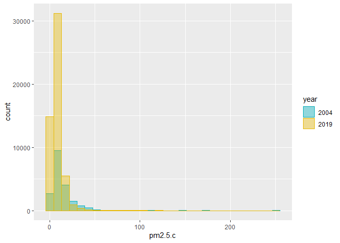
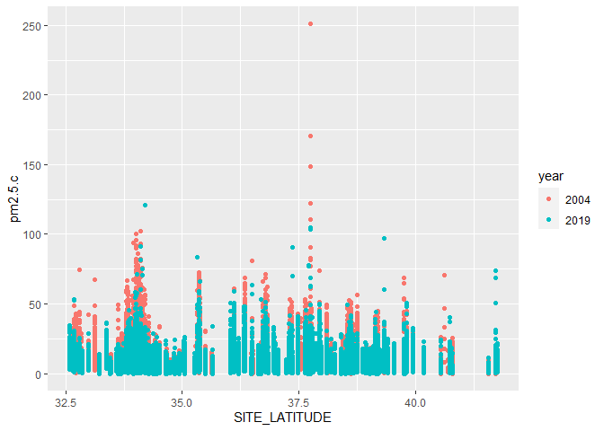
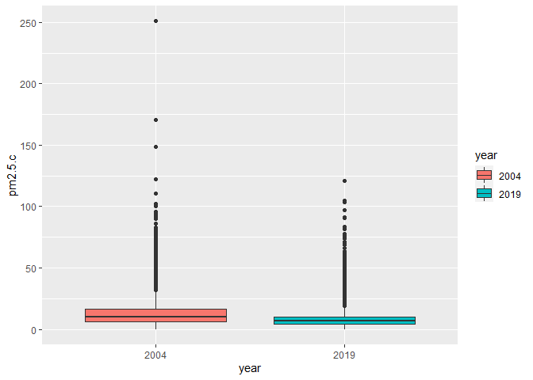
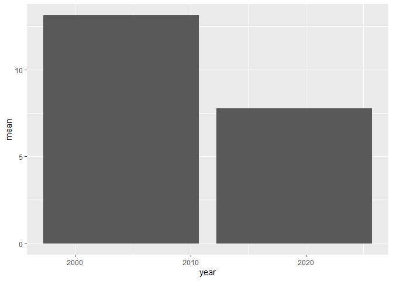
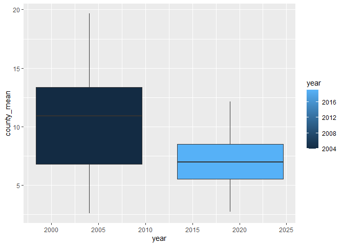
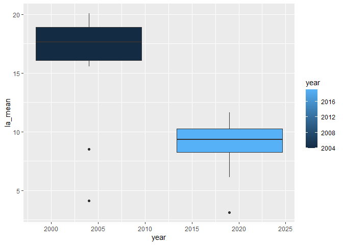

assinment 01
================
chen wei
2022-09-23

## R Markdown

``` r
library(lubridate)
```

    ## 
    ## 载入程辑包：'lubridate'

    ## The following objects are masked from 'package:base':
    ## 
    ##     date, intersect, setdiff, union

``` r
library(tidyverse)
```

    ## ── Attaching packages
    ## ───────────────────────────────────────
    ## tidyverse 1.3.2 ──

    ## ✔ ggplot2 3.3.6     ✔ purrr   0.3.4
    ## ✔ tibble  3.1.8     ✔ dplyr   1.0.9
    ## ✔ tidyr   1.2.0     ✔ stringr 1.4.1
    ## ✔ readr   2.1.2     ✔ forcats 0.5.2
    ## ── Conflicts ────────────────────────────────────────── tidyverse_conflicts() ──
    ## ✖ lubridate::as.difftime() masks base::as.difftime()
    ## ✖ lubridate::date()        masks base::date()
    ## ✖ dplyr::filter()          masks stats::filter()
    ## ✖ lubridate::intersect()   masks base::intersect()
    ## ✖ dplyr::lag()             masks stats::lag()
    ## ✖ lubridate::setdiff()     masks base::setdiff()
    ## ✖ lubridate::union()       masks base::union()

``` r
library(data.table)
```

    ## 
    ## 载入程辑包：'data.table'
    ## 
    ## The following objects are masked from 'package:dplyr':
    ## 
    ##     between, first, last
    ## 
    ## The following object is masked from 'package:purrr':
    ## 
    ##     transpose
    ## 
    ## The following objects are masked from 'package:lubridate':
    ## 
    ##     hour, isoweek, mday, minute, month, quarter, second, wday, week,
    ##     yday, year

## STEP 1-1.Read in the data

First download and then read in with data.

``` r
pm2.5_2019 <- data.table::fread("ad_viz_plotval_data-2019.csv")
pm2.5_2004 <- data.table::fread("ad_viz_plotval_data-2004.csv")
```

\##STEP1-2. Check the dimensions, headers, footers. How many columns,
rows are there?

``` r
dim(pm2.5_2004)
```

    ## [1] 19233    20

``` r
head(pm2.5_2004)
```

    ##          Date Source  Site ID POC Daily Mean PM2.5 Concentration    UNITS
    ## 1: 01/01/2004    AQS 60010007   1                           11.0 ug/m3 LC
    ## 2: 01/02/2004    AQS 60010007   1                           12.2 ug/m3 LC
    ## 3: 01/03/2004    AQS 60010007   1                           16.5 ug/m3 LC
    ## 4: 01/04/2004    AQS 60010007   1                           18.1 ug/m3 LC
    ## 5: 01/05/2004    AQS 60010007   1                           11.5 ug/m3 LC
    ## 6: 01/06/2004    AQS 60010007   1                           32.5 ug/m3 LC
    ##    DAILY_AQI_VALUE Site Name DAILY_OBS_COUNT PERCENT_COMPLETE
    ## 1:              46 Livermore               1              100
    ## 2:              51 Livermore               1              100
    ## 3:              60 Livermore               1              100
    ## 4:              64 Livermore               1              100
    ## 5:              48 Livermore               1              100
    ## 6:              94 Livermore               1              100
    ##    AQS_PARAMETER_CODE                     AQS_PARAMETER_DESC CBSA_CODE
    ## 1:              88502 Acceptable PM2.5 AQI & Speciation Mass     41860
    ## 2:              88502 Acceptable PM2.5 AQI & Speciation Mass     41860
    ## 3:              88502 Acceptable PM2.5 AQI & Speciation Mass     41860
    ## 4:              88101               PM2.5 - Local Conditions     41860
    ## 5:              88502 Acceptable PM2.5 AQI & Speciation Mass     41860
    ## 6:              88502 Acceptable PM2.5 AQI & Speciation Mass     41860
    ##                            CBSA_NAME STATE_CODE      STATE COUNTY_CODE  COUNTY
    ## 1: San Francisco-Oakland-Hayward, CA          6 California           1 Alameda
    ## 2: San Francisco-Oakland-Hayward, CA          6 California           1 Alameda
    ## 3: San Francisco-Oakland-Hayward, CA          6 California           1 Alameda
    ## 4: San Francisco-Oakland-Hayward, CA          6 California           1 Alameda
    ## 5: San Francisco-Oakland-Hayward, CA          6 California           1 Alameda
    ## 6: San Francisco-Oakland-Hayward, CA          6 California           1 Alameda
    ##    SITE_LATITUDE SITE_LONGITUDE
    ## 1:      37.68753      -121.7842
    ## 2:      37.68753      -121.7842
    ## 3:      37.68753      -121.7842
    ## 4:      37.68753      -121.7842
    ## 5:      37.68753      -121.7842
    ## 6:      37.68753      -121.7842

``` r
tail(pm2.5_2004)
```

    ##          Date Source  Site ID POC Daily Mean PM2.5 Concentration    UNITS
    ## 1: 12/14/2004    AQS 61131003   1                             11 ug/m3 LC
    ## 2: 12/17/2004    AQS 61131003   1                             16 ug/m3 LC
    ## 3: 12/20/2004    AQS 61131003   1                             17 ug/m3 LC
    ## 4: 12/23/2004    AQS 61131003   1                              9 ug/m3 LC
    ## 5: 12/26/2004    AQS 61131003   1                             24 ug/m3 LC
    ## 6: 12/29/2004    AQS 61131003   1                              9 ug/m3 LC
    ##    DAILY_AQI_VALUE            Site Name DAILY_OBS_COUNT PERCENT_COMPLETE
    ## 1:              46 Woodland-Gibson Road               1              100
    ## 2:              59 Woodland-Gibson Road               1              100
    ## 3:              61 Woodland-Gibson Road               1              100
    ## 4:              38 Woodland-Gibson Road               1              100
    ## 5:              76 Woodland-Gibson Road               1              100
    ## 6:              38 Woodland-Gibson Road               1              100
    ##    AQS_PARAMETER_CODE       AQS_PARAMETER_DESC CBSA_CODE
    ## 1:              88101 PM2.5 - Local Conditions     40900
    ## 2:              88101 PM2.5 - Local Conditions     40900
    ## 3:              88101 PM2.5 - Local Conditions     40900
    ## 4:              88101 PM2.5 - Local Conditions     40900
    ## 5:              88101 PM2.5 - Local Conditions     40900
    ## 6:              88101 PM2.5 - Local Conditions     40900
    ##                                  CBSA_NAME STATE_CODE      STATE COUNTY_CODE
    ## 1: Sacramento--Roseville--Arden-Arcade, CA          6 California         113
    ## 2: Sacramento--Roseville--Arden-Arcade, CA          6 California         113
    ## 3: Sacramento--Roseville--Arden-Arcade, CA          6 California         113
    ## 4: Sacramento--Roseville--Arden-Arcade, CA          6 California         113
    ## 5: Sacramento--Roseville--Arden-Arcade, CA          6 California         113
    ## 6: Sacramento--Roseville--Arden-Arcade, CA          6 California         113
    ##    COUNTY SITE_LATITUDE SITE_LONGITUDE
    ## 1:   Yolo      38.66121      -121.7327
    ## 2:   Yolo      38.66121      -121.7327
    ## 3:   Yolo      38.66121      -121.7327
    ## 4:   Yolo      38.66121      -121.7327
    ## 5:   Yolo      38.66121      -121.7327
    ## 6:   Yolo      38.66121      -121.7327

``` r
dim(pm2.5_2019)
```

    ## [1] 53156    20

``` r
head(pm2.5_2019)
```

    ##          Date Source  Site ID POC Daily Mean PM2.5 Concentration    UNITS
    ## 1: 01/01/2019    AQS 60010007   3                            5.7 ug/m3 LC
    ## 2: 01/02/2019    AQS 60010007   3                           11.9 ug/m3 LC
    ## 3: 01/03/2019    AQS 60010007   3                           20.1 ug/m3 LC
    ## 4: 01/04/2019    AQS 60010007   3                           28.8 ug/m3 LC
    ## 5: 01/05/2019    AQS 60010007   3                           11.2 ug/m3 LC
    ## 6: 01/06/2019    AQS 60010007   3                            2.7 ug/m3 LC
    ##    DAILY_AQI_VALUE Site Name DAILY_OBS_COUNT PERCENT_COMPLETE
    ## 1:              24 Livermore               1              100
    ## 2:              50 Livermore               1              100
    ## 3:              68 Livermore               1              100
    ## 4:              86 Livermore               1              100
    ## 5:              47 Livermore               1              100
    ## 6:              11 Livermore               1              100
    ##    AQS_PARAMETER_CODE       AQS_PARAMETER_DESC CBSA_CODE
    ## 1:              88101 PM2.5 - Local Conditions     41860
    ## 2:              88101 PM2.5 - Local Conditions     41860
    ## 3:              88101 PM2.5 - Local Conditions     41860
    ## 4:              88101 PM2.5 - Local Conditions     41860
    ## 5:              88101 PM2.5 - Local Conditions     41860
    ## 6:              88101 PM2.5 - Local Conditions     41860
    ##                            CBSA_NAME STATE_CODE      STATE COUNTY_CODE  COUNTY
    ## 1: San Francisco-Oakland-Hayward, CA          6 California           1 Alameda
    ## 2: San Francisco-Oakland-Hayward, CA          6 California           1 Alameda
    ## 3: San Francisco-Oakland-Hayward, CA          6 California           1 Alameda
    ## 4: San Francisco-Oakland-Hayward, CA          6 California           1 Alameda
    ## 5: San Francisco-Oakland-Hayward, CA          6 California           1 Alameda
    ## 6: San Francisco-Oakland-Hayward, CA          6 California           1 Alameda
    ##    SITE_LATITUDE SITE_LONGITUDE
    ## 1:      37.68753      -121.7842
    ## 2:      37.68753      -121.7842
    ## 3:      37.68753      -121.7842
    ## 4:      37.68753      -121.7842
    ## 5:      37.68753      -121.7842
    ## 6:      37.68753      -121.7842

``` r
tail(pm2.5_2019)
```

    ##          Date Source  Site ID POC Daily Mean PM2.5 Concentration    UNITS
    ## 1: 11/11/2019    AQS 61131003   1                           13.5 ug/m3 LC
    ## 2: 11/17/2019    AQS 61131003   1                           18.1 ug/m3 LC
    ## 3: 11/29/2019    AQS 61131003   1                           12.5 ug/m3 LC
    ## 4: 12/17/2019    AQS 61131003   1                           23.8 ug/m3 LC
    ## 5: 12/23/2019    AQS 61131003   1                            1.0 ug/m3 LC
    ## 6: 12/29/2019    AQS 61131003   1                            9.1 ug/m3 LC
    ##    DAILY_AQI_VALUE            Site Name DAILY_OBS_COUNT PERCENT_COMPLETE
    ## 1:              54 Woodland-Gibson Road               1              100
    ## 2:              64 Woodland-Gibson Road               1              100
    ## 3:              52 Woodland-Gibson Road               1              100
    ## 4:              76 Woodland-Gibson Road               1              100
    ## 5:               4 Woodland-Gibson Road               1              100
    ## 6:              38 Woodland-Gibson Road               1              100
    ##    AQS_PARAMETER_CODE       AQS_PARAMETER_DESC CBSA_CODE
    ## 1:              88101 PM2.5 - Local Conditions     40900
    ## 2:              88101 PM2.5 - Local Conditions     40900
    ## 3:              88101 PM2.5 - Local Conditions     40900
    ## 4:              88101 PM2.5 - Local Conditions     40900
    ## 5:              88101 PM2.5 - Local Conditions     40900
    ## 6:              88101 PM2.5 - Local Conditions     40900
    ##                                  CBSA_NAME STATE_CODE      STATE COUNTY_CODE
    ## 1: Sacramento--Roseville--Arden-Arcade, CA          6 California         113
    ## 2: Sacramento--Roseville--Arden-Arcade, CA          6 California         113
    ## 3: Sacramento--Roseville--Arden-Arcade, CA          6 California         113
    ## 4: Sacramento--Roseville--Arden-Arcade, CA          6 California         113
    ## 5: Sacramento--Roseville--Arden-Arcade, CA          6 California         113
    ## 6: Sacramento--Roseville--Arden-Arcade, CA          6 California         113
    ##    COUNTY SITE_LATITUDE SITE_LONGITUDE
    ## 1:   Yolo      38.66121      -121.7327
    ## 2:   Yolo      38.66121      -121.7327
    ## 3:   Yolo      38.66121      -121.7327
    ## 4:   Yolo      38.66121      -121.7327
    ## 5:   Yolo      38.66121      -121.7327
    ## 6:   Yolo      38.66121      -121.7327

also, we take a look of the varaible

``` r
str(pm2.5_2004)
```

    ## Classes 'data.table' and 'data.frame':   19233 obs. of  20 variables:
    ##  $ Date                          : chr  "01/01/2004" "01/02/2004" "01/03/2004" "01/04/2004" ...
    ##  $ Source                        : chr  "AQS" "AQS" "AQS" "AQS" ...
    ##  $ Site ID                       : int  60010007 60010007 60010007 60010007 60010007 60010007 60010007 60010007 60010007 60010007 ...
    ##  $ POC                           : int  1 1 1 1 1 1 1 1 1 1 ...
    ##  $ Daily Mean PM2.5 Concentration: num  11 12.2 16.5 18.1 11.5 32.5 14 29.9 21 16.9 ...
    ##  $ UNITS                         : chr  "ug/m3 LC" "ug/m3 LC" "ug/m3 LC" "ug/m3 LC" ...
    ##  $ DAILY_AQI_VALUE               : int  46 51 60 64 48 94 55 88 70 61 ...
    ##  $ Site Name                     : chr  "Livermore" "Livermore" "Livermore" "Livermore" ...
    ##  $ DAILY_OBS_COUNT               : int  1 1 1 1 1 1 1 1 1 1 ...
    ##  $ PERCENT_COMPLETE              : num  100 100 100 100 100 100 100 100 100 100 ...
    ##  $ AQS_PARAMETER_CODE            : int  88502 88502 88502 88101 88502 88502 88101 88502 88502 88502 ...
    ##  $ AQS_PARAMETER_DESC            : chr  "Acceptable PM2.5 AQI & Speciation Mass" "Acceptable PM2.5 AQI & Speciation Mass" "Acceptable PM2.5 AQI & Speciation Mass" "PM2.5 - Local Conditions" ...
    ##  $ CBSA_CODE                     : int  41860 41860 41860 41860 41860 41860 41860 41860 41860 41860 ...
    ##  $ CBSA_NAME                     : chr  "San Francisco-Oakland-Hayward, CA" "San Francisco-Oakland-Hayward, CA" "San Francisco-Oakland-Hayward, CA" "San Francisco-Oakland-Hayward, CA" ...
    ##  $ STATE_CODE                    : int  6 6 6 6 6 6 6 6 6 6 ...
    ##  $ STATE                         : chr  "California" "California" "California" "California" ...
    ##  $ COUNTY_CODE                   : int  1 1 1 1 1 1 1 1 1 1 ...
    ##  $ COUNTY                        : chr  "Alameda" "Alameda" "Alameda" "Alameda" ...
    ##  $ SITE_LATITUDE                 : num  37.7 37.7 37.7 37.7 37.7 ...
    ##  $ SITE_LONGITUDE                : num  -122 -122 -122 -122 -122 ...
    ##  - attr(*, ".internal.selfref")=<externalptr>

``` r
str(pm2.5_2019)
```

    ## Classes 'data.table' and 'data.frame':   53156 obs. of  20 variables:
    ##  $ Date                          : chr  "01/01/2019" "01/02/2019" "01/03/2019" "01/04/2019" ...
    ##  $ Source                        : chr  "AQS" "AQS" "AQS" "AQS" ...
    ##  $ Site ID                       : int  60010007 60010007 60010007 60010007 60010007 60010007 60010007 60010007 60010007 60010007 ...
    ##  $ POC                           : int  3 3 3 3 3 3 3 3 3 3 ...
    ##  $ Daily Mean PM2.5 Concentration: num  5.7 11.9 20.1 28.8 11.2 2.7 2.8 7 3.1 7.1 ...
    ##  $ UNITS                         : chr  "ug/m3 LC" "ug/m3 LC" "ug/m3 LC" "ug/m3 LC" ...
    ##  $ DAILY_AQI_VALUE               : int  24 50 68 86 47 11 12 29 13 30 ...
    ##  $ Site Name                     : chr  "Livermore" "Livermore" "Livermore" "Livermore" ...
    ##  $ DAILY_OBS_COUNT               : int  1 1 1 1 1 1 1 1 1 1 ...
    ##  $ PERCENT_COMPLETE              : num  100 100 100 100 100 100 100 100 100 100 ...
    ##  $ AQS_PARAMETER_CODE            : int  88101 88101 88101 88101 88101 88101 88101 88101 88101 88101 ...
    ##  $ AQS_PARAMETER_DESC            : chr  "PM2.5 - Local Conditions" "PM2.5 - Local Conditions" "PM2.5 - Local Conditions" "PM2.5 - Local Conditions" ...
    ##  $ CBSA_CODE                     : int  41860 41860 41860 41860 41860 41860 41860 41860 41860 41860 ...
    ##  $ CBSA_NAME                     : chr  "San Francisco-Oakland-Hayward, CA" "San Francisco-Oakland-Hayward, CA" "San Francisco-Oakland-Hayward, CA" "San Francisco-Oakland-Hayward, CA" ...
    ##  $ STATE_CODE                    : int  6 6 6 6 6 6 6 6 6 6 ...
    ##  $ STATE                         : chr  "California" "California" "California" "California" ...
    ##  $ COUNTY_CODE                   : int  1 1 1 1 1 1 1 1 1 1 ...
    ##  $ COUNTY                        : chr  "Alameda" "Alameda" "Alameda" "Alameda" ...
    ##  $ SITE_LATITUDE                 : num  37.7 37.7 37.7 37.7 37.7 ...
    ##  $ SITE_LONGITUDE                : num  -122 -122 -122 -122 -122 ...
    ##  - attr(*, ".internal.selfref")=<externalptr>

\##STEP 1-3 Check for any data issues, particularly in the key variable
we are analyzing.

``` r
table(pm2.5_2004$Date)
```

    ## 
    ## 01/01/2004 01/02/2004 01/03/2004 01/04/2004 01/05/2004 01/06/2004 01/07/2004 
    ##         80         23         22        108         19         22         89 
    ## 01/08/2004 01/09/2004 01/10/2004 01/11/2004 01/12/2004 01/13/2004 01/14/2004 
    ##         26         25        128         25         24         96         23 
    ## 01/15/2004 01/16/2004 01/17/2004 01/18/2004 01/19/2004 01/20/2004 01/21/2004 
    ##         23        116         25         26         80         20         22 
    ## 01/22/2004 01/23/2004 01/24/2004 01/25/2004 01/26/2004 01/27/2004 01/28/2004 
    ##        123         23         24         88         23         24        122 
    ## 01/29/2004 01/30/2004 01/31/2004 02/01/2004 02/02/2004 02/03/2004 02/04/2004 
    ##         28         26         90         24         23        121         20 
    ## 02/05/2004 02/06/2004 02/07/2004 02/08/2004 02/09/2004 02/10/2004 02/11/2004 
    ##         23         82         25         24        120         21         25 
    ## 02/12/2004 02/13/2004 02/14/2004 02/15/2004 02/16/2004 02/17/2004 02/18/2004 
    ##         86         23         25        120         22         21         83 
    ## 02/19/2004 02/20/2004 02/21/2004 02/22/2004 02/23/2004 02/24/2004 02/25/2004 
    ##         21         23        122         24         23         91         22 
    ## 02/26/2004 02/27/2004 02/28/2004 02/29/2004 03/01/2004 03/02/2004 03/03/2004 
    ##         24        115         26         25         81         23         24 
    ## 03/04/2004 03/05/2004 03/06/2004 03/07/2004 03/08/2004 03/09/2004 03/10/2004 
    ##        128         25         26         91         24         24        117 
    ## 03/11/2004 03/12/2004 03/13/2004 03/14/2004 03/15/2004 03/16/2004 03/17/2004 
    ##         21         21         86         24         22        122         21 
    ## 03/18/2004 03/19/2004 03/20/2004 03/21/2004 03/22/2004 03/23/2004 03/24/2004 
    ##         25         92         25         25        124         23         24 
    ## 03/25/2004 03/26/2004 03/27/2004 03/28/2004 03/29/2004 03/30/2004 03/31/2004 
    ##         91         24         23        127         23         22         86 
    ## 04/01/2004 04/02/2004 04/03/2004 04/04/2004 04/05/2004 04/06/2004 04/07/2004 
    ##         19         20        123         18         16         84         19 
    ## 04/08/2004 04/09/2004 04/10/2004 04/11/2004 04/12/2004 04/13/2004 04/14/2004 
    ##         21        117         21         21         71         18         17 
    ## 04/15/2004 04/16/2004 04/17/2004 04/18/2004 04/19/2004 04/20/2004 04/21/2004 
    ##        123         17         18         79         17         19        125 
    ## 04/22/2004 04/23/2004 04/24/2004 04/25/2004 04/26/2004 04/27/2004 04/28/2004 
    ##         20         19         82         20         20        126         21 
    ## 04/29/2004 04/30/2004 05/01/2004 05/02/2004 05/03/2004 05/04/2004 05/05/2004 
    ##         20         83         19         20        123         17         18 
    ## 05/06/2004 05/07/2004 05/08/2004 05/09/2004 05/10/2004 05/11/2004 05/12/2004 
    ##         82         19         19        126         18         19         85 
    ## 05/13/2004 05/14/2004 05/15/2004 05/16/2004 05/17/2004 05/18/2004 05/19/2004 
    ##         21         20        125         20         18         86         18 
    ## 05/20/2004 05/21/2004 05/22/2004 05/23/2004 05/24/2004 05/25/2004 05/26/2004 
    ##         17        120         22         20         74         20         23 
    ## 05/27/2004 05/28/2004 05/29/2004 05/30/2004 05/31/2004 06/01/2004 06/02/2004 
    ##        125         20         22         82         22         21        130 
    ## 06/03/2004 06/04/2004 06/05/2004 06/06/2004 06/07/2004 06/08/2004 06/09/2004 
    ##         22         21         88         22         21        127         22 
    ## 06/10/2004 06/11/2004 06/12/2004 06/13/2004 06/14/2004 06/15/2004 06/16/2004 
    ##         21         82         22         22        113         20         26 
    ## 06/17/2004 06/18/2004 06/19/2004 06/20/2004 06/21/2004 06/22/2004 06/23/2004 
    ##         91         25         28        133         26         26         92 
    ## 06/24/2004 06/25/2004 06/26/2004 06/27/2004 06/28/2004 06/29/2004 06/30/2004 
    ##         31         27        138         28         28         95         31 
    ## 07/01/2004 07/02/2004 07/03/2004 07/04/2004 07/05/2004 07/06/2004 07/07/2004 
    ##         27        124         29         27         87         26         28 
    ## 07/08/2004 07/09/2004 07/10/2004 07/11/2004 07/12/2004 07/13/2004 07/14/2004 
    ##        130         25         26         93         23         26        130 
    ## 07/15/2004 07/16/2004 07/17/2004 07/18/2004 07/19/2004 07/20/2004 07/21/2004 
    ##         29         26         91         25         25        129         28 
    ## 07/22/2004 07/23/2004 07/24/2004 07/25/2004 07/26/2004 07/27/2004 07/28/2004 
    ##         26         85         29         27        128         23         24 
    ## 07/29/2004 07/30/2004 07/31/2004 08/01/2004 08/02/2004 08/03/2004 08/04/2004 
    ##         80         22         23        121         22         26         87 
    ## 08/05/2004 08/06/2004 08/07/2004 08/08/2004 08/09/2004 08/10/2004 08/11/2004 
    ##         25         25        128         24         24         89         25 
    ## 08/12/2004 08/13/2004 08/14/2004 08/15/2004 08/16/2004 08/17/2004 08/18/2004 
    ##         23        114         24         25         83         24         25 
    ## 08/19/2004 08/20/2004 08/21/2004 08/22/2004 08/23/2004 08/24/2004 08/25/2004 
    ##        124         26         27         86         24         26        131 
    ## 08/26/2004 08/27/2004 08/28/2004 08/29/2004 08/30/2004 08/31/2004 09/01/2004 
    ##         24         27         87         28         28        122         27 
    ## 09/02/2004 09/03/2004 09/04/2004 09/05/2004 09/06/2004 09/07/2004 09/08/2004 
    ##         26         89         27         27        128         25         27 
    ## 09/09/2004 09/10/2004 09/11/2004 09/12/2004 09/13/2004 09/14/2004 09/15/2004 
    ##         84         25         27        134         28         27         89 
    ## 09/16/2004 09/17/2004 09/18/2004 09/19/2004 09/20/2004 09/21/2004 09/22/2004 
    ##         28         26        136         27         26         93         26 
    ## 09/23/2004 09/24/2004 09/25/2004 09/26/2004 09/27/2004 09/28/2004 09/29/2004 
    ##         27        126         26         27         86         25         30 
    ## 09/30/2004 10/01/2004 10/02/2004 10/03/2004 10/04/2004 10/05/2004 10/06/2004 
    ##        126         29         29         98         31         30        129 
    ## 10/07/2004 10/08/2004 10/09/2004 10/10/2004 10/11/2004 10/12/2004 10/13/2004 
    ##         34         33        100         32         31        129         32 
    ## 10/14/2004 10/15/2004 10/16/2004 10/17/2004 10/18/2004 10/19/2004 10/20/2004 
    ##         33         99         34         32        124         32         31 
    ## 10/21/2004 10/22/2004 10/23/2004 10/24/2004 10/25/2004 10/26/2004 10/27/2004 
    ##         95         29         30        127         29         31         90 
    ## 10/28/2004 10/29/2004 10/30/2004 10/31/2004 11/01/2004 11/02/2004 11/03/2004 
    ##         32         30        133         31         28         91         33 
    ## 11/04/2004 11/05/2004 11/06/2004 11/07/2004 11/08/2004 11/09/2004 11/10/2004 
    ##         30        117         34         30         95         31         31 
    ## 11/11/2004 11/12/2004 11/13/2004 11/14/2004 11/15/2004 11/16/2004 11/17/2004 
    ##        136         31         31         99         31         33        127 
    ## 11/18/2004 11/19/2004 11/20/2004 11/21/2004 11/22/2004 11/23/2004 11/24/2004 
    ##         32         33        102         32         32        129         31 
    ## 11/25/2004 11/26/2004 11/27/2004 11/28/2004 11/29/2004 11/30/2004 12/01/2004 
    ##         33         99         31         30        121         30         31 
    ## 12/02/2004 12/03/2004 12/04/2004 12/05/2004 12/06/2004 12/07/2004 12/08/2004 
    ##         92         29         34        125         31         33         91 
    ## 12/09/2004 12/10/2004 12/11/2004 12/12/2004 12/13/2004 12/14/2004 12/15/2004 
    ##         34         32        131         30         30        106         31 
    ## 12/16/2004 12/17/2004 12/18/2004 12/19/2004 12/20/2004 12/21/2004 12/22/2004 
    ##         30        115         33         31         95         32         29 
    ## 12/23/2004 12/24/2004 12/25/2004 12/26/2004 12/27/2004 12/28/2004 12/29/2004 
    ##        130         30         33         90         31         32        129 
    ## 12/30/2004 12/31/2004 
    ##         32         35

``` r
table(pm2.5_2004$`Daily Mean PM2.5 Concentration`)
```

    ## 
    ##  -0.1     0   0.1   0.2   0.3   0.4   0.5   0.6   0.7   0.8   0.9     1   1.1 
    ##     1    11    14    20    27    32    35    41    43    40    31    94    39 
    ##   1.2   1.3   1.4   1.5   1.6   1.7   1.8   1.9     2   2.1   2.2   2.3   2.4 
    ##    41    37    32    32    44    36    38    35   112    59    44    41    46 
    ##   2.5   2.6   2.7   2.8   2.9     3   3.1   3.2   3.3   3.4   3.5   3.6   3.7 
    ##    51    61    50    59    65   199    60    63    88    56    74    81    77 
    ##   3.8   3.9     4   4.1   4.2   4.3   4.4   4.5   4.6   4.7   4.8   4.9     5 
    ##    71    59   366    68    73    71    83    90    62    77    87    82   428 
    ##   5.1   5.2   5.3   5.4   5.5   5.6   5.7   5.8   5.9     6   6.1   6.2   6.3 
    ##    82    93    95    81    98    73    95    88   105   431    84    96    95 
    ##   6.4   6.5   6.6   6.7   6.8   6.9     7   7.1   7.2   7.3   7.4   7.5   7.6 
    ##    90   103    64    97    82    90   409    86   102    78    91   101    64 
    ##   7.7   7.8   7.9     8   8.1   8.2   8.3   8.4   8.5   8.6   8.7   8.8   8.9 
    ##   121   102    82   399    71   110    87    98   109    89    95    95    89 
    ##     9   9.1   9.2   9.3   9.4   9.5   9.6   9.7   9.8   9.9    10  10.1  10.2 
    ##   357    81   107    85    86    98    74   106    90    74   276    98   102 
    ##  10.3  10.4  10.5  10.6  10.7  10.8  10.9    11  11.1  11.2  11.3  11.4  11.5 
    ##    86    68   107    75    94    88    93   269    65    89    94    72    86 
    ##  11.6  11.7  11.8  11.9    12  12.1  12.2  12.3  12.4  12.5  12.6  12.7  12.8 
    ##    74    74    72    61   229    72    75    71    78    73    83    66    72 
    ##  12.9    13  13.1  13.2  13.3  13.4  13.5  13.6  13.7  13.8  13.9    14  14.1 
    ##    56   167    66    73    62    56    71    67    58    59    50   138    66 
    ##  14.2  14.3  14.4  14.5  14.6  14.7  14.8  14.9    15  15.1  15.2  15.3  15.4 
    ##    63    56    51    47    53    68    50    57   135    49    60    57    47 
    ##  15.5  15.6  15.7  15.8  15.9    16  16.1  16.2  16.3  16.4  16.5  16.6  16.7 
    ##    53    44    49    43    54   125    36    50    49    49    49    41    38 
    ##  16.8  16.9    17  17.1  17.2  17.3  17.4  17.5  17.6  17.7  17.8  17.9    18 
    ##    47    32    95    38    37    32    47    42    34    41    39    24    87 
    ##  18.1  18.2  18.3  18.4  18.5  18.6  18.7  18.8  18.9    19  19.1  19.2  19.3 
    ##    36    38    24    17    34    40    33    23    29    69    30    19    30 
    ##  19.4  19.5  19.6  19.7  19.8  19.9    20  20.1  20.2  20.3  20.4  20.5  20.6 
    ##    20    41    40    23    19    28    84    25    30    28    20    26    25 
    ##  20.7  20.8  20.9    21  21.1  21.2  21.3  21.4  21.5  21.6  21.7  21.8  21.9 
    ##    23    20    19    65    23    16    17    14    21    18    19    15    11 
    ##    22  22.1  22.2  22.3  22.4  22.5  22.6  22.7  22.8  22.9    23  23.1  23.2 
    ##    40    27    16    18    14    23    18    20    18    15    55    22    12 
    ##  23.3  23.4  23.5  23.6  23.7  23.8  23.9    24  24.1  24.2  24.3  24.4  24.5 
    ##    22    19    16    18    17    20    12    47    19    18    13     6    17 
    ##  24.6  24.7  24.8  24.9    25  25.1  25.2  25.3  25.4  25.5  25.6  25.7  25.8 
    ##    14    13    12    14    54    16    13    14    11    15    13    18     9 
    ##  25.9    26  26.1  26.2  26.3  26.4  26.5  26.6  26.7  26.8  26.9    27  27.1 
    ##    12    50    16     8    14    14    13    16    10     9    12    43    14 
    ##  27.2  27.3  27.4  27.5  27.6  27.7  27.8  27.9    28  28.1  28.2  28.3  28.4 
    ##    24     8     3    13     7     6    11     9    37    21    20    13    10 
    ##  28.5  28.6  28.7  28.8  28.9    29  29.1  29.2  29.3  29.4  29.5  29.6  29.7 
    ##    10    10     9     7    17    31    13    10    12     6    16    19    12 
    ##  29.8  29.9    30  30.1  30.2  30.3  30.4  30.5  30.6  30.7  30.8  30.9    31 
    ##    12    10    40    14    16    12     9    11    11    12    10     5    28 
    ##  31.1  31.2  31.3  31.4  31.5  31.7  31.8  31.9    32  32.1  32.2  32.3  32.4 
    ##     6    16     4    10     8     8    17     9    26     7    13    12     8 
    ##  32.5  32.6  32.7  32.8  32.9    33  33.1  33.2  33.3  33.4  33.5  33.6  33.7 
    ##    10     9     8    10    10    32     4     4    10    12    11     6    11 
    ##  33.8  33.9    34  34.1  34.2  34.3  34.4  34.5  34.6  34.7  34.8  34.9    35 
    ##     7     4    33     4     6     4    12     7     7     4     5     9    23 
    ##  35.1  35.2  35.3  35.4  35.5  35.6  35.7  35.8  35.9    36  36.1  36.2  36.3 
    ##     6    14     5     5     8     6     5     2     2    23     7     9     3 
    ##  36.4  36.5  36.6  36.7  36.8  36.9    37  37.1  37.2  37.3  37.4  37.5  37.6 
    ##     5     8     7     7     7     5    20     5     6     8    10     4     5 
    ##  37.7  37.8  37.9    38  38.1  38.2  38.3  38.4  38.5  38.6  38.7  38.8  38.9 
    ##     4     7     3    24     5     8     4     7     8     3     6     5     3 
    ##    39  39.1  39.2  39.3  39.4  39.5  39.6  39.7  39.8  39.9    40  40.1  40.2 
    ##    17     7     6     3     6     4     6     4     3     4     7     8     6 
    ##  40.3  40.4  40.5  40.6  40.7  40.8  40.9    41  41.1  41.2  41.3  41.4  41.5 
    ##     4     8    11     1     3     7     3    12     5     7     5     2     9 
    ##  41.6  41.7  41.8  41.9    42  42.1  42.2  42.3  42.4  42.5  42.6  42.7  42.9 
    ##     3     5     3     5    10     5     6     6     5     4     5     5     8 
    ##    43  43.1  43.2  43.3  43.4  43.5  43.6  43.7  43.8  43.9    44  44.1  44.2 
    ##    11     5     6     6     7     3     2     5     1     3    12     5     3 
    ##  44.3  44.4  44.5  44.6  44.7  44.8  44.9    45  45.1  45.2  45.3  45.4  45.5 
    ##     4     2     2     6     4     3     5     6     1     1     1     4     4 
    ##  45.7  45.8  45.9    46  46.1  46.2  46.3  46.4  46.5  46.6  46.7  46.8  46.9 
    ##     7     4     3     3     3     2     1     3     7     2     4     1     5 
    ##    47  47.1  47.2  47.3  47.5  47.6  47.7  47.8  47.9    48  48.1  48.2  48.3 
    ##     8     2     5     2     2     3     3     4     2     3     1     2     2 
    ##  48.5  48.6  48.7  48.9    49  49.2  49.3  49.4  49.5  49.6  49.7  49.9    50 
    ##     3     1     4     2     5     1     3     5     1     2     5     1     4 
    ##  50.1  50.2  50.4  50.5  50.6  50.8  50.9    51  51.2  51.4  51.5  51.7  51.8 
    ##     4     1     2     1     3     1     2     5     4     1     3     2     1 
    ##  51.9    52  52.1  52.2  52.4  52.5  52.7  52.8  52.9    53  53.1  53.2  53.3 
    ##     1     4     2     1     2     3     1     1     3     5     1     2     1 
    ##  53.5  53.7  53.8  53.9    54  54.2  54.3  54.4  54.6  54.8  54.9    55  55.1 
    ##     1     1     3     1     2     2     2     1     2     2     1     3     1 
    ##  55.2  55.3  55.5  55.6  55.7  55.8    56  56.1  56.2  56.3  56.4  56.8    57 
    ##     1     1     2     1     1     3     1     1     2     1     3     1     4 
    ##  57.2  57.3  57.4  57.9  58.1  58.4  58.7  58.9  59.1  59.2  59.3  59.4  59.5 
    ##     1     3     1     1     1     2     1     2     1     2     1     1     2 
    ##  59.7  59.9    60  60.1  60.3  60.4  60.5  60.7  60.8  60.9    61  61.2  61.5 
    ##     2     2     2     1     1     1     1     1     2     1     3     1     1 
    ##  61.7  61.8  62.5  62.6  62.7  63.1  63.4  63.9    64  64.9    65  65.3  65.4 
    ##     1     2     2     1     1     1     1     1     1     1     2     1     2 
    ##  66.1  66.3  66.6  67.1  67.3  67.4  68.2  68.6  68.7  68.9    69  69.3    70 
    ##     3     2     2     1     1     3     1     1     1     1     2     1     1 
    ##  70.6    71  71.4  72.4  72.8  73.6  73.7  74.2  74.5    75  75.6  76.8  77.1 
    ##     2     1     2     1     2     2     1     1     1     1     1     1     1 
    ##  77.5  79.8  80.9    81  81.4  81.6  81.9  82.3    83  86.1  90.2  90.7  90.9 
    ##     1     1     1     1     1     2     1     1     2     1     1     1     1 
    ##  91.7  93.4  93.8  95.7 100.4 102.1 110.4 122.5 148.4 170.4   251 
    ##     1     1     1     1     1     1     1     1     1     1     1

``` r
summary(pm2.5_2004$Date)
```

    ##    Length     Class      Mode 
    ##     19233 character character

``` r
summary(pm2.5_2004$`Daily Mean PM2.5 Concentration`)
```

    ##    Min. 1st Qu.  Median    Mean 3rd Qu.    Max. 
    ##   -0.10    6.00   10.10   13.13   16.30  251.00

``` r
table(pm2.5_2019$`Daily Mean PM2.5 Concentration`)
```

    ## 
    ##  -2.2    -2  -1.9  -1.8  -1.7  -1.6  -1.5  -1.4  -1.3  -1.2  -1.1    -1  -0.9 
    ##     1    12    16    11    12    12     8    11    10    16     9    12    10 
    ##  -0.8  -0.7  -0.6  -0.5  -0.4  -0.3  -0.2  -0.1     0   0.1   0.2   0.3   0.4 
    ##    11    15     9    15    13    24    29    26    70    39    69    84    82 
    ##   0.5   0.6   0.7   0.8   0.9     1   1.1   1.2   1.3   1.4   1.5   1.6   1.7 
    ##   126   136   160   143   162   357   185   214   206   226   295   236   332 
    ##   1.8   1.9     2   2.1   2.2   2.3   2.4   2.5   2.6   2.7   2.8   2.9     3 
    ##   272   287   449   271   413   364   307   479   385   474   395   401   561 
    ##   3.1   3.2   3.3   3.4   3.5   3.6   3.7   3.8   3.9     4   4.1   4.2   4.3 
    ##   404   525   458   401   587   460   589   453   471   719   466   601   508 
    ##   4.4   4.5   4.6   4.7   4.8   4.9     5   5.1   5.2   5.3   5.4   5.5   5.6 
    ##   490   620   523   619   506   479   725   472   601   506   491   597   487 
    ##   5.7   5.8   5.9     6   6.1   6.2   6.3   6.4   6.5   6.6   6.7   6.8   6.9 
    ##   598   495   452   578   443   536   462   451   577   396   548   428   429 
    ##     7   7.1   7.2   7.3   7.4   7.5   7.6   7.7   7.8   7.9     8   8.1   8.2 
    ##   542   374   448   410   418   489   400   487   389   372   485   336   407 
    ##   8.3   8.4   8.5   8.6   8.7   8.8   8.9     9   9.1   9.2   9.3   9.4   9.5 
    ##   369   308   454   320   390   328   307   431   293   388   309   308   389 
    ##   9.6   9.7   9.8   9.9    10  10.1  10.2  10.3  10.4  10.5  10.6  10.7  10.8 
    ##   255   343   296   254   339   231   316   269   253   306   232   253   243 
    ##  10.9    11  11.1  11.2  11.3  11.4  11.5  11.6  11.7  11.8  11.9    12  12.1 
    ##   208   252   223   260   187   202   232   195   227   154   140   232   137 
    ##  12.2  12.3  12.4  12.5  12.6  12.7  12.8  12.9    13  13.1  13.2  13.3  13.4 
    ##   178   155   172   179   142   169   121   135   169   132   152   138   110 
    ##  13.5  13.6  13.7  13.8  13.9    14  14.1  14.2  14.3  14.4  14.5  14.6  14.7 
    ##   158   126   141   100   118   132    82   128    83   110   106    86   107 
    ##  14.8  14.9    15  15.1  15.2  15.3  15.4  15.5  15.6  15.7  15.8  15.9    16 
    ##    90    82   126    86   114    67    91    88    72    87    73    68    70 
    ##  16.1  16.2  16.3  16.4  16.5  16.6  16.7  16.8  16.9    17  17.1  17.2  17.3 
    ##    73    75    51    55    68    60    60    54    38    74    52    54    36 
    ##  17.4  17.5  17.6  17.7  17.8  17.9    18  18.1  18.2  18.3  18.4  18.5  18.6 
    ##    40    54    40    51    42    43    34    42    46    38    31    52    41 
    ##  18.7  18.8  18.9    19  19.1  19.2  19.3  19.4  19.5  19.6  19.7  19.8  19.9 
    ##    36    35    34    36    31    34    35    40    43    32    28    27    31 
    ##    20  20.1  20.2  20.3  20.4  20.5  20.6  20.7  20.8  20.9    21  21.1  21.2 
    ##    41    28    28    18    26    24    21    39    29    21    40    20    26 
    ##  21.3  21.4  21.5  21.6  21.7  21.8  21.9    22  22.1  22.2  22.3  22.4  22.5 
    ##    16    22    21    11    14    17    10    33    21    20    14    16    24 
    ##  22.6  22.7  22.8  22.9    23  23.1  23.2  23.3  23.4  23.5  23.6  23.7  23.8 
    ##    20    12    16    11    20    14    18    17    19    20    11     5    12 
    ##  23.9    24  24.1  24.2  24.3  24.4  24.5  24.6  24.7  24.8  24.9    25  25.1 
    ##    16    12    12    12    10     9    11    15    19    11    10    11    10 
    ##  25.2  25.3  25.4  25.5  25.6  25.7  25.8  25.9    26  26.1  26.2  26.3  26.4 
    ##     6     5    11    15     3    11    10     6    11     9     8    10     9 
    ##  26.5  26.6  26.7  26.8  26.9    27  27.1  27.2  27.3  27.4  27.5  27.6  27.7 
    ##    11    10    10     9     5    12     6    11     8    14     4     8     6 
    ##  27.8  27.9    28  28.1  28.2  28.3  28.4  28.5  28.6  28.7  28.8  28.9    29 
    ##     9     2    15     9    10     8     3     9     6    10     5     5     6 
    ##  29.1  29.2  29.3  29.4  29.5  29.6  29.7  29.8  29.9    30  30.1  30.2  30.3 
    ##     6     6     7     6     8    10    11     7     7    11     2     4     3 
    ##  30.4  30.5  30.6  30.7  30.8  30.9    31  31.1  31.2  31.3  31.4  31.5  31.6 
    ##     4    13    12     8     7    10     7     9    10     5     6     8     5 
    ##  31.7  31.8  31.9    32  32.1  32.2  32.3  32.4  32.5  32.6  32.7  32.8  32.9 
    ##     7     2     4     3     3     5     4     3     5     3     8     7     5 
    ##    33  33.1  33.2  33.3  33.4  33.5  33.6  33.7  33.8  33.9    34  34.1  34.2 
    ##     3     8     8     2     4     6     2     4     5     4     1     3     5 
    ##  34.3  34.4  34.5  34.6  34.7  34.8  34.9    35  35.1  35.2  35.3  35.4  35.5 
    ##     1     4     4     4     3     5     2     1     4     1     3     3     4 
    ##  35.6  35.7  35.8  35.9    36  36.1  36.2  36.3  36.4  36.7  36.8  36.9    37 
    ##     3     2     2     3     3     2     5     6     7     2     2     3     1 
    ##  37.1  37.2  37.3  37.4  37.5  37.6  37.7  37.8  37.9    38  38.1  38.3  38.4 
    ##     7     3     1     1     3     1     1     3     3     1     2     1     2 
    ##  38.5  38.6  38.7  38.9    39  39.1  39.2  39.3  39.4  39.5  39.6  39.7  39.8 
    ##     2     3     1     2     4     2     3     1     1     5     2     3     1 
    ##  39.9    40  40.1  40.2  40.3  40.4  40.5  40.6  40.7  40.9    41  41.1  41.2 
    ##     2     2     3     2     4     1     1     1     3     5     1     4     2 
    ##  41.3  41.4  41.5  41.6  41.7  41.8  41.9  42.2  42.3  42.8  43.1  43.3  43.4 
    ##     2     3     1     2     1     1     1     1     1     1     2     1     3 
    ##  43.5  43.6    44  44.2  44.3  44.4  44.5  44.7  44.8  45.1  45.3  45.4  45.5 
    ##     1     1     1     2     2     1     1     1     1     1     1     1     1 
    ##  45.7  45.8    46  46.3  46.4  46.5  46.7  47.1  47.2  47.4  47.5  47.9    48 
    ##     1     1     1     1     4     1     3     3     1     1     1     1     1 
    ##  48.1  48.2  48.8    49  49.3  49.4  49.6  50.1  50.2  50.6  50.7  50.9  51.3 
    ##     1     1     1     1     1     2     1     1     1     2     2     2     1 
    ##  52.3  52.4    53  53.1  54.7  55.7    57  57.6  57.7  58.2  58.8  59.1  60.4 
    ##     1     1     2     2     1     1     1     2     1     1     1     1     1 
    ##  60.5  62.2  62.6  63.4  66.1  68.4  68.5  70.1  70.3  71.2  73.9  75.1  77.3 
    ##     1     1     1     1     1     1     1     1     1     1     1     1     1 
    ##  77.4  81.3  83.7  90.7  91.1  97.3 103.5 104.5 120.9 
    ##     1     1     1     1     1     1     1     1     1

``` r
summary(pm2.5_2019$Date)
```

    ##    Length     Class      Mode 
    ##     53156 character character

``` r
summary(pm2.5_2019$`Daily Mean PM2.5 Concentration`)
```

    ##    Min. 1st Qu.  Median    Mean 3rd Qu.    Max. 
    ##  -2.200   4.000   6.500   7.738   9.900 120.900

after checking the variable, there are some variable which is even
smaller than 0 , which does not make any sense. so we delete the
negative number from both dataset.

``` r
pm2.5_2019 <- pm2.5_2019[`Daily Mean PM2.5 Concentration`>=0] 
summary(pm2.5_2019$`Daily Mean PM2.5 Concentration`)
```

    ##    Min. 1st Qu.  Median    Mean 3rd Qu.    Max. 
    ##   0.000   4.000   6.500   7.784  10.000 120.900

``` r
pm2.5_2004 <- pm2.5_2004[`Daily Mean PM2.5 Concentration`>=0] 
summary(pm2.5_2004$`Daily Mean PM2.5 Concentration`)
```

    ##    Min. 1st Qu.  Median    Mean 3rd Qu.    Max. 
    ##    0.00    6.00   10.10   13.13   16.30  251.00

\#summary due to the summary of two dataset of different years, first,
we found out there are some negative number exist between 2 dataset,
which is impossible to have negative number in concentration number. So
removing negative number of concentration is necessary. Second,
che2004’s Daily mean of pm2.5 concentration has a bigger range, higher
median than the 2019 daily mean of pm2.5 concentration. which means that
the Dailly pm2.5 concentration decreased from 2004 to 2019. \##STEP
2.Combine the two years of data into one data frame. Use the Date
variable to create a new column for year, which will serve as an
identifier

``` r
total<-rbind(pm2.5_2004,pm2.5_2019)
```

``` r
total<-mutate(total,year=(rep(c(2004,2019),c(nrow(pm2.5_2004),nrow(pm2.5_2019)))))
total<-as.data.table(total)
```

\##STEP3.Create a basic map in leaflet() that shows the locations of the
sites (make sure to use different colors for each year). Summarize the
spatial distribution of the monitoring sites.

``` r
#generating a color palette
library(leaflet)
year.pal <- colorNumeric(c('darkgreen','goldenrod'), domain=total$year)
year.pal
```

    ## function (x) 
    ## {
    ##     if (length(x) == 0 || all(is.na(x))) {
    ##         return(pf(x))
    ##     }
    ##     if (is.null(rng)) 
    ##         rng <- range(x, na.rm = TRUE)
    ##     rescaled <- scales::rescale(x, from = rng)
    ##     if (any(rescaled < 0 | rescaled > 1, na.rm = TRUE)) 
    ##         warning("Some values were outside the color scale and will be treated as NA")
    ##     if (reverse) {
    ##         rescaled <- 1 - rescaled
    ##     }
    ##     pf(rescaled)
    ## }
    ## <bytecode: 0x0000025bb688df08>
    ## <environment: 0x0000025bb6895ff0>
    ## attr(,"colorType")
    ## [1] "numeric"
    ## attr(,"colorArgs")
    ## attr(,"colorArgs")$na.color
    ## [1] "#808080"

``` r
leaflet(total) %>%
  addProviderTiles('OpenStreetMap') %>% 
  addCircles(lat=~SITE_LATITUDE,lng=~SITE_LONGITUDE, 
         ,color=~year.pal(year),
               opacity=1, fillOpacity=1, radius=100)
```

<div id="htmlwidget-2d10e8598f8caaebd9ab" style="width:672px;height:480px;" class="leaflet html-widget"></div>
<script type="application/json" data-for="htmlwidget-2d10e8598f8caaebd9ab">{"x":{"options":{"crs":{"crsClass":"L.CRS.EPSG3857","code":null,"proj4def":null,"projectedBounds":null,"options":{}}},"calls":[{"method":"addProviderTiles","args":["OpenStreetMap",null,null,{"errorTileUrl":"","noWrap":false,"detectRetina":false}]},{"method":"addCircles","args":[[37.687526,37.687526,37.687526,37.687526,37.687526,37.687526,37.687526,37.687526,37.687526,37.687526,37.687526,37.687526,37.687526,37.687526,37.687526,37.687526,37.687526,37.687526,37.687526,37.687526,37.687526,37.687526,37.687526,37.687526,37.687526,37.687526,37.687526,37.687526,37.687526,37.687526,37.687526,37.687526,37.687526,37.687526,37.687526,37.687526,37.687526,37.687526,37.687526,37.687526,37.687526,37.687526,37.687526,37.687526,37.687526,37.687526,37.687526,37.687526,37.687526,37.687526,37.687526,37.687526,37.687526,37.687526,37.687526,37.687526,37.687526,37.687526,37.687526,37.687526,37.687526,37.687526,37.687526,37.687526,37.687526,37.687526,37.687526,37.687526,37.687526,37.687526,37.687526,37.687526,37.687526,37.687526,37.687526,37.687526,37.687526,37.687526,37.687526,37.687526,37.687526,37.687526,37.687526,37.687526,37.687526,37.687526,37.687526,37.687526,37.687526,37.687526,37.687526,37.687526,37.687526,37.687526,37.687526,37.687526,37.687526,37.687526,37.687526,37.687526,37.687526,37.687526,37.687526,37.687526,37.687526,37.687526,37.687526,37.687526,37.687526,37.687526,37.687526,37.687526,37.687526,37.687526,37.687526,37.687526,37.687526,37.687526,37.687526,37.687526,37.687526,37.687526,37.687526,37.687526,37.687526,37.687526,37.687526,37.687526,37.687526,37.687526,37.687526,37.687526,37.687526,37.687526,37.687526,37.687526,37.687526,37.687526,37.687526,37.687526,37.687526,37.687526,37.687526,37.687526,37.687526,37.687526,37.687526,37.687526,37.687526,37.687526,37.687526,37.687526,37.687526,37.687526,37.687526,37.687526,37.687526,37.687526,37.687526,37.687526,37.687526,37.687526,37.687526,37.687526,37.687526,37.687526,37.687526,37.687526,37.687526,37.687526,37.687526,37.687526,37.687526,37.687526,37.687526,37.687526,37.687526,37.687526,37.687526,37.687526,37.687526,37.687526,37.687526,37.687526,37.687526,37.687526,37.687526,37.687526,37.687526,37.687526,37.687526,37.687526,37.687526,37.687526,37.687526,37.687526,37.687526,37.687526,37.687526,37.687526,37.687526,37.687526,37.687526,37.687526,37.687526,37.687526,37.687526,37.687526,37.687526,37.687526,37.687526,37.687526,37.687526,37.687526,37.687526,37.687526,37.687526,37.687526,37.687526,37.687526,37.687526,37.687526,37.687526,37.687526,37.687526,37.687526,37.687526,37.687526,37.687526,37.687526,37.687526,37.687526,37.687526,37.687526,37.687526,37.687526,37.687526,37.687526,37.687526,37.687526,37.687526,37.687526,37.687526,37.687526,37.687526,37.687526,37.687526,37.687526,37.687526,37.687526,37.687526,37.687526,37.687526,37.687526,37.687526,37.687526,37.687526,37.687526,37.687526,37.687526,37.687526,37.687526,37.687526,37.687526,37.687526,37.687526,37.687526,37.687526,37.687526,37.687526,37.687526,37.687526,37.687526,37.687526,37.687526,37.687526,37.687526,37.687526,37.687526,37.687526,37.687526,37.687526,37.687526,37.687526,37.687526,37.687526,37.687526,37.687526,37.687526,37.687526,37.687526,37.687526,37.687526,37.687526,37.687526,37.687526,37.687526,37.687526,37.687526,37.687526,37.687526,37.687526,37.687526,37.687526,37.687526,37.687526,37.687526,37.687526,37.687526,37.687526,37.687526,37.687526,37.687526,37.687526,37.687526,37.687526,37.687526,37.687526,37.687526,37.687526,37.687526,37.687526,37.687526,37.687526,37.687526,37.687526,37.687526,37.687526,37.687526,37.687526,37.687526,37.687526,37.687526,37.687526,37.687526,37.687526,37.687526,37.687526,37.687526,37.687526,37.687526,37.687526,37.687526,37.687526,37.687526,37.687526,37.687526,37.687526,37.687526,37.687526,37.687526,37.687526,37.687526,37.687526,37.687526,37.687526,37.687526,37.687526,37.687526,37.687526,37.687526,37.687526,37.687526,37.687526,37.535833,37.535833,37.535833,37.535833,37.535833,37.535833,37.535833,37.535833,37.535833,37.535833,37.535833,37.535833,37.535833,37.535833,37.535833,37.535833,37.535833,37.535833,37.535833,37.535833,37.535833,37.535833,37.535833,37.535833,37.535833,37.535833,37.535833,37.535833,37.535833,37.535833,37.535833,37.535833,37.535833,37.535833,37.535833,37.535833,37.535833,37.535833,37.535833,37.535833,37.535833,37.535833,37.535833,37.535833,37.535833,37.535833,37.535833,37.535833,37.535833,37.535833,37.535833,37.535833,37.535833,37.535833,37.535833,37.535833,37.535833,37.535833,37.535833,37.535833,37.535833,37.535833,37.535833,37.535833,37.535833,37.535833,37.535833,37.535833,37.535833,37.535833,37.535833,37.535833,37.535833,37.535833,37.535833,37.535833,37.535833,37.535833,37.535833,37.535833,37.535833,37.535833,37.535833,37.535833,37.535833,37.535833,37.535833,37.535833,37.535833,37.535833,37.535833,37.535833,37.535833,37.535833,39.757371488392,39.757371488392,39.757371488392,39.757371488392,39.757371488392,39.757371488392,39.757371488392,39.757371488392,39.757371488392,39.757371488392,39.757371488392,39.757371488392,39.757371488392,39.757371488392,39.757371488392,39.757371488392,39.757371488392,39.757371488392,39.757371488392,39.757371488392,39.757371488392,39.757371488392,39.757371488392,39.757371488392,39.757371488392,39.757371488392,39.757371488392,39.757371488392,39.757371488392,39.757371488392,39.757371488392,39.757371488392,39.757371488392,39.757371488392,39.757371488392,39.757371488392,39.757371488392,39.757371488392,39.757371488392,39.757371488392,39.757371488392,39.757371488392,39.757371488392,39.757371488392,39.757371488392,39.757371488392,39.757371488392,39.757371488392,39.757371488392,39.757371488392,39.757371488392,39.757371488392,39.757371488392,39.757371488392,39.757371488392,39.757371488392,39.757371488392,39.757371488392,39.757371488392,39.757371488392,39.757371488392,39.757371488392,39.757371488392,39.757371488392,39.757371488392,39.757371488392,39.757371488392,39.757371488392,39.757371488392,39.757371488392,39.757371488392,39.757371488392,39.757371488392,39.757371488392,39.757371488392,39.757371488392,39.757371488392,39.757371488392,39.757371488392,39.757371488392,39.757371488392,39.757371488392,39.757371488392,39.757371488392,39.757371488392,39.757371488392,39.757371488392,39.757371488392,39.757371488392,39.757371488392,39.757371488392,39.757371488392,39.757371488392,39.757371488392,39.757371488392,39.757371488392,39.757371488392,39.757371488392,39.757371488392,39.757371488392,39.757371488392,39.757371488392,39.757371488392,39.757371488392,39.757371488392,39.757371488392,39.757371488392,39.757371488392,39.757371488392,39.757371488392,39.757371488392,39.757371488392,39.757371488392,39.757371488392,39.757371488392,39.757371488392,39.757371488392,39.757371488392,39.757371488392,39.757371488392,39.757371488392,39.757371488392,39.327563,39.327563,39.327563,39.327563,39.327563,39.327563,39.327563,39.327563,39.327563,39.327563,39.327563,39.327563,39.327563,39.327563,39.327563,39.327563,39.327563,39.327563,39.327563,39.327563,39.327563,39.327563,39.327563,39.327563,39.327563,39.327563,39.327563,39.327563,39.327563,39.327563,39.327563,39.327563,39.327563,39.327563,39.327563,39.327563,39.327563,39.327563,39.327563,39.327563,39.327563,39.327563,39.327563,39.327563,39.327563,39.327563,39.327563,39.327563,39.327563,39.327563,39.327563,39.327563,39.327563,39.327563,39.327563,39.327563,39.327563,39.327563,39.327563,39.327563,39.327563,39.327563,39.327563,39.327563,39.327563,39.327563,39.327563,39.327563,39.327563,39.327563,39.327563,39.327563,39.327563,39.327563,39.327563,39.327563,39.327563,39.327563,39.327563,39.327563,39.327563,39.327563,39.327563,39.327563,39.327563,39.327563,39.327563,39.327563,39.327563,39.327563,39.327563,39.327563,39.327563,39.327563,39.327563,39.327563,39.327563,39.327563,39.327563,39.327563,39.327563,39.327563,39.327563,39.327563,39.327563,39.327563,39.327563,39.327563,39.327563,39.327563,39.327563,39.327563,39.327563,39.327563,39.327563,39.327563,39.327563,39.327563,39.327563,39.327563,39.327563,39.327563,39.327563,39.327563,39.327563,39.327563,39.327563,39.327563,39.327563,39.327563,39.327563,39.327563,39.327563,39.327563,39.327563,39.327563,39.327563,39.327563,39.327563,39.327563,39.327563,39.327563,39.327563,39.327563,39.327563,39.327563,39.327563,39.327563,39.327563,39.327563,39.327563,39.327563,39.327563,39.327563,39.327563,39.327563,39.327563,39.327563,39.327563,39.327563,39.327563,39.327563,39.327563,39.327563,39.327563,39.327563,39.327563,39.327563,39.327563,39.327563,39.327563,39.327563,39.327563,39.327563,39.327563,39.327563,39.327563,39.327563,39.327563,39.327563,39.327563,39.327563,39.327563,39.327563,39.327563,39.327563,39.327563,39.327563,39.327563,39.327563,39.327563,39.327563,39.327563,39.327563,39.327563,39.327563,39.327563,39.327563,39.327563,39.327563,39.327563,39.327563,39.327563,39.327563,39.327563,39.327563,39.327563,39.327563,39.327563,39.327563,39.327563,39.327563,39.327563,39.327563,39.327563,39.327563,39.327563,39.327563,39.327563,39.327563,39.327563,39.327563,39.327563,39.327563,39.327563,39.327563,39.327563,39.327563,39.327563,39.327563,39.327563,39.327563,39.327563,39.327563,39.327563,39.327563,39.327563,39.327563,39.327563,39.327563,39.327563,39.327563,39.327563,39.327563,39.327563,39.327563,39.327563,39.327563,39.327563,39.327563,39.327563,39.327563,39.327563,39.327563,39.327563,39.327563,39.327563,39.327563,39.327563,39.327563,39.327563,39.327563,39.327563,39.327563,39.327563,39.327563,39.327563,39.327563,39.327563,39.327563,39.327563,39.327563,39.327563,39.327563,39.327563,39.327563,39.327563,39.327563,39.327563,39.327563,39.327563,39.327563,39.327563,39.327563,39.327563,39.327563,39.327563,39.327563,39.327563,39.327563,39.327563,39.327563,39.327563,39.327563,39.327563,39.327563,39.327563,39.327563,39.327563,39.327563,39.327563,39.327563,39.327563,39.327563,39.327563,39.327563,39.327563,39.327563,39.327563,39.327563,39.327563,39.327563,39.327563,39.327563,39.327563,39.327563,39.327563,39.327563,39.327563,39.327563,39.327563,39.327563,38.20185,38.20185,38.20185,38.20185,38.20185,38.20185,38.20185,38.20185,38.20185,38.20185,38.20185,38.20185,38.20185,38.20185,38.20185,38.20185,38.20185,38.20185,38.20185,38.20185,38.20185,38.20185,38.20185,38.20185,38.20185,38.20185,38.20185,38.20185,38.20185,38.20185,38.20185,38.20185,38.20185,38.20185,38.20185,38.20185,38.20185,38.20185,38.20185,38.20185,38.20185,38.20185,38.20185,38.20185,38.20185,38.20185,38.20185,38.20185,38.20185,38.20185,38.20185,38.20185,38.20185,38.20185,38.20185,38.20185,38.20185,38.20185,38.20185,38.20185,38.20185,39.18919,39.18919,39.18919,39.18919,39.18919,39.18919,39.18919,39.18919,39.18919,39.18919,39.18919,39.18919,39.18919,39.18919,39.18919,39.18919,39.18919,39.18919,39.18919,39.18919,39.18919,39.18919,39.18919,39.18919,39.18919,39.18919,39.18919,39.18919,39.18919,39.18919,39.18919,39.18919,39.18919,39.18919,39.18919,39.18919,39.18919,39.18919,39.18919,39.18919,39.18919,39.18919,39.18919,39.18919,39.18919,39.18919,39.18919,39.18919,39.18919,39.18919,39.18919,39.18919,39.18919,39.18919,39.18919,39.18919,39.18919,39.18919,39.18919,39.18919,39.18919,39.18919,39.18919,39.18919,39.18919,39.18919,39.18919,39.18919,39.18919,39.18919,39.18919,39.18919,39.18919,39.18919,39.18919,39.18919,39.18919,39.18919,39.18919,39.18919,39.18919,39.18919,39.18919,39.18919,39.18919,39.18919,39.18919,39.18919,39.18919,39.18919,39.18919,39.18919,39.18919,39.18919,39.18919,39.18919,39.18919,39.18919,39.18919,39.18919,39.18919,39.18919,39.18919,39.18919,39.18919,39.18919,39.18919,39.18919,39.18919,39.18919,39.18919,39.18919,39.18919,39.18919,39.18919,39.18919,39.18919,39.18919,39.18919,39.18919,39.18919,39.18919,39.18919,39.18919,39.18919,39.18919,39.18919,39.18919,39.18919,39.18919,39.18919,39.18919,39.18919,39.18919,39.18919,39.18919,39.18919,39.18919,39.18919,39.18919,39.18919,39.18919,39.18919,39.18919,39.18919,39.18919,39.18919,39.18919,39.18919,39.18919,39.18919,39.18919,39.18919,39.18919,39.18919,39.18919,39.18919,39.18919,39.18919,39.18919,39.18919,39.18919,39.18919,39.18919,39.18919,39.18919,39.18919,39.18919,39.18919,39.18919,39.18919,39.18919,39.18919,39.18919,39.18919,39.18919,39.18919,39.18919,39.18919,39.18919,39.18919,39.18919,39.18919,39.18919,39.18919,39.18919,39.18919,39.18919,39.18919,39.18919,39.18919,39.18919,39.18919,39.18919,39.18919,39.18919,39.18919,39.18919,39.18919,39.18919,39.18919,37.936013,37.936013,37.936013,37.936013,37.936013,37.936013,37.936013,37.936013,37.936013,37.936013,37.936013,37.936013,37.936013,37.936013,37.936013,37.936013,37.936013,37.936013,37.936013,37.936013,37.936013,37.936013,37.936013,37.936013,37.936013,37.936013,37.936013,37.936013,37.936013,37.936013,37.936013,37.936013,37.936013,37.936013,37.936013,37.936013,37.936013,37.936013,37.936013,37.936013,37.936013,37.936013,37.936013,37.936013,37.936013,37.936013,37.936013,37.936013,37.936013,37.936013,37.936013,37.936013,37.936013,37.936013,37.936013,37.936013,37.936013,37.936013,37.936013,37.936013,37.936013,37.936013,37.936013,37.936013,37.936013,37.936013,37.936013,37.936013,37.936013,37.936013,37.936013,37.936013,37.936013,37.936013,37.936013,37.936013,37.936013,37.936013,37.936013,37.936013,37.936013,37.936013,37.936013,37.936013,37.936013,37.936013,37.936013,37.936013,37.936013,37.936013,37.936013,37.936013,37.936013,37.936013,37.936013,37.936013,37.936013,37.936013,37.936013,37.936013,37.936013,37.936013,37.936013,37.936013,37.936013,37.936013,37.936013,37.936013,37.936013,37.936013,37.936013,37.936013,37.936013,37.936013,37.936013,37.936013,37.936013,37.936013,37.936013,37.936013,37.936013,37.936013,37.936013,37.936013,37.936013,37.936013,37.936013,37.936013,37.936013,37.936013,37.936013,37.936013,37.936013,37.936013,37.936013,37.936013,37.936013,37.936013,37.936013,37.936013,37.936013,37.936013,37.936013,37.936013,37.936013,37.936013,37.936013,37.936013,37.936013,37.936013,37.936013,37.936013,37.936013,37.936013,37.936013,37.936013,37.936013,37.936013,37.936013,37.936013,37.936013,37.936013,37.936013,37.936013,37.936013,37.936013,37.936013,37.936013,37.936013,37.936013,37.936013,37.936013,37.936013,37.936013,37.936013,37.936013,37.936013,37.936013,37.936013,37.936013,37.936013,37.936013,37.936013,37.936013,37.936013,37.936013,37.936013,37.936013,37.936013,37.936013,37.936013,37.936013,37.936013,37.936013,37.936013,37.936013,37.936013,37.936013,37.936013,37.936013,37.936013,37.936013,37.936013,37.936013,37.936013,37.936013,37.936013,37.936013,37.936013,37.936013,37.936013,37.936013,37.936013,37.936013,37.936013,37.936013,37.936013,37.936013,37.936013,37.936013,37.936013,37.936013,37.936013,37.936013,37.936013,37.936013,37.936013,37.936013,37.936013,37.936013,37.936013,37.936013,37.936013,37.936013,37.936013,37.936013,37.936013,37.936013,37.936013,37.936013,37.936013,37.936013,37.936013,37.936013,37.936013,37.936013,37.936013,37.936013,37.936013,37.936013,37.936013,37.936013,37.936013,37.936013,37.936013,37.936013,37.936013,37.936013,37.936013,41.560952388,41.560952388,41.560952388,41.560952388,41.560952388,41.560952388,41.560952388,41.560952388,41.560952388,41.560952388,41.560952388,41.560952388,41.560952388,41.560952388,41.560952388,41.560952388,41.560952388,41.560952388,41.560952388,41.560952388,41.560952388,41.560952388,41.560952388,41.560952388,41.560952388,41.560952388,41.560952388,41.560952388,41.560952388,41.560952388,41.560952388,41.560952388,41.560952388,41.560952388,41.560952388,41.560952388,41.560952388,41.560952388,41.560952388,41.560952388,41.560952388,41.560952388,41.560952388,41.560952388,41.560952388,41.560952388,41.560952388,41.560952388,41.560952388,41.560952388,41.560952388,41.560952388,41.560952388,41.560952388,41.560952388,41.560952388,41.560952388,41.560952388,41.560952388,41.560952388,41.560952388,41.560952388,41.560952388,41.560952388,41.560952388,41.560952388,41.560952388,41.560952388,41.560952388,41.560952388,41.560952388,41.560952388,41.560952388,41.560952388,41.560952388,41.560952388,41.560952388,41.560952388,41.560952388,41.560952388,41.560952388,41.560952388,41.560952388,41.560952388,41.560952388,41.560952388,41.560952388,41.560952388,41.560952388,41.560952388,41.560952388,41.560952388,41.560952388,41.560952388,41.560952388,41.560952388,41.560952388,41.560952388,41.560952388,41.560952388,41.560952388,41.560952388,41.560952388,41.560952388,41.560952388,41.560952388,41.560952388,41.560952388,41.560952388,41.560952388,41.560952388,41.560952388,41.560952388,41.560952388,41.560952388,41.560952388,41.560952388,38.944979,38.944979,38.944979,38.944979,38.944979,38.944979,38.944979,38.944979,38.944979,38.9759996246692,38.9759996246692,38.9759996246692,38.9759996246692,38.9759996246692,38.9759996246692,38.9759996246692,38.9759996246692,38.9759996246692,38.9759996246692,38.9759996246692,38.9759996246692,38.9759996246692,38.9759996246692,38.9759996246692,38.9759996246692,38.9759996246692,38.9759996246692,38.9759996246692,38.9759996246692,38.9759996246692,38.9759996246692,38.9759996246692,38.9759996246692,38.9759996246692,38.9759996246692,38.9759996246692,38.9759996246692,38.9759996246692,38.9759996246692,38.9759996246692,38.9759996246692,38.9759996246692,38.9759996246692,38.9759996246692,38.9759996246692,38.9759996246692,38.9759996246692,38.9759996246692,38.9759996246692,38.9759996246692,38.9759996246692,38.9759996246692,38.9759996246692,38.9759996246692,38.9759996246692,38.9759996246692,38.9759996246692,38.9759996246692,38.9759996246692,38.9759996246692,38.9759996246692,38.9759996246692,38.9759996246692,38.9759996246692,38.9759996246692,38.9759996246692,38.9759996246692,38.9759996246692,38.9759996246692,38.9759996246692,38.9759996246692,38.9759996246692,38.9759996246692,38.9759996246692,38.9759996246692,38.9759996246692,38.9759996246692,38.9759996246692,38.9759996246692,38.9759996246692,38.9759996246692,38.9759996246692,38.9759996246692,38.9759996246692,38.9759996246692,38.9759996246692,38.9759996246692,38.9759996246692,38.9759996246692,38.9759996246692,38.9759996246692,38.9759996246692,38.9759996246692,38.9759996246692,38.9759996246692,38.9759996246692,38.9759996246692,38.9759996246692,38.9759996246692,38.9759996246692,38.9759996246692,38.9759996246692,38.9759996246692,38.9759996246692,38.9759996246692,38.9759996246692,38.9759996246692,38.9759996246692,38.9759996246692,38.9759996246692,38.9759996246692,38.9759996246692,38.9759996246692,38.9759996246692,38.9759996246692,38.9759996246692,38.9759996246692,38.9759996246692,38.9759996246692,38.9759996246692,38.9759996246692,38.9759996246692,38.9759996246692,38.9759996246692,38.9759996246692,38.9759996246692,38.9759996246692,38.9759996246692,36.7813328518401,36.7813328518401,36.7813328518401,36.7813328518401,36.7813328518401,36.7813328518401,36.7813328518401,36.7813328518401,36.7813328518401,36.7813328518401,36.7813328518401,36.7813328518401,36.7813328518401,36.7813328518401,36.7813328518401,36.7813328518401,36.7813328518401,36.7813328518401,36.7813328518401,36.7813328518401,36.7813328518401,36.7813328518401,36.7813328518401,36.7813328518401,36.7813328518401,36.7813328518401,36.7813328518401,36.7813328518401,36.7813328518401,36.7813328518401,36.7813328518401,36.7813328518401,36.7813328518401,36.7813328518401,36.7813328518401,36.7813328518401,36.7813328518401,36.7813328518401,36.7813328518401,36.7813328518401,36.7813328518401,36.7813328518401,36.7813328518401,36.7813328518401,36.7813328518401,36.7813328518401,36.7813328518401,36.7813328518401,36.7813328518401,36.7813328518401,36.7813328518401,36.7813328518401,36.7813328518401,36.7813328518401,36.7813328518401,36.7813328518401,36.7813328518401,36.7813328518401,36.7813328518401,36.7813328518401,36.7813328518401,36.7813328518401,36.7813328518401,36.7813328518401,36.7813328518401,36.7813328518401,36.7813328518401,36.7813328518401,36.7813328518401,36.7813328518401,36.7813328518401,36.7813328518401,36.7813328518401,36.7813328518401,36.7813328518401,36.7813328518401,36.7813328518401,36.7813328518401,36.7813328518401,36.7813328518401,36.7813328518401,36.7813328518401,36.7813328518401,36.7813328518401,36.7813328518401,36.7813328518401,36.7813328518401,36.7813328518401,36.7813328518401,36.7813328518401,36.7813328518401,36.7813328518401,36.7813328518401,36.7813328518401,36.7813328518401,36.7813328518401,36.7813328518401,36.7813328518401,36.7813328518401,36.7813328518401,36.7813328518401,36.7813328518401,36.7813328518401,36.7813328518401,36.7813328518401,36.7813328518401,36.7813328518401,36.7813328518401,36.7813328518401,36.7813328518401,36.7813328518401,36.7813328518401,36.7813328518401,36.7813328518401,36.7813328518401,36.7813328518401,36.7813328518401,36.7813328518401,36.7813328518401,36.7813328518401,36.7813328518401,36.7813328518401,36.7813328518401,36.7813328518401,36.7813328518401,36.7813328518401,36.7813328518401,36.7813328518401,36.7813328518401,36.7813328518401,36.7813328518401,36.7813328518401,36.7813328518401,36.7813328518401,36.7813328518401,36.7813328518401,36.7813328518401,36.7813328518401,36.7813328518401,36.7813328518401,36.7813328518401,36.7813328518401,36.7813328518401,36.7813328518401,36.7813328518401,36.7813328518401,36.7813328518401,36.7813328518401,36.7813328518401,36.7813328518401,36.7813328518401,36.7813328518401,36.7813328518401,36.7813328518401,36.7813328518401,36.7813328518401,36.7813328518401,36.7813328518401,36.7813328518401,36.7813328518401,36.7813328518401,36.7813328518401,36.7813328518401,36.7813328518401,36.7813328518401,36.7813328518401,36.7813328518401,36.7813328518401,36.7813328518401,36.7813328518401,36.7813328518401,36.7813328518401,36.7813328518401,36.7813328518401,36.7813328518401,36.7813328518401,36.7813328518401,36.7813328518401,36.7813328518401,36.7813328518401,36.7813328518401,36.7813328518401,36.7813328518401,36.7813328518401,36.7813328518401,36.7813328518401,36.7813328518401,36.7813328518401,36.7813328518401,36.7813328518401,36.7813328518401,36.7813328518401,36.7813328518401,36.7813328518401,36.7813328518401,36.7813328518401,36.7813328518401,36.7813328518401,36.7813328518401,36.7813328518401,36.7813328518401,36.7813328518401,36.7813328518401,36.7813328518401,36.7813328518401,36.7813328518401,36.7813328518401,36.7813328518401,36.7813328518401,36.7813328518401,36.7813328518401,36.7813328518401,36.7813328518401,36.7813328518401,36.7813328518401,36.7813328518401,36.7813328518401,36.7813328518401,36.7813328518401,36.7813328518401,36.7813328518401,36.7813328518401,36.7813328518401,36.7813328518401,36.7813328518401,36.7813328518401,36.7813328518401,36.7813328518401,36.7813328518401,36.7813328518401,36.7813328518401,36.7813328518401,36.7813328518401,36.7813328518401,36.7813328518401,36.7813328518401,36.7813328518401,36.7813328518401,36.7813328518401,36.7813328518401,36.7813328518401,36.7813328518401,36.7813328518401,36.7813328518401,36.7813328518401,36.7813328518401,36.7813328518401,36.7813328518401,36.7813328518401,36.7813328518401,36.7813328518401,36.7813328518401,36.7813328518401,36.7813328518401,36.7813328518401,36.7813328518401,36.7813328518401,36.7813328518401,36.7813328518401,36.7813328518401,36.7813328518401,36.7813328518401,36.7813328518401,36.7813328518401,36.7813328518401,36.7813328518401,36.7813328518401,36.7813328518401,36.7813328518401,36.7813328518401,36.7813328518401,36.7813328518401,36.7813328518401,36.7813328518401,36.7813328518401,36.7813328518401,36.7813328518401,36.7813328518401,36.7813328518401,36.7813328518401,36.7813328518401,36.7813328518401,36.7813328518401,36.7813328518401,36.7813328518401,36.7813328518401,36.7813328518401,36.7813328518401,36.7813328518401,36.7813328518401,36.7813328518401,36.7813328518401,36.7813328518401,36.7813328518401,36.7813328518401,36.7813328518401,36.7813328518401,36.7813328518401,36.7813328518401,36.7813328518401,36.7813328518401,36.7813328518401,36.7813328518401,36.7813328518401,36.7813328518401,36.7813328518401,36.7813328518401,36.7813328518401,36.7813328518401,36.7813328518401,36.7813328518401,36.7813328518401,36.7813328518401,36.7813328518401,36.7813328518401,36.7813328518401,36.7813328518401,36.7813328518401,36.7813328518401,36.7813328518401,36.7813328518401,36.7813328518401,36.7813328518401,36.7813328518401,36.7813328518401,36.7813328518401,36.7813328518401,36.7813328518401,36.7813328518401,36.7813328518401,36.7813328518401,36.7813328518401,36.7813328518401,36.7813328518401,36.7813328518401,36.7813328518401,36.7813328518401,36.7813328518401,36.7813328518401,36.7813328518401,36.7813328518401,36.7813328518401,36.7813328518401,36.7813328518401,36.7813328518401,36.7813328518401,36.7813328518401,36.7813328518401,36.7813328518401,36.7813328518401,36.7813328518401,36.7813328518401,36.7813328518401,36.7813328518401,36.7813328518401,36.7813328518401,36.7813328518401,36.7813328518401,36.7813328518401,36.7813328518401,36.7813328518401,36.7813328518401,36.7813328518401,36.7813328518401,36.7813328518401,36.7813328518401,36.7813328518401,36.7813328518401,36.7813328518401,36.7813328518401,36.7813328518401,36.7813328518401,36.7813328518401,36.7813328518401,36.7813328518401,36.7813328518401,36.7813328518401,36.7813328518401,36.7813328518401,36.7813328518401,36.7813328518401,36.7813328518401,36.7813328518401,36.7813328518401,36.7813328518401,36.7813328518401,36.7813328518401,36.7813328518401,36.7813328518401,36.7813328518401,36.7813328518401,36.7813328518401,36.7813328518401,36.7813328518401,36.7813328518401,36.7813328518401,36.7813328518401,36.7813328518401,36.7813328518401,36.7813328518401,36.7813328518401,36.7813328518401,36.7813328518401,36.7813328518401,36.7813328518401,36.7813328518401,36.7813328518401,36.7813328518401,36.7813328518401,36.7813328518401,36.7813328518401,36.7813328518401,36.7813328518401,36.7813328518401,36.7813328518401,36.7813328518401,36.7813328518401,36.7813328518401,36.7813328518401,36.7813328518401,36.7813328518401,36.7813328518401,36.7813328518401,36.7813328518401,36.7813328518401,36.7813328518401,36.7813328518401,36.7813328518401,36.7813328518401,36.7813328518401,36.7813328518401,36.7813328518401,36.7813328518401,36.7813328518401,36.7813328518401,36.7813328518401,36.7813328518401,36.7813328518401,36.7813328518401,36.7813328518401,36.7813328518401,36.7813328518401,36.7813328518401,36.7813328518401,36.7813328518401,36.7813328518401,36.7813328518401,36.7813328518401,36.7813328518401,36.7813328518401,36.7813328518401,36.7813328518401,36.7813328518401,36.7813328518401,36.7813328518401,36.7813328518401,36.7813328518401,36.7813328518401,36.7813328518401,36.7813328518401,36.7813328518401,36.7813328518401,36.7813328518401,36.7813328518401,36.7813328518401,36.7813328518401,36.7813328518401,36.7813328518401,36.7813328518401,36.7813328518401,36.7813328518401,36.7813328518401,36.7813328518401,36.7813328518401,36.7813328518401,36.7813328518401,36.7813328518401,36.7813328518401,36.7813328518401,36.7813328518401,36.7813328518401,36.7813328518401,36.7813328518401,36.7813328518401,36.7813328518401,36.7813328518401,36.7813328518401,36.7813328518401,36.7813328518401,36.7813328518401,36.7813328518401,36.7813328518401,36.7813328518401,36.7813328518401,36.7813328518401,36.7813328518401,36.7813328518401,36.7813328518401,36.7813328518401,36.7813328518401,36.7813328518401,36.7813328518401,36.7813328518401,36.7813328518401,36.7813328518401,36.7813328518401,36.7813328518401,36.7813328518401,36.7813328518401,36.7813328518401,36.7813328518401,36.7813328518401,36.7813328518401,36.7813328518401,36.7813328518401,36.7813328518401,36.7813328518401,36.7813328518401,36.7813328518401,36.7813328518401,36.7813328518401,36.819449,36.819449,36.819449,36.819449,36.819449,36.819449,36.819449,36.819449,36.819449,36.819449,36.819449,36.819449,36.819449,36.819449,36.819449,36.819449,36.819449,36.819449,36.819449,36.819449,36.819449,36.819449,36.819449,36.819449,36.819449,36.819449,36.819449,36.819449,36.819449,36.819449,36.819449,36.819449,36.819449,36.819449,36.819449,36.819449,36.819449,36.819449,36.819449,36.819449,36.819449,36.819449,36.819449,36.819449,36.819449,36.819449,36.819449,36.819449,36.819449,36.819449,36.819449,36.819449,36.819449,36.819449,36.819449,36.819449,36.819449,36.819449,36.819449,36.819449,36.819449,36.819449,36.819449,36.819449,36.819449,36.819449,36.819449,36.819449,36.819449,36.819449,36.819449,36.819449,36.819449,36.819449,36.819449,36.819449,36.819449,36.819449,36.819449,36.819449,36.819449,36.819449,36.819449,36.819449,36.819449,36.819449,36.819449,36.819449,36.819449,36.819449,36.72639,36.72639,36.72639,36.72639,36.72639,36.72639,36.72639,36.72639,36.72639,36.72639,36.72639,36.72639,36.72639,36.72639,36.72639,36.72639,36.72639,36.72639,36.72639,36.72639,36.72639,36.72639,36.72639,36.72639,36.72639,36.72639,36.72639,36.72639,36.72639,36.72639,36.72639,36.72639,36.72639,36.72639,36.72639,36.72639,36.72639,36.72639,36.72639,36.72639,36.72639,36.72639,36.72639,36.72639,36.72639,36.72639,36.72639,36.72639,36.72639,36.72639,36.72639,36.72639,36.72639,36.72639,36.72639,36.72639,36.72639,36.72639,36.72639,36.72639,36.72639,36.72639,36.72639,36.72639,36.72639,36.72639,36.72639,36.72639,36.72639,36.72639,36.72639,36.72639,36.72639,36.72639,36.72639,36.72639,36.72639,36.72639,36.72639,36.72639,36.72639,36.72639,36.72639,36.72639,36.72639,36.72639,36.72639,36.72639,36.72639,36.72639,37.2206398607598,37.2206398607598,37.2206398607598,37.2206398607598,37.2206398607598,37.2206398607598,37.2206398607598,37.2206398607598,37.2206398607598,37.2206398607598,37.2206398607598,37.2206398607598,37.2206398607598,37.2206398607598,37.2206398607598,37.2206398607598,37.2206398607598,37.2206398607598,37.2206398607598,37.2206398607598,37.2206398607598,37.2206398607598,37.2206398607598,37.2206398607598,37.2206398607598,37.2206398607598,37.2206398607598,37.2206398607598,37.2206398607598,37.2206398607598,37.2206398607598,37.2206398607598,37.2206398607598,37.2206398607598,37.2206398607598,37.2206398607598,37.2206398607598,37.2206398607598,37.2206398607598,37.2206398607598,37.2206398607598,37.2206398607598,37.2206398607598,37.2206398607598,37.2206398607598,37.2206398607598,37.2206398607598,37.2206398607598,37.2206398607598,37.2206398607598,37.2206398607598,37.2206398607598,37.2206398607598,37.2206398607598,37.2206398607598,37.2206398607598,37.2206398607598,37.2206398607598,37.2206398607598,37.2206398607598,37.2206398607598,37.2206398607598,37.2206398607598,37.2206398607598,37.2206398607598,37.2206398607598,37.2206398607598,37.2206398607598,37.2206398607598,37.2206398607598,37.2206398607598,37.2206398607598,37.2206398607598,37.2206398607598,37.2206398607598,37.2206398607598,37.2206398607598,37.2206398607598,37.2206398607598,37.2206398607598,37.2206398607598,37.2206398607598,37.2206398607598,37.2206398607598,37.2206398607598,37.2206398607598,37.2206398607598,37.2206398607598,37.2206398607598,37.2206398607598,37.2206398607598,37.2206398607598,37.2206398607598,37.2206398607598,37.2206398607598,37.2206398607598,37.2206398607598,37.2206398607598,37.2206398607598,37.2206398607598,37.2206398607598,37.2206398607598,37.2206398607598,37.2206398607598,37.2206398607598,37.2206398607598,37.2206398607598,37.2206398607598,37.2206398607598,40.80178,40.80178,40.80178,40.80178,40.80178,40.80178,40.80178,40.80178,40.80178,40.80178,40.80178,40.80178,40.80178,40.80178,40.80178,40.80178,40.80178,40.80178,40.80178,40.80178,40.80178,40.80178,40.80178,40.80178,40.80178,40.80178,40.80178,40.80178,40.80178,40.80178,40.80178,40.80178,40.80178,40.80178,40.80178,40.80178,40.80178,40.80178,40.80178,40.80178,40.80178,40.80178,40.80178,40.80178,40.80178,40.80178,40.80178,40.80178,40.80178,40.80178,40.80178,40.80178,40.80178,40.80178,40.80178,40.80178,40.80178,40.80178,32.67618,32.67618,32.67618,32.67618,32.67618,32.67618,32.67618,32.67618,32.67618,32.67618,32.67618,32.67618,32.67618,32.67618,32.67618,32.67618,32.67618,32.67618,32.67618,32.67618,32.67618,32.67618,32.67618,32.67618,32.67618,32.67618,32.67618,32.67618,32.67618,32.67618,32.67618,32.67618,32.67618,32.67618,32.67618,32.67618,32.67618,32.67618,32.67618,32.67618,32.67618,32.67618,32.67618,32.67618,32.67618,32.67618,32.67618,32.67618,32.67618,32.67618,32.67618,32.67618,32.67618,32.67618,32.67618,32.67618,32.67618,32.67618,32.67618,32.67618,32.67618,32.67618,32.67618,32.67618,32.67618,32.67618,32.67618,32.67618,32.67618,32.67618,32.67618,32.67618,32.67618,32.67618,32.67618,32.67618,32.67618,32.67618,32.67618,32.67618,32.67618,32.67618,32.67618,32.67618,32.67618,32.67618,32.67618,32.67618,32.67618,32.67618,32.67618,32.67618,32.67618,32.67618,32.67618,32.67618,32.67618,32.67618,32.67618,32.67618,32.67618,32.67618,32.67618,32.67618,32.67618,32.67618,32.67618,32.67618,32.67618,32.67618,32.67618,32.67618,32.67618,32.67618,32.67618,32.67618,32.67618,32.67618,32.67618,32.67618,32.67618,32.67618,32.67618,32.67618,32.67618,32.67618,32.67618,32.67618,32.67618,32.67618,32.67618,32.67618,32.67618,32.67618,32.67618,32.67618,32.67618,32.67618,32.67618,32.67618,32.67618,32.67618,32.67618,32.67618,32.67618,32.67618,32.67618,32.67618,32.67618,32.67618,32.67618,32.67618,32.67618,32.67618,32.67618,32.67618,32.67618,32.67618,32.67618,32.67618,32.67618,32.67618,32.97833,32.97833,32.97833,32.97833,32.97833,32.97833,32.97833,32.97833,32.97833,32.97833,32.97833,32.97833,32.97833,32.97833,32.97833,32.97833,32.97833,32.97833,32.97833,32.97833,32.97833,32.97833,32.97833,32.97833,32.97833,32.97833,32.97833,32.97833,32.97833,32.97833,32.97833,32.97833,32.97833,32.97833,32.97833,32.97833,32.97833,32.97833,32.97833,32.97833,32.97833,32.97833,32.97833,32.97833,32.97833,32.97833,32.97833,32.97833,32.97833,32.97833,32.97833,32.97833,32.97833,32.97833,32.97833,32.97833,32.97833,32.97833,32.97833,32.97833,32.97833,32.97833,32.97833,32.97833,32.97833,32.97833,32.97833,32.97833,32.97833,32.97833,32.97833,32.97833,32.97833,32.97833,32.97833,32.97833,32.97833,32.97833,32.97833,32.97833,32.97833,32.97833,32.97833,32.97833,32.97833,32.97833,32.97833,32.97833,32.97833,32.97833,32.97833,32.97833,32.97833,32.97833,32.97833,32.97833,32.97833,32.97833,32.97833,32.79222,32.79222,32.79222,32.79222,32.79222,32.79222,32.79222,32.79222,32.79222,32.79222,32.79222,32.79222,32.79222,32.79222,32.79222,32.79222,32.79222,32.79222,32.79222,32.79222,32.79222,32.79222,32.79222,32.79222,32.79222,32.79222,32.79222,32.79222,32.79222,32.79222,32.79222,32.79222,32.79222,32.79222,32.79222,32.79222,32.79222,32.79222,32.79222,32.79222,32.79222,32.79222,32.79222,32.79222,32.79222,32.79222,32.79222,32.79222,32.79222,32.79222,32.79222,32.79222,32.79222,32.79222,32.79222,32.79222,32.79222,32.79222,32.79222,32.79222,32.79222,32.79222,32.79222,32.79222,32.79222,32.79222,32.79222,32.79222,32.79222,32.79222,32.79222,32.79222,32.79222,32.79222,32.79222,32.79222,32.79222,32.79222,32.79222,32.79222,32.79222,32.79222,32.79222,32.79222,32.79222,32.79222,32.79222,32.79222,32.79222,32.79222,32.79222,32.79222,32.79222,32.79222,32.79222,32.79222,32.79222,32.79222,32.79222,32.79222,32.79222,32.79222,32.79222,32.79222,32.79222,36.508611,36.508611,36.508611,36.508611,36.508611,36.508611,36.508611,36.508611,36.508611,36.508611,36.508611,36.508611,36.508611,36.508611,36.508611,36.508611,36.508611,36.508611,36.508611,36.508611,36.508611,36.508611,36.508611,36.508611,36.508611,36.508611,36.508611,36.508611,36.508611,36.508611,36.508611,36.508611,36.508611,36.508611,36.508611,36.508611,36.508611,36.508611,36.508611,36.508611,36.508611,36.508611,36.508611,36.508611,36.508611,36.508611,36.508611,36.508611,36.508611,36.508611,36.508611,36.508611,36.508611,36.508611,36.508611,36.508611,36.508611,36.508611,36.508611,36.508611,36.508611,36.508611,36.508611,36.508611,36.508611,36.508611,36.508611,36.508611,36.508611,36.508611,36.508611,36.508611,36.508611,36.508611,36.508611,36.508611,36.508611,36.508611,36.508611,36.508611,36.508611,36.508611,36.508611,36.508611,36.508611,36.508611,36.508611,36.508611,36.508611,36.508611,36.508611,36.508611,36.508611,36.508611,36.508611,36.508611,36.508611,36.508611,36.508611,36.508611,36.508611,36.508611,36.508611,36.508611,36.508611,36.508611,36.508611,36.508611,36.508611,36.508611,36.508611,36.508611,36.508611,36.508611,36.508611,36.508611,36.508611,36.508611,36.508611,36.487823,36.487823,36.487823,36.487823,36.487823,36.487823,36.487823,36.487823,36.487823,36.487823,36.487823,36.487823,36.487823,36.487823,36.487823,36.487823,36.487823,36.487823,36.487823,36.487823,36.487823,36.487823,36.487823,36.487823,36.487823,36.487823,36.487823,36.487823,36.487823,36.487823,36.487823,36.487823,36.487823,36.487823,36.487823,36.487823,36.487823,36.487823,36.487823,36.487823,36.487823,36.487823,36.487823,36.487823,36.487823,36.487823,36.487823,36.487823,36.487823,36.487823,36.487823,36.487823,36.487823,36.487823,36.487823,36.487823,36.487823,36.487823,36.487823,36.487823,36.487823,36.487823,36.487823,36.487823,36.487823,36.487823,36.487823,36.487823,36.487823,36.487823,36.487823,36.487823,36.487823,36.487823,36.487823,36.487823,36.487823,36.487823,36.487823,36.487823,36.487823,36.487823,36.487823,36.487823,36.487823,36.487823,36.487823,36.487823,36.487823,36.487823,36.487823,36.487823,36.487823,36.487823,36.487823,36.487823,36.487823,36.487823,36.487823,36.487823,36.487823,36.487823,36.487823,36.487823,36.487823,36.487823,36.487823,36.487823,36.487823,36.487823,36.487823,36.487823,36.487823,36.487823,36.487823,36.487823,36.487823,36.487823,36.487823,36.487823,36.487823,36.487823,36.487823,36.487823,36.487823,36.487823,36.487823,36.487823,35.385574,35.385574,35.385574,35.385574,35.385574,35.385574,35.385574,35.385574,35.385574,35.385574,35.385574,35.385574,35.385574,35.385574,35.385574,35.385574,35.385574,35.385574,35.385574,35.385574,35.385574,35.385574,35.385574,35.385574,35.385574,35.385574,35.385574,35.385574,35.385574,35.385574,35.385574,35.385574,35.385574,35.385574,35.385574,35.385574,35.385574,35.385574,35.385574,35.385574,35.385574,35.385574,35.385574,35.385574,35.385574,35.385574,35.385574,35.385574,35.385574,35.385574,35.385574,35.385574,35.385574,35.385574,35.385574,35.385574,35.385574,35.385574,35.385574,35.385574,35.385574,35.385574,35.385574,35.385574,35.385574,35.385574,35.385574,35.385574,35.385574,35.385574,35.385574,35.385574,35.385574,35.385574,35.385574,35.385574,35.385574,35.385574,35.385574,35.385574,35.385574,35.385574,35.385574,35.385574,35.385574,35.385574,35.385574,35.385574,35.0505513494936,35.0505513494936,35.0505513494936,35.0505513494936,35.0505513494936,35.0505513494936,35.0505513494936,35.0505513494936,35.0505513494936,35.0505513494936,35.0505513494936,35.0505513494936,35.0505513494936,35.0505513494936,35.0505513494936,35.0505513494936,35.0505513494936,35.0505513494936,35.0505513494936,35.0505513494936,35.0505513494936,35.0505513494936,35.0505513494936,35.0505513494936,35.0505513494936,35.0505513494936,35.0505513494936,35.0505513494936,35.0505513494936,35.0505513494936,35.0505513494936,35.0505513494936,35.0505513494936,35.0505513494936,35.0505513494936,35.0505513494936,35.0505513494936,35.0505513494936,35.0505513494936,35.0505513494936,35.0505513494936,35.0505513494936,35.0505513494936,35.0505513494936,35.0505513494936,35.0505513494936,35.0505513494936,35.0505513494936,35.0505513494936,35.0505513494936,35.0505513494936,35.0505513494936,35.0505513494936,35.0505513494936,35.0505513494936,35.0505513494936,35.0505513494936,35.0505513494936,35.0505513494936,35.0505513494936,35.0505513494936,35.0505513494936,35.0505513494936,35.356615,35.356615,35.356615,35.356615,35.356615,35.356615,35.356615,35.356615,35.356615,35.356615,35.356615,35.356615,35.356615,35.356615,35.356615,35.356615,35.356615,35.356615,35.356615,35.356615,35.356615,35.356615,35.356615,35.356615,35.356615,35.356615,35.356615,35.356615,35.356615,35.356615,35.356615,35.356615,35.356615,35.356615,35.356615,35.356615,35.356615,35.356615,35.356615,35.356615,35.356615,35.356615,35.356615,35.356615,35.356615,35.356615,35.356615,35.356615,35.356615,35.356615,35.356615,35.356615,35.356615,35.356615,35.356615,35.356615,35.356615,35.356615,35.356615,35.356615,35.356615,35.356615,35.356615,35.356615,35.356615,35.356615,35.356615,35.356615,35.356615,35.356615,35.356615,35.356615,35.356615,35.356615,35.356615,35.356615,35.356615,35.356615,35.356615,35.356615,35.356615,35.356615,35.356615,35.356615,35.356615,35.356615,35.356615,35.356615,35.356615,35.356615,35.356615,35.356615,35.356615,35.356615,35.356615,35.356615,35.356615,35.356615,35.356615,35.356615,35.356615,35.356615,35.356615,35.356615,35.356615,35.356615,35.356615,35.356615,35.356615,35.356615,35.356615,35.356615,35.356615,35.356615,35.356615,35.356615,35.356615,35.356615,35.356615,35.356615,35.356615,35.356615,35.356615,35.356615,35.356615,35.356615,35.356615,35.356615,35.356615,35.356615,35.356615,35.356615,35.356615,35.356615,35.356615,35.356615,35.356615,35.356615,35.356615,35.356615,35.356615,35.356615,35.356615,35.356615,35.356615,35.356615,35.356615,35.356615,35.356615,35.356615,35.356615,35.356615,35.356615,35.356615,35.356615,35.356615,35.356615,35.356615,35.356615,35.356615,35.356615,35.356615,35.356615,35.356615,35.356615,35.356615,35.356615,35.356615,35.356615,35.356615,35.356615,35.356615,35.356615,35.356615,35.356615,35.356615,35.356615,35.356615,35.356615,35.356615,35.356615,35.356615,35.356615,35.356615,35.356615,35.356615,35.356615,35.356615,35.356615,35.356615,35.356615,35.356615,35.356615,35.356615,35.356615,35.356615,35.356615,35.356615,35.356615,35.356615,35.356615,35.356615,35.356615,35.356615,35.356615,35.356615,35.356615,35.356615,35.356615,35.356615,35.356615,35.356615,35.356615,35.356615,35.356615,35.356615,35.356615,35.356615,35.356615,35.356615,35.356615,35.356615,35.356615,35.356615,35.356615,35.356615,35.356615,35.356615,35.356615,35.356615,35.356615,35.356615,35.356615,35.356615,35.356615,35.356615,35.356615,35.356615,35.356615,35.356615,35.356615,35.356615,35.356615,35.356615,35.356615,35.356615,35.356615,35.356615,35.356615,35.356615,35.356615,35.356615,35.356615,35.356615,35.356615,35.356615,35.356615,35.356615,35.356615,35.356615,35.356615,35.356615,35.356615,35.356615,35.356615,35.356615,35.356615,35.356615,35.356615,35.356615,35.356615,35.356615,35.356615,35.356615,35.356615,35.356615,35.356615,35.356615,35.356615,35.356615,35.356615,35.356615,35.356615,35.356615,35.356615,35.356615,35.356615,35.356615,35.356615,35.356615,35.356615,35.356615,35.356615,35.356615,35.356615,35.356615,35.356615,35.356615,35.356615,35.356615,35.356615,35.356615,35.356615,35.356615,35.356615,35.356615,35.356615,35.356615,35.356615,35.356615,35.356615,35.356615,35.356615,35.356615,35.356615,35.356615,35.356615,35.356615,35.356615,35.356615,35.356615,35.356615,35.356615,35.356615,35.356615,35.356615,35.356615,35.356615,35.356615,35.356615,35.356615,35.356615,35.356615,35.356615,35.356615,35.356615,35.356615,35.356615,35.356615,35.356615,35.356615,35.356615,35.356615,35.356615,35.356615,35.356615,35.356615,35.356615,35.356615,35.356615,35.356615,35.356615,35.356615,35.356615,35.356615,35.356615,35.356615,35.356615,35.356615,35.356615,35.356615,35.356615,35.356615,35.356615,35.356615,35.356615,35.356615,35.356615,35.356615,35.356615,35.356615,35.356615,35.356615,35.356615,35.356615,35.356615,35.356615,35.356615,35.356615,35.356615,35.356615,35.356615,35.356615,35.356615,35.356615,35.356615,35.356615,35.356615,35.356615,35.356615,35.356615,35.356615,35.356615,35.356615,35.356615,35.356615,35.356615,35.356615,35.356615,35.356615,35.356615,35.356615,35.356615,35.356615,35.356615,35.356615,35.356615,35.356615,35.356615,35.356615,35.356615,35.356615,35.356615,35.356615,35.356615,35.356615,35.356615,35.356615,35.356615,35.356615,35.356615,35.356615,35.356615,35.356615,35.356615,35.356615,35.356615,35.356615,35.356615,35.356615,35.356615,35.356615,35.356615,35.356615,35.356615,35.356615,35.356615,35.356615,35.356615,35.356615,35.356615,35.356615,35.356615,35.356615,35.356615,35.356615,35.356615,35.356615,35.356615,35.356615,35.356615,35.356615,35.356615,35.356615,35.356615,35.356615,35.356615,35.356615,35.356615,35.356615,35.356615,35.356615,35.356615,35.356615,35.356615,35.356615,35.356615,35.356615,35.356615,35.356615,35.356615,35.356615,35.356615,35.356615,35.356615,35.356615,35.356615,35.356615,35.356615,35.356615,35.356615,35.356615,35.356615,35.356615,35.356615,35.356615,35.356615,35.356615,35.356615,35.356615,35.356615,35.356615,35.356615,35.356615,35.356615,35.356615,35.356615,35.356615,35.356615,35.356615,35.356615,35.356615,35.356615,35.356615,35.356615,35.356615,35.356615,35.356615,35.356615,35.356615,35.356615,35.356615,35.356615,35.356615,35.356615,35.356615,35.356615,35.356615,35.356615,35.356615,35.356615,35.356615,35.356615,35.356615,35.356615,35.356615,35.356615,35.356615,35.356615,35.356615,35.356615,35.356615,35.356615,35.356615,35.356615,35.356615,35.356615,35.356615,35.356615,35.356615,35.356615,35.356615,35.356615,35.356615,35.356615,35.356615,35.356615,35.356615,35.356615,35.356615,35.356615,35.356615,35.356615,35.356615,35.356615,35.356615,35.356615,35.356615,35.356615,35.356615,35.356615,35.356615,35.356615,35.356615,35.356615,35.356615,35.356615,35.356615,35.356615,35.356615,35.356615,35.356615,35.356615,35.356615,35.356615,35.356615,35.356615,35.356615,35.356615,35.356615,35.356615,35.356615,35.356615,35.356615,35.356615,35.356615,35.356615,35.356615,35.356615,35.356615,35.356615,35.356615,35.356615,35.356615,35.356615,35.356615,35.356615,35.356615,35.356615,35.356615,35.356615,35.356615,35.356615,35.356615,35.356615,35.356615,35.356615,35.356615,35.356615,35.356615,35.356615,35.356615,35.356615,35.356615,35.356615,35.356615,35.356615,35.356615,35.356615,35.356615,35.356615,35.356615,35.356615,35.356615,35.356615,35.356615,35.356615,35.356615,35.356615,35.356615,35.356615,35.356615,35.356615,35.356615,35.356615,35.356615,35.356615,35.356615,35.356615,35.356615,35.356615,35.356615,35.356615,35.356615,35.356615,35.356615,35.356615,35.356615,35.356615,35.356615,35.356615,35.356615,35.356615,35.356615,35.356615,35.356615,35.356615,35.356615,35.356615,35.356615,35.356615,35.356615,35.356615,35.356615,35.356615,35.356615,35.356615,35.356615,35.356615,35.356615,35.356615,35.356615,35.356615,35.356615,35.356615,35.356615,35.356615,35.356615,35.356615,35.356615,35.356615,35.356615,35.356615,35.356615,35.356615,35.356615,35.356615,35.356615,35.356615,35.356615,35.356615,35.356615,35.356615,35.356615,35.356615,35.356615,35.356615,35.356615,35.356615,35.356615,35.356615,35.356615,35.356615,35.356615,35.356615,35.356615,35.356615,35.356615,35.356615,35.356615,35.356615,35.356615,35.356615,35.356615,35.356615,35.356615,35.356615,35.356615,35.356615,35.356615,35.356615,35.356615,35.356615,35.356615,35.356615,35.356615,35.356615,35.356615,35.356615,35.356615,35.356615,35.356615,35.356615,35.356615,35.356615,35.356615,35.356615,35.356615,35.356615,35.356615,35.356615,35.356615,35.356615,35.356615,35.356615,35.356615,35.356615,35.356615,35.356615,35.356615,35.356615,35.356615,35.356615,35.356615,35.356615,35.356615,35.356615,35.356615,35.356615,35.356615,35.356615,35.356615,35.356615,35.356615,35.356615,35.356615,35.356615,35.356615,35.356615,35.356615,35.356615,35.356615,35.356615,35.356615,35.356615,35.356615,35.356615,35.356615,35.356615,35.356615,35.356615,35.356615,35.356615,35.356615,35.356615,35.356615,35.356615,35.356615,35.356615,35.356615,35.356615,35.356615,35.356615,35.356615,35.356615,35.356615,35.356615,35.356615,35.356615,35.356615,35.356615,35.356615,35.356615,35.356615,35.356615,35.356615,35.356615,35.356615,35.356615,35.356615,35.356615,35.356615,35.356615,35.356615,35.356615,35.356615,35.356615,35.356615,35.356615,35.356615,35.356615,35.356615,35.356615,35.356615,35.356615,35.356615,35.356615,35.356615,35.356615,35.356615,35.356615,35.356615,35.356615,35.356615,35.356615,35.356615,35.356615,35.356615,35.356615,35.356615,35.356615,35.356615,35.356615,35.356615,35.356615,35.356615,35.356615,35.356615,35.356615,35.356615,35.62109,35.62109,35.62109,35.62109,35.62109,35.62109,35.62109,35.62109,35.62109,35.62109,35.62109,35.62109,35.62109,35.62109,35.62109,35.62109,35.62109,35.62109,35.62109,35.62109,35.62109,35.62109,35.62109,35.62109,35.62109,35.62109,35.62109,35.62109,35.62109,35.62109,35.62109,35.62109,35.62109,35.62109,35.62109,35.62109,35.62109,35.62109,35.62109,35.62109,35.62109,35.62109,35.62109,35.62109,35.62109,35.62109,35.62109,35.62109,35.62109,35.62109,35.62109,35.62109,35.62109,35.62109,35.62109,35.62109,35.62109,35.62109,35.62109,35.62109,35.62109,35.62109,35.62109,35.62109,35.62109,35.62109,35.62109,35.62109,35.62109,35.62109,35.62109,35.62109,35.62109,35.62109,35.62109,35.62109,35.62109,35.62109,35.62109,35.62109,35.62109,35.62109,35.62109,35.62109,35.62109,35.62109,35.62109,35.62109,35.62109,35.62109,35.62109,35.62109,35.62109,35.62109,35.62109,35.62109,35.324636,35.324636,35.324636,35.324636,35.324636,35.324636,35.324636,35.324636,35.324636,35.324636,35.324636,35.324636,35.324636,35.324636,35.324636,35.324636,35.324636,35.324636,35.324636,35.324636,35.324636,35.324636,35.324636,35.324636,35.324636,35.324636,35.324636,35.324636,35.324636,35.324636,35.324636,35.324636,35.324636,35.324636,35.324636,35.324636,35.324636,35.324636,35.324636,35.324636,35.324636,35.324636,35.324636,35.324636,35.324636,35.324636,35.324636,35.324636,35.324636,35.324636,35.324636,35.324636,35.324636,35.324636,35.324636,35.324636,35.324636,35.324636,35.324636,35.324636,35.324636,35.324636,35.324636,35.324636,35.324636,35.324636,35.324636,35.324636,35.324636,35.324636,35.324636,35.324636,35.324636,35.324636,35.324636,35.324636,35.324636,35.324636,35.324636,35.324636,35.324636,35.324636,35.324636,35.324636,35.324636,35.324636,35.324636,35.324636,35.324636,35.324636,35.324636,35.324636,35.324636,35.324636,35.324636,35.324636,35.324636,35.324636,35.324636,35.324636,34.828839434,34.828839434,34.828839434,34.828839434,34.828839434,34.828839434,34.828839434,34.828839434,34.828839434,34.828839434,34.828839434,34.828839434,34.828839434,34.828839434,34.828839434,34.828839434,34.828839434,34.828839434,34.828839434,34.828839434,34.828839434,34.828839434,34.828839434,34.828839434,34.828839434,34.828839434,34.828839434,34.828839434,34.828839434,34.828839434,34.828839434,34.828839434,34.828839434,34.828839434,34.828839434,34.828839434,34.828839434,34.828839434,34.828839434,34.828839434,34.828839434,34.828839434,34.828839434,34.828839434,34.828839434,34.828839434,34.828839434,34.828839434,34.828839434,34.828839434,34.828839434,34.828839434,34.828839434,34.828839434,34.828839434,34.828839434,34.828839434,34.828839434,34.828839434,34.828839434,34.828839434,34.828839434,34.828839434,34.828839434,34.828839434,34.828839434,34.828839434,34.828839434,34.828839434,34.828839434,34.828839434,34.828839434,34.828839434,34.828839434,34.828839434,34.828839434,34.828839434,34.828839434,34.828839434,34.828839434,34.828839434,34.828839434,34.828839434,34.828839434,34.828839434,34.828839434,34.828839434,34.828839434,34.828839434,34.828839434,34.828839434,34.828839434,34.828839434,34.828839434,34.828839434,34.828839434,34.828839434,34.828839434,34.828839434,34.828839434,34.828839434,34.828839434,34.828839434,34.828839434,34.828839434,34.828839434,34.828839434,36.102244,36.102244,36.102244,36.102244,36.102244,36.102244,36.102244,36.102244,36.102244,36.102244,36.102244,36.102244,36.102244,36.102244,36.102244,36.102244,36.102244,36.102244,36.102244,36.102244,36.102244,36.102244,36.102244,36.102244,36.102244,36.102244,36.102244,36.102244,36.102244,36.102244,36.102244,36.102244,36.102244,36.102244,36.102244,36.102244,36.102244,36.102244,36.102244,36.102244,36.102244,36.102244,36.102244,36.102244,36.102244,36.102244,36.102244,36.102244,36.102244,36.102244,36.102244,36.102244,36.102244,36.102244,36.102244,36.102244,36.102244,36.102244,36.102244,36.102244,36.102244,36.102244,36.102244,36.102244,36.102244,36.102244,36.102244,36.102244,36.102244,36.102244,36.102244,36.102244,36.102244,36.102244,36.102244,36.102244,36.102244,36.102244,36.102244,36.102244,36.102244,36.102244,36.102244,36.102244,39.0327,39.0327,39.0327,39.0327,39.0327,39.0327,39.0327,39.0327,39.0327,39.0327,39.0327,39.0327,39.0327,39.0327,39.0327,39.0327,39.0327,39.0327,39.0327,39.0327,39.0327,39.0327,39.0327,39.0327,39.0327,39.0327,39.0327,39.0327,39.0327,39.0327,39.0327,39.0327,39.0327,39.0327,39.0327,39.0327,39.0327,39.0327,39.0327,39.0327,39.0327,39.0327,39.0327,39.0327,39.0327,39.0327,39.0327,39.0327,39.0327,39.0327,39.0327,39.0327,39.0327,39.0327,39.0327,39.0327,39.0327,39.0327,39.0327,39.0327,34.1365,34.1365,34.1365,34.1365,34.1365,34.1365,34.1365,34.1365,34.1365,34.1365,34.1365,34.1365,34.1365,34.1365,34.1365,34.1365,34.1365,34.1365,34.1365,34.1365,34.1365,34.1365,34.1365,34.1365,34.1365,34.1365,34.1365,34.1365,34.1365,34.1365,34.1365,34.1365,34.1365,34.1365,34.1365,34.1365,34.1365,34.1365,34.1365,34.1365,34.1365,34.1365,34.1365,34.1365,34.1365,34.1365,34.1365,34.1365,34.1365,34.1365,34.1365,34.1365,34.1365,34.1365,34.1365,34.1365,34.1365,34.1365,34.1365,34.1365,34.1365,34.1365,34.1365,34.1365,34.1365,34.1365,34.1365,34.1365,34.1365,34.1365,34.1365,34.1365,34.1365,34.1365,34.1365,34.1365,34.1365,34.1365,34.1365,34.1365,34.1365,34.1365,34.1365,34.1365,34.1365,34.1365,34.1365,34.1365,34.1365,34.1365,34.1365,34.1365,34.1365,34.1365,34.1365,34.1365,34.1365,34.1365,34.1365,34.1365,34.1365,34.1365,34.1365,34.1365,34.1365,34.1365,34.1365,34.1365,34.1365,34.1365,34.1365,34.1365,34.1365,34.1365,34.1365,34.1365,34.1365,34.1365,34.1365,34.1365,34.1365,34.1365,34.1365,34.1365,34.1365,34.1365,34.1365,34.1365,34.1365,34.1365,34.1365,34.1365,34.1365,34.1365,34.1365,34.1365,34.1365,34.1365,34.1365,34.1365,34.1365,34.1365,34.1365,34.1365,34.1365,34.1365,34.1365,34.1365,34.1365,34.1365,34.1365,34.1365,34.1365,34.1365,34.1365,34.1365,34.1365,34.1365,34.1365,34.1365,34.1365,34.1365,34.1365,34.1365,34.1365,34.1365,34.1365,34.1365,34.1365,34.1365,34.1365,34.1365,34.1365,34.1365,34.1365,34.1365,34.1365,34.1365,34.1365,34.1365,34.1365,34.1365,34.1365,34.1365,34.1365,34.1365,34.1365,34.1365,34.1365,34.1365,34.1365,34.1365,34.1365,34.1365,34.1365,34.1365,34.1365,34.1365,34.1365,34.1365,34.1365,34.1365,34.1365,34.1365,34.1365,34.1365,34.1365,34.1365,34.1365,34.1365,34.1365,34.1365,34.1365,34.1365,34.1365,34.1365,34.1365,34.1365,34.1365,34.1365,34.1365,34.1365,34.1365,34.1365,34.1365,34.1365,34.1365,34.1365,34.1365,34.1365,34.1365,34.1365,34.1365,34.1365,34.1365,34.1365,34.1365,34.1365,34.1365,34.1365,34.1365,34.1365,34.1365,34.1365,34.1365,34.1365,34.1365,34.1365,34.1365,34.1365,34.1365,34.1365,34.1365,34.1365,34.1365,34.1365,34.1365,34.1365,34.1365,34.1365,34.1365,34.1365,34.1365,34.1365,34.1365,34.1365,34.1365,34.1365,34.1365,34.1365,34.1365,34.1365,34.1365,34.1365,34.1365,34.1365,34.1365,34.1365,34.1365,34.17605,34.17605,34.17605,34.17605,34.17605,34.17605,34.17605,34.17605,34.17605,34.17605,34.17605,34.17605,34.17605,34.17605,34.17605,34.17605,34.17605,34.17605,34.17605,34.17605,34.17605,34.17605,34.17605,34.17605,34.17605,34.17605,34.17605,34.17605,34.17605,34.17605,34.17605,34.17605,34.17605,34.17605,34.17605,34.17605,34.17605,34.17605,34.17605,34.17605,34.17605,34.17605,34.17605,34.17605,34.17605,34.17605,34.17605,34.17605,34.17605,34.17605,34.17605,34.17605,34.17605,34.17605,34.17605,34.17605,34.17605,34.17605,34.17605,34.17605,34.17605,34.17605,34.17605,34.17605,34.17605,34.17605,34.17605,34.17605,34.17605,34.17605,34.17605,34.17605,34.17605,34.17605,34.17605,34.17605,34.17605,34.17605,34.17605,34.17605,34.17605,34.17605,34.17605,34.17605,34.17605,34.17605,34.17605,34.17605,34.17605,34.17605,34.17605,34.17605,34.17605,34.17605,34.17605,34.17605,34.17605,34.17605,34.17605,34.17605,34.17605,34.17605,34.17605,34.17605,34.17605,34.17605,34.17605,34.17605,34.17605,34.0665900008759,34.0665900008759,34.0665900008759,34.0665900008759,34.0665900008759,34.0665900008759,34.0665900008759,34.0665900008759,34.0665900008759,34.0665900008759,34.0665900008759,34.0665900008759,34.0665900008759,34.0665900008759,34.0665900008759,34.0665900008759,34.0665900008759,34.0665900008759,34.0665900008759,34.0665900008759,34.0665900008759,34.0665900008759,34.0665900008759,34.0665900008759,34.0665900008759,34.0665900008759,34.0665900008759,34.0665900008759,34.0665900008759,34.0665900008759,34.0665900008759,34.0665900008759,34.0665900008759,34.0665900008759,34.0665900008759,34.0665900008759,34.0665900008759,34.0665900008759,34.0665900008759,34.0665900008759,34.0665900008759,34.0665900008759,34.0665900008759,34.0665900008759,34.0665900008759,34.0665900008759,34.0665900008759,34.0665900008759,34.0665900008759,34.0665900008759,34.0665900008759,34.0665900008759,34.0665900008759,34.0665900008759,34.0665900008759,34.0665900008759,34.0665900008759,34.0665900008759,34.0665900008759,34.0665900008759,34.0665900008759,34.0665900008759,34.0665900008759,34.0665900008759,34.0665900008759,34.0665900008759,34.0665900008759,34.0665900008759,34.0665900008759,34.0665900008759,34.0665900008759,34.0665900008759,34.0665900008759,34.0665900008759,34.0665900008759,34.0665900008759,34.0665900008759,34.0665900008759,34.0665900008759,34.0665900008759,34.0665900008759,34.0665900008759,34.0665900008759,34.0665900008759,34.0665900008759,34.0665900008759,34.0665900008759,34.0665900008759,34.0665900008759,34.0665900008759,34.0665900008759,34.0665900008759,34.0665900008759,34.0665900008759,34.0665900008759,34.0665900008759,34.0665900008759,34.0665900008759,34.0665900008759,34.0665900008759,34.0665900008759,34.0665900008759,34.0665900008759,34.0665900008759,34.0665900008759,34.0665900008759,34.0665900008759,34.0665900008759,34.0665900008759,34.0665900008759,34.0665900008759,34.0665900008759,34.0665900008759,34.0665900008759,34.0665900008759,34.0665900008759,34.0665900008759,34.0665900008759,34.0665900008759,34.0665900008759,34.0665900008759,34.0665900008759,34.0665900008759,34.0665900008759,34.0665900008759,34.0665900008759,34.0665900008759,34.0665900008759,34.0665900008759,34.0665900008759,34.0665900008759,34.0665900008759,34.0665900008759,34.0665900008759,34.0665900008759,34.0665900008759,34.0665900008759,34.0665900008759,34.0665900008759,34.0665900008759,34.0665900008759,34.0665900008759,34.0665900008759,34.0665900008759,34.0665900008759,34.0665900008759,34.0665900008759,34.0665900008759,34.0665900008759,34.0665900008759,34.0665900008759,34.0665900008759,34.0665900008759,34.0665900008759,34.0665900008759,34.0665900008759,34.0665900008759,34.0665900008759,34.0665900008759,34.0665900008759,34.0665900008759,34.0665900008759,34.0665900008759,34.0665900008759,34.0665900008759,34.0665900008759,34.0665900008759,34.0665900008759,34.0665900008759,34.0665900008759,34.0665900008759,34.0665900008759,34.0665900008759,34.0665900008759,34.0665900008759,34.0665900008759,34.0665900008759,34.0665900008759,34.0665900008759,34.0665900008759,34.0665900008759,34.0665900008759,34.0665900008759,34.0665900008759,34.0665900008759,34.0665900008759,34.0665900008759,34.0665900008759,34.0665900008759,34.0665900008759,34.0665900008759,34.0665900008759,34.0665900008759,34.0665900008759,34.0665900008759,34.0665900008759,34.0665900008759,34.0665900008759,34.0665900008759,34.0665900008759,34.0665900008759,34.0665900008759,34.0665900008759,34.0665900008759,34.0665900008759,34.0665900008759,34.0665900008759,34.0665900008759,34.0665900008759,34.0665900008759,34.0665900008759,34.0665900008759,34.0665900008759,34.0665900008759,34.0665900008759,34.0665900008759,34.0665900008759,34.0665900008759,34.0665900008759,34.0665900008759,34.0665900008759,34.0665900008759,34.0665900008759,34.0665900008759,34.0665900008759,34.0665900008759,34.0665900008759,34.0665900008759,34.0665900008759,34.0665900008759,34.0665900008759,34.0665900008759,34.0665900008759,34.0665900008759,34.0665900008759,34.0665900008759,34.0665900008759,34.0665900008759,34.0665900008759,34.0665900008759,34.0665900008759,34.0665900008759,34.0665900008759,34.0665900008759,34.0665900008759,34.0665900008759,34.0665900008759,34.0665900008759,34.0665900008759,34.0665900008759,34.0665900008759,34.0665900008759,34.0665900008759,34.0665900008759,34.0665900008759,34.0665900008759,34.0665900008759,34.0665900008759,34.0665900008759,34.0665900008759,34.0665900008759,34.0665900008759,34.0665900008759,34.0665900008759,34.0665900008759,34.0665900008759,34.0665900008759,34.0665900008759,34.0665900008759,34.0665900008759,34.0665900008759,34.0665900008759,34.0665900008759,34.0665900008759,34.0665900008759,34.0665900008759,34.0665900008759,34.0665900008759,34.0665900008759,34.0665900008759,34.0665900008759,34.0665900008759,34.0665900008759,34.0665900008759,34.0665900008759,34.0665900008759,34.0665900008759,34.0665900008759,34.0665900008759,34.0665900008759,34.0665900008759,34.0665900008759,34.0665900008759,34.0665900008759,34.0665900008759,34.0665900008759,34.0665900008759,34.0665900008759,34.0665900008759,34.0665900008759,34.0665900008759,34.0665900008759,34.0665900008759,34.0665900008759,34.0665900008759,34.0665900008759,34.0665900008759,34.0665900008759,34.0665900008759,34.0665900008759,34.0665900008759,34.0665900008759,34.0665900008759,34.0665900008759,34.0665900008759,34.0665900008759,34.0665900008759,34.0665900008759,34.0665900008759,34.0665900008759,34.0665900008759,34.0665900008759,34.0665900008759,34.0665900008759,34.0665900008759,34.0665900008759,34.0665900008759,34.0665900008759,34.0665900008759,34.0665900008759,34.0665900008759,34.0665900008759,34.0665900008759,34.0665900008759,34.0665900008759,34.0665900008759,34.0665900008759,34.0665900008759,34.0665900008759,34.0665900008759,34.0665900008759,34.0665900008759,34.0665900008759,34.0665900008759,34.0665900008759,34.0665900008759,34.0665900008759,34.0665900008759,34.0665900008759,34.0665900008759,34.0665900008759,34.0665900008759,34.0665900008759,34.0665900008759,34.0665900008759,34.0665900008759,34.0665900008759,34.0665900008759,34.0665900008759,34.0665900008759,34.0665900008759,34.0665900008759,34.0665900008759,34.0665900008759,34.0665900008759,34.0665900008759,34.0665900008759,34.0665900008759,34.0665900008759,34.0665900008759,34.0665900008759,34.0665900008759,34.0665900008759,34.0665900008759,34.0665900008759,34.0665900008759,34.0665900008759,34.0665900008759,34.0665900008759,34.0665900008759,34.0665900008759,34.0665900008759,34.0665900008759,34.0665900008759,34.0665900008759,34.0665900008759,34.0665900008759,34.0665900008759,34.0665900008759,34.0665900008759,34.0665900008759,34.0665900008759,34.0665900008759,34.0665900008759,34.0665900008759,34.0665900008759,34.0665900008759,34.0665900008759,34.0665900008759,34.0665900008759,34.0665900008759,34.0665900008759,34.0665900008759,34.0665900008759,34.0665900008759,34.0665900008759,34.0665900008759,34.0665900008759,34.0665900008759,34.0665900008759,34.0665900008759,34.0665900008759,34.0665900008759,34.0665900008759,34.0665900008759,34.0665900008759,34.0665900008759,34.0665900008759,34.0665900008759,34.0665900008759,34.0665900008759,34.0665900008759,34.0665900008759,34.0665900008759,34.0665900008759,34.0665900008759,34.0665900008759,34.0665900008759,34.0665900008759,34.0665900008759,34.0665900008759,34.0665900008759,34.0665900008759,34.0665900008759,34.0665900008759,34.0665900008759,34.0665900008759,34.0665900008759,34.0665900008759,34.0665900008759,34.0665900008759,34.0665900008759,34.0665900008759,34.0665900008759,34.0665900008759,34.0665900008759,34.0665900008759,34.0665900008759,34.0665900008759,34.0665900008759,34.0665900008759,34.0665900008759,34.0665900008759,34.0665900008759,34.0665900008759,34.0665900008759,34.0665900008759,34.0665900008759,34.0665900008759,34.0665900008759,34.0665900008759,34.0665900008759,34.0665900008759,34.0665900008759,34.0665900008759,34.0665900008759,34.0665900008759,34.0665900008759,34.0665900008759,34.0665900008759,34.0665900008759,34.0665900008759,34.0665900008759,34.0665900008759,34.0665900008759,34.0665900008759,34.0665900008759,34.0665900008759,34.0665900008759,34.0665900008759,34.0665900008759,34.0665900008759,34.0665900008759,34.0665900008759,34.0665900008759,34.0665900008759,34.0665900008759,34.0665900008759,34.0665900008759,34.0665900008759,34.0665900008759,34.0665900008759,34.0665900008759,34.0665900008759,34.0665900008759,34.0665900008759,34.0665900008759,34.0665900008759,34.0665900008759,34.0665900008759,34.0665900008759,34.0665900008759,34.0665900008759,34.0665900008759,34.0665900008759,34.0665900008759,34.0665900008759,34.0665900008759,34.0665900008759,34.0665900008759,34.0665900008759,34.0665900008759,34.0665900008759,34.0665900008759,34.0665900008759,34.0665900008759,34.0665900008759,34.0665900008759,34.0665900008759,34.0665900008759,34.0665900008759,34.0665900008759,34.0665900008759,34.0665900008759,34.0665900008759,34.0665900008759,34.0665900008759,34.0665900008759,34.0665900008759,34.0665900008759,34.0665900008759,34.0665900008759,34.0665900008759,34.0665900008759,34.0665900008759,34.19925,34.19925,34.19925,34.19925,34.19925,34.19925,34.19925,34.19925,34.19925,34.19925,34.19925,34.19925,34.19925,34.19925,34.19925,34.19925,34.19925,34.19925,34.19925,34.19925,34.19925,34.19925,34.19925,34.19925,34.19925,34.19925,34.19925,34.19925,34.19925,34.19925,34.19925,34.19925,34.19925,34.19925,34.19925,34.19925,34.19925,34.19925,34.19925,34.19925,34.19925,34.19925,34.19925,34.19925,34.19925,34.19925,34.19925,34.19925,34.19925,34.19925,34.19925,34.19925,34.19925,34.19925,34.19925,34.19925,34.19925,34.19925,34.19925,34.19925,34.19925,34.19925,34.19925,34.19925,34.19925,34.19925,34.19925,34.19925,34.19925,34.19925,34.19925,34.19925,34.19925,34.19925,34.19925,34.19925,34.19925,34.19925,34.19925,34.19925,34.19925,34.19925,34.19925,34.19925,34.19925,34.19925,34.19925,34.19925,34.19925,34.19925,34.19925,34.19925,34.19925,34.19925,34.19925,34.19925,34.19925,34.19925,34.19925,34.19925,34.19925,34.19925,34.19925,34.19925,34.19925,34.19925,33.92899,33.92899,33.92899,33.92899,33.92899,33.92899,33.92899,33.92899,33.92899,33.92899,33.92899,33.92899,33.92899,33.92899,33.92899,33.92899,33.92899,33.92899,33.92899,33.92899,33.92899,33.92899,33.92899,33.92899,33.92899,33.92899,33.92899,33.92899,33.92899,33.92899,33.92899,33.92899,33.92899,33.92899,33.92899,33.92899,33.92899,33.92899,33.92899,33.92899,33.92899,33.92899,33.92899,33.92899,33.92899,33.92899,33.92899,33.92899,33.92899,33.92899,33.92899,33.92899,33.92899,33.92899,33.92899,33.92899,33.92899,33.92899,33.92899,33.92899,33.92899,33.92899,33.92899,33.92899,33.92899,33.92899,33.92899,33.92899,33.92899,33.92899,33.92899,33.92899,33.92899,33.92899,33.92899,33.92899,33.92899,33.92899,33.92899,33.92899,33.92899,33.92899,33.92899,33.92899,33.92899,33.92899,33.92899,33.92899,33.92899,33.92899,33.92899,33.92899,33.92899,33.92899,33.92899,33.92899,33.92899,33.92899,33.92899,33.92899,33.92899,33.92899,33.92899,33.92899,33.92899,33.92899,33.92899,33.92899,33.92899,33.92899,33.92899,33.92899,33.92899,33.92899,33.92899,34.01407,34.01407,34.01407,34.01407,34.01407,34.01407,34.01407,34.01407,34.01407,34.01407,34.01407,34.01407,34.01407,34.01407,34.01407,34.01407,34.01407,34.01407,34.01407,34.01407,34.01407,34.01407,34.01407,34.01407,34.01407,34.01407,34.01407,34.01407,34.01407,34.01407,34.01407,34.01407,34.01407,34.01407,34.01407,34.01407,34.01407,34.01407,34.01407,34.01407,34.01407,34.01407,34.01407,34.01407,34.01407,34.01407,34.01407,34.01407,34.01407,34.01407,34.01407,34.01407,34.01407,34.01407,34.01407,34.01407,34.01407,34.01407,34.01407,34.01407,34.01407,34.01407,34.01407,34.01407,34.01407,34.01407,34.01407,34.01407,34.01407,34.01407,34.01407,34.01407,34.01407,34.01407,34.01407,34.01407,34.01407,34.01407,34.01407,34.01407,34.01407,34.01407,34.01407,34.01407,34.01407,34.01407,34.01407,34.01407,34.01407,34.01407,34.01407,34.01407,34.01407,34.01407,34.01407,34.01407,34.01407,34.01407,34.01407,34.01407,34.01407,34.01407,34.01407,34.01407,34.01407,34.01407,34.01407,34.01407,34.1326,34.1326,34.1326,34.1326,34.1326,34.1326,34.1326,34.1326,34.1326,34.1326,34.1326,34.1326,34.1326,34.1326,34.1326,34.1326,34.1326,34.1326,34.1326,34.1326,34.1326,34.1326,34.1326,34.1326,34.1326,34.1326,34.1326,34.1326,34.1326,34.1326,34.1326,34.1326,34.1326,34.1326,34.1326,34.1326,34.1326,34.1326,34.1326,34.1326,34.1326,34.1326,34.1326,34.1326,34.1326,34.1326,34.1326,34.1326,34.1326,34.1326,34.1326,34.1326,34.1326,34.1326,34.1326,34.1326,34.1326,34.1326,34.1326,34.1326,34.1326,34.1326,34.1326,34.1326,34.1326,34.1326,34.1326,34.1326,34.1326,34.1326,34.1326,34.1326,34.1326,34.1326,34.1326,34.1326,34.1326,34.1326,34.1326,34.1326,34.1326,34.1326,34.1326,34.1326,34.1326,34.1326,34.1326,34.1326,34.1326,34.1326,34.1326,34.1326,34.1326,34.1326,34.1326,34.1326,34.1326,34.1326,34.1326,34.1326,34.1326,34.1326,34.1326,34.1326,34.1326,34.1326,34.1326,34.1326,34.1326,34.1326,34.1326,34.1326,34.1326,33.82376,33.82376,33.82376,33.82376,33.82376,33.82376,33.82376,33.82376,33.82376,33.82376,33.82376,33.82376,33.82376,33.82376,33.82376,33.82376,33.82376,33.82376,33.82376,33.82376,33.82376,33.82376,33.82376,33.82376,33.82376,33.82376,33.82376,33.82376,33.82376,33.82376,33.82376,33.82376,33.82376,33.82376,33.82376,33.82376,33.82376,33.82376,33.82376,33.82376,33.82376,33.82376,33.82376,33.82376,33.82376,33.82376,33.82376,33.82376,33.82376,33.82376,33.82376,33.82376,33.82376,33.82376,33.82376,33.82376,33.82376,33.82376,33.82376,33.82376,33.82376,33.82376,33.82376,33.82376,33.82376,33.82376,33.82376,33.82376,33.82376,33.82376,33.82376,33.82376,33.82376,33.82376,33.82376,33.82376,33.82376,33.82376,33.82376,33.82376,33.82376,33.82376,33.82376,33.82376,33.82376,33.82376,33.82376,33.82376,33.82376,33.82376,33.82376,33.82376,33.82376,33.82376,33.82376,33.82376,33.82376,33.82376,33.82376,33.82376,33.82376,33.82376,33.82376,33.82376,33.82376,33.82376,33.82376,33.82376,33.82376,33.82376,33.82376,33.82376,33.82376,33.82376,33.82376,33.82376,33.82376,33.82376,33.82376,33.82376,33.82376,33.82376,33.82376,33.82376,33.82376,33.82376,33.82376,33.82376,33.82376,33.82376,33.82376,33.82376,33.82376,33.82376,33.82376,33.82376,33.82376,33.82376,33.82376,33.82376,33.82376,33.82376,33.82376,33.82376,33.82376,33.82376,33.82376,33.82376,33.82376,33.82376,33.82376,33.82376,33.82376,33.82376,33.82376,33.82376,33.82376,33.82376,33.82376,33.82376,33.82376,33.82376,33.82376,33.82376,33.82376,33.82376,33.82376,33.82376,33.82376,33.82376,33.82376,33.82376,33.82376,33.82376,33.82376,33.82376,33.82376,33.82376,33.82376,33.82376,33.82376,33.82376,33.82376,33.82376,33.82376,33.82376,33.82376,33.82376,33.82376,33.82376,33.82376,33.82376,33.82376,33.82376,33.82376,33.82376,33.82376,33.82376,33.82376,33.82376,33.82376,33.82376,33.82376,33.82376,33.82376,33.82376,33.82376,33.82376,33.82376,33.82376,33.82376,33.82376,33.82376,33.82376,33.82376,33.82376,33.82376,33.82376,33.82376,33.82376,33.82376,33.82376,33.82376,33.82376,33.82376,33.82376,33.82376,33.82376,33.82376,33.82376,33.82376,33.82376,33.82376,33.82376,33.82376,33.82376,33.82376,33.82376,33.82376,33.82376,33.82376,33.82376,33.82376,33.82376,33.82376,33.82376,33.82376,33.82376,33.82376,33.82376,33.82376,33.82376,33.82376,33.82376,33.82376,33.82376,33.82376,33.82376,33.82376,33.82376,33.82376,33.82376,33.82376,33.82376,33.82376,33.82376,33.82376,33.82376,33.82376,33.82376,33.82376,33.82376,33.82376,33.82376,33.82376,33.82376,33.82376,33.82376,33.82376,33.82376,33.82376,33.82376,33.82376,33.82376,33.82376,33.82376,33.82376,33.82376,33.82376,33.82376,33.82376,33.82376,33.82376,33.82376,33.82376,33.82376,33.82376,33.82376,33.82376,33.82376,33.82376,33.82376,33.82376,33.82376,33.82376,33.82376,33.82376,33.82376,33.82376,33.82376,33.82376,33.82376,33.82376,33.82376,33.82376,33.82376,33.82376,33.82376,33.82376,33.82376,33.82376,33.82376,33.82376,33.82376,33.82376,33.79236,33.79236,33.79236,33.79236,33.79236,33.79236,33.79236,33.79236,33.79236,33.79236,33.79236,33.79236,33.79236,33.79236,33.79236,33.79236,33.79236,33.79236,33.79236,33.79236,33.79236,33.79236,33.79236,33.79236,33.79236,33.79236,33.79236,33.79236,33.79236,33.79236,33.79236,33.79236,33.79236,33.79236,33.79236,33.79236,33.79236,33.79236,33.79236,33.79236,33.79236,33.79236,33.79236,33.79236,33.79236,33.79236,33.79236,33.79236,33.79236,33.79236,33.79236,33.79236,33.79236,33.79236,33.79236,33.79236,33.79236,33.79236,33.79236,33.79236,33.79236,33.79236,33.79236,33.79236,33.79236,33.79236,33.79236,33.79236,33.79236,33.79236,33.79236,33.79236,33.79236,33.79236,33.79236,33.79236,33.79236,33.79236,33.79236,33.79236,33.79236,33.79236,33.79236,33.79236,33.79236,33.79236,33.79236,33.79236,33.79236,33.79236,33.79236,33.79236,33.79236,33.79236,33.79236,33.79236,33.79236,33.79236,33.79236,33.79236,33.79236,33.79236,33.79236,33.79236,33.79236,33.79236,33.79236,33.79236,33.79236,33.79236,33.79236,33.79236,33.79236,33.79236,33.79236,33.79236,33.79236,33.79236,33.79236,33.79236,33.79236,33.79236,33.79236,33.79236,33.79236,33.79236,33.79236,33.79236,33.79236,33.79236,33.79236,33.79236,33.79236,33.79236,33.79236,33.79236,33.79236,33.79236,33.79236,33.79236,33.79236,33.79236,33.79236,33.79236,33.79236,33.79236,33.79236,33.79236,33.79236,33.79236,33.79236,33.79236,33.79236,33.79236,33.79236,33.79236,33.79236,33.79236,33.79236,33.79236,33.79236,33.79236,33.79236,33.79236,33.79236,33.79236,33.79236,33.79236,33.79236,33.79236,33.79236,33.79236,33.79236,33.79236,33.79236,33.79236,33.79236,33.79236,33.79236,33.79236,33.79236,33.79236,33.79236,33.79236,33.79236,33.79236,33.79236,33.79236,33.79236,33.79236,33.79236,33.79236,33.79236,33.79236,33.79236,33.79236,33.79236,33.79236,33.79236,33.79236,33.79236,33.79236,33.79236,33.79236,33.79236,33.79236,33.79236,33.79236,33.79236,33.79236,33.79236,33.79236,33.79236,33.79236,33.79236,33.79236,33.79236,33.79236,33.79236,33.79236,33.79236,33.79236,33.79236,33.79236,33.79236,33.79236,33.79236,33.79236,33.79236,33.79236,33.79236,33.79236,33.79236,33.79236,33.79236,33.79236,33.79236,33.79236,33.79236,33.79236,33.79236,33.79236,33.79236,33.79236,33.79236,33.79236,33.79236,33.79236,33.79236,33.79236,33.79236,33.79236,33.79236,33.79236,33.79236,33.79236,33.79236,33.79236,33.79236,33.79236,33.79236,33.79236,33.79236,33.79236,33.79236,33.79236,33.79236,33.79236,33.79236,33.79236,33.79236,33.79236,33.79236,33.79236,33.79236,33.79236,33.79236,33.79236,33.79236,33.79236,33.79236,33.79236,33.79236,33.79236,33.79236,33.79236,33.79236,33.79236,33.79236,33.79236,33.79236,33.79236,33.79236,33.79236,33.79236,33.79236,33.79236,33.79236,33.79236,33.79236,33.79236,33.79236,33.79236,33.79236,33.79236,33.79236,33.79236,33.79236,33.79236,33.79236,33.79236,33.79236,33.79236,33.79236,33.79236,33.79236,33.79236,33.79236,33.79236,33.79236,33.79236,33.79236,33.79236,33.79236,33.79236,33.79236,33.79236,34.6697390008831,34.6697390008831,34.6697390008831,34.6697390008831,34.6697390008831,34.6697390008831,34.6697390008831,34.6697390008831,34.6697390008831,34.6697390008831,34.6697390008831,34.6697390008831,34.6697390008831,34.6697390008831,34.6697390008831,34.6697390008831,34.6697390008831,34.6697390008831,34.6697390008831,34.6697390008831,34.6697390008831,34.6697390008831,34.6697390008831,34.6697390008831,34.6697390008831,34.6697390008831,34.6697390008831,34.6697390008831,34.6697390008831,34.6697390008831,34.6697390008831,34.6697390008831,34.6697390008831,34.6697390008831,34.6697390008831,34.6697390008831,34.6697390008831,34.6697390008831,34.6697390008831,34.6697390008831,34.6697390008831,34.6697390008831,34.6697390008831,34.6697390008831,34.6697390008831,34.6697390008831,34.6697390008831,34.6697390008831,34.6697390008831,34.6697390008831,34.6697390008831,34.6697390008831,34.6697390008831,34.6697390008831,34.6697390008831,34.6697390008831,34.6697390008831,34.6697390008831,34.6697390008831,34.6697390008831,34.6697390008831,34.6697390008831,34.6697390008831,34.6697390008831,34.6697390008831,34.6697390008831,34.6697390008831,34.6697390008831,34.6697390008831,34.6697390008831,34.6697390008831,34.6697390008831,34.6697390008831,34.6697390008831,34.6697390008831,34.6697390008831,34.6697390008831,34.6697390008831,34.6697390008831,34.6697390008831,34.6697390008831,34.6697390008831,34.6697390008831,34.6697390008831,34.6697390008831,34.6697390008831,34.6697390008831,34.6697390008831,34.6697390008831,34.6697390008831,34.6697390008831,34.6697390008831,34.6697390008831,34.6697390008831,34.6697390008831,34.6697390008831,34.6697390008831,34.6697390008831,34.6697390008831,34.6697390008831,34.6697390008831,34.6697390008831,34.6697390008831,34.6697390008831,34.6697390008831,34.6697390008831,34.6697390008831,34.6697390008831,34.6697390008831,34.6697390008831,34.6697390008831,34.813034257,34.813034257,34.813034257,34.813034257,34.813034257,34.813034257,34.813034257,34.813034257,34.813034257,34.813034257,34.813034257,34.813034257,34.813034257,34.813034257,34.813034257,34.813034257,34.813034257,34.813034257,34.813034257,34.813034257,34.813034257,34.813034257,34.813034257,34.813034257,34.813034257,34.813034257,34.813034257,34.813034257,34.813034257,34.813034257,34.813034257,34.813034257,34.813034257,34.813034257,34.813034257,34.813034257,34.813034257,34.813034257,34.813034257,34.813034257,34.813034257,34.813034257,34.813034257,34.813034257,34.813034257,34.813034257,34.813034257,34.813034257,34.813034257,34.813034257,34.813034257,34.813034257,34.813034257,34.813034257,34.813034257,34.813034257,34.813034257,34.813034257,34.813034257,34.813034257,34.813034257,34.813034257,34.813034257,34.813034257,34.813034257,34.813034257,34.813034257,34.813034257,34.813034257,34.813034257,34.813034257,34.813034257,34.813034257,34.813034257,34.813034257,34.813034257,34.813034257,34.813034257,34.813034257,34.813034257,34.813034257,34.813034257,34.813034257,34.813034257,34.813034257,34.813034257,34.813034257,34.813034257,34.813034257,34.813034257,34.813034257,34.813034257,34.813034257,34.813034257,34.813034257,34.813034257,34.813034257,34.813034257,34.813034257,34.813034257,34.813034257,34.813034257,34.813034257,34.813034257,34.813034257,34.813034257,34.813034257,34.813034257,34.813034257,34.813034257,34.813034257,34.813034257,34.813034257,34.813034257,34.813034257,38.122978522,38.122978522,38.122978522,38.122978522,38.122978522,38.122978522,38.122978522,38.122978522,38.122978522,38.122978522,38.122978522,38.122978522,38.122978522,38.122978522,38.122978522,38.122978522,38.122978522,38.122978522,38.122978522,38.122978522,38.122978522,38.122978522,38.122978522,38.122978522,38.122978522,38.122978522,38.122978522,38.122978522,38.122978522,38.122978522,38.122978522,38.122978522,38.122978522,38.122978522,38.122978522,38.122978522,38.122978522,38.122978522,38.122978522,38.122978522,38.122978522,38.122978522,38.122978522,38.122978522,38.122978522,38.122978522,38.122978522,38.122978522,38.122978522,38.122978522,38.122978522,38.122978522,38.122978522,38.122978522,38.122978522,38.122978522,38.122978522,38.122978522,38.122978522,38.122978522,38.122978522,38.122978522,38.122978522,38.122978522,38.122978522,38.122978522,38.122978522,38.122978522,38.122978522,38.122978522,38.122978522,38.122978522,38.122978522,38.122978522,38.122978522,38.122978522,38.122978522,38.122978522,38.122978522,38.122978522,38.122978522,38.122978522,38.122978522,38.122978522,38.122978522,38.122978522,38.122978522,38.122978522,38.122978522,38.122978522,38.122978522,38.122978522,38.122978522,38.122978522,38.122978522,38.122978522,38.122978522,38.122978522,38.122978522,38.122978522,38.122978522,38.122978522,38.122978522,38.122978522,38.122978522,38.122978522,38.122978522,38.122978522,38.122978522,38.122978522,38.122978522,38.122978522,38.122978522,38.122978522,38.122978522,38.122978522,38.122978522,38.122978522,38.122978522,38.122978522,37.71325,37.71325,37.71325,37.71325,37.71325,37.71325,37.71325,37.71325,37.71325,37.71325,37.71325,37.71325,37.71325,37.71325,37.71325,37.71325,37.71325,37.71325,37.71325,37.71325,37.71325,37.71325,37.71325,37.71325,37.71325,37.71325,37.71325,37.71325,37.71325,37.71325,37.71325,37.71325,37.71325,37.71325,37.71325,37.71325,37.71325,37.71325,37.71325,37.71325,37.71325,37.71325,37.71325,37.71325,37.71325,37.71325,37.71325,37.71325,37.71325,37.71325,37.71325,37.71325,37.71325,37.71325,37.71325,37.71325,37.71325,37.71325,37.71325,37.71325,37.71325,37.71325,37.71325,37.71325,37.71325,37.71325,37.71325,37.71325,37.71325,37.71325,37.71325,37.71325,37.71325,37.71325,37.71325,37.71325,37.71325,37.71325,37.71325,37.71325,37.71325,37.71325,37.71325,37.71325,37.71325,37.71325,37.71325,37.71325,37.71325,37.71325,37.71325,37.71325,37.71325,37.71325,37.71325,37.71325,37.71325,37.71325,37.71325,37.71325,37.71325,37.71325,37.71325,37.71325,37.71325,37.71325,37.71325,37.71325,37.71325,37.71325,37.748707,37.748707,37.748707,37.748707,37.748707,37.748707,37.748707,37.748707,37.748707,37.748707,37.748707,37.748707,37.748707,37.748707,37.748707,37.748707,37.748707,37.748707,37.748707,37.748707,37.748707,37.748707,37.748707,37.748707,37.748707,37.748707,37.748707,37.748707,37.748707,37.748707,37.748707,37.748707,37.748707,37.748707,37.748707,37.748707,37.748707,37.748707,37.748707,37.748707,37.748707,37.748707,37.748707,37.748707,37.748707,37.748707,37.748707,37.748707,37.748707,37.748707,37.748707,37.748707,37.748707,37.748707,37.748707,37.748707,37.748707,37.748707,37.748707,37.748707,37.748707,37.748707,37.748707,37.748707,37.748707,37.748707,37.748707,37.748707,37.748707,37.748707,37.748707,37.748707,37.748707,37.748707,37.748707,37.748707,37.748707,37.748707,37.748707,37.748707,37.748707,37.748707,37.748707,37.748707,37.748707,37.748707,37.748707,37.748707,37.748707,37.748707,37.748707,37.748707,37.748707,37.748707,37.748707,37.748707,37.748707,37.748707,37.748707,37.748707,37.748707,37.748707,37.748707,37.748707,37.748707,37.748707,37.748707,37.748707,37.748707,37.748707,37.748707,37.748707,37.748707,37.748707,37.748707,37.748707,37.748707,37.748707,37.748707,37.748707,37.748707,37.748707,37.748707,37.748707,37.748707,37.748707,37.748707,37.748707,37.748707,37.748707,37.748707,37.748707,37.748707,37.748707,37.748707,37.748707,37.748707,37.748707,37.748707,37.748707,37.748707,37.748707,37.748707,37.748707,37.748707,37.748707,37.748707,37.748707,37.748707,37.748707,37.748707,37.748707,37.748707,37.748707,37.748707,37.748707,37.748707,37.748707,37.748707,37.748707,37.748707,37.748707,37.748707,37.748707,37.748707,37.748707,37.748707,37.748707,37.748707,37.748707,37.748707,37.748707,37.748707,37.748707,37.748707,37.748707,37.748707,37.748707,37.748707,37.748707,37.748707,37.748707,37.748707,37.748707,37.748707,37.748707,37.748707,37.748707,37.748707,37.748707,37.748707,37.748707,37.748707,37.748707,37.748707,37.748707,37.748707,37.748707,37.748707,37.748707,37.748707,37.748707,37.748707,37.748707,37.748707,37.748707,37.748707,37.748707,37.748707,37.748707,39.15047,39.15047,39.15047,39.15047,39.15047,39.15047,39.15047,39.15047,39.15047,39.15047,39.15047,39.15047,39.15047,39.15047,39.15047,39.15047,39.15047,39.15047,39.15047,39.15047,39.15047,39.15047,39.15047,39.15047,39.15047,39.15047,39.15047,39.15047,39.15047,39.15047,39.15047,39.15047,39.15047,39.15047,39.15047,39.15047,39.15047,39.15047,39.15047,39.15047,39.15047,39.15047,39.15047,39.15047,39.15047,39.15047,39.15047,39.15047,39.15047,39.15047,39.15047,39.15047,39.15047,39.15047,39.15047,39.15047,39.15047,39.15047,39.15047,39.15047,39.15047,37.30832,37.30832,37.30832,37.30832,37.30832,37.30832,37.30832,37.30832,37.30832,37.30832,37.30832,37.30832,37.30832,37.30832,37.30832,37.30832,37.30832,37.30832,37.30832,37.30832,37.30832,37.30832,37.30832,37.30832,37.30832,37.30832,37.30832,37.30832,37.30832,37.30832,37.30832,37.30832,37.30832,37.30832,37.30832,37.30832,37.30832,37.30832,37.30832,37.30832,37.30832,37.30832,37.30832,37.30832,37.30832,37.30832,37.30832,37.30832,37.30832,37.30832,37.30832,37.30832,37.30832,37.30832,37.30832,37.30832,37.30832,37.30832,37.30832,37.30832,37.30832,37.30832,37.30832,37.30832,37.30832,37.30832,37.30832,37.30832,37.30832,37.30832,37.30832,37.30832,37.30832,37.30832,37.30832,37.30832,37.30832,37.30832,37.30832,37.30832,37.30832,37.30832,37.30832,37.30832,37.30832,37.30832,37.30832,37.30832,37.30832,37.30832,37.64571,37.64571,37.64571,37.64571,37.64571,37.64571,37.64571,37.64571,37.64571,37.64571,37.64571,37.64571,37.64571,37.64571,37.64571,37.64571,37.64571,37.64571,37.64571,37.64571,37.64571,37.64571,37.64571,37.64571,37.64571,37.64571,37.64571,37.64571,37.64571,37.64571,37.64571,37.64571,37.64571,37.64571,37.64571,37.64571,37.64571,37.64571,37.64571,37.64571,37.64571,37.64571,37.64571,37.64571,37.64571,37.64571,37.64571,37.64571,37.64571,37.64571,37.64571,37.64571,37.64571,37.64571,37.64571,37.64571,37.64571,37.64571,37.64571,38.0880230383045,38.0880230383045,38.0880230383045,38.0880230383045,38.0880230383045,38.0880230383045,38.0880230383045,38.0880230383045,38.0880230383045,38.0880230383045,38.0880230383045,38.0880230383045,38.0880230383045,38.0880230383045,38.0880230383045,38.0880230383045,38.0880230383045,38.0880230383045,38.0880230383045,38.0880230383045,38.0880230383045,38.0880230383045,38.0880230383045,38.0880230383045,38.0880230383045,38.0880230383045,38.0880230383045,38.0880230383045,38.0880230383045,38.0880230383045,38.0880230383045,38.0880230383045,38.0880230383045,38.0880230383045,38.0880230383045,38.0880230383045,38.0880230383045,38.0880230383045,38.0880230383045,38.0880230383045,38.0880230383045,38.0880230383045,38.0880230383045,38.0880230383045,38.0880230383045,38.0880230383045,38.0880230383045,38.0880230383045,38.0880230383045,38.0880230383045,38.0880230383045,38.0880230383045,38.0880230383045,38.0880230383045,38.0880230383045,38.0880230383045,38.0880230383045,38.0880230383045,38.0880230383045,38.0880230383045,38.0880230383045,38.0880230383045,38.0880230383045,38.0880230383045,38.0880230383045,38.0880230383045,38.0880230383045,38.0880230383045,38.0880230383045,38.0880230383045,38.0880230383045,38.0880230383045,38.0880230383045,38.0880230383045,38.0880230383045,38.0880230383045,38.0880230383045,38.0880230383045,38.0880230383045,38.0880230383045,38.0880230383045,38.0880230383045,38.0880230383045,38.0880230383045,38.0880230383045,38.0880230383045,38.0880230383045,38.0880230383045,38.0880230383045,38.0880230383045,38.0880230383045,38.0880230383045,38.0880230383045,38.0880230383045,38.0880230383045,38.0880230383045,38.0880230383045,38.0880230383045,38.0880230383045,38.0880230383045,38.0880230383045,38.0880230383045,38.0880230383045,38.0880230383045,38.0880230383045,38.0880230383045,38.0880230383045,38.0880230383045,38.0880230383045,38.0880230383045,38.0880230383045,38.0880230383045,38.0880230383045,38.0880230383045,38.0880230383045,38.0880230383045,38.0880230383045,38.0880230383045,38.0880230383045,38.0880230383045,38.0880230383045,38.0880230383045,36.6942610009043,36.6942610009043,36.6942610009043,36.6942610009043,36.6942610009043,36.6942610009043,36.6942610009043,36.6942610009043,36.6942610009043,36.6942610009043,36.6942610009043,36.6942610009043,36.6942610009043,36.6942610009043,36.6942610009043,36.6942610009043,36.6942610009043,36.6942610009043,36.6942610009043,36.6942610009043,36.6942610009043,36.6942610009043,36.6942610009043,36.6942610009043,36.6942610009043,36.6942610009043,36.6942610009043,36.6942610009043,36.6942610009043,36.6942610009043,36.6942610009043,36.6942610009043,36.6942610009043,36.6942610009043,36.6942610009043,36.6942610009043,36.6942610009043,36.6942610009043,36.6942610009043,36.6942610009043,36.6942610009043,36.6942610009043,36.6942610009043,36.6942610009043,36.6942610009043,36.6942610009043,36.6942610009043,36.6942610009043,36.6942610009043,36.6942610009043,36.6942610009043,36.6942610009043,36.6942610009043,36.6942610009043,36.6942610009043,36.6942610009043,36.6942610009043,36.6942610009043,36.6942610009043,36.6942610009043,39.2334770009245,39.2334770009245,39.2334770009245,39.2334770009245,39.2334770009245,39.2334770009245,39.2334770009245,39.2334770009245,39.2334770009245,39.2334770009245,39.2334770009245,39.2334770009245,39.2334770009245,39.2334770009245,39.2334770009245,39.2334770009245,39.2334770009245,39.2334770009245,39.2334770009245,39.2334770009245,39.2334770009245,39.2334770009245,39.2334770009245,39.2334770009245,39.2334770009245,39.2334770009245,39.2334770009245,39.2334770009245,39.2334770009245,39.2334770009245,39.2334770009245,39.2334770009245,39.2334770009245,39.2334770009245,39.2334770009245,39.2334770009245,39.2334770009245,39.2334770009245,39.2334770009245,39.2334770009245,39.2334770009245,39.2334770009245,39.2334770009245,39.2334770009245,39.2334770009245,39.2334770009245,39.2334770009245,39.2334770009245,39.2334770009245,39.2334770009245,39.2334770009245,39.2334770009245,39.2334770009245,39.2334770009245,39.2334770009245,39.2334770009245,39.3278300009251,39.3278300009251,39.3278300009251,39.3278300009251,39.3278300009251,39.3278300009251,39.3278300009251,39.3278300009251,39.3278300009251,39.3278300009251,39.3278300009251,39.3278300009251,39.3278300009251,39.3278300009251,39.3278300009251,39.3278300009251,39.3278300009251,39.3278300009251,39.3278300009251,39.3278300009251,39.3278300009251,39.3278300009251,39.3278300009251,39.3278300009251,39.3278300009251,39.3278300009251,39.3278300009251,39.3278300009251,39.3278300009251,39.3278300009251,39.3278300009251,39.3278300009251,39.3278300009251,39.3278300009251,39.3278300009251,39.3278300009251,39.3278300009251,39.3278300009251,39.3278300009251,39.3278300009251,39.3278300009251,39.3278300009251,39.3278300009251,39.3278300009251,39.3278300009251,39.3278300009251,39.3278300009251,39.3278300009251,39.3278300009251,39.3278300009251,39.3278300009251,39.3278300009251,39.3278300009251,39.3278300009251,39.3278300009251,39.3278300009251,39.3278300009251,39.3278300009251,39.3278300009251,39.3278300009251,39.3278300009251,39.3278300009251,39.3278300009251,39.3278300009251,39.3278300009251,39.3278300009251,39.3278300009251,39.3278300009251,39.3278300009251,39.3278300009251,39.3278300009251,39.3278300009251,39.3278300009251,39.3278300009251,39.3278300009251,39.3278300009251,39.3278300009251,39.3278300009251,39.3278300009251,39.3278300009251,39.3278300009251,39.3278300009251,39.3278300009251,39.3278300009251,39.3278300009251,39.3278300009251,39.3278300009251,39.3278300009251,39.3278300009251,39.3278300009251,39.3278300009251,39.3278300009251,39.3278300009251,39.3278300009251,39.3278300009251,39.3278300009251,39.3278300009251,39.3278300009251,39.3278300009251,39.3278300009251,39.3278300009251,39.3278300009251,39.3278300009251,39.3278300009251,39.3278300009251,39.3278300009251,39.3278300009251,39.3278300009251,39.3278300009251,39.3278300009251,39.3278300009251,39.3278300009251,39.3278300009251,39.3278300009251,39.3278300009251,39.3278300009251,39.3278300009251,39.3278300009251,39.3278300009251,39.3278300009251,39.3278300009251,39.3278300009251,39.3278300009251,39.3278300009251,39.3278300009251,39.3278300009251,39.3278300009251,39.3278300009251,39.3278300009251,39.3278300009251,39.3278300009251,39.3278300009251,39.3278300009251,39.3278300009251,39.3278300009251,39.3278300009251,39.3278300009251,39.3278300009251,39.3278300009251,39.3278300009251,39.3278300009251,39.3278300009251,39.3278300009251,39.3278300009251,39.3278300009251,39.3278300009251,39.3278300009251,39.3278300009251,39.3278300009251,39.3278300009251,39.3278300009251,39.3278300009251,39.3278300009251,39.3278300009251,39.3278300009251,39.3278300009251,39.3278300009251,39.3278300009251,39.3278300009251,39.3278300009251,39.3278300009251,39.3278300009251,39.3278300009251,39.3278300009251,39.3278300009251,39.3278300009251,39.3278300009251,39.3278300009251,39.3278300009251,39.3278300009251,39.3278300009251,39.3278300009251,39.3278300009251,39.3278300009251,39.3278300009251,39.3278300009251,33.83062,33.83062,33.83062,33.83062,33.83062,33.83062,33.83062,33.83062,33.83062,33.83062,33.83062,33.83062,33.83062,33.83062,33.83062,33.83062,33.83062,33.83062,33.83062,33.83062,33.83062,33.83062,33.83062,33.83062,33.83062,33.83062,33.83062,33.83062,33.83062,33.83062,33.83062,33.83062,33.83062,33.83062,33.83062,33.83062,33.83062,33.83062,33.83062,33.83062,33.83062,33.83062,33.83062,33.83062,33.83062,33.83062,33.83062,33.83062,33.83062,33.83062,33.83062,33.83062,33.83062,33.83062,33.83062,33.83062,33.83062,33.83062,33.83062,33.83062,33.83062,33.83062,33.83062,33.83062,33.83062,33.83062,33.83062,33.83062,33.83062,33.83062,33.83062,33.83062,33.83062,33.83062,33.83062,33.83062,33.83062,33.83062,33.83062,33.83062,33.83062,33.83062,33.83062,33.83062,33.83062,33.83062,33.83062,33.83062,33.83062,33.83062,33.83062,33.83062,33.83062,33.83062,33.83062,33.83062,33.83062,33.83062,33.83062,33.83062,33.83062,33.83062,33.83062,33.83062,33.83062,33.83062,33.83062,33.83062,33.83062,33.83062,33.83062,33.83062,33.83062,33.83062,33.83062,33.83062,33.83062,33.83062,33.83062,33.83062,33.83062,33.83062,33.83062,33.83062,33.83062,33.83062,33.83062,33.83062,33.83062,33.83062,33.83062,33.83062,33.83062,33.83062,33.83062,33.83062,33.83062,33.83062,33.83062,33.83062,33.83062,33.83062,33.83062,33.83062,33.83062,33.83062,33.83062,33.83062,33.83062,33.83062,33.83062,33.83062,33.83062,33.83062,33.83062,33.83062,33.83062,33.83062,33.83062,33.83062,33.83062,33.83062,33.83062,33.83062,33.83062,33.83062,33.83062,33.83062,33.83062,33.83062,33.83062,33.83062,33.83062,33.83062,33.83062,33.83062,33.83062,33.83062,33.83062,33.83062,33.83062,33.83062,33.83062,33.83062,33.83062,33.83062,33.83062,33.83062,33.83062,33.83062,33.83062,33.83062,33.83062,33.83062,33.83062,33.83062,33.83062,33.83062,33.83062,33.83062,33.83062,33.83062,33.83062,33.83062,33.83062,33.83062,33.83062,33.83062,33.83062,33.83062,33.83062,33.83062,33.83062,33.83062,33.83062,33.83062,33.83062,33.83062,33.83062,33.83062,33.83062,33.83062,33.83062,33.83062,33.83062,33.83062,33.83062,33.83062,33.83062,33.83062,33.83062,33.83062,33.83062,33.83062,33.83062,33.83062,33.83062,33.83062,33.83062,33.83062,33.83062,33.83062,33.83062,33.83062,33.83062,33.83062,33.83062,33.83062,33.83062,33.83062,33.83062,33.83062,33.83062,33.83062,33.83062,33.83062,33.83062,33.83062,33.83062,33.83062,33.83062,33.83062,33.83062,33.83062,33.83062,33.83062,33.83062,33.83062,33.83062,33.83062,33.83062,33.83062,33.83062,33.83062,33.83062,33.83062,33.83062,33.83062,33.83062,33.83062,33.83062,33.83062,33.83062,33.83062,33.83062,33.83062,33.83062,33.83062,33.83062,33.83062,33.83062,33.83062,33.83062,33.83062,33.83062,33.83062,33.83062,33.83062,33.83062,33.83062,33.83062,33.83062,33.83062,33.83062,33.83062,33.83062,33.83062,33.83062,33.83062,33.83062,33.83062,33.83062,33.83062,33.83062,33.83062,33.83062,33.83062,33.83062,33.83062,33.83062,33.83062,33.83062,33.83062,33.83062,33.83062,33.83062,33.83062,33.83062,33.83062,33.83062,33.83062,33.83062,33.83062,33.83062,33.83062,33.83062,33.83062,33.83062,33.83062,33.83062,33.83062,33.83062,33.83062,33.83062,33.83062,33.83062,33.83062,33.83062,33.83062,33.83062,33.83062,33.83062,33.83062,33.83062,33.83062,33.83062,33.83062,33.83062,33.83062,33.83062,33.83062,33.83062,33.83062,33.83062,33.83062,33.83062,33.83062,33.83062,33.83062,33.83062,33.83062,33.83062,33.83062,33.83062,33.83062,33.83062,33.83062,33.83062,33.83062,33.83062,33.83062,33.83062,33.83062,33.83062,33.83062,33.83062,33.83062,33.83062,33.83062,33.83062,33.83062,33.83062,33.83062,33.83062,33.83062,33.83062,33.83062,33.83062,33.83062,33.83062,33.83062,33.83062,33.83062,33.83062,33.83062,33.83062,33.83062,33.83062,33.83062,33.83062,33.83062,33.83062,33.83062,33.83062,33.83062,33.83062,33.83062,33.83062,33.63003,33.63003,33.63003,33.63003,33.63003,33.63003,33.63003,33.63003,33.63003,33.63003,33.63003,33.63003,33.63003,33.63003,33.63003,33.63003,33.63003,33.63003,33.63003,33.63003,33.63003,33.63003,33.63003,33.63003,33.63003,33.63003,33.63003,33.63003,33.63003,33.63003,33.63003,33.63003,33.63003,33.63003,33.63003,33.63003,33.63003,33.63003,33.63003,33.63003,33.63003,33.63003,33.63003,33.63003,33.63003,33.63003,33.63003,33.63003,33.63003,33.63003,33.63003,33.63003,33.63003,33.63003,33.63003,33.63003,33.63003,33.63003,33.63003,33.63003,33.63003,33.63003,33.63003,33.63003,33.63003,33.63003,33.63003,33.63003,33.63003,33.63003,33.63003,33.63003,33.63003,33.63003,33.63003,33.63003,33.63003,33.63003,33.63003,33.63003,33.63003,33.63003,33.63003,33.63003,33.63003,33.63003,33.63003,33.63003,33.63003,33.63003,33.63003,33.63003,33.63003,33.63003,33.63003,33.63003,33.63003,33.63003,33.63003,33.63003,33.63003,33.63003,33.63003,33.63003,33.63003,33.63003,33.63003,33.63003,33.63003,33.63003,33.63003,38.74643,38.74643,38.74643,38.74643,38.74643,38.74643,38.74643,38.74643,38.74643,38.74643,38.74643,38.74643,38.74643,38.74643,38.74643,38.74643,38.74643,38.74643,38.74643,38.74643,38.74643,38.74643,38.74643,38.74643,38.74643,38.74643,38.74643,38.74643,38.74643,38.74643,38.74643,38.74643,38.74643,38.74643,38.74643,38.74643,38.74643,38.74643,38.74643,38.74643,38.74643,38.74643,38.74643,38.74643,38.74643,38.74643,38.74643,38.74643,38.74643,38.74643,38.74643,38.74643,38.74643,38.74643,38.74643,38.74643,38.74643,38.74643,38.74643,38.74643,38.74643,38.74643,38.74643,38.74643,38.74643,38.74643,38.74643,38.74643,38.74643,38.74643,38.74643,38.74643,38.74643,38.74643,38.74643,38.74643,38.74643,38.74643,38.74643,38.74643,38.74643,38.74643,38.74643,38.74643,38.74643,38.74643,38.74643,38.74643,38.74643,38.74643,38.74643,38.74643,38.74643,38.74643,38.74643,38.74643,38.74643,38.74643,38.74643,38.74643,38.74643,38.74643,38.74643,38.74643,38.74643,38.74643,38.74643,38.74643,38.74643,38.74643,38.74643,38.74643,38.74643,38.74643,38.74643,38.74643,38.74643,38.74643,38.74643,38.74643,38.74643,38.74643,38.74643,38.74643,38.74643,38.74643,38.74643,38.74643,38.74643,38.74643,38.74643,38.74643,38.74643,38.74643,38.74643,38.74643,38.74643,38.74643,38.74643,38.74643,38.74643,38.74643,38.74643,38.74643,38.74643,38.74643,38.74643,38.74643,38.74643,38.74643,38.74643,38.74643,38.74643,38.74643,38.74643,38.74643,38.74643,38.74643,38.74643,38.74643,38.74643,38.74643,38.74643,38.74643,38.74643,38.74643,38.74643,38.74643,38.74643,38.74643,38.74643,38.74643,38.74643,38.74643,38.74643,38.74643,38.74643,38.74643,38.74643,38.74643,38.74643,38.74643,38.74643,38.74643,38.74643,38.74643,38.74643,38.74643,38.74643,38.74643,38.74643,38.74643,38.74643,38.74643,38.74643,38.74643,38.74643,38.74643,38.74643,38.74643,38.74643,38.74643,38.74643,38.74643,38.74643,38.74643,38.74643,38.74643,38.74643,38.74643,38.74643,38.74643,38.74643,38.74643,38.74643,38.74643,38.74643,38.74643,38.74643,38.74643,38.74643,38.74643,38.74643,38.74643,38.74643,38.74643,38.74643,38.74643,38.74643,38.74643,38.74643,38.74643,38.74643,38.74643,38.74643,38.74643,38.74643,38.74643,38.74643,38.74643,38.74643,38.74643,38.74643,38.74643,38.74643,38.74643,39.9395670009288,39.9395670009288,39.9395670009288,39.9395670009288,39.9395670009288,39.9395670009288,39.9395670009288,39.9395670009288,39.9395670009288,39.9395670009288,39.9395670009288,39.9395670009288,39.9395670009288,39.9395670009288,39.9395670009288,39.9395670009288,39.9395670009288,39.9395670009288,39.9395670009288,39.9395670009288,39.9395670009288,39.9395670009288,39.9395670009288,39.9395670009288,39.9395670009288,39.9395670009288,39.9395670009288,39.9395670009288,39.9395670009288,39.9395670009288,39.9395670009288,39.9395670009288,39.9395670009288,39.9395670009288,39.9395670009288,39.9395670009288,39.9395670009288,39.9395670009288,39.9395670009288,39.9395670009288,39.9395670009288,39.9395670009288,39.9395670009288,39.9395670009288,39.9395670009288,39.9395670009288,39.9395670009288,39.9395670009288,39.9395670009288,39.9395670009288,39.9395670009288,39.9395670009288,39.9395670009288,39.9395670009288,39.9395670009288,39.9395670009288,39.9395670009288,39.9395670009288,39.9395670009288,39.9395670009288,39.9395670009288,39.9395670009288,39.9395670009288,39.9395670009288,39.9395670009288,39.9395670009288,39.9395670009288,39.9395670009288,39.9395670009288,39.9395670009288,39.9395670009288,39.9395670009288,39.9395670009288,39.9395670009288,39.9395670009288,39.9395670009288,39.9395670009288,39.808333,39.808333,39.808333,39.808333,39.808333,39.808333,39.808333,39.808333,39.808333,39.808333,39.808333,39.808333,39.808333,39.808333,39.808333,39.808333,39.808333,39.808333,39.808333,39.808333,39.808333,39.808333,39.808333,39.808333,39.808333,39.808333,39.808333,39.808333,39.808333,39.808333,39.808333,39.808333,39.808333,39.808333,39.808333,39.808333,39.808333,39.808333,39.808333,39.808333,39.808333,39.808333,39.808333,39.808333,39.808333,39.808333,39.808333,39.808333,39.808333,39.808333,39.808333,39.808333,39.808333,39.808333,39.808333,39.808333,39.808333,39.808333,39.808333,39.808333,39.808333,39.808333,39.808333,39.808333,39.808333,39.808333,39.808333,39.808333,39.808333,39.808333,39.808333,39.808333,39.808333,39.808333,39.808333,39.808333,39.808333,39.808333,39.808333,39.808333,39.808333,39.808333,39.808333,39.808333,39.808333,39.808333,39.808333,39.808333,39.808333,39.808333,39.808333,39.808333,39.808333,39.808333,39.808333,39.808333,39.808333,39.808333,39.808333,39.808333,39.808333,39.808333,39.808333,39.808333,39.808333,39.808333,39.808333,39.808333,39.808333,39.808333,39.808333,39.808333,39.808333,39.808333,39.808333,39.808333,39.808333,39.808333,39.808333,39.808333,39.808333,39.808333,39.808333,39.808333,39.808333,39.808333,39.808333,39.808333,39.808333,39.808333,39.808333,39.808333,39.808333,39.808333,39.808333,39.808333,39.808333,39.808333,39.808333,39.808333,39.808333,39.808333,39.808333,39.808333,39.808333,39.808333,39.808333,39.808333,39.808333,39.808333,39.808333,39.808333,39.808333,39.808333,39.808333,39.808333,39.808333,39.808333,39.808333,39.808333,39.808333,39.808333,39.808333,39.808333,39.808333,39.808333,39.808333,39.808333,39.808333,39.808333,39.808333,39.808333,39.808333,39.808333,39.808333,39.808333,39.808333,39.808333,39.808333,39.808333,39.808333,33.94603,33.94603,33.94603,33.94603,33.94603,33.94603,33.94603,33.94603,33.94603,33.94603,33.94603,33.94603,33.94603,33.94603,33.94603,33.94603,33.94603,33.94603,33.94603,33.94603,33.94603,33.94603,33.94603,33.94603,33.94603,33.94603,33.94603,33.94603,33.94603,33.94603,33.94603,33.94603,33.94603,33.94603,33.94603,33.94603,33.94603,33.94603,33.94603,33.94603,33.94603,33.94603,33.94603,33.94603,33.94603,33.94603,33.94603,33.94603,33.94603,33.94603,33.94603,33.94603,33.94603,33.94603,33.94603,33.94603,33.94603,33.94603,33.94603,33.94603,33.94603,33.94603,33.94603,33.94603,33.94603,33.94603,33.94603,33.94603,33.94603,33.94603,33.94603,33.94603,33.94603,33.94603,33.94603,33.94603,33.94603,33.94603,33.94603,33.94603,33.94603,33.94603,33.94603,33.94603,33.94603,33.94603,33.94603,33.94603,33.94603,33.94603,33.94603,33.94603,33.94603,33.94603,33.94603,33.94603,33.94603,33.94603,33.94603,33.94603,33.94603,33.94603,33.94603,33.94603,33.94603,33.94603,33.94603,33.94603,33.94603,33.94603,33.70853,33.70853,33.70853,33.70853,33.70853,33.70853,33.70853,33.70853,33.70853,33.70853,33.70853,33.70853,33.70853,33.70853,33.70853,33.70853,33.70853,33.70853,33.70853,33.70853,33.70853,33.70853,33.70853,33.70853,33.70853,33.70853,33.70853,33.70853,33.70853,33.70853,33.70853,33.70853,33.70853,33.70853,33.70853,33.70853,33.70853,33.70853,33.70853,33.70853,33.70853,33.70853,33.70853,33.70853,33.70853,33.70853,33.70853,33.70853,33.70853,33.70853,33.70853,33.70853,33.70853,33.70853,33.70853,33.70853,33.70853,33.70853,33.70853,33.70853,33.70853,33.70853,33.70853,33.70853,33.70853,33.70853,33.70853,33.70853,33.70853,33.70853,33.70853,33.70853,33.70853,33.70853,33.70853,33.70853,33.70853,33.70853,33.70853,33.70853,33.70853,33.70853,33.70853,33.70853,33.70853,33.70853,33.70853,33.70853,33.70853,33.70853,33.70853,33.70853,33.70853,33.70853,33.70853,33.70853,33.70853,33.70853,33.70853,33.70853,33.70853,33.70853,33.70853,33.70853,33.70853,33.70853,33.70853,33.70853,33.70853,33.70853,33.70853,33.70853,33.70853,33.70853,33.70853,33.70853,33.70853,33.70853,33.70853,33.70853,33.70853,33.70853,33.70853,33.70853,33.70853,33.70853,33.70853,33.70853,33.70853,33.70853,33.70853,33.70853,33.70853,33.70853,33.70853,33.70853,33.70853,33.70853,33.70853,33.70853,33.70853,33.70853,33.70853,33.70853,33.70853,33.70853,33.70853,33.70853,33.70853,33.70853,33.70853,33.70853,33.70853,33.70853,33.70853,33.70853,33.70853,33.70853,33.70853,33.70853,33.70853,33.85275,33.85275,33.85275,33.85275,33.85275,33.85275,33.85275,33.85275,33.85275,33.85275,33.85275,33.85275,33.85275,33.85275,33.85275,33.85275,33.85275,33.85275,33.85275,33.85275,33.85275,33.85275,33.85275,33.85275,33.85275,33.85275,33.85275,33.85275,33.85275,33.85275,33.85275,33.85275,33.85275,33.85275,33.85275,33.85275,33.85275,33.85275,33.85275,33.85275,33.85275,33.85275,33.85275,33.85275,33.85275,33.85275,33.85275,33.85275,33.85275,33.85275,33.85275,33.85275,33.85275,33.85275,33.85275,33.85275,33.85275,33.85275,33.85275,33.85275,33.85275,33.85275,33.85275,33.85275,33.85275,33.85275,33.85275,33.85275,33.85275,33.85275,33.85275,33.85275,33.85275,33.85275,33.85275,33.85275,33.85275,33.85275,33.85275,33.85275,33.85275,33.85275,33.85275,33.85275,33.85275,33.85275,33.85275,33.85275,33.85275,33.85275,33.85275,33.85275,33.85275,33.85275,33.85275,33.85275,33.85275,33.85275,33.85275,33.85275,33.85275,33.85275,33.85275,33.85275,33.85275,33.85275,33.85275,33.85275,33.85275,33.85275,33.85275,33.85275,33.9995800008751,33.9995800008751,33.9995800008751,33.9995800008751,33.9995800008751,33.9995800008751,33.9995800008751,33.9995800008751,33.9995800008751,33.9995800008751,33.9995800008751,33.9995800008751,33.9995800008751,33.9995800008751,33.9995800008751,33.9995800008751,33.9995800008751,33.9995800008751,33.9995800008751,33.9995800008751,33.9995800008751,33.9995800008751,33.9995800008751,33.9995800008751,33.9995800008751,33.9995800008751,33.9995800008751,33.9995800008751,33.9995800008751,33.9995800008751,33.9995800008751,33.9995800008751,33.9995800008751,33.9995800008751,33.9995800008751,33.9995800008751,33.9995800008751,33.9995800008751,33.9995800008751,33.9995800008751,33.9995800008751,33.9995800008751,33.9995800008751,33.9995800008751,33.9995800008751,33.9995800008751,33.9995800008751,33.9995800008751,33.9995800008751,33.9995800008751,33.9995800008751,33.9995800008751,33.9995800008751,33.9995800008751,33.9995800008751,33.9995800008751,33.9995800008751,33.9995800008751,33.9995800008751,33.9995800008751,33.9995800008751,33.9995800008751,33.9995800008751,33.9995800008751,33.9995800008751,33.9995800008751,33.9995800008751,33.9995800008751,33.9995800008751,33.9995800008751,33.9995800008751,33.9995800008751,33.9995800008751,33.9995800008751,33.9995800008751,33.9995800008751,33.9995800008751,33.9995800008751,33.9995800008751,33.9995800008751,33.9995800008751,33.9995800008751,33.9995800008751,33.9995800008751,33.9995800008751,33.9995800008751,33.9995800008751,33.9995800008751,33.9995800008751,33.9995800008751,33.9995800008751,33.9995800008751,33.9995800008751,33.9995800008751,33.9995800008751,33.9995800008751,33.9995800008751,33.9995800008751,33.9995800008751,33.9995800008751,33.9995800008751,33.9995800008751,33.9995800008751,33.9995800008751,33.9995800008751,33.9995800008751,33.9995800008751,33.9995800008751,33.9995800008751,33.9995800008751,33.9995800008751,33.9995800008751,33.9995800008751,33.9995800008751,33.9995800008751,33.9995800008751,33.9995800008751,33.9995800008751,33.9995800008751,33.9995800008751,33.9995800008751,33.9995800008751,33.9995800008751,33.9995800008751,33.9995800008751,33.9995800008751,33.9995800008751,33.9995800008751,33.9995800008751,33.9995800008751,33.9995800008751,33.9995800008751,33.9995800008751,33.9995800008751,33.9995800008751,33.9995800008751,33.9995800008751,33.9995800008751,33.9995800008751,33.9995800008751,33.9995800008751,33.9995800008751,33.9995800008751,33.9995800008751,33.9995800008751,33.9995800008751,33.9995800008751,33.9995800008751,33.9995800008751,33.9995800008751,33.9995800008751,33.9995800008751,33.9995800008751,33.9995800008751,33.9995800008751,33.9995800008751,33.9995800008751,33.9995800008751,33.9995800008751,33.9995800008751,33.9995800008751,33.9995800008751,33.9995800008751,33.9995800008751,33.9995800008751,33.9995800008751,33.9995800008751,33.9995800008751,33.9995800008751,33.9995800008751,33.9995800008751,33.9995800008751,33.9995800008751,33.9995800008751,33.9995800008751,33.9995800008751,33.9995800008751,33.9995800008751,33.9995800008751,33.9995800008751,33.9995800008751,33.9995800008751,33.9995800008751,33.9995800008751,33.9995800008751,33.9995800008751,33.9995800008751,33.9995800008751,33.9995800008751,33.9995800008751,33.9995800008751,33.9995800008751,33.9995800008751,33.9995800008751,33.9995800008751,33.9995800008751,33.9995800008751,33.9995800008751,33.9995800008751,33.9995800008751,33.9995800008751,33.9995800008751,33.9995800008751,33.9995800008751,33.9995800008751,33.9995800008751,33.9995800008751,33.9995800008751,33.9995800008751,33.9995800008751,33.9995800008751,33.9995800008751,33.9995800008751,33.9995800008751,33.9995800008751,33.9995800008751,33.9995800008751,33.9995800008751,33.9995800008751,33.9995800008751,33.9995800008751,33.9995800008751,33.9995800008751,33.9995800008751,33.9995800008751,33.9995800008751,33.9995800008751,33.9995800008751,33.9995800008751,33.9995800008751,33.9995800008751,33.9995800008751,33.9995800008751,33.9995800008751,33.9995800008751,33.9995800008751,33.9995800008751,33.9995800008751,33.9995800008751,33.9995800008751,33.9995800008751,33.9995800008751,33.9995800008751,33.9995800008751,33.9995800008751,33.9995800008751,33.9995800008751,33.9995800008751,33.9995800008751,33.9995800008751,33.9995800008751,33.9995800008751,33.9995800008751,33.9995800008751,33.9995800008751,33.9995800008751,33.9995800008751,33.9995800008751,33.9995800008751,33.9995800008751,33.9995800008751,33.9995800008751,33.9995800008751,33.9995800008751,33.9995800008751,33.9995800008751,33.9995800008751,33.9995800008751,33.9995800008751,33.9995800008751,33.9995800008751,33.9995800008751,33.9995800008751,33.9995800008751,33.9995800008751,33.9995800008751,33.9995800008751,33.9995800008751,33.9995800008751,33.9995800008751,33.9995800008751,33.9995800008751,33.9995800008751,33.9995800008751,33.9995800008751,33.9995800008751,33.9995800008751,33.9995800008751,33.9995800008751,33.9995800008751,33.9995800008751,33.9995800008751,33.9995800008751,33.9995800008751,33.9995800008751,33.9995800008751,33.9995800008751,33.9995800008751,33.9995800008751,33.9995800008751,33.9995800008751,33.9995800008751,33.9995800008751,33.9995800008751,33.9995800008751,33.9995800008751,33.9995800008751,33.9995800008751,33.9995800008751,33.9995800008751,33.9995800008751,33.9995800008751,33.9995800008751,33.9995800008751,33.9995800008751,33.9995800008751,33.9995800008751,33.9995800008751,33.9995800008751,33.9995800008751,33.9995800008751,33.9995800008751,33.9995800008751,33.9995800008751,33.9995800008751,33.9995800008751,33.9995800008751,33.9995800008751,33.9995800008751,33.9995800008751,33.9995800008751,33.9995800008751,33.9995800008751,33.9995800008751,33.9995800008751,33.9995800008751,33.9995800008751,33.9995800008751,33.9995800008751,33.9995800008751,33.9995800008751,33.9995800008751,33.9995800008751,33.9995800008751,33.9995800008751,33.9995800008751,33.9995800008751,33.9995800008751,33.9995800008751,33.9995800008751,33.9995800008751,33.9995800008751,33.9995800008751,33.9995800008751,33.9995800008751,33.9995800008751,33.9995800008751,33.9995800008751,33.9995800008751,33.9995800008751,33.9995800008751,33.9995800008751,33.9995800008751,33.9995800008751,33.9995800008751,33.9995800008751,33.9995800008751,33.9995800008751,33.9995800008751,33.9995800008751,33.9995800008751,33.9995800008751,33.9995800008751,33.9995800008751,33.9995800008751,33.9995800008751,33.9995800008751,33.9995800008751,33.9995800008751,33.9995800008751,33.9995800008751,33.9995800008751,33.9995800008751,33.9995800008751,33.9995800008751,33.9995800008751,33.9995800008751,33.9995800008751,33.9995800008751,33.9995800008751,33.9995800008751,33.9995800008751,33.9995800008751,33.9995800008751,33.9995800008751,33.9995800008751,33.9995800008751,33.9995800008751,33.9995800008751,33.9995800008751,33.9995800008751,33.9995800008751,33.9995800008751,33.9995800008751,33.9995800008751,33.9995800008751,33.9995800008751,33.9995800008751,33.9995800008751,33.9995800008751,33.9995800008751,33.9995800008751,33.9995800008751,33.9995800008751,33.9995800008751,33.9995800008751,33.9995800008751,33.9995800008751,33.9995800008751,33.9995800008751,33.9995800008751,33.9995800008751,33.9995800008751,33.9995800008751,33.9995800008751,33.9995800008751,33.9995800008751,33.9995800008751,33.9995800008751,33.9995800008751,33.9995800008751,33.9995800008751,33.9995800008751,33.9995800008751,33.9995800008751,33.9995800008751,33.9995800008751,33.9995800008751,33.9995800008751,33.9995800008751,33.9995800008751,33.9995800008751,33.9995800008751,33.9995800008751,33.9995800008751,33.9995800008751,33.9995800008751,33.9995800008751,33.9995800008751,33.9995800008751,33.9995800008751,33.9995800008751,33.9995800008751,33.9995800008751,33.9995800008751,33.9995800008751,33.9995800008751,33.9995800008751,33.9995800008751,33.9995800008751,33.9995800008751,33.9995800008751,33.9995800008751,33.9995800008751,33.9995800008751,33.9995800008751,33.9995800008751,33.9995800008751,33.9995800008751,33.9995800008751,33.9995800008751,33.9995800008751,33.9995800008751,33.9995800008751,33.9995800008751,33.9995800008751,33.9995800008751,33.9995800008751,33.9995800008751,33.9995800008751,33.9995800008751,33.9995800008751,33.9995800008751,33.9995800008751,33.9995800008751,33.9995800008751,33.9995800008751,33.9995800008751,33.9995800008751,33.9995800008751,33.9995800008751,33.9995800008751,33.9995800008751,33.9995800008751,33.9995800008751,33.9995800008751,33.9995800008751,33.9995800008751,33.9995800008751,33.9995800008751,33.9995800008751,33.9995800008751,33.9995800008751,33.9995800008751,33.9995800008751,33.9995800008751,33.9995800008751,33.9995800008751,33.9995800008751,33.9995800008751,33.9995800008751,33.9995800008751,33.9995800008751,33.9995800008751,33.9995800008751,33.9995800008751,33.9995800008751,33.9995800008751,33.9995800008751,33.9995800008751,33.9995800008751,33.9995800008751,33.9995800008751,33.9995800008751,33.9995800008751,33.9995800008751,33.9995800008751,33.9995800008751,33.9995800008751,33.9995800008751,33.9995800008751,33.9995800008751,33.9995800008751,33.9995800008751,33.9995800008751,33.9995800008751,33.9995800008751,33.9995800008751,33.9995800008751,33.9995800008751,33.9995800008751,33.9995800008751,33.9995800008751,33.9995800008751,33.9995800008751,33.9995800008751,33.9995800008751,33.9995800008751,33.9995800008751,33.9995800008751,33.9995800008751,33.9995800008751,33.9995800008751,33.9995800008751,33.9995800008751,33.9995800008751,33.9995800008751,33.9995800008751,33.9995800008751,33.9995800008751,33.9995800008751,33.9995800008751,33.9995800008751,33.9995800008751,33.9995800008751,33.9995800008751,33.9995800008751,33.9995800008751,33.9995800008751,33.9995800008751,33.9995800008751,33.9995800008751,33.9995800008751,33.9995800008751,33.9995800008751,33.9995800008751,33.9995800008751,33.9995800008751,33.9995800008751,33.9995800008751,33.9995800008751,33.9995800008751,33.9995800008751,33.9995800008751,33.9995800008751,33.9995800008751,33.9995800008751,33.9995800008751,33.9995800008751,33.9995800008751,33.9995800008751,33.9995800008751,33.9995800008751,33.9995800008751,33.9995800008751,33.9995800008751,33.9995800008751,33.9995800008751,33.9995800008751,33.9995800008751,33.9995800008751,33.9995800008751,33.9995800008751,33.9995800008751,33.9995800008751,33.9995800008751,33.9995800008751,33.9995800008751,33.9995800008751,33.9995800008751,33.9995800008751,33.9995800008751,33.9995800008751,33.9995800008751,33.9995800008751,33.9995800008751,33.9995800008751,33.9995800008751,33.9995800008751,33.9995800008751,33.9995800008751,33.9995800008751,33.9995800008751,33.9995800008751,33.9995800008751,33.9995800008751,33.9995800008751,33.9995800008751,33.9995800008751,33.9995800008751,33.9995800008751,33.9995800008751,33.9995800008751,33.9995800008751,33.9995800008751,33.9995800008751,33.9995800008751,33.9995800008751,33.9995800008751,33.9995800008751,33.9995800008751,33.9995800008751,33.9995800008751,33.9995800008751,33.9995800008751,33.9995800008751,33.9995800008751,33.9995800008751,33.9995800008751,33.9995800008751,33.9995800008751,33.9995800008751,33.9995800008751,33.9995800008751,33.9995800008751,33.9995800008751,33.9995800008751,33.9995800008751,33.9995800008751,33.9995800008751,33.9995800008751,33.9995800008751,33.9995800008751,33.9995800008751,33.9995800008751,33.9995800008751,33.9995800008751,33.9995800008751,33.9995800008751,33.9995800008751,33.9995800008751,33.9995800008751,33.9995800008751,33.9995800008751,33.9995800008751,33.9995800008751,33.9995800008751,33.9995800008751,33.9995800008751,33.9995800008751,33.9995800008751,33.9995800008751,33.9995800008751,33.9995800008751,33.9995800008751,33.9995800008751,33.9995800008751,33.9995800008751,33.9995800008751,33.9995800008751,33.9995800008751,33.9995800008751,33.9995800008751,33.9995800008751,33.9995800008751,33.9995800008751,33.9995800008751,33.9995800008751,33.9995800008751,33.9995800008751,33.9995800008751,33.9995800008751,33.9995800008751,33.9995800008751,33.9995800008751,33.9995800008751,33.9995800008751,33.9995800008751,33.9995800008751,33.9995800008751,33.9995800008751,33.4636438345227,33.4636438345227,33.4636438345227,33.4636438345227,33.4636438345227,33.4636438345227,33.4636438345227,33.4636438345227,33.4636438345227,33.4636438345227,33.4636438345227,33.4636438345227,33.4636438345227,33.4636438345227,33.4636438345227,33.4636438345227,33.4636438345227,33.4636438345227,33.4636438345227,33.4636438345227,33.4636438345227,33.4636438345227,33.4636438345227,33.4636438345227,33.4636438345227,33.4636438345227,33.4636438345227,33.4636438345227,33.4636438345227,33.4636438345227,33.4636438345227,33.4636438345227,33.4636438345227,33.4636438345227,33.4636438345227,33.4636438345227,33.4636438345227,33.4636438345227,33.4636438345227,33.4636438345227,33.4636438345227,33.4636438345227,33.4636438345227,33.4636438345227,33.4636438345227,33.4636438345227,33.4636438345227,33.4636438345227,33.4636438345227,33.4636438345227,33.4636438345227,33.4636438345227,33.4636438345227,33.4636438345227,33.4636438345227,33.4636438345227,33.4636438345227,33.4636438345227,33.4636438345227,33.4636438345227,33.4636438345227,33.4636438345227,33.4636438345227,33.4636438345227,33.4636438345227,33.4636438345227,33.4636438345227,33.4636438345227,33.4636438345227,33.4636438345227,33.4636438345227,33.4636438345227,33.4636438345227,33.4636438345227,33.4636438345227,33.4636438345227,33.4636438345227,33.4636438345227,33.4636438345227,33.4636438345227,33.4636438345227,33.4636438345227,33.4636438345227,33.4636438345227,33.4636438345227,33.4636438345227,33.4636438345227,33.4636438345227,33.4636438345227,33.4636438345227,33.4636438345227,33.4636438345227,33.4636438345227,33.4636438345227,33.4636438345227,33.4636438345227,33.4636438345227,33.4636438345227,33.4636438345227,33.4636438345227,33.4636438345227,33.4636438345227,33.4636438345227,33.4636438345227,33.4636438345227,33.4636438345227,33.4636438345227,33.4636438345227,33.4636438345227,38.6137790009202,38.6137790009202,38.6137790009202,38.6137790009202,38.6137790009202,38.6137790009202,38.6137790009202,38.6137790009202,38.6137790009202,38.6137790009202,38.6137790009202,38.6137790009202,38.6137790009202,38.6137790009202,38.6137790009202,38.6137790009202,38.6137790009202,38.6137790009202,38.6137790009202,38.6137790009202,38.6137790009202,38.6137790009202,38.6137790009202,38.6137790009202,38.6137790009202,38.6137790009202,38.6137790009202,38.6137790009202,38.6137790009202,38.6137790009202,38.6137790009202,38.6137790009202,38.6137790009202,38.6137790009202,38.6137790009202,38.6137790009202,38.6137790009202,38.6137790009202,38.6137790009202,38.6137790009202,38.6137790009202,38.6137790009202,38.6137790009202,38.6137790009202,38.6137790009202,38.6137790009202,38.6137790009202,38.6137790009202,38.6137790009202,38.6137790009202,38.6137790009202,38.6137790009202,38.6137790009202,38.6137790009202,38.6137790009202,38.6137790009202,38.6137790009202,38.6137790009202,38.6137790009202,38.6137790009202,38.6137790009202,38.6137790009202,38.6137790009202,38.6137790009202,38.6137790009202,38.6137790009202,38.6137790009202,38.6137790009202,38.6137790009202,38.6137790009202,38.6137790009202,38.6137790009202,38.6137790009202,38.6137790009202,38.6137790009202,38.6137790009202,38.6137790009202,38.6137790009202,38.6137790009202,38.6137790009202,38.6137790009202,38.6137790009202,38.6137790009202,38.6137790009202,38.6137790009202,38.6137790009202,38.6137790009202,38.6137790009202,38.6137790009202,38.6137790009202,38.6137790009202,38.6137790009202,38.6137790009202,38.6137790009202,38.6137790009202,38.6137790009202,38.6137790009202,38.6137790009202,38.6137790009202,38.6137790009202,38.6137790009202,38.6137790009202,38.6137790009202,38.6137790009202,38.6137790009202,38.6137790009202,38.6137790009202,38.6137790009202,38.6137790009202,38.6137790009202,38.6137790009202,38.6137790009202,38.6137790009202,38.6137790009202,38.6137790009202,38.6137790009202,38.6137790009202,38.6137790009202,38.6137790009202,38.6137790009202,38.6137790009202,38.6137790009202,38.6137790009202,38.6137790009202,38.6137790009202,38.6137790009202,38.6137790009202,38.6137790009202,38.6137790009202,38.6137790009202,38.6137790009202,38.6137790009202,38.6137790009202,38.6137790009202,38.6137790009202,38.6137790009202,38.6137790009202,38.6137790009202,38.6137790009202,38.6137790009202,38.6137790009202,38.6137790009202,38.6137790009202,38.6137790009202,38.6137790009202,38.6137790009202,38.6137790009202,38.6137790009202,38.6137790009202,38.6137790009202,38.6137790009202,38.6137790009202,38.6137790009202,38.6137790009202,38.6137790009202,38.6137790009202,38.6137790009202,38.6137790009202,38.6137790009202,38.6137790009202,38.6137790009202,38.6137790009202,38.6137790009202,38.6137790009202,38.6137790009202,38.6137790009202,38.6137790009202,38.6137790009202,38.6137790009202,38.6137790009202,38.6137790009202,38.6137790009202,38.6137790009202,38.6137790009202,38.6137790009202,38.6137790009202,38.6137790009202,38.6137790009202,38.6137790009202,38.6137790009202,38.6137790009202,38.6137790009202,38.6137790009202,38.6137790009202,38.6137790009202,38.6137790009202,38.6137790009202,38.6137790009202,38.6137790009202,38.6137790009202,38.6137790009202,38.6137790009202,38.6137790009202,38.6137790009202,38.6137790009202,38.6137790009202,38.6137790009202,38.6137790009202,38.6137790009202,38.6137790009202,38.6137790009202,38.6137790009202,38.6137790009202,38.6137790009202,38.6137790009202,38.6137790009202,38.6137790009202,38.6137790009202,38.6137790009202,38.6137790009202,38.6137790009202,38.6137790009202,38.6137790009202,38.6137790009202,38.6137790009202,38.6137790009202,38.6137790009202,38.6137790009202,38.6137790009202,38.6137790009202,38.6137790009202,38.6137790009202,38.6137790009202,38.6137790009202,38.6137790009202,38.6137790009202,38.6137790009202,38.6137790009202,38.6137790009202,38.6137790009202,38.6137790009202,38.6137790009202,38.6137790009202,38.6137790009202,38.6137790009202,38.6137790009202,38.6137790009202,38.6137790009202,38.6137790009202,38.6137790009202,38.6137790009202,38.6137790009202,38.6137790009202,38.6137790009202,38.6137790009202,38.6137790009202,38.6137790009202,38.6137790009202,38.6137790009202,38.6137790009202,38.6137790009202,38.6137790009202,38.6137790009202,38.6137790009202,38.6137790009202,38.6137790009202,38.6137790009202,38.6137790009202,38.6137790009202,38.6137790009202,38.6137790009202,38.6137790009202,38.6137790009202,38.6137790009202,38.6137790009202,38.6137790009202,38.6137790009202,38.6137790009202,38.6137790009202,38.6137790009202,38.6137790009202,38.6137790009202,38.6137790009202,38.6137790009202,38.6137790009202,38.6137790009202,38.6137790009202,38.6137790009202,38.6137790009202,38.6137790009202,38.6137790009202,38.6137790009202,38.6137790009202,38.6137790009202,38.6137790009202,38.6137790009202,38.6137790009202,38.6137790009202,38.6137790009202,38.6137790009202,38.6137790009202,38.6137790009202,38.6137790009202,38.6137790009202,38.6137790009202,38.6137790009202,38.6137790009202,38.6137790009202,38.6137790009202,38.6137790009202,38.6137790009202,38.6137790009202,38.6137790009202,38.6137790009202,38.6137790009202,38.6137790009202,38.6137790009202,38.6137790009202,38.6137790009202,38.6137790009202,38.6137790009202,38.6137790009202,38.6137790009202,38.6137790009202,38.6137790009202,38.6137790009202,38.6137790009202,38.6137790009202,38.6137790009202,38.6137790009202,38.6137790009202,38.6137790009202,38.6137790009202,38.6137790009202,38.6137790009202,38.6137790009202,38.6137790009202,38.6137790009202,38.6137790009202,38.6137790009202,38.6137790009202,38.6137790009202,38.6137790009202,38.6137790009202,38.6137790009202,38.6137790009202,38.6137790009202,38.6137790009202,38.6137790009202,38.6137790009202,38.6137790009202,38.6137790009202,38.6137790009202,38.6137790009202,38.6137790009202,38.6137790009202,38.6137790009202,38.6137790009202,38.6137790009202,38.6137790009202,38.6137790009202,38.6137790009202,38.6137790009202,38.6137790009202,38.6137790009202,38.6137790009202,38.6137790009202,38.6137790009202,38.6137790009202,38.6137790009202,38.6137790009202,38.6137790009202,38.6137790009202,38.6137790009202,38.6137790009202,38.6137790009202,38.6137790009202,38.6137790009202,38.6137790009202,38.6137790009202,38.6137790009202,38.6137790009202,38.6137790009202,38.6137790009202,38.6137790009202,38.6137790009202,38.6137790009202,38.6137790009202,38.6137790009202,38.6137790009202,38.6137790009202,38.6137790009202,38.6137790009202,38.6137790009202,38.6137790009202,38.6137790009202,38.6137790009202,38.6137790009202,38.6137790009202,38.6137790009202,38.6137790009202,38.6137790009202,38.6137790009202,38.6137790009202,38.6137790009202,38.6137790009202,38.6137790009202,38.6137790009202,38.6137790009202,38.6137790009202,38.6137790009202,38.6137790009202,38.6137790009202,38.6137790009202,38.6137790009202,38.6137790009202,38.6137790009202,38.6137790009202,38.6137790009202,38.6137790009202,38.6137790009202,38.6137790009202,38.6137790009202,38.6137790009202,38.56844,38.56844,38.56844,38.56844,38.56844,38.56844,38.56844,38.56844,38.56844,38.56844,38.56844,38.56844,38.56844,38.56844,38.56844,38.56844,38.56844,38.56844,38.56844,38.56844,38.56844,38.56844,38.56844,38.56844,38.56844,38.56844,38.56844,38.56844,38.56844,38.56844,38.56844,38.56844,38.56844,38.56844,38.56844,38.56844,38.56844,38.56844,38.56844,38.56844,38.56844,38.56844,38.56844,38.56844,38.56844,38.56844,38.56844,38.56844,38.56844,38.56844,38.56844,38.56844,38.56844,38.56844,38.56844,38.56844,38.56844,38.56844,38.56844,38.56844,38.56844,38.56844,38.56844,38.56844,38.56844,38.56844,38.56844,38.56844,38.56844,38.56844,38.56844,38.56844,38.56844,38.56844,38.56844,38.56844,38.56844,38.56844,38.56844,38.56844,38.56844,38.56844,38.56844,38.56844,38.56844,38.56844,38.56844,38.56844,38.56844,38.56844,38.56844,38.56844,38.56844,38.56844,38.56844,38.56844,38.56844,38.56844,38.56844,38.56844,38.56844,38.56844,38.56844,38.56844,38.56844,38.56844,38.56844,38.56844,38.56844,38.56844,38.56844,38.56844,38.56844,38.56844,38.56844,38.56844,38.56844,38.56844,38.56844,38.56844,38.56844,38.56844,38.56844,38.56844,38.56844,38.56844,38.56844,38.56844,38.56844,38.56844,38.56844,38.56844,38.56844,38.56844,38.56844,38.56844,38.56844,38.56844,38.56844,38.56844,38.56844,38.56844,38.56844,38.56844,38.56844,38.56844,38.56844,38.56844,38.56844,38.56844,38.56844,38.56844,38.56844,38.56844,38.56844,38.56844,38.56844,38.56844,38.56844,38.56844,38.56844,38.56844,38.56844,38.56844,38.56844,38.56844,38.56844,38.56844,38.56844,38.56844,38.56844,38.56844,38.56844,38.56844,38.56844,38.56844,38.56844,38.56844,38.56844,38.56844,38.56844,38.56844,38.56844,38.56844,38.56844,38.56844,38.56844,38.56844,38.56844,38.56844,38.56844,38.56844,38.56844,38.56844,38.56844,38.56844,38.56844,38.56844,38.56844,38.56844,38.56844,38.56844,38.56844,38.56844,38.56844,38.56844,38.56844,38.56844,38.56844,38.56844,38.56844,38.56844,38.56844,38.56844,38.56844,38.56844,38.56844,38.56844,38.56844,38.56844,38.56844,38.56844,38.56844,38.56844,38.56844,38.56844,38.56844,38.56844,38.56844,38.56844,38.56844,38.56844,38.56844,38.56844,38.56844,38.56844,38.56844,38.56844,38.56844,38.56844,38.56844,38.56844,38.56844,38.56844,38.56844,38.56844,38.56844,38.56844,38.56844,38.56844,38.56844,38.56844,38.56844,38.56844,38.56844,38.56844,38.56844,38.56844,38.56844,38.56844,38.56844,38.56844,38.56844,38.56844,38.56844,38.56844,38.56844,38.56844,38.56844,38.56844,38.56844,38.56844,38.56844,38.56844,38.56844,38.56844,38.56844,38.56844,38.56844,38.56844,38.56844,38.56844,38.56844,38.56844,38.56844,38.56844,38.56844,38.56844,38.56844,38.56844,38.56844,38.56844,38.56844,38.56844,38.56844,38.56844,38.56844,38.56844,38.56844,38.56844,38.56844,38.56844,38.56844,38.56844,38.56844,38.56844,38.56844,38.56844,38.56844,38.56844,38.56844,38.56844,38.56844,38.56844,38.56844,38.56844,38.56844,38.56844,38.56844,38.56844,38.56844,38.56844,38.56844,38.56844,38.56844,38.56844,38.56844,38.56844,38.56844,38.56844,38.56844,38.56844,38.56844,38.56844,38.56844,38.56844,38.56844,38.56844,38.56844,38.56844,38.56844,38.56844,38.56844,38.56844,38.56844,38.56844,38.56844,38.56844,38.56844,38.56844,38.56844,38.56844,38.56844,38.56844,38.56844,38.56844,38.56844,38.56844,38.56844,38.56844,38.56844,38.56844,38.56844,38.56844,38.56844,38.56844,38.56844,38.56844,38.56844,38.56844,38.56844,38.56844,38.56844,38.56844,38.56844,38.56844,38.56844,38.56844,38.56844,38.56844,38.56844,38.56844,38.56844,38.56844,38.56844,38.56844,38.56844,38.56844,38.56844,38.56844,38.56844,38.56844,38.56844,38.56844,38.56844,38.56844,38.56844,38.56844,38.56844,38.56844,38.56844,38.56844,38.56844,38.56844,38.56844,38.56844,38.56844,38.56844,38.56844,38.56844,38.56844,38.56844,38.56844,38.56844,38.56844,38.56844,38.56844,38.56844,38.56844,38.56844,38.56844,38.56844,38.56844,38.56844,38.56844,38.56844,38.56844,38.56844,38.56844,38.56844,38.56844,38.56844,38.56844,38.56844,38.56844,38.56844,38.56844,38.56844,38.56844,38.56844,38.56844,38.56844,38.56844,38.56844,38.56844,38.56844,38.56844,38.56844,38.56844,38.56844,38.56844,38.56844,38.56844,38.56844,38.56844,38.56844,38.56844,38.56844,38.56844,38.56844,38.56844,38.56844,38.56844,38.56844,38.56844,38.56844,38.56844,38.56844,38.56844,38.56844,38.56844,38.56844,38.56844,38.56844,38.56844,38.56844,38.56844,38.56844,38.56844,38.56844,38.56844,38.56844,38.56844,38.56844,38.56844,38.56844,38.56844,38.56844,38.56844,38.56844,38.56844,38.56844,38.56844,38.56844,38.56844,38.56844,38.56844,38.56844,38.56844,38.56844,38.56844,38.56844,38.56844,38.56844,38.56844,38.56844,38.56844,38.56844,38.56844,38.56844,38.56844,38.56844,38.56844,38.56844,38.56844,38.56844,38.56844,38.56844,38.56844,38.56844,38.56844,38.56844,38.56844,38.56844,38.56844,38.56844,38.56844,38.56844,38.56844,38.56844,38.56844,38.56844,38.56844,38.56844,38.56844,38.56844,38.56844,38.56844,38.56844,38.56844,38.56844,38.56844,38.56844,38.56844,38.56844,38.56844,38.56844,38.56844,38.56844,38.56844,38.56844,38.56844,38.56844,38.56844,38.56844,38.56844,38.56844,38.56844,38.56844,38.56844,38.56844,38.56844,38.56844,38.56844,38.56844,38.56844,38.56844,38.56844,38.56844,38.56844,38.56844,38.56844,38.56844,38.56844,38.56844,38.56844,38.56844,38.56844,38.56844,38.56844,38.56844,38.56844,38.56844,38.56844,38.56844,38.56844,38.56844,38.56844,38.56844,38.56844,38.56844,38.56844,38.56844,38.56844,38.56844,38.56844,38.56844,38.56844,38.56844,38.56844,38.56844,38.56844,38.56844,38.56844,38.56844,38.56844,38.56844,38.56844,38.56844,38.56844,38.56844,38.56844,38.56844,38.56844,38.56844,38.56844,38.56844,38.56844,38.56844,38.56844,38.56844,38.56844,38.56844,38.56844,38.56844,38.56844,38.56844,38.56844,38.56844,38.56844,38.56844,38.56844,38.56844,38.56844,38.56844,38.56844,38.56844,38.56844,38.56844,38.56844,38.56844,38.56844,38.56844,38.56844,38.56844,38.56844,38.56844,38.56844,38.56844,38.56844,38.56844,38.56844,38.56844,38.56844,38.56844,38.56844,38.56844,38.56844,38.56844,38.56844,38.56844,38.56844,38.56844,38.56844,38.56844,38.56844,38.56844,38.56844,38.56844,38.56844,38.56844,38.56844,38.56844,38.56844,38.56844,38.56844,38.56844,38.56844,38.56844,38.56844,38.56844,38.56844,38.56844,38.56844,38.56844,38.56844,38.56844,38.56844,38.56844,38.56844,38.56844,38.56844,38.56844,38.56844,38.56844,38.56844,38.56844,38.56844,38.56844,38.56844,38.56844,38.56844,38.56844,38.56844,38.56844,38.56844,38.56844,38.56844,38.56844,38.56844,38.56844,38.56844,38.56844,38.56844,38.56844,38.56844,38.56844,38.56844,38.56844,38.56844,38.56844,38.56844,38.56844,38.56844,38.56844,38.56844,38.56844,38.56844,38.56844,38.56844,38.56844,38.56844,38.56844,38.56844,38.56844,38.56844,38.56844,38.56844,38.56844,38.56844,38.56844,38.56844,38.56844,38.56844,38.56844,38.56844,38.56844,38.56844,38.56844,38.56844,38.56844,38.56844,38.56844,38.56844,38.56844,38.56844,38.56844,38.56844,38.56844,38.56844,38.56844,38.56844,38.56844,38.56844,38.56844,38.56844,38.56844,38.56844,38.56844,38.56844,38.56844,38.56844,38.56844,38.56844,38.56844,38.56844,38.56844,38.56844,38.56844,38.56844,38.56844,38.56844,38.56844,38.56844,38.56844,38.56844,38.56844,38.56844,38.56844,38.56844,38.56844,38.56844,38.56844,38.56844,38.56844,38.56844,38.56844,38.56844,38.56844,38.56844,38.56844,38.56844,38.56844,38.56844,38.56844,38.56844,38.556326,38.556326,38.556326,38.556326,38.556326,38.556326,38.556326,38.556326,38.556326,38.556326,38.556326,38.556326,38.556326,38.556326,38.556326,38.556326,38.556326,38.556326,38.556326,38.556326,38.556326,38.556326,38.556326,38.556326,38.556326,38.556326,38.556326,38.556326,38.556326,38.556326,38.556326,38.556326,38.556326,38.556326,38.556326,38.556326,38.556326,38.556326,38.556326,38.556326,38.556326,38.556326,38.556326,38.556326,38.556326,38.556326,38.556326,38.556326,38.556326,38.556326,38.556326,38.556326,38.556326,38.556326,38.556326,38.556326,38.556326,38.556326,38.556326,38.556326,38.556326,38.556326,38.556326,38.556326,38.556326,38.556326,38.556326,38.556326,38.556326,38.556326,38.556326,38.556326,38.556326,38.556326,38.556326,38.556326,38.556326,38.556326,38.556326,38.556326,38.556326,38.556326,38.556326,38.556326,38.556326,38.556326,38.556326,38.556326,38.556326,38.556326,38.556326,38.556326,38.556326,38.556326,38.556326,38.556326,38.556326,38.556326,38.556326,38.556326,38.556326,38.556326,38.556326,38.556326,38.556326,38.556326,38.556326,38.556326,38.556326,38.556326,38.556326,38.556326,38.556326,38.556326,38.556326,38.556326,38.556326,38.556326,38.556326,38.556326,38.556326,38.556326,38.556326,38.556326,38.556326,38.556326,38.556326,38.556326,38.556326,38.556326,38.556326,38.556326,38.556326,38.556326,38.556326,38.556326,38.556326,38.556326,38.556326,38.556326,38.556326,38.556326,38.556326,38.556326,38.556326,38.556326,38.556326,38.556326,38.556326,38.556326,38.556326,38.556326,38.556326,38.556326,38.556326,38.556326,38.556326,38.556326,38.556326,38.556326,38.556326,38.556326,38.556326,38.556326,38.556326,38.556326,38.556326,38.556326,38.556326,38.556326,38.556326,38.556326,38.556326,38.556326,38.556326,38.556326,38.556326,38.556326,38.556326,38.556326,38.556326,38.556326,38.556326,38.556326,38.556326,38.556326,38.556326,38.556326,38.556326,38.556326,38.556326,38.556326,38.556326,38.556326,38.556326,38.556326,38.556326,38.556326,38.556326,38.556326,38.556326,38.556326,38.556326,38.556326,38.556326,38.556326,38.556326,38.556326,38.556326,38.556326,38.556326,38.556326,38.556326,38.556326,38.556326,38.556326,38.556326,38.556326,38.556326,38.556326,38.556326,38.556326,38.556326,38.556326,38.556326,38.556326,38.556326,38.556326,38.556326,38.556326,38.556326,38.556326,38.556326,36.48324,36.48324,36.48324,36.48324,36.48324,36.48324,36.48324,36.48324,36.48324,36.48324,36.48324,36.48324,36.48324,36.48324,36.48324,36.48324,36.48324,36.48324,36.48324,36.48324,36.48324,36.48324,36.48324,36.48324,36.48324,36.48324,36.48324,36.48324,36.48324,36.48324,36.48324,36.48324,36.48324,36.48324,36.48324,36.48324,36.48324,36.48324,36.48324,36.48324,36.48324,36.48324,36.48324,36.48324,36.48324,36.48324,36.48324,36.48324,36.48324,36.48324,36.48324,36.48324,36.48324,36.48324,36.48324,36.48324,36.48324,36.48324,36.48324,36.48324,36.48324,36.48324,36.48324,36.48324,36.48324,36.48324,36.48324,36.48324,36.48324,36.48324,36.48324,36.48324,36.48324,36.48324,36.48324,36.48324,36.48324,36.48324,36.48324,36.48324,36.48324,36.48324,36.48324,36.48324,36.48324,36.48324,36.48324,36.48324,36.48324,36.48324,36.48324,36.48324,36.48324,36.48324,36.48324,36.48324,36.48324,36.48324,36.48324,36.48324,36.48324,36.48324,36.48324,36.48324,36.48324,36.48324,36.48324,36.48324,36.48324,36.48324,36.48324,36.48324,36.48324,36.48324,36.48324,36.48324,36.48324,36.48324,36.48324,36.48324,36.48324,36.48324,34.03723364,34.03723364,34.03723364,34.03723364,34.03723364,34.03723364,34.03723364,34.03723364,34.03723364,34.03723364,34.03723364,34.03723364,34.03723364,34.03723364,34.03723364,34.03723364,34.03723364,34.03723364,34.03723364,34.03723364,34.03723364,34.03723364,34.03723364,34.03723364,34.03723364,34.03723364,34.03723364,34.03723364,34.03723364,34.03723364,34.03723364,34.03723364,34.03723364,34.03723364,34.03723364,34.03723364,34.03723364,34.03723364,34.03723364,34.03723364,34.03723364,34.03723364,34.03723364,34.03723364,34.03723364,34.03723364,34.03723364,34.03723364,34.03723364,34.03723364,34.03723364,34.03723364,34.03723364,34.03723364,34.03723364,34.03723364,34.03723364,34.03723364,34.03723364,34.03723364,34.03723364,34.03723364,34.03723364,34.03723364,34.03723364,34.03723364,34.03723364,34.03723364,34.03723364,34.03723364,34.03723364,34.03723364,34.03723364,34.03723364,34.03723364,34.03723364,34.03723364,34.03723364,34.03723364,34.03723364,34.03723364,34.03723364,34.03723364,34.03723364,34.03723364,34.03723364,34.03723364,34.03723364,34.03723364,34.03723364,34.03723364,34.03723364,34.03723364,34.03723364,34.03723364,34.03723364,34.03723364,34.03723364,34.03723364,34.03723364,34.03723364,34.03723364,34.03723364,34.03723364,34.03723364,34.03723364,34.03723364,34.03723364,34.03723364,34.03723364,34.03723364,34.03723364,34.5109611108812,34.5109611108812,34.5109611108812,34.5109611108812,34.5109611108812,34.5109611108812,34.5109611108812,34.5109611108812,34.5109611108812,34.5109611108812,34.5109611108812,34.5109611108812,34.5109611108812,34.5109611108812,34.5109611108812,34.5109611108812,34.5109611108812,34.5109611108812,34.5109611108812,34.5109611108812,34.5109611108812,34.5109611108812,34.5109611108812,34.5109611108812,34.5109611108812,34.5109611108812,34.5109611108812,34.5109611108812,34.5109611108812,34.5109611108812,34.5109611108812,34.5109611108812,34.5109611108812,34.5109611108812,34.5109611108812,34.5109611108812,34.5109611108812,34.5109611108812,34.5109611108812,34.5109611108812,34.5109611108812,34.5109611108812,34.5109611108812,34.5109611108812,34.5109611108812,34.5109611108812,34.5109611108812,34.5109611108812,34.5109611108812,34.5109611108812,34.5109611108812,34.5109611108812,34.5109611108812,34.5109611108812,34.5109611108812,34.5109611108812,34.5109611108812,34.5109611108812,34.5109611108812,34.5109611108812,34.5109611108812,34.5109611108812,34.5109611108812,34.5109611108812,34.5109611108812,34.5109611108812,34.5109611108812,34.5109611108812,34.5109611108812,34.5109611108812,34.5109611108812,34.5109611108812,34.5109611108812,34.5109611108812,34.5109611108812,34.5109611108812,34.5109611108812,34.5109611108812,34.5109611108812,34.5109611108812,34.5109611108812,34.5109611108812,34.5109611108812,34.5109611108812,34.5109611108812,34.5109611108812,34.5109611108812,34.5109611108812,34.5109611108812,34.5109611108812,34.5109611108812,34.5109611108812,34.5109611108812,34.5109611108812,34.5109611108812,34.5109611108812,34.5109611108812,34.5109611108812,34.5109611108812,34.5109611108812,34.5109611108812,34.5109611108812,34.5109611108812,34.5109611108812,34.5109611108812,34.5109611108812,34.5109611108812,34.5109611108812,34.5109611108812,34.5109611108812,34.5109611108812,34.5109611108812,34.5109611108812,34.5109611108812,34.5109611108812,34.5109611108812,34.5109611108812,34.5109611108812,34.5109611108812,34.5109611108812,34.5109611108812,34.5109611108812,34.5109611108812,34.5109611108812,34.5109611108812,34.5109611108812,34.5109611108812,34.5109611108812,34.5109611108812,34.5109611108812,34.5109611108812,34.5109611108812,34.5109611108812,34.5109611108812,34.5109611108812,34.5109611108812,34.5109611108812,34.5109611108812,34.5109611108812,34.5109611108812,34.5109611108812,34.5109611108812,34.5109611108812,34.5109611108812,34.5109611108812,34.5109611108812,34.5109611108812,34.5109611108812,34.5109611108812,34.5109611108812,34.5109611108812,34.5109611108812,34.5109611108812,34.5109611108812,34.5109611108812,34.5109611108812,34.5109611108812,34.5109611108812,34.5109611108812,34.5109611108812,34.5109611108812,34.5109611108812,34.5109611108812,34.5109611108812,34.5109611108812,34.5109611108812,34.5109611108812,34.5109611108812,34.5109611108812,34.5109611108812,34.5109611108812,34.5109611108812,34.5109611108812,34.5109611108812,34.5109611108812,34.5109611108812,34.5109611108812,34.5109611108812,34.5109611108812,34.5109611108812,34.5109611108812,34.5109611108812,34.10002,34.10002,34.10002,34.10002,34.10002,34.10002,34.10002,34.10002,34.10002,34.10002,34.10002,34.10002,34.10002,34.10002,34.10002,34.10002,34.10002,34.10002,34.10002,34.10002,34.10002,34.10002,34.10002,34.10002,34.10002,34.10002,34.10002,34.10002,34.10002,34.10002,34.10002,34.10002,34.10002,34.10002,34.10002,34.10002,34.10002,34.10002,34.10002,34.10002,34.10002,34.10002,34.10002,34.10002,34.10002,34.10002,34.10002,34.10002,34.10002,34.10002,34.10002,34.10002,34.10002,34.10002,34.10002,34.10002,34.10002,34.10002,34.10002,34.10002,34.10002,34.10002,34.10002,34.10002,34.10002,34.10002,34.10002,34.10002,34.10002,34.10002,34.10002,34.10002,34.10002,34.10002,34.10002,34.10002,34.10002,34.10002,34.10002,34.10002,34.10002,34.10002,34.10002,34.10002,34.10002,34.10002,34.10002,34.10002,34.10002,34.10002,34.10002,34.10002,34.10002,34.10002,34.10002,34.10002,34.10002,34.10002,34.10002,34.10002,34.10002,34.10002,34.10002,34.10002,34.10002,34.10002,34.10002,34.10002,34.10002,34.10002,34.10002,34.10002,34.10002,34.10002,34.10002,34.10002,34.10002,34.10002,34.10002,34.10002,34.10002,34.10002,34.10002,34.10002,34.10002,34.10002,34.10002,34.10002,34.10002,34.10002,34.10002,34.10002,34.10002,34.10002,34.10002,34.10002,34.10002,34.10002,34.10002,34.10002,34.10002,34.10002,34.10002,34.10002,34.10002,34.10002,34.10002,34.10002,34.10002,34.10002,34.10002,34.10002,34.10002,34.10002,34.10002,34.10002,34.10002,34.10002,34.10002,34.10002,34.10002,34.10002,34.10002,34.10002,34.10002,34.10002,34.10002,34.10002,34.10002,34.10002,34.10002,34.10002,34.10002,34.10002,34.10002,34.10002,34.10002,34.10002,34.10002,34.10002,34.10002,34.10002,34.10002,34.10002,34.10002,34.10002,34.10002,34.10002,34.10002,34.10002,34.10002,34.10002,34.10002,34.10002,34.10002,34.10002,34.10002,34.10002,34.10002,34.2646400008783,34.2646400008783,34.2646400008783,34.2646400008783,34.2646400008783,34.2646400008783,34.2646400008783,34.2646400008783,34.2646400008783,34.2646400008783,34.2646400008783,34.2646400008783,34.2646400008783,34.2646400008783,34.2646400008783,34.2646400008783,34.2646400008783,34.2646400008783,34.2646400008783,34.2646400008783,34.2646400008783,34.2646400008783,34.2646400008783,34.2646400008783,34.2646400008783,34.2646400008783,34.2646400008783,34.2646400008783,34.2646400008783,34.2646400008783,34.2646400008783,34.2646400008783,34.2646400008783,34.2646400008783,34.2646400008783,34.2646400008783,34.2646400008783,34.2646400008783,34.2646400008783,34.2646400008783,34.2646400008783,34.2646400008783,34.2646400008783,34.2646400008783,34.2646400008783,34.2646400008783,34.2646400008783,34.2646400008783,34.2646400008783,34.2646400008783,34.2646400008783,34.2646400008783,34.06957,34.06957,34.06957,34.06957,34.06957,34.06957,34.06957,34.06957,34.06957,34.06957,34.06957,34.06957,34.06957,34.06957,34.06957,34.06957,34.06957,34.06957,34.06957,34.06957,34.06957,34.06957,34.06957,34.06957,34.06957,34.06957,34.06957,34.06957,34.06957,34.06957,34.06957,34.06957,34.06957,34.06957,34.06957,34.06957,34.06957,34.06957,34.06957,34.06957,34.06957,34.06957,34.06957,34.06957,34.06957,34.06957,34.06957,34.06957,34.06957,34.06957,34.06957,34.06957,34.06957,34.06957,34.06957,34.06957,34.06957,34.06957,34.06957,34.06957,34.06957,34.06957,34.06957,34.06957,34.06957,34.06957,34.06957,34.06957,34.06957,34.06957,34.06957,34.06957,34.06957,34.06957,34.06957,34.06957,34.06957,34.06957,34.06957,34.06957,34.06957,34.06957,34.06957,34.06957,34.06957,34.06957,34.06957,34.06957,34.06957,34.06957,34.06957,34.06957,34.06957,34.06957,34.06957,34.06957,34.06957,34.06957,34.06957,34.06957,34.06957,34.06957,34.06957,34.06957,34.06957,34.06957,34.06957,34.06957,34.06957,34.06957,34.06957,34.06957,34.06957,34.06957,34.06957,34.06957,34.06957,34.06957,34.06957,34.06957,34.06957,34.1066780008763,34.1066780008763,34.1066780008763,34.1066780008763,34.1066780008763,34.1066780008763,34.1066780008763,34.1066780008763,34.1066780008763,34.1066780008763,34.1066780008763,34.1066780008763,34.1066780008763,34.1066780008763,34.1066780008763,34.1066780008763,34.1066780008763,34.1066780008763,34.1066780008763,34.1066780008763,34.1066780008763,34.1066780008763,34.1066780008763,34.1066780008763,34.1066780008763,34.1066780008763,34.1066780008763,34.1066780008763,34.1066780008763,34.1066780008763,34.1066780008763,34.1066780008763,34.1066780008763,34.1066780008763,34.1066780008763,34.1066780008763,34.1066780008763,34.1066780008763,34.1066780008763,34.1066780008763,34.1066780008763,34.1066780008763,34.1066780008763,34.1066780008763,34.1066780008763,34.1066780008763,34.1066780008763,34.1066780008763,34.1066780008763,34.1066780008763,34.1066780008763,34.1066780008763,34.1066780008763,34.1066780008763,34.1066780008763,34.1066780008763,34.1066780008763,34.1066780008763,34.1066780008763,34.1066780008763,34.1066780008763,34.1066780008763,34.1066780008763,34.1066780008763,34.1066780008763,34.1066780008763,34.1066780008763,34.1066780008763,34.1066780008763,34.1066780008763,34.1066780008763,34.1066780008763,34.1066780008763,34.1066780008763,34.1066780008763,34.1066780008763,34.1066780008763,34.1066780008763,34.1066780008763,34.1066780008763,34.1066780008763,34.1066780008763,34.1066780008763,34.1066780008763,34.1066780008763,34.1066780008763,34.1066780008763,34.1066780008763,34.1066780008763,34.1066780008763,34.1066780008763,34.1066780008763,34.1066780008763,34.1066780008763,34.1066780008763,34.1066780008763,34.1066780008763,34.1066780008763,34.1066780008763,34.1066780008763,34.1066780008763,34.1066780008763,34.1066780008763,34.1066780008763,34.1066780008763,34.1066780008763,34.1939253249244,34.1939253249244,34.1939253249244,34.1939253249244,34.1939253249244,34.1939253249244,34.1939253249244,34.1939253249244,34.1939253249244,34.1939253249244,34.1939253249244,34.1939253249244,34.1939253249244,34.1939253249244,34.1939253249244,34.1939253249244,34.1939253249244,34.1939253249244,34.1939253249244,34.1939253249244,34.1939253249244,34.1939253249244,34.1939253249244,34.1939253249244,34.1939253249244,34.1939253249244,34.1939253249244,34.1939253249244,34.1939253249244,34.1939253249244,34.1939253249244,34.1939253249244,34.1939253249244,34.1939253249244,34.1939253249244,34.1939253249244,34.1939253249244,34.1939253249244,34.1939253249244,34.1939253249244,34.1939253249244,34.1939253249244,34.1939253249244,34.1939253249244,34.1939253249244,34.1939253249244,34.1939253249244,34.1939253249244,34.1939253249244,34.1939253249244,34.1939253249244,34.1939253249244,34.1939253249244,34.1939253249244,34.1939253249244,34.1939253249244,34.1939253249244,34.1939253249244,34.1939253249244,34.1939253249244,34.1939253249244,34.1939253249244,34.1939253249244,34.1939253249244,34.1939253249244,34.1939253249244,34.1939253249244,34.1939253249244,34.1939253249244,34.1939253249244,34.1939253249244,34.1939253249244,34.1939253249244,34.1939253249244,34.1939253249244,34.1939253249244,34.1939253249244,34.1939253249244,34.1939253249244,34.1939253249244,34.1939253249244,34.1939253249244,34.1939253249244,34.1939253249244,34.1939253249244,34.1939253249244,34.1939253249244,34.1939253249244,34.1939253249244,34.1939253249244,34.1939253249244,34.1939253249244,34.1939253249244,34.1939253249244,34.1939253249244,34.1939253249244,34.1939253249244,34.1939253249244,34.1939253249244,34.1939253249244,34.1939253249244,34.1939253249244,34.1939253249244,34.1939253249244,34.1939253249244,34.1939253249244,34.1939253249244,34.1939253249244,34.1939253249244,34.1939253249244,34.1939253249244,34.1939253249244,34.1939253249244,34.1939253249244,34.1939253249244,34.1939253249244,34.1939253249244,34.1939253249244,34.1939253249244,34.1939253249244,34.1939253249244,32.6312420008573,32.6312420008573,32.6312420008573,32.6312420008573,32.6312420008573,32.6312420008573,32.6312420008573,32.6312420008573,32.6312420008573,32.6312420008573,32.6312420008573,32.6312420008573,32.6312420008573,32.6312420008573,32.6312420008573,32.6312420008573,32.6312420008573,32.6312420008573,32.6312420008573,32.6312420008573,32.6312420008573,32.6312420008573,32.6312420008573,32.6312420008573,32.6312420008573,32.6312420008573,32.6312420008573,32.6312420008573,32.6312420008573,32.6312420008573,32.6312420008573,32.6312420008573,32.6312420008573,32.6312420008573,32.6312420008573,32.6312420008573,32.6312420008573,32.6312420008573,32.6312420008573,32.6312420008573,32.6312420008573,32.6312420008573,32.6312420008573,32.6312420008573,32.6312420008573,32.6312420008573,32.6312420008573,32.6312420008573,32.6312420008573,32.6312420008573,32.6312420008573,32.6312420008573,32.6312420008573,32.6312420008573,32.6312420008573,32.6312420008573,32.6312420008573,32.6312420008573,32.6312420008573,32.6312420008573,32.6312420008573,32.6312420008573,32.6312420008573,32.6312420008573,32.6312420008573,32.6312420008573,32.6312420008573,32.6312420008573,32.6312420008573,32.6312420008573,32.6312420008573,32.6312420008573,32.6312420008573,32.6312420008573,32.6312420008573,32.6312420008573,32.6312420008573,32.6312420008573,32.6312420008573,32.6312420008573,32.6312420008573,32.6312420008573,32.6312420008573,32.6312420008573,32.6312420008573,32.6312420008573,32.6312420008573,32.6312420008573,32.6312420008573,32.6312420008573,32.6312420008573,32.6312420008573,32.6312420008573,32.6312420008573,32.6312420008573,32.6312420008573,32.6312420008573,32.6312420008573,32.6312420008573,32.6312420008573,32.6312420008573,32.6312420008573,32.6312420008573,32.6312420008573,32.6312420008573,32.6312420008573,32.6312420008573,32.6312420008573,32.6312420008573,32.6312420008573,32.6312420008573,32.6312420008573,32.6312420008573,32.7911940008595,32.7911940008595,32.7911940008595,32.7911940008595,32.7911940008595,32.7911940008595,32.7911940008595,32.7911940008595,32.7911940008595,32.7911940008595,32.7911940008595,32.7911940008595,32.7911940008595,32.7911940008595,32.7911940008595,32.7911940008595,32.7911940008595,32.7911940008595,32.7911940008595,32.7911940008595,32.7911940008595,32.7911940008595,32.7911940008595,32.7911940008595,32.7911940008595,32.7911940008595,32.7911940008595,32.7911940008595,32.7911940008595,32.7911940008595,32.7911940008595,32.7911940008595,32.7911940008595,32.7911940008595,32.7911940008595,32.7911940008595,32.7911940008595,32.7911940008595,32.7911940008595,32.7911940008595,32.7911940008595,32.7911940008595,32.7911940008595,32.7911940008595,32.7911940008595,32.7911940008595,32.7911940008595,32.7911940008595,32.7911940008595,32.7911940008595,32.7911940008595,32.7911940008595,32.7911940008595,32.7911940008595,32.7911940008595,32.7911940008595,32.7911940008595,32.7911940008595,32.7911940008595,32.7911940008595,32.7911940008595,32.7911940008595,32.7911940008595,32.7911940008595,32.7911940008595,32.7911940008595,32.7911940008595,32.7911940008595,32.7911940008595,32.7911940008595,32.7911940008595,32.7911940008595,32.7911940008595,32.7911940008595,32.7911940008595,32.7911940008595,32.7911940008595,32.7911940008595,32.7911940008595,32.7911940008595,32.7911940008595,32.7911940008595,32.7911940008595,32.7911940008595,32.7911940008595,32.7911940008595,32.7911940008595,32.7911940008595,32.7911940008595,32.7911940008595,32.7911940008595,32.7911940008595,32.7911940008595,32.7911940008595,32.7911940008595,32.7911940008595,32.7911940008595,32.7911940008595,32.7911940008595,32.7911940008595,32.7911940008595,32.7911940008595,32.7911940008595,32.7911940008595,32.7911940008595,32.7911940008595,32.7911940008595,32.7911940008595,32.7911940008595,32.7911940008595,32.7911940008595,32.7911940008595,32.7911940008595,32.7911940008595,32.7911940008595,32.7911940008595,32.7911940008595,32.7911940008595,32.7911940008595,32.7911940008595,32.7911940008595,32.7911940008595,32.7911940008595,32.7911940008595,32.7911940008595,32.7911940008595,32.7911940008595,32.7911940008595,32.7911940008595,32.7911940008595,32.7911940008595,32.7911940008595,32.7911940008595,32.7911940008595,32.7911940008595,32.7911940008595,32.7911940008595,32.7911940008595,32.7911940008595,32.7911940008595,32.7911940008595,32.7911940008595,32.7911940008595,32.7911940008595,32.7911940008595,32.7911940008595,32.7911940008595,32.7911940008595,32.7911940008595,32.7911940008595,32.7911940008595,32.7911940008595,32.7911940008595,32.7911940008595,32.7911940008595,32.7911940008595,32.7911940008595,32.7911940008595,32.7911940008595,32.7911940008595,32.7911940008595,32.7911940008595,32.7911940008595,32.7911940008595,32.7911940008595,32.7911940008595,32.7911940008595,32.7911940008595,32.7911940008595,32.7911940008595,32.7911940008595,32.7911940008595,32.7911940008595,32.7911940008595,32.7911940008595,32.7911940008595,32.7911940008595,32.7911940008595,32.7911940008595,32.7911940008595,32.7911940008595,32.7911940008595,32.7911940008595,32.7911940008595,32.7911940008595,32.7911940008595,32.7911940008595,32.7911940008595,32.7911940008595,32.7911940008595,32.7911940008595,32.7911940008595,32.7911940008595,32.7911940008595,32.7911940008595,32.7911940008595,32.7911940008595,32.7911940008595,32.7911940008595,32.7911940008595,32.7911940008595,32.7911940008595,32.7911940008595,32.7911940008595,32.7911940008595,32.7911940008595,32.7911940008595,32.7911940008595,32.7911940008595,32.7911940008595,32.7911940008595,32.7911940008595,32.7911940008595,32.7911940008595,32.7911940008595,32.7911940008595,32.7911940008595,32.7911940008595,32.7911940008595,32.7911940008595,32.7911940008595,32.7911940008595,32.7911940008595,32.7911940008595,32.7911940008595,32.7911940008595,32.7911940008595,32.7911940008595,32.7911940008595,32.7911940008595,32.7911940008595,32.7911940008595,32.7911940008595,32.7911940008595,32.7911940008595,32.7911940008595,32.7911940008595,32.7911940008595,32.7911940008595,32.7911940008595,32.7911940008595,32.7911940008595,32.7911940008595,32.7911940008595,32.7911940008595,32.7911940008595,32.7911940008595,32.7911940008595,32.7911940008595,32.7911940008595,32.7911940008595,32.7911940008595,32.7911940008595,32.7911940008595,32.7911940008595,32.7911940008595,32.7911940008595,32.7911940008595,32.7911940008595,32.7911940008595,32.7911940008595,32.7911940008595,32.7911940008595,32.7911940008595,32.7911940008595,32.7911940008595,32.7911940008595,32.7911940008595,32.7911940008595,32.7911940008595,32.7911940008595,32.7911940008595,32.7911940008595,32.7911940008595,32.7911940008595,32.7911940008595,32.7911940008595,32.7911940008595,32.7911940008595,32.7911940008595,32.7911940008595,32.7911940008595,32.7911940008595,32.7911940008595,32.7911940008595,32.7911940008595,32.7911940008595,32.7911940008595,32.7911940008595,32.7911940008595,32.7911940008595,32.7911940008595,32.7911940008595,32.7911940008595,32.7911940008595,32.7911940008595,32.7911940008595,32.7911940008595,32.7911940008595,32.7911940008595,32.7911940008595,32.7911940008595,32.7911940008595,32.7911940008595,32.7911940008595,32.7911940008595,32.7911940008595,32.7911940008595,32.7911940008595,32.7911940008595,32.7911940008595,32.7911940008595,32.7911940008595,32.7911940008595,32.7911940008595,32.7911940008595,32.7911940008595,32.7911940008595,32.7911940008595,32.7911940008595,32.7911940008595,32.7911940008595,32.7911940008595,32.7911940008595,32.7911940008595,32.7911940008595,32.7911940008595,32.7911940008595,32.7911940008595,32.7911940008595,32.7911940008595,32.7911940008595,32.7911940008595,32.7911940008595,32.7911940008595,32.7911940008595,32.7911940008595,32.7911940008595,32.7911940008595,32.7911940008595,32.7911940008595,32.7911940008595,32.7911940008595,32.7911940008595,32.7911940008595,32.7911940008595,32.7911940008595,32.7911940008595,32.7911940008595,32.7911940008595,32.7911940008595,32.7911940008595,32.7911940008595,32.7911940008595,32.7911940008595,32.7911940008595,32.7911940008595,32.7911940008595,32.7911940008595,32.7911940008595,32.7911940008595,32.7911940008595,32.7911940008595,32.7911940008595,32.7911940008595,32.7911940008595,32.7911940008595,32.7911940008595,32.7911940008595,32.7911940008595,32.7911940008595,32.7911940008595,32.7911940008595,32.7911940008595,32.7911940008595,32.7911940008595,32.7911940008595,32.7911940008595,32.7911940008595,32.7911940008595,32.7911940008595,32.7911940008595,32.7911940008595,32.7911940008595,32.7911940008595,32.7911940008595,32.7911940008595,32.7911940008595,32.7911940008595,32.7911940008595,32.7911940008595,32.7911940008595,32.7911940008595,32.7911940008595,32.7911940008595,32.7911940008595,32.7911940008595,32.7911940008595,32.7911940008595,32.7911940008595,32.7911940008595,32.7911940008595,32.7911940008595,32.7911940008595,32.7911940008595,32.7911940008595,32.7911940008595,32.7911940008595,32.7911940008595,32.7911940008595,32.7911940008595,32.7911940008595,32.7911940008595,32.7911940008595,32.7911940008595,32.7911940008595,32.7911940008595,32.7911940008595,32.7911940008595,32.7911940008595,32.7911940008595,32.7911940008595,32.7911940008595,32.7911940008595,32.7911940008595,32.7911940008595,32.7911940008595,32.7911940008595,32.7911940008595,32.7911940008595,32.7911940008595,32.7911940008595,32.7911940008595,32.7911940008595,32.7911940008595,32.7911940008595,32.7911940008595,32.7911940008595,32.8364610008601,32.8364610008601,32.8364610008601,32.8364610008601,32.8364610008601,32.8364610008601,32.8364610008601,32.8364610008601,32.8364610008601,32.8364610008601,32.8364610008601,32.8364610008601,32.8364610008601,32.8364610008601,32.8364610008601,32.8364610008601,32.8364610008601,32.8364610008601,32.8364610008601,32.8364610008601,32.8364610008601,32.8364610008601,32.8364610008601,32.8364610008601,32.8364610008601,32.8364610008601,32.8364610008601,32.8364610008601,32.8364610008601,32.8364610008601,32.8364610008601,32.8364610008601,32.8364610008601,32.8364610008601,32.8364610008601,32.8364610008601,32.8364610008601,32.8364610008601,32.8364610008601,32.8364610008601,32.8364610008601,32.8364610008601,32.8364610008601,32.8364610008601,32.8364610008601,32.8364610008601,32.8364610008601,32.8364610008601,32.8364610008601,32.8364610008601,32.8364610008601,32.8364610008601,32.8364610008601,32.8364610008601,32.8364610008601,32.8364610008601,32.8364610008601,32.8364610008601,32.8364610008601,32.8364610008601,32.8364610008601,32.8364610008601,32.8364610008601,32.8364610008601,32.8364610008601,32.8364610008601,32.8364610008601,32.8364610008601,32.8364610008601,32.8364610008601,32.8364610008601,32.8364610008601,32.8364610008601,32.8364610008601,32.8364610008601,32.8364610008601,32.8364610008601,32.8364610008601,32.8364610008601,32.8364610008601,32.8364610008601,32.8364610008601,32.8364610008601,32.8364610008601,32.8364610008601,32.8364610008601,32.8364610008601,32.8364610008601,32.8364610008601,32.8364610008601,32.8364610008601,32.8364610008601,32.8364610008601,32.8364610008601,32.8364610008601,32.8364610008601,32.8364610008601,32.8364610008601,32.8364610008601,32.8364610008601,32.8364610008601,32.8364610008601,32.8364610008601,32.8364610008601,32.8364610008601,32.8364610008601,32.8364610008601,32.8364610008601,33.127769000864,33.127769000864,33.127769000864,33.127769000864,33.127769000864,33.127769000864,33.127769000864,33.127769000864,33.127769000864,33.127769000864,33.127769000864,33.127769000864,33.127769000864,33.127769000864,33.127769000864,33.127769000864,33.127769000864,33.127769000864,33.127769000864,33.127769000864,33.127769000864,33.127769000864,33.127769000864,33.127769000864,33.127769000864,33.127769000864,33.127769000864,33.127769000864,33.127769000864,33.127769000864,33.127769000864,33.127769000864,33.127769000864,33.127769000864,33.127769000864,33.127769000864,33.127769000864,33.127769000864,33.127769000864,33.127769000864,33.127769000864,33.127769000864,33.127769000864,33.127769000864,33.127769000864,33.127769000864,33.127769000864,33.127769000864,33.127769000864,33.127769000864,33.127769000864,33.127769000864,33.127769000864,33.127769000864,33.127769000864,33.127769000864,33.127769000864,33.127769000864,33.127769000864,33.127769000864,33.127769000864,33.127769000864,33.127769000864,33.127769000864,33.127769000864,33.127769000864,33.127769000864,33.127769000864,33.127769000864,33.127769000864,33.127769000864,33.127769000864,33.127769000864,33.127769000864,33.127769000864,33.127769000864,33.127769000864,33.127769000864,33.127769000864,33.127769000864,33.127769000864,33.127769000864,33.127769000864,33.127769000864,33.127769000864,33.127769000864,33.127769000864,33.127769000864,33.127769000864,33.127769000864,33.127769000864,33.127769000864,33.127769000864,33.127769000864,33.127769000864,33.127769000864,33.127769000864,33.127769000864,33.127769000864,33.127769000864,33.127769000864,33.127769000864,33.127769000864,33.127769000864,33.127769000864,33.127769000864,33.127769000864,33.127769000864,33.127769000864,33.127769000864,33.127769000864,33.127769000864,33.127769000864,33.127769000864,33.127769000864,33.127769000864,33.127769000864,33.127769000864,33.127769000864,33.127769000864,33.127769000864,33.127769000864,33.127769000864,33.127769000864,33.127769000864,33.127769000864,33.127769000864,33.127769000864,33.127769000864,33.127769000864,33.127769000864,33.127769000864,33.127769000864,33.127769000864,33.127769000864,33.127769000864,33.127769000864,33.127769000864,33.127769000864,33.127769000864,33.127769000864,33.127769000864,33.127769000864,33.127769000864,33.127769000864,33.127769000864,33.127769000864,33.127769000864,33.127769000864,33.127769000864,33.127769000864,33.127769000864,33.127769000864,33.127769000864,33.127769000864,33.127769000864,33.127769000864,33.127769000864,33.127769000864,33.127769000864,33.127769000864,33.127769000864,33.127769000864,33.127769000864,33.127769000864,33.127769000864,33.127769000864,33.127769000864,33.127769000864,33.127769000864,33.127769000864,33.127769000864,33.127769000864,33.127769000864,33.127769000864,33.127769000864,33.127769000864,33.127769000864,33.127769000864,33.127769000864,33.127769000864,33.127769000864,33.127769000864,33.127769000864,33.127769000864,33.127769000864,33.127769000864,33.127769000864,33.127769000864,33.127769000864,33.127769000864,33.127769000864,33.127769000864,33.127769000864,33.127769000864,33.127769000864,33.127769000864,33.127769000864,33.127769000864,33.127769000864,33.127769000864,33.127769000864,33.127769000864,33.127769000864,33.127769000864,33.127769000864,33.127769000864,33.127769000864,33.127769000864,33.127769000864,33.127769000864,33.127769000864,33.127769000864,33.127769000864,33.127769000864,33.127769000864,33.127769000864,33.127769000864,33.127769000864,33.127769000864,33.127769000864,33.127769000864,33.127769000864,33.127769000864,33.127769000864,33.127769000864,33.127769000864,33.127769000864,33.127769000864,33.127769000864,33.127769000864,33.127769000864,33.127769000864,33.127769000864,33.127769000864,33.127769000864,33.127769000864,33.127769000864,33.127769000864,33.127769000864,33.127769000864,33.127769000864,33.127769000864,33.127769000864,33.127769000864,33.127769000864,33.127769000864,33.127769000864,33.127769000864,33.127769000864,33.127769000864,33.127769000864,33.127769000864,33.127769000864,33.127769000864,33.127769000864,33.127769000864,33.127769000864,33.127769000864,33.127769000864,33.127769000864,33.127769000864,33.127769000864,33.127769000864,33.127769000864,33.127769000864,33.127769000864,33.127769000864,33.127769000864,33.127769000864,33.127769000864,33.127769000864,33.127769000864,33.127769000864,33.127769000864,33.127769000864,33.127769000864,33.127769000864,33.127769000864,33.127769000864,33.127769000864,33.127769000864,33.127769000864,33.127769000864,33.127769000864,33.127769000864,33.127769000864,33.127769000864,33.127769000864,33.127769000864,33.127769000864,33.127769000864,33.127769000864,33.127769000864,33.127769000864,33.127769000864,33.127769000864,33.127769000864,33.127769000864,33.127769000864,33.127769000864,33.127769000864,33.127769000864,33.127769000864,33.127769000864,33.127769000864,33.127769000864,33.127769000864,33.127769000864,33.127769000864,33.127769000864,33.127769000864,33.127769000864,33.127769000864,33.127769000864,33.127769000864,33.127769000864,33.127769000864,33.127769000864,33.127769000864,33.127769000864,33.127769000864,33.127769000864,33.127769000864,33.127769000864,33.127769000864,33.127769000864,33.127769000864,33.127769000864,33.127769000864,33.127769000864,33.127769000864,33.127769000864,33.127769000864,33.127769000864,33.127769000864,33.127769000864,33.127769000864,33.127769000864,33.127769000864,33.127769000864,33.127769000864,33.127769000864,33.127769000864,33.127769000864,33.127769000864,33.127769000864,33.127769000864,33.127769000864,33.127769000864,33.127769000864,33.127769000864,33.127769000864,33.127769000864,33.127769000864,33.127769000864,33.127769000864,33.127769000864,33.127769000864,33.127769000864,33.127769000864,33.127769000864,33.127769000864,33.127769000864,33.127769000864,33.127769000864,33.127769000864,33.127769000864,33.127769000864,33.127769000864,33.127769000864,33.127769000864,33.127769000864,33.127769000864,33.127769000864,33.127769000864,33.127769000864,33.127769000864,33.127769000864,33.127769000864,33.127769000864,33.127769000864,33.127769000864,33.127769000864,33.127769000864,33.127769000864,33.127769000864,33.127769000864,33.127769000864,33.127769000864,33.127769000864,33.127769000864,33.127769000864,33.127769000864,33.127769000864,33.127769000864,33.127769000864,33.127769000864,33.127769000864,33.127769000864,33.127769000864,33.127769000864,33.127769000864,33.127769000864,33.127769000864,33.127769000864,33.127769000864,33.127769000864,33.127769000864,33.127769000864,33.127769000864,33.127769000864,32.709223612,32.709223612,32.709223612,32.709223612,32.709223612,32.709223612,32.709223612,32.709223612,32.709223612,32.709223612,32.709223612,32.709223612,32.709223612,32.709223612,32.709223612,32.709223612,32.709223612,32.709223612,32.709223612,32.709223612,32.709223612,32.709223612,32.709223612,32.709223612,32.709223612,32.709223612,32.709223612,32.709223612,32.709223612,32.709223612,32.709223612,32.709223612,32.709223612,32.709223612,32.709223612,32.709223612,32.709223612,32.709223612,32.709223612,32.709223612,32.709223612,32.709223612,32.709223612,32.709223612,32.709223612,32.709223612,32.709223612,32.709223612,32.709223612,32.709223612,32.709223612,32.709223612,32.709223612,32.709223612,32.709223612,32.709223612,32.709223612,32.709223612,32.709223612,32.709223612,32.709223612,32.709223612,32.709223612,32.709223612,32.709223612,32.709223612,32.709223612,32.709223612,32.709223612,32.709223612,32.709223612,32.709223612,32.709223612,32.709223612,32.709223612,32.709223612,32.709223612,32.709223612,32.709223612,32.709223612,32.709223612,32.709223612,32.709223612,32.709223612,32.709223612,32.709223612,32.709223612,32.709223612,32.709223612,32.709223612,32.709223612,32.709223612,32.709223612,32.709223612,32.709223612,32.709223612,32.709223612,32.709223612,32.709223612,32.709223612,32.709223612,32.709223612,32.709223612,32.709223612,32.709223612,32.709223612,32.709223612,32.709223612,32.709223612,32.709223612,32.709223612,32.709223612,32.709223612,32.709223612,32.709223612,32.709223612,32.709223612,32.709223612,32.709223612,32.709223612,32.709223612,32.709223612,32.709223612,32.709223612,32.709223612,32.709223612,32.709223612,32.709223612,32.709223612,32.709223612,32.709223612,32.709223612,32.709223612,32.709223612,32.709223612,32.709223612,32.709223612,32.709223612,32.709223612,32.709223612,32.709223612,32.709223612,32.709223612,32.709223612,32.709223612,32.709223612,32.709223612,32.709223612,32.709223612,32.709223612,32.709223612,32.709223612,32.709223612,32.709223612,32.709223612,32.709223612,32.709223612,32.709223612,32.709223612,32.709223612,32.709223612,32.709223612,32.709223612,32.709223612,32.709223612,32.709223612,32.709223612,32.709223612,32.709223612,32.709223612,32.709223612,32.709223612,32.709223612,32.709223612,32.709223612,32.709223612,32.709223612,32.709223612,32.709223612,32.709223612,32.709223612,32.709223612,32.709223612,32.709223612,32.709223612,32.709223612,32.709223612,32.709223612,32.709223612,32.709223612,32.709223612,32.709223612,32.709223612,32.709223612,32.709223612,32.709223612,32.709223612,32.709223612,32.709223612,32.709223612,32.709223612,32.709223612,32.709223612,32.709223612,32.709223612,32.709223612,32.709223612,32.709223612,32.709223612,32.709223612,32.709223612,32.709223612,32.709223612,32.709223612,32.709223612,32.709223612,32.709223612,32.709223612,32.709223612,32.709223612,32.709223612,32.709223612,32.709223612,32.709223612,32.709223612,32.709223612,32.709223612,32.709223612,32.709223612,32.709223612,32.709223612,32.709223612,32.709223612,32.709223612,32.709223612,32.709223612,32.709223612,32.709223612,32.709223612,32.709223612,32.709223612,32.709223612,32.709223612,32.709223612,32.709223612,32.709223612,32.709223612,32.709223612,32.709223612,32.709223612,32.709223612,32.709223612,32.709223612,32.709223612,32.709223612,32.709223612,32.709223612,32.709223612,32.709223612,32.709223612,32.709223612,32.709223612,32.709223612,32.709223612,32.709223612,32.709223612,32.709223612,32.709223612,32.709223612,32.709223612,32.709223612,32.709223612,32.709223612,32.709223612,32.709223612,32.709223612,32.709223612,32.709223612,32.709223612,32.709223612,32.709223612,32.709223612,32.709223612,32.709223612,32.709223612,32.709223612,32.709223612,32.709223612,32.709223612,32.709223612,32.709223612,32.709223612,32.709223612,32.709223612,32.709223612,32.709223612,32.709223612,32.709223612,32.709223612,32.709223612,32.709223612,32.709223612,32.709223612,32.709223612,32.709223612,32.709223612,32.709223612,32.709223612,32.709223612,32.709223612,32.709223612,32.709223612,32.709223612,32.709223612,32.709223612,32.709223612,32.709223612,32.709223612,32.709223612,32.709223612,32.709223612,32.709223612,32.709223612,32.709223612,32.709223612,32.709223612,32.709223612,32.709223612,32.709223612,32.709223612,32.709223612,32.709223612,32.709223612,32.709223612,32.709223612,32.709223612,32.709223612,32.7252260005939,32.7252260005939,32.7252260005939,32.7252260005939,32.7252260005939,32.7252260005939,32.7252260005939,32.7252260005939,32.7252260005939,32.7252260005939,32.7252260005939,32.7252260005939,32.7252260005939,32.7252260005939,32.7252260005939,32.7252260005939,32.7252260005939,32.7252260005939,32.7252260005939,32.7252260005939,32.7252260005939,32.7252260005939,32.7252260005939,37.765946,37.765946,37.765946,37.765946,37.765946,37.765946,37.765946,37.765946,37.765946,37.765946,37.765946,37.765946,37.765946,37.765946,37.765946,37.765946,37.765946,37.765946,37.765946,37.765946,37.765946,37.765946,37.765946,37.765946,37.765946,37.765946,37.765946,37.765946,37.765946,37.765946,37.765946,37.765946,37.765946,37.765946,37.765946,37.765946,37.765946,37.765946,37.765946,37.765946,37.765946,37.765946,37.765946,37.765946,37.765946,37.765946,37.765946,37.765946,37.765946,37.765946,37.765946,37.765946,37.765946,37.765946,37.765946,37.765946,37.765946,37.765946,37.765946,37.765946,37.765946,37.765946,37.765946,37.765946,37.765946,37.765946,37.765946,37.765946,37.765946,37.765946,37.765946,37.765946,37.765946,37.765946,37.765946,37.765946,37.765946,37.765946,37.765946,37.765946,37.765946,37.765946,37.765946,37.765946,37.765946,37.765946,37.765946,37.765946,37.765946,37.765946,37.765946,37.765946,37.765946,37.765946,37.765946,37.765946,37.765946,37.765946,37.765946,37.765946,37.765946,37.765946,37.765946,37.765946,37.765946,37.765946,37.765946,37.765946,37.765946,37.765946,37.765946,37.765946,37.765946,37.765946,37.765946,37.765946,37.765946,37.765946,37.765946,37.765946,37.765946,37.765946,37.765946,37.765946,37.765946,37.765946,37.765946,37.765946,37.765946,37.765946,37.765946,37.765946,37.765946,37.765946,37.765946,37.765946,37.765946,37.765946,37.765946,37.765946,37.765946,37.765946,37.765946,37.765946,37.765946,37.765946,37.765946,37.765946,37.765946,37.765946,37.765946,37.765946,37.765946,37.765946,37.765946,37.765946,37.765946,37.765946,37.765946,37.765946,37.765946,37.765946,37.765946,37.765946,37.765946,37.765946,37.765946,37.765946,37.765946,37.765946,37.765946,37.765946,37.765946,37.765946,37.765946,37.765946,37.765946,37.765946,37.765946,37.765946,37.765946,37.765946,37.765946,37.765946,37.765946,37.765946,37.765946,37.765946,37.765946,37.765946,37.765946,37.765946,37.765946,37.765946,37.765946,37.765946,37.765946,37.765946,37.765946,37.765946,37.765946,37.765946,37.765946,37.765946,37.765946,37.765946,37.765946,37.765946,37.765946,37.765946,37.765946,37.765946,37.765946,37.765946,37.765946,37.765946,37.765946,37.765946,37.765946,37.765946,37.765946,37.765946,37.765946,37.765946,37.765946,37.765946,37.765946,37.765946,37.765946,37.765946,37.765946,37.765946,37.765946,37.765946,37.765946,37.765946,37.765946,37.765946,37.765946,37.765946,37.765946,37.765946,37.765946,37.765946,37.765946,37.765946,37.765946,37.765946,37.765946,37.765946,37.765946,37.765946,37.765946,37.765946,37.765946,37.765946,37.765946,37.765946,37.765946,37.765946,37.765946,37.765946,37.765946,37.765946,37.765946,37.765946,37.765946,37.765946,37.765946,37.765946,37.765946,37.765946,37.765946,37.765946,37.765946,37.765946,37.765946,37.765946,37.765946,37.765946,37.765946,37.765946,37.765946,37.765946,37.765946,37.765946,37.765946,37.765946,37.765946,37.765946,37.765946,37.765946,37.765946,37.765946,37.765946,37.765946,37.765946,37.765946,37.765946,37.765946,37.765946,37.765946,37.765946,37.765946,37.765946,37.765946,37.765946,37.765946,37.765946,37.765946,37.765946,37.765946,37.765946,37.765946,37.765946,37.765946,37.765946,37.765946,37.765946,37.765946,37.765946,37.765946,37.765946,37.765946,37.765946,37.765946,37.765946,37.765946,37.765946,37.765946,37.765946,37.765946,37.765946,37.765946,37.765946,37.765946,37.765946,37.765946,37.765946,37.765946,37.765946,37.765946,37.765946,37.765946,37.765946,37.765946,37.765946,37.765946,37.765946,37.765946,37.765946,37.765946,37.765946,37.765946,37.765946,37.765946,37.765946,37.765946,37.765946,37.765946,37.765946,37.765946,37.765946,37.7338,37.7338,37.7338,37.7338,37.7338,37.7338,37.7338,37.7338,37.7338,37.7338,37.7338,37.7338,37.7338,37.7338,37.7338,37.7338,37.7338,37.7338,37.7338,37.7338,37.7338,37.7338,37.7338,37.7338,37.7338,37.7338,37.7338,37.7338,37.7338,37.7338,37.7338,37.7338,37.7338,37.7338,37.7338,37.7338,37.7338,37.7338,37.7338,37.7338,37.7338,37.7338,37.7338,37.7338,37.7338,37.7338,37.7338,37.7338,37.7338,37.7338,37.7338,37.7338,37.7338,37.7338,37.7338,37.7338,37.7338,37.7338,37.7338,37.7338,37.7338,37.7338,37.7338,37.7338,37.7338,37.7338,37.7338,37.7338,37.7338,37.7338,37.7338,37.7338,37.7338,37.7338,37.7338,37.7338,37.7338,37.7338,37.7338,37.7338,37.7338,37.7338,37.7338,37.7338,37.7338,37.7338,37.7338,37.7338,37.7338,37.7338,37.7338,37.7338,37.7338,37.7338,37.7338,37.7338,37.7338,37.7338,37.7338,37.7338,37.7338,37.7338,37.7338,37.7338,37.7338,37.7338,37.7338,37.7338,37.7338,37.7338,37.7338,37.7338,37.7338,37.7338,37.7338,37.7338,37.7338,37.7338,37.7338,37.7338,37.7338,37.7338,37.7338,37.7338,37.7338,37.7338,37.7338,37.7338,37.7338,37.7338,37.7338,37.7338,37.7338,37.7338,37.7338,37.7338,37.7338,37.7338,37.7338,37.7338,37.7338,37.7338,37.7338,37.7338,37.7338,37.7338,37.7338,37.7338,37.7338,37.7338,37.7338,37.7338,37.7338,37.7338,37.7338,37.7338,37.7338,37.7338,37.7338,37.7338,37.7338,37.7338,37.7338,37.7338,37.7338,37.7338,37.7338,37.7338,37.7338,37.7338,37.7338,37.7338,37.7338,37.7338,37.7338,37.7338,37.7338,37.7338,37.7338,37.7338,37.7338,37.7338,37.7338,37.7338,37.7338,37.7338,37.7338,37.7338,37.7338,37.7338,37.7338,37.7338,37.7338,37.7338,37.7338,37.7338,37.7338,37.9507408985318,37.9507408985318,37.9507408985318,37.9507408985318,37.9507408985318,37.9507408985318,37.9507408985318,37.9507408985318,37.9507408985318,37.9507408985318,37.9507408985318,37.9507408985318,37.9507408985318,37.9507408985318,37.9507408985318,37.9507408985318,37.9507408985318,37.9507408985318,37.9507408985318,37.9507408985318,37.9507408985318,37.9507408985318,37.9507408985318,37.9507408985318,37.9507408985318,37.9507408985318,37.9507408985318,37.9507408985318,37.9507408985318,37.9507408985318,37.9507408985318,37.9507408985318,37.9507408985318,37.9507408985318,37.9507408985318,37.9507408985318,37.9507408985318,37.9507408985318,37.9507408985318,37.9507408985318,37.9507408985318,37.9507408985318,37.9507408985318,37.9507408985318,37.9507408985318,37.9507408985318,37.9507408985318,37.9507408985318,37.9507408985318,37.9507408985318,37.9507408985318,37.9507408985318,37.9507408985318,37.9507408985318,37.9507408985318,37.9507408985318,37.9507408985318,37.9507408985318,37.9507408985318,37.9507408985318,37.9507408985318,37.9507408985318,37.9507408985318,37.9507408985318,37.9507408985318,37.9507408985318,37.9507408985318,37.9507408985318,37.9507408985318,37.9507408985318,37.9507408985318,37.9507408985318,37.9507408985318,37.9507408985318,37.9507408985318,37.9507408985318,37.9507408985318,37.9507408985318,37.9507408985318,37.9507408985318,37.9507408985318,37.9507408985318,37.9507408985318,37.9507408985318,37.9507408985318,37.9507408985318,37.9507408985318,37.9507408985318,37.9507408985318,37.9507408985318,37.9507408985318,37.9507408985318,37.9507408985318,37.9507408985318,37.9507408985318,37.9507408985318,37.9507408985318,37.9507408985318,37.9507408985318,37.9507408985318,37.9507408985318,37.9507408985318,37.9507408985318,37.9507408985318,37.9507408985318,37.9507408985318,37.9507408985318,37.9507408985318,37.9507408985318,37.9507408985318,37.9507408985318,37.9507408985318,37.9507408985318,37.9507408985318,37.9507408985318,37.9507408985318,37.9507408985318,37.9507408985318,37.9507408985318,37.9507408985318,37.9507408985318,37.9507408985318,35.28386358,35.28386358,35.28386358,35.28386358,35.28386358,35.28386358,35.28386358,35.28386358,35.28386358,35.28386358,35.28386358,35.28386358,35.28386358,35.28386358,35.28386358,35.28386358,35.28386358,35.28386358,35.28386358,35.28386358,35.28386358,35.28386358,35.28386358,35.28386358,35.28386358,35.28386358,35.28386358,35.28386358,35.28386358,35.28386358,35.28386358,35.28386358,35.28386358,35.28386358,35.28386358,35.28386358,35.28386358,35.28386358,35.28386358,35.28386358,35.28386358,35.28386358,35.28386358,35.28386358,35.28386358,35.28386358,35.28386358,35.28386358,35.28386358,35.28386358,35.28386358,35.28386358,35.28386358,35.28386358,35.28386358,35.28386358,35.28386358,35.28386358,35.28386358,35.49158,35.49158,35.49158,35.49158,35.49158,35.49158,35.49158,35.49158,35.49158,35.49158,35.49158,35.49158,35.49158,35.49158,35.49158,35.49158,35.49158,35.49158,35.49158,35.49158,35.49158,35.49158,35.49158,35.49158,35.49158,35.49158,35.49158,35.49158,35.49158,35.49158,35.49158,35.49158,35.49158,35.49158,35.49158,35.49158,35.49158,35.49158,35.49158,35.49158,35.49158,35.49158,35.49158,35.49158,35.49158,35.49158,35.49158,35.49158,35.49158,35.49158,35.49158,35.49158,35.49158,35.49158,35.49158,35.49158,35.49158,35.49158,35.49158,35.49158,35.49158,35.49158,35.49158,35.49158,35.49158,35.49158,35.49158,35.49158,35.49158,35.49158,35.49158,35.49158,35.49158,35.49158,35.49158,35.49158,35.49158,35.49158,35.49158,35.49158,35.49158,35.49158,35.49158,35.49158,35.49158,35.49158,35.49158,35.49158,35.49158,35.49158,35.49158,35.49158,35.49158,35.49158,35.49158,35.49158,35.49158,35.49158,35.49158,35.49158,35.49158,35.49158,35.49158,35.49158,35.49158,35.49158,35.49158,35.49158,35.49158,35.49158,35.49158,35.49158,35.49158,35.49158,35.49158,35.49158,35.49158,37.482934,37.482934,37.482934,37.482934,37.482934,37.482934,37.482934,37.482934,37.482934,37.482934,37.482934,37.482934,37.482934,37.482934,37.482934,37.482934,37.482934,37.482934,37.482934,37.482934,37.482934,37.482934,37.482934,37.482934,37.482934,37.482934,37.482934,37.482934,37.482934,37.482934,37.482934,37.482934,37.482934,37.482934,37.482934,37.482934,37.482934,37.482934,37.482934,37.482934,37.482934,37.482934,37.482934,37.482934,37.482934,37.482934,37.482934,37.482934,37.482934,37.482934,37.482934,37.482934,37.482934,37.482934,37.482934,37.482934,37.482934,37.482934,37.482934,37.482934,37.482934,37.482934,37.482934,37.482934,37.482934,37.482934,37.482934,37.482934,37.482934,37.482934,37.482934,37.482934,37.482934,37.482934,37.482934,37.482934,37.482934,37.482934,37.482934,37.482934,37.482934,37.482934,37.482934,37.482934,37.482934,37.482934,37.482934,37.482934,37.482934,37.482934,37.482934,37.482934,37.482934,37.482934,37.482934,37.482934,37.482934,37.482934,37.482934,37.482934,37.482934,37.482934,37.482934,37.482934,37.482934,37.482934,37.482934,37.482934,37.482934,37.482934,37.482934,37.482934,37.482934,37.482934,37.482934,37.482934,37.482934,37.482934,37.482934,37.482934,37.482934,37.482934,37.482934,37.482934,37.482934,37.482934,37.482934,37.482934,37.482934,37.482934,37.482934,37.482934,37.482934,37.482934,37.482934,37.482934,37.482934,37.482934,37.482934,37.482934,37.482934,37.482934,37.482934,37.482934,37.482934,37.482934,37.482934,37.482934,37.482934,37.482934,37.482934,37.482934,37.482934,37.482934,37.482934,37.482934,37.482934,37.482934,37.482934,37.482934,37.482934,37.482934,37.482934,37.482934,37.482934,37.482934,37.482934,37.482934,37.482934,37.482934,37.482934,37.482934,37.482934,37.482934,37.482934,37.482934,37.482934,37.482934,37.482934,37.482934,37.482934,37.482934,37.482934,37.482934,37.482934,37.482934,37.482934,37.482934,37.482934,37.482934,37.482934,37.482934,37.482934,37.482934,37.482934,37.482934,37.482934,37.482934,37.482934,37.482934,37.482934,37.482934,37.482934,37.482934,37.482934,37.482934,37.482934,37.482934,37.482934,37.482934,37.482934,37.482934,37.482934,37.482934,37.482934,37.482934,37.482934,37.482934,37.482934,37.482934,37.482934,37.482934,37.482934,37.482934,37.482934,37.482934,37.482934,37.482934,37.482934,37.482934,37.482934,37.482934,37.482934,37.482934,37.482934,37.482934,37.482934,37.482934,37.482934,37.482934,37.482934,37.482934,37.482934,37.482934,37.482934,37.482934,37.482934,37.482934,37.482934,37.482934,37.482934,37.482934,37.482934,37.482934,37.482934,37.482934,37.482934,37.482934,37.482934,37.482934,37.482934,37.482934,37.482934,37.482934,37.482934,37.482934,37.482934,37.482934,37.482934,37.482934,37.482934,37.482934,37.482934,37.482934,37.482934,37.482934,37.482934,37.482934,37.482934,37.482934,37.482934,37.482934,37.482934,37.482934,37.482934,37.482934,37.482934,37.482934,37.482934,37.482934,37.482934,37.482934,37.482934,37.482934,37.482934,37.482934,37.482934,37.482934,37.482934,37.482934,37.482934,37.482934,37.482934,37.482934,37.482934,37.482934,37.482934,37.482934,37.482934,37.482934,37.482934,37.482934,37.482934,37.482934,37.482934,37.482934,37.482934,37.482934,37.482934,37.482934,37.482934,37.482934,37.482934,37.482934,37.482934,37.482934,37.482934,37.482934,37.482934,37.482934,37.482934,37.482934,37.482934,37.482934,37.482934,37.482934,37.482934,37.482934,37.482934,37.482934,37.482934,37.482934,37.482934,37.482934,37.482934,37.482934,37.482934,37.482934,37.482934,37.482934,37.482934,37.482934,37.482934,37.482934,34.4277749961254,34.4277749961254,34.4277749961254,34.4277749961254,34.4277749961254,34.4277749961254,34.4277749961254,34.4277749961254,34.4277749961254,34.4277749961254,34.4277749961254,34.4277749961254,34.4277749961254,34.4277749961254,34.4277749961254,34.4277749961254,34.4277749961254,34.4277749961254,34.4277749961254,34.4277749961254,34.4277749961254,34.4277749961254,34.4277749961254,34.4277749961254,34.4277749961254,34.4277749961254,34.4277749961254,34.4277749961254,34.4277749961254,34.4277749961254,34.4277749961254,34.4277749961254,34.4277749961254,34.4277749961254,34.4277749961254,34.4277749961254,34.4277749961254,34.4277749961254,34.4277749961254,34.4277749961254,34.4277749961254,34.4277749961254,34.4277749961254,34.4277749961254,34.4277749961254,34.4277749961254,34.4277749961254,34.4277749961254,34.4277749961254,34.4277749961254,34.4277749961254,34.4277749961254,34.4277749961254,34.4277749961254,34.4277749961254,34.942872,34.942872,34.942872,34.942872,34.942872,34.942872,34.942872,34.942872,34.942872,34.942872,34.942872,34.942872,34.942872,34.942872,34.942872,34.942872,34.942872,34.942872,34.942872,34.942872,34.942872,34.942872,34.942872,34.942872,34.942872,34.942872,34.942872,34.942872,34.942872,34.942872,34.942872,34.942872,34.942872,34.942872,34.942872,34.942872,34.942872,34.942872,34.942872,34.942872,34.942872,34.942872,34.942872,34.942872,34.942872,34.942872,34.942872,34.942872,34.942872,34.942872,34.942872,34.942872,34.942872,34.942872,34.942872,34.942872,34.942872,34.942872,34.733888868675,34.733888868675,34.733888868675,34.733888868675,34.733888868675,34.733888868675,34.733888868675,34.733888868675,34.733888868675,34.733888868675,34.733888868675,34.733888868675,34.733888868675,34.733888868675,34.733888868675,34.733888868675,34.733888868675,34.733888868675,34.733888868675,34.733888868675,34.733888868675,34.733888868675,34.733888868675,34.733888868675,34.733888868675,34.733888868675,34.733888868675,34.733888868675,34.733888868675,34.733888868675,34.733888868675,34.733888868675,34.733888868675,34.733888868675,34.733888868675,34.733888868675,34.733888868675,34.733888868675,34.733888868675,34.733888868675,34.733888868675,34.733888868675,34.733888868675,34.733888868675,34.733888868675,34.733888868675,34.733888868675,34.733888868675,34.733888868675,34.733888868675,34.733888868675,34.733888868675,34.733888868675,34.733888868675,34.733888868675,34.733888868675,34.733888868675,34.733888868675,34.733888868675,34.733888868675,34.733888868675,34.733888868675,34.733888868675,34.733888868675,34.733888868675,34.733888868675,34.733888868675,34.733888868675,34.733888868675,34.733888868675,34.733888868675,34.733888868675,34.733888868675,34.733888868675,34.733888868675,34.733888868675,34.733888868675,34.733888868675,34.733888868675,34.733888868675,34.733888868675,34.733888868675,34.733888868675,34.733888868675,34.733888868675,34.733888868675,34.733888868675,34.733888868675,34.733888868675,34.733888868675,34.733888868675,34.733888868675,34.733888868675,34.733888868675,34.733888868675,34.733888868675,34.733888868675,34.733888868675,34.733888868675,34.733888868675,34.733888868675,34.733888868675,34.733888868675,34.733888868675,34.733888868675,34.733888868675,34.733888868675,34.733888868675,34.733888868675,34.733888868675,34.733888868675,34.733888868675,37.348497,37.348497,37.348497,37.348497,37.348497,37.348497,37.348497,37.348497,37.348497,37.348497,37.348497,37.348497,37.348497,37.348497,37.348497,37.348497,37.348497,37.348497,37.348497,37.348497,37.348497,37.348497,37.348497,37.348497,37.348497,37.348497,37.348497,37.348497,37.348497,37.348497,37.348497,37.348497,37.348497,37.348497,37.348497,37.348497,37.348497,37.348497,37.348497,37.348497,37.348497,37.348497,37.348497,37.348497,37.348497,37.348497,37.348497,37.348497,37.348497,37.348497,37.348497,37.348497,37.348497,37.348497,37.348497,37.348497,37.348497,37.348497,37.348497,37.348497,37.348497,37.348497,37.348497,37.348497,37.348497,37.348497,37.348497,37.348497,37.348497,37.348497,37.348497,37.348497,37.348497,37.348497,37.348497,37.348497,37.348497,37.348497,37.348497,37.348497,37.348497,37.348497,37.348497,37.348497,37.348497,37.348497,37.348497,37.348497,37.348497,37.348497,37.348497,37.348497,37.348497,37.348497,37.348497,37.348497,37.348497,37.348497,37.348497,37.348497,37.348497,37.348497,37.348497,37.348497,37.348497,37.348497,37.348497,37.348497,37.348497,37.348497,37.348497,37.348497,37.348497,37.348497,37.348497,37.348497,37.348497,37.348497,37.348497,37.348497,37.348497,37.348497,37.348497,37.348497,37.348497,37.348497,37.348497,37.348497,37.348497,37.348497,37.348497,37.348497,37.348497,37.348497,37.348497,37.348497,37.348497,37.348497,37.348497,37.348497,37.348497,37.348497,37.348497,37.348497,37.348497,37.348497,37.348497,37.348497,37.348497,37.348497,37.348497,37.348497,37.348497,37.348497,37.348497,37.348497,37.348497,37.348497,37.348497,37.348497,37.348497,37.348497,37.348497,37.348497,37.348497,37.348497,37.348497,37.348497,37.348497,37.348497,37.348497,37.348497,37.348497,37.348497,37.348497,37.348497,37.348497,37.348497,37.348497,37.348497,37.348497,37.348497,37.348497,37.348497,37.348497,37.348497,37.348497,37.348497,37.348497,37.348497,37.348497,37.348497,37.348497,37.348497,37.348497,37.348497,37.348497,37.348497,37.348497,37.348497,37.348497,37.348497,37.348497,37.348497,37.348497,37.348497,37.348497,37.348497,37.348497,37.348497,37.348497,37.348497,37.348497,37.348497,37.348497,37.348497,37.348497,37.348497,37.348497,37.348497,37.348497,37.348497,37.348497,37.348497,37.348497,37.348497,37.348497,37.348497,37.348497,37.348497,37.348497,37.348497,37.348497,37.348497,37.348497,37.348497,37.348497,37.348497,37.348497,37.348497,37.348497,37.348497,37.348497,37.348497,37.348497,37.348497,37.348497,37.348497,37.348497,37.348497,37.348497,37.348497,37.348497,37.348497,37.348497,37.348497,37.348497,37.348497,37.348497,37.348497,37.348497,37.348497,37.348497,37.348497,37.348497,37.348497,37.348497,37.348497,37.348497,37.348497,37.348497,37.348497,37.348497,37.348497,37.348497,37.348497,37.348497,37.348497,37.348497,37.348497,37.348497,37.348497,37.348497,37.348497,37.348497,37.348497,37.348497,37.348497,37.348497,37.348497,37.348497,37.348497,37.348497,37.348497,37.348497,37.348497,37.348497,37.348497,37.348497,37.348497,37.348497,37.348497,37.348497,37.348497,37.348497,37.348497,37.348497,37.348497,37.348497,37.348497,37.348497,37.348497,37.348497,37.348497,37.348497,37.348497,37.348497,37.348497,37.348497,37.348497,37.348497,37.348497,37.348497,37.348497,37.348497,37.348497,37.348497,37.348497,37.348497,37.348497,37.348497,37.348497,37.348497,37.348497,37.348497,37.348497,37.348497,37.348497,37.348497,37.348497,37.348497,37.348497,37.348497,37.348497,37.348497,37.348497,37.348497,37.348497,37.348497,37.348497,37.348497,37.348497,37.348497,37.348497,37.348497,37.348497,37.348497,37.348497,37.348497,37.348497,37.348497,37.348497,37.348497,37.348497,37.348497,37.348497,37.348497,37.348497,37.348497,37.348497,37.348497,37.348497,37.348497,37.348497,37.348497,37.348497,37.348497,37.348497,37.348497,37.348497,37.348497,37.348497,37.348497,37.348497,37.348497,37.348497,37.348497,37.348497,37.348497,37.348497,37.348497,37.348497,37.348497,37.348497,37.348497,37.348497,37.348497,37.348497,37.348497,37.348497,37.348497,37.348497,37.348497,37.348497,37.348497,37.348497,37.348497,37.348497,37.348497,37.348497,37.348497,37.348497,37.348497,37.348497,37.348497,37.348497,37.348497,37.348497,37.348497,37.348497,37.348497,37.348497,37.348497,37.348497,37.348497,37.348497,37.348497,37.348497,37.348497,37.348497,37.348497,37.348497,37.348497,37.348497,37.348497,37.348497,37.348497,37.348497,37.348497,37.348497,37.348497,37.348497,37.348497,37.348497,37.348497,37.348497,37.348497,37.3062,37.3062,37.3062,37.3062,37.3062,37.3062,37.3062,37.3062,37.3062,37.3062,37.3062,37.3062,37.3062,37.3062,37.3062,37.3062,37.3062,37.3062,37.3062,37.3062,37.3062,37.3062,37.3062,37.3062,37.3062,37.3062,37.3062,37.3062,37.3062,37.3062,37.3062,37.3062,37.3062,37.3062,37.3062,37.3062,37.3062,37.3062,37.3062,37.3062,37.3062,37.3062,37.3062,37.3062,37.3062,37.3062,37.3062,37.3062,37.3062,37.3062,37.3062,37.3062,37.3062,37.3062,37.3062,37.3062,37.3062,37.3062,37.3062,37.3062,37.3062,37.3062,37.3062,37.3062,37.3062,37.3062,37.3062,37.3062,37.3062,37.3062,37.3062,37.3062,37.3062,37.3062,37.3062,37.3062,37.3062,37.3062,37.3062,37.3062,37.3062,37.3062,37.3062,37.3062,37.3062,37.3062,37.3062,37.3062,37.3062,37.3062,37.3062,37.3062,37.3062,37.3062,37.3062,37.3062,37.3062,37.3062,37.3062,37.3062,37.3062,37.3062,37.3062,37.3062,37.3062,37.3062,37.3062,37.3062,37.3062,37.3062,37.3062,37.3062,37.3062,37.3062,37.3062,37.3062,37.3062,37.3062,37.3062,37.3062,37.3062,37.3062,37.3062,37.3062,37.3062,37.3062,37.3062,37.3062,37.3062,37.3062,37.3062,37.3062,37.3062,37.3062,37.3062,37.3062,37.3062,37.3062,37.3062,37.3062,37.3062,37.3062,37.3062,37.3062,37.3062,37.3062,37.3062,37.3062,37.3062,37.3062,37.3062,37.3062,37.3062,37.3062,37.3062,37.3062,37.3062,37.3062,37.3062,37.3062,37.3062,37.3062,37.3062,37.3062,37.3062,37.3062,37.3062,37.3062,37.3062,37.3062,37.3062,37.3062,37.3062,37.3062,37.3062,37.3062,37.3062,37.3062,37.3062,37.3062,37.3062,37.3062,37.3062,37.3062,37.3062,37.3062,37.3062,37.3062,37.3062,37.3062,37.3062,37.3062,37.3062,37.3062,37.3062,37.3062,37.3062,37.3062,37.3062,37.3062,37.3062,37.3062,37.3062,37.3062,37.3062,37.3062,37.3062,37.3062,37.3062,37.3062,37.3062,37.3062,37.3062,36.983320000907,36.983320000907,36.983320000907,36.983320000907,36.983320000907,36.983320000907,36.983320000907,36.983320000907,36.983320000907,36.983320000907,36.983320000907,36.983320000907,36.983320000907,36.983320000907,36.983320000907,36.983320000907,36.983320000907,36.983320000907,36.983320000907,36.983320000907,36.983320000907,36.983320000907,36.983320000907,36.983320000907,36.983320000907,36.983320000907,36.983320000907,36.983320000907,36.983320000907,36.983320000907,36.983320000907,36.983320000907,36.983320000907,36.983320000907,36.983320000907,36.983320000907,36.983320000907,36.983320000907,36.983320000907,36.983320000907,36.983320000907,36.983320000907,36.983320000907,36.983320000907,36.983320000907,36.983320000907,36.983320000907,36.983320000907,36.983320000907,36.983320000907,36.983320000907,36.983320000907,36.983320000907,36.983320000907,36.983320000907,36.983320000907,40.550130000932,40.550130000932,40.550130000932,40.550130000932,40.550130000932,40.550130000932,40.550130000932,40.550130000932,40.550130000932,40.550130000932,40.550130000932,40.550130000932,40.550130000932,40.550130000932,40.550130000932,40.550130000932,40.550130000932,40.550130000932,40.550130000932,40.550130000932,40.550130000932,40.550130000932,40.550130000932,40.550130000932,40.550130000932,40.550130000932,40.550130000932,40.550130000932,40.550130000932,40.550130000932,40.550130000932,40.550130000932,40.550130000932,40.550130000932,40.550130000932,40.550130000932,40.550130000932,40.550130000932,40.550130000932,40.550130000932,40.550130000932,40.550130000932,40.550130000932,40.550130000932,40.550130000932,40.550130000932,40.550130000932,40.550130000932,40.550130000932,40.550130000932,40.550130000932,40.550130000932,40.550130000932,40.550130000932,40.550130000932,40.550130000932,40.550130000932,40.550130000932,40.53999,40.53999,40.53999,40.53999,40.53999,40.53999,40.53999,40.53999,40.53999,40.53999,40.53999,40.53999,40.53999,40.53999,40.53999,40.53999,40.53999,40.53999,40.53999,40.53999,40.53999,40.53999,40.53999,40.53999,40.53999,40.53999,40.53999,40.53999,40.53999,40.53999,40.53999,40.53999,40.53999,40.53999,40.53999,40.53999,40.53999,40.53999,40.53999,40.53999,40.53999,40.53999,40.53999,40.53999,40.53999,40.53999,40.53999,40.53999,40.53999,40.53999,40.53999,40.53999,40.53999,40.53999,40.53999,40.53999,40.53999,40.53999,40.53999,40.53999,40.53999,40.53999,40.53999,40.53999,40.53999,40.53999,40.53999,40.53999,40.53999,40.53999,40.53999,40.53999,40.53999,40.53999,40.53999,40.53999,40.53999,40.53999,40.53999,40.53999,40.53999,40.53999,40.53999,40.53999,40.53999,40.53999,40.53999,40.53999,40.53999,40.53999,40.53999,40.53999,40.53999,40.53999,40.53999,40.53999,40.53999,40.53999,40.53999,40.53999,40.53999,40.53999,40.53999,40.53999,40.53999,40.53999,40.53999,40.53999,40.53999,40.53999,40.6304,40.6304,40.6304,40.6304,40.6304,40.6304,40.69184,40.69184,40.69184,40.69184,40.69184,40.69184,40.69184,41.711824509,41.711824509,41.711824509,41.711824509,41.711824509,41.711824509,41.711824509,41.711824509,41.711824509,41.711824509,41.711824509,41.711824509,41.711824509,41.711824509,41.711824509,41.711824509,41.711824509,41.711824509,41.711824509,41.711824509,41.711824509,41.711824509,41.711824509,41.711824509,41.711824509,41.711824509,41.711824509,41.711824509,41.711824509,41.711824509,41.711824509,41.711824509,41.711824509,41.711824509,41.711824509,41.711824509,41.711824509,41.711824509,41.711824509,41.711824509,41.711824509,41.711824509,41.711824509,41.711824509,41.711824509,41.711824509,41.711824509,41.711824509,41.711824509,41.711824509,41.711824509,41.711824509,41.711824509,41.711824509,41.711824509,41.711824509,41.711824509,41.711824509,41.711824509,41.711824509,41.711824509,41.711824509,41.711824509,41.711824509,41.711824509,41.711824509,41.711824509,41.711824509,41.711824509,41.711824509,41.711824509,41.711824509,41.711824509,41.711824509,41.711824509,41.711824509,41.711824509,41.711824509,41.711824509,41.711824509,41.711824509,41.711824509,41.711824509,41.711824509,41.711824509,41.711824509,41.711824509,41.711824509,41.711824509,41.711824509,41.711824509,41.711824509,41.711824509,41.711824509,41.711824509,41.711824509,41.711824509,41.711824509,41.711824509,41.711824509,41.711824509,41.711824509,41.711824509,41.711824509,41.711824509,41.711824509,41.711824509,41.711824509,41.711824509,41.711824509,41.711824509,41.711824509,41.711824509,41.711824509,41.711824509,41.711824509,41.711824509,38.102507,38.102507,38.102507,38.102507,38.102507,38.102507,38.102507,38.102507,38.102507,38.102507,38.102507,38.102507,38.102507,38.102507,38.102507,38.102507,38.102507,38.102507,38.102507,38.102507,38.102507,38.102507,38.102507,38.102507,38.102507,38.102507,38.102507,38.102507,38.102507,38.102507,38.102507,38.102507,38.102507,38.102507,38.102507,38.102507,38.102507,38.102507,38.102507,38.102507,38.102507,38.102507,38.102507,38.102507,38.102507,38.102507,38.102507,38.102507,38.102507,38.102507,38.102507,38.102507,38.102507,38.102507,38.102507,38.102507,38.102507,38.102507,38.102507,38.102507,38.102507,38.102507,38.102507,38.102507,38.102507,38.102507,38.102507,38.102507,38.102507,38.102507,38.102507,38.102507,38.102507,38.102507,38.102507,38.102507,38.102507,38.102507,38.102507,38.102507,38.102507,38.102507,38.102507,38.102507,38.102507,38.102507,38.102507,38.102507,38.102507,38.102507,38.102507,38.102507,38.102507,38.102507,38.102507,38.102507,38.102507,38.102507,38.102507,38.102507,38.102507,38.102507,38.102507,38.102507,38.102507,38.102507,38.102507,38.102507,38.102507,38.102507,38.102507,38.102507,38.102507,38.102507,38.102507,38.102507,38.102507,38.102507,38.102507,38.102507,38.102507,38.102507,38.102507,38.102507,38.102507,38.102507,38.102507,38.102507,38.102507,38.102507,38.102507,38.102507,38.102507,38.102507,38.102507,38.102507,38.102507,38.102507,38.102507,38.102507,38.102507,38.102507,38.102507,38.102507,38.102507,38.102507,38.102507,38.102507,38.102507,38.102507,38.102507,38.102507,38.102507,38.102507,38.102507,38.102507,38.102507,38.102507,38.102507,38.102507,38.102507,38.102507,38.102507,38.102507,38.102507,38.102507,38.102507,38.102507,38.102507,38.102507,38.102507,38.102507,38.102507,38.102507,38.102507,38.102507,38.102507,38.102507,38.102507,38.102507,38.102507,38.102507,38.102507,38.102507,38.102507,38.102507,38.102507,38.102507,38.102507,38.102507,38.102507,38.102507,38.102507,38.102507,38.102507,38.102507,38.102507,38.102507,38.102507,38.102507,38.102507,38.102507,38.102507,38.102507,38.102507,38.102507,38.102507,38.102507,38.102507,38.102507,38.102507,38.102507,38.102507,38.102507,38.102507,38.102507,38.102507,38.102507,38.102507,38.102507,38.102507,38.102507,38.102507,38.102507,38.102507,38.102507,38.102507,38.102507,38.102507,38.102507,38.102507,38.102507,38.102507,38.102507,38.102507,38.102507,38.102507,38.102507,38.102507,38.102507,38.102507,38.102507,38.102507,38.102507,38.102507,38.102507,38.102507,38.102507,38.102507,38.102507,38.102507,38.102507,38.102507,38.102507,38.102507,38.102507,38.102507,38.102507,38.102507,38.102507,38.102507,38.102507,38.102507,38.102507,38.102507,38.102507,38.102507,38.102507,38.102507,38.102507,38.102507,38.102507,38.102507,38.102507,38.102507,38.102507,38.102507,38.102507,38.102507,38.102507,38.102507,38.102507,38.102507,38.102507,38.102507,38.102507,38.102507,38.102507,38.102507,38.102507,38.102507,38.102507,38.102507,38.102507,38.102507,38.102507,38.102507,38.102507,38.102507,38.102507,38.102507,38.102507,38.102507,38.102507,38.102507,38.102507,38.102507,38.102507,38.102507,38.102507,38.102507,38.102507,38.102507,38.102507,38.102507,38.102507,38.102507,38.102507,38.102507,38.102507,38.102507,38.102507,38.102507,38.102507,38.102507,38.102507,38.102507,38.102507,38.102507,38.102507,38.102507,38.102507,38.102507,38.102507,38.102507,38.102507,38.102507,38.102507,38.102507,38.102507,38.102507,38.102507,38.102507,38.102507,38.102507,38.102507,38.102507,38.102507,38.102507,38.102507,38.102507,38.102507,38.102507,38.102507,38.102507,38.102507,38.102507,38.102507,38.102507,38.102507,38.102507,38.443503,38.443503,38.443503,38.443503,38.443503,38.443503,38.443503,38.443503,38.443503,38.443503,38.443503,38.443503,38.443503,38.443503,38.443503,38.443503,38.443503,38.443503,38.443503,38.443503,38.443503,38.443503,38.443503,38.443503,38.443503,38.443503,38.443503,38.443503,38.443503,38.443503,38.443503,38.443503,38.443503,38.443503,38.443503,38.443503,38.443503,38.443503,38.443503,38.443503,38.443503,38.443503,38.443503,38.443503,38.443503,38.443503,38.443503,38.443503,38.443503,38.443503,38.443503,38.443503,38.443503,38.443503,38.443503,38.443503,38.443503,38.443503,38.443503,38.443503,38.443503,38.443503,38.443503,38.443503,38.443503,38.443503,38.443503,38.443503,38.443503,38.443503,38.443503,38.443503,38.443503,38.443503,38.443503,38.443503,38.443503,38.443503,38.443503,38.443503,38.443503,38.443503,38.443503,38.443503,38.443503,38.443503,38.443503,38.443503,38.443503,38.443503,38.443503,38.443503,37.642165,37.642165,37.642165,37.642165,37.642165,37.642165,37.642165,37.642165,37.642165,37.642165,37.642165,37.642165,37.642165,37.642165,37.642165,37.642165,37.642165,37.642165,37.642165,37.642165,37.642165,37.642165,37.642165,37.642165,37.642165,37.642165,37.642165,37.642165,37.642165,37.642165,37.642165,37.642165,37.642165,37.642165,37.642165,37.642165,37.642165,37.642165,37.642165,37.642165,37.642165,37.642165,37.642165,37.642165,37.642165,37.642165,37.642165,37.642165,37.642165,37.642165,37.642165,37.642165,37.642165,37.642165,37.642165,37.642165,37.642165,37.642165,37.642165,37.642165,37.642165,37.642165,37.642165,37.642165,37.642165,37.642165,37.642165,37.642165,37.642165,37.642165,37.642165,37.642165,37.642165,37.642165,37.642165,37.642165,37.642165,37.642165,37.642165,37.642165,37.642165,37.642165,37.642165,37.642165,37.642165,37.642165,37.642165,37.642165,37.642165,37.642165,37.642165,37.642165,37.642165,37.642165,37.642165,37.642165,37.642165,37.642165,37.642165,37.642165,37.642165,37.642165,37.642165,37.642165,37.642165,37.642165,37.642165,37.642165,37.642165,37.642165,37.642165,37.642165,37.642165,37.642165,37.642165,37.642165,37.642165,37.642165,37.642165,37.642165,37.642165,37.642165,37.642165,37.642165,37.642165,37.642165,37.642165,37.642165,37.642165,37.642165,37.642165,37.642165,37.642165,37.642165,37.642165,37.642165,37.642165,37.642165,37.642165,37.642165,37.642165,37.642165,37.642165,37.642165,37.642165,37.642165,37.642165,37.642165,37.642165,37.642165,37.642165,37.642165,37.642165,37.642165,37.642165,37.642165,37.642165,37.642165,37.642165,37.642165,37.642165,37.642165,37.642165,37.642165,37.642165,37.642165,37.642165,37.642165,37.642165,37.642165,37.642165,37.642165,37.642165,37.642165,37.642165,37.642165,37.642165,37.642165,37.642165,37.642165,37.642165,37.642165,37.642165,39.1387725442464,39.1387725442464,39.1387725442464,39.1387725442464,39.1387725442464,39.1387725442464,39.1387725442464,39.1387725442464,39.1387725442464,39.1387725442464,39.1387725442464,39.1387725442464,39.1387725442464,39.1387725442464,39.1387725442464,39.1387725442464,39.1387725442464,39.1387725442464,39.1387725442464,39.1387725442464,39.1387725442464,39.1387725442464,39.1387725442464,39.1387725442464,39.1387725442464,39.1387725442464,39.1387725442464,39.1387725442464,39.1387725442464,39.1387725442464,39.1387725442464,39.1387725442464,39.1387725442464,39.1387725442464,39.1387725442464,39.1387725442464,39.1387725442464,39.1387725442464,39.1387725442464,39.1387725442464,39.1387725442464,39.1387725442464,39.1387725442464,39.1387725442464,39.1387725442464,39.1387725442464,39.1387725442464,39.1387725442464,39.1387725442464,39.1387725442464,39.1387725442464,39.1387725442464,39.1387725442464,39.1387725442464,39.1387725442464,39.1387725442464,39.1387725442464,39.1387725442464,39.1387725442464,39.1387725442464,39.1387725442464,39.1387725442464,39.1387725442464,39.1387725442464,39.1387725442464,39.1387725442464,39.1387725442464,39.1387725442464,39.1387725442464,39.1387725442464,39.1387725442464,39.1387725442464,39.1387725442464,39.1387725442464,39.1387725442464,39.1387725442464,39.1387725442464,39.1387725442464,39.1387725442464,39.1387725442464,39.1387725442464,39.1387725442464,39.1387725442464,39.1387725442464,39.1387725442464,39.1387725442464,39.1387725442464,39.1387725442464,39.1387725442464,39.1387725442464,39.1387725442464,39.1387725442464,39.1387725442464,39.1387725442464,39.1387725442464,39.1387725442464,39.1387725442464,39.1387725442464,39.1387725442464,39.1387725442464,39.1387725442464,39.1387725442464,39.1387725442464,39.1387725442464,39.1387725442464,39.1387725442464,39.1387725442464,39.1387725442464,39.1387725442464,39.1387725442464,39.1387725442464,39.1387725442464,39.1387725442464,39.1387725442464,39.1387725442464,39.1387725442464,39.1387725442464,39.1387725442464,39.1387725442464,39.1387725442464,39.1387725442464,39.1387725442464,39.1387725442464,39.1387725442464,39.1387725442464,39.1387725442464,39.1387725442464,39.1387725442464,39.1387725442464,39.1387725442464,39.1387725442464,39.1387725442464,39.1387725442464,39.1387725442464,39.1387725442464,39.1387725442464,39.1387725442464,39.1387725442464,39.1387725442464,39.1387725442464,39.1387725442464,39.1387725442464,39.1387725442464,39.1387725442464,39.1387725442464,39.1387725442464,39.1387725442464,39.1387725442464,39.1387725442464,39.1387725442464,39.1387725442464,39.1387725442464,39.1387725442464,39.1387725442464,39.1387725442464,39.1387725442464,39.1387725442464,39.1387725442464,39.1387725442464,39.1387725442464,39.1387725442464,39.1387725442464,39.1387725442464,39.1387725442464,39.1387725442464,39.1387725442464,39.1387725442464,39.1387725442464,39.1387725442464,39.1387725442464,39.1387725442464,39.1387725442464,39.1387725442464,39.1387725442464,39.1387725442464,39.1387725442464,39.1387725442464,39.1387725442464,39.1387725442464,39.1387725442464,39.1387725442464,39.1387725442464,39.1387725442464,39.1387725442464,39.1387725442464,39.1387725442464,39.1387725442464,39.1387725442464,39.1387725442464,39.1387725442464,39.1387725442464,39.1387725442464,39.1387725442464,39.1387725442464,39.1387725442464,39.1387725442464,39.1387725442464,39.1387725442464,39.1387725442464,39.1387725442464,39.1387725442464,39.1387725442464,39.1387725442464,39.1387725442464,39.1387725442464,39.1387725442464,39.1387725442464,39.1387725442464,39.1387725442464,39.1387725442464,39.1387725442464,39.1387725442464,39.1387725442464,39.1387725442464,39.1387725442464,39.1387725442464,39.1387725442464,39.1387725442464,39.1387725442464,39.1387725442464,39.1387725442464,39.1387725442464,39.1387725442464,39.1387725442464,39.1387725442464,39.1387725442464,39.1387725442464,39.1387725442464,39.1387725442464,39.1387725442464,39.1387725442464,39.1387725442464,39.1387725442464,39.1387725442464,39.1387725442464,39.1387725442464,39.1387725442464,39.1387725442464,39.1387725442464,39.1387725442464,39.1387725442464,39.1387725442464,39.1387725442464,39.1387725442464,39.1387725442464,39.1387725442464,39.1387725442464,39.1387725442464,39.1387725442464,39.1387725442464,39.1387725442464,39.1387725442464,39.1387725442464,39.1387725442464,39.1387725442464,39.1387725442464,39.1387725442464,39.1387725442464,39.1387725442464,39.1387725442464,39.1387725442464,39.1387725442464,39.1387725442464,39.1387725442464,39.1387725442464,39.1387725442464,39.1387725442464,39.1387725442464,39.1387725442464,39.1387725442464,39.1387725442464,39.1387725442464,39.1387725442464,39.1387725442464,39.1387725442464,39.1387725442464,39.1387725442464,39.1387725442464,39.1387725442464,39.1387725442464,39.1387725442464,39.1387725442464,39.1387725442464,39.1387725442464,39.1387725442464,39.1387725442464,39.1387725442464,39.1387725442464,39.1387725442464,39.1387725442464,39.1387725442464,39.1387725442464,39.1387725442464,39.1387725442464,39.1387725442464,39.1387725442464,39.1387725442464,39.1387725442464,39.1387725442464,39.1387725442464,39.1387725442464,39.1387725442464,39.1387725442464,39.1387725442464,39.1387725442464,39.1387725442464,39.1387725442464,39.1387725442464,39.1387725442464,40.7862473556073,40.7862473556073,40.7862473556073,40.7862473556073,40.7862473556073,40.7862473556073,40.7862473556073,40.7862473556073,40.7862473556073,40.7862473556073,40.7862473556073,40.7862473556073,40.7862473556073,40.7862473556073,40.7862473556073,40.7862473556073,40.7862473556073,40.7862473556073,40.7862473556073,40.7862473556073,40.7862473556073,40.7862473556073,40.7862473556073,40.7862473556073,40.7862473556073,40.7862473556073,40.7862473556073,40.7862473556073,40.7862473556073,40.7862473556073,40.7862473556073,40.7862473556073,40.7862473556073,40.7862473556073,40.7862473556073,40.7862473556073,40.7862473556073,40.7862473556073,40.7862473556073,40.7862473556073,40.7862473556073,40.7862473556073,40.7862473556073,40.7862473556073,40.7862473556073,40.7862473556073,40.7862473556073,40.7862473556073,40.7862473556073,40.7862473556073,40.7862473556073,40.7862473556073,40.7862473556073,40.7862473556073,40.7862473556073,40.7862473556073,40.7862473556073,40.7862473556073,40.7862473556073,40.7862473556073,40.7862473556073,40.7862473556073,40.7862473556073,40.7862473556073,40.7862473556073,40.7862473556073,40.7862473556073,40.7862473556073,40.7862473556073,40.7862473556073,40.7862473556073,40.7862473556073,40.7862473556073,40.7862473556073,40.7862473556073,40.7862473556073,40.7862473556073,40.7862473556073,40.7862473556073,40.7862473556073,40.7862473556073,40.7862473556073,40.7862473556073,40.7862473556073,40.7862473556073,40.7862473556073,40.7862473556073,40.7862473556073,40.7862473556073,40.7862473556073,40.7862473556073,40.7862473556073,40.7862473556073,40.7862473556073,40.7862473556073,40.7862473556073,40.7862473556073,40.7862473556073,40.7862473556073,40.7862473556073,40.7862473556073,40.7862473556073,40.7862473556073,40.7862473556073,40.7862473556073,40.7862473556073,40.7862473556073,40.7862473556073,40.7862473556073,40.7862473556073,40.7862473556073,40.7862473556073,40.7862473556073,40.7862473556073,40.7862473556073,36.498834948,36.498834948,36.498834948,36.498834948,36.498834948,36.498834948,36.498834948,36.498834948,36.498834948,36.498834948,36.498834948,36.498834948,36.498834948,36.498834948,36.498834948,36.498834948,36.498834948,36.498834948,36.498834948,36.498834948,36.498834948,36.498834948,36.498834948,36.498834948,36.498834948,36.498834948,36.498834948,36.498834948,36.498834948,36.498834948,36.498834948,36.498834948,36.498834948,36.498834948,36.498834948,36.498834948,36.498834948,36.498834948,36.498834948,36.498834948,36.498834948,36.498834948,36.498834948,36.498834948,36.498834948,36.498834948,36.498834948,36.498834948,36.498834948,36.498834948,36.498834948,36.498834948,36.498834948,36.498834948,36.498834948,36.498834948,36.498834948,36.498834948,36.498834948,36.498834948,36.498834948,36.498834948,36.498834948,36.498834948,36.498834948,36.498834948,36.498834948,36.498834948,36.498834948,36.498834948,36.498834948,36.498834948,36.498834948,36.498834948,36.498834948,36.498834948,36.498834948,36.498834948,36.498834948,36.498834948,36.498834948,36.498834948,36.498834948,36.498834948,36.498834948,36.498834948,36.498834948,36.498834948,36.498834948,36.498834948,36.498834948,36.498834948,36.498834948,36.498834948,36.498834948,36.498834948,36.498834948,36.498834948,36.498834948,36.498834948,36.498834948,36.498834948,36.498834948,36.498834948,36.498834948,36.498834948,36.498834948,36.498834948,36.498834948,36.498834948,36.498834948,36.498834948,36.3321793109462,36.3321793109462,36.3321793109462,36.3321793109462,36.3321793109462,36.3321793109462,36.3321793109462,36.3321793109462,36.3321793109462,36.3321793109462,36.3321793109462,36.3321793109462,36.3321793109462,36.3321793109462,36.3321793109462,36.3321793109462,36.3321793109462,36.3321793109462,36.3321793109462,36.3321793109462,36.3321793109462,36.3321793109462,36.3321793109462,36.3321793109462,36.3321793109462,36.3321793109462,36.3321793109462,36.3321793109462,36.3321793109462,36.3321793109462,36.3321793109462,36.3321793109462,36.3321793109462,36.3321793109462,36.3321793109462,36.3321793109462,36.3321793109462,36.3321793109462,36.3321793109462,36.3321793109462,36.3321793109462,36.3321793109462,36.3321793109462,36.3321793109462,36.3321793109462,36.3321793109462,36.3321793109462,36.3321793109462,36.3321793109462,36.3321793109462,36.3321793109462,36.3321793109462,36.3321793109462,36.3321793109462,36.3321793109462,36.3321793109462,36.3321793109462,36.3321793109462,36.3321793109462,36.3321793109462,36.3321793109462,36.3321793109462,36.3321793109462,36.3321793109462,36.3321793109462,36.3321793109462,36.3321793109462,36.3321793109462,36.3321793109462,36.3321793109462,36.3321793109462,36.3321793109462,36.3321793109462,36.3321793109462,36.3321793109462,36.3321793109462,36.3321793109462,36.3321793109462,36.3321793109462,36.3321793109462,36.3321793109462,36.3321793109462,36.3321793109462,36.3321793109462,36.3321793109462,36.3321793109462,36.3321793109462,36.3321793109462,36.3321793109462,36.3321793109462,36.3321793109462,36.3321793109462,36.3321793109462,36.3321793109462,36.3321793109462,36.3321793109462,36.3321793109462,36.3321793109462,36.3321793109462,36.3321793109462,36.3321793109462,36.3321793109462,36.3321793109462,36.3321793109462,36.3321793109462,36.3321793109462,36.3321793109462,36.3321793109462,36.3321793109462,36.3321793109462,36.3321793109462,36.3321793109462,36.3321793109462,36.3321793109462,36.3321793109462,36.3321793109462,36.3321793109462,36.3321793109462,36.3321793109462,36.3321793109462,36.3321793109462,36.3321793109462,36.3321793109462,36.3321793109462,36.3321793109462,36.3321793109462,36.3321793109462,36.3321793109462,36.3321793109462,36.3321793109462,36.3321793109462,36.3321793109462,36.3321793109462,36.3321793109462,36.3321793109462,36.3321793109462,36.3321793109462,36.3321793109462,36.3321793109462,36.3321793109462,36.3321793109462,36.3321793109462,36.3321793109462,36.3321793109462,36.3321793109462,36.3321793109462,36.3321793109462,36.3321793109462,36.3321793109462,36.3321793109462,36.3321793109462,36.3321793109462,36.3321793109462,36.3321793109462,36.3321793109462,36.3321793109462,36.3321793109462,36.3321793109462,36.3321793109462,36.3321793109462,36.3321793109462,36.3321793109462,36.3321793109462,36.3321793109462,36.3321793109462,36.3321793109462,36.3321793109462,36.3321793109462,36.3321793109462,36.3321793109462,36.3321793109462,36.3321793109462,36.3321793109462,36.3321793109462,36.3321793109462,36.3321793109462,36.3321793109462,36.3321793109462,36.3321793109462,36.3321793109462,36.3321793109462,36.3321793109462,36.3321793109462,36.3321793109462,36.3321793109462,36.3321793109462,36.3321793109462,36.3321793109462,36.3321793109462,36.3321793109462,36.3321793109462,36.3321793109462,36.3321793109462,36.3321793109462,36.3321793109462,36.3321793109462,36.3321793109462,36.3321793109462,36.3321793109462,36.3321793109462,36.3321793109462,36.3321793109462,36.3321793109462,36.3321793109462,36.3321793109462,36.3321793109462,36.3321793109462,36.3321793109462,36.3321793109462,36.3321793109462,36.3321793109462,36.3321793109462,36.3321793109462,36.3321793109462,36.3321793109462,36.3321793109462,36.3321793109462,36.3321793109462,36.3321793109462,36.3321793109462,36.3321793109462,36.3321793109462,36.3321793109462,36.3321793109462,36.3321793109462,36.3321793109462,36.3321793109462,36.3321793109462,36.3321793109462,36.3321793109462,36.3321793109462,36.3321793109462,36.3321793109462,36.3321793109462,36.3321793109462,36.3321793109462,36.3321793109462,36.3321793109462,36.3321793109462,36.3321793109462,36.3321793109462,36.3321793109462,36.3321793109462,36.3321793109462,36.3321793109462,36.3321793109462,36.3321793109462,36.3321793109462,36.3321793109462,36.3321793109462,36.3321793109462,36.3321793109462,36.3321793109462,36.3321793109462,36.3321793109462,36.3321793109462,36.3321793109462,36.3321793109462,36.3321793109462,36.3321793109462,36.3321793109462,36.3321793109462,36.3321793109462,36.3321793109462,36.3321793109462,36.3321793109462,36.3321793109462,36.3321793109462,36.3321793109462,36.3321793109462,36.3321793109462,36.3321793109462,36.3321793109462,36.3321793109462,36.3321793109462,36.3321793109462,36.3321793109462,36.3321793109462,36.3321793109462,36.3321793109462,36.3321793109462,36.3321793109462,36.3321793109462,36.3321793109462,36.3321793109462,36.3321793109462,36.3321793109462,36.3321793109462,36.3321793109462,36.3321793109462,36.3321793109462,36.3321793109462,36.3321793109462,36.3321793109462,36.3321793109462,36.3321793109462,36.3321793109462,36.3321793109462,36.3321793109462,36.3321793109462,36.3321793109462,36.3321793109462,36.3321793109462,36.3321793109462,36.3321793109462,36.3321793109462,36.3321793109462,36.3321793109462,36.3321793109462,36.3321793109462,36.3321793109462,36.3321793109462,36.3321793109462,36.3321793109462,36.3321793109462,36.3321793109462,36.3321793109462,36.3321793109462,36.3321793109462,36.3321793109462,36.3321793109462,36.3321793109462,36.3321793109462,36.3321793109462,36.3321793109462,36.3321793109462,36.3321793109462,36.3321793109462,36.3321793109462,36.3321793109462,36.3321793109462,36.3321793109462,36.3321793109462,36.3321793109462,36.3321793109462,36.3321793109462,36.3321793109462,36.3321793109462,36.3321793109462,36.3321793109462,36.3321793109462,36.3321793109462,36.3321793109462,36.3321793109462,36.3321793109462,36.3321793109462,36.3321793109462,36.3321793109462,36.3321793109462,36.3321793109462,36.3321793109462,36.3321793109462,36.3321793109462,36.3321793109462,36.3321793109462,36.3321793109462,36.3321793109462,36.3321793109462,36.3321793109462,36.3321793109462,36.3321793109462,36.3321793109462,36.3321793109462,36.3321793109462,36.3321793109462,36.3321793109462,36.3321793109462,36.3321793109462,36.3321793109462,36.3321793109462,36.3321793109462,36.3321793109462,36.3321793109462,36.3321793109462,36.3321793109462,36.3321793109462,36.3321793109462,36.3321793109462,36.3321793109462,36.3321793109462,36.3321793109462,36.3321793109462,36.3321793109462,36.3321793109462,36.3321793109462,36.3321793109462,36.3321793109462,36.3321793109462,36.3321793109462,36.3321793109462,36.3321793109462,36.3321793109462,36.3321793109462,36.3321793109462,36.3321793109462,36.3321793109462,36.3321793109462,36.3321793109462,36.3321793109462,36.3321793109462,36.3321793109462,36.3321793109462,36.3321793109462,36.3321793109462,36.3321793109462,36.3321793109462,36.3321793109462,36.3321793109462,36.3321793109462,36.3321793109462,36.3321793109462,36.3321793109462,36.3321793109462,36.3321793109462,36.3321793109462,36.3321793109462,36.3321793109462,36.3321793109462,36.3321793109462,36.3321793109462,36.3321793109462,36.3321793109462,36.3321793109462,36.3321793109462,36.3321793109462,36.3321793109462,36.3321793109462,36.3321793109462,36.3321793109462,36.3321793109462,36.3321793109462,36.3321793109462,36.3321793109462,36.3321793109462,36.3321793109462,36.3321793109462,36.3321793109462,36.3321793109462,36.3321793109462,36.3321793109462,36.3321793109462,36.3321793109462,36.3321793109462,36.3321793109462,36.3321793109462,36.3321793109462,36.3321793109462,36.3321793109462,36.3321793109462,36.3321793109462,36.3321793109462,36.3321793109462,36.3321793109462,36.3321793109462,36.3321793109462,36.3321793109462,36.3321793109462,36.3321793109462,36.3321793109462,36.3321793109462,36.3321793109462,36.3321793109462,36.3321793109462,36.3321793109462,36.3321793109462,36.3321793109462,36.3321793109462,36.3321793109462,36.3321793109462,36.3321793109462,36.3321793109462,36.3321793109462,36.3321793109462,36.3321793109462,36.3321793109462,36.3321793109462,36.3321793109462,36.3321793109462,36.3321793109462,36.3321793109462,36.3321793109462,36.3321793109462,36.3321793109462,36.3321793109462,36.3321793109462,36.3321793109462,36.3321793109462,36.3321793109462,36.3321793109462,36.3321793109462,36.3321793109462,36.3321793109462,36.3321793109462,36.3321793109462,36.3321793109462,36.3321793109462,36.3321793109462,36.3321793109462,36.3321793109462,36.3321793109462,36.3321793109462,36.3321793109462,36.3321793109462,36.3321793109462,36.3321793109462,36.3321793109462,36.3321793109462,36.3321793109462,36.3321793109462,36.3321793109462,36.3321793109462,36.3321793109462,36.3321793109462,36.3321793109462,36.3321793109462,34.210169,34.210169,34.210169,34.210169,34.210169,34.210169,34.210169,34.210169,34.210169,34.210169,34.210169,34.210169,34.210169,34.210169,34.210169,34.210169,34.210169,34.210169,34.210169,34.210169,34.210169,34.210169,34.210169,34.210169,34.210169,34.210169,34.210169,34.210169,34.210169,34.210169,34.210169,34.210169,34.210169,34.210169,34.210169,34.210169,34.210169,34.210169,34.210169,34.210169,34.210169,34.210169,34.210169,34.210169,34.210169,34.210169,34.210169,34.210169,34.210169,34.210169,34.210169,34.210169,34.210169,34.210169,34.210169,34.210169,34.210169,34.210169,34.210169,34.210169,34.210169,34.210169,34.210169,34.210169,34.210169,34.210169,34.210169,34.210169,34.210169,34.210169,34.210169,34.210169,34.210169,34.210169,34.210169,34.210169,34.210169,34.210169,34.210169,34.210169,34.210169,34.210169,34.210169,34.210169,34.210169,34.210169,34.210169,34.210169,34.210169,34.210169,34.210169,34.210169,34.210169,34.210169,34.210169,34.210169,34.210169,34.210169,34.210169,34.210169,34.210169,34.210169,34.210169,34.210169,34.210169,34.210169,34.210169,34.210169,34.210169,34.210169,34.210169,34.210169,34.210169,34.210169,34.210169,34.210169,34.210169,34.210169,34.210169,34.210169,34.210169,34.210169,34.210169,34.210169,34.210169,34.210169,34.210169,34.210169,34.210169,34.210169,34.210169,34.210169,34.210169,34.210169,34.210169,34.210169,34.210169,34.210169,34.210169,34.210169,34.210169,34.210169,34.210169,34.210169,34.210169,34.210169,34.210169,34.210169,34.210169,34.210169,34.210169,34.210169,34.210169,34.210169,34.210169,34.210169,34.210169,34.210169,34.210169,34.210169,34.210169,34.210169,34.210169,34.210169,34.210169,34.210169,34.210169,34.210169,34.210169,34.210169,34.210169,34.210169,34.210169,34.210169,34.210169,34.210169,34.210169,34.210169,34.210169,34.210169,34.404281,34.404281,34.404281,34.404281,34.404281,34.404281,34.404281,34.404281,34.404281,34.404281,34.404281,34.404281,34.404281,34.404281,34.404281,34.404281,34.404281,34.404281,34.404281,34.404281,34.404281,34.404281,34.404281,34.404281,34.404281,34.404281,34.404281,34.404281,34.404281,34.404281,34.404281,34.404281,34.404281,34.404281,34.404281,34.404281,34.404281,34.404281,34.404281,34.404281,34.404281,34.404281,34.404281,34.404281,34.404281,34.404281,34.404281,34.404281,34.404281,34.404281,34.404281,34.404281,34.404281,34.404281,34.404281,34.404281,34.404281,34.404281,34.404281,34.404281,34.404281,34.404281,34.404281,34.404281,34.404281,34.404281,34.404281,34.404281,34.404281,34.404281,34.404281,34.404281,34.404281,34.404281,34.404281,34.404281,34.404281,34.404281,34.404281,34.404281,34.404281,34.404281,34.404281,34.404281,34.404281,34.404281,34.404281,34.404281,34.404281,34.404281,34.404281,34.404281,34.404281,34.404281,34.404281,34.404281,34.404281,34.404281,34.404281,34.404281,34.404281,34.404281,34.404281,34.404281,34.404281,34.404281,34.404281,34.404281,34.404281,34.404281,34.404281,34.276316,34.276316,34.276316,34.276316,34.276316,34.276316,34.276316,34.276316,34.276316,34.276316,34.276316,34.276316,34.276316,34.276316,34.276316,34.276316,34.276316,34.276316,34.276316,34.276316,34.276316,34.276316,34.276316,34.276316,34.276316,34.276316,34.276316,34.276316,34.276316,34.276316,34.276316,34.276316,34.276316,34.276316,34.276316,34.276316,34.276316,34.276316,34.276316,34.276316,34.276316,34.276316,34.276316,34.276316,34.276316,34.276316,34.276316,34.276316,34.276316,34.276316,34.276316,34.276316,34.276316,34.276316,34.276316,34.276316,34.276316,34.276316,34.276316,34.276316,34.276316,34.276316,34.276316,34.276316,34.276316,34.276316,34.276316,34.276316,34.276316,34.276316,34.276316,34.276316,34.276316,34.276316,34.276316,34.276316,34.276316,34.276316,34.276316,34.276316,34.276316,34.276316,34.276316,34.276316,34.276316,34.276316,34.276316,34.276316,34.276316,34.276316,34.276316,34.276316,34.276316,34.276316,34.276316,34.276316,34.276316,34.276316,34.276316,34.276316,34.276316,34.276316,34.276316,34.276316,34.276316,34.276316,34.276316,34.276316,34.276316,34.276316,34.276316,34.276316,34.276316,34.276316,34.276316,34.276316,34.276316,34.276316,34.276316,34.276316,34.276316,34.276316,34.276316,34.276316,34.276316,34.276316,34.276316,34.276316,34.276316,34.276316,34.276316,34.276316,34.276316,34.276316,34.276316,34.276316,34.276316,34.276316,34.276316,34.276316,34.276316,34.276316,34.276316,34.276316,34.276316,34.276316,34.276316,34.276316,34.276316,34.276316,34.276316,34.276316,34.276316,34.276316,34.276316,34.276316,34.276316,34.276316,34.276316,34.276316,34.276316,34.276316,34.276316,34.276316,34.276316,34.276316,34.276316,34.276316,34.276316,34.276316,34.276316,34.276316,34.25239,34.25239,34.25239,34.25239,34.25239,34.25239,34.25239,34.25239,34.25239,34.25239,34.25239,34.25239,34.25239,34.25239,34.25239,34.25239,34.25239,34.25239,34.25239,34.25239,34.25239,34.25239,34.25239,34.25239,34.25239,34.25239,34.25239,34.25239,34.25239,34.25239,34.25239,34.25239,34.25239,34.25239,34.25239,34.25239,34.25239,34.25239,34.25239,34.25239,34.25239,34.25239,34.25239,34.25239,34.25239,34.25239,34.25239,34.25239,34.25239,34.25239,34.25239,34.25239,34.25239,34.25239,34.25239,34.25239,34.25239,34.25239,34.25239,34.25239,34.25239,34.25239,34.25239,34.25239,34.25239,34.25239,34.25239,34.25239,34.25239,34.25239,34.25239,34.25239,34.25239,34.25239,34.25239,34.25239,34.25239,34.25239,34.25239,34.25239,34.25239,34.25239,34.25239,34.25239,34.25239,34.25239,34.25239,34.25239,34.25239,34.25239,34.25239,34.25239,34.25239,34.25239,34.25239,34.25239,34.25239,34.25239,34.25239,34.25239,34.25239,34.25239,34.25239,34.25239,34.25239,34.25239,34.25239,34.25239,34.25239,34.25239,34.25239,34.25239,34.25239,34.25239,34.25239,34.25239,34.25239,38.53445,38.53445,38.53445,38.53445,38.53445,38.53445,38.53445,38.53445,38.53445,38.53445,38.53445,38.53445,38.53445,38.53445,38.53445,38.53445,38.53445,38.53445,38.53445,38.53445,38.53445,38.53445,38.53445,38.53445,38.53445,38.53445,38.53445,38.53445,38.53445,38.53445,38.53445,38.53445,38.53445,38.53445,38.53445,38.53445,38.53445,38.53445,38.53445,38.53445,38.53445,38.53445,38.53445,38.53445,38.53445,38.53445,38.53445,38.53445,38.53445,38.53445,38.53445,38.53445,38.53445,38.53445,38.53445,38.53445,38.53445,38.53445,38.53445,38.53445,38.53445,38.53445,38.53445,38.53445,38.53445,38.53445,38.53445,38.53445,38.53445,38.53445,38.53445,38.53445,38.53445,38.53445,38.53445,38.53445,38.53445,38.53445,38.53445,38.53445,38.53445,38.53445,38.53445,38.53445,38.53445,38.53445,38.53445,38.53445,38.53445,38.53445,38.53445,38.53445,38.53445,38.53445,38.53445,38.53445,38.53445,38.53445,38.53445,38.53445,38.53445,38.53445,38.53445,38.53445,38.53445,38.53445,38.53445,38.53445,38.53445,38.53445,38.53445,38.53445,38.53445,38.53445,38.53445,38.53445,38.53445,38.53445,38.53445,38.53445,38.53445,38.53445,38.53445,38.53445,38.53445,38.53445,38.53445,38.53445,38.53445,38.53445,38.53445,38.53445,38.53445,38.53445,38.53445,38.53445,38.53445,38.53445,38.53445,38.53445,38.53445,38.53445,38.53445,38.53445,38.53445,38.53445,38.53445,38.53445,38.53445,38.53445,38.53445,38.53445,38.53445,38.53445,38.53445,38.53445,38.53445,38.53445,38.53445,38.53445,38.53445,38.53445,38.53445,38.53445,38.53445,38.53445,38.53445,38.53445,38.53445,38.53445,38.53445,38.53445,38.53445,38.53445,38.53445,38.53445,38.53445,38.53445,38.53445,38.53445,38.53445,38.53445,38.53445,38.53445,38.53445,38.53445,38.53445,38.53445,38.53445,38.53445,38.53445,38.53445,38.53445,38.53445,38.53445,38.53445,38.53445,38.53445,38.53445,38.53445,38.53445,38.53445,38.53445,38.53445,38.53445,38.53445,38.53445,38.53445,38.53445,38.53445,38.53445,38.53445,38.53445,38.53445,38.53445,38.53445,38.53445,38.53445,38.53445,38.53445,38.53445,38.53445,38.53445,38.53445,38.53445,38.53445,38.53445,38.53445,38.53445,38.53445,38.53445,38.53445,38.53445,38.53445,38.53445,38.53445,38.53445,38.53445,38.53445,38.53445,38.53445,38.53445,38.53445,38.53445,38.53445,38.53445,38.53445,38.53445,38.53445,38.53445,38.53445,38.53445,38.53445,38.53445,38.53445,38.53445,38.53445,38.53445,38.53445,38.53445,38.53445,38.53445,38.53445,38.53445,38.53445,38.53445,38.53445,38.53445,38.53445,38.53445,38.53445,38.53445,38.53445,38.53445,38.53445,38.53445,38.53445,38.53445,38.53445,38.53445,38.53445,38.53445,38.53445,38.53445,38.53445,38.53445,38.53445,38.53445,38.53445,38.53445,38.53445,38.53445,38.53445,38.53445,38.53445,38.53445,38.53445,38.53445,38.53445,38.53445,38.53445,38.53445,38.53445,38.53445,38.53445,38.53445,38.53445,38.53445,38.53445,38.53445,38.53445,38.53445,38.53445,38.53445,38.53445,38.53445,38.53445,38.53445,38.53445,38.53445,38.53445,38.53445,38.53445,38.53445,38.53445,38.53445,38.53445,38.53445,38.53445,38.53445,38.53445,38.53445,38.53445,38.53445,38.53445,38.53445,38.53445,38.53445,38.53445,38.53445,38.53445,38.53445,38.53445,38.53445,38.53445,38.53445,38.53445,38.53445,38.53445,38.53445,38.53445,38.53445,38.53445,38.53445,38.53445,38.53445,38.53445,38.53445,38.53445,38.66121,38.66121,38.66121,38.66121,38.66121,38.66121,38.66121,38.66121,38.66121,38.66121,38.66121,38.66121,38.66121,38.66121,38.66121,38.66121,38.66121,38.66121,38.66121,38.66121,38.66121,38.66121,38.66121,38.66121,38.66121,38.66121,38.66121,38.66121,38.66121,38.66121,38.66121,38.66121,38.66121,38.66121,38.66121,38.66121,38.66121,38.66121,38.66121,38.66121,38.66121,38.66121,38.66121,38.66121,38.66121,38.66121,38.66121,38.66121,38.66121,38.66121,38.66121,38.66121,38.66121,38.66121,38.66121,38.66121,38.66121,38.66121,38.66121,38.66121,38.66121,38.66121,38.66121,38.66121,38.66121,38.66121,38.66121,38.66121,38.66121,38.66121,38.66121,38.66121,38.66121,38.66121,38.66121,38.66121,38.66121,38.66121,38.66121,38.66121,38.66121,38.66121,38.66121,38.66121,38.66121,38.66121,38.66121,38.66121,38.66121,38.66121,38.66121,38.66121,38.66121,38.66121,38.66121,38.66121,38.66121,38.66121,38.66121,38.66121,38.66121,38.66121,38.66121,38.66121,38.66121,38.66121,38.66121,38.66121,38.66121,38.66121,38.66121,38.66121,38.66121,38.66121,38.66121,38.66121,37.687526,37.687526,37.687526,37.687526,37.687526,37.687526,37.687526,37.687526,37.687526,37.687526,37.687526,37.687526,37.687526,37.687526,37.687526,37.687526,37.687526,37.687526,37.687526,37.687526,37.687526,37.687526,37.687526,37.687526,37.687526,37.687526,37.687526,37.687526,37.687526,37.687526,37.687526,37.687526,37.687526,37.687526,37.687526,37.687526,37.687526,37.687526,37.687526,37.687526,37.687526,37.687526,37.687526,37.687526,37.687526,37.687526,37.687526,37.687526,37.687526,37.687526,37.687526,37.687526,37.687526,37.687526,37.687526,37.687526,37.687526,37.687526,37.687526,37.687526,37.687526,37.687526,37.687526,37.687526,37.687526,37.687526,37.687526,37.687526,37.687526,37.687526,37.687526,37.687526,37.687526,37.687526,37.687526,37.687526,37.687526,37.687526,37.687526,37.687526,37.687526,37.687526,37.687526,37.687526,37.687526,37.687526,37.687526,37.687526,37.687526,37.687526,37.687526,37.687526,37.687526,37.687526,37.687526,37.687526,37.687526,37.687526,37.687526,37.687526,37.687526,37.687526,37.687526,37.687526,37.687526,37.687526,37.687526,37.687526,37.687526,37.687526,37.687526,37.687526,37.687526,37.687526,37.687526,37.687526,37.687526,37.687526,37.687526,37.687526,37.687526,37.687526,37.687526,37.687526,37.687526,37.687526,37.687526,37.687526,37.687526,37.687526,37.687526,37.687526,37.687526,37.687526,37.687526,37.687526,37.687526,37.687526,37.687526,37.687526,37.687526,37.687526,37.687526,37.687526,37.687526,37.687526,37.687526,37.687526,37.687526,37.687526,37.687526,37.687526,37.687526,37.687526,37.687526,37.687526,37.687526,37.687526,37.687526,37.687526,37.687526,37.687526,37.687526,37.687526,37.687526,37.687526,37.687526,37.687526,37.687526,37.687526,37.687526,37.687526,37.687526,37.687526,37.687526,37.687526,37.687526,37.687526,37.687526,37.687526,37.687526,37.687526,37.687526,37.687526,37.687526,37.687526,37.687526,37.687526,37.687526,37.687526,37.687526,37.687526,37.687526,37.687526,37.687526,37.687526,37.687526,37.687526,37.687526,37.687526,37.687526,37.687526,37.687526,37.687526,37.687526,37.687526,37.687526,37.687526,37.687526,37.687526,37.687526,37.687526,37.687526,37.687526,37.687526,37.687526,37.687526,37.687526,37.687526,37.687526,37.687526,37.687526,37.687526,37.687526,37.687526,37.687526,37.687526,37.687526,37.687526,37.687526,37.687526,37.687526,37.687526,37.687526,37.687526,37.687526,37.687526,37.687526,37.687526,37.687526,37.687526,37.687526,37.687526,37.687526,37.687526,37.687526,37.687526,37.687526,37.687526,37.687526,37.687526,37.687526,37.687526,37.687526,37.687526,37.687526,37.687526,37.687526,37.687526,37.687526,37.687526,37.687526,37.687526,37.687526,37.687526,37.687526,37.687526,37.687526,37.687526,37.687526,37.687526,37.687526,37.687526,37.687526,37.687526,37.687526,37.687526,37.687526,37.687526,37.687526,37.687526,37.687526,37.687526,37.687526,37.687526,37.687526,37.687526,37.687526,37.687526,37.687526,37.687526,37.687526,37.687526,37.687526,37.687526,37.687526,37.687526,37.687526,37.687526,37.687526,37.687526,37.687526,37.687526,37.687526,37.687526,37.687526,37.687526,37.687526,37.687526,37.687526,37.687526,37.687526,37.687526,37.687526,37.687526,37.687526,37.687526,37.687526,37.687526,37.687526,37.687526,37.687526,37.687526,37.687526,37.687526,37.687526,37.687526,37.687526,37.687526,37.687526,37.687526,37.687526,37.687526,37.687526,37.687526,37.687526,37.687526,37.687526,37.687526,37.687526,37.687526,37.687526,37.687526,37.687526,37.687526,37.687526,37.687526,37.687526,37.687526,37.687526,37.687526,37.687526,37.687526,37.687526,37.743065,37.743065,37.743065,37.743065,37.743065,37.743065,37.743065,37.743065,37.743065,37.743065,37.743065,37.743065,37.743065,37.743065,37.743065,37.743065,37.743065,37.743065,37.743065,37.743065,37.743065,37.743065,37.743065,37.743065,37.743065,37.743065,37.743065,37.743065,37.743065,37.743065,37.743065,37.743065,37.743065,37.743065,37.743065,37.743065,37.743065,37.743065,37.743065,37.743065,37.743065,37.743065,37.743065,37.743065,37.743065,37.743065,37.743065,37.743065,37.743065,37.743065,37.743065,37.743065,37.743065,37.743065,37.743065,37.743065,37.743065,37.743065,37.743065,37.743065,37.743065,37.743065,37.743065,37.743065,37.743065,37.743065,37.743065,37.743065,37.743065,37.743065,37.743065,37.743065,37.743065,37.743065,37.743065,37.743065,37.743065,37.743065,37.743065,37.743065,37.743065,37.743065,37.743065,37.743065,37.743065,37.743065,37.743065,37.743065,37.743065,37.743065,37.743065,37.743065,37.743065,37.743065,37.743065,37.743065,37.743065,37.743065,37.743065,37.743065,37.743065,37.743065,37.743065,37.743065,37.743065,37.743065,37.743065,37.743065,37.743065,37.743065,37.743065,37.743065,37.743065,37.743065,37.743065,37.743065,37.743065,37.743065,37.743065,37.743065,37.743065,37.743065,37.743065,37.743065,37.743065,37.743065,37.743065,37.743065,37.743065,37.743065,37.743065,37.743065,37.743065,37.743065,37.743065,37.743065,37.743065,37.743065,37.743065,37.743065,37.743065,37.743065,37.743065,37.743065,37.743065,37.743065,37.743065,37.743065,37.743065,37.743065,37.743065,37.743065,37.743065,37.743065,37.743065,37.743065,37.743065,37.743065,37.743065,37.743065,37.743065,37.743065,37.743065,37.743065,37.743065,37.743065,37.743065,37.743065,37.743065,37.743065,37.743065,37.743065,37.743065,37.743065,37.743065,37.743065,37.743065,37.743065,37.743065,37.743065,37.743065,37.743065,37.743065,37.743065,37.743065,37.743065,37.743065,37.743065,37.743065,37.743065,37.743065,37.743065,37.743065,37.743065,37.743065,37.743065,37.743065,37.743065,37.743065,37.743065,37.743065,37.743065,37.743065,37.743065,37.743065,37.743065,37.743065,37.743065,37.743065,37.743065,37.743065,37.743065,37.743065,37.743065,37.743065,37.743065,37.743065,37.743065,37.743065,37.743065,37.743065,37.743065,37.743065,37.743065,37.743065,37.743065,37.743065,37.743065,37.743065,37.743065,37.743065,37.743065,37.743065,37.743065,37.743065,37.743065,37.743065,37.743065,37.743065,37.743065,37.743065,37.743065,37.743065,37.743065,37.743065,37.743065,37.743065,37.743065,37.743065,37.743065,37.743065,37.743065,37.743065,37.743065,37.743065,37.743065,37.743065,37.743065,37.743065,37.743065,37.743065,37.743065,37.743065,37.743065,37.743065,37.743065,37.743065,37.743065,37.743065,37.743065,37.743065,37.743065,37.743065,37.743065,37.743065,37.743065,37.743065,37.743065,37.743065,37.743065,37.743065,37.743065,37.743065,37.743065,37.743065,37.743065,37.743065,37.743065,37.743065,37.743065,37.743065,37.743065,37.743065,37.743065,37.743065,37.743065,37.743065,37.743065,37.743065,37.743065,37.743065,37.743065,37.743065,37.743065,37.743065,37.743065,37.743065,37.743065,37.743065,37.743065,37.743065,37.743065,37.743065,37.743065,37.743065,37.743065,37.743065,37.743065,37.743065,37.743065,37.743065,37.743065,37.743065,37.743065,37.743065,37.743065,37.743065,37.743065,37.743065,37.743065,37.743065,37.743065,37.743065,37.743065,37.743065,37.743065,37.743065,37.743065,37.743065,37.743065,37.743065,37.743065,37.743065,37.743065,37.743065,37.743065,37.743065,37.743065,37.743065,37.743065,37.743065,37.743065,37.743065,37.743065,37.743065,37.743065,37.743065,37.743065,37.743065,37.743065,37.743065,37.814781,37.814781,37.814781,37.814781,37.814781,37.814781,37.814781,37.814781,37.814781,37.814781,37.814781,37.814781,37.814781,37.814781,37.814781,37.814781,37.814781,37.814781,37.814781,37.814781,37.814781,37.814781,37.814781,37.814781,37.814781,37.814781,37.814781,37.814781,37.814781,37.814781,37.814781,37.814781,37.814781,37.814781,37.814781,37.814781,37.814781,37.814781,37.814781,37.814781,37.814781,37.814781,37.814781,37.814781,37.814781,37.814781,37.814781,37.814781,37.814781,37.814781,37.814781,37.814781,37.814781,37.814781,37.814781,37.814781,37.814781,37.814781,37.814781,37.814781,37.814781,37.814781,37.814781,37.814781,37.814781,37.814781,37.814781,37.814781,37.814781,37.814781,37.814781,37.814781,37.814781,37.814781,37.814781,37.814781,37.814781,37.814781,37.814781,37.814781,37.814781,37.814781,37.814781,37.814781,37.814781,37.814781,37.814781,37.814781,37.814781,37.814781,37.814781,37.814781,37.814781,37.814781,37.814781,37.814781,37.814781,37.814781,37.814781,37.814781,37.814781,37.814781,37.814781,37.814781,37.814781,37.814781,37.814781,37.814781,37.814781,37.814781,37.814781,37.814781,37.814781,37.814781,37.814781,37.814781,37.814781,37.814781,37.814781,37.814781,37.814781,37.814781,37.814781,37.814781,37.814781,37.814781,37.814781,37.814781,37.814781,37.814781,37.814781,37.814781,37.814781,37.814781,37.814781,37.814781,37.814781,37.814781,37.814781,37.814781,37.814781,37.814781,37.814781,37.814781,37.814781,37.814781,37.814781,37.814781,37.814781,37.814781,37.814781,37.814781,37.814781,37.814781,37.814781,37.814781,37.814781,37.814781,37.814781,37.814781,37.814781,37.814781,37.814781,37.814781,37.814781,37.814781,37.814781,37.814781,37.814781,37.814781,37.814781,37.814781,37.814781,37.814781,37.814781,37.814781,37.814781,37.814781,37.814781,37.814781,37.814781,37.814781,37.814781,37.814781,37.814781,37.814781,37.814781,37.814781,37.814781,37.814781,37.814781,37.814781,37.814781,37.814781,37.814781,37.814781,37.814781,37.814781,37.814781,37.814781,37.814781,37.814781,37.814781,37.814781,37.814781,37.814781,37.814781,37.814781,37.814781,37.814781,37.814781,37.814781,37.814781,37.814781,37.814781,37.814781,37.814781,37.814781,37.814781,37.814781,37.814781,37.814781,37.814781,37.814781,37.814781,37.814781,37.814781,37.814781,37.814781,37.814781,37.814781,37.814781,37.814781,37.814781,37.814781,37.814781,37.814781,37.814781,37.814781,37.814781,37.814781,37.814781,37.814781,37.814781,37.814781,37.814781,37.814781,37.814781,37.814781,37.814781,37.814781,37.814781,37.814781,37.814781,37.814781,37.814781,37.814781,37.814781,37.814781,37.814781,37.814781,37.814781,37.814781,37.814781,37.814781,37.814781,37.814781,37.814781,37.814781,37.814781,37.814781,37.814781,37.814781,37.814781,37.814781,37.814781,37.814781,37.814781,37.814781,37.814781,37.814781,37.814781,37.814781,37.814781,37.814781,37.814781,37.814781,37.814781,37.814781,37.814781,37.814781,37.814781,37.814781,37.814781,37.814781,37.814781,37.814781,37.814781,37.814781,37.814781,37.814781,37.814781,37.814781,37.814781,37.814781,37.814781,37.814781,37.814781,37.814781,37.814781,37.814781,37.814781,37.814781,37.814781,37.814781,37.814781,37.814781,37.814781,37.814781,37.814781,37.814781,37.814781,37.814781,37.814781,37.814781,37.814781,37.814781,37.814781,37.814781,37.814781,37.814781,37.814781,37.814781,37.814781,37.814781,37.814781,37.814781,37.814781,37.814781,37.814781,37.814781,37.814781,37.814781,37.814781,37.814781,37.814781,37.814781,37.814781,37.814781,37.814781,37.814781,37.814781,37.814781,37.814781,37.814781,37.814781,37.793624,37.793624,37.793624,37.793624,37.793624,37.793624,37.793624,37.793624,37.793624,37.793624,37.793624,37.793624,37.793624,37.793624,37.793624,37.793624,37.793624,37.793624,37.793624,37.793624,37.793624,37.793624,37.793624,37.793624,37.793624,37.793624,37.793624,37.793624,37.793624,37.793624,37.793624,37.793624,37.793624,37.793624,37.793624,37.793624,37.793624,37.793624,37.793624,37.793624,37.793624,37.793624,37.793624,37.793624,37.793624,37.793624,37.793624,37.793624,37.793624,37.793624,37.793624,37.793624,37.793624,37.793624,37.793624,37.793624,37.793624,37.793624,37.793624,37.793624,37.793624,37.793624,37.793624,37.793624,37.793624,37.793624,37.793624,37.793624,37.793624,37.793624,37.793624,37.793624,37.793624,37.793624,37.793624,37.793624,37.793624,37.793624,37.793624,37.793624,37.793624,37.793624,37.793624,37.793624,37.793624,37.793624,37.793624,37.793624,37.793624,37.793624,37.793624,37.793624,37.793624,37.793624,37.793624,37.793624,37.793624,37.793624,37.793624,37.793624,37.793624,37.793624,37.793624,37.793624,37.793624,37.793624,37.793624,37.793624,37.793624,37.793624,37.793624,37.793624,37.793624,37.793624,37.793624,37.793624,37.793624,37.793624,37.793624,37.793624,37.793624,37.793624,37.793624,37.793624,37.793624,37.793624,37.793624,37.793624,37.793624,37.793624,37.793624,37.793624,37.793624,37.793624,37.793624,37.793624,37.793624,37.793624,37.793624,37.793624,37.793624,37.793624,37.793624,37.793624,37.793624,37.793624,37.793624,37.793624,37.793624,37.793624,37.793624,37.793624,37.793624,37.793624,37.793624,37.793624,37.793624,37.793624,37.793624,37.793624,37.793624,37.793624,37.793624,37.793624,37.793624,37.793624,37.793624,37.793624,37.793624,37.793624,37.793624,37.793624,37.793624,37.793624,37.793624,37.793624,37.793624,37.793624,37.793624,37.793624,37.793624,37.793624,37.793624,37.793624,37.793624,37.793624,37.793624,37.793624,37.793624,37.793624,37.793624,37.793624,37.793624,37.793624,37.793624,37.793624,37.793624,37.793624,37.793624,37.793624,37.793624,37.793624,37.793624,37.793624,37.793624,37.793624,37.793624,37.793624,37.793624,37.793624,37.793624,37.793624,37.793624,37.793624,37.793624,37.793624,37.793624,37.793624,37.793624,37.793624,37.793624,37.793624,37.793624,37.793624,37.793624,37.793624,37.793624,37.793624,37.793624,37.793624,37.793624,37.793624,37.793624,37.793624,37.793624,37.793624,37.793624,37.793624,37.793624,37.793624,37.793624,37.793624,37.793624,37.793624,37.793624,37.793624,37.793624,37.793624,37.793624,37.793624,37.793624,37.793624,37.793624,37.793624,37.793624,37.793624,37.793624,37.793624,37.793624,37.793624,37.793624,37.793624,37.793624,37.793624,37.793624,37.793624,37.793624,37.793624,37.793624,37.793624,37.793624,37.793624,37.793624,37.793624,37.793624,37.793624,37.793624,37.793624,37.793624,37.793624,37.793624,37.793624,37.793624,37.793624,37.793624,37.793624,37.793624,37.793624,37.793624,37.793624,37.793624,37.793624,37.793624,37.793624,37.793624,37.793624,37.793624,37.793624,37.793624,37.793624,37.793624,37.793624,37.793624,37.793624,37.793624,37.793624,37.793624,37.793624,37.793624,37.793624,37.793624,37.793624,37.793624,37.793624,37.793624,37.793624,37.793624,37.793624,37.793624,37.793624,37.793624,37.793624,37.793624,37.793624,37.793624,37.793624,37.793624,37.793624,37.793624,37.793624,37.793624,37.793624,37.793624,37.793624,37.793624,37.793624,37.793624,37.793624,37.793624,37.793624,37.793624,37.793624,37.793624,37.793624,37.793624,37.793624,37.793624,37.793624,37.793624,37.793624,37.793624,37.793624,37.793624,37.793624,37.793624,37.793624,37.793624,37.793624,37.793624,37.793624,37.8647670009145,37.8647670009145,37.8647670009145,37.8647670009145,37.8647670009145,37.8647670009145,37.8647670009145,37.8647670009145,37.8647670009145,37.8647670009145,37.8647670009145,37.8647670009145,37.8647670009145,37.8647670009145,37.8647670009145,37.8647670009145,37.8647670009145,37.8647670009145,37.8647670009145,37.8647670009145,37.8647670009145,37.8647670009145,37.8647670009145,37.8647670009145,37.8647670009145,37.8647670009145,37.8647670009145,37.8647670009145,37.8647670009145,37.8647670009145,37.8647670009145,37.8647670009145,37.8647670009145,37.8647670009145,37.8647670009145,37.8647670009145,37.8647670009145,37.8647670009145,37.8647670009145,37.8647670009145,37.8647670009145,37.8647670009145,37.8647670009145,37.8647670009145,37.8647670009145,37.8647670009145,37.8647670009145,37.8647670009145,37.8647670009145,37.8647670009145,37.8647670009145,37.8647670009145,37.8647670009145,37.8647670009145,37.8647670009145,37.8647670009145,37.8647670009145,37.8647670009145,37.8647670009145,37.8647670009145,37.8647670009145,37.8647670009145,37.8647670009145,37.8647670009145,37.8647670009145,37.8647670009145,37.8647670009145,37.8647670009145,37.8647670009145,37.8647670009145,37.8647670009145,37.8647670009145,37.8647670009145,37.8647670009145,37.8647670009145,37.8647670009145,37.8647670009145,37.8647670009145,37.8647670009145,37.8647670009145,37.8647670009145,37.8647670009145,37.8647670009145,37.8647670009145,37.8647670009145,37.8647670009145,37.8647670009145,37.8647670009145,37.8647670009145,37.8647670009145,37.8647670009145,37.8647670009145,37.8647670009145,37.8647670009145,37.8647670009145,37.8647670009145,37.8647670009145,37.8647670009145,37.8647670009145,37.8647670009145,37.8647670009145,37.8647670009145,37.8647670009145,37.8647670009145,37.8647670009145,37.8647670009145,37.8647670009145,37.8647670009145,37.8647670009145,37.8647670009145,37.8647670009145,37.8647670009145,37.8647670009145,37.8647670009145,37.8647670009145,37.8647670009145,37.8647670009145,37.8647670009145,37.8647670009145,37.8647670009145,37.8647670009145,37.8647670009145,37.8647670009145,37.8647670009145,37.8647670009145,37.8647670009145,37.8647670009145,37.8647670009145,37.8647670009145,37.8647670009145,37.8647670009145,37.8647670009145,37.8647670009145,37.8647670009145,37.8647670009145,37.8647670009145,37.8647670009145,37.8647670009145,37.8647670009145,37.8647670009145,37.8647670009145,37.8647670009145,37.8647670009145,37.8647670009145,37.8647670009145,37.8647670009145,37.8647670009145,37.8647670009145,37.8647670009145,37.8647670009145,37.8647670009145,37.8647670009145,37.8647670009145,37.8647670009145,37.8647670009145,37.8647670009145,37.8647670009145,37.8647670009145,37.8647670009145,37.8647670009145,37.8647670009145,37.8647670009145,37.8647670009145,37.8647670009145,37.8647670009145,37.8647670009145,37.8647670009145,37.8647670009145,37.8647670009145,37.8647670009145,37.8647670009145,37.8647670009145,37.8647670009145,37.8647670009145,37.8647670009145,37.8647670009145,37.8647670009145,37.8647670009145,37.8647670009145,37.8647670009145,37.8647670009145,37.8647670009145,37.8647670009145,37.8647670009145,37.8647670009145,37.8647670009145,37.8647670009145,37.8647670009145,37.8647670009145,37.8647670009145,37.8647670009145,37.8647670009145,37.8647670009145,37.8647670009145,37.8647670009145,37.8647670009145,37.8647670009145,37.8647670009145,37.8647670009145,37.8647670009145,37.8647670009145,37.8647670009145,37.8647670009145,37.8647670009145,37.8647670009145,37.8647670009145,37.8647670009145,37.8647670009145,37.8647670009145,37.8647670009145,37.8647670009145,37.8647670009145,37.8647670009145,37.8647670009145,37.8647670009145,37.8647670009145,37.8647670009145,37.8647670009145,37.8647670009145,37.8647670009145,37.8647670009145,37.8647670009145,37.8647670009145,37.8647670009145,37.8647670009145,37.8647670009145,37.8647670009145,37.8647670009145,37.8647670009145,37.8647670009145,37.8647670009145,37.8647670009145,37.8647670009145,37.8647670009145,37.8647670009145,37.8647670009145,37.8647670009145,37.8647670009145,37.8647670009145,37.8647670009145,37.8647670009145,37.8647670009145,37.8647670009145,37.8647670009145,37.8647670009145,37.8647670009145,37.8647670009145,37.8647670009145,37.8647670009145,37.8647670009145,37.8647670009145,37.8647670009145,37.8647670009145,37.8647670009145,37.8647670009145,37.8647670009145,37.8647670009145,37.8647670009145,37.8647670009145,37.8647670009145,37.8647670009145,37.8647670009145,37.8647670009145,37.8647670009145,37.8647670009145,37.8647670009145,37.8647670009145,37.8647670009145,37.8647670009145,37.8647670009145,37.8647670009145,37.8647670009145,37.8647670009145,37.8647670009145,37.8647670009145,37.8647670009145,37.8647670009145,37.8647670009145,37.8647670009145,37.8647670009145,37.8647670009145,37.8647670009145,37.8647670009145,37.8647670009145,37.8647670009145,37.8647670009145,37.8647670009145,37.8647670009145,37.8647670009145,37.8647670009145,37.8647670009145,37.8647670009145,37.8647670009145,37.8647670009145,37.8647670009145,37.8647670009145,37.8647670009145,37.8647670009145,37.8647670009145,37.8647670009145,37.8647670009145,37.8647670009145,37.8647670009145,37.8647670009145,37.8647670009145,37.8647670009145,37.8647670009145,37.8647670009145,37.8647670009145,37.8647670009145,37.8647670009145,37.8647670009145,37.8647670009145,37.8647670009145,37.8647670009145,37.8647670009145,37.8647670009145,37.8647670009145,37.8647670009145,37.8647670009145,37.8647670009145,37.8647670009145,37.8647670009145,37.8647670009145,37.8647670009145,37.8647670009145,37.8647670009145,37.8647670009145,37.8647670009145,37.8647670009145,37.8647670009145,37.8647670009145,37.8647670009145,37.8647670009145,37.8647670009145,37.8647670009145,37.8647670009145,37.8647670009145,37.8647670009145,37.8647670009145,37.8647670009145,37.8647670009145,37.8647670009145,37.8647670009145,37.8647670009145,37.8647670009145,37.8647670009145,37.8647670009145,37.8647670009145,37.8647670009145,37.8647670009145,37.8647670009145,37.7012220009132,37.7012220009132,37.7012220009132,37.7012220009132,37.7012220009132,37.7012220009132,37.7012220009132,37.7012220009132,37.7012220009132,37.7012220009132,37.7012220009132,37.7012220009132,37.7012220009132,37.7012220009132,37.7012220009132,37.7012220009132,37.7012220009132,37.7012220009132,37.7012220009132,37.7012220009132,37.7012220009132,37.7012220009132,37.7012220009132,37.7012220009132,37.7012220009132,37.7012220009132,37.7012220009132,37.7012220009132,37.7012220009132,37.7012220009132,37.7012220009132,37.7012220009132,37.7012220009132,37.7012220009132,37.7012220009132,37.7012220009132,37.7012220009132,37.7012220009132,37.7012220009132,37.7012220009132,37.7012220009132,37.7012220009132,37.7012220009132,37.7012220009132,37.7012220009132,37.7012220009132,37.7012220009132,37.7012220009132,37.7012220009132,37.7012220009132,37.7012220009132,37.7012220009132,37.7012220009132,37.7012220009132,37.7012220009132,37.7012220009132,37.7012220009132,37.7012220009132,37.7012220009132,37.7012220009132,37.7012220009132,37.7012220009132,37.7012220009132,37.7012220009132,37.7012220009132,37.7012220009132,37.7012220009132,37.7012220009132,37.7012220009132,37.7012220009132,37.7012220009132,37.7012220009132,37.7012220009132,37.7012220009132,37.7012220009132,37.7012220009132,37.7012220009132,37.7012220009132,37.7012220009132,37.7012220009132,37.7012220009132,37.7012220009132,37.7012220009132,37.7012220009132,37.7012220009132,37.7012220009132,37.7012220009132,37.7012220009132,37.7012220009132,37.7012220009132,37.7012220009132,37.7012220009132,37.7012220009132,37.7012220009132,37.7012220009132,37.7012220009132,37.7012220009132,37.7012220009132,37.7012220009132,37.7012220009132,37.7012220009132,37.7012220009132,37.7012220009132,37.7012220009132,37.7012220009132,37.7012220009132,37.7012220009132,37.7012220009132,37.7012220009132,37.7012220009132,37.7012220009132,37.7012220009132,37.7012220009132,37.7012220009132,37.7012220009132,37.7012220009132,37.7012220009132,37.7012220009132,37.7012220009132,37.7012220009132,37.7012220009132,37.7012220009132,37.7012220009132,37.7012220009132,37.7012220009132,37.7012220009132,37.7012220009132,37.7012220009132,37.7012220009132,37.7012220009132,37.7012220009132,37.7012220009132,37.7012220009132,37.7012220009132,37.7012220009132,37.7012220009132,37.7012220009132,37.7012220009132,37.7012220009132,37.7012220009132,37.7012220009132,37.7012220009132,37.7012220009132,37.7012220009132,37.7012220009132,37.7012220009132,37.7012220009132,37.7012220009132,37.7012220009132,37.7012220009132,37.7012220009132,37.7012220009132,37.7012220009132,37.7012220009132,37.7012220009132,37.7012220009132,37.7012220009132,37.7012220009132,37.7012220009132,37.7012220009132,37.7012220009132,37.7012220009132,37.7012220009132,37.7012220009132,37.7012220009132,37.7012220009132,37.7012220009132,37.7012220009132,37.7012220009132,37.7012220009132,37.7012220009132,37.7012220009132,37.7012220009132,37.7012220009132,37.7012220009132,37.7012220009132,37.7012220009132,37.7012220009132,37.7012220009132,37.7012220009132,37.7012220009132,37.7012220009132,37.7012220009132,37.7012220009132,37.7012220009132,37.7012220009132,37.7012220009132,37.7012220009132,37.7012220009132,37.7012220009132,37.7012220009132,37.7012220009132,37.7012220009132,37.7012220009132,37.7012220009132,37.7012220009132,37.7012220009132,37.7012220009132,37.7012220009132,37.7012220009132,37.7012220009132,37.7012220009132,37.7012220009132,37.7012220009132,37.7012220009132,37.7012220009132,37.7012220009132,37.7012220009132,37.7012220009132,37.7012220009132,37.7012220009132,37.7012220009132,37.7012220009132,37.7012220009132,37.7012220009132,37.7012220009132,37.7012220009132,37.7012220009132,37.7012220009132,37.7012220009132,37.7012220009132,37.7012220009132,37.7012220009132,37.7012220009132,37.7012220009132,37.7012220009132,37.7012220009132,37.7012220009132,37.7012220009132,37.7012220009132,37.7012220009132,37.7012220009132,37.7012220009132,37.7012220009132,37.7012220009132,37.7012220009132,37.7012220009132,37.7012220009132,37.7012220009132,37.7012220009132,37.7012220009132,37.7012220009132,37.7012220009132,37.7012220009132,37.7012220009132,37.7012220009132,37.7012220009132,37.7012220009132,37.7012220009132,37.7012220009132,37.7012220009132,37.7012220009132,37.7012220009132,37.7012220009132,37.7012220009132,37.7012220009132,37.7012220009132,37.7012220009132,37.7012220009132,37.7012220009132,37.7012220009132,37.7012220009132,37.7012220009132,37.7012220009132,37.7012220009132,37.7012220009132,37.7012220009132,37.7012220009132,37.7012220009132,37.7012220009132,37.7012220009132,37.7012220009132,37.7012220009132,37.7012220009132,37.7012220009132,37.7012220009132,37.7012220009132,37.7012220009132,37.7012220009132,37.7012220009132,37.7012220009132,37.7012220009132,37.7012220009132,37.7012220009132,37.7012220009132,37.7012220009132,37.7012220009132,37.7012220009132,37.7012220009132,37.7012220009132,37.7012220009132,37.7012220009132,37.7012220009132,37.7012220009132,37.7012220009132,37.7012220009132,37.7012220009132,37.7012220009132,37.7012220009132,37.7012220009132,37.7012220009132,37.7012220009132,37.7012220009132,37.7012220009132,37.7012220009132,37.7012220009132,37.7012220009132,37.7012220009132,37.7012220009132,37.7012220009132,37.7012220009132,37.7012220009132,37.7012220009132,37.7012220009132,37.7012220009132,37.7012220009132,37.7012220009132,37.7012220009132,37.7012220009132,37.7012220009132,37.7012220009132,37.7012220009132,37.7012220009132,37.7012220009132,37.7012220009132,37.7012220009132,37.7012220009132,37.7012220009132,37.7012220009132,37.7012220009132,37.7012220009132,37.7012220009132,37.7012220009132,37.7012220009132,37.7012220009132,37.7012220009132,37.7012220009132,37.7012220009132,37.7012220009132,37.7012220009132,37.7012220009132,37.7012220009132,37.7012220009132,37.7012220009132,37.7012220009132,37.7012220009132,37.7012220009132,37.7012220009132,37.7012220009132,37.7012220009132,37.7012220009132,37.7012220009132,39.76168,39.76168,39.76168,39.76168,39.76168,39.76168,39.76168,39.76168,39.76168,39.76168,39.76168,39.76168,39.76168,39.76168,39.76168,39.76168,39.76168,39.76168,39.76168,39.76168,39.76168,39.76168,39.76168,39.76168,39.76168,39.76168,39.76168,39.76168,39.76168,39.76168,39.76168,39.76168,39.76168,39.76168,39.76168,39.76168,39.76168,39.76168,39.76168,39.76168,39.76168,39.76168,39.76168,39.76168,39.76168,39.76168,39.76168,39.76168,39.76168,39.76168,39.76168,39.76168,39.76168,39.76168,39.76168,39.76168,39.76168,39.76168,39.76168,39.76168,39.76168,39.76168,39.76168,39.76168,39.76168,39.76168,39.76168,39.76168,39.76168,39.76168,39.76168,39.76168,39.76168,39.76168,39.76168,39.76168,39.76168,39.76168,39.76168,39.76168,39.76168,39.76168,39.76168,39.76168,39.76168,39.76168,39.76168,39.76168,39.76168,39.76168,39.76168,39.76168,39.76168,39.76168,39.76168,39.76168,39.76168,39.76168,39.76168,39.76168,39.76168,39.76168,39.76168,39.76168,39.76168,39.76168,39.76168,39.76168,39.76168,39.76168,39.76168,39.76168,39.76168,39.76168,39.76168,39.76168,39.76168,39.76168,39.76168,39.76168,39.76168,39.76168,39.76168,39.76168,39.76168,39.76168,39.76168,39.76168,39.76168,39.76168,39.76168,39.76168,39.76168,39.76168,39.76168,39.76168,39.76168,39.76168,39.76168,39.76168,39.76168,39.76168,39.76168,39.76168,39.76168,39.76168,39.76168,39.76168,39.76168,39.76168,39.76168,39.76168,39.76168,39.76168,39.76168,39.76168,39.76168,39.76168,39.76168,39.76168,39.76168,39.76168,39.76168,39.76168,39.76168,39.76168,39.76168,39.76168,39.76168,39.76168,39.76168,39.76168,39.76168,39.76168,39.76168,39.76168,39.76168,39.76168,39.76168,39.76168,39.76168,39.76168,39.76168,39.76168,39.76168,39.76168,39.76168,39.76168,39.76168,39.76168,39.76168,39.76168,39.76168,39.76168,39.76168,39.76168,39.76168,39.76168,39.76168,39.76168,39.76168,39.76168,39.76168,39.76168,39.76168,39.76168,39.76168,39.76168,39.76168,39.76168,39.76168,39.76168,39.76168,39.76168,39.76168,39.76168,39.76168,39.76168,39.76168,39.76168,39.76168,39.76168,39.76168,39.76168,39.76168,39.76168,39.76168,39.76168,39.76168,39.76168,39.76168,39.76168,39.76168,39.76168,39.76168,39.76168,39.76168,39.76168,39.76168,39.76168,39.76168,39.76168,39.76168,39.76168,39.76168,39.76168,39.76168,39.76168,39.76168,39.76168,39.76168,39.76168,39.76168,39.76168,39.76168,39.76168,39.76168,39.76168,39.76168,39.76168,39.76168,39.76168,39.76168,39.76168,39.76168,39.76168,39.76168,39.76168,39.76168,39.76168,39.76168,39.76168,39.76168,39.76168,39.76168,39.76168,39.76168,39.76168,39.76168,39.76168,39.76168,39.76168,39.76168,39.76168,39.76168,39.76168,39.76168,39.76168,39.76168,39.76168,39.76168,39.76168,39.76168,39.76168,39.76168,39.76168,39.76168,39.76168,39.76168,39.76168,39.76168,39.76168,39.76168,39.76168,39.76168,39.76168,39.76168,39.76168,39.76168,39.76168,39.76168,39.76168,39.76168,39.76168,39.76168,39.76168,39.76168,39.76168,39.76168,39.76168,39.76168,39.76168,39.76168,39.76168,39.76168,39.76168,39.76168,39.76168,39.76168,39.76168,39.76168,39.76168,39.76168,39.76168,39.76168,39.76168,39.76168,39.76168,39.76168,39.76168,39.76168,39.76168,39.76168,39.76168,39.76168,39.76168,39.76168,39.76168,39.76168,39.76168,39.76168,39.76168,39.76168,39.76168,39.76168,39.76168,39.76168,39.76168,39.76168,39.76168,39.76168,39.76168,39.76168,39.76168,39.76168,39.76168,39.76168,39.76168,39.76168,39.76168,39.76168,39.76168,39.76168,39.76168,39.76168,39.76168,39.76168,39.76168,39.76168,39.76168,39.76168,39.76168,39.76168,39.76168,39.76168,39.76168,39.76168,39.76168,39.76168,39.76168,39.76168,39.76168,39.76168,39.76168,39.76168,39.76168,39.76168,39.76168,39.76168,39.76168,39.76168,39.76168,39.76168,39.76168,39.76168,39.76168,39.76168,39.76168,39.76168,39.76168,39.76168,39.76168,39.76168,39.76168,39.76168,39.76168,39.76168,39.76168,39.76168,39.76168,39.76168,39.76168,39.76168,39.76168,39.76168,39.76168,39.76168,39.76168,39.76168,39.76168,39.76168,39.76168,39.76168,39.76168,39.76168,39.76168,39.76168,39.76168,39.76168,39.76168,39.76168,39.76168,39.76168,39.76168,39.76168,39.76168,39.76168,39.76168,39.76168,39.76168,39.76168,39.76168,39.76168,39.76168,39.76168,39.76168,39.76168,39.76168,39.76168,39.76168,39.76168,39.76168,39.76168,39.76168,39.76168,39.76168,39.76168,39.76168,39.76168,39.76168,39.76168,39.76168,39.76168,39.76168,39.76168,39.76168,39.76168,39.76168,39.76168,39.76168,39.76168,39.76168,39.76168,39.76168,39.76168,39.76168,39.76168,39.76168,39.76168,39.76168,39.76168,39.76168,39.76168,39.76168,39.76168,39.76168,39.76168,39.76168,39.76168,39.76168,39.76168,39.76168,39.76168,39.76168,39.76168,39.76168,39.76168,39.76168,39.76168,39.76168,39.76168,39.76168,39.76168,39.76168,39.76168,39.76168,39.76168,39.76168,39.76168,39.76168,39.76168,39.76168,39.76168,39.76168,39.76168,39.76168,39.76168,39.76168,39.76168,39.76168,39.76168,39.76168,39.76168,39.76168,39.76168,39.76168,39.76168,39.76168,39.76168,39.76168,39.76168,39.76168,39.76168,39.76168,39.76168,39.76168,39.76168,39.76168,39.76168,39.76168,39.76168,39.76168,39.76168,39.77919,39.77919,39.77919,39.77919,39.77919,39.77919,39.77919,39.77919,39.77919,39.77919,39.77919,39.77919,39.77919,39.77919,39.77919,39.77919,39.77919,39.77919,39.77919,39.77919,39.77919,39.77919,39.77919,39.77919,39.77919,39.77919,39.77919,39.77919,39.77919,39.77919,39.77919,39.77919,39.77919,39.77919,39.77919,39.77919,39.77919,39.77919,39.77919,39.77919,39.77919,39.77919,39.77919,39.77919,39.77919,39.77919,39.77919,39.77919,39.77919,39.77919,39.77919,39.77919,39.77919,39.77919,39.77919,39.77919,39.77919,39.77919,39.77919,39.77919,39.77919,39.77919,39.77919,39.77919,39.77919,39.77919,39.77919,39.77919,39.77919,39.77919,39.77919,39.77919,39.77919,39.77919,39.77919,39.77919,39.77919,39.77919,39.77919,39.77919,39.77919,39.77919,39.77919,39.77919,39.77919,39.77919,39.77919,39.77919,39.77919,39.77919,39.77919,39.77919,39.77919,39.77919,39.77919,39.77919,39.77919,39.77919,39.77919,39.77919,39.77919,39.77919,39.77919,39.77919,39.77919,39.77919,39.77919,39.77919,39.77919,39.77919,39.77919,39.77919,39.77919,39.77919,39.77919,39.77919,39.77919,39.77919,39.77919,39.77919,39.77919,39.77919,39.77919,39.77919,39.77919,39.77919,39.77919,39.77919,39.77919,39.77919,39.77919,39.77919,39.77919,39.77919,39.77919,39.77919,39.77919,39.77919,39.77919,39.77919,39.77919,39.77919,39.77919,39.77919,39.77919,39.77919,39.77919,39.77919,39.77919,39.77919,39.77919,39.77919,39.77919,39.77919,39.77919,39.77919,39.77919,39.77919,39.77919,39.77919,39.77919,39.77919,39.77919,39.77919,39.77919,39.77919,39.77919,39.77919,39.77919,39.77919,39.77919,39.77919,39.77919,39.77919,39.77919,39.77919,39.77919,39.77919,39.77919,39.77919,39.77919,39.77919,39.77919,39.77919,39.77919,39.77919,39.77919,39.77919,39.77919,39.77919,39.77919,39.77919,39.77919,39.77919,39.77919,39.77919,39.77919,39.77919,39.77919,39.77919,39.77919,39.77919,39.77919,39.77919,39.77919,39.77919,39.77919,39.77919,39.77919,39.77919,39.77919,39.77919,39.77919,39.77919,39.77919,39.77919,39.77919,39.77919,39.77919,39.77919,39.77919,39.77919,39.77919,39.77919,39.77919,39.77919,39.77919,39.77919,39.77919,39.77919,39.77919,39.77919,39.77919,39.77919,39.77919,39.77919,39.77919,39.77919,39.77919,39.77919,39.77919,39.77919,39.77919,39.77919,39.77919,39.77919,39.77919,39.77919,39.77919,39.77919,39.77919,39.77919,39.77919,39.77919,39.77919,39.77919,39.77919,39.77919,39.77919,39.77919,39.77919,39.77919,39.77919,39.77919,39.77919,39.77919,39.77919,39.77919,39.77919,39.77919,39.77919,39.77919,39.77919,39.77919,39.77919,39.77919,39.77919,39.77919,39.77919,39.77919,39.77919,39.77919,39.77919,39.77919,39.77919,39.77919,39.77919,39.77919,39.77919,39.77919,39.77919,39.77919,39.77919,39.77919,39.77919,39.77919,39.77919,39.77919,39.77919,39.77919,39.77919,39.77919,39.77919,39.77919,39.77919,39.77919,39.77919,39.77919,39.77919,39.77919,39.77919,39.77919,39.77919,39.77919,39.77919,39.77919,39.77919,39.77919,39.77919,39.77919,39.77919,39.77919,39.77919,39.77919,39.77919,39.77919,39.77919,39.77919,39.77919,39.77919,39.77919,39.77919,39.77919,39.77919,39.77919,39.77919,39.77919,39.327563,39.327563,39.327563,39.327563,39.327563,39.327563,39.327563,39.327563,39.327563,39.327563,39.327563,39.327563,39.327563,39.327563,39.327563,39.327563,39.327563,39.327563,39.327563,39.327563,39.327563,39.327563,39.327563,39.327563,39.327563,39.327563,39.327563,39.327563,39.327563,39.327563,39.327563,39.327563,39.327563,39.327563,39.327563,39.327563,39.327563,39.327563,39.327563,39.327563,39.327563,39.327563,39.327563,39.327563,39.327563,39.327563,39.327563,39.327563,39.327563,39.327563,39.327563,39.327563,39.327563,39.327563,39.327563,39.327563,39.327563,39.327563,39.327563,39.327563,39.327563,39.327563,39.327563,39.327563,39.327563,39.327563,39.327563,39.327563,39.327563,39.327563,39.327563,39.327563,39.327563,39.327563,39.327563,39.327563,39.327563,39.327563,39.327563,39.327563,39.327563,39.327563,39.327563,39.327563,39.327563,39.327563,39.327563,39.327563,39.327563,39.327563,39.327563,39.327563,39.327563,39.327563,39.327563,39.327563,39.327563,39.327563,39.327563,39.327563,39.327563,39.327563,39.327563,39.327563,39.327563,39.327563,39.327563,39.327563,39.327563,39.327563,39.327563,39.327563,39.327563,39.327563,39.327563,39.327563,39.327563,39.327563,39.327563,39.327563,39.327563,39.327563,39.327563,39.327563,39.327563,39.327563,39.327563,39.327563,39.327563,39.327563,39.327563,39.327563,39.327563,39.327563,39.327563,39.327563,39.327563,39.327563,39.327563,39.327563,39.327563,39.327563,39.327563,39.327563,39.327563,39.327563,39.327563,39.327563,39.327563,39.327563,39.327563,39.327563,39.327563,39.327563,39.327563,39.327563,39.327563,39.327563,39.327563,39.327563,39.327563,39.327563,39.327563,39.327563,39.327563,39.327563,39.327563,39.327563,39.327563,39.327563,39.327563,39.327563,39.327563,39.327563,39.327563,39.327563,39.327563,39.327563,39.327563,39.327563,39.327563,39.327563,39.327563,39.327563,39.327563,39.327563,39.327563,39.327563,39.327563,39.327563,39.327563,39.327563,39.327563,39.327563,39.327563,39.327563,39.327563,39.327563,39.327563,39.327563,39.327563,39.327563,39.327563,39.327563,39.327563,39.327563,39.327563,39.327563,39.327563,39.327563,39.327563,39.327563,39.327563,39.327563,39.327563,39.327563,39.327563,39.327563,39.327563,39.327563,39.327563,39.327563,39.327563,39.327563,39.327563,39.327563,39.327563,39.327563,39.327563,39.327563,39.327563,39.327563,39.327563,39.327563,39.327563,39.327563,39.327563,39.327563,39.327563,39.327563,39.327563,39.327563,39.327563,39.327563,39.327563,39.327563,39.327563,39.327563,39.327563,39.327563,39.327563,39.327563,39.327563,39.327563,39.327563,39.327563,39.327563,39.327563,39.327563,39.327563,39.327563,39.327563,39.327563,39.327563,39.327563,39.327563,39.327563,39.327563,39.327563,39.327563,39.327563,39.327563,39.327563,39.327563,39.327563,39.327563,39.327563,39.327563,39.327563,39.327563,39.327563,39.327563,39.327563,39.327563,39.327563,39.327563,39.327563,39.327563,39.327563,39.327563,39.327563,39.327563,39.327563,39.327563,39.327563,39.327563,39.327563,39.327563,39.327563,39.327563,39.327563,39.327563,39.327563,39.327563,39.327563,39.327563,39.327563,39.327563,39.327563,39.327563,39.327563,39.327563,39.327563,39.327563,39.327563,39.327563,39.327563,39.327563,39.327563,39.327563,39.327563,39.327563,39.327563,39.327563,39.327563,39.327563,39.327563,39.327563,39.327563,39.327563,39.327563,39.327563,39.327563,39.327563,39.327563,39.327563,39.327563,39.327563,39.327563,39.327563,39.327563,39.327563,39.327563,39.327563,39.327563,39.327563,39.327563,39.327563,39.327563,39.327563,39.327563,39.327563,39.327563,39.327563,39.327563,39.327563,39.327563,39.327563,39.327563,39.327563,38.20185,38.20185,38.20185,38.20185,38.20185,38.20185,38.20185,38.20185,38.20185,38.20185,38.20185,38.20185,38.20185,38.20185,38.20185,38.20185,38.20185,38.20185,38.20185,38.20185,38.20185,38.20185,38.20185,38.20185,38.20185,38.20185,38.20185,38.20185,38.20185,38.20185,38.20185,38.20185,38.20185,38.20185,38.20185,38.20185,38.20185,38.20185,38.20185,38.20185,38.20185,38.20185,38.20185,38.20185,38.20185,38.20185,38.20185,38.20185,38.20185,38.20185,38.20185,38.20185,38.20185,38.20185,38.20185,38.20185,38.20185,38.20185,38.20185,38.20185,38.20185,38.20185,38.20185,38.20185,38.20185,38.20185,38.20185,38.20185,38.20185,38.20185,38.20185,38.20185,38.20185,38.20185,38.20185,38.20185,38.20185,38.20185,38.20185,38.20185,38.20185,38.20185,38.20185,38.20185,38.20185,38.20185,38.20185,38.20185,38.20185,38.20185,38.20185,38.20185,38.20185,38.20185,38.20185,38.20185,38.20185,38.20185,38.20185,38.20185,38.20185,38.20185,38.20185,38.20185,38.20185,38.20185,38.20185,38.20185,38.20185,38.20185,38.20185,38.20185,38.20185,38.20185,38.20185,38.20185,38.20185,38.20185,38.20185,38.20185,38.20185,38.20185,38.20185,38.20185,38.20185,38.20185,38.20185,38.20185,38.20185,38.20185,38.20185,38.20185,38.20185,38.20185,38.20185,38.20185,38.20185,38.20185,38.20185,38.20185,38.20185,38.20185,38.20185,38.20185,38.20185,38.20185,38.20185,38.20185,38.20185,38.20185,38.20185,38.20185,38.20185,38.20185,38.20185,38.20185,38.20185,38.20185,38.20185,38.20185,38.20185,38.20185,38.20185,38.20185,38.20185,38.20185,38.20185,38.20185,38.20185,38.20185,38.20185,38.20185,38.20185,38.20185,38.20185,38.20185,38.20185,38.20185,38.20185,38.20185,38.20185,38.20185,38.20185,38.20185,38.20185,38.20185,38.20185,38.20185,38.20185,38.20185,38.20185,38.20185,38.20185,38.20185,38.20185,38.20185,38.20185,38.20185,38.20185,38.20185,38.20185,38.20185,38.20185,38.20185,38.20185,38.20185,38.20185,38.20185,38.20185,38.20185,38.20185,38.20185,38.20185,38.20185,38.20185,38.20185,38.20185,38.20185,38.20185,38.20185,38.20185,38.20185,38.20185,38.20185,38.20185,38.20185,38.20185,38.20185,38.20185,38.20185,38.20185,38.20185,38.20185,38.20185,38.20185,38.20185,38.20185,38.20185,38.20185,38.20185,38.20185,38.20185,38.20185,38.20185,38.20185,38.20185,38.20185,38.20185,38.20185,38.20185,38.20185,38.20185,38.20185,38.20185,38.20185,38.20185,38.20185,38.20185,38.20185,38.20185,38.20185,38.20185,38.20185,38.20185,38.20185,38.20185,38.20185,38.20185,38.20185,38.20185,38.20185,38.20185,38.20185,38.20185,38.20185,38.20185,38.20185,38.20185,38.20185,38.20185,38.20185,38.20185,38.20185,38.20185,38.20185,38.20185,38.20185,38.20185,38.20185,38.20185,38.20185,38.20185,38.20185,38.20185,38.20185,38.20185,38.20185,38.20185,38.20185,38.20185,38.20185,38.20185,38.20185,38.20185,38.20185,38.20185,38.20185,38.20185,38.20185,38.20185,38.20185,38.20185,38.20185,38.20185,38.20185,38.20185,38.20185,38.20185,38.20185,38.20185,38.20185,38.20185,38.20185,38.20185,38.20185,38.20185,38.20185,38.20185,38.20185,38.20185,38.20185,38.20185,38.20185,38.20185,38.20185,38.20185,38.20185,38.20185,39.0212210009231,39.0212210009231,39.0212210009231,39.0212210009231,39.0212210009231,39.0212210009231,39.0212210009231,39.0212210009231,39.0212210009231,39.0212210009231,39.0212210009231,39.0212210009231,39.0212210009231,39.0212210009231,39.0212210009231,39.0212210009231,39.0212210009231,39.0212210009231,39.0212210009231,39.0212210009231,39.0212210009231,39.0212210009231,39.0212210009231,39.0212210009231,39.0212210009231,39.0212210009231,39.0212210009231,39.0212210009231,39.0212210009231,39.0212210009231,39.0212210009231,39.0212210009231,39.0212210009231,39.0212210009231,39.0212210009231,39.0212210009231,39.0212210009231,39.0212210009231,39.0212210009231,39.0212210009231,39.0212210009231,39.0212210009231,39.0212210009231,39.0212210009231,39.0212210009231,39.0212210009231,39.0212210009231,39.0212210009231,39.0212210009231,39.0212210009231,39.0212210009231,39.0212210009231,39.0212210009231,39.0212210009231,39.0212210009231,39.0212210009231,39.0212210009231,39.0212210009231,39.0212210009231,39.0212210009231,39.0212210009231,39.0212210009231,39.0212210009231,39.0212210009231,39.0212210009231,39.0212210009231,39.0212210009231,39.0212210009231,39.0212210009231,39.0212210009231,39.0212210009231,39.0212210009231,39.0212210009231,39.0212210009231,39.0212210009231,39.0212210009231,39.0212210009231,39.0212210009231,39.0212210009231,39.0212210009231,39.0212210009231,39.0212210009231,39.0212210009231,39.0212210009231,39.0212210009231,39.0212210009231,39.0212210009231,39.0212210009231,39.0212210009231,39.0212210009231,39.0212210009231,39.0212210009231,39.0212210009231,39.0212210009231,39.0212210009231,39.0212210009231,39.0212210009231,39.0212210009231,39.0212210009231,39.0212210009231,39.0212210009231,39.0212210009231,39.0212210009231,39.0212210009231,39.0212210009231,39.0212210009231,39.0212210009231,39.0212210009231,39.0212210009231,39.0212210009231,39.0212210009231,39.0212210009231,39.0212210009231,39.0212210009231,39.0212210009231,39.0212210009231,39.0212210009231,39.0212210009231,39.0212210009231,39.0212210009231,39.0212210009231,39.0212210009231,39.0212210009231,39.0212210009231,39.0212210009231,39.0212210009231,39.0212210009231,39.0212210009231,39.0212210009231,39.0212210009231,39.0212210009231,39.0212210009231,39.0212210009231,39.0212210009231,39.0212210009231,39.0212210009231,39.0212210009231,39.0212210009231,39.0212210009231,39.0212210009231,39.0212210009231,39.0212210009231,39.0212210009231,39.0212210009231,39.0212210009231,39.0212210009231,39.0212210009231,39.0212210009231,39.0212210009231,39.0212210009231,39.0212210009231,39.0212210009231,39.0212210009231,39.0212210009231,39.0212210009231,39.0212210009231,39.0212210009231,39.0212210009231,39.0212210009231,39.0212210009231,39.0212210009231,39.0212210009231,39.0212210009231,39.0212210009231,39.0212210009231,39.0212210009231,39.0212210009231,39.0212210009231,39.0212210009231,39.0212210009231,39.0212210009231,39.0212210009231,39.0212210009231,39.0212210009231,39.0212210009231,39.0212210009231,39.0212210009231,39.0212210009231,39.0212210009231,39.0212210009231,39.0212210009231,39.0212210009231,39.0212210009231,39.0212210009231,39.0212210009231,39.0212210009231,39.0212210009231,39.0212210009231,39.0212210009231,39.0212210009231,39.0212210009231,39.0212210009231,39.0212210009231,39.0212210009231,39.0212210009231,39.0212210009231,39.0212210009231,39.0212210009231,39.0212210009231,39.0212210009231,39.0212210009231,39.0212210009231,39.0212210009231,39.0212210009231,39.0212210009231,39.0212210009231,39.0212210009231,39.0212210009231,39.0212210009231,39.0212210009231,39.0212210009231,39.0212210009231,39.0212210009231,39.0212210009231,39.0212210009231,39.0212210009231,39.0212210009231,39.0212210009231,39.0212210009231,39.0212210009231,39.0212210009231,39.0212210009231,39.0212210009231,39.0212210009231,39.0212210009231,39.0212210009231,39.0212210009231,39.0212210009231,39.0212210009231,39.0212210009231,39.0212210009231,39.0212210009231,39.0212210009231,39.0212210009231,39.0212210009231,39.0212210009231,39.0212210009231,39.0212210009231,39.0212210009231,39.0212210009231,39.0212210009231,39.0212210009231,39.0212210009231,39.0212210009231,39.0212210009231,39.0212210009231,39.0212210009231,39.0212210009231,39.0212210009231,39.0212210009231,39.0212210009231,39.0212210009231,39.0212210009231,39.0212210009231,39.0212210009231,39.0212210009231,39.0212210009231,39.0212210009231,39.0212210009231,39.0212210009231,39.0212210009231,39.0212210009231,39.0212210009231,39.0212210009231,39.0212210009231,39.0212210009231,39.0212210009231,39.0212210009231,39.0212210009231,39.0212210009231,39.0212210009231,39.0212210009231,39.0212210009231,39.0212210009231,39.0212210009231,39.0212210009231,39.0212210009231,39.0212210009231,39.0212210009231,39.0212210009231,39.0212210009231,39.0212210009231,39.0212210009231,39.0212210009231,39.0212210009231,39.0212210009231,39.0212210009231,39.0212210009231,39.0212210009231,39.0212210009231,39.0212210009231,39.0212210009231,39.0212210009231,39.0212210009231,39.0212210009231,39.0212210009231,39.0212210009231,39.0212210009231,39.0212210009231,39.0212210009231,39.0212210009231,39.0212210009231,39.0212210009231,39.0212210009231,39.0212210009231,39.18919,39.18919,39.18919,39.18919,39.18919,39.18919,39.18919,39.18919,39.18919,39.18919,39.18919,39.18919,39.18919,39.18919,39.18919,39.18919,39.18919,39.18919,39.18919,39.18919,39.18919,39.18919,39.18919,39.18919,39.18919,39.18919,39.18919,39.18919,39.18919,39.18919,39.18919,39.18919,39.18919,39.18919,39.18919,39.18919,39.18919,39.18919,39.18919,39.18919,39.18919,39.18919,39.18919,39.18919,39.18919,39.18919,39.18919,39.18919,39.18919,39.18919,39.18919,39.18919,39.18919,39.18919,39.18919,39.18919,39.18919,39.18919,39.18919,39.18919,39.18919,39.18919,39.18919,39.18919,39.18919,39.18919,39.18919,39.18919,39.18919,39.18919,39.18919,39.18919,39.18919,39.18919,39.18919,39.18919,39.18919,39.18919,39.18919,39.18919,39.18919,39.18919,39.18919,39.18919,39.18919,39.18919,39.18919,39.18919,39.18919,39.18919,39.18919,39.18919,39.18919,39.18919,39.18919,39.18919,39.18919,39.18919,39.18919,39.18919,39.18919,39.18919,39.18919,39.18919,39.18919,39.18919,39.18919,39.18919,39.18919,39.18919,39.18919,39.18919,39.18919,39.18919,39.18919,39.18919,39.18919,39.18919,39.18919,39.18919,39.18919,39.18919,39.18919,39.18919,39.18919,39.18919,39.18919,39.18919,39.18919,39.18919,39.18919,39.18919,39.18919,39.18919,39.18919,39.18919,39.18919,39.18919,39.18919,39.18919,39.18919,39.18919,39.18919,39.18919,39.18919,39.18919,39.18919,39.18919,39.18919,39.18919,39.18919,39.18919,39.18919,39.18919,39.18919,39.18919,39.18919,39.18919,39.18919,39.18919,39.18919,39.18919,39.18919,39.18919,39.18919,39.18919,39.18919,39.18919,39.18919,39.18919,39.18919,39.18919,39.18919,39.18919,39.18919,39.18919,39.18919,39.18919,39.18919,39.18919,39.18919,39.18919,39.18919,39.18919,39.18919,39.18919,39.18919,39.18919,39.18919,39.18919,39.18919,39.18919,39.18919,39.18919,39.18919,39.18919,39.18919,39.18919,39.18919,39.18919,39.18919,39.18919,39.18919,39.18919,39.18919,39.18919,39.18919,39.18919,39.18919,39.18919,39.18919,39.18919,39.18919,39.18919,39.18919,39.18919,39.18919,39.18919,39.18919,39.18919,39.18919,39.18919,39.18919,39.18919,39.18919,39.18919,39.18919,39.18919,39.18919,39.18919,39.18919,39.18919,39.18919,39.18919,39.18919,39.18919,39.18919,39.18919,39.18919,39.18919,39.18919,39.18919,39.18919,39.18919,39.18919,39.18919,39.18919,39.18919,39.18919,39.18919,39.18919,39.18919,39.18919,39.18919,39.18919,39.18919,39.18919,39.18919,39.18919,39.18919,39.18919,39.18919,39.18919,39.18919,39.18919,39.18919,39.18919,39.18919,39.18919,39.18919,39.18919,39.18919,39.18919,39.18919,39.18919,39.18919,39.18919,39.18919,39.18919,39.18919,39.18919,39.18919,39.18919,39.18919,39.18919,39.18919,39.18919,39.18919,39.18919,39.18919,39.18919,39.18919,39.18919,39.18919,39.18919,39.18919,39.18919,39.18919,39.18919,39.18919,39.18919,39.18919,39.18919,39.18919,39.18919,39.18919,39.18919,39.18919,39.18919,39.18919,39.18919,39.18919,39.18919,39.18919,39.18919,39.18919,39.18919,39.18919,39.18919,39.18919,39.18919,39.18919,39.18919,39.18919,39.18919,39.18919,39.18919,39.18919,39.18919,39.18919,39.18919,39.18919,39.18919,39.18919,39.18919,39.18919,39.18919,39.18919,39.18919,39.18919,39.18919,39.18919,39.18919,39.18919,39.18919,39.18919,39.18919,39.18919,39.18919,39.18919,39.18919,39.18919,39.18919,39.18919,39.18919,39.18919,39.18919,39.18919,39.18919,39.18919,39.18919,39.18919,39.18919,39.18919,39.18919,39.18919,39.18919,39.18919,39.18919,39.18919,39.18919,39.18919,39.18919,39.18919,39.18919,39.18919,39.18919,39.18919,39.18919,39.18919,39.18919,39.18919,39.18919,39.18919,39.18919,39.18919,39.18919,39.18919,39.18919,39.18919,39.18919,39.18919,39.18919,39.18919,39.18919,39.18919,39.18919,39.18919,39.18919,39.18919,39.18919,39.18919,39.18919,39.18919,39.18919,39.18919,39.18919,39.18919,39.18919,39.18919,39.18919,39.18919,39.18919,39.18919,39.18919,39.18919,39.18919,39.18919,39.18919,39.18919,39.18919,39.18919,39.18919,37.936013,37.936013,37.936013,37.936013,37.936013,37.936013,37.936013,37.936013,37.936013,37.936013,37.936013,37.936013,37.936013,37.936013,37.936013,37.936013,37.936013,37.936013,37.936013,37.936013,37.936013,37.936013,37.936013,37.936013,37.936013,37.936013,37.936013,37.936013,37.936013,37.936013,37.936013,37.936013,37.936013,37.936013,37.936013,37.936013,37.936013,37.936013,37.936013,37.936013,37.936013,37.936013,37.936013,37.936013,37.936013,37.936013,37.936013,37.936013,37.936013,37.936013,37.936013,37.936013,37.936013,37.936013,37.936013,37.936013,37.936013,37.936013,37.936013,37.936013,37.936013,37.936013,37.936013,37.936013,37.936013,37.936013,37.936013,37.936013,37.936013,37.936013,37.936013,37.936013,37.936013,37.936013,37.936013,37.936013,37.936013,37.936013,37.936013,37.936013,37.936013,37.936013,37.936013,37.936013,37.936013,37.936013,37.936013,37.936013,37.936013,37.936013,37.936013,37.936013,37.936013,37.936013,37.936013,37.936013,37.936013,37.936013,37.936013,37.936013,37.936013,37.936013,37.936013,37.936013,37.936013,37.936013,37.936013,37.936013,37.936013,37.936013,37.936013,37.936013,37.936013,37.936013,37.936013,37.936013,37.936013,37.936013,37.936013,37.936013,37.936013,37.936013,37.936013,37.936013,37.936013,37.936013,37.936013,37.936013,37.936013,37.936013,37.936013,37.936013,37.936013,37.936013,37.936013,37.936013,37.936013,37.936013,37.936013,37.936013,37.936013,37.936013,37.936013,37.936013,37.936013,37.936013,37.936013,37.936013,37.936013,37.936013,37.936013,37.936013,37.936013,37.936013,37.936013,37.936013,37.936013,37.936013,37.936013,37.936013,37.936013,37.936013,37.936013,37.936013,37.936013,37.936013,37.936013,37.936013,37.936013,37.936013,37.936013,37.936013,37.936013,37.936013,37.936013,37.936013,37.936013,37.936013,37.936013,37.936013,37.936013,37.936013,37.936013,37.936013,37.936013,37.936013,37.936013,37.936013,37.936013,37.936013,37.936013,37.936013,37.936013,37.936013,37.936013,37.936013,37.936013,37.936013,37.936013,37.936013,37.936013,37.936013,37.936013,37.936013,37.936013,37.936013,37.936013,37.936013,37.936013,37.936013,37.936013,37.936013,37.936013,37.936013,37.936013,37.936013,37.936013,37.936013,37.936013,37.936013,37.936013,37.936013,37.936013,37.936013,37.936013,37.936013,37.936013,37.936013,37.936013,37.936013,37.936013,37.936013,37.936013,37.936013,37.936013,37.936013,37.936013,37.936013,37.936013,37.936013,37.936013,37.936013,37.936013,37.936013,37.936013,37.936013,37.936013,37.936013,37.936013,37.936013,37.936013,37.936013,37.936013,37.936013,37.936013,37.936013,37.936013,37.936013,37.936013,37.936013,37.936013,37.936013,37.936013,37.936013,37.936013,37.936013,37.936013,37.936013,37.936013,37.936013,37.936013,37.936013,37.936013,37.936013,37.936013,37.936013,37.936013,37.936013,37.936013,37.936013,37.936013,37.936013,37.936013,37.936013,37.936013,37.936013,37.936013,37.936013,37.936013,37.936013,37.936013,37.936013,37.936013,37.936013,37.936013,37.936013,37.936013,37.936013,37.936013,37.936013,37.936013,37.936013,37.936013,37.936013,37.936013,37.936013,37.936013,37.936013,37.936013,37.936013,37.936013,37.936013,37.936013,37.936013,37.936013,37.936013,37.936013,37.936013,37.936013,37.936013,37.936013,37.936013,37.936013,37.936013,37.936013,37.936013,37.936013,37.936013,37.936013,37.936013,37.936013,37.936013,37.936013,37.936013,37.936013,37.936013,37.936013,37.936013,37.936013,37.936013,37.936013,37.936013,37.936013,37.936013,37.936013,37.936013,37.936013,37.936013,37.936013,37.936013,37.936013,37.936013,37.936013,37.936013,37.936013,37.936013,37.936013,37.936013,37.936013,37.936013,37.936013,37.936013,37.936013,37.936013,37.936013,37.936013,37.936013,37.936013,37.936013,37.936013,37.936013,37.936013,37.936013,37.936013,37.936013,37.936013,37.936013,37.936013,37.936013,37.936013,37.936013,37.936013,37.936013,37.936013,37.936013,37.936013,37.936013,37.936013,37.936013,37.936013,37.936013,37.936013,37.936013,37.936013,37.936013,37.936013,37.936013,37.936013,37.936013,37.936013,37.936013,37.936013,37.936013,37.936013,37.936013,37.936013,37.936013,37.936013,37.936013,37.936013,37.936013,37.936013,37.936013,37.936013,37.936013,37.936013,37.936013,37.936013,37.936013,37.936013,37.936013,37.936013,37.936013,37.936013,37.936013,37.936013,37.936013,37.936013,37.936013,37.936013,37.936013,37.936013,37.936013,37.936013,37.936013,37.936013,37.936013,37.936013,37.936013,37.936013,37.936013,37.936013,37.936013,37.936013,37.936013,37.936013,37.936013,37.936013,37.936013,37.936013,37.936013,37.936013,37.936013,37.936013,37.936013,37.936013,37.936013,37.936013,37.9604,37.9604,37.9604,37.9604,37.9604,37.9604,37.9604,37.9604,37.9604,37.9604,37.9604,37.9604,37.9604,37.9604,37.9604,37.9604,37.9604,37.9604,37.9604,37.9604,37.9604,37.9604,37.9604,37.9604,37.9604,37.9604,37.9604,37.9604,37.9604,37.9604,37.9604,37.9604,37.9604,37.9604,37.9604,37.9604,37.9604,37.9604,37.9604,37.9604,37.9604,37.9604,37.9604,37.9604,37.9604,37.9604,37.9604,37.9604,37.9604,37.9604,37.9604,37.9604,37.9604,37.9604,37.9604,37.9604,37.9604,37.9604,37.9604,37.9604,37.9604,37.9604,37.9604,37.9604,37.9604,37.9604,37.9604,37.9604,37.9604,37.9604,37.9604,37.9604,37.9604,37.9604,37.9604,37.9604,37.9604,37.9604,37.9604,37.9604,37.9604,37.9604,37.9604,37.9604,37.9604,37.9604,37.9604,37.9604,37.9604,37.9604,37.9604,37.9604,37.9604,37.9604,37.9604,37.9604,37.9604,37.9604,37.9604,37.9604,37.9604,37.9604,37.9604,37.9604,37.9604,37.9604,37.9604,37.9604,37.9604,37.9604,37.9604,37.9604,37.9604,37.9604,37.9604,37.9604,37.9604,37.9604,37.9604,37.9604,37.9604,37.9604,37.9604,37.9604,37.9604,37.9604,37.9604,37.9604,37.9604,37.9604,37.9604,37.9604,37.9604,37.9604,37.9604,37.9604,37.9604,37.9604,37.9604,37.9604,37.9604,37.9604,37.9604,37.9604,37.9604,37.9604,37.9604,37.9604,37.9604,37.9604,37.9604,37.9604,37.9604,37.9604,37.9604,37.9604,37.9604,37.9604,37.9604,37.9604,37.9604,37.9604,37.9604,37.9604,37.9604,37.9604,37.9604,37.9604,37.9604,37.9604,37.9604,37.9604,37.9604,37.9604,37.9604,37.9604,37.9604,37.9604,37.9604,37.9604,37.9604,37.9604,37.9604,37.9604,37.9604,37.9604,37.9604,37.9604,37.9604,37.9604,37.9604,37.9604,37.9604,37.9604,37.9604,37.9604,37.9604,37.9604,37.9604,37.9604,37.9604,37.9604,37.9604,37.9604,37.9604,37.9604,37.9604,37.9604,37.9604,37.9604,37.9604,37.9604,37.9604,37.9604,37.9604,37.9604,37.9604,37.9604,37.9604,37.9604,37.9604,37.9604,37.9604,37.9604,37.9604,37.9604,37.9604,37.9604,37.9604,37.9604,37.9604,37.9604,37.9604,37.9604,37.9604,37.9604,37.9604,37.9604,37.9604,37.9604,37.9604,37.9604,37.9604,37.9604,37.9604,37.9604,37.9604,37.9604,37.9604,37.9604,37.9604,37.9604,37.9604,37.9604,37.9604,37.9604,37.9604,37.9604,37.9604,37.9604,37.9604,37.9604,37.9604,37.9604,37.9604,37.9604,37.9604,37.9604,37.9604,37.9604,37.9604,37.9604,37.9604,37.9604,37.9604,37.9604,37.9604,37.9604,37.9604,37.9604,37.9604,37.9604,37.9604,37.9604,37.9604,37.9604,37.9604,37.9604,37.9604,37.9604,37.9604,37.9604,37.9604,37.9604,37.9604,37.9604,37.9604,37.9604,37.9604,37.9604,37.9604,37.9604,37.9604,37.9604,37.9604,37.9604,37.9604,37.9604,37.9604,37.9604,37.9604,37.9604,37.9604,37.9604,37.9604,37.9604,37.9604,37.9604,37.9604,37.9604,37.9604,37.9604,37.9604,37.9604,37.9604,37.9604,37.9604,37.9604,37.9604,37.9604,37.9604,37.9604,37.9604,37.9604,37.9604,37.9604,37.9604,37.9604,37.9604,37.9604,37.9604,37.9604,37.9604,37.9604,37.9604,37.9604,37.9604,37.9604,37.9604,37.9604,37.9604,41.560952388,41.560952388,41.560952388,41.560952388,41.560952388,41.560952388,41.560952388,41.560952388,41.560952388,41.560952388,41.560952388,41.560952388,41.560952388,41.560952388,41.560952388,41.560952388,41.560952388,41.560952388,41.560952388,41.560952388,41.560952388,41.560952388,41.560952388,41.560952388,41.560952388,41.560952388,41.560952388,41.560952388,41.560952388,41.560952388,41.560952388,41.560952388,41.560952388,41.560952388,41.560952388,41.560952388,41.560952388,41.560952388,41.560952388,41.560952388,41.560952388,41.560952388,41.560952388,41.560952388,41.560952388,41.560952388,41.560952388,41.560952388,41.560952388,41.560952388,41.560952388,41.560952388,41.560952388,41.560952388,41.560952388,41.560952388,41.560952388,41.560952388,41.560952388,41.560952388,41.560952388,41.560952388,41.560952388,41.560952388,41.560952388,41.560952388,41.560952388,41.560952388,41.560952388,41.560952388,41.560952388,41.560952388,41.560952388,41.560952388,41.560952388,41.560952388,41.560952388,41.560952388,41.560952388,41.560952388,41.560952388,41.560952388,41.560952388,41.560952388,41.560952388,41.560952388,41.560952388,41.560952388,41.560952388,41.560952388,41.560952388,41.560952388,41.560952388,41.560952388,41.560952388,41.560952388,41.560952388,41.560952388,41.560952388,41.560952388,41.560952388,41.560952388,41.560952388,41.560952388,41.560952388,41.560952388,41.560952388,41.560952388,41.560952388,41.560952388,41.560952388,41.560952388,41.560952388,41.560952388,41.7561300009374,41.7561300009374,41.7561300009374,41.7561300009374,41.7561300009374,41.7561300009374,41.7561300009374,41.7561300009374,41.7561300009374,41.7561300009374,41.7561300009374,41.7561300009374,41.7561300009374,41.7561300009374,41.7561300009374,41.7561300009374,41.7561300009374,41.7561300009374,41.7561300009374,41.7561300009374,41.7561300009374,41.7561300009374,41.7561300009374,41.7561300009374,41.7561300009374,41.7561300009374,41.7561300009374,41.7561300009374,41.7561300009374,41.7561300009374,41.7561300009374,41.7561300009374,41.7561300009374,41.7561300009374,41.7561300009374,41.7561300009374,41.7561300009374,41.7561300009374,41.7561300009374,41.7561300009374,41.7561300009374,41.7561300009374,41.7561300009374,41.7561300009374,41.7561300009374,41.7561300009374,41.7561300009374,41.7561300009374,41.7561300009374,41.7561300009374,41.7561300009374,41.7561300009374,41.7561300009374,41.7561300009374,41.7561300009374,41.7561300009374,41.7561300009374,41.7561300009374,41.7561300009374,41.7561300009374,41.7561300009374,41.7561300009374,41.7561300009374,41.7561300009374,41.7561300009374,41.7561300009374,41.7561300009374,41.7561300009374,41.7561300009374,41.7561300009374,41.7561300009374,41.7561300009374,41.7561300009374,41.7561300009374,41.7561300009374,41.7561300009374,41.7561300009374,41.7561300009374,41.7561300009374,41.7561300009374,41.7561300009374,41.7561300009374,41.7561300009374,41.7561300009374,41.7561300009374,41.7561300009374,41.7561300009374,41.7561300009374,41.7561300009374,41.7561300009374,41.7561300009374,41.7561300009374,41.7561300009374,41.7561300009374,41.7561300009374,41.7561300009374,41.7561300009374,41.7561300009374,41.7561300009374,41.7561300009374,41.7561300009374,41.7561300009374,41.7561300009374,41.7561300009374,41.7561300009374,41.7561300009374,41.7561300009374,41.7561300009374,41.7561300009374,41.7561300009374,41.7561300009374,41.7561300009374,41.7561300009374,41.7561300009374,41.7561300009374,41.7561300009374,41.7561300009374,41.7561300009374,41.7561300009374,41.7561300009374,41.7561300009374,41.7561300009374,41.7561300009374,41.7561300009374,41.7561300009374,41.7561300009374,41.7561300009374,41.7561300009374,41.7561300009374,41.7561300009374,41.7561300009374,41.7561300009374,41.7561300009374,41.7561300009374,41.7561300009374,41.7561300009374,41.7561300009374,41.7561300009374,41.7561300009374,41.7561300009374,41.7561300009374,41.7561300009374,41.7561300009374,41.7561300009374,41.7561300009374,41.7561300009374,41.7561300009374,41.7561300009374,41.7561300009374,41.7561300009374,41.7561300009374,41.7561300009374,41.7561300009374,41.7561300009374,41.7561300009374,41.7561300009374,41.7561300009374,41.7561300009374,41.7561300009374,41.7561300009374,41.7561300009374,41.7561300009374,41.7561300009374,41.7561300009374,41.7561300009374,41.7561300009374,41.7561300009374,41.7561300009374,41.7561300009374,41.7561300009374,41.7561300009374,41.7561300009374,41.7561300009374,41.7561300009374,41.7561300009374,41.7561300009374,41.7561300009374,41.7561300009374,41.7561300009374,41.7561300009374,41.7561300009374,41.7561300009374,41.7561300009374,41.7561300009374,41.7561300009374,41.7561300009374,41.7561300009374,41.7561300009374,41.7561300009374,41.7561300009374,41.7561300009374,41.7561300009374,41.7561300009374,41.7561300009374,41.7561300009374,38.9759996246692,38.9759996246692,38.9759996246692,38.9759996246692,38.9759996246692,38.9759996246692,38.9759996246692,38.9759996246692,38.9759996246692,38.9759996246692,38.9759996246692,38.9759996246692,38.9759996246692,38.9759996246692,38.9759996246692,38.9759996246692,38.9759996246692,38.9759996246692,38.9759996246692,38.9759996246692,38.9759996246692,38.9759996246692,38.9759996246692,38.9759996246692,38.9759996246692,38.9759996246692,38.9759996246692,38.9759996246692,38.9759996246692,38.9759996246692,38.9759996246692,38.9759996246692,38.9759996246692,38.9759996246692,38.9759996246692,38.9759996246692,38.9759996246692,38.9759996246692,38.9759996246692,38.9759996246692,38.9759996246692,38.9759996246692,38.9759996246692,38.9759996246692,38.9759996246692,38.9759996246692,38.9759996246692,38.9759996246692,38.9759996246692,38.9759996246692,38.9759996246692,38.9759996246692,38.9759996246692,38.9759996246692,38.9759996246692,38.9759996246692,38.9759996246692,38.9759996246692,38.9759996246692,38.9759996246692,38.9759996246692,38.9248,38.9248,38.9248,38.9248,38.9248,38.9248,38.9248,38.9248,38.9248,38.9248,38.9248,38.9248,38.9248,38.9248,38.9248,38.9248,38.9248,38.9248,38.9248,38.9248,38.9248,38.9248,38.9248,38.9248,38.9248,38.9248,38.9248,38.9248,38.9248,38.9248,38.9248,38.9248,38.9248,38.9248,38.9248,38.9248,38.9248,38.9248,38.9248,38.9248,38.9248,38.9248,38.9248,38.9248,38.9248,38.9248,38.9248,38.9248,38.9248,38.9248,38.9248,38.9248,38.9248,38.9248,38.9248,38.9248,38.9248,38.9248,38.9248,38.9248,38.9248,38.9248,38.9248,38.9248,38.9248,38.9248,38.9248,38.9248,38.9248,38.9248,38.9248,38.9248,38.9248,38.9248,38.9248,38.9248,38.9248,38.9248,38.9248,38.9248,38.9248,38.9248,38.9248,38.9248,38.9248,38.9248,38.9248,38.9248,38.9248,38.9248,38.9248,38.9248,38.9248,38.9248,38.9248,38.9248,38.9248,38.9248,38.9248,38.9248,38.9248,38.9248,38.9248,38.9248,38.9248,38.9248,38.9248,38.9248,38.9248,38.9248,38.9248,38.9248,38.9248,38.9248,38.9248,38.9248,36.78538,36.78538,36.78538,36.78538,36.78538,36.78538,36.78538,36.78538,36.78538,36.78538,36.78538,36.78538,36.78538,36.78538,36.78538,36.78538,36.78538,36.78538,36.78538,36.78538,36.78538,36.78538,36.78538,36.78538,36.78538,36.78538,36.78538,36.78538,36.78538,36.78538,36.78538,36.78538,36.78538,36.78538,36.78538,36.78538,36.78538,36.78538,36.78538,36.78538,36.78538,36.78538,36.78538,36.78538,36.78538,36.78538,36.78538,36.78538,36.78538,36.78538,36.78538,36.78538,36.78538,36.78538,36.78538,36.78538,36.78538,36.78538,36.78538,36.78538,36.78538,36.78538,36.78538,36.78538,36.78538,36.78538,36.78538,36.78538,36.78538,36.78538,36.78538,36.78538,36.78538,36.78538,36.78538,36.78538,36.78538,36.78538,36.78538,36.78538,36.78538,36.78538,36.78538,36.78538,36.78538,36.78538,36.78538,36.78538,36.78538,36.78538,36.78538,36.78538,36.78538,36.78538,36.78538,36.78538,36.78538,36.78538,36.78538,36.78538,36.78538,36.78538,36.78538,36.78538,36.78538,36.78538,36.78538,36.78538,36.78538,36.78538,36.78538,36.78538,36.78538,36.78538,36.78538,36.78538,36.78538,36.78538,36.78538,36.78538,36.78538,36.78538,36.78538,36.78538,36.78538,36.78538,36.78538,36.78538,36.78538,36.78538,36.78538,36.78538,36.78538,36.78538,36.78538,36.78538,36.78538,36.78538,36.78538,36.78538,36.78538,36.78538,36.78538,36.78538,36.78538,36.78538,36.78538,36.78538,36.78538,36.78538,36.78538,36.78538,36.78538,36.78538,36.78538,36.78538,36.78538,36.78538,36.78538,36.78538,36.78538,36.78538,36.78538,36.78538,36.78538,36.78538,36.78538,36.78538,36.78538,36.78538,36.78538,36.78538,36.78538,36.78538,36.78538,36.78538,36.78538,36.78538,36.78538,36.78538,36.78538,36.78538,36.78538,36.78538,36.78538,36.78538,36.78538,36.78538,36.78538,36.78538,36.78538,36.78538,36.78538,36.78538,36.78538,36.78538,36.78538,36.78538,36.78538,36.78538,36.78538,36.78538,36.78538,36.78538,36.78538,36.78538,36.78538,36.78538,36.78538,36.78538,36.78538,36.78538,36.78538,36.78538,36.78538,36.78538,36.78538,36.78538,36.78538,36.78538,36.78538,36.78538,36.78538,36.78538,36.78538,36.78538,36.78538,36.78538,36.78538,36.78538,36.78538,36.78538,36.78538,36.78538,36.78538,36.78538,36.78538,36.78538,36.78538,36.78538,36.78538,36.78538,36.78538,36.78538,36.78538,36.78538,36.78538,36.78538,36.78538,36.78538,36.78538,36.78538,36.78538,36.78538,36.78538,36.78538,36.78538,36.78538,36.78538,36.78538,36.78538,36.78538,36.78538,36.78538,36.78538,36.78538,36.78538,36.78538,36.78538,36.78538,36.78538,36.78538,36.78538,36.78538,36.78538,36.78538,36.78538,36.78538,36.78538,36.78538,36.78538,36.78538,36.78538,36.78538,36.78538,36.78538,36.78538,36.78538,36.78538,36.78538,36.78538,36.78538,36.78538,36.78538,36.78538,36.78538,36.78538,36.78538,36.78538,36.78538,36.78538,36.78538,36.78538,36.78538,36.78538,36.78538,36.78538,36.78538,36.78538,36.78538,36.78538,36.78538,36.78538,36.78538,36.78538,36.78538,36.78538,36.78538,36.78538,36.78538,36.78538,36.78538,36.78538,36.78538,36.78538,36.78538,36.78538,36.78538,36.78538,36.78538,36.78538,36.78538,36.78538,36.78538,36.78538,36.78538,36.78538,36.78538,36.78538,36.78538,36.78538,36.78538,36.78538,36.78538,36.78538,36.78538,36.78538,36.78538,36.78538,36.78538,36.78538,36.78538,36.78538,36.78538,36.78538,36.78538,36.78538,36.78538,36.78538,36.78538,36.78538,36.78538,36.78538,36.78538,36.78538,36.78538,36.78538,36.78538,36.78538,36.78538,36.78538,36.78538,36.78538,36.78538,36.78538,36.78538,36.78538,36.78538,36.78538,36.78538,36.78538,36.78538,36.78538,36.78538,36.78538,36.78538,36.78538,36.78538,36.78538,36.78538,36.78538,36.78538,36.78538,36.78538,36.78538,36.78538,36.78538,36.78538,36.78538,36.78538,36.78538,36.78538,36.78538,36.78538,36.78538,36.78538,36.78538,36.78538,36.78538,36.78538,36.78538,36.78538,36.78538,36.78538,36.78538,36.78538,36.78538,36.78538,36.78538,36.78538,36.78538,36.78538,36.78538,36.78538,36.78538,36.78538,36.78538,36.78538,36.78538,36.78538,36.78538,36.78538,36.78538,36.78538,36.78538,36.78538,36.78538,36.78538,36.78538,36.78538,36.78538,36.78538,36.78538,36.78538,36.78538,36.78538,36.78538,36.78538,36.78538,36.78538,36.78538,36.78538,36.78538,36.78538,36.78538,36.78538,36.78538,36.78538,36.78538,36.78538,36.78538,36.78538,36.78538,36.78538,36.78538,36.78538,36.78538,36.78538,36.78538,36.78538,36.78538,36.78538,36.78538,36.78538,36.78538,36.78538,36.78538,36.78538,36.78538,36.78538,36.78538,36.78538,36.78538,36.78538,36.78538,36.78538,36.78538,36.78538,36.78538,36.78538,36.78538,36.78538,36.78538,36.78538,36.78538,36.78538,36.78538,36.78538,36.78538,36.78538,36.78538,36.78538,36.78538,36.78538,36.78538,36.78538,36.78538,36.78538,36.78538,36.78538,36.78538,36.78538,36.78538,36.78538,36.78538,36.78538,36.78538,36.78538,36.78538,36.78538,36.78538,36.78538,36.78538,36.78538,36.78538,36.78538,36.78538,36.78538,36.78538,36.78538,36.78538,36.78538,36.78538,36.78538,36.78538,36.78538,36.78538,36.78538,36.78538,36.78538,36.78538,36.78538,36.78538,36.78538,36.78538,36.78538,36.78538,36.78538,36.78538,36.78538,36.78538,36.78538,36.78538,36.78538,36.78538,36.78538,36.78538,36.78538,36.78538,36.78538,36.78538,36.78538,36.78538,36.78538,36.78538,36.78538,36.78538,36.78538,36.78538,36.78538,36.78538,36.78538,36.78538,36.78538,36.78538,36.78538,36.78538,36.78538,36.78538,36.78538,36.78538,36.78538,36.78538,36.78538,36.78538,36.78538,36.78538,36.78538,36.78538,36.78538,36.78538,36.78538,36.78538,36.78538,36.78538,36.78538,36.78538,36.78538,36.78538,36.78538,36.78538,36.78538,36.78538,36.78538,36.78538,36.78538,36.78538,36.78538,36.78538,36.78538,36.78538,36.78538,36.78538,36.78538,36.78538,36.78538,36.78538,36.78538,36.78538,36.78538,36.78538,36.78538,36.78538,36.78538,36.78538,36.78538,36.78538,36.78538,36.78538,36.78538,36.78538,36.78538,36.78538,36.78538,36.78538,36.78538,36.78538,36.78538,36.78538,36.78538,36.78538,36.78538,36.78538,36.78538,36.78538,36.78538,36.78538,36.78538,36.78538,36.78538,36.78538,36.78538,36.78538,36.78538,36.78538,36.78538,36.78538,36.78538,36.78538,36.78538,36.78538,36.78538,36.78538,36.78538,36.78538,36.78538,36.78538,36.78538,36.78538,36.78538,36.78538,36.78538,36.78538,36.78538,36.78538,36.78538,36.78538,36.78538,36.78538,36.78538,36.78538,36.78538,36.78538,36.78538,36.78538,36.78538,36.78538,36.78538,36.78538,36.78538,36.78538,36.78538,36.78538,36.78538,36.78538,36.78538,36.78538,36.78538,36.78538,36.78538,36.78538,36.78538,36.78538,36.78538,36.78538,36.78538,36.78538,36.78538,36.78538,36.78538,36.78538,36.78538,36.78538,36.78538,36.78538,36.78538,36.78538,36.78538,36.78538,36.78538,36.78538,36.78538,36.78538,36.78538,36.78538,36.78538,36.78538,36.78538,36.78538,36.78538,36.78538,36.78538,36.78538,36.78538,36.78538,36.78538,36.78538,36.78538,36.78538,36.78538,36.78538,36.78538,36.78538,36.78538,36.78538,36.78538,36.78538,36.78538,36.78538,36.78538,36.78538,36.78538,36.78538,36.78538,36.78538,36.78538,36.78538,36.78538,36.78538,36.78538,36.78538,36.78538,36.78538,36.78538,36.78538,36.78538,36.78538,36.78538,36.78538,36.78538,36.78538,36.78538,36.78538,36.78538,36.78538,36.78538,36.78538,36.78538,36.78538,36.78538,36.78538,36.78538,36.78538,36.78538,36.78538,36.78538,36.78538,36.78538,36.78538,36.78538,36.78538,36.78538,36.78538,36.78538,36.78538,36.78538,36.78538,36.78538,36.78538,36.78538,36.78538,36.78538,36.78538,36.78538,36.78538,36.78538,36.78538,36.78538,36.78538,36.78538,36.78538,36.78538,36.78538,36.78538,36.78538,36.78538,36.78538,36.78538,36.78538,36.78538,36.78538,36.78538,36.78538,36.78538,36.78538,36.78538,36.78538,36.78538,36.78538,36.78538,36.78538,36.78538,36.78538,36.78538,36.78538,36.78538,36.78538,36.78538,36.78538,36.78538,36.78538,36.78538,36.78538,36.78538,36.78538,36.78538,36.78538,36.78538,36.78538,36.78538,36.78538,36.78538,36.78538,36.78538,36.78538,36.78538,36.78538,36.78538,36.78538,36.78538,36.78538,36.78538,36.78538,36.78538,36.78538,36.78538,36.78538,36.78538,36.78538,36.78538,36.78538,36.78538,36.78538,36.78538,36.78538,36.78538,36.78538,36.78538,36.78538,36.78538,36.78538,36.78538,36.78538,36.78538,36.78538,36.78538,36.78538,36.78538,36.78538,36.78538,36.78538,36.78538,36.78538,36.78538,36.78538,36.78538,36.78538,36.78538,36.78538,36.78538,36.78538,36.78538,36.78538,36.78538,36.78538,36.78538,36.78538,36.78538,36.78538,36.78538,36.78538,36.78538,36.78538,36.78538,36.78538,36.78538,36.78538,36.78538,36.78538,36.78538,36.78538,36.78538,36.78538,36.78538,36.78538,36.78538,36.78538,36.78538,36.78538,36.78538,36.78538,36.78538,36.78538,36.78538,36.78538,36.78538,36.78538,36.78538,36.78538,36.78538,36.78538,36.78538,36.78538,36.78538,36.78538,36.78538,36.78538,36.78538,36.78538,36.78538,36.78538,36.78538,36.78538,36.78538,36.78538,36.78538,36.78538,36.78538,36.78538,36.78538,36.78538,36.78538,36.78538,36.78538,36.78538,36.78538,36.78538,36.78538,36.78538,36.78538,36.78538,36.78538,36.78538,36.78538,36.78538,36.78538,36.78538,36.78538,36.78538,36.78538,36.78538,36.78538,36.78538,36.78538,36.78538,36.78538,36.78538,36.78538,36.78538,36.78538,36.78538,36.78538,36.78538,36.78538,36.78538,36.78538,36.78538,36.78538,36.78538,36.78538,36.78538,36.78538,36.78538,36.78538,36.78538,36.78538,36.78538,36.78538,36.78538,36.78538,36.78538,36.78538,36.78538,36.78538,36.78538,36.78538,36.78538,36.78538,36.78538,36.78538,36.78538,36.78538,36.78538,36.78538,36.78538,36.78538,36.78538,36.78538,36.78538,36.78538,36.78538,36.78538,36.78538,36.78538,36.78538,36.78538,36.78538,36.78538,36.78538,36.78538,36.78538,36.78538,36.78538,36.78538,36.78538,36.78538,36.78538,36.78538,36.78538,36.78538,36.78538,36.78538,36.78538,36.78538,36.78538,36.78538,36.78538,36.78538,36.78538,36.78538,36.78538,36.78538,36.78538,36.78538,36.78538,36.78538,36.78538,36.78538,36.78538,36.78538,36.78538,36.78538,36.78538,36.78538,36.78538,36.78538,36.78538,36.78538,36.78538,36.78538,36.78538,36.78538,36.78538,36.78538,36.78538,36.78538,36.78538,36.78538,36.78538,36.78538,36.78538,36.78538,36.78538,36.78538,36.78538,36.78538,36.78538,36.78538,36.78538,36.78538,36.78538,36.78538,36.78538,36.78538,36.78538,36.78538,36.78538,36.78538,36.78538,36.78538,36.78538,36.78538,36.78538,36.78538,36.78538,36.78538,36.78538,36.78538,36.9851185574381,36.9851185574381,36.9851185574381,36.9851185574381,36.9851185574381,36.9851185574381,36.9851185574381,36.9851185574381,36.9851185574381,36.9851185574381,36.9851185574381,36.9851185574381,36.9851185574381,36.9851185574381,36.9851185574381,36.9851185574381,36.9851185574381,36.9851185574381,36.9851185574381,36.9851185574381,36.9851185574381,36.9851185574381,36.9851185574381,36.9851185574381,36.9851185574381,36.9851185574381,36.9851185574381,36.9851185574381,36.9851185574381,36.9851185574381,36.9851185574381,36.9851185574381,36.9851185574381,36.9851185574381,36.9851185574381,36.9851185574381,36.9851185574381,36.9851185574381,36.9851185574381,36.9851185574381,36.9851185574381,36.9851185574381,36.9851185574381,36.9851185574381,36.9851185574381,36.9851185574381,36.9851185574381,36.9851185574381,36.9851185574381,36.9851185574381,36.9851185574381,36.9851185574381,36.9851185574381,36.9851185574381,36.9851185574381,36.9851185574381,36.9851185574381,36.9851185574381,36.9851185574381,36.9851185574381,36.9851185574381,36.9851185574381,36.9851185574381,36.9851185574381,36.9851185574381,36.9851185574381,36.9851185574381,36.9851185574381,36.9851185574381,36.9851185574381,36.9851185574381,36.9851185574381,36.9851185574381,36.9851185574381,36.9851185574381,36.9851185574381,36.9851185574381,36.9851185574381,36.9851185574381,36.9851185574381,36.9851185574381,36.9851185574381,36.9851185574381,36.9851185574381,36.9851185574381,36.9851185574381,36.9851185574381,36.9851185574381,36.9851185574381,36.9851185574381,36.9851185574381,36.9851185574381,36.9851185574381,36.9851185574381,36.9851185574381,36.9851185574381,36.9851185574381,36.9851185574381,36.9851185574381,36.9851185574381,36.9851185574381,36.9851185574381,36.9851185574381,36.9851185574381,36.9851185574381,36.9851185574381,36.9851185574381,36.9851185574381,36.9851185574381,36.9851185574381,36.9851185574381,36.9851185574381,36.9851185574381,36.9851185574381,36.9851185574381,36.9851185574381,36.9851185574381,36.9851185574381,36.9851185574381,36.9851185574381,36.9851185574381,36.9851185574381,36.9851185574381,36.9851185574381,36.9851185574381,36.9851185574381,36.9851185574381,36.9851185574381,36.9851185574381,36.9851185574381,36.9851185574381,36.9851185574381,36.9851185574381,36.9851185574381,36.9851185574381,36.9851185574381,36.9851185574381,36.9851185574381,36.9851185574381,36.9851185574381,36.9851185574381,36.9851185574381,36.9851185574381,36.9851185574381,36.9851185574381,36.9851185574381,36.9851185574381,36.9851185574381,36.9851185574381,36.9851185574381,36.9851185574381,36.9851185574381,36.9851185574381,36.9851185574381,36.9851185574381,36.9851185574381,36.9851185574381,36.9851185574381,36.9851185574381,36.9851185574381,36.9851185574381,36.9851185574381,36.9851185574381,36.9851185574381,36.9851185574381,36.9851185574381,36.9851185574381,36.9851185574381,36.9851185574381,36.9851185574381,36.9851185574381,36.9851185574381,36.9851185574381,36.9851185574381,36.9851185574381,36.9851185574381,36.9851185574381,36.9851185574381,36.9851185574381,36.9851185574381,36.9851185574381,36.9851185574381,36.9851185574381,36.9851185574381,36.9851185574381,36.9851185574381,36.9851185574381,36.9851185574381,36.9851185574381,36.9851185574381,36.9851185574381,36.9851185574381,36.9851185574381,36.9851185574381,36.9851185574381,36.9851185574381,36.9851185574381,36.9851185574381,36.9851185574381,36.9851185574381,36.9851185574381,36.9851185574381,36.9851185574381,36.9851185574381,36.9851185574381,36.9851185574381,36.9851185574381,36.9851185574381,36.9851185574381,36.9851185574381,36.9851185574381,36.9851185574381,36.9851185574381,36.9851185574381,36.9851185574381,36.9851185574381,36.9851185574381,36.9851185574381,36.9851185574381,36.9851185574381,36.9851185574381,36.9851185574381,36.9851185574381,36.9851185574381,36.9851185574381,36.9851185574381,36.9851185574381,36.9851185574381,36.9851185574381,36.9851185574381,36.9851185574381,36.9851185574381,36.9851185574381,36.9851185574381,36.9851185574381,36.9851185574381,36.9851185574381,36.9851185574381,36.9851185574381,36.9851185574381,36.9851185574381,36.9851185574381,36.9851185574381,36.9851185574381,36.9851185574381,36.9851185574381,36.9851185574381,36.9851185574381,36.9851185574381,36.9851185574381,36.9851185574381,36.9851185574381,36.9851185574381,36.9851185574381,36.9851185574381,36.9851185574381,36.9851185574381,36.9851185574381,36.9851185574381,36.9851185574381,36.9851185574381,36.9851185574381,36.9851185574381,36.9851185574381,36.9851185574381,36.9851185574381,36.9851185574381,36.9851185574381,36.9851185574381,36.9851185574381,36.9851185574381,36.9851185574381,36.9851185574381,36.9851185574381,36.9851185574381,36.9851185574381,36.9851185574381,36.9851185574381,36.9851185574381,36.9851185574381,36.9851185574381,36.9851185574381,36.9851185574381,36.9851185574381,36.9851185574381,36.9851185574381,36.9851185574381,36.9851185574381,36.9851185574381,36.9851185574381,36.9851185574381,36.9851185574381,36.9851185574381,36.9851185574381,36.9851185574381,36.9851185574381,36.9851185574381,36.9851185574381,36.9851185574381,36.9851185574381,36.9851185574381,36.9851185574381,36.9851185574381,36.9851185574381,36.9851185574381,36.9851185574381,36.9851185574381,36.9851185574381,36.9851185574381,36.9851185574381,36.9851185574381,36.9851185574381,36.9851185574381,36.9851185574381,36.9851185574381,36.9851185574381,36.9851185574381,36.9851185574381,36.9851185574381,36.9851185574381,36.9851185574381,36.9851185574381,36.9851185574381,36.9851185574381,36.9851185574381,36.9851185574381,36.9851185574381,36.9851185574381,36.9851185574381,36.9851185574381,36.9851185574381,36.9851185574381,36.9851185574381,36.9851185574381,36.9851185574381,36.9851185574381,36.9851185574381,36.9851185574381,36.9851185574381,36.9851185574381,36.9851185574381,36.9851185574381,36.9851185574381,36.9851185574381,36.9851185574381,36.9851185574381,36.9851185574381,36.9851185574381,36.9851185574381,36.9851185574381,36.9851185574381,36.9851185574381,36.9851185574381,36.9851185574381,36.198672,36.198672,36.198672,36.198672,36.198672,36.198672,36.198672,36.198672,36.198672,36.198672,36.198672,36.198672,36.198672,36.198672,36.198672,36.198672,36.198672,36.198672,36.198672,36.198672,36.198672,36.198672,36.198672,36.198672,36.198672,36.198672,36.198672,36.198672,36.198672,36.198672,36.198672,36.198672,36.198672,36.198672,36.198672,36.198672,36.198672,36.198672,36.198672,36.198672,36.198672,36.198672,36.198672,36.198672,36.198672,36.198672,36.198672,36.198672,36.198672,36.198672,36.198672,36.198672,36.198672,36.198672,36.198672,36.198672,36.198672,36.198672,36.198672,36.198672,36.198672,36.198672,36.198672,36.198672,36.198672,36.198672,36.198672,36.198672,36.198672,36.198672,36.198672,36.198672,36.198672,36.198672,36.198672,36.198672,36.198672,36.198672,36.198672,36.198672,36.198672,36.198672,36.198672,36.198672,36.198672,36.198672,36.198672,36.198672,36.198672,36.198672,36.198672,36.198672,36.198672,36.198672,36.198672,36.198672,36.198672,36.198672,36.198672,36.198672,36.198672,36.198672,36.198672,36.198672,36.198672,36.198672,36.198672,36.198672,36.198672,36.198672,36.198672,36.198672,36.198672,36.198672,36.198672,36.198672,36.198672,36.198672,36.198672,36.198672,36.198672,36.198672,36.198672,36.198672,36.198672,36.198672,36.198672,36.198672,36.198672,36.198672,36.198672,36.198672,36.198672,36.198672,36.198672,36.198672,36.198672,36.198672,36.198672,36.198672,36.198672,36.198672,36.198672,36.198672,36.198672,36.198672,36.198672,36.198672,36.198672,36.198672,36.198672,36.198672,36.198672,36.198672,36.198672,36.198672,36.198672,36.198672,36.198672,36.198672,36.198672,36.198672,36.198672,36.198672,36.198672,36.198672,36.198672,36.198672,36.198672,36.198672,36.198672,36.198672,36.198672,36.198672,36.198672,36.198672,36.198672,36.198672,36.198672,36.198672,36.198672,36.198672,36.198672,36.198672,36.198672,36.198672,36.198672,36.198672,36.198672,36.198672,36.198672,36.198672,36.198672,36.198672,36.198672,36.198672,36.198672,36.198672,36.198672,36.198672,36.198672,36.198672,36.198672,36.198672,36.198672,36.198672,36.198672,36.198672,36.198672,36.198672,36.198672,36.198672,36.198672,36.198672,36.198672,36.198672,36.198672,36.198672,36.198672,36.198672,36.198672,36.198672,36.198672,36.198672,36.198672,36.198672,36.198672,36.198672,36.198672,36.198672,36.198672,36.198672,36.198672,36.198672,36.198672,36.198672,36.198672,36.198672,36.198672,36.198672,36.198672,36.198672,36.198672,36.198672,36.198672,36.198672,36.198672,36.198672,36.198672,36.198672,36.198672,36.198672,36.198672,36.198672,36.198672,36.198672,36.198672,36.198672,36.198672,36.198672,36.198672,36.198672,36.198672,36.198672,36.198672,36.198672,36.198672,36.198672,36.198672,36.198672,36.198672,36.198672,36.198672,36.198672,36.198672,36.198672,36.198672,36.198672,36.198672,36.198672,36.198672,36.198672,36.198672,36.198672,36.198672,36.198672,36.198672,36.198672,36.198672,36.198672,36.198672,36.198672,36.198672,36.198672,36.198672,36.198672,36.198672,36.198672,36.198672,36.198672,36.198672,36.198672,36.198672,36.198672,36.198672,36.198672,36.198672,36.198672,36.198672,36.198672,36.198672,36.198672,36.198672,36.198672,36.198672,36.198672,36.198672,36.198672,36.198672,36.198672,36.198672,36.198672,36.198672,36.198672,36.198672,36.198672,36.198672,36.198672,36.198672,36.198672,36.198672,36.198672,36.198672,36.198672,36.198672,36.198672,36.198672,36.198672,36.198672,36.198672,36.198672,36.198672,36.198672,36.198672,36.198672,36.198672,36.198672,36.198672,36.198672,36.198672,36.198672,36.198672,36.6342250009037,36.6342250009037,36.6342250009037,36.6342250009037,36.6342250009037,36.6342250009037,36.6342250009037,36.6342250009037,36.6342250009037,36.6342250009037,36.6342250009037,36.6342250009037,36.6342250009037,36.6342250009037,36.6342250009037,36.6342250009037,36.6342250009037,36.6342250009037,36.6342250009037,36.6342250009037,36.6342250009037,36.6342250009037,36.6342250009037,36.6342250009037,36.6342250009037,36.6342250009037,36.6342250009037,36.6342250009037,36.6342250009037,36.6342250009037,36.6342250009037,36.6342250009037,36.6342250009037,36.6342250009037,36.6342250009037,36.6342250009037,36.6342250009037,36.6342250009037,36.6342250009037,36.6342250009037,36.6342250009037,36.6342250009037,36.6342250009037,36.6342250009037,36.6342250009037,36.6342250009037,36.6342250009037,36.6342250009037,36.6342250009037,36.6342250009037,36.6342250009037,36.6342250009037,36.6342250009037,36.6342250009037,36.6342250009037,36.6342250009037,36.6342250009037,36.6342250009037,36.6342250009037,36.6342250009037,36.6342250009037,36.6342250009037,36.6342250009037,36.6342250009037,36.6342250009037,36.6342250009037,36.6342250009037,36.6342250009037,36.6342250009037,36.6342250009037,36.6342250009037,36.6342250009037,36.6342250009037,36.6342250009037,36.6342250009037,36.6342250009037,36.6342250009037,36.6342250009037,36.6342250009037,36.6342250009037,36.6342250009037,36.6342250009037,36.6342250009037,36.6342250009037,36.6342250009037,36.6342250009037,36.6342250009037,36.6342250009037,36.6342250009037,36.6342250009037,36.6342250009037,36.6342250009037,36.6342250009037,36.6342250009037,36.6342250009037,36.6342250009037,36.6342250009037,36.6342250009037,36.6342250009037,36.6342250009037,36.6342250009037,36.6342250009037,36.6342250009037,36.6342250009037,36.6342250009037,36.6342250009037,36.6342250009037,36.6342250009037,36.6342250009037,36.6342250009037,36.6342250009037,36.6342250009037,36.6342250009037,36.6342250009037,36.6342250009037,36.6342250009037,36.6342250009037,36.6342250009037,36.6342250009037,36.6342250009037,36.6342250009037,36.6342250009037,36.6342250009037,36.6342250009037,36.6342250009037,36.6342250009037,36.6342250009037,36.6342250009037,36.6342250009037,36.6342250009037,36.6342250009037,36.6342250009037,36.6342250009037,36.6342250009037,36.6342250009037,36.6342250009037,36.6342250009037,36.6342250009037,36.6342250009037,36.6342250009037,36.6342250009037,36.6342250009037,36.6342250009037,36.6342250009037,36.6342250009037,36.6342250009037,36.6342250009037,36.6342250009037,36.6342250009037,36.6342250009037,36.6342250009037,36.6342250009037,36.6342250009037,36.6342250009037,36.6342250009037,36.6342250009037,36.6342250009037,36.6342250009037,36.6342250009037,36.6342250009037,36.6342250009037,36.6342250009037,36.6342250009037,36.6342250009037,36.6342250009037,36.6342250009037,36.6342250009037,36.6342250009037,36.6342250009037,36.6342250009037,36.6342250009037,36.6342250009037,36.6342250009037,36.6342250009037,36.6342250009037,36.6342250009037,36.6342250009037,36.6342250009037,36.6342250009037,36.6342250009037,36.6342250009037,36.6342250009037,36.6342250009037,36.6342250009037,36.6342250009037,36.6342250009037,36.6342250009037,36.6342250009037,36.6342250009037,36.6342250009037,36.6342250009037,36.6342250009037,36.6342250009037,36.6342250009037,36.6342250009037,36.6342250009037,36.6342250009037,36.6342250009037,36.6342250009037,36.6342250009037,36.6342250009037,36.6342250009037,36.6342250009037,36.6342250009037,36.6342250009037,36.6342250009037,36.6342250009037,36.6342250009037,36.6342250009037,36.6342250009037,36.6342250009037,36.6342250009037,36.6342250009037,36.6342250009037,36.6342250009037,36.6342250009037,36.6342250009037,36.6342250009037,36.6342250009037,36.6342250009037,36.6342250009037,36.6342250009037,36.6342250009037,36.6342250009037,36.6342250009037,36.6342250009037,36.6342250009037,36.6342250009037,36.6342250009037,36.6342250009037,36.6342250009037,36.6342250009037,36.6342250009037,36.6342250009037,36.6342250009037,36.6342250009037,36.6342250009037,36.6342250009037,36.6342250009037,36.6342250009037,36.6342250009037,36.6342250009037,36.6342250009037,36.6342250009037,36.6342250009037,36.6342250009037,36.6342250009037,36.6342250009037,36.6342250009037,36.6342250009037,36.6342250009037,36.6342250009037,36.6342250009037,36.6342250009037,36.6342250009037,36.6342250009037,36.6342250009037,36.6342250009037,36.6342250009037,36.6342250009037,36.6342250009037,36.6342250009037,36.6342250009037,36.6342250009037,36.6342250009037,36.6342250009037,36.6342250009037,36.6342250009037,36.6342250009037,36.6342250009037,36.6342250009037,36.6342250009037,36.6342250009037,36.6342250009037,36.6342250009037,36.6342250009037,36.6342250009037,36.6342250009037,36.6342250009037,36.6342250009037,36.6342250009037,36.6342250009037,36.6342250009037,36.6342250009037,36.6342250009037,36.6342250009037,36.6342250009037,36.6342250009037,36.6342250009037,36.6342250009037,36.6342250009037,36.6342250009037,36.6342250009037,36.6342250009037,36.6342250009037,36.6342250009037,36.6342250009037,36.6342250009037,36.6342250009037,36.6342250009037,36.6342250009037,36.6342250009037,36.6342250009037,36.6342250009037,36.6342250009037,36.6342250009037,36.6342250009037,36.6342250009037,36.6342250009037,36.6342250009037,36.6342250009037,36.6342250009037,36.6342250009037,36.6342250009037,36.6342250009037,36.6342250009037,36.6342250009037,36.6342250009037,36.6342250009037,36.6342250009037,36.6342250009037,36.6342250009037,36.6342250009037,36.6342250009037,36.6342250009037,36.6342250009037,36.6342250009037,36.6342250009037,36.6342250009037,36.6342250009037,36.6342250009037,36.6342250009037,36.6342250009037,36.6342250009037,36.6342250009037,36.6342250009037,36.6342250009037,36.6342250009037,36.6342250009037,36.6342250009037,36.819449,36.819449,36.819449,36.819449,36.819449,36.819449,36.819449,36.819449,36.819449,36.819449,36.819449,36.819449,36.819449,36.819449,36.819449,36.819449,36.819449,36.819449,36.819449,36.819449,36.819449,36.819449,36.819449,36.819449,36.819449,36.819449,36.819449,36.819449,36.819449,36.819449,36.819449,36.819449,36.819449,36.819449,36.819449,36.819449,36.819449,36.819449,36.819449,36.819449,36.819449,36.819449,36.819449,36.819449,36.819449,36.819449,36.819449,36.819449,36.819449,36.819449,36.819449,36.819449,36.819449,36.819449,36.819449,36.819449,36.819449,36.819449,36.819449,36.819449,36.819449,36.819449,36.819449,36.819449,36.819449,36.819449,36.819449,36.819449,36.819449,36.819449,36.819449,36.819449,36.819449,36.819449,36.819449,36.819449,36.819449,36.819449,36.819449,36.819449,36.819449,36.819449,36.819449,36.819449,36.819449,36.819449,36.819449,36.819449,36.819449,36.819449,36.819449,36.819449,36.819449,36.819449,36.819449,36.819449,36.819449,36.819449,36.819449,36.819449,36.819449,36.819449,36.819449,36.819449,36.819449,36.819449,36.819449,36.819449,36.819449,36.819449,36.819449,36.819449,36.819449,36.819449,36.819449,36.819449,36.819449,36.819449,36.819449,36.819449,36.819449,36.819449,36.819449,36.819449,36.819449,36.819449,36.819449,36.819449,36.819449,36.819449,36.819449,36.819449,36.819449,36.819449,36.819449,36.819449,36.819449,36.819449,36.819449,36.819449,36.819449,36.819449,36.819449,36.819449,36.819449,36.819449,36.819449,36.819449,36.819449,36.819449,36.819449,36.819449,36.819449,36.819449,36.819449,36.819449,36.819449,36.819449,36.819449,36.819449,36.819449,36.819449,36.819449,36.819449,36.819449,36.819449,36.819449,36.819449,36.819449,36.819449,36.819449,36.819449,36.819449,36.819449,36.819449,36.819449,36.819449,36.819449,36.819449,36.819449,36.819449,36.819449,36.819449,36.819449,36.819449,36.819449,36.819449,36.819449,36.819449,36.819449,36.819449,36.819449,36.819449,36.819449,36.819449,36.819449,36.819449,36.819449,36.819449,36.819449,36.819449,36.819449,36.819449,36.819449,36.819449,36.819449,36.819449,36.819449,36.819449,36.819449,36.819449,36.819449,36.819449,36.819449,36.819449,36.819449,36.819449,36.819449,36.819449,36.819449,36.819449,36.819449,36.819449,36.819449,36.819449,36.819449,36.819449,36.819449,36.819449,36.819449,36.819449,36.819449,36.819449,36.819449,36.819449,36.819449,36.819449,36.819449,36.819449,36.819449,36.819449,36.819449,36.819449,36.819449,36.819449,36.819449,36.819449,36.819449,36.819449,36.819449,36.819449,36.819449,36.819449,36.819449,36.819449,36.819449,36.819449,36.819449,36.819449,36.819449,36.819449,36.819449,36.819449,36.819449,36.819449,36.819449,36.819449,36.819449,36.819449,36.819449,36.819449,36.819449,36.819449,36.819449,36.819449,36.819449,36.819449,36.819449,36.72639,36.72639,36.72639,36.72639,36.72639,36.72639,36.72639,36.72639,36.72639,36.72639,36.72639,36.72639,36.72639,36.72639,36.72639,36.72639,36.72639,36.72639,36.72639,36.72639,36.72639,36.72639,36.72639,36.72639,36.72639,36.72639,36.72639,36.72639,36.72639,36.72639,36.72639,36.72639,36.72639,36.72639,36.72639,36.72639,36.72639,36.72639,36.72639,36.72639,36.72639,36.72639,36.72639,36.72639,36.72639,36.72639,36.72639,36.72639,36.72639,36.72639,36.72639,36.72639,36.72639,36.72639,36.72639,36.72639,36.72639,36.72639,36.72639,36.72639,36.72639,36.72639,36.72639,36.72639,36.72639,36.72639,36.72639,36.72639,36.72639,36.72639,36.72639,36.72639,36.72639,36.72639,36.72639,36.72639,36.72639,36.72639,36.72639,36.72639,36.72639,36.72639,36.72639,36.72639,36.72639,36.72639,36.72639,36.72639,36.72639,36.72639,36.72639,36.72639,36.72639,36.72639,36.72639,36.72639,36.72639,36.72639,36.72639,36.72639,36.72639,36.72639,36.72639,36.72639,36.72639,36.72639,36.72639,36.72639,36.72639,36.72639,36.72639,36.72639,36.72639,36.72639,37.2206398607598,37.2206398607598,37.2206398607598,37.2206398607598,37.2206398607598,37.2206398607598,37.2206398607598,37.2206398607598,37.2206398607598,37.2206398607598,37.2206398607598,37.2206398607598,37.2206398607598,37.2206398607598,37.2206398607598,37.2206398607598,37.2206398607598,37.2206398607598,37.2206398607598,37.2206398607598,37.2206398607598,37.2206398607598,37.2206398607598,37.2206398607598,37.2206398607598,37.2206398607598,37.2206398607598,37.2206398607598,37.2206398607598,37.2206398607598,37.2206398607598,37.2206398607598,37.2206398607598,37.2206398607598,37.2206398607598,37.2206398607598,37.2206398607598,37.2206398607598,37.2206398607598,37.2206398607598,37.2206398607598,37.2206398607598,37.2206398607598,37.2206398607598,37.2206398607598,37.2206398607598,37.2206398607598,37.2206398607598,37.2206398607598,37.2206398607598,37.2206398607598,37.2206398607598,37.2206398607598,37.2206398607598,37.2206398607598,37.2206398607598,37.2206398607598,37.2206398607598,37.2206398607598,37.2206398607598,37.2206398607598,37.2206398607598,37.2206398607598,37.2206398607598,37.2206398607598,37.2206398607598,37.2206398607598,37.2206398607598,37.2206398607598,37.2206398607598,37.2206398607598,37.2206398607598,37.2206398607598,37.2206398607598,37.2206398607598,37.2206398607598,37.2206398607598,37.2206398607598,37.2206398607598,37.2206398607598,37.2206398607598,37.2206398607598,37.2206398607598,37.2206398607598,37.2206398607598,37.2206398607598,37.2206398607598,37.2206398607598,37.2206398607598,37.2206398607598,37.2206398607598,37.2206398607598,37.2206398607598,37.2206398607598,37.2206398607598,37.2206398607598,37.2206398607598,37.2206398607598,37.2206398607598,37.2206398607598,37.2206398607598,37.2206398607598,37.2206398607598,37.2206398607598,37.2206398607598,37.2206398607598,37.2206398607598,37.2206398607598,39.53387,39.53387,39.53387,39.53387,39.53387,39.53387,39.53387,39.53387,39.53387,39.53387,39.53387,39.53387,39.53387,39.53387,39.53387,39.53387,39.53387,39.53387,39.53387,39.53387,39.53387,39.53387,39.53387,39.53387,39.53387,39.53387,39.53387,39.53387,39.53387,39.53387,39.53387,39.53387,39.53387,39.53387,39.53387,39.53387,39.53387,39.53387,39.53387,39.53387,39.53387,39.53387,39.53387,39.53387,39.53387,39.53387,39.53387,39.53387,39.53387,39.53387,39.53387,39.53387,39.53387,39.53387,39.53387,39.53387,39.53387,39.53387,39.53387,39.53387,39.53387,39.53387,39.53387,39.53387,39.53387,39.53387,39.53387,39.53387,39.53387,39.53387,39.53387,39.53387,39.53387,39.53387,39.53387,39.53387,39.53387,39.53387,39.53387,39.53387,39.53387,39.53387,39.53387,39.53387,39.53387,39.53387,39.53387,39.53387,39.53387,39.53387,39.53387,39.53387,39.53387,39.53387,39.53387,39.53387,39.53387,39.53387,39.53387,39.53387,39.53387,39.53387,39.53387,39.53387,39.53387,39.53387,39.53387,39.53387,39.53387,39.53387,39.53387,39.53387,39.53387,39.53387,39.53387,39.53387,39.53387,39.53387,39.53387,39.53387,39.53387,39.53387,39.53387,39.53387,39.53387,39.53387,39.53387,39.53387,39.53387,39.53387,39.53387,39.53387,39.53387,39.53387,39.53387,39.53387,39.53387,39.53387,39.53387,39.53387,39.53387,39.53387,39.53387,39.53387,39.53387,39.53387,39.53387,39.53387,39.53387,39.53387,39.53387,39.53387,39.53387,39.53387,39.53387,39.53387,39.53387,39.53387,39.53387,39.53387,39.53387,39.53387,39.53387,39.53387,39.53387,39.53387,39.53387,39.53387,39.53387,39.53387,39.53387,39.53387,39.53387,39.53387,39.53387,39.53387,39.53387,39.53387,39.53387,39.53387,39.53387,39.53387,39.53387,39.53387,39.53387,39.53387,39.53387,39.53387,39.53387,39.53387,39.53387,39.53387,39.53387,39.53387,39.53387,39.53387,39.53387,39.53387,39.53387,39.53387,39.53387,39.53387,39.53387,39.53387,39.53387,39.53387,39.53387,39.53387,39.53387,39.53387,39.53387,39.53387,39.53387,39.53387,39.53387,39.53387,39.53387,39.53387,39.53387,39.53387,39.53387,39.53387,39.53387,39.53387,39.53387,39.53387,39.53387,39.53387,39.53387,39.53387,39.53387,39.53387,39.53387,39.53387,39.53387,39.53387,39.53387,39.53387,39.53387,39.53387,39.53387,39.53387,39.53387,39.53387,39.53387,39.53387,39.53387,39.53387,39.53387,39.53387,39.53387,39.53387,39.53387,39.53387,39.53387,39.53387,39.53387,39.53387,39.53387,39.53387,39.53387,39.53387,39.53387,39.53387,39.53387,39.53387,39.53387,39.53387,39.53387,39.53387,39.53387,39.53387,39.53387,39.53387,39.53387,39.53387,39.53387,39.53387,39.53387,39.53387,39.53387,39.53387,39.53387,39.53387,39.53387,39.53387,39.53387,39.53387,39.53387,39.53387,39.53387,39.53387,39.53387,39.53387,39.53387,39.53387,39.53387,39.53387,39.53387,39.53387,39.53387,39.53387,39.53387,39.53387,39.53387,39.53387,39.53387,39.53387,39.53387,39.53387,39.53387,39.53387,39.53387,39.53387,39.53387,39.53387,39.53387,39.53387,39.53387,39.53387,39.53387,39.53387,39.53387,39.53387,39.53387,39.53387,39.53387,39.53387,39.53387,39.53387,39.53387,39.53387,39.53387,39.53387,39.53387,39.53387,39.53387,39.53387,39.53387,39.53387,39.53387,39.53387,39.53387,39.53387,39.53387,39.53387,39.53387,39.53387,39.53387,39.53387,39.53387,39.53387,39.53387,39.53387,39.53387,39.53387,40.7767800009332,40.7767800009332,40.7767800009332,40.7767800009332,40.7767800009332,40.7767800009332,40.7767800009332,40.7767800009332,40.7767800009332,40.7767800009332,40.7767800009332,40.7767800009332,40.7767800009332,40.7767800009332,40.7767800009332,40.7767800009332,40.7767800009332,40.7767800009332,40.7767800009332,40.7767800009332,40.7767800009332,40.7767800009332,40.7767800009332,40.7767800009332,40.7767800009332,40.7767800009332,40.7767800009332,40.7767800009332,40.7767800009332,40.7767800009332,40.7767800009332,40.7767800009332,40.7767800009332,40.7767800009332,40.7767800009332,40.7767800009332,40.7767800009332,40.7767800009332,40.7767800009332,40.7767800009332,40.7767800009332,40.7767800009332,40.7767800009332,40.7767800009332,40.7767800009332,40.7767800009332,40.7767800009332,40.7767800009332,40.7767800009332,40.7767800009332,40.7767800009332,40.7767800009332,40.7767800009332,40.7767800009332,40.7767800009332,40.7767800009332,40.7767800009332,40.7767800009332,40.7767800009332,40.7767800009332,40.7767800009332,40.7767800009332,40.7767800009332,40.7767800009332,40.7767800009332,40.7767800009332,40.7767800009332,40.7767800009332,40.7767800009332,40.7767800009332,40.7767800009332,40.7767800009332,40.7767800009332,40.7767800009332,40.7767800009332,40.7767800009332,40.7767800009332,40.7767800009332,40.7767800009332,40.7767800009332,40.7767800009332,40.7767800009332,40.7767800009332,40.7767800009332,40.7767800009332,40.7767800009332,40.7767800009332,40.7767800009332,40.7767800009332,40.7767800009332,40.7767800009332,40.7767800009332,40.7767800009332,40.7767800009332,40.7767800009332,40.7767800009332,40.7767800009332,40.7767800009332,40.7767800009332,40.7767800009332,40.7767800009332,40.7767800009332,40.7767800009332,40.7767800009332,40.7767800009332,40.7767800009332,40.7767800009332,32.67618,32.67618,32.67618,32.67618,32.67618,32.67618,32.67618,32.67618,32.67618,32.67618,32.67618,32.67618,32.67618,32.67618,32.67618,32.67618,32.67618,32.67618,32.67618,32.67618,32.67618,32.67618,32.67618,32.67618,32.67618,32.67618,32.67618,32.67618,32.67618,32.67618,32.67618,32.67618,32.67618,32.67618,32.67618,32.67618,32.67618,32.67618,32.67618,32.67618,32.67618,32.67618,32.67618,32.67618,32.67618,32.67618,32.67618,32.67618,32.67618,32.67618,32.67618,32.67618,32.67618,32.67618,32.67618,32.67618,32.67618,32.67618,32.67618,32.67618,32.67618,32.67618,32.67618,32.67618,32.67618,32.67618,32.67618,32.67618,32.67618,32.67618,32.67618,32.67618,32.67618,32.67618,32.67618,32.67618,32.67618,32.67618,32.67618,32.67618,32.67618,32.67618,32.67618,32.67618,32.67618,32.67618,32.67618,32.67618,32.67618,32.67618,32.67618,32.67618,32.67618,32.67618,32.67618,32.67618,32.67618,32.67618,32.67618,32.67618,32.67618,32.67618,32.67618,32.67618,32.67618,32.67618,32.67618,32.67618,32.67618,32.67618,32.67618,32.67618,32.67618,32.67618,32.67618,32.67618,32.67618,32.67618,32.67618,32.67618,32.67618,32.67618,32.67618,32.67618,32.67618,32.67618,32.67618,32.67618,32.67618,32.67618,32.67618,32.67618,32.67618,32.67618,32.67618,32.67618,32.67618,32.67618,32.67618,32.67618,32.67618,32.67618,32.67618,32.67618,32.67618,32.67618,32.67618,32.67618,32.67618,32.67618,32.67618,32.67618,32.67618,32.67618,32.67618,32.67618,32.67618,32.67618,32.67618,32.67618,32.67618,32.67618,32.67618,32.67618,32.67618,32.67618,32.67618,32.67618,32.67618,32.67618,32.67618,32.67618,32.67618,32.67618,32.67618,32.67618,32.67618,32.67618,32.67618,32.67618,32.67618,32.67618,32.67618,32.67618,32.67618,32.67618,32.67618,32.67618,32.67618,32.67618,32.67618,32.67618,32.67618,32.67618,32.67618,32.67618,32.67618,32.67618,32.67618,32.67618,32.67618,32.67618,32.67618,32.67618,32.67618,32.67618,32.67618,32.67618,32.67618,32.67618,32.67618,32.67618,32.67618,32.67618,32.67618,32.67618,32.67618,32.67618,32.67618,32.67618,32.67618,32.67618,32.67618,32.67618,32.67618,32.67618,32.67618,32.67618,32.67618,32.67618,32.67618,32.67618,32.67618,32.67618,32.67618,32.67618,32.67618,32.67618,32.67618,32.67618,32.67618,32.67618,32.67618,32.67618,32.67618,32.67618,32.67618,32.67618,32.67618,32.67618,32.67618,32.67618,32.67618,32.67618,32.67618,32.67618,32.67618,32.67618,32.67618,32.67618,32.67618,32.67618,32.67618,32.67618,32.67618,32.67618,32.67618,32.67618,32.67618,32.67618,32.67618,32.67618,32.67618,32.67618,32.67618,32.67618,32.67618,32.67618,32.67618,32.67618,32.67618,32.67618,32.67618,32.67618,32.67618,32.67618,32.67618,32.67618,32.67618,32.67618,32.67618,32.67618,32.67618,32.67618,32.67618,32.67618,32.67618,32.67618,32.67618,32.67618,32.67618,32.67618,32.67618,32.67618,32.67618,32.67618,32.67618,32.67618,32.67618,32.67618,32.67618,32.67618,32.67618,32.67618,32.67618,32.67618,32.67618,32.67618,32.67618,32.67618,32.67618,32.67618,32.67618,32.67618,32.67618,32.67618,32.67618,32.67618,32.67618,32.67618,32.67618,32.67618,32.67618,32.67618,32.67618,32.67618,32.67618,32.67618,32.67618,32.67618,32.67618,32.67618,32.67618,32.67618,32.67618,32.67618,32.67618,32.67618,32.67618,32.67618,32.67618,32.67618,32.67618,32.67618,32.67618,32.67618,32.67618,32.67618,32.67618,32.67618,32.67618,32.67618,32.67618,32.67618,32.67618,32.67618,32.67618,32.67618,32.67618,32.67618,32.67618,32.67618,32.67618,32.67618,32.67618,32.67618,32.67618,32.67618,32.67618,32.67618,32.67618,32.67618,32.67618,32.67618,32.67618,32.67618,32.67618,32.67618,32.67618,32.67618,32.67618,32.67618,32.67618,32.67618,32.67618,32.67618,32.67618,32.67618,32.67618,32.67618,32.67618,32.67618,32.67618,32.67618,32.67618,32.67618,32.67618,32.67618,32.67618,32.67618,32.67618,32.67618,32.67618,32.67618,32.67618,32.67618,32.67618,32.67618,32.67618,32.67618,32.67618,32.67618,32.67618,32.67618,32.67618,32.67618,32.67618,32.67618,32.67618,32.67618,32.67618,32.67618,32.67618,32.67618,32.67618,32.67618,32.67618,32.67618,32.67618,32.67618,32.67618,32.67618,32.67618,32.67618,32.67618,32.67618,32.67618,32.67618,32.67618,32.67618,32.67618,32.67618,32.67618,32.67618,32.67618,32.67618,32.67618,32.67618,32.67618,32.67618,32.67618,32.67618,32.67618,32.67618,32.67618,32.67618,32.67618,32.67618,32.67618,32.67618,32.67618,32.67618,32.67618,32.67618,32.67618,32.67618,32.67618,32.67618,32.67618,32.67618,32.67618,32.67618,32.67618,32.67618,32.67618,32.67618,32.67618,32.67618,32.67618,32.67618,32.67618,32.67618,32.67618,32.67618,32.67618,32.67618,32.67618,32.67618,32.67618,32.67618,32.67618,32.67618,32.67618,32.67618,32.67618,32.67618,32.67618,32.67618,32.67618,32.67618,32.67618,32.67618,32.67618,32.67618,32.67618,32.67618,32.67618,32.67618,32.67618,32.67618,32.67618,32.67618,32.67618,32.67618,32.67618,32.67618,32.67618,32.67618,32.67618,32.67618,32.67618,32.67618,32.67618,32.67618,32.67618,32.67618,32.67618,32.67618,32.67618,32.67618,32.67618,32.67618,32.67618,32.67618,32.67618,32.67618,32.67618,32.67618,32.67618,32.67618,32.67618,32.67618,32.67618,32.67618,32.67618,32.67618,32.67618,32.67618,32.67618,32.67618,32.67618,32.67618,32.67618,32.67618,32.67618,32.67618,32.67618,32.67618,32.67618,32.67618,32.67618,32.67618,32.67618,32.67618,32.67618,32.67618,32.67618,32.67618,32.67618,32.67618,32.67618,32.67618,32.67618,32.67618,32.67618,32.67618,32.67618,32.67618,32.67618,32.67618,32.67618,32.67618,32.67618,32.67618,32.67618,32.67618,32.67618,32.67618,32.67618,32.67618,32.67618,32.67618,32.67618,32.67618,32.67618,32.67618,32.67618,32.67618,32.67618,32.67618,32.67618,32.67618,32.67618,32.67618,32.67618,32.67618,32.67618,32.67618,32.67618,32.67618,32.67618,32.67618,32.67618,32.67618,32.67618,32.67618,32.67618,32.67618,32.67618,32.67618,32.67618,32.67618,32.67618,32.67618,32.67618,32.67618,32.67618,32.67618,32.67618,32.67618,32.67618,32.67618,32.67618,32.67618,32.67618,32.67618,32.67618,32.67618,32.67618,32.67618,32.67618,32.67618,32.67618,32.67618,32.67618,32.67618,32.67618,32.67618,32.67618,32.67618,32.67618,32.67618,32.67618,32.67618,32.67618,32.67618,32.67618,32.67618,32.67618,32.67618,32.67618,32.67618,32.67618,32.67618,32.67618,32.67618,32.67618,32.67618,32.67618,32.67618,32.67618,32.67618,32.67618,32.67618,32.67618,32.67618,32.67618,32.67618,32.67618,32.67618,32.67618,32.67618,32.67618,32.67618,32.67618,32.67618,32.67618,32.67618,32.67618,32.67618,32.67618,32.67618,32.67618,32.67618,32.67618,32.67618,32.67618,32.67618,32.67618,32.67618,32.67618,32.67618,32.67618,32.67618,32.67618,32.67618,32.67618,32.67618,32.67618,32.67618,32.67618,32.67618,32.67618,32.67618,32.67618,32.67618,32.67618,32.67618,32.67618,32.67618,32.67618,32.67618,32.67618,32.67618,32.67618,32.67618,32.67618,32.67618,32.67618,32.67618,32.67618,32.67618,32.67618,32.67618,32.67618,32.67618,32.67618,32.67618,32.67618,32.67618,32.67618,32.67618,32.67618,32.67618,32.67618,32.67618,32.67618,32.67618,32.67618,32.67618,32.67618,32.67618,32.67618,32.67618,32.67618,32.67618,32.67618,32.67618,32.67618,32.67618,32.67618,32.67618,32.67618,32.97833,32.97833,32.97833,32.97833,32.97833,32.97833,32.97833,32.97833,32.97833,32.97833,32.97833,32.97833,32.97833,32.97833,32.97833,32.97833,32.97833,32.97833,32.97833,32.97833,32.97833,32.97833,32.97833,32.97833,32.97833,32.97833,32.97833,32.97833,32.97833,32.97833,32.97833,32.97833,32.97833,32.97833,32.97833,32.97833,32.97833,32.97833,32.97833,32.97833,32.97833,32.97833,32.97833,32.97833,32.97833,32.97833,32.97833,32.97833,32.97833,32.97833,32.97833,32.97833,32.97833,32.97833,32.97833,32.97833,32.97833,32.97833,32.97833,32.97833,32.97833,32.97833,32.97833,32.97833,32.97833,32.97833,32.97833,32.97833,32.97833,32.97833,32.97833,32.97833,32.97833,32.97833,32.97833,32.97833,32.97833,32.97833,32.97833,32.97833,32.97833,32.97833,32.97833,32.97833,32.97833,32.97833,32.97833,32.97833,32.97833,32.97833,32.97833,32.97833,32.97833,32.97833,32.97833,32.97833,32.97833,32.97833,32.97833,32.97833,32.97833,32.97833,32.97833,32.97833,32.97833,32.97833,32.97833,32.97833,32.97833,32.97833,32.97833,32.97833,32.97833,32.97833,32.97833,32.97833,32.97833,32.79222,32.79222,32.79222,32.79222,32.79222,32.79222,32.79222,32.79222,32.79222,32.79222,32.79222,32.79222,32.79222,32.79222,32.79222,32.79222,32.79222,32.79222,32.79222,32.79222,32.79222,32.79222,32.79222,32.79222,32.79222,32.79222,32.79222,32.79222,32.79222,32.79222,32.79222,32.79222,32.79222,32.79222,32.79222,32.79222,32.79222,32.79222,32.79222,32.79222,32.79222,32.79222,32.79222,32.79222,32.79222,32.79222,32.79222,32.79222,32.79222,32.79222,32.79222,32.79222,32.79222,32.79222,32.79222,32.79222,32.79222,32.79222,32.79222,32.79222,32.79222,32.79222,32.79222,32.79222,32.79222,32.79222,32.79222,32.79222,32.79222,32.79222,32.79222,32.79222,32.79222,32.79222,32.79222,32.79222,32.79222,32.79222,32.79222,32.79222,32.79222,32.79222,32.79222,32.79222,32.79222,32.79222,32.79222,32.79222,32.79222,32.79222,32.79222,32.79222,32.79222,32.79222,32.79222,32.79222,32.79222,32.79222,32.79222,32.79222,32.79222,32.79222,32.79222,32.79222,32.79222,32.79222,32.79222,32.79222,32.79222,32.79222,32.79222,32.79222,32.79222,32.79222,32.79222,32.79222,37.360684,37.360684,37.360684,37.360684,37.360684,37.360684,37.360684,37.360684,37.360684,37.360684,37.360684,37.360684,37.360684,37.360684,37.360684,37.360684,37.360684,37.360684,37.360684,37.360684,37.360684,37.360684,37.360684,37.360684,37.360684,37.360684,37.360684,37.360684,37.360684,37.360684,37.360684,37.360684,37.360684,37.360684,37.360684,37.360684,37.360684,37.360684,37.360684,37.360684,37.360684,37.360684,37.360684,37.360684,37.360684,37.360684,37.360684,37.360684,37.360684,37.360684,37.360684,37.360684,37.360684,37.360684,37.360684,37.360684,37.360684,37.360684,37.360684,37.360684,37.360684,37.360684,37.360684,37.360684,37.360684,37.360684,37.360684,37.360684,37.360684,37.360684,37.360684,37.360684,37.360684,37.360684,37.360684,37.360684,37.360684,37.360684,37.360684,37.360684,37.360684,37.360684,37.360684,37.360684,37.360684,37.360684,37.360684,37.360684,37.360684,37.360684,37.360684,37.360684,37.360684,37.360684,37.360684,37.360684,37.360684,37.360684,37.360684,37.360684,37.360684,37.360684,37.360684,37.360684,37.360684,37.360684,37.360684,37.360684,37.360684,37.360684,37.360684,37.360684,37.360684,37.360684,37.360684,37.360684,37.360684,37.360684,37.360684,37.360684,37.360684,37.360684,37.360684,37.360684,37.360684,37.360684,37.360684,37.360684,37.360684,37.360684,37.360684,37.360684,37.360684,37.360684,37.360684,37.360684,37.360684,37.360684,37.360684,37.360684,37.360684,37.360684,37.360684,37.360684,37.360684,37.360684,37.360684,37.360684,37.360684,37.360684,37.360684,37.360684,37.360684,37.360684,37.360684,37.360684,37.360684,37.360684,37.360684,37.360684,37.360684,37.360684,37.360684,37.360684,37.360684,37.360684,37.360684,37.360684,37.360684,37.360684,37.360684,37.360684,37.360684,37.360684,37.360684,37.360684,37.360684,37.360684,37.360684,37.360684,37.360684,37.360684,37.360684,37.360684,37.360684,37.360684,37.360684,37.360684,37.360684,37.360684,37.360684,37.360684,37.360684,37.360684,37.360684,37.360684,37.360684,37.360684,37.360684,37.360684,37.360684,37.360684,37.360684,37.360684,37.360684,37.360684,37.360684,37.360684,37.360684,37.360684,37.360684,37.360684,37.360684,37.360684,37.360684,37.360684,37.360684,37.360684,37.360684,37.360684,37.360684,37.360684,37.360684,37.360684,37.360684,37.360684,37.360684,37.360684,37.360684,37.360684,37.360684,37.360684,37.360684,37.360684,37.360684,37.360684,37.360684,37.360684,37.360684,37.360684,37.360684,37.360684,37.360684,37.360684,37.360684,37.360684,37.360684,37.360684,37.360684,37.360684,37.360684,37.360684,37.360684,37.360684,37.360684,37.360684,37.360684,37.360684,37.360684,37.360684,37.360684,37.360684,37.360684,37.360684,37.360684,37.360684,37.360684,37.360684,37.360684,37.360684,37.360684,37.360684,37.360684,37.360684,37.360684,37.360684,37.360684,37.360684,37.360684,37.360684,37.360684,37.360684,37.360684,37.360684,37.360684,37.360684,37.360684,37.360684,37.360684,37.360684,37.360684,37.360684,37.360684,37.360684,37.360684,37.360684,37.360684,37.360684,37.360684,37.360684,37.360684,37.360684,37.360684,37.360684,37.360684,37.360684,37.360684,37.360684,37.360684,37.360684,37.360684,37.360684,37.360684,37.360684,37.360684,37.360684,37.360684,37.360684,37.360684,37.360684,37.360684,37.360684,37.360684,37.360684,37.360684,37.360684,37.360684,37.360684,37.360684,37.360684,37.360684,37.360684,37.360684,37.360684,37.360684,37.360684,37.360684,37.360684,37.360684,37.360684,37.360684,37.360684,37.360684,37.360684,37.360684,37.360684,37.360684,37.360684,37.360684,37.360684,37.360684,37.360684,37.360684,37.360684,37.360684,37.360684,37.360684,37.360684,37.360684,37.360684,37.360684,37.360684,37.360684,37.360684,37.360684,37.360684,37.360684,37.360684,37.360684,37.360684,37.360684,37.360684,37.360684,37.360684,37.360684,37.360684,37.360684,37.360684,37.360684,37.360684,37.360684,37.360684,37.360684,37.360684,37.360684,37.360684,37.360684,37.360684,37.360684,37.360684,37.360684,37.360684,37.360684,37.360684,37.360684,37.360684,37.360684,37.360684,37.360684,37.360684,37.360684,37.360684,37.360684,37.360684,37.360684,37.360684,37.360684,37.360684,37.360684,37.360684,37.360684,37.360684,37.360684,37.360684,37.360684,37.360684,36.487823,36.487823,36.487823,36.487823,36.487823,36.487823,36.487823,36.487823,36.487823,36.487823,36.487823,36.487823,36.487823,36.487823,36.487823,36.487823,36.487823,36.487823,36.487823,36.487823,36.487823,36.487823,36.487823,36.487823,36.487823,36.487823,36.487823,36.487823,36.487823,36.487823,36.487823,36.487823,36.487823,36.487823,36.487823,36.487823,36.487823,36.487823,36.487823,36.487823,36.487823,36.487823,36.487823,36.487823,36.487823,36.487823,36.487823,36.487823,36.487823,36.487823,36.487823,36.487823,36.487823,36.487823,36.487823,36.487823,36.487823,36.487823,36.487823,36.487823,36.487823,36.487823,36.487823,36.487823,36.487823,36.487823,36.487823,36.487823,36.487823,36.487823,36.487823,36.487823,36.487823,36.487823,36.487823,36.487823,36.487823,36.487823,36.487823,36.487823,36.487823,36.487823,36.487823,36.487823,36.487823,36.487823,36.487823,36.487823,36.487823,36.487823,36.487823,36.487823,36.487823,36.487823,36.487823,36.487823,36.487823,36.487823,36.487823,36.487823,36.487823,36.487823,36.487823,36.487823,36.487823,36.487823,36.487823,36.487823,36.487823,36.487823,36.487823,36.487823,36.487823,36.487823,36.487823,36.487823,36.487823,36.487823,36.487823,36.487823,36.487823,36.487823,36.487823,36.487823,36.487823,36.487823,36.487823,36.487823,36.487823,36.487823,36.487823,36.487823,36.487823,36.487823,36.487823,36.487823,36.487823,36.487823,36.487823,36.487823,36.487823,36.487823,36.487823,36.487823,36.487823,36.487823,36.487823,36.487823,36.487823,36.487823,36.487823,36.487823,36.487823,36.487823,36.487823,36.487823,36.487823,36.487823,36.487823,36.487823,36.487823,36.487823,36.487823,36.487823,36.487823,36.487823,36.487823,36.487823,36.487823,36.487823,36.487823,36.487823,36.487823,36.487823,36.487823,36.487823,36.487823,36.487823,36.487823,36.487823,36.487823,36.487823,36.487823,36.487823,36.487823,36.487823,36.487823,36.487823,36.487823,36.487823,36.487823,36.487823,36.487823,36.487823,36.487823,36.487823,36.487823,36.487823,36.487823,36.487823,36.487823,36.487823,36.487823,36.487823,36.487823,36.487823,36.487823,36.487823,36.487823,36.487823,36.487823,36.487823,36.487823,36.487823,36.487823,36.487823,36.487823,36.487823,36.487823,36.487823,36.487823,36.487823,36.487823,36.487823,36.487823,36.487823,36.487823,36.487823,36.487823,36.487823,36.487823,36.487823,36.487823,36.487823,36.487823,36.487823,36.487823,36.487823,36.487823,36.487823,36.487823,36.487823,36.487823,36.487823,36.487823,36.487823,36.487823,36.487823,36.487823,36.487823,36.487823,36.487823,36.487823,36.487823,36.487823,36.487823,36.487823,36.487823,36.487823,36.487823,36.487823,36.487823,36.487823,36.487823,36.487823,36.487823,36.487823,36.487823,36.487823,36.487823,36.487823,36.487823,36.487823,36.487823,36.487823,36.487823,36.487823,36.487823,36.487823,36.487823,36.487823,36.487823,36.487823,36.487823,36.487823,36.487823,36.487823,36.487823,36.487823,36.487823,36.487823,36.487823,36.487823,36.487823,36.487823,36.487823,36.487823,36.487823,36.487823,36.487823,36.487823,36.487823,36.487823,36.487823,36.487823,36.487823,36.487823,36.487823,36.487823,36.487823,36.487823,36.487823,36.487823,36.487823,36.487823,36.487823,36.487823,36.487823,36.487823,36.487823,36.487823,36.487823,36.487823,36.487823,36.487823,36.487823,36.487823,36.487823,36.487823,36.487823,36.487823,36.487823,36.487823,36.487823,36.487823,36.487823,36.487823,36.487823,36.487823,36.487823,36.487823,36.487823,36.487823,36.487823,36.487823,36.487823,36.487823,36.487823,36.487823,36.487823,36.487823,36.487823,36.487823,36.487823,36.487823,36.487823,36.487823,36.487823,36.487823,36.487823,36.487823,36.487823,36.487823,36.487823,36.487823,36.487823,36.487823,36.487823,36.487823,36.487823,36.487823,36.487823,36.487823,36.487823,36.487823,36.487823,36.487823,36.487823,36.487823,36.487823,36.487823,36.487823,36.487823,36.487823,36.487823,36.487823,36.487823,36.487823,36.487823,36.487823,36.487823,36.487823,36.487823,36.487823,36.487823,36.487823,36.487823,36.487823,36.487823,36.487823,36.487823,36.487823,36.487823,36.487823,36.487823,36.487823,36.487823,36.487823,36.487823,36.487823,36.487823,36.487823,36.487823,36.487823,36.487823,36.487823,36.487823,36.487823,36.487823,36.487823,36.487823,36.487823,36.487823,36.487823,36.487823,36.487823,36.487823,36.487823,36.487823,36.487823,36.487823,36.487823,36.487823,36.487823,36.487823,36.487823,36.487823,36.487823,36.487823,36.487823,36.487823,36.487823,36.487823,36.487823,36.487823,36.487823,36.487823,36.487823,36.487823,36.487823,36.487823,36.487823,36.487823,36.487823,36.487823,36.487823,36.487823,36.487823,36.487823,36.487823,36.487823,36.487823,36.487823,36.487823,36.487823,36.487823,36.487823,36.487823,36.487823,36.487823,36.487823,36.487823,36.487823,36.487823,36.487823,36.487823,36.487823,36.487823,36.487823,36.487823,36.487823,36.487823,36.487823,36.487823,36.487823,36.487823,35.385574,35.385574,35.385574,35.385574,35.385574,35.385574,35.385574,35.385574,35.385574,35.385574,35.385574,35.385574,35.385574,35.385574,35.385574,35.385574,35.385574,35.385574,35.385574,35.385574,35.385574,35.385574,35.385574,35.385574,35.385574,35.385574,35.385574,35.385574,35.385574,35.385574,35.385574,35.385574,35.385574,35.385574,35.385574,35.385574,35.385574,35.385574,35.385574,35.385574,35.385574,35.385574,35.385574,35.385574,35.385574,35.385574,35.385574,35.385574,35.385574,35.385574,35.385574,35.385574,35.385574,35.385574,35.385574,35.385574,35.385574,35.385574,35.385574,35.385574,35.385574,35.385574,35.385574,35.385574,35.385574,35.385574,35.385574,35.385574,35.385574,35.385574,35.385574,35.385574,35.385574,35.385574,35.385574,35.385574,35.385574,35.385574,35.385574,35.385574,35.385574,35.385574,35.385574,35.385574,35.385574,35.385574,35.385574,35.385574,35.385574,35.385574,35.385574,35.385574,35.385574,35.385574,35.385574,35.385574,35.385574,35.385574,35.385574,35.385574,35.385574,35.385574,35.385574,35.385574,35.385574,35.385574,35.385574,35.385574,35.385574,35.385574,35.385574,35.385574,35.385574,35.385574,35.385574,35.385574,35.385574,35.385574,35.385574,35.385574,35.385574,35.0505513494936,35.0505513494936,35.0505513494936,35.0505513494936,35.0505513494936,35.0505513494936,35.0505513494936,35.0505513494936,35.0505513494936,35.0505513494936,35.0505513494936,35.0505513494936,35.0505513494936,35.0505513494936,35.0505513494936,35.0505513494936,35.0505513494936,35.0505513494936,35.0505513494936,35.0505513494936,35.0505513494936,35.0505513494936,35.0505513494936,35.0505513494936,35.0505513494936,35.0505513494936,35.0505513494936,35.0505513494936,35.0505513494936,35.0505513494936,35.0505513494936,35.0505513494936,35.0505513494936,35.0505513494936,35.0505513494936,35.0505513494936,35.0505513494936,35.0505513494936,35.0505513494936,35.0505513494936,35.0505513494936,35.0505513494936,35.0505513494936,35.0505513494936,35.0505513494936,35.0505513494936,35.0505513494936,35.0505513494936,35.0505513494936,35.0505513494936,35.0505513494936,35.0505513494936,35.0505513494936,35.0505513494936,35.0505513494936,35.0505513494936,35.0505513494936,35.0505513494936,35.0505513494936,35.0505513494936,35.0505513494936,35.0505513494936,35.0505513494936,35.0505513494936,35.0505513494936,35.0505513494936,35.0505513494936,35.0505513494936,35.0505513494936,35.0505513494936,35.0505513494936,35.0505513494936,35.0505513494936,35.0505513494936,35.0505513494936,35.0505513494936,35.0505513494936,35.0505513494936,35.0505513494936,35.0505513494936,35.0505513494936,35.0505513494936,35.0505513494936,35.0505513494936,35.0505513494936,35.0505513494936,35.0505513494936,35.0505513494936,35.0505513494936,35.0505513494936,35.0505513494936,35.0505513494936,35.0505513494936,35.0505513494936,35.0505513494936,35.0505513494936,35.0505513494936,35.0505513494936,35.0505513494936,35.0505513494936,35.0505513494936,35.0505513494936,35.0505513494936,35.0505513494936,35.0505513494936,35.0505513494936,35.0505513494936,35.0505513494936,35.0505513494936,35.0505513494936,35.0505513494936,35.0505513494936,35.0505513494936,35.0505513494936,35.0505513494936,35.0505513494936,35.0505513494936,35.0505513494936,35.0505513494936,35.0505513494936,35.0505513494936,35.0505513494936,35.0505513494936,35.0505513494936,35.0505513494936,35.0505513494936,35.0505513494936,35.0505513494936,35.0505513494936,35.0505513494936,35.0505513494936,35.0505513494936,35.0505513494936,35.0505513494936,35.0505513494936,35.0505513494936,35.0505513494936,35.0505513494936,35.0505513494936,35.0505513494936,35.0505513494936,35.0505513494936,35.0505513494936,35.0505513494936,35.0505513494936,35.0505513494936,35.0505513494936,35.0505513494936,35.0505513494936,35.0505513494936,35.0505513494936,35.0505513494936,35.0505513494936,35.0505513494936,35.0505513494936,35.0505513494936,35.0505513494936,35.0505513494936,35.0505513494936,35.0505513494936,35.0505513494936,35.0505513494936,35.0505513494936,35.0505513494936,35.0505513494936,35.0505513494936,35.0505513494936,35.0505513494936,35.0505513494936,35.0505513494936,35.0505513494936,35.0505513494936,35.0505513494936,35.0505513494936,35.0505513494936,35.0505513494936,35.0505513494936,35.0505513494936,35.0505513494936,35.0505513494936,35.0505513494936,35.0505513494936,35.0505513494936,35.0505513494936,35.0505513494936,35.0505513494936,35.0505513494936,35.0505513494936,35.0505513494936,35.0505513494936,35.0505513494936,35.0505513494936,35.0505513494936,35.0505513494936,35.0505513494936,35.0505513494936,35.0505513494936,35.0505513494936,35.0505513494936,35.0505513494936,35.0505513494936,35.0505513494936,35.0505513494936,35.0505513494936,35.0505513494936,35.0505513494936,35.0505513494936,35.0505513494936,35.0505513494936,35.0505513494936,35.0505513494936,35.0505513494936,35.0505513494936,35.0505513494936,35.0505513494936,35.0505513494936,35.0505513494936,35.0505513494936,35.0505513494936,35.0505513494936,35.0505513494936,35.0505513494936,35.0505513494936,35.0505513494936,35.0505513494936,35.0505513494936,35.0505513494936,35.0505513494936,35.0505513494936,35.0505513494936,35.0505513494936,35.0505513494936,35.0505513494936,35.0505513494936,35.0505513494936,35.0505513494936,35.0505513494936,35.0505513494936,35.0505513494936,35.0505513494936,35.0505513494936,35.0505513494936,35.0505513494936,35.0505513494936,35.0505513494936,35.0505513494936,35.0505513494936,35.0505513494936,35.0505513494936,35.0505513494936,35.0505513494936,35.0505513494936,35.0505513494936,35.0505513494936,35.0505513494936,35.0505513494936,35.0505513494936,35.0505513494936,35.0505513494936,35.0505513494936,35.0505513494936,35.0505513494936,35.0505513494936,35.0505513494936,35.0505513494936,35.0505513494936,35.0505513494936,35.0505513494936,35.0505513494936,35.0505513494936,35.0505513494936,35.0505513494936,35.0505513494936,35.0505513494936,35.0505513494936,35.0505513494936,35.0505513494936,35.0505513494936,35.0505513494936,35.0505513494936,35.0505513494936,35.0505513494936,35.0505513494936,35.0505513494936,35.0505513494936,35.0505513494936,35.0505513494936,35.0505513494936,35.0505513494936,35.0505513494936,35.0505513494936,35.0505513494936,35.0505513494936,35.0505513494936,35.0505513494936,35.0505513494936,35.0505513494936,35.0505513494936,35.0505513494936,35.0505513494936,35.0505513494936,35.0505513494936,35.0505513494936,35.0505513494936,35.0505513494936,35.0505513494936,35.0505513494936,35.0505513494936,35.0505513494936,35.0505513494936,35.0505513494936,35.0505513494936,35.0505513494936,35.0505513494936,35.0505513494936,35.0505513494936,35.0505513494936,35.0505513494936,35.0505513494936,35.0505513494936,35.0505513494936,35.0505513494936,35.0505513494936,35.0505513494936,35.0505513494936,35.0505513494936,35.0505513494936,35.0505513494936,35.0505513494936,35.0505513494936,35.0505513494936,35.0505513494936,35.0505513494936,35.0505513494936,35.0505513494936,35.0505513494936,35.0505513494936,35.0505513494936,35.0505513494936,35.0505513494936,35.0505513494936,35.0505513494936,35.0505513494936,35.0505513494936,35.0505513494936,35.0505513494936,35.0505513494936,35.0505513494936,35.0505513494936,35.0505513494936,35.0505513494936,35.0505513494936,35.0505513494936,35.0505513494936,35.0505513494936,35.0505513494936,35.0505513494936,35.0505513494936,35.0505513494936,35.0505513494936,35.0505513494936,35.0505513494936,35.0505513494936,35.0505513494936,35.0505513494936,35.356615,35.356615,35.356615,35.356615,35.356615,35.356615,35.356615,35.356615,35.356615,35.356615,35.356615,35.356615,35.356615,35.356615,35.356615,35.356615,35.356615,35.356615,35.356615,35.356615,35.356615,35.356615,35.356615,35.356615,35.356615,35.356615,35.356615,35.356615,35.356615,35.356615,35.356615,35.356615,35.356615,35.356615,35.356615,35.356615,35.356615,35.356615,35.356615,35.356615,35.356615,35.356615,35.356615,35.356615,35.356615,35.356615,35.356615,35.356615,35.356615,35.356615,35.356615,35.356615,35.356615,35.356615,35.356615,35.356615,35.356615,35.356615,35.356615,35.356615,35.356615,35.356615,35.356615,35.356615,35.356615,35.356615,35.356615,35.356615,35.356615,35.356615,35.356615,35.356615,35.356615,35.356615,35.356615,35.356615,35.356615,35.356615,35.356615,35.356615,35.356615,35.356615,35.356615,35.356615,35.356615,35.356615,35.356615,35.356615,35.356615,35.356615,35.356615,35.356615,35.356615,35.356615,35.356615,35.356615,35.356615,35.356615,35.356615,35.356615,35.356615,35.356615,35.356615,35.356615,35.356615,35.356615,35.356615,35.356615,35.356615,35.356615,35.356615,35.356615,35.356615,35.356615,35.356615,35.356615,35.356615,35.356615,35.356615,35.356615,35.356615,35.356615,35.356615,35.356615,35.356615,35.356615,35.356615,35.356615,35.356615,35.356615,35.356615,35.356615,35.356615,35.356615,35.356615,35.356615,35.356615,35.356615,35.356615,35.356615,35.356615,35.356615,35.356615,35.356615,35.356615,35.356615,35.356615,35.356615,35.356615,35.356615,35.356615,35.356615,35.356615,35.356615,35.356615,35.356615,35.356615,35.356615,35.356615,35.356615,35.356615,35.356615,35.356615,35.356615,35.356615,35.356615,35.356615,35.356615,35.356615,35.356615,35.356615,35.356615,35.356615,35.356615,35.356615,35.356615,35.356615,35.356615,35.356615,35.356615,35.356615,35.356615,35.356615,35.356615,35.356615,35.356615,35.356615,35.356615,35.356615,35.356615,35.356615,35.356615,35.356615,35.356615,35.356615,35.356615,35.356615,35.356615,35.356615,35.356615,35.356615,35.356615,35.356615,35.356615,35.356615,35.356615,35.356615,35.356615,35.356615,35.356615,35.356615,35.356615,35.356615,35.356615,35.356615,35.356615,35.356615,35.356615,35.356615,35.356615,35.356615,35.356615,35.356615,35.356615,35.356615,35.356615,35.356615,35.356615,35.356615,35.356615,35.356615,35.356615,35.356615,35.356615,35.356615,35.356615,35.356615,35.356615,35.356615,35.356615,35.356615,35.356615,35.356615,35.356615,35.356615,35.356615,35.356615,35.356615,35.356615,35.356615,35.356615,35.356615,35.356615,35.356615,35.356615,35.356615,35.356615,35.356615,35.356615,35.356615,35.356615,35.356615,35.356615,35.356615,35.356615,35.356615,35.356615,35.356615,35.356615,35.356615,35.356615,35.356615,35.356615,35.356615,35.356615,35.356615,35.356615,35.356615,35.356615,35.356615,35.356615,35.356615,35.356615,35.356615,35.356615,35.356615,35.356615,35.356615,35.356615,35.356615,35.356615,35.356615,35.356615,35.356615,35.356615,35.356615,35.356615,35.356615,35.356615,35.356615,35.356615,35.356615,35.356615,35.356615,35.356615,35.356615,35.356615,35.356615,35.356615,35.356615,35.356615,35.356615,35.356615,35.356615,35.356615,35.356615,35.356615,35.356615,35.356615,35.356615,35.356615,35.356615,35.356615,35.356615,35.356615,35.356615,35.356615,35.356615,35.356615,35.356615,35.356615,35.356615,35.356615,35.356615,35.356615,35.356615,35.356615,35.356615,35.356615,35.356615,35.356615,35.356615,35.356615,35.356615,35.356615,35.356615,35.356615,35.356615,35.356615,35.356615,35.356615,35.356615,35.356615,35.356615,35.356615,35.356615,35.356615,35.356615,35.356615,35.356615,35.356615,35.356615,35.356615,35.356615,35.356615,35.356615,35.356615,35.356615,35.356615,35.356615,35.356615,35.356615,35.356615,35.356615,35.356615,35.356615,35.356615,35.356615,35.356615,35.356615,35.356615,35.356615,35.356615,35.356615,35.356615,35.356615,35.356615,35.356615,35.356615,35.356615,35.356615,35.356615,35.356615,35.356615,35.356615,35.356615,35.356615,35.356615,35.356615,35.356615,35.356615,35.356615,35.356615,35.356615,35.356615,35.356615,35.356615,35.356615,35.356615,35.356615,35.356615,35.356615,35.356615,35.356615,35.356615,35.356615,35.356615,35.356615,35.356615,35.356615,35.356615,35.356615,35.356615,35.356615,35.356615,35.356615,35.356615,35.356615,35.356615,35.356615,35.356615,35.356615,35.356615,35.356615,35.356615,35.356615,35.356615,35.356615,35.356615,35.356615,35.356615,35.356615,35.356615,35.356615,35.356615,35.356615,35.356615,35.356615,35.356615,35.356615,35.356615,35.356615,35.356615,35.356615,35.356615,35.356615,35.356615,35.356615,35.356615,35.356615,35.356615,35.356615,35.356615,35.356615,35.356615,35.356615,35.356615,35.356615,35.356615,35.356615,35.356615,35.356615,35.356615,35.356615,35.356615,35.356615,35.356615,35.356615,35.356615,35.356615,35.356615,35.356615,35.356615,35.356615,35.356615,35.356615,35.356615,35.356615,35.356615,35.356615,35.356615,35.356615,35.356615,35.356615,35.356615,35.356615,35.356615,35.356615,35.356615,35.356615,35.356615,35.356615,35.356615,35.356615,35.356615,35.356615,35.356615,35.356615,35.356615,35.356615,35.356615,35.356615,35.356615,35.356615,35.356615,35.356615,35.356615,35.356615,35.356615,35.356615,35.356615,35.356615,35.356615,35.356615,35.356615,35.356615,35.356615,35.356615,35.356615,35.356615,35.356615,35.356615,35.356615,35.356615,35.356615,35.356615,35.356615,35.356615,35.356615,35.356615,35.356615,35.356615,35.356615,35.356615,35.356615,35.356615,35.356615,35.356615,35.356615,35.356615,35.356615,35.356615,35.356615,35.356615,35.356615,35.356615,35.356615,35.356615,35.356615,35.356615,35.356615,35.356615,35.356615,35.356615,35.356615,35.356615,35.356615,35.356615,35.356615,35.356615,35.356615,35.356615,35.356615,35.356615,35.356615,35.356615,35.356615,35.356615,35.356615,35.356615,35.356615,35.356615,35.356615,35.356615,35.356615,35.356615,35.356615,35.356615,35.356615,35.356615,35.356615,35.356615,35.356615,35.356615,35.356615,35.356615,35.356615,35.356615,35.356615,35.356615,35.356615,35.356615,35.356615,35.356615,35.356615,35.356615,35.356615,35.356615,35.356615,35.356615,35.356615,35.356615,35.356615,35.356615,35.356615,35.356615,35.356615,35.356615,35.356615,35.356615,35.356615,35.356615,35.356615,35.356615,35.356615,35.356615,35.356615,35.356615,35.356615,35.356615,35.356615,35.356615,35.356615,35.356615,35.356615,35.356615,35.356615,35.356615,35.356615,35.356615,35.356615,35.356615,35.356615,35.356615,35.356615,35.356615,35.356615,35.356615,35.356615,35.356615,35.356615,35.356615,35.356615,35.356615,35.356615,35.356615,35.356615,35.356615,35.356615,35.356615,35.356615,35.356615,35.356615,35.356615,35.356615,35.356615,35.356615,35.356615,35.356615,35.356615,35.356615,35.356615,35.356615,35.356615,35.356615,35.356615,35.356615,35.356615,35.356615,35.356615,35.356615,35.356615,35.356615,35.356615,35.356615,35.356615,35.356615,35.356615,35.356615,35.356615,35.356615,35.356615,35.356615,35.356615,35.356615,35.356615,35.356615,35.356615,35.356615,35.356615,35.356615,35.356615,35.356615,35.356615,35.356615,35.356615,35.356615,35.356615,35.356615,35.356615,35.356615,35.356615,35.356615,35.356615,35.356615,35.356615,35.356615,35.356615,35.356615,35.356615,35.356615,35.356615,35.356615,35.356615,35.356615,35.356615,35.356615,35.356615,35.356615,35.356615,35.356615,35.356615,35.356615,35.356615,35.356615,35.356615,35.356615,35.356615,35.356615,35.356615,35.356615,35.356615,35.356615,35.356615,35.356615,35.356615,35.356615,35.356615,35.324636,35.324636,35.324636,35.324636,35.324636,35.324636,35.324636,35.324636,35.324636,35.324636,35.324636,35.324636,35.324636,35.324636,35.324636,35.324636,35.324636,35.324636,35.324636,35.324636,35.324636,35.324636,35.324636,35.324636,35.324636,35.324636,35.324636,35.324636,35.324636,35.324636,35.324636,35.324636,35.324636,35.324636,35.324636,35.324636,35.324636,35.324636,35.324636,35.324636,35.324636,35.324636,35.324636,35.324636,35.324636,35.324636,35.324636,35.324636,35.324636,35.324636,35.324636,35.324636,35.324636,35.324636,35.324636,35.324636,35.324636,35.324636,35.324636,35.324636,35.324636,35.324636,35.324636,35.324636,35.324636,35.324636,35.324636,35.324636,35.324636,35.324636,35.324636,35.324636,35.324636,35.324636,35.324636,35.324636,35.324636,35.324636,35.324636,35.324636,35.324636,35.324636,35.324636,35.324636,35.324636,35.324636,35.324636,35.324636,35.324636,35.324636,35.324636,35.324636,35.324636,35.324636,35.324636,35.324636,35.324636,35.324636,35.324636,35.324636,35.324636,35.324636,35.324636,35.324636,35.324636,35.324636,35.324636,35.324636,35.324636,35.324636,35.324636,35.324636,35.324636,35.324636,35.324636,35.6429431008838,35.6429431008838,35.6429431008838,35.6429431008838,35.6429431008838,35.6429431008838,35.6429431008838,35.6429431008838,35.6429431008838,35.6429431008838,35.6429431008838,35.6429431008838,35.6429431008838,35.6429431008838,35.6429431008838,35.6429431008838,35.6429431008838,35.6429431008838,35.6429431008838,35.6429431008838,35.6429431008838,35.6429431008838,35.6429431008838,35.6429431008838,35.6429431008838,35.6429431008838,35.6429431008838,35.6429431008838,35.6429431008838,35.6429431008838,35.6429431008838,35.6429431008838,35.6429431008838,35.6429431008838,35.6429431008838,35.6429431008838,35.6429431008838,35.6429431008838,35.6429431008838,35.6429431008838,35.6429431008838,35.6429431008838,35.6429431008838,35.6429431008838,35.6429431008838,35.6429431008838,35.6429431008838,35.6429431008838,35.6429431008838,35.6429431008838,35.6429431008838,35.6429431008838,35.6429431008838,35.6429431008838,35.6429431008838,35.6429431008838,35.6429431008838,35.6429431008838,35.6429431008838,35.6429431008838,35.6429431008838,35.6429431008838,35.6429431008838,35.6429431008838,35.6429431008838,35.6429431008838,35.6429431008838,35.6429431008838,35.6429431008838,35.6429431008838,35.6429431008838,35.6429431008838,35.6429431008838,35.6429431008838,35.6429431008838,35.6429431008838,35.6429431008838,35.6429431008838,35.6429431008838,35.6429431008838,35.6429431008838,35.6429431008838,35.6429431008838,35.6429431008838,35.6429431008838,35.6429431008838,35.6429431008838,35.6429431008838,35.6429431008838,35.6429431008838,35.6429431008838,35.6429431008838,35.6429431008838,35.6429431008838,35.6429431008838,35.6429431008838,35.6429431008838,35.6429431008838,35.6429431008838,35.6429431008838,35.6429431008838,35.6429431008838,35.6429431008838,35.6429431008838,35.6429431008838,35.6429431008838,35.6429431008838,35.6429431008838,35.6429431008838,35.6429431008838,35.6429431008838,35.6429431008838,35.6429431008838,35.6429431008838,35.6429431008838,35.6429431008838,35.6429431008838,35.6429431008838,35.6429431008838,35.6429431008838,35.6429431008838,35.6429431008838,35.6429431008838,35.6429431008838,35.6429431008838,35.6429431008838,35.6429431008838,35.6429431008838,35.6429431008838,35.6429431008838,35.6429431008838,35.6429431008838,35.6429431008838,35.6429431008838,35.6429431008838,35.6429431008838,35.6429431008838,35.6429431008838,35.6429431008838,35.6429431008838,35.6429431008838,35.6429431008838,35.6429431008838,35.6429431008838,35.6429431008838,35.6429431008838,35.6429431008838,35.6429431008838,35.6429431008838,35.6429431008838,35.6429431008838,35.6429431008838,35.6429431008838,35.6429431008838,35.6429431008838,35.6429431008838,35.6429431008838,35.6429431008838,35.6429431008838,35.6429431008838,35.6429431008838,35.6429431008838,35.6429431008838,35.6429431008838,35.6429431008838,35.6429431008838,35.6429431008838,35.6429431008838,35.6429431008838,35.6429431008838,35.6429431008838,35.6429431008838,35.6429431008838,35.6429431008838,35.6429431008838,35.6429431008838,35.6429431008838,35.6429431008838,35.6429431008838,35.6429431008838,35.6429431008838,35.6429431008838,35.6429431008838,35.6429431008838,35.6429431008838,35.6429431008838,35.6429431008838,35.6429431008838,35.6429431008838,35.6429431008838,35.6429431008838,35.6429431008838,35.6429431008838,35.6429431008838,35.6429431008838,35.6429431008838,35.6429431008838,35.6429431008838,35.6429431008838,35.6429431008838,35.6429431008838,35.6429431008838,35.6429431008838,35.6429431008838,35.6429431008838,35.6429431008838,35.6429431008838,35.6429431008838,35.6429431008838,35.6429431008838,35.6429431008838,35.6429431008838,35.6429431008838,35.6429431008838,35.6429431008838,35.6429431008838,35.6429431008838,35.6429431008838,35.6429431008838,35.6429431008838,35.6429431008838,35.6429431008838,35.6429431008838,35.6429431008838,35.6429431008838,35.6429431008838,35.6429431008838,35.6429431008838,35.6429431008838,35.6429431008838,35.6429431008838,35.6429431008838,35.6429431008838,35.6429431008838,35.6429431008838,35.6429431008838,35.6429431008838,35.6429431008838,35.6429431008838,35.6429431008838,35.6429431008838,35.6429431008838,35.6429431008838,35.6429431008838,35.6429431008838,35.6429431008838,35.6429431008838,35.6429431008838,35.6429431008838,35.6429431008838,35.6429431008838,35.6429431008838,35.6429431008838,35.6429431008838,35.6429431008838,35.6429431008838,35.6429431008838,35.6429431008838,35.6429431008838,35.6429431008838,35.6429431008838,35.6429431008838,35.6429431008838,35.6429431008838,35.6429431008838,35.6429431008838,35.6429431008838,35.6429431008838,35.6429431008838,35.6429431008838,35.6429431008838,35.6429431008838,35.6429431008838,35.6429431008838,35.6429431008838,35.6429431008838,35.6429431008838,35.6429431008838,35.6429431008838,35.6429431008838,35.6429431008838,35.6429431008838,35.6429431008838,35.6429431008838,35.6429431008838,35.6429431008838,35.6429431008838,35.6429431008838,35.6429431008838,35.6429431008838,35.6429431008838,35.6429431008838,35.6429431008838,35.6429431008838,35.6429431008838,35.6429431008838,35.6429431008838,35.6429431008838,35.6429431008838,35.6429431008838,35.6429431008838,35.6429431008838,35.6429431008838,35.6429431008838,35.6429431008838,35.6429431008838,35.6429431008838,35.6429431008838,35.6429431008838,35.6429431008838,35.6429431008838,35.6429431008838,35.6429431008838,35.6429431008838,35.6429431008838,35.6429431008838,35.6429431008838,35.6429431008838,35.6429431008838,35.6429431008838,35.6429431008838,35.6429431008838,35.6429431008838,35.6429431008838,35.6429431008838,35.6429431008838,35.6429431008838,35.6429431008838,35.6429431008838,35.6429431008838,35.6429431008838,35.6429431008838,35.6429431008838,35.6429431008838,35.6429431008838,35.6429431008838,35.6429431008838,35.6429431008838,35.6429431008838,35.6429431008838,35.6429431008838,35.6429431008838,35.6429431008838,35.6429431008838,35.6429431008838,35.6429431008838,35.6429431008838,35.6429431008838,35.6429431008838,35.6429431008838,35.6429431008838,35.6429431008838,35.6429431008838,35.6429431008838,35.6429431008838,34.841567,34.841567,34.841567,34.841567,34.841567,34.841567,34.841567,34.841567,34.841567,34.841567,34.841567,34.841567,34.841567,34.841567,34.841567,34.841567,34.841567,34.841567,34.841567,34.841567,34.841567,34.841567,34.841567,34.841567,34.841567,34.841567,34.841567,34.841567,34.841567,34.841567,34.841567,34.841567,34.841567,34.841567,34.841567,34.841567,34.841567,34.841567,34.841567,34.841567,34.841567,34.841567,34.841567,34.841567,34.841567,34.841567,34.841567,34.841567,34.841567,34.841567,34.841567,34.841567,34.841567,34.841567,34.841567,34.841567,34.841567,34.841567,34.841567,34.841567,34.841567,34.841567,34.841567,34.841567,34.841567,34.841567,34.841567,34.841567,34.841567,34.841567,34.841567,34.841567,34.841567,34.841567,34.841567,34.841567,34.841567,34.841567,34.841567,34.841567,34.841567,34.841567,34.841567,34.841567,34.841567,34.841567,34.841567,34.841567,34.841567,34.841567,34.841567,34.841567,34.841567,34.841567,34.841567,34.841567,34.841567,34.841567,34.841567,34.841567,34.841567,34.841567,34.841567,34.841567,34.841567,34.841567,34.841567,34.841567,34.841567,34.841567,34.841567,34.841567,34.841567,34.841567,34.841567,34.841567,34.841567,34.841567,34.841567,34.841567,34.841567,34.841567,34.841567,34.841567,34.841567,34.841567,34.841567,34.841567,34.841567,34.841567,34.841567,34.841567,34.841567,34.841567,34.841567,34.841567,34.841567,34.841567,34.841567,34.841567,34.841567,34.841567,34.841567,34.841567,34.841567,34.841567,34.841567,34.841567,34.841567,34.841567,34.841567,34.841567,34.841567,34.841567,34.841567,34.841567,34.841567,34.841567,34.841567,34.841567,34.841567,34.841567,34.841567,34.841567,34.841567,34.841567,34.841567,34.841567,34.841567,34.841567,34.841567,34.841567,34.841567,34.841567,34.841567,34.841567,34.841567,34.841567,34.841567,34.841567,34.841567,34.841567,34.841567,34.841567,34.841567,34.841567,34.841567,34.841567,34.841567,34.841567,34.841567,34.841567,34.841567,34.841567,34.841567,34.841567,34.841567,34.841567,34.841567,34.841567,34.841567,34.841567,34.841567,34.841567,34.841567,34.841567,34.841567,34.841567,34.841567,34.841567,34.841567,34.841567,34.841567,34.841567,34.841567,34.841567,34.841567,34.841567,34.841567,34.841567,34.841567,34.841567,34.841567,34.841567,34.841567,34.841567,34.841567,34.841567,34.841567,34.841567,34.841567,34.841567,34.841567,34.841567,34.841567,34.841567,34.841567,34.841567,34.841567,34.841567,34.841567,34.841567,34.841567,34.841567,34.841567,34.841567,34.841567,34.841567,34.841567,34.841567,34.841567,34.841567,34.841567,34.841567,34.841567,34.841567,34.841567,34.841567,34.841567,34.841567,34.821921799,34.821921799,34.821921799,34.821921799,34.821921799,34.821921799,34.821921799,34.821921799,34.821921799,34.821921799,34.821921799,34.821921799,34.821921799,34.821921799,34.821921799,34.821921799,34.821921799,34.821921799,34.821921799,34.821921799,34.821921799,34.821921799,34.821921799,34.821921799,34.821921799,34.821921799,34.821921799,34.821921799,34.821921799,34.821921799,34.821921799,34.821921799,34.821921799,34.821921799,34.821921799,34.821921799,34.821921799,34.821921799,34.821921799,34.821921799,34.821921799,34.821921799,34.821921799,34.821921799,34.821921799,34.821921799,34.821921799,34.821921799,34.821921799,34.821921799,34.821921799,34.821921799,34.821921799,34.821921799,34.821921799,34.821921799,34.821921799,34.821921799,34.821921799,34.821921799,34.821921799,34.821921799,34.821921799,34.821921799,34.821921799,34.821921799,34.821921799,34.821921799,34.821921799,34.821921799,34.821921799,34.821921799,34.821921799,34.821921799,34.821921799,34.821921799,34.821921799,34.821921799,34.821921799,34.821921799,34.821921799,34.821921799,34.821921799,34.821921799,34.821921799,34.821921799,34.821921799,34.821921799,34.821921799,34.821921799,34.821921799,34.821921799,34.821921799,34.821921799,34.821921799,34.821921799,34.821921799,34.821921799,34.821921799,34.821921799,34.821921799,34.821921799,34.821921799,34.821921799,34.821921799,34.821921799,34.821921799,34.821921799,34.821921799,34.821921799,34.821921799,36.102244,36.102244,36.102244,36.102244,36.102244,36.102244,36.102244,36.102244,36.102244,36.102244,36.102244,36.102244,36.102244,36.102244,36.102244,36.102244,36.102244,36.102244,36.102244,36.102244,36.102244,36.102244,36.102244,36.102244,36.102244,36.102244,36.102244,36.102244,36.102244,36.102244,36.102244,36.102244,36.102244,36.102244,36.102244,36.102244,36.102244,36.102244,36.102244,36.102244,36.102244,36.102244,36.102244,36.102244,36.102244,36.102244,36.102244,36.102244,36.102244,36.102244,36.102244,36.102244,36.102244,36.102244,36.102244,36.102244,36.102244,36.102244,36.102244,36.102244,36.102244,36.102244,36.102244,36.102244,36.102244,36.102244,36.102244,36.102244,36.102244,36.102244,36.102244,36.102244,36.102244,36.102244,36.102244,36.102244,36.102244,36.102244,36.102244,36.102244,36.102244,36.102244,36.102244,36.102244,36.102244,36.102244,36.102244,36.102244,36.102244,36.102244,36.102244,36.102244,36.102244,36.102244,36.102244,36.102244,36.102244,36.102244,36.102244,36.102244,36.102244,36.102244,36.102244,36.102244,36.102244,36.102244,36.102244,36.102244,36.102244,36.102244,36.102244,36.102244,36.102244,36.102244,36.102244,36.102244,36.102244,36.102244,36.102244,36.102244,36.102244,36.102244,36.102244,36.102244,36.102244,36.102244,36.102244,36.102244,36.102244,36.102244,36.102244,36.102244,36.102244,36.102244,36.102244,36.102244,36.102244,36.102244,36.102244,36.102244,36.102244,36.102244,36.102244,36.102244,36.102244,36.102244,36.102244,36.102244,36.102244,36.102244,36.102244,36.102244,36.102244,36.102244,36.102244,36.102244,36.102244,36.102244,36.102244,36.102244,36.102244,36.102244,36.102244,36.102244,36.102244,36.102244,36.102244,36.102244,36.102244,36.102244,36.102244,36.102244,36.102244,36.102244,36.102244,36.102244,36.102244,36.102244,36.102244,36.102244,36.102244,36.102244,36.102244,36.102244,36.102244,36.102244,36.102244,36.102244,36.102244,36.102244,36.102244,36.102244,36.102244,36.102244,36.102244,36.102244,36.102244,36.102244,36.102244,36.102244,36.102244,36.102244,36.102244,36.102244,36.102244,36.102244,36.102244,36.102244,36.102244,36.102244,36.102244,36.102244,36.102244,36.102244,36.102244,36.102244,36.102244,36.102244,36.102244,36.102244,36.102244,36.102244,36.102244,36.102244,36.102244,36.102244,36.102244,36.102244,36.102244,36.102244,36.102244,36.102244,36.102244,36.102244,36.102244,36.102244,36.102244,36.102244,36.102244,36.102244,36.102244,36.102244,36.102244,36.102244,36.102244,36.102244,36.102244,36.102244,36.102244,36.102244,36.102244,36.102244,36.102244,36.102244,36.102244,36.102244,36.102244,36.102244,36.102244,36.102244,36.102244,36.102244,36.102244,36.102244,36.102244,36.102244,36.102244,36.102244,36.102244,36.102244,36.102244,36.102244,36.102244,36.102244,36.102244,36.102244,36.102244,36.102244,36.102244,36.102244,36.102244,36.102244,36.102244,36.102244,36.102244,36.102244,36.102244,36.102244,36.102244,36.102244,36.102244,36.102244,36.102244,36.102244,36.102244,36.102244,36.102244,36.102244,36.102244,36.102244,36.102244,36.102244,36.102244,36.102244,36.102244,36.102244,36.102244,36.102244,36.102244,36.102244,36.102244,36.102244,36.102244,36.102244,36.102244,36.102244,36.102244,36.102244,36.102244,36.102244,36.102244,36.102244,36.102244,36.102244,36.102244,36.102244,36.102244,36.102244,36.102244,36.102244,36.102244,36.102244,36.102244,36.102244,36.102244,36.102244,36.102244,36.102244,36.102244,36.102244,36.102244,36.102244,36.102244,36.102244,36.102244,36.102244,36.102244,36.102244,36.102244,36.102244,36.102244,36.102244,36.102244,36.102244,36.102244,36.102244,36.102244,36.102244,36.102244,36.102244,36.102244,36.102244,36.102244,36.102244,36.102244,36.102244,36.102244,36.102244,36.102244,36.102244,36.102244,36.102244,36.102244,36.102244,36.102244,36.102244,36.102244,36.102244,36.102244,36.102244,36.102244,36.102244,36.102244,36.102244,36.102244,36.102244,36.102244,36.102244,36.102244,36.102244,36.102244,36.102244,36.102244,36.102244,36.102244,36.102244,36.102244,36.102244,36.102244,36.102244,36.102244,36.102244,36.102244,36.102244,36.102244,36.102244,36.102244,36.102244,36.102244,36.102244,36.102244,36.102244,36.102244,36.102244,36.102244,36.102244,36.102244,36.102244,36.102244,36.102244,36.102244,36.102244,36.102244,36.102244,36.102244,36.102244,36.102244,36.102244,36.102244,36.102244,36.102244,36.102244,36.102244,36.102244,36.102244,36.102244,36.102244,36.102244,36.102244,36.102244,36.102244,36.102244,36.102244,36.102244,36.102244,36.102244,36.102244,36.102244,36.102244,36.102244,36.102244,36.102244,36.102244,36.102244,36.102244,36.102244,36.31567,36.31567,36.31567,36.31567,36.31567,36.31567,36.31567,36.31567,36.31567,36.31567,36.31567,36.31567,36.31567,36.31567,36.31567,36.31567,36.31567,36.31567,36.31567,36.31567,36.31567,36.31567,36.31567,36.31567,36.31567,36.31567,36.31567,36.31567,36.31567,36.31567,36.31567,36.31567,36.31567,36.31567,36.31567,36.31567,36.31567,36.31567,36.31567,36.31567,36.31567,36.31567,36.31567,36.31567,36.31567,36.31567,36.31567,36.31567,36.31567,36.31567,36.31567,36.31567,36.31567,36.31567,36.31567,36.31567,36.31567,36.31567,36.31567,36.31567,36.31567,36.31567,36.31567,36.31567,36.31567,36.31567,36.31567,36.31567,36.31567,36.31567,36.31567,36.31567,36.31567,36.31567,36.31567,36.31567,36.31567,36.31567,36.31567,36.31567,36.31567,36.31567,36.31567,36.31567,36.31567,36.31567,36.31567,36.31567,36.31567,36.31567,36.31567,36.31567,36.31567,36.31567,36.31567,36.31567,36.31567,36.31567,36.31567,36.31567,36.31567,36.31567,36.31567,36.31567,36.31567,36.31567,36.31567,36.31567,36.31567,36.31567,36.31567,36.31567,36.31567,36.31567,36.31567,36.31567,36.31567,36.31567,36.31567,36.31567,36.31567,36.31567,36.31567,36.31567,36.31567,36.31567,36.31567,36.31567,36.31567,36.31567,36.31567,36.31567,36.31567,36.31567,36.31567,36.31567,36.31567,36.31567,36.31567,36.31567,36.31567,36.31567,36.31567,36.31567,36.31567,36.31567,36.31567,36.31567,36.31567,36.31567,36.31567,36.31567,36.31567,36.31567,36.31567,36.31567,36.31567,36.31567,36.31567,36.31567,36.31567,36.31567,36.31567,36.31567,36.31567,36.31567,36.31567,36.31567,36.31567,36.31567,36.31567,36.31567,36.31567,36.31567,36.31567,36.31567,36.31567,36.31567,36.31567,36.31567,36.31567,36.31567,36.31567,36.31567,36.31567,36.31567,36.31567,36.31567,36.31567,36.31567,36.31567,36.31567,36.31567,36.31567,36.31567,36.31567,36.31567,36.31567,36.31567,36.31567,36.31567,36.31567,36.31567,36.31567,36.31567,36.31567,36.31567,36.31567,36.31567,36.31567,36.31567,36.31567,36.31567,36.31567,36.31567,36.31567,36.31567,36.31567,36.31567,36.31567,36.31567,36.31567,36.31567,36.31567,36.31567,36.31567,36.31567,36.31567,36.31567,36.31567,36.31567,36.31567,36.31567,36.31567,36.31567,36.31567,36.31567,36.31567,36.31567,36.31567,36.31567,36.31567,36.31567,36.31567,36.31567,36.31567,36.31567,36.31567,36.31567,36.31567,36.31567,36.31567,36.31567,36.31567,36.31567,36.31567,36.31567,36.31567,36.31567,36.31567,36.31567,36.31567,36.31567,36.31567,36.31567,36.31567,36.31567,36.31567,36.31567,36.31567,36.31567,36.31567,36.31567,36.31567,36.31567,36.31567,36.31567,36.31567,36.31567,36.31567,36.31567,36.31567,36.31567,36.31567,36.31567,36.31567,36.31567,36.31567,36.31567,36.31567,36.31567,36.31567,36.31567,36.31567,36.31567,36.31567,36.31567,36.31567,36.31567,36.31567,36.31567,36.31567,36.31567,36.31567,36.31567,36.31567,36.31567,36.31567,36.31567,36.31567,36.31567,36.31567,36.31567,36.31567,36.31567,36.31567,36.31567,36.31567,36.31567,36.31567,36.31567,36.31567,36.31567,36.31567,36.31567,36.31567,36.31567,36.31567,36.31567,36.31567,36.31567,36.31567,36.31567,36.31567,36.31567,36.31567,36.31567,36.31567,36.31567,36.31567,36.31567,36.31567,36.31567,36.31567,36.31567,36.31567,36.31567,36.31567,36.31567,39.0189300009231,39.0189300009231,39.0189300009231,39.0189300009231,39.0189300009231,39.0189300009231,39.0189300009231,39.0189300009231,39.0189300009231,39.0189300009231,39.0189300009231,39.0189300009231,39.0189300009231,39.0189300009231,39.0189300009231,39.0189300009231,39.0189300009231,39.0189300009231,39.0189300009231,39.0189300009231,39.0189300009231,39.0189300009231,39.0189300009231,39.0189300009231,39.0189300009231,39.0189300009231,39.0189300009231,39.0189300009231,39.0189300009231,39.0189300009231,39.0189300009231,39.0189300009231,39.0189300009231,39.0189300009231,39.0189300009231,39.0189300009231,39.0189300009231,39.0189300009231,39.0189300009231,39.0189300009231,39.0189300009231,39.0189300009231,39.0189300009231,39.0189300009231,39.0189300009231,39.0189300009231,39.0189300009231,39.0189300009231,39.0189300009231,39.0189300009231,39.0189300009231,39.0189300009231,39.0189300009231,39.0189300009231,39.0189300009231,39.0189300009231,39.0189300009231,39.0189300009231,39.0189300009231,39.0189300009231,34.1365,34.1365,34.1365,34.1365,34.1365,34.1365,34.1365,34.1365,34.1365,34.1365,34.1365,34.1365,34.1365,34.1365,34.1365,34.1365,34.1365,34.1365,34.1365,34.1365,34.1365,34.1365,34.1365,34.1365,34.1365,34.1365,34.1365,34.1365,34.1365,34.1365,34.1365,34.1365,34.1365,34.1365,34.1365,34.1365,34.1365,34.1365,34.1365,34.1365,34.1365,34.1365,34.1365,34.1365,34.1365,34.1365,34.1365,34.1365,34.1365,34.1365,34.1365,34.1365,34.1365,34.1365,34.1365,34.1365,34.1365,34.1365,34.1365,34.1365,34.1365,34.1365,34.1365,34.1365,34.1365,34.1365,34.1365,34.1365,34.1365,34.1365,34.1365,34.1365,34.1365,34.1365,34.1365,34.1365,34.1365,34.1365,34.1365,34.1365,34.1365,34.1365,34.1365,34.1365,34.1365,34.1365,34.1365,34.1365,34.1365,34.1365,34.1365,34.1365,34.1365,34.1365,34.1365,34.1365,34.1365,34.1365,34.1365,34.1365,34.1365,34.1365,34.1365,34.1365,34.1365,34.1365,34.1365,34.1365,34.1365,34.1365,34.1365,34.1365,34.1365,34.1365,34.1365,34.1365,34.1365,34.1365,34.1365,34.1365,34.1365,34.14435,34.14435,34.14435,34.14435,34.14435,34.14435,34.14435,34.14435,34.14435,34.14435,34.14435,34.14435,34.14435,34.14435,34.14435,34.14435,34.14435,34.14435,34.14435,34.14435,34.14435,34.14435,34.14435,34.14435,34.14435,34.14435,34.14435,34.14435,34.14435,34.14435,34.14435,34.14435,34.14435,34.14435,34.14435,34.14435,34.14435,34.14435,34.14435,34.14435,34.14435,34.14435,34.14435,34.14435,34.14435,34.14435,34.14435,34.14435,34.14435,34.14435,34.14435,34.14435,34.14435,34.14435,34.14435,34.14435,34.14435,34.14435,34.14435,34.14435,34.14435,34.14435,34.14435,34.14435,34.14435,34.14435,34.14435,34.14435,34.14435,34.14435,34.14435,34.14435,34.14435,34.14435,34.14435,34.14435,34.14435,34.14435,34.14435,34.14435,34.14435,34.14435,34.14435,34.14435,34.14435,34.14435,34.14435,34.14435,34.14435,34.14435,34.14435,34.14435,34.14435,34.14435,34.14435,34.14435,34.14435,34.14435,34.14435,34.14435,34.14435,34.14435,34.14435,34.14435,34.14435,34.14435,34.14435,34.14435,34.14435,34.14435,34.14435,34.14435,34.14435,34.14435,34.14435,34.14435,34.14435,34.14435,34.14435,34.14435,34.14435,34.14435,34.14435,34.14435,34.14435,34.14435,34.14435,34.14435,34.14435,34.14435,34.14435,34.14435,34.14435,34.14435,34.14435,34.14435,34.14435,34.14435,34.14435,34.14435,34.14435,34.14435,34.14435,34.14435,34.14435,34.14435,34.14435,34.14435,34.14435,34.14435,34.14435,34.14435,34.14435,34.14435,34.14435,34.14435,34.14435,34.14435,34.14435,34.14435,34.14435,34.14435,34.14435,34.14435,34.14435,34.14435,34.14435,34.14435,34.14435,34.14435,34.14435,34.14435,34.14435,34.14435,34.14435,34.14435,34.14435,34.14435,34.14435,34.14435,34.14435,34.14435,34.14435,34.14435,34.14435,34.14435,34.14435,34.14435,34.14435,34.14435,34.14435,34.14435,34.14435,34.14435,34.14435,34.14435,34.14435,34.14435,34.14435,34.14435,34.14435,34.14435,34.14435,34.14435,34.14435,34.14435,34.14435,34.14435,34.14435,34.14435,34.14435,34.14435,34.14435,34.14435,34.14435,34.14435,34.14435,34.14435,34.14435,34.14435,34.14435,34.14435,34.14435,34.14435,34.14435,34.14435,34.14435,34.14435,34.14435,34.14435,34.14435,34.14435,34.14435,34.14435,34.14435,34.14435,34.14435,34.14435,34.14435,34.14435,34.14435,34.14435,34.14435,34.14435,34.14435,34.14435,34.14435,34.14435,34.14435,34.14435,34.14435,34.14435,34.14435,34.14435,34.14435,34.14435,34.14435,34.14435,34.14435,34.14435,34.14435,34.14435,34.14435,34.14435,34.14435,34.14435,34.14435,34.14435,34.14435,34.14435,34.14435,34.14435,34.14435,34.14435,34.14435,34.14435,34.14435,34.14435,34.14435,34.14435,34.14435,34.14435,34.14435,34.14435,34.14435,34.14435,34.14435,34.14435,34.14435,34.14435,34.14435,34.14435,34.14435,34.14435,34.14435,34.14435,34.14435,34.14435,34.14435,34.14435,34.14435,34.14435,34.14435,34.14435,34.14435,34.14435,34.14435,34.14435,34.14435,34.14435,34.14435,34.14435,34.14435,34.14435,34.14435,34.14435,34.14435,34.14435,34.14435,34.14435,34.14435,34.14435,34.14435,34.14435,34.14435,34.14435,34.14435,34.14435,34.14435,34.14435,34.14435,34.14435,34.14435,34.14435,34.14435,34.14435,34.14435,34.14435,34.14435,34.14435,34.14435,34.14435,34.14435,34.14435,34.14435,34.14435,34.14435,34.14435,34.14435,34.14435,34.14435,34.14435,34.14435,34.14435,34.14435,34.14435,34.14435,34.14435,34.14435,34.14435,34.0665900008759,34.0665900008759,34.0665900008759,34.0665900008759,34.0665900008759,34.0665900008759,34.0665900008759,34.0665900008759,34.0665900008759,34.0665900008759,34.0665900008759,34.0665900008759,34.0665900008759,34.0665900008759,34.0665900008759,34.0665900008759,34.0665900008759,34.0665900008759,34.0665900008759,34.0665900008759,34.0665900008759,34.0665900008759,34.0665900008759,34.0665900008759,34.0665900008759,34.0665900008759,34.0665900008759,34.0665900008759,34.0665900008759,34.0665900008759,34.0665900008759,34.0665900008759,34.0665900008759,34.0665900008759,34.0665900008759,34.0665900008759,34.0665900008759,34.0665900008759,34.0665900008759,34.0665900008759,34.0665900008759,34.0665900008759,34.0665900008759,34.0665900008759,34.0665900008759,34.0665900008759,34.0665900008759,34.0665900008759,34.0665900008759,34.0665900008759,34.0665900008759,34.0665900008759,34.0665900008759,34.0665900008759,34.0665900008759,34.0665900008759,34.0665900008759,34.0665900008759,34.0665900008759,34.0665900008759,34.0665900008759,34.0665900008759,34.0665900008759,34.0665900008759,34.0665900008759,34.0665900008759,34.0665900008759,34.0665900008759,34.0665900008759,34.0665900008759,34.0665900008759,34.0665900008759,34.0665900008759,34.0665900008759,34.0665900008759,34.0665900008759,34.0665900008759,34.0665900008759,34.0665900008759,34.0665900008759,34.0665900008759,34.0665900008759,34.0665900008759,34.0665900008759,34.0665900008759,34.0665900008759,34.0665900008759,34.0665900008759,34.0665900008759,34.0665900008759,34.0665900008759,34.0665900008759,34.0665900008759,34.0665900008759,34.0665900008759,34.0665900008759,34.0665900008759,34.0665900008759,34.0665900008759,34.0665900008759,34.0665900008759,34.0665900008759,34.0665900008759,34.0665900008759,34.0665900008759,34.0665900008759,34.0665900008759,34.0665900008759,34.0665900008759,34.0665900008759,34.0665900008759,34.0665900008759,34.0665900008759,34.0665900008759,34.0665900008759,34.0665900008759,34.0665900008759,34.0665900008759,34.0665900008759,34.0665900008759,34.0665900008759,34.0665900008759,34.0665900008759,34.0665900008759,34.0665900008759,34.0665900008759,34.0665900008759,34.0665900008759,34.0665900008759,34.0665900008759,34.0665900008759,34.0665900008759,34.0665900008759,34.0665900008759,34.0665900008759,34.0665900008759,34.0665900008759,34.0665900008759,34.0665900008759,34.0665900008759,34.0665900008759,34.0665900008759,34.0665900008759,34.0665900008759,34.0665900008759,34.0665900008759,34.0665900008759,34.0665900008759,34.0665900008759,34.0665900008759,34.0665900008759,34.0665900008759,34.0665900008759,34.0665900008759,34.0665900008759,34.0665900008759,34.0665900008759,34.0665900008759,34.0665900008759,34.0665900008759,34.0665900008759,34.0665900008759,34.0665900008759,34.0665900008759,34.0665900008759,34.0665900008759,34.0665900008759,34.0665900008759,34.0665900008759,34.0665900008759,34.0665900008759,34.0665900008759,34.0665900008759,34.0665900008759,34.0665900008759,34.0665900008759,34.0665900008759,34.0665900008759,34.0665900008759,34.0665900008759,34.0665900008759,34.0665900008759,34.0665900008759,34.0665900008759,34.0665900008759,34.0665900008759,34.0665900008759,34.0665900008759,34.0665900008759,34.0665900008759,34.0665900008759,34.0665900008759,34.0665900008759,34.0665900008759,34.0665900008759,34.0665900008759,34.0665900008759,34.0665900008759,34.0665900008759,34.0665900008759,34.0665900008759,34.0665900008759,34.0665900008759,34.0665900008759,34.0665900008759,34.0665900008759,34.0665900008759,34.0665900008759,34.0665900008759,34.0665900008759,34.0665900008759,34.0665900008759,34.0665900008759,34.0665900008759,34.0665900008759,34.0665900008759,34.0665900008759,34.0665900008759,34.0665900008759,34.0665900008759,34.0665900008759,34.0665900008759,34.0665900008759,34.0665900008759,34.0665900008759,34.0665900008759,34.0665900008759,34.0665900008759,34.0665900008759,34.0665900008759,34.0665900008759,34.0665900008759,34.0665900008759,34.0665900008759,34.0665900008759,34.0665900008759,34.0665900008759,34.0665900008759,34.0665900008759,34.0665900008759,34.0665900008759,34.0665900008759,34.0665900008759,34.0665900008759,34.0665900008759,34.0665900008759,34.0665900008759,34.0665900008759,34.0665900008759,34.0665900008759,34.0665900008759,34.0665900008759,34.0665900008759,34.0665900008759,34.0665900008759,34.0665900008759,34.0665900008759,34.0665900008759,34.0665900008759,34.0665900008759,34.0665900008759,34.0665900008759,34.0665900008759,34.0665900008759,34.0665900008759,34.0665900008759,34.0665900008759,34.0665900008759,34.0665900008759,34.0665900008759,34.0665900008759,34.0665900008759,34.0665900008759,34.0665900008759,34.0665900008759,34.0665900008759,34.0665900008759,34.0665900008759,34.0665900008759,34.0665900008759,34.0665900008759,34.0665900008759,34.0665900008759,34.0665900008759,34.0665900008759,34.0665900008759,34.0665900008759,34.0665900008759,34.0665900008759,34.0665900008759,34.0665900008759,34.0665900008759,34.0665900008759,34.0665900008759,34.0665900008759,34.0665900008759,34.0665900008759,34.0665900008759,34.0665900008759,34.0665900008759,34.0665900008759,34.0665900008759,34.0665900008759,34.0665900008759,34.0665900008759,34.0665900008759,34.0665900008759,34.0665900008759,34.0665900008759,34.0665900008759,34.0665900008759,34.0665900008759,34.0665900008759,34.0665900008759,34.0665900008759,34.0665900008759,34.0665900008759,34.0665900008759,34.0665900008759,34.0665900008759,34.0665900008759,34.0665900008759,34.0665900008759,34.0665900008759,34.0665900008759,34.0665900008759,34.0665900008759,34.0665900008759,34.0665900008759,34.0665900008759,34.0665900008759,34.0665900008759,34.0665900008759,34.0665900008759,34.0665900008759,34.0665900008759,34.0665900008759,34.0665900008759,34.0665900008759,34.0665900008759,34.0665900008759,34.0665900008759,34.0665900008759,34.0665900008759,34.0665900008759,34.0665900008759,34.0665900008759,34.0665900008759,34.0665900008759,34.0665900008759,34.0665900008759,34.0665900008759,34.0665900008759,34.0665900008759,34.0665900008759,34.0665900008759,34.0665900008759,34.0665900008759,34.0665900008759,34.0665900008759,34.0665900008759,34.0665900008759,34.0665900008759,34.0665900008759,34.0665900008759,34.0665900008759,34.0665900008759,34.0665900008759,34.0665900008759,34.0665900008759,34.0665900008759,34.0665900008759,34.0665900008759,34.0665900008759,34.0665900008759,34.0665900008759,34.0665900008759,34.0665900008759,34.0665900008759,34.0665900008759,34.0665900008759,34.0665900008759,34.0665900008759,34.0665900008759,34.0665900008759,34.0665900008759,34.0665900008759,34.0665900008759,34.0665900008759,34.0665900008759,34.0665900008759,34.0665900008759,34.0665900008759,34.0665900008759,34.0665900008759,34.0665900008759,34.0665900008759,34.0665900008759,34.0665900008759,34.0665900008759,34.0665900008759,34.0665900008759,34.0665900008759,34.0665900008759,34.0665900008759,34.0665900008759,34.0665900008759,34.0665900008759,34.0665900008759,34.0665900008759,34.0665900008759,34.0665900008759,34.0665900008759,34.0665900008759,34.0665900008759,34.0665900008759,34.0665900008759,34.0665900008759,34.0665900008759,34.0665900008759,34.0665900008759,34.0665900008759,34.0665900008759,34.0665900008759,34.0665900008759,34.0665900008759,34.0665900008759,34.0665900008759,34.0665900008759,34.0665900008759,34.0665900008759,34.0665900008759,34.0665900008759,34.0665900008759,34.0665900008759,34.0665900008759,34.0665900008759,34.0665900008759,34.0665900008759,34.0665900008759,34.0665900008759,34.0665900008759,34.0665900008759,34.0665900008759,34.0665900008759,34.0665900008759,34.0665900008759,34.0665900008759,34.0665900008759,34.0665900008759,34.0665900008759,34.0665900008759,34.0665900008759,34.0665900008759,34.0665900008759,34.0665900008759,34.0665900008759,34.0665900008759,34.0665900008759,34.0665900008759,34.0665900008759,34.0665900008759,34.0665900008759,34.0665900008759,34.0665900008759,34.0665900008759,34.0665900008759,34.0665900008759,34.0665900008759,34.0665900008759,34.0665900008759,34.0665900008759,34.0665900008759,34.0665900008759,34.0665900008759,34.0665900008759,34.0665900008759,34.0665900008759,34.0665900008759,34.0665900008759,34.0665900008759,34.0665900008759,34.0665900008759,34.0665900008759,34.0665900008759,34.0665900008759,34.0665900008759,34.0665900008759,34.0665900008759,34.0665900008759,34.0665900008759,34.0665900008759,34.0665900008759,34.0665900008759,34.0665900008759,34.0665900008759,34.0665900008759,34.0665900008759,34.0665900008759,34.0665900008759,34.0665900008759,34.0665900008759,34.0665900008759,34.0665900008759,34.0665900008759,34.0665900008759,34.0665900008759,34.0665900008759,34.0665900008759,34.0665900008759,34.0665900008759,34.0665900008759,34.0665900008759,34.0665900008759,34.0665900008759,34.0665900008759,34.0665900008759,34.0665900008759,34.0665900008759,34.0665900008759,34.0665900008759,34.0665900008759,34.0665900008759,34.0665900008759,34.0665900008759,34.0665900008759,34.0665900008759,34.0665900008759,34.0665900008759,34.0665900008759,34.0665900008759,34.0665900008759,34.0665900008759,34.0665900008759,34.0665900008759,34.0665900008759,34.0665900008759,34.0665900008759,34.0665900008759,34.0665900008759,34.0665900008759,34.0665900008759,34.0665900008759,34.0665900008759,34.0665900008759,34.0665900008759,34.0665900008759,34.0665900008759,34.0665900008759,34.0665900008759,34.0665900008759,34.0665900008759,34.0665900008759,34.0665900008759,34.0665900008759,34.0665900008759,34.0665900008759,34.0665900008759,34.0665900008759,34.0665900008759,34.0665900008759,34.0665900008759,34.0665900008759,34.0665900008759,34.0665900008759,34.0665900008759,34.0665900008759,34.0665900008759,34.0665900008759,34.0665900008759,34.0665900008759,34.0665900008759,34.0665900008759,34.0665900008759,34.0665900008759,34.0665900008759,34.0665900008759,34.0665900008759,34.0665900008759,34.0665900008759,34.0665900008759,34.0665900008759,34.0665900008759,34.0665900008759,34.0665900008759,34.0665900008759,34.0665900008759,34.0665900008759,34.0665900008759,34.0665900008759,34.0665900008759,34.0665900008759,34.0665900008759,34.0665900008759,34.0665900008759,34.0665900008759,34.0665900008759,34.0665900008759,34.0665900008759,34.0665900008759,34.0665900008759,34.0665900008759,34.0665900008759,34.0665900008759,34.0665900008759,34.0665900008759,34.0665900008759,34.0665900008759,34.0665900008759,34.0665900008759,34.0665900008759,34.0665900008759,34.0665900008759,34.0665900008759,34.0665900008759,34.0665900008759,34.0665900008759,34.0665900008759,34.0665900008759,34.0665900008759,34.0665900008759,34.0665900008759,34.0665900008759,34.0665900008759,34.0665900008759,34.0665900008759,34.0665900008759,34.0665900008759,34.0665900008759,34.0665900008759,34.0665900008759,34.0665900008759,34.0665900008759,34.0665900008759,34.0665900008759,34.0665900008759,34.0665900008759,34.0665900008759,34.0665900008759,34.0665900008759,34.0665900008759,34.0665900008759,34.0665900008759,34.0665900008759,34.0665900008759,34.0665900008759,34.0665900008759,34.0665900008759,34.0665900008759,34.0665900008759,34.0665900008759,34.0665900008759,34.0665900008759,34.0665900008759,34.0665900008759,34.0665900008759,34.0665900008759,34.0665900008759,34.0665900008759,34.0665900008759,34.0665900008759,34.0665900008759,34.0665900008759,34.0665900008759,34.0665900008759,34.0665900008759,34.0665900008759,34.0665900008759,34.0665900008759,34.0665900008759,34.0665900008759,34.0665900008759,34.0665900008759,34.0665900008759,34.0665900008759,34.0665900008759,34.0665900008759,34.0665900008759,34.0665900008759,34.0665900008759,34.0665900008759,34.0665900008759,34.0665900008759,34.0665900008759,34.0665900008759,34.0665900008759,34.0665900008759,34.0665900008759,34.0665900008759,34.0665900008759,34.0665900008759,34.0665900008759,34.0665900008759,34.0665900008759,34.0665900008759,34.0665900008759,34.0665900008759,34.0665900008759,34.0665900008759,34.0665900008759,34.0665900008759,34.0665900008759,34.0665900008759,34.0665900008759,34.0665900008759,34.0665900008759,34.0665900008759,34.0665900008759,34.0665900008759,34.0665900008759,34.0665900008759,34.0665900008759,34.0665900008759,34.0665900008759,34.0665900008759,34.0665900008759,34.0665900008759,34.0665900008759,34.0665900008759,34.0665900008759,34.0665900008759,34.0665900008759,34.0665900008759,34.0665900008759,34.0665900008759,34.0665900008759,34.0665900008759,34.0665900008759,34.0665900008759,34.0665900008759,34.0665900008759,34.0665900008759,34.0665900008759,34.0665900008759,34.0665900008759,34.0665900008759,34.0665900008759,34.0665900008759,34.0665900008759,34.0665900008759,34.0665900008759,34.0665900008759,34.0665900008759,34.0665900008759,34.0665900008759,34.0665900008759,34.0665900008759,34.0665900008759,34.0665900008759,34.0665900008759,34.0665900008759,34.0665900008759,34.0665900008759,34.0665900008759,34.0665900008759,34.0665900008759,34.0665900008759,34.0665900008759,34.0665900008759,34.0665900008759,34.0665900008759,34.0665900008759,34.0665900008759,34.0665900008759,34.0665900008759,34.0665900008759,34.0665900008759,34.0665900008759,34.0665900008759,34.0665900008759,34.0665900008759,34.0665900008759,34.0665900008759,34.0665900008759,34.0665900008759,34.0665900008759,34.0665900008759,34.0665900008759,34.0665900008759,34.0665900008759,34.0665900008759,34.0665900008759,34.0665900008759,34.0665900008759,34.0665900008759,34.0665900008759,34.0665900008759,34.0665900008759,34.0665900008759,34.0665900008759,34.0665900008759,34.0665900008759,34.0665900008759,34.0665900008759,34.0665900008759,34.0665900008759,34.0665900008759,34.0665900008759,34.0665900008759,34.0665900008759,34.0665900008759,34.0665900008759,34.0665900008759,34.0665900008759,34.0665900008759,34.0665900008759,34.0665900008759,34.0665900008759,34.0665900008759,34.0665900008759,34.0665900008759,34.0665900008759,34.0665900008759,34.0665900008759,34.0665900008759,34.0665900008759,34.0665900008759,34.0665900008759,34.0665900008759,34.0665900008759,34.0665900008759,34.0665900008759,34.0665900008759,34.0665900008759,34.0665900008759,34.0665900008759,34.0665900008759,34.0665900008759,34.0665900008759,34.0665900008759,34.0665900008759,34.0665900008759,34.0665900008759,34.0665900008759,34.0665900008759,34.0665900008759,34.0665900008759,34.0665900008759,34.0665900008759,34.0665900008759,34.0665900008759,34.0665900008759,34.0665900008759,34.0665900008759,34.0665900008759,34.0665900008759,34.0665900008759,34.0665900008759,34.0665900008759,34.0665900008759,34.0665900008759,34.0665900008759,34.0665900008759,34.0665900008759,34.0665900008759,34.0665900008759,34.0665900008759,34.0665900008759,34.0665900008759,34.0665900008759,34.0665900008759,34.0665900008759,34.0665900008759,34.0665900008759,34.0665900008759,34.0665900008759,34.0665900008759,34.0665900008759,34.0665900008759,34.0665900008759,34.0665900008759,34.0665900008759,34.0665900008759,34.0665900008759,34.0665900008759,34.0665900008759,34.0665900008759,34.0665900008759,34.0665900008759,34.0665900008759,34.0665900008759,34.0665900008759,34.0665900008759,34.0665900008759,34.0665900008759,34.0665900008759,34.0665900008759,34.0665900008759,34.0665900008759,34.0665900008759,34.0665900008759,34.0665900008759,34.0665900008759,34.19925,34.19925,34.19925,34.19925,34.19925,34.19925,34.19925,34.19925,34.19925,34.19925,34.19925,34.19925,34.19925,34.19925,34.19925,34.19925,34.19925,34.19925,34.19925,34.19925,34.19925,34.19925,34.19925,34.19925,34.19925,34.19925,34.19925,34.19925,34.19925,34.19925,34.19925,34.19925,34.19925,34.19925,34.19925,34.19925,34.19925,34.19925,34.19925,34.19925,34.19925,34.19925,34.19925,34.19925,34.19925,34.19925,34.19925,34.19925,34.19925,34.19925,34.19925,34.19925,34.19925,34.19925,34.19925,34.19925,34.19925,34.19925,34.19925,34.19925,34.19925,34.19925,34.19925,34.19925,34.19925,34.19925,34.19925,34.19925,34.19925,34.19925,34.19925,34.19925,34.19925,34.19925,34.19925,34.19925,34.19925,34.19925,34.19925,34.19925,34.19925,34.19925,34.19925,34.19925,34.19925,34.19925,34.19925,34.19925,34.19925,34.19925,34.19925,34.19925,34.19925,34.19925,34.19925,34.19925,34.19925,34.19925,34.19925,34.19925,34.19925,34.19925,34.19925,34.19925,34.19925,34.19925,34.19925,34.19925,34.19925,34.19925,34.19925,34.19925,34.19925,34.19925,34.19925,34.19925,34.19925,34.19925,34.19925,34.19925,34.19925,34.19925,34.19925,34.19925,34.19925,34.19925,34.19925,34.19925,34.19925,34.19925,34.19925,34.19925,34.19925,34.19925,34.19925,34.19925,34.19925,34.19925,34.19925,34.19925,34.19925,34.19925,34.19925,34.19925,34.19925,34.19925,34.19925,34.19925,34.19925,34.19925,34.19925,34.19925,34.19925,34.19925,34.19925,34.19925,34.19925,34.19925,34.19925,34.19925,34.19925,34.19925,34.19925,34.19925,34.19925,34.19925,34.19925,34.19925,34.19925,34.19925,34.19925,34.19925,34.19925,34.19925,34.19925,34.19925,34.19925,34.19925,34.19925,34.19925,34.19925,34.19925,34.19925,34.19925,34.19925,34.19925,34.19925,34.19925,34.19925,34.19925,34.19925,34.19925,34.19925,34.19925,34.19925,34.19925,34.19925,34.19925,34.19925,34.19925,34.19925,34.19925,34.19925,34.19925,34.19925,34.19925,34.19925,34.19925,34.19925,34.19925,34.19925,34.19925,34.19925,34.19925,34.19925,34.19925,34.19925,34.19925,34.19925,34.19925,34.19925,34.19925,34.19925,34.19925,34.19925,34.19925,34.19925,34.19925,34.19925,34.19925,34.19925,34.19925,34.19925,34.19925,34.19925,34.19925,34.19925,34.19925,34.19925,34.19925,34.19925,34.19925,34.19925,34.19925,34.19925,34.19925,34.19925,34.19925,34.19925,34.19925,34.19925,34.19925,34.19925,34.19925,34.19925,34.19925,34.19925,34.19925,34.19925,34.19925,34.19925,34.19925,34.19925,34.19925,34.19925,34.19925,34.19925,34.19925,34.19925,34.19925,34.19925,34.19925,34.19925,34.19925,34.19925,34.19925,34.19925,34.19925,34.19925,34.19925,34.19925,34.19925,34.19925,34.19925,34.19925,34.19925,34.19925,34.19925,34.19925,34.19925,34.19925,34.19925,34.19925,34.19925,34.19925,34.19925,34.19925,34.19925,34.19925,34.19925,34.19925,34.19925,34.19925,34.19925,34.19925,34.19925,34.19925,34.19925,34.19925,34.19925,34.19925,34.19925,34.19925,34.19925,34.19925,34.19925,34.19925,34.19925,34.19925,34.19925,34.19925,34.19925,34.19925,34.19925,34.19925,34.19925,34.19925,34.19925,34.19925,34.19925,34.19925,34.19925,34.19925,34.19925,34.19925,34.19925,34.19925,34.19925,34.19925,34.19925,34.19925,34.19925,34.19925,34.19925,34.19925,34.19925,34.19925,34.19925,34.19925,34.19925,34.19925,34.19925,34.19925,34.19925,34.19925,34.19925,34.19925,34.19925,34.19925,34.19925,34.19925,34.19925,34.19925,34.19925,34.19925,34.19925,34.19925,34.19925,34.19925,34.19925,34.19925,34.19925,34.19925,34.19925,34.19925,34.19925,34.19925,34.19925,34.19925,34.19925,34.19925,34.19925,34.19925,34.19925,34.19925,34.19925,34.19925,34.19925,34.19925,34.19925,34.19925,34.19925,34.19925,34.19925,34.19925,34.19925,34.19925,34.19925,34.19925,34.19925,34.19925,34.19925,34.19925,34.19925,34.19925,34.19925,34.19925,34.19925,34.19925,34.19925,34.19925,34.19925,34.19925,34.19925,34.19925,34.19925,34.19925,34.19925,34.19925,34.19925,34.19925,34.19925,34.19925,34.19925,34.19925,34.19925,34.19925,34.19925,34.19925,34.19925,34.19925,34.19925,34.19925,34.19925,34.19925,34.19925,34.19925,34.19925,34.19925,34.19925,34.19925,34.19925,34.19925,34.19925,34.19925,34.19925,34.19925,34.19925,34.19925,34.19925,34.19925,34.19925,34.19925,34.19925,34.19925,34.19925,34.19925,34.19925,34.19925,34.19925,34.19925,34.19925,34.19925,34.19925,34.19925,34.19925,34.19925,34.19925,34.19925,34.19925,34.19925,34.19925,34.19925,34.19925,34.19925,34.19925,34.19925,34.19925,34.19925,34.19925,33.9013890008739,33.9013890008739,33.9013890008739,33.9013890008739,33.9013890008739,33.9013890008739,33.9013890008739,33.9013890008739,33.9013890008739,33.9013890008739,33.9013890008739,33.9013890008739,33.9013890008739,33.9013890008739,33.9013890008739,33.9013890008739,33.9013890008739,33.9013890008739,33.9013890008739,33.9013890008739,33.9013890008739,33.9013890008739,33.9013890008739,33.9013890008739,33.9013890008739,33.9013890008739,33.9013890008739,33.9013890008739,33.9013890008739,33.9013890008739,33.9013890008739,33.9013890008739,33.9013890008739,33.9013890008739,33.9013890008739,33.9013890008739,33.9013890008739,33.9013890008739,33.9013890008739,33.9013890008739,33.9013890008739,33.9013890008739,33.9013890008739,33.9013890008739,33.9013890008739,33.9013890008739,33.9013890008739,33.9013890008739,33.9013890008739,33.9013890008739,33.9013890008739,33.9013890008739,33.9013890008739,33.9013890008739,33.9013890008739,33.9013890008739,33.9013890008739,33.9013890008739,33.9013890008739,33.9013890008739,33.9013890008739,33.9013890008739,33.9013890008739,33.9013890008739,33.9013890008739,33.9013890008739,33.9013890008739,33.9013890008739,33.9013890008739,33.9013890008739,33.9013890008739,33.9013890008739,33.9013890008739,33.9013890008739,33.9013890008739,33.9013890008739,33.9013890008739,33.9013890008739,33.9013890008739,33.9013890008739,33.9013890008739,33.9013890008739,33.9013890008739,33.9013890008739,33.9013890008739,33.9013890008739,33.9013890008739,33.9013890008739,33.9013890008739,33.9013890008739,33.9013890008739,33.9013890008739,33.9013890008739,33.9013890008739,33.9013890008739,33.9013890008739,33.9013890008739,33.9013890008739,33.9013890008739,33.9013890008739,33.9013890008739,33.9013890008739,33.9013890008739,33.9013890008739,33.9013890008739,33.9013890008739,33.9013890008739,33.9013890008739,33.9013890008739,33.9013890008739,33.9013890008739,33.9013890008739,33.9013890008739,33.9013890008739,33.9013890008739,33.9013890008739,33.9013890008739,33.9013890008739,33.9013890008739,33.9013890008739,33.9013890008739,33.9013890008739,33.9013890008739,33.9013890008739,33.9013890008739,33.9013890008739,33.9013890008739,33.9013890008739,33.9013890008739,33.9013890008739,33.9013890008739,33.9013890008739,33.9013890008739,33.9013890008739,33.9013890008739,33.9013890008739,33.9013890008739,33.9013890008739,33.9013890008739,33.9013890008739,33.9013890008739,33.9013890008739,33.9013890008739,33.9013890008739,33.9013890008739,33.9013890008739,33.9013890008739,33.9013890008739,33.9013890008739,33.9013890008739,33.9013890008739,33.9013890008739,33.9013890008739,33.9013890008739,33.9013890008739,33.9013890008739,33.9013890008739,33.9013890008739,33.9013890008739,33.9013890008739,33.9013890008739,33.9013890008739,33.9013890008739,33.9013890008739,33.9013890008739,33.9013890008739,33.9013890008739,33.9013890008739,33.9013890008739,33.9013890008739,33.9013890008739,33.9013890008739,33.9013890008739,33.9013890008739,33.9013890008739,33.9013890008739,33.9013890008739,33.9013890008739,33.9013890008739,33.9013890008739,33.9013890008739,33.9013890008739,33.9013890008739,33.9013890008739,33.9013890008739,33.9013890008739,33.9013890008739,33.9013890008739,33.9013890008739,33.9013890008739,33.9013890008739,33.9013890008739,33.9013890008739,33.9013890008739,33.9013890008739,33.9013890008739,33.9013890008739,33.9013890008739,33.9013890008739,33.9013890008739,33.9013890008739,33.9013890008739,33.9013890008739,33.9013890008739,33.9013890008739,33.9013890008739,33.9013890008739,33.9013890008739,33.9013890008739,33.9013890008739,33.9013890008739,33.9013890008739,33.9013890008739,33.9013890008739,33.9013890008739,33.9013890008739,33.9013890008739,33.9013890008739,33.9013890008739,33.9013890008739,33.9013890008739,33.9013890008739,33.9013890008739,33.9013890008739,33.9013890008739,33.9013890008739,33.9013890008739,33.9013890008739,33.9013890008739,33.9013890008739,33.9013890008739,33.9013890008739,33.9013890008739,33.9013890008739,33.9013890008739,33.9013890008739,33.9013890008739,33.9013890008739,33.9013890008739,33.9013890008739,33.9013890008739,33.9013890008739,33.9013890008739,33.9013890008739,33.9013890008739,33.9013890008739,33.9013890008739,33.9013890008739,33.9013890008739,33.9013890008739,33.9013890008739,33.9013890008739,33.9013890008739,33.9013890008739,33.9013890008739,33.9013890008739,33.9013890008739,33.9013890008739,33.9013890008739,33.9013890008739,33.9013890008739,33.9013890008739,33.9013890008739,33.9013890008739,33.9013890008739,33.9013890008739,33.9013890008739,33.9013890008739,33.9013890008739,33.9013890008739,33.9013890008739,33.9013890008739,33.9013890008739,33.9013890008739,33.9013890008739,33.9013890008739,33.9013890008739,33.9013890008739,33.9013890008739,33.9013890008739,33.9013890008739,33.9013890008739,33.9013890008739,33.9013890008739,33.9013890008739,33.9013890008739,33.9013890008739,33.9013890008739,33.9013890008739,33.9013890008739,33.9013890008739,33.9013890008739,33.9013890008739,33.9013890008739,33.9013890008739,33.9013890008739,33.9013890008739,33.9013890008739,33.9013890008739,33.9013890008739,33.9013890008739,33.9013890008739,33.9013890008739,34.0102900008752,34.0102900008752,34.0102900008752,34.0102900008752,34.0102900008752,34.0102900008752,34.0102900008752,34.0102900008752,34.0102900008752,34.0102900008752,34.0102900008752,34.0102900008752,34.0102900008752,34.0102900008752,34.0102900008752,34.0102900008752,34.0102900008752,34.0102900008752,34.0102900008752,34.0102900008752,34.0102900008752,34.0102900008752,34.0102900008752,34.0102900008752,34.0102900008752,34.0102900008752,34.0102900008752,34.0102900008752,34.0102900008752,34.0102900008752,34.0102900008752,34.0102900008752,34.0102900008752,34.0102900008752,34.0102900008752,34.0102900008752,34.0102900008752,34.0102900008752,34.0102900008752,34.0102900008752,34.0102900008752,34.0102900008752,34.0102900008752,34.0102900008752,34.0102900008752,34.0102900008752,34.0102900008752,34.0102900008752,34.0102900008752,34.0102900008752,34.0102900008752,34.0102900008752,34.0102900008752,34.0102900008752,34.0102900008752,34.0102900008752,34.0102900008752,34.0102900008752,34.0102900008752,34.0102900008752,34.0102900008752,34.0102900008752,34.0102900008752,34.0102900008752,34.0102900008752,34.0102900008752,34.0102900008752,34.0102900008752,34.0102900008752,34.0102900008752,34.0102900008752,34.0102900008752,34.0102900008752,34.0102900008752,34.0102900008752,34.0102900008752,34.0102900008752,34.0102900008752,34.0102900008752,34.0102900008752,34.0102900008752,34.0102900008752,34.0102900008752,34.0102900008752,34.0102900008752,34.0102900008752,34.0102900008752,34.0102900008752,34.0102900008752,34.0102900008752,34.0102900008752,34.0102900008752,34.0102900008752,34.0102900008752,34.0102900008752,34.0102900008752,34.0102900008752,34.0102900008752,34.0102900008752,34.0102900008752,34.0102900008752,34.0102900008752,34.0102900008752,34.0102900008752,34.0102900008752,34.0102900008752,34.0102900008752,34.0102900008752,34.0102900008752,34.0102900008752,34.0102900008752,34.0102900008752,34.0102900008752,34.0102900008752,34.0102900008752,34.0102900008752,34.0102900008752,34.0102900008752,34.0102900008752,34.0102900008752,34.0102900008752,34.0102900008752,34.0102900008752,34.0102900008752,34.0102900008752,34.0102900008752,34.0102900008752,34.0102900008752,34.0102900008752,34.0102900008752,34.0102900008752,34.0102900008752,34.0102900008752,34.0102900008752,34.0102900008752,34.0102900008752,34.0102900008752,34.0102900008752,34.0102900008752,34.0102900008752,34.0102900008752,34.0102900008752,34.0102900008752,34.0102900008752,34.0102900008752,34.0102900008752,34.0102900008752,34.0102900008752,34.0102900008752,34.0102900008752,34.0102900008752,34.0102900008752,34.0102900008752,34.0102900008752,34.0102900008752,34.0102900008752,34.0102900008752,34.0102900008752,34.0102900008752,34.0102900008752,34.0102900008752,34.0102900008752,34.0102900008752,34.0102900008752,34.0102900008752,34.0102900008752,34.0102900008752,34.0102900008752,34.0102900008752,34.0102900008752,34.0102900008752,34.0102900008752,34.0102900008752,34.0102900008752,34.0102900008752,34.0102900008752,34.0102900008752,34.0102900008752,34.1326,34.1326,34.1326,34.1326,34.1326,34.1326,34.1326,34.1326,34.1326,34.1326,34.1326,34.1326,34.1326,34.1326,34.1326,34.1326,34.1326,34.1326,34.1326,34.1326,34.1326,34.1326,34.1326,34.1326,34.1326,34.1326,34.1326,34.1326,34.1326,34.1326,34.1326,34.1326,34.1326,34.1326,34.1326,34.1326,34.1326,34.1326,34.1326,34.1326,34.1326,34.1326,34.1326,34.1326,34.1326,34.1326,34.1326,34.1326,34.1326,34.1326,34.1326,34.1326,34.1326,34.1326,34.1326,34.1326,34.1326,34.1326,34.1326,34.1326,34.1326,34.1326,34.1326,34.1326,34.1326,34.1326,34.1326,34.1326,34.1326,34.1326,34.1326,34.1326,34.1326,34.1326,34.1326,34.1326,34.1326,34.1326,34.1326,34.1326,34.1326,34.1326,34.1326,34.1326,34.1326,34.1326,34.1326,34.1326,34.1326,34.1326,34.1326,34.1326,34.1326,34.1326,34.1326,34.1326,34.1326,34.1326,34.1326,34.1326,34.1326,34.1326,34.1326,34.1326,34.1326,34.1326,34.1326,34.1326,34.1326,34.1326,34.1326,34.1326,34.1326,34.1326,34.1326,34.1326,34.1326,34.1326,34.1326,34.1326,34.1326,34.1326,34.1326,34.1326,34.1326,34.1326,34.1326,34.1326,34.1326,34.1326,34.1326,34.1326,34.1326,34.1326,34.1326,34.1326,34.1326,34.1326,34.1326,34.1326,34.1326,34.1326,34.1326,34.1326,34.1326,34.1326,34.1326,34.1326,34.1326,34.1326,34.1326,34.1326,34.1326,34.1326,34.1326,34.1326,34.1326,34.1326,34.1326,34.1326,34.1326,34.1326,34.1326,34.1326,34.1326,34.1326,34.1326,34.1326,34.1326,34.1326,34.1326,34.1326,34.1326,34.1326,34.1326,33.82376,33.82376,33.82376,33.82376,33.82376,33.82376,33.82376,33.82376,33.82376,33.82376,33.82376,33.82376,33.82376,33.82376,33.82376,33.82376,33.82376,33.82376,33.82376,33.82376,33.82376,33.82376,33.82376,33.82376,33.82376,33.82376,33.82376,33.82376,33.82376,33.82376,33.82376,33.82376,33.82376,33.82376,33.82376,33.82376,33.82376,33.82376,33.82376,33.82376,33.82376,33.82376,33.82376,33.82376,33.82376,33.82376,33.82376,33.82376,33.82376,33.82376,33.82376,33.82376,33.82376,33.82376,33.82376,33.82376,33.82376,33.82376,33.82376,33.82376,33.82376,33.82376,33.82376,33.82376,33.82376,33.82376,33.82376,33.82376,33.82376,33.82376,33.82376,33.82376,33.82376,33.82376,33.82376,33.82376,33.82376,33.82376,33.82376,33.82376,33.82376,33.82376,33.82376,33.82376,33.82376,33.82376,33.82376,33.82376,33.82376,33.82376,33.82376,33.82376,33.82376,33.82376,33.82376,33.82376,33.82376,33.82376,33.82376,33.82376,33.82376,33.82376,33.82376,33.82376,33.82376,33.82376,33.82376,33.82376,33.82376,33.82376,33.82376,33.82376,33.82376,33.82376,33.82376,33.82376,33.82376,33.82376,33.82376,33.82376,33.82376,33.82376,33.82376,33.82376,33.82376,33.82376,33.82376,33.82376,33.82376,33.82376,33.82376,33.82376,33.82376,33.82376,33.82376,33.82376,33.82376,33.82376,33.82376,33.82376,33.82376,33.82376,33.82376,33.82376,33.82376,33.82376,33.82376,33.82376,33.82376,33.82376,33.82376,33.82376,33.82376,33.82376,33.82376,33.82376,33.82376,33.82376,33.82376,33.79236,33.79236,33.79236,33.79236,33.79236,33.79236,33.79236,33.79236,33.79236,33.79236,33.79236,33.79236,33.79236,33.79236,33.79236,33.79236,33.79236,33.79236,33.79236,33.79236,33.79236,33.79236,33.79236,33.79236,33.79236,33.79236,33.79236,33.79236,33.79236,33.79236,33.79236,33.79236,33.79236,33.79236,33.79236,33.79236,33.79236,33.79236,33.79236,33.79236,33.79236,33.79236,33.79236,33.79236,33.79236,33.79236,33.79236,33.79236,33.79236,33.79236,33.79236,33.79236,33.79236,33.79236,33.79236,33.79236,33.79236,33.79236,33.79236,33.79236,33.79236,33.79236,33.79236,33.79236,33.79236,33.79236,33.79236,33.79236,33.79236,33.79236,33.79236,33.79236,33.79236,33.79236,33.79236,33.79236,33.79236,33.79236,33.79236,33.79236,33.79236,33.79236,33.79236,33.79236,33.79236,33.79236,33.79236,33.79236,33.79236,33.79236,33.79236,33.79236,33.79236,33.79236,33.79236,33.79236,33.79236,33.79236,33.79236,33.79236,33.79236,33.79236,33.79236,33.79236,33.79236,33.79236,33.79236,33.79236,33.79236,33.79236,33.79236,33.79236,33.79236,33.79236,33.79236,33.79236,33.79236,33.79236,33.79236,33.79236,33.79236,33.79236,33.79236,33.79236,33.79236,33.79236,33.79236,33.79236,33.79236,33.79236,33.79236,33.79236,33.79236,33.79236,33.79236,33.79236,33.79236,33.79236,33.79236,33.79236,33.79236,33.79236,33.79236,33.79236,33.79236,33.79236,33.79236,33.79236,33.79236,33.79236,33.79236,33.79236,33.79236,33.79236,33.79236,33.79236,33.79236,33.79236,33.79236,33.79236,33.79236,33.79236,33.79236,33.79236,33.79236,33.79236,33.79236,33.79236,33.79236,33.79236,33.79236,33.79236,33.79236,33.79236,33.79236,33.79236,33.79236,33.79236,33.79236,33.79236,33.79236,33.79236,33.79236,33.79236,33.79236,33.79236,33.79236,33.79236,33.79236,33.79236,33.79236,33.79236,33.79236,33.79236,33.79236,33.79236,33.79236,33.79236,33.79236,33.79236,33.79236,33.79236,33.79236,33.79236,33.79236,33.79236,33.79236,33.79236,33.79236,33.79236,33.79236,33.79236,33.79236,33.79236,33.79236,33.79236,33.79236,33.79236,33.79236,33.79236,33.79236,33.79236,33.79236,33.79236,33.79236,33.79236,33.79236,33.79236,33.79236,33.79236,33.79236,33.79236,33.79236,33.79236,33.79236,33.79236,33.79236,33.79236,33.79236,33.79236,33.79236,33.79236,33.79236,33.79236,33.79236,33.79236,33.79236,33.79236,33.79236,33.79236,33.79236,33.79236,33.79236,33.79236,33.79236,33.79236,33.79236,33.79236,33.79236,33.79236,33.79236,33.79236,33.79236,33.79236,33.79236,33.79236,33.79236,33.79236,33.79236,33.79236,33.79236,33.79236,33.79236,33.79236,33.79236,33.79236,33.79236,33.79236,33.79236,33.79236,33.79236,33.79236,33.79236,33.79236,33.79236,33.79236,33.79236,33.79236,33.79236,33.79236,33.79236,33.79236,33.79236,33.79236,33.79236,33.79236,33.79236,33.79236,33.79236,33.79236,33.79236,33.79236,33.79236,33.79236,33.79236,33.79236,33.79236,33.79236,33.79236,33.79236,33.79236,33.79236,33.79236,33.79236,33.79236,33.79236,33.79236,33.79236,33.79236,33.79236,33.79236,33.79236,33.79236,33.79236,33.79236,33.79236,33.79236,33.79236,33.79236,33.79236,33.79236,33.79236,33.79236,33.79236,33.79236,33.79236,33.79236,33.79236,33.79236,33.79236,33.79236,33.79236,33.79236,33.79236,33.79236,33.79236,33.79236,33.79236,33.79236,33.79236,33.79236,33.79236,33.79236,33.79236,33.79236,33.79236,33.79236,33.79236,33.79236,33.79236,33.79236,33.79236,33.79236,33.79236,33.79236,33.79236,33.79236,33.79236,33.79236,33.79236,33.79236,33.79236,33.79236,33.79236,33.79236,33.79236,33.79236,33.79236,33.79236,33.79236,33.79236,33.79236,33.79236,33.79236,33.79236,33.79236,33.79236,33.79236,33.79236,33.79236,33.79236,33.79236,33.79236,33.79236,33.79236,33.79236,33.79236,33.79236,33.79236,33.79236,33.79236,33.79236,33.79236,33.79236,33.79236,33.79236,33.79236,33.79236,33.79236,33.79236,33.79236,33.79236,33.79236,33.79236,33.79236,33.79236,33.79236,33.79236,33.79236,33.79236,33.79236,33.79236,33.79236,33.79236,33.79236,33.79236,33.79236,33.79236,33.79236,33.79236,33.79236,33.79236,33.79236,33.79236,33.79236,33.79236,33.79236,33.79236,33.79236,33.79236,33.79236,33.79236,33.79236,33.79236,33.79236,33.79236,33.79236,33.79236,33.79236,33.79236,33.79236,33.79236,33.79236,33.79236,33.79236,33.79236,33.79236,33.79236,33.79236,33.79236,33.79236,33.79236,33.79236,33.79236,33.79236,33.79236,33.79236,33.79236,33.79236,33.79236,33.79236,33.79236,33.79236,33.79236,33.79236,33.79236,33.79236,33.79236,33.79236,33.79236,33.79236,33.79236,33.79236,33.79236,33.79236,33.79236,33.79236,33.79236,33.79236,33.79236,33.79236,33.79236,33.79236,33.79236,33.79236,33.79236,33.79236,33.79236,33.79236,33.79236,33.79236,33.79236,33.79236,33.79236,33.79236,33.79236,33.79236,33.79236,33.79236,33.79236,33.79236,33.79236,33.79236,33.79236,33.79236,33.79236,33.79236,33.79236,33.79236,33.79236,33.79236,33.79236,33.79236,33.79236,33.79236,33.79236,33.79236,33.79236,33.79236,33.79236,33.79236,33.79236,33.79236,33.79236,33.79236,33.79236,33.79236,33.79236,33.79236,33.79236,33.79236,33.79236,33.79236,33.79236,33.79236,33.79236,33.79236,33.79236,33.79236,33.79236,33.79236,33.79236,33.79236,33.79236,33.79236,33.79236,33.79236,33.79236,33.79236,33.79236,33.79236,33.79236,33.79236,33.79236,33.79236,33.79236,33.79236,33.79236,33.79236,33.79236,33.79236,33.79236,33.79236,33.79236,33.79236,33.79236,33.79236,33.79236,33.79236,33.79236,33.79236,33.79236,33.79236,33.79236,33.79236,33.79236,33.79236,33.79236,33.79236,33.79236,33.79236,33.79236,33.79236,33.79236,33.79236,33.79236,33.79236,33.79236,33.79236,33.79236,33.79236,33.79236,33.79236,33.79236,33.79236,33.79236,33.79236,33.79236,33.79236,33.79236,33.79236,33.79236,33.79236,33.79236,33.79236,33.79236,33.79236,33.79236,33.79236,33.79236,33.79236,33.79236,33.79236,33.79236,33.79236,33.79236,33.79236,33.79236,33.79236,33.79236,33.79236,33.79236,33.79236,33.79236,33.79236,33.79236,33.79236,33.79236,33.79236,33.79236,33.79236,33.79236,33.79236,33.79236,33.79236,33.79236,33.79236,33.79236,33.79236,33.79236,33.79236,33.79236,33.79236,33.79236,33.79236,33.79236,33.79236,33.79236,33.79236,33.79236,33.79236,33.79236,33.79236,33.79236,33.79236,33.79236,33.79236,33.79236,33.79236,33.79236,33.79236,33.79236,33.79236,33.79236,33.79236,33.79236,33.79236,33.79236,33.79236,33.79236,33.79236,33.79236,33.79236,33.79236,33.79236,33.79236,33.79236,33.79236,33.79236,33.79236,33.79236,33.79236,33.79236,33.79236,33.79236,33.79236,33.79236,33.79236,33.79236,33.79236,33.79236,33.79236,33.79236,33.79236,33.79236,33.79236,33.79236,33.79236,33.79236,33.79236,33.79236,33.79236,33.79236,33.79236,33.79236,33.79236,33.8596620008734,33.8596620008734,33.8596620008734,33.8596620008734,33.8596620008734,33.8596620008734,33.8596620008734,33.8596620008734,33.8596620008734,33.8596620008734,33.8596620008734,33.8596620008734,33.8596620008734,33.8596620008734,33.8596620008734,33.8596620008734,33.8596620008734,33.8596620008734,33.8596620008734,33.8596620008734,33.8596620008734,33.8596620008734,33.8596620008734,33.8596620008734,33.8596620008734,33.8596620008734,33.8596620008734,33.8596620008734,33.8596620008734,33.8596620008734,33.8596620008734,33.8596620008734,33.8596620008734,33.8596620008734,33.8596620008734,33.8596620008734,33.8596620008734,33.8596620008734,33.8596620008734,33.8596620008734,33.8596620008734,33.8596620008734,33.8596620008734,33.8596620008734,33.8596620008734,33.8596620008734,33.8596620008734,33.8596620008734,33.8596620008734,33.8596620008734,33.8596620008734,33.8596620008734,33.8596620008734,33.8596620008734,33.8596620008734,33.8596620008734,33.8596620008734,33.8596620008734,33.8596620008734,33.8596620008734,33.8596620008734,33.8596620008734,33.8596620008734,33.8596620008734,33.8596620008734,33.8596620008734,33.8596620008734,33.8596620008734,33.8596620008734,33.8596620008734,33.8596620008734,33.8596620008734,33.8596620008734,33.8596620008734,33.8596620008734,33.8596620008734,33.8596620008734,33.8596620008734,33.8596620008734,33.8596620008734,33.8596620008734,33.8596620008734,33.8596620008734,33.8596620008734,33.8596620008734,33.8596620008734,33.8596620008734,33.8596620008734,33.8596620008734,33.8596620008734,33.8596620008734,33.8596620008734,33.8596620008734,33.8596620008734,33.8596620008734,33.8596620008734,33.8596620008734,33.8596620008734,33.8596620008734,33.8596620008734,33.8596620008734,33.8596620008734,33.8596620008734,33.8596620008734,33.8596620008734,33.8596620008734,33.8596620008734,33.8596620008734,33.8596620008734,33.8596620008734,33.8596620008734,33.8596620008734,33.8596620008734,33.8596620008734,33.8596620008734,33.8596620008734,33.8596620008734,33.8596620008734,33.8596620008734,33.8596620008734,33.8596620008734,33.8596620008734,33.8596620008734,33.8596620008734,33.8596620008734,33.8596620008734,33.8596620008734,33.8596620008734,33.8596620008734,33.8596620008734,33.8596620008734,33.8596620008734,33.8596620008734,33.8596620008734,33.8596620008734,33.8596620008734,33.8596620008734,33.8596620008734,33.8596620008734,33.8596620008734,33.8596620008734,33.8596620008734,33.8596620008734,33.8596620008734,33.8596620008734,33.8596620008734,33.8596620008734,33.8596620008734,33.8596620008734,33.8596620008734,33.8596620008734,33.8596620008734,33.8596620008734,33.8596620008734,33.8596620008734,33.8596620008734,33.8596620008734,33.8596620008734,33.8596620008734,33.8596620008734,33.8596620008734,33.8596620008734,33.8596620008734,33.8596620008734,33.8596620008734,33.8596620008734,33.8596620008734,33.8596620008734,33.8596620008734,33.8596620008734,33.8596620008734,33.8596620008734,33.8596620008734,33.8596620008734,33.8596620008734,33.8596620008734,33.8596620008734,33.8596620008734,33.8596620008734,33.8596620008734,33.8596620008734,33.8596620008734,33.8596620008734,33.8596620008734,33.8596620008734,33.8596620008734,33.8596620008734,33.8596620008734,33.8596620008734,33.8596620008734,33.8596620008734,33.8596620008734,33.8596620008734,33.8596620008734,33.8596620008734,33.8596620008734,33.8596620008734,33.8596620008734,33.8596620008734,33.8596620008734,33.8596620008734,33.8596620008734,33.8596620008734,33.8596620008734,33.8596620008734,33.8596620008734,33.8596620008734,33.8596620008734,33.8596620008734,33.8596620008734,33.8596620008734,33.8596620008734,33.8596620008734,33.8596620008734,33.8596620008734,33.8596620008734,33.8596620008734,33.8596620008734,33.8596620008734,33.8596620008734,33.8596620008734,33.8596620008734,33.8596620008734,33.8596620008734,33.8596620008734,33.8596620008734,33.8596620008734,33.8596620008734,33.8596620008734,33.8596620008734,33.8596620008734,33.8596620008734,33.8596620008734,33.8596620008734,33.8596620008734,33.8596620008734,33.8596620008734,33.8596620008734,33.8596620008734,33.8596620008734,33.8596620008734,33.8596620008734,33.8596620008734,33.8596620008734,33.8596620008734,33.8596620008734,33.8596620008734,33.8596620008734,33.8596620008734,33.8596620008734,33.8596620008734,33.8596620008734,33.8596620008734,33.8596620008734,33.8596620008734,33.8596620008734,33.8596620008734,33.8596620008734,33.8596620008734,33.8596620008734,33.8596620008734,33.8596620008734,33.8596620008734,33.8596620008734,33.8596620008734,33.8596620008734,33.8596620008734,33.8596620008734,33.8596620008734,33.8596620008734,33.8596620008734,33.8596620008734,33.8596620008734,33.8596620008734,33.8596620008734,33.8596620008734,33.8596620008734,33.8596620008734,33.8596620008734,33.8596620008734,33.8596620008734,33.8596620008734,33.8596620008734,33.8596620008734,33.8596620008734,33.8596620008734,33.8596620008734,33.8596620008734,33.8596620008734,33.8596620008734,33.8596620008734,33.8596620008734,33.8596620008734,33.8596620008734,33.8596620008734,33.8596620008734,33.8596620008734,33.8596620008734,33.8596620008734,33.8596620008734,33.8596620008734,33.8596620008734,33.8596620008734,33.8596620008734,33.8596620008734,33.8596620008734,33.8596620008734,33.8596620008734,33.8596620008734,33.8596620008734,33.8596620008734,33.8596620008734,33.8596620008734,33.8596620008734,33.8596620008734,33.8596620008734,33.8596620008734,33.8596620008734,33.8596620008734,33.8596620008734,33.8596620008734,33.8596620008734,33.8596620008734,33.8596620008734,33.8596620008734,33.8596620008734,33.8596620008734,33.8596620008734,33.8596620008734,33.8596620008734,33.8596620008734,33.8596620008734,33.8596620008734,33.8596620008734,33.8596620008734,33.8596620008734,33.8596620008734,33.8596620008734,33.8596620008734,33.8596620008734,33.8596620008734,33.8596620008734,33.8596620008734,33.8596620008734,33.8596620008734,33.8596620008734,33.8596620008734,33.8596620008734,33.8596620008734,33.8596620008734,33.8596620008734,33.8596620008734,33.8596620008734,33.8596620008734,33.8596620008734,33.8596620008734,33.8596620008734,33.8596620008734,33.8596620008734,33.8596620008734,33.8596620008734,33.8596620008734,33.8596620008734,33.8596620008734,33.8596620008734,33.8596620008734,33.8596620008734,33.8596620008734,33.8596620008734,33.8596620008734,33.8596620008734,33.8596620008734,33.8596620008734,33.8596620008734,33.8596620008734,33.8596620008734,33.8596620008734,33.8596620008734,33.8596620008734,33.8596620008734,33.8596620008734,33.8596620008734,33.8596620008734,33.8596620008734,33.8596620008734,33.8596620008734,33.8596620008734,33.8596620008734,33.8596620008734,33.8596620008734,33.8596620008734,33.8596620008734,33.8596620008734,33.8596620008734,33.8596620008734,33.8596620008734,33.8596620008734,33.8596620008734,33.8596620008734,33.8596620008734,33.8596620008734,33.8596620008734,33.8596620008734,33.8596620008734,33.8596620008734,33.8596620008734,33.8596620008734,33.8596620008734,33.8596620008734,33.8596620008734,33.8596620008734,33.8596620008734,33.8596620008734,33.8596620008734,33.8596620008734,33.8596620008734,33.8596620008734,33.8596620008734,33.8596620008734,33.8596620008734,33.8596620008734,33.8596620008734,33.8596620008734,33.8596620008734,33.8596620008734,33.8596620008734,33.8596620008734,33.8596620008734,33.8596620008734,33.8596620008734,33.8596620008734,33.8596620008734,33.8596620008734,33.8596620008734,33.8596620008734,33.8596620008734,33.8596620008734,33.8596620008734,33.8596620008734,33.8596620008734,33.8596620008734,33.8596620008734,33.8596620008734,33.8596620008734,33.8596620008734,33.8596620008734,33.8596620008734,33.8596620008734,33.8596620008734,33.8596620008734,33.8596620008734,33.8596620008734,33.8596620008734,33.8596620008734,33.8596620008734,33.8596620008734,33.8596620008734,33.8596620008734,33.8596620008734,33.8596620008734,33.8596620008734,33.8596620008734,33.8596620008734,33.8596620008734,33.8596620008734,33.8596620008734,33.8596620008734,33.8596620008734,33.8596620008734,33.8596620008734,33.8596620008734,33.8596620008734,33.8596620008734,33.8596620008734,33.8596620008734,33.8596620008734,33.8596620008734,33.8596620008734,33.8596620008734,33.8596620008734,33.8596620008734,33.8596620008734,33.8596620008734,33.8596620008734,33.8596620008734,33.8596620008734,33.8596620008734,33.8596620008734,33.8596620008734,33.8596620008734,33.8596620008734,33.8596620008734,33.8596620008734,33.8596620008734,33.8596620008734,33.8596620008734,33.8596620008734,33.8596620008734,33.8596620008734,33.8596620008734,33.8596620008734,33.8596620008734,33.8596620008734,33.8596620008734,33.8596620008734,33.8596620008734,33.8596620008734,33.8596620008734,33.8596620008734,33.8596620008734,33.8596620008734,33.8596620008734,33.8596620008734,33.8596620008734,33.8596620008734,33.8596620008734,33.8596620008734,33.8596620008734,33.8596620008734,33.8596620008734,33.8596620008734,33.8596620008734,33.8596620008734,33.8596620008734,33.8596620008734,33.8596620008734,33.8596620008734,33.8596620008734,33.8596620008734,33.8596620008734,33.8596620008734,33.8596620008734,33.8596620008734,33.8596620008734,33.8596620008734,33.8596620008734,33.8596620008734,33.8596620008734,33.8596620008734,33.8596620008734,33.8596620008734,33.8596620008734,33.8596620008734,33.8596620008734,33.8596620008734,33.8596620008734,33.8596620008734,33.8596620008734,33.8596620008734,33.8596620008734,33.8596620008734,33.8596620008734,33.8596620008734,33.8596620008734,33.8596620008734,33.8596620008734,33.8596620008734,33.8596620008734,33.8596620008734,33.8596620008734,33.8596620008734,33.8596620008734,33.8596620008734,33.8596620008734,33.8596620008734,33.8596620008734,33.8596620008734,33.8596620008734,33.8596620008734,33.8596620008734,33.8596620008734,33.8596620008734,33.8596620008734,33.8596620008734,33.8596620008734,33.8596620008734,33.8596620008734,33.8596620008734,33.8596620008734,33.8596620008734,33.8596620008734,33.8596620008734,33.8596620008734,33.8596620008734,33.8596620008734,33.8596620008734,33.8596620008734,33.8596620008734,33.8596620008734,33.8596620008734,33.8596620008734,33.8596620008734,33.8596620008734,33.8596620008734,33.8596620008734,33.8596620008734,33.8596620008734,33.8596620008734,33.8596620008734,33.8596620008734,33.8596620008734,33.8596620008734,33.8596620008734,33.8596620008734,33.8596620008734,33.8596620008734,33.8596620008734,33.8596620008734,33.8596620008734,33.8596620008734,33.8596620008734,33.8596620008734,33.8596620008734,33.8596620008734,33.8596620008734,33.8596620008734,33.8596620008734,33.8596620008734,33.8596620008734,33.8596620008734,33.8596620008734,33.8596620008734,33.8596620008734,33.8596620008734,33.8596620008734,33.8596620008734,33.8596620008734,33.8596620008734,33.8596620008734,33.8596620008734,33.8596620008734,33.8596620008734,33.8596620008734,33.8596620008734,33.8596620008734,33.8596620008734,33.8596620008734,33.8596620008734,33.8596620008734,33.8596620008734,33.8596620008734,33.8596620008734,33.8596620008734,33.8596620008734,33.8596620008734,33.8596620008734,33.8596620008734,33.8596620008734,33.8596620008734,33.8596620008734,33.8596620008734,33.8596620008734,33.8596620008734,33.8596620008734,33.8596620008734,33.8596620008734,33.8596620008734,33.8596620008734,33.8596620008734,33.8596620008734,33.8596620008734,33.8596620008734,33.8596620008734,33.8596620008734,33.8596620008734,33.8596620008734,33.8596620008734,33.8596620008734,33.8596620008734,33.8596620008734,33.8596620008734,33.8596620008734,33.8596620008734,33.8596620008734,33.8596620008734,33.8596620008734,33.8596620008734,33.8596620008734,33.8596620008734,33.8596620008734,33.8596620008734,33.8596620008734,33.8596620008734,33.8596620008734,33.8596620008734,33.8596620008734,33.8596620008734,33.8596620008734,33.8596620008734,33.8596620008734,33.8596620008734,33.8596620008734,33.8596620008734,33.8596620008734,33.8596620008734,33.8596620008734,33.8596620008734,33.8596620008734,33.8596620008734,33.8596620008734,33.8596620008734,33.8596620008734,33.8596620008734,33.8596620008734,33.8596620008734,33.8596620008734,33.8596620008734,33.8596620008734,33.8596620008734,33.8596620008734,33.8596620008734,34.38344,34.38344,34.38344,34.38344,34.38344,34.38344,34.38344,34.38344,34.38344,34.38344,34.38344,34.38344,34.38344,34.38344,34.38344,34.38344,34.38344,34.38344,34.38344,34.38344,34.38344,34.38344,34.38344,34.38344,34.38344,34.38344,34.38344,34.38344,34.38344,34.38344,34.38344,34.38344,34.38344,34.38344,34.38344,34.38344,34.38344,34.38344,34.38344,34.38344,34.38344,34.38344,34.38344,34.38344,34.38344,34.38344,34.38344,34.38344,34.38344,34.38344,34.38344,34.38344,34.38344,34.38344,34.38344,34.38344,34.38344,34.38344,34.38344,34.38344,34.38344,34.38344,34.38344,34.38344,34.38344,34.38344,34.38344,34.38344,34.38344,34.38344,34.38344,34.38344,34.38344,34.38344,34.38344,34.38344,34.38344,34.38344,34.38344,34.38344,34.38344,34.38344,34.38344,34.38344,34.38344,34.38344,34.38344,34.38344,34.38344,34.38344,34.38344,34.38344,34.38344,34.38344,34.38344,34.38344,34.38344,34.38344,34.38344,34.38344,34.38344,34.38344,34.38344,34.38344,34.38344,34.38344,34.38344,34.38344,34.38344,34.38344,34.38344,34.38344,34.38344,34.38344,34.38344,34.38344,34.38344,34.38344,34.38344,34.38344,34.38344,34.38344,34.38344,34.38344,34.38344,34.38344,34.38344,34.38344,34.38344,34.38344,34.38344,34.38344,34.38344,34.38344,34.38344,34.38344,34.38344,34.38344,34.38344,34.38344,34.38344,34.38344,34.38344,34.38344,34.38344,34.38344,34.38344,34.38344,34.38344,34.38344,34.38344,34.38344,34.38344,34.38344,34.38344,34.38344,34.38344,34.38344,34.38344,34.38344,34.38344,34.38344,34.38344,34.38344,34.38344,34.38344,34.38344,34.38344,34.38344,34.38344,34.38344,34.38344,34.38344,34.38344,34.38344,34.38344,34.38344,34.38344,34.38344,34.38344,34.38344,34.38344,34.38344,34.38344,34.38344,34.38344,34.38344,34.38344,34.38344,34.38344,34.38344,34.38344,34.38344,34.38344,34.38344,34.38344,34.38344,34.38344,34.38344,34.38344,34.38344,34.38344,34.38344,34.38344,34.38344,34.38344,34.38344,34.38344,34.38344,34.38344,34.38344,34.38344,34.38344,34.38344,34.38344,34.38344,34.38344,34.38344,34.38344,34.38344,34.38344,34.38344,34.38344,34.38344,34.38344,34.38344,34.38344,34.38344,34.38344,34.38344,34.38344,34.38344,34.38344,34.38344,34.38344,34.38344,34.38344,34.38344,34.38344,34.38344,34.38344,34.38344,34.38344,34.38344,34.38344,34.38344,34.38344,34.38344,34.38344,34.38344,34.38344,34.38344,34.38344,34.38344,34.38344,34.38344,34.38344,34.38344,34.38344,34.38344,34.38344,34.38344,34.38344,34.38344,34.38344,34.38344,34.38344,34.38344,34.38344,34.38344,34.38344,34.38344,34.38344,34.38344,34.38344,34.38344,34.38344,34.38344,34.38344,34.38344,34.38344,34.38344,34.38344,34.38344,34.38344,34.38344,34.38344,34.38344,34.38344,34.38344,34.38344,34.38344,34.38344,34.38344,34.38344,34.38344,34.38344,34.38344,34.38344,34.38344,34.38344,34.38344,34.38344,34.38344,34.38344,34.38344,34.38344,34.38344,34.38344,34.38344,34.38344,34.38344,34.38344,34.38344,34.38344,34.38344,34.38344,34.38344,34.38344,34.38344,34.38344,34.38344,34.38344,34.38344,34.38344,34.38344,34.38344,34.38344,34.38344,34.38344,34.38344,34.38344,34.38344,34.38344,34.38344,34.38344,34.38344,34.38344,34.38344,34.38344,34.38344,34.38344,34.38344,34.38344,34.38344,34.38344,34.38344,34.38344,34.38344,34.38344,34.38344,34.38344,34.38344,34.38344,34.38344,34.38344,34.38344,34.38344,34.6697390008831,34.6697390008831,34.6697390008831,34.6697390008831,34.6697390008831,34.6697390008831,34.6697390008831,34.6697390008831,34.6697390008831,34.6697390008831,34.6697390008831,34.6697390008831,34.6697390008831,34.6697390008831,34.6697390008831,34.6697390008831,34.6697390008831,34.6697390008831,34.6697390008831,34.6697390008831,34.6697390008831,34.6697390008831,34.6697390008831,34.6697390008831,34.6697390008831,34.6697390008831,34.6697390008831,34.6697390008831,34.6697390008831,34.6697390008831,34.6697390008831,34.6697390008831,34.6697390008831,34.6697390008831,34.6697390008831,34.6697390008831,34.6697390008831,34.6697390008831,34.6697390008831,34.6697390008831,34.6697390008831,34.6697390008831,34.6697390008831,34.6697390008831,34.6697390008831,34.6697390008831,34.6697390008831,34.6697390008831,34.6697390008831,34.6697390008831,34.6697390008831,34.6697390008831,34.6697390008831,34.6697390008831,34.6697390008831,34.6697390008831,34.6697390008831,34.6697390008831,34.6697390008831,34.6697390008831,34.6697390008831,34.6697390008831,34.6697390008831,34.6697390008831,34.6697390008831,34.6697390008831,34.6697390008831,34.6697390008831,34.6697390008831,34.6697390008831,34.6697390008831,34.6697390008831,34.6697390008831,34.6697390008831,34.6697390008831,34.6697390008831,34.6697390008831,34.6697390008831,34.6697390008831,34.6697390008831,34.6697390008831,34.6697390008831,34.6697390008831,34.6697390008831,34.6697390008831,34.6697390008831,34.6697390008831,34.6697390008831,34.6697390008831,34.6697390008831,34.6697390008831,34.6697390008831,34.6697390008831,34.6697390008831,34.6697390008831,34.6697390008831,34.6697390008831,34.6697390008831,34.6697390008831,34.6697390008831,34.6697390008831,34.6697390008831,34.6697390008831,34.6697390008831,34.6697390008831,34.6697390008831,34.6697390008831,34.6697390008831,34.6697390008831,34.6697390008831,34.6697390008831,34.6697390008831,34.6697390008831,34.6697390008831,34.6697390008831,34.6697390008831,34.6697390008831,34.6697390008831,34.6697390008831,34.6697390008831,34.6697390008831,34.6697390008831,34.6697390008831,34.6697390008831,34.6697390008831,34.6697390008831,34.6697390008831,34.6697390008831,34.6697390008831,34.6697390008831,34.6697390008831,34.6697390008831,34.6697390008831,34.6697390008831,34.6697390008831,34.6697390008831,34.6697390008831,34.6697390008831,34.6697390008831,34.6697390008831,34.6697390008831,34.6697390008831,34.6697390008831,34.6697390008831,34.6697390008831,34.6697390008831,34.6697390008831,34.6697390008831,34.6697390008831,34.6697390008831,34.6697390008831,34.6697390008831,34.6697390008831,34.6697390008831,34.6697390008831,34.6697390008831,34.6697390008831,34.6697390008831,34.6697390008831,34.6697390008831,34.6697390008831,34.6697390008831,34.6697390008831,34.6697390008831,34.6697390008831,34.6697390008831,34.6697390008831,34.6697390008831,34.6697390008831,34.6697390008831,34.6697390008831,34.6697390008831,34.6697390008831,34.6697390008831,34.6697390008831,34.6697390008831,34.6697390008831,34.6697390008831,34.6697390008831,34.6697390008831,34.6697390008831,34.6697390008831,34.6697390008831,34.6697390008831,34.6697390008831,34.6697390008831,34.6697390008831,34.6697390008831,34.6697390008831,34.6697390008831,34.6697390008831,34.6697390008831,34.6697390008831,34.6697390008831,34.6697390008831,34.6697390008831,34.6697390008831,34.6697390008831,34.6697390008831,34.6697390008831,34.6697390008831,34.6697390008831,34.6697390008831,34.6697390008831,34.6697390008831,34.6697390008831,34.6697390008831,34.6697390008831,34.6697390008831,34.6697390008831,34.6697390008831,34.6697390008831,34.6697390008831,34.6697390008831,34.6697390008831,34.6697390008831,34.6697390008831,34.6697390008831,34.6697390008831,34.6697390008831,34.6697390008831,34.6697390008831,34.6697390008831,34.6697390008831,34.6697390008831,34.6697390008831,34.6697390008831,34.6697390008831,34.6697390008831,34.6697390008831,34.6697390008831,34.6697390008831,34.6697390008831,34.6697390008831,34.6697390008831,34.6697390008831,34.6697390008831,34.6697390008831,34.6697390008831,34.6697390008831,34.6697390008831,34.6697390008831,34.6697390008831,34.6697390008831,34.6697390008831,34.6697390008831,34.6697390008831,34.6697390008831,34.6697390008831,34.6697390008831,34.6697390008831,34.6697390008831,34.6697390008831,34.6697390008831,34.6697390008831,34.6697390008831,34.6697390008831,34.6697390008831,34.6697390008831,34.6697390008831,34.6697390008831,34.6697390008831,34.6697390008831,34.6697390008831,34.6697390008831,34.6697390008831,34.6697390008831,34.6697390008831,34.6697390008831,34.6697390008831,34.6697390008831,34.6697390008831,34.6697390008831,34.6697390008831,34.6697390008831,34.6697390008831,34.6697390008831,34.6697390008831,34.6697390008831,34.6697390008831,34.6697390008831,34.6697390008831,34.6697390008831,34.6697390008831,34.6697390008831,34.6697390008831,34.6697390008831,34.6697390008831,34.6697390008831,34.6697390008831,34.6697390008831,34.6697390008831,34.6697390008831,34.6697390008831,34.6697390008831,34.6697390008831,34.6697390008831,34.6697390008831,34.6697390008831,34.6697390008831,34.6697390008831,34.6697390008831,34.6697390008831,34.6697390008831,34.6697390008831,34.6697390008831,34.6697390008831,34.6697390008831,34.6697390008831,34.6697390008831,34.6697390008831,34.6697390008831,34.6697390008831,34.6697390008831,34.6697390008831,34.6697390008831,34.6697390008831,34.6697390008831,34.6697390008831,34.6697390008831,34.6697390008831,34.6697390008831,34.6697390008831,34.6697390008831,34.6697390008831,34.6697390008831,34.6697390008831,34.6697390008831,34.6697390008831,34.6697390008831,34.6697390008831,34.6697390008831,34.6697390008831,34.6697390008831,34.6697390008831,34.6697390008831,34.6697390008831,34.6697390008831,34.6697390008831,34.6697390008831,34.6697390008831,34.6697390008831,34.6697390008831,34.6697390008831,34.6697390008831,34.6697390008831,34.6697390008831,34.6697390008831,34.6697390008831,34.6697390008831,34.6697390008831,34.6697390008831,34.6697390008831,34.6697390008831,34.6697390008831,34.6697390008831,34.6697390008831,34.813034257,34.813034257,34.813034257,34.813034257,34.813034257,34.813034257,34.813034257,34.813034257,34.813034257,34.813034257,34.813034257,34.813034257,34.813034257,34.813034257,34.813034257,34.813034257,34.813034257,34.813034257,34.813034257,34.813034257,34.813034257,34.813034257,34.813034257,34.813034257,34.813034257,34.813034257,34.813034257,34.813034257,34.813034257,34.813034257,34.813034257,34.813034257,34.813034257,34.813034257,34.813034257,34.813034257,34.813034257,34.813034257,34.813034257,34.813034257,34.813034257,34.813034257,34.813034257,34.813034257,34.813034257,34.813034257,34.813034257,34.813034257,34.813034257,34.813034257,34.813034257,34.813034257,34.813034257,34.813034257,34.813034257,34.813034257,34.813034257,34.813034257,34.813034257,34.813034257,34.813034257,34.813034257,34.813034257,34.813034257,34.813034257,34.813034257,34.813034257,34.813034257,34.813034257,34.813034257,34.813034257,34.813034257,34.813034257,34.813034257,34.813034257,34.813034257,34.813034257,34.813034257,34.813034257,34.813034257,34.813034257,34.813034257,34.813034257,34.813034257,34.813034257,34.813034257,34.813034257,34.813034257,34.813034257,34.813034257,34.813034257,34.813034257,34.813034257,34.813034257,34.813034257,34.813034257,34.813034257,34.813034257,34.813034257,34.813034257,34.813034257,34.813034257,34.813034257,34.813034257,36.953256,36.953256,36.953256,36.953256,36.953256,36.953256,36.953256,36.953256,36.953256,36.953256,36.953256,36.953256,36.953256,36.953256,36.953256,36.953256,36.953256,36.953256,36.953256,36.953256,36.953256,36.953256,36.953256,36.953256,36.953256,36.953256,36.953256,36.953256,36.953256,36.953256,36.953256,36.953256,36.953256,36.953256,36.953256,36.953256,36.953256,36.953256,36.953256,36.953256,36.953256,36.953256,36.953256,36.953256,36.953256,36.953256,36.953256,36.953256,36.953256,36.953256,36.953256,36.953256,36.953256,36.953256,36.953256,36.953256,36.953256,36.953256,36.953256,36.953256,36.953256,36.953256,36.953256,36.953256,36.953256,36.953256,36.953256,36.953256,36.953256,36.953256,36.953256,36.953256,36.953256,36.953256,36.953256,36.953256,36.953256,36.953256,36.953256,36.953256,36.953256,36.953256,36.953256,36.953256,36.953256,36.953256,36.953256,36.953256,36.953256,36.953256,36.953256,36.953256,36.953256,36.953256,36.953256,36.953256,36.953256,36.953256,36.953256,36.953256,36.953256,36.953256,36.953256,36.953256,36.953256,36.953256,36.953256,36.953256,36.953256,36.953256,36.953256,36.953256,36.953256,36.953256,36.953256,36.953256,36.953256,36.953256,36.953256,36.953256,36.953256,36.953256,36.953256,36.953256,36.953256,36.953256,36.953256,36.953256,36.953256,36.953256,36.953256,36.953256,36.953256,36.953256,36.953256,36.953256,36.953256,36.953256,36.953256,36.953256,36.953256,36.953256,36.953256,36.953256,36.953256,36.953256,36.953256,36.953256,36.953256,36.953256,36.953256,36.953256,36.953256,36.953256,36.953256,36.953256,36.953256,36.953256,36.953256,36.953256,36.953256,36.953256,36.953256,36.953256,36.953256,36.953256,36.953256,36.953256,36.953256,36.953256,36.953256,36.953256,36.953256,36.953256,36.953256,36.953256,36.953256,36.953256,36.953256,36.953256,36.953256,36.953256,36.953256,36.953256,36.953256,36.953256,36.953256,36.953256,36.953256,36.953256,36.953256,36.953256,36.953256,36.953256,36.953256,36.953256,36.953256,36.953256,36.953256,36.953256,36.953256,36.953256,36.953256,36.953256,36.953256,36.953256,36.953256,36.953256,36.953256,36.953256,36.953256,36.953256,36.953256,36.953256,36.953256,36.953256,36.953256,36.953256,36.953256,36.953256,36.953256,36.953256,36.953256,36.953256,36.953256,36.953256,36.953256,36.953256,36.953256,36.953256,36.953256,36.953256,36.953256,36.953256,36.953256,36.953256,36.953256,36.953256,36.953256,36.953256,36.953256,36.953256,36.953256,36.953256,36.953256,36.953256,36.953256,36.953256,36.953256,36.953256,36.953256,36.953256,36.953256,36.953256,36.953256,36.953256,36.953256,36.953256,36.953256,36.953256,36.953256,36.953256,36.953256,36.953256,36.953256,36.953256,36.953256,36.953256,36.953256,36.953256,36.953256,36.953256,36.953256,36.953256,36.953256,36.953256,36.953256,36.953256,36.953256,36.953256,36.953256,36.953256,36.953256,36.953256,36.953256,36.953256,36.953256,36.953256,36.953256,36.953256,36.953256,36.953256,36.953256,36.953256,36.953256,36.953256,36.953256,36.953256,36.953256,36.953256,36.953256,36.953256,36.953256,36.953256,36.953256,36.953256,36.953256,36.953256,36.953256,36.953256,36.953256,36.953256,36.953256,36.953256,36.953256,36.953256,36.953256,36.953256,36.953256,36.953256,36.953256,36.953256,36.953256,36.953256,36.953256,36.953256,36.953256,36.953256,36.953256,36.953256,36.953256,36.953256,36.953256,36.953256,36.953256,36.953256,36.953256,36.953256,36.953256,36.953256,36.953256,36.953256,36.953256,36.953256,36.953256,36.953256,36.953256,36.953256,36.953256,36.953256,36.953256,36.953256,36.953256,36.953256,36.953256,36.953256,36.953256,37.97231,37.97231,37.97231,37.97231,37.97231,37.97231,37.97231,37.97231,37.97231,37.97231,37.97231,37.97231,37.97231,37.97231,37.97231,37.97231,37.97231,37.97231,37.97231,37.97231,37.97231,37.97231,37.97231,37.97231,37.97231,37.97231,37.97231,37.97231,37.97231,37.97231,37.97231,37.97231,37.97231,37.97231,37.97231,37.97231,37.97231,37.97231,37.97231,37.97231,37.97231,37.97231,37.97231,37.97231,37.97231,37.97231,37.97231,37.97231,37.97231,37.97231,37.97231,37.97231,37.97231,37.97231,37.97231,37.97231,37.97231,37.97231,37.97231,37.97231,37.97231,37.97231,37.97231,37.97231,37.97231,37.97231,37.97231,37.97231,37.97231,37.97231,37.97231,37.97231,37.97231,37.97231,37.97231,37.97231,37.97231,37.97231,37.97231,37.97231,37.97231,37.97231,37.97231,37.97231,37.97231,37.97231,37.97231,37.97231,37.97231,37.97231,37.97231,37.97231,37.97231,37.97231,37.97231,37.97231,37.97231,37.97231,37.97231,37.97231,37.97231,37.97231,37.97231,37.97231,37.97231,37.97231,37.97231,37.97231,37.97231,37.97231,37.97231,37.97231,37.97231,37.97231,37.97231,37.97231,37.97231,37.97231,37.97231,37.97231,37.97231,37.97231,37.97231,37.97231,37.97231,37.97231,37.97231,37.97231,37.97231,37.97231,37.97231,37.97231,37.97231,37.97231,37.97231,37.97231,37.97231,37.97231,37.97231,37.97231,37.97231,37.97231,37.97231,37.97231,37.97231,37.97231,37.97231,37.97231,37.97231,37.97231,37.97231,37.97231,37.97231,37.97231,37.97231,37.97231,37.97231,37.97231,37.97231,37.97231,37.97231,37.97231,37.97231,37.97231,37.97231,37.97231,37.97231,37.97231,37.97231,37.97231,37.97231,37.97231,37.97231,37.97231,37.97231,37.97231,37.97231,37.97231,37.97231,37.97231,37.97231,37.97231,37.97231,37.97231,37.97231,37.97231,37.97231,37.97231,37.97231,37.97231,37.97231,37.97231,37.97231,37.97231,37.97231,37.97231,37.97231,37.97231,37.97231,37.97231,37.97231,37.97231,37.97231,37.97231,37.97231,37.97231,37.97231,37.97231,37.97231,37.97231,37.97231,37.97231,37.97231,37.97231,37.97231,37.97231,37.97231,37.97231,37.97231,37.97231,37.97231,37.97231,37.97231,37.97231,37.97231,37.97231,37.97231,37.97231,37.97231,37.97231,37.97231,37.97231,37.97231,37.97231,37.97231,37.97231,37.97231,37.97231,37.97231,37.97231,37.97231,37.97231,37.97231,37.97231,37.97231,37.97231,37.97231,37.97231,37.97231,37.97231,37.97231,37.97231,37.97231,37.97231,37.97231,37.97231,37.97231,37.97231,37.97231,37.97231,37.97231,37.97231,37.97231,37.97231,37.97231,37.97231,37.97231,37.97231,37.97231,37.97231,37.97231,37.97231,37.97231,37.97231,37.97231,37.97231,37.97231,37.97231,37.97231,37.97231,37.97231,37.97231,37.97231,37.97231,37.97231,37.97231,37.97231,37.97231,37.97231,37.97231,37.97231,37.97231,37.97231,37.97231,37.97231,37.97231,37.97231,37.97231,37.97231,37.97231,37.97231,37.97231,37.97231,37.97231,37.97231,37.97231,37.97231,37.97231,37.97231,37.97231,37.97231,37.97231,37.97231,37.97231,37.97231,37.97231,37.97231,37.97231,37.97231,37.97231,37.97231,37.97231,37.97231,37.97231,37.97231,37.97231,37.97231,37.97231,37.97231,37.97231,37.97231,37.97231,37.97231,37.97231,37.97231,37.97231,37.97231,37.97231,37.97231,37.97231,37.97231,37.97231,37.97231,37.97231,37.97231,37.97231,37.97231,37.97231,37.97231,37.97231,37.97231,37.97231,37.97231,38.122978522,38.122978522,38.122978522,38.122978522,38.122978522,38.122978522,38.122978522,38.122978522,38.122978522,38.122978522,38.122978522,38.122978522,38.122978522,38.122978522,38.122978522,38.122978522,38.122978522,38.122978522,38.122978522,38.122978522,38.122978522,38.122978522,38.122978522,38.122978522,38.122978522,38.122978522,38.122978522,38.122978522,38.122978522,38.122978522,38.122978522,38.122978522,38.122978522,38.122978522,38.122978522,38.122978522,38.122978522,38.122978522,38.122978522,38.122978522,38.122978522,38.122978522,38.122978522,38.122978522,38.122978522,38.122978522,38.122978522,38.122978522,38.122978522,38.122978522,38.122978522,38.122978522,38.122978522,38.122978522,38.122978522,38.122978522,38.122978522,38.122978522,38.122978522,38.122978522,38.122978522,38.122978522,38.122978522,38.122978522,38.122978522,38.122978522,38.122978522,38.122978522,38.122978522,38.122978522,38.122978522,38.122978522,38.122978522,38.122978522,38.122978522,38.122978522,38.122978522,38.122978522,38.122978522,38.122978522,38.122978522,38.122978522,38.122978522,38.122978522,38.122978522,38.122978522,38.122978522,38.122978522,38.122978522,38.122978522,38.122978522,38.122978522,38.122978522,38.122978522,38.122978522,38.122978522,38.122978522,38.122978522,38.122978522,38.122978522,38.122978522,38.122978522,38.122978522,38.122978522,37.71325,37.71325,37.71325,37.71325,37.71325,37.71325,37.71325,37.71325,37.71325,37.71325,37.71325,37.71325,37.71325,37.71325,37.71325,37.71325,37.71325,37.71325,37.71325,37.71325,37.71325,37.71325,37.71325,37.71325,37.71325,37.71325,37.71325,37.71325,37.71325,37.71325,37.71325,37.71325,37.71325,37.71325,37.71325,37.71325,37.71325,37.71325,37.71325,37.71325,37.71325,37.71325,37.71325,37.71325,37.71325,37.71325,37.71325,37.71325,37.71325,37.71325,37.71325,37.71325,37.71325,37.71325,37.71325,37.71325,37.71325,37.71325,37.71325,37.71325,37.71325,37.71325,37.71325,37.71325,37.71325,37.71325,37.71325,37.71325,37.71325,37.71325,37.71325,37.71325,37.71325,37.71325,37.71325,37.71325,37.71325,37.71325,37.71325,37.71325,37.71325,37.71325,37.71325,37.71325,37.71325,37.71325,37.71325,37.71325,37.71325,37.71325,37.71325,37.71325,37.71325,37.71325,37.71325,37.71325,37.71325,37.71325,37.71325,37.71325,37.71325,37.71325,37.71325,37.71325,37.71325,37.71325,37.71325,37.71325,37.71325,37.71325,37.71325,37.71325,37.71325,37.71325,37.71325,37.71325,37.71325,37.71325,37.71325,37.71325,37.71325,37.71325,37.71325,37.71325,37.71325,37.71325,37.71325,37.71325,37.71325,37.71325,37.71325,37.71325,37.71325,37.71325,37.71325,37.71325,37.71325,37.71325,37.71325,37.71325,37.71325,37.71325,37.71325,37.71325,37.71325,37.71325,37.71325,37.71325,37.71325,37.71325,37.71325,37.71325,37.71325,37.71325,37.71325,37.71325,37.71325,37.71325,37.71325,37.71325,37.71325,37.71325,37.71325,37.71325,37.71325,37.71325,37.71325,37.71325,37.71325,37.71325,37.71325,37.71325,37.71325,37.71325,37.71325,37.71325,37.71325,37.71325,37.71325,37.71325,37.71325,37.71325,37.71325,37.71325,37.71325,37.71325,37.71325,37.71325,37.71325,37.71325,37.71325,37.71325,37.71325,37.71325,37.71325,37.71325,37.71325,37.71325,37.71325,37.71325,37.71325,37.71325,37.71325,37.71325,37.71325,37.71325,37.71325,37.71325,37.71325,37.71325,37.71325,37.71325,37.71325,37.71325,37.71325,37.71325,37.748707,37.748707,37.748707,37.748707,37.748707,37.748707,37.748707,37.748707,37.748707,37.748707,37.748707,37.748707,37.748707,37.748707,37.748707,37.748707,37.748707,37.748707,37.748707,37.748707,37.748707,37.748707,37.748707,37.748707,37.748707,37.748707,37.748707,37.748707,37.748707,37.748707,37.748707,37.748707,37.748707,37.748707,37.748707,37.748707,37.748707,37.748707,37.748707,37.748707,37.748707,37.748707,37.748707,37.748707,37.748707,37.748707,37.748707,37.748707,37.748707,37.748707,37.748707,37.748707,37.748707,37.748707,37.748707,37.748707,37.748707,37.748707,37.748707,37.748707,37.748707,37.748707,37.748707,37.748707,37.748707,37.748707,37.748707,37.748707,37.748707,37.748707,37.748707,37.748707,37.748707,37.748707,37.748707,37.748707,37.748707,37.748707,37.748707,37.748707,37.748707,37.748707,37.748707,37.748707,37.748707,37.748707,37.748707,37.748707,37.748707,37.748707,37.748707,37.748707,37.748707,37.748707,37.748707,37.748707,37.748707,37.748707,37.748707,37.748707,37.748707,37.748707,37.748707,37.748707,37.748707,37.748707,37.748707,37.748707,37.748707,37.748707,37.748707,37.748707,37.748707,37.748707,37.748707,37.748707,37.748707,37.748707,37.748707,37.748707,37.748707,37.748707,37.748707,37.748707,37.748707,37.748707,37.748707,37.748707,37.748707,37.748707,37.748707,37.748707,37.748707,37.748707,37.748707,37.748707,37.748707,37.748707,37.748707,37.748707,37.748707,37.748707,37.748707,37.748707,37.748707,37.748707,37.748707,37.748707,37.748707,37.748707,37.748707,37.748707,37.748707,37.748707,37.748707,37.748707,37.748707,37.748707,37.748707,37.748707,37.748707,37.748707,37.748707,37.748707,37.748707,37.748707,37.748707,37.748707,37.748707,37.748707,37.748707,37.748707,37.748707,37.748707,37.748707,37.748707,37.748707,37.748707,37.748707,37.748707,37.748707,37.748707,37.748707,37.748707,37.748707,37.748707,37.748707,37.748707,37.748707,37.748707,37.748707,37.748707,37.748707,37.748707,37.748707,37.748707,37.748707,37.748707,37.748707,37.748707,37.748707,37.748707,37.748707,37.748707,37.748707,37.748707,37.748707,37.748707,37.748707,37.748707,37.748707,37.748707,37.748707,37.748707,37.748707,37.748707,37.748707,37.748707,37.748707,37.748707,37.748707,37.748707,37.748707,37.748707,37.748707,37.748707,37.748707,37.748707,37.748707,37.748707,37.748707,37.748707,37.748707,37.748707,37.748707,37.748707,37.748707,37.748707,37.748707,37.748707,37.748707,37.748707,37.748707,37.748707,37.748707,37.748707,37.748707,37.748707,37.748707,37.748707,37.748707,37.748707,37.748707,37.748707,37.748707,37.748707,37.748707,37.748707,37.748707,37.748707,37.748707,37.748707,37.748707,37.748707,37.748707,37.748707,37.748707,37.748707,37.748707,37.748707,37.748707,37.748707,37.748707,37.748707,37.748707,37.748707,37.748707,37.748707,37.748707,37.748707,37.748707,37.748707,37.748707,37.748707,37.748707,37.748707,37.748707,37.748707,37.748707,37.748707,37.748707,37.748707,37.748707,37.748707,37.748707,37.748707,37.748707,37.748707,37.748707,37.748707,37.748707,37.748707,37.748707,37.748707,37.748707,37.748707,37.748707,37.748707,37.748707,37.748707,37.748707,37.748707,37.748707,37.748707,37.748707,37.748707,37.748707,37.748707,37.748707,37.748707,39.15047,39.15047,39.15047,39.15047,39.15047,39.15047,39.15047,39.15047,39.15047,39.15047,39.15047,39.15047,39.15047,39.15047,39.15047,39.15047,39.15047,39.15047,39.15047,39.15047,39.15047,39.15047,39.15047,39.15047,39.15047,39.15047,39.15047,39.15047,39.15047,39.15047,39.15047,39.15047,39.15047,39.15047,39.15047,39.15047,39.15047,39.15047,39.15047,39.15047,39.15047,39.15047,39.15047,39.15047,39.15047,39.15047,39.15047,39.15047,39.15047,39.15047,39.15047,39.15047,39.15047,39.15047,39.15047,39.15047,39.15047,39.15047,39.15047,39.15047,39.15047,39.15047,39.15047,39.15047,39.15047,39.15047,39.15047,39.15047,39.15047,39.15047,39.15047,39.15047,39.15047,39.15047,39.15047,39.15047,39.15047,39.15047,39.15047,39.15047,39.15047,39.15047,39.15047,39.15047,39.15047,39.15047,39.15047,39.15047,39.15047,39.15047,39.15047,39.15047,39.15047,39.15047,39.15047,39.15047,39.15047,39.15047,39.15047,39.15047,39.15047,39.15047,39.15047,39.15047,39.15047,39.15047,39.15047,39.15047,39.15047,39.15047,39.15047,39.15047,39.15047,39.15047,39.15047,39.15047,39.15047,39.15047,39.15047,39.15047,39.15047,39.15047,39.15047,39.15047,39.15047,39.15047,39.15047,39.15047,39.15047,39.15047,39.15047,39.15047,39.15047,39.15047,39.15047,39.15047,39.15047,39.15047,39.15047,39.15047,39.15047,39.15047,39.15047,39.15047,39.15047,39.15047,39.15047,39.15047,39.15047,39.15047,39.15047,39.15047,39.15047,39.15047,39.15047,39.15047,39.15047,39.15047,39.15047,39.15047,39.15047,39.15047,39.15047,39.15047,39.15047,39.15047,39.15047,39.15047,39.15047,39.15047,39.15047,39.15047,39.15047,39.15047,39.15047,39.15047,39.15047,39.15047,39.15047,39.15047,39.15047,39.15047,39.15047,39.15047,39.15047,39.15047,39.15047,39.15047,39.15047,39.15047,39.15047,39.15047,39.15047,39.15047,39.15047,39.15047,39.15047,39.15047,39.15047,39.15047,39.15047,39.15047,39.15047,39.15047,39.15047,39.15047,39.15047,39.15047,39.15047,39.15047,39.15047,39.15047,39.15047,39.15047,39.15047,39.15047,39.15047,39.15047,39.15047,39.15047,39.15047,39.15047,39.15047,39.15047,39.15047,39.15047,39.15047,39.15047,39.15047,39.15047,39.15047,39.15047,39.15047,39.15047,39.15047,39.15047,39.15047,39.15047,39.15047,39.15047,39.15047,39.15047,39.15047,39.15047,39.15047,39.15047,39.15047,39.15047,39.15047,39.15047,39.15047,39.15047,39.15047,39.15047,39.15047,39.15047,39.15047,39.15047,39.15047,39.15047,39.15047,39.15047,39.15047,39.15047,39.15047,39.15047,39.15047,39.15047,39.15047,39.15047,39.15047,39.15047,39.15047,39.15047,39.15047,39.15047,39.15047,39.15047,39.15047,39.15047,39.15047,39.15047,39.15047,39.15047,39.15047,39.15047,39.15047,39.15047,39.15047,39.15047,39.15047,39.15047,39.15047,39.15047,39.15047,39.15047,39.15047,39.15047,39.15047,39.15047,39.15047,39.15047,39.15047,39.15047,39.15047,39.15047,39.15047,39.15047,39.15047,39.15047,39.15047,39.15047,39.15047,39.15047,39.15047,39.15047,39.15047,39.15047,39.15047,39.15047,39.15047,39.15047,39.15047,39.15047,39.15047,39.15047,39.15047,39.15047,39.15047,39.15047,39.15047,39.15047,39.15047,39.15047,39.15047,39.15047,39.15047,39.15047,39.15047,39.15047,39.15047,39.15047,39.15047,39.15047,39.15047,39.15047,39.15047,39.15047,39.15047,39.15047,39.15047,39.15047,39.15047,39.15047,39.15047,39.41174,39.41174,39.41174,39.41174,39.41174,39.41174,39.41174,39.41174,39.41174,39.41174,39.41174,39.41174,39.41174,39.41174,39.41174,39.41174,39.41174,39.41174,39.41174,39.41174,39.41174,39.41174,39.41174,39.41174,39.41174,39.41174,39.41174,39.41174,39.41174,39.41174,39.41174,39.41174,39.41174,39.41174,39.41174,39.41174,39.41174,39.41174,39.41174,39.41174,39.41174,39.41174,39.41174,39.41174,39.41174,39.41174,39.41174,39.41174,39.41174,39.41174,39.41174,39.41174,39.41174,39.41174,39.41174,39.41174,39.41174,39.41174,39.41174,39.41174,39.41174,39.41174,39.41174,39.41174,39.41174,39.41174,39.41174,39.41174,39.41174,39.41174,39.41174,39.41174,39.41174,39.41174,39.41174,39.41174,39.41174,39.41174,39.41174,39.41174,39.41174,39.41174,39.41174,39.41174,39.41174,39.41174,39.41174,39.41174,39.41174,39.41174,39.41174,39.41174,39.41174,39.41174,39.41174,39.41174,39.41174,39.41174,39.41174,39.41174,39.41174,39.41174,39.41174,39.41174,39.41174,39.41174,39.41174,39.41174,39.41174,39.41174,39.41174,39.41174,39.41174,39.41174,39.41174,39.41174,39.41174,39.41174,39.41174,39.41174,39.41174,39.41174,39.41174,39.41174,39.41174,39.41174,39.41174,39.41174,39.41174,39.41174,39.41174,39.41174,39.41174,39.41174,39.41174,39.41174,39.41174,39.41174,39.41174,39.41174,39.41174,39.41174,39.41174,39.41174,39.41174,39.41174,39.41174,39.41174,39.41174,39.41174,39.41174,39.41174,39.41174,39.41174,39.41174,39.41174,39.41174,39.41174,39.41174,39.41174,39.41174,39.41174,39.41174,39.41174,39.41174,39.41174,39.41174,39.41174,39.41174,39.41174,39.41174,39.41174,39.41174,39.41174,39.41174,39.41174,39.41174,39.41174,39.41174,39.41174,39.41174,39.41174,39.41174,39.41174,39.41174,39.41174,39.41174,39.41174,39.41174,39.41174,39.41174,39.41174,39.41174,39.41174,39.41174,39.41174,39.41174,39.41174,39.41174,39.41174,39.41174,39.41174,39.41174,39.41174,39.41174,39.41174,39.41174,39.41174,39.41174,39.41174,39.41174,39.41174,39.41174,39.41174,39.41174,39.41174,39.41174,39.41174,39.41174,39.41174,39.41174,39.41174,39.41174,39.41174,39.41174,39.41174,39.41174,39.41174,39.41174,39.41174,39.41174,39.41174,39.41174,39.41174,39.41174,39.41174,39.41174,39.41174,39.41174,39.41174,39.41174,39.41174,39.41174,39.41174,39.41174,39.41174,39.41174,39.41174,39.41174,39.41174,39.41174,39.41174,39.41174,39.41174,39.41174,39.41174,39.41174,39.41174,39.41174,39.41174,39.41174,39.41174,39.41174,39.41174,39.41174,39.41174,39.41174,39.41174,39.41174,39.41174,39.41174,39.41174,39.41174,39.41174,39.41174,39.41174,39.41174,39.41174,39.41174,39.41174,39.41174,39.41174,39.41174,39.41174,39.41174,39.41174,39.41174,39.41174,39.41174,39.41174,39.41174,39.41174,39.41174,39.41174,39.41174,39.41174,39.41174,39.41174,39.41174,39.41174,39.41174,39.41174,39.41174,39.41174,39.41174,39.41174,39.41174,39.41174,39.41174,39.41174,39.41174,39.41174,39.41174,39.41174,39.41174,39.41174,39.41174,39.41174,39.41174,39.41174,39.41174,39.41174,39.41174,39.41174,39.41174,39.41174,39.41174,39.41174,39.41174,39.41174,39.41174,39.41174,39.41174,39.41174,39.41174,39.41174,39.41174,39.41174,39.41174,39.41174,39.41174,39.41174,39.41174,39.41174,39.41174,39.41174,39.41174,39.41174,39.41174,39.41174,39.41174,39.41174,37.281853,37.281853,37.281853,37.281853,37.281853,37.281853,37.281853,37.281853,37.281853,37.281853,37.281853,37.281853,37.281853,37.281853,37.281853,37.281853,37.281853,37.281853,37.281853,37.281853,37.281853,37.281853,37.281853,37.281853,37.281853,37.281853,37.281853,37.281853,37.281853,37.281853,37.281853,37.281853,37.281853,37.281853,37.281853,37.281853,37.281853,37.281853,37.281853,37.281853,37.281853,37.281853,37.281853,37.281853,37.281853,37.281853,37.281853,37.281853,37.281853,37.281853,37.281853,37.281853,37.281853,37.281853,37.281853,37.281853,37.281853,37.281853,37.281853,37.281853,37.281853,37.281853,37.281853,37.281853,37.281853,37.281853,37.281853,37.281853,37.281853,37.281853,37.281853,37.281853,37.281853,37.281853,37.281853,37.281853,37.281853,37.281853,37.281853,37.281853,37.281853,37.281853,37.281853,37.281853,37.281853,37.281853,37.281853,37.281853,37.281853,37.281853,37.281853,37.281853,37.281853,37.281853,37.281853,37.281853,37.281853,37.281853,37.281853,37.281853,37.281853,37.281853,37.281853,37.281853,37.281853,37.281853,37.281853,37.281853,37.281853,37.281853,37.281853,37.281853,37.281853,37.281853,37.281853,37.281853,37.281853,37.281853,37.281853,37.281853,37.281853,37.281853,37.281853,37.281853,37.281853,37.281853,37.281853,37.281853,37.281853,37.281853,37.281853,37.281853,37.281853,37.281853,37.281853,37.281853,37.281853,37.281853,37.281853,37.281853,37.281853,37.281853,37.281853,37.281853,37.281853,37.281853,37.281853,37.281853,37.281853,37.281853,37.281853,37.281853,37.281853,37.281853,37.281853,37.281853,37.281853,37.281853,37.281853,37.281853,37.281853,37.281853,37.281853,37.281853,37.281853,37.281853,37.281853,37.281853,37.281853,37.281853,37.281853,37.281853,37.281853,37.281853,37.281853,37.281853,37.281853,37.281853,37.281853,37.281853,37.281853,37.281853,37.281853,37.281853,37.281853,37.281853,37.281853,37.281853,37.281853,37.281853,37.281853,37.281853,37.281853,37.281853,37.281853,37.281853,37.281853,37.281853,37.281853,37.281853,37.281853,37.281853,37.281853,37.281853,37.281853,37.281853,37.281853,37.281853,37.281853,37.281853,37.281853,37.281853,37.281853,37.281853,37.281853,37.281853,37.281853,37.281853,37.281853,37.281853,37.281853,37.281853,37.281853,37.281853,37.281853,37.281853,37.281853,37.281853,37.281853,37.281853,37.281853,37.281853,37.281853,37.281853,37.281853,37.281853,37.281853,37.281853,37.281853,37.281853,37.281853,37.281853,37.281853,37.281853,37.281853,37.281853,37.281853,37.281853,37.281853,37.281853,37.281853,37.281853,37.281853,37.281853,37.281853,37.281853,37.281853,37.281853,37.281853,37.281853,37.281853,37.281853,37.281853,37.281853,37.281853,37.281853,37.281853,37.281853,37.281853,37.281853,37.281853,37.281853,37.281853,37.281853,37.281853,37.281853,37.281853,37.281853,37.281853,37.281853,37.281853,37.281853,37.281853,37.281853,37.281853,37.281853,37.281853,37.281853,37.281853,37.281853,37.281853,37.281853,37.281853,37.281853,37.281853,37.281853,37.281853,37.281853,37.281853,37.281853,37.281853,37.281853,37.281853,37.281853,37.281853,37.281853,37.281853,37.281853,37.281853,37.281853,37.281853,37.281853,37.281853,37.281853,37.281853,37.281853,37.281853,37.281853,37.281853,37.281853,37.281853,37.281853,37.281853,37.281853,37.281853,37.281853,37.281853,37.281853,37.281853,37.281853,37.281853,37.281853,37.281853,37.281853,37.281853,37.281853,37.281853,37.281853,37.281853,37.281853,37.281853,37.281853,37.281853,37.281853,37.281853,37.281853,37.281853,37.281853,37.281853,37.281853,37.281853,37.281853,37.281853,37.281853,37.281853,37.281853,37.281853,37.281853,37.281853,37.30832,37.30832,37.30832,37.30832,37.30832,37.30832,37.30832,37.30832,37.30832,37.30832,37.30832,37.30832,37.30832,37.30832,37.30832,37.30832,37.30832,37.30832,37.30832,37.30832,37.30832,37.30832,37.30832,37.30832,37.30832,37.30832,37.30832,37.30832,37.30832,37.30832,37.30832,37.30832,37.30832,37.30832,37.30832,37.30832,37.30832,37.30832,37.30832,37.30832,37.30832,37.30832,37.30832,37.30832,37.30832,37.30832,37.30832,37.30832,37.30832,37.30832,37.30832,37.30832,37.30832,37.30832,37.30832,37.30832,37.30832,37.30832,37.30832,37.30832,37.30832,37.30832,37.30832,37.30832,37.30832,37.30832,37.30832,37.30832,37.30832,37.30832,37.30832,37.30832,37.30832,37.30832,37.30832,37.30832,37.30832,37.30832,37.30832,37.30832,37.30832,37.30832,37.30832,37.30832,37.30832,37.30832,37.30832,37.30832,37.30832,37.30832,37.30832,37.30832,37.30832,37.30832,37.30832,37.30832,37.30832,37.30832,37.30832,37.30832,37.30832,37.30832,37.30832,37.30832,37.30832,37.30832,37.30832,37.30832,37.30832,37.30832,37.30832,37.30832,37.30832,37.30832,37.30832,37.30832,37.30832,37.30832,37.30832,37.30832,37.64571,37.64571,37.64571,37.64571,37.64571,37.64571,37.64571,37.64571,37.64571,37.64571,37.64571,37.64571,37.64571,37.64571,37.64571,37.64571,37.64571,37.64571,37.64571,37.64571,37.64571,37.64571,37.64571,37.64571,37.64571,37.64571,37.64571,37.64571,37.64571,37.64571,37.64571,37.64571,37.64571,37.64571,37.64571,37.64571,37.64571,37.64571,37.64571,37.64571,37.64571,37.64571,37.64571,37.64571,37.64571,37.64571,37.64571,37.64571,37.64571,37.64571,37.64571,37.64571,37.64571,37.64571,37.64571,37.64571,37.64571,37.64571,37.64571,37.64571,37.64571,37.64571,37.64571,37.64571,37.64571,37.64571,37.64571,37.64571,37.64571,37.64571,37.64571,37.64571,37.64571,37.64571,37.64571,37.64571,37.64571,37.64571,37.64571,37.64571,37.64571,37.64571,37.64571,37.64571,37.64571,37.64571,37.64571,37.64571,37.64571,37.64571,37.64571,37.64571,37.64571,37.64571,37.64571,37.64571,37.64571,37.64571,37.64571,37.64571,37.64571,37.64571,37.64571,37.64571,37.64571,37.64571,37.64571,37.64571,37.64571,37.64571,37.64571,37.64571,37.64571,37.64571,37.64571,37.64571,37.64571,37.64571,37.64571,37.64571,37.64571,37.64571,37.64571,37.64571,37.64571,37.64571,37.64571,37.64571,37.64571,37.64571,37.64571,37.64571,37.64571,37.64571,37.64571,37.64571,37.64571,37.64571,37.64571,37.64571,37.64571,37.64571,37.64571,37.64571,37.64571,37.64571,37.64571,37.64571,37.64571,37.64571,37.64571,37.64571,37.64571,37.64571,37.64571,37.64571,37.64571,37.64571,37.64571,37.64571,37.64571,37.64571,37.64571,37.64571,37.64571,37.64571,37.64571,37.64571,37.64571,37.64571,37.64571,37.64571,37.64571,37.64571,37.64571,37.64571,37.64571,37.64571,37.64571,37.64571,37.64571,37.64571,37.64571,37.64571,37.64571,37.64571,37.64571,37.64571,37.64571,37.64571,37.64571,37.64571,37.64571,37.64571,37.64571,37.64571,37.64571,37.64571,37.64571,37.64571,37.64571,37.64571,37.64571,37.64571,37.64571,37.64571,37.64571,37.64571,37.64571,37.64571,37.64571,37.64571,37.64571,37.64571,37.64571,37.64571,37.64571,37.64571,37.64571,37.64571,37.64571,37.64571,37.64571,37.64571,37.64571,37.64571,37.64571,37.64571,37.64571,37.64571,37.64571,37.64571,37.64571,37.64571,37.64571,37.64571,37.64571,37.64571,37.64571,37.64571,37.64571,37.64571,37.64571,37.64571,37.64571,37.64571,37.64571,37.64571,37.64571,37.64571,37.64571,37.64571,37.64571,37.64571,37.64571,37.64571,37.64571,37.64571,37.64571,37.64571,37.64571,37.64571,37.64571,37.64571,37.64571,37.64571,37.64571,37.64571,37.64571,37.64571,37.64571,37.64571,37.64571,37.64571,37.64571,37.64571,37.64571,37.64571,37.64571,37.64571,37.64571,37.64571,37.64571,37.64571,37.64571,37.64571,37.64571,37.64571,37.64571,37.64571,37.64571,37.64571,37.64571,37.64571,37.64571,37.64571,37.64571,37.64571,37.64571,37.64571,37.64571,37.64571,37.64571,37.64571,37.64571,37.64571,37.64571,37.64571,37.64571,37.64571,37.64571,37.64571,37.64571,37.64571,37.64571,37.64571,37.64571,37.64571,37.64571,37.64571,37.64571,37.64571,37.64571,37.64571,37.64571,37.64571,37.64571,37.64571,37.64571,37.64571,37.64571,37.64571,37.64571,37.64571,37.64571,37.64571,37.64571,37.64571,37.64571,37.64571,37.64571,37.64571,37.64571,37.64571,37.64571,37.64571,37.64571,37.64571,37.64571,37.64571,37.64571,37.64571,37.64571,37.64571,37.64571,37.64571,37.64571,37.64571,37.64571,37.64571,37.64571,37.64571,37.64571,37.64571,37.64571,37.64571,37.64571,37.64571,37.64571,37.64571,37.64571,37.64571,37.64571,37.64571,37.64571,37.64571,37.64571,37.64571,37.64571,37.64571,37.64571,37.64571,37.64571,37.64571,37.64571,37.64571,37.64571,37.64571,37.64571,37.64571,37.64571,37.64571,37.64571,37.64571,37.64571,37.64571,37.64571,37.64571,37.64571,37.64571,37.64571,37.64571,37.64571,37.64571,37.64571,37.64571,37.64571,37.64571,37.64571,37.64571,37.64571,37.64571,37.64571,37.64571,37.64571,37.64571,37.64571,37.64571,37.64571,37.64571,37.64571,37.64571,37.64571,37.64571,37.64571,37.64571,37.64571,37.64571,37.64571,37.64571,37.64571,37.64571,37.64571,37.64571,37.64571,37.64571,37.64571,37.64571,37.64571,37.64571,37.64571,37.64571,37.64571,37.64571,37.64571,37.64571,37.64571,37.64571,37.64571,37.64571,37.962069,37.962069,37.962069,37.962069,37.962069,37.962069,37.962069,37.962069,37.962069,37.962069,37.962069,37.962069,37.962069,37.962069,37.962069,37.962069,37.962069,37.962069,37.962069,37.962069,37.962069,37.962069,37.962069,37.962069,37.962069,37.962069,37.962069,37.962069,37.962069,37.962069,37.962069,37.962069,37.962069,37.962069,37.962069,37.962069,37.962069,37.962069,37.962069,37.962069,37.962069,37.962069,37.962069,37.962069,37.962069,37.962069,37.962069,37.962069,37.962069,37.962069,37.962069,37.962069,37.962069,37.962069,37.962069,37.962069,37.962069,37.962069,37.962069,37.962069,37.962069,37.962069,37.962069,37.962069,37.962069,37.962069,37.962069,37.962069,37.962069,37.962069,37.962069,37.962069,37.962069,37.962069,37.962069,37.962069,37.962069,37.962069,37.962069,37.962069,37.962069,37.962069,37.962069,37.962069,37.962069,37.962069,37.962069,37.962069,37.962069,37.962069,37.962069,37.962069,37.962069,37.962069,37.962069,37.962069,37.962069,37.962069,37.962069,37.962069,37.962069,37.962069,37.962069,37.962069,37.962069,37.962069,37.962069,37.962069,37.962069,37.962069,37.962069,37.962069,37.962069,37.962069,37.962069,37.962069,37.962069,37.962069,37.962069,37.962069,37.962069,37.962069,37.962069,37.962069,37.962069,37.962069,37.962069,37.962069,37.962069,37.962069,37.962069,37.962069,37.962069,37.962069,37.962069,37.962069,37.962069,37.962069,37.962069,37.962069,37.962069,37.962069,37.962069,37.962069,37.962069,37.962069,37.962069,37.962069,37.962069,37.962069,37.962069,37.962069,37.962069,37.962069,37.962069,37.962069,37.962069,37.962069,37.962069,37.962069,37.962069,37.962069,37.962069,37.962069,37.962069,37.962069,37.962069,37.962069,37.962069,37.962069,37.962069,37.962069,37.962069,37.962069,37.962069,37.962069,37.962069,37.962069,37.962069,37.962069,37.962069,37.962069,37.962069,37.962069,37.962069,37.962069,37.962069,37.962069,37.962069,37.962069,37.962069,37.962069,37.962069,37.962069,37.962069,37.962069,37.962069,37.962069,37.962069,37.962069,37.962069,37.962069,37.962069,37.962069,37.962069,37.962069,37.962069,37.962069,37.962069,37.962069,37.962069,37.962069,37.962069,37.962069,37.962069,37.962069,37.962069,37.962069,37.962069,37.962069,37.962069,37.962069,37.962069,37.962069,37.962069,37.962069,37.962069,37.962069,37.962069,37.962069,37.962069,37.962069,37.962069,37.962069,37.962069,37.962069,37.962069,37.962069,37.962069,37.962069,37.962069,37.962069,37.962069,37.962069,37.962069,37.962069,37.962069,37.962069,37.962069,37.962069,37.962069,37.962069,37.962069,37.962069,37.962069,37.962069,37.962069,37.962069,37.962069,37.962069,37.962069,37.962069,37.962069,37.962069,37.962069,37.962069,37.962069,37.962069,37.962069,37.962069,37.962069,37.962069,37.962069,37.962069,37.962069,37.962069,37.962069,37.962069,37.962069,37.962069,37.962069,37.962069,37.962069,37.962069,37.962069,37.962069,37.962069,37.962069,37.962069,37.962069,37.962069,37.962069,37.962069,37.962069,37.962069,37.962069,37.962069,37.962069,37.962069,37.962069,37.962069,37.962069,37.962069,37.962069,37.962069,37.962069,37.962069,37.962069,37.962069,37.962069,37.962069,37.962069,37.962069,37.962069,37.962069,37.962069,37.962069,37.962069,37.962069,37.962069,37.962069,37.962069,37.962069,37.962069,37.962069,37.962069,37.962069,37.962069,37.962069,37.962069,37.962069,37.962069,37.962069,37.962069,37.962069,37.962069,37.962069,37.962069,37.962069,38.0880230383045,38.0880230383045,38.0880230383045,38.0880230383045,38.0880230383045,38.0880230383045,38.0880230383045,38.0880230383045,38.0880230383045,38.0880230383045,38.0880230383045,38.0880230383045,38.0880230383045,38.0880230383045,38.0880230383045,38.0880230383045,38.0880230383045,38.0880230383045,38.0880230383045,38.0880230383045,38.0880230383045,38.0880230383045,38.0880230383045,38.0880230383045,38.0880230383045,38.0880230383045,38.0880230383045,38.0880230383045,38.0880230383045,38.0880230383045,38.0880230383045,38.0880230383045,38.0880230383045,38.0880230383045,38.0880230383045,38.0880230383045,38.0880230383045,38.0880230383045,38.0880230383045,38.0880230383045,38.0880230383045,38.0880230383045,38.0880230383045,38.0880230383045,38.0880230383045,38.0880230383045,38.0880230383045,38.0880230383045,38.0880230383045,38.0880230383045,38.0880230383045,38.0880230383045,38.0880230383045,38.0880230383045,38.0880230383045,38.0880230383045,38.0880230383045,38.0880230383045,38.0880230383045,38.0880230383045,38.0880230383045,38.0880230383045,38.0880230383045,38.0880230383045,38.0880230383045,38.0880230383045,38.0880230383045,38.0880230383045,38.0880230383045,38.0880230383045,38.0880230383045,38.0880230383045,38.0880230383045,38.0880230383045,38.0880230383045,38.0880230383045,38.0880230383045,38.0880230383045,38.0880230383045,38.0880230383045,38.0880230383045,38.0880230383045,38.0880230383045,38.0880230383045,38.0880230383045,38.0880230383045,38.0880230383045,38.0880230383045,38.0880230383045,38.0880230383045,38.0880230383045,38.0880230383045,38.0880230383045,38.0880230383045,38.0880230383045,38.0880230383045,38.0880230383045,38.0880230383045,38.0880230383045,38.0880230383045,38.0880230383045,36.4818700009023,36.4818700009023,36.4818700009023,36.4818700009023,36.4818700009023,36.4818700009023,36.4818700009023,36.4818700009023,36.4818700009023,36.4818700009023,36.4818700009023,36.4818700009023,36.4818700009023,36.4818700009023,36.4818700009023,36.4818700009023,36.4818700009023,36.4818700009023,36.4818700009023,36.4818700009023,36.4818700009023,36.4818700009023,36.4818700009023,36.4818700009023,36.4818700009023,36.4818700009023,36.4818700009023,36.4818700009023,36.4818700009023,36.4818700009023,36.4818700009023,36.4818700009023,36.4818700009023,36.4818700009023,36.4818700009023,36.4818700009023,36.4818700009023,36.4818700009023,36.4818700009023,36.4818700009023,36.4818700009023,36.4818700009023,36.4818700009023,36.4818700009023,36.4818700009023,36.4818700009023,36.4818700009023,36.4818700009023,36.4818700009023,36.4818700009023,36.4818700009023,36.4818700009023,36.4818700009023,36.4818700009023,36.4818700009023,36.4818700009023,36.4818700009023,36.4818700009023,36.4818700009023,36.4818700009023,36.4818700009023,36.4818700009023,36.4818700009023,36.4818700009023,36.4818700009023,36.4818700009023,36.4818700009023,36.4818700009023,36.4818700009023,36.4818700009023,36.4818700009023,36.4818700009023,36.4818700009023,36.4818700009023,36.4818700009023,36.4818700009023,36.4818700009023,36.4818700009023,36.4818700009023,36.4818700009023,36.4818700009023,36.4818700009023,36.4818700009023,36.4818700009023,36.4818700009023,36.4818700009023,36.4818700009023,36.4818700009023,36.4818700009023,36.4818700009023,36.4818700009023,36.4818700009023,36.4818700009023,36.4818700009023,36.4818700009023,36.4818700009023,36.4818700009023,36.4818700009023,36.4818700009023,36.4818700009023,36.4818700009023,36.4818700009023,36.4818700009023,36.4818700009023,36.4818700009023,36.4818700009023,36.4818700009023,36.4818700009023,36.4818700009023,36.4818700009023,36.4818700009023,36.4818700009023,36.4818700009023,36.4818700009023,36.4818700009023,36.4818700009023,36.4818700009023,36.4818700009023,36.4818700009023,36.4818700009023,36.4818700009023,36.4818700009023,36.4818700009023,36.4818700009023,36.4818700009023,36.4818700009023,36.4818700009023,36.4818700009023,36.4818700009023,36.4818700009023,36.4818700009023,36.4818700009023,36.4818700009023,36.4818700009023,36.4818700009023,36.4818700009023,36.4818700009023,36.4818700009023,36.4818700009023,36.4818700009023,36.4818700009023,36.4818700009023,36.4818700009023,36.4818700009023,36.4818700009023,36.4818700009023,36.4818700009023,36.4818700009023,36.4818700009023,36.4818700009023,36.4818700009023,36.4818700009023,36.4818700009023,36.4818700009023,36.4818700009023,36.4818700009023,36.4818700009023,36.4818700009023,36.4818700009023,36.4818700009023,36.4818700009023,36.4818700009023,36.4818700009023,36.4818700009023,36.4818700009023,36.4818700009023,36.4818700009023,36.4818700009023,36.4818700009023,36.4818700009023,36.4818700009023,36.4818700009023,36.4818700009023,36.4818700009023,36.4818700009023,36.4818700009023,36.4818700009023,36.4818700009023,36.4818700009023,36.4818700009023,36.4818700009023,36.4818700009023,36.4818700009023,36.4818700009023,36.4818700009023,36.4818700009023,36.4818700009023,36.4818700009023,36.4818700009023,36.4818700009023,36.4818700009023,36.4818700009023,36.4818700009023,36.4818700009023,36.4818700009023,36.4818700009023,36.4818700009023,36.4818700009023,36.4818700009023,36.4818700009023,36.4818700009023,36.4818700009023,36.4818700009023,36.4818700009023,36.4818700009023,36.4818700009023,36.4818700009023,36.4818700009023,36.4818700009023,36.4818700009023,36.4818700009023,36.4818700009023,36.4818700009023,36.4818700009023,36.4818700009023,36.4818700009023,36.4818700009023,36.4818700009023,36.4818700009023,36.4818700009023,36.4818700009023,36.4818700009023,36.4818700009023,36.4818700009023,36.4818700009023,36.4818700009023,36.4818700009023,36.4818700009023,36.4818700009023,36.4818700009023,36.4818700009023,36.4818700009023,36.4818700009023,36.4818700009023,36.4818700009023,36.4818700009023,36.4818700009023,36.4818700009023,36.4818700009023,36.4818700009023,36.4818700009023,36.4818700009023,36.4818700009023,36.4818700009023,36.4818700009023,36.4818700009023,36.4818700009023,36.4818700009023,36.4818700009023,36.4818700009023,36.4818700009023,36.4818700009023,36.4818700009023,36.4818700009023,36.4818700009023,36.4818700009023,36.4818700009023,36.4818700009023,36.4818700009023,36.4818700009023,36.4818700009023,36.4818700009023,36.4818700009023,36.4818700009023,36.4818700009023,36.4818700009023,36.4818700009023,36.4818700009023,36.4818700009023,36.4818700009023,36.4818700009023,36.4818700009023,36.4818700009023,36.4818700009023,36.4818700009023,36.4818700009023,36.4818700009023,36.4818700009023,36.4818700009023,36.4818700009023,36.4818700009023,36.4818700009023,36.4818700009023,36.4818700009023,36.4818700009023,36.4818700009023,36.4818700009023,36.4818700009023,36.4818700009023,36.4818700009023,36.4818700009023,36.4818700009023,36.4818700009023,36.4818700009023,36.4818700009023,36.4818700009023,36.4818700009023,36.4818700009023,36.4818700009023,36.4818700009023,36.4818700009023,36.4818700009023,36.4818700009023,36.4818700009023,36.4818700009023,36.4818700009023,36.4818700009023,36.4818700009023,36.4818700009023,36.4818700009023,36.4818700009023,36.4818700009023,36.4818700009023,36.4818700009023,36.4818700009023,36.4818700009023,36.4818700009023,36.4818700009023,36.4818700009023,36.4818700009023,36.4818700009023,36.4818700009023,36.4818700009023,36.4818700009023,36.4818700009023,36.4818700009023,36.4818700009023,36.4818700009023,36.4818700009023,36.4818700009023,36.4818700009023,36.4818700009023,36.4818700009023,36.4818700009023,36.4818700009023,36.4818700009023,36.4818700009023,36.4818700009023,36.4818700009023,36.4818700009023,36.4818700009023,36.4818700009023,36.4818700009023,36.4818700009023,36.4818700009023,36.4818700009023,36.4818700009023,36.4818700009023,36.4818700009023,36.4818700009023,36.4818700009023,36.4818700009023,36.4818700009023,36.4818700009023,36.4818700009023,36.4818700009023,36.4818700009023,36.2092860008996,36.2092860008996,36.2092860008996,36.2092860008996,36.2092860008996,36.2092860008996,36.2092860008996,36.2092860008996,36.2092860008996,36.2092860008996,36.2092860008996,36.2092860008996,36.2092860008996,36.2092860008996,36.2092860008996,36.2092860008996,36.2092860008996,36.2092860008996,36.2092860008996,36.2092860008996,36.2092860008996,36.2092860008996,36.2092860008996,36.2092860008996,36.2092860008996,36.2092860008996,36.2092860008996,36.2092860008996,36.2092860008996,36.2092860008996,36.2092860008996,36.2092860008996,36.2092860008996,36.2092860008996,36.2092860008996,36.2092860008996,36.2092860008996,36.2092860008996,36.2092860008996,36.2092860008996,36.2092860008996,36.2092860008996,36.2092860008996,36.2092860008996,36.2092860008996,36.2092860008996,36.2092860008996,36.2092860008996,36.2092860008996,36.2092860008996,36.2092860008996,36.2092860008996,36.2092860008996,36.2092860008996,36.2092860008996,36.2092860008996,36.2092860008996,36.2092860008996,36.2092860008996,36.2092860008996,36.2092860008996,36.2092860008996,36.2092860008996,36.2092860008996,36.2092860008996,36.2092860008996,36.2092860008996,36.2092860008996,36.2092860008996,36.2092860008996,36.2092860008996,36.2092860008996,36.2092860008996,36.2092860008996,36.2092860008996,36.2092860008996,36.2092860008996,36.2092860008996,36.2092860008996,36.2092860008996,36.2092860008996,36.2092860008996,36.2092860008996,36.2092860008996,36.2092860008996,36.2092860008996,36.2092860008996,36.2092860008996,36.2092860008996,36.2092860008996,36.2092860008996,36.2092860008996,36.2092860008996,36.2092860008996,36.2092860008996,36.2092860008996,36.2092860008996,36.2092860008996,36.2092860008996,36.2092860008996,36.2092860008996,36.2092860008996,36.2092860008996,36.2092860008996,36.2092860008996,36.2092860008996,36.2092860008996,36.2092860008996,36.2092860008996,36.2092860008996,36.2092860008996,36.2092860008996,36.2092860008996,36.2092860008996,36.2092860008996,36.2092860008996,36.2092860008996,36.2092860008996,36.2092860008996,36.2092860008996,36.2092860008996,36.2092860008996,36.2092860008996,36.2092860008996,36.2092860008996,36.2092860008996,36.2092860008996,36.2092860008996,36.2092860008996,36.2092860008996,36.2092860008996,36.2092860008996,36.2092860008996,36.2092860008996,36.2092860008996,36.2092860008996,36.2092860008996,36.2092860008996,36.2092860008996,36.2092860008996,36.2092860008996,36.2092860008996,36.2092860008996,36.2092860008996,36.2092860008996,36.2092860008996,36.2092860008996,36.2092860008996,36.2092860008996,36.2092860008996,36.2092860008996,36.2092860008996,36.2092860008996,36.2092860008996,36.2092860008996,36.2092860008996,36.2092860008996,36.2092860008996,36.2092860008996,36.2092860008996,36.2092860008996,36.2092860008996,36.2092860008996,36.2092860008996,36.2092860008996,36.2092860008996,36.2092860008996,36.2092860008996,36.2092860008996,36.2092860008996,36.2092860008996,36.2092860008996,36.2092860008996,36.2092860008996,36.2092860008996,36.2092860008996,36.2092860008996,36.2092860008996,36.2092860008996,36.2092860008996,36.2092860008996,36.2092860008996,36.2092860008996,36.2092860008996,36.2092860008996,36.2092860008996,36.2092860008996,36.2092860008996,36.2092860008996,36.2092860008996,36.2092860008996,36.2092860008996,36.2092860008996,36.2092860008996,36.2092860008996,36.2092860008996,36.2092860008996,36.2092860008996,36.2092860008996,36.2092860008996,36.2092860008996,36.2092860008996,36.2092860008996,36.2092860008996,36.2092860008996,36.2092860008996,36.2092860008996,36.2092860008996,36.2092860008996,36.2092860008996,36.2092860008996,36.2092860008996,36.2092860008996,36.2092860008996,36.2092860008996,36.2092860008996,36.2092860008996,36.2092860008996,36.2092860008996,36.2092860008996,36.2092860008996,36.2092860008996,36.2092860008996,36.2092860008996,36.2092860008996,36.2092860008996,36.2092860008996,36.2092860008996,36.2092860008996,36.2092860008996,36.2092860008996,36.2092860008996,36.2092860008996,36.2092860008996,36.2092860008996,36.2092860008996,36.2092860008996,36.2092860008996,36.2092860008996,36.2092860008996,36.2092860008996,36.2092860008996,36.2092860008996,36.2092860008996,36.2092860008996,36.2092860008996,36.2092860008996,36.2092860008996,36.2092860008996,36.2092860008996,36.2092860008996,36.2092860008996,36.2092860008996,36.2092860008996,36.2092860008996,36.2092860008996,36.2092860008996,36.2092860008996,36.2092860008996,36.2092860008996,36.2092860008996,36.2092860008996,36.2092860008996,36.2092860008996,36.2092860008996,36.2092860008996,36.2092860008996,36.2092860008996,36.2092860008996,36.2092860008996,36.2092860008996,36.2092860008996,36.2092860008996,36.2092860008996,36.2092860008996,36.2092860008996,36.2092860008996,36.2092860008996,36.2092860008996,36.2092860008996,36.2092860008996,36.2092860008996,36.2092860008996,36.2092860008996,36.2092860008996,36.2092860008996,36.2092860008996,36.2092860008996,36.2092860008996,36.2092860008996,36.2092860008996,36.2092860008996,36.2092860008996,36.2092860008996,36.2092860008996,36.2092860008996,36.2092860008996,36.2092860008996,36.2092860008996,36.2092860008996,36.2092860008996,36.2092860008996,36.2092860008996,36.2092860008996,36.2092860008996,36.2092860008996,36.2092860008996,36.2092860008996,36.2092860008996,36.2092860008996,36.2092860008996,36.2092860008996,36.2092860008996,36.2092860008996,36.2092860008996,36.2092860008996,36.2092860008996,36.2092860008996,36.2092860008996,36.2092860008996,36.2092860008996,36.2092860008996,36.2092860008996,36.2092860008996,36.2092860008996,36.2092860008996,36.2092860008996,36.2092860008996,36.2092860008996,36.2092860008996,36.2092860008996,36.2092860008996,36.2092860008996,36.2092860008996,36.2092860008996,36.2092860008996,36.2092860008996,36.2092860008996,36.2092860008996,36.2092860008996,36.2092860008996,36.2092860008996,36.2092860008996,36.2092860008996,36.2092860008996,36.2092860008996,36.2092860008996,36.2092860008996,36.2092860008996,36.2092860008996,36.2092860008996,36.2092860008996,36.2092860008996,36.2092860008996,36.2092860008996,36.2092860008996,36.2092860008996,36.2092860008996,36.2092860008996,36.2092860008996,36.6942610009043,36.6942610009043,36.6942610009043,36.6942610009043,36.6942610009043,36.6942610009043,36.6942610009043,36.6942610009043,36.6942610009043,36.6942610009043,36.6942610009043,36.6942610009043,36.6942610009043,36.6942610009043,36.6942610009043,36.6942610009043,36.6942610009043,36.6942610009043,36.6942610009043,36.6942610009043,36.6942610009043,36.6942610009043,36.6942610009043,36.6942610009043,36.6942610009043,36.6942610009043,36.6942610009043,36.6942610009043,36.6942610009043,36.6942610009043,36.6942610009043,36.6942610009043,36.6942610009043,36.6942610009043,36.6942610009043,36.6942610009043,36.6942610009043,36.6942610009043,36.6942610009043,36.6942610009043,36.6942610009043,36.6942610009043,36.6942610009043,36.6942610009043,36.6942610009043,36.6942610009043,36.6942610009043,36.6942610009043,36.6942610009043,36.6942610009043,36.6942610009043,36.6942610009043,36.6942610009043,36.6942610009043,36.6942610009043,36.6942610009043,36.6942610009043,36.6942610009043,36.6942610009043,36.6942610009043,36.6942610009043,36.6942610009043,36.6942610009043,36.6942610009043,36.6942610009043,36.6942610009043,36.6942610009043,36.6942610009043,36.6942610009043,36.6942610009043,36.6942610009043,36.6942610009043,36.6942610009043,36.6942610009043,36.6942610009043,36.6942610009043,36.6942610009043,36.6942610009043,36.6942610009043,36.6942610009043,36.6942610009043,36.6942610009043,36.6942610009043,36.6942610009043,36.6942610009043,36.6942610009043,36.6942610009043,36.6942610009043,36.6942610009043,36.6942610009043,36.6942610009043,36.6942610009043,36.6942610009043,36.6942610009043,36.6942610009043,36.6942610009043,36.6942610009043,36.6942610009043,36.6942610009043,36.6942610009043,36.6942610009043,36.6942610009043,36.6942610009043,36.6942610009043,36.6942610009043,36.6942610009043,36.6942610009043,36.6942610009043,36.6942610009043,36.6942610009043,36.6942610009043,36.6942610009043,36.6942610009043,36.6942610009043,36.6942610009043,36.6942610009043,36.6942610009043,36.6942610009043,36.6942610009043,36.6942610009043,36.6942610009043,36.6942610009043,36.6942610009043,36.6942610009043,36.6942610009043,36.6942610009043,36.6942610009043,36.6942610009043,36.6942610009043,36.6942610009043,36.6942610009043,36.6942610009043,36.6942610009043,36.6942610009043,36.6942610009043,36.6942610009043,36.6942610009043,36.6942610009043,36.6942610009043,36.6942610009043,36.6942610009043,36.6942610009043,36.6942610009043,36.6942610009043,36.6942610009043,36.6942610009043,36.6942610009043,36.6942610009043,36.6942610009043,36.6942610009043,36.6942610009043,36.6942610009043,36.6942610009043,36.6942610009043,36.6942610009043,36.6942610009043,36.6942610009043,36.6942610009043,36.6942610009043,36.6942610009043,36.6942610009043,36.6942610009043,36.6942610009043,36.6942610009043,36.6942610009043,36.6942610009043,36.6942610009043,36.6942610009043,36.6942610009043,36.6942610009043,36.6942610009043,36.6942610009043,36.6942610009043,36.6942610009043,36.6942610009043,36.6942610009043,36.6942610009043,36.6942610009043,36.6942610009043,36.6942610009043,36.6942610009043,36.6942610009043,36.6942610009043,36.6942610009043,36.6942610009043,36.6942610009043,36.6942610009043,36.6942610009043,36.6942610009043,36.6942610009043,36.6942610009043,36.6942610009043,36.6942610009043,36.6942610009043,36.6942610009043,36.6942610009043,36.6942610009043,36.6942610009043,36.6942610009043,36.6942610009043,36.6942610009043,36.6942610009043,36.6942610009043,36.6942610009043,36.6942610009043,36.6942610009043,36.6942610009043,36.6942610009043,36.6942610009043,36.6942610009043,36.6942610009043,36.6942610009043,36.6942610009043,36.6942610009043,36.6942610009043,36.6942610009043,36.6942610009043,36.6942610009043,36.6942610009043,36.6942610009043,36.6942610009043,36.6942610009043,36.6942610009043,36.6942610009043,36.6942610009043,36.6942610009043,36.6942610009043,36.6942610009043,36.6942610009043,36.6942610009043,36.6942610009043,36.6942610009043,36.6942610009043,36.6942610009043,36.6942610009043,36.6942610009043,36.6942610009043,36.6942610009043,36.6942610009043,36.6942610009043,36.6942610009043,36.6942610009043,36.6942610009043,36.6942610009043,36.6942610009043,36.6942610009043,36.6942610009043,36.6942610009043,36.6942610009043,36.6942610009043,36.6942610009043,36.6942610009043,36.6942610009043,36.6942610009043,36.6942610009043,36.6942610009043,36.6942610009043,36.6942610009043,36.6942610009043,36.6942610009043,36.6942610009043,36.6942610009043,36.6942610009043,36.6942610009043,36.6942610009043,36.6942610009043,36.6942610009043,36.6942610009043,36.6942610009043,36.6942610009043,36.6942610009043,36.6942610009043,36.6942610009043,36.6942610009043,36.6942610009043,36.6942610009043,36.6942610009043,36.6942610009043,36.6942610009043,36.6942610009043,36.6942610009043,36.6942610009043,36.6942610009043,36.6942610009043,36.6942610009043,36.6942610009043,36.6942610009043,36.6942610009043,36.6942610009043,36.6942610009043,36.6942610009043,36.6942610009043,36.6942610009043,36.6942610009043,36.6942610009043,36.6942610009043,36.6942610009043,36.6942610009043,36.6942610009043,36.6942610009043,36.6942610009043,36.6942610009043,36.6942610009043,36.6942610009043,36.6942610009043,36.6942610009043,36.6942610009043,36.6942610009043,36.6942610009043,36.6942610009043,36.6942610009043,36.6942610009043,36.6942610009043,36.6942610009043,36.6942610009043,36.6942610009043,36.6942610009043,36.6942610009043,36.6942610009043,36.6942610009043,36.6942610009043,36.6942610009043,36.6942610009043,36.6942610009043,36.6942610009043,36.6942610009043,36.6942610009043,36.6942610009043,36.6942610009043,36.6942610009043,36.6942610009043,36.6942610009043,36.6942610009043,36.6942610009043,36.6942610009043,36.6942610009043,36.6942610009043,36.6942610009043,36.6942610009043,36.6942610009043,36.6942610009043,36.6942610009043,36.6942610009043,36.6942610009043,36.6942610009043,36.6942610009043,36.6942610009043,36.6942610009043,36.6942610009043,36.6942610009043,36.6942610009043,36.6942610009043,36.6942610009043,36.6942610009043,36.6942610009043,36.6942610009043,36.6942610009043,36.6942610009043,36.6942610009043,36.6942610009043,36.6942610009043,36.6942610009043,36.6942610009043,36.6942610009043,36.6942610009043,36.6942610009043,36.6942610009043,36.6942610009043,36.6942610009043,36.6942610009043,36.6942610009043,36.6942610009043,36.6942610009043,36.6942610009043,36.6942610009043,36.6942610009043,36.6942610009043,36.6942610009043,36.6942610009043,36.6942610009043,36.6942610009043,36.6942610009043,36.6942610009043,36.6942610009043,36.6942610009043,36.6942610009043,36.6942610009043,36.6942610009043,36.6942610009043,36.6942610009043,36.6942610009043,36.6942610009043,36.6942610009043,36.6942610009043,36.6942610009043,36.6942610009043,36.6942610009043,36.6942610009043,36.6942610009043,36.6942610009043,36.6942610009043,36.6942610009043,36.6942610009043,38.2788490009178,38.2788490009178,38.2788490009178,38.2788490009178,38.2788490009178,38.2788490009178,38.2788490009178,38.2788490009178,38.2788490009178,38.2788490009178,38.2788490009178,38.2788490009178,38.2788490009178,38.2788490009178,38.2788490009178,38.2788490009178,38.2788490009178,38.2788490009178,38.2788490009178,38.2788490009178,38.2788490009178,38.2788490009178,38.2788490009178,38.2788490009178,38.2788490009178,38.2788490009178,38.2788490009178,38.2788490009178,38.2788490009178,38.2788490009178,38.2788490009178,38.2788490009178,38.2788490009178,38.2788490009178,38.2788490009178,38.2788490009178,38.2788490009178,38.2788490009178,38.2788490009178,38.2788490009178,38.2788490009178,38.2788490009178,38.2788490009178,38.2788490009178,38.2788490009178,38.2788490009178,38.2788490009178,38.2788490009178,38.2788490009178,38.2788490009178,38.2788490009178,38.2788490009178,38.2788490009178,38.2788490009178,38.2788490009178,38.2788490009178,38.2788490009178,38.2788490009178,38.2788490009178,38.2788490009178,38.2788490009178,38.2788490009178,38.2788490009178,38.2788490009178,38.2788490009178,38.2788490009178,38.2788490009178,38.2788490009178,38.2788490009178,38.2788490009178,38.2788490009178,38.2788490009178,38.2788490009178,38.2788490009178,38.2788490009178,38.2788490009178,38.2788490009178,38.2788490009178,38.2788490009178,38.2788490009178,38.2788490009178,38.2788490009178,38.2788490009178,38.2788490009178,38.2788490009178,38.2788490009178,38.2788490009178,38.2788490009178,38.2788490009178,38.2788490009178,38.2788490009178,38.2788490009178,38.2788490009178,38.2788490009178,38.2788490009178,38.2788490009178,38.2788490009178,38.2788490009178,38.2788490009178,38.2788490009178,38.2788490009178,38.2788490009178,38.2788490009178,38.2788490009178,38.2788490009178,38.2788490009178,38.2788490009178,38.2788490009178,38.2788490009178,38.2788490009178,38.2788490009178,38.2788490009178,38.2788490009178,38.2788490009178,38.2788490009178,38.2788490009178,38.2788490009178,38.2788490009178,38.2788490009178,38.2788490009178,38.2788490009178,38.2788490009178,38.2788490009178,38.2788490009178,38.2788490009178,38.2788490009178,38.2788490009178,38.2788490009178,38.2788490009178,38.2788490009178,38.2788490009178,38.2788490009178,38.2788490009178,38.2788490009178,38.2788490009178,38.2788490009178,38.2788490009178,38.2788490009178,38.2788490009178,38.2788490009178,38.2788490009178,38.2788490009178,38.2788490009178,38.2788490009178,38.2788490009178,38.2788490009178,38.2788490009178,38.2788490009178,38.2788490009178,38.2788490009178,38.2788490009178,38.2788490009178,38.2788490009178,38.2788490009178,38.2788490009178,38.2788490009178,38.2788490009178,38.2788490009178,38.2788490009178,38.2788490009178,38.2788490009178,38.2788490009178,38.2788490009178,38.2788490009178,38.2788490009178,38.2788490009178,38.2788490009178,38.2788490009178,38.2788490009178,38.2788490009178,38.2788490009178,38.2788490009178,38.2788490009178,38.2788490009178,38.2788490009178,38.2788490009178,38.2788490009178,38.2788490009178,38.2788490009178,38.2788490009178,38.2788490009178,38.2788490009178,38.2788490009178,38.2788490009178,38.2788490009178,38.2788490009178,38.2788490009178,38.2788490009178,38.2788490009178,38.2788490009178,38.2788490009178,38.2788490009178,38.2788490009178,38.2788490009178,38.2788490009178,38.2788490009178,38.2788490009178,38.2788490009178,38.2788490009178,38.2788490009178,38.2788490009178,38.2788490009178,38.2788490009178,38.2788490009178,38.2788490009178,38.2788490009178,38.2788490009178,38.2788490009178,38.2788490009178,38.2788490009178,38.2788490009178,38.2788490009178,38.2788490009178,38.2788490009178,38.2788490009178,38.2788490009178,38.2788490009178,38.2788490009178,38.2788490009178,38.2788490009178,38.2788490009178,38.2788490009178,38.2788490009178,38.2788490009178,38.2788490009178,38.2788490009178,38.2788490009178,38.2788490009178,38.2788490009178,38.2788490009178,38.2788490009178,38.2788490009178,38.2788490009178,38.2788490009178,38.2788490009178,38.2788490009178,38.2788490009178,38.2788490009178,38.2788490009178,38.2788490009178,38.2788490009178,38.2788490009178,38.2788490009178,38.2788490009178,38.2788490009178,38.2788490009178,38.2788490009178,38.2788490009178,38.2788490009178,38.2788490009178,38.2788490009178,38.2788490009178,38.2788490009178,38.2788490009178,38.2788490009178,38.2788490009178,38.2788490009178,38.2788490009178,38.2788490009178,38.2788490009178,38.2788490009178,38.2788490009178,38.2788490009178,38.2788490009178,38.2788490009178,38.2788490009178,38.2788490009178,38.2788490009178,38.2788490009178,38.2788490009178,38.2788490009178,38.2788490009178,38.2788490009178,38.2788490009178,38.2788490009178,38.2788490009178,38.2788490009178,38.2788490009178,38.2788490009178,38.2788490009178,38.2788490009178,38.2788490009178,38.2788490009178,38.2788490009178,38.2788490009178,38.2788490009178,38.2788490009178,38.2788490009178,38.2788490009178,38.2788490009178,38.2788490009178,38.2788490009178,38.2788490009178,38.2788490009178,38.2788490009178,38.2788490009178,38.2788490009178,38.2788490009178,38.2788490009178,38.2788490009178,38.2788490009178,38.2788490009178,38.2788490009178,38.2788490009178,38.2788490009178,38.2788490009178,38.2788490009178,38.2788490009178,38.2788490009178,38.2788490009178,38.2788490009178,38.2788490009178,38.2788490009178,38.2788490009178,38.2788490009178,38.2788490009178,38.2788490009178,38.2788490009178,38.2788490009178,38.2788490009178,38.2788490009178,38.2788490009178,38.2788490009178,38.2788490009178,38.2788490009178,38.2788490009178,38.2788490009178,38.2788490009178,38.2788490009178,38.2788490009178,38.2788490009178,38.2788490009178,38.2788490009178,38.2788490009178,38.2788490009178,38.2788490009178,38.2788490009178,38.2788490009178,38.2788490009178,38.2788490009178,38.2788490009178,38.2788490009178,38.2788490009178,38.2788490009178,38.2788490009178,38.2788490009178,38.2788490009178,38.2788490009178,38.2788490009178,38.2788490009178,38.2788490009178,38.2788490009178,38.2788490009178,38.2788490009178,38.2788490009178,39.2334770009245,39.2334770009245,39.2334770009245,39.2334770009245,39.2334770009245,39.2334770009245,39.2334770009245,39.2334770009245,39.2334770009245,39.2334770009245,39.2334770009245,39.2334770009245,39.2334770009245,39.2334770009245,39.2334770009245,39.2334770009245,39.2334770009245,39.2334770009245,39.2334770009245,39.2334770009245,39.2334770009245,39.2334770009245,39.2334770009245,39.2334770009245,39.2334770009245,39.2334770009245,39.2334770009245,39.2334770009245,39.2334770009245,39.2334770009245,39.2334770009245,39.2334770009245,39.2334770009245,39.2334770009245,39.2334770009245,39.2334770009245,39.2334770009245,39.2334770009245,39.2334770009245,39.2334770009245,39.2334770009245,39.2334770009245,39.2334770009245,39.2334770009245,39.2334770009245,39.2334770009245,39.2334770009245,39.2334770009245,39.2334770009245,39.2334770009245,39.2334770009245,39.2334770009245,39.2334770009245,39.2334770009245,39.2334770009245,39.2334770009245,39.2334770009245,39.2334770009245,39.2334770009245,39.2334770009245,39.2334770009245,39.2334770009245,39.2334770009245,39.2334770009245,39.2334770009245,39.2334770009245,39.2334770009245,39.2334770009245,39.2334770009245,39.2334770009245,39.2334770009245,39.2334770009245,39.2334770009245,39.2334770009245,39.2334770009245,39.2334770009245,39.2334770009245,39.2334770009245,39.2334770009245,39.2334770009245,39.2334770009245,39.2334770009245,39.2334770009245,39.2334770009245,39.2334770009245,39.2334770009245,39.2334770009245,39.2334770009245,39.2334770009245,39.2334770009245,39.2334770009245,39.2334770009245,39.2334770009245,39.2334770009245,39.2334770009245,39.2334770009245,39.2334770009245,39.2334770009245,39.2334770009245,39.2334770009245,39.2334770009245,39.2334770009245,39.2334770009245,39.2334770009245,39.2334770009245,39.2334770009245,39.2334770009245,39.2334770009245,39.2334770009245,39.2334770009245,39.2334770009245,39.2334770009245,39.2334770009245,39.2334770009245,39.2334770009245,39.2334770009245,39.2334770009245,39.2334770009245,39.2334770009245,39.2334770009245,39.2334770009245,39.2334770009245,39.2334770009245,39.2334770009245,39.2334770009245,39.2334770009245,39.2334770009245,39.2334770009245,39.2334770009245,39.2334770009245,39.2334770009245,39.2334770009245,39.2334770009245,39.2334770009245,39.2334770009245,39.2334770009245,39.2334770009245,39.2334770009245,39.2334770009245,39.2334770009245,39.2334770009245,39.2334770009245,39.2334770009245,39.2334770009245,39.2334770009245,39.2334770009245,39.2334770009245,39.2334770009245,39.2334770009245,39.2334770009245,39.2334770009245,39.2334770009245,39.2334770009245,39.2334770009245,39.2334770009245,39.2334770009245,39.2334770009245,39.2334770009245,39.2334770009245,39.2334770009245,39.2334770009245,39.2334770009245,39.2334770009245,39.2334770009245,39.2334770009245,39.2334770009245,39.2334770009245,39.2334770009245,39.2334770009245,39.2334770009245,39.2334770009245,39.2334770009245,39.2334770009245,39.2334770009245,39.2334770009245,39.2334770009245,39.2334770009245,39.2334770009245,39.2334770009245,39.2334770009245,39.2334770009245,39.2334770009245,39.2334770009245,39.2334770009245,39.2334770009245,39.2334770009245,39.2334770009245,39.2334770009245,39.2334770009245,39.2334770009245,39.2334770009245,39.2334770009245,39.2334770009245,39.2334770009245,39.2334770009245,39.2334770009245,39.2334770009245,39.2334770009245,39.2334770009245,39.2334770009245,39.2334770009245,39.2334770009245,39.2334770009245,39.2334770009245,39.2334770009245,39.2334770009245,39.2334770009245,39.2334770009245,39.2334770009245,39.2334770009245,39.2334770009245,39.2334770009245,39.2334770009245,39.2334770009245,39.2334770009245,39.2334770009245,39.2334770009245,39.2334770009245,39.2334770009245,39.2334770009245,39.2334770009245,39.2334770009245,39.2334770009245,39.2334770009245,39.2334770009245,39.2334770009245,39.2334770009245,39.2334770009245,39.2334770009245,39.2334770009245,39.2334770009245,39.2334770009245,39.2334770009245,39.2334770009245,39.2334770009245,39.2334770009245,39.2334770009245,39.2334770009245,39.2334770009245,39.2334770009245,39.2334770009245,39.2334770009245,39.2334770009245,39.2334770009245,39.2334770009245,39.2334770009245,39.2334770009245,39.2334770009245,39.2334770009245,39.2334770009245,39.2334770009245,39.2334770009245,39.2334770009245,39.2334770009245,39.2334770009245,39.2334770009245,39.2334770009245,39.2334770009245,39.2334770009245,39.2334770009245,39.2334770009245,39.2334770009245,39.2334770009245,39.2334770009245,39.2334770009245,39.2334770009245,39.2334770009245,39.2334770009245,39.2334770009245,39.2334770009245,39.2334770009245,39.2334770009245,39.2334770009245,39.2334770009245,39.2334770009245,39.2334770009245,39.2334770009245,39.2334770009245,39.2334770009245,39.2334770009245,39.2334770009245,39.2334770009245,39.2334770009245,39.2334770009245,39.2334770009245,39.2334770009245,39.2334770009245,39.2334770009245,39.2334770009245,39.2334770009245,39.2334770009245,39.2334770009245,39.2334770009245,39.2334770009245,39.2334770009245,39.2334770009245,39.2334770009245,39.2334770009245,39.2334770009245,39.2334770009245,39.2334770009245,39.2334770009245,39.2334770009245,39.2334770009245,39.2334770009245,39.2334770009245,39.2334770009245,39.2334770009245,39.2334770009245,39.2334770009245,39.2334770009245,39.2334770009245,39.2334770009245,39.2334770009245,39.2334770009245,39.2334770009245,39.2334770009245,39.2334770009245,39.2334770009245,39.2334770009245,39.2334770009245,39.2334770009245,39.2334770009245,39.2334770009245,39.2334770009245,39.2334770009245,39.2334770009245,39.2334770009245,39.2334770009245,39.2334770009245,39.2334770009245,39.2334770009245,39.2334770009245,39.2334770009245,39.2334770009245,39.2334770009245,39.2334770009245,39.2334770009245,39.2334770009245,39.2334770009245,39.2334770009245,39.2334770009245,39.2334770009245,39.2334770009245,39.2334770009245,39.2334770009245,39.2334770009245,39.2334770009245,39.2334770009245,39.2334770009245,39.2334770009245,39.2334770009245,39.2334770009245,39.2334770009245,39.2334770009245,39.2334770009245,39.2334770009245,39.2334770009245,39.2334770009245,39.2334770009245,39.2334770009245,39.2334770009245,39.2334770009245,39.2334770009245,39.2334770009245,39.2334770009245,39.2334770009245,39.2334770009245,39.2334770009245,39.2334770009245,39.2334770009245,39.2334770009245,39.2334770009245,39.2334770009245,39.2334770009245,39.2334770009245,39.2334770009245,39.2334770009245,39.2334770009245,39.2334770009245,39.2334770009245,39.2334770009245,39.2334770009245,39.2334770009245,39.2334770009245,39.2334770009245,39.2334770009245,39.2334770009245,39.2334770009245,39.2334770009245,39.2334770009245,39.2334770009245,39.2334770009245,39.2334770009245,39.2334770009245,39.2334770009245,39.2334770009245,39.2334770009245,39.2334770009245,39.2334770009245,39.2334770009245,39.2334770009245,39.2334770009245,39.2334770009245,39.2334770009245,39.2334770009245,39.2334770009245,39.2334770009245,39.2334770009245,39.2334770009245,39.2334770009245,39.2334770009245,39.2334770009245,39.2334770009245,39.3278300009251,39.3278300009251,39.3278300009251,39.3278300009251,39.3278300009251,39.3278300009251,39.3278300009251,39.3278300009251,39.3278300009251,39.3278300009251,39.3278300009251,39.3278300009251,39.3278300009251,39.3278300009251,39.3278300009251,39.3278300009251,39.3278300009251,39.3278300009251,39.3278300009251,39.3278300009251,39.3278300009251,39.3278300009251,39.3278300009251,39.3278300009251,39.3278300009251,39.3278300009251,39.3278300009251,39.3278300009251,39.3278300009251,39.3278300009251,39.3278300009251,39.3278300009251,39.3278300009251,39.3278300009251,39.3278300009251,39.3278300009251,39.3278300009251,39.3278300009251,39.3278300009251,39.3278300009251,39.3278300009251,39.3278300009251,39.3278300009251,39.3278300009251,39.3278300009251,39.3278300009251,39.3278300009251,39.3278300009251,39.3278300009251,39.3278300009251,39.3278300009251,39.3278300009251,39.3278300009251,39.3278300009251,39.3278300009251,39.3278300009251,39.3278300009251,39.3278300009251,39.3278300009251,39.3278300009251,39.3278300009251,39.3278300009251,39.3278300009251,39.3278300009251,39.3278300009251,39.3278300009251,39.3278300009251,39.3278300009251,39.3278300009251,39.3278300009251,39.3278300009251,39.3278300009251,39.3278300009251,39.3278300009251,39.3278300009251,39.3278300009251,39.3278300009251,39.3278300009251,39.3278300009251,39.3278300009251,39.3278300009251,39.3278300009251,39.3278300009251,39.3278300009251,39.3278300009251,39.3278300009251,39.3278300009251,39.3278300009251,39.3278300009251,39.3278300009251,39.3278300009251,39.3278300009251,39.3278300009251,39.3278300009251,39.3278300009251,39.3278300009251,39.3278300009251,39.3278300009251,39.3278300009251,39.3278300009251,39.3278300009251,39.3278300009251,39.3278300009251,39.3278300009251,39.3278300009251,39.3278300009251,39.3278300009251,39.3278300009251,39.3278300009251,39.3278300009251,39.3278300009251,39.3278300009251,33.83062,33.83062,33.83062,33.83062,33.83062,33.83062,33.83062,33.83062,33.83062,33.83062,33.83062,33.83062,33.83062,33.83062,33.83062,33.83062,33.83062,33.83062,33.83062,33.83062,33.83062,33.83062,33.83062,33.83062,33.83062,33.83062,33.83062,33.83062,33.83062,33.83062,33.83062,33.83062,33.83062,33.83062,33.83062,33.83062,33.83062,33.83062,33.83062,33.83062,33.83062,33.83062,33.83062,33.83062,33.83062,33.83062,33.83062,33.83062,33.83062,33.83062,33.83062,33.83062,33.83062,33.83062,33.83062,33.83062,33.83062,33.83062,33.83062,33.83062,33.83062,33.83062,33.83062,33.83062,33.83062,33.83062,33.83062,33.83062,33.83062,33.83062,33.83062,33.83062,33.83062,33.83062,33.83062,33.83062,33.83062,33.83062,33.83062,33.83062,33.83062,33.83062,33.83062,33.83062,33.83062,33.83062,33.83062,33.83062,33.83062,33.83062,33.83062,33.83062,33.83062,33.83062,33.83062,33.83062,33.83062,33.83062,33.83062,33.83062,33.83062,33.83062,33.83062,33.83062,33.83062,33.83062,33.83062,33.83062,33.83062,33.83062,33.83062,33.83062,33.83062,33.83062,33.83062,33.83062,33.83062,33.83062,33.83062,33.83062,33.83062,33.83062,33.83062,33.83062,33.83062,33.83062,33.83062,33.83062,33.83062,33.83062,33.83062,33.83062,33.83062,33.83062,33.83062,33.83062,33.83062,33.83062,33.83062,33.83062,33.83062,33.83062,33.83062,33.83062,33.83062,33.83062,33.83062,33.83062,33.83062,33.83062,33.83062,33.83062,33.83062,33.83062,33.83062,33.83062,33.83062,33.83062,33.83062,33.83062,33.83062,33.83062,33.83062,33.83062,33.83062,33.83062,33.83062,33.83062,33.83062,33.83062,33.83062,33.83062,33.83062,33.83062,33.83062,33.83062,33.83062,33.83062,33.83062,33.83062,33.83062,33.83062,33.83062,33.83062,33.83062,33.83062,33.83062,33.83062,33.83062,33.83062,33.83062,33.83062,33.83062,33.83062,33.83062,33.83062,33.83062,33.83062,33.83062,33.83062,33.83062,33.83062,33.83062,33.83062,33.83062,33.83062,33.83062,33.83062,33.83062,33.83062,33.83062,33.83062,33.83062,33.83062,33.83062,33.83062,33.83062,33.83062,33.83062,33.83062,33.83062,33.83062,33.83062,33.83062,33.83062,33.83062,33.83062,33.83062,33.83062,33.83062,33.83062,33.83062,33.83062,33.83062,33.83062,33.83062,33.83062,33.83062,33.83062,33.83062,33.83062,33.83062,33.83062,33.83062,33.83062,33.83062,33.83062,33.83062,33.83062,33.83062,33.83062,33.83062,33.83062,33.83062,33.83062,33.83062,33.83062,33.83062,33.83062,33.83062,33.83062,33.83062,33.83062,33.83062,33.83062,33.83062,33.83062,33.83062,33.83062,33.83062,33.83062,33.83062,33.83062,33.83062,33.83062,33.83062,33.83062,33.83062,33.83062,33.83062,33.83062,33.83062,33.83062,33.83062,33.83062,33.83062,33.83062,33.83062,33.83062,33.83062,33.83062,33.83062,33.83062,33.83062,33.83062,33.83062,33.83062,33.83062,33.83062,33.83062,33.83062,33.83062,33.83062,33.83062,33.83062,33.83062,33.83062,33.83062,33.83062,33.83062,33.83062,33.83062,33.83062,33.83062,33.83062,33.83062,33.83062,33.83062,33.83062,33.83062,33.83062,33.83062,33.83062,33.83062,33.83062,33.83062,33.83062,33.83062,33.83062,33.83062,33.83062,33.83062,33.83062,33.83062,33.83062,33.83062,33.83062,33.83062,33.83062,33.83062,33.83062,33.83062,33.83062,33.83062,33.83062,33.83062,33.83062,33.83062,33.83062,33.83062,33.83062,33.83062,33.83062,33.83062,33.83062,33.83062,33.83062,33.83062,33.83062,33.83062,33.83062,33.83062,33.83062,33.83062,33.83062,33.83062,33.83062,33.83062,33.83062,33.83062,33.83062,33.83062,33.83062,33.83062,33.83062,33.83062,33.83062,33.83062,33.83062,33.83062,33.83062,33.83062,33.83062,33.83062,33.83062,33.83062,33.83062,33.83062,33.83062,33.83062,33.83062,33.83062,33.83062,33.83062,33.83062,33.83062,33.83062,33.83062,33.83062,33.83062,33.83062,33.83062,33.83062,33.83062,33.83062,33.83062,33.83062,33.83062,33.83062,33.83062,33.83062,33.83062,33.83062,33.83062,33.83062,33.83062,33.83062,33.83062,33.83062,33.83062,33.83062,33.83062,33.83062,33.83062,33.83062,33.83062,33.83062,33.83062,33.83062,33.83062,33.83062,33.83062,33.83062,33.83062,33.83062,33.83062,33.83062,33.83062,33.83062,33.83062,33.83062,33.83062,33.83062,33.83062,33.83062,33.83062,33.83062,33.83062,33.83062,33.83062,33.83062,33.83062,33.83062,33.83062,33.83062,33.83062,33.83062,33.83062,33.83062,33.83062,33.83062,33.83062,33.83062,33.83062,33.83062,33.83062,33.83062,33.83062,33.83062,33.83062,33.83062,33.83062,33.83062,33.83062,33.83062,33.83062,33.83062,33.83062,33.83062,33.83062,33.83062,33.83062,33.83062,33.83062,33.83062,33.83062,33.83062,33.83062,33.83062,33.83062,33.83062,33.83062,33.83062,33.83062,33.83062,33.83062,33.83062,33.83062,33.83062,33.83062,33.83062,33.83062,33.83062,33.83062,33.83062,33.83062,33.83062,33.83062,33.83062,33.83062,33.83062,33.83062,33.83062,33.83062,33.83062,33.83062,33.83062,33.83062,33.83062,33.83062,33.83062,33.83062,33.83062,33.83062,33.83062,33.83062,33.83062,33.83062,33.83062,33.83062,33.83062,33.83062,33.83062,33.83062,33.83062,33.83062,33.83062,33.83062,33.83062,33.83062,33.83062,33.83062,33.83062,33.83062,33.83062,33.83062,33.83062,33.83062,33.83062,33.83062,33.83062,33.83062,33.83062,33.83062,33.83062,33.83062,33.83062,33.83062,33.83062,33.83062,33.83062,33.83062,33.83062,33.83062,33.83062,33.83062,33.83062,33.83062,33.83062,33.83062,33.83062,33.83062,33.83062,33.83062,33.83062,33.83062,33.83062,33.83062,33.83062,33.83062,33.83062,33.83062,33.83062,33.83062,33.83062,33.83062,33.83062,33.83062,33.83062,33.83062,33.83062,33.83062,33.83062,33.83062,33.83062,33.83062,33.83062,33.83062,33.83062,33.83062,33.83062,33.83062,33.83062,33.83062,33.83062,33.83062,33.83062,33.83062,33.83062,33.83062,33.83062,33.83062,33.83062,33.83062,33.83062,33.83062,33.83062,33.83062,33.83062,33.83062,33.83062,33.83062,33.83062,33.83062,33.83062,33.83062,33.83062,33.83062,33.83062,33.83062,33.83062,33.83062,33.83062,33.83062,33.83062,33.83062,33.83062,33.83062,33.83062,33.83062,33.83062,33.83062,33.83062,33.83062,33.83062,33.83062,33.83062,33.83062,33.83062,33.83062,33.83062,33.83062,33.83062,33.83062,33.83062,33.83062,33.83062,33.83062,33.83062,33.83062,33.83062,33.83062,33.83062,33.83062,33.83062,33.83062,33.83062,33.83062,33.83062,33.83062,33.83062,33.83062,33.83062,33.83062,33.83062,33.83062,33.83062,33.83062,33.83062,33.83062,33.83062,33.83062,33.83062,33.83062,33.83062,33.83062,33.83062,33.83062,33.83062,33.83062,33.83062,33.83062,33.83062,33.83062,33.83062,33.83062,33.83062,33.83062,33.83062,33.83062,33.83062,33.83062,33.83062,33.83062,33.83062,33.83062,33.83062,33.83062,33.83062,33.83062,33.83062,33.83062,33.83062,33.83062,33.83062,33.83062,33.83062,33.83062,33.83062,33.83062,33.83062,33.83062,33.83062,33.83062,33.83062,33.83062,33.83062,33.83062,33.83062,33.83062,33.83062,33.83062,33.83062,33.83062,33.83062,33.83062,33.83062,33.83062,33.83062,33.83062,33.83062,33.83062,33.83062,33.83062,33.83062,33.83062,33.83062,33.83062,33.83062,33.83062,33.83062,33.83062,33.83062,33.83062,33.83062,33.83062,33.83062,33.83062,33.83062,33.83062,33.83062,33.83062,33.83062,33.83062,33.83062,33.83062,33.83062,33.83062,33.83062,33.83062,33.83062,33.83062,33.63003,33.63003,33.63003,33.63003,33.63003,33.63003,33.63003,33.63003,33.63003,33.63003,33.63003,33.63003,33.63003,33.63003,33.63003,33.63003,33.63003,33.63003,33.63003,33.63003,33.63003,33.63003,33.63003,33.63003,33.63003,33.63003,33.63003,33.63003,33.63003,33.63003,33.63003,33.63003,33.63003,33.63003,33.63003,33.63003,33.63003,33.63003,33.63003,33.63003,33.63003,33.63003,33.63003,33.63003,33.63003,33.63003,33.63003,33.63003,33.63003,33.63003,33.63003,33.63003,33.63003,33.63003,33.63003,33.63003,33.63003,33.63003,33.63003,33.63003,33.63003,33.63003,33.63003,33.63003,33.63003,33.63003,33.63003,33.63003,33.63003,33.63003,33.63003,33.63003,33.63003,33.63003,33.63003,33.63003,33.63003,33.63003,33.63003,33.63003,33.63003,33.63003,33.63003,33.63003,33.63003,33.63003,33.63003,33.63003,33.63003,33.63003,33.63003,33.63003,33.63003,33.63003,33.63003,33.63003,33.63003,33.63003,33.63003,33.63003,33.63003,33.63003,33.63003,33.63003,33.63003,33.63003,33.63003,33.63003,33.63003,33.63003,33.63003,38.93568,38.93568,38.93568,38.93568,38.93568,38.93568,38.93568,38.93568,38.93568,38.93568,38.93568,38.93568,38.93568,38.93568,38.93568,38.93568,38.93568,38.93568,38.93568,38.93568,38.93568,38.93568,38.93568,38.93568,38.93568,38.93568,38.93568,38.93568,38.93568,38.93568,38.93568,38.93568,38.93568,38.93568,38.93568,38.93568,38.93568,38.93568,38.93568,38.93568,38.93568,38.93568,38.93568,38.93568,38.93568,38.93568,38.93568,38.93568,38.93568,38.93568,38.93568,38.93568,38.93568,38.93568,38.93568,38.93568,38.93568,38.93568,38.93568,38.93568,38.93568,38.93568,38.93568,38.93568,38.93568,38.93568,38.93568,38.93568,38.93568,38.93568,38.93568,38.93568,38.93568,38.93568,38.93568,38.93568,38.93568,38.93568,38.93568,38.93568,38.93568,38.93568,38.93568,38.93568,38.93568,38.93568,38.93568,38.93568,38.93568,38.93568,38.93568,38.93568,38.93568,38.93568,38.93568,38.93568,38.93568,38.93568,38.93568,38.93568,38.93568,38.93568,38.93568,38.93568,38.93568,38.93568,38.93568,38.93568,38.93568,38.93568,38.93568,38.93568,38.93568,38.93568,38.93568,38.93568,38.93568,38.93568,38.93568,38.93568,38.93568,38.93568,38.93568,38.93568,38.93568,38.93568,38.93568,38.93568,38.93568,38.93568,38.93568,38.93568,38.93568,38.93568,38.93568,38.93568,38.93568,38.93568,38.93568,38.93568,38.93568,38.93568,38.93568,38.93568,38.93568,38.93568,38.93568,38.93568,38.93568,38.93568,38.93568,38.93568,38.93568,38.93568,38.93568,38.93568,38.93568,38.93568,38.93568,38.93568,38.93568,38.93568,38.93568,38.93568,38.93568,38.93568,38.93568,38.93568,38.93568,38.93568,38.93568,38.93568,38.93568,38.93568,38.93568,38.93568,38.93568,38.93568,38.93568,38.93568,38.93568,38.93568,38.93568,38.93568,38.93568,38.93568,38.93568,38.93568,38.93568,38.93568,38.93568,38.93568,38.93568,38.93568,38.93568,38.93568,38.93568,38.93568,38.93568,38.93568,38.93568,38.93568,38.93568,38.93568,38.93568,38.93568,38.93568,38.93568,38.93568,38.93568,38.93568,38.93568,38.93568,38.93568,38.93568,38.93568,38.93568,38.93568,38.93568,38.93568,38.93568,38.93568,38.93568,38.93568,38.93568,38.93568,38.93568,38.93568,38.93568,38.93568,38.93568,38.93568,38.93568,38.93568,38.93568,38.93568,38.93568,38.93568,38.93568,38.93568,38.93568,38.93568,38.93568,38.93568,38.93568,38.93568,38.93568,38.93568,38.93568,38.93568,38.93568,38.93568,38.93568,38.93568,38.93568,38.93568,38.93568,38.93568,38.93568,38.93568,38.93568,38.93568,38.93568,38.93568,38.93568,38.93568,38.93568,38.93568,38.93568,38.93568,38.93568,38.93568,38.93568,38.93568,38.93568,38.93568,38.93568,38.93568,38.93568,38.93568,38.93568,38.93568,38.93568,38.93568,38.93568,38.93568,38.93568,38.93568,38.93568,38.93568,38.93568,38.93568,38.93568,38.93568,38.93568,38.93568,38.93568,38.93568,38.93568,38.93568,38.93568,38.93568,38.93568,38.93568,38.93568,38.93568,38.93568,38.93568,38.93568,38.93568,38.93568,38.93568,38.93568,38.93568,38.93568,38.93568,38.93568,38.93568,38.93568,38.93568,38.93568,38.93568,38.93568,38.93568,38.93568,38.93568,38.93568,38.93568,38.93568,38.93568,38.93568,38.93568,38.93568,38.93568,38.93568,38.93568,38.93568,38.93568,38.93568,38.93568,38.93568,38.93568,38.93568,38.93568,38.93568,38.93568,38.93568,38.93568,38.93568,38.93568,38.93568,38.93568,39.100174496,39.100174496,39.100174496,39.100174496,39.100174496,39.100174496,39.100174496,39.100174496,39.100174496,39.100174496,39.100174496,39.100174496,39.100174496,39.100174496,39.100174496,39.100174496,39.100174496,39.100174496,39.100174496,39.100174496,39.100174496,39.100174496,39.100174496,39.100174496,39.100174496,39.100174496,39.100174496,39.100174496,39.100174496,39.100174496,39.100174496,39.100174496,39.100174496,39.100174496,39.100174496,39.100174496,39.100174496,39.100174496,39.100174496,39.100174496,39.100174496,39.100174496,39.100174496,39.100174496,39.100174496,39.100174496,39.100174496,39.100174496,39.100174496,39.100174496,39.100174496,39.100174496,39.100174496,39.100174496,39.100174496,39.100174496,39.100174496,39.100174496,39.100174496,39.100174496,39.100174496,39.100174496,39.100174496,39.100174496,39.100174496,39.100174496,39.100174496,39.100174496,39.100174496,39.100174496,39.100174496,39.100174496,39.100174496,39.100174496,39.100174496,39.100174496,39.100174496,39.100174496,39.100174496,39.100174496,39.100174496,39.100174496,39.100174496,39.100174496,39.100174496,39.100174496,39.100174496,39.100174496,39.100174496,39.100174496,39.100174496,39.100174496,39.100174496,39.100174496,39.100174496,39.100174496,39.100174496,39.100174496,39.100174496,39.100174496,39.100174496,39.100174496,39.100174496,39.100174496,39.100174496,39.100174496,39.100174496,39.100174496,39.100174496,39.100174496,39.100174496,39.100174496,39.100174496,39.100174496,39.100174496,39.100174496,39.100174496,39.100174496,39.100174496,39.100174496,39.100174496,39.100174496,39.100174496,39.100174496,39.100174496,39.100174496,39.100174496,39.100174496,39.100174496,39.100174496,39.100174496,39.100174496,39.100174496,39.100174496,39.100174496,39.100174496,39.100174496,39.100174496,39.100174496,39.100174496,39.100174496,39.100174496,39.100174496,39.100174496,39.100174496,39.100174496,39.100174496,39.100174496,39.100174496,39.100174496,39.100174496,39.100174496,39.100174496,39.100174496,39.100174496,39.100174496,39.100174496,39.100174496,39.100174496,39.100174496,39.100174496,39.100174496,39.100174496,39.100174496,39.100174496,39.100174496,39.100174496,39.100174496,39.100174496,39.100174496,39.100174496,39.100174496,39.100174496,39.100174496,39.100174496,39.100174496,39.100174496,39.100174496,39.100174496,39.100174496,39.100174496,39.100174496,39.100174496,39.100174496,39.100174496,39.100174496,39.100174496,39.100174496,39.100174496,39.100174496,39.100174496,39.100174496,39.100174496,39.100174496,39.100174496,39.100174496,39.100174496,39.100174496,39.100174496,39.100174496,39.100174496,39.100174496,39.100174496,39.100174496,39.100174496,39.100174496,39.100174496,39.100174496,39.100174496,39.100174496,39.100174496,39.100174496,39.100174496,39.100174496,39.100174496,39.100174496,39.100174496,39.100174496,39.100174496,39.100174496,39.100174496,39.100174496,39.100174496,39.100174496,39.100174496,39.100174496,39.100174496,39.100174496,39.100174496,39.100174496,39.100174496,39.100174496,39.100174496,39.100174496,39.100174496,39.100174496,39.100174496,39.100174496,39.100174496,39.100174496,39.100174496,39.100174496,39.100174496,39.100174496,39.100174496,39.100174496,39.100174496,39.100174496,39.100174496,39.100174496,39.100174496,39.100174496,39.100174496,39.100174496,39.100174496,39.100174496,39.100174496,39.100174496,39.100174496,39.100174496,39.100174496,39.100174496,39.100174496,39.100174496,39.100174496,39.100174496,39.100174496,39.100174496,39.100174496,39.100174496,39.100174496,39.100174496,39.100174496,39.100174496,39.100174496,39.100174496,39.100174496,39.100174496,39.100174496,39.100174496,39.100174496,39.100174496,39.100174496,39.100174496,39.100174496,39.100174496,39.100174496,39.100174496,39.100174496,39.100174496,39.100174496,39.100174496,38.74643,38.74643,38.74643,38.74643,38.74643,38.74643,38.74643,38.74643,38.74643,38.74643,38.74643,38.74643,38.74643,38.74643,38.74643,38.74643,38.74643,38.74643,38.74643,38.74643,38.74643,38.74643,38.74643,38.74643,38.74643,38.74643,38.74643,38.74643,38.74643,38.74643,38.74643,38.74643,38.74643,38.74643,38.74643,38.74643,38.74643,38.74643,38.74643,38.74643,38.74643,38.74643,38.74643,38.74643,38.74643,38.74643,38.74643,38.74643,38.74643,38.74643,38.74643,38.74643,38.74643,38.74643,38.74643,38.74643,38.74643,38.74643,38.74643,38.74643,38.74643,38.74643,38.74643,38.74643,38.74643,38.74643,38.74643,38.74643,38.74643,38.74643,38.74643,38.74643,38.74643,38.74643,38.74643,38.74643,38.74643,38.74643,38.74643,38.74643,38.74643,38.74643,38.74643,38.74643,38.74643,38.74643,38.74643,38.74643,38.74643,38.74643,38.74643,38.74643,38.74643,38.74643,38.74643,38.74643,38.74643,38.74643,38.74643,38.74643,38.74643,38.74643,38.74643,38.74643,38.74643,38.74643,38.74643,38.74643,38.74643,38.74643,38.74643,38.74643,38.74643,38.74643,38.74643,38.74643,38.74643,38.74643,38.74643,38.74643,38.74643,38.74643,38.74643,38.74643,38.74643,38.74643,38.74643,38.74643,38.74643,38.74643,38.74643,38.74643,38.74643,38.74643,38.74643,38.74643,38.74643,38.74643,38.74643,38.74643,38.74643,38.74643,38.74643,38.74643,38.74643,38.74643,38.74643,38.74643,38.74643,38.74643,38.74643,38.74643,38.74643,38.74643,38.74643,38.74643,38.74643,38.74643,38.74643,38.74643,38.74643,38.74643,38.74643,38.74643,38.74643,38.74643,38.74643,38.74643,38.74643,38.74643,38.74643,38.74643,38.74643,38.74643,38.74643,38.74643,38.74643,38.74643,38.74643,38.74643,38.74643,38.74643,38.74643,38.74643,38.74643,38.74643,38.74643,38.74643,38.74643,38.74643,38.74643,38.74643,38.74643,38.74643,38.74643,38.74643,38.74643,38.74643,38.74643,38.74643,38.74643,38.74643,38.74643,38.74643,38.74643,38.74643,38.74643,38.74643,38.74643,38.74643,38.74643,38.74643,38.74643,38.74643,38.74643,38.74643,38.74643,38.74643,38.74643,38.74643,38.74643,38.74643,38.74643,38.74643,38.74643,38.74643,38.74643,38.74643,38.74643,38.74643,38.74643,38.74643,38.74643,38.74643,38.74643,38.74643,38.74643,38.74643,38.74643,38.74643,38.74643,38.74643,38.74643,38.74643,38.74643,38.74643,38.74643,38.74643,38.74643,38.74643,38.74643,38.74643,38.74643,38.74643,38.74643,38.74643,38.74643,38.74643,38.74643,38.74643,38.74643,38.74643,38.74643,38.74643,38.74643,38.74643,38.74643,38.74643,38.74643,38.74643,38.74643,38.74643,38.74643,38.74643,38.74643,38.74643,38.74643,38.74643,38.74643,38.74643,38.74643,38.74643,38.74643,38.74643,38.74643,38.74643,38.74643,38.74643,38.74643,38.74643,38.74643,38.74643,38.74643,38.74643,38.74643,38.74643,38.74643,38.74643,38.74643,38.74643,38.74643,38.74643,38.74643,38.74643,38.74643,38.74643,38.74643,38.74643,38.74643,38.74643,38.74643,38.74643,38.74643,38.74643,38.74643,38.74643,38.74643,38.74643,38.74643,38.74643,38.74643,38.74643,38.74643,38.74643,38.74643,38.74643,38.74643,38.74643,38.74643,38.74643,38.74643,38.74643,38.74643,38.74643,38.74643,38.74643,38.74643,38.74643,38.74643,38.74643,38.74643,38.74643,38.74643,38.74643,38.74643,38.74643,38.74643,38.74643,38.74643,38.74643,38.74643,38.74643,38.74643,38.74643,38.74643,38.74643,38.74643,38.74643,38.74643,38.74643,38.74643,38.74643,38.74643,38.74643,38.74643,38.74643,38.74643,38.74643,38.74643,38.74643,38.74643,38.74643,38.74643,38.74643,38.74643,38.74643,38.74643,38.74643,38.74643,38.74643,38.74643,38.74643,38.74643,38.74643,38.74643,38.74643,38.74643,38.74643,38.74643,38.74643,38.74643,38.74643,38.74643,38.74643,38.74643,38.74643,38.74643,38.74643,38.74643,38.74643,38.74643,38.74643,38.74643,38.74643,38.74643,38.74643,38.74643,38.74643,38.74643,38.74643,38.74643,38.74643,38.74643,38.74643,38.74643,38.74643,38.74643,38.74643,38.74643,38.74643,38.74643,38.74643,38.74643,38.74643,38.74643,38.74643,38.74643,38.74643,38.74643,38.74643,38.74643,38.74643,38.74643,39.1660166666667,39.1660166666667,39.1660166666667,39.1660166666667,39.1660166666667,39.1660166666667,39.1660166666667,39.1660166666667,39.1660166666667,39.1660166666667,39.1660166666667,39.1660166666667,39.1660166666667,39.1660166666667,39.1660166666667,39.1660166666667,39.1660166666667,39.1660166666667,39.1660166666667,39.1660166666667,39.1660166666667,39.1660166666667,39.1660166666667,39.1660166666667,39.1660166666667,39.1660166666667,39.1660166666667,39.1660166666667,39.1660166666667,39.1660166666667,39.1660166666667,39.1660166666667,39.1660166666667,39.1660166666667,39.1660166666667,39.1660166666667,39.1660166666667,39.1660166666667,39.1660166666667,39.1660166666667,39.1660166666667,39.1660166666667,39.1660166666667,39.1660166666667,39.1660166666667,39.1660166666667,39.1660166666667,39.1660166666667,39.1660166666667,39.1660166666667,39.1660166666667,39.1660166666667,39.1660166666667,39.1660166666667,39.1660166666667,39.1660166666667,39.1660166666667,39.1660166666667,39.1660166666667,39.1660166666667,39.1660166666667,39.1660166666667,39.1660166666667,39.1660166666667,39.1660166666667,39.1660166666667,39.1660166666667,39.1660166666667,39.1660166666667,39.1660166666667,39.1660166666667,39.1660166666667,39.1660166666667,39.1660166666667,39.1660166666667,39.1660166666667,39.1660166666667,39.1660166666667,39.1660166666667,39.1660166666667,39.1660166666667,39.1660166666667,39.1660166666667,39.1660166666667,39.1660166666667,39.1660166666667,39.1660166666667,39.1660166666667,39.1660166666667,39.1660166666667,39.1660166666667,39.1660166666667,39.1660166666667,39.1660166666667,39.1660166666667,39.1660166666667,39.1660166666667,39.1660166666667,39.1660166666667,39.1660166666667,39.1660166666667,39.1660166666667,39.1660166666667,39.1660166666667,39.1660166666667,39.1660166666667,39.1660166666667,39.1660166666667,39.1660166666667,39.1660166666667,39.1660166666667,39.1660166666667,39.1660166666667,39.1660166666667,39.1660166666667,39.1660166666667,39.1660166666667,39.1660166666667,39.1660166666667,39.1660166666667,39.1660166666667,39.1660166666667,39.1660166666667,39.1660166666667,39.1660166666667,39.1660166666667,39.1660166666667,39.1660166666667,39.1660166666667,39.1660166666667,39.1660166666667,39.1660166666667,39.1660166666667,39.1660166666667,39.1660166666667,39.1660166666667,39.1660166666667,39.1660166666667,39.1660166666667,39.1660166666667,39.1660166666667,39.1660166666667,39.1660166666667,39.1660166666667,39.1660166666667,39.1660166666667,39.1660166666667,39.1660166666667,38.867937000922,38.867937000922,38.867937000922,38.867937000922,38.867937000922,38.867937000922,38.867937000922,38.867937000922,38.867937000922,38.867937000922,38.867937000922,38.867937000922,38.867937000922,38.867937000922,38.867937000922,38.867937000922,38.867937000922,38.867937000922,38.867937000922,38.867937000922,38.867937000922,38.867937000922,38.867937000922,38.867937000922,38.867937000922,38.867937000922,38.867937000922,38.867937000922,38.867937000922,38.867937000922,38.867937000922,38.867937000922,38.867937000922,38.867937000922,38.867937000922,38.867937000922,38.867937000922,38.867937000922,38.867937000922,38.867937000922,38.867937000922,38.867937000922,38.867937000922,38.867937000922,38.867937000922,38.867937000922,38.867937000922,38.867937000922,38.867937000922,38.867937000922,38.867937000922,38.867937000922,38.867937000922,38.867937000922,38.867937000922,38.867937000922,38.867937000922,38.867937000922,38.867937000922,38.867937000922,38.867937000922,38.867937000922,38.867937000922,38.867937000922,38.867937000922,38.867937000922,38.867937000922,38.867937000922,38.867937000922,38.867937000922,38.867937000922,38.867937000922,38.867937000922,38.867937000922,38.867937000922,38.867937000922,38.867937000922,38.867937000922,38.867937000922,38.867937000922,38.867937000922,38.867937000922,38.867937000922,38.867937000922,38.867937000922,38.867937000922,38.867937000922,38.867937000922,38.867937000922,38.867937000922,38.867937000922,38.867937000922,38.867937000922,38.867937000922,38.867937000922,38.867937000922,38.867937000922,38.867937000922,38.867937000922,38.867937000922,38.867937000922,38.867937000922,38.867937000922,38.867937000922,38.867937000922,38.867937000922,38.867937000922,38.867937000922,38.867937000922,38.867937000922,38.867937000922,38.867937000922,38.867937000922,38.867937000922,38.867937000922,38.867937000922,38.867937000922,38.867937000922,38.867937000922,38.867937000922,38.867937000922,38.867937000922,38.867937000922,38.867937000922,38.867937000922,38.867937000922,38.867937000922,38.867937000922,38.867937000922,38.867937000922,38.867937000922,38.867937000922,38.867937000922,38.867937000922,38.867937000922,38.867937000922,38.867937000922,38.867937000922,38.867937000922,38.867937000922,38.867937000922,38.867937000922,38.867937000922,38.867937000922,38.867937000922,38.867937000922,38.867937000922,38.867937000922,38.867937000922,38.867937000922,38.867937000922,38.867937000922,38.867937000922,38.867937000922,38.867937000922,38.867937000922,38.867937000922,38.867937000922,38.867937000922,38.867937000922,38.867937000922,38.867937000922,38.867937000922,38.867937000922,38.867937000922,38.867937000922,38.867937000922,38.867937000922,38.867937000922,38.867937000922,38.867937000922,38.867937000922,38.867937000922,38.867937000922,38.867937000922,38.867937000922,38.867937000922,38.867937000922,38.867937000922,38.867937000922,38.867937000922,38.867937000922,38.867937000922,38.867937000922,38.867937000922,38.867937000922,38.867937000922,38.867937000922,38.867937000922,38.867937000922,38.867937000922,38.867937000922,38.867937000922,38.867937000922,38.867937000922,38.867937000922,38.867937000922,38.867937000922,38.867937000922,38.867937000922,38.867937000922,38.867937000922,38.867937000922,38.867937000922,38.867937000922,38.867937000922,38.867937000922,38.867937000922,38.867937000922,38.867937000922,38.867937000922,38.867937000922,38.867937000922,38.867937000922,38.867937000922,38.867937000922,38.867937000922,38.867937000922,38.867937000922,38.867937000922,38.867937000922,38.867937000922,38.867937000922,38.867937000922,38.867937000922,38.867937000922,38.867937000922,38.867937000922,38.867937000922,38.867937000922,38.867937000922,38.867937000922,38.867937000922,38.867937000922,38.867937000922,38.867937000922,38.867937000922,38.867937000922,38.867937000922,38.867937000922,38.867937000922,38.867937000922,38.867937000922,38.867937000922,38.867937000922,38.867937000922,38.867937000922,38.867937000922,38.867937000922,38.867937000922,38.867937000922,38.867937000922,38.867937000922,38.867937000922,38.867937000922,38.867937000922,38.867937000922,38.867937000922,38.867937000922,38.867937000922,38.867937000922,38.867937000922,38.867937000922,38.867937000922,38.867937000922,38.867937000922,38.867937000922,38.867937000922,38.867937000922,38.867937000922,38.867937000922,38.867937000922,38.867937000922,38.867937000922,38.867937000922,38.867937000922,38.867937000922,38.867937000922,38.867937000922,38.867937000922,38.867937000922,38.867937000922,38.867937000922,38.867937000922,38.867937000922,38.867937000922,38.867937000922,38.867937000922,38.867937000922,38.867937000922,38.867937000922,38.867937000922,38.867937000922,38.867937000922,38.867937000922,38.867937000922,38.867937000922,38.867937000922,38.867937000922,38.867937000922,38.867937000922,38.867937000922,38.867937000922,38.867937000922,39.9395670009288,39.9395670009288,39.9395670009288,39.9395670009288,39.9395670009288,39.9395670009288,39.9395670009288,39.9395670009288,39.9395670009288,39.9395670009288,39.9395670009288,39.9395670009288,39.9395670009288,39.9395670009288,39.9395670009288,39.9395670009288,39.9395670009288,39.9395670009288,39.9395670009288,39.9395670009288,39.9395670009288,39.9395670009288,39.9395670009288,39.9395670009288,39.9395670009288,39.9395670009288,39.9395670009288,39.9395670009288,39.9395670009288,39.9395670009288,39.9395670009288,39.9395670009288,39.9395670009288,39.9395670009288,39.9395670009288,39.9395670009288,39.9395670009288,39.9395670009288,39.9395670009288,39.9395670009288,39.9395670009288,39.9395670009288,39.9395670009288,39.9395670009288,39.9395670009288,39.9395670009288,39.9395670009288,39.9395670009288,39.9395670009288,39.9395670009288,39.9395670009288,39.9395670009288,39.9395670009288,39.9395670009288,39.9395670009288,39.9395670009288,39.9395670009288,39.9395670009288,39.9395670009288,39.9395670009288,39.9395670009288,39.9395670009288,39.9395670009288,39.9395670009288,39.9395670009288,39.9395670009288,39.9395670009288,39.9395670009288,39.9395670009288,39.9395670009288,39.9395670009288,39.9395670009288,39.9395670009288,39.9395670009288,39.9395670009288,39.9395670009288,39.9395670009288,39.9395670009288,39.9395670009288,39.9395670009288,39.9395670009288,39.9395670009288,39.9395670009288,39.9395670009288,39.9395670009288,39.9395670009288,39.9395670009288,39.9395670009288,39.9395670009288,39.9395670009288,39.9395670009288,39.9395670009288,39.9395670009288,39.9395670009288,39.9395670009288,39.9395670009288,39.9395670009288,39.9395670009288,39.9395670009288,39.9395670009288,39.9395670009288,39.9395670009288,39.9395670009288,39.9395670009288,39.9395670009288,39.9395670009288,39.9395670009288,39.9395670009288,39.9395670009288,39.9395670009288,39.9395670009288,39.9395670009288,39.9395670009288,39.9395670009288,39.9395670009288,39.9395670009288,39.9395670009288,39.9395670009288,39.9395670009288,39.9395670009288,39.9395670009288,39.9395670009288,39.9395670009288,39.9395670009288,39.9395670009288,39.9395670009288,39.9395670009288,39.9395670009288,39.9395670009288,39.9395670009288,39.9395670009288,39.9395670009288,39.9395670009288,39.9395670009288,39.9395670009288,39.9395670009288,39.9395670009288,39.9395670009288,39.9395670009288,39.9395670009288,39.9395670009288,39.9395670009288,39.9395670009288,39.9395670009288,39.9395670009288,39.9395670009288,39.9395670009288,39.9395670009288,39.9395670009288,39.9395670009288,39.9395670009288,39.9395670009288,39.9395670009288,39.9395670009288,39.9395670009288,39.9395670009288,39.9395670009288,39.9395670009288,39.9395670009288,39.9395670009288,39.9395670009288,39.9395670009288,39.9395670009288,39.9395670009288,39.9395670009288,39.9395670009288,39.9395670009288,39.9395670009288,39.9395670009288,39.9395670009288,39.9395670009288,39.9395670009288,39.9395670009288,39.9395670009288,39.9395670009288,39.9395670009288,39.9395670009288,39.9395670009288,39.9395670009288,39.9395670009288,39.9395670009288,39.9395670009288,39.9395670009288,39.9395670009288,39.9395670009288,39.9395670009288,39.9395670009288,39.9395670009288,39.9395670009288,39.9395670009288,39.9395670009288,39.9395670009288,39.9395670009288,39.9395670009288,39.9395670009288,39.9395670009288,39.9395670009288,39.9395670009288,39.9395670009288,39.9395670009288,39.9395670009288,39.9395670009288,39.9395670009288,39.9395670009288,39.9395670009288,39.9395670009288,39.9395670009288,39.9395670009288,39.9395670009288,39.9395670009288,39.9395670009288,39.9395670009288,39.9395670009288,39.9395670009288,39.9395670009288,39.9395670009288,39.9395670009288,39.9395670009288,39.9395670009288,39.9395670009288,39.9395670009288,39.9395670009288,39.9395670009288,39.9395670009288,39.9395670009288,39.9395670009288,39.9395670009288,39.9395670009288,39.9395670009288,39.9395670009288,39.9395670009288,39.9395670009288,39.9395670009288,39.9395670009288,39.9395670009288,39.9395670009288,39.9395670009288,39.9395670009288,39.9395670009288,39.9395670009288,39.9395670009288,39.9395670009288,39.9395670009288,39.9395670009288,39.9395670009288,39.9395670009288,39.9395670009288,39.9395670009288,39.9395670009288,39.9395670009288,39.9395670009288,39.9395670009288,39.9395670009288,39.9395670009288,39.9395670009288,39.9395670009288,39.9395670009288,39.9395670009288,39.9395670009288,39.9395670009288,39.9395670009288,39.9395670009288,39.9395670009288,39.9395670009288,39.9395670009288,39.9395670009288,39.9395670009288,39.9395670009288,39.9395670009288,39.9395670009288,39.9395670009288,39.9395670009288,39.9395670009288,39.9395670009288,39.9395670009288,39.9395670009288,39.9395670009288,39.9395670009288,39.9395670009288,39.9395670009288,39.9395670009288,39.9395670009288,39.9395670009288,39.9395670009288,39.9395670009288,39.9395670009288,39.9395670009288,39.9395670009288,39.9395670009288,39.9395670009288,39.9395670009288,39.9395670009288,39.9395670009288,39.9395670009288,39.9395670009288,39.9395670009288,39.9395670009288,39.9395670009288,39.9395670009288,39.9395670009288,39.9395670009288,39.9395670009288,39.9395670009288,39.9395670009288,39.9395670009288,39.9395670009288,39.9395670009288,39.9395670009288,39.9395670009288,39.9395670009288,39.9395670009288,39.9395670009288,39.9395670009288,39.9395670009288,39.9395670009288,39.9395670009288,39.9395670009288,39.9395670009288,39.9395670009288,39.9395670009288,39.9395670009288,39.9395670009288,39.9395670009288,39.9395670009288,39.9395670009288,39.9395670009288,39.9395670009288,39.9395670009288,39.9395670009288,39.9395670009288,39.9395670009288,39.81336,39.81336,39.81336,39.81336,39.81336,39.81336,39.81336,39.81336,39.81336,39.81336,39.81336,39.81336,39.81336,39.81336,39.81336,39.81336,39.81336,39.81336,39.81336,39.81336,39.81336,39.81336,39.81336,39.81336,39.81336,39.81336,39.81336,39.81336,39.81336,39.81336,39.81336,39.81336,39.81336,39.81336,39.81336,39.81336,39.81336,39.81336,39.81336,39.81336,39.81336,39.81336,39.81336,39.81336,39.81336,39.81336,39.81336,39.81336,39.81336,39.81336,39.81336,39.81336,39.81336,39.81336,39.81336,39.81336,39.81336,39.81336,39.81336,39.81336,39.81336,39.81336,39.81336,39.81336,39.81336,39.81336,39.81336,39.81336,39.81336,39.81336,39.81336,39.81336,39.81336,39.81336,39.81336,39.81336,39.81336,39.81336,39.81336,39.81336,39.81336,39.81336,39.81336,39.81336,39.81336,39.81336,39.81336,39.81336,39.81336,39.81336,39.81336,39.81336,39.81336,39.81336,39.81336,39.81336,39.81336,39.81336,39.81336,39.81336,39.81336,39.81336,39.81336,39.81336,39.81336,39.81336,39.81336,39.81336,39.81336,39.81336,39.81336,39.81336,39.81336,39.81336,39.81336,39.81336,39.81336,39.81336,39.81336,39.81336,39.81336,39.81336,39.81336,39.81336,39.81336,39.81336,39.81336,39.81336,39.81336,39.81336,39.81336,39.81336,39.81336,39.81336,39.81336,39.81336,39.81336,39.81336,39.81336,39.81336,39.81336,39.81336,39.81336,39.81336,39.81336,39.81336,39.81336,39.81336,39.81336,39.81336,39.81336,39.81336,39.81336,39.81336,39.81336,39.81336,39.81336,39.81336,39.81336,39.81336,39.81336,39.81336,39.81336,39.81336,39.81336,39.81336,39.81336,39.81336,39.81336,39.81336,39.81336,39.81336,39.81336,39.81336,39.81336,39.81336,39.81336,39.81336,39.81336,39.81336,39.81336,39.81336,39.81336,39.81336,39.81336,39.81336,39.81336,39.81336,39.81336,39.81336,39.81336,39.81336,39.81336,39.81336,39.81336,39.81336,39.81336,39.81336,39.81336,33.4478670008682,33.4478670008682,33.4478670008682,33.4478670008682,33.4478670008682,33.4478670008682,33.4478670008682,33.4478670008682,33.4478670008682,33.4478670008682,33.4478670008682,33.4478670008682,33.4478670008682,33.4478670008682,33.4478670008682,33.4478670008682,33.4478670008682,33.4478670008682,33.4478670008682,33.4478670008682,33.4478670008682,33.4478670008682,33.4478670008682,33.4478670008682,33.4478670008682,33.4478670008682,33.4478670008682,33.4478670008682,33.4478670008682,33.4478670008682,33.4478670008682,33.4478670008682,33.4478670008682,33.4478670008682,33.4478670008682,33.4478670008682,33.4478670008682,33.4478670008682,33.4478670008682,33.4478670008682,33.4478670008682,33.4478670008682,33.4478670008682,33.4478670008682,33.4478670008682,33.4478670008682,33.4478670008682,33.4478670008682,33.4478670008682,33.4478670008682,33.4478670008682,33.4478670008682,33.4478670008682,33.4478670008682,33.4478670008682,33.4478670008682,33.4478670008682,33.4478670008682,33.4478670008682,33.4478670008682,33.4478670008682,33.4478670008682,33.4478670008682,33.4478670008682,33.4478670008682,33.4478670008682,33.4478670008682,33.4478670008682,33.4478670008682,33.4478670008682,33.4478670008682,33.4478670008682,33.4478670008682,33.4478670008682,33.4478670008682,33.4478670008682,33.4478670008682,33.4478670008682,33.4478670008682,33.4478670008682,33.4478670008682,33.4478670008682,33.4478670008682,33.4478670008682,33.4478670008682,33.4478670008682,33.4478670008682,33.4478670008682,33.4478670008682,33.4478670008682,33.4478670008682,33.4478670008682,33.4478670008682,33.4478670008682,33.4478670008682,33.4478670008682,33.4478670008682,33.4478670008682,33.4478670008682,33.4478670008682,33.4478670008682,33.4478670008682,33.4478670008682,33.4478670008682,33.4478670008682,33.4478670008682,33.4478670008682,33.4478670008682,33.4478670008682,33.4478670008682,33.4478670008682,33.4478670008682,33.4478670008682,33.4478670008682,33.4478670008682,33.4478670008682,33.4478670008682,33.4478670008682,33.4478670008682,33.4478670008682,33.4478670008682,33.4478670008682,33.4478670008682,33.4478670008682,33.4478670008682,33.4478670008682,33.4478670008682,33.4478670008682,33.4478670008682,33.4478670008682,33.4478670008682,33.4478670008682,33.4478670008682,33.4478670008682,33.4478670008682,33.4478670008682,33.4478670008682,33.4478670008682,33.4478670008682,33.4478670008682,33.4478670008682,33.4478670008682,33.4478670008682,33.4478670008682,33.4478670008682,33.4478670008682,33.4478670008682,33.4478670008682,33.4478670008682,33.4478670008682,33.4478670008682,33.4478670008682,33.4478670008682,33.4478670008682,33.4478670008682,33.4478670008682,33.4478670008682,33.4478670008682,33.4478670008682,33.4478670008682,33.4478670008682,33.4478670008682,33.4478670008682,33.4478670008682,33.4478670008682,33.4478670008682,33.4478670008682,33.4478670008682,33.4478670008682,33.4478670008682,33.4478670008682,33.4478670008682,33.4478670008682,33.4478670008682,33.4478670008682,33.4478670008682,33.4478670008682,33.4478670008682,33.4478670008682,33.4478670008682,33.4478670008682,33.4478670008682,33.4478670008682,33.4478670008682,33.4478670008682,33.4478670008682,33.4478670008682,33.4478670008682,33.4478670008682,33.4478670008682,33.4478670008682,33.4478670008682,33.4478670008682,33.4478670008682,33.4478670008682,33.4478670008682,33.4478670008682,33.4478670008682,33.4478670008682,33.4478670008682,33.4478670008682,33.4478670008682,33.4478670008682,33.4478670008682,33.4478670008682,33.4478670008682,33.4478670008682,33.4478670008682,33.4478670008682,33.4478670008682,33.4478670008682,33.4478670008682,33.4478670008682,33.4478670008682,33.4478670008682,33.4478670008682,33.4478670008682,33.4478670008682,33.4478670008682,33.4478670008682,33.4478670008682,33.4478670008682,33.4478670008682,33.4478670008682,33.4478670008682,33.4478670008682,33.4478670008682,33.4478670008682,33.4478670008682,33.4478670008682,33.4478670008682,33.4478670008682,33.4478670008682,33.4478670008682,33.4478670008682,33.4478670008682,33.4478670008682,33.4478670008682,33.4478670008682,33.4478670008682,33.4478670008682,33.4478670008682,33.4478670008682,33.4478670008682,33.4478670008682,33.4478670008682,33.4478670008682,33.4478670008682,33.4478670008682,33.4478670008682,33.4478670008682,33.4478670008682,33.4478670008682,33.4478670008682,33.4478670008682,33.4478670008682,33.4478670008682,33.4478670008682,33.4478670008682,33.4478670008682,33.4478670008682,33.4478670008682,33.4478670008682,33.4478670008682,33.4478670008682,33.4478670008682,33.4478670008682,33.4478670008682,33.4478670008682,33.4478670008682,33.4478670008682,33.4478670008682,33.4478670008682,33.4478670008682,33.4478670008682,33.4478670008682,33.4478670008682,33.4478670008682,33.4478670008682,33.4478670008682,33.4478670008682,33.4478670008682,33.4478670008682,33.4478670008682,33.4478670008682,33.4478670008682,33.4478670008682,33.4478670008682,33.4478670008682,33.4478670008682,33.4478670008682,33.4478670008682,33.4478670008682,33.4478670008682,33.4478670008682,33.4478670008682,33.4478670008682,33.4478670008682,33.4478670008682,33.4478670008682,33.4478670008682,33.4478670008682,33.4478670008682,33.4478670008682,33.4478670008682,33.4478670008682,33.4478670008682,33.4478670008682,33.4478670008682,33.4478670008682,33.4478670008682,33.4478670008682,33.4478670008682,33.4478670008682,33.4478670008682,33.4478670008682,33.4478670008682,33.4478670008682,33.4478670008682,33.4478670008682,33.4478670008682,33.4478670008682,33.4478670008682,33.4478670008682,33.4478670008682,33.4478670008682,33.4478670008682,33.4478670008682,33.4478670008682,33.4478670008682,33.4478670008682,33.4478670008682,33.4478670008682,33.4478670008682,33.4478670008682,33.4478670008682,33.4478670008682,33.4478670008682,33.4478670008682,33.4478670008682,33.4478670008682,33.4478670008682,33.4478670008682,33.4478670008682,33.4478670008682,33.4478670008682,33.4478670008682,33.4478670008682,33.4478670008682,33.4478670008682,33.4478670008682,33.4478670008682,33.4478670008682,33.4478670008682,33.4478670008682,33.4478670008682,33.4478670008682,33.4478670008682,33.4478670008682,33.4478670008682,33.4478670008682,33.4478670008682,33.4478670008682,33.4478670008682,33.4478670008682,33.4478670008682,33.4478670008682,33.4478670008682,33.4478670008682,33.4478670008682,33.4478670008682,33.4478670008682,33.4478670008682,33.4478670008682,33.4478670008682,33.4478670008682,33.4478670008682,33.4478670008682,33.4478670008682,33.4478670008682,33.4478670008682,33.4478670008682,33.4478670008682,33.4478670008682,33.4478670008682,33.747236000872,33.747236000872,33.747236000872,33.747236000872,33.747236000872,33.747236000872,33.747236000872,33.747236000872,33.747236000872,33.747236000872,33.747236000872,33.747236000872,33.747236000872,33.747236000872,33.747236000872,33.747236000872,33.747236000872,33.747236000872,33.747236000872,33.747236000872,33.747236000872,33.747236000872,33.747236000872,33.747236000872,33.747236000872,33.747236000872,33.747236000872,33.747236000872,33.747236000872,33.747236000872,33.747236000872,33.747236000872,33.747236000872,33.747236000872,33.747236000872,33.747236000872,33.747236000872,33.747236000872,33.747236000872,33.747236000872,33.747236000872,33.747236000872,33.747236000872,33.747236000872,33.747236000872,33.747236000872,33.747236000872,33.747236000872,33.747236000872,33.747236000872,33.747236000872,33.747236000872,33.747236000872,33.747236000872,33.747236000872,33.747236000872,33.747236000872,33.747236000872,33.747236000872,33.747236000872,33.747236000872,33.747236000872,33.747236000872,33.747236000872,33.747236000872,33.747236000872,33.747236000872,33.747236000872,33.747236000872,33.747236000872,33.747236000872,33.747236000872,33.747236000872,33.747236000872,33.747236000872,33.747236000872,33.747236000872,33.747236000872,33.747236000872,33.747236000872,33.747236000872,33.747236000872,33.747236000872,33.747236000872,33.747236000872,33.747236000872,33.747236000872,33.747236000872,33.747236000872,33.747236000872,33.747236000872,33.747236000872,33.747236000872,33.747236000872,33.747236000872,33.747236000872,33.747236000872,33.747236000872,33.747236000872,33.747236000872,33.747236000872,33.747236000872,33.747236000872,33.747236000872,33.747236000872,33.747236000872,33.747236000872,33.747236000872,33.747236000872,33.747236000872,33.747236000872,33.747236000872,33.747236000872,33.747236000872,33.747236000872,33.747236000872,33.747236000872,33.747236000872,33.747236000872,33.747236000872,33.747236000872,33.747236000872,33.747236000872,33.747236000872,33.747236000872,33.747236000872,33.747236000872,33.747236000872,33.747236000872,33.747236000872,33.747236000872,33.747236000872,33.747236000872,33.747236000872,33.747236000872,33.747236000872,33.747236000872,33.747236000872,33.747236000872,33.747236000872,33.747236000872,33.747236000872,33.747236000872,33.747236000872,33.747236000872,33.747236000872,33.747236000872,33.747236000872,33.747236000872,33.747236000872,33.747236000872,33.747236000872,33.747236000872,33.747236000872,33.747236000872,33.747236000872,33.747236000872,33.747236000872,33.747236000872,33.747236000872,33.747236000872,33.747236000872,33.747236000872,33.747236000872,33.747236000872,33.747236000872,33.747236000872,33.747236000872,33.747236000872,33.747236000872,33.747236000872,33.747236000872,33.747236000872,33.747236000872,33.747236000872,33.747236000872,33.747236000872,33.747236000872,33.747236000872,33.747236000872,33.747236000872,33.747236000872,33.747236000872,33.747236000872,33.747236000872,33.747236000872,33.747236000872,33.747236000872,33.747236000872,33.747236000872,33.747236000872,33.747236000872,33.747236000872,33.747236000872,33.747236000872,33.747236000872,33.747236000872,33.747236000872,33.747236000872,33.747236000872,33.747236000872,33.747236000872,33.747236000872,33.747236000872,33.747236000872,33.747236000872,33.747236000872,33.747236000872,33.747236000872,33.747236000872,33.747236000872,33.747236000872,33.747236000872,33.747236000872,33.747236000872,33.747236000872,33.747236000872,33.747236000872,33.747236000872,33.747236000872,33.747236000872,33.747236000872,33.747236000872,33.747236000872,33.747236000872,33.747236000872,33.747236000872,33.747236000872,33.747236000872,33.747236000872,33.747236000872,33.747236000872,33.747236000872,33.747236000872,33.747236000872,33.747236000872,33.747236000872,33.747236000872,33.747236000872,33.747236000872,33.747236000872,33.747236000872,33.747236000872,33.747236000872,33.747236000872,33.747236000872,33.747236000872,33.747236000872,33.747236000872,33.747236000872,33.747236000872,33.747236000872,33.747236000872,33.747236000872,33.747236000872,33.747236000872,33.747236000872,33.747236000872,33.747236000872,33.747236000872,33.747236000872,33.747236000872,33.747236000872,33.747236000872,33.747236000872,33.747236000872,33.747236000872,33.747236000872,33.747236000872,33.747236000872,33.747236000872,33.747236000872,33.747236000872,33.747236000872,33.747236000872,33.92086,33.92086,33.92086,33.92086,33.92086,33.92086,33.92086,33.92086,33.92086,33.92086,33.92086,33.92086,33.92086,33.92086,33.92086,33.92086,33.92086,33.92086,33.92086,33.92086,33.92086,33.92086,33.92086,33.92086,33.92086,33.92086,33.92086,33.92086,33.92086,33.92086,33.92086,33.92086,33.92086,33.92086,33.92086,33.92086,33.92086,33.92086,33.92086,33.92086,33.92086,33.92086,33.92086,33.92086,33.92086,33.92086,33.92086,33.92086,33.92086,33.92086,33.92086,33.92086,33.92086,33.92086,33.92086,33.92086,33.92086,33.92086,33.92086,33.92086,33.92086,33.92086,33.92086,33.92086,33.92086,33.92086,33.92086,33.92086,33.92086,33.92086,33.92086,33.92086,33.92086,33.92086,33.92086,33.92086,33.92086,33.92086,33.92086,33.92086,33.92086,33.92086,33.92086,33.92086,33.92086,33.92086,33.92086,33.92086,33.92086,33.92086,33.92086,33.92086,33.92086,33.92086,33.92086,33.92086,33.92086,33.92086,33.92086,33.92086,33.92086,33.92086,33.92086,33.92086,33.92086,33.92086,33.92086,33.92086,33.92086,33.92086,33.92086,33.92086,33.92086,33.92086,33.92086,33.92086,33.92086,33.92086,33.92086,33.92086,33.92086,33.92086,33.92086,33.92086,33.92086,33.92086,33.92086,33.92086,33.92086,33.92086,33.92086,33.92086,33.92086,33.92086,33.92086,33.92086,33.92086,33.92086,33.92086,33.92086,33.92086,33.92086,33.92086,33.92086,33.92086,33.92086,33.92086,33.92086,33.92086,33.92086,33.92086,33.92086,33.92086,33.92086,33.92086,33.92086,33.92086,33.92086,33.92086,33.92086,33.92086,33.92086,33.92086,33.92086,33.92086,33.92086,33.92086,33.92086,33.92086,33.92086,33.92086,33.92086,33.92086,33.92086,33.92086,33.92086,33.92086,33.92086,33.92086,33.92086,33.92086,33.92086,33.92086,33.92086,33.92086,33.92086,33.92086,33.92086,33.92086,33.92086,33.92086,33.92086,33.92086,33.92086,33.92086,33.92086,33.92086,33.92086,33.92086,33.92086,33.92086,33.92086,33.92086,33.92086,33.92086,33.92086,33.92086,33.92086,33.92086,33.92086,33.92086,33.92086,33.92086,33.92086,33.92086,33.92086,33.92086,33.92086,33.92086,33.92086,33.92086,33.92086,33.92086,33.92086,33.92086,33.92086,33.92086,33.92086,33.92086,33.92086,33.92086,33.92086,33.92086,33.92086,33.92086,33.92086,33.92086,33.92086,33.92086,33.92086,33.92086,33.92086,33.92086,33.92086,33.92086,33.92086,33.92086,33.92086,33.92086,33.92086,33.92086,33.92086,33.92086,33.92086,33.92086,33.92086,33.92086,33.92086,33.92086,33.92086,33.92086,33.92086,33.92086,33.92086,33.92086,33.92086,33.92086,33.92086,33.92086,33.92086,33.92086,33.92086,33.92086,33.92086,33.92086,33.92086,33.92086,33.92086,33.92086,33.92086,33.92086,33.92086,33.92086,33.92086,33.92086,33.92086,33.92086,33.92086,33.92086,33.92086,33.92086,33.92086,33.92086,33.92086,33.92086,33.92086,33.92086,33.92086,33.92086,33.92086,33.92086,33.92086,33.92086,33.92086,33.92086,33.92086,33.92086,33.92086,33.92086,33.92086,33.92086,33.92086,33.92086,33.92086,33.92086,33.92086,33.92086,33.92086,33.92086,33.92086,33.92086,33.92086,33.92086,33.92086,33.92086,33.92086,33.92086,33.92086,33.92086,33.92086,33.92086,33.92086,33.92086,33.92086,33.92086,33.92086,33.92086,33.92086,33.92086,33.92086,33.92086,33.92086,33.92086,33.92086,33.92086,33.92086,33.92086,33.92086,33.92086,33.92086,33.92086,33.92086,33.92086,33.92086,33.92086,33.92086,33.92086,33.92086,33.92086,33.92086,33.92086,33.92086,33.92086,33.92086,33.92086,33.5830180008699,33.5830180008699,33.5830180008699,33.5830180008699,33.5830180008699,33.5830180008699,33.5830180008699,33.5830180008699,33.5830180008699,33.5830180008699,33.5830180008699,33.5830180008699,33.5830180008699,33.5830180008699,33.5830180008699,33.5830180008699,33.5830180008699,33.5830180008699,33.5830180008699,33.5830180008699,33.5830180008699,33.5830180008699,33.5830180008699,33.5830180008699,33.5830180008699,33.5830180008699,33.5830180008699,33.5830180008699,33.5830180008699,33.5830180008699,33.5830180008699,33.5830180008699,33.5830180008699,33.5830180008699,33.5830180008699,33.5830180008699,33.5830180008699,33.5830180008699,33.5830180008699,33.5830180008699,33.5830180008699,33.5830180008699,33.5830180008699,33.5830180008699,33.5830180008699,33.5830180008699,33.5830180008699,33.5830180008699,33.5830180008699,33.5830180008699,33.5830180008699,33.5830180008699,33.5830180008699,33.5830180008699,33.5830180008699,33.5830180008699,33.5830180008699,33.5830180008699,33.5830180008699,33.5830180008699,33.5830180008699,33.5830180008699,33.5830180008699,33.5830180008699,33.5830180008699,33.5830180008699,33.5830180008699,33.5830180008699,33.5830180008699,33.5830180008699,33.5830180008699,33.5830180008699,33.5830180008699,33.5830180008699,33.5830180008699,33.5830180008699,33.5830180008699,33.5830180008699,33.5830180008699,33.5830180008699,33.5830180008699,33.5830180008699,33.5830180008699,33.5830180008699,33.5830180008699,33.5830180008699,33.5830180008699,33.5830180008699,33.5830180008699,33.5830180008699,33.5830180008699,33.5830180008699,33.5830180008699,33.5830180008699,33.5830180008699,33.5830180008699,33.5830180008699,33.5830180008699,33.5830180008699,33.5830180008699,33.5830180008699,33.5830180008699,33.5830180008699,33.5830180008699,33.5830180008699,33.5830180008699,33.5830180008699,33.5830180008699,33.5830180008699,33.5830180008699,33.5830180008699,33.5830180008699,33.5830180008699,33.5830180008699,33.5830180008699,33.5830180008699,33.5830180008699,33.5830180008699,33.5830180008699,33.5830180008699,33.5830180008699,33.5830180008699,33.5830180008699,33.5830180008699,33.5830180008699,33.5830180008699,33.5830180008699,33.5830180008699,33.5830180008699,33.5830180008699,33.5830180008699,33.5830180008699,33.5830180008699,33.5830180008699,33.5830180008699,33.5830180008699,33.5830180008699,33.5830180008699,33.5830180008699,33.5830180008699,33.5830180008699,33.5830180008699,33.5830180008699,33.5830180008699,33.5830180008699,33.5830180008699,33.5830180008699,33.5830180008699,33.5830180008699,33.5830180008699,33.5830180008699,33.5830180008699,33.5830180008699,33.5830180008699,33.5830180008699,33.5830180008699,33.5830180008699,33.5830180008699,33.5830180008699,33.5830180008699,33.5830180008699,33.5830180008699,33.5830180008699,33.5830180008699,33.5830180008699,33.5830180008699,33.5830180008699,33.5830180008699,33.5830180008699,33.5830180008699,33.5830180008699,33.5830180008699,33.5830180008699,33.5830180008699,33.5830180008699,33.5830180008699,33.5830180008699,33.5830180008699,33.5830180008699,33.5830180008699,33.5830180008699,33.5830180008699,33.5830180008699,33.5830180008699,33.5830180008699,33.5830180008699,33.5830180008699,33.5830180008699,33.5830180008699,33.5830180008699,33.5830180008699,33.5830180008699,33.5830180008699,33.5830180008699,33.5830180008699,33.5830180008699,33.5830180008699,33.5830180008699,33.5830180008699,33.5830180008699,33.5830180008699,33.5830180008699,33.5830180008699,33.5830180008699,33.5830180008699,33.5830180008699,33.5830180008699,33.5830180008699,33.5830180008699,33.5830180008699,33.5830180008699,33.5830180008699,33.5830180008699,33.5830180008699,33.5830180008699,33.5830180008699,33.5830180008699,33.5830180008699,33.5830180008699,33.5830180008699,33.5830180008699,33.5830180008699,33.5830180008699,33.5830180008699,33.5830180008699,33.5830180008699,33.5830180008699,33.5830180008699,33.5830180008699,33.5830180008699,33.5830180008699,33.5830180008699,33.5830180008699,33.5830180008699,33.5830180008699,33.5830180008699,33.5830180008699,33.5830180008699,33.5830180008699,33.5830180008699,33.5830180008699,33.5830180008699,33.5830180008699,33.5830180008699,33.5830180008699,33.5830180008699,33.5830180008699,33.5830180008699,33.5830180008699,33.5830180008699,33.5830180008699,33.5830180008699,33.5830180008699,33.5830180008699,33.5830180008699,33.5830180008699,33.5830180008699,33.5830180008699,33.5830180008699,33.5830180008699,33.5830180008699,33.5830180008699,33.5830180008699,33.5830180008699,33.5830180008699,33.5830180008699,33.5830180008699,33.5830180008699,33.5830180008699,33.5830180008699,33.5830180008699,33.5830180008699,33.5830180008699,33.5830180008699,33.5830180008699,33.5830180008699,33.5830180008699,33.5830180008699,33.5830180008699,33.5830180008699,33.5830180008699,33.5830180008699,33.5830180008699,33.5830180008699,33.5830180008699,33.5830180008699,33.5830180008699,33.5830180008699,33.5830180008699,33.5830180008699,33.5830180008699,33.5830180008699,33.5830180008699,33.5830180008699,33.5830180008699,33.5830180008699,33.5830180008699,33.5830180008699,33.5830180008699,33.5830180008699,33.5830180008699,33.5830180008699,33.5830180008699,33.5830180008699,33.5830180008699,33.5830180008699,33.5830180008699,33.5830180008699,33.5830180008699,33.5830180008699,33.5830180008699,33.5830180008699,33.5830180008699,33.5830180008699,33.5830180008699,33.5830180008699,33.5830180008699,33.5830180008699,33.5830180008699,33.5830180008699,33.5830180008699,33.5830180008699,33.5830180008699,33.5830180008699,33.5830180008699,33.5830180008699,33.5830180008699,33.5830180008699,33.5830180008699,33.5830180008699,33.5830180008699,33.5830180008699,33.5830180008699,33.5830180008699,33.5830180008699,33.5830180008699,33.5830180008699,33.5830180008699,33.5830180008699,33.5830180008699,33.5830180008699,33.5830180008699,33.5830180008699,33.5830180008699,33.5830180008699,33.5830180008699,33.5830180008699,33.5830180008699,33.5830180008699,33.5830180008699,33.5830180008699,33.5830180008699,33.5830180008699,33.5830180008699,33.5830180008699,33.5830180008699,33.5830180008699,33.5830180008699,33.5830180008699,33.5830180008699,33.5830180008699,33.5830180008699,33.5830180008699,33.7196900008716,33.7196900008716,33.7196900008716,33.7196900008716,33.7196900008716,33.7196900008716,33.7196900008716,33.7196900008716,33.7196900008716,33.7196900008716,33.7196900008716,33.7196900008716,33.7196900008716,33.7196900008716,33.7196900008716,33.7196900008716,33.7196900008716,33.7196900008716,33.7196900008716,33.7196900008716,33.7196900008716,33.7196900008716,33.7196900008716,33.7196900008716,33.7196900008716,33.7196900008716,33.7196900008716,33.7196900008716,33.7196900008716,33.7196900008716,33.7196900008716,33.7196900008716,33.7196900008716,33.7196900008716,33.7196900008716,33.7196900008716,33.7196900008716,33.7196900008716,33.7196900008716,33.7196900008716,33.7196900008716,33.7196900008716,33.7196900008716,33.7196900008716,33.7196900008716,33.7196900008716,33.7196900008716,33.7196900008716,33.7196900008716,33.7196900008716,33.7196900008716,33.7196900008716,33.7196900008716,33.7196900008716,33.7196900008716,33.7196900008716,33.7196900008716,33.7196900008716,33.7196900008716,33.7196900008716,33.7196900008716,33.7196900008716,33.7196900008716,33.7196900008716,33.7196900008716,33.7196900008716,33.7196900008716,33.7196900008716,33.7196900008716,33.7196900008716,33.7196900008716,33.7196900008716,33.7196900008716,33.7196900008716,33.7196900008716,33.7196900008716,33.7196900008716,33.7196900008716,33.7196900008716,33.7196900008716,33.7196900008716,33.7196900008716,33.7196900008716,33.7196900008716,33.7196900008716,33.7196900008716,33.7196900008716,33.7196900008716,33.7196900008716,33.7196900008716,33.7196900008716,33.7196900008716,33.7196900008716,33.7196900008716,33.7196900008716,33.7196900008716,33.7196900008716,33.7196900008716,33.7196900008716,33.7196900008716,33.7196900008716,33.7196900008716,33.7196900008716,33.7196900008716,33.7196900008716,33.7196900008716,33.7196900008716,33.7196900008716,33.7196900008716,33.7196900008716,33.7196900008716,33.7196900008716,33.7196900008716,33.7196900008716,33.7196900008716,33.7196900008716,33.7196900008716,33.7196900008716,33.7196900008716,33.7196900008716,33.7196900008716,33.7196900008716,33.7196900008716,33.7196900008716,33.7196900008716,33.7196900008716,33.7196900008716,33.7196900008716,33.7196900008716,33.7196900008716,33.7196900008716,33.7196900008716,33.7196900008716,33.7196900008716,33.7196900008716,33.7196900008716,33.7196900008716,33.7196900008716,33.7196900008716,33.7196900008716,33.7196900008716,33.7196900008716,33.7196900008716,33.7196900008716,33.7196900008716,33.7196900008716,33.7196900008716,33.7196900008716,33.7196900008716,33.7196900008716,33.7196900008716,33.7196900008716,33.7196900008716,33.7196900008716,33.7196900008716,33.7196900008716,33.7196900008716,33.7196900008716,33.7196900008716,33.7196900008716,33.7196900008716,33.7196900008716,33.7196900008716,33.7196900008716,33.7196900008716,33.7196900008716,33.7196900008716,33.7196900008716,33.7196900008716,33.7196900008716,33.7196900008716,33.7196900008716,33.7196900008716,33.7196900008716,33.7196900008716,33.7196900008716,33.7196900008716,33.7196900008716,33.7196900008716,33.7196900008716,33.7196900008716,33.7196900008716,33.7196900008716,33.7196900008716,33.7196900008716,33.7196900008716,33.7196900008716,33.7196900008716,33.7196900008716,33.7196900008716,33.7196900008716,33.7196900008716,33.7196900008716,33.7196900008716,33.7196900008716,33.7196900008716,33.7196900008716,33.7196900008716,33.7196900008716,33.7196900008716,33.7196900008716,33.7196900008716,33.7196900008716,33.7196900008716,33.7196900008716,33.7196900008716,33.7196900008716,33.7196900008716,33.7196900008716,33.7196900008716,33.7196900008716,33.7196900008716,33.7196900008716,33.7196900008716,33.7196900008716,33.7196900008716,33.7196900008716,33.7196900008716,33.7196900008716,33.7196900008716,33.7196900008716,33.7196900008716,33.7196900008716,33.7196900008716,33.7196900008716,33.7196900008716,33.7196900008716,33.7196900008716,33.7196900008716,33.7196900008716,33.7196900008716,33.7196900008716,33.7196900008716,33.7196900008716,33.7196900008716,33.7196900008716,33.7196900008716,33.7196900008716,33.7196900008716,33.7196900008716,33.7196900008716,33.7196900008716,33.7196900008716,33.7196900008716,33.7196900008716,33.7196900008716,33.7196900008716,33.7196900008716,33.7196900008716,33.7196900008716,33.7196900008716,33.7196900008716,33.7196900008716,33.7196900008716,33.7196900008716,33.7196900008716,33.7196900008716,33.7196900008716,33.7196900008716,33.7196900008716,33.7196900008716,33.7196900008716,33.7196900008716,33.7196900008716,33.7196900008716,33.7196900008716,33.7196900008716,33.7196900008716,33.7196900008716,33.7196900008716,33.7196900008716,33.7196900008716,33.7196900008716,33.7196900008716,33.7196900008716,33.7196900008716,33.7196900008716,33.7196900008716,33.7196900008716,33.7196900008716,33.7196900008716,33.7196900008716,33.7196900008716,33.7196900008716,33.7196900008716,33.7196900008716,33.7196900008716,33.7196900008716,33.7196900008716,33.7196900008716,33.7196900008716,33.7196900008716,33.7196900008716,33.7196900008716,33.7196900008716,33.7196900008716,33.7196900008716,33.7196900008716,33.7196900008716,33.7196900008716,33.9447129,33.9447129,33.9447129,33.9447129,33.9447129,33.9447129,33.9447129,33.9447129,33.9447129,33.9447129,33.9447129,33.9447129,33.9447129,33.9447129,33.9447129,33.9447129,33.9447129,33.9447129,33.9447129,33.9447129,33.9447129,33.9447129,33.9447129,33.9447129,33.9447129,33.9447129,33.9447129,33.9447129,33.9447129,33.9447129,33.9447129,33.9447129,33.9447129,33.9447129,33.9447129,33.9447129,33.9447129,33.9447129,33.9447129,33.9447129,33.9447129,33.9447129,33.9447129,33.9447129,33.9447129,33.9447129,33.9447129,33.9447129,33.9447129,33.9447129,33.9447129,33.9447129,33.9447129,33.9447129,33.9447129,33.9447129,33.9447129,33.9447129,33.9447129,33.9447129,33.9447129,33.9447129,33.9447129,33.9447129,33.9447129,33.9447129,33.9447129,33.9447129,33.9447129,33.9447129,33.9447129,33.9447129,33.9447129,33.9447129,33.9447129,33.9447129,33.9447129,33.9447129,33.9447129,33.9447129,33.9447129,33.9447129,33.9447129,33.9447129,33.9447129,33.9447129,33.9447129,33.9447129,33.9447129,33.9447129,33.9447129,33.9447129,33.9447129,33.9447129,33.9447129,33.9447129,33.9447129,33.9447129,33.9447129,33.9447129,33.9447129,33.9447129,33.9447129,33.9447129,33.9447129,33.9447129,33.9447129,33.9447129,33.9447129,33.9447129,33.9447129,33.9447129,33.9447129,33.9447129,33.9447129,33.9447129,33.9447129,33.9447129,33.9447129,33.9447129,33.9447129,33.9447129,33.9447129,33.9447129,33.9447129,33.9447129,33.9447129,33.9447129,33.9447129,33.9447129,33.9447129,33.9447129,33.9447129,33.9447129,33.9447129,33.9447129,33.9447129,33.9447129,33.9447129,33.9447129,33.9447129,33.9447129,33.9447129,33.9447129,33.9447129,33.9447129,33.9447129,33.9447129,33.9447129,33.9447129,33.9447129,33.9447129,33.9447129,33.9447129,33.9447129,33.9447129,33.9447129,33.9447129,33.9447129,33.9447129,33.9447129,33.9447129,33.9447129,33.9447129,33.9447129,33.9447129,33.9447129,33.9447129,33.9447129,33.9447129,33.9447129,33.9447129,33.9447129,33.9447129,33.9447129,33.9447129,33.9447129,33.9447129,33.9447129,33.9447129,33.9447129,33.9447129,33.9447129,33.9447129,33.9447129,33.9447129,33.9447129,33.9447129,33.9447129,33.9447129,33.9447129,33.9447129,33.9447129,33.9447129,33.9447129,33.9447129,33.9447129,33.9447129,33.9447129,33.9447129,33.9447129,33.9447129,33.9447129,33.9447129,33.9447129,33.9447129,33.9447129,33.9447129,33.9447129,33.9447129,33.9447129,33.9447129,33.9447129,33.9447129,33.9447129,33.9447129,33.9447129,33.9447129,33.9447129,33.9447129,33.9447129,33.9447129,33.9447129,33.9447129,33.9447129,33.9447129,33.9447129,33.9447129,33.9447129,33.9447129,33.9447129,33.9447129,33.9447129,33.9447129,33.9447129,33.9447129,33.9447129,33.9447129,33.9447129,33.9447129,33.9447129,33.9447129,33.9447129,33.9447129,33.9447129,33.9447129,33.9447129,33.9447129,33.9447129,33.9447129,33.9447129,33.9447129,33.9447129,33.9447129,33.9447129,33.9447129,33.9447129,33.9447129,33.9447129,33.9447129,33.9447129,33.9447129,33.9447129,33.9447129,33.9447129,33.9447129,33.9447129,33.9447129,33.9447129,33.9447129,33.9447129,33.9447129,33.9447129,33.9447129,33.9447129,33.9447129,33.9447129,33.9447129,33.9447129,33.9447129,33.9447129,33.9447129,33.9447129,33.9447129,33.9447129,33.9447129,33.9447129,33.9447129,33.9447129,33.9447129,33.9447129,33.9447129,33.9447129,33.9447129,33.9447129,33.9447129,33.9447129,33.9447129,33.9447129,33.9447129,33.9447129,33.9447129,33.9447129,33.9447129,33.9447129,33.9447129,33.9447129,33.9447129,33.9447129,33.9447129,33.9447129,33.9447129,33.9447129,33.9447129,33.9447129,33.9447129,33.9447129,33.9447129,33.9447129,33.9447129,33.9447129,33.9447129,33.9447129,33.9447129,33.9447129,33.9447129,33.9447129,33.9447129,33.9447129,33.9447129,33.9447129,33.9447129,33.9447129,33.9447129,33.9447129,33.9447129,33.9447129,33.9447129,33.9447129,33.9447129,33.9447129,33.9447129,33.9447129,33.9447129,33.9447129,33.9447129,33.9447129,33.9447129,33.9447129,33.9447129,33.9447129,33.9447129,33.9447129,33.9447129,33.9447129,33.9447129,33.9447129,33.9447129,33.9447129,33.9447129,33.9447129,33.9447129,33.9447129,33.9447129,33.9447129,33.9447129,33.9447129,33.9447129,33.9447129,33.9447129,33.9447129,33.9447129,33.9447129,33.9447129,33.9447129,33.9447129,33.9447129,33.9447129,33.9447129,33.9447129,33.9447129,33.9447129,33.9447129,33.9447129,33.9447129,33.9447129,33.9447129,33.9447129,33.9447129,33.9447129,33.9447129,33.70853,33.70853,33.70853,33.70853,33.70853,33.70853,33.70853,33.70853,33.70853,33.70853,33.70853,33.70853,33.70853,33.70853,33.70853,33.70853,33.70853,33.70853,33.70853,33.70853,33.70853,33.70853,33.70853,33.70853,33.70853,33.70853,33.70853,33.70853,33.70853,33.70853,33.70853,33.70853,33.70853,33.70853,33.70853,33.70853,33.70853,33.70853,33.70853,33.70853,33.70853,33.70853,33.70853,33.70853,33.70853,33.70853,33.70853,33.70853,33.70853,33.70853,33.70853,33.70853,33.70853,33.70853,33.70853,33.70853,33.70853,33.70853,33.70853,33.70853,33.70853,33.70853,33.70853,33.70853,33.70853,33.70853,33.70853,33.70853,33.70853,33.70853,33.70853,33.70853,33.70853,33.70853,33.70853,33.70853,33.70853,33.70853,33.70853,33.70853,33.70853,33.70853,33.70853,33.70853,33.70853,33.70853,33.70853,33.70853,33.70853,33.70853,33.70853,33.70853,33.70853,33.70853,33.70853,33.70853,33.70853,33.70853,33.70853,33.70853,33.70853,33.70853,33.70853,33.70853,33.70853,33.70853,33.70853,33.70853,33.70853,33.70853,33.70853,33.70853,33.70853,33.70853,33.70853,33.70853,33.70853,33.70853,33.85275,33.85275,33.85275,33.85275,33.85275,33.85275,33.85275,33.85275,33.85275,33.85275,33.85275,33.85275,33.85275,33.85275,33.85275,33.85275,33.85275,33.85275,33.85275,33.85275,33.85275,33.85275,33.85275,33.85275,33.85275,33.85275,33.85275,33.85275,33.85275,33.85275,33.85275,33.85275,33.85275,33.85275,33.85275,33.85275,33.85275,33.85275,33.85275,33.85275,33.85275,33.85275,33.85275,33.85275,33.85275,33.85275,33.85275,33.85275,33.85275,33.85275,33.85275,33.85275,33.85275,33.85275,33.85275,33.85275,33.85275,33.85275,33.85275,33.85275,33.85275,33.85275,33.85275,33.85275,33.85275,33.85275,33.85275,33.85275,33.85275,33.85275,33.85275,33.85275,33.85275,33.85275,33.85275,33.85275,33.85275,33.85275,33.85275,33.85275,33.85275,33.85275,33.85275,33.85275,33.85275,33.85275,33.85275,33.85275,33.85275,33.85275,33.85275,33.85275,33.85275,33.85275,33.85275,33.85275,33.85275,33.85275,33.85275,33.85275,33.85275,33.85275,33.85275,33.85275,33.85275,33.85275,33.85275,33.85275,33.85275,33.85275,33.85275,33.85275,33.85275,33.85275,33.85275,33.85275,33.85275,33.85275,33.85275,33.9995800008751,33.9995800008751,33.9995800008751,33.9995800008751,33.9995800008751,33.9995800008751,33.9995800008751,33.9995800008751,33.9995800008751,33.9995800008751,33.9995800008751,33.9995800008751,33.9995800008751,33.9995800008751,33.9995800008751,33.9995800008751,33.9995800008751,33.9995800008751,33.9995800008751,33.9995800008751,33.9995800008751,33.9995800008751,33.9995800008751,33.9995800008751,33.9995800008751,33.9995800008751,33.9995800008751,33.9995800008751,33.9995800008751,33.9995800008751,33.9995800008751,33.9995800008751,33.9995800008751,33.9995800008751,33.9995800008751,33.9995800008751,33.9995800008751,33.9995800008751,33.9995800008751,33.9995800008751,33.9995800008751,33.9995800008751,33.9995800008751,33.9995800008751,33.9995800008751,33.9995800008751,33.9995800008751,33.9995800008751,33.9995800008751,33.9995800008751,33.9995800008751,33.9995800008751,33.9995800008751,33.9995800008751,33.9995800008751,33.9995800008751,33.9995800008751,33.9995800008751,33.9995800008751,33.9995800008751,33.9995800008751,33.9995800008751,33.9995800008751,33.9995800008751,33.9995800008751,33.9995800008751,33.9995800008751,33.9995800008751,33.9995800008751,33.9995800008751,33.9995800008751,33.9995800008751,33.9995800008751,33.9995800008751,33.9995800008751,33.9995800008751,33.9995800008751,33.9995800008751,33.9995800008751,33.9995800008751,33.9995800008751,33.9995800008751,33.9995800008751,33.9995800008751,33.9995800008751,33.9995800008751,33.9995800008751,33.9995800008751,33.9995800008751,33.9995800008751,33.9995800008751,33.9995800008751,33.9995800008751,33.9995800008751,33.9995800008751,33.9995800008751,33.9995800008751,33.9995800008751,33.9995800008751,33.9995800008751,33.9995800008751,33.9995800008751,33.9995800008751,33.9995800008751,33.9995800008751,33.9995800008751,33.9995800008751,33.9995800008751,33.9995800008751,33.9995800008751,33.9995800008751,33.9995800008751,33.9995800008751,33.9995800008751,33.9995800008751,33.9995800008751,33.9995800008751,33.9995800008751,33.9995800008751,33.9995800008751,33.9995800008751,33.9995800008751,33.9995800008751,33.9995800008751,33.9995800008751,33.9995800008751,33.9995800008751,33.9995800008751,33.9995800008751,33.9995800008751,33.9995800008751,33.9995800008751,33.9995800008751,33.9995800008751,33.9995800008751,33.9995800008751,33.9995800008751,33.9995800008751,33.9995800008751,33.9995800008751,33.9995800008751,33.9995800008751,33.9995800008751,33.9995800008751,33.9995800008751,33.9995800008751,33.9995800008751,33.9995800008751,33.9995800008751,33.9995800008751,33.9995800008751,33.9995800008751,33.9995800008751,33.9995800008751,33.9995800008751,33.9995800008751,33.9995800008751,33.9995800008751,33.9995800008751,33.9995800008751,33.9995800008751,33.9995800008751,33.9995800008751,33.9995800008751,33.9995800008751,33.9995800008751,33.9995800008751,33.9995800008751,33.9995800008751,33.9995800008751,33.9995800008751,33.9995800008751,33.9995800008751,33.9995800008751,33.9995800008751,33.9995800008751,33.9995800008751,33.9995800008751,33.9995800008751,33.9995800008751,33.9995800008751,33.9995800008751,33.9995800008751,33.9995800008751,33.9995800008751,33.9995800008751,33.9995800008751,33.9995800008751,33.9995800008751,33.9995800008751,33.9995800008751,33.9995800008751,33.9995800008751,33.9995800008751,33.9995800008751,33.9995800008751,33.9995800008751,33.9995800008751,33.9995800008751,33.9995800008751,33.9995800008751,33.9995800008751,33.9995800008751,33.9995800008751,33.9995800008751,33.9995800008751,33.9995800008751,33.9995800008751,33.9995800008751,33.9995800008751,33.9995800008751,33.9995800008751,33.9995800008751,33.9995800008751,33.9995800008751,33.9995800008751,33.9995800008751,33.9995800008751,33.9995800008751,33.9995800008751,33.9995800008751,33.9995800008751,33.9995800008751,33.9995800008751,33.9995800008751,33.9995800008751,33.9995800008751,33.9995800008751,33.9995800008751,33.9995800008751,33.9995800008751,33.9995800008751,33.9995800008751,33.9995800008751,33.9995800008751,33.9995800008751,33.9995800008751,33.9995800008751,33.9995800008751,33.9995800008751,33.9995800008751,33.9995800008751,33.9995800008751,33.9995800008751,33.9995800008751,33.9995800008751,33.9995800008751,33.9995800008751,33.9995800008751,33.9995800008751,33.9995800008751,33.9995800008751,33.9995800008751,33.9995800008751,33.9995800008751,33.9995800008751,33.9995800008751,33.9995800008751,33.9995800008751,33.9995800008751,33.9995800008751,33.9995800008751,33.9995800008751,33.9995800008751,33.9995800008751,33.9995800008751,33.9995800008751,33.9995800008751,33.9995800008751,33.9995800008751,33.9995800008751,33.9995800008751,33.9995800008751,33.9995800008751,33.9995800008751,33.9995800008751,33.9995800008751,33.9995800008751,33.9995800008751,33.9995800008751,33.9995800008751,33.9995800008751,33.9995800008751,33.9995800008751,33.9995800008751,33.9995800008751,33.9995800008751,33.9995800008751,33.9995800008751,33.9995800008751,33.9995800008751,33.9995800008751,33.9995800008751,33.9995800008751,33.9995800008751,33.9995800008751,33.9995800008751,33.9995800008751,33.9995800008751,33.9995800008751,33.9995800008751,33.9995800008751,33.9995800008751,33.9995800008751,33.9995800008751,33.9995800008751,33.9995800008751,33.9995800008751,33.9995800008751,33.9995800008751,33.9995800008751,33.9995800008751,33.9995800008751,33.9995800008751,33.9995800008751,33.9995800008751,33.9995800008751,33.9995800008751,33.9995800008751,33.9995800008751,33.9995800008751,33.9995800008751,33.9995800008751,33.9995800008751,33.9995800008751,33.9995800008751,33.9995800008751,33.9995800008751,33.9995800008751,33.9995800008751,33.9995800008751,33.9995800008751,33.9995800008751,33.9995800008751,33.9995800008751,33.9995800008751,33.9995800008751,33.9995800008751,33.9995800008751,33.9995800008751,33.9995800008751,33.9995800008751,33.9995800008751,33.9995800008751,33.9995800008751,33.9995800008751,33.9995800008751,33.9995800008751,33.9995800008751,33.9995800008751,33.9995800008751,33.9995800008751,33.9995800008751,33.9995800008751,33.9995800008751,33.9995800008751,33.9995800008751,33.9995800008751,33.9995800008751,33.9995800008751,33.9995800008751,33.9995800008751,33.9995800008751,33.9995800008751,33.9995800008751,33.9995800008751,33.9995800008751,33.9995800008751,33.9995800008751,33.9995800008751,33.9995800008751,33.9995800008751,33.9995800008751,33.9995800008751,33.9995800008751,33.9995800008751,33.9995800008751,33.9995800008751,33.9995800008751,33.9995800008751,33.9995800008751,33.9995800008751,33.9995800008751,33.9995800008751,33.9995800008751,33.9995800008751,33.9995800008751,33.9995800008751,33.9995800008751,33.9995800008751,33.9995800008751,33.9995800008751,33.9995800008751,33.9995800008751,33.9995800008751,33.9995800008751,33.9995800008751,33.9995800008751,33.9995800008751,33.9995800008751,33.9995800008751,33.9995800008751,33.9995800008751,33.9995800008751,33.9995800008751,33.9995800008751,33.9995800008751,33.9995800008751,33.9995800008751,33.9995800008751,33.9995800008751,33.9995800008751,33.9995800008751,33.9995800008751,33.9995800008751,33.9995800008751,33.9995800008751,33.9995800008751,33.9995800008751,33.9995800008751,33.9995800008751,33.9995800008751,33.9995800008751,33.9995800008751,33.9995800008751,33.9995800008751,33.9995800008751,33.9995800008751,33.9995800008751,33.9995800008751,33.9995800008751,33.9995800008751,33.9995800008751,33.9995800008751,33.9995800008751,33.9995800008751,33.9995800008751,33.9995800008751,33.9995800008751,33.9995800008751,33.9995800008751,33.9995800008751,33.9995800008751,33.9995800008751,33.9995800008751,33.9995800008751,33.9995800008751,33.9995800008751,33.9995800008751,33.9995800008751,33.9995800008751,33.9995800008751,33.9995800008751,33.9995800008751,33.9995800008751,33.9995800008751,33.9995800008751,33.9995800008751,33.9995800008751,33.9995800008751,33.9995800008751,33.9995800008751,33.9995800008751,33.9995800008751,33.9995800008751,33.9995800008751,33.9995800008751,33.9995800008751,33.9995800008751,33.9995800008751,33.9995800008751,33.9995800008751,33.9995800008751,33.9995800008751,33.9995800008751,33.9995800008751,33.9995800008751,33.9995800008751,33.9995800008751,33.9995800008751,33.9995800008751,33.9995800008751,33.9995800008751,33.9995800008751,33.9995800008751,33.9995800008751,33.9995800008751,33.9995800008751,33.9995800008751,33.9995800008751,33.9995800008751,33.9995800008751,33.9995800008751,33.9995800008751,33.9995800008751,33.9995800008751,33.9995800008751,33.9995800008751,33.9995800008751,33.9995800008751,33.9995800008751,33.9995800008751,33.9995800008751,33.9995800008751,33.9995800008751,33.9995800008751,33.9995800008751,33.9995800008751,33.9995800008751,33.9995800008751,33.9995800008751,33.9995800008751,33.9995800008751,33.9995800008751,33.9995800008751,33.9995800008751,33.9995800008751,33.9995800008751,33.9995800008751,33.9995800008751,33.9995800008751,33.9995800008751,33.9995800008751,33.9995800008751,33.9995800008751,33.9995800008751,33.9995800008751,33.9995800008751,33.9995800008751,33.9995800008751,33.9995800008751,33.9995800008751,33.9995800008751,33.9995800008751,33.9995800008751,33.9995800008751,33.9995800008751,33.9995800008751,33.9995800008751,33.9995800008751,33.9995800008751,33.9995800008751,33.9995800008751,33.9995800008751,33.9995800008751,33.9995800008751,33.9995800008751,33.9995800008751,33.9995800008751,33.9995800008751,33.9995800008751,33.9995800008751,33.9995800008751,33.9995800008751,33.9995800008751,33.9995800008751,33.9995800008751,33.9995800008751,33.9995800008751,33.9995800008751,33.9995800008751,33.9995800008751,33.9995800008751,33.9995800008751,33.9995800008751,33.9995800008751,33.9995800008751,33.9995800008751,33.9995800008751,33.9995800008751,33.9995800008751,33.9995800008751,33.9995800008751,33.9995800008751,33.9995800008751,33.9995800008751,33.9995800008751,33.9995800008751,33.9995800008751,33.9995800008751,33.9995800008751,33.9995800008751,33.9995800008751,33.9995800008751,33.9995800008751,33.9995800008751,33.9995800008751,33.9995800008751,33.9995800008751,33.9995800008751,33.9995800008751,33.9995800008751,33.9995800008751,33.9995800008751,33.9995800008751,33.9995800008751,33.9995800008751,33.9995800008751,33.9995800008751,33.9995800008751,33.9995800008751,33.9995800008751,33.9995800008751,33.9995800008751,33.9995800008751,33.9995800008751,33.9995800008751,33.9995800008751,33.9995800008751,33.9995800008751,33.9995800008751,33.9995800008751,33.9995800008751,33.9995800008751,33.9995800008751,33.9995800008751,33.9995800008751,33.9995800008751,33.9995800008751,33.9995800008751,33.9995800008751,33.9995800008751,33.9995800008751,33.9995800008751,33.9995800008751,33.9995800008751,33.9995800008751,33.9995800008751,33.9995800008751,33.9995800008751,33.9995800008751,33.9995800008751,33.9995800008751,33.9995800008751,33.9995800008751,33.9995800008751,33.9995800008751,33.9995800008751,33.9995800008751,33.9995800008751,33.9995800008751,33.9995800008751,33.9995800008751,33.9995800008751,33.9995800008751,33.9995800008751,33.9995800008751,33.9995800008751,33.9995800008751,33.9995800008751,33.9995800008751,33.9995800008751,33.9995800008751,33.9995800008751,33.9995800008751,33.9995800008751,33.9995800008751,33.9995800008751,33.9995800008751,33.9995800008751,33.9995800008751,33.9995800008751,33.9995800008751,33.9995800008751,33.9995800008751,33.9995800008751,33.9995800008751,33.9995800008751,33.9995800008751,33.9995800008751,33.9995800008751,33.9995800008751,33.9995800008751,33.9995800008751,33.9995800008751,33.9995800008751,33.9995800008751,33.9995800008751,33.9995800008751,33.9995800008751,33.9995800008751,33.9995800008751,33.9995800008751,33.9995800008751,33.9995800008751,33.9995800008751,33.9995800008751,33.9995800008751,33.9995800008751,33.9995800008751,33.9995800008751,33.9995800008751,33.9995800008751,33.9995800008751,33.9995800008751,33.9995800008751,33.9995800008751,33.9995800008751,33.9995800008751,33.9995800008751,33.9995800008751,33.9995800008751,33.9995800008751,33.9995800008751,33.9995800008751,33.9995800008751,33.9995800008751,33.9995800008751,33.9995800008751,33.9995800008751,33.9995800008751,33.9995800008751,33.9995800008751,33.9995800008751,33.9995800008751,33.9995800008751,33.9995800008751,33.9995800008751,33.9995800008751,33.9995800008751,33.9995800008751,33.9995800008751,33.9995800008751,33.9995800008751,33.9995800008751,33.9995800008751,33.9995800008751,33.9995800008751,33.9995800008751,33.9995800008751,33.9995800008751,33.9995800008751,33.9995800008751,33.9995800008751,33.9995800008751,33.9995800008751,33.9995800008751,33.9995800008751,33.9995800008751,33.9995800008751,33.9995800008751,33.9995800008751,33.9995800008751,33.9995800008751,33.9995800008751,33.9995800008751,33.9995800008751,33.9995800008751,33.9995800008751,33.9995800008751,33.9995800008751,33.9995800008751,33.9995800008751,33.9995800008751,33.9995800008751,33.9995800008751,33.9995800008751,33.9995800008751,33.9995800008751,33.9995800008751,33.9995800008751,33.9995800008751,33.9995800008751,33.9995800008751,33.9995800008751,33.9995800008751,33.9995800008751,33.9995800008751,33.9995800008751,33.9995800008751,33.9995800008751,33.9995800008751,33.9995800008751,33.9995800008751,33.9995800008751,33.9995800008751,33.9995800008751,33.9995800008751,33.9995800008751,33.9995800008751,33.9995800008751,33.9995800008751,33.9995800008751,33.9995800008751,33.9995800008751,33.9995800008751,33.9995800008751,33.9995800008751,33.9995800008751,33.9995800008751,33.9995800008751,33.9995800008751,33.9995800008751,33.9995800008751,33.9995800008751,33.9995800008751,33.9995800008751,33.9995800008751,33.9995800008751,33.9995800008751,33.9995800008751,33.9995800008751,33.9995800008751,33.9995800008751,33.9995800008751,33.9995800008751,33.9995800008751,33.9995800008751,33.9995800008751,33.9995800008751,33.9995800008751,33.9995800008751,33.9995800008751,33.9995800008751,33.9995800008751,33.9995800008751,33.9995800008751,33.9995800008751,33.9995800008751,33.9995800008751,33.9995800008751,33.9995800008751,33.9995800008751,33.9995800008751,33.9995800008751,33.9995800008751,33.9995800008751,33.9995800008751,33.9995800008751,33.9995800008751,33.9995800008751,33.9995800008751,33.996360000875,33.996360000875,33.996360000875,33.996360000875,33.996360000875,33.996360000875,33.996360000875,33.996360000875,33.996360000875,33.996360000875,33.996360000875,33.996360000875,33.996360000875,33.996360000875,33.996360000875,33.996360000875,33.996360000875,33.996360000875,33.996360000875,33.996360000875,33.996360000875,33.996360000875,33.996360000875,33.996360000875,33.996360000875,33.996360000875,33.996360000875,33.996360000875,33.996360000875,33.996360000875,33.996360000875,33.996360000875,33.996360000875,33.996360000875,33.996360000875,33.996360000875,33.996360000875,33.996360000875,33.996360000875,33.996360000875,33.996360000875,33.996360000875,33.996360000875,33.996360000875,33.996360000875,33.996360000875,33.996360000875,33.996360000875,33.996360000875,33.996360000875,33.996360000875,33.996360000875,33.996360000875,33.996360000875,33.996360000875,33.996360000875,33.996360000875,33.996360000875,33.996360000875,33.996360000875,33.996360000875,33.996360000875,33.996360000875,33.996360000875,33.996360000875,33.996360000875,33.996360000875,33.996360000875,33.996360000875,33.996360000875,33.996360000875,33.996360000875,33.996360000875,33.996360000875,33.996360000875,33.996360000875,33.996360000875,33.996360000875,33.996360000875,33.996360000875,33.996360000875,33.996360000875,33.996360000875,33.996360000875,33.996360000875,33.996360000875,33.996360000875,33.996360000875,33.996360000875,33.996360000875,33.996360000875,33.996360000875,33.996360000875,33.996360000875,33.996360000875,33.996360000875,33.996360000875,33.996360000875,33.996360000875,33.996360000875,33.996360000875,33.996360000875,33.996360000875,33.996360000875,33.996360000875,33.996360000875,33.996360000875,33.996360000875,33.996360000875,33.996360000875,33.996360000875,33.996360000875,33.996360000875,33.996360000875,33.996360000875,33.996360000875,33.996360000875,33.996360000875,33.996360000875,33.996360000875,33.996360000875,33.996360000875,33.996360000875,33.996360000875,33.996360000875,33.996360000875,33.996360000875,33.996360000875,33.996360000875,33.996360000875,33.996360000875,33.996360000875,33.996360000875,33.996360000875,33.996360000875,33.996360000875,33.996360000875,33.996360000875,33.996360000875,33.996360000875,33.996360000875,33.996360000875,33.996360000875,33.996360000875,33.996360000875,33.996360000875,33.996360000875,33.996360000875,33.996360000875,33.996360000875,33.996360000875,33.996360000875,33.996360000875,33.996360000875,33.996360000875,33.996360000875,33.996360000875,33.996360000875,33.996360000875,33.996360000875,33.996360000875,33.996360000875,33.996360000875,33.996360000875,33.996360000875,33.996360000875,33.996360000875,33.996360000875,33.996360000875,33.996360000875,33.996360000875,33.996360000875,33.996360000875,33.996360000875,33.996360000875,33.996360000875,33.996360000875,33.996360000875,33.996360000875,33.996360000875,33.996360000875,33.996360000875,33.996360000875,33.996360000875,33.996360000875,33.996360000875,33.996360000875,33.996360000875,33.996360000875,33.996360000875,33.996360000875,33.996360000875,33.996360000875,33.996360000875,33.996360000875,33.996360000875,33.996360000875,33.996360000875,33.996360000875,33.996360000875,33.996360000875,33.996360000875,33.996360000875,33.996360000875,33.996360000875,33.996360000875,33.996360000875,33.996360000875,33.996360000875,33.996360000875,33.996360000875,33.996360000875,33.996360000875,33.996360000875,33.996360000875,33.996360000875,33.996360000875,33.996360000875,33.996360000875,33.996360000875,33.996360000875,33.996360000875,33.996360000875,33.996360000875,33.996360000875,33.996360000875,33.996360000875,33.996360000875,33.996360000875,33.996360000875,33.996360000875,33.996360000875,33.996360000875,33.996360000875,33.996360000875,33.996360000875,33.996360000875,33.996360000875,33.996360000875,33.996360000875,33.996360000875,33.996360000875,33.996360000875,33.996360000875,33.996360000875,33.996360000875,33.996360000875,33.996360000875,33.996360000875,33.996360000875,33.996360000875,33.996360000875,33.996360000875,33.996360000875,33.996360000875,33.996360000875,33.996360000875,33.996360000875,33.996360000875,33.996360000875,33.996360000875,33.996360000875,33.996360000875,33.996360000875,33.996360000875,33.996360000875,33.996360000875,33.996360000875,33.996360000875,33.996360000875,33.996360000875,33.996360000875,33.996360000875,33.996360000875,33.996360000875,33.996360000875,33.996360000875,33.996360000875,33.996360000875,33.996360000875,33.996360000875,33.996360000875,33.996360000875,33.996360000875,33.996360000875,33.996360000875,33.996360000875,33.996360000875,33.996360000875,33.996360000875,33.996360000875,33.996360000875,33.996360000875,33.996360000875,33.996360000875,33.996360000875,33.996360000875,33.996360000875,33.996360000875,33.996360000875,33.996360000875,33.996360000875,33.996360000875,33.996360000875,33.996360000875,33.996360000875,33.996360000875,33.996360000875,33.996360000875,33.996360000875,33.996360000875,33.996360000875,33.996360000875,33.996360000875,33.996360000875,33.996360000875,33.996360000875,33.996360000875,33.996360000875,33.996360000875,33.996360000875,33.996360000875,33.996360000875,33.996360000875,33.996360000875,33.996360000875,33.996360000875,33.996360000875,33.996360000875,33.996360000875,33.996360000875,33.996360000875,33.996360000875,33.996360000875,33.996360000875,33.996360000875,33.996360000875,33.996360000875,33.996360000875,33.996360000875,33.996360000875,33.996360000875,33.996360000875,33.996360000875,33.996360000875,33.996360000875,33.996360000875,33.996360000875,33.996360000875,33.996360000875,33.996360000875,33.996360000875,33.996360000875,33.996360000875,33.996360000875,33.996360000875,33.996360000875,33.996360000875,33.996360000875,33.996360000875,33.996360000875,33.996360000875,33.996360000875,33.996360000875,33.996360000875,33.996360000875,33.996360000875,33.996360000875,33.996360000875,33.996360000875,33.996360000875,33.996360000875,33.996360000875,33.996360000875,33.996360000875,33.996360000875,33.996360000875,33.996360000875,33.996360000875,33.996360000875,33.996360000875,33.996360000875,33.996360000875,33.996360000875,33.996360000875,33.996360000875,33.996360000875,33.996360000875,33.996360000875,33.996360000875,33.996360000875,33.996360000875,33.996360000875,33.996360000875,33.996360000875,33.996360000875,33.996360000875,33.996360000875,33.996360000875,33.996360000875,33.996360000875,33.996360000875,33.996360000875,33.996360000875,33.996360000875,33.996360000875,33.996360000875,33.996360000875,33.996360000875,33.996360000875,33.996360000875,33.996360000875,33.996360000875,33.996360000875,33.996360000875,33.996360000875,33.996360000875,33.996360000875,33.996360000875,33.996360000875,33.996360000875,33.996360000875,33.996360000875,33.996360000875,33.996360000875,33.996360000875,33.996360000875,33.996360000875,33.996360000875,33.996360000875,33.996360000875,33.996360000875,33.996360000875,33.996360000875,33.996360000875,33.996360000875,33.996360000875,33.996360000875,33.996360000875,33.996360000875,33.996360000875,33.996360000875,33.996360000875,33.996360000875,33.996360000875,33.996360000875,33.996360000875,33.996360000875,33.996360000875,33.996360000875,33.996360000875,33.996360000875,33.996360000875,33.996360000875,33.996360000875,33.996360000875,33.996360000875,33.996360000875,33.996360000875,33.996360000875,33.996360000875,33.996360000875,33.996360000875,33.996360000875,33.996360000875,33.996360000875,33.996360000875,33.996360000875,33.996360000875,33.996360000875,33.996360000875,33.996360000875,33.996360000875,33.996360000875,33.996360000875,33.996360000875,33.996360000875,33.996360000875,33.996360000875,33.996360000875,33.996360000875,33.996360000875,33.996360000875,33.996360000875,33.996360000875,33.996360000875,33.996360000875,33.996360000875,33.996360000875,33.996360000875,33.996360000875,33.996360000875,33.996360000875,33.996360000875,33.996360000875,33.996360000875,33.996360000875,33.996360000875,33.996360000875,33.996360000875,33.996360000875,33.996360000875,33.996360000875,33.996360000875,33.996360000875,33.996360000875,33.996360000875,33.996360000875,33.996360000875,33.996360000875,33.996360000875,33.996360000875,33.996360000875,33.996360000875,33.996360000875,33.996360000875,33.996360000875,33.996360000875,33.996360000875,33.996360000875,33.996360000875,33.996360000875,33.996360000875,33.996360000875,33.996360000875,33.996360000875,33.996360000875,33.996360000875,33.996360000875,33.996360000875,33.996360000875,33.996360000875,33.996360000875,33.996360000875,33.996360000875,33.996360000875,33.996360000875,33.996360000875,33.996360000875,33.996360000875,33.996360000875,33.996360000875,33.996360000875,33.996360000875,33.996360000875,33.996360000875,33.996360000875,33.996360000875,33.996360000875,33.996360000875,33.996360000875,33.996360000875,33.996360000875,33.996360000875,33.996360000875,33.996360000875,33.996360000875,33.996360000875,33.996360000875,33.996360000875,33.996360000875,33.996360000875,33.996360000875,33.996360000875,33.996360000875,33.996360000875,33.996360000875,33.996360000875,33.996360000875,33.996360000875,33.996360000875,33.996360000875,33.996360000875,33.996360000875,33.996360000875,33.996360000875,33.996360000875,33.996360000875,33.996360000875,33.996360000875,33.996360000875,33.996360000875,33.996360000875,33.996360000875,33.996360000875,33.996360000875,33.996360000875,33.996360000875,33.996360000875,33.996360000875,33.996360000875,33.996360000875,33.996360000875,33.996360000875,33.996360000875,33.996360000875,33.996360000875,33.996360000875,33.996360000875,33.996360000875,33.996360000875,33.996360000875,33.996360000875,33.996360000875,33.996360000875,33.996360000875,33.996360000875,33.996360000875,33.996360000875,33.996360000875,33.996360000875,33.996360000875,33.996360000875,33.996360000875,33.996360000875,33.996360000875,33.996360000875,33.996360000875,33.996360000875,33.996360000875,33.996360000875,33.996360000875,33.996360000875,33.996360000875,33.996360000875,33.996360000875,33.996360000875,33.996360000875,33.996360000875,33.996360000875,33.996360000875,33.996360000875,33.996360000875,33.996360000875,33.996360000875,33.996360000875,33.996360000875,33.996360000875,33.996360000875,33.996360000875,33.996360000875,33.996360000875,33.996360000875,33.996360000875,33.996360000875,33.996360000875,33.996360000875,33.996360000875,33.996360000875,33.996360000875,33.996360000875,33.996360000875,33.996360000875,33.996360000875,33.996360000875,33.996360000875,33.996360000875,33.996360000875,33.996360000875,33.996360000875,33.996360000875,33.996360000875,33.996360000875,33.996360000875,33.996360000875,33.996360000875,33.996360000875,33.996360000875,33.996360000875,33.996360000875,33.996360000875,33.996360000875,33.996360000875,33.996360000875,33.996360000875,33.996360000875,33.996360000875,33.996360000875,33.996360000875,33.996360000875,33.996360000875,33.996360000875,33.996360000875,33.996360000875,33.996360000875,33.996360000875,33.996360000875,33.996360000875,33.996360000875,33.996360000875,33.996360000875,33.996360000875,33.996360000875,33.996360000875,33.996360000875,33.996360000875,33.996360000875,33.996360000875,33.996360000875,33.996360000875,33.996360000875,33.996360000875,33.996360000875,33.996360000875,33.996360000875,33.996360000875,33.996360000875,33.996360000875,33.996360000875,33.996360000875,33.996360000875,33.996360000875,33.996360000875,33.996360000875,33.996360000875,33.996360000875,33.996360000875,33.996360000875,33.996360000875,33.996360000875,33.996360000875,33.996360000875,33.996360000875,33.996360000875,33.996360000875,33.996360000875,33.996360000875,33.996360000875,33.996360000875,33.996360000875,33.996360000875,33.996360000875,33.996360000875,33.996360000875,33.996360000875,33.996360000875,33.996360000875,33.996360000875,33.996360000875,33.996360000875,33.996360000875,33.996360000875,33.996360000875,33.996360000875,33.996360000875,33.996360000875,33.996360000875,33.996360000875,33.996360000875,33.996360000875,33.996360000875,33.996360000875,33.996360000875,33.996360000875,33.996360000875,33.996360000875,33.996360000875,33.996360000875,33.996360000875,33.996360000875,33.996360000875,33.996360000875,33.996360000875,33.996360000875,33.996360000875,33.996360000875,33.996360000875,33.996360000875,33.996360000875,33.996360000875,33.996360000875,33.996360000875,33.996360000875,33.996360000875,33.996360000875,33.996360000875,33.996360000875,33.996360000875,33.4636438345227,33.4636438345227,33.4636438345227,33.4636438345227,33.4636438345227,33.4636438345227,33.4636438345227,33.4636438345227,33.4636438345227,33.4636438345227,33.4636438345227,33.4636438345227,33.4636438345227,33.4636438345227,33.4636438345227,33.4636438345227,33.4636438345227,33.4636438345227,33.4636438345227,33.4636438345227,33.4636438345227,33.4636438345227,33.4636438345227,33.4636438345227,33.4636438345227,33.4636438345227,33.4636438345227,33.4636438345227,33.4636438345227,33.4636438345227,33.4636438345227,33.4636438345227,33.4636438345227,33.4636438345227,33.4636438345227,33.4636438345227,33.4636438345227,33.4636438345227,33.4636438345227,33.4636438345227,33.4636438345227,33.4636438345227,33.4636438345227,33.4636438345227,33.4636438345227,33.4636438345227,33.4636438345227,33.4636438345227,33.4636438345227,33.4636438345227,33.4636438345227,33.4636438345227,33.4636438345227,33.4636438345227,33.4636438345227,33.4636438345227,33.4636438345227,33.4636438345227,33.4636438345227,33.4636438345227,33.4636438345227,33.4636438345227,33.4636438345227,33.4636438345227,33.4636438345227,33.4636438345227,33.4636438345227,33.4636438345227,33.4636438345227,33.4636438345227,33.4636438345227,33.4636438345227,33.4636438345227,33.4636438345227,33.4636438345227,33.4636438345227,33.4636438345227,33.4636438345227,33.4636438345227,33.4636438345227,33.4636438345227,33.4636438345227,33.4636438345227,33.4636438345227,33.4636438345227,33.4636438345227,33.67649,33.67649,33.67649,33.67649,33.67649,33.67649,33.67649,33.67649,33.67649,33.67649,33.67649,33.67649,33.67649,33.67649,33.67649,33.67649,33.67649,33.67649,33.67649,33.67649,33.67649,33.67649,33.67649,33.67649,33.67649,33.67649,33.67649,33.67649,33.67649,33.67649,33.67649,33.67649,33.67649,33.67649,33.67649,33.67649,33.67649,33.67649,33.67649,33.67649,33.67649,33.67649,33.67649,33.67649,33.67649,33.67649,33.67649,33.67649,33.67649,33.67649,33.67649,33.67649,33.67649,33.67649,33.67649,33.67649,33.67649,33.67649,33.67649,33.67649,33.67649,33.67649,33.67649,33.67649,33.67649,33.67649,33.67649,33.67649,33.67649,33.67649,33.67649,33.67649,33.67649,33.67649,33.67649,33.67649,33.67649,33.67649,33.67649,33.67649,33.67649,33.67649,33.67649,33.67649,33.67649,33.67649,33.67649,33.67649,33.67649,33.67649,33.67649,33.67649,33.67649,33.67649,33.67649,33.67649,33.67649,33.67649,33.67649,33.67649,33.67649,33.67649,33.67649,33.67649,33.67649,33.67649,33.67649,33.67649,33.67649,33.67649,33.67649,33.67649,33.67649,33.67649,33.67649,33.67649,33.67649,33.67649,33.67649,33.67649,33.67649,33.67649,33.67649,33.67649,33.67649,33.67649,33.67649,33.67649,33.67649,33.67649,33.67649,33.67649,33.67649,33.67649,33.67649,33.67649,33.67649,33.67649,33.67649,33.67649,33.67649,33.67649,33.67649,33.67649,33.67649,33.67649,33.67649,33.67649,33.67649,33.67649,33.67649,33.67649,33.67649,33.67649,33.67649,33.67649,33.67649,33.67649,33.67649,33.67649,33.67649,33.67649,33.67649,33.67649,33.67649,33.67649,33.67649,33.67649,33.67649,33.67649,33.67649,33.67649,33.67649,33.67649,33.67649,33.67649,33.67649,33.67649,33.67649,33.67649,33.67649,33.67649,33.67649,33.67649,33.67649,33.67649,33.67649,33.67649,33.67649,33.67649,33.67649,33.67649,33.67649,33.67649,33.67649,33.67649,33.67649,33.67649,33.67649,33.67649,33.67649,33.67649,33.67649,33.67649,33.67649,33.67649,33.67649,33.67649,33.67649,33.67649,33.67649,33.67649,33.67649,33.67649,33.67649,33.67649,33.67649,33.67649,33.67649,33.67649,33.67649,33.67649,33.67649,33.67649,33.67649,33.67649,33.67649,33.67649,33.67649,33.67649,33.67649,33.67649,33.67649,33.67649,33.67649,33.67649,33.67649,33.67649,33.67649,33.67649,33.67649,33.67649,33.67649,33.67649,33.67649,33.67649,33.67649,33.67649,33.67649,33.67649,33.67649,33.67649,33.67649,33.67649,33.67649,33.67649,33.67649,33.67649,33.67649,33.67649,33.67649,33.67649,33.67649,33.67649,33.67649,33.67649,33.67649,33.67649,33.67649,33.67649,33.67649,33.67649,33.67649,33.67649,33.67649,33.67649,33.67649,33.67649,33.67649,33.67649,33.67649,33.67649,33.67649,33.67649,33.67649,33.67649,33.67649,33.67649,33.67649,33.67649,33.67649,33.67649,33.67649,33.67649,33.67649,33.67649,33.67649,33.67649,33.67649,33.67649,33.67649,33.67649,33.67649,33.67649,33.67649,33.67649,33.67649,33.67649,33.67649,33.67649,33.67649,33.67649,33.67649,33.67649,33.67649,33.67649,33.67649,33.67649,33.67649,33.67649,33.67649,38.6137790009202,38.6137790009202,38.6137790009202,38.6137790009202,38.6137790009202,38.6137790009202,38.6137790009202,38.6137790009202,38.6137790009202,38.6137790009202,38.6137790009202,38.6137790009202,38.6137790009202,38.6137790009202,38.6137790009202,38.6137790009202,38.6137790009202,38.6137790009202,38.6137790009202,38.6137790009202,38.6137790009202,38.6137790009202,38.6137790009202,38.6137790009202,38.6137790009202,38.6137790009202,38.6137790009202,38.6137790009202,38.6137790009202,38.6137790009202,38.6137790009202,38.6137790009202,38.6137790009202,38.6137790009202,38.6137790009202,38.6137790009202,38.6137790009202,38.6137790009202,38.6137790009202,38.6137790009202,38.6137790009202,38.6137790009202,38.6137790009202,38.6137790009202,38.6137790009202,38.6137790009202,38.6137790009202,38.6137790009202,38.6137790009202,38.6137790009202,38.6137790009202,38.6137790009202,38.6137790009202,38.6137790009202,38.6137790009202,38.6137790009202,38.6137790009202,38.6137790009202,38.6137790009202,38.6137790009202,38.6137790009202,38.6137790009202,38.6137790009202,38.6137790009202,38.6137790009202,38.6137790009202,38.6137790009202,38.6137790009202,38.6137790009202,38.6137790009202,38.6137790009202,38.6137790009202,38.6137790009202,38.6137790009202,38.6137790009202,38.6137790009202,38.6137790009202,38.6137790009202,38.6137790009202,38.6137790009202,38.6137790009202,38.6137790009202,38.6137790009202,38.6137790009202,38.6137790009202,38.6137790009202,38.6137790009202,38.6137790009202,38.6137790009202,38.6137790009202,38.6137790009202,38.6137790009202,38.6137790009202,38.6137790009202,38.6137790009202,38.6137790009202,38.6137790009202,38.6137790009202,38.6137790009202,38.6137790009202,38.6137790009202,38.6137790009202,38.6137790009202,38.6137790009202,38.6137790009202,38.6137790009202,38.6137790009202,38.6137790009202,38.6137790009202,38.6137790009202,38.6137790009202,38.6137790009202,38.6137790009202,38.6137790009202,38.6137790009202,38.6137790009202,38.6137790009202,38.6137790009202,38.6137790009202,38.6137790009202,38.6137790009202,38.6137790009202,38.6137790009202,38.6137790009202,38.6137790009202,38.6137790009202,38.6137790009202,38.6137790009202,38.6137790009202,38.6137790009202,38.6137790009202,38.6137790009202,38.6137790009202,38.6137790009202,38.6137790009202,38.6137790009202,38.6137790009202,38.6137790009202,38.6137790009202,38.6137790009202,38.6137790009202,38.6137790009202,38.6137790009202,38.6137790009202,38.6137790009202,38.6137790009202,38.6137790009202,38.6137790009202,38.6137790009202,38.6137790009202,38.6137790009202,38.6137790009202,38.6137790009202,38.6137790009202,38.6137790009202,38.6137790009202,38.6137790009202,38.6137790009202,38.6137790009202,38.6137790009202,38.6137790009202,38.6137790009202,38.6137790009202,38.6137790009202,38.6137790009202,38.6137790009202,38.6137790009202,38.6137790009202,38.6137790009202,38.6137790009202,38.6137790009202,38.6137790009202,38.6137790009202,38.6137790009202,38.6137790009202,38.6137790009202,38.6137790009202,38.6137790009202,38.6137790009202,38.6137790009202,38.6137790009202,38.6137790009202,38.6137790009202,38.6137790009202,38.6137790009202,38.6137790009202,38.6137790009202,38.6137790009202,38.6137790009202,38.6137790009202,38.6137790009202,38.6137790009202,38.6137790009202,38.6137790009202,38.6137790009202,38.6137790009202,38.6137790009202,38.6137790009202,38.6137790009202,38.6137790009202,38.6137790009202,38.6137790009202,38.6137790009202,38.6137790009202,38.6137790009202,38.6137790009202,38.6137790009202,38.6137790009202,38.6137790009202,38.6137790009202,38.6137790009202,38.6137790009202,38.6137790009202,38.6137790009202,38.6137790009202,38.6137790009202,38.6137790009202,38.6137790009202,38.6137790009202,38.6137790009202,38.6137790009202,38.6137790009202,38.6137790009202,38.6137790009202,38.6137790009202,38.6137790009202,38.6137790009202,38.6137790009202,38.6137790009202,38.6137790009202,38.6137790009202,38.6137790009202,38.6137790009202,38.6137790009202,38.6137790009202,38.6137790009202,38.6137790009202,38.6137790009202,38.6137790009202,38.6137790009202,38.6137790009202,38.6137790009202,38.6137790009202,38.6137790009202,38.6137790009202,38.6137790009202,38.6137790009202,38.6137790009202,38.6137790009202,38.6137790009202,38.6137790009202,38.6137790009202,38.6137790009202,38.6137790009202,38.6137790009202,38.6137790009202,38.6137790009202,38.6137790009202,38.6137790009202,38.6137790009202,38.6137790009202,38.6137790009202,38.6137790009202,38.6137790009202,38.6137790009202,38.6137790009202,38.6137790009202,38.6137790009202,38.6137790009202,38.6137790009202,38.6137790009202,38.6137790009202,38.6137790009202,38.6137790009202,38.6137790009202,38.6137790009202,38.6137790009202,38.6137790009202,38.6137790009202,38.6137790009202,38.6137790009202,38.6137790009202,38.6137790009202,38.6137790009202,38.6137790009202,38.6137790009202,38.6137790009202,38.6137790009202,38.6137790009202,38.6137790009202,38.6137790009202,38.6137790009202,38.6137790009202,38.6137790009202,38.6137790009202,38.6137790009202,38.6137790009202,38.6137790009202,38.6137790009202,38.6137790009202,38.6137790009202,38.6137790009202,38.6137790009202,38.6137790009202,38.6137790009202,38.6137790009202,38.6137790009202,38.6137790009202,38.6137790009202,38.6137790009202,38.6137790009202,38.6137790009202,38.6137790009202,38.6137790009202,38.6137790009202,38.6137790009202,38.6137790009202,38.6137790009202,38.6137790009202,38.6137790009202,38.6137790009202,38.6137790009202,38.6137790009202,38.6137790009202,38.6137790009202,38.6137790009202,38.6137790009202,38.6137790009202,38.6137790009202,38.6137790009202,38.6137790009202,38.6137790009202,38.6137790009202,38.6137790009202,38.6137790009202,38.6137790009202,38.6137790009202,38.6137790009202,38.6137790009202,38.6137790009202,38.6137790009202,38.6137790009202,38.6137790009202,38.6137790009202,38.6137790009202,38.6137790009202,38.6137790009202,38.6137790009202,38.6137790009202,38.6137790009202,38.6137790009202,38.6137790009202,38.6137790009202,38.6137790009202,38.6137790009202,38.6137790009202,38.6137790009202,38.6137790009202,38.6137790009202,38.6137790009202,38.6137790009202,38.6137790009202,38.6137790009202,38.6137790009202,38.6137790009202,38.6137790009202,38.6137790009202,38.6137790009202,38.6137790009202,38.6137790009202,38.6137790009202,38.6137790009202,38.6137790009202,38.6137790009202,38.6137790009202,38.6137790009202,38.6137790009202,38.6137790009202,38.6137790009202,38.6137790009202,38.6137790009202,38.6137790009202,38.6137790009202,38.6137790009202,38.6137790009202,38.6137790009202,38.6137790009202,38.6137790009202,38.6137790009202,38.6137790009202,38.6137790009202,38.6137790009202,38.6137790009202,38.6137790009202,38.6137790009202,38.6137790009202,38.6137790009202,38.6137790009202,38.6137790009202,38.6137790009202,38.6137790009202,38.6137790009202,38.6137790009202,38.6137790009202,38.6137790009202,38.6137790009202,38.6137790009202,38.6137790009202,38.6137790009202,38.6137790009202,38.6137790009202,38.6137790009202,38.6137790009202,38.6137790009202,38.6137790009202,38.6137790009202,38.6137790009202,38.6137790009202,38.6137790009202,38.6137790009202,38.6137790009202,38.6137790009202,38.6137790009202,38.6137790009202,38.6137790009202,38.6137790009202,38.6137790009202,38.6137790009202,38.6137790009202,38.6137790009202,38.6137790009202,38.6137790009202,38.6137790009202,38.6137790009202,38.6137790009202,38.6137790009202,38.6137790009202,38.6137790009202,38.6137790009202,38.6137790009202,38.6137790009202,38.6137790009202,38.6137790009202,38.6137790009202,38.6137790009202,38.6137790009202,38.6137790009202,38.6137790009202,38.6137790009202,38.6137790009202,38.6137790009202,38.6137790009202,38.6137790009202,38.6137790009202,38.6137790009202,38.6137790009202,38.6137790009202,38.6137790009202,38.6137790009202,38.6137790009202,38.6137790009202,38.6137790009202,38.6137790009202,38.6137790009202,38.6137790009202,38.6137790009202,38.6137790009202,38.6137790009202,38.6137790009202,38.6137790009202,38.6137790009202,38.6137790009202,38.6137790009202,38.6137790009202,38.6137790009202,38.6137790009202,38.6137790009202,38.6137790009202,38.6137790009202,38.6137790009202,38.6137790009202,38.6137790009202,38.6137790009202,38.6137790009202,38.6137790009202,38.6137790009202,38.6137790009202,38.6137790009202,38.6137790009202,38.6137790009202,38.6137790009202,38.6137790009202,38.6137790009202,38.6137790009202,38.6137790009202,38.6137790009202,38.6137790009202,38.6137790009202,38.6137790009202,38.6137790009202,38.6137790009202,38.6137790009202,38.6137790009202,38.6137790009202,38.6137790009202,38.6137790009202,38.6137790009202,38.6137790009202,38.6137790009202,38.6137790009202,38.6137790009202,38.6137790009202,38.6137790009202,38.6137790009202,38.6137790009202,38.6137790009202,38.6137790009202,38.6137790009202,38.6137790009202,38.6137790009202,38.6137790009202,38.6137790009202,38.6137790009202,38.6137790009202,38.6137790009202,38.6137790009202,38.6137790009202,38.6137790009202,38.6137790009202,38.6137790009202,38.6137790009202,38.6137790009202,38.6137790009202,38.6137790009202,38.6137790009202,38.6137790009202,38.6137790009202,38.6137790009202,38.6137790009202,38.6137790009202,38.6137790009202,38.6137790009202,38.6137790009202,38.6137790009202,38.6137790009202,38.6137790009202,38.6137790009202,38.6137790009202,38.6137790009202,38.6137790009202,38.6137790009202,38.6137790009202,38.6137790009202,38.6137790009202,38.6137790009202,38.6137790009202,38.6137790009202,38.6137790009202,38.6137790009202,38.6137790009202,38.6137790009202,38.6137790009202,38.6137790009202,38.6137790009202,38.6137790009202,38.6137790009202,38.6137790009202,38.6137790009202,38.6137790009202,38.6137790009202,38.6137790009202,38.6137790009202,38.6137790009202,38.6137790009202,38.6137790009202,38.6137790009202,38.6137790009202,38.6137790009202,38.6137790009202,38.6137790009202,38.6137790009202,38.6137790009202,38.6137790009202,38.6137790009202,38.6137790009202,38.6137790009202,38.6137790009202,38.6137790009202,38.6137790009202,38.6137790009202,38.6137790009202,38.6137790009202,38.6137790009202,38.6137790009202,38.6137790009202,38.6137790009202,38.6137790009202,38.6137790009202,38.6137790009202,38.6137790009202,38.6137790009202,38.6137790009202,38.6137790009202,38.6137790009202,38.6137790009202,38.6137790009202,38.6137790009202,38.6137790009202,38.6137790009202,38.6137790009202,38.6137790009202,38.6137790009202,38.6137790009202,38.6137790009202,38.6137790009202,38.6137790009202,38.6137790009202,38.6137790009202,38.6137790009202,38.6137790009202,38.6137790009202,38.6137790009202,38.6137790009202,38.6137790009202,38.6137790009202,38.6137790009202,38.6137790009202,38.6137790009202,38.6137790009202,38.6137790009202,38.6137790009202,38.6137790009202,38.6137790009202,38.6137790009202,38.6137790009202,38.6137790009202,38.6137790009202,38.6137790009202,38.6137790009202,38.6137790009202,38.6137790009202,38.6137790009202,38.6137790009202,38.6137790009202,38.6137790009202,38.6137790009202,38.6137790009202,38.6137790009202,38.6137790009202,38.6137790009202,38.6137790009202,38.6137790009202,38.6137790009202,38.6137790009202,38.6137790009202,38.6137790009202,38.6137790009202,38.6137790009202,38.6137790009202,38.6137790009202,38.6137790009202,38.6137790009202,38.6137790009202,38.6137790009202,38.6137790009202,38.6137790009202,38.6137790009202,38.6137790009202,38.6137790009202,38.6137790009202,38.6137790009202,38.6137790009202,38.6137790009202,38.6137790009202,38.6137790009202,38.6137790009202,38.6137790009202,38.6137790009202,38.6137790009202,38.6137790009202,38.6137790009202,38.6137790009202,38.6137790009202,38.6137790009202,38.6137790009202,38.6137790009202,38.6137790009202,38.6137790009202,38.6137790009202,38.6137790009202,38.6137790009202,38.6137790009202,38.6137790009202,38.6137790009202,38.6137790009202,38.6137790009202,38.6137790009202,38.6137790009202,38.6137790009202,38.6137790009202,38.6137790009202,38.6137790009202,38.6137790009202,38.6137790009202,38.6137790009202,38.6137790009202,38.6137790009202,38.6137790009202,38.6137790009202,38.6137790009202,38.6137790009202,38.6137790009202,38.6137790009202,38.6137790009202,38.6137790009202,38.6137790009202,38.6137790009202,38.6137790009202,38.6137790009202,38.6137790009202,38.56844,38.56844,38.56844,38.56844,38.56844,38.56844,38.56844,38.56844,38.56844,38.56844,38.56844,38.56844,38.56844,38.56844,38.56844,38.56844,38.56844,38.56844,38.56844,38.56844,38.56844,38.56844,38.56844,38.56844,38.56844,38.56844,38.56844,38.56844,38.56844,38.56844,38.56844,38.56844,38.56844,38.56844,38.56844,38.56844,38.56844,38.56844,38.56844,38.56844,38.56844,38.56844,38.56844,38.56844,38.56844,38.56844,38.56844,38.56844,38.56844,38.56844,38.56844,38.56844,38.56844,38.56844,38.56844,38.56844,38.56844,38.56844,38.56844,38.56844,38.56844,38.56844,38.56844,38.56844,38.56844,38.56844,38.56844,38.56844,38.56844,38.56844,38.56844,38.56844,38.56844,38.56844,38.56844,38.56844,38.56844,38.56844,38.56844,38.56844,38.56844,38.56844,38.56844,38.56844,38.56844,38.56844,38.56844,38.56844,38.56844,38.56844,38.56844,38.56844,38.56844,38.56844,38.56844,38.56844,38.56844,38.56844,38.56844,38.56844,38.56844,38.56844,38.56844,38.56844,38.56844,38.56844,38.56844,38.56844,38.56844,38.56844,38.56844,38.56844,38.56844,38.56844,38.56844,38.56844,38.56844,38.56844,38.56844,38.56844,38.56844,38.56844,38.56844,38.56844,38.56844,38.56844,38.56844,38.56844,38.56844,38.56844,38.56844,38.56844,38.56844,38.56844,38.56844,38.56844,38.56844,38.56844,38.56844,38.56844,38.56844,38.56844,38.56844,38.56844,38.56844,38.56844,38.56844,38.56844,38.56844,38.56844,38.56844,38.56844,38.56844,38.56844,38.56844,38.56844,38.56844,38.56844,38.56844,38.56844,38.56844,38.56844,38.56844,38.56844,38.56844,38.56844,38.56844,38.56844,38.56844,38.56844,38.56844,38.56844,38.56844,38.56844,38.56844,38.56844,38.56844,38.56844,38.56844,38.56844,38.56844,38.56844,38.56844,38.56844,38.56844,38.56844,38.56844,38.56844,38.56844,38.56844,38.56844,38.56844,38.56844,38.56844,38.56844,38.56844,38.56844,38.56844,38.56844,38.56844,38.56844,38.56844,38.56844,38.56844,38.56844,38.56844,38.56844,38.56844,38.56844,38.56844,38.56844,38.56844,38.56844,38.56844,38.56844,38.56844,38.56844,38.56844,38.56844,38.56844,38.56844,38.56844,38.56844,38.56844,38.56844,38.56844,38.56844,38.56844,38.56844,38.56844,38.56844,38.56844,38.56844,38.56844,38.56844,38.56844,38.56844,38.56844,38.56844,38.56844,38.56844,38.56844,38.56844,38.56844,38.56844,38.56844,38.56844,38.56844,38.56844,38.56844,38.56844,38.56844,38.56844,38.56844,38.56844,38.56844,38.56844,38.56844,38.56844,38.56844,38.56844,38.56844,38.56844,38.56844,38.56844,38.56844,38.56844,38.56844,38.56844,38.56844,38.56844,38.56844,38.56844,38.56844,38.56844,38.56844,38.56844,38.56844,38.56844,38.56844,38.56844,38.56844,38.56844,38.56844,38.56844,38.56844,38.56844,38.56844,38.56844,38.56844,38.56844,38.56844,38.56844,38.56844,38.56844,38.56844,38.56844,38.56844,38.56844,38.56844,38.56844,38.56844,38.56844,38.56844,38.56844,38.56844,38.56844,38.56844,38.56844,38.56844,38.56844,38.56844,38.56844,38.56844,38.56844,38.56844,38.56844,38.56844,38.56844,38.56844,38.56844,38.56844,38.56844,38.56844,38.56844,38.56844,38.56844,38.56844,38.56844,38.56844,38.56844,38.56844,38.56844,38.56844,38.56844,38.56844,38.56844,38.56844,38.56844,38.56844,38.56844,38.56844,38.56844,38.56844,38.56844,38.56844,38.56844,38.56844,38.56844,38.56844,38.56844,38.56844,38.56844,38.56844,38.56844,38.56844,38.56844,38.56844,38.56844,38.56844,38.56844,38.56844,38.56844,38.56844,38.56844,38.56844,38.56844,38.56844,38.56844,38.56844,38.56844,38.56844,38.56844,38.56844,38.56844,38.56844,38.56844,38.56844,38.56844,38.56844,38.56844,38.56844,38.56844,38.56844,38.56844,38.56844,38.56844,38.56844,38.56844,38.56844,38.56844,38.56844,38.56844,38.56844,38.56844,38.56844,38.56844,38.56844,38.56844,38.56844,38.56844,38.56844,38.56844,38.56844,38.56844,38.56844,38.56844,38.56844,38.56844,38.56844,38.56844,38.56844,38.56844,38.56844,38.56844,38.56844,38.56844,38.56844,38.56844,38.56844,38.56844,38.56844,38.56844,38.56844,38.56844,38.56844,38.56844,38.56844,38.56844,38.56844,38.56844,38.56844,38.56844,38.56844,38.56844,38.56844,38.56844,38.56844,38.56844,38.56844,38.56844,38.56844,38.56844,38.56844,38.56844,38.56844,38.56844,38.56844,38.56844,38.56844,38.56844,38.56844,38.56844,38.56844,38.56844,38.56844,38.56844,38.56844,38.56844,38.56844,38.56844,38.56844,38.56844,38.56844,38.56844,38.56844,38.56844,38.56844,38.56844,38.56844,38.56844,38.56844,38.56844,38.56844,38.56844,38.56844,38.56844,38.56844,38.56844,38.56844,38.56844,38.56844,38.56844,38.56844,38.56844,38.56844,38.56844,38.56844,38.56844,38.56844,38.56844,38.56844,38.56844,38.56844,38.56844,38.56844,38.56844,38.56844,38.56844,38.56844,38.56844,38.56844,38.56844,38.56844,38.56844,38.56844,38.56844,38.56844,38.56844,38.56844,38.56844,38.56844,38.56844,38.56844,38.56844,38.56844,38.56844,38.56844,38.56844,38.56844,38.56844,38.56844,38.56844,38.56844,38.56844,38.56844,38.56844,38.56844,38.56844,38.56844,38.56844,38.56844,38.56844,38.56844,38.56844,38.56844,38.56844,38.56844,38.56844,38.56844,38.56844,38.56844,38.683304,38.683304,38.683304,38.683304,38.683304,38.683304,38.683304,38.683304,38.683304,38.683304,38.683304,38.683304,38.683304,38.683304,38.683304,38.683304,38.683304,38.683304,38.683304,38.683304,38.683304,38.683304,38.683304,38.683304,38.683304,38.683304,38.683304,38.683304,38.683304,38.683304,38.683304,38.683304,38.683304,38.683304,38.683304,38.683304,38.683304,38.683304,38.683304,38.683304,38.683304,38.683304,38.683304,38.683304,38.683304,38.683304,38.683304,38.683304,38.683304,38.683304,38.683304,38.683304,38.683304,38.683304,38.683304,38.683304,38.683304,38.683304,38.683304,38.683304,38.683304,38.683304,38.683304,38.683304,38.683304,38.683304,38.683304,38.683304,38.683304,38.683304,38.683304,38.683304,38.683304,38.683304,38.683304,38.683304,38.683304,38.683304,38.683304,38.683304,38.683304,38.683304,38.683304,38.683304,38.683304,38.683304,38.683304,38.683304,38.683304,38.683304,38.683304,38.683304,38.683304,38.683304,38.683304,38.683304,38.683304,38.683304,38.683304,38.683304,38.683304,38.683304,38.683304,38.683304,38.683304,38.683304,38.683304,38.683304,38.683304,38.683304,38.683304,38.683304,38.683304,38.683304,38.683304,38.683304,38.683304,38.683304,38.683304,38.683304,38.683304,38.683304,38.683304,38.683304,38.683304,38.683304,38.683304,38.683304,38.683304,38.683304,38.683304,38.683304,38.683304,38.683304,38.683304,38.683304,38.683304,38.683304,38.683304,38.683304,38.683304,38.683304,38.683304,38.683304,38.683304,38.683304,38.683304,38.683304,38.683304,38.683304,38.683304,38.683304,38.683304,38.683304,38.683304,38.683304,38.683304,38.683304,38.683304,38.683304,38.683304,38.683304,38.683304,38.683304,38.683304,38.683304,38.683304,38.683304,38.683304,38.683304,38.683304,38.683304,38.683304,38.683304,38.683304,38.683304,38.683304,38.683304,38.683304,38.683304,38.683304,38.683304,38.683304,38.683304,38.683304,38.683304,38.683304,38.683304,38.683304,38.683304,38.683304,38.683304,38.683304,38.683304,38.683304,38.683304,38.683304,38.683304,38.683304,38.683304,38.683304,38.683304,38.683304,38.683304,38.683304,38.683304,38.683304,38.683304,38.683304,38.683304,38.683304,38.683304,38.683304,38.683304,38.683304,38.683304,38.683304,38.683304,38.683304,38.683304,38.683304,38.683304,38.683304,38.683304,38.683304,38.683304,38.683304,38.683304,38.683304,38.683304,38.683304,38.683304,38.683304,38.683304,38.683304,38.683304,38.683304,38.683304,38.683304,38.683304,38.683304,38.683304,38.683304,38.683304,38.683304,38.683304,38.683304,38.683304,38.683304,38.683304,38.683304,38.683304,38.683304,38.683304,38.683304,38.683304,38.683304,38.683304,38.683304,38.683304,38.683304,38.683304,38.683304,38.683304,38.683304,38.683304,38.683304,38.683304,38.683304,38.683304,38.683304,38.683304,38.683304,38.683304,38.683304,38.683304,38.683304,38.683304,38.683304,38.683304,38.683304,38.683304,38.683304,38.683304,38.683304,38.683304,38.683304,38.683304,38.683304,38.683304,38.683304,38.683304,38.683304,38.683304,38.683304,38.683304,38.683304,38.683304,38.683304,38.683304,38.683304,38.683304,38.683304,38.683304,38.683304,38.683304,38.683304,38.683304,38.683304,38.683304,38.683304,38.683304,38.683304,38.683304,38.683304,38.683304,38.683304,38.683304,38.683304,38.683304,38.683304,38.683304,38.683304,38.683304,38.683304,38.683304,38.683304,38.683304,38.683304,38.683304,38.683304,38.683304,38.683304,38.683304,38.683304,38.683304,38.683304,38.683304,38.683304,38.683304,38.683304,38.683304,38.683304,38.683304,38.683304,38.683304,38.683304,38.683304,38.683304,38.683304,38.683304,38.683304,38.683304,38.683304,38.683304,38.683304,38.683304,38.683304,38.683304,38.683304,38.683304,38.683304,38.683304,38.683304,38.683304,38.683304,38.683304,38.683304,38.683304,38.683304,38.683304,38.683304,38.683304,38.683304,38.683304,38.683304,38.683304,38.683304,38.683304,38.683304,38.683304,38.683304,38.683304,38.683304,38.683304,38.683304,38.683304,38.683304,38.683304,38.683304,38.683304,38.683304,38.683304,38.683304,38.683304,38.683304,38.683304,38.593322,38.593322,38.593322,38.593322,38.593322,38.593322,38.593322,38.593322,38.593322,38.593322,38.593322,38.593322,38.593322,38.593322,38.593322,38.593322,38.593322,38.593322,38.593322,38.593322,38.593322,38.593322,38.593322,38.593322,38.593322,38.593322,38.593322,38.593322,38.593322,38.593322,38.593322,38.593322,38.593322,38.593322,38.593322,38.593322,38.593322,38.593322,38.593322,38.593322,38.593322,38.593322,38.593322,38.593322,38.593322,38.593322,38.593322,38.593322,38.593322,38.593322,38.593322,38.593322,38.593322,38.593322,38.593322,38.593322,38.593322,38.593322,38.593322,38.593322,38.593322,38.593322,38.593322,38.593322,38.593322,38.593322,38.593322,38.593322,38.593322,38.593322,38.593322,38.593322,38.593322,38.593322,38.593322,38.593322,38.593322,38.593322,38.593322,38.593322,38.593322,38.593322,38.593322,38.593322,38.593322,38.593322,38.593322,38.593322,38.593322,38.593322,38.593322,38.593322,38.593322,38.593322,38.593322,38.593322,38.593322,38.593322,38.593322,38.593322,38.593322,38.593322,38.593322,38.593322,38.593322,38.593322,38.593322,38.593322,38.593322,38.593322,38.593322,38.593322,38.593322,38.593322,38.494475,38.494475,38.494475,38.494475,38.494475,38.494475,38.494475,38.494475,38.494475,38.494475,38.494475,38.494475,38.494475,38.494475,38.494475,38.494475,38.494475,38.494475,38.494475,38.494475,38.494475,38.494475,38.494475,38.494475,38.494475,38.494475,38.494475,38.494475,38.494475,38.494475,38.494475,38.494475,38.494475,38.494475,38.494475,38.494475,38.494475,38.494475,38.494475,38.494475,38.494475,38.494475,38.494475,38.494475,38.494475,38.494475,38.494475,38.494475,38.494475,38.494475,38.494475,38.494475,38.494475,38.494475,38.494475,38.494475,38.494475,38.494475,38.494475,38.494475,38.494475,38.494475,38.494475,38.494475,38.494475,38.494475,38.494475,38.494475,38.494475,38.494475,38.494475,38.494475,38.494475,38.494475,38.494475,38.494475,38.494475,38.494475,38.494475,38.494475,38.494475,38.494475,38.494475,38.494475,38.494475,38.494475,38.494475,38.494475,38.494475,38.494475,38.494475,38.494475,38.494475,38.494475,38.494475,38.494475,38.494475,38.494475,38.494475,38.494475,38.494475,38.494475,38.494475,38.494475,38.494475,38.494475,38.494475,38.494475,38.494475,38.494475,38.494475,38.494475,38.494475,38.494475,38.494475,38.494475,38.494475,38.494475,38.494475,38.494475,38.494475,38.494475,38.494475,38.494475,38.494475,38.494475,38.494475,38.494475,38.494475,38.494475,38.494475,38.494475,38.494475,38.494475,38.494475,38.494475,38.494475,38.494475,38.494475,38.494475,38.494475,38.494475,38.494475,38.494475,38.494475,38.494475,38.494475,38.494475,38.494475,38.494475,38.494475,38.494475,38.494475,38.494475,38.494475,38.494475,38.494475,38.494475,38.494475,38.494475,38.494475,38.494475,38.494475,38.494475,38.494475,38.494475,38.494475,38.494475,38.494475,38.494475,38.494475,38.494475,38.494475,38.494475,38.494475,38.494475,38.494475,38.494475,38.494475,38.494475,38.494475,38.494475,38.494475,38.494475,38.494475,38.494475,38.494475,38.494475,38.494475,38.494475,38.494475,38.494475,38.494475,38.494475,38.494475,38.494475,38.494475,38.494475,38.494475,38.494475,38.494475,38.494475,38.494475,38.494475,38.494475,38.494475,38.494475,38.494475,38.494475,38.494475,38.494475,38.494475,38.494475,38.494475,38.494475,38.494475,38.494475,38.494475,38.494475,38.494475,38.494475,38.494475,38.494475,38.494475,38.494475,38.494475,38.494475,38.494475,38.494475,38.494475,38.494475,38.494475,38.494475,38.494475,38.494475,38.494475,38.494475,38.494475,38.494475,38.494475,38.494475,38.494475,38.494475,38.494475,38.494475,38.494475,38.494475,38.494475,38.494475,38.494475,38.494475,38.494475,38.494475,38.494475,38.494475,38.494475,38.494475,38.494475,38.494475,38.494475,38.494475,38.494475,38.494475,38.494475,38.494475,38.494475,38.494475,38.494475,38.494475,38.494475,38.494475,38.494475,38.494475,38.494475,38.494475,38.494475,38.494475,38.494475,38.494475,38.494475,38.494475,38.494475,38.494475,38.494475,38.494475,38.494475,38.494475,38.494475,38.494475,38.494475,38.494475,38.494475,38.494475,38.494475,38.494475,38.494475,38.494475,38.494475,38.494475,38.494475,38.494475,38.494475,38.494475,38.494475,38.494475,38.494475,38.494475,38.494475,38.494475,38.494475,38.494475,38.494475,38.494475,38.494475,38.494475,38.494475,38.494475,38.494475,38.494475,38.494475,38.494475,38.494475,38.494475,38.494475,38.494475,38.494475,38.494475,38.494475,38.494475,38.494475,38.494475,38.494475,38.494475,38.494475,38.494475,38.494475,38.494475,38.494475,38.494475,38.494475,38.494475,38.494475,38.494475,38.494475,38.494475,38.494475,38.494475,38.494475,38.494475,38.494475,38.494475,38.494475,38.494475,38.494475,38.494475,38.494475,36.8434250009057,36.8434250009057,36.8434250009057,36.8434250009057,36.8434250009057,36.8434250009057,36.8434250009057,36.8434250009057,36.8434250009057,36.8434250009057,36.8434250009057,36.8434250009057,36.8434250009057,36.8434250009057,36.8434250009057,36.8434250009057,36.8434250009057,36.8434250009057,36.8434250009057,36.8434250009057,36.8434250009057,36.8434250009057,36.8434250009057,36.8434250009057,36.8434250009057,36.8434250009057,36.8434250009057,36.8434250009057,36.8434250009057,36.8434250009057,36.8434250009057,36.8434250009057,36.8434250009057,36.8434250009057,36.8434250009057,36.8434250009057,36.8434250009057,36.8434250009057,36.8434250009057,36.8434250009057,36.8434250009057,36.8434250009057,36.8434250009057,36.8434250009057,36.8434250009057,36.8434250009057,36.8434250009057,36.8434250009057,36.8434250009057,36.8434250009057,36.8434250009057,36.8434250009057,36.8434250009057,36.8434250009057,36.8434250009057,36.8434250009057,36.8434250009057,36.8434250009057,36.8434250009057,36.8434250009057,36.8434250009057,36.8434250009057,36.8434250009057,36.8434250009057,36.8434250009057,36.8434250009057,36.8434250009057,36.8434250009057,36.8434250009057,36.8434250009057,36.8434250009057,36.8434250009057,36.8434250009057,36.8434250009057,36.8434250009057,36.8434250009057,36.8434250009057,36.8434250009057,36.8434250009057,36.8434250009057,36.8434250009057,36.8434250009057,36.8434250009057,36.8434250009057,36.8434250009057,36.8434250009057,36.8434250009057,36.8434250009057,36.8434250009057,36.8434250009057,36.8434250009057,36.8434250009057,36.8434250009057,36.8434250009057,36.8434250009057,36.8434250009057,36.8434250009057,36.8434250009057,36.8434250009057,36.8434250009057,36.8434250009057,36.8434250009057,36.8434250009057,36.8434250009057,36.8434250009057,36.8434250009057,36.8434250009057,36.8434250009057,36.8434250009057,36.8434250009057,36.8434250009057,36.8434250009057,36.8434250009057,36.8434250009057,36.8434250009057,36.8434250009057,36.8434250009057,36.8434250009057,36.8434250009057,36.8434250009057,36.8434250009057,36.8434250009057,36.8434250009057,36.8434250009057,36.8434250009057,36.8434250009057,36.8434250009057,36.8434250009057,36.8434250009057,36.8434250009057,36.8434250009057,36.8434250009057,36.8434250009057,36.8434250009057,36.8434250009057,36.8434250009057,36.8434250009057,36.8434250009057,36.8434250009057,36.8434250009057,36.8434250009057,36.8434250009057,36.8434250009057,36.8434250009057,36.8434250009057,36.8434250009057,36.8434250009057,36.8434250009057,36.8434250009057,36.8434250009057,36.8434250009057,36.8434250009057,36.8434250009057,36.8434250009057,36.8434250009057,36.8434250009057,36.8434250009057,36.8434250009057,36.8434250009057,36.8434250009057,36.8434250009057,36.8434250009057,36.8434250009057,36.8434250009057,36.8434250009057,36.8434250009057,36.8434250009057,36.8434250009057,36.8434250009057,36.8434250009057,36.8434250009057,36.8434250009057,36.8434250009057,36.8434250009057,36.8434250009057,36.8434250009057,36.8434250009057,36.8434250009057,36.8434250009057,36.8434250009057,36.8434250009057,36.8434250009057,36.8434250009057,36.8434250009057,36.8434250009057,36.8434250009057,36.8434250009057,36.8434250009057,36.8434250009057,36.8434250009057,36.8434250009057,36.8434250009057,36.8434250009057,36.8434250009057,36.8434250009057,36.8434250009057,36.8434250009057,36.8434250009057,36.8434250009057,36.8434250009057,36.8434250009057,36.8434250009057,36.8434250009057,36.8434250009057,36.8434250009057,36.8434250009057,36.8434250009057,36.8434250009057,36.8434250009057,36.8434250009057,36.8434250009057,36.8434250009057,36.8434250009057,36.8434250009057,36.8434250009057,36.8434250009057,36.8434250009057,36.8434250009057,36.8434250009057,36.8434250009057,36.8434250009057,36.8434250009057,36.8434250009057,36.8434250009057,36.8434250009057,36.8434250009057,36.8434250009057,36.8434250009057,36.8434250009057,36.8434250009057,36.8434250009057,36.8434250009057,36.8434250009057,36.8434250009057,36.8434250009057,36.8434250009057,36.8434250009057,36.8434250009057,36.8434250009057,36.8434250009057,36.8434250009057,36.8434250009057,36.8434250009057,36.8434250009057,36.8434250009057,36.8434250009057,36.8434250009057,36.8434250009057,36.8434250009057,36.8434250009057,36.8434250009057,36.8434250009057,36.8434250009057,36.8434250009057,36.8434250009057,36.8434250009057,36.8434250009057,36.8434250009057,36.8434250009057,36.8434250009057,36.8434250009057,36.8434250009057,36.8434250009057,36.8434250009057,36.8434250009057,36.8434250009057,36.8434250009057,36.8434250009057,36.8434250009057,36.8434250009057,36.8434250009057,36.8434250009057,36.8434250009057,36.8434250009057,36.8434250009057,36.8434250009057,36.8434250009057,36.8434250009057,36.8434250009057,36.8434250009057,36.8434250009057,36.8434250009057,36.8434250009057,36.8434250009057,36.8434250009057,36.8434250009057,36.8434250009057,36.8434250009057,36.8434250009057,36.8434250009057,36.8434250009057,36.8434250009057,36.8434250009057,36.8434250009057,36.8434250009057,36.8434250009057,36.8434250009057,36.8434250009057,36.8434250009057,36.8434250009057,36.8434250009057,36.8434250009057,36.8434250009057,36.8434250009057,36.8434250009057,36.8434250009057,36.8434250009057,36.8434250009057,36.8434250009057,36.8434250009057,36.8434250009057,36.8434250009057,36.8434250009057,36.8434250009057,36.8434250009057,36.8434250009057,36.8434250009057,36.8434250009057,36.8434250009057,36.8434250009057,36.8434250009057,36.8434250009057,36.8434250009057,36.8434250009057,36.8434250009057,36.8434250009057,36.8434250009057,36.8434250009057,36.8434250009057,36.8434250009057,36.8434250009057,36.8434250009057,36.8434250009057,36.8434250009057,36.8434250009057,36.8434250009057,36.8434250009057,36.8434250009057,36.8434250009057,36.8434250009057,36.8434250009057,36.8434250009057,36.8434250009057,36.8434250009057,36.8434250009057,36.8434250009057,36.8434250009057,36.8434250009057,36.8434250009057,36.8434250009057,36.8434250009057,36.8434250009057,36.8434250009057,36.8434250009057,36.8434250009057,36.8434250009057,36.48324,36.48324,36.48324,36.48324,36.48324,36.48324,36.48324,36.48324,36.48324,36.48324,36.48324,36.48324,36.48324,36.48324,36.48324,36.48324,36.48324,36.48324,36.48324,36.48324,36.48324,36.48324,36.48324,36.48324,36.48324,36.48324,36.48324,36.48324,36.48324,36.48324,36.48324,36.48324,36.48324,36.48324,36.48324,36.48324,36.48324,36.48324,36.48324,36.48324,36.48324,36.48324,36.48324,36.48324,36.48324,36.48324,36.48324,36.48324,36.48324,36.48324,36.48324,36.48324,36.48324,36.48324,36.48324,36.48324,36.48324,36.48324,36.48324,36.48324,36.48324,36.48324,36.48324,36.48324,36.48324,36.48324,36.48324,36.48324,36.48324,36.48324,36.48324,36.48324,36.48324,36.48324,36.48324,36.48324,36.48324,36.48324,36.48324,36.48324,36.48324,36.48324,36.48324,36.48324,36.48324,36.48324,36.48324,36.48324,36.48324,36.48324,36.48324,36.48324,36.48324,36.48324,36.48324,36.48324,36.48324,36.48324,36.48324,36.48324,36.48324,36.48324,36.48324,36.48324,36.48324,36.48324,36.48324,36.48324,36.48324,36.48324,34.2431,34.2431,34.2431,34.2431,34.2431,34.2431,34.2431,34.2431,34.2431,34.2431,34.2431,34.2431,34.2431,34.2431,34.2431,34.2431,34.2431,34.2431,34.2431,34.2431,34.2431,34.2431,34.2431,34.2431,34.2431,34.2431,34.2431,34.2431,34.2431,34.2431,34.2431,34.2431,34.2431,34.2431,34.2431,34.2431,34.2431,34.2431,34.2431,34.2431,34.2431,34.2431,34.2431,34.2431,34.2431,34.2431,34.2431,34.2431,34.2431,34.2431,34.2431,34.2431,34.2431,34.2431,34.2431,34.2431,34.2431,34.2431,34.2431,34.2431,34.2431,34.2431,34.2431,34.2431,34.2431,34.2431,34.2431,34.2431,34.2431,34.2431,34.2431,34.2431,34.2431,34.2431,34.2431,34.2431,34.2431,34.2431,34.2431,34.2431,34.2431,34.2431,34.2431,34.2431,34.2431,34.2431,34.2431,34.2431,34.2431,34.2431,34.2431,34.2431,34.2431,34.2431,34.2431,34.2431,34.2431,34.2431,34.2431,34.2431,34.2431,34.2431,34.2431,34.2431,34.2431,34.2431,34.2431,34.2431,34.2431,34.2431,34.2431,34.2431,34.2431,34.2431,34.2431,34.2431,34.2431,34.2431,34.2431,34.2431,34.2431,34.2431,34.2431,34.2431,34.2431,34.2431,34.2431,34.2431,34.2431,34.2431,34.2431,34.2431,34.2431,34.2431,34.2431,34.2431,34.2431,34.2431,34.2431,34.2431,34.2431,34.2431,34.2431,34.2431,34.2431,34.2431,34.2431,34.2431,34.2431,34.2431,34.2431,34.2431,34.2431,34.2431,34.2431,34.2431,34.2431,34.2431,34.2431,34.2431,34.2431,34.2431,34.2431,34.2431,34.2431,34.2431,34.2431,34.2431,34.2431,34.2431,34.2431,34.2431,34.2431,34.2431,34.2431,34.2431,34.2431,34.2431,34.2431,34.2431,34.2431,34.2431,34.2431,34.2431,34.2431,34.2431,34.2431,34.2431,34.2431,34.2431,34.2431,34.2431,34.2431,34.2431,34.2431,34.2431,34.2431,34.2431,34.2431,34.2431,34.2431,34.2431,34.2431,34.2431,34.2431,34.2431,34.2431,34.2431,34.2431,34.2431,34.2431,34.2431,34.2431,34.2431,34.2431,34.2431,34.2431,34.2431,34.2431,34.2431,34.2431,34.2431,34.2431,34.2431,34.2431,34.2431,34.2431,34.2431,34.2431,34.2431,34.2431,34.2431,34.2431,34.2431,34.2431,34.2431,34.2431,34.2431,34.2431,34.2431,34.2431,34.2431,34.2431,34.2431,34.2431,34.2431,34.2431,34.2431,34.2431,34.2431,34.2431,34.2431,34.2431,34.2431,34.2431,34.2431,34.2431,34.2431,34.2431,34.2431,34.2431,34.2431,34.2431,34.2431,34.2431,34.2431,34.2431,34.2431,34.2431,34.2431,34.2431,34.2431,34.2431,34.2431,34.2431,34.2431,34.2431,34.2431,34.2431,34.2431,34.2431,34.2431,34.2431,34.2431,34.2431,34.2431,34.2431,34.2431,34.2431,34.2431,34.2431,34.2431,34.2431,34.2431,34.2431,34.2431,34.2431,34.2431,34.2431,34.2431,34.2431,34.2431,34.2431,34.2431,34.2431,34.2431,34.2431,34.2431,34.2431,34.2431,34.2431,34.2431,34.2431,34.2431,34.2431,34.2431,34.2431,34.2431,34.2431,34.2431,34.2431,34.2431,34.2431,34.2431,34.2431,34.2431,34.2431,34.2431,34.2431,34.2431,34.2431,34.2431,34.2431,34.2431,34.2431,34.2431,34.2431,34.2431,34.2431,34.2431,34.2431,34.2431,34.2431,34.2431,34.030833,34.030833,34.030833,34.030833,34.030833,34.030833,34.030833,34.030833,34.030833,34.030833,34.030833,34.030833,34.030833,34.030833,34.030833,34.030833,34.030833,34.030833,34.030833,34.030833,34.030833,34.030833,34.030833,34.030833,34.030833,34.030833,34.030833,34.030833,34.030833,34.030833,34.030833,34.030833,34.030833,34.030833,34.030833,34.030833,34.030833,34.030833,34.030833,34.030833,34.030833,34.030833,34.030833,34.030833,34.030833,34.030833,34.030833,34.030833,34.030833,34.030833,34.030833,34.030833,34.030833,34.030833,34.030833,34.030833,34.030833,34.030833,34.030833,34.030833,34.030833,34.030833,34.030833,34.030833,34.030833,34.030833,34.030833,34.030833,34.030833,34.030833,34.030833,34.030833,34.030833,34.030833,34.030833,34.030833,34.030833,34.030833,34.030833,34.030833,34.030833,34.030833,34.030833,34.030833,34.030833,34.030833,34.030833,34.030833,34.030833,34.030833,34.030833,34.030833,34.030833,34.030833,34.030833,34.030833,34.030833,34.030833,34.030833,34.030833,34.030833,34.030833,34.030833,34.030833,34.030833,34.030833,34.030833,34.030833,34.030833,34.030833,34.030833,34.030833,34.030833,34.030833,34.030833,34.030833,34.030833,34.030833,34.030833,34.030833,34.030833,34.030833,34.030833,34.030833,34.030833,34.030833,34.030833,34.030833,34.030833,34.030833,34.030833,34.030833,34.030833,34.030833,34.030833,34.030833,34.030833,34.030833,34.030833,34.030833,34.030833,34.030833,34.030833,34.030833,34.030833,34.030833,34.030833,34.030833,34.030833,34.030833,34.030833,34.030833,34.030833,34.030833,34.030833,34.030833,34.030833,34.030833,34.030833,34.030833,34.030833,34.030833,34.030833,34.030833,34.030833,34.030833,34.030833,34.030833,34.030833,34.030833,34.030833,34.030833,34.030833,34.030833,34.030833,34.030833,34.030833,34.030833,34.030833,34.030833,34.030833,34.030833,34.030833,34.030833,34.030833,34.030833,34.030833,34.030833,34.030833,34.030833,34.030833,34.030833,34.030833,34.030833,34.030833,34.030833,34.030833,34.030833,34.030833,34.030833,34.030833,34.030833,34.030833,34.030833,34.030833,34.030833,34.030833,34.030833,34.030833,34.030833,34.030833,34.030833,34.030833,34.030833,34.030833,34.030833,34.030833,34.030833,34.030833,34.030833,34.030833,34.030833,34.030833,34.030833,34.030833,34.030833,34.030833,34.030833,34.030833,34.030833,34.030833,34.030833,34.030833,34.030833,34.030833,34.030833,34.030833,34.030833,34.030833,34.030833,34.030833,34.030833,34.030833,34.030833,34.030833,34.030833,34.030833,34.030833,34.030833,34.030833,34.030833,34.030833,34.030833,34.030833,34.030833,34.030833,34.030833,34.030833,34.030833,34.030833,34.030833,34.030833,34.030833,34.030833,34.030833,34.030833,34.030833,34.030833,34.030833,34.030833,34.030833,34.030833,34.030833,34.030833,34.030833,34.030833,34.030833,34.030833,34.030833,34.030833,34.030833,34.030833,34.030833,34.030833,34.030833,34.030833,34.030833,34.030833,34.030833,34.030833,34.030833,34.030833,34.030833,34.030833,34.030833,34.030833,34.030833,34.030833,34.030833,34.030833,34.030833,34.030833,34.030833,34.030833,34.030833,34.030833,34.030833,34.030833,34.030833,34.030833,34.030833,34.030833,34.030833,34.030833,34.030833,34.030833,34.030833,34.030833,34.030833,34.030833,34.030833,34.030833,34.030833,34.030833,34.030833,34.030833,34.030833,34.030833,34.030833,34.030833,34.030833,34.030833,34.030833,34.030833,34.030833,34.030833,34.030833,34.030833,34.030833,34.030833,34.030833,34.030833,34.030833,34.030833,34.030833,34.030833,34.030833,34.030833,34.030833,34.030833,34.030833,34.030833,34.030833,34.030833,34.030833,34.030833,34.030833,34.030833,34.030833,34.030833,34.030833,34.030833,34.030833,34.030833,34.030833,34.030833,34.030833,34.030833,34.030833,34.030833,34.030833,34.030833,34.030833,34.030833,34.030833,34.030833,34.030833,34.030833,34.030833,34.030833,34.030833,34.030833,34.030833,34.030833,34.030833,34.030833,34.030833,34.030833,34.030833,34.030833,34.030833,34.030833,34.030833,34.030833,34.030833,34.030833,34.030833,34.030833,34.030833,34.030833,34.030833,34.030833,34.030833,34.030833,34.030833,34.030833,34.030833,34.030833,34.030833,34.030833,34.030833,34.030833,34.030833,34.030833,34.030833,34.030833,34.030833,34.030833,34.030833,34.030833,34.030833,34.030833,34.030833,34.030833,34.030833,34.030833,34.030833,34.030833,34.030833,34.030833,34.030833,34.030833,34.030833,34.030833,34.030833,34.030833,34.030833,34.030833,34.030833,34.030833,34.030833,34.030833,34.030833,34.030833,34.030833,34.030833,34.030833,34.030833,34.030833,34.030833,34.030833,34.030833,34.030833,34.030833,34.030833,34.030833,34.030833,34.030833,34.030833,34.030833,34.030833,34.030833,34.030833,34.030833,34.030833,34.030833,34.030833,34.030833,34.030833,34.030833,34.030833,34.030833,34.030833,34.030833,34.030833,34.030833,34.030833,34.030833,34.030833,34.030833,34.030833,34.030833,34.030833,34.030833,34.030833,34.030833,34.030833,34.030833,34.030833,34.030833,34.030833,34.030833,34.030833,34.030833,34.030833,34.030833,34.030833,34.030833,34.030833,34.030833,34.030833,34.030833,34.030833,34.030833,34.030833,34.030833,34.030833,34.030833,34.030833,34.030833,34.030833,34.030833,34.030833,34.030833,34.030833,34.030833,34.030833,34.030833,34.030833,34.030833,34.030833,34.030833,34.030833,34.030833,34.030833,34.030833,34.030833,34.030833,34.030833,34.030833,34.030833,34.030833,34.030833,34.030833,34.030833,34.030833,34.030833,34.030833,34.030833,34.030833,34.030833,34.030833,34.030833,34.030833,34.030833,34.030833,34.030833,34.030833,34.030833,34.030833,34.030833,34.030833,34.030833,34.030833,34.030833,34.030833,34.030833,34.030833,34.030833,34.030833,34.030833,34.030833,34.030833,34.030833,34.030833,34.030833,34.030833,34.030833,34.030833,34.030833,34.030833,34.030833,34.030833,34.030833,34.030833,34.030833,34.030833,34.030833,34.030833,34.030833,34.030833,34.030833,34.030833,34.030833,34.030833,34.030833,34.030833,34.030833,34.030833,34.030833,34.030833,34.030833,34.030833,34.030833,34.030833,34.030833,34.030833,34.030833,34.030833,34.030833,34.030833,34.030833,34.030833,34.030833,34.030833,34.030833,34.030833,34.030833,34.030833,34.030833,34.030833,34.030833,34.030833,34.030833,34.030833,34.030833,34.030833,34.030833,34.030833,34.030833,34.030833,34.030833,34.030833,34.030833,34.030833,34.030833,34.030833,34.030833,34.030833,34.030833,34.030833,34.030833,34.030833,34.030833,34.030833,34.030833,34.030833,34.030833,34.030833,34.030833,34.030833,34.030833,34.030833,34.030833,34.030833,34.030833,34.030833,34.030833,34.030833,34.030833,34.030833,34.030833,34.030833,34.030833,34.030833,34.030833,34.030833,34.030833,34.030833,34.030833,34.030833,34.030833,34.030833,34.030833,34.030833,34.030833,34.030833,34.030833,34.030833,34.030833,34.030833,34.030833,34.030833,34.030833,34.030833,34.030833,34.030833,34.030833,34.030833,34.030833,34.030833,34.030833,34.030833,34.030833,34.030833,34.030833,34.030833,34.030833,34.030833,34.030833,34.030833,34.030833,34.030833,34.030833,34.030833,34.030833,34.030833,34.030833,34.030833,34.030833,34.030833,34.030833,34.030833,34.030833,34.030833,34.030833,34.030833,34.030833,34.030833,34.030833,34.5109611108812,34.5109611108812,34.5109611108812,34.5109611108812,34.5109611108812,34.5109611108812,34.5109611108812,34.5109611108812,34.5109611108812,34.5109611108812,34.5109611108812,34.5109611108812,34.5109611108812,34.5109611108812,34.5109611108812,34.5109611108812,34.5109611108812,34.5109611108812,34.5109611108812,34.5109611108812,34.5109611108812,34.5109611108812,34.5109611108812,34.5109611108812,34.5109611108812,34.5109611108812,34.5109611108812,34.5109611108812,34.5109611108812,34.5109611108812,34.5109611108812,34.5109611108812,34.5109611108812,34.5109611108812,34.5109611108812,34.5109611108812,34.5109611108812,34.5109611108812,34.5109611108812,34.5109611108812,34.5109611108812,34.5109611108812,34.5109611108812,34.5109611108812,34.5109611108812,34.5109611108812,34.5109611108812,34.5109611108812,34.5109611108812,34.5109611108812,34.5109611108812,34.5109611108812,34.5109611108812,34.5109611108812,34.5109611108812,34.5109611108812,34.5109611108812,34.5109611108812,34.5109611108812,34.5109611108812,34.5109611108812,34.5109611108812,34.5109611108812,34.5109611108812,34.5109611108812,34.5109611108812,34.5109611108812,34.5109611108812,34.5109611108812,34.5109611108812,34.5109611108812,34.5109611108812,34.5109611108812,34.5109611108812,34.5109611108812,34.5109611108812,34.5109611108812,34.5109611108812,34.5109611108812,34.5109611108812,34.5109611108812,34.5109611108812,34.5109611108812,34.5109611108812,34.5109611108812,34.5109611108812,34.5109611108812,34.5109611108812,34.5109611108812,34.5109611108812,34.5109611108812,34.5109611108812,34.5109611108812,34.5109611108812,34.5109611108812,34.5109611108812,34.5109611108812,34.5109611108812,34.5109611108812,34.5109611108812,34.5109611108812,34.5109611108812,34.5109611108812,34.5109611108812,34.5109611108812,34.5109611108812,34.5109611108812,34.5109611108812,34.5109611108812,34.5109611108812,34.5109611108812,34.5109611108812,34.5109611108812,34.5109611108812,34.5109611108812,34.5109611108812,34.5109611108812,34.5109611108812,34.5109611108812,34.5109611108812,34.5109611108812,34.5109611108812,34.5109611108812,34.5109611108812,34.5109611108812,34.5109611108812,34.5109611108812,34.5109611108812,34.5109611108812,34.5109611108812,34.5109611108812,34.5109611108812,34.5109611108812,34.5109611108812,34.5109611108812,34.5109611108812,34.5109611108812,34.5109611108812,34.5109611108812,34.5109611108812,34.5109611108812,34.5109611108812,34.5109611108812,34.5109611108812,34.5109611108812,34.5109611108812,34.5109611108812,34.5109611108812,34.5109611108812,34.5109611108812,34.5109611108812,34.5109611108812,34.5109611108812,34.5109611108812,34.5109611108812,34.5109611108812,34.5109611108812,34.5109611108812,34.5109611108812,34.5109611108812,34.5109611108812,34.5109611108812,34.5109611108812,34.5109611108812,34.5109611108812,34.5109611108812,34.5109611108812,34.5109611108812,34.5109611108812,34.5109611108812,34.5109611108812,34.5109611108812,34.5109611108812,34.5109611108812,34.5109611108812,34.5109611108812,34.5109611108812,34.5109611108812,34.5109611108812,34.5109611108812,34.5109611108812,34.5109611108812,34.5109611108812,34.5109611108812,34.5109611108812,34.5109611108812,34.5109611108812,34.5109611108812,34.5109611108812,34.5109611108812,34.5109611108812,34.5109611108812,34.5109611108812,34.5109611108812,34.5109611108812,34.5109611108812,34.5109611108812,34.5109611108812,34.5109611108812,34.5109611108812,34.5109611108812,34.5109611108812,34.5109611108812,34.5109611108812,34.5109611108812,34.5109611108812,34.5109611108812,34.5109611108812,34.5109611108812,34.5109611108812,34.5109611108812,34.5109611108812,34.5109611108812,34.5109611108812,34.5109611108812,34.5109611108812,34.5109611108812,34.5109611108812,34.5109611108812,34.5109611108812,34.5109611108812,34.5109611108812,34.5109611108812,34.5109611108812,34.5109611108812,34.5109611108812,34.5109611108812,34.5109611108812,34.5109611108812,34.5109611108812,34.5109611108812,34.5109611108812,34.5109611108812,34.5109611108812,34.5109611108812,34.5109611108812,34.5109611108812,34.5109611108812,34.5109611108812,34.5109611108812,34.5109611108812,34.5109611108812,34.5109611108812,34.5109611108812,34.5109611108812,34.5109611108812,34.5109611108812,34.5109611108812,34.5109611108812,34.5109611108812,34.5109611108812,34.5109611108812,34.5109611108812,34.5109611108812,34.5109611108812,34.5109611108812,34.5109611108812,34.5109611108812,34.5109611108812,34.5109611108812,34.5109611108812,34.5109611108812,34.5109611108812,34.5109611108812,34.5109611108812,34.5109611108812,34.5109611108812,34.5109611108812,34.5109611108812,34.5109611108812,34.5109611108812,34.5109611108812,34.5109611108812,34.5109611108812,34.5109611108812,34.5109611108812,34.5109611108812,34.5109611108812,34.5109611108812,34.5109611108812,34.5109611108812,34.5109611108812,34.5109611108812,34.5109611108812,34.5109611108812,34.5109611108812,34.5109611108812,34.5109611108812,34.5109611108812,34.5109611108812,34.5109611108812,34.5109611108812,34.5109611108812,34.5109611108812,34.5109611108812,34.5109611108812,34.5109611108812,34.5109611108812,34.5109611108812,34.5109611108812,34.5109611108812,34.5109611108812,34.5109611108812,34.5109611108812,34.5109611108812,34.5109611108812,34.5109611108812,34.5109611108812,34.5109611108812,34.5109611108812,34.5109611108812,34.5109611108812,34.5109611108812,34.5109611108812,34.5109611108812,34.5109611108812,34.5109611108812,34.5109611108812,34.5109611108812,34.5109611108812,34.5109611108812,34.5109611108812,34.5109611108812,34.5109611108812,34.5109611108812,34.5109611108812,34.5109611108812,34.5109611108812,34.5109611108812,34.5109611108812,34.5109611108812,34.5109611108812,34.5109611108812,34.5109611108812,34.5109611108812,34.5109611108812,34.5109611108812,34.5109611108812,34.5109611108812,34.5109611108812,34.5109611108812,34.5109611108812,34.5109611108812,34.5109611108812,34.5109611108812,34.5109611108812,34.5109611108812,34.5109611108812,34.5109611108812,34.5109611108812,34.5109611108812,34.5109611108812,34.5109611108812,34.5109611108812,34.5109611108812,34.5109611108812,34.5109611108812,34.5109611108812,34.5109611108812,34.5109611108812,34.5109611108812,34.5109611108812,34.5109611108812,34.5109611108812,34.5109611108812,34.5109611108812,34.5109611108812,34.5109611108812,34.5109611108812,34.5109611108812,34.5109611108812,34.5109611108812,34.5109611108812,34.5109611108812,34.5109611108812,34.5109611108812,34.5109611108812,34.5109611108812,34.5109611108812,34.5109611108812,34.5109611108812,34.5109611108812,34.5109611108812,34.5109611108812,34.5109611108812,34.5109611108812,34.5109611108812,34.5109611108812,34.5109611108812,34.5109611108812,34.5109611108812,34.5109611108812,34.5109611108812,34.5109611108812,34.5109611108812,34.5109611108812,34.5109611108812,34.5109611108812,34.5109611108812,34.5109611108812,34.5109611108812,34.5109611108812,34.5109611108812,34.5109611108812,34.5109611108812,34.5109611108812,34.5109611108812,34.5109611108812,34.5109611108812,34.5109611108812,34.5109611108812,34.5109611108812,34.5109611108812,34.5109611108812,34.5109611108812,34.5109611108812,34.5109611108812,34.5109611108812,34.5109611108812,34.5109611108812,34.5109611108812,34.5109611108812,34.5109611108812,34.5109611108812,34.5109611108812,34.5109611108812,34.5109611108812,34.5109611108812,34.5109611108812,34.5109611108812,34.5109611108812,34.5109611108812,34.5109611108812,34.5109611108812,34.5109611108812,34.5109611108812,34.5109611108812,34.5109611108812,34.5109611108812,34.5109611108812,34.5109611108812,34.5109611108812,34.5109611108812,34.5109611108812,34.5109611108812,34.5109611108812,34.5109611108812,34.5109611108812,34.5109611108812,34.5109611108812,34.5109611108812,34.5109611108812,34.5109611108812,34.5109611108812,34.5109611108812,34.5109611108812,34.5109611108812,34.5109611108812,34.5109611108812,34.5109611108812,34.5109611108812,34.5109611108812,34.5109611108812,34.5109611108812,34.5109611108812,34.5109611108812,34.5109611108812,34.5109611108812,34.5109611108812,34.5109611108812,34.5109611108812,34.5109611108812,34.5109611108812,34.5109611108812,34.5109611108812,34.5109611108812,34.5109611108812,34.5109611108812,34.5109611108812,34.5109611108812,34.5109611108812,34.5109611108812,34.5109611108812,34.5109611108812,34.5109611108812,34.5109611108812,34.5109611108812,34.5109611108812,34.5109611108812,34.5109611108812,34.5109611108812,34.5109611108812,34.5109611108812,34.5109611108812,34.5109611108812,34.5109611108812,34.5109611108812,34.5109611108812,34.5109611108812,34.5109611108812,34.5109611108812,34.5109611108812,34.5109611108812,34.5109611108812,34.5109611108812,34.5109611108812,34.5109611108812,34.5109611108812,34.5109611108812,34.5109611108812,34.5109611108812,34.5109611108812,34.5109611108812,34.5109611108812,34.5109611108812,34.5109611108812,34.5109611108812,34.5109611108812,34.5109611108812,34.5109611108812,34.5109611108812,34.5109611108812,34.5109611108812,34.5109611108812,34.5109611108812,34.5109611108812,34.5109611108812,34.5109611108812,34.5109611108812,34.5109611108812,34.5109611108812,34.5109611108812,34.5109611108812,34.5109611108812,34.5109611108812,34.5109611108812,34.5109611108812,34.5109611108812,34.5109611108812,34.5109611108812,34.5109611108812,34.5109611108812,34.5109611108812,34.5109611108812,34.5109611108812,34.5109611108812,34.5109611108812,34.5109611108812,34.5109611108812,34.5109611108812,34.5109611108812,34.5109611108812,34.5109611108812,34.5109611108812,34.5109611108812,34.5109611108812,34.5109611108812,34.5109611108812,34.5109611108812,34.5109611108812,34.5109611108812,34.5109611108812,34.5109611108812,34.5109611108812,34.5109611108812,34.5109611108812,34.5109611108812,34.5109611108812,34.5109611108812,34.5109611108812,34.5109611108812,34.5109611108812,34.5109611108812,34.5109611108812,34.5109611108812,34.5109611108812,34.5109611108812,34.5109611108812,34.5109611108812,34.5109611108812,34.5109611108812,34.5109611108812,34.5109611108812,34.5109611108812,34.5109611108812,34.5109611108812,34.5109611108812,34.5109611108812,34.5109611108812,34.5109611108812,34.5109611108812,34.5109611108812,34.5109611108812,34.5109611108812,34.5109611108812,34.5109611108812,34.5109611108812,34.5109611108812,34.5109611108812,34.5109611108812,34.5109611108812,34.5109611108812,34.5109611108812,34.5109611108812,34.5109611108812,34.5109611108812,34.5109611108812,34.5109611108812,34.5109611108812,34.5109611108812,34.5109611108812,34.5109611108812,34.5109611108812,34.5109611108812,34.5109611108812,34.5109611108812,34.5109611108812,34.5109611108812,34.5109611108812,34.5109611108812,34.5109611108812,34.5109611108812,34.5109611108812,34.5109611108812,34.5109611108812,34.5109611108812,34.5109611108812,34.5109611108812,34.5109611108812,34.5109611108812,34.5109611108812,34.5109611108812,34.5109611108812,34.5109611108812,34.5109611108812,34.5109611108812,34.5109611108812,34.5109611108812,34.5109611108812,34.5109611108812,34.5109611108812,34.5109611108812,34.5109611108812,34.5109611108812,34.5109611108812,34.5109611108812,34.5109611108812,34.5109611108812,34.5109611108812,34.5109611108812,34.5109611108812,34.5109611108812,34.5109611108812,34.5109611108812,34.5109611108812,34.5109611108812,34.5109611108812,34.5109611108812,34.5109611108812,34.5109611108812,34.5109611108812,34.5109611108812,34.5109611108812,34.5109611108812,34.5109611108812,34.5109611108812,34.5109611108812,34.5109611108812,34.5109611108812,34.5109611108812,34.5109611108812,34.5109611108812,34.5109611108812,34.5109611108812,34.5109611108812,34.5109611108812,34.5109611108812,34.5109611108812,34.5109611108812,34.5109611108812,34.5109611108812,34.5109611108812,34.5109611108812,34.5109611108812,34.5109611108812,34.5109611108812,34.5109611108812,34.5109611108812,34.5109611108812,34.5109611108812,34.5109611108812,34.5109611108812,34.5109611108812,34.5109611108812,34.5109611108812,34.5109611108812,34.5109611108812,34.5109611108812,34.5109611108812,34.5109611108812,34.10374,34.10374,34.10374,34.10374,34.10374,34.10374,34.10374,34.10374,34.10374,34.10374,34.10374,34.10374,34.10374,34.10374,34.10374,34.10374,34.10374,34.10374,34.10374,34.10374,34.10374,34.10374,34.10374,34.10374,34.10374,34.10374,34.10374,34.10374,34.10374,34.10374,34.10374,34.10374,34.10374,34.10374,34.10374,34.10374,34.10374,34.10374,34.10374,34.10374,34.10374,34.10374,34.10374,34.10374,34.10374,34.10374,34.10374,34.10374,34.10374,34.10374,34.10374,34.10374,34.10374,34.10374,34.10374,34.10374,34.10374,34.10374,34.10374,34.10374,34.10374,34.10374,34.10374,34.10374,34.10374,34.10374,34.10374,34.10374,34.10374,34.10374,34.10374,34.10374,34.10374,34.10374,34.10374,34.10374,34.10374,34.10374,34.10374,34.10374,34.10374,34.10374,34.10374,34.10374,34.10374,34.10374,34.10374,34.10374,34.10374,34.10374,34.10374,34.10374,34.10374,34.10374,34.10374,34.10374,34.10374,34.10374,34.10374,34.10374,34.10374,34.10374,34.10374,34.10374,34.10374,34.10374,34.10374,34.10374,34.10374,34.10374,34.10374,34.10374,34.10374,34.10374,34.10374,34.10374,34.10374,34.10374,34.10374,34.10374,34.10374,34.10374,34.10374,34.10374,34.10374,34.10374,34.10374,34.10374,34.10374,34.10374,34.10374,34.10374,34.10374,34.10374,34.10374,34.10374,34.10374,34.10374,34.10374,34.10374,34.10374,34.10374,34.10374,34.10374,34.10374,34.10374,34.10374,34.10374,34.10374,34.10374,34.10374,34.10374,34.10374,34.10374,34.10374,34.10374,34.10374,34.10374,34.10374,34.10374,34.10374,34.10374,34.10374,34.10374,34.10374,34.10374,34.10374,34.10374,34.10374,34.10374,34.10374,34.10374,34.10374,34.10374,34.10374,34.10374,34.10374,34.10374,34.10374,34.10374,34.10374,34.10374,34.10374,34.10374,34.10374,34.10374,34.10374,34.10374,34.10374,34.10374,34.10374,34.10374,34.10374,34.10374,34.10374,34.10374,34.10374,34.10374,34.10374,34.10374,34.10374,34.10374,34.10374,34.10374,34.10374,34.10374,34.10374,34.10374,34.10374,34.10374,34.10374,34.10374,34.10374,34.10374,34.10374,34.10374,34.10374,34.10374,34.10374,34.10374,34.10374,34.10374,34.10374,34.10374,34.10374,34.10374,34.10374,34.10374,34.10374,34.10374,34.10374,34.10374,34.10374,34.10374,34.10374,34.10374,34.10374,34.10374,34.10374,34.10374,34.10374,34.10374,34.10374,34.10374,34.10374,34.10374,34.10374,34.10374,34.10374,34.10374,34.10374,34.10374,34.10374,34.10374,34.10374,34.10374,34.10374,34.10374,34.10374,34.10374,34.10374,34.10374,34.10374,34.10374,34.10374,34.10374,34.10374,34.10374,34.10374,34.10374,34.10374,34.10374,34.10374,34.10374,34.10374,34.10374,34.10374,34.10374,34.10374,34.10374,34.10374,34.10374,34.10374,34.10374,34.10374,34.10374,34.10374,34.10374,34.10374,34.10374,34.10374,34.10374,34.10374,34.10374,34.10374,34.10374,34.10374,34.10374,34.10374,34.10374,34.10374,34.10374,34.10374,34.10374,34.10374,34.10374,34.10374,34.10374,34.10374,34.10374,34.10374,34.10374,34.10374,34.10374,34.10374,34.10374,34.10374,34.10374,34.10374,34.10374,34.10374,34.10374,34.10374,34.10374,34.10374,34.10374,34.10374,34.10374,34.10374,34.10374,34.10374,34.10374,34.10002,34.10002,34.10002,34.10002,34.10002,34.10002,34.10002,34.10002,34.10002,34.10002,34.10002,34.10002,34.10002,34.10002,34.10002,34.10002,34.10002,34.10002,34.10002,34.10002,34.10002,34.10002,34.10002,34.10002,34.10002,34.10002,34.10002,34.10002,34.10002,34.10002,34.10002,34.10002,34.10002,34.10002,34.10002,34.10002,34.10002,34.10002,34.10002,34.10002,34.10002,34.10002,34.10002,34.10002,34.10002,34.10002,34.10002,34.10002,34.10002,34.10002,34.10002,34.10002,34.10002,34.10002,34.10002,34.10002,34.10002,34.10002,34.10002,34.10002,34.10002,34.10002,34.10002,34.10002,34.10002,34.10002,34.10002,34.10002,34.10002,34.10002,34.10002,34.10002,34.10002,34.10002,34.10002,34.10002,34.10002,34.10002,34.10002,34.10002,34.10002,34.10002,34.10002,34.10002,34.10002,34.10002,34.10002,34.10002,34.10002,34.10002,34.10002,34.10002,34.10002,34.10002,34.10002,34.10002,34.10002,34.10002,34.10002,34.10002,34.10002,34.10002,34.10002,34.10002,34.10002,34.10002,34.10002,34.10002,34.10002,34.10002,34.10002,34.10002,34.10002,34.10002,34.10002,34.10002,34.10002,34.10002,34.10002,34.10002,34.10002,34.10002,34.10002,34.10002,34.10002,34.10002,34.10002,34.10002,34.10002,34.10002,34.10002,34.10002,34.10002,34.10002,34.10002,34.10002,34.10002,34.10002,34.10002,34.10002,34.10002,34.10002,34.10002,34.10002,34.10002,34.10002,34.10002,34.10002,34.10002,34.10002,34.10002,34.10002,34.10002,34.10002,34.10002,34.10002,34.10002,34.10002,34.10002,34.10002,34.10002,34.10002,34.10002,34.10002,34.10002,34.10002,34.10002,34.10002,34.10002,34.10002,34.10002,34.10002,34.10002,34.10002,34.10002,34.2646400008783,34.2646400008783,34.2646400008783,34.2646400008783,34.2646400008783,34.2646400008783,34.2646400008783,34.2646400008783,34.2646400008783,34.2646400008783,34.2646400008783,34.2646400008783,34.2646400008783,34.2646400008783,34.2646400008783,34.2646400008783,34.2646400008783,34.2646400008783,34.2646400008783,34.2646400008783,34.2646400008783,34.2646400008783,34.2646400008783,34.2646400008783,34.2646400008783,34.2646400008783,34.2646400008783,34.2646400008783,34.2646400008783,34.2646400008783,34.2646400008783,34.2646400008783,34.2646400008783,34.2646400008783,34.2646400008783,34.2646400008783,34.2646400008783,34.2646400008783,34.2646400008783,34.2646400008783,34.2646400008783,34.2646400008783,34.2646400008783,34.2646400008783,34.2646400008783,34.2646400008783,34.06957,34.06957,34.06957,34.06957,34.06957,34.06957,34.06957,34.06957,34.06957,34.06957,34.06957,34.06957,34.06957,34.06957,34.06957,34.06957,34.06957,34.06957,34.06957,34.06957,34.06957,34.06957,34.06957,34.06957,34.06957,34.06957,34.06957,34.06957,34.06957,34.06957,34.06957,34.06957,34.06957,34.06957,34.06957,34.06957,34.06957,34.06957,34.06957,34.06957,34.06957,34.06957,34.06957,34.06957,34.06957,34.06957,34.06957,34.06957,34.06957,34.06957,34.06957,34.06957,34.06957,34.06957,34.06957,34.06957,34.06957,34.06957,34.06957,34.06957,34.06957,34.06957,34.06957,34.06957,34.06957,34.06957,34.06957,34.06957,34.06957,34.06957,34.06957,34.06957,34.06957,34.06957,34.06957,34.06957,34.06957,34.06957,34.06957,34.06957,34.06957,34.06957,34.06957,34.06957,34.06957,34.06957,34.06957,34.06957,34.06957,34.06957,34.06957,34.06957,34.06957,34.06957,34.06957,34.06957,34.06957,34.06957,34.06957,34.06957,34.06957,34.06957,34.06957,34.06957,34.06957,34.06957,34.06957,34.06957,34.1066780008763,34.1066780008763,34.1066780008763,34.1066780008763,34.1066780008763,34.1066780008763,34.1066780008763,34.1066780008763,34.1066780008763,34.1066780008763,34.1066780008763,34.1066780008763,34.1066780008763,34.1066780008763,34.1066780008763,34.1066780008763,34.1066780008763,34.1066780008763,34.1066780008763,34.1066780008763,34.1066780008763,34.1066780008763,34.1066780008763,34.1066780008763,34.1066780008763,34.1066780008763,34.1066780008763,34.1066780008763,34.1066780008763,34.1066780008763,34.1066780008763,34.1066780008763,34.1066780008763,34.1066780008763,34.1066780008763,34.1066780008763,34.1066780008763,34.1066780008763,34.1066780008763,34.1066780008763,34.1066780008763,34.1066780008763,34.1066780008763,34.1066780008763,34.1066780008763,34.1066780008763,34.1066780008763,34.1066780008763,34.1066780008763,34.1066780008763,34.1066780008763,34.1066780008763,34.1066780008763,34.1066780008763,34.1066780008763,34.1066780008763,34.1066780008763,34.1066780008763,34.1066780008763,34.1066780008763,34.1066780008763,34.1066780008763,34.1066780008763,34.1066780008763,34.1066780008763,34.1066780008763,34.1066780008763,34.1066780008763,34.1066780008763,34.1066780008763,34.1066780008763,34.1066780008763,34.1066780008763,34.1066780008763,34.1066780008763,34.1066780008763,34.1066780008763,34.1066780008763,34.1066780008763,34.1066780008763,34.1066780008763,34.1066780008763,34.1066780008763,34.1066780008763,34.1066780008763,34.1066780008763,34.1066780008763,34.1066780008763,34.1066780008763,34.1066780008763,34.1066780008763,34.1066780008763,34.1066780008763,34.1066780008763,34.1066780008763,34.1066780008763,34.1066780008763,34.1066780008763,34.1939253249244,34.1939253249244,34.1939253249244,34.1939253249244,34.1939253249244,34.1939253249244,34.1939253249244,34.1939253249244,34.1939253249244,34.1939253249244,34.1939253249244,34.1939253249244,34.1939253249244,34.1939253249244,34.1939253249244,34.1939253249244,34.1939253249244,34.1939253249244,34.1939253249244,34.1939253249244,34.1939253249244,34.1939253249244,34.1939253249244,34.1939253249244,34.1939253249244,34.1939253249244,34.1939253249244,34.1939253249244,34.1939253249244,34.1939253249244,34.1939253249244,34.1939253249244,34.1939253249244,34.1939253249244,34.1939253249244,34.1939253249244,34.1939253249244,34.1939253249244,34.1939253249244,34.1939253249244,34.1939253249244,34.1939253249244,34.1939253249244,34.1939253249244,34.1939253249244,34.1939253249244,34.1939253249244,34.1939253249244,34.1939253249244,34.1939253249244,34.1939253249244,34.1939253249244,34.1939253249244,34.1939253249244,34.1939253249244,34.1939253249244,34.1939253249244,34.1939253249244,34.1939253249244,34.1939253249244,34.1939253249244,34.1939253249244,34.1939253249244,34.1939253249244,34.1939253249244,34.1939253249244,34.1939253249244,34.1939253249244,34.1939253249244,34.1939253249244,34.1939253249244,34.1939253249244,34.1939253249244,34.1939253249244,34.1939253249244,34.1939253249244,34.1939253249244,34.1939253249244,34.1939253249244,34.1939253249244,34.1939253249244,34.1939253249244,34.1939253249244,34.1939253249244,34.1939253249244,34.1939253249244,34.1939253249244,34.1939253249244,34.1939253249244,34.1939253249244,34.1939253249244,34.1939253249244,34.1939253249244,34.1939253249244,34.1939253249244,34.1939253249244,34.1939253249244,34.1939253249244,34.1939253249244,34.1939253249244,34.1939253249244,34.1939253249244,32.6312420008573,32.6312420008573,32.6312420008573,32.6312420008573,32.6312420008573,32.6312420008573,32.6312420008573,32.6312420008573,32.6312420008573,32.6312420008573,32.6312420008573,32.6312420008573,32.6312420008573,32.6312420008573,32.6312420008573,32.6312420008573,32.6312420008573,32.6312420008573,32.6312420008573,32.6312420008573,32.6312420008573,32.6312420008573,32.6312420008573,32.6312420008573,32.6312420008573,32.6312420008573,32.6312420008573,32.6312420008573,32.6312420008573,32.6312420008573,32.6312420008573,32.6312420008573,32.6312420008573,32.6312420008573,32.6312420008573,32.6312420008573,32.6312420008573,32.6312420008573,32.6312420008573,32.6312420008573,32.6312420008573,32.6312420008573,32.6312420008573,32.6312420008573,32.6312420008573,32.6312420008573,32.6312420008573,32.6312420008573,32.6312420008573,32.6312420008573,32.6312420008573,32.6312420008573,32.6312420008573,32.6312420008573,32.6312420008573,32.6312420008573,32.6312420008573,32.6312420008573,32.6312420008573,32.6312420008573,32.6312420008573,32.6312420008573,32.6312420008573,32.6312420008573,32.6312420008573,32.6312420008573,32.6312420008573,32.6312420008573,32.6312420008573,32.6312420008573,32.6312420008573,32.6312420008573,32.6312420008573,32.6312420008573,32.6312420008573,32.6312420008573,32.6312420008573,32.6312420008573,32.6312420008573,32.6312420008573,32.6312420008573,32.6312420008573,32.6312420008573,32.6312420008573,32.6312420008573,32.6312420008573,32.6312420008573,32.6312420008573,32.6312420008573,32.6312420008573,32.6312420008573,32.6312420008573,32.6312420008573,32.6312420008573,32.6312420008573,32.6312420008573,32.6312420008573,32.6312420008573,32.6312420008573,32.6312420008573,32.6312420008573,32.6312420008573,32.6312420008573,32.6312420008573,32.6312420008573,32.6312420008573,32.6312420008573,32.6312420008573,32.6312420008573,32.6312420008573,32.6312420008573,32.6312420008573,32.6312420008573,32.6312420008573,32.6312420008573,32.6312420008573,32.8423180008601,32.8423180008601,32.8423180008601,32.8423180008601,32.8423180008601,32.8423180008601,32.8423180008601,32.8423180008601,32.8423180008601,32.8423180008601,32.8423180008601,32.8423180008601,32.8423180008601,32.8423180008601,32.8423180008601,32.8423180008601,32.8423180008601,32.8423180008601,32.8423180008601,32.8423180008601,32.8423180008601,32.8423180008601,32.8423180008601,32.8423180008601,32.8423180008601,32.8423180008601,32.8423180008601,32.8423180008601,32.8423180008601,32.8423180008601,32.8423180008601,32.8423180008601,32.8423180008601,32.8423180008601,32.8423180008601,32.8423180008601,32.8423180008601,32.8423180008601,32.8423180008601,32.8423180008601,32.8423180008601,32.8423180008601,32.8423180008601,32.8423180008601,32.8423180008601,32.8423180008601,32.8423180008601,32.8423180008601,32.8423180008601,32.8423180008601,32.8423180008601,32.8423180008601,32.8423180008601,32.8423180008601,32.8423180008601,32.8423180008601,32.8423180008601,32.8423180008601,32.8423180008601,32.8423180008601,32.8423180008601,32.8423180008601,32.8423180008601,32.8423180008601,32.8423180008601,32.8423180008601,32.8423180008601,32.8423180008601,32.8423180008601,32.8423180008601,32.8423180008601,32.8423180008601,32.8423180008601,32.8423180008601,32.8423180008601,32.8423180008601,32.8423180008601,32.8423180008601,32.8423180008601,32.8423180008601,32.8423180008601,32.8423180008601,32.8423180008601,32.8423180008601,32.8423180008601,32.8423180008601,32.8423180008601,32.8423180008601,32.8423180008601,32.8423180008601,32.8423180008601,32.8423180008601,32.8423180008601,32.8423180008601,32.8423180008601,32.8423180008601,32.8423180008601,32.8423180008601,32.8423180008601,32.8423180008601,32.8423180008601,32.8423180008601,32.8423180008601,32.8423180008601,32.8423180008601,32.8423180008601,32.8423180008601,32.8423180008601,32.8423180008601,32.8423180008601,32.8423180008601,32.8423180008601,32.8423180008601,32.8423180008601,32.8423180008601,32.8423180008601,32.8423180008601,32.8423180008601,32.8423180008601,32.8423180008601,32.8423180008601,32.8423180008601,32.8423180008601,32.8423180008601,32.8423180008601,32.8423180008601,32.8423180008601,32.8423180008601,32.8423180008601,32.8423180008601,32.8423180008601,32.8423180008601,32.8423180008601,32.8423180008601,32.8423180008601,32.8423180008601,32.8423180008601,32.8423180008601,32.8423180008601,32.8423180008601,32.8423180008601,32.8423180008601,32.8423180008601,32.8423180008601,32.8423180008601,32.8423180008601,32.8423180008601,32.8423180008601,32.8423180008601,32.8423180008601,32.8423180008601,32.8423180008601,32.8423180008601,32.8423180008601,32.8423180008601,32.8423180008601,32.8423180008601,32.8423180008601,32.8423180008601,32.8423180008601,32.8423180008601,32.8423180008601,32.8423180008601,32.8423180008601,32.8423180008601,32.8423180008601,32.8423180008601,32.8423180008601,32.8423180008601,32.8423180008601,32.8423180008601,32.8423180008601,32.8423180008601,32.8423180008601,32.8423180008601,32.8423180008601,32.8423180008601,32.8423180008601,32.8423180008601,32.8423180008601,32.8423180008601,32.8423180008601,32.8423180008601,32.8423180008601,32.8423180008601,32.8423180008601,32.8423180008601,32.8423180008601,32.8423180008601,32.8423180008601,32.8423180008601,32.8423180008601,32.8423180008601,32.8423180008601,32.8423180008601,32.8423180008601,32.8423180008601,32.8423180008601,32.8423180008601,32.8423180008601,32.8423180008601,32.8423180008601,32.8423180008601,32.8423180008601,32.8423180008601,32.8423180008601,32.8423180008601,32.8423180008601,32.8423180008601,32.8423180008601,32.8423180008601,32.8423180008601,32.8423180008601,32.8423180008601,32.8423180008601,32.8423180008601,32.8423180008601,32.8423180008601,32.8423180008601,32.8423180008601,32.8423180008601,32.8423180008601,32.8423180008601,32.8423180008601,32.8423180008601,32.8423180008601,32.8423180008601,32.8423180008601,32.8423180008601,32.8423180008601,32.8423180008601,32.8423180008601,32.8423180008601,32.8423180008601,32.8423180008601,32.8423180008601,32.8423180008601,32.8423180008601,32.8423180008601,32.8423180008601,32.8423180008601,32.8423180008601,32.8423180008601,32.8423180008601,32.8423180008601,32.8423180008601,32.8423180008601,32.8423180008601,32.8423180008601,32.8423180008601,32.8423180008601,32.8423180008601,32.8423180008601,32.8423180008601,32.8423180008601,32.8423180008601,32.8423180008601,32.8423180008601,32.8423180008601,32.8423180008601,32.8423180008601,32.8423180008601,32.8423180008601,32.8423180008601,32.8423180008601,32.8423180008601,32.8423180008601,32.8423180008601,32.8423180008601,32.8423180008601,32.8423180008601,32.8423180008601,32.8423180008601,32.8423180008601,32.8423180008601,32.8423180008601,32.8423180008601,32.8423180008601,32.8423180008601,32.8423180008601,32.8423180008601,32.8423180008601,32.8423180008601,32.8423180008601,32.8423180008601,32.8423180008601,32.8423180008601,32.8423180008601,32.8423180008601,32.8423180008601,32.8423180008601,32.8423180008601,32.8423180008601,32.8423180008601,32.8423180008601,32.8423180008601,32.8423180008601,32.8423180008601,32.8423180008601,32.8423180008601,32.8423180008601,32.8423180008601,32.8423180008601,32.8423180008601,32.8423180008601,32.8423180008601,32.8423180008601,32.8423180008601,32.8423180008601,32.8423180008601,32.8423180008601,32.8423180008601,32.8423180008601,32.8423180008601,32.8423180008601,32.8423180008601,32.8423180008601,32.8423180008601,32.8423180008601,32.8423180008601,32.8423180008601,32.8423180008601,32.8423180008601,32.8423180008601,32.8423180008601,32.8423180008601,32.8423180008601,32.8423180008601,32.8423180008601,32.8423180008601,32.8423180008601,32.8423180008601,32.8423180008601,32.8423180008601,32.8423180008601,32.8423180008601,32.8423180008601,32.8423180008601,32.8423180008601,32.8423180008601,32.8423180008601,32.8423180008601,32.8423180008601,32.8423180008601,32.8423180008601,32.8423180008601,32.8423180008601,32.8423180008601,32.8423180008601,32.8423180008601,33.2170550008652,33.2170550008652,33.2170550008652,33.2170550008652,33.2170550008652,33.2170550008652,33.2170550008652,33.2170550008652,33.2170550008652,33.2170550008652,33.2170550008652,33.2170550008652,33.2170550008652,33.2170550008652,33.2170550008652,33.2170550008652,33.2170550008652,33.2170550008652,33.2170550008652,33.2170550008652,33.2170550008652,33.2170550008652,33.2170550008652,33.2170550008652,33.2170550008652,33.2170550008652,33.2170550008652,33.2170550008652,33.2170550008652,33.2170550008652,33.2170550008652,33.2170550008652,33.2170550008652,33.2170550008652,33.2170550008652,33.2170550008652,33.2170550008652,33.2170550008652,33.2170550008652,33.2170550008652,33.2170550008652,33.2170550008652,33.2170550008652,33.2170550008652,33.2170550008652,33.2170550008652,33.2170550008652,33.2170550008652,33.2170550008652,33.2170550008652,33.2170550008652,33.2170550008652,33.2170550008652,33.2170550008652,33.2170550008652,33.2170550008652,33.2170550008652,33.2170550008652,33.2170550008652,33.2170550008652,33.2170550008652,33.2170550008652,33.2170550008652,33.2170550008652,33.2170550008652,33.2170550008652,33.2170550008652,33.2170550008652,33.2170550008652,33.2170550008652,33.2170550008652,33.2170550008652,33.2170550008652,33.2170550008652,33.2170550008652,33.2170550008652,33.2170550008652,33.2170550008652,33.2170550008652,33.2170550008652,33.2170550008652,33.2170550008652,33.2170550008652,33.2170550008652,33.2170550008652,33.2170550008652,33.2170550008652,33.2170550008652,33.2170550008652,33.2170550008652,33.2170550008652,33.2170550008652,33.2170550008652,33.2170550008652,33.2170550008652,33.2170550008652,33.2170550008652,33.2170550008652,33.2170550008652,33.2170550008652,33.2170550008652,33.2170550008652,33.2170550008652,33.2170550008652,33.2170550008652,33.2170550008652,33.2170550008652,33.2170550008652,33.2170550008652,33.2170550008652,33.2170550008652,33.2170550008652,33.2170550008652,33.2170550008652,33.2170550008652,33.2170550008652,33.2170550008652,33.2170550008652,33.2170550008652,33.2170550008652,33.2170550008652,33.2170550008652,33.2170550008652,33.2170550008652,33.2170550008652,33.2170550008652,33.2170550008652,33.2170550008652,33.2170550008652,33.2170550008652,33.2170550008652,33.2170550008652,33.2170550008652,33.2170550008652,33.2170550008652,33.2170550008652,33.2170550008652,33.2170550008652,33.2170550008652,33.2170550008652,33.2170550008652,33.2170550008652,33.2170550008652,33.2170550008652,33.2170550008652,33.2170550008652,33.2170550008652,33.2170550008652,33.2170550008652,33.2170550008652,33.2170550008652,33.2170550008652,33.2170550008652,33.2170550008652,33.2170550008652,33.2170550008652,33.2170550008652,33.2170550008652,33.2170550008652,33.2170550008652,33.2170550008652,33.2170550008652,33.2170550008652,33.2170550008652,33.2170550008652,33.2170550008652,33.2170550008652,33.2170550008652,33.2170550008652,33.2170550008652,33.2170550008652,33.2170550008652,33.2170550008652,33.2170550008652,33.2170550008652,33.2170550008652,33.2170550008652,33.2170550008652,33.2170550008652,33.2170550008652,33.2170550008652,33.2170550008652,33.2170550008652,33.2170550008652,33.2170550008652,33.2170550008652,33.2170550008652,33.2170550008652,33.2170550008652,33.2170550008652,33.2170550008652,33.2170550008652,33.2170550008652,33.2170550008652,33.2170550008652,33.2170550008652,33.2170550008652,33.2170550008652,33.2170550008652,33.2170550008652,33.2170550008652,33.2170550008652,33.2170550008652,33.2170550008652,33.2170550008652,33.2170550008652,33.2170550008652,33.2170550008652,33.2170550008652,33.2170550008652,33.2170550008652,33.2170550008652,33.2170550008652,33.2170550008652,33.2170550008652,33.2170550008652,33.2170550008652,33.2170550008652,33.2170550008652,33.2170550008652,33.2170550008652,33.2170550008652,33.2170550008652,33.2170550008652,33.2170550008652,33.2170550008652,33.2170550008652,33.2170550008652,33.2170550008652,33.2170550008652,33.2170550008652,33.2170550008652,33.2170550008652,33.2170550008652,33.2170550008652,33.2170550008652,33.2170550008652,33.2170550008652,33.2170550008652,33.2170550008652,33.2170550008652,33.2170550008652,33.2170550008652,33.2170550008652,33.2170550008652,33.2170550008652,33.2170550008652,33.2170550008652,33.2170550008652,33.2170550008652,33.2170550008652,33.2170550008652,33.2170550008652,33.2170550008652,33.2170550008652,33.2170550008652,33.2170550008652,33.2170550008652,33.2170550008652,33.2170550008652,33.2170550008652,33.2170550008652,33.2170550008652,33.2170550008652,33.2170550008652,33.2170550008652,33.2170550008652,33.2170550008652,33.2170550008652,33.2170550008652,33.2170550008652,33.2170550008652,33.2170550008652,33.2170550008652,33.2170550008652,33.2170550008652,33.2170550008652,33.2170550008652,32.5781600008565,32.5781600008565,32.5781600008565,32.5781600008565,32.5781600008565,32.5781600008565,32.5781600008565,32.5781600008565,32.5781600008565,32.5781600008565,32.5781600008565,32.5781600008565,32.5781600008565,32.5781600008565,32.5781600008565,32.5781600008565,32.5781600008565,32.5781600008565,32.5781600008565,32.5781600008565,32.5781600008565,32.5781600008565,32.5781600008565,32.5781600008565,32.5781600008565,32.5781600008565,32.5781600008565,32.5781600008565,32.5781600008565,32.5781600008565,32.5781600008565,32.5781600008565,32.5781600008565,32.5781600008565,32.5781600008565,32.5781600008565,32.5781600008565,32.5781600008565,32.5781600008565,32.5781600008565,32.5781600008565,32.5781600008565,32.5781600008565,32.5781600008565,32.5781600008565,32.5781600008565,32.5781600008565,32.5781600008565,32.5781600008565,32.5781600008565,32.5781600008565,32.5781600008565,32.5781600008565,32.5781600008565,32.5781600008565,32.5781600008565,32.5781600008565,32.5781600008565,32.5781600008565,32.5781600008565,32.5781600008565,32.5781600008565,32.5781600008565,32.5781600008565,32.5781600008565,32.5781600008565,32.5781600008565,32.5781600008565,32.5781600008565,32.5781600008565,32.5781600008565,32.5781600008565,32.5781600008565,32.5781600008565,32.5781600008565,32.5781600008565,32.5781600008565,32.5781600008565,32.5781600008565,32.5781600008565,32.5781600008565,32.5781600008565,32.5781600008565,32.5781600008565,32.5781600008565,32.5781600008565,32.5781600008565,32.5781600008565,32.5781600008565,32.5781600008565,32.5781600008565,32.5781600008565,32.5781600008565,32.5781600008565,32.5781600008565,32.5781600008565,32.5781600008565,32.5781600008565,32.5781600008565,32.5781600008565,32.5781600008565,32.5781600008565,32.5781600008565,32.5781600008565,32.5781600008565,32.5781600008565,32.5781600008565,32.5781600008565,32.5781600008565,32.5781600008565,32.5781600008565,32.5781600008565,32.5781600008565,32.5781600008565,32.5781600008565,32.5781600008565,32.5781600008565,32.5781600008565,32.5781600008565,32.5781600008565,32.5781600008565,32.5781600008565,32.5781600008565,32.5781600008565,32.5781600008565,32.5781600008565,32.5781600008565,32.5781600008565,32.5781600008565,32.5781600008565,32.5781600008565,32.5781600008565,32.5781600008565,32.5781600008565,32.5781600008565,32.5781600008565,32.5781600008565,32.5781600008565,32.5781600008565,32.5781600008565,32.5781600008565,32.5781600008565,32.5781600008565,32.5781600008565,32.5781600008565,32.5781600008565,32.5781600008565,32.5781600008565,32.5781600008565,32.5781600008565,32.5781600008565,32.5781600008565,32.5781600008565,32.5781600008565,32.5781600008565,32.5781600008565,32.5781600008565,32.5781600008565,32.5781600008565,32.5781600008565,32.5781600008565,32.5781600008565,32.5781600008565,32.5781600008565,32.5781600008565,32.5781600008565,32.5781600008565,32.5781600008565,32.5781600008565,32.5781600008565,32.5781600008565,32.5781600008565,32.5781600008565,32.5781600008565,32.5781600008565,32.5781600008565,32.5781600008565,32.5781600008565,32.5781600008565,32.5781600008565,32.5781600008565,32.5781600008565,32.5781600008565,32.5781600008565,32.5781600008565,32.5781600008565,32.5781600008565,32.5781600008565,32.5781600008565,32.5781600008565,32.5781600008565,32.5781600008565,32.5781600008565,32.5781600008565,32.5781600008565,32.5781600008565,32.5781600008565,32.5781600008565,32.5781600008565,32.5781600008565,32.5781600008565,32.5781600008565,32.5781600008565,32.5781600008565,32.5781600008565,32.5781600008565,32.5781600008565,32.5781600008565,32.5781600008565,32.5781600008565,32.5781600008565,32.5781600008565,32.5781600008565,32.5781600008565,32.5781600008565,32.5781600008565,32.5781600008565,32.5781600008565,32.5781600008565,32.5781600008565,32.5781600008565,32.5781600008565,32.5781600008565,32.5781600008565,32.5781600008565,32.5781600008565,32.5781600008565,32.5781600008565,32.5781600008565,32.5781600008565,32.5781600008565,32.5781600008565,32.5781600008565,32.5781600008565,32.5781600008565,32.5781600008565,32.5781600008565,32.5781600008565,32.5781600008565,32.5781600008565,32.5781600008565,32.5781600008565,32.5781600008565,32.5781600008565,32.5781600008565,32.5781600008565,32.5781600008565,32.5781600008565,32.5781600008565,32.5781600008565,32.5781600008565,32.5781600008565,32.5781600008565,32.5781600008565,32.5781600008565,32.5781600008565,32.5781600008565,32.5781600008565,32.5781600008565,32.5781600008565,32.5781600008565,32.5781600008565,32.5781600008565,32.5781600008565,32.5781600008565,32.5781600008565,32.5781600008565,32.5781600008565,32.5781600008565,32.5781600008565,32.5781600008565,32.5781600008565,32.5781600008565,32.5781600008565,32.5781600008565,32.5781600008565,32.5781600008565,32.5781600008565,32.5781600008565,32.5781600008565,32.5781600008565,32.5781600008565,32.5781600008565,32.5781600008565,32.5781600008565,32.5781600008565,32.5781600008565,32.5781600008565,32.5781600008565,32.5781600008565,32.5781600008565,32.5781600008565,32.5781600008565,32.5781600008565,32.5781600008565,32.5781600008565,32.5781600008565,32.5781600008565,32.5781600008565,32.5781600008565,32.5781600008565,32.5781600008565,32.5781600008565,32.5781600008565,32.5781600008565,32.5781600008565,32.5781600008565,32.5781600008565,32.5781600008565,32.5781600008565,32.5781600008565,32.5781600008565,32.5781600008565,32.5781600008565,32.5781600008565,32.5781600008565,32.5781600008565,32.5781600008565,32.5781600008565,32.5781600008565,32.5781600008565,32.5781600008565,32.5781600008565,32.5781600008565,32.5781600008565,32.5781600008565,32.5781600008565,32.8457090008602,32.8457090008602,32.8457090008602,32.8457090008602,32.8457090008602,32.8457090008602,32.8457090008602,32.8457090008602,32.8457090008602,32.8457090008602,32.8457090008602,32.8457090008602,32.8457090008602,32.8457090008602,32.8457090008602,32.8457090008602,32.8457090008602,32.8457090008602,32.8457090008602,32.8457090008602,32.8457090008602,32.8457090008602,32.8457090008602,32.8457090008602,32.8457090008602,32.8457090008602,32.8457090008602,32.8457090008602,32.8457090008602,32.8457090008602,32.8457090008602,32.8457090008602,32.8457090008602,32.8457090008602,32.8457090008602,32.8457090008602,32.8457090008602,32.8457090008602,32.8457090008602,32.8457090008602,32.8457090008602,32.8457090008602,32.8457090008602,32.8457090008602,32.8457090008602,32.8457090008602,32.8457090008602,32.8457090008602,32.8457090008602,32.8457090008602,32.8457090008602,32.8457090008602,32.8457090008602,32.8457090008602,32.8457090008602,32.8457090008602,32.8457090008602,32.8457090008602,32.8457090008602,32.8457090008602,32.8457090008602,32.8457090008602,32.8457090008602,32.8457090008602,32.8457090008602,32.8457090008602,32.8457090008602,32.8457090008602,32.8457090008602,32.8457090008602,32.8457090008602,32.8457090008602,32.8457090008602,32.8457090008602,32.8457090008602,32.8457090008602,32.8457090008602,32.8457090008602,32.8457090008602,32.8457090008602,32.8457090008602,32.8457090008602,32.8457090008602,32.8457090008602,32.8457090008602,32.8457090008602,32.8457090008602,32.8457090008602,32.8457090008602,32.8457090008602,32.8457090008602,32.8457090008602,32.8457090008602,32.8457090008602,32.8457090008602,32.8457090008602,32.8457090008602,32.8457090008602,32.8457090008602,32.8457090008602,32.8457090008602,32.8457090008602,32.8457090008602,32.8457090008602,32.8457090008602,32.8457090008602,32.8457090008602,32.8457090008602,32.8457090008602,32.8457090008602,32.8457090008602,32.8457090008602,32.8457090008602,32.8457090008602,32.8457090008602,32.8457090008602,32.8457090008602,32.8457090008602,32.8457090008602,32.8457090008602,32.8457090008602,32.8457090008602,32.8457090008602,32.8457090008602,32.8457090008602,32.8457090008602,32.8457090008602,32.8457090008602,32.8457090008602,32.8457090008602,32.8457090008602,32.8457090008602,32.8457090008602,32.8457090008602,32.8457090008602,32.8457090008602,32.8457090008602,32.8457090008602,32.8457090008602,32.8457090008602,32.8457090008602,32.8457090008602,32.8457090008602,32.8457090008602,32.8457090008602,32.8457090008602,32.8457090008602,32.8457090008602,32.8457090008602,32.8457090008602,32.8457090008602,32.8457090008602,32.8457090008602,32.8457090008602,32.8457090008602,32.8457090008602,32.8457090008602,32.8457090008602,32.8457090008602,32.8457090008602,32.8457090008602,32.8457090008602,32.8457090008602,32.8457090008602,32.8457090008602,32.8457090008602,32.8457090008602,32.8457090008602,32.8457090008602,32.8457090008602,32.8457090008602,32.8457090008602,32.8457090008602,32.8457090008602,32.985442,32.985442,32.985442,32.985442,32.985442,32.985442,32.985442,32.985442,32.985442,32.985442,32.985442,32.985442,32.985442,32.985442,32.985442,32.985442,32.985442,32.985442,32.985442,32.985442,32.985442,32.985442,32.985442,32.985442,32.985442,32.985442,32.985442,32.985442,32.985442,32.985442,32.985442,32.985442,32.985442,32.985442,32.985442,32.985442,32.985442,32.985442,32.985442,32.985442,32.985442,32.985442,32.985442,32.985442,32.985442,32.985442,32.985442,32.985442,32.985442,32.985442,32.985442,32.985442,32.985442,32.985442,32.985442,32.985442,32.985442,32.985442,32.985442,32.985442,32.985442,32.985442,32.985442,32.985442,32.985442,32.985442,32.985442,32.985442,32.985442,32.985442,32.7895650008594,32.7895650008594,32.7895650008594,32.7895650008594,32.7895650008594,32.7895650008594,32.7895650008594,32.7895650008594,32.7895650008594,32.7895650008594,32.7895650008594,32.7895650008594,32.7895650008594,32.7895650008594,32.7895650008594,32.7895650008594,32.7895650008594,32.7895650008594,32.7895650008594,32.7895650008594,32.7895650008594,32.7895650008594,32.7895650008594,32.7895650008594,32.7895650008594,32.7895650008594,32.7895650008594,32.7895650008594,32.7895650008594,32.7895650008594,32.7895650008594,32.7895650008594,32.7895650008594,32.7895650008594,32.7895650008594,32.7895650008594,32.7895650008594,32.7895650008594,32.7895650008594,32.7895650008594,32.7895650008594,32.7895650008594,32.7895650008594,32.7895650008594,32.7895650008594,32.7895650008594,32.7895650008594,32.7895650008594,32.7895650008594,32.7895650008594,32.7895650008594,32.7895650008594,32.7895650008594,32.7895650008594,32.7895650008594,32.7895650008594,32.7895650008594,32.7895650008594,32.7895650008594,32.7895650008594,32.7895650008594,32.7895650008594,32.7895650008594,32.7895650008594,32.7895650008594,32.7895650008594,32.7895650008594,32.7895650008594,32.7895650008594,32.7895650008594,32.7895650008594,32.7895650008594,32.7895650008594,32.7895650008594,32.7895650008594,32.7895650008594,32.7895650008594,32.7895650008594,32.7895650008594,32.7895650008594,32.7895650008594,32.7895650008594,32.7895650008594,32.7895650008594,32.7895650008594,32.7895650008594,32.7895650008594,32.7895650008594,32.7895650008594,32.7895650008594,32.7895650008594,32.7895650008594,32.7895650008594,32.7895650008594,32.7895650008594,32.7895650008594,32.7895650008594,32.7895650008594,32.7895650008594,32.7895650008594,32.7895650008594,32.7895650008594,32.7895650008594,32.7895650008594,32.7895650008594,32.7895650008594,32.7895650008594,32.7895650008594,32.7895650008594,32.7895650008594,32.7895650008594,32.7895650008594,32.7895650008594,32.7895650008594,32.7895650008594,32.7895650008594,32.7895650008594,32.7895650008594,32.7895650008594,32.7895650008594,32.7895650008594,32.7895650008594,32.7895650008594,32.7895650008594,32.7895650008594,32.7895650008594,32.7895650008594,32.7895650008594,32.7895650008594,32.7895650008594,32.7895650008594,32.7895650008594,32.7895650008594,32.7895650008594,32.7895650008594,32.7895650008594,32.7895650008594,32.7895650008594,32.7895650008594,32.7895650008594,32.7895650008594,32.7895650008594,32.7895650008594,32.7895650008594,32.7895650008594,32.7895650008594,32.7895650008594,32.7895650008594,32.7895650008594,32.7895650008594,32.7895650008594,32.7895650008594,32.7895650008594,32.7895650008594,32.7895650008594,32.7895650008594,32.7895650008594,32.7895650008594,32.7895650008594,32.7895650008594,32.7895650008594,32.7895650008594,32.7895650008594,32.7895650008594,32.7895650008594,32.7895650008594,32.7895650008594,32.7895650008594,32.7895650008594,32.7895650008594,32.7895650008594,32.7895650008594,32.7895650008594,32.7895650008594,32.7895650008594,32.7895650008594,32.7895650008594,32.7895650008594,32.7895650008594,32.7895650008594,32.7895650008594,32.7895650008594,32.7895650008594,32.7895650008594,32.7895650008594,32.7895650008594,32.7895650008594,32.7895650008594,32.7895650008594,32.7895650008594,32.7895650008594,32.7895650008594,32.7895650008594,32.7895650008594,32.7895650008594,32.7895650008594,32.7895650008594,32.7895650008594,32.7895650008594,32.7895650008594,32.7895650008594,32.7895650008594,32.7895650008594,32.7895650008594,32.7895650008594,32.7895650008594,32.7895650008594,32.7895650008594,32.7895650008594,32.7895650008594,32.7895650008594,32.7895650008594,32.7895650008594,32.7895650008594,32.7895650008594,32.7895650008594,32.7895650008594,32.7895650008594,32.7895650008594,32.7895650008594,32.7895650008594,32.7895650008594,32.7895650008594,32.7895650008594,32.7895650008594,32.7895650008594,32.7895650008594,32.7895650008594,32.7895650008594,32.7895650008594,32.7895650008594,32.7895650008594,32.7895650008594,32.7895650008594,32.7895650008594,32.7895650008594,32.7895650008594,32.7895650008594,32.7895650008594,32.7895650008594,32.7895650008594,32.7895650008594,32.7895650008594,32.7895650008594,32.7895650008594,32.7895650008594,32.7895650008594,32.7895650008594,32.7895650008594,32.7895650008594,32.7895650008594,32.7895650008594,32.7895650008594,32.7895650008594,32.7895650008594,32.7895650008594,32.7895650008594,32.7895650008594,32.7895650008594,32.7895650008594,32.7895650008594,32.7895650008594,32.7895650008594,32.7895650008594,32.7895650008594,32.7895650008594,32.7895650008594,32.7895650008594,32.7895650008594,32.7895650008594,32.7895650008594,32.7895650008594,32.7895650008594,32.7895650008594,32.7895650008594,32.7895650008594,32.7895650008594,32.7895650008594,32.7895650008594,32.7895650008594,32.7895650008594,32.7895650008594,32.7895650008594,32.7895650008594,32.7895650008594,32.7895650008594,32.7895650008594,32.7895650008594,32.7895650008594,32.7895650008594,32.7895650008594,32.7895650008594,32.7895650008594,32.7895650008594,32.7895650008594,32.7895650008594,32.7895650008594,32.7895650008594,32.7895650008594,32.7895650008594,32.7895650008594,32.7895650008594,32.7895650008594,32.7895650008594,32.7895650008594,32.7895650008594,32.7895650008594,32.7895650008594,32.7895650008594,32.7895650008594,32.7895650008594,32.7895650008594,32.7895650008594,32.7895650008594,32.7895650008594,32.7895650008594,32.7895650008594,32.7895650008594,32.7895650008594,32.7895650008594,32.7895650008594,32.7895650008594,32.7895650008594,32.7895650008594,32.7895650008594,32.7895650008594,32.7895650008594,32.7895650008594,32.7895650008594,32.7895650008594,32.7895650008594,32.7895650008594,32.7895650008594,32.7895650008594,32.7895650008594,32.7895650008594,32.7895650008594,32.7895650008594,32.7895650008594,32.7895650008594,32.7895650008594,32.7895650008594,32.7895650008594,32.7895650008594,32.7895650008594,32.7895650008594,32.7895650008594,32.7895650008594,32.7895650008594,32.7895650008594,32.7895650008594,32.7895650008594,32.7895650008594,32.7895650008594,32.7895650008594,32.7895650008594,32.7895650008594,32.7895650008594,32.7895650008594,32.7895650008594,32.7895650008594,32.7895650008594,32.7895650008594,32.7895650008594,32.7101770008584,32.7101770008584,32.7101770008584,32.7101770008584,32.7101770008584,32.7101770008584,32.7101770008584,32.7101770008584,32.7101770008584,32.7101770008584,32.7101770008584,32.7101770008584,32.7101770008584,32.7101770008584,32.7101770008584,32.7101770008584,32.7101770008584,32.7101770008584,32.7101770008584,32.7101770008584,32.7101770008584,32.7101770008584,32.7101770008584,32.7101770008584,32.7101770008584,32.7101770008584,32.7101770008584,32.7101770008584,32.7101770008584,32.7101770008584,32.7101770008584,32.7101770008584,32.7101770008584,32.7101770008584,32.7101770008584,32.7101770008584,32.7101770008584,32.7101770008584,32.7101770008584,32.7101770008584,32.7101770008584,32.7101770008584,32.7101770008584,32.7101770008584,32.7101770008584,32.7101770008584,32.7101770008584,32.7101770008584,32.7101770008584,32.7101770008584,32.7101770008584,32.7101770008584,32.7101770008584,32.7101770008584,32.7101770008584,32.7101770008584,32.7101770008584,32.7101770008584,32.7101770008584,32.7101770008584,32.7101770008584,32.7101770008584,32.7101770008584,32.7101770008584,32.7101770008584,32.7101770008584,32.7101770008584,32.7101770008584,32.7101770008584,32.7101770008584,32.7101770008584,32.7101770008584,32.7101770008584,32.7101770008584,32.7101770008584,32.7101770008584,32.7101770008584,32.7101770008584,32.7101770008584,32.7101770008584,32.7101770008584,32.7101770008584,32.7101770008584,32.7101770008584,32.7101770008584,32.7101770008584,32.7101770008584,32.7101770008584,32.7101770008584,32.7101770008584,32.7101770008584,32.7101770008584,32.7101770008584,32.7101770008584,32.7101770008584,32.7101770008584,32.7101770008584,32.7101770008584,32.7101770008584,32.7101770008584,32.7101770008584,32.7101770008584,32.7101770008584,32.7101770008584,32.7101770008584,32.7101770008584,32.7101770008584,32.7101770008584,32.7101770008584,32.7101770008584,32.7101770008584,32.7101770008584,32.7101770008584,32.7101770008584,32.7101770008584,32.7101770008584,32.7101770008584,32.7101770008584,32.7101770008584,32.7101770008584,32.7101770008584,33.3625928342781,33.3625928342781,33.3625928342781,33.3625928342781,33.3625928342781,33.3625928342781,33.3625928342781,33.3625928342781,33.3625928342781,33.3625928342781,33.3625928342781,33.3625928342781,33.3625928342781,33.3625928342781,33.3625928342781,33.3625928342781,33.3625928342781,33.3625928342781,33.3625928342781,33.3625928342781,33.3625928342781,33.3625928342781,33.3625928342781,33.3625928342781,33.3625928342781,33.3625928342781,33.3625928342781,33.3625928342781,33.3625928342781,33.3625928342781,33.3625928342781,33.3625928342781,33.3625928342781,33.3625928342781,33.3625928342781,33.3625928342781,33.3625928342781,33.3625928342781,33.3625928342781,33.3625928342781,33.3625928342781,33.3625928342781,33.3625928342781,33.3625928342781,33.3625928342781,33.3625928342781,33.3625928342781,33.3625928342781,33.3625928342781,33.3625928342781,33.3625928342781,33.3625928342781,33.3625928342781,33.3625928342781,33.3625928342781,33.3625928342781,33.3625928342781,33.3625928342781,33.3625928342781,33.3625928342781,33.3625928342781,33.3625928342781,33.3625928342781,33.3625928342781,33.3625928342781,33.3625928342781,33.3625928342781,33.3625928342781,33.3625928342781,33.3625928342781,33.3625928342781,33.3625928342781,33.3625928342781,33.3625928342781,33.3625928342781,33.3625928342781,33.3625928342781,33.3625928342781,33.3625928342781,33.3625928342781,33.3625928342781,33.3625928342781,33.3625928342781,33.3625928342781,33.3625928342781,33.3625928342781,33.3625928342781,33.3625928342781,33.3625928342781,33.3625928342781,33.3625928342781,33.3625928342781,33.3625928342781,33.3625928342781,33.3625928342781,33.3625928342781,33.3625928342781,33.3625928342781,33.3625928342781,33.3625928342781,33.3625928342781,33.3625928342781,33.3625928342781,33.3625928342781,33.3625928342781,33.3625928342781,33.3625928342781,33.3625928342781,33.3625928342781,33.3625928342781,33.3625928342781,33.3625928342781,33.3625928342781,33.3625928342781,33.3625928342781,33.3625928342781,33.3625928342781,33.3625928342781,33.3625928342781,33.3625928342781,33.3625928342781,33.3625928342781,33.3625928342781,33.3625928342781,33.3625928342781,33.3625928342781,33.3625928342781,33.3625928342781,33.3625928342781,33.3625928342781,33.3625928342781,33.3625928342781,33.3625928342781,33.3625928342781,33.3625928342781,33.3625928342781,33.3625928342781,33.3625928342781,33.3625928342781,33.3625928342781,33.3625928342781,33.3625928342781,33.3625928342781,33.3625928342781,33.3625928342781,33.3625928342781,33.3625928342781,33.3625928342781,33.3625928342781,33.3625928342781,33.3625928342781,33.3625928342781,33.3625928342781,33.3625928342781,33.3625928342781,33.3625928342781,33.3625928342781,33.3625928342781,33.3625928342781,33.3625928342781,33.3625928342781,33.3625928342781,33.3625928342781,33.3625928342781,33.3625928342781,33.3625928342781,33.3625928342781,33.3625928342781,33.3625928342781,33.3625928342781,33.3625928342781,33.3625928342781,33.3625928342781,33.3625928342781,33.3625928342781,33.3625928342781,33.3625928342781,33.3625928342781,33.3625928342781,33.3625928342781,33.3625928342781,33.3625928342781,33.3625928342781,33.3625928342781,33.3625928342781,33.3625928342781,33.3625928342781,33.3625928342781,33.3625928342781,33.3625928342781,33.3625928342781,33.3625928342781,33.3625928342781,33.3625928342781,33.3625928342781,33.3625928342781,33.3625928342781,33.3625928342781,33.3625928342781,33.3625928342781,33.3625928342781,33.3625928342781,33.3625928342781,33.3625928342781,33.3625928342781,33.3625928342781,33.3625928342781,33.3625928342781,33.3625928342781,33.3625928342781,33.3625928342781,33.3625928342781,33.3625928342781,33.3625928342781,33.3625928342781,33.3625928342781,33.3625928342781,33.3625928342781,33.3625928342781,33.3625928342781,33.3625928342781,33.3625928342781,33.3625928342781,33.3625928342781,33.3625928342781,33.3625928342781,33.3625928342781,33.3625928342781,33.3625928342781,33.3625928342781,33.3625928342781,33.3625928342781,33.3625928342781,33.3625928342781,33.3625928342781,33.3625928342781,33.3625928342781,33.3625928342781,33.3625928342781,33.3625928342781,33.3625928342781,33.3625928342781,33.3625928342781,33.3625928342781,33.3625928342781,33.3625928342781,33.3625928342781,33.3625928342781,33.3625928342781,33.3625928342781,33.3625928342781,33.3625928342781,33.3625928342781,33.3625928342781,33.3625928342781,33.3625928342781,33.3625928342781,33.3625928342781,33.3625928342781,33.3625928342781,33.3625928342781,33.3625928342781,33.3625928342781,33.3625928342781,33.3625928342781,33.3625928342781,33.3625928342781,33.3625928342781,33.3625928342781,33.3625928342781,33.3625928342781,33.3625928342781,33.3625928342781,33.3625928342781,33.3625928342781,33.3625928342781,33.3625928342781,33.3625928342781,33.3625928342781,33.3625928342781,33.3625928342781,33.3625928342781,33.3625928342781,33.3625928342781,33.3625928342781,33.3625928342781,33.3625928342781,33.3625928342781,33.3625928342781,33.3625928342781,33.3625928342781,33.3625928342781,33.3625928342781,33.3625928342781,33.3625928342781,33.3625928342781,33.3625928342781,33.3625928342781,33.3625928342781,33.3625928342781,33.3625928342781,33.3625928342781,33.3625928342781,33.3625928342781,33.3625928342781,33.3625928342781,33.3625928342781,33.3625928342781,33.3625928342781,33.3625928342781,33.3625928342781,33.3625928342781,33.3625928342781,33.3625928342781,33.3625928342781,33.3625928342781,33.3625928342781,33.3625928342781,33.3625928342781,33.3625928342781,33.3625928342781,33.3625928342781,33.3625928342781,33.3625928342781,33.3625928342781,33.3625928342781,33.3625928342781,33.3625928342781,33.3625928342781,33.3625928342781,33.3625928342781,33.3625928342781,33.3625928342781,33.3625928342781,33.3625928342781,33.3625928342781,33.3625928342781,33.3625928342781,33.3625928342781,33.3625928342781,33.3625928342781,33.3625928342781,33.3625928342781,33.3625928342781,33.3625928342781,33.3625928342781,33.3625928342781,33.3625928342781,33.3625928342781,33.3625928342781,33.3625928342781,33.3625928342781,33.3625928342781,37.765946,37.765946,37.765946,37.765946,37.765946,37.765946,37.765946,37.765946,37.765946,37.765946,37.765946,37.765946,37.765946,37.765946,37.765946,37.765946,37.765946,37.765946,37.765946,37.765946,37.765946,37.765946,37.765946,37.765946,37.765946,37.765946,37.765946,37.765946,37.765946,37.765946,37.765946,37.765946,37.765946,37.765946,37.765946,37.765946,37.765946,37.765946,37.765946,37.765946,37.765946,37.765946,37.765946,37.765946,37.765946,37.765946,37.765946,37.765946,37.765946,37.765946,37.765946,37.765946,37.765946,37.765946,37.765946,37.765946,37.765946,37.765946,37.765946,37.765946,37.765946,37.765946,37.765946,37.765946,37.765946,37.765946,37.765946,37.765946,37.765946,37.765946,37.765946,37.765946,37.765946,37.765946,37.765946,37.765946,37.765946,37.765946,37.765946,37.765946,37.765946,37.765946,37.765946,37.765946,37.765946,37.765946,37.765946,37.765946,37.765946,37.765946,37.765946,37.765946,37.765946,37.765946,37.765946,37.765946,37.765946,37.765946,37.765946,37.765946,37.765946,37.765946,37.765946,37.765946,37.765946,37.765946,37.765946,37.765946,37.765946,37.765946,37.765946,37.765946,37.765946,37.765946,37.765946,37.765946,37.765946,37.765946,37.765946,37.765946,37.765946,37.765946,37.765946,37.765946,37.765946,37.765946,37.765946,37.765946,37.765946,37.765946,37.765946,37.765946,37.765946,37.765946,37.765946,37.765946,37.765946,37.765946,37.765946,37.765946,37.765946,37.765946,37.765946,37.765946,37.765946,37.765946,37.765946,37.765946,37.765946,37.765946,37.765946,37.765946,37.765946,37.765946,37.765946,37.765946,37.765946,37.765946,37.765946,37.765946,37.765946,37.765946,37.765946,37.765946,37.765946,37.765946,37.765946,37.765946,37.765946,37.765946,37.765946,37.765946,37.765946,37.765946,37.765946,37.765946,37.765946,37.765946,37.765946,37.765946,37.765946,37.765946,37.765946,37.765946,37.765946,37.765946,37.765946,37.765946,37.765946,37.765946,37.765946,37.765946,37.765946,37.765946,37.765946,37.765946,37.765946,37.765946,37.765946,37.765946,37.765946,37.765946,37.765946,37.765946,37.765946,37.765946,37.765946,37.765946,37.765946,37.765946,37.765946,37.765946,37.765946,37.765946,37.765946,37.765946,37.765946,37.765946,37.765946,37.765946,37.765946,37.765946,37.765946,37.765946,37.765946,37.765946,37.765946,37.765946,37.765946,37.765946,37.765946,37.765946,37.765946,37.765946,37.765946,37.765946,37.765946,37.765946,37.765946,37.765946,37.765946,37.765946,37.765946,37.765946,37.765946,37.765946,37.765946,37.765946,37.765946,37.765946,37.765946,37.765946,37.765946,37.765946,37.765946,37.765946,37.765946,37.765946,37.765946,37.765946,37.765946,37.765946,37.765946,37.765946,37.765946,37.765946,37.765946,37.765946,37.765946,37.765946,37.765946,37.765946,37.765946,37.765946,37.765946,37.765946,37.765946,37.765946,37.765946,37.765946,37.765946,37.765946,37.765946,37.765946,37.765946,37.765946,37.765946,37.765946,37.765946,37.765946,37.765946,37.765946,37.765946,37.765946,37.765946,37.765946,37.765946,37.765946,37.765946,37.765946,37.765946,37.765946,37.765946,37.765946,37.765946,37.765946,37.765946,37.765946,37.765946,37.765946,37.765946,37.765946,37.765946,37.765946,37.765946,37.765946,37.765946,37.765946,37.765946,37.765946,37.765946,37.765946,37.765946,37.765946,37.765946,37.765946,37.765946,37.765946,37.765946,37.765946,37.765946,37.765946,37.765946,37.765946,37.765946,37.765946,37.765946,37.765946,37.765946,37.765946,37.765946,37.765946,37.765946,37.765946,37.765946,37.765946,37.765946,37.765946,37.765946,37.765946,37.765946,37.765946,37.765946,37.765946,37.765946,37.765946,37.765946,37.765946,37.765946,37.9507408985318,37.9507408985318,37.9507408985318,37.9507408985318,37.9507408985318,37.9507408985318,37.9507408985318,37.9507408985318,37.9507408985318,37.9507408985318,37.9507408985318,37.9507408985318,37.9507408985318,37.9507408985318,37.9507408985318,37.9507408985318,37.9507408985318,37.9507408985318,37.9507408985318,37.9507408985318,37.9507408985318,37.9507408985318,37.9507408985318,37.9507408985318,37.9507408985318,37.9507408985318,37.9507408985318,37.9507408985318,37.9507408985318,37.9507408985318,37.9507408985318,37.9507408985318,37.9507408985318,37.9507408985318,37.9507408985318,37.9507408985318,37.9507408985318,37.9507408985318,37.9507408985318,37.9507408985318,37.9507408985318,37.9507408985318,37.9507408985318,37.9507408985318,37.9507408985318,37.9507408985318,37.9507408985318,37.9507408985318,37.9507408985318,37.9507408985318,37.9507408985318,37.9507408985318,37.9507408985318,37.9507408985318,37.9507408985318,37.9507408985318,37.9507408985318,37.9507408985318,37.9507408985318,37.9507408985318,37.9507408985318,37.9507408985318,37.9507408985318,37.9507408985318,37.9507408985318,37.9507408985318,37.9507408985318,37.9507408985318,37.9507408985318,37.9507408985318,37.9507408985318,37.9507408985318,37.9507408985318,37.9507408985318,37.9507408985318,37.9507408985318,37.9507408985318,37.9507408985318,37.9507408985318,37.9507408985318,37.9507408985318,37.9507408985318,37.9507408985318,37.9507408985318,37.9507408985318,37.9507408985318,37.9507408985318,37.9507408985318,37.9507408985318,37.9507408985318,37.9507408985318,37.9507408985318,37.9507408985318,37.9507408985318,37.9507408985318,37.9507408985318,37.9507408985318,37.9507408985318,37.9507408985318,37.9507408985318,37.9507408985318,37.9507408985318,37.9507408985318,37.9507408985318,37.9507408985318,37.9507408985318,37.9507408985318,37.9507408985318,37.9507408985318,37.9507408985318,37.9507408985318,37.9507408985318,37.9507408985318,37.9507408985318,37.9507408985318,37.9507408985318,37.9507408985318,37.9507408985318,37.9507408985318,37.9507408985318,37.9507408985318,37.9507408985318,37.9507408985318,37.9507408985318,37.9507408985318,37.9507408985318,37.9507408985318,37.9507408985318,37.9507408985318,37.9507408985318,37.9507408985318,37.9507408985318,37.9507408985318,37.9507408985318,37.9507408985318,37.9507408985318,37.9507408985318,37.9507408985318,37.9507408985318,37.9507408985318,37.9507408985318,37.9507408985318,37.9507408985318,37.9507408985318,37.9507408985318,37.9507408985318,37.9507408985318,37.9507408985318,37.9507408985318,37.9507408985318,37.9507408985318,37.9507408985318,37.9507408985318,37.9507408985318,37.9507408985318,37.9507408985318,37.9507408985318,37.9507408985318,37.9507408985318,37.9507408985318,37.9507408985318,37.9507408985318,37.9507408985318,37.9507408985318,37.9507408985318,37.9507408985318,37.9507408985318,37.9507408985318,37.9507408985318,37.9507408985318,37.9507408985318,37.9507408985318,37.9507408985318,37.9507408985318,37.9507408985318,37.9507408985318,37.9507408985318,37.9507408985318,37.9507408985318,37.9507408985318,37.9507408985318,37.9507408985318,37.9507408985318,37.9507408985318,37.9507408985318,37.9507408985318,37.9507408985318,37.9507408985318,37.9507408985318,37.9507408985318,37.9507408985318,37.9507408985318,37.9507408985318,37.9507408985318,37.9507408985318,37.9507408985318,37.9507408985318,37.9507408985318,37.9507408985318,37.9507408985318,37.9507408985318,37.9507408985318,37.9507408985318,37.9507408985318,37.9507408985318,37.9507408985318,37.9507408985318,37.9507408985318,37.9507408985318,37.9507408985318,37.9507408985318,37.9507408985318,37.9507408985318,37.9507408985318,37.9507408985318,37.9507408985318,37.9507408985318,37.9507408985318,37.9507408985318,37.9507408985318,37.9507408985318,37.9507408985318,37.9507408985318,37.9507408985318,37.9507408985318,37.9507408985318,37.9507408985318,37.9507408985318,37.9507408985318,37.9507408985318,37.9507408985318,37.9507408985318,37.9507408985318,37.9507408985318,37.9507408985318,37.9507408985318,37.9507408985318,37.9507408985318,37.9507408985318,37.9507408985318,37.9507408985318,37.9507408985318,37.9507408985318,37.9507408985318,37.9507408985318,37.9507408985318,37.9507408985318,37.9507408985318,37.9507408985318,37.9507408985318,37.9507408985318,37.9507408985318,37.9507408985318,37.9507408985318,37.9507408985318,37.9507408985318,37.9507408985318,37.9507408985318,37.9507408985318,37.9507408985318,37.9507408985318,37.9507408985318,37.9507408985318,37.9507408985318,37.9507408985318,37.9507408985318,37.9507408985318,37.9507408985318,37.9507408985318,37.9507408985318,37.9507408985318,37.9507408985318,37.9507408985318,37.9507408985318,37.9507408985318,37.9507408985318,37.9507408985318,37.9507408985318,37.9507408985318,37.9507408985318,37.9507408985318,37.9507408985318,37.9507408985318,37.9507408985318,37.9507408985318,37.9507408985318,37.9507408985318,37.9507408985318,37.9507408985318,37.9507408985318,37.9507408985318,37.9507408985318,37.9507408985318,37.9507408985318,37.9507408985318,37.9507408985318,37.9507408985318,37.9507408985318,37.9507408985318,37.9507408985318,37.9507408985318,37.9507408985318,37.9507408985318,37.9507408985318,37.9507408985318,37.9507408985318,37.9507408985318,37.9507408985318,37.9507408985318,37.9507408985318,37.9507408985318,37.9507408985318,37.9507408985318,37.9507408985318,37.9507408985318,37.9507408985318,37.9507408985318,37.9507408985318,37.9507408985318,37.9507408985318,37.9507408985318,37.9507408985318,37.9507408985318,37.9507408985318,37.9507408985318,37.9507408985318,37.9507408985318,37.9507408985318,37.9507408985318,37.9507408985318,37.9507408985318,37.9507408985318,37.9507408985318,37.9507408985318,37.9507408985318,37.9507408985318,37.9507408985318,37.9507408985318,37.9507408985318,37.9507408985318,37.9507408985318,37.9507408985318,37.9507408985318,37.9507408985318,37.9507408985318,37.9507408985318,37.9507408985318,37.9507408985318,37.9507408985318,37.9507408985318,37.9507408985318,37.9507408985318,37.9507408985318,37.9507408985318,37.9507408985318,37.9507408985318,37.9507408985318,37.9507408985318,37.9507408985318,37.9507408985318,37.9507408985318,37.9507408985318,37.9507408985318,37.9507408985318,37.9507408985318,37.9507408985318,37.9507408985318,37.9507408985318,37.9507408985318,37.9507408985318,37.9507408985318,37.9507408985318,37.9507408985318,37.9507408985318,37.9507408985318,37.9507408985318,37.9507408985318,37.9507408985318,37.9507408985318,37.9507408985318,37.9507408985318,37.9507408985318,37.9507408985318,37.9507408985318,37.9507408985318,37.9507408985318,37.9507408985318,37.9507408985318,37.9507408985318,37.9507408985318,37.9507408985318,37.9507408985318,37.9507408985318,37.9507408985318,37.9507408985318,37.9507408985318,37.9507408985318,37.9507408985318,37.9507408985318,37.9507408985318,37.9507408985318,37.9507408985318,37.9507408985318,37.9507408985318,37.9507408985318,37.9507408985318,37.9507408985318,37.9507408985318,37.9507408985318,37.9507408985318,37.9507408985318,37.9507408985318,37.9507408985318,37.9507408985318,37.9507408985318,37.9507408985318,37.9507408985318,37.9507408985318,37.9507408985318,37.9507408985318,37.9507408985318,37.9507408985318,37.9507408985318,37.9507408985318,37.9507408985318,37.9507408985318,37.9507408985318,37.9507408985318,37.9507408985318,37.9507408985318,37.9507408985318,37.9507408985318,37.9507408985318,37.9507408985318,37.9507408985318,37.9507408985318,37.9507408985318,37.9507408985318,37.9507408985318,37.9507408985318,37.9507408985318,37.9507408985318,37.9507408985318,37.9507408985318,37.9507408985318,37.9507408985318,37.9507408985318,37.9507408985318,37.9507408985318,37.9507408985318,37.9507408985318,37.9507408985318,37.9507408985318,37.9507408985318,37.9507408985318,37.9507408985318,37.9507408985318,37.9507408985318,37.9507408985318,37.9507408985318,37.9507408985318,37.9507408985318,37.9507408985318,37.9507408985318,37.9507408985318,37.9507408985318,37.9507408985318,37.9507408985318,37.9507408985318,37.9507408985318,37.9507408985318,37.9507408985318,37.9507408985318,37.9507408985318,37.9507408985318,37.9507408985318,37.9507408985318,37.9507408985318,37.9507408985318,37.9507408985318,37.9507408985318,37.9507408985318,37.9507408985318,37.9507408985318,37.9507408985318,37.9507408985318,37.9507408985318,37.9507408985318,37.9507408985318,37.9507408985318,37.9507408985318,37.9507408985318,37.9507408985318,37.9507408985318,37.9507408985318,37.9507408985318,37.9507408985318,37.9507408985318,37.9507408985318,37.9507408985318,37.9507408985318,37.9507408985318,37.9507408985318,37.9507408985318,37.9507408985318,37.9507408985318,37.9507408985318,37.9507408985318,37.9507408985318,37.9507408985318,37.9507408985318,37.9507408985318,37.9507408985318,37.9507408985318,37.9507408985318,37.9507408985318,37.9507408985318,37.9507408985318,37.9507408985318,37.9507408985318,37.9507408985318,37.9507408985318,37.9507408985318,37.9507408985318,37.9507408985318,37.9507408985318,37.9507408985318,37.9507408985318,37.9507408985318,37.9507408985318,37.9507408985318,37.9507408985318,37.9507408985318,37.9507408985318,37.9507408985318,37.9507408985318,37.9507408985318,37.9507408985318,37.9507408985318,37.9507408985318,37.9507408985318,37.9507408985318,37.9507408985318,37.9507408985318,37.9507408985318,37.9507408985318,37.9507408985318,37.9507408985318,37.9507408985318,37.9507408985318,37.9507408985318,37.9507408985318,37.9507408985318,37.9507408985318,37.9507408985318,37.9507408985318,37.9507408985318,37.9507408985318,37.9507408985318,37.9507408985318,37.9507408985318,37.9507408985318,37.9507408985318,37.9507408985318,37.9507408985318,37.9507408985318,37.9507408985318,37.9507408985318,37.9507408985318,37.9507408985318,37.9507408985318,37.9507408985318,37.9507408985318,37.9507408985318,37.9507408985318,37.9507408985318,37.9507408985318,37.9507408985318,37.9507408985318,37.9507408985318,37.9507408985318,37.9507408985318,37.9507408985318,37.9507408985318,37.9507408985318,37.9507408985318,37.9507408985318,37.9507408985318,37.9507408985318,37.9507408985318,37.9507408985318,37.9507408985318,37.9507408985318,37.9507408985318,37.9507408985318,37.9507408985318,37.9507408985318,37.9507408985318,37.9507408985318,37.9507408985318,37.9507408985318,37.9507408985318,37.9507408985318,37.9507408985318,37.9507408985318,37.9507408985318,37.9507408985318,37.9507408985318,37.9507408985318,37.9507408985318,37.9507408985318,37.9507408985318,37.9507408985318,37.9507408985318,37.9507408985318,37.9507408985318,37.9507408985318,37.9507408985318,37.9507408985318,37.9507408985318,37.9507408985318,37.9507408985318,37.9507408985318,37.9507408985318,37.9507408985318,37.9507408985318,37.9507408985318,37.9507408985318,37.9507408985318,37.9507408985318,37.9507408985318,37.9507408985318,37.9507408985318,37.9507408985318,37.9507408985318,37.9507408985318,37.9507408985318,37.9507408985318,37.9507408985318,37.9507408985318,37.9507408985318,37.9507408985318,37.9507408985318,37.9507408985318,37.9507408985318,37.9507408985318,37.9507408985318,37.9507408985318,37.9507408985318,37.9507408985318,37.9507408985318,37.9507408985318,37.9507408985318,37.9507408985318,37.9507408985318,37.9507408985318,37.9507408985318,37.9507408985318,37.9507408985318,37.9507408985318,37.9507408985318,37.9507408985318,37.9507408985318,37.9507408985318,37.9507408985318,37.9507408985318,37.9507408985318,37.9507408985318,37.9507408985318,37.9507408985318,37.9507408985318,37.9507408985318,37.9507408985318,37.9507408985318,37.9507408985318,37.9507408985318,37.9507408985318,37.9507408985318,37.9507408985318,37.9507408985318,37.9507408985318,37.9507408985318,37.793392,37.793392,37.793392,37.793392,37.793392,37.793392,37.793392,37.793392,37.793392,37.793392,37.793392,37.793392,37.793392,37.793392,37.793392,37.793392,37.793392,37.793392,37.793392,37.793392,37.793392,37.793392,37.793392,37.793392,37.793392,37.793392,37.793392,37.793392,37.793392,37.793392,37.793392,37.793392,37.793392,37.793392,37.793392,37.793392,37.793392,37.793392,37.793392,37.793392,37.793392,37.793392,37.793392,37.793392,37.793392,37.793392,37.793392,37.793392,37.793392,37.793392,37.793392,37.793392,37.793392,37.793392,37.793392,37.793392,37.793392,37.793392,37.793392,37.793392,37.793392,37.793392,37.793392,37.793392,37.793392,37.793392,37.793392,37.793392,37.793392,37.793392,37.793392,37.793392,37.793392,37.793392,37.793392,37.793392,37.793392,37.793392,37.793392,37.793392,37.793392,37.793392,37.793392,37.793392,37.793392,37.793392,37.793392,37.793392,37.793392,37.793392,37.793392,37.793392,37.793392,37.793392,37.793392,37.793392,37.793392,37.793392,37.793392,37.793392,37.793392,37.793392,37.793392,37.793392,37.793392,37.793392,37.793392,37.793392,37.793392,37.793392,37.793392,37.793392,37.793392,37.793392,37.793392,37.793392,37.793392,37.793392,37.793392,37.793392,37.793392,37.793392,37.793392,37.793392,37.793392,37.793392,37.793392,37.793392,37.793392,37.793392,37.793392,37.793392,37.793392,37.793392,37.793392,37.793392,37.793392,37.793392,37.793392,37.793392,37.793392,37.793392,37.793392,37.793392,37.793392,37.793392,37.793392,37.793392,37.793392,37.793392,37.793392,37.793392,37.793392,37.793392,37.793392,37.793392,37.793392,37.793392,37.793392,37.793392,37.793392,37.793392,37.793392,37.793392,37.793392,37.793392,37.793392,37.793392,37.793392,37.793392,37.793392,37.793392,37.793392,37.793392,37.793392,37.793392,37.793392,37.793392,37.793392,37.793392,37.793392,37.793392,37.793392,37.793392,37.793392,37.793392,37.793392,37.793392,37.793392,37.793392,37.793392,37.793392,37.793392,37.793392,37.793392,37.793392,37.793392,37.793392,37.793392,37.793392,37.793392,37.793392,37.793392,37.793392,37.793392,37.793392,37.793392,37.793392,37.793392,37.793392,37.793392,37.793392,37.793392,37.793392,37.793392,37.793392,37.793392,37.793392,37.793392,37.793392,37.793392,37.793392,37.793392,37.793392,37.793392,37.793392,37.793392,37.793392,37.793392,37.793392,37.793392,37.793392,37.793392,37.793392,37.793392,37.793392,37.793392,37.793392,37.793392,37.793392,37.793392,37.793392,37.793392,37.793392,37.793392,37.793392,37.793392,37.793392,37.793392,37.793392,37.793392,37.793392,37.793392,37.793392,37.793392,37.793392,37.793392,37.793392,37.793392,37.793392,37.793392,37.793392,37.793392,37.793392,37.793392,37.793392,37.793392,37.793392,37.682635,37.682635,37.682635,37.682635,37.682635,37.682635,37.682635,37.682635,37.682635,37.682635,37.682635,37.682635,37.682635,37.682635,37.682635,37.682635,37.682635,37.682635,37.682635,37.682635,37.682635,37.682635,37.682635,37.682635,37.682635,37.682635,37.682635,37.682635,37.682635,37.682635,37.682635,37.682635,37.682635,37.682635,37.682635,37.682635,37.682635,37.682635,37.682635,37.682635,37.682635,37.682635,37.682635,37.682635,37.682635,37.682635,37.682635,37.682635,37.682635,37.682635,37.682635,37.682635,37.682635,37.682635,37.682635,37.682635,37.682635,37.682635,37.682635,37.682635,37.682635,37.682635,37.682635,37.682635,37.682635,37.682635,37.682635,37.682635,37.682635,37.682635,37.682635,37.682635,37.682635,37.682635,37.682635,37.682635,37.682635,37.682635,37.682635,37.682635,37.682635,37.682635,37.682635,37.682635,37.682635,37.682635,37.682635,37.682635,37.682635,37.682635,37.682635,37.682635,37.682635,37.682635,37.682635,37.682635,37.682635,37.682635,37.682635,37.682635,37.682635,37.682635,37.682635,37.682635,37.682635,37.682635,37.682635,37.682635,37.682635,37.682635,37.682635,37.682635,37.682635,37.682635,37.682635,37.682635,37.682635,37.682635,37.682635,37.682635,37.682635,37.682635,37.682635,37.682635,37.682635,37.682635,37.682635,37.682635,37.682635,37.682635,37.682635,37.682635,37.682635,37.682635,37.682635,37.682635,37.682635,37.682635,37.682635,37.682635,37.682635,37.682635,37.682635,37.682635,37.682635,37.682635,37.682635,37.682635,37.682635,37.682635,37.682635,37.682635,37.682635,37.682635,37.682635,37.682635,37.682635,37.682635,37.682635,37.682635,37.682635,37.682635,37.682635,37.682635,37.682635,37.682635,37.682635,37.682635,37.682635,37.682635,37.682635,37.682635,37.682635,37.682635,37.682635,37.682635,37.682635,37.682635,37.682635,37.682635,37.682635,37.682635,37.682635,37.682635,37.682635,37.682635,37.682635,37.682635,37.682635,37.682635,37.682635,37.682635,37.682635,37.682635,37.682635,37.682635,37.682635,37.682635,37.682635,37.682635,37.682635,37.682635,37.682635,37.682635,37.682635,37.682635,37.682635,37.682635,37.682635,37.682635,37.682635,37.682635,37.682635,37.682635,37.682635,37.682635,37.682635,37.682635,37.682635,37.682635,37.682635,37.682635,37.682635,37.682635,37.682635,37.682635,37.682635,37.682635,37.682635,37.682635,37.682635,37.682635,37.682635,37.682635,37.682635,37.682635,37.682635,37.682635,37.682635,37.682635,37.682635,37.682635,37.682635,37.682635,37.682635,37.682635,37.682635,37.682635,37.682635,37.682635,37.682635,37.682635,37.682635,37.682635,37.682635,37.682635,37.682635,37.682635,37.682635,37.682635,37.682635,37.682635,37.682635,37.682635,37.682635,37.682635,37.682635,37.682635,37.682635,37.682635,37.682635,37.682635,37.682635,37.682635,37.682635,37.682635,37.682635,37.682635,37.682635,37.682635,37.682635,37.682635,37.682635,37.682635,37.682635,37.682635,37.682635,37.682635,37.682635,37.682635,37.682635,37.682635,37.682635,37.682635,37.682635,37.682635,37.682635,37.682635,37.682635,37.682635,37.682635,37.682635,37.682635,37.682635,37.682635,37.682635,37.682635,37.682635,37.682635,37.682635,37.682635,37.682635,37.682635,37.682635,37.682635,37.682635,37.682635,37.682635,37.682635,37.682635,37.682635,37.682635,37.682635,37.682635,37.682635,37.682635,37.682635,37.682635,37.682635,37.682635,37.682635,37.682635,37.682635,37.682635,37.682635,37.682635,37.682635,37.682635,37.682635,37.682635,37.682635,37.682635,37.682635,37.682635,37.682635,37.682635,37.682635,37.682635,37.682635,37.682635,37.682635,37.682635,37.682635,37.682635,37.682635,37.682635,35.02083,35.02083,35.02083,35.02083,35.02083,35.02083,35.02083,35.02083,35.02083,35.02083,35.02083,35.02083,35.02083,35.02083,35.02083,35.02083,35.02083,35.02083,35.02083,35.02083,35.02083,35.02083,35.02083,35.02083,35.02083,35.02083,35.02083,35.02083,35.02083,35.02083,35.02083,35.02083,35.02083,35.02083,35.02083,35.02083,35.02083,35.02083,35.02083,35.02083,35.02083,35.02083,35.02083,35.02083,35.02083,35.02083,35.02083,35.02083,35.02083,35.02083,35.02083,35.02083,35.02083,35.02083,35.02083,35.02083,35.02083,35.02083,35.02083,35.02083,35.02083,35.02083,35.02083,35.02083,35.02083,35.02083,35.02083,35.02083,35.02083,35.02083,35.02083,35.02083,35.02083,35.02083,35.02083,35.02083,35.02083,35.02083,35.02083,35.02083,35.02083,35.02083,35.02083,35.02083,35.02083,35.02083,35.02083,35.02083,35.02083,35.02083,35.02083,35.02083,35.02083,35.02083,35.02083,35.02083,35.02083,35.02083,35.02083,35.02083,35.02083,35.02083,35.02083,35.02083,35.02083,35.02083,35.02083,35.02083,35.02083,35.02083,35.02083,35.02083,35.02083,35.02083,35.02083,35.02083,35.02083,35.02083,35.02083,35.02083,35.02083,35.02083,35.02083,35.02083,35.02083,35.02083,35.02083,35.02083,35.02083,35.02083,35.02083,35.02083,35.02083,35.02083,35.02083,35.02083,35.02083,35.02083,35.02083,35.02083,35.02083,35.02083,35.02083,35.02083,35.02083,35.02083,35.02083,35.02083,35.02083,35.02083,35.02083,35.02083,35.02083,35.02083,35.02083,35.02083,35.02083,35.02083,35.02083,35.02083,35.02083,35.02083,35.02083,35.02083,35.02083,35.02083,35.02083,35.02083,35.02083,35.02083,35.02083,35.02083,35.02083,35.02083,35.02083,35.02083,35.02083,35.02083,35.02083,35.02083,35.02083,35.02083,35.02083,35.02083,35.02083,35.02083,35.02083,35.02083,35.02083,35.02083,35.02083,35.02083,35.02083,35.02083,35.02083,35.02083,35.02083,35.02083,35.02083,35.02083,35.02083,35.02083,35.02083,35.02083,35.02083,35.02083,35.02083,35.02083,35.02083,35.02083,35.02083,35.02083,35.02083,35.02083,35.02083,35.02083,35.02083,35.02083,35.02083,35.02083,35.02083,35.02083,35.02083,35.02083,35.02083,35.02083,35.02083,35.02083,35.02083,35.02083,35.02083,35.02083,35.02083,35.02083,35.02083,35.02083,35.02083,35.02083,35.02083,35.02083,35.02083,35.02083,35.02083,35.02083,35.02083,35.02083,35.02083,35.02083,35.02083,35.02083,35.02083,35.02083,35.02083,35.02083,35.02083,35.02083,35.02083,35.02083,35.02083,35.02083,35.02083,35.02083,35.02083,35.02083,35.02083,35.02083,35.02083,35.02083,35.02083,35.02083,35.02083,35.02083,35.02083,35.02083,35.02083,35.02083,35.02083,35.02083,35.02083,35.02083,35.02083,35.02083,35.02083,35.02083,35.02083,35.02083,35.02083,35.02083,35.02083,35.02083,35.02083,35.02083,35.02083,35.02083,35.02083,35.02083,35.02083,35.02083,35.02083,35.02083,35.02083,35.02083,35.02083,35.02083,35.02083,35.02083,35.02083,35.02083,35.02083,35.02083,35.02083,35.02083,35.02083,35.02083,35.02083,35.02083,35.02083,35.02083,35.02083,35.02083,35.02083,35.02083,35.02083,35.02083,35.02083,35.02083,35.02083,35.02083,35.02083,35.02083,35.02083,35.02083,35.02083,35.02083,35.02083,35.02083,35.02083,35.02083,35.02083,35.02083,35.02083,35.02083,35.02083,35.02083,35.02083,35.02083,35.02083,35.02083,35.02083,35.02083,35.02083,35.02083,35.02083,35.02083,35.02083,35.02083,35.02083,35.02083,35.02083,35.02083,35.02083,35.25651,35.25651,35.25651,35.25651,35.25651,35.25651,35.25651,35.25651,35.25651,35.25651,35.25651,35.25651,35.25651,35.25651,35.25651,35.25651,35.25651,35.25651,35.25651,35.25651,35.25651,35.25651,35.25651,35.25651,35.25651,35.25651,35.25651,35.25651,35.25651,35.25651,35.25651,35.25651,35.25651,35.25651,35.25651,35.25651,35.25651,35.25651,35.25651,35.25651,35.25651,35.25651,35.25651,35.25651,35.25651,35.25651,35.25651,35.25651,35.25651,35.25651,35.25651,35.25651,35.25651,35.25651,35.25651,35.25651,35.25651,35.25651,35.25651,35.25651,35.25651,35.25651,35.25651,35.25651,35.25651,35.25651,35.25651,35.25651,35.25651,35.25651,35.25651,35.25651,35.25651,35.25651,35.25651,35.25651,35.25651,35.25651,35.25651,35.25651,35.25651,35.25651,35.25651,35.25651,35.25651,35.25651,35.25651,35.25651,35.25651,35.25651,35.25651,35.25651,35.25651,35.25651,35.25651,35.25651,35.25651,35.25651,35.25651,35.25651,35.25651,35.25651,35.25651,35.25651,35.25651,35.25651,35.25651,35.25651,35.25651,35.25651,35.25651,35.25651,35.25651,35.25651,35.25651,35.25651,35.25651,35.25651,35.25651,35.25651,35.25651,35.25651,35.25651,35.25651,35.25651,35.25651,35.25651,35.25651,35.25651,35.25651,35.25651,35.25651,35.25651,35.25651,35.25651,35.25651,35.25651,35.25651,35.25651,35.25651,35.25651,35.25651,35.25651,35.25651,35.25651,35.25651,35.25651,35.25651,35.25651,35.25651,35.25651,35.25651,35.25651,35.25651,35.25651,35.25651,35.25651,35.25651,35.25651,35.25651,35.25651,35.25651,35.25651,35.25651,35.25651,35.25651,35.25651,35.25651,35.25651,35.25651,35.25651,35.25651,35.25651,35.25651,35.25651,35.25651,35.25651,35.25651,35.25651,35.25651,35.25651,35.25651,35.25651,35.25651,35.25651,35.25651,35.25651,35.25651,35.25651,35.25651,35.25651,35.25651,35.25651,35.25651,35.25651,35.25651,35.25651,35.25651,35.25651,35.25651,35.25651,35.25651,35.25651,35.25651,35.25651,35.25651,35.25651,35.25651,35.25651,35.25651,35.25651,35.25651,35.25651,35.25651,35.25651,35.25651,35.25651,35.25651,35.25651,35.25651,35.25651,35.25651,35.25651,35.25651,35.25651,35.25651,35.25651,35.25651,35.25651,35.25651,35.25651,35.25651,35.25651,35.25651,35.25651,35.25651,35.25651,35.25651,35.25651,35.25651,35.25651,35.25651,35.25651,35.25651,35.25651,35.25651,35.25651,35.25651,35.25651,35.25651,35.25651,35.25651,35.25651,35.25651,35.25651,35.25651,35.25651,35.25651,35.25651,35.25651,35.25651,35.25651,35.25651,35.25651,35.25651,35.25651,35.25651,35.25651,35.25651,35.25651,35.25651,35.25651,35.25651,35.25651,35.25651,35.25651,35.25651,35.25651,35.25651,35.25651,35.25651,35.25651,35.25651,35.25651,35.25651,35.25651,35.25651,35.25651,35.25651,35.25651,35.25651,35.25651,35.25651,35.25651,35.25651,35.25651,35.25651,35.25651,35.25651,35.25651,35.25651,35.25651,35.25651,35.25651,35.25651,35.25651,35.25651,35.25651,35.25651,35.25651,35.25651,35.25651,35.25651,35.25651,35.25651,35.25651,35.25651,35.25651,35.25651,35.25651,35.25651,35.25651,35.25651,35.25651,35.25651,35.25651,35.25651,35.25651,35.25651,35.25651,35.25651,35.25651,35.25651,35.25651,35.25651,35.25651,35.25651,35.25651,35.25651,35.25651,35.25651,35.25651,35.25651,35.0467300008874,35.0467300008874,35.0467300008874,35.0467300008874,35.0467300008874,35.0467300008874,35.0467300008874,35.0467300008874,35.0467300008874,35.0467300008874,35.0467300008874,35.0467300008874,35.0467300008874,35.0467300008874,35.0467300008874,35.0467300008874,35.0467300008874,35.0467300008874,35.0467300008874,35.0467300008874,35.0467300008874,35.0467300008874,35.0467300008874,35.0467300008874,35.0467300008874,35.0467300008874,35.0467300008874,35.0467300008874,35.0467300008874,35.0467300008874,35.0467300008874,35.0467300008874,35.0467300008874,35.0467300008874,35.0467300008874,35.0467300008874,35.0467300008874,35.0467300008874,35.0467300008874,35.0467300008874,35.0467300008874,35.0467300008874,35.0467300008874,35.0467300008874,35.0467300008874,35.0467300008874,35.0467300008874,35.0467300008874,35.0467300008874,35.0467300008874,35.0467300008874,35.0467300008874,35.0467300008874,35.0467300008874,35.0467300008874,35.0467300008874,35.0467300008874,35.0467300008874,35.0467300008874,35.0467300008874,35.0467300008874,35.0467300008874,35.0467300008874,35.0467300008874,35.0467300008874,35.0467300008874,35.0467300008874,35.0467300008874,35.0467300008874,35.0467300008874,35.0467300008874,35.0467300008874,35.0467300008874,35.0467300008874,35.0467300008874,35.0467300008874,35.0467300008874,35.0467300008874,35.0467300008874,35.0467300008874,35.0467300008874,35.0467300008874,35.0467300008874,35.0467300008874,35.0467300008874,35.0467300008874,35.0467300008874,35.0467300008874,35.0467300008874,35.0467300008874,35.0467300008874,35.0467300008874,35.0467300008874,35.0467300008874,35.0467300008874,35.0467300008874,35.0467300008874,35.0467300008874,35.0467300008874,35.0467300008874,35.0467300008874,35.0467300008874,35.0467300008874,35.0467300008874,35.0467300008874,35.0467300008874,35.0467300008874,35.0467300008874,35.0467300008874,35.0467300008874,35.0467300008874,35.0467300008874,35.0467300008874,35.0467300008874,35.0467300008874,35.0467300008874,35.0467300008874,35.0467300008874,35.0467300008874,35.0467300008874,35.0467300008874,35.0467300008874,35.0467300008874,35.0467300008874,35.0467300008874,35.0467300008874,35.0467300008874,35.0467300008874,35.0467300008874,35.0467300008874,35.0467300008874,35.0467300008874,35.0467300008874,35.0467300008874,35.0467300008874,35.0467300008874,35.0467300008874,35.0467300008874,35.0467300008874,35.0467300008874,35.0467300008874,35.0467300008874,35.0467300008874,35.0467300008874,35.0467300008874,35.0467300008874,35.0467300008874,35.0467300008874,35.0467300008874,35.0467300008874,35.0467300008874,35.0467300008874,35.0467300008874,35.0467300008874,35.0467300008874,35.0467300008874,35.0467300008874,35.0467300008874,35.0467300008874,35.0467300008874,35.0467300008874,35.0467300008874,35.0467300008874,35.0467300008874,35.0467300008874,35.0467300008874,35.0467300008874,35.0467300008874,35.0467300008874,35.0467300008874,35.0467300008874,35.0467300008874,35.0467300008874,35.0467300008874,35.0467300008874,35.0467300008874,35.0467300008874,35.0467300008874,35.0467300008874,35.0467300008874,35.0467300008874,35.0467300008874,35.0467300008874,35.0467300008874,35.0467300008874,35.0467300008874,35.0467300008874,35.0467300008874,35.0467300008874,35.0467300008874,35.0467300008874,35.0467300008874,35.0467300008874,35.0467300008874,35.0467300008874,35.0467300008874,35.0467300008874,35.0467300008874,35.0467300008874,35.0467300008874,35.0467300008874,35.0467300008874,35.0467300008874,35.0467300008874,35.0467300008874,35.0467300008874,35.0467300008874,35.0467300008874,35.0467300008874,35.0467300008874,35.0467300008874,35.0467300008874,35.0467300008874,35.0467300008874,35.0467300008874,35.0467300008874,35.0467300008874,35.0467300008874,35.0467300008874,35.0467300008874,35.0467300008874,35.0467300008874,35.0467300008874,35.0467300008874,35.0467300008874,35.0467300008874,35.0467300008874,35.0467300008874,35.0467300008874,35.0467300008874,35.0467300008874,35.0467300008874,35.0467300008874,35.0467300008874,35.0467300008874,35.0467300008874,35.0467300008874,35.0467300008874,35.0467300008874,35.0467300008874,35.0467300008874,35.0467300008874,35.0467300008874,35.0467300008874,35.0467300008874,35.0467300008874,35.0467300008874,35.0467300008874,35.0467300008874,35.0467300008874,35.0467300008874,35.0467300008874,35.0467300008874,35.0467300008874,35.0467300008874,35.0467300008874,35.0467300008874,35.0467300008874,35.0467300008874,35.0467300008874,35.0467300008874,35.0467300008874,35.0467300008874,35.0467300008874,35.0467300008874,35.0467300008874,35.0467300008874,35.0467300008874,35.0467300008874,35.0467300008874,35.0467300008874,35.0467300008874,35.0467300008874,35.0467300008874,35.0467300008874,35.0467300008874,35.0467300008874,35.0467300008874,35.0467300008874,35.0467300008874,35.0467300008874,35.0467300008874,35.0467300008874,35.0467300008874,35.0467300008874,35.0467300008874,35.0467300008874,35.0467300008874,35.0467300008874,35.0467300008874,35.0467300008874,35.0467300008874,35.0467300008874,35.0467300008874,35.0467300008874,35.0467300008874,35.0467300008874,35.0467300008874,35.0467300008874,35.0467300008874,35.0467300008874,35.0467300008874,35.0467300008874,35.0467300008874,35.0467300008874,35.0467300008874,35.0467300008874,35.0467300008874,35.0467300008874,35.0467300008874,35.0467300008874,35.0467300008874,35.0467300008874,35.0467300008874,35.0467300008874,35.0467300008874,35.0467300008874,35.0467300008874,35.0467300008874,35.0467300008874,35.0467300008874,35.0467300008874,35.0467300008874,35.0467300008874,35.0467300008874,35.0467300008874,35.0467300008874,35.0467300008874,35.0467300008874,35.0467300008874,35.0467300008874,35.0467300008874,35.0467300008874,35.0467300008874,35.0467300008874,35.0467300008874,35.0467300008874,35.0467300008874,35.0467300008874,35.0467300008874,35.0467300008874,35.0467300008874,35.0467300008874,35.0467300008874,35.0467300008874,35.0467300008874,35.0467300008874,35.49453,35.49453,35.49453,35.49453,35.49453,35.49453,35.49453,35.49453,35.49453,35.49453,35.49453,35.49453,35.49453,35.49453,35.49453,35.49453,35.49453,35.49453,35.49453,35.49453,35.49453,35.49453,35.49453,35.49453,35.49453,35.49453,35.49453,35.49453,35.49453,35.49453,35.49453,35.49453,35.49453,35.49453,35.49453,35.49453,35.49453,35.49453,35.49453,35.49453,35.49453,35.49453,35.49453,35.49453,35.49453,35.49453,35.49453,35.49453,35.49453,35.49453,35.49453,35.49453,35.49453,35.49453,35.49453,35.49453,35.49453,35.49453,35.49453,35.49453,35.49453,35.49453,35.49453,35.49453,35.49453,35.49453,35.49453,35.49453,35.49453,35.49453,35.49453,35.49453,35.49453,35.49453,35.49453,35.49453,35.49453,35.49453,35.49453,35.49453,35.49453,35.49453,35.49453,35.49453,35.49453,35.49453,35.49453,35.49453,35.49453,35.49453,35.49453,35.49453,35.49453,35.49453,35.49453,35.49453,35.49453,35.49453,35.49453,35.49453,35.49453,35.49453,35.49453,35.49453,35.49453,35.49453,35.49453,35.49453,35.49453,35.49453,35.49453,35.49453,35.49453,35.49453,35.49453,35.49453,35.49453,35.49453,35.49453,35.49453,35.49453,35.49453,35.49453,35.49453,35.49453,35.49453,35.49453,35.49453,35.49453,35.49453,35.49453,35.49453,35.49453,35.49453,35.49453,35.49453,35.49453,35.49453,35.49453,35.49453,35.49453,35.49453,35.49453,35.49453,35.49453,35.49453,35.49453,35.49453,35.49453,35.49453,35.49453,35.49453,35.49453,35.49453,35.49453,35.49453,35.49453,35.49453,35.49453,35.49453,35.49453,35.49453,35.49453,35.49453,35.49453,35.49453,35.49453,35.49453,35.49453,35.49453,35.49453,35.49453,35.49453,35.49453,35.49453,35.49453,35.49453,35.49453,35.49453,35.49453,35.49453,35.49453,35.49453,35.49453,35.49453,35.49453,35.49453,35.49453,35.49453,35.49453,35.49453,35.49453,35.49453,35.49453,35.49453,35.49453,35.49453,35.49453,35.49453,35.49453,35.49453,35.49453,35.49453,35.49453,35.49453,35.49453,35.49453,35.49453,35.49453,35.49453,35.49453,35.49453,35.49453,35.49453,35.49453,35.49453,35.49453,35.49453,35.49453,35.49453,35.49453,35.49453,35.49453,35.49453,35.49453,35.49453,35.49453,35.49453,35.49453,35.49453,35.49453,35.49453,35.49453,35.49453,35.49453,35.49453,35.49453,35.49453,35.49453,35.49453,35.49453,35.49453,35.49453,35.49453,35.49453,35.49453,35.49453,35.49453,35.49453,35.49453,35.49453,35.49453,35.49453,35.49453,35.49453,35.49453,35.49453,35.49453,35.49453,35.49453,35.49453,35.49453,35.49453,35.49453,35.49453,35.49453,35.49453,35.49453,35.49453,35.49453,35.49453,35.49453,35.49453,35.49453,35.49453,35.49453,35.49453,35.49453,35.49453,35.49453,35.49453,35.49453,35.49453,35.49453,35.49453,35.49453,35.49453,35.49453,35.49453,35.49453,35.49453,35.49453,35.49453,35.49453,35.49453,35.49453,35.49453,35.49453,35.49453,35.49453,35.49453,35.49453,35.49453,35.49453,35.49453,35.49453,35.49453,35.49453,35.49453,35.49453,35.49453,35.49453,35.49453,35.49453,35.49453,35.49453,35.49453,35.49453,35.49453,35.49453,35.49453,35.49453,35.49453,35.49453,35.49453,35.49453,35.49453,35.49453,35.49453,35.49453,35.49453,35.49453,35.49453,35.49453,35.49453,35.49453,35.49453,35.49453,35.49453,35.49453,35.49453,35.49453,35.49453,35.49453,35.49453,35.49453,35.49453,35.49453,35.49453,35.49453,35.49453,35.49453,35.49453,35.49453,35.49453,35.49453,35.49453,37.482934,37.482934,37.482934,37.482934,37.482934,37.482934,37.482934,37.482934,37.482934,37.482934,37.482934,37.482934,37.482934,37.482934,37.482934,37.482934,37.482934,37.482934,37.482934,37.482934,37.482934,37.482934,37.482934,37.482934,37.482934,37.482934,37.482934,37.482934,37.482934,37.482934,37.482934,37.482934,37.482934,37.482934,37.482934,37.482934,37.482934,37.482934,37.482934,37.482934,37.482934,37.482934,37.482934,37.482934,37.482934,37.482934,37.482934,37.482934,37.482934,37.482934,37.482934,37.482934,37.482934,37.482934,37.482934,37.482934,37.482934,37.482934,37.482934,37.482934,37.482934,37.482934,37.482934,37.482934,37.482934,37.482934,37.482934,37.482934,37.482934,37.482934,37.482934,37.482934,37.482934,37.482934,37.482934,37.482934,37.482934,37.482934,37.482934,37.482934,37.482934,37.482934,37.482934,37.482934,37.482934,37.482934,37.482934,37.482934,37.482934,37.482934,37.482934,37.482934,37.482934,37.482934,37.482934,37.482934,37.482934,37.482934,37.482934,37.482934,37.482934,37.482934,37.482934,37.482934,37.482934,37.482934,37.482934,37.482934,37.482934,37.482934,37.482934,37.482934,37.482934,37.482934,37.482934,37.482934,37.482934,37.482934,37.482934,37.482934,37.482934,37.482934,37.482934,37.482934,37.482934,37.482934,37.482934,37.482934,37.482934,37.482934,37.482934,37.482934,37.482934,37.482934,37.482934,37.482934,37.482934,37.482934,37.482934,37.482934,37.482934,37.482934,37.482934,37.482934,37.482934,37.482934,37.482934,37.482934,37.482934,37.482934,37.482934,37.482934,37.482934,37.482934,37.482934,37.482934,37.482934,37.482934,37.482934,37.482934,37.482934,37.482934,37.482934,37.482934,37.482934,37.482934,37.482934,37.482934,37.482934,37.482934,37.482934,37.482934,37.482934,37.482934,37.482934,37.482934,37.482934,37.482934,37.482934,37.482934,37.482934,37.482934,37.482934,37.482934,37.482934,37.482934,37.482934,37.482934,37.482934,37.482934,37.482934,37.482934,37.482934,37.482934,37.482934,37.482934,37.482934,37.482934,37.482934,37.482934,37.482934,37.482934,37.482934,37.482934,37.482934,37.482934,37.482934,37.482934,37.482934,37.482934,37.482934,37.482934,37.482934,37.482934,37.482934,37.482934,37.482934,37.482934,37.482934,37.482934,37.482934,37.482934,37.482934,37.482934,37.482934,37.482934,37.482934,37.482934,37.482934,37.482934,37.482934,37.482934,37.482934,37.482934,37.482934,37.482934,37.482934,37.482934,37.482934,37.482934,37.482934,37.482934,37.482934,37.482934,37.482934,37.482934,37.482934,37.482934,37.482934,37.482934,37.482934,37.482934,37.482934,37.482934,37.482934,37.482934,37.482934,37.482934,37.482934,37.482934,37.482934,37.482934,37.482934,37.482934,37.482934,37.482934,37.482934,37.482934,37.482934,37.482934,37.482934,37.482934,37.482934,37.482934,37.482934,37.482934,37.482934,37.482934,37.482934,37.482934,37.482934,37.482934,37.482934,37.482934,37.482934,37.482934,37.482934,37.482934,37.482934,37.482934,37.482934,37.482934,37.482934,37.482934,37.482934,37.482934,37.482934,37.482934,37.482934,37.482934,37.482934,37.482934,37.482934,37.482934,37.482934,37.482934,37.482934,37.482934,37.482934,37.482934,37.482934,37.482934,37.482934,37.482934,37.482934,37.482934,37.482934,37.482934,37.482934,37.482934,37.482934,37.482934,37.482934,37.482934,37.482934,37.482934,37.482934,37.482934,37.482934,37.482934,37.482934,37.482934,37.482934,37.482934,37.482934,37.482934,37.482934,37.482934,37.482934,37.482934,37.482934,37.482934,37.482934,34.4277749961254,34.4277749961254,34.4277749961254,34.4277749961254,34.4277749961254,34.4277749961254,34.4277749961254,34.4277749961254,34.4277749961254,34.4277749961254,34.4277749961254,34.4277749961254,34.4277749961254,34.4277749961254,34.4277749961254,34.4277749961254,34.4277749961254,34.4277749961254,34.4277749961254,34.4277749961254,34.4277749961254,34.4277749961254,34.4277749961254,34.4277749961254,34.4277749961254,34.4277749961254,34.4277749961254,34.4277749961254,34.4277749961254,34.4277749961254,34.4277749961254,34.4277749961254,34.4277749961254,34.4277749961254,34.4277749961254,34.4277749961254,34.4277749961254,34.4277749961254,34.4277749961254,34.4277749961254,34.4277749961254,34.4277749961254,34.4277749961254,34.4277749961254,34.4277749961254,34.4277749961254,34.4277749961254,34.4277749961254,34.4277749961254,34.4277749961254,34.4277749961254,34.4277749961254,34.4277749961254,34.4277749961254,34.4277749961254,34.4277749961254,34.4277749961254,34.4277749961254,34.4277749961254,34.4277749961254,34.4277749961254,34.4277749961254,34.4277749961254,34.4277749961254,34.4277749961254,34.4277749961254,34.4277749961254,34.4277749961254,34.4277749961254,34.4277749961254,34.4277749961254,34.4277749961254,34.4277749961254,34.4277749961254,34.4277749961254,34.4277749961254,34.4277749961254,34.4277749961254,34.4277749961254,34.4277749961254,34.4277749961254,34.4277749961254,34.4277749961254,34.4277749961254,34.4277749961254,34.4277749961254,34.4277749961254,34.4277749961254,34.4277749961254,34.4277749961254,34.4277749961254,34.4277749961254,34.4277749961254,34.4277749961254,34.4277749961254,34.4277749961254,34.4277749961254,34.4277749961254,34.4277749961254,34.4277749961254,34.4277749961254,34.4277749961254,34.4277749961254,34.4277749961254,34.4277749961254,34.4277749961254,34.4277749961254,34.4277749961254,34.4277749961254,34.4277749961254,34.4277749961254,34.4277749961254,34.4277749961254,34.4277749961254,34.4277749961254,34.4277749961254,34.4277749961254,34.4277749961254,34.4277749961254,34.4277749961254,34.4277749961254,34.4277749961254,34.4277749961254,34.4277749961254,34.4277749961254,34.4277749961254,34.4277749961254,34.4277749961254,34.4277749961254,34.4277749961254,34.4277749961254,34.4277749961254,34.4277749961254,34.4277749961254,34.4277749961254,34.4277749961254,34.4277749961254,34.4277749961254,34.4277749961254,34.4277749961254,34.4277749961254,34.4277749961254,34.4277749961254,34.4277749961254,34.4277749961254,34.4277749961254,34.4277749961254,34.4277749961254,34.4277749961254,34.4277749961254,34.4277749961254,34.4277749961254,34.4277749961254,34.4277749961254,34.4277749961254,34.4277749961254,34.4277749961254,34.4277749961254,34.4277749961254,34.4277749961254,34.4277749961254,34.4277749961254,34.4277749961254,34.4277749961254,34.4277749961254,34.4277749961254,34.4277749961254,34.4277749961254,34.4277749961254,34.4277749961254,34.4277749961254,34.4277749961254,34.4277749961254,34.4277749961254,34.4277749961254,34.4277749961254,34.4277749961254,34.4277749961254,34.4277749961254,34.4277749961254,34.4277749961254,34.4277749961254,34.4277749961254,34.4277749961254,34.4277749961254,34.4277749961254,34.4277749961254,34.4277749961254,34.4277749961254,34.4277749961254,34.4277749961254,34.4277749961254,34.4277749961254,34.4277749961254,34.4277749961254,34.4277749961254,34.4277749961254,34.4277749961254,34.4277749961254,34.4277749961254,34.4277749961254,34.4277749961254,34.4277749961254,34.4277749961254,34.4277749961254,34.4277749961254,34.4277749961254,34.4277749961254,34.4277749961254,34.4277749961254,34.4277749961254,34.4277749961254,34.4277749961254,34.4277749961254,34.4277749961254,34.4277749961254,34.4277749961254,34.4277749961254,34.4277749961254,34.4277749961254,34.4277749961254,34.4277749961254,34.4277749961254,34.4277749961254,34.4277749961254,34.4277749961254,34.4277749961254,34.4277749961254,34.4277749961254,34.4277749961254,34.4277749961254,34.4277749961254,34.4277749961254,34.4277749961254,34.4277749961254,34.4277749961254,34.4277749961254,34.4277749961254,34.4277749961254,34.4277749961254,34.4277749961254,34.4277749961254,34.4277749961254,34.4277749961254,34.4277749961254,34.4277749961254,34.4277749961254,34.4277749961254,34.4277749961254,34.4277749961254,34.4277749961254,34.4277749961254,34.4277749961254,34.4277749961254,34.4277749961254,34.4277749961254,34.4277749961254,34.4277749961254,34.4277749961254,34.4277749961254,34.4277749961254,34.4277749961254,34.4277749961254,34.4277749961254,34.4277749961254,34.4277749961254,34.4277749961254,34.4277749961254,34.4277749961254,34.4277749961254,34.4277749961254,34.4277749961254,34.4277749961254,34.4277749961254,34.4277749961254,34.4277749961254,34.4277749961254,34.4277749961254,34.4277749961254,34.4277749961254,34.4277749961254,34.4277749961254,34.4277749961254,34.4277749961254,34.4277749961254,34.4277749961254,34.4277749961254,34.4277749961254,34.4277749961254,34.4277749961254,34.4277749961254,34.4277749961254,34.4277749961254,34.4277749961254,34.4277749961254,34.4277749961254,34.4277749961254,34.4277749961254,34.4277749961254,34.4277749961254,34.4277749961254,34.4277749961254,34.4277749961254,34.4277749961254,34.4277749961254,34.4277749961254,34.4277749961254,34.4277749961254,34.4277749961254,34.4277749961254,34.4277749961254,34.4277749961254,34.4277749961254,34.4277749961254,34.4277749961254,34.4277749961254,34.4277749961254,34.4277749961254,34.4277749961254,34.4277749961254,34.4277749961254,34.4277749961254,34.4277749961254,34.4277749961254,34.4277749961254,34.4277749961254,34.4277749961254,34.4277749961254,34.4277749961254,34.4277749961254,34.4277749961254,34.4277749961254,34.4277749961254,34.4277749961254,34.4277749961254,34.4277749961254,34.4277749961254,34.4277749961254,34.942872,34.942872,34.942872,34.942872,34.942872,34.942872,34.942872,34.942872,34.942872,34.942872,34.942872,34.942872,34.942872,34.942872,34.942872,34.942872,34.942872,34.942872,34.942872,34.942872,34.942872,34.942872,34.942872,34.942872,34.942872,34.942872,34.942872,34.942872,34.942872,34.942872,34.942872,34.942872,34.942872,34.942872,34.942872,34.942872,34.942872,34.942872,34.942872,34.942872,34.942872,34.942872,34.942872,34.942872,34.942872,34.942872,34.942872,34.942872,34.942872,34.942872,34.942872,34.942872,34.942872,34.942872,34.942872,34.942872,34.942872,34.942872,34.942872,34.942872,34.942872,34.942872,34.942872,34.942872,34.942872,34.942872,34.942872,34.942872,34.942872,34.942872,34.942872,34.942872,34.942872,34.942872,34.942872,34.942872,34.942872,34.942872,34.942872,34.942872,34.942872,34.942872,34.942872,34.942872,34.942872,34.942872,34.942872,34.942872,34.942872,34.942872,34.942872,34.942872,34.942872,34.942872,34.942872,34.942872,34.942872,34.942872,34.942872,34.942872,34.942872,34.942872,34.942872,34.942872,34.942872,34.942872,34.942872,34.942872,34.942872,34.942872,34.942872,34.942872,34.942872,34.942872,34.942872,34.942872,34.942872,34.942872,34.942872,34.942872,34.942872,34.942872,34.942872,34.942872,34.942872,34.942872,34.942872,34.942872,34.942872,34.942872,34.942872,34.942872,34.942872,34.942872,34.942872,34.942872,34.942872,34.942872,34.942872,34.942872,34.942872,34.942872,34.942872,34.942872,34.942872,34.942872,34.942872,34.942872,34.942872,34.942872,34.942872,34.942872,34.942872,34.942872,34.942872,34.942872,34.942872,34.942872,34.942872,34.942872,34.942872,34.942872,34.942872,34.942872,34.942872,34.942872,34.942872,34.942872,34.942872,34.942872,34.942872,34.942872,34.942872,34.942872,34.942872,34.942872,34.942872,34.942872,34.942872,34.942872,34.942872,34.942872,34.942872,34.942872,34.942872,34.942872,34.942872,34.942872,34.942872,34.942872,34.942872,34.942872,34.942872,34.942872,34.942872,34.942872,34.942872,34.942872,34.942872,34.942872,34.942872,34.942872,34.942872,34.942872,34.942872,34.942872,34.942872,34.942872,34.942872,34.942872,34.942872,34.942872,34.942872,34.942872,34.942872,34.942872,34.942872,34.942872,34.942872,34.942872,34.942872,34.942872,34.942872,34.942872,34.942872,34.942872,34.942872,34.942872,34.942872,34.942872,34.942872,34.942872,34.942872,34.942872,34.942872,34.942872,34.942872,34.942872,34.942872,34.942872,34.942872,34.942872,34.942872,34.942872,34.942872,34.942872,34.942872,34.942872,34.942872,34.942872,34.942872,34.942872,34.942872,34.942872,34.942872,34.942872,34.942872,34.942872,34.942872,34.942872,34.942872,34.942872,34.942872,34.942872,34.942872,34.942872,34.942872,34.942872,34.942872,34.942872,34.942872,34.942872,34.942872,34.942872,34.942872,34.942872,34.942872,34.942872,34.942872,34.942872,34.942872,34.942872,34.942872,34.942872,34.942872,34.942872,34.942872,34.942872,34.942872,34.942872,34.942872,34.942872,34.942872,34.942872,34.942872,34.942872,34.942872,34.942872,34.942872,34.942872,34.942872,34.942872,34.942872,34.942872,34.942872,34.942872,34.942872,34.942872,34.942872,34.942872,34.942872,34.942872,34.942872,34.942872,34.942872,34.942872,34.942872,34.942872,34.942872,34.942872,34.942872,34.942872,34.942872,34.942872,34.942872,34.942872,34.942872,34.942872,34.942872,34.942872,34.942872,34.942872,34.942872,34.942872,34.942872,34.942872,34.942872,34.942872,34.942872,34.942872,34.942872,34.942872,34.942872,34.942872,34.942872,34.942872,34.942872,34.942872,34.942872,34.942872,34.942872,34.942872,34.942872,34.942872,34.942872,34.942872,34.942872,34.6378200008827,34.6378200008827,34.6378200008827,34.6378200008827,34.6378200008827,34.6378200008827,34.6378200008827,34.6378200008827,34.6378200008827,34.6378200008827,34.6378200008827,34.6378200008827,34.6378200008827,34.6378200008827,34.6378200008827,34.6378200008827,34.6378200008827,34.6378200008827,34.6378200008827,34.6378200008827,34.6378200008827,34.6378200008827,34.6378200008827,34.6378200008827,34.6378200008827,34.6378200008827,34.6378200008827,34.6378200008827,34.6378200008827,34.6378200008827,34.6378200008827,34.6378200008827,34.6378200008827,34.6378200008827,34.6378200008827,34.6378200008827,34.6378200008827,34.6378200008827,34.6378200008827,34.6378200008827,34.6378200008827,34.6378200008827,34.6378200008827,34.6378200008827,34.6378200008827,34.6378200008827,34.6378200008827,34.6378200008827,34.6378200008827,34.6378200008827,34.6378200008827,34.6378200008827,34.6378200008827,34.6378200008827,34.6378200008827,34.6378200008827,34.6378200008827,34.6378200008827,34.6378200008827,34.6378200008827,34.6378200008827,34.6378200008827,34.6378200008827,34.6378200008827,34.6378200008827,34.6378200008827,34.6378200008827,34.6378200008827,34.6378200008827,34.6378200008827,34.6378200008827,34.6378200008827,34.6378200008827,34.6378200008827,34.6378200008827,34.6378200008827,34.6378200008827,34.6378200008827,34.6378200008827,34.6378200008827,34.6378200008827,34.6378200008827,34.6378200008827,34.6378200008827,34.6378200008827,34.6378200008827,34.6378200008827,34.6378200008827,34.6378200008827,34.6378200008827,34.6378200008827,34.6378200008827,34.6378200008827,34.6378200008827,34.6378200008827,34.6378200008827,34.6378200008827,34.6378200008827,34.6378200008827,34.6378200008827,34.6378200008827,34.6378200008827,34.6378200008827,34.6378200008827,34.6378200008827,34.6378200008827,34.6378200008827,34.6378200008827,34.6378200008827,34.6378200008827,34.6378200008827,34.6378200008827,34.6378200008827,34.6378200008827,34.6378200008827,34.6378200008827,34.6378200008827,34.6378200008827,34.6378200008827,34.6378200008827,34.6378200008827,34.6378200008827,34.6378200008827,34.6378200008827,34.6378200008827,34.6378200008827,34.6378200008827,34.6378200008827,34.6378200008827,34.6378200008827,34.6378200008827,34.6378200008827,34.6378200008827,34.6378200008827,34.6378200008827,34.6378200008827,34.6378200008827,34.6378200008827,34.6378200008827,34.6378200008827,34.6378200008827,34.6378200008827,34.6378200008827,34.6378200008827,34.6378200008827,34.6378200008827,34.6378200008827,34.6378200008827,34.6378200008827,34.6378200008827,34.6378200008827,34.6378200008827,34.6378200008827,34.6378200008827,34.6378200008827,34.6378200008827,34.6378200008827,34.6378200008827,34.6378200008827,34.6378200008827,34.6378200008827,34.6378200008827,34.6378200008827,34.6378200008827,34.6378200008827,34.6378200008827,34.6378200008827,34.6378200008827,34.6378200008827,34.6378200008827,34.6378200008827,34.6378200008827,34.6378200008827,34.6378200008827,34.6378200008827,34.6378200008827,34.6378200008827,34.6378200008827,34.6378200008827,34.6378200008827,34.6378200008827,34.6378200008827,34.6378200008827,34.6378200008827,34.6378200008827,34.6378200008827,34.6378200008827,34.6378200008827,34.6378200008827,34.6378200008827,34.6378200008827,34.6378200008827,34.6378200008827,34.6378200008827,34.6378200008827,34.6378200008827,34.6378200008827,34.6378200008827,34.6378200008827,34.6378200008827,34.6378200008827,34.6378200008827,34.6378200008827,34.6378200008827,34.6378200008827,34.6378200008827,34.6378200008827,34.6378200008827,34.6378200008827,34.6378200008827,34.6378200008827,34.6378200008827,34.6378200008827,34.6378200008827,34.6378200008827,34.6378200008827,34.6378200008827,34.6378200008827,34.6378200008827,34.6378200008827,34.6378200008827,34.6378200008827,34.6378200008827,34.6378200008827,34.6378200008827,34.6378200008827,34.6378200008827,34.6378200008827,34.6378200008827,34.6378200008827,34.6378200008827,34.6378200008827,34.6378200008827,34.6378200008827,34.6378200008827,34.6378200008827,34.6378200008827,34.6378200008827,34.6378200008827,34.6378200008827,34.6378200008827,34.6378200008827,34.6378200008827,34.6378200008827,34.6378200008827,34.6378200008827,34.6378200008827,34.6378200008827,34.6378200008827,34.6378200008827,34.6378200008827,34.6378200008827,34.6378200008827,34.6378200008827,34.6378200008827,34.6378200008827,34.6378200008827,34.6378200008827,34.6378200008827,34.6378200008827,34.6378200008827,34.6378200008827,34.6378200008827,34.6378200008827,34.6378200008827,34.6378200008827,34.6378200008827,34.6378200008827,34.6378200008827,34.6378200008827,34.6378200008827,34.6378200008827,34.6378200008827,34.6378200008827,34.6378200008827,34.6378200008827,34.6378200008827,34.6378200008827,34.6378200008827,34.6378200008827,34.6378200008827,34.6378200008827,34.6378200008827,34.6378200008827,34.6378200008827,34.6378200008827,34.6378200008827,34.6378200008827,34.6378200008827,34.6378200008827,34.6378200008827,34.6378200008827,34.6378200008827,34.6378200008827,34.6378200008827,34.6378200008827,34.6378200008827,34.6378200008827,34.6378200008827,34.6378200008827,34.6378200008827,34.6378200008827,34.6378200008827,34.6378200008827,34.6378200008827,34.6378200008827,34.6378200008827,34.6378200008827,34.6378200008827,34.6378200008827,34.6378200008827,34.6378200008827,34.6378200008827,34.6378200008827,34.6378200008827,34.6378200008827,34.6378200008827,34.6378200008827,34.6378200008827,34.6378200008827,34.6378200008827,34.6378200008827,34.6378200008827,34.6378200008827,34.6378200008827,34.6378200008827,34.6378200008827,34.6378200008827,34.6378200008827,34.6378200008827,34.6378200008827,34.6378200008827,34.6378200008827,34.6378200008827,34.6378200008827,34.6378200008827,34.6378200008827,34.6378200008827,34.6378200008827,34.6378200008827,34.6378200008827,34.6378200008827,34.4455100008805,34.4455100008805,34.4455100008805,34.4455100008805,34.4455100008805,34.4455100008805,34.4455100008805,34.4455100008805,34.4455100008805,34.4455100008805,34.4455100008805,34.4455100008805,34.4455100008805,34.4455100008805,34.4455100008805,34.4455100008805,34.4455100008805,34.4455100008805,34.4455100008805,34.4455100008805,34.4455100008805,34.4455100008805,34.4455100008805,34.4455100008805,34.4455100008805,34.4455100008805,34.4455100008805,34.4455100008805,34.4455100008805,34.4455100008805,34.4455100008805,34.4455100008805,34.4455100008805,34.4455100008805,34.4455100008805,34.4455100008805,34.4455100008805,34.4455100008805,34.4455100008805,34.4455100008805,34.4455100008805,34.4455100008805,34.4455100008805,34.4455100008805,34.4455100008805,34.4455100008805,34.4455100008805,34.4455100008805,34.4455100008805,34.4455100008805,34.4455100008805,34.4455100008805,34.4455100008805,34.4455100008805,34.4455100008805,34.4455100008805,34.4455100008805,34.4455100008805,34.4455100008805,34.4455100008805,34.4455100008805,34.4455100008805,34.4455100008805,34.4455100008805,34.4455100008805,34.4455100008805,34.4455100008805,34.4455100008805,34.4455100008805,34.4455100008805,34.4455100008805,34.4455100008805,34.4455100008805,34.4455100008805,34.4455100008805,34.4455100008805,34.4455100008805,34.4455100008805,34.4455100008805,34.4455100008805,34.4455100008805,34.4455100008805,34.4455100008805,34.4455100008805,34.4455100008805,34.4455100008805,34.4455100008805,34.4455100008805,34.4455100008805,34.4455100008805,34.4455100008805,34.4455100008805,34.4455100008805,34.4455100008805,34.4455100008805,34.4455100008805,34.4455100008805,34.4455100008805,34.4455100008805,34.4455100008805,34.4455100008805,34.4455100008805,34.4455100008805,34.4455100008805,34.4455100008805,34.4455100008805,34.4455100008805,34.4455100008805,34.4455100008805,34.4455100008805,34.4455100008805,34.4455100008805,34.4455100008805,34.4455100008805,34.4455100008805,34.4455100008805,34.4455100008805,34.4455100008805,34.4455100008805,34.4455100008805,34.4455100008805,34.4455100008805,34.4455100008805,34.4455100008805,34.4455100008805,34.4455100008805,34.4455100008805,34.4455100008805,34.4455100008805,34.4455100008805,34.4455100008805,34.4455100008805,34.4455100008805,34.4455100008805,34.4455100008805,34.4455100008805,34.4455100008805,34.4455100008805,34.4455100008805,34.4455100008805,34.4455100008805,34.4455100008805,34.4455100008805,34.4455100008805,34.4455100008805,34.4455100008805,34.4455100008805,34.4455100008805,34.4455100008805,34.4455100008805,34.4455100008805,34.4455100008805,34.4455100008805,34.4455100008805,34.4455100008805,34.4455100008805,34.4455100008805,34.4455100008805,34.4455100008805,34.4455100008805,34.4455100008805,34.4455100008805,34.4455100008805,34.4455100008805,34.4455100008805,34.4455100008805,34.4455100008805,34.4455100008805,34.4455100008805,34.4455100008805,34.4455100008805,34.4455100008805,34.4455100008805,34.4455100008805,34.4455100008805,34.4455100008805,34.4455100008805,34.4455100008805,34.4455100008805,34.4455100008805,34.4455100008805,34.4455100008805,34.4455100008805,34.4455100008805,34.4455100008805,34.4455100008805,34.4455100008805,34.4455100008805,34.4455100008805,34.4455100008805,34.4455100008805,34.4455100008805,34.4455100008805,34.4455100008805,34.4455100008805,34.4455100008805,34.4455100008805,34.4455100008805,34.4455100008805,34.4455100008805,34.4455100008805,34.4455100008805,34.4455100008805,34.4455100008805,34.4455100008805,34.4455100008805,34.4455100008805,34.4455100008805,34.4455100008805,34.4455100008805,34.4455100008805,34.4455100008805,34.4455100008805,34.4455100008805,34.4455100008805,34.4455100008805,34.4455100008805,34.4455100008805,34.4455100008805,34.4455100008805,34.4455100008805,34.4455100008805,34.4455100008805,34.4455100008805,34.4455100008805,34.4455100008805,34.4455100008805,34.4455100008805,34.4455100008805,34.4455100008805,34.4455100008805,34.4455100008805,34.4455100008805,34.4455100008805,34.4455100008805,34.4455100008805,34.4455100008805,34.4455100008805,34.4455100008805,34.4455100008805,34.4455100008805,34.4455100008805,34.4455100008805,34.4455100008805,34.4455100008805,34.4455100008805,34.4455100008805,34.4455100008805,34.4455100008805,34.4455100008805,34.4455100008805,34.4455100008805,34.4455100008805,34.4455100008805,34.4455100008805,34.4455100008805,34.4455100008805,34.4455100008805,34.4455100008805,34.4455100008805,34.4455100008805,34.4455100008805,34.4455100008805,34.4455100008805,34.4455100008805,34.4455100008805,34.4455100008805,34.4455100008805,34.4455100008805,34.4455100008805,34.4455100008805,34.4455100008805,34.4455100008805,34.4455100008805,34.4455100008805,34.4455100008805,34.4455100008805,34.4455100008805,34.4455100008805,34.4455100008805,34.4455100008805,34.4455100008805,34.4455100008805,34.4455100008805,34.4455100008805,34.4455100008805,34.4455100008805,34.4455100008805,34.4455100008805,34.4455100008805,34.4455100008805,34.4455100008805,34.4455100008805,34.4455100008805,34.4455100008805,34.4455100008805,34.4455100008805,34.4455100008805,34.4455100008805,34.4455100008805,34.4455100008805,34.4455100008805,34.4455100008805,34.4455100008805,34.4455100008805,34.4455100008805,34.4455100008805,34.4455100008805,34.4455100008805,34.4455100008805,34.4455100008805,34.4455100008805,34.4455100008805,34.4455100008805,34.4455100008805,34.4455100008805,34.4455100008805,34.4455100008805,34.4455100008805,34.4455100008805,34.4455100008805,34.4455100008805,34.4455100008805,34.4455100008805,34.4455100008805,34.4455100008805,34.4455100008805,34.4455100008805,34.4455100008805,34.4455100008805,34.4455100008805,34.4455100008805,34.4455100008805,34.4455100008805,34.4455100008805,34.4455100008805,34.4455100008805,34.4455100008805,34.4455100008805,34.4455100008805,34.4455100008805,34.4455100008805,34.4455100008805,34.4455100008805,34.4455100008805,34.4455100008805,34.4455100008805,34.4455100008805,34.4455100008805,34.4455100008805,34.4455100008805,34.4455100008805,34.4455100008805,34.4455100008805,34.4455100008805,34.4455100008805,34.4455100008805,34.4455100008805,34.4455100008805,34.733888868675,34.733888868675,34.733888868675,34.733888868675,34.733888868675,34.733888868675,34.733888868675,34.733888868675,34.733888868675,34.733888868675,34.733888868675,34.733888868675,34.733888868675,34.733888868675,34.733888868675,34.733888868675,34.733888868675,34.733888868675,34.733888868675,34.733888868675,34.733888868675,34.733888868675,34.733888868675,34.733888868675,34.733888868675,34.733888868675,34.733888868675,34.733888868675,34.733888868675,34.733888868675,34.733888868675,34.733888868675,34.733888868675,34.733888868675,34.733888868675,34.733888868675,34.733888868675,34.733888868675,34.733888868675,34.733888868675,34.733888868675,34.733888868675,34.733888868675,34.733888868675,34.733888868675,34.733888868675,34.733888868675,34.733888868675,34.733888868675,34.733888868675,34.733888868675,34.733888868675,34.733888868675,34.733888868675,34.733888868675,34.733888868675,34.733888868675,34.733888868675,34.733888868675,34.733888868675,34.733888868675,34.733888868675,34.733888868675,34.733888868675,34.733888868675,34.733888868675,34.733888868675,34.733888868675,34.733888868675,34.733888868675,34.733888868675,34.733888868675,34.733888868675,34.733888868675,34.733888868675,34.733888868675,34.733888868675,34.733888868675,34.733888868675,34.733888868675,34.733888868675,34.733888868675,34.733888868675,34.733888868675,34.733888868675,34.733888868675,34.733888868675,34.733888868675,34.733888868675,34.733888868675,34.733888868675,34.733888868675,34.733888868675,34.733888868675,34.733888868675,34.733888868675,34.733888868675,34.733888868675,34.733888868675,34.733888868675,34.733888868675,34.733888868675,34.733888868675,34.733888868675,34.733888868675,34.733888868675,36.999571,36.999571,36.999571,36.999571,36.999571,36.999571,36.999571,36.999571,36.999571,36.999571,36.999571,36.999571,36.999571,36.999571,36.999571,36.999571,36.999571,36.999571,36.999571,36.999571,36.999571,36.999571,36.999571,36.999571,36.999571,36.999571,36.999571,36.999571,36.999571,36.999571,36.999571,36.999571,36.999571,36.999571,36.999571,36.999571,36.999571,36.999571,36.999571,36.999571,36.999571,36.999571,36.999571,36.999571,36.999571,36.999571,36.999571,36.999571,36.999571,36.999571,36.999571,36.999571,36.999571,36.999571,36.999571,36.999571,36.999571,36.999571,36.999571,36.999571,36.999571,36.999571,36.999571,36.999571,36.999571,36.999571,36.999571,36.999571,36.999571,36.999571,36.999571,36.999571,36.999571,36.999571,36.999571,36.999571,36.999571,36.999571,36.999571,36.999571,36.999571,36.999571,36.999571,36.999571,36.999571,36.999571,36.999571,36.999571,36.999571,36.999571,36.999571,36.999571,36.999571,36.999571,36.999571,36.999571,36.999571,36.999571,36.999571,36.999571,36.999571,36.999571,36.999571,36.999571,36.999571,36.999571,36.999571,36.999571,36.999571,36.999571,36.999571,36.999571,36.999571,36.999571,36.999571,36.999571,36.999571,36.999571,36.999571,36.999571,36.999571,36.999571,36.999571,36.999571,36.999571,36.999571,36.999571,36.999571,36.999571,36.999571,36.999571,36.999571,36.999571,36.999571,36.999571,36.999571,36.999571,36.999571,36.999571,36.999571,36.999571,36.999571,36.999571,36.999571,36.999571,36.999571,36.999571,36.999571,36.999571,36.999571,36.999571,36.999571,36.999571,36.999571,36.999571,36.999571,36.999571,36.999571,36.999571,36.999571,36.999571,36.999571,36.999571,36.999571,36.999571,36.999571,36.999571,36.999571,36.999571,36.999571,36.999571,36.999571,36.999571,36.999571,36.999571,36.999571,36.999571,36.999571,36.999571,36.999571,36.999571,36.999571,36.999571,36.999571,36.999571,36.999571,36.999571,36.999571,36.999571,36.999571,36.999571,36.999571,36.999571,36.999571,36.999571,36.999571,36.999571,36.999571,36.999571,36.999571,36.999571,36.999571,36.999571,36.999571,36.999571,36.999571,36.999571,36.999571,36.999571,36.999571,36.999571,36.999571,36.999571,36.999571,36.999571,36.999571,36.999571,36.999571,36.999571,36.999571,36.999571,36.999571,36.999571,36.999571,36.999571,36.999571,36.999571,36.999571,36.999571,36.999571,36.999571,36.999571,36.999571,36.999571,36.999571,36.999571,36.999571,36.999571,36.999571,36.999571,36.999571,36.999571,36.999571,36.999571,36.999571,36.999571,36.999571,36.999571,36.999571,36.999571,36.999571,36.999571,36.999571,36.999571,36.999571,36.999571,36.999571,36.999571,36.999571,36.999571,36.999571,36.999571,36.999571,36.999571,36.999571,36.999571,36.999571,36.999571,36.999571,36.999571,36.999571,36.999571,36.999571,36.999571,36.999571,36.999571,36.999571,36.999571,36.999571,36.999571,36.999571,36.999571,36.999571,36.999571,36.999571,36.999571,36.999571,36.999571,36.999571,36.999571,36.999571,36.999571,36.999571,36.999571,36.999571,36.999571,36.999571,36.999571,36.999571,36.999571,36.999571,36.999571,36.999571,36.999571,36.999571,36.999571,36.999571,36.999571,36.999571,36.999571,36.999571,36.999571,36.999571,36.999571,36.999571,36.999571,36.999571,36.999571,36.999571,36.999571,36.999571,36.999571,36.999571,36.999571,36.999571,36.999571,36.999571,36.999571,36.999571,36.999571,36.999571,36.999571,36.999571,36.999571,36.999571,36.999571,36.999571,36.999571,36.999571,36.999571,36.999571,36.999571,36.999571,36.999571,36.999571,36.999571,36.999571,36.999571,36.999571,36.999571,36.999571,36.999571,36.999571,36.999571,36.999571,36.999571,36.999571,36.999571,36.999571,36.999571,37.348497,37.348497,37.348497,37.348497,37.348497,37.348497,37.348497,37.348497,37.348497,37.348497,37.348497,37.348497,37.348497,37.348497,37.348497,37.348497,37.348497,37.348497,37.348497,37.348497,37.348497,37.348497,37.348497,37.348497,37.348497,37.348497,37.348497,37.348497,37.348497,37.348497,37.348497,37.348497,37.348497,37.348497,37.348497,37.348497,37.348497,37.348497,37.348497,37.348497,37.348497,37.348497,37.348497,37.348497,37.348497,37.348497,37.348497,37.348497,37.348497,37.348497,37.348497,37.348497,37.348497,37.348497,37.348497,37.348497,37.348497,37.348497,37.348497,37.348497,37.348497,37.348497,37.348497,37.348497,37.348497,37.348497,37.348497,37.348497,37.348497,37.348497,37.348497,37.348497,37.348497,37.348497,37.348497,37.348497,37.348497,37.348497,37.348497,37.348497,37.348497,37.348497,37.348497,37.348497,37.348497,37.348497,37.348497,37.348497,37.348497,37.348497,37.348497,37.348497,37.348497,37.348497,37.348497,37.348497,37.348497,37.348497,37.348497,37.348497,37.348497,37.348497,37.348497,37.348497,37.348497,37.348497,37.348497,37.348497,37.348497,37.348497,37.348497,37.348497,37.348497,37.348497,37.348497,37.348497,37.348497,37.348497,37.348497,37.348497,37.348497,37.348497,37.348497,37.348497,37.348497,37.348497,37.348497,37.348497,37.348497,37.348497,37.348497,37.348497,37.348497,37.348497,37.348497,37.348497,37.348497,37.348497,37.348497,37.348497,37.348497,37.348497,37.348497,37.348497,37.348497,37.348497,37.348497,37.348497,37.348497,37.348497,37.348497,37.348497,37.348497,37.348497,37.348497,37.348497,37.348497,37.348497,37.348497,37.348497,37.348497,37.348497,37.348497,37.348497,37.348497,37.348497,37.348497,37.348497,37.348497,37.348497,37.348497,37.348497,37.348497,37.348497,37.348497,37.348497,37.348497,37.348497,37.348497,37.348497,37.348497,37.348497,37.348497,37.348497,37.348497,37.348497,37.348497,37.348497,37.348497,37.348497,37.348497,37.348497,37.348497,37.348497,37.348497,37.348497,37.348497,37.348497,37.348497,37.348497,37.348497,37.348497,37.348497,37.348497,37.348497,37.348497,37.348497,37.348497,37.348497,37.348497,37.348497,37.348497,37.348497,37.348497,37.348497,37.348497,37.348497,37.348497,37.348497,37.348497,37.348497,37.348497,37.348497,37.348497,37.348497,37.348497,37.348497,37.348497,37.348497,37.348497,37.348497,37.348497,37.348497,37.348497,37.348497,37.348497,37.348497,37.348497,37.348497,37.348497,37.348497,37.348497,37.348497,37.348497,37.348497,37.348497,37.348497,37.348497,37.348497,37.348497,37.348497,37.348497,37.348497,37.348497,37.348497,37.348497,37.348497,37.348497,37.348497,37.348497,37.348497,37.348497,37.348497,37.348497,37.348497,37.348497,37.348497,37.348497,37.348497,37.348497,37.348497,37.348497,37.348497,37.348497,37.348497,37.348497,37.348497,37.348497,37.348497,37.348497,37.348497,37.348497,37.348497,37.348497,37.348497,37.348497,37.348497,37.348497,37.348497,37.348497,37.348497,37.348497,37.348497,37.348497,37.348497,37.348497,37.348497,37.348497,37.348497,37.348497,37.348497,37.348497,37.348497,37.348497,37.348497,37.348497,37.348497,37.348497,37.348497,37.348497,37.348497,37.348497,37.348497,37.348497,37.348497,37.348497,37.348497,37.348497,37.348497,37.348497,37.348497,37.348497,37.348497,37.348497,37.348497,37.348497,37.348497,37.348497,37.348497,37.348497,37.348497,37.348497,37.348497,37.348497,37.348497,37.348497,37.348497,37.348497,37.348497,37.348497,37.348497,37.348497,37.348497,37.348497,37.348497,37.348497,37.348497,37.348497,37.348497,37.348497,37.348497,37.348497,37.348497,37.348497,37.348497,37.348497,37.348497,37.348497,37.348497,37.348497,37.348497,37.348497,37.348497,37.348497,37.348497,37.348497,37.348497,37.348497,37.348497,37.348497,37.348497,37.348497,37.348497,37.348497,37.348497,37.348497,37.348497,37.348497,37.348497,37.348497,37.348497,37.348497,37.348497,37.348497,37.348497,37.348497,37.348497,37.348497,37.348497,37.348497,37.348497,37.348497,37.348497,37.348497,37.348497,37.348497,37.348497,37.348497,37.348497,37.348497,37.348497,37.348497,37.348497,37.348497,37.348497,37.348497,37.348497,37.348497,37.348497,37.348497,37.348497,37.348497,37.348497,37.348497,37.348497,37.348497,37.348497,37.348497,37.348497,37.348497,37.348497,37.348497,37.348497,37.348497,37.348497,37.348497,37.348497,37.348497,37.348497,37.348497,37.348497,37.348497,37.348497,37.348497,37.348497,37.348497,37.348497,37.348497,37.348497,37.348497,37.348497,37.348497,37.348497,37.348497,37.348497,37.348497,37.348497,37.348497,37.348497,37.348497,37.348497,37.348497,37.348497,37.348497,37.348497,37.348497,37.348497,37.348497,37.348497,37.348497,37.348497,37.348497,37.348497,37.348497,37.348497,37.348497,37.348497,37.348497,37.348497,37.348497,37.348497,37.348497,37.348497,37.348497,37.348497,37.348497,37.348497,37.348497,37.348497,37.348497,37.348497,37.348497,37.338135,37.338135,37.338135,37.338135,37.338135,37.338135,37.338135,37.338135,37.338135,37.338135,37.338135,37.338135,37.338135,37.338135,37.338135,37.338135,37.338135,37.338135,37.338135,37.338135,37.338135,37.338135,37.338135,37.338135,37.338135,37.338135,37.338135,37.338135,37.338135,37.338135,37.338135,37.338135,37.338135,37.338135,37.338135,37.338135,37.338135,37.338135,37.338135,37.338135,37.338135,37.338135,37.338135,37.338135,37.338135,37.338135,37.338135,37.338135,37.338135,37.338135,37.338135,37.338135,37.338135,37.338135,37.338135,37.338135,37.338135,37.338135,37.338135,37.338135,37.338135,37.338135,37.338135,37.338135,37.338135,37.338135,37.338135,37.338135,37.338135,37.338135,37.338135,37.338135,37.338135,37.338135,37.338135,37.338135,37.338135,37.338135,37.338135,37.338135,37.338135,37.338135,37.338135,37.338135,37.338135,37.338135,37.338135,37.338135,37.338135,37.338135,37.338135,37.338135,37.338135,37.338135,37.338135,37.338135,37.338135,37.338135,37.338135,37.338135,37.338135,37.338135,37.338135,37.338135,37.338135,37.338135,37.338135,37.338135,37.338135,37.338135,37.338135,37.338135,37.338135,37.338135,37.338135,37.338135,37.338135,37.338135,37.338135,37.338135,37.338135,37.338135,37.338135,37.338135,37.338135,37.338135,37.338135,37.338135,37.338135,37.338135,37.338135,37.338135,37.338135,37.338135,37.338135,37.338135,37.338135,37.338135,37.338135,37.338135,37.338135,37.338135,37.338135,37.338135,37.338135,37.338135,37.338135,37.338135,37.338135,37.338135,37.338135,37.338135,37.338135,37.338135,37.338135,37.338135,37.338135,37.338135,37.338135,37.338135,37.338135,37.338135,37.338135,37.338135,37.338135,37.338135,37.338135,37.338135,37.338135,37.338135,37.338135,37.338135,37.338135,37.338135,37.338135,37.338135,37.338135,37.338135,37.338135,37.338135,37.338135,37.338135,37.338135,37.338135,37.338135,37.338135,37.338135,37.338135,37.338135,37.338135,37.338135,37.338135,37.338135,37.338135,37.338135,37.338135,37.338135,37.338135,37.338135,37.338135,37.338135,37.338135,37.338135,37.338135,37.338135,37.338135,37.338135,37.338135,37.338135,37.338135,37.338135,37.338135,37.338135,37.338135,37.338135,37.338135,37.338135,37.338135,37.338135,37.338135,37.338135,37.338135,37.338135,37.338135,37.338135,37.338135,37.338135,37.338135,37.338135,37.338135,37.338135,37.338135,37.338135,37.338135,37.338135,37.338135,37.338135,37.338135,37.338135,37.338135,37.338135,37.338135,37.338135,37.338135,37.338135,37.338135,37.338135,37.338135,37.338135,37.338135,37.338135,37.338135,37.338135,37.338135,37.338135,37.338135,37.338135,37.338135,37.338135,37.338135,37.338135,37.338135,37.338135,37.338135,37.338135,37.338135,37.338135,37.338135,37.338135,37.338135,37.338135,37.338135,37.338135,37.338135,37.338135,37.338135,37.338135,37.338135,37.338135,37.338135,37.338135,37.338135,37.338135,37.338135,37.338135,37.338135,37.338135,37.338135,37.338135,37.338135,37.338135,37.338135,37.338135,37.338135,37.338135,37.338135,37.338135,37.338135,37.338135,37.338135,37.338135,37.338135,37.338135,37.338135,37.338135,37.338135,37.338135,37.338135,37.338135,37.338135,37.338135,37.338135,37.338135,37.338135,37.338135,37.338135,37.338135,37.338135,37.338135,37.338135,37.338135,37.338135,37.338135,37.338135,37.338135,37.338135,37.338135,37.338135,37.338135,37.338135,37.338135,37.338135,37.338135,37.338135,37.338135,37.338135,37.338135,37.338135,37.338135,37.338135,37.338135,37.338135,37.338135,37.338135,37.338135,37.338135,37.338135,37.338135,37.338135,37.338135,37.338135,37.338135,37.338135,37.338135,37.338135,37.338135,37.338135,37.338135,36.983320000907,36.983320000907,36.983320000907,36.983320000907,36.983320000907,36.983320000907,36.983320000907,36.983320000907,36.983320000907,36.983320000907,36.983320000907,36.983320000907,36.983320000907,36.983320000907,36.983320000907,36.983320000907,36.983320000907,36.983320000907,36.983320000907,36.983320000907,36.983320000907,36.983320000907,36.983320000907,36.983320000907,36.983320000907,36.983320000907,36.983320000907,36.983320000907,36.983320000907,36.983320000907,36.983320000907,36.983320000907,36.983320000907,36.983320000907,36.983320000907,36.983320000907,36.983320000907,36.983320000907,36.983320000907,36.983320000907,36.983320000907,36.983320000907,36.983320000907,36.983320000907,36.983320000907,36.983320000907,36.983320000907,36.983320000907,36.983320000907,36.983320000907,36.983320000907,36.983320000907,36.983320000907,36.983320000907,36.983320000907,36.983320000907,36.983320000907,36.983320000907,36.983320000907,36.983320000907,36.983320000907,36.983320000907,36.983320000907,36.983320000907,36.983320000907,36.983320000907,36.983320000907,36.983320000907,36.983320000907,36.983320000907,36.983320000907,36.983320000907,36.983320000907,36.983320000907,36.983320000907,36.983320000907,36.983320000907,36.983320000907,36.983320000907,36.983320000907,36.983320000907,36.983320000907,36.983320000907,36.983320000907,36.983320000907,36.983320000907,36.983320000907,36.983320000907,36.983320000907,36.983320000907,36.983320000907,36.983320000907,36.983320000907,36.983320000907,36.983320000907,36.983320000907,36.983320000907,36.983320000907,36.983320000907,36.983320000907,36.983320000907,36.983320000907,36.983320000907,36.983320000907,36.983320000907,36.983320000907,36.983320000907,36.983320000907,36.983320000907,36.983320000907,36.983320000907,36.983320000907,36.983320000907,36.983320000907,36.983320000907,36.983320000907,36.983320000907,36.983320000907,36.983320000907,36.983320000907,36.983320000907,36.983320000907,36.983320000907,36.983320000907,36.983320000907,36.983320000907,36.983320000907,36.983320000907,36.983320000907,36.983320000907,36.983320000907,36.983320000907,36.983320000907,36.983320000907,36.983320000907,36.983320000907,36.983320000907,36.983320000907,36.983320000907,36.983320000907,36.983320000907,36.983320000907,36.983320000907,36.983320000907,36.983320000907,36.983320000907,36.983320000907,36.983320000907,36.983320000907,36.983320000907,36.983320000907,36.983320000907,36.983320000907,36.983320000907,36.983320000907,36.983320000907,36.983320000907,36.983320000907,36.983320000907,36.983320000907,36.983320000907,36.983320000907,36.983320000907,36.983320000907,36.983320000907,36.983320000907,36.983320000907,36.983320000907,36.983320000907,36.983320000907,36.983320000907,36.983320000907,36.983320000907,36.983320000907,36.983320000907,36.983320000907,36.983320000907,36.983320000907,36.983320000907,36.983320000907,36.983320000907,36.983320000907,36.983320000907,36.983320000907,36.983320000907,36.983320000907,36.983320000907,36.983320000907,36.983320000907,36.983320000907,36.983320000907,36.983320000907,36.983320000907,36.983320000907,36.983320000907,36.983320000907,36.983320000907,36.983320000907,36.983320000907,36.983320000907,36.983320000907,36.983320000907,36.983320000907,36.983320000907,36.983320000907,36.983320000907,36.983320000907,36.983320000907,36.983320000907,36.983320000907,36.983320000907,36.983320000907,36.983320000907,36.983320000907,36.983320000907,36.983320000907,36.983320000907,36.983320000907,36.983320000907,36.983320000907,36.983320000907,36.983320000907,36.983320000907,36.983320000907,36.983320000907,36.983320000907,36.983320000907,36.983320000907,36.983320000907,36.983320000907,36.983320000907,36.983320000907,36.983320000907,36.983320000907,36.983320000907,36.983320000907,36.983320000907,36.983320000907,36.983320000907,36.983320000907,36.983320000907,36.983320000907,36.983320000907,36.983320000907,36.983320000907,36.983320000907,36.983320000907,36.983320000907,36.983320000907,36.983320000907,36.983320000907,36.983320000907,36.983320000907,36.983320000907,36.983320000907,36.983320000907,36.983320000907,36.983320000907,36.983320000907,36.983320000907,36.983320000907,36.983320000907,36.983320000907,36.983320000907,36.983320000907,36.983320000907,36.983320000907,36.983320000907,36.983320000907,36.983320000907,36.983320000907,36.983320000907,36.983320000907,36.983320000907,36.983320000907,36.983320000907,36.983320000907,36.983320000907,36.983320000907,36.983320000907,36.983320000907,36.983320000907,36.983320000907,36.983320000907,36.983320000907,36.983320000907,36.983320000907,36.983320000907,36.983320000907,36.983320000907,36.983320000907,36.983320000907,36.983320000907,36.983320000907,36.983320000907,36.983320000907,36.983320000907,36.983320000907,36.983320000907,36.983320000907,36.983320000907,36.983320000907,36.983320000907,36.983320000907,36.983320000907,36.983320000907,36.983320000907,36.983320000907,36.983320000907,36.983320000907,36.983320000907,36.983320000907,36.983320000907,36.983320000907,36.983320000907,36.983320000907,36.983320000907,36.983320000907,36.983320000907,36.983320000907,36.983320000907,36.983320000907,36.983320000907,36.983320000907,36.983320000907,36.983320000907,36.983320000907,36.983320000907,36.983320000907,36.983320000907,36.983320000907,36.983320000907,36.983320000907,36.983320000907,36.983320000907,36.983320000907,36.983320000907,36.983320000907,36.983320000907,36.983320000907,36.983320000907,36.983320000907,36.983320000907,36.983320000907,36.983320000907,36.983320000907,36.983320000907,36.983320000907,36.983320000907,36.983320000907,36.983320000907,36.983320000907,36.983320000907,37.0631500009077,37.0631500009077,37.0631500009077,37.0631500009077,37.0631500009077,37.0631500009077,37.0631500009077,37.0631500009077,37.0631500009077,37.0631500009077,37.0631500009077,37.0631500009077,37.0631500009077,37.0631500009077,37.0631500009077,37.0631500009077,37.0631500009077,37.0631500009077,37.0631500009077,37.0631500009077,37.0631500009077,37.0631500009077,37.0631500009077,37.0631500009077,37.0631500009077,37.0631500009077,37.0631500009077,37.0631500009077,37.0631500009077,37.0631500009077,37.0631500009077,37.0631500009077,37.0631500009077,37.0631500009077,37.0631500009077,37.0631500009077,37.0631500009077,37.0631500009077,37.0631500009077,37.0631500009077,37.0631500009077,37.0631500009077,37.0631500009077,37.0631500009077,37.0631500009077,37.0631500009077,37.0631500009077,37.0631500009077,37.0631500009077,37.0631500009077,37.0631500009077,37.0631500009077,37.0631500009077,37.0631500009077,37.0631500009077,37.0631500009077,37.0631500009077,37.0631500009077,37.0631500009077,37.0631500009077,37.0631500009077,37.0631500009077,37.0631500009077,37.0631500009077,37.0631500009077,37.0631500009077,37.0631500009077,37.0631500009077,37.0631500009077,37.0631500009077,37.0631500009077,37.0631500009077,37.0631500009077,37.0631500009077,37.0631500009077,37.0631500009077,37.0631500009077,37.0631500009077,37.0631500009077,37.0631500009077,37.0631500009077,37.0631500009077,37.0631500009077,37.0631500009077,37.0631500009077,37.0631500009077,37.0631500009077,37.0631500009077,37.0631500009077,37.0631500009077,37.0631500009077,37.0631500009077,37.0631500009077,37.0631500009077,37.0631500009077,37.0631500009077,37.0631500009077,37.0631500009077,37.0631500009077,37.0631500009077,37.0631500009077,37.0631500009077,37.0631500009077,37.0631500009077,37.0631500009077,37.0631500009077,37.0631500009077,37.0631500009077,37.0631500009077,37.0631500009077,37.0631500009077,37.0631500009077,37.0631500009077,37.0631500009077,37.0631500009077,37.0631500009077,37.0631500009077,37.0631500009077,37.0631500009077,37.0631500009077,37.0631500009077,37.0631500009077,37.0631500009077,37.0631500009077,37.0631500009077,37.0631500009077,37.0631500009077,37.0631500009077,37.0631500009077,37.0631500009077,37.0631500009077,37.0631500009077,37.0631500009077,37.0631500009077,37.0631500009077,37.0631500009077,37.0631500009077,37.0631500009077,37.0631500009077,37.0631500009077,37.0631500009077,37.0631500009077,37.0631500009077,37.0631500009077,37.0631500009077,37.0631500009077,37.0631500009077,37.0631500009077,37.0631500009077,37.0631500009077,37.0631500009077,37.0631500009077,37.0631500009077,37.0631500009077,37.0631500009077,37.0631500009077,37.0631500009077,37.0631500009077,37.0631500009077,37.0631500009077,37.0631500009077,37.0631500009077,37.0631500009077,37.0631500009077,37.0631500009077,37.0631500009077,37.0631500009077,37.0631500009077,37.0631500009077,37.0631500009077,37.0631500009077,37.0631500009077,37.0631500009077,37.0631500009077,37.0631500009077,37.0631500009077,37.0631500009077,37.0631500009077,37.0631500009077,37.0631500009077,37.0631500009077,37.0631500009077,37.0631500009077,37.0631500009077,37.0631500009077,37.0631500009077,37.0631500009077,37.0631500009077,37.0631500009077,37.0631500009077,37.0631500009077,37.0631500009077,37.0631500009077,37.0631500009077,37.0631500009077,37.0631500009077,37.0631500009077,37.0631500009077,37.0631500009077,37.0631500009077,37.0631500009077,37.0631500009077,37.0631500009077,37.0631500009077,37.0631500009077,37.0631500009077,37.0631500009077,37.0631500009077,37.0631500009077,37.0631500009077,37.0631500009077,37.0631500009077,37.0631500009077,37.0631500009077,37.0631500009077,37.0631500009077,37.0631500009077,37.0631500009077,37.0631500009077,37.0631500009077,37.0631500009077,37.0631500009077,37.0631500009077,37.0631500009077,37.0631500009077,37.0631500009077,37.0631500009077,37.0631500009077,37.0631500009077,37.0631500009077,37.0631500009077,37.0631500009077,37.0631500009077,37.0631500009077,37.0631500009077,37.0631500009077,37.0631500009077,37.0631500009077,37.0631500009077,37.0631500009077,37.0631500009077,37.0631500009077,37.0631500009077,37.0631500009077,37.0631500009077,37.0631500009077,37.0631500009077,37.0631500009077,37.0631500009077,37.0631500009077,37.0631500009077,37.0631500009077,37.0631500009077,37.0631500009077,37.0631500009077,37.0631500009077,37.0631500009077,37.0631500009077,37.0631500009077,37.0631500009077,37.0631500009077,37.0631500009077,37.0631500009077,37.0631500009077,37.0631500009077,37.0631500009077,37.0631500009077,37.0631500009077,37.0631500009077,37.0631500009077,37.0631500009077,37.0631500009077,37.0631500009077,37.0631500009077,37.0631500009077,37.0631500009077,37.0631500009077,37.0631500009077,37.0631500009077,37.0631500009077,37.0631500009077,37.0631500009077,37.0631500009077,37.0631500009077,37.0631500009077,37.0631500009077,37.0631500009077,37.0631500009077,37.0631500009077,37.0631500009077,37.0631500009077,37.0631500009077,37.0631500009077,37.0631500009077,37.0631500009077,37.0631500009077,37.0631500009077,37.0631500009077,37.0631500009077,37.0631500009077,37.0631500009077,37.0631500009077,37.0631500009077,37.0631500009077,37.0631500009077,37.0631500009077,37.0631500009077,37.0631500009077,37.0631500009077,37.0631500009077,37.0631500009077,37.0631500009077,37.0631500009077,37.0631500009077,37.0631500009077,37.0631500009077,37.0631500009077,37.0631500009077,37.0631500009077,37.0631500009077,37.0631500009077,37.0631500009077,37.0631500009077,37.0631500009077,37.0631500009077,37.0631500009077,37.0631500009077,37.0631500009077,37.0631500009077,37.0631500009077,37.0631500009077,37.0631500009077,37.0631500009077,37.0631500009077,37.0631500009077,37.0631500009077,37.0631500009077,37.0631500009077,37.0631500009077,37.0631500009077,37.0631500009077,37.0631500009077,37.0631500009077,37.0631500009077,40.550130000932,40.550130000932,40.550130000932,40.550130000932,40.550130000932,40.550130000932,40.550130000932,40.550130000932,40.550130000932,40.550130000932,40.550130000932,40.550130000932,40.550130000932,40.550130000932,40.550130000932,40.550130000932,40.550130000932,40.550130000932,40.550130000932,40.550130000932,40.550130000932,40.550130000932,40.550130000932,40.550130000932,40.550130000932,40.550130000932,40.550130000932,40.550130000932,40.550130000932,40.550130000932,40.550130000932,40.550130000932,40.550130000932,40.550130000932,40.550130000932,40.550130000932,40.550130000932,40.550130000932,40.550130000932,40.550130000932,40.550130000932,40.550130000932,40.550130000932,40.550130000932,40.550130000932,40.550130000932,40.550130000932,40.550130000932,40.550130000932,40.550130000932,40.550130000932,40.550130000932,40.550130000932,40.53999,40.53999,40.53999,40.53999,40.53999,40.53999,40.53999,40.53999,40.53999,40.53999,40.53999,40.53999,40.53999,40.53999,40.53999,40.53999,40.53999,40.53999,40.53999,40.53999,40.53999,40.53999,40.53999,40.53999,40.53999,40.53999,40.53999,40.53999,40.53999,40.53999,40.53999,40.53999,40.53999,40.53999,40.53999,40.53999,40.53999,40.53999,40.53999,40.53999,40.53999,40.53999,40.53999,40.53999,40.53999,40.53999,40.53999,40.53999,40.53999,40.53999,40.53999,40.53999,40.53999,40.53999,40.53999,40.53999,40.53999,40.53999,40.53999,40.53999,40.53999,40.53999,40.53999,40.53999,40.53999,40.53999,40.53999,40.53999,40.53999,40.53999,40.53999,40.53999,40.53999,40.53999,40.53999,40.53999,40.53999,40.53999,40.53999,40.53999,40.53999,40.53999,40.53999,40.53999,40.53999,40.53999,40.53999,40.53999,40.53999,40.53999,40.53999,40.53999,40.53999,41.711824509,41.711824509,41.711824509,41.711824509,41.711824509,41.711824509,41.711824509,41.711824509,41.711824509,41.711824509,41.711824509,41.711824509,41.711824509,41.711824509,41.711824509,41.711824509,41.711824509,41.711824509,41.711824509,41.711824509,41.711824509,41.711824509,41.711824509,41.711824509,41.711824509,41.711824509,41.711824509,41.711824509,41.711824509,41.711824509,41.711824509,41.711824509,41.711824509,41.711824509,41.711824509,41.711824509,41.711824509,41.711824509,41.711824509,41.711824509,41.711824509,41.711824509,41.711824509,41.711824509,41.711824509,41.711824509,41.711824509,41.711824509,41.711824509,41.711824509,41.711824509,41.711824509,41.711824509,41.711824509,41.711824509,41.711824509,41.711824509,41.711824509,41.711824509,41.711824509,41.711824509,41.711824509,41.711824509,41.711824509,41.711824509,41.711824509,41.711824509,41.711824509,41.711824509,41.711824509,41.711824509,41.711824509,41.711824509,41.711824509,41.711824509,41.711824509,41.711824509,41.711824509,41.711824509,41.711824509,41.711824509,41.711824509,41.711824509,41.711824509,41.711824509,41.711824509,41.711824509,41.711824509,41.711824509,41.711824509,41.711824509,41.711824509,41.711824509,41.711824509,41.711824509,41.711824509,41.711824509,41.711824509,41.711824509,41.711824509,41.726892,41.726892,41.726892,41.726892,41.726892,41.726892,41.726892,41.726892,41.726892,41.726892,41.726892,41.726892,41.726892,41.726892,41.726892,41.726892,41.726892,41.726892,41.726892,41.726892,41.726892,41.726892,41.726892,41.726892,41.726892,41.726892,41.726892,41.726892,41.726892,41.726892,41.726892,41.726892,41.726892,41.726892,41.726892,41.726892,41.726892,41.726892,41.726892,41.726892,41.726892,41.726892,41.726892,41.726892,41.726892,41.726892,41.726892,41.726892,41.726892,41.726892,41.726892,41.726892,41.726892,41.726892,41.726892,41.726892,41.726892,41.726892,41.726892,41.726892,41.726892,41.726892,41.726892,41.726892,41.726892,41.726892,41.726892,41.726892,41.726892,41.726892,41.726892,41.726892,41.726892,41.726892,41.726892,41.726892,41.726892,41.726892,41.726892,41.726892,41.726892,41.726892,41.726892,41.726892,41.726892,41.726892,41.726892,41.726892,41.726892,41.726892,41.726892,41.726892,41.726892,41.726892,41.726892,41.726892,41.726892,41.726892,41.726892,41.726892,41.726892,41.726892,41.726892,41.726892,41.726892,41.726892,41.726892,41.726892,41.726892,41.726892,41.726892,41.726892,41.726892,41.726892,41.726892,41.726892,41.726892,41.726892,41.726892,41.726892,41.726892,41.726892,41.726892,41.726892,41.726892,41.726892,41.726892,41.726892,41.726892,41.726892,41.726892,41.726892,41.726892,41.726892,41.726892,41.726892,41.726892,41.726892,41.726892,41.726892,41.726892,41.726892,41.726892,41.726892,41.726892,41.726892,41.726892,41.726892,41.726892,41.726892,41.726892,41.726892,41.726892,41.726892,41.726892,41.726892,41.726892,41.726892,41.726892,41.726892,41.726892,41.726892,41.726892,41.726892,41.726892,41.726892,41.726892,41.726892,41.726892,41.726892,41.726892,41.726892,41.726892,41.726892,41.726892,41.726892,41.726892,41.726892,41.726892,41.726892,41.726892,41.726892,41.726892,41.726892,41.726892,41.726892,41.726892,41.726892,41.726892,41.726892,41.726892,41.726892,41.726892,41.726892,41.726892,41.726892,41.726892,41.726892,41.726892,41.726892,41.726892,41.726892,41.726892,41.726892,41.726892,41.726892,41.726892,41.726892,41.726892,41.726892,41.726892,41.726892,41.726892,41.726892,41.726892,41.726892,41.726892,41.726892,41.726892,41.726892,41.726892,41.726892,41.726892,41.726892,41.726892,41.726892,41.726892,41.726892,41.726892,41.726892,41.726892,41.726892,41.726892,41.726892,41.726892,41.726892,41.726892,41.726892,41.726892,41.726892,41.726892,41.726892,41.726892,41.726892,41.726892,41.726892,41.726892,41.726892,41.726892,41.726892,41.726892,41.726892,41.726892,41.726892,41.726892,41.726892,41.726892,41.726892,41.726892,41.726892,41.726892,41.726892,41.726892,41.726892,41.726892,41.726892,41.726892,41.726892,41.726892,41.726892,41.726892,41.726892,41.726892,41.726892,41.726892,41.726892,41.726892,41.726892,41.726892,41.726892,41.726892,41.726892,41.726892,41.726892,41.726892,41.726892,41.726892,41.726892,41.726892,41.726892,41.726892,41.726892,41.726892,41.726892,41.726892,41.726892,41.726892,41.726892,41.726892,41.726892,41.726892,41.726892,41.726892,41.726892,41.726892,41.726892,41.726892,41.726892,41.726892,41.726892,41.726892,41.726892,41.726892,41.726892,41.726892,41.726892,41.726892,41.726892,41.726892,41.726892,41.726892,41.726892,41.726892,41.726892,41.726892,41.726892,41.726892,41.726892,41.726892,41.726892,41.726892,41.726892,41.726892,41.726892,41.726892,41.726892,41.726892,41.726892,41.726892,41.726892,41.726892,41.726892,41.726892,41.726892,41.726892,41.726892,41.726892,41.726892,41.726892,41.726892,41.726892,41.726892,41.726892,41.726892,41.726892,41.726892,41.726892,41.726892,38.102507,38.102507,38.102507,38.102507,38.102507,38.102507,38.102507,38.102507,38.102507,38.102507,38.102507,38.102507,38.102507,38.102507,38.102507,38.102507,38.102507,38.102507,38.102507,38.102507,38.102507,38.102507,38.102507,38.102507,38.102507,38.102507,38.102507,38.102507,38.102507,38.102507,38.102507,38.102507,38.102507,38.102507,38.102507,38.102507,38.102507,38.102507,38.102507,38.102507,38.102507,38.102507,38.102507,38.102507,38.102507,38.102507,38.102507,38.102507,38.102507,38.102507,38.102507,38.102507,38.102507,38.102507,38.102507,38.102507,38.102507,38.102507,38.102507,38.102507,38.102507,38.102507,38.102507,38.102507,38.102507,38.102507,38.102507,38.102507,38.102507,38.102507,38.102507,38.102507,38.102507,38.102507,38.102507,38.102507,38.102507,38.102507,38.102507,38.102507,38.102507,38.102507,38.102507,38.102507,38.102507,38.102507,38.102507,38.102507,38.102507,38.102507,38.102507,38.102507,38.102507,38.102507,38.102507,38.102507,38.102507,38.102507,38.102507,38.102507,38.102507,38.102507,38.102507,38.102507,38.102507,38.102507,38.102507,38.102507,38.102507,38.102507,38.102507,38.102507,38.102507,38.102507,38.102507,38.102507,38.102507,38.102507,38.102507,38.102507,38.102507,38.102507,38.102507,38.102507,38.102507,38.102507,38.102507,38.102507,38.102507,38.102507,38.102507,38.102507,38.102507,38.102507,38.102507,38.102507,38.102507,38.102507,38.102507,38.102507,38.102507,38.102507,38.102507,38.102507,38.102507,38.102507,38.102507,38.102507,38.102507,38.102507,38.102507,38.102507,38.102507,38.102507,38.102507,38.102507,38.102507,38.102507,38.102507,38.102507,38.102507,38.102507,38.102507,38.102507,38.102507,38.102507,38.102507,38.102507,38.102507,38.102507,38.102507,38.102507,38.102507,38.102507,38.102507,38.102507,38.102507,38.102507,38.102507,38.102507,38.102507,38.102507,38.102507,38.102507,38.102507,38.102507,38.102507,38.102507,38.102507,38.102507,38.102507,38.102507,38.102507,38.102507,38.102507,38.102507,38.102507,38.102507,38.102507,38.102507,38.102507,38.102507,38.102507,38.102507,38.102507,38.102507,38.102507,38.102507,38.102507,38.102507,38.102507,38.102507,38.102507,38.102507,38.102507,38.102507,38.102507,38.102507,38.102507,38.102507,38.102507,38.102507,38.102507,38.102507,38.102507,38.102507,38.102507,38.102507,38.102507,38.102507,38.102507,38.102507,38.102507,38.102507,38.102507,38.102507,38.102507,38.102507,38.102507,38.102507,38.102507,38.102507,38.102507,38.102507,38.102507,38.102507,38.102507,38.102507,38.102507,38.102507,38.102507,38.102507,38.102507,38.102507,38.102507,38.102507,38.102507,38.102507,38.102507,38.102507,38.102507,38.102507,38.102507,38.102507,38.102507,38.102507,38.102507,38.102507,38.102507,38.102507,38.102507,38.102507,38.102507,38.102507,38.102507,38.102507,38.102507,38.102507,38.102507,38.102507,38.102507,38.102507,38.102507,38.102507,38.102507,38.102507,38.102507,38.102507,38.102507,38.102507,38.102507,38.102507,38.102507,38.102507,38.102507,38.102507,38.102507,38.102507,38.102507,38.102507,38.102507,38.102507,38.102507,38.102507,38.102507,38.102507,38.102507,38.102507,38.102507,38.102507,38.102507,38.102507,38.102507,38.102507,38.102507,38.102507,38.102507,38.102507,38.102507,38.102507,38.102507,38.102507,38.102507,38.102507,38.102507,38.102507,38.102507,38.102507,38.102507,38.102507,38.102507,38.102507,38.102507,38.102507,38.102507,38.102507,38.102507,38.102507,38.102507,38.102507,38.102507,38.102507,38.102507,38.102507,38.102507,38.102507,38.102507,38.102507,38.102507,38.102507,38.102507,38.102507,38.102507,38.102507,38.102507,38.102507,38.102507,38.102507,38.102507,38.102507,38.102507,38.102507,38.102507,38.102507,38.102507,38.102507,38.102507,38.102507,38.102507,38.102507,38.102507,38.102507,38.102507,38.102507,38.102507,38.102507,38.102507,38.102507,38.102507,38.102507,38.102507,38.102507,38.102507,38.102507,38.102507,38.102507,38.102507,38.102507,38.102507,38.102507,38.102507,38.102507,38.102507,38.102507,38.102507,38.102507,38.102507,38.102507,38.102507,38.102507,38.102507,38.102507,38.102507,38.102507,38.102507,38.102507,38.102507,38.102507,38.102507,38.102507,38.102507,38.102507,38.102507,38.102507,38.102507,38.102507,38.102507,38.102507,38.102507,38.102507,38.102507,38.102507,38.102507,38.102507,38.102507,38.102507,38.102507,38.102507,38.102507,38.102507,38.102507,38.102507,38.102507,38.102507,38.102507,38.102507,38.102507,38.102507,38.102507,38.102507,38.102507,38.102507,38.102507,38.102507,38.102507,38.102507,38.102507,38.102507,38.102507,38.102507,38.102507,38.102507,38.102507,38.102507,38.102507,38.102507,38.102507,38.102507,38.102507,38.102507,38.102507,38.102507,38.102507,38.102507,38.102507,38.102507,38.102507,38.102507,38.102507,38.102507,38.102507,38.102507,38.102507,38.102507,38.102507,38.102507,38.102507,38.102507,38.102507,38.102507,38.102507,38.102507,38.102507,38.102507,38.102507,38.102507,38.102507,38.102507,38.102507,38.102507,38.102507,38.102507,38.102507,38.102507,38.102507,38.102507,38.102507,38.102507,38.102507,38.102507,38.102507,38.102507,38.102507,38.102507,38.102507,38.102507,38.102507,38.102507,38.102507,38.102507,38.102507,38.102507,38.102507,38.102507,38.102507,38.102507,38.102507,38.102507,38.102507,38.102507,38.102507,38.102507,38.102507,38.102507,38.102507,38.102507,38.102507,38.102507,38.102507,38.102507,38.102507,38.102507,38.102507,38.102507,38.102507,38.102507,38.102507,38.102507,38.102507,38.102507,38.102507,38.102507,38.102507,38.102507,38.102507,38.102507,38.102507,38.102507,38.102507,38.102507,38.102507,38.102507,38.102507,38.102507,38.102507,38.102507,38.102507,38.102507,38.102507,38.102507,38.102507,38.102507,38.102507,38.102507,38.102507,38.102507,38.102507,38.102507,38.102507,38.102507,38.102507,38.102507,38.102507,38.102507,38.102507,38.102507,38.102507,38.102507,38.102507,38.102507,38.102507,38.102507,38.102507,38.102507,38.102507,38.102507,38.102507,38.102507,38.102507,38.102507,38.102507,38.102507,38.102507,38.102507,38.102507,38.102507,38.102507,38.102507,38.102507,38.102507,38.102507,38.102507,38.102507,38.102507,38.102507,38.102507,38.102507,38.102507,38.102507,38.102507,38.102507,38.102507,38.102507,38.102507,38.102507,38.102507,38.102507,38.102507,38.102507,38.102507,38.102507,38.102507,38.102507,38.102507,38.102507,38.102507,38.102507,38.102507,38.102507,38.102507,38.102507,38.102507,38.102507,38.102507,38.102507,38.102507,38.102507,38.102507,38.102507,38.102507,38.102507,38.102507,38.102507,38.102507,38.102507,38.102507,38.102507,38.102507,38.102507,38.102507,38.102507,38.102507,38.102507,38.102507,38.102507,38.102507,38.102507,38.102507,38.102507,38.102507,38.102507,38.102507,38.102507,38.102507,38.102507,38.102507,38.102507,38.102507,38.102507,38.102507,38.102507,38.102507,38.102507,38.102507,38.102507,38.102507,38.102507,38.102507,38.102507,38.102507,38.102507,38.102507,38.102507,38.102507,38.102507,38.102507,38.102507,38.102507,38.102507,38.102507,38.102507,38.102507,38.102507,38.102507,38.102507,38.102507,38.102507,38.102507,38.102507,38.102507,38.102507,38.102507,38.102507,38.102507,38.102507,38.102507,38.102507,38.102507,38.102507,38.102507,38.102507,38.102507,38.102507,38.102507,38.102507,38.102507,38.403765,38.403765,38.403765,38.403765,38.403765,38.403765,38.403765,38.403765,38.403765,38.403765,38.403765,38.403765,38.403765,38.403765,38.403765,38.403765,38.403765,38.403765,38.403765,38.403765,38.403765,38.403765,38.403765,38.403765,38.403765,38.403765,38.403765,38.403765,38.403765,38.403765,38.403765,38.403765,38.403765,38.403765,38.403765,38.403765,38.403765,38.403765,38.403765,38.403765,38.403765,38.403765,38.403765,38.403765,38.403765,38.403765,38.403765,38.403765,38.403765,38.403765,38.403765,38.403765,38.403765,38.403765,38.403765,38.403765,38.403765,38.403765,38.403765,38.403765,38.403765,38.403765,38.403765,38.403765,38.403765,38.403765,38.403765,38.403765,38.403765,38.403765,38.403765,38.403765,38.403765,38.403765,38.403765,38.403765,38.403765,38.403765,38.403765,38.403765,38.403765,38.403765,38.403765,38.403765,38.403765,38.403765,38.403765,38.403765,38.403765,38.403765,38.403765,38.403765,38.403765,38.403765,38.403765,38.403765,38.403765,38.403765,38.403765,38.403765,38.403765,38.403765,38.403765,38.403765,38.403765,38.403765,38.403765,38.403765,38.403765,38.403765,38.403765,38.403765,38.403765,38.403765,38.403765,38.403765,38.403765,38.403765,38.403765,38.403765,38.403765,38.403765,38.403765,38.403765,38.403765,38.403765,38.403765,38.403765,38.403765,38.403765,38.403765,38.403765,38.403765,38.403765,38.403765,38.403765,38.403765,38.403765,38.403765,38.403765,38.403765,38.403765,38.403765,38.403765,38.403765,38.403765,38.403765,38.403765,38.403765,38.403765,38.403765,38.403765,38.403765,38.403765,38.403765,38.403765,38.403765,38.403765,38.403765,38.403765,38.403765,38.403765,38.403765,38.403765,38.403765,38.403765,38.403765,38.403765,38.403765,38.403765,38.403765,38.403765,38.403765,38.403765,38.403765,38.403765,38.403765,38.403765,38.403765,38.403765,38.403765,38.403765,38.403765,38.403765,38.403765,38.403765,38.403765,38.403765,38.403765,38.403765,38.403765,38.403765,38.403765,38.403765,38.403765,38.403765,38.403765,38.403765,38.403765,38.403765,38.403765,38.403765,38.403765,38.403765,38.403765,38.403765,38.403765,38.403765,38.403765,38.403765,38.403765,38.403765,38.403765,38.403765,38.403765,38.403765,38.403765,38.403765,38.403765,38.403765,38.403765,38.403765,38.403765,38.403765,38.403765,38.403765,38.403765,38.403765,38.403765,38.403765,38.403765,38.403765,38.403765,38.403765,38.403765,38.403765,38.403765,38.403765,38.403765,38.403765,38.403765,38.403765,38.403765,38.403765,38.403765,38.403765,38.403765,38.403765,38.403765,38.403765,38.403765,38.403765,38.403765,38.403765,38.403765,38.403765,38.403765,38.403765,38.403765,38.403765,38.403765,38.403765,38.403765,38.403765,38.403765,38.403765,38.403765,38.403765,38.403765,38.403765,38.403765,38.403765,38.403765,38.403765,38.403765,38.403765,38.403765,38.403765,38.403765,38.403765,38.403765,38.403765,38.403765,38.403765,38.403765,38.403765,38.403765,38.403765,38.403765,38.403765,38.403765,38.403765,38.403765,38.403765,38.403765,38.403765,38.403765,38.403765,38.403765,38.403765,38.403765,38.403765,38.403765,38.403765,38.403765,38.403765,38.403765,38.403765,38.403765,38.403765,38.403765,38.403765,38.403765,38.403765,38.403765,38.403765,38.403765,38.403765,38.403765,38.403765,38.403765,38.403765,38.403765,38.403765,38.403765,38.403765,38.403765,38.403765,38.403765,38.403765,38.403765,38.403765,38.403765,38.403765,38.403765,38.403765,38.403765,38.403765,38.403765,38.403765,38.403765,38.403765,38.403765,37.642165,37.642165,37.642165,37.642165,37.642165,37.642165,37.642165,37.642165,37.642165,37.642165,37.642165,37.642165,37.642165,37.642165,37.642165,37.642165,37.642165,37.642165,37.642165,37.642165,37.642165,37.642165,37.642165,37.642165,37.642165,37.642165,37.642165,37.642165,37.642165,37.642165,37.642165,37.642165,37.642165,37.642165,37.642165,37.642165,37.642165,37.642165,37.642165,37.642165,37.642165,37.642165,37.642165,37.642165,37.642165,37.642165,37.642165,37.642165,37.642165,37.642165,37.642165,37.642165,37.642165,37.642165,37.642165,37.642165,37.642165,37.642165,37.642165,37.642165,37.642165,37.642165,37.642165,37.642165,37.642165,37.642165,37.642165,37.642165,37.642165,37.642165,37.642165,37.642165,37.642165,37.642165,37.642165,37.642165,37.642165,37.642165,37.642165,37.642165,37.642165,37.642165,37.642165,37.642165,37.642165,37.642165,37.642165,37.642165,37.642165,37.642165,37.642165,37.642165,37.642165,37.642165,37.642165,37.642165,37.642165,37.642165,37.642165,37.642165,37.642165,37.642165,37.642165,37.642165,37.642165,37.642165,37.642165,37.642165,37.642165,37.642165,37.642165,37.642165,37.642165,37.642165,37.642165,37.642165,37.642165,37.642165,37.642165,37.642165,37.642165,37.642165,37.642165,37.642165,37.642165,37.642165,37.642165,37.642165,37.642165,37.642165,37.642165,37.642165,37.642165,37.642165,37.642165,37.642165,37.642165,37.642165,37.642165,37.642165,37.642165,37.642165,37.642165,37.642165,37.642165,37.642165,37.642165,37.642165,37.642165,37.642165,37.642165,37.642165,37.642165,37.642165,37.642165,37.642165,37.642165,37.642165,37.642165,37.642165,37.642165,37.642165,37.642165,37.642165,37.642165,37.642165,37.642165,37.642165,37.642165,37.642165,37.642165,37.642165,37.642165,37.642165,37.642165,37.642165,37.642165,37.642165,37.642165,37.642165,37.642165,37.642165,37.642165,37.642165,37.642165,37.642165,37.642165,37.642165,37.642165,37.642165,37.642165,37.642165,37.642165,37.642165,37.642165,37.642165,37.642165,37.642165,37.642165,37.642165,37.642165,37.642165,37.642165,37.642165,37.642165,37.642165,37.642165,37.642165,37.642165,37.642165,37.642165,37.642165,37.642165,37.642165,37.642165,37.642165,37.642165,37.642165,37.642165,37.642165,37.642165,37.642165,37.642165,37.642165,37.642165,37.642165,37.642165,37.642165,37.642165,37.642165,37.642165,37.642165,37.642165,37.642165,37.642165,37.642165,37.642165,37.642165,37.642165,37.642165,37.642165,37.642165,37.642165,37.642165,37.642165,37.642165,37.642165,37.642165,37.642165,37.642165,37.642165,37.642165,37.642165,37.642165,37.642165,37.642165,37.642165,37.642165,37.642165,37.642165,37.642165,37.642165,37.642165,37.642165,37.642165,37.642165,37.642165,37.642165,37.642165,37.642165,37.642165,37.642165,37.642165,37.642165,37.642165,37.642165,37.642165,37.642165,37.642165,37.642165,37.642165,37.642165,37.642165,37.642165,37.642165,37.642165,37.642165,37.642165,37.642165,37.642165,37.642165,37.642165,37.642165,37.642165,37.642165,37.642165,37.642165,37.642165,37.642165,37.642165,37.642165,37.642165,37.642165,37.642165,37.642165,37.642165,37.642165,37.642165,37.642165,37.642165,37.642165,37.642165,37.642165,37.642165,37.642165,37.642165,37.642165,37.642165,37.642165,37.642165,37.642165,37.642165,37.642165,37.642165,37.642165,37.642165,37.642165,37.642165,37.642165,37.642165,37.642165,37.642165,37.642165,37.642165,37.642165,37.642165,37.642165,37.642165,37.642165,37.642165,37.642165,37.642165,37.642165,37.642165,37.642165,37.642165,37.642165,37.642165,37.642165,37.642165,37.642165,37.642165,37.642165,37.642165,37.642165,37.642165,37.642165,37.642165,37.642165,37.642165,37.642165,37.642165,37.642165,37.642165,37.642165,37.642165,37.642165,37.642165,37.642165,37.642165,37.642165,37.642165,37.642165,37.642165,37.642165,37.642165,37.642165,37.642165,37.642165,37.642165,37.642165,37.642165,37.642165,37.642165,37.642165,37.642165,37.642165,37.642165,37.642165,37.642165,37.642165,37.642165,37.642165,37.642165,37.642165,37.642165,37.642165,37.642165,37.642165,37.642165,37.642165,37.642165,37.642165,37.642165,37.642165,37.642165,37.642165,37.642165,37.642165,37.642165,37.642165,37.642165,37.642165,37.642165,37.642165,37.642165,37.642165,37.642165,37.642165,37.642165,37.642165,37.642165,37.642165,37.642165,37.642165,37.642165,37.642165,37.642165,37.642165,37.642165,37.642165,37.642165,37.642165,37.642165,37.642165,37.642165,37.642165,37.642165,37.488317,37.488317,37.488317,37.488317,37.488317,37.488317,37.488317,37.488317,37.488317,37.488317,37.488317,37.488317,37.488317,37.488317,37.488317,37.488317,37.488317,37.488317,37.488317,37.488317,37.488317,37.488317,37.488317,37.488317,37.488317,37.488317,37.488317,37.488317,37.488317,37.488317,37.488317,37.488317,37.488317,37.488317,37.488317,37.488317,37.488317,37.488317,37.488317,37.488317,37.488317,37.488317,37.488317,37.488317,37.488317,37.488317,37.488317,37.488317,37.488317,37.488317,37.488317,37.488317,37.488317,37.488317,37.488317,37.488317,37.488317,37.488317,37.488317,37.488317,37.488317,37.488317,37.488317,37.488317,37.488317,37.488317,37.488317,37.488317,37.488317,37.488317,37.488317,37.488317,37.488317,37.488317,37.488317,37.488317,37.488317,37.488317,37.488317,37.488317,37.488317,37.488317,37.488317,37.488317,37.488317,37.488317,37.488317,37.488317,37.488317,37.488317,37.488317,37.488317,37.488317,37.488317,37.488317,37.488317,37.488317,37.488317,37.488317,37.488317,37.488317,37.488317,37.488317,37.488317,37.488317,37.488317,37.488317,37.488317,37.488317,37.488317,37.488317,37.488317,37.488317,37.488317,37.488317,37.488317,37.488317,37.488317,37.488317,37.488317,37.488317,37.488317,37.488317,37.488317,37.488317,37.488317,37.488317,37.488317,37.488317,37.488317,37.488317,37.488317,37.488317,37.488317,37.488317,37.488317,37.488317,37.488317,37.488317,37.488317,37.488317,37.488317,37.488317,37.488317,37.488317,37.488317,37.488317,37.488317,37.488317,37.488317,37.488317,37.488317,37.488317,37.488317,37.488317,37.488317,37.488317,37.488317,37.488317,37.488317,37.488317,37.488317,37.488317,37.488317,37.488317,37.488317,37.488317,37.488317,37.488317,37.488317,37.488317,37.488317,37.488317,37.488317,37.488317,37.488317,37.488317,37.488317,37.488317,37.488317,37.488317,37.488317,37.488317,37.488317,37.488317,37.488317,37.488317,37.488317,37.488317,37.488317,37.488317,37.488317,37.488317,37.488317,37.488317,37.488317,37.488317,37.488317,37.488317,37.488317,37.488317,37.488317,37.488317,37.488317,37.488317,37.488317,37.488317,37.488317,37.488317,37.488317,37.488317,37.488317,37.488317,37.488317,37.488317,37.488317,37.488317,37.488317,37.488317,37.488317,37.488317,37.488317,37.488317,37.488317,37.488317,37.488317,37.488317,37.488317,37.488317,37.488317,37.488317,37.488317,37.488317,37.488317,37.488317,37.488317,37.488317,37.488317,37.488317,37.488317,37.488317,37.488317,37.488317,37.488317,37.488317,37.488317,37.488317,37.488317,37.488317,37.488317,37.488317,37.488317,37.488317,37.488317,37.488317,37.488317,37.488317,37.488317,37.488317,37.488317,37.488317,37.488317,37.488317,37.488317,37.488317,37.488317,37.488317,37.488317,37.488317,37.488317,37.488317,37.488317,37.488317,37.488317,37.488317,37.488317,37.488317,37.488317,37.488317,37.488317,37.488317,37.488317,37.488317,37.488317,37.488317,37.488317,37.488317,37.488317,37.488317,37.488317,37.488317,37.488317,37.488317,37.488317,37.488317,37.488317,37.488317,37.488317,37.488317,37.488317,37.488317,37.488317,37.488317,37.488317,37.488317,37.488317,37.488317,37.488317,37.488317,37.488317,37.488317,37.488317,37.488317,37.488317,37.488317,37.488317,37.488317,37.488317,37.488317,37.488317,37.488317,37.488317,37.488317,37.488317,37.488317,37.488317,37.488317,37.488317,37.488317,37.488317,37.488317,37.488317,37.488317,37.488317,37.488317,37.488317,37.488317,37.488317,37.488317,37.488317,37.488317,37.488317,37.488317,37.488317,37.488317,37.488317,37.488317,37.488317,37.488317,37.488317,37.488317,37.488317,37.488317,37.488317,37.488317,37.488317,37.488317,37.488317,37.488317,37.488317,39.1387725442464,39.1387725442464,39.1387725442464,39.1387725442464,39.1387725442464,39.1387725442464,39.1387725442464,39.1387725442464,39.1387725442464,39.1387725442464,39.1387725442464,39.1387725442464,39.1387725442464,39.1387725442464,39.1387725442464,39.1387725442464,39.1387725442464,39.1387725442464,39.1387725442464,39.1387725442464,39.1387725442464,39.1387725442464,39.1387725442464,39.1387725442464,39.1387725442464,39.1387725442464,39.1387725442464,39.1387725442464,39.1387725442464,39.1387725442464,39.1387725442464,39.1387725442464,39.1387725442464,39.1387725442464,39.1387725442464,39.1387725442464,39.1387725442464,39.1387725442464,39.1387725442464,39.1387725442464,39.1387725442464,39.1387725442464,39.1387725442464,39.1387725442464,39.1387725442464,39.1387725442464,39.1387725442464,39.1387725442464,39.1387725442464,39.1387725442464,39.1387725442464,39.1387725442464,39.1387725442464,39.1387725442464,39.1387725442464,39.1387725442464,39.1387725442464,39.1387725442464,39.1387725442464,39.1387725442464,39.1387725442464,39.1387725442464,39.1387725442464,39.1387725442464,39.1387725442464,39.1387725442464,39.1387725442464,39.1387725442464,39.1387725442464,39.1387725442464,39.1387725442464,39.1387725442464,39.1387725442464,39.1387725442464,39.1387725442464,39.1387725442464,39.1387725442464,39.1387725442464,39.1387725442464,39.1387725442464,39.1387725442464,39.1387725442464,39.1387725442464,39.1387725442464,39.1387725442464,39.1387725442464,39.1387725442464,39.1387725442464,39.1387725442464,39.1387725442464,39.1387725442464,39.1387725442464,39.1387725442464,39.1387725442464,39.1387725442464,39.1387725442464,39.1387725442464,39.1387725442464,39.1387725442464,39.1387725442464,39.1387725442464,39.1387725442464,39.1387725442464,39.1387725442464,39.1387725442464,39.1387725442464,39.1387725442464,39.1387725442464,39.1387725442464,39.1387725442464,39.1387725442464,39.1387725442464,39.1387725442464,39.1387725442464,39.1387725442464,39.1387725442464,39.1387725442464,39.1387725442464,39.1387725442464,39.1387725442464,39.1387725442464,39.1387725442464,39.1387725442464,39.1387725442464,39.1387725442464,39.1387725442464,39.1387725442464,39.1387725442464,39.1387725442464,39.1387725442464,39.1387725442464,39.1387725442464,39.1387725442464,39.1387725442464,39.1387725442464,39.1387725442464,39.1387725442464,39.1387725442464,39.1387725442464,39.1387725442464,39.1387725442464,39.1387725442464,39.1387725442464,39.1387725442464,39.1387725442464,39.1387725442464,39.1387725442464,39.1387725442464,39.1387725442464,39.1387725442464,39.1387725442464,39.1387725442464,39.1387725442464,39.1387725442464,39.1387725442464,39.1387725442464,39.1387725442464,39.1387725442464,39.1387725442464,39.1387725442464,39.1387725442464,39.1387725442464,39.1387725442464,39.1387725442464,39.1387725442464,39.1387725442464,39.1387725442464,39.1387725442464,39.1387725442464,39.1387725442464,39.1387725442464,39.1387725442464,39.1387725442464,39.1387725442464,39.1387725442464,39.1387725442464,39.1387725442464,39.1387725442464,39.1387725442464,39.1387725442464,39.1387725442464,39.1387725442464,39.1387725442464,39.1387725442464,39.1387725442464,39.1387725442464,39.1387725442464,39.1387725442464,39.1387725442464,39.1387725442464,39.1387725442464,39.1387725442464,39.1387725442464,39.1387725442464,39.1387725442464,39.1387725442464,39.1387725442464,39.1387725442464,39.1387725442464,39.1387725442464,39.1387725442464,39.1387725442464,39.1387725442464,39.1387725442464,39.1387725442464,39.1387725442464,39.1387725442464,39.1387725442464,39.1387725442464,39.1387725442464,39.1387725442464,39.1387725442464,39.1387725442464,39.1387725442464,39.1387725442464,39.1387725442464,39.1387725442464,39.1387725442464,39.1387725442464,39.1387725442464,39.1387725442464,39.1387725442464,39.1387725442464,39.1387725442464,39.1387725442464,39.1387725442464,39.1387725442464,39.1387725442464,39.1387725442464,39.1387725442464,39.1387725442464,39.1387725442464,39.1387725442464,39.1387725442464,39.1387725442464,39.1387725442464,39.1387725442464,39.1387725442464,39.1387725442464,39.1387725442464,39.1387725442464,39.1387725442464,39.1387725442464,39.1387725442464,39.1387725442464,39.1387725442464,39.1387725442464,39.1387725442464,39.1387725442464,39.1387725442464,39.1387725442464,39.1387725442464,39.1387725442464,39.1387725442464,39.1387725442464,39.1387725442464,39.1387725442464,39.1387725442464,39.1387725442464,39.1387725442464,39.1387725442464,39.1387725442464,39.1387725442464,39.1387725442464,39.1387725442464,39.1387725442464,39.1387725442464,39.1387725442464,39.1387725442464,39.1387725442464,39.1387725442464,39.1387725442464,39.1387725442464,39.1387725442464,39.1387725442464,39.1387725442464,39.1387725442464,39.1387725442464,39.1387725442464,39.1387725442464,39.1387725442464,39.1387725442464,39.1387725442464,39.1387725442464,39.1387725442464,39.1387725442464,39.1387725442464,39.1387725442464,39.1387725442464,39.1387725442464,39.1387725442464,39.1387725442464,39.1387725442464,39.1387725442464,39.1387725442464,39.1387725442464,39.1387725442464,39.1387725442464,39.1387725442464,39.1387725442464,39.1387725442464,39.1387725442464,39.1387725442464,39.1387725442464,39.1387725442464,39.1387725442464,39.1387725442464,39.1387725442464,39.1387725442464,39.1387725442464,39.1387725442464,39.1387725442464,39.1387725442464,39.1387725442464,39.1387725442464,39.1387725442464,39.1387725442464,39.1387725442464,39.1387725442464,39.1387725442464,39.1387725442464,39.1387725442464,39.1387725442464,39.1387725442464,39.1387725442464,39.1387725442464,39.1387725442464,39.1387725442464,39.1387725442464,39.1387725442464,39.1387725442464,39.1387725442464,39.1387725442464,39.1387725442464,39.1387725442464,39.1387725442464,39.1387725442464,39.1387725442464,39.1387725442464,39.1387725442464,39.1387725442464,39.1387725442464,39.1387725442464,39.1387725442464,39.1387725442464,39.1387725442464,39.1387725442464,39.1387725442464,39.1387725442464,39.1387725442464,39.1387725442464,39.1387725442464,39.1387725442464,39.1387725442464,39.1387725442464,39.1387725442464,39.1387725442464,39.1387725442464,39.1387725442464,39.1387725442464,39.1387725442464,39.1387725442464,39.1387725442464,39.1387725442464,39.1387725442464,39.1387725442464,39.1387725442464,39.1387725442464,39.1387725442464,39.1387725442464,39.1387725442464,39.1387725442464,39.1387725442464,39.1387725442464,39.1387725442464,39.1387725442464,39.1387725442464,39.1387725442464,39.1387725442464,39.1387725442464,39.1387725442464,39.1387725442464,39.1387725442464,39.1387725442464,39.1387725442464,39.1387725442464,39.1387725442464,39.1387725442464,39.1387725442464,39.1387725442464,39.1387725442464,39.1387725442464,39.1387725442464,39.1387725442464,39.1387725442464,39.1387725442464,39.1387725442464,39.1387725442464,39.1387725442464,39.1387725442464,39.1387725442464,39.1387725442464,39.1387725442464,39.1387725442464,39.1387725442464,39.1387725442464,39.1387725442464,39.1387725442464,39.1387725442464,39.1387725442464,39.1387725442464,39.1387725442464,39.1387725442464,39.1387725442464,39.1387725442464,39.1387725442464,39.1387725442464,39.1387725442464,39.1387725442464,39.1387725442464,39.1387725442464,39.1387725442464,39.1387725442464,39.1387725442464,39.1387725442464,39.1387725442464,39.1387725442464,39.1387725442464,39.1387725442464,39.1387725442464,39.1387725442464,39.1387725442464,39.1387725442464,39.1387725442464,39.1387725442464,39.1387725442464,39.1387725442464,39.1387725442464,39.1387725442464,39.1387725442464,39.1387725442464,39.1387725442464,39.1387725442464,39.1387725442464,39.1387725442464,39.1387725442464,39.1387725442464,39.1387725442464,39.1387725442464,39.1387725442464,39.1387725442464,39.1387725442464,39.1387725442464,39.1387725442464,39.1387725442464,39.1387725442464,39.1387725442464,39.1387725442464,39.1387725442464,39.1387725442464,39.1387725442464,39.1387725442464,39.1387725442464,39.1387725442464,39.1387725442464,39.1387725442464,39.1387725442464,39.1387725442464,39.1387725442464,39.1387725442464,39.1387725442464,39.1387725442464,39.1387725442464,39.1387725442464,39.1387725442464,39.1387725442464,39.1387725442464,39.1387725442464,39.1387725442464,39.1387725442464,39.1387725442464,39.1387725442464,39.1387725442464,39.1387725442464,39.1387725442464,39.1387725442464,39.1387725442464,39.1387725442464,39.1387725442464,39.1387725442464,39.1387725442464,39.1387725442464,39.1387725442464,39.1387725442464,39.1387725442464,39.1387725442464,39.1387725442464,39.1387725442464,39.1387725442464,39.1387725442464,39.1387725442464,39.1387725442464,39.1387725442464,39.1387725442464,39.1387725442464,39.1387725442464,39.1387725442464,39.1387725442464,39.1387725442464,39.1387725442464,39.1387725442464,39.1387725442464,39.1387725442464,39.1387725442464,39.1387725442464,39.1387725442464,39.1387725442464,39.1387725442464,39.1387725442464,39.1387725442464,39.1387725442464,39.1387725442464,39.1387725442464,39.1387725442464,39.1387725442464,39.1387725442464,39.1387725442464,39.1387725442464,39.1387725442464,39.1387725442464,39.1387725442464,39.1387725442464,39.1387725442464,39.1387725442464,39.1387725442464,39.1387725442464,39.1387725442464,39.1387725442464,39.1387725442464,39.1387725442464,39.1387725442464,39.1387725442464,39.1387725442464,39.1387725442464,39.1387725442464,39.1387725442464,39.1387725442464,39.1387725442464,39.1387725442464,39.1387725442464,39.1387725442464,39.1387725442464,39.1387725442464,39.1387725442464,39.1387725442464,39.1387725442464,39.1387725442464,39.1387725442464,39.1387725442464,39.1387725442464,39.1387725442464,39.1387725442464,39.1387725442464,39.1387725442464,39.1387725442464,39.1387725442464,39.1387725442464,39.1387725442464,39.1387725442464,39.1387725442464,39.1387725442464,39.1387725442464,39.1387725442464,39.1387725442464,39.1387725442464,39.1387725442464,39.1387725442464,39.1387725442464,39.1387725442464,39.1387725442464,39.1387725442464,39.1387725442464,39.1387725442464,39.1387725442464,39.1387725442464,39.1387725442464,39.1387725442464,39.1387725442464,39.1387725442464,39.1387725442464,39.1387725442464,39.1387725442464,39.1387725442464,39.1387725442464,39.1387725442464,39.1387725442464,39.1387725442464,39.1387725442464,39.1387725442464,39.1387725442464,39.1387725442464,39.1387725442464,39.1387725442464,39.1387725442464,39.1387725442464,39.1387725442464,39.1387725442464,39.1387725442464,39.1387725442464,39.1387725442464,39.1387725442464,39.1387725442464,39.1387725442464,39.1387725442464,39.1387725442464,39.1387725442464,39.1387725442464,39.1387725442464,39.1387725442464,39.1387725442464,39.1387725442464,39.1387725442464,39.1387725442464,39.1387725442464,39.1387725442464,39.1387725442464,39.1387725442464,39.1387725442464,39.1387725442464,39.1387725442464,39.1387725442464,39.1387725442464,39.1387725442464,39.1387725442464,39.1387725442464,39.1387725442464,39.1387725442464,39.1387725442464,39.1387725442464,39.1387725442464,39.1387725442464,39.1387725442464,39.1387725442464,39.1387725442464,39.1387725442464,39.1387725442464,39.1387725442464,39.1387725442464,39.1387725442464,39.1387725442464,39.1387725442464,39.1387725442464,39.1387725442464,39.1387725442464,39.1387725442464,39.1387725442464,39.1387725442464,39.1387725442464,39.1387725442464,39.1387725442464,39.1387725442464,39.1387725442464,39.1387725442464,39.1387725442464,39.1387725442464,39.1387725442464,39.1387725442464,39.1387725442464,39.1387725442464,39.1387725442464,39.1387725442464,39.1387725442464,39.1387725442464,39.1387725442464,39.1387725442464,39.1387725442464,39.1387725442464,39.1387725442464,39.1387725442464,39.1387725442464,39.1387725442464,39.1387725442464,39.1387725442464,39.1387725442464,39.1387725442464,39.1387725442464,39.1387725442464,39.1387725442464,39.1387725442464,39.1387725442464,39.1387725442464,39.1387725442464,39.1387725442464,39.1387725442464,39.1387725442464,39.1387725442464,39.1387725442464,39.1387725442464,39.1387725442464,39.1387725442464,39.1387725442464,39.1387725442464,39.1387725442464,39.1387725442464,39.1387725442464,39.1387725442464,39.1387725442464,39.1387725442464,40.17093,40.17093,40.17093,40.17093,40.17093,40.17093,40.17093,40.17093,40.17093,40.17093,40.17093,40.17093,40.17093,40.17093,40.17093,40.17093,40.17093,40.17093,40.17093,40.17093,40.17093,40.17093,40.17093,40.17093,40.17093,40.17093,40.17093,40.17093,40.17093,40.17093,40.17093,40.17093,40.17093,40.17093,40.17093,40.17093,40.17093,40.17093,40.17093,40.17093,40.17093,40.17093,40.17093,40.17093,40.17093,40.17093,40.17093,40.17093,40.17093,40.17093,40.17093,40.17093,40.17093,40.17093,40.17093,40.17093,40.17093,40.17093,40.17093,40.17093,40.17093,40.17093,40.17093,40.17093,40.17093,40.17093,40.17093,40.17093,40.17093,40.17093,40.17093,40.17093,40.17093,40.17093,40.17093,40.17093,40.17093,40.17093,40.17093,40.17093,40.17093,40.17093,40.17093,40.17093,40.17093,40.17093,40.17093,40.17093,40.17093,40.17093,40.17093,40.17093,40.17093,40.17093,40.17093,40.17093,40.17093,40.17093,40.17093,40.17093,40.17093,40.17093,40.17093,40.17093,40.17093,40.17093,40.17093,40.17093,40.17093,40.17093,40.17093,40.17093,40.17093,40.17093,40.17093,40.17093,40.17093,40.17093,40.17093,40.17093,40.17093,40.17093,40.17093,40.17093,40.17093,40.17093,40.17093,40.17093,40.17093,40.17093,40.17093,40.17093,40.17093,40.17093,40.17093,40.17093,40.17093,40.17093,40.17093,40.17093,40.17093,40.17093,40.17093,40.17093,40.17093,40.17093,40.17093,40.17093,40.17093,40.17093,40.17093,40.17093,40.17093,40.17093,40.17093,40.17093,40.17093,40.17093,40.17093,40.17093,40.17093,40.17093,40.17093,40.17093,40.17093,40.17093,40.17093,40.17093,40.17093,40.17093,40.17093,40.17093,40.17093,40.17093,40.17093,40.17093,40.17093,40.17093,40.17093,40.17093,40.17093,40.17093,40.17093,40.17093,40.17093,40.17093,40.17093,40.17093,40.17093,40.17093,40.17093,40.17093,40.17093,40.17093,40.17093,40.17093,40.17093,40.17093,40.17093,40.17093,40.17093,40.17093,40.17093,40.17093,40.17093,40.17093,40.17093,40.17093,40.17093,40.17093,40.17093,40.17093,40.17093,40.17093,40.17093,40.17093,40.17093,40.17093,40.17093,40.17093,40.17093,40.17093,40.17093,40.17093,40.17093,40.17093,40.17093,40.17093,40.17093,40.17093,40.17093,40.17093,40.17093,40.17093,40.17093,40.17093,40.17093,40.17093,40.17093,40.17093,40.17093,40.17093,40.17093,40.17093,40.17093,40.17093,40.17093,40.17093,40.17093,40.17093,40.17093,40.17093,40.17093,40.17093,40.17093,40.17093,40.17093,40.17093,40.17093,40.17093,40.17093,40.17093,40.17093,40.17093,40.17093,40.17093,40.17093,40.17093,40.17093,40.17093,40.17093,40.17093,40.17093,40.17093,40.17093,40.17093,40.17093,40.17093,40.17093,40.17093,40.17093,40.17093,40.17093,40.17093,40.17093,40.17093,40.17093,40.17093,40.17093,40.17093,40.17093,40.17093,40.17093,40.17093,40.17093,40.17093,40.17093,40.17093,40.17093,40.17093,40.17093,40.17093,40.17093,40.17093,40.17093,40.17093,40.17093,40.17093,40.17093,40.17093,40.17093,40.17093,40.17093,40.17093,40.17093,40.17093,40.17093,40.17093,40.17093,40.17093,40.17093,40.17093,40.17093,40.17093,40.17093,40.17093,40.17093,40.17093,40.17093,40.17093,40.17093,40.17093,40.17093,40.17093,40.17093,40.17093,40.17093,40.17093,40.17093,40.17093,40.17093,40.17093,40.17093,40.17093,40.17093,40.17093,40.17093,40.17093,40.17093,40.73475,40.73475,40.73475,40.73475,40.73475,40.73475,40.73475,40.73475,40.73475,40.73475,40.73475,40.73475,40.73475,40.73475,40.73475,40.73475,40.73475,40.73475,40.73475,40.73475,40.73475,40.73475,40.73475,40.73475,40.73475,40.73475,40.73475,40.73475,40.73475,40.73475,40.73475,40.73475,40.73475,40.73475,40.73475,40.73475,40.73475,40.73475,40.73475,40.73475,40.73475,40.73475,40.73475,40.73475,40.73475,40.73475,40.73475,40.73475,40.73475,40.73475,40.73475,40.73475,40.73475,40.73475,40.73475,40.73475,40.73475,40.73475,40.73475,40.73475,40.73475,40.73475,40.73475,40.73475,40.73475,40.73475,40.73475,40.73475,40.73475,40.73475,40.73475,40.73475,40.73475,40.73475,40.73475,40.73475,40.73475,40.73475,40.73475,40.73475,40.73475,40.73475,40.73475,40.73475,40.73475,40.73475,40.73475,40.73475,40.73475,40.73475,40.73475,40.73475,40.73475,40.73475,40.73475,40.73475,40.73475,40.73475,40.73475,40.73475,40.73475,40.73475,40.73475,40.73475,40.73475,40.73475,40.73475,40.73475,40.73475,40.73475,40.73475,40.73475,40.73475,40.73475,40.73475,40.73475,40.73475,40.73475,40.73475,40.73475,40.73475,40.73475,40.73475,40.73475,40.73475,40.73475,40.73475,40.73475,40.73475,40.73475,40.73475,40.73475,40.73475,40.73475,40.73475,40.73475,40.73475,40.73475,40.73475,40.73475,40.73475,40.73475,40.73475,40.73475,40.73475,40.73475,40.73475,40.73475,40.73475,40.73475,40.73475,40.73475,40.73475,40.73475,40.73475,40.73475,40.73475,40.73475,40.73475,40.73475,40.73475,40.73475,40.73475,40.73475,40.73475,40.73475,40.73475,40.73475,40.73475,40.73475,40.73475,40.73475,40.73475,40.73475,40.73475,40.73475,40.73475,40.73475,40.73475,40.73475,40.73475,40.73475,40.73475,40.73475,40.73475,40.73475,40.73475,40.73475,40.73475,40.73475,40.73475,40.73475,40.73475,40.73475,40.73475,40.73475,40.73475,40.73475,40.73475,40.73475,40.73475,40.73475,40.73475,40.73475,40.73475,40.73475,40.73475,40.73475,40.73475,40.73475,40.73475,40.73475,40.73475,40.73475,40.73475,40.73475,40.73475,40.73475,40.73475,40.73475,40.73475,40.73475,40.73475,40.73475,40.73475,40.7862473556073,40.7862473556073,40.7862473556073,40.7862473556073,40.7862473556073,40.7862473556073,40.7862473556073,40.7862473556073,40.7862473556073,40.7862473556073,40.7862473556073,40.7862473556073,40.7862473556073,40.7862473556073,40.7862473556073,40.7862473556073,40.7862473556073,40.7862473556073,40.7862473556073,40.7862473556073,40.7862473556073,40.7862473556073,40.7862473556073,40.7862473556073,40.7862473556073,40.7862473556073,40.7862473556073,40.7862473556073,40.7862473556073,40.7862473556073,40.7862473556073,40.7862473556073,40.7862473556073,40.7862473556073,40.7862473556073,40.7862473556073,40.7862473556073,40.7862473556073,40.7862473556073,40.7862473556073,40.7862473556073,40.7862473556073,40.7862473556073,40.7862473556073,40.7862473556073,40.7862473556073,40.7862473556073,40.7862473556073,40.7862473556073,40.7862473556073,40.7862473556073,40.7862473556073,40.7862473556073,40.7862473556073,40.7862473556073,40.7862473556073,40.7862473556073,40.7862473556073,40.7862473556073,40.7862473556073,40.7862473556073,40.7862473556073,40.7862473556073,40.7862473556073,40.7862473556073,40.7862473556073,40.7862473556073,40.7862473556073,40.7862473556073,40.7862473556073,40.7862473556073,40.7862473556073,40.7862473556073,40.7862473556073,40.7862473556073,40.7862473556073,40.7862473556073,40.7862473556073,40.7862473556073,40.7862473556073,40.7862473556073,40.7862473556073,40.7862473556073,40.7862473556073,40.7862473556073,40.7862473556073,40.7862473556073,40.7862473556073,40.7862473556073,40.7862473556073,40.7862473556073,40.7862473556073,40.7862473556073,40.7862473556073,40.7862473556073,40.7862473556073,40.7862473556073,40.7862473556073,40.7862473556073,40.7862473556073,40.7862473556073,40.7862473556073,40.7862473556073,40.7862473556073,40.7862473556073,40.7862473556073,40.7862473556073,40.7862473556073,40.7862473556073,40.7862473556073,40.7862473556073,40.7862473556073,40.7862473556073,40.7862473556073,40.7862473556073,40.7862473556073,40.7862473556073,40.7862473556073,36.498834948,36.498834948,36.498834948,36.498834948,36.498834948,36.498834948,36.498834948,36.498834948,36.498834948,36.498834948,36.498834948,36.498834948,36.498834948,36.498834948,36.498834948,36.498834948,36.498834948,36.498834948,36.498834948,36.498834948,36.498834948,36.498834948,36.498834948,36.498834948,36.498834948,36.498834948,36.498834948,36.498834948,36.498834948,36.498834948,36.498834948,36.498834948,36.498834948,36.498834948,36.498834948,36.498834948,36.498834948,36.498834948,36.498834948,36.498834948,36.498834948,36.498834948,36.498834948,36.498834948,36.498834948,36.498834948,36.498834948,36.498834948,36.498834948,36.498834948,36.498834948,36.498834948,36.498834948,36.498834948,36.498834948,36.498834948,36.498834948,36.498834948,36.498834948,36.498834948,36.498834948,36.498834948,36.498834948,36.498834948,36.498834948,36.498834948,36.498834948,36.498834948,36.498834948,36.498834948,36.498834948,36.498834948,36.498834948,36.498834948,36.498834948,36.498834948,36.498834948,36.498834948,36.498834948,36.498834948,36.498834948,36.498834948,36.498834948,36.498834948,36.498834948,36.498834948,36.498834948,36.498834948,36.498834948,36.498834948,36.498834948,36.498834948,36.498834948,36.498834948,36.498834948,36.498834948,36.498834948,36.498834948,36.498834948,36.498834948,36.498834948,36.498834948,36.498834948,36.498834948,36.498834948,36.498834948,36.498834948,36.498834948,36.498834948,36.498834948,36.3321793109462,36.3321793109462,36.3321793109462,36.3321793109462,36.3321793109462,36.3321793109462,36.3321793109462,36.3321793109462,36.3321793109462,36.3321793109462,36.3321793109462,36.3321793109462,36.3321793109462,36.3321793109462,36.3321793109462,36.3321793109462,36.3321793109462,36.3321793109462,36.3321793109462,36.3321793109462,36.3321793109462,36.3321793109462,36.3321793109462,36.3321793109462,36.3321793109462,36.3321793109462,36.3321793109462,36.3321793109462,36.3321793109462,36.3321793109462,36.3321793109462,36.3321793109462,36.3321793109462,36.3321793109462,36.3321793109462,36.3321793109462,36.3321793109462,36.3321793109462,36.3321793109462,36.3321793109462,36.3321793109462,36.3321793109462,36.3321793109462,36.3321793109462,36.3321793109462,36.3321793109462,36.3321793109462,36.3321793109462,36.3321793109462,36.3321793109462,36.3321793109462,36.3321793109462,36.3321793109462,36.3321793109462,36.3321793109462,36.3321793109462,36.3321793109462,36.3321793109462,36.3321793109462,36.3321793109462,36.3321793109462,36.3321793109462,36.3321793109462,36.3321793109462,36.3321793109462,36.3321793109462,36.3321793109462,36.3321793109462,36.3321793109462,36.3321793109462,36.3321793109462,36.3321793109462,36.3321793109462,36.3321793109462,36.3321793109462,36.3321793109462,36.3321793109462,36.3321793109462,36.3321793109462,36.3321793109462,36.3321793109462,36.3321793109462,36.3321793109462,36.3321793109462,36.3321793109462,36.3321793109462,36.3321793109462,36.3321793109462,36.3321793109462,36.3321793109462,36.3321793109462,36.3321793109462,36.3321793109462,36.3321793109462,36.3321793109462,36.3321793109462,36.3321793109462,36.3321793109462,36.3321793109462,36.3321793109462,36.3321793109462,36.3321793109462,36.3321793109462,36.3321793109462,36.3321793109462,36.3321793109462,36.3321793109462,36.3321793109462,36.3321793109462,36.3321793109462,36.3321793109462,36.3321793109462,36.3321793109462,36.3321793109462,36.3321793109462,36.3321793109462,36.3321793109462,36.3321793109462,36.3321793109462,36.3321793109462,36.3321793109462,36.3321793109462,36.3321793109462,36.3321793109462,36.3321793109462,36.3321793109462,36.3321793109462,36.3321793109462,36.3321793109462,36.3321793109462,36.3321793109462,36.3321793109462,36.3321793109462,36.3321793109462,36.3321793109462,36.3321793109462,36.3321793109462,36.3321793109462,36.3321793109462,36.3321793109462,36.3321793109462,36.3321793109462,36.3321793109462,36.3321793109462,36.3321793109462,36.3321793109462,36.3321793109462,36.3321793109462,36.3321793109462,36.3321793109462,36.3321793109462,36.3321793109462,36.3321793109462,36.3321793109462,36.3321793109462,36.3321793109462,36.3321793109462,36.3321793109462,36.3321793109462,36.3321793109462,36.3321793109462,36.3321793109462,36.3321793109462,36.3321793109462,36.3321793109462,36.3321793109462,36.3321793109462,36.3321793109462,36.3321793109462,36.3321793109462,36.3321793109462,36.3321793109462,36.3321793109462,36.3321793109462,36.3321793109462,36.3321793109462,36.3321793109462,36.3321793109462,36.3321793109462,36.3321793109462,36.3321793109462,36.3321793109462,36.3321793109462,36.3321793109462,36.3321793109462,36.3321793109462,36.3321793109462,36.3321793109462,36.3321793109462,36.3321793109462,36.3321793109462,36.3321793109462,36.3321793109462,36.3321793109462,36.3321793109462,36.3321793109462,36.3321793109462,36.3321793109462,36.3321793109462,36.3321793109462,36.3321793109462,36.3321793109462,36.3321793109462,36.3321793109462,36.3321793109462,36.3321793109462,36.3321793109462,36.3321793109462,36.3321793109462,36.3321793109462,36.3321793109462,36.3321793109462,36.3321793109462,36.3321793109462,36.3321793109462,36.3321793109462,36.3321793109462,36.3321793109462,36.3321793109462,36.3321793109462,36.3321793109462,36.3321793109462,36.3321793109462,36.3321793109462,36.3321793109462,36.3321793109462,36.3321793109462,36.3321793109462,36.3321793109462,36.3321793109462,36.3321793109462,36.3321793109462,36.3321793109462,36.3321793109462,36.3321793109462,36.3321793109462,36.3321793109462,36.3321793109462,36.3321793109462,36.3321793109462,36.3321793109462,36.3321793109462,36.3321793109462,36.3321793109462,36.3321793109462,36.3321793109462,36.3321793109462,36.3321793109462,36.3321793109462,36.3321793109462,36.3321793109462,36.3321793109462,36.3321793109462,36.3321793109462,36.3321793109462,36.3321793109462,36.3321793109462,36.3321793109462,36.3321793109462,36.3321793109462,36.3321793109462,36.3321793109462,36.3321793109462,36.3321793109462,36.3321793109462,36.3321793109462,36.3321793109462,36.3321793109462,36.3321793109462,36.3321793109462,36.3321793109462,36.3321793109462,36.3321793109462,36.3321793109462,36.3321793109462,36.3321793109462,36.3321793109462,36.3321793109462,36.3321793109462,36.3321793109462,36.3321793109462,36.3321793109462,36.3321793109462,36.3321793109462,36.3321793109462,36.3321793109462,36.3321793109462,36.3321793109462,36.3321793109462,36.3321793109462,36.3321793109462,36.3321793109462,36.3321793109462,36.3321793109462,36.3321793109462,36.3321793109462,36.3321793109462,36.3321793109462,36.3321793109462,36.3321793109462,36.3321793109462,36.3321793109462,36.3321793109462,36.3321793109462,36.3321793109462,36.3321793109462,36.3321793109462,36.3321793109462,36.3321793109462,36.3321793109462,36.3321793109462,36.3321793109462,36.3321793109462,36.3321793109462,36.3321793109462,36.3321793109462,36.3321793109462,36.3321793109462,36.3321793109462,36.3321793109462,36.3321793109462,36.3321793109462,36.3321793109462,36.3321793109462,36.3321793109462,36.3321793109462,36.3321793109462,36.3321793109462,36.3321793109462,36.3321793109462,36.3321793109462,36.3321793109462,36.3321793109462,36.3321793109462,36.3321793109462,36.3321793109462,36.3321793109462,36.3321793109462,36.3321793109462,36.3321793109462,36.3321793109462,36.3321793109462,36.3321793109462,36.3321793109462,36.3321793109462,36.3321793109462,36.3321793109462,36.3321793109462,36.3321793109462,36.3321793109462,36.3321793109462,36.3321793109462,36.3321793109462,36.3321793109462,36.3321793109462,36.3321793109462,36.3321793109462,36.3321793109462,36.3321793109462,36.3321793109462,36.3321793109462,36.3321793109462,36.3321793109462,36.3321793109462,36.3321793109462,36.3321793109462,36.3321793109462,36.3321793109462,36.3321793109462,36.3321793109462,36.3321793109462,36.3321793109462,36.3321793109462,36.3321793109462,36.3321793109462,36.3321793109462,36.3321793109462,36.3321793109462,36.3321793109462,36.3321793109462,36.3321793109462,36.3321793109462,36.3321793109462,36.3321793109462,36.3321793109462,36.3321793109462,36.3321793109462,36.3321793109462,36.3321793109462,36.3321793109462,36.3321793109462,36.3321793109462,36.3321793109462,36.3321793109462,36.3321793109462,36.3321793109462,36.3321793109462,36.3321793109462,36.3321793109462,36.3321793109462,36.3321793109462,36.3321793109462,36.3321793109462,36.3321793109462,36.3321793109462,36.3321793109462,36.3321793109462,36.3321793109462,36.3321793109462,36.3321793109462,36.3321793109462,36.3321793109462,36.3321793109462,36.3321793109462,36.3321793109462,36.3321793109462,36.3321793109462,36.3321793109462,36.3321793109462,36.3321793109462,36.3321793109462,36.3321793109462,36.3321793109462,36.3321793109462,36.3321793109462,36.3321793109462,36.3321793109462,36.3321793109462,36.3321793109462,36.3321793109462,36.3321793109462,36.3321793109462,36.3321793109462,36.3321793109462,36.3321793109462,36.3321793109462,36.3321793109462,36.3321793109462,36.3321793109462,36.3321793109462,36.3321793109462,36.3321793109462,36.3321793109462,36.3321793109462,36.3321793109462,36.3321793109462,36.3321793109462,36.3321793109462,36.3321793109462,36.3321793109462,36.3321793109462,36.3321793109462,36.3321793109462,36.3321793109462,36.3321793109462,36.3321793109462,36.3321793109462,36.3321793109462,36.3321793109462,36.3321793109462,36.3321793109462,36.3321793109462,36.3321793109462,36.3321793109462,36.3321793109462,36.3321793109462,36.3321793109462,36.3321793109462,36.3321793109462,36.3321793109462,36.3321793109462,36.3321793109462,36.3321793109462,36.3321793109462,36.3321793109462,36.3321793109462,36.3321793109462,36.3321793109462,36.3321793109462,36.3321793109462,36.3321793109462,36.3321793109462,36.3321793109462,36.3321793109462,36.3321793109462,36.3321793109462,36.3321793109462,36.3321793109462,36.3321793109462,36.3321793109462,36.3321793109462,36.3321793109462,36.3321793109462,36.3321793109462,36.3321793109462,36.3321793109462,36.3321793109462,36.3321793109462,36.3321793109462,36.3321793109462,36.3321793109462,36.3321793109462,36.3321793109462,36.3321793109462,36.3321793109462,36.3321793109462,36.3321793109462,36.3321793109462,36.3321793109462,36.3321793109462,36.3321793109462,36.3321793109462,36.3321793109462,36.3321793109462,36.3321793109462,36.3321793109462,36.3321793109462,36.3321793109462,36.3321793109462,36.3321793109462,36.3321793109462,36.3321793109462,36.3321793109462,36.3321793109462,36.3321793109462,36.3321793109462,36.3321793109462,36.0318310008979,36.0318310008979,36.0318310008979,36.0318310008979,36.0318310008979,36.0318310008979,36.0318310008979,36.0318310008979,36.0318310008979,36.0318310008979,36.0318310008979,36.0318310008979,36.0318310008979,36.0318310008979,36.0318310008979,36.0318310008979,36.0318310008979,36.0318310008979,36.0318310008979,36.0318310008979,36.0318310008979,36.0318310008979,36.0318310008979,36.0318310008979,36.0318310008979,36.0318310008979,36.0318310008979,36.0318310008979,36.0318310008979,36.0318310008979,36.0318310008979,36.0318310008979,36.0318310008979,36.0318310008979,36.0318310008979,36.0318310008979,36.0318310008979,36.0318310008979,36.0318310008979,36.0318310008979,36.0318310008979,36.0318310008979,36.0318310008979,36.0318310008979,36.0318310008979,36.0318310008979,36.0318310008979,36.0318310008979,36.0318310008979,36.0318310008979,36.0318310008979,36.0318310008979,36.0318310008979,36.0318310008979,36.0318310008979,36.0318310008979,36.0318310008979,36.0318310008979,36.0318310008979,36.0318310008979,36.0318310008979,36.0318310008979,36.0318310008979,36.0318310008979,36.0318310008979,36.0318310008979,36.0318310008979,36.0318310008979,36.0318310008979,36.0318310008979,36.0318310008979,36.0318310008979,36.0318310008979,36.0318310008979,36.0318310008979,36.0318310008979,36.0318310008979,36.0318310008979,36.0318310008979,36.0318310008979,36.0318310008979,36.0318310008979,36.0318310008979,36.0318310008979,36.0318310008979,36.0318310008979,36.0318310008979,36.0318310008979,36.0318310008979,36.0318310008979,36.0318310008979,36.0318310008979,36.0318310008979,36.0318310008979,36.0318310008979,36.0318310008979,36.0318310008979,36.0318310008979,36.0318310008979,36.0318310008979,36.0318310008979,36.0318310008979,36.0318310008979,36.0318310008979,36.0318310008979,36.0318310008979,36.0318310008979,36.0318310008979,36.0318310008979,36.0318310008979,36.0318310008979,36.0318310008979,36.0318310008979,36.0318310008979,36.0318310008979,36.0318310008979,36.0318310008979,36.0318310008979,36.0318310008979,36.0318310008979,36.0318310008979,36.0318310008979,36.0318310008979,36.0318310008979,36.0318310008979,36.0318310008979,36.0318310008979,36.0318310008979,36.0318310008979,36.0318310008979,36.0318310008979,36.0318310008979,36.0318310008979,36.0318310008979,36.0318310008979,36.0318310008979,36.0318310008979,36.0318310008979,36.0318310008979,36.0318310008979,36.0318310008979,36.0318310008979,36.0318310008979,36.0318310008979,36.0318310008979,36.0318310008979,36.0318310008979,36.0318310008979,36.0318310008979,36.0318310008979,36.0318310008979,36.0318310008979,36.0318310008979,36.0318310008979,36.0318310008979,36.0318310008979,36.0318310008979,36.0318310008979,36.0318310008979,36.0318310008979,36.0318310008979,36.0318310008979,36.0318310008979,36.0318310008979,36.0318310008979,36.0318310008979,36.0318310008979,36.0318310008979,36.0318310008979,36.0318310008979,36.0318310008979,36.0318310008979,36.0318310008979,36.0318310008979,36.0318310008979,36.0318310008979,36.0318310008979,36.0318310008979,36.0318310008979,36.0318310008979,36.0318310008979,36.0318310008979,36.0318310008979,36.0318310008979,36.0318310008979,36.0318310008979,36.0318310008979,36.0318310008979,36.0318310008979,36.0318310008979,36.0318310008979,36.0318310008979,36.0318310008979,36.0318310008979,36.0318310008979,36.0318310008979,36.0318310008979,36.0318310008979,36.0318310008979,36.0318310008979,36.0318310008979,36.0318310008979,36.0318310008979,36.0318310008979,36.0318310008979,36.0318310008979,36.0318310008979,36.0318310008979,36.0318310008979,36.0318310008979,36.0318310008979,36.0318310008979,36.0318310008979,36.0318310008979,36.0318310008979,36.0318310008979,36.0318310008979,36.0318310008979,36.0318310008979,36.0318310008979,36.0318310008979,36.0318310008979,36.0318310008979,36.0318310008979,36.0318310008979,36.0318310008979,36.0318310008979,36.0318310008979,36.0318310008979,36.0318310008979,36.0318310008979,36.0318310008979,36.0318310008979,36.0318310008979,36.0318310008979,36.0318310008979,36.0318310008979,36.0318310008979,36.0318310008979,36.0318310008979,36.0318310008979,36.0318310008979,36.0318310008979,36.0318310008979,36.0318310008979,36.0318310008979,36.0318310008979,36.0318310008979,36.0318310008979,36.0318310008979,36.0318310008979,36.0318310008979,36.0318310008979,36.0318310008979,36.0318310008979,36.0318310008979,36.0318310008979,36.0318310008979,36.0318310008979,36.0318310008979,36.0318310008979,36.0318310008979,36.0318310008979,36.0318310008979,36.0318310008979,36.0318310008979,36.0318310008979,36.0318310008979,36.0318310008979,36.0318310008979,36.0318310008979,36.0318310008979,36.0318310008979,36.0318310008979,36.0318310008979,36.0318310008979,36.0318310008979,36.0318310008979,36.0318310008979,36.0318310008979,36.0318310008979,36.0318310008979,36.0318310008979,36.0318310008979,36.0318310008979,36.0318310008979,36.0318310008979,36.0318310008979,36.0318310008979,36.0318310008979,36.0318310008979,36.0318310008979,36.0318310008979,36.0318310008979,36.0318310008979,36.0318310008979,36.0318310008979,36.0318310008979,36.0318310008979,36.0318310008979,36.0318310008979,36.0318310008979,36.0318310008979,36.0318310008979,36.0318310008979,36.0318310008979,36.0318310008979,36.0318310008979,36.0318310008979,36.0318310008979,36.0318310008979,36.0318310008979,36.0318310008979,36.0318310008979,36.0318310008979,36.0318310008979,36.0318310008979,36.0318310008979,36.0318310008979,36.0318310008979,36.0318310008979,36.0318310008979,36.0318310008979,36.0318310008979,36.0318310008979,36.0318310008979,36.0318310008979,36.0318310008979,36.0318310008979,36.0318310008979,36.0318310008979,36.0318310008979,36.0318310008979,36.0318310008979,36.0318310008979,36.0318310008979,36.0318310008979,36.0318310008979,34.210169,34.210169,34.210169,34.210169,34.210169,34.210169,34.210169,34.210169,34.210169,34.210169,34.210169,34.210169,34.210169,34.210169,34.210169,34.210169,34.210169,34.210169,34.210169,34.210169,34.210169,34.210169,34.210169,34.210169,34.210169,34.210169,34.210169,34.210169,34.210169,34.210169,34.210169,34.210169,34.210169,34.210169,34.210169,34.210169,34.210169,34.210169,34.210169,34.210169,34.210169,34.210169,34.210169,34.210169,34.210169,34.210169,34.210169,34.210169,34.210169,34.210169,34.210169,34.210169,34.210169,34.210169,34.210169,34.210169,34.210169,34.210169,34.210169,34.210169,34.210169,34.210169,34.210169,34.210169,34.210169,34.210169,34.210169,34.210169,34.210169,34.210169,34.210169,34.210169,34.210169,34.210169,34.210169,34.210169,34.210169,34.210169,34.210169,34.210169,34.210169,34.210169,34.210169,34.210169,34.210169,34.210169,34.210169,34.210169,34.210169,34.210169,34.210169,34.210169,34.210169,34.210169,34.210169,34.210169,34.210169,34.210169,34.210169,34.210169,34.210169,34.210169,34.210169,34.210169,34.210169,34.210169,34.210169,34.210169,34.210169,34.210169,34.210169,34.210169,34.210169,34.210169,34.210169,34.210169,34.210169,34.210169,34.210169,34.210169,34.210169,34.210169,34.210169,34.210169,34.210169,34.210169,34.210169,34.210169,34.210169,34.210169,34.210169,34.210169,34.210169,34.210169,34.210169,34.210169,34.210169,34.210169,34.210169,34.210169,34.210169,34.210169,34.210169,34.210169,34.210169,34.210169,34.210169,34.210169,34.210169,34.210169,34.210169,34.210169,34.210169,34.210169,34.210169,34.210169,34.210169,34.210169,34.210169,34.210169,34.210169,34.210169,34.210169,34.210169,34.210169,34.210169,34.210169,34.210169,34.210169,34.210169,34.210169,34.210169,34.210169,34.210169,34.210169,34.210169,34.210169,34.210169,34.210169,34.210169,34.210169,34.210169,34.210169,34.210169,34.210169,34.210169,34.210169,34.210169,34.210169,34.210169,34.210169,34.210169,34.210169,34.210169,34.210169,34.210169,34.210169,34.210169,34.210169,34.210169,34.210169,34.210169,34.210169,34.210169,34.210169,34.210169,34.210169,34.210169,34.210169,34.210169,34.210169,34.210169,34.210169,34.210169,34.210169,34.210169,34.210169,34.210169,34.210169,34.210169,34.210169,34.210169,34.210169,34.210169,34.210169,34.210169,34.210169,34.210169,34.210169,34.210169,34.210169,34.210169,34.210169,34.210169,34.210169,34.210169,34.210169,34.210169,34.210169,34.210169,34.210169,34.210169,34.210169,34.210169,34.210169,34.210169,34.210169,34.210169,34.210169,34.210169,34.210169,34.210169,34.210169,34.210169,34.210169,34.210169,34.210169,34.210169,34.210169,34.210169,34.210169,34.210169,34.210169,34.210169,34.210169,34.210169,34.210169,34.210169,34.210169,34.210169,34.210169,34.210169,34.210169,34.210169,34.210169,34.210169,34.210169,34.210169,34.210169,34.210169,34.210169,34.210169,34.210169,34.210169,34.210169,34.210169,34.210169,34.210169,34.210169,34.210169,34.210169,34.210169,34.210169,34.210169,34.210169,34.210169,34.210169,34.210169,34.210169,34.210169,34.210169,34.210169,34.210169,34.210169,34.210169,34.210169,34.210169,34.210169,34.210169,34.210169,34.210169,34.210169,34.210169,34.210169,34.210169,34.210169,34.210169,34.210169,34.210169,34.210169,34.210169,34.210169,34.210169,34.210169,34.210169,34.210169,34.210169,34.210169,34.210169,34.210169,34.210169,34.210169,34.210169,34.210169,34.210169,34.210169,34.210169,34.210169,34.210169,34.210169,34.210169,34.210169,34.210169,34.210169,34.210169,34.210169,34.210169,34.210169,34.210169,34.210169,34.210169,34.210169,34.210169,34.210169,34.210169,34.210169,34.210169,34.404281,34.404281,34.404281,34.404281,34.404281,34.404281,34.404281,34.404281,34.404281,34.404281,34.404281,34.404281,34.404281,34.404281,34.404281,34.404281,34.404281,34.404281,34.404281,34.404281,34.404281,34.404281,34.404281,34.404281,34.404281,34.404281,34.404281,34.404281,34.404281,34.404281,34.404281,34.404281,34.404281,34.404281,34.404281,34.404281,34.404281,34.404281,34.404281,34.404281,34.404281,34.404281,34.404281,34.404281,34.404281,34.404281,34.404281,34.404281,34.404281,34.404281,34.404281,34.404281,34.404281,34.404281,34.404281,34.404281,34.404281,34.404281,34.404281,34.404281,34.404281,34.404281,34.404281,34.404281,34.404281,34.404281,34.404281,34.404281,34.404281,34.404281,34.404281,34.404281,34.404281,34.404281,34.404281,34.404281,34.404281,34.404281,34.404281,34.404281,34.404281,34.404281,34.404281,34.404281,34.404281,34.404281,34.404281,34.404281,34.404281,34.404281,34.404281,34.404281,34.404281,34.404281,34.404281,34.404281,34.404281,34.404281,34.404281,34.404281,34.404281,34.404281,34.404281,34.404281,34.404281,34.404281,34.404281,34.404281,34.404281,34.404281,34.404281,34.404281,34.404281,34.404281,34.404281,34.404281,34.404281,34.404281,34.404281,34.404281,34.404281,34.404281,34.404281,34.404281,34.404281,34.404281,34.404281,34.404281,34.404281,34.404281,34.404281,34.404281,34.404281,34.404281,34.404281,34.404281,34.404281,34.404281,34.404281,34.404281,34.404281,34.404281,34.404281,34.404281,34.404281,34.404281,34.404281,34.404281,34.404281,34.404281,34.404281,34.404281,34.404281,34.404281,34.404281,34.404281,34.404281,34.404281,34.404281,34.404281,34.404281,34.404281,34.404281,34.404281,34.404281,34.404281,34.404281,34.404281,34.404281,34.404281,34.404281,34.404281,34.404281,34.404281,34.404281,34.404281,34.404281,34.404281,34.404281,34.404281,34.404281,34.404281,34.404281,34.404281,34.404281,34.404281,34.404281,34.404281,34.404281,34.404281,34.404281,34.404281,34.404281,34.404281,34.404281,34.404281,34.404281,34.404281,34.404281,34.404281,34.404281,34.404281,34.404281,34.404281,34.404281,34.404281,34.404281,34.404281,34.404281,34.404281,34.404281,34.404281,34.404281,34.404281,34.404281,34.404281,34.404281,34.404281,34.404281,34.404281,34.404281,34.404281,34.404281,34.404281,34.404281,34.404281,34.404281,34.404281,34.404281,34.404281,34.404281,34.404281,34.404281,34.404281,34.404281,34.404281,34.404281,34.404281,34.404281,34.404281,34.404281,34.404281,34.404281,34.404281,34.404281,34.404281,34.404281,34.404281,34.404281,34.404281,34.404281,34.404281,34.404281,34.404281,34.404281,34.404281,34.404281,34.404281,34.404281,34.404281,34.404281,34.404281,34.404281,34.404281,34.404281,34.404281,34.404281,34.404281,34.404281,34.404281,34.404281,34.404281,34.404281,34.404281,34.404281,34.404281,34.404281,34.404281,34.404281,34.404281,34.404281,34.404281,34.404281,34.404281,34.404281,34.404281,34.404281,34.404281,34.404281,34.404281,34.404281,34.404281,34.404281,34.404281,34.404281,34.404281,34.404281,34.404281,34.404281,34.404281,34.404281,34.404281,34.404281,34.404281,34.404281,34.404281,34.404281,34.404281,34.404281,34.404281,34.404281,34.404281,34.404281,34.404281,34.404281,34.404281,34.404281,34.404281,34.404281,34.404281,34.404281,34.404281,34.404281,34.404281,34.404281,34.404281,34.404281,34.404281,34.404281,34.404281,34.404281,34.404281,34.404281,34.404281,34.404281,34.404281,34.404281,34.404281,34.404281,34.404281,34.404281,34.404281,34.44806,34.44806,34.44806,34.44806,34.44806,34.44806,34.44806,34.44806,34.44806,34.44806,34.44806,34.44806,34.44806,34.44806,34.44806,34.44806,34.44806,34.44806,34.44806,34.44806,34.44806,34.44806,34.44806,34.44806,34.44806,34.44806,34.44806,34.44806,34.44806,34.44806,34.44806,34.44806,34.44806,34.44806,34.44806,34.44806,34.44806,34.44806,34.44806,34.44806,34.44806,34.44806,34.44806,34.44806,34.44806,34.44806,34.44806,34.44806,34.44806,34.44806,34.44806,34.44806,34.44806,34.44806,34.44806,34.44806,34.44806,34.44806,34.44806,34.44806,34.44806,34.44806,34.44806,34.44806,34.44806,34.44806,34.44806,34.44806,34.44806,34.44806,34.44806,34.44806,34.44806,34.44806,34.44806,34.44806,34.44806,34.44806,34.44806,34.44806,34.44806,34.44806,34.44806,34.44806,34.44806,34.44806,34.44806,34.44806,34.44806,34.44806,34.44806,34.44806,34.44806,34.44806,34.44806,34.44806,34.44806,34.44806,34.44806,34.44806,34.44806,34.44806,34.44806,34.44806,34.44806,34.44806,34.44806,34.44806,34.44806,34.44806,34.44806,34.44806,34.44806,34.44806,34.44806,34.44806,34.44806,34.44806,34.44806,34.44806,34.44806,34.44806,34.44806,34.44806,34.44806,34.44806,34.44806,34.44806,34.44806,34.44806,34.44806,34.44806,34.44806,34.44806,34.44806,34.44806,34.44806,34.44806,34.44806,34.44806,34.44806,34.44806,34.44806,34.44806,34.44806,34.44806,34.44806,34.44806,34.44806,34.44806,34.44806,34.44806,34.44806,34.44806,34.44806,34.44806,34.44806,34.44806,34.44806,34.44806,34.44806,34.44806,34.44806,34.44806,34.44806,34.44806,34.44806,34.44806,34.44806,34.44806,34.44806,34.44806,34.44806,34.44806,34.44806,34.44806,34.44806,34.44806,34.44806,34.44806,34.44806,34.44806,34.44806,34.44806,34.44806,34.44806,34.44806,34.44806,34.44806,34.44806,34.44806,34.44806,34.44806,34.44806,34.44806,34.44806,34.44806,34.44806,34.44806,34.44806,34.44806,34.44806,34.44806,34.44806,34.44806,34.44806,34.44806,34.44806,34.44806,34.44806,34.44806,34.44806,34.44806,34.44806,34.44806,34.44806,34.44806,34.44806,34.44806,34.44806,34.44806,34.44806,34.44806,34.44806,34.44806,34.44806,34.44806,34.44806,34.44806,34.44806,34.44806,34.44806,34.44806,34.44806,34.44806,34.44806,34.44806,34.44806,34.44806,34.44806,34.44806,34.44806,34.44806,34.44806,34.44806,34.44806,34.44806,34.44806,34.44806,34.44806,34.44806,34.44806,34.44806,34.44806,34.44806,34.44806,34.44806,34.44806,34.44806,34.44806,34.44806,34.44806,34.44806,34.44806,34.44806,34.44806,34.44806,34.44806,34.44806,34.44806,34.44806,34.44806,34.44806,34.44806,34.44806,34.44806,34.44806,34.44806,34.44806,34.44806,34.44806,34.44806,34.44806,34.44806,34.44806,34.44806,34.44806,34.44806,34.44806,34.44806,34.44806,34.44806,34.44806,34.44806,34.44806,34.44806,34.44806,34.44806,34.44806,34.44806,34.44806,34.44806,34.44806,34.44806,34.44806,34.44806,34.44806,34.44806,34.44806,34.44806,34.44806,34.44806,34.44806,34.44806,34.44806,34.44806,34.44806,34.44806,34.44806,34.44806,34.44806,34.44806,34.44806,34.44806,34.44806,34.44806,34.44806,34.44806,34.44806,34.44806,34.44806,34.44806,34.44806,34.44806,34.44806,34.44806,34.44806,34.44806,34.44806,34.44806,34.44806,34.44806,34.44806,34.44806,34.44806,34.44806,34.44806,34.44806,34.44806,34.44806,34.44806,34.44806,34.44806,34.44806,34.44806,34.44806,34.44806,34.44806,34.44806,34.44806,34.44806,34.276316,34.276316,34.276316,34.276316,34.276316,34.276316,34.276316,34.276316,34.276316,34.276316,34.276316,34.276316,34.276316,34.276316,34.276316,34.276316,34.276316,34.276316,34.276316,34.276316,34.276316,34.276316,34.276316,34.276316,34.276316,34.276316,34.276316,34.276316,34.276316,34.276316,34.276316,34.276316,34.276316,34.276316,34.276316,34.276316,34.276316,34.276316,34.276316,34.276316,34.276316,34.276316,34.276316,34.276316,34.276316,34.276316,34.276316,34.276316,34.276316,34.276316,34.276316,34.276316,34.276316,34.276316,34.276316,34.276316,34.276316,34.276316,34.276316,34.276316,34.276316,34.276316,34.276316,34.276316,34.276316,34.276316,34.276316,34.276316,34.276316,34.276316,34.276316,34.276316,34.276316,34.276316,34.276316,34.276316,34.276316,34.276316,34.276316,34.276316,34.276316,34.276316,34.276316,34.276316,34.276316,34.276316,34.276316,34.276316,34.276316,34.276316,34.276316,34.276316,34.276316,34.276316,34.276316,34.276316,34.276316,34.276316,34.276316,34.276316,34.276316,34.276316,34.276316,34.276316,34.276316,34.276316,34.276316,34.276316,34.276316,34.276316,34.276316,34.276316,34.276316,34.276316,34.276316,34.276316,34.276316,34.276316,34.276316,34.276316,34.276316,34.276316,34.276316,34.276316,34.276316,34.276316,34.276316,34.276316,34.276316,34.276316,34.276316,34.276316,34.276316,34.276316,34.276316,34.276316,34.276316,34.276316,34.276316,34.276316,34.276316,34.276316,34.276316,34.276316,34.276316,34.276316,34.276316,34.276316,34.276316,34.276316,34.276316,34.276316,34.276316,34.276316,34.276316,34.276316,34.276316,34.276316,34.276316,34.276316,34.276316,34.276316,34.276316,34.276316,34.276316,34.276316,34.276316,34.276316,34.276316,34.276316,34.276316,34.276316,34.276316,34.276316,34.276316,34.276316,34.276316,34.276316,34.276316,34.276316,34.276316,34.276316,34.276316,34.276316,34.276316,34.276316,34.276316,34.276316,34.276316,34.276316,34.276316,34.276316,34.276316,34.276316,34.276316,34.276316,34.276316,34.276316,34.276316,34.276316,34.276316,34.276316,34.276316,34.276316,34.276316,34.276316,34.276316,34.276316,34.276316,34.276316,34.276316,34.276316,34.276316,34.276316,34.276316,34.276316,34.276316,34.276316,34.276316,34.276316,34.276316,34.276316,34.276316,34.276316,34.276316,34.276316,34.276316,34.276316,34.276316,34.276316,34.276316,34.276316,34.276316,34.276316,34.276316,34.276316,34.276316,34.276316,34.276316,34.276316,34.276316,34.276316,34.276316,34.276316,34.276316,34.276316,34.276316,34.276316,34.276316,34.276316,34.276316,34.276316,34.276316,34.276316,34.276316,34.276316,34.276316,34.276316,34.276316,34.276316,34.276316,34.276316,34.276316,34.276316,34.276316,34.276316,34.276316,34.276316,34.276316,34.276316,34.276316,34.276316,34.276316,34.276316,34.276316,34.276316,34.276316,34.276316,34.276316,34.276316,34.276316,34.276316,34.276316,34.276316,34.276316,34.276316,34.276316,34.276316,34.276316,34.276316,34.276316,34.276316,34.276316,34.276316,34.276316,34.276316,34.276316,34.276316,34.276316,34.276316,34.276316,34.276316,34.276316,34.276316,34.276316,34.276316,34.276316,34.276316,34.276316,34.276316,34.276316,34.276316,34.276316,34.276316,34.276316,34.276316,34.276316,34.276316,34.276316,34.276316,34.276316,34.276316,34.276316,34.276316,34.276316,34.276316,34.276316,34.276316,34.276316,34.276316,34.276316,34.276316,34.276316,34.276316,34.276316,34.276316,34.276316,34.276316,34.276316,34.276316,34.276316,34.276316,34.276316,34.276316,34.276316,34.276316,34.276316,34.276316,34.276316,34.276316,34.276316,34.276316,34.276316,34.276316,34.276316,34.276316,34.276316,34.276316,34.276316,34.276316,34.276316,34.276316,34.276316,34.276316,34.276316,34.276316,34.276316,34.276316,34.276316,34.276316,34.276316,34.276316,34.276316,34.276316,34.276316,34.276316,34.276316,34.276316,34.276316,34.276316,34.276316,34.276316,34.276316,34.276316,34.276316,34.276316,34.276316,34.276316,34.276316,34.276316,34.276316,34.276316,34.276316,34.276316,34.276316,34.276316,34.276316,34.276316,34.276316,34.276316,34.276316,34.276316,34.276316,34.276316,34.276316,34.276316,34.276316,34.276316,34.276316,34.276316,34.276316,34.276316,34.276316,34.276316,34.276316,34.276316,34.276316,34.276316,34.276316,34.276316,34.276316,34.276316,34.276316,34.276316,34.276316,34.276316,34.276316,34.276316,34.276316,34.276316,34.276316,34.276316,34.276316,34.276316,34.276316,34.276316,34.276316,34.276316,34.276316,34.276316,34.276316,34.276316,34.276316,34.276316,34.276316,34.276316,34.276316,34.276316,34.276316,34.276316,34.276316,34.276316,34.276316,34.276316,34.276316,34.276316,34.276316,34.276316,34.276316,34.276316,34.276316,34.276316,34.276316,34.276316,34.276316,34.276316,34.276316,34.276316,34.276316,34.276316,34.276316,34.276316,34.276316,34.276316,34.276316,34.276316,34.276316,34.276316,34.276316,34.276316,34.276316,34.276316,34.276316,34.276316,34.276316,34.276316,34.276316,34.276316,34.276316,34.276316,34.276316,34.276316,34.276316,34.276316,34.276316,34.276316,34.276316,34.276316,34.276316,34.276316,34.276316,34.276316,34.276316,34.276316,34.276316,34.276316,34.276316,34.276316,34.276316,34.276316,34.276316,34.276316,34.276316,34.276316,34.276316,34.276316,34.276316,34.276316,34.276316,34.276316,34.276316,34.276316,34.276316,34.276316,34.276316,34.276316,34.276316,34.276316,34.276316,34.276316,34.276316,34.276316,34.276316,34.276316,34.276316,34.276316,34.276316,34.276316,34.276316,34.276316,34.276316,34.276316,34.276316,34.276316,34.276316,34.276316,34.276316,34.276316,34.276316,34.276316,34.276316,34.276316,34.276316,34.276316,34.276316,34.276316,34.276316,34.276316,34.276316,34.276316,34.276316,34.276316,34.276316,34.276316,34.276316,34.276316,34.276316,34.276316,34.276316,34.276316,34.276316,34.276316,34.276316,34.276316,34.276316,34.276316,34.276316,34.276316,34.276316,34.276316,34.276316,34.276316,34.276316,34.276316,34.276316,34.276316,34.276316,34.276316,34.276316,34.276316,34.276316,34.276316,34.276316,34.276316,34.276316,34.276316,34.276316,34.276316,34.276316,34.276316,34.276316,34.276316,34.276316,34.276316,34.276316,34.276316,34.276316,34.276316,34.276316,34.276316,34.276316,34.276316,34.276316,34.276316,34.276316,34.276316,34.276316,34.276316,34.276316,34.276316,34.276316,34.276316,34.276316,34.276316,34.276316,34.276316,34.276316,34.276316,34.276316,34.276316,34.276316,34.276316,34.276316,34.276316,34.276316,34.276316,34.276316,34.276316,34.276316,34.276316,34.276316,34.276316,34.276316,34.276316,34.276316,34.276316,34.276316,34.276316,34.276316,34.276316,34.276316,34.276316,34.276316,34.276316,34.276316,34.276316,34.276316,34.276316,34.276316,34.276316,34.276316,34.276316,34.276316,34.276316,34.276316,34.276316,34.276316,34.276316,34.276316,34.276316,34.276316,34.276316,34.276316,34.276316,34.276316,34.276316,34.276316,34.276316,34.276316,34.276316,34.276316,34.276316,34.276316,34.276316,34.276316,34.276316,34.276316,34.276316,34.276316,34.276316,34.276316,34.276316,34.276316,34.276316,34.276316,34.276316,34.276316,34.276316,34.276316,34.276316,34.276316,34.276316,34.276316,34.276316,34.276316,34.276316,34.276316,34.276316,34.276316,34.276316,34.276316,34.276316,34.276316,34.276316,34.25239,34.25239,34.25239,34.25239,34.25239,34.25239,34.25239,34.25239,34.25239,34.25239,34.25239,34.25239,34.25239,34.25239,34.25239,34.25239,34.25239,34.25239,34.25239,34.25239,34.25239,34.25239,34.25239,34.25239,34.25239,34.25239,34.25239,34.25239,34.25239,34.25239,34.25239,34.25239,34.25239,34.25239,34.25239,34.25239,34.25239,34.25239,34.25239,34.25239,34.25239,34.25239,34.25239,34.25239,34.25239,34.25239,34.25239,34.25239,34.25239,34.25239,34.25239,34.25239,34.25239,34.25239,34.25239,34.25239,34.25239,34.25239,34.25239,34.25239,34.25239,34.25239,34.25239,34.25239,34.25239,34.25239,34.25239,34.25239,34.25239,34.25239,34.25239,34.25239,34.25239,34.25239,34.25239,34.25239,34.25239,34.25239,34.25239,34.25239,34.25239,34.25239,34.25239,34.25239,34.25239,34.25239,34.25239,34.25239,34.25239,34.25239,34.25239,34.25239,34.25239,34.25239,34.25239,34.25239,34.25239,34.25239,34.25239,34.25239,34.25239,34.25239,34.25239,34.25239,34.25239,34.25239,34.25239,34.25239,34.25239,34.25239,34.25239,34.25239,34.25239,34.25239,34.25239,34.25239,34.25239,34.25239,34.25239,34.25239,34.25239,34.25239,34.25239,34.25239,34.25239,34.25239,34.25239,34.25239,34.25239,34.25239,34.25239,34.25239,34.25239,34.25239,34.25239,34.25239,34.25239,34.25239,34.25239,34.25239,34.25239,34.25239,34.25239,34.25239,34.25239,34.25239,34.25239,34.25239,34.25239,34.25239,34.25239,34.25239,34.25239,34.25239,34.25239,34.25239,34.25239,34.25239,34.25239,34.25239,34.25239,34.25239,34.25239,34.25239,34.25239,34.25239,34.25239,34.25239,34.25239,34.25239,34.25239,34.25239,34.25239,34.25239,34.25239,34.25239,34.25239,34.25239,34.25239,34.25239,34.25239,34.25239,34.25239,34.25239,34.25239,34.25239,34.25239,34.25239,34.25239,34.25239,34.25239,34.25239,34.25239,34.25239,34.25239,34.25239,34.25239,34.25239,34.25239,34.25239,34.25239,34.25239,34.25239,34.25239,34.25239,34.25239,34.25239,34.25239,34.25239,34.25239,34.25239,34.25239,34.25239,34.25239,34.25239,34.25239,34.25239,34.25239,34.25239,34.25239,34.25239,34.25239,34.25239,34.25239,34.25239,34.25239,34.25239,34.25239,34.25239,34.25239,34.25239,34.25239,34.25239,34.25239,34.25239,34.25239,34.25239,34.25239,34.25239,34.25239,34.25239,34.25239,34.25239,34.25239,34.25239,34.25239,34.25239,34.25239,34.25239,34.25239,34.25239,34.25239,34.25239,34.25239,34.25239,34.25239,34.25239,34.25239,34.25239,34.25239,34.25239,34.25239,34.25239,34.25239,34.25239,34.25239,34.25239,34.25239,34.25239,34.25239,34.25239,34.25239,34.25239,34.25239,34.25239,34.25239,34.25239,34.25239,34.25239,34.25239,34.25239,34.25239,34.25239,34.25239,34.25239,34.25239,34.25239,34.25239,34.25239,34.25239,34.25239,34.25239,34.25239,34.25239,34.25239,34.25239,34.25239,34.25239,34.25239,34.25239,34.25239,34.25239,34.25239,34.25239,34.25239,34.25239,34.25239,34.25239,34.25239,34.25239,34.25239,34.25239,34.25239,34.25239,34.25239,34.25239,34.25239,34.25239,34.25239,34.25239,34.25239,34.25239,34.25239,34.25239,34.25239,34.25239,34.25239,34.25239,34.25239,34.25239,34.25239,34.25239,34.25239,34.25239,34.25239,34.25239,34.25239,34.25239,34.25239,34.25239,34.25239,34.25239,34.25239,38.53445,38.53445,38.53445,38.53445,38.53445,38.53445,38.53445,38.53445,38.53445,38.53445,38.53445,38.53445,38.53445,38.53445,38.53445,38.53445,38.53445,38.53445,38.53445,38.53445,38.53445,38.53445,38.53445,38.53445,38.53445,38.53445,38.53445,38.53445,38.53445,38.53445,38.53445,38.53445,38.53445,38.53445,38.53445,38.53445,38.53445,38.53445,38.53445,38.53445,38.53445,38.53445,38.53445,38.53445,38.53445,38.53445,38.53445,38.53445,38.53445,38.53445,38.53445,38.53445,38.53445,38.53445,38.53445,38.53445,38.53445,38.53445,38.53445,38.53445,38.53445,38.53445,38.53445,38.53445,38.53445,38.53445,38.53445,38.53445,38.53445,38.53445,38.53445,38.53445,38.53445,38.53445,38.53445,38.53445,38.53445,38.53445,38.53445,38.53445,38.53445,38.53445,38.53445,38.53445,38.53445,38.53445,38.53445,38.53445,38.53445,38.53445,38.53445,38.53445,38.53445,38.53445,38.53445,38.53445,38.53445,38.53445,38.53445,38.53445,38.53445,38.53445,38.53445,38.53445,38.53445,38.53445,38.53445,38.53445,38.53445,38.53445,38.53445,38.53445,38.53445,38.53445,38.53445,38.53445,38.53445,38.53445,38.53445,38.53445,38.53445,38.53445,38.53445,38.53445,38.53445,38.53445,38.53445,38.53445,38.53445,38.53445,38.53445,38.53445,38.53445,38.53445,38.53445,38.53445,38.53445,38.53445,38.53445,38.53445,38.53445,38.53445,38.53445,38.53445,38.53445,38.53445,38.53445,38.53445,38.53445,38.53445,38.53445,38.53445,38.53445,38.53445,38.53445,38.53445,38.53445,38.53445,38.53445,38.53445,38.53445,38.53445,38.53445,38.53445,38.53445,38.53445,38.53445,38.53445,38.53445,38.53445,38.53445,38.53445,38.53445,38.53445,38.53445,38.53445,38.53445,38.53445,38.53445,38.53445,38.53445,38.53445,38.53445,38.53445,38.53445,38.53445,38.53445,38.53445,38.53445,38.53445,38.53445,38.53445,38.53445,38.53445,38.53445,38.53445,38.53445,38.53445,38.53445,38.53445,38.53445,38.53445,38.53445,38.53445,38.53445,38.53445,38.53445,38.53445,38.53445,38.53445,38.53445,38.53445,38.53445,38.53445,38.53445,38.53445,38.53445,38.53445,38.53445,38.53445,38.53445,38.53445,38.53445,38.53445,38.53445,38.53445,38.53445,38.53445,38.53445,38.53445,38.53445,38.53445,38.53445,38.53445,38.53445,38.53445,38.53445,38.53445,38.53445,38.53445,38.53445,38.53445,38.53445,38.53445,38.53445,38.53445,38.53445,38.53445,38.53445,38.53445,38.53445,38.53445,38.53445,38.53445,38.53445,38.53445,38.53445,38.53445,38.53445,38.53445,38.53445,38.53445,38.53445,38.53445,38.53445,38.53445,38.53445,38.53445,38.53445,38.53445,38.53445,38.53445,38.53445,38.53445,38.53445,38.53445,38.53445,38.53445,38.53445,38.53445,38.53445,38.53445,38.53445,38.53445,38.53445,38.53445,38.53445,38.53445,38.53445,38.53445,38.53445,38.53445,38.53445,38.53445,38.53445,38.53445,38.53445,38.53445,38.53445,38.53445,38.53445,38.53445,38.53445,38.53445,38.53445,38.53445,38.53445,38.53445,38.53445,38.53445,38.53445,38.53445,38.53445,38.53445,38.53445,38.53445,38.53445,38.53445,38.53445,38.53445,38.53445,38.53445,38.53445,38.53445,38.53445,38.53445,38.53445,38.53445,38.53445,38.53445,38.53445,38.53445,38.53445,38.53445,38.53445,38.53445,38.53445,38.53445,38.53445,38.53445,38.53445,38.53445,38.53445,38.53445,38.53445,38.53445,38.53445,38.53445,38.53445,38.53445,38.53445,38.53445,38.66121,38.66121,38.66121,38.66121,38.66121,38.66121,38.66121,38.66121,38.66121,38.66121,38.66121,38.66121,38.66121,38.66121,38.66121,38.66121,38.66121,38.66121,38.66121,38.66121,38.66121,38.66121,38.66121,38.66121,38.66121,38.66121,38.66121,38.66121,38.66121,38.66121,38.66121,38.66121,38.66121,38.66121,38.66121,38.66121,38.66121,38.66121,38.66121,38.66121,38.66121,38.66121,38.66121,38.66121,38.66121,38.66121,38.66121,38.66121,38.66121,38.66121,38.66121,38.66121,38.66121],[-121.784217,-121.784217,-121.784217,-121.784217,-121.784217,-121.784217,-121.784217,-121.784217,-121.784217,-121.784217,-121.784217,-121.784217,-121.784217,-121.784217,-121.784217,-121.784217,-121.784217,-121.784217,-121.784217,-121.784217,-121.784217,-121.784217,-121.784217,-121.784217,-121.784217,-121.784217,-121.784217,-121.784217,-121.784217,-121.784217,-121.784217,-121.784217,-121.784217,-121.784217,-121.784217,-121.784217,-121.784217,-121.784217,-121.784217,-121.784217,-121.784217,-121.784217,-121.784217,-121.784217,-121.784217,-121.784217,-121.784217,-121.784217,-121.784217,-121.784217,-121.784217,-121.784217,-121.784217,-121.784217,-121.784217,-121.784217,-121.784217,-121.784217,-121.784217,-121.784217,-121.784217,-121.784217,-121.784217,-121.784217,-121.784217,-121.784217,-121.784217,-121.784217,-121.784217,-121.784217,-121.784217,-121.784217,-121.784217,-121.784217,-121.784217,-121.784217,-121.784217,-121.784217,-121.784217,-121.784217,-121.784217,-121.784217,-121.784217,-121.784217,-121.784217,-121.784217,-121.784217,-121.784217,-121.784217,-121.784217,-121.784217,-121.784217,-121.784217,-121.784217,-121.784217,-121.784217,-121.784217,-121.784217,-121.784217,-121.784217,-121.784217,-121.784217,-121.784217,-121.784217,-121.784217,-121.784217,-121.784217,-121.784217,-121.784217,-121.784217,-121.784217,-121.784217,-121.784217,-121.784217,-121.784217,-121.784217,-121.784217,-121.784217,-121.784217,-121.784217,-121.784217,-121.784217,-121.784217,-121.784217,-121.784217,-121.784217,-121.784217,-121.784217,-121.784217,-121.784217,-121.784217,-121.784217,-121.784217,-121.784217,-121.784217,-121.784217,-121.784217,-121.784217,-121.784217,-121.784217,-121.784217,-121.784217,-121.784217,-121.784217,-121.784217,-121.784217,-121.784217,-121.784217,-121.784217,-121.784217,-121.784217,-121.784217,-121.784217,-121.784217,-121.784217,-121.784217,-121.784217,-121.784217,-121.784217,-121.784217,-121.784217,-121.784217,-121.784217,-121.784217,-121.784217,-121.784217,-121.784217,-121.784217,-121.784217,-121.784217,-121.784217,-121.784217,-121.784217,-121.784217,-121.784217,-121.784217,-121.784217,-121.784217,-121.784217,-121.784217,-121.784217,-121.784217,-121.784217,-121.784217,-121.784217,-121.784217,-121.784217,-121.784217,-121.784217,-121.784217,-121.784217,-121.784217,-121.784217,-121.784217,-121.784217,-121.784217,-121.784217,-121.784217,-121.784217,-121.784217,-121.784217,-121.784217,-121.784217,-121.784217,-121.784217,-121.784217,-121.784217,-121.784217,-121.784217,-121.784217,-121.784217,-121.784217,-121.784217,-121.784217,-121.784217,-121.784217,-121.784217,-121.784217,-121.784217,-121.784217,-121.784217,-121.784217,-121.784217,-121.784217,-121.784217,-121.784217,-121.784217,-121.784217,-121.784217,-121.784217,-121.784217,-121.784217,-121.784217,-121.784217,-121.784217,-121.784217,-121.784217,-121.784217,-121.784217,-121.784217,-121.784217,-121.784217,-121.784217,-121.784217,-121.784217,-121.784217,-121.784217,-121.784217,-121.784217,-121.784217,-121.784217,-121.784217,-121.784217,-121.784217,-121.784217,-121.784217,-121.784217,-121.784217,-121.784217,-121.784217,-121.784217,-121.784217,-121.784217,-121.784217,-121.784217,-121.784217,-121.784217,-121.784217,-121.784217,-121.784217,-121.784217,-121.784217,-121.784217,-121.784217,-121.784217,-121.784217,-121.784217,-121.784217,-121.784217,-121.784217,-121.784217,-121.784217,-121.784217,-121.784217,-121.784217,-121.784217,-121.784217,-121.784217,-121.784217,-121.784217,-121.784217,-121.784217,-121.784217,-121.784217,-121.784217,-121.784217,-121.784217,-121.784217,-121.784217,-121.784217,-121.784217,-121.784217,-121.784217,-121.784217,-121.784217,-121.784217,-121.784217,-121.784217,-121.784217,-121.784217,-121.784217,-121.784217,-121.784217,-121.784217,-121.784217,-121.784217,-121.784217,-121.784217,-121.784217,-121.784217,-121.784217,-121.784217,-121.784217,-121.784217,-121.784217,-121.784217,-121.784217,-121.784217,-121.784217,-121.784217,-121.784217,-121.784217,-121.784217,-121.784217,-121.784217,-121.784217,-121.784217,-121.784217,-121.784217,-121.784217,-121.784217,-121.784217,-121.784217,-121.784217,-121.784217,-121.784217,-121.784217,-121.784217,-121.784217,-121.784217,-121.784217,-121.784217,-121.784217,-121.784217,-121.784217,-121.784217,-121.784217,-121.784217,-121.784217,-121.784217,-121.784217,-121.784217,-121.784217,-121.784217,-121.961823,-121.961823,-121.961823,-121.961823,-121.961823,-121.961823,-121.961823,-121.961823,-121.961823,-121.961823,-121.961823,-121.961823,-121.961823,-121.961823,-121.961823,-121.961823,-121.961823,-121.961823,-121.961823,-121.961823,-121.961823,-121.961823,-121.961823,-121.961823,-121.961823,-121.961823,-121.961823,-121.961823,-121.961823,-121.961823,-121.961823,-121.961823,-121.961823,-121.961823,-121.961823,-121.961823,-121.961823,-121.961823,-121.961823,-121.961823,-121.961823,-121.961823,-121.961823,-121.961823,-121.961823,-121.961823,-121.961823,-121.961823,-121.961823,-121.961823,-121.961823,-121.961823,-121.961823,-121.961823,-121.961823,-121.961823,-121.961823,-121.961823,-121.961823,-121.961823,-121.961823,-121.961823,-121.961823,-121.961823,-121.961823,-121.961823,-121.961823,-121.961823,-121.961823,-121.961823,-121.961823,-121.961823,-121.961823,-121.961823,-121.961823,-121.961823,-121.961823,-121.961823,-121.961823,-121.961823,-121.961823,-121.961823,-121.961823,-121.961823,-121.961823,-121.961823,-121.961823,-121.961823,-121.961823,-121.961823,-121.961823,-121.961823,-121.961823,-121.961823,-121.843286344899,-121.843286344899,-121.843286344899,-121.843286344899,-121.843286344899,-121.843286344899,-121.843286344899,-121.843286344899,-121.843286344899,-121.843286344899,-121.843286344899,-121.843286344899,-121.843286344899,-121.843286344899,-121.843286344899,-121.843286344899,-121.843286344899,-121.843286344899,-121.843286344899,-121.843286344899,-121.843286344899,-121.843286344899,-121.843286344899,-121.843286344899,-121.843286344899,-121.843286344899,-121.843286344899,-121.843286344899,-121.843286344899,-121.843286344899,-121.843286344899,-121.843286344899,-121.843286344899,-121.843286344899,-121.843286344899,-121.843286344899,-121.843286344899,-121.843286344899,-121.843286344899,-121.843286344899,-121.843286344899,-121.843286344899,-121.843286344899,-121.843286344899,-121.843286344899,-121.843286344899,-121.843286344899,-121.843286344899,-121.843286344899,-121.843286344899,-121.843286344899,-121.843286344899,-121.843286344899,-121.843286344899,-121.843286344899,-121.843286344899,-121.843286344899,-121.843286344899,-121.843286344899,-121.843286344899,-121.843286344899,-121.843286344899,-121.843286344899,-121.843286344899,-121.843286344899,-121.843286344899,-121.843286344899,-121.843286344899,-121.843286344899,-121.843286344899,-121.843286344899,-121.843286344899,-121.843286344899,-121.843286344899,-121.843286344899,-121.843286344899,-121.843286344899,-121.843286344899,-121.843286344899,-121.843286344899,-121.843286344899,-121.843286344899,-121.843286344899,-121.843286344899,-121.843286344899,-121.843286344899,-121.843286344899,-121.843286344899,-121.843286344899,-121.843286344899,-121.843286344899,-121.843286344899,-121.843286344899,-121.843286344899,-121.843286344899,-121.843286344899,-121.843286344899,-121.843286344899,-121.843286344899,-121.843286344899,-121.843286344899,-121.843286344899,-121.843286344899,-121.843286344899,-121.843286344899,-121.843286344899,-121.843286344899,-121.843286344899,-121.843286344899,-121.843286344899,-121.843286344899,-121.843286344899,-121.843286344899,-121.843286344899,-121.843286344899,-121.843286344899,-121.843286344899,-121.843286344899,-121.843286344899,-121.843286344899,-121.843286344899,-121.843286344899,-121.668811,-121.668811,-121.668811,-121.668811,-121.668811,-121.668811,-121.668811,-121.668811,-121.668811,-121.668811,-121.668811,-121.668811,-121.668811,-121.668811,-121.668811,-121.668811,-121.668811,-121.668811,-121.668811,-121.668811,-121.668811,-121.668811,-121.668811,-121.668811,-121.668811,-121.668811,-121.668811,-121.668811,-121.668811,-121.668811,-121.668811,-121.668811,-121.668811,-121.668811,-121.668811,-121.668811,-121.668811,-121.668811,-121.668811,-121.668811,-121.668811,-121.668811,-121.668811,-121.668811,-121.668811,-121.668811,-121.668811,-121.668811,-121.668811,-121.668811,-121.668811,-121.668811,-121.668811,-121.668811,-121.668811,-121.668811,-121.668811,-121.668811,-121.668811,-121.668811,-121.668811,-121.668811,-121.668811,-121.668811,-121.668811,-121.668811,-121.668811,-121.668811,-121.668811,-121.668811,-121.668811,-121.668811,-121.668811,-121.668811,-121.668811,-121.668811,-121.668811,-121.668811,-121.668811,-121.668811,-121.668811,-121.668811,-121.668811,-121.668811,-121.668811,-121.668811,-121.668811,-121.668811,-121.668811,-121.668811,-121.668811,-121.668811,-121.668811,-121.668811,-121.668811,-121.668811,-121.668811,-121.668811,-121.668811,-121.668811,-121.668811,-121.668811,-121.668811,-121.668811,-121.668811,-121.668811,-121.668811,-121.668811,-121.668811,-121.668811,-121.668811,-121.668811,-121.668811,-121.668811,-121.668811,-121.668811,-121.668811,-121.668811,-121.668811,-121.668811,-121.668811,-121.668811,-121.668811,-121.668811,-121.668811,-121.668811,-121.668811,-121.668811,-121.668811,-121.668811,-121.668811,-121.668811,-121.668811,-121.668811,-121.668811,-121.668811,-121.668811,-121.668811,-121.668811,-121.668811,-121.668811,-121.668811,-121.668811,-121.668811,-121.668811,-121.668811,-121.668811,-121.668811,-121.668811,-121.668811,-121.668811,-121.668811,-121.668811,-121.668811,-121.668811,-121.668811,-121.668811,-121.668811,-121.668811,-121.668811,-121.668811,-121.668811,-121.668811,-121.668811,-121.668811,-121.668811,-121.668811,-121.668811,-121.668811,-121.668811,-121.668811,-121.668811,-121.668811,-121.668811,-121.668811,-121.668811,-121.668811,-121.668811,-121.668811,-121.668811,-121.668811,-121.668811,-121.668811,-121.668811,-121.668811,-121.668811,-121.668811,-121.668811,-121.668811,-121.668811,-121.668811,-121.668811,-121.668811,-121.668811,-121.668811,-121.668811,-121.668811,-121.668811,-121.668811,-121.668811,-121.668811,-121.668811,-121.668811,-121.668811,-121.668811,-121.668811,-121.668811,-121.668811,-121.668811,-121.668811,-121.668811,-121.668811,-121.668811,-121.668811,-121.668811,-121.668811,-121.668811,-121.668811,-121.668811,-121.668811,-121.668811,-121.668811,-121.668811,-121.668811,-121.668811,-121.668811,-121.668811,-121.668811,-121.668811,-121.668811,-121.668811,-121.668811,-121.668811,-121.668811,-121.668811,-121.668811,-121.668811,-121.668811,-121.668811,-121.668811,-121.668811,-121.668811,-121.668811,-121.668811,-121.668811,-121.668811,-121.668811,-121.668811,-121.668811,-121.668811,-121.668811,-121.668811,-121.668811,-121.668811,-121.668811,-121.668811,-121.668811,-121.668811,-121.668811,-121.668811,-121.668811,-121.668811,-121.668811,-121.668811,-121.668811,-121.668811,-121.668811,-121.668811,-121.668811,-121.668811,-121.668811,-121.668811,-121.668811,-121.668811,-121.668811,-121.668811,-121.668811,-121.668811,-121.668811,-121.668811,-121.668811,-121.668811,-121.668811,-121.668811,-121.668811,-121.668811,-121.668811,-121.668811,-121.668811,-121.668811,-121.668811,-121.668811,-121.668811,-121.668811,-121.668811,-121.668811,-121.668811,-121.668811,-121.668811,-121.668811,-121.668811,-121.668811,-121.668811,-121.668811,-121.668811,-121.668811,-121.668811,-121.668811,-121.668811,-121.668811,-121.668811,-121.668811,-121.668811,-121.668811,-121.668811,-121.668811,-121.668811,-121.668811,-121.668811,-121.668811,-121.668811,-121.668811,-120.680277,-120.680277,-120.680277,-120.680277,-120.680277,-120.680277,-120.680277,-120.680277,-120.680277,-120.680277,-120.680277,-120.680277,-120.680277,-120.680277,-120.680277,-120.680277,-120.680277,-120.680277,-120.680277,-120.680277,-120.680277,-120.680277,-120.680277,-120.680277,-120.680277,-120.680277,-120.680277,-120.680277,-120.680277,-120.680277,-120.680277,-120.680277,-120.680277,-120.680277,-120.680277,-120.680277,-120.680277,-120.680277,-120.680277,-120.680277,-120.680277,-120.680277,-120.680277,-120.680277,-120.680277,-120.680277,-120.680277,-120.680277,-120.680277,-120.680277,-120.680277,-120.680277,-120.680277,-120.680277,-120.680277,-120.680277,-120.680277,-120.680277,-120.680277,-120.680277,-120.680277,-121.99887,-121.99887,-121.99887,-121.99887,-121.99887,-121.99887,-121.99887,-121.99887,-121.99887,-121.99887,-121.99887,-121.99887,-121.99887,-121.99887,-121.99887,-121.99887,-121.99887,-121.99887,-121.99887,-121.99887,-121.99887,-121.99887,-121.99887,-121.99887,-121.99887,-121.99887,-121.99887,-121.99887,-121.99887,-121.99887,-121.99887,-121.99887,-121.99887,-121.99887,-121.99887,-121.99887,-121.99887,-121.99887,-121.99887,-121.99887,-121.99887,-121.99887,-121.99887,-121.99887,-121.99887,-121.99887,-121.99887,-121.99887,-121.99887,-121.99887,-121.99887,-121.99887,-121.99887,-121.99887,-121.99887,-121.99887,-121.99887,-121.99887,-121.99887,-121.99887,-121.99887,-121.99887,-121.99887,-121.99887,-121.99887,-121.99887,-121.99887,-121.99887,-121.99887,-121.99887,-121.99887,-121.99887,-121.99887,-121.99887,-121.99887,-121.99887,-121.99887,-121.99887,-121.99887,-121.99887,-121.99887,-121.99887,-121.99887,-121.99887,-121.99887,-121.99887,-121.99887,-121.99887,-121.99887,-121.99887,-121.99887,-121.99887,-121.99887,-121.99887,-121.99887,-121.99887,-121.99887,-121.99887,-121.99887,-121.99887,-121.99887,-121.99887,-121.99887,-121.99887,-121.99887,-121.99887,-121.99887,-121.99887,-121.99887,-121.99887,-121.99887,-121.99887,-121.99887,-121.99887,-121.99887,-121.99887,-121.99887,-121.99887,-121.99887,-121.99887,-121.99887,-121.99887,-121.99887,-121.99887,-121.99887,-121.99887,-121.99887,-121.99887,-121.99887,-121.99887,-121.99887,-121.99887,-121.99887,-121.99887,-121.99887,-121.99887,-121.99887,-121.99887,-121.99887,-121.99887,-121.99887,-121.99887,-121.99887,-121.99887,-121.99887,-121.99887,-121.99887,-121.99887,-121.99887,-121.99887,-121.99887,-121.99887,-121.99887,-121.99887,-121.99887,-121.99887,-121.99887,-121.99887,-121.99887,-121.99887,-121.99887,-121.99887,-121.99887,-121.99887,-121.99887,-121.99887,-121.99887,-121.99887,-121.99887,-121.99887,-121.99887,-121.99887,-121.99887,-121.99887,-121.99887,-121.99887,-121.99887,-121.99887,-121.99887,-121.99887,-121.99887,-121.99887,-121.99887,-121.99887,-121.99887,-121.99887,-121.99887,-121.99887,-121.99887,-121.99887,-121.99887,-121.99887,-121.99887,-121.99887,-121.99887,-121.99887,-121.99887,-121.99887,-121.99887,-121.99887,-121.99887,-122.026154,-122.026154,-122.026154,-122.026154,-122.026154,-122.026154,-122.026154,-122.026154,-122.026154,-122.026154,-122.026154,-122.026154,-122.026154,-122.026154,-122.026154,-122.026154,-122.026154,-122.026154,-122.026154,-122.026154,-122.026154,-122.026154,-122.026154,-122.026154,-122.026154,-122.026154,-122.026154,-122.026154,-122.026154,-122.026154,-122.026154,-122.026154,-122.026154,-122.026154,-122.026154,-122.026154,-122.026154,-122.026154,-122.026154,-122.026154,-122.026154,-122.026154,-122.026154,-122.026154,-122.026154,-122.026154,-122.026154,-122.026154,-122.026154,-122.026154,-122.026154,-122.026154,-122.026154,-122.026154,-122.026154,-122.026154,-122.026154,-122.026154,-122.026154,-122.026154,-122.026154,-122.026154,-122.026154,-122.026154,-122.026154,-122.026154,-122.026154,-122.026154,-122.026154,-122.026154,-122.026154,-122.026154,-122.026154,-122.026154,-122.026154,-122.026154,-122.026154,-122.026154,-122.026154,-122.026154,-122.026154,-122.026154,-122.026154,-122.026154,-122.026154,-122.026154,-122.026154,-122.026154,-122.026154,-122.026154,-122.026154,-122.026154,-122.026154,-122.026154,-122.026154,-122.026154,-122.026154,-122.026154,-122.026154,-122.026154,-122.026154,-122.026154,-122.026154,-122.026154,-122.026154,-122.026154,-122.026154,-122.026154,-122.026154,-122.026154,-122.026154,-122.026154,-122.026154,-122.026154,-122.026154,-122.026154,-122.026154,-122.026154,-122.026154,-122.026154,-122.026154,-122.026154,-122.026154,-122.026154,-122.026154,-122.026154,-122.026154,-122.026154,-122.026154,-122.026154,-122.026154,-122.026154,-122.026154,-122.026154,-122.026154,-122.026154,-122.026154,-122.026154,-122.026154,-122.026154,-122.026154,-122.026154,-122.026154,-122.026154,-122.026154,-122.026154,-122.026154,-122.026154,-122.026154,-122.026154,-122.026154,-122.026154,-122.026154,-122.026154,-122.026154,-122.026154,-122.026154,-122.026154,-122.026154,-122.026154,-122.026154,-122.026154,-122.026154,-122.026154,-122.026154,-122.026154,-122.026154,-122.026154,-122.026154,-122.026154,-122.026154,-122.026154,-122.026154,-122.026154,-122.026154,-122.026154,-122.026154,-122.026154,-122.026154,-122.026154,-122.026154,-122.026154,-122.026154,-122.026154,-122.026154,-122.026154,-122.026154,-122.026154,-122.026154,-122.026154,-122.026154,-122.026154,-122.026154,-122.026154,-122.026154,-122.026154,-122.026154,-122.026154,-122.026154,-122.026154,-122.026154,-122.026154,-122.026154,-122.026154,-122.026154,-122.026154,-122.026154,-122.026154,-122.026154,-122.026154,-122.026154,-122.026154,-122.026154,-122.026154,-122.026154,-122.026154,-122.026154,-122.026154,-122.026154,-122.026154,-122.026154,-122.026154,-122.026154,-122.026154,-122.026154,-122.026154,-122.026154,-122.026154,-122.026154,-122.026154,-122.026154,-122.026154,-122.026154,-122.026154,-122.026154,-122.026154,-122.026154,-122.026154,-122.026154,-122.026154,-122.026154,-122.026154,-122.026154,-122.026154,-122.026154,-122.026154,-122.026154,-122.026154,-122.026154,-122.026154,-122.026154,-122.026154,-122.026154,-122.026154,-122.026154,-122.026154,-122.026154,-122.026154,-122.026154,-124.083964246,-124.083964246,-124.083964246,-124.083964246,-124.083964246,-124.083964246,-124.083964246,-124.083964246,-124.083964246,-124.083964246,-124.083964246,-124.083964246,-124.083964246,-124.083964246,-124.083964246,-124.083964246,-124.083964246,-124.083964246,-124.083964246,-124.083964246,-124.083964246,-124.083964246,-124.083964246,-124.083964246,-124.083964246,-124.083964246,-124.083964246,-124.083964246,-124.083964246,-124.083964246,-124.083964246,-124.083964246,-124.083964246,-124.083964246,-124.083964246,-124.083964246,-124.083964246,-124.083964246,-124.083964246,-124.083964246,-124.083964246,-124.083964246,-124.083964246,-124.083964246,-124.083964246,-124.083964246,-124.083964246,-124.083964246,-124.083964246,-124.083964246,-124.083964246,-124.083964246,-124.083964246,-124.083964246,-124.083964246,-124.083964246,-124.083964246,-124.083964246,-124.083964246,-124.083964246,-124.083964246,-124.083964246,-124.083964246,-124.083964246,-124.083964246,-124.083964246,-124.083964246,-124.083964246,-124.083964246,-124.083964246,-124.083964246,-124.083964246,-124.083964246,-124.083964246,-124.083964246,-124.083964246,-124.083964246,-124.083964246,-124.083964246,-124.083964246,-124.083964246,-124.083964246,-124.083964246,-124.083964246,-124.083964246,-124.083964246,-124.083964246,-124.083964246,-124.083964246,-124.083964246,-124.083964246,-124.083964246,-124.083964246,-124.083964246,-124.083964246,-124.083964246,-124.083964246,-124.083964246,-124.083964246,-124.083964246,-124.083964246,-124.083964246,-124.083964246,-124.083964246,-124.083964246,-124.083964246,-124.083964246,-124.083964246,-124.083964246,-124.083964246,-124.083964246,-124.083964246,-124.083964246,-124.083964246,-124.083964246,-124.083964246,-124.083964246,-119.970609,-119.970609,-119.970609,-119.970609,-119.970609,-119.970609,-119.970609,-119.970609,-119.970609,-120.103505924399,-120.103505924399,-120.103505924399,-120.103505924399,-120.103505924399,-120.103505924399,-120.103505924399,-120.103505924399,-120.103505924399,-120.103505924399,-120.103505924399,-120.103505924399,-120.103505924399,-120.103505924399,-120.103505924399,-120.103505924399,-120.103505924399,-120.103505924399,-120.103505924399,-120.103505924399,-120.103505924399,-120.103505924399,-120.103505924399,-120.103505924399,-120.103505924399,-120.103505924399,-120.103505924399,-120.103505924399,-120.103505924399,-120.103505924399,-120.103505924399,-120.103505924399,-120.103505924399,-120.103505924399,-120.103505924399,-120.103505924399,-120.103505924399,-120.103505924399,-120.103505924399,-120.103505924399,-120.103505924399,-120.103505924399,-120.103505924399,-120.103505924399,-120.103505924399,-120.103505924399,-120.103505924399,-120.103505924399,-120.103505924399,-120.103505924399,-120.103505924399,-120.103505924399,-120.103505924399,-120.103505924399,-120.103505924399,-120.103505924399,-120.103505924399,-120.103505924399,-120.103505924399,-120.103505924399,-120.103505924399,-120.103505924399,-120.103505924399,-120.103505924399,-120.103505924399,-120.103505924399,-120.103505924399,-120.103505924399,-120.103505924399,-120.103505924399,-120.103505924399,-120.103505924399,-120.103505924399,-120.103505924399,-120.103505924399,-120.103505924399,-120.103505924399,-120.103505924399,-120.103505924399,-120.103505924399,-120.103505924399,-120.103505924399,-120.103505924399,-120.103505924399,-120.103505924399,-120.103505924399,-120.103505924399,-120.103505924399,-120.103505924399,-120.103505924399,-120.103505924399,-120.103505924399,-120.103505924399,-120.103505924399,-120.103505924399,-120.103505924399,-120.103505924399,-120.103505924399,-120.103505924399,-120.103505924399,-120.103505924399,-120.103505924399,-120.103505924399,-120.103505924399,-120.103505924399,-120.103505924399,-120.103505924399,-120.103505924399,-120.103505924399,-120.103505924399,-120.103505924399,-120.103505924399,-120.103505924399,-120.103505924399,-120.103505924399,-120.103505924399,-120.103505924399,-120.103505924399,-120.103505924399,-119.77318981409,-119.77318981409,-119.77318981409,-119.77318981409,-119.77318981409,-119.77318981409,-119.77318981409,-119.77318981409,-119.77318981409,-119.77318981409,-119.77318981409,-119.77318981409,-119.77318981409,-119.77318981409,-119.77318981409,-119.77318981409,-119.77318981409,-119.77318981409,-119.77318981409,-119.77318981409,-119.77318981409,-119.77318981409,-119.77318981409,-119.77318981409,-119.77318981409,-119.77318981409,-119.77318981409,-119.77318981409,-119.77318981409,-119.77318981409,-119.77318981409,-119.77318981409,-119.77318981409,-119.77318981409,-119.77318981409,-119.77318981409,-119.77318981409,-119.77318981409,-119.77318981409,-119.77318981409,-119.77318981409,-119.77318981409,-119.77318981409,-119.77318981409,-119.77318981409,-119.77318981409,-119.77318981409,-119.77318981409,-119.77318981409,-119.77318981409,-119.77318981409,-119.77318981409,-119.77318981409,-119.77318981409,-119.77318981409,-119.77318981409,-119.77318981409,-119.77318981409,-119.77318981409,-119.77318981409,-119.77318981409,-119.77318981409,-119.77318981409,-119.77318981409,-119.77318981409,-119.77318981409,-119.77318981409,-119.77318981409,-119.77318981409,-119.77318981409,-119.77318981409,-119.77318981409,-119.77318981409,-119.77318981409,-119.77318981409,-119.77318981409,-119.77318981409,-119.77318981409,-119.77318981409,-119.77318981409,-119.77318981409,-119.77318981409,-119.77318981409,-119.77318981409,-119.77318981409,-119.77318981409,-119.77318981409,-119.77318981409,-119.77318981409,-119.77318981409,-119.77318981409,-119.77318981409,-119.77318981409,-119.77318981409,-119.77318981409,-119.77318981409,-119.77318981409,-119.77318981409,-119.77318981409,-119.77318981409,-119.77318981409,-119.77318981409,-119.77318981409,-119.77318981409,-119.77318981409,-119.77318981409,-119.77318981409,-119.77318981409,-119.77318981409,-119.77318981409,-119.77318981409,-119.77318981409,-119.77318981409,-119.77318981409,-119.77318981409,-119.77318981409,-119.77318981409,-119.77318981409,-119.77318981409,-119.77318981409,-119.77318981409,-119.77318981409,-119.77318981409,-119.77318981409,-119.77318981409,-119.77318981409,-119.77318981409,-119.77318981409,-119.77318981409,-119.77318981409,-119.77318981409,-119.77318981409,-119.77318981409,-119.77318981409,-119.77318981409,-119.77318981409,-119.77318981409,-119.77318981409,-119.77318981409,-119.77318981409,-119.77318981409,-119.77318981409,-119.77318981409,-119.77318981409,-119.77318981409,-119.77318981409,-119.77318981409,-119.77318981409,-119.77318981409,-119.77318981409,-119.77318981409,-119.77318981409,-119.77318981409,-119.77318981409,-119.77318981409,-119.77318981409,-119.77318981409,-119.77318981409,-119.77318981409,-119.77318981409,-119.77318981409,-119.77318981409,-119.77318981409,-119.77318981409,-119.77318981409,-119.77318981409,-119.77318981409,-119.77318981409,-119.77318981409,-119.77318981409,-119.77318981409,-119.77318981409,-119.77318981409,-119.77318981409,-119.77318981409,-119.77318981409,-119.77318981409,-119.77318981409,-119.77318981409,-119.77318981409,-119.77318981409,-119.77318981409,-119.77318981409,-119.77318981409,-119.77318981409,-119.77318981409,-119.77318981409,-119.77318981409,-119.77318981409,-119.77318981409,-119.77318981409,-119.77318981409,-119.77318981409,-119.77318981409,-119.77318981409,-119.77318981409,-119.77318981409,-119.77318981409,-119.77318981409,-119.77318981409,-119.77318981409,-119.77318981409,-119.77318981409,-119.77318981409,-119.77318981409,-119.77318981409,-119.77318981409,-119.77318981409,-119.77318981409,-119.77318981409,-119.77318981409,-119.77318981409,-119.77318981409,-119.77318981409,-119.77318981409,-119.77318981409,-119.77318981409,-119.77318981409,-119.77318981409,-119.77318981409,-119.77318981409,-119.77318981409,-119.77318981409,-119.77318981409,-119.77318981409,-119.77318981409,-119.77318981409,-119.77318981409,-119.77318981409,-119.77318981409,-119.77318981409,-119.77318981409,-119.77318981409,-119.77318981409,-119.77318981409,-119.77318981409,-119.77318981409,-119.77318981409,-119.77318981409,-119.77318981409,-119.77318981409,-119.77318981409,-119.77318981409,-119.77318981409,-119.77318981409,-119.77318981409,-119.77318981409,-119.77318981409,-119.77318981409,-119.77318981409,-119.77318981409,-119.77318981409,-119.77318981409,-119.77318981409,-119.77318981409,-119.77318981409,-119.77318981409,-119.77318981409,-119.77318981409,-119.77318981409,-119.77318981409,-119.77318981409,-119.77318981409,-119.77318981409,-119.77318981409,-119.77318981409,-119.77318981409,-119.77318981409,-119.77318981409,-119.77318981409,-119.77318981409,-119.77318981409,-119.77318981409,-119.77318981409,-119.77318981409,-119.77318981409,-119.77318981409,-119.77318981409,-119.77318981409,-119.77318981409,-119.77318981409,-119.77318981409,-119.77318981409,-119.77318981409,-119.77318981409,-119.77318981409,-119.77318981409,-119.77318981409,-119.77318981409,-119.77318981409,-119.77318981409,-119.77318981409,-119.77318981409,-119.77318981409,-119.77318981409,-119.77318981409,-119.77318981409,-119.77318981409,-119.77318981409,-119.77318981409,-119.77318981409,-119.77318981409,-119.77318981409,-119.77318981409,-119.77318981409,-119.77318981409,-119.77318981409,-119.77318981409,-119.77318981409,-119.77318981409,-119.77318981409,-119.77318981409,-119.77318981409,-119.77318981409,-119.77318981409,-119.77318981409,-119.77318981409,-119.77318981409,-119.77318981409,-119.77318981409,-119.77318981409,-119.77318981409,-119.77318981409,-119.77318981409,-119.77318981409,-119.77318981409,-119.77318981409,-119.77318981409,-119.77318981409,-119.77318981409,-119.77318981409,-119.77318981409,-119.77318981409,-119.77318981409,-119.77318981409,-119.77318981409,-119.77318981409,-119.77318981409,-119.77318981409,-119.77318981409,-119.77318981409,-119.77318981409,-119.77318981409,-119.77318981409,-119.77318981409,-119.77318981409,-119.77318981409,-119.77318981409,-119.77318981409,-119.77318981409,-119.77318981409,-119.77318981409,-119.77318981409,-119.77318981409,-119.77318981409,-119.77318981409,-119.77318981409,-119.77318981409,-119.77318981409,-119.77318981409,-119.77318981409,-119.77318981409,-119.77318981409,-119.77318981409,-119.77318981409,-119.77318981409,-119.77318981409,-119.77318981409,-119.77318981409,-119.77318981409,-119.77318981409,-119.77318981409,-119.77318981409,-119.77318981409,-119.77318981409,-119.77318981409,-119.77318981409,-119.77318981409,-119.77318981409,-119.77318981409,-119.77318981409,-119.77318981409,-119.77318981409,-119.77318981409,-119.77318981409,-119.77318981409,-119.77318981409,-119.77318981409,-119.77318981409,-119.77318981409,-119.77318981409,-119.77318981409,-119.77318981409,-119.77318981409,-119.77318981409,-119.77318981409,-119.77318981409,-119.77318981409,-119.77318981409,-119.77318981409,-119.77318981409,-119.77318981409,-119.77318981409,-119.77318981409,-119.77318981409,-119.77318981409,-119.77318981409,-119.77318981409,-119.77318981409,-119.77318981409,-119.77318981409,-119.77318981409,-119.77318981409,-119.77318981409,-119.77318981409,-119.77318981409,-119.77318981409,-119.77318981409,-119.77318981409,-119.77318981409,-119.77318981409,-119.77318981409,-119.77318981409,-119.77318981409,-119.77318981409,-119.77318981409,-119.77318981409,-119.77318981409,-119.77318981409,-119.77318981409,-119.77318981409,-119.77318981409,-119.77318981409,-119.77318981409,-119.77318981409,-119.77318981409,-119.77318981409,-119.77318981409,-119.77318981409,-119.77318981409,-119.77318981409,-119.77318981409,-119.77318981409,-119.77318981409,-119.77318981409,-119.77318981409,-119.77318981409,-119.77318981409,-119.77318981409,-119.77318981409,-119.77318981409,-119.77318981409,-119.77318981409,-119.77318981409,-119.77318981409,-119.77318981409,-119.77318981409,-119.77318981409,-119.77318981409,-119.77318981409,-119.77318981409,-119.77318981409,-119.77318981409,-119.77318981409,-119.77318981409,-119.77318981409,-119.77318981409,-119.77318981409,-119.77318981409,-119.77318981409,-119.77318981409,-119.77318981409,-119.77318981409,-119.77318981409,-119.77318981409,-119.77318981409,-119.77318981409,-119.77318981409,-119.77318981409,-119.77318981409,-119.77318981409,-119.77318981409,-119.77318981409,-119.77318981409,-119.77318981409,-119.77318981409,-119.77318981409,-119.77318981409,-119.77318981409,-119.77318981409,-119.77318981409,-119.77318981409,-119.77318981409,-119.77318981409,-119.77318981409,-119.77318981409,-119.77318981409,-119.77318981409,-119.77318981409,-119.77318981409,-119.77318981409,-119.77318981409,-119.77318981409,-119.77318981409,-119.77318981409,-119.77318981409,-119.77318981409,-119.77318981409,-119.77318981409,-119.77318981409,-119.77318981409,-119.77318981409,-119.77318981409,-119.77318981409,-119.77318981409,-119.77318981409,-119.77318981409,-119.77318981409,-119.77318981409,-119.77318981409,-119.77318981409,-119.716433,-119.716433,-119.716433,-119.716433,-119.716433,-119.716433,-119.716433,-119.716433,-119.716433,-119.716433,-119.716433,-119.716433,-119.716433,-119.716433,-119.716433,-119.716433,-119.716433,-119.716433,-119.716433,-119.716433,-119.716433,-119.716433,-119.716433,-119.716433,-119.716433,-119.716433,-119.716433,-119.716433,-119.716433,-119.716433,-119.716433,-119.716433,-119.716433,-119.716433,-119.716433,-119.716433,-119.716433,-119.716433,-119.716433,-119.716433,-119.716433,-119.716433,-119.716433,-119.716433,-119.716433,-119.716433,-119.716433,-119.716433,-119.716433,-119.716433,-119.716433,-119.716433,-119.716433,-119.716433,-119.716433,-119.716433,-119.716433,-119.716433,-119.716433,-119.716433,-119.716433,-119.716433,-119.716433,-119.716433,-119.716433,-119.716433,-119.716433,-119.716433,-119.716433,-119.716433,-119.716433,-119.716433,-119.716433,-119.716433,-119.716433,-119.716433,-119.716433,-119.716433,-119.716433,-119.716433,-119.716433,-119.716433,-119.716433,-119.716433,-119.716433,-119.716433,-119.716433,-119.716433,-119.716433,-119.716433,-119.733,-119.733,-119.733,-119.733,-119.733,-119.733,-119.733,-119.733,-119.733,-119.733,-119.733,-119.733,-119.733,-119.733,-119.733,-119.733,-119.733,-119.733,-119.733,-119.733,-119.733,-119.733,-119.733,-119.733,-119.733,-119.733,-119.733,-119.733,-119.733,-119.733,-119.733,-119.733,-119.733,-119.733,-119.733,-119.733,-119.733,-119.733,-119.733,-119.733,-119.733,-119.733,-119.733,-119.733,-119.733,-119.733,-119.733,-119.733,-119.733,-119.733,-119.733,-119.733,-119.733,-119.733,-119.733,-119.733,-119.733,-119.733,-119.733,-119.733,-119.733,-119.733,-119.733,-119.733,-119.733,-119.733,-119.733,-119.733,-119.733,-119.733,-119.733,-119.733,-119.733,-119.733,-119.733,-119.733,-119.733,-119.733,-119.733,-119.733,-119.733,-119.733,-119.733,-119.733,-119.733,-119.733,-119.733,-119.733,-119.733,-119.733,-119.155556956851,-119.155556956851,-119.155556956851,-119.155556956851,-119.155556956851,-119.155556956851,-119.155556956851,-119.155556956851,-119.155556956851,-119.155556956851,-119.155556956851,-119.155556956851,-119.155556956851,-119.155556956851,-119.155556956851,-119.155556956851,-119.155556956851,-119.155556956851,-119.155556956851,-119.155556956851,-119.155556956851,-119.155556956851,-119.155556956851,-119.155556956851,-119.155556956851,-119.155556956851,-119.155556956851,-119.155556956851,-119.155556956851,-119.155556956851,-119.155556956851,-119.155556956851,-119.155556956851,-119.155556956851,-119.155556956851,-119.155556956851,-119.155556956851,-119.155556956851,-119.155556956851,-119.155556956851,-119.155556956851,-119.155556956851,-119.155556956851,-119.155556956851,-119.155556956851,-119.155556956851,-119.155556956851,-119.155556956851,-119.155556956851,-119.155556956851,-119.155556956851,-119.155556956851,-119.155556956851,-119.155556956851,-119.155556956851,-119.155556956851,-119.155556956851,-119.155556956851,-119.155556956851,-119.155556956851,-119.155556956851,-119.155556956851,-119.155556956851,-119.155556956851,-119.155556956851,-119.155556956851,-119.155556956851,-119.155556956851,-119.155556956851,-119.155556956851,-119.155556956851,-119.155556956851,-119.155556956851,-119.155556956851,-119.155556956851,-119.155556956851,-119.155556956851,-119.155556956851,-119.155556956851,-119.155556956851,-119.155556956851,-119.155556956851,-119.155556956851,-119.155556956851,-119.155556956851,-119.155556956851,-119.155556956851,-119.155556956851,-119.155556956851,-119.155556956851,-119.155556956851,-119.155556956851,-119.155556956851,-119.155556956851,-119.155556956851,-119.155556956851,-119.155556956851,-119.155556956851,-119.155556956851,-119.155556956851,-119.155556956851,-119.155556956851,-119.155556956851,-119.155556956851,-119.155556956851,-119.155556956851,-119.155556956851,-119.155556956851,-119.155556956851,-124.1621,-124.1621,-124.1621,-124.1621,-124.1621,-124.1621,-124.1621,-124.1621,-124.1621,-124.1621,-124.1621,-124.1621,-124.1621,-124.1621,-124.1621,-124.1621,-124.1621,-124.1621,-124.1621,-124.1621,-124.1621,-124.1621,-124.1621,-124.1621,-124.1621,-124.1621,-124.1621,-124.1621,-124.1621,-124.1621,-124.1621,-124.1621,-124.1621,-124.1621,-124.1621,-124.1621,-124.1621,-124.1621,-124.1621,-124.1621,-124.1621,-124.1621,-124.1621,-124.1621,-124.1621,-124.1621,-124.1621,-124.1621,-124.1621,-124.1621,-124.1621,-124.1621,-124.1621,-124.1621,-124.1621,-124.1621,-124.1621,-124.1621,-115.48307,-115.48307,-115.48307,-115.48307,-115.48307,-115.48307,-115.48307,-115.48307,-115.48307,-115.48307,-115.48307,-115.48307,-115.48307,-115.48307,-115.48307,-115.48307,-115.48307,-115.48307,-115.48307,-115.48307,-115.48307,-115.48307,-115.48307,-115.48307,-115.48307,-115.48307,-115.48307,-115.48307,-115.48307,-115.48307,-115.48307,-115.48307,-115.48307,-115.48307,-115.48307,-115.48307,-115.48307,-115.48307,-115.48307,-115.48307,-115.48307,-115.48307,-115.48307,-115.48307,-115.48307,-115.48307,-115.48307,-115.48307,-115.48307,-115.48307,-115.48307,-115.48307,-115.48307,-115.48307,-115.48307,-115.48307,-115.48307,-115.48307,-115.48307,-115.48307,-115.48307,-115.48307,-115.48307,-115.48307,-115.48307,-115.48307,-115.48307,-115.48307,-115.48307,-115.48307,-115.48307,-115.48307,-115.48307,-115.48307,-115.48307,-115.48307,-115.48307,-115.48307,-115.48307,-115.48307,-115.48307,-115.48307,-115.48307,-115.48307,-115.48307,-115.48307,-115.48307,-115.48307,-115.48307,-115.48307,-115.48307,-115.48307,-115.48307,-115.48307,-115.48307,-115.48307,-115.48307,-115.48307,-115.48307,-115.48307,-115.48307,-115.48307,-115.48307,-115.48307,-115.48307,-115.48307,-115.48307,-115.48307,-115.48307,-115.48307,-115.48307,-115.48307,-115.48307,-115.48307,-115.48307,-115.48307,-115.48307,-115.48307,-115.48307,-115.48307,-115.48307,-115.48307,-115.48307,-115.48307,-115.48307,-115.48307,-115.48307,-115.48307,-115.48307,-115.48307,-115.48307,-115.48307,-115.48307,-115.48307,-115.48307,-115.48307,-115.48307,-115.48307,-115.48307,-115.48307,-115.48307,-115.48307,-115.48307,-115.48307,-115.48307,-115.48307,-115.48307,-115.48307,-115.48307,-115.48307,-115.48307,-115.48307,-115.48307,-115.48307,-115.48307,-115.48307,-115.48307,-115.48307,-115.48307,-115.48307,-115.48307,-115.48307,-115.53917,-115.53917,-115.53917,-115.53917,-115.53917,-115.53917,-115.53917,-115.53917,-115.53917,-115.53917,-115.53917,-115.53917,-115.53917,-115.53917,-115.53917,-115.53917,-115.53917,-115.53917,-115.53917,-115.53917,-115.53917,-115.53917,-115.53917,-115.53917,-115.53917,-115.53917,-115.53917,-115.53917,-115.53917,-115.53917,-115.53917,-115.53917,-115.53917,-115.53917,-115.53917,-115.53917,-115.53917,-115.53917,-115.53917,-115.53917,-115.53917,-115.53917,-115.53917,-115.53917,-115.53917,-115.53917,-115.53917,-115.53917,-115.53917,-115.53917,-115.53917,-115.53917,-115.53917,-115.53917,-115.53917,-115.53917,-115.53917,-115.53917,-115.53917,-115.53917,-115.53917,-115.53917,-115.53917,-115.53917,-115.53917,-115.53917,-115.53917,-115.53917,-115.53917,-115.53917,-115.53917,-115.53917,-115.53917,-115.53917,-115.53917,-115.53917,-115.53917,-115.53917,-115.53917,-115.53917,-115.53917,-115.53917,-115.53917,-115.53917,-115.53917,-115.53917,-115.53917,-115.53917,-115.53917,-115.53917,-115.53917,-115.53917,-115.53917,-115.53917,-115.53917,-115.53917,-115.53917,-115.53917,-115.53917,-115.56306,-115.56306,-115.56306,-115.56306,-115.56306,-115.56306,-115.56306,-115.56306,-115.56306,-115.56306,-115.56306,-115.56306,-115.56306,-115.56306,-115.56306,-115.56306,-115.56306,-115.56306,-115.56306,-115.56306,-115.56306,-115.56306,-115.56306,-115.56306,-115.56306,-115.56306,-115.56306,-115.56306,-115.56306,-115.56306,-115.56306,-115.56306,-115.56306,-115.56306,-115.56306,-115.56306,-115.56306,-115.56306,-115.56306,-115.56306,-115.56306,-115.56306,-115.56306,-115.56306,-115.56306,-115.56306,-115.56306,-115.56306,-115.56306,-115.56306,-115.56306,-115.56306,-115.56306,-115.56306,-115.56306,-115.56306,-115.56306,-115.56306,-115.56306,-115.56306,-115.56306,-115.56306,-115.56306,-115.56306,-115.56306,-115.56306,-115.56306,-115.56306,-115.56306,-115.56306,-115.56306,-115.56306,-115.56306,-115.56306,-115.56306,-115.56306,-115.56306,-115.56306,-115.56306,-115.56306,-115.56306,-115.56306,-115.56306,-115.56306,-115.56306,-115.56306,-115.56306,-115.56306,-115.56306,-115.56306,-115.56306,-115.56306,-115.56306,-115.56306,-115.56306,-115.56306,-115.56306,-115.56306,-115.56306,-115.56306,-115.56306,-115.56306,-115.56306,-115.56306,-115.56306,-116.847778,-116.847778,-116.847778,-116.847778,-116.847778,-116.847778,-116.847778,-116.847778,-116.847778,-116.847778,-116.847778,-116.847778,-116.847778,-116.847778,-116.847778,-116.847778,-116.847778,-116.847778,-116.847778,-116.847778,-116.847778,-116.847778,-116.847778,-116.847778,-116.847778,-116.847778,-116.847778,-116.847778,-116.847778,-116.847778,-116.847778,-116.847778,-116.847778,-116.847778,-116.847778,-116.847778,-116.847778,-116.847778,-116.847778,-116.847778,-116.847778,-116.847778,-116.847778,-116.847778,-116.847778,-116.847778,-116.847778,-116.847778,-116.847778,-116.847778,-116.847778,-116.847778,-116.847778,-116.847778,-116.847778,-116.847778,-116.847778,-116.847778,-116.847778,-116.847778,-116.847778,-116.847778,-116.847778,-116.847778,-116.847778,-116.847778,-116.847778,-116.847778,-116.847778,-116.847778,-116.847778,-116.847778,-116.847778,-116.847778,-116.847778,-116.847778,-116.847778,-116.847778,-116.847778,-116.847778,-116.847778,-116.847778,-116.847778,-116.847778,-116.847778,-116.847778,-116.847778,-116.847778,-116.847778,-116.847778,-116.847778,-116.847778,-116.847778,-116.847778,-116.847778,-116.847778,-116.847778,-116.847778,-116.847778,-116.847778,-116.847778,-116.847778,-116.847778,-116.847778,-116.847778,-116.847778,-116.847778,-116.847778,-116.847778,-116.847778,-116.847778,-116.847778,-116.847778,-116.847778,-116.847778,-116.847778,-116.847778,-116.847778,-116.847778,-117.871036,-117.871036,-117.871036,-117.871036,-117.871036,-117.871036,-117.871036,-117.871036,-117.871036,-117.871036,-117.871036,-117.871036,-117.871036,-117.871036,-117.871036,-117.871036,-117.871036,-117.871036,-117.871036,-117.871036,-117.871036,-117.871036,-117.871036,-117.871036,-117.871036,-117.871036,-117.871036,-117.871036,-117.871036,-117.871036,-117.871036,-117.871036,-117.871036,-117.871036,-117.871036,-117.871036,-117.871036,-117.871036,-117.871036,-117.871036,-117.871036,-117.871036,-117.871036,-117.871036,-117.871036,-117.871036,-117.871036,-117.871036,-117.871036,-117.871036,-117.871036,-117.871036,-117.871036,-117.871036,-117.871036,-117.871036,-117.871036,-117.871036,-117.871036,-117.871036,-117.871036,-117.871036,-117.871036,-117.871036,-117.871036,-117.871036,-117.871036,-117.871036,-117.871036,-117.871036,-117.871036,-117.871036,-117.871036,-117.871036,-117.871036,-117.871036,-117.871036,-117.871036,-117.871036,-117.871036,-117.871036,-117.871036,-117.871036,-117.871036,-117.871036,-117.871036,-117.871036,-117.871036,-117.871036,-117.871036,-117.871036,-117.871036,-117.871036,-117.871036,-117.871036,-117.871036,-117.871036,-117.871036,-117.871036,-117.871036,-117.871036,-117.871036,-117.871036,-117.871036,-117.871036,-117.871036,-117.871036,-117.871036,-117.871036,-117.871036,-117.871036,-117.871036,-117.871036,-117.871036,-117.871036,-117.871036,-117.871036,-117.871036,-117.871036,-117.871036,-117.871036,-117.871036,-117.871036,-117.871036,-117.871036,-117.871036,-117.871036,-117.871036,-119.015009,-119.015009,-119.015009,-119.015009,-119.015009,-119.015009,-119.015009,-119.015009,-119.015009,-119.015009,-119.015009,-119.015009,-119.015009,-119.015009,-119.015009,-119.015009,-119.015009,-119.015009,-119.015009,-119.015009,-119.015009,-119.015009,-119.015009,-119.015009,-119.015009,-119.015009,-119.015009,-119.015009,-119.015009,-119.015009,-119.015009,-119.015009,-119.015009,-119.015009,-119.015009,-119.015009,-119.015009,-119.015009,-119.015009,-119.015009,-119.015009,-119.015009,-119.015009,-119.015009,-119.015009,-119.015009,-119.015009,-119.015009,-119.015009,-119.015009,-119.015009,-119.015009,-119.015009,-119.015009,-119.015009,-119.015009,-119.015009,-119.015009,-119.015009,-119.015009,-119.015009,-119.015009,-119.015009,-119.015009,-119.015009,-119.015009,-119.015009,-119.015009,-119.015009,-119.015009,-119.015009,-119.015009,-119.015009,-119.015009,-119.015009,-119.015009,-119.015009,-119.015009,-119.015009,-119.015009,-119.015009,-119.015009,-119.015009,-119.015009,-119.015009,-119.015009,-119.015009,-119.015009,-118.147293620967,-118.147293620967,-118.147293620967,-118.147293620967,-118.147293620967,-118.147293620967,-118.147293620967,-118.147293620967,-118.147293620967,-118.147293620967,-118.147293620967,-118.147293620967,-118.147293620967,-118.147293620967,-118.147293620967,-118.147293620967,-118.147293620967,-118.147293620967,-118.147293620967,-118.147293620967,-118.147293620967,-118.147293620967,-118.147293620967,-118.147293620967,-118.147293620967,-118.147293620967,-118.147293620967,-118.147293620967,-118.147293620967,-118.147293620967,-118.147293620967,-118.147293620967,-118.147293620967,-118.147293620967,-118.147293620967,-118.147293620967,-118.147293620967,-118.147293620967,-118.147293620967,-118.147293620967,-118.147293620967,-118.147293620967,-118.147293620967,-118.147293620967,-118.147293620967,-118.147293620967,-118.147293620967,-118.147293620967,-118.147293620967,-118.147293620967,-118.147293620967,-118.147293620967,-118.147293620967,-118.147293620967,-118.147293620967,-118.147293620967,-118.147293620967,-118.147293620967,-118.147293620967,-118.147293620967,-118.147293620967,-118.147293620967,-118.147293620967,-119.062613,-119.062613,-119.062613,-119.062613,-119.062613,-119.062613,-119.062613,-119.062613,-119.062613,-119.062613,-119.062613,-119.062613,-119.062613,-119.062613,-119.062613,-119.062613,-119.062613,-119.062613,-119.062613,-119.062613,-119.062613,-119.062613,-119.062613,-119.062613,-119.062613,-119.062613,-119.062613,-119.062613,-119.062613,-119.062613,-119.062613,-119.062613,-119.062613,-119.062613,-119.062613,-119.062613,-119.062613,-119.062613,-119.062613,-119.062613,-119.062613,-119.062613,-119.062613,-119.062613,-119.062613,-119.062613,-119.062613,-119.062613,-119.062613,-119.062613,-119.062613,-119.062613,-119.062613,-119.062613,-119.062613,-119.062613,-119.062613,-119.062613,-119.062613,-119.062613,-119.062613,-119.062613,-119.062613,-119.062613,-119.062613,-119.062613,-119.062613,-119.062613,-119.062613,-119.062613,-119.062613,-119.062613,-119.062613,-119.062613,-119.062613,-119.062613,-119.062613,-119.062613,-119.062613,-119.062613,-119.062613,-119.062613,-119.062613,-119.062613,-119.062613,-119.062613,-119.062613,-119.062613,-119.062613,-119.062613,-119.062613,-119.062613,-119.062613,-119.062613,-119.062613,-119.062613,-119.062613,-119.062613,-119.062613,-119.062613,-119.062613,-119.062613,-119.062613,-119.062613,-119.062613,-119.062613,-119.062613,-119.062613,-119.062613,-119.062613,-119.062613,-119.062613,-119.062613,-119.062613,-119.062613,-119.062613,-119.062613,-119.062613,-119.062613,-119.062613,-119.062613,-119.062613,-119.062613,-119.062613,-119.062613,-119.062613,-119.062613,-119.062613,-119.062613,-119.062613,-119.062613,-119.062613,-119.062613,-119.062613,-119.062613,-119.062613,-119.062613,-119.062613,-119.062613,-119.062613,-119.062613,-119.062613,-119.062613,-119.062613,-119.062613,-119.062613,-119.062613,-119.062613,-119.062613,-119.062613,-119.062613,-119.062613,-119.062613,-119.062613,-119.062613,-119.062613,-119.062613,-119.062613,-119.062613,-119.062613,-119.062613,-119.062613,-119.062613,-119.062613,-119.062613,-119.062613,-119.062613,-119.062613,-119.062613,-119.062613,-119.062613,-119.062613,-119.062613,-119.062613,-119.062613,-119.062613,-119.062613,-119.062613,-119.062613,-119.062613,-119.062613,-119.062613,-119.062613,-119.062613,-119.062613,-119.062613,-119.062613,-119.062613,-119.062613,-119.062613,-119.062613,-119.062613,-119.062613,-119.062613,-119.062613,-119.062613,-119.062613,-119.062613,-119.062613,-119.062613,-119.062613,-119.062613,-119.062613,-119.062613,-119.062613,-119.062613,-119.062613,-119.062613,-119.062613,-119.062613,-119.062613,-119.062613,-119.062613,-119.062613,-119.062613,-119.062613,-119.062613,-119.062613,-119.062613,-119.062613,-119.062613,-119.062613,-119.062613,-119.062613,-119.062613,-119.062613,-119.062613,-119.062613,-119.062613,-119.062613,-119.062613,-119.062613,-119.062613,-119.062613,-119.062613,-119.062613,-119.062613,-119.062613,-119.062613,-119.062613,-119.062613,-119.062613,-119.062613,-119.062613,-119.062613,-119.062613,-119.062613,-119.062613,-119.062613,-119.062613,-119.062613,-119.062613,-119.062613,-119.062613,-119.062613,-119.062613,-119.062613,-119.062613,-119.062613,-119.062613,-119.062613,-119.062613,-119.062613,-119.062613,-119.062613,-119.062613,-119.062613,-119.062613,-119.062613,-119.062613,-119.062613,-119.062613,-119.062613,-119.062613,-119.062613,-119.062613,-119.062613,-119.062613,-119.062613,-119.062613,-119.062613,-119.062613,-119.062613,-119.062613,-119.062613,-119.062613,-119.062613,-119.062613,-119.062613,-119.062613,-119.062613,-119.062613,-119.062613,-119.062613,-119.062613,-119.062613,-119.062613,-119.062613,-119.062613,-119.062613,-119.062613,-119.062613,-119.062613,-119.062613,-119.062613,-119.062613,-119.062613,-119.062613,-119.062613,-119.062613,-119.062613,-119.062613,-119.062613,-119.062613,-119.062613,-119.062613,-119.062613,-119.062613,-119.062613,-119.062613,-119.062613,-119.062613,-119.062613,-119.062613,-119.062613,-119.062613,-119.062613,-119.062613,-119.062613,-119.062613,-119.062613,-119.062613,-119.062613,-119.062613,-119.062613,-119.062613,-119.062613,-119.062613,-119.062613,-119.062613,-119.062613,-119.062613,-119.062613,-119.062613,-119.062613,-119.062613,-119.062613,-119.062613,-119.062613,-119.062613,-119.062613,-119.062613,-119.062613,-119.062613,-119.062613,-119.062613,-119.062613,-119.062613,-119.062613,-119.062613,-119.062613,-119.062613,-119.062613,-119.062613,-119.062613,-119.062613,-119.062613,-119.062613,-119.062613,-119.062613,-119.062613,-119.062613,-119.062613,-119.062613,-119.062613,-119.062613,-119.062613,-119.062613,-119.062613,-119.062613,-119.062613,-119.062613,-119.062613,-119.062613,-119.062613,-119.062613,-119.062613,-119.062613,-119.062613,-119.062613,-119.062613,-119.062613,-119.062613,-119.062613,-119.062613,-119.062613,-119.062613,-119.062613,-119.062613,-119.062613,-119.062613,-119.062613,-119.062613,-119.062613,-119.062613,-119.062613,-119.062613,-119.062613,-119.062613,-119.062613,-119.062613,-119.062613,-119.062613,-119.062613,-119.062613,-119.062613,-119.062613,-119.062613,-119.062613,-119.062613,-119.062613,-119.062613,-119.062613,-119.062613,-119.062613,-119.062613,-119.062613,-119.062613,-119.062613,-119.062613,-119.062613,-119.062613,-119.062613,-119.062613,-119.062613,-119.062613,-119.062613,-119.062613,-119.062613,-119.062613,-119.062613,-119.062613,-119.062613,-119.062613,-119.062613,-119.062613,-119.062613,-119.062613,-119.062613,-119.062613,-119.062613,-119.062613,-119.062613,-119.062613,-119.062613,-119.062613,-119.062613,-119.062613,-119.062613,-119.062613,-119.062613,-119.062613,-119.062613,-119.062613,-119.062613,-119.062613,-119.062613,-119.062613,-119.062613,-119.062613,-119.062613,-119.062613,-119.062613,-119.062613,-119.062613,-119.062613,-119.062613,-119.062613,-119.062613,-119.062613,-119.062613,-119.062613,-119.062613,-119.062613,-119.062613,-119.062613,-119.062613,-119.062613,-119.062613,-119.062613,-119.062613,-119.062613,-119.062613,-119.062613,-119.062613,-119.062613,-119.062613,-119.062613,-119.062613,-119.062613,-119.062613,-119.062613,-119.062613,-119.062613,-119.062613,-119.062613,-119.062613,-119.062613,-119.062613,-119.062613,-119.062613,-119.062613,-119.062613,-119.062613,-119.062613,-119.062613,-119.062613,-119.062613,-119.062613,-119.062613,-119.062613,-119.062613,-119.062613,-119.062613,-119.062613,-119.062613,-119.062613,-119.062613,-119.062613,-119.062613,-119.062613,-119.062613,-119.062613,-119.062613,-119.062613,-119.062613,-119.062613,-119.062613,-119.062613,-119.062613,-119.062613,-119.062613,-119.062613,-119.062613,-119.062613,-119.062613,-119.062613,-119.062613,-119.062613,-119.062613,-119.062613,-119.062613,-119.062613,-119.062613,-119.062613,-119.062613,-119.062613,-119.062613,-119.062613,-119.062613,-119.062613,-119.062613,-119.062613,-119.062613,-119.062613,-119.062613,-119.062613,-119.062613,-119.062613,-119.062613,-119.062613,-119.062613,-119.062613,-119.062613,-119.062613,-119.062613,-119.062613,-119.062613,-119.062613,-119.062613,-119.062613,-119.062613,-119.062613,-119.062613,-119.062613,-119.062613,-119.062613,-119.062613,-119.062613,-119.062613,-119.062613,-119.062613,-119.062613,-119.062613,-119.062613,-119.062613,-119.062613,-119.062613,-119.062613,-119.062613,-119.062613,-119.062613,-119.062613,-119.062613,-119.062613,-119.062613,-119.062613,-119.062613,-119.062613,-119.062613,-119.062613,-119.062613,-119.062613,-119.062613,-119.062613,-119.062613,-119.062613,-119.062613,-119.062613,-119.062613,-119.062613,-119.062613,-119.062613,-119.062613,-119.062613,-119.062613,-119.062613,-119.062613,-119.062613,-119.062613,-119.062613,-119.062613,-119.062613,-119.062613,-119.062613,-119.062613,-119.062613,-119.062613,-119.062613,-119.062613,-119.062613,-119.062613,-119.062613,-119.062613,-119.062613,-119.062613,-119.062613,-119.062613,-119.062613,-119.062613,-119.062613,-119.062613,-119.062613,-119.062613,-119.062613,-119.062613,-119.062613,-119.062613,-119.062613,-119.062613,-119.062613,-119.062613,-119.062613,-119.062613,-119.062613,-119.062613,-119.062613,-119.062613,-119.062613,-119.062613,-119.062613,-119.062613,-119.062613,-119.062613,-119.062613,-119.062613,-119.062613,-119.062613,-119.062613,-119.062613,-119.062613,-119.062613,-119.062613,-119.062613,-119.062613,-119.062613,-119.062613,-119.062613,-119.062613,-119.062613,-119.062613,-119.062613,-119.062613,-119.062613,-119.062613,-119.062613,-119.062613,-119.062613,-119.062613,-119.062613,-119.062613,-119.062613,-119.062613,-119.062613,-119.062613,-119.062613,-119.062613,-119.062613,-119.062613,-119.062613,-119.062613,-119.062613,-119.062613,-119.062613,-119.062613,-119.062613,-119.062613,-119.062613,-119.062613,-119.062613,-119.062613,-119.062613,-119.062613,-119.062613,-119.062613,-119.062613,-119.062613,-119.062613,-119.062613,-119.062613,-119.062613,-119.062613,-119.062613,-119.062613,-119.062613,-119.062613,-119.062613,-119.062613,-119.062613,-119.062613,-119.062613,-119.062613,-119.062613,-119.062613,-119.062613,-119.062613,-119.062613,-119.062613,-119.062613,-119.062613,-119.062613,-119.062613,-119.062613,-119.062613,-119.062613,-119.062613,-119.062613,-119.062613,-119.062613,-119.062613,-119.062613,-119.062613,-119.062613,-119.062613,-119.062613,-119.062613,-119.062613,-119.062613,-119.062613,-119.062613,-119.062613,-119.062613,-119.062613,-119.062613,-119.062613,-119.062613,-119.062613,-119.062613,-119.062613,-119.062613,-119.062613,-119.062613,-119.062613,-119.062613,-119.062613,-119.062613,-119.062613,-119.062613,-119.062613,-119.062613,-119.062613,-119.062613,-119.062613,-119.062613,-119.062613,-119.062613,-119.062613,-119.062613,-119.062613,-119.062613,-119.062613,-119.062613,-119.062613,-119.062613,-119.062613,-119.062613,-119.062613,-119.062613,-119.062613,-119.062613,-119.062613,-119.062613,-119.062613,-119.062613,-119.062613,-119.062613,-119.062613,-119.062613,-119.062613,-119.062613,-119.062613,-119.062613,-119.062613,-119.062613,-119.062613,-119.062613,-119.062613,-119.062613,-119.062613,-119.062613,-119.062613,-119.062613,-119.062613,-119.062613,-119.062613,-119.062613,-119.062613,-119.062613,-119.062613,-119.062613,-119.062613,-119.062613,-119.062613,-119.062613,-119.062613,-119.062613,-119.062613,-119.062613,-119.062613,-119.062613,-117.67296,-117.67296,-117.67296,-117.67296,-117.67296,-117.67296,-117.67296,-117.67296,-117.67296,-117.67296,-117.67296,-117.67296,-117.67296,-117.67296,-117.67296,-117.67296,-117.67296,-117.67296,-117.67296,-117.67296,-117.67296,-117.67296,-117.67296,-117.67296,-117.67296,-117.67296,-117.67296,-117.67296,-117.67296,-117.67296,-117.67296,-117.67296,-117.67296,-117.67296,-117.67296,-117.67296,-117.67296,-117.67296,-117.67296,-117.67296,-117.67296,-117.67296,-117.67296,-117.67296,-117.67296,-117.67296,-117.67296,-117.67296,-117.67296,-117.67296,-117.67296,-117.67296,-117.67296,-117.67296,-117.67296,-117.67296,-117.67296,-117.67296,-117.67296,-117.67296,-117.67296,-117.67296,-117.67296,-117.67296,-117.67296,-117.67296,-117.67296,-117.67296,-117.67296,-117.67296,-117.67296,-117.67296,-117.67296,-117.67296,-117.67296,-117.67296,-117.67296,-117.67296,-117.67296,-117.67296,-117.67296,-117.67296,-117.67296,-117.67296,-117.67296,-117.67296,-117.67296,-117.67296,-117.67296,-117.67296,-117.67296,-117.67296,-117.67296,-117.67296,-117.67296,-117.67296,-118.997627,-118.997627,-118.997627,-118.997627,-118.997627,-118.997627,-118.997627,-118.997627,-118.997627,-118.997627,-118.997627,-118.997627,-118.997627,-118.997627,-118.997627,-118.997627,-118.997627,-118.997627,-118.997627,-118.997627,-118.997627,-118.997627,-118.997627,-118.997627,-118.997627,-118.997627,-118.997627,-118.997627,-118.997627,-118.997627,-118.997627,-118.997627,-118.997627,-118.997627,-118.997627,-118.997627,-118.997627,-118.997627,-118.997627,-118.997627,-118.997627,-118.997627,-118.997627,-118.997627,-118.997627,-118.997627,-118.997627,-118.997627,-118.997627,-118.997627,-118.997627,-118.997627,-118.997627,-118.997627,-118.997627,-118.997627,-118.997627,-118.997627,-118.997627,-118.997627,-118.997627,-118.997627,-118.997627,-118.997627,-118.997627,-118.997627,-118.997627,-118.997627,-118.997627,-118.997627,-118.997627,-118.997627,-118.997627,-118.997627,-118.997627,-118.997627,-118.997627,-118.997627,-118.997627,-118.997627,-118.997627,-118.997627,-118.997627,-118.997627,-118.997627,-118.997627,-118.997627,-118.997627,-118.997627,-118.997627,-118.997627,-118.997627,-118.997627,-118.997627,-118.997627,-118.997627,-118.997627,-118.997627,-118.997627,-118.997627,-118.880056442,-118.880056442,-118.880056442,-118.880056442,-118.880056442,-118.880056442,-118.880056442,-118.880056442,-118.880056442,-118.880056442,-118.880056442,-118.880056442,-118.880056442,-118.880056442,-118.880056442,-118.880056442,-118.880056442,-118.880056442,-118.880056442,-118.880056442,-118.880056442,-118.880056442,-118.880056442,-118.880056442,-118.880056442,-118.880056442,-118.880056442,-118.880056442,-118.880056442,-118.880056442,-118.880056442,-118.880056442,-118.880056442,-118.880056442,-118.880056442,-118.880056442,-118.880056442,-118.880056442,-118.880056442,-118.880056442,-118.880056442,-118.880056442,-118.880056442,-118.880056442,-118.880056442,-118.880056442,-118.880056442,-118.880056442,-118.880056442,-118.880056442,-118.880056442,-118.880056442,-118.880056442,-118.880056442,-118.880056442,-118.880056442,-118.880056442,-118.880056442,-118.880056442,-118.880056442,-118.880056442,-118.880056442,-118.880056442,-118.880056442,-118.880056442,-118.880056442,-118.880056442,-118.880056442,-118.880056442,-118.880056442,-118.880056442,-118.880056442,-118.880056442,-118.880056442,-118.880056442,-118.880056442,-118.880056442,-118.880056442,-118.880056442,-118.880056442,-118.880056442,-118.880056442,-118.880056442,-118.880056442,-118.880056442,-118.880056442,-118.880056442,-118.880056442,-118.880056442,-118.880056442,-118.880056442,-118.880056442,-118.880056442,-118.880056442,-118.880056442,-118.880056442,-118.880056442,-118.880056442,-118.880056442,-118.880056442,-118.880056442,-118.880056442,-118.880056442,-118.880056442,-118.880056442,-118.880056442,-118.880056442,-119.56565,-119.56565,-119.56565,-119.56565,-119.56565,-119.56565,-119.56565,-119.56565,-119.56565,-119.56565,-119.56565,-119.56565,-119.56565,-119.56565,-119.56565,-119.56565,-119.56565,-119.56565,-119.56565,-119.56565,-119.56565,-119.56565,-119.56565,-119.56565,-119.56565,-119.56565,-119.56565,-119.56565,-119.56565,-119.56565,-119.56565,-119.56565,-119.56565,-119.56565,-119.56565,-119.56565,-119.56565,-119.56565,-119.56565,-119.56565,-119.56565,-119.56565,-119.56565,-119.56565,-119.56565,-119.56565,-119.56565,-119.56565,-119.56565,-119.56565,-119.56565,-119.56565,-119.56565,-119.56565,-119.56565,-119.56565,-119.56565,-119.56565,-119.56565,-119.56565,-119.56565,-119.56565,-119.56565,-119.56565,-119.56565,-119.56565,-119.56565,-119.56565,-119.56565,-119.56565,-119.56565,-119.56565,-119.56565,-119.56565,-119.56565,-119.56565,-119.56565,-119.56565,-119.56565,-119.56565,-119.56565,-119.56565,-119.56565,-119.56565,-122.92229,-122.92229,-122.92229,-122.92229,-122.92229,-122.92229,-122.92229,-122.92229,-122.92229,-122.92229,-122.92229,-122.92229,-122.92229,-122.92229,-122.92229,-122.92229,-122.92229,-122.92229,-122.92229,-122.92229,-122.92229,-122.92229,-122.92229,-122.92229,-122.92229,-122.92229,-122.92229,-122.92229,-122.92229,-122.92229,-122.92229,-122.92229,-122.92229,-122.92229,-122.92229,-122.92229,-122.92229,-122.92229,-122.92229,-122.92229,-122.92229,-122.92229,-122.92229,-122.92229,-122.92229,-122.92229,-122.92229,-122.92229,-122.92229,-122.92229,-122.92229,-122.92229,-122.92229,-122.92229,-122.92229,-122.92229,-122.92229,-122.92229,-122.92229,-122.92229,-117.92391,-117.92391,-117.92391,-117.92391,-117.92391,-117.92391,-117.92391,-117.92391,-117.92391,-117.92391,-117.92391,-117.92391,-117.92391,-117.92391,-117.92391,-117.92391,-117.92391,-117.92391,-117.92391,-117.92391,-117.92391,-117.92391,-117.92391,-117.92391,-117.92391,-117.92391,-117.92391,-117.92391,-117.92391,-117.92391,-117.92391,-117.92391,-117.92391,-117.92391,-117.92391,-117.92391,-117.92391,-117.92391,-117.92391,-117.92391,-117.92391,-117.92391,-117.92391,-117.92391,-117.92391,-117.92391,-117.92391,-117.92391,-117.92391,-117.92391,-117.92391,-117.92391,-117.92391,-117.92391,-117.92391,-117.92391,-117.92391,-117.92391,-117.92391,-117.92391,-117.92391,-117.92391,-117.92391,-117.92391,-117.92391,-117.92391,-117.92391,-117.92391,-117.92391,-117.92391,-117.92391,-117.92391,-117.92391,-117.92391,-117.92391,-117.92391,-117.92391,-117.92391,-117.92391,-117.92391,-117.92391,-117.92391,-117.92391,-117.92391,-117.92391,-117.92391,-117.92391,-117.92391,-117.92391,-117.92391,-117.92391,-117.92391,-117.92391,-117.92391,-117.92391,-117.92391,-117.92391,-117.92391,-117.92391,-117.92391,-117.92391,-117.92391,-117.92391,-117.92391,-117.92391,-117.92391,-117.92391,-117.92391,-117.92391,-117.92391,-117.92391,-117.92391,-117.92391,-117.92391,-117.92391,-117.92391,-117.92391,-117.92391,-117.92391,-117.92391,-117.92391,-117.92391,-117.92391,-117.92391,-117.92391,-117.92391,-117.92391,-117.92391,-117.92391,-117.92391,-117.92391,-117.92391,-117.92391,-117.92391,-117.92391,-117.92391,-117.92391,-117.92391,-117.92391,-117.92391,-117.92391,-117.92391,-117.92391,-117.92391,-117.92391,-117.92391,-117.92391,-117.92391,-117.92391,-117.92391,-117.92391,-117.92391,-117.92391,-117.92391,-117.92391,-117.92391,-117.92391,-117.92391,-117.92391,-117.92391,-117.92391,-117.92391,-117.92391,-117.92391,-117.92391,-117.92391,-117.92391,-117.92391,-117.92391,-117.92391,-117.92391,-117.92391,-117.92391,-117.92391,-117.92391,-117.92391,-117.92391,-117.92391,-117.92391,-117.92391,-117.92391,-117.92391,-117.92391,-117.92391,-117.92391,-117.92391,-117.92391,-117.92391,-117.92391,-117.92391,-117.92391,-117.92391,-117.92391,-117.92391,-117.92391,-117.92391,-117.92391,-117.92391,-117.92391,-117.92391,-117.92391,-117.92391,-117.92391,-117.92391,-117.92391,-117.92391,-117.92391,-117.92391,-117.92391,-117.92391,-117.92391,-117.92391,-117.92391,-117.92391,-117.92391,-117.92391,-117.92391,-117.92391,-117.92391,-117.92391,-117.92391,-117.92391,-117.92391,-117.92391,-117.92391,-117.92391,-117.92391,-117.92391,-117.92391,-117.92391,-117.92391,-117.92391,-117.92391,-117.92391,-117.92391,-117.92391,-117.92391,-117.92391,-117.92391,-117.92391,-117.92391,-117.92391,-117.92391,-117.92391,-117.92391,-117.92391,-117.92391,-117.92391,-117.92391,-117.92391,-117.92391,-117.92391,-117.92391,-117.92391,-117.92391,-117.92391,-117.92391,-117.92391,-117.92391,-117.92391,-117.92391,-117.92391,-117.92391,-117.92391,-117.92391,-117.92391,-117.92391,-117.92391,-117.92391,-117.92391,-117.92391,-117.92391,-117.92391,-117.92391,-117.92391,-117.92391,-117.92391,-117.92391,-117.92391,-118.31712,-118.31712,-118.31712,-118.31712,-118.31712,-118.31712,-118.31712,-118.31712,-118.31712,-118.31712,-118.31712,-118.31712,-118.31712,-118.31712,-118.31712,-118.31712,-118.31712,-118.31712,-118.31712,-118.31712,-118.31712,-118.31712,-118.31712,-118.31712,-118.31712,-118.31712,-118.31712,-118.31712,-118.31712,-118.31712,-118.31712,-118.31712,-118.31712,-118.31712,-118.31712,-118.31712,-118.31712,-118.31712,-118.31712,-118.31712,-118.31712,-118.31712,-118.31712,-118.31712,-118.31712,-118.31712,-118.31712,-118.31712,-118.31712,-118.31712,-118.31712,-118.31712,-118.31712,-118.31712,-118.31712,-118.31712,-118.31712,-118.31712,-118.31712,-118.31712,-118.31712,-118.31712,-118.31712,-118.31712,-118.31712,-118.31712,-118.31712,-118.31712,-118.31712,-118.31712,-118.31712,-118.31712,-118.31712,-118.31712,-118.31712,-118.31712,-118.31712,-118.31712,-118.31712,-118.31712,-118.31712,-118.31712,-118.31712,-118.31712,-118.31712,-118.31712,-118.31712,-118.31712,-118.31712,-118.31712,-118.31712,-118.31712,-118.31712,-118.31712,-118.31712,-118.31712,-118.31712,-118.31712,-118.31712,-118.31712,-118.31712,-118.31712,-118.31712,-118.31712,-118.31712,-118.31712,-118.31712,-118.31712,-118.31712,-118.22688,-118.22688,-118.22688,-118.22688,-118.22688,-118.22688,-118.22688,-118.22688,-118.22688,-118.22688,-118.22688,-118.22688,-118.22688,-118.22688,-118.22688,-118.22688,-118.22688,-118.22688,-118.22688,-118.22688,-118.22688,-118.22688,-118.22688,-118.22688,-118.22688,-118.22688,-118.22688,-118.22688,-118.22688,-118.22688,-118.22688,-118.22688,-118.22688,-118.22688,-118.22688,-118.22688,-118.22688,-118.22688,-118.22688,-118.22688,-118.22688,-118.22688,-118.22688,-118.22688,-118.22688,-118.22688,-118.22688,-118.22688,-118.22688,-118.22688,-118.22688,-118.22688,-118.22688,-118.22688,-118.22688,-118.22688,-118.22688,-118.22688,-118.22688,-118.22688,-118.22688,-118.22688,-118.22688,-118.22688,-118.22688,-118.22688,-118.22688,-118.22688,-118.22688,-118.22688,-118.22688,-118.22688,-118.22688,-118.22688,-118.22688,-118.22688,-118.22688,-118.22688,-118.22688,-118.22688,-118.22688,-118.22688,-118.22688,-118.22688,-118.22688,-118.22688,-118.22688,-118.22688,-118.22688,-118.22688,-118.22688,-118.22688,-118.22688,-118.22688,-118.22688,-118.22688,-118.22688,-118.22688,-118.22688,-118.22688,-118.22688,-118.22688,-118.22688,-118.22688,-118.22688,-118.22688,-118.22688,-118.22688,-118.22688,-118.22688,-118.22688,-118.22688,-118.22688,-118.22688,-118.22688,-118.22688,-118.22688,-118.22688,-118.22688,-118.22688,-118.22688,-118.22688,-118.22688,-118.22688,-118.22688,-118.22688,-118.22688,-118.22688,-118.22688,-118.22688,-118.22688,-118.22688,-118.22688,-118.22688,-118.22688,-118.22688,-118.22688,-118.22688,-118.22688,-118.22688,-118.22688,-118.22688,-118.22688,-118.22688,-118.22688,-118.22688,-118.22688,-118.22688,-118.22688,-118.22688,-118.22688,-118.22688,-118.22688,-118.22688,-118.22688,-118.22688,-118.22688,-118.22688,-118.22688,-118.22688,-118.22688,-118.22688,-118.22688,-118.22688,-118.22688,-118.22688,-118.22688,-118.22688,-118.22688,-118.22688,-118.22688,-118.22688,-118.22688,-118.22688,-118.22688,-118.22688,-118.22688,-118.22688,-118.22688,-118.22688,-118.22688,-118.22688,-118.22688,-118.22688,-118.22688,-118.22688,-118.22688,-118.22688,-118.22688,-118.22688,-118.22688,-118.22688,-118.22688,-118.22688,-118.22688,-118.22688,-118.22688,-118.22688,-118.22688,-118.22688,-118.22688,-118.22688,-118.22688,-118.22688,-118.22688,-118.22688,-118.22688,-118.22688,-118.22688,-118.22688,-118.22688,-118.22688,-118.22688,-118.22688,-118.22688,-118.22688,-118.22688,-118.22688,-118.22688,-118.22688,-118.22688,-118.22688,-118.22688,-118.22688,-118.22688,-118.22688,-118.22688,-118.22688,-118.22688,-118.22688,-118.22688,-118.22688,-118.22688,-118.22688,-118.22688,-118.22688,-118.22688,-118.22688,-118.22688,-118.22688,-118.22688,-118.22688,-118.22688,-118.22688,-118.22688,-118.22688,-118.22688,-118.22688,-118.22688,-118.22688,-118.22688,-118.22688,-118.22688,-118.22688,-118.22688,-118.22688,-118.22688,-118.22688,-118.22688,-118.22688,-118.22688,-118.22688,-118.22688,-118.22688,-118.22688,-118.22688,-118.22688,-118.22688,-118.22688,-118.22688,-118.22688,-118.22688,-118.22688,-118.22688,-118.22688,-118.22688,-118.22688,-118.22688,-118.22688,-118.22688,-118.22688,-118.22688,-118.22688,-118.22688,-118.22688,-118.22688,-118.22688,-118.22688,-118.22688,-118.22688,-118.22688,-118.22688,-118.22688,-118.22688,-118.22688,-118.22688,-118.22688,-118.22688,-118.22688,-118.22688,-118.22688,-118.22688,-118.22688,-118.22688,-118.22688,-118.22688,-118.22688,-118.22688,-118.22688,-118.22688,-118.22688,-118.22688,-118.22688,-118.22688,-118.22688,-118.22688,-118.22688,-118.22688,-118.22688,-118.22688,-118.22688,-118.22688,-118.22688,-118.22688,-118.22688,-118.22688,-118.22688,-118.22688,-118.22688,-118.22688,-118.22688,-118.22688,-118.22688,-118.22688,-118.22688,-118.22688,-118.22688,-118.22688,-118.22688,-118.22688,-118.22688,-118.22688,-118.22688,-118.22688,-118.22688,-118.22688,-118.22688,-118.22688,-118.22688,-118.22688,-118.22688,-118.22688,-118.22688,-118.22688,-118.22688,-118.22688,-118.22688,-118.22688,-118.22688,-118.22688,-118.22688,-118.22688,-118.22688,-118.22688,-118.22688,-118.22688,-118.22688,-118.22688,-118.22688,-118.22688,-118.22688,-118.22688,-118.22688,-118.22688,-118.22688,-118.22688,-118.22688,-118.22688,-118.22688,-118.22688,-118.22688,-118.22688,-118.22688,-118.22688,-118.22688,-118.22688,-118.22688,-118.22688,-118.22688,-118.22688,-118.22688,-118.22688,-118.22688,-118.22688,-118.22688,-118.22688,-118.22688,-118.22688,-118.22688,-118.22688,-118.22688,-118.22688,-118.22688,-118.22688,-118.22688,-118.22688,-118.22688,-118.22688,-118.22688,-118.22688,-118.22688,-118.22688,-118.22688,-118.22688,-118.22688,-118.22688,-118.22688,-118.22688,-118.22688,-118.22688,-118.22688,-118.22688,-118.22688,-118.22688,-118.22688,-118.22688,-118.22688,-118.22688,-118.22688,-118.22688,-118.22688,-118.22688,-118.22688,-118.22688,-118.22688,-118.22688,-118.22688,-118.22688,-118.22688,-118.22688,-118.22688,-118.22688,-118.22688,-118.22688,-118.22688,-118.22688,-118.22688,-118.22688,-118.22688,-118.22688,-118.22688,-118.22688,-118.22688,-118.22688,-118.22688,-118.22688,-118.22688,-118.22688,-118.22688,-118.22688,-118.22688,-118.22688,-118.22688,-118.22688,-118.22688,-118.22688,-118.22688,-118.22688,-118.22688,-118.22688,-118.22688,-118.22688,-118.22688,-118.22688,-118.22688,-118.22688,-118.22688,-118.22688,-118.22688,-118.22688,-118.22688,-118.22688,-118.22688,-118.22688,-118.22688,-118.22688,-118.22688,-118.22688,-118.22688,-118.22688,-118.22688,-118.22688,-118.22688,-118.22688,-118.22688,-118.22688,-118.22688,-118.22688,-118.22688,-118.22688,-118.22688,-118.22688,-118.22688,-118.22688,-118.22688,-118.22688,-118.22688,-118.22688,-118.22688,-118.22688,-118.22688,-118.22688,-118.22688,-118.22688,-118.22688,-118.22688,-118.22688,-118.22688,-118.22688,-118.22688,-118.22688,-118.22688,-118.22688,-118.22688,-118.22688,-118.22688,-118.22688,-118.22688,-118.22688,-118.22688,-118.22688,-118.22688,-118.22688,-118.22688,-118.22688,-118.53276,-118.53276,-118.53276,-118.53276,-118.53276,-118.53276,-118.53276,-118.53276,-118.53276,-118.53276,-118.53276,-118.53276,-118.53276,-118.53276,-118.53276,-118.53276,-118.53276,-118.53276,-118.53276,-118.53276,-118.53276,-118.53276,-118.53276,-118.53276,-118.53276,-118.53276,-118.53276,-118.53276,-118.53276,-118.53276,-118.53276,-118.53276,-118.53276,-118.53276,-118.53276,-118.53276,-118.53276,-118.53276,-118.53276,-118.53276,-118.53276,-118.53276,-118.53276,-118.53276,-118.53276,-118.53276,-118.53276,-118.53276,-118.53276,-118.53276,-118.53276,-118.53276,-118.53276,-118.53276,-118.53276,-118.53276,-118.53276,-118.53276,-118.53276,-118.53276,-118.53276,-118.53276,-118.53276,-118.53276,-118.53276,-118.53276,-118.53276,-118.53276,-118.53276,-118.53276,-118.53276,-118.53276,-118.53276,-118.53276,-118.53276,-118.53276,-118.53276,-118.53276,-118.53276,-118.53276,-118.53276,-118.53276,-118.53276,-118.53276,-118.53276,-118.53276,-118.53276,-118.53276,-118.53276,-118.53276,-118.53276,-118.53276,-118.53276,-118.53276,-118.53276,-118.53276,-118.53276,-118.53276,-118.53276,-118.53276,-118.53276,-118.53276,-118.53276,-118.53276,-118.53276,-118.53276,-118.21071,-118.21071,-118.21071,-118.21071,-118.21071,-118.21071,-118.21071,-118.21071,-118.21071,-118.21071,-118.21071,-118.21071,-118.21071,-118.21071,-118.21071,-118.21071,-118.21071,-118.21071,-118.21071,-118.21071,-118.21071,-118.21071,-118.21071,-118.21071,-118.21071,-118.21071,-118.21071,-118.21071,-118.21071,-118.21071,-118.21071,-118.21071,-118.21071,-118.21071,-118.21071,-118.21071,-118.21071,-118.21071,-118.21071,-118.21071,-118.21071,-118.21071,-118.21071,-118.21071,-118.21071,-118.21071,-118.21071,-118.21071,-118.21071,-118.21071,-118.21071,-118.21071,-118.21071,-118.21071,-118.21071,-118.21071,-118.21071,-118.21071,-118.21071,-118.21071,-118.21071,-118.21071,-118.21071,-118.21071,-118.21071,-118.21071,-118.21071,-118.21071,-118.21071,-118.21071,-118.21071,-118.21071,-118.21071,-118.21071,-118.21071,-118.21071,-118.21071,-118.21071,-118.21071,-118.21071,-118.21071,-118.21071,-118.21071,-118.21071,-118.21071,-118.21071,-118.21071,-118.21071,-118.21071,-118.21071,-118.21071,-118.21071,-118.21071,-118.21071,-118.21071,-118.21071,-118.21071,-118.21071,-118.21071,-118.21071,-118.21071,-118.21071,-118.21071,-118.21071,-118.21071,-118.21071,-118.21071,-118.21071,-118.21071,-118.21071,-118.21071,-118.21071,-118.21071,-118.21071,-118.21071,-118.06056,-118.06056,-118.06056,-118.06056,-118.06056,-118.06056,-118.06056,-118.06056,-118.06056,-118.06056,-118.06056,-118.06056,-118.06056,-118.06056,-118.06056,-118.06056,-118.06056,-118.06056,-118.06056,-118.06056,-118.06056,-118.06056,-118.06056,-118.06056,-118.06056,-118.06056,-118.06056,-118.06056,-118.06056,-118.06056,-118.06056,-118.06056,-118.06056,-118.06056,-118.06056,-118.06056,-118.06056,-118.06056,-118.06056,-118.06056,-118.06056,-118.06056,-118.06056,-118.06056,-118.06056,-118.06056,-118.06056,-118.06056,-118.06056,-118.06056,-118.06056,-118.06056,-118.06056,-118.06056,-118.06056,-118.06056,-118.06056,-118.06056,-118.06056,-118.06056,-118.06056,-118.06056,-118.06056,-118.06056,-118.06056,-118.06056,-118.06056,-118.06056,-118.06056,-118.06056,-118.06056,-118.06056,-118.06056,-118.06056,-118.06056,-118.06056,-118.06056,-118.06056,-118.06056,-118.06056,-118.06056,-118.06056,-118.06056,-118.06056,-118.06056,-118.06056,-118.06056,-118.06056,-118.06056,-118.06056,-118.06056,-118.06056,-118.06056,-118.06056,-118.06056,-118.06056,-118.06056,-118.06056,-118.06056,-118.06056,-118.06056,-118.06056,-118.06056,-118.06056,-118.06056,-118.06056,-118.06056,-118.06056,-118.1272,-118.1272,-118.1272,-118.1272,-118.1272,-118.1272,-118.1272,-118.1272,-118.1272,-118.1272,-118.1272,-118.1272,-118.1272,-118.1272,-118.1272,-118.1272,-118.1272,-118.1272,-118.1272,-118.1272,-118.1272,-118.1272,-118.1272,-118.1272,-118.1272,-118.1272,-118.1272,-118.1272,-118.1272,-118.1272,-118.1272,-118.1272,-118.1272,-118.1272,-118.1272,-118.1272,-118.1272,-118.1272,-118.1272,-118.1272,-118.1272,-118.1272,-118.1272,-118.1272,-118.1272,-118.1272,-118.1272,-118.1272,-118.1272,-118.1272,-118.1272,-118.1272,-118.1272,-118.1272,-118.1272,-118.1272,-118.1272,-118.1272,-118.1272,-118.1272,-118.1272,-118.1272,-118.1272,-118.1272,-118.1272,-118.1272,-118.1272,-118.1272,-118.1272,-118.1272,-118.1272,-118.1272,-118.1272,-118.1272,-118.1272,-118.1272,-118.1272,-118.1272,-118.1272,-118.1272,-118.1272,-118.1272,-118.1272,-118.1272,-118.1272,-118.1272,-118.1272,-118.1272,-118.1272,-118.1272,-118.1272,-118.1272,-118.1272,-118.1272,-118.1272,-118.1272,-118.1272,-118.1272,-118.1272,-118.1272,-118.1272,-118.1272,-118.1272,-118.1272,-118.1272,-118.1272,-118.1272,-118.1272,-118.1272,-118.1272,-118.1272,-118.1272,-118.1272,-118.18921,-118.18921,-118.18921,-118.18921,-118.18921,-118.18921,-118.18921,-118.18921,-118.18921,-118.18921,-118.18921,-118.18921,-118.18921,-118.18921,-118.18921,-118.18921,-118.18921,-118.18921,-118.18921,-118.18921,-118.18921,-118.18921,-118.18921,-118.18921,-118.18921,-118.18921,-118.18921,-118.18921,-118.18921,-118.18921,-118.18921,-118.18921,-118.18921,-118.18921,-118.18921,-118.18921,-118.18921,-118.18921,-118.18921,-118.18921,-118.18921,-118.18921,-118.18921,-118.18921,-118.18921,-118.18921,-118.18921,-118.18921,-118.18921,-118.18921,-118.18921,-118.18921,-118.18921,-118.18921,-118.18921,-118.18921,-118.18921,-118.18921,-118.18921,-118.18921,-118.18921,-118.18921,-118.18921,-118.18921,-118.18921,-118.18921,-118.18921,-118.18921,-118.18921,-118.18921,-118.18921,-118.18921,-118.18921,-118.18921,-118.18921,-118.18921,-118.18921,-118.18921,-118.18921,-118.18921,-118.18921,-118.18921,-118.18921,-118.18921,-118.18921,-118.18921,-118.18921,-118.18921,-118.18921,-118.18921,-118.18921,-118.18921,-118.18921,-118.18921,-118.18921,-118.18921,-118.18921,-118.18921,-118.18921,-118.18921,-118.18921,-118.18921,-118.18921,-118.18921,-118.18921,-118.18921,-118.18921,-118.18921,-118.18921,-118.18921,-118.18921,-118.18921,-118.18921,-118.18921,-118.18921,-118.18921,-118.18921,-118.18921,-118.18921,-118.18921,-118.18921,-118.18921,-118.18921,-118.18921,-118.18921,-118.18921,-118.18921,-118.18921,-118.18921,-118.18921,-118.18921,-118.18921,-118.18921,-118.18921,-118.18921,-118.18921,-118.18921,-118.18921,-118.18921,-118.18921,-118.18921,-118.18921,-118.18921,-118.18921,-118.18921,-118.18921,-118.18921,-118.18921,-118.18921,-118.18921,-118.18921,-118.18921,-118.18921,-118.18921,-118.18921,-118.18921,-118.18921,-118.18921,-118.18921,-118.18921,-118.18921,-118.18921,-118.18921,-118.18921,-118.18921,-118.18921,-118.18921,-118.18921,-118.18921,-118.18921,-118.18921,-118.18921,-118.18921,-118.18921,-118.18921,-118.18921,-118.18921,-118.18921,-118.18921,-118.18921,-118.18921,-118.18921,-118.18921,-118.18921,-118.18921,-118.18921,-118.18921,-118.18921,-118.18921,-118.18921,-118.18921,-118.18921,-118.18921,-118.18921,-118.18921,-118.18921,-118.18921,-118.18921,-118.18921,-118.18921,-118.18921,-118.18921,-118.18921,-118.18921,-118.18921,-118.18921,-118.18921,-118.18921,-118.18921,-118.18921,-118.18921,-118.18921,-118.18921,-118.18921,-118.18921,-118.18921,-118.18921,-118.18921,-118.18921,-118.18921,-118.18921,-118.18921,-118.18921,-118.18921,-118.18921,-118.18921,-118.18921,-118.18921,-118.18921,-118.18921,-118.18921,-118.18921,-118.18921,-118.18921,-118.18921,-118.18921,-118.18921,-118.18921,-118.18921,-118.18921,-118.18921,-118.18921,-118.18921,-118.18921,-118.18921,-118.18921,-118.18921,-118.18921,-118.18921,-118.18921,-118.18921,-118.18921,-118.18921,-118.18921,-118.18921,-118.18921,-118.18921,-118.18921,-118.18921,-118.18921,-118.18921,-118.18921,-118.18921,-118.18921,-118.18921,-118.18921,-118.18921,-118.18921,-118.18921,-118.18921,-118.18921,-118.18921,-118.18921,-118.18921,-118.18921,-118.18921,-118.18921,-118.18921,-118.18921,-118.18921,-118.18921,-118.18921,-118.18921,-118.18921,-118.18921,-118.18921,-118.18921,-118.18921,-118.18921,-118.18921,-118.18921,-118.18921,-118.18921,-118.18921,-118.18921,-118.18921,-118.18921,-118.18921,-118.18921,-118.18921,-118.18921,-118.18921,-118.18921,-118.18921,-118.18921,-118.18921,-118.18921,-118.18921,-118.18921,-118.18921,-118.18921,-118.18921,-118.18921,-118.18921,-118.18921,-118.18921,-118.18921,-118.18921,-118.18921,-118.18921,-118.18921,-118.18921,-118.18921,-118.18921,-118.18921,-118.17533,-118.17533,-118.17533,-118.17533,-118.17533,-118.17533,-118.17533,-118.17533,-118.17533,-118.17533,-118.17533,-118.17533,-118.17533,-118.17533,-118.17533,-118.17533,-118.17533,-118.17533,-118.17533,-118.17533,-118.17533,-118.17533,-118.17533,-118.17533,-118.17533,-118.17533,-118.17533,-118.17533,-118.17533,-118.17533,-118.17533,-118.17533,-118.17533,-118.17533,-118.17533,-118.17533,-118.17533,-118.17533,-118.17533,-118.17533,-118.17533,-118.17533,-118.17533,-118.17533,-118.17533,-118.17533,-118.17533,-118.17533,-118.17533,-118.17533,-118.17533,-118.17533,-118.17533,-118.17533,-118.17533,-118.17533,-118.17533,-118.17533,-118.17533,-118.17533,-118.17533,-118.17533,-118.17533,-118.17533,-118.17533,-118.17533,-118.17533,-118.17533,-118.17533,-118.17533,-118.17533,-118.17533,-118.17533,-118.17533,-118.17533,-118.17533,-118.17533,-118.17533,-118.17533,-118.17533,-118.17533,-118.17533,-118.17533,-118.17533,-118.17533,-118.17533,-118.17533,-118.17533,-118.17533,-118.17533,-118.17533,-118.17533,-118.17533,-118.17533,-118.17533,-118.17533,-118.17533,-118.17533,-118.17533,-118.17533,-118.17533,-118.17533,-118.17533,-118.17533,-118.17533,-118.17533,-118.17533,-118.17533,-118.17533,-118.17533,-118.17533,-118.17533,-118.17533,-118.17533,-118.17533,-118.17533,-118.17533,-118.17533,-118.17533,-118.17533,-118.17533,-118.17533,-118.17533,-118.17533,-118.17533,-118.17533,-118.17533,-118.17533,-118.17533,-118.17533,-118.17533,-118.17533,-118.17533,-118.17533,-118.17533,-118.17533,-118.17533,-118.17533,-118.17533,-118.17533,-118.17533,-118.17533,-118.17533,-118.17533,-118.17533,-118.17533,-118.17533,-118.17533,-118.17533,-118.17533,-118.17533,-118.17533,-118.17533,-118.17533,-118.17533,-118.17533,-118.17533,-118.17533,-118.17533,-118.17533,-118.17533,-118.17533,-118.17533,-118.17533,-118.17533,-118.17533,-118.17533,-118.17533,-118.17533,-118.17533,-118.17533,-118.17533,-118.17533,-118.17533,-118.17533,-118.17533,-118.17533,-118.17533,-118.17533,-118.17533,-118.17533,-118.17533,-118.17533,-118.17533,-118.17533,-118.17533,-118.17533,-118.17533,-118.17533,-118.17533,-118.17533,-118.17533,-118.17533,-118.17533,-118.17533,-118.17533,-118.17533,-118.17533,-118.17533,-118.17533,-118.17533,-118.17533,-118.17533,-118.17533,-118.17533,-118.17533,-118.17533,-118.17533,-118.17533,-118.17533,-118.17533,-118.17533,-118.17533,-118.17533,-118.17533,-118.17533,-118.17533,-118.17533,-118.17533,-118.17533,-118.17533,-118.17533,-118.17533,-118.17533,-118.17533,-118.17533,-118.17533,-118.17533,-118.17533,-118.17533,-118.17533,-118.17533,-118.17533,-118.17533,-118.17533,-118.17533,-118.17533,-118.17533,-118.17533,-118.17533,-118.17533,-118.17533,-118.17533,-118.17533,-118.17533,-118.17533,-118.17533,-118.17533,-118.17533,-118.17533,-118.17533,-118.17533,-118.17533,-118.17533,-118.17533,-118.17533,-118.17533,-118.17533,-118.17533,-118.17533,-118.17533,-118.17533,-118.17533,-118.17533,-118.17533,-118.17533,-118.17533,-118.17533,-118.17533,-118.17533,-118.17533,-118.17533,-118.17533,-118.17533,-118.17533,-118.17533,-118.17533,-118.17533,-118.17533,-118.17533,-118.17533,-118.17533,-118.17533,-118.17533,-118.17533,-118.17533,-118.17533,-118.17533,-118.17533,-118.17533,-118.17533,-118.17533,-118.17533,-118.17533,-118.17533,-118.17533,-118.17533,-118.17533,-118.17533,-118.17533,-118.17533,-118.17533,-118.17533,-118.17533,-118.17533,-118.17533,-118.17533,-118.17533,-118.17533,-118.17533,-118.17533,-118.17533,-118.17533,-118.17533,-118.17533,-118.17533,-118.17533,-118.17533,-118.17533,-118.17533,-118.17533,-118.17533,-118.17533,-118.17533,-118.17533,-118.17533,-118.17533,-118.130511,-118.130511,-118.130511,-118.130511,-118.130511,-118.130511,-118.130511,-118.130511,-118.130511,-118.130511,-118.130511,-118.130511,-118.130511,-118.130511,-118.130511,-118.130511,-118.130511,-118.130511,-118.130511,-118.130511,-118.130511,-118.130511,-118.130511,-118.130511,-118.130511,-118.130511,-118.130511,-118.130511,-118.130511,-118.130511,-118.130511,-118.130511,-118.130511,-118.130511,-118.130511,-118.130511,-118.130511,-118.130511,-118.130511,-118.130511,-118.130511,-118.130511,-118.130511,-118.130511,-118.130511,-118.130511,-118.130511,-118.130511,-118.130511,-118.130511,-118.130511,-118.130511,-118.130511,-118.130511,-118.130511,-118.130511,-118.130511,-118.130511,-118.130511,-118.130511,-118.130511,-118.130511,-118.130511,-118.130511,-118.130511,-118.130511,-118.130511,-118.130511,-118.130511,-118.130511,-118.130511,-118.130511,-118.130511,-118.130511,-118.130511,-118.130511,-118.130511,-118.130511,-118.130511,-118.130511,-118.130511,-118.130511,-118.130511,-118.130511,-118.130511,-118.130511,-118.130511,-118.130511,-118.130511,-118.130511,-118.130511,-118.130511,-118.130511,-118.130511,-118.130511,-118.130511,-118.130511,-118.130511,-118.130511,-118.130511,-118.130511,-118.130511,-118.130511,-118.130511,-118.130511,-118.130511,-118.130511,-118.130511,-118.130511,-118.130511,-118.130511,-118.884819458,-118.884819458,-118.884819458,-118.884819458,-118.884819458,-118.884819458,-118.884819458,-118.884819458,-118.884819458,-118.884819458,-118.884819458,-118.884819458,-118.884819458,-118.884819458,-118.884819458,-118.884819458,-118.884819458,-118.884819458,-118.884819458,-118.884819458,-118.884819458,-118.884819458,-118.884819458,-118.884819458,-118.884819458,-118.884819458,-118.884819458,-118.884819458,-118.884819458,-118.884819458,-118.884819458,-118.884819458,-118.884819458,-118.884819458,-118.884819458,-118.884819458,-118.884819458,-118.884819458,-118.884819458,-118.884819458,-118.884819458,-118.884819458,-118.884819458,-118.884819458,-118.884819458,-118.884819458,-118.884819458,-118.884819458,-118.884819458,-118.884819458,-118.884819458,-118.884819458,-118.884819458,-118.884819458,-118.884819458,-118.884819458,-118.884819458,-118.884819458,-118.884819458,-118.884819458,-118.884819458,-118.884819458,-118.884819458,-118.884819458,-118.884819458,-118.884819458,-118.884819458,-118.884819458,-118.884819458,-118.884819458,-118.884819458,-118.884819458,-118.884819458,-118.884819458,-118.884819458,-118.884819458,-118.884819458,-118.884819458,-118.884819458,-118.884819458,-118.884819458,-118.884819458,-118.884819458,-118.884819458,-118.884819458,-118.884819458,-118.884819458,-118.884819458,-118.884819458,-118.884819458,-118.884819458,-118.884819458,-118.884819458,-118.884819458,-118.884819458,-118.884819458,-118.884819458,-118.884819458,-118.884819458,-118.884819458,-118.884819458,-118.884819458,-118.884819458,-118.884819458,-118.884819458,-118.884819458,-118.884819458,-118.884819458,-118.884819458,-118.884819458,-118.884819458,-118.884819458,-118.884819458,-118.884819458,-118.884819458,-122.909439692,-122.909439692,-122.909439692,-122.909439692,-122.909439692,-122.909439692,-122.909439692,-122.909439692,-122.909439692,-122.909439692,-122.909439692,-122.909439692,-122.909439692,-122.909439692,-122.909439692,-122.909439692,-122.909439692,-122.909439692,-122.909439692,-122.909439692,-122.909439692,-122.909439692,-122.909439692,-122.909439692,-122.909439692,-122.909439692,-122.909439692,-122.909439692,-122.909439692,-122.909439692,-122.909439692,-122.909439692,-122.909439692,-122.909439692,-122.909439692,-122.909439692,-122.909439692,-122.909439692,-122.909439692,-122.909439692,-122.909439692,-122.909439692,-122.909439692,-122.909439692,-122.909439692,-122.909439692,-122.909439692,-122.909439692,-122.909439692,-122.909439692,-122.909439692,-122.909439692,-122.909439692,-122.909439692,-122.909439692,-122.909439692,-122.909439692,-122.909439692,-122.909439692,-122.909439692,-122.909439692,-122.909439692,-122.909439692,-122.909439692,-122.909439692,-122.909439692,-122.909439692,-122.909439692,-122.909439692,-122.909439692,-122.909439692,-122.909439692,-122.909439692,-122.909439692,-122.909439692,-122.909439692,-122.909439692,-122.909439692,-122.909439692,-122.909439692,-122.909439692,-122.909439692,-122.909439692,-122.909439692,-122.909439692,-122.909439692,-122.909439692,-122.909439692,-122.909439692,-122.909439692,-122.909439692,-122.909439692,-122.909439692,-122.909439692,-122.909439692,-122.909439692,-122.909439692,-122.909439692,-122.909439692,-122.909439692,-122.909439692,-122.909439692,-122.909439692,-122.909439692,-122.909439692,-122.909439692,-122.909439692,-122.909439692,-122.909439692,-122.909439692,-122.909439692,-122.909439692,-122.909439692,-122.909439692,-122.909439692,-122.909439692,-122.909439692,-122.909439692,-122.909439692,-122.909439692,-119.7062,-119.7062,-119.7062,-119.7062,-119.7062,-119.7062,-119.7062,-119.7062,-119.7062,-119.7062,-119.7062,-119.7062,-119.7062,-119.7062,-119.7062,-119.7062,-119.7062,-119.7062,-119.7062,-119.7062,-119.7062,-119.7062,-119.7062,-119.7062,-119.7062,-119.7062,-119.7062,-119.7062,-119.7062,-119.7062,-119.7062,-119.7062,-119.7062,-119.7062,-119.7062,-119.7062,-119.7062,-119.7062,-119.7062,-119.7062,-119.7062,-119.7062,-119.7062,-119.7062,-119.7062,-119.7062,-119.7062,-119.7062,-119.7062,-119.7062,-119.7062,-119.7062,-119.7062,-119.7062,-119.7062,-119.7062,-119.7062,-119.7062,-119.7062,-119.7062,-119.7062,-119.7062,-119.7062,-119.7062,-119.7062,-119.7062,-119.7062,-119.7062,-119.7062,-119.7062,-119.7062,-119.7062,-119.7062,-119.7062,-119.7062,-119.7062,-119.7062,-119.7062,-119.7062,-119.7062,-119.7062,-119.7062,-119.7062,-119.7062,-119.7062,-119.7062,-119.7062,-119.7062,-119.7062,-119.7062,-119.7062,-119.7062,-119.7062,-119.7062,-119.7062,-119.7062,-119.7062,-119.7062,-119.7062,-119.7062,-119.7062,-119.7062,-119.7062,-119.7062,-119.7062,-119.7062,-119.7062,-119.7062,-119.7062,-119.7062,-119.587094,-119.587094,-119.587094,-119.587094,-119.587094,-119.587094,-119.587094,-119.587094,-119.587094,-119.587094,-119.587094,-119.587094,-119.587094,-119.587094,-119.587094,-119.587094,-119.587094,-119.587094,-119.587094,-119.587094,-119.587094,-119.587094,-119.587094,-119.587094,-119.587094,-119.587094,-119.587094,-119.587094,-119.587094,-119.587094,-119.587094,-119.587094,-119.587094,-119.587094,-119.587094,-119.587094,-119.587094,-119.587094,-119.587094,-119.587094,-119.587094,-119.587094,-119.587094,-119.587094,-119.587094,-119.587094,-119.587094,-119.587094,-119.587094,-119.587094,-119.587094,-119.587094,-119.587094,-119.587094,-119.587094,-119.587094,-119.587094,-119.587094,-119.587094,-119.587094,-119.587094,-119.587094,-119.587094,-119.587094,-119.587094,-119.587094,-119.587094,-119.587094,-119.587094,-119.587094,-119.587094,-119.587094,-119.587094,-119.587094,-119.587094,-119.587094,-119.587094,-119.587094,-119.587094,-119.587094,-119.587094,-119.587094,-119.587094,-119.587094,-119.587094,-119.587094,-119.587094,-119.587094,-119.587094,-119.587094,-119.587094,-119.587094,-119.587094,-119.587094,-119.587094,-119.587094,-119.587094,-119.587094,-119.587094,-119.587094,-119.587094,-119.587094,-119.587094,-119.587094,-119.587094,-119.587094,-119.587094,-119.587094,-119.587094,-119.587094,-119.587094,-119.587094,-119.587094,-119.587094,-119.587094,-119.587094,-119.587094,-119.587094,-119.587094,-119.587094,-119.587094,-119.587094,-119.587094,-119.587094,-119.587094,-119.587094,-119.587094,-119.587094,-119.587094,-119.587094,-119.587094,-119.587094,-119.587094,-119.587094,-119.587094,-119.587094,-119.587094,-119.587094,-119.587094,-119.587094,-119.587094,-119.587094,-119.587094,-119.587094,-119.587094,-119.587094,-119.587094,-119.587094,-119.587094,-119.587094,-119.587094,-119.587094,-119.587094,-119.587094,-119.587094,-119.587094,-119.587094,-119.587094,-119.587094,-119.587094,-119.587094,-119.587094,-119.587094,-119.587094,-119.587094,-119.587094,-119.587094,-119.587094,-119.587094,-119.587094,-119.587094,-119.587094,-119.587094,-119.587094,-119.587094,-119.587094,-119.587094,-119.587094,-119.587094,-119.587094,-119.587094,-119.587094,-119.587094,-119.587094,-119.587094,-119.587094,-119.587094,-119.587094,-119.587094,-119.587094,-119.587094,-119.587094,-119.587094,-119.587094,-119.587094,-119.587094,-119.587094,-119.587094,-119.587094,-119.587094,-119.587094,-119.587094,-119.587094,-119.587094,-119.587094,-119.587094,-119.587094,-119.587094,-119.587094,-119.587094,-123.20655,-123.20655,-123.20655,-123.20655,-123.20655,-123.20655,-123.20655,-123.20655,-123.20655,-123.20655,-123.20655,-123.20655,-123.20655,-123.20655,-123.20655,-123.20655,-123.20655,-123.20655,-123.20655,-123.20655,-123.20655,-123.20655,-123.20655,-123.20655,-123.20655,-123.20655,-123.20655,-123.20655,-123.20655,-123.20655,-123.20655,-123.20655,-123.20655,-123.20655,-123.20655,-123.20655,-123.20655,-123.20655,-123.20655,-123.20655,-123.20655,-123.20655,-123.20655,-123.20655,-123.20655,-123.20655,-123.20655,-123.20655,-123.20655,-123.20655,-123.20655,-123.20655,-123.20655,-123.20655,-123.20655,-123.20655,-123.20655,-123.20655,-123.20655,-123.20655,-123.20655,-120.480456,-120.480456,-120.480456,-120.480456,-120.480456,-120.480456,-120.480456,-120.480456,-120.480456,-120.480456,-120.480456,-120.480456,-120.480456,-120.480456,-120.480456,-120.480456,-120.480456,-120.480456,-120.480456,-120.480456,-120.480456,-120.480456,-120.480456,-120.480456,-120.480456,-120.480456,-120.480456,-120.480456,-120.480456,-120.480456,-120.480456,-120.480456,-120.480456,-120.480456,-120.480456,-120.480456,-120.480456,-120.480456,-120.480456,-120.480456,-120.480456,-120.480456,-120.480456,-120.480456,-120.480456,-120.480456,-120.480456,-120.480456,-120.480456,-120.480456,-120.480456,-120.480456,-120.480456,-120.480456,-120.480456,-120.480456,-120.480456,-120.480456,-120.480456,-120.480456,-120.480456,-120.480456,-120.480456,-120.480456,-120.480456,-120.480456,-120.480456,-120.480456,-120.480456,-120.480456,-120.480456,-120.480456,-120.480456,-120.480456,-120.480456,-120.480456,-120.480456,-120.480456,-120.480456,-120.480456,-120.480456,-120.480456,-120.480456,-120.480456,-120.480456,-120.480456,-120.480456,-120.480456,-120.480456,-120.480456,-118.96652,-118.96652,-118.96652,-118.96652,-118.96652,-118.96652,-118.96652,-118.96652,-118.96652,-118.96652,-118.96652,-118.96652,-118.96652,-118.96652,-118.96652,-118.96652,-118.96652,-118.96652,-118.96652,-118.96652,-118.96652,-118.96652,-118.96652,-118.96652,-118.96652,-118.96652,-118.96652,-118.96652,-118.96652,-118.96652,-118.96652,-118.96652,-118.96652,-118.96652,-118.96652,-118.96652,-118.96652,-118.96652,-118.96652,-118.96652,-118.96652,-118.96652,-118.96652,-118.96652,-118.96652,-118.96652,-118.96652,-118.96652,-118.96652,-118.96652,-118.96652,-118.96652,-118.96652,-118.96652,-118.96652,-118.96652,-118.96652,-118.96652,-118.96652,-119.178068761591,-119.178068761591,-119.178068761591,-119.178068761591,-119.178068761591,-119.178068761591,-119.178068761591,-119.178068761591,-119.178068761591,-119.178068761591,-119.178068761591,-119.178068761591,-119.178068761591,-119.178068761591,-119.178068761591,-119.178068761591,-119.178068761591,-119.178068761591,-119.178068761591,-119.178068761591,-119.178068761591,-119.178068761591,-119.178068761591,-119.178068761591,-119.178068761591,-119.178068761591,-119.178068761591,-119.178068761591,-119.178068761591,-119.178068761591,-119.178068761591,-119.178068761591,-119.178068761591,-119.178068761591,-119.178068761591,-119.178068761591,-119.178068761591,-119.178068761591,-119.178068761591,-119.178068761591,-119.178068761591,-119.178068761591,-119.178068761591,-119.178068761591,-119.178068761591,-119.178068761591,-119.178068761591,-119.178068761591,-119.178068761591,-119.178068761591,-119.178068761591,-119.178068761591,-119.178068761591,-119.178068761591,-119.178068761591,-119.178068761591,-119.178068761591,-119.178068761591,-119.178068761591,-119.178068761591,-119.178068761591,-119.178068761591,-119.178068761591,-119.178068761591,-119.178068761591,-119.178068761591,-119.178068761591,-119.178068761591,-119.178068761591,-119.178068761591,-119.178068761591,-119.178068761591,-119.178068761591,-119.178068761591,-119.178068761591,-119.178068761591,-119.178068761591,-119.178068761591,-119.178068761591,-119.178068761591,-119.178068761591,-119.178068761591,-119.178068761591,-119.178068761591,-119.178068761591,-119.178068761591,-119.178068761591,-119.178068761591,-119.178068761591,-119.178068761591,-119.178068761591,-119.178068761591,-119.178068761591,-119.178068761591,-119.178068761591,-119.178068761591,-119.178068761591,-119.178068761591,-119.178068761591,-119.178068761591,-119.178068761591,-119.178068761591,-119.178068761591,-119.178068761591,-119.178068761591,-119.178068761591,-119.178068761591,-119.178068761591,-119.178068761591,-119.178068761591,-119.178068761591,-119.178068761591,-119.178068761591,-119.178068761591,-119.178068761591,-119.178068761591,-119.178068761591,-119.178068761591,-119.178068761591,-119.178068761591,-119.178068761591,-119.178068761591,-121.623271,-121.623271,-121.623271,-121.623271,-121.623271,-121.623271,-121.623271,-121.623271,-121.623271,-121.623271,-121.623271,-121.623271,-121.623271,-121.623271,-121.623271,-121.623271,-121.623271,-121.623271,-121.623271,-121.623271,-121.623271,-121.623271,-121.623271,-121.623271,-121.623271,-121.623271,-121.623271,-121.623271,-121.623271,-121.623271,-121.623271,-121.623271,-121.623271,-121.623271,-121.623271,-121.623271,-121.623271,-121.623271,-121.623271,-121.623271,-121.623271,-121.623271,-121.623271,-121.623271,-121.623271,-121.623271,-121.623271,-121.623271,-121.623271,-121.623271,-121.623271,-121.623271,-121.623271,-121.623271,-121.623271,-121.623271,-121.623271,-121.623271,-121.623271,-121.623271,-121.055608,-121.055608,-121.055608,-121.055608,-121.055608,-121.055608,-121.055608,-121.055608,-121.055608,-121.055608,-121.055608,-121.055608,-121.055608,-121.055608,-121.055608,-121.055608,-121.055608,-121.055608,-121.055608,-121.055608,-121.055608,-121.055608,-121.055608,-121.055608,-121.055608,-121.055608,-121.055608,-121.055608,-121.055608,-121.055608,-121.055608,-121.055608,-121.055608,-121.055608,-121.055608,-121.055608,-121.055608,-121.055608,-121.055608,-121.055608,-121.055608,-121.055608,-121.055608,-121.055608,-121.055608,-121.055608,-121.055608,-121.055608,-121.055608,-121.055608,-121.055608,-121.055608,-121.055608,-121.055608,-121.055608,-121.055608,-120.184592,-120.184592,-120.184592,-120.184592,-120.184592,-120.184592,-120.184592,-120.184592,-120.184592,-120.184592,-120.184592,-120.184592,-120.184592,-120.184592,-120.184592,-120.184592,-120.184592,-120.184592,-120.184592,-120.184592,-120.184592,-120.184592,-120.184592,-120.184592,-120.184592,-120.184592,-120.184592,-120.184592,-120.184592,-120.184592,-120.184592,-120.184592,-120.184592,-120.184592,-120.184592,-120.184592,-120.184592,-120.184592,-120.184592,-120.184592,-120.184592,-120.184592,-120.184592,-120.184592,-120.184592,-120.184592,-120.184592,-120.184592,-120.184592,-120.184592,-120.184592,-120.184592,-120.184592,-120.184592,-120.184592,-120.184592,-120.184592,-120.184592,-120.184592,-120.184592,-120.184592,-120.184592,-120.184592,-120.184592,-120.184592,-120.184592,-120.184592,-120.184592,-120.184592,-120.184592,-120.184592,-120.184592,-120.184592,-120.184592,-120.184592,-120.184592,-120.184592,-120.184592,-120.184592,-120.184592,-120.184592,-120.184592,-120.184592,-120.184592,-120.184592,-120.184592,-120.184592,-120.184592,-120.184592,-120.184592,-120.184592,-120.184592,-120.184592,-120.184592,-120.184592,-120.184592,-120.184592,-120.184592,-120.184592,-120.184592,-120.184592,-120.184592,-120.184592,-120.184592,-120.184592,-120.184592,-120.184592,-120.184592,-120.184592,-120.184592,-120.184592,-120.184592,-120.184592,-120.184592,-120.184592,-120.184592,-120.184592,-120.184592,-120.184592,-120.184592,-120.184592,-120.184592,-120.184592,-120.184592,-120.184592,-120.184592,-120.184592,-120.184592,-120.184592,-120.184592,-120.184592,-120.184592,-120.184592,-120.184592,-120.184592,-120.184592,-120.184592,-120.184592,-120.184592,-120.184592,-120.184592,-120.184592,-120.184592,-120.184592,-120.184592,-120.184592,-120.184592,-120.184592,-120.184592,-120.184592,-120.184592,-120.184592,-120.184592,-120.184592,-120.184592,-120.184592,-120.184592,-120.184592,-120.184592,-120.184592,-120.184592,-120.184592,-120.184592,-120.184592,-120.184592,-120.184592,-120.184592,-120.184592,-120.184592,-120.184592,-120.184592,-120.184592,-120.184592,-120.184592,-120.184592,-120.184592,-117.93845,-117.93845,-117.93845,-117.93845,-117.93845,-117.93845,-117.93845,-117.93845,-117.93845,-117.93845,-117.93845,-117.93845,-117.93845,-117.93845,-117.93845,-117.93845,-117.93845,-117.93845,-117.93845,-117.93845,-117.93845,-117.93845,-117.93845,-117.93845,-117.93845,-117.93845,-117.93845,-117.93845,-117.93845,-117.93845,-117.93845,-117.93845,-117.93845,-117.93845,-117.93845,-117.93845,-117.93845,-117.93845,-117.93845,-117.93845,-117.93845,-117.93845,-117.93845,-117.93845,-117.93845,-117.93845,-117.93845,-117.93845,-117.93845,-117.93845,-117.93845,-117.93845,-117.93845,-117.93845,-117.93845,-117.93845,-117.93845,-117.93845,-117.93845,-117.93845,-117.93845,-117.93845,-117.93845,-117.93845,-117.93845,-117.93845,-117.93845,-117.93845,-117.93845,-117.93845,-117.93845,-117.93845,-117.93845,-117.93845,-117.93845,-117.93845,-117.93845,-117.93845,-117.93845,-117.93845,-117.93845,-117.93845,-117.93845,-117.93845,-117.93845,-117.93845,-117.93845,-117.93845,-117.93845,-117.93845,-117.93845,-117.93845,-117.93845,-117.93845,-117.93845,-117.93845,-117.93845,-117.93845,-117.93845,-117.93845,-117.93845,-117.93845,-117.93845,-117.93845,-117.93845,-117.93845,-117.93845,-117.93845,-117.93845,-117.93845,-117.93845,-117.93845,-117.93845,-117.93845,-117.93845,-117.93845,-117.93845,-117.93845,-117.93845,-117.93845,-117.93845,-117.93845,-117.93845,-117.93845,-117.93845,-117.93845,-117.93845,-117.93845,-117.93845,-117.93845,-117.93845,-117.93845,-117.93845,-117.93845,-117.93845,-117.93845,-117.93845,-117.93845,-117.93845,-117.93845,-117.93845,-117.93845,-117.93845,-117.93845,-117.93845,-117.93845,-117.93845,-117.93845,-117.93845,-117.93845,-117.93845,-117.93845,-117.93845,-117.93845,-117.93845,-117.93845,-117.93845,-117.93845,-117.93845,-117.93845,-117.93845,-117.93845,-117.93845,-117.93845,-117.93845,-117.93845,-117.93845,-117.93845,-117.93845,-117.93845,-117.93845,-117.93845,-117.93845,-117.93845,-117.93845,-117.93845,-117.93845,-117.93845,-117.93845,-117.93845,-117.93845,-117.93845,-117.93845,-117.93845,-117.93845,-117.93845,-117.93845,-117.93845,-117.93845,-117.93845,-117.93845,-117.93845,-117.93845,-117.93845,-117.93845,-117.93845,-117.93845,-117.93845,-117.93845,-117.93845,-117.93845,-117.93845,-117.93845,-117.93845,-117.93845,-117.93845,-117.93845,-117.93845,-117.93845,-117.93845,-117.93845,-117.93845,-117.93845,-117.93845,-117.93845,-117.93845,-117.93845,-117.93845,-117.93845,-117.93845,-117.93845,-117.93845,-117.93845,-117.93845,-117.93845,-117.93845,-117.93845,-117.93845,-117.93845,-117.93845,-117.93845,-117.93845,-117.93845,-117.93845,-117.93845,-117.93845,-117.93845,-117.93845,-117.93845,-117.93845,-117.93845,-117.93845,-117.93845,-117.93845,-117.93845,-117.93845,-117.93845,-117.93845,-117.93845,-117.93845,-117.93845,-117.93845,-117.93845,-117.93845,-117.93845,-117.93845,-117.93845,-117.93845,-117.93845,-117.93845,-117.93845,-117.93845,-117.93845,-117.93845,-117.93845,-117.93845,-117.93845,-117.93845,-117.93845,-117.93845,-117.93845,-117.93845,-117.93845,-117.93845,-117.93845,-117.93845,-117.93845,-117.93845,-117.93845,-117.93845,-117.93845,-117.93845,-117.93845,-117.93845,-117.93845,-117.93845,-117.93845,-117.93845,-117.93845,-117.93845,-117.93845,-117.93845,-117.93845,-117.93845,-117.93845,-117.93845,-117.93845,-117.93845,-117.93845,-117.93845,-117.93845,-117.93845,-117.93845,-117.93845,-117.93845,-117.93845,-117.93845,-117.93845,-117.93845,-117.93845,-117.93845,-117.93845,-117.93845,-117.93845,-117.93845,-117.93845,-117.93845,-117.93845,-117.93845,-117.93845,-117.93845,-117.93845,-117.93845,-117.93845,-117.93845,-117.93845,-117.93845,-117.93845,-117.93845,-117.93845,-117.93845,-117.93845,-117.93845,-117.93845,-117.93845,-117.93845,-117.93845,-117.93845,-117.93845,-117.93845,-117.93845,-117.93845,-117.93845,-117.93845,-117.93845,-117.93845,-117.93845,-117.93845,-117.93845,-117.93845,-117.93845,-117.93845,-117.93845,-117.93845,-117.93845,-117.93845,-117.93845,-117.93845,-117.93845,-117.93845,-117.93845,-117.93845,-117.93845,-117.93845,-117.93845,-117.93845,-117.93845,-117.93845,-117.93845,-117.93845,-117.93845,-117.93845,-117.93845,-117.93845,-117.93845,-117.93845,-117.93845,-117.93845,-117.93845,-117.93845,-117.93845,-117.93845,-117.93845,-117.93845,-117.93845,-117.93845,-117.93845,-117.93845,-117.93845,-117.93845,-117.93845,-117.93845,-117.93845,-117.93845,-117.93845,-117.93845,-117.93845,-117.93845,-117.93845,-117.93845,-117.93845,-117.93845,-117.93845,-117.93845,-117.93845,-117.93845,-117.93845,-117.93845,-117.93845,-117.93845,-117.93845,-117.93845,-117.93845,-117.93845,-117.93845,-117.93845,-117.93845,-117.93845,-117.67593,-117.67593,-117.67593,-117.67593,-117.67593,-117.67593,-117.67593,-117.67593,-117.67593,-117.67593,-117.67593,-117.67593,-117.67593,-117.67593,-117.67593,-117.67593,-117.67593,-117.67593,-117.67593,-117.67593,-117.67593,-117.67593,-117.67593,-117.67593,-117.67593,-117.67593,-117.67593,-117.67593,-117.67593,-117.67593,-117.67593,-117.67593,-117.67593,-117.67593,-117.67593,-117.67593,-117.67593,-117.67593,-117.67593,-117.67593,-117.67593,-117.67593,-117.67593,-117.67593,-117.67593,-117.67593,-117.67593,-117.67593,-117.67593,-117.67593,-117.67593,-117.67593,-117.67593,-117.67593,-117.67593,-117.67593,-117.67593,-117.67593,-117.67593,-117.67593,-117.67593,-117.67593,-117.67593,-117.67593,-117.67593,-117.67593,-117.67593,-117.67593,-117.67593,-117.67593,-117.67593,-117.67593,-117.67593,-117.67593,-117.67593,-117.67593,-117.67593,-117.67593,-117.67593,-117.67593,-117.67593,-117.67593,-117.67593,-117.67593,-117.67593,-117.67593,-117.67593,-117.67593,-117.67593,-117.67593,-117.67593,-117.67593,-117.67593,-117.67593,-117.67593,-117.67593,-117.67593,-117.67593,-117.67593,-117.67593,-117.67593,-117.67593,-117.67593,-117.67593,-117.67593,-117.67593,-117.67593,-117.67593,-117.67593,-117.67593,-117.67593,-121.26498,-121.26498,-121.26498,-121.26498,-121.26498,-121.26498,-121.26498,-121.26498,-121.26498,-121.26498,-121.26498,-121.26498,-121.26498,-121.26498,-121.26498,-121.26498,-121.26498,-121.26498,-121.26498,-121.26498,-121.26498,-121.26498,-121.26498,-121.26498,-121.26498,-121.26498,-121.26498,-121.26498,-121.26498,-121.26498,-121.26498,-121.26498,-121.26498,-121.26498,-121.26498,-121.26498,-121.26498,-121.26498,-121.26498,-121.26498,-121.26498,-121.26498,-121.26498,-121.26498,-121.26498,-121.26498,-121.26498,-121.26498,-121.26498,-121.26498,-121.26498,-121.26498,-121.26498,-121.26498,-121.26498,-121.26498,-121.26498,-121.26498,-121.26498,-121.26498,-121.26498,-121.26498,-121.26498,-121.26498,-121.26498,-121.26498,-121.26498,-121.26498,-121.26498,-121.26498,-121.26498,-121.26498,-121.26498,-121.26498,-121.26498,-121.26498,-121.26498,-121.26498,-121.26498,-121.26498,-121.26498,-121.26498,-121.26498,-121.26498,-121.26498,-121.26498,-121.26498,-121.26498,-121.26498,-121.26498,-121.26498,-121.26498,-121.26498,-121.26498,-121.26498,-121.26498,-121.26498,-121.26498,-121.26498,-121.26498,-121.26498,-121.26498,-121.26498,-121.26498,-121.26498,-121.26498,-121.26498,-121.26498,-121.26498,-121.26498,-121.26498,-121.26498,-121.26498,-121.26498,-121.26498,-121.26498,-121.26498,-121.26498,-121.26498,-121.26498,-121.26498,-121.26498,-121.26498,-121.26498,-121.26498,-121.26498,-121.26498,-121.26498,-121.26498,-121.26498,-121.26498,-121.26498,-121.26498,-121.26498,-121.26498,-121.26498,-121.26498,-121.26498,-121.26498,-121.26498,-121.26498,-121.26498,-121.26498,-121.26498,-121.26498,-121.26498,-121.26498,-121.26498,-121.26498,-121.26498,-121.26498,-121.26498,-121.26498,-121.26498,-121.26498,-121.26498,-121.26498,-121.26498,-121.26498,-121.26498,-121.26498,-121.26498,-121.26498,-121.26498,-121.26498,-121.26498,-121.26498,-121.26498,-121.26498,-121.26498,-121.26498,-121.26498,-121.26498,-121.26498,-121.26498,-121.26498,-121.26498,-121.26498,-121.26498,-121.26498,-121.26498,-121.26498,-121.26498,-121.26498,-121.26498,-121.26498,-121.26498,-121.26498,-121.26498,-121.26498,-121.26498,-121.26498,-121.26498,-121.26498,-121.26498,-121.26498,-121.26498,-121.26498,-121.26498,-121.26498,-121.26498,-121.26498,-121.26498,-121.26498,-121.26498,-121.26498,-121.26498,-121.26498,-121.26498,-121.26498,-121.26498,-121.26498,-121.26498,-121.26498,-121.26498,-121.26498,-121.26498,-121.26498,-121.26498,-121.26498,-121.26498,-121.26498,-121.26498,-121.26498,-121.26498,-121.26498,-121.26498,-121.26498,-121.26498,-121.26498,-121.26498,-121.26498,-121.26498,-121.26498,-121.26498,-121.26498,-121.26498,-121.26498,-121.26498,-121.26498,-121.26498,-121.26498,-121.26498,-121.26498,-121.26498,-121.26498,-120.944376,-120.944376,-120.944376,-120.944376,-120.944376,-120.944376,-120.944376,-120.944376,-120.944376,-120.944376,-120.944376,-120.944376,-120.944376,-120.944376,-120.944376,-120.944376,-120.944376,-120.944376,-120.944376,-120.944376,-120.944376,-120.944376,-120.944376,-120.944376,-120.944376,-120.944376,-120.944376,-120.944376,-120.944376,-120.944376,-120.944376,-120.944376,-120.944376,-120.944376,-120.944376,-120.944376,-120.944376,-120.944376,-120.944376,-120.944376,-120.944376,-120.944376,-120.944376,-120.944376,-120.944376,-120.944376,-120.944376,-120.944376,-120.944376,-120.944376,-120.944376,-120.944376,-120.944376,-120.944376,-120.944376,-120.944376,-120.944376,-120.944376,-120.944376,-120.944376,-120.944376,-120.944376,-120.944376,-120.944376,-120.944376,-120.944376,-120.944376,-120.944376,-120.944376,-120.944376,-120.944376,-120.944376,-120.944376,-120.944376,-120.944376,-120.944376,-120.944376,-120.471667,-120.471667,-120.471667,-120.471667,-120.471667,-120.471667,-120.471667,-120.471667,-120.471667,-120.471667,-120.471667,-120.471667,-120.471667,-120.471667,-120.471667,-120.471667,-120.471667,-120.471667,-120.471667,-120.471667,-120.471667,-120.471667,-120.471667,-120.471667,-120.471667,-120.471667,-120.471667,-120.471667,-120.471667,-120.471667,-120.471667,-120.471667,-120.471667,-120.471667,-120.471667,-120.471667,-120.471667,-120.471667,-120.471667,-120.471667,-120.471667,-120.471667,-120.471667,-120.471667,-120.471667,-120.471667,-120.471667,-120.471667,-120.471667,-120.471667,-120.471667,-120.471667,-120.471667,-120.471667,-120.471667,-120.471667,-120.471667,-120.471667,-120.471667,-120.471667,-120.471667,-120.471667,-120.471667,-120.471667,-120.471667,-120.471667,-120.471667,-120.471667,-120.471667,-120.471667,-120.471667,-120.471667,-120.471667,-120.471667,-120.471667,-120.471667,-120.471667,-120.471667,-120.471667,-120.471667,-120.471667,-120.471667,-120.471667,-120.471667,-120.471667,-120.471667,-120.471667,-120.471667,-120.471667,-120.471667,-120.471667,-120.471667,-120.471667,-120.471667,-120.471667,-120.471667,-120.471667,-120.471667,-120.471667,-120.471667,-120.471667,-120.471667,-120.471667,-120.471667,-120.471667,-120.471667,-120.471667,-120.471667,-120.471667,-120.471667,-120.471667,-120.471667,-120.471667,-120.471667,-120.471667,-120.471667,-120.471667,-120.471667,-120.471667,-120.471667,-120.471667,-120.471667,-120.471667,-120.471667,-120.471667,-120.471667,-120.471667,-120.471667,-120.471667,-120.471667,-120.471667,-120.471667,-120.471667,-120.471667,-120.471667,-120.471667,-120.471667,-120.471667,-120.471667,-120.471667,-120.471667,-120.471667,-120.471667,-120.471667,-120.471667,-120.471667,-120.471667,-120.471667,-120.471667,-120.471667,-120.471667,-120.471667,-120.471667,-120.471667,-120.471667,-120.471667,-120.471667,-120.471667,-120.471667,-120.471667,-120.471667,-120.471667,-120.471667,-120.471667,-120.471667,-120.471667,-120.471667,-120.471667,-120.471667,-120.471667,-120.471667,-120.471667,-120.471667,-120.471667,-120.471667,-120.471667,-120.471667,-120.471667,-120.471667,-120.471667,-120.471667,-117.40063,-117.40063,-117.40063,-117.40063,-117.40063,-117.40063,-117.40063,-117.40063,-117.40063,-117.40063,-117.40063,-117.40063,-117.40063,-117.40063,-117.40063,-117.40063,-117.40063,-117.40063,-117.40063,-117.40063,-117.40063,-117.40063,-117.40063,-117.40063,-117.40063,-117.40063,-117.40063,-117.40063,-117.40063,-117.40063,-117.40063,-117.40063,-117.40063,-117.40063,-117.40063,-117.40063,-117.40063,-117.40063,-117.40063,-117.40063,-117.40063,-117.40063,-117.40063,-117.40063,-117.40063,-117.40063,-117.40063,-117.40063,-117.40063,-117.40063,-117.40063,-117.40063,-117.40063,-117.40063,-117.40063,-117.40063,-117.40063,-117.40063,-117.40063,-117.40063,-117.40063,-117.40063,-117.40063,-117.40063,-117.40063,-117.40063,-117.40063,-117.40063,-117.40063,-117.40063,-117.40063,-117.40063,-117.40063,-117.40063,-117.40063,-117.40063,-117.40063,-117.40063,-117.40063,-117.40063,-117.40063,-117.40063,-117.40063,-117.40063,-117.40063,-117.40063,-117.40063,-117.40063,-117.40063,-117.40063,-117.40063,-117.40063,-117.40063,-117.40063,-117.40063,-117.40063,-117.40063,-117.40063,-117.40063,-117.40063,-117.40063,-117.40063,-117.40063,-117.40063,-117.40063,-117.40063,-117.40063,-117.40063,-117.40063,-117.40063,-116.21537,-116.21537,-116.21537,-116.21537,-116.21537,-116.21537,-116.21537,-116.21537,-116.21537,-116.21537,-116.21537,-116.21537,-116.21537,-116.21537,-116.21537,-116.21537,-116.21537,-116.21537,-116.21537,-116.21537,-116.21537,-116.21537,-116.21537,-116.21537,-116.21537,-116.21537,-116.21537,-116.21537,-116.21537,-116.21537,-116.21537,-116.21537,-116.21537,-116.21537,-116.21537,-116.21537,-116.21537,-116.21537,-116.21537,-116.21537,-116.21537,-116.21537,-116.21537,-116.21537,-116.21537,-116.21537,-116.21537,-116.21537,-116.21537,-116.21537,-116.21537,-116.21537,-116.21537,-116.21537,-116.21537,-116.21537,-116.21537,-116.21537,-116.21537,-116.21537,-116.21537,-116.21537,-116.21537,-116.21537,-116.21537,-116.21537,-116.21537,-116.21537,-116.21537,-116.21537,-116.21537,-116.21537,-116.21537,-116.21537,-116.21537,-116.21537,-116.21537,-116.21537,-116.21537,-116.21537,-116.21537,-116.21537,-116.21537,-116.21537,-116.21537,-116.21537,-116.21537,-116.21537,-116.21537,-116.21537,-116.21537,-116.21537,-116.21537,-116.21537,-116.21537,-116.21537,-116.21537,-116.21537,-116.21537,-116.21537,-116.21537,-116.21537,-116.21537,-116.21537,-116.21537,-116.21537,-116.21537,-116.21537,-116.21537,-116.21537,-116.21537,-116.21537,-116.21537,-116.21537,-116.21537,-116.21537,-116.21537,-116.21537,-116.21537,-116.21537,-116.21537,-116.21537,-116.21537,-116.21537,-116.21537,-116.21537,-116.21537,-116.21537,-116.21537,-116.21537,-116.21537,-116.21537,-116.21537,-116.21537,-116.21537,-116.21537,-116.21537,-116.21537,-116.21537,-116.21537,-116.21537,-116.21537,-116.21537,-116.21537,-116.21537,-116.21537,-116.21537,-116.21537,-116.21537,-116.21537,-116.21537,-116.21537,-116.21537,-116.21537,-116.21537,-116.21537,-116.21537,-116.21537,-116.21537,-116.21537,-116.21537,-116.54101,-116.54101,-116.54101,-116.54101,-116.54101,-116.54101,-116.54101,-116.54101,-116.54101,-116.54101,-116.54101,-116.54101,-116.54101,-116.54101,-116.54101,-116.54101,-116.54101,-116.54101,-116.54101,-116.54101,-116.54101,-116.54101,-116.54101,-116.54101,-116.54101,-116.54101,-116.54101,-116.54101,-116.54101,-116.54101,-116.54101,-116.54101,-116.54101,-116.54101,-116.54101,-116.54101,-116.54101,-116.54101,-116.54101,-116.54101,-116.54101,-116.54101,-116.54101,-116.54101,-116.54101,-116.54101,-116.54101,-116.54101,-116.54101,-116.54101,-116.54101,-116.54101,-116.54101,-116.54101,-116.54101,-116.54101,-116.54101,-116.54101,-116.54101,-116.54101,-116.54101,-116.54101,-116.54101,-116.54101,-116.54101,-116.54101,-116.54101,-116.54101,-116.54101,-116.54101,-116.54101,-116.54101,-116.54101,-116.54101,-116.54101,-116.54101,-116.54101,-116.54101,-116.54101,-116.54101,-116.54101,-116.54101,-116.54101,-116.54101,-116.54101,-116.54101,-116.54101,-116.54101,-116.54101,-116.54101,-116.54101,-116.54101,-116.54101,-116.54101,-116.54101,-116.54101,-116.54101,-116.54101,-116.54101,-116.54101,-116.54101,-116.54101,-116.54101,-116.54101,-116.54101,-116.54101,-116.54101,-116.54101,-116.54101,-116.54101,-116.54101,-116.54101,-117.41601,-117.41601,-117.41601,-117.41601,-117.41601,-117.41601,-117.41601,-117.41601,-117.41601,-117.41601,-117.41601,-117.41601,-117.41601,-117.41601,-117.41601,-117.41601,-117.41601,-117.41601,-117.41601,-117.41601,-117.41601,-117.41601,-117.41601,-117.41601,-117.41601,-117.41601,-117.41601,-117.41601,-117.41601,-117.41601,-117.41601,-117.41601,-117.41601,-117.41601,-117.41601,-117.41601,-117.41601,-117.41601,-117.41601,-117.41601,-117.41601,-117.41601,-117.41601,-117.41601,-117.41601,-117.41601,-117.41601,-117.41601,-117.41601,-117.41601,-117.41601,-117.41601,-117.41601,-117.41601,-117.41601,-117.41601,-117.41601,-117.41601,-117.41601,-117.41601,-117.41601,-117.41601,-117.41601,-117.41601,-117.41601,-117.41601,-117.41601,-117.41601,-117.41601,-117.41601,-117.41601,-117.41601,-117.41601,-117.41601,-117.41601,-117.41601,-117.41601,-117.41601,-117.41601,-117.41601,-117.41601,-117.41601,-117.41601,-117.41601,-117.41601,-117.41601,-117.41601,-117.41601,-117.41601,-117.41601,-117.41601,-117.41601,-117.41601,-117.41601,-117.41601,-117.41601,-117.41601,-117.41601,-117.41601,-117.41601,-117.41601,-117.41601,-117.41601,-117.41601,-117.41601,-117.41601,-117.41601,-117.41601,-117.41601,-117.41601,-117.41601,-117.41601,-117.41601,-117.41601,-117.41601,-117.41601,-117.41601,-117.41601,-117.41601,-117.41601,-117.41601,-117.41601,-117.41601,-117.41601,-117.41601,-117.41601,-117.41601,-117.41601,-117.41601,-117.41601,-117.41601,-117.41601,-117.41601,-117.41601,-117.41601,-117.41601,-117.41601,-117.41601,-117.41601,-117.41601,-117.41601,-117.41601,-117.41601,-117.41601,-117.41601,-117.41601,-117.41601,-117.41601,-117.41601,-117.41601,-117.41601,-117.41601,-117.41601,-117.41601,-117.41601,-117.41601,-117.41601,-117.41601,-117.41601,-117.41601,-117.41601,-117.41601,-117.41601,-117.41601,-117.41601,-117.41601,-117.41601,-117.41601,-117.41601,-117.41601,-117.41601,-117.41601,-117.41601,-117.41601,-117.41601,-117.41601,-117.41601,-117.41601,-117.41601,-117.41601,-117.41601,-117.41601,-117.41601,-117.41601,-117.41601,-117.41601,-117.41601,-117.41601,-117.41601,-117.41601,-117.41601,-117.41601,-117.41601,-117.41601,-117.41601,-117.41601,-117.41601,-117.41601,-117.41601,-117.41601,-117.41601,-117.41601,-117.41601,-117.41601,-117.41601,-117.41601,-117.41601,-117.41601,-117.41601,-117.41601,-117.41601,-117.41601,-117.41601,-117.41601,-117.41601,-117.41601,-117.41601,-117.41601,-117.41601,-117.41601,-117.41601,-117.41601,-117.41601,-117.41601,-117.41601,-117.41601,-117.41601,-117.41601,-117.41601,-117.41601,-117.41601,-117.41601,-117.41601,-117.41601,-117.41601,-117.41601,-117.41601,-117.41601,-117.41601,-117.41601,-117.41601,-117.41601,-117.41601,-117.41601,-117.41601,-117.41601,-117.41601,-117.41601,-117.41601,-117.41601,-117.41601,-117.41601,-117.41601,-117.41601,-117.41601,-117.41601,-117.41601,-117.41601,-117.41601,-117.41601,-117.41601,-117.41601,-117.41601,-117.41601,-117.41601,-117.41601,-117.41601,-117.41601,-117.41601,-117.41601,-117.41601,-117.41601,-117.41601,-117.41601,-117.41601,-117.41601,-117.41601,-117.41601,-117.41601,-117.41601,-117.41601,-117.41601,-117.41601,-117.41601,-117.41601,-117.41601,-117.41601,-117.41601,-117.41601,-117.41601,-117.41601,-117.41601,-117.41601,-117.41601,-117.41601,-117.41601,-117.41601,-117.41601,-117.41601,-117.41601,-117.41601,-117.41601,-117.41601,-117.41601,-117.41601,-117.41601,-117.41601,-117.41601,-117.41601,-117.41601,-117.41601,-117.41601,-117.41601,-117.41601,-117.41601,-117.41601,-117.41601,-117.41601,-117.41601,-117.41601,-117.41601,-117.41601,-117.41601,-117.41601,-117.41601,-117.41601,-117.41601,-117.41601,-117.41601,-117.41601,-117.41601,-117.41601,-117.41601,-117.41601,-117.41601,-117.41601,-117.41601,-117.41601,-117.41601,-117.41601,-117.41601,-117.41601,-117.41601,-117.41601,-117.41601,-117.41601,-117.41601,-117.41601,-117.41601,-117.41601,-117.41601,-117.41601,-117.41601,-117.41601,-117.41601,-117.41601,-117.41601,-117.41601,-117.41601,-117.41601,-117.41601,-117.41601,-117.41601,-117.41601,-117.41601,-117.41601,-117.41601,-117.41601,-117.41601,-117.41601,-117.41601,-117.41601,-117.41601,-117.41601,-117.41601,-117.41601,-117.41601,-117.41601,-117.41601,-117.41601,-117.41601,-117.41601,-117.41601,-117.41601,-117.41601,-117.41601,-117.41601,-117.41601,-117.41601,-117.41601,-117.41601,-117.41601,-117.41601,-117.41601,-117.41601,-117.41601,-117.41601,-117.41601,-117.41601,-117.41601,-117.41601,-117.41601,-117.41601,-117.41601,-117.41601,-117.41601,-117.41601,-117.41601,-117.41601,-117.41601,-117.41601,-117.41601,-117.41601,-117.41601,-117.41601,-117.41601,-117.41601,-117.41601,-117.41601,-117.41601,-117.41601,-117.41601,-117.41601,-117.41601,-117.41601,-117.41601,-117.41601,-117.41601,-117.41601,-117.41601,-117.41601,-117.41601,-117.41601,-117.41601,-117.41601,-117.41601,-117.41601,-117.41601,-117.41601,-117.41601,-117.41601,-117.41601,-117.41601,-117.41601,-117.41601,-117.41601,-117.41601,-117.41601,-117.41601,-117.41601,-117.41601,-117.41601,-117.41601,-117.41601,-117.41601,-117.41601,-117.41601,-117.41601,-117.41601,-117.41601,-117.41601,-117.41601,-117.41601,-117.41601,-117.41601,-117.41601,-117.41601,-117.41601,-117.41601,-117.41601,-117.41601,-117.41601,-117.41601,-117.41601,-117.41601,-117.41601,-117.41601,-117.41601,-117.41601,-117.41601,-117.41601,-117.41601,-117.41601,-117.41601,-117.41601,-117.41601,-117.41601,-117.41601,-117.41601,-117.41601,-117.41601,-117.41601,-117.41601,-117.41601,-117.41601,-117.41601,-117.41601,-117.41601,-117.41601,-117.41601,-117.41601,-117.41601,-117.41601,-117.41601,-117.41601,-117.41601,-117.41601,-117.41601,-117.41601,-117.41601,-117.41601,-117.41601,-117.41601,-117.41601,-117.41601,-117.41601,-117.41601,-117.41601,-117.41601,-117.41601,-117.41601,-117.41601,-117.41601,-117.41601,-117.41601,-117.41601,-117.41601,-117.41601,-117.41601,-117.41601,-117.41601,-117.41601,-117.41601,-117.41601,-117.41601,-117.41601,-117.41601,-117.41601,-117.41601,-117.41601,-117.41601,-117.41601,-117.41601,-117.41601,-117.41601,-117.41601,-117.41601,-117.41601,-117.41601,-117.41601,-117.41601,-117.41601,-117.41601,-117.41601,-117.41601,-117.41601,-117.41601,-117.41601,-117.41601,-117.41601,-117.41601,-117.41601,-117.41601,-117.41601,-117.41601,-117.41601,-117.41601,-117.41601,-117.41601,-117.41601,-117.41601,-117.41601,-117.41601,-117.41601,-117.41601,-117.41601,-117.41601,-117.41601,-117.41601,-117.41601,-117.41601,-117.41601,-117.41601,-117.41601,-117.41601,-117.41601,-117.41601,-117.41601,-117.41601,-117.41601,-117.41601,-117.41601,-117.41601,-117.41601,-117.41601,-117.41601,-117.41601,-117.41601,-117.41601,-117.41601,-117.41601,-117.41601,-117.41601,-117.41601,-117.41601,-117.41601,-117.41601,-117.41601,-117.41601,-117.41601,-117.41601,-117.41601,-117.41601,-117.41601,-117.41601,-117.41601,-117.41601,-117.41601,-117.41601,-117.41601,-117.41601,-117.41601,-117.41601,-117.41601,-117.41601,-117.41601,-117.41601,-117.41601,-117.41601,-117.41601,-117.41601,-117.41601,-117.41601,-117.41601,-117.41601,-117.41601,-117.41601,-117.41601,-117.41601,-117.41601,-117.41601,-117.41601,-117.41601,-117.41601,-117.41601,-117.41601,-117.41601,-117.41601,-117.41601,-117.41601,-117.41601,-117.41601,-117.41601,-117.41601,-117.41601,-117.41601,-117.41601,-117.41601,-117.41601,-117.41601,-117.41601,-117.41601,-117.41601,-117.41601,-117.41601,-117.41601,-117.41601,-117.41601,-117.41601,-117.41601,-117.41601,-117.41601,-117.41601,-117.41601,-117.41601,-117.41601,-117.41601,-117.41601,-117.41601,-117.41601,-117.41601,-117.41601,-117.41601,-117.41601,-117.41601,-117.41601,-117.41601,-117.41601,-117.41601,-117.41601,-117.41601,-117.41601,-117.41601,-117.41601,-117.41601,-117.41601,-117.41601,-117.41601,-117.41601,-117.41601,-117.41601,-117.41601,-117.41601,-117.41601,-117.41601,-117.41601,-117.41601,-117.41601,-117.41601,-117.41601,-117.41601,-116.971457297006,-116.971457297006,-116.971457297006,-116.971457297006,-116.971457297006,-116.971457297006,-116.971457297006,-116.971457297006,-116.971457297006,-116.971457297006,-116.971457297006,-116.971457297006,-116.971457297006,-116.971457297006,-116.971457297006,-116.971457297006,-116.971457297006,-116.971457297006,-116.971457297006,-116.971457297006,-116.971457297006,-116.971457297006,-116.971457297006,-116.971457297006,-116.971457297006,-116.971457297006,-116.971457297006,-116.971457297006,-116.971457297006,-116.971457297006,-116.971457297006,-116.971457297006,-116.971457297006,-116.971457297006,-116.971457297006,-116.971457297006,-116.971457297006,-116.971457297006,-116.971457297006,-116.971457297006,-116.971457297006,-116.971457297006,-116.971457297006,-116.971457297006,-116.971457297006,-116.971457297006,-116.971457297006,-116.971457297006,-116.971457297006,-116.971457297006,-116.971457297006,-116.971457297006,-116.971457297006,-116.971457297006,-116.971457297006,-116.971457297006,-116.971457297006,-116.971457297006,-116.971457297006,-116.971457297006,-116.971457297006,-116.971457297006,-116.971457297006,-116.971457297006,-116.971457297006,-116.971457297006,-116.971457297006,-116.971457297006,-116.971457297006,-116.971457297006,-116.971457297006,-116.971457297006,-116.971457297006,-116.971457297006,-116.971457297006,-116.971457297006,-116.971457297006,-116.971457297006,-116.971457297006,-116.971457297006,-116.971457297006,-116.971457297006,-116.971457297006,-116.971457297006,-116.971457297006,-116.971457297006,-116.971457297006,-116.971457297006,-116.971457297006,-116.971457297006,-116.971457297006,-116.971457297006,-116.971457297006,-116.971457297006,-116.971457297006,-116.971457297006,-116.971457297006,-116.971457297006,-116.971457297006,-116.971457297006,-116.971457297006,-116.971457297006,-116.971457297006,-116.971457297006,-116.971457297006,-116.971457297006,-116.971457297006,-116.971457297006,-116.971457297006,-121.368014,-121.368014,-121.368014,-121.368014,-121.368014,-121.368014,-121.368014,-121.368014,-121.368014,-121.368014,-121.368014,-121.368014,-121.368014,-121.368014,-121.368014,-121.368014,-121.368014,-121.368014,-121.368014,-121.368014,-121.368014,-121.368014,-121.368014,-121.368014,-121.368014,-121.368014,-121.368014,-121.368014,-121.368014,-121.368014,-121.368014,-121.368014,-121.368014,-121.368014,-121.368014,-121.368014,-121.368014,-121.368014,-121.368014,-121.368014,-121.368014,-121.368014,-121.368014,-121.368014,-121.368014,-121.368014,-121.368014,-121.368014,-121.368014,-121.368014,-121.368014,-121.368014,-121.368014,-121.368014,-121.368014,-121.368014,-121.368014,-121.368014,-121.368014,-121.368014,-121.368014,-121.368014,-121.368014,-121.368014,-121.368014,-121.368014,-121.368014,-121.368014,-121.368014,-121.368014,-121.368014,-121.368014,-121.368014,-121.368014,-121.368014,-121.368014,-121.368014,-121.368014,-121.368014,-121.368014,-121.368014,-121.368014,-121.368014,-121.368014,-121.368014,-121.368014,-121.368014,-121.368014,-121.368014,-121.368014,-121.368014,-121.368014,-121.368014,-121.368014,-121.368014,-121.368014,-121.368014,-121.368014,-121.368014,-121.368014,-121.368014,-121.368014,-121.368014,-121.368014,-121.368014,-121.368014,-121.368014,-121.368014,-121.368014,-121.368014,-121.368014,-121.368014,-121.368014,-121.368014,-121.368014,-121.368014,-121.368014,-121.368014,-121.368014,-121.368014,-121.368014,-121.368014,-121.368014,-121.368014,-121.368014,-121.368014,-121.368014,-121.368014,-121.368014,-121.368014,-121.368014,-121.368014,-121.368014,-121.368014,-121.368014,-121.368014,-121.368014,-121.368014,-121.368014,-121.368014,-121.368014,-121.368014,-121.368014,-121.368014,-121.368014,-121.368014,-121.368014,-121.368014,-121.368014,-121.368014,-121.368014,-121.368014,-121.368014,-121.368014,-121.368014,-121.368014,-121.368014,-121.368014,-121.368014,-121.368014,-121.368014,-121.368014,-121.368014,-121.368014,-121.368014,-121.368014,-121.368014,-121.368014,-121.368014,-121.368014,-121.368014,-121.368014,-121.368014,-121.368014,-121.368014,-121.368014,-121.368014,-121.368014,-121.368014,-121.368014,-121.368014,-121.368014,-121.368014,-121.368014,-121.368014,-121.368014,-121.368014,-121.368014,-121.368014,-121.368014,-121.368014,-121.368014,-121.368014,-121.368014,-121.368014,-121.368014,-121.368014,-121.368014,-121.368014,-121.368014,-121.368014,-121.368014,-121.368014,-121.368014,-121.368014,-121.368014,-121.368014,-121.368014,-121.368014,-121.368014,-121.368014,-121.368014,-121.368014,-121.368014,-121.368014,-121.368014,-121.368014,-121.368014,-121.368014,-121.368014,-121.368014,-121.368014,-121.368014,-121.368014,-121.368014,-121.368014,-121.368014,-121.368014,-121.368014,-121.368014,-121.368014,-121.368014,-121.368014,-121.368014,-121.368014,-121.368014,-121.368014,-121.368014,-121.368014,-121.368014,-121.368014,-121.368014,-121.368014,-121.368014,-121.368014,-121.368014,-121.368014,-121.368014,-121.368014,-121.368014,-121.368014,-121.368014,-121.368014,-121.368014,-121.368014,-121.368014,-121.368014,-121.368014,-121.368014,-121.368014,-121.368014,-121.368014,-121.368014,-121.368014,-121.368014,-121.368014,-121.368014,-121.368014,-121.368014,-121.368014,-121.368014,-121.368014,-121.368014,-121.368014,-121.368014,-121.368014,-121.368014,-121.368014,-121.368014,-121.368014,-121.368014,-121.368014,-121.368014,-121.368014,-121.368014,-121.368014,-121.368014,-121.368014,-121.368014,-121.368014,-121.368014,-121.368014,-121.368014,-121.368014,-121.368014,-121.368014,-121.368014,-121.368014,-121.368014,-121.368014,-121.368014,-121.368014,-121.368014,-121.368014,-121.368014,-121.368014,-121.368014,-121.368014,-121.368014,-121.368014,-121.368014,-121.368014,-121.368014,-121.368014,-121.368014,-121.368014,-121.368014,-121.368014,-121.368014,-121.368014,-121.368014,-121.368014,-121.368014,-121.368014,-121.368014,-121.368014,-121.368014,-121.368014,-121.368014,-121.368014,-121.368014,-121.368014,-121.368014,-121.368014,-121.368014,-121.368014,-121.368014,-121.368014,-121.368014,-121.368014,-121.368014,-121.368014,-121.368014,-121.368014,-121.368014,-121.368014,-121.368014,-121.368014,-121.368014,-121.368014,-121.368014,-121.368014,-121.368014,-121.368014,-121.368014,-121.368014,-121.368014,-121.368014,-121.368014,-121.368014,-121.368014,-121.368014,-121.368014,-121.368014,-121.368014,-121.368014,-121.368014,-121.368014,-121.368014,-121.368014,-121.368014,-121.368014,-121.368014,-121.368014,-121.368014,-121.368014,-121.368014,-121.368014,-121.368014,-121.368014,-121.368014,-121.368014,-121.368014,-121.368014,-121.368014,-121.368014,-121.368014,-121.368014,-121.368014,-121.368014,-121.368014,-121.368014,-121.368014,-121.368014,-121.368014,-121.368014,-121.368014,-121.368014,-121.368014,-121.368014,-121.368014,-121.368014,-121.368014,-121.368014,-121.368014,-121.368014,-121.368014,-121.368014,-121.368014,-121.368014,-121.368014,-121.368014,-121.368014,-121.368014,-121.49311,-121.49311,-121.49311,-121.49311,-121.49311,-121.49311,-121.49311,-121.49311,-121.49311,-121.49311,-121.49311,-121.49311,-121.49311,-121.49311,-121.49311,-121.49311,-121.49311,-121.49311,-121.49311,-121.49311,-121.49311,-121.49311,-121.49311,-121.49311,-121.49311,-121.49311,-121.49311,-121.49311,-121.49311,-121.49311,-121.49311,-121.49311,-121.49311,-121.49311,-121.49311,-121.49311,-121.49311,-121.49311,-121.49311,-121.49311,-121.49311,-121.49311,-121.49311,-121.49311,-121.49311,-121.49311,-121.49311,-121.49311,-121.49311,-121.49311,-121.49311,-121.49311,-121.49311,-121.49311,-121.49311,-121.49311,-121.49311,-121.49311,-121.49311,-121.49311,-121.49311,-121.49311,-121.49311,-121.49311,-121.49311,-121.49311,-121.49311,-121.49311,-121.49311,-121.49311,-121.49311,-121.49311,-121.49311,-121.49311,-121.49311,-121.49311,-121.49311,-121.49311,-121.49311,-121.49311,-121.49311,-121.49311,-121.49311,-121.49311,-121.49311,-121.49311,-121.49311,-121.49311,-121.49311,-121.49311,-121.49311,-121.49311,-121.49311,-121.49311,-121.49311,-121.49311,-121.49311,-121.49311,-121.49311,-121.49311,-121.49311,-121.49311,-121.49311,-121.49311,-121.49311,-121.49311,-121.49311,-121.49311,-121.49311,-121.49311,-121.49311,-121.49311,-121.49311,-121.49311,-121.49311,-121.49311,-121.49311,-121.49311,-121.49311,-121.49311,-121.49311,-121.49311,-121.49311,-121.49311,-121.49311,-121.49311,-121.49311,-121.49311,-121.49311,-121.49311,-121.49311,-121.49311,-121.49311,-121.49311,-121.49311,-121.49311,-121.49311,-121.49311,-121.49311,-121.49311,-121.49311,-121.49311,-121.49311,-121.49311,-121.49311,-121.49311,-121.49311,-121.49311,-121.49311,-121.49311,-121.49311,-121.49311,-121.49311,-121.49311,-121.49311,-121.49311,-121.49311,-121.49311,-121.49311,-121.49311,-121.49311,-121.49311,-121.49311,-121.49311,-121.49311,-121.49311,-121.49311,-121.49311,-121.49311,-121.49311,-121.49311,-121.49311,-121.49311,-121.49311,-121.49311,-121.49311,-121.49311,-121.49311,-121.49311,-121.49311,-121.49311,-121.49311,-121.49311,-121.49311,-121.49311,-121.49311,-121.49311,-121.49311,-121.49311,-121.49311,-121.49311,-121.49311,-121.49311,-121.49311,-121.49311,-121.49311,-121.49311,-121.49311,-121.49311,-121.49311,-121.49311,-121.49311,-121.49311,-121.49311,-121.49311,-121.49311,-121.49311,-121.49311,-121.49311,-121.49311,-121.49311,-121.49311,-121.49311,-121.49311,-121.49311,-121.49311,-121.49311,-121.49311,-121.49311,-121.49311,-121.49311,-121.49311,-121.49311,-121.49311,-121.49311,-121.49311,-121.49311,-121.49311,-121.49311,-121.49311,-121.49311,-121.49311,-121.49311,-121.49311,-121.49311,-121.49311,-121.49311,-121.49311,-121.49311,-121.49311,-121.49311,-121.49311,-121.49311,-121.49311,-121.49311,-121.49311,-121.49311,-121.49311,-121.49311,-121.49311,-121.49311,-121.49311,-121.49311,-121.49311,-121.49311,-121.49311,-121.49311,-121.49311,-121.49311,-121.49311,-121.49311,-121.49311,-121.49311,-121.49311,-121.49311,-121.49311,-121.49311,-121.49311,-121.49311,-121.49311,-121.49311,-121.49311,-121.49311,-121.49311,-121.49311,-121.49311,-121.49311,-121.49311,-121.49311,-121.49311,-121.49311,-121.49311,-121.49311,-121.49311,-121.49311,-121.49311,-121.49311,-121.49311,-121.49311,-121.49311,-121.49311,-121.49311,-121.49311,-121.49311,-121.49311,-121.49311,-121.49311,-121.49311,-121.49311,-121.49311,-121.49311,-121.49311,-121.49311,-121.49311,-121.49311,-121.49311,-121.49311,-121.49311,-121.49311,-121.49311,-121.49311,-121.49311,-121.49311,-121.49311,-121.49311,-121.49311,-121.49311,-121.49311,-121.49311,-121.49311,-121.49311,-121.49311,-121.49311,-121.49311,-121.49311,-121.49311,-121.49311,-121.49311,-121.49311,-121.49311,-121.49311,-121.49311,-121.49311,-121.49311,-121.49311,-121.49311,-121.49311,-121.49311,-121.49311,-121.49311,-121.49311,-121.49311,-121.49311,-121.49311,-121.49311,-121.49311,-121.49311,-121.49311,-121.49311,-121.49311,-121.49311,-121.49311,-121.49311,-121.49311,-121.49311,-121.49311,-121.49311,-121.49311,-121.49311,-121.49311,-121.49311,-121.49311,-121.49311,-121.49311,-121.49311,-121.49311,-121.49311,-121.49311,-121.49311,-121.49311,-121.49311,-121.49311,-121.49311,-121.49311,-121.49311,-121.49311,-121.49311,-121.49311,-121.49311,-121.49311,-121.49311,-121.49311,-121.49311,-121.49311,-121.49311,-121.49311,-121.49311,-121.49311,-121.49311,-121.49311,-121.49311,-121.49311,-121.49311,-121.49311,-121.49311,-121.49311,-121.49311,-121.49311,-121.49311,-121.49311,-121.49311,-121.49311,-121.49311,-121.49311,-121.49311,-121.49311,-121.49311,-121.49311,-121.49311,-121.49311,-121.49311,-121.49311,-121.49311,-121.49311,-121.49311,-121.49311,-121.49311,-121.49311,-121.49311,-121.49311,-121.49311,-121.49311,-121.49311,-121.49311,-121.49311,-121.49311,-121.49311,-121.49311,-121.49311,-121.49311,-121.49311,-121.49311,-121.49311,-121.49311,-121.49311,-121.49311,-121.49311,-121.49311,-121.49311,-121.49311,-121.49311,-121.49311,-121.49311,-121.49311,-121.49311,-121.49311,-121.49311,-121.49311,-121.49311,-121.49311,-121.49311,-121.49311,-121.49311,-121.49311,-121.49311,-121.49311,-121.49311,-121.49311,-121.49311,-121.49311,-121.49311,-121.49311,-121.49311,-121.49311,-121.49311,-121.49311,-121.49311,-121.49311,-121.49311,-121.49311,-121.49311,-121.49311,-121.49311,-121.49311,-121.49311,-121.49311,-121.49311,-121.49311,-121.49311,-121.49311,-121.49311,-121.49311,-121.49311,-121.49311,-121.49311,-121.49311,-121.49311,-121.49311,-121.49311,-121.49311,-121.49311,-121.49311,-121.49311,-121.49311,-121.49311,-121.49311,-121.49311,-121.49311,-121.49311,-121.49311,-121.49311,-121.49311,-121.49311,-121.49311,-121.49311,-121.49311,-121.49311,-121.49311,-121.49311,-121.49311,-121.49311,-121.49311,-121.49311,-121.49311,-121.49311,-121.49311,-121.49311,-121.49311,-121.49311,-121.49311,-121.49311,-121.49311,-121.49311,-121.49311,-121.49311,-121.49311,-121.49311,-121.49311,-121.49311,-121.49311,-121.49311,-121.49311,-121.49311,-121.49311,-121.49311,-121.49311,-121.49311,-121.49311,-121.49311,-121.49311,-121.49311,-121.49311,-121.49311,-121.49311,-121.49311,-121.49311,-121.49311,-121.49311,-121.49311,-121.49311,-121.49311,-121.49311,-121.49311,-121.49311,-121.49311,-121.49311,-121.49311,-121.49311,-121.49311,-121.49311,-121.49311,-121.49311,-121.49311,-121.49311,-121.49311,-121.49311,-121.49311,-121.49311,-121.49311,-121.49311,-121.49311,-121.49311,-121.49311,-121.49311,-121.49311,-121.49311,-121.49311,-121.49311,-121.49311,-121.49311,-121.49311,-121.49311,-121.49311,-121.49311,-121.49311,-121.49311,-121.49311,-121.49311,-121.49311,-121.49311,-121.49311,-121.49311,-121.49311,-121.49311,-121.49311,-121.49311,-121.49311,-121.49311,-121.49311,-121.49311,-121.49311,-121.49311,-121.49311,-121.49311,-121.49311,-121.49311,-121.49311,-121.49311,-121.49311,-121.49311,-121.49311,-121.49311,-121.49311,-121.49311,-121.49311,-121.49311,-121.49311,-121.49311,-121.49311,-121.49311,-121.49311,-121.49311,-121.49311,-121.49311,-121.49311,-121.49311,-121.49311,-121.49311,-121.49311,-121.49311,-121.49311,-121.49311,-121.49311,-121.49311,-121.49311,-121.49311,-121.49311,-121.49311,-121.49311,-121.49311,-121.49311,-121.49311,-121.49311,-121.49311,-121.49311,-121.49311,-121.49311,-121.49311,-121.49311,-121.49311,-121.49311,-121.49311,-121.49311,-121.49311,-121.49311,-121.49311,-121.49311,-121.49311,-121.49311,-121.49311,-121.49311,-121.49311,-121.49311,-121.49311,-121.49311,-121.49311,-121.49311,-121.49311,-121.49311,-121.49311,-121.49311,-121.49311,-121.49311,-121.49311,-121.49311,-121.49311,-121.49311,-121.49311,-121.49311,-121.49311,-121.49311,-121.49311,-121.49311,-121.49311,-121.49311,-121.49311,-121.49311,-121.49311,-121.49311,-121.49311,-121.49311,-121.49311,-121.49311,-121.49311,-121.49311,-121.49311,-121.49311,-121.49311,-121.49311,-121.49311,-121.49311,-121.49311,-121.49311,-121.49311,-121.49311,-121.49311,-121.49311,-121.49311,-121.49311,-121.49311,-121.49311,-121.49311,-121.49311,-121.49311,-121.49311,-121.49311,-121.49311,-121.49311,-121.49311,-121.49311,-121.49311,-121.49311,-121.49311,-121.49311,-121.49311,-121.49311,-121.49311,-121.49311,-121.49311,-121.49311,-121.49311,-121.49311,-121.49311,-121.49311,-121.49311,-121.49311,-121.49311,-121.49311,-121.49311,-121.49311,-121.49311,-121.49311,-121.49311,-121.49311,-121.49311,-121.49311,-121.49311,-121.49311,-121.49311,-121.49311,-121.49311,-121.49311,-121.49311,-121.49311,-121.49311,-121.49311,-121.49311,-121.49311,-121.49311,-121.49311,-121.49311,-121.49311,-121.49311,-121.49311,-121.49311,-121.49311,-121.49311,-121.49311,-121.49311,-121.49311,-121.49311,-121.49311,-121.49311,-121.49311,-121.49311,-121.49311,-121.49311,-121.49311,-121.49311,-121.49311,-121.49311,-121.49311,-121.49311,-121.49311,-121.49311,-121.49311,-121.49311,-121.49311,-121.49311,-121.49311,-121.49311,-121.49311,-121.49311,-121.49311,-121.49311,-121.49311,-121.49311,-121.49311,-121.49311,-121.49311,-121.49311,-121.49311,-121.49311,-121.49311,-121.49311,-121.49311,-121.458499,-121.458499,-121.458499,-121.458499,-121.458499,-121.458499,-121.458499,-121.458499,-121.458499,-121.458499,-121.458499,-121.458499,-121.458499,-121.458499,-121.458499,-121.458499,-121.458499,-121.458499,-121.458499,-121.458499,-121.458499,-121.458499,-121.458499,-121.458499,-121.458499,-121.458499,-121.458499,-121.458499,-121.458499,-121.458499,-121.458499,-121.458499,-121.458499,-121.458499,-121.458499,-121.458499,-121.458499,-121.458499,-121.458499,-121.458499,-121.458499,-121.458499,-121.458499,-121.458499,-121.458499,-121.458499,-121.458499,-121.458499,-121.458499,-121.458499,-121.458499,-121.458499,-121.458499,-121.458499,-121.458499,-121.458499,-121.458499,-121.458499,-121.458499,-121.458499,-121.458499,-121.458499,-121.458499,-121.458499,-121.458499,-121.458499,-121.458499,-121.458499,-121.458499,-121.458499,-121.458499,-121.458499,-121.458499,-121.458499,-121.458499,-121.458499,-121.458499,-121.458499,-121.458499,-121.458499,-121.458499,-121.458499,-121.458499,-121.458499,-121.458499,-121.458499,-121.458499,-121.458499,-121.458499,-121.458499,-121.458499,-121.458499,-121.458499,-121.458499,-121.458499,-121.458499,-121.458499,-121.458499,-121.458499,-121.458499,-121.458499,-121.458499,-121.458499,-121.458499,-121.458499,-121.458499,-121.458499,-121.458499,-121.458499,-121.458499,-121.458499,-121.458499,-121.458499,-121.458499,-121.458499,-121.458499,-121.458499,-121.458499,-121.458499,-121.458499,-121.458499,-121.458499,-121.458499,-121.458499,-121.458499,-121.458499,-121.458499,-121.458499,-121.458499,-121.458499,-121.458499,-121.458499,-121.458499,-121.458499,-121.458499,-121.458499,-121.458499,-121.458499,-121.458499,-121.458499,-121.458499,-121.458499,-121.458499,-121.458499,-121.458499,-121.458499,-121.458499,-121.458499,-121.458499,-121.458499,-121.458499,-121.458499,-121.458499,-121.458499,-121.458499,-121.458499,-121.458499,-121.458499,-121.458499,-121.458499,-121.458499,-121.458499,-121.458499,-121.458499,-121.458499,-121.458499,-121.458499,-121.458499,-121.458499,-121.458499,-121.458499,-121.458499,-121.458499,-121.458499,-121.458499,-121.458499,-121.458499,-121.458499,-121.458499,-121.458499,-121.458499,-121.458499,-121.458499,-121.458499,-121.458499,-121.458499,-121.458499,-121.458499,-121.458499,-121.458499,-121.458499,-121.458499,-121.458499,-121.458499,-121.458499,-121.458499,-121.458499,-121.458499,-121.458499,-121.458499,-121.458499,-121.458499,-121.458499,-121.458499,-121.458499,-121.458499,-121.458499,-121.458499,-121.458499,-121.458499,-121.458499,-121.458499,-121.458499,-121.458499,-121.458499,-121.458499,-121.458499,-121.458499,-121.458499,-121.458499,-121.458499,-121.458499,-121.458499,-121.458499,-121.458499,-121.458499,-121.458499,-121.458499,-121.458499,-121.458499,-121.458499,-121.458499,-121.458499,-121.15688,-121.15688,-121.15688,-121.15688,-121.15688,-121.15688,-121.15688,-121.15688,-121.15688,-121.15688,-121.15688,-121.15688,-121.15688,-121.15688,-121.15688,-121.15688,-121.15688,-121.15688,-121.15688,-121.15688,-121.15688,-121.15688,-121.15688,-121.15688,-121.15688,-121.15688,-121.15688,-121.15688,-121.15688,-121.15688,-121.15688,-121.15688,-121.15688,-121.15688,-121.15688,-121.15688,-121.15688,-121.15688,-121.15688,-121.15688,-121.15688,-121.15688,-121.15688,-121.15688,-121.15688,-121.15688,-121.15688,-121.15688,-121.15688,-121.15688,-121.15688,-121.15688,-121.15688,-121.15688,-121.15688,-121.15688,-121.15688,-121.15688,-121.15688,-121.15688,-121.15688,-121.15688,-121.15688,-121.15688,-121.15688,-121.15688,-121.15688,-121.15688,-121.15688,-121.15688,-121.15688,-121.15688,-121.15688,-121.15688,-121.15688,-121.15688,-121.15688,-121.15688,-121.15688,-121.15688,-121.15688,-121.15688,-121.15688,-121.15688,-121.15688,-121.15688,-121.15688,-121.15688,-121.15688,-121.15688,-121.15688,-121.15688,-121.15688,-121.15688,-121.15688,-121.15688,-121.15688,-121.15688,-121.15688,-121.15688,-121.15688,-121.15688,-121.15688,-121.15688,-121.15688,-121.15688,-121.15688,-121.15688,-121.15688,-121.15688,-121.15688,-121.15688,-121.15688,-121.15688,-121.15688,-121.15688,-121.15688,-121.15688,-121.15688,-121.15688,-121.15688,-121.15688,-117.690888554,-117.690888554,-117.690888554,-117.690888554,-117.690888554,-117.690888554,-117.690888554,-117.690888554,-117.690888554,-117.690888554,-117.690888554,-117.690888554,-117.690888554,-117.690888554,-117.690888554,-117.690888554,-117.690888554,-117.690888554,-117.690888554,-117.690888554,-117.690888554,-117.690888554,-117.690888554,-117.690888554,-117.690888554,-117.690888554,-117.690888554,-117.690888554,-117.690888554,-117.690888554,-117.690888554,-117.690888554,-117.690888554,-117.690888554,-117.690888554,-117.690888554,-117.690888554,-117.690888554,-117.690888554,-117.690888554,-117.690888554,-117.690888554,-117.690888554,-117.690888554,-117.690888554,-117.690888554,-117.690888554,-117.690888554,-117.690888554,-117.690888554,-117.690888554,-117.690888554,-117.690888554,-117.690888554,-117.690888554,-117.690888554,-117.690888554,-117.690888554,-117.690888554,-117.690888554,-117.690888554,-117.690888554,-117.690888554,-117.690888554,-117.690888554,-117.690888554,-117.690888554,-117.690888554,-117.690888554,-117.690888554,-117.690888554,-117.690888554,-117.690888554,-117.690888554,-117.690888554,-117.690888554,-117.690888554,-117.690888554,-117.690888554,-117.690888554,-117.690888554,-117.690888554,-117.690888554,-117.690888554,-117.690888554,-117.690888554,-117.690888554,-117.690888554,-117.690888554,-117.690888554,-117.690888554,-117.690888554,-117.690888554,-117.690888554,-117.690888554,-117.690888554,-117.690888554,-117.690888554,-117.690888554,-117.690888554,-117.690888554,-117.690888554,-117.690888554,-117.690888554,-117.690888554,-117.690888554,-117.690888554,-117.690888554,-117.690888554,-117.690888554,-117.690888554,-117.690888554,-117.32554,-117.32554,-117.32554,-117.32554,-117.32554,-117.32554,-117.32554,-117.32554,-117.32554,-117.32554,-117.32554,-117.32554,-117.32554,-117.32554,-117.32554,-117.32554,-117.32554,-117.32554,-117.32554,-117.32554,-117.32554,-117.32554,-117.32554,-117.32554,-117.32554,-117.32554,-117.32554,-117.32554,-117.32554,-117.32554,-117.32554,-117.32554,-117.32554,-117.32554,-117.32554,-117.32554,-117.32554,-117.32554,-117.32554,-117.32554,-117.32554,-117.32554,-117.32554,-117.32554,-117.32554,-117.32554,-117.32554,-117.32554,-117.32554,-117.32554,-117.32554,-117.32554,-117.32554,-117.32554,-117.32554,-117.32554,-117.32554,-117.32554,-117.32554,-117.32554,-117.32554,-117.32554,-117.32554,-117.32554,-117.32554,-117.32554,-117.32554,-117.32554,-117.32554,-117.32554,-117.32554,-117.32554,-117.32554,-117.32554,-117.32554,-117.32554,-117.32554,-117.32554,-117.32554,-117.32554,-117.32554,-117.32554,-117.32554,-117.32554,-117.32554,-117.32554,-117.32554,-117.32554,-117.32554,-117.32554,-117.32554,-117.32554,-117.32554,-117.32554,-117.32554,-117.32554,-117.32554,-117.32554,-117.32554,-117.32554,-117.32554,-117.32554,-117.32554,-117.32554,-117.32554,-117.32554,-117.32554,-117.32554,-117.32554,-117.32554,-117.32554,-117.32554,-117.32554,-117.32554,-117.32554,-117.32554,-117.32554,-117.32554,-117.32554,-117.32554,-117.32554,-117.32554,-117.32554,-117.32554,-117.32554,-117.32554,-117.32554,-117.32554,-117.32554,-117.32554,-117.32554,-117.32554,-117.32554,-117.32554,-117.32554,-117.32554,-117.32554,-117.32554,-117.32554,-117.32554,-117.32554,-117.32554,-117.32554,-117.32554,-117.32554,-117.32554,-117.32554,-117.32554,-117.32554,-117.32554,-117.32554,-117.32554,-117.32554,-117.32554,-117.32554,-117.32554,-117.32554,-117.32554,-117.32554,-117.32554,-117.32554,-117.32554,-117.32554,-117.32554,-117.32554,-117.32554,-117.32554,-117.32554,-117.32554,-117.32554,-117.32554,-117.32554,-117.32554,-117.32554,-117.32554,-117.32554,-117.32554,-117.32554,-117.32554,-117.32554,-117.32554,-117.32554,-117.49201,-117.49201,-117.49201,-117.49201,-117.49201,-117.49201,-117.49201,-117.49201,-117.49201,-117.49201,-117.49201,-117.49201,-117.49201,-117.49201,-117.49201,-117.49201,-117.49201,-117.49201,-117.49201,-117.49201,-117.49201,-117.49201,-117.49201,-117.49201,-117.49201,-117.49201,-117.49201,-117.49201,-117.49201,-117.49201,-117.49201,-117.49201,-117.49201,-117.49201,-117.49201,-117.49201,-117.49201,-117.49201,-117.49201,-117.49201,-117.49201,-117.49201,-117.49201,-117.49201,-117.49201,-117.49201,-117.49201,-117.49201,-117.49201,-117.49201,-117.49201,-117.49201,-117.49201,-117.49201,-117.49201,-117.49201,-117.49201,-117.49201,-117.49201,-117.49201,-117.49201,-117.49201,-117.49201,-117.49201,-117.49201,-117.49201,-117.49201,-117.49201,-117.49201,-117.49201,-117.49201,-117.49201,-117.49201,-117.49201,-117.49201,-117.49201,-117.49201,-117.49201,-117.49201,-117.49201,-117.49201,-117.49201,-117.49201,-117.49201,-117.49201,-117.49201,-117.49201,-117.49201,-117.49201,-117.49201,-117.49201,-117.49201,-117.49201,-117.49201,-117.49201,-117.49201,-117.49201,-117.49201,-117.49201,-117.49201,-117.49201,-117.49201,-117.49201,-117.49201,-117.49201,-117.49201,-117.49201,-117.49201,-117.49201,-117.49201,-117.49201,-117.49201,-117.49201,-117.49201,-117.49201,-117.49201,-117.49201,-117.49201,-117.49201,-117.49201,-117.49201,-117.49201,-117.49201,-117.49201,-117.49201,-117.49201,-117.49201,-117.49201,-117.49201,-117.49201,-117.49201,-117.49201,-117.49201,-117.49201,-117.49201,-117.49201,-117.49201,-117.49201,-117.49201,-117.49201,-117.49201,-117.49201,-117.49201,-117.49201,-117.49201,-117.49201,-117.49201,-117.49201,-117.49201,-117.49201,-117.49201,-117.49201,-117.49201,-117.49201,-117.49201,-117.49201,-117.49201,-117.49201,-117.49201,-117.49201,-117.49201,-117.49201,-117.49201,-117.49201,-117.49201,-117.49201,-117.49201,-117.49201,-117.49201,-117.49201,-117.49201,-117.49201,-117.49201,-117.49201,-117.49201,-117.49201,-117.49201,-117.49201,-117.49201,-117.49201,-117.49201,-117.49201,-117.49201,-117.49201,-117.49201,-117.49201,-117.49201,-117.49201,-117.49201,-117.49201,-117.49201,-117.49201,-117.49201,-117.49201,-117.49201,-117.49201,-117.49201,-117.49201,-117.49201,-116.86147,-116.86147,-116.86147,-116.86147,-116.86147,-116.86147,-116.86147,-116.86147,-116.86147,-116.86147,-116.86147,-116.86147,-116.86147,-116.86147,-116.86147,-116.86147,-116.86147,-116.86147,-116.86147,-116.86147,-116.86147,-116.86147,-116.86147,-116.86147,-116.86147,-116.86147,-116.86147,-116.86147,-116.86147,-116.86147,-116.86147,-116.86147,-116.86147,-116.86147,-116.86147,-116.86147,-116.86147,-116.86147,-116.86147,-116.86147,-116.86147,-116.86147,-116.86147,-116.86147,-116.86147,-116.86147,-116.86147,-116.86147,-116.86147,-116.86147,-116.86147,-116.86147,-116.38893,-116.38893,-116.38893,-116.38893,-116.38893,-116.38893,-116.38893,-116.38893,-116.38893,-116.38893,-116.38893,-116.38893,-116.38893,-116.38893,-116.38893,-116.38893,-116.38893,-116.38893,-116.38893,-116.38893,-116.38893,-116.38893,-116.38893,-116.38893,-116.38893,-116.38893,-116.38893,-116.38893,-116.38893,-116.38893,-116.38893,-116.38893,-116.38893,-116.38893,-116.38893,-116.38893,-116.38893,-116.38893,-116.38893,-116.38893,-116.38893,-116.38893,-116.38893,-116.38893,-116.38893,-116.38893,-116.38893,-116.38893,-116.38893,-116.38893,-116.38893,-116.38893,-116.38893,-116.38893,-116.38893,-116.38893,-116.38893,-116.38893,-116.38893,-116.38893,-116.38893,-116.38893,-116.38893,-116.38893,-116.38893,-116.38893,-116.38893,-116.38893,-116.38893,-116.38893,-116.38893,-116.38893,-116.38893,-116.38893,-116.38893,-116.38893,-116.38893,-116.38893,-116.38893,-116.38893,-116.38893,-116.38893,-116.38893,-116.38893,-116.38893,-116.38893,-116.38893,-116.38893,-116.38893,-116.38893,-116.38893,-116.38893,-116.38893,-116.38893,-116.38893,-116.38893,-116.38893,-116.38893,-116.38893,-116.38893,-116.38893,-116.38893,-116.38893,-116.38893,-116.38893,-116.38893,-116.38893,-116.38893,-116.38893,-116.38893,-116.38893,-116.38893,-116.38893,-116.38893,-116.38893,-116.38893,-116.38893,-116.38893,-116.38893,-116.38893,-116.38893,-117.274063,-117.274063,-117.274063,-117.274063,-117.274063,-117.274063,-117.274063,-117.274063,-117.274063,-117.274063,-117.274063,-117.274063,-117.274063,-117.274063,-117.274063,-117.274063,-117.274063,-117.274063,-117.274063,-117.274063,-117.274063,-117.274063,-117.274063,-117.274063,-117.274063,-117.274063,-117.274063,-117.274063,-117.274063,-117.274063,-117.274063,-117.274063,-117.274063,-117.274063,-117.274063,-117.274063,-117.274063,-117.274063,-117.274063,-117.274063,-117.274063,-117.274063,-117.274063,-117.274063,-117.274063,-117.274063,-117.274063,-117.274063,-117.274063,-117.274063,-117.274063,-117.274063,-117.274063,-117.274063,-117.274063,-117.274063,-117.274063,-117.274063,-117.274063,-117.274063,-117.274063,-117.274063,-117.274063,-117.274063,-117.274063,-117.274063,-117.274063,-117.274063,-117.274063,-117.274063,-117.274063,-117.274063,-117.274063,-117.274063,-117.274063,-117.274063,-117.274063,-117.274063,-117.274063,-117.274063,-117.274063,-117.274063,-117.274063,-117.274063,-117.274063,-117.274063,-117.274063,-117.274063,-117.274063,-117.274063,-117.274063,-117.274063,-117.274063,-117.274063,-117.274063,-117.274063,-117.274063,-117.274063,-117.274063,-117.274063,-117.274063,-117.274063,-117.274063,-117.274063,-117.274063,-117.274063,-116.914063106369,-116.914063106369,-116.914063106369,-116.914063106369,-116.914063106369,-116.914063106369,-116.914063106369,-116.914063106369,-116.914063106369,-116.914063106369,-116.914063106369,-116.914063106369,-116.914063106369,-116.914063106369,-116.914063106369,-116.914063106369,-116.914063106369,-116.914063106369,-116.914063106369,-116.914063106369,-116.914063106369,-116.914063106369,-116.914063106369,-116.914063106369,-116.914063106369,-116.914063106369,-116.914063106369,-116.914063106369,-116.914063106369,-116.914063106369,-116.914063106369,-116.914063106369,-116.914063106369,-116.914063106369,-116.914063106369,-116.914063106369,-116.914063106369,-116.914063106369,-116.914063106369,-116.914063106369,-116.914063106369,-116.914063106369,-116.914063106369,-116.914063106369,-116.914063106369,-116.914063106369,-116.914063106369,-116.914063106369,-116.914063106369,-116.914063106369,-116.914063106369,-116.914063106369,-116.914063106369,-116.914063106369,-116.914063106369,-116.914063106369,-116.914063106369,-116.914063106369,-116.914063106369,-116.914063106369,-116.914063106369,-116.914063106369,-116.914063106369,-116.914063106369,-116.914063106369,-116.914063106369,-116.914063106369,-116.914063106369,-116.914063106369,-116.914063106369,-116.914063106369,-116.914063106369,-116.914063106369,-116.914063106369,-116.914063106369,-116.914063106369,-116.914063106369,-116.914063106369,-116.914063106369,-116.914063106369,-116.914063106369,-116.914063106369,-116.914063106369,-116.914063106369,-116.914063106369,-116.914063106369,-116.914063106369,-116.914063106369,-116.914063106369,-116.914063106369,-116.914063106369,-116.914063106369,-116.914063106369,-116.914063106369,-116.914063106369,-116.914063106369,-116.914063106369,-116.914063106369,-116.914063106369,-116.914063106369,-116.914063106369,-116.914063106369,-116.914063106369,-116.914063106369,-116.914063106369,-116.914063106369,-116.914063106369,-116.914063106369,-116.914063106369,-116.914063106369,-116.914063106369,-116.914063106369,-116.914063106369,-116.914063106369,-116.914063106369,-116.914063106369,-116.914063106369,-116.914063106369,-116.914063106369,-116.914063106369,-116.914063106369,-117.059088,-117.059088,-117.059088,-117.059088,-117.059088,-117.059088,-117.059088,-117.059088,-117.059088,-117.059088,-117.059088,-117.059088,-117.059088,-117.059088,-117.059088,-117.059088,-117.059088,-117.059088,-117.059088,-117.059088,-117.059088,-117.059088,-117.059088,-117.059088,-117.059088,-117.059088,-117.059088,-117.059088,-117.059088,-117.059088,-117.059088,-117.059088,-117.059088,-117.059088,-117.059088,-117.059088,-117.059088,-117.059088,-117.059088,-117.059088,-117.059088,-117.059088,-117.059088,-117.059088,-117.059088,-117.059088,-117.059088,-117.059088,-117.059088,-117.059088,-117.059088,-117.059088,-117.059088,-117.059088,-117.059088,-117.059088,-117.059088,-117.059088,-117.059088,-117.059088,-117.059088,-117.059088,-117.059088,-117.059088,-117.059088,-117.059088,-117.059088,-117.059088,-117.059088,-117.059088,-117.059088,-117.059088,-117.059088,-117.059088,-117.059088,-117.059088,-117.059088,-117.059088,-117.059088,-117.059088,-117.059088,-117.059088,-117.059088,-117.059088,-117.059088,-117.059088,-117.059088,-117.059088,-117.059088,-117.059088,-117.059088,-117.059088,-117.059088,-117.059088,-117.059088,-117.059088,-117.059088,-117.059088,-117.059088,-117.059088,-117.059088,-117.059088,-117.059088,-117.059088,-117.059088,-117.059088,-117.059088,-117.059088,-117.059088,-117.059088,-117.059088,-117.059088,-117.059088,-116.942092,-116.942092,-116.942092,-116.942092,-116.942092,-116.942092,-116.942092,-116.942092,-116.942092,-116.942092,-116.942092,-116.942092,-116.942092,-116.942092,-116.942092,-116.942092,-116.942092,-116.942092,-116.942092,-116.942092,-116.942092,-116.942092,-116.942092,-116.942092,-116.942092,-116.942092,-116.942092,-116.942092,-116.942092,-116.942092,-116.942092,-116.942092,-116.942092,-116.942092,-116.942092,-116.942092,-116.942092,-116.942092,-116.942092,-116.942092,-116.942092,-116.942092,-116.942092,-116.942092,-116.942092,-116.942092,-116.942092,-116.942092,-116.942092,-116.942092,-116.942092,-116.942092,-116.942092,-116.942092,-116.942092,-116.942092,-116.942092,-116.942092,-116.942092,-116.942092,-116.942092,-116.942092,-116.942092,-116.942092,-116.942092,-116.942092,-116.942092,-116.942092,-116.942092,-116.942092,-116.942092,-116.942092,-116.942092,-116.942092,-116.942092,-116.942092,-116.942092,-116.942092,-116.942092,-116.942092,-116.942092,-116.942092,-116.942092,-116.942092,-116.942092,-116.942092,-116.942092,-116.942092,-116.942092,-116.942092,-116.942092,-116.942092,-116.942092,-116.942092,-116.942092,-116.942092,-116.942092,-116.942092,-116.942092,-116.942092,-116.942092,-116.942092,-116.942092,-116.942092,-116.942092,-116.942092,-116.942092,-116.942092,-116.942092,-116.942092,-116.942092,-116.942092,-116.942092,-116.942092,-116.942092,-116.942092,-116.942092,-116.942092,-116.942092,-116.942092,-116.942092,-116.942092,-116.942092,-116.942092,-116.942092,-116.942092,-116.942092,-116.942092,-116.942092,-116.942092,-116.942092,-116.942092,-116.942092,-116.942092,-116.942092,-116.942092,-116.942092,-116.942092,-116.942092,-116.942092,-116.942092,-116.942092,-116.942092,-116.942092,-116.942092,-116.942092,-116.942092,-116.942092,-116.942092,-116.942092,-116.942092,-116.942092,-116.942092,-116.942092,-116.942092,-116.942092,-116.942092,-116.942092,-116.942092,-116.942092,-116.942092,-116.942092,-116.942092,-116.942092,-116.942092,-116.942092,-116.942092,-116.942092,-116.942092,-116.942092,-116.942092,-116.942092,-116.942092,-116.942092,-116.942092,-116.942092,-116.942092,-116.942092,-116.942092,-116.942092,-116.942092,-116.942092,-116.942092,-116.942092,-116.942092,-116.942092,-116.942092,-116.942092,-116.942092,-116.942092,-116.942092,-116.942092,-116.942092,-116.942092,-116.942092,-116.942092,-116.942092,-116.942092,-116.942092,-116.942092,-116.942092,-116.942092,-116.942092,-116.942092,-116.942092,-116.942092,-116.942092,-116.942092,-116.942092,-116.942092,-116.942092,-116.942092,-116.942092,-116.942092,-116.942092,-116.942092,-116.942092,-116.942092,-116.942092,-116.942092,-116.942092,-116.942092,-116.942092,-116.942092,-116.942092,-116.942092,-116.942092,-116.942092,-116.942092,-116.942092,-116.942092,-116.942092,-116.942092,-116.942092,-116.942092,-116.942092,-116.942092,-116.942092,-116.942092,-116.942092,-116.942092,-116.942092,-116.942092,-116.942092,-116.942092,-116.942092,-116.942092,-116.942092,-116.942092,-116.942092,-116.942092,-116.942092,-116.942092,-116.942092,-116.942092,-116.942092,-116.942092,-116.942092,-116.942092,-116.942092,-116.942092,-116.942092,-116.942092,-116.942092,-116.942092,-116.942092,-116.942092,-116.942092,-116.942092,-116.942092,-116.942092,-116.942092,-116.942092,-116.942092,-116.942092,-116.942092,-116.942092,-116.942092,-116.942092,-116.942092,-116.942092,-116.942092,-116.942092,-116.942092,-116.942092,-116.942092,-116.942092,-116.942092,-116.942092,-116.942092,-116.942092,-116.942092,-116.942092,-116.942092,-116.942092,-116.942092,-116.942092,-116.942092,-116.942092,-116.942092,-116.942092,-116.942092,-116.942092,-116.942092,-116.942092,-116.942092,-116.942092,-116.942092,-116.942092,-116.942092,-116.942092,-116.942092,-116.942092,-116.942092,-116.942092,-116.942092,-116.942092,-116.942092,-116.942092,-116.942092,-116.942092,-116.942092,-116.942092,-116.942092,-116.942092,-116.942092,-116.942092,-116.942092,-116.942092,-116.942092,-116.942092,-116.942092,-116.942092,-116.942092,-116.942092,-116.942092,-116.942092,-116.942092,-116.942092,-116.942092,-116.942092,-116.942092,-116.942092,-116.942092,-116.942092,-116.942092,-116.942092,-116.942092,-116.942092,-116.942092,-116.942092,-116.942092,-116.942092,-116.942092,-116.942092,-116.942092,-116.942092,-116.942092,-116.942092,-116.942092,-116.942092,-116.942092,-116.942092,-116.942092,-116.942092,-116.942092,-116.942092,-116.942092,-116.942092,-116.942092,-116.942092,-116.942092,-116.942092,-116.942092,-116.942092,-116.942092,-116.942092,-116.942092,-116.942092,-116.942092,-116.942092,-116.942092,-116.942092,-116.942092,-116.942092,-116.942092,-116.942092,-116.942092,-116.942092,-116.942092,-116.942092,-116.942092,-116.942092,-116.942092,-116.942092,-116.942092,-116.942092,-116.942092,-116.942092,-116.942092,-116.942092,-116.942092,-116.942092,-116.942092,-116.942092,-116.942092,-116.942092,-116.942092,-116.942092,-116.942092,-116.942092,-116.942092,-116.942092,-116.942092,-116.942092,-116.942092,-116.942092,-116.942092,-116.942092,-116.942092,-116.942092,-116.942092,-116.942092,-116.942092,-116.942092,-116.942092,-116.942092,-116.942092,-116.942092,-116.942092,-116.942092,-116.942092,-116.942092,-116.942092,-116.942092,-116.942092,-116.942092,-116.942092,-117.128752,-117.128752,-117.128752,-117.128752,-117.128752,-117.128752,-117.128752,-117.128752,-117.128752,-117.128752,-117.128752,-117.128752,-117.128752,-117.128752,-117.128752,-117.128752,-117.128752,-117.128752,-117.128752,-117.128752,-117.128752,-117.128752,-117.128752,-117.128752,-117.128752,-117.128752,-117.128752,-117.128752,-117.128752,-117.128752,-117.128752,-117.128752,-117.128752,-117.128752,-117.128752,-117.128752,-117.128752,-117.128752,-117.128752,-117.128752,-117.128752,-117.128752,-117.128752,-117.128752,-117.128752,-117.128752,-117.128752,-117.128752,-117.128752,-117.128752,-117.128752,-117.128752,-117.128752,-117.128752,-117.128752,-117.128752,-117.128752,-117.128752,-117.128752,-117.128752,-117.128752,-117.128752,-117.128752,-117.128752,-117.128752,-117.128752,-117.128752,-117.128752,-117.128752,-117.128752,-117.128752,-117.128752,-117.128752,-117.128752,-117.128752,-117.128752,-117.128752,-117.128752,-117.128752,-117.128752,-117.128752,-117.128752,-117.128752,-117.128752,-117.128752,-117.128752,-117.128752,-117.128752,-117.128752,-117.128752,-117.128752,-117.128752,-117.128752,-117.128752,-117.128752,-117.128752,-117.128752,-117.128752,-117.128752,-117.128752,-117.128752,-117.128752,-117.128752,-117.128752,-117.128752,-117.128752,-117.128752,-117.128752,-117.075086,-117.075086,-117.075086,-117.075086,-117.075086,-117.075086,-117.075086,-117.075086,-117.075086,-117.075086,-117.075086,-117.075086,-117.075086,-117.075086,-117.075086,-117.075086,-117.075086,-117.075086,-117.075086,-117.075086,-117.075086,-117.075086,-117.075086,-117.075086,-117.075086,-117.075086,-117.075086,-117.075086,-117.075086,-117.075086,-117.075086,-117.075086,-117.075086,-117.075086,-117.075086,-117.075086,-117.075086,-117.075086,-117.075086,-117.075086,-117.075086,-117.075086,-117.075086,-117.075086,-117.075086,-117.075086,-117.075086,-117.075086,-117.075086,-117.075086,-117.075086,-117.075086,-117.075086,-117.075086,-117.075086,-117.075086,-117.075086,-117.075086,-117.075086,-117.075086,-117.075086,-117.075086,-117.075086,-117.075086,-117.075086,-117.075086,-117.075086,-117.075086,-117.075086,-117.075086,-117.075086,-117.075086,-117.075086,-117.075086,-117.075086,-117.075086,-117.075086,-117.075086,-117.075086,-117.075086,-117.075086,-117.075086,-117.075086,-117.075086,-117.075086,-117.075086,-117.075086,-117.075086,-117.075086,-117.075086,-117.075086,-117.075086,-117.075086,-117.075086,-117.075086,-117.075086,-117.075086,-117.075086,-117.075086,-117.075086,-117.075086,-117.075086,-117.075086,-117.075086,-117.075086,-117.075086,-117.075086,-117.075086,-117.075086,-117.075086,-117.075086,-117.075086,-117.075086,-117.075086,-117.075086,-117.075086,-117.075086,-117.075086,-117.075086,-117.075086,-117.075086,-117.075086,-117.075086,-117.075086,-117.075086,-117.075086,-117.075086,-117.075086,-117.075086,-117.075086,-117.075086,-117.075086,-117.075086,-117.075086,-117.075086,-117.075086,-117.075086,-117.075086,-117.075086,-117.075086,-117.075086,-117.075086,-117.075086,-117.075086,-117.075086,-117.075086,-117.075086,-117.075086,-117.075086,-117.075086,-117.075086,-117.075086,-117.075086,-117.075086,-117.075086,-117.075086,-117.075086,-117.075086,-117.075086,-117.075086,-117.075086,-117.075086,-117.075086,-117.075086,-117.075086,-117.075086,-117.075086,-117.075086,-117.075086,-117.075086,-117.075086,-117.075086,-117.075086,-117.075086,-117.075086,-117.075086,-117.075086,-117.075086,-117.075086,-117.075086,-117.075086,-117.075086,-117.075086,-117.075086,-117.075086,-117.075086,-117.075086,-117.075086,-117.075086,-117.075086,-117.075086,-117.075086,-117.075086,-117.075086,-117.075086,-117.075086,-117.075086,-117.075086,-117.075086,-117.075086,-117.075086,-117.075086,-117.075086,-117.075086,-117.075086,-117.075086,-117.075086,-117.075086,-117.075086,-117.075086,-117.075086,-117.075086,-117.075086,-117.075086,-117.075086,-117.075086,-117.075086,-117.075086,-117.075086,-117.075086,-117.075086,-117.075086,-117.075086,-117.075086,-117.075086,-117.075086,-117.075086,-117.075086,-117.075086,-117.075086,-117.075086,-117.075086,-117.075086,-117.075086,-117.075086,-117.075086,-117.075086,-117.075086,-117.075086,-117.075086,-117.075086,-117.075086,-117.075086,-117.075086,-117.075086,-117.075086,-117.075086,-117.075086,-117.075086,-117.075086,-117.075086,-117.075086,-117.075086,-117.075086,-117.075086,-117.075086,-117.075086,-117.075086,-117.075086,-117.075086,-117.075086,-117.075086,-117.075086,-117.075086,-117.075086,-117.075086,-117.075086,-117.075086,-117.075086,-117.075086,-117.075086,-117.075086,-117.075086,-117.075086,-117.075086,-117.075086,-117.075086,-117.075086,-117.075086,-117.075086,-117.075086,-117.075086,-117.075086,-117.075086,-117.075086,-117.075086,-117.075086,-117.075086,-117.075086,-117.075086,-117.075086,-117.075086,-117.075086,-117.075086,-117.075086,-117.075086,-117.075086,-117.075086,-117.075086,-117.075086,-117.075086,-117.075086,-117.075086,-117.075086,-117.075086,-117.075086,-117.075086,-117.075086,-117.075086,-117.075086,-117.075086,-117.075086,-117.075086,-117.075086,-117.075086,-117.075086,-117.075086,-117.075086,-117.075086,-117.075086,-117.075086,-117.075086,-117.075086,-117.075086,-117.075086,-117.075086,-117.075086,-117.075086,-117.075086,-117.075086,-117.075086,-117.075086,-117.075086,-117.075086,-117.075086,-117.075086,-117.075086,-117.075086,-117.075086,-117.075086,-117.075086,-117.075086,-117.075086,-117.075086,-117.075086,-117.075086,-117.075086,-117.075086,-117.075086,-117.075086,-117.075086,-117.075086,-117.075086,-117.075086,-117.075086,-117.075086,-117.075086,-117.075086,-117.075086,-117.075086,-117.075086,-117.075086,-117.075086,-117.075086,-117.075086,-117.075086,-117.075086,-117.075086,-117.075086,-117.075086,-117.075086,-117.075086,-117.075086,-117.075086,-117.075086,-117.075086,-117.075086,-117.075086,-117.075086,-117.075086,-117.075086,-117.075086,-117.075086,-117.075086,-117.075086,-117.075086,-117.075086,-117.075086,-117.075086,-117.075086,-117.075086,-117.075086,-117.075086,-117.075086,-117.075086,-117.075086,-117.075086,-117.075086,-117.075086,-117.075086,-117.075086,-117.075086,-117.075086,-117.075086,-117.075086,-117.075086,-117.075086,-117.075086,-117.075086,-117.075086,-117.075086,-117.075086,-117.154841053,-117.154841053,-117.154841053,-117.154841053,-117.154841053,-117.154841053,-117.154841053,-117.154841053,-117.154841053,-117.154841053,-117.154841053,-117.154841053,-117.154841053,-117.154841053,-117.154841053,-117.154841053,-117.154841053,-117.154841053,-117.154841053,-117.154841053,-117.154841053,-117.154841053,-117.154841053,-117.154841053,-117.154841053,-117.154841053,-117.154841053,-117.154841053,-117.154841053,-117.154841053,-117.154841053,-117.154841053,-117.154841053,-117.154841053,-117.154841053,-117.154841053,-117.154841053,-117.154841053,-117.154841053,-117.154841053,-117.154841053,-117.154841053,-117.154841053,-117.154841053,-117.154841053,-117.154841053,-117.154841053,-117.154841053,-117.154841053,-117.154841053,-117.154841053,-117.154841053,-117.154841053,-117.154841053,-117.154841053,-117.154841053,-117.154841053,-117.154841053,-117.154841053,-117.154841053,-117.154841053,-117.154841053,-117.154841053,-117.154841053,-117.154841053,-117.154841053,-117.154841053,-117.154841053,-117.154841053,-117.154841053,-117.154841053,-117.154841053,-117.154841053,-117.154841053,-117.154841053,-117.154841053,-117.154841053,-117.154841053,-117.154841053,-117.154841053,-117.154841053,-117.154841053,-117.154841053,-117.154841053,-117.154841053,-117.154841053,-117.154841053,-117.154841053,-117.154841053,-117.154841053,-117.154841053,-117.154841053,-117.154841053,-117.154841053,-117.154841053,-117.154841053,-117.154841053,-117.154841053,-117.154841053,-117.154841053,-117.154841053,-117.154841053,-117.154841053,-117.154841053,-117.154841053,-117.154841053,-117.154841053,-117.154841053,-117.154841053,-117.154841053,-117.154841053,-117.154841053,-117.154841053,-117.154841053,-117.154841053,-117.154841053,-117.154841053,-117.154841053,-117.154841053,-117.154841053,-117.154841053,-117.154841053,-117.154841053,-117.154841053,-117.154841053,-117.154841053,-117.154841053,-117.154841053,-117.154841053,-117.154841053,-117.154841053,-117.154841053,-117.154841053,-117.154841053,-117.154841053,-117.154841053,-117.154841053,-117.154841053,-117.154841053,-117.154841053,-117.154841053,-117.154841053,-117.154841053,-117.154841053,-117.154841053,-117.154841053,-117.154841053,-117.154841053,-117.154841053,-117.154841053,-117.154841053,-117.154841053,-117.154841053,-117.154841053,-117.154841053,-117.154841053,-117.154841053,-117.154841053,-117.154841053,-117.154841053,-117.154841053,-117.154841053,-117.154841053,-117.154841053,-117.154841053,-117.154841053,-117.154841053,-117.154841053,-117.154841053,-117.154841053,-117.154841053,-117.154841053,-117.154841053,-117.154841053,-117.154841053,-117.154841053,-117.154841053,-117.154841053,-117.154841053,-117.154841053,-117.154841053,-117.154841053,-117.154841053,-117.154841053,-117.154841053,-117.154841053,-117.154841053,-117.154841053,-117.154841053,-117.154841053,-117.154841053,-117.154841053,-117.154841053,-117.154841053,-117.154841053,-117.154841053,-117.154841053,-117.154841053,-117.154841053,-117.154841053,-117.154841053,-117.154841053,-117.154841053,-117.154841053,-117.154841053,-117.154841053,-117.154841053,-117.154841053,-117.154841053,-117.154841053,-117.154841053,-117.154841053,-117.154841053,-117.154841053,-117.154841053,-117.154841053,-117.154841053,-117.154841053,-117.154841053,-117.154841053,-117.154841053,-117.154841053,-117.154841053,-117.154841053,-117.154841053,-117.154841053,-117.154841053,-117.154841053,-117.154841053,-117.154841053,-117.154841053,-117.154841053,-117.154841053,-117.154841053,-117.154841053,-117.154841053,-117.154841053,-117.154841053,-117.154841053,-117.154841053,-117.154841053,-117.154841053,-117.154841053,-117.154841053,-117.154841053,-117.154841053,-117.154841053,-117.154841053,-117.154841053,-117.154841053,-117.154841053,-117.154841053,-117.154841053,-117.154841053,-117.154841053,-117.154841053,-117.154841053,-117.154841053,-117.154841053,-117.154841053,-117.154841053,-117.154841053,-117.154841053,-117.154841053,-117.154841053,-117.154841053,-117.154841053,-117.154841053,-117.154841053,-117.154841053,-117.154841053,-117.154841053,-117.154841053,-117.154841053,-117.154841053,-117.154841053,-117.154841053,-117.154841053,-117.154841053,-117.154841053,-117.154841053,-117.154841053,-117.154841053,-117.154841053,-117.154841053,-117.154841053,-117.154841053,-117.154841053,-117.154841053,-117.154841053,-117.154841053,-117.154841053,-117.154841053,-117.154841053,-117.154841053,-117.154841053,-117.154841053,-117.154841053,-117.154841053,-117.154841053,-117.154841053,-117.154841053,-117.154841053,-117.154841053,-117.154841053,-117.154841053,-117.154841053,-117.154841053,-117.154841053,-117.154841053,-117.154841053,-117.154841053,-117.154841053,-117.154841053,-117.154841053,-117.154841053,-117.154841053,-117.154841053,-117.154841053,-117.154841053,-117.154841053,-117.154841053,-117.154841053,-117.154841053,-117.154841053,-117.154841053,-117.154841053,-117.154841053,-117.154841053,-117.154841053,-117.154841053,-117.154841053,-117.154841053,-117.154841053,-117.154841053,-117.154841053,-117.154841053,-116.365203426694,-116.365203426694,-116.365203426694,-116.365203426694,-116.365203426694,-116.365203426694,-116.365203426694,-116.365203426694,-116.365203426694,-116.365203426694,-116.365203426694,-116.365203426694,-116.365203426694,-116.365203426694,-116.365203426694,-116.365203426694,-116.365203426694,-116.365203426694,-116.365203426694,-116.365203426694,-116.365203426694,-116.365203426694,-116.365203426694,-122.399044,-122.399044,-122.399044,-122.399044,-122.399044,-122.399044,-122.399044,-122.399044,-122.399044,-122.399044,-122.399044,-122.399044,-122.399044,-122.399044,-122.399044,-122.399044,-122.399044,-122.399044,-122.399044,-122.399044,-122.399044,-122.399044,-122.399044,-122.399044,-122.399044,-122.399044,-122.399044,-122.399044,-122.399044,-122.399044,-122.399044,-122.399044,-122.399044,-122.399044,-122.399044,-122.399044,-122.399044,-122.399044,-122.399044,-122.399044,-122.399044,-122.399044,-122.399044,-122.399044,-122.399044,-122.399044,-122.399044,-122.399044,-122.399044,-122.399044,-122.399044,-122.399044,-122.399044,-122.399044,-122.399044,-122.399044,-122.399044,-122.399044,-122.399044,-122.399044,-122.399044,-122.399044,-122.399044,-122.399044,-122.399044,-122.399044,-122.399044,-122.399044,-122.399044,-122.399044,-122.399044,-122.399044,-122.399044,-122.399044,-122.399044,-122.399044,-122.399044,-122.399044,-122.399044,-122.399044,-122.399044,-122.399044,-122.399044,-122.399044,-122.399044,-122.399044,-122.399044,-122.399044,-122.399044,-122.399044,-122.399044,-122.399044,-122.399044,-122.399044,-122.399044,-122.399044,-122.399044,-122.399044,-122.399044,-122.399044,-122.399044,-122.399044,-122.399044,-122.399044,-122.399044,-122.399044,-122.399044,-122.399044,-122.399044,-122.399044,-122.399044,-122.399044,-122.399044,-122.399044,-122.399044,-122.399044,-122.399044,-122.399044,-122.399044,-122.399044,-122.399044,-122.399044,-122.399044,-122.399044,-122.399044,-122.399044,-122.399044,-122.399044,-122.399044,-122.399044,-122.399044,-122.399044,-122.399044,-122.399044,-122.399044,-122.399044,-122.399044,-122.399044,-122.399044,-122.399044,-122.399044,-122.399044,-122.399044,-122.399044,-122.399044,-122.399044,-122.399044,-122.399044,-122.399044,-122.399044,-122.399044,-122.399044,-122.399044,-122.399044,-122.399044,-122.399044,-122.399044,-122.399044,-122.399044,-122.399044,-122.399044,-122.399044,-122.399044,-122.399044,-122.399044,-122.399044,-122.399044,-122.399044,-122.399044,-122.399044,-122.399044,-122.399044,-122.399044,-122.399044,-122.399044,-122.399044,-122.399044,-122.399044,-122.399044,-122.399044,-122.399044,-122.399044,-122.399044,-122.399044,-122.399044,-122.399044,-122.399044,-122.399044,-122.399044,-122.399044,-122.399044,-122.399044,-122.399044,-122.399044,-122.399044,-122.399044,-122.399044,-122.399044,-122.399044,-122.399044,-122.399044,-122.399044,-122.399044,-122.399044,-122.399044,-122.399044,-122.399044,-122.399044,-122.399044,-122.399044,-122.399044,-122.399044,-122.399044,-122.399044,-122.399044,-122.399044,-122.399044,-122.399044,-122.399044,-122.399044,-122.399044,-122.399044,-122.399044,-122.399044,-122.399044,-122.399044,-122.399044,-122.399044,-122.399044,-122.399044,-122.399044,-122.399044,-122.399044,-122.399044,-122.399044,-122.399044,-122.399044,-122.399044,-122.399044,-122.399044,-122.399044,-122.399044,-122.399044,-122.399044,-122.399044,-122.399044,-122.399044,-122.399044,-122.399044,-122.399044,-122.399044,-122.399044,-122.399044,-122.399044,-122.399044,-122.399044,-122.399044,-122.399044,-122.399044,-122.399044,-122.399044,-122.399044,-122.399044,-122.399044,-122.399044,-122.399044,-122.399044,-122.399044,-122.399044,-122.399044,-122.399044,-122.399044,-122.399044,-122.399044,-122.399044,-122.399044,-122.399044,-122.399044,-122.399044,-122.399044,-122.399044,-122.399044,-122.399044,-122.399044,-122.399044,-122.399044,-122.399044,-122.399044,-122.399044,-122.399044,-122.399044,-122.399044,-122.399044,-122.399044,-122.399044,-122.399044,-122.399044,-122.399044,-122.399044,-122.399044,-122.399044,-122.399044,-122.399044,-122.399044,-122.399044,-122.399044,-122.399044,-122.399044,-122.399044,-122.399044,-122.399044,-122.399044,-122.399044,-122.399044,-122.399044,-122.399044,-122.399044,-122.399044,-122.399044,-122.399044,-122.399044,-122.399044,-122.399044,-122.399044,-122.399044,-122.399044,-122.399044,-122.399044,-122.399044,-122.399044,-122.399044,-122.399044,-122.399044,-122.399044,-122.399044,-122.399044,-122.399044,-122.399044,-122.399044,-122.399044,-122.399044,-122.399044,-122.399044,-122.399044,-122.399044,-122.399044,-122.399044,-122.399044,-122.399044,-122.399044,-122.399044,-122.399044,-122.399044,-122.399044,-122.399044,-122.399044,-122.399044,-122.399044,-122.399044,-122.399044,-122.399044,-122.399044,-122.399044,-122.3824,-122.3824,-122.3824,-122.3824,-122.3824,-122.3824,-122.3824,-122.3824,-122.3824,-122.3824,-122.3824,-122.3824,-122.3824,-122.3824,-122.3824,-122.3824,-122.3824,-122.3824,-122.3824,-122.3824,-122.3824,-122.3824,-122.3824,-122.3824,-122.3824,-122.3824,-122.3824,-122.3824,-122.3824,-122.3824,-122.3824,-122.3824,-122.3824,-122.3824,-122.3824,-122.3824,-122.3824,-122.3824,-122.3824,-122.3824,-122.3824,-122.3824,-122.3824,-122.3824,-122.3824,-122.3824,-122.3824,-122.3824,-122.3824,-122.3824,-122.3824,-122.3824,-122.3824,-122.3824,-122.3824,-122.3824,-122.3824,-122.3824,-122.3824,-122.3824,-122.3824,-122.3824,-122.3824,-122.3824,-122.3824,-122.3824,-122.3824,-122.3824,-122.3824,-122.3824,-122.3824,-122.3824,-122.3824,-122.3824,-122.3824,-122.3824,-122.3824,-122.3824,-122.3824,-122.3824,-122.3824,-122.3824,-122.3824,-122.3824,-122.3824,-122.3824,-122.3824,-122.3824,-122.3824,-122.3824,-122.3824,-122.3824,-122.3824,-122.3824,-122.3824,-122.3824,-122.3824,-122.3824,-122.3824,-122.3824,-122.3824,-122.3824,-122.3824,-122.3824,-122.3824,-122.3824,-122.3824,-122.3824,-122.3824,-122.3824,-122.3824,-122.3824,-122.3824,-122.3824,-122.3824,-122.3824,-122.3824,-122.3824,-122.3824,-122.3824,-122.3824,-122.3824,-122.3824,-122.3824,-122.3824,-122.3824,-122.3824,-122.3824,-122.3824,-122.3824,-122.3824,-122.3824,-122.3824,-122.3824,-122.3824,-122.3824,-122.3824,-122.3824,-122.3824,-122.3824,-122.3824,-122.3824,-122.3824,-122.3824,-122.3824,-122.3824,-122.3824,-122.3824,-122.3824,-122.3824,-122.3824,-122.3824,-122.3824,-122.3824,-122.3824,-122.3824,-122.3824,-122.3824,-122.3824,-122.3824,-122.3824,-122.3824,-122.3824,-122.3824,-122.3824,-122.3824,-122.3824,-122.3824,-122.3824,-122.3824,-122.3824,-122.3824,-122.3824,-122.3824,-122.3824,-122.3824,-122.3824,-122.3824,-122.3824,-122.3824,-122.3824,-122.3824,-122.3824,-122.3824,-122.3824,-122.3824,-122.3824,-122.3824,-122.3824,-122.3824,-122.3824,-122.3824,-122.3824,-122.3824,-122.3824,-122.3824,-122.3824,-121.268522670981,-121.268522670981,-121.268522670981,-121.268522670981,-121.268522670981,-121.268522670981,-121.268522670981,-121.268522670981,-121.268522670981,-121.268522670981,-121.268522670981,-121.268522670981,-121.268522670981,-121.268522670981,-121.268522670981,-121.268522670981,-121.268522670981,-121.268522670981,-121.268522670981,-121.268522670981,-121.268522670981,-121.268522670981,-121.268522670981,-121.268522670981,-121.268522670981,-121.268522670981,-121.268522670981,-121.268522670981,-121.268522670981,-121.268522670981,-121.268522670981,-121.268522670981,-121.268522670981,-121.268522670981,-121.268522670981,-121.268522670981,-121.268522670981,-121.268522670981,-121.268522670981,-121.268522670981,-121.268522670981,-121.268522670981,-121.268522670981,-121.268522670981,-121.268522670981,-121.268522670981,-121.268522670981,-121.268522670981,-121.268522670981,-121.268522670981,-121.268522670981,-121.268522670981,-121.268522670981,-121.268522670981,-121.268522670981,-121.268522670981,-121.268522670981,-121.268522670981,-121.268522670981,-121.268522670981,-121.268522670981,-121.268522670981,-121.268522670981,-121.268522670981,-121.268522670981,-121.268522670981,-121.268522670981,-121.268522670981,-121.268522670981,-121.268522670981,-121.268522670981,-121.268522670981,-121.268522670981,-121.268522670981,-121.268522670981,-121.268522670981,-121.268522670981,-121.268522670981,-121.268522670981,-121.268522670981,-121.268522670981,-121.268522670981,-121.268522670981,-121.268522670981,-121.268522670981,-121.268522670981,-121.268522670981,-121.268522670981,-121.268522670981,-121.268522670981,-121.268522670981,-121.268522670981,-121.268522670981,-121.268522670981,-121.268522670981,-121.268522670981,-121.268522670981,-121.268522670981,-121.268522670981,-121.268522670981,-121.268522670981,-121.268522670981,-121.268522670981,-121.268522670981,-121.268522670981,-121.268522670981,-121.268522670981,-121.268522670981,-121.268522670981,-121.268522670981,-121.268522670981,-121.268522670981,-121.268522670981,-121.268522670981,-121.268522670981,-121.268522670981,-121.268522670981,-121.268522670981,-121.268522670981,-121.268522670981,-121.268522670981,-121.268522670981,-120.655171313,-120.655171313,-120.655171313,-120.655171313,-120.655171313,-120.655171313,-120.655171313,-120.655171313,-120.655171313,-120.655171313,-120.655171313,-120.655171313,-120.655171313,-120.655171313,-120.655171313,-120.655171313,-120.655171313,-120.655171313,-120.655171313,-120.655171313,-120.655171313,-120.655171313,-120.655171313,-120.655171313,-120.655171313,-120.655171313,-120.655171313,-120.655171313,-120.655171313,-120.655171313,-120.655171313,-120.655171313,-120.655171313,-120.655171313,-120.655171313,-120.655171313,-120.655171313,-120.655171313,-120.655171313,-120.655171313,-120.655171313,-120.655171313,-120.655171313,-120.655171313,-120.655171313,-120.655171313,-120.655171313,-120.655171313,-120.655171313,-120.655171313,-120.655171313,-120.655171313,-120.655171313,-120.655171313,-120.655171313,-120.655171313,-120.655171313,-120.655171313,-120.655171313,-120.66804,-120.66804,-120.66804,-120.66804,-120.66804,-120.66804,-120.66804,-120.66804,-120.66804,-120.66804,-120.66804,-120.66804,-120.66804,-120.66804,-120.66804,-120.66804,-120.66804,-120.66804,-120.66804,-120.66804,-120.66804,-120.66804,-120.66804,-120.66804,-120.66804,-120.66804,-120.66804,-120.66804,-120.66804,-120.66804,-120.66804,-120.66804,-120.66804,-120.66804,-120.66804,-120.66804,-120.66804,-120.66804,-120.66804,-120.66804,-120.66804,-120.66804,-120.66804,-120.66804,-120.66804,-120.66804,-120.66804,-120.66804,-120.66804,-120.66804,-120.66804,-120.66804,-120.66804,-120.66804,-120.66804,-120.66804,-120.66804,-120.66804,-120.66804,-120.66804,-120.66804,-120.66804,-120.66804,-120.66804,-120.66804,-120.66804,-120.66804,-120.66804,-120.66804,-120.66804,-120.66804,-120.66804,-120.66804,-120.66804,-120.66804,-120.66804,-120.66804,-120.66804,-120.66804,-120.66804,-120.66804,-120.66804,-120.66804,-120.66804,-120.66804,-120.66804,-120.66804,-120.66804,-120.66804,-120.66804,-120.66804,-120.66804,-120.66804,-120.66804,-120.66804,-120.66804,-120.66804,-120.66804,-120.66804,-120.66804,-120.66804,-120.66804,-120.66804,-120.66804,-120.66804,-120.66804,-120.66804,-120.66804,-120.66804,-120.66804,-120.66804,-120.66804,-120.66804,-120.66804,-120.66804,-120.66804,-120.66804,-122.20337,-122.20337,-122.20337,-122.20337,-122.20337,-122.20337,-122.20337,-122.20337,-122.20337,-122.20337,-122.20337,-122.20337,-122.20337,-122.20337,-122.20337,-122.20337,-122.20337,-122.20337,-122.20337,-122.20337,-122.20337,-122.20337,-122.20337,-122.20337,-122.20337,-122.20337,-122.20337,-122.20337,-122.20337,-122.20337,-122.20337,-122.20337,-122.20337,-122.20337,-122.20337,-122.20337,-122.20337,-122.20337,-122.20337,-122.20337,-122.20337,-122.20337,-122.20337,-122.20337,-122.20337,-122.20337,-122.20337,-122.20337,-122.20337,-122.20337,-122.20337,-122.20337,-122.20337,-122.20337,-122.20337,-122.20337,-122.20337,-122.20337,-122.20337,-122.20337,-122.20337,-122.20337,-122.20337,-122.20337,-122.20337,-122.20337,-122.20337,-122.20337,-122.20337,-122.20337,-122.20337,-122.20337,-122.20337,-122.20337,-122.20337,-122.20337,-122.20337,-122.20337,-122.20337,-122.20337,-122.20337,-122.20337,-122.20337,-122.20337,-122.20337,-122.20337,-122.20337,-122.20337,-122.20337,-122.20337,-122.20337,-122.20337,-122.20337,-122.20337,-122.20337,-122.20337,-122.20337,-122.20337,-122.20337,-122.20337,-122.20337,-122.20337,-122.20337,-122.20337,-122.20337,-122.20337,-122.20337,-122.20337,-122.20337,-122.20337,-122.20337,-122.20337,-122.20337,-122.20337,-122.20337,-122.20337,-122.20337,-122.20337,-122.20337,-122.20337,-122.20337,-122.20337,-122.20337,-122.20337,-122.20337,-122.20337,-122.20337,-122.20337,-122.20337,-122.20337,-122.20337,-122.20337,-122.20337,-122.20337,-122.20337,-122.20337,-122.20337,-122.20337,-122.20337,-122.20337,-122.20337,-122.20337,-122.20337,-122.20337,-122.20337,-122.20337,-122.20337,-122.20337,-122.20337,-122.20337,-122.20337,-122.20337,-122.20337,-122.20337,-122.20337,-122.20337,-122.20337,-122.20337,-122.20337,-122.20337,-122.20337,-122.20337,-122.20337,-122.20337,-122.20337,-122.20337,-122.20337,-122.20337,-122.20337,-122.20337,-122.20337,-122.20337,-122.20337,-122.20337,-122.20337,-122.20337,-122.20337,-122.20337,-122.20337,-122.20337,-122.20337,-122.20337,-122.20337,-122.20337,-122.20337,-122.20337,-122.20337,-122.20337,-122.20337,-122.20337,-122.20337,-122.20337,-122.20337,-122.20337,-122.20337,-122.20337,-122.20337,-122.20337,-122.20337,-122.20337,-122.20337,-122.20337,-122.20337,-122.20337,-122.20337,-122.20337,-122.20337,-122.20337,-122.20337,-122.20337,-122.20337,-122.20337,-122.20337,-122.20337,-122.20337,-122.20337,-122.20337,-122.20337,-122.20337,-122.20337,-122.20337,-122.20337,-122.20337,-122.20337,-122.20337,-122.20337,-122.20337,-122.20337,-122.20337,-122.20337,-122.20337,-122.20337,-122.20337,-122.20337,-122.20337,-122.20337,-122.20337,-122.20337,-122.20337,-122.20337,-122.20337,-122.20337,-122.20337,-122.20337,-122.20337,-122.20337,-122.20337,-122.20337,-122.20337,-122.20337,-122.20337,-122.20337,-122.20337,-122.20337,-122.20337,-122.20337,-122.20337,-122.20337,-122.20337,-122.20337,-122.20337,-122.20337,-122.20337,-122.20337,-122.20337,-122.20337,-122.20337,-122.20337,-122.20337,-122.20337,-122.20337,-122.20337,-122.20337,-122.20337,-122.20337,-122.20337,-122.20337,-122.20337,-122.20337,-122.20337,-122.20337,-122.20337,-122.20337,-122.20337,-122.20337,-122.20337,-122.20337,-122.20337,-122.20337,-122.20337,-122.20337,-122.20337,-122.20337,-122.20337,-122.20337,-122.20337,-122.20337,-122.20337,-122.20337,-122.20337,-122.20337,-122.20337,-122.20337,-122.20337,-122.20337,-122.20337,-122.20337,-122.20337,-122.20337,-122.20337,-122.20337,-122.20337,-122.20337,-122.20337,-122.20337,-122.20337,-122.20337,-122.20337,-122.20337,-122.20337,-122.20337,-122.20337,-122.20337,-122.20337,-122.20337,-122.20337,-122.20337,-122.20337,-122.20337,-122.20337,-122.20337,-122.20337,-122.20337,-122.20337,-122.20337,-122.20337,-122.20337,-122.20337,-122.20337,-122.20337,-122.20337,-122.20337,-122.20337,-122.20337,-122.20337,-122.20337,-122.20337,-122.20337,-122.20337,-122.20337,-122.20337,-122.20337,-122.20337,-122.20337,-119.691217778642,-119.691217778642,-119.691217778642,-119.691217778642,-119.691217778642,-119.691217778642,-119.691217778642,-119.691217778642,-119.691217778642,-119.691217778642,-119.691217778642,-119.691217778642,-119.691217778642,-119.691217778642,-119.691217778642,-119.691217778642,-119.691217778642,-119.691217778642,-119.691217778642,-119.691217778642,-119.691217778642,-119.691217778642,-119.691217778642,-119.691217778642,-119.691217778642,-119.691217778642,-119.691217778642,-119.691217778642,-119.691217778642,-119.691217778642,-119.691217778642,-119.691217778642,-119.691217778642,-119.691217778642,-119.691217778642,-119.691217778642,-119.691217778642,-119.691217778642,-119.691217778642,-119.691217778642,-119.691217778642,-119.691217778642,-119.691217778642,-119.691217778642,-119.691217778642,-119.691217778642,-119.691217778642,-119.691217778642,-119.691217778642,-119.691217778642,-119.691217778642,-119.691217778642,-119.691217778642,-119.691217778642,-119.691217778642,-120.435611,-120.435611,-120.435611,-120.435611,-120.435611,-120.435611,-120.435611,-120.435611,-120.435611,-120.435611,-120.435611,-120.435611,-120.435611,-120.435611,-120.435611,-120.435611,-120.435611,-120.435611,-120.435611,-120.435611,-120.435611,-120.435611,-120.435611,-120.435611,-120.435611,-120.435611,-120.435611,-120.435611,-120.435611,-120.435611,-120.435611,-120.435611,-120.435611,-120.435611,-120.435611,-120.435611,-120.435611,-120.435611,-120.435611,-120.435611,-120.435611,-120.435611,-120.435611,-120.435611,-120.435611,-120.435611,-120.435611,-120.435611,-120.435611,-120.435611,-120.435611,-120.435611,-120.435611,-120.435611,-120.435611,-120.435611,-120.435611,-120.435611,-120.00834936928,-120.00834936928,-120.00834936928,-120.00834936928,-120.00834936928,-120.00834936928,-120.00834936928,-120.00834936928,-120.00834936928,-120.00834936928,-120.00834936928,-120.00834936928,-120.00834936928,-120.00834936928,-120.00834936928,-120.00834936928,-120.00834936928,-120.00834936928,-120.00834936928,-120.00834936928,-120.00834936928,-120.00834936928,-120.00834936928,-120.00834936928,-120.00834936928,-120.00834936928,-120.00834936928,-120.00834936928,-120.00834936928,-120.00834936928,-120.00834936928,-120.00834936928,-120.00834936928,-120.00834936928,-120.00834936928,-120.00834936928,-120.00834936928,-120.00834936928,-120.00834936928,-120.00834936928,-120.00834936928,-120.00834936928,-120.00834936928,-120.00834936928,-120.00834936928,-120.00834936928,-120.00834936928,-120.00834936928,-120.00834936928,-120.00834936928,-120.00834936928,-120.00834936928,-120.00834936928,-120.00834936928,-120.00834936928,-120.00834936928,-120.00834936928,-120.00834936928,-120.00834936928,-120.00834936928,-120.00834936928,-120.00834936928,-120.00834936928,-120.00834936928,-120.00834936928,-120.00834936928,-120.00834936928,-120.00834936928,-120.00834936928,-120.00834936928,-120.00834936928,-120.00834936928,-120.00834936928,-120.00834936928,-120.00834936928,-120.00834936928,-120.00834936928,-120.00834936928,-120.00834936928,-120.00834936928,-120.00834936928,-120.00834936928,-120.00834936928,-120.00834936928,-120.00834936928,-120.00834936928,-120.00834936928,-120.00834936928,-120.00834936928,-120.00834936928,-120.00834936928,-120.00834936928,-120.00834936928,-120.00834936928,-120.00834936928,-120.00834936928,-120.00834936928,-120.00834936928,-120.00834936928,-120.00834936928,-120.00834936928,-120.00834936928,-120.00834936928,-120.00834936928,-120.00834936928,-120.00834936928,-120.00834936928,-120.00834936928,-120.00834936928,-120.00834936928,-120.00834936928,-120.00834936928,-121.894898,-121.894898,-121.894898,-121.894898,-121.894898,-121.894898,-121.894898,-121.894898,-121.894898,-121.894898,-121.894898,-121.894898,-121.894898,-121.894898,-121.894898,-121.894898,-121.894898,-121.894898,-121.894898,-121.894898,-121.894898,-121.894898,-121.894898,-121.894898,-121.894898,-121.894898,-121.894898,-121.894898,-121.894898,-121.894898,-121.894898,-121.894898,-121.894898,-121.894898,-121.894898,-121.894898,-121.894898,-121.894898,-121.894898,-121.894898,-121.894898,-121.894898,-121.894898,-121.894898,-121.894898,-121.894898,-121.894898,-121.894898,-121.894898,-121.894898,-121.894898,-121.894898,-121.894898,-121.894898,-121.894898,-121.894898,-121.894898,-121.894898,-121.894898,-121.894898,-121.894898,-121.894898,-121.894898,-121.894898,-121.894898,-121.894898,-121.894898,-121.894898,-121.894898,-121.894898,-121.894898,-121.894898,-121.894898,-121.894898,-121.894898,-121.894898,-121.894898,-121.894898,-121.894898,-121.894898,-121.894898,-121.894898,-121.894898,-121.894898,-121.894898,-121.894898,-121.894898,-121.894898,-121.894898,-121.894898,-121.894898,-121.894898,-121.894898,-121.894898,-121.894898,-121.894898,-121.894898,-121.894898,-121.894898,-121.894898,-121.894898,-121.894898,-121.894898,-121.894898,-121.894898,-121.894898,-121.894898,-121.894898,-121.894898,-121.894898,-121.894898,-121.894898,-121.894898,-121.894898,-121.894898,-121.894898,-121.894898,-121.894898,-121.894898,-121.894898,-121.894898,-121.894898,-121.894898,-121.894898,-121.894898,-121.894898,-121.894898,-121.894898,-121.894898,-121.894898,-121.894898,-121.894898,-121.894898,-121.894898,-121.894898,-121.894898,-121.894898,-121.894898,-121.894898,-121.894898,-121.894898,-121.894898,-121.894898,-121.894898,-121.894898,-121.894898,-121.894898,-121.894898,-121.894898,-121.894898,-121.894898,-121.894898,-121.894898,-121.894898,-121.894898,-121.894898,-121.894898,-121.894898,-121.894898,-121.894898,-121.894898,-121.894898,-121.894898,-121.894898,-121.894898,-121.894898,-121.894898,-121.894898,-121.894898,-121.894898,-121.894898,-121.894898,-121.894898,-121.894898,-121.894898,-121.894898,-121.894898,-121.894898,-121.894898,-121.894898,-121.894898,-121.894898,-121.894898,-121.894898,-121.894898,-121.894898,-121.894898,-121.894898,-121.894898,-121.894898,-121.894898,-121.894898,-121.894898,-121.894898,-121.894898,-121.894898,-121.894898,-121.894898,-121.894898,-121.894898,-121.894898,-121.894898,-121.894898,-121.894898,-121.894898,-121.894898,-121.894898,-121.894898,-121.894898,-121.894898,-121.894898,-121.894898,-121.894898,-121.894898,-121.894898,-121.894898,-121.894898,-121.894898,-121.894898,-121.894898,-121.894898,-121.894898,-121.894898,-121.894898,-121.894898,-121.894898,-121.894898,-121.894898,-121.894898,-121.894898,-121.894898,-121.894898,-121.894898,-121.894898,-121.894898,-121.894898,-121.894898,-121.894898,-121.894898,-121.894898,-121.894898,-121.894898,-121.894898,-121.894898,-121.894898,-121.894898,-121.894898,-121.894898,-121.894898,-121.894898,-121.894898,-121.894898,-121.894898,-121.894898,-121.894898,-121.894898,-121.894898,-121.894898,-121.894898,-121.894898,-121.894898,-121.894898,-121.894898,-121.894898,-121.894898,-121.894898,-121.894898,-121.894898,-121.894898,-121.894898,-121.894898,-121.894898,-121.894898,-121.894898,-121.894898,-121.894898,-121.894898,-121.894898,-121.894898,-121.894898,-121.894898,-121.894898,-121.894898,-121.894898,-121.894898,-121.894898,-121.894898,-121.894898,-121.894898,-121.894898,-121.894898,-121.894898,-121.894898,-121.894898,-121.894898,-121.894898,-121.894898,-121.894898,-121.894898,-121.894898,-121.894898,-121.894898,-121.894898,-121.894898,-121.894898,-121.894898,-121.894898,-121.894898,-121.894898,-121.894898,-121.894898,-121.894898,-121.894898,-121.894898,-121.894898,-121.894898,-121.894898,-121.894898,-121.894898,-121.894898,-121.894898,-121.894898,-121.894898,-121.894898,-121.894898,-121.894898,-121.894898,-121.894898,-121.894898,-121.894898,-121.894898,-121.894898,-121.894898,-121.894898,-121.894898,-121.894898,-121.894898,-121.894898,-121.894898,-121.894898,-121.894898,-121.894898,-121.894898,-121.894898,-121.894898,-121.894898,-121.894898,-121.894898,-121.894898,-121.894898,-121.894898,-121.894898,-121.894898,-121.894898,-121.894898,-121.894898,-121.894898,-121.894898,-121.894898,-121.894898,-121.894898,-121.894898,-121.894898,-121.894898,-121.894898,-121.894898,-121.894898,-121.894898,-121.894898,-121.894898,-121.894898,-121.894898,-121.894898,-121.894898,-121.894898,-121.894898,-121.894898,-121.894898,-121.894898,-121.894898,-121.894898,-121.894898,-121.894898,-121.894898,-121.894898,-121.894898,-121.894898,-121.894898,-121.894898,-121.894898,-121.894898,-121.894898,-121.894898,-121.894898,-121.894898,-121.894898,-121.894898,-121.894898,-121.894898,-121.894898,-121.894898,-121.894898,-121.894898,-121.894898,-121.894898,-121.894898,-121.894898,-121.894898,-121.894898,-121.894898,-121.894898,-121.894898,-121.894898,-121.894898,-121.894898,-121.894898,-121.894898,-121.894898,-121.894898,-121.894898,-121.894898,-121.894898,-121.894898,-121.894898,-121.894898,-121.894898,-121.894898,-121.894898,-121.894898,-121.894898,-121.894898,-121.894898,-121.894898,-121.894898,-121.894898,-121.894898,-121.894898,-121.894898,-121.894898,-121.894898,-121.894898,-121.894898,-121.894898,-121.894898,-121.894898,-121.894898,-121.894898,-121.84885,-121.84885,-121.84885,-121.84885,-121.84885,-121.84885,-121.84885,-121.84885,-121.84885,-121.84885,-121.84885,-121.84885,-121.84885,-121.84885,-121.84885,-121.84885,-121.84885,-121.84885,-121.84885,-121.84885,-121.84885,-121.84885,-121.84885,-121.84885,-121.84885,-121.84885,-121.84885,-121.84885,-121.84885,-121.84885,-121.84885,-121.84885,-121.84885,-121.84885,-121.84885,-121.84885,-121.84885,-121.84885,-121.84885,-121.84885,-121.84885,-121.84885,-121.84885,-121.84885,-121.84885,-121.84885,-121.84885,-121.84885,-121.84885,-121.84885,-121.84885,-121.84885,-121.84885,-121.84885,-121.84885,-121.84885,-121.84885,-121.84885,-121.84885,-121.84885,-121.84885,-121.84885,-121.84885,-121.84885,-121.84885,-121.84885,-121.84885,-121.84885,-121.84885,-121.84885,-121.84885,-121.84885,-121.84885,-121.84885,-121.84885,-121.84885,-121.84885,-121.84885,-121.84885,-121.84885,-121.84885,-121.84885,-121.84885,-121.84885,-121.84885,-121.84885,-121.84885,-121.84885,-121.84885,-121.84885,-121.84885,-121.84885,-121.84885,-121.84885,-121.84885,-121.84885,-121.84885,-121.84885,-121.84885,-121.84885,-121.84885,-121.84885,-121.84885,-121.84885,-121.84885,-121.84885,-121.84885,-121.84885,-121.84885,-121.84885,-121.84885,-121.84885,-121.84885,-121.84885,-121.84885,-121.84885,-121.84885,-121.84885,-121.84885,-121.84885,-121.84885,-121.84885,-121.84885,-121.84885,-121.84885,-121.84885,-121.84885,-121.84885,-121.84885,-121.84885,-121.84885,-121.84885,-121.84885,-121.84885,-121.84885,-121.84885,-121.84885,-121.84885,-121.84885,-121.84885,-121.84885,-121.84885,-121.84885,-121.84885,-121.84885,-121.84885,-121.84885,-121.84885,-121.84885,-121.84885,-121.84885,-121.84885,-121.84885,-121.84885,-121.84885,-121.84885,-121.84885,-121.84885,-121.84885,-121.84885,-121.84885,-121.84885,-121.84885,-121.84885,-121.84885,-121.84885,-121.84885,-121.84885,-121.84885,-121.84885,-121.84885,-121.84885,-121.84885,-121.84885,-121.84885,-121.84885,-121.84885,-121.84885,-121.84885,-121.84885,-121.84885,-121.84885,-121.84885,-121.84885,-121.84885,-121.84885,-121.84885,-121.84885,-121.84885,-121.84885,-121.84885,-121.84885,-121.84885,-121.84885,-121.84885,-121.84885,-121.84885,-121.84885,-121.84885,-121.84885,-121.84885,-121.84885,-121.84885,-121.84885,-121.84885,-121.84885,-121.84885,-121.84885,-121.84885,-121.84885,-121.84885,-121.84885,-121.84885,-121.98822,-121.98822,-121.98822,-121.98822,-121.98822,-121.98822,-121.98822,-121.98822,-121.98822,-121.98822,-121.98822,-121.98822,-121.98822,-121.98822,-121.98822,-121.98822,-121.98822,-121.98822,-121.98822,-121.98822,-121.98822,-121.98822,-121.98822,-121.98822,-121.98822,-121.98822,-121.98822,-121.98822,-121.98822,-121.98822,-121.98822,-121.98822,-121.98822,-121.98822,-121.98822,-121.98822,-121.98822,-121.98822,-121.98822,-121.98822,-121.98822,-121.98822,-121.98822,-121.98822,-121.98822,-121.98822,-121.98822,-121.98822,-121.98822,-121.98822,-121.98822,-121.98822,-121.98822,-121.98822,-121.98822,-121.98822,-122.38092,-122.38092,-122.38092,-122.38092,-122.38092,-122.38092,-122.38092,-122.38092,-122.38092,-122.38092,-122.38092,-122.38092,-122.38092,-122.38092,-122.38092,-122.38092,-122.38092,-122.38092,-122.38092,-122.38092,-122.38092,-122.38092,-122.38092,-122.38092,-122.38092,-122.38092,-122.38092,-122.38092,-122.38092,-122.38092,-122.38092,-122.38092,-122.38092,-122.38092,-122.38092,-122.38092,-122.38092,-122.38092,-122.38092,-122.38092,-122.38092,-122.38092,-122.38092,-122.38092,-122.38092,-122.38092,-122.38092,-122.38092,-122.38092,-122.38092,-122.38092,-122.38092,-122.38092,-122.38092,-122.38092,-122.38092,-122.38092,-122.38092,-121.57646,-121.57646,-121.57646,-121.57646,-121.57646,-121.57646,-121.57646,-121.57646,-121.57646,-121.57646,-121.57646,-121.57646,-121.57646,-121.57646,-121.57646,-121.57646,-121.57646,-121.57646,-121.57646,-121.57646,-121.57646,-121.57646,-121.57646,-121.57646,-121.57646,-121.57646,-121.57646,-121.57646,-121.57646,-121.57646,-121.57646,-121.57646,-121.57646,-121.57646,-121.57646,-121.57646,-121.57646,-121.57646,-121.57646,-121.57646,-121.57646,-121.57646,-121.57646,-121.57646,-121.57646,-121.57646,-121.57646,-121.57646,-121.57646,-121.57646,-121.57646,-121.57646,-121.57646,-121.57646,-121.57646,-121.57646,-121.57646,-121.57646,-121.57646,-121.57646,-121.57646,-121.57646,-121.57646,-121.57646,-121.57646,-121.57646,-121.57646,-121.57646,-121.57646,-121.57646,-121.57646,-121.57646,-121.57646,-121.57646,-121.57646,-121.57646,-121.57646,-121.57646,-121.57646,-121.57646,-121.57646,-121.57646,-121.57646,-121.57646,-121.57646,-121.57646,-121.57646,-121.57646,-121.57646,-121.57646,-121.57646,-121.57646,-121.57646,-121.57646,-121.57646,-121.57646,-121.57646,-121.57646,-121.57646,-121.57646,-121.57646,-121.57646,-121.57646,-121.57646,-121.57646,-121.57646,-121.57646,-121.57646,-121.57646,-121.57646,-122.4031,-122.4031,-122.4031,-122.4031,-122.4031,-122.4031,-122.40179,-122.40179,-122.40179,-122.40179,-122.40179,-122.40179,-122.40179,-121.50999312,-121.50999312,-121.50999312,-121.50999312,-121.50999312,-121.50999312,-121.50999312,-121.50999312,-121.50999312,-121.50999312,-121.50999312,-121.50999312,-121.50999312,-121.50999312,-121.50999312,-121.50999312,-121.50999312,-121.50999312,-121.50999312,-121.50999312,-121.50999312,-121.50999312,-121.50999312,-121.50999312,-121.50999312,-121.50999312,-121.50999312,-121.50999312,-121.50999312,-121.50999312,-121.50999312,-121.50999312,-121.50999312,-121.50999312,-121.50999312,-121.50999312,-121.50999312,-121.50999312,-121.50999312,-121.50999312,-121.50999312,-121.50999312,-121.50999312,-121.50999312,-121.50999312,-121.50999312,-121.50999312,-121.50999312,-121.50999312,-121.50999312,-121.50999312,-121.50999312,-121.50999312,-121.50999312,-121.50999312,-121.50999312,-121.50999312,-121.50999312,-121.50999312,-121.50999312,-121.50999312,-121.50999312,-121.50999312,-121.50999312,-121.50999312,-121.50999312,-121.50999312,-121.50999312,-121.50999312,-121.50999312,-121.50999312,-121.50999312,-121.50999312,-121.50999312,-121.50999312,-121.50999312,-121.50999312,-121.50999312,-121.50999312,-121.50999312,-121.50999312,-121.50999312,-121.50999312,-121.50999312,-121.50999312,-121.50999312,-121.50999312,-121.50999312,-121.50999312,-121.50999312,-121.50999312,-121.50999312,-121.50999312,-121.50999312,-121.50999312,-121.50999312,-121.50999312,-121.50999312,-121.50999312,-121.50999312,-121.50999312,-121.50999312,-121.50999312,-121.50999312,-121.50999312,-121.50999312,-121.50999312,-121.50999312,-121.50999312,-121.50999312,-121.50999312,-121.50999312,-121.50999312,-121.50999312,-121.50999312,-121.50999312,-121.50999312,-122.237976,-122.237976,-122.237976,-122.237976,-122.237976,-122.237976,-122.237976,-122.237976,-122.237976,-122.237976,-122.237976,-122.237976,-122.237976,-122.237976,-122.237976,-122.237976,-122.237976,-122.237976,-122.237976,-122.237976,-122.237976,-122.237976,-122.237976,-122.237976,-122.237976,-122.237976,-122.237976,-122.237976,-122.237976,-122.237976,-122.237976,-122.237976,-122.237976,-122.237976,-122.237976,-122.237976,-122.237976,-122.237976,-122.237976,-122.237976,-122.237976,-122.237976,-122.237976,-122.237976,-122.237976,-122.237976,-122.237976,-122.237976,-122.237976,-122.237976,-122.237976,-122.237976,-122.237976,-122.237976,-122.237976,-122.237976,-122.237976,-122.237976,-122.237976,-122.237976,-122.237976,-122.237976,-122.237976,-122.237976,-122.237976,-122.237976,-122.237976,-122.237976,-122.237976,-122.237976,-122.237976,-122.237976,-122.237976,-122.237976,-122.237976,-122.237976,-122.237976,-122.237976,-122.237976,-122.237976,-122.237976,-122.237976,-122.237976,-122.237976,-122.237976,-122.237976,-122.237976,-122.237976,-122.237976,-122.237976,-122.237976,-122.237976,-122.237976,-122.237976,-122.237976,-122.237976,-122.237976,-122.237976,-122.237976,-122.237976,-122.237976,-122.237976,-122.237976,-122.237976,-122.237976,-122.237976,-122.237976,-122.237976,-122.237976,-122.237976,-122.237976,-122.237976,-122.237976,-122.237976,-122.237976,-122.237976,-122.237976,-122.237976,-122.237976,-122.237976,-122.237976,-122.237976,-122.237976,-122.237976,-122.237976,-122.237976,-122.237976,-122.237976,-122.237976,-122.237976,-122.237976,-122.237976,-122.237976,-122.237976,-122.237976,-122.237976,-122.237976,-122.237976,-122.237976,-122.237976,-122.237976,-122.237976,-122.237976,-122.237976,-122.237976,-122.237976,-122.237976,-122.237976,-122.237976,-122.237976,-122.237976,-122.237976,-122.237976,-122.237976,-122.237976,-122.237976,-122.237976,-122.237976,-122.237976,-122.237976,-122.237976,-122.237976,-122.237976,-122.237976,-122.237976,-122.237976,-122.237976,-122.237976,-122.237976,-122.237976,-122.237976,-122.237976,-122.237976,-122.237976,-122.237976,-122.237976,-122.237976,-122.237976,-122.237976,-122.237976,-122.237976,-122.237976,-122.237976,-122.237976,-122.237976,-122.237976,-122.237976,-122.237976,-122.237976,-122.237976,-122.237976,-122.237976,-122.237976,-122.237976,-122.237976,-122.237976,-122.237976,-122.237976,-122.237976,-122.237976,-122.237976,-122.237976,-122.237976,-122.237976,-122.237976,-122.237976,-122.237976,-122.237976,-122.237976,-122.237976,-122.237976,-122.237976,-122.237976,-122.237976,-122.237976,-122.237976,-122.237976,-122.237976,-122.237976,-122.237976,-122.237976,-122.237976,-122.237976,-122.237976,-122.237976,-122.237976,-122.237976,-122.237976,-122.237976,-122.237976,-122.237976,-122.237976,-122.237976,-122.237976,-122.237976,-122.237976,-122.237976,-122.237976,-122.237976,-122.237976,-122.237976,-122.237976,-122.237976,-122.237976,-122.237976,-122.237976,-122.237976,-122.237976,-122.237976,-122.237976,-122.237976,-122.237976,-122.237976,-122.237976,-122.237976,-122.237976,-122.237976,-122.237976,-122.237976,-122.237976,-122.237976,-122.237976,-122.237976,-122.237976,-122.237976,-122.237976,-122.237976,-122.237976,-122.237976,-122.237976,-122.237976,-122.237976,-122.237976,-122.237976,-122.237976,-122.237976,-122.237976,-122.237976,-122.237976,-122.237976,-122.237976,-122.237976,-122.237976,-122.237976,-122.237976,-122.237976,-122.237976,-122.237976,-122.237976,-122.237976,-122.237976,-122.237976,-122.237976,-122.237976,-122.237976,-122.237976,-122.237976,-122.237976,-122.237976,-122.237976,-122.237976,-122.237976,-122.237976,-122.237976,-122.237976,-122.237976,-122.237976,-122.237976,-122.237976,-122.237976,-122.237976,-122.237976,-122.237976,-122.237976,-122.237976,-122.237976,-122.237976,-122.237976,-122.237976,-122.237976,-122.237976,-122.237976,-122.237976,-122.237976,-122.237976,-122.237976,-122.237976,-122.237976,-122.237976,-122.237976,-122.237976,-122.237976,-122.237976,-122.237976,-122.237976,-122.237976,-122.237976,-122.237976,-122.237976,-122.237976,-122.237976,-122.237976,-122.237976,-122.237976,-122.237976,-122.237976,-122.237976,-122.237976,-122.237976,-122.237976,-122.237976,-122.237976,-122.237976,-122.237976,-122.237976,-122.237976,-122.237976,-122.237976,-122.237976,-122.237976,-122.237976,-122.710169,-122.710169,-122.710169,-122.710169,-122.710169,-122.710169,-122.710169,-122.710169,-122.710169,-122.710169,-122.710169,-122.710169,-122.710169,-122.710169,-122.710169,-122.710169,-122.710169,-122.710169,-122.710169,-122.710169,-122.710169,-122.710169,-122.710169,-122.710169,-122.710169,-122.710169,-122.710169,-122.710169,-122.710169,-122.710169,-122.710169,-122.710169,-122.710169,-122.710169,-122.710169,-122.710169,-122.710169,-122.710169,-122.710169,-122.710169,-122.710169,-122.710169,-122.710169,-122.710169,-122.710169,-122.710169,-122.710169,-122.710169,-122.710169,-122.710169,-122.710169,-122.710169,-122.710169,-122.710169,-122.710169,-122.710169,-122.710169,-122.710169,-122.710169,-122.710169,-122.710169,-122.710169,-122.710169,-122.710169,-122.710169,-122.710169,-122.710169,-122.710169,-122.710169,-122.710169,-122.710169,-122.710169,-122.710169,-122.710169,-122.710169,-122.710169,-122.710169,-122.710169,-122.710169,-122.710169,-122.710169,-122.710169,-122.710169,-122.710169,-122.710169,-122.710169,-122.710169,-122.710169,-122.710169,-122.710169,-122.710169,-122.710169,-120.994212,-120.994212,-120.994212,-120.994212,-120.994212,-120.994212,-120.994212,-120.994212,-120.994212,-120.994212,-120.994212,-120.994212,-120.994212,-120.994212,-120.994212,-120.994212,-120.994212,-120.994212,-120.994212,-120.994212,-120.994212,-120.994212,-120.994212,-120.994212,-120.994212,-120.994212,-120.994212,-120.994212,-120.994212,-120.994212,-120.994212,-120.994212,-120.994212,-120.994212,-120.994212,-120.994212,-120.994212,-120.994212,-120.994212,-120.994212,-120.994212,-120.994212,-120.994212,-120.994212,-120.994212,-120.994212,-120.994212,-120.994212,-120.994212,-120.994212,-120.994212,-120.994212,-120.994212,-120.994212,-120.994212,-120.994212,-120.994212,-120.994212,-120.994212,-120.994212,-120.994212,-120.994212,-120.994212,-120.994212,-120.994212,-120.994212,-120.994212,-120.994212,-120.994212,-120.994212,-120.994212,-120.994212,-120.994212,-120.994212,-120.994212,-120.994212,-120.994212,-120.994212,-120.994212,-120.994212,-120.994212,-120.994212,-120.994212,-120.994212,-120.994212,-120.994212,-120.994212,-120.994212,-120.994212,-120.994212,-120.994212,-120.994212,-120.994212,-120.994212,-120.994212,-120.994212,-120.994212,-120.994212,-120.994212,-120.994212,-120.994212,-120.994212,-120.994212,-120.994212,-120.994212,-120.994212,-120.994212,-120.994212,-120.994212,-120.994212,-120.994212,-120.994212,-120.994212,-120.994212,-120.994212,-120.994212,-120.994212,-120.994212,-120.994212,-120.994212,-120.994212,-120.994212,-120.994212,-120.994212,-120.994212,-120.994212,-120.994212,-120.994212,-120.994212,-120.994212,-120.994212,-120.994212,-120.994212,-120.994212,-120.994212,-120.994212,-120.994212,-120.994212,-120.994212,-120.994212,-120.994212,-120.994212,-120.994212,-120.994212,-120.994212,-120.994212,-120.994212,-120.994212,-120.994212,-120.994212,-120.994212,-120.994212,-120.994212,-120.994212,-120.994212,-120.994212,-120.994212,-120.994212,-120.994212,-120.994212,-120.994212,-120.994212,-120.994212,-120.994212,-120.994212,-120.994212,-120.994212,-120.994212,-120.994212,-120.994212,-120.994212,-120.994212,-120.994212,-120.994212,-120.994212,-120.994212,-120.994212,-120.994212,-120.994212,-120.994212,-120.994212,-120.994212,-120.994212,-121.618548986224,-121.618548986224,-121.618548986224,-121.618548986224,-121.618548986224,-121.618548986224,-121.618548986224,-121.618548986224,-121.618548986224,-121.618548986224,-121.618548986224,-121.618548986224,-121.618548986224,-121.618548986224,-121.618548986224,-121.618548986224,-121.618548986224,-121.618548986224,-121.618548986224,-121.618548986224,-121.618548986224,-121.618548986224,-121.618548986224,-121.618548986224,-121.618548986224,-121.618548986224,-121.618548986224,-121.618548986224,-121.618548986224,-121.618548986224,-121.618548986224,-121.618548986224,-121.618548986224,-121.618548986224,-121.618548986224,-121.618548986224,-121.618548986224,-121.618548986224,-121.618548986224,-121.618548986224,-121.618548986224,-121.618548986224,-121.618548986224,-121.618548986224,-121.618548986224,-121.618548986224,-121.618548986224,-121.618548986224,-121.618548986224,-121.618548986224,-121.618548986224,-121.618548986224,-121.618548986224,-121.618548986224,-121.618548986224,-121.618548986224,-121.618548986224,-121.618548986224,-121.618548986224,-121.618548986224,-121.618548986224,-121.618548986224,-121.618548986224,-121.618548986224,-121.618548986224,-121.618548986224,-121.618548986224,-121.618548986224,-121.618548986224,-121.618548986224,-121.618548986224,-121.618548986224,-121.618548986224,-121.618548986224,-121.618548986224,-121.618548986224,-121.618548986224,-121.618548986224,-121.618548986224,-121.618548986224,-121.618548986224,-121.618548986224,-121.618548986224,-121.618548986224,-121.618548986224,-121.618548986224,-121.618548986224,-121.618548986224,-121.618548986224,-121.618548986224,-121.618548986224,-121.618548986224,-121.618548986224,-121.618548986224,-121.618548986224,-121.618548986224,-121.618548986224,-121.618548986224,-121.618548986224,-121.618548986224,-121.618548986224,-121.618548986224,-121.618548986224,-121.618548986224,-121.618548986224,-121.618548986224,-121.618548986224,-121.618548986224,-121.618548986224,-121.618548986224,-121.618548986224,-121.618548986224,-121.618548986224,-121.618548986224,-121.618548986224,-121.618548986224,-121.618548986224,-121.618548986224,-121.618548986224,-121.618548986224,-121.618548986224,-121.618548986224,-121.618548986224,-121.618548986224,-121.618548986224,-121.618548986224,-121.618548986224,-121.618548986224,-121.618548986224,-121.618548986224,-121.618548986224,-121.618548986224,-121.618548986224,-121.618548986224,-121.618548986224,-121.618548986224,-121.618548986224,-121.618548986224,-121.618548986224,-121.618548986224,-121.618548986224,-121.618548986224,-121.618548986224,-121.618548986224,-121.618548986224,-121.618548986224,-121.618548986224,-121.618548986224,-121.618548986224,-121.618548986224,-121.618548986224,-121.618548986224,-121.618548986224,-121.618548986224,-121.618548986224,-121.618548986224,-121.618548986224,-121.618548986224,-121.618548986224,-121.618548986224,-121.618548986224,-121.618548986224,-121.618548986224,-121.618548986224,-121.618548986224,-121.618548986224,-121.618548986224,-121.618548986224,-121.618548986224,-121.618548986224,-121.618548986224,-121.618548986224,-121.618548986224,-121.618548986224,-121.618548986224,-121.618548986224,-121.618548986224,-121.618548986224,-121.618548986224,-121.618548986224,-121.618548986224,-121.618548986224,-121.618548986224,-121.618548986224,-121.618548986224,-121.618548986224,-121.618548986224,-121.618548986224,-121.618548986224,-121.618548986224,-121.618548986224,-121.618548986224,-121.618548986224,-121.618548986224,-121.618548986224,-121.618548986224,-121.618548986224,-121.618548986224,-121.618548986224,-121.618548986224,-121.618548986224,-121.618548986224,-121.618548986224,-121.618548986224,-121.618548986224,-121.618548986224,-121.618548986224,-121.618548986224,-121.618548986224,-121.618548986224,-121.618548986224,-121.618548986224,-121.618548986224,-121.618548986224,-121.618548986224,-121.618548986224,-121.618548986224,-121.618548986224,-121.618548986224,-121.618548986224,-121.618548986224,-121.618548986224,-121.618548986224,-121.618548986224,-121.618548986224,-121.618548986224,-121.618548986224,-121.618548986224,-121.618548986224,-121.618548986224,-121.618548986224,-121.618548986224,-121.618548986224,-121.618548986224,-121.618548986224,-121.618548986224,-121.618548986224,-121.618548986224,-121.618548986224,-121.618548986224,-121.618548986224,-121.618548986224,-121.618548986224,-121.618548986224,-121.618548986224,-121.618548986224,-121.618548986224,-121.618548986224,-121.618548986224,-121.618548986224,-121.618548986224,-121.618548986224,-121.618548986224,-121.618548986224,-121.618548986224,-121.618548986224,-121.618548986224,-121.618548986224,-121.618548986224,-121.618548986224,-121.618548986224,-121.618548986224,-121.618548986224,-121.618548986224,-121.618548986224,-121.618548986224,-121.618548986224,-121.618548986224,-121.618548986224,-121.618548986224,-121.618548986224,-121.618548986224,-121.618548986224,-121.618548986224,-121.618548986224,-121.618548986224,-121.618548986224,-121.618548986224,-121.618548986224,-121.618548986224,-121.618548986224,-121.618548986224,-121.618548986224,-121.618548986224,-121.618548986224,-121.618548986224,-121.618548986224,-121.618548986224,-121.618548986224,-121.618548986224,-121.618548986224,-121.618548986224,-121.618548986224,-121.618548986224,-121.618548986224,-121.618548986224,-121.618548986224,-121.618548986224,-121.618548986224,-121.618548986224,-121.618548986224,-121.618548986224,-121.618548986224,-121.618548986224,-121.618548986224,-121.618548986224,-121.618548986224,-121.618548986224,-121.618548986224,-122.805706652049,-122.805706652049,-122.805706652049,-122.805706652049,-122.805706652049,-122.805706652049,-122.805706652049,-122.805706652049,-122.805706652049,-122.805706652049,-122.805706652049,-122.805706652049,-122.805706652049,-122.805706652049,-122.805706652049,-122.805706652049,-122.805706652049,-122.805706652049,-122.805706652049,-122.805706652049,-122.805706652049,-122.805706652049,-122.805706652049,-122.805706652049,-122.805706652049,-122.805706652049,-122.805706652049,-122.805706652049,-122.805706652049,-122.805706652049,-122.805706652049,-122.805706652049,-122.805706652049,-122.805706652049,-122.805706652049,-122.805706652049,-122.805706652049,-122.805706652049,-122.805706652049,-122.805706652049,-122.805706652049,-122.805706652049,-122.805706652049,-122.805706652049,-122.805706652049,-122.805706652049,-122.805706652049,-122.805706652049,-122.805706652049,-122.805706652049,-122.805706652049,-122.805706652049,-122.805706652049,-122.805706652049,-122.805706652049,-122.805706652049,-122.805706652049,-122.805706652049,-122.805706652049,-122.805706652049,-122.805706652049,-122.805706652049,-122.805706652049,-122.805706652049,-122.805706652049,-122.805706652049,-122.805706652049,-122.805706652049,-122.805706652049,-122.805706652049,-122.805706652049,-122.805706652049,-122.805706652049,-122.805706652049,-122.805706652049,-122.805706652049,-122.805706652049,-122.805706652049,-122.805706652049,-122.805706652049,-122.805706652049,-122.805706652049,-122.805706652049,-122.805706652049,-122.805706652049,-122.805706652049,-122.805706652049,-122.805706652049,-122.805706652049,-122.805706652049,-122.805706652049,-122.805706652049,-122.805706652049,-122.805706652049,-122.805706652049,-122.805706652049,-122.805706652049,-122.805706652049,-122.805706652049,-122.805706652049,-122.805706652049,-122.805706652049,-122.805706652049,-122.805706652049,-122.805706652049,-122.805706652049,-122.805706652049,-122.805706652049,-122.805706652049,-122.805706652049,-122.805706652049,-122.805706652049,-122.805706652049,-122.805706652049,-122.805706652049,-118.824821113,-118.824821113,-118.824821113,-118.824821113,-118.824821113,-118.824821113,-118.824821113,-118.824821113,-118.824821113,-118.824821113,-118.824821113,-118.824821113,-118.824821113,-118.824821113,-118.824821113,-118.824821113,-118.824821113,-118.824821113,-118.824821113,-118.824821113,-118.824821113,-118.824821113,-118.824821113,-118.824821113,-118.824821113,-118.824821113,-118.824821113,-118.824821113,-118.824821113,-118.824821113,-118.824821113,-118.824821113,-118.824821113,-118.824821113,-118.824821113,-118.824821113,-118.824821113,-118.824821113,-118.824821113,-118.824821113,-118.824821113,-118.824821113,-118.824821113,-118.824821113,-118.824821113,-118.824821113,-118.824821113,-118.824821113,-118.824821113,-118.824821113,-118.824821113,-118.824821113,-118.824821113,-118.824821113,-118.824821113,-118.824821113,-118.824821113,-118.824821113,-118.824821113,-118.824821113,-118.824821113,-118.824821113,-118.824821113,-118.824821113,-118.824821113,-118.824821113,-118.824821113,-118.824821113,-118.824821113,-118.824821113,-118.824821113,-118.824821113,-118.824821113,-118.824821113,-118.824821113,-118.824821113,-118.824821113,-118.824821113,-118.824821113,-118.824821113,-118.824821113,-118.824821113,-118.824821113,-118.824821113,-118.824821113,-118.824821113,-118.824821113,-118.824821113,-118.824821113,-118.824821113,-118.824821113,-118.824821113,-118.824821113,-118.824821113,-118.824821113,-118.824821113,-118.824821113,-118.824821113,-118.824821113,-118.824821113,-118.824821113,-118.824821113,-118.824821113,-118.824821113,-118.824821113,-118.824821113,-118.824821113,-118.824821113,-118.824821113,-118.824821113,-118.824821113,-118.824821113,-119.291227556039,-119.291227556039,-119.291227556039,-119.291227556039,-119.291227556039,-119.291227556039,-119.291227556039,-119.291227556039,-119.291227556039,-119.291227556039,-119.291227556039,-119.291227556039,-119.291227556039,-119.291227556039,-119.291227556039,-119.291227556039,-119.291227556039,-119.291227556039,-119.291227556039,-119.291227556039,-119.291227556039,-119.291227556039,-119.291227556039,-119.291227556039,-119.291227556039,-119.291227556039,-119.291227556039,-119.291227556039,-119.291227556039,-119.291227556039,-119.291227556039,-119.291227556039,-119.291227556039,-119.291227556039,-119.291227556039,-119.291227556039,-119.291227556039,-119.291227556039,-119.291227556039,-119.291227556039,-119.291227556039,-119.291227556039,-119.291227556039,-119.291227556039,-119.291227556039,-119.291227556039,-119.291227556039,-119.291227556039,-119.291227556039,-119.291227556039,-119.291227556039,-119.291227556039,-119.291227556039,-119.291227556039,-119.291227556039,-119.291227556039,-119.291227556039,-119.291227556039,-119.291227556039,-119.291227556039,-119.291227556039,-119.291227556039,-119.291227556039,-119.291227556039,-119.291227556039,-119.291227556039,-119.291227556039,-119.291227556039,-119.291227556039,-119.291227556039,-119.291227556039,-119.291227556039,-119.291227556039,-119.291227556039,-119.291227556039,-119.291227556039,-119.291227556039,-119.291227556039,-119.291227556039,-119.291227556039,-119.291227556039,-119.291227556039,-119.291227556039,-119.291227556039,-119.291227556039,-119.291227556039,-119.291227556039,-119.291227556039,-119.291227556039,-119.291227556039,-119.291227556039,-119.291227556039,-119.291227556039,-119.291227556039,-119.291227556039,-119.291227556039,-119.291227556039,-119.291227556039,-119.291227556039,-119.291227556039,-119.291227556039,-119.291227556039,-119.291227556039,-119.291227556039,-119.291227556039,-119.291227556039,-119.291227556039,-119.291227556039,-119.291227556039,-119.291227556039,-119.291227556039,-119.291227556039,-119.291227556039,-119.291227556039,-119.291227556039,-119.291227556039,-119.291227556039,-119.291227556039,-119.291227556039,-119.291227556039,-119.291227556039,-119.291227556039,-119.291227556039,-119.291227556039,-119.291227556039,-119.291227556039,-119.291227556039,-119.291227556039,-119.291227556039,-119.291227556039,-119.291227556039,-119.291227556039,-119.291227556039,-119.291227556039,-119.291227556039,-119.291227556039,-119.291227556039,-119.291227556039,-119.291227556039,-119.291227556039,-119.291227556039,-119.291227556039,-119.291227556039,-119.291227556039,-119.291227556039,-119.291227556039,-119.291227556039,-119.291227556039,-119.291227556039,-119.291227556039,-119.291227556039,-119.291227556039,-119.291227556039,-119.291227556039,-119.291227556039,-119.291227556039,-119.291227556039,-119.291227556039,-119.291227556039,-119.291227556039,-119.291227556039,-119.291227556039,-119.291227556039,-119.291227556039,-119.291227556039,-119.291227556039,-119.291227556039,-119.291227556039,-119.291227556039,-119.291227556039,-119.291227556039,-119.291227556039,-119.291227556039,-119.291227556039,-119.291227556039,-119.291227556039,-119.291227556039,-119.291227556039,-119.291227556039,-119.291227556039,-119.291227556039,-119.291227556039,-119.291227556039,-119.291227556039,-119.291227556039,-119.291227556039,-119.291227556039,-119.291227556039,-119.291227556039,-119.291227556039,-119.291227556039,-119.291227556039,-119.291227556039,-119.291227556039,-119.291227556039,-119.291227556039,-119.291227556039,-119.291227556039,-119.291227556039,-119.291227556039,-119.291227556039,-119.291227556039,-119.291227556039,-119.291227556039,-119.291227556039,-119.291227556039,-119.291227556039,-119.291227556039,-119.291227556039,-119.291227556039,-119.291227556039,-119.291227556039,-119.291227556039,-119.291227556039,-119.291227556039,-119.291227556039,-119.291227556039,-119.291227556039,-119.291227556039,-119.291227556039,-119.291227556039,-119.291227556039,-119.291227556039,-119.291227556039,-119.291227556039,-119.291227556039,-119.291227556039,-119.291227556039,-119.291227556039,-119.291227556039,-119.291227556039,-119.291227556039,-119.291227556039,-119.291227556039,-119.291227556039,-119.291227556039,-119.291227556039,-119.291227556039,-119.291227556039,-119.291227556039,-119.291227556039,-119.291227556039,-119.291227556039,-119.291227556039,-119.291227556039,-119.291227556039,-119.291227556039,-119.291227556039,-119.291227556039,-119.291227556039,-119.291227556039,-119.291227556039,-119.291227556039,-119.291227556039,-119.291227556039,-119.291227556039,-119.291227556039,-119.291227556039,-119.291227556039,-119.291227556039,-119.291227556039,-119.291227556039,-119.291227556039,-119.291227556039,-119.291227556039,-119.291227556039,-119.291227556039,-119.291227556039,-119.291227556039,-119.291227556039,-119.291227556039,-119.291227556039,-119.291227556039,-119.291227556039,-119.291227556039,-119.291227556039,-119.291227556039,-119.291227556039,-119.291227556039,-119.291227556039,-119.291227556039,-119.291227556039,-119.291227556039,-119.291227556039,-119.291227556039,-119.291227556039,-119.291227556039,-119.291227556039,-119.291227556039,-119.291227556039,-119.291227556039,-119.291227556039,-119.291227556039,-119.291227556039,-119.291227556039,-119.291227556039,-119.291227556039,-119.291227556039,-119.291227556039,-119.291227556039,-119.291227556039,-119.291227556039,-119.291227556039,-119.291227556039,-119.291227556039,-119.291227556039,-119.291227556039,-119.291227556039,-119.291227556039,-119.291227556039,-119.291227556039,-119.291227556039,-119.291227556039,-119.291227556039,-119.291227556039,-119.291227556039,-119.291227556039,-119.291227556039,-119.291227556039,-119.291227556039,-119.291227556039,-119.291227556039,-119.291227556039,-119.291227556039,-119.291227556039,-119.291227556039,-119.291227556039,-119.291227556039,-119.291227556039,-119.291227556039,-119.291227556039,-119.291227556039,-119.291227556039,-119.291227556039,-119.291227556039,-119.291227556039,-119.291227556039,-119.291227556039,-119.291227556039,-119.291227556039,-119.291227556039,-119.291227556039,-119.291227556039,-119.291227556039,-119.291227556039,-119.291227556039,-119.291227556039,-119.291227556039,-119.291227556039,-119.291227556039,-119.291227556039,-119.291227556039,-119.291227556039,-119.291227556039,-119.291227556039,-119.291227556039,-119.291227556039,-119.291227556039,-119.291227556039,-119.291227556039,-119.291227556039,-119.291227556039,-119.291227556039,-119.291227556039,-119.291227556039,-119.291227556039,-119.291227556039,-119.291227556039,-119.291227556039,-119.291227556039,-119.291227556039,-119.291227556039,-119.291227556039,-119.291227556039,-119.291227556039,-119.291227556039,-119.291227556039,-119.291227556039,-119.291227556039,-119.291227556039,-119.291227556039,-119.291227556039,-119.291227556039,-119.291227556039,-119.291227556039,-119.291227556039,-119.291227556039,-119.291227556039,-119.291227556039,-119.291227556039,-119.291227556039,-119.291227556039,-119.291227556039,-119.291227556039,-119.291227556039,-119.291227556039,-119.291227556039,-119.291227556039,-119.291227556039,-119.291227556039,-119.291227556039,-119.291227556039,-119.291227556039,-119.291227556039,-119.291227556039,-119.291227556039,-119.291227556039,-119.291227556039,-119.291227556039,-119.291227556039,-119.291227556039,-119.291227556039,-119.291227556039,-119.291227556039,-119.291227556039,-119.291227556039,-119.291227556039,-119.291227556039,-119.291227556039,-119.291227556039,-119.291227556039,-119.291227556039,-119.291227556039,-119.291227556039,-119.291227556039,-119.291227556039,-119.291227556039,-119.291227556039,-119.291227556039,-119.291227556039,-119.291227556039,-119.291227556039,-119.291227556039,-119.291227556039,-119.291227556039,-119.291227556039,-119.291227556039,-119.291227556039,-119.291227556039,-119.291227556039,-119.291227556039,-119.291227556039,-119.291227556039,-119.291227556039,-119.291227556039,-119.291227556039,-119.291227556039,-119.291227556039,-119.291227556039,-119.291227556039,-119.291227556039,-119.291227556039,-119.291227556039,-119.291227556039,-119.291227556039,-119.291227556039,-119.291227556039,-119.291227556039,-119.291227556039,-119.291227556039,-119.291227556039,-119.291227556039,-119.291227556039,-119.291227556039,-119.291227556039,-119.291227556039,-119.291227556039,-119.291227556039,-119.291227556039,-119.291227556039,-119.291227556039,-119.291227556039,-119.291227556039,-119.291227556039,-119.291227556039,-119.291227556039,-119.291227556039,-119.291227556039,-119.291227556039,-119.291227556039,-119.291227556039,-119.291227556039,-119.291227556039,-119.291227556039,-119.291227556039,-119.291227556039,-119.291227556039,-119.291227556039,-119.291227556039,-119.291227556039,-119.291227556039,-119.291227556039,-119.291227556039,-119.291227556039,-119.291227556039,-119.291227556039,-119.291227556039,-119.291227556039,-119.291227556039,-119.291227556039,-119.291227556039,-119.291227556039,-119.291227556039,-119.291227556039,-119.291227556039,-119.291227556039,-119.291227556039,-119.291227556039,-119.291227556039,-119.291227556039,-119.291227556039,-119.291227556039,-119.291227556039,-119.291227556039,-119.291227556039,-118.870509,-118.870509,-118.870509,-118.870509,-118.870509,-118.870509,-118.870509,-118.870509,-118.870509,-118.870509,-118.870509,-118.870509,-118.870509,-118.870509,-118.870509,-118.870509,-118.870509,-118.870509,-118.870509,-118.870509,-118.870509,-118.870509,-118.870509,-118.870509,-118.870509,-118.870509,-118.870509,-118.870509,-118.870509,-118.870509,-118.870509,-118.870509,-118.870509,-118.870509,-118.870509,-118.870509,-118.870509,-118.870509,-118.870509,-118.870509,-118.870509,-118.870509,-118.870509,-118.870509,-118.870509,-118.870509,-118.870509,-118.870509,-118.870509,-118.870509,-118.870509,-118.870509,-118.870509,-118.870509,-118.870509,-118.870509,-118.870509,-118.870509,-118.870509,-118.870509,-118.870509,-118.870509,-118.870509,-118.870509,-118.870509,-118.870509,-118.870509,-118.870509,-118.870509,-118.870509,-118.870509,-118.870509,-118.870509,-118.870509,-118.870509,-118.870509,-118.870509,-118.870509,-118.870509,-118.870509,-118.870509,-118.870509,-118.870509,-118.870509,-118.870509,-118.870509,-118.870509,-118.870509,-118.870509,-118.870509,-118.870509,-118.870509,-118.870509,-118.870509,-118.870509,-118.870509,-118.870509,-118.870509,-118.870509,-118.870509,-118.870509,-118.870509,-118.870509,-118.870509,-118.870509,-118.870509,-118.870509,-118.870509,-118.870509,-118.870509,-118.870509,-118.870509,-118.870509,-118.870509,-118.870509,-118.870509,-118.870509,-118.870509,-118.870509,-118.870509,-118.870509,-118.870509,-118.870509,-118.870509,-118.870509,-118.870509,-118.870509,-118.870509,-118.870509,-118.870509,-118.870509,-118.870509,-118.870509,-118.870509,-118.870509,-118.870509,-118.870509,-118.870509,-118.870509,-118.870509,-118.870509,-118.870509,-118.870509,-118.870509,-118.870509,-118.870509,-118.870509,-118.870509,-118.870509,-118.870509,-118.870509,-118.870509,-118.870509,-118.870509,-118.870509,-118.870509,-118.870509,-118.870509,-118.870509,-118.870509,-118.870509,-118.870509,-118.870509,-118.870509,-118.870509,-118.870509,-118.870509,-118.870509,-118.870509,-118.870509,-118.870509,-118.870509,-118.870509,-118.870509,-118.870509,-118.870509,-118.870509,-118.870509,-118.870509,-118.870509,-118.80998,-118.80998,-118.80998,-118.80998,-118.80998,-118.80998,-118.80998,-118.80998,-118.80998,-118.80998,-118.80998,-118.80998,-118.80998,-118.80998,-118.80998,-118.80998,-118.80998,-118.80998,-118.80998,-118.80998,-118.80998,-118.80998,-118.80998,-118.80998,-118.80998,-118.80998,-118.80998,-118.80998,-118.80998,-118.80998,-118.80998,-118.80998,-118.80998,-118.80998,-118.80998,-118.80998,-118.80998,-118.80998,-118.80998,-118.80998,-118.80998,-118.80998,-118.80998,-118.80998,-118.80998,-118.80998,-118.80998,-118.80998,-118.80998,-118.80998,-118.80998,-118.80998,-118.80998,-118.80998,-118.80998,-118.80998,-118.80998,-118.80998,-118.80998,-118.80998,-118.80998,-118.80998,-118.80998,-118.80998,-118.80998,-118.80998,-118.80998,-118.80998,-118.80998,-118.80998,-118.80998,-118.80998,-118.80998,-118.80998,-118.80998,-118.80998,-118.80998,-118.80998,-118.80998,-118.80998,-118.80998,-118.80998,-118.80998,-118.80998,-118.80998,-118.80998,-118.80998,-118.80998,-118.80998,-118.80998,-118.80998,-118.80998,-118.80998,-118.80998,-118.80998,-118.80998,-118.80998,-118.80998,-118.80998,-118.80998,-118.80998,-118.80998,-118.80998,-118.80998,-118.80998,-118.80998,-118.80998,-118.80998,-118.80998,-118.80998,-118.80998,-118.683685,-118.683685,-118.683685,-118.683685,-118.683685,-118.683685,-118.683685,-118.683685,-118.683685,-118.683685,-118.683685,-118.683685,-118.683685,-118.683685,-118.683685,-118.683685,-118.683685,-118.683685,-118.683685,-118.683685,-118.683685,-118.683685,-118.683685,-118.683685,-118.683685,-118.683685,-118.683685,-118.683685,-118.683685,-118.683685,-118.683685,-118.683685,-118.683685,-118.683685,-118.683685,-118.683685,-118.683685,-118.683685,-118.683685,-118.683685,-118.683685,-118.683685,-118.683685,-118.683685,-118.683685,-118.683685,-118.683685,-118.683685,-118.683685,-118.683685,-118.683685,-118.683685,-118.683685,-118.683685,-118.683685,-118.683685,-118.683685,-118.683685,-118.683685,-118.683685,-118.683685,-118.683685,-118.683685,-118.683685,-118.683685,-118.683685,-118.683685,-118.683685,-118.683685,-118.683685,-118.683685,-118.683685,-118.683685,-118.683685,-118.683685,-118.683685,-118.683685,-118.683685,-118.683685,-118.683685,-118.683685,-118.683685,-118.683685,-118.683685,-118.683685,-118.683685,-118.683685,-118.683685,-118.683685,-118.683685,-118.683685,-118.683685,-118.683685,-118.683685,-118.683685,-118.683685,-118.683685,-118.683685,-118.683685,-118.683685,-118.683685,-118.683685,-118.683685,-118.683685,-118.683685,-118.683685,-118.683685,-118.683685,-118.683685,-118.683685,-118.683685,-118.683685,-118.683685,-118.683685,-118.683685,-118.683685,-118.683685,-118.683685,-118.683685,-118.683685,-118.683685,-118.683685,-118.683685,-118.683685,-118.683685,-118.683685,-118.683685,-118.683685,-118.683685,-118.683685,-118.683685,-118.683685,-118.683685,-118.683685,-118.683685,-118.683685,-118.683685,-118.683685,-118.683685,-118.683685,-118.683685,-118.683685,-118.683685,-118.683685,-118.683685,-118.683685,-118.683685,-118.683685,-118.683685,-118.683685,-118.683685,-118.683685,-118.683685,-118.683685,-118.683685,-118.683685,-118.683685,-118.683685,-118.683685,-118.683685,-118.683685,-118.683685,-118.683685,-118.683685,-118.683685,-118.683685,-118.683685,-118.683685,-118.683685,-118.683685,-118.683685,-118.683685,-119.143182,-119.143182,-119.143182,-119.143182,-119.143182,-119.143182,-119.143182,-119.143182,-119.143182,-119.143182,-119.143182,-119.143182,-119.143182,-119.143182,-119.143182,-119.143182,-119.143182,-119.143182,-119.143182,-119.143182,-119.143182,-119.143182,-119.143182,-119.143182,-119.143182,-119.143182,-119.143182,-119.143182,-119.143182,-119.143182,-119.143182,-119.143182,-119.143182,-119.143182,-119.143182,-119.143182,-119.143182,-119.143182,-119.143182,-119.143182,-119.143182,-119.143182,-119.143182,-119.143182,-119.143182,-119.143182,-119.143182,-119.143182,-119.143182,-119.143182,-119.143182,-119.143182,-119.143182,-119.143182,-119.143182,-119.143182,-119.143182,-119.143182,-119.143182,-119.143182,-119.143182,-119.143182,-119.143182,-119.143182,-119.143182,-119.143182,-119.143182,-119.143182,-119.143182,-119.143182,-119.143182,-119.143182,-119.143182,-119.143182,-119.143182,-119.143182,-119.143182,-119.143182,-119.143182,-119.143182,-119.143182,-119.143182,-119.143182,-119.143182,-119.143182,-119.143182,-119.143182,-119.143182,-119.143182,-119.143182,-119.143182,-119.143182,-119.143182,-119.143182,-119.143182,-119.143182,-119.143182,-119.143182,-119.143182,-119.143182,-119.143182,-119.143182,-119.143182,-119.143182,-119.143182,-119.143182,-119.143182,-119.143182,-119.143182,-119.143182,-119.143182,-119.143182,-119.143182,-119.143182,-119.143182,-119.143182,-119.143182,-121.7734,-121.7734,-121.7734,-121.7734,-121.7734,-121.7734,-121.7734,-121.7734,-121.7734,-121.7734,-121.7734,-121.7734,-121.7734,-121.7734,-121.7734,-121.7734,-121.7734,-121.7734,-121.7734,-121.7734,-121.7734,-121.7734,-121.7734,-121.7734,-121.7734,-121.7734,-121.7734,-121.7734,-121.7734,-121.7734,-121.7734,-121.7734,-121.7734,-121.7734,-121.7734,-121.7734,-121.7734,-121.7734,-121.7734,-121.7734,-121.7734,-121.7734,-121.7734,-121.7734,-121.7734,-121.7734,-121.7734,-121.7734,-121.7734,-121.7734,-121.7734,-121.7734,-121.7734,-121.7734,-121.7734,-121.7734,-121.7734,-121.7734,-121.7734,-121.7734,-121.7734,-121.7734,-121.7734,-121.7734,-121.7734,-121.7734,-121.7734,-121.7734,-121.7734,-121.7734,-121.7734,-121.7734,-121.7734,-121.7734,-121.7734,-121.7734,-121.7734,-121.7734,-121.7734,-121.7734,-121.7734,-121.7734,-121.7734,-121.7734,-121.7734,-121.7734,-121.7734,-121.7734,-121.7734,-121.7734,-121.7734,-121.7734,-121.7734,-121.7734,-121.7734,-121.7734,-121.7734,-121.7734,-121.7734,-121.7734,-121.7734,-121.7734,-121.7734,-121.7734,-121.7734,-121.7734,-121.7734,-121.7734,-121.7734,-121.7734,-121.7734,-121.7734,-121.7734,-121.7734,-121.7734,-121.7734,-121.7734,-121.7734,-121.7734,-121.7734,-121.7734,-121.7734,-121.7734,-121.7734,-121.7734,-121.7734,-121.7734,-121.7734,-121.7734,-121.7734,-121.7734,-121.7734,-121.7734,-121.7734,-121.7734,-121.7734,-121.7734,-121.7734,-121.7734,-121.7734,-121.7734,-121.7734,-121.7734,-121.7734,-121.7734,-121.7734,-121.7734,-121.7734,-121.7734,-121.7734,-121.7734,-121.7734,-121.7734,-121.7734,-121.7734,-121.7734,-121.7734,-121.7734,-121.7734,-121.7734,-121.7734,-121.7734,-121.7734,-121.7734,-121.7734,-121.7734,-121.7734,-121.7734,-121.7734,-121.7734,-121.7734,-121.7734,-121.7734,-121.7734,-121.7734,-121.7734,-121.7734,-121.7734,-121.7734,-121.7734,-121.7734,-121.7734,-121.7734,-121.7734,-121.7734,-121.7734,-121.7734,-121.7734,-121.7734,-121.7734,-121.7734,-121.7734,-121.7734,-121.7734,-121.7734,-121.7734,-121.7734,-121.7734,-121.7734,-121.7734,-121.7734,-121.7734,-121.7734,-121.7734,-121.7734,-121.7734,-121.7734,-121.7734,-121.7734,-121.7734,-121.7734,-121.7734,-121.7734,-121.7734,-121.7734,-121.7734,-121.7734,-121.7734,-121.7734,-121.7734,-121.7734,-121.7734,-121.7734,-121.7734,-121.7734,-121.7734,-121.7734,-121.7734,-121.7734,-121.7734,-121.7734,-121.7734,-121.7734,-121.7734,-121.7734,-121.7734,-121.7734,-121.7734,-121.7734,-121.7734,-121.7734,-121.7734,-121.7734,-121.7734,-121.7734,-121.7734,-121.7734,-121.7734,-121.7734,-121.7734,-121.7734,-121.7734,-121.7734,-121.7734,-121.7734,-121.7734,-121.7734,-121.7734,-121.7734,-121.7734,-121.7734,-121.7734,-121.7734,-121.7734,-121.7734,-121.7734,-121.7734,-121.7734,-121.7734,-121.7734,-121.7734,-121.7734,-121.7734,-121.7734,-121.7734,-121.7734,-121.7734,-121.7734,-121.7734,-121.7734,-121.7734,-121.7734,-121.7734,-121.7734,-121.7734,-121.7734,-121.7734,-121.7734,-121.7734,-121.7734,-121.7734,-121.7734,-121.7734,-121.7734,-121.7734,-121.7734,-121.7734,-121.7734,-121.7734,-121.7734,-121.7734,-121.7734,-121.7734,-121.7734,-121.7734,-121.7734,-121.7734,-121.7734,-121.7734,-121.7734,-121.7734,-121.7734,-121.7734,-121.7734,-121.7734,-121.7734,-121.7734,-121.7734,-121.7734,-121.7734,-121.7734,-121.7734,-121.7734,-121.7734,-121.7734,-121.7734,-121.7734,-121.7734,-121.7734,-121.7734,-121.7734,-121.7734,-121.7734,-121.7734,-121.7734,-121.7734,-121.7734,-121.7734,-121.7734,-121.7734,-121.7734,-121.7734,-121.7734,-121.7734,-121.7734,-121.7734,-121.7734,-121.7734,-121.7734,-121.7734,-121.7734,-121.7734,-121.7734,-121.7734,-121.7734,-121.7734,-121.7734,-121.7734,-121.7734,-121.73269,-121.73269,-121.73269,-121.73269,-121.73269,-121.73269,-121.73269,-121.73269,-121.73269,-121.73269,-121.73269,-121.73269,-121.73269,-121.73269,-121.73269,-121.73269,-121.73269,-121.73269,-121.73269,-121.73269,-121.73269,-121.73269,-121.73269,-121.73269,-121.73269,-121.73269,-121.73269,-121.73269,-121.73269,-121.73269,-121.73269,-121.73269,-121.73269,-121.73269,-121.73269,-121.73269,-121.73269,-121.73269,-121.73269,-121.73269,-121.73269,-121.73269,-121.73269,-121.73269,-121.73269,-121.73269,-121.73269,-121.73269,-121.73269,-121.73269,-121.73269,-121.73269,-121.73269,-121.73269,-121.73269,-121.73269,-121.73269,-121.73269,-121.73269,-121.73269,-121.73269,-121.73269,-121.73269,-121.73269,-121.73269,-121.73269,-121.73269,-121.73269,-121.73269,-121.73269,-121.73269,-121.73269,-121.73269,-121.73269,-121.73269,-121.73269,-121.73269,-121.73269,-121.73269,-121.73269,-121.73269,-121.73269,-121.73269,-121.73269,-121.73269,-121.73269,-121.73269,-121.73269,-121.73269,-121.73269,-121.73269,-121.73269,-121.73269,-121.73269,-121.73269,-121.73269,-121.73269,-121.73269,-121.73269,-121.73269,-121.73269,-121.73269,-121.73269,-121.73269,-121.73269,-121.73269,-121.73269,-121.73269,-121.73269,-121.73269,-121.73269,-121.73269,-121.73269,-121.73269,-121.73269,-121.73269,-121.784217,-121.784217,-121.784217,-121.784217,-121.784217,-121.784217,-121.784217,-121.784217,-121.784217,-121.784217,-121.784217,-121.784217,-121.784217,-121.784217,-121.784217,-121.784217,-121.784217,-121.784217,-121.784217,-121.784217,-121.784217,-121.784217,-121.784217,-121.784217,-121.784217,-121.784217,-121.784217,-121.784217,-121.784217,-121.784217,-121.784217,-121.784217,-121.784217,-121.784217,-121.784217,-121.784217,-121.784217,-121.784217,-121.784217,-121.784217,-121.784217,-121.784217,-121.784217,-121.784217,-121.784217,-121.784217,-121.784217,-121.784217,-121.784217,-121.784217,-121.784217,-121.784217,-121.784217,-121.784217,-121.784217,-121.784217,-121.784217,-121.784217,-121.784217,-121.784217,-121.784217,-121.784217,-121.784217,-121.784217,-121.784217,-121.784217,-121.784217,-121.784217,-121.784217,-121.784217,-121.784217,-121.784217,-121.784217,-121.784217,-121.784217,-121.784217,-121.784217,-121.784217,-121.784217,-121.784217,-121.784217,-121.784217,-121.784217,-121.784217,-121.784217,-121.784217,-121.784217,-121.784217,-121.784217,-121.784217,-121.784217,-121.784217,-121.784217,-121.784217,-121.784217,-121.784217,-121.784217,-121.784217,-121.784217,-121.784217,-121.784217,-121.784217,-121.784217,-121.784217,-121.784217,-121.784217,-121.784217,-121.784217,-121.784217,-121.784217,-121.784217,-121.784217,-121.784217,-121.784217,-121.784217,-121.784217,-121.784217,-121.784217,-121.784217,-121.784217,-121.784217,-121.784217,-121.784217,-121.784217,-121.784217,-121.784217,-121.784217,-121.784217,-121.784217,-121.784217,-121.784217,-121.784217,-121.784217,-121.784217,-121.784217,-121.784217,-121.784217,-121.784217,-121.784217,-121.784217,-121.784217,-121.784217,-121.784217,-121.784217,-121.784217,-121.784217,-121.784217,-121.784217,-121.784217,-121.784217,-121.784217,-121.784217,-121.784217,-121.784217,-121.784217,-121.784217,-121.784217,-121.784217,-121.784217,-121.784217,-121.784217,-121.784217,-121.784217,-121.784217,-121.784217,-121.784217,-121.784217,-121.784217,-121.784217,-121.784217,-121.784217,-121.784217,-121.784217,-121.784217,-121.784217,-121.784217,-121.784217,-121.784217,-121.784217,-121.784217,-121.784217,-121.784217,-121.784217,-121.784217,-121.784217,-121.784217,-121.784217,-121.784217,-121.784217,-121.784217,-121.784217,-121.784217,-121.784217,-121.784217,-121.784217,-121.784217,-121.784217,-121.784217,-121.784217,-121.784217,-121.784217,-121.784217,-121.784217,-121.784217,-121.784217,-121.784217,-121.784217,-121.784217,-121.784217,-121.784217,-121.784217,-121.784217,-121.784217,-121.784217,-121.784217,-121.784217,-121.784217,-121.784217,-121.784217,-121.784217,-121.784217,-121.784217,-121.784217,-121.784217,-121.784217,-121.784217,-121.784217,-121.784217,-121.784217,-121.784217,-121.784217,-121.784217,-121.784217,-121.784217,-121.784217,-121.784217,-121.784217,-121.784217,-121.784217,-121.784217,-121.784217,-121.784217,-121.784217,-121.784217,-121.784217,-121.784217,-121.784217,-121.784217,-121.784217,-121.784217,-121.784217,-121.784217,-121.784217,-121.784217,-121.784217,-121.784217,-121.784217,-121.784217,-121.784217,-121.784217,-121.784217,-121.784217,-121.784217,-121.784217,-121.784217,-121.784217,-121.784217,-121.784217,-121.784217,-121.784217,-121.784217,-121.784217,-121.784217,-121.784217,-121.784217,-121.784217,-121.784217,-121.784217,-121.784217,-121.784217,-121.784217,-121.784217,-121.784217,-121.784217,-121.784217,-121.784217,-121.784217,-121.784217,-121.784217,-121.784217,-121.784217,-121.784217,-121.784217,-121.784217,-121.784217,-121.784217,-121.784217,-121.784217,-121.784217,-121.784217,-121.784217,-121.784217,-121.784217,-121.784217,-121.784217,-121.784217,-121.784217,-121.784217,-121.784217,-121.784217,-121.784217,-121.784217,-121.784217,-121.784217,-121.784217,-121.784217,-121.784217,-121.784217,-121.784217,-121.784217,-121.784217,-121.784217,-121.784217,-121.784217,-121.784217,-121.784217,-121.784217,-121.784217,-121.784217,-121.784217,-121.784217,-121.784217,-121.784217,-121.784217,-121.784217,-121.784217,-121.784217,-121.784217,-121.784217,-121.784217,-121.784217,-121.784217,-121.784217,-121.784217,-121.784217,-121.784217,-121.784217,-121.784217,-121.784217,-121.784217,-121.784217,-121.784217,-121.784217,-121.784217,-122.169935,-122.169935,-122.169935,-122.169935,-122.169935,-122.169935,-122.169935,-122.169935,-122.169935,-122.169935,-122.169935,-122.169935,-122.169935,-122.169935,-122.169935,-122.169935,-122.169935,-122.169935,-122.169935,-122.169935,-122.169935,-122.169935,-122.169935,-122.169935,-122.169935,-122.169935,-122.169935,-122.169935,-122.169935,-122.169935,-122.169935,-122.169935,-122.169935,-122.169935,-122.169935,-122.169935,-122.169935,-122.169935,-122.169935,-122.169935,-122.169935,-122.169935,-122.169935,-122.169935,-122.169935,-122.169935,-122.169935,-122.169935,-122.169935,-122.169935,-122.169935,-122.169935,-122.169935,-122.169935,-122.169935,-122.169935,-122.169935,-122.169935,-122.169935,-122.169935,-122.169935,-122.169935,-122.169935,-122.169935,-122.169935,-122.169935,-122.169935,-122.169935,-122.169935,-122.169935,-122.169935,-122.169935,-122.169935,-122.169935,-122.169935,-122.169935,-122.169935,-122.169935,-122.169935,-122.169935,-122.169935,-122.169935,-122.169935,-122.169935,-122.169935,-122.169935,-122.169935,-122.169935,-122.169935,-122.169935,-122.169935,-122.169935,-122.169935,-122.169935,-122.169935,-122.169935,-122.169935,-122.169935,-122.169935,-122.169935,-122.169935,-122.169935,-122.169935,-122.169935,-122.169935,-122.169935,-122.169935,-122.169935,-122.169935,-122.169935,-122.169935,-122.169935,-122.169935,-122.169935,-122.169935,-122.169935,-122.169935,-122.169935,-122.169935,-122.169935,-122.169935,-122.169935,-122.169935,-122.169935,-122.169935,-122.169935,-122.169935,-122.169935,-122.169935,-122.169935,-122.169935,-122.169935,-122.169935,-122.169935,-122.169935,-122.169935,-122.169935,-122.169935,-122.169935,-122.169935,-122.169935,-122.169935,-122.169935,-122.169935,-122.169935,-122.169935,-122.169935,-122.169935,-122.169935,-122.169935,-122.169935,-122.169935,-122.169935,-122.169935,-122.169935,-122.169935,-122.169935,-122.169935,-122.169935,-122.169935,-122.169935,-122.169935,-122.169935,-122.169935,-122.169935,-122.169935,-122.169935,-122.169935,-122.169935,-122.169935,-122.169935,-122.169935,-122.169935,-122.169935,-122.169935,-122.169935,-122.169935,-122.169935,-122.169935,-122.169935,-122.169935,-122.169935,-122.169935,-122.169935,-122.169935,-122.169935,-122.169935,-122.169935,-122.169935,-122.169935,-122.169935,-122.169935,-122.169935,-122.169935,-122.169935,-122.169935,-122.169935,-122.169935,-122.169935,-122.169935,-122.169935,-122.169935,-122.169935,-122.169935,-122.169935,-122.169935,-122.169935,-122.169935,-122.169935,-122.169935,-122.169935,-122.169935,-122.169935,-122.169935,-122.169935,-122.169935,-122.169935,-122.169935,-122.169935,-122.169935,-122.169935,-122.169935,-122.169935,-122.169935,-122.169935,-122.169935,-122.169935,-122.169935,-122.169935,-122.169935,-122.169935,-122.169935,-122.169935,-122.169935,-122.169935,-122.169935,-122.169935,-122.169935,-122.169935,-122.169935,-122.169935,-122.169935,-122.169935,-122.169935,-122.169935,-122.169935,-122.169935,-122.169935,-122.169935,-122.169935,-122.169935,-122.169935,-122.169935,-122.169935,-122.169935,-122.169935,-122.169935,-122.169935,-122.169935,-122.169935,-122.169935,-122.169935,-122.169935,-122.169935,-122.169935,-122.169935,-122.169935,-122.169935,-122.169935,-122.169935,-122.169935,-122.169935,-122.169935,-122.169935,-122.169935,-122.169935,-122.169935,-122.169935,-122.169935,-122.169935,-122.169935,-122.169935,-122.169935,-122.169935,-122.169935,-122.169935,-122.169935,-122.169935,-122.169935,-122.169935,-122.169935,-122.169935,-122.169935,-122.169935,-122.169935,-122.169935,-122.169935,-122.169935,-122.169935,-122.169935,-122.169935,-122.169935,-122.169935,-122.169935,-122.169935,-122.169935,-122.169935,-122.169935,-122.169935,-122.169935,-122.169935,-122.169935,-122.169935,-122.169935,-122.169935,-122.169935,-122.169935,-122.169935,-122.169935,-122.169935,-122.169935,-122.169935,-122.169935,-122.169935,-122.169935,-122.169935,-122.169935,-122.169935,-122.169935,-122.169935,-122.169935,-122.169935,-122.169935,-122.169935,-122.169935,-122.169935,-122.169935,-122.169935,-122.169935,-122.169935,-122.169935,-122.169935,-122.169935,-122.169935,-122.169935,-122.169935,-122.169935,-122.169935,-122.169935,-122.169935,-122.169935,-122.169935,-122.169935,-122.169935,-122.169935,-122.169935,-122.169935,-122.169935,-122.169935,-122.169935,-122.169935,-122.282347,-122.282347,-122.282347,-122.282347,-122.282347,-122.282347,-122.282347,-122.282347,-122.282347,-122.282347,-122.282347,-122.282347,-122.282347,-122.282347,-122.282347,-122.282347,-122.282347,-122.282347,-122.282347,-122.282347,-122.282347,-122.282347,-122.282347,-122.282347,-122.282347,-122.282347,-122.282347,-122.282347,-122.282347,-122.282347,-122.282347,-122.282347,-122.282347,-122.282347,-122.282347,-122.282347,-122.282347,-122.282347,-122.282347,-122.282347,-122.282347,-122.282347,-122.282347,-122.282347,-122.282347,-122.282347,-122.282347,-122.282347,-122.282347,-122.282347,-122.282347,-122.282347,-122.282347,-122.282347,-122.282347,-122.282347,-122.282347,-122.282347,-122.282347,-122.282347,-122.282347,-122.282347,-122.282347,-122.282347,-122.282347,-122.282347,-122.282347,-122.282347,-122.282347,-122.282347,-122.282347,-122.282347,-122.282347,-122.282347,-122.282347,-122.282347,-122.282347,-122.282347,-122.282347,-122.282347,-122.282347,-122.282347,-122.282347,-122.282347,-122.282347,-122.282347,-122.282347,-122.282347,-122.282347,-122.282347,-122.282347,-122.282347,-122.282347,-122.282347,-122.282347,-122.282347,-122.282347,-122.282347,-122.282347,-122.282347,-122.282347,-122.282347,-122.282347,-122.282347,-122.282347,-122.282347,-122.282347,-122.282347,-122.282347,-122.282347,-122.282347,-122.282347,-122.282347,-122.282347,-122.282347,-122.282347,-122.282347,-122.282347,-122.282347,-122.282347,-122.282347,-122.282347,-122.282347,-122.282347,-122.282347,-122.282347,-122.282347,-122.282347,-122.282347,-122.282347,-122.282347,-122.282347,-122.282347,-122.282347,-122.282347,-122.282347,-122.282347,-122.282347,-122.282347,-122.282347,-122.282347,-122.282347,-122.282347,-122.282347,-122.282347,-122.282347,-122.282347,-122.282347,-122.282347,-122.282347,-122.282347,-122.282347,-122.282347,-122.282347,-122.282347,-122.282347,-122.282347,-122.282347,-122.282347,-122.282347,-122.282347,-122.282347,-122.282347,-122.282347,-122.282347,-122.282347,-122.282347,-122.282347,-122.282347,-122.282347,-122.282347,-122.282347,-122.282347,-122.282347,-122.282347,-122.282347,-122.282347,-122.282347,-122.282347,-122.282347,-122.282347,-122.282347,-122.282347,-122.282347,-122.282347,-122.282347,-122.282347,-122.282347,-122.282347,-122.282347,-122.282347,-122.282347,-122.282347,-122.282347,-122.282347,-122.282347,-122.282347,-122.282347,-122.282347,-122.282347,-122.282347,-122.282347,-122.282347,-122.282347,-122.282347,-122.282347,-122.282347,-122.282347,-122.282347,-122.282347,-122.282347,-122.282347,-122.282347,-122.282347,-122.282347,-122.282347,-122.282347,-122.282347,-122.282347,-122.282347,-122.282347,-122.282347,-122.282347,-122.282347,-122.282347,-122.282347,-122.282347,-122.282347,-122.282347,-122.282347,-122.282347,-122.282347,-122.282347,-122.282347,-122.282347,-122.282347,-122.282347,-122.282347,-122.282347,-122.282347,-122.282347,-122.282347,-122.282347,-122.282347,-122.282347,-122.282347,-122.282347,-122.282347,-122.282347,-122.282347,-122.282347,-122.282347,-122.282347,-122.282347,-122.282347,-122.282347,-122.282347,-122.282347,-122.282347,-122.282347,-122.282347,-122.282347,-122.282347,-122.282347,-122.282347,-122.282347,-122.282347,-122.282347,-122.282347,-122.282347,-122.282347,-122.282347,-122.282347,-122.282347,-122.282347,-122.282347,-122.282347,-122.282347,-122.282347,-122.282347,-122.282347,-122.282347,-122.282347,-122.282347,-122.282347,-122.282347,-122.282347,-122.282347,-122.282347,-122.282347,-122.282347,-122.282347,-122.282347,-122.282347,-122.282347,-122.282347,-122.282347,-122.282347,-122.282347,-122.282347,-122.282347,-122.282347,-122.282347,-122.282347,-122.282347,-122.282347,-122.282347,-122.282347,-122.282347,-122.282347,-122.282347,-122.282347,-122.282347,-122.282347,-122.282347,-122.282347,-122.282347,-122.282347,-122.282347,-122.282347,-122.282347,-122.282347,-122.282347,-122.282347,-122.282347,-122.282347,-122.282347,-122.282347,-122.282347,-122.282347,-122.282347,-122.282347,-122.282347,-122.282347,-122.282347,-122.282347,-122.282347,-122.282347,-122.282347,-122.282347,-122.282347,-122.282347,-122.282347,-122.282347,-122.282347,-122.282347,-122.282347,-122.282347,-122.282347,-122.282347,-122.282347,-122.282347,-122.282347,-122.282347,-122.282347,-122.282347,-122.263376,-122.263376,-122.263376,-122.263376,-122.263376,-122.263376,-122.263376,-122.263376,-122.263376,-122.263376,-122.263376,-122.263376,-122.263376,-122.263376,-122.263376,-122.263376,-122.263376,-122.263376,-122.263376,-122.263376,-122.263376,-122.263376,-122.263376,-122.263376,-122.263376,-122.263376,-122.263376,-122.263376,-122.263376,-122.263376,-122.263376,-122.263376,-122.263376,-122.263376,-122.263376,-122.263376,-122.263376,-122.263376,-122.263376,-122.263376,-122.263376,-122.263376,-122.263376,-122.263376,-122.263376,-122.263376,-122.263376,-122.263376,-122.263376,-122.263376,-122.263376,-122.263376,-122.263376,-122.263376,-122.263376,-122.263376,-122.263376,-122.263376,-122.263376,-122.263376,-122.263376,-122.263376,-122.263376,-122.263376,-122.263376,-122.263376,-122.263376,-122.263376,-122.263376,-122.263376,-122.263376,-122.263376,-122.263376,-122.263376,-122.263376,-122.263376,-122.263376,-122.263376,-122.263376,-122.263376,-122.263376,-122.263376,-122.263376,-122.263376,-122.263376,-122.263376,-122.263376,-122.263376,-122.263376,-122.263376,-122.263376,-122.263376,-122.263376,-122.263376,-122.263376,-122.263376,-122.263376,-122.263376,-122.263376,-122.263376,-122.263376,-122.263376,-122.263376,-122.263376,-122.263376,-122.263376,-122.263376,-122.263376,-122.263376,-122.263376,-122.263376,-122.263376,-122.263376,-122.263376,-122.263376,-122.263376,-122.263376,-122.263376,-122.263376,-122.263376,-122.263376,-122.263376,-122.263376,-122.263376,-122.263376,-122.263376,-122.263376,-122.263376,-122.263376,-122.263376,-122.263376,-122.263376,-122.263376,-122.263376,-122.263376,-122.263376,-122.263376,-122.263376,-122.263376,-122.263376,-122.263376,-122.263376,-122.263376,-122.263376,-122.263376,-122.263376,-122.263376,-122.263376,-122.263376,-122.263376,-122.263376,-122.263376,-122.263376,-122.263376,-122.263376,-122.263376,-122.263376,-122.263376,-122.263376,-122.263376,-122.263376,-122.263376,-122.263376,-122.263376,-122.263376,-122.263376,-122.263376,-122.263376,-122.263376,-122.263376,-122.263376,-122.263376,-122.263376,-122.263376,-122.263376,-122.263376,-122.263376,-122.263376,-122.263376,-122.263376,-122.263376,-122.263376,-122.263376,-122.263376,-122.263376,-122.263376,-122.263376,-122.263376,-122.263376,-122.263376,-122.263376,-122.263376,-122.263376,-122.263376,-122.263376,-122.263376,-122.263376,-122.263376,-122.263376,-122.263376,-122.263376,-122.263376,-122.263376,-122.263376,-122.263376,-122.263376,-122.263376,-122.263376,-122.263376,-122.263376,-122.263376,-122.263376,-122.263376,-122.263376,-122.263376,-122.263376,-122.263376,-122.263376,-122.263376,-122.263376,-122.263376,-122.263376,-122.263376,-122.263376,-122.263376,-122.263376,-122.263376,-122.263376,-122.263376,-122.263376,-122.263376,-122.263376,-122.263376,-122.263376,-122.263376,-122.263376,-122.263376,-122.263376,-122.263376,-122.263376,-122.263376,-122.263376,-122.263376,-122.263376,-122.263376,-122.263376,-122.263376,-122.263376,-122.263376,-122.263376,-122.263376,-122.263376,-122.263376,-122.263376,-122.263376,-122.263376,-122.263376,-122.263376,-122.263376,-122.263376,-122.263376,-122.263376,-122.263376,-122.263376,-122.263376,-122.263376,-122.263376,-122.263376,-122.263376,-122.263376,-122.263376,-122.263376,-122.263376,-122.263376,-122.263376,-122.263376,-122.263376,-122.263376,-122.263376,-122.263376,-122.263376,-122.263376,-122.263376,-122.263376,-122.263376,-122.263376,-122.263376,-122.263376,-122.263376,-122.263376,-122.263376,-122.263376,-122.263376,-122.263376,-122.263376,-122.263376,-122.263376,-122.263376,-122.263376,-122.263376,-122.263376,-122.263376,-122.263376,-122.263376,-122.263376,-122.263376,-122.263376,-122.263376,-122.263376,-122.263376,-122.263376,-122.263376,-122.263376,-122.263376,-122.263376,-122.263376,-122.263376,-122.263376,-122.263376,-122.263376,-122.263376,-122.263376,-122.263376,-122.263376,-122.263376,-122.263376,-122.263376,-122.263376,-122.263376,-122.263376,-122.263376,-122.263376,-122.263376,-122.263376,-122.263376,-122.263376,-122.263376,-122.263376,-122.263376,-122.263376,-122.263376,-122.263376,-122.263376,-122.263376,-122.263376,-122.263376,-122.263376,-122.263376,-122.263376,-122.263376,-122.263376,-122.263376,-122.263376,-122.263376,-122.263376,-122.263376,-122.263376,-122.263376,-122.263376,-122.263376,-122.302741,-122.302741,-122.302741,-122.302741,-122.302741,-122.302741,-122.302741,-122.302741,-122.302741,-122.302741,-122.302741,-122.302741,-122.302741,-122.302741,-122.302741,-122.302741,-122.302741,-122.302741,-122.302741,-122.302741,-122.302741,-122.302741,-122.302741,-122.302741,-122.302741,-122.302741,-122.302741,-122.302741,-122.302741,-122.302741,-122.302741,-122.302741,-122.302741,-122.302741,-122.302741,-122.302741,-122.302741,-122.302741,-122.302741,-122.302741,-122.302741,-122.302741,-122.302741,-122.302741,-122.302741,-122.302741,-122.302741,-122.302741,-122.302741,-122.302741,-122.302741,-122.302741,-122.302741,-122.302741,-122.302741,-122.302741,-122.302741,-122.302741,-122.302741,-122.302741,-122.302741,-122.302741,-122.302741,-122.302741,-122.302741,-122.302741,-122.302741,-122.302741,-122.302741,-122.302741,-122.302741,-122.302741,-122.302741,-122.302741,-122.302741,-122.302741,-122.302741,-122.302741,-122.302741,-122.302741,-122.302741,-122.302741,-122.302741,-122.302741,-122.302741,-122.302741,-122.302741,-122.302741,-122.302741,-122.302741,-122.302741,-122.302741,-122.302741,-122.302741,-122.302741,-122.302741,-122.302741,-122.302741,-122.302741,-122.302741,-122.302741,-122.302741,-122.302741,-122.302741,-122.302741,-122.302741,-122.302741,-122.302741,-122.302741,-122.302741,-122.302741,-122.302741,-122.302741,-122.302741,-122.302741,-122.302741,-122.302741,-122.302741,-122.302741,-122.302741,-122.302741,-122.302741,-122.302741,-122.302741,-122.302741,-122.302741,-122.302741,-122.302741,-122.302741,-122.302741,-122.302741,-122.302741,-122.302741,-122.302741,-122.302741,-122.302741,-122.302741,-122.302741,-122.302741,-122.302741,-122.302741,-122.302741,-122.302741,-122.302741,-122.302741,-122.302741,-122.302741,-122.302741,-122.302741,-122.302741,-122.302741,-122.302741,-122.302741,-122.302741,-122.302741,-122.302741,-122.302741,-122.302741,-122.302741,-122.302741,-122.302741,-122.302741,-122.302741,-122.302741,-122.302741,-122.302741,-122.302741,-122.302741,-122.302741,-122.302741,-122.302741,-122.302741,-122.302741,-122.302741,-122.302741,-122.302741,-122.302741,-122.302741,-122.302741,-122.302741,-122.302741,-122.302741,-122.302741,-122.302741,-122.302741,-122.302741,-122.302741,-122.302741,-122.302741,-122.302741,-122.302741,-122.302741,-122.302741,-122.302741,-122.302741,-122.302741,-122.302741,-122.302741,-122.302741,-122.302741,-122.302741,-122.302741,-122.302741,-122.302741,-122.302741,-122.302741,-122.302741,-122.302741,-122.302741,-122.302741,-122.302741,-122.302741,-122.302741,-122.302741,-122.302741,-122.302741,-122.302741,-122.302741,-122.302741,-122.302741,-122.302741,-122.302741,-122.302741,-122.302741,-122.302741,-122.302741,-122.302741,-122.302741,-122.302741,-122.302741,-122.302741,-122.302741,-122.302741,-122.302741,-122.302741,-122.302741,-122.302741,-122.302741,-122.302741,-122.302741,-122.302741,-122.302741,-122.302741,-122.302741,-122.302741,-122.302741,-122.302741,-122.302741,-122.302741,-122.302741,-122.302741,-122.302741,-122.302741,-122.302741,-122.302741,-122.302741,-122.302741,-122.302741,-122.302741,-122.302741,-122.302741,-122.302741,-122.302741,-122.302741,-122.302741,-122.302741,-122.302741,-122.302741,-122.302741,-122.302741,-122.302741,-122.302741,-122.302741,-122.302741,-122.302741,-122.302741,-122.302741,-122.302741,-122.302741,-122.302741,-122.302741,-122.302741,-122.302741,-122.302741,-122.302741,-122.302741,-122.302741,-122.302741,-122.302741,-122.302741,-122.302741,-122.302741,-122.302741,-122.302741,-122.302741,-122.302741,-122.302741,-122.302741,-122.302741,-122.302741,-122.302741,-122.302741,-122.302741,-122.302741,-122.302741,-122.302741,-122.302741,-122.302741,-122.302741,-122.302741,-122.302741,-122.302741,-122.302741,-122.302741,-122.302741,-122.302741,-122.302741,-122.302741,-122.302741,-122.302741,-122.302741,-122.302741,-122.302741,-122.302741,-122.302741,-122.302741,-122.302741,-122.302741,-122.302741,-122.302741,-122.302741,-122.302741,-122.302741,-122.302741,-122.302741,-122.302741,-122.302741,-122.302741,-122.302741,-122.302741,-122.302741,-122.302741,-122.302741,-122.302741,-122.302741,-122.302741,-122.302741,-122.302741,-122.302741,-122.302741,-122.302741,-122.302741,-121.903019,-121.903019,-121.903019,-121.903019,-121.903019,-121.903019,-121.903019,-121.903019,-121.903019,-121.903019,-121.903019,-121.903019,-121.903019,-121.903019,-121.903019,-121.903019,-121.903019,-121.903019,-121.903019,-121.903019,-121.903019,-121.903019,-121.903019,-121.903019,-121.903019,-121.903019,-121.903019,-121.903019,-121.903019,-121.903019,-121.903019,-121.903019,-121.903019,-121.903019,-121.903019,-121.903019,-121.903019,-121.903019,-121.903019,-121.903019,-121.903019,-121.903019,-121.903019,-121.903019,-121.903019,-121.903019,-121.903019,-121.903019,-121.903019,-121.903019,-121.903019,-121.903019,-121.903019,-121.903019,-121.903019,-121.903019,-121.903019,-121.903019,-121.903019,-121.903019,-121.903019,-121.903019,-121.903019,-121.903019,-121.903019,-121.903019,-121.903019,-121.903019,-121.903019,-121.903019,-121.903019,-121.903019,-121.903019,-121.903019,-121.903019,-121.903019,-121.903019,-121.903019,-121.903019,-121.903019,-121.903019,-121.903019,-121.903019,-121.903019,-121.903019,-121.903019,-121.903019,-121.903019,-121.903019,-121.903019,-121.903019,-121.903019,-121.903019,-121.903019,-121.903019,-121.903019,-121.903019,-121.903019,-121.903019,-121.903019,-121.903019,-121.903019,-121.903019,-121.903019,-121.903019,-121.903019,-121.903019,-121.903019,-121.903019,-121.903019,-121.903019,-121.903019,-121.903019,-121.903019,-121.903019,-121.903019,-121.903019,-121.903019,-121.903019,-121.903019,-121.903019,-121.903019,-121.903019,-121.903019,-121.903019,-121.903019,-121.903019,-121.903019,-121.903019,-121.903019,-121.903019,-121.903019,-121.903019,-121.903019,-121.903019,-121.903019,-121.903019,-121.903019,-121.903019,-121.903019,-121.903019,-121.903019,-121.903019,-121.903019,-121.903019,-121.903019,-121.903019,-121.903019,-121.903019,-121.903019,-121.903019,-121.903019,-121.903019,-121.903019,-121.903019,-121.903019,-121.903019,-121.903019,-121.903019,-121.903019,-121.903019,-121.903019,-121.903019,-121.903019,-121.903019,-121.903019,-121.903019,-121.903019,-121.903019,-121.903019,-121.903019,-121.903019,-121.903019,-121.903019,-121.903019,-121.903019,-121.903019,-121.903019,-121.903019,-121.903019,-121.903019,-121.903019,-121.903019,-121.903019,-121.903019,-121.903019,-121.903019,-121.903019,-121.903019,-121.903019,-121.903019,-121.903019,-121.903019,-121.903019,-121.903019,-121.903019,-121.903019,-121.903019,-121.903019,-121.903019,-121.903019,-121.903019,-121.903019,-121.903019,-121.903019,-121.903019,-121.903019,-121.903019,-121.903019,-121.903019,-121.903019,-121.903019,-121.903019,-121.903019,-121.903019,-121.903019,-121.903019,-121.903019,-121.903019,-121.903019,-121.903019,-121.903019,-121.903019,-121.903019,-121.903019,-121.903019,-121.903019,-121.903019,-121.903019,-121.903019,-121.903019,-121.903019,-121.903019,-121.903019,-121.903019,-121.903019,-121.903019,-121.903019,-121.903019,-121.903019,-121.903019,-121.903019,-121.903019,-121.903019,-121.903019,-121.903019,-121.903019,-121.903019,-121.903019,-121.903019,-121.903019,-121.903019,-121.903019,-121.903019,-121.903019,-121.903019,-121.903019,-121.903019,-121.903019,-121.903019,-121.903019,-121.903019,-121.903019,-121.903019,-121.903019,-121.903019,-121.903019,-121.903019,-121.903019,-121.903019,-121.903019,-121.903019,-121.903019,-121.903019,-121.903019,-121.903019,-121.903019,-121.903019,-121.903019,-121.903019,-121.903019,-121.903019,-121.903019,-121.903019,-121.903019,-121.903019,-121.903019,-121.903019,-121.903019,-121.903019,-121.903019,-121.903019,-121.903019,-121.903019,-121.903019,-121.903019,-121.903019,-121.903019,-121.903019,-121.903019,-121.903019,-121.903019,-121.903019,-121.903019,-121.903019,-121.903019,-121.903019,-121.903019,-121.903019,-121.903019,-121.903019,-121.903019,-121.903019,-121.903019,-121.903019,-121.903019,-121.903019,-121.903019,-121.903019,-121.903019,-121.903019,-121.903019,-121.903019,-121.903019,-121.903019,-121.903019,-121.903019,-121.903019,-121.903019,-121.903019,-121.903019,-121.903019,-121.903019,-121.903019,-121.903019,-121.903019,-121.903019,-121.903019,-121.903019,-121.903019,-121.903019,-121.903019,-121.903019,-121.903019,-121.903019,-121.903019,-121.903019,-121.903019,-121.903019,-121.903019,-121.903019,-121.903019,-121.84047,-121.84047,-121.84047,-121.84047,-121.84047,-121.84047,-121.84047,-121.84047,-121.84047,-121.84047,-121.84047,-121.84047,-121.84047,-121.84047,-121.84047,-121.84047,-121.84047,-121.84047,-121.84047,-121.84047,-121.84047,-121.84047,-121.84047,-121.84047,-121.84047,-121.84047,-121.84047,-121.84047,-121.84047,-121.84047,-121.84047,-121.84047,-121.84047,-121.84047,-121.84047,-121.84047,-121.84047,-121.84047,-121.84047,-121.84047,-121.84047,-121.84047,-121.84047,-121.84047,-121.84047,-121.84047,-121.84047,-121.84047,-121.84047,-121.84047,-121.84047,-121.84047,-121.84047,-121.84047,-121.84047,-121.84047,-121.84047,-121.84047,-121.84047,-121.84047,-121.84047,-121.84047,-121.84047,-121.84047,-121.84047,-121.84047,-121.84047,-121.84047,-121.84047,-121.84047,-121.84047,-121.84047,-121.84047,-121.84047,-121.84047,-121.84047,-121.84047,-121.84047,-121.84047,-121.84047,-121.84047,-121.84047,-121.84047,-121.84047,-121.84047,-121.84047,-121.84047,-121.84047,-121.84047,-121.84047,-121.84047,-121.84047,-121.84047,-121.84047,-121.84047,-121.84047,-121.84047,-121.84047,-121.84047,-121.84047,-121.84047,-121.84047,-121.84047,-121.84047,-121.84047,-121.84047,-121.84047,-121.84047,-121.84047,-121.84047,-121.84047,-121.84047,-121.84047,-121.84047,-121.84047,-121.84047,-121.84047,-121.84047,-121.84047,-121.84047,-121.84047,-121.84047,-121.84047,-121.84047,-121.84047,-121.84047,-121.84047,-121.84047,-121.84047,-121.84047,-121.84047,-121.84047,-121.84047,-121.84047,-121.84047,-121.84047,-121.84047,-121.84047,-121.84047,-121.84047,-121.84047,-121.84047,-121.84047,-121.84047,-121.84047,-121.84047,-121.84047,-121.84047,-121.84047,-121.84047,-121.84047,-121.84047,-121.84047,-121.84047,-121.84047,-121.84047,-121.84047,-121.84047,-121.84047,-121.84047,-121.84047,-121.84047,-121.84047,-121.84047,-121.84047,-121.84047,-121.84047,-121.84047,-121.84047,-121.84047,-121.84047,-121.84047,-121.84047,-121.84047,-121.84047,-121.84047,-121.84047,-121.84047,-121.84047,-121.84047,-121.84047,-121.84047,-121.84047,-121.84047,-121.84047,-121.84047,-121.84047,-121.84047,-121.84047,-121.84047,-121.84047,-121.84047,-121.84047,-121.84047,-121.84047,-121.84047,-121.84047,-121.84047,-121.84047,-121.84047,-121.84047,-121.84047,-121.84047,-121.84047,-121.84047,-121.84047,-121.84047,-121.84047,-121.84047,-121.84047,-121.84047,-121.84047,-121.84047,-121.84047,-121.84047,-121.84047,-121.84047,-121.84047,-121.84047,-121.84047,-121.84047,-121.84047,-121.84047,-121.84047,-121.84047,-121.84047,-121.84047,-121.84047,-121.84047,-121.84047,-121.84047,-121.84047,-121.84047,-121.84047,-121.84047,-121.84047,-121.84047,-121.84047,-121.84047,-121.84047,-121.84047,-121.84047,-121.84047,-121.84047,-121.84047,-121.84047,-121.84047,-121.84047,-121.84047,-121.84047,-121.84047,-121.84047,-121.84047,-121.84047,-121.84047,-121.84047,-121.84047,-121.84047,-121.84047,-121.84047,-121.84047,-121.84047,-121.84047,-121.84047,-121.84047,-121.84047,-121.84047,-121.84047,-121.84047,-121.84047,-121.84047,-121.84047,-121.84047,-121.84047,-121.84047,-121.84047,-121.84047,-121.84047,-121.84047,-121.84047,-121.84047,-121.84047,-121.84047,-121.84047,-121.84047,-121.84047,-121.84047,-121.84047,-121.84047,-121.84047,-121.84047,-121.84047,-121.84047,-121.84047,-121.84047,-121.84047,-121.84047,-121.84047,-121.84047,-121.84047,-121.84047,-121.84047,-121.84047,-121.84047,-121.84047,-121.84047,-121.84047,-121.84047,-121.84047,-121.84047,-121.84047,-121.84047,-121.84047,-121.84047,-121.84047,-121.84047,-121.84047,-121.84047,-121.84047,-121.84047,-121.84047,-121.84047,-121.84047,-121.84047,-121.84047,-121.84047,-121.84047,-121.84047,-121.84047,-121.84047,-121.84047,-121.84047,-121.84047,-121.84047,-121.84047,-121.84047,-121.84047,-121.84047,-121.84047,-121.84047,-121.84047,-121.84047,-121.84047,-121.84047,-121.84047,-121.84047,-121.84047,-121.84047,-121.84047,-121.84047,-121.84047,-121.84047,-121.84047,-121.84047,-121.84047,-121.84047,-121.84047,-121.84047,-121.84047,-121.84047,-121.84047,-121.84047,-121.84047,-121.84047,-121.84047,-121.84047,-121.84047,-121.84047,-121.84047,-121.84047,-121.84047,-121.84047,-121.84047,-121.84047,-121.84047,-121.84047,-121.84047,-121.84047,-121.84047,-121.84047,-121.84047,-121.84047,-121.84047,-121.84047,-121.84047,-121.84047,-121.84047,-121.84047,-121.84047,-121.84047,-121.84047,-121.84047,-121.84047,-121.84047,-121.84047,-121.84047,-121.84047,-121.84047,-121.84047,-121.84047,-121.84047,-121.84047,-121.84047,-121.84047,-121.84047,-121.84047,-121.84047,-121.84047,-121.84047,-121.84047,-121.84047,-121.84047,-121.84047,-121.84047,-121.84047,-121.84047,-121.84047,-121.84047,-121.84047,-121.84047,-121.84047,-121.84047,-121.84047,-121.84047,-121.84047,-121.84047,-121.84047,-121.84047,-121.84047,-121.84047,-121.84047,-121.84047,-121.84047,-121.84047,-121.84047,-121.84047,-121.84047,-121.84047,-121.84047,-121.84047,-121.84047,-121.84047,-121.84047,-121.84047,-121.84047,-121.84047,-121.84047,-121.84047,-121.84047,-121.84047,-121.84047,-121.84047,-121.84047,-121.84047,-121.84047,-121.84047,-121.84047,-121.84047,-121.84047,-121.84047,-121.84047,-121.84047,-121.84047,-121.84047,-121.84047,-121.84047,-121.84047,-121.84047,-121.84047,-121.84047,-121.84047,-121.84047,-121.84047,-121.84047,-121.84047,-121.84047,-121.84047,-121.84047,-121.84047,-121.84047,-121.84047,-121.84047,-121.84047,-121.84047,-121.84047,-121.84047,-121.84047,-121.84047,-121.84047,-121.84047,-121.84047,-121.84047,-121.84047,-121.84047,-121.84047,-121.84047,-121.84047,-121.84047,-121.84047,-121.84047,-121.84047,-121.84047,-121.84047,-121.84047,-121.84047,-121.84047,-121.84047,-121.84047,-121.84047,-121.84047,-121.84047,-121.84047,-121.84047,-121.84047,-121.84047,-121.84047,-121.84047,-121.84047,-121.84047,-121.84047,-121.84047,-121.84047,-121.84047,-121.84047,-121.84047,-121.84047,-121.84047,-121.84047,-121.84047,-121.84047,-121.84047,-121.84047,-121.84047,-121.84047,-121.84047,-121.84047,-121.84047,-121.84047,-121.84047,-121.84047,-121.84047,-121.84047,-121.84047,-121.84047,-121.84047,-121.84047,-121.84047,-121.84047,-121.84047,-121.84047,-121.84047,-121.84047,-121.84047,-121.59135,-121.59135,-121.59135,-121.59135,-121.59135,-121.59135,-121.59135,-121.59135,-121.59135,-121.59135,-121.59135,-121.59135,-121.59135,-121.59135,-121.59135,-121.59135,-121.59135,-121.59135,-121.59135,-121.59135,-121.59135,-121.59135,-121.59135,-121.59135,-121.59135,-121.59135,-121.59135,-121.59135,-121.59135,-121.59135,-121.59135,-121.59135,-121.59135,-121.59135,-121.59135,-121.59135,-121.59135,-121.59135,-121.59135,-121.59135,-121.59135,-121.59135,-121.59135,-121.59135,-121.59135,-121.59135,-121.59135,-121.59135,-121.59135,-121.59135,-121.59135,-121.59135,-121.59135,-121.59135,-121.59135,-121.59135,-121.59135,-121.59135,-121.59135,-121.59135,-121.59135,-121.59135,-121.59135,-121.59135,-121.59135,-121.59135,-121.59135,-121.59135,-121.59135,-121.59135,-121.59135,-121.59135,-121.59135,-121.59135,-121.59135,-121.59135,-121.59135,-121.59135,-121.59135,-121.59135,-121.59135,-121.59135,-121.59135,-121.59135,-121.59135,-121.59135,-121.59135,-121.59135,-121.59135,-121.59135,-121.59135,-121.59135,-121.59135,-121.59135,-121.59135,-121.59135,-121.59135,-121.59135,-121.59135,-121.59135,-121.59135,-121.59135,-121.59135,-121.59135,-121.59135,-121.59135,-121.59135,-121.59135,-121.59135,-121.59135,-121.59135,-121.59135,-121.59135,-121.59135,-121.59135,-121.59135,-121.59135,-121.59135,-121.59135,-121.59135,-121.59135,-121.59135,-121.59135,-121.59135,-121.59135,-121.59135,-121.59135,-121.59135,-121.59135,-121.59135,-121.59135,-121.59135,-121.59135,-121.59135,-121.59135,-121.59135,-121.59135,-121.59135,-121.59135,-121.59135,-121.59135,-121.59135,-121.59135,-121.59135,-121.59135,-121.59135,-121.59135,-121.59135,-121.59135,-121.59135,-121.59135,-121.59135,-121.59135,-121.59135,-121.59135,-121.59135,-121.59135,-121.59135,-121.59135,-121.59135,-121.59135,-121.59135,-121.59135,-121.59135,-121.59135,-121.59135,-121.59135,-121.59135,-121.59135,-121.59135,-121.59135,-121.59135,-121.59135,-121.59135,-121.59135,-121.59135,-121.59135,-121.59135,-121.59135,-121.59135,-121.59135,-121.59135,-121.59135,-121.59135,-121.59135,-121.59135,-121.59135,-121.59135,-121.59135,-121.59135,-121.59135,-121.59135,-121.59135,-121.59135,-121.59135,-121.59135,-121.59135,-121.59135,-121.59135,-121.59135,-121.59135,-121.59135,-121.59135,-121.59135,-121.59135,-121.59135,-121.59135,-121.59135,-121.59135,-121.59135,-121.59135,-121.59135,-121.59135,-121.59135,-121.59135,-121.59135,-121.59135,-121.59135,-121.59135,-121.59135,-121.59135,-121.59135,-121.59135,-121.59135,-121.59135,-121.59135,-121.59135,-121.59135,-121.59135,-121.59135,-121.59135,-121.59135,-121.59135,-121.59135,-121.59135,-121.59135,-121.59135,-121.59135,-121.59135,-121.59135,-121.59135,-121.59135,-121.59135,-121.59135,-121.59135,-121.59135,-121.59135,-121.59135,-121.59135,-121.59135,-121.59135,-121.59135,-121.59135,-121.59135,-121.59135,-121.59135,-121.59135,-121.59135,-121.59135,-121.59135,-121.59135,-121.59135,-121.59135,-121.59135,-121.59135,-121.59135,-121.59135,-121.59135,-121.59135,-121.59135,-121.59135,-121.59135,-121.59135,-121.59135,-121.59135,-121.59135,-121.59135,-121.59135,-121.59135,-121.59135,-121.59135,-121.59135,-121.59135,-121.59135,-121.59135,-121.59135,-121.59135,-121.59135,-121.59135,-121.59135,-121.59135,-121.59135,-121.59135,-121.59135,-121.59135,-121.59135,-121.59135,-121.59135,-121.59135,-121.59135,-121.59135,-121.59135,-121.59135,-121.59135,-121.59135,-121.59135,-121.59135,-121.59135,-121.59135,-121.59135,-121.59135,-121.59135,-121.59135,-121.59135,-121.59135,-121.59135,-121.59135,-121.59135,-121.59135,-121.59135,-121.59135,-121.59135,-121.59135,-121.59135,-121.59135,-121.59135,-121.59135,-121.59135,-121.59135,-121.59135,-121.59135,-121.59135,-121.59135,-121.59135,-121.59135,-121.59135,-121.59135,-121.668811,-121.668811,-121.668811,-121.668811,-121.668811,-121.668811,-121.668811,-121.668811,-121.668811,-121.668811,-121.668811,-121.668811,-121.668811,-121.668811,-121.668811,-121.668811,-121.668811,-121.668811,-121.668811,-121.668811,-121.668811,-121.668811,-121.668811,-121.668811,-121.668811,-121.668811,-121.668811,-121.668811,-121.668811,-121.668811,-121.668811,-121.668811,-121.668811,-121.668811,-121.668811,-121.668811,-121.668811,-121.668811,-121.668811,-121.668811,-121.668811,-121.668811,-121.668811,-121.668811,-121.668811,-121.668811,-121.668811,-121.668811,-121.668811,-121.668811,-121.668811,-121.668811,-121.668811,-121.668811,-121.668811,-121.668811,-121.668811,-121.668811,-121.668811,-121.668811,-121.668811,-121.668811,-121.668811,-121.668811,-121.668811,-121.668811,-121.668811,-121.668811,-121.668811,-121.668811,-121.668811,-121.668811,-121.668811,-121.668811,-121.668811,-121.668811,-121.668811,-121.668811,-121.668811,-121.668811,-121.668811,-121.668811,-121.668811,-121.668811,-121.668811,-121.668811,-121.668811,-121.668811,-121.668811,-121.668811,-121.668811,-121.668811,-121.668811,-121.668811,-121.668811,-121.668811,-121.668811,-121.668811,-121.668811,-121.668811,-121.668811,-121.668811,-121.668811,-121.668811,-121.668811,-121.668811,-121.668811,-121.668811,-121.668811,-121.668811,-121.668811,-121.668811,-121.668811,-121.668811,-121.668811,-121.668811,-121.668811,-121.668811,-121.668811,-121.668811,-121.668811,-121.668811,-121.668811,-121.668811,-121.668811,-121.668811,-121.668811,-121.668811,-121.668811,-121.668811,-121.668811,-121.668811,-121.668811,-121.668811,-121.668811,-121.668811,-121.668811,-121.668811,-121.668811,-121.668811,-121.668811,-121.668811,-121.668811,-121.668811,-121.668811,-121.668811,-121.668811,-121.668811,-121.668811,-121.668811,-121.668811,-121.668811,-121.668811,-121.668811,-121.668811,-121.668811,-121.668811,-121.668811,-121.668811,-121.668811,-121.668811,-121.668811,-121.668811,-121.668811,-121.668811,-121.668811,-121.668811,-121.668811,-121.668811,-121.668811,-121.668811,-121.668811,-121.668811,-121.668811,-121.668811,-121.668811,-121.668811,-121.668811,-121.668811,-121.668811,-121.668811,-121.668811,-121.668811,-121.668811,-121.668811,-121.668811,-121.668811,-121.668811,-121.668811,-121.668811,-121.668811,-121.668811,-121.668811,-121.668811,-121.668811,-121.668811,-121.668811,-121.668811,-121.668811,-121.668811,-121.668811,-121.668811,-121.668811,-121.668811,-121.668811,-121.668811,-121.668811,-121.668811,-121.668811,-121.668811,-121.668811,-121.668811,-121.668811,-121.668811,-121.668811,-121.668811,-121.668811,-121.668811,-121.668811,-121.668811,-121.668811,-121.668811,-121.668811,-121.668811,-121.668811,-121.668811,-121.668811,-121.668811,-121.668811,-121.668811,-121.668811,-121.668811,-121.668811,-121.668811,-121.668811,-121.668811,-121.668811,-121.668811,-121.668811,-121.668811,-121.668811,-121.668811,-121.668811,-121.668811,-121.668811,-121.668811,-121.668811,-121.668811,-121.668811,-121.668811,-121.668811,-121.668811,-121.668811,-121.668811,-121.668811,-121.668811,-121.668811,-121.668811,-121.668811,-121.668811,-121.668811,-121.668811,-121.668811,-121.668811,-121.668811,-121.668811,-121.668811,-121.668811,-121.668811,-121.668811,-121.668811,-121.668811,-121.668811,-121.668811,-121.668811,-121.668811,-121.668811,-121.668811,-121.668811,-121.668811,-121.668811,-121.668811,-121.668811,-121.668811,-121.668811,-121.668811,-121.668811,-121.668811,-121.668811,-121.668811,-121.668811,-121.668811,-121.668811,-121.668811,-121.668811,-121.668811,-121.668811,-121.668811,-121.668811,-121.668811,-121.668811,-121.668811,-121.668811,-121.668811,-121.668811,-121.668811,-121.668811,-121.668811,-121.668811,-121.668811,-121.668811,-121.668811,-121.668811,-121.668811,-121.668811,-121.668811,-121.668811,-121.668811,-121.668811,-121.668811,-121.668811,-121.668811,-121.668811,-121.668811,-121.668811,-121.668811,-121.668811,-121.668811,-121.668811,-121.668811,-121.668811,-121.668811,-121.668811,-121.668811,-121.668811,-121.668811,-121.668811,-121.668811,-121.668811,-121.668811,-121.668811,-121.668811,-121.668811,-121.668811,-121.668811,-121.668811,-121.668811,-121.668811,-121.668811,-121.668811,-121.668811,-121.668811,-121.668811,-121.668811,-121.668811,-121.668811,-121.668811,-121.668811,-121.668811,-121.668811,-120.680277,-120.680277,-120.680277,-120.680277,-120.680277,-120.680277,-120.680277,-120.680277,-120.680277,-120.680277,-120.680277,-120.680277,-120.680277,-120.680277,-120.680277,-120.680277,-120.680277,-120.680277,-120.680277,-120.680277,-120.680277,-120.680277,-120.680277,-120.680277,-120.680277,-120.680277,-120.680277,-120.680277,-120.680277,-120.680277,-120.680277,-120.680277,-120.680277,-120.680277,-120.680277,-120.680277,-120.680277,-120.680277,-120.680277,-120.680277,-120.680277,-120.680277,-120.680277,-120.680277,-120.680277,-120.680277,-120.680277,-120.680277,-120.680277,-120.680277,-120.680277,-120.680277,-120.680277,-120.680277,-120.680277,-120.680277,-120.680277,-120.680277,-120.680277,-120.680277,-120.680277,-120.680277,-120.680277,-120.680277,-120.680277,-120.680277,-120.680277,-120.680277,-120.680277,-120.680277,-120.680277,-120.680277,-120.680277,-120.680277,-120.680277,-120.680277,-120.680277,-120.680277,-120.680277,-120.680277,-120.680277,-120.680277,-120.680277,-120.680277,-120.680277,-120.680277,-120.680277,-120.680277,-120.680277,-120.680277,-120.680277,-120.680277,-120.680277,-120.680277,-120.680277,-120.680277,-120.680277,-120.680277,-120.680277,-120.680277,-120.680277,-120.680277,-120.680277,-120.680277,-120.680277,-120.680277,-120.680277,-120.680277,-120.680277,-120.680277,-120.680277,-120.680277,-120.680277,-120.680277,-120.680277,-120.680277,-120.680277,-120.680277,-120.680277,-120.680277,-120.680277,-120.680277,-120.680277,-120.680277,-120.680277,-120.680277,-120.680277,-120.680277,-120.680277,-120.680277,-120.680277,-120.680277,-120.680277,-120.680277,-120.680277,-120.680277,-120.680277,-120.680277,-120.680277,-120.680277,-120.680277,-120.680277,-120.680277,-120.680277,-120.680277,-120.680277,-120.680277,-120.680277,-120.680277,-120.680277,-120.680277,-120.680277,-120.680277,-120.680277,-120.680277,-120.680277,-120.680277,-120.680277,-120.680277,-120.680277,-120.680277,-120.680277,-120.680277,-120.680277,-120.680277,-120.680277,-120.680277,-120.680277,-120.680277,-120.680277,-120.680277,-120.680277,-120.680277,-120.680277,-120.680277,-120.680277,-120.680277,-120.680277,-120.680277,-120.680277,-120.680277,-120.680277,-120.680277,-120.680277,-120.680277,-120.680277,-120.680277,-120.680277,-120.680277,-120.680277,-120.680277,-120.680277,-120.680277,-120.680277,-120.680277,-120.680277,-120.680277,-120.680277,-120.680277,-120.680277,-120.680277,-120.680277,-120.680277,-120.680277,-120.680277,-120.680277,-120.680277,-120.680277,-120.680277,-120.680277,-120.680277,-120.680277,-120.680277,-120.680277,-120.680277,-120.680277,-120.680277,-120.680277,-120.680277,-120.680277,-120.680277,-120.680277,-120.680277,-120.680277,-120.680277,-120.680277,-120.680277,-120.680277,-120.680277,-120.680277,-120.680277,-120.680277,-120.680277,-120.680277,-120.680277,-120.680277,-120.680277,-120.680277,-120.680277,-120.680277,-120.680277,-120.680277,-120.680277,-120.680277,-120.680277,-120.680277,-120.680277,-120.680277,-120.680277,-120.680277,-120.680277,-120.680277,-120.680277,-120.680277,-120.680277,-120.680277,-120.680277,-120.680277,-120.680277,-120.680277,-120.680277,-120.680277,-120.680277,-120.680277,-120.680277,-120.680277,-120.680277,-120.680277,-120.680277,-120.680277,-120.680277,-120.680277,-120.680277,-120.680277,-120.680277,-120.680277,-120.680277,-120.680277,-120.680277,-120.680277,-120.680277,-120.680277,-120.680277,-120.680277,-120.680277,-120.680277,-120.680277,-120.680277,-120.680277,-120.680277,-120.680277,-120.680277,-120.680277,-120.680277,-120.680277,-120.680277,-120.680277,-120.680277,-120.680277,-120.680277,-120.680277,-120.680277,-120.680277,-120.680277,-120.680277,-120.680277,-120.680277,-120.680277,-120.680277,-120.680277,-120.680277,-120.680277,-120.680277,-120.680277,-120.680277,-120.680277,-120.680277,-120.680277,-120.680277,-120.680277,-120.680277,-120.680277,-120.680277,-120.680277,-120.680277,-120.680277,-120.680277,-120.680277,-120.680277,-120.680277,-120.680277,-120.680277,-120.680277,-120.680277,-120.680277,-120.680277,-120.680277,-120.680277,-122.281803,-122.281803,-122.281803,-122.281803,-122.281803,-122.281803,-122.281803,-122.281803,-122.281803,-122.281803,-122.281803,-122.281803,-122.281803,-122.281803,-122.281803,-122.281803,-122.281803,-122.281803,-122.281803,-122.281803,-122.281803,-122.281803,-122.281803,-122.281803,-122.281803,-122.281803,-122.281803,-122.281803,-122.281803,-122.281803,-122.281803,-122.281803,-122.281803,-122.281803,-122.281803,-122.281803,-122.281803,-122.281803,-122.281803,-122.281803,-122.281803,-122.281803,-122.281803,-122.281803,-122.281803,-122.281803,-122.281803,-122.281803,-122.281803,-122.281803,-122.281803,-122.281803,-122.281803,-122.281803,-122.281803,-122.281803,-122.281803,-122.281803,-122.281803,-122.281803,-122.281803,-122.281803,-122.281803,-122.281803,-122.281803,-122.281803,-122.281803,-122.281803,-122.281803,-122.281803,-122.281803,-122.281803,-122.281803,-122.281803,-122.281803,-122.281803,-122.281803,-122.281803,-122.281803,-122.281803,-122.281803,-122.281803,-122.281803,-122.281803,-122.281803,-122.281803,-122.281803,-122.281803,-122.281803,-122.281803,-122.281803,-122.281803,-122.281803,-122.281803,-122.281803,-122.281803,-122.281803,-122.281803,-122.281803,-122.281803,-122.281803,-122.281803,-122.281803,-122.281803,-122.281803,-122.281803,-122.281803,-122.281803,-122.281803,-122.281803,-122.281803,-122.281803,-122.281803,-122.281803,-122.281803,-122.281803,-122.281803,-122.281803,-122.281803,-122.281803,-122.281803,-122.281803,-122.281803,-122.281803,-122.281803,-122.281803,-122.281803,-122.281803,-122.281803,-122.281803,-122.281803,-122.281803,-122.281803,-122.281803,-122.281803,-122.281803,-122.281803,-122.281803,-122.281803,-122.281803,-122.281803,-122.281803,-122.281803,-122.281803,-122.281803,-122.281803,-122.281803,-122.281803,-122.281803,-122.281803,-122.281803,-122.281803,-122.281803,-122.281803,-122.281803,-122.281803,-122.281803,-122.281803,-122.281803,-122.281803,-122.281803,-122.281803,-122.281803,-122.281803,-122.281803,-122.281803,-122.281803,-122.281803,-122.281803,-122.281803,-122.281803,-122.281803,-122.281803,-122.281803,-122.281803,-122.281803,-122.281803,-122.281803,-122.281803,-122.281803,-122.281803,-122.281803,-122.281803,-122.281803,-122.281803,-122.281803,-122.281803,-122.281803,-122.281803,-122.281803,-122.281803,-122.281803,-122.281803,-122.281803,-122.281803,-122.281803,-122.281803,-122.281803,-122.281803,-122.281803,-122.281803,-122.281803,-122.281803,-122.281803,-122.281803,-122.281803,-122.281803,-122.281803,-122.281803,-122.281803,-122.281803,-122.281803,-122.281803,-122.281803,-122.281803,-122.281803,-122.281803,-122.281803,-122.281803,-122.281803,-122.281803,-122.281803,-122.281803,-122.281803,-122.281803,-122.281803,-122.281803,-122.281803,-122.281803,-122.281803,-122.281803,-122.281803,-122.281803,-122.281803,-122.281803,-122.281803,-122.281803,-122.281803,-122.281803,-122.281803,-122.281803,-122.281803,-122.281803,-122.281803,-122.281803,-122.281803,-122.281803,-122.281803,-122.281803,-122.281803,-122.281803,-122.281803,-122.281803,-122.281803,-122.281803,-122.281803,-122.281803,-122.281803,-122.281803,-122.281803,-122.281803,-122.281803,-122.281803,-122.281803,-122.281803,-122.281803,-122.281803,-122.281803,-122.281803,-122.281803,-122.281803,-122.281803,-122.281803,-122.281803,-122.281803,-122.281803,-122.281803,-122.281803,-122.281803,-122.281803,-122.281803,-122.281803,-122.281803,-122.281803,-122.281803,-122.281803,-122.281803,-122.281803,-122.281803,-122.281803,-122.281803,-122.281803,-122.281803,-122.281803,-122.281803,-122.281803,-122.281803,-122.281803,-122.281803,-122.281803,-122.281803,-122.281803,-122.281803,-122.281803,-122.281803,-121.99887,-121.99887,-121.99887,-121.99887,-121.99887,-121.99887,-121.99887,-121.99887,-121.99887,-121.99887,-121.99887,-121.99887,-121.99887,-121.99887,-121.99887,-121.99887,-121.99887,-121.99887,-121.99887,-121.99887,-121.99887,-121.99887,-121.99887,-121.99887,-121.99887,-121.99887,-121.99887,-121.99887,-121.99887,-121.99887,-121.99887,-121.99887,-121.99887,-121.99887,-121.99887,-121.99887,-121.99887,-121.99887,-121.99887,-121.99887,-121.99887,-121.99887,-121.99887,-121.99887,-121.99887,-121.99887,-121.99887,-121.99887,-121.99887,-121.99887,-121.99887,-121.99887,-121.99887,-121.99887,-121.99887,-121.99887,-121.99887,-121.99887,-121.99887,-121.99887,-121.99887,-121.99887,-121.99887,-121.99887,-121.99887,-121.99887,-121.99887,-121.99887,-121.99887,-121.99887,-121.99887,-121.99887,-121.99887,-121.99887,-121.99887,-121.99887,-121.99887,-121.99887,-121.99887,-121.99887,-121.99887,-121.99887,-121.99887,-121.99887,-121.99887,-121.99887,-121.99887,-121.99887,-121.99887,-121.99887,-121.99887,-121.99887,-121.99887,-121.99887,-121.99887,-121.99887,-121.99887,-121.99887,-121.99887,-121.99887,-121.99887,-121.99887,-121.99887,-121.99887,-121.99887,-121.99887,-121.99887,-121.99887,-121.99887,-121.99887,-121.99887,-121.99887,-121.99887,-121.99887,-121.99887,-121.99887,-121.99887,-121.99887,-121.99887,-121.99887,-121.99887,-121.99887,-121.99887,-121.99887,-121.99887,-121.99887,-121.99887,-121.99887,-121.99887,-121.99887,-121.99887,-121.99887,-121.99887,-121.99887,-121.99887,-121.99887,-121.99887,-121.99887,-121.99887,-121.99887,-121.99887,-121.99887,-121.99887,-121.99887,-121.99887,-121.99887,-121.99887,-121.99887,-121.99887,-121.99887,-121.99887,-121.99887,-121.99887,-121.99887,-121.99887,-121.99887,-121.99887,-121.99887,-121.99887,-121.99887,-121.99887,-121.99887,-121.99887,-121.99887,-121.99887,-121.99887,-121.99887,-121.99887,-121.99887,-121.99887,-121.99887,-121.99887,-121.99887,-121.99887,-121.99887,-121.99887,-121.99887,-121.99887,-121.99887,-121.99887,-121.99887,-121.99887,-121.99887,-121.99887,-121.99887,-121.99887,-121.99887,-121.99887,-121.99887,-121.99887,-121.99887,-121.99887,-121.99887,-121.99887,-121.99887,-121.99887,-121.99887,-121.99887,-121.99887,-121.99887,-121.99887,-121.99887,-121.99887,-121.99887,-121.99887,-121.99887,-121.99887,-121.99887,-121.99887,-121.99887,-121.99887,-121.99887,-121.99887,-121.99887,-121.99887,-121.99887,-121.99887,-121.99887,-121.99887,-121.99887,-121.99887,-121.99887,-121.99887,-121.99887,-121.99887,-121.99887,-121.99887,-121.99887,-121.99887,-121.99887,-121.99887,-121.99887,-121.99887,-121.99887,-121.99887,-121.99887,-121.99887,-121.99887,-121.99887,-121.99887,-121.99887,-121.99887,-121.99887,-121.99887,-121.99887,-121.99887,-121.99887,-121.99887,-121.99887,-121.99887,-121.99887,-121.99887,-121.99887,-121.99887,-121.99887,-121.99887,-121.99887,-121.99887,-121.99887,-121.99887,-121.99887,-121.99887,-121.99887,-121.99887,-121.99887,-121.99887,-121.99887,-121.99887,-121.99887,-121.99887,-121.99887,-121.99887,-121.99887,-121.99887,-121.99887,-121.99887,-121.99887,-121.99887,-121.99887,-121.99887,-121.99887,-121.99887,-121.99887,-121.99887,-121.99887,-121.99887,-121.99887,-121.99887,-121.99887,-121.99887,-121.99887,-121.99887,-121.99887,-121.99887,-121.99887,-121.99887,-121.99887,-121.99887,-121.99887,-121.99887,-121.99887,-121.99887,-121.99887,-121.99887,-121.99887,-121.99887,-121.99887,-121.99887,-121.99887,-121.99887,-121.99887,-121.99887,-121.99887,-121.99887,-121.99887,-121.99887,-121.99887,-121.99887,-121.99887,-121.99887,-121.99887,-121.99887,-121.99887,-121.99887,-121.99887,-121.99887,-121.99887,-121.99887,-121.99887,-121.99887,-121.99887,-121.99887,-121.99887,-121.99887,-121.99887,-121.99887,-121.99887,-121.99887,-121.99887,-121.99887,-121.99887,-121.99887,-121.99887,-121.99887,-121.99887,-121.99887,-121.99887,-121.99887,-121.99887,-121.99887,-121.99887,-121.99887,-121.99887,-121.99887,-121.99887,-121.99887,-121.99887,-121.99887,-121.99887,-121.99887,-121.99887,-121.99887,-121.99887,-121.99887,-121.99887,-121.99887,-121.99887,-121.99887,-121.99887,-121.99887,-121.99887,-121.99887,-121.99887,-121.99887,-121.99887,-121.99887,-121.99887,-121.99887,-121.99887,-121.99887,-121.99887,-121.99887,-121.99887,-121.99887,-121.99887,-121.99887,-121.99887,-121.99887,-121.99887,-121.99887,-121.99887,-121.99887,-121.99887,-121.99887,-121.99887,-121.99887,-121.99887,-121.99887,-121.99887,-121.99887,-121.99887,-121.99887,-121.99887,-121.99887,-121.99887,-121.99887,-121.99887,-121.99887,-121.99887,-121.99887,-121.99887,-121.99887,-121.99887,-121.99887,-121.99887,-121.99887,-121.99887,-121.99887,-121.99887,-121.99887,-121.99887,-121.99887,-121.99887,-122.026154,-122.026154,-122.026154,-122.026154,-122.026154,-122.026154,-122.026154,-122.026154,-122.026154,-122.026154,-122.026154,-122.026154,-122.026154,-122.026154,-122.026154,-122.026154,-122.026154,-122.026154,-122.026154,-122.026154,-122.026154,-122.026154,-122.026154,-122.026154,-122.026154,-122.026154,-122.026154,-122.026154,-122.026154,-122.026154,-122.026154,-122.026154,-122.026154,-122.026154,-122.026154,-122.026154,-122.026154,-122.026154,-122.026154,-122.026154,-122.026154,-122.026154,-122.026154,-122.026154,-122.026154,-122.026154,-122.026154,-122.026154,-122.026154,-122.026154,-122.026154,-122.026154,-122.026154,-122.026154,-122.026154,-122.026154,-122.026154,-122.026154,-122.026154,-122.026154,-122.026154,-122.026154,-122.026154,-122.026154,-122.026154,-122.026154,-122.026154,-122.026154,-122.026154,-122.026154,-122.026154,-122.026154,-122.026154,-122.026154,-122.026154,-122.026154,-122.026154,-122.026154,-122.026154,-122.026154,-122.026154,-122.026154,-122.026154,-122.026154,-122.026154,-122.026154,-122.026154,-122.026154,-122.026154,-122.026154,-122.026154,-122.026154,-122.026154,-122.026154,-122.026154,-122.026154,-122.026154,-122.026154,-122.026154,-122.026154,-122.026154,-122.026154,-122.026154,-122.026154,-122.026154,-122.026154,-122.026154,-122.026154,-122.026154,-122.026154,-122.026154,-122.026154,-122.026154,-122.026154,-122.026154,-122.026154,-122.026154,-122.026154,-122.026154,-122.026154,-122.026154,-122.026154,-122.026154,-122.026154,-122.026154,-122.026154,-122.026154,-122.026154,-122.026154,-122.026154,-122.026154,-122.026154,-122.026154,-122.026154,-122.026154,-122.026154,-122.026154,-122.026154,-122.026154,-122.026154,-122.026154,-122.026154,-122.026154,-122.026154,-122.026154,-122.026154,-122.026154,-122.026154,-122.026154,-122.026154,-122.026154,-122.026154,-122.026154,-122.026154,-122.026154,-122.026154,-122.026154,-122.026154,-122.026154,-122.026154,-122.026154,-122.026154,-122.026154,-122.026154,-122.026154,-122.026154,-122.026154,-122.026154,-122.026154,-122.026154,-122.026154,-122.026154,-122.026154,-122.026154,-122.026154,-122.026154,-122.026154,-122.026154,-122.026154,-122.026154,-122.026154,-122.026154,-122.026154,-122.026154,-122.026154,-122.026154,-122.026154,-122.026154,-122.026154,-122.026154,-122.026154,-122.026154,-122.026154,-122.026154,-122.026154,-122.026154,-122.026154,-122.026154,-122.026154,-122.026154,-122.026154,-122.026154,-122.026154,-122.026154,-122.026154,-122.026154,-122.026154,-122.026154,-122.026154,-122.026154,-122.026154,-122.026154,-122.026154,-122.026154,-122.026154,-122.026154,-122.026154,-122.026154,-122.026154,-122.026154,-122.026154,-122.026154,-122.026154,-122.026154,-122.026154,-122.026154,-122.026154,-122.026154,-122.026154,-122.026154,-122.026154,-122.026154,-122.026154,-122.026154,-122.026154,-122.026154,-122.026154,-122.026154,-122.026154,-122.026154,-122.026154,-122.026154,-122.026154,-122.026154,-122.026154,-122.026154,-122.026154,-122.026154,-122.026154,-122.026154,-122.026154,-122.026154,-122.026154,-122.026154,-122.026154,-122.026154,-122.026154,-122.026154,-122.026154,-122.026154,-122.026154,-122.026154,-122.026154,-122.026154,-122.026154,-122.026154,-122.026154,-122.026154,-122.026154,-122.026154,-122.026154,-122.026154,-122.026154,-122.026154,-122.026154,-122.026154,-122.026154,-122.026154,-122.026154,-122.026154,-122.026154,-122.026154,-122.026154,-122.026154,-122.026154,-122.026154,-122.026154,-122.026154,-122.026154,-122.026154,-122.026154,-122.026154,-122.026154,-122.026154,-122.026154,-122.026154,-122.026154,-122.026154,-122.026154,-122.026154,-122.026154,-122.026154,-122.026154,-122.026154,-122.026154,-122.026154,-122.026154,-122.026154,-122.026154,-122.026154,-122.026154,-122.026154,-122.026154,-122.026154,-122.026154,-122.026154,-122.026154,-122.026154,-122.026154,-122.026154,-122.026154,-122.026154,-122.026154,-122.026154,-122.026154,-122.026154,-122.026154,-122.026154,-122.026154,-122.026154,-122.026154,-122.026154,-122.026154,-122.026154,-122.026154,-122.026154,-122.026154,-122.026154,-122.026154,-122.026154,-122.026154,-122.026154,-122.026154,-122.026154,-122.026154,-122.026154,-122.026154,-122.026154,-122.026154,-122.026154,-122.026154,-122.026154,-122.026154,-122.026154,-122.026154,-122.026154,-122.026154,-122.026154,-122.026154,-122.026154,-122.026154,-122.026154,-122.026154,-122.026154,-122.026154,-122.026154,-122.026154,-122.026154,-122.026154,-122.026154,-122.026154,-122.026154,-122.026154,-122.026154,-122.026154,-122.026154,-122.026154,-122.026154,-122.026154,-122.026154,-122.026154,-122.026154,-122.026154,-122.026154,-122.026154,-122.026154,-122.026154,-122.026154,-122.026154,-122.026154,-122.026154,-122.026154,-122.026154,-122.026154,-122.026154,-122.026154,-122.026154,-122.026154,-122.026154,-122.026154,-122.026154,-122.026154,-122.026154,-122.026154,-122.026154,-122.026154,-122.026154,-122.026154,-122.026154,-122.026154,-122.026154,-122.026154,-122.026154,-122.026154,-122.026154,-122.026154,-122.026154,-122.026154,-122.026154,-122.026154,-122.026154,-122.026154,-122.026154,-122.026154,-122.026154,-122.026154,-122.026154,-122.026154,-122.026154,-122.026154,-122.026154,-122.026154,-122.026154,-122.026154,-122.026154,-122.026154,-122.026154,-122.026154,-122.026154,-122.026154,-122.026154,-122.026154,-122.026154,-122.026154,-122.026154,-122.026154,-122.026154,-122.026154,-122.026154,-122.026154,-122.026154,-122.026154,-122.026154,-122.026154,-122.026154,-122.026154,-122.026154,-122.026154,-122.356811,-122.356811,-122.356811,-122.356811,-122.356811,-122.356811,-122.356811,-122.356811,-122.356811,-122.356811,-122.356811,-122.356811,-122.356811,-122.356811,-122.356811,-122.356811,-122.356811,-122.356811,-122.356811,-122.356811,-122.356811,-122.356811,-122.356811,-122.356811,-122.356811,-122.356811,-122.356811,-122.356811,-122.356811,-122.356811,-122.356811,-122.356811,-122.356811,-122.356811,-122.356811,-122.356811,-122.356811,-122.356811,-122.356811,-122.356811,-122.356811,-122.356811,-122.356811,-122.356811,-122.356811,-122.356811,-122.356811,-122.356811,-122.356811,-122.356811,-122.356811,-122.356811,-122.356811,-122.356811,-122.356811,-122.356811,-122.356811,-122.356811,-122.356811,-122.356811,-122.356811,-122.356811,-122.356811,-122.356811,-122.356811,-122.356811,-122.356811,-122.356811,-122.356811,-122.356811,-122.356811,-122.356811,-122.356811,-122.356811,-122.356811,-122.356811,-122.356811,-122.356811,-122.356811,-122.356811,-122.356811,-122.356811,-122.356811,-122.356811,-122.356811,-122.356811,-122.356811,-122.356811,-122.356811,-122.356811,-122.356811,-122.356811,-122.356811,-122.356811,-122.356811,-122.356811,-122.356811,-122.356811,-122.356811,-122.356811,-122.356811,-122.356811,-122.356811,-122.356811,-122.356811,-122.356811,-122.356811,-122.356811,-122.356811,-122.356811,-122.356811,-122.356811,-122.356811,-122.356811,-122.356811,-122.356811,-122.356811,-122.356811,-122.356811,-122.356811,-122.356811,-122.356811,-122.356811,-122.356811,-122.356811,-122.356811,-122.356811,-122.356811,-122.356811,-122.356811,-122.356811,-122.356811,-122.356811,-122.356811,-122.356811,-122.356811,-122.356811,-122.356811,-122.356811,-122.356811,-122.356811,-122.356811,-122.356811,-122.356811,-122.356811,-122.356811,-122.356811,-122.356811,-122.356811,-122.356811,-122.356811,-122.356811,-122.356811,-122.356811,-122.356811,-122.356811,-122.356811,-122.356811,-122.356811,-122.356811,-122.356811,-122.356811,-122.356811,-122.356811,-122.356811,-122.356811,-122.356811,-122.356811,-122.356811,-122.356811,-122.356811,-122.356811,-122.356811,-122.356811,-122.356811,-122.356811,-122.356811,-122.356811,-122.356811,-122.356811,-122.356811,-122.356811,-122.356811,-122.356811,-122.356811,-122.356811,-122.356811,-122.356811,-122.356811,-122.356811,-122.356811,-122.356811,-122.356811,-122.356811,-122.356811,-122.356811,-122.356811,-122.356811,-122.356811,-122.356811,-122.356811,-122.356811,-122.356811,-122.356811,-122.356811,-122.356811,-122.356811,-122.356811,-122.356811,-122.356811,-122.356811,-122.356811,-122.356811,-122.356811,-122.356811,-122.356811,-122.356811,-122.356811,-122.356811,-122.356811,-122.356811,-122.356811,-122.356811,-122.356811,-122.356811,-122.356811,-122.356811,-122.356811,-122.356811,-122.356811,-122.356811,-122.356811,-122.356811,-122.356811,-122.356811,-122.356811,-122.356811,-122.356811,-122.356811,-122.356811,-122.356811,-122.356811,-122.356811,-122.356811,-122.356811,-122.356811,-122.356811,-122.356811,-122.356811,-122.356811,-122.356811,-122.356811,-122.356811,-122.356811,-122.356811,-122.356811,-122.356811,-122.356811,-122.356811,-122.356811,-122.356811,-122.356811,-122.356811,-122.356811,-122.356811,-122.356811,-122.356811,-122.356811,-122.356811,-122.356811,-122.356811,-122.356811,-122.356811,-122.356811,-122.356811,-122.356811,-122.356811,-122.356811,-122.356811,-122.356811,-122.356811,-122.356811,-122.356811,-122.356811,-122.356811,-122.356811,-122.356811,-122.356811,-122.356811,-122.356811,-122.356811,-122.356811,-122.356811,-122.356811,-122.356811,-122.356811,-122.356811,-122.356811,-122.356811,-122.356811,-122.356811,-122.356811,-122.356811,-122.356811,-122.356811,-122.356811,-122.356811,-122.356811,-122.356811,-122.356811,-122.356811,-122.356811,-122.356811,-122.356811,-122.356811,-122.356811,-122.356811,-122.356811,-122.356811,-122.356811,-122.356811,-122.356811,-122.356811,-122.356811,-122.356811,-122.356811,-122.356811,-122.356811,-122.356811,-122.356811,-122.356811,-122.356811,-122.356811,-122.356811,-122.356811,-122.356811,-122.356811,-122.356811,-122.356811,-122.356811,-122.356811,-122.356811,-122.356811,-122.356811,-122.356811,-122.356811,-122.356811,-122.356811,-122.356811,-122.356811,-122.356811,-124.083964246,-124.083964246,-124.083964246,-124.083964246,-124.083964246,-124.083964246,-124.083964246,-124.083964246,-124.083964246,-124.083964246,-124.083964246,-124.083964246,-124.083964246,-124.083964246,-124.083964246,-124.083964246,-124.083964246,-124.083964246,-124.083964246,-124.083964246,-124.083964246,-124.083964246,-124.083964246,-124.083964246,-124.083964246,-124.083964246,-124.083964246,-124.083964246,-124.083964246,-124.083964246,-124.083964246,-124.083964246,-124.083964246,-124.083964246,-124.083964246,-124.083964246,-124.083964246,-124.083964246,-124.083964246,-124.083964246,-124.083964246,-124.083964246,-124.083964246,-124.083964246,-124.083964246,-124.083964246,-124.083964246,-124.083964246,-124.083964246,-124.083964246,-124.083964246,-124.083964246,-124.083964246,-124.083964246,-124.083964246,-124.083964246,-124.083964246,-124.083964246,-124.083964246,-124.083964246,-124.083964246,-124.083964246,-124.083964246,-124.083964246,-124.083964246,-124.083964246,-124.083964246,-124.083964246,-124.083964246,-124.083964246,-124.083964246,-124.083964246,-124.083964246,-124.083964246,-124.083964246,-124.083964246,-124.083964246,-124.083964246,-124.083964246,-124.083964246,-124.083964246,-124.083964246,-124.083964246,-124.083964246,-124.083964246,-124.083964246,-124.083964246,-124.083964246,-124.083964246,-124.083964246,-124.083964246,-124.083964246,-124.083964246,-124.083964246,-124.083964246,-124.083964246,-124.083964246,-124.083964246,-124.083964246,-124.083964246,-124.083964246,-124.083964246,-124.083964246,-124.083964246,-124.083964246,-124.083964246,-124.083964246,-124.083964246,-124.083964246,-124.083964246,-124.083964246,-124.083964246,-124.083964246,-124.083964246,-124.20347,-124.20347,-124.20347,-124.20347,-124.20347,-124.20347,-124.20347,-124.20347,-124.20347,-124.20347,-124.20347,-124.20347,-124.20347,-124.20347,-124.20347,-124.20347,-124.20347,-124.20347,-124.20347,-124.20347,-124.20347,-124.20347,-124.20347,-124.20347,-124.20347,-124.20347,-124.20347,-124.20347,-124.20347,-124.20347,-124.20347,-124.20347,-124.20347,-124.20347,-124.20347,-124.20347,-124.20347,-124.20347,-124.20347,-124.20347,-124.20347,-124.20347,-124.20347,-124.20347,-124.20347,-124.20347,-124.20347,-124.20347,-124.20347,-124.20347,-124.20347,-124.20347,-124.20347,-124.20347,-124.20347,-124.20347,-124.20347,-124.20347,-124.20347,-124.20347,-124.20347,-124.20347,-124.20347,-124.20347,-124.20347,-124.20347,-124.20347,-124.20347,-124.20347,-124.20347,-124.20347,-124.20347,-124.20347,-124.20347,-124.20347,-124.20347,-124.20347,-124.20347,-124.20347,-124.20347,-124.20347,-124.20347,-124.20347,-124.20347,-124.20347,-124.20347,-124.20347,-124.20347,-124.20347,-124.20347,-124.20347,-124.20347,-124.20347,-124.20347,-124.20347,-124.20347,-124.20347,-124.20347,-124.20347,-124.20347,-124.20347,-124.20347,-124.20347,-124.20347,-124.20347,-124.20347,-124.20347,-124.20347,-124.20347,-124.20347,-124.20347,-124.20347,-124.20347,-124.20347,-124.20347,-124.20347,-124.20347,-124.20347,-124.20347,-124.20347,-124.20347,-124.20347,-124.20347,-124.20347,-124.20347,-124.20347,-124.20347,-124.20347,-124.20347,-124.20347,-124.20347,-124.20347,-124.20347,-124.20347,-124.20347,-124.20347,-124.20347,-124.20347,-124.20347,-124.20347,-124.20347,-124.20347,-124.20347,-124.20347,-124.20347,-124.20347,-124.20347,-124.20347,-124.20347,-124.20347,-124.20347,-124.20347,-124.20347,-124.20347,-124.20347,-124.20347,-124.20347,-124.20347,-124.20347,-124.20347,-124.20347,-124.20347,-124.20347,-124.20347,-124.20347,-124.20347,-124.20347,-124.20347,-124.20347,-124.20347,-124.20347,-124.20347,-124.20347,-124.20347,-124.20347,-124.20347,-124.20347,-124.20347,-124.20347,-124.20347,-124.20347,-124.20347,-124.20347,-124.20347,-124.20347,-124.20347,-124.20347,-124.20347,-124.20347,-124.20347,-124.20347,-124.20347,-124.20347,-124.20347,-124.20347,-120.103505924399,-120.103505924399,-120.103505924399,-120.103505924399,-120.103505924399,-120.103505924399,-120.103505924399,-120.103505924399,-120.103505924399,-120.103505924399,-120.103505924399,-120.103505924399,-120.103505924399,-120.103505924399,-120.103505924399,-120.103505924399,-120.103505924399,-120.103505924399,-120.103505924399,-120.103505924399,-120.103505924399,-120.103505924399,-120.103505924399,-120.103505924399,-120.103505924399,-120.103505924399,-120.103505924399,-120.103505924399,-120.103505924399,-120.103505924399,-120.103505924399,-120.103505924399,-120.103505924399,-120.103505924399,-120.103505924399,-120.103505924399,-120.103505924399,-120.103505924399,-120.103505924399,-120.103505924399,-120.103505924399,-120.103505924399,-120.103505924399,-120.103505924399,-120.103505924399,-120.103505924399,-120.103505924399,-120.103505924399,-120.103505924399,-120.103505924399,-120.103505924399,-120.103505924399,-120.103505924399,-120.103505924399,-120.103505924399,-120.103505924399,-120.103505924399,-120.103505924399,-120.103505924399,-120.103505924399,-120.103505924399,-119.97,-119.97,-119.97,-119.97,-119.97,-119.97,-119.97,-119.97,-119.97,-119.97,-119.97,-119.97,-119.97,-119.97,-119.97,-119.97,-119.97,-119.97,-119.97,-119.97,-119.97,-119.97,-119.97,-119.97,-119.97,-119.97,-119.97,-119.97,-119.97,-119.97,-119.97,-119.97,-119.97,-119.97,-119.97,-119.97,-119.97,-119.97,-119.97,-119.97,-119.97,-119.97,-119.97,-119.97,-119.97,-119.97,-119.97,-119.97,-119.97,-119.97,-119.97,-119.97,-119.97,-119.97,-119.97,-119.97,-119.97,-119.97,-119.97,-119.97,-119.97,-119.97,-119.97,-119.97,-119.97,-119.97,-119.97,-119.97,-119.97,-119.97,-119.97,-119.97,-119.97,-119.97,-119.97,-119.97,-119.97,-119.97,-119.97,-119.97,-119.97,-119.97,-119.97,-119.97,-119.97,-119.97,-119.97,-119.97,-119.97,-119.97,-119.97,-119.97,-119.97,-119.97,-119.97,-119.97,-119.97,-119.97,-119.97,-119.97,-119.97,-119.97,-119.97,-119.97,-119.97,-119.97,-119.97,-119.97,-119.97,-119.97,-119.97,-119.97,-119.97,-119.97,-119.97,-119.97,-119.77321,-119.77321,-119.77321,-119.77321,-119.77321,-119.77321,-119.77321,-119.77321,-119.77321,-119.77321,-119.77321,-119.77321,-119.77321,-119.77321,-119.77321,-119.77321,-119.77321,-119.77321,-119.77321,-119.77321,-119.77321,-119.77321,-119.77321,-119.77321,-119.77321,-119.77321,-119.77321,-119.77321,-119.77321,-119.77321,-119.77321,-119.77321,-119.77321,-119.77321,-119.77321,-119.77321,-119.77321,-119.77321,-119.77321,-119.77321,-119.77321,-119.77321,-119.77321,-119.77321,-119.77321,-119.77321,-119.77321,-119.77321,-119.77321,-119.77321,-119.77321,-119.77321,-119.77321,-119.77321,-119.77321,-119.77321,-119.77321,-119.77321,-119.77321,-119.77321,-119.77321,-119.77321,-119.77321,-119.77321,-119.77321,-119.77321,-119.77321,-119.77321,-119.77321,-119.77321,-119.77321,-119.77321,-119.77321,-119.77321,-119.77321,-119.77321,-119.77321,-119.77321,-119.77321,-119.77321,-119.77321,-119.77321,-119.77321,-119.77321,-119.77321,-119.77321,-119.77321,-119.77321,-119.77321,-119.77321,-119.77321,-119.77321,-119.77321,-119.77321,-119.77321,-119.77321,-119.77321,-119.77321,-119.77321,-119.77321,-119.77321,-119.77321,-119.77321,-119.77321,-119.77321,-119.77321,-119.77321,-119.77321,-119.77321,-119.77321,-119.77321,-119.77321,-119.77321,-119.77321,-119.77321,-119.77321,-119.77321,-119.77321,-119.77321,-119.77321,-119.77321,-119.77321,-119.77321,-119.77321,-119.77321,-119.77321,-119.77321,-119.77321,-119.77321,-119.77321,-119.77321,-119.77321,-119.77321,-119.77321,-119.77321,-119.77321,-119.77321,-119.77321,-119.77321,-119.77321,-119.77321,-119.77321,-119.77321,-119.77321,-119.77321,-119.77321,-119.77321,-119.77321,-119.77321,-119.77321,-119.77321,-119.77321,-119.77321,-119.77321,-119.77321,-119.77321,-119.77321,-119.77321,-119.77321,-119.77321,-119.77321,-119.77321,-119.77321,-119.77321,-119.77321,-119.77321,-119.77321,-119.77321,-119.77321,-119.77321,-119.77321,-119.77321,-119.77321,-119.77321,-119.77321,-119.77321,-119.77321,-119.77321,-119.77321,-119.77321,-119.77321,-119.77321,-119.77321,-119.77321,-119.77321,-119.77321,-119.77321,-119.77321,-119.77321,-119.77321,-119.77321,-119.77321,-119.77321,-119.77321,-119.77321,-119.77321,-119.77321,-119.77321,-119.77321,-119.77321,-119.77321,-119.77321,-119.77321,-119.77321,-119.77321,-119.77321,-119.77321,-119.77321,-119.77321,-119.77321,-119.77321,-119.77321,-119.77321,-119.77321,-119.77321,-119.77321,-119.77321,-119.77321,-119.77321,-119.77321,-119.77321,-119.77321,-119.77321,-119.77321,-119.77321,-119.77321,-119.77321,-119.77321,-119.77321,-119.77321,-119.77321,-119.77321,-119.77321,-119.77321,-119.77321,-119.77321,-119.77321,-119.77321,-119.77321,-119.77321,-119.77321,-119.77321,-119.77321,-119.77321,-119.77321,-119.77321,-119.77321,-119.77321,-119.77321,-119.77321,-119.77321,-119.77321,-119.77321,-119.77321,-119.77321,-119.77321,-119.77321,-119.77321,-119.77321,-119.77321,-119.77321,-119.77321,-119.77321,-119.77321,-119.77321,-119.77321,-119.77321,-119.77321,-119.77321,-119.77321,-119.77321,-119.77321,-119.77321,-119.77321,-119.77321,-119.77321,-119.77321,-119.77321,-119.77321,-119.77321,-119.77321,-119.77321,-119.77321,-119.77321,-119.77321,-119.77321,-119.77321,-119.77321,-119.77321,-119.77321,-119.77321,-119.77321,-119.77321,-119.77321,-119.77321,-119.77321,-119.77321,-119.77321,-119.77321,-119.77321,-119.77321,-119.77321,-119.77321,-119.77321,-119.77321,-119.77321,-119.77321,-119.77321,-119.77321,-119.77321,-119.77321,-119.77321,-119.77321,-119.77321,-119.77321,-119.77321,-119.77321,-119.77321,-119.77321,-119.77321,-119.77321,-119.77321,-119.77321,-119.77321,-119.77321,-119.77321,-119.77321,-119.77321,-119.77321,-119.77321,-119.77321,-119.77321,-119.77321,-119.77321,-119.77321,-119.77321,-119.77321,-119.77321,-119.77321,-119.77321,-119.77321,-119.77321,-119.77321,-119.77321,-119.77321,-119.77321,-119.77321,-119.77321,-119.77321,-119.77321,-119.77321,-119.77321,-119.77321,-119.77321,-119.77321,-119.77321,-119.77321,-119.77321,-119.77321,-119.77321,-119.77321,-119.77321,-119.77321,-119.77321,-119.77321,-119.77321,-119.77321,-119.77321,-119.77321,-119.77321,-119.77321,-119.77321,-119.77321,-119.77321,-119.77321,-119.77321,-119.77321,-119.77321,-119.77321,-119.77321,-119.77321,-119.77321,-119.77321,-119.77321,-119.77321,-119.77321,-119.77321,-119.77321,-119.77321,-119.77321,-119.77321,-119.77321,-119.77321,-119.77321,-119.77321,-119.77321,-119.77321,-119.77321,-119.77321,-119.77321,-119.77321,-119.77321,-119.77321,-119.77321,-119.77321,-119.77321,-119.77321,-119.77321,-119.77321,-119.77321,-119.77321,-119.77321,-119.77321,-119.77321,-119.77321,-119.77321,-119.77321,-119.77321,-119.77321,-119.77321,-119.77321,-119.77321,-119.77321,-119.77321,-119.77321,-119.77321,-119.77321,-119.77321,-119.77321,-119.77321,-119.77321,-119.77321,-119.77321,-119.77321,-119.77321,-119.77321,-119.77321,-119.77321,-119.77321,-119.77321,-119.77321,-119.77321,-119.77321,-119.77321,-119.77321,-119.77321,-119.77321,-119.77321,-119.77321,-119.77321,-119.77321,-119.77321,-119.77321,-119.77321,-119.77321,-119.77321,-119.77321,-119.77321,-119.77321,-119.77321,-119.77321,-119.77321,-119.77321,-119.77321,-119.77321,-119.77321,-119.77321,-119.77321,-119.77321,-119.77321,-119.77321,-119.77321,-119.77321,-119.77321,-119.77321,-119.77321,-119.77321,-119.77321,-119.77321,-119.77321,-119.77321,-119.77321,-119.77321,-119.77321,-119.77321,-119.77321,-119.77321,-119.77321,-119.77321,-119.77321,-119.77321,-119.77321,-119.77321,-119.77321,-119.77321,-119.77321,-119.77321,-119.77321,-119.77321,-119.77321,-119.77321,-119.77321,-119.77321,-119.77321,-119.77321,-119.77321,-119.77321,-119.77321,-119.77321,-119.77321,-119.77321,-119.77321,-119.77321,-119.77321,-119.77321,-119.77321,-119.77321,-119.77321,-119.77321,-119.77321,-119.77321,-119.77321,-119.77321,-119.77321,-119.77321,-119.77321,-119.77321,-119.77321,-119.77321,-119.77321,-119.77321,-119.77321,-119.77321,-119.77321,-119.77321,-119.77321,-119.77321,-119.77321,-119.77321,-119.77321,-119.77321,-119.77321,-119.77321,-119.77321,-119.77321,-119.77321,-119.77321,-119.77321,-119.77321,-119.77321,-119.77321,-119.77321,-119.77321,-119.77321,-119.77321,-119.77321,-119.77321,-119.77321,-119.77321,-119.77321,-119.77321,-119.77321,-119.77321,-119.77321,-119.77321,-119.77321,-119.77321,-119.77321,-119.77321,-119.77321,-119.77321,-119.77321,-119.77321,-119.77321,-119.77321,-119.77321,-119.77321,-119.77321,-119.77321,-119.77321,-119.77321,-119.77321,-119.77321,-119.77321,-119.77321,-119.77321,-119.77321,-119.77321,-119.77321,-119.77321,-119.77321,-119.77321,-119.77321,-119.77321,-119.77321,-119.77321,-119.77321,-119.77321,-119.77321,-119.77321,-119.77321,-119.77321,-119.77321,-119.77321,-119.77321,-119.77321,-119.77321,-119.77321,-119.77321,-119.77321,-119.77321,-119.77321,-119.77321,-119.77321,-119.77321,-119.77321,-119.77321,-119.77321,-119.77321,-119.77321,-119.77321,-119.77321,-119.77321,-119.77321,-119.77321,-119.77321,-119.77321,-119.77321,-119.77321,-119.77321,-119.77321,-119.77321,-119.77321,-119.77321,-119.77321,-119.77321,-119.77321,-119.77321,-119.77321,-119.77321,-119.77321,-119.77321,-119.77321,-119.77321,-119.77321,-119.77321,-119.77321,-119.77321,-119.77321,-119.77321,-119.77321,-119.77321,-119.77321,-119.77321,-119.77321,-119.77321,-119.77321,-119.77321,-119.77321,-119.77321,-119.77321,-119.77321,-119.77321,-119.77321,-119.77321,-119.77321,-119.77321,-119.77321,-119.77321,-119.77321,-119.77321,-119.77321,-119.77321,-119.77321,-119.77321,-119.77321,-119.77321,-119.77321,-119.77321,-119.77321,-119.77321,-119.77321,-119.77321,-119.77321,-119.77321,-119.77321,-119.77321,-119.77321,-119.77321,-119.77321,-119.77321,-119.77321,-119.77321,-119.77321,-119.77321,-119.77321,-119.77321,-119.77321,-119.77321,-119.77321,-119.77321,-119.77321,-119.77321,-119.77321,-119.77321,-119.77321,-119.77321,-119.77321,-119.77321,-119.77321,-119.77321,-119.77321,-119.77321,-119.77321,-119.77321,-119.77321,-119.77321,-119.77321,-119.77321,-119.77321,-119.77321,-119.77321,-119.77321,-119.77321,-119.77321,-119.77321,-119.77321,-119.77321,-119.77321,-119.77321,-119.77321,-119.77321,-119.77321,-119.77321,-119.77321,-119.77321,-119.77321,-119.77321,-119.77321,-119.77321,-119.77321,-119.77321,-119.77321,-119.77321,-119.77321,-119.77321,-119.77321,-119.77321,-119.77321,-119.77321,-119.77321,-119.77321,-119.77321,-119.77321,-119.77321,-119.77321,-119.77321,-119.77321,-119.77321,-119.77321,-119.77321,-119.77321,-119.77321,-119.77321,-119.77321,-119.77321,-119.77321,-119.77321,-119.77321,-119.77321,-119.77321,-119.77321,-119.77321,-119.77321,-119.77321,-119.77321,-119.77321,-119.77321,-119.77321,-119.77321,-119.77321,-119.77321,-119.77321,-119.77321,-119.77321,-119.77321,-119.77321,-119.77321,-119.77321,-119.77321,-119.77321,-119.77321,-119.77321,-119.77321,-119.77321,-119.77321,-119.77321,-119.77321,-119.77321,-119.77321,-119.77321,-119.77321,-119.77321,-119.77321,-119.77321,-119.77321,-119.77321,-119.77321,-119.77321,-119.77321,-119.77321,-119.77321,-119.77321,-119.77321,-119.77321,-119.77321,-119.77321,-119.77321,-119.77321,-119.77321,-119.77321,-119.77321,-119.77321,-119.77321,-119.77321,-119.77321,-119.77321,-119.77321,-119.77321,-119.77321,-119.77321,-119.77321,-119.77321,-119.77321,-119.77321,-119.77321,-119.77321,-119.77321,-119.77321,-119.77321,-119.77321,-119.77321,-119.77321,-119.77321,-119.77321,-119.77321,-119.77321,-119.77321,-119.77321,-119.77321,-119.77321,-119.77321,-119.77321,-119.77321,-119.77321,-119.77321,-119.77321,-119.77321,-119.77321,-119.77321,-119.77321,-119.77321,-119.77321,-119.77321,-119.77321,-119.77321,-119.77321,-119.77321,-119.77321,-119.77321,-119.77321,-119.77321,-119.77321,-119.77321,-119.77321,-119.77321,-119.77321,-119.77321,-119.77321,-119.77321,-119.77321,-119.77321,-119.77321,-119.77321,-119.77321,-119.77321,-119.77321,-119.77321,-119.77321,-119.77321,-119.77321,-119.77321,-119.77321,-119.77321,-119.77321,-119.77321,-119.77321,-119.77321,-119.77321,-119.77321,-119.77321,-119.77321,-119.77321,-119.77321,-119.77321,-119.77321,-119.77321,-119.77321,-119.77321,-119.77321,-119.77321,-119.77321,-119.77321,-119.77321,-119.77321,-119.77321,-119.77321,-119.77321,-119.77321,-119.77321,-119.77321,-119.77321,-119.77321,-119.77321,-119.77321,-119.77321,-119.77321,-119.77321,-119.77321,-119.77321,-119.77321,-119.77321,-119.77321,-119.77321,-119.77321,-119.77321,-119.77321,-119.77321,-119.77321,-119.77321,-119.77321,-119.77321,-119.77321,-119.77321,-119.77321,-119.77321,-119.77321,-119.77321,-119.77321,-119.77321,-119.77321,-119.77321,-119.77321,-119.77321,-119.77321,-119.77321,-119.77321,-119.77321,-119.77321,-119.77321,-119.77321,-119.77321,-119.77321,-119.77321,-119.77321,-119.77321,-119.77321,-119.77321,-119.77321,-119.77321,-119.77321,-119.77321,-119.77321,-119.77321,-119.77321,-119.77321,-119.77321,-119.77321,-119.77321,-119.77321,-119.77321,-119.77321,-119.77321,-119.77321,-119.77321,-119.77321,-119.77321,-119.77321,-119.77321,-119.77321,-119.77321,-119.77321,-119.77321,-119.77321,-119.77321,-119.77321,-119.77321,-119.77321,-119.77321,-119.77321,-119.77321,-119.77321,-119.77321,-119.77321,-119.77321,-119.77321,-119.77321,-119.77321,-119.77321,-119.77321,-119.77321,-119.77321,-119.77321,-119.77321,-119.77321,-119.77321,-119.77321,-119.77321,-119.77321,-119.77321,-119.77321,-119.77321,-119.77321,-119.77321,-119.77321,-119.77321,-119.77321,-119.77321,-119.77321,-119.77321,-119.77321,-119.77321,-119.77321,-119.77321,-119.77321,-119.77321,-119.77321,-119.77321,-119.77321,-119.77321,-119.77321,-119.77321,-119.77321,-119.77321,-119.77321,-119.77321,-119.77321,-119.77321,-119.77321,-119.77321,-119.77321,-119.77321,-119.77321,-119.77321,-119.77321,-119.77321,-119.77321,-119.77321,-119.77321,-119.77321,-119.77321,-119.77321,-119.77321,-119.77321,-119.77321,-119.77321,-119.77321,-119.77321,-119.77321,-119.77321,-119.77321,-119.77321,-119.77321,-119.77321,-119.77321,-119.77321,-119.77321,-119.77321,-119.77321,-119.77321,-119.77321,-119.77321,-119.77321,-119.77321,-119.77321,-119.77321,-119.77321,-119.77321,-119.77321,-119.77321,-119.77321,-119.77321,-119.77321,-119.77321,-119.77321,-119.77321,-119.77321,-119.77321,-119.77321,-119.77321,-119.77321,-119.77321,-119.77321,-119.77321,-119.77321,-119.77321,-119.77321,-119.77321,-119.77321,-119.77321,-119.77321,-119.77321,-119.77321,-119.77321,-119.77321,-119.77321,-119.77321,-119.77321,-119.658339349936,-119.658339349936,-119.658339349936,-119.658339349936,-119.658339349936,-119.658339349936,-119.658339349936,-119.658339349936,-119.658339349936,-119.658339349936,-119.658339349936,-119.658339349936,-119.658339349936,-119.658339349936,-119.658339349936,-119.658339349936,-119.658339349936,-119.658339349936,-119.658339349936,-119.658339349936,-119.658339349936,-119.658339349936,-119.658339349936,-119.658339349936,-119.658339349936,-119.658339349936,-119.658339349936,-119.658339349936,-119.658339349936,-119.658339349936,-119.658339349936,-119.658339349936,-119.658339349936,-119.658339349936,-119.658339349936,-119.658339349936,-119.658339349936,-119.658339349936,-119.658339349936,-119.658339349936,-119.658339349936,-119.658339349936,-119.658339349936,-119.658339349936,-119.658339349936,-119.658339349936,-119.658339349936,-119.658339349936,-119.658339349936,-119.658339349936,-119.658339349936,-119.658339349936,-119.658339349936,-119.658339349936,-119.658339349936,-119.658339349936,-119.658339349936,-119.658339349936,-119.658339349936,-119.658339349936,-119.658339349936,-119.658339349936,-119.658339349936,-119.658339349936,-119.658339349936,-119.658339349936,-119.658339349936,-119.658339349936,-119.658339349936,-119.658339349936,-119.658339349936,-119.658339349936,-119.658339349936,-119.658339349936,-119.658339349936,-119.658339349936,-119.658339349936,-119.658339349936,-119.658339349936,-119.658339349936,-119.658339349936,-119.658339349936,-119.658339349936,-119.658339349936,-119.658339349936,-119.658339349936,-119.658339349936,-119.658339349936,-119.658339349936,-119.658339349936,-119.658339349936,-119.658339349936,-119.658339349936,-119.658339349936,-119.658339349936,-119.658339349936,-119.658339349936,-119.658339349936,-119.658339349936,-119.658339349936,-119.658339349936,-119.658339349936,-119.658339349936,-119.658339349936,-119.658339349936,-119.658339349936,-119.658339349936,-119.658339349936,-119.658339349936,-119.658339349936,-119.658339349936,-119.658339349936,-119.658339349936,-119.658339349936,-119.658339349936,-119.658339349936,-119.658339349936,-119.658339349936,-119.658339349936,-119.658339349936,-119.658339349936,-119.658339349936,-119.658339349936,-119.658339349936,-119.658339349936,-119.658339349936,-119.658339349936,-119.658339349936,-119.658339349936,-119.658339349936,-119.658339349936,-119.658339349936,-119.658339349936,-119.658339349936,-119.658339349936,-119.658339349936,-119.658339349936,-119.658339349936,-119.658339349936,-119.658339349936,-119.658339349936,-119.658339349936,-119.658339349936,-119.658339349936,-119.658339349936,-119.658339349936,-119.658339349936,-119.658339349936,-119.658339349936,-119.658339349936,-119.658339349936,-119.658339349936,-119.658339349936,-119.658339349936,-119.658339349936,-119.658339349936,-119.658339349936,-119.658339349936,-119.658339349936,-119.658339349936,-119.658339349936,-119.658339349936,-119.658339349936,-119.658339349936,-119.658339349936,-119.658339349936,-119.658339349936,-119.658339349936,-119.658339349936,-119.658339349936,-119.658339349936,-119.658339349936,-119.658339349936,-119.658339349936,-119.658339349936,-119.658339349936,-119.658339349936,-119.658339349936,-119.658339349936,-119.658339349936,-119.658339349936,-119.658339349936,-119.658339349936,-119.658339349936,-119.658339349936,-119.658339349936,-119.658339349936,-119.658339349936,-119.658339349936,-119.658339349936,-119.658339349936,-119.658339349936,-119.658339349936,-119.658339349936,-119.658339349936,-119.658339349936,-119.658339349936,-119.658339349936,-119.658339349936,-119.658339349936,-119.658339349936,-119.658339349936,-119.658339349936,-119.658339349936,-119.658339349936,-119.658339349936,-119.658339349936,-119.658339349936,-119.658339349936,-119.658339349936,-119.658339349936,-119.658339349936,-119.658339349936,-119.658339349936,-119.658339349936,-119.658339349936,-119.658339349936,-119.658339349936,-119.658339349936,-119.658339349936,-119.658339349936,-119.658339349936,-119.658339349936,-119.658339349936,-119.658339349936,-119.658339349936,-119.658339349936,-119.658339349936,-119.658339349936,-119.658339349936,-119.658339349936,-119.658339349936,-119.658339349936,-119.658339349936,-119.658339349936,-119.658339349936,-119.658339349936,-119.658339349936,-119.658339349936,-119.658339349936,-119.658339349936,-119.658339349936,-119.658339349936,-119.658339349936,-119.658339349936,-119.658339349936,-119.658339349936,-119.658339349936,-119.658339349936,-119.658339349936,-119.658339349936,-119.658339349936,-119.658339349936,-119.658339349936,-119.658339349936,-119.658339349936,-119.658339349936,-119.658339349936,-119.658339349936,-119.658339349936,-119.658339349936,-119.658339349936,-119.658339349936,-119.658339349936,-119.658339349936,-119.658339349936,-119.658339349936,-119.658339349936,-119.658339349936,-119.658339349936,-119.658339349936,-119.658339349936,-119.658339349936,-119.658339349936,-119.658339349936,-119.658339349936,-119.658339349936,-119.658339349936,-119.658339349936,-119.658339349936,-119.658339349936,-119.658339349936,-119.658339349936,-119.658339349936,-119.658339349936,-119.658339349936,-119.658339349936,-119.658339349936,-119.658339349936,-119.658339349936,-119.658339349936,-119.658339349936,-119.658339349936,-119.658339349936,-119.658339349936,-119.658339349936,-119.658339349936,-119.658339349936,-119.658339349936,-119.658339349936,-119.658339349936,-119.658339349936,-119.658339349936,-119.658339349936,-119.658339349936,-119.658339349936,-119.658339349936,-119.658339349936,-119.658339349936,-119.658339349936,-119.658339349936,-119.658339349936,-119.658339349936,-119.658339349936,-119.658339349936,-119.658339349936,-119.658339349936,-119.658339349936,-119.658339349936,-119.658339349936,-119.658339349936,-119.658339349936,-119.658339349936,-119.658339349936,-119.658339349936,-119.658339349936,-119.658339349936,-119.658339349936,-119.658339349936,-119.658339349936,-119.658339349936,-119.658339349936,-119.658339349936,-119.658339349936,-119.658339349936,-119.658339349936,-119.658339349936,-119.658339349936,-119.658339349936,-119.658339349936,-119.658339349936,-119.658339349936,-119.658339349936,-119.658339349936,-119.658339349936,-119.658339349936,-119.658339349936,-119.658339349936,-119.658339349936,-119.658339349936,-119.658339349936,-119.658339349936,-119.658339349936,-119.658339349936,-120.101096,-120.101096,-120.101096,-120.101096,-120.101096,-120.101096,-120.101096,-120.101096,-120.101096,-120.101096,-120.101096,-120.101096,-120.101096,-120.101096,-120.101096,-120.101096,-120.101096,-120.101096,-120.101096,-120.101096,-120.101096,-120.101096,-120.101096,-120.101096,-120.101096,-120.101096,-120.101096,-120.101096,-120.101096,-120.101096,-120.101096,-120.101096,-120.101096,-120.101096,-120.101096,-120.101096,-120.101096,-120.101096,-120.101096,-120.101096,-120.101096,-120.101096,-120.101096,-120.101096,-120.101096,-120.101096,-120.101096,-120.101096,-120.101096,-120.101096,-120.101096,-120.101096,-120.101096,-120.101096,-120.101096,-120.101096,-120.101096,-120.101096,-120.101096,-120.101096,-120.101096,-120.101096,-120.101096,-120.101096,-120.101096,-120.101096,-120.101096,-120.101096,-120.101096,-120.101096,-120.101096,-120.101096,-120.101096,-120.101096,-120.101096,-120.101096,-120.101096,-120.101096,-120.101096,-120.101096,-120.101096,-120.101096,-120.101096,-120.101096,-120.101096,-120.101096,-120.101096,-120.101096,-120.101096,-120.101096,-120.101096,-120.101096,-120.101096,-120.101096,-120.101096,-120.101096,-120.101096,-120.101096,-120.101096,-120.101096,-120.101096,-120.101096,-120.101096,-120.101096,-120.101096,-120.101096,-120.101096,-120.101096,-120.101096,-120.101096,-120.101096,-120.101096,-120.101096,-120.101096,-120.101096,-120.101096,-120.101096,-120.101096,-120.101096,-120.101096,-120.101096,-120.101096,-120.101096,-120.101096,-120.101096,-120.101096,-120.101096,-120.101096,-120.101096,-120.101096,-120.101096,-120.101096,-120.101096,-120.101096,-120.101096,-120.101096,-120.101096,-120.101096,-120.101096,-120.101096,-120.101096,-120.101096,-120.101096,-120.101096,-120.101096,-120.101096,-120.101096,-120.101096,-120.101096,-120.101096,-120.101096,-120.101096,-120.101096,-120.101096,-120.101096,-120.101096,-120.101096,-120.101096,-120.101096,-120.101096,-120.101096,-120.101096,-120.101096,-120.101096,-120.101096,-120.101096,-120.101096,-120.101096,-120.101096,-120.101096,-120.101096,-120.101096,-120.101096,-120.101096,-120.101096,-120.101096,-120.101096,-120.101096,-120.101096,-120.101096,-120.101096,-120.101096,-120.101096,-120.101096,-120.101096,-120.101096,-120.101096,-120.101096,-120.101096,-120.101096,-120.101096,-120.101096,-120.101096,-120.101096,-120.101096,-120.101096,-120.101096,-120.101096,-120.101096,-120.101096,-120.101096,-120.101096,-120.101096,-120.101096,-120.101096,-120.101096,-120.101096,-120.101096,-120.101096,-120.101096,-120.101096,-120.101096,-120.101096,-120.101096,-120.101096,-120.101096,-120.101096,-120.101096,-120.101096,-120.101096,-120.101096,-120.101096,-120.101096,-120.101096,-120.101096,-120.101096,-120.101096,-120.101096,-120.101096,-120.101096,-120.101096,-120.101096,-120.101096,-120.101096,-120.101096,-120.101096,-120.101096,-120.101096,-120.101096,-120.101096,-120.101096,-120.101096,-120.101096,-120.101096,-120.101096,-120.101096,-120.101096,-120.101096,-120.101096,-120.101096,-120.101096,-120.101096,-120.101096,-120.101096,-120.101096,-120.101096,-120.101096,-120.101096,-120.101096,-120.101096,-120.101096,-120.101096,-120.101096,-120.101096,-120.101096,-120.101096,-120.101096,-120.101096,-120.101096,-120.101096,-120.101096,-120.101096,-120.101096,-120.101096,-120.101096,-120.101096,-120.101096,-120.101096,-120.101096,-120.101096,-120.101096,-120.101096,-120.101096,-120.101096,-120.101096,-120.101096,-120.101096,-120.101096,-120.101096,-120.101096,-120.101096,-120.101096,-120.101096,-120.101096,-120.101096,-120.101096,-120.101096,-120.101096,-120.101096,-120.101096,-120.101096,-120.101096,-120.101096,-120.101096,-120.101096,-120.101096,-120.101096,-120.101096,-120.101096,-120.101096,-120.101096,-120.101096,-120.101096,-120.101096,-120.101096,-120.101096,-120.101096,-120.101096,-120.101096,-120.101096,-120.101096,-120.101096,-120.101096,-120.101096,-120.101096,-120.101096,-120.101096,-120.101096,-120.101096,-120.101096,-120.101096,-120.101096,-120.101096,-120.101096,-120.101096,-120.101096,-120.101096,-120.101096,-120.101096,-120.101096,-120.101096,-120.101096,-120.101096,-120.101096,-120.101096,-120.101096,-120.101096,-120.101096,-120.101096,-120.101096,-120.101096,-120.101096,-120.382331,-120.382331,-120.382331,-120.382331,-120.382331,-120.382331,-120.382331,-120.382331,-120.382331,-120.382331,-120.382331,-120.382331,-120.382331,-120.382331,-120.382331,-120.382331,-120.382331,-120.382331,-120.382331,-120.382331,-120.382331,-120.382331,-120.382331,-120.382331,-120.382331,-120.382331,-120.382331,-120.382331,-120.382331,-120.382331,-120.382331,-120.382331,-120.382331,-120.382331,-120.382331,-120.382331,-120.382331,-120.382331,-120.382331,-120.382331,-120.382331,-120.382331,-120.382331,-120.382331,-120.382331,-120.382331,-120.382331,-120.382331,-120.382331,-120.382331,-120.382331,-120.382331,-120.382331,-120.382331,-120.382331,-120.382331,-120.382331,-120.382331,-120.382331,-120.382331,-120.382331,-120.382331,-120.382331,-120.382331,-120.382331,-120.382331,-120.382331,-120.382331,-120.382331,-120.382331,-120.382331,-120.382331,-120.382331,-120.382331,-120.382331,-120.382331,-120.382331,-120.382331,-120.382331,-120.382331,-120.382331,-120.382331,-120.382331,-120.382331,-120.382331,-120.382331,-120.382331,-120.382331,-120.382331,-120.382331,-120.382331,-120.382331,-120.382331,-120.382331,-120.382331,-120.382331,-120.382331,-120.382331,-120.382331,-120.382331,-120.382331,-120.382331,-120.382331,-120.382331,-120.382331,-120.382331,-120.382331,-120.382331,-120.382331,-120.382331,-120.382331,-120.382331,-120.382331,-120.382331,-120.382331,-120.382331,-120.382331,-120.382331,-120.382331,-120.382331,-120.382331,-120.382331,-120.382331,-120.382331,-120.382331,-120.382331,-120.382331,-120.382331,-120.382331,-120.382331,-120.382331,-120.382331,-120.382331,-120.382331,-120.382331,-120.382331,-120.382331,-120.382331,-120.382331,-120.382331,-120.382331,-120.382331,-120.382331,-120.382331,-120.382331,-120.382331,-120.382331,-120.382331,-120.382331,-120.382331,-120.382331,-120.382331,-120.382331,-120.382331,-120.382331,-120.382331,-120.382331,-120.382331,-120.382331,-120.382331,-120.382331,-120.382331,-120.382331,-120.382331,-120.382331,-120.382331,-120.382331,-120.382331,-120.382331,-120.382331,-120.382331,-120.382331,-120.382331,-120.382331,-120.382331,-120.382331,-120.382331,-120.382331,-120.382331,-120.382331,-120.382331,-120.382331,-120.382331,-120.382331,-120.382331,-120.382331,-120.382331,-120.382331,-120.382331,-120.382331,-120.382331,-120.382331,-120.382331,-120.382331,-120.382331,-120.382331,-120.382331,-120.382331,-120.382331,-120.382331,-120.382331,-120.382331,-120.382331,-120.382331,-120.382331,-120.382331,-120.382331,-120.382331,-120.382331,-120.382331,-120.382331,-120.382331,-120.382331,-120.382331,-120.382331,-120.382331,-120.382331,-120.382331,-120.382331,-120.382331,-120.382331,-120.382331,-120.382331,-120.382331,-120.382331,-120.382331,-120.382331,-120.382331,-120.382331,-120.382331,-120.382331,-120.382331,-120.382331,-120.382331,-120.382331,-120.382331,-120.382331,-120.382331,-120.382331,-120.382331,-120.382331,-120.382331,-120.382331,-120.382331,-120.382331,-120.382331,-120.382331,-120.382331,-120.382331,-120.382331,-120.382331,-120.382331,-120.382331,-120.382331,-120.382331,-120.382331,-120.382331,-120.382331,-120.382331,-120.382331,-120.382331,-120.382331,-120.382331,-120.382331,-120.382331,-120.382331,-120.382331,-120.382331,-120.382331,-120.382331,-120.382331,-120.382331,-120.382331,-120.382331,-120.382331,-120.382331,-120.382331,-120.382331,-120.382331,-120.382331,-120.382331,-120.382331,-120.382331,-120.382331,-120.382331,-120.382331,-120.382331,-120.382331,-120.382331,-120.382331,-120.382331,-120.382331,-120.382331,-120.382331,-120.382331,-120.382331,-120.382331,-120.382331,-120.382331,-120.382331,-120.382331,-120.382331,-120.382331,-120.382331,-120.382331,-120.382331,-120.382331,-120.382331,-120.382331,-120.382331,-120.382331,-120.382331,-120.382331,-120.382331,-120.382331,-120.382331,-120.382331,-120.382331,-120.382331,-120.382331,-120.382331,-120.382331,-120.382331,-120.382331,-120.382331,-120.382331,-120.382331,-120.382331,-120.382331,-120.382331,-120.382331,-120.382331,-120.382331,-120.382331,-120.382331,-120.382331,-120.382331,-120.382331,-120.382331,-120.382331,-119.716433,-119.716433,-119.716433,-119.716433,-119.716433,-119.716433,-119.716433,-119.716433,-119.716433,-119.716433,-119.716433,-119.716433,-119.716433,-119.716433,-119.716433,-119.716433,-119.716433,-119.716433,-119.716433,-119.716433,-119.716433,-119.716433,-119.716433,-119.716433,-119.716433,-119.716433,-119.716433,-119.716433,-119.716433,-119.716433,-119.716433,-119.716433,-119.716433,-119.716433,-119.716433,-119.716433,-119.716433,-119.716433,-119.716433,-119.716433,-119.716433,-119.716433,-119.716433,-119.716433,-119.716433,-119.716433,-119.716433,-119.716433,-119.716433,-119.716433,-119.716433,-119.716433,-119.716433,-119.716433,-119.716433,-119.716433,-119.716433,-119.716433,-119.716433,-119.716433,-119.716433,-119.716433,-119.716433,-119.716433,-119.716433,-119.716433,-119.716433,-119.716433,-119.716433,-119.716433,-119.716433,-119.716433,-119.716433,-119.716433,-119.716433,-119.716433,-119.716433,-119.716433,-119.716433,-119.716433,-119.716433,-119.716433,-119.716433,-119.716433,-119.716433,-119.716433,-119.716433,-119.716433,-119.716433,-119.716433,-119.716433,-119.716433,-119.716433,-119.716433,-119.716433,-119.716433,-119.716433,-119.716433,-119.716433,-119.716433,-119.716433,-119.716433,-119.716433,-119.716433,-119.716433,-119.716433,-119.716433,-119.716433,-119.716433,-119.716433,-119.716433,-119.716433,-119.716433,-119.716433,-119.716433,-119.716433,-119.716433,-119.716433,-119.716433,-119.716433,-119.716433,-119.716433,-119.716433,-119.716433,-119.716433,-119.716433,-119.716433,-119.716433,-119.716433,-119.716433,-119.716433,-119.716433,-119.716433,-119.716433,-119.716433,-119.716433,-119.716433,-119.716433,-119.716433,-119.716433,-119.716433,-119.716433,-119.716433,-119.716433,-119.716433,-119.716433,-119.716433,-119.716433,-119.716433,-119.716433,-119.716433,-119.716433,-119.716433,-119.716433,-119.716433,-119.716433,-119.716433,-119.716433,-119.716433,-119.716433,-119.716433,-119.716433,-119.716433,-119.716433,-119.716433,-119.716433,-119.716433,-119.716433,-119.716433,-119.716433,-119.716433,-119.716433,-119.716433,-119.716433,-119.716433,-119.716433,-119.716433,-119.716433,-119.716433,-119.716433,-119.716433,-119.716433,-119.716433,-119.716433,-119.716433,-119.716433,-119.716433,-119.716433,-119.716433,-119.716433,-119.716433,-119.716433,-119.716433,-119.716433,-119.716433,-119.716433,-119.716433,-119.716433,-119.716433,-119.716433,-119.716433,-119.716433,-119.716433,-119.716433,-119.716433,-119.716433,-119.716433,-119.716433,-119.716433,-119.716433,-119.716433,-119.716433,-119.716433,-119.716433,-119.716433,-119.716433,-119.716433,-119.716433,-119.716433,-119.716433,-119.716433,-119.716433,-119.716433,-119.716433,-119.716433,-119.716433,-119.716433,-119.716433,-119.716433,-119.716433,-119.716433,-119.716433,-119.716433,-119.716433,-119.716433,-119.716433,-119.716433,-119.716433,-119.716433,-119.716433,-119.716433,-119.716433,-119.716433,-119.716433,-119.716433,-119.716433,-119.716433,-119.716433,-119.716433,-119.716433,-119.716433,-119.716433,-119.716433,-119.716433,-119.716433,-119.716433,-119.716433,-119.716433,-119.716433,-119.716433,-119.716433,-119.716433,-119.716433,-119.716433,-119.716433,-119.716433,-119.716433,-119.716433,-119.716433,-119.716433,-119.716433,-119.716433,-119.716433,-119.716433,-119.716433,-119.716433,-119.716433,-119.716433,-119.733,-119.733,-119.733,-119.733,-119.733,-119.733,-119.733,-119.733,-119.733,-119.733,-119.733,-119.733,-119.733,-119.733,-119.733,-119.733,-119.733,-119.733,-119.733,-119.733,-119.733,-119.733,-119.733,-119.733,-119.733,-119.733,-119.733,-119.733,-119.733,-119.733,-119.733,-119.733,-119.733,-119.733,-119.733,-119.733,-119.733,-119.733,-119.733,-119.733,-119.733,-119.733,-119.733,-119.733,-119.733,-119.733,-119.733,-119.733,-119.733,-119.733,-119.733,-119.733,-119.733,-119.733,-119.733,-119.733,-119.733,-119.733,-119.733,-119.733,-119.733,-119.733,-119.733,-119.733,-119.733,-119.733,-119.733,-119.733,-119.733,-119.733,-119.733,-119.733,-119.733,-119.733,-119.733,-119.733,-119.733,-119.733,-119.733,-119.733,-119.733,-119.733,-119.733,-119.733,-119.733,-119.733,-119.733,-119.733,-119.733,-119.733,-119.733,-119.733,-119.733,-119.733,-119.733,-119.733,-119.733,-119.733,-119.733,-119.733,-119.733,-119.733,-119.733,-119.733,-119.733,-119.733,-119.733,-119.733,-119.733,-119.733,-119.733,-119.733,-119.733,-119.733,-119.155556956851,-119.155556956851,-119.155556956851,-119.155556956851,-119.155556956851,-119.155556956851,-119.155556956851,-119.155556956851,-119.155556956851,-119.155556956851,-119.155556956851,-119.155556956851,-119.155556956851,-119.155556956851,-119.155556956851,-119.155556956851,-119.155556956851,-119.155556956851,-119.155556956851,-119.155556956851,-119.155556956851,-119.155556956851,-119.155556956851,-119.155556956851,-119.155556956851,-119.155556956851,-119.155556956851,-119.155556956851,-119.155556956851,-119.155556956851,-119.155556956851,-119.155556956851,-119.155556956851,-119.155556956851,-119.155556956851,-119.155556956851,-119.155556956851,-119.155556956851,-119.155556956851,-119.155556956851,-119.155556956851,-119.155556956851,-119.155556956851,-119.155556956851,-119.155556956851,-119.155556956851,-119.155556956851,-119.155556956851,-119.155556956851,-119.155556956851,-119.155556956851,-119.155556956851,-119.155556956851,-119.155556956851,-119.155556956851,-119.155556956851,-119.155556956851,-119.155556956851,-119.155556956851,-119.155556956851,-119.155556956851,-119.155556956851,-119.155556956851,-119.155556956851,-119.155556956851,-119.155556956851,-119.155556956851,-119.155556956851,-119.155556956851,-119.155556956851,-119.155556956851,-119.155556956851,-119.155556956851,-119.155556956851,-119.155556956851,-119.155556956851,-119.155556956851,-119.155556956851,-119.155556956851,-119.155556956851,-119.155556956851,-119.155556956851,-119.155556956851,-119.155556956851,-119.155556956851,-119.155556956851,-119.155556956851,-119.155556956851,-119.155556956851,-119.155556956851,-119.155556956851,-119.155556956851,-119.155556956851,-119.155556956851,-119.155556956851,-119.155556956851,-119.155556956851,-119.155556956851,-119.155556956851,-119.155556956851,-119.155556956851,-119.155556956851,-119.155556956851,-119.155556956851,-119.155556956851,-119.155556956851,-119.155556956851,-119.155556956851,-122.190834,-122.190834,-122.190834,-122.190834,-122.190834,-122.190834,-122.190834,-122.190834,-122.190834,-122.190834,-122.190834,-122.190834,-122.190834,-122.190834,-122.190834,-122.190834,-122.190834,-122.190834,-122.190834,-122.190834,-122.190834,-122.190834,-122.190834,-122.190834,-122.190834,-122.190834,-122.190834,-122.190834,-122.190834,-122.190834,-122.190834,-122.190834,-122.190834,-122.190834,-122.190834,-122.190834,-122.190834,-122.190834,-122.190834,-122.190834,-122.190834,-122.190834,-122.190834,-122.190834,-122.190834,-122.190834,-122.190834,-122.190834,-122.190834,-122.190834,-122.190834,-122.190834,-122.190834,-122.190834,-122.190834,-122.190834,-122.190834,-122.190834,-122.190834,-122.190834,-122.190834,-122.190834,-122.190834,-122.190834,-122.190834,-122.190834,-122.190834,-122.190834,-122.190834,-122.190834,-122.190834,-122.190834,-122.190834,-122.190834,-122.190834,-122.190834,-122.190834,-122.190834,-122.190834,-122.190834,-122.190834,-122.190834,-122.190834,-122.190834,-122.190834,-122.190834,-122.190834,-122.190834,-122.190834,-122.190834,-122.190834,-122.190834,-122.190834,-122.190834,-122.190834,-122.190834,-122.190834,-122.190834,-122.190834,-122.190834,-122.190834,-122.190834,-122.190834,-122.190834,-122.190834,-122.190834,-122.190834,-122.190834,-122.190834,-122.190834,-122.190834,-122.190834,-122.190834,-122.190834,-122.190834,-122.190834,-122.190834,-122.190834,-122.190834,-122.190834,-122.190834,-122.190834,-122.190834,-122.190834,-122.190834,-122.190834,-122.190834,-122.190834,-122.190834,-122.190834,-122.190834,-122.190834,-122.190834,-122.190834,-122.190834,-122.190834,-122.190834,-122.190834,-122.190834,-122.190834,-122.190834,-122.190834,-122.190834,-122.190834,-122.190834,-122.190834,-122.190834,-122.190834,-122.190834,-122.190834,-122.190834,-122.190834,-122.190834,-122.190834,-122.190834,-122.190834,-122.190834,-122.190834,-122.190834,-122.190834,-122.190834,-122.190834,-122.190834,-122.190834,-122.190834,-122.190834,-122.190834,-122.190834,-122.190834,-122.190834,-122.190834,-122.190834,-122.190834,-122.190834,-122.190834,-122.190834,-122.190834,-122.190834,-122.190834,-122.190834,-122.190834,-122.190834,-122.190834,-122.190834,-122.190834,-122.190834,-122.190834,-122.190834,-122.190834,-122.190834,-122.190834,-122.190834,-122.190834,-122.190834,-122.190834,-122.190834,-122.190834,-122.190834,-122.190834,-122.190834,-122.190834,-122.190834,-122.190834,-122.190834,-122.190834,-122.190834,-122.190834,-122.190834,-122.190834,-122.190834,-122.190834,-122.190834,-122.190834,-122.190834,-122.190834,-122.190834,-122.190834,-122.190834,-122.190834,-122.190834,-122.190834,-122.190834,-122.190834,-122.190834,-122.190834,-122.190834,-122.190834,-122.190834,-122.190834,-122.190834,-122.190834,-122.190834,-122.190834,-122.190834,-122.190834,-122.190834,-122.190834,-122.190834,-122.190834,-122.190834,-122.190834,-122.190834,-122.190834,-122.190834,-122.190834,-122.190834,-122.190834,-122.190834,-122.190834,-122.190834,-122.190834,-122.190834,-122.190834,-122.190834,-122.190834,-122.190834,-122.190834,-122.190834,-122.190834,-122.190834,-122.190834,-122.190834,-122.190834,-122.190834,-122.190834,-122.190834,-122.190834,-122.190834,-122.190834,-122.190834,-122.190834,-122.190834,-122.190834,-122.190834,-122.190834,-122.190834,-122.190834,-122.190834,-122.190834,-122.190834,-122.190834,-122.190834,-122.190834,-122.190834,-122.190834,-122.190834,-122.190834,-122.190834,-122.190834,-122.190834,-122.190834,-122.190834,-122.190834,-122.190834,-122.190834,-122.190834,-122.190834,-122.190834,-122.190834,-122.190834,-122.190834,-122.190834,-122.190834,-122.190834,-122.190834,-122.190834,-122.190834,-122.190834,-122.190834,-122.190834,-122.190834,-122.190834,-122.190834,-122.190834,-122.190834,-122.190834,-122.190834,-122.190834,-122.190834,-122.190834,-122.190834,-122.190834,-122.190834,-122.190834,-122.190834,-122.190834,-122.190834,-122.190834,-122.190834,-122.190834,-122.190834,-122.190834,-122.190834,-122.190834,-122.190834,-122.190834,-122.190834,-122.190834,-122.190834,-122.190834,-122.190834,-122.190834,-122.190834,-122.190834,-122.190834,-122.190834,-122.190834,-122.190834,-122.190834,-122.190834,-122.190834,-122.190834,-122.190834,-122.190834,-122.190834,-122.190834,-124.17949,-124.17949,-124.17949,-124.17949,-124.17949,-124.17949,-124.17949,-124.17949,-124.17949,-124.17949,-124.17949,-124.17949,-124.17949,-124.17949,-124.17949,-124.17949,-124.17949,-124.17949,-124.17949,-124.17949,-124.17949,-124.17949,-124.17949,-124.17949,-124.17949,-124.17949,-124.17949,-124.17949,-124.17949,-124.17949,-124.17949,-124.17949,-124.17949,-124.17949,-124.17949,-124.17949,-124.17949,-124.17949,-124.17949,-124.17949,-124.17949,-124.17949,-124.17949,-124.17949,-124.17949,-124.17949,-124.17949,-124.17949,-124.17949,-124.17949,-124.17949,-124.17949,-124.17949,-124.17949,-124.17949,-124.17949,-124.17949,-124.17949,-124.17949,-124.17949,-124.17949,-124.17949,-124.17949,-124.17949,-124.17949,-124.17949,-124.17949,-124.17949,-124.17949,-124.17949,-124.17949,-124.17949,-124.17949,-124.17949,-124.17949,-124.17949,-124.17949,-124.17949,-124.17949,-124.17949,-124.17949,-124.17949,-124.17949,-124.17949,-124.17949,-124.17949,-124.17949,-124.17949,-124.17949,-124.17949,-124.17949,-124.17949,-124.17949,-124.17949,-124.17949,-124.17949,-124.17949,-124.17949,-124.17949,-124.17949,-124.17949,-124.17949,-124.17949,-124.17949,-124.17949,-124.17949,-124.17949,-115.48307,-115.48307,-115.48307,-115.48307,-115.48307,-115.48307,-115.48307,-115.48307,-115.48307,-115.48307,-115.48307,-115.48307,-115.48307,-115.48307,-115.48307,-115.48307,-115.48307,-115.48307,-115.48307,-115.48307,-115.48307,-115.48307,-115.48307,-115.48307,-115.48307,-115.48307,-115.48307,-115.48307,-115.48307,-115.48307,-115.48307,-115.48307,-115.48307,-115.48307,-115.48307,-115.48307,-115.48307,-115.48307,-115.48307,-115.48307,-115.48307,-115.48307,-115.48307,-115.48307,-115.48307,-115.48307,-115.48307,-115.48307,-115.48307,-115.48307,-115.48307,-115.48307,-115.48307,-115.48307,-115.48307,-115.48307,-115.48307,-115.48307,-115.48307,-115.48307,-115.48307,-115.48307,-115.48307,-115.48307,-115.48307,-115.48307,-115.48307,-115.48307,-115.48307,-115.48307,-115.48307,-115.48307,-115.48307,-115.48307,-115.48307,-115.48307,-115.48307,-115.48307,-115.48307,-115.48307,-115.48307,-115.48307,-115.48307,-115.48307,-115.48307,-115.48307,-115.48307,-115.48307,-115.48307,-115.48307,-115.48307,-115.48307,-115.48307,-115.48307,-115.48307,-115.48307,-115.48307,-115.48307,-115.48307,-115.48307,-115.48307,-115.48307,-115.48307,-115.48307,-115.48307,-115.48307,-115.48307,-115.48307,-115.48307,-115.48307,-115.48307,-115.48307,-115.48307,-115.48307,-115.48307,-115.48307,-115.48307,-115.48307,-115.48307,-115.48307,-115.48307,-115.48307,-115.48307,-115.48307,-115.48307,-115.48307,-115.48307,-115.48307,-115.48307,-115.48307,-115.48307,-115.48307,-115.48307,-115.48307,-115.48307,-115.48307,-115.48307,-115.48307,-115.48307,-115.48307,-115.48307,-115.48307,-115.48307,-115.48307,-115.48307,-115.48307,-115.48307,-115.48307,-115.48307,-115.48307,-115.48307,-115.48307,-115.48307,-115.48307,-115.48307,-115.48307,-115.48307,-115.48307,-115.48307,-115.48307,-115.48307,-115.48307,-115.48307,-115.48307,-115.48307,-115.48307,-115.48307,-115.48307,-115.48307,-115.48307,-115.48307,-115.48307,-115.48307,-115.48307,-115.48307,-115.48307,-115.48307,-115.48307,-115.48307,-115.48307,-115.48307,-115.48307,-115.48307,-115.48307,-115.48307,-115.48307,-115.48307,-115.48307,-115.48307,-115.48307,-115.48307,-115.48307,-115.48307,-115.48307,-115.48307,-115.48307,-115.48307,-115.48307,-115.48307,-115.48307,-115.48307,-115.48307,-115.48307,-115.48307,-115.48307,-115.48307,-115.48307,-115.48307,-115.48307,-115.48307,-115.48307,-115.48307,-115.48307,-115.48307,-115.48307,-115.48307,-115.48307,-115.48307,-115.48307,-115.48307,-115.48307,-115.48307,-115.48307,-115.48307,-115.48307,-115.48307,-115.48307,-115.48307,-115.48307,-115.48307,-115.48307,-115.48307,-115.48307,-115.48307,-115.48307,-115.48307,-115.48307,-115.48307,-115.48307,-115.48307,-115.48307,-115.48307,-115.48307,-115.48307,-115.48307,-115.48307,-115.48307,-115.48307,-115.48307,-115.48307,-115.48307,-115.48307,-115.48307,-115.48307,-115.48307,-115.48307,-115.48307,-115.48307,-115.48307,-115.48307,-115.48307,-115.48307,-115.48307,-115.48307,-115.48307,-115.48307,-115.48307,-115.48307,-115.48307,-115.48307,-115.48307,-115.48307,-115.48307,-115.48307,-115.48307,-115.48307,-115.48307,-115.48307,-115.48307,-115.48307,-115.48307,-115.48307,-115.48307,-115.48307,-115.48307,-115.48307,-115.48307,-115.48307,-115.48307,-115.48307,-115.48307,-115.48307,-115.48307,-115.48307,-115.48307,-115.48307,-115.48307,-115.48307,-115.48307,-115.48307,-115.48307,-115.48307,-115.48307,-115.48307,-115.48307,-115.48307,-115.48307,-115.48307,-115.48307,-115.48307,-115.48307,-115.48307,-115.48307,-115.48307,-115.48307,-115.48307,-115.48307,-115.48307,-115.48307,-115.48307,-115.48307,-115.48307,-115.48307,-115.48307,-115.48307,-115.48307,-115.48307,-115.48307,-115.48307,-115.48307,-115.48307,-115.48307,-115.48307,-115.48307,-115.48307,-115.48307,-115.48307,-115.48307,-115.48307,-115.48307,-115.48307,-115.48307,-115.48307,-115.48307,-115.48307,-115.48307,-115.48307,-115.48307,-115.48307,-115.48307,-115.48307,-115.48307,-115.48307,-115.48307,-115.48307,-115.48307,-115.48307,-115.48307,-115.48307,-115.48307,-115.48307,-115.48307,-115.48307,-115.48307,-115.48307,-115.48307,-115.48307,-115.48307,-115.48307,-115.48307,-115.48307,-115.48307,-115.48307,-115.48307,-115.48307,-115.48307,-115.48307,-115.48307,-115.48307,-115.48307,-115.48307,-115.48307,-115.48307,-115.48307,-115.48307,-115.48307,-115.48307,-115.48307,-115.48307,-115.48307,-115.48307,-115.48307,-115.48307,-115.48307,-115.48307,-115.48307,-115.48307,-115.48307,-115.48307,-115.48307,-115.48307,-115.48307,-115.48307,-115.48307,-115.48307,-115.48307,-115.48307,-115.48307,-115.48307,-115.48307,-115.48307,-115.48307,-115.48307,-115.48307,-115.48307,-115.48307,-115.48307,-115.48307,-115.48307,-115.48307,-115.48307,-115.48307,-115.48307,-115.48307,-115.48307,-115.48307,-115.48307,-115.48307,-115.48307,-115.48307,-115.48307,-115.48307,-115.48307,-115.48307,-115.48307,-115.48307,-115.48307,-115.48307,-115.48307,-115.48307,-115.48307,-115.48307,-115.48307,-115.48307,-115.48307,-115.48307,-115.48307,-115.48307,-115.48307,-115.48307,-115.48307,-115.48307,-115.48307,-115.48307,-115.48307,-115.48307,-115.48307,-115.48307,-115.48307,-115.48307,-115.48307,-115.48307,-115.48307,-115.48307,-115.48307,-115.48307,-115.48307,-115.48307,-115.48307,-115.48307,-115.48307,-115.48307,-115.48307,-115.48307,-115.48307,-115.48307,-115.48307,-115.48307,-115.48307,-115.48307,-115.48307,-115.48307,-115.48307,-115.48307,-115.48307,-115.48307,-115.48307,-115.48307,-115.48307,-115.48307,-115.48307,-115.48307,-115.48307,-115.48307,-115.48307,-115.48307,-115.48307,-115.48307,-115.48307,-115.48307,-115.48307,-115.48307,-115.48307,-115.48307,-115.48307,-115.48307,-115.48307,-115.48307,-115.48307,-115.48307,-115.48307,-115.48307,-115.48307,-115.48307,-115.48307,-115.48307,-115.48307,-115.48307,-115.48307,-115.48307,-115.48307,-115.48307,-115.48307,-115.48307,-115.48307,-115.48307,-115.48307,-115.48307,-115.48307,-115.48307,-115.48307,-115.48307,-115.48307,-115.48307,-115.48307,-115.48307,-115.48307,-115.48307,-115.48307,-115.48307,-115.48307,-115.48307,-115.48307,-115.48307,-115.48307,-115.48307,-115.48307,-115.48307,-115.48307,-115.48307,-115.48307,-115.48307,-115.48307,-115.48307,-115.48307,-115.48307,-115.48307,-115.48307,-115.48307,-115.48307,-115.48307,-115.48307,-115.48307,-115.48307,-115.48307,-115.48307,-115.48307,-115.48307,-115.48307,-115.48307,-115.48307,-115.48307,-115.48307,-115.48307,-115.48307,-115.48307,-115.48307,-115.48307,-115.48307,-115.48307,-115.48307,-115.48307,-115.48307,-115.48307,-115.48307,-115.48307,-115.48307,-115.48307,-115.48307,-115.48307,-115.48307,-115.48307,-115.48307,-115.48307,-115.48307,-115.48307,-115.48307,-115.48307,-115.48307,-115.48307,-115.48307,-115.48307,-115.48307,-115.48307,-115.48307,-115.48307,-115.48307,-115.48307,-115.48307,-115.48307,-115.48307,-115.48307,-115.48307,-115.48307,-115.48307,-115.48307,-115.48307,-115.48307,-115.48307,-115.48307,-115.48307,-115.48307,-115.48307,-115.48307,-115.48307,-115.48307,-115.48307,-115.48307,-115.48307,-115.48307,-115.48307,-115.48307,-115.48307,-115.48307,-115.48307,-115.48307,-115.48307,-115.48307,-115.48307,-115.48307,-115.48307,-115.48307,-115.48307,-115.48307,-115.48307,-115.48307,-115.48307,-115.48307,-115.48307,-115.48307,-115.48307,-115.48307,-115.48307,-115.48307,-115.48307,-115.48307,-115.48307,-115.48307,-115.48307,-115.48307,-115.48307,-115.48307,-115.48307,-115.48307,-115.48307,-115.48307,-115.48307,-115.48307,-115.48307,-115.48307,-115.48307,-115.48307,-115.48307,-115.48307,-115.48307,-115.48307,-115.48307,-115.48307,-115.48307,-115.48307,-115.48307,-115.48307,-115.48307,-115.48307,-115.48307,-115.48307,-115.48307,-115.48307,-115.48307,-115.48307,-115.48307,-115.48307,-115.48307,-115.48307,-115.48307,-115.48307,-115.48307,-115.48307,-115.48307,-115.48307,-115.48307,-115.48307,-115.48307,-115.48307,-115.48307,-115.48307,-115.48307,-115.48307,-115.48307,-115.48307,-115.48307,-115.48307,-115.48307,-115.48307,-115.48307,-115.48307,-115.48307,-115.48307,-115.48307,-115.48307,-115.48307,-115.48307,-115.48307,-115.48307,-115.48307,-115.48307,-115.48307,-115.48307,-115.48307,-115.48307,-115.48307,-115.48307,-115.48307,-115.48307,-115.48307,-115.48307,-115.48307,-115.48307,-115.48307,-115.48307,-115.48307,-115.48307,-115.48307,-115.48307,-115.48307,-115.48307,-115.48307,-115.48307,-115.48307,-115.48307,-115.48307,-115.48307,-115.48307,-115.48307,-115.48307,-115.48307,-115.48307,-115.48307,-115.48307,-115.48307,-115.48307,-115.48307,-115.48307,-115.48307,-115.48307,-115.48307,-115.48307,-115.48307,-115.48307,-115.48307,-115.48307,-115.48307,-115.48307,-115.53917,-115.53917,-115.53917,-115.53917,-115.53917,-115.53917,-115.53917,-115.53917,-115.53917,-115.53917,-115.53917,-115.53917,-115.53917,-115.53917,-115.53917,-115.53917,-115.53917,-115.53917,-115.53917,-115.53917,-115.53917,-115.53917,-115.53917,-115.53917,-115.53917,-115.53917,-115.53917,-115.53917,-115.53917,-115.53917,-115.53917,-115.53917,-115.53917,-115.53917,-115.53917,-115.53917,-115.53917,-115.53917,-115.53917,-115.53917,-115.53917,-115.53917,-115.53917,-115.53917,-115.53917,-115.53917,-115.53917,-115.53917,-115.53917,-115.53917,-115.53917,-115.53917,-115.53917,-115.53917,-115.53917,-115.53917,-115.53917,-115.53917,-115.53917,-115.53917,-115.53917,-115.53917,-115.53917,-115.53917,-115.53917,-115.53917,-115.53917,-115.53917,-115.53917,-115.53917,-115.53917,-115.53917,-115.53917,-115.53917,-115.53917,-115.53917,-115.53917,-115.53917,-115.53917,-115.53917,-115.53917,-115.53917,-115.53917,-115.53917,-115.53917,-115.53917,-115.53917,-115.53917,-115.53917,-115.53917,-115.53917,-115.53917,-115.53917,-115.53917,-115.53917,-115.53917,-115.53917,-115.53917,-115.53917,-115.53917,-115.53917,-115.53917,-115.53917,-115.53917,-115.53917,-115.53917,-115.53917,-115.53917,-115.53917,-115.53917,-115.53917,-115.53917,-115.53917,-115.53917,-115.53917,-115.53917,-115.53917,-115.56306,-115.56306,-115.56306,-115.56306,-115.56306,-115.56306,-115.56306,-115.56306,-115.56306,-115.56306,-115.56306,-115.56306,-115.56306,-115.56306,-115.56306,-115.56306,-115.56306,-115.56306,-115.56306,-115.56306,-115.56306,-115.56306,-115.56306,-115.56306,-115.56306,-115.56306,-115.56306,-115.56306,-115.56306,-115.56306,-115.56306,-115.56306,-115.56306,-115.56306,-115.56306,-115.56306,-115.56306,-115.56306,-115.56306,-115.56306,-115.56306,-115.56306,-115.56306,-115.56306,-115.56306,-115.56306,-115.56306,-115.56306,-115.56306,-115.56306,-115.56306,-115.56306,-115.56306,-115.56306,-115.56306,-115.56306,-115.56306,-115.56306,-115.56306,-115.56306,-115.56306,-115.56306,-115.56306,-115.56306,-115.56306,-115.56306,-115.56306,-115.56306,-115.56306,-115.56306,-115.56306,-115.56306,-115.56306,-115.56306,-115.56306,-115.56306,-115.56306,-115.56306,-115.56306,-115.56306,-115.56306,-115.56306,-115.56306,-115.56306,-115.56306,-115.56306,-115.56306,-115.56306,-115.56306,-115.56306,-115.56306,-115.56306,-115.56306,-115.56306,-115.56306,-115.56306,-115.56306,-115.56306,-115.56306,-115.56306,-115.56306,-115.56306,-115.56306,-115.56306,-115.56306,-115.56306,-115.56306,-115.56306,-115.56306,-115.56306,-115.56306,-115.56306,-115.56306,-115.56306,-115.56306,-115.56306,-118.330783,-118.330783,-118.330783,-118.330783,-118.330783,-118.330783,-118.330783,-118.330783,-118.330783,-118.330783,-118.330783,-118.330783,-118.330783,-118.330783,-118.330783,-118.330783,-118.330783,-118.330783,-118.330783,-118.330783,-118.330783,-118.330783,-118.330783,-118.330783,-118.330783,-118.330783,-118.330783,-118.330783,-118.330783,-118.330783,-118.330783,-118.330783,-118.330783,-118.330783,-118.330783,-118.330783,-118.330783,-118.330783,-118.330783,-118.330783,-118.330783,-118.330783,-118.330783,-118.330783,-118.330783,-118.330783,-118.330783,-118.330783,-118.330783,-118.330783,-118.330783,-118.330783,-118.330783,-118.330783,-118.330783,-118.330783,-118.330783,-118.330783,-118.330783,-118.330783,-118.330783,-118.330783,-118.330783,-118.330783,-118.330783,-118.330783,-118.330783,-118.330783,-118.330783,-118.330783,-118.330783,-118.330783,-118.330783,-118.330783,-118.330783,-118.330783,-118.330783,-118.330783,-118.330783,-118.330783,-118.330783,-118.330783,-118.330783,-118.330783,-118.330783,-118.330783,-118.330783,-118.330783,-118.330783,-118.330783,-118.330783,-118.330783,-118.330783,-118.330783,-118.330783,-118.330783,-118.330783,-118.330783,-118.330783,-118.330783,-118.330783,-118.330783,-118.330783,-118.330783,-118.330783,-118.330783,-118.330783,-118.330783,-118.330783,-118.330783,-118.330783,-118.330783,-118.330783,-118.330783,-118.330783,-118.330783,-118.330783,-118.330783,-118.330783,-118.330783,-118.330783,-118.330783,-118.330783,-118.330783,-118.330783,-118.330783,-118.330783,-118.330783,-118.330783,-118.330783,-118.330783,-118.330783,-118.330783,-118.330783,-118.330783,-118.330783,-118.330783,-118.330783,-118.330783,-118.330783,-118.330783,-118.330783,-118.330783,-118.330783,-118.330783,-118.330783,-118.330783,-118.330783,-118.330783,-118.330783,-118.330783,-118.330783,-118.330783,-118.330783,-118.330783,-118.330783,-118.330783,-118.330783,-118.330783,-118.330783,-118.330783,-118.330783,-118.330783,-118.330783,-118.330783,-118.330783,-118.330783,-118.330783,-118.330783,-118.330783,-118.330783,-118.330783,-118.330783,-118.330783,-118.330783,-118.330783,-118.330783,-118.330783,-118.330783,-118.330783,-118.330783,-118.330783,-118.330783,-118.330783,-118.330783,-118.330783,-118.330783,-118.330783,-118.330783,-118.330783,-118.330783,-118.330783,-118.330783,-118.330783,-118.330783,-118.330783,-118.330783,-118.330783,-118.330783,-118.330783,-118.330783,-118.330783,-118.330783,-118.330783,-118.330783,-118.330783,-118.330783,-118.330783,-118.330783,-118.330783,-118.330783,-118.330783,-118.330783,-118.330783,-118.330783,-118.330783,-118.330783,-118.330783,-118.330783,-118.330783,-118.330783,-118.330783,-118.330783,-118.330783,-118.330783,-118.330783,-118.330783,-118.330783,-118.330783,-118.330783,-118.330783,-118.330783,-118.330783,-118.330783,-118.330783,-118.330783,-118.330783,-118.330783,-118.330783,-118.330783,-118.330783,-118.330783,-118.330783,-118.330783,-118.330783,-118.330783,-118.330783,-118.330783,-118.330783,-118.330783,-118.330783,-118.330783,-118.330783,-118.330783,-118.330783,-118.330783,-118.330783,-118.330783,-118.330783,-118.330783,-118.330783,-118.330783,-118.330783,-118.330783,-118.330783,-118.330783,-118.330783,-118.330783,-118.330783,-118.330783,-118.330783,-118.330783,-118.330783,-118.330783,-118.330783,-118.330783,-118.330783,-118.330783,-118.330783,-118.330783,-118.330783,-118.330783,-118.330783,-118.330783,-118.330783,-118.330783,-118.330783,-118.330783,-118.330783,-118.330783,-118.330783,-118.330783,-118.330783,-118.330783,-118.330783,-118.330783,-118.330783,-118.330783,-118.330783,-118.330783,-118.330783,-118.330783,-118.330783,-118.330783,-118.330783,-118.330783,-118.330783,-118.330783,-118.330783,-118.330783,-118.330783,-118.330783,-118.330783,-118.330783,-118.330783,-118.330783,-118.330783,-118.330783,-118.330783,-118.330783,-118.330783,-118.330783,-118.330783,-118.330783,-118.330783,-118.330783,-118.330783,-118.330783,-118.330783,-118.330783,-118.330783,-118.330783,-118.330783,-118.330783,-118.330783,-118.330783,-118.330783,-118.330783,-118.330783,-118.330783,-118.330783,-118.330783,-118.330783,-118.330783,-118.330783,-118.330783,-118.330783,-118.330783,-118.330783,-118.330783,-118.330783,-118.330783,-118.330783,-118.330783,-118.330783,-118.330783,-118.330783,-118.330783,-118.330783,-118.330783,-118.330783,-118.330783,-118.330783,-118.330783,-118.330783,-118.330783,-118.330783,-118.330783,-118.330783,-118.330783,-118.330783,-118.330783,-118.330783,-118.330783,-118.330783,-118.330783,-118.330783,-118.330783,-118.330783,-118.330783,-118.330783,-118.330783,-118.330783,-118.330783,-118.330783,-118.330783,-118.330783,-118.330783,-118.330783,-118.330783,-118.330783,-118.330783,-118.330783,-118.330783,-118.330783,-118.330783,-118.330783,-118.330783,-118.330783,-118.330783,-118.330783,-118.330783,-118.330783,-118.330783,-118.330783,-118.330783,-118.330783,-118.330783,-118.330783,-118.330783,-118.330783,-118.330783,-118.330783,-118.330783,-118.330783,-118.330783,-117.871036,-117.871036,-117.871036,-117.871036,-117.871036,-117.871036,-117.871036,-117.871036,-117.871036,-117.871036,-117.871036,-117.871036,-117.871036,-117.871036,-117.871036,-117.871036,-117.871036,-117.871036,-117.871036,-117.871036,-117.871036,-117.871036,-117.871036,-117.871036,-117.871036,-117.871036,-117.871036,-117.871036,-117.871036,-117.871036,-117.871036,-117.871036,-117.871036,-117.871036,-117.871036,-117.871036,-117.871036,-117.871036,-117.871036,-117.871036,-117.871036,-117.871036,-117.871036,-117.871036,-117.871036,-117.871036,-117.871036,-117.871036,-117.871036,-117.871036,-117.871036,-117.871036,-117.871036,-117.871036,-117.871036,-117.871036,-117.871036,-117.871036,-117.871036,-117.871036,-117.871036,-117.871036,-117.871036,-117.871036,-117.871036,-117.871036,-117.871036,-117.871036,-117.871036,-117.871036,-117.871036,-117.871036,-117.871036,-117.871036,-117.871036,-117.871036,-117.871036,-117.871036,-117.871036,-117.871036,-117.871036,-117.871036,-117.871036,-117.871036,-117.871036,-117.871036,-117.871036,-117.871036,-117.871036,-117.871036,-117.871036,-117.871036,-117.871036,-117.871036,-117.871036,-117.871036,-117.871036,-117.871036,-117.871036,-117.871036,-117.871036,-117.871036,-117.871036,-117.871036,-117.871036,-117.871036,-117.871036,-117.871036,-117.871036,-117.871036,-117.871036,-117.871036,-117.871036,-117.871036,-117.871036,-117.871036,-117.871036,-117.871036,-117.871036,-117.871036,-117.871036,-117.871036,-117.871036,-117.871036,-117.871036,-117.871036,-117.871036,-117.871036,-117.871036,-117.871036,-117.871036,-117.871036,-117.871036,-117.871036,-117.871036,-117.871036,-117.871036,-117.871036,-117.871036,-117.871036,-117.871036,-117.871036,-117.871036,-117.871036,-117.871036,-117.871036,-117.871036,-117.871036,-117.871036,-117.871036,-117.871036,-117.871036,-117.871036,-117.871036,-117.871036,-117.871036,-117.871036,-117.871036,-117.871036,-117.871036,-117.871036,-117.871036,-117.871036,-117.871036,-117.871036,-117.871036,-117.871036,-117.871036,-117.871036,-117.871036,-117.871036,-117.871036,-117.871036,-117.871036,-117.871036,-117.871036,-117.871036,-117.871036,-117.871036,-117.871036,-117.871036,-117.871036,-117.871036,-117.871036,-117.871036,-117.871036,-117.871036,-117.871036,-117.871036,-117.871036,-117.871036,-117.871036,-117.871036,-117.871036,-117.871036,-117.871036,-117.871036,-117.871036,-117.871036,-117.871036,-117.871036,-117.871036,-117.871036,-117.871036,-117.871036,-117.871036,-117.871036,-117.871036,-117.871036,-117.871036,-117.871036,-117.871036,-117.871036,-117.871036,-117.871036,-117.871036,-117.871036,-117.871036,-117.871036,-117.871036,-117.871036,-117.871036,-117.871036,-117.871036,-117.871036,-117.871036,-117.871036,-117.871036,-117.871036,-117.871036,-117.871036,-117.871036,-117.871036,-117.871036,-117.871036,-117.871036,-117.871036,-117.871036,-117.871036,-117.871036,-117.871036,-117.871036,-117.871036,-117.871036,-117.871036,-117.871036,-117.871036,-117.871036,-117.871036,-117.871036,-117.871036,-117.871036,-117.871036,-117.871036,-117.871036,-117.871036,-117.871036,-117.871036,-117.871036,-117.871036,-117.871036,-117.871036,-117.871036,-117.871036,-117.871036,-117.871036,-117.871036,-117.871036,-117.871036,-117.871036,-117.871036,-117.871036,-117.871036,-117.871036,-117.871036,-117.871036,-117.871036,-117.871036,-117.871036,-117.871036,-117.871036,-117.871036,-117.871036,-117.871036,-117.871036,-117.871036,-117.871036,-117.871036,-117.871036,-117.871036,-117.871036,-117.871036,-117.871036,-117.871036,-117.871036,-117.871036,-117.871036,-117.871036,-117.871036,-117.871036,-117.871036,-117.871036,-117.871036,-117.871036,-117.871036,-117.871036,-117.871036,-117.871036,-117.871036,-117.871036,-117.871036,-117.871036,-117.871036,-117.871036,-117.871036,-117.871036,-117.871036,-117.871036,-117.871036,-117.871036,-117.871036,-117.871036,-117.871036,-117.871036,-117.871036,-117.871036,-117.871036,-117.871036,-117.871036,-117.871036,-117.871036,-117.871036,-117.871036,-117.871036,-117.871036,-117.871036,-117.871036,-117.871036,-117.871036,-117.871036,-117.871036,-117.871036,-117.871036,-117.871036,-117.871036,-117.871036,-117.871036,-117.871036,-117.871036,-117.871036,-117.871036,-117.871036,-117.871036,-117.871036,-117.871036,-117.871036,-117.871036,-117.871036,-117.871036,-117.871036,-117.871036,-117.871036,-117.871036,-117.871036,-117.871036,-117.871036,-117.871036,-117.871036,-117.871036,-117.871036,-117.871036,-117.871036,-117.871036,-117.871036,-117.871036,-117.871036,-117.871036,-117.871036,-117.871036,-117.871036,-117.871036,-117.871036,-117.871036,-117.871036,-117.871036,-117.871036,-117.871036,-117.871036,-117.871036,-117.871036,-117.871036,-117.871036,-117.871036,-117.871036,-117.871036,-117.871036,-117.871036,-117.871036,-117.871036,-117.871036,-117.871036,-117.871036,-117.871036,-117.871036,-117.871036,-117.871036,-117.871036,-117.871036,-117.871036,-117.871036,-117.871036,-117.871036,-117.871036,-117.871036,-117.871036,-117.871036,-117.871036,-117.871036,-117.871036,-117.871036,-117.871036,-117.871036,-117.871036,-117.871036,-117.871036,-117.871036,-117.871036,-117.871036,-117.871036,-117.871036,-117.871036,-117.871036,-117.871036,-117.871036,-117.871036,-117.871036,-117.871036,-117.871036,-117.871036,-117.871036,-117.871036,-117.871036,-117.871036,-117.871036,-117.871036,-117.871036,-117.871036,-117.871036,-117.871036,-117.871036,-117.871036,-117.871036,-117.871036,-117.871036,-117.871036,-117.871036,-117.871036,-117.871036,-117.871036,-117.871036,-117.871036,-117.871036,-117.871036,-117.871036,-117.871036,-117.871036,-117.871036,-117.871036,-117.871036,-117.871036,-117.871036,-117.871036,-117.871036,-117.871036,-117.871036,-117.871036,-117.871036,-117.871036,-117.871036,-117.871036,-117.871036,-117.871036,-117.871036,-117.871036,-117.871036,-117.871036,-119.015009,-119.015009,-119.015009,-119.015009,-119.015009,-119.015009,-119.015009,-119.015009,-119.015009,-119.015009,-119.015009,-119.015009,-119.015009,-119.015009,-119.015009,-119.015009,-119.015009,-119.015009,-119.015009,-119.015009,-119.015009,-119.015009,-119.015009,-119.015009,-119.015009,-119.015009,-119.015009,-119.015009,-119.015009,-119.015009,-119.015009,-119.015009,-119.015009,-119.015009,-119.015009,-119.015009,-119.015009,-119.015009,-119.015009,-119.015009,-119.015009,-119.015009,-119.015009,-119.015009,-119.015009,-119.015009,-119.015009,-119.015009,-119.015009,-119.015009,-119.015009,-119.015009,-119.015009,-119.015009,-119.015009,-119.015009,-119.015009,-119.015009,-119.015009,-119.015009,-119.015009,-119.015009,-119.015009,-119.015009,-119.015009,-119.015009,-119.015009,-119.015009,-119.015009,-119.015009,-119.015009,-119.015009,-119.015009,-119.015009,-119.015009,-119.015009,-119.015009,-119.015009,-119.015009,-119.015009,-119.015009,-119.015009,-119.015009,-119.015009,-119.015009,-119.015009,-119.015009,-119.015009,-119.015009,-119.015009,-119.015009,-119.015009,-119.015009,-119.015009,-119.015009,-119.015009,-119.015009,-119.015009,-119.015009,-119.015009,-119.015009,-119.015009,-119.015009,-119.015009,-119.015009,-119.015009,-119.015009,-119.015009,-119.015009,-119.015009,-119.015009,-119.015009,-119.015009,-119.015009,-119.015009,-119.015009,-119.015009,-119.015009,-119.015009,-119.015009,-119.015009,-118.147293620967,-118.147293620967,-118.147293620967,-118.147293620967,-118.147293620967,-118.147293620967,-118.147293620967,-118.147293620967,-118.147293620967,-118.147293620967,-118.147293620967,-118.147293620967,-118.147293620967,-118.147293620967,-118.147293620967,-118.147293620967,-118.147293620967,-118.147293620967,-118.147293620967,-118.147293620967,-118.147293620967,-118.147293620967,-118.147293620967,-118.147293620967,-118.147293620967,-118.147293620967,-118.147293620967,-118.147293620967,-118.147293620967,-118.147293620967,-118.147293620967,-118.147293620967,-118.147293620967,-118.147293620967,-118.147293620967,-118.147293620967,-118.147293620967,-118.147293620967,-118.147293620967,-118.147293620967,-118.147293620967,-118.147293620967,-118.147293620967,-118.147293620967,-118.147293620967,-118.147293620967,-118.147293620967,-118.147293620967,-118.147293620967,-118.147293620967,-118.147293620967,-118.147293620967,-118.147293620967,-118.147293620967,-118.147293620967,-118.147293620967,-118.147293620967,-118.147293620967,-118.147293620967,-118.147293620967,-118.147293620967,-118.147293620967,-118.147293620967,-118.147293620967,-118.147293620967,-118.147293620967,-118.147293620967,-118.147293620967,-118.147293620967,-118.147293620967,-118.147293620967,-118.147293620967,-118.147293620967,-118.147293620967,-118.147293620967,-118.147293620967,-118.147293620967,-118.147293620967,-118.147293620967,-118.147293620967,-118.147293620967,-118.147293620967,-118.147293620967,-118.147293620967,-118.147293620967,-118.147293620967,-118.147293620967,-118.147293620967,-118.147293620967,-118.147293620967,-118.147293620967,-118.147293620967,-118.147293620967,-118.147293620967,-118.147293620967,-118.147293620967,-118.147293620967,-118.147293620967,-118.147293620967,-118.147293620967,-118.147293620967,-118.147293620967,-118.147293620967,-118.147293620967,-118.147293620967,-118.147293620967,-118.147293620967,-118.147293620967,-118.147293620967,-118.147293620967,-118.147293620967,-118.147293620967,-118.147293620967,-118.147293620967,-118.147293620967,-118.147293620967,-118.147293620967,-118.147293620967,-118.147293620967,-118.147293620967,-118.147293620967,-118.147293620967,-118.147293620967,-118.147293620967,-118.147293620967,-118.147293620967,-118.147293620967,-118.147293620967,-118.147293620967,-118.147293620967,-118.147293620967,-118.147293620967,-118.147293620967,-118.147293620967,-118.147293620967,-118.147293620967,-118.147293620967,-118.147293620967,-118.147293620967,-118.147293620967,-118.147293620967,-118.147293620967,-118.147293620967,-118.147293620967,-118.147293620967,-118.147293620967,-118.147293620967,-118.147293620967,-118.147293620967,-118.147293620967,-118.147293620967,-118.147293620967,-118.147293620967,-118.147293620967,-118.147293620967,-118.147293620967,-118.147293620967,-118.147293620967,-118.147293620967,-118.147293620967,-118.147293620967,-118.147293620967,-118.147293620967,-118.147293620967,-118.147293620967,-118.147293620967,-118.147293620967,-118.147293620967,-118.147293620967,-118.147293620967,-118.147293620967,-118.147293620967,-118.147293620967,-118.147293620967,-118.147293620967,-118.147293620967,-118.147293620967,-118.147293620967,-118.147293620967,-118.147293620967,-118.147293620967,-118.147293620967,-118.147293620967,-118.147293620967,-118.147293620967,-118.147293620967,-118.147293620967,-118.147293620967,-118.147293620967,-118.147293620967,-118.147293620967,-118.147293620967,-118.147293620967,-118.147293620967,-118.147293620967,-118.147293620967,-118.147293620967,-118.147293620967,-118.147293620967,-118.147293620967,-118.147293620967,-118.147293620967,-118.147293620967,-118.147293620967,-118.147293620967,-118.147293620967,-118.147293620967,-118.147293620967,-118.147293620967,-118.147293620967,-118.147293620967,-118.147293620967,-118.147293620967,-118.147293620967,-118.147293620967,-118.147293620967,-118.147293620967,-118.147293620967,-118.147293620967,-118.147293620967,-118.147293620967,-118.147293620967,-118.147293620967,-118.147293620967,-118.147293620967,-118.147293620967,-118.147293620967,-118.147293620967,-118.147293620967,-118.147293620967,-118.147293620967,-118.147293620967,-118.147293620967,-118.147293620967,-118.147293620967,-118.147293620967,-118.147293620967,-118.147293620967,-118.147293620967,-118.147293620967,-118.147293620967,-118.147293620967,-118.147293620967,-118.147293620967,-118.147293620967,-118.147293620967,-118.147293620967,-118.147293620967,-118.147293620967,-118.147293620967,-118.147293620967,-118.147293620967,-118.147293620967,-118.147293620967,-118.147293620967,-118.147293620967,-118.147293620967,-118.147293620967,-118.147293620967,-118.147293620967,-118.147293620967,-118.147293620967,-118.147293620967,-118.147293620967,-118.147293620967,-118.147293620967,-118.147293620967,-118.147293620967,-118.147293620967,-118.147293620967,-118.147293620967,-118.147293620967,-118.147293620967,-118.147293620967,-118.147293620967,-118.147293620967,-118.147293620967,-118.147293620967,-118.147293620967,-118.147293620967,-118.147293620967,-118.147293620967,-118.147293620967,-118.147293620967,-118.147293620967,-118.147293620967,-118.147293620967,-118.147293620967,-118.147293620967,-118.147293620967,-118.147293620967,-118.147293620967,-118.147293620967,-118.147293620967,-118.147293620967,-118.147293620967,-118.147293620967,-118.147293620967,-118.147293620967,-118.147293620967,-118.147293620967,-118.147293620967,-118.147293620967,-118.147293620967,-118.147293620967,-118.147293620967,-118.147293620967,-118.147293620967,-118.147293620967,-118.147293620967,-118.147293620967,-118.147293620967,-118.147293620967,-118.147293620967,-118.147293620967,-118.147293620967,-118.147293620967,-118.147293620967,-118.147293620967,-118.147293620967,-118.147293620967,-118.147293620967,-118.147293620967,-118.147293620967,-118.147293620967,-118.147293620967,-118.147293620967,-118.147293620967,-118.147293620967,-118.147293620967,-118.147293620967,-118.147293620967,-118.147293620967,-118.147293620967,-118.147293620967,-118.147293620967,-118.147293620967,-118.147293620967,-118.147293620967,-118.147293620967,-118.147293620967,-118.147293620967,-118.147293620967,-118.147293620967,-118.147293620967,-118.147293620967,-118.147293620967,-118.147293620967,-118.147293620967,-118.147293620967,-118.147293620967,-118.147293620967,-118.147293620967,-118.147293620967,-118.147293620967,-118.147293620967,-118.147293620967,-118.147293620967,-118.147293620967,-118.147293620967,-118.147293620967,-118.147293620967,-118.147293620967,-118.147293620967,-118.147293620967,-119.062613,-119.062613,-119.062613,-119.062613,-119.062613,-119.062613,-119.062613,-119.062613,-119.062613,-119.062613,-119.062613,-119.062613,-119.062613,-119.062613,-119.062613,-119.062613,-119.062613,-119.062613,-119.062613,-119.062613,-119.062613,-119.062613,-119.062613,-119.062613,-119.062613,-119.062613,-119.062613,-119.062613,-119.062613,-119.062613,-119.062613,-119.062613,-119.062613,-119.062613,-119.062613,-119.062613,-119.062613,-119.062613,-119.062613,-119.062613,-119.062613,-119.062613,-119.062613,-119.062613,-119.062613,-119.062613,-119.062613,-119.062613,-119.062613,-119.062613,-119.062613,-119.062613,-119.062613,-119.062613,-119.062613,-119.062613,-119.062613,-119.062613,-119.062613,-119.062613,-119.062613,-119.062613,-119.062613,-119.062613,-119.062613,-119.062613,-119.062613,-119.062613,-119.062613,-119.062613,-119.062613,-119.062613,-119.062613,-119.062613,-119.062613,-119.062613,-119.062613,-119.062613,-119.062613,-119.062613,-119.062613,-119.062613,-119.062613,-119.062613,-119.062613,-119.062613,-119.062613,-119.062613,-119.062613,-119.062613,-119.062613,-119.062613,-119.062613,-119.062613,-119.062613,-119.062613,-119.062613,-119.062613,-119.062613,-119.062613,-119.062613,-119.062613,-119.062613,-119.062613,-119.062613,-119.062613,-119.062613,-119.062613,-119.062613,-119.062613,-119.062613,-119.062613,-119.062613,-119.062613,-119.062613,-119.062613,-119.062613,-119.062613,-119.062613,-119.062613,-119.062613,-119.062613,-119.062613,-119.062613,-119.062613,-119.062613,-119.062613,-119.062613,-119.062613,-119.062613,-119.062613,-119.062613,-119.062613,-119.062613,-119.062613,-119.062613,-119.062613,-119.062613,-119.062613,-119.062613,-119.062613,-119.062613,-119.062613,-119.062613,-119.062613,-119.062613,-119.062613,-119.062613,-119.062613,-119.062613,-119.062613,-119.062613,-119.062613,-119.062613,-119.062613,-119.062613,-119.062613,-119.062613,-119.062613,-119.062613,-119.062613,-119.062613,-119.062613,-119.062613,-119.062613,-119.062613,-119.062613,-119.062613,-119.062613,-119.062613,-119.062613,-119.062613,-119.062613,-119.062613,-119.062613,-119.062613,-119.062613,-119.062613,-119.062613,-119.062613,-119.062613,-119.062613,-119.062613,-119.062613,-119.062613,-119.062613,-119.062613,-119.062613,-119.062613,-119.062613,-119.062613,-119.062613,-119.062613,-119.062613,-119.062613,-119.062613,-119.062613,-119.062613,-119.062613,-119.062613,-119.062613,-119.062613,-119.062613,-119.062613,-119.062613,-119.062613,-119.062613,-119.062613,-119.062613,-119.062613,-119.062613,-119.062613,-119.062613,-119.062613,-119.062613,-119.062613,-119.062613,-119.062613,-119.062613,-119.062613,-119.062613,-119.062613,-119.062613,-119.062613,-119.062613,-119.062613,-119.062613,-119.062613,-119.062613,-119.062613,-119.062613,-119.062613,-119.062613,-119.062613,-119.062613,-119.062613,-119.062613,-119.062613,-119.062613,-119.062613,-119.062613,-119.062613,-119.062613,-119.062613,-119.062613,-119.062613,-119.062613,-119.062613,-119.062613,-119.062613,-119.062613,-119.062613,-119.062613,-119.062613,-119.062613,-119.062613,-119.062613,-119.062613,-119.062613,-119.062613,-119.062613,-119.062613,-119.062613,-119.062613,-119.062613,-119.062613,-119.062613,-119.062613,-119.062613,-119.062613,-119.062613,-119.062613,-119.062613,-119.062613,-119.062613,-119.062613,-119.062613,-119.062613,-119.062613,-119.062613,-119.062613,-119.062613,-119.062613,-119.062613,-119.062613,-119.062613,-119.062613,-119.062613,-119.062613,-119.062613,-119.062613,-119.062613,-119.062613,-119.062613,-119.062613,-119.062613,-119.062613,-119.062613,-119.062613,-119.062613,-119.062613,-119.062613,-119.062613,-119.062613,-119.062613,-119.062613,-119.062613,-119.062613,-119.062613,-119.062613,-119.062613,-119.062613,-119.062613,-119.062613,-119.062613,-119.062613,-119.062613,-119.062613,-119.062613,-119.062613,-119.062613,-119.062613,-119.062613,-119.062613,-119.062613,-119.062613,-119.062613,-119.062613,-119.062613,-119.062613,-119.062613,-119.062613,-119.062613,-119.062613,-119.062613,-119.062613,-119.062613,-119.062613,-119.062613,-119.062613,-119.062613,-119.062613,-119.062613,-119.062613,-119.062613,-119.062613,-119.062613,-119.062613,-119.062613,-119.062613,-119.062613,-119.062613,-119.062613,-119.062613,-119.062613,-119.062613,-119.062613,-119.062613,-119.062613,-119.062613,-119.062613,-119.062613,-119.062613,-119.062613,-119.062613,-119.062613,-119.062613,-119.062613,-119.062613,-119.062613,-119.062613,-119.062613,-119.062613,-119.062613,-119.062613,-119.062613,-119.062613,-119.062613,-119.062613,-119.062613,-119.062613,-119.062613,-119.062613,-119.062613,-119.062613,-119.062613,-119.062613,-119.062613,-119.062613,-119.062613,-119.062613,-119.062613,-119.062613,-119.062613,-119.062613,-119.062613,-119.062613,-119.062613,-119.062613,-119.062613,-119.062613,-119.062613,-119.062613,-119.062613,-119.062613,-119.062613,-119.062613,-119.062613,-119.062613,-119.062613,-119.062613,-119.062613,-119.062613,-119.062613,-119.062613,-119.062613,-119.062613,-119.062613,-119.062613,-119.062613,-119.062613,-119.062613,-119.062613,-119.062613,-119.062613,-119.062613,-119.062613,-119.062613,-119.062613,-119.062613,-119.062613,-119.062613,-119.062613,-119.062613,-119.062613,-119.062613,-119.062613,-119.062613,-119.062613,-119.062613,-119.062613,-119.062613,-119.062613,-119.062613,-119.062613,-119.062613,-119.062613,-119.062613,-119.062613,-119.062613,-119.062613,-119.062613,-119.062613,-119.062613,-119.062613,-119.062613,-119.062613,-119.062613,-119.062613,-119.062613,-119.062613,-119.062613,-119.062613,-119.062613,-119.062613,-119.062613,-119.062613,-119.062613,-119.062613,-119.062613,-119.062613,-119.062613,-119.062613,-119.062613,-119.062613,-119.062613,-119.062613,-119.062613,-119.062613,-119.062613,-119.062613,-119.062613,-119.062613,-119.062613,-119.062613,-119.062613,-119.062613,-119.062613,-119.062613,-119.062613,-119.062613,-119.062613,-119.062613,-119.062613,-119.062613,-119.062613,-119.062613,-119.062613,-119.062613,-119.062613,-119.062613,-119.062613,-119.062613,-119.062613,-119.062613,-119.062613,-119.062613,-119.062613,-119.062613,-119.062613,-119.062613,-119.062613,-119.062613,-119.062613,-119.062613,-119.062613,-119.062613,-119.062613,-119.062613,-119.062613,-119.062613,-119.062613,-119.062613,-119.062613,-119.062613,-119.062613,-119.062613,-119.062613,-119.062613,-119.062613,-119.062613,-119.062613,-119.062613,-119.062613,-119.062613,-119.062613,-119.062613,-119.062613,-119.062613,-119.062613,-119.062613,-119.062613,-119.062613,-119.062613,-119.062613,-119.062613,-119.062613,-119.062613,-119.062613,-119.062613,-119.062613,-119.062613,-119.062613,-119.062613,-119.062613,-119.062613,-119.062613,-119.062613,-119.062613,-119.062613,-119.062613,-119.062613,-119.062613,-119.062613,-119.062613,-119.062613,-119.062613,-119.062613,-119.062613,-119.062613,-119.062613,-119.062613,-119.062613,-119.062613,-119.062613,-119.062613,-119.062613,-119.062613,-119.062613,-119.062613,-119.062613,-119.062613,-119.062613,-119.062613,-119.062613,-119.062613,-119.062613,-119.062613,-119.062613,-119.062613,-119.062613,-119.062613,-119.062613,-119.062613,-119.062613,-119.062613,-119.062613,-119.062613,-119.062613,-119.062613,-119.062613,-119.062613,-119.062613,-119.062613,-119.062613,-119.062613,-119.062613,-119.062613,-119.062613,-119.062613,-119.062613,-119.062613,-119.062613,-119.062613,-119.062613,-119.062613,-119.062613,-119.062613,-119.062613,-119.062613,-119.062613,-119.062613,-119.062613,-119.062613,-119.062613,-119.062613,-119.062613,-119.062613,-119.062613,-119.062613,-119.062613,-119.062613,-119.062613,-119.062613,-119.062613,-119.062613,-119.062613,-119.062613,-119.062613,-119.062613,-119.062613,-119.062613,-119.062613,-119.062613,-119.062613,-119.062613,-119.062613,-119.062613,-119.062613,-119.062613,-119.062613,-119.062613,-119.062613,-119.062613,-119.062613,-119.062613,-119.062613,-119.062613,-119.062613,-119.062613,-119.062613,-119.062613,-119.062613,-119.062613,-119.062613,-119.062613,-119.062613,-119.062613,-119.062613,-119.062613,-119.062613,-119.062613,-119.062613,-119.062613,-119.062613,-119.062613,-119.062613,-119.062613,-119.062613,-119.062613,-119.062613,-119.062613,-119.062613,-119.062613,-119.062613,-119.062613,-119.062613,-119.062613,-119.062613,-119.062613,-119.062613,-119.062613,-119.062613,-119.062613,-119.062613,-119.062613,-119.062613,-119.062613,-119.062613,-119.062613,-119.062613,-119.062613,-119.062613,-119.062613,-119.062613,-119.062613,-119.062613,-119.062613,-119.062613,-119.062613,-119.062613,-119.062613,-119.062613,-119.062613,-119.062613,-119.062613,-119.062613,-119.062613,-119.062613,-119.062613,-119.062613,-119.062613,-119.062613,-119.062613,-119.062613,-119.062613,-119.062613,-119.062613,-119.062613,-119.062613,-119.062613,-119.062613,-119.062613,-119.062613,-119.062613,-119.062613,-119.062613,-119.062613,-119.062613,-119.062613,-119.062613,-119.062613,-119.062613,-119.062613,-119.062613,-119.062613,-119.062613,-119.062613,-118.997627,-118.997627,-118.997627,-118.997627,-118.997627,-118.997627,-118.997627,-118.997627,-118.997627,-118.997627,-118.997627,-118.997627,-118.997627,-118.997627,-118.997627,-118.997627,-118.997627,-118.997627,-118.997627,-118.997627,-118.997627,-118.997627,-118.997627,-118.997627,-118.997627,-118.997627,-118.997627,-118.997627,-118.997627,-118.997627,-118.997627,-118.997627,-118.997627,-118.997627,-118.997627,-118.997627,-118.997627,-118.997627,-118.997627,-118.997627,-118.997627,-118.997627,-118.997627,-118.997627,-118.997627,-118.997627,-118.997627,-118.997627,-118.997627,-118.997627,-118.997627,-118.997627,-118.997627,-118.997627,-118.997627,-118.997627,-118.997627,-118.997627,-118.997627,-118.997627,-118.997627,-118.997627,-118.997627,-118.997627,-118.997627,-118.997627,-118.997627,-118.997627,-118.997627,-118.997627,-118.997627,-118.997627,-118.997627,-118.997627,-118.997627,-118.997627,-118.997627,-118.997627,-118.997627,-118.997627,-118.997627,-118.997627,-118.997627,-118.997627,-118.997627,-118.997627,-118.997627,-118.997627,-118.997627,-118.997627,-118.997627,-118.997627,-118.997627,-118.997627,-118.997627,-118.997627,-118.997627,-118.997627,-118.997627,-118.997627,-118.997627,-118.997627,-118.997627,-118.997627,-118.997627,-118.997627,-118.997627,-118.997627,-118.997627,-118.997627,-118.997627,-118.997627,-118.997627,-118.997627,-118.997627,-117.715066487047,-117.715066487047,-117.715066487047,-117.715066487047,-117.715066487047,-117.715066487047,-117.715066487047,-117.715066487047,-117.715066487047,-117.715066487047,-117.715066487047,-117.715066487047,-117.715066487047,-117.715066487047,-117.715066487047,-117.715066487047,-117.715066487047,-117.715066487047,-117.715066487047,-117.715066487047,-117.715066487047,-117.715066487047,-117.715066487047,-117.715066487047,-117.715066487047,-117.715066487047,-117.715066487047,-117.715066487047,-117.715066487047,-117.715066487047,-117.715066487047,-117.715066487047,-117.715066487047,-117.715066487047,-117.715066487047,-117.715066487047,-117.715066487047,-117.715066487047,-117.715066487047,-117.715066487047,-117.715066487047,-117.715066487047,-117.715066487047,-117.715066487047,-117.715066487047,-117.715066487047,-117.715066487047,-117.715066487047,-117.715066487047,-117.715066487047,-117.715066487047,-117.715066487047,-117.715066487047,-117.715066487047,-117.715066487047,-117.715066487047,-117.715066487047,-117.715066487047,-117.715066487047,-117.715066487047,-117.715066487047,-117.715066487047,-117.715066487047,-117.715066487047,-117.715066487047,-117.715066487047,-117.715066487047,-117.715066487047,-117.715066487047,-117.715066487047,-117.715066487047,-117.715066487047,-117.715066487047,-117.715066487047,-117.715066487047,-117.715066487047,-117.715066487047,-117.715066487047,-117.715066487047,-117.715066487047,-117.715066487047,-117.715066487047,-117.715066487047,-117.715066487047,-117.715066487047,-117.715066487047,-117.715066487047,-117.715066487047,-117.715066487047,-117.715066487047,-117.715066487047,-117.715066487047,-117.715066487047,-117.715066487047,-117.715066487047,-117.715066487047,-117.715066487047,-117.715066487047,-117.715066487047,-117.715066487047,-117.715066487047,-117.715066487047,-117.715066487047,-117.715066487047,-117.715066487047,-117.715066487047,-117.715066487047,-117.715066487047,-117.715066487047,-117.715066487047,-117.715066487047,-117.715066487047,-117.715066487047,-117.715066487047,-117.715066487047,-117.715066487047,-117.715066487047,-117.715066487047,-117.715066487047,-117.715066487047,-117.715066487047,-117.715066487047,-117.715066487047,-117.715066487047,-117.715066487047,-117.715066487047,-117.715066487047,-117.715066487047,-117.715066487047,-117.715066487047,-117.715066487047,-117.715066487047,-117.715066487047,-117.715066487047,-117.715066487047,-117.715066487047,-117.715066487047,-117.715066487047,-117.715066487047,-117.715066487047,-117.715066487047,-117.715066487047,-117.715066487047,-117.715066487047,-117.715066487047,-117.715066487047,-117.715066487047,-117.715066487047,-117.715066487047,-117.715066487047,-117.715066487047,-117.715066487047,-117.715066487047,-117.715066487047,-117.715066487047,-117.715066487047,-117.715066487047,-117.715066487047,-117.715066487047,-117.715066487047,-117.715066487047,-117.715066487047,-117.715066487047,-117.715066487047,-117.715066487047,-117.715066487047,-117.715066487047,-117.715066487047,-117.715066487047,-117.715066487047,-117.715066487047,-117.715066487047,-117.715066487047,-117.715066487047,-117.715066487047,-117.715066487047,-117.715066487047,-117.715066487047,-117.715066487047,-117.715066487047,-117.715066487047,-117.715066487047,-117.715066487047,-117.715066487047,-117.715066487047,-117.715066487047,-117.715066487047,-117.715066487047,-117.715066487047,-117.715066487047,-117.715066487047,-117.715066487047,-117.715066487047,-117.715066487047,-117.715066487047,-117.715066487047,-117.715066487047,-117.715066487047,-117.715066487047,-117.715066487047,-117.715066487047,-117.715066487047,-117.715066487047,-117.715066487047,-117.715066487047,-117.715066487047,-117.715066487047,-117.715066487047,-117.715066487047,-117.715066487047,-117.715066487047,-117.715066487047,-117.715066487047,-117.715066487047,-117.715066487047,-117.715066487047,-117.715066487047,-117.715066487047,-117.715066487047,-117.715066487047,-117.715066487047,-117.715066487047,-117.715066487047,-117.715066487047,-117.715066487047,-117.715066487047,-117.715066487047,-117.715066487047,-117.715066487047,-117.715066487047,-117.715066487047,-117.715066487047,-117.715066487047,-117.715066487047,-117.715066487047,-117.715066487047,-117.715066487047,-117.715066487047,-117.715066487047,-117.715066487047,-117.715066487047,-117.715066487047,-117.715066487047,-117.715066487047,-117.715066487047,-117.715066487047,-117.715066487047,-117.715066487047,-117.715066487047,-117.715066487047,-117.715066487047,-117.715066487047,-117.715066487047,-117.715066487047,-117.715066487047,-117.715066487047,-117.715066487047,-117.715066487047,-117.715066487047,-117.715066487047,-117.715066487047,-117.715066487047,-117.715066487047,-117.715066487047,-117.715066487047,-117.715066487047,-117.715066487047,-117.715066487047,-117.715066487047,-117.715066487047,-117.715066487047,-117.715066487047,-117.715066487047,-117.715066487047,-117.715066487047,-117.715066487047,-117.715066487047,-117.715066487047,-117.715066487047,-117.715066487047,-117.715066487047,-117.715066487047,-117.715066487047,-117.715066487047,-117.715066487047,-117.715066487047,-117.715066487047,-117.715066487047,-117.715066487047,-117.715066487047,-117.715066487047,-117.715066487047,-117.715066487047,-117.715066487047,-117.715066487047,-117.715066487047,-117.715066487047,-117.715066487047,-117.715066487047,-117.715066487047,-117.715066487047,-117.715066487047,-117.715066487047,-117.715066487047,-117.715066487047,-117.715066487047,-117.715066487047,-117.715066487047,-117.715066487047,-117.715066487047,-117.715066487047,-117.715066487047,-117.715066487047,-117.715066487047,-117.715066487047,-117.715066487047,-117.715066487047,-117.715066487047,-117.715066487047,-117.715066487047,-117.715066487047,-117.715066487047,-117.715066487047,-117.715066487047,-117.715066487047,-117.715066487047,-117.715066487047,-117.715066487047,-117.715066487047,-117.715066487047,-117.715066487047,-117.715066487047,-117.715066487047,-117.715066487047,-117.715066487047,-117.715066487047,-117.715066487047,-117.715066487047,-117.715066487047,-117.715066487047,-117.715066487047,-117.715066487047,-117.715066487047,-117.715066487047,-117.715066487047,-117.715066487047,-117.715066487047,-117.715066487047,-117.715066487047,-117.715066487047,-117.715066487047,-117.715066487047,-117.715066487047,-117.715066487047,-117.715066487047,-118.860588,-118.860588,-118.860588,-118.860588,-118.860588,-118.860588,-118.860588,-118.860588,-118.860588,-118.860588,-118.860588,-118.860588,-118.860588,-118.860588,-118.860588,-118.860588,-118.860588,-118.860588,-118.860588,-118.860588,-118.860588,-118.860588,-118.860588,-118.860588,-118.860588,-118.860588,-118.860588,-118.860588,-118.860588,-118.860588,-118.860588,-118.860588,-118.860588,-118.860588,-118.860588,-118.860588,-118.860588,-118.860588,-118.860588,-118.860588,-118.860588,-118.860588,-118.860588,-118.860588,-118.860588,-118.860588,-118.860588,-118.860588,-118.860588,-118.860588,-118.860588,-118.860588,-118.860588,-118.860588,-118.860588,-118.860588,-118.860588,-118.860588,-118.860588,-118.860588,-118.860588,-118.860588,-118.860588,-118.860588,-118.860588,-118.860588,-118.860588,-118.860588,-118.860588,-118.860588,-118.860588,-118.860588,-118.860588,-118.860588,-118.860588,-118.860588,-118.860588,-118.860588,-118.860588,-118.860588,-118.860588,-118.860588,-118.860588,-118.860588,-118.860588,-118.860588,-118.860588,-118.860588,-118.860588,-118.860588,-118.860588,-118.860588,-118.860588,-118.860588,-118.860588,-118.860588,-118.860588,-118.860588,-118.860588,-118.860588,-118.860588,-118.860588,-118.860588,-118.860588,-118.860588,-118.860588,-118.860588,-118.860588,-118.860588,-118.860588,-118.860588,-118.860588,-118.860588,-118.860588,-118.860588,-118.860588,-118.860588,-118.860588,-118.860588,-118.860588,-118.860588,-118.860588,-118.860588,-118.860588,-118.860588,-118.860588,-118.860588,-118.860588,-118.860588,-118.860588,-118.860588,-118.860588,-118.860588,-118.860588,-118.860588,-118.860588,-118.860588,-118.860588,-118.860588,-118.860588,-118.860588,-118.860588,-118.860588,-118.860588,-118.860588,-118.860588,-118.860588,-118.860588,-118.860588,-118.860588,-118.860588,-118.860588,-118.860588,-118.860588,-118.860588,-118.860588,-118.860588,-118.860588,-118.860588,-118.860588,-118.860588,-118.860588,-118.860588,-118.860588,-118.860588,-118.860588,-118.860588,-118.860588,-118.860588,-118.860588,-118.860588,-118.860588,-118.860588,-118.860588,-118.860588,-118.860588,-118.860588,-118.860588,-118.860588,-118.860588,-118.860588,-118.860588,-118.860588,-118.860588,-118.860588,-118.860588,-118.860588,-118.860588,-118.860588,-118.860588,-118.860588,-118.860588,-118.860588,-118.860588,-118.860588,-118.860588,-118.860588,-118.860588,-118.860588,-118.860588,-118.860588,-118.860588,-118.860588,-118.860588,-118.860588,-118.860588,-118.860588,-118.860588,-118.860588,-118.860588,-118.860588,-118.860588,-118.860588,-118.860588,-118.860588,-118.860588,-118.860588,-118.860588,-118.860588,-118.860588,-118.860588,-118.860588,-118.860588,-118.860588,-118.860588,-118.860588,-118.860588,-118.860588,-118.860588,-118.860588,-118.860588,-118.860588,-118.860588,-118.860588,-118.860588,-118.860588,-118.860588,-118.860588,-118.860588,-118.860588,-118.860588,-118.860588,-118.860588,-118.860588,-118.860588,-118.860588,-118.860588,-118.860588,-118.860588,-118.860588,-118.860588,-118.860588,-118.860588,-118.860588,-118.860588,-118.860588,-118.860588,-118.860588,-118.860588,-118.860588,-118.88759767,-118.88759767,-118.88759767,-118.88759767,-118.88759767,-118.88759767,-118.88759767,-118.88759767,-118.88759767,-118.88759767,-118.88759767,-118.88759767,-118.88759767,-118.88759767,-118.88759767,-118.88759767,-118.88759767,-118.88759767,-118.88759767,-118.88759767,-118.88759767,-118.88759767,-118.88759767,-118.88759767,-118.88759767,-118.88759767,-118.88759767,-118.88759767,-118.88759767,-118.88759767,-118.88759767,-118.88759767,-118.88759767,-118.88759767,-118.88759767,-118.88759767,-118.88759767,-118.88759767,-118.88759767,-118.88759767,-118.88759767,-118.88759767,-118.88759767,-118.88759767,-118.88759767,-118.88759767,-118.88759767,-118.88759767,-118.88759767,-118.88759767,-118.88759767,-118.88759767,-118.88759767,-118.88759767,-118.88759767,-118.88759767,-118.88759767,-118.88759767,-118.88759767,-118.88759767,-118.88759767,-118.88759767,-118.88759767,-118.88759767,-118.88759767,-118.88759767,-118.88759767,-118.88759767,-118.88759767,-118.88759767,-118.88759767,-118.88759767,-118.88759767,-118.88759767,-118.88759767,-118.88759767,-118.88759767,-118.88759767,-118.88759767,-118.88759767,-118.88759767,-118.88759767,-118.88759767,-118.88759767,-118.88759767,-118.88759767,-118.88759767,-118.88759767,-118.88759767,-118.88759767,-118.88759767,-118.88759767,-118.88759767,-118.88759767,-118.88759767,-118.88759767,-118.88759767,-118.88759767,-118.88759767,-118.88759767,-118.88759767,-118.88759767,-118.88759767,-118.88759767,-118.88759767,-118.88759767,-118.88759767,-118.88759767,-118.88759767,-118.88759767,-118.88759767,-119.56565,-119.56565,-119.56565,-119.56565,-119.56565,-119.56565,-119.56565,-119.56565,-119.56565,-119.56565,-119.56565,-119.56565,-119.56565,-119.56565,-119.56565,-119.56565,-119.56565,-119.56565,-119.56565,-119.56565,-119.56565,-119.56565,-119.56565,-119.56565,-119.56565,-119.56565,-119.56565,-119.56565,-119.56565,-119.56565,-119.56565,-119.56565,-119.56565,-119.56565,-119.56565,-119.56565,-119.56565,-119.56565,-119.56565,-119.56565,-119.56565,-119.56565,-119.56565,-119.56565,-119.56565,-119.56565,-119.56565,-119.56565,-119.56565,-119.56565,-119.56565,-119.56565,-119.56565,-119.56565,-119.56565,-119.56565,-119.56565,-119.56565,-119.56565,-119.56565,-119.56565,-119.56565,-119.56565,-119.56565,-119.56565,-119.56565,-119.56565,-119.56565,-119.56565,-119.56565,-119.56565,-119.56565,-119.56565,-119.56565,-119.56565,-119.56565,-119.56565,-119.56565,-119.56565,-119.56565,-119.56565,-119.56565,-119.56565,-119.56565,-119.56565,-119.56565,-119.56565,-119.56565,-119.56565,-119.56565,-119.56565,-119.56565,-119.56565,-119.56565,-119.56565,-119.56565,-119.56565,-119.56565,-119.56565,-119.56565,-119.56565,-119.56565,-119.56565,-119.56565,-119.56565,-119.56565,-119.56565,-119.56565,-119.56565,-119.56565,-119.56565,-119.56565,-119.56565,-119.56565,-119.56565,-119.56565,-119.56565,-119.56565,-119.56565,-119.56565,-119.56565,-119.56565,-119.56565,-119.56565,-119.56565,-119.56565,-119.56565,-119.56565,-119.56565,-119.56565,-119.56565,-119.56565,-119.56565,-119.56565,-119.56565,-119.56565,-119.56565,-119.56565,-119.56565,-119.56565,-119.56565,-119.56565,-119.56565,-119.56565,-119.56565,-119.56565,-119.56565,-119.56565,-119.56565,-119.56565,-119.56565,-119.56565,-119.56565,-119.56565,-119.56565,-119.56565,-119.56565,-119.56565,-119.56565,-119.56565,-119.56565,-119.56565,-119.56565,-119.56565,-119.56565,-119.56565,-119.56565,-119.56565,-119.56565,-119.56565,-119.56565,-119.56565,-119.56565,-119.56565,-119.56565,-119.56565,-119.56565,-119.56565,-119.56565,-119.56565,-119.56565,-119.56565,-119.56565,-119.56565,-119.56565,-119.56565,-119.56565,-119.56565,-119.56565,-119.56565,-119.56565,-119.56565,-119.56565,-119.56565,-119.56565,-119.56565,-119.56565,-119.56565,-119.56565,-119.56565,-119.56565,-119.56565,-119.56565,-119.56565,-119.56565,-119.56565,-119.56565,-119.56565,-119.56565,-119.56565,-119.56565,-119.56565,-119.56565,-119.56565,-119.56565,-119.56565,-119.56565,-119.56565,-119.56565,-119.56565,-119.56565,-119.56565,-119.56565,-119.56565,-119.56565,-119.56565,-119.56565,-119.56565,-119.56565,-119.56565,-119.56565,-119.56565,-119.56565,-119.56565,-119.56565,-119.56565,-119.56565,-119.56565,-119.56565,-119.56565,-119.56565,-119.56565,-119.56565,-119.56565,-119.56565,-119.56565,-119.56565,-119.56565,-119.56565,-119.56565,-119.56565,-119.56565,-119.56565,-119.56565,-119.56565,-119.56565,-119.56565,-119.56565,-119.56565,-119.56565,-119.56565,-119.56565,-119.56565,-119.56565,-119.56565,-119.56565,-119.56565,-119.56565,-119.56565,-119.56565,-119.56565,-119.56565,-119.56565,-119.56565,-119.56565,-119.56565,-119.56565,-119.56565,-119.56565,-119.56565,-119.56565,-119.56565,-119.56565,-119.56565,-119.56565,-119.56565,-119.56565,-119.56565,-119.56565,-119.56565,-119.56565,-119.56565,-119.56565,-119.56565,-119.56565,-119.56565,-119.56565,-119.56565,-119.56565,-119.56565,-119.56565,-119.56565,-119.56565,-119.56565,-119.56565,-119.56565,-119.56565,-119.56565,-119.56565,-119.56565,-119.56565,-119.56565,-119.56565,-119.56565,-119.56565,-119.56565,-119.56565,-119.56565,-119.56565,-119.56565,-119.56565,-119.56565,-119.56565,-119.56565,-119.56565,-119.56565,-119.56565,-119.56565,-119.56565,-119.56565,-119.56565,-119.56565,-119.56565,-119.56565,-119.56565,-119.56565,-119.56565,-119.56565,-119.56565,-119.56565,-119.56565,-119.56565,-119.56565,-119.56565,-119.56565,-119.56565,-119.56565,-119.56565,-119.56565,-119.56565,-119.56565,-119.56565,-119.56565,-119.56565,-119.56565,-119.56565,-119.56565,-119.56565,-119.56565,-119.56565,-119.56565,-119.56565,-119.56565,-119.56565,-119.56565,-119.56565,-119.56565,-119.56565,-119.56565,-119.56565,-119.56565,-119.56565,-119.56565,-119.56565,-119.56565,-119.56565,-119.56565,-119.56565,-119.56565,-119.56565,-119.56565,-119.56565,-119.56565,-119.56565,-119.56565,-119.56565,-119.56565,-119.56565,-119.56565,-119.56565,-119.56565,-119.56565,-119.56565,-119.56565,-119.56565,-119.56565,-119.56565,-119.56565,-119.56565,-119.56565,-119.56565,-119.56565,-119.56565,-119.56565,-119.56565,-119.56565,-119.56565,-119.56565,-119.56565,-119.56565,-119.56565,-119.56565,-119.56565,-119.56565,-119.56565,-119.56565,-119.56565,-119.56565,-119.56565,-119.56565,-119.56565,-119.56565,-119.56565,-119.56565,-119.56565,-119.56565,-119.56565,-119.56565,-119.56565,-119.56565,-119.56565,-119.56565,-119.56565,-119.56565,-119.56565,-119.56565,-119.56565,-119.56565,-119.56565,-119.56565,-119.56565,-119.56565,-119.56565,-119.56565,-119.56565,-119.56565,-119.56565,-119.56565,-119.56565,-119.56565,-119.56565,-119.56565,-119.56565,-119.56565,-119.56565,-119.56565,-119.643447,-119.643447,-119.643447,-119.643447,-119.643447,-119.643447,-119.643447,-119.643447,-119.643447,-119.643447,-119.643447,-119.643447,-119.643447,-119.643447,-119.643447,-119.643447,-119.643447,-119.643447,-119.643447,-119.643447,-119.643447,-119.643447,-119.643447,-119.643447,-119.643447,-119.643447,-119.643447,-119.643447,-119.643447,-119.643447,-119.643447,-119.643447,-119.643447,-119.643447,-119.643447,-119.643447,-119.643447,-119.643447,-119.643447,-119.643447,-119.643447,-119.643447,-119.643447,-119.643447,-119.643447,-119.643447,-119.643447,-119.643447,-119.643447,-119.643447,-119.643447,-119.643447,-119.643447,-119.643447,-119.643447,-119.643447,-119.643447,-119.643447,-119.643447,-119.643447,-119.643447,-119.643447,-119.643447,-119.643447,-119.643447,-119.643447,-119.643447,-119.643447,-119.643447,-119.643447,-119.643447,-119.643447,-119.643447,-119.643447,-119.643447,-119.643447,-119.643447,-119.643447,-119.643447,-119.643447,-119.643447,-119.643447,-119.643447,-119.643447,-119.643447,-119.643447,-119.643447,-119.643447,-119.643447,-119.643447,-119.643447,-119.643447,-119.643447,-119.643447,-119.643447,-119.643447,-119.643447,-119.643447,-119.643447,-119.643447,-119.643447,-119.643447,-119.643447,-119.643447,-119.643447,-119.643447,-119.643447,-119.643447,-119.643447,-119.643447,-119.643447,-119.643447,-119.643447,-119.643447,-119.643447,-119.643447,-119.643447,-119.643447,-119.643447,-119.643447,-119.643447,-119.643447,-119.643447,-119.643447,-119.643447,-119.643447,-119.643447,-119.643447,-119.643447,-119.643447,-119.643447,-119.643447,-119.643447,-119.643447,-119.643447,-119.643447,-119.643447,-119.643447,-119.643447,-119.643447,-119.643447,-119.643447,-119.643447,-119.643447,-119.643447,-119.643447,-119.643447,-119.643447,-119.643447,-119.643447,-119.643447,-119.643447,-119.643447,-119.643447,-119.643447,-119.643447,-119.643447,-119.643447,-119.643447,-119.643447,-119.643447,-119.643447,-119.643447,-119.643447,-119.643447,-119.643447,-119.643447,-119.643447,-119.643447,-119.643447,-119.643447,-119.643447,-119.643447,-119.643447,-119.643447,-119.643447,-119.643447,-119.643447,-119.643447,-119.643447,-119.643447,-119.643447,-119.643447,-119.643447,-119.643447,-119.643447,-119.643447,-119.643447,-119.643447,-119.643447,-119.643447,-119.643447,-119.643447,-119.643447,-119.643447,-119.643447,-119.643447,-119.643447,-119.643447,-119.643447,-119.643447,-119.643447,-119.643447,-119.643447,-119.643447,-119.643447,-119.643447,-119.643447,-119.643447,-119.643447,-119.643447,-119.643447,-119.643447,-119.643447,-119.643447,-119.643447,-119.643447,-119.643447,-119.643447,-119.643447,-119.643447,-119.643447,-119.643447,-119.643447,-119.643447,-119.643447,-119.643447,-119.643447,-119.643447,-119.643447,-119.643447,-119.643447,-119.643447,-119.643447,-119.643447,-119.643447,-119.643447,-119.643447,-119.643447,-119.643447,-119.643447,-119.643447,-119.643447,-119.643447,-119.643447,-119.643447,-119.643447,-119.643447,-119.643447,-119.643447,-119.643447,-119.643447,-119.643447,-119.643447,-119.643447,-119.643447,-119.643447,-119.643447,-119.643447,-119.643447,-119.643447,-119.643447,-119.643447,-119.643447,-119.643447,-119.643447,-119.643447,-119.643447,-119.643447,-119.643447,-119.643447,-119.643447,-119.643447,-119.643447,-119.643447,-119.643447,-119.643447,-119.643447,-119.643447,-119.643447,-119.643447,-119.643447,-119.643447,-119.643447,-119.643447,-119.643447,-119.643447,-119.643447,-119.643447,-119.643447,-119.643447,-119.643447,-119.643447,-119.643447,-119.643447,-119.643447,-119.643447,-119.643447,-119.643447,-119.643447,-119.643447,-119.643447,-119.643447,-119.643447,-119.643447,-119.643447,-119.643447,-119.643447,-119.643447,-119.643447,-119.643447,-119.643447,-119.643447,-119.643447,-119.643447,-119.643447,-119.643447,-119.643447,-119.643447,-119.643447,-119.643447,-119.643447,-119.643447,-119.643447,-119.643447,-119.643447,-119.643447,-119.643447,-119.643447,-119.643447,-119.643447,-119.643447,-119.643447,-119.643447,-119.643447,-119.643447,-119.643447,-119.643447,-119.643447,-119.643447,-119.643447,-119.643447,-119.643447,-119.643447,-119.643447,-119.643447,-119.643447,-119.643447,-119.643447,-122.91333,-122.91333,-122.91333,-122.91333,-122.91333,-122.91333,-122.91333,-122.91333,-122.91333,-122.91333,-122.91333,-122.91333,-122.91333,-122.91333,-122.91333,-122.91333,-122.91333,-122.91333,-122.91333,-122.91333,-122.91333,-122.91333,-122.91333,-122.91333,-122.91333,-122.91333,-122.91333,-122.91333,-122.91333,-122.91333,-122.91333,-122.91333,-122.91333,-122.91333,-122.91333,-122.91333,-122.91333,-122.91333,-122.91333,-122.91333,-122.91333,-122.91333,-122.91333,-122.91333,-122.91333,-122.91333,-122.91333,-122.91333,-122.91333,-122.91333,-122.91333,-122.91333,-122.91333,-122.91333,-122.91333,-122.91333,-122.91333,-122.91333,-122.91333,-122.91333,-117.92391,-117.92391,-117.92391,-117.92391,-117.92391,-117.92391,-117.92391,-117.92391,-117.92391,-117.92391,-117.92391,-117.92391,-117.92391,-117.92391,-117.92391,-117.92391,-117.92391,-117.92391,-117.92391,-117.92391,-117.92391,-117.92391,-117.92391,-117.92391,-117.92391,-117.92391,-117.92391,-117.92391,-117.92391,-117.92391,-117.92391,-117.92391,-117.92391,-117.92391,-117.92391,-117.92391,-117.92391,-117.92391,-117.92391,-117.92391,-117.92391,-117.92391,-117.92391,-117.92391,-117.92391,-117.92391,-117.92391,-117.92391,-117.92391,-117.92391,-117.92391,-117.92391,-117.92391,-117.92391,-117.92391,-117.92391,-117.92391,-117.92391,-117.92391,-117.92391,-117.92391,-117.92391,-117.92391,-117.92391,-117.92391,-117.92391,-117.92391,-117.92391,-117.92391,-117.92391,-117.92391,-117.92391,-117.92391,-117.92391,-117.92391,-117.92391,-117.92391,-117.92391,-117.92391,-117.92391,-117.92391,-117.92391,-117.92391,-117.92391,-117.92391,-117.92391,-117.92391,-117.92391,-117.92391,-117.92391,-117.92391,-117.92391,-117.92391,-117.92391,-117.92391,-117.92391,-117.92391,-117.92391,-117.92391,-117.92391,-117.92391,-117.92391,-117.92391,-117.92391,-117.92391,-117.92391,-117.92391,-117.92391,-117.92391,-117.92391,-117.92391,-117.92391,-117.92391,-117.92391,-117.92391,-117.92391,-117.92391,-117.92391,-117.92391,-117.92391,-117.92391,-117.85036,-117.85036,-117.85036,-117.85036,-117.85036,-117.85036,-117.85036,-117.85036,-117.85036,-117.85036,-117.85036,-117.85036,-117.85036,-117.85036,-117.85036,-117.85036,-117.85036,-117.85036,-117.85036,-117.85036,-117.85036,-117.85036,-117.85036,-117.85036,-117.85036,-117.85036,-117.85036,-117.85036,-117.85036,-117.85036,-117.85036,-117.85036,-117.85036,-117.85036,-117.85036,-117.85036,-117.85036,-117.85036,-117.85036,-117.85036,-117.85036,-117.85036,-117.85036,-117.85036,-117.85036,-117.85036,-117.85036,-117.85036,-117.85036,-117.85036,-117.85036,-117.85036,-117.85036,-117.85036,-117.85036,-117.85036,-117.85036,-117.85036,-117.85036,-117.85036,-117.85036,-117.85036,-117.85036,-117.85036,-117.85036,-117.85036,-117.85036,-117.85036,-117.85036,-117.85036,-117.85036,-117.85036,-117.85036,-117.85036,-117.85036,-117.85036,-117.85036,-117.85036,-117.85036,-117.85036,-117.85036,-117.85036,-117.85036,-117.85036,-117.85036,-117.85036,-117.85036,-117.85036,-117.85036,-117.85036,-117.85036,-117.85036,-117.85036,-117.85036,-117.85036,-117.85036,-117.85036,-117.85036,-117.85036,-117.85036,-117.85036,-117.85036,-117.85036,-117.85036,-117.85036,-117.85036,-117.85036,-117.85036,-117.85036,-117.85036,-117.85036,-117.85036,-117.85036,-117.85036,-117.85036,-117.85036,-117.85036,-117.85036,-117.85036,-117.85036,-117.85036,-117.85036,-117.85036,-117.85036,-117.85036,-117.85036,-117.85036,-117.85036,-117.85036,-117.85036,-117.85036,-117.85036,-117.85036,-117.85036,-117.85036,-117.85036,-117.85036,-117.85036,-117.85036,-117.85036,-117.85036,-117.85036,-117.85036,-117.85036,-117.85036,-117.85036,-117.85036,-117.85036,-117.85036,-117.85036,-117.85036,-117.85036,-117.85036,-117.85036,-117.85036,-117.85036,-117.85036,-117.85036,-117.85036,-117.85036,-117.85036,-117.85036,-117.85036,-117.85036,-117.85036,-117.85036,-117.85036,-117.85036,-117.85036,-117.85036,-117.85036,-117.85036,-117.85036,-117.85036,-117.85036,-117.85036,-117.85036,-117.85036,-117.85036,-117.85036,-117.85036,-117.85036,-117.85036,-117.85036,-117.85036,-117.85036,-117.85036,-117.85036,-117.85036,-117.85036,-117.85036,-117.85036,-117.85036,-117.85036,-117.85036,-117.85036,-117.85036,-117.85036,-117.85036,-117.85036,-117.85036,-117.85036,-117.85036,-117.85036,-117.85036,-117.85036,-117.85036,-117.85036,-117.85036,-117.85036,-117.85036,-117.85036,-117.85036,-117.85036,-117.85036,-117.85036,-117.85036,-117.85036,-117.85036,-117.85036,-117.85036,-117.85036,-117.85036,-117.85036,-117.85036,-117.85036,-117.85036,-117.85036,-117.85036,-117.85036,-117.85036,-117.85036,-117.85036,-117.85036,-117.85036,-117.85036,-117.85036,-117.85036,-117.85036,-117.85036,-117.85036,-117.85036,-117.85036,-117.85036,-117.85036,-117.85036,-117.85036,-117.85036,-117.85036,-117.85036,-117.85036,-117.85036,-117.85036,-117.85036,-117.85036,-117.85036,-117.85036,-117.85036,-117.85036,-117.85036,-117.85036,-117.85036,-117.85036,-117.85036,-117.85036,-117.85036,-117.85036,-117.85036,-117.85036,-117.85036,-117.85036,-117.85036,-117.85036,-117.85036,-117.85036,-117.85036,-117.85036,-117.85036,-117.85036,-117.85036,-117.85036,-117.85036,-117.85036,-117.85036,-117.85036,-117.85036,-117.85036,-117.85036,-117.85036,-117.85036,-117.85036,-117.85036,-117.85036,-117.85036,-117.85036,-117.85036,-117.85036,-117.85036,-117.85036,-117.85036,-117.85036,-117.85036,-117.85036,-117.85036,-117.85036,-117.85036,-117.85036,-117.85036,-117.85036,-117.85036,-117.85036,-117.85036,-117.85036,-117.85036,-117.85036,-117.85036,-117.85036,-117.85036,-117.85036,-117.85036,-117.85036,-117.85036,-117.85036,-117.85036,-117.85036,-117.85036,-117.85036,-117.85036,-117.85036,-117.85036,-117.85036,-117.85036,-117.85036,-117.85036,-117.85036,-117.85036,-117.85036,-117.85036,-117.85036,-117.85036,-117.85036,-117.85036,-117.85036,-117.85036,-117.85036,-117.85036,-117.85036,-117.85036,-117.85036,-117.85036,-117.85036,-117.85036,-117.85036,-117.85036,-117.85036,-117.85036,-117.85036,-117.85036,-117.85036,-117.85036,-118.22688,-118.22688,-118.22688,-118.22688,-118.22688,-118.22688,-118.22688,-118.22688,-118.22688,-118.22688,-118.22688,-118.22688,-118.22688,-118.22688,-118.22688,-118.22688,-118.22688,-118.22688,-118.22688,-118.22688,-118.22688,-118.22688,-118.22688,-118.22688,-118.22688,-118.22688,-118.22688,-118.22688,-118.22688,-118.22688,-118.22688,-118.22688,-118.22688,-118.22688,-118.22688,-118.22688,-118.22688,-118.22688,-118.22688,-118.22688,-118.22688,-118.22688,-118.22688,-118.22688,-118.22688,-118.22688,-118.22688,-118.22688,-118.22688,-118.22688,-118.22688,-118.22688,-118.22688,-118.22688,-118.22688,-118.22688,-118.22688,-118.22688,-118.22688,-118.22688,-118.22688,-118.22688,-118.22688,-118.22688,-118.22688,-118.22688,-118.22688,-118.22688,-118.22688,-118.22688,-118.22688,-118.22688,-118.22688,-118.22688,-118.22688,-118.22688,-118.22688,-118.22688,-118.22688,-118.22688,-118.22688,-118.22688,-118.22688,-118.22688,-118.22688,-118.22688,-118.22688,-118.22688,-118.22688,-118.22688,-118.22688,-118.22688,-118.22688,-118.22688,-118.22688,-118.22688,-118.22688,-118.22688,-118.22688,-118.22688,-118.22688,-118.22688,-118.22688,-118.22688,-118.22688,-118.22688,-118.22688,-118.22688,-118.22688,-118.22688,-118.22688,-118.22688,-118.22688,-118.22688,-118.22688,-118.22688,-118.22688,-118.22688,-118.22688,-118.22688,-118.22688,-118.22688,-118.22688,-118.22688,-118.22688,-118.22688,-118.22688,-118.22688,-118.22688,-118.22688,-118.22688,-118.22688,-118.22688,-118.22688,-118.22688,-118.22688,-118.22688,-118.22688,-118.22688,-118.22688,-118.22688,-118.22688,-118.22688,-118.22688,-118.22688,-118.22688,-118.22688,-118.22688,-118.22688,-118.22688,-118.22688,-118.22688,-118.22688,-118.22688,-118.22688,-118.22688,-118.22688,-118.22688,-118.22688,-118.22688,-118.22688,-118.22688,-118.22688,-118.22688,-118.22688,-118.22688,-118.22688,-118.22688,-118.22688,-118.22688,-118.22688,-118.22688,-118.22688,-118.22688,-118.22688,-118.22688,-118.22688,-118.22688,-118.22688,-118.22688,-118.22688,-118.22688,-118.22688,-118.22688,-118.22688,-118.22688,-118.22688,-118.22688,-118.22688,-118.22688,-118.22688,-118.22688,-118.22688,-118.22688,-118.22688,-118.22688,-118.22688,-118.22688,-118.22688,-118.22688,-118.22688,-118.22688,-118.22688,-118.22688,-118.22688,-118.22688,-118.22688,-118.22688,-118.22688,-118.22688,-118.22688,-118.22688,-118.22688,-118.22688,-118.22688,-118.22688,-118.22688,-118.22688,-118.22688,-118.22688,-118.22688,-118.22688,-118.22688,-118.22688,-118.22688,-118.22688,-118.22688,-118.22688,-118.22688,-118.22688,-118.22688,-118.22688,-118.22688,-118.22688,-118.22688,-118.22688,-118.22688,-118.22688,-118.22688,-118.22688,-118.22688,-118.22688,-118.22688,-118.22688,-118.22688,-118.22688,-118.22688,-118.22688,-118.22688,-118.22688,-118.22688,-118.22688,-118.22688,-118.22688,-118.22688,-118.22688,-118.22688,-118.22688,-118.22688,-118.22688,-118.22688,-118.22688,-118.22688,-118.22688,-118.22688,-118.22688,-118.22688,-118.22688,-118.22688,-118.22688,-118.22688,-118.22688,-118.22688,-118.22688,-118.22688,-118.22688,-118.22688,-118.22688,-118.22688,-118.22688,-118.22688,-118.22688,-118.22688,-118.22688,-118.22688,-118.22688,-118.22688,-118.22688,-118.22688,-118.22688,-118.22688,-118.22688,-118.22688,-118.22688,-118.22688,-118.22688,-118.22688,-118.22688,-118.22688,-118.22688,-118.22688,-118.22688,-118.22688,-118.22688,-118.22688,-118.22688,-118.22688,-118.22688,-118.22688,-118.22688,-118.22688,-118.22688,-118.22688,-118.22688,-118.22688,-118.22688,-118.22688,-118.22688,-118.22688,-118.22688,-118.22688,-118.22688,-118.22688,-118.22688,-118.22688,-118.22688,-118.22688,-118.22688,-118.22688,-118.22688,-118.22688,-118.22688,-118.22688,-118.22688,-118.22688,-118.22688,-118.22688,-118.22688,-118.22688,-118.22688,-118.22688,-118.22688,-118.22688,-118.22688,-118.22688,-118.22688,-118.22688,-118.22688,-118.22688,-118.22688,-118.22688,-118.22688,-118.22688,-118.22688,-118.22688,-118.22688,-118.22688,-118.22688,-118.22688,-118.22688,-118.22688,-118.22688,-118.22688,-118.22688,-118.22688,-118.22688,-118.22688,-118.22688,-118.22688,-118.22688,-118.22688,-118.22688,-118.22688,-118.22688,-118.22688,-118.22688,-118.22688,-118.22688,-118.22688,-118.22688,-118.22688,-118.22688,-118.22688,-118.22688,-118.22688,-118.22688,-118.22688,-118.22688,-118.22688,-118.22688,-118.22688,-118.22688,-118.22688,-118.22688,-118.22688,-118.22688,-118.22688,-118.22688,-118.22688,-118.22688,-118.22688,-118.22688,-118.22688,-118.22688,-118.22688,-118.22688,-118.22688,-118.22688,-118.22688,-118.22688,-118.22688,-118.22688,-118.22688,-118.22688,-118.22688,-118.22688,-118.22688,-118.22688,-118.22688,-118.22688,-118.22688,-118.22688,-118.22688,-118.22688,-118.22688,-118.22688,-118.22688,-118.22688,-118.22688,-118.22688,-118.22688,-118.22688,-118.22688,-118.22688,-118.22688,-118.22688,-118.22688,-118.22688,-118.22688,-118.22688,-118.22688,-118.22688,-118.22688,-118.22688,-118.22688,-118.22688,-118.22688,-118.22688,-118.22688,-118.22688,-118.22688,-118.22688,-118.22688,-118.22688,-118.22688,-118.22688,-118.22688,-118.22688,-118.22688,-118.22688,-118.22688,-118.22688,-118.22688,-118.22688,-118.22688,-118.22688,-118.22688,-118.22688,-118.22688,-118.22688,-118.22688,-118.22688,-118.22688,-118.22688,-118.22688,-118.22688,-118.22688,-118.22688,-118.22688,-118.22688,-118.22688,-118.22688,-118.22688,-118.22688,-118.22688,-118.22688,-118.22688,-118.22688,-118.22688,-118.22688,-118.22688,-118.22688,-118.22688,-118.22688,-118.22688,-118.22688,-118.22688,-118.22688,-118.22688,-118.22688,-118.22688,-118.22688,-118.22688,-118.22688,-118.22688,-118.22688,-118.22688,-118.22688,-118.22688,-118.22688,-118.22688,-118.22688,-118.22688,-118.22688,-118.22688,-118.22688,-118.22688,-118.22688,-118.22688,-118.22688,-118.22688,-118.22688,-118.22688,-118.22688,-118.22688,-118.22688,-118.22688,-118.22688,-118.22688,-118.22688,-118.22688,-118.22688,-118.22688,-118.22688,-118.22688,-118.22688,-118.22688,-118.22688,-118.22688,-118.22688,-118.22688,-118.22688,-118.22688,-118.22688,-118.22688,-118.22688,-118.22688,-118.22688,-118.22688,-118.22688,-118.22688,-118.22688,-118.22688,-118.22688,-118.22688,-118.22688,-118.22688,-118.22688,-118.22688,-118.22688,-118.22688,-118.22688,-118.22688,-118.22688,-118.22688,-118.22688,-118.22688,-118.22688,-118.22688,-118.22688,-118.22688,-118.22688,-118.22688,-118.22688,-118.22688,-118.22688,-118.22688,-118.22688,-118.22688,-118.22688,-118.22688,-118.22688,-118.22688,-118.22688,-118.22688,-118.22688,-118.22688,-118.22688,-118.22688,-118.22688,-118.22688,-118.22688,-118.22688,-118.22688,-118.22688,-118.22688,-118.22688,-118.22688,-118.22688,-118.22688,-118.22688,-118.22688,-118.22688,-118.22688,-118.22688,-118.22688,-118.22688,-118.22688,-118.22688,-118.22688,-118.22688,-118.22688,-118.22688,-118.22688,-118.22688,-118.22688,-118.22688,-118.22688,-118.22688,-118.22688,-118.22688,-118.22688,-118.22688,-118.22688,-118.22688,-118.22688,-118.22688,-118.22688,-118.22688,-118.22688,-118.22688,-118.22688,-118.22688,-118.22688,-118.22688,-118.22688,-118.22688,-118.22688,-118.22688,-118.22688,-118.22688,-118.22688,-118.22688,-118.22688,-118.22688,-118.22688,-118.22688,-118.22688,-118.22688,-118.22688,-118.22688,-118.22688,-118.22688,-118.22688,-118.22688,-118.22688,-118.22688,-118.22688,-118.22688,-118.22688,-118.22688,-118.22688,-118.22688,-118.22688,-118.22688,-118.22688,-118.22688,-118.22688,-118.22688,-118.22688,-118.22688,-118.22688,-118.22688,-118.22688,-118.22688,-118.22688,-118.22688,-118.22688,-118.22688,-118.22688,-118.22688,-118.22688,-118.22688,-118.22688,-118.22688,-118.22688,-118.22688,-118.22688,-118.22688,-118.22688,-118.22688,-118.22688,-118.22688,-118.22688,-118.22688,-118.22688,-118.22688,-118.22688,-118.22688,-118.22688,-118.22688,-118.22688,-118.22688,-118.22688,-118.22688,-118.22688,-118.22688,-118.22688,-118.22688,-118.22688,-118.22688,-118.22688,-118.22688,-118.22688,-118.22688,-118.22688,-118.22688,-118.22688,-118.22688,-118.22688,-118.22688,-118.22688,-118.22688,-118.22688,-118.22688,-118.22688,-118.22688,-118.22688,-118.22688,-118.22688,-118.22688,-118.22688,-118.22688,-118.22688,-118.22688,-118.22688,-118.22688,-118.22688,-118.22688,-118.22688,-118.22688,-118.22688,-118.22688,-118.22688,-118.22688,-118.22688,-118.22688,-118.22688,-118.22688,-118.22688,-118.22688,-118.22688,-118.22688,-118.22688,-118.22688,-118.22688,-118.22688,-118.22688,-118.22688,-118.22688,-118.22688,-118.22688,-118.22688,-118.22688,-118.22688,-118.22688,-118.22688,-118.22688,-118.22688,-118.22688,-118.22688,-118.22688,-118.22688,-118.22688,-118.22688,-118.22688,-118.22688,-118.22688,-118.22688,-118.22688,-118.22688,-118.22688,-118.22688,-118.22688,-118.22688,-118.22688,-118.22688,-118.22688,-118.22688,-118.22688,-118.22688,-118.22688,-118.22688,-118.22688,-118.22688,-118.22688,-118.22688,-118.22688,-118.22688,-118.22688,-118.22688,-118.22688,-118.22688,-118.22688,-118.22688,-118.22688,-118.22688,-118.22688,-118.22688,-118.22688,-118.22688,-118.22688,-118.22688,-118.22688,-118.22688,-118.22688,-118.22688,-118.22688,-118.22688,-118.22688,-118.22688,-118.22688,-118.22688,-118.22688,-118.22688,-118.22688,-118.22688,-118.22688,-118.22688,-118.22688,-118.22688,-118.22688,-118.22688,-118.22688,-118.22688,-118.22688,-118.22688,-118.22688,-118.22688,-118.22688,-118.22688,-118.22688,-118.22688,-118.22688,-118.22688,-118.22688,-118.22688,-118.22688,-118.22688,-118.22688,-118.22688,-118.22688,-118.22688,-118.22688,-118.22688,-118.22688,-118.22688,-118.22688,-118.22688,-118.22688,-118.22688,-118.22688,-118.22688,-118.22688,-118.22688,-118.22688,-118.22688,-118.22688,-118.22688,-118.22688,-118.22688,-118.22688,-118.22688,-118.22688,-118.22688,-118.22688,-118.22688,-118.22688,-118.22688,-118.22688,-118.22688,-118.22688,-118.22688,-118.22688,-118.22688,-118.22688,-118.22688,-118.22688,-118.22688,-118.22688,-118.22688,-118.22688,-118.22688,-118.53276,-118.53276,-118.53276,-118.53276,-118.53276,-118.53276,-118.53276,-118.53276,-118.53276,-118.53276,-118.53276,-118.53276,-118.53276,-118.53276,-118.53276,-118.53276,-118.53276,-118.53276,-118.53276,-118.53276,-118.53276,-118.53276,-118.53276,-118.53276,-118.53276,-118.53276,-118.53276,-118.53276,-118.53276,-118.53276,-118.53276,-118.53276,-118.53276,-118.53276,-118.53276,-118.53276,-118.53276,-118.53276,-118.53276,-118.53276,-118.53276,-118.53276,-118.53276,-118.53276,-118.53276,-118.53276,-118.53276,-118.53276,-118.53276,-118.53276,-118.53276,-118.53276,-118.53276,-118.53276,-118.53276,-118.53276,-118.53276,-118.53276,-118.53276,-118.53276,-118.53276,-118.53276,-118.53276,-118.53276,-118.53276,-118.53276,-118.53276,-118.53276,-118.53276,-118.53276,-118.53276,-118.53276,-118.53276,-118.53276,-118.53276,-118.53276,-118.53276,-118.53276,-118.53276,-118.53276,-118.53276,-118.53276,-118.53276,-118.53276,-118.53276,-118.53276,-118.53276,-118.53276,-118.53276,-118.53276,-118.53276,-118.53276,-118.53276,-118.53276,-118.53276,-118.53276,-118.53276,-118.53276,-118.53276,-118.53276,-118.53276,-118.53276,-118.53276,-118.53276,-118.53276,-118.53276,-118.53276,-118.53276,-118.53276,-118.53276,-118.53276,-118.53276,-118.53276,-118.53276,-118.53276,-118.53276,-118.53276,-118.53276,-118.53276,-118.53276,-118.53276,-118.53276,-118.53276,-118.53276,-118.53276,-118.53276,-118.53276,-118.53276,-118.53276,-118.53276,-118.53276,-118.53276,-118.53276,-118.53276,-118.53276,-118.53276,-118.53276,-118.53276,-118.53276,-118.53276,-118.53276,-118.53276,-118.53276,-118.53276,-118.53276,-118.53276,-118.53276,-118.53276,-118.53276,-118.53276,-118.53276,-118.53276,-118.53276,-118.53276,-118.53276,-118.53276,-118.53276,-118.53276,-118.53276,-118.53276,-118.53276,-118.53276,-118.53276,-118.53276,-118.53276,-118.53276,-118.53276,-118.53276,-118.53276,-118.53276,-118.53276,-118.53276,-118.53276,-118.53276,-118.53276,-118.53276,-118.53276,-118.53276,-118.53276,-118.53276,-118.53276,-118.53276,-118.53276,-118.53276,-118.53276,-118.53276,-118.53276,-118.53276,-118.53276,-118.53276,-118.53276,-118.53276,-118.53276,-118.53276,-118.53276,-118.53276,-118.53276,-118.53276,-118.53276,-118.53276,-118.53276,-118.53276,-118.53276,-118.53276,-118.53276,-118.53276,-118.53276,-118.53276,-118.53276,-118.53276,-118.53276,-118.53276,-118.53276,-118.53276,-118.53276,-118.53276,-118.53276,-118.53276,-118.53276,-118.53276,-118.53276,-118.53276,-118.53276,-118.53276,-118.53276,-118.53276,-118.53276,-118.53276,-118.53276,-118.53276,-118.53276,-118.53276,-118.53276,-118.53276,-118.53276,-118.53276,-118.53276,-118.53276,-118.53276,-118.53276,-118.53276,-118.53276,-118.53276,-118.53276,-118.53276,-118.53276,-118.53276,-118.53276,-118.53276,-118.53276,-118.53276,-118.53276,-118.53276,-118.53276,-118.53276,-118.53276,-118.53276,-118.53276,-118.53276,-118.53276,-118.53276,-118.53276,-118.53276,-118.53276,-118.53276,-118.53276,-118.53276,-118.53276,-118.53276,-118.53276,-118.53276,-118.53276,-118.53276,-118.53276,-118.53276,-118.53276,-118.53276,-118.53276,-118.53276,-118.53276,-118.53276,-118.53276,-118.53276,-118.53276,-118.53276,-118.53276,-118.53276,-118.53276,-118.53276,-118.53276,-118.53276,-118.53276,-118.53276,-118.53276,-118.53276,-118.53276,-118.53276,-118.53276,-118.53276,-118.53276,-118.53276,-118.53276,-118.53276,-118.53276,-118.53276,-118.53276,-118.53276,-118.53276,-118.53276,-118.53276,-118.53276,-118.53276,-118.53276,-118.53276,-118.53276,-118.53276,-118.53276,-118.53276,-118.53276,-118.53276,-118.53276,-118.53276,-118.53276,-118.53276,-118.53276,-118.53276,-118.53276,-118.53276,-118.53276,-118.53276,-118.53276,-118.53276,-118.53276,-118.53276,-118.53276,-118.53276,-118.53276,-118.53276,-118.53276,-118.53276,-118.53276,-118.53276,-118.53276,-118.53276,-118.53276,-118.53276,-118.53276,-118.53276,-118.53276,-118.53276,-118.53276,-118.53276,-118.53276,-118.53276,-118.53276,-118.53276,-118.53276,-118.53276,-118.53276,-118.53276,-118.53276,-118.53276,-118.53276,-118.53276,-118.53276,-118.53276,-118.53276,-118.53276,-118.53276,-118.53276,-118.53276,-118.53276,-118.53276,-118.53276,-118.53276,-118.53276,-118.53276,-118.53276,-118.53276,-118.53276,-118.53276,-118.53276,-118.53276,-118.53276,-118.53276,-118.53276,-118.53276,-118.53276,-118.53276,-118.53276,-118.53276,-118.53276,-118.53276,-118.53276,-118.53276,-118.53276,-118.53276,-118.53276,-118.53276,-118.53276,-118.53276,-118.53276,-118.53276,-118.53276,-118.53276,-118.53276,-118.53276,-118.53276,-118.53276,-118.53276,-118.53276,-118.53276,-118.53276,-118.53276,-118.53276,-118.53276,-118.53276,-118.53276,-118.53276,-118.53276,-118.53276,-118.53276,-118.53276,-118.53276,-118.53276,-118.53276,-118.53276,-118.53276,-118.53276,-118.53276,-118.53276,-118.53276,-118.53276,-118.53276,-118.53276,-118.53276,-118.53276,-118.53276,-118.53276,-118.53276,-118.53276,-118.53276,-118.53276,-118.53276,-118.53276,-118.53276,-118.53276,-118.53276,-118.53276,-118.53276,-118.53276,-118.53276,-118.53276,-118.53276,-118.53276,-118.53276,-118.53276,-118.53276,-118.53276,-118.53276,-118.53276,-118.53276,-118.53276,-118.53276,-118.53276,-118.53276,-118.53276,-118.53276,-118.53276,-118.53276,-118.53276,-118.53276,-118.53276,-118.53276,-118.53276,-118.53276,-118.53276,-118.53276,-118.53276,-118.53276,-118.205,-118.205,-118.205,-118.205,-118.205,-118.205,-118.205,-118.205,-118.205,-118.205,-118.205,-118.205,-118.205,-118.205,-118.205,-118.205,-118.205,-118.205,-118.205,-118.205,-118.205,-118.205,-118.205,-118.205,-118.205,-118.205,-118.205,-118.205,-118.205,-118.205,-118.205,-118.205,-118.205,-118.205,-118.205,-118.205,-118.205,-118.205,-118.205,-118.205,-118.205,-118.205,-118.205,-118.205,-118.205,-118.205,-118.205,-118.205,-118.205,-118.205,-118.205,-118.205,-118.205,-118.205,-118.205,-118.205,-118.205,-118.205,-118.205,-118.205,-118.205,-118.205,-118.205,-118.205,-118.205,-118.205,-118.205,-118.205,-118.205,-118.205,-118.205,-118.205,-118.205,-118.205,-118.205,-118.205,-118.205,-118.205,-118.205,-118.205,-118.205,-118.205,-118.205,-118.205,-118.205,-118.205,-118.205,-118.205,-118.205,-118.205,-118.205,-118.205,-118.205,-118.205,-118.205,-118.205,-118.205,-118.205,-118.205,-118.205,-118.205,-118.205,-118.205,-118.205,-118.205,-118.205,-118.205,-118.205,-118.205,-118.205,-118.205,-118.205,-118.205,-118.205,-118.205,-118.205,-118.205,-118.205,-118.205,-118.205,-118.205,-118.205,-118.205,-118.205,-118.205,-118.205,-118.205,-118.205,-118.205,-118.205,-118.205,-118.205,-118.205,-118.205,-118.205,-118.205,-118.205,-118.205,-118.205,-118.205,-118.205,-118.205,-118.205,-118.205,-118.205,-118.205,-118.205,-118.205,-118.205,-118.205,-118.205,-118.205,-118.205,-118.205,-118.205,-118.205,-118.205,-118.205,-118.205,-118.205,-118.205,-118.205,-118.205,-118.205,-118.205,-118.205,-118.205,-118.205,-118.205,-118.205,-118.205,-118.205,-118.205,-118.205,-118.205,-118.205,-118.205,-118.205,-118.205,-118.205,-118.205,-118.205,-118.205,-118.205,-118.205,-118.205,-118.205,-118.205,-118.205,-118.205,-118.205,-118.205,-118.205,-118.205,-118.205,-118.205,-118.205,-118.205,-118.205,-118.205,-118.205,-118.205,-118.205,-118.205,-118.205,-118.205,-118.205,-118.205,-118.205,-118.205,-118.205,-118.205,-118.205,-118.205,-118.205,-118.205,-118.205,-118.205,-118.205,-118.205,-118.205,-118.205,-118.205,-118.205,-118.205,-118.205,-118.205,-118.205,-118.205,-118.205,-118.205,-118.205,-118.205,-118.205,-118.205,-118.205,-118.205,-118.205,-118.205,-118.205,-118.205,-118.205,-118.205,-118.205,-118.205,-118.205,-118.205,-118.205,-118.205,-118.205,-118.205,-118.205,-118.205,-118.205,-118.205,-118.205,-118.205,-118.205,-118.205,-118.205,-118.205,-118.205,-118.205,-118.205,-118.205,-118.205,-118.205,-118.205,-118.205,-118.205,-118.205,-118.205,-118.205,-118.205,-118.205,-118.205,-118.205,-118.205,-118.205,-118.205,-118.205,-118.205,-118.205,-118.205,-118.205,-118.205,-118.205,-118.205,-118.205,-118.205,-118.205,-118.205,-118.205,-118.205,-118.205,-118.205,-118.205,-118.205,-118.205,-118.205,-118.205,-118.205,-118.205,-118.0685,-118.0685,-118.0685,-118.0685,-118.0685,-118.0685,-118.0685,-118.0685,-118.0685,-118.0685,-118.0685,-118.0685,-118.0685,-118.0685,-118.0685,-118.0685,-118.0685,-118.0685,-118.0685,-118.0685,-118.0685,-118.0685,-118.0685,-118.0685,-118.0685,-118.0685,-118.0685,-118.0685,-118.0685,-118.0685,-118.0685,-118.0685,-118.0685,-118.0685,-118.0685,-118.0685,-118.0685,-118.0685,-118.0685,-118.0685,-118.0685,-118.0685,-118.0685,-118.0685,-118.0685,-118.0685,-118.0685,-118.0685,-118.0685,-118.0685,-118.0685,-118.0685,-118.0685,-118.0685,-118.0685,-118.0685,-118.0685,-118.0685,-118.0685,-118.0685,-118.0685,-118.0685,-118.0685,-118.0685,-118.0685,-118.0685,-118.0685,-118.0685,-118.0685,-118.0685,-118.0685,-118.0685,-118.0685,-118.0685,-118.0685,-118.0685,-118.0685,-118.0685,-118.0685,-118.0685,-118.0685,-118.0685,-118.0685,-118.0685,-118.0685,-118.0685,-118.0685,-118.0685,-118.0685,-118.0685,-118.0685,-118.0685,-118.0685,-118.0685,-118.0685,-118.0685,-118.0685,-118.0685,-118.0685,-118.0685,-118.0685,-118.0685,-118.0685,-118.0685,-118.0685,-118.0685,-118.0685,-118.0685,-118.0685,-118.0685,-118.0685,-118.0685,-118.0685,-118.0685,-118.0685,-118.0685,-118.0685,-118.0685,-118.0685,-118.0685,-118.0685,-118.0685,-118.0685,-118.0685,-118.0685,-118.0685,-118.0685,-118.0685,-118.0685,-118.0685,-118.0685,-118.0685,-118.0685,-118.0685,-118.0685,-118.0685,-118.0685,-118.0685,-118.0685,-118.0685,-118.0685,-118.0685,-118.0685,-118.0685,-118.0685,-118.0685,-118.0685,-118.0685,-118.0685,-118.0685,-118.0685,-118.0685,-118.0685,-118.0685,-118.0685,-118.0685,-118.0685,-118.0685,-118.0685,-118.0685,-118.0685,-118.0685,-118.0685,-118.0685,-118.0685,-118.0685,-118.0685,-118.0685,-118.0685,-118.0685,-118.0685,-118.0685,-118.0685,-118.0685,-118.0685,-118.0685,-118.0685,-118.0685,-118.1272,-118.1272,-118.1272,-118.1272,-118.1272,-118.1272,-118.1272,-118.1272,-118.1272,-118.1272,-118.1272,-118.1272,-118.1272,-118.1272,-118.1272,-118.1272,-118.1272,-118.1272,-118.1272,-118.1272,-118.1272,-118.1272,-118.1272,-118.1272,-118.1272,-118.1272,-118.1272,-118.1272,-118.1272,-118.1272,-118.1272,-118.1272,-118.1272,-118.1272,-118.1272,-118.1272,-118.1272,-118.1272,-118.1272,-118.1272,-118.1272,-118.1272,-118.1272,-118.1272,-118.1272,-118.1272,-118.1272,-118.1272,-118.1272,-118.1272,-118.1272,-118.1272,-118.1272,-118.1272,-118.1272,-118.1272,-118.1272,-118.1272,-118.1272,-118.1272,-118.1272,-118.1272,-118.1272,-118.1272,-118.1272,-118.1272,-118.1272,-118.1272,-118.1272,-118.1272,-118.1272,-118.1272,-118.1272,-118.1272,-118.1272,-118.1272,-118.1272,-118.1272,-118.1272,-118.1272,-118.1272,-118.1272,-118.1272,-118.1272,-118.1272,-118.1272,-118.1272,-118.1272,-118.1272,-118.1272,-118.1272,-118.1272,-118.1272,-118.1272,-118.1272,-118.1272,-118.1272,-118.1272,-118.1272,-118.1272,-118.1272,-118.1272,-118.1272,-118.1272,-118.1272,-118.1272,-118.1272,-118.1272,-118.1272,-118.1272,-118.1272,-118.1272,-118.1272,-118.1272,-118.1272,-118.1272,-118.1272,-118.1272,-118.1272,-118.1272,-118.1272,-118.1272,-118.1272,-118.1272,-118.1272,-118.1272,-118.1272,-118.1272,-118.1272,-118.1272,-118.1272,-118.1272,-118.1272,-118.1272,-118.1272,-118.1272,-118.1272,-118.1272,-118.1272,-118.1272,-118.1272,-118.1272,-118.1272,-118.1272,-118.1272,-118.1272,-118.1272,-118.1272,-118.1272,-118.1272,-118.1272,-118.1272,-118.1272,-118.1272,-118.1272,-118.1272,-118.1272,-118.1272,-118.1272,-118.1272,-118.1272,-118.1272,-118.1272,-118.1272,-118.1272,-118.1272,-118.1272,-118.1272,-118.1272,-118.1272,-118.1272,-118.1272,-118.1272,-118.1272,-118.1272,-118.18921,-118.18921,-118.18921,-118.18921,-118.18921,-118.18921,-118.18921,-118.18921,-118.18921,-118.18921,-118.18921,-118.18921,-118.18921,-118.18921,-118.18921,-118.18921,-118.18921,-118.18921,-118.18921,-118.18921,-118.18921,-118.18921,-118.18921,-118.18921,-118.18921,-118.18921,-118.18921,-118.18921,-118.18921,-118.18921,-118.18921,-118.18921,-118.18921,-118.18921,-118.18921,-118.18921,-118.18921,-118.18921,-118.18921,-118.18921,-118.18921,-118.18921,-118.18921,-118.18921,-118.18921,-118.18921,-118.18921,-118.18921,-118.18921,-118.18921,-118.18921,-118.18921,-118.18921,-118.18921,-118.18921,-118.18921,-118.18921,-118.18921,-118.18921,-118.18921,-118.18921,-118.18921,-118.18921,-118.18921,-118.18921,-118.18921,-118.18921,-118.18921,-118.18921,-118.18921,-118.18921,-118.18921,-118.18921,-118.18921,-118.18921,-118.18921,-118.18921,-118.18921,-118.18921,-118.18921,-118.18921,-118.18921,-118.18921,-118.18921,-118.18921,-118.18921,-118.18921,-118.18921,-118.18921,-118.18921,-118.18921,-118.18921,-118.18921,-118.18921,-118.18921,-118.18921,-118.18921,-118.18921,-118.18921,-118.18921,-118.18921,-118.18921,-118.18921,-118.18921,-118.18921,-118.18921,-118.18921,-118.18921,-118.18921,-118.18921,-118.18921,-118.18921,-118.18921,-118.18921,-118.18921,-118.18921,-118.18921,-118.18921,-118.18921,-118.18921,-118.18921,-118.18921,-118.18921,-118.18921,-118.18921,-118.18921,-118.18921,-118.18921,-118.18921,-118.18921,-118.18921,-118.18921,-118.18921,-118.18921,-118.18921,-118.18921,-118.18921,-118.18921,-118.18921,-118.18921,-118.18921,-118.18921,-118.18921,-118.18921,-118.18921,-118.18921,-118.18921,-118.18921,-118.18921,-118.18921,-118.18921,-118.18921,-118.18921,-118.18921,-118.18921,-118.18921,-118.18921,-118.18921,-118.18921,-118.17533,-118.17533,-118.17533,-118.17533,-118.17533,-118.17533,-118.17533,-118.17533,-118.17533,-118.17533,-118.17533,-118.17533,-118.17533,-118.17533,-118.17533,-118.17533,-118.17533,-118.17533,-118.17533,-118.17533,-118.17533,-118.17533,-118.17533,-118.17533,-118.17533,-118.17533,-118.17533,-118.17533,-118.17533,-118.17533,-118.17533,-118.17533,-118.17533,-118.17533,-118.17533,-118.17533,-118.17533,-118.17533,-118.17533,-118.17533,-118.17533,-118.17533,-118.17533,-118.17533,-118.17533,-118.17533,-118.17533,-118.17533,-118.17533,-118.17533,-118.17533,-118.17533,-118.17533,-118.17533,-118.17533,-118.17533,-118.17533,-118.17533,-118.17533,-118.17533,-118.17533,-118.17533,-118.17533,-118.17533,-118.17533,-118.17533,-118.17533,-118.17533,-118.17533,-118.17533,-118.17533,-118.17533,-118.17533,-118.17533,-118.17533,-118.17533,-118.17533,-118.17533,-118.17533,-118.17533,-118.17533,-118.17533,-118.17533,-118.17533,-118.17533,-118.17533,-118.17533,-118.17533,-118.17533,-118.17533,-118.17533,-118.17533,-118.17533,-118.17533,-118.17533,-118.17533,-118.17533,-118.17533,-118.17533,-118.17533,-118.17533,-118.17533,-118.17533,-118.17533,-118.17533,-118.17533,-118.17533,-118.17533,-118.17533,-118.17533,-118.17533,-118.17533,-118.17533,-118.17533,-118.17533,-118.17533,-118.17533,-118.17533,-118.17533,-118.17533,-118.17533,-118.17533,-118.17533,-118.17533,-118.17533,-118.17533,-118.17533,-118.17533,-118.17533,-118.17533,-118.17533,-118.17533,-118.17533,-118.17533,-118.17533,-118.17533,-118.17533,-118.17533,-118.17533,-118.17533,-118.17533,-118.17533,-118.17533,-118.17533,-118.17533,-118.17533,-118.17533,-118.17533,-118.17533,-118.17533,-118.17533,-118.17533,-118.17533,-118.17533,-118.17533,-118.17533,-118.17533,-118.17533,-118.17533,-118.17533,-118.17533,-118.17533,-118.17533,-118.17533,-118.17533,-118.17533,-118.17533,-118.17533,-118.17533,-118.17533,-118.17533,-118.17533,-118.17533,-118.17533,-118.17533,-118.17533,-118.17533,-118.17533,-118.17533,-118.17533,-118.17533,-118.17533,-118.17533,-118.17533,-118.17533,-118.17533,-118.17533,-118.17533,-118.17533,-118.17533,-118.17533,-118.17533,-118.17533,-118.17533,-118.17533,-118.17533,-118.17533,-118.17533,-118.17533,-118.17533,-118.17533,-118.17533,-118.17533,-118.17533,-118.17533,-118.17533,-118.17533,-118.17533,-118.17533,-118.17533,-118.17533,-118.17533,-118.17533,-118.17533,-118.17533,-118.17533,-118.17533,-118.17533,-118.17533,-118.17533,-118.17533,-118.17533,-118.17533,-118.17533,-118.17533,-118.17533,-118.17533,-118.17533,-118.17533,-118.17533,-118.17533,-118.17533,-118.17533,-118.17533,-118.17533,-118.17533,-118.17533,-118.17533,-118.17533,-118.17533,-118.17533,-118.17533,-118.17533,-118.17533,-118.17533,-118.17533,-118.17533,-118.17533,-118.17533,-118.17533,-118.17533,-118.17533,-118.17533,-118.17533,-118.17533,-118.17533,-118.17533,-118.17533,-118.17533,-118.17533,-118.17533,-118.17533,-118.17533,-118.17533,-118.17533,-118.17533,-118.17533,-118.17533,-118.17533,-118.17533,-118.17533,-118.17533,-118.17533,-118.17533,-118.17533,-118.17533,-118.17533,-118.17533,-118.17533,-118.17533,-118.17533,-118.17533,-118.17533,-118.17533,-118.17533,-118.17533,-118.17533,-118.17533,-118.17533,-118.17533,-118.17533,-118.17533,-118.17533,-118.17533,-118.17533,-118.17533,-118.17533,-118.17533,-118.17533,-118.17533,-118.17533,-118.17533,-118.17533,-118.17533,-118.17533,-118.17533,-118.17533,-118.17533,-118.17533,-118.17533,-118.17533,-118.17533,-118.17533,-118.17533,-118.17533,-118.17533,-118.17533,-118.17533,-118.17533,-118.17533,-118.17533,-118.17533,-118.17533,-118.17533,-118.17533,-118.17533,-118.17533,-118.17533,-118.17533,-118.17533,-118.17533,-118.17533,-118.17533,-118.17533,-118.17533,-118.17533,-118.17533,-118.17533,-118.17533,-118.17533,-118.17533,-118.17533,-118.17533,-118.17533,-118.17533,-118.17533,-118.17533,-118.17533,-118.17533,-118.17533,-118.17533,-118.17533,-118.17533,-118.17533,-118.17533,-118.17533,-118.17533,-118.17533,-118.17533,-118.17533,-118.17533,-118.17533,-118.17533,-118.17533,-118.17533,-118.17533,-118.17533,-118.17533,-118.17533,-118.17533,-118.17533,-118.17533,-118.17533,-118.17533,-118.17533,-118.17533,-118.17533,-118.17533,-118.17533,-118.17533,-118.17533,-118.17533,-118.17533,-118.17533,-118.17533,-118.17533,-118.17533,-118.17533,-118.17533,-118.17533,-118.17533,-118.17533,-118.17533,-118.17533,-118.17533,-118.17533,-118.17533,-118.17533,-118.17533,-118.17533,-118.17533,-118.17533,-118.17533,-118.17533,-118.17533,-118.17533,-118.17533,-118.17533,-118.17533,-118.17533,-118.17533,-118.17533,-118.17533,-118.17533,-118.17533,-118.17533,-118.17533,-118.17533,-118.17533,-118.17533,-118.17533,-118.17533,-118.17533,-118.17533,-118.17533,-118.17533,-118.17533,-118.17533,-118.17533,-118.17533,-118.17533,-118.17533,-118.17533,-118.17533,-118.17533,-118.17533,-118.17533,-118.17533,-118.17533,-118.17533,-118.17533,-118.17533,-118.17533,-118.17533,-118.17533,-118.17533,-118.17533,-118.17533,-118.17533,-118.17533,-118.17533,-118.17533,-118.17533,-118.17533,-118.17533,-118.17533,-118.17533,-118.17533,-118.17533,-118.17533,-118.17533,-118.17533,-118.17533,-118.17533,-118.17533,-118.17533,-118.17533,-118.17533,-118.17533,-118.17533,-118.17533,-118.17533,-118.17533,-118.17533,-118.17533,-118.17533,-118.17533,-118.17533,-118.17533,-118.17533,-118.17533,-118.17533,-118.17533,-118.17533,-118.17533,-118.17533,-118.17533,-118.17533,-118.17533,-118.17533,-118.17533,-118.17533,-118.17533,-118.17533,-118.17533,-118.17533,-118.17533,-118.17533,-118.17533,-118.17533,-118.17533,-118.17533,-118.17533,-118.17533,-118.17533,-118.17533,-118.17533,-118.17533,-118.17533,-118.17533,-118.17533,-118.17533,-118.17533,-118.17533,-118.17533,-118.17533,-118.17533,-118.17533,-118.17533,-118.17533,-118.17533,-118.17533,-118.17533,-118.17533,-118.17533,-118.17533,-118.17533,-118.17533,-118.17533,-118.17533,-118.17533,-118.17533,-118.17533,-118.17533,-118.17533,-118.17533,-118.17533,-118.17533,-118.17533,-118.17533,-118.17533,-118.17533,-118.17533,-118.17533,-118.17533,-118.17533,-118.17533,-118.17533,-118.17533,-118.17533,-118.17533,-118.17533,-118.17533,-118.17533,-118.17533,-118.17533,-118.17533,-118.17533,-118.17533,-118.17533,-118.17533,-118.17533,-118.17533,-118.17533,-118.17533,-118.17533,-118.17533,-118.17533,-118.17533,-118.17533,-118.17533,-118.17533,-118.17533,-118.17533,-118.17533,-118.17533,-118.17533,-118.17533,-118.17533,-118.17533,-118.17533,-118.17533,-118.17533,-118.17533,-118.17533,-118.17533,-118.17533,-118.17533,-118.17533,-118.17533,-118.17533,-118.17533,-118.17533,-118.17533,-118.17533,-118.17533,-118.17533,-118.17533,-118.17533,-118.17533,-118.17533,-118.17533,-118.17533,-118.17533,-118.17533,-118.17533,-118.17533,-118.17533,-118.17533,-118.17533,-118.17533,-118.17533,-118.17533,-118.17533,-118.17533,-118.17533,-118.17533,-118.17533,-118.17533,-118.17533,-118.17533,-118.17533,-118.17533,-118.17533,-118.17533,-118.17533,-118.17533,-118.17533,-118.17533,-118.17533,-118.17533,-118.17533,-118.17533,-118.17533,-118.17533,-118.17533,-118.17533,-118.17533,-118.17533,-118.17533,-118.17533,-118.17533,-118.17533,-118.17533,-118.17533,-118.17533,-118.17533,-118.17533,-118.17533,-118.17533,-118.17533,-118.17533,-118.17533,-118.17533,-118.17533,-118.17533,-118.17533,-118.17533,-118.17533,-118.17533,-118.17533,-118.17533,-118.17533,-118.17533,-118.17533,-118.17533,-118.17533,-118.17533,-118.17533,-118.17533,-118.17533,-118.17533,-118.17533,-118.17533,-118.17533,-118.17533,-118.17533,-118.17533,-118.17533,-118.17533,-118.17533,-118.17533,-118.17533,-118.17533,-118.17533,-118.17533,-118.17533,-118.17533,-118.17533,-118.17533,-118.17533,-118.17533,-118.17533,-118.17533,-118.17533,-118.17533,-118.17533,-118.17533,-118.17533,-118.17533,-118.17533,-118.17533,-118.17533,-118.17533,-118.17533,-118.17533,-118.17533,-118.17533,-118.17533,-118.17533,-118.17533,-118.17533,-118.17533,-118.17533,-118.17533,-118.17533,-118.200707,-118.200707,-118.200707,-118.200707,-118.200707,-118.200707,-118.200707,-118.200707,-118.200707,-118.200707,-118.200707,-118.200707,-118.200707,-118.200707,-118.200707,-118.200707,-118.200707,-118.200707,-118.200707,-118.200707,-118.200707,-118.200707,-118.200707,-118.200707,-118.200707,-118.200707,-118.200707,-118.200707,-118.200707,-118.200707,-118.200707,-118.200707,-118.200707,-118.200707,-118.200707,-118.200707,-118.200707,-118.200707,-118.200707,-118.200707,-118.200707,-118.200707,-118.200707,-118.200707,-118.200707,-118.200707,-118.200707,-118.200707,-118.200707,-118.200707,-118.200707,-118.200707,-118.200707,-118.200707,-118.200707,-118.200707,-118.200707,-118.200707,-118.200707,-118.200707,-118.200707,-118.200707,-118.200707,-118.200707,-118.200707,-118.200707,-118.200707,-118.200707,-118.200707,-118.200707,-118.200707,-118.200707,-118.200707,-118.200707,-118.200707,-118.200707,-118.200707,-118.200707,-118.200707,-118.200707,-118.200707,-118.200707,-118.200707,-118.200707,-118.200707,-118.200707,-118.200707,-118.200707,-118.200707,-118.200707,-118.200707,-118.200707,-118.200707,-118.200707,-118.200707,-118.200707,-118.200707,-118.200707,-118.200707,-118.200707,-118.200707,-118.200707,-118.200707,-118.200707,-118.200707,-118.200707,-118.200707,-118.200707,-118.200707,-118.200707,-118.200707,-118.200707,-118.200707,-118.200707,-118.200707,-118.200707,-118.200707,-118.200707,-118.200707,-118.200707,-118.200707,-118.200707,-118.200707,-118.200707,-118.200707,-118.200707,-118.200707,-118.200707,-118.200707,-118.200707,-118.200707,-118.200707,-118.200707,-118.200707,-118.200707,-118.200707,-118.200707,-118.200707,-118.200707,-118.200707,-118.200707,-118.200707,-118.200707,-118.200707,-118.200707,-118.200707,-118.200707,-118.200707,-118.200707,-118.200707,-118.200707,-118.200707,-118.200707,-118.200707,-118.200707,-118.200707,-118.200707,-118.200707,-118.200707,-118.200707,-118.200707,-118.200707,-118.200707,-118.200707,-118.200707,-118.200707,-118.200707,-118.200707,-118.200707,-118.200707,-118.200707,-118.200707,-118.200707,-118.200707,-118.200707,-118.200707,-118.200707,-118.200707,-118.200707,-118.200707,-118.200707,-118.200707,-118.200707,-118.200707,-118.200707,-118.200707,-118.200707,-118.200707,-118.200707,-118.200707,-118.200707,-118.200707,-118.200707,-118.200707,-118.200707,-118.200707,-118.200707,-118.200707,-118.200707,-118.200707,-118.200707,-118.200707,-118.200707,-118.200707,-118.200707,-118.200707,-118.200707,-118.200707,-118.200707,-118.200707,-118.200707,-118.200707,-118.200707,-118.200707,-118.200707,-118.200707,-118.200707,-118.200707,-118.200707,-118.200707,-118.200707,-118.200707,-118.200707,-118.200707,-118.200707,-118.200707,-118.200707,-118.200707,-118.200707,-118.200707,-118.200707,-118.200707,-118.200707,-118.200707,-118.200707,-118.200707,-118.200707,-118.200707,-118.200707,-118.200707,-118.200707,-118.200707,-118.200707,-118.200707,-118.200707,-118.200707,-118.200707,-118.200707,-118.200707,-118.200707,-118.200707,-118.200707,-118.200707,-118.200707,-118.200707,-118.200707,-118.200707,-118.200707,-118.200707,-118.200707,-118.200707,-118.200707,-118.200707,-118.200707,-118.200707,-118.200707,-118.200707,-118.200707,-118.200707,-118.200707,-118.200707,-118.200707,-118.200707,-118.200707,-118.200707,-118.200707,-118.200707,-118.200707,-118.200707,-118.200707,-118.200707,-118.200707,-118.200707,-118.200707,-118.200707,-118.200707,-118.200707,-118.200707,-118.200707,-118.200707,-118.200707,-118.200707,-118.200707,-118.200707,-118.200707,-118.200707,-118.200707,-118.200707,-118.200707,-118.200707,-118.200707,-118.200707,-118.200707,-118.200707,-118.200707,-118.200707,-118.200707,-118.200707,-118.200707,-118.200707,-118.200707,-118.200707,-118.200707,-118.200707,-118.200707,-118.200707,-118.200707,-118.200707,-118.200707,-118.200707,-118.200707,-118.200707,-118.200707,-118.200707,-118.200707,-118.200707,-118.200707,-118.200707,-118.200707,-118.200707,-118.200707,-118.200707,-118.200707,-118.200707,-118.200707,-118.200707,-118.200707,-118.200707,-118.200707,-118.200707,-118.200707,-118.200707,-118.200707,-118.200707,-118.200707,-118.200707,-118.200707,-118.200707,-118.200707,-118.200707,-118.200707,-118.200707,-118.200707,-118.200707,-118.200707,-118.200707,-118.200707,-118.200707,-118.200707,-118.200707,-118.200707,-118.200707,-118.200707,-118.200707,-118.200707,-118.200707,-118.200707,-118.200707,-118.200707,-118.200707,-118.200707,-118.200707,-118.200707,-118.200707,-118.200707,-118.200707,-118.200707,-118.200707,-118.200707,-118.200707,-118.200707,-118.200707,-118.200707,-118.200707,-118.200707,-118.200707,-118.200707,-118.200707,-118.200707,-118.200707,-118.200707,-118.200707,-118.200707,-118.200707,-118.200707,-118.200707,-118.200707,-118.200707,-118.200707,-118.200707,-118.200707,-118.200707,-118.200707,-118.200707,-118.200707,-118.200707,-118.200707,-118.200707,-118.200707,-118.200707,-118.200707,-118.200707,-118.200707,-118.200707,-118.200707,-118.200707,-118.200707,-118.200707,-118.200707,-118.200707,-118.200707,-118.200707,-118.200707,-118.200707,-118.200707,-118.200707,-118.200707,-118.200707,-118.200707,-118.200707,-118.200707,-118.200707,-118.200707,-118.200707,-118.200707,-118.200707,-118.200707,-118.200707,-118.200707,-118.200707,-118.200707,-118.200707,-118.200707,-118.200707,-118.200707,-118.200707,-118.200707,-118.200707,-118.200707,-118.200707,-118.200707,-118.200707,-118.200707,-118.200707,-118.200707,-118.200707,-118.200707,-118.200707,-118.200707,-118.200707,-118.200707,-118.200707,-118.200707,-118.200707,-118.200707,-118.200707,-118.200707,-118.200707,-118.200707,-118.200707,-118.200707,-118.200707,-118.200707,-118.200707,-118.200707,-118.200707,-118.200707,-118.200707,-118.200707,-118.200707,-118.200707,-118.200707,-118.200707,-118.200707,-118.200707,-118.200707,-118.200707,-118.200707,-118.200707,-118.200707,-118.200707,-118.200707,-118.200707,-118.200707,-118.200707,-118.200707,-118.200707,-118.200707,-118.200707,-118.200707,-118.200707,-118.200707,-118.200707,-118.200707,-118.200707,-118.200707,-118.200707,-118.200707,-118.200707,-118.200707,-118.200707,-118.200707,-118.200707,-118.200707,-118.200707,-118.200707,-118.200707,-118.200707,-118.200707,-118.200707,-118.200707,-118.200707,-118.200707,-118.200707,-118.200707,-118.200707,-118.200707,-118.200707,-118.200707,-118.200707,-118.200707,-118.200707,-118.200707,-118.200707,-118.200707,-118.200707,-118.200707,-118.200707,-118.200707,-118.200707,-118.200707,-118.200707,-118.200707,-118.200707,-118.200707,-118.200707,-118.200707,-118.200707,-118.200707,-118.200707,-118.200707,-118.200707,-118.200707,-118.200707,-118.200707,-118.200707,-118.200707,-118.200707,-118.200707,-118.200707,-118.200707,-118.200707,-118.200707,-118.200707,-118.200707,-118.200707,-118.200707,-118.200707,-118.200707,-118.200707,-118.200707,-118.200707,-118.200707,-118.200707,-118.200707,-118.200707,-118.200707,-118.200707,-118.200707,-118.200707,-118.200707,-118.200707,-118.200707,-118.200707,-118.200707,-118.200707,-118.200707,-118.200707,-118.200707,-118.200707,-118.200707,-118.200707,-118.200707,-118.200707,-118.200707,-118.200707,-118.200707,-118.200707,-118.200707,-118.200707,-118.200707,-118.200707,-118.200707,-118.200707,-118.200707,-118.200707,-118.200707,-118.200707,-118.200707,-118.200707,-118.200707,-118.200707,-118.200707,-118.200707,-118.200707,-118.200707,-118.200707,-118.200707,-118.200707,-118.200707,-118.200707,-118.200707,-118.200707,-118.200707,-118.200707,-118.200707,-118.200707,-118.200707,-118.200707,-118.200707,-118.200707,-118.200707,-118.200707,-118.200707,-118.200707,-118.200707,-118.200707,-118.200707,-118.200707,-118.200707,-118.200707,-118.200707,-118.200707,-118.200707,-118.200707,-118.200707,-118.200707,-118.200707,-118.200707,-118.200707,-118.200707,-118.200707,-118.200707,-118.200707,-118.200707,-118.200707,-118.200707,-118.200707,-118.200707,-118.200707,-118.200707,-118.200707,-118.200707,-118.200707,-118.200707,-118.200707,-118.200707,-118.200707,-118.200707,-118.200707,-118.200707,-118.200707,-118.200707,-118.200707,-118.200707,-118.200707,-118.200707,-118.200707,-118.200707,-118.200707,-118.200707,-118.200707,-118.200707,-118.200707,-118.200707,-118.200707,-118.200707,-118.200707,-118.200707,-118.200707,-118.200707,-118.200707,-118.200707,-118.200707,-118.200707,-118.200707,-118.200707,-118.200707,-118.200707,-118.200707,-118.200707,-118.200707,-118.200707,-118.200707,-118.200707,-118.200707,-118.200707,-118.200707,-118.200707,-118.200707,-118.200707,-118.5284,-118.5284,-118.5284,-118.5284,-118.5284,-118.5284,-118.5284,-118.5284,-118.5284,-118.5284,-118.5284,-118.5284,-118.5284,-118.5284,-118.5284,-118.5284,-118.5284,-118.5284,-118.5284,-118.5284,-118.5284,-118.5284,-118.5284,-118.5284,-118.5284,-118.5284,-118.5284,-118.5284,-118.5284,-118.5284,-118.5284,-118.5284,-118.5284,-118.5284,-118.5284,-118.5284,-118.5284,-118.5284,-118.5284,-118.5284,-118.5284,-118.5284,-118.5284,-118.5284,-118.5284,-118.5284,-118.5284,-118.5284,-118.5284,-118.5284,-118.5284,-118.5284,-118.5284,-118.5284,-118.5284,-118.5284,-118.5284,-118.5284,-118.5284,-118.5284,-118.5284,-118.5284,-118.5284,-118.5284,-118.5284,-118.5284,-118.5284,-118.5284,-118.5284,-118.5284,-118.5284,-118.5284,-118.5284,-118.5284,-118.5284,-118.5284,-118.5284,-118.5284,-118.5284,-118.5284,-118.5284,-118.5284,-118.5284,-118.5284,-118.5284,-118.5284,-118.5284,-118.5284,-118.5284,-118.5284,-118.5284,-118.5284,-118.5284,-118.5284,-118.5284,-118.5284,-118.5284,-118.5284,-118.5284,-118.5284,-118.5284,-118.5284,-118.5284,-118.5284,-118.5284,-118.5284,-118.5284,-118.5284,-118.5284,-118.5284,-118.5284,-118.5284,-118.5284,-118.5284,-118.5284,-118.5284,-118.5284,-118.5284,-118.5284,-118.5284,-118.5284,-118.5284,-118.5284,-118.5284,-118.5284,-118.5284,-118.5284,-118.5284,-118.5284,-118.5284,-118.5284,-118.5284,-118.5284,-118.5284,-118.5284,-118.5284,-118.5284,-118.5284,-118.5284,-118.5284,-118.5284,-118.5284,-118.5284,-118.5284,-118.5284,-118.5284,-118.5284,-118.5284,-118.5284,-118.5284,-118.5284,-118.5284,-118.5284,-118.5284,-118.5284,-118.5284,-118.5284,-118.5284,-118.5284,-118.5284,-118.5284,-118.5284,-118.5284,-118.5284,-118.5284,-118.5284,-118.5284,-118.5284,-118.5284,-118.5284,-118.5284,-118.5284,-118.5284,-118.5284,-118.5284,-118.5284,-118.5284,-118.5284,-118.5284,-118.5284,-118.5284,-118.5284,-118.5284,-118.5284,-118.5284,-118.5284,-118.5284,-118.5284,-118.5284,-118.5284,-118.5284,-118.5284,-118.5284,-118.5284,-118.5284,-118.5284,-118.5284,-118.5284,-118.5284,-118.5284,-118.5284,-118.5284,-118.5284,-118.5284,-118.5284,-118.5284,-118.5284,-118.5284,-118.5284,-118.5284,-118.5284,-118.5284,-118.5284,-118.5284,-118.5284,-118.5284,-118.5284,-118.5284,-118.5284,-118.5284,-118.5284,-118.5284,-118.5284,-118.5284,-118.5284,-118.5284,-118.5284,-118.5284,-118.5284,-118.5284,-118.5284,-118.5284,-118.5284,-118.5284,-118.5284,-118.5284,-118.5284,-118.5284,-118.5284,-118.5284,-118.5284,-118.5284,-118.5284,-118.5284,-118.5284,-118.5284,-118.5284,-118.5284,-118.5284,-118.5284,-118.5284,-118.5284,-118.5284,-118.5284,-118.5284,-118.5284,-118.5284,-118.5284,-118.5284,-118.5284,-118.5284,-118.5284,-118.5284,-118.5284,-118.5284,-118.5284,-118.5284,-118.5284,-118.5284,-118.5284,-118.5284,-118.5284,-118.5284,-118.5284,-118.5284,-118.5284,-118.5284,-118.5284,-118.5284,-118.5284,-118.5284,-118.5284,-118.5284,-118.5284,-118.5284,-118.5284,-118.5284,-118.5284,-118.5284,-118.5284,-118.5284,-118.5284,-118.5284,-118.5284,-118.5284,-118.5284,-118.5284,-118.5284,-118.5284,-118.5284,-118.5284,-118.5284,-118.5284,-118.5284,-118.5284,-118.5284,-118.5284,-118.5284,-118.5284,-118.5284,-118.5284,-118.5284,-118.5284,-118.5284,-118.5284,-118.5284,-118.5284,-118.5284,-118.5284,-118.5284,-118.5284,-118.5284,-118.5284,-118.5284,-118.5284,-118.5284,-118.5284,-118.5284,-118.5284,-118.5284,-118.5284,-118.5284,-118.5284,-118.5284,-118.5284,-118.5284,-118.5284,-118.5284,-118.5284,-118.5284,-118.5284,-118.5284,-118.5284,-118.5284,-118.5284,-118.5284,-118.5284,-118.5284,-118.5284,-118.5284,-118.5284,-118.5284,-118.5284,-118.5284,-118.5284,-118.5284,-118.5284,-118.5284,-118.130511,-118.130511,-118.130511,-118.130511,-118.130511,-118.130511,-118.130511,-118.130511,-118.130511,-118.130511,-118.130511,-118.130511,-118.130511,-118.130511,-118.130511,-118.130511,-118.130511,-118.130511,-118.130511,-118.130511,-118.130511,-118.130511,-118.130511,-118.130511,-118.130511,-118.130511,-118.130511,-118.130511,-118.130511,-118.130511,-118.130511,-118.130511,-118.130511,-118.130511,-118.130511,-118.130511,-118.130511,-118.130511,-118.130511,-118.130511,-118.130511,-118.130511,-118.130511,-118.130511,-118.130511,-118.130511,-118.130511,-118.130511,-118.130511,-118.130511,-118.130511,-118.130511,-118.130511,-118.130511,-118.130511,-118.130511,-118.130511,-118.130511,-118.130511,-118.130511,-118.130511,-118.130511,-118.130511,-118.130511,-118.130511,-118.130511,-118.130511,-118.130511,-118.130511,-118.130511,-118.130511,-118.130511,-118.130511,-118.130511,-118.130511,-118.130511,-118.130511,-118.130511,-118.130511,-118.130511,-118.130511,-118.130511,-118.130511,-118.130511,-118.130511,-118.130511,-118.130511,-118.130511,-118.130511,-118.130511,-118.130511,-118.130511,-118.130511,-118.130511,-118.130511,-118.130511,-118.130511,-118.130511,-118.130511,-118.130511,-118.130511,-118.130511,-118.130511,-118.130511,-118.130511,-118.130511,-118.130511,-118.130511,-118.130511,-118.130511,-118.130511,-118.130511,-118.130511,-118.130511,-118.130511,-118.130511,-118.130511,-118.130511,-118.130511,-118.130511,-118.130511,-118.130511,-118.130511,-118.130511,-118.130511,-118.130511,-118.130511,-118.130511,-118.130511,-118.130511,-118.130511,-118.130511,-118.130511,-118.130511,-118.130511,-118.130511,-118.130511,-118.130511,-118.130511,-118.130511,-118.130511,-118.130511,-118.130511,-118.130511,-118.130511,-118.130511,-118.130511,-118.130511,-118.130511,-118.130511,-118.130511,-118.130511,-118.130511,-118.130511,-118.130511,-118.130511,-118.130511,-118.130511,-118.130511,-118.130511,-118.130511,-118.130511,-118.130511,-118.130511,-118.130511,-118.130511,-118.130511,-118.130511,-118.130511,-118.130511,-118.130511,-118.130511,-118.130511,-118.130511,-118.130511,-118.130511,-118.130511,-118.130511,-118.130511,-118.130511,-118.130511,-118.130511,-118.130511,-118.130511,-118.130511,-118.130511,-118.130511,-118.130511,-118.130511,-118.130511,-118.130511,-118.130511,-118.130511,-118.130511,-118.130511,-118.130511,-118.130511,-118.130511,-118.130511,-118.130511,-118.130511,-118.130511,-118.130511,-118.130511,-118.130511,-118.130511,-118.130511,-118.130511,-118.130511,-118.130511,-118.130511,-118.130511,-118.130511,-118.130511,-118.130511,-118.130511,-118.130511,-118.130511,-118.130511,-118.130511,-118.130511,-118.130511,-118.130511,-118.130511,-118.130511,-118.130511,-118.130511,-118.130511,-118.130511,-118.130511,-118.130511,-118.130511,-118.130511,-118.130511,-118.130511,-118.130511,-118.130511,-118.130511,-118.130511,-118.130511,-118.130511,-118.130511,-118.130511,-118.130511,-118.130511,-118.130511,-118.130511,-118.130511,-118.130511,-118.130511,-118.130511,-118.130511,-118.130511,-118.130511,-118.130511,-118.130511,-118.130511,-118.130511,-118.130511,-118.130511,-118.130511,-118.130511,-118.130511,-118.130511,-118.130511,-118.130511,-118.130511,-118.130511,-118.130511,-118.130511,-118.130511,-118.130511,-118.130511,-118.130511,-118.130511,-118.130511,-118.130511,-118.130511,-118.130511,-118.130511,-118.130511,-118.130511,-118.130511,-118.130511,-118.130511,-118.130511,-118.130511,-118.130511,-118.130511,-118.130511,-118.130511,-118.130511,-118.130511,-118.130511,-118.130511,-118.130511,-118.130511,-118.130511,-118.130511,-118.130511,-118.130511,-118.130511,-118.130511,-118.130511,-118.130511,-118.130511,-118.130511,-118.130511,-118.130511,-118.130511,-118.130511,-118.130511,-118.130511,-118.130511,-118.130511,-118.130511,-118.130511,-118.130511,-118.130511,-118.130511,-118.130511,-118.130511,-118.130511,-118.130511,-118.130511,-118.130511,-118.130511,-118.130511,-118.130511,-118.130511,-118.130511,-118.130511,-118.130511,-118.130511,-118.130511,-118.130511,-118.130511,-118.130511,-118.130511,-118.130511,-118.130511,-118.130511,-118.130511,-118.130511,-118.130511,-118.130511,-118.130511,-118.130511,-118.130511,-118.130511,-118.130511,-118.130511,-118.130511,-118.130511,-118.130511,-118.130511,-118.130511,-118.884819458,-118.884819458,-118.884819458,-118.884819458,-118.884819458,-118.884819458,-118.884819458,-118.884819458,-118.884819458,-118.884819458,-118.884819458,-118.884819458,-118.884819458,-118.884819458,-118.884819458,-118.884819458,-118.884819458,-118.884819458,-118.884819458,-118.884819458,-118.884819458,-118.884819458,-118.884819458,-118.884819458,-118.884819458,-118.884819458,-118.884819458,-118.884819458,-118.884819458,-118.884819458,-118.884819458,-118.884819458,-118.884819458,-118.884819458,-118.884819458,-118.884819458,-118.884819458,-118.884819458,-118.884819458,-118.884819458,-118.884819458,-118.884819458,-118.884819458,-118.884819458,-118.884819458,-118.884819458,-118.884819458,-118.884819458,-118.884819458,-118.884819458,-118.884819458,-118.884819458,-118.884819458,-118.884819458,-118.884819458,-118.884819458,-118.884819458,-118.884819458,-118.884819458,-118.884819458,-118.884819458,-118.884819458,-118.884819458,-118.884819458,-118.884819458,-118.884819458,-118.884819458,-118.884819458,-118.884819458,-118.884819458,-118.884819458,-118.884819458,-118.884819458,-118.884819458,-118.884819458,-118.884819458,-118.884819458,-118.884819458,-118.884819458,-118.884819458,-118.884819458,-118.884819458,-118.884819458,-118.884819458,-118.884819458,-118.884819458,-118.884819458,-118.884819458,-118.884819458,-118.884819458,-118.884819458,-118.884819458,-118.884819458,-118.884819458,-118.884819458,-118.884819458,-118.884819458,-118.884819458,-118.884819458,-118.884819458,-118.884819458,-118.884819458,-118.884819458,-118.884819458,-120.034203,-120.034203,-120.034203,-120.034203,-120.034203,-120.034203,-120.034203,-120.034203,-120.034203,-120.034203,-120.034203,-120.034203,-120.034203,-120.034203,-120.034203,-120.034203,-120.034203,-120.034203,-120.034203,-120.034203,-120.034203,-120.034203,-120.034203,-120.034203,-120.034203,-120.034203,-120.034203,-120.034203,-120.034203,-120.034203,-120.034203,-120.034203,-120.034203,-120.034203,-120.034203,-120.034203,-120.034203,-120.034203,-120.034203,-120.034203,-120.034203,-120.034203,-120.034203,-120.034203,-120.034203,-120.034203,-120.034203,-120.034203,-120.034203,-120.034203,-120.034203,-120.034203,-120.034203,-120.034203,-120.034203,-120.034203,-120.034203,-120.034203,-120.034203,-120.034203,-120.034203,-120.034203,-120.034203,-120.034203,-120.034203,-120.034203,-120.034203,-120.034203,-120.034203,-120.034203,-120.034203,-120.034203,-120.034203,-120.034203,-120.034203,-120.034203,-120.034203,-120.034203,-120.034203,-120.034203,-120.034203,-120.034203,-120.034203,-120.034203,-120.034203,-120.034203,-120.034203,-120.034203,-120.034203,-120.034203,-120.034203,-120.034203,-120.034203,-120.034203,-120.034203,-120.034203,-120.034203,-120.034203,-120.034203,-120.034203,-120.034203,-120.034203,-120.034203,-120.034203,-120.034203,-120.034203,-120.034203,-120.034203,-120.034203,-120.034203,-120.034203,-120.034203,-120.034203,-120.034203,-120.034203,-120.034203,-120.034203,-120.034203,-120.034203,-120.034203,-120.034203,-120.034203,-120.034203,-120.034203,-120.034203,-120.034203,-120.034203,-120.034203,-120.034203,-120.034203,-120.034203,-120.034203,-120.034203,-120.034203,-120.034203,-120.034203,-120.034203,-120.034203,-120.034203,-120.034203,-120.034203,-120.034203,-120.034203,-120.034203,-120.034203,-120.034203,-120.034203,-120.034203,-120.034203,-120.034203,-120.034203,-120.034203,-120.034203,-120.034203,-120.034203,-120.034203,-120.034203,-120.034203,-120.034203,-120.034203,-120.034203,-120.034203,-120.034203,-120.034203,-120.034203,-120.034203,-120.034203,-120.034203,-120.034203,-120.034203,-120.034203,-120.034203,-120.034203,-120.034203,-120.034203,-120.034203,-120.034203,-120.034203,-120.034203,-120.034203,-120.034203,-120.034203,-120.034203,-120.034203,-120.034203,-120.034203,-120.034203,-120.034203,-120.034203,-120.034203,-120.034203,-120.034203,-120.034203,-120.034203,-120.034203,-120.034203,-120.034203,-120.034203,-120.034203,-120.034203,-120.034203,-120.034203,-120.034203,-120.034203,-120.034203,-120.034203,-120.034203,-120.034203,-120.034203,-120.034203,-120.034203,-120.034203,-120.034203,-120.034203,-120.034203,-120.034203,-120.034203,-120.034203,-120.034203,-120.034203,-120.034203,-120.034203,-120.034203,-120.034203,-120.034203,-120.034203,-120.034203,-120.034203,-120.034203,-120.034203,-120.034203,-120.034203,-120.034203,-120.034203,-120.034203,-120.034203,-120.034203,-120.034203,-120.034203,-120.034203,-120.034203,-120.034203,-120.034203,-120.034203,-120.034203,-120.034203,-120.034203,-120.034203,-120.034203,-120.034203,-120.034203,-120.034203,-120.034203,-120.034203,-120.034203,-120.034203,-120.034203,-120.034203,-120.034203,-120.034203,-120.034203,-120.034203,-120.034203,-120.034203,-120.034203,-120.034203,-120.034203,-120.034203,-120.034203,-120.034203,-120.034203,-120.034203,-120.034203,-120.034203,-120.034203,-120.034203,-120.034203,-120.034203,-120.034203,-120.034203,-120.034203,-120.034203,-120.034203,-120.034203,-120.034203,-120.034203,-120.034203,-120.034203,-120.034203,-120.034203,-120.034203,-120.034203,-120.034203,-120.034203,-120.034203,-120.034203,-120.034203,-120.034203,-120.034203,-120.034203,-120.034203,-120.034203,-120.034203,-120.034203,-120.034203,-120.034203,-120.034203,-120.034203,-120.034203,-120.034203,-120.034203,-120.034203,-120.034203,-120.034203,-120.034203,-120.034203,-120.034203,-120.034203,-120.034203,-120.034203,-120.034203,-120.034203,-120.034203,-120.034203,-120.034203,-120.034203,-120.034203,-120.034203,-120.034203,-120.034203,-120.034203,-120.034203,-120.034203,-120.034203,-120.034203,-120.034203,-120.034203,-120.034203,-120.034203,-120.034203,-120.034203,-120.034203,-120.034203,-120.034203,-120.034203,-120.034203,-120.034203,-120.034203,-120.034203,-120.034203,-120.034203,-120.034203,-120.034203,-120.034203,-120.034203,-120.034203,-120.034203,-122.520004,-122.520004,-122.520004,-122.520004,-122.520004,-122.520004,-122.520004,-122.520004,-122.520004,-122.520004,-122.520004,-122.520004,-122.520004,-122.520004,-122.520004,-122.520004,-122.520004,-122.520004,-122.520004,-122.520004,-122.520004,-122.520004,-122.520004,-122.520004,-122.520004,-122.520004,-122.520004,-122.520004,-122.520004,-122.520004,-122.520004,-122.520004,-122.520004,-122.520004,-122.520004,-122.520004,-122.520004,-122.520004,-122.520004,-122.520004,-122.520004,-122.520004,-122.520004,-122.520004,-122.520004,-122.520004,-122.520004,-122.520004,-122.520004,-122.520004,-122.520004,-122.520004,-122.520004,-122.520004,-122.520004,-122.520004,-122.520004,-122.520004,-122.520004,-122.520004,-122.520004,-122.520004,-122.520004,-122.520004,-122.520004,-122.520004,-122.520004,-122.520004,-122.520004,-122.520004,-122.520004,-122.520004,-122.520004,-122.520004,-122.520004,-122.520004,-122.520004,-122.520004,-122.520004,-122.520004,-122.520004,-122.520004,-122.520004,-122.520004,-122.520004,-122.520004,-122.520004,-122.520004,-122.520004,-122.520004,-122.520004,-122.520004,-122.520004,-122.520004,-122.520004,-122.520004,-122.520004,-122.520004,-122.520004,-122.520004,-122.520004,-122.520004,-122.520004,-122.520004,-122.520004,-122.520004,-122.520004,-122.520004,-122.520004,-122.520004,-122.520004,-122.520004,-122.520004,-122.520004,-122.520004,-122.520004,-122.520004,-122.520004,-122.520004,-122.520004,-122.520004,-122.520004,-122.520004,-122.520004,-122.520004,-122.520004,-122.520004,-122.520004,-122.520004,-122.520004,-122.520004,-122.520004,-122.520004,-122.520004,-122.520004,-122.520004,-122.520004,-122.520004,-122.520004,-122.520004,-122.520004,-122.520004,-122.520004,-122.520004,-122.520004,-122.520004,-122.520004,-122.520004,-122.520004,-122.520004,-122.520004,-122.520004,-122.520004,-122.520004,-122.520004,-122.520004,-122.520004,-122.520004,-122.520004,-122.520004,-122.520004,-122.520004,-122.520004,-122.520004,-122.520004,-122.520004,-122.520004,-122.520004,-122.520004,-122.520004,-122.520004,-122.520004,-122.520004,-122.520004,-122.520004,-122.520004,-122.520004,-122.520004,-122.520004,-122.520004,-122.520004,-122.520004,-122.520004,-122.520004,-122.520004,-122.520004,-122.520004,-122.520004,-122.520004,-122.520004,-122.520004,-122.520004,-122.520004,-122.520004,-122.520004,-122.520004,-122.520004,-122.520004,-122.520004,-122.520004,-122.520004,-122.520004,-122.520004,-122.520004,-122.520004,-122.520004,-122.520004,-122.520004,-122.520004,-122.520004,-122.520004,-122.520004,-122.520004,-122.520004,-122.520004,-122.520004,-122.520004,-122.520004,-122.520004,-122.520004,-122.520004,-122.520004,-122.520004,-122.520004,-122.520004,-122.520004,-122.520004,-122.520004,-122.520004,-122.520004,-122.520004,-122.520004,-122.520004,-122.520004,-122.520004,-122.520004,-122.520004,-122.520004,-122.520004,-122.520004,-122.520004,-122.520004,-122.520004,-122.520004,-122.520004,-122.520004,-122.520004,-122.520004,-122.520004,-122.520004,-122.520004,-122.520004,-122.520004,-122.520004,-122.520004,-122.520004,-122.520004,-122.520004,-122.520004,-122.520004,-122.520004,-122.520004,-122.520004,-122.520004,-122.520004,-122.520004,-122.520004,-122.520004,-122.520004,-122.520004,-122.520004,-122.520004,-122.520004,-122.520004,-122.520004,-122.520004,-122.520004,-122.520004,-122.520004,-122.520004,-122.520004,-122.520004,-122.520004,-122.520004,-122.520004,-122.520004,-122.520004,-122.520004,-122.520004,-122.520004,-122.520004,-122.520004,-122.520004,-122.520004,-122.520004,-122.520004,-122.520004,-122.520004,-122.520004,-122.520004,-122.520004,-122.520004,-122.520004,-122.520004,-122.520004,-122.520004,-122.520004,-122.520004,-122.520004,-122.520004,-122.520004,-122.520004,-122.520004,-122.520004,-122.520004,-122.520004,-122.520004,-122.520004,-122.520004,-122.520004,-122.520004,-122.520004,-122.520004,-122.520004,-122.520004,-122.520004,-122.520004,-122.520004,-122.520004,-122.520004,-122.520004,-122.520004,-122.520004,-122.520004,-122.520004,-122.520004,-122.520004,-122.520004,-122.520004,-122.520004,-122.520004,-122.520004,-122.520004,-122.520004,-122.520004,-122.520004,-122.520004,-122.520004,-122.520004,-122.520004,-122.520004,-122.520004,-122.520004,-122.909439692,-122.909439692,-122.909439692,-122.909439692,-122.909439692,-122.909439692,-122.909439692,-122.909439692,-122.909439692,-122.909439692,-122.909439692,-122.909439692,-122.909439692,-122.909439692,-122.909439692,-122.909439692,-122.909439692,-122.909439692,-122.909439692,-122.909439692,-122.909439692,-122.909439692,-122.909439692,-122.909439692,-122.909439692,-122.909439692,-122.909439692,-122.909439692,-122.909439692,-122.909439692,-122.909439692,-122.909439692,-122.909439692,-122.909439692,-122.909439692,-122.909439692,-122.909439692,-122.909439692,-122.909439692,-122.909439692,-122.909439692,-122.909439692,-122.909439692,-122.909439692,-122.909439692,-122.909439692,-122.909439692,-122.909439692,-122.909439692,-122.909439692,-122.909439692,-122.909439692,-122.909439692,-122.909439692,-122.909439692,-122.909439692,-122.909439692,-122.909439692,-122.909439692,-122.909439692,-122.909439692,-122.909439692,-122.909439692,-122.909439692,-122.909439692,-122.909439692,-122.909439692,-122.909439692,-122.909439692,-122.909439692,-122.909439692,-122.909439692,-122.909439692,-122.909439692,-122.909439692,-122.909439692,-122.909439692,-122.909439692,-122.909439692,-122.909439692,-122.909439692,-122.909439692,-122.909439692,-122.909439692,-122.909439692,-122.909439692,-122.909439692,-122.909439692,-122.909439692,-122.909439692,-122.909439692,-122.909439692,-122.909439692,-122.909439692,-122.909439692,-122.909439692,-122.909439692,-122.909439692,-122.909439692,-122.909439692,-122.909439692,-122.909439692,-122.909439692,-122.909439692,-119.7062,-119.7062,-119.7062,-119.7062,-119.7062,-119.7062,-119.7062,-119.7062,-119.7062,-119.7062,-119.7062,-119.7062,-119.7062,-119.7062,-119.7062,-119.7062,-119.7062,-119.7062,-119.7062,-119.7062,-119.7062,-119.7062,-119.7062,-119.7062,-119.7062,-119.7062,-119.7062,-119.7062,-119.7062,-119.7062,-119.7062,-119.7062,-119.7062,-119.7062,-119.7062,-119.7062,-119.7062,-119.7062,-119.7062,-119.7062,-119.7062,-119.7062,-119.7062,-119.7062,-119.7062,-119.7062,-119.7062,-119.7062,-119.7062,-119.7062,-119.7062,-119.7062,-119.7062,-119.7062,-119.7062,-119.7062,-119.7062,-119.7062,-119.7062,-119.7062,-119.7062,-119.7062,-119.7062,-119.7062,-119.7062,-119.7062,-119.7062,-119.7062,-119.7062,-119.7062,-119.7062,-119.7062,-119.7062,-119.7062,-119.7062,-119.7062,-119.7062,-119.7062,-119.7062,-119.7062,-119.7062,-119.7062,-119.7062,-119.7062,-119.7062,-119.7062,-119.7062,-119.7062,-119.7062,-119.7062,-119.7062,-119.7062,-119.7062,-119.7062,-119.7062,-119.7062,-119.7062,-119.7062,-119.7062,-119.7062,-119.7062,-119.7062,-119.7062,-119.7062,-119.7062,-119.7062,-119.7062,-119.7062,-119.7062,-119.7062,-119.7062,-119.7062,-119.7062,-119.7062,-119.7062,-119.7062,-119.7062,-119.7062,-119.7062,-119.7062,-119.7062,-119.7062,-119.7062,-119.7062,-119.7062,-119.7062,-119.7062,-119.7062,-119.7062,-119.7062,-119.7062,-119.7062,-119.7062,-119.7062,-119.7062,-119.7062,-119.7062,-119.7062,-119.7062,-119.7062,-119.7062,-119.7062,-119.7062,-119.7062,-119.7062,-119.7062,-119.7062,-119.7062,-119.7062,-119.7062,-119.7062,-119.7062,-119.7062,-119.7062,-119.7062,-119.7062,-119.7062,-119.7062,-119.7062,-119.7062,-119.7062,-119.7062,-119.7062,-119.7062,-119.7062,-119.7062,-119.7062,-119.7062,-119.7062,-119.7062,-119.7062,-119.7062,-119.7062,-119.7062,-119.7062,-119.7062,-119.7062,-119.7062,-119.7062,-119.7062,-119.7062,-119.7062,-119.7062,-119.7062,-119.7062,-119.7062,-119.7062,-119.7062,-119.7062,-119.7062,-119.7062,-119.7062,-119.7062,-119.7062,-119.7062,-119.7062,-119.7062,-119.7062,-119.7062,-119.7062,-119.7062,-119.7062,-119.7062,-119.7062,-119.7062,-119.7062,-119.7062,-119.7062,-119.7062,-119.7062,-119.7062,-119.7062,-119.7062,-119.7062,-119.7062,-119.7062,-119.587094,-119.587094,-119.587094,-119.587094,-119.587094,-119.587094,-119.587094,-119.587094,-119.587094,-119.587094,-119.587094,-119.587094,-119.587094,-119.587094,-119.587094,-119.587094,-119.587094,-119.587094,-119.587094,-119.587094,-119.587094,-119.587094,-119.587094,-119.587094,-119.587094,-119.587094,-119.587094,-119.587094,-119.587094,-119.587094,-119.587094,-119.587094,-119.587094,-119.587094,-119.587094,-119.587094,-119.587094,-119.587094,-119.587094,-119.587094,-119.587094,-119.587094,-119.587094,-119.587094,-119.587094,-119.587094,-119.587094,-119.587094,-119.587094,-119.587094,-119.587094,-119.587094,-119.587094,-119.587094,-119.587094,-119.587094,-119.587094,-119.587094,-119.587094,-119.587094,-119.587094,-119.587094,-119.587094,-119.587094,-119.587094,-119.587094,-119.587094,-119.587094,-119.587094,-119.587094,-119.587094,-119.587094,-119.587094,-119.587094,-119.587094,-119.587094,-119.587094,-119.587094,-119.587094,-119.587094,-119.587094,-119.587094,-119.587094,-119.587094,-119.587094,-119.587094,-119.587094,-119.587094,-119.587094,-119.587094,-119.587094,-119.587094,-119.587094,-119.587094,-119.587094,-119.587094,-119.587094,-119.587094,-119.587094,-119.587094,-119.587094,-119.587094,-119.587094,-119.587094,-119.587094,-119.587094,-119.587094,-119.587094,-119.587094,-119.587094,-119.587094,-119.587094,-119.587094,-119.587094,-119.587094,-119.587094,-119.587094,-119.587094,-119.587094,-119.587094,-119.587094,-119.587094,-119.587094,-119.587094,-119.587094,-119.587094,-119.587094,-119.587094,-119.587094,-119.587094,-119.587094,-119.587094,-119.587094,-119.587094,-119.587094,-119.587094,-119.587094,-119.587094,-119.587094,-119.587094,-119.587094,-119.587094,-119.587094,-119.587094,-119.587094,-119.587094,-119.587094,-119.587094,-119.587094,-119.587094,-119.587094,-119.587094,-119.587094,-119.587094,-119.587094,-119.587094,-119.587094,-119.587094,-119.587094,-119.587094,-119.587094,-119.587094,-119.587094,-119.587094,-119.587094,-119.587094,-119.587094,-119.587094,-119.587094,-119.587094,-119.587094,-119.587094,-119.587094,-119.587094,-119.587094,-119.587094,-119.587094,-119.587094,-119.587094,-119.587094,-119.587094,-119.587094,-119.587094,-119.587094,-119.587094,-119.587094,-119.587094,-119.587094,-119.587094,-119.587094,-119.587094,-119.587094,-119.587094,-119.587094,-119.587094,-119.587094,-119.587094,-119.587094,-119.587094,-119.587094,-119.587094,-119.587094,-119.587094,-119.587094,-119.587094,-119.587094,-119.587094,-119.587094,-119.587094,-119.587094,-119.587094,-119.587094,-119.587094,-119.587094,-119.587094,-119.587094,-119.587094,-119.587094,-119.587094,-119.587094,-119.587094,-119.587094,-119.587094,-119.587094,-119.587094,-119.587094,-119.587094,-119.587094,-119.587094,-119.587094,-119.587094,-119.587094,-119.587094,-119.587094,-119.587094,-119.587094,-119.587094,-119.587094,-119.587094,-119.587094,-119.587094,-119.587094,-119.587094,-119.587094,-119.587094,-119.587094,-119.587094,-119.587094,-119.587094,-119.587094,-119.587094,-119.587094,-119.587094,-119.587094,-119.587094,-119.587094,-119.587094,-119.587094,-119.587094,-119.587094,-119.587094,-119.587094,-119.587094,-119.587094,-119.587094,-119.587094,-119.587094,-119.587094,-119.587094,-119.587094,-119.587094,-119.587094,-119.587094,-119.587094,-119.587094,-119.587094,-119.587094,-119.587094,-119.587094,-119.587094,-119.587094,-119.587094,-119.587094,-119.587094,-119.587094,-119.587094,-119.587094,-119.587094,-119.587094,-119.587094,-119.587094,-119.587094,-119.587094,-119.587094,-119.587094,-119.587094,-119.587094,-119.587094,-119.587094,-119.587094,-119.587094,-119.587094,-119.587094,-119.587094,-119.587094,-119.587094,-119.587094,-119.587094,-119.587094,-119.587094,-119.587094,-119.587094,-119.587094,-119.587094,-119.587094,-119.587094,-119.587094,-119.587094,-119.587094,-119.587094,-123.20655,-123.20655,-123.20655,-123.20655,-123.20655,-123.20655,-123.20655,-123.20655,-123.20655,-123.20655,-123.20655,-123.20655,-123.20655,-123.20655,-123.20655,-123.20655,-123.20655,-123.20655,-123.20655,-123.20655,-123.20655,-123.20655,-123.20655,-123.20655,-123.20655,-123.20655,-123.20655,-123.20655,-123.20655,-123.20655,-123.20655,-123.20655,-123.20655,-123.20655,-123.20655,-123.20655,-123.20655,-123.20655,-123.20655,-123.20655,-123.20655,-123.20655,-123.20655,-123.20655,-123.20655,-123.20655,-123.20655,-123.20655,-123.20655,-123.20655,-123.20655,-123.20655,-123.20655,-123.20655,-123.20655,-123.20655,-123.20655,-123.20655,-123.20655,-123.20655,-123.20655,-123.20655,-123.20655,-123.20655,-123.20655,-123.20655,-123.20655,-123.20655,-123.20655,-123.20655,-123.20655,-123.20655,-123.20655,-123.20655,-123.20655,-123.20655,-123.20655,-123.20655,-123.20655,-123.20655,-123.20655,-123.20655,-123.20655,-123.20655,-123.20655,-123.20655,-123.20655,-123.20655,-123.20655,-123.20655,-123.20655,-123.20655,-123.20655,-123.20655,-123.20655,-123.20655,-123.20655,-123.20655,-123.20655,-123.20655,-123.20655,-123.20655,-123.20655,-123.20655,-123.20655,-123.20655,-123.20655,-123.20655,-123.20655,-123.20655,-123.20655,-123.20655,-123.20655,-123.20655,-123.20655,-123.20655,-123.20655,-123.20655,-123.20655,-123.20655,-123.20655,-123.20655,-123.20655,-123.20655,-123.20655,-123.20655,-123.20655,-123.20655,-123.20655,-123.20655,-123.20655,-123.20655,-123.20655,-123.20655,-123.20655,-123.20655,-123.20655,-123.20655,-123.20655,-123.20655,-123.20655,-123.20655,-123.20655,-123.20655,-123.20655,-123.20655,-123.20655,-123.20655,-123.20655,-123.20655,-123.20655,-123.20655,-123.20655,-123.20655,-123.20655,-123.20655,-123.20655,-123.20655,-123.20655,-123.20655,-123.20655,-123.20655,-123.20655,-123.20655,-123.20655,-123.20655,-123.20655,-123.20655,-123.20655,-123.20655,-123.20655,-123.20655,-123.20655,-123.20655,-123.20655,-123.20655,-123.20655,-123.20655,-123.20655,-123.20655,-123.20655,-123.20655,-123.20655,-123.20655,-123.20655,-123.20655,-123.20655,-123.20655,-123.20655,-123.20655,-123.20655,-123.20655,-123.20655,-123.20655,-123.20655,-123.20655,-123.20655,-123.20655,-123.20655,-123.20655,-123.20655,-123.20655,-123.20655,-123.20655,-123.20655,-123.20655,-123.20655,-123.20655,-123.20655,-123.20655,-123.20655,-123.20655,-123.20655,-123.20655,-123.20655,-123.20655,-123.20655,-123.20655,-123.20655,-123.20655,-123.20655,-123.20655,-123.20655,-123.20655,-123.20655,-123.20655,-123.20655,-123.20655,-123.20655,-123.20655,-123.20655,-123.20655,-123.20655,-123.20655,-123.20655,-123.20655,-123.20655,-123.20655,-123.20655,-123.20655,-123.20655,-123.20655,-123.20655,-123.20655,-123.20655,-123.20655,-123.20655,-123.20655,-123.20655,-123.20655,-123.20655,-123.20655,-123.20655,-123.20655,-123.20655,-123.20655,-123.20655,-123.20655,-123.20655,-123.20655,-123.20655,-123.20655,-123.20655,-123.20655,-123.20655,-123.20655,-123.20655,-123.20655,-123.20655,-123.20655,-123.20655,-123.20655,-123.20655,-123.20655,-123.20655,-123.20655,-123.20655,-123.20655,-123.20655,-123.20655,-123.20655,-123.20655,-123.20655,-123.20655,-123.20655,-123.20655,-123.20655,-123.20655,-123.20655,-123.20655,-123.20655,-123.20655,-123.20655,-123.20655,-123.20655,-123.20655,-123.20655,-123.20655,-123.20655,-123.20655,-123.20655,-123.20655,-123.20655,-123.20655,-123.20655,-123.20655,-123.20655,-123.20655,-123.20655,-123.20655,-123.20655,-123.20655,-123.20655,-123.20655,-123.20655,-123.20655,-123.20655,-123.20655,-123.20655,-123.20655,-123.20655,-123.20655,-123.20655,-123.20655,-123.20655,-123.20655,-123.20655,-123.20655,-123.20655,-123.20655,-123.20655,-123.20655,-123.20655,-123.20655,-123.20655,-123.20655,-123.20655,-123.20655,-123.20655,-123.20655,-123.20655,-123.20655,-123.20655,-123.20655,-123.20655,-123.20655,-123.20655,-123.20655,-123.20655,-123.20655,-123.20655,-123.20655,-123.20655,-123.20655,-123.20655,-123.35264,-123.35264,-123.35264,-123.35264,-123.35264,-123.35264,-123.35264,-123.35264,-123.35264,-123.35264,-123.35264,-123.35264,-123.35264,-123.35264,-123.35264,-123.35264,-123.35264,-123.35264,-123.35264,-123.35264,-123.35264,-123.35264,-123.35264,-123.35264,-123.35264,-123.35264,-123.35264,-123.35264,-123.35264,-123.35264,-123.35264,-123.35264,-123.35264,-123.35264,-123.35264,-123.35264,-123.35264,-123.35264,-123.35264,-123.35264,-123.35264,-123.35264,-123.35264,-123.35264,-123.35264,-123.35264,-123.35264,-123.35264,-123.35264,-123.35264,-123.35264,-123.35264,-123.35264,-123.35264,-123.35264,-123.35264,-123.35264,-123.35264,-123.35264,-123.35264,-123.35264,-123.35264,-123.35264,-123.35264,-123.35264,-123.35264,-123.35264,-123.35264,-123.35264,-123.35264,-123.35264,-123.35264,-123.35264,-123.35264,-123.35264,-123.35264,-123.35264,-123.35264,-123.35264,-123.35264,-123.35264,-123.35264,-123.35264,-123.35264,-123.35264,-123.35264,-123.35264,-123.35264,-123.35264,-123.35264,-123.35264,-123.35264,-123.35264,-123.35264,-123.35264,-123.35264,-123.35264,-123.35264,-123.35264,-123.35264,-123.35264,-123.35264,-123.35264,-123.35264,-123.35264,-123.35264,-123.35264,-123.35264,-123.35264,-123.35264,-123.35264,-123.35264,-123.35264,-123.35264,-123.35264,-123.35264,-123.35264,-123.35264,-123.35264,-123.35264,-123.35264,-123.35264,-123.35264,-123.35264,-123.35264,-123.35264,-123.35264,-123.35264,-123.35264,-123.35264,-123.35264,-123.35264,-123.35264,-123.35264,-123.35264,-123.35264,-123.35264,-123.35264,-123.35264,-123.35264,-123.35264,-123.35264,-123.35264,-123.35264,-123.35264,-123.35264,-123.35264,-123.35264,-123.35264,-123.35264,-123.35264,-123.35264,-123.35264,-123.35264,-123.35264,-123.35264,-123.35264,-123.35264,-123.35264,-123.35264,-123.35264,-123.35264,-123.35264,-123.35264,-123.35264,-123.35264,-123.35264,-123.35264,-123.35264,-123.35264,-123.35264,-123.35264,-123.35264,-123.35264,-123.35264,-123.35264,-123.35264,-123.35264,-123.35264,-123.35264,-123.35264,-123.35264,-123.35264,-123.35264,-123.35264,-123.35264,-123.35264,-123.35264,-123.35264,-123.35264,-123.35264,-123.35264,-123.35264,-123.35264,-123.35264,-123.35264,-123.35264,-123.35264,-123.35264,-123.35264,-123.35264,-123.35264,-123.35264,-123.35264,-123.35264,-123.35264,-123.35264,-123.35264,-123.35264,-123.35264,-123.35264,-123.35264,-123.35264,-123.35264,-123.35264,-123.35264,-123.35264,-123.35264,-123.35264,-123.35264,-123.35264,-123.35264,-123.35264,-123.35264,-123.35264,-123.35264,-123.35264,-123.35264,-123.35264,-123.35264,-123.35264,-123.35264,-123.35264,-123.35264,-123.35264,-123.35264,-123.35264,-123.35264,-123.35264,-123.35264,-123.35264,-123.35264,-123.35264,-123.35264,-123.35264,-123.35264,-123.35264,-123.35264,-123.35264,-123.35264,-123.35264,-123.35264,-123.35264,-123.35264,-123.35264,-123.35264,-123.35264,-123.35264,-123.35264,-123.35264,-123.35264,-123.35264,-123.35264,-123.35264,-123.35264,-123.35264,-123.35264,-123.35264,-123.35264,-123.35264,-123.35264,-123.35264,-123.35264,-123.35264,-123.35264,-123.35264,-123.35264,-123.35264,-123.35264,-123.35264,-123.35264,-123.35264,-123.35264,-123.35264,-123.35264,-123.35264,-123.35264,-123.35264,-123.35264,-123.35264,-123.35264,-123.35264,-123.35264,-123.35264,-123.35264,-123.35264,-123.35264,-123.35264,-123.35264,-123.35264,-123.35264,-123.35264,-123.35264,-123.35264,-123.35264,-123.35264,-123.35264,-123.35264,-123.35264,-123.35264,-123.35264,-123.35264,-123.35264,-123.35264,-123.35264,-123.35264,-123.35264,-123.35264,-123.35264,-123.35264,-123.35264,-123.35264,-123.35264,-123.35264,-123.35264,-123.35264,-123.35264,-123.35264,-123.35264,-123.35264,-123.35264,-123.35264,-123.35264,-123.35264,-123.35264,-123.35264,-123.35264,-123.35264,-123.35264,-123.35264,-123.35264,-123.35264,-123.35264,-123.35264,-123.35264,-123.35264,-123.35264,-123.35264,-123.35264,-123.35264,-123.35264,-123.35264,-120.433671,-120.433671,-120.433671,-120.433671,-120.433671,-120.433671,-120.433671,-120.433671,-120.433671,-120.433671,-120.433671,-120.433671,-120.433671,-120.433671,-120.433671,-120.433671,-120.433671,-120.433671,-120.433671,-120.433671,-120.433671,-120.433671,-120.433671,-120.433671,-120.433671,-120.433671,-120.433671,-120.433671,-120.433671,-120.433671,-120.433671,-120.433671,-120.433671,-120.433671,-120.433671,-120.433671,-120.433671,-120.433671,-120.433671,-120.433671,-120.433671,-120.433671,-120.433671,-120.433671,-120.433671,-120.433671,-120.433671,-120.433671,-120.433671,-120.433671,-120.433671,-120.433671,-120.433671,-120.433671,-120.433671,-120.433671,-120.433671,-120.433671,-120.433671,-120.433671,-120.433671,-120.433671,-120.433671,-120.433671,-120.433671,-120.433671,-120.433671,-120.433671,-120.433671,-120.433671,-120.433671,-120.433671,-120.433671,-120.433671,-120.433671,-120.433671,-120.433671,-120.433671,-120.433671,-120.433671,-120.433671,-120.433671,-120.433671,-120.433671,-120.433671,-120.433671,-120.433671,-120.433671,-120.433671,-120.433671,-120.433671,-120.433671,-120.433671,-120.433671,-120.433671,-120.433671,-120.433671,-120.433671,-120.433671,-120.433671,-120.433671,-120.433671,-120.433671,-120.433671,-120.433671,-120.433671,-120.433671,-120.433671,-120.433671,-120.433671,-120.433671,-120.433671,-120.433671,-120.433671,-120.433671,-120.433671,-120.433671,-120.433671,-120.433671,-120.433671,-120.433671,-120.433671,-120.433671,-120.433671,-120.433671,-120.433671,-120.433671,-120.433671,-120.433671,-120.433671,-120.433671,-120.433671,-120.433671,-120.433671,-120.433671,-120.433671,-120.433671,-120.433671,-120.433671,-120.433671,-120.433671,-120.433671,-120.433671,-120.433671,-120.433671,-120.433671,-120.433671,-120.433671,-120.433671,-120.433671,-120.433671,-120.433671,-120.433671,-120.433671,-120.433671,-120.433671,-120.433671,-120.433671,-120.433671,-120.433671,-120.433671,-120.433671,-120.433671,-120.433671,-120.433671,-120.433671,-120.433671,-120.433671,-120.433671,-120.433671,-120.433671,-120.433671,-120.433671,-120.433671,-120.433671,-120.433671,-120.433671,-120.433671,-120.433671,-120.433671,-120.433671,-120.433671,-120.433671,-120.433671,-120.433671,-120.433671,-120.433671,-120.433671,-120.433671,-120.433671,-120.433671,-120.433671,-120.433671,-120.433671,-120.433671,-120.433671,-120.433671,-120.433671,-120.433671,-120.433671,-120.433671,-120.433671,-120.433671,-120.433671,-120.433671,-120.433671,-120.433671,-120.433671,-120.433671,-120.433671,-120.433671,-120.433671,-120.433671,-120.433671,-120.433671,-120.433671,-120.433671,-120.433671,-120.433671,-120.433671,-120.433671,-120.433671,-120.433671,-120.433671,-120.433671,-120.433671,-120.433671,-120.433671,-120.433671,-120.433671,-120.433671,-120.433671,-120.433671,-120.433671,-120.433671,-120.433671,-120.433671,-120.433671,-120.433671,-120.433671,-120.433671,-120.433671,-120.433671,-120.433671,-120.433671,-120.433671,-120.433671,-120.433671,-120.433671,-120.433671,-120.433671,-120.433671,-120.433671,-120.433671,-120.433671,-120.433671,-120.433671,-120.433671,-120.433671,-120.433671,-120.433671,-120.433671,-120.433671,-120.433671,-120.433671,-120.433671,-120.433671,-120.433671,-120.433671,-120.433671,-120.433671,-120.433671,-120.433671,-120.433671,-120.433671,-120.433671,-120.433671,-120.433671,-120.433671,-120.433671,-120.433671,-120.433671,-120.433671,-120.433671,-120.433671,-120.433671,-120.433671,-120.433671,-120.433671,-120.433671,-120.433671,-120.433671,-120.433671,-120.433671,-120.433671,-120.433671,-120.433671,-120.433671,-120.433671,-120.433671,-120.433671,-120.433671,-120.433671,-120.433671,-120.433671,-120.433671,-120.433671,-120.433671,-120.433671,-120.433671,-120.433671,-120.433671,-120.433671,-120.433671,-120.433671,-120.433671,-120.433671,-120.433671,-120.433671,-120.433671,-120.433671,-120.433671,-120.433671,-120.433671,-120.433671,-120.433671,-120.433671,-120.433671,-120.433671,-120.433671,-120.433671,-120.433671,-120.433671,-120.433671,-120.433671,-120.433671,-120.433671,-120.433671,-120.433671,-120.433671,-120.433671,-120.433671,-120.433671,-120.433671,-120.433671,-120.433671,-120.433671,-120.433671,-120.433671,-120.433671,-120.433671,-120.433671,-120.433671,-120.433671,-120.433671,-120.433671,-120.433671,-120.433671,-120.433671,-120.480456,-120.480456,-120.480456,-120.480456,-120.480456,-120.480456,-120.480456,-120.480456,-120.480456,-120.480456,-120.480456,-120.480456,-120.480456,-120.480456,-120.480456,-120.480456,-120.480456,-120.480456,-120.480456,-120.480456,-120.480456,-120.480456,-120.480456,-120.480456,-120.480456,-120.480456,-120.480456,-120.480456,-120.480456,-120.480456,-120.480456,-120.480456,-120.480456,-120.480456,-120.480456,-120.480456,-120.480456,-120.480456,-120.480456,-120.480456,-120.480456,-120.480456,-120.480456,-120.480456,-120.480456,-120.480456,-120.480456,-120.480456,-120.480456,-120.480456,-120.480456,-120.480456,-120.480456,-120.480456,-120.480456,-120.480456,-120.480456,-120.480456,-120.480456,-120.480456,-120.480456,-120.480456,-120.480456,-120.480456,-120.480456,-120.480456,-120.480456,-120.480456,-120.480456,-120.480456,-120.480456,-120.480456,-120.480456,-120.480456,-120.480456,-120.480456,-120.480456,-120.480456,-120.480456,-120.480456,-120.480456,-120.480456,-120.480456,-120.480456,-120.480456,-120.480456,-120.480456,-120.480456,-120.480456,-120.480456,-120.480456,-120.480456,-120.480456,-120.480456,-120.480456,-120.480456,-120.480456,-120.480456,-120.480456,-120.480456,-120.480456,-120.480456,-120.480456,-120.480456,-120.480456,-120.480456,-120.480456,-120.480456,-120.480456,-120.480456,-120.480456,-120.480456,-120.480456,-120.480456,-120.480456,-120.480456,-120.480456,-120.480456,-120.480456,-120.480456,-118.96652,-118.96652,-118.96652,-118.96652,-118.96652,-118.96652,-118.96652,-118.96652,-118.96652,-118.96652,-118.96652,-118.96652,-118.96652,-118.96652,-118.96652,-118.96652,-118.96652,-118.96652,-118.96652,-118.96652,-118.96652,-118.96652,-118.96652,-118.96652,-118.96652,-118.96652,-118.96652,-118.96652,-118.96652,-118.96652,-118.96652,-118.96652,-118.96652,-118.96652,-118.96652,-118.96652,-118.96652,-118.96652,-118.96652,-118.96652,-118.96652,-118.96652,-118.96652,-118.96652,-118.96652,-118.96652,-118.96652,-118.96652,-118.96652,-118.96652,-118.96652,-118.96652,-118.96652,-118.96652,-118.96652,-118.96652,-118.96652,-118.96652,-118.96652,-118.96652,-118.96652,-118.96652,-118.96652,-118.96652,-118.96652,-118.96652,-118.96652,-118.96652,-118.96652,-118.96652,-118.96652,-118.96652,-118.96652,-118.96652,-118.96652,-118.96652,-118.96652,-118.96652,-118.96652,-118.96652,-118.96652,-118.96652,-118.96652,-118.96652,-118.96652,-118.96652,-118.96652,-118.96652,-118.96652,-118.96652,-118.96652,-118.96652,-118.96652,-118.96652,-118.96652,-118.96652,-118.96652,-118.96652,-118.96652,-118.96652,-118.96652,-118.96652,-118.96652,-118.96652,-118.96652,-118.96652,-118.96652,-118.96652,-118.96652,-118.96652,-118.96652,-118.96652,-118.96652,-118.96652,-118.96652,-118.96652,-118.96652,-118.96652,-118.96652,-118.96652,-118.96652,-118.96652,-118.96652,-118.96652,-118.96652,-118.96652,-118.96652,-118.96652,-118.96652,-118.96652,-118.96652,-118.96652,-118.96652,-118.96652,-118.96652,-118.96652,-118.96652,-118.96652,-118.96652,-118.96652,-118.96652,-118.96652,-118.96652,-118.96652,-118.96652,-118.96652,-118.96652,-118.96652,-118.96652,-118.96652,-118.96652,-118.96652,-118.96652,-118.96652,-118.96652,-118.96652,-118.96652,-118.96652,-118.96652,-118.96652,-118.96652,-118.96652,-118.96652,-118.96652,-118.96652,-118.96652,-118.96652,-118.96652,-118.96652,-118.96652,-118.96652,-118.96652,-118.96652,-118.96652,-118.96652,-118.96652,-118.96652,-118.96652,-118.96652,-118.96652,-118.96652,-118.96652,-118.96652,-118.96652,-118.96652,-118.96652,-118.96652,-118.96652,-118.96652,-118.96652,-118.96652,-118.96652,-118.96652,-118.96652,-118.96652,-118.96652,-118.96652,-118.96652,-118.96652,-118.96652,-118.96652,-118.96652,-118.96652,-118.96652,-118.96652,-118.96652,-118.96652,-118.96652,-118.96652,-118.96652,-118.96652,-118.96652,-118.96652,-118.96652,-118.96652,-118.96652,-118.96652,-118.96652,-118.96652,-118.96652,-118.96652,-118.96652,-118.96652,-118.96652,-118.96652,-118.96652,-118.96652,-118.96652,-118.96652,-118.96652,-118.96652,-118.96652,-118.96652,-118.96652,-118.96652,-118.96652,-118.96652,-118.96652,-118.96652,-118.96652,-118.96652,-118.96652,-118.96652,-118.96652,-118.96652,-118.96652,-118.96652,-118.96652,-118.96652,-118.96652,-118.96652,-118.96652,-118.96652,-118.96652,-118.96652,-118.96652,-118.96652,-118.96652,-118.96652,-118.96652,-118.96652,-118.96652,-118.96652,-118.96652,-118.96652,-118.96652,-118.96652,-118.96652,-118.96652,-118.96652,-118.96652,-118.96652,-118.96652,-118.96652,-118.96652,-118.96652,-118.96652,-118.96652,-118.96652,-118.96652,-118.96652,-118.96652,-118.96652,-118.96652,-118.96652,-118.96652,-118.96652,-118.96652,-118.96652,-118.96652,-118.96652,-118.96652,-118.96652,-118.96652,-118.96652,-118.96652,-118.96652,-118.96652,-118.96652,-118.96652,-118.96652,-118.96652,-118.96652,-118.96652,-118.96652,-118.96652,-118.96652,-118.96652,-118.96652,-118.96652,-118.96652,-118.96652,-118.96652,-118.96652,-118.96652,-118.96652,-118.96652,-118.96652,-118.96652,-118.96652,-118.96652,-118.96652,-118.96652,-118.96652,-118.96652,-118.96652,-118.96652,-118.96652,-118.96652,-118.96652,-118.96652,-118.96652,-118.96652,-118.96652,-118.96652,-118.96652,-118.96652,-118.96652,-118.96652,-118.96652,-118.96652,-118.96652,-118.96652,-118.96652,-118.96652,-118.96652,-118.96652,-118.96652,-118.96652,-118.96652,-118.96652,-118.96652,-118.96652,-118.96652,-118.96652,-118.96652,-118.96652,-118.96652,-118.96652,-118.96652,-118.96652,-118.96652,-118.96652,-118.96652,-118.96652,-118.96652,-118.96652,-118.96652,-118.96652,-118.96652,-118.96652,-118.96652,-118.96652,-118.96652,-118.96652,-118.96652,-118.96652,-118.96652,-118.96652,-118.96652,-118.96652,-118.96652,-118.96652,-118.96652,-118.96652,-118.96652,-118.96652,-118.96652,-118.96652,-118.96652,-118.96652,-118.96652,-118.96652,-118.96652,-118.96652,-118.96652,-118.96652,-118.96652,-118.96652,-118.96652,-118.96652,-118.96652,-118.96652,-118.96652,-118.96652,-118.96652,-118.96652,-118.96652,-118.96652,-118.96652,-118.96652,-118.96652,-118.96652,-118.96652,-118.96652,-118.96652,-118.96652,-118.96652,-118.96652,-118.96652,-118.96652,-118.96652,-118.96652,-118.96652,-118.96652,-118.96652,-118.96652,-118.96652,-118.96652,-118.96652,-118.96652,-118.96652,-118.96652,-118.96652,-118.96652,-118.96652,-118.96652,-118.96652,-118.96652,-118.96652,-118.96652,-118.96652,-118.96652,-118.96652,-118.96652,-118.96652,-118.96652,-118.96652,-118.96652,-118.96652,-119.120278,-119.120278,-119.120278,-119.120278,-119.120278,-119.120278,-119.120278,-119.120278,-119.120278,-119.120278,-119.120278,-119.120278,-119.120278,-119.120278,-119.120278,-119.120278,-119.120278,-119.120278,-119.120278,-119.120278,-119.120278,-119.120278,-119.120278,-119.120278,-119.120278,-119.120278,-119.120278,-119.120278,-119.120278,-119.120278,-119.120278,-119.120278,-119.120278,-119.120278,-119.120278,-119.120278,-119.120278,-119.120278,-119.120278,-119.120278,-119.120278,-119.120278,-119.120278,-119.120278,-119.120278,-119.120278,-119.120278,-119.120278,-119.120278,-119.120278,-119.120278,-119.120278,-119.120278,-119.120278,-119.120278,-119.120278,-119.120278,-119.120278,-119.120278,-119.120278,-119.120278,-119.120278,-119.120278,-119.120278,-119.120278,-119.120278,-119.120278,-119.120278,-119.120278,-119.120278,-119.120278,-119.120278,-119.120278,-119.120278,-119.120278,-119.120278,-119.120278,-119.120278,-119.120278,-119.120278,-119.120278,-119.120278,-119.120278,-119.120278,-119.120278,-119.120278,-119.120278,-119.120278,-119.120278,-119.120278,-119.120278,-119.120278,-119.120278,-119.120278,-119.120278,-119.120278,-119.120278,-119.120278,-119.120278,-119.120278,-119.120278,-119.120278,-119.120278,-119.120278,-119.120278,-119.120278,-119.120278,-119.120278,-119.120278,-119.120278,-119.120278,-119.120278,-119.120278,-119.120278,-119.120278,-119.120278,-119.120278,-119.120278,-119.120278,-119.120278,-119.120278,-119.120278,-119.120278,-119.120278,-119.120278,-119.120278,-119.120278,-119.120278,-119.120278,-119.120278,-119.120278,-119.120278,-119.120278,-119.120278,-119.120278,-119.120278,-119.120278,-119.120278,-119.120278,-119.120278,-119.120278,-119.120278,-119.120278,-119.120278,-119.120278,-119.120278,-119.120278,-119.120278,-119.120278,-119.120278,-119.120278,-119.120278,-119.120278,-119.120278,-119.120278,-119.120278,-119.120278,-119.120278,-119.120278,-119.120278,-119.120278,-119.120278,-119.120278,-119.120278,-119.120278,-119.120278,-119.120278,-119.120278,-119.120278,-119.120278,-119.120278,-119.120278,-119.120278,-119.120278,-119.120278,-119.120278,-119.120278,-119.120278,-119.120278,-119.120278,-119.120278,-119.120278,-119.120278,-119.120278,-119.120278,-119.120278,-119.120278,-119.120278,-119.120278,-119.120278,-119.120278,-119.120278,-119.120278,-119.120278,-119.120278,-119.120278,-119.120278,-119.120278,-119.120278,-119.120278,-119.120278,-119.120278,-119.120278,-119.120278,-119.120278,-119.120278,-119.120278,-119.120278,-119.120278,-119.120278,-119.120278,-119.120278,-119.120278,-119.120278,-119.120278,-119.120278,-119.120278,-119.120278,-119.120278,-119.120278,-119.120278,-119.120278,-119.120278,-119.120278,-119.120278,-119.120278,-119.120278,-119.120278,-119.120278,-119.120278,-119.120278,-119.120278,-119.120278,-119.120278,-119.120278,-119.120278,-119.120278,-119.120278,-119.120278,-119.120278,-119.120278,-119.120278,-119.120278,-119.120278,-119.120278,-119.120278,-119.120278,-119.120278,-119.120278,-119.120278,-119.120278,-119.120278,-119.120278,-119.120278,-119.120278,-119.120278,-119.120278,-119.120278,-119.120278,-119.120278,-119.120278,-119.120278,-119.120278,-119.120278,-119.120278,-119.120278,-119.120278,-119.120278,-119.120278,-119.120278,-119.120278,-119.120278,-119.120278,-119.120278,-119.120278,-119.120278,-119.120278,-119.120278,-119.120278,-119.120278,-119.120278,-119.120278,-119.120278,-119.120278,-119.120278,-119.120278,-119.120278,-119.120278,-119.120278,-119.120278,-119.120278,-119.120278,-119.120278,-119.120278,-119.120278,-119.120278,-119.120278,-119.120278,-119.120278,-119.120278,-119.120278,-119.120278,-119.120278,-119.120278,-119.120278,-119.120278,-119.120278,-119.120278,-119.120278,-119.120278,-119.120278,-119.120278,-119.120278,-119.120278,-119.120278,-119.120278,-119.120278,-119.120278,-119.120278,-119.120278,-119.120278,-119.120278,-119.120278,-119.120278,-119.120278,-119.120278,-119.120278,-119.120278,-119.120278,-119.120278,-119.120278,-119.120278,-119.120278,-119.120278,-119.120278,-119.120278,-119.120278,-119.120278,-119.120278,-119.178068761591,-119.178068761591,-119.178068761591,-119.178068761591,-119.178068761591,-119.178068761591,-119.178068761591,-119.178068761591,-119.178068761591,-119.178068761591,-119.178068761591,-119.178068761591,-119.178068761591,-119.178068761591,-119.178068761591,-119.178068761591,-119.178068761591,-119.178068761591,-119.178068761591,-119.178068761591,-119.178068761591,-119.178068761591,-119.178068761591,-119.178068761591,-119.178068761591,-119.178068761591,-119.178068761591,-119.178068761591,-119.178068761591,-119.178068761591,-119.178068761591,-119.178068761591,-119.178068761591,-119.178068761591,-119.178068761591,-119.178068761591,-119.178068761591,-119.178068761591,-119.178068761591,-119.178068761591,-119.178068761591,-119.178068761591,-119.178068761591,-119.178068761591,-119.178068761591,-119.178068761591,-119.178068761591,-119.178068761591,-119.178068761591,-119.178068761591,-119.178068761591,-119.178068761591,-119.178068761591,-119.178068761591,-119.178068761591,-119.178068761591,-119.178068761591,-119.178068761591,-119.178068761591,-119.178068761591,-119.178068761591,-119.178068761591,-119.178068761591,-119.178068761591,-119.178068761591,-119.178068761591,-119.178068761591,-119.178068761591,-119.178068761591,-119.178068761591,-119.178068761591,-119.178068761591,-119.178068761591,-119.178068761591,-119.178068761591,-119.178068761591,-119.178068761591,-119.178068761591,-119.178068761591,-119.178068761591,-119.178068761591,-119.178068761591,-119.178068761591,-119.178068761591,-119.178068761591,-119.178068761591,-119.178068761591,-119.178068761591,-119.178068761591,-119.178068761591,-119.178068761591,-119.178068761591,-119.178068761591,-119.178068761591,-119.178068761591,-119.178068761591,-119.178068761591,-119.178068761591,-119.178068761591,-119.178068761591,-119.178068761591,-121.73333,-121.73333,-121.73333,-121.73333,-121.73333,-121.73333,-121.73333,-121.73333,-121.73333,-121.73333,-121.73333,-121.73333,-121.73333,-121.73333,-121.73333,-121.73333,-121.73333,-121.73333,-121.73333,-121.73333,-121.73333,-121.73333,-121.73333,-121.73333,-121.73333,-121.73333,-121.73333,-121.73333,-121.73333,-121.73333,-121.73333,-121.73333,-121.73333,-121.73333,-121.73333,-121.73333,-121.73333,-121.73333,-121.73333,-121.73333,-121.73333,-121.73333,-121.73333,-121.73333,-121.73333,-121.73333,-121.73333,-121.73333,-121.73333,-121.73333,-121.73333,-121.73333,-121.73333,-121.73333,-121.73333,-121.73333,-121.73333,-121.73333,-121.73333,-121.73333,-121.73333,-121.73333,-121.73333,-121.73333,-121.73333,-121.73333,-121.73333,-121.73333,-121.73333,-121.73333,-121.73333,-121.73333,-121.73333,-121.73333,-121.73333,-121.73333,-121.73333,-121.73333,-121.73333,-121.73333,-121.73333,-121.73333,-121.73333,-121.73333,-121.73333,-121.73333,-121.73333,-121.73333,-121.73333,-121.73333,-121.73333,-121.73333,-121.73333,-121.73333,-121.73333,-121.73333,-121.73333,-121.73333,-121.73333,-121.73333,-121.73333,-121.73333,-121.73333,-121.73333,-121.73333,-121.73333,-121.73333,-121.73333,-121.73333,-121.73333,-121.73333,-121.73333,-121.73333,-121.73333,-121.73333,-121.73333,-121.73333,-121.73333,-121.73333,-121.73333,-121.73333,-121.73333,-121.73333,-121.73333,-121.73333,-121.73333,-121.73333,-121.73333,-121.73333,-121.73333,-121.73333,-121.73333,-121.73333,-121.73333,-121.73333,-121.73333,-121.73333,-121.73333,-121.73333,-121.73333,-121.73333,-121.73333,-121.73333,-121.73333,-121.73333,-121.73333,-121.73333,-121.73333,-121.73333,-121.73333,-121.73333,-121.73333,-121.73333,-121.73333,-121.73333,-121.73333,-121.73333,-121.73333,-121.73333,-121.73333,-121.73333,-121.73333,-121.73333,-121.73333,-121.73333,-121.73333,-121.73333,-121.73333,-121.73333,-121.73333,-121.73333,-121.73333,-121.73333,-121.73333,-121.73333,-121.73333,-121.73333,-121.73333,-121.73333,-121.73333,-121.73333,-121.73333,-121.73333,-121.73333,-121.73333,-121.73333,-121.73333,-121.73333,-121.73333,-121.73333,-121.73333,-121.73333,-121.73333,-121.73333,-121.73333,-121.73333,-121.73333,-121.73333,-121.73333,-121.73333,-121.73333,-121.73333,-121.73333,-121.73333,-121.73333,-121.73333,-121.73333,-121.73333,-121.73333,-121.73333,-121.73333,-121.73333,-121.73333,-121.73333,-121.73333,-121.73333,-121.73333,-121.73333,-121.73333,-121.73333,-121.73333,-121.73333,-121.73333,-121.73333,-121.73333,-121.73333,-121.73333,-121.73333,-121.73333,-121.73333,-121.73333,-121.73333,-121.73333,-121.73333,-121.73333,-121.73333,-121.73333,-121.73333,-121.73333,-121.73333,-121.73333,-121.73333,-121.73333,-121.73333,-121.73333,-121.73333,-121.73333,-121.73333,-121.73333,-121.73333,-121.73333,-121.73333,-121.73333,-121.73333,-121.73333,-121.73333,-121.73333,-121.73333,-121.73333,-121.73333,-121.73333,-121.73333,-121.73333,-121.73333,-121.73333,-121.73333,-121.73333,-121.73333,-121.73333,-121.73333,-121.73333,-121.73333,-121.73333,-121.73333,-121.73333,-121.73333,-121.73333,-121.73333,-121.73333,-121.73333,-121.73333,-121.73333,-121.73333,-121.73333,-121.73333,-121.73333,-121.73333,-121.73333,-121.73333,-121.73333,-121.73333,-121.73333,-121.73333,-121.73333,-121.73333,-121.73333,-121.73333,-121.73333,-121.73333,-121.73333,-121.73333,-121.73333,-121.73333,-121.73333,-121.73333,-121.73333,-121.73333,-121.73333,-121.73333,-121.73333,-121.73333,-121.73333,-121.73333,-121.73333,-121.73333,-121.73333,-121.73333,-121.73333,-121.73333,-121.73333,-121.73333,-121.73333,-121.73333,-121.73333,-121.73333,-121.73333,-121.73333,-121.73333,-121.73333,-121.73333,-121.73333,-121.73333,-121.73333,-121.73333,-121.73333,-121.73333,-121.73333,-121.73333,-121.73333,-121.73333,-121.73333,-121.73333,-121.73333,-121.73333,-121.73333,-121.73333,-121.73333,-121.73333,-121.73333,-121.73333,-121.73333,-121.73333,-121.73333,-121.73333,-121.73333,-121.73333,-121.73333,-121.126371,-121.126371,-121.126371,-121.126371,-121.126371,-121.126371,-121.126371,-121.126371,-121.126371,-121.126371,-121.126371,-121.126371,-121.126371,-121.126371,-121.126371,-121.126371,-121.126371,-121.126371,-121.126371,-121.126371,-121.126371,-121.126371,-121.126371,-121.126371,-121.126371,-121.126371,-121.126371,-121.126371,-121.126371,-121.126371,-121.126371,-121.126371,-121.126371,-121.126371,-121.126371,-121.126371,-121.126371,-121.126371,-121.126371,-121.126371,-121.126371,-121.126371,-121.126371,-121.126371,-121.126371,-121.126371,-121.126371,-121.126371,-121.126371,-121.126371,-121.126371,-121.126371,-121.126371,-121.126371,-121.126371,-121.126371,-121.126371,-121.126371,-121.126371,-121.126371,-121.126371,-121.126371,-121.126371,-121.126371,-121.126371,-121.126371,-121.126371,-121.126371,-121.126371,-121.126371,-121.126371,-121.126371,-121.126371,-121.126371,-121.126371,-121.126371,-121.126371,-121.126371,-121.126371,-121.126371,-121.126371,-121.126371,-121.126371,-121.126371,-121.126371,-121.126371,-121.126371,-121.126371,-121.126371,-121.126371,-121.126371,-121.126371,-121.126371,-121.126371,-121.126371,-121.126371,-121.126371,-121.126371,-121.126371,-121.126371,-121.126371,-121.126371,-121.126371,-121.126371,-121.126371,-121.126371,-121.126371,-121.126371,-121.126371,-121.126371,-121.126371,-121.126371,-121.126371,-121.126371,-121.126371,-121.126371,-121.126371,-121.126371,-121.126371,-121.126371,-121.126371,-121.126371,-121.126371,-121.126371,-121.126371,-121.126371,-121.126371,-121.126371,-121.126371,-121.126371,-121.126371,-121.126371,-121.126371,-121.126371,-121.126371,-121.126371,-121.126371,-121.126371,-121.126371,-121.126371,-121.126371,-121.126371,-121.126371,-121.126371,-121.126371,-121.126371,-121.126371,-121.126371,-121.126371,-121.126371,-121.126371,-121.126371,-121.126371,-121.126371,-121.126371,-121.126371,-121.126371,-121.126371,-121.126371,-121.126371,-121.126371,-121.126371,-121.126371,-121.126371,-121.126371,-121.126371,-121.126371,-121.126371,-121.126371,-121.126371,-121.126371,-121.126371,-121.126371,-121.126371,-121.126371,-121.126371,-121.126371,-121.126371,-121.126371,-121.126371,-121.126371,-121.126371,-121.126371,-121.126371,-121.126371,-121.126371,-121.126371,-121.126371,-121.126371,-121.126371,-121.126371,-121.126371,-121.126371,-121.126371,-121.126371,-121.126371,-121.126371,-121.126371,-121.126371,-121.126371,-121.126371,-121.126371,-121.126371,-121.126371,-121.126371,-121.126371,-121.126371,-121.126371,-121.126371,-121.126371,-121.126371,-121.126371,-121.126371,-121.126371,-121.126371,-121.126371,-121.126371,-121.126371,-121.126371,-121.126371,-121.126371,-121.126371,-121.126371,-121.126371,-121.126371,-121.126371,-121.126371,-121.126371,-121.126371,-121.126371,-121.126371,-121.126371,-121.126371,-121.126371,-121.126371,-121.126371,-121.126371,-121.126371,-121.126371,-121.126371,-121.126371,-121.126371,-121.126371,-121.126371,-121.126371,-121.126371,-121.126371,-121.126371,-121.126371,-121.126371,-121.126371,-121.126371,-121.126371,-121.126371,-121.126371,-121.126371,-121.126371,-121.126371,-121.126371,-121.126371,-121.126371,-121.126371,-121.126371,-121.126371,-121.126371,-121.126371,-121.126371,-121.126371,-121.126371,-121.126371,-121.126371,-121.126371,-121.126371,-121.126371,-121.126371,-121.126371,-121.126371,-121.126371,-121.126371,-121.126371,-121.126371,-121.126371,-121.126371,-121.126371,-121.126371,-121.126371,-121.126371,-121.126371,-121.126371,-121.126371,-121.126371,-121.126371,-121.126371,-121.126371,-121.126371,-121.126371,-121.126371,-121.126371,-121.126371,-121.126371,-121.126371,-121.126371,-121.126371,-121.126371,-121.126371,-121.126371,-121.126371,-121.126371,-121.126371,-121.126371,-121.126371,-121.126371,-121.126371,-121.126371,-121.126371,-121.126371,-121.126371,-121.126371,-121.126371,-121.126371,-121.126371,-121.126371,-121.126371,-121.126371,-121.126371,-121.126371,-121.126371,-121.126371,-121.126371,-121.126371,-121.126371,-121.126371,-121.126371,-121.126371,-121.126371,-121.126371,-121.126371,-121.126371,-121.126371,-121.126371,-121.126371,-121.126371,-121.126371,-121.126371,-121.126371,-121.126371,-121.126371,-121.126371,-121.126371,-121.126371,-121.126371,-121.126371,-121.126371,-121.126371,-121.126371,-121.126371,-121.126371,-121.126371,-121.126371,-121.126371,-121.623271,-121.623271,-121.623271,-121.623271,-121.623271,-121.623271,-121.623271,-121.623271,-121.623271,-121.623271,-121.623271,-121.623271,-121.623271,-121.623271,-121.623271,-121.623271,-121.623271,-121.623271,-121.623271,-121.623271,-121.623271,-121.623271,-121.623271,-121.623271,-121.623271,-121.623271,-121.623271,-121.623271,-121.623271,-121.623271,-121.623271,-121.623271,-121.623271,-121.623271,-121.623271,-121.623271,-121.623271,-121.623271,-121.623271,-121.623271,-121.623271,-121.623271,-121.623271,-121.623271,-121.623271,-121.623271,-121.623271,-121.623271,-121.623271,-121.623271,-121.623271,-121.623271,-121.623271,-121.623271,-121.623271,-121.623271,-121.623271,-121.623271,-121.623271,-121.623271,-121.623271,-121.623271,-121.623271,-121.623271,-121.623271,-121.623271,-121.623271,-121.623271,-121.623271,-121.623271,-121.623271,-121.623271,-121.623271,-121.623271,-121.623271,-121.623271,-121.623271,-121.623271,-121.623271,-121.623271,-121.623271,-121.623271,-121.623271,-121.623271,-121.623271,-121.623271,-121.623271,-121.623271,-121.623271,-121.623271,-121.623271,-121.623271,-121.623271,-121.623271,-121.623271,-121.623271,-121.623271,-121.623271,-121.623271,-121.623271,-121.623271,-121.623271,-121.623271,-121.623271,-121.623271,-121.623271,-121.623271,-121.623271,-121.623271,-121.623271,-121.623271,-121.623271,-121.623271,-121.623271,-121.623271,-121.623271,-121.623271,-121.623271,-121.623271,-121.623271,-121.623271,-121.623271,-121.623271,-121.623271,-121.623271,-121.623271,-121.623271,-121.623271,-121.623271,-121.623271,-121.623271,-121.623271,-121.623271,-121.623271,-121.623271,-121.623271,-121.623271,-121.623271,-121.623271,-121.623271,-121.623271,-121.623271,-121.623271,-121.623271,-121.623271,-121.623271,-121.623271,-121.623271,-121.623271,-121.623271,-121.623271,-121.623271,-121.623271,-121.623271,-121.623271,-121.623271,-121.623271,-121.623271,-121.623271,-121.623271,-121.623271,-121.623271,-121.623271,-121.623271,-121.623271,-121.623271,-121.623271,-121.623271,-121.623271,-121.623271,-121.623271,-121.623271,-121.623271,-121.623271,-121.623271,-121.623271,-121.623271,-121.623271,-121.623271,-121.623271,-121.623271,-121.623271,-121.623271,-121.623271,-121.623271,-121.623271,-121.623271,-121.623271,-121.623271,-121.623271,-121.623271,-121.623271,-121.623271,-121.623271,-121.623271,-121.623271,-121.623271,-121.623271,-121.623271,-121.623271,-121.623271,-121.623271,-121.623271,-121.623271,-121.623271,-121.623271,-121.623271,-121.623271,-121.623271,-121.623271,-121.623271,-121.623271,-121.623271,-121.623271,-121.623271,-121.623271,-121.623271,-121.623271,-121.623271,-121.623271,-121.623271,-121.623271,-121.623271,-121.623271,-121.623271,-121.623271,-121.623271,-121.623271,-121.623271,-121.623271,-121.623271,-121.623271,-121.623271,-121.623271,-121.623271,-121.623271,-121.623271,-121.623271,-121.623271,-121.623271,-121.623271,-121.623271,-121.623271,-121.623271,-121.623271,-121.623271,-121.623271,-121.623271,-121.623271,-121.623271,-121.623271,-121.623271,-121.623271,-121.623271,-121.623271,-121.623271,-121.623271,-121.623271,-121.623271,-121.623271,-121.623271,-121.623271,-121.623271,-121.623271,-121.623271,-121.623271,-121.623271,-121.623271,-121.623271,-121.623271,-121.623271,-121.623271,-121.623271,-121.623271,-121.623271,-121.623271,-121.623271,-121.623271,-121.623271,-121.623271,-121.623271,-121.623271,-121.623271,-121.623271,-121.623271,-121.623271,-121.623271,-121.623271,-121.623271,-121.623271,-121.623271,-121.623271,-121.623271,-121.623271,-121.623271,-121.623271,-121.623271,-121.623271,-121.623271,-121.623271,-121.623271,-121.623271,-121.623271,-121.623271,-121.623271,-121.623271,-121.623271,-121.623271,-121.623271,-121.623271,-121.623271,-121.623271,-121.623271,-121.623271,-121.623271,-121.623271,-121.623271,-121.623271,-121.623271,-121.623271,-121.623271,-121.623271,-121.623271,-121.623271,-121.623271,-121.623271,-121.623271,-121.623271,-121.623271,-121.623271,-121.623271,-121.623271,-121.623271,-121.623271,-121.623271,-121.623271,-121.623271,-121.623271,-121.623271,-121.623271,-121.623271,-121.623271,-121.623271,-121.623271,-121.623271,-121.623271,-121.623271,-121.623271,-121.623271,-121.623271,-121.623271,-121.623271,-121.623271,-121.623271,-121.623271,-121.623271,-121.623271,-121.623271,-121.623271,-121.623271,-121.623271,-121.623271,-121.623271,-121.623271,-121.623271,-121.623271,-121.623271,-121.623271,-121.623271,-121.623271,-121.623271,-121.623271,-121.623271,-121.623271,-121.623271,-121.623271,-121.623271,-121.623271,-121.623271,-121.623271,-121.623271,-121.623271,-121.623271,-121.623271,-121.623271,-121.623271,-121.623271,-121.623271,-121.623271,-121.623271,-121.623271,-121.623271,-121.623271,-121.623271,-121.623271,-121.623271,-121.623271,-121.623271,-121.623271,-121.623271,-121.623271,-121.623271,-121.623271,-122.275024,-122.275024,-122.275024,-122.275024,-122.275024,-122.275024,-122.275024,-122.275024,-122.275024,-122.275024,-122.275024,-122.275024,-122.275024,-122.275024,-122.275024,-122.275024,-122.275024,-122.275024,-122.275024,-122.275024,-122.275024,-122.275024,-122.275024,-122.275024,-122.275024,-122.275024,-122.275024,-122.275024,-122.275024,-122.275024,-122.275024,-122.275024,-122.275024,-122.275024,-122.275024,-122.275024,-122.275024,-122.275024,-122.275024,-122.275024,-122.275024,-122.275024,-122.275024,-122.275024,-122.275024,-122.275024,-122.275024,-122.275024,-122.275024,-122.275024,-122.275024,-122.275024,-122.275024,-122.275024,-122.275024,-122.275024,-122.275024,-122.275024,-122.275024,-122.275024,-122.275024,-122.275024,-122.275024,-122.275024,-122.275024,-122.275024,-122.275024,-122.275024,-122.275024,-122.275024,-122.275024,-122.275024,-122.275024,-122.275024,-122.275024,-122.275024,-122.275024,-122.275024,-122.275024,-122.275024,-122.275024,-122.275024,-122.275024,-122.275024,-122.275024,-122.275024,-122.275024,-122.275024,-122.275024,-122.275024,-122.275024,-122.275024,-122.275024,-122.275024,-122.275024,-122.275024,-122.275024,-122.275024,-122.275024,-122.275024,-122.275024,-122.275024,-122.275024,-122.275024,-122.275024,-122.275024,-122.275024,-122.275024,-122.275024,-122.275024,-122.275024,-122.275024,-122.275024,-122.275024,-122.275024,-122.275024,-122.275024,-122.275024,-122.275024,-122.275024,-122.275024,-122.275024,-122.275024,-122.275024,-122.275024,-122.275024,-122.275024,-122.275024,-122.275024,-122.275024,-122.275024,-122.275024,-122.275024,-122.275024,-122.275024,-122.275024,-122.275024,-122.275024,-122.275024,-122.275024,-122.275024,-122.275024,-122.275024,-122.275024,-122.275024,-122.275024,-122.275024,-122.275024,-122.275024,-122.275024,-122.275024,-122.275024,-122.275024,-122.275024,-122.275024,-122.275024,-122.275024,-122.275024,-122.275024,-122.275024,-122.275024,-122.275024,-122.275024,-122.275024,-122.275024,-122.275024,-122.275024,-122.275024,-122.275024,-122.275024,-122.275024,-122.275024,-122.275024,-122.275024,-122.275024,-122.275024,-122.275024,-122.275024,-122.275024,-122.275024,-122.275024,-122.275024,-122.275024,-122.275024,-122.275024,-122.275024,-122.275024,-122.275024,-122.275024,-122.275024,-122.275024,-122.275024,-122.275024,-122.275024,-122.275024,-122.275024,-122.275024,-122.275024,-122.275024,-122.275024,-122.275024,-122.275024,-122.275024,-122.275024,-122.275024,-122.275024,-122.275024,-122.275024,-122.275024,-122.275024,-122.275024,-122.275024,-122.275024,-122.275024,-122.275024,-122.275024,-122.275024,-122.275024,-122.275024,-122.275024,-122.275024,-122.275024,-122.275024,-122.275024,-122.275024,-122.275024,-122.275024,-122.275024,-122.275024,-122.275024,-122.275024,-122.275024,-122.275024,-122.275024,-122.275024,-122.275024,-122.275024,-122.275024,-122.275024,-122.275024,-122.275024,-122.275024,-122.275024,-122.275024,-122.275024,-122.275024,-122.275024,-122.275024,-122.275024,-122.275024,-122.275024,-122.275024,-122.275024,-122.275024,-122.275024,-122.275024,-122.275024,-122.275024,-122.275024,-122.275024,-122.275024,-122.275024,-122.275024,-122.275024,-122.275024,-122.275024,-122.275024,-122.275024,-122.275024,-122.275024,-122.275024,-122.275024,-122.275024,-122.275024,-122.275024,-122.275024,-122.275024,-122.275024,-122.275024,-122.275024,-122.275024,-122.275024,-122.275024,-122.275024,-122.275024,-122.275024,-122.275024,-122.275024,-122.275024,-122.275024,-122.275024,-122.275024,-122.275024,-122.275024,-122.275024,-122.275024,-122.275024,-122.275024,-122.275024,-122.275024,-122.275024,-122.275024,-122.275024,-122.275024,-122.275024,-122.275024,-122.275024,-122.275024,-122.275024,-122.275024,-122.275024,-122.275024,-122.275024,-122.275024,-122.275024,-122.275024,-122.275024,-122.275024,-122.275024,-122.275024,-122.275024,-122.275024,-122.275024,-122.275024,-122.275024,-122.275024,-122.275024,-122.275024,-122.275024,-122.275024,-122.275024,-122.275024,-122.275024,-122.275024,-122.275024,-122.275024,-122.275024,-122.275024,-122.275024,-122.275024,-122.275024,-122.275024,-122.275024,-122.275024,-122.275024,-122.275024,-122.275024,-122.275024,-122.275024,-122.275024,-122.275024,-122.275024,-122.275024,-122.275024,-122.275024,-121.055608,-121.055608,-121.055608,-121.055608,-121.055608,-121.055608,-121.055608,-121.055608,-121.055608,-121.055608,-121.055608,-121.055608,-121.055608,-121.055608,-121.055608,-121.055608,-121.055608,-121.055608,-121.055608,-121.055608,-121.055608,-121.055608,-121.055608,-121.055608,-121.055608,-121.055608,-121.055608,-121.055608,-121.055608,-121.055608,-121.055608,-121.055608,-121.055608,-121.055608,-121.055608,-121.055608,-121.055608,-121.055608,-121.055608,-121.055608,-121.055608,-121.055608,-121.055608,-121.055608,-121.055608,-121.055608,-121.055608,-121.055608,-121.055608,-121.055608,-121.055608,-121.055608,-121.055608,-121.055608,-121.055608,-121.055608,-121.055608,-121.055608,-121.055608,-121.055608,-121.055608,-121.055608,-121.055608,-121.055608,-121.055608,-121.055608,-121.055608,-121.055608,-121.055608,-121.055608,-121.055608,-121.055608,-121.055608,-121.055608,-121.055608,-121.055608,-121.055608,-121.055608,-121.055608,-121.055608,-121.055608,-121.055608,-121.055608,-121.055608,-121.055608,-121.055608,-121.055608,-121.055608,-121.055608,-121.055608,-121.055608,-121.055608,-121.055608,-121.055608,-121.055608,-121.055608,-121.055608,-121.055608,-121.055608,-121.055608,-121.055608,-121.055608,-121.055608,-121.055608,-121.055608,-121.055608,-121.055608,-121.055608,-121.055608,-121.055608,-121.055608,-121.055608,-121.055608,-121.055608,-121.055608,-121.055608,-121.055608,-121.055608,-121.055608,-121.055608,-121.055608,-121.055608,-121.055608,-121.055608,-121.055608,-121.055608,-121.055608,-121.055608,-121.055608,-121.055608,-121.055608,-121.055608,-121.055608,-121.055608,-121.055608,-121.055608,-121.055608,-121.055608,-121.055608,-121.055608,-121.055608,-121.055608,-121.055608,-121.055608,-121.055608,-121.055608,-121.055608,-121.055608,-121.055608,-121.055608,-121.055608,-121.055608,-121.055608,-121.055608,-121.055608,-121.055608,-121.055608,-121.055608,-121.055608,-121.055608,-121.055608,-121.055608,-121.055608,-121.055608,-121.055608,-121.055608,-121.055608,-121.055608,-121.055608,-121.055608,-121.055608,-121.055608,-121.055608,-121.055608,-121.055608,-121.055608,-121.055608,-121.055608,-121.055608,-121.055608,-121.055608,-121.055608,-121.055608,-121.055608,-121.055608,-121.055608,-121.055608,-121.055608,-121.055608,-121.055608,-121.055608,-121.055608,-121.055608,-121.055608,-121.055608,-121.055608,-121.055608,-121.055608,-121.055608,-121.055608,-121.055608,-121.055608,-121.055608,-121.055608,-121.055608,-121.055608,-121.055608,-121.055608,-121.055608,-121.055608,-121.055608,-121.055608,-121.055608,-121.055608,-121.055608,-121.055608,-121.055608,-121.055608,-121.055608,-121.055608,-121.055608,-121.055608,-121.055608,-121.055608,-121.055608,-121.055608,-121.055608,-121.055608,-121.055608,-121.055608,-121.055608,-121.055608,-121.055608,-121.055608,-121.055608,-121.055608,-121.055608,-121.055608,-121.055608,-121.055608,-121.055608,-121.055608,-121.055608,-121.055608,-121.055608,-121.055608,-121.055608,-121.055608,-121.055608,-121.055608,-121.055608,-121.055608,-121.055608,-121.055608,-121.055608,-121.055608,-121.055608,-121.055608,-121.055608,-121.055608,-121.055608,-121.055608,-121.055608,-121.055608,-121.055608,-121.055608,-121.055608,-121.055608,-121.055608,-121.055608,-121.055608,-121.055608,-121.055608,-121.055608,-121.055608,-121.055608,-121.055608,-121.055608,-121.055608,-121.055608,-121.055608,-121.055608,-121.055608,-121.055608,-121.055608,-121.055608,-121.055608,-121.055608,-121.055608,-121.055608,-121.055608,-121.055608,-121.055608,-121.055608,-121.055608,-121.055608,-121.055608,-121.055608,-121.055608,-121.055608,-121.055608,-121.055608,-121.055608,-121.055608,-121.055608,-121.055608,-121.055608,-121.055608,-121.055608,-121.055608,-121.055608,-121.055608,-121.055608,-121.055608,-121.055608,-121.055608,-121.055608,-121.055608,-121.055608,-121.055608,-121.055608,-121.055608,-121.055608,-121.055608,-121.055608,-121.055608,-121.055608,-121.055608,-121.055608,-121.055608,-121.055608,-121.055608,-121.055608,-121.055608,-121.055608,-121.055608,-121.055608,-121.055608,-121.055608,-121.055608,-121.055608,-121.055608,-121.055608,-121.055608,-121.055608,-121.055608,-121.055608,-121.055608,-121.055608,-121.055608,-121.055608,-121.055608,-121.055608,-121.055608,-121.055608,-121.055608,-121.055608,-121.055608,-121.055608,-121.055608,-121.055608,-121.055608,-121.055608,-121.055608,-121.055608,-121.055608,-121.055608,-121.055608,-121.055608,-121.055608,-121.055608,-121.055608,-121.055608,-121.055608,-121.055608,-121.055608,-121.055608,-121.055608,-121.055608,-121.055608,-121.055608,-121.055608,-121.055608,-121.055608,-121.055608,-121.055608,-121.055608,-121.055608,-121.055608,-121.055608,-121.055608,-121.055608,-121.055608,-121.055608,-121.055608,-121.055608,-121.055608,-121.055608,-121.055608,-121.055608,-121.055608,-121.055608,-121.055608,-121.055608,-121.055608,-121.055608,-121.055608,-121.055608,-121.055608,-121.055608,-121.055608,-121.055608,-121.055608,-121.055608,-120.184592,-120.184592,-120.184592,-120.184592,-120.184592,-120.184592,-120.184592,-120.184592,-120.184592,-120.184592,-120.184592,-120.184592,-120.184592,-120.184592,-120.184592,-120.184592,-120.184592,-120.184592,-120.184592,-120.184592,-120.184592,-120.184592,-120.184592,-120.184592,-120.184592,-120.184592,-120.184592,-120.184592,-120.184592,-120.184592,-120.184592,-120.184592,-120.184592,-120.184592,-120.184592,-120.184592,-120.184592,-120.184592,-120.184592,-120.184592,-120.184592,-120.184592,-120.184592,-120.184592,-120.184592,-120.184592,-120.184592,-120.184592,-120.184592,-120.184592,-120.184592,-120.184592,-120.184592,-120.184592,-120.184592,-120.184592,-120.184592,-120.184592,-120.184592,-120.184592,-120.184592,-120.184592,-120.184592,-120.184592,-120.184592,-120.184592,-120.184592,-120.184592,-120.184592,-120.184592,-120.184592,-120.184592,-120.184592,-120.184592,-120.184592,-120.184592,-120.184592,-120.184592,-120.184592,-120.184592,-120.184592,-120.184592,-120.184592,-120.184592,-120.184592,-120.184592,-120.184592,-120.184592,-120.184592,-120.184592,-120.184592,-120.184592,-120.184592,-120.184592,-120.184592,-120.184592,-120.184592,-120.184592,-120.184592,-120.184592,-120.184592,-120.184592,-120.184592,-120.184592,-120.184592,-120.184592,-120.184592,-120.184592,-120.184592,-120.184592,-120.184592,-120.184592,-117.93845,-117.93845,-117.93845,-117.93845,-117.93845,-117.93845,-117.93845,-117.93845,-117.93845,-117.93845,-117.93845,-117.93845,-117.93845,-117.93845,-117.93845,-117.93845,-117.93845,-117.93845,-117.93845,-117.93845,-117.93845,-117.93845,-117.93845,-117.93845,-117.93845,-117.93845,-117.93845,-117.93845,-117.93845,-117.93845,-117.93845,-117.93845,-117.93845,-117.93845,-117.93845,-117.93845,-117.93845,-117.93845,-117.93845,-117.93845,-117.93845,-117.93845,-117.93845,-117.93845,-117.93845,-117.93845,-117.93845,-117.93845,-117.93845,-117.93845,-117.93845,-117.93845,-117.93845,-117.93845,-117.93845,-117.93845,-117.93845,-117.93845,-117.93845,-117.93845,-117.93845,-117.93845,-117.93845,-117.93845,-117.93845,-117.93845,-117.93845,-117.93845,-117.93845,-117.93845,-117.93845,-117.93845,-117.93845,-117.93845,-117.93845,-117.93845,-117.93845,-117.93845,-117.93845,-117.93845,-117.93845,-117.93845,-117.93845,-117.93845,-117.93845,-117.93845,-117.93845,-117.93845,-117.93845,-117.93845,-117.93845,-117.93845,-117.93845,-117.93845,-117.93845,-117.93845,-117.93845,-117.93845,-117.93845,-117.93845,-117.93845,-117.93845,-117.93845,-117.93845,-117.93845,-117.93845,-117.93845,-117.93845,-117.93845,-117.93845,-117.93845,-117.93845,-117.93845,-117.93845,-117.93845,-117.93845,-117.93845,-117.93845,-117.93845,-117.93845,-117.93845,-117.93845,-117.93845,-117.93845,-117.93845,-117.93845,-117.93845,-117.93845,-117.93845,-117.93845,-117.93845,-117.93845,-117.93845,-117.93845,-117.93845,-117.93845,-117.93845,-117.93845,-117.93845,-117.93845,-117.93845,-117.93845,-117.93845,-117.93845,-117.93845,-117.93845,-117.93845,-117.93845,-117.93845,-117.93845,-117.93845,-117.93845,-117.93845,-117.93845,-117.93845,-117.93845,-117.93845,-117.93845,-117.93845,-117.93845,-117.93845,-117.93845,-117.93845,-117.93845,-117.93845,-117.93845,-117.93845,-117.93845,-117.93845,-117.93845,-117.93845,-117.93845,-117.93845,-117.93845,-117.93845,-117.93845,-117.93845,-117.93845,-117.93845,-117.93845,-117.93845,-117.93845,-117.93845,-117.93845,-117.93845,-117.93845,-117.93845,-117.93845,-117.93845,-117.93845,-117.93845,-117.93845,-117.93845,-117.93845,-117.93845,-117.93845,-117.93845,-117.93845,-117.93845,-117.93845,-117.93845,-117.93845,-117.93845,-117.93845,-117.93845,-117.93845,-117.93845,-117.93845,-117.93845,-117.93845,-117.93845,-117.93845,-117.93845,-117.93845,-117.93845,-117.93845,-117.93845,-117.93845,-117.93845,-117.93845,-117.93845,-117.93845,-117.93845,-117.93845,-117.93845,-117.93845,-117.93845,-117.93845,-117.93845,-117.93845,-117.93845,-117.93845,-117.93845,-117.93845,-117.93845,-117.93845,-117.93845,-117.93845,-117.93845,-117.93845,-117.93845,-117.93845,-117.93845,-117.93845,-117.93845,-117.93845,-117.93845,-117.93845,-117.93845,-117.93845,-117.93845,-117.93845,-117.93845,-117.93845,-117.93845,-117.93845,-117.93845,-117.93845,-117.93845,-117.93845,-117.93845,-117.93845,-117.93845,-117.93845,-117.93845,-117.93845,-117.93845,-117.93845,-117.93845,-117.93845,-117.93845,-117.93845,-117.93845,-117.93845,-117.93845,-117.93845,-117.93845,-117.93845,-117.93845,-117.93845,-117.93845,-117.93845,-117.93845,-117.93845,-117.93845,-117.93845,-117.93845,-117.93845,-117.93845,-117.93845,-117.93845,-117.93845,-117.93845,-117.93845,-117.93845,-117.93845,-117.93845,-117.93845,-117.93845,-117.93845,-117.93845,-117.93845,-117.93845,-117.93845,-117.93845,-117.93845,-117.93845,-117.93845,-117.93845,-117.93845,-117.93845,-117.93845,-117.93845,-117.93845,-117.93845,-117.93845,-117.93845,-117.93845,-117.93845,-117.93845,-117.93845,-117.93845,-117.93845,-117.93845,-117.93845,-117.93845,-117.93845,-117.93845,-117.93845,-117.93845,-117.93845,-117.93845,-117.93845,-117.93845,-117.93845,-117.93845,-117.93845,-117.93845,-117.93845,-117.93845,-117.93845,-117.93845,-117.93845,-117.93845,-117.93845,-117.93845,-117.93845,-117.93845,-117.93845,-117.93845,-117.93845,-117.93845,-117.93845,-117.93845,-117.93845,-117.93845,-117.93845,-117.93845,-117.93845,-117.93845,-117.93845,-117.93845,-117.93845,-117.93845,-117.93845,-117.93845,-117.93845,-117.93845,-117.93845,-117.93845,-117.93845,-117.93845,-117.93845,-117.93845,-117.93845,-117.93845,-117.93845,-117.93845,-117.93845,-117.93845,-117.93845,-117.93845,-117.93845,-117.93845,-117.93845,-117.93845,-117.93845,-117.93845,-117.93845,-117.93845,-117.93845,-117.93845,-117.93845,-117.93845,-117.93845,-117.93845,-117.93845,-117.93845,-117.93845,-117.93845,-117.93845,-117.93845,-117.93845,-117.93845,-117.93845,-117.93845,-117.93845,-117.93845,-117.93845,-117.93845,-117.93845,-117.93845,-117.93845,-117.93845,-117.93845,-117.93845,-117.93845,-117.93845,-117.93845,-117.93845,-117.93845,-117.93845,-117.93845,-117.93845,-117.93845,-117.93845,-117.93845,-117.93845,-117.93845,-117.93845,-117.93845,-117.93845,-117.93845,-117.93845,-117.93845,-117.93845,-117.93845,-117.93845,-117.93845,-117.93845,-117.93845,-117.93845,-117.93845,-117.93845,-117.93845,-117.93845,-117.93845,-117.93845,-117.93845,-117.93845,-117.93845,-117.93845,-117.93845,-117.93845,-117.93845,-117.93845,-117.93845,-117.93845,-117.93845,-117.93845,-117.93845,-117.93845,-117.93845,-117.93845,-117.93845,-117.93845,-117.93845,-117.93845,-117.93845,-117.93845,-117.93845,-117.93845,-117.93845,-117.93845,-117.93845,-117.93845,-117.93845,-117.93845,-117.93845,-117.93845,-117.93845,-117.93845,-117.93845,-117.93845,-117.93845,-117.93845,-117.93845,-117.93845,-117.93845,-117.93845,-117.93845,-117.93845,-117.93845,-117.93845,-117.93845,-117.93845,-117.93845,-117.93845,-117.93845,-117.93845,-117.93845,-117.93845,-117.93845,-117.93845,-117.93845,-117.93845,-117.93845,-117.93845,-117.93845,-117.93845,-117.93845,-117.93845,-117.93845,-117.93845,-117.93845,-117.93845,-117.93845,-117.93845,-117.93845,-117.93845,-117.93845,-117.93845,-117.93845,-117.93845,-117.93845,-117.93845,-117.93845,-117.93845,-117.93845,-117.93845,-117.93845,-117.93845,-117.93845,-117.93845,-117.93845,-117.93845,-117.93845,-117.93845,-117.93845,-117.93845,-117.93845,-117.93845,-117.93845,-117.93845,-117.93845,-117.93845,-117.93845,-117.93845,-117.93845,-117.93845,-117.93845,-117.93845,-117.93845,-117.93845,-117.93845,-117.93845,-117.93845,-117.93845,-117.93845,-117.93845,-117.93845,-117.93845,-117.93845,-117.93845,-117.93845,-117.93845,-117.93845,-117.93845,-117.93845,-117.93845,-117.93845,-117.93845,-117.93845,-117.93845,-117.93845,-117.93845,-117.93845,-117.93845,-117.93845,-117.93845,-117.93845,-117.93845,-117.93845,-117.93845,-117.93845,-117.93845,-117.93845,-117.93845,-117.93845,-117.93845,-117.93845,-117.93845,-117.93845,-117.93845,-117.93845,-117.93845,-117.93845,-117.93845,-117.93845,-117.93845,-117.93845,-117.93845,-117.93845,-117.93845,-117.93845,-117.93845,-117.93845,-117.93845,-117.93845,-117.93845,-117.93845,-117.93845,-117.93845,-117.93845,-117.93845,-117.93845,-117.93845,-117.93845,-117.93845,-117.93845,-117.93845,-117.93845,-117.93845,-117.93845,-117.93845,-117.93845,-117.93845,-117.93845,-117.93845,-117.93845,-117.93845,-117.93845,-117.93845,-117.93845,-117.93845,-117.93845,-117.93845,-117.93845,-117.93845,-117.93845,-117.93845,-117.93845,-117.93845,-117.93845,-117.93845,-117.93845,-117.93845,-117.93845,-117.93845,-117.93845,-117.93845,-117.93845,-117.93845,-117.93845,-117.93845,-117.93845,-117.93845,-117.93845,-117.93845,-117.93845,-117.93845,-117.93845,-117.93845,-117.93845,-117.93845,-117.93845,-117.93845,-117.93845,-117.93845,-117.93845,-117.93845,-117.93845,-117.93845,-117.93845,-117.93845,-117.93845,-117.93845,-117.93845,-117.93845,-117.93845,-117.93845,-117.93845,-117.93845,-117.93845,-117.93845,-117.93845,-117.93845,-117.93845,-117.93845,-117.93845,-117.93845,-117.93845,-117.93845,-117.93845,-117.93845,-117.93845,-117.93845,-117.93845,-117.93845,-117.93845,-117.93845,-117.93845,-117.93845,-117.93845,-117.93845,-117.93845,-117.93845,-117.93845,-117.93845,-117.93845,-117.93845,-117.93845,-117.93845,-117.93845,-117.93845,-117.93845,-117.93845,-117.93845,-117.93845,-117.93845,-117.93845,-117.93845,-117.93845,-117.93845,-117.93845,-117.93845,-117.93845,-117.93845,-117.93845,-117.93845,-117.93845,-117.93845,-117.93845,-117.93845,-117.93845,-117.93845,-117.93845,-117.93845,-117.93845,-117.93845,-117.93845,-117.93845,-117.93845,-117.93845,-117.93845,-117.93845,-117.93845,-117.93845,-117.93845,-117.93845,-117.93845,-117.93845,-117.93845,-117.93845,-117.93845,-117.93845,-117.93845,-117.93845,-117.93845,-117.93845,-117.93845,-117.93845,-117.93845,-117.93845,-117.93845,-117.93845,-117.93845,-117.93845,-117.93845,-117.93845,-117.93845,-117.93845,-117.67593,-117.67593,-117.67593,-117.67593,-117.67593,-117.67593,-117.67593,-117.67593,-117.67593,-117.67593,-117.67593,-117.67593,-117.67593,-117.67593,-117.67593,-117.67593,-117.67593,-117.67593,-117.67593,-117.67593,-117.67593,-117.67593,-117.67593,-117.67593,-117.67593,-117.67593,-117.67593,-117.67593,-117.67593,-117.67593,-117.67593,-117.67593,-117.67593,-117.67593,-117.67593,-117.67593,-117.67593,-117.67593,-117.67593,-117.67593,-117.67593,-117.67593,-117.67593,-117.67593,-117.67593,-117.67593,-117.67593,-117.67593,-117.67593,-117.67593,-117.67593,-117.67593,-117.67593,-117.67593,-117.67593,-117.67593,-117.67593,-117.67593,-117.67593,-117.67593,-117.67593,-117.67593,-117.67593,-117.67593,-117.67593,-117.67593,-117.67593,-117.67593,-117.67593,-117.67593,-117.67593,-117.67593,-117.67593,-117.67593,-117.67593,-117.67593,-117.67593,-117.67593,-117.67593,-117.67593,-117.67593,-117.67593,-117.67593,-117.67593,-117.67593,-117.67593,-117.67593,-117.67593,-117.67593,-117.67593,-117.67593,-117.67593,-117.67593,-117.67593,-117.67593,-117.67593,-117.67593,-117.67593,-117.67593,-117.67593,-117.67593,-117.67593,-117.67593,-117.67593,-117.67593,-117.67593,-117.67593,-117.67593,-117.67593,-117.67593,-117.67593,-121.09959,-121.09959,-121.09959,-121.09959,-121.09959,-121.09959,-121.09959,-121.09959,-121.09959,-121.09959,-121.09959,-121.09959,-121.09959,-121.09959,-121.09959,-121.09959,-121.09959,-121.09959,-121.09959,-121.09959,-121.09959,-121.09959,-121.09959,-121.09959,-121.09959,-121.09959,-121.09959,-121.09959,-121.09959,-121.09959,-121.09959,-121.09959,-121.09959,-121.09959,-121.09959,-121.09959,-121.09959,-121.09959,-121.09959,-121.09959,-121.09959,-121.09959,-121.09959,-121.09959,-121.09959,-121.09959,-121.09959,-121.09959,-121.09959,-121.09959,-121.09959,-121.09959,-121.09959,-121.09959,-121.09959,-121.09959,-121.09959,-121.09959,-121.09959,-121.09959,-121.09959,-121.09959,-121.09959,-121.09959,-121.09959,-121.09959,-121.09959,-121.09959,-121.09959,-121.09959,-121.09959,-121.09959,-121.09959,-121.09959,-121.09959,-121.09959,-121.09959,-121.09959,-121.09959,-121.09959,-121.09959,-121.09959,-121.09959,-121.09959,-121.09959,-121.09959,-121.09959,-121.09959,-121.09959,-121.09959,-121.09959,-121.09959,-121.09959,-121.09959,-121.09959,-121.09959,-121.09959,-121.09959,-121.09959,-121.09959,-121.09959,-121.09959,-121.09959,-121.09959,-121.09959,-121.09959,-121.09959,-121.09959,-121.09959,-121.09959,-121.09959,-121.09959,-121.09959,-121.09959,-121.09959,-121.09959,-121.09959,-121.09959,-121.09959,-121.09959,-121.09959,-121.09959,-121.09959,-121.09959,-121.09959,-121.09959,-121.09959,-121.09959,-121.09959,-121.09959,-121.09959,-121.09959,-121.09959,-121.09959,-121.09959,-121.09959,-121.09959,-121.09959,-121.09959,-121.09959,-121.09959,-121.09959,-121.09959,-121.09959,-121.09959,-121.09959,-121.09959,-121.09959,-121.09959,-121.09959,-121.09959,-121.09959,-121.09959,-121.09959,-121.09959,-121.09959,-121.09959,-121.09959,-121.09959,-121.09959,-121.09959,-121.09959,-121.09959,-121.09959,-121.09959,-121.09959,-121.09959,-121.09959,-121.09959,-121.09959,-121.09959,-121.09959,-121.09959,-121.09959,-121.09959,-121.09959,-121.09959,-121.09959,-121.09959,-121.09959,-121.09959,-121.09959,-121.09959,-121.09959,-121.09959,-121.09959,-121.09959,-121.09959,-121.09959,-121.09959,-121.09959,-121.09959,-121.09959,-121.09959,-121.09959,-121.09959,-121.09959,-121.09959,-121.09959,-121.09959,-121.09959,-121.09959,-121.09959,-121.09959,-121.09959,-121.09959,-121.09959,-121.09959,-121.09959,-121.09959,-121.09959,-121.09959,-121.09959,-121.09959,-121.09959,-121.09959,-121.09959,-121.09959,-121.09959,-121.09959,-121.09959,-121.09959,-121.09959,-121.09959,-121.09959,-121.09959,-121.09959,-121.09959,-121.09959,-121.09959,-121.09959,-121.09959,-121.09959,-121.09959,-121.09959,-121.09959,-121.09959,-121.09959,-121.09959,-121.09959,-121.09959,-121.09959,-121.09959,-121.09959,-121.09959,-121.09959,-121.09959,-121.09959,-121.09959,-121.09959,-121.09959,-121.09959,-121.09959,-121.09959,-121.09959,-121.09959,-121.09959,-121.09959,-121.09959,-121.09959,-121.09959,-121.09959,-121.09959,-121.09959,-121.09959,-121.09959,-121.09959,-121.09959,-121.09959,-121.09959,-121.09959,-121.09959,-121.09959,-121.09959,-121.09959,-121.09959,-121.09959,-121.09959,-121.09959,-121.09959,-121.09959,-121.09959,-121.09959,-121.09959,-121.09959,-121.09959,-121.09959,-121.09959,-121.09959,-121.09959,-121.09959,-121.09959,-121.09959,-121.09959,-121.09959,-121.09959,-121.09959,-121.09959,-121.09959,-121.09959,-121.09959,-121.09959,-121.09959,-121.09959,-121.09959,-121.09959,-121.09959,-121.09959,-121.09959,-121.09959,-121.09959,-121.09959,-121.09959,-121.09959,-121.09959,-121.09959,-121.09959,-121.09959,-121.09959,-121.09959,-121.09959,-121.09959,-121.09959,-121.09959,-121.09959,-121.09959,-121.09959,-121.09959,-121.09959,-121.09959,-121.09959,-121.09959,-121.09959,-121.09959,-121.09959,-121.09959,-121.09959,-121.09959,-121.09959,-121.09959,-121.09959,-121.09959,-121.09959,-121.09959,-121.09959,-121.09959,-121.09959,-121.09959,-121.09959,-121.09959,-121.09959,-121.09959,-120.953831711,-120.953831711,-120.953831711,-120.953831711,-120.953831711,-120.953831711,-120.953831711,-120.953831711,-120.953831711,-120.953831711,-120.953831711,-120.953831711,-120.953831711,-120.953831711,-120.953831711,-120.953831711,-120.953831711,-120.953831711,-120.953831711,-120.953831711,-120.953831711,-120.953831711,-120.953831711,-120.953831711,-120.953831711,-120.953831711,-120.953831711,-120.953831711,-120.953831711,-120.953831711,-120.953831711,-120.953831711,-120.953831711,-120.953831711,-120.953831711,-120.953831711,-120.953831711,-120.953831711,-120.953831711,-120.953831711,-120.953831711,-120.953831711,-120.953831711,-120.953831711,-120.953831711,-120.953831711,-120.953831711,-120.953831711,-120.953831711,-120.953831711,-120.953831711,-120.953831711,-120.953831711,-120.953831711,-120.953831711,-120.953831711,-120.953831711,-120.953831711,-120.953831711,-120.953831711,-120.953831711,-120.953831711,-120.953831711,-120.953831711,-120.953831711,-120.953831711,-120.953831711,-120.953831711,-120.953831711,-120.953831711,-120.953831711,-120.953831711,-120.953831711,-120.953831711,-120.953831711,-120.953831711,-120.953831711,-120.953831711,-120.953831711,-120.953831711,-120.953831711,-120.953831711,-120.953831711,-120.953831711,-120.953831711,-120.953831711,-120.953831711,-120.953831711,-120.953831711,-120.953831711,-120.953831711,-120.953831711,-120.953831711,-120.953831711,-120.953831711,-120.953831711,-120.953831711,-120.953831711,-120.953831711,-120.953831711,-120.953831711,-120.953831711,-120.953831711,-120.953831711,-120.953831711,-120.953831711,-120.953831711,-120.953831711,-120.953831711,-120.953831711,-120.953831711,-120.953831711,-120.953831711,-120.953831711,-120.953831711,-120.953831711,-120.953831711,-120.953831711,-120.953831711,-120.953831711,-120.953831711,-120.953831711,-120.953831711,-120.953831711,-120.953831711,-120.953831711,-120.953831711,-120.953831711,-120.953831711,-120.953831711,-120.953831711,-120.953831711,-120.953831711,-120.953831711,-120.953831711,-120.953831711,-120.953831711,-120.953831711,-120.953831711,-120.953831711,-120.953831711,-120.953831711,-120.953831711,-120.953831711,-120.953831711,-120.953831711,-120.953831711,-120.953831711,-120.953831711,-120.953831711,-120.953831711,-120.953831711,-120.953831711,-120.953831711,-120.953831711,-120.953831711,-120.953831711,-120.953831711,-120.953831711,-120.953831711,-120.953831711,-120.953831711,-120.953831711,-120.953831711,-120.953831711,-120.953831711,-120.953831711,-120.953831711,-120.953831711,-120.953831711,-120.953831711,-120.953831711,-120.953831711,-120.953831711,-120.953831711,-120.953831711,-120.953831711,-120.953831711,-120.953831711,-120.953831711,-120.953831711,-120.953831711,-120.953831711,-120.953831711,-120.953831711,-120.953831711,-120.953831711,-120.953831711,-120.953831711,-120.953831711,-120.953831711,-120.953831711,-120.953831711,-120.953831711,-120.953831711,-120.953831711,-120.953831711,-120.953831711,-120.953831711,-120.953831711,-120.953831711,-120.953831711,-120.953831711,-120.953831711,-120.953831711,-120.953831711,-120.953831711,-120.953831711,-120.953831711,-120.953831711,-120.953831711,-120.953831711,-120.953831711,-120.953831711,-120.953831711,-120.953831711,-120.953831711,-120.953831711,-120.953831711,-120.953831711,-120.953831711,-120.953831711,-120.953831711,-120.953831711,-120.953831711,-120.953831711,-120.953831711,-120.953831711,-120.953831711,-120.953831711,-120.953831711,-120.953831711,-120.953831711,-120.953831711,-120.953831711,-120.953831711,-120.953831711,-120.953831711,-120.953831711,-120.953831711,-120.953831711,-120.953831711,-120.953831711,-120.953831711,-120.953831711,-120.953831711,-120.953831711,-120.953831711,-120.953831711,-120.953831711,-120.953831711,-120.953831711,-120.953831711,-120.953831711,-120.953831711,-120.953831711,-120.953831711,-120.953831711,-120.953831711,-120.953831711,-120.953831711,-120.953831711,-120.953831711,-120.953831711,-120.953831711,-120.953831711,-120.953831711,-120.953831711,-120.953831711,-120.953831711,-120.953831711,-120.953831711,-120.953831711,-120.953831711,-120.953831711,-120.953831711,-120.953831711,-120.953831711,-120.953831711,-120.953831711,-120.953831711,-120.953831711,-120.953831711,-120.953831711,-120.953831711,-120.953831711,-120.953831711,-120.953831711,-120.953831711,-120.953831711,-120.953831711,-120.953831711,-121.26498,-121.26498,-121.26498,-121.26498,-121.26498,-121.26498,-121.26498,-121.26498,-121.26498,-121.26498,-121.26498,-121.26498,-121.26498,-121.26498,-121.26498,-121.26498,-121.26498,-121.26498,-121.26498,-121.26498,-121.26498,-121.26498,-121.26498,-121.26498,-121.26498,-121.26498,-121.26498,-121.26498,-121.26498,-121.26498,-121.26498,-121.26498,-121.26498,-121.26498,-121.26498,-121.26498,-121.26498,-121.26498,-121.26498,-121.26498,-121.26498,-121.26498,-121.26498,-121.26498,-121.26498,-121.26498,-121.26498,-121.26498,-121.26498,-121.26498,-121.26498,-121.26498,-121.26498,-121.26498,-121.26498,-121.26498,-121.26498,-121.26498,-121.26498,-121.26498,-121.26498,-121.26498,-121.26498,-121.26498,-121.26498,-121.26498,-121.26498,-121.26498,-121.26498,-121.26498,-121.26498,-121.26498,-121.26498,-121.26498,-121.26498,-121.26498,-121.26498,-121.26498,-121.26498,-121.26498,-121.26498,-121.26498,-121.26498,-121.26498,-121.26498,-121.26498,-121.26498,-121.26498,-121.26498,-121.26498,-121.26498,-121.26498,-121.26498,-121.26498,-121.26498,-121.26498,-121.26498,-121.26498,-121.26498,-121.26498,-121.26498,-121.26498,-121.26498,-121.26498,-121.26498,-121.26498,-121.26498,-121.26498,-121.26498,-121.26498,-121.26498,-121.26498,-121.26498,-121.26498,-121.26498,-121.26498,-121.26498,-121.26498,-121.26498,-121.26498,-121.26498,-121.26498,-121.26498,-121.26498,-121.26498,-121.26498,-121.26498,-121.26498,-121.26498,-121.26498,-121.26498,-121.26498,-121.26498,-121.26498,-121.26498,-121.26498,-121.26498,-121.26498,-121.26498,-121.26498,-121.26498,-121.26498,-121.26498,-121.26498,-121.26498,-121.26498,-121.26498,-121.26498,-121.26498,-121.26498,-121.26498,-121.26498,-121.26498,-121.26498,-121.26498,-121.26498,-121.26498,-121.26498,-121.26498,-121.26498,-121.26498,-121.26498,-121.26498,-121.26498,-121.26498,-121.26498,-121.26498,-121.26498,-121.26498,-121.26498,-121.26498,-121.26498,-121.26498,-121.26498,-121.26498,-121.26498,-121.26498,-121.26498,-121.26498,-121.26498,-121.26498,-121.26498,-121.26498,-121.26498,-121.26498,-121.26498,-121.26498,-121.26498,-121.26498,-121.26498,-121.26498,-121.26498,-121.26498,-121.26498,-121.26498,-121.26498,-121.26498,-121.26498,-121.26498,-121.26498,-121.26498,-121.26498,-121.26498,-121.26498,-121.26498,-121.26498,-121.26498,-121.26498,-121.26498,-121.26498,-121.26498,-121.26498,-121.26498,-121.26498,-121.26498,-121.26498,-121.26498,-121.26498,-121.26498,-121.26498,-121.26498,-121.26498,-121.26498,-121.26498,-121.26498,-121.26498,-121.26498,-121.26498,-121.26498,-121.26498,-121.26498,-121.26498,-121.26498,-121.26498,-121.26498,-121.26498,-121.26498,-121.26498,-121.26498,-121.26498,-121.26498,-121.26498,-121.26498,-121.26498,-121.26498,-121.26498,-121.26498,-121.26498,-121.26498,-121.26498,-121.26498,-121.26498,-121.26498,-121.26498,-121.26498,-121.26498,-121.26498,-121.26498,-121.26498,-121.26498,-121.26498,-121.26498,-121.26498,-121.26498,-121.26498,-121.26498,-121.26498,-121.26498,-121.26498,-121.26498,-121.26498,-121.26498,-121.26498,-121.26498,-121.26498,-121.26498,-121.26498,-121.26498,-121.26498,-121.26498,-121.26498,-121.26498,-121.26498,-121.26498,-121.26498,-121.26498,-121.26498,-121.26498,-121.26498,-121.26498,-121.26498,-121.26498,-121.26498,-121.26498,-121.26498,-121.26498,-121.26498,-121.26498,-121.26498,-121.26498,-121.26498,-121.26498,-121.26498,-121.26498,-121.26498,-121.26498,-121.26498,-121.26498,-121.26498,-121.26498,-121.26498,-121.26498,-121.26498,-121.26498,-121.26498,-121.26498,-121.26498,-121.26498,-121.26498,-121.26498,-121.26498,-121.26498,-121.26498,-121.26498,-121.26498,-121.26498,-121.26498,-121.26498,-121.26498,-121.26498,-121.26498,-121.26498,-121.26498,-121.26498,-121.26498,-121.26498,-121.26498,-121.26498,-121.26498,-121.26498,-121.26498,-121.26498,-121.26498,-121.26498,-121.26498,-121.26498,-121.26498,-121.26498,-121.26498,-121.26498,-121.26498,-121.26498,-121.26498,-121.26498,-121.26498,-121.26498,-121.26498,-121.26498,-121.26498,-121.26498,-121.26498,-121.26498,-121.26498,-121.26498,-121.26498,-121.26498,-121.26498,-121.26498,-121.26498,-121.26498,-121.26498,-121.26498,-121.26498,-121.26498,-121.26498,-121.26498,-121.26498,-121.26498,-121.26498,-121.26498,-121.26498,-121.26498,-121.26498,-121.26498,-121.26498,-121.26498,-121.26498,-121.26498,-121.26498,-121.26498,-121.26498,-121.26498,-121.26498,-121.26498,-121.26498,-121.26498,-121.26498,-121.26498,-121.26498,-121.26498,-121.26498,-121.26498,-121.26498,-121.26498,-121.26498,-121.26498,-121.26498,-121.26498,-121.26498,-121.26498,-121.26498,-121.26498,-121.26498,-121.26498,-121.26498,-121.26498,-121.26498,-121.26498,-121.26498,-121.26498,-121.26498,-121.26498,-121.26498,-121.26498,-121.26498,-121.26498,-121.26498,-121.26498,-121.26498,-121.26498,-121.26498,-121.26498,-121.26498,-120.148833333333,-120.148833333333,-120.148833333333,-120.148833333333,-120.148833333333,-120.148833333333,-120.148833333333,-120.148833333333,-120.148833333333,-120.148833333333,-120.148833333333,-120.148833333333,-120.148833333333,-120.148833333333,-120.148833333333,-120.148833333333,-120.148833333333,-120.148833333333,-120.148833333333,-120.148833333333,-120.148833333333,-120.148833333333,-120.148833333333,-120.148833333333,-120.148833333333,-120.148833333333,-120.148833333333,-120.148833333333,-120.148833333333,-120.148833333333,-120.148833333333,-120.148833333333,-120.148833333333,-120.148833333333,-120.148833333333,-120.148833333333,-120.148833333333,-120.148833333333,-120.148833333333,-120.148833333333,-120.148833333333,-120.148833333333,-120.148833333333,-120.148833333333,-120.148833333333,-120.148833333333,-120.148833333333,-120.148833333333,-120.148833333333,-120.148833333333,-120.148833333333,-120.148833333333,-120.148833333333,-120.148833333333,-120.148833333333,-120.148833333333,-120.148833333333,-120.148833333333,-120.148833333333,-120.148833333333,-120.148833333333,-120.148833333333,-120.148833333333,-120.148833333333,-120.148833333333,-120.148833333333,-120.148833333333,-120.148833333333,-120.148833333333,-120.148833333333,-120.148833333333,-120.148833333333,-120.148833333333,-120.148833333333,-120.148833333333,-120.148833333333,-120.148833333333,-120.148833333333,-120.148833333333,-120.148833333333,-120.148833333333,-120.148833333333,-120.148833333333,-120.148833333333,-120.148833333333,-120.148833333333,-120.148833333333,-120.148833333333,-120.148833333333,-120.148833333333,-120.148833333333,-120.148833333333,-120.148833333333,-120.148833333333,-120.148833333333,-120.148833333333,-120.148833333333,-120.148833333333,-120.148833333333,-120.148833333333,-120.148833333333,-120.148833333333,-120.148833333333,-120.148833333333,-120.148833333333,-120.148833333333,-120.148833333333,-120.148833333333,-120.148833333333,-120.148833333333,-120.148833333333,-120.148833333333,-120.148833333333,-120.148833333333,-120.148833333333,-120.148833333333,-120.148833333333,-120.148833333333,-120.148833333333,-120.148833333333,-120.148833333333,-120.148833333333,-120.148833333333,-120.148833333333,-120.148833333333,-120.148833333333,-120.148833333333,-120.148833333333,-120.148833333333,-120.148833333333,-120.148833333333,-120.148833333333,-120.148833333333,-120.148833333333,-120.148833333333,-120.148833333333,-120.148833333333,-120.148833333333,-120.148833333333,-120.148833333333,-120.148833333333,-120.148833333333,-120.148833333333,-120.148833333333,-120.148833333333,-120.148833333333,-120.148833333333,-120.148833333333,-121.338353,-121.338353,-121.338353,-121.338353,-121.338353,-121.338353,-121.338353,-121.338353,-121.338353,-121.338353,-121.338353,-121.338353,-121.338353,-121.338353,-121.338353,-121.338353,-121.338353,-121.338353,-121.338353,-121.338353,-121.338353,-121.338353,-121.338353,-121.338353,-121.338353,-121.338353,-121.338353,-121.338353,-121.338353,-121.338353,-121.338353,-121.338353,-121.338353,-121.338353,-121.338353,-121.338353,-121.338353,-121.338353,-121.338353,-121.338353,-121.338353,-121.338353,-121.338353,-121.338353,-121.338353,-121.338353,-121.338353,-121.338353,-121.338353,-121.338353,-121.338353,-121.338353,-121.338353,-121.338353,-121.338353,-121.338353,-121.338353,-121.338353,-121.338353,-121.338353,-121.338353,-121.338353,-121.338353,-121.338353,-121.338353,-121.338353,-121.338353,-121.338353,-121.338353,-121.338353,-121.338353,-121.338353,-121.338353,-121.338353,-121.338353,-121.338353,-121.338353,-121.338353,-121.338353,-121.338353,-121.338353,-121.338353,-121.338353,-121.338353,-121.338353,-121.338353,-121.338353,-121.338353,-121.338353,-121.338353,-121.338353,-121.338353,-121.338353,-121.338353,-121.338353,-121.338353,-121.338353,-121.338353,-121.338353,-121.338353,-121.338353,-121.338353,-121.338353,-121.338353,-121.338353,-121.338353,-121.338353,-121.338353,-121.338353,-121.338353,-121.338353,-121.338353,-121.338353,-121.338353,-121.338353,-121.338353,-121.338353,-121.338353,-121.338353,-121.338353,-121.338353,-121.338353,-121.338353,-121.338353,-121.338353,-121.338353,-121.338353,-121.338353,-121.338353,-121.338353,-121.338353,-121.338353,-121.338353,-121.338353,-121.338353,-121.338353,-121.338353,-121.338353,-121.338353,-121.338353,-121.338353,-121.338353,-121.338353,-121.338353,-121.338353,-121.338353,-121.338353,-121.338353,-121.338353,-121.338353,-121.338353,-121.338353,-121.338353,-121.338353,-121.338353,-121.338353,-121.338353,-121.338353,-121.338353,-121.338353,-121.338353,-121.338353,-121.338353,-121.338353,-121.338353,-121.338353,-121.338353,-121.338353,-121.338353,-121.338353,-121.338353,-121.338353,-121.338353,-121.338353,-121.338353,-121.338353,-121.338353,-121.338353,-121.338353,-121.338353,-121.338353,-121.338353,-121.338353,-121.338353,-121.338353,-121.338353,-121.338353,-121.338353,-121.338353,-121.338353,-121.338353,-121.338353,-121.338353,-121.338353,-121.338353,-121.338353,-121.338353,-121.338353,-121.338353,-121.338353,-121.338353,-121.338353,-121.338353,-121.338353,-121.338353,-121.338353,-121.338353,-121.338353,-121.338353,-121.338353,-121.338353,-121.338353,-121.338353,-121.338353,-121.338353,-121.338353,-121.338353,-121.338353,-121.338353,-121.338353,-121.338353,-121.338353,-121.338353,-121.338353,-121.338353,-121.338353,-121.338353,-121.338353,-121.338353,-121.338353,-121.338353,-121.338353,-121.338353,-121.338353,-121.338353,-121.338353,-121.338353,-121.338353,-121.338353,-121.338353,-121.338353,-121.338353,-121.338353,-121.338353,-121.338353,-121.338353,-121.338353,-121.338353,-121.338353,-121.338353,-121.338353,-121.338353,-121.338353,-121.338353,-121.338353,-121.338353,-121.338353,-121.338353,-121.338353,-121.338353,-121.338353,-121.338353,-121.338353,-121.338353,-121.338353,-121.338353,-121.338353,-121.338353,-121.338353,-121.338353,-121.338353,-121.338353,-121.338353,-121.338353,-121.338353,-121.338353,-121.338353,-121.338353,-121.338353,-121.338353,-121.338353,-121.338353,-121.338353,-121.338353,-121.338353,-121.338353,-121.338353,-121.338353,-121.338353,-121.338353,-121.338353,-121.338353,-121.338353,-121.338353,-121.338353,-121.338353,-121.338353,-121.338353,-121.338353,-121.338353,-121.338353,-121.338353,-121.338353,-121.338353,-120.944376,-120.944376,-120.944376,-120.944376,-120.944376,-120.944376,-120.944376,-120.944376,-120.944376,-120.944376,-120.944376,-120.944376,-120.944376,-120.944376,-120.944376,-120.944376,-120.944376,-120.944376,-120.944376,-120.944376,-120.944376,-120.944376,-120.944376,-120.944376,-120.944376,-120.944376,-120.944376,-120.944376,-120.944376,-120.944376,-120.944376,-120.944376,-120.944376,-120.944376,-120.944376,-120.944376,-120.944376,-120.944376,-120.944376,-120.944376,-120.944376,-120.944376,-120.944376,-120.944376,-120.944376,-120.944376,-120.944376,-120.944376,-120.944376,-120.944376,-120.944376,-120.944376,-120.944376,-120.944376,-120.944376,-120.944376,-120.944376,-120.944376,-120.944376,-120.944376,-120.944376,-120.944376,-120.944376,-120.944376,-120.944376,-120.944376,-120.944376,-120.944376,-120.944376,-120.944376,-120.944376,-120.944376,-120.944376,-120.944376,-120.944376,-120.944376,-120.944376,-120.944376,-120.944376,-120.944376,-120.944376,-120.944376,-120.944376,-120.944376,-120.944376,-120.944376,-120.944376,-120.944376,-120.944376,-120.944376,-120.944376,-120.944376,-120.944376,-120.944376,-120.944376,-120.944376,-120.944376,-120.944376,-120.944376,-120.944376,-120.944376,-120.944376,-120.944376,-120.944376,-120.944376,-120.944376,-120.944376,-120.944376,-120.944376,-120.944376,-120.944376,-120.944376,-120.944376,-120.944376,-120.944376,-120.944376,-120.944376,-120.944376,-120.944376,-120.944376,-120.944376,-120.944376,-120.944376,-120.944376,-120.944376,-120.944376,-120.944376,-120.944376,-120.944376,-120.944376,-120.944376,-120.944376,-120.944376,-120.944376,-120.944376,-120.944376,-120.944376,-120.944376,-120.944376,-120.944376,-120.944376,-120.944376,-120.944376,-120.944376,-120.944376,-120.944376,-120.944376,-120.944376,-120.944376,-120.944376,-120.944376,-120.944376,-120.944376,-120.944376,-120.944376,-120.944376,-120.944376,-120.944376,-120.944376,-120.944376,-120.944376,-120.944376,-120.944376,-120.944376,-120.944376,-120.944376,-120.944376,-120.944376,-120.944376,-120.944376,-120.944376,-120.944376,-120.944376,-120.944376,-120.944376,-120.944376,-120.944376,-120.944376,-120.944376,-120.944376,-120.944376,-120.944376,-120.944376,-120.944376,-120.944376,-120.944376,-120.944376,-120.944376,-120.944376,-120.944376,-120.944376,-120.944376,-120.944376,-120.944376,-120.944376,-120.944376,-120.944376,-120.944376,-120.944376,-120.944376,-120.944376,-120.944376,-120.944376,-120.944376,-120.944376,-120.944376,-120.944376,-120.944376,-120.944376,-120.944376,-120.944376,-120.944376,-120.944376,-120.944376,-120.944376,-120.944376,-120.944376,-120.944376,-120.944376,-120.944376,-120.944376,-120.944376,-120.944376,-120.944376,-120.944376,-120.944376,-120.944376,-120.944376,-120.944376,-120.944376,-120.944376,-120.944376,-120.944376,-120.944376,-120.944376,-120.944376,-120.944376,-120.944376,-120.944376,-120.944376,-120.944376,-120.944376,-120.944376,-120.944376,-120.944376,-120.944376,-120.944376,-120.944376,-120.944376,-120.944376,-120.944376,-120.944376,-120.944376,-120.944376,-120.944376,-120.944376,-120.944376,-120.944376,-120.944376,-120.944376,-120.944376,-120.944376,-120.944376,-120.944376,-120.944376,-120.944376,-120.944376,-120.944376,-120.944376,-120.944376,-120.944376,-120.944376,-120.944376,-120.944376,-120.944376,-120.944376,-120.944376,-120.944376,-120.944376,-120.944376,-120.944376,-120.944376,-120.944376,-120.944376,-120.944376,-120.944376,-120.944376,-120.944376,-120.944376,-120.944376,-120.944376,-120.944376,-120.944376,-120.944376,-120.944376,-120.944376,-120.944376,-120.944376,-120.944376,-120.944376,-120.944376,-120.944376,-120.944376,-120.944376,-120.944376,-120.944376,-120.944376,-120.944376,-120.944376,-120.944376,-120.944376,-120.944376,-120.944376,-120.944376,-120.944376,-120.944376,-120.944376,-120.944376,-120.944376,-120.944376,-120.944376,-120.944376,-120.944376,-120.944376,-120.944376,-120.944376,-120.944376,-120.944376,-120.944376,-120.944376,-120.944376,-120.47069,-120.47069,-120.47069,-120.47069,-120.47069,-120.47069,-120.47069,-120.47069,-120.47069,-120.47069,-120.47069,-120.47069,-120.47069,-120.47069,-120.47069,-120.47069,-120.47069,-120.47069,-120.47069,-120.47069,-120.47069,-120.47069,-120.47069,-120.47069,-120.47069,-120.47069,-120.47069,-120.47069,-120.47069,-120.47069,-120.47069,-120.47069,-120.47069,-120.47069,-120.47069,-120.47069,-120.47069,-120.47069,-120.47069,-120.47069,-120.47069,-120.47069,-120.47069,-120.47069,-120.47069,-120.47069,-120.47069,-120.47069,-120.47069,-120.47069,-120.47069,-120.47069,-120.47069,-120.47069,-120.47069,-120.47069,-120.47069,-120.47069,-120.47069,-120.47069,-120.47069,-120.47069,-120.47069,-120.47069,-120.47069,-120.47069,-120.47069,-120.47069,-120.47069,-120.47069,-120.47069,-120.47069,-120.47069,-120.47069,-120.47069,-120.47069,-120.47069,-120.47069,-120.47069,-120.47069,-120.47069,-120.47069,-120.47069,-120.47069,-120.47069,-120.47069,-120.47069,-120.47069,-120.47069,-120.47069,-120.47069,-120.47069,-120.47069,-120.47069,-120.47069,-120.47069,-120.47069,-120.47069,-120.47069,-120.47069,-120.47069,-120.47069,-120.47069,-120.47069,-120.47069,-120.47069,-120.47069,-120.47069,-120.47069,-120.47069,-120.47069,-120.47069,-120.47069,-120.47069,-120.47069,-120.47069,-120.47069,-120.47069,-120.47069,-120.47069,-120.47069,-120.47069,-120.47069,-120.47069,-120.47069,-120.47069,-120.47069,-120.47069,-120.47069,-120.47069,-120.47069,-120.47069,-120.47069,-120.47069,-120.47069,-120.47069,-120.47069,-120.47069,-120.47069,-120.47069,-120.47069,-120.47069,-120.47069,-120.47069,-120.47069,-120.47069,-120.47069,-120.47069,-120.47069,-120.47069,-120.47069,-120.47069,-120.47069,-120.47069,-120.47069,-120.47069,-120.47069,-120.47069,-120.47069,-120.47069,-120.47069,-120.47069,-120.47069,-120.47069,-120.47069,-120.47069,-120.47069,-120.47069,-120.47069,-120.47069,-120.47069,-120.47069,-120.47069,-120.47069,-120.47069,-120.47069,-120.47069,-120.47069,-120.47069,-120.47069,-120.47069,-120.47069,-120.47069,-120.47069,-120.47069,-120.47069,-120.47069,-120.47069,-120.47069,-120.47069,-120.47069,-120.47069,-120.47069,-120.47069,-120.47069,-120.47069,-120.47069,-120.47069,-120.47069,-117.088649,-117.088649,-117.088649,-117.088649,-117.088649,-117.088649,-117.088649,-117.088649,-117.088649,-117.088649,-117.088649,-117.088649,-117.088649,-117.088649,-117.088649,-117.088649,-117.088649,-117.088649,-117.088649,-117.088649,-117.088649,-117.088649,-117.088649,-117.088649,-117.088649,-117.088649,-117.088649,-117.088649,-117.088649,-117.088649,-117.088649,-117.088649,-117.088649,-117.088649,-117.088649,-117.088649,-117.088649,-117.088649,-117.088649,-117.088649,-117.088649,-117.088649,-117.088649,-117.088649,-117.088649,-117.088649,-117.088649,-117.088649,-117.088649,-117.088649,-117.088649,-117.088649,-117.088649,-117.088649,-117.088649,-117.088649,-117.088649,-117.088649,-117.088649,-117.088649,-117.088649,-117.088649,-117.088649,-117.088649,-117.088649,-117.088649,-117.088649,-117.088649,-117.088649,-117.088649,-117.088649,-117.088649,-117.088649,-117.088649,-117.088649,-117.088649,-117.088649,-117.088649,-117.088649,-117.088649,-117.088649,-117.088649,-117.088649,-117.088649,-117.088649,-117.088649,-117.088649,-117.088649,-117.088649,-117.088649,-117.088649,-117.088649,-117.088649,-117.088649,-117.088649,-117.088649,-117.088649,-117.088649,-117.088649,-117.088649,-117.088649,-117.088649,-117.088649,-117.088649,-117.088649,-117.088649,-117.088649,-117.088649,-117.088649,-117.088649,-117.088649,-117.088649,-117.088649,-117.088649,-117.088649,-117.088649,-117.088649,-117.088649,-117.088649,-117.088649,-117.088649,-117.088649,-117.088649,-117.088649,-117.088649,-117.088649,-117.088649,-117.088649,-117.088649,-117.088649,-117.088649,-117.088649,-117.088649,-117.088649,-117.088649,-117.088649,-117.088649,-117.088649,-117.088649,-117.088649,-117.088649,-117.088649,-117.088649,-117.088649,-117.088649,-117.088649,-117.088649,-117.088649,-117.088649,-117.088649,-117.088649,-117.088649,-117.088649,-117.088649,-117.088649,-117.088649,-117.088649,-117.088649,-117.088649,-117.088649,-117.088649,-117.088649,-117.088649,-117.088649,-117.088649,-117.088649,-117.088649,-117.088649,-117.088649,-117.088649,-117.088649,-117.088649,-117.088649,-117.088649,-117.088649,-117.088649,-117.088649,-117.088649,-117.088649,-117.088649,-117.088649,-117.088649,-117.088649,-117.088649,-117.088649,-117.088649,-117.088649,-117.088649,-117.088649,-117.088649,-117.088649,-117.088649,-117.088649,-117.088649,-117.088649,-117.088649,-117.088649,-117.088649,-117.088649,-117.088649,-117.088649,-117.088649,-117.088649,-117.088649,-117.088649,-117.088649,-117.088649,-117.088649,-117.088649,-117.088649,-117.088649,-117.088649,-117.088649,-117.088649,-117.088649,-117.088649,-117.088649,-117.088649,-117.088649,-117.088649,-117.088649,-117.088649,-117.088649,-117.088649,-117.088649,-117.088649,-117.088649,-117.088649,-117.088649,-117.088649,-117.088649,-117.088649,-117.088649,-117.088649,-117.088649,-117.088649,-117.088649,-117.088649,-117.088649,-117.088649,-117.088649,-117.088649,-117.088649,-117.088649,-117.088649,-117.088649,-117.088649,-117.088649,-117.088649,-117.088649,-117.088649,-117.088649,-117.088649,-117.088649,-117.088649,-117.088649,-117.088649,-117.088649,-117.088649,-117.088649,-117.088649,-117.088649,-117.088649,-117.088649,-117.088649,-117.088649,-117.088649,-117.088649,-117.088649,-117.088649,-117.088649,-117.088649,-117.088649,-117.088649,-117.088649,-117.088649,-117.088649,-117.088649,-117.088649,-117.088649,-117.088649,-117.088649,-117.088649,-117.088649,-117.088649,-117.088649,-117.088649,-117.088649,-117.088649,-117.088649,-117.088649,-117.088649,-117.088649,-117.088649,-117.088649,-117.088649,-117.088649,-117.088649,-117.088649,-117.088649,-117.088649,-117.088649,-117.088649,-117.088649,-117.088649,-117.088649,-117.088649,-117.088649,-117.088649,-117.088649,-117.088649,-117.088649,-117.088649,-117.088649,-117.088649,-117.088649,-117.088649,-117.088649,-117.088649,-117.088649,-117.088649,-117.088649,-117.088649,-117.088649,-117.088649,-117.088649,-117.088649,-117.088649,-117.088649,-117.088649,-117.088649,-117.088649,-117.088649,-117.088649,-117.088649,-117.088649,-117.088649,-117.088649,-117.088649,-117.088649,-117.088649,-117.088649,-117.088649,-117.088649,-117.088649,-117.088649,-117.088649,-117.088649,-117.088649,-117.088649,-117.088649,-117.088649,-117.088649,-117.088649,-117.088649,-117.088649,-117.088649,-117.088649,-117.088649,-117.088649,-117.088649,-117.088649,-117.088649,-117.088649,-117.088649,-117.088649,-117.088649,-117.088649,-117.088649,-117.088649,-117.088649,-117.088649,-117.088649,-117.088649,-117.088649,-117.088649,-117.088649,-117.088649,-117.088649,-117.088649,-117.088649,-117.088649,-117.088649,-117.088649,-117.088649,-115.820124,-115.820124,-115.820124,-115.820124,-115.820124,-115.820124,-115.820124,-115.820124,-115.820124,-115.820124,-115.820124,-115.820124,-115.820124,-115.820124,-115.820124,-115.820124,-115.820124,-115.820124,-115.820124,-115.820124,-115.820124,-115.820124,-115.820124,-115.820124,-115.820124,-115.820124,-115.820124,-115.820124,-115.820124,-115.820124,-115.820124,-115.820124,-115.820124,-115.820124,-115.820124,-115.820124,-115.820124,-115.820124,-115.820124,-115.820124,-115.820124,-115.820124,-115.820124,-115.820124,-115.820124,-115.820124,-115.820124,-115.820124,-115.820124,-115.820124,-115.820124,-115.820124,-115.820124,-115.820124,-115.820124,-115.820124,-115.820124,-115.820124,-115.820124,-115.820124,-115.820124,-115.820124,-115.820124,-115.820124,-115.820124,-115.820124,-115.820124,-115.820124,-115.820124,-115.820124,-115.820124,-115.820124,-115.820124,-115.820124,-115.820124,-115.820124,-115.820124,-115.820124,-115.820124,-115.820124,-115.820124,-115.820124,-115.820124,-115.820124,-115.820124,-115.820124,-115.820124,-115.820124,-115.820124,-115.820124,-115.820124,-115.820124,-115.820124,-115.820124,-115.820124,-115.820124,-115.820124,-115.820124,-115.820124,-115.820124,-115.820124,-115.820124,-115.820124,-115.820124,-115.820124,-115.820124,-115.820124,-115.820124,-115.820124,-115.820124,-115.820124,-115.820124,-115.820124,-115.820124,-115.820124,-115.820124,-115.820124,-115.820124,-115.820124,-115.820124,-115.820124,-115.820124,-115.820124,-115.820124,-115.820124,-115.820124,-115.820124,-115.820124,-115.820124,-115.820124,-115.820124,-115.820124,-115.820124,-115.820124,-115.820124,-115.820124,-115.820124,-115.820124,-115.820124,-115.820124,-115.820124,-115.820124,-115.820124,-115.820124,-115.820124,-115.820124,-115.820124,-115.820124,-115.820124,-115.820124,-115.820124,-115.820124,-115.820124,-115.820124,-115.820124,-115.820124,-115.820124,-115.820124,-115.820124,-115.820124,-115.820124,-115.820124,-115.820124,-115.820124,-115.820124,-115.820124,-115.820124,-115.820124,-115.820124,-115.820124,-115.820124,-115.820124,-115.820124,-115.820124,-115.820124,-115.820124,-115.820124,-115.820124,-115.820124,-115.820124,-115.820124,-115.820124,-115.820124,-115.820124,-115.820124,-115.820124,-115.820124,-115.820124,-115.820124,-115.820124,-115.820124,-115.820124,-115.820124,-115.820124,-115.820124,-115.820124,-115.820124,-115.820124,-115.820124,-115.820124,-115.820124,-115.820124,-115.820124,-115.820124,-115.820124,-115.820124,-115.820124,-115.820124,-115.820124,-115.820124,-115.820124,-115.820124,-115.820124,-115.820124,-115.820124,-115.820124,-115.820124,-115.820124,-115.820124,-115.820124,-115.820124,-115.820124,-115.820124,-115.820124,-115.820124,-115.820124,-115.820124,-115.820124,-115.820124,-115.820124,-115.820124,-115.820124,-115.820124,-115.820124,-115.820124,-115.820124,-115.820124,-115.820124,-115.820124,-115.820124,-115.820124,-115.820124,-115.820124,-115.820124,-115.820124,-115.820124,-115.820124,-115.820124,-115.820124,-115.820124,-115.820124,-115.820124,-115.820124,-115.820124,-115.820124,-115.820124,-115.820124,-115.820124,-115.820124,-115.820124,-115.820124,-115.820124,-115.820124,-115.820124,-115.820124,-115.820124,-115.820124,-115.820124,-115.820124,-115.820124,-115.820124,-115.820124,-115.820124,-115.820124,-115.820124,-116.85841,-116.85841,-116.85841,-116.85841,-116.85841,-116.85841,-116.85841,-116.85841,-116.85841,-116.85841,-116.85841,-116.85841,-116.85841,-116.85841,-116.85841,-116.85841,-116.85841,-116.85841,-116.85841,-116.85841,-116.85841,-116.85841,-116.85841,-116.85841,-116.85841,-116.85841,-116.85841,-116.85841,-116.85841,-116.85841,-116.85841,-116.85841,-116.85841,-116.85841,-116.85841,-116.85841,-116.85841,-116.85841,-116.85841,-116.85841,-116.85841,-116.85841,-116.85841,-116.85841,-116.85841,-116.85841,-116.85841,-116.85841,-116.85841,-116.85841,-116.85841,-116.85841,-116.85841,-116.85841,-116.85841,-116.85841,-116.85841,-116.85841,-116.85841,-116.85841,-116.85841,-116.85841,-116.85841,-116.85841,-116.85841,-116.85841,-116.85841,-116.85841,-116.85841,-116.85841,-116.85841,-116.85841,-116.85841,-116.85841,-116.85841,-116.85841,-116.85841,-116.85841,-116.85841,-116.85841,-116.85841,-116.85841,-116.85841,-116.85841,-116.85841,-116.85841,-116.85841,-116.85841,-116.85841,-116.85841,-116.85841,-116.85841,-116.85841,-116.85841,-116.85841,-116.85841,-116.85841,-116.85841,-116.85841,-116.85841,-116.85841,-116.85841,-116.85841,-116.85841,-116.85841,-116.85841,-116.85841,-116.85841,-116.85841,-116.85841,-116.85841,-116.85841,-116.85841,-116.85841,-116.85841,-116.85841,-116.85841,-116.85841,-116.85841,-116.85841,-116.85841,-116.85841,-116.85841,-116.85841,-116.85841,-116.85841,-116.85841,-116.85841,-116.85841,-116.85841,-116.85841,-116.85841,-116.85841,-116.85841,-116.85841,-116.85841,-116.85841,-116.85841,-116.85841,-116.85841,-116.85841,-116.85841,-116.85841,-116.85841,-116.85841,-116.85841,-116.85841,-116.85841,-116.85841,-116.85841,-116.85841,-116.85841,-116.85841,-116.85841,-116.85841,-116.85841,-116.85841,-116.85841,-116.85841,-116.85841,-116.85841,-116.85841,-116.85841,-116.85841,-116.85841,-116.85841,-116.85841,-116.85841,-116.85841,-116.85841,-116.85841,-116.85841,-116.85841,-116.85841,-116.85841,-116.85841,-116.85841,-116.85841,-116.85841,-116.85841,-116.85841,-116.85841,-116.85841,-116.85841,-116.85841,-116.85841,-116.85841,-116.85841,-116.85841,-116.85841,-116.85841,-116.85841,-116.85841,-116.85841,-116.85841,-116.85841,-116.85841,-116.85841,-116.85841,-116.85841,-116.85841,-116.85841,-116.85841,-116.85841,-116.85841,-116.85841,-116.85841,-116.85841,-116.85841,-116.85841,-116.85841,-116.85841,-116.85841,-116.85841,-116.85841,-116.85841,-116.85841,-116.85841,-116.85841,-116.85841,-116.85841,-116.85841,-116.85841,-116.85841,-116.85841,-116.85841,-116.85841,-116.85841,-116.85841,-116.85841,-116.85841,-116.85841,-116.85841,-116.85841,-116.85841,-116.85841,-116.85841,-116.85841,-116.85841,-116.85841,-116.85841,-116.85841,-116.85841,-116.85841,-116.85841,-116.85841,-116.85841,-116.85841,-116.85841,-116.85841,-116.85841,-116.85841,-116.85841,-116.85841,-116.85841,-116.85841,-116.85841,-116.85841,-116.85841,-116.85841,-116.85841,-116.85841,-116.85841,-116.85841,-116.85841,-116.85841,-116.85841,-116.85841,-116.85841,-116.85841,-116.85841,-116.85841,-116.85841,-116.85841,-116.85841,-116.85841,-116.85841,-116.85841,-116.85841,-116.85841,-116.85841,-116.85841,-116.85841,-116.85841,-116.85841,-116.85841,-116.85841,-116.85841,-116.85841,-116.85841,-116.85841,-116.85841,-116.85841,-116.85841,-116.85841,-116.85841,-116.85841,-116.85841,-116.85841,-116.85841,-116.85841,-116.85841,-116.85841,-116.85841,-116.85841,-116.85841,-116.85841,-116.85841,-116.85841,-116.85841,-116.85841,-116.85841,-116.85841,-116.85841,-116.85841,-116.85841,-116.85841,-116.85841,-116.85841,-116.85841,-116.85841,-116.85841,-116.85841,-116.85841,-116.85841,-116.85841,-116.85841,-116.85841,-116.85841,-116.85841,-116.85841,-116.85841,-116.85841,-116.85841,-116.85841,-116.85841,-116.85841,-116.85841,-116.85841,-116.85841,-116.85841,-116.85841,-116.85841,-116.85841,-116.85841,-116.85841,-116.85841,-116.85841,-116.85841,-116.85841,-116.85841,-116.85841,-116.85841,-116.85841,-116.85841,-116.85841,-116.85841,-116.85841,-116.85841,-116.85841,-116.85841,-116.85841,-116.85841,-116.85841,-116.85841,-117.072202,-117.072202,-117.072202,-117.072202,-117.072202,-117.072202,-117.072202,-117.072202,-117.072202,-117.072202,-117.072202,-117.072202,-117.072202,-117.072202,-117.072202,-117.072202,-117.072202,-117.072202,-117.072202,-117.072202,-117.072202,-117.072202,-117.072202,-117.072202,-117.072202,-117.072202,-117.072202,-117.072202,-117.072202,-117.072202,-117.072202,-117.072202,-117.072202,-117.072202,-117.072202,-117.072202,-117.072202,-117.072202,-117.072202,-117.072202,-117.072202,-117.072202,-117.072202,-117.072202,-117.072202,-117.072202,-117.072202,-117.072202,-117.072202,-117.072202,-117.072202,-117.072202,-117.072202,-117.072202,-117.072202,-117.072202,-117.072202,-117.072202,-117.072202,-117.072202,-117.072202,-117.072202,-117.072202,-117.072202,-117.072202,-117.072202,-117.072202,-117.072202,-117.072202,-117.072202,-117.072202,-117.072202,-117.072202,-117.072202,-117.072202,-117.072202,-117.072202,-117.072202,-117.072202,-117.072202,-117.072202,-117.072202,-117.072202,-117.072202,-117.072202,-117.072202,-117.072202,-117.072202,-117.072202,-117.072202,-117.072202,-117.072202,-117.072202,-117.072202,-117.072202,-117.072202,-117.072202,-117.072202,-117.072202,-117.072202,-117.072202,-117.072202,-117.072202,-117.072202,-117.072202,-117.072202,-117.072202,-117.072202,-117.072202,-117.072202,-117.072202,-117.072202,-117.072202,-117.072202,-117.072202,-117.072202,-117.072202,-117.072202,-117.072202,-117.072202,-117.072202,-117.072202,-117.072202,-117.072202,-117.072202,-117.072202,-117.072202,-117.072202,-117.072202,-117.072202,-117.072202,-117.072202,-117.072202,-117.072202,-117.072202,-117.072202,-117.072202,-117.072202,-117.072202,-117.072202,-117.072202,-117.072202,-117.072202,-117.072202,-117.072202,-117.072202,-117.072202,-117.072202,-117.072202,-117.072202,-117.072202,-117.072202,-117.072202,-117.072202,-117.072202,-117.072202,-117.072202,-117.072202,-117.072202,-117.072202,-117.072202,-117.072202,-117.072202,-117.072202,-117.072202,-117.072202,-117.072202,-117.072202,-117.072202,-117.072202,-117.072202,-117.072202,-117.072202,-117.072202,-117.072202,-117.072202,-117.072202,-117.072202,-117.072202,-117.072202,-117.072202,-117.072202,-117.072202,-117.072202,-117.072202,-117.072202,-117.072202,-117.072202,-117.072202,-117.072202,-117.072202,-117.072202,-117.072202,-117.072202,-117.072202,-117.072202,-117.072202,-117.072202,-117.072202,-117.072202,-117.072202,-117.072202,-117.072202,-117.072202,-117.072202,-117.072202,-117.072202,-117.072202,-117.072202,-117.072202,-117.072202,-117.072202,-117.072202,-117.072202,-117.072202,-117.072202,-117.072202,-117.072202,-117.072202,-117.072202,-117.072202,-117.072202,-117.072202,-117.072202,-117.072202,-117.072202,-117.072202,-117.072202,-117.072202,-117.072202,-117.072202,-117.072202,-117.072202,-117.072202,-117.072202,-117.072202,-117.072202,-117.072202,-117.072202,-117.072202,-117.072202,-117.072202,-117.072202,-117.072202,-117.072202,-117.072202,-117.072202,-117.072202,-117.072202,-117.072202,-117.072202,-117.072202,-117.072202,-117.072202,-117.072202,-117.072202,-117.072202,-117.072202,-117.072202,-117.072202,-117.072202,-117.072202,-117.072202,-117.072202,-117.072202,-117.072202,-117.072202,-117.072202,-117.072202,-117.072202,-117.072202,-117.072202,-117.072202,-117.072202,-117.072202,-117.072202,-117.072202,-117.072202,-117.072202,-117.072202,-117.072202,-117.072202,-117.072202,-117.072202,-117.072202,-117.072202,-117.072202,-117.072202,-117.072202,-117.072202,-117.072202,-117.072202,-117.072202,-117.072202,-117.072202,-117.072202,-117.072202,-117.072202,-117.072202,-117.072202,-117.072202,-117.072202,-117.072202,-117.072202,-117.072202,-117.072202,-117.072202,-117.072202,-117.072202,-117.072202,-117.072202,-117.072202,-117.072202,-117.072202,-117.072202,-117.072202,-117.072202,-117.072202,-117.072202,-117.072202,-117.072202,-117.072202,-117.072202,-117.072202,-117.072202,-117.072202,-117.072202,-117.072202,-117.072202,-117.072202,-117.072202,-117.072202,-117.072202,-117.072202,-117.072202,-117.072202,-117.072202,-117.072202,-117.072202,-117.072202,-117.072202,-117.072202,-117.072202,-117.072202,-117.072202,-117.072202,-117.072202,-117.072202,-117.072202,-117.072202,-117.072202,-117.072202,-117.072202,-117.072202,-117.072202,-117.072202,-117.072202,-117.072202,-117.072202,-117.072202,-117.072202,-117.072202,-117.072202,-116.1897,-116.1897,-116.1897,-116.1897,-116.1897,-116.1897,-116.1897,-116.1897,-116.1897,-116.1897,-116.1897,-116.1897,-116.1897,-116.1897,-116.1897,-116.1897,-116.1897,-116.1897,-116.1897,-116.1897,-116.1897,-116.1897,-116.1897,-116.1897,-116.1897,-116.1897,-116.1897,-116.1897,-116.1897,-116.1897,-116.1897,-116.1897,-116.1897,-116.1897,-116.1897,-116.1897,-116.1897,-116.1897,-116.1897,-116.1897,-116.1897,-116.1897,-116.1897,-116.1897,-116.1897,-116.1897,-116.1897,-116.1897,-116.1897,-116.1897,-116.1897,-116.1897,-116.1897,-116.1897,-116.1897,-116.1897,-116.1897,-116.1897,-116.1897,-116.1897,-116.1897,-116.1897,-116.1897,-116.1897,-116.1897,-116.1897,-116.1897,-116.1897,-116.1897,-116.1897,-116.1897,-116.1897,-116.1897,-116.1897,-116.1897,-116.1897,-116.1897,-116.1897,-116.1897,-116.1897,-116.1897,-116.1897,-116.1897,-116.1897,-116.1897,-116.1897,-116.1897,-116.1897,-116.1897,-116.1897,-116.1897,-116.1897,-116.1897,-116.1897,-116.1897,-116.1897,-116.1897,-116.1897,-116.1897,-116.1897,-116.1897,-116.1897,-116.1897,-116.1897,-116.1897,-116.1897,-116.1897,-116.1897,-116.1897,-116.1897,-116.1897,-116.1897,-116.1897,-116.1897,-116.1897,-116.1897,-116.1897,-116.1897,-116.1897,-116.1897,-116.1897,-116.1897,-116.1897,-116.1897,-116.1897,-116.1897,-116.1897,-116.1897,-116.1897,-116.1897,-116.1897,-116.1897,-116.1897,-116.1897,-116.1897,-116.1897,-116.1897,-116.1897,-116.1897,-116.1897,-116.1897,-116.1897,-116.1897,-116.1897,-116.1897,-116.1897,-116.1897,-116.1897,-116.1897,-116.1897,-116.1897,-116.1897,-116.1897,-116.1897,-116.1897,-116.1897,-116.1897,-116.1897,-116.1897,-116.1897,-116.1897,-116.1897,-116.1897,-116.1897,-116.1897,-116.1897,-116.1897,-116.1897,-116.1897,-116.1897,-116.1897,-116.1897,-116.1897,-116.1897,-116.1897,-116.1897,-116.1897,-116.1897,-116.1897,-116.1897,-116.1897,-116.1897,-116.1897,-116.1897,-116.1897,-116.1897,-116.1897,-116.1897,-116.1897,-116.1897,-116.1897,-116.1897,-116.1897,-116.1897,-116.1897,-116.1897,-116.1897,-116.1897,-116.1897,-116.1897,-116.1897,-116.1897,-116.1897,-116.1897,-116.1897,-116.1897,-116.1897,-116.1897,-116.1897,-116.1897,-116.1897,-116.1897,-116.1897,-116.1897,-116.1897,-116.1897,-116.1897,-116.1897,-116.1897,-116.1897,-116.1897,-116.1897,-116.1897,-116.1897,-116.1897,-116.1897,-116.1897,-116.1897,-116.1897,-116.1897,-116.1897,-116.1897,-116.1897,-116.1897,-116.1897,-116.1897,-116.1897,-116.1897,-116.1897,-116.1897,-116.1897,-116.1897,-116.1897,-116.1897,-116.1897,-116.1897,-116.1897,-116.1897,-116.1897,-116.1897,-116.1897,-116.1897,-116.1897,-116.1897,-116.1897,-116.1897,-116.1897,-116.1897,-116.1897,-116.1897,-116.1897,-116.1897,-116.1897,-116.1897,-116.1897,-116.1897,-116.1897,-116.1897,-116.1897,-116.1897,-116.1897,-116.1897,-116.1897,-116.1897,-116.1897,-116.1897,-116.1897,-116.1897,-116.1897,-116.1897,-116.1897,-116.1897,-116.1897,-116.1897,-116.1897,-116.1897,-116.1897,-116.1897,-116.1897,-116.1897,-116.1897,-116.1897,-116.1897,-116.1897,-116.1897,-116.1897,-116.1897,-116.1897,-116.1897,-116.1897,-116.830074,-116.830074,-116.830074,-116.830074,-116.830074,-116.830074,-116.830074,-116.830074,-116.830074,-116.830074,-116.830074,-116.830074,-116.830074,-116.830074,-116.830074,-116.830074,-116.830074,-116.830074,-116.830074,-116.830074,-116.830074,-116.830074,-116.830074,-116.830074,-116.830074,-116.830074,-116.830074,-116.830074,-116.830074,-116.830074,-116.830074,-116.830074,-116.830074,-116.830074,-116.830074,-116.830074,-116.830074,-116.830074,-116.830074,-116.830074,-116.830074,-116.830074,-116.830074,-116.830074,-116.830074,-116.830074,-116.830074,-116.830074,-116.830074,-116.830074,-116.830074,-116.830074,-116.830074,-116.830074,-116.830074,-116.830074,-116.830074,-116.830074,-116.830074,-116.830074,-116.830074,-116.830074,-116.830074,-116.830074,-116.830074,-116.830074,-116.830074,-116.830074,-116.830074,-116.830074,-116.830074,-116.830074,-116.830074,-116.830074,-116.830074,-116.830074,-116.830074,-116.830074,-116.830074,-116.830074,-116.830074,-116.830074,-116.830074,-116.830074,-116.830074,-116.830074,-116.830074,-116.830074,-116.830074,-116.830074,-116.830074,-116.830074,-116.830074,-116.830074,-116.830074,-116.830074,-116.830074,-116.830074,-116.830074,-116.830074,-116.830074,-116.830074,-116.830074,-116.830074,-116.830074,-116.830074,-116.830074,-116.830074,-116.830074,-116.830074,-116.830074,-116.830074,-116.830074,-116.830074,-116.830074,-116.830074,-116.830074,-116.830074,-116.830074,-116.830074,-116.830074,-116.830074,-116.830074,-116.830074,-116.830074,-116.830074,-116.830074,-116.830074,-116.830074,-116.830074,-116.830074,-116.830074,-116.830074,-116.830074,-116.830074,-116.830074,-116.830074,-116.830074,-116.830074,-116.830074,-116.830074,-116.830074,-116.830074,-116.830074,-116.830074,-116.830074,-116.830074,-116.830074,-116.830074,-116.830074,-116.830074,-116.830074,-116.830074,-116.830074,-116.830074,-116.830074,-116.830074,-116.830074,-116.830074,-116.830074,-116.830074,-116.830074,-116.830074,-116.830074,-116.830074,-116.830074,-116.830074,-116.830074,-116.830074,-116.830074,-116.830074,-116.830074,-116.830074,-116.830074,-116.830074,-116.830074,-116.830074,-116.830074,-116.830074,-116.830074,-116.830074,-116.830074,-116.830074,-116.830074,-116.830074,-116.830074,-116.830074,-116.830074,-116.830074,-116.830074,-116.830074,-116.830074,-116.830074,-116.830074,-116.830074,-116.830074,-116.830074,-116.830074,-116.830074,-116.830074,-116.830074,-116.830074,-116.830074,-116.830074,-116.830074,-116.830074,-116.830074,-116.830074,-116.830074,-116.830074,-116.830074,-116.830074,-116.830074,-116.830074,-116.830074,-116.830074,-116.830074,-116.830074,-116.830074,-116.830074,-116.830074,-116.830074,-116.830074,-116.830074,-116.830074,-116.830074,-116.830074,-116.830074,-116.830074,-116.830074,-116.830074,-116.830074,-116.830074,-116.830074,-116.830074,-116.830074,-116.830074,-116.830074,-116.830074,-116.830074,-116.830074,-116.830074,-116.830074,-116.830074,-116.830074,-116.830074,-116.830074,-116.830074,-116.830074,-116.830074,-116.830074,-116.830074,-116.830074,-116.830074,-116.830074,-116.830074,-116.830074,-116.830074,-116.830074,-116.830074,-116.830074,-116.830074,-116.830074,-116.830074,-116.830074,-116.830074,-116.830074,-116.830074,-116.830074,-116.830074,-116.830074,-116.830074,-116.830074,-116.830074,-116.830074,-116.830074,-116.830074,-116.830074,-116.830074,-116.830074,-116.830074,-116.830074,-116.830074,-116.830074,-116.830074,-116.830074,-116.830074,-116.830074,-116.830074,-116.830074,-116.830074,-116.830074,-116.830074,-116.830074,-116.830074,-116.830074,-116.830074,-116.830074,-116.830074,-116.830074,-116.830074,-116.830074,-116.830074,-116.830074,-116.830074,-116.830074,-116.830074,-116.830074,-116.830074,-116.830074,-116.830074,-116.830074,-116.830074,-116.830074,-116.830074,-116.830074,-116.830074,-116.830074,-116.830074,-116.830074,-116.830074,-116.830074,-116.830074,-116.830074,-116.830074,-116.830074,-116.830074,-116.830074,-116.830074,-116.830074,-116.830074,-116.830074,-116.830074,-116.830074,-116.830074,-116.830074,-116.830074,-116.830074,-116.830074,-116.830074,-116.830074,-116.830074,-116.830074,-116.830074,-116.830074,-116.830074,-116.830074,-116.830074,-116.830074,-116.830074,-116.830074,-116.830074,-116.830074,-116.830074,-116.830074,-116.830074,-116.830074,-116.830074,-116.830074,-116.830074,-116.830074,-116.830074,-116.830074,-116.830074,-116.830074,-116.830074,-116.830074,-116.830074,-116.830074,-116.830074,-116.830074,-116.830074,-116.830074,-116.830074,-116.830074,-116.830074,-116.830074,-116.830074,-116.830074,-116.830074,-116.830074,-116.830074,-116.830074,-116.830074,-116.830074,-116.830074,-116.830074,-116.830074,-116.830074,-116.830074,-116.830074,-116.21537,-116.21537,-116.21537,-116.21537,-116.21537,-116.21537,-116.21537,-116.21537,-116.21537,-116.21537,-116.21537,-116.21537,-116.21537,-116.21537,-116.21537,-116.21537,-116.21537,-116.21537,-116.21537,-116.21537,-116.21537,-116.21537,-116.21537,-116.21537,-116.21537,-116.21537,-116.21537,-116.21537,-116.21537,-116.21537,-116.21537,-116.21537,-116.21537,-116.21537,-116.21537,-116.21537,-116.21537,-116.21537,-116.21537,-116.21537,-116.21537,-116.21537,-116.21537,-116.21537,-116.21537,-116.21537,-116.21537,-116.21537,-116.21537,-116.21537,-116.21537,-116.21537,-116.21537,-116.21537,-116.21537,-116.21537,-116.21537,-116.21537,-116.21537,-116.21537,-116.21537,-116.21537,-116.21537,-116.21537,-116.21537,-116.21537,-116.21537,-116.21537,-116.21537,-116.21537,-116.21537,-116.21537,-116.21537,-116.21537,-116.21537,-116.21537,-116.21537,-116.21537,-116.21537,-116.21537,-116.21537,-116.21537,-116.21537,-116.21537,-116.21537,-116.21537,-116.21537,-116.21537,-116.21537,-116.21537,-116.21537,-116.21537,-116.21537,-116.21537,-116.21537,-116.21537,-116.21537,-116.21537,-116.21537,-116.21537,-116.21537,-116.21537,-116.21537,-116.21537,-116.21537,-116.21537,-116.21537,-116.21537,-116.21537,-116.21537,-116.21537,-116.21537,-116.21537,-116.21537,-116.21537,-116.21537,-116.21537,-116.21537,-116.54101,-116.54101,-116.54101,-116.54101,-116.54101,-116.54101,-116.54101,-116.54101,-116.54101,-116.54101,-116.54101,-116.54101,-116.54101,-116.54101,-116.54101,-116.54101,-116.54101,-116.54101,-116.54101,-116.54101,-116.54101,-116.54101,-116.54101,-116.54101,-116.54101,-116.54101,-116.54101,-116.54101,-116.54101,-116.54101,-116.54101,-116.54101,-116.54101,-116.54101,-116.54101,-116.54101,-116.54101,-116.54101,-116.54101,-116.54101,-116.54101,-116.54101,-116.54101,-116.54101,-116.54101,-116.54101,-116.54101,-116.54101,-116.54101,-116.54101,-116.54101,-116.54101,-116.54101,-116.54101,-116.54101,-116.54101,-116.54101,-116.54101,-116.54101,-116.54101,-116.54101,-116.54101,-116.54101,-116.54101,-116.54101,-116.54101,-116.54101,-116.54101,-116.54101,-116.54101,-116.54101,-116.54101,-116.54101,-116.54101,-116.54101,-116.54101,-116.54101,-116.54101,-116.54101,-116.54101,-116.54101,-116.54101,-116.54101,-116.54101,-116.54101,-116.54101,-116.54101,-116.54101,-116.54101,-116.54101,-116.54101,-116.54101,-116.54101,-116.54101,-116.54101,-116.54101,-116.54101,-116.54101,-116.54101,-116.54101,-116.54101,-116.54101,-116.54101,-116.54101,-116.54101,-116.54101,-116.54101,-116.54101,-116.54101,-116.54101,-116.54101,-116.54101,-116.54101,-116.54101,-116.54101,-116.54101,-116.54101,-116.54101,-116.54101,-117.41601,-117.41601,-117.41601,-117.41601,-117.41601,-117.41601,-117.41601,-117.41601,-117.41601,-117.41601,-117.41601,-117.41601,-117.41601,-117.41601,-117.41601,-117.41601,-117.41601,-117.41601,-117.41601,-117.41601,-117.41601,-117.41601,-117.41601,-117.41601,-117.41601,-117.41601,-117.41601,-117.41601,-117.41601,-117.41601,-117.41601,-117.41601,-117.41601,-117.41601,-117.41601,-117.41601,-117.41601,-117.41601,-117.41601,-117.41601,-117.41601,-117.41601,-117.41601,-117.41601,-117.41601,-117.41601,-117.41601,-117.41601,-117.41601,-117.41601,-117.41601,-117.41601,-117.41601,-117.41601,-117.41601,-117.41601,-117.41601,-117.41601,-117.41601,-117.41601,-117.41601,-117.41601,-117.41601,-117.41601,-117.41601,-117.41601,-117.41601,-117.41601,-117.41601,-117.41601,-117.41601,-117.41601,-117.41601,-117.41601,-117.41601,-117.41601,-117.41601,-117.41601,-117.41601,-117.41601,-117.41601,-117.41601,-117.41601,-117.41601,-117.41601,-117.41601,-117.41601,-117.41601,-117.41601,-117.41601,-117.41601,-117.41601,-117.41601,-117.41601,-117.41601,-117.41601,-117.41601,-117.41601,-117.41601,-117.41601,-117.41601,-117.41601,-117.41601,-117.41601,-117.41601,-117.41601,-117.41601,-117.41601,-117.41601,-117.41601,-117.41601,-117.41601,-117.41601,-117.41601,-117.41601,-117.41601,-117.41601,-117.41601,-117.41601,-117.41601,-117.41601,-117.41601,-117.41601,-117.41601,-117.41601,-117.41601,-117.41601,-117.41601,-117.41601,-117.41601,-117.41601,-117.41601,-117.41601,-117.41601,-117.41601,-117.41601,-117.41601,-117.41601,-117.41601,-117.41601,-117.41601,-117.41601,-117.41601,-117.41601,-117.41601,-117.41601,-117.41601,-117.41601,-117.41601,-117.41601,-117.41601,-117.41601,-117.41601,-117.41601,-117.41601,-117.41601,-117.41601,-117.41601,-117.41601,-117.41601,-117.41601,-117.41601,-117.41601,-117.41601,-117.41601,-117.41601,-117.41601,-117.41601,-117.41601,-117.41601,-117.41601,-117.41601,-117.41601,-117.41601,-117.41601,-117.41601,-117.41601,-117.41601,-117.41601,-117.41601,-117.41601,-117.41601,-117.41601,-117.41601,-117.41601,-117.41601,-117.41601,-117.41601,-117.41601,-117.41601,-117.41601,-117.41601,-117.41601,-117.41601,-117.41601,-117.41601,-117.41601,-117.41601,-117.41601,-117.41601,-117.41601,-117.41601,-117.41601,-117.41601,-117.41601,-117.41601,-117.41601,-117.41601,-117.41601,-117.41601,-117.41601,-117.41601,-117.41601,-117.41601,-117.41601,-117.41601,-117.41601,-117.41601,-117.41601,-117.41601,-117.41601,-117.41601,-117.41601,-117.41601,-117.41601,-117.41601,-117.41601,-117.41601,-117.41601,-117.41601,-117.41601,-117.41601,-117.41601,-117.41601,-117.41601,-117.41601,-117.41601,-117.41601,-117.41601,-117.41601,-117.41601,-117.41601,-117.41601,-117.41601,-117.41601,-117.41601,-117.41601,-117.41601,-117.41601,-117.41601,-117.41601,-117.41601,-117.41601,-117.41601,-117.41601,-117.41601,-117.41601,-117.41601,-117.41601,-117.41601,-117.41601,-117.41601,-117.41601,-117.41601,-117.41601,-117.41601,-117.41601,-117.41601,-117.41601,-117.41601,-117.41601,-117.41601,-117.41601,-117.41601,-117.41601,-117.41601,-117.41601,-117.41601,-117.41601,-117.41601,-117.41601,-117.41601,-117.41601,-117.41601,-117.41601,-117.41601,-117.41601,-117.41601,-117.41601,-117.41601,-117.41601,-117.41601,-117.41601,-117.41601,-117.41601,-117.41601,-117.41601,-117.41601,-117.41601,-117.41601,-117.41601,-117.41601,-117.41601,-117.41601,-117.41601,-117.41601,-117.41601,-117.41601,-117.41601,-117.41601,-117.41601,-117.41601,-117.41601,-117.41601,-117.41601,-117.41601,-117.41601,-117.41601,-117.41601,-117.41601,-117.41601,-117.41601,-117.41601,-117.41601,-117.41601,-117.41601,-117.41601,-117.41601,-117.41601,-117.41601,-117.41601,-117.41601,-117.41601,-117.41601,-117.41601,-117.41601,-117.41601,-117.41601,-117.41601,-117.41601,-117.41601,-117.41601,-117.41601,-117.41601,-117.41601,-117.41601,-117.41601,-117.41601,-117.41601,-117.41601,-117.41601,-117.41601,-117.41601,-117.41601,-117.41601,-117.41601,-117.41601,-117.41601,-117.41601,-117.41601,-117.41601,-117.41601,-117.41601,-117.41601,-117.41601,-117.41601,-117.41601,-117.41601,-117.41601,-117.41601,-117.41601,-117.41601,-117.41601,-117.41601,-117.41601,-117.41601,-117.41601,-117.41601,-117.41601,-117.41601,-117.41601,-117.41601,-117.41601,-117.41601,-117.41601,-117.41601,-117.41601,-117.41601,-117.41601,-117.41601,-117.41601,-117.41601,-117.41601,-117.41601,-117.41601,-117.41601,-117.41601,-117.41601,-117.41601,-117.41601,-117.41601,-117.41601,-117.41601,-117.41601,-117.41601,-117.41601,-117.41601,-117.41601,-117.41601,-117.41601,-117.41601,-117.41601,-117.41601,-117.41601,-117.41601,-117.41601,-117.41601,-117.41601,-117.41601,-117.41601,-117.41601,-117.41601,-117.41601,-117.41601,-117.41601,-117.41601,-117.41601,-117.41601,-117.41601,-117.41601,-117.41601,-117.41601,-117.41601,-117.41601,-117.41601,-117.41601,-117.41601,-117.41601,-117.41601,-117.41601,-117.41601,-117.41601,-117.41601,-117.41601,-117.41601,-117.41601,-117.41601,-117.41601,-117.41601,-117.41601,-117.41601,-117.41601,-117.41601,-117.41601,-117.41601,-117.41601,-117.41601,-117.41601,-117.41601,-117.41601,-117.41601,-117.41601,-117.41601,-117.41601,-117.41601,-117.41601,-117.41601,-117.41601,-117.41601,-117.41601,-117.41601,-117.41601,-117.41601,-117.41601,-117.41601,-117.41601,-117.41601,-117.41601,-117.41601,-117.41601,-117.41601,-117.41601,-117.41601,-117.41601,-117.41601,-117.41601,-117.41601,-117.41601,-117.41601,-117.41601,-117.41601,-117.41601,-117.41601,-117.41601,-117.41601,-117.41601,-117.41601,-117.41601,-117.41601,-117.41601,-117.41601,-117.41601,-117.41601,-117.41601,-117.41601,-117.41601,-117.41601,-117.41601,-117.41601,-117.41601,-117.41601,-117.41601,-117.41601,-117.41601,-117.41601,-117.41601,-117.41601,-117.41601,-117.41601,-117.41601,-117.41601,-117.41601,-117.41601,-117.41601,-117.41601,-117.41601,-117.41601,-117.41601,-117.41601,-117.41601,-117.41601,-117.41601,-117.41601,-117.41601,-117.41601,-117.41601,-117.41601,-117.41601,-117.41601,-117.41601,-117.41601,-117.41601,-117.41601,-117.41601,-117.41601,-117.41601,-117.41601,-117.41601,-117.41601,-117.41601,-117.41601,-117.41601,-117.41601,-117.41601,-117.41601,-117.41601,-117.41601,-117.41601,-117.41601,-117.41601,-117.41601,-117.41601,-117.41601,-117.41601,-117.41601,-117.41601,-117.41601,-117.41601,-117.41601,-117.41601,-117.41601,-117.41601,-117.41601,-117.41601,-117.41601,-117.41601,-117.41601,-117.41601,-117.41601,-117.41601,-117.41601,-117.41601,-117.41601,-117.41601,-117.41601,-117.41601,-117.41601,-117.41601,-117.41601,-117.41601,-117.41601,-117.41601,-117.41601,-117.41601,-117.41601,-117.41601,-117.41601,-117.41601,-117.41601,-117.41601,-117.41601,-117.41601,-117.41601,-117.41601,-117.41601,-117.41601,-117.41601,-117.41601,-117.41601,-117.41601,-117.41601,-117.41601,-117.41601,-117.41601,-117.41601,-117.41601,-117.41601,-117.41601,-117.41601,-117.41601,-117.41601,-117.41601,-117.41601,-117.41601,-117.41601,-117.41601,-117.41601,-117.41601,-117.41601,-117.41601,-117.41601,-117.41601,-117.41601,-117.41601,-117.41601,-117.41601,-117.41601,-117.41601,-117.41601,-117.41601,-117.41601,-117.41601,-117.41601,-117.41601,-117.41601,-117.41601,-117.41601,-117.41601,-117.41601,-117.41601,-117.41601,-117.41601,-117.41601,-117.41601,-117.41601,-117.41601,-117.41601,-117.41601,-117.41601,-117.41601,-117.41601,-117.41601,-117.41601,-117.41601,-117.41601,-117.41601,-117.41601,-117.41601,-117.41601,-117.41601,-117.41601,-117.41601,-117.41601,-117.41601,-117.41601,-117.41601,-117.41601,-117.41601,-117.41601,-117.41601,-117.41601,-117.41601,-117.41601,-117.41601,-117.41601,-117.41601,-117.41601,-117.41601,-117.41601,-117.41601,-117.41601,-117.41601,-117.41601,-117.41601,-117.41601,-117.41601,-117.41601,-117.41601,-117.41601,-117.41601,-117.41601,-117.41601,-117.41601,-117.41601,-117.41601,-117.41601,-117.41601,-117.41601,-117.41601,-117.41601,-117.41601,-117.41601,-117.41601,-117.41601,-117.41601,-117.41601,-117.41601,-117.41601,-117.41601,-117.41601,-117.41601,-117.41601,-117.41601,-117.41601,-117.41601,-117.41601,-117.41601,-117.41601,-117.41601,-117.41601,-117.41601,-117.41601,-117.41601,-117.41601,-117.41601,-117.41601,-117.41601,-117.41601,-117.41601,-117.41601,-117.41601,-117.41601,-117.41601,-117.41601,-117.41601,-117.41601,-117.41601,-117.41601,-117.41601,-117.41601,-117.41601,-117.41601,-117.41601,-117.41601,-117.41601,-117.41601,-117.41601,-117.41601,-117.41601,-117.41601,-117.41601,-117.41601,-117.41601,-117.41601,-117.41601,-117.41601,-117.41601,-117.41601,-117.41601,-117.41601,-117.41601,-117.41601,-117.41601,-117.41601,-117.41601,-117.41601,-117.41601,-117.41601,-117.41601,-117.41601,-117.41601,-117.41601,-117.41601,-117.41601,-117.41601,-117.41601,-117.41601,-117.41601,-117.41601,-117.41601,-117.41601,-117.41601,-117.41601,-117.41601,-117.41601,-117.41601,-117.41601,-117.41601,-117.41601,-117.41601,-117.41601,-117.41601,-117.41601,-117.41601,-117.41601,-117.41601,-117.41601,-117.41601,-117.41601,-117.41601,-117.41601,-117.41601,-117.41601,-117.41601,-117.41601,-117.41601,-117.41601,-117.41601,-117.41601,-117.41601,-117.41601,-117.41601,-117.41601,-117.41601,-117.41601,-117.41601,-117.41601,-117.41601,-117.41601,-117.41601,-117.41601,-117.41601,-117.4924,-117.4924,-117.4924,-117.4924,-117.4924,-117.4924,-117.4924,-117.4924,-117.4924,-117.4924,-117.4924,-117.4924,-117.4924,-117.4924,-117.4924,-117.4924,-117.4924,-117.4924,-117.4924,-117.4924,-117.4924,-117.4924,-117.4924,-117.4924,-117.4924,-117.4924,-117.4924,-117.4924,-117.4924,-117.4924,-117.4924,-117.4924,-117.4924,-117.4924,-117.4924,-117.4924,-117.4924,-117.4924,-117.4924,-117.4924,-117.4924,-117.4924,-117.4924,-117.4924,-117.4924,-117.4924,-117.4924,-117.4924,-117.4924,-117.4924,-117.4924,-117.4924,-117.4924,-117.4924,-117.4924,-117.4924,-117.4924,-117.4924,-117.4924,-117.4924,-117.4924,-117.4924,-117.4924,-117.4924,-117.4924,-117.4924,-117.4924,-117.4924,-117.4924,-117.4924,-117.4924,-117.4924,-117.4924,-117.4924,-117.4924,-117.4924,-117.4924,-117.4924,-117.4924,-117.4924,-117.4924,-117.4924,-117.4924,-117.4924,-117.4924,-117.4924,-117.4924,-117.4924,-117.4924,-117.4924,-117.4924,-117.4924,-117.4924,-117.4924,-117.4924,-117.4924,-117.4924,-117.4924,-117.4924,-117.4924,-117.4924,-117.4924,-117.4924,-117.4924,-117.4924,-117.4924,-117.4924,-117.4924,-117.4924,-117.4924,-117.4924,-117.4924,-117.4924,-117.4924,-117.4924,-117.4924,-117.4924,-117.4924,-117.4924,-117.4924,-117.4924,-117.4924,-117.4924,-117.4924,-117.4924,-117.4924,-117.4924,-117.4924,-117.4924,-117.4924,-117.4924,-117.4924,-117.4924,-117.4924,-117.4924,-117.4924,-117.4924,-117.4924,-117.4924,-117.4924,-117.4924,-117.4924,-117.4924,-117.4924,-117.4924,-117.4924,-117.4924,-117.4924,-117.4924,-117.4924,-117.4924,-117.4924,-117.4924,-117.4924,-117.4924,-117.4924,-117.4924,-117.4924,-117.4924,-117.4924,-117.4924,-117.4924,-117.4924,-117.4924,-117.4924,-117.4924,-117.4924,-117.4924,-117.4924,-117.4924,-117.4924,-117.4924,-117.4924,-117.4924,-117.4924,-117.4924,-117.4924,-117.4924,-117.4924,-117.4924,-117.4924,-117.4924,-117.4924,-117.4924,-117.4924,-117.4924,-117.4924,-117.4924,-117.4924,-117.4924,-117.4924,-117.4924,-117.4924,-117.4924,-117.4924,-117.4924,-117.4924,-117.4924,-117.4924,-117.4924,-117.4924,-117.4924,-117.4924,-117.4924,-117.4924,-117.4924,-117.4924,-117.4924,-117.4924,-117.4924,-117.4924,-117.4924,-117.4924,-117.4924,-117.4924,-117.4924,-117.4924,-117.4924,-117.4924,-117.4924,-117.4924,-117.4924,-117.4924,-117.4924,-117.4924,-117.4924,-117.4924,-117.4924,-117.4924,-117.4924,-117.4924,-117.4924,-117.4924,-117.4924,-117.4924,-117.4924,-117.4924,-117.4924,-117.4924,-117.4924,-117.4924,-117.4924,-117.4924,-117.4924,-117.4924,-117.4924,-117.4924,-117.4924,-117.4924,-117.4924,-117.4924,-117.4924,-117.4924,-117.4924,-117.4924,-117.4924,-117.4924,-117.4924,-117.4924,-117.4924,-117.4924,-117.4924,-117.4924,-117.4924,-117.4924,-117.4924,-117.4924,-117.4924,-117.4924,-117.4924,-117.4924,-117.4924,-117.4924,-117.4924,-117.4924,-117.4924,-117.4924,-117.4924,-117.4924,-117.4924,-117.4924,-117.4924,-117.4924,-117.4924,-117.4924,-117.4924,-117.4924,-117.4924,-117.4924,-117.4924,-117.4924,-117.4924,-117.4924,-117.4924,-117.4924,-117.4924,-117.4924,-117.4924,-117.4924,-117.4924,-117.4924,-117.4924,-117.4924,-117.4924,-117.4924,-117.4924,-117.4924,-117.4924,-117.4924,-117.4924,-117.4924,-117.4924,-117.4924,-117.4924,-117.4924,-117.4924,-117.4924,-117.4924,-117.4924,-117.4924,-117.4924,-117.4924,-117.4924,-117.4924,-117.4924,-117.4924,-117.4924,-117.4924,-117.4924,-117.4924,-117.4924,-117.4924,-117.4924,-117.4924,-117.4924,-117.4924,-117.4924,-117.4924,-117.4924,-117.4924,-117.4924,-117.4924,-117.4924,-117.4924,-117.4924,-117.4924,-117.4924,-117.4924,-117.4924,-117.4924,-117.4924,-117.4924,-117.4924,-117.4924,-117.4924,-117.4924,-117.4924,-117.4924,-117.4924,-117.4924,-117.4924,-117.4924,-117.4924,-117.4924,-117.4924,-117.4924,-117.4924,-117.4924,-117.4924,-117.4924,-117.4924,-117.4924,-117.4924,-117.4924,-117.4924,-117.4924,-117.4924,-117.4924,-117.4924,-117.4924,-117.4924,-117.4924,-117.4924,-117.4924,-117.4924,-117.4924,-117.4924,-117.4924,-117.4924,-117.4924,-117.4924,-117.4924,-117.4924,-117.4924,-117.4924,-117.4924,-117.4924,-117.4924,-117.4924,-117.4924,-117.4924,-117.4924,-117.4924,-117.4924,-117.4924,-117.4924,-117.4924,-117.4924,-117.4924,-117.4924,-117.4924,-117.4924,-117.4924,-117.4924,-117.4924,-117.4924,-117.4924,-117.4924,-117.4924,-117.4924,-117.4924,-117.4924,-117.4924,-117.4924,-117.4924,-117.4924,-117.4924,-117.4924,-117.4924,-117.4924,-117.4924,-117.4924,-117.4924,-117.4924,-117.4924,-117.4924,-117.4924,-117.4924,-117.4924,-117.4924,-117.4924,-117.4924,-117.4924,-117.4924,-117.4924,-117.4924,-117.4924,-117.4924,-117.4924,-117.4924,-117.4924,-117.4924,-117.4924,-117.4924,-117.4924,-117.4924,-117.4924,-117.4924,-117.4924,-117.4924,-117.4924,-117.4924,-117.4924,-117.4924,-117.4924,-117.4924,-117.4924,-117.4924,-117.4924,-117.4924,-117.4924,-117.4924,-117.4924,-117.4924,-117.4924,-117.4924,-117.4924,-117.4924,-117.4924,-117.4924,-117.4924,-117.4924,-117.4924,-117.4924,-117.4924,-117.4924,-117.4924,-117.4924,-117.4924,-117.4924,-117.4924,-117.4924,-117.4924,-117.4924,-117.4924,-117.4924,-117.4924,-117.4924,-117.4924,-117.4924,-117.4924,-117.4924,-117.4924,-117.4924,-117.4924,-117.4924,-117.4924,-117.4924,-117.4924,-117.4924,-117.4924,-117.4924,-117.4924,-117.4924,-117.4924,-117.4924,-117.4924,-117.4924,-117.4924,-117.4924,-117.4924,-117.4924,-117.4924,-117.4924,-117.4924,-117.4924,-117.4924,-117.4924,-117.4924,-117.4924,-117.4924,-117.4924,-117.4924,-117.4924,-117.4924,-117.4924,-117.4924,-117.4924,-117.4924,-117.4924,-117.4924,-117.4924,-117.4924,-117.4924,-117.4924,-117.4924,-117.4924,-117.4924,-117.4924,-117.4924,-117.4924,-117.4924,-117.4924,-117.4924,-117.4924,-117.4924,-117.4924,-117.4924,-117.4924,-117.4924,-117.4924,-117.4924,-117.4924,-117.4924,-117.4924,-117.4924,-117.4924,-117.4924,-117.4924,-117.4924,-117.4924,-117.4924,-117.4924,-117.4924,-117.4924,-117.4924,-117.4924,-117.4924,-117.4924,-117.4924,-117.4924,-117.4924,-117.4924,-117.4924,-117.4924,-117.4924,-117.4924,-117.4924,-117.4924,-117.4924,-117.4924,-117.4924,-117.4924,-117.4924,-117.4924,-117.4924,-117.4924,-117.4924,-117.4924,-117.4924,-117.4924,-117.4924,-117.4924,-117.4924,-117.4924,-117.4924,-117.4924,-117.4924,-117.4924,-117.4924,-117.4924,-117.4924,-117.4924,-117.4924,-117.4924,-117.4924,-117.4924,-117.4924,-117.4924,-117.4924,-117.4924,-117.4924,-117.4924,-117.4924,-117.4924,-117.4924,-117.4924,-117.4924,-117.4924,-117.4924,-117.4924,-117.4924,-117.4924,-117.4924,-117.4924,-117.4924,-117.4924,-117.4924,-117.4924,-117.4924,-117.4924,-117.4924,-117.4924,-117.4924,-117.4924,-117.4924,-117.4924,-117.4924,-117.4924,-117.4924,-117.4924,-117.4924,-117.4924,-117.4924,-117.4924,-117.4924,-117.4924,-117.4924,-117.4924,-117.4924,-117.4924,-117.4924,-117.4924,-117.4924,-117.4924,-117.4924,-117.4924,-117.4924,-117.4924,-117.4924,-117.4924,-117.4924,-117.4924,-117.4924,-117.4924,-117.4924,-117.4924,-117.4924,-117.4924,-117.4924,-117.4924,-117.4924,-117.4924,-117.4924,-117.4924,-117.4924,-117.4924,-117.4924,-117.4924,-117.4924,-117.4924,-117.4924,-117.4924,-117.4924,-117.4924,-117.4924,-117.4924,-117.4924,-117.4924,-117.4924,-117.4924,-117.4924,-117.4924,-117.4924,-117.4924,-117.4924,-117.4924,-117.4924,-117.4924,-117.4924,-117.4924,-117.4924,-117.4924,-117.4924,-117.4924,-117.4924,-117.4924,-117.4924,-117.4924,-117.4924,-117.4924,-117.4924,-117.4924,-117.4924,-117.4924,-117.4924,-117.4924,-117.4924,-117.4924,-117.4924,-117.4924,-117.4924,-117.4924,-117.4924,-117.4924,-117.4924,-117.4924,-117.4924,-117.4924,-117.4924,-117.4924,-117.4924,-117.4924,-117.4924,-117.4924,-117.4924,-117.4924,-117.4924,-117.4924,-117.4924,-117.4924,-117.4924,-117.4924,-117.4924,-117.4924,-117.4924,-117.4924,-117.4924,-117.4924,-117.4924,-117.4924,-117.4924,-117.4924,-117.4924,-117.4924,-117.4924,-117.4924,-117.4924,-117.4924,-117.4924,-117.4924,-117.4924,-117.4924,-117.4924,-117.4924,-117.4924,-117.4924,-117.4924,-116.971457297006,-116.971457297006,-116.971457297006,-116.971457297006,-116.971457297006,-116.971457297006,-116.971457297006,-116.971457297006,-116.971457297006,-116.971457297006,-116.971457297006,-116.971457297006,-116.971457297006,-116.971457297006,-116.971457297006,-116.971457297006,-116.971457297006,-116.971457297006,-116.971457297006,-116.971457297006,-116.971457297006,-116.971457297006,-116.971457297006,-116.971457297006,-116.971457297006,-116.971457297006,-116.971457297006,-116.971457297006,-116.971457297006,-116.971457297006,-116.971457297006,-116.971457297006,-116.971457297006,-116.971457297006,-116.971457297006,-116.971457297006,-116.971457297006,-116.971457297006,-116.971457297006,-116.971457297006,-116.971457297006,-116.971457297006,-116.971457297006,-116.971457297006,-116.971457297006,-116.971457297006,-116.971457297006,-116.971457297006,-116.971457297006,-116.971457297006,-116.971457297006,-116.971457297006,-116.971457297006,-116.971457297006,-116.971457297006,-116.971457297006,-116.971457297006,-116.971457297006,-116.971457297006,-116.971457297006,-116.971457297006,-116.971457297006,-116.971457297006,-116.971457297006,-116.971457297006,-116.971457297006,-116.971457297006,-116.971457297006,-116.971457297006,-116.971457297006,-116.971457297006,-116.971457297006,-116.971457297006,-116.971457297006,-116.971457297006,-116.971457297006,-116.971457297006,-116.971457297006,-116.971457297006,-116.971457297006,-116.971457297006,-116.971457297006,-116.971457297006,-116.971457297006,-116.971457297006,-116.971457297006,-117.33098,-117.33098,-117.33098,-117.33098,-117.33098,-117.33098,-117.33098,-117.33098,-117.33098,-117.33098,-117.33098,-117.33098,-117.33098,-117.33098,-117.33098,-117.33098,-117.33098,-117.33098,-117.33098,-117.33098,-117.33098,-117.33098,-117.33098,-117.33098,-117.33098,-117.33098,-117.33098,-117.33098,-117.33098,-117.33098,-117.33098,-117.33098,-117.33098,-117.33098,-117.33098,-117.33098,-117.33098,-117.33098,-117.33098,-117.33098,-117.33098,-117.33098,-117.33098,-117.33098,-117.33098,-117.33098,-117.33098,-117.33098,-117.33098,-117.33098,-117.33098,-117.33098,-117.33098,-117.33098,-117.33098,-117.33098,-117.33098,-117.33098,-117.33098,-117.33098,-117.33098,-117.33098,-117.33098,-117.33098,-117.33098,-117.33098,-117.33098,-117.33098,-117.33098,-117.33098,-117.33098,-117.33098,-117.33098,-117.33098,-117.33098,-117.33098,-117.33098,-117.33098,-117.33098,-117.33098,-117.33098,-117.33098,-117.33098,-117.33098,-117.33098,-117.33098,-117.33098,-117.33098,-117.33098,-117.33098,-117.33098,-117.33098,-117.33098,-117.33098,-117.33098,-117.33098,-117.33098,-117.33098,-117.33098,-117.33098,-117.33098,-117.33098,-117.33098,-117.33098,-117.33098,-117.33098,-117.33098,-117.33098,-117.33098,-117.33098,-117.33098,-117.33098,-117.33098,-117.33098,-117.33098,-117.33098,-117.33098,-117.33098,-117.33098,-117.33098,-117.33098,-117.33098,-117.33098,-117.33098,-117.33098,-117.33098,-117.33098,-117.33098,-117.33098,-117.33098,-117.33098,-117.33098,-117.33098,-117.33098,-117.33098,-117.33098,-117.33098,-117.33098,-117.33098,-117.33098,-117.33098,-117.33098,-117.33098,-117.33098,-117.33098,-117.33098,-117.33098,-117.33098,-117.33098,-117.33098,-117.33098,-117.33098,-117.33098,-117.33098,-117.33098,-117.33098,-117.33098,-117.33098,-117.33098,-117.33098,-117.33098,-117.33098,-117.33098,-117.33098,-117.33098,-117.33098,-117.33098,-117.33098,-117.33098,-117.33098,-117.33098,-117.33098,-117.33098,-117.33098,-117.33098,-117.33098,-117.33098,-117.33098,-117.33098,-117.33098,-117.33098,-117.33098,-117.33098,-117.33098,-117.33098,-117.33098,-117.33098,-117.33098,-117.33098,-117.33098,-117.33098,-117.33098,-117.33098,-117.33098,-117.33098,-117.33098,-117.33098,-117.33098,-117.33098,-117.33098,-117.33098,-117.33098,-117.33098,-117.33098,-117.33098,-117.33098,-117.33098,-117.33098,-117.33098,-117.33098,-117.33098,-117.33098,-117.33098,-117.33098,-117.33098,-117.33098,-117.33098,-117.33098,-117.33098,-117.33098,-117.33098,-117.33098,-117.33098,-117.33098,-117.33098,-117.33098,-117.33098,-117.33098,-117.33098,-117.33098,-117.33098,-117.33098,-117.33098,-117.33098,-117.33098,-117.33098,-117.33098,-117.33098,-117.33098,-117.33098,-117.33098,-117.33098,-117.33098,-117.33098,-117.33098,-117.33098,-117.33098,-117.33098,-117.33098,-117.33098,-117.33098,-117.33098,-117.33098,-117.33098,-117.33098,-117.33098,-117.33098,-117.33098,-117.33098,-117.33098,-117.33098,-117.33098,-117.33098,-117.33098,-117.33098,-117.33098,-117.33098,-117.33098,-117.33098,-117.33098,-117.33098,-117.33098,-117.33098,-117.33098,-117.33098,-117.33098,-117.33098,-117.33098,-117.33098,-117.33098,-117.33098,-117.33098,-117.33098,-117.33098,-117.33098,-117.33098,-117.33098,-117.33098,-117.33098,-117.33098,-117.33098,-117.33098,-117.33098,-117.33098,-117.33098,-117.33098,-117.33098,-117.33098,-117.33098,-117.33098,-117.33098,-117.33098,-117.33098,-117.33098,-117.33098,-117.33098,-117.33098,-117.33098,-117.33098,-117.33098,-117.33098,-117.33098,-117.33098,-117.33098,-117.33098,-117.33098,-117.33098,-117.33098,-117.33098,-117.33098,-117.33098,-121.368014,-121.368014,-121.368014,-121.368014,-121.368014,-121.368014,-121.368014,-121.368014,-121.368014,-121.368014,-121.368014,-121.368014,-121.368014,-121.368014,-121.368014,-121.368014,-121.368014,-121.368014,-121.368014,-121.368014,-121.368014,-121.368014,-121.368014,-121.368014,-121.368014,-121.368014,-121.368014,-121.368014,-121.368014,-121.368014,-121.368014,-121.368014,-121.368014,-121.368014,-121.368014,-121.368014,-121.368014,-121.368014,-121.368014,-121.368014,-121.368014,-121.368014,-121.368014,-121.368014,-121.368014,-121.368014,-121.368014,-121.368014,-121.368014,-121.368014,-121.368014,-121.368014,-121.368014,-121.368014,-121.368014,-121.368014,-121.368014,-121.368014,-121.368014,-121.368014,-121.368014,-121.368014,-121.368014,-121.368014,-121.368014,-121.368014,-121.368014,-121.368014,-121.368014,-121.368014,-121.368014,-121.368014,-121.368014,-121.368014,-121.368014,-121.368014,-121.368014,-121.368014,-121.368014,-121.368014,-121.368014,-121.368014,-121.368014,-121.368014,-121.368014,-121.368014,-121.368014,-121.368014,-121.368014,-121.368014,-121.368014,-121.368014,-121.368014,-121.368014,-121.368014,-121.368014,-121.368014,-121.368014,-121.368014,-121.368014,-121.368014,-121.368014,-121.368014,-121.368014,-121.368014,-121.368014,-121.368014,-121.368014,-121.368014,-121.368014,-121.368014,-121.368014,-121.368014,-121.368014,-121.368014,-121.368014,-121.368014,-121.368014,-121.368014,-121.368014,-121.368014,-121.368014,-121.368014,-121.368014,-121.368014,-121.368014,-121.368014,-121.368014,-121.368014,-121.368014,-121.368014,-121.368014,-121.368014,-121.368014,-121.368014,-121.368014,-121.368014,-121.368014,-121.368014,-121.368014,-121.368014,-121.368014,-121.368014,-121.368014,-121.368014,-121.368014,-121.368014,-121.368014,-121.368014,-121.368014,-121.368014,-121.368014,-121.368014,-121.368014,-121.368014,-121.368014,-121.368014,-121.368014,-121.368014,-121.368014,-121.368014,-121.368014,-121.368014,-121.368014,-121.368014,-121.368014,-121.368014,-121.368014,-121.368014,-121.368014,-121.368014,-121.368014,-121.368014,-121.368014,-121.368014,-121.368014,-121.368014,-121.368014,-121.368014,-121.368014,-121.368014,-121.368014,-121.368014,-121.368014,-121.368014,-121.368014,-121.368014,-121.368014,-121.368014,-121.368014,-121.368014,-121.368014,-121.368014,-121.368014,-121.368014,-121.368014,-121.368014,-121.368014,-121.368014,-121.368014,-121.368014,-121.368014,-121.368014,-121.368014,-121.368014,-121.368014,-121.368014,-121.368014,-121.368014,-121.368014,-121.368014,-121.368014,-121.368014,-121.368014,-121.368014,-121.368014,-121.368014,-121.368014,-121.368014,-121.368014,-121.368014,-121.368014,-121.368014,-121.368014,-121.368014,-121.368014,-121.368014,-121.368014,-121.368014,-121.368014,-121.368014,-121.368014,-121.368014,-121.368014,-121.368014,-121.368014,-121.368014,-121.368014,-121.368014,-121.368014,-121.368014,-121.368014,-121.368014,-121.368014,-121.368014,-121.368014,-121.368014,-121.368014,-121.368014,-121.368014,-121.368014,-121.368014,-121.368014,-121.368014,-121.368014,-121.368014,-121.368014,-121.368014,-121.368014,-121.368014,-121.368014,-121.368014,-121.368014,-121.368014,-121.368014,-121.368014,-121.368014,-121.368014,-121.368014,-121.368014,-121.368014,-121.368014,-121.368014,-121.368014,-121.368014,-121.368014,-121.368014,-121.368014,-121.368014,-121.368014,-121.368014,-121.368014,-121.368014,-121.368014,-121.368014,-121.368014,-121.368014,-121.368014,-121.368014,-121.368014,-121.368014,-121.368014,-121.368014,-121.368014,-121.368014,-121.368014,-121.368014,-121.368014,-121.368014,-121.368014,-121.368014,-121.368014,-121.368014,-121.368014,-121.368014,-121.368014,-121.368014,-121.368014,-121.368014,-121.368014,-121.368014,-121.368014,-121.368014,-121.368014,-121.368014,-121.368014,-121.368014,-121.368014,-121.368014,-121.368014,-121.368014,-121.368014,-121.368014,-121.368014,-121.368014,-121.368014,-121.368014,-121.368014,-121.368014,-121.368014,-121.368014,-121.368014,-121.368014,-121.368014,-121.368014,-121.368014,-121.368014,-121.368014,-121.368014,-121.368014,-121.368014,-121.368014,-121.368014,-121.368014,-121.368014,-121.368014,-121.368014,-121.368014,-121.368014,-121.368014,-121.368014,-121.368014,-121.368014,-121.368014,-121.368014,-121.368014,-121.368014,-121.368014,-121.368014,-121.368014,-121.368014,-121.368014,-121.368014,-121.368014,-121.368014,-121.368014,-121.368014,-121.368014,-121.368014,-121.368014,-121.368014,-121.368014,-121.368014,-121.368014,-121.368014,-121.368014,-121.368014,-121.368014,-121.368014,-121.368014,-121.368014,-121.368014,-121.368014,-121.368014,-121.368014,-121.368014,-121.368014,-121.368014,-121.368014,-121.368014,-121.368014,-121.368014,-121.368014,-121.368014,-121.368014,-121.368014,-121.368014,-121.368014,-121.368014,-121.368014,-121.368014,-121.368014,-121.368014,-121.368014,-121.368014,-121.368014,-121.368014,-121.368014,-121.368014,-121.368014,-121.368014,-121.368014,-121.368014,-121.368014,-121.368014,-121.368014,-121.368014,-121.368014,-121.368014,-121.368014,-121.368014,-121.368014,-121.368014,-121.368014,-121.368014,-121.368014,-121.368014,-121.368014,-121.368014,-121.368014,-121.368014,-121.368014,-121.368014,-121.368014,-121.368014,-121.368014,-121.368014,-121.368014,-121.368014,-121.368014,-121.368014,-121.368014,-121.368014,-121.368014,-121.368014,-121.368014,-121.368014,-121.368014,-121.368014,-121.368014,-121.368014,-121.368014,-121.368014,-121.368014,-121.368014,-121.368014,-121.368014,-121.368014,-121.368014,-121.368014,-121.368014,-121.368014,-121.368014,-121.368014,-121.368014,-121.368014,-121.368014,-121.368014,-121.368014,-121.368014,-121.368014,-121.368014,-121.368014,-121.368014,-121.368014,-121.368014,-121.368014,-121.368014,-121.368014,-121.368014,-121.368014,-121.368014,-121.368014,-121.368014,-121.368014,-121.368014,-121.368014,-121.368014,-121.368014,-121.368014,-121.368014,-121.368014,-121.368014,-121.368014,-121.368014,-121.368014,-121.368014,-121.368014,-121.368014,-121.368014,-121.368014,-121.368014,-121.368014,-121.368014,-121.368014,-121.368014,-121.368014,-121.368014,-121.368014,-121.368014,-121.368014,-121.368014,-121.368014,-121.368014,-121.368014,-121.368014,-121.368014,-121.368014,-121.368014,-121.368014,-121.368014,-121.368014,-121.368014,-121.368014,-121.368014,-121.368014,-121.368014,-121.368014,-121.368014,-121.368014,-121.368014,-121.368014,-121.368014,-121.368014,-121.368014,-121.368014,-121.368014,-121.368014,-121.368014,-121.368014,-121.368014,-121.368014,-121.368014,-121.368014,-121.368014,-121.368014,-121.368014,-121.368014,-121.368014,-121.368014,-121.368014,-121.368014,-121.368014,-121.368014,-121.368014,-121.368014,-121.368014,-121.368014,-121.368014,-121.368014,-121.368014,-121.368014,-121.368014,-121.368014,-121.368014,-121.368014,-121.368014,-121.368014,-121.368014,-121.368014,-121.368014,-121.368014,-121.368014,-121.368014,-121.368014,-121.368014,-121.368014,-121.368014,-121.368014,-121.368014,-121.368014,-121.368014,-121.368014,-121.368014,-121.368014,-121.368014,-121.368014,-121.368014,-121.368014,-121.368014,-121.368014,-121.368014,-121.368014,-121.368014,-121.368014,-121.368014,-121.368014,-121.368014,-121.368014,-121.368014,-121.368014,-121.368014,-121.368014,-121.368014,-121.368014,-121.368014,-121.368014,-121.368014,-121.368014,-121.368014,-121.368014,-121.368014,-121.368014,-121.368014,-121.368014,-121.368014,-121.368014,-121.368014,-121.368014,-121.368014,-121.368014,-121.368014,-121.368014,-121.368014,-121.368014,-121.368014,-121.368014,-121.368014,-121.368014,-121.368014,-121.368014,-121.368014,-121.368014,-121.368014,-121.368014,-121.368014,-121.368014,-121.368014,-121.368014,-121.368014,-121.368014,-121.368014,-121.368014,-121.368014,-121.368014,-121.368014,-121.368014,-121.368014,-121.368014,-121.368014,-121.368014,-121.368014,-121.368014,-121.368014,-121.368014,-121.368014,-121.368014,-121.368014,-121.368014,-121.368014,-121.368014,-121.368014,-121.368014,-121.368014,-121.368014,-121.368014,-121.368014,-121.368014,-121.368014,-121.368014,-121.368014,-121.368014,-121.368014,-121.368014,-121.368014,-121.368014,-121.368014,-121.368014,-121.368014,-121.368014,-121.368014,-121.368014,-121.368014,-121.368014,-121.368014,-121.368014,-121.368014,-121.368014,-121.368014,-121.368014,-121.368014,-121.368014,-121.368014,-121.368014,-121.368014,-121.368014,-121.368014,-121.368014,-121.368014,-121.368014,-121.368014,-121.368014,-121.368014,-121.368014,-121.368014,-121.368014,-121.368014,-121.368014,-121.368014,-121.368014,-121.368014,-121.368014,-121.368014,-121.368014,-121.368014,-121.368014,-121.368014,-121.368014,-121.368014,-121.368014,-121.49311,-121.49311,-121.49311,-121.49311,-121.49311,-121.49311,-121.49311,-121.49311,-121.49311,-121.49311,-121.49311,-121.49311,-121.49311,-121.49311,-121.49311,-121.49311,-121.49311,-121.49311,-121.49311,-121.49311,-121.49311,-121.49311,-121.49311,-121.49311,-121.49311,-121.49311,-121.49311,-121.49311,-121.49311,-121.49311,-121.49311,-121.49311,-121.49311,-121.49311,-121.49311,-121.49311,-121.49311,-121.49311,-121.49311,-121.49311,-121.49311,-121.49311,-121.49311,-121.49311,-121.49311,-121.49311,-121.49311,-121.49311,-121.49311,-121.49311,-121.49311,-121.49311,-121.49311,-121.49311,-121.49311,-121.49311,-121.49311,-121.49311,-121.49311,-121.49311,-121.49311,-121.49311,-121.49311,-121.49311,-121.49311,-121.49311,-121.49311,-121.49311,-121.49311,-121.49311,-121.49311,-121.49311,-121.49311,-121.49311,-121.49311,-121.49311,-121.49311,-121.49311,-121.49311,-121.49311,-121.49311,-121.49311,-121.49311,-121.49311,-121.49311,-121.49311,-121.49311,-121.49311,-121.49311,-121.49311,-121.49311,-121.49311,-121.49311,-121.49311,-121.49311,-121.49311,-121.49311,-121.49311,-121.49311,-121.49311,-121.49311,-121.49311,-121.49311,-121.49311,-121.49311,-121.49311,-121.49311,-121.49311,-121.49311,-121.49311,-121.49311,-121.49311,-121.49311,-121.49311,-121.49311,-121.49311,-121.49311,-121.49311,-121.49311,-121.49311,-121.49311,-121.49311,-121.49311,-121.49311,-121.49311,-121.49311,-121.49311,-121.49311,-121.49311,-121.49311,-121.49311,-121.49311,-121.49311,-121.49311,-121.49311,-121.49311,-121.49311,-121.49311,-121.49311,-121.49311,-121.49311,-121.49311,-121.49311,-121.49311,-121.49311,-121.49311,-121.49311,-121.49311,-121.49311,-121.49311,-121.49311,-121.49311,-121.49311,-121.49311,-121.49311,-121.49311,-121.49311,-121.49311,-121.49311,-121.49311,-121.49311,-121.49311,-121.49311,-121.49311,-121.49311,-121.49311,-121.49311,-121.49311,-121.49311,-121.49311,-121.49311,-121.49311,-121.49311,-121.49311,-121.49311,-121.49311,-121.49311,-121.49311,-121.49311,-121.49311,-121.49311,-121.49311,-121.49311,-121.49311,-121.49311,-121.49311,-121.49311,-121.49311,-121.49311,-121.49311,-121.49311,-121.49311,-121.49311,-121.49311,-121.49311,-121.49311,-121.49311,-121.49311,-121.49311,-121.49311,-121.49311,-121.49311,-121.49311,-121.49311,-121.49311,-121.49311,-121.49311,-121.49311,-121.49311,-121.49311,-121.49311,-121.49311,-121.49311,-121.49311,-121.49311,-121.49311,-121.49311,-121.49311,-121.49311,-121.49311,-121.49311,-121.49311,-121.49311,-121.49311,-121.49311,-121.49311,-121.49311,-121.49311,-121.49311,-121.49311,-121.49311,-121.49311,-121.49311,-121.49311,-121.49311,-121.49311,-121.49311,-121.49311,-121.49311,-121.49311,-121.49311,-121.49311,-121.49311,-121.49311,-121.49311,-121.49311,-121.49311,-121.49311,-121.49311,-121.49311,-121.49311,-121.49311,-121.49311,-121.49311,-121.49311,-121.49311,-121.49311,-121.49311,-121.49311,-121.49311,-121.49311,-121.49311,-121.49311,-121.49311,-121.49311,-121.49311,-121.49311,-121.49311,-121.49311,-121.49311,-121.49311,-121.49311,-121.49311,-121.49311,-121.49311,-121.49311,-121.49311,-121.49311,-121.49311,-121.49311,-121.49311,-121.49311,-121.49311,-121.49311,-121.49311,-121.49311,-121.49311,-121.49311,-121.49311,-121.49311,-121.49311,-121.49311,-121.49311,-121.49311,-121.49311,-121.49311,-121.49311,-121.49311,-121.49311,-121.49311,-121.49311,-121.49311,-121.49311,-121.49311,-121.49311,-121.49311,-121.49311,-121.49311,-121.49311,-121.49311,-121.49311,-121.49311,-121.49311,-121.49311,-121.49311,-121.49311,-121.49311,-121.49311,-121.49311,-121.49311,-121.49311,-121.49311,-121.49311,-121.49311,-121.49311,-121.49311,-121.49311,-121.49311,-121.49311,-121.49311,-121.49311,-121.49311,-121.49311,-121.49311,-121.49311,-121.49311,-121.49311,-121.49311,-121.49311,-121.49311,-121.49311,-121.49311,-121.49311,-121.49311,-121.49311,-121.49311,-121.49311,-121.49311,-121.49311,-121.49311,-121.49311,-121.49311,-121.49311,-121.49311,-121.49311,-121.49311,-121.49311,-121.49311,-121.49311,-121.49311,-121.49311,-121.49311,-121.49311,-121.49311,-121.49311,-121.49311,-121.49311,-121.49311,-121.49311,-121.49311,-121.49311,-121.49311,-121.49311,-121.49311,-121.49311,-121.49311,-121.49311,-121.49311,-121.49311,-121.49311,-121.49311,-121.49311,-121.49311,-121.49311,-121.49311,-121.49311,-121.49311,-121.49311,-121.49311,-121.49311,-121.49311,-121.49311,-121.49311,-121.49311,-121.49311,-121.49311,-121.49311,-121.49311,-121.49311,-121.49311,-121.49311,-121.49311,-121.49311,-121.49311,-121.49311,-121.49311,-121.49311,-121.49311,-121.49311,-121.49311,-121.49311,-121.49311,-121.49311,-121.49311,-121.49311,-121.49311,-121.49311,-121.49311,-121.49311,-121.49311,-121.49311,-121.49311,-121.49311,-121.49311,-121.49311,-121.49311,-121.49311,-121.49311,-121.49311,-121.49311,-121.49311,-121.49311,-121.49311,-121.49311,-121.49311,-121.49311,-121.49311,-121.49311,-121.49311,-121.49311,-121.49311,-121.49311,-121.49311,-121.49311,-121.49311,-121.49311,-121.49311,-121.49311,-121.49311,-121.49311,-121.49311,-121.49311,-121.49311,-121.49311,-121.49311,-121.49311,-121.49311,-121.49311,-121.49311,-121.49311,-121.49311,-121.49311,-121.49311,-121.49311,-121.49311,-121.49311,-121.49311,-121.49311,-121.49311,-121.49311,-121.49311,-121.49311,-121.49311,-121.49311,-121.49311,-121.49311,-121.49311,-121.49311,-121.49311,-121.49311,-121.49311,-121.49311,-121.49311,-121.49311,-121.49311,-121.49311,-121.49311,-121.49311,-121.49311,-121.49311,-121.49311,-121.49311,-121.49311,-121.49311,-121.49311,-121.49311,-121.49311,-121.49311,-121.49311,-121.49311,-121.49311,-121.49311,-121.49311,-121.49311,-121.49311,-121.49311,-121.49311,-121.49311,-121.49311,-121.49311,-121.49311,-121.49311,-121.49311,-121.49311,-121.49311,-121.49311,-121.49311,-121.49311,-121.49311,-121.49311,-121.49311,-121.49311,-121.49311,-121.49311,-121.49311,-121.49311,-121.49311,-121.49311,-121.49311,-121.49311,-121.49311,-121.49311,-121.49311,-121.49311,-121.49311,-121.49311,-121.49311,-121.49311,-121.49311,-121.49311,-121.49311,-121.49311,-121.164457,-121.164457,-121.164457,-121.164457,-121.164457,-121.164457,-121.164457,-121.164457,-121.164457,-121.164457,-121.164457,-121.164457,-121.164457,-121.164457,-121.164457,-121.164457,-121.164457,-121.164457,-121.164457,-121.164457,-121.164457,-121.164457,-121.164457,-121.164457,-121.164457,-121.164457,-121.164457,-121.164457,-121.164457,-121.164457,-121.164457,-121.164457,-121.164457,-121.164457,-121.164457,-121.164457,-121.164457,-121.164457,-121.164457,-121.164457,-121.164457,-121.164457,-121.164457,-121.164457,-121.164457,-121.164457,-121.164457,-121.164457,-121.164457,-121.164457,-121.164457,-121.164457,-121.164457,-121.164457,-121.164457,-121.164457,-121.164457,-121.164457,-121.164457,-121.164457,-121.164457,-121.164457,-121.164457,-121.164457,-121.164457,-121.164457,-121.164457,-121.164457,-121.164457,-121.164457,-121.164457,-121.164457,-121.164457,-121.164457,-121.164457,-121.164457,-121.164457,-121.164457,-121.164457,-121.164457,-121.164457,-121.164457,-121.164457,-121.164457,-121.164457,-121.164457,-121.164457,-121.164457,-121.164457,-121.164457,-121.164457,-121.164457,-121.164457,-121.164457,-121.164457,-121.164457,-121.164457,-121.164457,-121.164457,-121.164457,-121.164457,-121.164457,-121.164457,-121.164457,-121.164457,-121.164457,-121.164457,-121.164457,-121.164457,-121.164457,-121.164457,-121.164457,-121.164457,-121.164457,-121.164457,-121.164457,-121.164457,-121.164457,-121.164457,-121.164457,-121.164457,-121.164457,-121.164457,-121.164457,-121.164457,-121.164457,-121.164457,-121.164457,-121.164457,-121.164457,-121.164457,-121.164457,-121.164457,-121.164457,-121.164457,-121.164457,-121.164457,-121.164457,-121.164457,-121.164457,-121.164457,-121.164457,-121.164457,-121.164457,-121.164457,-121.164457,-121.164457,-121.164457,-121.164457,-121.164457,-121.164457,-121.164457,-121.164457,-121.164457,-121.164457,-121.164457,-121.164457,-121.164457,-121.164457,-121.164457,-121.164457,-121.164457,-121.164457,-121.164457,-121.164457,-121.164457,-121.164457,-121.164457,-121.164457,-121.164457,-121.164457,-121.164457,-121.164457,-121.164457,-121.164457,-121.164457,-121.164457,-121.164457,-121.164457,-121.164457,-121.164457,-121.164457,-121.164457,-121.164457,-121.164457,-121.164457,-121.164457,-121.164457,-121.164457,-121.164457,-121.164457,-121.164457,-121.164457,-121.164457,-121.164457,-121.164457,-121.164457,-121.164457,-121.164457,-121.164457,-121.164457,-121.164457,-121.164457,-121.164457,-121.164457,-121.164457,-121.164457,-121.164457,-121.164457,-121.164457,-121.164457,-121.164457,-121.164457,-121.164457,-121.164457,-121.164457,-121.164457,-121.164457,-121.164457,-121.164457,-121.164457,-121.164457,-121.164457,-121.164457,-121.164457,-121.164457,-121.164457,-121.164457,-121.164457,-121.164457,-121.164457,-121.164457,-121.164457,-121.164457,-121.164457,-121.164457,-121.164457,-121.164457,-121.164457,-121.164457,-121.164457,-121.164457,-121.164457,-121.164457,-121.164457,-121.164457,-121.164457,-121.164457,-121.164457,-121.164457,-121.164457,-121.164457,-121.164457,-121.164457,-121.164457,-121.164457,-121.164457,-121.164457,-121.164457,-121.164457,-121.164457,-121.164457,-121.164457,-121.164457,-121.164457,-121.164457,-121.164457,-121.164457,-121.164457,-121.164457,-121.164457,-121.164457,-121.164457,-121.164457,-121.164457,-121.164457,-121.164457,-121.164457,-121.164457,-121.164457,-121.164457,-121.164457,-121.164457,-121.164457,-121.164457,-121.164457,-121.164457,-121.164457,-121.164457,-121.164457,-121.164457,-121.164457,-121.164457,-121.164457,-121.164457,-121.164457,-121.164457,-121.164457,-121.164457,-121.164457,-121.164457,-121.164457,-121.164457,-121.164457,-121.164457,-121.164457,-121.164457,-121.164457,-121.164457,-121.164457,-121.164457,-121.164457,-121.164457,-121.164457,-121.164457,-121.164457,-121.164457,-121.164457,-121.164457,-121.164457,-121.164457,-121.164457,-121.164457,-121.164457,-121.164457,-121.164457,-121.164457,-121.164457,-121.164457,-121.164457,-121.164457,-121.164457,-121.164457,-121.164457,-121.164457,-121.164457,-121.164457,-121.164457,-121.164457,-121.164457,-121.164457,-121.164457,-121.164457,-121.164457,-121.164457,-121.164457,-121.164457,-121.164457,-121.164457,-121.164457,-121.164457,-121.164457,-121.164457,-121.164457,-121.164457,-121.164457,-121.164457,-121.164457,-121.164457,-121.164457,-121.164457,-121.164457,-121.164457,-121.164457,-121.164457,-121.164457,-121.164457,-121.164457,-121.164457,-121.164457,-121.164457,-121.164457,-121.164457,-121.164457,-121.164457,-121.164457,-121.164457,-121.164457,-121.164457,-121.164457,-121.164457,-121.164457,-121.164457,-121.164457,-121.164457,-121.164457,-121.164457,-121.164457,-121.164457,-121.164457,-121.164457,-121.164457,-121.164457,-121.164457,-121.164457,-121.164457,-121.164457,-121.503795,-121.503795,-121.503795,-121.503795,-121.503795,-121.503795,-121.503795,-121.503795,-121.503795,-121.503795,-121.503795,-121.503795,-121.503795,-121.503795,-121.503795,-121.503795,-121.503795,-121.503795,-121.503795,-121.503795,-121.503795,-121.503795,-121.503795,-121.503795,-121.503795,-121.503795,-121.503795,-121.503795,-121.503795,-121.503795,-121.503795,-121.503795,-121.503795,-121.503795,-121.503795,-121.503795,-121.503795,-121.503795,-121.503795,-121.503795,-121.503795,-121.503795,-121.503795,-121.503795,-121.503795,-121.503795,-121.503795,-121.503795,-121.503795,-121.503795,-121.503795,-121.503795,-121.503795,-121.503795,-121.503795,-121.503795,-121.503795,-121.503795,-121.503795,-121.503795,-121.503795,-121.503795,-121.503795,-121.503795,-121.503795,-121.503795,-121.503795,-121.503795,-121.503795,-121.503795,-121.503795,-121.503795,-121.503795,-121.503795,-121.503795,-121.503795,-121.503795,-121.503795,-121.503795,-121.503795,-121.503795,-121.503795,-121.503795,-121.503795,-121.503795,-121.503795,-121.503795,-121.503795,-121.503795,-121.503795,-121.503795,-121.503795,-121.503795,-121.503795,-121.503795,-121.503795,-121.503795,-121.503795,-121.503795,-121.503795,-121.503795,-121.503795,-121.503795,-121.503795,-121.503795,-121.503795,-121.503795,-121.503795,-121.503795,-121.503795,-121.503795,-121.503795,-121.503795,-121.503795,-121.211131,-121.211131,-121.211131,-121.211131,-121.211131,-121.211131,-121.211131,-121.211131,-121.211131,-121.211131,-121.211131,-121.211131,-121.211131,-121.211131,-121.211131,-121.211131,-121.211131,-121.211131,-121.211131,-121.211131,-121.211131,-121.211131,-121.211131,-121.211131,-121.211131,-121.211131,-121.211131,-121.211131,-121.211131,-121.211131,-121.211131,-121.211131,-121.211131,-121.211131,-121.211131,-121.211131,-121.211131,-121.211131,-121.211131,-121.211131,-121.211131,-121.211131,-121.211131,-121.211131,-121.211131,-121.211131,-121.211131,-121.211131,-121.211131,-121.211131,-121.211131,-121.211131,-121.211131,-121.211131,-121.211131,-121.211131,-121.211131,-121.211131,-121.211131,-121.211131,-121.211131,-121.211131,-121.211131,-121.211131,-121.211131,-121.211131,-121.211131,-121.211131,-121.211131,-121.211131,-121.211131,-121.211131,-121.211131,-121.211131,-121.211131,-121.211131,-121.211131,-121.211131,-121.211131,-121.211131,-121.211131,-121.211131,-121.211131,-121.211131,-121.211131,-121.211131,-121.211131,-121.211131,-121.211131,-121.211131,-121.211131,-121.211131,-121.211131,-121.211131,-121.211131,-121.211131,-121.211131,-121.211131,-121.211131,-121.211131,-121.211131,-121.211131,-121.211131,-121.211131,-121.211131,-121.211131,-121.211131,-121.211131,-121.211131,-121.211131,-121.211131,-121.211131,-121.211131,-121.211131,-121.211131,-121.211131,-121.211131,-121.211131,-121.211131,-121.211131,-121.211131,-121.211131,-121.211131,-121.211131,-121.211131,-121.211131,-121.211131,-121.211131,-121.211131,-121.211131,-121.211131,-121.211131,-121.211131,-121.211131,-121.211131,-121.211131,-121.211131,-121.211131,-121.211131,-121.211131,-121.211131,-121.211131,-121.211131,-121.211131,-121.211131,-121.211131,-121.211131,-121.211131,-121.211131,-121.211131,-121.211131,-121.211131,-121.211131,-121.211131,-121.211131,-121.211131,-121.211131,-121.211131,-121.211131,-121.211131,-121.211131,-121.211131,-121.211131,-121.211131,-121.211131,-121.211131,-121.211131,-121.211131,-121.211131,-121.211131,-121.211131,-121.211131,-121.211131,-121.211131,-121.211131,-121.211131,-121.211131,-121.211131,-121.211131,-121.211131,-121.211131,-121.211131,-121.211131,-121.211131,-121.211131,-121.211131,-121.211131,-121.211131,-121.211131,-121.211131,-121.211131,-121.211131,-121.211131,-121.211131,-121.211131,-121.211131,-121.211131,-121.211131,-121.211131,-121.211131,-121.211131,-121.211131,-121.211131,-121.211131,-121.211131,-121.211131,-121.211131,-121.211131,-121.211131,-121.211131,-121.211131,-121.211131,-121.211131,-121.211131,-121.211131,-121.211131,-121.211131,-121.211131,-121.211131,-121.211131,-121.211131,-121.211131,-121.211131,-121.211131,-121.211131,-121.211131,-121.211131,-121.211131,-121.211131,-121.211131,-121.211131,-121.211131,-121.211131,-121.211131,-121.211131,-121.211131,-121.211131,-121.211131,-121.211131,-121.211131,-121.211131,-121.211131,-121.211131,-121.211131,-121.211131,-121.211131,-121.211131,-121.211131,-121.211131,-121.211131,-121.211131,-121.211131,-121.211131,-121.211131,-121.211131,-121.211131,-121.211131,-121.211131,-121.211131,-121.211131,-121.211131,-121.211131,-121.211131,-121.211131,-121.211131,-121.211131,-121.211131,-121.211131,-121.211131,-121.211131,-121.211131,-121.211131,-121.211131,-121.211131,-121.211131,-121.211131,-121.211131,-121.211131,-121.211131,-121.211131,-121.211131,-121.211131,-121.211131,-121.211131,-121.211131,-121.211131,-121.211131,-121.211131,-121.211131,-121.211131,-121.211131,-121.211131,-121.211131,-121.211131,-121.211131,-121.211131,-121.211131,-121.211131,-121.211131,-121.211131,-121.211131,-121.211131,-121.211131,-121.211131,-121.211131,-121.211131,-121.211131,-121.211131,-121.211131,-121.211131,-121.211131,-121.211131,-121.211131,-121.211131,-121.211131,-121.211131,-121.211131,-121.211131,-121.211131,-121.211131,-121.211131,-121.211131,-121.211131,-121.211131,-121.211131,-121.211131,-121.211131,-121.211131,-121.211131,-121.211131,-121.211131,-121.211131,-121.211131,-121.211131,-121.211131,-121.211131,-121.211131,-121.211131,-121.211131,-121.211131,-121.211131,-121.211131,-121.211131,-121.211131,-121.211131,-121.211131,-121.211131,-121.211131,-121.211131,-121.211131,-121.211131,-121.211131,-121.211131,-121.211131,-121.211131,-121.211131,-121.3621,-121.3621,-121.3621,-121.3621,-121.3621,-121.3621,-121.3621,-121.3621,-121.3621,-121.3621,-121.3621,-121.3621,-121.3621,-121.3621,-121.3621,-121.3621,-121.3621,-121.3621,-121.3621,-121.3621,-121.3621,-121.3621,-121.3621,-121.3621,-121.3621,-121.3621,-121.3621,-121.3621,-121.3621,-121.3621,-121.3621,-121.3621,-121.3621,-121.3621,-121.3621,-121.3621,-121.3621,-121.3621,-121.3621,-121.3621,-121.3621,-121.3621,-121.3621,-121.3621,-121.3621,-121.3621,-121.3621,-121.3621,-121.3621,-121.3621,-121.3621,-121.3621,-121.3621,-121.3621,-121.3621,-121.3621,-121.3621,-121.3621,-121.3621,-121.3621,-121.3621,-121.3621,-121.3621,-121.3621,-121.3621,-121.3621,-121.3621,-121.3621,-121.3621,-121.3621,-121.3621,-121.3621,-121.3621,-121.3621,-121.3621,-121.3621,-121.3621,-121.3621,-121.3621,-121.3621,-121.3621,-121.3621,-121.3621,-121.3621,-121.3621,-121.3621,-121.3621,-121.3621,-121.3621,-121.3621,-121.3621,-121.3621,-121.3621,-121.3621,-121.3621,-121.3621,-121.3621,-121.3621,-121.3621,-121.3621,-121.3621,-121.3621,-121.3621,-121.3621,-121.3621,-121.3621,-121.3621,-121.3621,-121.3621,-121.3621,-121.3621,-121.3621,-121.3621,-121.3621,-121.3621,-121.3621,-121.3621,-121.3621,-121.3621,-121.3621,-121.3621,-121.3621,-121.3621,-121.3621,-121.3621,-121.3621,-121.3621,-121.3621,-121.3621,-121.3621,-121.3621,-121.3621,-121.3621,-121.3621,-121.3621,-121.3621,-121.3621,-121.3621,-121.3621,-121.3621,-121.3621,-121.3621,-121.3621,-121.3621,-121.3621,-121.3621,-121.3621,-121.3621,-121.3621,-121.3621,-121.3621,-121.3621,-121.3621,-121.3621,-121.3621,-121.3621,-121.3621,-121.3621,-121.3621,-121.3621,-121.3621,-121.3621,-121.3621,-121.3621,-121.3621,-121.3621,-121.3621,-121.3621,-121.3621,-121.3621,-121.3621,-121.3621,-121.3621,-121.3621,-121.3621,-121.3621,-121.3621,-121.3621,-121.3621,-121.3621,-121.3621,-121.3621,-121.3621,-121.3621,-121.3621,-121.3621,-121.3621,-121.3621,-121.3621,-121.3621,-121.3621,-121.3621,-121.3621,-121.3621,-121.3621,-121.3621,-121.3621,-121.3621,-121.3621,-121.3621,-121.3621,-121.3621,-121.3621,-121.3621,-121.3621,-121.3621,-121.3621,-121.3621,-121.3621,-121.3621,-121.3621,-121.3621,-121.3621,-121.3621,-121.3621,-121.3621,-121.3621,-121.3621,-121.3621,-121.3621,-121.3621,-121.3621,-121.3621,-121.3621,-121.3621,-121.3621,-121.3621,-121.3621,-121.3621,-121.3621,-121.3621,-121.3621,-121.3621,-121.3621,-121.3621,-121.3621,-121.3621,-121.3621,-121.3621,-121.3621,-121.3621,-121.3621,-121.3621,-121.3621,-121.3621,-121.3621,-121.3621,-121.3621,-121.3621,-121.3621,-121.3621,-121.3621,-121.3621,-121.3621,-121.3621,-121.3621,-121.3621,-121.3621,-121.3621,-121.3621,-121.3621,-121.3621,-121.3621,-121.3621,-121.3621,-121.3621,-121.3621,-121.3621,-121.3621,-121.3621,-121.3621,-121.3621,-121.3621,-121.3621,-121.3621,-121.3621,-121.3621,-121.3621,-121.3621,-121.3621,-121.3621,-121.3621,-121.3621,-121.3621,-121.3621,-121.3621,-121.3621,-121.3621,-121.3621,-121.3621,-121.3621,-121.3621,-121.3621,-121.3621,-121.3621,-121.3621,-121.3621,-121.3621,-121.3621,-121.3621,-121.3621,-121.3621,-121.3621,-121.3621,-121.3621,-121.3621,-121.3621,-121.3621,-121.3621,-121.3621,-121.3621,-121.3621,-121.3621,-121.3621,-121.3621,-121.3621,-121.3621,-121.3621,-121.3621,-121.3621,-121.3621,-121.3621,-121.3621,-121.3621,-121.3621,-121.3621,-121.3621,-121.3621,-121.3621,-121.3621,-121.3621,-121.3621,-121.3621,-121.3621,-121.3621,-121.3621,-121.3621,-121.3621,-121.3621,-121.3621,-121.3621,-121.3621,-121.3621,-121.3621,-121.3621,-121.3621,-121.3621,-121.3621,-121.3621,-121.3621,-121.3621,-121.3621,-121.3621,-121.3621,-121.3621,-121.3621,-121.15688,-121.15688,-121.15688,-121.15688,-121.15688,-121.15688,-121.15688,-121.15688,-121.15688,-121.15688,-121.15688,-121.15688,-121.15688,-121.15688,-121.15688,-121.15688,-121.15688,-121.15688,-121.15688,-121.15688,-121.15688,-121.15688,-121.15688,-121.15688,-121.15688,-121.15688,-121.15688,-121.15688,-121.15688,-121.15688,-121.15688,-121.15688,-121.15688,-121.15688,-121.15688,-121.15688,-121.15688,-121.15688,-121.15688,-121.15688,-121.15688,-121.15688,-121.15688,-121.15688,-121.15688,-121.15688,-121.15688,-121.15688,-121.15688,-121.15688,-121.15688,-121.15688,-121.15688,-121.15688,-121.15688,-121.15688,-121.15688,-121.15688,-121.15688,-121.15688,-121.15688,-121.15688,-121.15688,-121.15688,-121.15688,-121.15688,-121.15688,-121.15688,-121.15688,-121.15688,-121.15688,-121.15688,-121.15688,-121.15688,-121.15688,-121.15688,-121.15688,-121.15688,-121.15688,-121.15688,-121.15688,-121.15688,-121.15688,-121.15688,-121.15688,-121.15688,-121.15688,-121.15688,-121.15688,-121.15688,-121.15688,-121.15688,-121.15688,-121.15688,-121.15688,-121.15688,-121.15688,-121.15688,-121.15688,-121.15688,-121.15688,-121.15688,-121.15688,-121.15688,-121.15688,-121.15688,-121.15688,-121.15688,-121.15688,-121.15688,-117.27235,-117.27235,-117.27235,-117.27235,-117.27235,-117.27235,-117.27235,-117.27235,-117.27235,-117.27235,-117.27235,-117.27235,-117.27235,-117.27235,-117.27235,-117.27235,-117.27235,-117.27235,-117.27235,-117.27235,-117.27235,-117.27235,-117.27235,-117.27235,-117.27235,-117.27235,-117.27235,-117.27235,-117.27235,-117.27235,-117.27235,-117.27235,-117.27235,-117.27235,-117.27235,-117.27235,-117.27235,-117.27235,-117.27235,-117.27235,-117.27235,-117.27235,-117.27235,-117.27235,-117.27235,-117.27235,-117.27235,-117.27235,-117.27235,-117.27235,-117.27235,-117.27235,-117.27235,-117.27235,-117.27235,-117.27235,-117.27235,-117.27235,-117.27235,-117.27235,-117.27235,-117.27235,-117.27235,-117.27235,-117.27235,-117.27235,-117.27235,-117.27235,-117.27235,-117.27235,-117.27235,-117.27235,-117.27235,-117.27235,-117.27235,-117.27235,-117.27235,-117.27235,-117.27235,-117.27235,-117.27235,-117.27235,-117.27235,-117.27235,-117.27235,-117.27235,-117.27235,-117.27235,-117.27235,-117.27235,-117.27235,-117.27235,-117.27235,-117.27235,-117.27235,-117.27235,-117.27235,-117.27235,-117.27235,-117.27235,-117.27235,-117.27235,-117.27235,-117.27235,-117.27235,-117.27235,-117.27235,-117.27235,-117.27235,-117.27235,-117.27235,-117.27235,-117.27235,-117.27235,-117.27235,-117.27235,-117.27235,-117.27235,-117.27235,-117.27235,-117.27235,-117.27235,-117.27235,-117.27235,-117.27235,-117.27235,-117.27235,-117.27235,-117.27235,-117.27235,-117.27235,-117.27235,-117.27235,-117.27235,-117.27235,-117.27235,-117.27235,-117.27235,-117.27235,-117.27235,-117.27235,-117.27235,-117.27235,-117.27235,-117.27235,-117.27235,-117.27235,-117.27235,-117.27235,-117.27235,-117.27235,-117.27235,-117.27235,-117.27235,-117.27235,-117.27235,-117.27235,-117.27235,-117.27235,-117.27235,-117.27235,-117.27235,-117.27235,-117.27235,-117.27235,-117.27235,-117.27235,-117.27235,-117.27235,-117.27235,-117.27235,-117.27235,-117.27235,-117.27235,-117.27235,-117.27235,-117.27235,-117.27235,-117.27235,-117.27235,-117.27235,-117.27235,-117.27235,-117.27235,-117.27235,-117.27235,-117.27235,-117.27235,-117.27235,-117.27235,-117.27235,-117.27235,-117.27235,-117.27235,-117.27235,-117.27235,-117.27235,-117.27235,-117.27235,-117.27235,-117.27235,-117.27235,-117.27235,-117.27235,-117.27235,-117.27235,-117.27235,-117.27235,-117.27235,-117.27235,-117.27235,-117.27235,-117.27235,-117.27235,-117.27235,-117.27235,-117.27235,-117.27235,-117.27235,-117.27235,-117.27235,-117.27235,-117.27235,-117.27235,-117.27235,-117.27235,-117.27235,-117.27235,-117.27235,-117.27235,-117.27235,-117.27235,-117.27235,-117.27235,-117.27235,-117.27235,-117.27235,-117.27235,-117.27235,-117.27235,-117.27235,-117.27235,-117.27235,-117.27235,-117.27235,-117.27235,-117.27235,-117.27235,-117.27235,-117.27235,-117.27235,-117.27235,-117.27235,-117.27235,-117.27235,-117.27235,-117.27235,-117.27235,-117.27235,-117.27235,-117.27235,-117.27235,-117.27235,-117.27235,-117.27235,-117.27235,-117.27235,-117.27235,-117.27235,-117.27235,-117.27235,-117.27235,-117.27235,-117.27235,-117.27235,-117.27235,-117.27235,-117.27235,-117.27235,-117.27235,-117.27235,-117.27235,-117.27235,-117.27235,-117.27235,-117.27235,-117.27235,-117.27235,-117.27235,-117.27235,-117.27235,-117.27235,-117.27235,-117.27235,-117.27235,-117.27235,-117.27235,-117.27235,-117.27235,-117.27235,-117.27235,-117.27235,-117.27235,-117.27235,-117.27235,-117.27235,-117.27235,-117.27235,-117.27235,-117.27235,-117.27235,-117.27235,-117.27235,-117.27235,-117.27235,-117.27235,-117.27235,-117.27235,-117.27235,-117.27235,-117.27235,-117.27235,-117.27235,-117.27235,-117.27235,-117.27235,-117.27235,-117.27235,-117.27235,-117.27235,-117.27235,-117.27235,-117.27235,-117.27235,-117.27235,-117.27235,-117.27235,-117.27235,-117.27235,-117.27235,-117.27235,-117.27235,-117.27235,-117.27235,-117.61722,-117.61722,-117.61722,-117.61722,-117.61722,-117.61722,-117.61722,-117.61722,-117.61722,-117.61722,-117.61722,-117.61722,-117.61722,-117.61722,-117.61722,-117.61722,-117.61722,-117.61722,-117.61722,-117.61722,-117.61722,-117.61722,-117.61722,-117.61722,-117.61722,-117.61722,-117.61722,-117.61722,-117.61722,-117.61722,-117.61722,-117.61722,-117.61722,-117.61722,-117.61722,-117.61722,-117.61722,-117.61722,-117.61722,-117.61722,-117.61722,-117.61722,-117.61722,-117.61722,-117.61722,-117.61722,-117.61722,-117.61722,-117.61722,-117.61722,-117.61722,-117.61722,-117.61722,-117.61722,-117.61722,-117.61722,-117.61722,-117.61722,-117.61722,-117.61722,-117.61722,-117.61722,-117.61722,-117.61722,-117.61722,-117.61722,-117.61722,-117.61722,-117.61722,-117.61722,-117.61722,-117.61722,-117.61722,-117.61722,-117.61722,-117.61722,-117.61722,-117.61722,-117.61722,-117.61722,-117.61722,-117.61722,-117.61722,-117.61722,-117.61722,-117.61722,-117.61722,-117.61722,-117.61722,-117.61722,-117.61722,-117.61722,-117.61722,-117.61722,-117.61722,-117.61722,-117.61722,-117.61722,-117.61722,-117.61722,-117.61722,-117.61722,-117.61722,-117.61722,-117.61722,-117.61722,-117.61722,-117.61722,-117.61722,-117.61722,-117.61722,-117.61722,-117.61722,-117.61722,-117.61722,-117.61722,-117.61722,-117.61722,-117.61722,-117.61722,-117.61722,-117.61722,-117.61722,-117.61722,-117.61722,-117.61722,-117.61722,-117.61722,-117.61722,-117.61722,-117.61722,-117.61722,-117.61722,-117.61722,-117.61722,-117.61722,-117.61722,-117.61722,-117.61722,-117.61722,-117.61722,-117.61722,-117.61722,-117.61722,-117.61722,-117.61722,-117.61722,-117.61722,-117.61722,-117.61722,-117.61722,-117.61722,-117.61722,-117.61722,-117.61722,-117.61722,-117.61722,-117.61722,-117.61722,-117.61722,-117.61722,-117.61722,-117.61722,-117.61722,-117.61722,-117.61722,-117.61722,-117.61722,-117.61722,-117.61722,-117.61722,-117.61722,-117.61722,-117.61722,-117.61722,-117.61722,-117.61722,-117.61722,-117.61722,-117.61722,-117.61722,-117.61722,-117.61722,-117.61722,-117.61722,-117.61722,-117.61722,-117.61722,-117.61722,-117.61722,-117.61722,-117.61722,-117.61722,-117.61722,-117.61722,-117.61722,-117.61722,-117.61722,-117.61722,-117.61722,-117.61722,-117.61722,-117.61722,-117.61722,-117.61722,-117.61722,-117.61722,-117.61722,-117.61722,-117.61722,-117.61722,-117.61722,-117.61722,-117.61722,-117.61722,-117.61722,-117.61722,-117.61722,-117.61722,-117.61722,-117.61722,-117.61722,-117.61722,-117.61722,-117.61722,-117.61722,-117.61722,-117.61722,-117.61722,-117.61722,-117.61722,-117.61722,-117.61722,-117.61722,-117.61722,-117.61722,-117.61722,-117.61722,-117.61722,-117.61722,-117.61722,-117.61722,-117.61722,-117.61722,-117.61722,-117.61722,-117.61722,-117.61722,-117.61722,-117.61722,-117.61722,-117.61722,-117.61722,-117.61722,-117.61722,-117.61722,-117.61722,-117.61722,-117.61722,-117.61722,-117.61722,-117.61722,-117.61722,-117.61722,-117.61722,-117.61722,-117.61722,-117.61722,-117.61722,-117.61722,-117.61722,-117.61722,-117.61722,-117.61722,-117.61722,-117.61722,-117.61722,-117.61722,-117.61722,-117.61722,-117.61722,-117.61722,-117.61722,-117.61722,-117.61722,-117.61722,-117.61722,-117.61722,-117.61722,-117.61722,-117.61722,-117.61722,-117.61722,-117.61722,-117.61722,-117.61722,-117.61722,-117.61722,-117.61722,-117.61722,-117.61722,-117.61722,-117.61722,-117.61722,-117.61722,-117.61722,-117.61722,-117.61722,-117.61722,-117.61722,-117.61722,-117.61722,-117.61722,-117.61722,-117.61722,-117.61722,-117.61722,-117.61722,-117.61722,-117.61722,-117.61722,-117.61722,-117.61722,-117.61722,-117.61722,-117.61722,-117.61722,-117.61722,-117.61722,-117.61722,-117.61722,-117.61722,-117.61722,-117.61722,-117.61722,-117.61722,-117.61722,-117.61722,-117.61722,-117.61722,-117.61722,-117.61722,-117.61722,-117.61722,-117.61722,-117.61722,-117.61722,-117.61722,-117.61722,-117.61722,-117.61722,-117.61722,-117.61722,-117.61722,-117.61722,-117.61722,-117.61722,-117.61722,-117.61722,-117.61722,-117.61722,-117.61722,-117.61722,-117.61722,-117.61722,-117.61722,-117.61722,-117.61722,-117.61722,-117.61722,-117.61722,-117.61722,-117.61722,-117.61722,-117.61722,-117.61722,-117.61722,-117.61722,-117.61722,-117.61722,-117.61722,-117.61722,-117.61722,-117.61722,-117.61722,-117.61722,-117.61722,-117.61722,-117.61722,-117.61722,-117.61722,-117.61722,-117.61722,-117.61722,-117.61722,-117.61722,-117.61722,-117.61722,-117.61722,-117.61722,-117.61722,-117.61722,-117.61722,-117.61722,-117.61722,-117.61722,-117.61722,-117.61722,-117.61722,-117.61722,-117.61722,-117.61722,-117.61722,-117.61722,-117.61722,-117.61722,-117.61722,-117.61722,-117.61722,-117.61722,-117.61722,-117.61722,-117.61722,-117.61722,-117.61722,-117.61722,-117.61722,-117.61722,-117.61722,-117.61722,-117.61722,-117.61722,-117.61722,-117.61722,-117.61722,-117.61722,-117.61722,-117.61722,-117.61722,-117.61722,-117.61722,-117.61722,-117.61722,-117.61722,-117.61722,-117.61722,-117.61722,-117.61722,-117.61722,-117.61722,-117.61722,-117.61722,-117.61722,-117.61722,-117.61722,-117.61722,-117.61722,-117.61722,-117.61722,-117.61722,-117.61722,-117.61722,-117.61722,-117.61722,-117.61722,-117.61722,-117.61722,-117.61722,-117.61722,-117.61722,-117.61722,-117.61722,-117.61722,-117.61722,-117.61722,-117.61722,-117.61722,-117.61722,-117.61722,-117.61722,-117.61722,-117.61722,-117.61722,-117.61722,-117.61722,-117.61722,-117.61722,-117.61722,-117.61722,-117.61722,-117.61722,-117.61722,-117.61722,-117.61722,-117.61722,-117.61722,-117.61722,-117.61722,-117.61722,-117.61722,-117.61722,-117.61722,-117.61722,-117.61722,-117.61722,-117.61722,-117.61722,-117.61722,-117.61722,-117.61722,-117.61722,-117.61722,-117.61722,-117.61722,-117.61722,-117.61722,-117.61722,-117.61722,-117.61722,-117.61722,-117.61722,-117.61722,-117.61722,-117.61722,-117.61722,-117.61722,-117.61722,-117.61722,-117.61722,-117.61722,-117.61722,-117.61722,-117.61722,-117.61722,-117.61722,-117.61722,-117.61722,-117.61722,-117.61722,-117.61722,-117.61722,-117.61722,-117.61722,-117.61722,-117.61722,-117.61722,-117.61722,-117.61722,-117.61722,-117.61722,-117.61722,-117.61722,-117.61722,-117.61722,-117.61722,-117.61722,-117.61722,-117.61722,-117.61722,-117.61722,-117.61722,-117.61722,-117.61722,-117.61722,-117.61722,-117.61722,-117.61722,-117.61722,-117.61722,-117.61722,-117.61722,-117.61722,-117.61722,-117.61722,-117.61722,-117.61722,-117.61722,-117.61722,-117.61722,-117.61722,-117.61722,-117.61722,-117.61722,-117.61722,-117.61722,-117.61722,-117.61722,-117.61722,-117.61722,-117.61722,-117.61722,-117.61722,-117.61722,-117.61722,-117.61722,-117.61722,-117.61722,-117.61722,-117.61722,-117.61722,-117.61722,-117.61722,-117.61722,-117.61722,-117.61722,-117.61722,-117.61722,-117.61722,-117.61722,-117.61722,-117.61722,-117.61722,-117.61722,-117.61722,-117.61722,-117.61722,-117.61722,-117.61722,-117.61722,-117.61722,-117.61722,-117.61722,-117.61722,-117.61722,-117.61722,-117.61722,-117.61722,-117.61722,-117.61722,-117.61722,-117.61722,-117.61722,-117.61722,-117.61722,-117.61722,-117.61722,-117.61722,-117.61722,-117.61722,-117.61722,-117.61722,-117.61722,-117.61722,-117.61722,-117.61722,-117.61722,-117.61722,-117.61722,-117.61722,-117.61722,-117.61722,-117.61722,-117.61722,-117.61722,-117.61722,-117.61722,-117.61722,-117.61722,-117.61722,-117.61722,-117.61722,-117.61722,-117.61722,-117.61722,-117.61722,-117.61722,-117.61722,-117.61722,-117.61722,-117.61722,-117.61722,-117.61722,-117.61722,-117.61722,-117.61722,-117.61722,-117.61722,-117.61722,-117.61722,-117.61722,-117.61722,-117.61722,-117.61722,-117.61722,-117.61722,-117.61722,-117.61722,-117.61722,-117.61722,-117.61722,-117.61722,-117.61722,-117.61722,-117.61722,-117.61722,-117.61722,-117.61722,-117.61722,-117.61722,-117.61722,-117.61722,-117.61722,-117.61722,-117.61722,-117.61722,-117.61722,-117.61722,-117.61722,-117.61722,-117.61722,-117.32554,-117.32554,-117.32554,-117.32554,-117.32554,-117.32554,-117.32554,-117.32554,-117.32554,-117.32554,-117.32554,-117.32554,-117.32554,-117.32554,-117.32554,-117.32554,-117.32554,-117.32554,-117.32554,-117.32554,-117.32554,-117.32554,-117.32554,-117.32554,-117.32554,-117.32554,-117.32554,-117.32554,-117.32554,-117.32554,-117.32554,-117.32554,-117.32554,-117.32554,-117.32554,-117.32554,-117.32554,-117.32554,-117.32554,-117.32554,-117.32554,-117.32554,-117.32554,-117.32554,-117.32554,-117.32554,-117.32554,-117.32554,-117.32554,-117.32554,-117.32554,-117.32554,-117.32554,-117.32554,-117.32554,-117.32554,-117.32554,-117.32554,-117.32554,-117.32554,-117.32554,-117.32554,-117.32554,-117.32554,-117.32554,-117.32554,-117.32554,-117.32554,-117.32554,-117.32554,-117.32554,-117.32554,-117.32554,-117.32554,-117.32554,-117.32554,-117.32554,-117.32554,-117.32554,-117.32554,-117.32554,-117.32554,-117.32554,-117.32554,-117.32554,-117.32554,-117.32554,-117.32554,-117.32554,-117.32554,-117.32554,-117.32554,-117.32554,-117.32554,-117.32554,-117.32554,-117.32554,-117.32554,-117.32554,-117.32554,-117.32554,-117.32554,-117.32554,-117.32554,-117.32554,-117.32554,-117.32554,-117.32554,-117.32554,-117.32554,-117.32554,-117.32554,-117.32554,-117.32554,-117.32554,-117.32554,-117.32554,-117.32554,-117.32554,-117.32554,-117.32554,-117.32554,-117.32554,-117.32554,-117.32554,-117.32554,-117.32554,-117.32554,-117.32554,-117.32554,-117.32554,-117.32554,-117.32554,-117.32554,-117.32554,-117.32554,-117.32554,-117.32554,-117.32554,-117.32554,-117.32554,-117.32554,-117.32554,-117.32554,-117.32554,-117.32554,-117.32554,-117.32554,-117.32554,-117.32554,-117.32554,-117.32554,-117.32554,-117.32554,-117.32554,-117.32554,-117.32554,-117.32554,-117.32554,-117.32554,-117.32554,-117.32554,-117.32554,-117.32554,-117.32554,-117.32554,-117.32554,-117.32554,-117.32554,-117.32554,-117.32554,-117.32554,-117.32554,-117.32554,-117.32554,-117.32554,-117.32554,-117.32554,-117.32554,-117.32554,-117.32554,-117.32554,-117.32554,-117.32554,-117.32554,-117.32554,-117.32554,-117.32554,-117.32554,-117.32554,-117.32554,-117.32554,-117.32554,-117.32554,-117.32554,-117.32554,-117.32554,-117.32554,-117.32554,-117.32554,-117.32554,-117.32554,-117.32554,-117.32554,-117.32554,-117.32554,-117.32554,-117.32554,-117.32554,-117.32554,-117.32554,-117.32554,-117.32554,-117.32554,-117.32554,-117.32554,-117.32554,-117.32554,-117.32554,-117.32554,-117.32554,-117.32554,-117.32554,-117.32554,-117.32554,-117.32554,-117.32554,-117.32554,-117.32554,-117.32554,-117.32554,-117.32554,-117.32554,-117.32554,-117.32554,-117.32554,-117.32554,-117.32554,-117.32554,-117.32554,-117.32554,-117.32554,-117.32554,-117.32554,-117.32554,-117.32554,-117.32554,-117.32554,-117.32554,-117.32554,-117.32554,-117.32554,-117.32554,-117.32554,-117.32554,-117.32554,-117.32554,-117.32554,-117.32554,-117.32554,-117.32554,-117.32554,-117.32554,-117.32554,-117.32554,-117.32554,-117.32554,-117.32554,-117.32554,-117.32554,-117.32554,-117.32554,-117.32554,-117.32554,-117.32554,-117.32554,-117.32554,-117.32554,-117.32554,-117.32554,-117.32554,-117.32554,-117.32554,-117.32554,-117.32554,-117.32554,-117.32554,-117.32554,-117.32554,-117.32554,-117.32554,-117.32554,-117.32554,-117.32554,-117.32554,-117.32554,-117.32554,-117.32554,-117.32554,-117.32554,-117.32554,-117.32554,-117.32554,-117.32554,-117.32554,-117.32554,-117.32554,-117.32554,-117.32554,-117.32554,-117.32554,-117.32554,-117.32554,-117.32554,-117.32554,-117.32554,-117.32554,-117.32554,-117.32554,-117.32554,-117.32554,-117.32554,-117.32554,-117.32554,-117.32554,-117.32554,-117.32554,-117.32554,-117.32554,-117.32554,-117.32554,-117.32554,-117.32554,-117.32554,-117.32554,-117.32554,-117.32554,-117.32554,-117.32554,-117.32554,-117.32554,-117.32554,-117.32554,-117.32554,-117.32554,-117.32554,-117.32554,-117.32554,-117.32554,-117.32554,-117.32554,-117.32554,-117.32554,-117.32554,-117.32554,-117.32554,-117.32554,-117.32554,-117.32554,-117.32554,-117.32554,-117.32554,-117.32554,-117.32554,-117.32554,-117.32554,-117.32554,-117.32554,-117.32554,-117.32554,-117.32554,-117.32554,-117.32554,-117.32554,-117.32554,-117.32554,-117.32554,-117.32554,-117.32554,-117.32554,-117.32554,-117.32554,-117.32554,-117.32554,-117.32554,-117.32554,-117.32554,-117.32554,-117.32554,-117.32554,-117.32554,-117.32554,-117.32554,-117.32554,-117.32554,-117.32554,-117.32554,-117.32554,-117.32554,-117.32554,-117.32554,-117.32554,-117.32554,-117.32554,-117.32554,-117.32554,-117.32554,-117.32554,-117.32554,-117.32554,-117.32554,-117.32554,-117.32554,-117.32554,-117.32554,-117.32554,-117.32554,-117.32554,-117.32554,-117.32554,-117.32554,-117.32554,-117.32554,-117.32554,-117.32554,-117.32554,-117.32554,-117.32554,-117.32554,-117.32554,-117.32554,-117.32554,-117.32554,-117.32554,-117.32554,-117.32554,-117.32554,-117.32554,-117.32554,-117.32554,-117.32554,-117.32554,-117.32554,-117.32554,-117.32554,-117.32554,-117.32554,-117.32554,-117.32554,-117.32554,-117.32554,-117.32554,-117.32554,-117.32554,-117.32554,-117.32554,-117.32554,-117.32554,-117.32554,-117.32554,-117.32554,-117.32554,-117.32554,-117.32554,-117.32554,-117.32554,-117.32554,-117.32554,-117.32554,-117.32554,-117.32554,-117.32554,-117.32554,-117.32554,-117.32554,-117.32554,-117.32554,-117.32554,-117.32554,-117.32554,-117.32554,-117.32554,-117.32554,-117.32554,-117.32554,-117.32554,-117.32554,-117.32554,-117.32554,-117.32554,-117.32554,-117.32554,-117.32554,-117.32554,-117.32554,-117.32554,-117.32554,-117.32554,-117.32554,-117.32554,-117.32554,-117.32554,-117.32554,-117.32554,-117.32554,-117.32554,-117.32554,-117.32554,-117.32554,-117.32554,-117.32554,-117.32554,-117.32554,-117.32554,-117.32554,-117.32554,-117.32554,-117.32554,-117.32554,-117.32554,-117.32554,-117.32554,-117.32554,-117.32554,-117.32554,-117.32554,-117.32554,-117.32554,-117.32554,-117.32554,-117.32554,-117.32554,-117.32554,-117.32554,-117.32554,-117.32554,-117.32554,-117.32554,-117.32554,-117.32554,-117.32554,-117.32554,-117.32554,-117.32554,-117.32554,-117.32554,-117.32554,-117.32554,-117.32554,-117.32554,-117.32554,-117.32554,-117.32554,-117.32554,-117.32554,-117.32554,-117.32554,-117.32554,-117.32554,-117.32554,-117.32554,-117.32554,-117.32554,-117.32554,-117.32554,-117.32554,-117.32554,-117.32554,-117.32554,-117.32554,-117.32554,-117.32554,-117.32554,-117.32554,-117.32554,-117.32554,-117.32554,-117.32554,-117.32554,-117.32554,-117.32554,-117.32554,-117.32554,-117.32554,-117.32554,-117.32554,-117.32554,-117.32554,-117.32554,-117.32554,-117.32554,-117.32554,-117.32554,-117.32554,-117.32554,-117.32554,-117.32554,-117.32554,-117.32554,-117.32554,-117.32554,-117.32554,-117.32554,-117.32554,-117.32554,-117.32554,-117.32554,-117.32554,-117.32554,-117.32554,-117.32554,-117.32554,-117.32554,-117.32554,-117.32554,-117.32554,-117.32554,-117.32554,-117.32554,-117.32554,-117.32554,-117.32554,-117.32554,-117.32554,-117.32554,-117.32554,-117.32554,-117.32554,-117.32554,-117.32554,-117.32554,-117.32554,-117.32554,-117.32554,-117.32554,-117.32554,-117.32554,-117.32554,-117.32554,-117.32554,-117.32554,-117.32554,-117.32554,-117.32554,-117.32554,-117.32554,-117.32554,-117.32554,-117.32554,-117.32554,-117.32554,-117.32554,-117.32554,-117.32554,-117.32554,-117.32554,-117.32554,-117.32554,-117.32554,-117.32554,-117.32554,-117.32554,-117.32554,-117.32554,-117.32554,-117.32554,-117.32554,-117.32554,-117.32554,-117.32554,-117.32554,-117.32554,-117.32554,-117.32554,-117.32554,-117.32554,-117.32554,-117.32554,-117.32554,-117.32554,-117.32554,-117.32554,-117.32554,-117.32554,-117.32554,-117.32554,-117.32554,-117.32554,-117.32554,-117.32554,-117.32554,-117.32554,-117.32554,-117.32554,-117.32554,-117.32554,-117.32554,-117.32554,-117.32554,-117.32554,-117.62914,-117.62914,-117.62914,-117.62914,-117.62914,-117.62914,-117.62914,-117.62914,-117.62914,-117.62914,-117.62914,-117.62914,-117.62914,-117.62914,-117.62914,-117.62914,-117.62914,-117.62914,-117.62914,-117.62914,-117.62914,-117.62914,-117.62914,-117.62914,-117.62914,-117.62914,-117.62914,-117.62914,-117.62914,-117.62914,-117.62914,-117.62914,-117.62914,-117.62914,-117.62914,-117.62914,-117.62914,-117.62914,-117.62914,-117.62914,-117.62914,-117.62914,-117.62914,-117.62914,-117.62914,-117.62914,-117.62914,-117.62914,-117.62914,-117.62914,-117.62914,-117.62914,-117.62914,-117.62914,-117.62914,-117.62914,-117.62914,-117.62914,-117.62914,-117.62914,-117.62914,-117.62914,-117.62914,-117.62914,-117.62914,-117.62914,-117.62914,-117.62914,-117.62914,-117.62914,-117.62914,-117.62914,-117.62914,-117.62914,-117.62914,-117.62914,-117.62914,-117.62914,-117.62914,-117.62914,-117.62914,-117.62914,-117.62914,-117.62914,-117.62914,-117.62914,-117.62914,-117.62914,-117.62914,-117.62914,-117.62914,-117.62914,-117.62914,-117.62914,-117.62914,-117.62914,-117.62914,-117.62914,-117.62914,-117.62914,-117.62914,-117.62914,-117.62914,-117.62914,-117.62914,-117.62914,-117.62914,-117.62914,-117.62914,-117.62914,-117.62914,-117.62914,-117.62914,-117.62914,-117.62914,-117.62914,-117.62914,-117.62914,-117.62914,-117.62914,-117.62914,-117.62914,-117.62914,-117.62914,-117.62914,-117.62914,-117.62914,-117.62914,-117.62914,-117.62914,-117.62914,-117.62914,-117.62914,-117.62914,-117.62914,-117.62914,-117.62914,-117.62914,-117.62914,-117.62914,-117.62914,-117.62914,-117.62914,-117.62914,-117.62914,-117.62914,-117.62914,-117.62914,-117.62914,-117.62914,-117.62914,-117.62914,-117.62914,-117.62914,-117.62914,-117.62914,-117.62914,-117.62914,-117.62914,-117.62914,-117.62914,-117.62914,-117.62914,-117.62914,-117.62914,-117.62914,-117.62914,-117.62914,-117.62914,-117.62914,-117.62914,-117.62914,-117.62914,-117.62914,-117.62914,-117.62914,-117.62914,-117.62914,-117.62914,-117.62914,-117.62914,-117.62914,-117.62914,-117.62914,-117.62914,-117.62914,-117.62914,-117.62914,-117.62914,-117.62914,-117.62914,-117.62914,-117.62914,-117.62914,-117.62914,-117.62914,-117.62914,-117.62914,-117.62914,-117.62914,-117.62914,-117.62914,-117.62914,-117.62914,-117.62914,-117.62914,-117.62914,-117.62914,-117.62914,-117.62914,-117.62914,-117.62914,-117.62914,-117.62914,-117.62914,-117.62914,-117.62914,-117.62914,-117.62914,-117.62914,-117.62914,-117.62914,-117.62914,-117.62914,-117.62914,-117.62914,-117.62914,-117.62914,-117.62914,-117.62914,-117.62914,-117.62914,-117.62914,-117.62914,-117.62914,-117.62914,-117.62914,-117.62914,-117.62914,-117.62914,-117.62914,-117.62914,-117.62914,-117.62914,-117.62914,-117.62914,-117.62914,-117.62914,-117.62914,-117.62914,-117.62914,-117.62914,-117.62914,-117.62914,-117.62914,-117.62914,-117.62914,-117.62914,-117.62914,-117.62914,-117.62914,-117.62914,-117.62914,-117.62914,-117.62914,-117.62914,-117.62914,-117.62914,-117.62914,-117.62914,-117.62914,-117.62914,-117.62914,-117.62914,-117.62914,-117.62914,-117.62914,-117.62914,-117.62914,-117.62914,-117.62914,-117.62914,-117.62914,-117.62914,-117.62914,-117.62914,-117.62914,-117.62914,-117.62914,-117.62914,-117.62914,-117.62914,-117.62914,-117.62914,-117.62914,-117.62914,-117.62914,-117.62914,-117.62914,-117.62914,-117.62914,-117.62914,-117.62914,-117.62914,-117.62914,-117.62914,-117.62914,-117.62914,-117.62914,-117.62914,-117.62914,-117.62914,-117.62914,-117.62914,-117.62914,-117.62914,-117.62914,-117.62914,-117.62914,-117.62914,-117.62914,-117.62914,-117.62914,-117.62914,-117.62914,-117.62914,-117.62914,-117.62914,-117.62914,-117.62914,-117.62914,-117.62914,-117.49201,-117.49201,-117.49201,-117.49201,-117.49201,-117.49201,-117.49201,-117.49201,-117.49201,-117.49201,-117.49201,-117.49201,-117.49201,-117.49201,-117.49201,-117.49201,-117.49201,-117.49201,-117.49201,-117.49201,-117.49201,-117.49201,-117.49201,-117.49201,-117.49201,-117.49201,-117.49201,-117.49201,-117.49201,-117.49201,-117.49201,-117.49201,-117.49201,-117.49201,-117.49201,-117.49201,-117.49201,-117.49201,-117.49201,-117.49201,-117.49201,-117.49201,-117.49201,-117.49201,-117.49201,-117.49201,-117.49201,-117.49201,-117.49201,-117.49201,-117.49201,-117.49201,-117.49201,-117.49201,-117.49201,-117.49201,-117.49201,-117.49201,-117.49201,-117.49201,-117.49201,-117.49201,-117.49201,-117.49201,-117.49201,-117.49201,-117.49201,-117.49201,-117.49201,-117.49201,-117.49201,-117.49201,-117.49201,-117.49201,-117.49201,-117.49201,-117.49201,-117.49201,-117.49201,-117.49201,-117.49201,-117.49201,-117.49201,-117.49201,-117.49201,-117.49201,-117.49201,-117.49201,-117.49201,-117.49201,-117.49201,-117.49201,-117.49201,-117.49201,-117.49201,-117.49201,-117.49201,-117.49201,-117.49201,-117.49201,-117.49201,-117.49201,-117.49201,-117.49201,-117.49201,-117.49201,-117.49201,-117.49201,-117.49201,-117.49201,-117.49201,-117.49201,-117.49201,-117.49201,-117.49201,-117.49201,-117.49201,-117.49201,-117.49201,-117.49201,-117.49201,-117.49201,-117.49201,-117.49201,-117.49201,-117.49201,-117.49201,-117.49201,-117.49201,-117.49201,-117.49201,-117.49201,-117.49201,-117.49201,-117.49201,-117.49201,-117.49201,-117.49201,-117.49201,-117.49201,-117.49201,-117.49201,-117.49201,-117.49201,-117.49201,-117.49201,-117.49201,-117.49201,-117.49201,-117.49201,-117.49201,-117.49201,-117.49201,-117.49201,-117.49201,-117.49201,-117.49201,-117.49201,-117.49201,-117.49201,-117.49201,-117.49201,-117.49201,-117.49201,-117.49201,-117.49201,-117.49201,-117.49201,-117.49201,-117.49201,-117.49201,-117.49201,-117.49201,-117.49201,-117.49201,-116.86147,-116.86147,-116.86147,-116.86147,-116.86147,-116.86147,-116.86147,-116.86147,-116.86147,-116.86147,-116.86147,-116.86147,-116.86147,-116.86147,-116.86147,-116.86147,-116.86147,-116.86147,-116.86147,-116.86147,-116.86147,-116.86147,-116.86147,-116.86147,-116.86147,-116.86147,-116.86147,-116.86147,-116.86147,-116.86147,-116.86147,-116.86147,-116.86147,-116.86147,-116.86147,-116.86147,-116.86147,-116.86147,-116.86147,-116.86147,-116.86147,-116.86147,-116.86147,-116.86147,-116.86147,-116.86147,-116.38893,-116.38893,-116.38893,-116.38893,-116.38893,-116.38893,-116.38893,-116.38893,-116.38893,-116.38893,-116.38893,-116.38893,-116.38893,-116.38893,-116.38893,-116.38893,-116.38893,-116.38893,-116.38893,-116.38893,-116.38893,-116.38893,-116.38893,-116.38893,-116.38893,-116.38893,-116.38893,-116.38893,-116.38893,-116.38893,-116.38893,-116.38893,-116.38893,-116.38893,-116.38893,-116.38893,-116.38893,-116.38893,-116.38893,-116.38893,-116.38893,-116.38893,-116.38893,-116.38893,-116.38893,-116.38893,-116.38893,-116.38893,-116.38893,-116.38893,-116.38893,-116.38893,-116.38893,-116.38893,-116.38893,-116.38893,-116.38893,-116.38893,-116.38893,-116.38893,-116.38893,-116.38893,-116.38893,-116.38893,-116.38893,-116.38893,-116.38893,-116.38893,-116.38893,-116.38893,-116.38893,-116.38893,-116.38893,-116.38893,-116.38893,-116.38893,-116.38893,-116.38893,-116.38893,-116.38893,-116.38893,-116.38893,-116.38893,-116.38893,-116.38893,-116.38893,-116.38893,-116.38893,-116.38893,-116.38893,-116.38893,-116.38893,-116.38893,-116.38893,-116.38893,-116.38893,-116.38893,-116.38893,-116.38893,-116.38893,-116.38893,-116.38893,-116.38893,-116.38893,-116.38893,-116.38893,-116.38893,-116.38893,-117.274063,-117.274063,-117.274063,-117.274063,-117.274063,-117.274063,-117.274063,-117.274063,-117.274063,-117.274063,-117.274063,-117.274063,-117.274063,-117.274063,-117.274063,-117.274063,-117.274063,-117.274063,-117.274063,-117.274063,-117.274063,-117.274063,-117.274063,-117.274063,-117.274063,-117.274063,-117.274063,-117.274063,-117.274063,-117.274063,-117.274063,-117.274063,-117.274063,-117.274063,-117.274063,-117.274063,-117.274063,-117.274063,-117.274063,-117.274063,-117.274063,-117.274063,-117.274063,-117.274063,-117.274063,-117.274063,-117.274063,-117.274063,-117.274063,-117.274063,-117.274063,-117.274063,-117.274063,-117.274063,-117.274063,-117.274063,-117.274063,-117.274063,-117.274063,-117.274063,-117.274063,-117.274063,-117.274063,-117.274063,-117.274063,-117.274063,-117.274063,-117.274063,-117.274063,-117.274063,-117.274063,-117.274063,-117.274063,-117.274063,-117.274063,-117.274063,-117.274063,-117.274063,-117.274063,-117.274063,-117.274063,-117.274063,-117.274063,-117.274063,-117.274063,-117.274063,-117.274063,-117.274063,-117.274063,-117.274063,-117.274063,-117.274063,-117.274063,-117.274063,-117.274063,-117.274063,-117.274063,-117.274063,-116.914063106369,-116.914063106369,-116.914063106369,-116.914063106369,-116.914063106369,-116.914063106369,-116.914063106369,-116.914063106369,-116.914063106369,-116.914063106369,-116.914063106369,-116.914063106369,-116.914063106369,-116.914063106369,-116.914063106369,-116.914063106369,-116.914063106369,-116.914063106369,-116.914063106369,-116.914063106369,-116.914063106369,-116.914063106369,-116.914063106369,-116.914063106369,-116.914063106369,-116.914063106369,-116.914063106369,-116.914063106369,-116.914063106369,-116.914063106369,-116.914063106369,-116.914063106369,-116.914063106369,-116.914063106369,-116.914063106369,-116.914063106369,-116.914063106369,-116.914063106369,-116.914063106369,-116.914063106369,-116.914063106369,-116.914063106369,-116.914063106369,-116.914063106369,-116.914063106369,-116.914063106369,-116.914063106369,-116.914063106369,-116.914063106369,-116.914063106369,-116.914063106369,-116.914063106369,-116.914063106369,-116.914063106369,-116.914063106369,-116.914063106369,-116.914063106369,-116.914063106369,-116.914063106369,-116.914063106369,-116.914063106369,-116.914063106369,-116.914063106369,-116.914063106369,-116.914063106369,-116.914063106369,-116.914063106369,-116.914063106369,-116.914063106369,-116.914063106369,-116.914063106369,-116.914063106369,-116.914063106369,-116.914063106369,-116.914063106369,-116.914063106369,-116.914063106369,-116.914063106369,-116.914063106369,-116.914063106369,-116.914063106369,-116.914063106369,-116.914063106369,-116.914063106369,-116.914063106369,-116.914063106369,-116.914063106369,-116.914063106369,-116.914063106369,-116.914063106369,-116.914063106369,-116.914063106369,-116.914063106369,-116.914063106369,-116.914063106369,-116.914063106369,-116.914063106369,-116.914063106369,-116.914063106369,-116.914063106369,-116.914063106369,-116.914063106369,-117.059088,-117.059088,-117.059088,-117.059088,-117.059088,-117.059088,-117.059088,-117.059088,-117.059088,-117.059088,-117.059088,-117.059088,-117.059088,-117.059088,-117.059088,-117.059088,-117.059088,-117.059088,-117.059088,-117.059088,-117.059088,-117.059088,-117.059088,-117.059088,-117.059088,-117.059088,-117.059088,-117.059088,-117.059088,-117.059088,-117.059088,-117.059088,-117.059088,-117.059088,-117.059088,-117.059088,-117.059088,-117.059088,-117.059088,-117.059088,-117.059088,-117.059088,-117.059088,-117.059088,-117.059088,-117.059088,-117.059088,-117.059088,-117.059088,-117.059088,-117.059088,-117.059088,-117.059088,-117.059088,-117.059088,-117.059088,-117.059088,-117.059088,-117.059088,-117.059088,-117.059088,-117.059088,-117.059088,-117.059088,-117.059088,-117.059088,-117.059088,-117.059088,-117.059088,-117.059088,-117.059088,-117.059088,-117.059088,-117.059088,-117.059088,-117.059088,-117.059088,-117.059088,-117.059088,-117.059088,-117.059088,-117.059088,-117.059088,-117.059088,-117.059088,-117.059088,-117.059088,-117.059088,-117.059088,-117.059088,-117.059088,-117.059088,-117.059088,-117.059088,-117.059088,-117.059088,-117.059088,-117.059088,-117.059088,-117.059088,-117.059088,-117.059088,-117.059088,-117.059088,-117.059088,-117.059088,-117.059088,-117.059088,-117.059088,-117.059088,-117.059088,-117.059088,-117.059088,-117.059088,-117.059088,-117.059088,-116.768293,-116.768293,-116.768293,-116.768293,-116.768293,-116.768293,-116.768293,-116.768293,-116.768293,-116.768293,-116.768293,-116.768293,-116.768293,-116.768293,-116.768293,-116.768293,-116.768293,-116.768293,-116.768293,-116.768293,-116.768293,-116.768293,-116.768293,-116.768293,-116.768293,-116.768293,-116.768293,-116.768293,-116.768293,-116.768293,-116.768293,-116.768293,-116.768293,-116.768293,-116.768293,-116.768293,-116.768293,-116.768293,-116.768293,-116.768293,-116.768293,-116.768293,-116.768293,-116.768293,-116.768293,-116.768293,-116.768293,-116.768293,-116.768293,-116.768293,-116.768293,-116.768293,-116.768293,-116.768293,-116.768293,-116.768293,-116.768293,-116.768293,-116.768293,-116.768293,-116.768293,-116.768293,-116.768293,-116.768293,-116.768293,-116.768293,-116.768293,-116.768293,-116.768293,-116.768293,-116.768293,-116.768293,-116.768293,-116.768293,-116.768293,-116.768293,-116.768293,-116.768293,-116.768293,-116.768293,-116.768293,-116.768293,-116.768293,-116.768293,-116.768293,-116.768293,-116.768293,-116.768293,-116.768293,-116.768293,-116.768293,-116.768293,-116.768293,-116.768293,-116.768293,-116.768293,-116.768293,-116.768293,-116.768293,-116.768293,-116.768293,-116.768293,-116.768293,-116.768293,-116.768293,-116.768293,-116.768293,-116.768293,-116.768293,-116.768293,-116.768293,-116.768293,-116.768293,-116.768293,-116.768293,-116.768293,-116.768293,-116.768293,-116.768293,-116.768293,-116.768293,-116.768293,-116.768293,-116.768293,-116.768293,-116.768293,-116.768293,-116.768293,-116.768293,-116.768293,-116.768293,-116.768293,-116.768293,-116.768293,-116.768293,-116.768293,-116.768293,-116.768293,-116.768293,-116.768293,-116.768293,-116.768293,-116.768293,-116.768293,-116.768293,-116.768293,-116.768293,-116.768293,-116.768293,-116.768293,-116.768293,-116.768293,-116.768293,-116.768293,-116.768293,-116.768293,-116.768293,-116.768293,-116.768293,-116.768293,-116.768293,-116.768293,-116.768293,-116.768293,-116.768293,-116.768293,-116.768293,-116.768293,-116.768293,-116.768293,-116.768293,-116.768293,-116.768293,-116.768293,-116.768293,-116.768293,-116.768293,-116.768293,-116.768293,-116.768293,-116.768293,-116.768293,-116.768293,-116.768293,-116.768293,-116.768293,-116.768293,-116.768293,-116.768293,-116.768293,-116.768293,-116.768293,-116.768293,-116.768293,-116.768293,-116.768293,-116.768293,-116.768293,-116.768293,-116.768293,-116.768293,-116.768293,-116.768293,-116.768293,-116.768293,-116.768293,-116.768293,-116.768293,-116.768293,-116.768293,-116.768293,-116.768293,-116.768293,-116.768293,-116.768293,-116.768293,-116.768293,-116.768293,-116.768293,-116.768293,-116.768293,-116.768293,-116.768293,-116.768293,-116.768293,-116.768293,-116.768293,-116.768293,-116.768293,-116.768293,-116.768293,-116.768293,-116.768293,-116.768293,-116.768293,-116.768293,-116.768293,-116.768293,-116.768293,-116.768293,-116.768293,-116.768293,-116.768293,-116.768293,-116.768293,-116.768293,-116.768293,-116.768293,-116.768293,-116.768293,-116.768293,-116.768293,-116.768293,-116.768293,-116.768293,-116.768293,-116.768293,-116.768293,-116.768293,-116.768293,-116.768293,-116.768293,-116.768293,-116.768293,-116.768293,-116.768293,-116.768293,-116.768293,-116.768293,-116.768293,-116.768293,-116.768293,-116.768293,-116.768293,-116.768293,-116.768293,-116.768293,-116.768293,-116.768293,-116.768293,-116.768293,-116.768293,-116.768293,-116.768293,-116.768293,-116.768293,-116.768293,-116.768293,-116.768293,-116.768293,-116.768293,-116.768293,-116.768293,-116.768293,-116.768293,-116.768293,-116.768293,-116.768293,-116.768293,-116.768293,-116.768293,-116.768293,-116.768293,-116.768293,-116.768293,-116.768293,-116.768293,-116.768293,-116.768293,-116.768293,-116.768293,-116.768293,-116.768293,-116.768293,-116.768293,-116.768293,-116.768293,-116.768293,-116.768293,-116.768293,-116.768293,-116.768293,-116.768293,-116.768293,-116.768293,-116.768293,-116.768293,-116.768293,-116.768293,-116.768293,-116.768293,-116.768293,-116.768293,-116.768293,-116.768293,-116.768293,-116.768293,-116.768293,-116.768293,-116.768293,-116.768293,-116.768293,-116.768293,-116.768293,-116.768293,-116.768293,-116.768293,-116.768293,-116.768293,-116.768293,-117.396177,-117.396177,-117.396177,-117.396177,-117.396177,-117.396177,-117.396177,-117.396177,-117.396177,-117.396177,-117.396177,-117.396177,-117.396177,-117.396177,-117.396177,-117.396177,-117.396177,-117.396177,-117.396177,-117.396177,-117.396177,-117.396177,-117.396177,-117.396177,-117.396177,-117.396177,-117.396177,-117.396177,-117.396177,-117.396177,-117.396177,-117.396177,-117.396177,-117.396177,-117.396177,-117.396177,-117.396177,-117.396177,-117.396177,-117.396177,-117.396177,-117.396177,-117.396177,-117.396177,-117.396177,-117.396177,-117.396177,-117.396177,-117.396177,-117.396177,-117.396177,-117.396177,-117.396177,-117.396177,-117.396177,-117.396177,-117.396177,-117.396177,-117.396177,-117.396177,-117.396177,-117.396177,-117.396177,-117.396177,-117.396177,-117.396177,-117.396177,-117.396177,-117.396177,-117.396177,-117.396177,-117.396177,-117.396177,-117.396177,-117.396177,-117.396177,-117.396177,-117.396177,-117.396177,-117.396177,-117.396177,-117.396177,-117.396177,-117.396177,-117.396177,-117.396177,-117.396177,-117.396177,-117.396177,-117.396177,-117.396177,-117.396177,-117.396177,-117.396177,-117.396177,-117.396177,-117.396177,-117.396177,-117.396177,-117.396177,-117.396177,-117.396177,-117.396177,-117.396177,-117.396177,-117.396177,-117.396177,-117.396177,-117.396177,-117.396177,-117.396177,-117.396177,-117.396177,-117.396177,-117.396177,-117.396177,-117.396177,-117.396177,-117.396177,-117.396177,-117.396177,-117.396177,-117.396177,-117.396177,-117.396177,-117.396177,-117.396177,-117.396177,-117.396177,-117.396177,-117.396177,-117.396177,-117.396177,-117.396177,-117.396177,-117.396177,-117.396177,-117.396177,-117.396177,-117.396177,-117.396177,-117.396177,-117.396177,-117.396177,-117.396177,-117.396177,-117.396177,-117.396177,-117.396177,-117.396177,-117.396177,-117.396177,-117.396177,-117.396177,-117.396177,-117.396177,-117.396177,-117.396177,-117.396177,-117.396177,-117.396177,-117.396177,-117.396177,-117.396177,-117.396177,-117.396177,-117.396177,-117.396177,-117.396177,-117.396177,-117.396177,-117.396177,-117.396177,-117.396177,-117.396177,-117.396177,-117.396177,-117.396177,-117.396177,-117.396177,-117.396177,-117.396177,-117.396177,-117.396177,-117.396177,-117.396177,-117.396177,-117.396177,-117.396177,-117.396177,-117.396177,-117.396177,-117.396177,-117.396177,-117.396177,-117.396177,-117.396177,-117.396177,-117.396177,-117.396177,-117.396177,-117.396177,-117.396177,-117.396177,-117.396177,-117.396177,-117.396177,-117.396177,-117.396177,-117.396177,-117.396177,-117.396177,-117.396177,-117.396177,-117.396177,-117.396177,-117.396177,-117.396177,-117.396177,-117.396177,-117.396177,-117.396177,-117.396177,-117.396177,-117.396177,-117.396177,-117.396177,-117.396177,-117.396177,-117.396177,-117.396177,-117.396177,-117.396177,-117.396177,-117.396177,-117.396177,-117.396177,-117.396177,-117.396177,-117.396177,-117.396177,-117.396177,-117.396177,-117.396177,-117.396177,-117.396177,-117.396177,-117.396177,-117.396177,-117.396177,-117.396177,-117.396177,-117.396177,-117.396177,-117.396177,-117.396177,-117.396177,-117.396177,-117.396177,-117.396177,-117.396177,-117.396177,-117.396177,-117.396177,-117.396177,-117.396177,-117.396177,-117.396177,-117.396177,-117.396177,-117.396177,-117.396177,-117.396177,-117.396177,-117.396177,-117.396177,-117.396177,-117.396177,-116.92135,-116.92135,-116.92135,-116.92135,-116.92135,-116.92135,-116.92135,-116.92135,-116.92135,-116.92135,-116.92135,-116.92135,-116.92135,-116.92135,-116.92135,-116.92135,-116.92135,-116.92135,-116.92135,-116.92135,-116.92135,-116.92135,-116.92135,-116.92135,-116.92135,-116.92135,-116.92135,-116.92135,-116.92135,-116.92135,-116.92135,-116.92135,-116.92135,-116.92135,-116.92135,-116.92135,-116.92135,-116.92135,-116.92135,-116.92135,-116.92135,-116.92135,-116.92135,-116.92135,-116.92135,-116.92135,-116.92135,-116.92135,-116.92135,-116.92135,-116.92135,-116.92135,-116.92135,-116.92135,-116.92135,-116.92135,-116.92135,-116.92135,-116.92135,-116.92135,-116.92135,-116.92135,-116.92135,-116.92135,-116.92135,-116.92135,-116.92135,-116.92135,-116.92135,-116.92135,-116.92135,-116.92135,-116.92135,-116.92135,-116.92135,-116.92135,-116.92135,-116.92135,-116.92135,-116.92135,-116.92135,-116.92135,-116.92135,-116.92135,-116.92135,-116.92135,-116.92135,-116.92135,-116.92135,-116.92135,-116.92135,-116.92135,-116.92135,-116.92135,-116.92135,-116.92135,-116.92135,-116.92135,-116.92135,-116.92135,-116.92135,-116.92135,-116.92135,-116.92135,-116.92135,-116.92135,-116.92135,-116.92135,-116.92135,-116.92135,-116.92135,-116.92135,-116.92135,-116.92135,-116.92135,-116.92135,-116.92135,-116.92135,-116.92135,-116.92135,-116.92135,-116.92135,-116.92135,-116.92135,-116.92135,-116.92135,-116.92135,-116.92135,-116.92135,-116.92135,-116.92135,-116.92135,-116.92135,-116.92135,-116.92135,-116.92135,-116.92135,-116.92135,-116.92135,-116.92135,-116.92135,-116.92135,-116.92135,-116.92135,-116.92135,-116.92135,-116.92135,-116.92135,-116.92135,-116.92135,-116.92135,-116.92135,-116.92135,-116.92135,-116.92135,-116.92135,-116.92135,-116.92135,-116.92135,-116.92135,-116.92135,-116.92135,-116.92135,-116.92135,-116.92135,-116.92135,-116.92135,-116.92135,-116.92135,-116.92135,-116.92135,-116.92135,-116.92135,-116.92135,-116.92135,-116.92135,-116.92135,-116.92135,-116.92135,-116.92135,-116.92135,-116.92135,-116.92135,-116.92135,-116.92135,-116.92135,-116.92135,-116.92135,-116.92135,-116.92135,-116.92135,-116.92135,-116.92135,-116.92135,-116.92135,-116.92135,-116.92135,-116.92135,-116.92135,-116.92135,-116.92135,-116.92135,-116.92135,-116.92135,-116.92135,-116.92135,-116.92135,-116.92135,-116.92135,-116.92135,-116.92135,-116.92135,-116.92135,-116.92135,-116.92135,-116.92135,-116.92135,-116.92135,-116.92135,-116.92135,-116.92135,-116.92135,-116.92135,-116.92135,-116.92135,-116.92135,-116.92135,-116.92135,-116.92135,-116.92135,-116.92135,-116.92135,-116.92135,-116.92135,-116.92135,-116.92135,-116.92135,-116.92135,-116.92135,-116.92135,-116.92135,-116.92135,-116.92135,-116.92135,-116.92135,-116.92135,-116.92135,-116.92135,-116.92135,-116.92135,-116.92135,-116.92135,-116.92135,-116.92135,-116.92135,-116.92135,-116.92135,-116.92135,-116.92135,-116.92135,-116.92135,-116.92135,-116.92135,-116.92135,-116.92135,-116.92135,-116.92135,-116.92135,-116.92135,-116.92135,-116.92135,-116.92135,-116.92135,-116.92135,-116.92135,-116.92135,-116.92135,-116.92135,-116.92135,-116.92135,-116.92135,-116.92135,-116.92135,-116.92135,-116.92135,-116.92135,-116.92135,-116.92135,-116.92135,-116.92135,-116.92135,-116.92135,-116.92135,-116.92135,-116.92135,-116.92135,-116.92135,-116.92135,-116.92135,-116.92135,-116.92135,-116.92135,-116.92135,-116.92135,-116.92135,-116.92135,-116.92135,-116.92135,-116.92135,-116.92135,-116.92135,-116.92135,-116.92135,-116.92135,-116.92135,-116.92135,-116.92135,-116.92135,-116.92135,-116.92135,-116.92135,-116.92135,-116.92135,-116.92135,-116.92135,-116.92135,-116.92135,-117.123964,-117.123964,-117.123964,-117.123964,-117.123964,-117.123964,-117.123964,-117.123964,-117.123964,-117.123964,-117.123964,-117.123964,-117.123964,-117.123964,-117.123964,-117.123964,-117.123964,-117.123964,-117.123964,-117.123964,-117.123964,-117.123964,-117.123964,-117.123964,-117.123964,-117.123964,-117.123964,-117.123964,-117.123964,-117.123964,-117.123964,-117.123964,-117.123964,-117.123964,-117.123964,-117.123964,-117.123964,-117.123964,-117.123964,-117.123964,-117.123964,-117.123964,-117.123964,-117.123964,-117.123964,-117.123964,-117.123964,-117.123964,-117.123964,-117.123964,-117.123964,-117.123964,-117.123964,-117.123964,-117.123964,-117.123964,-117.123964,-117.123964,-117.123964,-117.123964,-117.123964,-117.123964,-117.123964,-117.123964,-117.123964,-117.123964,-117.123964,-117.123964,-117.123964,-117.123964,-117.123964,-117.123964,-117.123964,-117.123964,-117.123964,-117.123964,-117.123964,-117.123964,-117.123964,-117.123964,-117.123964,-117.123964,-117.123964,-117.123964,-117.123964,-117.123964,-117.123964,-117.123964,-117.123964,-117.123964,-117.123964,-117.123964,-117.123964,-117.123964,-117.123964,-117.123964,-117.123964,-117.123964,-117.123964,-117.123964,-117.123964,-117.123964,-117.123964,-117.123964,-117.123964,-117.123964,-117.123964,-117.123964,-117.123964,-117.123964,-117.123964,-117.123964,-117.123964,-117.123964,-117.123964,-117.123964,-117.123964,-117.123964,-117.123964,-117.123964,-117.123964,-117.123964,-117.123964,-117.123964,-117.123964,-117.123964,-117.123964,-117.123964,-117.123964,-117.123964,-117.123964,-117.123964,-117.123964,-117.123964,-117.123964,-117.123964,-117.123964,-117.123964,-117.123964,-117.123964,-117.123964,-117.123964,-117.123964,-117.123964,-117.123964,-117.123964,-117.123964,-117.123964,-117.123964,-117.123964,-117.123964,-117.123964,-117.123964,-117.123964,-117.123964,-117.123964,-117.123964,-117.123964,-117.123964,-117.123964,-117.123964,-117.123964,-117.123964,-117.123964,-117.123964,-117.123964,-117.123964,-117.123964,-117.123964,-117.123964,-117.123964,-117.123964,-117.123964,-117.123964,-117.08218,-117.08218,-117.08218,-117.08218,-117.08218,-117.08218,-117.08218,-117.08218,-117.08218,-117.08218,-117.08218,-117.08218,-117.08218,-117.08218,-117.08218,-117.08218,-117.08218,-117.08218,-117.08218,-117.08218,-117.08218,-117.08218,-117.08218,-117.08218,-117.08218,-117.08218,-117.08218,-117.08218,-117.08218,-117.08218,-117.08218,-117.08218,-117.08218,-117.08218,-117.08218,-117.08218,-117.08218,-117.08218,-117.08218,-117.08218,-117.08218,-117.08218,-117.08218,-117.08218,-117.08218,-117.08218,-117.08218,-117.08218,-117.08218,-117.08218,-117.08218,-117.08218,-117.08218,-117.08218,-117.08218,-117.08218,-117.08218,-117.08218,-117.08218,-117.08218,-117.08218,-117.08218,-117.08218,-117.08218,-117.08218,-117.08218,-117.08218,-117.08218,-117.08218,-117.08218,-116.944308,-116.944308,-116.944308,-116.944308,-116.944308,-116.944308,-116.944308,-116.944308,-116.944308,-116.944308,-116.944308,-116.944308,-116.944308,-116.944308,-116.944308,-116.944308,-116.944308,-116.944308,-116.944308,-116.944308,-116.944308,-116.944308,-116.944308,-116.944308,-116.944308,-116.944308,-116.944308,-116.944308,-116.944308,-116.944308,-116.944308,-116.944308,-116.944308,-116.944308,-116.944308,-116.944308,-116.944308,-116.944308,-116.944308,-116.944308,-116.944308,-116.944308,-116.944308,-116.944308,-116.944308,-116.944308,-116.944308,-116.944308,-116.944308,-116.944308,-116.944308,-116.944308,-116.944308,-116.944308,-116.944308,-116.944308,-116.944308,-116.944308,-116.944308,-116.944308,-116.944308,-116.944308,-116.944308,-116.944308,-116.944308,-116.944308,-116.944308,-116.944308,-116.944308,-116.944308,-116.944308,-116.944308,-116.944308,-116.944308,-116.944308,-116.944308,-116.944308,-116.944308,-116.944308,-116.944308,-116.944308,-116.944308,-116.944308,-116.944308,-116.944308,-116.944308,-116.944308,-116.944308,-116.944308,-116.944308,-116.944308,-116.944308,-116.944308,-116.944308,-116.944308,-116.944308,-116.944308,-116.944308,-116.944308,-116.944308,-116.944308,-116.944308,-116.944308,-116.944308,-116.944308,-116.944308,-116.944308,-116.944308,-116.944308,-116.944308,-116.944308,-116.944308,-116.944308,-116.944308,-116.944308,-116.944308,-116.944308,-116.944308,-116.944308,-116.944308,-116.944308,-116.944308,-116.944308,-116.944308,-116.944308,-116.944308,-116.944308,-116.944308,-116.944308,-116.944308,-116.944308,-116.944308,-116.944308,-116.944308,-116.944308,-116.944308,-116.944308,-116.944308,-116.944308,-116.944308,-116.944308,-116.944308,-116.944308,-116.944308,-116.944308,-116.944308,-116.944308,-116.944308,-116.944308,-116.944308,-116.944308,-116.944308,-116.944308,-116.944308,-116.944308,-116.944308,-116.944308,-116.944308,-116.944308,-116.944308,-116.944308,-116.944308,-116.944308,-116.944308,-116.944308,-116.944308,-116.944308,-116.944308,-116.944308,-116.944308,-116.944308,-116.944308,-116.944308,-116.944308,-116.944308,-116.944308,-116.944308,-116.944308,-116.944308,-116.944308,-116.944308,-116.944308,-116.944308,-116.944308,-116.944308,-116.944308,-116.944308,-116.944308,-116.944308,-116.944308,-116.944308,-116.944308,-116.944308,-116.944308,-116.944308,-116.944308,-116.944308,-116.944308,-116.944308,-116.944308,-116.944308,-116.944308,-116.944308,-116.944308,-116.944308,-116.944308,-116.944308,-116.944308,-116.944308,-116.944308,-116.944308,-116.944308,-116.944308,-116.944308,-116.944308,-116.944308,-116.944308,-116.944308,-116.944308,-116.944308,-116.944308,-116.944308,-116.944308,-116.944308,-116.944308,-116.944308,-116.944308,-116.944308,-116.944308,-116.944308,-116.944308,-116.944308,-116.944308,-116.944308,-116.944308,-116.944308,-116.944308,-116.944308,-116.944308,-116.944308,-116.944308,-116.944308,-116.944308,-116.944308,-116.944308,-116.944308,-116.944308,-116.944308,-116.944308,-116.944308,-116.944308,-116.944308,-116.944308,-116.944308,-116.944308,-116.944308,-116.944308,-116.944308,-116.944308,-116.944308,-116.944308,-116.944308,-116.944308,-116.944308,-116.944308,-116.944308,-116.944308,-116.944308,-116.944308,-116.944308,-116.944308,-116.944308,-116.944308,-116.944308,-116.944308,-116.944308,-116.944308,-116.944308,-116.944308,-116.944308,-116.944308,-116.944308,-116.944308,-116.944308,-116.944308,-116.944308,-116.944308,-116.944308,-116.944308,-116.944308,-116.944308,-116.944308,-116.944308,-116.944308,-116.944308,-116.944308,-116.944308,-116.944308,-116.944308,-116.944308,-116.944308,-116.944308,-116.944308,-116.944308,-116.944308,-116.944308,-116.944308,-116.944308,-116.944308,-116.944308,-116.944308,-116.944308,-116.944308,-116.944308,-116.944308,-116.944308,-116.944308,-116.944308,-116.944308,-116.944308,-116.944308,-116.944308,-116.944308,-116.944308,-116.944308,-116.944308,-116.944308,-116.944308,-116.944308,-116.944308,-116.944308,-116.944308,-116.944308,-116.944308,-116.944308,-116.944308,-116.944308,-116.944308,-116.944308,-116.944308,-116.944308,-116.944308,-116.944308,-116.944308,-116.944308,-116.944308,-116.944308,-116.944308,-116.944308,-116.944308,-116.944308,-116.944308,-116.944308,-116.944308,-116.944308,-116.944308,-116.944308,-116.944308,-116.944308,-116.944308,-116.944308,-116.944308,-116.944308,-116.944308,-117.142665,-117.142665,-117.142665,-117.142665,-117.142665,-117.142665,-117.142665,-117.142665,-117.142665,-117.142665,-117.142665,-117.142665,-117.142665,-117.142665,-117.142665,-117.142665,-117.142665,-117.142665,-117.142665,-117.142665,-117.142665,-117.142665,-117.142665,-117.142665,-117.142665,-117.142665,-117.142665,-117.142665,-117.142665,-117.142665,-117.142665,-117.142665,-117.142665,-117.142665,-117.142665,-117.142665,-117.142665,-117.142665,-117.142665,-117.142665,-117.142665,-117.142665,-117.142665,-117.142665,-117.142665,-117.142665,-117.142665,-117.142665,-117.142665,-117.142665,-117.142665,-117.142665,-117.142665,-117.142665,-117.142665,-117.142665,-117.142665,-117.142665,-117.142665,-117.142665,-117.142665,-117.142665,-117.142665,-117.142665,-117.142665,-117.142665,-117.142665,-117.142665,-117.142665,-117.142665,-117.142665,-117.142665,-117.142665,-117.142665,-117.142665,-117.142665,-117.142665,-117.142665,-117.142665,-117.142665,-117.142665,-117.142665,-117.142665,-117.142665,-117.142665,-117.142665,-117.142665,-117.142665,-117.142665,-117.142665,-117.142665,-117.142665,-117.142665,-117.142665,-117.142665,-117.142665,-117.142665,-117.142665,-117.142665,-117.142665,-117.142665,-117.142665,-117.142665,-117.142665,-117.142665,-117.142665,-117.142665,-117.142665,-117.142665,-117.142665,-117.142665,-117.142665,-117.142665,-117.142665,-117.142665,-117.142665,-117.142665,-117.142665,-117.142665,-117.142665,-117.142665,-117.090229999878,-117.090229999878,-117.090229999878,-117.090229999878,-117.090229999878,-117.090229999878,-117.090229999878,-117.090229999878,-117.090229999878,-117.090229999878,-117.090229999878,-117.090229999878,-117.090229999878,-117.090229999878,-117.090229999878,-117.090229999878,-117.090229999878,-117.090229999878,-117.090229999878,-117.090229999878,-117.090229999878,-117.090229999878,-117.090229999878,-117.090229999878,-117.090229999878,-117.090229999878,-117.090229999878,-117.090229999878,-117.090229999878,-117.090229999878,-117.090229999878,-117.090229999878,-117.090229999878,-117.090229999878,-117.090229999878,-117.090229999878,-117.090229999878,-117.090229999878,-117.090229999878,-117.090229999878,-117.090229999878,-117.090229999878,-117.090229999878,-117.090229999878,-117.090229999878,-117.090229999878,-117.090229999878,-117.090229999878,-117.090229999878,-117.090229999878,-117.090229999878,-117.090229999878,-117.090229999878,-117.090229999878,-117.090229999878,-117.090229999878,-117.090229999878,-117.090229999878,-117.090229999878,-117.090229999878,-117.090229999878,-117.090229999878,-117.090229999878,-117.090229999878,-117.090229999878,-117.090229999878,-117.090229999878,-117.090229999878,-117.090229999878,-117.090229999878,-117.090229999878,-117.090229999878,-117.090229999878,-117.090229999878,-117.090229999878,-117.090229999878,-117.090229999878,-117.090229999878,-117.090229999878,-117.090229999878,-117.090229999878,-117.090229999878,-117.090229999878,-117.090229999878,-117.090229999878,-117.090229999878,-117.090229999878,-117.090229999878,-117.090229999878,-117.090229999878,-117.090229999878,-117.090229999878,-117.090229999878,-117.090229999878,-117.090229999878,-117.090229999878,-117.090229999878,-117.090229999878,-117.090229999878,-117.090229999878,-117.090229999878,-117.090229999878,-117.090229999878,-117.090229999878,-117.090229999878,-117.090229999878,-117.090229999878,-117.090229999878,-117.090229999878,-117.090229999878,-117.090229999878,-117.090229999878,-117.090229999878,-117.090229999878,-117.090229999878,-117.090229999878,-117.090229999878,-117.090229999878,-117.090229999878,-117.090229999878,-117.090229999878,-117.090229999878,-117.090229999878,-117.090229999878,-117.090229999878,-117.090229999878,-117.090229999878,-117.090229999878,-117.090229999878,-117.090229999878,-117.090229999878,-117.090229999878,-117.090229999878,-117.090229999878,-117.090229999878,-117.090229999878,-117.090229999878,-117.090229999878,-117.090229999878,-117.090229999878,-117.090229999878,-117.090229999878,-117.090229999878,-117.090229999878,-117.090229999878,-117.090229999878,-117.090229999878,-117.090229999878,-117.090229999878,-117.090229999878,-117.090229999878,-117.090229999878,-117.090229999878,-117.090229999878,-117.090229999878,-117.090229999878,-117.090229999878,-117.090229999878,-117.090229999878,-117.090229999878,-117.090229999878,-117.090229999878,-117.090229999878,-117.090229999878,-117.090229999878,-117.090229999878,-117.090229999878,-117.090229999878,-117.090229999878,-117.090229999878,-117.090229999878,-117.090229999878,-117.090229999878,-117.090229999878,-117.090229999878,-117.090229999878,-117.090229999878,-117.090229999878,-117.090229999878,-117.090229999878,-117.090229999878,-117.090229999878,-117.090229999878,-117.090229999878,-117.090229999878,-117.090229999878,-117.090229999878,-117.090229999878,-117.090229999878,-117.090229999878,-117.090229999878,-117.090229999878,-117.090229999878,-117.090229999878,-117.090229999878,-117.090229999878,-117.090229999878,-117.090229999878,-117.090229999878,-117.090229999878,-117.090229999878,-117.090229999878,-117.090229999878,-117.090229999878,-117.090229999878,-117.090229999878,-117.090229999878,-117.090229999878,-117.090229999878,-117.090229999878,-117.090229999878,-117.090229999878,-117.090229999878,-117.090229999878,-117.090229999878,-117.090229999878,-117.090229999878,-117.090229999878,-117.090229999878,-117.090229999878,-117.090229999878,-117.090229999878,-117.090229999878,-117.090229999878,-117.090229999878,-117.090229999878,-117.090229999878,-117.090229999878,-117.090229999878,-117.090229999878,-117.090229999878,-117.090229999878,-117.090229999878,-117.090229999878,-117.090229999878,-117.090229999878,-117.090229999878,-117.090229999878,-117.090229999878,-117.090229999878,-117.090229999878,-117.090229999878,-117.090229999878,-117.090229999878,-117.090229999878,-117.090229999878,-117.090229999878,-117.090229999878,-117.090229999878,-117.090229999878,-117.090229999878,-117.090229999878,-117.090229999878,-117.090229999878,-117.090229999878,-117.090229999878,-117.090229999878,-117.090229999878,-117.090229999878,-117.090229999878,-117.090229999878,-117.090229999878,-117.090229999878,-117.090229999878,-117.090229999878,-117.090229999878,-117.090229999878,-117.090229999878,-117.090229999878,-117.090229999878,-117.090229999878,-117.090229999878,-117.090229999878,-117.090229999878,-117.090229999878,-117.090229999878,-117.090229999878,-117.090229999878,-117.090229999878,-117.090229999878,-117.090229999878,-117.090229999878,-117.090229999878,-117.090229999878,-117.090229999878,-117.090229999878,-117.090229999878,-117.090229999878,-117.090229999878,-117.090229999878,-117.090229999878,-117.090229999878,-117.090229999878,-117.090229999878,-117.090229999878,-117.090229999878,-117.090229999878,-117.090229999878,-117.090229999878,-117.090229999878,-117.090229999878,-117.090229999878,-117.090229999878,-117.090229999878,-117.090229999878,-117.090229999878,-117.090229999878,-117.090229999878,-117.090229999878,-117.090229999878,-117.090229999878,-117.090229999878,-117.090229999878,-117.090229999878,-117.090229999878,-117.090229999878,-117.090229999878,-117.090229999878,-117.090229999878,-117.090229999878,-117.090229999878,-117.090229999878,-117.090229999878,-117.090229999878,-117.090229999878,-117.090229999878,-117.090229999878,-117.090229999878,-117.090229999878,-117.090229999878,-117.090229999878,-117.090229999878,-117.090229999878,-117.090229999878,-117.090229999878,-117.090229999878,-117.090229999878,-117.090229999878,-117.090229999878,-117.090229999878,-117.090229999878,-117.090229999878,-117.090229999878,-117.090229999878,-117.090229999878,-117.090229999878,-117.090229999878,-117.090229999878,-117.090229999878,-117.090229999878,-117.090229999878,-117.090229999878,-117.090229999878,-122.399044,-122.399044,-122.399044,-122.399044,-122.399044,-122.399044,-122.399044,-122.399044,-122.399044,-122.399044,-122.399044,-122.399044,-122.399044,-122.399044,-122.399044,-122.399044,-122.399044,-122.399044,-122.399044,-122.399044,-122.399044,-122.399044,-122.399044,-122.399044,-122.399044,-122.399044,-122.399044,-122.399044,-122.399044,-122.399044,-122.399044,-122.399044,-122.399044,-122.399044,-122.399044,-122.399044,-122.399044,-122.399044,-122.399044,-122.399044,-122.399044,-122.399044,-122.399044,-122.399044,-122.399044,-122.399044,-122.399044,-122.399044,-122.399044,-122.399044,-122.399044,-122.399044,-122.399044,-122.399044,-122.399044,-122.399044,-122.399044,-122.399044,-122.399044,-122.399044,-122.399044,-122.399044,-122.399044,-122.399044,-122.399044,-122.399044,-122.399044,-122.399044,-122.399044,-122.399044,-122.399044,-122.399044,-122.399044,-122.399044,-122.399044,-122.399044,-122.399044,-122.399044,-122.399044,-122.399044,-122.399044,-122.399044,-122.399044,-122.399044,-122.399044,-122.399044,-122.399044,-122.399044,-122.399044,-122.399044,-122.399044,-122.399044,-122.399044,-122.399044,-122.399044,-122.399044,-122.399044,-122.399044,-122.399044,-122.399044,-122.399044,-122.399044,-122.399044,-122.399044,-122.399044,-122.399044,-122.399044,-122.399044,-122.399044,-122.399044,-122.399044,-122.399044,-122.399044,-122.399044,-122.399044,-122.399044,-122.399044,-122.399044,-122.399044,-122.399044,-122.399044,-122.399044,-122.399044,-122.399044,-122.399044,-122.399044,-122.399044,-122.399044,-122.399044,-122.399044,-122.399044,-122.399044,-122.399044,-122.399044,-122.399044,-122.399044,-122.399044,-122.399044,-122.399044,-122.399044,-122.399044,-122.399044,-122.399044,-122.399044,-122.399044,-122.399044,-122.399044,-122.399044,-122.399044,-122.399044,-122.399044,-122.399044,-122.399044,-122.399044,-122.399044,-122.399044,-122.399044,-122.399044,-122.399044,-122.399044,-122.399044,-122.399044,-122.399044,-122.399044,-122.399044,-122.399044,-122.399044,-122.399044,-122.399044,-122.399044,-122.399044,-122.399044,-122.399044,-122.399044,-122.399044,-122.399044,-122.399044,-122.399044,-122.399044,-122.399044,-122.399044,-122.399044,-122.399044,-122.399044,-122.399044,-122.399044,-122.399044,-122.399044,-122.399044,-122.399044,-122.399044,-122.399044,-122.399044,-122.399044,-122.399044,-122.399044,-122.399044,-122.399044,-122.399044,-122.399044,-122.399044,-122.399044,-122.399044,-122.399044,-122.399044,-122.399044,-122.399044,-122.399044,-122.399044,-122.399044,-122.399044,-122.399044,-122.399044,-122.399044,-122.399044,-122.399044,-122.399044,-122.399044,-122.399044,-122.399044,-122.399044,-122.399044,-122.399044,-122.399044,-122.399044,-122.399044,-122.399044,-122.399044,-122.399044,-122.399044,-122.399044,-122.399044,-122.399044,-122.399044,-122.399044,-122.399044,-122.399044,-122.399044,-122.399044,-122.399044,-122.399044,-122.399044,-122.399044,-122.399044,-122.399044,-122.399044,-122.399044,-122.399044,-122.399044,-122.399044,-122.399044,-122.399044,-122.399044,-122.399044,-122.399044,-122.399044,-122.399044,-122.399044,-122.399044,-122.399044,-122.399044,-122.399044,-122.399044,-122.399044,-122.399044,-122.399044,-122.399044,-122.399044,-122.399044,-122.399044,-122.399044,-122.399044,-122.399044,-122.399044,-122.399044,-122.399044,-122.399044,-122.399044,-122.399044,-122.399044,-122.399044,-122.399044,-122.399044,-122.399044,-122.399044,-122.399044,-122.399044,-122.399044,-122.399044,-122.399044,-122.399044,-122.399044,-122.399044,-122.399044,-122.399044,-122.399044,-122.399044,-122.399044,-122.399044,-122.399044,-122.399044,-122.399044,-122.399044,-122.399044,-122.399044,-122.399044,-122.399044,-122.399044,-122.399044,-122.399044,-122.399044,-122.399044,-122.399044,-122.399044,-122.399044,-122.399044,-122.399044,-122.399044,-122.399044,-122.399044,-122.399044,-122.399044,-122.399044,-122.399044,-122.399044,-122.399044,-122.399044,-122.399044,-122.399044,-122.399044,-122.399044,-122.399044,-122.399044,-122.399044,-122.399044,-122.399044,-122.399044,-122.399044,-122.399044,-122.399044,-122.399044,-122.399044,-122.399044,-122.399044,-122.399044,-122.399044,-122.399044,-122.399044,-122.399044,-122.399044,-122.399044,-122.399044,-122.399044,-122.399044,-122.399044,-122.399044,-122.399044,-122.399044,-122.399044,-121.268522670981,-121.268522670981,-121.268522670981,-121.268522670981,-121.268522670981,-121.268522670981,-121.268522670981,-121.268522670981,-121.268522670981,-121.268522670981,-121.268522670981,-121.268522670981,-121.268522670981,-121.268522670981,-121.268522670981,-121.268522670981,-121.268522670981,-121.268522670981,-121.268522670981,-121.268522670981,-121.268522670981,-121.268522670981,-121.268522670981,-121.268522670981,-121.268522670981,-121.268522670981,-121.268522670981,-121.268522670981,-121.268522670981,-121.268522670981,-121.268522670981,-121.268522670981,-121.268522670981,-121.268522670981,-121.268522670981,-121.268522670981,-121.268522670981,-121.268522670981,-121.268522670981,-121.268522670981,-121.268522670981,-121.268522670981,-121.268522670981,-121.268522670981,-121.268522670981,-121.268522670981,-121.268522670981,-121.268522670981,-121.268522670981,-121.268522670981,-121.268522670981,-121.268522670981,-121.268522670981,-121.268522670981,-121.268522670981,-121.268522670981,-121.268522670981,-121.268522670981,-121.268522670981,-121.268522670981,-121.268522670981,-121.268522670981,-121.268522670981,-121.268522670981,-121.268522670981,-121.268522670981,-121.268522670981,-121.268522670981,-121.268522670981,-121.268522670981,-121.268522670981,-121.268522670981,-121.268522670981,-121.268522670981,-121.268522670981,-121.268522670981,-121.268522670981,-121.268522670981,-121.268522670981,-121.268522670981,-121.268522670981,-121.268522670981,-121.268522670981,-121.268522670981,-121.268522670981,-121.268522670981,-121.268522670981,-121.268522670981,-121.268522670981,-121.268522670981,-121.268522670981,-121.268522670981,-121.268522670981,-121.268522670981,-121.268522670981,-121.268522670981,-121.268522670981,-121.268522670981,-121.268522670981,-121.268522670981,-121.268522670981,-121.268522670981,-121.268522670981,-121.268522670981,-121.268522670981,-121.268522670981,-121.268522670981,-121.268522670981,-121.268522670981,-121.268522670981,-121.268522670981,-121.268522670981,-121.268522670981,-121.268522670981,-121.268522670981,-121.268522670981,-121.268522670981,-121.268522670981,-121.268522670981,-121.268522670981,-121.268522670981,-121.268522670981,-121.268522670981,-121.268522670981,-121.268522670981,-121.268522670981,-121.268522670981,-121.268522670981,-121.268522670981,-121.268522670981,-121.268522670981,-121.268522670981,-121.268522670981,-121.268522670981,-121.268522670981,-121.268522670981,-121.268522670981,-121.268522670981,-121.268522670981,-121.268522670981,-121.268522670981,-121.268522670981,-121.268522670981,-121.268522670981,-121.268522670981,-121.268522670981,-121.268522670981,-121.268522670981,-121.268522670981,-121.268522670981,-121.268522670981,-121.268522670981,-121.268522670981,-121.268522670981,-121.268522670981,-121.268522670981,-121.268522670981,-121.268522670981,-121.268522670981,-121.268522670981,-121.268522670981,-121.268522670981,-121.268522670981,-121.268522670981,-121.268522670981,-121.268522670981,-121.268522670981,-121.268522670981,-121.268522670981,-121.268522670981,-121.268522670981,-121.268522670981,-121.268522670981,-121.268522670981,-121.268522670981,-121.268522670981,-121.268522670981,-121.268522670981,-121.268522670981,-121.268522670981,-121.268522670981,-121.268522670981,-121.268522670981,-121.268522670981,-121.268522670981,-121.268522670981,-121.268522670981,-121.268522670981,-121.268522670981,-121.268522670981,-121.268522670981,-121.268522670981,-121.268522670981,-121.268522670981,-121.268522670981,-121.268522670981,-121.268522670981,-121.268522670981,-121.268522670981,-121.268522670981,-121.268522670981,-121.268522670981,-121.268522670981,-121.268522670981,-121.268522670981,-121.268522670981,-121.268522670981,-121.268522670981,-121.268522670981,-121.268522670981,-121.268522670981,-121.268522670981,-121.268522670981,-121.268522670981,-121.268522670981,-121.268522670981,-121.268522670981,-121.268522670981,-121.268522670981,-121.268522670981,-121.268522670981,-121.268522670981,-121.268522670981,-121.268522670981,-121.268522670981,-121.268522670981,-121.268522670981,-121.268522670981,-121.268522670981,-121.268522670981,-121.268522670981,-121.268522670981,-121.268522670981,-121.268522670981,-121.268522670981,-121.268522670981,-121.268522670981,-121.268522670981,-121.268522670981,-121.268522670981,-121.268522670981,-121.268522670981,-121.268522670981,-121.268522670981,-121.268522670981,-121.268522670981,-121.268522670981,-121.268522670981,-121.268522670981,-121.268522670981,-121.268522670981,-121.268522670981,-121.268522670981,-121.268522670981,-121.268522670981,-121.268522670981,-121.268522670981,-121.268522670981,-121.268522670981,-121.268522670981,-121.268522670981,-121.268522670981,-121.268522670981,-121.268522670981,-121.268522670981,-121.268522670981,-121.268522670981,-121.268522670981,-121.268522670981,-121.268522670981,-121.268522670981,-121.268522670981,-121.268522670981,-121.268522670981,-121.268522670981,-121.268522670981,-121.268522670981,-121.268522670981,-121.268522670981,-121.268522670981,-121.268522670981,-121.268522670981,-121.268522670981,-121.268522670981,-121.268522670981,-121.268522670981,-121.268522670981,-121.268522670981,-121.268522670981,-121.268522670981,-121.268522670981,-121.268522670981,-121.268522670981,-121.268522670981,-121.268522670981,-121.268522670981,-121.268522670981,-121.268522670981,-121.268522670981,-121.268522670981,-121.268522670981,-121.268522670981,-121.268522670981,-121.268522670981,-121.268522670981,-121.268522670981,-121.268522670981,-121.268522670981,-121.268522670981,-121.268522670981,-121.268522670981,-121.268522670981,-121.268522670981,-121.268522670981,-121.268522670981,-121.268522670981,-121.268522670981,-121.268522670981,-121.268522670981,-121.268522670981,-121.268522670981,-121.268522670981,-121.268522670981,-121.268522670981,-121.268522670981,-121.268522670981,-121.268522670981,-121.268522670981,-121.268522670981,-121.268522670981,-121.268522670981,-121.268522670981,-121.268522670981,-121.268522670981,-121.268522670981,-121.268522670981,-121.268522670981,-121.268522670981,-121.268522670981,-121.268522670981,-121.268522670981,-121.268522670981,-121.268522670981,-121.268522670981,-121.268522670981,-121.268522670981,-121.268522670981,-121.268522670981,-121.268522670981,-121.268522670981,-121.268522670981,-121.268522670981,-121.268522670981,-121.268522670981,-121.268522670981,-121.268522670981,-121.268522670981,-121.268522670981,-121.268522670981,-121.268522670981,-121.268522670981,-121.268522670981,-121.268522670981,-121.268522670981,-121.268522670981,-121.268522670981,-121.268522670981,-121.268522670981,-121.268522670981,-121.268522670981,-121.268522670981,-121.268522670981,-121.268522670981,-121.268522670981,-121.268522670981,-121.268522670981,-121.268522670981,-121.268522670981,-121.268522670981,-121.268522670981,-121.268522670981,-121.268522670981,-121.268522670981,-121.268522670981,-121.268522670981,-121.268522670981,-121.268522670981,-121.268522670981,-121.268522670981,-121.268522670981,-121.268522670981,-121.268522670981,-121.268522670981,-121.268522670981,-121.268522670981,-121.268522670981,-121.268522670981,-121.268522670981,-121.268522670981,-121.268522670981,-121.268522670981,-121.268522670981,-121.268522670981,-121.268522670981,-121.268522670981,-121.268522670981,-121.268522670981,-121.268522670981,-121.268522670981,-121.268522670981,-121.268522670981,-121.268522670981,-121.268522670981,-121.268522670981,-121.268522670981,-121.268522670981,-121.268522670981,-121.268522670981,-121.268522670981,-121.268522670981,-121.268522670981,-121.268522670981,-121.268522670981,-121.268522670981,-121.268522670981,-121.268522670981,-121.268522670981,-121.268522670981,-121.268522670981,-121.268522670981,-121.268522670981,-121.268522670981,-121.268522670981,-121.268522670981,-121.268522670981,-121.268522670981,-121.268522670981,-121.268522670981,-121.268522670981,-121.268522670981,-121.268522670981,-121.268522670981,-121.268522670981,-121.268522670981,-121.268522670981,-121.268522670981,-121.268522670981,-121.268522670981,-121.268522670981,-121.268522670981,-121.268522670981,-121.268522670981,-121.268522670981,-121.268522670981,-121.268522670981,-121.268522670981,-121.268522670981,-121.268522670981,-121.268522670981,-121.268522670981,-121.268522670981,-121.268522670981,-121.268522670981,-121.268522670981,-121.268522670981,-121.268522670981,-121.268522670981,-121.268522670981,-121.268522670981,-121.268522670981,-121.268522670981,-121.268522670981,-121.268522670981,-121.268522670981,-121.268522670981,-121.268522670981,-121.268522670981,-121.268522670981,-121.268522670981,-121.268522670981,-121.268522670981,-121.268522670981,-121.268522670981,-121.268522670981,-121.268522670981,-121.268522670981,-121.268522670981,-121.268522670981,-121.268522670981,-121.268522670981,-121.268522670981,-121.268522670981,-121.268522670981,-121.268522670981,-121.268522670981,-121.268522670981,-121.268522670981,-121.268522670981,-121.268522670981,-121.268522670981,-121.268522670981,-121.268522670981,-121.268522670981,-121.268522670981,-121.268522670981,-121.268522670981,-121.268522670981,-121.268522670981,-121.268522670981,-121.268522670981,-121.268522670981,-121.268522670981,-121.268522670981,-121.268522670981,-121.268522670981,-121.268522670981,-121.268522670981,-121.268522670981,-121.268522670981,-121.268522670981,-121.268522670981,-121.268522670981,-121.268522670981,-121.268522670981,-121.268522670981,-121.268522670981,-121.268522670981,-121.268522670981,-121.268522670981,-121.268522670981,-121.268522670981,-121.268522670981,-121.268522670981,-121.268522670981,-121.268522670981,-121.268522670981,-121.268522670981,-121.268522670981,-121.268522670981,-121.268522670981,-121.268522670981,-121.268522670981,-121.268522670981,-121.268522670981,-121.268522670981,-121.268522670981,-121.268522670981,-121.268522670981,-121.268522670981,-121.268522670981,-121.268522670981,-121.268522670981,-121.268522670981,-121.268522670981,-121.268522670981,-121.268522670981,-121.268522670981,-121.268522670981,-121.268522670981,-121.268522670981,-121.268522670981,-121.268522670981,-121.268522670981,-121.268522670981,-121.268522670981,-121.268522670981,-121.268522670981,-121.268522670981,-121.268522670981,-121.268522670981,-121.268522670981,-121.268522670981,-121.268522670981,-121.268522670981,-121.268522670981,-121.268522670981,-121.268522670981,-121.268522670981,-121.268522670981,-121.268522670981,-121.268522670981,-121.268522670981,-121.268522670981,-121.268522670981,-121.268522670981,-121.268522670981,-121.268522670981,-121.268522670981,-121.268522670981,-121.268522670981,-121.268522670981,-121.268522670981,-121.268522670981,-121.268522670981,-121.268522670981,-121.268522670981,-121.268522670981,-121.268522670981,-121.268522670981,-121.268522670981,-121.268522670981,-121.268522670981,-121.268522670981,-121.268522670981,-121.268522670981,-121.268522670981,-121.268522670981,-121.268522670981,-121.268522670981,-121.268522670981,-121.268522670981,-121.268522670981,-121.268522670981,-121.268522670981,-121.268522670981,-121.268522670981,-121.268522670981,-121.268522670981,-121.268522670981,-121.268522670981,-121.268522670981,-121.268522670981,-121.268522670981,-121.268522670981,-121.268522670981,-121.268522670981,-121.268522670981,-121.268522670981,-121.268522670981,-121.268522670981,-121.268522670981,-121.268522670981,-121.268522670981,-121.268522670981,-121.268522670981,-121.268522670981,-121.268522670981,-121.268522670981,-121.268522670981,-121.268522670981,-121.268522670981,-121.268522670981,-121.268522670981,-121.268522670981,-121.268522670981,-121.268522670981,-121.268522670981,-121.268522670981,-121.268522670981,-121.268522670981,-121.268522670981,-121.268522670981,-121.268522670981,-121.268522670981,-121.268522670981,-121.268522670981,-121.268522670981,-121.268522670981,-121.268522670981,-121.268522670981,-121.268522670981,-121.268522670981,-121.268522670981,-121.268522670981,-121.268522670981,-121.268522670981,-121.268522670981,-121.268522670981,-121.268522670981,-121.268522670981,-121.268522670981,-121.268522670981,-121.268522670981,-121.268522670981,-121.268522670981,-121.268522670981,-121.268522670981,-121.268522670981,-121.268522670981,-121.268522670981,-121.268522670981,-121.268522670981,-121.247874,-121.247874,-121.247874,-121.247874,-121.247874,-121.247874,-121.247874,-121.247874,-121.247874,-121.247874,-121.247874,-121.247874,-121.247874,-121.247874,-121.247874,-121.247874,-121.247874,-121.247874,-121.247874,-121.247874,-121.247874,-121.247874,-121.247874,-121.247874,-121.247874,-121.247874,-121.247874,-121.247874,-121.247874,-121.247874,-121.247874,-121.247874,-121.247874,-121.247874,-121.247874,-121.247874,-121.247874,-121.247874,-121.247874,-121.247874,-121.247874,-121.247874,-121.247874,-121.247874,-121.247874,-121.247874,-121.247874,-121.247874,-121.247874,-121.247874,-121.247874,-121.247874,-121.247874,-121.247874,-121.247874,-121.247874,-121.247874,-121.247874,-121.247874,-121.247874,-121.247874,-121.247874,-121.247874,-121.247874,-121.247874,-121.247874,-121.247874,-121.247874,-121.247874,-121.247874,-121.247874,-121.247874,-121.247874,-121.247874,-121.247874,-121.247874,-121.247874,-121.247874,-121.247874,-121.247874,-121.247874,-121.247874,-121.247874,-121.247874,-121.247874,-121.247874,-121.247874,-121.247874,-121.247874,-121.247874,-121.247874,-121.247874,-121.247874,-121.247874,-121.247874,-121.247874,-121.247874,-121.247874,-121.247874,-121.247874,-121.247874,-121.247874,-121.247874,-121.247874,-121.247874,-121.247874,-121.247874,-121.247874,-121.247874,-121.247874,-121.247874,-121.247874,-121.247874,-121.247874,-121.247874,-121.247874,-121.247874,-121.247874,-121.247874,-121.247874,-121.247874,-121.247874,-121.247874,-121.247874,-121.247874,-121.247874,-121.247874,-121.247874,-121.247874,-121.247874,-121.247874,-121.247874,-121.247874,-121.247874,-121.247874,-121.247874,-121.247874,-121.247874,-121.247874,-121.247874,-121.247874,-121.247874,-121.247874,-121.247874,-121.247874,-121.247874,-121.247874,-121.247874,-121.247874,-121.247874,-121.247874,-121.247874,-121.247874,-121.247874,-121.247874,-121.247874,-121.247874,-121.247874,-121.247874,-121.247874,-121.247874,-121.247874,-121.247874,-121.247874,-121.247874,-121.247874,-121.247874,-121.247874,-121.247874,-121.247874,-121.247874,-121.247874,-121.247874,-121.247874,-121.247874,-121.247874,-121.247874,-121.247874,-121.247874,-121.247874,-121.247874,-121.247874,-121.247874,-121.247874,-121.247874,-121.247874,-121.247874,-121.247874,-121.247874,-121.247874,-121.247874,-121.247874,-121.247874,-121.247874,-121.247874,-121.247874,-121.247874,-121.247874,-121.247874,-121.247874,-121.247874,-121.247874,-121.247874,-121.247874,-121.247874,-121.247874,-121.247874,-121.247874,-121.247874,-121.247874,-121.247874,-121.247874,-121.247874,-121.247874,-121.247874,-121.247874,-121.247874,-121.247874,-121.247874,-121.247874,-121.247874,-121.247874,-121.247874,-121.247874,-121.247874,-121.247874,-121.247874,-121.247874,-121.247874,-121.247874,-121.247874,-121.247874,-121.247874,-121.247874,-121.247874,-121.247874,-121.247874,-121.247874,-121.247874,-121.247874,-121.247874,-121.247874,-121.247874,-121.247874,-121.247874,-121.247874,-121.247874,-121.247874,-121.247874,-121.247874,-121.247874,-121.247874,-121.247874,-121.247874,-121.247874,-121.247874,-121.247874,-121.247874,-121.247874,-121.247874,-121.247874,-121.247874,-121.247874,-121.247874,-121.247874,-121.247874,-121.247874,-121.247874,-121.442495,-121.442495,-121.442495,-121.442495,-121.442495,-121.442495,-121.442495,-121.442495,-121.442495,-121.442495,-121.442495,-121.442495,-121.442495,-121.442495,-121.442495,-121.442495,-121.442495,-121.442495,-121.442495,-121.442495,-121.442495,-121.442495,-121.442495,-121.442495,-121.442495,-121.442495,-121.442495,-121.442495,-121.442495,-121.442495,-121.442495,-121.442495,-121.442495,-121.442495,-121.442495,-121.442495,-121.442495,-121.442495,-121.442495,-121.442495,-121.442495,-121.442495,-121.442495,-121.442495,-121.442495,-121.442495,-121.442495,-121.442495,-121.442495,-121.442495,-121.442495,-121.442495,-121.442495,-121.442495,-121.442495,-121.442495,-121.442495,-121.442495,-121.442495,-121.442495,-121.442495,-121.442495,-121.442495,-121.442495,-121.442495,-121.442495,-121.442495,-121.442495,-121.442495,-121.442495,-121.442495,-121.442495,-121.442495,-121.442495,-121.442495,-121.442495,-121.442495,-121.442495,-121.442495,-121.442495,-121.442495,-121.442495,-121.442495,-121.442495,-121.442495,-121.442495,-121.442495,-121.442495,-121.442495,-121.442495,-121.442495,-121.442495,-121.442495,-121.442495,-121.442495,-121.442495,-121.442495,-121.442495,-121.442495,-121.442495,-121.442495,-121.442495,-121.442495,-121.442495,-121.442495,-121.442495,-121.442495,-121.442495,-121.442495,-121.442495,-121.442495,-121.442495,-121.442495,-121.442495,-121.442495,-121.442495,-121.442495,-121.442495,-121.442495,-121.442495,-121.442495,-121.442495,-121.442495,-121.442495,-121.442495,-121.442495,-121.442495,-121.442495,-121.442495,-121.442495,-121.442495,-121.442495,-121.442495,-121.442495,-121.442495,-121.442495,-121.442495,-121.442495,-121.442495,-121.442495,-121.442495,-121.442495,-121.442495,-121.442495,-121.442495,-121.442495,-121.442495,-121.442495,-121.442495,-121.442495,-121.442495,-121.442495,-121.442495,-121.442495,-121.442495,-121.442495,-121.442495,-121.442495,-121.442495,-121.442495,-121.442495,-121.442495,-121.442495,-121.442495,-121.442495,-121.442495,-121.442495,-121.442495,-121.442495,-121.442495,-121.442495,-121.442495,-121.442495,-121.442495,-121.442495,-121.442495,-121.442495,-121.442495,-121.442495,-121.442495,-121.442495,-121.442495,-121.442495,-121.442495,-121.442495,-121.442495,-121.442495,-121.442495,-121.442495,-121.442495,-121.442495,-121.442495,-121.442495,-121.442495,-121.442495,-121.442495,-121.442495,-121.442495,-121.442495,-121.442495,-121.442495,-121.442495,-121.442495,-121.442495,-121.442495,-121.442495,-121.442495,-121.442495,-121.442495,-121.442495,-121.442495,-121.442495,-121.442495,-121.442495,-121.442495,-121.442495,-121.442495,-121.442495,-121.442495,-121.442495,-121.442495,-121.442495,-121.442495,-121.442495,-121.442495,-121.442495,-121.442495,-121.442495,-121.442495,-121.442495,-121.442495,-121.442495,-121.442495,-121.442495,-121.442495,-121.442495,-121.442495,-121.442495,-121.442495,-121.442495,-121.442495,-121.442495,-121.442495,-121.442495,-121.442495,-121.442495,-121.442495,-121.442495,-121.442495,-121.442495,-121.442495,-121.442495,-121.442495,-121.442495,-121.442495,-121.442495,-121.442495,-121.442495,-121.442495,-121.442495,-121.442495,-121.442495,-121.442495,-121.442495,-121.442495,-121.442495,-121.442495,-121.442495,-121.442495,-121.442495,-121.442495,-121.442495,-121.442495,-121.442495,-121.442495,-121.442495,-121.442495,-121.442495,-121.442495,-121.442495,-121.442495,-121.442495,-121.442495,-121.442495,-121.442495,-121.442495,-121.442495,-121.442495,-121.442495,-121.442495,-121.442495,-121.442495,-121.442495,-121.442495,-121.442495,-121.442495,-121.442495,-121.442495,-121.442495,-121.442495,-121.442495,-121.442495,-121.442495,-121.442495,-121.442495,-121.442495,-121.442495,-121.442495,-121.442495,-121.442495,-121.442495,-121.442495,-121.442495,-121.442495,-121.442495,-121.442495,-121.442495,-121.442495,-121.442495,-121.442495,-121.442495,-121.442495,-121.442495,-121.442495,-121.442495,-121.442495,-121.442495,-121.442495,-121.442495,-121.442495,-121.442495,-121.442495,-121.442495,-121.442495,-121.442495,-121.442495,-121.442495,-121.442495,-121.442495,-121.442495,-121.442495,-121.442495,-121.442495,-121.442495,-121.442495,-121.442495,-121.442495,-121.442495,-121.442495,-121.442495,-121.442495,-121.442495,-121.442495,-121.442495,-121.442495,-121.442495,-120.56388,-120.56388,-120.56388,-120.56388,-120.56388,-120.56388,-120.56388,-120.56388,-120.56388,-120.56388,-120.56388,-120.56388,-120.56388,-120.56388,-120.56388,-120.56388,-120.56388,-120.56388,-120.56388,-120.56388,-120.56388,-120.56388,-120.56388,-120.56388,-120.56388,-120.56388,-120.56388,-120.56388,-120.56388,-120.56388,-120.56388,-120.56388,-120.56388,-120.56388,-120.56388,-120.56388,-120.56388,-120.56388,-120.56388,-120.56388,-120.56388,-120.56388,-120.56388,-120.56388,-120.56388,-120.56388,-120.56388,-120.56388,-120.56388,-120.56388,-120.56388,-120.56388,-120.56388,-120.56388,-120.56388,-120.56388,-120.56388,-120.56388,-120.56388,-120.56388,-120.56388,-120.56388,-120.56388,-120.56388,-120.56388,-120.56388,-120.56388,-120.56388,-120.56388,-120.56388,-120.56388,-120.56388,-120.56388,-120.56388,-120.56388,-120.56388,-120.56388,-120.56388,-120.56388,-120.56388,-120.56388,-120.56388,-120.56388,-120.56388,-120.56388,-120.56388,-120.56388,-120.56388,-120.56388,-120.56388,-120.56388,-120.56388,-120.56388,-120.56388,-120.56388,-120.56388,-120.56388,-120.56388,-120.56388,-120.56388,-120.56388,-120.56388,-120.56388,-120.56388,-120.56388,-120.56388,-120.56388,-120.56388,-120.56388,-120.56388,-120.56388,-120.56388,-120.56388,-120.56388,-120.56388,-120.56388,-120.56388,-120.56388,-120.56388,-120.56388,-120.56388,-120.56388,-120.56388,-120.56388,-120.56388,-120.56388,-120.56388,-120.56388,-120.56388,-120.56388,-120.56388,-120.56388,-120.56388,-120.56388,-120.56388,-120.56388,-120.56388,-120.56388,-120.56388,-120.56388,-120.56388,-120.56388,-120.56388,-120.56388,-120.56388,-120.56388,-120.56388,-120.56388,-120.56388,-120.56388,-120.56388,-120.56388,-120.56388,-120.56388,-120.56388,-120.56388,-120.56388,-120.56388,-120.56388,-120.56388,-120.56388,-120.56388,-120.56388,-120.56388,-120.56388,-120.56388,-120.56388,-120.56388,-120.56388,-120.56388,-120.56388,-120.56388,-120.56388,-120.56388,-120.56388,-120.56388,-120.56388,-120.56388,-120.56388,-120.56388,-120.56388,-120.56388,-120.56388,-120.56388,-120.56388,-120.56388,-120.56388,-120.56388,-120.56388,-120.56388,-120.56388,-120.56388,-120.56388,-120.56388,-120.56388,-120.56388,-120.56388,-120.56388,-120.56388,-120.56388,-120.56388,-120.56388,-120.56388,-120.56388,-120.56388,-120.56388,-120.56388,-120.56388,-120.56388,-120.56388,-120.56388,-120.56388,-120.56388,-120.56388,-120.56388,-120.56388,-120.56388,-120.56388,-120.56388,-120.56388,-120.56388,-120.56388,-120.56388,-120.56388,-120.56388,-120.56388,-120.56388,-120.56388,-120.56388,-120.56388,-120.56388,-120.56388,-120.56388,-120.56388,-120.56388,-120.56388,-120.56388,-120.56388,-120.56388,-120.56388,-120.56388,-120.56388,-120.56388,-120.56388,-120.56388,-120.56388,-120.56388,-120.56388,-120.56388,-120.56388,-120.56388,-120.56388,-120.56388,-120.56388,-120.56388,-120.56388,-120.56388,-120.56388,-120.56388,-120.56388,-120.56388,-120.56388,-120.56388,-120.56388,-120.56388,-120.56388,-120.56388,-120.56388,-120.56388,-120.56388,-120.56388,-120.56388,-120.56388,-120.56388,-120.56388,-120.56388,-120.56388,-120.56388,-120.56388,-120.56388,-120.56388,-120.56388,-120.56388,-120.56388,-120.56388,-120.56388,-120.56388,-120.56388,-120.56388,-120.56388,-120.56388,-120.56388,-120.56388,-120.56388,-120.56388,-120.56388,-120.56388,-120.56388,-120.56388,-120.56388,-120.56388,-120.56388,-120.56388,-120.56388,-120.56388,-120.56388,-120.56388,-120.56388,-120.56388,-120.56388,-120.56388,-120.56388,-120.56388,-120.56388,-120.56388,-120.56388,-120.56388,-120.56388,-120.56388,-120.56388,-120.56388,-120.56388,-120.56388,-120.56388,-120.56388,-120.56388,-120.56388,-120.56388,-120.56388,-120.56388,-120.56388,-120.56388,-120.56388,-120.56388,-120.56388,-120.56388,-120.56388,-120.56388,-120.56388,-120.56388,-120.56388,-120.56388,-120.56388,-120.56388,-120.56388,-120.56388,-120.56388,-120.56388,-120.56388,-120.56388,-120.56388,-120.56388,-120.56388,-120.56388,-120.56388,-120.56388,-120.56388,-120.56388,-120.56388,-120.56388,-120.56388,-120.6693,-120.6693,-120.6693,-120.6693,-120.6693,-120.6693,-120.6693,-120.6693,-120.6693,-120.6693,-120.6693,-120.6693,-120.6693,-120.6693,-120.6693,-120.6693,-120.6693,-120.6693,-120.6693,-120.6693,-120.6693,-120.6693,-120.6693,-120.6693,-120.6693,-120.6693,-120.6693,-120.6693,-120.6693,-120.6693,-120.6693,-120.6693,-120.6693,-120.6693,-120.6693,-120.6693,-120.6693,-120.6693,-120.6693,-120.6693,-120.6693,-120.6693,-120.6693,-120.6693,-120.6693,-120.6693,-120.6693,-120.6693,-120.6693,-120.6693,-120.6693,-120.6693,-120.6693,-120.6693,-120.6693,-120.6693,-120.6693,-120.6693,-120.6693,-120.6693,-120.6693,-120.6693,-120.6693,-120.6693,-120.6693,-120.6693,-120.6693,-120.6693,-120.6693,-120.6693,-120.6693,-120.6693,-120.6693,-120.6693,-120.6693,-120.6693,-120.6693,-120.6693,-120.6693,-120.6693,-120.6693,-120.6693,-120.6693,-120.6693,-120.6693,-120.6693,-120.6693,-120.6693,-120.6693,-120.6693,-120.6693,-120.6693,-120.6693,-120.6693,-120.6693,-120.6693,-120.6693,-120.6693,-120.6693,-120.6693,-120.6693,-120.6693,-120.6693,-120.6693,-120.6693,-120.6693,-120.6693,-120.6693,-120.6693,-120.6693,-120.6693,-120.6693,-120.6693,-120.6693,-120.6693,-120.6693,-120.6693,-120.6693,-120.6693,-120.6693,-120.6693,-120.6693,-120.6693,-120.6693,-120.6693,-120.6693,-120.6693,-120.6693,-120.6693,-120.6693,-120.6693,-120.6693,-120.6693,-120.6693,-120.6693,-120.6693,-120.6693,-120.6693,-120.6693,-120.6693,-120.6693,-120.6693,-120.6693,-120.6693,-120.6693,-120.6693,-120.6693,-120.6693,-120.6693,-120.6693,-120.6693,-120.6693,-120.6693,-120.6693,-120.6693,-120.6693,-120.6693,-120.6693,-120.6693,-120.6693,-120.6693,-120.6693,-120.6693,-120.6693,-120.6693,-120.6693,-120.6693,-120.6693,-120.6693,-120.6693,-120.6693,-120.6693,-120.6693,-120.6693,-120.6693,-120.6693,-120.6693,-120.6693,-120.6693,-120.6693,-120.6693,-120.6693,-120.6693,-120.6693,-120.6693,-120.6693,-120.6693,-120.6693,-120.6693,-120.6693,-120.6693,-120.6693,-120.6693,-120.6693,-120.6693,-120.6693,-120.6693,-120.6693,-120.6693,-120.6693,-120.6693,-120.6693,-120.6693,-120.6693,-120.6693,-120.6693,-120.6693,-120.6693,-120.6693,-120.6693,-120.6693,-120.6693,-120.6693,-120.6693,-120.6693,-120.6693,-120.6693,-120.6693,-120.6693,-120.6693,-120.6693,-120.6693,-120.6693,-120.6693,-120.6693,-120.6693,-120.6693,-120.6693,-120.6693,-120.6693,-120.6693,-120.6693,-120.6693,-120.6693,-120.6693,-120.6693,-120.6693,-120.6693,-120.6693,-120.6693,-120.6693,-120.6693,-120.6693,-120.6693,-120.6693,-120.6693,-120.6693,-120.6693,-120.6693,-120.6693,-120.6693,-120.6693,-120.6693,-120.6693,-120.6693,-120.6693,-120.6693,-120.6693,-120.6693,-120.6693,-120.6693,-120.6693,-120.6693,-120.6693,-120.6693,-120.6693,-120.6693,-120.6693,-120.6693,-120.6693,-120.6693,-120.6693,-120.6693,-120.6693,-120.6693,-120.6693,-120.6693,-120.6693,-120.6693,-120.6693,-120.6693,-120.6693,-120.6693,-120.6693,-120.6693,-120.6693,-120.6693,-120.6693,-120.6693,-120.6693,-120.6693,-120.6693,-120.6693,-120.6693,-120.6693,-120.6693,-120.6693,-120.6693,-120.6693,-120.6693,-120.6693,-120.6693,-120.6693,-120.6693,-120.6693,-120.6693,-120.6693,-120.6693,-120.6693,-120.6693,-120.6693,-120.6693,-120.6693,-120.6693,-120.6693,-120.6693,-120.6693,-120.6693,-120.6693,-120.6693,-120.6693,-120.6693,-120.6693,-120.6693,-120.6693,-120.6693,-120.6693,-120.6693,-120.6693,-120.6693,-120.6693,-120.6693,-120.6693,-120.6693,-120.6693,-120.6693,-120.6693,-120.6693,-120.6693,-120.6693,-120.6693,-120.6693,-120.6693,-120.58777,-120.58777,-120.58777,-120.58777,-120.58777,-120.58777,-120.58777,-120.58777,-120.58777,-120.58777,-120.58777,-120.58777,-120.58777,-120.58777,-120.58777,-120.58777,-120.58777,-120.58777,-120.58777,-120.58777,-120.58777,-120.58777,-120.58777,-120.58777,-120.58777,-120.58777,-120.58777,-120.58777,-120.58777,-120.58777,-120.58777,-120.58777,-120.58777,-120.58777,-120.58777,-120.58777,-120.58777,-120.58777,-120.58777,-120.58777,-120.58777,-120.58777,-120.58777,-120.58777,-120.58777,-120.58777,-120.58777,-120.58777,-120.58777,-120.58777,-120.58777,-120.58777,-120.58777,-120.58777,-120.58777,-120.58777,-120.58777,-120.58777,-120.58777,-120.58777,-120.58777,-120.58777,-120.58777,-120.58777,-120.58777,-120.58777,-120.58777,-120.58777,-120.58777,-120.58777,-120.58777,-120.58777,-120.58777,-120.58777,-120.58777,-120.58777,-120.58777,-120.58777,-120.58777,-120.58777,-120.58777,-120.58777,-120.58777,-120.58777,-120.58777,-120.58777,-120.58777,-120.58777,-120.58777,-120.58777,-120.58777,-120.58777,-120.58777,-120.58777,-120.58777,-120.58777,-120.58777,-120.58777,-120.58777,-120.58777,-120.58777,-120.58777,-120.58777,-120.58777,-120.58777,-120.58777,-120.58777,-120.58777,-120.58777,-120.58777,-120.58777,-120.58777,-120.58777,-120.58777,-120.58777,-120.58777,-120.58777,-120.58777,-120.58777,-120.58777,-120.58777,-120.58777,-120.58777,-120.58777,-120.58777,-120.58777,-120.58777,-120.58777,-120.58777,-120.58777,-120.58777,-120.58777,-120.58777,-120.58777,-120.58777,-120.58777,-120.58777,-120.58777,-120.58777,-120.58777,-120.58777,-120.58777,-120.58777,-120.58777,-120.58777,-120.58777,-120.58777,-120.58777,-120.58777,-120.58777,-120.58777,-120.58777,-120.58777,-120.58777,-120.58777,-120.58777,-120.58777,-120.58777,-120.58777,-120.58777,-120.58777,-120.58777,-120.58777,-120.58777,-120.58777,-120.58777,-120.58777,-120.58777,-120.58777,-120.58777,-120.58777,-120.58777,-120.58777,-120.58777,-120.58777,-120.58777,-120.58777,-120.58777,-120.58777,-120.58777,-120.58777,-120.58777,-120.58777,-120.58777,-120.58777,-120.58777,-120.58777,-120.58777,-120.58777,-120.58777,-120.58777,-120.58777,-120.58777,-120.58777,-120.58777,-120.58777,-120.58777,-120.58777,-120.58777,-120.58777,-120.58777,-120.58777,-120.58777,-120.58777,-120.58777,-120.58777,-120.58777,-120.58777,-120.58777,-120.58777,-120.58777,-120.58777,-120.58777,-120.58777,-120.58777,-120.58777,-120.58777,-120.58777,-120.58777,-120.58777,-120.58777,-120.58777,-120.58777,-120.58777,-120.58777,-120.58777,-120.58777,-120.58777,-120.58777,-120.58777,-120.58777,-120.58777,-120.58777,-120.58777,-120.58777,-120.58777,-120.58777,-120.58777,-120.58777,-120.58777,-120.58777,-120.58777,-120.58777,-120.58777,-120.58777,-120.58777,-120.58777,-120.58777,-120.58777,-120.58777,-120.58777,-120.58777,-120.58777,-120.58777,-120.58777,-120.58777,-120.58777,-120.58777,-120.58777,-120.58777,-120.58777,-120.58777,-120.58777,-120.58777,-120.58777,-120.58777,-120.58777,-120.58777,-120.58777,-120.58777,-120.58777,-120.58777,-120.58777,-120.58777,-120.58777,-120.58777,-120.58777,-120.58777,-120.58777,-120.58777,-120.58777,-120.58777,-120.58777,-120.58777,-120.58777,-120.58777,-120.58777,-120.58777,-120.58777,-120.58777,-120.58777,-120.58777,-120.58777,-120.58777,-120.58777,-120.58777,-120.58777,-120.58777,-120.58777,-120.58777,-120.58777,-120.58777,-120.58777,-120.58777,-120.58777,-120.58777,-120.58777,-120.58777,-120.58777,-120.58777,-120.58777,-120.58777,-120.58777,-120.58777,-120.58777,-120.58777,-120.58777,-120.58777,-120.58777,-120.58777,-120.58777,-120.58777,-120.58777,-120.58777,-120.58777,-120.58777,-120.58777,-120.58777,-120.58777,-120.58777,-120.58777,-120.58777,-120.58777,-120.58777,-120.58777,-120.58777,-120.58777,-120.58777,-120.58777,-120.58777,-120.58777,-120.58777,-120.58777,-120.58777,-120.58777,-120.58777,-120.58777,-120.66617,-120.66617,-120.66617,-120.66617,-120.66617,-120.66617,-120.66617,-120.66617,-120.66617,-120.66617,-120.66617,-120.66617,-120.66617,-120.66617,-120.66617,-120.66617,-120.66617,-120.66617,-120.66617,-120.66617,-120.66617,-120.66617,-120.66617,-120.66617,-120.66617,-120.66617,-120.66617,-120.66617,-120.66617,-120.66617,-120.66617,-120.66617,-120.66617,-120.66617,-120.66617,-120.66617,-120.66617,-120.66617,-120.66617,-120.66617,-120.66617,-120.66617,-120.66617,-120.66617,-120.66617,-120.66617,-120.66617,-120.66617,-120.66617,-120.66617,-120.66617,-120.66617,-120.66617,-120.66617,-120.66617,-120.66617,-120.66617,-120.66617,-120.66617,-120.66617,-120.66617,-120.66617,-120.66617,-120.66617,-120.66617,-120.66617,-120.66617,-120.66617,-120.66617,-120.66617,-120.66617,-120.66617,-120.66617,-120.66617,-120.66617,-120.66617,-120.66617,-120.66617,-120.66617,-120.66617,-120.66617,-120.66617,-120.66617,-120.66617,-120.66617,-120.66617,-120.66617,-120.66617,-120.66617,-120.66617,-120.66617,-120.66617,-120.66617,-120.66617,-120.66617,-120.66617,-120.66617,-120.66617,-120.66617,-120.66617,-120.66617,-120.66617,-120.66617,-120.66617,-120.66617,-120.66617,-120.66617,-120.66617,-120.66617,-120.66617,-120.66617,-120.66617,-120.66617,-120.66617,-120.66617,-120.66617,-120.66617,-120.66617,-120.66617,-120.66617,-120.66617,-120.66617,-120.66617,-120.66617,-120.66617,-120.66617,-120.66617,-120.66617,-120.66617,-120.66617,-120.66617,-120.66617,-120.66617,-120.66617,-120.66617,-120.66617,-120.66617,-120.66617,-120.66617,-120.66617,-120.66617,-120.66617,-120.66617,-120.66617,-120.66617,-120.66617,-120.66617,-120.66617,-120.66617,-120.66617,-120.66617,-120.66617,-120.66617,-120.66617,-120.66617,-120.66617,-120.66617,-120.66617,-120.66617,-120.66617,-120.66617,-120.66617,-120.66617,-120.66617,-120.66617,-120.66617,-120.66617,-120.66617,-120.66617,-120.66617,-120.66617,-120.66617,-120.66617,-120.66617,-120.66617,-120.66617,-120.66617,-120.66617,-120.66617,-120.66617,-120.66617,-120.66617,-120.66617,-120.66617,-120.66617,-120.66617,-120.66617,-120.66617,-120.66617,-120.66617,-120.66617,-120.66617,-120.66617,-120.66617,-120.66617,-120.66617,-120.66617,-120.66617,-120.66617,-120.66617,-120.66617,-120.66617,-120.66617,-120.66617,-120.66617,-120.66617,-120.66617,-120.66617,-120.66617,-120.66617,-120.66617,-120.66617,-120.66617,-120.66617,-120.66617,-120.66617,-120.66617,-120.66617,-120.66617,-120.66617,-120.66617,-120.66617,-120.66617,-120.66617,-120.66617,-120.66617,-120.66617,-120.66617,-120.66617,-120.66617,-120.66617,-120.66617,-120.66617,-120.66617,-120.66617,-120.66617,-120.66617,-120.66617,-120.66617,-120.66617,-120.66617,-120.66617,-120.66617,-120.66617,-120.66617,-120.66617,-120.66617,-120.66617,-120.66617,-120.66617,-120.66617,-120.66617,-120.66617,-120.66617,-120.66617,-120.66617,-120.66617,-120.66617,-120.66617,-120.66617,-120.66617,-120.66617,-120.66617,-120.66617,-120.66617,-120.66617,-120.66617,-120.66617,-120.66617,-120.66617,-120.66617,-120.66617,-120.66617,-120.66617,-120.66617,-120.66617,-120.66617,-120.66617,-120.66617,-120.66617,-120.66617,-120.66617,-120.66617,-120.66617,-120.66617,-120.66617,-120.66617,-120.66617,-120.66617,-120.66617,-120.66617,-120.66617,-120.66617,-120.66617,-120.66617,-120.66617,-120.66617,-120.66617,-120.66617,-120.66617,-120.66617,-120.66617,-120.66617,-120.66617,-120.66617,-120.66617,-120.66617,-120.66617,-120.66617,-120.66617,-120.66617,-120.66617,-120.66617,-120.66617,-120.66617,-120.66617,-120.66617,-120.66617,-120.66617,-120.66617,-120.66617,-120.66617,-120.66617,-120.66617,-120.66617,-120.66617,-120.66617,-120.66617,-120.66617,-120.66617,-120.66617,-120.66617,-120.66617,-120.66617,-120.66617,-120.66617,-120.66617,-120.66617,-120.66617,-120.66617,-120.66617,-120.66617,-120.66617,-120.66617,-120.66617,-120.66617,-120.66617,-120.66617,-120.66617,-120.66617,-120.66617,-120.66617,-120.66617,-120.66617,-120.66617,-120.66617,-120.66617,-122.20337,-122.20337,-122.20337,-122.20337,-122.20337,-122.20337,-122.20337,-122.20337,-122.20337,-122.20337,-122.20337,-122.20337,-122.20337,-122.20337,-122.20337,-122.20337,-122.20337,-122.20337,-122.20337,-122.20337,-122.20337,-122.20337,-122.20337,-122.20337,-122.20337,-122.20337,-122.20337,-122.20337,-122.20337,-122.20337,-122.20337,-122.20337,-122.20337,-122.20337,-122.20337,-122.20337,-122.20337,-122.20337,-122.20337,-122.20337,-122.20337,-122.20337,-122.20337,-122.20337,-122.20337,-122.20337,-122.20337,-122.20337,-122.20337,-122.20337,-122.20337,-122.20337,-122.20337,-122.20337,-122.20337,-122.20337,-122.20337,-122.20337,-122.20337,-122.20337,-122.20337,-122.20337,-122.20337,-122.20337,-122.20337,-122.20337,-122.20337,-122.20337,-122.20337,-122.20337,-122.20337,-122.20337,-122.20337,-122.20337,-122.20337,-122.20337,-122.20337,-122.20337,-122.20337,-122.20337,-122.20337,-122.20337,-122.20337,-122.20337,-122.20337,-122.20337,-122.20337,-122.20337,-122.20337,-122.20337,-122.20337,-122.20337,-122.20337,-122.20337,-122.20337,-122.20337,-122.20337,-122.20337,-122.20337,-122.20337,-122.20337,-122.20337,-122.20337,-122.20337,-122.20337,-122.20337,-122.20337,-122.20337,-122.20337,-122.20337,-122.20337,-122.20337,-122.20337,-122.20337,-122.20337,-122.20337,-122.20337,-122.20337,-122.20337,-122.20337,-122.20337,-122.20337,-122.20337,-122.20337,-122.20337,-122.20337,-122.20337,-122.20337,-122.20337,-122.20337,-122.20337,-122.20337,-122.20337,-122.20337,-122.20337,-122.20337,-122.20337,-122.20337,-122.20337,-122.20337,-122.20337,-122.20337,-122.20337,-122.20337,-122.20337,-122.20337,-122.20337,-122.20337,-122.20337,-122.20337,-122.20337,-122.20337,-122.20337,-122.20337,-122.20337,-122.20337,-122.20337,-122.20337,-122.20337,-122.20337,-122.20337,-122.20337,-122.20337,-122.20337,-122.20337,-122.20337,-122.20337,-122.20337,-122.20337,-122.20337,-122.20337,-122.20337,-122.20337,-122.20337,-122.20337,-122.20337,-122.20337,-122.20337,-122.20337,-122.20337,-122.20337,-122.20337,-122.20337,-122.20337,-122.20337,-122.20337,-122.20337,-122.20337,-122.20337,-122.20337,-122.20337,-122.20337,-122.20337,-122.20337,-122.20337,-122.20337,-122.20337,-122.20337,-122.20337,-122.20337,-122.20337,-122.20337,-122.20337,-122.20337,-122.20337,-122.20337,-122.20337,-122.20337,-122.20337,-122.20337,-122.20337,-122.20337,-122.20337,-122.20337,-122.20337,-122.20337,-122.20337,-122.20337,-122.20337,-122.20337,-122.20337,-122.20337,-122.20337,-122.20337,-122.20337,-122.20337,-122.20337,-122.20337,-122.20337,-122.20337,-122.20337,-122.20337,-122.20337,-122.20337,-122.20337,-122.20337,-122.20337,-122.20337,-122.20337,-122.20337,-122.20337,-122.20337,-122.20337,-122.20337,-122.20337,-122.20337,-122.20337,-122.20337,-122.20337,-122.20337,-122.20337,-122.20337,-122.20337,-122.20337,-122.20337,-122.20337,-122.20337,-122.20337,-122.20337,-122.20337,-122.20337,-122.20337,-122.20337,-122.20337,-122.20337,-122.20337,-122.20337,-122.20337,-122.20337,-122.20337,-122.20337,-122.20337,-122.20337,-122.20337,-122.20337,-122.20337,-122.20337,-122.20337,-122.20337,-122.20337,-122.20337,-122.20337,-122.20337,-122.20337,-122.20337,-122.20337,-122.20337,-122.20337,-122.20337,-122.20337,-122.20337,-122.20337,-122.20337,-122.20337,-122.20337,-122.20337,-122.20337,-122.20337,-122.20337,-122.20337,-122.20337,-122.20337,-122.20337,-122.20337,-122.20337,-122.20337,-122.20337,-122.20337,-122.20337,-122.20337,-122.20337,-122.20337,-122.20337,-122.20337,-122.20337,-122.20337,-122.20337,-122.20337,-122.20337,-122.20337,-122.20337,-122.20337,-122.20337,-122.20337,-122.20337,-122.20337,-122.20337,-122.20337,-122.20337,-122.20337,-122.20337,-122.20337,-122.20337,-122.20337,-122.20337,-122.20337,-122.20337,-122.20337,-122.20337,-122.20337,-122.20337,-122.20337,-122.20337,-119.691217778642,-119.691217778642,-119.691217778642,-119.691217778642,-119.691217778642,-119.691217778642,-119.691217778642,-119.691217778642,-119.691217778642,-119.691217778642,-119.691217778642,-119.691217778642,-119.691217778642,-119.691217778642,-119.691217778642,-119.691217778642,-119.691217778642,-119.691217778642,-119.691217778642,-119.691217778642,-119.691217778642,-119.691217778642,-119.691217778642,-119.691217778642,-119.691217778642,-119.691217778642,-119.691217778642,-119.691217778642,-119.691217778642,-119.691217778642,-119.691217778642,-119.691217778642,-119.691217778642,-119.691217778642,-119.691217778642,-119.691217778642,-119.691217778642,-119.691217778642,-119.691217778642,-119.691217778642,-119.691217778642,-119.691217778642,-119.691217778642,-119.691217778642,-119.691217778642,-119.691217778642,-119.691217778642,-119.691217778642,-119.691217778642,-119.691217778642,-119.691217778642,-119.691217778642,-119.691217778642,-119.691217778642,-119.691217778642,-119.691217778642,-119.691217778642,-119.691217778642,-119.691217778642,-119.691217778642,-119.691217778642,-119.691217778642,-119.691217778642,-119.691217778642,-119.691217778642,-119.691217778642,-119.691217778642,-119.691217778642,-119.691217778642,-119.691217778642,-119.691217778642,-119.691217778642,-119.691217778642,-119.691217778642,-119.691217778642,-119.691217778642,-119.691217778642,-119.691217778642,-119.691217778642,-119.691217778642,-119.691217778642,-119.691217778642,-119.691217778642,-119.691217778642,-119.691217778642,-119.691217778642,-119.691217778642,-119.691217778642,-119.691217778642,-119.691217778642,-119.691217778642,-119.691217778642,-119.691217778642,-119.691217778642,-119.691217778642,-119.691217778642,-119.691217778642,-119.691217778642,-119.691217778642,-119.691217778642,-119.691217778642,-119.691217778642,-119.691217778642,-119.691217778642,-119.691217778642,-119.691217778642,-119.691217778642,-119.691217778642,-119.691217778642,-119.691217778642,-119.691217778642,-119.691217778642,-119.691217778642,-119.691217778642,-119.691217778642,-119.691217778642,-119.691217778642,-119.691217778642,-119.691217778642,-119.691217778642,-119.691217778642,-119.691217778642,-119.691217778642,-119.691217778642,-119.691217778642,-119.691217778642,-119.691217778642,-119.691217778642,-119.691217778642,-119.691217778642,-119.691217778642,-119.691217778642,-119.691217778642,-119.691217778642,-119.691217778642,-119.691217778642,-119.691217778642,-119.691217778642,-119.691217778642,-119.691217778642,-119.691217778642,-119.691217778642,-119.691217778642,-119.691217778642,-119.691217778642,-119.691217778642,-119.691217778642,-119.691217778642,-119.691217778642,-119.691217778642,-119.691217778642,-119.691217778642,-119.691217778642,-119.691217778642,-119.691217778642,-119.691217778642,-119.691217778642,-119.691217778642,-119.691217778642,-119.691217778642,-119.691217778642,-119.691217778642,-119.691217778642,-119.691217778642,-119.691217778642,-119.691217778642,-119.691217778642,-119.691217778642,-119.691217778642,-119.691217778642,-119.691217778642,-119.691217778642,-119.691217778642,-119.691217778642,-119.691217778642,-119.691217778642,-119.691217778642,-119.691217778642,-119.691217778642,-119.691217778642,-119.691217778642,-119.691217778642,-119.691217778642,-119.691217778642,-119.691217778642,-119.691217778642,-119.691217778642,-119.691217778642,-119.691217778642,-119.691217778642,-119.691217778642,-119.691217778642,-119.691217778642,-119.691217778642,-119.691217778642,-119.691217778642,-119.691217778642,-119.691217778642,-119.691217778642,-119.691217778642,-119.691217778642,-119.691217778642,-119.691217778642,-119.691217778642,-119.691217778642,-119.691217778642,-119.691217778642,-119.691217778642,-119.691217778642,-119.691217778642,-119.691217778642,-119.691217778642,-119.691217778642,-119.691217778642,-119.691217778642,-119.691217778642,-119.691217778642,-119.691217778642,-119.691217778642,-119.691217778642,-119.691217778642,-119.691217778642,-119.691217778642,-119.691217778642,-119.691217778642,-119.691217778642,-119.691217778642,-119.691217778642,-119.691217778642,-119.691217778642,-119.691217778642,-119.691217778642,-119.691217778642,-119.691217778642,-119.691217778642,-119.691217778642,-119.691217778642,-119.691217778642,-119.691217778642,-119.691217778642,-119.691217778642,-119.691217778642,-119.691217778642,-119.691217778642,-119.691217778642,-119.691217778642,-119.691217778642,-119.691217778642,-119.691217778642,-119.691217778642,-119.691217778642,-119.691217778642,-119.691217778642,-119.691217778642,-119.691217778642,-119.691217778642,-119.691217778642,-119.691217778642,-119.691217778642,-119.691217778642,-119.691217778642,-119.691217778642,-119.691217778642,-119.691217778642,-119.691217778642,-119.691217778642,-119.691217778642,-119.691217778642,-119.691217778642,-119.691217778642,-119.691217778642,-119.691217778642,-119.691217778642,-119.691217778642,-119.691217778642,-119.691217778642,-119.691217778642,-119.691217778642,-119.691217778642,-119.691217778642,-119.691217778642,-119.691217778642,-119.691217778642,-119.691217778642,-119.691217778642,-119.691217778642,-119.691217778642,-119.691217778642,-119.691217778642,-119.691217778642,-119.691217778642,-119.691217778642,-119.691217778642,-119.691217778642,-119.691217778642,-119.691217778642,-119.691217778642,-119.691217778642,-119.691217778642,-119.691217778642,-119.691217778642,-119.691217778642,-119.691217778642,-119.691217778642,-119.691217778642,-119.691217778642,-119.691217778642,-119.691217778642,-119.691217778642,-119.691217778642,-119.691217778642,-119.691217778642,-119.691217778642,-119.691217778642,-119.691217778642,-119.691217778642,-119.691217778642,-119.691217778642,-119.691217778642,-119.691217778642,-119.691217778642,-119.691217778642,-119.691217778642,-119.691217778642,-119.691217778642,-119.691217778642,-119.691217778642,-119.691217778642,-119.691217778642,-119.691217778642,-119.691217778642,-119.691217778642,-119.691217778642,-119.691217778642,-119.691217778642,-119.691217778642,-119.691217778642,-119.691217778642,-120.435611,-120.435611,-120.435611,-120.435611,-120.435611,-120.435611,-120.435611,-120.435611,-120.435611,-120.435611,-120.435611,-120.435611,-120.435611,-120.435611,-120.435611,-120.435611,-120.435611,-120.435611,-120.435611,-120.435611,-120.435611,-120.435611,-120.435611,-120.435611,-120.435611,-120.435611,-120.435611,-120.435611,-120.435611,-120.435611,-120.435611,-120.435611,-120.435611,-120.435611,-120.435611,-120.435611,-120.435611,-120.435611,-120.435611,-120.435611,-120.435611,-120.435611,-120.435611,-120.435611,-120.435611,-120.435611,-120.435611,-120.435611,-120.435611,-120.435611,-120.435611,-120.435611,-120.435611,-120.435611,-120.435611,-120.435611,-120.435611,-120.435611,-120.435611,-120.435611,-120.435611,-120.435611,-120.435611,-120.435611,-120.435611,-120.435611,-120.435611,-120.435611,-120.435611,-120.435611,-120.435611,-120.435611,-120.435611,-120.435611,-120.435611,-120.435611,-120.435611,-120.435611,-120.435611,-120.435611,-120.435611,-120.435611,-120.435611,-120.435611,-120.435611,-120.435611,-120.435611,-120.435611,-120.435611,-120.435611,-120.435611,-120.435611,-120.435611,-120.435611,-120.435611,-120.435611,-120.435611,-120.435611,-120.435611,-120.435611,-120.435611,-120.435611,-120.435611,-120.435611,-120.435611,-120.435611,-120.435611,-120.435611,-120.435611,-120.435611,-120.435611,-120.435611,-120.435611,-120.435611,-120.435611,-120.435611,-120.435611,-120.435611,-120.435611,-120.435611,-120.435611,-120.435611,-120.435611,-120.435611,-120.435611,-120.435611,-120.435611,-120.435611,-120.435611,-120.435611,-120.435611,-120.435611,-120.435611,-120.435611,-120.435611,-120.435611,-120.435611,-120.435611,-120.435611,-120.435611,-120.435611,-120.435611,-120.435611,-120.435611,-120.435611,-120.435611,-120.435611,-120.435611,-120.435611,-120.435611,-120.435611,-120.435611,-120.435611,-120.435611,-120.435611,-120.435611,-120.435611,-120.435611,-120.435611,-120.435611,-120.435611,-120.435611,-120.435611,-120.435611,-120.435611,-120.435611,-120.435611,-120.435611,-120.435611,-120.435611,-120.435611,-120.435611,-120.435611,-120.435611,-120.435611,-120.435611,-120.435611,-120.435611,-120.435611,-120.435611,-120.435611,-120.435611,-120.435611,-120.435611,-120.435611,-120.435611,-120.435611,-120.435611,-120.435611,-120.435611,-120.435611,-120.435611,-120.435611,-120.435611,-120.435611,-120.435611,-120.435611,-120.435611,-120.435611,-120.435611,-120.435611,-120.435611,-120.435611,-120.435611,-120.435611,-120.435611,-120.435611,-120.435611,-120.435611,-120.435611,-120.435611,-120.435611,-120.435611,-120.435611,-120.435611,-120.435611,-120.435611,-120.435611,-120.435611,-120.435611,-120.435611,-120.435611,-120.435611,-120.435611,-120.435611,-120.435611,-120.435611,-120.435611,-120.435611,-120.435611,-120.435611,-120.435611,-120.435611,-120.435611,-120.435611,-120.435611,-120.435611,-120.435611,-120.435611,-120.435611,-120.435611,-120.435611,-120.435611,-120.435611,-120.435611,-120.435611,-120.435611,-120.435611,-120.435611,-120.435611,-120.435611,-120.435611,-120.435611,-120.435611,-120.435611,-120.435611,-120.435611,-120.435611,-120.435611,-120.435611,-120.435611,-120.435611,-120.435611,-120.435611,-120.435611,-120.435611,-120.435611,-120.435611,-120.435611,-120.435611,-120.435611,-120.435611,-120.435611,-120.435611,-120.435611,-120.435611,-120.435611,-120.435611,-120.435611,-120.435611,-120.435611,-120.435611,-120.435611,-120.435611,-120.435611,-120.435611,-120.435611,-120.435611,-120.435611,-120.435611,-120.435611,-120.435611,-120.435611,-120.435611,-120.435611,-120.435611,-120.435611,-120.435611,-120.435611,-120.435611,-120.435611,-120.435611,-120.435611,-120.435611,-120.435611,-120.435611,-120.435611,-120.435611,-120.435611,-120.435611,-120.435611,-120.435611,-120.435611,-120.435611,-120.435611,-120.435611,-120.435611,-120.435611,-120.435611,-120.435611,-120.435611,-120.435611,-120.435611,-120.435611,-120.435611,-120.435611,-120.435611,-120.435611,-120.435611,-120.435611,-120.435611,-120.435611,-120.435611,-120.435611,-120.435611,-120.435611,-120.435611,-120.435611,-120.435611,-120.435611,-120.435611,-120.435611,-120.435611,-120.435611,-120.435611,-120.435611,-120.435611,-120.435611,-120.435611,-120.435611,-120.435611,-120.435611,-120.435611,-120.435611,-120.435611,-120.435611,-120.435611,-120.4575,-120.4575,-120.4575,-120.4575,-120.4575,-120.4575,-120.4575,-120.4575,-120.4575,-120.4575,-120.4575,-120.4575,-120.4575,-120.4575,-120.4575,-120.4575,-120.4575,-120.4575,-120.4575,-120.4575,-120.4575,-120.4575,-120.4575,-120.4575,-120.4575,-120.4575,-120.4575,-120.4575,-120.4575,-120.4575,-120.4575,-120.4575,-120.4575,-120.4575,-120.4575,-120.4575,-120.4575,-120.4575,-120.4575,-120.4575,-120.4575,-120.4575,-120.4575,-120.4575,-120.4575,-120.4575,-120.4575,-120.4575,-120.4575,-120.4575,-120.4575,-120.4575,-120.4575,-120.4575,-120.4575,-120.4575,-120.4575,-120.4575,-120.4575,-120.4575,-120.4575,-120.4575,-120.4575,-120.4575,-120.4575,-120.4575,-120.4575,-120.4575,-120.4575,-120.4575,-120.4575,-120.4575,-120.4575,-120.4575,-120.4575,-120.4575,-120.4575,-120.4575,-120.4575,-120.4575,-120.4575,-120.4575,-120.4575,-120.4575,-120.4575,-120.4575,-120.4575,-120.4575,-120.4575,-120.4575,-120.4575,-120.4575,-120.4575,-120.4575,-120.4575,-120.4575,-120.4575,-120.4575,-120.4575,-120.4575,-120.4575,-120.4575,-120.4575,-120.4575,-120.4575,-120.4575,-120.4575,-120.4575,-120.4575,-120.4575,-120.4575,-120.4575,-120.4575,-120.4575,-120.4575,-120.4575,-120.4575,-120.4575,-120.4575,-120.4575,-120.4575,-120.4575,-120.4575,-120.4575,-120.4575,-120.4575,-120.4575,-120.4575,-120.4575,-120.4575,-120.4575,-120.4575,-120.4575,-120.4575,-120.4575,-120.4575,-120.4575,-120.4575,-120.4575,-120.4575,-120.4575,-120.4575,-120.4575,-120.4575,-120.4575,-120.4575,-120.4575,-120.4575,-120.4575,-120.4575,-120.4575,-120.4575,-120.4575,-120.4575,-120.4575,-120.4575,-120.4575,-120.4575,-120.4575,-120.4575,-120.4575,-120.4575,-120.4575,-120.4575,-120.4575,-120.4575,-120.4575,-120.4575,-120.4575,-120.4575,-120.4575,-120.4575,-120.4575,-120.4575,-120.4575,-120.4575,-120.4575,-120.4575,-120.4575,-120.4575,-120.4575,-120.4575,-120.4575,-120.4575,-120.4575,-120.4575,-120.4575,-120.4575,-120.4575,-120.4575,-120.4575,-120.4575,-120.4575,-120.4575,-120.4575,-120.4575,-120.4575,-120.4575,-120.4575,-120.4575,-120.4575,-120.4575,-120.4575,-120.4575,-120.4575,-120.4575,-120.4575,-120.4575,-120.4575,-120.4575,-120.4575,-120.4575,-120.4575,-120.4575,-120.4575,-120.4575,-120.4575,-120.4575,-120.4575,-120.4575,-120.4575,-120.4575,-120.4575,-120.4575,-120.4575,-120.4575,-120.4575,-120.4575,-120.4575,-120.4575,-120.4575,-120.4575,-120.4575,-120.4575,-120.4575,-120.4575,-120.4575,-120.4575,-120.4575,-120.4575,-120.4575,-120.4575,-120.4575,-120.4575,-120.4575,-120.4575,-120.4575,-120.4575,-120.4575,-120.4575,-120.4575,-120.4575,-120.4575,-120.4575,-120.4575,-120.4575,-120.4575,-120.4575,-120.4575,-120.4575,-120.4575,-120.4575,-120.4575,-120.4575,-120.4575,-120.4575,-120.4575,-120.4575,-120.4575,-120.4575,-120.4575,-120.4575,-120.4575,-120.4575,-120.4575,-120.4575,-120.4575,-120.4575,-120.4575,-120.4575,-120.4575,-120.4575,-120.4575,-120.4575,-120.4575,-120.4575,-120.4575,-120.4575,-120.4575,-120.4575,-120.4575,-120.4575,-120.4575,-120.4575,-120.4575,-120.4575,-120.4575,-120.4575,-120.4575,-120.4575,-120.4575,-120.4575,-120.4575,-120.4575,-120.4575,-120.4575,-120.4575,-120.4575,-120.4575,-120.4575,-120.4575,-120.4575,-120.4575,-120.4575,-120.4575,-120.4575,-120.4575,-120.4575,-120.4575,-120.4575,-120.4575,-120.4575,-120.4575,-120.4575,-120.4575,-120.4575,-120.4575,-120.4575,-120.4575,-120.4575,-120.4575,-120.4575,-120.4575,-120.4575,-120.4575,-120.4575,-120.4575,-120.4575,-120.4575,-120.4575,-120.4575,-120.4575,-119.8284,-119.8284,-119.8284,-119.8284,-119.8284,-119.8284,-119.8284,-119.8284,-119.8284,-119.8284,-119.8284,-119.8284,-119.8284,-119.8284,-119.8284,-119.8284,-119.8284,-119.8284,-119.8284,-119.8284,-119.8284,-119.8284,-119.8284,-119.8284,-119.8284,-119.8284,-119.8284,-119.8284,-119.8284,-119.8284,-119.8284,-119.8284,-119.8284,-119.8284,-119.8284,-119.8284,-119.8284,-119.8284,-119.8284,-119.8284,-119.8284,-119.8284,-119.8284,-119.8284,-119.8284,-119.8284,-119.8284,-119.8284,-119.8284,-119.8284,-119.8284,-119.8284,-119.8284,-119.8284,-119.8284,-119.8284,-119.8284,-119.8284,-119.8284,-119.8284,-119.8284,-119.8284,-119.8284,-119.8284,-119.8284,-119.8284,-119.8284,-119.8284,-119.8284,-119.8284,-119.8284,-119.8284,-119.8284,-119.8284,-119.8284,-119.8284,-119.8284,-119.8284,-119.8284,-119.8284,-119.8284,-119.8284,-119.8284,-119.8284,-119.8284,-119.8284,-119.8284,-119.8284,-119.8284,-119.8284,-119.8284,-119.8284,-119.8284,-119.8284,-119.8284,-119.8284,-119.8284,-119.8284,-119.8284,-119.8284,-119.8284,-119.8284,-119.8284,-119.8284,-119.8284,-119.8284,-119.8284,-119.8284,-119.8284,-119.8284,-119.8284,-119.8284,-119.8284,-119.8284,-119.8284,-119.8284,-119.8284,-119.8284,-119.8284,-119.8284,-119.8284,-119.8284,-119.8284,-119.8284,-119.8284,-119.8284,-119.8284,-119.8284,-119.8284,-119.8284,-119.8284,-119.8284,-119.8284,-119.8284,-119.8284,-119.8284,-119.8284,-119.8284,-119.8284,-119.8284,-119.8284,-119.8284,-119.8284,-119.8284,-119.8284,-119.8284,-119.8284,-119.8284,-119.8284,-119.8284,-119.8284,-119.8284,-119.8284,-119.8284,-119.8284,-119.8284,-119.8284,-119.8284,-119.8284,-119.8284,-119.8284,-119.8284,-119.8284,-119.8284,-119.8284,-119.8284,-119.8284,-119.8284,-119.8284,-119.8284,-119.8284,-119.8284,-119.8284,-119.8284,-119.8284,-119.8284,-119.8284,-119.8284,-119.8284,-119.8284,-119.8284,-119.8284,-119.8284,-119.8284,-119.8284,-119.8284,-119.8284,-119.8284,-119.8284,-119.8284,-119.8284,-119.8284,-119.8284,-119.8284,-119.8284,-119.8284,-119.8284,-119.8284,-119.8284,-119.8284,-119.8284,-119.8284,-119.8284,-119.8284,-119.8284,-119.8284,-119.8284,-119.8284,-119.8284,-119.8284,-119.8284,-119.8284,-119.8284,-119.8284,-119.8284,-119.8284,-119.8284,-119.8284,-119.8284,-119.8284,-119.8284,-119.8284,-119.8284,-119.8284,-119.8284,-119.8284,-119.8284,-119.8284,-119.8284,-119.8284,-119.8284,-119.8284,-119.8284,-119.8284,-119.8284,-119.8284,-119.8284,-119.8284,-119.8284,-119.8284,-119.8284,-119.8284,-119.8284,-119.8284,-119.8284,-119.8284,-119.8284,-119.8284,-119.8284,-119.8284,-119.8284,-119.8284,-119.8284,-119.8284,-119.8284,-119.8284,-119.8284,-119.8284,-119.8284,-119.8284,-119.8284,-119.8284,-119.8284,-119.8284,-119.8284,-119.8284,-119.8284,-119.8284,-119.8284,-119.8284,-119.8284,-119.8284,-119.8284,-119.8284,-119.8284,-119.8284,-119.8284,-119.8284,-119.8284,-119.8284,-119.8284,-119.8284,-119.8284,-119.8284,-119.8284,-119.8284,-119.8284,-119.8284,-119.8284,-119.8284,-119.8284,-119.8284,-119.8284,-119.8284,-119.8284,-119.8284,-119.8284,-119.8284,-119.8284,-119.8284,-119.8284,-119.8284,-119.8284,-119.8284,-119.8284,-119.8284,-119.8284,-119.8284,-119.8284,-119.8284,-119.8284,-119.8284,-119.8284,-119.8284,-119.8284,-119.8284,-119.8284,-119.8284,-119.8284,-119.8284,-119.8284,-119.8284,-119.8284,-119.8284,-119.8284,-119.8284,-119.8284,-119.8284,-119.8284,-119.8284,-119.8284,-119.8284,-119.8284,-119.8284,-119.8284,-119.8284,-119.8284,-119.8284,-119.8284,-119.8284,-119.8284,-119.8284,-119.8284,-119.8284,-119.8284,-119.8284,-119.8284,-119.8284,-119.8284,-119.8284,-119.8284,-119.8284,-119.8284,-119.8284,-119.8284,-119.8284,-119.8284,-119.8284,-119.8284,-120.00834936928,-120.00834936928,-120.00834936928,-120.00834936928,-120.00834936928,-120.00834936928,-120.00834936928,-120.00834936928,-120.00834936928,-120.00834936928,-120.00834936928,-120.00834936928,-120.00834936928,-120.00834936928,-120.00834936928,-120.00834936928,-120.00834936928,-120.00834936928,-120.00834936928,-120.00834936928,-120.00834936928,-120.00834936928,-120.00834936928,-120.00834936928,-120.00834936928,-120.00834936928,-120.00834936928,-120.00834936928,-120.00834936928,-120.00834936928,-120.00834936928,-120.00834936928,-120.00834936928,-120.00834936928,-120.00834936928,-120.00834936928,-120.00834936928,-120.00834936928,-120.00834936928,-120.00834936928,-120.00834936928,-120.00834936928,-120.00834936928,-120.00834936928,-120.00834936928,-120.00834936928,-120.00834936928,-120.00834936928,-120.00834936928,-120.00834936928,-120.00834936928,-120.00834936928,-120.00834936928,-120.00834936928,-120.00834936928,-120.00834936928,-120.00834936928,-120.00834936928,-120.00834936928,-120.00834936928,-120.00834936928,-120.00834936928,-120.00834936928,-120.00834936928,-120.00834936928,-120.00834936928,-120.00834936928,-120.00834936928,-120.00834936928,-120.00834936928,-120.00834936928,-120.00834936928,-120.00834936928,-120.00834936928,-120.00834936928,-120.00834936928,-120.00834936928,-120.00834936928,-120.00834936928,-120.00834936928,-120.00834936928,-120.00834936928,-120.00834936928,-120.00834936928,-120.00834936928,-120.00834936928,-120.00834936928,-120.00834936928,-120.00834936928,-120.00834936928,-120.00834936928,-120.00834936928,-120.00834936928,-120.00834936928,-120.00834936928,-120.00834936928,-120.00834936928,-120.00834936928,-120.00834936928,-120.00834936928,-120.00834936928,-120.00834936928,-120.00834936928,-120.00834936928,-120.00834936928,-120.00834936928,-121.574684,-121.574684,-121.574684,-121.574684,-121.574684,-121.574684,-121.574684,-121.574684,-121.574684,-121.574684,-121.574684,-121.574684,-121.574684,-121.574684,-121.574684,-121.574684,-121.574684,-121.574684,-121.574684,-121.574684,-121.574684,-121.574684,-121.574684,-121.574684,-121.574684,-121.574684,-121.574684,-121.574684,-121.574684,-121.574684,-121.574684,-121.574684,-121.574684,-121.574684,-121.574684,-121.574684,-121.574684,-121.574684,-121.574684,-121.574684,-121.574684,-121.574684,-121.574684,-121.574684,-121.574684,-121.574684,-121.574684,-121.574684,-121.574684,-121.574684,-121.574684,-121.574684,-121.574684,-121.574684,-121.574684,-121.574684,-121.574684,-121.574684,-121.574684,-121.574684,-121.574684,-121.574684,-121.574684,-121.574684,-121.574684,-121.574684,-121.574684,-121.574684,-121.574684,-121.574684,-121.574684,-121.574684,-121.574684,-121.574684,-121.574684,-121.574684,-121.574684,-121.574684,-121.574684,-121.574684,-121.574684,-121.574684,-121.574684,-121.574684,-121.574684,-121.574684,-121.574684,-121.574684,-121.574684,-121.574684,-121.574684,-121.574684,-121.574684,-121.574684,-121.574684,-121.574684,-121.574684,-121.574684,-121.574684,-121.574684,-121.574684,-121.574684,-121.574684,-121.574684,-121.574684,-121.574684,-121.574684,-121.574684,-121.574684,-121.574684,-121.574684,-121.574684,-121.574684,-121.574684,-121.574684,-121.574684,-121.574684,-121.574684,-121.574684,-121.574684,-121.574684,-121.574684,-121.574684,-121.574684,-121.574684,-121.574684,-121.574684,-121.574684,-121.574684,-121.574684,-121.574684,-121.574684,-121.574684,-121.574684,-121.574684,-121.574684,-121.574684,-121.574684,-121.574684,-121.574684,-121.574684,-121.574684,-121.574684,-121.574684,-121.574684,-121.574684,-121.574684,-121.574684,-121.574684,-121.574684,-121.574684,-121.574684,-121.574684,-121.574684,-121.574684,-121.574684,-121.574684,-121.574684,-121.574684,-121.574684,-121.574684,-121.574684,-121.574684,-121.574684,-121.574684,-121.574684,-121.574684,-121.574684,-121.574684,-121.574684,-121.574684,-121.574684,-121.574684,-121.574684,-121.574684,-121.574684,-121.574684,-121.574684,-121.574684,-121.574684,-121.574684,-121.574684,-121.574684,-121.574684,-121.574684,-121.574684,-121.574684,-121.574684,-121.574684,-121.574684,-121.574684,-121.574684,-121.574684,-121.574684,-121.574684,-121.574684,-121.574684,-121.574684,-121.574684,-121.574684,-121.574684,-121.574684,-121.574684,-121.574684,-121.574684,-121.574684,-121.574684,-121.574684,-121.574684,-121.574684,-121.574684,-121.574684,-121.574684,-121.574684,-121.574684,-121.574684,-121.574684,-121.574684,-121.574684,-121.574684,-121.574684,-121.574684,-121.574684,-121.574684,-121.574684,-121.574684,-121.574684,-121.574684,-121.574684,-121.574684,-121.574684,-121.574684,-121.574684,-121.574684,-121.574684,-121.574684,-121.574684,-121.574684,-121.574684,-121.574684,-121.574684,-121.574684,-121.574684,-121.574684,-121.574684,-121.574684,-121.574684,-121.574684,-121.574684,-121.574684,-121.574684,-121.574684,-121.574684,-121.574684,-121.574684,-121.574684,-121.574684,-121.574684,-121.574684,-121.574684,-121.574684,-121.574684,-121.574684,-121.574684,-121.574684,-121.574684,-121.574684,-121.574684,-121.574684,-121.574684,-121.574684,-121.574684,-121.574684,-121.574684,-121.574684,-121.574684,-121.574684,-121.574684,-121.574684,-121.574684,-121.574684,-121.574684,-121.574684,-121.574684,-121.574684,-121.574684,-121.574684,-121.574684,-121.574684,-121.574684,-121.574684,-121.574684,-121.574684,-121.574684,-121.574684,-121.574684,-121.574684,-121.574684,-121.574684,-121.574684,-121.574684,-121.574684,-121.574684,-121.574684,-121.574684,-121.574684,-121.574684,-121.574684,-121.574684,-121.574684,-121.574684,-121.574684,-121.574684,-121.574684,-121.574684,-121.574684,-121.574684,-121.574684,-121.574684,-121.574684,-121.574684,-121.574684,-121.574684,-121.574684,-121.574684,-121.574684,-121.574684,-121.574684,-121.574684,-121.574684,-121.574684,-121.574684,-121.574684,-121.574684,-121.574684,-121.574684,-121.574684,-121.574684,-121.574684,-121.574684,-121.574684,-121.574684,-121.574684,-121.574684,-121.574684,-121.574684,-121.574684,-121.574684,-121.574684,-121.574684,-121.574684,-121.574684,-121.574684,-121.574684,-121.574684,-121.574684,-121.574684,-121.574684,-121.574684,-121.574684,-121.894898,-121.894898,-121.894898,-121.894898,-121.894898,-121.894898,-121.894898,-121.894898,-121.894898,-121.894898,-121.894898,-121.894898,-121.894898,-121.894898,-121.894898,-121.894898,-121.894898,-121.894898,-121.894898,-121.894898,-121.894898,-121.894898,-121.894898,-121.894898,-121.894898,-121.894898,-121.894898,-121.894898,-121.894898,-121.894898,-121.894898,-121.894898,-121.894898,-121.894898,-121.894898,-121.894898,-121.894898,-121.894898,-121.894898,-121.894898,-121.894898,-121.894898,-121.894898,-121.894898,-121.894898,-121.894898,-121.894898,-121.894898,-121.894898,-121.894898,-121.894898,-121.894898,-121.894898,-121.894898,-121.894898,-121.894898,-121.894898,-121.894898,-121.894898,-121.894898,-121.894898,-121.894898,-121.894898,-121.894898,-121.894898,-121.894898,-121.894898,-121.894898,-121.894898,-121.894898,-121.894898,-121.894898,-121.894898,-121.894898,-121.894898,-121.894898,-121.894898,-121.894898,-121.894898,-121.894898,-121.894898,-121.894898,-121.894898,-121.894898,-121.894898,-121.894898,-121.894898,-121.894898,-121.894898,-121.894898,-121.894898,-121.894898,-121.894898,-121.894898,-121.894898,-121.894898,-121.894898,-121.894898,-121.894898,-121.894898,-121.894898,-121.894898,-121.894898,-121.894898,-121.894898,-121.894898,-121.894898,-121.894898,-121.894898,-121.894898,-121.894898,-121.894898,-121.894898,-121.894898,-121.894898,-121.894898,-121.894898,-121.894898,-121.894898,-121.894898,-121.894898,-121.894898,-121.894898,-121.894898,-121.894898,-121.894898,-121.894898,-121.894898,-121.894898,-121.894898,-121.894898,-121.894898,-121.894898,-121.894898,-121.894898,-121.894898,-121.894898,-121.894898,-121.894898,-121.894898,-121.894898,-121.894898,-121.894898,-121.894898,-121.894898,-121.894898,-121.894898,-121.894898,-121.894898,-121.894898,-121.894898,-121.894898,-121.894898,-121.894898,-121.894898,-121.894898,-121.894898,-121.894898,-121.894898,-121.894898,-121.894898,-121.894898,-121.894898,-121.894898,-121.894898,-121.894898,-121.894898,-121.894898,-121.894898,-121.894898,-121.894898,-121.894898,-121.894898,-121.894898,-121.894898,-121.894898,-121.894898,-121.894898,-121.894898,-121.894898,-121.894898,-121.894898,-121.894898,-121.894898,-121.894898,-121.894898,-121.894898,-121.894898,-121.894898,-121.894898,-121.894898,-121.894898,-121.894898,-121.894898,-121.894898,-121.894898,-121.894898,-121.894898,-121.894898,-121.894898,-121.894898,-121.894898,-121.894898,-121.894898,-121.894898,-121.894898,-121.894898,-121.894898,-121.894898,-121.894898,-121.894898,-121.894898,-121.894898,-121.894898,-121.894898,-121.894898,-121.894898,-121.894898,-121.894898,-121.894898,-121.894898,-121.894898,-121.894898,-121.894898,-121.894898,-121.894898,-121.894898,-121.894898,-121.894898,-121.894898,-121.894898,-121.894898,-121.894898,-121.894898,-121.894898,-121.894898,-121.894898,-121.894898,-121.894898,-121.894898,-121.894898,-121.894898,-121.894898,-121.894898,-121.894898,-121.894898,-121.894898,-121.894898,-121.894898,-121.894898,-121.894898,-121.894898,-121.894898,-121.894898,-121.894898,-121.894898,-121.894898,-121.894898,-121.894898,-121.894898,-121.894898,-121.894898,-121.894898,-121.894898,-121.894898,-121.894898,-121.894898,-121.894898,-121.894898,-121.894898,-121.894898,-121.894898,-121.894898,-121.894898,-121.894898,-121.894898,-121.894898,-121.894898,-121.894898,-121.894898,-121.894898,-121.894898,-121.894898,-121.894898,-121.894898,-121.894898,-121.894898,-121.894898,-121.894898,-121.894898,-121.894898,-121.894898,-121.894898,-121.894898,-121.894898,-121.894898,-121.894898,-121.894898,-121.894898,-121.894898,-121.894898,-121.894898,-121.894898,-121.894898,-121.894898,-121.894898,-121.894898,-121.894898,-121.894898,-121.894898,-121.894898,-121.894898,-121.894898,-121.894898,-121.894898,-121.894898,-121.894898,-121.894898,-121.894898,-121.894898,-121.894898,-121.894898,-121.894898,-121.894898,-121.894898,-121.894898,-121.894898,-121.894898,-121.894898,-121.894898,-121.894898,-121.894898,-121.894898,-121.894898,-121.894898,-121.894898,-121.894898,-121.894898,-121.894898,-121.894898,-121.894898,-121.894898,-121.894898,-121.894898,-121.894898,-121.894898,-121.894898,-121.894898,-121.894898,-121.894898,-121.894898,-121.894898,-121.894898,-121.894898,-121.894898,-121.894898,-121.894898,-121.894898,-121.894898,-121.894898,-121.894898,-121.894898,-121.894898,-121.894898,-121.894898,-121.894898,-121.894898,-121.894898,-121.894898,-121.894898,-121.894898,-121.894898,-121.894898,-121.894898,-121.894898,-121.894898,-121.894898,-121.894898,-121.894898,-121.894898,-121.894898,-121.894898,-121.894898,-121.894898,-121.894898,-121.894898,-121.894898,-121.894898,-121.894898,-121.894898,-121.894898,-121.894898,-121.894898,-121.894898,-121.894898,-121.894898,-121.894898,-121.894898,-121.894898,-121.894898,-121.894898,-121.894898,-121.894898,-121.894898,-121.894898,-121.894898,-121.894898,-121.894898,-121.894898,-121.894898,-121.894898,-121.894898,-121.894898,-121.894898,-121.894898,-121.894898,-121.894898,-121.894898,-121.894898,-121.894898,-121.894898,-121.894898,-121.894898,-121.894898,-121.894898,-121.894898,-121.894898,-121.894898,-121.894898,-121.894898,-121.894898,-121.894898,-121.894898,-121.894898,-121.894898,-121.894898,-121.894898,-121.894898,-121.894898,-121.894898,-121.894898,-121.894898,-121.894898,-121.894898,-121.894898,-121.894898,-121.894898,-121.894898,-121.894898,-121.894898,-121.894898,-121.894898,-121.894898,-121.894898,-121.894898,-121.894898,-121.894898,-121.894898,-121.894898,-121.894898,-121.894898,-121.894898,-121.894898,-121.894898,-121.894898,-121.894898,-121.894898,-121.894898,-121.894898,-121.894898,-121.894898,-121.894898,-121.894898,-121.894898,-121.894898,-121.894898,-121.894898,-121.894898,-121.894898,-121.894898,-121.894898,-121.894898,-121.849783,-121.849783,-121.849783,-121.849783,-121.849783,-121.849783,-121.849783,-121.849783,-121.849783,-121.849783,-121.849783,-121.849783,-121.849783,-121.849783,-121.849783,-121.849783,-121.849783,-121.849783,-121.849783,-121.849783,-121.849783,-121.849783,-121.849783,-121.849783,-121.849783,-121.849783,-121.849783,-121.849783,-121.849783,-121.849783,-121.849783,-121.849783,-121.849783,-121.849783,-121.849783,-121.849783,-121.849783,-121.849783,-121.849783,-121.849783,-121.849783,-121.849783,-121.849783,-121.849783,-121.849783,-121.849783,-121.849783,-121.849783,-121.849783,-121.849783,-121.849783,-121.849783,-121.849783,-121.849783,-121.849783,-121.849783,-121.849783,-121.849783,-121.849783,-121.849783,-121.849783,-121.849783,-121.849783,-121.849783,-121.849783,-121.849783,-121.849783,-121.849783,-121.849783,-121.849783,-121.849783,-121.849783,-121.849783,-121.849783,-121.849783,-121.849783,-121.849783,-121.849783,-121.849783,-121.849783,-121.849783,-121.849783,-121.849783,-121.849783,-121.849783,-121.849783,-121.849783,-121.849783,-121.849783,-121.849783,-121.849783,-121.849783,-121.849783,-121.849783,-121.849783,-121.849783,-121.849783,-121.849783,-121.849783,-121.849783,-121.849783,-121.849783,-121.849783,-121.849783,-121.849783,-121.849783,-121.849783,-121.849783,-121.849783,-121.849783,-121.849783,-121.849783,-121.849783,-121.849783,-121.849783,-121.849783,-121.849783,-121.849783,-121.849783,-121.849783,-121.849783,-121.849783,-121.849783,-121.849783,-121.849783,-121.849783,-121.849783,-121.849783,-121.849783,-121.849783,-121.849783,-121.849783,-121.849783,-121.849783,-121.849783,-121.849783,-121.849783,-121.849783,-121.849783,-121.849783,-121.849783,-121.849783,-121.849783,-121.849783,-121.849783,-121.849783,-121.849783,-121.849783,-121.849783,-121.849783,-121.849783,-121.849783,-121.849783,-121.849783,-121.849783,-121.849783,-121.849783,-121.849783,-121.849783,-121.849783,-121.849783,-121.849783,-121.849783,-121.849783,-121.849783,-121.849783,-121.849783,-121.849783,-121.849783,-121.849783,-121.849783,-121.849783,-121.849783,-121.849783,-121.849783,-121.849783,-121.849783,-121.849783,-121.849783,-121.849783,-121.849783,-121.849783,-121.849783,-121.849783,-121.849783,-121.849783,-121.849783,-121.849783,-121.849783,-121.849783,-121.849783,-121.849783,-121.849783,-121.849783,-121.849783,-121.849783,-121.849783,-121.849783,-121.849783,-121.849783,-121.849783,-121.849783,-121.849783,-121.849783,-121.849783,-121.849783,-121.849783,-121.849783,-121.849783,-121.849783,-121.849783,-121.849783,-121.849783,-121.849783,-121.849783,-121.849783,-121.849783,-121.849783,-121.849783,-121.849783,-121.849783,-121.849783,-121.849783,-121.849783,-121.849783,-121.849783,-121.849783,-121.849783,-121.849783,-121.849783,-121.849783,-121.849783,-121.849783,-121.849783,-121.849783,-121.849783,-121.849783,-121.849783,-121.849783,-121.849783,-121.849783,-121.849783,-121.849783,-121.849783,-121.849783,-121.849783,-121.849783,-121.849783,-121.849783,-121.849783,-121.849783,-121.849783,-121.849783,-121.849783,-121.849783,-121.849783,-121.849783,-121.849783,-121.849783,-121.849783,-121.849783,-121.849783,-121.849783,-121.849783,-121.849783,-121.849783,-121.849783,-121.849783,-121.849783,-121.849783,-121.849783,-121.849783,-121.849783,-121.849783,-121.849783,-121.849783,-121.849783,-121.849783,-121.849783,-121.849783,-121.849783,-121.849783,-121.849783,-121.849783,-121.849783,-121.849783,-121.849783,-121.849783,-121.849783,-121.849783,-121.849783,-121.849783,-121.849783,-121.849783,-121.849783,-121.849783,-121.849783,-121.849783,-121.849783,-121.849783,-121.849783,-121.849783,-121.849783,-121.849783,-121.849783,-121.849783,-121.849783,-121.849783,-121.849783,-121.849783,-121.849783,-121.849783,-121.849783,-121.849783,-121.849783,-121.849783,-121.849783,-121.849783,-121.849783,-121.849783,-121.849783,-121.849783,-121.849783,-121.849783,-121.849783,-121.849783,-121.849783,-121.849783,-121.849783,-121.849783,-121.849783,-121.849783,-121.849783,-121.849783,-121.849783,-121.849783,-121.849783,-121.849783,-121.849783,-121.849783,-121.849783,-121.849783,-121.849783,-121.849783,-121.849783,-121.849783,-121.849783,-121.849783,-121.849783,-121.849783,-121.849783,-121.849783,-121.849783,-121.849783,-121.849783,-121.849783,-121.849783,-121.849783,-121.98822,-121.98822,-121.98822,-121.98822,-121.98822,-121.98822,-121.98822,-121.98822,-121.98822,-121.98822,-121.98822,-121.98822,-121.98822,-121.98822,-121.98822,-121.98822,-121.98822,-121.98822,-121.98822,-121.98822,-121.98822,-121.98822,-121.98822,-121.98822,-121.98822,-121.98822,-121.98822,-121.98822,-121.98822,-121.98822,-121.98822,-121.98822,-121.98822,-121.98822,-121.98822,-121.98822,-121.98822,-121.98822,-121.98822,-121.98822,-121.98822,-121.98822,-121.98822,-121.98822,-121.98822,-121.98822,-121.98822,-121.98822,-121.98822,-121.98822,-121.98822,-121.98822,-121.98822,-121.98822,-121.98822,-121.98822,-121.98822,-121.98822,-121.98822,-121.98822,-121.98822,-121.98822,-121.98822,-121.98822,-121.98822,-121.98822,-121.98822,-121.98822,-121.98822,-121.98822,-121.98822,-121.98822,-121.98822,-121.98822,-121.98822,-121.98822,-121.98822,-121.98822,-121.98822,-121.98822,-121.98822,-121.98822,-121.98822,-121.98822,-121.98822,-121.98822,-121.98822,-121.98822,-121.98822,-121.98822,-121.98822,-121.98822,-121.98822,-121.98822,-121.98822,-121.98822,-121.98822,-121.98822,-121.98822,-121.98822,-121.98822,-121.98822,-121.98822,-121.98822,-121.98822,-121.98822,-121.98822,-121.98822,-121.98822,-121.98822,-121.98822,-121.98822,-121.98822,-121.98822,-121.98822,-121.98822,-121.98822,-121.98822,-121.98822,-121.98822,-121.98822,-121.98822,-121.98822,-121.98822,-121.98822,-121.98822,-121.98822,-121.98822,-121.98822,-121.98822,-121.98822,-121.98822,-121.98822,-121.98822,-121.98822,-121.98822,-121.98822,-121.98822,-121.98822,-121.98822,-121.98822,-121.98822,-121.98822,-121.98822,-121.98822,-121.98822,-121.98822,-121.98822,-121.98822,-121.98822,-121.98822,-121.98822,-121.98822,-121.98822,-121.98822,-121.98822,-121.98822,-121.98822,-121.98822,-121.98822,-121.98822,-121.98822,-121.98822,-121.98822,-121.98822,-121.98822,-121.98822,-121.98822,-121.98822,-121.98822,-121.98822,-121.98822,-121.98822,-121.98822,-121.98822,-121.98822,-121.98822,-121.98822,-121.98822,-121.98822,-121.98822,-121.98822,-121.98822,-121.98822,-121.98822,-121.98822,-121.98822,-121.98822,-121.98822,-121.98822,-121.98822,-121.98822,-121.98822,-121.98822,-121.98822,-121.98822,-121.98822,-121.98822,-121.98822,-121.98822,-121.98822,-121.98822,-121.98822,-121.98822,-121.98822,-121.98822,-121.98822,-121.98822,-121.98822,-121.98822,-121.98822,-121.98822,-121.98822,-121.98822,-121.98822,-121.98822,-121.98822,-121.98822,-121.98822,-121.98822,-121.98822,-121.98822,-121.98822,-121.98822,-121.98822,-121.98822,-121.98822,-121.98822,-121.98822,-121.98822,-121.98822,-121.98822,-121.98822,-121.98822,-121.98822,-121.98822,-121.98822,-121.98822,-121.98822,-121.98822,-121.98822,-121.98822,-121.98822,-121.98822,-121.98822,-121.98822,-121.98822,-121.98822,-121.98822,-121.98822,-121.98822,-121.98822,-121.98822,-121.98822,-121.98822,-121.98822,-121.98822,-121.98822,-121.98822,-121.98822,-121.98822,-121.98822,-121.98822,-121.98822,-121.98822,-121.98822,-121.98822,-121.98822,-121.98822,-121.98822,-121.98822,-121.98822,-121.98822,-121.98822,-121.98822,-121.98822,-121.98822,-121.98822,-121.98822,-121.98822,-121.98822,-121.98822,-121.98822,-121.98822,-121.98822,-121.98822,-121.98822,-121.98822,-121.98822,-121.98822,-121.98822,-121.98822,-121.98822,-121.98822,-121.98822,-121.98822,-121.98822,-121.98822,-121.98822,-121.98822,-121.98822,-121.98822,-121.98822,-121.98822,-121.98822,-121.98822,-121.98822,-121.98822,-121.98822,-121.98822,-121.98822,-121.98822,-121.98822,-121.98822,-121.98822,-121.98822,-121.98822,-121.98822,-121.98822,-121.98822,-121.98822,-121.98822,-121.98822,-121.98822,-121.98822,-121.98822,-121.98822,-121.98822,-121.98822,-121.98822,-121.98822,-121.98822,-121.98822,-121.98822,-121.98822,-121.98822,-121.98822,-121.98822,-121.98822,-121.98822,-121.98822,-121.98822,-121.98822,-121.98822,-121.98822,-121.98822,-121.98822,-121.98822,-121.98822,-121.98822,-121.98822,-121.98822,-121.98822,-122.083092,-122.083092,-122.083092,-122.083092,-122.083092,-122.083092,-122.083092,-122.083092,-122.083092,-122.083092,-122.083092,-122.083092,-122.083092,-122.083092,-122.083092,-122.083092,-122.083092,-122.083092,-122.083092,-122.083092,-122.083092,-122.083092,-122.083092,-122.083092,-122.083092,-122.083092,-122.083092,-122.083092,-122.083092,-122.083092,-122.083092,-122.083092,-122.083092,-122.083092,-122.083092,-122.083092,-122.083092,-122.083092,-122.083092,-122.083092,-122.083092,-122.083092,-122.083092,-122.083092,-122.083092,-122.083092,-122.083092,-122.083092,-122.083092,-122.083092,-122.083092,-122.083092,-122.083092,-122.083092,-122.083092,-122.083092,-122.083092,-122.083092,-122.083092,-122.083092,-122.083092,-122.083092,-122.083092,-122.083092,-122.083092,-122.083092,-122.083092,-122.083092,-122.083092,-122.083092,-122.083092,-122.083092,-122.083092,-122.083092,-122.083092,-122.083092,-122.083092,-122.083092,-122.083092,-122.083092,-122.083092,-122.083092,-122.083092,-122.083092,-122.083092,-122.083092,-122.083092,-122.083092,-122.083092,-122.083092,-122.083092,-122.083092,-122.083092,-122.083092,-122.083092,-122.083092,-122.083092,-122.083092,-122.083092,-122.083092,-122.083092,-122.083092,-122.083092,-122.083092,-122.083092,-122.083092,-122.083092,-122.083092,-122.083092,-122.083092,-122.083092,-122.083092,-122.083092,-122.083092,-122.083092,-122.083092,-122.083092,-122.083092,-122.083092,-122.083092,-122.083092,-122.083092,-122.083092,-122.083092,-122.083092,-122.083092,-122.083092,-122.083092,-122.083092,-122.083092,-122.083092,-122.083092,-122.083092,-122.083092,-122.083092,-122.083092,-122.083092,-122.083092,-122.083092,-122.083092,-122.083092,-122.083092,-122.083092,-122.083092,-122.083092,-122.083092,-122.083092,-122.083092,-122.083092,-122.083092,-122.083092,-122.083092,-122.083092,-122.083092,-122.083092,-122.083092,-122.083092,-122.083092,-122.083092,-122.083092,-122.083092,-122.083092,-122.083092,-122.083092,-122.083092,-122.083092,-122.083092,-122.083092,-122.083092,-122.083092,-122.083092,-122.083092,-122.083092,-122.083092,-122.083092,-122.083092,-122.083092,-122.083092,-122.083092,-122.083092,-122.083092,-122.083092,-122.083092,-122.083092,-122.083092,-122.083092,-122.083092,-122.083092,-122.083092,-122.083092,-122.083092,-122.083092,-122.083092,-122.083092,-122.083092,-122.083092,-122.083092,-122.083092,-122.083092,-122.083092,-122.083092,-122.083092,-122.083092,-122.083092,-122.083092,-122.083092,-122.083092,-122.083092,-122.083092,-122.083092,-122.083092,-122.083092,-122.083092,-122.083092,-122.083092,-122.083092,-122.083092,-122.083092,-122.083092,-122.083092,-122.083092,-122.083092,-122.083092,-122.083092,-122.083092,-122.083092,-122.083092,-122.083092,-122.083092,-122.083092,-122.083092,-122.083092,-122.083092,-122.083092,-122.083092,-122.083092,-122.083092,-122.083092,-122.083092,-122.083092,-122.083092,-122.083092,-122.083092,-122.083092,-122.083092,-122.083092,-122.083092,-122.083092,-122.083092,-122.083092,-122.083092,-122.083092,-122.083092,-122.083092,-122.083092,-122.083092,-122.083092,-122.083092,-122.083092,-122.083092,-122.083092,-122.083092,-122.083092,-122.083092,-122.083092,-122.083092,-122.083092,-122.083092,-122.083092,-122.083092,-122.083092,-122.083092,-122.083092,-122.083092,-122.083092,-122.083092,-122.083092,-122.083092,-122.083092,-122.083092,-122.083092,-122.083092,-122.083092,-122.083092,-122.083092,-122.083092,-122.083092,-122.083092,-122.083092,-122.083092,-122.083092,-122.083092,-122.083092,-122.083092,-122.083092,-122.083092,-122.083092,-122.083092,-122.083092,-122.083092,-122.083092,-122.083092,-122.083092,-122.083092,-122.083092,-122.083092,-122.083092,-122.083092,-122.083092,-122.083092,-122.083092,-122.083092,-122.083092,-122.083092,-122.083092,-122.083092,-122.083092,-122.083092,-122.083092,-122.083092,-122.083092,-122.083092,-122.083092,-122.083092,-122.083092,-122.083092,-122.083092,-122.083092,-122.083092,-122.083092,-122.083092,-122.083092,-122.083092,-122.083092,-122.083092,-122.083092,-122.083092,-122.083092,-122.083092,-122.083092,-122.083092,-122.083092,-122.083092,-122.083092,-122.38092,-122.38092,-122.38092,-122.38092,-122.38092,-122.38092,-122.38092,-122.38092,-122.38092,-122.38092,-122.38092,-122.38092,-122.38092,-122.38092,-122.38092,-122.38092,-122.38092,-122.38092,-122.38092,-122.38092,-122.38092,-122.38092,-122.38092,-122.38092,-122.38092,-122.38092,-122.38092,-122.38092,-122.38092,-122.38092,-122.38092,-122.38092,-122.38092,-122.38092,-122.38092,-122.38092,-122.38092,-122.38092,-122.38092,-122.38092,-122.38092,-122.38092,-122.38092,-122.38092,-122.38092,-122.38092,-122.38092,-122.38092,-122.38092,-122.38092,-122.38092,-122.38092,-122.38092,-121.57646,-121.57646,-121.57646,-121.57646,-121.57646,-121.57646,-121.57646,-121.57646,-121.57646,-121.57646,-121.57646,-121.57646,-121.57646,-121.57646,-121.57646,-121.57646,-121.57646,-121.57646,-121.57646,-121.57646,-121.57646,-121.57646,-121.57646,-121.57646,-121.57646,-121.57646,-121.57646,-121.57646,-121.57646,-121.57646,-121.57646,-121.57646,-121.57646,-121.57646,-121.57646,-121.57646,-121.57646,-121.57646,-121.57646,-121.57646,-121.57646,-121.57646,-121.57646,-121.57646,-121.57646,-121.57646,-121.57646,-121.57646,-121.57646,-121.57646,-121.57646,-121.57646,-121.57646,-121.57646,-121.57646,-121.57646,-121.57646,-121.57646,-121.57646,-121.57646,-121.57646,-121.57646,-121.57646,-121.57646,-121.57646,-121.57646,-121.57646,-121.57646,-121.57646,-121.57646,-121.57646,-121.57646,-121.57646,-121.57646,-121.57646,-121.57646,-121.57646,-121.57646,-121.57646,-121.57646,-121.57646,-121.57646,-121.57646,-121.57646,-121.57646,-121.57646,-121.57646,-121.57646,-121.57646,-121.57646,-121.57646,-121.57646,-121.57646,-121.50999312,-121.50999312,-121.50999312,-121.50999312,-121.50999312,-121.50999312,-121.50999312,-121.50999312,-121.50999312,-121.50999312,-121.50999312,-121.50999312,-121.50999312,-121.50999312,-121.50999312,-121.50999312,-121.50999312,-121.50999312,-121.50999312,-121.50999312,-121.50999312,-121.50999312,-121.50999312,-121.50999312,-121.50999312,-121.50999312,-121.50999312,-121.50999312,-121.50999312,-121.50999312,-121.50999312,-121.50999312,-121.50999312,-121.50999312,-121.50999312,-121.50999312,-121.50999312,-121.50999312,-121.50999312,-121.50999312,-121.50999312,-121.50999312,-121.50999312,-121.50999312,-121.50999312,-121.50999312,-121.50999312,-121.50999312,-121.50999312,-121.50999312,-121.50999312,-121.50999312,-121.50999312,-121.50999312,-121.50999312,-121.50999312,-121.50999312,-121.50999312,-121.50999312,-121.50999312,-121.50999312,-121.50999312,-121.50999312,-121.50999312,-121.50999312,-121.50999312,-121.50999312,-121.50999312,-121.50999312,-121.50999312,-121.50999312,-121.50999312,-121.50999312,-121.50999312,-121.50999312,-121.50999312,-121.50999312,-121.50999312,-121.50999312,-121.50999312,-121.50999312,-121.50999312,-121.50999312,-121.50999312,-121.50999312,-121.50999312,-121.50999312,-121.50999312,-121.50999312,-121.50999312,-121.50999312,-121.50999312,-121.50999312,-121.50999312,-121.50999312,-121.50999312,-121.50999312,-121.50999312,-121.50999312,-121.50999312,-122.633579,-122.633579,-122.633579,-122.633579,-122.633579,-122.633579,-122.633579,-122.633579,-122.633579,-122.633579,-122.633579,-122.633579,-122.633579,-122.633579,-122.633579,-122.633579,-122.633579,-122.633579,-122.633579,-122.633579,-122.633579,-122.633579,-122.633579,-122.633579,-122.633579,-122.633579,-122.633579,-122.633579,-122.633579,-122.633579,-122.633579,-122.633579,-122.633579,-122.633579,-122.633579,-122.633579,-122.633579,-122.633579,-122.633579,-122.633579,-122.633579,-122.633579,-122.633579,-122.633579,-122.633579,-122.633579,-122.633579,-122.633579,-122.633579,-122.633579,-122.633579,-122.633579,-122.633579,-122.633579,-122.633579,-122.633579,-122.633579,-122.633579,-122.633579,-122.633579,-122.633579,-122.633579,-122.633579,-122.633579,-122.633579,-122.633579,-122.633579,-122.633579,-122.633579,-122.633579,-122.633579,-122.633579,-122.633579,-122.633579,-122.633579,-122.633579,-122.633579,-122.633579,-122.633579,-122.633579,-122.633579,-122.633579,-122.633579,-122.633579,-122.633579,-122.633579,-122.633579,-122.633579,-122.633579,-122.633579,-122.633579,-122.633579,-122.633579,-122.633579,-122.633579,-122.633579,-122.633579,-122.633579,-122.633579,-122.633579,-122.633579,-122.633579,-122.633579,-122.633579,-122.633579,-122.633579,-122.633579,-122.633579,-122.633579,-122.633579,-122.633579,-122.633579,-122.633579,-122.633579,-122.633579,-122.633579,-122.633579,-122.633579,-122.633579,-122.633579,-122.633579,-122.633579,-122.633579,-122.633579,-122.633579,-122.633579,-122.633579,-122.633579,-122.633579,-122.633579,-122.633579,-122.633579,-122.633579,-122.633579,-122.633579,-122.633579,-122.633579,-122.633579,-122.633579,-122.633579,-122.633579,-122.633579,-122.633579,-122.633579,-122.633579,-122.633579,-122.633579,-122.633579,-122.633579,-122.633579,-122.633579,-122.633579,-122.633579,-122.633579,-122.633579,-122.633579,-122.633579,-122.633579,-122.633579,-122.633579,-122.633579,-122.633579,-122.633579,-122.633579,-122.633579,-122.633579,-122.633579,-122.633579,-122.633579,-122.633579,-122.633579,-122.633579,-122.633579,-122.633579,-122.633579,-122.633579,-122.633579,-122.633579,-122.633579,-122.633579,-122.633579,-122.633579,-122.633579,-122.633579,-122.633579,-122.633579,-122.633579,-122.633579,-122.633579,-122.633579,-122.633579,-122.633579,-122.633579,-122.633579,-122.633579,-122.633579,-122.633579,-122.633579,-122.633579,-122.633579,-122.633579,-122.633579,-122.633579,-122.633579,-122.633579,-122.633579,-122.633579,-122.633579,-122.633579,-122.633579,-122.633579,-122.633579,-122.633579,-122.633579,-122.633579,-122.633579,-122.633579,-122.633579,-122.633579,-122.633579,-122.633579,-122.633579,-122.633579,-122.633579,-122.633579,-122.633579,-122.633579,-122.633579,-122.633579,-122.633579,-122.633579,-122.633579,-122.633579,-122.633579,-122.633579,-122.633579,-122.633579,-122.633579,-122.633579,-122.633579,-122.633579,-122.633579,-122.633579,-122.633579,-122.633579,-122.633579,-122.633579,-122.633579,-122.633579,-122.633579,-122.633579,-122.633579,-122.633579,-122.633579,-122.633579,-122.633579,-122.633579,-122.633579,-122.633579,-122.633579,-122.633579,-122.633579,-122.633579,-122.633579,-122.633579,-122.633579,-122.633579,-122.633579,-122.633579,-122.633579,-122.633579,-122.633579,-122.633579,-122.633579,-122.633579,-122.633579,-122.633579,-122.633579,-122.633579,-122.633579,-122.633579,-122.633579,-122.633579,-122.633579,-122.633579,-122.633579,-122.633579,-122.633579,-122.633579,-122.633579,-122.633579,-122.633579,-122.633579,-122.633579,-122.633579,-122.633579,-122.633579,-122.633579,-122.633579,-122.633579,-122.633579,-122.633579,-122.633579,-122.633579,-122.633579,-122.633579,-122.633579,-122.633579,-122.633579,-122.633579,-122.633579,-122.633579,-122.633579,-122.633579,-122.633579,-122.633579,-122.633579,-122.633579,-122.633579,-122.633579,-122.633579,-122.633579,-122.633579,-122.633579,-122.633579,-122.633579,-122.633579,-122.633579,-122.633579,-122.633579,-122.633579,-122.633579,-122.633579,-122.633579,-122.633579,-122.633579,-122.633579,-122.633579,-122.633579,-122.633579,-122.633579,-122.633579,-122.633579,-122.633579,-122.633579,-122.633579,-122.633579,-122.633579,-122.633579,-122.633579,-122.633579,-122.633579,-122.633579,-122.633579,-122.633579,-122.633579,-122.633579,-122.633579,-122.237976,-122.237976,-122.237976,-122.237976,-122.237976,-122.237976,-122.237976,-122.237976,-122.237976,-122.237976,-122.237976,-122.237976,-122.237976,-122.237976,-122.237976,-122.237976,-122.237976,-122.237976,-122.237976,-122.237976,-122.237976,-122.237976,-122.237976,-122.237976,-122.237976,-122.237976,-122.237976,-122.237976,-122.237976,-122.237976,-122.237976,-122.237976,-122.237976,-122.237976,-122.237976,-122.237976,-122.237976,-122.237976,-122.237976,-122.237976,-122.237976,-122.237976,-122.237976,-122.237976,-122.237976,-122.237976,-122.237976,-122.237976,-122.237976,-122.237976,-122.237976,-122.237976,-122.237976,-122.237976,-122.237976,-122.237976,-122.237976,-122.237976,-122.237976,-122.237976,-122.237976,-122.237976,-122.237976,-122.237976,-122.237976,-122.237976,-122.237976,-122.237976,-122.237976,-122.237976,-122.237976,-122.237976,-122.237976,-122.237976,-122.237976,-122.237976,-122.237976,-122.237976,-122.237976,-122.237976,-122.237976,-122.237976,-122.237976,-122.237976,-122.237976,-122.237976,-122.237976,-122.237976,-122.237976,-122.237976,-122.237976,-122.237976,-122.237976,-122.237976,-122.237976,-122.237976,-122.237976,-122.237976,-122.237976,-122.237976,-122.237976,-122.237976,-122.237976,-122.237976,-122.237976,-122.237976,-122.237976,-122.237976,-122.237976,-122.237976,-122.237976,-122.237976,-122.237976,-122.237976,-122.237976,-122.237976,-122.237976,-122.237976,-122.237976,-122.237976,-122.237976,-122.237976,-122.237976,-122.237976,-122.237976,-122.237976,-122.237976,-122.237976,-122.237976,-122.237976,-122.237976,-122.237976,-122.237976,-122.237976,-122.237976,-122.237976,-122.237976,-122.237976,-122.237976,-122.237976,-122.237976,-122.237976,-122.237976,-122.237976,-122.237976,-122.237976,-122.237976,-122.237976,-122.237976,-122.237976,-122.237976,-122.237976,-122.237976,-122.237976,-122.237976,-122.237976,-122.237976,-122.237976,-122.237976,-122.237976,-122.237976,-122.237976,-122.237976,-122.237976,-122.237976,-122.237976,-122.237976,-122.237976,-122.237976,-122.237976,-122.237976,-122.237976,-122.237976,-122.237976,-122.237976,-122.237976,-122.237976,-122.237976,-122.237976,-122.237976,-122.237976,-122.237976,-122.237976,-122.237976,-122.237976,-122.237976,-122.237976,-122.237976,-122.237976,-122.237976,-122.237976,-122.237976,-122.237976,-122.237976,-122.237976,-122.237976,-122.237976,-122.237976,-122.237976,-122.237976,-122.237976,-122.237976,-122.237976,-122.237976,-122.237976,-122.237976,-122.237976,-122.237976,-122.237976,-122.237976,-122.237976,-122.237976,-122.237976,-122.237976,-122.237976,-122.237976,-122.237976,-122.237976,-122.237976,-122.237976,-122.237976,-122.237976,-122.237976,-122.237976,-122.237976,-122.237976,-122.237976,-122.237976,-122.237976,-122.237976,-122.237976,-122.237976,-122.237976,-122.237976,-122.237976,-122.237976,-122.237976,-122.237976,-122.237976,-122.237976,-122.237976,-122.237976,-122.237976,-122.237976,-122.237976,-122.237976,-122.237976,-122.237976,-122.237976,-122.237976,-122.237976,-122.237976,-122.237976,-122.237976,-122.237976,-122.237976,-122.237976,-122.237976,-122.237976,-122.237976,-122.237976,-122.237976,-122.237976,-122.237976,-122.237976,-122.237976,-122.237976,-122.237976,-122.237976,-122.237976,-122.237976,-122.237976,-122.237976,-122.237976,-122.237976,-122.237976,-122.237976,-122.237976,-122.237976,-122.237976,-122.237976,-122.237976,-122.237976,-122.237976,-122.237976,-122.237976,-122.237976,-122.237976,-122.237976,-122.237976,-122.237976,-122.237976,-122.237976,-122.237976,-122.237976,-122.237976,-122.237976,-122.237976,-122.237976,-122.237976,-122.237976,-122.237976,-122.237976,-122.237976,-122.237976,-122.237976,-122.237976,-122.237976,-122.237976,-122.237976,-122.237976,-122.237976,-122.237976,-122.237976,-122.237976,-122.237976,-122.237976,-122.237976,-122.237976,-122.237976,-122.237976,-122.237976,-122.237976,-122.237976,-122.237976,-122.237976,-122.237976,-122.237976,-122.237976,-122.237976,-122.237976,-122.237976,-122.237976,-122.237976,-122.237976,-122.237976,-122.237976,-122.237976,-122.237976,-122.237976,-122.237976,-122.237976,-122.237976,-122.237976,-122.237976,-122.237976,-122.237976,-122.237976,-122.237976,-122.237976,-122.237976,-122.237976,-122.237976,-122.237976,-122.237976,-122.237976,-122.237976,-122.237976,-122.237976,-122.237976,-122.237976,-122.237976,-122.237976,-122.237976,-122.237976,-122.237976,-122.237976,-122.237976,-122.237976,-122.237976,-122.237976,-122.237976,-122.237976,-122.237976,-122.237976,-122.237976,-122.237976,-122.237976,-122.237976,-122.237976,-122.237976,-122.237976,-122.237976,-122.237976,-122.237976,-122.237976,-122.237976,-122.237976,-122.237976,-122.237976,-122.237976,-122.237976,-122.237976,-122.237976,-122.237976,-122.237976,-122.237976,-122.237976,-122.237976,-122.237976,-122.237976,-122.237976,-122.237976,-122.237976,-122.237976,-122.237976,-122.237976,-122.237976,-122.237976,-122.237976,-122.237976,-122.237976,-122.237976,-122.237976,-122.237976,-122.237976,-122.237976,-122.237976,-122.237976,-122.237976,-122.237976,-122.237976,-122.237976,-122.237976,-122.237976,-122.237976,-122.237976,-122.237976,-122.237976,-122.237976,-122.237976,-122.237976,-122.237976,-122.237976,-122.237976,-122.237976,-122.237976,-122.237976,-122.237976,-122.237976,-122.237976,-122.237976,-122.237976,-122.237976,-122.237976,-122.237976,-122.237976,-122.237976,-122.237976,-122.237976,-122.237976,-122.237976,-122.237976,-122.237976,-122.237976,-122.237976,-122.237976,-122.237976,-122.237976,-122.237976,-122.237976,-122.237976,-122.237976,-122.237976,-122.237976,-122.237976,-122.237976,-122.237976,-122.237976,-122.237976,-122.237976,-122.237976,-122.237976,-122.237976,-122.237976,-122.237976,-122.237976,-122.237976,-122.237976,-122.237976,-122.237976,-122.237976,-122.237976,-122.237976,-122.237976,-122.237976,-122.237976,-122.237976,-122.237976,-122.237976,-122.237976,-122.237976,-122.237976,-122.237976,-122.237976,-122.237976,-122.237976,-122.237976,-122.237976,-122.237976,-122.237976,-122.237976,-122.237976,-122.237976,-122.237976,-122.237976,-122.237976,-122.237976,-122.237976,-122.237976,-122.237976,-122.237976,-122.237976,-122.237976,-122.237976,-122.237976,-122.237976,-122.237976,-122.237976,-122.237976,-122.237976,-122.237976,-122.237976,-122.237976,-122.237976,-122.237976,-122.237976,-122.237976,-122.237976,-122.237976,-122.237976,-122.237976,-122.237976,-122.237976,-122.237976,-122.237976,-122.237976,-122.237976,-122.237976,-122.237976,-122.237976,-122.237976,-122.237976,-122.237976,-122.237976,-122.237976,-122.237976,-122.237976,-122.237976,-122.237976,-122.237976,-122.237976,-122.237976,-122.237976,-122.237976,-122.237976,-122.237976,-122.237976,-122.237976,-122.237976,-122.237976,-122.237976,-122.237976,-122.237976,-122.237976,-122.237976,-122.237976,-122.237976,-122.237976,-122.237976,-122.237976,-122.237976,-122.237976,-122.237976,-122.237976,-122.237976,-122.237976,-122.237976,-122.237976,-122.237976,-122.237976,-122.237976,-122.237976,-122.237976,-122.237976,-122.237976,-122.237976,-122.237976,-122.237976,-122.237976,-122.237976,-122.237976,-122.237976,-122.237976,-122.237976,-122.237976,-122.237976,-122.237976,-122.237976,-122.237976,-122.237976,-122.237976,-122.237976,-122.237976,-122.237976,-122.237976,-122.237976,-122.237976,-122.237976,-122.237976,-122.237976,-122.237976,-122.237976,-122.237976,-122.237976,-122.237976,-122.237976,-122.237976,-122.237976,-122.237976,-122.237976,-122.237976,-122.237976,-122.237976,-122.237976,-122.237976,-122.237976,-122.237976,-122.237976,-122.237976,-122.237976,-122.237976,-122.237976,-122.237976,-122.237976,-122.237976,-122.237976,-122.237976,-122.237976,-122.237976,-122.237976,-122.237976,-122.237976,-122.237976,-122.237976,-122.237976,-122.237976,-122.237976,-122.237976,-122.237976,-122.237976,-122.237976,-122.237976,-122.237976,-122.237976,-122.237976,-122.237976,-122.237976,-122.237976,-122.237976,-122.237976,-122.237976,-122.237976,-122.237976,-122.237976,-122.237976,-122.237976,-122.237976,-122.237976,-122.237976,-122.237976,-122.237976,-122.237976,-122.237976,-122.237976,-122.237976,-122.237976,-122.237976,-122.237976,-122.237976,-122.237976,-122.237976,-122.237976,-122.237976,-122.237976,-122.237976,-122.237976,-122.237976,-122.237976,-122.237976,-122.237976,-122.237976,-122.237976,-122.237976,-122.237976,-122.237976,-122.237976,-122.237976,-122.237976,-122.237976,-122.237976,-122.237976,-122.237976,-122.237976,-122.237976,-122.237976,-122.237976,-122.237976,-122.237976,-122.237976,-122.237976,-122.237976,-122.237976,-122.237976,-122.237976,-122.237976,-122.818294,-122.818294,-122.818294,-122.818294,-122.818294,-122.818294,-122.818294,-122.818294,-122.818294,-122.818294,-122.818294,-122.818294,-122.818294,-122.818294,-122.818294,-122.818294,-122.818294,-122.818294,-122.818294,-122.818294,-122.818294,-122.818294,-122.818294,-122.818294,-122.818294,-122.818294,-122.818294,-122.818294,-122.818294,-122.818294,-122.818294,-122.818294,-122.818294,-122.818294,-122.818294,-122.818294,-122.818294,-122.818294,-122.818294,-122.818294,-122.818294,-122.818294,-122.818294,-122.818294,-122.818294,-122.818294,-122.818294,-122.818294,-122.818294,-122.818294,-122.818294,-122.818294,-122.818294,-122.818294,-122.818294,-122.818294,-122.818294,-122.818294,-122.818294,-122.818294,-122.818294,-122.818294,-122.818294,-122.818294,-122.818294,-122.818294,-122.818294,-122.818294,-122.818294,-122.818294,-122.818294,-122.818294,-122.818294,-122.818294,-122.818294,-122.818294,-122.818294,-122.818294,-122.818294,-122.818294,-122.818294,-122.818294,-122.818294,-122.818294,-122.818294,-122.818294,-122.818294,-122.818294,-122.818294,-122.818294,-122.818294,-122.818294,-122.818294,-122.818294,-122.818294,-122.818294,-122.818294,-122.818294,-122.818294,-122.818294,-122.818294,-122.818294,-122.818294,-122.818294,-122.818294,-122.818294,-122.818294,-122.818294,-122.818294,-122.818294,-122.818294,-122.818294,-122.818294,-122.818294,-122.818294,-122.818294,-122.818294,-122.818294,-122.818294,-122.818294,-122.818294,-122.818294,-122.818294,-122.818294,-122.818294,-122.818294,-122.818294,-122.818294,-122.818294,-122.818294,-122.818294,-122.818294,-122.818294,-122.818294,-122.818294,-122.818294,-122.818294,-122.818294,-122.818294,-122.818294,-122.818294,-122.818294,-122.818294,-122.818294,-122.818294,-122.818294,-122.818294,-122.818294,-122.818294,-122.818294,-122.818294,-122.818294,-122.818294,-122.818294,-122.818294,-122.818294,-122.818294,-122.818294,-122.818294,-122.818294,-122.818294,-122.818294,-122.818294,-122.818294,-122.818294,-122.818294,-122.818294,-122.818294,-122.818294,-122.818294,-122.818294,-122.818294,-122.818294,-122.818294,-122.818294,-122.818294,-122.818294,-122.818294,-122.818294,-122.818294,-122.818294,-122.818294,-122.818294,-122.818294,-122.818294,-122.818294,-122.818294,-122.818294,-122.818294,-122.818294,-122.818294,-122.818294,-122.818294,-122.818294,-122.818294,-122.818294,-122.818294,-122.818294,-122.818294,-122.818294,-122.818294,-122.818294,-122.818294,-122.818294,-122.818294,-122.818294,-122.818294,-122.818294,-122.818294,-122.818294,-122.818294,-122.818294,-122.818294,-122.818294,-122.818294,-122.818294,-122.818294,-122.818294,-122.818294,-122.818294,-122.818294,-122.818294,-122.818294,-122.818294,-122.818294,-122.818294,-122.818294,-122.818294,-122.818294,-122.818294,-122.818294,-122.818294,-122.818294,-122.818294,-122.818294,-122.818294,-122.818294,-122.818294,-122.818294,-122.818294,-122.818294,-122.818294,-122.818294,-122.818294,-122.818294,-122.818294,-122.818294,-122.818294,-122.818294,-122.818294,-122.818294,-122.818294,-122.818294,-122.818294,-122.818294,-122.818294,-122.818294,-122.818294,-122.818294,-122.818294,-122.818294,-122.818294,-122.818294,-122.818294,-122.818294,-122.818294,-122.818294,-122.818294,-122.818294,-122.818294,-122.818294,-122.818294,-122.818294,-122.818294,-122.818294,-122.818294,-122.818294,-122.818294,-122.818294,-122.818294,-122.818294,-122.818294,-122.818294,-122.818294,-122.818294,-122.818294,-122.818294,-122.818294,-122.818294,-122.818294,-122.818294,-122.818294,-122.818294,-122.818294,-122.818294,-122.818294,-122.818294,-122.818294,-122.818294,-122.818294,-122.818294,-122.818294,-122.818294,-122.818294,-122.818294,-122.818294,-122.818294,-122.818294,-122.818294,-122.818294,-122.818294,-122.818294,-122.818294,-122.818294,-122.818294,-122.818294,-122.818294,-122.818294,-122.818294,-122.818294,-122.818294,-122.818294,-122.818294,-122.818294,-122.818294,-122.818294,-122.818294,-122.818294,-122.818294,-122.818294,-122.818294,-122.818294,-122.818294,-122.818294,-122.818294,-122.818294,-122.818294,-122.818294,-122.818294,-122.818294,-122.818294,-122.818294,-122.818294,-120.994212,-120.994212,-120.994212,-120.994212,-120.994212,-120.994212,-120.994212,-120.994212,-120.994212,-120.994212,-120.994212,-120.994212,-120.994212,-120.994212,-120.994212,-120.994212,-120.994212,-120.994212,-120.994212,-120.994212,-120.994212,-120.994212,-120.994212,-120.994212,-120.994212,-120.994212,-120.994212,-120.994212,-120.994212,-120.994212,-120.994212,-120.994212,-120.994212,-120.994212,-120.994212,-120.994212,-120.994212,-120.994212,-120.994212,-120.994212,-120.994212,-120.994212,-120.994212,-120.994212,-120.994212,-120.994212,-120.994212,-120.994212,-120.994212,-120.994212,-120.994212,-120.994212,-120.994212,-120.994212,-120.994212,-120.994212,-120.994212,-120.994212,-120.994212,-120.994212,-120.994212,-120.994212,-120.994212,-120.994212,-120.994212,-120.994212,-120.994212,-120.994212,-120.994212,-120.994212,-120.994212,-120.994212,-120.994212,-120.994212,-120.994212,-120.994212,-120.994212,-120.994212,-120.994212,-120.994212,-120.994212,-120.994212,-120.994212,-120.994212,-120.994212,-120.994212,-120.994212,-120.994212,-120.994212,-120.994212,-120.994212,-120.994212,-120.994212,-120.994212,-120.994212,-120.994212,-120.994212,-120.994212,-120.994212,-120.994212,-120.994212,-120.994212,-120.994212,-120.994212,-120.994212,-120.994212,-120.994212,-120.994212,-120.994212,-120.994212,-120.994212,-120.994212,-120.994212,-120.994212,-120.994212,-120.994212,-120.994212,-120.994212,-120.994212,-120.994212,-120.994212,-120.994212,-120.994212,-120.994212,-120.994212,-120.994212,-120.994212,-120.994212,-120.994212,-120.994212,-120.994212,-120.994212,-120.994212,-120.994212,-120.994212,-120.994212,-120.994212,-120.994212,-120.994212,-120.994212,-120.994212,-120.994212,-120.994212,-120.994212,-120.994212,-120.994212,-120.994212,-120.994212,-120.994212,-120.994212,-120.994212,-120.994212,-120.994212,-120.994212,-120.994212,-120.994212,-120.994212,-120.994212,-120.994212,-120.994212,-120.994212,-120.994212,-120.994212,-120.994212,-120.994212,-120.994212,-120.994212,-120.994212,-120.994212,-120.994212,-120.994212,-120.994212,-120.994212,-120.994212,-120.994212,-120.994212,-120.994212,-120.994212,-120.994212,-120.994212,-120.994212,-120.994212,-120.994212,-120.994212,-120.994212,-120.994212,-120.994212,-120.994212,-120.994212,-120.994212,-120.994212,-120.994212,-120.994212,-120.994212,-120.994212,-120.994212,-120.994212,-120.994212,-120.994212,-120.994212,-120.994212,-120.994212,-120.994212,-120.994212,-120.994212,-120.994212,-120.994212,-120.994212,-120.994212,-120.994212,-120.994212,-120.994212,-120.994212,-120.994212,-120.994212,-120.994212,-120.994212,-120.994212,-120.994212,-120.994212,-120.994212,-120.994212,-120.994212,-120.994212,-120.994212,-120.994212,-120.994212,-120.994212,-120.994212,-120.994212,-120.994212,-120.994212,-120.994212,-120.994212,-120.994212,-120.994212,-120.994212,-120.994212,-120.994212,-120.994212,-120.994212,-120.994212,-120.994212,-120.994212,-120.994212,-120.994212,-120.994212,-120.994212,-120.994212,-120.994212,-120.994212,-120.994212,-120.994212,-120.994212,-120.994212,-120.994212,-120.994212,-120.994212,-120.994212,-120.994212,-120.994212,-120.994212,-120.994212,-120.994212,-120.994212,-120.994212,-120.994212,-120.994212,-120.994212,-120.994212,-120.994212,-120.994212,-120.994212,-120.994212,-120.994212,-120.994212,-120.994212,-120.994212,-120.994212,-120.994212,-120.994212,-120.994212,-120.994212,-120.994212,-120.994212,-120.994212,-120.994212,-120.994212,-120.994212,-120.994212,-120.994212,-120.994212,-120.994212,-120.994212,-120.994212,-120.994212,-120.994212,-120.994212,-120.994212,-120.994212,-120.994212,-120.994212,-120.994212,-120.994212,-120.994212,-120.994212,-120.994212,-120.994212,-120.994212,-120.994212,-120.994212,-120.994212,-120.994212,-120.994212,-120.994212,-120.994212,-120.994212,-120.994212,-120.994212,-120.994212,-120.994212,-120.994212,-120.994212,-120.994212,-120.994212,-120.994212,-120.994212,-120.994212,-120.994212,-120.994212,-120.994212,-120.994212,-120.994212,-120.994212,-120.994212,-120.994212,-120.994212,-120.994212,-120.994212,-120.994212,-120.994212,-120.994212,-120.994212,-120.994212,-120.994212,-120.994212,-120.994212,-120.994212,-120.994212,-120.994212,-120.994212,-120.994212,-120.994212,-120.994212,-120.994212,-120.994212,-120.994212,-120.994212,-120.994212,-120.994212,-120.994212,-120.994212,-120.994212,-120.994212,-120.994212,-120.994212,-120.994212,-120.994212,-120.994212,-120.994212,-120.994212,-120.994212,-120.994212,-120.994212,-120.994212,-120.994212,-120.994212,-120.994212,-120.994212,-120.994212,-120.994212,-120.994212,-120.994212,-120.994212,-120.994212,-120.994212,-120.994212,-120.994212,-120.994212,-120.994212,-120.994212,-120.994212,-120.994212,-120.994212,-120.994212,-120.994212,-120.994212,-120.994212,-120.994212,-120.994212,-120.994212,-120.994212,-120.994212,-120.994212,-120.994212,-120.994212,-120.994212,-120.994212,-120.994212,-120.994212,-120.994212,-120.994212,-120.994212,-120.994212,-120.994212,-120.994212,-120.994212,-120.994212,-120.994212,-120.994212,-120.994212,-120.994212,-120.994212,-120.994212,-120.994212,-120.994212,-120.994212,-120.994212,-120.994212,-120.994212,-120.994212,-120.994212,-120.994212,-120.994212,-120.994212,-120.994212,-120.994212,-120.994212,-120.836008,-120.836008,-120.836008,-120.836008,-120.836008,-120.836008,-120.836008,-120.836008,-120.836008,-120.836008,-120.836008,-120.836008,-120.836008,-120.836008,-120.836008,-120.836008,-120.836008,-120.836008,-120.836008,-120.836008,-120.836008,-120.836008,-120.836008,-120.836008,-120.836008,-120.836008,-120.836008,-120.836008,-120.836008,-120.836008,-120.836008,-120.836008,-120.836008,-120.836008,-120.836008,-120.836008,-120.836008,-120.836008,-120.836008,-120.836008,-120.836008,-120.836008,-120.836008,-120.836008,-120.836008,-120.836008,-120.836008,-120.836008,-120.836008,-120.836008,-120.836008,-120.836008,-120.836008,-120.836008,-120.836008,-120.836008,-120.836008,-120.836008,-120.836008,-120.836008,-120.836008,-120.836008,-120.836008,-120.836008,-120.836008,-120.836008,-120.836008,-120.836008,-120.836008,-120.836008,-120.836008,-120.836008,-120.836008,-120.836008,-120.836008,-120.836008,-120.836008,-120.836008,-120.836008,-120.836008,-120.836008,-120.836008,-120.836008,-120.836008,-120.836008,-120.836008,-120.836008,-120.836008,-120.836008,-120.836008,-120.836008,-120.836008,-120.836008,-120.836008,-120.836008,-120.836008,-120.836008,-120.836008,-120.836008,-120.836008,-120.836008,-120.836008,-120.836008,-120.836008,-120.836008,-120.836008,-120.836008,-120.836008,-120.836008,-120.836008,-120.836008,-120.836008,-120.836008,-120.836008,-120.836008,-120.836008,-120.836008,-120.836008,-120.836008,-120.836008,-120.836008,-120.836008,-120.836008,-120.836008,-120.836008,-120.836008,-120.836008,-120.836008,-120.836008,-120.836008,-120.836008,-120.836008,-120.836008,-120.836008,-120.836008,-120.836008,-120.836008,-120.836008,-120.836008,-120.836008,-120.836008,-120.836008,-120.836008,-120.836008,-120.836008,-120.836008,-120.836008,-120.836008,-120.836008,-120.836008,-120.836008,-120.836008,-120.836008,-120.836008,-120.836008,-120.836008,-120.836008,-120.836008,-120.836008,-120.836008,-120.836008,-120.836008,-120.836008,-120.836008,-120.836008,-120.836008,-120.836008,-120.836008,-120.836008,-120.836008,-120.836008,-120.836008,-120.836008,-120.836008,-120.836008,-120.836008,-120.836008,-120.836008,-120.836008,-120.836008,-120.836008,-120.836008,-120.836008,-120.836008,-120.836008,-120.836008,-120.836008,-120.836008,-120.836008,-120.836008,-120.836008,-120.836008,-120.836008,-120.836008,-120.836008,-120.836008,-120.836008,-120.836008,-120.836008,-120.836008,-120.836008,-120.836008,-120.836008,-120.836008,-120.836008,-120.836008,-120.836008,-120.836008,-120.836008,-120.836008,-120.836008,-120.836008,-120.836008,-120.836008,-120.836008,-120.836008,-120.836008,-120.836008,-120.836008,-120.836008,-120.836008,-120.836008,-120.836008,-120.836008,-120.836008,-120.836008,-120.836008,-120.836008,-120.836008,-120.836008,-120.836008,-120.836008,-120.836008,-120.836008,-120.836008,-120.836008,-120.836008,-120.836008,-120.836008,-120.836008,-120.836008,-120.836008,-120.836008,-120.836008,-120.836008,-120.836008,-120.836008,-120.836008,-120.836008,-120.836008,-120.836008,-120.836008,-120.836008,-120.836008,-120.836008,-120.836008,-120.836008,-120.836008,-120.836008,-120.836008,-120.836008,-120.836008,-120.836008,-120.836008,-120.836008,-120.836008,-120.836008,-120.836008,-120.836008,-120.836008,-120.836008,-120.836008,-120.836008,-120.836008,-120.836008,-120.836008,-120.836008,-120.836008,-120.836008,-120.836008,-120.836008,-120.836008,-120.836008,-120.836008,-120.836008,-120.836008,-120.836008,-120.836008,-120.836008,-120.836008,-120.836008,-120.836008,-120.836008,-120.836008,-120.836008,-120.836008,-120.836008,-120.836008,-120.836008,-120.836008,-120.836008,-120.836008,-120.836008,-120.836008,-120.836008,-120.836008,-120.836008,-120.836008,-120.836008,-120.836008,-120.836008,-120.836008,-120.836008,-120.836008,-120.836008,-120.836008,-120.836008,-120.836008,-120.836008,-120.836008,-120.836008,-120.836008,-120.836008,-120.836008,-120.836008,-120.836008,-120.836008,-120.836008,-120.836008,-120.836008,-120.836008,-120.836008,-120.836008,-120.836008,-120.836008,-120.836008,-120.836008,-120.836008,-120.836008,-120.836008,-120.836008,-120.836008,-120.836008,-120.836008,-120.836008,-120.836008,-120.836008,-120.836008,-120.836008,-120.836008,-120.836008,-120.836008,-120.836008,-120.836008,-120.836008,-120.836008,-120.836008,-120.836008,-120.836008,-120.836008,-121.618548986224,-121.618548986224,-121.618548986224,-121.618548986224,-121.618548986224,-121.618548986224,-121.618548986224,-121.618548986224,-121.618548986224,-121.618548986224,-121.618548986224,-121.618548986224,-121.618548986224,-121.618548986224,-121.618548986224,-121.618548986224,-121.618548986224,-121.618548986224,-121.618548986224,-121.618548986224,-121.618548986224,-121.618548986224,-121.618548986224,-121.618548986224,-121.618548986224,-121.618548986224,-121.618548986224,-121.618548986224,-121.618548986224,-121.618548986224,-121.618548986224,-121.618548986224,-121.618548986224,-121.618548986224,-121.618548986224,-121.618548986224,-121.618548986224,-121.618548986224,-121.618548986224,-121.618548986224,-121.618548986224,-121.618548986224,-121.618548986224,-121.618548986224,-121.618548986224,-121.618548986224,-121.618548986224,-121.618548986224,-121.618548986224,-121.618548986224,-121.618548986224,-121.618548986224,-121.618548986224,-121.618548986224,-121.618548986224,-121.618548986224,-121.618548986224,-121.618548986224,-121.618548986224,-121.618548986224,-121.618548986224,-121.618548986224,-121.618548986224,-121.618548986224,-121.618548986224,-121.618548986224,-121.618548986224,-121.618548986224,-121.618548986224,-121.618548986224,-121.618548986224,-121.618548986224,-121.618548986224,-121.618548986224,-121.618548986224,-121.618548986224,-121.618548986224,-121.618548986224,-121.618548986224,-121.618548986224,-121.618548986224,-121.618548986224,-121.618548986224,-121.618548986224,-121.618548986224,-121.618548986224,-121.618548986224,-121.618548986224,-121.618548986224,-121.618548986224,-121.618548986224,-121.618548986224,-121.618548986224,-121.618548986224,-121.618548986224,-121.618548986224,-121.618548986224,-121.618548986224,-121.618548986224,-121.618548986224,-121.618548986224,-121.618548986224,-121.618548986224,-121.618548986224,-121.618548986224,-121.618548986224,-121.618548986224,-121.618548986224,-121.618548986224,-121.618548986224,-121.618548986224,-121.618548986224,-121.618548986224,-121.618548986224,-121.618548986224,-121.618548986224,-121.618548986224,-121.618548986224,-121.618548986224,-121.618548986224,-121.618548986224,-121.618548986224,-121.618548986224,-121.618548986224,-121.618548986224,-121.618548986224,-121.618548986224,-121.618548986224,-121.618548986224,-121.618548986224,-121.618548986224,-121.618548986224,-121.618548986224,-121.618548986224,-121.618548986224,-121.618548986224,-121.618548986224,-121.618548986224,-121.618548986224,-121.618548986224,-121.618548986224,-121.618548986224,-121.618548986224,-121.618548986224,-121.618548986224,-121.618548986224,-121.618548986224,-121.618548986224,-121.618548986224,-121.618548986224,-121.618548986224,-121.618548986224,-121.618548986224,-121.618548986224,-121.618548986224,-121.618548986224,-121.618548986224,-121.618548986224,-121.618548986224,-121.618548986224,-121.618548986224,-121.618548986224,-121.618548986224,-121.618548986224,-121.618548986224,-121.618548986224,-121.618548986224,-121.618548986224,-121.618548986224,-121.618548986224,-121.618548986224,-121.618548986224,-121.618548986224,-121.618548986224,-121.618548986224,-121.618548986224,-121.618548986224,-121.618548986224,-121.618548986224,-121.618548986224,-121.618548986224,-121.618548986224,-121.618548986224,-121.618548986224,-121.618548986224,-121.618548986224,-121.618548986224,-121.618548986224,-121.618548986224,-121.618548986224,-121.618548986224,-121.618548986224,-121.618548986224,-121.618548986224,-121.618548986224,-121.618548986224,-121.618548986224,-121.618548986224,-121.618548986224,-121.618548986224,-121.618548986224,-121.618548986224,-121.618548986224,-121.618548986224,-121.618548986224,-121.618548986224,-121.618548986224,-121.618548986224,-121.618548986224,-121.618548986224,-121.618548986224,-121.618548986224,-121.618548986224,-121.618548986224,-121.618548986224,-121.618548986224,-121.618548986224,-121.618548986224,-121.618548986224,-121.618548986224,-121.618548986224,-121.618548986224,-121.618548986224,-121.618548986224,-121.618548986224,-121.618548986224,-121.618548986224,-121.618548986224,-121.618548986224,-121.618548986224,-121.618548986224,-121.618548986224,-121.618548986224,-121.618548986224,-121.618548986224,-121.618548986224,-121.618548986224,-121.618548986224,-121.618548986224,-121.618548986224,-121.618548986224,-121.618548986224,-121.618548986224,-121.618548986224,-121.618548986224,-121.618548986224,-121.618548986224,-121.618548986224,-121.618548986224,-121.618548986224,-121.618548986224,-121.618548986224,-121.618548986224,-121.618548986224,-121.618548986224,-121.618548986224,-121.618548986224,-121.618548986224,-121.618548986224,-121.618548986224,-121.618548986224,-121.618548986224,-121.618548986224,-121.618548986224,-121.618548986224,-121.618548986224,-121.618548986224,-121.618548986224,-121.618548986224,-121.618548986224,-121.618548986224,-121.618548986224,-121.618548986224,-121.618548986224,-121.618548986224,-121.618548986224,-121.618548986224,-121.618548986224,-121.618548986224,-121.618548986224,-121.618548986224,-121.618548986224,-121.618548986224,-121.618548986224,-121.618548986224,-121.618548986224,-121.618548986224,-121.618548986224,-121.618548986224,-121.618548986224,-121.618548986224,-121.618548986224,-121.618548986224,-121.618548986224,-121.618548986224,-121.618548986224,-121.618548986224,-121.618548986224,-121.618548986224,-121.618548986224,-121.618548986224,-121.618548986224,-121.618548986224,-121.618548986224,-121.618548986224,-121.618548986224,-121.618548986224,-121.618548986224,-121.618548986224,-121.618548986224,-121.618548986224,-121.618548986224,-121.618548986224,-121.618548986224,-121.618548986224,-121.618548986224,-121.618548986224,-121.618548986224,-121.618548986224,-121.618548986224,-121.618548986224,-121.618548986224,-121.618548986224,-121.618548986224,-121.618548986224,-121.618548986224,-121.618548986224,-121.618548986224,-121.618548986224,-121.618548986224,-121.618548986224,-121.618548986224,-121.618548986224,-121.618548986224,-121.618548986224,-121.618548986224,-121.618548986224,-121.618548986224,-121.618548986224,-121.618548986224,-121.618548986224,-121.618548986224,-121.618548986224,-121.618548986224,-121.618548986224,-121.618548986224,-121.618548986224,-121.618548986224,-121.618548986224,-121.618548986224,-121.618548986224,-121.618548986224,-121.618548986224,-121.618548986224,-121.618548986224,-121.618548986224,-121.618548986224,-121.618548986224,-121.618548986224,-121.618548986224,-121.618548986224,-121.618548986224,-121.618548986224,-121.618548986224,-121.618548986224,-121.618548986224,-121.618548986224,-121.618548986224,-121.618548986224,-121.618548986224,-121.618548986224,-121.618548986224,-121.618548986224,-121.618548986224,-121.618548986224,-121.618548986224,-121.618548986224,-121.618548986224,-121.618548986224,-121.618548986224,-121.618548986224,-121.618548986224,-121.618548986224,-121.618548986224,-121.618548986224,-121.618548986224,-121.618548986224,-121.618548986224,-121.618548986224,-121.618548986224,-121.618548986224,-121.618548986224,-121.618548986224,-121.618548986224,-121.618548986224,-121.618548986224,-121.618548986224,-121.618548986224,-121.618548986224,-121.618548986224,-121.618548986224,-121.618548986224,-121.618548986224,-121.618548986224,-121.618548986224,-121.618548986224,-121.618548986224,-121.618548986224,-121.618548986224,-121.618548986224,-121.618548986224,-121.618548986224,-121.618548986224,-121.618548986224,-121.618548986224,-121.618548986224,-121.618548986224,-121.618548986224,-121.618548986224,-121.618548986224,-121.618548986224,-121.618548986224,-121.618548986224,-121.618548986224,-121.618548986224,-121.618548986224,-121.618548986224,-121.618548986224,-121.618548986224,-121.618548986224,-121.618548986224,-121.618548986224,-121.618548986224,-121.618548986224,-121.618548986224,-121.618548986224,-121.618548986224,-121.618548986224,-121.618548986224,-121.618548986224,-121.618548986224,-121.618548986224,-121.618548986224,-121.618548986224,-121.618548986224,-121.618548986224,-121.618548986224,-121.618548986224,-121.618548986224,-121.618548986224,-121.618548986224,-121.618548986224,-121.618548986224,-121.618548986224,-121.618548986224,-121.618548986224,-121.618548986224,-121.618548986224,-121.618548986224,-121.618548986224,-121.618548986224,-121.618548986224,-121.618548986224,-121.618548986224,-121.618548986224,-121.618548986224,-121.618548986224,-121.618548986224,-121.618548986224,-121.618548986224,-121.618548986224,-121.618548986224,-121.618548986224,-121.618548986224,-121.618548986224,-121.618548986224,-121.618548986224,-121.618548986224,-121.618548986224,-121.618548986224,-121.618548986224,-121.618548986224,-121.618548986224,-121.618548986224,-121.618548986224,-121.618548986224,-121.618548986224,-121.618548986224,-121.618548986224,-121.618548986224,-121.618548986224,-121.618548986224,-121.618548986224,-121.618548986224,-121.618548986224,-121.618548986224,-121.618548986224,-121.618548986224,-121.618548986224,-121.618548986224,-121.618548986224,-121.618548986224,-121.618548986224,-121.618548986224,-121.618548986224,-121.618548986224,-121.618548986224,-121.618548986224,-121.618548986224,-121.618548986224,-121.618548986224,-121.618548986224,-121.618548986224,-121.618548986224,-121.618548986224,-121.618548986224,-121.618548986224,-121.618548986224,-121.618548986224,-121.618548986224,-121.618548986224,-121.618548986224,-121.618548986224,-121.618548986224,-121.618548986224,-121.618548986224,-121.618548986224,-121.618548986224,-121.618548986224,-121.618548986224,-121.618548986224,-121.618548986224,-121.618548986224,-121.618548986224,-121.618548986224,-121.618548986224,-121.618548986224,-121.618548986224,-121.618548986224,-121.618548986224,-121.618548986224,-121.618548986224,-121.618548986224,-121.618548986224,-121.618548986224,-121.618548986224,-121.618548986224,-121.618548986224,-121.618548986224,-121.618548986224,-121.618548986224,-121.618548986224,-121.618548986224,-121.618548986224,-121.618548986224,-121.618548986224,-121.618548986224,-121.618548986224,-121.618548986224,-121.618548986224,-121.618548986224,-121.618548986224,-121.618548986224,-121.618548986224,-121.618548986224,-121.618548986224,-121.618548986224,-121.618548986224,-121.618548986224,-121.618548986224,-121.618548986224,-121.618548986224,-121.618548986224,-121.618548986224,-121.618548986224,-121.618548986224,-121.618548986224,-121.618548986224,-121.618548986224,-121.618548986224,-121.618548986224,-121.618548986224,-121.618548986224,-121.618548986224,-121.618548986224,-121.618548986224,-121.618548986224,-121.618548986224,-121.618548986224,-121.618548986224,-121.618548986224,-121.618548986224,-121.618548986224,-121.618548986224,-121.618548986224,-121.618548986224,-121.618548986224,-121.618548986224,-121.618548986224,-121.618548986224,-121.618548986224,-121.618548986224,-121.618548986224,-121.618548986224,-121.618548986224,-121.618548986224,-121.618548986224,-121.618548986224,-121.618548986224,-121.618548986224,-121.618548986224,-121.618548986224,-121.618548986224,-121.618548986224,-121.618548986224,-121.618548986224,-121.618548986224,-121.618548986224,-121.618548986224,-121.618548986224,-121.618548986224,-121.618548986224,-121.618548986224,-121.618548986224,-121.618548986224,-121.618548986224,-121.618548986224,-121.618548986224,-121.618548986224,-121.618548986224,-121.618548986224,-121.618548986224,-121.618548986224,-121.618548986224,-121.618548986224,-121.618548986224,-121.618548986224,-121.618548986224,-121.618548986224,-121.618548986224,-121.618548986224,-121.618548986224,-121.618548986224,-121.618548986224,-121.618548986224,-121.618548986224,-121.618548986224,-121.618548986224,-121.618548986224,-121.618548986224,-121.618548986224,-121.618548986224,-121.618548986224,-121.618548986224,-121.618548986224,-121.618548986224,-121.618548986224,-121.618548986224,-121.618548986224,-121.618548986224,-121.618548986224,-121.618548986224,-121.618548986224,-121.618548986224,-121.618548986224,-121.618548986224,-121.618548986224,-121.618548986224,-121.618548986224,-121.618548986224,-121.618548986224,-121.618548986224,-121.618548986224,-121.618548986224,-121.618548986224,-121.618548986224,-121.618548986224,-121.618548986224,-121.618548986224,-121.618548986224,-121.618548986224,-121.618548986224,-121.618548986224,-121.618548986224,-121.618548986224,-121.618548986224,-121.618548986224,-121.618548986224,-121.618548986224,-121.618548986224,-121.618548986224,-121.618548986224,-121.618548986224,-121.618548986224,-121.618548986224,-121.618548986224,-121.618548986224,-121.618548986224,-121.618548986224,-121.618548986224,-121.618548986224,-121.618548986224,-121.618548986224,-121.618548986224,-121.618548986224,-121.618548986224,-121.618548986224,-121.618548986224,-122.25556,-122.25556,-122.25556,-122.25556,-122.25556,-122.25556,-122.25556,-122.25556,-122.25556,-122.25556,-122.25556,-122.25556,-122.25556,-122.25556,-122.25556,-122.25556,-122.25556,-122.25556,-122.25556,-122.25556,-122.25556,-122.25556,-122.25556,-122.25556,-122.25556,-122.25556,-122.25556,-122.25556,-122.25556,-122.25556,-122.25556,-122.25556,-122.25556,-122.25556,-122.25556,-122.25556,-122.25556,-122.25556,-122.25556,-122.25556,-122.25556,-122.25556,-122.25556,-122.25556,-122.25556,-122.25556,-122.25556,-122.25556,-122.25556,-122.25556,-122.25556,-122.25556,-122.25556,-122.25556,-122.25556,-122.25556,-122.25556,-122.25556,-122.25556,-122.25556,-122.25556,-122.25556,-122.25556,-122.25556,-122.25556,-122.25556,-122.25556,-122.25556,-122.25556,-122.25556,-122.25556,-122.25556,-122.25556,-122.25556,-122.25556,-122.25556,-122.25556,-122.25556,-122.25556,-122.25556,-122.25556,-122.25556,-122.25556,-122.25556,-122.25556,-122.25556,-122.25556,-122.25556,-122.25556,-122.25556,-122.25556,-122.25556,-122.25556,-122.25556,-122.25556,-122.25556,-122.25556,-122.25556,-122.25556,-122.25556,-122.25556,-122.25556,-122.25556,-122.25556,-122.25556,-122.25556,-122.25556,-122.25556,-122.25556,-122.25556,-122.25556,-122.25556,-122.25556,-122.25556,-122.25556,-122.25556,-122.25556,-122.25556,-122.25556,-122.25556,-122.25556,-122.25556,-122.25556,-122.25556,-122.25556,-122.25556,-122.25556,-122.25556,-122.25556,-122.25556,-122.25556,-122.25556,-122.25556,-122.25556,-122.25556,-122.25556,-122.25556,-122.25556,-122.25556,-122.25556,-122.25556,-122.25556,-122.25556,-122.25556,-122.25556,-122.25556,-122.25556,-122.25556,-122.25556,-122.25556,-122.25556,-122.25556,-122.25556,-122.25556,-122.25556,-122.25556,-122.25556,-122.25556,-122.25556,-122.25556,-122.25556,-122.25556,-122.25556,-122.25556,-122.25556,-122.25556,-122.25556,-122.25556,-122.25556,-122.25556,-122.25556,-122.25556,-122.25556,-122.25556,-122.25556,-122.25556,-122.25556,-122.25556,-122.25556,-122.25556,-122.25556,-122.25556,-122.25556,-122.25556,-122.25556,-122.25556,-122.25556,-122.25556,-122.25556,-122.25556,-122.25556,-122.25556,-122.25556,-122.25556,-122.25556,-122.25556,-122.25556,-122.25556,-122.25556,-122.25556,-122.25556,-122.25556,-122.25556,-122.25556,-122.25556,-122.25556,-122.25556,-122.25556,-122.25556,-122.25556,-122.25556,-122.25556,-122.25556,-122.25556,-122.25556,-122.25556,-122.25556,-122.25556,-122.25556,-122.25556,-122.25556,-122.25556,-122.25556,-122.25556,-122.25556,-122.25556,-122.25556,-122.25556,-122.25556,-122.25556,-122.25556,-122.25556,-122.25556,-122.25556,-122.25556,-122.25556,-122.25556,-122.25556,-122.25556,-122.25556,-122.25556,-122.25556,-122.25556,-122.25556,-122.25556,-122.25556,-122.25556,-122.25556,-122.25556,-122.25556,-122.25556,-122.25556,-122.25556,-122.25556,-122.25556,-122.25556,-122.25556,-122.25556,-122.25556,-122.25556,-122.25556,-122.25556,-122.25556,-122.25556,-122.25556,-122.25556,-122.25556,-122.25556,-122.25556,-122.25556,-122.25556,-122.25556,-122.25556,-122.25556,-122.25556,-122.25556,-122.25556,-122.25556,-122.25556,-122.25556,-122.25556,-122.25556,-122.25556,-122.25556,-122.25556,-122.25556,-122.25556,-122.25556,-122.25556,-122.25556,-122.25556,-122.25556,-122.25556,-122.25556,-122.25556,-122.25556,-122.25556,-122.25556,-122.25556,-122.25556,-122.25556,-122.25556,-122.25556,-122.25556,-122.25556,-122.25556,-122.25556,-122.25556,-122.25556,-122.25556,-122.25556,-122.25556,-122.25556,-122.25556,-122.25556,-122.25556,-122.25556,-122.25556,-122.25556,-122.25556,-122.25556,-122.25556,-122.25556,-122.25556,-122.25556,-122.25556,-122.25556,-122.25556,-122.25556,-122.25556,-122.25556,-122.25556,-122.25556,-122.25556,-122.25556,-122.25556,-122.25556,-122.25556,-122.25556,-122.25556,-122.25556,-122.25556,-122.25556,-122.25556,-122.25556,-122.25556,-122.25556,-122.25556,-122.25556,-122.9412,-122.9412,-122.9412,-122.9412,-122.9412,-122.9412,-122.9412,-122.9412,-122.9412,-122.9412,-122.9412,-122.9412,-122.9412,-122.9412,-122.9412,-122.9412,-122.9412,-122.9412,-122.9412,-122.9412,-122.9412,-122.9412,-122.9412,-122.9412,-122.9412,-122.9412,-122.9412,-122.9412,-122.9412,-122.9412,-122.9412,-122.9412,-122.9412,-122.9412,-122.9412,-122.9412,-122.9412,-122.9412,-122.9412,-122.9412,-122.9412,-122.9412,-122.9412,-122.9412,-122.9412,-122.9412,-122.9412,-122.9412,-122.9412,-122.9412,-122.9412,-122.9412,-122.9412,-122.9412,-122.9412,-122.9412,-122.9412,-122.9412,-122.9412,-122.9412,-122.9412,-122.9412,-122.9412,-122.9412,-122.9412,-122.9412,-122.9412,-122.9412,-122.9412,-122.9412,-122.9412,-122.9412,-122.9412,-122.9412,-122.9412,-122.9412,-122.9412,-122.9412,-122.9412,-122.9412,-122.9412,-122.9412,-122.9412,-122.9412,-122.9412,-122.9412,-122.9412,-122.9412,-122.9412,-122.9412,-122.9412,-122.9412,-122.9412,-122.9412,-122.9412,-122.9412,-122.9412,-122.9412,-122.9412,-122.9412,-122.9412,-122.9412,-122.9412,-122.9412,-122.9412,-122.9412,-122.9412,-122.9412,-122.9412,-122.9412,-122.9412,-122.9412,-122.9412,-122.9412,-122.9412,-122.9412,-122.9412,-122.9412,-122.9412,-122.9412,-122.9412,-122.9412,-122.9412,-122.9412,-122.9412,-122.9412,-122.9412,-122.9412,-122.9412,-122.9412,-122.9412,-122.9412,-122.9412,-122.9412,-122.9412,-122.9412,-122.9412,-122.9412,-122.9412,-122.9412,-122.9412,-122.9412,-122.9412,-122.9412,-122.9412,-122.9412,-122.9412,-122.9412,-122.9412,-122.9412,-122.9412,-122.9412,-122.9412,-122.9412,-122.9412,-122.9412,-122.9412,-122.9412,-122.9412,-122.9412,-122.9412,-122.9412,-122.9412,-122.9412,-122.9412,-122.9412,-122.9412,-122.9412,-122.9412,-122.9412,-122.9412,-122.9412,-122.9412,-122.9412,-122.9412,-122.9412,-122.9412,-122.9412,-122.9412,-122.9412,-122.9412,-122.9412,-122.9412,-122.9412,-122.9412,-122.9412,-122.9412,-122.9412,-122.9412,-122.9412,-122.9412,-122.9412,-122.9412,-122.9412,-122.9412,-122.9412,-122.9412,-122.9412,-122.9412,-122.9412,-122.9412,-122.9412,-122.9412,-122.9412,-122.9412,-122.9412,-122.9412,-122.9412,-122.9412,-122.9412,-122.9412,-122.9412,-122.9412,-122.9412,-122.9412,-122.9412,-122.9412,-122.9412,-122.9412,-122.9412,-122.9412,-122.9412,-122.9412,-122.9412,-122.9412,-122.805706652049,-122.805706652049,-122.805706652049,-122.805706652049,-122.805706652049,-122.805706652049,-122.805706652049,-122.805706652049,-122.805706652049,-122.805706652049,-122.805706652049,-122.805706652049,-122.805706652049,-122.805706652049,-122.805706652049,-122.805706652049,-122.805706652049,-122.805706652049,-122.805706652049,-122.805706652049,-122.805706652049,-122.805706652049,-122.805706652049,-122.805706652049,-122.805706652049,-122.805706652049,-122.805706652049,-122.805706652049,-122.805706652049,-122.805706652049,-122.805706652049,-122.805706652049,-122.805706652049,-122.805706652049,-122.805706652049,-122.805706652049,-122.805706652049,-122.805706652049,-122.805706652049,-122.805706652049,-122.805706652049,-122.805706652049,-122.805706652049,-122.805706652049,-122.805706652049,-122.805706652049,-122.805706652049,-122.805706652049,-122.805706652049,-122.805706652049,-122.805706652049,-122.805706652049,-122.805706652049,-122.805706652049,-122.805706652049,-122.805706652049,-122.805706652049,-122.805706652049,-122.805706652049,-122.805706652049,-122.805706652049,-122.805706652049,-122.805706652049,-122.805706652049,-122.805706652049,-122.805706652049,-122.805706652049,-122.805706652049,-122.805706652049,-122.805706652049,-122.805706652049,-122.805706652049,-122.805706652049,-122.805706652049,-122.805706652049,-122.805706652049,-122.805706652049,-122.805706652049,-122.805706652049,-122.805706652049,-122.805706652049,-122.805706652049,-122.805706652049,-122.805706652049,-122.805706652049,-122.805706652049,-122.805706652049,-122.805706652049,-122.805706652049,-122.805706652049,-122.805706652049,-122.805706652049,-122.805706652049,-122.805706652049,-122.805706652049,-122.805706652049,-122.805706652049,-122.805706652049,-122.805706652049,-122.805706652049,-122.805706652049,-122.805706652049,-122.805706652049,-122.805706652049,-122.805706652049,-122.805706652049,-122.805706652049,-122.805706652049,-122.805706652049,-122.805706652049,-122.805706652049,-122.805706652049,-122.805706652049,-122.805706652049,-122.805706652049,-122.805706652049,-122.805706652049,-122.805706652049,-118.824821113,-118.824821113,-118.824821113,-118.824821113,-118.824821113,-118.824821113,-118.824821113,-118.824821113,-118.824821113,-118.824821113,-118.824821113,-118.824821113,-118.824821113,-118.824821113,-118.824821113,-118.824821113,-118.824821113,-118.824821113,-118.824821113,-118.824821113,-118.824821113,-118.824821113,-118.824821113,-118.824821113,-118.824821113,-118.824821113,-118.824821113,-118.824821113,-118.824821113,-118.824821113,-118.824821113,-118.824821113,-118.824821113,-118.824821113,-118.824821113,-118.824821113,-118.824821113,-118.824821113,-118.824821113,-118.824821113,-118.824821113,-118.824821113,-118.824821113,-118.824821113,-118.824821113,-118.824821113,-118.824821113,-118.824821113,-118.824821113,-118.824821113,-118.824821113,-118.824821113,-118.824821113,-118.824821113,-118.824821113,-118.824821113,-118.824821113,-118.824821113,-118.824821113,-118.824821113,-118.824821113,-118.824821113,-118.824821113,-118.824821113,-118.824821113,-118.824821113,-118.824821113,-118.824821113,-118.824821113,-118.824821113,-118.824821113,-118.824821113,-118.824821113,-118.824821113,-118.824821113,-118.824821113,-118.824821113,-118.824821113,-118.824821113,-118.824821113,-118.824821113,-118.824821113,-118.824821113,-118.824821113,-118.824821113,-118.824821113,-118.824821113,-118.824821113,-118.824821113,-118.824821113,-118.824821113,-118.824821113,-118.824821113,-118.824821113,-118.824821113,-118.824821113,-118.824821113,-118.824821113,-118.824821113,-118.824821113,-118.824821113,-118.824821113,-118.824821113,-118.824821113,-118.824821113,-118.824821113,-118.824821113,-118.824821113,-118.824821113,-118.824821113,-119.291227556039,-119.291227556039,-119.291227556039,-119.291227556039,-119.291227556039,-119.291227556039,-119.291227556039,-119.291227556039,-119.291227556039,-119.291227556039,-119.291227556039,-119.291227556039,-119.291227556039,-119.291227556039,-119.291227556039,-119.291227556039,-119.291227556039,-119.291227556039,-119.291227556039,-119.291227556039,-119.291227556039,-119.291227556039,-119.291227556039,-119.291227556039,-119.291227556039,-119.291227556039,-119.291227556039,-119.291227556039,-119.291227556039,-119.291227556039,-119.291227556039,-119.291227556039,-119.291227556039,-119.291227556039,-119.291227556039,-119.291227556039,-119.291227556039,-119.291227556039,-119.291227556039,-119.291227556039,-119.291227556039,-119.291227556039,-119.291227556039,-119.291227556039,-119.291227556039,-119.291227556039,-119.291227556039,-119.291227556039,-119.291227556039,-119.291227556039,-119.291227556039,-119.291227556039,-119.291227556039,-119.291227556039,-119.291227556039,-119.291227556039,-119.291227556039,-119.291227556039,-119.291227556039,-119.291227556039,-119.291227556039,-119.291227556039,-119.291227556039,-119.291227556039,-119.291227556039,-119.291227556039,-119.291227556039,-119.291227556039,-119.291227556039,-119.291227556039,-119.291227556039,-119.291227556039,-119.291227556039,-119.291227556039,-119.291227556039,-119.291227556039,-119.291227556039,-119.291227556039,-119.291227556039,-119.291227556039,-119.291227556039,-119.291227556039,-119.291227556039,-119.291227556039,-119.291227556039,-119.291227556039,-119.291227556039,-119.291227556039,-119.291227556039,-119.291227556039,-119.291227556039,-119.291227556039,-119.291227556039,-119.291227556039,-119.291227556039,-119.291227556039,-119.291227556039,-119.291227556039,-119.291227556039,-119.291227556039,-119.291227556039,-119.291227556039,-119.291227556039,-119.291227556039,-119.291227556039,-119.291227556039,-119.291227556039,-119.291227556039,-119.291227556039,-119.291227556039,-119.291227556039,-119.291227556039,-119.291227556039,-119.291227556039,-119.291227556039,-119.291227556039,-119.291227556039,-119.291227556039,-119.291227556039,-119.291227556039,-119.291227556039,-119.291227556039,-119.291227556039,-119.291227556039,-119.291227556039,-119.291227556039,-119.291227556039,-119.291227556039,-119.291227556039,-119.291227556039,-119.291227556039,-119.291227556039,-119.291227556039,-119.291227556039,-119.291227556039,-119.291227556039,-119.291227556039,-119.291227556039,-119.291227556039,-119.291227556039,-119.291227556039,-119.291227556039,-119.291227556039,-119.291227556039,-119.291227556039,-119.291227556039,-119.291227556039,-119.291227556039,-119.291227556039,-119.291227556039,-119.291227556039,-119.291227556039,-119.291227556039,-119.291227556039,-119.291227556039,-119.291227556039,-119.291227556039,-119.291227556039,-119.291227556039,-119.291227556039,-119.291227556039,-119.291227556039,-119.291227556039,-119.291227556039,-119.291227556039,-119.291227556039,-119.291227556039,-119.291227556039,-119.291227556039,-119.291227556039,-119.291227556039,-119.291227556039,-119.291227556039,-119.291227556039,-119.291227556039,-119.291227556039,-119.291227556039,-119.291227556039,-119.291227556039,-119.291227556039,-119.291227556039,-119.291227556039,-119.291227556039,-119.291227556039,-119.291227556039,-119.291227556039,-119.291227556039,-119.291227556039,-119.291227556039,-119.291227556039,-119.291227556039,-119.291227556039,-119.291227556039,-119.291227556039,-119.291227556039,-119.291227556039,-119.291227556039,-119.291227556039,-119.291227556039,-119.291227556039,-119.291227556039,-119.291227556039,-119.291227556039,-119.291227556039,-119.291227556039,-119.291227556039,-119.291227556039,-119.291227556039,-119.291227556039,-119.291227556039,-119.291227556039,-119.291227556039,-119.291227556039,-119.291227556039,-119.291227556039,-119.291227556039,-119.291227556039,-119.291227556039,-119.291227556039,-119.291227556039,-119.291227556039,-119.291227556039,-119.291227556039,-119.291227556039,-119.291227556039,-119.291227556039,-119.291227556039,-119.291227556039,-119.291227556039,-119.291227556039,-119.291227556039,-119.291227556039,-119.291227556039,-119.291227556039,-119.291227556039,-119.291227556039,-119.291227556039,-119.291227556039,-119.291227556039,-119.291227556039,-119.291227556039,-119.291227556039,-119.291227556039,-119.291227556039,-119.291227556039,-119.291227556039,-119.291227556039,-119.291227556039,-119.291227556039,-119.291227556039,-119.291227556039,-119.291227556039,-119.291227556039,-119.291227556039,-119.291227556039,-119.291227556039,-119.291227556039,-119.291227556039,-119.291227556039,-119.291227556039,-119.291227556039,-119.291227556039,-119.291227556039,-119.291227556039,-119.291227556039,-119.291227556039,-119.291227556039,-119.291227556039,-119.291227556039,-119.291227556039,-119.291227556039,-119.291227556039,-119.291227556039,-119.291227556039,-119.291227556039,-119.291227556039,-119.291227556039,-119.291227556039,-119.291227556039,-119.291227556039,-119.291227556039,-119.291227556039,-119.291227556039,-119.291227556039,-119.291227556039,-119.291227556039,-119.291227556039,-119.291227556039,-119.291227556039,-119.291227556039,-119.291227556039,-119.291227556039,-119.291227556039,-119.291227556039,-119.291227556039,-119.291227556039,-119.291227556039,-119.291227556039,-119.291227556039,-119.291227556039,-119.291227556039,-119.291227556039,-119.291227556039,-119.291227556039,-119.291227556039,-119.291227556039,-119.291227556039,-119.291227556039,-119.291227556039,-119.291227556039,-119.291227556039,-119.291227556039,-119.291227556039,-119.291227556039,-119.291227556039,-119.291227556039,-119.291227556039,-119.291227556039,-119.291227556039,-119.291227556039,-119.291227556039,-119.291227556039,-119.291227556039,-119.291227556039,-119.291227556039,-119.291227556039,-119.291227556039,-119.291227556039,-119.291227556039,-119.291227556039,-119.291227556039,-119.291227556039,-119.291227556039,-119.291227556039,-119.291227556039,-119.291227556039,-119.291227556039,-119.291227556039,-119.291227556039,-119.291227556039,-119.291227556039,-119.291227556039,-119.291227556039,-119.291227556039,-119.291227556039,-119.291227556039,-119.291227556039,-119.291227556039,-119.291227556039,-119.291227556039,-119.291227556039,-119.291227556039,-119.291227556039,-119.291227556039,-119.291227556039,-119.291227556039,-119.291227556039,-119.291227556039,-119.291227556039,-119.291227556039,-119.291227556039,-119.291227556039,-119.291227556039,-119.291227556039,-119.291227556039,-119.291227556039,-119.291227556039,-119.291227556039,-119.291227556039,-119.291227556039,-119.291227556039,-119.291227556039,-119.291227556039,-119.291227556039,-119.291227556039,-119.291227556039,-119.291227556039,-119.291227556039,-119.291227556039,-119.291227556039,-119.291227556039,-119.291227556039,-119.291227556039,-119.291227556039,-119.291227556039,-119.291227556039,-119.291227556039,-119.291227556039,-119.291227556039,-119.291227556039,-119.291227556039,-119.291227556039,-119.291227556039,-119.291227556039,-119.291227556039,-119.291227556039,-119.291227556039,-119.291227556039,-119.291227556039,-119.291227556039,-119.291227556039,-119.291227556039,-119.291227556039,-119.291227556039,-119.291227556039,-119.291227556039,-119.291227556039,-119.291227556039,-119.291227556039,-119.291227556039,-119.291227556039,-119.291227556039,-119.291227556039,-119.291227556039,-119.291227556039,-119.291227556039,-119.291227556039,-119.291227556039,-119.291227556039,-119.291227556039,-119.291227556039,-119.291227556039,-119.291227556039,-119.291227556039,-119.291227556039,-119.291227556039,-119.291227556039,-119.291227556039,-119.291227556039,-119.291227556039,-119.291227556039,-119.291227556039,-119.291227556039,-119.291227556039,-119.291227556039,-119.291227556039,-119.291227556039,-119.291227556039,-119.291227556039,-119.291227556039,-119.291227556039,-119.291227556039,-119.291227556039,-119.291227556039,-119.291227556039,-119.291227556039,-119.291227556039,-119.291227556039,-119.291227556039,-119.291227556039,-119.291227556039,-119.291227556039,-119.291227556039,-119.291227556039,-119.291227556039,-119.291227556039,-119.291227556039,-119.291227556039,-119.291227556039,-119.291227556039,-119.291227556039,-119.291227556039,-119.291227556039,-119.291227556039,-119.291227556039,-119.291227556039,-119.291227556039,-119.291227556039,-119.291227556039,-119.291227556039,-119.291227556039,-119.291227556039,-119.291227556039,-119.291227556039,-119.291227556039,-119.291227556039,-119.291227556039,-119.291227556039,-119.291227556039,-119.291227556039,-119.291227556039,-119.291227556039,-119.291227556039,-119.291227556039,-119.291227556039,-119.291227556039,-119.291227556039,-119.291227556039,-119.291227556039,-119.291227556039,-119.291227556039,-119.291227556039,-119.291227556039,-119.291227556039,-119.291227556039,-119.291227556039,-119.291227556039,-119.291227556039,-119.291227556039,-119.291227556039,-119.291227556039,-119.291227556039,-119.291227556039,-119.291227556039,-119.291227556039,-119.291227556039,-119.291227556039,-119.291227556039,-119.291227556039,-119.291227556039,-119.291227556039,-119.291227556039,-119.291227556039,-119.291227556039,-119.291227556039,-119.291227556039,-119.291227556039,-119.291227556039,-119.291227556039,-119.291227556039,-119.291227556039,-119.291227556039,-119.291227556039,-119.291227556039,-119.291227556039,-119.291227556039,-119.291227556039,-119.055018,-119.055018,-119.055018,-119.055018,-119.055018,-119.055018,-119.055018,-119.055018,-119.055018,-119.055018,-119.055018,-119.055018,-119.055018,-119.055018,-119.055018,-119.055018,-119.055018,-119.055018,-119.055018,-119.055018,-119.055018,-119.055018,-119.055018,-119.055018,-119.055018,-119.055018,-119.055018,-119.055018,-119.055018,-119.055018,-119.055018,-119.055018,-119.055018,-119.055018,-119.055018,-119.055018,-119.055018,-119.055018,-119.055018,-119.055018,-119.055018,-119.055018,-119.055018,-119.055018,-119.055018,-119.055018,-119.055018,-119.055018,-119.055018,-119.055018,-119.055018,-119.055018,-119.055018,-119.055018,-119.055018,-119.055018,-119.055018,-119.055018,-119.055018,-119.055018,-119.055018,-119.055018,-119.055018,-119.055018,-119.055018,-119.055018,-119.055018,-119.055018,-119.055018,-119.055018,-119.055018,-119.055018,-119.055018,-119.055018,-119.055018,-119.055018,-119.055018,-119.055018,-119.055018,-119.055018,-119.055018,-119.055018,-119.055018,-119.055018,-119.055018,-119.055018,-119.055018,-119.055018,-119.055018,-119.055018,-119.055018,-119.055018,-119.055018,-119.055018,-119.055018,-119.055018,-119.055018,-119.055018,-119.055018,-119.055018,-119.055018,-119.055018,-119.055018,-119.055018,-119.055018,-119.055018,-119.055018,-119.055018,-119.055018,-119.055018,-119.055018,-119.055018,-119.055018,-119.055018,-119.055018,-119.055018,-119.055018,-119.055018,-119.055018,-119.055018,-119.055018,-119.055018,-119.055018,-119.055018,-119.055018,-119.055018,-119.055018,-119.055018,-119.055018,-119.055018,-119.055018,-119.055018,-119.055018,-119.055018,-119.055018,-119.055018,-119.055018,-119.055018,-119.055018,-119.055018,-119.055018,-119.055018,-119.055018,-119.055018,-119.055018,-119.055018,-119.055018,-119.055018,-119.055018,-119.055018,-119.055018,-119.055018,-119.055018,-119.055018,-119.055018,-119.055018,-119.055018,-119.055018,-119.055018,-119.055018,-119.055018,-119.055018,-119.055018,-119.055018,-119.055018,-119.055018,-119.055018,-119.055018,-119.055018,-119.055018,-119.055018,-119.055018,-119.055018,-119.055018,-119.055018,-119.055018,-119.055018,-119.055018,-119.055018,-119.055018,-119.055018,-119.055018,-119.055018,-119.055018,-119.055018,-119.055018,-119.055018,-119.055018,-119.055018,-119.055018,-119.055018,-119.055018,-119.055018,-119.055018,-119.055018,-119.055018,-119.055018,-119.055018,-119.055018,-119.055018,-119.055018,-119.055018,-119.055018,-119.055018,-119.055018,-119.055018,-119.055018,-119.055018,-119.055018,-119.055018,-119.055018,-119.055018,-119.055018,-119.055018,-119.055018,-119.055018,-119.055018,-119.055018,-119.055018,-119.055018,-119.055018,-119.055018,-119.055018,-119.055018,-119.055018,-119.055018,-119.055018,-119.055018,-119.055018,-119.055018,-119.055018,-119.055018,-119.055018,-119.055018,-119.055018,-119.055018,-119.055018,-119.055018,-119.055018,-119.055018,-119.055018,-119.055018,-119.055018,-119.055018,-119.055018,-119.055018,-119.055018,-119.055018,-119.055018,-119.055018,-119.055018,-119.055018,-119.055018,-119.055018,-119.055018,-119.055018,-119.055018,-119.055018,-119.055018,-119.055018,-119.055018,-119.055018,-119.055018,-119.055018,-119.055018,-119.055018,-119.055018,-119.055018,-119.055018,-119.055018,-119.055018,-119.055018,-119.055018,-119.055018,-119.055018,-119.055018,-119.055018,-119.055018,-119.055018,-119.055018,-119.055018,-119.055018,-119.055018,-119.055018,-119.055018,-119.055018,-119.055018,-119.055018,-119.055018,-119.055018,-119.055018,-119.055018,-119.055018,-119.055018,-119.055018,-119.055018,-119.055018,-119.055018,-119.055018,-119.055018,-119.055018,-119.055018,-119.055018,-119.055018,-119.055018,-119.055018,-119.055018,-119.055018,-119.055018,-119.055018,-119.055018,-119.055018,-119.055018,-119.055018,-119.055018,-119.055018,-119.055018,-119.055018,-119.055018,-119.055018,-119.055018,-119.055018,-119.055018,-119.055018,-119.055018,-119.055018,-119.055018,-119.055018,-119.055018,-119.055018,-119.055018,-119.055018,-119.055018,-119.055018,-119.055018,-119.055018,-119.055018,-119.055018,-118.870509,-118.870509,-118.870509,-118.870509,-118.870509,-118.870509,-118.870509,-118.870509,-118.870509,-118.870509,-118.870509,-118.870509,-118.870509,-118.870509,-118.870509,-118.870509,-118.870509,-118.870509,-118.870509,-118.870509,-118.870509,-118.870509,-118.870509,-118.870509,-118.870509,-118.870509,-118.870509,-118.870509,-118.870509,-118.870509,-118.870509,-118.870509,-118.870509,-118.870509,-118.870509,-118.870509,-118.870509,-118.870509,-118.870509,-118.870509,-118.870509,-118.870509,-118.870509,-118.870509,-118.870509,-118.870509,-118.870509,-118.870509,-118.870509,-118.870509,-118.870509,-118.870509,-118.870509,-118.870509,-118.870509,-118.870509,-118.870509,-118.870509,-118.870509,-118.870509,-118.870509,-118.870509,-118.870509,-118.870509,-118.870509,-118.870509,-118.870509,-118.870509,-118.870509,-118.870509,-118.870509,-118.870509,-118.870509,-118.870509,-118.870509,-118.870509,-118.870509,-118.870509,-118.870509,-118.870509,-118.870509,-118.870509,-118.870509,-118.870509,-118.870509,-118.870509,-118.870509,-118.870509,-118.870509,-118.870509,-118.870509,-118.870509,-118.870509,-118.870509,-118.870509,-118.870509,-118.870509,-118.870509,-118.870509,-118.870509,-118.870509,-118.870509,-118.870509,-118.870509,-118.870509,-118.870509,-118.870509,-118.870509,-118.870509,-118.870509,-118.870509,-118.870509,-118.870509,-118.870509,-118.870509,-118.870509,-118.870509,-118.870509,-118.870509,-118.870509,-118.870509,-118.870509,-118.870509,-118.870509,-118.870509,-118.870509,-118.870509,-118.870509,-118.870509,-118.870509,-118.870509,-118.870509,-118.870509,-118.870509,-118.870509,-118.870509,-118.870509,-118.870509,-118.870509,-118.870509,-118.870509,-118.870509,-118.870509,-118.870509,-118.870509,-118.870509,-118.870509,-118.870509,-118.870509,-118.870509,-118.870509,-118.870509,-118.870509,-118.870509,-118.870509,-118.870509,-118.870509,-118.870509,-118.870509,-118.870509,-118.870509,-118.870509,-118.870509,-118.870509,-118.870509,-118.870509,-118.870509,-118.870509,-118.870509,-118.870509,-118.870509,-118.870509,-118.870509,-118.870509,-118.870509,-118.870509,-118.870509,-118.870509,-118.870509,-118.870509,-118.870509,-118.870509,-118.870509,-118.870509,-118.870509,-118.870509,-118.870509,-118.870509,-118.870509,-118.870509,-118.870509,-118.870509,-118.870509,-118.870509,-118.870509,-118.870509,-118.870509,-118.870509,-118.870509,-118.870509,-118.870509,-118.870509,-118.870509,-118.870509,-118.870509,-118.870509,-118.870509,-118.870509,-118.870509,-118.870509,-118.870509,-118.870509,-118.870509,-118.870509,-118.870509,-118.870509,-118.870509,-118.870509,-118.870509,-118.870509,-118.870509,-118.870509,-118.870509,-118.870509,-118.870509,-118.870509,-118.870509,-118.870509,-118.870509,-118.870509,-118.870509,-118.870509,-118.870509,-118.870509,-118.870509,-118.870509,-118.870509,-118.870509,-118.870509,-118.870509,-118.870509,-118.870509,-118.870509,-118.870509,-118.870509,-118.870509,-118.870509,-118.870509,-118.870509,-118.870509,-118.870509,-118.870509,-118.870509,-118.870509,-118.870509,-118.870509,-118.870509,-118.870509,-118.870509,-118.870509,-118.870509,-118.870509,-118.870509,-118.870509,-118.870509,-118.870509,-118.870509,-118.870509,-118.870509,-118.870509,-118.870509,-118.870509,-118.870509,-118.870509,-118.870509,-118.870509,-118.870509,-118.870509,-118.870509,-118.870509,-118.870509,-118.870509,-118.870509,-118.870509,-118.870509,-118.870509,-118.870509,-118.870509,-118.870509,-118.870509,-118.870509,-118.870509,-118.870509,-118.870509,-118.870509,-118.870509,-118.870509,-118.870509,-118.870509,-118.870509,-118.870509,-118.870509,-118.870509,-118.870509,-118.870509,-118.870509,-118.870509,-118.870509,-118.870509,-118.870509,-118.870509,-118.870509,-118.870509,-118.870509,-118.870509,-118.870509,-118.870509,-118.870509,-118.870509,-118.870509,-118.870509,-118.870509,-118.870509,-118.870509,-118.870509,-118.870509,-118.870509,-118.870509,-118.870509,-118.870509,-118.870509,-118.870509,-118.870509,-118.870509,-118.870509,-118.870509,-118.870509,-118.870509,-118.870509,-118.870509,-118.870509,-118.870509,-118.870509,-118.870509,-118.870509,-118.870509,-118.870509,-118.870509,-118.870509,-118.870509,-118.870509,-118.870509,-118.870509,-118.870509,-118.870509,-118.870509,-118.870509,-118.80998,-118.80998,-118.80998,-118.80998,-118.80998,-118.80998,-118.80998,-118.80998,-118.80998,-118.80998,-118.80998,-118.80998,-118.80998,-118.80998,-118.80998,-118.80998,-118.80998,-118.80998,-118.80998,-118.80998,-118.80998,-118.80998,-118.80998,-118.80998,-118.80998,-118.80998,-118.80998,-118.80998,-118.80998,-118.80998,-118.80998,-118.80998,-118.80998,-118.80998,-118.80998,-118.80998,-118.80998,-118.80998,-118.80998,-118.80998,-118.80998,-118.80998,-118.80998,-118.80998,-118.80998,-118.80998,-118.80998,-118.80998,-118.80998,-118.80998,-118.80998,-118.80998,-118.80998,-118.80998,-118.80998,-118.80998,-118.80998,-118.80998,-118.80998,-118.80998,-118.80998,-118.80998,-118.80998,-118.80998,-118.80998,-118.80998,-118.80998,-118.80998,-118.80998,-118.80998,-118.80998,-118.80998,-118.80998,-118.80998,-118.80998,-118.80998,-118.80998,-118.80998,-118.80998,-118.80998,-118.80998,-118.80998,-118.80998,-118.80998,-118.80998,-118.80998,-118.80998,-118.80998,-118.80998,-118.80998,-118.80998,-118.80998,-118.80998,-118.80998,-118.80998,-118.80998,-118.80998,-118.80998,-118.80998,-118.80998,-118.80998,-118.80998,-118.80998,-118.80998,-118.80998,-118.80998,-118.80998,-118.80998,-118.80998,-118.80998,-118.80998,-118.80998,-118.80998,-118.80998,-118.80998,-118.80998,-118.80998,-118.80998,-118.80998,-118.80998,-118.80998,-118.80998,-118.80998,-118.80998,-118.80998,-118.80998,-118.80998,-118.80998,-118.80998,-118.80998,-118.80998,-118.80998,-118.80998,-118.80998,-118.80998,-118.80998,-118.80998,-118.80998,-118.80998,-118.80998,-118.80998,-118.80998,-118.80998,-118.80998,-118.80998,-118.80998,-118.80998,-118.80998,-118.80998,-118.80998,-118.80998,-118.80998,-118.80998,-118.80998,-118.80998,-118.80998,-118.80998,-118.80998,-118.80998,-118.80998,-118.80998,-118.80998,-118.80998,-118.80998,-118.80998,-118.80998,-118.80998,-118.80998,-118.80998,-118.80998,-118.80998,-118.80998,-118.80998,-118.80998,-118.80998,-118.80998,-118.80998,-118.80998,-118.80998,-118.80998,-118.80998,-118.80998,-118.80998,-118.80998,-118.80998,-118.80998,-118.80998,-118.80998,-118.80998,-118.80998,-118.80998,-118.80998,-118.80998,-118.80998,-118.80998,-118.80998,-118.80998,-118.80998,-118.80998,-118.80998,-118.80998,-118.80998,-118.80998,-118.80998,-118.80998,-118.80998,-118.80998,-118.80998,-118.80998,-118.80998,-118.80998,-118.80998,-118.80998,-118.80998,-118.80998,-118.80998,-118.80998,-118.80998,-118.80998,-118.80998,-118.80998,-118.80998,-118.80998,-118.80998,-118.80998,-118.80998,-118.80998,-118.80998,-118.80998,-118.80998,-118.80998,-118.80998,-118.80998,-118.80998,-118.80998,-118.80998,-118.80998,-118.80998,-118.80998,-118.80998,-118.80998,-118.80998,-118.80998,-118.80998,-118.80998,-118.80998,-118.80998,-118.80998,-118.80998,-118.80998,-118.80998,-118.80998,-118.80998,-118.80998,-118.80998,-118.80998,-118.80998,-118.80998,-118.80998,-118.80998,-118.80998,-118.80998,-118.80998,-118.80998,-118.80998,-118.80998,-118.80998,-118.80998,-118.80998,-118.80998,-118.80998,-118.80998,-118.80998,-118.80998,-118.80998,-118.80998,-118.80998,-118.80998,-118.80998,-118.80998,-118.80998,-118.80998,-118.80998,-118.80998,-118.80998,-118.80998,-118.80998,-118.80998,-118.80998,-118.80998,-118.80998,-118.80998,-118.80998,-118.80998,-118.80998,-118.80998,-118.80998,-118.80998,-118.80998,-118.80998,-118.80998,-118.80998,-118.80998,-118.80998,-118.80998,-118.80998,-118.80998,-118.80998,-118.80998,-118.80998,-118.80998,-118.80998,-118.80998,-118.80998,-118.80998,-118.80998,-118.80998,-118.80998,-118.80998,-118.80998,-118.80998,-118.80998,-118.80998,-118.80998,-118.80998,-118.80998,-118.80998,-118.80998,-118.80998,-118.80998,-118.80998,-118.80998,-118.80998,-118.80998,-118.80998,-118.80998,-118.80998,-118.80998,-118.80998,-118.80998,-118.80998,-118.80998,-119.2313,-119.2313,-119.2313,-119.2313,-119.2313,-119.2313,-119.2313,-119.2313,-119.2313,-119.2313,-119.2313,-119.2313,-119.2313,-119.2313,-119.2313,-119.2313,-119.2313,-119.2313,-119.2313,-119.2313,-119.2313,-119.2313,-119.2313,-119.2313,-119.2313,-119.2313,-119.2313,-119.2313,-119.2313,-119.2313,-119.2313,-119.2313,-119.2313,-119.2313,-119.2313,-119.2313,-119.2313,-119.2313,-119.2313,-119.2313,-119.2313,-119.2313,-119.2313,-119.2313,-119.2313,-119.2313,-119.2313,-119.2313,-119.2313,-119.2313,-119.2313,-119.2313,-119.2313,-119.2313,-119.2313,-119.2313,-119.2313,-119.2313,-119.2313,-119.2313,-119.2313,-119.2313,-119.2313,-119.2313,-119.2313,-119.2313,-119.2313,-119.2313,-119.2313,-119.2313,-119.2313,-119.2313,-119.2313,-119.2313,-119.2313,-119.2313,-119.2313,-119.2313,-119.2313,-119.2313,-119.2313,-119.2313,-119.2313,-119.2313,-119.2313,-119.2313,-119.2313,-119.2313,-119.2313,-119.2313,-119.2313,-119.2313,-119.2313,-119.2313,-119.2313,-119.2313,-119.2313,-119.2313,-119.2313,-119.2313,-119.2313,-119.2313,-119.2313,-119.2313,-119.2313,-119.2313,-119.2313,-119.2313,-119.2313,-119.2313,-119.2313,-119.2313,-119.2313,-119.2313,-119.2313,-119.2313,-119.2313,-119.2313,-119.2313,-119.2313,-119.2313,-119.2313,-119.2313,-119.2313,-119.2313,-119.2313,-119.2313,-119.2313,-119.2313,-119.2313,-119.2313,-119.2313,-119.2313,-119.2313,-119.2313,-119.2313,-119.2313,-119.2313,-119.2313,-119.2313,-119.2313,-119.2313,-119.2313,-119.2313,-119.2313,-119.2313,-119.2313,-119.2313,-119.2313,-119.2313,-119.2313,-119.2313,-119.2313,-119.2313,-119.2313,-119.2313,-119.2313,-119.2313,-119.2313,-119.2313,-119.2313,-119.2313,-119.2313,-119.2313,-119.2313,-119.2313,-119.2313,-119.2313,-119.2313,-119.2313,-119.2313,-119.2313,-119.2313,-119.2313,-119.2313,-119.2313,-119.2313,-119.2313,-119.2313,-119.2313,-119.2313,-119.2313,-119.2313,-119.2313,-119.2313,-119.2313,-119.2313,-119.2313,-119.2313,-119.2313,-119.2313,-119.2313,-119.2313,-119.2313,-119.2313,-119.2313,-119.2313,-119.2313,-119.2313,-119.2313,-119.2313,-119.2313,-119.2313,-119.2313,-119.2313,-119.2313,-119.2313,-119.2313,-119.2313,-119.2313,-119.2313,-119.2313,-119.2313,-119.2313,-119.2313,-119.2313,-119.2313,-119.2313,-119.2313,-119.2313,-119.2313,-119.2313,-119.2313,-119.2313,-119.2313,-119.2313,-119.2313,-119.2313,-119.2313,-119.2313,-119.2313,-119.2313,-119.2313,-119.2313,-119.2313,-119.2313,-119.2313,-119.2313,-119.2313,-119.2313,-119.2313,-119.2313,-119.2313,-119.2313,-119.2313,-119.2313,-119.2313,-119.2313,-119.2313,-119.2313,-119.2313,-119.2313,-119.2313,-119.2313,-119.2313,-119.2313,-119.2313,-119.2313,-119.2313,-119.2313,-119.2313,-119.2313,-119.2313,-119.2313,-119.2313,-119.2313,-119.2313,-119.2313,-119.2313,-119.2313,-119.2313,-119.2313,-119.2313,-119.2313,-119.2313,-119.2313,-119.2313,-119.2313,-119.2313,-119.2313,-119.2313,-119.2313,-119.2313,-119.2313,-119.2313,-119.2313,-119.2313,-119.2313,-119.2313,-119.2313,-119.2313,-119.2313,-119.2313,-119.2313,-119.2313,-119.2313,-119.2313,-119.2313,-119.2313,-119.2313,-119.2313,-119.2313,-119.2313,-119.2313,-119.2313,-119.2313,-119.2313,-119.2313,-119.2313,-119.2313,-119.2313,-119.2313,-119.2313,-119.2313,-119.2313,-119.2313,-119.2313,-119.2313,-119.2313,-119.2313,-119.2313,-119.2313,-119.2313,-119.2313,-119.2313,-119.2313,-119.2313,-119.2313,-119.2313,-119.2313,-119.2313,-119.2313,-119.2313,-119.2313,-119.2313,-119.2313,-119.2313,-119.2313,-119.2313,-119.2313,-119.2313,-119.2313,-119.2313,-119.2313,-119.2313,-119.2313,-119.2313,-119.2313,-119.2313,-119.2313,-119.2313,-119.2313,-119.2313,-119.2313,-119.2313,-119.2313,-119.2313,-119.2313,-119.2313,-119.2313,-119.2313,-118.683685,-118.683685,-118.683685,-118.683685,-118.683685,-118.683685,-118.683685,-118.683685,-118.683685,-118.683685,-118.683685,-118.683685,-118.683685,-118.683685,-118.683685,-118.683685,-118.683685,-118.683685,-118.683685,-118.683685,-118.683685,-118.683685,-118.683685,-118.683685,-118.683685,-118.683685,-118.683685,-118.683685,-118.683685,-118.683685,-118.683685,-118.683685,-118.683685,-118.683685,-118.683685,-118.683685,-118.683685,-118.683685,-118.683685,-118.683685,-118.683685,-118.683685,-118.683685,-118.683685,-118.683685,-118.683685,-118.683685,-118.683685,-118.683685,-118.683685,-118.683685,-118.683685,-118.683685,-118.683685,-118.683685,-118.683685,-118.683685,-118.683685,-118.683685,-118.683685,-118.683685,-118.683685,-118.683685,-118.683685,-118.683685,-118.683685,-118.683685,-118.683685,-118.683685,-118.683685,-118.683685,-118.683685,-118.683685,-118.683685,-118.683685,-118.683685,-118.683685,-118.683685,-118.683685,-118.683685,-118.683685,-118.683685,-118.683685,-118.683685,-118.683685,-118.683685,-118.683685,-118.683685,-118.683685,-118.683685,-118.683685,-118.683685,-118.683685,-118.683685,-118.683685,-118.683685,-118.683685,-118.683685,-118.683685,-118.683685,-118.683685,-118.683685,-118.683685,-118.683685,-118.683685,-118.683685,-118.683685,-118.683685,-118.683685,-118.683685,-118.683685,-118.683685,-118.683685,-118.683685,-118.683685,-118.683685,-118.683685,-118.683685,-118.683685,-118.683685,-118.683685,-118.683685,-118.683685,-118.683685,-118.683685,-118.683685,-118.683685,-118.683685,-118.683685,-118.683685,-118.683685,-118.683685,-118.683685,-118.683685,-118.683685,-118.683685,-118.683685,-118.683685,-118.683685,-118.683685,-118.683685,-118.683685,-118.683685,-118.683685,-118.683685,-118.683685,-118.683685,-118.683685,-118.683685,-118.683685,-118.683685,-118.683685,-118.683685,-118.683685,-118.683685,-118.683685,-118.683685,-118.683685,-118.683685,-118.683685,-118.683685,-118.683685,-118.683685,-118.683685,-118.683685,-118.683685,-118.683685,-118.683685,-118.683685,-118.683685,-118.683685,-118.683685,-118.683685,-118.683685,-118.683685,-118.683685,-118.683685,-118.683685,-118.683685,-118.683685,-118.683685,-118.683685,-118.683685,-118.683685,-118.683685,-118.683685,-118.683685,-118.683685,-118.683685,-118.683685,-118.683685,-118.683685,-118.683685,-118.683685,-118.683685,-118.683685,-118.683685,-118.683685,-118.683685,-118.683685,-118.683685,-118.683685,-118.683685,-118.683685,-118.683685,-118.683685,-118.683685,-118.683685,-118.683685,-118.683685,-118.683685,-118.683685,-118.683685,-118.683685,-118.683685,-118.683685,-118.683685,-118.683685,-118.683685,-118.683685,-118.683685,-118.683685,-118.683685,-118.683685,-118.683685,-118.683685,-118.683685,-118.683685,-118.683685,-118.683685,-118.683685,-118.683685,-118.683685,-118.683685,-118.683685,-118.683685,-118.683685,-118.683685,-118.683685,-118.683685,-118.683685,-118.683685,-118.683685,-118.683685,-118.683685,-118.683685,-118.683685,-118.683685,-118.683685,-118.683685,-118.683685,-118.683685,-118.683685,-118.683685,-118.683685,-118.683685,-118.683685,-118.683685,-118.683685,-118.683685,-118.683685,-118.683685,-118.683685,-118.683685,-118.683685,-118.683685,-118.683685,-118.683685,-118.683685,-118.683685,-118.683685,-118.683685,-118.683685,-118.683685,-118.683685,-118.683685,-118.683685,-118.683685,-118.683685,-118.683685,-118.683685,-118.683685,-118.683685,-118.683685,-118.683685,-118.683685,-118.683685,-118.683685,-118.683685,-118.683685,-118.683685,-118.683685,-118.683685,-118.683685,-118.683685,-118.683685,-118.683685,-118.683685,-118.683685,-118.683685,-118.683685,-118.683685,-118.683685,-118.683685,-118.683685,-118.683685,-118.683685,-118.683685,-118.683685,-118.683685,-118.683685,-118.683685,-118.683685,-118.683685,-118.683685,-118.683685,-118.683685,-118.683685,-118.683685,-118.683685,-118.683685,-118.683685,-118.683685,-118.683685,-118.683685,-118.683685,-118.683685,-118.683685,-118.683685,-118.683685,-118.683685,-118.683685,-118.683685,-118.683685,-118.683685,-118.683685,-118.683685,-118.683685,-118.683685,-118.683685,-118.683685,-118.683685,-118.683685,-118.683685,-118.683685,-118.683685,-118.683685,-118.683685,-118.683685,-118.683685,-118.683685,-118.683685,-118.683685,-118.683685,-118.683685,-118.683685,-118.683685,-118.683685,-118.683685,-118.683685,-118.683685,-118.683685,-118.683685,-118.683685,-118.683685,-118.683685,-118.683685,-118.683685,-118.683685,-118.683685,-118.683685,-118.683685,-118.683685,-118.683685,-118.683685,-118.683685,-118.683685,-118.683685,-118.683685,-118.683685,-118.683685,-118.683685,-118.683685,-118.683685,-118.683685,-118.683685,-118.683685,-118.683685,-118.683685,-118.683685,-118.683685,-118.683685,-118.683685,-118.683685,-118.683685,-118.683685,-118.683685,-118.683685,-118.683685,-118.683685,-118.683685,-118.683685,-118.683685,-118.683685,-118.683685,-118.683685,-118.683685,-118.683685,-118.683685,-118.683685,-118.683685,-118.683685,-118.683685,-118.683685,-118.683685,-118.683685,-118.683685,-118.683685,-118.683685,-118.683685,-118.683685,-118.683685,-118.683685,-118.683685,-118.683685,-118.683685,-118.683685,-118.683685,-118.683685,-118.683685,-118.683685,-118.683685,-118.683685,-118.683685,-118.683685,-118.683685,-118.683685,-118.683685,-118.683685,-118.683685,-118.683685,-118.683685,-118.683685,-118.683685,-118.683685,-118.683685,-118.683685,-118.683685,-118.683685,-118.683685,-118.683685,-118.683685,-118.683685,-118.683685,-118.683685,-118.683685,-118.683685,-118.683685,-118.683685,-118.683685,-118.683685,-118.683685,-118.683685,-118.683685,-118.683685,-118.683685,-118.683685,-118.683685,-118.683685,-118.683685,-118.683685,-118.683685,-118.683685,-118.683685,-118.683685,-118.683685,-118.683685,-118.683685,-118.683685,-118.683685,-118.683685,-118.683685,-118.683685,-118.683685,-118.683685,-118.683685,-118.683685,-118.683685,-118.683685,-118.683685,-118.683685,-118.683685,-118.683685,-118.683685,-118.683685,-118.683685,-118.683685,-118.683685,-118.683685,-118.683685,-118.683685,-118.683685,-118.683685,-118.683685,-118.683685,-118.683685,-118.683685,-118.683685,-118.683685,-118.683685,-118.683685,-118.683685,-118.683685,-118.683685,-118.683685,-118.683685,-118.683685,-118.683685,-118.683685,-118.683685,-118.683685,-118.683685,-118.683685,-118.683685,-118.683685,-118.683685,-118.683685,-118.683685,-118.683685,-118.683685,-118.683685,-118.683685,-118.683685,-118.683685,-118.683685,-118.683685,-118.683685,-118.683685,-118.683685,-118.683685,-118.683685,-118.683685,-118.683685,-118.683685,-118.683685,-118.683685,-118.683685,-118.683685,-118.683685,-118.683685,-118.683685,-118.683685,-118.683685,-118.683685,-118.683685,-118.683685,-118.683685,-118.683685,-118.683685,-118.683685,-118.683685,-118.683685,-118.683685,-118.683685,-118.683685,-118.683685,-118.683685,-118.683685,-118.683685,-118.683685,-118.683685,-118.683685,-118.683685,-118.683685,-118.683685,-118.683685,-118.683685,-118.683685,-118.683685,-118.683685,-118.683685,-118.683685,-118.683685,-118.683685,-118.683685,-118.683685,-118.683685,-118.683685,-118.683685,-118.683685,-118.683685,-118.683685,-118.683685,-118.683685,-118.683685,-118.683685,-118.683685,-118.683685,-118.683685,-118.683685,-118.683685,-118.683685,-118.683685,-118.683685,-118.683685,-118.683685,-118.683685,-118.683685,-118.683685,-118.683685,-118.683685,-118.683685,-118.683685,-118.683685,-118.683685,-118.683685,-118.683685,-118.683685,-118.683685,-118.683685,-118.683685,-118.683685,-118.683685,-118.683685,-118.683685,-118.683685,-118.683685,-118.683685,-118.683685,-118.683685,-118.683685,-118.683685,-118.683685,-118.683685,-118.683685,-118.683685,-118.683685,-118.683685,-118.683685,-118.683685,-118.683685,-118.683685,-118.683685,-118.683685,-118.683685,-118.683685,-118.683685,-118.683685,-118.683685,-118.683685,-118.683685,-118.683685,-118.683685,-118.683685,-118.683685,-118.683685,-118.683685,-118.683685,-118.683685,-118.683685,-118.683685,-118.683685,-118.683685,-118.683685,-118.683685,-118.683685,-118.683685,-118.683685,-118.683685,-118.683685,-118.683685,-118.683685,-118.683685,-118.683685,-118.683685,-118.683685,-118.683685,-118.683685,-118.683685,-118.683685,-118.683685,-118.683685,-118.683685,-118.683685,-118.683685,-118.683685,-118.683685,-118.683685,-118.683685,-118.683685,-118.683685,-118.683685,-118.683685,-118.683685,-118.683685,-118.683685,-118.683685,-118.683685,-118.683685,-118.683685,-118.683685,-118.683685,-118.683685,-118.683685,-118.683685,-118.683685,-118.683685,-118.683685,-118.683685,-118.683685,-118.683685,-118.683685,-118.683685,-118.683685,-119.143182,-119.143182,-119.143182,-119.143182,-119.143182,-119.143182,-119.143182,-119.143182,-119.143182,-119.143182,-119.143182,-119.143182,-119.143182,-119.143182,-119.143182,-119.143182,-119.143182,-119.143182,-119.143182,-119.143182,-119.143182,-119.143182,-119.143182,-119.143182,-119.143182,-119.143182,-119.143182,-119.143182,-119.143182,-119.143182,-119.143182,-119.143182,-119.143182,-119.143182,-119.143182,-119.143182,-119.143182,-119.143182,-119.143182,-119.143182,-119.143182,-119.143182,-119.143182,-119.143182,-119.143182,-119.143182,-119.143182,-119.143182,-119.143182,-119.143182,-119.143182,-119.143182,-119.143182,-119.143182,-119.143182,-119.143182,-119.143182,-119.143182,-119.143182,-119.143182,-119.143182,-119.143182,-119.143182,-119.143182,-119.143182,-119.143182,-119.143182,-119.143182,-119.143182,-119.143182,-119.143182,-119.143182,-119.143182,-119.143182,-119.143182,-119.143182,-119.143182,-119.143182,-119.143182,-119.143182,-119.143182,-119.143182,-119.143182,-119.143182,-119.143182,-119.143182,-119.143182,-119.143182,-119.143182,-119.143182,-119.143182,-119.143182,-119.143182,-119.143182,-119.143182,-119.143182,-119.143182,-119.143182,-119.143182,-119.143182,-119.143182,-119.143182,-119.143182,-119.143182,-119.143182,-119.143182,-119.143182,-119.143182,-119.143182,-119.143182,-119.143182,-119.143182,-119.143182,-119.143182,-119.143182,-119.143182,-119.143182,-119.143182,-119.143182,-119.143182,-119.143182,-119.143182,-119.143182,-119.143182,-119.143182,-119.143182,-119.143182,-119.143182,-119.143182,-119.143182,-119.143182,-119.143182,-119.143182,-119.143182,-119.143182,-119.143182,-119.143182,-119.143182,-119.143182,-119.143182,-119.143182,-119.143182,-119.143182,-119.143182,-119.143182,-119.143182,-119.143182,-119.143182,-119.143182,-119.143182,-119.143182,-119.143182,-119.143182,-119.143182,-119.143182,-119.143182,-119.143182,-119.143182,-119.143182,-119.143182,-119.143182,-119.143182,-119.143182,-119.143182,-119.143182,-119.143182,-119.143182,-119.143182,-119.143182,-119.143182,-119.143182,-119.143182,-119.143182,-119.143182,-119.143182,-119.143182,-119.143182,-119.143182,-119.143182,-119.143182,-119.143182,-119.143182,-119.143182,-119.143182,-119.143182,-119.143182,-119.143182,-119.143182,-119.143182,-119.143182,-119.143182,-119.143182,-119.143182,-119.143182,-119.143182,-119.143182,-119.143182,-119.143182,-119.143182,-119.143182,-119.143182,-119.143182,-119.143182,-119.143182,-119.143182,-119.143182,-119.143182,-119.143182,-119.143182,-119.143182,-119.143182,-119.143182,-119.143182,-119.143182,-119.143182,-119.143182,-119.143182,-119.143182,-119.143182,-119.143182,-119.143182,-119.143182,-119.143182,-119.143182,-119.143182,-119.143182,-119.143182,-119.143182,-119.143182,-119.143182,-119.143182,-119.143182,-119.143182,-119.143182,-119.143182,-119.143182,-119.143182,-119.143182,-119.143182,-119.143182,-119.143182,-119.143182,-119.143182,-119.143182,-119.143182,-119.143182,-119.143182,-119.143182,-119.143182,-119.143182,-119.143182,-119.143182,-119.143182,-119.143182,-119.143182,-119.143182,-119.143182,-119.143182,-119.143182,-119.143182,-119.143182,-119.143182,-119.143182,-119.143182,-119.143182,-119.143182,-119.143182,-119.143182,-119.143182,-119.143182,-119.143182,-119.143182,-119.143182,-119.143182,-119.143182,-119.143182,-119.143182,-119.143182,-119.143182,-119.143182,-119.143182,-119.143182,-119.143182,-119.143182,-119.143182,-119.143182,-119.143182,-119.143182,-119.143182,-119.143182,-119.143182,-119.143182,-119.143182,-119.143182,-119.143182,-119.143182,-119.143182,-119.143182,-119.143182,-119.143182,-119.143182,-119.143182,-119.143182,-119.143182,-119.143182,-119.143182,-119.143182,-119.143182,-119.143182,-119.143182,-119.143182,-119.143182,-119.143182,-119.143182,-119.143182,-119.143182,-119.143182,-119.143182,-119.143182,-119.143182,-119.143182,-119.143182,-119.143182,-119.143182,-119.143182,-119.143182,-119.143182,-119.143182,-119.143182,-119.143182,-119.143182,-119.143182,-119.143182,-119.143182,-119.143182,-119.143182,-119.143182,-119.143182,-119.143182,-119.143182,-119.143182,-119.143182,-119.143182,-121.7734,-121.7734,-121.7734,-121.7734,-121.7734,-121.7734,-121.7734,-121.7734,-121.7734,-121.7734,-121.7734,-121.7734,-121.7734,-121.7734,-121.7734,-121.7734,-121.7734,-121.7734,-121.7734,-121.7734,-121.7734,-121.7734,-121.7734,-121.7734,-121.7734,-121.7734,-121.7734,-121.7734,-121.7734,-121.7734,-121.7734,-121.7734,-121.7734,-121.7734,-121.7734,-121.7734,-121.7734,-121.7734,-121.7734,-121.7734,-121.7734,-121.7734,-121.7734,-121.7734,-121.7734,-121.7734,-121.7734,-121.7734,-121.7734,-121.7734,-121.7734,-121.7734,-121.7734,-121.7734,-121.7734,-121.7734,-121.7734,-121.7734,-121.7734,-121.7734,-121.7734,-121.7734,-121.7734,-121.7734,-121.7734,-121.7734,-121.7734,-121.7734,-121.7734,-121.7734,-121.7734,-121.7734,-121.7734,-121.7734,-121.7734,-121.7734,-121.7734,-121.7734,-121.7734,-121.7734,-121.7734,-121.7734,-121.7734,-121.7734,-121.7734,-121.7734,-121.7734,-121.7734,-121.7734,-121.7734,-121.7734,-121.7734,-121.7734,-121.7734,-121.7734,-121.7734,-121.7734,-121.7734,-121.7734,-121.7734,-121.7734,-121.7734,-121.7734,-121.7734,-121.7734,-121.7734,-121.7734,-121.7734,-121.7734,-121.7734,-121.7734,-121.7734,-121.7734,-121.7734,-121.7734,-121.7734,-121.7734,-121.7734,-121.7734,-121.7734,-121.7734,-121.7734,-121.7734,-121.7734,-121.7734,-121.7734,-121.7734,-121.7734,-121.7734,-121.7734,-121.7734,-121.7734,-121.7734,-121.7734,-121.7734,-121.7734,-121.7734,-121.7734,-121.7734,-121.7734,-121.7734,-121.7734,-121.7734,-121.7734,-121.7734,-121.7734,-121.7734,-121.7734,-121.7734,-121.7734,-121.7734,-121.7734,-121.7734,-121.7734,-121.7734,-121.7734,-121.7734,-121.7734,-121.7734,-121.7734,-121.7734,-121.7734,-121.7734,-121.7734,-121.7734,-121.7734,-121.7734,-121.7734,-121.7734,-121.7734,-121.7734,-121.7734,-121.7734,-121.7734,-121.7734,-121.7734,-121.7734,-121.7734,-121.7734,-121.7734,-121.7734,-121.7734,-121.7734,-121.7734,-121.7734,-121.7734,-121.7734,-121.7734,-121.7734,-121.7734,-121.7734,-121.7734,-121.7734,-121.7734,-121.7734,-121.7734,-121.7734,-121.7734,-121.7734,-121.7734,-121.7734,-121.7734,-121.7734,-121.7734,-121.7734,-121.7734,-121.7734,-121.7734,-121.7734,-121.7734,-121.7734,-121.7734,-121.7734,-121.7734,-121.7734,-121.7734,-121.7734,-121.7734,-121.7734,-121.7734,-121.7734,-121.7734,-121.7734,-121.7734,-121.7734,-121.7734,-121.7734,-121.7734,-121.7734,-121.7734,-121.7734,-121.7734,-121.7734,-121.7734,-121.7734,-121.7734,-121.7734,-121.7734,-121.7734,-121.7734,-121.7734,-121.7734,-121.7734,-121.7734,-121.7734,-121.7734,-121.7734,-121.7734,-121.7734,-121.7734,-121.7734,-121.7734,-121.7734,-121.7734,-121.7734,-121.7734,-121.7734,-121.7734,-121.7734,-121.7734,-121.7734,-121.7734,-121.7734,-121.7734,-121.7734,-121.7734,-121.7734,-121.7734,-121.7734,-121.7734,-121.7734,-121.7734,-121.7734,-121.7734,-121.7734,-121.7734,-121.7734,-121.7734,-121.7734,-121.7734,-121.7734,-121.7734,-121.7734,-121.7734,-121.7734,-121.7734,-121.7734,-121.7734,-121.7734,-121.7734,-121.7734,-121.7734,-121.7734,-121.7734,-121.7734,-121.7734,-121.7734,-121.7734,-121.7734,-121.7734,-121.7734,-121.7734,-121.7734,-121.7734,-121.7734,-121.7734,-121.7734,-121.7734,-121.7734,-121.7734,-121.7734,-121.7734,-121.7734,-121.7734,-121.7734,-121.7734,-121.7734,-121.7734,-121.7734,-121.7734,-121.7734,-121.7734,-121.7734,-121.7734,-121.7734,-121.7734,-121.7734,-121.7734,-121.7734,-121.7734,-121.7734,-121.7734,-121.7734,-121.7734,-121.7734,-121.7734,-121.7734,-121.7734,-121.7734,-121.7734,-121.7734,-121.7734,-121.7734,-121.7734,-121.7734,-121.7734,-121.7734,-121.7734,-121.7734,-121.7734,-121.7734,-121.7734,-121.73269,-121.73269,-121.73269,-121.73269,-121.73269,-121.73269,-121.73269,-121.73269,-121.73269,-121.73269,-121.73269,-121.73269,-121.73269,-121.73269,-121.73269,-121.73269,-121.73269,-121.73269,-121.73269,-121.73269,-121.73269,-121.73269,-121.73269,-121.73269,-121.73269,-121.73269,-121.73269,-121.73269,-121.73269,-121.73269,-121.73269,-121.73269,-121.73269,-121.73269,-121.73269,-121.73269,-121.73269,-121.73269,-121.73269,-121.73269,-121.73269,-121.73269,-121.73269,-121.73269,-121.73269,-121.73269,-121.73269,-121.73269,-121.73269,-121.73269,-121.73269,-121.73269,-121.73269],100,null,null,{"interactive":true,"className":"","stroke":true,"color":["#006400","#006400","#006400","#006400","#006400","#006400","#006400","#006400","#006400","#006400","#006400","#006400","#006400","#006400","#006400","#006400","#006400","#006400","#006400","#006400","#006400","#006400","#006400","#006400","#006400","#006400","#006400","#006400","#006400","#006400","#006400","#006400","#006400","#006400","#006400","#006400","#006400","#006400","#006400","#006400","#006400","#006400","#006400","#006400","#006400","#006400","#006400","#006400","#006400","#006400","#006400","#006400","#006400","#006400","#006400","#006400","#006400","#006400","#006400","#006400","#006400","#006400","#006400","#006400","#006400","#006400","#006400","#006400","#006400","#006400","#006400","#006400","#006400","#006400","#006400","#006400","#006400","#006400","#006400","#006400","#006400","#006400","#006400","#006400","#006400","#006400","#006400","#006400","#006400","#006400","#006400","#006400","#006400","#006400","#006400","#006400","#006400","#006400","#006400","#006400","#006400","#006400","#006400","#006400","#006400","#006400","#006400","#006400","#006400","#006400","#006400","#006400","#006400","#006400","#006400","#006400","#006400","#006400","#006400","#006400","#006400","#006400","#006400","#006400","#006400","#006400","#006400","#006400","#006400","#006400","#006400","#006400","#006400","#006400","#006400","#006400","#006400","#006400","#006400","#006400","#006400","#006400","#006400","#006400","#006400","#006400","#006400","#006400","#006400","#006400","#006400","#006400","#006400","#006400","#006400","#006400","#006400","#006400","#006400","#006400","#006400","#006400","#006400","#006400","#006400","#006400","#006400","#006400","#006400","#006400","#006400","#006400","#006400","#006400","#006400","#006400","#006400","#006400","#006400","#006400","#006400","#006400","#006400","#006400","#006400","#006400","#006400","#006400","#006400","#006400","#006400","#006400","#006400","#006400","#006400","#006400","#006400","#006400","#006400","#006400","#006400","#006400","#006400","#006400","#006400","#006400","#006400","#006400","#006400","#006400","#006400","#006400","#006400","#006400","#006400","#006400","#006400","#006400","#006400","#006400","#006400","#006400","#006400","#006400","#006400","#006400","#006400","#006400","#006400","#006400","#006400","#006400","#006400","#006400","#006400","#006400","#006400","#006400","#006400","#006400","#006400","#006400","#006400","#006400","#006400","#006400","#006400","#006400","#006400","#006400","#006400","#006400","#006400","#006400","#006400","#006400","#006400","#006400","#006400","#006400","#006400","#006400","#006400","#006400","#006400","#006400","#006400","#006400","#006400","#006400","#006400","#006400","#006400","#006400","#006400","#006400","#006400","#006400","#006400","#006400","#006400","#006400","#006400","#006400","#006400","#006400","#006400","#006400","#006400","#006400","#006400","#006400","#006400","#006400","#006400","#006400","#006400","#006400","#006400","#006400","#006400","#006400","#006400","#006400","#006400","#006400","#006400","#006400","#006400","#006400","#006400","#006400","#006400","#006400","#006400","#006400","#006400","#006400","#006400","#006400","#006400","#006400","#006400","#006400","#006400","#006400","#006400","#006400","#006400","#006400","#006400","#006400","#006400","#006400","#006400","#006400","#006400","#006400","#006400","#006400","#006400","#006400","#006400","#006400","#006400","#006400","#006400","#006400","#006400","#006400","#006400","#006400","#006400","#006400","#006400","#006400","#006400","#006400","#006400","#006400","#006400","#006400","#006400","#006400","#006400","#006400","#006400","#006400","#006400","#006400","#006400","#006400","#006400","#006400","#006400","#006400","#006400","#006400","#006400","#006400","#006400","#006400","#006400","#006400","#006400","#006400","#006400","#006400","#006400","#006400","#006400","#006400","#006400","#006400","#006400","#006400","#006400","#006400","#006400","#006400","#006400","#006400","#006400","#006400","#006400","#006400","#006400","#006400","#006400","#006400","#006400","#006400","#006400","#006400","#006400","#006400","#006400","#006400","#006400","#006400","#006400","#006400","#006400","#006400","#006400","#006400","#006400","#006400","#006400","#006400","#006400","#006400","#006400","#006400","#006400","#006400","#006400","#006400","#006400","#006400","#006400","#006400","#006400","#006400","#006400","#006400","#006400","#006400","#006400","#006400","#006400","#006400","#006400","#006400","#006400","#006400","#006400","#006400","#006400","#006400","#006400","#006400","#006400","#006400","#006400","#006400","#006400","#006400","#006400","#006400","#006400","#006400","#006400","#006400","#006400","#006400","#006400","#006400","#006400","#006400","#006400","#006400","#006400","#006400","#006400","#006400","#006400","#006400","#006400","#006400","#006400","#006400","#006400","#006400","#006400","#006400","#006400","#006400","#006400","#006400","#006400","#006400","#006400","#006400","#006400","#006400","#006400","#006400","#006400","#006400","#006400","#006400","#006400","#006400","#006400","#006400","#006400","#006400","#006400","#006400","#006400","#006400","#006400","#006400","#006400","#006400","#006400","#006400","#006400","#006400","#006400","#006400","#006400","#006400","#006400","#006400","#006400","#006400","#006400","#006400","#006400","#006400","#006400","#006400","#006400","#006400","#006400","#006400","#006400","#006400","#006400","#006400","#006400","#006400","#006400","#006400","#006400","#006400","#006400","#006400","#006400","#006400","#006400","#006400","#006400","#006400","#006400","#006400","#006400","#006400","#006400","#006400","#006400","#006400","#006400","#006400","#006400","#006400","#006400","#006400","#006400","#006400","#006400","#006400","#006400","#006400","#006400","#006400","#006400","#006400","#006400","#006400","#006400","#006400","#006400","#006400","#006400","#006400","#006400","#006400","#006400","#006400","#006400","#006400","#006400","#006400","#006400","#006400","#006400","#006400","#006400","#006400","#006400","#006400","#006400","#006400","#006400","#006400","#006400","#006400","#006400","#006400","#006400","#006400","#006400","#006400","#006400","#006400","#006400","#006400","#006400","#006400","#006400","#006400","#006400","#006400","#006400","#006400","#006400","#006400","#006400","#006400","#006400","#006400","#006400","#006400","#006400","#006400","#006400","#006400","#006400","#006400","#006400","#006400","#006400","#006400","#006400","#006400","#006400","#006400","#006400","#006400","#006400","#006400","#006400","#006400","#006400","#006400","#006400","#006400","#006400","#006400","#006400","#006400","#006400","#006400","#006400","#006400","#006400","#006400","#006400","#006400","#006400","#006400","#006400","#006400","#006400","#006400","#006400","#006400","#006400","#006400","#006400","#006400","#006400","#006400","#006400","#006400","#006400","#006400","#006400","#006400","#006400","#006400","#006400","#006400","#006400","#006400","#006400","#006400","#006400","#006400","#006400","#006400","#006400","#006400","#006400","#006400","#006400","#006400","#006400","#006400","#006400","#006400","#006400","#006400","#006400","#006400","#006400","#006400","#006400","#006400","#006400","#006400","#006400","#006400","#006400","#006400","#006400","#006400","#006400","#006400","#006400","#006400","#006400","#006400","#006400","#006400","#006400","#006400","#006400","#006400","#006400","#006400","#006400","#006400","#006400","#006400","#006400","#006400","#006400","#006400","#006400","#006400","#006400","#006400","#006400","#006400","#006400","#006400","#006400","#006400","#006400","#006400","#006400","#006400","#006400","#006400","#006400","#006400","#006400","#006400","#006400","#006400","#006400","#006400","#006400","#006400","#006400","#006400","#006400","#006400","#006400","#006400","#006400","#006400","#006400","#006400","#006400","#006400","#006400","#006400","#006400","#006400","#006400","#006400","#006400","#006400","#006400","#006400","#006400","#006400","#006400","#006400","#006400","#006400","#006400","#006400","#006400","#006400","#006400","#006400","#006400","#006400","#006400","#006400","#006400","#006400","#006400","#006400","#006400","#006400","#006400","#006400","#006400","#006400","#006400","#006400","#006400","#006400","#006400","#006400","#006400","#006400","#006400","#006400","#006400","#006400","#006400","#006400","#006400","#006400","#006400","#006400","#006400","#006400","#006400","#006400","#006400","#006400","#006400","#006400","#006400","#006400","#006400","#006400","#006400","#006400","#006400","#006400","#006400","#006400","#006400","#006400","#006400","#006400","#006400","#006400","#006400","#006400","#006400","#006400","#006400","#006400","#006400","#006400","#006400","#006400","#006400","#006400","#006400","#006400","#006400","#006400","#006400","#006400","#006400","#006400","#006400","#006400","#006400","#006400","#006400","#006400","#006400","#006400","#006400","#006400","#006400","#006400","#006400","#006400","#006400","#006400","#006400","#006400","#006400","#006400","#006400","#006400","#006400","#006400","#006400","#006400","#006400","#006400","#006400","#006400","#006400","#006400","#006400","#006400","#006400","#006400","#006400","#006400","#006400","#006400","#006400","#006400","#006400","#006400","#006400","#006400","#006400","#006400","#006400","#006400","#006400","#006400","#006400","#006400","#006400","#006400","#006400","#006400","#006400","#006400","#006400","#006400","#006400","#006400","#006400","#006400","#006400","#006400","#006400","#006400","#006400","#006400","#006400","#006400","#006400","#006400","#006400","#006400","#006400","#006400","#006400","#006400","#006400","#006400","#006400","#006400","#006400","#006400","#006400","#006400","#006400","#006400","#006400","#006400","#006400","#006400","#006400","#006400","#006400","#006400","#006400","#006400","#006400","#006400","#006400","#006400","#006400","#006400","#006400","#006400","#006400","#006400","#006400","#006400","#006400","#006400","#006400","#006400","#006400","#006400","#006400","#006400","#006400","#006400","#006400","#006400","#006400","#006400","#006400","#006400","#006400","#006400","#006400","#006400","#006400","#006400","#006400","#006400","#006400","#006400","#006400","#006400","#006400","#006400","#006400","#006400","#006400","#006400","#006400","#006400","#006400","#006400","#006400","#006400","#006400","#006400","#006400","#006400","#006400","#006400","#006400","#006400","#006400","#006400","#006400","#006400","#006400","#006400","#006400","#006400","#006400","#006400","#006400","#006400","#006400","#006400","#006400","#006400","#006400","#006400","#006400","#006400","#006400","#006400","#006400","#006400","#006400","#006400","#006400","#006400","#006400","#006400","#006400","#006400","#006400","#006400","#006400","#006400","#006400","#006400","#006400","#006400","#006400","#006400","#006400","#006400","#006400","#006400","#006400","#006400","#006400","#006400","#006400","#006400","#006400","#006400","#006400","#006400","#006400","#006400","#006400","#006400","#006400","#006400","#006400","#006400","#006400","#006400","#006400","#006400","#006400","#006400","#006400","#006400","#006400","#006400","#006400","#006400","#006400","#006400","#006400","#006400","#006400","#006400","#006400","#006400","#006400","#006400","#006400","#006400","#006400","#006400","#006400","#006400","#006400","#006400","#006400","#006400","#006400","#006400","#006400","#006400","#006400","#006400","#006400","#006400","#006400","#006400","#006400","#006400","#006400","#006400","#006400","#006400","#006400","#006400","#006400","#006400","#006400","#006400","#006400","#006400","#006400","#006400","#006400","#006400","#006400","#006400","#006400","#006400","#006400","#006400","#006400","#006400","#006400","#006400","#006400","#006400","#006400","#006400","#006400","#006400","#006400","#006400","#006400","#006400","#006400","#006400","#006400","#006400","#006400","#006400","#006400","#006400","#006400","#006400","#006400","#006400","#006400","#006400","#006400","#006400","#006400","#006400","#006400","#006400","#006400","#006400","#006400","#006400","#006400","#006400","#006400","#006400","#006400","#006400","#006400","#006400","#006400","#006400","#006400","#006400","#006400","#006400","#006400","#006400","#006400","#006400","#006400","#006400","#006400","#006400","#006400","#006400","#006400","#006400","#006400","#006400","#006400","#006400","#006400","#006400","#006400","#006400","#006400","#006400","#006400","#006400","#006400","#006400","#006400","#006400","#006400","#006400","#006400","#006400","#006400","#006400","#006400","#006400","#006400","#006400","#006400","#006400","#006400","#006400","#006400","#006400","#006400","#006400","#006400","#006400","#006400","#006400","#006400","#006400","#006400","#006400","#006400","#006400","#006400","#006400","#006400","#006400","#006400","#006400","#006400","#006400","#006400","#006400","#006400","#006400","#006400","#006400","#006400","#006400","#006400","#006400","#006400","#006400","#006400","#006400","#006400","#006400","#006400","#006400","#006400","#006400","#006400","#006400","#006400","#006400","#006400","#006400","#006400","#006400","#006400","#006400","#006400","#006400","#006400","#006400","#006400","#006400","#006400","#006400","#006400","#006400","#006400","#006400","#006400","#006400","#006400","#006400","#006400","#006400","#006400","#006400","#006400","#006400","#006400","#006400","#006400","#006400","#006400","#006400","#006400","#006400","#006400","#006400","#006400","#006400","#006400","#006400","#006400","#006400","#006400","#006400","#006400","#006400","#006400","#006400","#006400","#006400","#006400","#006400","#006400","#006400","#006400","#006400","#006400","#006400","#006400","#006400","#006400","#006400","#006400","#006400","#006400","#006400","#006400","#006400","#006400","#006400","#006400","#006400","#006400","#006400","#006400","#006400","#006400","#006400","#006400","#006400","#006400","#006400","#006400","#006400","#006400","#006400","#006400","#006400","#006400","#006400","#006400","#006400","#006400","#006400","#006400","#006400","#006400","#006400","#006400","#006400","#006400","#006400","#006400","#006400","#006400","#006400","#006400","#006400","#006400","#006400","#006400","#006400","#006400","#006400","#006400","#006400","#006400","#006400","#006400","#006400","#006400","#006400","#006400","#006400","#006400","#006400","#006400","#006400","#006400","#006400","#006400","#006400","#006400","#006400","#006400","#006400","#006400","#006400","#006400","#006400","#006400","#006400","#006400","#006400","#006400","#006400","#006400","#006400","#006400","#006400","#006400","#006400","#006400","#006400","#006400","#006400","#006400","#006400","#006400","#006400","#006400","#006400","#006400","#006400","#006400","#006400","#006400","#006400","#006400","#006400","#006400","#006400","#006400","#006400","#006400","#006400","#006400","#006400","#006400","#006400","#006400","#006400","#006400","#006400","#006400","#006400","#006400","#006400","#006400","#006400","#006400","#006400","#006400","#006400","#006400","#006400","#006400","#006400","#006400","#006400","#006400","#006400","#006400","#006400","#006400","#006400","#006400","#006400","#006400","#006400","#006400","#006400","#006400","#006400","#006400","#006400","#006400","#006400","#006400","#006400","#006400","#006400","#006400","#006400","#006400","#006400","#006400","#006400","#006400","#006400","#006400","#006400","#006400","#006400","#006400","#006400","#006400","#006400","#006400","#006400","#006400","#006400","#006400","#006400","#006400","#006400","#006400","#006400","#006400","#006400","#006400","#006400","#006400","#006400","#006400","#006400","#006400","#006400","#006400","#006400","#006400","#006400","#006400","#006400","#006400","#006400","#006400","#006400","#006400","#006400","#006400","#006400","#006400","#006400","#006400","#006400","#006400","#006400","#006400","#006400","#006400","#006400","#006400","#006400","#006400","#006400","#006400","#006400","#006400","#006400","#006400","#006400","#006400","#006400","#006400","#006400","#006400","#006400","#006400","#006400","#006400","#006400","#006400","#006400","#006400","#006400","#006400","#006400","#006400","#006400","#006400","#006400","#006400","#006400","#006400","#006400","#006400","#006400","#006400","#006400","#006400","#006400","#006400","#006400","#006400","#006400","#006400","#006400","#006400","#006400","#006400","#006400","#006400","#006400","#006400","#006400","#006400","#006400","#006400","#006400","#006400","#006400","#006400","#006400","#006400","#006400","#006400","#006400","#006400","#006400","#006400","#006400","#006400","#006400","#006400","#006400","#006400","#006400","#006400","#006400","#006400","#006400","#006400","#006400","#006400","#006400","#006400","#006400","#006400","#006400","#006400","#006400","#006400","#006400","#006400","#006400","#006400","#006400","#006400","#006400","#006400","#006400","#006400","#006400","#006400","#006400","#006400","#006400","#006400","#006400","#006400","#006400","#006400","#006400","#006400","#006400","#006400","#006400","#006400","#006400","#006400","#006400","#006400","#006400","#006400","#006400","#006400","#006400","#006400","#006400","#006400","#006400","#006400","#006400","#006400","#006400","#006400","#006400","#006400","#006400","#006400","#006400","#006400","#006400","#006400","#006400","#006400","#006400","#006400","#006400","#006400","#006400","#006400","#006400","#006400","#006400","#006400","#006400","#006400","#006400","#006400","#006400","#006400","#006400","#006400","#006400","#006400","#006400","#006400","#006400","#006400","#006400","#006400","#006400","#006400","#006400","#006400","#006400","#006400","#006400","#006400","#006400","#006400","#006400","#006400","#006400","#006400","#006400","#006400","#006400","#006400","#006400","#006400","#006400","#006400","#006400","#006400","#006400","#006400","#006400","#006400","#006400","#006400","#006400","#006400","#006400","#006400","#006400","#006400","#006400","#006400","#006400","#006400","#006400","#006400","#006400","#006400","#006400","#006400","#006400","#006400","#006400","#006400","#006400","#006400","#006400","#006400","#006400","#006400","#006400","#006400","#006400","#006400","#006400","#006400","#006400","#006400","#006400","#006400","#006400","#006400","#006400","#006400","#006400","#006400","#006400","#006400","#006400","#006400","#006400","#006400","#006400","#006400","#006400","#006400","#006400","#006400","#006400","#006400","#006400","#006400","#006400","#006400","#006400","#006400","#006400","#006400","#006400","#006400","#006400","#006400","#006400","#006400","#006400","#006400","#006400","#006400","#006400","#006400","#006400","#006400","#006400","#006400","#006400","#006400","#006400","#006400","#006400","#006400","#006400","#006400","#006400","#006400","#006400","#006400","#006400","#006400","#006400","#006400","#006400","#006400","#006400","#006400","#006400","#006400","#006400","#006400","#006400","#006400","#006400","#006400","#006400","#006400","#006400","#006400","#006400","#006400","#006400","#006400","#006400","#006400","#006400","#006400","#006400","#006400","#006400","#006400","#006400","#006400","#006400","#006400","#006400","#006400","#006400","#006400","#006400","#006400","#006400","#006400","#006400","#006400","#006400","#006400","#006400","#006400","#006400","#006400","#006400","#006400","#006400","#006400","#006400","#006400","#006400","#006400","#006400","#006400","#006400","#006400","#006400","#006400","#006400","#006400","#006400","#006400","#006400","#006400","#006400","#006400","#006400","#006400","#006400","#006400","#006400","#006400","#006400","#006400","#006400","#006400","#006400","#006400","#006400","#006400","#006400","#006400","#006400","#006400","#006400","#006400","#006400","#006400","#006400","#006400","#006400","#006400","#006400","#006400","#006400","#006400","#006400","#006400","#006400","#006400","#006400","#006400","#006400","#006400","#006400","#006400","#006400","#006400","#006400","#006400","#006400","#006400","#006400","#006400","#006400","#006400","#006400","#006400","#006400","#006400","#006400","#006400","#006400","#006400","#006400","#006400","#006400","#006400","#006400","#006400","#006400","#006400","#006400","#006400","#006400","#006400","#006400","#006400","#006400","#006400","#006400","#006400","#006400","#006400","#006400","#006400","#006400","#006400","#006400","#006400","#006400","#006400","#006400","#006400","#006400","#006400","#006400","#006400","#006400","#006400","#006400","#006400","#006400","#006400","#006400","#006400","#006400","#006400","#006400","#006400","#006400","#006400","#006400","#006400","#006400","#006400","#006400","#006400","#006400","#006400","#006400","#006400","#006400","#006400","#006400","#006400","#006400","#006400","#006400","#006400","#006400","#006400","#006400","#006400","#006400","#006400","#006400","#006400","#006400","#006400","#006400","#006400","#006400","#006400","#006400","#006400","#006400","#006400","#006400","#006400","#006400","#006400","#006400","#006400","#006400","#006400","#006400","#006400","#006400","#006400","#006400","#006400","#006400","#006400","#006400","#006400","#006400","#006400","#006400","#006400","#006400","#006400","#006400","#006400","#006400","#006400","#006400","#006400","#006400","#006400","#006400","#006400","#006400","#006400","#006400","#006400","#006400","#006400","#006400","#006400","#006400","#006400","#006400","#006400","#006400","#006400","#006400","#006400","#006400","#006400","#006400","#006400","#006400","#006400","#006400","#006400","#006400","#006400","#006400","#006400","#006400","#006400","#006400","#006400","#006400","#006400","#006400","#006400","#006400","#006400","#006400","#006400","#006400","#006400","#006400","#006400","#006400","#006400","#006400","#006400","#006400","#006400","#006400","#006400","#006400","#006400","#006400","#006400","#006400","#006400","#006400","#006400","#006400","#006400","#006400","#006400","#006400","#006400","#006400","#006400","#006400","#006400","#006400","#006400","#006400","#006400","#006400","#006400","#006400","#006400","#006400","#006400","#006400","#006400","#006400","#006400","#006400","#006400","#006400","#006400","#006400","#006400","#006400","#006400","#006400","#006400","#006400","#006400","#006400","#006400","#006400","#006400","#006400","#006400","#006400","#006400","#006400","#006400","#006400","#006400","#006400","#006400","#006400","#006400","#006400","#006400","#006400","#006400","#006400","#006400","#006400","#006400","#006400","#006400","#006400","#006400","#006400","#006400","#006400","#006400","#006400","#006400","#006400","#006400","#006400","#006400","#006400","#006400","#006400","#006400","#006400","#006400","#006400","#006400","#006400","#006400","#006400","#006400","#006400","#006400","#006400","#006400","#006400","#006400","#006400","#006400","#006400","#006400","#006400","#006400","#006400","#006400","#006400","#006400","#006400","#006400","#006400","#006400","#006400","#006400","#006400","#006400","#006400","#006400","#006400","#006400","#006400","#006400","#006400","#006400","#006400","#006400","#006400","#006400","#006400","#006400","#006400","#006400","#006400","#006400","#006400","#006400","#006400","#006400","#006400","#006400","#006400","#006400","#006400","#006400","#006400","#006400","#006400","#006400","#006400","#006400","#006400","#006400","#006400","#006400","#006400","#006400","#006400","#006400","#006400","#006400","#006400","#006400","#006400","#006400","#006400","#006400","#006400","#006400","#006400","#006400","#006400","#006400","#006400","#006400","#006400","#006400","#006400","#006400","#006400","#006400","#006400","#006400","#006400","#006400","#006400","#006400","#006400","#006400","#006400","#006400","#006400","#006400","#006400","#006400","#006400","#006400","#006400","#006400","#006400","#006400","#006400","#006400","#006400","#006400","#006400","#006400","#006400","#006400","#006400","#006400","#006400","#006400","#006400","#006400","#006400","#006400","#006400","#006400","#006400","#006400","#006400","#006400","#006400","#006400","#006400","#006400","#006400","#006400","#006400","#006400","#006400","#006400","#006400","#006400","#006400","#006400","#006400","#006400","#006400","#006400","#006400","#006400","#006400","#006400","#006400","#006400","#006400","#006400","#006400","#006400","#006400","#006400","#006400","#006400","#006400","#006400","#006400","#006400","#006400","#006400","#006400","#006400","#006400","#006400","#006400","#006400","#006400","#006400","#006400","#006400","#006400","#006400","#006400","#006400","#006400","#006400","#006400","#006400","#006400","#006400","#006400","#006400","#006400","#006400","#006400","#006400","#006400","#006400","#006400","#006400","#006400","#006400","#006400","#006400","#006400","#006400","#006400","#006400","#006400","#006400","#006400","#006400","#006400","#006400","#006400","#006400","#006400","#006400","#006400","#006400","#006400","#006400","#006400","#006400","#006400","#006400","#006400","#006400","#006400","#006400","#006400","#006400","#006400","#006400","#006400","#006400","#006400","#006400","#006400","#006400","#006400","#006400","#006400","#006400","#006400","#006400","#006400","#006400","#006400","#006400","#006400","#006400","#006400","#006400","#006400","#006400","#006400","#006400","#006400","#006400","#006400","#006400","#006400","#006400","#006400","#006400","#006400","#006400","#006400","#006400","#006400","#006400","#006400","#006400","#006400","#006400","#006400","#006400","#006400","#006400","#006400","#006400","#006400","#006400","#006400","#006400","#006400","#006400","#006400","#006400","#006400","#006400","#006400","#006400","#006400","#006400","#006400","#006400","#006400","#006400","#006400","#006400","#006400","#006400","#006400","#006400","#006400","#006400","#006400","#006400","#006400","#006400","#006400","#006400","#006400","#006400","#006400","#006400","#006400","#006400","#006400","#006400","#006400","#006400","#006400","#006400","#006400","#006400","#006400","#006400","#006400","#006400","#006400","#006400","#006400","#006400","#006400","#006400","#006400","#006400","#006400","#006400","#006400","#006400","#006400","#006400","#006400","#006400","#006400","#006400","#006400","#006400","#006400","#006400","#006400","#006400","#006400","#006400","#006400","#006400","#006400","#006400","#006400","#006400","#006400","#006400","#006400","#006400","#006400","#006400","#006400","#006400","#006400","#006400","#006400","#006400","#006400","#006400","#006400","#006400","#006400","#006400","#006400","#006400","#006400","#006400","#006400","#006400","#006400","#006400","#006400","#006400","#006400","#006400","#006400","#006400","#006400","#006400","#006400","#006400","#006400","#006400","#006400","#006400","#006400","#006400","#006400","#006400","#006400","#006400","#006400","#006400","#006400","#006400","#006400","#006400","#006400","#006400","#006400","#006400","#006400","#006400","#006400","#006400","#006400","#006400","#006400","#006400","#006400","#006400","#006400","#006400","#006400","#006400","#006400","#006400","#006400","#006400","#006400","#006400","#006400","#006400","#006400","#006400","#006400","#006400","#006400","#006400","#006400","#006400","#006400","#006400","#006400","#006400","#006400","#006400","#006400","#006400","#006400","#006400","#006400","#006400","#006400","#006400","#006400","#006400","#006400","#006400","#006400","#006400","#006400","#006400","#006400","#006400","#006400","#006400","#006400","#006400","#006400","#006400","#006400","#006400","#006400","#006400","#006400","#006400","#006400","#006400","#006400","#006400","#006400","#006400","#006400","#006400","#006400","#006400","#006400","#006400","#006400","#006400","#006400","#006400","#006400","#006400","#006400","#006400","#006400","#006400","#006400","#006400","#006400","#006400","#006400","#006400","#006400","#006400","#006400","#006400","#006400","#006400","#006400","#006400","#006400","#006400","#006400","#006400","#006400","#006400","#006400","#006400","#006400","#006400","#006400","#006400","#006400","#006400","#006400","#006400","#006400","#006400","#006400","#006400","#006400","#006400","#006400","#006400","#006400","#006400","#006400","#006400","#006400","#006400","#006400","#006400","#006400","#006400","#006400","#006400","#006400","#006400","#006400","#006400","#006400","#006400","#006400","#006400","#006400","#006400","#006400","#006400","#006400","#006400","#006400","#006400","#006400","#006400","#006400","#006400","#006400","#006400","#006400","#006400","#006400","#006400","#006400","#006400","#006400","#006400","#006400","#006400","#006400","#006400","#006400","#006400","#006400","#006400","#006400","#006400","#006400","#006400","#006400","#006400","#006400","#006400","#006400","#006400","#006400","#006400","#006400","#006400","#006400","#006400","#006400","#006400","#006400","#006400","#006400","#006400","#006400","#006400","#006400","#006400","#006400","#006400","#006400","#006400","#006400","#006400","#006400","#006400","#006400","#006400","#006400","#006400","#006400","#006400","#006400","#006400","#006400","#006400","#006400","#006400","#006400","#006400","#006400","#006400","#006400","#006400","#006400","#006400","#006400","#006400","#006400","#006400","#006400","#006400","#006400","#006400","#006400","#006400","#006400","#006400","#006400","#006400","#006400","#006400","#006400","#006400","#006400","#006400","#006400","#006400","#006400","#006400","#006400","#006400","#006400","#006400","#006400","#006400","#006400","#006400","#006400","#006400","#006400","#006400","#006400","#006400","#006400","#006400","#006400","#006400","#006400","#006400","#006400","#006400","#006400","#006400","#006400","#006400","#006400","#006400","#006400","#006400","#006400","#006400","#006400","#006400","#006400","#006400","#006400","#006400","#006400","#006400","#006400","#006400","#006400","#006400","#006400","#006400","#006400","#006400","#006400","#006400","#006400","#006400","#006400","#006400","#006400","#006400","#006400","#006400","#006400","#006400","#006400","#006400","#006400","#006400","#006400","#006400","#006400","#006400","#006400","#006400","#006400","#006400","#006400","#006400","#006400","#006400","#006400","#006400","#006400","#006400","#006400","#006400","#006400","#006400","#006400","#006400","#006400","#006400","#006400","#006400","#006400","#006400","#006400","#006400","#006400","#006400","#006400","#006400","#006400","#006400","#006400","#006400","#006400","#006400","#006400","#006400","#006400","#006400","#006400","#006400","#006400","#006400","#006400","#006400","#006400","#006400","#006400","#006400","#006400","#006400","#006400","#006400","#006400","#006400","#006400","#006400","#006400","#006400","#006400","#006400","#006400","#006400","#006400","#006400","#006400","#006400","#006400","#006400","#006400","#006400","#006400","#006400","#006400","#006400","#006400","#006400","#006400","#006400","#006400","#006400","#006400","#006400","#006400","#006400","#006400","#006400","#006400","#006400","#006400","#006400","#006400","#006400","#006400","#006400","#006400","#006400","#006400","#006400","#006400","#006400","#006400","#006400","#006400","#006400","#006400","#006400","#006400","#006400","#006400","#006400","#006400","#006400","#006400","#006400","#006400","#006400","#006400","#006400","#006400","#006400","#006400","#006400","#006400","#006400","#006400","#006400","#006400","#006400","#006400","#006400","#006400","#006400","#006400","#006400","#006400","#006400","#006400","#006400","#006400","#006400","#006400","#006400","#006400","#006400","#006400","#006400","#006400","#006400","#006400","#006400","#006400","#006400","#006400","#006400","#006400","#006400","#006400","#006400","#006400","#006400","#006400","#006400","#006400","#006400","#006400","#006400","#006400","#006400","#006400","#006400","#006400","#006400","#006400","#006400","#006400","#006400","#006400","#006400","#006400","#006400","#006400","#006400","#006400","#006400","#006400","#006400","#006400","#006400","#006400","#006400","#006400","#006400","#006400","#006400","#006400","#006400","#006400","#006400","#006400","#006400","#006400","#006400","#006400","#006400","#006400","#006400","#006400","#006400","#006400","#006400","#006400","#006400","#006400","#006400","#006400","#006400","#006400","#006400","#006400","#006400","#006400","#006400","#006400","#006400","#006400","#006400","#006400","#006400","#006400","#006400","#006400","#006400","#006400","#006400","#006400","#006400","#006400","#006400","#006400","#006400","#006400","#006400","#006400","#006400","#006400","#006400","#006400","#006400","#006400","#006400","#006400","#006400","#006400","#006400","#006400","#006400","#006400","#006400","#006400","#006400","#006400","#006400","#006400","#006400","#006400","#006400","#006400","#006400","#006400","#006400","#006400","#006400","#006400","#006400","#006400","#006400","#006400","#006400","#006400","#006400","#006400","#006400","#006400","#006400","#006400","#006400","#006400","#006400","#006400","#006400","#006400","#006400","#006400","#006400","#006400","#006400","#006400","#006400","#006400","#006400","#006400","#006400","#006400","#006400","#006400","#006400","#006400","#006400","#006400","#006400","#006400","#006400","#006400","#006400","#006400","#006400","#006400","#006400","#006400","#006400","#006400","#006400","#006400","#006400","#006400","#006400","#006400","#006400","#006400","#006400","#006400","#006400","#006400","#006400","#006400","#006400","#006400","#006400","#006400","#006400","#006400","#006400","#006400","#006400","#006400","#006400","#006400","#006400","#006400","#006400","#006400","#006400","#006400","#006400","#006400","#006400","#006400","#006400","#006400","#006400","#006400","#006400","#006400","#006400","#006400","#006400","#006400","#006400","#006400","#006400","#006400","#006400","#006400","#006400","#006400","#006400","#006400","#006400","#006400","#006400","#006400","#006400","#006400","#006400","#006400","#006400","#006400","#006400","#006400","#006400","#006400","#006400","#006400","#006400","#006400","#006400","#006400","#006400","#006400","#006400","#006400","#006400","#006400","#006400","#006400","#006400","#006400","#006400","#006400","#006400","#006400","#006400","#006400","#006400","#006400","#006400","#006400","#006400","#006400","#006400","#006400","#006400","#006400","#006400","#006400","#006400","#006400","#006400","#006400","#006400","#006400","#006400","#006400","#006400","#006400","#006400","#006400","#006400","#006400","#006400","#006400","#006400","#006400","#006400","#006400","#006400","#006400","#006400","#006400","#006400","#006400","#006400","#006400","#006400","#006400","#006400","#006400","#006400","#006400","#006400","#006400","#006400","#006400","#006400","#006400","#006400","#006400","#006400","#006400","#006400","#006400","#006400","#006400","#006400","#006400","#006400","#006400","#006400","#006400","#006400","#006400","#006400","#006400","#006400","#006400","#006400","#006400","#006400","#006400","#006400","#006400","#006400","#006400","#006400","#006400","#006400","#006400","#006400","#006400","#006400","#006400","#006400","#006400","#006400","#006400","#006400","#006400","#006400","#006400","#006400","#006400","#006400","#006400","#006400","#006400","#006400","#006400","#006400","#006400","#006400","#006400","#006400","#006400","#006400","#006400","#006400","#006400","#006400","#006400","#006400","#006400","#006400","#006400","#006400","#006400","#006400","#006400","#006400","#006400","#006400","#006400","#006400","#006400","#006400","#006400","#006400","#006400","#006400","#006400","#006400","#006400","#006400","#006400","#006400","#006400","#006400","#006400","#006400","#006400","#006400","#006400","#006400","#006400","#006400","#006400","#006400","#006400","#006400","#006400","#006400","#006400","#006400","#006400","#006400","#006400","#006400","#006400","#006400","#006400","#006400","#006400","#006400","#006400","#006400","#006400","#006400","#006400","#006400","#006400","#006400","#006400","#006400","#006400","#006400","#006400","#006400","#006400","#006400","#006400","#006400","#006400","#006400","#006400","#006400","#006400","#006400","#006400","#006400","#006400","#006400","#006400","#006400","#006400","#006400","#006400","#006400","#006400","#006400","#006400","#006400","#006400","#006400","#006400","#006400","#006400","#006400","#006400","#006400","#006400","#006400","#006400","#006400","#006400","#006400","#006400","#006400","#006400","#006400","#006400","#006400","#006400","#006400","#006400","#006400","#006400","#006400","#006400","#006400","#006400","#006400","#006400","#006400","#006400","#006400","#006400","#006400","#006400","#006400","#006400","#006400","#006400","#006400","#006400","#006400","#006400","#006400","#006400","#006400","#006400","#006400","#006400","#006400","#006400","#006400","#006400","#006400","#006400","#006400","#006400","#006400","#006400","#006400","#006400","#006400","#006400","#006400","#006400","#006400","#006400","#006400","#006400","#006400","#006400","#006400","#006400","#006400","#006400","#006400","#006400","#006400","#006400","#006400","#006400","#006400","#006400","#006400","#006400","#006400","#006400","#006400","#006400","#006400","#006400","#006400","#006400","#006400","#006400","#006400","#006400","#006400","#006400","#006400","#006400","#006400","#006400","#006400","#006400","#006400","#006400","#006400","#006400","#006400","#006400","#006400","#006400","#006400","#006400","#006400","#006400","#006400","#006400","#006400","#006400","#006400","#006400","#006400","#006400","#006400","#006400","#006400","#006400","#006400","#006400","#006400","#006400","#006400","#006400","#006400","#006400","#006400","#006400","#006400","#006400","#006400","#006400","#006400","#006400","#006400","#006400","#006400","#006400","#006400","#006400","#006400","#006400","#006400","#006400","#006400","#006400","#006400","#006400","#006400","#006400","#006400","#006400","#006400","#006400","#006400","#006400","#006400","#006400","#006400","#006400","#006400","#006400","#006400","#006400","#006400","#006400","#006400","#006400","#006400","#006400","#006400","#006400","#006400","#006400","#006400","#006400","#006400","#006400","#006400","#006400","#006400","#006400","#006400","#006400","#006400","#006400","#006400","#006400","#006400","#006400","#006400","#006400","#006400","#006400","#006400","#006400","#006400","#006400","#006400","#006400","#006400","#006400","#006400","#006400","#006400","#006400","#006400","#006400","#006400","#006400","#006400","#006400","#006400","#006400","#006400","#006400","#006400","#006400","#006400","#006400","#006400","#006400","#006400","#006400","#006400","#006400","#006400","#006400","#006400","#006400","#006400","#006400","#006400","#006400","#006400","#006400","#006400","#006400","#006400","#006400","#006400","#006400","#006400","#006400","#006400","#006400","#006400","#006400","#006400","#006400","#006400","#006400","#006400","#006400","#006400","#006400","#006400","#006400","#006400","#006400","#006400","#006400","#006400","#006400","#006400","#006400","#006400","#006400","#006400","#006400","#006400","#006400","#006400","#006400","#006400","#006400","#006400","#006400","#006400","#006400","#006400","#006400","#006400","#006400","#006400","#006400","#006400","#006400","#006400","#006400","#006400","#006400","#006400","#006400","#006400","#006400","#006400","#006400","#006400","#006400","#006400","#006400","#006400","#006400","#006400","#006400","#006400","#006400","#006400","#006400","#006400","#006400","#006400","#006400","#006400","#006400","#006400","#006400","#006400","#006400","#006400","#006400","#006400","#006400","#006400","#006400","#006400","#006400","#006400","#006400","#006400","#006400","#006400","#006400","#006400","#006400","#006400","#006400","#006400","#006400","#006400","#006400","#006400","#006400","#006400","#006400","#006400","#006400","#006400","#006400","#006400","#006400","#006400","#006400","#006400","#006400","#006400","#006400","#006400","#006400","#006400","#006400","#006400","#006400","#006400","#006400","#006400","#006400","#006400","#006400","#006400","#006400","#006400","#006400","#006400","#006400","#006400","#006400","#006400","#006400","#006400","#006400","#006400","#006400","#006400","#006400","#006400","#006400","#006400","#006400","#006400","#006400","#006400","#006400","#006400","#006400","#006400","#006400","#006400","#006400","#006400","#006400","#006400","#006400","#006400","#006400","#006400","#006400","#006400","#006400","#006400","#006400","#006400","#006400","#006400","#006400","#006400","#006400","#006400","#006400","#006400","#006400","#006400","#006400","#006400","#006400","#006400","#006400","#006400","#006400","#006400","#006400","#006400","#006400","#006400","#006400","#006400","#006400","#006400","#006400","#006400","#006400","#006400","#006400","#006400","#006400","#006400","#006400","#006400","#006400","#006400","#006400","#006400","#006400","#006400","#006400","#006400","#006400","#006400","#006400","#006400","#006400","#006400","#006400","#006400","#006400","#006400","#006400","#006400","#006400","#006400","#006400","#006400","#006400","#006400","#006400","#006400","#006400","#006400","#006400","#006400","#006400","#006400","#006400","#006400","#006400","#006400","#006400","#006400","#006400","#006400","#006400","#006400","#006400","#006400","#006400","#006400","#006400","#006400","#006400","#006400","#006400","#006400","#006400","#006400","#006400","#006400","#006400","#006400","#006400","#006400","#006400","#006400","#006400","#006400","#006400","#006400","#006400","#006400","#006400","#006400","#006400","#006400","#006400","#006400","#006400","#006400","#006400","#006400","#006400","#006400","#006400","#006400","#006400","#006400","#006400","#006400","#006400","#006400","#006400","#006400","#006400","#006400","#006400","#006400","#006400","#006400","#006400","#006400","#006400","#006400","#006400","#006400","#006400","#006400","#006400","#006400","#006400","#006400","#006400","#006400","#006400","#006400","#006400","#006400","#006400","#006400","#006400","#006400","#006400","#006400","#006400","#006400","#006400","#006400","#006400","#006400","#006400","#006400","#006400","#006400","#006400","#006400","#006400","#006400","#006400","#006400","#006400","#006400","#006400","#006400","#006400","#006400","#006400","#006400","#006400","#006400","#006400","#006400","#006400","#006400","#006400","#006400","#006400","#006400","#006400","#006400","#006400","#006400","#006400","#006400","#006400","#006400","#006400","#006400","#006400","#006400","#006400","#006400","#006400","#006400","#006400","#006400","#006400","#006400","#006400","#006400","#006400","#006400","#006400","#006400","#006400","#006400","#006400","#006400","#006400","#006400","#006400","#006400","#006400","#006400","#006400","#006400","#006400","#006400","#006400","#006400","#006400","#006400","#006400","#006400","#006400","#006400","#006400","#006400","#006400","#006400","#006400","#006400","#006400","#006400","#006400","#006400","#006400","#006400","#006400","#006400","#006400","#006400","#006400","#006400","#006400","#006400","#006400","#006400","#006400","#006400","#006400","#006400","#006400","#006400","#006400","#006400","#006400","#006400","#006400","#006400","#006400","#006400","#006400","#006400","#006400","#006400","#006400","#006400","#006400","#006400","#006400","#006400","#006400","#006400","#006400","#006400","#006400","#006400","#006400","#006400","#006400","#006400","#006400","#006400","#006400","#006400","#006400","#006400","#006400","#006400","#006400","#006400","#006400","#006400","#006400","#006400","#006400","#006400","#006400","#006400","#006400","#006400","#006400","#006400","#006400","#006400","#006400","#006400","#006400","#006400","#006400","#006400","#006400","#006400","#006400","#006400","#006400","#006400","#006400","#006400","#006400","#006400","#006400","#006400","#006400","#006400","#006400","#006400","#006400","#006400","#006400","#006400","#006400","#006400","#006400","#006400","#006400","#006400","#006400","#006400","#006400","#006400","#006400","#006400","#006400","#006400","#006400","#006400","#006400","#006400","#006400","#006400","#006400","#006400","#006400","#006400","#006400","#006400","#006400","#006400","#006400","#006400","#006400","#006400","#006400","#006400","#006400","#006400","#006400","#006400","#006400","#006400","#006400","#006400","#006400","#006400","#006400","#006400","#006400","#006400","#006400","#006400","#006400","#006400","#006400","#006400","#006400","#006400","#006400","#006400","#006400","#006400","#006400","#006400","#006400","#006400","#006400","#006400","#006400","#006400","#006400","#006400","#006400","#006400","#006400","#006400","#006400","#006400","#006400","#006400","#006400","#006400","#006400","#006400","#006400","#006400","#006400","#006400","#006400","#006400","#006400","#006400","#006400","#006400","#006400","#006400","#006400","#006400","#006400","#006400","#006400","#006400","#006400","#006400","#006400","#006400","#006400","#006400","#006400","#006400","#006400","#006400","#006400","#006400","#006400","#006400","#006400","#006400","#006400","#006400","#006400","#006400","#006400","#006400","#006400","#006400","#006400","#006400","#006400","#006400","#006400","#006400","#006400","#006400","#006400","#006400","#006400","#006400","#006400","#006400","#006400","#006400","#006400","#006400","#006400","#006400","#006400","#006400","#006400","#006400","#006400","#006400","#006400","#006400","#006400","#006400","#006400","#006400","#006400","#006400","#006400","#006400","#006400","#006400","#006400","#006400","#006400","#006400","#006400","#006400","#006400","#006400","#006400","#006400","#006400","#006400","#006400","#006400","#006400","#006400","#006400","#006400","#006400","#006400","#006400","#006400","#006400","#006400","#006400","#006400","#006400","#006400","#006400","#006400","#006400","#006400","#006400","#006400","#006400","#006400","#006400","#006400","#006400","#006400","#006400","#006400","#006400","#006400","#006400","#006400","#006400","#006400","#006400","#006400","#006400","#006400","#006400","#006400","#006400","#006400","#006400","#006400","#006400","#006400","#006400","#006400","#006400","#006400","#006400","#006400","#006400","#006400","#006400","#006400","#006400","#006400","#006400","#006400","#006400","#006400","#006400","#006400","#006400","#006400","#006400","#006400","#006400","#006400","#006400","#006400","#006400","#006400","#006400","#006400","#006400","#006400","#006400","#006400","#006400","#006400","#006400","#006400","#006400","#006400","#006400","#006400","#006400","#006400","#006400","#006400","#006400","#006400","#006400","#006400","#006400","#006400","#006400","#006400","#006400","#006400","#006400","#006400","#006400","#006400","#006400","#006400","#006400","#006400","#006400","#006400","#006400","#006400","#006400","#006400","#006400","#006400","#006400","#006400","#006400","#006400","#006400","#006400","#006400","#006400","#006400","#006400","#006400","#006400","#006400","#006400","#006400","#006400","#006400","#006400","#006400","#006400","#006400","#006400","#006400","#006400","#006400","#006400","#006400","#006400","#006400","#006400","#006400","#006400","#006400","#006400","#006400","#006400","#006400","#006400","#006400","#006400","#006400","#006400","#006400","#006400","#006400","#006400","#006400","#006400","#006400","#006400","#006400","#006400","#006400","#006400","#006400","#006400","#006400","#006400","#006400","#006400","#006400","#006400","#006400","#006400","#006400","#006400","#006400","#006400","#006400","#006400","#006400","#006400","#006400","#006400","#006400","#006400","#006400","#006400","#006400","#006400","#006400","#006400","#006400","#006400","#006400","#006400","#006400","#006400","#006400","#006400","#006400","#006400","#006400","#006400","#006400","#006400","#006400","#006400","#006400","#006400","#006400","#006400","#006400","#006400","#006400","#006400","#006400","#006400","#006400","#006400","#006400","#006400","#006400","#006400","#006400","#006400","#006400","#006400","#006400","#006400","#006400","#006400","#006400","#006400","#006400","#006400","#006400","#006400","#006400","#006400","#006400","#006400","#006400","#006400","#006400","#006400","#006400","#006400","#006400","#006400","#006400","#006400","#006400","#006400","#006400","#006400","#006400","#006400","#006400","#006400","#006400","#006400","#006400","#006400","#006400","#006400","#006400","#006400","#006400","#006400","#006400","#006400","#006400","#006400","#006400","#006400","#006400","#006400","#006400","#006400","#006400","#006400","#006400","#006400","#006400","#006400","#006400","#006400","#006400","#006400","#006400","#006400","#006400","#006400","#006400","#006400","#006400","#006400","#006400","#006400","#006400","#006400","#006400","#006400","#006400","#006400","#006400","#006400","#006400","#006400","#006400","#006400","#006400","#006400","#006400","#006400","#006400","#006400","#006400","#006400","#006400","#006400","#006400","#006400","#006400","#006400","#006400","#006400","#006400","#006400","#006400","#006400","#006400","#006400","#006400","#006400","#006400","#006400","#006400","#006400","#006400","#006400","#006400","#006400","#006400","#006400","#006400","#006400","#006400","#006400","#006400","#006400","#006400","#006400","#006400","#006400","#006400","#006400","#006400","#006400","#006400","#006400","#006400","#006400","#006400","#006400","#006400","#006400","#006400","#006400","#006400","#006400","#006400","#006400","#006400","#006400","#006400","#006400","#006400","#006400","#006400","#006400","#006400","#006400","#006400","#006400","#006400","#006400","#006400","#006400","#006400","#006400","#006400","#006400","#006400","#006400","#006400","#006400","#006400","#006400","#006400","#006400","#006400","#006400","#006400","#006400","#006400","#006400","#006400","#006400","#006400","#006400","#006400","#006400","#006400","#006400","#006400","#006400","#006400","#006400","#006400","#006400","#006400","#006400","#006400","#006400","#006400","#006400","#006400","#006400","#006400","#006400","#006400","#006400","#006400","#006400","#006400","#006400","#006400","#006400","#006400","#006400","#006400","#006400","#006400","#006400","#006400","#006400","#006400","#006400","#006400","#006400","#006400","#006400","#006400","#006400","#006400","#006400","#006400","#006400","#006400","#006400","#006400","#006400","#006400","#006400","#006400","#006400","#006400","#006400","#006400","#006400","#006400","#006400","#006400","#006400","#006400","#006400","#006400","#006400","#006400","#006400","#006400","#006400","#006400","#006400","#006400","#006400","#006400","#006400","#006400","#006400","#006400","#006400","#006400","#006400","#006400","#006400","#006400","#006400","#006400","#006400","#006400","#006400","#006400","#006400","#006400","#006400","#006400","#006400","#006400","#006400","#006400","#006400","#006400","#006400","#006400","#006400","#006400","#006400","#006400","#006400","#006400","#006400","#006400","#006400","#006400","#006400","#006400","#006400","#006400","#006400","#006400","#006400","#006400","#006400","#006400","#006400","#006400","#006400","#006400","#006400","#006400","#006400","#006400","#006400","#006400","#006400","#006400","#006400","#006400","#006400","#006400","#006400","#006400","#006400","#006400","#006400","#006400","#006400","#006400","#006400","#006400","#006400","#006400","#006400","#006400","#006400","#006400","#006400","#006400","#006400","#006400","#006400","#006400","#006400","#006400","#006400","#006400","#006400","#006400","#006400","#006400","#006400","#006400","#006400","#006400","#006400","#006400","#006400","#006400","#006400","#006400","#006400","#006400","#006400","#006400","#006400","#006400","#006400","#006400","#006400","#006400","#006400","#006400","#006400","#006400","#006400","#006400","#006400","#006400","#006400","#006400","#006400","#006400","#006400","#006400","#006400","#006400","#006400","#006400","#006400","#006400","#006400","#006400","#006400","#006400","#006400","#006400","#006400","#006400","#006400","#006400","#006400","#006400","#006400","#006400","#006400","#006400","#006400","#006400","#006400","#006400","#006400","#006400","#006400","#006400","#006400","#006400","#006400","#006400","#006400","#006400","#006400","#006400","#006400","#006400","#006400","#006400","#006400","#006400","#006400","#006400","#006400","#006400","#006400","#006400","#006400","#006400","#006400","#006400","#006400","#006400","#006400","#006400","#006400","#006400","#006400","#006400","#006400","#006400","#006400","#006400","#006400","#006400","#006400","#006400","#006400","#006400","#006400","#006400","#006400","#006400","#006400","#006400","#006400","#006400","#006400","#006400","#006400","#006400","#006400","#006400","#006400","#006400","#006400","#006400","#006400","#006400","#006400","#006400","#006400","#006400","#006400","#006400","#006400","#006400","#006400","#006400","#006400","#006400","#006400","#006400","#006400","#006400","#006400","#006400","#006400","#006400","#006400","#006400","#006400","#006400","#006400","#006400","#006400","#006400","#006400","#006400","#006400","#006400","#006400","#006400","#006400","#006400","#006400","#006400","#006400","#006400","#006400","#006400","#006400","#006400","#006400","#006400","#006400","#006400","#006400","#006400","#006400","#006400","#006400","#006400","#006400","#006400","#006400","#006400","#006400","#006400","#006400","#006400","#006400","#006400","#006400","#006400","#006400","#006400","#006400","#006400","#006400","#006400","#006400","#006400","#006400","#006400","#006400","#006400","#006400","#006400","#006400","#006400","#006400","#006400","#006400","#006400","#006400","#006400","#006400","#006400","#006400","#006400","#006400","#006400","#006400","#006400","#006400","#006400","#006400","#006400","#006400","#006400","#006400","#006400","#006400","#006400","#006400","#006400","#006400","#006400","#006400","#006400","#006400","#006400","#006400","#006400","#006400","#006400","#006400","#006400","#006400","#006400","#006400","#006400","#006400","#006400","#006400","#006400","#006400","#006400","#006400","#006400","#006400","#006400","#006400","#006400","#006400","#006400","#006400","#006400","#006400","#006400","#006400","#006400","#006400","#006400","#006400","#006400","#006400","#006400","#006400","#006400","#006400","#006400","#006400","#006400","#006400","#006400","#006400","#006400","#006400","#006400","#006400","#006400","#006400","#006400","#006400","#006400","#006400","#006400","#006400","#006400","#006400","#006400","#006400","#006400","#006400","#006400","#006400","#006400","#006400","#006400","#006400","#006400","#006400","#006400","#006400","#006400","#006400","#006400","#006400","#006400","#006400","#006400","#006400","#006400","#006400","#006400","#006400","#006400","#006400","#006400","#006400","#006400","#006400","#006400","#006400","#006400","#006400","#006400","#006400","#006400","#006400","#006400","#006400","#006400","#006400","#006400","#006400","#006400","#006400","#006400","#006400","#006400","#006400","#006400","#006400","#006400","#006400","#006400","#006400","#006400","#006400","#006400","#006400","#006400","#006400","#006400","#006400","#006400","#006400","#006400","#006400","#006400","#006400","#006400","#006400","#006400","#006400","#006400","#006400","#006400","#006400","#006400","#006400","#006400","#006400","#006400","#006400","#006400","#006400","#006400","#006400","#006400","#006400","#006400","#006400","#006400","#006400","#006400","#006400","#006400","#006400","#006400","#006400","#006400","#006400","#006400","#006400","#006400","#006400","#006400","#006400","#006400","#006400","#006400","#006400","#006400","#006400","#006400","#006400","#006400","#006400","#006400","#006400","#006400","#006400","#006400","#006400","#006400","#006400","#006400","#006400","#006400","#006400","#006400","#006400","#006400","#006400","#006400","#006400","#006400","#006400","#006400","#006400","#006400","#006400","#006400","#006400","#006400","#006400","#006400","#006400","#006400","#006400","#006400","#006400","#006400","#006400","#006400","#006400","#006400","#006400","#006400","#006400","#006400","#006400","#006400","#006400","#006400","#006400","#006400","#006400","#006400","#006400","#006400","#006400","#006400","#006400","#006400","#006400","#006400","#006400","#006400","#006400","#006400","#006400","#006400","#006400","#006400","#006400","#006400","#006400","#006400","#006400","#006400","#006400","#006400","#006400","#006400","#006400","#006400","#006400","#006400","#006400","#006400","#006400","#006400","#006400","#006400","#006400","#006400","#006400","#006400","#006400","#006400","#006400","#006400","#006400","#006400","#006400","#006400","#006400","#006400","#006400","#006400","#006400","#006400","#006400","#006400","#006400","#006400","#006400","#006400","#006400","#006400","#006400","#006400","#006400","#006400","#006400","#006400","#006400","#006400","#006400","#006400","#006400","#006400","#006400","#006400","#006400","#006400","#006400","#006400","#006400","#006400","#006400","#006400","#006400","#006400","#006400","#006400","#006400","#006400","#006400","#006400","#006400","#006400","#006400","#006400","#006400","#006400","#006400","#006400","#006400","#006400","#006400","#006400","#006400","#006400","#006400","#006400","#006400","#006400","#006400","#006400","#006400","#006400","#006400","#006400","#006400","#006400","#006400","#006400","#006400","#006400","#006400","#006400","#006400","#006400","#006400","#006400","#006400","#006400","#006400","#006400","#006400","#006400","#006400","#006400","#006400","#006400","#006400","#006400","#006400","#006400","#006400","#006400","#006400","#006400","#006400","#006400","#006400","#006400","#006400","#006400","#006400","#006400","#006400","#006400","#006400","#006400","#006400","#006400","#006400","#006400","#006400","#006400","#006400","#006400","#006400","#006400","#006400","#006400","#006400","#006400","#006400","#006400","#006400","#006400","#006400","#006400","#006400","#006400","#006400","#006400","#006400","#006400","#006400","#006400","#006400","#006400","#006400","#006400","#006400","#006400","#006400","#006400","#006400","#006400","#006400","#006400","#006400","#006400","#006400","#006400","#006400","#006400","#006400","#006400","#006400","#006400","#006400","#006400","#006400","#006400","#006400","#006400","#006400","#006400","#006400","#006400","#006400","#006400","#006400","#006400","#006400","#006400","#006400","#006400","#006400","#006400","#006400","#006400","#006400","#006400","#006400","#006400","#006400","#006400","#006400","#006400","#006400","#006400","#006400","#006400","#006400","#006400","#006400","#006400","#006400","#006400","#006400","#006400","#006400","#006400","#006400","#006400","#006400","#006400","#006400","#006400","#006400","#006400","#006400","#006400","#006400","#006400","#006400","#006400","#006400","#006400","#006400","#006400","#006400","#006400","#006400","#006400","#006400","#006400","#006400","#006400","#006400","#006400","#006400","#006400","#006400","#006400","#006400","#006400","#006400","#006400","#006400","#006400","#006400","#006400","#006400","#006400","#006400","#006400","#006400","#006400","#006400","#006400","#006400","#006400","#006400","#006400","#006400","#006400","#006400","#006400","#006400","#006400","#006400","#006400","#006400","#006400","#006400","#006400","#006400","#006400","#006400","#006400","#006400","#006400","#006400","#006400","#006400","#006400","#006400","#006400","#006400","#006400","#006400","#006400","#006400","#006400","#006400","#006400","#006400","#006400","#006400","#006400","#006400","#006400","#006400","#006400","#006400","#006400","#006400","#006400","#006400","#006400","#006400","#006400","#006400","#006400","#006400","#006400","#006400","#006400","#006400","#006400","#006400","#006400","#006400","#006400","#006400","#006400","#006400","#006400","#006400","#006400","#006400","#006400","#006400","#006400","#006400","#006400","#006400","#006400","#006400","#006400","#006400","#006400","#006400","#006400","#006400","#006400","#006400","#006400","#006400","#006400","#006400","#006400","#006400","#006400","#006400","#006400","#006400","#006400","#006400","#006400","#006400","#006400","#006400","#006400","#006400","#006400","#006400","#006400","#006400","#006400","#006400","#006400","#006400","#006400","#006400","#006400","#006400","#006400","#006400","#006400","#006400","#006400","#006400","#006400","#006400","#006400","#006400","#006400","#006400","#006400","#006400","#006400","#006400","#006400","#006400","#006400","#006400","#006400","#006400","#006400","#006400","#006400","#006400","#006400","#006400","#006400","#006400","#006400","#006400","#006400","#006400","#006400","#006400","#006400","#006400","#006400","#006400","#006400","#006400","#006400","#006400","#006400","#006400","#006400","#006400","#006400","#006400","#006400","#006400","#006400","#006400","#006400","#006400","#006400","#006400","#006400","#006400","#006400","#006400","#006400","#006400","#006400","#006400","#006400","#006400","#006400","#006400","#006400","#006400","#006400","#006400","#006400","#006400","#006400","#006400","#006400","#006400","#006400","#006400","#006400","#006400","#006400","#006400","#006400","#006400","#006400","#006400","#006400","#006400","#006400","#006400","#006400","#006400","#006400","#006400","#006400","#006400","#006400","#006400","#006400","#006400","#006400","#006400","#006400","#006400","#006400","#006400","#006400","#006400","#006400","#006400","#006400","#006400","#006400","#006400","#006400","#006400","#006400","#006400","#006400","#006400","#006400","#006400","#006400","#006400","#006400","#006400","#006400","#006400","#006400","#006400","#006400","#006400","#006400","#006400","#006400","#006400","#006400","#006400","#006400","#006400","#006400","#006400","#006400","#006400","#006400","#006400","#006400","#006400","#006400","#006400","#006400","#006400","#006400","#006400","#006400","#006400","#006400","#006400","#006400","#006400","#006400","#006400","#006400","#006400","#006400","#006400","#006400","#006400","#006400","#006400","#006400","#006400","#006400","#006400","#006400","#006400","#006400","#006400","#006400","#006400","#006400","#006400","#006400","#006400","#006400","#006400","#006400","#006400","#006400","#006400","#006400","#006400","#006400","#006400","#006400","#006400","#006400","#006400","#006400","#006400","#006400","#006400","#006400","#006400","#006400","#006400","#006400","#006400","#006400","#006400","#006400","#006400","#006400","#006400","#006400","#006400","#006400","#006400","#006400","#006400","#006400","#006400","#006400","#006400","#006400","#006400","#006400","#006400","#006400","#006400","#006400","#006400","#006400","#006400","#006400","#006400","#006400","#006400","#006400","#006400","#006400","#006400","#006400","#006400","#006400","#006400","#006400","#006400","#006400","#006400","#006400","#006400","#006400","#006400","#006400","#006400","#006400","#006400","#006400","#006400","#006400","#006400","#006400","#006400","#006400","#006400","#006400","#006400","#006400","#006400","#006400","#006400","#006400","#006400","#006400","#006400","#006400","#006400","#006400","#006400","#006400","#006400","#006400","#006400","#006400","#006400","#006400","#006400","#006400","#006400","#006400","#006400","#006400","#006400","#006400","#006400","#006400","#006400","#006400","#006400","#006400","#006400","#006400","#006400","#006400","#006400","#006400","#006400","#006400","#006400","#006400","#006400","#006400","#006400","#006400","#006400","#006400","#006400","#006400","#006400","#006400","#006400","#006400","#006400","#006400","#006400","#006400","#006400","#006400","#006400","#006400","#006400","#006400","#006400","#006400","#006400","#006400","#006400","#006400","#006400","#006400","#006400","#006400","#006400","#006400","#006400","#006400","#006400","#006400","#006400","#006400","#006400","#006400","#006400","#006400","#006400","#006400","#006400","#006400","#006400","#006400","#006400","#006400","#006400","#006400","#006400","#006400","#006400","#006400","#006400","#006400","#006400","#006400","#006400","#006400","#006400","#006400","#006400","#006400","#006400","#006400","#006400","#006400","#006400","#006400","#006400","#006400","#006400","#006400","#006400","#006400","#006400","#006400","#006400","#006400","#006400","#006400","#006400","#006400","#006400","#006400","#006400","#006400","#006400","#006400","#006400","#006400","#006400","#006400","#006400","#006400","#006400","#006400","#006400","#006400","#006400","#006400","#006400","#006400","#006400","#006400","#006400","#006400","#006400","#006400","#006400","#006400","#006400","#006400","#006400","#006400","#006400","#006400","#006400","#006400","#006400","#006400","#006400","#006400","#006400","#006400","#006400","#006400","#006400","#006400","#006400","#006400","#006400","#006400","#006400","#006400","#006400","#006400","#006400","#006400","#006400","#006400","#006400","#006400","#006400","#006400","#006400","#006400","#006400","#006400","#006400","#006400","#006400","#006400","#006400","#006400","#006400","#006400","#006400","#006400","#006400","#006400","#006400","#006400","#006400","#006400","#006400","#006400","#006400","#006400","#006400","#006400","#006400","#006400","#006400","#006400","#006400","#006400","#006400","#006400","#006400","#006400","#006400","#006400","#006400","#006400","#006400","#006400","#006400","#006400","#006400","#006400","#006400","#006400","#006400","#006400","#006400","#006400","#006400","#006400","#006400","#006400","#006400","#006400","#006400","#006400","#006400","#006400","#006400","#006400","#006400","#006400","#006400","#006400","#006400","#006400","#006400","#006400","#006400","#006400","#006400","#006400","#006400","#006400","#006400","#006400","#006400","#006400","#006400","#006400","#006400","#006400","#006400","#006400","#006400","#006400","#006400","#006400","#006400","#006400","#006400","#006400","#006400","#006400","#006400","#006400","#006400","#006400","#006400","#006400","#006400","#006400","#006400","#006400","#006400","#006400","#006400","#006400","#006400","#006400","#006400","#006400","#006400","#006400","#006400","#006400","#006400","#006400","#006400","#006400","#006400","#006400","#006400","#006400","#006400","#006400","#006400","#006400","#006400","#006400","#006400","#006400","#006400","#006400","#006400","#006400","#006400","#006400","#006400","#006400","#006400","#006400","#006400","#006400","#006400","#006400","#006400","#006400","#006400","#006400","#006400","#006400","#006400","#006400","#006400","#006400","#006400","#006400","#006400","#006400","#006400","#006400","#006400","#006400","#006400","#006400","#006400","#006400","#006400","#006400","#006400","#006400","#006400","#006400","#006400","#006400","#006400","#006400","#006400","#006400","#006400","#006400","#006400","#006400","#006400","#006400","#006400","#006400","#006400","#006400","#006400","#006400","#006400","#006400","#006400","#006400","#006400","#006400","#006400","#006400","#006400","#006400","#006400","#006400","#006400","#006400","#006400","#006400","#006400","#006400","#006400","#006400","#006400","#006400","#006400","#006400","#006400","#006400","#006400","#006400","#006400","#006400","#006400","#006400","#006400","#006400","#006400","#006400","#006400","#006400","#006400","#006400","#006400","#006400","#006400","#006400","#006400","#006400","#006400","#006400","#006400","#006400","#006400","#006400","#006400","#006400","#006400","#006400","#006400","#006400","#006400","#006400","#006400","#006400","#006400","#006400","#006400","#006400","#006400","#006400","#006400","#006400","#006400","#006400","#006400","#006400","#006400","#006400","#006400","#006400","#006400","#006400","#006400","#006400","#006400","#006400","#006400","#006400","#006400","#006400","#006400","#006400","#006400","#006400","#006400","#006400","#006400","#006400","#006400","#006400","#006400","#006400","#006400","#006400","#006400","#006400","#006400","#006400","#006400","#006400","#006400","#006400","#006400","#006400","#006400","#006400","#006400","#006400","#006400","#006400","#006400","#006400","#006400","#006400","#006400","#006400","#006400","#006400","#006400","#006400","#006400","#006400","#006400","#006400","#006400","#006400","#006400","#006400","#006400","#006400","#006400","#006400","#006400","#006400","#006400","#006400","#006400","#006400","#006400","#006400","#006400","#006400","#006400","#006400","#006400","#006400","#006400","#006400","#006400","#006400","#006400","#006400","#006400","#006400","#006400","#006400","#006400","#006400","#006400","#006400","#006400","#006400","#006400","#006400","#006400","#006400","#006400","#006400","#006400","#006400","#006400","#006400","#006400","#006400","#006400","#006400","#006400","#006400","#006400","#006400","#006400","#006400","#006400","#006400","#006400","#006400","#006400","#006400","#006400","#006400","#006400","#006400","#006400","#006400","#006400","#006400","#006400","#006400","#006400","#006400","#006400","#006400","#006400","#006400","#006400","#006400","#006400","#006400","#006400","#006400","#006400","#006400","#006400","#006400","#006400","#006400","#006400","#006400","#006400","#006400","#006400","#006400","#006400","#006400","#006400","#006400","#006400","#006400","#006400","#006400","#006400","#006400","#006400","#006400","#006400","#006400","#006400","#006400","#006400","#006400","#006400","#006400","#006400","#006400","#006400","#006400","#006400","#006400","#006400","#006400","#006400","#006400","#006400","#006400","#006400","#006400","#006400","#006400","#006400","#006400","#006400","#006400","#006400","#006400","#006400","#006400","#006400","#006400","#006400","#006400","#006400","#006400","#006400","#006400","#006400","#006400","#006400","#006400","#006400","#006400","#006400","#006400","#006400","#006400","#006400","#006400","#006400","#006400","#006400","#006400","#006400","#006400","#006400","#006400","#006400","#006400","#006400","#006400","#006400","#006400","#006400","#006400","#006400","#006400","#006400","#006400","#006400","#006400","#006400","#006400","#006400","#006400","#006400","#006400","#006400","#006400","#006400","#006400","#006400","#006400","#006400","#006400","#006400","#006400","#006400","#006400","#006400","#006400","#006400","#006400","#006400","#006400","#006400","#006400","#006400","#006400","#006400","#006400","#006400","#006400","#006400","#006400","#006400","#006400","#006400","#006400","#006400","#006400","#006400","#006400","#006400","#006400","#006400","#006400","#006400","#006400","#006400","#006400","#006400","#006400","#006400","#006400","#006400","#006400","#006400","#006400","#006400","#006400","#006400","#006400","#006400","#006400","#006400","#006400","#006400","#006400","#006400","#006400","#006400","#006400","#006400","#006400","#006400","#006400","#006400","#006400","#006400","#006400","#006400","#006400","#006400","#006400","#006400","#006400","#006400","#006400","#006400","#006400","#006400","#006400","#006400","#006400","#006400","#006400","#006400","#006400","#006400","#006400","#006400","#006400","#006400","#006400","#006400","#006400","#006400","#006400","#006400","#006400","#006400","#006400","#006400","#006400","#006400","#006400","#006400","#006400","#006400","#006400","#006400","#006400","#006400","#006400","#006400","#006400","#006400","#006400","#006400","#006400","#006400","#006400","#006400","#006400","#006400","#006400","#006400","#006400","#006400","#006400","#006400","#006400","#006400","#006400","#006400","#006400","#006400","#006400","#006400","#006400","#006400","#006400","#006400","#006400","#006400","#006400","#006400","#006400","#006400","#006400","#006400","#006400","#006400","#006400","#006400","#006400","#006400","#006400","#006400","#006400","#006400","#006400","#006400","#006400","#006400","#006400","#006400","#006400","#006400","#006400","#006400","#006400","#006400","#006400","#006400","#006400","#006400","#006400","#006400","#006400","#006400","#006400","#006400","#006400","#006400","#006400","#006400","#006400","#006400","#006400","#006400","#006400","#006400","#006400","#006400","#006400","#006400","#006400","#006400","#006400","#006400","#006400","#006400","#006400","#006400","#006400","#006400","#006400","#006400","#006400","#006400","#006400","#006400","#006400","#006400","#006400","#006400","#006400","#006400","#006400","#006400","#006400","#006400","#006400","#006400","#006400","#006400","#006400","#006400","#006400","#006400","#006400","#006400","#006400","#006400","#006400","#006400","#006400","#006400","#006400","#006400","#006400","#006400","#006400","#006400","#006400","#006400","#006400","#006400","#006400","#006400","#006400","#006400","#006400","#006400","#006400","#006400","#006400","#006400","#006400","#006400","#006400","#006400","#006400","#006400","#006400","#006400","#006400","#006400","#006400","#006400","#006400","#006400","#006400","#006400","#006400","#006400","#006400","#006400","#006400","#006400","#006400","#006400","#006400","#006400","#006400","#006400","#006400","#006400","#006400","#006400","#006400","#006400","#006400","#006400","#006400","#006400","#006400","#006400","#006400","#006400","#006400","#006400","#006400","#006400","#006400","#006400","#006400","#006400","#006400","#006400","#006400","#006400","#006400","#006400","#006400","#006400","#006400","#006400","#006400","#006400","#006400","#006400","#006400","#006400","#006400","#006400","#006400","#006400","#006400","#006400","#006400","#006400","#006400","#006400","#006400","#006400","#006400","#006400","#006400","#006400","#006400","#006400","#006400","#006400","#006400","#006400","#006400","#006400","#006400","#006400","#006400","#006400","#006400","#006400","#006400","#006400","#006400","#006400","#006400","#006400","#006400","#006400","#006400","#006400","#006400","#006400","#006400","#006400","#006400","#006400","#006400","#006400","#006400","#006400","#006400","#006400","#006400","#006400","#006400","#006400","#006400","#006400","#006400","#006400","#006400","#006400","#006400","#006400","#006400","#006400","#006400","#006400","#006400","#006400","#006400","#006400","#006400","#006400","#006400","#006400","#006400","#006400","#006400","#006400","#006400","#006400","#006400","#006400","#006400","#006400","#006400","#006400","#006400","#006400","#006400","#006400","#006400","#006400","#006400","#006400","#006400","#006400","#006400","#006400","#006400","#006400","#006400","#006400","#006400","#006400","#006400","#006400","#006400","#006400","#006400","#006400","#006400","#006400","#006400","#006400","#006400","#006400","#006400","#006400","#006400","#006400","#006400","#006400","#006400","#006400","#006400","#006400","#006400","#006400","#006400","#006400","#006400","#006400","#006400","#006400","#006400","#006400","#006400","#006400","#006400","#006400","#006400","#006400","#006400","#006400","#006400","#006400","#006400","#006400","#006400","#006400","#006400","#006400","#006400","#006400","#006400","#006400","#006400","#006400","#006400","#006400","#006400","#006400","#006400","#006400","#006400","#006400","#006400","#006400","#006400","#006400","#006400","#006400","#006400","#006400","#006400","#006400","#006400","#006400","#006400","#006400","#006400","#006400","#006400","#006400","#006400","#006400","#006400","#006400","#006400","#006400","#006400","#006400","#006400","#006400","#006400","#006400","#006400","#006400","#006400","#006400","#006400","#006400","#006400","#006400","#006400","#006400","#006400","#006400","#006400","#006400","#006400","#006400","#006400","#006400","#006400","#006400","#006400","#006400","#006400","#006400","#006400","#006400","#006400","#006400","#006400","#006400","#006400","#006400","#006400","#006400","#006400","#006400","#006400","#006400","#006400","#006400","#006400","#006400","#006400","#006400","#006400","#006400","#006400","#006400","#006400","#006400","#006400","#006400","#006400","#006400","#006400","#006400","#006400","#006400","#006400","#006400","#006400","#006400","#006400","#006400","#006400","#006400","#006400","#006400","#006400","#006400","#006400","#006400","#006400","#006400","#006400","#006400","#006400","#006400","#006400","#006400","#006400","#006400","#006400","#006400","#006400","#006400","#006400","#006400","#006400","#006400","#006400","#006400","#006400","#006400","#006400","#006400","#006400","#006400","#006400","#006400","#006400","#006400","#006400","#006400","#006400","#006400","#006400","#006400","#006400","#006400","#006400","#006400","#006400","#006400","#006400","#006400","#006400","#006400","#006400","#006400","#006400","#006400","#006400","#006400","#006400","#006400","#006400","#006400","#006400","#006400","#006400","#006400","#006400","#006400","#006400","#006400","#006400","#006400","#006400","#006400","#006400","#006400","#006400","#006400","#006400","#006400","#006400","#006400","#006400","#006400","#006400","#006400","#006400","#006400","#006400","#006400","#006400","#006400","#006400","#006400","#006400","#006400","#006400","#006400","#006400","#006400","#006400","#006400","#006400","#006400","#006400","#006400","#006400","#006400","#006400","#006400","#006400","#006400","#006400","#006400","#006400","#006400","#006400","#006400","#006400","#006400","#006400","#006400","#006400","#006400","#006400","#006400","#006400","#006400","#006400","#006400","#006400","#006400","#006400","#006400","#006400","#006400","#006400","#006400","#006400","#006400","#006400","#006400","#006400","#006400","#006400","#006400","#006400","#006400","#006400","#006400","#006400","#006400","#006400","#006400","#006400","#006400","#006400","#006400","#006400","#006400","#006400","#006400","#006400","#006400","#006400","#006400","#006400","#006400","#006400","#006400","#006400","#006400","#006400","#006400","#006400","#006400","#006400","#006400","#006400","#006400","#006400","#006400","#006400","#006400","#006400","#006400","#006400","#006400","#006400","#006400","#006400","#006400","#006400","#006400","#006400","#006400","#006400","#006400","#006400","#006400","#006400","#006400","#006400","#006400","#006400","#006400","#006400","#006400","#006400","#006400","#006400","#006400","#006400","#006400","#006400","#006400","#006400","#006400","#006400","#006400","#006400","#006400","#006400","#006400","#006400","#006400","#006400","#006400","#006400","#006400","#006400","#006400","#006400","#006400","#006400","#006400","#006400","#006400","#006400","#006400","#006400","#006400","#006400","#006400","#006400","#006400","#006400","#006400","#006400","#006400","#006400","#006400","#006400","#006400","#006400","#006400","#006400","#006400","#006400","#006400","#006400","#006400","#006400","#006400","#006400","#006400","#006400","#006400","#006400","#006400","#006400","#006400","#006400","#006400","#006400","#006400","#006400","#006400","#006400","#006400","#006400","#006400","#006400","#006400","#006400","#006400","#006400","#006400","#006400","#006400","#006400","#006400","#006400","#006400","#006400","#006400","#006400","#006400","#006400","#006400","#006400","#006400","#006400","#006400","#006400","#006400","#006400","#006400","#006400","#006400","#006400","#006400","#006400","#006400","#006400","#006400","#006400","#006400","#006400","#006400","#006400","#006400","#006400","#006400","#006400","#006400","#006400","#006400","#006400","#006400","#006400","#006400","#006400","#006400","#006400","#006400","#006400","#006400","#006400","#006400","#006400","#006400","#006400","#006400","#006400","#006400","#006400","#006400","#006400","#006400","#006400","#006400","#006400","#006400","#006400","#006400","#006400","#006400","#006400","#006400","#006400","#006400","#006400","#006400","#006400","#006400","#006400","#006400","#006400","#006400","#006400","#006400","#006400","#006400","#006400","#006400","#006400","#006400","#006400","#006400","#006400","#006400","#006400","#006400","#006400","#006400","#006400","#006400","#006400","#006400","#006400","#006400","#006400","#006400","#006400","#006400","#006400","#006400","#006400","#006400","#006400","#006400","#006400","#006400","#006400","#006400","#006400","#006400","#006400","#006400","#006400","#006400","#006400","#006400","#006400","#006400","#006400","#006400","#006400","#006400","#006400","#006400","#006400","#006400","#006400","#006400","#006400","#006400","#006400","#006400","#006400","#006400","#006400","#006400","#006400","#006400","#006400","#006400","#006400","#006400","#006400","#006400","#006400","#006400","#006400","#006400","#006400","#006400","#006400","#006400","#006400","#006400","#006400","#006400","#006400","#006400","#006400","#006400","#006400","#006400","#006400","#006400","#006400","#006400","#006400","#006400","#006400","#006400","#006400","#006400","#006400","#006400","#006400","#006400","#006400","#006400","#006400","#006400","#006400","#006400","#006400","#006400","#006400","#006400","#006400","#006400","#006400","#006400","#006400","#006400","#006400","#006400","#006400","#006400","#006400","#006400","#006400","#006400","#006400","#006400","#006400","#006400","#006400","#006400","#006400","#006400","#006400","#006400","#006400","#006400","#006400","#006400","#006400","#006400","#006400","#006400","#006400","#006400","#006400","#006400","#006400","#006400","#006400","#006400","#006400","#006400","#006400","#006400","#006400","#006400","#006400","#006400","#006400","#006400","#006400","#006400","#006400","#006400","#006400","#006400","#006400","#006400","#006400","#006400","#006400","#006400","#006400","#006400","#006400","#006400","#006400","#006400","#006400","#006400","#006400","#006400","#006400","#006400","#006400","#006400","#006400","#006400","#006400","#006400","#006400","#006400","#006400","#006400","#006400","#006400","#006400","#006400","#006400","#006400","#006400","#006400","#006400","#006400","#006400","#006400","#006400","#006400","#006400","#006400","#006400","#006400","#006400","#006400","#006400","#006400","#006400","#006400","#006400","#006400","#006400","#006400","#006400","#006400","#006400","#006400","#006400","#006400","#006400","#006400","#006400","#006400","#006400","#006400","#006400","#006400","#006400","#006400","#006400","#006400","#006400","#006400","#006400","#006400","#006400","#006400","#006400","#006400","#006400","#006400","#006400","#006400","#006400","#006400","#006400","#006400","#006400","#006400","#006400","#006400","#006400","#006400","#006400","#006400","#006400","#006400","#006400","#006400","#006400","#006400","#006400","#006400","#006400","#006400","#006400","#006400","#006400","#006400","#006400","#006400","#006400","#006400","#006400","#006400","#006400","#006400","#006400","#006400","#006400","#006400","#006400","#006400","#006400","#006400","#006400","#006400","#006400","#006400","#006400","#006400","#006400","#006400","#006400","#006400","#006400","#006400","#006400","#006400","#006400","#006400","#006400","#006400","#006400","#006400","#006400","#006400","#006400","#006400","#006400","#006400","#006400","#006400","#006400","#006400","#006400","#006400","#006400","#006400","#006400","#006400","#006400","#006400","#006400","#006400","#006400","#006400","#006400","#006400","#006400","#006400","#006400","#006400","#006400","#006400","#006400","#006400","#006400","#006400","#006400","#006400","#006400","#006400","#006400","#006400","#006400","#006400","#006400","#006400","#006400","#006400","#006400","#006400","#006400","#006400","#006400","#006400","#006400","#006400","#006400","#006400","#006400","#006400","#006400","#006400","#006400","#006400","#006400","#006400","#006400","#006400","#006400","#006400","#006400","#006400","#006400","#006400","#006400","#006400","#006400","#006400","#006400","#006400","#006400","#006400","#006400","#006400","#006400","#006400","#006400","#006400","#006400","#006400","#006400","#006400","#006400","#006400","#006400","#006400","#006400","#006400","#006400","#006400","#006400","#006400","#006400","#006400","#006400","#006400","#006400","#006400","#006400","#006400","#006400","#006400","#006400","#006400","#006400","#006400","#006400","#006400","#006400","#006400","#006400","#006400","#006400","#006400","#006400","#006400","#006400","#006400","#006400","#006400","#006400","#006400","#006400","#006400","#006400","#006400","#006400","#006400","#006400","#006400","#006400","#006400","#006400","#006400","#006400","#006400","#006400","#006400","#006400","#006400","#006400","#006400","#006400","#006400","#006400","#006400","#006400","#006400","#006400","#006400","#006400","#006400","#006400","#006400","#006400","#006400","#006400","#006400","#006400","#006400","#006400","#006400","#006400","#006400","#006400","#006400","#006400","#006400","#006400","#006400","#006400","#006400","#006400","#006400","#006400","#006400","#006400","#006400","#006400","#006400","#006400","#006400","#006400","#006400","#006400","#006400","#006400","#006400","#006400","#006400","#006400","#006400","#006400","#006400","#006400","#006400","#006400","#006400","#006400","#006400","#006400","#006400","#006400","#006400","#006400","#006400","#006400","#006400","#006400","#006400","#006400","#006400","#006400","#006400","#006400","#006400","#006400","#006400","#006400","#006400","#006400","#006400","#006400","#006400","#006400","#006400","#006400","#006400","#006400","#006400","#006400","#006400","#006400","#006400","#006400","#006400","#006400","#006400","#006400","#006400","#006400","#006400","#006400","#006400","#006400","#006400","#006400","#006400","#006400","#006400","#006400","#006400","#006400","#006400","#006400","#006400","#006400","#006400","#006400","#006400","#006400","#006400","#006400","#006400","#006400","#006400","#006400","#006400","#006400","#006400","#006400","#006400","#006400","#006400","#006400","#006400","#006400","#006400","#006400","#006400","#006400","#006400","#006400","#006400","#006400","#006400","#006400","#006400","#006400","#006400","#006400","#006400","#006400","#006400","#006400","#006400","#006400","#006400","#006400","#006400","#006400","#006400","#006400","#006400","#006400","#006400","#006400","#006400","#006400","#006400","#006400","#006400","#006400","#006400","#006400","#006400","#006400","#006400","#006400","#006400","#006400","#006400","#006400","#006400","#006400","#006400","#006400","#006400","#006400","#006400","#006400","#006400","#006400","#006400","#006400","#006400","#006400","#006400","#006400","#006400","#006400","#006400","#006400","#006400","#006400","#006400","#006400","#006400","#006400","#006400","#006400","#006400","#006400","#006400","#006400","#006400","#006400","#006400","#006400","#006400","#006400","#006400","#006400","#006400","#006400","#006400","#006400","#006400","#006400","#006400","#006400","#006400","#006400","#006400","#006400","#006400","#006400","#006400","#006400","#006400","#006400","#006400","#006400","#006400","#006400","#006400","#006400","#006400","#006400","#006400","#006400","#006400","#006400","#006400","#006400","#006400","#006400","#006400","#006400","#006400","#006400","#006400","#006400","#006400","#006400","#006400","#006400","#006400","#006400","#006400","#006400","#006400","#006400","#006400","#006400","#006400","#006400","#006400","#006400","#006400","#006400","#006400","#006400","#006400","#006400","#006400","#006400","#006400","#006400","#006400","#006400","#006400","#006400","#006400","#006400","#006400","#006400","#006400","#006400","#006400","#006400","#006400","#006400","#006400","#006400","#006400","#006400","#006400","#006400","#006400","#006400","#006400","#006400","#006400","#006400","#006400","#006400","#006400","#006400","#006400","#006400","#006400","#006400","#006400","#006400","#006400","#006400","#006400","#006400","#006400","#006400","#006400","#006400","#006400","#006400","#006400","#006400","#006400","#006400","#006400","#006400","#006400","#006400","#006400","#006400","#006400","#006400","#006400","#006400","#006400","#006400","#006400","#006400","#006400","#006400","#006400","#006400","#006400","#006400","#006400","#006400","#006400","#006400","#006400","#006400","#006400","#006400","#006400","#006400","#006400","#006400","#006400","#006400","#006400","#006400","#006400","#006400","#006400","#006400","#006400","#006400","#006400","#006400","#006400","#006400","#006400","#006400","#006400","#006400","#006400","#006400","#006400","#006400","#006400","#006400","#006400","#006400","#006400","#006400","#006400","#006400","#006400","#006400","#006400","#006400","#006400","#006400","#006400","#006400","#006400","#006400","#006400","#006400","#006400","#006400","#006400","#006400","#006400","#006400","#006400","#006400","#006400","#006400","#006400","#006400","#006400","#006400","#006400","#006400","#006400","#006400","#006400","#006400","#006400","#006400","#006400","#006400","#006400","#006400","#006400","#006400","#006400","#006400","#006400","#006400","#006400","#006400","#006400","#006400","#006400","#006400","#006400","#006400","#006400","#006400","#006400","#006400","#006400","#006400","#006400","#006400","#006400","#006400","#006400","#006400","#006400","#006400","#006400","#006400","#006400","#006400","#006400","#006400","#006400","#006400","#006400","#006400","#006400","#006400","#006400","#006400","#006400","#006400","#006400","#006400","#006400","#006400","#006400","#006400","#006400","#006400","#006400","#006400","#006400","#006400","#006400","#006400","#006400","#006400","#006400","#006400","#006400","#006400","#006400","#006400","#006400","#006400","#006400","#006400","#006400","#006400","#006400","#006400","#006400","#006400","#006400","#006400","#006400","#006400","#006400","#006400","#006400","#006400","#006400","#006400","#006400","#006400","#006400","#006400","#006400","#006400","#006400","#006400","#006400","#006400","#006400","#006400","#006400","#006400","#006400","#006400","#006400","#006400","#006400","#006400","#006400","#006400","#006400","#006400","#006400","#006400","#006400","#006400","#006400","#006400","#006400","#006400","#006400","#006400","#006400","#006400","#006400","#006400","#006400","#006400","#006400","#006400","#006400","#006400","#006400","#006400","#006400","#006400","#006400","#006400","#006400","#006400","#006400","#006400","#006400","#006400","#006400","#006400","#006400","#006400","#006400","#006400","#006400","#006400","#006400","#006400","#006400","#006400","#006400","#006400","#006400","#006400","#006400","#006400","#006400","#006400","#006400","#006400","#006400","#006400","#006400","#006400","#006400","#006400","#006400","#006400","#006400","#006400","#006400","#006400","#006400","#006400","#006400","#006400","#006400","#006400","#006400","#006400","#006400","#006400","#006400","#006400","#006400","#006400","#006400","#006400","#006400","#006400","#006400","#006400","#006400","#006400","#006400","#006400","#006400","#006400","#006400","#006400","#006400","#006400","#006400","#006400","#006400","#006400","#006400","#006400","#006400","#006400","#006400","#006400","#006400","#006400","#006400","#006400","#006400","#006400","#006400","#006400","#006400","#006400","#006400","#006400","#006400","#006400","#006400","#006400","#006400","#006400","#006400","#006400","#006400","#006400","#006400","#006400","#006400","#006400","#006400","#006400","#006400","#006400","#006400","#006400","#006400","#006400","#006400","#006400","#006400","#006400","#006400","#006400","#006400","#006400","#006400","#006400","#006400","#006400","#006400","#006400","#006400","#006400","#006400","#006400","#006400","#006400","#006400","#006400","#006400","#006400","#006400","#006400","#006400","#006400","#006400","#006400","#006400","#006400","#006400","#006400","#006400","#006400","#006400","#006400","#006400","#006400","#006400","#006400","#006400","#006400","#006400","#006400","#006400","#006400","#006400","#006400","#006400","#006400","#006400","#006400","#006400","#006400","#006400","#006400","#006400","#006400","#006400","#006400","#006400","#006400","#006400","#006400","#006400","#006400","#006400","#006400","#006400","#006400","#006400","#006400","#006400","#006400","#006400","#006400","#006400","#006400","#006400","#006400","#006400","#006400","#006400","#006400","#006400","#006400","#006400","#006400","#006400","#006400","#006400","#006400","#006400","#006400","#006400","#006400","#006400","#006400","#006400","#006400","#006400","#006400","#006400","#006400","#006400","#006400","#006400","#006400","#006400","#006400","#006400","#006400","#006400","#006400","#006400","#006400","#006400","#006400","#006400","#006400","#006400","#006400","#006400","#006400","#006400","#006400","#006400","#006400","#006400","#006400","#006400","#006400","#006400","#006400","#006400","#006400","#006400","#006400","#006400","#006400","#006400","#006400","#006400","#006400","#006400","#006400","#006400","#006400","#006400","#006400","#006400","#006400","#006400","#006400","#006400","#006400","#006400","#006400","#006400","#006400","#006400","#006400","#006400","#006400","#006400","#006400","#006400","#006400","#006400","#006400","#006400","#006400","#006400","#006400","#006400","#006400","#006400","#006400","#006400","#006400","#006400","#006400","#006400","#006400","#006400","#006400","#006400","#006400","#006400","#006400","#006400","#006400","#006400","#006400","#006400","#006400","#006400","#006400","#006400","#006400","#006400","#006400","#006400","#006400","#006400","#006400","#006400","#006400","#006400","#006400","#006400","#006400","#006400","#006400","#006400","#006400","#006400","#006400","#006400","#006400","#006400","#006400","#006400","#006400","#006400","#006400","#006400","#006400","#006400","#006400","#006400","#006400","#006400","#006400","#006400","#006400","#006400","#006400","#006400","#006400","#006400","#006400","#006400","#006400","#006400","#006400","#006400","#006400","#006400","#006400","#006400","#006400","#006400","#006400","#006400","#006400","#006400","#006400","#006400","#006400","#006400","#006400","#006400","#006400","#006400","#006400","#006400","#006400","#006400","#006400","#006400","#006400","#006400","#006400","#006400","#006400","#006400","#006400","#006400","#006400","#006400","#006400","#006400","#006400","#006400","#006400","#006400","#006400","#006400","#006400","#006400","#006400","#006400","#006400","#006400","#006400","#006400","#006400","#006400","#006400","#006400","#006400","#006400","#006400","#006400","#006400","#006400","#006400","#006400","#006400","#006400","#006400","#006400","#006400","#006400","#006400","#006400","#006400","#006400","#006400","#006400","#006400","#006400","#006400","#006400","#006400","#006400","#006400","#006400","#006400","#006400","#006400","#006400","#006400","#006400","#006400","#006400","#006400","#006400","#006400","#006400","#006400","#006400","#006400","#006400","#006400","#006400","#006400","#006400","#006400","#006400","#006400","#006400","#006400","#006400","#006400","#006400","#006400","#006400","#006400","#006400","#006400","#006400","#006400","#006400","#006400","#006400","#006400","#006400","#006400","#006400","#006400","#006400","#006400","#006400","#006400","#006400","#006400","#006400","#006400","#006400","#006400","#006400","#006400","#006400","#006400","#006400","#006400","#006400","#006400","#006400","#006400","#006400","#006400","#006400","#006400","#006400","#006400","#006400","#006400","#006400","#006400","#006400","#006400","#006400","#006400","#006400","#006400","#006400","#006400","#006400","#006400","#006400","#006400","#006400","#006400","#006400","#006400","#006400","#006400","#006400","#006400","#006400","#006400","#006400","#006400","#006400","#006400","#006400","#006400","#006400","#006400","#006400","#006400","#006400","#006400","#006400","#006400","#006400","#006400","#006400","#006400","#006400","#006400","#006400","#006400","#006400","#006400","#006400","#006400","#006400","#006400","#006400","#006400","#006400","#006400","#006400","#006400","#006400","#006400","#006400","#006400","#006400","#006400","#006400","#006400","#006400","#006400","#006400","#006400","#006400","#006400","#006400","#006400","#006400","#006400","#006400","#006400","#006400","#006400","#006400","#006400","#006400","#006400","#006400","#006400","#006400","#006400","#006400","#006400","#006400","#006400","#006400","#006400","#006400","#006400","#006400","#006400","#006400","#006400","#006400","#006400","#006400","#006400","#006400","#006400","#006400","#006400","#006400","#006400","#006400","#006400","#006400","#006400","#006400","#006400","#006400","#006400","#006400","#006400","#006400","#006400","#006400","#006400","#006400","#006400","#006400","#006400","#006400","#006400","#006400","#006400","#006400","#006400","#006400","#006400","#006400","#006400","#006400","#006400","#006400","#006400","#006400","#006400","#006400","#006400","#006400","#006400","#006400","#006400","#006400","#006400","#006400","#006400","#006400","#006400","#006400","#006400","#006400","#006400","#006400","#006400","#006400","#006400","#006400","#006400","#006400","#006400","#006400","#006400","#006400","#006400","#006400","#006400","#006400","#006400","#006400","#006400","#006400","#006400","#006400","#006400","#006400","#006400","#006400","#006400","#006400","#006400","#006400","#006400","#006400","#006400","#006400","#006400","#006400","#006400","#006400","#006400","#006400","#006400","#006400","#006400","#006400","#006400","#006400","#006400","#006400","#006400","#006400","#006400","#006400","#006400","#006400","#006400","#006400","#006400","#006400","#006400","#006400","#006400","#006400","#006400","#006400","#006400","#006400","#006400","#006400","#006400","#006400","#006400","#006400","#006400","#006400","#006400","#006400","#006400","#006400","#006400","#006400","#006400","#006400","#006400","#006400","#006400","#006400","#006400","#006400","#006400","#006400","#006400","#006400","#006400","#006400","#006400","#006400","#006400","#006400","#006400","#006400","#006400","#006400","#006400","#006400","#006400","#006400","#006400","#006400","#006400","#006400","#006400","#006400","#006400","#006400","#006400","#006400","#006400","#006400","#006400","#006400","#006400","#006400","#006400","#006400","#006400","#006400","#006400","#006400","#006400","#006400","#006400","#006400","#006400","#006400","#006400","#006400","#006400","#006400","#006400","#006400","#006400","#006400","#006400","#006400","#006400","#006400","#006400","#006400","#006400","#006400","#006400","#006400","#006400","#006400","#006400","#006400","#006400","#006400","#006400","#006400","#006400","#006400","#006400","#006400","#006400","#006400","#006400","#006400","#006400","#006400","#006400","#006400","#006400","#006400","#006400","#006400","#006400","#006400","#006400","#006400","#006400","#006400","#006400","#006400","#006400","#006400","#006400","#006400","#006400","#006400","#006400","#006400","#006400","#006400","#006400","#006400","#006400","#006400","#006400","#006400","#006400","#006400","#006400","#006400","#006400","#006400","#006400","#006400","#006400","#006400","#006400","#006400","#006400","#006400","#006400","#006400","#006400","#006400","#006400","#006400","#006400","#006400","#006400","#006400","#006400","#006400","#006400","#006400","#006400","#006400","#006400","#006400","#006400","#006400","#006400","#006400","#006400","#006400","#006400","#006400","#006400","#006400","#006400","#006400","#006400","#006400","#006400","#006400","#006400","#006400","#006400","#006400","#006400","#006400","#006400","#006400","#006400","#006400","#006400","#006400","#006400","#006400","#006400","#006400","#006400","#006400","#006400","#006400","#006400","#006400","#006400","#006400","#006400","#006400","#006400","#006400","#006400","#006400","#006400","#006400","#006400","#006400","#006400","#006400","#006400","#006400","#006400","#006400","#006400","#006400","#006400","#006400","#006400","#006400","#006400","#006400","#006400","#006400","#006400","#006400","#006400","#006400","#006400","#006400","#006400","#006400","#006400","#006400","#006400","#006400","#006400","#006400","#006400","#006400","#006400","#006400","#006400","#006400","#006400","#006400","#006400","#006400","#006400","#006400","#006400","#006400","#006400","#006400","#006400","#006400","#006400","#006400","#006400","#006400","#006400","#006400","#006400","#006400","#006400","#006400","#006400","#006400","#006400","#006400","#006400","#006400","#006400","#006400","#006400","#006400","#006400","#006400","#006400","#006400","#006400","#006400","#006400","#006400","#006400","#006400","#006400","#006400","#006400","#006400","#006400","#006400","#006400","#006400","#006400","#006400","#006400","#006400","#006400","#006400","#006400","#006400","#006400","#006400","#006400","#006400","#006400","#006400","#006400","#006400","#006400","#006400","#006400","#006400","#006400","#006400","#006400","#006400","#006400","#006400","#006400","#006400","#006400","#006400","#006400","#006400","#006400","#006400","#006400","#006400","#006400","#006400","#006400","#006400","#006400","#006400","#006400","#006400","#006400","#006400","#006400","#006400","#006400","#006400","#006400","#006400","#006400","#006400","#006400","#006400","#006400","#006400","#006400","#006400","#006400","#006400","#006400","#006400","#006400","#006400","#006400","#006400","#006400","#006400","#006400","#006400","#006400","#006400","#006400","#006400","#006400","#006400","#006400","#006400","#006400","#006400","#006400","#006400","#006400","#006400","#006400","#006400","#006400","#006400","#006400","#006400","#006400","#006400","#006400","#006400","#006400","#006400","#006400","#006400","#006400","#006400","#006400","#006400","#006400","#006400","#006400","#006400","#006400","#006400","#006400","#006400","#006400","#006400","#006400","#006400","#006400","#006400","#006400","#006400","#006400","#006400","#006400","#006400","#006400","#006400","#006400","#006400","#006400","#006400","#006400","#006400","#006400","#006400","#006400","#006400","#006400","#006400","#006400","#006400","#006400","#006400","#006400","#006400","#006400","#006400","#006400","#006400","#006400","#006400","#006400","#006400","#006400","#006400","#006400","#006400","#006400","#006400","#006400","#006400","#006400","#006400","#006400","#006400","#006400","#006400","#006400","#006400","#006400","#006400","#006400","#006400","#006400","#006400","#006400","#006400","#006400","#006400","#006400","#006400","#006400","#006400","#006400","#006400","#006400","#006400","#006400","#006400","#006400","#006400","#006400","#006400","#006400","#006400","#006400","#006400","#006400","#006400","#006400","#006400","#006400","#006400","#006400","#006400","#006400","#006400","#006400","#006400","#006400","#006400","#006400","#006400","#006400","#006400","#006400","#006400","#006400","#006400","#006400","#006400","#006400","#006400","#006400","#006400","#006400","#006400","#006400","#006400","#006400","#006400","#006400","#006400","#006400","#006400","#006400","#006400","#006400","#006400","#006400","#006400","#006400","#006400","#006400","#006400","#006400","#006400","#006400","#006400","#006400","#006400","#006400","#006400","#006400","#006400","#006400","#006400","#006400","#006400","#006400","#006400","#006400","#006400","#006400","#006400","#006400","#006400","#006400","#006400","#006400","#006400","#006400","#006400","#006400","#006400","#006400","#006400","#006400","#006400","#006400","#006400","#006400","#006400","#006400","#006400","#006400","#006400","#006400","#006400","#006400","#006400","#006400","#006400","#006400","#006400","#006400","#006400","#006400","#006400","#006400","#006400","#006400","#006400","#006400","#006400","#006400","#006400","#006400","#006400","#006400","#006400","#006400","#006400","#006400","#006400","#006400","#006400","#006400","#006400","#006400","#006400","#006400","#006400","#006400","#006400","#006400","#006400","#006400","#006400","#006400","#006400","#006400","#006400","#006400","#006400","#006400","#006400","#006400","#006400","#006400","#006400","#006400","#006400","#006400","#006400","#006400","#006400","#006400","#006400","#006400","#006400","#006400","#006400","#006400","#006400","#006400","#006400","#006400","#006400","#006400","#006400","#006400","#006400","#006400","#006400","#006400","#006400","#006400","#006400","#006400","#006400","#006400","#006400","#006400","#006400","#006400","#006400","#006400","#006400","#006400","#006400","#006400","#006400","#006400","#006400","#006400","#006400","#006400","#006400","#006400","#006400","#006400","#006400","#006400","#006400","#006400","#006400","#006400","#006400","#006400","#006400","#006400","#006400","#006400","#006400","#006400","#006400","#006400","#006400","#006400","#006400","#006400","#006400","#006400","#006400","#006400","#006400","#006400","#006400","#006400","#006400","#006400","#006400","#006400","#006400","#006400","#006400","#006400","#006400","#006400","#006400","#006400","#006400","#006400","#006400","#006400","#006400","#006400","#006400","#006400","#006400","#006400","#006400","#006400","#006400","#006400","#006400","#006400","#006400","#006400","#006400","#006400","#006400","#006400","#006400","#006400","#006400","#006400","#006400","#006400","#006400","#006400","#006400","#006400","#006400","#006400","#006400","#006400","#006400","#006400","#006400","#006400","#006400","#006400","#006400","#006400","#006400","#006400","#006400","#006400","#006400","#006400","#006400","#006400","#006400","#006400","#006400","#006400","#006400","#006400","#006400","#006400","#006400","#006400","#006400","#006400","#006400","#006400","#006400","#006400","#006400","#006400","#006400","#006400","#006400","#006400","#006400","#006400","#006400","#006400","#006400","#006400","#006400","#006400","#006400","#006400","#006400","#006400","#006400","#006400","#006400","#006400","#006400","#006400","#006400","#006400","#006400","#006400","#006400","#006400","#006400","#006400","#006400","#006400","#006400","#006400","#006400","#006400","#006400","#006400","#006400","#006400","#006400","#006400","#006400","#006400","#006400","#006400","#006400","#006400","#006400","#006400","#006400","#006400","#006400","#006400","#006400","#006400","#006400","#006400","#006400","#006400","#006400","#006400","#006400","#006400","#006400","#006400","#006400","#006400","#006400","#006400","#006400","#006400","#006400","#006400","#006400","#006400","#006400","#006400","#006400","#006400","#006400","#006400","#006400","#006400","#006400","#006400","#006400","#006400","#006400","#006400","#006400","#006400","#006400","#006400","#006400","#006400","#006400","#006400","#006400","#006400","#006400","#006400","#006400","#006400","#006400","#006400","#006400","#006400","#006400","#006400","#006400","#006400","#006400","#006400","#006400","#006400","#006400","#006400","#006400","#006400","#006400","#006400","#006400","#006400","#006400","#006400","#006400","#006400","#006400","#006400","#006400","#006400","#006400","#006400","#006400","#006400","#006400","#006400","#006400","#006400","#006400","#006400","#006400","#006400","#006400","#006400","#006400","#006400","#006400","#006400","#006400","#006400","#006400","#006400","#006400","#006400","#006400","#006400","#006400","#006400","#006400","#006400","#006400","#006400","#006400","#006400","#006400","#006400","#006400","#006400","#006400","#006400","#006400","#006400","#006400","#006400","#006400","#006400","#006400","#006400","#006400","#006400","#006400","#006400","#006400","#006400","#006400","#006400","#006400","#006400","#006400","#006400","#006400","#006400","#006400","#006400","#006400","#006400","#006400","#006400","#006400","#006400","#006400","#006400","#006400","#006400","#006400","#006400","#006400","#006400","#006400","#006400","#006400","#006400","#006400","#006400","#006400","#006400","#006400","#006400","#006400","#006400","#006400","#006400","#006400","#006400","#006400","#006400","#006400","#006400","#006400","#006400","#006400","#006400","#006400","#006400","#006400","#006400","#006400","#006400","#006400","#006400","#006400","#006400","#006400","#006400","#006400","#006400","#006400","#006400","#006400","#006400","#006400","#006400","#006400","#006400","#006400","#006400","#006400","#006400","#006400","#006400","#006400","#006400","#006400","#006400","#006400","#006400","#006400","#006400","#006400","#006400","#006400","#006400","#006400","#006400","#006400","#006400","#006400","#006400","#006400","#006400","#006400","#006400","#006400","#006400","#006400","#006400","#006400","#006400","#006400","#006400","#006400","#006400","#006400","#006400","#006400","#006400","#006400","#006400","#006400","#006400","#006400","#006400","#006400","#006400","#006400","#006400","#006400","#006400","#006400","#006400","#006400","#006400","#006400","#006400","#006400","#006400","#006400","#006400","#006400","#006400","#006400","#006400","#006400","#006400","#006400","#006400","#006400","#006400","#006400","#006400","#006400","#006400","#006400","#006400","#006400","#006400","#006400","#006400","#006400","#006400","#006400","#006400","#006400","#006400","#006400","#006400","#006400","#006400","#006400","#006400","#006400","#006400","#006400","#006400","#006400","#006400","#006400","#006400","#006400","#006400","#006400","#006400","#006400","#006400","#006400","#006400","#006400","#006400","#006400","#006400","#006400","#006400","#006400","#006400","#006400","#006400","#006400","#006400","#006400","#006400","#006400","#006400","#006400","#006400","#006400","#006400","#006400","#006400","#006400","#006400","#006400","#006400","#006400","#006400","#006400","#006400","#006400","#006400","#006400","#006400","#006400","#006400","#006400","#006400","#006400","#006400","#006400","#006400","#006400","#006400","#006400","#006400","#006400","#006400","#006400","#006400","#006400","#006400","#006400","#006400","#006400","#006400","#006400","#006400","#006400","#006400","#006400","#006400","#006400","#006400","#006400","#006400","#006400","#006400","#006400","#006400","#006400","#006400","#006400","#006400","#006400","#006400","#006400","#006400","#006400","#006400","#006400","#006400","#006400","#006400","#006400","#006400","#006400","#006400","#006400","#006400","#006400","#006400","#006400","#006400","#006400","#006400","#006400","#006400","#006400","#006400","#006400","#006400","#006400","#006400","#006400","#006400","#006400","#006400","#006400","#006400","#006400","#006400","#006400","#006400","#006400","#006400","#006400","#006400","#006400","#006400","#006400","#006400","#006400","#006400","#006400","#006400","#006400","#006400","#006400","#006400","#006400","#006400","#006400","#006400","#006400","#006400","#006400","#006400","#006400","#006400","#006400","#006400","#006400","#006400","#006400","#006400","#006400","#006400","#006400","#006400","#006400","#006400","#006400","#006400","#006400","#006400","#006400","#006400","#006400","#006400","#006400","#006400","#006400","#006400","#006400","#006400","#006400","#006400","#006400","#006400","#006400","#006400","#006400","#006400","#006400","#006400","#006400","#006400","#006400","#006400","#006400","#006400","#006400","#006400","#006400","#006400","#006400","#006400","#006400","#006400","#006400","#006400","#006400","#006400","#006400","#006400","#006400","#006400","#006400","#006400","#006400","#006400","#006400","#006400","#006400","#006400","#006400","#006400","#006400","#006400","#006400","#006400","#006400","#006400","#006400","#006400","#006400","#006400","#006400","#006400","#006400","#006400","#006400","#006400","#006400","#006400","#006400","#006400","#006400","#006400","#006400","#006400","#006400","#006400","#006400","#006400","#006400","#006400","#006400","#006400","#006400","#006400","#006400","#006400","#006400","#006400","#006400","#006400","#006400","#006400","#006400","#006400","#006400","#006400","#006400","#006400","#006400","#006400","#006400","#006400","#006400","#006400","#006400","#006400","#006400","#006400","#006400","#006400","#006400","#006400","#006400","#006400","#006400","#006400","#006400","#006400","#006400","#006400","#006400","#006400","#006400","#006400","#006400","#006400","#006400","#006400","#006400","#006400","#006400","#006400","#006400","#006400","#006400","#006400","#006400","#006400","#006400","#006400","#006400","#006400","#006400","#006400","#006400","#006400","#006400","#006400","#006400","#006400","#006400","#006400","#006400","#006400","#006400","#006400","#006400","#006400","#006400","#006400","#006400","#006400","#006400","#006400","#006400","#006400","#006400","#006400","#006400","#006400","#006400","#006400","#006400","#006400","#006400","#006400","#006400","#006400","#006400","#006400","#006400","#006400","#006400","#006400","#006400","#006400","#006400","#006400","#006400","#006400","#006400","#006400","#006400","#006400","#006400","#006400","#006400","#006400","#006400","#006400","#006400","#006400","#006400","#006400","#006400","#006400","#006400","#006400","#006400","#006400","#006400","#006400","#006400","#006400","#006400","#006400","#006400","#006400","#006400","#006400","#006400","#006400","#006400","#006400","#006400","#006400","#006400","#006400","#006400","#006400","#006400","#006400","#006400","#006400","#006400","#006400","#006400","#006400","#006400","#006400","#006400","#006400","#006400","#006400","#006400","#006400","#006400","#006400","#006400","#006400","#006400","#006400","#006400","#006400","#006400","#006400","#006400","#006400","#006400","#006400","#006400","#006400","#006400","#006400","#006400","#006400","#006400","#006400","#006400","#006400","#006400","#006400","#006400","#006400","#006400","#006400","#006400","#006400","#006400","#006400","#006400","#006400","#006400","#006400","#006400","#006400","#006400","#006400","#006400","#006400","#006400","#006400","#006400","#006400","#006400","#006400","#006400","#006400","#006400","#006400","#006400","#006400","#006400","#006400","#006400","#006400","#006400","#006400","#006400","#006400","#006400","#006400","#006400","#006400","#006400","#006400","#006400","#006400","#006400","#006400","#006400","#006400","#006400","#006400","#006400","#006400","#006400","#006400","#006400","#006400","#006400","#006400","#006400","#006400","#006400","#006400","#006400","#006400","#006400","#006400","#006400","#006400","#006400","#006400","#006400","#006400","#006400","#006400","#006400","#006400","#006400","#006400","#006400","#006400","#006400","#006400","#006400","#006400","#006400","#006400","#006400","#006400","#006400","#006400","#006400","#006400","#006400","#006400","#006400","#006400","#006400","#006400","#006400","#006400","#006400","#006400","#006400","#006400","#006400","#006400","#006400","#006400","#006400","#006400","#006400","#006400","#006400","#006400","#006400","#006400","#006400","#006400","#006400","#006400","#006400","#006400","#006400","#006400","#006400","#006400","#006400","#006400","#006400","#006400","#006400","#006400","#006400","#006400","#006400","#006400","#006400","#006400","#006400","#006400","#006400","#006400","#006400","#006400","#006400","#006400","#006400","#006400","#006400","#006400","#006400","#006400","#006400","#006400","#006400","#006400","#006400","#006400","#006400","#006400","#006400","#006400","#006400","#006400","#006400","#006400","#006400","#006400","#006400","#006400","#006400","#006400","#006400","#006400","#006400","#006400","#006400","#006400","#006400","#006400","#006400","#006400","#006400","#006400","#006400","#006400","#006400","#006400","#006400","#006400","#006400","#006400","#006400","#006400","#006400","#006400","#006400","#006400","#006400","#006400","#006400","#006400","#006400","#006400","#006400","#006400","#006400","#006400","#006400","#006400","#006400","#006400","#006400","#006400","#006400","#006400","#006400","#006400","#006400","#006400","#006400","#006400","#006400","#006400","#006400","#006400","#006400","#006400","#006400","#006400","#006400","#006400","#006400","#006400","#006400","#006400","#006400","#006400","#006400","#006400","#006400","#006400","#006400","#006400","#006400","#006400","#006400","#006400","#006400","#006400","#006400","#006400","#006400","#006400","#006400","#006400","#006400","#006400","#006400","#006400","#006400","#006400","#006400","#006400","#006400","#006400","#006400","#006400","#006400","#006400","#006400","#006400","#006400","#006400","#006400","#006400","#006400","#006400","#006400","#006400","#006400","#006400","#006400","#006400","#006400","#006400","#006400","#006400","#006400","#006400","#006400","#006400","#006400","#006400","#006400","#006400","#006400","#006400","#006400","#006400","#006400","#006400","#006400","#006400","#006400","#006400","#006400","#006400","#006400","#006400","#006400","#006400","#006400","#006400","#006400","#006400","#006400","#006400","#006400","#006400","#006400","#006400","#006400","#006400","#006400","#006400","#006400","#006400","#006400","#006400","#006400","#006400","#006400","#006400","#006400","#006400","#006400","#006400","#006400","#006400","#006400","#006400","#006400","#006400","#006400","#006400","#006400","#006400","#006400","#006400","#006400","#006400","#006400","#006400","#006400","#006400","#006400","#006400","#006400","#006400","#006400","#006400","#006400","#006400","#006400","#006400","#006400","#006400","#006400","#006400","#006400","#006400","#006400","#006400","#006400","#006400","#006400","#006400","#006400","#006400","#006400","#006400","#006400","#006400","#006400","#006400","#006400","#006400","#006400","#006400","#006400","#006400","#006400","#006400","#006400","#006400","#006400","#006400","#006400","#006400","#006400","#006400","#006400","#006400","#006400","#006400","#006400","#006400","#006400","#006400","#006400","#006400","#006400","#006400","#006400","#006400","#006400","#006400","#006400","#006400","#006400","#006400","#006400","#006400","#006400","#006400","#006400","#006400","#006400","#006400","#006400","#006400","#006400","#006400","#006400","#006400","#006400","#006400","#006400","#006400","#006400","#006400","#006400","#006400","#006400","#006400","#006400","#006400","#006400","#006400","#006400","#006400","#006400","#006400","#006400","#006400","#006400","#006400","#006400","#006400","#006400","#006400","#006400","#006400","#006400","#006400","#006400","#006400","#006400","#006400","#006400","#006400","#006400","#006400","#006400","#006400","#006400","#006400","#006400","#006400","#006400","#006400","#006400","#006400","#006400","#006400","#006400","#006400","#006400","#006400","#006400","#006400","#006400","#006400","#006400","#006400","#006400","#006400","#006400","#006400","#006400","#006400","#006400","#006400","#006400","#006400","#006400","#006400","#006400","#006400","#006400","#006400","#006400","#006400","#006400","#006400","#006400","#006400","#006400","#006400","#006400","#006400","#006400","#006400","#006400","#006400","#006400","#006400","#006400","#006400","#006400","#006400","#006400","#006400","#006400","#006400","#006400","#006400","#006400","#006400","#006400","#006400","#006400","#006400","#006400","#006400","#006400","#006400","#006400","#006400","#006400","#006400","#006400","#006400","#006400","#006400","#006400","#006400","#006400","#006400","#006400","#006400","#006400","#006400","#006400","#006400","#006400","#006400","#006400","#006400","#006400","#006400","#006400","#006400","#006400","#006400","#006400","#006400","#006400","#006400","#006400","#006400","#006400","#006400","#006400","#006400","#006400","#006400","#006400","#006400","#006400","#006400","#006400","#006400","#006400","#006400","#006400","#006400","#006400","#006400","#006400","#006400","#006400","#006400","#006400","#006400","#006400","#006400","#006400","#006400","#006400","#006400","#006400","#006400","#006400","#006400","#006400","#006400","#006400","#006400","#006400","#006400","#006400","#006400","#006400","#006400","#006400","#006400","#006400","#006400","#006400","#006400","#006400","#006400","#006400","#006400","#006400","#006400","#006400","#006400","#006400","#006400","#006400","#006400","#006400","#006400","#006400","#006400","#006400","#006400","#006400","#006400","#006400","#006400","#006400","#006400","#006400","#006400","#006400","#006400","#006400","#006400","#006400","#006400","#006400","#006400","#006400","#006400","#006400","#006400","#006400","#006400","#006400","#006400","#006400","#006400","#006400","#006400","#006400","#006400","#006400","#006400","#006400","#006400","#006400","#006400","#006400","#006400","#006400","#006400","#006400","#006400","#006400","#006400","#006400","#006400","#006400","#006400","#006400","#006400","#006400","#006400","#006400","#006400","#006400","#006400","#006400","#006400","#006400","#006400","#006400","#006400","#006400","#006400","#006400","#006400","#006400","#006400","#006400","#006400","#006400","#006400","#006400","#006400","#006400","#006400","#006400","#006400","#006400","#006400","#006400","#006400","#006400","#006400","#006400","#006400","#006400","#006400","#006400","#006400","#006400","#006400","#006400","#006400","#006400","#006400","#006400","#006400","#006400","#006400","#006400","#006400","#006400","#006400","#006400","#006400","#006400","#006400","#006400","#006400","#006400","#006400","#006400","#006400","#006400","#006400","#006400","#006400","#006400","#006400","#006400","#006400","#006400","#006400","#006400","#006400","#006400","#006400","#006400","#006400","#006400","#006400","#006400","#006400","#006400","#006400","#006400","#006400","#006400","#006400","#006400","#006400","#006400","#006400","#006400","#006400","#006400","#006400","#006400","#006400","#006400","#006400","#006400","#006400","#006400","#006400","#006400","#006400","#006400","#006400","#006400","#006400","#006400","#006400","#006400","#006400","#006400","#006400","#006400","#006400","#006400","#006400","#006400","#006400","#006400","#006400","#006400","#006400","#006400","#006400","#006400","#006400","#006400","#006400","#006400","#006400","#006400","#006400","#006400","#006400","#006400","#006400","#006400","#006400","#006400","#006400","#006400","#006400","#006400","#006400","#006400","#006400","#006400","#006400","#006400","#006400","#006400","#006400","#006400","#006400","#006400","#006400","#006400","#006400","#006400","#006400","#006400","#006400","#006400","#006400","#006400","#006400","#006400","#006400","#006400","#006400","#006400","#006400","#006400","#006400","#006400","#006400","#006400","#006400","#006400","#006400","#006400","#006400","#006400","#006400","#006400","#006400","#006400","#006400","#006400","#006400","#006400","#006400","#006400","#006400","#006400","#006400","#006400","#006400","#006400","#006400","#006400","#006400","#006400","#006400","#006400","#006400","#006400","#006400","#006400","#006400","#006400","#006400","#006400","#006400","#006400","#006400","#006400","#006400","#006400","#006400","#006400","#006400","#006400","#006400","#006400","#006400","#006400","#006400","#006400","#006400","#006400","#006400","#006400","#006400","#006400","#006400","#006400","#006400","#006400","#006400","#006400","#006400","#006400","#006400","#006400","#006400","#006400","#006400","#006400","#006400","#006400","#006400","#006400","#006400","#006400","#006400","#006400","#006400","#006400","#006400","#006400","#006400","#006400","#006400","#006400","#006400","#006400","#006400","#006400","#006400","#006400","#006400","#006400","#006400","#006400","#006400","#006400","#006400","#006400","#006400","#006400","#006400","#006400","#006400","#006400","#006400","#006400","#006400","#006400","#006400","#006400","#006400","#006400","#006400","#006400","#006400","#006400","#006400","#006400","#006400","#006400","#006400","#006400","#006400","#006400","#006400","#006400","#006400","#006400","#006400","#006400","#006400","#006400","#006400","#006400","#006400","#006400","#006400","#006400","#006400","#006400","#006400","#006400","#006400","#006400","#006400","#006400","#006400","#006400","#006400","#006400","#006400","#006400","#006400","#006400","#006400","#006400","#006400","#006400","#006400","#006400","#006400","#006400","#006400","#006400","#006400","#006400","#006400","#006400","#006400","#006400","#006400","#006400","#006400","#006400","#006400","#006400","#006400","#006400","#006400","#006400","#006400","#006400","#006400","#006400","#006400","#006400","#006400","#006400","#006400","#006400","#006400","#006400","#006400","#006400","#006400","#006400","#006400","#006400","#006400","#006400","#006400","#006400","#006400","#006400","#006400","#006400","#006400","#006400","#006400","#006400","#006400","#006400","#006400","#006400","#006400","#006400","#006400","#006400","#006400","#006400","#006400","#006400","#006400","#006400","#006400","#006400","#006400","#006400","#006400","#006400","#006400","#006400","#006400","#006400","#006400","#006400","#006400","#006400","#006400","#006400","#006400","#006400","#006400","#006400","#006400","#006400","#006400","#006400","#006400","#006400","#006400","#006400","#006400","#006400","#006400","#006400","#006400","#006400","#006400","#006400","#006400","#006400","#006400","#006400","#006400","#006400","#006400","#006400","#006400","#006400","#006400","#006400","#006400","#006400","#006400","#006400","#006400","#006400","#006400","#006400","#006400","#006400","#006400","#006400","#006400","#006400","#006400","#006400","#006400","#006400","#006400","#006400","#006400","#006400","#006400","#006400","#006400","#006400","#006400","#006400","#006400","#006400","#006400","#006400","#006400","#006400","#006400","#006400","#006400","#006400","#006400","#006400","#006400","#006400","#006400","#006400","#006400","#006400","#006400","#006400","#006400","#006400","#006400","#006400","#006400","#006400","#006400","#006400","#006400","#006400","#006400","#006400","#006400","#006400","#006400","#006400","#006400","#006400","#006400","#006400","#006400","#006400","#006400","#006400","#006400","#006400","#006400","#006400","#006400","#006400","#006400","#006400","#006400","#006400","#006400","#006400","#006400","#006400","#006400","#006400","#006400","#006400","#006400","#006400","#006400","#006400","#006400","#006400","#006400","#006400","#006400","#006400","#006400","#006400","#006400","#006400","#006400","#006400","#006400","#006400","#006400","#006400","#006400","#006400","#006400","#006400","#006400","#006400","#006400","#006400","#006400","#006400","#006400","#006400","#006400","#006400","#006400","#006400","#006400","#006400","#006400","#006400","#006400","#006400","#006400","#006400","#006400","#006400","#006400","#006400","#006400","#006400","#006400","#006400","#006400","#006400","#006400","#006400","#006400","#006400","#006400","#006400","#006400","#006400","#006400","#006400","#006400","#006400","#006400","#006400","#006400","#006400","#006400","#006400","#006400","#006400","#006400","#006400","#006400","#006400","#006400","#006400","#006400","#006400","#006400","#006400","#006400","#006400","#006400","#006400","#006400","#006400","#006400","#006400","#006400","#006400","#006400","#006400","#006400","#006400","#006400","#006400","#006400","#006400","#006400","#006400","#006400","#006400","#006400","#006400","#006400","#006400","#006400","#006400","#006400","#006400","#006400","#006400","#006400","#006400","#006400","#006400","#006400","#006400","#006400","#006400","#006400","#006400","#006400","#006400","#006400","#006400","#006400","#006400","#006400","#006400","#006400","#006400","#006400","#006400","#006400","#006400","#006400","#006400","#006400","#006400","#006400","#006400","#006400","#006400","#006400","#006400","#006400","#006400","#006400","#006400","#006400","#006400","#006400","#006400","#006400","#006400","#006400","#006400","#006400","#006400","#006400","#006400","#006400","#006400","#006400","#006400","#006400","#006400","#006400","#006400","#006400","#006400","#006400","#006400","#006400","#006400","#006400","#006400","#006400","#006400","#006400","#006400","#006400","#006400","#006400","#006400","#006400","#006400","#006400","#006400","#006400","#006400","#006400","#006400","#006400","#006400","#006400","#006400","#006400","#006400","#006400","#006400","#006400","#006400","#006400","#006400","#006400","#006400","#006400","#006400","#006400","#006400","#006400","#006400","#006400","#006400","#006400","#006400","#006400","#006400","#006400","#006400","#006400","#006400","#006400","#006400","#006400","#006400","#006400","#006400","#006400","#006400","#006400","#006400","#006400","#006400","#006400","#006400","#006400","#006400","#006400","#006400","#006400","#006400","#006400","#006400","#006400","#006400","#006400","#006400","#006400","#006400","#006400","#006400","#006400","#006400","#006400","#006400","#006400","#006400","#006400","#006400","#006400","#006400","#006400","#006400","#006400","#006400","#006400","#006400","#006400","#006400","#006400","#006400","#006400","#006400","#006400","#006400","#006400","#006400","#006400","#006400","#006400","#006400","#006400","#006400","#006400","#006400","#006400","#006400","#006400","#006400","#006400","#006400","#006400","#006400","#006400","#006400","#006400","#006400","#006400","#006400","#006400","#006400","#006400","#006400","#006400","#006400","#006400","#006400","#006400","#006400","#006400","#006400","#006400","#006400","#006400","#006400","#006400","#006400","#006400","#006400","#006400","#006400","#006400","#006400","#006400","#006400","#006400","#006400","#006400","#006400","#006400","#006400","#006400","#006400","#006400","#006400","#006400","#006400","#006400","#006400","#006400","#006400","#006400","#006400","#006400","#006400","#006400","#006400","#006400","#006400","#006400","#006400","#006400","#006400","#006400","#006400","#006400","#006400","#006400","#006400","#006400","#006400","#006400","#006400","#006400","#006400","#006400","#006400","#006400","#006400","#006400","#006400","#006400","#006400","#006400","#006400","#006400","#006400","#006400","#006400","#006400","#006400","#006400","#006400","#006400","#006400","#006400","#006400","#006400","#006400","#006400","#006400","#006400","#006400","#006400","#006400","#006400","#006400","#006400","#006400","#006400","#006400","#006400","#006400","#006400","#006400","#006400","#006400","#006400","#006400","#006400","#006400","#006400","#006400","#006400","#006400","#006400","#006400","#006400","#006400","#006400","#006400","#006400","#006400","#006400","#006400","#006400","#006400","#006400","#006400","#006400","#006400","#006400","#006400","#006400","#006400","#006400","#006400","#006400","#006400","#006400","#006400","#006400","#006400","#006400","#006400","#006400","#006400","#006400","#006400","#006400","#006400","#006400","#006400","#006400","#006400","#006400","#006400","#006400","#006400","#006400","#006400","#006400","#006400","#006400","#006400","#006400","#006400","#006400","#006400","#006400","#006400","#006400","#006400","#006400","#006400","#006400","#006400","#006400","#006400","#006400","#006400","#006400","#006400","#006400","#006400","#006400","#006400","#006400","#006400","#006400","#006400","#006400","#006400","#006400","#006400","#006400","#006400","#006400","#006400","#006400","#006400","#006400","#006400","#006400","#006400","#006400","#006400","#006400","#006400","#006400","#006400","#006400","#006400","#006400","#006400","#006400","#006400","#006400","#006400","#006400","#006400","#006400","#006400","#006400","#006400","#006400","#006400","#006400","#006400","#006400","#006400","#006400","#006400","#006400","#006400","#006400","#006400","#006400","#006400","#006400","#006400","#006400","#006400","#006400","#006400","#006400","#006400","#006400","#006400","#006400","#006400","#006400","#006400","#006400","#006400","#006400","#006400","#006400","#006400","#006400","#006400","#006400","#006400","#006400","#006400","#006400","#006400","#006400","#006400","#006400","#006400","#006400","#006400","#006400","#006400","#006400","#006400","#006400","#006400","#006400","#006400","#006400","#006400","#006400","#006400","#006400","#006400","#006400","#006400","#006400","#006400","#006400","#006400","#006400","#006400","#006400","#006400","#006400","#006400","#006400","#006400","#006400","#006400","#006400","#006400","#006400","#006400","#006400","#006400","#006400","#006400","#006400","#006400","#006400","#006400","#006400","#006400","#006400","#006400","#006400","#006400","#006400","#006400","#006400","#006400","#006400","#006400","#006400","#006400","#006400","#006400","#006400","#006400","#006400","#006400","#006400","#006400","#006400","#006400","#006400","#006400","#006400","#006400","#006400","#006400","#006400","#006400","#006400","#006400","#006400","#006400","#006400","#006400","#006400","#006400","#006400","#006400","#006400","#006400","#006400","#006400","#006400","#006400","#006400","#006400","#006400","#006400","#006400","#006400","#006400","#006400","#006400","#006400","#006400","#006400","#006400","#006400","#006400","#006400","#006400","#006400","#006400","#006400","#006400","#006400","#006400","#006400","#006400","#006400","#006400","#006400","#006400","#006400","#006400","#006400","#006400","#006400","#006400","#006400","#006400","#006400","#006400","#006400","#006400","#006400","#006400","#006400","#006400","#006400","#006400","#006400","#006400","#006400","#006400","#006400","#006400","#006400","#006400","#006400","#006400","#006400","#006400","#006400","#006400","#006400","#006400","#006400","#006400","#006400","#006400","#006400","#006400","#006400","#006400","#006400","#006400","#006400","#006400","#006400","#006400","#006400","#006400","#006400","#006400","#006400","#006400","#006400","#006400","#006400","#006400","#006400","#006400","#006400","#006400","#006400","#006400","#006400","#006400","#006400","#006400","#006400","#006400","#006400","#006400","#006400","#006400","#006400","#006400","#006400","#006400","#006400","#006400","#006400","#006400","#006400","#006400","#006400","#006400","#006400","#006400","#006400","#006400","#006400","#006400","#006400","#006400","#006400","#006400","#006400","#006400","#006400","#006400","#006400","#006400","#006400","#006400","#006400","#006400","#006400","#006400","#006400","#006400","#006400","#006400","#006400","#006400","#006400","#006400","#006400","#006400","#006400","#006400","#006400","#006400","#006400","#006400","#006400","#006400","#006400","#006400","#006400","#006400","#006400","#006400","#006400","#006400","#006400","#006400","#006400","#006400","#006400","#006400","#006400","#006400","#006400","#006400","#006400","#006400","#006400","#006400","#006400","#006400","#006400","#006400","#006400","#006400","#006400","#006400","#006400","#006400","#006400","#006400","#006400","#006400","#006400","#006400","#006400","#006400","#006400","#006400","#006400","#006400","#006400","#006400","#006400","#006400","#006400","#006400","#006400","#006400","#006400","#006400","#006400","#006400","#006400","#006400","#006400","#006400","#006400","#006400","#006400","#006400","#006400","#006400","#006400","#006400","#006400","#006400","#006400","#006400","#006400","#006400","#006400","#006400","#006400","#006400","#006400","#006400","#006400","#006400","#006400","#006400","#006400","#006400","#006400","#006400","#006400","#006400","#006400","#006400","#006400","#006400","#006400","#006400","#006400","#006400","#006400","#006400","#006400","#006400","#006400","#006400","#006400","#006400","#006400","#006400","#006400","#006400","#006400","#006400","#006400","#006400","#006400","#006400","#006400","#006400","#006400","#006400","#006400","#006400","#006400","#006400","#006400","#006400","#006400","#006400","#006400","#006400","#006400","#006400","#006400","#006400","#006400","#006400","#006400","#006400","#006400","#006400","#006400","#006400","#006400","#006400","#006400","#006400","#006400","#006400","#006400","#006400","#006400","#006400","#006400","#006400","#006400","#006400","#006400","#006400","#006400","#006400","#006400","#006400","#006400","#006400","#006400","#006400","#006400","#006400","#006400","#006400","#006400","#006400","#006400","#006400","#006400","#006400","#006400","#006400","#006400","#006400","#006400","#006400","#006400","#006400","#006400","#006400","#006400","#006400","#006400","#006400","#006400","#006400","#006400","#006400","#006400","#006400","#006400","#006400","#006400","#006400","#006400","#006400","#006400","#006400","#006400","#006400","#006400","#006400","#006400","#006400","#006400","#006400","#006400","#006400","#006400","#006400","#006400","#006400","#006400","#006400","#006400","#006400","#006400","#006400","#006400","#006400","#006400","#006400","#006400","#006400","#006400","#006400","#006400","#006400","#006400","#006400","#006400","#006400","#006400","#006400","#006400","#006400","#006400","#006400","#006400","#006400","#006400","#006400","#006400","#006400","#006400","#006400","#006400","#006400","#006400","#006400","#006400","#006400","#006400","#006400","#006400","#006400","#006400","#006400","#006400","#006400","#006400","#006400","#006400","#006400","#006400","#006400","#006400","#006400","#006400","#006400","#006400","#006400","#006400","#006400","#006400","#006400","#006400","#006400","#006400","#006400","#006400","#006400","#006400","#006400","#006400","#006400","#006400","#006400","#006400","#006400","#006400","#006400","#006400","#006400","#006400","#006400","#006400","#006400","#006400","#006400","#006400","#006400","#006400","#006400","#006400","#006400","#006400","#006400","#006400","#006400","#006400","#006400","#006400","#006400","#006400","#006400","#006400","#006400","#006400","#006400","#006400","#006400","#006400","#006400","#006400","#006400","#006400","#006400","#006400","#006400","#006400","#006400","#006400","#006400","#006400","#006400","#006400","#006400","#006400","#006400","#006400","#006400","#006400","#006400","#006400","#006400","#006400","#006400","#006400","#006400","#006400","#006400","#006400","#006400","#006400","#006400","#006400","#006400","#006400","#006400","#006400","#006400","#006400","#006400","#006400","#006400","#006400","#006400","#006400","#006400","#006400","#006400","#006400","#006400","#006400","#006400","#006400","#006400","#006400","#006400","#006400","#006400","#006400","#006400","#006400","#006400","#006400","#006400","#006400","#006400","#006400","#006400","#006400","#006400","#006400","#006400","#006400","#006400","#006400","#006400","#006400","#006400","#006400","#006400","#006400","#006400","#006400","#006400","#006400","#006400","#006400","#006400","#006400","#006400","#006400","#006400","#006400","#006400","#006400","#006400","#006400","#006400","#006400","#006400","#006400","#006400","#006400","#006400","#006400","#006400","#006400","#006400","#006400","#006400","#006400","#006400","#006400","#006400","#006400","#006400","#006400","#006400","#006400","#006400","#006400","#006400","#006400","#006400","#006400","#006400","#006400","#006400","#006400","#006400","#006400","#006400","#006400","#006400","#006400","#006400","#006400","#006400","#006400","#006400","#006400","#006400","#006400","#006400","#006400","#006400","#006400","#006400","#006400","#006400","#006400","#006400","#006400","#006400","#006400","#006400","#006400","#006400","#006400","#006400","#006400","#006400","#006400","#006400","#006400","#006400","#006400","#006400","#006400","#006400","#006400","#006400","#006400","#006400","#006400","#006400","#006400","#006400","#006400","#006400","#006400","#006400","#006400","#006400","#006400","#006400","#006400","#006400","#006400","#006400","#006400","#006400","#006400","#006400","#006400","#006400","#006400","#006400","#006400","#006400","#006400","#006400","#006400","#006400","#006400","#006400","#006400","#006400","#006400","#006400","#006400","#006400","#006400","#006400","#006400","#006400","#006400","#006400","#006400","#006400","#006400","#006400","#006400","#006400","#006400","#006400","#006400","#006400","#006400","#006400","#006400","#006400","#006400","#006400","#006400","#006400","#006400","#006400","#006400","#006400","#006400","#006400","#006400","#006400","#006400","#006400","#006400","#006400","#006400","#006400","#006400","#006400","#006400","#006400","#006400","#006400","#006400","#006400","#006400","#006400","#006400","#006400","#006400","#006400","#006400","#006400","#006400","#006400","#006400","#006400","#006400","#006400","#006400","#006400","#006400","#006400","#006400","#006400","#006400","#006400","#006400","#006400","#006400","#006400","#006400","#006400","#006400","#006400","#006400","#006400","#006400","#006400","#006400","#006400","#006400","#006400","#006400","#006400","#006400","#006400","#006400","#006400","#006400","#006400","#006400","#006400","#006400","#006400","#006400","#006400","#006400","#006400","#006400","#006400","#006400","#006400","#006400","#006400","#006400","#006400","#006400","#006400","#006400","#006400","#006400","#006400","#006400","#006400","#006400","#006400","#006400","#006400","#006400","#006400","#006400","#006400","#006400","#006400","#006400","#006400","#006400","#006400","#006400","#006400","#006400","#006400","#006400","#006400","#006400","#006400","#006400","#006400","#006400","#006400","#006400","#006400","#006400","#006400","#006400","#006400","#006400","#006400","#006400","#006400","#006400","#006400","#006400","#006400","#006400","#006400","#006400","#006400","#006400","#006400","#006400","#006400","#006400","#006400","#006400","#006400","#006400","#006400","#006400","#006400","#006400","#006400","#006400","#006400","#006400","#006400","#006400","#006400","#006400","#006400","#006400","#006400","#006400","#006400","#006400","#006400","#006400","#006400","#006400","#006400","#006400","#006400","#006400","#006400","#006400","#006400","#006400","#006400","#006400","#006400","#006400","#006400","#006400","#006400","#006400","#006400","#006400","#006400","#006400","#006400","#006400","#006400","#006400","#006400","#006400","#006400","#006400","#006400","#006400","#006400","#006400","#006400","#006400","#006400","#006400","#006400","#006400","#006400","#006400","#006400","#006400","#006400","#006400","#006400","#006400","#006400","#006400","#006400","#006400","#006400","#006400","#006400","#006400","#006400","#006400","#006400","#006400","#006400","#006400","#006400","#006400","#006400","#006400","#006400","#006400","#006400","#006400","#006400","#006400","#006400","#006400","#006400","#006400","#006400","#006400","#006400","#006400","#006400","#006400","#006400","#006400","#006400","#006400","#006400","#006400","#006400","#006400","#006400","#006400","#006400","#006400","#006400","#006400","#006400","#006400","#006400","#006400","#006400","#006400","#006400","#006400","#006400","#006400","#006400","#006400","#006400","#006400","#006400","#006400","#006400","#006400","#006400","#006400","#006400","#006400","#006400","#006400","#006400","#006400","#006400","#006400","#006400","#006400","#006400","#006400","#006400","#006400","#006400","#006400","#006400","#006400","#006400","#006400","#006400","#006400","#006400","#006400","#006400","#006400","#006400","#006400","#006400","#006400","#006400","#006400","#006400","#006400","#006400","#006400","#006400","#006400","#006400","#006400","#006400","#006400","#006400","#006400","#006400","#006400","#006400","#006400","#006400","#006400","#006400","#006400","#006400","#006400","#006400","#006400","#006400","#006400","#006400","#006400","#006400","#006400","#006400","#006400","#006400","#006400","#006400","#006400","#006400","#006400","#006400","#006400","#006400","#006400","#006400","#006400","#006400","#006400","#006400","#006400","#006400","#006400","#006400","#006400","#006400","#006400","#006400","#006400","#006400","#006400","#006400","#006400","#006400","#006400","#006400","#006400","#006400","#006400","#006400","#006400","#006400","#006400","#006400","#006400","#006400","#006400","#006400","#006400","#006400","#006400","#006400","#006400","#006400","#006400","#006400","#006400","#006400","#006400","#006400","#006400","#006400","#006400","#006400","#006400","#006400","#006400","#006400","#006400","#006400","#006400","#006400","#006400","#006400","#006400","#006400","#006400","#006400","#006400","#006400","#006400","#006400","#006400","#006400","#006400","#006400","#006400","#006400","#006400","#006400","#006400","#006400","#006400","#006400","#006400","#006400","#006400","#006400","#006400","#006400","#006400","#006400","#006400","#006400","#006400","#006400","#006400","#006400","#006400","#006400","#006400","#006400","#006400","#006400","#006400","#006400","#006400","#006400","#006400","#006400","#006400","#006400","#006400","#006400","#006400","#006400","#006400","#006400","#006400","#006400","#006400","#006400","#006400","#006400","#006400","#006400","#006400","#006400","#006400","#006400","#006400","#006400","#006400","#006400","#006400","#006400","#006400","#006400","#006400","#006400","#006400","#006400","#006400","#006400","#006400","#006400","#006400","#006400","#006400","#006400","#006400","#006400","#006400","#006400","#006400","#006400","#006400","#006400","#006400","#006400","#006400","#006400","#006400","#006400","#006400","#006400","#006400","#006400","#006400","#006400","#006400","#006400","#006400","#006400","#006400","#006400","#006400","#006400","#006400","#006400","#006400","#006400","#006400","#006400","#006400","#006400","#006400","#006400","#006400","#006400","#006400","#006400","#006400","#006400","#006400","#006400","#006400","#006400","#006400","#006400","#006400","#006400","#006400","#006400","#006400","#006400","#006400","#006400","#006400","#006400","#006400","#006400","#006400","#006400","#006400","#006400","#006400","#006400","#006400","#006400","#006400","#006400","#006400","#006400","#006400","#006400","#006400","#006400","#006400","#006400","#006400","#006400","#006400","#006400","#006400","#006400","#006400","#006400","#006400","#006400","#006400","#006400","#006400","#006400","#006400","#006400","#006400","#006400","#006400","#006400","#006400","#006400","#006400","#006400","#006400","#006400","#006400","#006400","#006400","#006400","#006400","#006400","#006400","#006400","#006400","#006400","#006400","#006400","#006400","#006400","#006400","#006400","#006400","#006400","#006400","#006400","#006400","#006400","#006400","#006400","#006400","#006400","#006400","#006400","#006400","#006400","#006400","#006400","#006400","#006400","#006400","#006400","#006400","#006400","#006400","#006400","#006400","#006400","#006400","#006400","#006400","#006400","#006400","#006400","#006400","#006400","#006400","#006400","#006400","#006400","#006400","#006400","#006400","#006400","#006400","#006400","#006400","#006400","#006400","#006400","#006400","#006400","#006400","#006400","#006400","#006400","#006400","#006400","#006400","#006400","#006400","#006400","#006400","#006400","#006400","#006400","#006400","#006400","#006400","#006400","#006400","#006400","#006400","#006400","#006400","#006400","#006400","#006400","#006400","#006400","#006400","#006400","#006400","#006400","#006400","#006400","#006400","#006400","#006400","#006400","#006400","#006400","#006400","#006400","#006400","#006400","#006400","#006400","#006400","#006400","#006400","#006400","#006400","#006400","#006400","#006400","#006400","#006400","#006400","#006400","#006400","#006400","#006400","#006400","#006400","#006400","#006400","#006400","#006400","#006400","#006400","#006400","#006400","#006400","#006400","#006400","#006400","#006400","#006400","#006400","#006400","#006400","#006400","#006400","#006400","#006400","#006400","#006400","#006400","#006400","#006400","#006400","#006400","#006400","#006400","#006400","#006400","#006400","#006400","#006400","#006400","#006400","#006400","#006400","#006400","#006400","#006400","#006400","#006400","#006400","#006400","#006400","#006400","#006400","#006400","#006400","#006400","#006400","#006400","#006400","#006400","#006400","#006400","#006400","#006400","#006400","#006400","#006400","#006400","#006400","#006400","#006400","#006400","#006400","#006400","#006400","#006400","#006400","#006400","#006400","#006400","#006400","#006400","#006400","#006400","#006400","#006400","#006400","#006400","#006400","#006400","#006400","#006400","#006400","#006400","#006400","#006400","#006400","#006400","#006400","#006400","#006400","#006400","#006400","#006400","#006400","#006400","#006400","#006400","#006400","#006400","#006400","#006400","#006400","#006400","#006400","#006400","#006400","#006400","#006400","#006400","#006400","#006400","#006400","#006400","#006400","#006400","#006400","#006400","#006400","#006400","#006400","#006400","#006400","#006400","#006400","#006400","#006400","#006400","#006400","#006400","#006400","#006400","#006400","#006400","#006400","#006400","#006400","#006400","#006400","#006400","#006400","#006400","#006400","#006400","#006400","#006400","#006400","#006400","#006400","#006400","#006400","#006400","#006400","#006400","#006400","#006400","#006400","#006400","#006400","#006400","#006400","#006400","#006400","#006400","#006400","#006400","#006400","#006400","#006400","#006400","#006400","#006400","#006400","#006400","#006400","#006400","#006400","#006400","#006400","#006400","#006400","#006400","#006400","#006400","#006400","#006400","#006400","#006400","#006400","#006400","#006400","#006400","#006400","#006400","#006400","#006400","#006400","#006400","#006400","#006400","#006400","#006400","#006400","#006400","#006400","#006400","#006400","#006400","#006400","#006400","#006400","#006400","#006400","#006400","#006400","#006400","#006400","#006400","#006400","#006400","#006400","#006400","#006400","#006400","#006400","#006400","#006400","#006400","#006400","#006400","#006400","#006400","#006400","#006400","#006400","#006400","#006400","#006400","#006400","#006400","#006400","#006400","#006400","#006400","#006400","#006400","#006400","#006400","#006400","#006400","#006400","#006400","#006400","#006400","#006400","#006400","#006400","#006400","#006400","#006400","#006400","#006400","#006400","#006400","#006400","#006400","#006400","#006400","#006400","#006400","#006400","#006400","#006400","#006400","#006400","#006400","#006400","#006400","#006400","#006400","#006400","#006400","#006400","#006400","#006400","#006400","#006400","#006400","#006400","#006400","#006400","#006400","#006400","#006400","#006400","#006400","#006400","#006400","#006400","#006400","#006400","#006400","#006400","#006400","#006400","#006400","#006400","#006400","#006400","#006400","#006400","#006400","#006400","#006400","#006400","#006400","#006400","#006400","#006400","#006400","#006400","#006400","#006400","#006400","#006400","#006400","#006400","#006400","#006400","#006400","#006400","#006400","#006400","#006400","#006400","#006400","#006400","#006400","#006400","#006400","#006400","#006400","#006400","#006400","#006400","#006400","#006400","#006400","#006400","#006400","#006400","#006400","#006400","#006400","#006400","#006400","#006400","#006400","#006400","#006400","#006400","#006400","#006400","#006400","#006400","#006400","#006400","#006400","#006400","#006400","#006400","#006400","#006400","#006400","#006400","#006400","#006400","#006400","#006400","#006400","#006400","#006400","#006400","#006400","#006400","#006400","#006400","#006400","#006400","#006400","#006400","#006400","#006400","#006400","#006400","#006400","#006400","#006400","#006400","#006400","#006400","#006400","#006400","#006400","#006400","#006400","#006400","#006400","#006400","#006400","#006400","#006400","#006400","#006400","#006400","#006400","#006400","#006400","#006400","#006400","#006400","#006400","#006400","#006400","#006400","#006400","#006400","#006400","#006400","#006400","#006400","#006400","#006400","#006400","#006400","#006400","#006400","#006400","#006400","#006400","#006400","#006400","#006400","#006400","#006400","#006400","#006400","#006400","#006400","#006400","#006400","#006400","#006400","#006400","#006400","#006400","#006400","#006400","#006400","#006400","#006400","#006400","#006400","#006400","#006400","#006400","#006400","#006400","#006400","#006400","#006400","#006400","#006400","#006400","#006400","#006400","#006400","#006400","#006400","#006400","#006400","#006400","#006400","#006400","#006400","#006400","#006400","#006400","#006400","#006400","#006400","#006400","#006400","#006400","#006400","#006400","#006400","#006400","#006400","#006400","#006400","#006400","#006400","#006400","#006400","#006400","#006400","#006400","#006400","#006400","#006400","#006400","#006400","#006400","#006400","#006400","#006400","#006400","#006400","#006400","#006400","#006400","#006400","#006400","#006400","#006400","#006400","#006400","#006400","#006400","#006400","#006400","#006400","#006400","#006400","#006400","#006400","#006400","#006400","#006400","#006400","#006400","#006400","#006400","#006400","#006400","#006400","#006400","#006400","#006400","#006400","#006400","#006400","#006400","#006400","#006400","#006400","#006400","#006400","#006400","#006400","#006400","#006400","#006400","#006400","#006400","#006400","#006400","#006400","#006400","#006400","#006400","#006400","#006400","#006400","#006400","#006400","#006400","#006400","#006400","#006400","#006400","#006400","#006400","#006400","#006400","#006400","#006400","#006400","#006400","#006400","#006400","#006400","#006400","#006400","#006400","#006400","#006400","#006400","#006400","#006400","#006400","#006400","#006400","#006400","#006400","#006400","#006400","#006400","#006400","#006400","#006400","#006400","#006400","#006400","#006400","#006400","#006400","#006400","#006400","#006400","#006400","#006400","#006400","#006400","#006400","#006400","#006400","#006400","#006400","#006400","#006400","#006400","#006400","#006400","#006400","#006400","#006400","#006400","#006400","#006400","#006400","#006400","#006400","#006400","#006400","#006400","#006400","#006400","#006400","#006400","#006400","#006400","#006400","#006400","#006400","#006400","#006400","#006400","#006400","#006400","#006400","#006400","#006400","#006400","#006400","#006400","#006400","#006400","#006400","#006400","#006400","#006400","#006400","#006400","#006400","#006400","#006400","#006400","#006400","#006400","#006400","#006400","#006400","#006400","#006400","#006400","#006400","#006400","#006400","#006400","#006400","#006400","#006400","#006400","#006400","#006400","#006400","#006400","#006400","#006400","#006400","#006400","#006400","#006400","#006400","#006400","#006400","#006400","#006400","#006400","#006400","#006400","#006400","#006400","#006400","#006400","#006400","#006400","#006400","#006400","#006400","#006400","#006400","#006400","#006400","#006400","#006400","#006400","#006400","#006400","#006400","#006400","#006400","#006400","#006400","#006400","#006400","#006400","#006400","#006400","#006400","#006400","#006400","#006400","#006400","#006400","#006400","#006400","#006400","#006400","#006400","#006400","#006400","#006400","#006400","#006400","#006400","#006400","#006400","#006400","#006400","#006400","#006400","#006400","#006400","#006400","#006400","#006400","#006400","#006400","#006400","#006400","#006400","#006400","#006400","#006400","#006400","#006400","#006400","#006400","#006400","#006400","#006400","#006400","#006400","#006400","#006400","#006400","#006400","#006400","#006400","#006400","#006400","#006400","#006400","#006400","#006400","#006400","#006400","#006400","#006400","#006400","#006400","#006400","#006400","#006400","#006400","#006400","#006400","#006400","#006400","#006400","#006400","#006400","#006400","#006400","#006400","#006400","#006400","#006400","#006400","#006400","#006400","#006400","#006400","#006400","#006400","#006400","#006400","#006400","#006400","#006400","#006400","#006400","#006400","#006400","#006400","#006400","#006400","#006400","#006400","#006400","#006400","#006400","#006400","#006400","#006400","#006400","#006400","#006400","#006400","#006400","#006400","#006400","#006400","#006400","#006400","#006400","#006400","#006400","#006400","#006400","#006400","#006400","#006400","#006400","#006400","#006400","#006400","#006400","#006400","#006400","#006400","#006400","#006400","#006400","#006400","#006400","#006400","#006400","#006400","#006400","#006400","#006400","#006400","#006400","#006400","#006400","#006400","#006400","#006400","#006400","#006400","#006400","#006400","#006400","#006400","#006400","#006400","#006400","#006400","#006400","#006400","#006400","#006400","#006400","#006400","#006400","#006400","#006400","#006400","#006400","#006400","#006400","#006400","#006400","#006400","#006400","#006400","#006400","#006400","#006400","#006400","#006400","#006400","#006400","#006400","#006400","#006400","#006400","#006400","#006400","#006400","#006400","#006400","#006400","#006400","#006400","#006400","#006400","#006400","#006400","#006400","#006400","#006400","#006400","#006400","#006400","#006400","#006400","#006400","#006400","#006400","#006400","#006400","#006400","#006400","#006400","#006400","#006400","#006400","#006400","#006400","#006400","#006400","#006400","#006400","#006400","#006400","#006400","#006400","#006400","#006400","#006400","#006400","#006400","#006400","#006400","#006400","#006400","#006400","#006400","#006400","#006400","#006400","#006400","#006400","#006400","#006400","#006400","#006400","#006400","#006400","#006400","#006400","#006400","#006400","#006400","#006400","#006400","#006400","#006400","#006400","#006400","#006400","#006400","#006400","#006400","#006400","#006400","#006400","#006400","#006400","#006400","#006400","#006400","#006400","#006400","#006400","#006400","#006400","#006400","#006400","#006400","#006400","#006400","#006400","#006400","#006400","#006400","#006400","#006400","#006400","#006400","#006400","#006400","#006400","#006400","#006400","#006400","#006400","#006400","#006400","#006400","#006400","#006400","#006400","#006400","#006400","#006400","#006400","#006400","#006400","#006400","#006400","#006400","#006400","#006400","#006400","#006400","#006400","#006400","#006400","#006400","#006400","#006400","#006400","#006400","#006400","#006400","#006400","#006400","#006400","#006400","#006400","#006400","#006400","#006400","#006400","#006400","#006400","#006400","#006400","#006400","#006400","#006400","#006400","#006400","#006400","#006400","#006400","#006400","#006400","#006400","#006400","#006400","#006400","#006400","#006400","#006400","#006400","#006400","#006400","#006400","#006400","#006400","#006400","#006400","#006400","#006400","#006400","#006400","#006400","#006400","#006400","#006400","#006400","#006400","#006400","#006400","#006400","#006400","#006400","#006400","#006400","#006400","#006400","#006400","#006400","#006400","#006400","#006400","#006400","#006400","#006400","#006400","#006400","#006400","#006400","#006400","#006400","#006400","#006400","#006400","#006400","#006400","#006400","#006400","#006400","#006400","#006400","#006400","#006400","#006400","#006400","#006400","#006400","#006400","#006400","#006400","#006400","#006400","#006400","#006400","#006400","#006400","#006400","#006400","#006400","#006400","#006400","#006400","#006400","#006400","#006400","#006400","#006400","#006400","#006400","#006400","#006400","#006400","#006400","#006400","#006400","#006400","#006400","#006400","#006400","#006400","#006400","#006400","#006400","#006400","#006400","#006400","#006400","#006400","#006400","#006400","#006400","#006400","#006400","#006400","#006400","#006400","#006400","#006400","#006400","#006400","#006400","#006400","#006400","#006400","#006400","#006400","#006400","#006400","#006400","#006400","#006400","#006400","#006400","#006400","#006400","#006400","#006400","#006400","#006400","#006400","#006400","#006400","#006400","#006400","#006400","#006400","#006400","#006400","#006400","#006400","#006400","#006400","#006400","#006400","#006400","#006400","#006400","#006400","#006400","#006400","#006400","#006400","#006400","#006400","#006400","#006400","#006400","#006400","#006400","#006400","#006400","#006400","#006400","#006400","#006400","#006400","#006400","#006400","#006400","#006400","#006400","#006400","#006400","#006400","#006400","#006400","#006400","#006400","#006400","#006400","#006400","#006400","#006400","#006400","#006400","#006400","#006400","#006400","#006400","#006400","#006400","#006400","#006400","#006400","#006400","#006400","#006400","#006400","#006400","#006400","#006400","#006400","#006400","#006400","#006400","#006400","#006400","#006400","#006400","#006400","#006400","#006400","#006400","#006400","#006400","#006400","#006400","#006400","#006400","#006400","#006400","#006400","#006400","#006400","#006400","#006400","#006400","#006400","#006400","#006400","#006400","#006400","#006400","#006400","#006400","#006400","#006400","#006400","#006400","#006400","#006400","#006400","#006400","#006400","#006400","#006400","#006400","#006400","#006400","#006400","#006400","#006400","#006400","#006400","#006400","#006400","#006400","#006400","#006400","#006400","#006400","#006400","#006400","#006400","#006400","#006400","#006400","#006400","#006400","#006400","#006400","#006400","#006400","#006400","#006400","#006400","#006400","#006400","#006400","#006400","#006400","#006400","#006400","#006400","#006400","#006400","#006400","#006400","#006400","#006400","#006400","#006400","#006400","#006400","#006400","#006400","#006400","#006400","#006400","#006400","#006400","#006400","#006400","#006400","#006400","#006400","#006400","#006400","#006400","#006400","#006400","#006400","#006400","#006400","#006400","#006400","#006400","#006400","#006400","#006400","#006400","#006400","#006400","#006400","#006400","#006400","#006400","#006400","#006400","#006400","#006400","#006400","#006400","#006400","#006400","#006400","#006400","#006400","#006400","#006400","#006400","#006400","#006400","#006400","#006400","#006400","#006400","#006400","#006400","#006400","#006400","#006400","#006400","#006400","#006400","#006400","#006400","#006400","#006400","#006400","#006400","#006400","#006400","#006400","#006400","#006400","#006400","#006400","#006400","#006400","#006400","#006400","#006400","#006400","#006400","#006400","#006400","#006400","#006400","#006400","#006400","#006400","#006400","#006400","#006400","#006400","#006400","#006400","#006400","#006400","#006400","#006400","#006400","#006400","#006400","#006400","#006400","#006400","#006400","#006400","#006400","#006400","#006400","#006400","#006400","#006400","#006400","#006400","#006400","#006400","#006400","#006400","#006400","#006400","#006400","#006400","#006400","#006400","#006400","#006400","#006400","#006400","#006400","#006400","#006400","#006400","#006400","#006400","#006400","#006400","#006400","#006400","#006400","#006400","#006400","#006400","#006400","#006400","#006400","#006400","#006400","#006400","#006400","#006400","#006400","#006400","#006400","#006400","#006400","#006400","#006400","#006400","#006400","#006400","#006400","#006400","#006400","#006400","#006400","#006400","#006400","#006400","#006400","#006400","#006400","#006400","#006400","#006400","#006400","#006400","#006400","#006400","#006400","#006400","#006400","#006400","#006400","#006400","#006400","#006400","#006400","#006400","#006400","#006400","#006400","#006400","#006400","#006400","#006400","#006400","#006400","#006400","#006400","#006400","#006400","#006400","#006400","#006400","#006400","#006400","#006400","#006400","#006400","#006400","#006400","#006400","#006400","#006400","#006400","#006400","#006400","#006400","#006400","#006400","#006400","#006400","#006400","#006400","#006400","#006400","#006400","#006400","#006400","#006400","#006400","#006400","#006400","#006400","#006400","#006400","#006400","#006400","#006400","#006400","#006400","#006400","#006400","#006400","#006400","#006400","#006400","#006400","#006400","#006400","#006400","#006400","#006400","#006400","#006400","#006400","#006400","#006400","#006400","#006400","#006400","#006400","#006400","#006400","#006400","#006400","#006400","#006400","#006400","#006400","#006400","#006400","#006400","#006400","#006400","#006400","#006400","#006400","#006400","#006400","#006400","#006400","#006400","#006400","#006400","#006400","#006400","#006400","#006400","#006400","#006400","#006400","#006400","#006400","#006400","#006400","#006400","#006400","#006400","#006400","#006400","#006400","#006400","#006400","#006400","#006400","#006400","#006400","#006400","#006400","#006400","#006400","#006400","#006400","#006400","#006400","#006400","#006400","#006400","#006400","#006400","#006400","#006400","#006400","#006400","#006400","#006400","#006400","#006400","#006400","#006400","#006400","#006400","#006400","#006400","#006400","#006400","#006400","#006400","#006400","#006400","#006400","#006400","#006400","#006400","#006400","#006400","#006400","#006400","#006400","#006400","#006400","#006400","#006400","#006400","#006400","#006400","#006400","#006400","#006400","#006400","#006400","#006400","#006400","#006400","#006400","#006400","#006400","#006400","#006400","#006400","#006400","#006400","#006400","#006400","#006400","#006400","#006400","#006400","#006400","#006400","#006400","#006400","#006400","#006400","#006400","#006400","#006400","#006400","#006400","#006400","#006400","#006400","#006400","#006400","#006400","#006400","#006400","#006400","#006400","#006400","#006400","#006400","#006400","#006400","#006400","#006400","#006400","#006400","#006400","#006400","#006400","#006400","#006400","#006400","#006400","#006400","#006400","#006400","#006400","#006400","#006400","#006400","#006400","#006400","#006400","#006400","#006400","#006400","#006400","#006400","#006400","#006400","#006400","#006400","#006400","#006400","#006400","#006400","#006400","#006400","#006400","#006400","#006400","#006400","#006400","#006400","#006400","#006400","#006400","#006400","#006400","#006400","#006400","#006400","#006400","#006400","#006400","#006400","#006400","#006400","#006400","#006400","#006400","#006400","#006400","#006400","#006400","#006400","#006400","#006400","#006400","#006400","#006400","#006400","#006400","#006400","#006400","#006400","#006400","#006400","#006400","#006400","#006400","#006400","#006400","#006400","#006400","#006400","#006400","#006400","#006400","#006400","#006400","#006400","#006400","#006400","#006400","#006400","#006400","#006400","#006400","#006400","#006400","#006400","#006400","#006400","#006400","#006400","#006400","#006400","#006400","#006400","#006400","#006400","#006400","#006400","#006400","#006400","#006400","#006400","#006400","#006400","#006400","#006400","#006400","#006400","#006400","#006400","#006400","#006400","#006400","#006400","#006400","#006400","#006400","#006400","#006400","#006400","#006400","#006400","#006400","#006400","#006400","#006400","#006400","#006400","#006400","#006400","#006400","#006400","#006400","#006400","#006400","#006400","#006400","#006400","#006400","#006400","#006400","#006400","#006400","#006400","#006400","#006400","#006400","#006400","#006400","#006400","#006400","#006400","#006400","#006400","#006400","#006400","#006400","#006400","#006400","#006400","#006400","#006400","#006400","#006400","#006400","#006400","#006400","#006400","#006400","#006400","#006400","#006400","#006400","#006400","#006400","#006400","#006400","#006400","#006400","#006400","#006400","#006400","#006400","#006400","#006400","#006400","#006400","#006400","#006400","#006400","#006400","#006400","#006400","#006400","#006400","#006400","#006400","#006400","#006400","#006400","#006400","#006400","#006400","#006400","#006400","#006400","#006400","#006400","#006400","#006400","#006400","#006400","#006400","#006400","#006400","#006400","#006400","#006400","#006400","#006400","#006400","#006400","#006400","#006400","#006400","#006400","#006400","#006400","#006400","#006400","#006400","#006400","#006400","#006400","#006400","#006400","#006400","#006400","#006400","#006400","#006400","#006400","#006400","#006400","#006400","#006400","#006400","#006400","#006400","#006400","#006400","#006400","#006400","#006400","#006400","#006400","#006400","#006400","#006400","#006400","#006400","#006400","#006400","#006400","#006400","#006400","#006400","#006400","#006400","#006400","#006400","#006400","#006400","#006400","#006400","#006400","#006400","#006400","#006400","#006400","#006400","#006400","#006400","#006400","#006400","#006400","#006400","#006400","#006400","#006400","#006400","#006400","#006400","#006400","#006400","#006400","#006400","#006400","#006400","#006400","#006400","#006400","#006400","#006400","#006400","#006400","#006400","#006400","#006400","#006400","#006400","#006400","#006400","#006400","#006400","#006400","#006400","#006400","#006400","#006400","#006400","#006400","#006400","#006400","#006400","#006400","#006400","#006400","#006400","#006400","#006400","#006400","#006400","#006400","#006400","#006400","#006400","#006400","#006400","#006400","#006400","#006400","#006400","#006400","#006400","#006400","#006400","#006400","#006400","#006400","#006400","#006400","#006400","#006400","#006400","#006400","#006400","#006400","#006400","#006400","#006400","#006400","#006400","#006400","#006400","#006400","#006400","#006400","#006400","#006400","#006400","#006400","#006400","#006400","#006400","#006400","#006400","#006400","#006400","#006400","#006400","#006400","#006400","#006400","#006400","#006400","#006400","#006400","#006400","#006400","#006400","#006400","#006400","#006400","#006400","#006400","#006400","#006400","#006400","#006400","#006400","#006400","#006400","#006400","#006400","#006400","#006400","#006400","#006400","#006400","#006400","#006400","#006400","#006400","#006400","#006400","#006400","#006400","#006400","#006400","#006400","#006400","#006400","#006400","#006400","#006400","#006400","#006400","#006400","#006400","#006400","#006400","#006400","#006400","#006400","#006400","#006400","#006400","#006400","#006400","#006400","#006400","#006400","#006400","#006400","#006400","#006400","#006400","#006400","#006400","#006400","#006400","#006400","#006400","#006400","#006400","#006400","#006400","#006400","#006400","#006400","#006400","#006400","#006400","#006400","#006400","#006400","#006400","#006400","#006400","#006400","#006400","#006400","#006400","#006400","#006400","#006400","#006400","#006400","#006400","#006400","#006400","#006400","#006400","#006400","#006400","#006400","#006400","#006400","#006400","#006400","#006400","#006400","#006400","#006400","#006400","#006400","#006400","#006400","#006400","#006400","#006400","#006400","#006400","#006400","#006400","#006400","#006400","#006400","#006400","#006400","#006400","#006400","#006400","#006400","#006400","#006400","#006400","#006400","#006400","#006400","#006400","#006400","#006400","#006400","#006400","#006400","#006400","#006400","#006400","#006400","#006400","#006400","#006400","#006400","#006400","#006400","#006400","#006400","#006400","#006400","#006400","#006400","#006400","#006400","#006400","#006400","#006400","#006400","#006400","#006400","#006400","#006400","#006400","#006400","#006400","#006400","#006400","#006400","#006400","#006400","#006400","#006400","#006400","#006400","#006400","#006400","#006400","#006400","#006400","#006400","#006400","#006400","#006400","#006400","#006400","#006400","#006400","#006400","#006400","#006400","#006400","#006400","#006400","#006400","#006400","#006400","#006400","#006400","#006400","#006400","#006400","#006400","#006400","#006400","#006400","#006400","#006400","#006400","#006400","#006400","#006400","#006400","#006400","#006400","#006400","#006400","#006400","#006400","#006400","#006400","#006400","#006400","#006400","#006400","#006400","#006400","#006400","#006400","#006400","#006400","#006400","#006400","#006400","#006400","#006400","#006400","#006400","#006400","#006400","#006400","#006400","#006400","#006400","#006400","#006400","#006400","#006400","#006400","#006400","#006400","#006400","#006400","#006400","#006400","#006400","#006400","#006400","#006400","#006400","#006400","#006400","#006400","#006400","#006400","#006400","#006400","#006400","#006400","#006400","#006400","#006400","#006400","#006400","#006400","#006400","#006400","#006400","#006400","#006400","#006400","#006400","#006400","#006400","#006400","#006400","#006400","#006400","#006400","#006400","#006400","#006400","#006400","#006400","#006400","#006400","#006400","#006400","#006400","#006400","#006400","#006400","#006400","#006400","#006400","#006400","#006400","#006400","#006400","#006400","#006400","#006400","#006400","#006400","#006400","#006400","#006400","#006400","#006400","#006400","#006400","#006400","#006400","#006400","#006400","#006400","#006400","#006400","#006400","#006400","#006400","#006400","#006400","#006400","#006400","#006400","#006400","#006400","#006400","#006400","#006400","#006400","#006400","#006400","#006400","#006400","#006400","#006400","#006400","#006400","#006400","#006400","#006400","#006400","#006400","#006400","#006400","#006400","#006400","#006400","#006400","#006400","#006400","#006400","#006400","#006400","#006400","#006400","#006400","#006400","#006400","#006400","#006400","#006400","#006400","#006400","#006400","#006400","#006400","#006400","#006400","#006400","#006400","#006400","#006400","#006400","#006400","#006400","#006400","#006400","#006400","#006400","#006400","#006400","#006400","#006400","#006400","#006400","#006400","#006400","#006400","#006400","#006400","#006400","#006400","#006400","#006400","#006400","#006400","#006400","#006400","#006400","#006400","#006400","#006400","#006400","#006400","#006400","#006400","#006400","#006400","#006400","#006400","#006400","#006400","#006400","#006400","#006400","#006400","#006400","#006400","#006400","#006400","#006400","#006400","#006400","#006400","#006400","#006400","#006400","#006400","#006400","#006400","#006400","#006400","#006400","#006400","#006400","#006400","#006400","#006400","#006400","#006400","#006400","#006400","#006400","#006400","#006400","#006400","#006400","#006400","#006400","#006400","#006400","#006400","#006400","#006400","#006400","#006400","#006400","#006400","#006400","#006400","#006400","#006400","#006400","#006400","#006400","#006400","#006400","#006400","#006400","#006400","#006400","#006400","#006400","#006400","#006400","#006400","#006400","#006400","#006400","#006400","#006400","#006400","#006400","#006400","#006400","#006400","#006400","#006400","#006400","#006400","#006400","#006400","#006400","#006400","#006400","#006400","#006400","#006400","#006400","#006400","#006400","#006400","#006400","#006400","#006400","#006400","#006400","#006400","#006400","#006400","#006400","#006400","#006400","#006400","#006400","#006400","#006400","#006400","#006400","#006400","#006400","#006400","#006400","#006400","#006400","#006400","#006400","#006400","#006400","#006400","#006400","#006400","#006400","#006400","#006400","#006400","#006400","#006400","#006400","#006400","#006400","#006400","#006400","#006400","#006400","#006400","#006400","#006400","#006400","#006400","#006400","#006400","#006400","#006400","#006400","#006400","#006400","#006400","#006400","#006400","#006400","#006400","#006400","#006400","#006400","#006400","#006400","#006400","#006400","#006400","#006400","#006400","#006400","#006400","#006400","#006400","#006400","#006400","#006400","#006400","#006400","#006400","#006400","#006400","#006400","#006400","#006400","#006400","#006400","#006400","#006400","#006400","#006400","#006400","#006400","#006400","#006400","#006400","#006400","#006400","#006400","#006400","#006400","#006400","#006400","#006400","#006400","#006400","#006400","#006400","#006400","#006400","#006400","#006400","#006400","#006400","#006400","#006400","#006400","#006400","#006400","#006400","#006400","#006400","#006400","#006400","#006400","#006400","#006400","#006400","#006400","#006400","#006400","#006400","#006400","#006400","#006400","#006400","#006400","#006400","#006400","#006400","#006400","#006400","#006400","#006400","#006400","#006400","#006400","#006400","#006400","#006400","#006400","#006400","#006400","#006400","#006400","#006400","#006400","#006400","#006400","#006400","#006400","#006400","#006400","#006400","#006400","#006400","#006400","#006400","#006400","#006400","#006400","#006400","#006400","#006400","#006400","#006400","#006400","#006400","#006400","#006400","#006400","#006400","#006400","#006400","#006400","#006400","#006400","#006400","#006400","#006400","#006400","#006400","#006400","#006400","#006400","#006400","#006400","#006400","#006400","#006400","#006400","#006400","#006400","#006400","#006400","#006400","#006400","#006400","#006400","#006400","#006400","#006400","#006400","#006400","#006400","#006400","#006400","#006400","#006400","#006400","#006400","#006400","#006400","#006400","#006400","#006400","#006400","#006400","#006400","#006400","#006400","#006400","#006400","#006400","#006400","#006400","#006400","#006400","#006400","#006400","#006400","#006400","#006400","#006400","#006400","#006400","#006400","#006400","#006400","#006400","#006400","#006400","#006400","#006400","#006400","#006400","#006400","#006400","#006400","#006400","#006400","#006400","#006400","#006400","#006400","#006400","#006400","#006400","#006400","#006400","#006400","#006400","#006400","#006400","#006400","#006400","#006400","#006400","#006400","#006400","#006400","#006400","#006400","#006400","#006400","#006400","#006400","#006400","#006400","#006400","#006400","#006400","#006400","#006400","#006400","#006400","#006400","#006400","#006400","#006400","#006400","#006400","#006400","#006400","#006400","#006400","#006400","#006400","#006400","#006400","#006400","#006400","#006400","#006400","#006400","#006400","#006400","#006400","#006400","#006400","#006400","#006400","#006400","#006400","#006400","#006400","#006400","#006400","#006400","#006400","#006400","#006400","#006400","#006400","#006400","#006400","#006400","#006400","#006400","#006400","#006400","#006400","#006400","#006400","#006400","#006400","#006400","#006400","#006400","#006400","#006400","#006400","#006400","#006400","#006400","#006400","#006400","#006400","#006400","#006400","#006400","#006400","#006400","#006400","#006400","#006400","#006400","#006400","#006400","#006400","#006400","#006400","#006400","#006400","#006400","#006400","#006400","#006400","#006400","#006400","#006400","#006400","#006400","#006400","#006400","#006400","#006400","#006400","#006400","#006400","#006400","#006400","#006400","#006400","#006400","#006400","#006400","#006400","#006400","#006400","#006400","#006400","#006400","#006400","#006400","#006400","#006400","#006400","#006400","#006400","#006400","#006400","#006400","#006400","#006400","#006400","#006400","#006400","#006400","#006400","#006400","#006400","#006400","#006400","#006400","#006400","#006400","#006400","#006400","#006400","#006400","#006400","#006400","#006400","#006400","#006400","#006400","#006400","#006400","#006400","#006400","#006400","#006400","#006400","#006400","#006400","#006400","#006400","#006400","#006400","#006400","#006400","#006400","#006400","#006400","#006400","#006400","#006400","#006400","#006400","#006400","#006400","#006400","#006400","#006400","#006400","#006400","#006400","#006400","#006400","#006400","#006400","#006400","#006400","#006400","#006400","#006400","#006400","#006400","#006400","#006400","#006400","#006400","#006400","#006400","#006400","#006400","#006400","#006400","#006400","#006400","#006400","#006400","#006400","#006400","#006400","#006400","#006400","#006400","#006400","#006400","#006400","#006400","#006400","#006400","#006400","#006400","#006400","#006400","#006400","#006400","#006400","#006400","#006400","#006400","#006400","#006400","#006400","#006400","#006400","#006400","#006400","#006400","#006400","#006400","#006400","#006400","#006400","#006400","#006400","#006400","#006400","#006400","#006400","#006400","#006400","#006400","#006400","#006400","#006400","#006400","#006400","#006400","#006400","#006400","#006400","#006400","#006400","#006400","#006400","#006400","#006400","#006400","#006400","#006400","#006400","#006400","#006400","#006400","#006400","#006400","#006400","#006400","#006400","#006400","#006400","#006400","#006400","#006400","#006400","#006400","#006400","#006400","#006400","#006400","#006400","#006400","#006400","#006400","#006400","#006400","#006400","#006400","#006400","#006400","#006400","#006400","#006400","#006400","#006400","#006400","#006400","#006400","#006400","#006400","#006400","#006400","#006400","#006400","#006400","#006400","#006400","#006400","#006400","#006400","#006400","#006400","#006400","#006400","#006400","#006400","#006400","#006400","#006400","#006400","#006400","#006400","#006400","#006400","#006400","#006400","#006400","#006400","#006400","#006400","#006400","#006400","#006400","#006400","#006400","#006400","#006400","#006400","#006400","#006400","#006400","#006400","#006400","#006400","#006400","#006400","#006400","#006400","#006400","#006400","#006400","#006400","#006400","#006400","#006400","#006400","#006400","#006400","#006400","#006400","#006400","#006400","#006400","#006400","#006400","#006400","#006400","#006400","#006400","#006400","#006400","#006400","#006400","#006400","#006400","#006400","#006400","#006400","#006400","#006400","#006400","#006400","#006400","#006400","#006400","#006400","#006400","#006400","#006400","#006400","#006400","#006400","#006400","#006400","#006400","#006400","#006400","#006400","#006400","#006400","#006400","#006400","#006400","#006400","#006400","#006400","#006400","#006400","#006400","#006400","#006400","#006400","#006400","#006400","#006400","#006400","#006400","#006400","#006400","#006400","#006400","#006400","#006400","#006400","#006400","#006400","#006400","#006400","#006400","#006400","#006400","#006400","#006400","#006400","#006400","#006400","#006400","#006400","#006400","#006400","#006400","#006400","#006400","#006400","#006400","#006400","#006400","#006400","#006400","#006400","#006400","#006400","#006400","#006400","#006400","#006400","#006400","#006400","#006400","#006400","#006400","#006400","#006400","#006400","#006400","#006400","#006400","#006400","#006400","#006400","#006400","#006400","#006400","#006400","#006400","#006400","#006400","#006400","#006400","#006400","#006400","#006400","#006400","#006400","#006400","#006400","#006400","#006400","#006400","#006400","#006400","#006400","#006400","#006400","#006400","#006400","#006400","#006400","#006400","#006400","#006400","#006400","#006400","#006400","#006400","#006400","#006400","#006400","#006400","#006400","#006400","#006400","#006400","#006400","#006400","#006400","#006400","#006400","#006400","#006400","#006400","#006400","#006400","#006400","#006400","#006400","#006400","#006400","#006400","#006400","#006400","#006400","#006400","#006400","#006400","#006400","#006400","#006400","#006400","#006400","#006400","#006400","#006400","#006400","#006400","#006400","#006400","#006400","#006400","#006400","#006400","#006400","#006400","#006400","#006400","#006400","#006400","#006400","#006400","#006400","#006400","#006400","#006400","#006400","#006400","#006400","#006400","#006400","#006400","#006400","#006400","#006400","#006400","#006400","#006400","#006400","#006400","#006400","#006400","#006400","#006400","#006400","#006400","#006400","#006400","#006400","#006400","#006400","#006400","#006400","#006400","#006400","#006400","#006400","#006400","#006400","#006400","#006400","#006400","#006400","#006400","#006400","#006400","#006400","#006400","#006400","#006400","#006400","#006400","#006400","#006400","#006400","#006400","#006400","#006400","#006400","#006400","#006400","#006400","#006400","#006400","#006400","#006400","#006400","#006400","#006400","#006400","#006400","#006400","#006400","#006400","#006400","#006400","#006400","#006400","#006400","#006400","#006400","#006400","#006400","#006400","#006400","#006400","#006400","#006400","#006400","#006400","#006400","#006400","#006400","#006400","#006400","#006400","#006400","#006400","#006400","#006400","#006400","#006400","#006400","#006400","#006400","#006400","#006400","#006400","#006400","#006400","#006400","#006400","#006400","#006400","#006400","#006400","#006400","#006400","#006400","#006400","#006400","#006400","#006400","#006400","#006400","#006400","#006400","#006400","#006400","#006400","#006400","#006400","#006400","#006400","#006400","#006400","#006400","#006400","#006400","#006400","#006400","#006400","#006400","#006400","#006400","#006400","#006400","#006400","#006400","#006400","#006400","#006400","#006400","#006400","#006400","#006400","#006400","#006400","#006400","#006400","#006400","#006400","#006400","#006400","#006400","#006400","#006400","#006400","#006400","#006400","#006400","#006400","#006400","#006400","#006400","#006400","#006400","#006400","#006400","#006400","#006400","#006400","#006400","#006400","#006400","#006400","#006400","#006400","#006400","#006400","#006400","#006400","#006400","#006400","#006400","#006400","#006400","#006400","#006400","#006400","#006400","#006400","#006400","#006400","#006400","#006400","#006400","#006400","#006400","#006400","#006400","#006400","#006400","#006400","#006400","#006400","#006400","#006400","#006400","#006400","#006400","#006400","#006400","#006400","#006400","#006400","#006400","#006400","#006400","#006400","#006400","#006400","#006400","#006400","#006400","#006400","#006400","#006400","#006400","#006400","#006400","#006400","#006400","#006400","#006400","#006400","#006400","#006400","#006400","#006400","#006400","#006400","#006400","#006400","#006400","#006400","#006400","#006400","#006400","#006400","#006400","#006400","#006400","#006400","#006400","#006400","#006400","#006400","#006400","#006400","#006400","#006400","#006400","#006400","#006400","#006400","#006400","#006400","#006400","#006400","#006400","#006400","#006400","#006400","#006400","#006400","#006400","#006400","#006400","#006400","#006400","#006400","#006400","#006400","#006400","#006400","#006400","#006400","#006400","#006400","#006400","#006400","#006400","#006400","#006400","#006400","#006400","#006400","#006400","#006400","#006400","#006400","#006400","#006400","#006400","#006400","#006400","#006400","#006400","#006400","#006400","#006400","#006400","#006400","#006400","#006400","#006400","#006400","#006400","#006400","#006400","#006400","#006400","#006400","#006400","#006400","#006400","#006400","#006400","#006400","#006400","#006400","#006400","#006400","#006400","#006400","#006400","#006400","#006400","#006400","#006400","#006400","#006400","#006400","#006400","#006400","#006400","#006400","#006400","#006400","#006400","#006400","#006400","#006400","#006400","#006400","#006400","#006400","#006400","#006400","#006400","#006400","#006400","#006400","#006400","#006400","#006400","#006400","#006400","#006400","#006400","#006400","#006400","#006400","#006400","#006400","#006400","#006400","#006400","#006400","#006400","#006400","#006400","#006400","#006400","#006400","#006400","#006400","#006400","#006400","#006400","#006400","#006400","#006400","#006400","#006400","#006400","#006400","#006400","#006400","#006400","#006400","#006400","#006400","#006400","#006400","#006400","#006400","#006400","#006400","#006400","#006400","#006400","#006400","#006400","#006400","#006400","#006400","#006400","#006400","#006400","#006400","#006400","#006400","#006400","#006400","#006400","#006400","#006400","#006400","#006400","#006400","#006400","#006400","#006400","#006400","#006400","#006400","#006400","#006400","#006400","#006400","#006400","#006400","#006400","#006400","#006400","#006400","#006400","#006400","#006400","#006400","#006400","#006400","#006400","#006400","#006400","#006400","#006400","#006400","#006400","#006400","#006400","#006400","#006400","#006400","#006400","#006400","#006400","#006400","#006400","#006400","#006400","#006400","#006400","#006400","#006400","#006400","#006400","#006400","#006400","#006400","#006400","#006400","#006400","#006400","#006400","#006400","#006400","#006400","#006400","#006400","#006400","#006400","#006400","#006400","#006400","#006400","#006400","#006400","#006400","#006400","#006400","#006400","#006400","#006400","#006400","#006400","#006400","#006400","#006400","#006400","#006400","#006400","#006400","#006400","#006400","#006400","#006400","#006400","#006400","#006400","#006400","#006400","#006400","#006400","#006400","#006400","#006400","#006400","#006400","#006400","#006400","#006400","#006400","#006400","#006400","#006400","#006400","#006400","#006400","#006400","#006400","#006400","#006400","#006400","#006400","#006400","#006400","#006400","#006400","#006400","#006400","#006400","#006400","#006400","#006400","#006400","#006400","#006400","#006400","#006400","#006400","#006400","#006400","#006400","#006400","#006400","#006400","#006400","#006400","#006400","#006400","#006400","#006400","#006400","#006400","#006400","#006400","#006400","#006400","#006400","#006400","#006400","#006400","#006400","#006400","#006400","#006400","#006400","#006400","#006400","#006400","#006400","#006400","#006400","#006400","#006400","#006400","#006400","#006400","#006400","#006400","#006400","#006400","#006400","#006400","#006400","#006400","#006400","#006400","#006400","#006400","#006400","#006400","#006400","#006400","#006400","#006400","#006400","#006400","#006400","#006400","#006400","#006400","#006400","#006400","#006400","#006400","#006400","#006400","#006400","#006400","#006400","#006400","#006400","#006400","#006400","#006400","#006400","#006400","#006400","#006400","#006400","#006400","#006400","#006400","#006400","#006400","#006400","#006400","#006400","#006400","#006400","#006400","#006400","#006400","#006400","#006400","#006400","#006400","#006400","#006400","#006400","#006400","#006400","#006400","#006400","#006400","#006400","#006400","#006400","#006400","#006400","#006400","#006400","#006400","#006400","#006400","#006400","#006400","#006400","#006400","#006400","#006400","#006400","#006400","#006400","#006400","#006400","#006400","#006400","#006400","#006400","#006400","#006400","#006400","#006400","#006400","#006400","#006400","#006400","#006400","#006400","#006400","#006400","#006400","#006400","#006400","#006400","#006400","#006400","#006400","#006400","#006400","#006400","#006400","#006400","#006400","#006400","#006400","#006400","#006400","#006400","#006400","#006400","#006400","#006400","#006400","#006400","#006400","#006400","#006400","#006400","#006400","#006400","#006400","#006400","#006400","#006400","#006400","#006400","#006400","#006400","#006400","#006400","#006400","#006400","#006400","#006400","#006400","#006400","#006400","#006400","#006400","#006400","#006400","#006400","#006400","#006400","#006400","#006400","#006400","#006400","#006400","#006400","#006400","#006400","#006400","#006400","#006400","#006400","#006400","#006400","#006400","#006400","#006400","#006400","#006400","#006400","#006400","#006400","#006400","#006400","#006400","#006400","#006400","#006400","#006400","#006400","#006400","#006400","#006400","#006400","#006400","#006400","#006400","#006400","#006400","#006400","#006400","#006400","#006400","#006400","#006400","#006400","#006400","#006400","#006400","#006400","#006400","#006400","#006400","#006400","#006400","#006400","#006400","#006400","#006400","#006400","#006400","#006400","#006400","#006400","#006400","#006400","#006400","#006400","#006400","#006400","#006400","#006400","#006400","#006400","#006400","#006400","#006400","#006400","#006400","#006400","#006400","#006400","#006400","#006400","#006400","#006400","#006400","#006400","#DAA520","#DAA520","#DAA520","#DAA520","#DAA520","#DAA520","#DAA520","#DAA520","#DAA520","#DAA520","#DAA520","#DAA520","#DAA520","#DAA520","#DAA520","#DAA520","#DAA520","#DAA520","#DAA520","#DAA520","#DAA520","#DAA520","#DAA520","#DAA520","#DAA520","#DAA520","#DAA520","#DAA520","#DAA520","#DAA520","#DAA520","#DAA520","#DAA520","#DAA520","#DAA520","#DAA520","#DAA520","#DAA520","#DAA520","#DAA520","#DAA520","#DAA520","#DAA520","#DAA520","#DAA520","#DAA520","#DAA520","#DAA520","#DAA520","#DAA520","#DAA520","#DAA520","#DAA520","#DAA520","#DAA520","#DAA520","#DAA520","#DAA520","#DAA520","#DAA520","#DAA520","#DAA520","#DAA520","#DAA520","#DAA520","#DAA520","#DAA520","#DAA520","#DAA520","#DAA520","#DAA520","#DAA520","#DAA520","#DAA520","#DAA520","#DAA520","#DAA520","#DAA520","#DAA520","#DAA520","#DAA520","#DAA520","#DAA520","#DAA520","#DAA520","#DAA520","#DAA520","#DAA520","#DAA520","#DAA520","#DAA520","#DAA520","#DAA520","#DAA520","#DAA520","#DAA520","#DAA520","#DAA520","#DAA520","#DAA520","#DAA520","#DAA520","#DAA520","#DAA520","#DAA520","#DAA520","#DAA520","#DAA520","#DAA520","#DAA520","#DAA520","#DAA520","#DAA520","#DAA520","#DAA520","#DAA520","#DAA520","#DAA520","#DAA520","#DAA520","#DAA520","#DAA520","#DAA520","#DAA520","#DAA520","#DAA520","#DAA520","#DAA520","#DAA520","#DAA520","#DAA520","#DAA520","#DAA520","#DAA520","#DAA520","#DAA520","#DAA520","#DAA520","#DAA520","#DAA520","#DAA520","#DAA520","#DAA520","#DAA520","#DAA520","#DAA520","#DAA520","#DAA520","#DAA520","#DAA520","#DAA520","#DAA520","#DAA520","#DAA520","#DAA520","#DAA520","#DAA520","#DAA520","#DAA520","#DAA520","#DAA520","#DAA520","#DAA520","#DAA520","#DAA520","#DAA520","#DAA520","#DAA520","#DAA520","#DAA520","#DAA520","#DAA520","#DAA520","#DAA520","#DAA520","#DAA520","#DAA520","#DAA520","#DAA520","#DAA520","#DAA520","#DAA520","#DAA520","#DAA520","#DAA520","#DAA520","#DAA520","#DAA520","#DAA520","#DAA520","#DAA520","#DAA520","#DAA520","#DAA520","#DAA520","#DAA520","#DAA520","#DAA520","#DAA520","#DAA520","#DAA520","#DAA520","#DAA520","#DAA520","#DAA520","#DAA520","#DAA520","#DAA520","#DAA520","#DAA520","#DAA520","#DAA520","#DAA520","#DAA520","#DAA520","#DAA520","#DAA520","#DAA520","#DAA520","#DAA520","#DAA520","#DAA520","#DAA520","#DAA520","#DAA520","#DAA520","#DAA520","#DAA520","#DAA520","#DAA520","#DAA520","#DAA520","#DAA520","#DAA520","#DAA520","#DAA520","#DAA520","#DAA520","#DAA520","#DAA520","#DAA520","#DAA520","#DAA520","#DAA520","#DAA520","#DAA520","#DAA520","#DAA520","#DAA520","#DAA520","#DAA520","#DAA520","#DAA520","#DAA520","#DAA520","#DAA520","#DAA520","#DAA520","#DAA520","#DAA520","#DAA520","#DAA520","#DAA520","#DAA520","#DAA520","#DAA520","#DAA520","#DAA520","#DAA520","#DAA520","#DAA520","#DAA520","#DAA520","#DAA520","#DAA520","#DAA520","#DAA520","#DAA520","#DAA520","#DAA520","#DAA520","#DAA520","#DAA520","#DAA520","#DAA520","#DAA520","#DAA520","#DAA520","#DAA520","#DAA520","#DAA520","#DAA520","#DAA520","#DAA520","#DAA520","#DAA520","#DAA520","#DAA520","#DAA520","#DAA520","#DAA520","#DAA520","#DAA520","#DAA520","#DAA520","#DAA520","#DAA520","#DAA520","#DAA520","#DAA520","#DAA520","#DAA520","#DAA520","#DAA520","#DAA520","#DAA520","#DAA520","#DAA520","#DAA520","#DAA520","#DAA520","#DAA520","#DAA520","#DAA520","#DAA520","#DAA520","#DAA520","#DAA520","#DAA520","#DAA520","#DAA520","#DAA520","#DAA520","#DAA520","#DAA520","#DAA520","#DAA520","#DAA520","#DAA520","#DAA520","#DAA520","#DAA520","#DAA520","#DAA520","#DAA520","#DAA520","#DAA520","#DAA520","#DAA520","#DAA520","#DAA520","#DAA520","#DAA520","#DAA520","#DAA520","#DAA520","#DAA520","#DAA520","#DAA520","#DAA520","#DAA520","#DAA520","#DAA520","#DAA520","#DAA520","#DAA520","#DAA520","#DAA520","#DAA520","#DAA520","#DAA520","#DAA520","#DAA520","#DAA520","#DAA520","#DAA520","#DAA520","#DAA520","#DAA520","#DAA520","#DAA520","#DAA520","#DAA520","#DAA520","#DAA520","#DAA520","#DAA520","#DAA520","#DAA520","#DAA520","#DAA520","#DAA520","#DAA520","#DAA520","#DAA520","#DAA520","#DAA520","#DAA520","#DAA520","#DAA520","#DAA520","#DAA520","#DAA520","#DAA520","#DAA520","#DAA520","#DAA520","#DAA520","#DAA520","#DAA520","#DAA520","#DAA520","#DAA520","#DAA520","#DAA520","#DAA520","#DAA520","#DAA520","#DAA520","#DAA520","#DAA520","#DAA520","#DAA520","#DAA520","#DAA520","#DAA520","#DAA520","#DAA520","#DAA520","#DAA520","#DAA520","#DAA520","#DAA520","#DAA520","#DAA520","#DAA520","#DAA520","#DAA520","#DAA520","#DAA520","#DAA520","#DAA520","#DAA520","#DAA520","#DAA520","#DAA520","#DAA520","#DAA520","#DAA520","#DAA520","#DAA520","#DAA520","#DAA520","#DAA520","#DAA520","#DAA520","#DAA520","#DAA520","#DAA520","#DAA520","#DAA520","#DAA520","#DAA520","#DAA520","#DAA520","#DAA520","#DAA520","#DAA520","#DAA520","#DAA520","#DAA520","#DAA520","#DAA520","#DAA520","#DAA520","#DAA520","#DAA520","#DAA520","#DAA520","#DAA520","#DAA520","#DAA520","#DAA520","#DAA520","#DAA520","#DAA520","#DAA520","#DAA520","#DAA520","#DAA520","#DAA520","#DAA520","#DAA520","#DAA520","#DAA520","#DAA520","#DAA520","#DAA520","#DAA520","#DAA520","#DAA520","#DAA520","#DAA520","#DAA520","#DAA520","#DAA520","#DAA520","#DAA520","#DAA520","#DAA520","#DAA520","#DAA520","#DAA520","#DAA520","#DAA520","#DAA520","#DAA520","#DAA520","#DAA520","#DAA520","#DAA520","#DAA520","#DAA520","#DAA520","#DAA520","#DAA520","#DAA520","#DAA520","#DAA520","#DAA520","#DAA520","#DAA520","#DAA520","#DAA520","#DAA520","#DAA520","#DAA520","#DAA520","#DAA520","#DAA520","#DAA520","#DAA520","#DAA520","#DAA520","#DAA520","#DAA520","#DAA520","#DAA520","#DAA520","#DAA520","#DAA520","#DAA520","#DAA520","#DAA520","#DAA520","#DAA520","#DAA520","#DAA520","#DAA520","#DAA520","#DAA520","#DAA520","#DAA520","#DAA520","#DAA520","#DAA520","#DAA520","#DAA520","#DAA520","#DAA520","#DAA520","#DAA520","#DAA520","#DAA520","#DAA520","#DAA520","#DAA520","#DAA520","#DAA520","#DAA520","#DAA520","#DAA520","#DAA520","#DAA520","#DAA520","#DAA520","#DAA520","#DAA520","#DAA520","#DAA520","#DAA520","#DAA520","#DAA520","#DAA520","#DAA520","#DAA520","#DAA520","#DAA520","#DAA520","#DAA520","#DAA520","#DAA520","#DAA520","#DAA520","#DAA520","#DAA520","#DAA520","#DAA520","#DAA520","#DAA520","#DAA520","#DAA520","#DAA520","#DAA520","#DAA520","#DAA520","#DAA520","#DAA520","#DAA520","#DAA520","#DAA520","#DAA520","#DAA520","#DAA520","#DAA520","#DAA520","#DAA520","#DAA520","#DAA520","#DAA520","#DAA520","#DAA520","#DAA520","#DAA520","#DAA520","#DAA520","#DAA520","#DAA520","#DAA520","#DAA520","#DAA520","#DAA520","#DAA520","#DAA520","#DAA520","#DAA520","#DAA520","#DAA520","#DAA520","#DAA520","#DAA520","#DAA520","#DAA520","#DAA520","#DAA520","#DAA520","#DAA520","#DAA520","#DAA520","#DAA520","#DAA520","#DAA520","#DAA520","#DAA520","#DAA520","#DAA520","#DAA520","#DAA520","#DAA520","#DAA520","#DAA520","#DAA520","#DAA520","#DAA520","#DAA520","#DAA520","#DAA520","#DAA520","#DAA520","#DAA520","#DAA520","#DAA520","#DAA520","#DAA520","#DAA520","#DAA520","#DAA520","#DAA520","#DAA520","#DAA520","#DAA520","#DAA520","#DAA520","#DAA520","#DAA520","#DAA520","#DAA520","#DAA520","#DAA520","#DAA520","#DAA520","#DAA520","#DAA520","#DAA520","#DAA520","#DAA520","#DAA520","#DAA520","#DAA520","#DAA520","#DAA520","#DAA520","#DAA520","#DAA520","#DAA520","#DAA520","#DAA520","#DAA520","#DAA520","#DAA520","#DAA520","#DAA520","#DAA520","#DAA520","#DAA520","#DAA520","#DAA520","#DAA520","#DAA520","#DAA520","#DAA520","#DAA520","#DAA520","#DAA520","#DAA520","#DAA520","#DAA520","#DAA520","#DAA520","#DAA520","#DAA520","#DAA520","#DAA520","#DAA520","#DAA520","#DAA520","#DAA520","#DAA520","#DAA520","#DAA520","#DAA520","#DAA520","#DAA520","#DAA520","#DAA520","#DAA520","#DAA520","#DAA520","#DAA520","#DAA520","#DAA520","#DAA520","#DAA520","#DAA520","#DAA520","#DAA520","#DAA520","#DAA520","#DAA520","#DAA520","#DAA520","#DAA520","#DAA520","#DAA520","#DAA520","#DAA520","#DAA520","#DAA520","#DAA520","#DAA520","#DAA520","#DAA520","#DAA520","#DAA520","#DAA520","#DAA520","#DAA520","#DAA520","#DAA520","#DAA520","#DAA520","#DAA520","#DAA520","#DAA520","#DAA520","#DAA520","#DAA520","#DAA520","#DAA520","#DAA520","#DAA520","#DAA520","#DAA520","#DAA520","#DAA520","#DAA520","#DAA520","#DAA520","#DAA520","#DAA520","#DAA520","#DAA520","#DAA520","#DAA520","#DAA520","#DAA520","#DAA520","#DAA520","#DAA520","#DAA520","#DAA520","#DAA520","#DAA520","#DAA520","#DAA520","#DAA520","#DAA520","#DAA520","#DAA520","#DAA520","#DAA520","#DAA520","#DAA520","#DAA520","#DAA520","#DAA520","#DAA520","#DAA520","#DAA520","#DAA520","#DAA520","#DAA520","#DAA520","#DAA520","#DAA520","#DAA520","#DAA520","#DAA520","#DAA520","#DAA520","#DAA520","#DAA520","#DAA520","#DAA520","#DAA520","#DAA520","#DAA520","#DAA520","#DAA520","#DAA520","#DAA520","#DAA520","#DAA520","#DAA520","#DAA520","#DAA520","#DAA520","#DAA520","#DAA520","#DAA520","#DAA520","#DAA520","#DAA520","#DAA520","#DAA520","#DAA520","#DAA520","#DAA520","#DAA520","#DAA520","#DAA520","#DAA520","#DAA520","#DAA520","#DAA520","#DAA520","#DAA520","#DAA520","#DAA520","#DAA520","#DAA520","#DAA520","#DAA520","#DAA520","#DAA520","#DAA520","#DAA520","#DAA520","#DAA520","#DAA520","#DAA520","#DAA520","#DAA520","#DAA520","#DAA520","#DAA520","#DAA520","#DAA520","#DAA520","#DAA520","#DAA520","#DAA520","#DAA520","#DAA520","#DAA520","#DAA520","#DAA520","#DAA520","#DAA520","#DAA520","#DAA520","#DAA520","#DAA520","#DAA520","#DAA520","#DAA520","#DAA520","#DAA520","#DAA520","#DAA520","#DAA520","#DAA520","#DAA520","#DAA520","#DAA520","#DAA520","#DAA520","#DAA520","#DAA520","#DAA520","#DAA520","#DAA520","#DAA520","#DAA520","#DAA520","#DAA520","#DAA520","#DAA520","#DAA520","#DAA520","#DAA520","#DAA520","#DAA520","#DAA520","#DAA520","#DAA520","#DAA520","#DAA520","#DAA520","#DAA520","#DAA520","#DAA520","#DAA520","#DAA520","#DAA520","#DAA520","#DAA520","#DAA520","#DAA520","#DAA520","#DAA520","#DAA520","#DAA520","#DAA520","#DAA520","#DAA520","#DAA520","#DAA520","#DAA520","#DAA520","#DAA520","#DAA520","#DAA520","#DAA520","#DAA520","#DAA520","#DAA520","#DAA520","#DAA520","#DAA520","#DAA520","#DAA520","#DAA520","#DAA520","#DAA520","#DAA520","#DAA520","#DAA520","#DAA520","#DAA520","#DAA520","#DAA520","#DAA520","#DAA520","#DAA520","#DAA520","#DAA520","#DAA520","#DAA520","#DAA520","#DAA520","#DAA520","#DAA520","#DAA520","#DAA520","#DAA520","#DAA520","#DAA520","#DAA520","#DAA520","#DAA520","#DAA520","#DAA520","#DAA520","#DAA520","#DAA520","#DAA520","#DAA520","#DAA520","#DAA520","#DAA520","#DAA520","#DAA520","#DAA520","#DAA520","#DAA520","#DAA520","#DAA520","#DAA520","#DAA520","#DAA520","#DAA520","#DAA520","#DAA520","#DAA520","#DAA520","#DAA520","#DAA520","#DAA520","#DAA520","#DAA520","#DAA520","#DAA520","#DAA520","#DAA520","#DAA520","#DAA520","#DAA520","#DAA520","#DAA520","#DAA520","#DAA520","#DAA520","#DAA520","#DAA520","#DAA520","#DAA520","#DAA520","#DAA520","#DAA520","#DAA520","#DAA520","#DAA520","#DAA520","#DAA520","#DAA520","#DAA520","#DAA520","#DAA520","#DAA520","#DAA520","#DAA520","#DAA520","#DAA520","#DAA520","#DAA520","#DAA520","#DAA520","#DAA520","#DAA520","#DAA520","#DAA520","#DAA520","#DAA520","#DAA520","#DAA520","#DAA520","#DAA520","#DAA520","#DAA520","#DAA520","#DAA520","#DAA520","#DAA520","#DAA520","#DAA520","#DAA520","#DAA520","#DAA520","#DAA520","#DAA520","#DAA520","#DAA520","#DAA520","#DAA520","#DAA520","#DAA520","#DAA520","#DAA520","#DAA520","#DAA520","#DAA520","#DAA520","#DAA520","#DAA520","#DAA520","#DAA520","#DAA520","#DAA520","#DAA520","#DAA520","#DAA520","#DAA520","#DAA520","#DAA520","#DAA520","#DAA520","#DAA520","#DAA520","#DAA520","#DAA520","#DAA520","#DAA520","#DAA520","#DAA520","#DAA520","#DAA520","#DAA520","#DAA520","#DAA520","#DAA520","#DAA520","#DAA520","#DAA520","#DAA520","#DAA520","#DAA520","#DAA520","#DAA520","#DAA520","#DAA520","#DAA520","#DAA520","#DAA520","#DAA520","#DAA520","#DAA520","#DAA520","#DAA520","#DAA520","#DAA520","#DAA520","#DAA520","#DAA520","#DAA520","#DAA520","#DAA520","#DAA520","#DAA520","#DAA520","#DAA520","#DAA520","#DAA520","#DAA520","#DAA520","#DAA520","#DAA520","#DAA520","#DAA520","#DAA520","#DAA520","#DAA520","#DAA520","#DAA520","#DAA520","#DAA520","#DAA520","#DAA520","#DAA520","#DAA520","#DAA520","#DAA520","#DAA520","#DAA520","#DAA520","#DAA520","#DAA520","#DAA520","#DAA520","#DAA520","#DAA520","#DAA520","#DAA520","#DAA520","#DAA520","#DAA520","#DAA520","#DAA520","#DAA520","#DAA520","#DAA520","#DAA520","#DAA520","#DAA520","#DAA520","#DAA520","#DAA520","#DAA520","#DAA520","#DAA520","#DAA520","#DAA520","#DAA520","#DAA520","#DAA520","#DAA520","#DAA520","#DAA520","#DAA520","#DAA520","#DAA520","#DAA520","#DAA520","#DAA520","#DAA520","#DAA520","#DAA520","#DAA520","#DAA520","#DAA520","#DAA520","#DAA520","#DAA520","#DAA520","#DAA520","#DAA520","#DAA520","#DAA520","#DAA520","#DAA520","#DAA520","#DAA520","#DAA520","#DAA520","#DAA520","#DAA520","#DAA520","#DAA520","#DAA520","#DAA520","#DAA520","#DAA520","#DAA520","#DAA520","#DAA520","#DAA520","#DAA520","#DAA520","#DAA520","#DAA520","#DAA520","#DAA520","#DAA520","#DAA520","#DAA520","#DAA520","#DAA520","#DAA520","#DAA520","#DAA520","#DAA520","#DAA520","#DAA520","#DAA520","#DAA520","#DAA520","#DAA520","#DAA520","#DAA520","#DAA520","#DAA520","#DAA520","#DAA520","#DAA520","#DAA520","#DAA520","#DAA520","#DAA520","#DAA520","#DAA520","#DAA520","#DAA520","#DAA520","#DAA520","#DAA520","#DAA520","#DAA520","#DAA520","#DAA520","#DAA520","#DAA520","#DAA520","#DAA520","#DAA520","#DAA520","#DAA520","#DAA520","#DAA520","#DAA520","#DAA520","#DAA520","#DAA520","#DAA520","#DAA520","#DAA520","#DAA520","#DAA520","#DAA520","#DAA520","#DAA520","#DAA520","#DAA520","#DAA520","#DAA520","#DAA520","#DAA520","#DAA520","#DAA520","#DAA520","#DAA520","#DAA520","#DAA520","#DAA520","#DAA520","#DAA520","#DAA520","#DAA520","#DAA520","#DAA520","#DAA520","#DAA520","#DAA520","#DAA520","#DAA520","#DAA520","#DAA520","#DAA520","#DAA520","#DAA520","#DAA520","#DAA520","#DAA520","#DAA520","#DAA520","#DAA520","#DAA520","#DAA520","#DAA520","#DAA520","#DAA520","#DAA520","#DAA520","#DAA520","#DAA520","#DAA520","#DAA520","#DAA520","#DAA520","#DAA520","#DAA520","#DAA520","#DAA520","#DAA520","#DAA520","#DAA520","#DAA520","#DAA520","#DAA520","#DAA520","#DAA520","#DAA520","#DAA520","#DAA520","#DAA520","#DAA520","#DAA520","#DAA520","#DAA520","#DAA520","#DAA520","#DAA520","#DAA520","#DAA520","#DAA520","#DAA520","#DAA520","#DAA520","#DAA520","#DAA520","#DAA520","#DAA520","#DAA520","#DAA520","#DAA520","#DAA520","#DAA520","#DAA520","#DAA520","#DAA520","#DAA520","#DAA520","#DAA520","#DAA520","#DAA520","#DAA520","#DAA520","#DAA520","#DAA520","#DAA520","#DAA520","#DAA520","#DAA520","#DAA520","#DAA520","#DAA520","#DAA520","#DAA520","#DAA520","#DAA520","#DAA520","#DAA520","#DAA520","#DAA520","#DAA520","#DAA520","#DAA520","#DAA520","#DAA520","#DAA520","#DAA520","#DAA520","#DAA520","#DAA520","#DAA520","#DAA520","#DAA520","#DAA520","#DAA520","#DAA520","#DAA520","#DAA520","#DAA520","#DAA520","#DAA520","#DAA520","#DAA520","#DAA520","#DAA520","#DAA520","#DAA520","#DAA520","#DAA520","#DAA520","#DAA520","#DAA520","#DAA520","#DAA520","#DAA520","#DAA520","#DAA520","#DAA520","#DAA520","#DAA520","#DAA520","#DAA520","#DAA520","#DAA520","#DAA520","#DAA520","#DAA520","#DAA520","#DAA520","#DAA520","#DAA520","#DAA520","#DAA520","#DAA520","#DAA520","#DAA520","#DAA520","#DAA520","#DAA520","#DAA520","#DAA520","#DAA520","#DAA520","#DAA520","#DAA520","#DAA520","#DAA520","#DAA520","#DAA520","#DAA520","#DAA520","#DAA520","#DAA520","#DAA520","#DAA520","#DAA520","#DAA520","#DAA520","#DAA520","#DAA520","#DAA520","#DAA520","#DAA520","#DAA520","#DAA520","#DAA520","#DAA520","#DAA520","#DAA520","#DAA520","#DAA520","#DAA520","#DAA520","#DAA520","#DAA520","#DAA520","#DAA520","#DAA520","#DAA520","#DAA520","#DAA520","#DAA520","#DAA520","#DAA520","#DAA520","#DAA520","#DAA520","#DAA520","#DAA520","#DAA520","#DAA520","#DAA520","#DAA520","#DAA520","#DAA520","#DAA520","#DAA520","#DAA520","#DAA520","#DAA520","#DAA520","#DAA520","#DAA520","#DAA520","#DAA520","#DAA520","#DAA520","#DAA520","#DAA520","#DAA520","#DAA520","#DAA520","#DAA520","#DAA520","#DAA520","#DAA520","#DAA520","#DAA520","#DAA520","#DAA520","#DAA520","#DAA520","#DAA520","#DAA520","#DAA520","#DAA520","#DAA520","#DAA520","#DAA520","#DAA520","#DAA520","#DAA520","#DAA520","#DAA520","#DAA520","#DAA520","#DAA520","#DAA520","#DAA520","#DAA520","#DAA520","#DAA520","#DAA520","#DAA520","#DAA520","#DAA520","#DAA520","#DAA520","#DAA520","#DAA520","#DAA520","#DAA520","#DAA520","#DAA520","#DAA520","#DAA520","#DAA520","#DAA520","#DAA520","#DAA520","#DAA520","#DAA520","#DAA520","#DAA520","#DAA520","#DAA520","#DAA520","#DAA520","#DAA520","#DAA520","#DAA520","#DAA520","#DAA520","#DAA520","#DAA520","#DAA520","#DAA520","#DAA520","#DAA520","#DAA520","#DAA520","#DAA520","#DAA520","#DAA520","#DAA520","#DAA520","#DAA520","#DAA520","#DAA520","#DAA520","#DAA520","#DAA520","#DAA520","#DAA520","#DAA520","#DAA520","#DAA520","#DAA520","#DAA520","#DAA520","#DAA520","#DAA520","#DAA520","#DAA520","#DAA520","#DAA520","#DAA520","#DAA520","#DAA520","#DAA520","#DAA520","#DAA520","#DAA520","#DAA520","#DAA520","#DAA520","#DAA520","#DAA520","#DAA520","#DAA520","#DAA520","#DAA520","#DAA520","#DAA520","#DAA520","#DAA520","#DAA520","#DAA520","#DAA520","#DAA520","#DAA520","#DAA520","#DAA520","#DAA520","#DAA520","#DAA520","#DAA520","#DAA520","#DAA520","#DAA520","#DAA520","#DAA520","#DAA520","#DAA520","#DAA520","#DAA520","#DAA520","#DAA520","#DAA520","#DAA520","#DAA520","#DAA520","#DAA520","#DAA520","#DAA520","#DAA520","#DAA520","#DAA520","#DAA520","#DAA520","#DAA520","#DAA520","#DAA520","#DAA520","#DAA520","#DAA520","#DAA520","#DAA520","#DAA520","#DAA520","#DAA520","#DAA520","#DAA520","#DAA520","#DAA520","#DAA520","#DAA520","#DAA520","#DAA520","#DAA520","#DAA520","#DAA520","#DAA520","#DAA520","#DAA520","#DAA520","#DAA520","#DAA520","#DAA520","#DAA520","#DAA520","#DAA520","#DAA520","#DAA520","#DAA520","#DAA520","#DAA520","#DAA520","#DAA520","#DAA520","#DAA520","#DAA520","#DAA520","#DAA520","#DAA520","#DAA520","#DAA520","#DAA520","#DAA520","#DAA520","#DAA520","#DAA520","#DAA520","#DAA520","#DAA520","#DAA520","#DAA520","#DAA520","#DAA520","#DAA520","#DAA520","#DAA520","#DAA520","#DAA520","#DAA520","#DAA520","#DAA520","#DAA520","#DAA520","#DAA520","#DAA520","#DAA520","#DAA520","#DAA520","#DAA520","#DAA520","#DAA520","#DAA520","#DAA520","#DAA520","#DAA520","#DAA520","#DAA520","#DAA520","#DAA520","#DAA520","#DAA520","#DAA520","#DAA520","#DAA520","#DAA520","#DAA520","#DAA520","#DAA520","#DAA520","#DAA520","#DAA520","#DAA520","#DAA520","#DAA520","#DAA520","#DAA520","#DAA520","#DAA520","#DAA520","#DAA520","#DAA520","#DAA520","#DAA520","#DAA520","#DAA520","#DAA520","#DAA520","#DAA520","#DAA520","#DAA520","#DAA520","#DAA520","#DAA520","#DAA520","#DAA520","#DAA520","#DAA520","#DAA520","#DAA520","#DAA520","#DAA520","#DAA520","#DAA520","#DAA520","#DAA520","#DAA520","#DAA520","#DAA520","#DAA520","#DAA520","#DAA520","#DAA520","#DAA520","#DAA520","#DAA520","#DAA520","#DAA520","#DAA520","#DAA520","#DAA520","#DAA520","#DAA520","#DAA520","#DAA520","#DAA520","#DAA520","#DAA520","#DAA520","#DAA520","#DAA520","#DAA520","#DAA520","#DAA520","#DAA520","#DAA520","#DAA520","#DAA520","#DAA520","#DAA520","#DAA520","#DAA520","#DAA520","#DAA520","#DAA520","#DAA520","#DAA520","#DAA520","#DAA520","#DAA520","#DAA520","#DAA520","#DAA520","#DAA520","#DAA520","#DAA520","#DAA520","#DAA520","#DAA520","#DAA520","#DAA520","#DAA520","#DAA520","#DAA520","#DAA520","#DAA520","#DAA520","#DAA520","#DAA520","#DAA520","#DAA520","#DAA520","#DAA520","#DAA520","#DAA520","#DAA520","#DAA520","#DAA520","#DAA520","#DAA520","#DAA520","#DAA520","#DAA520","#DAA520","#DAA520","#DAA520","#DAA520","#DAA520","#DAA520","#DAA520","#DAA520","#DAA520","#DAA520","#DAA520","#DAA520","#DAA520","#DAA520","#DAA520","#DAA520","#DAA520","#DAA520","#DAA520","#DAA520","#DAA520","#DAA520","#DAA520","#DAA520","#DAA520","#DAA520","#DAA520","#DAA520","#DAA520","#DAA520","#DAA520","#DAA520","#DAA520","#DAA520","#DAA520","#DAA520","#DAA520","#DAA520","#DAA520","#DAA520","#DAA520","#DAA520","#DAA520","#DAA520","#DAA520","#DAA520","#DAA520","#DAA520","#DAA520","#DAA520","#DAA520","#DAA520","#DAA520","#DAA520","#DAA520","#DAA520","#DAA520","#DAA520","#DAA520","#DAA520","#DAA520","#DAA520","#DAA520","#DAA520","#DAA520","#DAA520","#DAA520","#DAA520","#DAA520","#DAA520","#DAA520","#DAA520","#DAA520","#DAA520","#DAA520","#DAA520","#DAA520","#DAA520","#DAA520","#DAA520","#DAA520","#DAA520","#DAA520","#DAA520","#DAA520","#DAA520","#DAA520","#DAA520","#DAA520","#DAA520","#DAA520","#DAA520","#DAA520","#DAA520","#DAA520","#DAA520","#DAA520","#DAA520","#DAA520","#DAA520","#DAA520","#DAA520","#DAA520","#DAA520","#DAA520","#DAA520","#DAA520","#DAA520","#DAA520","#DAA520","#DAA520","#DAA520","#DAA520","#DAA520","#DAA520","#DAA520","#DAA520","#DAA520","#DAA520","#DAA520","#DAA520","#DAA520","#DAA520","#DAA520","#DAA520","#DAA520","#DAA520","#DAA520","#DAA520","#DAA520","#DAA520","#DAA520","#DAA520","#DAA520","#DAA520","#DAA520","#DAA520","#DAA520","#DAA520","#DAA520","#DAA520","#DAA520","#DAA520","#DAA520","#DAA520","#DAA520","#DAA520","#DAA520","#DAA520","#DAA520","#DAA520","#DAA520","#DAA520","#DAA520","#DAA520","#DAA520","#DAA520","#DAA520","#DAA520","#DAA520","#DAA520","#DAA520","#DAA520","#DAA520","#DAA520","#DAA520","#DAA520","#DAA520","#DAA520","#DAA520","#DAA520","#DAA520","#DAA520","#DAA520","#DAA520","#DAA520","#DAA520","#DAA520","#DAA520","#DAA520","#DAA520","#DAA520","#DAA520","#DAA520","#DAA520","#DAA520","#DAA520","#DAA520","#DAA520","#DAA520","#DAA520","#DAA520","#DAA520","#DAA520","#DAA520","#DAA520","#DAA520","#DAA520","#DAA520","#DAA520","#DAA520","#DAA520","#DAA520","#DAA520","#DAA520","#DAA520","#DAA520","#DAA520","#DAA520","#DAA520","#DAA520","#DAA520","#DAA520","#DAA520","#DAA520","#DAA520","#DAA520","#DAA520","#DAA520","#DAA520","#DAA520","#DAA520","#DAA520","#DAA520","#DAA520","#DAA520","#DAA520","#DAA520","#DAA520","#DAA520","#DAA520","#DAA520","#DAA520","#DAA520","#DAA520","#DAA520","#DAA520","#DAA520","#DAA520","#DAA520","#DAA520","#DAA520","#DAA520","#DAA520","#DAA520","#DAA520","#DAA520","#DAA520","#DAA520","#DAA520","#DAA520","#DAA520","#DAA520","#DAA520","#DAA520","#DAA520","#DAA520","#DAA520","#DAA520","#DAA520","#DAA520","#DAA520","#DAA520","#DAA520","#DAA520","#DAA520","#DAA520","#DAA520","#DAA520","#DAA520","#DAA520","#DAA520","#DAA520","#DAA520","#DAA520","#DAA520","#DAA520","#DAA520","#DAA520","#DAA520","#DAA520","#DAA520","#DAA520","#DAA520","#DAA520","#DAA520","#DAA520","#DAA520","#DAA520","#DAA520","#DAA520","#DAA520","#DAA520","#DAA520","#DAA520","#DAA520","#DAA520","#DAA520","#DAA520","#DAA520","#DAA520","#DAA520","#DAA520","#DAA520","#DAA520","#DAA520","#DAA520","#DAA520","#DAA520","#DAA520","#DAA520","#DAA520","#DAA520","#DAA520","#DAA520","#DAA520","#DAA520","#DAA520","#DAA520","#DAA520","#DAA520","#DAA520","#DAA520","#DAA520","#DAA520","#DAA520","#DAA520","#DAA520","#DAA520","#DAA520","#DAA520","#DAA520","#DAA520","#DAA520","#DAA520","#DAA520","#DAA520","#DAA520","#DAA520","#DAA520","#DAA520","#DAA520","#DAA520","#DAA520","#DAA520","#DAA520","#DAA520","#DAA520","#DAA520","#DAA520","#DAA520","#DAA520","#DAA520","#DAA520","#DAA520","#DAA520","#DAA520","#DAA520","#DAA520","#DAA520","#DAA520","#DAA520","#DAA520","#DAA520","#DAA520","#DAA520","#DAA520","#DAA520","#DAA520","#DAA520","#DAA520","#DAA520","#DAA520","#DAA520","#DAA520","#DAA520","#DAA520","#DAA520","#DAA520","#DAA520","#DAA520","#DAA520","#DAA520","#DAA520","#DAA520","#DAA520","#DAA520","#DAA520","#DAA520","#DAA520","#DAA520","#DAA520","#DAA520","#DAA520","#DAA520","#DAA520","#DAA520","#DAA520","#DAA520","#DAA520","#DAA520","#DAA520","#DAA520","#DAA520","#DAA520","#DAA520","#DAA520","#DAA520","#DAA520","#DAA520","#DAA520","#DAA520","#DAA520","#DAA520","#DAA520","#DAA520","#DAA520","#DAA520","#DAA520","#DAA520","#DAA520","#DAA520","#DAA520","#DAA520","#DAA520","#DAA520","#DAA520","#DAA520","#DAA520","#DAA520","#DAA520","#DAA520","#DAA520","#DAA520","#DAA520","#DAA520","#DAA520","#DAA520","#DAA520","#DAA520","#DAA520","#DAA520","#DAA520","#DAA520","#DAA520","#DAA520","#DAA520","#DAA520","#DAA520","#DAA520","#DAA520","#DAA520","#DAA520","#DAA520","#DAA520","#DAA520","#DAA520","#DAA520","#DAA520","#DAA520","#DAA520","#DAA520","#DAA520","#DAA520","#DAA520","#DAA520","#DAA520","#DAA520","#DAA520","#DAA520","#DAA520","#DAA520","#DAA520","#DAA520","#DAA520","#DAA520","#DAA520","#DAA520","#DAA520","#DAA520","#DAA520","#DAA520","#DAA520","#DAA520","#DAA520","#DAA520","#DAA520","#DAA520","#DAA520","#DAA520","#DAA520","#DAA520","#DAA520","#DAA520","#DAA520","#DAA520","#DAA520","#DAA520","#DAA520","#DAA520","#DAA520","#DAA520","#DAA520","#DAA520","#DAA520","#DAA520","#DAA520","#DAA520","#DAA520","#DAA520","#DAA520","#DAA520","#DAA520","#DAA520","#DAA520","#DAA520","#DAA520","#DAA520","#DAA520","#DAA520","#DAA520","#DAA520","#DAA520","#DAA520","#DAA520","#DAA520","#DAA520","#DAA520","#DAA520","#DAA520","#DAA520","#DAA520","#DAA520","#DAA520","#DAA520","#DAA520","#DAA520","#DAA520","#DAA520","#DAA520","#DAA520","#DAA520","#DAA520","#DAA520","#DAA520","#DAA520","#DAA520","#DAA520","#DAA520","#DAA520","#DAA520","#DAA520","#DAA520","#DAA520","#DAA520","#DAA520","#DAA520","#DAA520","#DAA520","#DAA520","#DAA520","#DAA520","#DAA520","#DAA520","#DAA520","#DAA520","#DAA520","#DAA520","#DAA520","#DAA520","#DAA520","#DAA520","#DAA520","#DAA520","#DAA520","#DAA520","#DAA520","#DAA520","#DAA520","#DAA520","#DAA520","#DAA520","#DAA520","#DAA520","#DAA520","#DAA520","#DAA520","#DAA520","#DAA520","#DAA520","#DAA520","#DAA520","#DAA520","#DAA520","#DAA520","#DAA520","#DAA520","#DAA520","#DAA520","#DAA520","#DAA520","#DAA520","#DAA520","#DAA520","#DAA520","#DAA520","#DAA520","#DAA520","#DAA520","#DAA520","#DAA520","#DAA520","#DAA520","#DAA520","#DAA520","#DAA520","#DAA520","#DAA520","#DAA520","#DAA520","#DAA520","#DAA520","#DAA520","#DAA520","#DAA520","#DAA520","#DAA520","#DAA520","#DAA520","#DAA520","#DAA520","#DAA520","#DAA520","#DAA520","#DAA520","#DAA520","#DAA520","#DAA520","#DAA520","#DAA520","#DAA520","#DAA520","#DAA520","#DAA520","#DAA520","#DAA520","#DAA520","#DAA520","#DAA520","#DAA520","#DAA520","#DAA520","#DAA520","#DAA520","#DAA520","#DAA520","#DAA520","#DAA520","#DAA520","#DAA520","#DAA520","#DAA520","#DAA520","#DAA520","#DAA520","#DAA520","#DAA520","#DAA520","#DAA520","#DAA520","#DAA520","#DAA520","#DAA520","#DAA520","#DAA520","#DAA520","#DAA520","#DAA520","#DAA520","#DAA520","#DAA520","#DAA520","#DAA520","#DAA520","#DAA520","#DAA520","#DAA520","#DAA520","#DAA520","#DAA520","#DAA520","#DAA520","#DAA520","#DAA520","#DAA520","#DAA520","#DAA520","#DAA520","#DAA520","#DAA520","#DAA520","#DAA520","#DAA520","#DAA520","#DAA520","#DAA520","#DAA520","#DAA520","#DAA520","#DAA520","#DAA520","#DAA520","#DAA520","#DAA520","#DAA520","#DAA520","#DAA520","#DAA520","#DAA520","#DAA520","#DAA520","#DAA520","#DAA520","#DAA520","#DAA520","#DAA520","#DAA520","#DAA520","#DAA520","#DAA520","#DAA520","#DAA520","#DAA520","#DAA520","#DAA520","#DAA520","#DAA520","#DAA520","#DAA520","#DAA520","#DAA520","#DAA520","#DAA520","#DAA520","#DAA520","#DAA520","#DAA520","#DAA520","#DAA520","#DAA520","#DAA520","#DAA520","#DAA520","#DAA520","#DAA520","#DAA520","#DAA520","#DAA520","#DAA520","#DAA520","#DAA520","#DAA520","#DAA520","#DAA520","#DAA520","#DAA520","#DAA520","#DAA520","#DAA520","#DAA520","#DAA520","#DAA520","#DAA520","#DAA520","#DAA520","#DAA520","#DAA520","#DAA520","#DAA520","#DAA520","#DAA520","#DAA520","#DAA520","#DAA520","#DAA520","#DAA520","#DAA520","#DAA520","#DAA520","#DAA520","#DAA520","#DAA520","#DAA520","#DAA520","#DAA520","#DAA520","#DAA520","#DAA520","#DAA520","#DAA520","#DAA520","#DAA520","#DAA520","#DAA520","#DAA520","#DAA520","#DAA520","#DAA520","#DAA520","#DAA520","#DAA520","#DAA520","#DAA520","#DAA520","#DAA520","#DAA520","#DAA520","#DAA520","#DAA520","#DAA520","#DAA520","#DAA520","#DAA520","#DAA520","#DAA520","#DAA520","#DAA520","#DAA520","#DAA520","#DAA520","#DAA520","#DAA520","#DAA520","#DAA520","#DAA520","#DAA520","#DAA520","#DAA520","#DAA520","#DAA520","#DAA520","#DAA520","#DAA520","#DAA520","#DAA520","#DAA520","#DAA520","#DAA520","#DAA520","#DAA520","#DAA520","#DAA520","#DAA520","#DAA520","#DAA520","#DAA520","#DAA520","#DAA520","#DAA520","#DAA520","#DAA520","#DAA520","#DAA520","#DAA520","#DAA520","#DAA520","#DAA520","#DAA520","#DAA520","#DAA520","#DAA520","#DAA520","#DAA520","#DAA520","#DAA520","#DAA520","#DAA520","#DAA520","#DAA520","#DAA520","#DAA520","#DAA520","#DAA520","#DAA520","#DAA520","#DAA520","#DAA520","#DAA520","#DAA520","#DAA520","#DAA520","#DAA520","#DAA520","#DAA520","#DAA520","#DAA520","#DAA520","#DAA520","#DAA520","#DAA520","#DAA520","#DAA520","#DAA520","#DAA520","#DAA520","#DAA520","#DAA520","#DAA520","#DAA520","#DAA520","#DAA520","#DAA520","#DAA520","#DAA520","#DAA520","#DAA520","#DAA520","#DAA520","#DAA520","#DAA520","#DAA520","#DAA520","#DAA520","#DAA520","#DAA520","#DAA520","#DAA520","#DAA520","#DAA520","#DAA520","#DAA520","#DAA520","#DAA520","#DAA520","#DAA520","#DAA520","#DAA520","#DAA520","#DAA520","#DAA520","#DAA520","#DAA520","#DAA520","#DAA520","#DAA520","#DAA520","#DAA520","#DAA520","#DAA520","#DAA520","#DAA520","#DAA520","#DAA520","#DAA520","#DAA520","#DAA520","#DAA520","#DAA520","#DAA520","#DAA520","#DAA520","#DAA520","#DAA520","#DAA520","#DAA520","#DAA520","#DAA520","#DAA520","#DAA520","#DAA520","#DAA520","#DAA520","#DAA520","#DAA520","#DAA520","#DAA520","#DAA520","#DAA520","#DAA520","#DAA520","#DAA520","#DAA520","#DAA520","#DAA520","#DAA520","#DAA520","#DAA520","#DAA520","#DAA520","#DAA520","#DAA520","#DAA520","#DAA520","#DAA520","#DAA520","#DAA520","#DAA520","#DAA520","#DAA520","#DAA520","#DAA520","#DAA520","#DAA520","#DAA520","#DAA520","#DAA520","#DAA520","#DAA520","#DAA520","#DAA520","#DAA520","#DAA520","#DAA520","#DAA520","#DAA520","#DAA520","#DAA520","#DAA520","#DAA520","#DAA520","#DAA520","#DAA520","#DAA520","#DAA520","#DAA520","#DAA520","#DAA520","#DAA520","#DAA520","#DAA520","#DAA520","#DAA520","#DAA520","#DAA520","#DAA520","#DAA520","#DAA520","#DAA520","#DAA520","#DAA520","#DAA520","#DAA520","#DAA520","#DAA520","#DAA520","#DAA520","#DAA520","#DAA520","#DAA520","#DAA520","#DAA520","#DAA520","#DAA520","#DAA520","#DAA520","#DAA520","#DAA520","#DAA520","#DAA520","#DAA520","#DAA520","#DAA520","#DAA520","#DAA520","#DAA520","#DAA520","#DAA520","#DAA520","#DAA520","#DAA520","#DAA520","#DAA520","#DAA520","#DAA520","#DAA520","#DAA520","#DAA520","#DAA520","#DAA520","#DAA520","#DAA520","#DAA520","#DAA520","#DAA520","#DAA520","#DAA520","#DAA520","#DAA520","#DAA520","#DAA520","#DAA520","#DAA520","#DAA520","#DAA520","#DAA520","#DAA520","#DAA520","#DAA520","#DAA520","#DAA520","#DAA520","#DAA520","#DAA520","#DAA520","#DAA520","#DAA520","#DAA520","#DAA520","#DAA520","#DAA520","#DAA520","#DAA520","#DAA520","#DAA520","#DAA520","#DAA520","#DAA520","#DAA520","#DAA520","#DAA520","#DAA520","#DAA520","#DAA520","#DAA520","#DAA520","#DAA520","#DAA520","#DAA520","#DAA520","#DAA520","#DAA520","#DAA520","#DAA520","#DAA520","#DAA520","#DAA520","#DAA520","#DAA520","#DAA520","#DAA520","#DAA520","#DAA520","#DAA520","#DAA520","#DAA520","#DAA520","#DAA520","#DAA520","#DAA520","#DAA520","#DAA520","#DAA520","#DAA520","#DAA520","#DAA520","#DAA520","#DAA520","#DAA520","#DAA520","#DAA520","#DAA520","#DAA520","#DAA520","#DAA520","#DAA520","#DAA520","#DAA520","#DAA520","#DAA520","#DAA520","#DAA520","#DAA520","#DAA520","#DAA520","#DAA520","#DAA520","#DAA520","#DAA520","#DAA520","#DAA520","#DAA520","#DAA520","#DAA520","#DAA520","#DAA520","#DAA520","#DAA520","#DAA520","#DAA520","#DAA520","#DAA520","#DAA520","#DAA520","#DAA520","#DAA520","#DAA520","#DAA520","#DAA520","#DAA520","#DAA520","#DAA520","#DAA520","#DAA520","#DAA520","#DAA520","#DAA520","#DAA520","#DAA520","#DAA520","#DAA520","#DAA520","#DAA520","#DAA520","#DAA520","#DAA520","#DAA520","#DAA520","#DAA520","#DAA520","#DAA520","#DAA520","#DAA520","#DAA520","#DAA520","#DAA520","#DAA520","#DAA520","#DAA520","#DAA520","#DAA520","#DAA520","#DAA520","#DAA520","#DAA520","#DAA520","#DAA520","#DAA520","#DAA520","#DAA520","#DAA520","#DAA520","#DAA520","#DAA520","#DAA520","#DAA520","#DAA520","#DAA520","#DAA520","#DAA520","#DAA520","#DAA520","#DAA520","#DAA520","#DAA520","#DAA520","#DAA520","#DAA520","#DAA520","#DAA520","#DAA520","#DAA520","#DAA520","#DAA520","#DAA520","#DAA520","#DAA520","#DAA520","#DAA520","#DAA520","#DAA520","#DAA520","#DAA520","#DAA520","#DAA520","#DAA520","#DAA520","#DAA520","#DAA520","#DAA520","#DAA520","#DAA520","#DAA520","#DAA520","#DAA520","#DAA520","#DAA520","#DAA520","#DAA520","#DAA520","#DAA520","#DAA520","#DAA520","#DAA520","#DAA520","#DAA520","#DAA520","#DAA520","#DAA520","#DAA520","#DAA520","#DAA520","#DAA520","#DAA520","#DAA520","#DAA520","#DAA520","#DAA520","#DAA520","#DAA520","#DAA520","#DAA520","#DAA520","#DAA520","#DAA520","#DAA520","#DAA520","#DAA520","#DAA520","#DAA520","#DAA520","#DAA520","#DAA520","#DAA520","#DAA520","#DAA520","#DAA520","#DAA520","#DAA520","#DAA520","#DAA520","#DAA520","#DAA520","#DAA520","#DAA520","#DAA520","#DAA520","#DAA520","#DAA520","#DAA520","#DAA520","#DAA520","#DAA520","#DAA520","#DAA520","#DAA520","#DAA520","#DAA520","#DAA520","#DAA520","#DAA520","#DAA520","#DAA520","#DAA520","#DAA520","#DAA520","#DAA520","#DAA520","#DAA520","#DAA520","#DAA520","#DAA520","#DAA520","#DAA520","#DAA520","#DAA520","#DAA520","#DAA520","#DAA520","#DAA520","#DAA520","#DAA520","#DAA520","#DAA520","#DAA520","#DAA520","#DAA520","#DAA520","#DAA520","#DAA520","#DAA520","#DAA520","#DAA520","#DAA520","#DAA520","#DAA520","#DAA520","#DAA520","#DAA520","#DAA520","#DAA520","#DAA520","#DAA520","#DAA520","#DAA520","#DAA520","#DAA520","#DAA520","#DAA520","#DAA520","#DAA520","#DAA520","#DAA520","#DAA520","#DAA520","#DAA520","#DAA520","#DAA520","#DAA520","#DAA520","#DAA520","#DAA520","#DAA520","#DAA520","#DAA520","#DAA520","#DAA520","#DAA520","#DAA520","#DAA520","#DAA520","#DAA520","#DAA520","#DAA520","#DAA520","#DAA520","#DAA520","#DAA520","#DAA520","#DAA520","#DAA520","#DAA520","#DAA520","#DAA520","#DAA520","#DAA520","#DAA520","#DAA520","#DAA520","#DAA520","#DAA520","#DAA520","#DAA520","#DAA520","#DAA520","#DAA520","#DAA520","#DAA520","#DAA520","#DAA520","#DAA520","#DAA520","#DAA520","#DAA520","#DAA520","#DAA520","#DAA520","#DAA520","#DAA520","#DAA520","#DAA520","#DAA520","#DAA520","#DAA520","#DAA520","#DAA520","#DAA520","#DAA520","#DAA520","#DAA520","#DAA520","#DAA520","#DAA520","#DAA520","#DAA520","#DAA520","#DAA520","#DAA520","#DAA520","#DAA520","#DAA520","#DAA520","#DAA520","#DAA520","#DAA520","#DAA520","#DAA520","#DAA520","#DAA520","#DAA520","#DAA520","#DAA520","#DAA520","#DAA520","#DAA520","#DAA520","#DAA520","#DAA520","#DAA520","#DAA520","#DAA520","#DAA520","#DAA520","#DAA520","#DAA520","#DAA520","#DAA520","#DAA520","#DAA520","#DAA520","#DAA520","#DAA520","#DAA520","#DAA520","#DAA520","#DAA520","#DAA520","#DAA520","#DAA520","#DAA520","#DAA520","#DAA520","#DAA520","#DAA520","#DAA520","#DAA520","#DAA520","#DAA520","#DAA520","#DAA520","#DAA520","#DAA520","#DAA520","#DAA520","#DAA520","#DAA520","#DAA520","#DAA520","#DAA520","#DAA520","#DAA520","#DAA520","#DAA520","#DAA520","#DAA520","#DAA520","#DAA520","#DAA520","#DAA520","#DAA520","#DAA520","#DAA520","#DAA520","#DAA520","#DAA520","#DAA520","#DAA520","#DAA520","#DAA520","#DAA520","#DAA520","#DAA520","#DAA520","#DAA520","#DAA520","#DAA520","#DAA520","#DAA520","#DAA520","#DAA520","#DAA520","#DAA520","#DAA520","#DAA520","#DAA520","#DAA520","#DAA520","#DAA520","#DAA520","#DAA520","#DAA520","#DAA520","#DAA520","#DAA520","#DAA520","#DAA520","#DAA520","#DAA520","#DAA520","#DAA520","#DAA520","#DAA520","#DAA520","#DAA520","#DAA520","#DAA520","#DAA520","#DAA520","#DAA520","#DAA520","#DAA520","#DAA520","#DAA520","#DAA520","#DAA520","#DAA520","#DAA520","#DAA520","#DAA520","#DAA520","#DAA520","#DAA520","#DAA520","#DAA520","#DAA520","#DAA520","#DAA520","#DAA520","#DAA520","#DAA520","#DAA520","#DAA520","#DAA520","#DAA520","#DAA520","#DAA520","#DAA520","#DAA520","#DAA520","#DAA520","#DAA520","#DAA520","#DAA520","#DAA520","#DAA520","#DAA520","#DAA520","#DAA520","#DAA520","#DAA520","#DAA520","#DAA520","#DAA520","#DAA520","#DAA520","#DAA520","#DAA520","#DAA520","#DAA520","#DAA520","#DAA520","#DAA520","#DAA520","#DAA520","#DAA520","#DAA520","#DAA520","#DAA520","#DAA520","#DAA520","#DAA520","#DAA520","#DAA520","#DAA520","#DAA520","#DAA520","#DAA520","#DAA520","#DAA520","#DAA520","#DAA520","#DAA520","#DAA520","#DAA520","#DAA520","#DAA520","#DAA520","#DAA520","#DAA520","#DAA520","#DAA520","#DAA520","#DAA520","#DAA520","#DAA520","#DAA520","#DAA520","#DAA520","#DAA520","#DAA520","#DAA520","#DAA520","#DAA520","#DAA520","#DAA520","#DAA520","#DAA520","#DAA520","#DAA520","#DAA520","#DAA520","#DAA520","#DAA520","#DAA520","#DAA520","#DAA520","#DAA520","#DAA520","#DAA520","#DAA520","#DAA520","#DAA520","#DAA520","#DAA520","#DAA520","#DAA520","#DAA520","#DAA520","#DAA520","#DAA520","#DAA520","#DAA520","#DAA520","#DAA520","#DAA520","#DAA520","#DAA520","#DAA520","#DAA520","#DAA520","#DAA520","#DAA520","#DAA520","#DAA520","#DAA520","#DAA520","#DAA520","#DAA520","#DAA520","#DAA520","#DAA520","#DAA520","#DAA520","#DAA520","#DAA520","#DAA520","#DAA520","#DAA520","#DAA520","#DAA520","#DAA520","#DAA520","#DAA520","#DAA520","#DAA520","#DAA520","#DAA520","#DAA520","#DAA520","#DAA520","#DAA520","#DAA520","#DAA520","#DAA520","#DAA520","#DAA520","#DAA520","#DAA520","#DAA520","#DAA520","#DAA520","#DAA520","#DAA520","#DAA520","#DAA520","#DAA520","#DAA520","#DAA520","#DAA520","#DAA520","#DAA520","#DAA520","#DAA520","#DAA520","#DAA520","#DAA520","#DAA520","#DAA520","#DAA520","#DAA520","#DAA520","#DAA520","#DAA520","#DAA520","#DAA520","#DAA520","#DAA520","#DAA520","#DAA520","#DAA520","#DAA520","#DAA520","#DAA520","#DAA520","#DAA520","#DAA520","#DAA520","#DAA520","#DAA520","#DAA520","#DAA520","#DAA520","#DAA520","#DAA520","#DAA520","#DAA520","#DAA520","#DAA520","#DAA520","#DAA520","#DAA520","#DAA520","#DAA520","#DAA520","#DAA520","#DAA520","#DAA520","#DAA520","#DAA520","#DAA520","#DAA520","#DAA520","#DAA520","#DAA520","#DAA520","#DAA520","#DAA520","#DAA520","#DAA520","#DAA520","#DAA520","#DAA520","#DAA520","#DAA520","#DAA520","#DAA520","#DAA520","#DAA520","#DAA520","#DAA520","#DAA520","#DAA520","#DAA520","#DAA520","#DAA520","#DAA520","#DAA520","#DAA520","#DAA520","#DAA520","#DAA520","#DAA520","#DAA520","#DAA520","#DAA520","#DAA520","#DAA520","#DAA520","#DAA520","#DAA520","#DAA520","#DAA520","#DAA520","#DAA520","#DAA520","#DAA520","#DAA520","#DAA520","#DAA520","#DAA520","#DAA520","#DAA520","#DAA520","#DAA520","#DAA520","#DAA520","#DAA520","#DAA520","#DAA520","#DAA520","#DAA520","#DAA520","#DAA520","#DAA520","#DAA520","#DAA520","#DAA520","#DAA520","#DAA520","#DAA520","#DAA520","#DAA520","#DAA520","#DAA520","#DAA520","#DAA520","#DAA520","#DAA520","#DAA520","#DAA520","#DAA520","#DAA520","#DAA520","#DAA520","#DAA520","#DAA520","#DAA520","#DAA520","#DAA520","#DAA520","#DAA520","#DAA520","#DAA520","#DAA520","#DAA520","#DAA520","#DAA520","#DAA520","#DAA520","#DAA520","#DAA520","#DAA520","#DAA520","#DAA520","#DAA520","#DAA520","#DAA520","#DAA520","#DAA520","#DAA520","#DAA520","#DAA520","#DAA520","#DAA520","#DAA520","#DAA520","#DAA520","#DAA520","#DAA520","#DAA520","#DAA520","#DAA520","#DAA520","#DAA520","#DAA520","#DAA520","#DAA520","#DAA520","#DAA520","#DAA520","#DAA520","#DAA520","#DAA520","#DAA520","#DAA520","#DAA520","#DAA520","#DAA520","#DAA520","#DAA520","#DAA520","#DAA520","#DAA520","#DAA520","#DAA520","#DAA520","#DAA520","#DAA520","#DAA520","#DAA520","#DAA520","#DAA520","#DAA520","#DAA520","#DAA520","#DAA520","#DAA520","#DAA520","#DAA520","#DAA520","#DAA520","#DAA520","#DAA520","#DAA520","#DAA520","#DAA520","#DAA520","#DAA520","#DAA520","#DAA520","#DAA520","#DAA520","#DAA520","#DAA520","#DAA520","#DAA520","#DAA520","#DAA520","#DAA520","#DAA520","#DAA520","#DAA520","#DAA520","#DAA520","#DAA520","#DAA520","#DAA520","#DAA520","#DAA520","#DAA520","#DAA520","#DAA520","#DAA520","#DAA520","#DAA520","#DAA520","#DAA520","#DAA520","#DAA520","#DAA520","#DAA520","#DAA520","#DAA520","#DAA520","#DAA520","#DAA520","#DAA520","#DAA520","#DAA520","#DAA520","#DAA520","#DAA520","#DAA520","#DAA520","#DAA520","#DAA520","#DAA520","#DAA520","#DAA520","#DAA520","#DAA520","#DAA520","#DAA520","#DAA520","#DAA520","#DAA520","#DAA520","#DAA520","#DAA520","#DAA520","#DAA520","#DAA520","#DAA520","#DAA520","#DAA520","#DAA520","#DAA520","#DAA520","#DAA520","#DAA520","#DAA520","#DAA520","#DAA520","#DAA520","#DAA520","#DAA520","#DAA520","#DAA520","#DAA520","#DAA520","#DAA520","#DAA520","#DAA520","#DAA520","#DAA520","#DAA520","#DAA520","#DAA520","#DAA520","#DAA520","#DAA520","#DAA520","#DAA520","#DAA520","#DAA520","#DAA520","#DAA520","#DAA520","#DAA520","#DAA520","#DAA520","#DAA520","#DAA520","#DAA520","#DAA520","#DAA520","#DAA520","#DAA520","#DAA520","#DAA520","#DAA520","#DAA520","#DAA520","#DAA520","#DAA520","#DAA520","#DAA520","#DAA520","#DAA520","#DAA520","#DAA520","#DAA520","#DAA520","#DAA520","#DAA520","#DAA520","#DAA520","#DAA520","#DAA520","#DAA520","#DAA520","#DAA520","#DAA520","#DAA520","#DAA520","#DAA520","#DAA520","#DAA520","#DAA520","#DAA520","#DAA520","#DAA520","#DAA520","#DAA520","#DAA520","#DAA520","#DAA520","#DAA520","#DAA520","#DAA520","#DAA520","#DAA520","#DAA520","#DAA520","#DAA520","#DAA520","#DAA520","#DAA520","#DAA520","#DAA520","#DAA520","#DAA520","#DAA520","#DAA520","#DAA520","#DAA520","#DAA520","#DAA520","#DAA520","#DAA520","#DAA520","#DAA520","#DAA520","#DAA520","#DAA520","#DAA520","#DAA520","#DAA520","#DAA520","#DAA520","#DAA520","#DAA520","#DAA520","#DAA520","#DAA520","#DAA520","#DAA520","#DAA520","#DAA520","#DAA520","#DAA520","#DAA520","#DAA520","#DAA520","#DAA520","#DAA520","#DAA520","#DAA520","#DAA520","#DAA520","#DAA520","#DAA520","#DAA520","#DAA520","#DAA520","#DAA520","#DAA520","#DAA520","#DAA520","#DAA520","#DAA520","#DAA520","#DAA520","#DAA520","#DAA520","#DAA520","#DAA520","#DAA520","#DAA520","#DAA520","#DAA520","#DAA520","#DAA520","#DAA520","#DAA520","#DAA520","#DAA520","#DAA520","#DAA520","#DAA520","#DAA520","#DAA520","#DAA520","#DAA520","#DAA520","#DAA520","#DAA520","#DAA520","#DAA520","#DAA520","#DAA520","#DAA520","#DAA520","#DAA520","#DAA520","#DAA520","#DAA520","#DAA520","#DAA520","#DAA520","#DAA520","#DAA520","#DAA520","#DAA520","#DAA520","#DAA520","#DAA520","#DAA520","#DAA520","#DAA520","#DAA520","#DAA520","#DAA520","#DAA520","#DAA520","#DAA520","#DAA520","#DAA520","#DAA520","#DAA520","#DAA520","#DAA520","#DAA520","#DAA520","#DAA520","#DAA520","#DAA520","#DAA520","#DAA520","#DAA520","#DAA520","#DAA520","#DAA520","#DAA520","#DAA520","#DAA520","#DAA520","#DAA520","#DAA520","#DAA520","#DAA520","#DAA520","#DAA520","#DAA520","#DAA520","#DAA520","#DAA520","#DAA520","#DAA520","#DAA520","#DAA520","#DAA520","#DAA520","#DAA520","#DAA520","#DAA520","#DAA520","#DAA520","#DAA520","#DAA520","#DAA520","#DAA520","#DAA520","#DAA520","#DAA520","#DAA520","#DAA520","#DAA520","#DAA520","#DAA520","#DAA520","#DAA520","#DAA520","#DAA520","#DAA520","#DAA520","#DAA520","#DAA520","#DAA520","#DAA520","#DAA520","#DAA520","#DAA520","#DAA520","#DAA520","#DAA520","#DAA520","#DAA520","#DAA520","#DAA520","#DAA520","#DAA520","#DAA520","#DAA520","#DAA520","#DAA520","#DAA520","#DAA520","#DAA520","#DAA520","#DAA520","#DAA520","#DAA520","#DAA520","#DAA520","#DAA520","#DAA520","#DAA520","#DAA520","#DAA520","#DAA520","#DAA520","#DAA520","#DAA520","#DAA520","#DAA520","#DAA520","#DAA520","#DAA520","#DAA520","#DAA520","#DAA520","#DAA520","#DAA520","#DAA520","#DAA520","#DAA520","#DAA520","#DAA520","#DAA520","#DAA520","#DAA520","#DAA520","#DAA520","#DAA520","#DAA520","#DAA520","#DAA520","#DAA520","#DAA520","#DAA520","#DAA520","#DAA520","#DAA520","#DAA520","#DAA520","#DAA520","#DAA520","#DAA520","#DAA520","#DAA520","#DAA520","#DAA520","#DAA520","#DAA520","#DAA520","#DAA520","#DAA520","#DAA520","#DAA520","#DAA520","#DAA520","#DAA520","#DAA520","#DAA520","#DAA520","#DAA520","#DAA520","#DAA520","#DAA520","#DAA520","#DAA520","#DAA520","#DAA520","#DAA520","#DAA520","#DAA520","#DAA520","#DAA520","#DAA520","#DAA520","#DAA520","#DAA520","#DAA520","#DAA520","#DAA520","#DAA520","#DAA520","#DAA520","#DAA520","#DAA520","#DAA520","#DAA520","#DAA520","#DAA520","#DAA520","#DAA520","#DAA520","#DAA520","#DAA520","#DAA520","#DAA520","#DAA520","#DAA520","#DAA520","#DAA520","#DAA520","#DAA520","#DAA520","#DAA520","#DAA520","#DAA520","#DAA520","#DAA520","#DAA520","#DAA520","#DAA520","#DAA520","#DAA520","#DAA520","#DAA520","#DAA520","#DAA520","#DAA520","#DAA520","#DAA520","#DAA520","#DAA520","#DAA520","#DAA520","#DAA520","#DAA520","#DAA520","#DAA520","#DAA520","#DAA520","#DAA520","#DAA520","#DAA520","#DAA520","#DAA520","#DAA520","#DAA520","#DAA520","#DAA520","#DAA520","#DAA520","#DAA520","#DAA520","#DAA520","#DAA520","#DAA520","#DAA520","#DAA520","#DAA520","#DAA520","#DAA520","#DAA520","#DAA520","#DAA520","#DAA520","#DAA520","#DAA520","#DAA520","#DAA520","#DAA520","#DAA520","#DAA520","#DAA520","#DAA520","#DAA520","#DAA520","#DAA520","#DAA520","#DAA520","#DAA520","#DAA520","#DAA520","#DAA520","#DAA520","#DAA520","#DAA520","#DAA520","#DAA520","#DAA520","#DAA520","#DAA520","#DAA520","#DAA520","#DAA520","#DAA520","#DAA520","#DAA520","#DAA520","#DAA520","#DAA520","#DAA520","#DAA520","#DAA520","#DAA520","#DAA520","#DAA520","#DAA520","#DAA520","#DAA520","#DAA520","#DAA520","#DAA520","#DAA520","#DAA520","#DAA520","#DAA520","#DAA520","#DAA520","#DAA520","#DAA520","#DAA520","#DAA520","#DAA520","#DAA520","#DAA520","#DAA520","#DAA520","#DAA520","#DAA520","#DAA520","#DAA520","#DAA520","#DAA520","#DAA520","#DAA520","#DAA520","#DAA520","#DAA520","#DAA520","#DAA520","#DAA520","#DAA520","#DAA520","#DAA520","#DAA520","#DAA520","#DAA520","#DAA520","#DAA520","#DAA520","#DAA520","#DAA520","#DAA520","#DAA520","#DAA520","#DAA520","#DAA520","#DAA520","#DAA520","#DAA520","#DAA520","#DAA520","#DAA520","#DAA520","#DAA520","#DAA520","#DAA520","#DAA520","#DAA520","#DAA520","#DAA520","#DAA520","#DAA520","#DAA520","#DAA520","#DAA520","#DAA520","#DAA520","#DAA520","#DAA520","#DAA520","#DAA520","#DAA520","#DAA520","#DAA520","#DAA520","#DAA520","#DAA520","#DAA520","#DAA520","#DAA520","#DAA520","#DAA520","#DAA520","#DAA520","#DAA520","#DAA520","#DAA520","#DAA520","#DAA520","#DAA520","#DAA520","#DAA520","#DAA520","#DAA520","#DAA520","#DAA520","#DAA520","#DAA520","#DAA520","#DAA520","#DAA520","#DAA520","#DAA520","#DAA520","#DAA520","#DAA520","#DAA520","#DAA520","#DAA520","#DAA520","#DAA520","#DAA520","#DAA520","#DAA520","#DAA520","#DAA520","#DAA520","#DAA520","#DAA520","#DAA520","#DAA520","#DAA520","#DAA520","#DAA520","#DAA520","#DAA520","#DAA520","#DAA520","#DAA520","#DAA520","#DAA520","#DAA520","#DAA520","#DAA520","#DAA520","#DAA520","#DAA520","#DAA520","#DAA520","#DAA520","#DAA520","#DAA520","#DAA520","#DAA520","#DAA520","#DAA520","#DAA520","#DAA520","#DAA520","#DAA520","#DAA520","#DAA520","#DAA520","#DAA520","#DAA520","#DAA520","#DAA520","#DAA520","#DAA520","#DAA520","#DAA520","#DAA520","#DAA520","#DAA520","#DAA520","#DAA520","#DAA520","#DAA520","#DAA520","#DAA520","#DAA520","#DAA520","#DAA520","#DAA520","#DAA520","#DAA520","#DAA520","#DAA520","#DAA520","#DAA520","#DAA520","#DAA520","#DAA520","#DAA520","#DAA520","#DAA520","#DAA520","#DAA520","#DAA520","#DAA520","#DAA520","#DAA520","#DAA520","#DAA520","#DAA520","#DAA520","#DAA520","#DAA520","#DAA520","#DAA520","#DAA520","#DAA520","#DAA520","#DAA520","#DAA520","#DAA520","#DAA520","#DAA520","#DAA520","#DAA520","#DAA520","#DAA520","#DAA520","#DAA520","#DAA520","#DAA520","#DAA520","#DAA520","#DAA520","#DAA520","#DAA520","#DAA520","#DAA520","#DAA520","#DAA520","#DAA520","#DAA520","#DAA520","#DAA520","#DAA520","#DAA520","#DAA520","#DAA520","#DAA520","#DAA520","#DAA520","#DAA520","#DAA520","#DAA520","#DAA520","#DAA520","#DAA520","#DAA520","#DAA520","#DAA520","#DAA520","#DAA520","#DAA520","#DAA520","#DAA520","#DAA520","#DAA520","#DAA520","#DAA520","#DAA520","#DAA520","#DAA520","#DAA520","#DAA520","#DAA520","#DAA520","#DAA520","#DAA520","#DAA520","#DAA520","#DAA520","#DAA520","#DAA520","#DAA520","#DAA520","#DAA520","#DAA520","#DAA520","#DAA520","#DAA520","#DAA520","#DAA520","#DAA520","#DAA520","#DAA520","#DAA520","#DAA520","#DAA520","#DAA520","#DAA520","#DAA520","#DAA520","#DAA520","#DAA520","#DAA520","#DAA520","#DAA520","#DAA520","#DAA520","#DAA520","#DAA520","#DAA520","#DAA520","#DAA520","#DAA520","#DAA520","#DAA520","#DAA520","#DAA520","#DAA520","#DAA520","#DAA520","#DAA520","#DAA520","#DAA520","#DAA520","#DAA520","#DAA520","#DAA520","#DAA520","#DAA520","#DAA520","#DAA520","#DAA520","#DAA520","#DAA520","#DAA520","#DAA520","#DAA520","#DAA520","#DAA520","#DAA520","#DAA520","#DAA520","#DAA520","#DAA520","#DAA520","#DAA520","#DAA520","#DAA520","#DAA520","#DAA520","#DAA520","#DAA520","#DAA520","#DAA520","#DAA520","#DAA520","#DAA520","#DAA520","#DAA520","#DAA520","#DAA520","#DAA520","#DAA520","#DAA520","#DAA520","#DAA520","#DAA520","#DAA520","#DAA520","#DAA520","#DAA520","#DAA520","#DAA520","#DAA520","#DAA520","#DAA520","#DAA520","#DAA520","#DAA520","#DAA520","#DAA520","#DAA520","#DAA520","#DAA520","#DAA520","#DAA520","#DAA520","#DAA520","#DAA520","#DAA520","#DAA520","#DAA520","#DAA520","#DAA520","#DAA520","#DAA520","#DAA520","#DAA520","#DAA520","#DAA520","#DAA520","#DAA520","#DAA520","#DAA520","#DAA520","#DAA520","#DAA520","#DAA520","#DAA520","#DAA520","#DAA520","#DAA520","#DAA520","#DAA520","#DAA520","#DAA520","#DAA520","#DAA520","#DAA520","#DAA520","#DAA520","#DAA520","#DAA520","#DAA520","#DAA520","#DAA520","#DAA520","#DAA520","#DAA520","#DAA520","#DAA520","#DAA520","#DAA520","#DAA520","#DAA520","#DAA520","#DAA520","#DAA520","#DAA520","#DAA520","#DAA520","#DAA520","#DAA520","#DAA520","#DAA520","#DAA520","#DAA520","#DAA520","#DAA520","#DAA520","#DAA520","#DAA520","#DAA520","#DAA520","#DAA520","#DAA520","#DAA520","#DAA520","#DAA520","#DAA520","#DAA520","#DAA520","#DAA520","#DAA520","#DAA520","#DAA520","#DAA520","#DAA520","#DAA520","#DAA520","#DAA520","#DAA520","#DAA520","#DAA520","#DAA520","#DAA520","#DAA520","#DAA520","#DAA520","#DAA520","#DAA520","#DAA520","#DAA520","#DAA520","#DAA520","#DAA520","#DAA520","#DAA520","#DAA520","#DAA520","#DAA520","#DAA520","#DAA520","#DAA520","#DAA520","#DAA520","#DAA520","#DAA520","#DAA520","#DAA520","#DAA520","#DAA520","#DAA520","#DAA520","#DAA520","#DAA520","#DAA520","#DAA520","#DAA520","#DAA520","#DAA520","#DAA520","#DAA520","#DAA520","#DAA520","#DAA520","#DAA520","#DAA520","#DAA520","#DAA520","#DAA520","#DAA520","#DAA520","#DAA520","#DAA520","#DAA520","#DAA520","#DAA520","#DAA520","#DAA520","#DAA520","#DAA520","#DAA520","#DAA520","#DAA520","#DAA520","#DAA520","#DAA520","#DAA520","#DAA520","#DAA520","#DAA520","#DAA520","#DAA520","#DAA520","#DAA520","#DAA520","#DAA520","#DAA520","#DAA520","#DAA520","#DAA520","#DAA520","#DAA520","#DAA520","#DAA520","#DAA520","#DAA520","#DAA520","#DAA520","#DAA520","#DAA520","#DAA520","#DAA520","#DAA520","#DAA520","#DAA520","#DAA520","#DAA520","#DAA520","#DAA520","#DAA520","#DAA520","#DAA520","#DAA520","#DAA520","#DAA520","#DAA520","#DAA520","#DAA520","#DAA520","#DAA520","#DAA520","#DAA520","#DAA520","#DAA520","#DAA520","#DAA520","#DAA520","#DAA520","#DAA520","#DAA520","#DAA520","#DAA520","#DAA520","#DAA520","#DAA520","#DAA520","#DAA520","#DAA520","#DAA520","#DAA520","#DAA520","#DAA520","#DAA520","#DAA520","#DAA520","#DAA520","#DAA520","#DAA520","#DAA520","#DAA520","#DAA520","#DAA520","#DAA520","#DAA520","#DAA520","#DAA520","#DAA520","#DAA520","#DAA520","#DAA520","#DAA520","#DAA520","#DAA520","#DAA520","#DAA520","#DAA520","#DAA520","#DAA520","#DAA520","#DAA520","#DAA520","#DAA520","#DAA520","#DAA520","#DAA520","#DAA520","#DAA520","#DAA520","#DAA520","#DAA520","#DAA520","#DAA520","#DAA520","#DAA520","#DAA520","#DAA520","#DAA520","#DAA520","#DAA520","#DAA520","#DAA520","#DAA520","#DAA520","#DAA520","#DAA520","#DAA520","#DAA520","#DAA520","#DAA520","#DAA520","#DAA520","#DAA520","#DAA520","#DAA520","#DAA520","#DAA520","#DAA520","#DAA520","#DAA520","#DAA520","#DAA520","#DAA520","#DAA520","#DAA520","#DAA520","#DAA520","#DAA520","#DAA520","#DAA520","#DAA520","#DAA520","#DAA520","#DAA520","#DAA520","#DAA520","#DAA520","#DAA520","#DAA520","#DAA520","#DAA520","#DAA520","#DAA520","#DAA520","#DAA520","#DAA520","#DAA520","#DAA520","#DAA520","#DAA520","#DAA520","#DAA520","#DAA520","#DAA520","#DAA520","#DAA520","#DAA520","#DAA520","#DAA520","#DAA520","#DAA520","#DAA520","#DAA520","#DAA520","#DAA520","#DAA520","#DAA520","#DAA520","#DAA520","#DAA520","#DAA520","#DAA520","#DAA520","#DAA520","#DAA520","#DAA520","#DAA520","#DAA520","#DAA520","#DAA520","#DAA520","#DAA520","#DAA520","#DAA520","#DAA520","#DAA520","#DAA520","#DAA520","#DAA520","#DAA520","#DAA520","#DAA520","#DAA520","#DAA520","#DAA520","#DAA520","#DAA520","#DAA520","#DAA520","#DAA520","#DAA520","#DAA520","#DAA520","#DAA520","#DAA520","#DAA520","#DAA520","#DAA520","#DAA520","#DAA520","#DAA520","#DAA520","#DAA520","#DAA520","#DAA520","#DAA520","#DAA520","#DAA520","#DAA520","#DAA520","#DAA520","#DAA520","#DAA520","#DAA520","#DAA520","#DAA520","#DAA520","#DAA520","#DAA520","#DAA520","#DAA520","#DAA520","#DAA520","#DAA520","#DAA520","#DAA520","#DAA520","#DAA520","#DAA520","#DAA520","#DAA520","#DAA520","#DAA520","#DAA520","#DAA520","#DAA520","#DAA520","#DAA520","#DAA520","#DAA520","#DAA520","#DAA520","#DAA520","#DAA520","#DAA520","#DAA520","#DAA520","#DAA520","#DAA520","#DAA520","#DAA520","#DAA520","#DAA520","#DAA520","#DAA520","#DAA520","#DAA520","#DAA520","#DAA520","#DAA520","#DAA520","#DAA520","#DAA520","#DAA520","#DAA520","#DAA520","#DAA520","#DAA520","#DAA520","#DAA520","#DAA520","#DAA520","#DAA520","#DAA520","#DAA520","#DAA520","#DAA520","#DAA520","#DAA520","#DAA520","#DAA520","#DAA520","#DAA520","#DAA520","#DAA520","#DAA520","#DAA520","#DAA520","#DAA520","#DAA520","#DAA520","#DAA520","#DAA520","#DAA520","#DAA520","#DAA520","#DAA520","#DAA520","#DAA520","#DAA520","#DAA520","#DAA520","#DAA520","#DAA520","#DAA520","#DAA520","#DAA520","#DAA520","#DAA520","#DAA520","#DAA520","#DAA520","#DAA520","#DAA520","#DAA520","#DAA520","#DAA520","#DAA520","#DAA520","#DAA520","#DAA520","#DAA520","#DAA520","#DAA520","#DAA520","#DAA520","#DAA520","#DAA520","#DAA520","#DAA520","#DAA520","#DAA520","#DAA520","#DAA520","#DAA520","#DAA520","#DAA520","#DAA520","#DAA520","#DAA520","#DAA520","#DAA520","#DAA520","#DAA520","#DAA520","#DAA520","#DAA520","#DAA520","#DAA520","#DAA520","#DAA520","#DAA520","#DAA520","#DAA520","#DAA520","#DAA520","#DAA520","#DAA520","#DAA520","#DAA520","#DAA520","#DAA520","#DAA520","#DAA520","#DAA520","#DAA520","#DAA520","#DAA520","#DAA520","#DAA520","#DAA520","#DAA520","#DAA520","#DAA520","#DAA520","#DAA520","#DAA520","#DAA520","#DAA520","#DAA520","#DAA520","#DAA520","#DAA520","#DAA520","#DAA520","#DAA520","#DAA520","#DAA520","#DAA520","#DAA520","#DAA520","#DAA520","#DAA520","#DAA520","#DAA520","#DAA520","#DAA520","#DAA520","#DAA520","#DAA520","#DAA520","#DAA520","#DAA520","#DAA520","#DAA520","#DAA520","#DAA520","#DAA520","#DAA520","#DAA520","#DAA520","#DAA520","#DAA520","#DAA520","#DAA520","#DAA520","#DAA520","#DAA520","#DAA520","#DAA520","#DAA520","#DAA520","#DAA520","#DAA520","#DAA520","#DAA520","#DAA520","#DAA520","#DAA520","#DAA520","#DAA520","#DAA520","#DAA520","#DAA520","#DAA520","#DAA520","#DAA520","#DAA520","#DAA520","#DAA520","#DAA520","#DAA520","#DAA520","#DAA520","#DAA520","#DAA520","#DAA520","#DAA520","#DAA520","#DAA520","#DAA520","#DAA520","#DAA520","#DAA520","#DAA520","#DAA520","#DAA520","#DAA520","#DAA520","#DAA520","#DAA520","#DAA520","#DAA520","#DAA520","#DAA520","#DAA520","#DAA520","#DAA520","#DAA520","#DAA520","#DAA520","#DAA520","#DAA520","#DAA520","#DAA520","#DAA520","#DAA520","#DAA520","#DAA520","#DAA520","#DAA520","#DAA520","#DAA520","#DAA520","#DAA520","#DAA520","#DAA520","#DAA520","#DAA520","#DAA520","#DAA520","#DAA520","#DAA520","#DAA520","#DAA520","#DAA520","#DAA520","#DAA520","#DAA520","#DAA520","#DAA520","#DAA520","#DAA520","#DAA520","#DAA520","#DAA520","#DAA520","#DAA520","#DAA520","#DAA520","#DAA520","#DAA520","#DAA520","#DAA520","#DAA520","#DAA520","#DAA520","#DAA520","#DAA520","#DAA520","#DAA520","#DAA520","#DAA520","#DAA520","#DAA520","#DAA520","#DAA520","#DAA520","#DAA520","#DAA520","#DAA520","#DAA520","#DAA520","#DAA520","#DAA520","#DAA520","#DAA520","#DAA520","#DAA520","#DAA520","#DAA520","#DAA520","#DAA520","#DAA520","#DAA520","#DAA520","#DAA520","#DAA520","#DAA520","#DAA520","#DAA520","#DAA520","#DAA520","#DAA520","#DAA520","#DAA520","#DAA520","#DAA520","#DAA520","#DAA520","#DAA520","#DAA520","#DAA520","#DAA520","#DAA520","#DAA520","#DAA520","#DAA520","#DAA520","#DAA520","#DAA520","#DAA520","#DAA520","#DAA520","#DAA520","#DAA520","#DAA520","#DAA520","#DAA520","#DAA520","#DAA520","#DAA520","#DAA520","#DAA520","#DAA520","#DAA520","#DAA520","#DAA520","#DAA520","#DAA520","#DAA520","#DAA520","#DAA520","#DAA520","#DAA520","#DAA520","#DAA520","#DAA520","#DAA520","#DAA520","#DAA520","#DAA520","#DAA520","#DAA520","#DAA520","#DAA520","#DAA520","#DAA520","#DAA520","#DAA520","#DAA520","#DAA520","#DAA520","#DAA520","#DAA520","#DAA520","#DAA520","#DAA520","#DAA520","#DAA520","#DAA520","#DAA520","#DAA520","#DAA520","#DAA520","#DAA520","#DAA520","#DAA520","#DAA520","#DAA520","#DAA520","#DAA520","#DAA520","#DAA520","#DAA520","#DAA520","#DAA520","#DAA520","#DAA520","#DAA520","#DAA520","#DAA520","#DAA520","#DAA520","#DAA520","#DAA520","#DAA520","#DAA520","#DAA520","#DAA520","#DAA520","#DAA520","#DAA520","#DAA520","#DAA520","#DAA520","#DAA520","#DAA520","#DAA520","#DAA520","#DAA520","#DAA520","#DAA520","#DAA520","#DAA520","#DAA520","#DAA520","#DAA520","#DAA520","#DAA520","#DAA520","#DAA520","#DAA520","#DAA520","#DAA520","#DAA520","#DAA520","#DAA520","#DAA520","#DAA520","#DAA520","#DAA520","#DAA520","#DAA520","#DAA520","#DAA520","#DAA520","#DAA520","#DAA520","#DAA520","#DAA520","#DAA520","#DAA520","#DAA520","#DAA520","#DAA520","#DAA520","#DAA520","#DAA520","#DAA520","#DAA520","#DAA520","#DAA520","#DAA520","#DAA520","#DAA520","#DAA520","#DAA520","#DAA520","#DAA520","#DAA520","#DAA520","#DAA520","#DAA520","#DAA520","#DAA520","#DAA520","#DAA520","#DAA520","#DAA520","#DAA520","#DAA520","#DAA520","#DAA520","#DAA520","#DAA520","#DAA520","#DAA520","#DAA520","#DAA520","#DAA520","#DAA520","#DAA520","#DAA520","#DAA520","#DAA520","#DAA520","#DAA520","#DAA520","#DAA520","#DAA520","#DAA520","#DAA520","#DAA520","#DAA520","#DAA520","#DAA520","#DAA520","#DAA520","#DAA520","#DAA520","#DAA520","#DAA520","#DAA520","#DAA520","#DAA520","#DAA520","#DAA520","#DAA520","#DAA520","#DAA520","#DAA520","#DAA520","#DAA520","#DAA520","#DAA520","#DAA520","#DAA520","#DAA520","#DAA520","#DAA520","#DAA520","#DAA520","#DAA520","#DAA520","#DAA520","#DAA520","#DAA520","#DAA520","#DAA520","#DAA520","#DAA520","#DAA520","#DAA520","#DAA520","#DAA520","#DAA520","#DAA520","#DAA520","#DAA520","#DAA520","#DAA520","#DAA520","#DAA520","#DAA520","#DAA520","#DAA520","#DAA520","#DAA520","#DAA520","#DAA520","#DAA520","#DAA520","#DAA520","#DAA520","#DAA520","#DAA520","#DAA520","#DAA520","#DAA520","#DAA520","#DAA520","#DAA520","#DAA520","#DAA520","#DAA520","#DAA520","#DAA520","#DAA520","#DAA520","#DAA520","#DAA520","#DAA520","#DAA520","#DAA520","#DAA520","#DAA520","#DAA520","#DAA520","#DAA520","#DAA520","#DAA520","#DAA520","#DAA520","#DAA520","#DAA520","#DAA520","#DAA520","#DAA520","#DAA520","#DAA520","#DAA520","#DAA520","#DAA520","#DAA520","#DAA520","#DAA520","#DAA520","#DAA520","#DAA520","#DAA520","#DAA520","#DAA520","#DAA520","#DAA520","#DAA520","#DAA520","#DAA520","#DAA520","#DAA520","#DAA520","#DAA520","#DAA520","#DAA520","#DAA520","#DAA520","#DAA520","#DAA520","#DAA520","#DAA520","#DAA520","#DAA520","#DAA520","#DAA520","#DAA520","#DAA520","#DAA520","#DAA520","#DAA520","#DAA520","#DAA520","#DAA520","#DAA520","#DAA520","#DAA520","#DAA520","#DAA520","#DAA520","#DAA520","#DAA520","#DAA520","#DAA520","#DAA520","#DAA520","#DAA520","#DAA520","#DAA520","#DAA520","#DAA520","#DAA520","#DAA520","#DAA520","#DAA520","#DAA520","#DAA520","#DAA520","#DAA520","#DAA520","#DAA520","#DAA520","#DAA520","#DAA520","#DAA520","#DAA520","#DAA520","#DAA520","#DAA520","#DAA520","#DAA520","#DAA520","#DAA520","#DAA520","#DAA520","#DAA520","#DAA520","#DAA520","#DAA520","#DAA520","#DAA520","#DAA520","#DAA520","#DAA520","#DAA520","#DAA520","#DAA520","#DAA520","#DAA520","#DAA520","#DAA520","#DAA520","#DAA520","#DAA520","#DAA520","#DAA520","#DAA520","#DAA520","#DAA520","#DAA520","#DAA520","#DAA520","#DAA520","#DAA520","#DAA520","#DAA520","#DAA520","#DAA520","#DAA520","#DAA520","#DAA520","#DAA520","#DAA520","#DAA520","#DAA520","#DAA520","#DAA520","#DAA520","#DAA520","#DAA520","#DAA520","#DAA520","#DAA520","#DAA520","#DAA520","#DAA520","#DAA520","#DAA520","#DAA520","#DAA520","#DAA520","#DAA520","#DAA520","#DAA520","#DAA520","#DAA520","#DAA520","#DAA520","#DAA520","#DAA520","#DAA520","#DAA520","#DAA520","#DAA520","#DAA520","#DAA520","#DAA520","#DAA520","#DAA520","#DAA520","#DAA520","#DAA520","#DAA520","#DAA520","#DAA520","#DAA520","#DAA520","#DAA520","#DAA520","#DAA520","#DAA520","#DAA520","#DAA520","#DAA520","#DAA520","#DAA520","#DAA520","#DAA520","#DAA520","#DAA520","#DAA520","#DAA520","#DAA520","#DAA520","#DAA520","#DAA520","#DAA520","#DAA520","#DAA520","#DAA520","#DAA520","#DAA520","#DAA520","#DAA520","#DAA520","#DAA520","#DAA520","#DAA520","#DAA520","#DAA520","#DAA520","#DAA520","#DAA520","#DAA520","#DAA520","#DAA520","#DAA520","#DAA520","#DAA520","#DAA520","#DAA520","#DAA520","#DAA520","#DAA520","#DAA520","#DAA520","#DAA520","#DAA520","#DAA520","#DAA520","#DAA520","#DAA520","#DAA520","#DAA520","#DAA520","#DAA520","#DAA520","#DAA520","#DAA520","#DAA520","#DAA520","#DAA520","#DAA520","#DAA520","#DAA520","#DAA520","#DAA520","#DAA520","#DAA520","#DAA520","#DAA520","#DAA520","#DAA520","#DAA520","#DAA520","#DAA520","#DAA520","#DAA520","#DAA520","#DAA520","#DAA520","#DAA520","#DAA520","#DAA520","#DAA520","#DAA520","#DAA520","#DAA520","#DAA520","#DAA520","#DAA520","#DAA520","#DAA520","#DAA520","#DAA520","#DAA520","#DAA520","#DAA520","#DAA520","#DAA520","#DAA520","#DAA520","#DAA520","#DAA520","#DAA520","#DAA520","#DAA520","#DAA520","#DAA520","#DAA520","#DAA520","#DAA520","#DAA520","#DAA520","#DAA520","#DAA520","#DAA520","#DAA520","#DAA520","#DAA520","#DAA520","#DAA520","#DAA520","#DAA520","#DAA520","#DAA520","#DAA520","#DAA520","#DAA520","#DAA520","#DAA520","#DAA520","#DAA520","#DAA520","#DAA520","#DAA520","#DAA520","#DAA520","#DAA520","#DAA520","#DAA520","#DAA520","#DAA520","#DAA520","#DAA520","#DAA520","#DAA520","#DAA520","#DAA520","#DAA520","#DAA520","#DAA520","#DAA520","#DAA520","#DAA520","#DAA520","#DAA520","#DAA520","#DAA520","#DAA520","#DAA520","#DAA520","#DAA520","#DAA520","#DAA520","#DAA520","#DAA520","#DAA520","#DAA520","#DAA520","#DAA520","#DAA520","#DAA520","#DAA520","#DAA520","#DAA520","#DAA520","#DAA520","#DAA520","#DAA520","#DAA520","#DAA520","#DAA520","#DAA520","#DAA520","#DAA520","#DAA520","#DAA520","#DAA520","#DAA520","#DAA520","#DAA520","#DAA520","#DAA520","#DAA520","#DAA520","#DAA520","#DAA520","#DAA520","#DAA520","#DAA520","#DAA520","#DAA520","#DAA520","#DAA520","#DAA520","#DAA520","#DAA520","#DAA520","#DAA520","#DAA520","#DAA520","#DAA520","#DAA520","#DAA520","#DAA520","#DAA520","#DAA520","#DAA520","#DAA520","#DAA520","#DAA520","#DAA520","#DAA520","#DAA520","#DAA520","#DAA520","#DAA520","#DAA520","#DAA520","#DAA520","#DAA520","#DAA520","#DAA520","#DAA520","#DAA520","#DAA520","#DAA520","#DAA520","#DAA520","#DAA520","#DAA520","#DAA520","#DAA520","#DAA520","#DAA520","#DAA520","#DAA520","#DAA520","#DAA520","#DAA520","#DAA520","#DAA520","#DAA520","#DAA520","#DAA520","#DAA520","#DAA520","#DAA520","#DAA520","#DAA520","#DAA520","#DAA520","#DAA520","#DAA520","#DAA520","#DAA520","#DAA520","#DAA520","#DAA520","#DAA520","#DAA520","#DAA520","#DAA520","#DAA520","#DAA520","#DAA520","#DAA520","#DAA520","#DAA520","#DAA520","#DAA520","#DAA520","#DAA520","#DAA520","#DAA520","#DAA520","#DAA520","#DAA520","#DAA520","#DAA520","#DAA520","#DAA520","#DAA520","#DAA520","#DAA520","#DAA520","#DAA520","#DAA520","#DAA520","#DAA520","#DAA520","#DAA520","#DAA520","#DAA520","#DAA520","#DAA520","#DAA520","#DAA520","#DAA520","#DAA520","#DAA520","#DAA520","#DAA520","#DAA520","#DAA520","#DAA520","#DAA520","#DAA520","#DAA520","#DAA520","#DAA520","#DAA520","#DAA520","#DAA520","#DAA520","#DAA520","#DAA520","#DAA520","#DAA520","#DAA520","#DAA520","#DAA520","#DAA520","#DAA520","#DAA520","#DAA520","#DAA520","#DAA520","#DAA520","#DAA520","#DAA520","#DAA520","#DAA520","#DAA520","#DAA520","#DAA520","#DAA520","#DAA520","#DAA520","#DAA520","#DAA520","#DAA520","#DAA520","#DAA520","#DAA520","#DAA520","#DAA520","#DAA520","#DAA520","#DAA520","#DAA520","#DAA520","#DAA520","#DAA520","#DAA520","#DAA520","#DAA520","#DAA520","#DAA520","#DAA520","#DAA520","#DAA520","#DAA520","#DAA520","#DAA520","#DAA520","#DAA520","#DAA520","#DAA520","#DAA520","#DAA520","#DAA520","#DAA520","#DAA520","#DAA520","#DAA520","#DAA520","#DAA520","#DAA520","#DAA520","#DAA520","#DAA520","#DAA520","#DAA520","#DAA520","#DAA520","#DAA520","#DAA520","#DAA520","#DAA520","#DAA520","#DAA520","#DAA520","#DAA520","#DAA520","#DAA520","#DAA520","#DAA520","#DAA520","#DAA520","#DAA520","#DAA520","#DAA520","#DAA520","#DAA520","#DAA520","#DAA520","#DAA520","#DAA520","#DAA520","#DAA520","#DAA520","#DAA520","#DAA520","#DAA520","#DAA520","#DAA520","#DAA520","#DAA520","#DAA520","#DAA520","#DAA520","#DAA520","#DAA520","#DAA520","#DAA520","#DAA520","#DAA520","#DAA520","#DAA520","#DAA520","#DAA520","#DAA520","#DAA520","#DAA520","#DAA520","#DAA520","#DAA520","#DAA520","#DAA520","#DAA520","#DAA520","#DAA520","#DAA520","#DAA520","#DAA520","#DAA520","#DAA520","#DAA520","#DAA520","#DAA520","#DAA520","#DAA520","#DAA520","#DAA520","#DAA520","#DAA520","#DAA520","#DAA520","#DAA520","#DAA520","#DAA520","#DAA520","#DAA520","#DAA520","#DAA520","#DAA520","#DAA520","#DAA520","#DAA520","#DAA520","#DAA520","#DAA520","#DAA520","#DAA520","#DAA520","#DAA520","#DAA520","#DAA520","#DAA520","#DAA520","#DAA520","#DAA520","#DAA520","#DAA520","#DAA520","#DAA520","#DAA520","#DAA520","#DAA520","#DAA520","#DAA520","#DAA520","#DAA520","#DAA520","#DAA520","#DAA520","#DAA520","#DAA520","#DAA520","#DAA520","#DAA520","#DAA520","#DAA520","#DAA520","#DAA520","#DAA520","#DAA520","#DAA520","#DAA520","#DAA520","#DAA520","#DAA520","#DAA520","#DAA520","#DAA520","#DAA520","#DAA520","#DAA520","#DAA520","#DAA520","#DAA520","#DAA520","#DAA520","#DAA520","#DAA520","#DAA520","#DAA520","#DAA520","#DAA520","#DAA520","#DAA520","#DAA520","#DAA520","#DAA520","#DAA520","#DAA520","#DAA520","#DAA520","#DAA520","#DAA520","#DAA520","#DAA520","#DAA520","#DAA520","#DAA520","#DAA520","#DAA520","#DAA520","#DAA520","#DAA520","#DAA520","#DAA520","#DAA520","#DAA520","#DAA520","#DAA520","#DAA520","#DAA520","#DAA520","#DAA520","#DAA520","#DAA520","#DAA520","#DAA520","#DAA520","#DAA520","#DAA520","#DAA520","#DAA520","#DAA520","#DAA520","#DAA520","#DAA520","#DAA520","#DAA520","#DAA520","#DAA520","#DAA520","#DAA520","#DAA520","#DAA520","#DAA520","#DAA520","#DAA520","#DAA520","#DAA520","#DAA520","#DAA520","#DAA520","#DAA520","#DAA520","#DAA520","#DAA520","#DAA520","#DAA520","#DAA520","#DAA520","#DAA520","#DAA520","#DAA520","#DAA520","#DAA520","#DAA520","#DAA520","#DAA520","#DAA520","#DAA520","#DAA520","#DAA520","#DAA520","#DAA520","#DAA520","#DAA520","#DAA520","#DAA520","#DAA520","#DAA520","#DAA520","#DAA520","#DAA520","#DAA520","#DAA520","#DAA520","#DAA520","#DAA520","#DAA520","#DAA520","#DAA520","#DAA520","#DAA520","#DAA520","#DAA520","#DAA520","#DAA520","#DAA520","#DAA520","#DAA520","#DAA520","#DAA520","#DAA520","#DAA520","#DAA520","#DAA520","#DAA520","#DAA520","#DAA520","#DAA520","#DAA520","#DAA520","#DAA520","#DAA520","#DAA520","#DAA520","#DAA520","#DAA520","#DAA520","#DAA520","#DAA520","#DAA520","#DAA520","#DAA520","#DAA520","#DAA520","#DAA520","#DAA520","#DAA520","#DAA520","#DAA520","#DAA520","#DAA520","#DAA520","#DAA520","#DAA520","#DAA520","#DAA520","#DAA520","#DAA520","#DAA520","#DAA520","#DAA520","#DAA520","#DAA520","#DAA520","#DAA520","#DAA520","#DAA520","#DAA520","#DAA520","#DAA520","#DAA520","#DAA520","#DAA520","#DAA520","#DAA520","#DAA520","#DAA520","#DAA520","#DAA520","#DAA520","#DAA520","#DAA520","#DAA520","#DAA520","#DAA520","#DAA520","#DAA520","#DAA520","#DAA520","#DAA520","#DAA520","#DAA520","#DAA520","#DAA520","#DAA520","#DAA520","#DAA520","#DAA520","#DAA520","#DAA520","#DAA520","#DAA520","#DAA520","#DAA520","#DAA520","#DAA520","#DAA520","#DAA520","#DAA520","#DAA520","#DAA520","#DAA520","#DAA520","#DAA520","#DAA520","#DAA520","#DAA520","#DAA520","#DAA520","#DAA520","#DAA520","#DAA520","#DAA520","#DAA520","#DAA520","#DAA520","#DAA520","#DAA520","#DAA520","#DAA520","#DAA520","#DAA520","#DAA520","#DAA520","#DAA520","#DAA520","#DAA520","#DAA520","#DAA520","#DAA520","#DAA520","#DAA520","#DAA520","#DAA520","#DAA520","#DAA520","#DAA520","#DAA520","#DAA520","#DAA520","#DAA520","#DAA520","#DAA520","#DAA520","#DAA520","#DAA520","#DAA520","#DAA520","#DAA520","#DAA520","#DAA520","#DAA520","#DAA520","#DAA520","#DAA520","#DAA520","#DAA520","#DAA520","#DAA520","#DAA520","#DAA520","#DAA520","#DAA520","#DAA520","#DAA520","#DAA520","#DAA520","#DAA520","#DAA520","#DAA520","#DAA520","#DAA520","#DAA520","#DAA520","#DAA520","#DAA520","#DAA520","#DAA520","#DAA520","#DAA520","#DAA520","#DAA520","#DAA520","#DAA520","#DAA520","#DAA520","#DAA520","#DAA520","#DAA520","#DAA520","#DAA520","#DAA520","#DAA520","#DAA520","#DAA520","#DAA520","#DAA520","#DAA520","#DAA520","#DAA520","#DAA520","#DAA520","#DAA520","#DAA520","#DAA520","#DAA520","#DAA520","#DAA520","#DAA520","#DAA520","#DAA520","#DAA520","#DAA520","#DAA520","#DAA520","#DAA520","#DAA520","#DAA520","#DAA520","#DAA520","#DAA520","#DAA520","#DAA520","#DAA520","#DAA520","#DAA520","#DAA520","#DAA520","#DAA520","#DAA520","#DAA520","#DAA520","#DAA520","#DAA520","#DAA520","#DAA520","#DAA520","#DAA520","#DAA520","#DAA520","#DAA520","#DAA520","#DAA520","#DAA520","#DAA520","#DAA520","#DAA520","#DAA520","#DAA520","#DAA520","#DAA520","#DAA520","#DAA520","#DAA520","#DAA520","#DAA520","#DAA520","#DAA520","#DAA520","#DAA520","#DAA520","#DAA520","#DAA520","#DAA520","#DAA520","#DAA520","#DAA520","#DAA520","#DAA520","#DAA520","#DAA520","#DAA520","#DAA520","#DAA520","#DAA520","#DAA520","#DAA520","#DAA520","#DAA520","#DAA520","#DAA520","#DAA520","#DAA520","#DAA520","#DAA520","#DAA520","#DAA520","#DAA520","#DAA520","#DAA520","#DAA520","#DAA520","#DAA520","#DAA520","#DAA520","#DAA520","#DAA520","#DAA520","#DAA520","#DAA520","#DAA520","#DAA520","#DAA520","#DAA520","#DAA520","#DAA520","#DAA520","#DAA520","#DAA520","#DAA520","#DAA520","#DAA520","#DAA520","#DAA520","#DAA520","#DAA520","#DAA520","#DAA520","#DAA520","#DAA520","#DAA520","#DAA520","#DAA520","#DAA520","#DAA520","#DAA520","#DAA520","#DAA520","#DAA520","#DAA520","#DAA520","#DAA520","#DAA520","#DAA520","#DAA520","#DAA520","#DAA520","#DAA520","#DAA520","#DAA520","#DAA520","#DAA520","#DAA520","#DAA520","#DAA520","#DAA520","#DAA520","#DAA520","#DAA520","#DAA520","#DAA520","#DAA520","#DAA520","#DAA520","#DAA520","#DAA520","#DAA520","#DAA520","#DAA520","#DAA520","#DAA520","#DAA520","#DAA520","#DAA520","#DAA520","#DAA520","#DAA520","#DAA520","#DAA520","#DAA520","#DAA520","#DAA520","#DAA520","#DAA520","#DAA520","#DAA520","#DAA520","#DAA520","#DAA520","#DAA520","#DAA520","#DAA520","#DAA520","#DAA520","#DAA520","#DAA520","#DAA520","#DAA520","#DAA520","#DAA520","#DAA520","#DAA520","#DAA520","#DAA520","#DAA520","#DAA520","#DAA520","#DAA520","#DAA520","#DAA520","#DAA520","#DAA520","#DAA520","#DAA520","#DAA520","#DAA520","#DAA520","#DAA520","#DAA520","#DAA520","#DAA520","#DAA520","#DAA520","#DAA520","#DAA520","#DAA520","#DAA520","#DAA520","#DAA520","#DAA520","#DAA520","#DAA520","#DAA520","#DAA520","#DAA520","#DAA520","#DAA520","#DAA520","#DAA520","#DAA520","#DAA520","#DAA520","#DAA520","#DAA520","#DAA520","#DAA520","#DAA520","#DAA520","#DAA520","#DAA520","#DAA520","#DAA520","#DAA520","#DAA520","#DAA520","#DAA520","#DAA520","#DAA520","#DAA520","#DAA520","#DAA520","#DAA520","#DAA520","#DAA520","#DAA520","#DAA520","#DAA520","#DAA520","#DAA520","#DAA520","#DAA520","#DAA520","#DAA520","#DAA520","#DAA520","#DAA520","#DAA520","#DAA520","#DAA520","#DAA520","#DAA520","#DAA520","#DAA520","#DAA520","#DAA520","#DAA520","#DAA520","#DAA520","#DAA520","#DAA520","#DAA520","#DAA520","#DAA520","#DAA520","#DAA520","#DAA520","#DAA520","#DAA520","#DAA520","#DAA520","#DAA520","#DAA520","#DAA520","#DAA520","#DAA520","#DAA520","#DAA520","#DAA520","#DAA520","#DAA520","#DAA520","#DAA520","#DAA520","#DAA520","#DAA520","#DAA520","#DAA520","#DAA520","#DAA520","#DAA520","#DAA520","#DAA520","#DAA520","#DAA520","#DAA520","#DAA520","#DAA520","#DAA520","#DAA520","#DAA520","#DAA520","#DAA520","#DAA520","#DAA520","#DAA520","#DAA520","#DAA520","#DAA520","#DAA520","#DAA520","#DAA520","#DAA520","#DAA520","#DAA520","#DAA520","#DAA520","#DAA520","#DAA520","#DAA520","#DAA520","#DAA520","#DAA520","#DAA520","#DAA520","#DAA520","#DAA520","#DAA520","#DAA520","#DAA520","#DAA520","#DAA520","#DAA520","#DAA520","#DAA520","#DAA520","#DAA520","#DAA520","#DAA520","#DAA520","#DAA520","#DAA520","#DAA520","#DAA520","#DAA520","#DAA520","#DAA520","#DAA520","#DAA520","#DAA520","#DAA520","#DAA520","#DAA520","#DAA520","#DAA520","#DAA520","#DAA520","#DAA520","#DAA520","#DAA520","#DAA520","#DAA520","#DAA520","#DAA520","#DAA520","#DAA520","#DAA520","#DAA520","#DAA520","#DAA520","#DAA520","#DAA520","#DAA520","#DAA520","#DAA520","#DAA520","#DAA520","#DAA520","#DAA520","#DAA520","#DAA520","#DAA520","#DAA520","#DAA520","#DAA520","#DAA520","#DAA520","#DAA520","#DAA520","#DAA520","#DAA520","#DAA520","#DAA520","#DAA520","#DAA520","#DAA520","#DAA520","#DAA520","#DAA520","#DAA520","#DAA520","#DAA520","#DAA520","#DAA520","#DAA520","#DAA520","#DAA520","#DAA520","#DAA520","#DAA520","#DAA520","#DAA520","#DAA520","#DAA520","#DAA520","#DAA520","#DAA520","#DAA520","#DAA520","#DAA520","#DAA520","#DAA520","#DAA520","#DAA520","#DAA520","#DAA520","#DAA520","#DAA520","#DAA520","#DAA520","#DAA520","#DAA520","#DAA520","#DAA520","#DAA520","#DAA520","#DAA520","#DAA520","#DAA520","#DAA520","#DAA520","#DAA520","#DAA520","#DAA520","#DAA520","#DAA520","#DAA520","#DAA520","#DAA520","#DAA520","#DAA520","#DAA520","#DAA520","#DAA520","#DAA520","#DAA520","#DAA520","#DAA520","#DAA520","#DAA520","#DAA520","#DAA520","#DAA520","#DAA520","#DAA520","#DAA520","#DAA520","#DAA520","#DAA520","#DAA520","#DAA520","#DAA520","#DAA520","#DAA520","#DAA520","#DAA520","#DAA520","#DAA520","#DAA520","#DAA520","#DAA520","#DAA520","#DAA520","#DAA520","#DAA520","#DAA520","#DAA520","#DAA520","#DAA520","#DAA520","#DAA520","#DAA520","#DAA520","#DAA520","#DAA520","#DAA520","#DAA520","#DAA520","#DAA520","#DAA520","#DAA520","#DAA520","#DAA520","#DAA520","#DAA520","#DAA520","#DAA520","#DAA520","#DAA520","#DAA520","#DAA520","#DAA520","#DAA520","#DAA520","#DAA520","#DAA520","#DAA520","#DAA520","#DAA520","#DAA520","#DAA520","#DAA520","#DAA520","#DAA520","#DAA520","#DAA520","#DAA520","#DAA520","#DAA520","#DAA520","#DAA520","#DAA520","#DAA520","#DAA520","#DAA520","#DAA520","#DAA520","#DAA520","#DAA520","#DAA520","#DAA520","#DAA520","#DAA520","#DAA520","#DAA520","#DAA520","#DAA520","#DAA520","#DAA520","#DAA520","#DAA520","#DAA520","#DAA520","#DAA520","#DAA520","#DAA520","#DAA520","#DAA520","#DAA520","#DAA520","#DAA520","#DAA520","#DAA520","#DAA520","#DAA520","#DAA520","#DAA520","#DAA520","#DAA520","#DAA520","#DAA520","#DAA520","#DAA520","#DAA520","#DAA520","#DAA520","#DAA520","#DAA520","#DAA520","#DAA520","#DAA520","#DAA520","#DAA520","#DAA520","#DAA520","#DAA520","#DAA520","#DAA520","#DAA520","#DAA520","#DAA520","#DAA520","#DAA520","#DAA520","#DAA520","#DAA520","#DAA520","#DAA520","#DAA520","#DAA520","#DAA520","#DAA520","#DAA520","#DAA520","#DAA520","#DAA520","#DAA520","#DAA520","#DAA520","#DAA520","#DAA520","#DAA520","#DAA520","#DAA520","#DAA520","#DAA520","#DAA520","#DAA520","#DAA520","#DAA520","#DAA520","#DAA520","#DAA520","#DAA520","#DAA520","#DAA520","#DAA520","#DAA520","#DAA520","#DAA520","#DAA520","#DAA520","#DAA520","#DAA520","#DAA520","#DAA520","#DAA520","#DAA520","#DAA520","#DAA520","#DAA520","#DAA520","#DAA520","#DAA520","#DAA520","#DAA520","#DAA520","#DAA520","#DAA520","#DAA520","#DAA520","#DAA520","#DAA520","#DAA520","#DAA520","#DAA520","#DAA520","#DAA520","#DAA520","#DAA520","#DAA520","#DAA520","#DAA520","#DAA520","#DAA520","#DAA520","#DAA520","#DAA520","#DAA520","#DAA520","#DAA520","#DAA520","#DAA520","#DAA520","#DAA520","#DAA520","#DAA520","#DAA520","#DAA520","#DAA520","#DAA520","#DAA520","#DAA520","#DAA520","#DAA520","#DAA520","#DAA520","#DAA520","#DAA520","#DAA520","#DAA520","#DAA520","#DAA520","#DAA520","#DAA520","#DAA520","#DAA520","#DAA520","#DAA520","#DAA520","#DAA520","#DAA520","#DAA520","#DAA520","#DAA520","#DAA520","#DAA520","#DAA520","#DAA520","#DAA520","#DAA520","#DAA520","#DAA520","#DAA520","#DAA520","#DAA520","#DAA520","#DAA520","#DAA520","#DAA520","#DAA520","#DAA520","#DAA520","#DAA520","#DAA520","#DAA520","#DAA520","#DAA520","#DAA520","#DAA520","#DAA520","#DAA520","#DAA520","#DAA520","#DAA520","#DAA520","#DAA520","#DAA520","#DAA520","#DAA520","#DAA520","#DAA520","#DAA520","#DAA520","#DAA520","#DAA520","#DAA520","#DAA520","#DAA520","#DAA520","#DAA520","#DAA520","#DAA520","#DAA520","#DAA520","#DAA520","#DAA520","#DAA520","#DAA520","#DAA520","#DAA520","#DAA520","#DAA520","#DAA520","#DAA520","#DAA520","#DAA520","#DAA520","#DAA520","#DAA520","#DAA520","#DAA520","#DAA520","#DAA520","#DAA520","#DAA520","#DAA520","#DAA520","#DAA520","#DAA520","#DAA520","#DAA520","#DAA520","#DAA520","#DAA520","#DAA520","#DAA520","#DAA520","#DAA520","#DAA520","#DAA520","#DAA520","#DAA520","#DAA520","#DAA520","#DAA520","#DAA520","#DAA520","#DAA520","#DAA520","#DAA520","#DAA520","#DAA520","#DAA520","#DAA520","#DAA520","#DAA520","#DAA520","#DAA520","#DAA520","#DAA520","#DAA520","#DAA520","#DAA520","#DAA520","#DAA520","#DAA520","#DAA520","#DAA520","#DAA520","#DAA520","#DAA520","#DAA520","#DAA520","#DAA520","#DAA520","#DAA520","#DAA520","#DAA520","#DAA520","#DAA520","#DAA520","#DAA520","#DAA520","#DAA520","#DAA520","#DAA520","#DAA520","#DAA520","#DAA520","#DAA520","#DAA520","#DAA520","#DAA520","#DAA520","#DAA520","#DAA520","#DAA520","#DAA520","#DAA520","#DAA520","#DAA520","#DAA520","#DAA520","#DAA520","#DAA520","#DAA520","#DAA520","#DAA520","#DAA520","#DAA520","#DAA520","#DAA520","#DAA520","#DAA520","#DAA520","#DAA520","#DAA520","#DAA520","#DAA520","#DAA520","#DAA520","#DAA520","#DAA520","#DAA520","#DAA520","#DAA520","#DAA520","#DAA520","#DAA520","#DAA520","#DAA520","#DAA520","#DAA520","#DAA520","#DAA520","#DAA520","#DAA520","#DAA520","#DAA520","#DAA520","#DAA520","#DAA520","#DAA520","#DAA520","#DAA520","#DAA520","#DAA520","#DAA520","#DAA520","#DAA520","#DAA520","#DAA520","#DAA520","#DAA520","#DAA520","#DAA520","#DAA520","#DAA520","#DAA520","#DAA520","#DAA520","#DAA520","#DAA520","#DAA520","#DAA520","#DAA520","#DAA520","#DAA520","#DAA520","#DAA520","#DAA520","#DAA520","#DAA520","#DAA520","#DAA520","#DAA520","#DAA520","#DAA520","#DAA520","#DAA520","#DAA520","#DAA520","#DAA520","#DAA520","#DAA520","#DAA520","#DAA520","#DAA520","#DAA520","#DAA520","#DAA520","#DAA520","#DAA520","#DAA520","#DAA520","#DAA520","#DAA520","#DAA520","#DAA520","#DAA520","#DAA520","#DAA520","#DAA520","#DAA520","#DAA520","#DAA520","#DAA520","#DAA520","#DAA520","#DAA520","#DAA520","#DAA520","#DAA520","#DAA520","#DAA520","#DAA520","#DAA520","#DAA520","#DAA520","#DAA520","#DAA520","#DAA520","#DAA520","#DAA520","#DAA520","#DAA520","#DAA520","#DAA520","#DAA520","#DAA520","#DAA520","#DAA520","#DAA520","#DAA520","#DAA520","#DAA520","#DAA520","#DAA520","#DAA520","#DAA520","#DAA520","#DAA520","#DAA520","#DAA520","#DAA520","#DAA520","#DAA520","#DAA520","#DAA520","#DAA520","#DAA520","#DAA520","#DAA520","#DAA520","#DAA520","#DAA520","#DAA520","#DAA520","#DAA520","#DAA520","#DAA520","#DAA520","#DAA520","#DAA520","#DAA520","#DAA520","#DAA520","#DAA520","#DAA520","#DAA520","#DAA520","#DAA520","#DAA520","#DAA520","#DAA520","#DAA520","#DAA520","#DAA520","#DAA520","#DAA520","#DAA520","#DAA520","#DAA520","#DAA520","#DAA520","#DAA520","#DAA520","#DAA520","#DAA520","#DAA520","#DAA520","#DAA520","#DAA520","#DAA520","#DAA520","#DAA520","#DAA520","#DAA520","#DAA520","#DAA520","#DAA520","#DAA520","#DAA520","#DAA520","#DAA520","#DAA520","#DAA520","#DAA520","#DAA520","#DAA520","#DAA520","#DAA520","#DAA520","#DAA520","#DAA520","#DAA520","#DAA520","#DAA520","#DAA520","#DAA520","#DAA520","#DAA520","#DAA520","#DAA520","#DAA520","#DAA520","#DAA520","#DAA520","#DAA520","#DAA520","#DAA520","#DAA520","#DAA520","#DAA520","#DAA520","#DAA520","#DAA520","#DAA520","#DAA520","#DAA520","#DAA520","#DAA520","#DAA520","#DAA520","#DAA520","#DAA520","#DAA520","#DAA520","#DAA520","#DAA520","#DAA520","#DAA520","#DAA520","#DAA520","#DAA520","#DAA520","#DAA520","#DAA520","#DAA520","#DAA520","#DAA520","#DAA520","#DAA520","#DAA520","#DAA520","#DAA520","#DAA520","#DAA520","#DAA520","#DAA520","#DAA520","#DAA520","#DAA520","#DAA520","#DAA520","#DAA520","#DAA520","#DAA520","#DAA520","#DAA520","#DAA520","#DAA520","#DAA520","#DAA520","#DAA520","#DAA520","#DAA520","#DAA520","#DAA520","#DAA520","#DAA520","#DAA520","#DAA520","#DAA520","#DAA520","#DAA520","#DAA520","#DAA520","#DAA520","#DAA520","#DAA520","#DAA520","#DAA520","#DAA520","#DAA520","#DAA520","#DAA520","#DAA520","#DAA520","#DAA520","#DAA520","#DAA520","#DAA520","#DAA520","#DAA520","#DAA520","#DAA520","#DAA520","#DAA520","#DAA520","#DAA520","#DAA520","#DAA520","#DAA520","#DAA520","#DAA520","#DAA520","#DAA520","#DAA520","#DAA520","#DAA520","#DAA520","#DAA520","#DAA520","#DAA520","#DAA520","#DAA520","#DAA520","#DAA520","#DAA520","#DAA520","#DAA520","#DAA520","#DAA520","#DAA520","#DAA520","#DAA520","#DAA520","#DAA520","#DAA520","#DAA520","#DAA520","#DAA520","#DAA520","#DAA520","#DAA520","#DAA520","#DAA520","#DAA520","#DAA520","#DAA520","#DAA520","#DAA520","#DAA520","#DAA520","#DAA520","#DAA520","#DAA520","#DAA520","#DAA520","#DAA520","#DAA520","#DAA520","#DAA520","#DAA520","#DAA520","#DAA520","#DAA520","#DAA520","#DAA520","#DAA520","#DAA520","#DAA520","#DAA520","#DAA520","#DAA520","#DAA520","#DAA520","#DAA520","#DAA520","#DAA520","#DAA520","#DAA520","#DAA520","#DAA520","#DAA520","#DAA520","#DAA520","#DAA520","#DAA520","#DAA520","#DAA520","#DAA520","#DAA520","#DAA520","#DAA520","#DAA520","#DAA520","#DAA520","#DAA520","#DAA520","#DAA520","#DAA520","#DAA520","#DAA520","#DAA520","#DAA520","#DAA520","#DAA520","#DAA520","#DAA520","#DAA520","#DAA520","#DAA520","#DAA520","#DAA520","#DAA520","#DAA520","#DAA520","#DAA520","#DAA520","#DAA520","#DAA520","#DAA520","#DAA520","#DAA520","#DAA520","#DAA520","#DAA520","#DAA520","#DAA520","#DAA520","#DAA520","#DAA520","#DAA520","#DAA520","#DAA520","#DAA520","#DAA520","#DAA520","#DAA520","#DAA520","#DAA520","#DAA520","#DAA520","#DAA520","#DAA520","#DAA520","#DAA520","#DAA520","#DAA520","#DAA520","#DAA520","#DAA520","#DAA520","#DAA520","#DAA520","#DAA520","#DAA520","#DAA520","#DAA520","#DAA520","#DAA520","#DAA520","#DAA520","#DAA520","#DAA520","#DAA520","#DAA520","#DAA520","#DAA520","#DAA520","#DAA520","#DAA520","#DAA520","#DAA520","#DAA520","#DAA520","#DAA520","#DAA520","#DAA520","#DAA520","#DAA520","#DAA520","#DAA520","#DAA520","#DAA520","#DAA520","#DAA520","#DAA520","#DAA520","#DAA520","#DAA520","#DAA520","#DAA520","#DAA520","#DAA520","#DAA520","#DAA520","#DAA520","#DAA520","#DAA520","#DAA520","#DAA520","#DAA520","#DAA520","#DAA520","#DAA520","#DAA520","#DAA520","#DAA520","#DAA520","#DAA520","#DAA520","#DAA520","#DAA520","#DAA520","#DAA520","#DAA520","#DAA520","#DAA520","#DAA520","#DAA520","#DAA520","#DAA520","#DAA520","#DAA520","#DAA520","#DAA520","#DAA520","#DAA520","#DAA520","#DAA520","#DAA520","#DAA520","#DAA520","#DAA520","#DAA520","#DAA520","#DAA520","#DAA520","#DAA520","#DAA520","#DAA520","#DAA520","#DAA520","#DAA520","#DAA520","#DAA520","#DAA520","#DAA520","#DAA520","#DAA520","#DAA520","#DAA520","#DAA520","#DAA520","#DAA520","#DAA520","#DAA520","#DAA520","#DAA520","#DAA520","#DAA520","#DAA520","#DAA520","#DAA520","#DAA520","#DAA520","#DAA520","#DAA520","#DAA520","#DAA520","#DAA520","#DAA520","#DAA520","#DAA520","#DAA520","#DAA520","#DAA520","#DAA520","#DAA520","#DAA520","#DAA520","#DAA520","#DAA520","#DAA520","#DAA520","#DAA520","#DAA520","#DAA520","#DAA520","#DAA520","#DAA520","#DAA520","#DAA520","#DAA520","#DAA520","#DAA520","#DAA520","#DAA520","#DAA520","#DAA520","#DAA520","#DAA520","#DAA520","#DAA520","#DAA520","#DAA520","#DAA520","#DAA520","#DAA520","#DAA520","#DAA520","#DAA520","#DAA520","#DAA520","#DAA520","#DAA520","#DAA520","#DAA520","#DAA520","#DAA520","#DAA520","#DAA520","#DAA520","#DAA520","#DAA520","#DAA520","#DAA520","#DAA520","#DAA520","#DAA520","#DAA520","#DAA520","#DAA520","#DAA520","#DAA520","#DAA520","#DAA520","#DAA520","#DAA520","#DAA520","#DAA520","#DAA520","#DAA520","#DAA520","#DAA520","#DAA520","#DAA520","#DAA520","#DAA520","#DAA520","#DAA520","#DAA520","#DAA520","#DAA520","#DAA520","#DAA520","#DAA520","#DAA520","#DAA520","#DAA520","#DAA520","#DAA520","#DAA520","#DAA520","#DAA520","#DAA520","#DAA520","#DAA520","#DAA520","#DAA520","#DAA520","#DAA520","#DAA520","#DAA520","#DAA520","#DAA520","#DAA520","#DAA520","#DAA520","#DAA520","#DAA520","#DAA520","#DAA520","#DAA520","#DAA520","#DAA520","#DAA520","#DAA520","#DAA520","#DAA520","#DAA520","#DAA520","#DAA520","#DAA520","#DAA520","#DAA520","#DAA520","#DAA520","#DAA520","#DAA520","#DAA520","#DAA520","#DAA520","#DAA520","#DAA520","#DAA520","#DAA520","#DAA520","#DAA520","#DAA520","#DAA520","#DAA520","#DAA520","#DAA520","#DAA520","#DAA520","#DAA520","#DAA520","#DAA520","#DAA520","#DAA520","#DAA520","#DAA520","#DAA520","#DAA520","#DAA520","#DAA520","#DAA520","#DAA520","#DAA520","#DAA520","#DAA520","#DAA520","#DAA520","#DAA520","#DAA520","#DAA520","#DAA520","#DAA520","#DAA520","#DAA520","#DAA520","#DAA520","#DAA520","#DAA520","#DAA520","#DAA520","#DAA520","#DAA520","#DAA520","#DAA520","#DAA520","#DAA520","#DAA520","#DAA520","#DAA520","#DAA520","#DAA520","#DAA520","#DAA520","#DAA520","#DAA520","#DAA520","#DAA520","#DAA520","#DAA520","#DAA520","#DAA520","#DAA520","#DAA520","#DAA520","#DAA520","#DAA520","#DAA520","#DAA520","#DAA520","#DAA520","#DAA520","#DAA520","#DAA520","#DAA520","#DAA520","#DAA520","#DAA520","#DAA520","#DAA520","#DAA520","#DAA520","#DAA520","#DAA520","#DAA520","#DAA520","#DAA520","#DAA520","#DAA520","#DAA520","#DAA520","#DAA520","#DAA520","#DAA520","#DAA520","#DAA520","#DAA520","#DAA520","#DAA520","#DAA520","#DAA520","#DAA520","#DAA520","#DAA520","#DAA520","#DAA520","#DAA520","#DAA520","#DAA520","#DAA520","#DAA520","#DAA520","#DAA520","#DAA520","#DAA520","#DAA520","#DAA520","#DAA520","#DAA520","#DAA520","#DAA520","#DAA520","#DAA520","#DAA520","#DAA520","#DAA520","#DAA520","#DAA520","#DAA520","#DAA520","#DAA520","#DAA520","#DAA520","#DAA520","#DAA520","#DAA520","#DAA520","#DAA520","#DAA520","#DAA520","#DAA520","#DAA520","#DAA520","#DAA520","#DAA520","#DAA520","#DAA520","#DAA520","#DAA520","#DAA520","#DAA520","#DAA520","#DAA520","#DAA520","#DAA520","#DAA520","#DAA520","#DAA520","#DAA520","#DAA520","#DAA520","#DAA520","#DAA520","#DAA520","#DAA520","#DAA520","#DAA520","#DAA520","#DAA520","#DAA520","#DAA520","#DAA520","#DAA520","#DAA520","#DAA520","#DAA520","#DAA520","#DAA520","#DAA520","#DAA520","#DAA520","#DAA520","#DAA520","#DAA520","#DAA520","#DAA520","#DAA520","#DAA520","#DAA520","#DAA520","#DAA520","#DAA520","#DAA520","#DAA520","#DAA520","#DAA520","#DAA520","#DAA520","#DAA520","#DAA520","#DAA520","#DAA520","#DAA520","#DAA520","#DAA520","#DAA520","#DAA520","#DAA520","#DAA520","#DAA520","#DAA520","#DAA520","#DAA520","#DAA520","#DAA520","#DAA520","#DAA520","#DAA520","#DAA520","#DAA520","#DAA520","#DAA520","#DAA520","#DAA520","#DAA520","#DAA520","#DAA520","#DAA520","#DAA520","#DAA520","#DAA520","#DAA520","#DAA520","#DAA520","#DAA520","#DAA520","#DAA520","#DAA520","#DAA520","#DAA520","#DAA520","#DAA520","#DAA520","#DAA520","#DAA520","#DAA520","#DAA520","#DAA520","#DAA520","#DAA520","#DAA520","#DAA520","#DAA520","#DAA520","#DAA520","#DAA520","#DAA520","#DAA520","#DAA520","#DAA520","#DAA520","#DAA520","#DAA520","#DAA520","#DAA520","#DAA520","#DAA520","#DAA520","#DAA520","#DAA520","#DAA520","#DAA520","#DAA520","#DAA520","#DAA520","#DAA520","#DAA520","#DAA520","#DAA520","#DAA520","#DAA520","#DAA520","#DAA520","#DAA520","#DAA520","#DAA520","#DAA520","#DAA520","#DAA520","#DAA520","#DAA520","#DAA520","#DAA520","#DAA520","#DAA520","#DAA520","#DAA520","#DAA520","#DAA520","#DAA520","#DAA520","#DAA520","#DAA520","#DAA520","#DAA520","#DAA520","#DAA520","#DAA520","#DAA520","#DAA520","#DAA520","#DAA520","#DAA520","#DAA520","#DAA520","#DAA520","#DAA520","#DAA520","#DAA520","#DAA520","#DAA520","#DAA520","#DAA520","#DAA520","#DAA520","#DAA520","#DAA520","#DAA520","#DAA520","#DAA520","#DAA520","#DAA520","#DAA520","#DAA520","#DAA520","#DAA520","#DAA520","#DAA520","#DAA520","#DAA520","#DAA520","#DAA520","#DAA520","#DAA520","#DAA520","#DAA520","#DAA520","#DAA520","#DAA520","#DAA520","#DAA520","#DAA520","#DAA520","#DAA520","#DAA520","#DAA520","#DAA520","#DAA520","#DAA520","#DAA520","#DAA520","#DAA520","#DAA520","#DAA520","#DAA520","#DAA520","#DAA520","#DAA520","#DAA520","#DAA520","#DAA520","#DAA520","#DAA520","#DAA520","#DAA520","#DAA520","#DAA520","#DAA520","#DAA520","#DAA520","#DAA520","#DAA520","#DAA520","#DAA520","#DAA520","#DAA520","#DAA520","#DAA520","#DAA520","#DAA520","#DAA520","#DAA520","#DAA520","#DAA520","#DAA520","#DAA520","#DAA520","#DAA520","#DAA520","#DAA520","#DAA520","#DAA520","#DAA520","#DAA520","#DAA520","#DAA520","#DAA520","#DAA520","#DAA520","#DAA520","#DAA520","#DAA520","#DAA520","#DAA520","#DAA520","#DAA520","#DAA520","#DAA520","#DAA520","#DAA520","#DAA520","#DAA520","#DAA520","#DAA520","#DAA520","#DAA520","#DAA520","#DAA520","#DAA520","#DAA520","#DAA520","#DAA520","#DAA520","#DAA520","#DAA520","#DAA520","#DAA520","#DAA520","#DAA520","#DAA520","#DAA520","#DAA520","#DAA520","#DAA520","#DAA520","#DAA520","#DAA520","#DAA520","#DAA520","#DAA520","#DAA520","#DAA520","#DAA520","#DAA520","#DAA520","#DAA520","#DAA520","#DAA520","#DAA520","#DAA520","#DAA520","#DAA520","#DAA520","#DAA520","#DAA520","#DAA520","#DAA520","#DAA520","#DAA520","#DAA520","#DAA520","#DAA520","#DAA520","#DAA520","#DAA520","#DAA520","#DAA520","#DAA520","#DAA520","#DAA520","#DAA520","#DAA520","#DAA520","#DAA520","#DAA520","#DAA520","#DAA520","#DAA520","#DAA520","#DAA520","#DAA520","#DAA520","#DAA520","#DAA520","#DAA520","#DAA520","#DAA520","#DAA520","#DAA520","#DAA520","#DAA520","#DAA520","#DAA520","#DAA520","#DAA520","#DAA520","#DAA520","#DAA520","#DAA520","#DAA520","#DAA520","#DAA520","#DAA520","#DAA520","#DAA520","#DAA520","#DAA520","#DAA520","#DAA520","#DAA520","#DAA520","#DAA520","#DAA520","#DAA520","#DAA520","#DAA520","#DAA520","#DAA520","#DAA520","#DAA520","#DAA520","#DAA520","#DAA520","#DAA520","#DAA520","#DAA520","#DAA520","#DAA520","#DAA520","#DAA520","#DAA520","#DAA520","#DAA520","#DAA520","#DAA520","#DAA520","#DAA520","#DAA520","#DAA520","#DAA520","#DAA520","#DAA520","#DAA520","#DAA520","#DAA520","#DAA520","#DAA520","#DAA520","#DAA520","#DAA520","#DAA520","#DAA520","#DAA520","#DAA520","#DAA520","#DAA520","#DAA520","#DAA520","#DAA520","#DAA520","#DAA520","#DAA520","#DAA520","#DAA520","#DAA520","#DAA520","#DAA520","#DAA520","#DAA520","#DAA520","#DAA520","#DAA520","#DAA520","#DAA520","#DAA520","#DAA520","#DAA520","#DAA520","#DAA520","#DAA520","#DAA520","#DAA520","#DAA520","#DAA520","#DAA520","#DAA520","#DAA520","#DAA520","#DAA520","#DAA520","#DAA520","#DAA520","#DAA520","#DAA520","#DAA520","#DAA520","#DAA520","#DAA520","#DAA520","#DAA520","#DAA520","#DAA520","#DAA520","#DAA520","#DAA520","#DAA520","#DAA520","#DAA520","#DAA520","#DAA520","#DAA520","#DAA520","#DAA520","#DAA520","#DAA520","#DAA520","#DAA520","#DAA520","#DAA520","#DAA520","#DAA520","#DAA520","#DAA520","#DAA520","#DAA520","#DAA520","#DAA520","#DAA520","#DAA520","#DAA520","#DAA520","#DAA520","#DAA520","#DAA520","#DAA520","#DAA520","#DAA520","#DAA520","#DAA520","#DAA520","#DAA520","#DAA520","#DAA520","#DAA520","#DAA520","#DAA520","#DAA520","#DAA520","#DAA520","#DAA520","#DAA520","#DAA520","#DAA520","#DAA520","#DAA520","#DAA520","#DAA520","#DAA520","#DAA520","#DAA520","#DAA520","#DAA520","#DAA520","#DAA520","#DAA520","#DAA520","#DAA520","#DAA520","#DAA520","#DAA520","#DAA520","#DAA520","#DAA520","#DAA520","#DAA520","#DAA520","#DAA520","#DAA520","#DAA520","#DAA520","#DAA520","#DAA520","#DAA520","#DAA520","#DAA520","#DAA520","#DAA520","#DAA520","#DAA520","#DAA520","#DAA520","#DAA520","#DAA520","#DAA520","#DAA520","#DAA520","#DAA520","#DAA520","#DAA520","#DAA520","#DAA520","#DAA520","#DAA520","#DAA520","#DAA520","#DAA520","#DAA520","#DAA520","#DAA520","#DAA520","#DAA520","#DAA520","#DAA520","#DAA520","#DAA520","#DAA520","#DAA520","#DAA520","#DAA520","#DAA520","#DAA520","#DAA520","#DAA520","#DAA520","#DAA520","#DAA520","#DAA520","#DAA520","#DAA520","#DAA520","#DAA520","#DAA520","#DAA520","#DAA520","#DAA520","#DAA520","#DAA520","#DAA520","#DAA520","#DAA520","#DAA520","#DAA520","#DAA520","#DAA520","#DAA520","#DAA520","#DAA520","#DAA520","#DAA520","#DAA520","#DAA520","#DAA520","#DAA520","#DAA520","#DAA520","#DAA520","#DAA520","#DAA520","#DAA520","#DAA520","#DAA520","#DAA520","#DAA520","#DAA520","#DAA520","#DAA520","#DAA520","#DAA520","#DAA520","#DAA520","#DAA520","#DAA520","#DAA520","#DAA520","#DAA520","#DAA520","#DAA520","#DAA520","#DAA520","#DAA520","#DAA520","#DAA520","#DAA520","#DAA520","#DAA520","#DAA520","#DAA520","#DAA520","#DAA520","#DAA520","#DAA520","#DAA520","#DAA520","#DAA520","#DAA520","#DAA520","#DAA520","#DAA520","#DAA520","#DAA520","#DAA520","#DAA520","#DAA520","#DAA520","#DAA520","#DAA520","#DAA520","#DAA520","#DAA520","#DAA520","#DAA520","#DAA520","#DAA520","#DAA520","#DAA520","#DAA520","#DAA520","#DAA520","#DAA520","#DAA520","#DAA520","#DAA520","#DAA520","#DAA520","#DAA520","#DAA520","#DAA520","#DAA520","#DAA520","#DAA520","#DAA520","#DAA520","#DAA520","#DAA520","#DAA520","#DAA520","#DAA520","#DAA520","#DAA520","#DAA520","#DAA520","#DAA520","#DAA520","#DAA520","#DAA520","#DAA520","#DAA520","#DAA520","#DAA520","#DAA520","#DAA520","#DAA520","#DAA520","#DAA520","#DAA520","#DAA520","#DAA520","#DAA520","#DAA520","#DAA520","#DAA520","#DAA520","#DAA520","#DAA520","#DAA520","#DAA520","#DAA520","#DAA520","#DAA520","#DAA520","#DAA520","#DAA520","#DAA520","#DAA520","#DAA520","#DAA520","#DAA520","#DAA520","#DAA520","#DAA520","#DAA520","#DAA520","#DAA520","#DAA520","#DAA520","#DAA520","#DAA520","#DAA520","#DAA520","#DAA520","#DAA520","#DAA520","#DAA520","#DAA520","#DAA520","#DAA520","#DAA520","#DAA520","#DAA520","#DAA520","#DAA520","#DAA520","#DAA520","#DAA520","#DAA520","#DAA520","#DAA520","#DAA520","#DAA520","#DAA520","#DAA520","#DAA520","#DAA520","#DAA520","#DAA520","#DAA520","#DAA520","#DAA520","#DAA520","#DAA520","#DAA520","#DAA520","#DAA520","#DAA520","#DAA520","#DAA520","#DAA520","#DAA520","#DAA520","#DAA520","#DAA520","#DAA520","#DAA520","#DAA520","#DAA520","#DAA520","#DAA520","#DAA520","#DAA520","#DAA520","#DAA520","#DAA520","#DAA520","#DAA520","#DAA520","#DAA520","#DAA520","#DAA520","#DAA520","#DAA520","#DAA520","#DAA520","#DAA520","#DAA520","#DAA520","#DAA520","#DAA520","#DAA520","#DAA520","#DAA520","#DAA520","#DAA520","#DAA520","#DAA520","#DAA520","#DAA520","#DAA520","#DAA520","#DAA520","#DAA520","#DAA520","#DAA520","#DAA520","#DAA520","#DAA520","#DAA520","#DAA520","#DAA520","#DAA520","#DAA520","#DAA520","#DAA520","#DAA520","#DAA520","#DAA520","#DAA520","#DAA520","#DAA520","#DAA520","#DAA520","#DAA520","#DAA520","#DAA520","#DAA520","#DAA520","#DAA520","#DAA520","#DAA520","#DAA520","#DAA520","#DAA520","#DAA520","#DAA520","#DAA520","#DAA520","#DAA520","#DAA520","#DAA520","#DAA520","#DAA520","#DAA520","#DAA520","#DAA520","#DAA520","#DAA520","#DAA520","#DAA520","#DAA520","#DAA520","#DAA520","#DAA520","#DAA520","#DAA520","#DAA520","#DAA520","#DAA520","#DAA520","#DAA520","#DAA520","#DAA520","#DAA520","#DAA520","#DAA520","#DAA520","#DAA520","#DAA520","#DAA520","#DAA520","#DAA520","#DAA520","#DAA520","#DAA520","#DAA520","#DAA520","#DAA520","#DAA520","#DAA520","#DAA520","#DAA520","#DAA520","#DAA520","#DAA520","#DAA520","#DAA520","#DAA520","#DAA520","#DAA520","#DAA520","#DAA520","#DAA520","#DAA520","#DAA520","#DAA520","#DAA520","#DAA520","#DAA520","#DAA520","#DAA520","#DAA520","#DAA520","#DAA520","#DAA520","#DAA520","#DAA520","#DAA520","#DAA520","#DAA520","#DAA520","#DAA520","#DAA520","#DAA520","#DAA520","#DAA520","#DAA520","#DAA520","#DAA520","#DAA520","#DAA520","#DAA520","#DAA520","#DAA520","#DAA520","#DAA520","#DAA520","#DAA520","#DAA520","#DAA520","#DAA520","#DAA520","#DAA520","#DAA520","#DAA520","#DAA520","#DAA520","#DAA520","#DAA520","#DAA520","#DAA520","#DAA520","#DAA520","#DAA520","#DAA520","#DAA520","#DAA520","#DAA520","#DAA520","#DAA520","#DAA520","#DAA520","#DAA520","#DAA520","#DAA520","#DAA520","#DAA520","#DAA520","#DAA520","#DAA520","#DAA520","#DAA520","#DAA520","#DAA520","#DAA520","#DAA520","#DAA520","#DAA520","#DAA520","#DAA520","#DAA520","#DAA520","#DAA520","#DAA520","#DAA520","#DAA520","#DAA520","#DAA520","#DAA520","#DAA520","#DAA520","#DAA520","#DAA520","#DAA520","#DAA520","#DAA520","#DAA520","#DAA520","#DAA520","#DAA520","#DAA520","#DAA520","#DAA520","#DAA520","#DAA520","#DAA520","#DAA520","#DAA520","#DAA520","#DAA520","#DAA520","#DAA520","#DAA520","#DAA520","#DAA520","#DAA520","#DAA520","#DAA520","#DAA520","#DAA520","#DAA520","#DAA520","#DAA520","#DAA520","#DAA520","#DAA520","#DAA520","#DAA520","#DAA520","#DAA520","#DAA520","#DAA520","#DAA520","#DAA520","#DAA520","#DAA520","#DAA520","#DAA520","#DAA520","#DAA520","#DAA520","#DAA520","#DAA520","#DAA520","#DAA520","#DAA520","#DAA520","#DAA520","#DAA520","#DAA520","#DAA520","#DAA520","#DAA520","#DAA520","#DAA520","#DAA520","#DAA520","#DAA520","#DAA520","#DAA520","#DAA520","#DAA520","#DAA520","#DAA520","#DAA520","#DAA520","#DAA520","#DAA520","#DAA520","#DAA520","#DAA520","#DAA520","#DAA520","#DAA520","#DAA520","#DAA520","#DAA520","#DAA520","#DAA520","#DAA520","#DAA520","#DAA520","#DAA520","#DAA520","#DAA520","#DAA520","#DAA520","#DAA520","#DAA520","#DAA520","#DAA520","#DAA520","#DAA520","#DAA520","#DAA520","#DAA520","#DAA520","#DAA520","#DAA520","#DAA520","#DAA520","#DAA520","#DAA520","#DAA520","#DAA520","#DAA520","#DAA520","#DAA520","#DAA520","#DAA520","#DAA520","#DAA520","#DAA520","#DAA520","#DAA520","#DAA520","#DAA520","#DAA520","#DAA520","#DAA520","#DAA520","#DAA520","#DAA520","#DAA520","#DAA520","#DAA520","#DAA520","#DAA520","#DAA520","#DAA520","#DAA520","#DAA520","#DAA520","#DAA520","#DAA520","#DAA520","#DAA520","#DAA520","#DAA520","#DAA520","#DAA520","#DAA520","#DAA520","#DAA520","#DAA520","#DAA520","#DAA520","#DAA520","#DAA520","#DAA520","#DAA520","#DAA520","#DAA520","#DAA520","#DAA520","#DAA520","#DAA520","#DAA520","#DAA520","#DAA520","#DAA520","#DAA520","#DAA520","#DAA520","#DAA520","#DAA520","#DAA520","#DAA520","#DAA520","#DAA520","#DAA520","#DAA520","#DAA520","#DAA520","#DAA520","#DAA520","#DAA520","#DAA520","#DAA520","#DAA520","#DAA520","#DAA520","#DAA520","#DAA520","#DAA520","#DAA520","#DAA520","#DAA520","#DAA520","#DAA520","#DAA520","#DAA520","#DAA520","#DAA520","#DAA520","#DAA520","#DAA520","#DAA520","#DAA520","#DAA520","#DAA520","#DAA520","#DAA520","#DAA520","#DAA520","#DAA520","#DAA520","#DAA520","#DAA520","#DAA520","#DAA520","#DAA520","#DAA520","#DAA520","#DAA520","#DAA520","#DAA520","#DAA520","#DAA520","#DAA520","#DAA520","#DAA520","#DAA520","#DAA520","#DAA520","#DAA520","#DAA520","#DAA520","#DAA520","#DAA520","#DAA520","#DAA520","#DAA520","#DAA520","#DAA520","#DAA520","#DAA520","#DAA520","#DAA520","#DAA520","#DAA520","#DAA520","#DAA520","#DAA520","#DAA520","#DAA520","#DAA520","#DAA520","#DAA520","#DAA520","#DAA520","#DAA520","#DAA520","#DAA520","#DAA520","#DAA520","#DAA520","#DAA520","#DAA520","#DAA520","#DAA520","#DAA520","#DAA520","#DAA520","#DAA520","#DAA520","#DAA520","#DAA520","#DAA520","#DAA520","#DAA520","#DAA520","#DAA520","#DAA520","#DAA520","#DAA520","#DAA520","#DAA520","#DAA520","#DAA520","#DAA520","#DAA520","#DAA520","#DAA520","#DAA520","#DAA520","#DAA520","#DAA520","#DAA520","#DAA520","#DAA520","#DAA520","#DAA520","#DAA520","#DAA520","#DAA520","#DAA520","#DAA520","#DAA520","#DAA520","#DAA520","#DAA520","#DAA520","#DAA520","#DAA520","#DAA520","#DAA520","#DAA520","#DAA520","#DAA520","#DAA520","#DAA520","#DAA520","#DAA520","#DAA520","#DAA520","#DAA520","#DAA520","#DAA520","#DAA520","#DAA520","#DAA520","#DAA520","#DAA520","#DAA520","#DAA520","#DAA520","#DAA520","#DAA520","#DAA520","#DAA520","#DAA520","#DAA520","#DAA520","#DAA520","#DAA520","#DAA520","#DAA520","#DAA520","#DAA520","#DAA520","#DAA520","#DAA520","#DAA520","#DAA520","#DAA520","#DAA520","#DAA520","#DAA520","#DAA520","#DAA520","#DAA520","#DAA520","#DAA520","#DAA520","#DAA520","#DAA520","#DAA520","#DAA520","#DAA520","#DAA520","#DAA520","#DAA520","#DAA520","#DAA520","#DAA520","#DAA520","#DAA520","#DAA520","#DAA520","#DAA520","#DAA520","#DAA520","#DAA520","#DAA520","#DAA520","#DAA520","#DAA520","#DAA520","#DAA520","#DAA520","#DAA520","#DAA520","#DAA520","#DAA520","#DAA520","#DAA520","#DAA520","#DAA520","#DAA520","#DAA520","#DAA520","#DAA520","#DAA520","#DAA520","#DAA520","#DAA520","#DAA520","#DAA520","#DAA520","#DAA520","#DAA520","#DAA520","#DAA520","#DAA520","#DAA520","#DAA520","#DAA520","#DAA520","#DAA520","#DAA520","#DAA520","#DAA520","#DAA520","#DAA520","#DAA520","#DAA520","#DAA520","#DAA520","#DAA520","#DAA520","#DAA520","#DAA520","#DAA520","#DAA520","#DAA520","#DAA520","#DAA520","#DAA520","#DAA520","#DAA520","#DAA520","#DAA520","#DAA520","#DAA520","#DAA520","#DAA520","#DAA520","#DAA520","#DAA520","#DAA520","#DAA520","#DAA520","#DAA520","#DAA520","#DAA520","#DAA520","#DAA520","#DAA520","#DAA520","#DAA520","#DAA520","#DAA520","#DAA520","#DAA520","#DAA520","#DAA520","#DAA520","#DAA520","#DAA520","#DAA520","#DAA520","#DAA520","#DAA520","#DAA520","#DAA520","#DAA520","#DAA520","#DAA520","#DAA520","#DAA520","#DAA520","#DAA520","#DAA520","#DAA520","#DAA520","#DAA520","#DAA520","#DAA520","#DAA520","#DAA520","#DAA520","#DAA520","#DAA520","#DAA520","#DAA520","#DAA520","#DAA520","#DAA520","#DAA520","#DAA520","#DAA520","#DAA520","#DAA520","#DAA520","#DAA520","#DAA520","#DAA520","#DAA520","#DAA520","#DAA520","#DAA520","#DAA520","#DAA520","#DAA520","#DAA520","#DAA520","#DAA520","#DAA520","#DAA520","#DAA520","#DAA520","#DAA520","#DAA520","#DAA520","#DAA520","#DAA520","#DAA520","#DAA520","#DAA520","#DAA520","#DAA520","#DAA520","#DAA520","#DAA520","#DAA520","#DAA520","#DAA520","#DAA520","#DAA520","#DAA520","#DAA520","#DAA520","#DAA520","#DAA520","#DAA520","#DAA520","#DAA520","#DAA520","#DAA520","#DAA520","#DAA520","#DAA520","#DAA520","#DAA520","#DAA520","#DAA520","#DAA520","#DAA520","#DAA520","#DAA520","#DAA520","#DAA520","#DAA520","#DAA520","#DAA520","#DAA520","#DAA520","#DAA520","#DAA520","#DAA520","#DAA520","#DAA520","#DAA520","#DAA520","#DAA520","#DAA520","#DAA520","#DAA520","#DAA520","#DAA520","#DAA520","#DAA520","#DAA520","#DAA520","#DAA520","#DAA520","#DAA520","#DAA520","#DAA520","#DAA520","#DAA520","#DAA520","#DAA520","#DAA520","#DAA520","#DAA520","#DAA520","#DAA520","#DAA520","#DAA520","#DAA520","#DAA520","#DAA520","#DAA520","#DAA520","#DAA520","#DAA520","#DAA520","#DAA520","#DAA520","#DAA520","#DAA520","#DAA520","#DAA520","#DAA520","#DAA520","#DAA520","#DAA520","#DAA520","#DAA520","#DAA520","#DAA520","#DAA520","#DAA520","#DAA520","#DAA520","#DAA520","#DAA520","#DAA520","#DAA520","#DAA520","#DAA520","#DAA520","#DAA520","#DAA520","#DAA520","#DAA520","#DAA520","#DAA520","#DAA520","#DAA520","#DAA520","#DAA520","#DAA520","#DAA520","#DAA520","#DAA520","#DAA520","#DAA520","#DAA520","#DAA520","#DAA520","#DAA520","#DAA520","#DAA520","#DAA520","#DAA520","#DAA520","#DAA520","#DAA520","#DAA520","#DAA520","#DAA520","#DAA520","#DAA520","#DAA520","#DAA520","#DAA520","#DAA520","#DAA520","#DAA520","#DAA520","#DAA520","#DAA520","#DAA520","#DAA520","#DAA520","#DAA520","#DAA520","#DAA520","#DAA520","#DAA520","#DAA520","#DAA520","#DAA520","#DAA520","#DAA520","#DAA520","#DAA520","#DAA520","#DAA520","#DAA520","#DAA520","#DAA520","#DAA520","#DAA520","#DAA520","#DAA520","#DAA520","#DAA520","#DAA520","#DAA520","#DAA520","#DAA520","#DAA520","#DAA520","#DAA520","#DAA520","#DAA520","#DAA520","#DAA520","#DAA520","#DAA520","#DAA520","#DAA520","#DAA520","#DAA520","#DAA520","#DAA520","#DAA520","#DAA520","#DAA520","#DAA520","#DAA520","#DAA520","#DAA520","#DAA520","#DAA520","#DAA520","#DAA520","#DAA520","#DAA520","#DAA520","#DAA520","#DAA520","#DAA520","#DAA520","#DAA520","#DAA520","#DAA520","#DAA520","#DAA520","#DAA520","#DAA520","#DAA520","#DAA520","#DAA520","#DAA520","#DAA520","#DAA520","#DAA520","#DAA520","#DAA520","#DAA520","#DAA520","#DAA520","#DAA520","#DAA520","#DAA520","#DAA520","#DAA520","#DAA520","#DAA520","#DAA520","#DAA520","#DAA520","#DAA520","#DAA520","#DAA520","#DAA520","#DAA520","#DAA520","#DAA520","#DAA520","#DAA520","#DAA520","#DAA520","#DAA520","#DAA520","#DAA520","#DAA520","#DAA520","#DAA520","#DAA520","#DAA520","#DAA520","#DAA520","#DAA520","#DAA520","#DAA520","#DAA520","#DAA520","#DAA520","#DAA520","#DAA520","#DAA520","#DAA520","#DAA520","#DAA520","#DAA520","#DAA520","#DAA520","#DAA520","#DAA520","#DAA520","#DAA520","#DAA520","#DAA520","#DAA520","#DAA520","#DAA520","#DAA520","#DAA520","#DAA520","#DAA520","#DAA520","#DAA520","#DAA520","#DAA520","#DAA520","#DAA520","#DAA520","#DAA520","#DAA520","#DAA520","#DAA520","#DAA520","#DAA520","#DAA520","#DAA520","#DAA520","#DAA520","#DAA520","#DAA520","#DAA520","#DAA520","#DAA520","#DAA520","#DAA520","#DAA520","#DAA520","#DAA520","#DAA520","#DAA520","#DAA520","#DAA520","#DAA520","#DAA520","#DAA520","#DAA520","#DAA520","#DAA520","#DAA520","#DAA520","#DAA520","#DAA520","#DAA520","#DAA520","#DAA520","#DAA520","#DAA520","#DAA520","#DAA520","#DAA520","#DAA520","#DAA520","#DAA520","#DAA520","#DAA520","#DAA520","#DAA520","#DAA520","#DAA520","#DAA520","#DAA520","#DAA520","#DAA520","#DAA520","#DAA520","#DAA520","#DAA520","#DAA520","#DAA520","#DAA520","#DAA520","#DAA520","#DAA520","#DAA520","#DAA520","#DAA520","#DAA520","#DAA520","#DAA520","#DAA520","#DAA520","#DAA520","#DAA520","#DAA520","#DAA520","#DAA520","#DAA520","#DAA520","#DAA520","#DAA520","#DAA520","#DAA520","#DAA520","#DAA520","#DAA520","#DAA520","#DAA520","#DAA520","#DAA520","#DAA520","#DAA520","#DAA520","#DAA520","#DAA520","#DAA520","#DAA520","#DAA520","#DAA520","#DAA520","#DAA520","#DAA520","#DAA520","#DAA520","#DAA520","#DAA520","#DAA520","#DAA520","#DAA520","#DAA520","#DAA520","#DAA520","#DAA520","#DAA520","#DAA520","#DAA520","#DAA520","#DAA520","#DAA520","#DAA520","#DAA520","#DAA520","#DAA520","#DAA520","#DAA520","#DAA520","#DAA520","#DAA520","#DAA520","#DAA520","#DAA520","#DAA520","#DAA520","#DAA520","#DAA520","#DAA520","#DAA520","#DAA520","#DAA520","#DAA520","#DAA520","#DAA520","#DAA520","#DAA520","#DAA520","#DAA520","#DAA520","#DAA520","#DAA520","#DAA520","#DAA520","#DAA520","#DAA520","#DAA520","#DAA520","#DAA520","#DAA520","#DAA520","#DAA520","#DAA520","#DAA520","#DAA520","#DAA520","#DAA520","#DAA520","#DAA520","#DAA520","#DAA520","#DAA520","#DAA520","#DAA520","#DAA520","#DAA520","#DAA520","#DAA520","#DAA520","#DAA520","#DAA520","#DAA520","#DAA520","#DAA520","#DAA520","#DAA520","#DAA520","#DAA520","#DAA520","#DAA520","#DAA520","#DAA520","#DAA520","#DAA520","#DAA520","#DAA520","#DAA520","#DAA520","#DAA520","#DAA520","#DAA520","#DAA520","#DAA520","#DAA520","#DAA520","#DAA520","#DAA520","#DAA520","#DAA520","#DAA520","#DAA520","#DAA520","#DAA520","#DAA520","#DAA520","#DAA520","#DAA520","#DAA520","#DAA520","#DAA520","#DAA520","#DAA520","#DAA520","#DAA520","#DAA520","#DAA520","#DAA520","#DAA520","#DAA520","#DAA520","#DAA520","#DAA520","#DAA520","#DAA520","#DAA520","#DAA520","#DAA520","#DAA520","#DAA520","#DAA520","#DAA520","#DAA520","#DAA520","#DAA520","#DAA520","#DAA520","#DAA520","#DAA520","#DAA520","#DAA520","#DAA520","#DAA520","#DAA520","#DAA520","#DAA520","#DAA520","#DAA520","#DAA520","#DAA520","#DAA520","#DAA520","#DAA520","#DAA520","#DAA520","#DAA520","#DAA520","#DAA520","#DAA520","#DAA520","#DAA520","#DAA520","#DAA520","#DAA520","#DAA520","#DAA520","#DAA520","#DAA520","#DAA520","#DAA520","#DAA520","#DAA520","#DAA520","#DAA520","#DAA520","#DAA520","#DAA520","#DAA520","#DAA520","#DAA520","#DAA520","#DAA520","#DAA520","#DAA520","#DAA520","#DAA520","#DAA520","#DAA520","#DAA520","#DAA520","#DAA520","#DAA520","#DAA520","#DAA520","#DAA520","#DAA520","#DAA520","#DAA520","#DAA520","#DAA520","#DAA520","#DAA520","#DAA520","#DAA520","#DAA520","#DAA520","#DAA520","#DAA520","#DAA520","#DAA520","#DAA520","#DAA520","#DAA520","#DAA520","#DAA520","#DAA520","#DAA520","#DAA520","#DAA520","#DAA520","#DAA520","#DAA520","#DAA520","#DAA520","#DAA520","#DAA520","#DAA520","#DAA520","#DAA520","#DAA520","#DAA520","#DAA520","#DAA520","#DAA520","#DAA520","#DAA520","#DAA520","#DAA520","#DAA520","#DAA520","#DAA520","#DAA520","#DAA520","#DAA520","#DAA520","#DAA520","#DAA520","#DAA520","#DAA520","#DAA520","#DAA520","#DAA520","#DAA520","#DAA520","#DAA520","#DAA520","#DAA520","#DAA520","#DAA520","#DAA520","#DAA520","#DAA520","#DAA520","#DAA520","#DAA520","#DAA520","#DAA520","#DAA520","#DAA520","#DAA520","#DAA520","#DAA520","#DAA520","#DAA520","#DAA520","#DAA520","#DAA520","#DAA520","#DAA520","#DAA520","#DAA520","#DAA520","#DAA520","#DAA520","#DAA520","#DAA520","#DAA520","#DAA520","#DAA520","#DAA520","#DAA520","#DAA520","#DAA520","#DAA520","#DAA520","#DAA520","#DAA520","#DAA520","#DAA520","#DAA520","#DAA520","#DAA520","#DAA520","#DAA520","#DAA520","#DAA520","#DAA520","#DAA520","#DAA520","#DAA520","#DAA520","#DAA520","#DAA520","#DAA520","#DAA520","#DAA520","#DAA520","#DAA520","#DAA520","#DAA520","#DAA520","#DAA520","#DAA520","#DAA520","#DAA520","#DAA520","#DAA520","#DAA520","#DAA520","#DAA520","#DAA520","#DAA520","#DAA520","#DAA520","#DAA520","#DAA520","#DAA520","#DAA520","#DAA520","#DAA520","#DAA520","#DAA520","#DAA520","#DAA520","#DAA520","#DAA520","#DAA520","#DAA520","#DAA520","#DAA520","#DAA520","#DAA520","#DAA520","#DAA520","#DAA520","#DAA520","#DAA520","#DAA520","#DAA520","#DAA520","#DAA520","#DAA520","#DAA520","#DAA520","#DAA520","#DAA520","#DAA520","#DAA520","#DAA520","#DAA520","#DAA520","#DAA520","#DAA520","#DAA520","#DAA520","#DAA520","#DAA520","#DAA520","#DAA520","#DAA520","#DAA520","#DAA520","#DAA520","#DAA520","#DAA520","#DAA520","#DAA520","#DAA520","#DAA520","#DAA520","#DAA520","#DAA520","#DAA520","#DAA520","#DAA520","#DAA520","#DAA520","#DAA520","#DAA520","#DAA520","#DAA520","#DAA520","#DAA520","#DAA520","#DAA520","#DAA520","#DAA520","#DAA520","#DAA520","#DAA520","#DAA520","#DAA520","#DAA520","#DAA520","#DAA520","#DAA520","#DAA520","#DAA520","#DAA520","#DAA520","#DAA520","#DAA520","#DAA520","#DAA520","#DAA520","#DAA520","#DAA520","#DAA520","#DAA520","#DAA520","#DAA520","#DAA520","#DAA520","#DAA520","#DAA520","#DAA520","#DAA520","#DAA520","#DAA520","#DAA520","#DAA520","#DAA520","#DAA520","#DAA520","#DAA520","#DAA520","#DAA520","#DAA520","#DAA520","#DAA520","#DAA520","#DAA520","#DAA520","#DAA520","#DAA520","#DAA520","#DAA520","#DAA520","#DAA520","#DAA520","#DAA520","#DAA520","#DAA520","#DAA520","#DAA520","#DAA520","#DAA520","#DAA520","#DAA520","#DAA520","#DAA520","#DAA520","#DAA520","#DAA520","#DAA520","#DAA520","#DAA520","#DAA520","#DAA520","#DAA520","#DAA520","#DAA520","#DAA520","#DAA520","#DAA520","#DAA520","#DAA520","#DAA520","#DAA520","#DAA520","#DAA520","#DAA520","#DAA520","#DAA520","#DAA520","#DAA520","#DAA520","#DAA520","#DAA520","#DAA520","#DAA520","#DAA520","#DAA520","#DAA520","#DAA520","#DAA520","#DAA520","#DAA520","#DAA520","#DAA520","#DAA520","#DAA520","#DAA520","#DAA520","#DAA520","#DAA520","#DAA520","#DAA520","#DAA520","#DAA520","#DAA520","#DAA520","#DAA520","#DAA520","#DAA520","#DAA520","#DAA520","#DAA520","#DAA520","#DAA520","#DAA520","#DAA520","#DAA520","#DAA520","#DAA520","#DAA520","#DAA520","#DAA520","#DAA520","#DAA520","#DAA520","#DAA520","#DAA520","#DAA520","#DAA520","#DAA520","#DAA520","#DAA520","#DAA520","#DAA520","#DAA520","#DAA520","#DAA520","#DAA520","#DAA520","#DAA520","#DAA520","#DAA520","#DAA520","#DAA520","#DAA520","#DAA520","#DAA520","#DAA520","#DAA520","#DAA520","#DAA520","#DAA520","#DAA520","#DAA520","#DAA520","#DAA520","#DAA520","#DAA520","#DAA520","#DAA520","#DAA520","#DAA520","#DAA520","#DAA520","#DAA520","#DAA520","#DAA520","#DAA520","#DAA520","#DAA520","#DAA520","#DAA520","#DAA520","#DAA520","#DAA520","#DAA520","#DAA520","#DAA520","#DAA520","#DAA520","#DAA520","#DAA520","#DAA520","#DAA520","#DAA520","#DAA520","#DAA520","#DAA520","#DAA520","#DAA520","#DAA520","#DAA520","#DAA520","#DAA520","#DAA520","#DAA520","#DAA520","#DAA520","#DAA520","#DAA520","#DAA520","#DAA520","#DAA520","#DAA520","#DAA520","#DAA520","#DAA520","#DAA520","#DAA520","#DAA520","#DAA520","#DAA520","#DAA520","#DAA520","#DAA520","#DAA520","#DAA520","#DAA520","#DAA520","#DAA520","#DAA520","#DAA520","#DAA520","#DAA520","#DAA520","#DAA520","#DAA520","#DAA520","#DAA520","#DAA520","#DAA520","#DAA520","#DAA520","#DAA520","#DAA520","#DAA520","#DAA520","#DAA520","#DAA520","#DAA520","#DAA520","#DAA520","#DAA520","#DAA520","#DAA520","#DAA520","#DAA520","#DAA520","#DAA520","#DAA520","#DAA520","#DAA520","#DAA520","#DAA520","#DAA520","#DAA520","#DAA520","#DAA520","#DAA520","#DAA520","#DAA520","#DAA520","#DAA520","#DAA520","#DAA520","#DAA520","#DAA520","#DAA520","#DAA520","#DAA520","#DAA520","#DAA520","#DAA520","#DAA520","#DAA520","#DAA520","#DAA520","#DAA520","#DAA520","#DAA520","#DAA520","#DAA520","#DAA520","#DAA520","#DAA520","#DAA520","#DAA520","#DAA520","#DAA520","#DAA520","#DAA520","#DAA520","#DAA520","#DAA520","#DAA520","#DAA520","#DAA520","#DAA520","#DAA520","#DAA520","#DAA520","#DAA520","#DAA520","#DAA520","#DAA520","#DAA520","#DAA520","#DAA520","#DAA520","#DAA520","#DAA520","#DAA520","#DAA520","#DAA520","#DAA520","#DAA520","#DAA520","#DAA520","#DAA520","#DAA520","#DAA520","#DAA520","#DAA520","#DAA520","#DAA520","#DAA520","#DAA520","#DAA520","#DAA520","#DAA520","#DAA520","#DAA520","#DAA520","#DAA520","#DAA520","#DAA520","#DAA520","#DAA520","#DAA520","#DAA520","#DAA520","#DAA520","#DAA520","#DAA520","#DAA520","#DAA520","#DAA520","#DAA520","#DAA520","#DAA520","#DAA520","#DAA520","#DAA520","#DAA520","#DAA520","#DAA520","#DAA520","#DAA520","#DAA520","#DAA520","#DAA520","#DAA520","#DAA520","#DAA520","#DAA520","#DAA520","#DAA520","#DAA520","#DAA520","#DAA520","#DAA520","#DAA520","#DAA520","#DAA520","#DAA520","#DAA520","#DAA520","#DAA520","#DAA520","#DAA520","#DAA520","#DAA520","#DAA520","#DAA520","#DAA520","#DAA520","#DAA520","#DAA520","#DAA520","#DAA520","#DAA520","#DAA520","#DAA520","#DAA520","#DAA520","#DAA520","#DAA520","#DAA520","#DAA520","#DAA520","#DAA520","#DAA520","#DAA520","#DAA520","#DAA520","#DAA520","#DAA520","#DAA520","#DAA520","#DAA520","#DAA520","#DAA520","#DAA520","#DAA520","#DAA520","#DAA520","#DAA520","#DAA520","#DAA520","#DAA520","#DAA520","#DAA520","#DAA520","#DAA520","#DAA520","#DAA520","#DAA520","#DAA520","#DAA520","#DAA520","#DAA520","#DAA520","#DAA520","#DAA520","#DAA520","#DAA520","#DAA520","#DAA520","#DAA520","#DAA520","#DAA520","#DAA520","#DAA520","#DAA520","#DAA520","#DAA520","#DAA520","#DAA520","#DAA520","#DAA520","#DAA520","#DAA520","#DAA520","#DAA520","#DAA520","#DAA520","#DAA520","#DAA520","#DAA520","#DAA520","#DAA520","#DAA520","#DAA520","#DAA520","#DAA520","#DAA520","#DAA520","#DAA520","#DAA520","#DAA520","#DAA520","#DAA520","#DAA520","#DAA520","#DAA520","#DAA520","#DAA520","#DAA520","#DAA520","#DAA520","#DAA520","#DAA520","#DAA520","#DAA520","#DAA520","#DAA520","#DAA520","#DAA520","#DAA520","#DAA520","#DAA520","#DAA520","#DAA520","#DAA520","#DAA520","#DAA520","#DAA520","#DAA520","#DAA520","#DAA520","#DAA520","#DAA520","#DAA520","#DAA520","#DAA520","#DAA520","#DAA520","#DAA520","#DAA520","#DAA520","#DAA520","#DAA520","#DAA520","#DAA520","#DAA520","#DAA520","#DAA520","#DAA520","#DAA520","#DAA520","#DAA520","#DAA520","#DAA520","#DAA520","#DAA520","#DAA520","#DAA520","#DAA520","#DAA520","#DAA520","#DAA520","#DAA520","#DAA520","#DAA520","#DAA520","#DAA520","#DAA520","#DAA520","#DAA520","#DAA520","#DAA520","#DAA520","#DAA520","#DAA520","#DAA520","#DAA520","#DAA520","#DAA520","#DAA520","#DAA520","#DAA520","#DAA520","#DAA520","#DAA520","#DAA520","#DAA520","#DAA520","#DAA520","#DAA520","#DAA520","#DAA520","#DAA520","#DAA520","#DAA520","#DAA520","#DAA520","#DAA520","#DAA520","#DAA520","#DAA520","#DAA520","#DAA520","#DAA520","#DAA520","#DAA520","#DAA520","#DAA520","#DAA520","#DAA520","#DAA520","#DAA520","#DAA520","#DAA520","#DAA520","#DAA520","#DAA520","#DAA520","#DAA520","#DAA520","#DAA520","#DAA520","#DAA520","#DAA520","#DAA520","#DAA520","#DAA520","#DAA520","#DAA520","#DAA520","#DAA520","#DAA520","#DAA520","#DAA520","#DAA520","#DAA520","#DAA520","#DAA520","#DAA520","#DAA520","#DAA520","#DAA520","#DAA520","#DAA520","#DAA520","#DAA520","#DAA520","#DAA520","#DAA520","#DAA520","#DAA520","#DAA520","#DAA520","#DAA520","#DAA520","#DAA520","#DAA520","#DAA520","#DAA520","#DAA520","#DAA520","#DAA520","#DAA520","#DAA520","#DAA520","#DAA520","#DAA520","#DAA520","#DAA520","#DAA520","#DAA520","#DAA520","#DAA520","#DAA520","#DAA520","#DAA520","#DAA520","#DAA520","#DAA520","#DAA520","#DAA520","#DAA520","#DAA520","#DAA520","#DAA520","#DAA520","#DAA520","#DAA520","#DAA520","#DAA520","#DAA520","#DAA520","#DAA520","#DAA520","#DAA520","#DAA520","#DAA520","#DAA520","#DAA520","#DAA520","#DAA520","#DAA520","#DAA520","#DAA520","#DAA520","#DAA520","#DAA520","#DAA520","#DAA520","#DAA520","#DAA520","#DAA520","#DAA520","#DAA520","#DAA520","#DAA520","#DAA520","#DAA520","#DAA520","#DAA520","#DAA520","#DAA520","#DAA520","#DAA520","#DAA520","#DAA520","#DAA520","#DAA520","#DAA520","#DAA520","#DAA520","#DAA520","#DAA520","#DAA520","#DAA520","#DAA520","#DAA520","#DAA520","#DAA520","#DAA520","#DAA520","#DAA520","#DAA520","#DAA520","#DAA520","#DAA520","#DAA520","#DAA520","#DAA520","#DAA520","#DAA520","#DAA520","#DAA520","#DAA520","#DAA520","#DAA520","#DAA520","#DAA520","#DAA520","#DAA520","#DAA520","#DAA520","#DAA520","#DAA520","#DAA520","#DAA520","#DAA520","#DAA520","#DAA520","#DAA520","#DAA520","#DAA520","#DAA520","#DAA520","#DAA520","#DAA520","#DAA520","#DAA520","#DAA520","#DAA520","#DAA520","#DAA520","#DAA520","#DAA520","#DAA520","#DAA520","#DAA520","#DAA520","#DAA520","#DAA520","#DAA520","#DAA520","#DAA520","#DAA520","#DAA520","#DAA520","#DAA520","#DAA520","#DAA520","#DAA520","#DAA520","#DAA520","#DAA520","#DAA520","#DAA520","#DAA520","#DAA520","#DAA520","#DAA520","#DAA520","#DAA520","#DAA520","#DAA520","#DAA520","#DAA520","#DAA520","#DAA520","#DAA520","#DAA520","#DAA520","#DAA520","#DAA520","#DAA520","#DAA520","#DAA520","#DAA520","#DAA520","#DAA520","#DAA520","#DAA520","#DAA520","#DAA520","#DAA520","#DAA520","#DAA520","#DAA520","#DAA520","#DAA520","#DAA520","#DAA520","#DAA520","#DAA520","#DAA520","#DAA520","#DAA520","#DAA520","#DAA520","#DAA520","#DAA520","#DAA520","#DAA520","#DAA520","#DAA520","#DAA520","#DAA520","#DAA520","#DAA520","#DAA520","#DAA520","#DAA520","#DAA520","#DAA520","#DAA520","#DAA520","#DAA520","#DAA520","#DAA520","#DAA520","#DAA520","#DAA520","#DAA520","#DAA520","#DAA520","#DAA520","#DAA520","#DAA520","#DAA520","#DAA520","#DAA520","#DAA520","#DAA520","#DAA520","#DAA520","#DAA520","#DAA520","#DAA520","#DAA520","#DAA520","#DAA520","#DAA520","#DAA520","#DAA520","#DAA520","#DAA520","#DAA520","#DAA520","#DAA520","#DAA520","#DAA520","#DAA520","#DAA520","#DAA520","#DAA520","#DAA520","#DAA520","#DAA520","#DAA520","#DAA520","#DAA520","#DAA520","#DAA520","#DAA520","#DAA520","#DAA520","#DAA520","#DAA520","#DAA520","#DAA520","#DAA520","#DAA520","#DAA520","#DAA520","#DAA520","#DAA520","#DAA520","#DAA520","#DAA520","#DAA520","#DAA520","#DAA520","#DAA520","#DAA520","#DAA520","#DAA520","#DAA520","#DAA520","#DAA520","#DAA520","#DAA520","#DAA520","#DAA520","#DAA520","#DAA520","#DAA520","#DAA520","#DAA520","#DAA520","#DAA520","#DAA520","#DAA520","#DAA520","#DAA520","#DAA520","#DAA520","#DAA520","#DAA520","#DAA520","#DAA520","#DAA520","#DAA520","#DAA520","#DAA520","#DAA520","#DAA520","#DAA520","#DAA520","#DAA520","#DAA520","#DAA520","#DAA520","#DAA520","#DAA520","#DAA520","#DAA520","#DAA520","#DAA520","#DAA520","#DAA520","#DAA520","#DAA520","#DAA520","#DAA520","#DAA520","#DAA520","#DAA520","#DAA520","#DAA520","#DAA520","#DAA520","#DAA520","#DAA520","#DAA520","#DAA520","#DAA520","#DAA520","#DAA520","#DAA520","#DAA520","#DAA520","#DAA520","#DAA520","#DAA520","#DAA520","#DAA520","#DAA520","#DAA520","#DAA520","#DAA520","#DAA520","#DAA520","#DAA520","#DAA520","#DAA520","#DAA520","#DAA520","#DAA520","#DAA520","#DAA520","#DAA520","#DAA520","#DAA520","#DAA520","#DAA520","#DAA520","#DAA520","#DAA520","#DAA520","#DAA520","#DAA520","#DAA520","#DAA520","#DAA520","#DAA520","#DAA520","#DAA520","#DAA520","#DAA520","#DAA520","#DAA520","#DAA520","#DAA520","#DAA520","#DAA520","#DAA520","#DAA520","#DAA520","#DAA520","#DAA520","#DAA520","#DAA520","#DAA520","#DAA520","#DAA520","#DAA520","#DAA520","#DAA520","#DAA520","#DAA520","#DAA520","#DAA520","#DAA520","#DAA520","#DAA520","#DAA520","#DAA520","#DAA520","#DAA520","#DAA520","#DAA520","#DAA520","#DAA520","#DAA520","#DAA520","#DAA520","#DAA520","#DAA520","#DAA520","#DAA520","#DAA520","#DAA520","#DAA520","#DAA520","#DAA520","#DAA520","#DAA520","#DAA520","#DAA520","#DAA520","#DAA520","#DAA520","#DAA520","#DAA520","#DAA520","#DAA520","#DAA520","#DAA520","#DAA520","#DAA520","#DAA520","#DAA520","#DAA520","#DAA520","#DAA520","#DAA520","#DAA520","#DAA520","#DAA520","#DAA520","#DAA520","#DAA520","#DAA520","#DAA520","#DAA520","#DAA520","#DAA520","#DAA520","#DAA520","#DAA520","#DAA520","#DAA520","#DAA520","#DAA520","#DAA520","#DAA520","#DAA520","#DAA520","#DAA520","#DAA520","#DAA520","#DAA520","#DAA520","#DAA520","#DAA520","#DAA520","#DAA520","#DAA520","#DAA520","#DAA520","#DAA520","#DAA520","#DAA520","#DAA520","#DAA520","#DAA520","#DAA520","#DAA520","#DAA520","#DAA520","#DAA520","#DAA520","#DAA520","#DAA520","#DAA520","#DAA520","#DAA520","#DAA520","#DAA520","#DAA520","#DAA520","#DAA520","#DAA520","#DAA520","#DAA520","#DAA520","#DAA520","#DAA520","#DAA520","#DAA520","#DAA520","#DAA520","#DAA520","#DAA520","#DAA520","#DAA520","#DAA520","#DAA520","#DAA520","#DAA520","#DAA520","#DAA520","#DAA520","#DAA520","#DAA520","#DAA520","#DAA520","#DAA520","#DAA520","#DAA520","#DAA520","#DAA520","#DAA520","#DAA520","#DAA520","#DAA520","#DAA520","#DAA520","#DAA520","#DAA520","#DAA520","#DAA520","#DAA520","#DAA520","#DAA520","#DAA520","#DAA520","#DAA520","#DAA520","#DAA520","#DAA520","#DAA520","#DAA520","#DAA520","#DAA520","#DAA520","#DAA520","#DAA520","#DAA520","#DAA520","#DAA520","#DAA520","#DAA520","#DAA520","#DAA520","#DAA520","#DAA520","#DAA520","#DAA520","#DAA520","#DAA520","#DAA520","#DAA520","#DAA520","#DAA520","#DAA520","#DAA520","#DAA520","#DAA520","#DAA520","#DAA520","#DAA520","#DAA520","#DAA520","#DAA520","#DAA520","#DAA520","#DAA520","#DAA520","#DAA520","#DAA520","#DAA520","#DAA520","#DAA520","#DAA520","#DAA520","#DAA520","#DAA520","#DAA520","#DAA520","#DAA520","#DAA520","#DAA520","#DAA520","#DAA520","#DAA520","#DAA520","#DAA520","#DAA520","#DAA520","#DAA520","#DAA520","#DAA520","#DAA520","#DAA520","#DAA520","#DAA520","#DAA520","#DAA520","#DAA520","#DAA520","#DAA520","#DAA520","#DAA520","#DAA520","#DAA520","#DAA520","#DAA520","#DAA520","#DAA520","#DAA520","#DAA520","#DAA520","#DAA520","#DAA520","#DAA520","#DAA520","#DAA520","#DAA520","#DAA520","#DAA520","#DAA520","#DAA520","#DAA520","#DAA520","#DAA520","#DAA520","#DAA520","#DAA520","#DAA520","#DAA520","#DAA520","#DAA520","#DAA520","#DAA520","#DAA520","#DAA520","#DAA520","#DAA520","#DAA520","#DAA520","#DAA520","#DAA520","#DAA520","#DAA520","#DAA520","#DAA520","#DAA520","#DAA520","#DAA520","#DAA520","#DAA520","#DAA520","#DAA520","#DAA520","#DAA520","#DAA520","#DAA520","#DAA520","#DAA520","#DAA520","#DAA520","#DAA520","#DAA520","#DAA520","#DAA520","#DAA520","#DAA520","#DAA520","#DAA520","#DAA520","#DAA520","#DAA520","#DAA520","#DAA520","#DAA520","#DAA520","#DAA520","#DAA520","#DAA520","#DAA520","#DAA520","#DAA520","#DAA520","#DAA520","#DAA520","#DAA520","#DAA520","#DAA520","#DAA520","#DAA520","#DAA520","#DAA520","#DAA520","#DAA520","#DAA520","#DAA520","#DAA520","#DAA520","#DAA520","#DAA520","#DAA520","#DAA520","#DAA520","#DAA520","#DAA520","#DAA520","#DAA520","#DAA520","#DAA520","#DAA520","#DAA520","#DAA520","#DAA520","#DAA520","#DAA520","#DAA520","#DAA520","#DAA520","#DAA520","#DAA520","#DAA520","#DAA520","#DAA520","#DAA520","#DAA520","#DAA520","#DAA520","#DAA520","#DAA520","#DAA520","#DAA520","#DAA520","#DAA520","#DAA520","#DAA520","#DAA520","#DAA520","#DAA520","#DAA520","#DAA520","#DAA520","#DAA520","#DAA520","#DAA520","#DAA520","#DAA520","#DAA520","#DAA520","#DAA520","#DAA520","#DAA520","#DAA520","#DAA520","#DAA520","#DAA520","#DAA520","#DAA520","#DAA520","#DAA520","#DAA520","#DAA520","#DAA520","#DAA520","#DAA520","#DAA520","#DAA520","#DAA520","#DAA520","#DAA520","#DAA520","#DAA520","#DAA520","#DAA520","#DAA520","#DAA520","#DAA520","#DAA520","#DAA520","#DAA520","#DAA520","#DAA520","#DAA520","#DAA520","#DAA520","#DAA520","#DAA520","#DAA520","#DAA520","#DAA520","#DAA520","#DAA520","#DAA520","#DAA520","#DAA520","#DAA520","#DAA520","#DAA520","#DAA520","#DAA520","#DAA520","#DAA520","#DAA520","#DAA520","#DAA520","#DAA520","#DAA520","#DAA520","#DAA520","#DAA520","#DAA520","#DAA520","#DAA520","#DAA520","#DAA520","#DAA520","#DAA520","#DAA520","#DAA520","#DAA520","#DAA520","#DAA520","#DAA520","#DAA520","#DAA520","#DAA520","#DAA520","#DAA520","#DAA520","#DAA520","#DAA520","#DAA520","#DAA520","#DAA520","#DAA520","#DAA520","#DAA520","#DAA520","#DAA520","#DAA520","#DAA520","#DAA520","#DAA520","#DAA520","#DAA520","#DAA520","#DAA520","#DAA520","#DAA520","#DAA520","#DAA520","#DAA520","#DAA520","#DAA520","#DAA520","#DAA520","#DAA520","#DAA520","#DAA520","#DAA520","#DAA520","#DAA520","#DAA520","#DAA520","#DAA520","#DAA520","#DAA520","#DAA520","#DAA520","#DAA520","#DAA520","#DAA520","#DAA520","#DAA520","#DAA520","#DAA520","#DAA520","#DAA520","#DAA520","#DAA520","#DAA520","#DAA520","#DAA520","#DAA520","#DAA520","#DAA520","#DAA520","#DAA520","#DAA520","#DAA520","#DAA520","#DAA520","#DAA520","#DAA520","#DAA520","#DAA520","#DAA520","#DAA520","#DAA520","#DAA520","#DAA520","#DAA520","#DAA520","#DAA520","#DAA520","#DAA520","#DAA520","#DAA520","#DAA520","#DAA520","#DAA520","#DAA520","#DAA520","#DAA520","#DAA520","#DAA520","#DAA520","#DAA520","#DAA520","#DAA520","#DAA520","#DAA520","#DAA520","#DAA520","#DAA520","#DAA520","#DAA520","#DAA520","#DAA520","#DAA520","#DAA520","#DAA520","#DAA520","#DAA520","#DAA520","#DAA520","#DAA520","#DAA520","#DAA520","#DAA520","#DAA520","#DAA520","#DAA520","#DAA520","#DAA520","#DAA520","#DAA520","#DAA520","#DAA520","#DAA520","#DAA520","#DAA520","#DAA520","#DAA520","#DAA520","#DAA520","#DAA520","#DAA520","#DAA520","#DAA520","#DAA520","#DAA520","#DAA520","#DAA520","#DAA520","#DAA520","#DAA520","#DAA520","#DAA520","#DAA520","#DAA520","#DAA520","#DAA520","#DAA520","#DAA520","#DAA520","#DAA520","#DAA520","#DAA520","#DAA520","#DAA520","#DAA520","#DAA520","#DAA520","#DAA520","#DAA520","#DAA520","#DAA520","#DAA520","#DAA520","#DAA520","#DAA520","#DAA520","#DAA520","#DAA520","#DAA520","#DAA520","#DAA520","#DAA520","#DAA520","#DAA520","#DAA520","#DAA520","#DAA520","#DAA520","#DAA520","#DAA520","#DAA520","#DAA520","#DAA520","#DAA520","#DAA520","#DAA520","#DAA520","#DAA520","#DAA520","#DAA520","#DAA520","#DAA520","#DAA520","#DAA520","#DAA520","#DAA520","#DAA520","#DAA520","#DAA520","#DAA520","#DAA520","#DAA520","#DAA520","#DAA520","#DAA520","#DAA520","#DAA520","#DAA520","#DAA520","#DAA520","#DAA520","#DAA520","#DAA520","#DAA520","#DAA520","#DAA520","#DAA520","#DAA520","#DAA520","#DAA520","#DAA520","#DAA520","#DAA520","#DAA520","#DAA520","#DAA520","#DAA520","#DAA520","#DAA520","#DAA520","#DAA520","#DAA520","#DAA520","#DAA520","#DAA520","#DAA520","#DAA520","#DAA520","#DAA520","#DAA520","#DAA520","#DAA520","#DAA520","#DAA520","#DAA520","#DAA520","#DAA520","#DAA520","#DAA520","#DAA520","#DAA520","#DAA520","#DAA520","#DAA520","#DAA520","#DAA520","#DAA520","#DAA520","#DAA520","#DAA520","#DAA520","#DAA520","#DAA520","#DAA520","#DAA520","#DAA520","#DAA520","#DAA520","#DAA520","#DAA520","#DAA520","#DAA520","#DAA520","#DAA520","#DAA520","#DAA520","#DAA520","#DAA520","#DAA520","#DAA520","#DAA520","#DAA520","#DAA520","#DAA520","#DAA520","#DAA520","#DAA520","#DAA520","#DAA520","#DAA520","#DAA520","#DAA520","#DAA520","#DAA520","#DAA520","#DAA520","#DAA520","#DAA520","#DAA520","#DAA520","#DAA520","#DAA520","#DAA520","#DAA520","#DAA520","#DAA520","#DAA520","#DAA520","#DAA520","#DAA520","#DAA520","#DAA520","#DAA520","#DAA520","#DAA520","#DAA520","#DAA520","#DAA520","#DAA520","#DAA520","#DAA520","#DAA520","#DAA520","#DAA520","#DAA520","#DAA520","#DAA520","#DAA520","#DAA520","#DAA520","#DAA520","#DAA520","#DAA520","#DAA520","#DAA520","#DAA520","#DAA520","#DAA520","#DAA520","#DAA520","#DAA520","#DAA520","#DAA520","#DAA520","#DAA520","#DAA520","#DAA520","#DAA520","#DAA520","#DAA520","#DAA520","#DAA520","#DAA520","#DAA520","#DAA520","#DAA520","#DAA520","#DAA520","#DAA520","#DAA520","#DAA520","#DAA520","#DAA520","#DAA520","#DAA520","#DAA520","#DAA520","#DAA520","#DAA520","#DAA520","#DAA520","#DAA520","#DAA520","#DAA520","#DAA520","#DAA520","#DAA520","#DAA520","#DAA520","#DAA520","#DAA520","#DAA520","#DAA520","#DAA520","#DAA520","#DAA520","#DAA520","#DAA520","#DAA520","#DAA520","#DAA520","#DAA520","#DAA520","#DAA520","#DAA520","#DAA520","#DAA520","#DAA520","#DAA520","#DAA520","#DAA520","#DAA520","#DAA520","#DAA520","#DAA520","#DAA520","#DAA520","#DAA520","#DAA520","#DAA520","#DAA520","#DAA520","#DAA520","#DAA520","#DAA520","#DAA520","#DAA520","#DAA520","#DAA520","#DAA520","#DAA520","#DAA520","#DAA520","#DAA520","#DAA520","#DAA520","#DAA520","#DAA520","#DAA520","#DAA520","#DAA520","#DAA520","#DAA520","#DAA520","#DAA520","#DAA520","#DAA520","#DAA520","#DAA520","#DAA520","#DAA520","#DAA520","#DAA520","#DAA520","#DAA520","#DAA520","#DAA520","#DAA520","#DAA520","#DAA520","#DAA520","#DAA520","#DAA520","#DAA520","#DAA520","#DAA520","#DAA520","#DAA520","#DAA520","#DAA520","#DAA520","#DAA520","#DAA520","#DAA520","#DAA520","#DAA520","#DAA520","#DAA520","#DAA520","#DAA520","#DAA520","#DAA520","#DAA520","#DAA520","#DAA520","#DAA520","#DAA520","#DAA520","#DAA520","#DAA520","#DAA520","#DAA520","#DAA520","#DAA520","#DAA520","#DAA520","#DAA520","#DAA520","#DAA520","#DAA520","#DAA520","#DAA520","#DAA520","#DAA520","#DAA520","#DAA520","#DAA520","#DAA520","#DAA520","#DAA520","#DAA520","#DAA520","#DAA520","#DAA520","#DAA520","#DAA520","#DAA520","#DAA520","#DAA520","#DAA520","#DAA520","#DAA520","#DAA520","#DAA520","#DAA520","#DAA520","#DAA520","#DAA520","#DAA520","#DAA520","#DAA520","#DAA520","#DAA520","#DAA520","#DAA520","#DAA520","#DAA520","#DAA520","#DAA520","#DAA520","#DAA520","#DAA520","#DAA520","#DAA520","#DAA520","#DAA520","#DAA520","#DAA520","#DAA520","#DAA520","#DAA520","#DAA520","#DAA520","#DAA520","#DAA520","#DAA520","#DAA520","#DAA520","#DAA520","#DAA520","#DAA520","#DAA520","#DAA520","#DAA520","#DAA520","#DAA520","#DAA520","#DAA520","#DAA520","#DAA520","#DAA520","#DAA520","#DAA520","#DAA520","#DAA520","#DAA520","#DAA520","#DAA520","#DAA520","#DAA520","#DAA520","#DAA520","#DAA520","#DAA520","#DAA520","#DAA520","#DAA520","#DAA520","#DAA520","#DAA520","#DAA520","#DAA520","#DAA520","#DAA520","#DAA520","#DAA520","#DAA520","#DAA520","#DAA520","#DAA520","#DAA520","#DAA520","#DAA520","#DAA520","#DAA520","#DAA520","#DAA520","#DAA520","#DAA520","#DAA520","#DAA520","#DAA520","#DAA520","#DAA520","#DAA520","#DAA520","#DAA520","#DAA520","#DAA520","#DAA520","#DAA520","#DAA520","#DAA520","#DAA520","#DAA520","#DAA520","#DAA520","#DAA520","#DAA520","#DAA520","#DAA520","#DAA520","#DAA520","#DAA520","#DAA520","#DAA520","#DAA520","#DAA520","#DAA520","#DAA520","#DAA520","#DAA520","#DAA520","#DAA520","#DAA520","#DAA520","#DAA520","#DAA520","#DAA520","#DAA520","#DAA520","#DAA520","#DAA520","#DAA520","#DAA520","#DAA520","#DAA520","#DAA520","#DAA520","#DAA520","#DAA520","#DAA520","#DAA520","#DAA520","#DAA520","#DAA520","#DAA520","#DAA520","#DAA520","#DAA520","#DAA520","#DAA520","#DAA520","#DAA520","#DAA520","#DAA520","#DAA520","#DAA520","#DAA520","#DAA520","#DAA520","#DAA520","#DAA520","#DAA520","#DAA520","#DAA520","#DAA520","#DAA520","#DAA520","#DAA520","#DAA520","#DAA520","#DAA520","#DAA520","#DAA520","#DAA520","#DAA520","#DAA520","#DAA520","#DAA520","#DAA520","#DAA520","#DAA520","#DAA520","#DAA520","#DAA520","#DAA520","#DAA520","#DAA520","#DAA520","#DAA520","#DAA520","#DAA520","#DAA520","#DAA520","#DAA520","#DAA520","#DAA520","#DAA520","#DAA520","#DAA520","#DAA520","#DAA520","#DAA520","#DAA520","#DAA520","#DAA520","#DAA520","#DAA520","#DAA520","#DAA520","#DAA520","#DAA520","#DAA520","#DAA520","#DAA520","#DAA520","#DAA520","#DAA520","#DAA520","#DAA520","#DAA520","#DAA520","#DAA520","#DAA520","#DAA520","#DAA520","#DAA520","#DAA520","#DAA520","#DAA520","#DAA520","#DAA520","#DAA520","#DAA520","#DAA520","#DAA520","#DAA520","#DAA520","#DAA520","#DAA520","#DAA520","#DAA520","#DAA520","#DAA520","#DAA520","#DAA520","#DAA520","#DAA520","#DAA520","#DAA520","#DAA520","#DAA520","#DAA520","#DAA520","#DAA520","#DAA520","#DAA520","#DAA520","#DAA520","#DAA520","#DAA520","#DAA520","#DAA520","#DAA520","#DAA520","#DAA520","#DAA520","#DAA520","#DAA520","#DAA520","#DAA520","#DAA520","#DAA520","#DAA520","#DAA520","#DAA520","#DAA520","#DAA520","#DAA520","#DAA520","#DAA520","#DAA520","#DAA520","#DAA520","#DAA520","#DAA520","#DAA520","#DAA520","#DAA520","#DAA520","#DAA520","#DAA520","#DAA520","#DAA520","#DAA520","#DAA520","#DAA520","#DAA520","#DAA520","#DAA520","#DAA520","#DAA520","#DAA520","#DAA520","#DAA520","#DAA520","#DAA520","#DAA520","#DAA520","#DAA520","#DAA520","#DAA520","#DAA520","#DAA520","#DAA520","#DAA520","#DAA520","#DAA520","#DAA520","#DAA520","#DAA520","#DAA520","#DAA520","#DAA520","#DAA520","#DAA520","#DAA520","#DAA520","#DAA520","#DAA520","#DAA520","#DAA520","#DAA520","#DAA520","#DAA520","#DAA520","#DAA520","#DAA520","#DAA520","#DAA520","#DAA520","#DAA520","#DAA520","#DAA520","#DAA520","#DAA520","#DAA520","#DAA520","#DAA520","#DAA520","#DAA520","#DAA520","#DAA520","#DAA520","#DAA520","#DAA520","#DAA520","#DAA520","#DAA520","#DAA520","#DAA520","#DAA520","#DAA520","#DAA520","#DAA520","#DAA520","#DAA520","#DAA520","#DAA520","#DAA520","#DAA520","#DAA520","#DAA520","#DAA520","#DAA520","#DAA520","#DAA520","#DAA520","#DAA520","#DAA520","#DAA520","#DAA520","#DAA520","#DAA520","#DAA520","#DAA520","#DAA520","#DAA520","#DAA520","#DAA520","#DAA520","#DAA520","#DAA520","#DAA520","#DAA520","#DAA520","#DAA520","#DAA520","#DAA520","#DAA520","#DAA520","#DAA520","#DAA520","#DAA520","#DAA520","#DAA520","#DAA520","#DAA520","#DAA520","#DAA520","#DAA520","#DAA520","#DAA520","#DAA520","#DAA520","#DAA520","#DAA520","#DAA520","#DAA520","#DAA520","#DAA520","#DAA520","#DAA520","#DAA520","#DAA520","#DAA520","#DAA520","#DAA520","#DAA520","#DAA520","#DAA520","#DAA520","#DAA520","#DAA520","#DAA520","#DAA520","#DAA520","#DAA520","#DAA520","#DAA520","#DAA520","#DAA520","#DAA520","#DAA520","#DAA520","#DAA520","#DAA520","#DAA520","#DAA520","#DAA520","#DAA520","#DAA520","#DAA520","#DAA520","#DAA520","#DAA520","#DAA520","#DAA520","#DAA520","#DAA520","#DAA520","#DAA520","#DAA520","#DAA520","#DAA520","#DAA520","#DAA520","#DAA520","#DAA520","#DAA520","#DAA520","#DAA520","#DAA520","#DAA520","#DAA520","#DAA520","#DAA520","#DAA520","#DAA520","#DAA520","#DAA520","#DAA520","#DAA520","#DAA520","#DAA520","#DAA520","#DAA520","#DAA520","#DAA520","#DAA520","#DAA520","#DAA520","#DAA520","#DAA520","#DAA520","#DAA520","#DAA520","#DAA520","#DAA520","#DAA520","#DAA520","#DAA520","#DAA520","#DAA520","#DAA520","#DAA520","#DAA520","#DAA520","#DAA520","#DAA520","#DAA520","#DAA520","#DAA520","#DAA520","#DAA520","#DAA520","#DAA520","#DAA520","#DAA520","#DAA520","#DAA520","#DAA520","#DAA520","#DAA520","#DAA520","#DAA520","#DAA520","#DAA520","#DAA520","#DAA520","#DAA520","#DAA520","#DAA520","#DAA520","#DAA520","#DAA520","#DAA520","#DAA520","#DAA520","#DAA520","#DAA520","#DAA520","#DAA520","#DAA520","#DAA520","#DAA520","#DAA520","#DAA520","#DAA520","#DAA520","#DAA520","#DAA520","#DAA520","#DAA520","#DAA520","#DAA520","#DAA520","#DAA520","#DAA520","#DAA520","#DAA520","#DAA520","#DAA520","#DAA520","#DAA520","#DAA520","#DAA520","#DAA520","#DAA520","#DAA520","#DAA520","#DAA520","#DAA520","#DAA520","#DAA520","#DAA520","#DAA520","#DAA520","#DAA520","#DAA520","#DAA520","#DAA520","#DAA520","#DAA520","#DAA520","#DAA520","#DAA520","#DAA520","#DAA520","#DAA520","#DAA520","#DAA520","#DAA520","#DAA520","#DAA520","#DAA520","#DAA520","#DAA520","#DAA520","#DAA520","#DAA520","#DAA520","#DAA520","#DAA520","#DAA520","#DAA520","#DAA520","#DAA520","#DAA520","#DAA520","#DAA520","#DAA520","#DAA520","#DAA520","#DAA520","#DAA520","#DAA520","#DAA520","#DAA520","#DAA520","#DAA520","#DAA520","#DAA520","#DAA520","#DAA520","#DAA520","#DAA520","#DAA520","#DAA520","#DAA520","#DAA520","#DAA520","#DAA520","#DAA520","#DAA520","#DAA520","#DAA520","#DAA520","#DAA520","#DAA520","#DAA520","#DAA520","#DAA520","#DAA520","#DAA520","#DAA520","#DAA520","#DAA520","#DAA520","#DAA520","#DAA520","#DAA520","#DAA520","#DAA520","#DAA520","#DAA520","#DAA520","#DAA520","#DAA520","#DAA520","#DAA520","#DAA520","#DAA520","#DAA520","#DAA520","#DAA520","#DAA520","#DAA520","#DAA520","#DAA520","#DAA520","#DAA520","#DAA520","#DAA520","#DAA520","#DAA520","#DAA520","#DAA520","#DAA520","#DAA520","#DAA520","#DAA520","#DAA520","#DAA520","#DAA520","#DAA520","#DAA520","#DAA520","#DAA520","#DAA520","#DAA520","#DAA520","#DAA520","#DAA520","#DAA520","#DAA520","#DAA520","#DAA520","#DAA520","#DAA520","#DAA520","#DAA520","#DAA520","#DAA520","#DAA520","#DAA520","#DAA520","#DAA520","#DAA520","#DAA520","#DAA520","#DAA520","#DAA520","#DAA520","#DAA520","#DAA520","#DAA520","#DAA520","#DAA520","#DAA520","#DAA520","#DAA520","#DAA520","#DAA520","#DAA520","#DAA520","#DAA520","#DAA520","#DAA520","#DAA520","#DAA520","#DAA520","#DAA520","#DAA520","#DAA520","#DAA520","#DAA520","#DAA520","#DAA520","#DAA520","#DAA520","#DAA520","#DAA520","#DAA520","#DAA520","#DAA520","#DAA520","#DAA520","#DAA520","#DAA520","#DAA520","#DAA520","#DAA520","#DAA520","#DAA520","#DAA520","#DAA520","#DAA520","#DAA520","#DAA520","#DAA520","#DAA520","#DAA520","#DAA520","#DAA520","#DAA520","#DAA520","#DAA520","#DAA520","#DAA520","#DAA520","#DAA520","#DAA520","#DAA520","#DAA520","#DAA520","#DAA520","#DAA520","#DAA520","#DAA520","#DAA520","#DAA520","#DAA520","#DAA520","#DAA520","#DAA520","#DAA520","#DAA520","#DAA520","#DAA520","#DAA520","#DAA520","#DAA520","#DAA520","#DAA520","#DAA520","#DAA520","#DAA520","#DAA520","#DAA520","#DAA520","#DAA520","#DAA520","#DAA520","#DAA520","#DAA520","#DAA520","#DAA520","#DAA520","#DAA520","#DAA520","#DAA520","#DAA520","#DAA520","#DAA520","#DAA520","#DAA520","#DAA520","#DAA520","#DAA520","#DAA520","#DAA520","#DAA520","#DAA520","#DAA520","#DAA520","#DAA520","#DAA520","#DAA520","#DAA520","#DAA520","#DAA520","#DAA520","#DAA520","#DAA520","#DAA520","#DAA520","#DAA520","#DAA520","#DAA520","#DAA520","#DAA520","#DAA520","#DAA520","#DAA520","#DAA520","#DAA520","#DAA520","#DAA520","#DAA520","#DAA520","#DAA520","#DAA520","#DAA520","#DAA520","#DAA520","#DAA520","#DAA520","#DAA520","#DAA520","#DAA520","#DAA520","#DAA520","#DAA520","#DAA520","#DAA520","#DAA520","#DAA520","#DAA520","#DAA520","#DAA520","#DAA520","#DAA520","#DAA520","#DAA520","#DAA520","#DAA520","#DAA520","#DAA520","#DAA520","#DAA520","#DAA520","#DAA520","#DAA520","#DAA520","#DAA520","#DAA520","#DAA520","#DAA520","#DAA520","#DAA520","#DAA520","#DAA520","#DAA520","#DAA520","#DAA520","#DAA520","#DAA520","#DAA520","#DAA520","#DAA520","#DAA520","#DAA520","#DAA520","#DAA520","#DAA520","#DAA520","#DAA520","#DAA520","#DAA520","#DAA520","#DAA520","#DAA520","#DAA520","#DAA520","#DAA520","#DAA520","#DAA520","#DAA520","#DAA520","#DAA520","#DAA520","#DAA520","#DAA520","#DAA520","#DAA520","#DAA520","#DAA520","#DAA520","#DAA520","#DAA520","#DAA520","#DAA520","#DAA520","#DAA520","#DAA520","#DAA520","#DAA520","#DAA520","#DAA520","#DAA520","#DAA520","#DAA520","#DAA520","#DAA520","#DAA520","#DAA520","#DAA520","#DAA520","#DAA520","#DAA520","#DAA520","#DAA520","#DAA520","#DAA520","#DAA520","#DAA520","#DAA520","#DAA520","#DAA520","#DAA520","#DAA520","#DAA520","#DAA520","#DAA520","#DAA520","#DAA520","#DAA520","#DAA520","#DAA520","#DAA520","#DAA520","#DAA520","#DAA520","#DAA520","#DAA520","#DAA520","#DAA520","#DAA520","#DAA520","#DAA520","#DAA520","#DAA520","#DAA520","#DAA520","#DAA520","#DAA520","#DAA520","#DAA520","#DAA520","#DAA520","#DAA520","#DAA520","#DAA520","#DAA520","#DAA520","#DAA520","#DAA520","#DAA520","#DAA520","#DAA520","#DAA520","#DAA520","#DAA520","#DAA520","#DAA520","#DAA520","#DAA520","#DAA520","#DAA520","#DAA520","#DAA520","#DAA520","#DAA520","#DAA520","#DAA520","#DAA520","#DAA520","#DAA520","#DAA520","#DAA520","#DAA520","#DAA520","#DAA520","#DAA520","#DAA520","#DAA520","#DAA520","#DAA520","#DAA520","#DAA520","#DAA520","#DAA520","#DAA520","#DAA520","#DAA520","#DAA520","#DAA520","#DAA520","#DAA520","#DAA520","#DAA520","#DAA520","#DAA520","#DAA520","#DAA520","#DAA520","#DAA520","#DAA520","#DAA520","#DAA520","#DAA520","#DAA520","#DAA520","#DAA520","#DAA520","#DAA520","#DAA520","#DAA520","#DAA520","#DAA520","#DAA520","#DAA520","#DAA520","#DAA520","#DAA520","#DAA520","#DAA520","#DAA520","#DAA520","#DAA520","#DAA520","#DAA520","#DAA520","#DAA520","#DAA520","#DAA520","#DAA520","#DAA520","#DAA520","#DAA520","#DAA520","#DAA520","#DAA520","#DAA520","#DAA520","#DAA520","#DAA520","#DAA520","#DAA520","#DAA520","#DAA520","#DAA520","#DAA520","#DAA520","#DAA520","#DAA520","#DAA520","#DAA520","#DAA520","#DAA520","#DAA520","#DAA520","#DAA520","#DAA520","#DAA520","#DAA520","#DAA520","#DAA520","#DAA520","#DAA520","#DAA520","#DAA520","#DAA520","#DAA520","#DAA520","#DAA520","#DAA520","#DAA520","#DAA520","#DAA520","#DAA520","#DAA520","#DAA520","#DAA520","#DAA520","#DAA520","#DAA520","#DAA520","#DAA520","#DAA520","#DAA520","#DAA520","#DAA520","#DAA520","#DAA520","#DAA520","#DAA520","#DAA520","#DAA520","#DAA520","#DAA520","#DAA520","#DAA520","#DAA520","#DAA520","#DAA520","#DAA520","#DAA520","#DAA520","#DAA520","#DAA520","#DAA520","#DAA520","#DAA520","#DAA520","#DAA520","#DAA520","#DAA520","#DAA520","#DAA520","#DAA520","#DAA520","#DAA520","#DAA520","#DAA520","#DAA520","#DAA520","#DAA520","#DAA520","#DAA520","#DAA520","#DAA520","#DAA520","#DAA520","#DAA520","#DAA520","#DAA520","#DAA520","#DAA520","#DAA520","#DAA520","#DAA520","#DAA520","#DAA520","#DAA520","#DAA520","#DAA520","#DAA520","#DAA520","#DAA520","#DAA520","#DAA520","#DAA520","#DAA520","#DAA520","#DAA520","#DAA520","#DAA520","#DAA520","#DAA520","#DAA520","#DAA520","#DAA520","#DAA520","#DAA520","#DAA520","#DAA520","#DAA520","#DAA520","#DAA520","#DAA520","#DAA520","#DAA520","#DAA520","#DAA520","#DAA520","#DAA520","#DAA520","#DAA520","#DAA520","#DAA520","#DAA520","#DAA520","#DAA520","#DAA520","#DAA520","#DAA520","#DAA520","#DAA520","#DAA520","#DAA520","#DAA520","#DAA520","#DAA520","#DAA520","#DAA520","#DAA520","#DAA520","#DAA520","#DAA520","#DAA520","#DAA520","#DAA520","#DAA520","#DAA520","#DAA520","#DAA520","#DAA520","#DAA520","#DAA520","#DAA520","#DAA520","#DAA520","#DAA520","#DAA520","#DAA520","#DAA520","#DAA520","#DAA520","#DAA520","#DAA520","#DAA520","#DAA520","#DAA520","#DAA520","#DAA520","#DAA520","#DAA520","#DAA520","#DAA520","#DAA520","#DAA520","#DAA520","#DAA520","#DAA520","#DAA520","#DAA520","#DAA520","#DAA520","#DAA520","#DAA520","#DAA520","#DAA520","#DAA520","#DAA520","#DAA520","#DAA520","#DAA520","#DAA520","#DAA520","#DAA520","#DAA520","#DAA520","#DAA520","#DAA520","#DAA520","#DAA520","#DAA520","#DAA520","#DAA520","#DAA520","#DAA520","#DAA520","#DAA520","#DAA520","#DAA520","#DAA520","#DAA520","#DAA520","#DAA520","#DAA520","#DAA520","#DAA520","#DAA520","#DAA520","#DAA520","#DAA520","#DAA520","#DAA520","#DAA520","#DAA520","#DAA520","#DAA520","#DAA520","#DAA520","#DAA520","#DAA520","#DAA520","#DAA520","#DAA520","#DAA520","#DAA520","#DAA520","#DAA520","#DAA520","#DAA520","#DAA520","#DAA520","#DAA520","#DAA520","#DAA520","#DAA520","#DAA520","#DAA520","#DAA520","#DAA520","#DAA520","#DAA520","#DAA520","#DAA520","#DAA520","#DAA520","#DAA520","#DAA520","#DAA520","#DAA520","#DAA520","#DAA520","#DAA520","#DAA520","#DAA520","#DAA520","#DAA520","#DAA520","#DAA520","#DAA520","#DAA520","#DAA520","#DAA520","#DAA520","#DAA520","#DAA520","#DAA520","#DAA520","#DAA520","#DAA520","#DAA520","#DAA520","#DAA520","#DAA520","#DAA520","#DAA520","#DAA520","#DAA520","#DAA520","#DAA520","#DAA520","#DAA520","#DAA520","#DAA520","#DAA520","#DAA520","#DAA520","#DAA520","#DAA520","#DAA520","#DAA520","#DAA520","#DAA520","#DAA520","#DAA520","#DAA520","#DAA520","#DAA520","#DAA520","#DAA520","#DAA520","#DAA520","#DAA520","#DAA520","#DAA520","#DAA520","#DAA520","#DAA520","#DAA520","#DAA520","#DAA520","#DAA520","#DAA520","#DAA520","#DAA520","#DAA520","#DAA520","#DAA520","#DAA520","#DAA520","#DAA520","#DAA520","#DAA520","#DAA520","#DAA520","#DAA520","#DAA520","#DAA520","#DAA520","#DAA520","#DAA520","#DAA520","#DAA520","#DAA520","#DAA520","#DAA520","#DAA520","#DAA520","#DAA520","#DAA520","#DAA520","#DAA520","#DAA520","#DAA520","#DAA520","#DAA520","#DAA520","#DAA520","#DAA520","#DAA520","#DAA520","#DAA520","#DAA520","#DAA520","#DAA520","#DAA520","#DAA520","#DAA520","#DAA520","#DAA520","#DAA520","#DAA520","#DAA520","#DAA520","#DAA520","#DAA520","#DAA520","#DAA520","#DAA520","#DAA520","#DAA520","#DAA520","#DAA520","#DAA520","#DAA520","#DAA520","#DAA520","#DAA520","#DAA520","#DAA520","#DAA520","#DAA520","#DAA520","#DAA520","#DAA520","#DAA520","#DAA520","#DAA520","#DAA520","#DAA520","#DAA520","#DAA520","#DAA520","#DAA520","#DAA520","#DAA520","#DAA520","#DAA520","#DAA520","#DAA520","#DAA520","#DAA520","#DAA520","#DAA520","#DAA520","#DAA520","#DAA520","#DAA520","#DAA520","#DAA520","#DAA520","#DAA520","#DAA520","#DAA520","#DAA520","#DAA520","#DAA520","#DAA520","#DAA520","#DAA520","#DAA520","#DAA520","#DAA520","#DAA520","#DAA520","#DAA520","#DAA520","#DAA520","#DAA520","#DAA520","#DAA520","#DAA520","#DAA520","#DAA520","#DAA520","#DAA520","#DAA520","#DAA520","#DAA520","#DAA520","#DAA520","#DAA520","#DAA520","#DAA520","#DAA520","#DAA520","#DAA520","#DAA520","#DAA520","#DAA520","#DAA520","#DAA520","#DAA520","#DAA520","#DAA520","#DAA520","#DAA520","#DAA520","#DAA520","#DAA520","#DAA520","#DAA520","#DAA520","#DAA520","#DAA520","#DAA520","#DAA520","#DAA520","#DAA520","#DAA520","#DAA520","#DAA520","#DAA520","#DAA520","#DAA520","#DAA520","#DAA520","#DAA520","#DAA520","#DAA520","#DAA520","#DAA520","#DAA520","#DAA520","#DAA520","#DAA520","#DAA520","#DAA520","#DAA520","#DAA520","#DAA520","#DAA520","#DAA520","#DAA520","#DAA520","#DAA520","#DAA520","#DAA520","#DAA520","#DAA520","#DAA520","#DAA520","#DAA520","#DAA520","#DAA520","#DAA520","#DAA520","#DAA520","#DAA520","#DAA520","#DAA520","#DAA520","#DAA520","#DAA520","#DAA520","#DAA520","#DAA520","#DAA520","#DAA520","#DAA520","#DAA520","#DAA520","#DAA520","#DAA520","#DAA520","#DAA520","#DAA520","#DAA520","#DAA520","#DAA520","#DAA520","#DAA520","#DAA520","#DAA520","#DAA520","#DAA520","#DAA520","#DAA520","#DAA520","#DAA520","#DAA520","#DAA520","#DAA520","#DAA520","#DAA520","#DAA520","#DAA520","#DAA520","#DAA520","#DAA520","#DAA520","#DAA520","#DAA520","#DAA520","#DAA520","#DAA520","#DAA520","#DAA520","#DAA520","#DAA520","#DAA520","#DAA520","#DAA520","#DAA520","#DAA520","#DAA520","#DAA520","#DAA520","#DAA520","#DAA520","#DAA520","#DAA520","#DAA520","#DAA520","#DAA520","#DAA520","#DAA520","#DAA520","#DAA520","#DAA520","#DAA520","#DAA520","#DAA520","#DAA520","#DAA520","#DAA520","#DAA520","#DAA520","#DAA520","#DAA520","#DAA520","#DAA520","#DAA520","#DAA520","#DAA520","#DAA520","#DAA520","#DAA520","#DAA520","#DAA520","#DAA520","#DAA520","#DAA520","#DAA520","#DAA520","#DAA520","#DAA520","#DAA520","#DAA520","#DAA520","#DAA520","#DAA520","#DAA520","#DAA520","#DAA520","#DAA520","#DAA520","#DAA520","#DAA520","#DAA520","#DAA520","#DAA520","#DAA520","#DAA520","#DAA520","#DAA520","#DAA520","#DAA520","#DAA520","#DAA520","#DAA520","#DAA520","#DAA520","#DAA520","#DAA520","#DAA520","#DAA520","#DAA520","#DAA520","#DAA520","#DAA520","#DAA520","#DAA520","#DAA520","#DAA520","#DAA520","#DAA520","#DAA520","#DAA520","#DAA520","#DAA520","#DAA520","#DAA520","#DAA520","#DAA520","#DAA520","#DAA520","#DAA520","#DAA520","#DAA520","#DAA520","#DAA520","#DAA520","#DAA520","#DAA520","#DAA520","#DAA520","#DAA520","#DAA520","#DAA520","#DAA520","#DAA520","#DAA520","#DAA520","#DAA520","#DAA520","#DAA520","#DAA520","#DAA520","#DAA520","#DAA520","#DAA520","#DAA520","#DAA520","#DAA520","#DAA520","#DAA520","#DAA520","#DAA520","#DAA520","#DAA520","#DAA520","#DAA520","#DAA520","#DAA520","#DAA520","#DAA520","#DAA520","#DAA520","#DAA520","#DAA520","#DAA520","#DAA520","#DAA520","#DAA520","#DAA520","#DAA520","#DAA520","#DAA520","#DAA520","#DAA520","#DAA520","#DAA520","#DAA520","#DAA520","#DAA520","#DAA520","#DAA520","#DAA520","#DAA520","#DAA520","#DAA520","#DAA520","#DAA520","#DAA520","#DAA520","#DAA520","#DAA520","#DAA520","#DAA520","#DAA520","#DAA520","#DAA520","#DAA520","#DAA520","#DAA520","#DAA520","#DAA520","#DAA520","#DAA520","#DAA520","#DAA520","#DAA520","#DAA520","#DAA520","#DAA520","#DAA520","#DAA520","#DAA520","#DAA520","#DAA520","#DAA520","#DAA520","#DAA520","#DAA520","#DAA520","#DAA520","#DAA520","#DAA520","#DAA520","#DAA520","#DAA520","#DAA520","#DAA520","#DAA520","#DAA520","#DAA520","#DAA520","#DAA520","#DAA520","#DAA520","#DAA520","#DAA520","#DAA520","#DAA520","#DAA520","#DAA520","#DAA520","#DAA520","#DAA520","#DAA520","#DAA520","#DAA520","#DAA520","#DAA520","#DAA520","#DAA520","#DAA520","#DAA520","#DAA520","#DAA520","#DAA520","#DAA520","#DAA520","#DAA520","#DAA520","#DAA520","#DAA520","#DAA520","#DAA520","#DAA520","#DAA520","#DAA520","#DAA520","#DAA520","#DAA520","#DAA520","#DAA520","#DAA520","#DAA520","#DAA520","#DAA520","#DAA520","#DAA520","#DAA520","#DAA520","#DAA520","#DAA520","#DAA520","#DAA520","#DAA520","#DAA520","#DAA520","#DAA520","#DAA520","#DAA520","#DAA520","#DAA520","#DAA520","#DAA520","#DAA520","#DAA520","#DAA520","#DAA520","#DAA520","#DAA520","#DAA520","#DAA520","#DAA520","#DAA520","#DAA520","#DAA520","#DAA520","#DAA520","#DAA520","#DAA520","#DAA520","#DAA520","#DAA520","#DAA520","#DAA520","#DAA520","#DAA520","#DAA520","#DAA520","#DAA520","#DAA520","#DAA520","#DAA520","#DAA520","#DAA520","#DAA520","#DAA520","#DAA520","#DAA520","#DAA520","#DAA520","#DAA520","#DAA520","#DAA520","#DAA520","#DAA520","#DAA520","#DAA520","#DAA520","#DAA520","#DAA520","#DAA520","#DAA520","#DAA520","#DAA520","#DAA520","#DAA520","#DAA520","#DAA520","#DAA520","#DAA520","#DAA520","#DAA520","#DAA520","#DAA520","#DAA520","#DAA520","#DAA520","#DAA520","#DAA520","#DAA520","#DAA520","#DAA520","#DAA520","#DAA520","#DAA520","#DAA520","#DAA520","#DAA520","#DAA520","#DAA520","#DAA520","#DAA520","#DAA520","#DAA520","#DAA520","#DAA520","#DAA520","#DAA520","#DAA520","#DAA520","#DAA520","#DAA520","#DAA520","#DAA520","#DAA520","#DAA520","#DAA520","#DAA520","#DAA520","#DAA520","#DAA520","#DAA520","#DAA520","#DAA520","#DAA520","#DAA520","#DAA520","#DAA520","#DAA520","#DAA520","#DAA520","#DAA520","#DAA520","#DAA520","#DAA520","#DAA520","#DAA520","#DAA520","#DAA520","#DAA520","#DAA520","#DAA520","#DAA520","#DAA520","#DAA520","#DAA520","#DAA520","#DAA520","#DAA520","#DAA520","#DAA520","#DAA520","#DAA520","#DAA520","#DAA520","#DAA520","#DAA520","#DAA520","#DAA520","#DAA520","#DAA520","#DAA520","#DAA520","#DAA520","#DAA520","#DAA520","#DAA520","#DAA520","#DAA520","#DAA520","#DAA520","#DAA520","#DAA520","#DAA520","#DAA520","#DAA520","#DAA520","#DAA520","#DAA520","#DAA520","#DAA520","#DAA520","#DAA520","#DAA520","#DAA520","#DAA520","#DAA520","#DAA520","#DAA520","#DAA520","#DAA520","#DAA520","#DAA520","#DAA520","#DAA520","#DAA520","#DAA520","#DAA520","#DAA520","#DAA520","#DAA520","#DAA520","#DAA520","#DAA520","#DAA520","#DAA520","#DAA520","#DAA520","#DAA520","#DAA520","#DAA520","#DAA520","#DAA520","#DAA520","#DAA520","#DAA520","#DAA520","#DAA520","#DAA520","#DAA520","#DAA520","#DAA520","#DAA520","#DAA520","#DAA520","#DAA520","#DAA520","#DAA520","#DAA520","#DAA520","#DAA520","#DAA520","#DAA520","#DAA520","#DAA520","#DAA520","#DAA520","#DAA520","#DAA520","#DAA520","#DAA520","#DAA520","#DAA520","#DAA520","#DAA520","#DAA520","#DAA520","#DAA520","#DAA520","#DAA520","#DAA520","#DAA520","#DAA520","#DAA520","#DAA520","#DAA520","#DAA520","#DAA520","#DAA520","#DAA520","#DAA520","#DAA520","#DAA520","#DAA520","#DAA520","#DAA520","#DAA520","#DAA520","#DAA520","#DAA520","#DAA520","#DAA520","#DAA520","#DAA520","#DAA520","#DAA520","#DAA520","#DAA520","#DAA520","#DAA520","#DAA520","#DAA520","#DAA520","#DAA520","#DAA520","#DAA520","#DAA520","#DAA520","#DAA520","#DAA520","#DAA520","#DAA520","#DAA520","#DAA520","#DAA520","#DAA520","#DAA520","#DAA520","#DAA520","#DAA520","#DAA520","#DAA520","#DAA520","#DAA520","#DAA520","#DAA520","#DAA520","#DAA520","#DAA520","#DAA520","#DAA520","#DAA520","#DAA520","#DAA520","#DAA520","#DAA520","#DAA520","#DAA520","#DAA520","#DAA520","#DAA520","#DAA520","#DAA520","#DAA520","#DAA520","#DAA520","#DAA520","#DAA520","#DAA520","#DAA520","#DAA520","#DAA520","#DAA520","#DAA520","#DAA520","#DAA520","#DAA520","#DAA520","#DAA520","#DAA520","#DAA520","#DAA520","#DAA520","#DAA520","#DAA520","#DAA520","#DAA520","#DAA520","#DAA520","#DAA520","#DAA520","#DAA520","#DAA520","#DAA520","#DAA520","#DAA520","#DAA520","#DAA520","#DAA520","#DAA520","#DAA520","#DAA520","#DAA520","#DAA520","#DAA520","#DAA520","#DAA520","#DAA520","#DAA520","#DAA520","#DAA520","#DAA520","#DAA520","#DAA520","#DAA520","#DAA520","#DAA520","#DAA520","#DAA520","#DAA520","#DAA520","#DAA520","#DAA520","#DAA520","#DAA520","#DAA520","#DAA520","#DAA520","#DAA520","#DAA520","#DAA520","#DAA520","#DAA520","#DAA520","#DAA520","#DAA520","#DAA520","#DAA520","#DAA520","#DAA520","#DAA520","#DAA520","#DAA520","#DAA520","#DAA520","#DAA520","#DAA520","#DAA520","#DAA520","#DAA520","#DAA520","#DAA520","#DAA520","#DAA520","#DAA520","#DAA520","#DAA520","#DAA520","#DAA520","#DAA520","#DAA520","#DAA520","#DAA520","#DAA520","#DAA520","#DAA520","#DAA520","#DAA520","#DAA520","#DAA520","#DAA520","#DAA520","#DAA520","#DAA520","#DAA520","#DAA520","#DAA520","#DAA520","#DAA520","#DAA520","#DAA520","#DAA520","#DAA520","#DAA520","#DAA520","#DAA520","#DAA520","#DAA520","#DAA520","#DAA520","#DAA520","#DAA520","#DAA520","#DAA520","#DAA520","#DAA520","#DAA520","#DAA520","#DAA520","#DAA520","#DAA520","#DAA520","#DAA520","#DAA520","#DAA520","#DAA520","#DAA520","#DAA520","#DAA520","#DAA520","#DAA520","#DAA520","#DAA520","#DAA520","#DAA520","#DAA520","#DAA520","#DAA520","#DAA520","#DAA520","#DAA520","#DAA520","#DAA520","#DAA520","#DAA520","#DAA520","#DAA520","#DAA520","#DAA520","#DAA520","#DAA520","#DAA520","#DAA520","#DAA520","#DAA520","#DAA520","#DAA520","#DAA520","#DAA520","#DAA520","#DAA520","#DAA520","#DAA520","#DAA520","#DAA520","#DAA520","#DAA520","#DAA520","#DAA520","#DAA520","#DAA520","#DAA520","#DAA520","#DAA520","#DAA520","#DAA520","#DAA520","#DAA520","#DAA520","#DAA520","#DAA520","#DAA520","#DAA520","#DAA520","#DAA520","#DAA520","#DAA520","#DAA520","#DAA520","#DAA520","#DAA520","#DAA520","#DAA520","#DAA520","#DAA520","#DAA520","#DAA520","#DAA520","#DAA520","#DAA520","#DAA520","#DAA520","#DAA520","#DAA520","#DAA520","#DAA520","#DAA520","#DAA520","#DAA520","#DAA520","#DAA520","#DAA520","#DAA520","#DAA520","#DAA520","#DAA520","#DAA520","#DAA520","#DAA520","#DAA520","#DAA520","#DAA520","#DAA520","#DAA520","#DAA520","#DAA520","#DAA520","#DAA520","#DAA520","#DAA520","#DAA520","#DAA520","#DAA520","#DAA520","#DAA520","#DAA520","#DAA520","#DAA520","#DAA520","#DAA520","#DAA520","#DAA520","#DAA520","#DAA520","#DAA520","#DAA520","#DAA520","#DAA520","#DAA520","#DAA520","#DAA520","#DAA520","#DAA520","#DAA520","#DAA520","#DAA520","#DAA520","#DAA520","#DAA520","#DAA520","#DAA520","#DAA520","#DAA520","#DAA520","#DAA520","#DAA520","#DAA520","#DAA520","#DAA520","#DAA520","#DAA520","#DAA520","#DAA520","#DAA520","#DAA520","#DAA520","#DAA520","#DAA520","#DAA520","#DAA520","#DAA520","#DAA520","#DAA520","#DAA520","#DAA520","#DAA520","#DAA520","#DAA520","#DAA520","#DAA520","#DAA520","#DAA520","#DAA520","#DAA520","#DAA520","#DAA520","#DAA520","#DAA520","#DAA520","#DAA520","#DAA520","#DAA520","#DAA520","#DAA520","#DAA520","#DAA520","#DAA520","#DAA520","#DAA520","#DAA520","#DAA520","#DAA520","#DAA520","#DAA520","#DAA520","#DAA520","#DAA520","#DAA520","#DAA520","#DAA520","#DAA520","#DAA520","#DAA520","#DAA520","#DAA520","#DAA520","#DAA520","#DAA520","#DAA520","#DAA520","#DAA520","#DAA520","#DAA520","#DAA520","#DAA520","#DAA520","#DAA520","#DAA520","#DAA520","#DAA520","#DAA520","#DAA520","#DAA520","#DAA520","#DAA520","#DAA520","#DAA520","#DAA520","#DAA520","#DAA520","#DAA520","#DAA520","#DAA520","#DAA520","#DAA520","#DAA520","#DAA520","#DAA520","#DAA520","#DAA520","#DAA520","#DAA520","#DAA520","#DAA520","#DAA520","#DAA520","#DAA520","#DAA520","#DAA520","#DAA520","#DAA520","#DAA520","#DAA520","#DAA520","#DAA520","#DAA520","#DAA520","#DAA520","#DAA520","#DAA520","#DAA520","#DAA520","#DAA520","#DAA520","#DAA520","#DAA520","#DAA520","#DAA520","#DAA520","#DAA520","#DAA520","#DAA520","#DAA520","#DAA520","#DAA520","#DAA520","#DAA520","#DAA520","#DAA520","#DAA520","#DAA520","#DAA520","#DAA520","#DAA520","#DAA520","#DAA520","#DAA520","#DAA520","#DAA520","#DAA520","#DAA520","#DAA520","#DAA520","#DAA520","#DAA520","#DAA520","#DAA520","#DAA520","#DAA520","#DAA520","#DAA520","#DAA520","#DAA520","#DAA520","#DAA520","#DAA520","#DAA520","#DAA520","#DAA520","#DAA520","#DAA520","#DAA520","#DAA520","#DAA520","#DAA520","#DAA520","#DAA520","#DAA520","#DAA520","#DAA520","#DAA520","#DAA520","#DAA520","#DAA520","#DAA520","#DAA520","#DAA520","#DAA520","#DAA520","#DAA520","#DAA520","#DAA520","#DAA520","#DAA520","#DAA520","#DAA520","#DAA520","#DAA520","#DAA520","#DAA520","#DAA520","#DAA520","#DAA520","#DAA520","#DAA520","#DAA520","#DAA520","#DAA520","#DAA520","#DAA520","#DAA520","#DAA520","#DAA520","#DAA520","#DAA520","#DAA520","#DAA520","#DAA520","#DAA520","#DAA520","#DAA520","#DAA520","#DAA520","#DAA520","#DAA520","#DAA520","#DAA520","#DAA520","#DAA520","#DAA520","#DAA520","#DAA520","#DAA520","#DAA520","#DAA520","#DAA520","#DAA520","#DAA520","#DAA520","#DAA520","#DAA520","#DAA520","#DAA520","#DAA520","#DAA520","#DAA520","#DAA520","#DAA520","#DAA520","#DAA520","#DAA520","#DAA520","#DAA520","#DAA520","#DAA520","#DAA520","#DAA520","#DAA520","#DAA520","#DAA520","#DAA520","#DAA520","#DAA520","#DAA520","#DAA520","#DAA520","#DAA520","#DAA520","#DAA520","#DAA520","#DAA520","#DAA520","#DAA520","#DAA520","#DAA520","#DAA520","#DAA520","#DAA520","#DAA520","#DAA520","#DAA520","#DAA520","#DAA520","#DAA520","#DAA520","#DAA520","#DAA520","#DAA520","#DAA520","#DAA520","#DAA520","#DAA520","#DAA520","#DAA520","#DAA520","#DAA520","#DAA520","#DAA520","#DAA520","#DAA520","#DAA520","#DAA520","#DAA520","#DAA520","#DAA520","#DAA520","#DAA520","#DAA520","#DAA520","#DAA520","#DAA520","#DAA520","#DAA520","#DAA520","#DAA520","#DAA520","#DAA520","#DAA520","#DAA520","#DAA520","#DAA520","#DAA520","#DAA520","#DAA520","#DAA520","#DAA520","#DAA520","#DAA520","#DAA520","#DAA520","#DAA520","#DAA520","#DAA520","#DAA520","#DAA520","#DAA520","#DAA520","#DAA520","#DAA520","#DAA520","#DAA520","#DAA520","#DAA520","#DAA520","#DAA520","#DAA520","#DAA520","#DAA520","#DAA520","#DAA520","#DAA520","#DAA520","#DAA520","#DAA520","#DAA520","#DAA520","#DAA520","#DAA520","#DAA520","#DAA520","#DAA520","#DAA520","#DAA520","#DAA520","#DAA520","#DAA520","#DAA520","#DAA520","#DAA520","#DAA520","#DAA520","#DAA520","#DAA520","#DAA520","#DAA520","#DAA520","#DAA520","#DAA520","#DAA520","#DAA520","#DAA520","#DAA520","#DAA520","#DAA520","#DAA520","#DAA520","#DAA520","#DAA520","#DAA520","#DAA520","#DAA520","#DAA520","#DAA520","#DAA520","#DAA520","#DAA520","#DAA520","#DAA520","#DAA520","#DAA520","#DAA520","#DAA520","#DAA520","#DAA520","#DAA520","#DAA520","#DAA520","#DAA520","#DAA520","#DAA520","#DAA520","#DAA520","#DAA520","#DAA520","#DAA520","#DAA520","#DAA520","#DAA520","#DAA520","#DAA520","#DAA520","#DAA520","#DAA520","#DAA520","#DAA520","#DAA520","#DAA520","#DAA520","#DAA520","#DAA520","#DAA520","#DAA520","#DAA520","#DAA520","#DAA520","#DAA520","#DAA520","#DAA520","#DAA520","#DAA520","#DAA520","#DAA520","#DAA520","#DAA520","#DAA520","#DAA520","#DAA520","#DAA520","#DAA520","#DAA520","#DAA520","#DAA520","#DAA520","#DAA520","#DAA520","#DAA520","#DAA520","#DAA520","#DAA520","#DAA520","#DAA520","#DAA520","#DAA520","#DAA520","#DAA520","#DAA520","#DAA520","#DAA520","#DAA520","#DAA520","#DAA520","#DAA520","#DAA520","#DAA520","#DAA520","#DAA520","#DAA520","#DAA520","#DAA520","#DAA520","#DAA520","#DAA520","#DAA520","#DAA520","#DAA520","#DAA520","#DAA520","#DAA520","#DAA520","#DAA520","#DAA520","#DAA520","#DAA520","#DAA520","#DAA520","#DAA520","#DAA520","#DAA520","#DAA520","#DAA520","#DAA520","#DAA520","#DAA520","#DAA520","#DAA520","#DAA520","#DAA520","#DAA520","#DAA520","#DAA520","#DAA520","#DAA520","#DAA520","#DAA520","#DAA520","#DAA520","#DAA520","#DAA520","#DAA520","#DAA520","#DAA520","#DAA520","#DAA520","#DAA520","#DAA520","#DAA520","#DAA520","#DAA520","#DAA520","#DAA520","#DAA520","#DAA520","#DAA520","#DAA520","#DAA520","#DAA520","#DAA520","#DAA520","#DAA520","#DAA520","#DAA520","#DAA520","#DAA520","#DAA520","#DAA520","#DAA520","#DAA520","#DAA520","#DAA520","#DAA520","#DAA520","#DAA520","#DAA520","#DAA520","#DAA520","#DAA520","#DAA520","#DAA520","#DAA520","#DAA520","#DAA520","#DAA520","#DAA520","#DAA520","#DAA520","#DAA520","#DAA520","#DAA520","#DAA520","#DAA520","#DAA520","#DAA520","#DAA520","#DAA520","#DAA520","#DAA520","#DAA520","#DAA520","#DAA520","#DAA520","#DAA520","#DAA520","#DAA520","#DAA520","#DAA520","#DAA520","#DAA520","#DAA520","#DAA520","#DAA520","#DAA520","#DAA520","#DAA520","#DAA520","#DAA520","#DAA520","#DAA520","#DAA520","#DAA520","#DAA520","#DAA520","#DAA520","#DAA520","#DAA520","#DAA520","#DAA520","#DAA520","#DAA520","#DAA520","#DAA520","#DAA520","#DAA520","#DAA520","#DAA520","#DAA520","#DAA520","#DAA520","#DAA520","#DAA520","#DAA520","#DAA520","#DAA520","#DAA520","#DAA520","#DAA520","#DAA520","#DAA520","#DAA520","#DAA520","#DAA520","#DAA520","#DAA520","#DAA520","#DAA520","#DAA520","#DAA520","#DAA520","#DAA520","#DAA520","#DAA520","#DAA520","#DAA520","#DAA520","#DAA520","#DAA520","#DAA520","#DAA520","#DAA520","#DAA520","#DAA520","#DAA520","#DAA520","#DAA520","#DAA520","#DAA520","#DAA520","#DAA520","#DAA520","#DAA520","#DAA520","#DAA520","#DAA520","#DAA520","#DAA520","#DAA520","#DAA520","#DAA520","#DAA520","#DAA520","#DAA520","#DAA520","#DAA520","#DAA520","#DAA520","#DAA520","#DAA520","#DAA520","#DAA520","#DAA520","#DAA520","#DAA520","#DAA520","#DAA520","#DAA520","#DAA520","#DAA520","#DAA520","#DAA520","#DAA520","#DAA520","#DAA520","#DAA520","#DAA520","#DAA520","#DAA520","#DAA520","#DAA520","#DAA520","#DAA520","#DAA520","#DAA520","#DAA520","#DAA520","#DAA520","#DAA520","#DAA520","#DAA520","#DAA520","#DAA520","#DAA520","#DAA520","#DAA520","#DAA520","#DAA520","#DAA520","#DAA520","#DAA520","#DAA520","#DAA520","#DAA520","#DAA520","#DAA520","#DAA520","#DAA520","#DAA520","#DAA520","#DAA520","#DAA520","#DAA520","#DAA520","#DAA520","#DAA520","#DAA520","#DAA520","#DAA520","#DAA520","#DAA520","#DAA520","#DAA520","#DAA520","#DAA520","#DAA520","#DAA520","#DAA520","#DAA520","#DAA520","#DAA520","#DAA520","#DAA520","#DAA520","#DAA520","#DAA520","#DAA520","#DAA520","#DAA520","#DAA520","#DAA520","#DAA520","#DAA520","#DAA520","#DAA520","#DAA520","#DAA520","#DAA520","#DAA520","#DAA520","#DAA520","#DAA520","#DAA520","#DAA520","#DAA520","#DAA520","#DAA520","#DAA520","#DAA520","#DAA520","#DAA520","#DAA520","#DAA520","#DAA520","#DAA520","#DAA520","#DAA520","#DAA520","#DAA520","#DAA520","#DAA520","#DAA520","#DAA520","#DAA520","#DAA520","#DAA520","#DAA520","#DAA520","#DAA520","#DAA520","#DAA520","#DAA520","#DAA520","#DAA520","#DAA520","#DAA520","#DAA520","#DAA520","#DAA520","#DAA520","#DAA520","#DAA520","#DAA520","#DAA520","#DAA520","#DAA520","#DAA520","#DAA520","#DAA520","#DAA520","#DAA520","#DAA520","#DAA520","#DAA520","#DAA520","#DAA520","#DAA520","#DAA520","#DAA520","#DAA520","#DAA520","#DAA520","#DAA520","#DAA520","#DAA520","#DAA520","#DAA520","#DAA520","#DAA520","#DAA520","#DAA520","#DAA520","#DAA520","#DAA520","#DAA520","#DAA520","#DAA520","#DAA520","#DAA520","#DAA520","#DAA520","#DAA520","#DAA520","#DAA520","#DAA520","#DAA520","#DAA520","#DAA520","#DAA520","#DAA520","#DAA520","#DAA520","#DAA520","#DAA520","#DAA520","#DAA520","#DAA520","#DAA520","#DAA520","#DAA520","#DAA520","#DAA520","#DAA520","#DAA520","#DAA520","#DAA520","#DAA520","#DAA520","#DAA520","#DAA520","#DAA520","#DAA520","#DAA520","#DAA520","#DAA520","#DAA520","#DAA520","#DAA520","#DAA520","#DAA520","#DAA520","#DAA520","#DAA520","#DAA520","#DAA520","#DAA520","#DAA520","#DAA520","#DAA520","#DAA520","#DAA520","#DAA520","#DAA520","#DAA520","#DAA520","#DAA520","#DAA520","#DAA520","#DAA520","#DAA520","#DAA520","#DAA520","#DAA520","#DAA520","#DAA520","#DAA520","#DAA520","#DAA520","#DAA520","#DAA520","#DAA520","#DAA520","#DAA520","#DAA520","#DAA520","#DAA520","#DAA520","#DAA520","#DAA520","#DAA520","#DAA520","#DAA520","#DAA520","#DAA520","#DAA520","#DAA520","#DAA520","#DAA520","#DAA520","#DAA520","#DAA520","#DAA520","#DAA520","#DAA520","#DAA520","#DAA520","#DAA520","#DAA520","#DAA520","#DAA520","#DAA520","#DAA520","#DAA520","#DAA520","#DAA520","#DAA520","#DAA520","#DAA520","#DAA520","#DAA520","#DAA520","#DAA520","#DAA520","#DAA520","#DAA520","#DAA520","#DAA520","#DAA520","#DAA520","#DAA520","#DAA520","#DAA520","#DAA520","#DAA520","#DAA520","#DAA520","#DAA520","#DAA520","#DAA520","#DAA520","#DAA520","#DAA520","#DAA520","#DAA520","#DAA520","#DAA520","#DAA520","#DAA520","#DAA520","#DAA520","#DAA520","#DAA520","#DAA520","#DAA520","#DAA520","#DAA520","#DAA520","#DAA520","#DAA520","#DAA520","#DAA520","#DAA520","#DAA520","#DAA520","#DAA520","#DAA520","#DAA520","#DAA520","#DAA520","#DAA520","#DAA520","#DAA520","#DAA520","#DAA520","#DAA520","#DAA520","#DAA520","#DAA520","#DAA520","#DAA520","#DAA520","#DAA520","#DAA520","#DAA520","#DAA520","#DAA520","#DAA520","#DAA520","#DAA520","#DAA520","#DAA520","#DAA520","#DAA520","#DAA520","#DAA520","#DAA520","#DAA520","#DAA520","#DAA520","#DAA520","#DAA520","#DAA520","#DAA520","#DAA520","#DAA520","#DAA520","#DAA520","#DAA520","#DAA520","#DAA520","#DAA520","#DAA520","#DAA520","#DAA520","#DAA520","#DAA520","#DAA520","#DAA520","#DAA520","#DAA520","#DAA520","#DAA520","#DAA520","#DAA520","#DAA520","#DAA520","#DAA520","#DAA520","#DAA520","#DAA520","#DAA520","#DAA520","#DAA520","#DAA520","#DAA520","#DAA520","#DAA520","#DAA520","#DAA520","#DAA520","#DAA520","#DAA520","#DAA520","#DAA520","#DAA520","#DAA520","#DAA520","#DAA520","#DAA520","#DAA520","#DAA520","#DAA520","#DAA520","#DAA520","#DAA520","#DAA520","#DAA520","#DAA520","#DAA520","#DAA520","#DAA520","#DAA520","#DAA520","#DAA520","#DAA520","#DAA520","#DAA520","#DAA520","#DAA520","#DAA520","#DAA520","#DAA520","#DAA520","#DAA520","#DAA520","#DAA520","#DAA520","#DAA520","#DAA520","#DAA520","#DAA520","#DAA520","#DAA520","#DAA520","#DAA520","#DAA520","#DAA520","#DAA520","#DAA520","#DAA520","#DAA520","#DAA520","#DAA520","#DAA520","#DAA520","#DAA520","#DAA520","#DAA520","#DAA520","#DAA520","#DAA520","#DAA520","#DAA520","#DAA520","#DAA520","#DAA520","#DAA520","#DAA520","#DAA520","#DAA520","#DAA520","#DAA520","#DAA520","#DAA520","#DAA520","#DAA520","#DAA520","#DAA520","#DAA520","#DAA520","#DAA520","#DAA520","#DAA520","#DAA520","#DAA520","#DAA520","#DAA520","#DAA520","#DAA520","#DAA520","#DAA520","#DAA520","#DAA520","#DAA520","#DAA520","#DAA520","#DAA520","#DAA520","#DAA520","#DAA520","#DAA520","#DAA520","#DAA520","#DAA520","#DAA520","#DAA520","#DAA520","#DAA520","#DAA520","#DAA520","#DAA520","#DAA520","#DAA520","#DAA520","#DAA520","#DAA520","#DAA520","#DAA520","#DAA520","#DAA520","#DAA520","#DAA520","#DAA520","#DAA520","#DAA520","#DAA520","#DAA520","#DAA520","#DAA520","#DAA520","#DAA520","#DAA520","#DAA520","#DAA520","#DAA520","#DAA520","#DAA520","#DAA520","#DAA520","#DAA520","#DAA520","#DAA520","#DAA520","#DAA520","#DAA520","#DAA520","#DAA520","#DAA520","#DAA520","#DAA520","#DAA520","#DAA520","#DAA520","#DAA520","#DAA520","#DAA520","#DAA520","#DAA520","#DAA520","#DAA520","#DAA520","#DAA520","#DAA520","#DAA520","#DAA520","#DAA520","#DAA520","#DAA520","#DAA520","#DAA520","#DAA520","#DAA520","#DAA520","#DAA520","#DAA520","#DAA520","#DAA520","#DAA520","#DAA520","#DAA520","#DAA520","#DAA520","#DAA520","#DAA520","#DAA520","#DAA520","#DAA520","#DAA520","#DAA520","#DAA520","#DAA520","#DAA520","#DAA520","#DAA520","#DAA520","#DAA520","#DAA520","#DAA520","#DAA520","#DAA520","#DAA520","#DAA520","#DAA520","#DAA520","#DAA520","#DAA520","#DAA520","#DAA520","#DAA520","#DAA520","#DAA520","#DAA520","#DAA520","#DAA520","#DAA520","#DAA520","#DAA520","#DAA520","#DAA520","#DAA520","#DAA520","#DAA520","#DAA520","#DAA520","#DAA520","#DAA520","#DAA520","#DAA520","#DAA520","#DAA520","#DAA520","#DAA520","#DAA520","#DAA520","#DAA520","#DAA520","#DAA520","#DAA520","#DAA520","#DAA520","#DAA520","#DAA520","#DAA520","#DAA520","#DAA520","#DAA520","#DAA520","#DAA520","#DAA520","#DAA520","#DAA520","#DAA520","#DAA520","#DAA520","#DAA520","#DAA520","#DAA520","#DAA520","#DAA520","#DAA520","#DAA520","#DAA520","#DAA520","#DAA520","#DAA520","#DAA520","#DAA520","#DAA520","#DAA520","#DAA520","#DAA520","#DAA520","#DAA520","#DAA520","#DAA520","#DAA520","#DAA520","#DAA520","#DAA520","#DAA520","#DAA520","#DAA520","#DAA520","#DAA520","#DAA520","#DAA520","#DAA520","#DAA520","#DAA520","#DAA520","#DAA520","#DAA520","#DAA520","#DAA520","#DAA520","#DAA520","#DAA520","#DAA520","#DAA520","#DAA520","#DAA520","#DAA520","#DAA520","#DAA520","#DAA520","#DAA520","#DAA520","#DAA520","#DAA520","#DAA520","#DAA520","#DAA520","#DAA520","#DAA520","#DAA520","#DAA520","#DAA520","#DAA520","#DAA520","#DAA520","#DAA520","#DAA520","#DAA520","#DAA520","#DAA520","#DAA520","#DAA520","#DAA520","#DAA520","#DAA520","#DAA520","#DAA520","#DAA520","#DAA520","#DAA520","#DAA520","#DAA520","#DAA520","#DAA520","#DAA520","#DAA520","#DAA520","#DAA520","#DAA520","#DAA520","#DAA520","#DAA520","#DAA520","#DAA520","#DAA520","#DAA520","#DAA520","#DAA520","#DAA520","#DAA520","#DAA520","#DAA520","#DAA520","#DAA520","#DAA520","#DAA520","#DAA520","#DAA520","#DAA520","#DAA520","#DAA520","#DAA520","#DAA520","#DAA520","#DAA520","#DAA520","#DAA520","#DAA520","#DAA520","#DAA520","#DAA520","#DAA520","#DAA520","#DAA520","#DAA520","#DAA520","#DAA520","#DAA520","#DAA520","#DAA520","#DAA520","#DAA520","#DAA520","#DAA520","#DAA520","#DAA520","#DAA520","#DAA520","#DAA520","#DAA520","#DAA520","#DAA520","#DAA520","#DAA520","#DAA520","#DAA520","#DAA520","#DAA520","#DAA520","#DAA520","#DAA520","#DAA520","#DAA520","#DAA520","#DAA520","#DAA520","#DAA520","#DAA520","#DAA520","#DAA520","#DAA520","#DAA520","#DAA520","#DAA520","#DAA520","#DAA520","#DAA520","#DAA520","#DAA520","#DAA520","#DAA520","#DAA520","#DAA520","#DAA520","#DAA520","#DAA520","#DAA520","#DAA520","#DAA520","#DAA520","#DAA520","#DAA520","#DAA520","#DAA520","#DAA520","#DAA520","#DAA520","#DAA520","#DAA520","#DAA520","#DAA520","#DAA520","#DAA520","#DAA520","#DAA520","#DAA520","#DAA520","#DAA520","#DAA520","#DAA520","#DAA520","#DAA520","#DAA520","#DAA520","#DAA520","#DAA520","#DAA520","#DAA520","#DAA520","#DAA520","#DAA520","#DAA520","#DAA520","#DAA520","#DAA520","#DAA520","#DAA520","#DAA520","#DAA520","#DAA520","#DAA520","#DAA520","#DAA520","#DAA520","#DAA520","#DAA520","#DAA520","#DAA520","#DAA520","#DAA520","#DAA520","#DAA520","#DAA520","#DAA520","#DAA520","#DAA520","#DAA520","#DAA520","#DAA520","#DAA520","#DAA520","#DAA520","#DAA520","#DAA520","#DAA520","#DAA520","#DAA520","#DAA520","#DAA520","#DAA520","#DAA520","#DAA520","#DAA520","#DAA520","#DAA520","#DAA520","#DAA520","#DAA520","#DAA520","#DAA520","#DAA520","#DAA520","#DAA520","#DAA520","#DAA520","#DAA520","#DAA520","#DAA520","#DAA520","#DAA520","#DAA520","#DAA520","#DAA520","#DAA520","#DAA520","#DAA520","#DAA520","#DAA520","#DAA520","#DAA520","#DAA520","#DAA520","#DAA520","#DAA520","#DAA520","#DAA520","#DAA520","#DAA520","#DAA520","#DAA520","#DAA520","#DAA520","#DAA520","#DAA520","#DAA520","#DAA520","#DAA520","#DAA520","#DAA520","#DAA520","#DAA520","#DAA520","#DAA520","#DAA520","#DAA520","#DAA520","#DAA520","#DAA520","#DAA520","#DAA520","#DAA520","#DAA520","#DAA520","#DAA520","#DAA520","#DAA520","#DAA520","#DAA520","#DAA520","#DAA520","#DAA520","#DAA520","#DAA520","#DAA520","#DAA520","#DAA520","#DAA520","#DAA520","#DAA520","#DAA520","#DAA520","#DAA520","#DAA520","#DAA520","#DAA520","#DAA520","#DAA520","#DAA520","#DAA520","#DAA520","#DAA520","#DAA520","#DAA520","#DAA520","#DAA520","#DAA520","#DAA520","#DAA520","#DAA520","#DAA520","#DAA520","#DAA520","#DAA520","#DAA520","#DAA520","#DAA520","#DAA520","#DAA520","#DAA520","#DAA520","#DAA520","#DAA520","#DAA520","#DAA520","#DAA520","#DAA520","#DAA520","#DAA520","#DAA520","#DAA520","#DAA520","#DAA520","#DAA520","#DAA520","#DAA520","#DAA520","#DAA520","#DAA520","#DAA520","#DAA520","#DAA520","#DAA520","#DAA520","#DAA520","#DAA520","#DAA520","#DAA520","#DAA520","#DAA520","#DAA520","#DAA520","#DAA520","#DAA520","#DAA520","#DAA520","#DAA520","#DAA520","#DAA520","#DAA520","#DAA520","#DAA520","#DAA520","#DAA520","#DAA520","#DAA520","#DAA520","#DAA520","#DAA520","#DAA520","#DAA520","#DAA520","#DAA520","#DAA520","#DAA520","#DAA520","#DAA520","#DAA520","#DAA520","#DAA520","#DAA520","#DAA520","#DAA520","#DAA520","#DAA520","#DAA520","#DAA520","#DAA520","#DAA520","#DAA520","#DAA520","#DAA520","#DAA520","#DAA520","#DAA520","#DAA520","#DAA520","#DAA520","#DAA520","#DAA520","#DAA520","#DAA520","#DAA520","#DAA520","#DAA520","#DAA520","#DAA520","#DAA520","#DAA520","#DAA520","#DAA520","#DAA520","#DAA520","#DAA520","#DAA520","#DAA520","#DAA520","#DAA520","#DAA520","#DAA520","#DAA520","#DAA520","#DAA520","#DAA520","#DAA520","#DAA520","#DAA520","#DAA520","#DAA520","#DAA520","#DAA520","#DAA520","#DAA520","#DAA520","#DAA520","#DAA520","#DAA520","#DAA520","#DAA520","#DAA520","#DAA520","#DAA520","#DAA520","#DAA520","#DAA520","#DAA520","#DAA520","#DAA520","#DAA520","#DAA520","#DAA520","#DAA520","#DAA520","#DAA520","#DAA520","#DAA520","#DAA520","#DAA520","#DAA520","#DAA520","#DAA520","#DAA520","#DAA520","#DAA520","#DAA520","#DAA520","#DAA520","#DAA520","#DAA520","#DAA520","#DAA520","#DAA520","#DAA520","#DAA520","#DAA520","#DAA520","#DAA520","#DAA520","#DAA520","#DAA520","#DAA520","#DAA520","#DAA520","#DAA520","#DAA520","#DAA520","#DAA520","#DAA520","#DAA520","#DAA520","#DAA520","#DAA520","#DAA520","#DAA520","#DAA520","#DAA520","#DAA520","#DAA520","#DAA520","#DAA520","#DAA520","#DAA520","#DAA520","#DAA520","#DAA520","#DAA520","#DAA520","#DAA520","#DAA520","#DAA520","#DAA520","#DAA520","#DAA520","#DAA520","#DAA520","#DAA520","#DAA520","#DAA520","#DAA520","#DAA520","#DAA520","#DAA520","#DAA520","#DAA520","#DAA520","#DAA520","#DAA520","#DAA520","#DAA520","#DAA520","#DAA520","#DAA520","#DAA520","#DAA520","#DAA520","#DAA520","#DAA520","#DAA520","#DAA520","#DAA520","#DAA520","#DAA520","#DAA520","#DAA520","#DAA520","#DAA520","#DAA520","#DAA520","#DAA520","#DAA520","#DAA520","#DAA520","#DAA520","#DAA520","#DAA520","#DAA520","#DAA520","#DAA520","#DAA520","#DAA520","#DAA520","#DAA520","#DAA520","#DAA520","#DAA520","#DAA520","#DAA520","#DAA520","#DAA520","#DAA520","#DAA520","#DAA520","#DAA520","#DAA520","#DAA520","#DAA520","#DAA520","#DAA520","#DAA520","#DAA520","#DAA520","#DAA520","#DAA520","#DAA520","#DAA520","#DAA520","#DAA520","#DAA520","#DAA520","#DAA520","#DAA520","#DAA520","#DAA520","#DAA520","#DAA520","#DAA520","#DAA520","#DAA520","#DAA520","#DAA520","#DAA520","#DAA520","#DAA520","#DAA520","#DAA520","#DAA520","#DAA520","#DAA520","#DAA520","#DAA520","#DAA520","#DAA520","#DAA520","#DAA520","#DAA520","#DAA520","#DAA520","#DAA520","#DAA520","#DAA520","#DAA520","#DAA520","#DAA520","#DAA520","#DAA520","#DAA520","#DAA520","#DAA520","#DAA520","#DAA520","#DAA520","#DAA520","#DAA520","#DAA520","#DAA520","#DAA520","#DAA520","#DAA520","#DAA520","#DAA520","#DAA520","#DAA520","#DAA520","#DAA520","#DAA520","#DAA520","#DAA520","#DAA520","#DAA520","#DAA520","#DAA520","#DAA520","#DAA520","#DAA520","#DAA520","#DAA520","#DAA520","#DAA520","#DAA520","#DAA520","#DAA520","#DAA520","#DAA520","#DAA520","#DAA520","#DAA520","#DAA520","#DAA520","#DAA520","#DAA520","#DAA520","#DAA520","#DAA520","#DAA520","#DAA520","#DAA520","#DAA520","#DAA520","#DAA520","#DAA520","#DAA520","#DAA520","#DAA520","#DAA520","#DAA520","#DAA520","#DAA520","#DAA520","#DAA520","#DAA520","#DAA520","#DAA520","#DAA520","#DAA520","#DAA520","#DAA520","#DAA520","#DAA520","#DAA520","#DAA520","#DAA520","#DAA520","#DAA520","#DAA520","#DAA520","#DAA520","#DAA520","#DAA520","#DAA520","#DAA520","#DAA520","#DAA520","#DAA520","#DAA520","#DAA520","#DAA520","#DAA520","#DAA520","#DAA520","#DAA520","#DAA520","#DAA520","#DAA520","#DAA520","#DAA520","#DAA520","#DAA520","#DAA520","#DAA520","#DAA520","#DAA520","#DAA520","#DAA520","#DAA520","#DAA520","#DAA520","#DAA520","#DAA520","#DAA520","#DAA520","#DAA520","#DAA520","#DAA520","#DAA520","#DAA520","#DAA520","#DAA520","#DAA520","#DAA520","#DAA520","#DAA520","#DAA520","#DAA520","#DAA520","#DAA520","#DAA520","#DAA520","#DAA520","#DAA520","#DAA520","#DAA520","#DAA520","#DAA520","#DAA520","#DAA520","#DAA520","#DAA520","#DAA520","#DAA520","#DAA520","#DAA520","#DAA520","#DAA520","#DAA520","#DAA520","#DAA520","#DAA520","#DAA520","#DAA520","#DAA520","#DAA520","#DAA520","#DAA520","#DAA520","#DAA520","#DAA520","#DAA520","#DAA520","#DAA520","#DAA520","#DAA520","#DAA520","#DAA520","#DAA520","#DAA520","#DAA520","#DAA520","#DAA520","#DAA520","#DAA520","#DAA520","#DAA520","#DAA520","#DAA520","#DAA520","#DAA520","#DAA520","#DAA520","#DAA520","#DAA520","#DAA520","#DAA520","#DAA520","#DAA520","#DAA520","#DAA520","#DAA520","#DAA520","#DAA520","#DAA520","#DAA520","#DAA520","#DAA520","#DAA520","#DAA520","#DAA520","#DAA520","#DAA520","#DAA520","#DAA520","#DAA520","#DAA520","#DAA520","#DAA520","#DAA520","#DAA520","#DAA520","#DAA520","#DAA520","#DAA520","#DAA520","#DAA520","#DAA520","#DAA520","#DAA520","#DAA520","#DAA520","#DAA520","#DAA520","#DAA520","#DAA520","#DAA520","#DAA520","#DAA520","#DAA520","#DAA520","#DAA520","#DAA520","#DAA520","#DAA520","#DAA520","#DAA520","#DAA520","#DAA520","#DAA520","#DAA520","#DAA520","#DAA520","#DAA520","#DAA520","#DAA520","#DAA520","#DAA520","#DAA520","#DAA520","#DAA520","#DAA520","#DAA520","#DAA520","#DAA520","#DAA520","#DAA520","#DAA520","#DAA520","#DAA520","#DAA520","#DAA520","#DAA520","#DAA520","#DAA520","#DAA520","#DAA520","#DAA520","#DAA520","#DAA520","#DAA520","#DAA520","#DAA520","#DAA520","#DAA520","#DAA520","#DAA520","#DAA520","#DAA520","#DAA520","#DAA520","#DAA520","#DAA520","#DAA520","#DAA520","#DAA520","#DAA520","#DAA520","#DAA520","#DAA520","#DAA520","#DAA520","#DAA520","#DAA520","#DAA520","#DAA520","#DAA520","#DAA520","#DAA520","#DAA520","#DAA520","#DAA520","#DAA520","#DAA520","#DAA520","#DAA520","#DAA520","#DAA520","#DAA520","#DAA520","#DAA520","#DAA520","#DAA520","#DAA520","#DAA520","#DAA520","#DAA520","#DAA520","#DAA520","#DAA520","#DAA520","#DAA520","#DAA520","#DAA520","#DAA520","#DAA520","#DAA520","#DAA520","#DAA520","#DAA520","#DAA520","#DAA520","#DAA520","#DAA520","#DAA520","#DAA520","#DAA520","#DAA520","#DAA520","#DAA520","#DAA520","#DAA520","#DAA520","#DAA520","#DAA520","#DAA520","#DAA520","#DAA520","#DAA520","#DAA520","#DAA520","#DAA520","#DAA520","#DAA520","#DAA520","#DAA520","#DAA520","#DAA520","#DAA520","#DAA520","#DAA520","#DAA520","#DAA520","#DAA520","#DAA520","#DAA520","#DAA520","#DAA520","#DAA520","#DAA520","#DAA520","#DAA520","#DAA520","#DAA520","#DAA520","#DAA520","#DAA520","#DAA520","#DAA520","#DAA520","#DAA520","#DAA520","#DAA520","#DAA520","#DAA520","#DAA520","#DAA520","#DAA520","#DAA520","#DAA520","#DAA520","#DAA520","#DAA520","#DAA520","#DAA520","#DAA520","#DAA520","#DAA520","#DAA520","#DAA520","#DAA520","#DAA520","#DAA520","#DAA520","#DAA520","#DAA520","#DAA520","#DAA520","#DAA520","#DAA520","#DAA520","#DAA520","#DAA520","#DAA520","#DAA520","#DAA520","#DAA520","#DAA520","#DAA520","#DAA520","#DAA520","#DAA520","#DAA520","#DAA520","#DAA520","#DAA520","#DAA520","#DAA520","#DAA520","#DAA520","#DAA520","#DAA520","#DAA520","#DAA520","#DAA520","#DAA520","#DAA520","#DAA520","#DAA520","#DAA520","#DAA520","#DAA520","#DAA520","#DAA520","#DAA520","#DAA520","#DAA520","#DAA520","#DAA520","#DAA520","#DAA520","#DAA520","#DAA520","#DAA520","#DAA520","#DAA520","#DAA520","#DAA520","#DAA520","#DAA520","#DAA520","#DAA520","#DAA520","#DAA520","#DAA520","#DAA520","#DAA520","#DAA520","#DAA520","#DAA520","#DAA520","#DAA520","#DAA520","#DAA520","#DAA520","#DAA520","#DAA520","#DAA520","#DAA520","#DAA520","#DAA520","#DAA520","#DAA520","#DAA520","#DAA520","#DAA520","#DAA520","#DAA520","#DAA520","#DAA520","#DAA520","#DAA520","#DAA520","#DAA520","#DAA520","#DAA520","#DAA520","#DAA520","#DAA520","#DAA520","#DAA520","#DAA520","#DAA520","#DAA520","#DAA520","#DAA520","#DAA520","#DAA520","#DAA520","#DAA520","#DAA520","#DAA520","#DAA520","#DAA520","#DAA520","#DAA520","#DAA520","#DAA520","#DAA520","#DAA520","#DAA520","#DAA520","#DAA520","#DAA520","#DAA520","#DAA520","#DAA520","#DAA520","#DAA520","#DAA520","#DAA520","#DAA520","#DAA520","#DAA520","#DAA520","#DAA520","#DAA520","#DAA520","#DAA520","#DAA520","#DAA520","#DAA520","#DAA520","#DAA520","#DAA520","#DAA520","#DAA520","#DAA520","#DAA520","#DAA520","#DAA520","#DAA520","#DAA520","#DAA520","#DAA520","#DAA520","#DAA520","#DAA520","#DAA520","#DAA520","#DAA520","#DAA520","#DAA520","#DAA520","#DAA520","#DAA520","#DAA520","#DAA520","#DAA520","#DAA520","#DAA520","#DAA520","#DAA520","#DAA520","#DAA520","#DAA520","#DAA520","#DAA520","#DAA520","#DAA520","#DAA520","#DAA520","#DAA520","#DAA520","#DAA520","#DAA520","#DAA520","#DAA520","#DAA520","#DAA520","#DAA520","#DAA520","#DAA520","#DAA520","#DAA520","#DAA520","#DAA520","#DAA520","#DAA520","#DAA520","#DAA520","#DAA520","#DAA520","#DAA520","#DAA520","#DAA520","#DAA520","#DAA520","#DAA520","#DAA520","#DAA520","#DAA520","#DAA520","#DAA520","#DAA520","#DAA520","#DAA520","#DAA520","#DAA520","#DAA520","#DAA520","#DAA520","#DAA520","#DAA520","#DAA520","#DAA520","#DAA520","#DAA520","#DAA520","#DAA520","#DAA520","#DAA520","#DAA520","#DAA520","#DAA520","#DAA520","#DAA520","#DAA520","#DAA520","#DAA520","#DAA520","#DAA520","#DAA520","#DAA520","#DAA520","#DAA520","#DAA520","#DAA520","#DAA520","#DAA520","#DAA520","#DAA520","#DAA520","#DAA520","#DAA520","#DAA520","#DAA520","#DAA520","#DAA520","#DAA520","#DAA520","#DAA520","#DAA520","#DAA520","#DAA520","#DAA520","#DAA520","#DAA520","#DAA520","#DAA520","#DAA520","#DAA520","#DAA520","#DAA520","#DAA520","#DAA520","#DAA520","#DAA520","#DAA520","#DAA520","#DAA520","#DAA520","#DAA520","#DAA520","#DAA520","#DAA520","#DAA520","#DAA520","#DAA520","#DAA520","#DAA520","#DAA520","#DAA520","#DAA520","#DAA520","#DAA520","#DAA520","#DAA520","#DAA520","#DAA520","#DAA520","#DAA520","#DAA520","#DAA520","#DAA520","#DAA520","#DAA520","#DAA520","#DAA520","#DAA520","#DAA520","#DAA520","#DAA520","#DAA520","#DAA520","#DAA520","#DAA520","#DAA520","#DAA520","#DAA520","#DAA520","#DAA520","#DAA520","#DAA520","#DAA520","#DAA520","#DAA520","#DAA520","#DAA520","#DAA520","#DAA520","#DAA520","#DAA520","#DAA520","#DAA520","#DAA520","#DAA520","#DAA520","#DAA520","#DAA520","#DAA520","#DAA520","#DAA520","#DAA520","#DAA520","#DAA520","#DAA520","#DAA520","#DAA520","#DAA520","#DAA520","#DAA520","#DAA520","#DAA520","#DAA520","#DAA520","#DAA520","#DAA520","#DAA520","#DAA520","#DAA520","#DAA520","#DAA520","#DAA520","#DAA520","#DAA520","#DAA520","#DAA520","#DAA520","#DAA520","#DAA520","#DAA520","#DAA520","#DAA520","#DAA520","#DAA520","#DAA520","#DAA520","#DAA520","#DAA520","#DAA520","#DAA520","#DAA520","#DAA520","#DAA520","#DAA520","#DAA520","#DAA520","#DAA520","#DAA520","#DAA520","#DAA520","#DAA520","#DAA520","#DAA520","#DAA520","#DAA520","#DAA520","#DAA520","#DAA520","#DAA520","#DAA520","#DAA520","#DAA520","#DAA520","#DAA520","#DAA520","#DAA520","#DAA520","#DAA520","#DAA520","#DAA520","#DAA520","#DAA520","#DAA520","#DAA520","#DAA520","#DAA520","#DAA520","#DAA520","#DAA520","#DAA520","#DAA520","#DAA520","#DAA520","#DAA520","#DAA520","#DAA520","#DAA520","#DAA520","#DAA520","#DAA520","#DAA520","#DAA520","#DAA520","#DAA520","#DAA520","#DAA520","#DAA520","#DAA520","#DAA520","#DAA520","#DAA520","#DAA520","#DAA520","#DAA520","#DAA520","#DAA520","#DAA520","#DAA520","#DAA520","#DAA520","#DAA520","#DAA520","#DAA520","#DAA520","#DAA520","#DAA520","#DAA520","#DAA520","#DAA520","#DAA520","#DAA520","#DAA520","#DAA520","#DAA520","#DAA520","#DAA520","#DAA520","#DAA520","#DAA520","#DAA520","#DAA520","#DAA520","#DAA520","#DAA520","#DAA520","#DAA520","#DAA520","#DAA520","#DAA520","#DAA520","#DAA520","#DAA520","#DAA520","#DAA520","#DAA520","#DAA520","#DAA520","#DAA520","#DAA520","#DAA520","#DAA520","#DAA520","#DAA520","#DAA520","#DAA520","#DAA520","#DAA520","#DAA520","#DAA520","#DAA520","#DAA520","#DAA520","#DAA520","#DAA520","#DAA520","#DAA520","#DAA520","#DAA520","#DAA520","#DAA520","#DAA520","#DAA520","#DAA520","#DAA520","#DAA520","#DAA520","#DAA520","#DAA520","#DAA520","#DAA520","#DAA520","#DAA520","#DAA520","#DAA520","#DAA520","#DAA520","#DAA520","#DAA520","#DAA520","#DAA520","#DAA520","#DAA520","#DAA520","#DAA520","#DAA520","#DAA520","#DAA520","#DAA520","#DAA520","#DAA520","#DAA520","#DAA520","#DAA520","#DAA520","#DAA520","#DAA520","#DAA520","#DAA520","#DAA520","#DAA520","#DAA520","#DAA520","#DAA520","#DAA520","#DAA520","#DAA520","#DAA520","#DAA520","#DAA520","#DAA520","#DAA520","#DAA520","#DAA520","#DAA520","#DAA520","#DAA520","#DAA520","#DAA520","#DAA520","#DAA520","#DAA520","#DAA520","#DAA520","#DAA520","#DAA520","#DAA520","#DAA520","#DAA520","#DAA520","#DAA520","#DAA520","#DAA520","#DAA520","#DAA520","#DAA520","#DAA520","#DAA520","#DAA520","#DAA520","#DAA520","#DAA520","#DAA520","#DAA520","#DAA520","#DAA520","#DAA520","#DAA520","#DAA520","#DAA520","#DAA520","#DAA520","#DAA520","#DAA520","#DAA520","#DAA520","#DAA520","#DAA520","#DAA520","#DAA520","#DAA520","#DAA520","#DAA520","#DAA520","#DAA520","#DAA520","#DAA520","#DAA520","#DAA520","#DAA520","#DAA520","#DAA520","#DAA520","#DAA520","#DAA520","#DAA520","#DAA520","#DAA520","#DAA520","#DAA520","#DAA520","#DAA520","#DAA520","#DAA520","#DAA520","#DAA520","#DAA520","#DAA520","#DAA520","#DAA520","#DAA520","#DAA520","#DAA520","#DAA520","#DAA520","#DAA520","#DAA520","#DAA520","#DAA520","#DAA520","#DAA520","#DAA520","#DAA520","#DAA520","#DAA520","#DAA520","#DAA520","#DAA520","#DAA520","#DAA520","#DAA520","#DAA520","#DAA520","#DAA520","#DAA520","#DAA520","#DAA520","#DAA520","#DAA520","#DAA520","#DAA520","#DAA520","#DAA520","#DAA520","#DAA520","#DAA520","#DAA520","#DAA520","#DAA520","#DAA520","#DAA520","#DAA520","#DAA520","#DAA520","#DAA520","#DAA520","#DAA520","#DAA520","#DAA520","#DAA520","#DAA520","#DAA520","#DAA520","#DAA520","#DAA520","#DAA520","#DAA520","#DAA520","#DAA520","#DAA520","#DAA520","#DAA520","#DAA520","#DAA520","#DAA520","#DAA520","#DAA520","#DAA520","#DAA520","#DAA520","#DAA520","#DAA520","#DAA520","#DAA520","#DAA520","#DAA520","#DAA520","#DAA520","#DAA520","#DAA520","#DAA520","#DAA520","#DAA520","#DAA520","#DAA520","#DAA520","#DAA520","#DAA520","#DAA520","#DAA520","#DAA520","#DAA520","#DAA520","#DAA520","#DAA520","#DAA520","#DAA520","#DAA520","#DAA520","#DAA520","#DAA520","#DAA520","#DAA520","#DAA520","#DAA520","#DAA520","#DAA520","#DAA520","#DAA520","#DAA520","#DAA520","#DAA520","#DAA520","#DAA520","#DAA520","#DAA520","#DAA520","#DAA520","#DAA520","#DAA520","#DAA520","#DAA520","#DAA520","#DAA520","#DAA520","#DAA520","#DAA520","#DAA520","#DAA520","#DAA520","#DAA520","#DAA520","#DAA520","#DAA520","#DAA520","#DAA520","#DAA520","#DAA520","#DAA520","#DAA520","#DAA520","#DAA520","#DAA520","#DAA520","#DAA520","#DAA520","#DAA520","#DAA520","#DAA520","#DAA520","#DAA520","#DAA520","#DAA520","#DAA520","#DAA520","#DAA520","#DAA520","#DAA520","#DAA520","#DAA520","#DAA520","#DAA520","#DAA520","#DAA520","#DAA520","#DAA520","#DAA520","#DAA520","#DAA520","#DAA520","#DAA520","#DAA520","#DAA520","#DAA520","#DAA520","#DAA520","#DAA520","#DAA520","#DAA520","#DAA520","#DAA520","#DAA520","#DAA520","#DAA520","#DAA520","#DAA520","#DAA520","#DAA520","#DAA520","#DAA520","#DAA520","#DAA520","#DAA520","#DAA520","#DAA520","#DAA520","#DAA520","#DAA520","#DAA520","#DAA520","#DAA520","#DAA520","#DAA520","#DAA520","#DAA520","#DAA520","#DAA520","#DAA520","#DAA520","#DAA520","#DAA520","#DAA520","#DAA520","#DAA520","#DAA520","#DAA520","#DAA520","#DAA520","#DAA520","#DAA520","#DAA520","#DAA520","#DAA520","#DAA520","#DAA520","#DAA520","#DAA520","#DAA520","#DAA520","#DAA520","#DAA520","#DAA520","#DAA520","#DAA520","#DAA520","#DAA520","#DAA520","#DAA520","#DAA520","#DAA520","#DAA520","#DAA520","#DAA520","#DAA520","#DAA520","#DAA520","#DAA520","#DAA520","#DAA520","#DAA520","#DAA520","#DAA520","#DAA520","#DAA520","#DAA520","#DAA520","#DAA520","#DAA520","#DAA520","#DAA520","#DAA520","#DAA520","#DAA520","#DAA520","#DAA520","#DAA520","#DAA520","#DAA520","#DAA520","#DAA520","#DAA520","#DAA520","#DAA520","#DAA520","#DAA520","#DAA520","#DAA520","#DAA520","#DAA520","#DAA520","#DAA520","#DAA520","#DAA520","#DAA520","#DAA520","#DAA520","#DAA520","#DAA520","#DAA520","#DAA520","#DAA520","#DAA520","#DAA520","#DAA520","#DAA520","#DAA520","#DAA520","#DAA520","#DAA520","#DAA520","#DAA520","#DAA520","#DAA520","#DAA520","#DAA520","#DAA520","#DAA520","#DAA520","#DAA520","#DAA520","#DAA520","#DAA520","#DAA520","#DAA520","#DAA520","#DAA520","#DAA520","#DAA520","#DAA520","#DAA520","#DAA520","#DAA520","#DAA520","#DAA520","#DAA520","#DAA520","#DAA520","#DAA520","#DAA520","#DAA520","#DAA520","#DAA520","#DAA520","#DAA520","#DAA520","#DAA520","#DAA520","#DAA520","#DAA520","#DAA520","#DAA520","#DAA520","#DAA520","#DAA520","#DAA520","#DAA520","#DAA520","#DAA520","#DAA520","#DAA520","#DAA520","#DAA520","#DAA520","#DAA520","#DAA520","#DAA520","#DAA520","#DAA520","#DAA520","#DAA520","#DAA520","#DAA520","#DAA520","#DAA520","#DAA520","#DAA520","#DAA520","#DAA520","#DAA520","#DAA520","#DAA520","#DAA520","#DAA520","#DAA520","#DAA520","#DAA520","#DAA520","#DAA520","#DAA520","#DAA520","#DAA520","#DAA520","#DAA520","#DAA520","#DAA520","#DAA520","#DAA520","#DAA520","#DAA520","#DAA520","#DAA520","#DAA520","#DAA520","#DAA520","#DAA520","#DAA520","#DAA520","#DAA520","#DAA520","#DAA520","#DAA520","#DAA520","#DAA520","#DAA520","#DAA520","#DAA520","#DAA520","#DAA520","#DAA520","#DAA520","#DAA520","#DAA520","#DAA520","#DAA520","#DAA520","#DAA520","#DAA520","#DAA520","#DAA520","#DAA520","#DAA520","#DAA520","#DAA520","#DAA520","#DAA520","#DAA520","#DAA520","#DAA520","#DAA520","#DAA520","#DAA520","#DAA520","#DAA520","#DAA520","#DAA520","#DAA520","#DAA520","#DAA520","#DAA520","#DAA520","#DAA520","#DAA520","#DAA520","#DAA520","#DAA520","#DAA520","#DAA520","#DAA520","#DAA520","#DAA520","#DAA520","#DAA520","#DAA520","#DAA520","#DAA520","#DAA520","#DAA520","#DAA520","#DAA520","#DAA520","#DAA520","#DAA520","#DAA520","#DAA520","#DAA520","#DAA520","#DAA520","#DAA520","#DAA520","#DAA520","#DAA520","#DAA520","#DAA520","#DAA520","#DAA520","#DAA520","#DAA520","#DAA520","#DAA520","#DAA520","#DAA520","#DAA520","#DAA520","#DAA520","#DAA520","#DAA520","#DAA520","#DAA520","#DAA520","#DAA520","#DAA520","#DAA520","#DAA520","#DAA520","#DAA520","#DAA520","#DAA520","#DAA520","#DAA520","#DAA520","#DAA520","#DAA520","#DAA520","#DAA520","#DAA520","#DAA520","#DAA520","#DAA520","#DAA520","#DAA520","#DAA520","#DAA520","#DAA520","#DAA520","#DAA520","#DAA520","#DAA520","#DAA520","#DAA520","#DAA520","#DAA520","#DAA520","#DAA520","#DAA520","#DAA520","#DAA520","#DAA520","#DAA520","#DAA520","#DAA520","#DAA520","#DAA520","#DAA520","#DAA520","#DAA520","#DAA520","#DAA520","#DAA520","#DAA520","#DAA520","#DAA520","#DAA520","#DAA520","#DAA520","#DAA520","#DAA520","#DAA520","#DAA520","#DAA520","#DAA520","#DAA520","#DAA520","#DAA520","#DAA520","#DAA520","#DAA520","#DAA520","#DAA520","#DAA520","#DAA520","#DAA520","#DAA520","#DAA520","#DAA520","#DAA520","#DAA520","#DAA520","#DAA520","#DAA520","#DAA520","#DAA520","#DAA520","#DAA520","#DAA520","#DAA520","#DAA520","#DAA520","#DAA520","#DAA520","#DAA520","#DAA520","#DAA520","#DAA520","#DAA520","#DAA520","#DAA520","#DAA520","#DAA520","#DAA520","#DAA520","#DAA520","#DAA520","#DAA520","#DAA520","#DAA520","#DAA520","#DAA520","#DAA520","#DAA520","#DAA520","#DAA520","#DAA520","#DAA520","#DAA520","#DAA520","#DAA520","#DAA520","#DAA520","#DAA520","#DAA520","#DAA520","#DAA520","#DAA520","#DAA520","#DAA520","#DAA520","#DAA520","#DAA520","#DAA520","#DAA520","#DAA520","#DAA520","#DAA520","#DAA520","#DAA520","#DAA520","#DAA520","#DAA520","#DAA520","#DAA520","#DAA520","#DAA520","#DAA520","#DAA520","#DAA520","#DAA520","#DAA520","#DAA520","#DAA520","#DAA520","#DAA520","#DAA520","#DAA520","#DAA520","#DAA520","#DAA520","#DAA520","#DAA520","#DAA520","#DAA520","#DAA520","#DAA520","#DAA520","#DAA520","#DAA520","#DAA520","#DAA520","#DAA520","#DAA520","#DAA520","#DAA520","#DAA520","#DAA520","#DAA520","#DAA520","#DAA520","#DAA520","#DAA520","#DAA520","#DAA520","#DAA520","#DAA520","#DAA520","#DAA520","#DAA520","#DAA520","#DAA520","#DAA520","#DAA520","#DAA520","#DAA520","#DAA520","#DAA520","#DAA520","#DAA520","#DAA520","#DAA520","#DAA520","#DAA520","#DAA520","#DAA520","#DAA520","#DAA520","#DAA520","#DAA520","#DAA520","#DAA520","#DAA520","#DAA520","#DAA520","#DAA520","#DAA520","#DAA520","#DAA520","#DAA520","#DAA520","#DAA520","#DAA520","#DAA520","#DAA520","#DAA520","#DAA520","#DAA520","#DAA520","#DAA520","#DAA520","#DAA520","#DAA520","#DAA520","#DAA520","#DAA520","#DAA520","#DAA520","#DAA520","#DAA520","#DAA520","#DAA520","#DAA520","#DAA520","#DAA520","#DAA520","#DAA520","#DAA520","#DAA520","#DAA520","#DAA520","#DAA520","#DAA520","#DAA520","#DAA520","#DAA520","#DAA520","#DAA520","#DAA520","#DAA520","#DAA520","#DAA520","#DAA520","#DAA520","#DAA520","#DAA520","#DAA520","#DAA520","#DAA520","#DAA520","#DAA520","#DAA520","#DAA520","#DAA520","#DAA520","#DAA520","#DAA520","#DAA520","#DAA520","#DAA520","#DAA520","#DAA520","#DAA520","#DAA520","#DAA520","#DAA520","#DAA520","#DAA520","#DAA520","#DAA520","#DAA520","#DAA520","#DAA520","#DAA520","#DAA520","#DAA520","#DAA520","#DAA520","#DAA520","#DAA520","#DAA520","#DAA520","#DAA520","#DAA520","#DAA520","#DAA520","#DAA520","#DAA520","#DAA520","#DAA520","#DAA520","#DAA520","#DAA520","#DAA520","#DAA520","#DAA520","#DAA520","#DAA520","#DAA520","#DAA520","#DAA520","#DAA520","#DAA520","#DAA520","#DAA520","#DAA520","#DAA520","#DAA520","#DAA520","#DAA520","#DAA520","#DAA520","#DAA520","#DAA520","#DAA520","#DAA520","#DAA520","#DAA520","#DAA520","#DAA520","#DAA520","#DAA520","#DAA520","#DAA520","#DAA520","#DAA520","#DAA520","#DAA520","#DAA520","#DAA520","#DAA520","#DAA520","#DAA520","#DAA520","#DAA520","#DAA520","#DAA520","#DAA520","#DAA520","#DAA520","#DAA520","#DAA520","#DAA520","#DAA520","#DAA520","#DAA520","#DAA520","#DAA520","#DAA520","#DAA520","#DAA520","#DAA520","#DAA520","#DAA520","#DAA520","#DAA520","#DAA520","#DAA520","#DAA520","#DAA520","#DAA520","#DAA520","#DAA520","#DAA520","#DAA520","#DAA520","#DAA520","#DAA520","#DAA520","#DAA520","#DAA520","#DAA520","#DAA520","#DAA520","#DAA520","#DAA520","#DAA520","#DAA520","#DAA520","#DAA520","#DAA520","#DAA520","#DAA520","#DAA520","#DAA520","#DAA520","#DAA520","#DAA520","#DAA520","#DAA520","#DAA520","#DAA520","#DAA520","#DAA520","#DAA520","#DAA520","#DAA520","#DAA520","#DAA520","#DAA520","#DAA520","#DAA520","#DAA520","#DAA520","#DAA520","#DAA520","#DAA520","#DAA520","#DAA520","#DAA520","#DAA520","#DAA520","#DAA520","#DAA520","#DAA520","#DAA520","#DAA520","#DAA520","#DAA520","#DAA520","#DAA520","#DAA520","#DAA520","#DAA520","#DAA520","#DAA520","#DAA520","#DAA520","#DAA520","#DAA520","#DAA520","#DAA520","#DAA520","#DAA520","#DAA520","#DAA520","#DAA520","#DAA520","#DAA520","#DAA520","#DAA520","#DAA520","#DAA520","#DAA520","#DAA520","#DAA520","#DAA520","#DAA520","#DAA520","#DAA520","#DAA520","#DAA520","#DAA520","#DAA520","#DAA520","#DAA520","#DAA520","#DAA520","#DAA520","#DAA520","#DAA520","#DAA520","#DAA520","#DAA520","#DAA520","#DAA520","#DAA520","#DAA520","#DAA520","#DAA520","#DAA520","#DAA520","#DAA520","#DAA520","#DAA520","#DAA520","#DAA520","#DAA520","#DAA520","#DAA520","#DAA520","#DAA520","#DAA520","#DAA520","#DAA520","#DAA520","#DAA520","#DAA520","#DAA520","#DAA520","#DAA520","#DAA520","#DAA520","#DAA520","#DAA520","#DAA520","#DAA520","#DAA520","#DAA520","#DAA520","#DAA520","#DAA520","#DAA520","#DAA520","#DAA520","#DAA520","#DAA520","#DAA520","#DAA520","#DAA520","#DAA520","#DAA520","#DAA520","#DAA520","#DAA520","#DAA520","#DAA520","#DAA520","#DAA520","#DAA520","#DAA520","#DAA520","#DAA520","#DAA520","#DAA520","#DAA520","#DAA520","#DAA520","#DAA520","#DAA520","#DAA520","#DAA520","#DAA520","#DAA520","#DAA520","#DAA520","#DAA520","#DAA520","#DAA520","#DAA520","#DAA520","#DAA520","#DAA520","#DAA520","#DAA520","#DAA520","#DAA520","#DAA520","#DAA520","#DAA520","#DAA520","#DAA520","#DAA520","#DAA520","#DAA520","#DAA520","#DAA520","#DAA520","#DAA520","#DAA520","#DAA520","#DAA520","#DAA520","#DAA520","#DAA520","#DAA520","#DAA520","#DAA520","#DAA520","#DAA520","#DAA520","#DAA520","#DAA520","#DAA520","#DAA520","#DAA520","#DAA520","#DAA520","#DAA520","#DAA520","#DAA520","#DAA520","#DAA520","#DAA520","#DAA520","#DAA520","#DAA520","#DAA520","#DAA520","#DAA520","#DAA520","#DAA520","#DAA520","#DAA520","#DAA520","#DAA520","#DAA520","#DAA520","#DAA520","#DAA520","#DAA520","#DAA520","#DAA520","#DAA520","#DAA520","#DAA520","#DAA520","#DAA520","#DAA520","#DAA520","#DAA520","#DAA520","#DAA520","#DAA520","#DAA520","#DAA520","#DAA520","#DAA520","#DAA520","#DAA520","#DAA520","#DAA520","#DAA520","#DAA520","#DAA520","#DAA520","#DAA520","#DAA520","#DAA520","#DAA520","#DAA520","#DAA520","#DAA520","#DAA520","#DAA520","#DAA520","#DAA520","#DAA520","#DAA520","#DAA520","#DAA520","#DAA520","#DAA520","#DAA520","#DAA520","#DAA520","#DAA520","#DAA520","#DAA520","#DAA520","#DAA520","#DAA520","#DAA520","#DAA520","#DAA520","#DAA520","#DAA520","#DAA520","#DAA520","#DAA520","#DAA520","#DAA520","#DAA520","#DAA520","#DAA520","#DAA520","#DAA520","#DAA520","#DAA520","#DAA520","#DAA520","#DAA520","#DAA520","#DAA520","#DAA520","#DAA520","#DAA520","#DAA520","#DAA520","#DAA520","#DAA520","#DAA520","#DAA520","#DAA520","#DAA520","#DAA520","#DAA520","#DAA520","#DAA520","#DAA520","#DAA520","#DAA520","#DAA520","#DAA520","#DAA520","#DAA520","#DAA520","#DAA520","#DAA520","#DAA520","#DAA520","#DAA520","#DAA520","#DAA520","#DAA520","#DAA520","#DAA520","#DAA520","#DAA520","#DAA520","#DAA520","#DAA520","#DAA520","#DAA520","#DAA520","#DAA520","#DAA520","#DAA520","#DAA520","#DAA520","#DAA520","#DAA520","#DAA520","#DAA520","#DAA520","#DAA520","#DAA520","#DAA520","#DAA520","#DAA520","#DAA520","#DAA520","#DAA520","#DAA520","#DAA520","#DAA520","#DAA520","#DAA520","#DAA520","#DAA520","#DAA520","#DAA520","#DAA520","#DAA520","#DAA520","#DAA520","#DAA520","#DAA520","#DAA520","#DAA520","#DAA520","#DAA520","#DAA520","#DAA520","#DAA520","#DAA520","#DAA520","#DAA520","#DAA520","#DAA520","#DAA520","#DAA520","#DAA520","#DAA520","#DAA520","#DAA520","#DAA520","#DAA520","#DAA520","#DAA520","#DAA520","#DAA520","#DAA520","#DAA520","#DAA520","#DAA520","#DAA520","#DAA520","#DAA520","#DAA520","#DAA520","#DAA520","#DAA520","#DAA520","#DAA520","#DAA520","#DAA520","#DAA520","#DAA520","#DAA520","#DAA520","#DAA520","#DAA520","#DAA520","#DAA520","#DAA520","#DAA520","#DAA520","#DAA520","#DAA520","#DAA520","#DAA520","#DAA520","#DAA520","#DAA520","#DAA520","#DAA520","#DAA520","#DAA520","#DAA520","#DAA520","#DAA520","#DAA520","#DAA520","#DAA520","#DAA520","#DAA520","#DAA520","#DAA520","#DAA520","#DAA520","#DAA520","#DAA520","#DAA520","#DAA520","#DAA520","#DAA520","#DAA520","#DAA520","#DAA520","#DAA520","#DAA520","#DAA520","#DAA520","#DAA520","#DAA520","#DAA520","#DAA520","#DAA520","#DAA520","#DAA520","#DAA520","#DAA520","#DAA520","#DAA520","#DAA520","#DAA520","#DAA520","#DAA520","#DAA520","#DAA520","#DAA520","#DAA520","#DAA520","#DAA520","#DAA520","#DAA520","#DAA520","#DAA520","#DAA520","#DAA520","#DAA520","#DAA520","#DAA520","#DAA520","#DAA520","#DAA520","#DAA520","#DAA520","#DAA520","#DAA520","#DAA520","#DAA520","#DAA520","#DAA520","#DAA520","#DAA520","#DAA520","#DAA520","#DAA520","#DAA520","#DAA520","#DAA520","#DAA520","#DAA520","#DAA520","#DAA520","#DAA520","#DAA520","#DAA520","#DAA520","#DAA520","#DAA520","#DAA520","#DAA520","#DAA520","#DAA520","#DAA520","#DAA520","#DAA520","#DAA520","#DAA520","#DAA520","#DAA520","#DAA520","#DAA520","#DAA520","#DAA520","#DAA520","#DAA520","#DAA520","#DAA520","#DAA520","#DAA520","#DAA520","#DAA520","#DAA520","#DAA520","#DAA520","#DAA520","#DAA520","#DAA520","#DAA520","#DAA520","#DAA520","#DAA520","#DAA520","#DAA520","#DAA520","#DAA520","#DAA520","#DAA520","#DAA520","#DAA520","#DAA520","#DAA520","#DAA520","#DAA520","#DAA520","#DAA520","#DAA520","#DAA520","#DAA520","#DAA520","#DAA520","#DAA520","#DAA520","#DAA520","#DAA520","#DAA520","#DAA520","#DAA520","#DAA520","#DAA520","#DAA520","#DAA520","#DAA520","#DAA520","#DAA520","#DAA520","#DAA520","#DAA520","#DAA520","#DAA520","#DAA520","#DAA520","#DAA520","#DAA520","#DAA520","#DAA520","#DAA520","#DAA520","#DAA520","#DAA520","#DAA520","#DAA520","#DAA520","#DAA520","#DAA520","#DAA520","#DAA520","#DAA520","#DAA520","#DAA520","#DAA520","#DAA520","#DAA520","#DAA520","#DAA520","#DAA520","#DAA520","#DAA520","#DAA520","#DAA520","#DAA520","#DAA520","#DAA520","#DAA520","#DAA520","#DAA520","#DAA520","#DAA520","#DAA520","#DAA520","#DAA520","#DAA520","#DAA520","#DAA520","#DAA520","#DAA520","#DAA520","#DAA520","#DAA520","#DAA520","#DAA520","#DAA520","#DAA520","#DAA520","#DAA520","#DAA520","#DAA520","#DAA520","#DAA520","#DAA520","#DAA520","#DAA520","#DAA520","#DAA520","#DAA520","#DAA520","#DAA520","#DAA520","#DAA520","#DAA520","#DAA520","#DAA520","#DAA520","#DAA520","#DAA520","#DAA520","#DAA520","#DAA520","#DAA520","#DAA520","#DAA520","#DAA520","#DAA520","#DAA520","#DAA520","#DAA520","#DAA520","#DAA520","#DAA520","#DAA520","#DAA520","#DAA520","#DAA520","#DAA520","#DAA520","#DAA520","#DAA520","#DAA520","#DAA520","#DAA520","#DAA520","#DAA520","#DAA520","#DAA520","#DAA520","#DAA520","#DAA520","#DAA520","#DAA520","#DAA520","#DAA520","#DAA520","#DAA520","#DAA520","#DAA520","#DAA520","#DAA520","#DAA520","#DAA520","#DAA520","#DAA520","#DAA520","#DAA520","#DAA520","#DAA520","#DAA520","#DAA520","#DAA520","#DAA520","#DAA520","#DAA520","#DAA520","#DAA520","#DAA520","#DAA520","#DAA520","#DAA520","#DAA520","#DAA520","#DAA520","#DAA520","#DAA520","#DAA520","#DAA520","#DAA520","#DAA520","#DAA520","#DAA520","#DAA520","#DAA520","#DAA520","#DAA520","#DAA520","#DAA520","#DAA520","#DAA520","#DAA520","#DAA520","#DAA520","#DAA520","#DAA520","#DAA520","#DAA520","#DAA520","#DAA520","#DAA520","#DAA520","#DAA520","#DAA520","#DAA520","#DAA520","#DAA520","#DAA520","#DAA520","#DAA520","#DAA520","#DAA520","#DAA520","#DAA520","#DAA520","#DAA520","#DAA520","#DAA520","#DAA520","#DAA520","#DAA520","#DAA520","#DAA520","#DAA520","#DAA520","#DAA520","#DAA520","#DAA520","#DAA520","#DAA520","#DAA520","#DAA520","#DAA520","#DAA520","#DAA520","#DAA520","#DAA520","#DAA520","#DAA520","#DAA520","#DAA520","#DAA520","#DAA520","#DAA520","#DAA520","#DAA520","#DAA520","#DAA520","#DAA520","#DAA520","#DAA520","#DAA520","#DAA520","#DAA520","#DAA520","#DAA520","#DAA520","#DAA520","#DAA520","#DAA520","#DAA520","#DAA520","#DAA520","#DAA520","#DAA520","#DAA520","#DAA520","#DAA520","#DAA520","#DAA520","#DAA520","#DAA520","#DAA520","#DAA520","#DAA520","#DAA520","#DAA520","#DAA520","#DAA520","#DAA520","#DAA520","#DAA520","#DAA520","#DAA520","#DAA520","#DAA520","#DAA520","#DAA520","#DAA520","#DAA520","#DAA520","#DAA520","#DAA520","#DAA520","#DAA520","#DAA520","#DAA520","#DAA520","#DAA520","#DAA520","#DAA520","#DAA520","#DAA520","#DAA520","#DAA520","#DAA520","#DAA520","#DAA520","#DAA520","#DAA520","#DAA520","#DAA520","#DAA520","#DAA520","#DAA520","#DAA520","#DAA520","#DAA520","#DAA520","#DAA520","#DAA520","#DAA520","#DAA520","#DAA520","#DAA520","#DAA520","#DAA520","#DAA520","#DAA520","#DAA520","#DAA520","#DAA520","#DAA520","#DAA520","#DAA520","#DAA520","#DAA520","#DAA520","#DAA520","#DAA520","#DAA520","#DAA520","#DAA520","#DAA520","#DAA520","#DAA520","#DAA520","#DAA520","#DAA520","#DAA520","#DAA520","#DAA520","#DAA520","#DAA520","#DAA520","#DAA520","#DAA520","#DAA520","#DAA520","#DAA520","#DAA520","#DAA520","#DAA520","#DAA520","#DAA520","#DAA520","#DAA520","#DAA520","#DAA520","#DAA520","#DAA520","#DAA520","#DAA520","#DAA520","#DAA520","#DAA520","#DAA520","#DAA520","#DAA520","#DAA520","#DAA520","#DAA520","#DAA520","#DAA520","#DAA520","#DAA520","#DAA520","#DAA520","#DAA520","#DAA520","#DAA520","#DAA520","#DAA520","#DAA520","#DAA520","#DAA520","#DAA520","#DAA520","#DAA520","#DAA520","#DAA520","#DAA520","#DAA520","#DAA520","#DAA520","#DAA520","#DAA520","#DAA520","#DAA520","#DAA520","#DAA520","#DAA520","#DAA520","#DAA520","#DAA520","#DAA520","#DAA520","#DAA520","#DAA520","#DAA520","#DAA520","#DAA520","#DAA520","#DAA520","#DAA520","#DAA520","#DAA520","#DAA520","#DAA520","#DAA520","#DAA520","#DAA520","#DAA520","#DAA520","#DAA520","#DAA520","#DAA520","#DAA520","#DAA520","#DAA520","#DAA520","#DAA520","#DAA520","#DAA520","#DAA520","#DAA520","#DAA520","#DAA520","#DAA520","#DAA520","#DAA520","#DAA520","#DAA520","#DAA520","#DAA520","#DAA520","#DAA520","#DAA520","#DAA520","#DAA520","#DAA520","#DAA520","#DAA520","#DAA520","#DAA520","#DAA520","#DAA520","#DAA520","#DAA520","#DAA520","#DAA520","#DAA520","#DAA520","#DAA520","#DAA520","#DAA520","#DAA520","#DAA520","#DAA520","#DAA520","#DAA520","#DAA520","#DAA520","#DAA520","#DAA520","#DAA520","#DAA520","#DAA520","#DAA520","#DAA520","#DAA520","#DAA520","#DAA520","#DAA520","#DAA520","#DAA520","#DAA520","#DAA520","#DAA520","#DAA520","#DAA520","#DAA520","#DAA520","#DAA520","#DAA520","#DAA520","#DAA520","#DAA520","#DAA520","#DAA520","#DAA520","#DAA520","#DAA520","#DAA520","#DAA520","#DAA520","#DAA520","#DAA520","#DAA520","#DAA520","#DAA520","#DAA520","#DAA520","#DAA520","#DAA520","#DAA520","#DAA520","#DAA520","#DAA520","#DAA520","#DAA520","#DAA520","#DAA520","#DAA520","#DAA520","#DAA520","#DAA520","#DAA520","#DAA520","#DAA520","#DAA520","#DAA520","#DAA520","#DAA520","#DAA520","#DAA520","#DAA520","#DAA520","#DAA520","#DAA520","#DAA520","#DAA520","#DAA520","#DAA520","#DAA520","#DAA520","#DAA520","#DAA520","#DAA520","#DAA520","#DAA520","#DAA520","#DAA520","#DAA520","#DAA520","#DAA520","#DAA520","#DAA520","#DAA520","#DAA520","#DAA520","#DAA520","#DAA520","#DAA520","#DAA520","#DAA520","#DAA520","#DAA520","#DAA520","#DAA520","#DAA520","#DAA520","#DAA520","#DAA520","#DAA520","#DAA520","#DAA520","#DAA520","#DAA520","#DAA520","#DAA520","#DAA520","#DAA520","#DAA520","#DAA520","#DAA520","#DAA520","#DAA520","#DAA520","#DAA520","#DAA520","#DAA520","#DAA520","#DAA520","#DAA520","#DAA520","#DAA520","#DAA520","#DAA520","#DAA520","#DAA520","#DAA520","#DAA520","#DAA520","#DAA520","#DAA520","#DAA520","#DAA520","#DAA520","#DAA520","#DAA520","#DAA520","#DAA520","#DAA520","#DAA520","#DAA520","#DAA520","#DAA520","#DAA520","#DAA520","#DAA520","#DAA520","#DAA520","#DAA520","#DAA520","#DAA520","#DAA520","#DAA520","#DAA520","#DAA520","#DAA520","#DAA520","#DAA520","#DAA520","#DAA520","#DAA520","#DAA520","#DAA520","#DAA520","#DAA520","#DAA520","#DAA520","#DAA520","#DAA520","#DAA520","#DAA520","#DAA520","#DAA520","#DAA520","#DAA520","#DAA520","#DAA520","#DAA520","#DAA520","#DAA520","#DAA520","#DAA520","#DAA520","#DAA520","#DAA520","#DAA520","#DAA520","#DAA520","#DAA520","#DAA520","#DAA520","#DAA520","#DAA520","#DAA520","#DAA520","#DAA520","#DAA520","#DAA520","#DAA520","#DAA520","#DAA520","#DAA520","#DAA520","#DAA520","#DAA520","#DAA520","#DAA520","#DAA520","#DAA520","#DAA520","#DAA520","#DAA520","#DAA520","#DAA520","#DAA520","#DAA520","#DAA520","#DAA520","#DAA520","#DAA520","#DAA520","#DAA520","#DAA520","#DAA520","#DAA520","#DAA520","#DAA520","#DAA520","#DAA520","#DAA520","#DAA520","#DAA520","#DAA520","#DAA520","#DAA520","#DAA520","#DAA520","#DAA520","#DAA520","#DAA520","#DAA520","#DAA520","#DAA520","#DAA520","#DAA520","#DAA520","#DAA520","#DAA520","#DAA520","#DAA520","#DAA520","#DAA520","#DAA520","#DAA520","#DAA520","#DAA520","#DAA520","#DAA520","#DAA520","#DAA520","#DAA520","#DAA520","#DAA520","#DAA520","#DAA520","#DAA520","#DAA520","#DAA520","#DAA520","#DAA520","#DAA520","#DAA520","#DAA520","#DAA520","#DAA520","#DAA520","#DAA520","#DAA520","#DAA520","#DAA520","#DAA520","#DAA520","#DAA520","#DAA520","#DAA520","#DAA520","#DAA520","#DAA520","#DAA520","#DAA520","#DAA520","#DAA520","#DAA520","#DAA520","#DAA520","#DAA520","#DAA520","#DAA520","#DAA520","#DAA520","#DAA520","#DAA520","#DAA520","#DAA520","#DAA520","#DAA520","#DAA520","#DAA520","#DAA520","#DAA520","#DAA520","#DAA520","#DAA520","#DAA520","#DAA520","#DAA520","#DAA520","#DAA520","#DAA520","#DAA520","#DAA520","#DAA520","#DAA520","#DAA520","#DAA520","#DAA520","#DAA520","#DAA520","#DAA520","#DAA520","#DAA520","#DAA520","#DAA520","#DAA520","#DAA520","#DAA520","#DAA520","#DAA520","#DAA520","#DAA520","#DAA520","#DAA520","#DAA520","#DAA520","#DAA520","#DAA520","#DAA520","#DAA520","#DAA520","#DAA520","#DAA520","#DAA520","#DAA520","#DAA520","#DAA520","#DAA520","#DAA520","#DAA520","#DAA520","#DAA520","#DAA520","#DAA520","#DAA520","#DAA520","#DAA520","#DAA520","#DAA520","#DAA520","#DAA520","#DAA520","#DAA520","#DAA520","#DAA520","#DAA520","#DAA520","#DAA520","#DAA520","#DAA520","#DAA520","#DAA520","#DAA520","#DAA520","#DAA520","#DAA520","#DAA520","#DAA520","#DAA520","#DAA520","#DAA520","#DAA520","#DAA520","#DAA520","#DAA520","#DAA520","#DAA520","#DAA520","#DAA520","#DAA520","#DAA520","#DAA520","#DAA520","#DAA520","#DAA520","#DAA520","#DAA520","#DAA520","#DAA520","#DAA520","#DAA520","#DAA520","#DAA520","#DAA520","#DAA520","#DAA520","#DAA520","#DAA520","#DAA520","#DAA520","#DAA520","#DAA520","#DAA520","#DAA520","#DAA520","#DAA520","#DAA520","#DAA520","#DAA520","#DAA520","#DAA520","#DAA520","#DAA520","#DAA520","#DAA520","#DAA520","#DAA520","#DAA520","#DAA520","#DAA520","#DAA520","#DAA520","#DAA520","#DAA520","#DAA520","#DAA520","#DAA520","#DAA520","#DAA520","#DAA520","#DAA520","#DAA520","#DAA520","#DAA520","#DAA520","#DAA520","#DAA520","#DAA520","#DAA520","#DAA520","#DAA520","#DAA520","#DAA520","#DAA520","#DAA520","#DAA520","#DAA520","#DAA520","#DAA520","#DAA520","#DAA520","#DAA520","#DAA520","#DAA520","#DAA520","#DAA520","#DAA520","#DAA520","#DAA520","#DAA520","#DAA520","#DAA520","#DAA520","#DAA520","#DAA520","#DAA520","#DAA520","#DAA520","#DAA520","#DAA520","#DAA520","#DAA520","#DAA520","#DAA520","#DAA520","#DAA520","#DAA520","#DAA520","#DAA520","#DAA520","#DAA520","#DAA520","#DAA520","#DAA520","#DAA520","#DAA520","#DAA520","#DAA520","#DAA520","#DAA520","#DAA520","#DAA520","#DAA520","#DAA520","#DAA520","#DAA520","#DAA520","#DAA520","#DAA520","#DAA520","#DAA520","#DAA520","#DAA520","#DAA520","#DAA520","#DAA520","#DAA520","#DAA520","#DAA520","#DAA520","#DAA520","#DAA520","#DAA520","#DAA520","#DAA520","#DAA520","#DAA520","#DAA520","#DAA520","#DAA520","#DAA520","#DAA520","#DAA520","#DAA520","#DAA520","#DAA520","#DAA520","#DAA520","#DAA520","#DAA520","#DAA520","#DAA520","#DAA520","#DAA520","#DAA520","#DAA520","#DAA520","#DAA520","#DAA520","#DAA520","#DAA520","#DAA520","#DAA520","#DAA520","#DAA520","#DAA520","#DAA520","#DAA520","#DAA520","#DAA520","#DAA520","#DAA520","#DAA520","#DAA520","#DAA520","#DAA520","#DAA520","#DAA520","#DAA520","#DAA520","#DAA520","#DAA520","#DAA520","#DAA520","#DAA520","#DAA520","#DAA520","#DAA520","#DAA520","#DAA520","#DAA520","#DAA520","#DAA520","#DAA520","#DAA520","#DAA520","#DAA520","#DAA520","#DAA520","#DAA520","#DAA520","#DAA520","#DAA520","#DAA520","#DAA520","#DAA520","#DAA520","#DAA520","#DAA520","#DAA520","#DAA520","#DAA520","#DAA520","#DAA520","#DAA520","#DAA520","#DAA520","#DAA520","#DAA520","#DAA520","#DAA520","#DAA520","#DAA520","#DAA520","#DAA520","#DAA520","#DAA520","#DAA520","#DAA520","#DAA520","#DAA520","#DAA520","#DAA520","#DAA520","#DAA520","#DAA520","#DAA520","#DAA520","#DAA520","#DAA520","#DAA520","#DAA520","#DAA520","#DAA520","#DAA520","#DAA520","#DAA520","#DAA520","#DAA520","#DAA520","#DAA520","#DAA520","#DAA520","#DAA520","#DAA520","#DAA520","#DAA520","#DAA520","#DAA520","#DAA520","#DAA520","#DAA520","#DAA520","#DAA520","#DAA520","#DAA520","#DAA520","#DAA520","#DAA520","#DAA520","#DAA520","#DAA520","#DAA520","#DAA520","#DAA520","#DAA520","#DAA520","#DAA520","#DAA520","#DAA520","#DAA520","#DAA520","#DAA520","#DAA520","#DAA520","#DAA520","#DAA520","#DAA520","#DAA520","#DAA520","#DAA520","#DAA520","#DAA520","#DAA520","#DAA520","#DAA520","#DAA520","#DAA520","#DAA520","#DAA520","#DAA520","#DAA520","#DAA520","#DAA520","#DAA520","#DAA520","#DAA520","#DAA520","#DAA520","#DAA520","#DAA520","#DAA520","#DAA520","#DAA520","#DAA520","#DAA520","#DAA520","#DAA520","#DAA520","#DAA520","#DAA520","#DAA520","#DAA520","#DAA520","#DAA520","#DAA520","#DAA520","#DAA520","#DAA520","#DAA520","#DAA520","#DAA520","#DAA520","#DAA520","#DAA520","#DAA520","#DAA520","#DAA520","#DAA520","#DAA520","#DAA520","#DAA520","#DAA520","#DAA520","#DAA520","#DAA520","#DAA520","#DAA520","#DAA520","#DAA520","#DAA520","#DAA520","#DAA520","#DAA520","#DAA520","#DAA520","#DAA520","#DAA520","#DAA520","#DAA520","#DAA520","#DAA520","#DAA520","#DAA520","#DAA520","#DAA520","#DAA520","#DAA520","#DAA520","#DAA520","#DAA520","#DAA520","#DAA520","#DAA520","#DAA520","#DAA520","#DAA520","#DAA520","#DAA520","#DAA520","#DAA520","#DAA520","#DAA520","#DAA520","#DAA520","#DAA520","#DAA520","#DAA520","#DAA520","#DAA520","#DAA520","#DAA520","#DAA520","#DAA520","#DAA520","#DAA520","#DAA520","#DAA520","#DAA520","#DAA520","#DAA520","#DAA520","#DAA520","#DAA520","#DAA520","#DAA520","#DAA520","#DAA520","#DAA520","#DAA520","#DAA520","#DAA520","#DAA520","#DAA520","#DAA520","#DAA520","#DAA520","#DAA520","#DAA520","#DAA520","#DAA520","#DAA520","#DAA520","#DAA520","#DAA520","#DAA520","#DAA520","#DAA520","#DAA520","#DAA520","#DAA520","#DAA520","#DAA520","#DAA520","#DAA520","#DAA520","#DAA520","#DAA520","#DAA520","#DAA520","#DAA520","#DAA520","#DAA520","#DAA520","#DAA520","#DAA520","#DAA520","#DAA520","#DAA520","#DAA520","#DAA520","#DAA520","#DAA520","#DAA520","#DAA520","#DAA520","#DAA520","#DAA520","#DAA520","#DAA520","#DAA520","#DAA520","#DAA520","#DAA520","#DAA520","#DAA520","#DAA520","#DAA520","#DAA520","#DAA520","#DAA520","#DAA520","#DAA520","#DAA520","#DAA520","#DAA520","#DAA520","#DAA520","#DAA520","#DAA520","#DAA520","#DAA520","#DAA520","#DAA520","#DAA520","#DAA520","#DAA520","#DAA520","#DAA520","#DAA520","#DAA520","#DAA520","#DAA520","#DAA520","#DAA520","#DAA520","#DAA520","#DAA520","#DAA520","#DAA520","#DAA520","#DAA520","#DAA520","#DAA520","#DAA520","#DAA520","#DAA520","#DAA520","#DAA520","#DAA520","#DAA520","#DAA520","#DAA520","#DAA520","#DAA520","#DAA520","#DAA520","#DAA520","#DAA520","#DAA520","#DAA520","#DAA520","#DAA520","#DAA520","#DAA520","#DAA520","#DAA520","#DAA520","#DAA520","#DAA520","#DAA520","#DAA520","#DAA520","#DAA520","#DAA520","#DAA520","#DAA520","#DAA520","#DAA520","#DAA520","#DAA520","#DAA520","#DAA520","#DAA520","#DAA520","#DAA520","#DAA520","#DAA520","#DAA520","#DAA520","#DAA520","#DAA520","#DAA520","#DAA520","#DAA520","#DAA520","#DAA520","#DAA520","#DAA520","#DAA520","#DAA520","#DAA520","#DAA520","#DAA520","#DAA520","#DAA520","#DAA520","#DAA520","#DAA520","#DAA520","#DAA520","#DAA520","#DAA520","#DAA520","#DAA520","#DAA520","#DAA520","#DAA520","#DAA520","#DAA520","#DAA520","#DAA520","#DAA520","#DAA520","#DAA520","#DAA520","#DAA520","#DAA520","#DAA520","#DAA520","#DAA520","#DAA520","#DAA520","#DAA520","#DAA520","#DAA520","#DAA520","#DAA520","#DAA520","#DAA520","#DAA520","#DAA520","#DAA520","#DAA520","#DAA520","#DAA520","#DAA520","#DAA520","#DAA520","#DAA520","#DAA520","#DAA520","#DAA520","#DAA520","#DAA520","#DAA520","#DAA520","#DAA520","#DAA520","#DAA520","#DAA520","#DAA520","#DAA520","#DAA520","#DAA520","#DAA520","#DAA520","#DAA520","#DAA520","#DAA520","#DAA520","#DAA520","#DAA520","#DAA520","#DAA520","#DAA520","#DAA520","#DAA520","#DAA520","#DAA520","#DAA520","#DAA520","#DAA520","#DAA520","#DAA520","#DAA520","#DAA520","#DAA520","#DAA520","#DAA520","#DAA520","#DAA520","#DAA520","#DAA520","#DAA520","#DAA520","#DAA520","#DAA520","#DAA520","#DAA520","#DAA520","#DAA520","#DAA520","#DAA520","#DAA520","#DAA520","#DAA520","#DAA520","#DAA520","#DAA520","#DAA520","#DAA520","#DAA520","#DAA520","#DAA520","#DAA520","#DAA520","#DAA520","#DAA520","#DAA520","#DAA520","#DAA520","#DAA520","#DAA520","#DAA520","#DAA520","#DAA520","#DAA520","#DAA520","#DAA520","#DAA520","#DAA520","#DAA520","#DAA520","#DAA520","#DAA520","#DAA520","#DAA520","#DAA520","#DAA520","#DAA520","#DAA520","#DAA520","#DAA520","#DAA520","#DAA520","#DAA520","#DAA520","#DAA520","#DAA520","#DAA520","#DAA520","#DAA520","#DAA520","#DAA520","#DAA520","#DAA520","#DAA520","#DAA520","#DAA520","#DAA520","#DAA520","#DAA520","#DAA520","#DAA520","#DAA520","#DAA520","#DAA520","#DAA520","#DAA520","#DAA520","#DAA520","#DAA520","#DAA520","#DAA520","#DAA520","#DAA520","#DAA520","#DAA520","#DAA520","#DAA520","#DAA520","#DAA520","#DAA520","#DAA520","#DAA520","#DAA520","#DAA520","#DAA520","#DAA520","#DAA520","#DAA520","#DAA520","#DAA520","#DAA520","#DAA520","#DAA520","#DAA520","#DAA520","#DAA520","#DAA520","#DAA520","#DAA520","#DAA520","#DAA520","#DAA520","#DAA520","#DAA520","#DAA520","#DAA520","#DAA520","#DAA520","#DAA520","#DAA520","#DAA520","#DAA520","#DAA520","#DAA520","#DAA520","#DAA520","#DAA520","#DAA520","#DAA520","#DAA520","#DAA520","#DAA520","#DAA520","#DAA520","#DAA520","#DAA520","#DAA520","#DAA520","#DAA520","#DAA520","#DAA520","#DAA520","#DAA520","#DAA520","#DAA520","#DAA520","#DAA520","#DAA520","#DAA520","#DAA520","#DAA520","#DAA520","#DAA520","#DAA520","#DAA520","#DAA520","#DAA520","#DAA520","#DAA520","#DAA520","#DAA520","#DAA520","#DAA520","#DAA520","#DAA520","#DAA520","#DAA520","#DAA520","#DAA520","#DAA520","#DAA520","#DAA520","#DAA520","#DAA520","#DAA520","#DAA520","#DAA520","#DAA520","#DAA520","#DAA520","#DAA520","#DAA520","#DAA520","#DAA520","#DAA520","#DAA520","#DAA520","#DAA520","#DAA520","#DAA520","#DAA520","#DAA520","#DAA520","#DAA520","#DAA520","#DAA520","#DAA520","#DAA520","#DAA520","#DAA520","#DAA520","#DAA520","#DAA520","#DAA520","#DAA520","#DAA520","#DAA520","#DAA520","#DAA520","#DAA520","#DAA520","#DAA520","#DAA520","#DAA520","#DAA520","#DAA520","#DAA520","#DAA520","#DAA520","#DAA520","#DAA520","#DAA520","#DAA520","#DAA520","#DAA520","#DAA520","#DAA520","#DAA520","#DAA520","#DAA520","#DAA520","#DAA520","#DAA520","#DAA520","#DAA520","#DAA520","#DAA520","#DAA520","#DAA520","#DAA520","#DAA520","#DAA520","#DAA520","#DAA520","#DAA520","#DAA520","#DAA520","#DAA520","#DAA520","#DAA520","#DAA520","#DAA520","#DAA520","#DAA520","#DAA520","#DAA520","#DAA520","#DAA520","#DAA520","#DAA520","#DAA520","#DAA520","#DAA520","#DAA520","#DAA520","#DAA520","#DAA520","#DAA520","#DAA520","#DAA520","#DAA520","#DAA520","#DAA520","#DAA520","#DAA520","#DAA520","#DAA520","#DAA520","#DAA520","#DAA520","#DAA520","#DAA520","#DAA520","#DAA520","#DAA520","#DAA520","#DAA520","#DAA520","#DAA520","#DAA520","#DAA520","#DAA520","#DAA520","#DAA520","#DAA520","#DAA520","#DAA520","#DAA520","#DAA520","#DAA520","#DAA520","#DAA520","#DAA520","#DAA520","#DAA520","#DAA520","#DAA520","#DAA520","#DAA520","#DAA520","#DAA520","#DAA520","#DAA520","#DAA520","#DAA520","#DAA520","#DAA520","#DAA520","#DAA520","#DAA520","#DAA520","#DAA520","#DAA520","#DAA520","#DAA520","#DAA520","#DAA520","#DAA520","#DAA520","#DAA520","#DAA520","#DAA520","#DAA520","#DAA520","#DAA520","#DAA520","#DAA520","#DAA520","#DAA520","#DAA520","#DAA520","#DAA520","#DAA520","#DAA520","#DAA520","#DAA520","#DAA520","#DAA520","#DAA520","#DAA520","#DAA520","#DAA520","#DAA520","#DAA520","#DAA520","#DAA520","#DAA520","#DAA520","#DAA520","#DAA520","#DAA520","#DAA520","#DAA520","#DAA520","#DAA520","#DAA520","#DAA520","#DAA520","#DAA520","#DAA520","#DAA520","#DAA520","#DAA520","#DAA520","#DAA520","#DAA520","#DAA520","#DAA520","#DAA520","#DAA520","#DAA520","#DAA520","#DAA520","#DAA520","#DAA520","#DAA520","#DAA520","#DAA520","#DAA520","#DAA520","#DAA520","#DAA520","#DAA520","#DAA520","#DAA520","#DAA520","#DAA520","#DAA520","#DAA520","#DAA520","#DAA520","#DAA520","#DAA520","#DAA520","#DAA520","#DAA520","#DAA520","#DAA520","#DAA520","#DAA520","#DAA520","#DAA520","#DAA520","#DAA520","#DAA520","#DAA520","#DAA520","#DAA520","#DAA520","#DAA520","#DAA520","#DAA520","#DAA520","#DAA520","#DAA520","#DAA520","#DAA520","#DAA520","#DAA520","#DAA520","#DAA520","#DAA520","#DAA520","#DAA520","#DAA520","#DAA520","#DAA520","#DAA520","#DAA520","#DAA520","#DAA520","#DAA520","#DAA520","#DAA520","#DAA520","#DAA520","#DAA520","#DAA520","#DAA520","#DAA520","#DAA520","#DAA520","#DAA520","#DAA520","#DAA520","#DAA520","#DAA520","#DAA520","#DAA520","#DAA520","#DAA520","#DAA520","#DAA520","#DAA520","#DAA520","#DAA520","#DAA520","#DAA520","#DAA520","#DAA520","#DAA520","#DAA520","#DAA520","#DAA520","#DAA520","#DAA520","#DAA520","#DAA520","#DAA520","#DAA520","#DAA520","#DAA520","#DAA520","#DAA520","#DAA520","#DAA520","#DAA520","#DAA520","#DAA520","#DAA520","#DAA520","#DAA520","#DAA520","#DAA520","#DAA520","#DAA520","#DAA520","#DAA520","#DAA520","#DAA520","#DAA520","#DAA520","#DAA520","#DAA520","#DAA520","#DAA520","#DAA520","#DAA520","#DAA520","#DAA520","#DAA520","#DAA520","#DAA520","#DAA520","#DAA520","#DAA520","#DAA520","#DAA520","#DAA520","#DAA520","#DAA520","#DAA520","#DAA520","#DAA520","#DAA520","#DAA520","#DAA520","#DAA520","#DAA520","#DAA520","#DAA520","#DAA520","#DAA520","#DAA520","#DAA520","#DAA520","#DAA520","#DAA520","#DAA520","#DAA520","#DAA520","#DAA520","#DAA520","#DAA520","#DAA520","#DAA520","#DAA520","#DAA520","#DAA520","#DAA520","#DAA520","#DAA520","#DAA520","#DAA520","#DAA520","#DAA520","#DAA520","#DAA520","#DAA520","#DAA520","#DAA520","#DAA520","#DAA520","#DAA520","#DAA520","#DAA520","#DAA520","#DAA520","#DAA520","#DAA520","#DAA520","#DAA520","#DAA520","#DAA520","#DAA520","#DAA520","#DAA520","#DAA520","#DAA520","#DAA520","#DAA520","#DAA520","#DAA520","#DAA520","#DAA520","#DAA520","#DAA520","#DAA520","#DAA520","#DAA520","#DAA520","#DAA520","#DAA520","#DAA520","#DAA520","#DAA520","#DAA520","#DAA520","#DAA520","#DAA520","#DAA520","#DAA520","#DAA520","#DAA520","#DAA520","#DAA520","#DAA520","#DAA520","#DAA520","#DAA520","#DAA520","#DAA520","#DAA520","#DAA520","#DAA520","#DAA520","#DAA520","#DAA520","#DAA520","#DAA520","#DAA520","#DAA520","#DAA520","#DAA520","#DAA520","#DAA520","#DAA520","#DAA520","#DAA520","#DAA520","#DAA520","#DAA520","#DAA520","#DAA520","#DAA520","#DAA520","#DAA520","#DAA520","#DAA520","#DAA520","#DAA520","#DAA520","#DAA520","#DAA520","#DAA520","#DAA520","#DAA520","#DAA520","#DAA520","#DAA520","#DAA520","#DAA520","#DAA520","#DAA520","#DAA520","#DAA520","#DAA520","#DAA520","#DAA520","#DAA520","#DAA520","#DAA520","#DAA520","#DAA520","#DAA520","#DAA520","#DAA520","#DAA520","#DAA520","#DAA520","#DAA520","#DAA520","#DAA520","#DAA520","#DAA520","#DAA520","#DAA520","#DAA520","#DAA520","#DAA520","#DAA520","#DAA520","#DAA520","#DAA520","#DAA520","#DAA520","#DAA520","#DAA520","#DAA520","#DAA520","#DAA520","#DAA520","#DAA520","#DAA520","#DAA520","#DAA520","#DAA520","#DAA520","#DAA520","#DAA520","#DAA520","#DAA520","#DAA520","#DAA520","#DAA520","#DAA520","#DAA520","#DAA520","#DAA520","#DAA520","#DAA520","#DAA520","#DAA520","#DAA520","#DAA520","#DAA520","#DAA520","#DAA520","#DAA520","#DAA520","#DAA520","#DAA520","#DAA520","#DAA520","#DAA520","#DAA520","#DAA520","#DAA520","#DAA520","#DAA520","#DAA520","#DAA520","#DAA520","#DAA520","#DAA520","#DAA520","#DAA520","#DAA520","#DAA520","#DAA520","#DAA520","#DAA520","#DAA520","#DAA520","#DAA520","#DAA520","#DAA520","#DAA520","#DAA520","#DAA520","#DAA520","#DAA520","#DAA520","#DAA520","#DAA520","#DAA520","#DAA520","#DAA520","#DAA520","#DAA520","#DAA520","#DAA520","#DAA520","#DAA520","#DAA520","#DAA520","#DAA520","#DAA520","#DAA520","#DAA520","#DAA520","#DAA520","#DAA520","#DAA520","#DAA520","#DAA520","#DAA520","#DAA520","#DAA520","#DAA520","#DAA520","#DAA520","#DAA520","#DAA520","#DAA520","#DAA520","#DAA520","#DAA520","#DAA520","#DAA520","#DAA520","#DAA520","#DAA520","#DAA520","#DAA520","#DAA520","#DAA520","#DAA520","#DAA520","#DAA520","#DAA520","#DAA520","#DAA520","#DAA520","#DAA520","#DAA520","#DAA520","#DAA520","#DAA520","#DAA520","#DAA520","#DAA520","#DAA520","#DAA520","#DAA520","#DAA520","#DAA520","#DAA520","#DAA520","#DAA520","#DAA520","#DAA520","#DAA520","#DAA520","#DAA520","#DAA520","#DAA520","#DAA520","#DAA520","#DAA520","#DAA520","#DAA520","#DAA520","#DAA520","#DAA520","#DAA520","#DAA520","#DAA520","#DAA520","#DAA520","#DAA520","#DAA520","#DAA520","#DAA520","#DAA520","#DAA520","#DAA520","#DAA520","#DAA520","#DAA520","#DAA520","#DAA520","#DAA520","#DAA520","#DAA520","#DAA520","#DAA520","#DAA520","#DAA520","#DAA520","#DAA520","#DAA520","#DAA520","#DAA520","#DAA520","#DAA520","#DAA520","#DAA520","#DAA520","#DAA520","#DAA520","#DAA520","#DAA520","#DAA520","#DAA520","#DAA520","#DAA520","#DAA520","#DAA520","#DAA520","#DAA520","#DAA520","#DAA520","#DAA520","#DAA520","#DAA520","#DAA520","#DAA520","#DAA520","#DAA520","#DAA520","#DAA520","#DAA520","#DAA520","#DAA520","#DAA520","#DAA520","#DAA520","#DAA520","#DAA520","#DAA520","#DAA520","#DAA520","#DAA520","#DAA520","#DAA520","#DAA520","#DAA520","#DAA520","#DAA520","#DAA520","#DAA520","#DAA520","#DAA520","#DAA520","#DAA520","#DAA520","#DAA520","#DAA520","#DAA520","#DAA520","#DAA520","#DAA520","#DAA520","#DAA520","#DAA520","#DAA520","#DAA520","#DAA520","#DAA520","#DAA520","#DAA520","#DAA520","#DAA520","#DAA520","#DAA520","#DAA520","#DAA520","#DAA520","#DAA520","#DAA520","#DAA520","#DAA520","#DAA520","#DAA520","#DAA520","#DAA520","#DAA520","#DAA520","#DAA520","#DAA520","#DAA520","#DAA520","#DAA520","#DAA520","#DAA520","#DAA520","#DAA520","#DAA520","#DAA520","#DAA520","#DAA520","#DAA520","#DAA520","#DAA520","#DAA520","#DAA520","#DAA520","#DAA520","#DAA520","#DAA520","#DAA520","#DAA520","#DAA520","#DAA520","#DAA520","#DAA520","#DAA520","#DAA520","#DAA520","#DAA520","#DAA520","#DAA520","#DAA520","#DAA520","#DAA520","#DAA520","#DAA520","#DAA520","#DAA520","#DAA520","#DAA520","#DAA520","#DAA520","#DAA520","#DAA520","#DAA520","#DAA520","#DAA520","#DAA520","#DAA520","#DAA520","#DAA520","#DAA520","#DAA520","#DAA520","#DAA520","#DAA520","#DAA520","#DAA520","#DAA520","#DAA520","#DAA520","#DAA520","#DAA520","#DAA520","#DAA520","#DAA520","#DAA520","#DAA520","#DAA520","#DAA520","#DAA520","#DAA520","#DAA520","#DAA520","#DAA520","#DAA520","#DAA520","#DAA520","#DAA520","#DAA520","#DAA520","#DAA520","#DAA520","#DAA520","#DAA520","#DAA520","#DAA520","#DAA520","#DAA520","#DAA520","#DAA520","#DAA520","#DAA520","#DAA520","#DAA520","#DAA520","#DAA520","#DAA520","#DAA520","#DAA520","#DAA520","#DAA520","#DAA520","#DAA520","#DAA520","#DAA520","#DAA520","#DAA520","#DAA520","#DAA520","#DAA520","#DAA520","#DAA520","#DAA520","#DAA520","#DAA520","#DAA520","#DAA520","#DAA520","#DAA520","#DAA520","#DAA520","#DAA520","#DAA520","#DAA520","#DAA520","#DAA520","#DAA520","#DAA520","#DAA520","#DAA520","#DAA520","#DAA520","#DAA520","#DAA520","#DAA520","#DAA520","#DAA520","#DAA520","#DAA520","#DAA520","#DAA520","#DAA520","#DAA520","#DAA520","#DAA520","#DAA520","#DAA520","#DAA520","#DAA520","#DAA520","#DAA520","#DAA520","#DAA520","#DAA520","#DAA520","#DAA520","#DAA520","#DAA520","#DAA520","#DAA520","#DAA520","#DAA520","#DAA520","#DAA520","#DAA520","#DAA520","#DAA520","#DAA520","#DAA520","#DAA520","#DAA520","#DAA520","#DAA520","#DAA520","#DAA520","#DAA520","#DAA520","#DAA520","#DAA520","#DAA520","#DAA520","#DAA520","#DAA520","#DAA520","#DAA520","#DAA520","#DAA520","#DAA520","#DAA520","#DAA520","#DAA520","#DAA520","#DAA520","#DAA520","#DAA520","#DAA520","#DAA520","#DAA520","#DAA520","#DAA520","#DAA520","#DAA520","#DAA520","#DAA520","#DAA520","#DAA520","#DAA520","#DAA520","#DAA520","#DAA520","#DAA520","#DAA520","#DAA520","#DAA520","#DAA520","#DAA520","#DAA520","#DAA520","#DAA520","#DAA520","#DAA520","#DAA520","#DAA520","#DAA520","#DAA520","#DAA520","#DAA520","#DAA520","#DAA520","#DAA520","#DAA520","#DAA520","#DAA520","#DAA520","#DAA520","#DAA520","#DAA520","#DAA520","#DAA520","#DAA520","#DAA520","#DAA520","#DAA520","#DAA520","#DAA520","#DAA520","#DAA520","#DAA520","#DAA520","#DAA520","#DAA520","#DAA520","#DAA520","#DAA520","#DAA520","#DAA520","#DAA520","#DAA520","#DAA520","#DAA520","#DAA520","#DAA520","#DAA520","#DAA520","#DAA520","#DAA520","#DAA520","#DAA520","#DAA520","#DAA520","#DAA520","#DAA520","#DAA520","#DAA520","#DAA520","#DAA520","#DAA520","#DAA520","#DAA520","#DAA520","#DAA520","#DAA520","#DAA520","#DAA520","#DAA520","#DAA520","#DAA520","#DAA520","#DAA520","#DAA520","#DAA520","#DAA520","#DAA520","#DAA520","#DAA520","#DAA520","#DAA520","#DAA520","#DAA520","#DAA520","#DAA520","#DAA520","#DAA520","#DAA520","#DAA520","#DAA520","#DAA520","#DAA520","#DAA520","#DAA520","#DAA520","#DAA520","#DAA520","#DAA520","#DAA520","#DAA520","#DAA520","#DAA520","#DAA520","#DAA520","#DAA520","#DAA520","#DAA520","#DAA520","#DAA520","#DAA520","#DAA520","#DAA520","#DAA520","#DAA520","#DAA520","#DAA520","#DAA520","#DAA520","#DAA520","#DAA520","#DAA520","#DAA520","#DAA520","#DAA520","#DAA520","#DAA520","#DAA520","#DAA520","#DAA520","#DAA520","#DAA520","#DAA520","#DAA520","#DAA520","#DAA520","#DAA520","#DAA520","#DAA520","#DAA520","#DAA520","#DAA520","#DAA520","#DAA520","#DAA520","#DAA520","#DAA520","#DAA520","#DAA520","#DAA520","#DAA520","#DAA520","#DAA520","#DAA520","#DAA520","#DAA520","#DAA520","#DAA520","#DAA520","#DAA520","#DAA520","#DAA520","#DAA520","#DAA520","#DAA520","#DAA520","#DAA520","#DAA520","#DAA520","#DAA520","#DAA520","#DAA520","#DAA520","#DAA520","#DAA520","#DAA520","#DAA520","#DAA520","#DAA520","#DAA520","#DAA520","#DAA520","#DAA520","#DAA520","#DAA520","#DAA520","#DAA520","#DAA520","#DAA520","#DAA520","#DAA520","#DAA520","#DAA520","#DAA520","#DAA520","#DAA520","#DAA520","#DAA520","#DAA520","#DAA520","#DAA520","#DAA520","#DAA520","#DAA520","#DAA520","#DAA520","#DAA520","#DAA520","#DAA520","#DAA520","#DAA520","#DAA520","#DAA520","#DAA520","#DAA520","#DAA520","#DAA520","#DAA520","#DAA520","#DAA520","#DAA520","#DAA520","#DAA520","#DAA520","#DAA520","#DAA520","#DAA520","#DAA520","#DAA520","#DAA520","#DAA520","#DAA520","#DAA520","#DAA520","#DAA520","#DAA520","#DAA520","#DAA520","#DAA520","#DAA520","#DAA520","#DAA520","#DAA520","#DAA520","#DAA520","#DAA520","#DAA520","#DAA520","#DAA520","#DAA520","#DAA520","#DAA520","#DAA520","#DAA520","#DAA520","#DAA520","#DAA520","#DAA520","#DAA520","#DAA520","#DAA520","#DAA520","#DAA520","#DAA520","#DAA520","#DAA520","#DAA520","#DAA520","#DAA520","#DAA520","#DAA520","#DAA520","#DAA520","#DAA520","#DAA520","#DAA520","#DAA520","#DAA520","#DAA520","#DAA520","#DAA520","#DAA520","#DAA520","#DAA520","#DAA520","#DAA520","#DAA520","#DAA520","#DAA520","#DAA520","#DAA520","#DAA520","#DAA520","#DAA520","#DAA520","#DAA520","#DAA520","#DAA520","#DAA520","#DAA520","#DAA520","#DAA520","#DAA520","#DAA520","#DAA520","#DAA520","#DAA520","#DAA520","#DAA520","#DAA520","#DAA520","#DAA520","#DAA520","#DAA520","#DAA520","#DAA520","#DAA520","#DAA520","#DAA520","#DAA520","#DAA520","#DAA520","#DAA520","#DAA520","#DAA520","#DAA520","#DAA520","#DAA520","#DAA520","#DAA520","#DAA520","#DAA520","#DAA520","#DAA520","#DAA520","#DAA520","#DAA520","#DAA520","#DAA520","#DAA520","#DAA520","#DAA520","#DAA520","#DAA520","#DAA520","#DAA520","#DAA520","#DAA520","#DAA520","#DAA520","#DAA520","#DAA520","#DAA520","#DAA520","#DAA520","#DAA520","#DAA520","#DAA520","#DAA520","#DAA520","#DAA520","#DAA520","#DAA520","#DAA520","#DAA520","#DAA520","#DAA520","#DAA520","#DAA520","#DAA520","#DAA520","#DAA520","#DAA520","#DAA520","#DAA520","#DAA520","#DAA520","#DAA520","#DAA520","#DAA520","#DAA520","#DAA520","#DAA520","#DAA520","#DAA520","#DAA520","#DAA520","#DAA520","#DAA520","#DAA520","#DAA520","#DAA520","#DAA520","#DAA520","#DAA520","#DAA520","#DAA520","#DAA520","#DAA520","#DAA520","#DAA520","#DAA520","#DAA520","#DAA520","#DAA520","#DAA520","#DAA520","#DAA520","#DAA520","#DAA520","#DAA520","#DAA520","#DAA520","#DAA520","#DAA520","#DAA520","#DAA520","#DAA520","#DAA520","#DAA520","#DAA520","#DAA520","#DAA520","#DAA520","#DAA520","#DAA520","#DAA520","#DAA520","#DAA520","#DAA520","#DAA520","#DAA520","#DAA520","#DAA520","#DAA520","#DAA520","#DAA520","#DAA520","#DAA520","#DAA520","#DAA520","#DAA520","#DAA520","#DAA520","#DAA520","#DAA520","#DAA520","#DAA520","#DAA520","#DAA520","#DAA520","#DAA520","#DAA520","#DAA520","#DAA520","#DAA520","#DAA520","#DAA520","#DAA520","#DAA520","#DAA520","#DAA520","#DAA520","#DAA520","#DAA520","#DAA520","#DAA520","#DAA520","#DAA520","#DAA520","#DAA520","#DAA520","#DAA520","#DAA520","#DAA520","#DAA520","#DAA520","#DAA520","#DAA520","#DAA520","#DAA520","#DAA520","#DAA520","#DAA520","#DAA520","#DAA520","#DAA520","#DAA520","#DAA520","#DAA520","#DAA520","#DAA520","#DAA520","#DAA520","#DAA520","#DAA520","#DAA520","#DAA520","#DAA520","#DAA520","#DAA520","#DAA520","#DAA520","#DAA520","#DAA520","#DAA520","#DAA520","#DAA520","#DAA520","#DAA520","#DAA520","#DAA520","#DAA520","#DAA520","#DAA520","#DAA520","#DAA520","#DAA520","#DAA520","#DAA520","#DAA520","#DAA520","#DAA520","#DAA520","#DAA520","#DAA520","#DAA520","#DAA520","#DAA520","#DAA520","#DAA520","#DAA520","#DAA520","#DAA520","#DAA520","#DAA520","#DAA520","#DAA520","#DAA520","#DAA520","#DAA520","#DAA520","#DAA520","#DAA520","#DAA520","#DAA520","#DAA520","#DAA520","#DAA520","#DAA520","#DAA520","#DAA520","#DAA520","#DAA520","#DAA520","#DAA520","#DAA520","#DAA520","#DAA520","#DAA520","#DAA520","#DAA520","#DAA520","#DAA520","#DAA520","#DAA520","#DAA520","#DAA520","#DAA520","#DAA520","#DAA520","#DAA520","#DAA520","#DAA520","#DAA520","#DAA520","#DAA520","#DAA520","#DAA520","#DAA520","#DAA520","#DAA520","#DAA520","#DAA520","#DAA520","#DAA520","#DAA520","#DAA520","#DAA520","#DAA520","#DAA520","#DAA520","#DAA520","#DAA520","#DAA520","#DAA520","#DAA520","#DAA520","#DAA520","#DAA520","#DAA520","#DAA520","#DAA520","#DAA520","#DAA520","#DAA520","#DAA520","#DAA520","#DAA520","#DAA520","#DAA520","#DAA520","#DAA520","#DAA520","#DAA520","#DAA520","#DAA520","#DAA520","#DAA520","#DAA520","#DAA520","#DAA520","#DAA520","#DAA520","#DAA520","#DAA520","#DAA520","#DAA520","#DAA520","#DAA520","#DAA520","#DAA520","#DAA520","#DAA520","#DAA520","#DAA520","#DAA520","#DAA520","#DAA520","#DAA520","#DAA520","#DAA520","#DAA520","#DAA520","#DAA520","#DAA520","#DAA520","#DAA520","#DAA520","#DAA520","#DAA520","#DAA520","#DAA520","#DAA520","#DAA520","#DAA520","#DAA520","#DAA520","#DAA520","#DAA520","#DAA520","#DAA520","#DAA520","#DAA520","#DAA520","#DAA520","#DAA520","#DAA520","#DAA520","#DAA520","#DAA520","#DAA520","#DAA520","#DAA520","#DAA520","#DAA520","#DAA520","#DAA520","#DAA520","#DAA520","#DAA520","#DAA520","#DAA520","#DAA520","#DAA520","#DAA520","#DAA520","#DAA520","#DAA520","#DAA520","#DAA520","#DAA520","#DAA520","#DAA520","#DAA520","#DAA520","#DAA520","#DAA520","#DAA520","#DAA520","#DAA520","#DAA520","#DAA520","#DAA520","#DAA520","#DAA520","#DAA520","#DAA520","#DAA520","#DAA520","#DAA520","#DAA520","#DAA520","#DAA520","#DAA520","#DAA520","#DAA520","#DAA520","#DAA520","#DAA520","#DAA520","#DAA520","#DAA520","#DAA520","#DAA520","#DAA520","#DAA520","#DAA520","#DAA520","#DAA520","#DAA520","#DAA520","#DAA520","#DAA520","#DAA520","#DAA520","#DAA520","#DAA520","#DAA520","#DAA520","#DAA520","#DAA520","#DAA520","#DAA520","#DAA520","#DAA520","#DAA520","#DAA520","#DAA520","#DAA520","#DAA520","#DAA520","#DAA520","#DAA520","#DAA520","#DAA520","#DAA520","#DAA520","#DAA520","#DAA520","#DAA520","#DAA520","#DAA520","#DAA520","#DAA520","#DAA520","#DAA520","#DAA520","#DAA520","#DAA520","#DAA520","#DAA520","#DAA520","#DAA520","#DAA520","#DAA520","#DAA520","#DAA520","#DAA520","#DAA520","#DAA520","#DAA520","#DAA520","#DAA520","#DAA520","#DAA520","#DAA520","#DAA520","#DAA520","#DAA520","#DAA520","#DAA520","#DAA520","#DAA520","#DAA520","#DAA520","#DAA520","#DAA520","#DAA520","#DAA520","#DAA520","#DAA520","#DAA520","#DAA520","#DAA520","#DAA520","#DAA520","#DAA520","#DAA520","#DAA520","#DAA520","#DAA520","#DAA520","#DAA520","#DAA520","#DAA520","#DAA520","#DAA520","#DAA520","#DAA520","#DAA520","#DAA520","#DAA520","#DAA520","#DAA520","#DAA520","#DAA520","#DAA520","#DAA520","#DAA520","#DAA520","#DAA520","#DAA520","#DAA520","#DAA520","#DAA520","#DAA520","#DAA520","#DAA520","#DAA520","#DAA520","#DAA520","#DAA520","#DAA520","#DAA520","#DAA520","#DAA520","#DAA520","#DAA520","#DAA520","#DAA520","#DAA520","#DAA520","#DAA520","#DAA520","#DAA520","#DAA520","#DAA520","#DAA520","#DAA520","#DAA520","#DAA520","#DAA520","#DAA520","#DAA520","#DAA520","#DAA520","#DAA520","#DAA520","#DAA520","#DAA520","#DAA520","#DAA520","#DAA520","#DAA520","#DAA520","#DAA520","#DAA520","#DAA520","#DAA520","#DAA520","#DAA520","#DAA520","#DAA520","#DAA520","#DAA520","#DAA520","#DAA520","#DAA520","#DAA520","#DAA520","#DAA520","#DAA520","#DAA520","#DAA520","#DAA520","#DAA520","#DAA520","#DAA520","#DAA520","#DAA520","#DAA520","#DAA520","#DAA520","#DAA520","#DAA520","#DAA520","#DAA520","#DAA520","#DAA520","#DAA520","#DAA520","#DAA520","#DAA520","#DAA520","#DAA520","#DAA520","#DAA520","#DAA520","#DAA520","#DAA520","#DAA520","#DAA520","#DAA520","#DAA520","#DAA520","#DAA520","#DAA520","#DAA520","#DAA520","#DAA520","#DAA520","#DAA520","#DAA520","#DAA520","#DAA520","#DAA520","#DAA520","#DAA520","#DAA520","#DAA520","#DAA520","#DAA520","#DAA520","#DAA520","#DAA520","#DAA520","#DAA520","#DAA520","#DAA520","#DAA520","#DAA520","#DAA520","#DAA520","#DAA520","#DAA520","#DAA520","#DAA520","#DAA520","#DAA520","#DAA520","#DAA520","#DAA520","#DAA520","#DAA520","#DAA520","#DAA520","#DAA520","#DAA520","#DAA520","#DAA520","#DAA520","#DAA520","#DAA520","#DAA520","#DAA520","#DAA520","#DAA520","#DAA520","#DAA520","#DAA520","#DAA520","#DAA520","#DAA520","#DAA520","#DAA520","#DAA520","#DAA520","#DAA520","#DAA520","#DAA520","#DAA520","#DAA520","#DAA520","#DAA520","#DAA520","#DAA520","#DAA520","#DAA520","#DAA520","#DAA520","#DAA520","#DAA520","#DAA520","#DAA520","#DAA520","#DAA520","#DAA520","#DAA520","#DAA520","#DAA520","#DAA520","#DAA520","#DAA520","#DAA520","#DAA520","#DAA520","#DAA520","#DAA520","#DAA520","#DAA520","#DAA520","#DAA520","#DAA520","#DAA520","#DAA520","#DAA520","#DAA520","#DAA520","#DAA520","#DAA520","#DAA520","#DAA520","#DAA520","#DAA520","#DAA520","#DAA520","#DAA520","#DAA520","#DAA520","#DAA520","#DAA520","#DAA520","#DAA520","#DAA520","#DAA520","#DAA520","#DAA520","#DAA520","#DAA520","#DAA520","#DAA520","#DAA520","#DAA520","#DAA520","#DAA520","#DAA520","#DAA520","#DAA520","#DAA520","#DAA520","#DAA520","#DAA520","#DAA520","#DAA520","#DAA520","#DAA520","#DAA520","#DAA520","#DAA520","#DAA520","#DAA520","#DAA520","#DAA520","#DAA520","#DAA520","#DAA520","#DAA520","#DAA520","#DAA520","#DAA520","#DAA520","#DAA520","#DAA520","#DAA520","#DAA520","#DAA520","#DAA520","#DAA520","#DAA520","#DAA520","#DAA520","#DAA520","#DAA520","#DAA520","#DAA520","#DAA520","#DAA520","#DAA520","#DAA520","#DAA520","#DAA520","#DAA520","#DAA520","#DAA520","#DAA520","#DAA520","#DAA520","#DAA520","#DAA520","#DAA520","#DAA520","#DAA520","#DAA520","#DAA520","#DAA520","#DAA520","#DAA520","#DAA520","#DAA520","#DAA520","#DAA520","#DAA520","#DAA520","#DAA520","#DAA520","#DAA520","#DAA520","#DAA520","#DAA520","#DAA520","#DAA520","#DAA520","#DAA520","#DAA520","#DAA520","#DAA520","#DAA520","#DAA520","#DAA520","#DAA520","#DAA520","#DAA520","#DAA520","#DAA520","#DAA520","#DAA520","#DAA520","#DAA520","#DAA520","#DAA520","#DAA520","#DAA520","#DAA520","#DAA520","#DAA520","#DAA520","#DAA520","#DAA520","#DAA520","#DAA520","#DAA520","#DAA520","#DAA520","#DAA520","#DAA520","#DAA520","#DAA520","#DAA520","#DAA520","#DAA520","#DAA520","#DAA520","#DAA520","#DAA520","#DAA520","#DAA520","#DAA520","#DAA520","#DAA520","#DAA520","#DAA520","#DAA520","#DAA520","#DAA520","#DAA520","#DAA520","#DAA520","#DAA520","#DAA520","#DAA520","#DAA520","#DAA520","#DAA520","#DAA520","#DAA520","#DAA520","#DAA520","#DAA520","#DAA520","#DAA520","#DAA520","#DAA520","#DAA520","#DAA520","#DAA520","#DAA520","#DAA520","#DAA520","#DAA520","#DAA520","#DAA520","#DAA520","#DAA520","#DAA520","#DAA520","#DAA520","#DAA520","#DAA520","#DAA520","#DAA520","#DAA520","#DAA520","#DAA520","#DAA520","#DAA520","#DAA520","#DAA520","#DAA520","#DAA520","#DAA520","#DAA520","#DAA520","#DAA520","#DAA520","#DAA520","#DAA520","#DAA520","#DAA520","#DAA520","#DAA520","#DAA520","#DAA520","#DAA520","#DAA520","#DAA520","#DAA520","#DAA520","#DAA520","#DAA520","#DAA520","#DAA520","#DAA520","#DAA520","#DAA520","#DAA520","#DAA520","#DAA520","#DAA520","#DAA520","#DAA520","#DAA520","#DAA520","#DAA520","#DAA520","#DAA520","#DAA520","#DAA520","#DAA520","#DAA520","#DAA520","#DAA520","#DAA520","#DAA520","#DAA520","#DAA520","#DAA520","#DAA520","#DAA520","#DAA520","#DAA520","#DAA520","#DAA520","#DAA520","#DAA520","#DAA520","#DAA520","#DAA520","#DAA520","#DAA520","#DAA520","#DAA520","#DAA520","#DAA520","#DAA520","#DAA520","#DAA520","#DAA520","#DAA520","#DAA520","#DAA520","#DAA520","#DAA520","#DAA520","#DAA520","#DAA520","#DAA520","#DAA520","#DAA520","#DAA520","#DAA520","#DAA520","#DAA520","#DAA520","#DAA520","#DAA520","#DAA520","#DAA520","#DAA520","#DAA520","#DAA520","#DAA520","#DAA520","#DAA520","#DAA520","#DAA520","#DAA520","#DAA520","#DAA520","#DAA520","#DAA520","#DAA520","#DAA520","#DAA520","#DAA520","#DAA520","#DAA520","#DAA520","#DAA520","#DAA520","#DAA520","#DAA520","#DAA520","#DAA520","#DAA520","#DAA520","#DAA520","#DAA520","#DAA520","#DAA520","#DAA520","#DAA520","#DAA520","#DAA520","#DAA520","#DAA520","#DAA520","#DAA520","#DAA520","#DAA520","#DAA520","#DAA520","#DAA520","#DAA520","#DAA520","#DAA520","#DAA520","#DAA520","#DAA520","#DAA520","#DAA520","#DAA520","#DAA520","#DAA520","#DAA520","#DAA520","#DAA520","#DAA520","#DAA520","#DAA520","#DAA520","#DAA520","#DAA520","#DAA520","#DAA520","#DAA520","#DAA520","#DAA520","#DAA520","#DAA520","#DAA520","#DAA520","#DAA520","#DAA520","#DAA520","#DAA520","#DAA520","#DAA520","#DAA520","#DAA520","#DAA520","#DAA520","#DAA520","#DAA520","#DAA520","#DAA520","#DAA520","#DAA520","#DAA520","#DAA520","#DAA520","#DAA520","#DAA520","#DAA520","#DAA520","#DAA520","#DAA520","#DAA520","#DAA520","#DAA520","#DAA520","#DAA520","#DAA520","#DAA520","#DAA520","#DAA520","#DAA520","#DAA520","#DAA520","#DAA520","#DAA520","#DAA520","#DAA520","#DAA520","#DAA520","#DAA520","#DAA520","#DAA520","#DAA520","#DAA520","#DAA520","#DAA520","#DAA520","#DAA520","#DAA520","#DAA520","#DAA520","#DAA520","#DAA520","#DAA520","#DAA520","#DAA520","#DAA520","#DAA520","#DAA520","#DAA520","#DAA520","#DAA520","#DAA520","#DAA520","#DAA520","#DAA520","#DAA520","#DAA520","#DAA520","#DAA520","#DAA520","#DAA520","#DAA520","#DAA520","#DAA520","#DAA520","#DAA520","#DAA520","#DAA520","#DAA520","#DAA520","#DAA520","#DAA520","#DAA520","#DAA520","#DAA520","#DAA520","#DAA520","#DAA520","#DAA520","#DAA520","#DAA520","#DAA520","#DAA520","#DAA520","#DAA520","#DAA520","#DAA520","#DAA520","#DAA520","#DAA520","#DAA520","#DAA520","#DAA520","#DAA520","#DAA520","#DAA520","#DAA520","#DAA520","#DAA520","#DAA520","#DAA520","#DAA520","#DAA520","#DAA520","#DAA520","#DAA520","#DAA520","#DAA520","#DAA520","#DAA520","#DAA520","#DAA520","#DAA520","#DAA520","#DAA520","#DAA520","#DAA520","#DAA520","#DAA520","#DAA520","#DAA520","#DAA520","#DAA520","#DAA520","#DAA520","#DAA520","#DAA520","#DAA520","#DAA520","#DAA520","#DAA520","#DAA520","#DAA520","#DAA520","#DAA520","#DAA520","#DAA520","#DAA520","#DAA520","#DAA520","#DAA520","#DAA520","#DAA520","#DAA520","#DAA520","#DAA520","#DAA520","#DAA520","#DAA520","#DAA520","#DAA520","#DAA520","#DAA520","#DAA520","#DAA520","#DAA520","#DAA520","#DAA520","#DAA520","#DAA520","#DAA520","#DAA520","#DAA520","#DAA520","#DAA520","#DAA520","#DAA520","#DAA520","#DAA520","#DAA520","#DAA520","#DAA520","#DAA520","#DAA520","#DAA520","#DAA520","#DAA520","#DAA520","#DAA520","#DAA520","#DAA520","#DAA520","#DAA520","#DAA520","#DAA520","#DAA520","#DAA520","#DAA520","#DAA520","#DAA520","#DAA520","#DAA520","#DAA520","#DAA520","#DAA520","#DAA520","#DAA520","#DAA520","#DAA520","#DAA520","#DAA520","#DAA520","#DAA520","#DAA520","#DAA520","#DAA520","#DAA520","#DAA520","#DAA520","#DAA520","#DAA520","#DAA520","#DAA520","#DAA520","#DAA520","#DAA520","#DAA520","#DAA520","#DAA520","#DAA520","#DAA520","#DAA520","#DAA520","#DAA520","#DAA520","#DAA520","#DAA520","#DAA520","#DAA520","#DAA520","#DAA520","#DAA520","#DAA520","#DAA520","#DAA520","#DAA520","#DAA520","#DAA520","#DAA520","#DAA520","#DAA520","#DAA520","#DAA520","#DAA520","#DAA520","#DAA520","#DAA520","#DAA520","#DAA520","#DAA520","#DAA520","#DAA520","#DAA520","#DAA520","#DAA520","#DAA520","#DAA520","#DAA520","#DAA520","#DAA520","#DAA520","#DAA520","#DAA520","#DAA520","#DAA520","#DAA520","#DAA520","#DAA520","#DAA520","#DAA520","#DAA520","#DAA520","#DAA520","#DAA520","#DAA520","#DAA520","#DAA520","#DAA520","#DAA520","#DAA520","#DAA520","#DAA520","#DAA520","#DAA520","#DAA520","#DAA520","#DAA520","#DAA520","#DAA520","#DAA520","#DAA520","#DAA520","#DAA520","#DAA520","#DAA520","#DAA520","#DAA520","#DAA520","#DAA520","#DAA520","#DAA520","#DAA520","#DAA520","#DAA520","#DAA520","#DAA520","#DAA520","#DAA520","#DAA520","#DAA520","#DAA520","#DAA520","#DAA520","#DAA520","#DAA520","#DAA520","#DAA520","#DAA520","#DAA520","#DAA520","#DAA520","#DAA520","#DAA520","#DAA520","#DAA520","#DAA520","#DAA520","#DAA520","#DAA520","#DAA520","#DAA520","#DAA520","#DAA520","#DAA520","#DAA520","#DAA520","#DAA520","#DAA520","#DAA520","#DAA520","#DAA520","#DAA520","#DAA520","#DAA520","#DAA520","#DAA520","#DAA520","#DAA520","#DAA520","#DAA520","#DAA520","#DAA520","#DAA520","#DAA520","#DAA520","#DAA520","#DAA520","#DAA520","#DAA520","#DAA520","#DAA520","#DAA520","#DAA520","#DAA520","#DAA520","#DAA520","#DAA520","#DAA520","#DAA520","#DAA520","#DAA520","#DAA520","#DAA520","#DAA520","#DAA520","#DAA520","#DAA520","#DAA520","#DAA520","#DAA520","#DAA520","#DAA520","#DAA520","#DAA520","#DAA520","#DAA520","#DAA520","#DAA520","#DAA520","#DAA520","#DAA520","#DAA520","#DAA520","#DAA520","#DAA520","#DAA520","#DAA520","#DAA520","#DAA520","#DAA520","#DAA520","#DAA520","#DAA520","#DAA520","#DAA520","#DAA520","#DAA520","#DAA520","#DAA520","#DAA520","#DAA520","#DAA520","#DAA520","#DAA520","#DAA520","#DAA520","#DAA520","#DAA520","#DAA520","#DAA520","#DAA520","#DAA520","#DAA520","#DAA520","#DAA520","#DAA520","#DAA520","#DAA520","#DAA520","#DAA520","#DAA520","#DAA520","#DAA520","#DAA520","#DAA520","#DAA520","#DAA520","#DAA520","#DAA520","#DAA520","#DAA520","#DAA520","#DAA520","#DAA520","#DAA520","#DAA520","#DAA520","#DAA520","#DAA520","#DAA520","#DAA520","#DAA520","#DAA520","#DAA520","#DAA520","#DAA520","#DAA520","#DAA520","#DAA520","#DAA520","#DAA520","#DAA520","#DAA520","#DAA520","#DAA520","#DAA520","#DAA520","#DAA520","#DAA520","#DAA520","#DAA520","#DAA520","#DAA520","#DAA520","#DAA520","#DAA520","#DAA520","#DAA520","#DAA520","#DAA520","#DAA520","#DAA520","#DAA520","#DAA520","#DAA520","#DAA520","#DAA520","#DAA520","#DAA520","#DAA520","#DAA520","#DAA520","#DAA520","#DAA520","#DAA520","#DAA520","#DAA520","#DAA520","#DAA520","#DAA520","#DAA520","#DAA520","#DAA520","#DAA520","#DAA520","#DAA520","#DAA520","#DAA520","#DAA520","#DAA520","#DAA520","#DAA520","#DAA520","#DAA520","#DAA520","#DAA520","#DAA520","#DAA520","#DAA520","#DAA520","#DAA520","#DAA520","#DAA520","#DAA520","#DAA520","#DAA520","#DAA520","#DAA520","#DAA520","#DAA520","#DAA520","#DAA520","#DAA520","#DAA520","#DAA520","#DAA520","#DAA520","#DAA520","#DAA520","#DAA520","#DAA520","#DAA520","#DAA520","#DAA520","#DAA520","#DAA520","#DAA520","#DAA520","#DAA520","#DAA520","#DAA520","#DAA520","#DAA520","#DAA520","#DAA520","#DAA520","#DAA520","#DAA520","#DAA520","#DAA520","#DAA520","#DAA520","#DAA520","#DAA520","#DAA520","#DAA520","#DAA520","#DAA520","#DAA520","#DAA520","#DAA520","#DAA520","#DAA520","#DAA520","#DAA520","#DAA520","#DAA520","#DAA520","#DAA520","#DAA520","#DAA520","#DAA520","#DAA520","#DAA520","#DAA520","#DAA520","#DAA520","#DAA520","#DAA520","#DAA520","#DAA520","#DAA520","#DAA520","#DAA520","#DAA520","#DAA520","#DAA520","#DAA520","#DAA520","#DAA520","#DAA520","#DAA520","#DAA520","#DAA520","#DAA520","#DAA520","#DAA520","#DAA520","#DAA520","#DAA520","#DAA520","#DAA520","#DAA520","#DAA520","#DAA520","#DAA520","#DAA520","#DAA520","#DAA520","#DAA520","#DAA520","#DAA520","#DAA520","#DAA520","#DAA520","#DAA520","#DAA520","#DAA520","#DAA520","#DAA520","#DAA520","#DAA520","#DAA520","#DAA520","#DAA520","#DAA520","#DAA520","#DAA520","#DAA520","#DAA520","#DAA520","#DAA520","#DAA520","#DAA520","#DAA520","#DAA520","#DAA520","#DAA520","#DAA520","#DAA520","#DAA520","#DAA520","#DAA520","#DAA520","#DAA520","#DAA520","#DAA520","#DAA520","#DAA520","#DAA520","#DAA520","#DAA520","#DAA520","#DAA520","#DAA520","#DAA520","#DAA520","#DAA520","#DAA520","#DAA520","#DAA520","#DAA520","#DAA520","#DAA520","#DAA520","#DAA520","#DAA520","#DAA520","#DAA520","#DAA520","#DAA520","#DAA520","#DAA520","#DAA520","#DAA520","#DAA520","#DAA520","#DAA520","#DAA520","#DAA520","#DAA520","#DAA520","#DAA520","#DAA520","#DAA520","#DAA520","#DAA520","#DAA520","#DAA520","#DAA520","#DAA520","#DAA520","#DAA520","#DAA520","#DAA520","#DAA520","#DAA520","#DAA520","#DAA520","#DAA520","#DAA520","#DAA520","#DAA520","#DAA520","#DAA520","#DAA520","#DAA520","#DAA520","#DAA520","#DAA520","#DAA520","#DAA520","#DAA520","#DAA520","#DAA520","#DAA520","#DAA520","#DAA520","#DAA520","#DAA520","#DAA520","#DAA520","#DAA520","#DAA520","#DAA520","#DAA520","#DAA520","#DAA520","#DAA520","#DAA520","#DAA520","#DAA520","#DAA520","#DAA520","#DAA520","#DAA520","#DAA520","#DAA520","#DAA520","#DAA520","#DAA520","#DAA520","#DAA520","#DAA520","#DAA520","#DAA520","#DAA520","#DAA520","#DAA520","#DAA520","#DAA520","#DAA520","#DAA520","#DAA520","#DAA520","#DAA520","#DAA520","#DAA520","#DAA520","#DAA520","#DAA520","#DAA520","#DAA520","#DAA520","#DAA520","#DAA520","#DAA520","#DAA520","#DAA520","#DAA520","#DAA520","#DAA520","#DAA520","#DAA520","#DAA520","#DAA520","#DAA520","#DAA520","#DAA520","#DAA520","#DAA520","#DAA520","#DAA520","#DAA520","#DAA520","#DAA520","#DAA520","#DAA520","#DAA520","#DAA520","#DAA520","#DAA520","#DAA520","#DAA520","#DAA520","#DAA520","#DAA520","#DAA520","#DAA520","#DAA520","#DAA520","#DAA520","#DAA520","#DAA520","#DAA520","#DAA520","#DAA520","#DAA520","#DAA520","#DAA520","#DAA520","#DAA520","#DAA520","#DAA520","#DAA520","#DAA520","#DAA520","#DAA520","#DAA520","#DAA520","#DAA520","#DAA520","#DAA520","#DAA520","#DAA520","#DAA520","#DAA520","#DAA520","#DAA520","#DAA520","#DAA520","#DAA520","#DAA520","#DAA520","#DAA520","#DAA520","#DAA520","#DAA520","#DAA520","#DAA520","#DAA520","#DAA520","#DAA520","#DAA520","#DAA520","#DAA520","#DAA520","#DAA520","#DAA520","#DAA520","#DAA520","#DAA520","#DAA520","#DAA520","#DAA520","#DAA520","#DAA520","#DAA520","#DAA520","#DAA520","#DAA520","#DAA520","#DAA520","#DAA520","#DAA520","#DAA520","#DAA520","#DAA520","#DAA520","#DAA520","#DAA520","#DAA520","#DAA520","#DAA520","#DAA520","#DAA520","#DAA520","#DAA520","#DAA520","#DAA520","#DAA520","#DAA520","#DAA520","#DAA520","#DAA520","#DAA520","#DAA520","#DAA520","#DAA520","#DAA520","#DAA520","#DAA520","#DAA520","#DAA520","#DAA520","#DAA520","#DAA520","#DAA520","#DAA520","#DAA520","#DAA520","#DAA520","#DAA520","#DAA520","#DAA520","#DAA520","#DAA520","#DAA520","#DAA520","#DAA520","#DAA520","#DAA520","#DAA520","#DAA520","#DAA520","#DAA520","#DAA520","#DAA520","#DAA520","#DAA520","#DAA520","#DAA520","#DAA520","#DAA520","#DAA520","#DAA520","#DAA520","#DAA520","#DAA520","#DAA520","#DAA520","#DAA520","#DAA520","#DAA520","#DAA520","#DAA520","#DAA520","#DAA520","#DAA520","#DAA520","#DAA520","#DAA520","#DAA520","#DAA520","#DAA520","#DAA520","#DAA520","#DAA520","#DAA520","#DAA520","#DAA520","#DAA520","#DAA520","#DAA520","#DAA520","#DAA520","#DAA520","#DAA520","#DAA520","#DAA520","#DAA520","#DAA520","#DAA520","#DAA520","#DAA520","#DAA520","#DAA520","#DAA520","#DAA520","#DAA520","#DAA520","#DAA520","#DAA520","#DAA520","#DAA520","#DAA520","#DAA520","#DAA520","#DAA520","#DAA520","#DAA520","#DAA520","#DAA520","#DAA520","#DAA520","#DAA520","#DAA520","#DAA520","#DAA520","#DAA520","#DAA520","#DAA520","#DAA520","#DAA520","#DAA520","#DAA520","#DAA520","#DAA520","#DAA520","#DAA520","#DAA520","#DAA520","#DAA520","#DAA520","#DAA520","#DAA520","#DAA520","#DAA520","#DAA520","#DAA520","#DAA520","#DAA520","#DAA520","#DAA520","#DAA520","#DAA520","#DAA520","#DAA520","#DAA520","#DAA520","#DAA520","#DAA520","#DAA520","#DAA520","#DAA520","#DAA520","#DAA520","#DAA520","#DAA520","#DAA520","#DAA520","#DAA520","#DAA520","#DAA520","#DAA520","#DAA520","#DAA520","#DAA520","#DAA520","#DAA520","#DAA520","#DAA520","#DAA520","#DAA520","#DAA520","#DAA520","#DAA520","#DAA520","#DAA520","#DAA520","#DAA520","#DAA520","#DAA520","#DAA520","#DAA520","#DAA520","#DAA520","#DAA520","#DAA520","#DAA520","#DAA520","#DAA520","#DAA520","#DAA520","#DAA520","#DAA520","#DAA520","#DAA520","#DAA520","#DAA520","#DAA520","#DAA520","#DAA520","#DAA520","#DAA520","#DAA520","#DAA520","#DAA520","#DAA520","#DAA520","#DAA520","#DAA520","#DAA520","#DAA520","#DAA520","#DAA520","#DAA520","#DAA520","#DAA520","#DAA520","#DAA520","#DAA520","#DAA520","#DAA520","#DAA520","#DAA520","#DAA520","#DAA520","#DAA520","#DAA520","#DAA520","#DAA520","#DAA520","#DAA520","#DAA520","#DAA520","#DAA520","#DAA520","#DAA520","#DAA520","#DAA520","#DAA520","#DAA520","#DAA520","#DAA520","#DAA520","#DAA520","#DAA520","#DAA520","#DAA520","#DAA520","#DAA520","#DAA520","#DAA520","#DAA520","#DAA520","#DAA520","#DAA520","#DAA520","#DAA520","#DAA520","#DAA520","#DAA520","#DAA520","#DAA520","#DAA520","#DAA520","#DAA520","#DAA520","#DAA520","#DAA520","#DAA520","#DAA520","#DAA520","#DAA520","#DAA520","#DAA520","#DAA520","#DAA520","#DAA520","#DAA520","#DAA520","#DAA520","#DAA520","#DAA520","#DAA520","#DAA520","#DAA520","#DAA520","#DAA520","#DAA520","#DAA520","#DAA520","#DAA520","#DAA520","#DAA520","#DAA520","#DAA520","#DAA520","#DAA520","#DAA520","#DAA520","#DAA520","#DAA520","#DAA520","#DAA520","#DAA520","#DAA520","#DAA520","#DAA520","#DAA520","#DAA520","#DAA520","#DAA520","#DAA520","#DAA520","#DAA520","#DAA520","#DAA520","#DAA520","#DAA520","#DAA520","#DAA520","#DAA520","#DAA520","#DAA520","#DAA520","#DAA520","#DAA520","#DAA520","#DAA520","#DAA520","#DAA520","#DAA520","#DAA520","#DAA520","#DAA520","#DAA520","#DAA520","#DAA520","#DAA520","#DAA520","#DAA520","#DAA520","#DAA520","#DAA520","#DAA520","#DAA520","#DAA520","#DAA520","#DAA520","#DAA520","#DAA520","#DAA520","#DAA520","#DAA520","#DAA520","#DAA520","#DAA520","#DAA520","#DAA520","#DAA520","#DAA520","#DAA520","#DAA520","#DAA520","#DAA520","#DAA520","#DAA520","#DAA520","#DAA520","#DAA520","#DAA520","#DAA520","#DAA520","#DAA520","#DAA520","#DAA520","#DAA520","#DAA520","#DAA520","#DAA520","#DAA520","#DAA520","#DAA520","#DAA520","#DAA520","#DAA520","#DAA520","#DAA520","#DAA520","#DAA520","#DAA520","#DAA520","#DAA520","#DAA520","#DAA520","#DAA520","#DAA520","#DAA520","#DAA520","#DAA520","#DAA520","#DAA520","#DAA520","#DAA520","#DAA520","#DAA520","#DAA520","#DAA520","#DAA520","#DAA520","#DAA520","#DAA520","#DAA520","#DAA520","#DAA520","#DAA520","#DAA520","#DAA520","#DAA520","#DAA520","#DAA520","#DAA520","#DAA520","#DAA520","#DAA520","#DAA520","#DAA520","#DAA520","#DAA520","#DAA520","#DAA520","#DAA520","#DAA520","#DAA520","#DAA520","#DAA520","#DAA520","#DAA520","#DAA520","#DAA520","#DAA520","#DAA520","#DAA520","#DAA520","#DAA520","#DAA520","#DAA520","#DAA520","#DAA520","#DAA520","#DAA520","#DAA520","#DAA520","#DAA520","#DAA520","#DAA520","#DAA520","#DAA520","#DAA520","#DAA520","#DAA520","#DAA520","#DAA520","#DAA520","#DAA520","#DAA520","#DAA520","#DAA520","#DAA520","#DAA520","#DAA520","#DAA520","#DAA520","#DAA520","#DAA520","#DAA520","#DAA520","#DAA520","#DAA520","#DAA520","#DAA520","#DAA520","#DAA520","#DAA520","#DAA520","#DAA520","#DAA520","#DAA520","#DAA520","#DAA520","#DAA520","#DAA520","#DAA520","#DAA520","#DAA520","#DAA520","#DAA520","#DAA520","#DAA520","#DAA520","#DAA520","#DAA520","#DAA520","#DAA520","#DAA520","#DAA520","#DAA520","#DAA520","#DAA520","#DAA520","#DAA520","#DAA520","#DAA520","#DAA520","#DAA520","#DAA520","#DAA520","#DAA520","#DAA520","#DAA520","#DAA520","#DAA520","#DAA520","#DAA520","#DAA520","#DAA520","#DAA520","#DAA520","#DAA520","#DAA520","#DAA520","#DAA520","#DAA520","#DAA520","#DAA520","#DAA520","#DAA520","#DAA520","#DAA520","#DAA520","#DAA520","#DAA520","#DAA520","#DAA520","#DAA520","#DAA520","#DAA520","#DAA520","#DAA520","#DAA520","#DAA520","#DAA520","#DAA520","#DAA520","#DAA520","#DAA520","#DAA520","#DAA520","#DAA520","#DAA520","#DAA520","#DAA520","#DAA520","#DAA520","#DAA520","#DAA520","#DAA520","#DAA520","#DAA520","#DAA520","#DAA520","#DAA520","#DAA520","#DAA520","#DAA520","#DAA520","#DAA520","#DAA520","#DAA520","#DAA520","#DAA520","#DAA520","#DAA520","#DAA520","#DAA520","#DAA520","#DAA520","#DAA520","#DAA520","#DAA520","#DAA520","#DAA520","#DAA520","#DAA520","#DAA520","#DAA520","#DAA520","#DAA520","#DAA520","#DAA520","#DAA520","#DAA520","#DAA520","#DAA520","#DAA520","#DAA520","#DAA520","#DAA520","#DAA520","#DAA520","#DAA520","#DAA520","#DAA520","#DAA520","#DAA520","#DAA520","#DAA520","#DAA520","#DAA520","#DAA520","#DAA520","#DAA520","#DAA520","#DAA520","#DAA520","#DAA520","#DAA520","#DAA520","#DAA520","#DAA520","#DAA520","#DAA520","#DAA520","#DAA520","#DAA520","#DAA520","#DAA520","#DAA520","#DAA520","#DAA520","#DAA520","#DAA520","#DAA520","#DAA520","#DAA520","#DAA520","#DAA520","#DAA520","#DAA520","#DAA520","#DAA520","#DAA520","#DAA520","#DAA520","#DAA520","#DAA520","#DAA520","#DAA520","#DAA520","#DAA520","#DAA520","#DAA520","#DAA520","#DAA520","#DAA520","#DAA520","#DAA520","#DAA520","#DAA520","#DAA520","#DAA520","#DAA520","#DAA520","#DAA520","#DAA520","#DAA520","#DAA520","#DAA520","#DAA520","#DAA520","#DAA520","#DAA520","#DAA520","#DAA520","#DAA520","#DAA520","#DAA520","#DAA520","#DAA520","#DAA520","#DAA520","#DAA520","#DAA520","#DAA520","#DAA520","#DAA520","#DAA520","#DAA520","#DAA520","#DAA520","#DAA520","#DAA520","#DAA520","#DAA520","#DAA520","#DAA520","#DAA520","#DAA520","#DAA520","#DAA520","#DAA520","#DAA520","#DAA520","#DAA520","#DAA520","#DAA520","#DAA520","#DAA520","#DAA520","#DAA520","#DAA520","#DAA520","#DAA520","#DAA520","#DAA520","#DAA520","#DAA520","#DAA520","#DAA520","#DAA520","#DAA520","#DAA520","#DAA520","#DAA520","#DAA520","#DAA520","#DAA520","#DAA520","#DAA520","#DAA520","#DAA520","#DAA520","#DAA520","#DAA520","#DAA520","#DAA520","#DAA520","#DAA520","#DAA520","#DAA520","#DAA520","#DAA520","#DAA520","#DAA520","#DAA520","#DAA520","#DAA520","#DAA520","#DAA520","#DAA520","#DAA520","#DAA520","#DAA520","#DAA520","#DAA520","#DAA520","#DAA520","#DAA520","#DAA520","#DAA520","#DAA520","#DAA520","#DAA520","#DAA520","#DAA520","#DAA520","#DAA520","#DAA520","#DAA520","#DAA520","#DAA520","#DAA520","#DAA520","#DAA520","#DAA520","#DAA520","#DAA520","#DAA520","#DAA520","#DAA520","#DAA520","#DAA520","#DAA520","#DAA520","#DAA520","#DAA520","#DAA520","#DAA520","#DAA520","#DAA520","#DAA520","#DAA520","#DAA520","#DAA520","#DAA520","#DAA520","#DAA520","#DAA520","#DAA520","#DAA520","#DAA520","#DAA520","#DAA520","#DAA520","#DAA520","#DAA520","#DAA520","#DAA520","#DAA520","#DAA520","#DAA520","#DAA520","#DAA520","#DAA520","#DAA520","#DAA520","#DAA520","#DAA520","#DAA520","#DAA520","#DAA520","#DAA520","#DAA520","#DAA520","#DAA520","#DAA520","#DAA520","#DAA520","#DAA520","#DAA520","#DAA520","#DAA520","#DAA520","#DAA520","#DAA520","#DAA520","#DAA520","#DAA520","#DAA520","#DAA520","#DAA520","#DAA520","#DAA520","#DAA520","#DAA520","#DAA520","#DAA520","#DAA520","#DAA520","#DAA520","#DAA520","#DAA520","#DAA520","#DAA520","#DAA520","#DAA520","#DAA520","#DAA520","#DAA520","#DAA520","#DAA520","#DAA520","#DAA520","#DAA520","#DAA520","#DAA520","#DAA520","#DAA520","#DAA520","#DAA520","#DAA520","#DAA520","#DAA520","#DAA520","#DAA520","#DAA520","#DAA520","#DAA520","#DAA520","#DAA520","#DAA520","#DAA520","#DAA520","#DAA520","#DAA520","#DAA520","#DAA520","#DAA520","#DAA520","#DAA520","#DAA520","#DAA520","#DAA520","#DAA520","#DAA520","#DAA520","#DAA520","#DAA520","#DAA520","#DAA520","#DAA520","#DAA520","#DAA520","#DAA520","#DAA520","#DAA520","#DAA520","#DAA520","#DAA520","#DAA520","#DAA520","#DAA520","#DAA520","#DAA520","#DAA520","#DAA520","#DAA520","#DAA520","#DAA520","#DAA520","#DAA520","#DAA520","#DAA520","#DAA520","#DAA520","#DAA520","#DAA520","#DAA520","#DAA520","#DAA520","#DAA520","#DAA520","#DAA520","#DAA520","#DAA520","#DAA520","#DAA520","#DAA520","#DAA520","#DAA520","#DAA520","#DAA520","#DAA520","#DAA520","#DAA520","#DAA520","#DAA520","#DAA520","#DAA520","#DAA520","#DAA520","#DAA520","#DAA520","#DAA520","#DAA520","#DAA520","#DAA520","#DAA520","#DAA520","#DAA520","#DAA520","#DAA520","#DAA520","#DAA520","#DAA520","#DAA520","#DAA520","#DAA520","#DAA520","#DAA520","#DAA520","#DAA520","#DAA520","#DAA520","#DAA520","#DAA520","#DAA520","#DAA520","#DAA520","#DAA520","#DAA520","#DAA520","#DAA520","#DAA520","#DAA520","#DAA520","#DAA520","#DAA520","#DAA520","#DAA520","#DAA520","#DAA520","#DAA520","#DAA520","#DAA520","#DAA520","#DAA520","#DAA520","#DAA520","#DAA520","#DAA520","#DAA520","#DAA520","#DAA520","#DAA520","#DAA520","#DAA520","#DAA520","#DAA520","#DAA520","#DAA520","#DAA520","#DAA520","#DAA520","#DAA520","#DAA520","#DAA520","#DAA520","#DAA520","#DAA520","#DAA520","#DAA520","#DAA520","#DAA520","#DAA520","#DAA520","#DAA520","#DAA520","#DAA520","#DAA520","#DAA520","#DAA520","#DAA520","#DAA520","#DAA520","#DAA520","#DAA520","#DAA520","#DAA520","#DAA520","#DAA520","#DAA520","#DAA520","#DAA520","#DAA520","#DAA520","#DAA520","#DAA520","#DAA520","#DAA520","#DAA520","#DAA520","#DAA520","#DAA520","#DAA520","#DAA520","#DAA520","#DAA520","#DAA520","#DAA520","#DAA520","#DAA520","#DAA520","#DAA520","#DAA520","#DAA520","#DAA520","#DAA520","#DAA520","#DAA520","#DAA520","#DAA520","#DAA520","#DAA520","#DAA520","#DAA520","#DAA520","#DAA520","#DAA520","#DAA520","#DAA520","#DAA520","#DAA520","#DAA520","#DAA520","#DAA520","#DAA520","#DAA520","#DAA520","#DAA520","#DAA520","#DAA520","#DAA520","#DAA520","#DAA520","#DAA520","#DAA520","#DAA520","#DAA520","#DAA520","#DAA520","#DAA520","#DAA520","#DAA520","#DAA520","#DAA520","#DAA520","#DAA520","#DAA520","#DAA520","#DAA520","#DAA520","#DAA520","#DAA520","#DAA520","#DAA520","#DAA520","#DAA520","#DAA520","#DAA520","#DAA520","#DAA520","#DAA520","#DAA520","#DAA520","#DAA520","#DAA520","#DAA520","#DAA520","#DAA520","#DAA520","#DAA520","#DAA520","#DAA520","#DAA520","#DAA520","#DAA520","#DAA520","#DAA520","#DAA520","#DAA520","#DAA520","#DAA520","#DAA520","#DAA520","#DAA520","#DAA520","#DAA520","#DAA520","#DAA520","#DAA520","#DAA520","#DAA520","#DAA520","#DAA520","#DAA520","#DAA520","#DAA520","#DAA520","#DAA520","#DAA520","#DAA520","#DAA520","#DAA520","#DAA520","#DAA520","#DAA520","#DAA520","#DAA520","#DAA520","#DAA520","#DAA520","#DAA520","#DAA520","#DAA520","#DAA520","#DAA520","#DAA520","#DAA520","#DAA520","#DAA520","#DAA520","#DAA520","#DAA520","#DAA520","#DAA520","#DAA520","#DAA520","#DAA520","#DAA520","#DAA520","#DAA520","#DAA520","#DAA520","#DAA520","#DAA520","#DAA520","#DAA520","#DAA520","#DAA520","#DAA520","#DAA520","#DAA520","#DAA520","#DAA520","#DAA520","#DAA520","#DAA520","#DAA520","#DAA520","#DAA520","#DAA520","#DAA520","#DAA520","#DAA520","#DAA520","#DAA520","#DAA520","#DAA520","#DAA520","#DAA520","#DAA520","#DAA520","#DAA520","#DAA520","#DAA520","#DAA520","#DAA520","#DAA520","#DAA520","#DAA520","#DAA520","#DAA520","#DAA520","#DAA520","#DAA520","#DAA520","#DAA520","#DAA520","#DAA520","#DAA520","#DAA520","#DAA520","#DAA520","#DAA520","#DAA520","#DAA520","#DAA520","#DAA520","#DAA520","#DAA520","#DAA520","#DAA520","#DAA520","#DAA520","#DAA520","#DAA520","#DAA520","#DAA520","#DAA520","#DAA520","#DAA520","#DAA520","#DAA520","#DAA520","#DAA520","#DAA520","#DAA520","#DAA520","#DAA520","#DAA520","#DAA520","#DAA520","#DAA520","#DAA520","#DAA520","#DAA520","#DAA520","#DAA520","#DAA520","#DAA520","#DAA520","#DAA520","#DAA520","#DAA520","#DAA520","#DAA520","#DAA520","#DAA520","#DAA520","#DAA520","#DAA520","#DAA520","#DAA520","#DAA520","#DAA520","#DAA520","#DAA520","#DAA520","#DAA520","#DAA520","#DAA520","#DAA520","#DAA520","#DAA520","#DAA520","#DAA520","#DAA520","#DAA520","#DAA520","#DAA520","#DAA520","#DAA520","#DAA520","#DAA520","#DAA520","#DAA520","#DAA520","#DAA520","#DAA520","#DAA520","#DAA520","#DAA520","#DAA520","#DAA520","#DAA520","#DAA520","#DAA520","#DAA520","#DAA520","#DAA520","#DAA520","#DAA520","#DAA520","#DAA520","#DAA520","#DAA520","#DAA520","#DAA520","#DAA520","#DAA520","#DAA520","#DAA520","#DAA520","#DAA520","#DAA520","#DAA520","#DAA520","#DAA520","#DAA520","#DAA520","#DAA520","#DAA520","#DAA520","#DAA520","#DAA520","#DAA520","#DAA520","#DAA520","#DAA520","#DAA520","#DAA520","#DAA520","#DAA520","#DAA520","#DAA520","#DAA520","#DAA520","#DAA520","#DAA520","#DAA520","#DAA520","#DAA520","#DAA520","#DAA520","#DAA520","#DAA520","#DAA520","#DAA520","#DAA520","#DAA520","#DAA520","#DAA520","#DAA520","#DAA520","#DAA520","#DAA520","#DAA520","#DAA520","#DAA520","#DAA520","#DAA520","#DAA520","#DAA520","#DAA520","#DAA520","#DAA520","#DAA520","#DAA520","#DAA520","#DAA520","#DAA520","#DAA520","#DAA520","#DAA520","#DAA520","#DAA520","#DAA520","#DAA520","#DAA520","#DAA520","#DAA520","#DAA520","#DAA520","#DAA520","#DAA520","#DAA520","#DAA520","#DAA520","#DAA520","#DAA520","#DAA520","#DAA520","#DAA520","#DAA520","#DAA520","#DAA520","#DAA520","#DAA520","#DAA520","#DAA520","#DAA520","#DAA520","#DAA520","#DAA520","#DAA520","#DAA520","#DAA520","#DAA520","#DAA520","#DAA520","#DAA520","#DAA520","#DAA520","#DAA520","#DAA520","#DAA520","#DAA520","#DAA520","#DAA520","#DAA520","#DAA520","#DAA520","#DAA520","#DAA520","#DAA520","#DAA520","#DAA520","#DAA520","#DAA520","#DAA520","#DAA520","#DAA520","#DAA520","#DAA520","#DAA520","#DAA520","#DAA520","#DAA520","#DAA520","#DAA520","#DAA520","#DAA520","#DAA520","#DAA520","#DAA520","#DAA520","#DAA520","#DAA520","#DAA520","#DAA520","#DAA520","#DAA520","#DAA520","#DAA520","#DAA520","#DAA520","#DAA520","#DAA520","#DAA520","#DAA520","#DAA520","#DAA520","#DAA520","#DAA520","#DAA520","#DAA520","#DAA520","#DAA520","#DAA520","#DAA520","#DAA520","#DAA520","#DAA520","#DAA520","#DAA520","#DAA520","#DAA520","#DAA520","#DAA520","#DAA520","#DAA520","#DAA520","#DAA520","#DAA520","#DAA520","#DAA520","#DAA520","#DAA520","#DAA520","#DAA520","#DAA520","#DAA520","#DAA520","#DAA520","#DAA520","#DAA520","#DAA520","#DAA520","#DAA520","#DAA520","#DAA520","#DAA520","#DAA520","#DAA520","#DAA520","#DAA520","#DAA520","#DAA520","#DAA520","#DAA520","#DAA520","#DAA520","#DAA520","#DAA520","#DAA520","#DAA520","#DAA520","#DAA520","#DAA520","#DAA520","#DAA520","#DAA520","#DAA520","#DAA520","#DAA520","#DAA520","#DAA520","#DAA520","#DAA520","#DAA520","#DAA520","#DAA520","#DAA520","#DAA520","#DAA520","#DAA520","#DAA520","#DAA520","#DAA520","#DAA520","#DAA520","#DAA520","#DAA520","#DAA520","#DAA520","#DAA520","#DAA520","#DAA520","#DAA520","#DAA520","#DAA520","#DAA520","#DAA520","#DAA520","#DAA520","#DAA520","#DAA520","#DAA520","#DAA520","#DAA520","#DAA520","#DAA520","#DAA520","#DAA520","#DAA520","#DAA520","#DAA520","#DAA520","#DAA520","#DAA520","#DAA520","#DAA520","#DAA520","#DAA520","#DAA520","#DAA520","#DAA520","#DAA520","#DAA520","#DAA520","#DAA520","#DAA520","#DAA520","#DAA520","#DAA520","#DAA520","#DAA520","#DAA520","#DAA520","#DAA520","#DAA520","#DAA520","#DAA520","#DAA520","#DAA520","#DAA520","#DAA520","#DAA520","#DAA520","#DAA520","#DAA520","#DAA520","#DAA520","#DAA520","#DAA520","#DAA520","#DAA520","#DAA520","#DAA520","#DAA520","#DAA520","#DAA520","#DAA520","#DAA520","#DAA520","#DAA520","#DAA520","#DAA520","#DAA520","#DAA520","#DAA520","#DAA520","#DAA520","#DAA520","#DAA520","#DAA520","#DAA520","#DAA520","#DAA520","#DAA520","#DAA520","#DAA520","#DAA520","#DAA520","#DAA520","#DAA520","#DAA520","#DAA520","#DAA520","#DAA520","#DAA520","#DAA520","#DAA520","#DAA520","#DAA520","#DAA520","#DAA520","#DAA520","#DAA520","#DAA520","#DAA520","#DAA520","#DAA520","#DAA520","#DAA520","#DAA520","#DAA520","#DAA520","#DAA520","#DAA520","#DAA520","#DAA520","#DAA520","#DAA520","#DAA520","#DAA520","#DAA520","#DAA520","#DAA520","#DAA520","#DAA520","#DAA520","#DAA520","#DAA520","#DAA520","#DAA520","#DAA520","#DAA520","#DAA520","#DAA520","#DAA520","#DAA520","#DAA520","#DAA520","#DAA520","#DAA520","#DAA520","#DAA520","#DAA520","#DAA520","#DAA520","#DAA520","#DAA520","#DAA520","#DAA520","#DAA520","#DAA520","#DAA520","#DAA520","#DAA520","#DAA520","#DAA520","#DAA520","#DAA520","#DAA520","#DAA520","#DAA520","#DAA520","#DAA520","#DAA520","#DAA520","#DAA520","#DAA520","#DAA520","#DAA520","#DAA520","#DAA520","#DAA520","#DAA520","#DAA520","#DAA520","#DAA520","#DAA520","#DAA520","#DAA520","#DAA520","#DAA520","#DAA520","#DAA520","#DAA520","#DAA520","#DAA520","#DAA520","#DAA520","#DAA520","#DAA520","#DAA520","#DAA520","#DAA520","#DAA520","#DAA520","#DAA520","#DAA520","#DAA520","#DAA520","#DAA520","#DAA520","#DAA520","#DAA520","#DAA520","#DAA520","#DAA520","#DAA520","#DAA520","#DAA520","#DAA520","#DAA520","#DAA520","#DAA520","#DAA520","#DAA520","#DAA520","#DAA520","#DAA520","#DAA520","#DAA520","#DAA520","#DAA520","#DAA520","#DAA520","#DAA520","#DAA520","#DAA520","#DAA520","#DAA520","#DAA520","#DAA520","#DAA520","#DAA520","#DAA520","#DAA520","#DAA520","#DAA520","#DAA520","#DAA520","#DAA520","#DAA520","#DAA520","#DAA520","#DAA520","#DAA520","#DAA520","#DAA520","#DAA520","#DAA520","#DAA520","#DAA520","#DAA520","#DAA520","#DAA520","#DAA520","#DAA520","#DAA520","#DAA520","#DAA520","#DAA520","#DAA520","#DAA520","#DAA520","#DAA520","#DAA520","#DAA520","#DAA520","#DAA520","#DAA520","#DAA520","#DAA520","#DAA520","#DAA520","#DAA520","#DAA520","#DAA520","#DAA520","#DAA520","#DAA520","#DAA520","#DAA520","#DAA520","#DAA520","#DAA520","#DAA520","#DAA520","#DAA520","#DAA520","#DAA520","#DAA520","#DAA520","#DAA520","#DAA520","#DAA520","#DAA520","#DAA520","#DAA520","#DAA520","#DAA520","#DAA520","#DAA520","#DAA520","#DAA520","#DAA520","#DAA520","#DAA520","#DAA520","#DAA520","#DAA520","#DAA520","#DAA520","#DAA520","#DAA520","#DAA520","#DAA520","#DAA520","#DAA520","#DAA520","#DAA520","#DAA520","#DAA520","#DAA520","#DAA520","#DAA520","#DAA520","#DAA520","#DAA520","#DAA520","#DAA520","#DAA520","#DAA520","#DAA520","#DAA520","#DAA520","#DAA520","#DAA520","#DAA520","#DAA520","#DAA520","#DAA520","#DAA520","#DAA520","#DAA520","#DAA520","#DAA520","#DAA520","#DAA520","#DAA520","#DAA520","#DAA520","#DAA520","#DAA520","#DAA520","#DAA520","#DAA520","#DAA520","#DAA520","#DAA520","#DAA520","#DAA520","#DAA520","#DAA520","#DAA520","#DAA520","#DAA520","#DAA520","#DAA520","#DAA520","#DAA520","#DAA520","#DAA520","#DAA520","#DAA520","#DAA520","#DAA520","#DAA520","#DAA520","#DAA520","#DAA520","#DAA520","#DAA520","#DAA520","#DAA520","#DAA520","#DAA520","#DAA520","#DAA520","#DAA520","#DAA520","#DAA520","#DAA520","#DAA520","#DAA520","#DAA520","#DAA520","#DAA520","#DAA520","#DAA520","#DAA520","#DAA520","#DAA520","#DAA520","#DAA520","#DAA520","#DAA520","#DAA520","#DAA520","#DAA520","#DAA520","#DAA520","#DAA520","#DAA520","#DAA520","#DAA520","#DAA520","#DAA520","#DAA520","#DAA520","#DAA520","#DAA520","#DAA520","#DAA520","#DAA520","#DAA520","#DAA520","#DAA520","#DAA520","#DAA520","#DAA520","#DAA520","#DAA520","#DAA520","#DAA520","#DAA520","#DAA520","#DAA520","#DAA520","#DAA520","#DAA520","#DAA520","#DAA520","#DAA520","#DAA520","#DAA520","#DAA520","#DAA520","#DAA520","#DAA520","#DAA520","#DAA520","#DAA520","#DAA520","#DAA520","#DAA520","#DAA520","#DAA520","#DAA520","#DAA520","#DAA520","#DAA520","#DAA520","#DAA520","#DAA520","#DAA520","#DAA520","#DAA520","#DAA520","#DAA520","#DAA520","#DAA520","#DAA520","#DAA520","#DAA520","#DAA520","#DAA520","#DAA520","#DAA520","#DAA520","#DAA520","#DAA520","#DAA520","#DAA520","#DAA520","#DAA520","#DAA520","#DAA520","#DAA520","#DAA520","#DAA520","#DAA520","#DAA520","#DAA520","#DAA520","#DAA520","#DAA520","#DAA520","#DAA520","#DAA520","#DAA520","#DAA520","#DAA520","#DAA520","#DAA520","#DAA520","#DAA520","#DAA520","#DAA520","#DAA520","#DAA520","#DAA520","#DAA520","#DAA520","#DAA520","#DAA520","#DAA520","#DAA520","#DAA520","#DAA520","#DAA520","#DAA520","#DAA520","#DAA520","#DAA520","#DAA520","#DAA520","#DAA520","#DAA520","#DAA520","#DAA520","#DAA520","#DAA520","#DAA520","#DAA520","#DAA520","#DAA520","#DAA520","#DAA520","#DAA520","#DAA520","#DAA520","#DAA520","#DAA520","#DAA520","#DAA520","#DAA520","#DAA520","#DAA520","#DAA520","#DAA520","#DAA520","#DAA520","#DAA520","#DAA520","#DAA520","#DAA520","#DAA520","#DAA520","#DAA520","#DAA520","#DAA520","#DAA520","#DAA520","#DAA520","#DAA520","#DAA520","#DAA520","#DAA520","#DAA520","#DAA520","#DAA520","#DAA520","#DAA520","#DAA520","#DAA520","#DAA520","#DAA520","#DAA520","#DAA520","#DAA520","#DAA520","#DAA520","#DAA520","#DAA520","#DAA520","#DAA520","#DAA520","#DAA520","#DAA520","#DAA520","#DAA520","#DAA520","#DAA520","#DAA520","#DAA520","#DAA520","#DAA520","#DAA520","#DAA520","#DAA520","#DAA520","#DAA520","#DAA520","#DAA520","#DAA520","#DAA520","#DAA520","#DAA520","#DAA520","#DAA520","#DAA520","#DAA520","#DAA520","#DAA520","#DAA520","#DAA520","#DAA520","#DAA520","#DAA520","#DAA520","#DAA520","#DAA520","#DAA520","#DAA520","#DAA520","#DAA520","#DAA520","#DAA520","#DAA520","#DAA520","#DAA520","#DAA520","#DAA520","#DAA520","#DAA520","#DAA520","#DAA520","#DAA520","#DAA520","#DAA520","#DAA520","#DAA520","#DAA520","#DAA520","#DAA520","#DAA520","#DAA520","#DAA520","#DAA520","#DAA520","#DAA520","#DAA520","#DAA520","#DAA520","#DAA520","#DAA520","#DAA520","#DAA520","#DAA520","#DAA520","#DAA520","#DAA520","#DAA520","#DAA520","#DAA520","#DAA520","#DAA520","#DAA520","#DAA520","#DAA520","#DAA520","#DAA520","#DAA520","#DAA520","#DAA520","#DAA520","#DAA520","#DAA520","#DAA520","#DAA520","#DAA520","#DAA520","#DAA520","#DAA520","#DAA520","#DAA520","#DAA520","#DAA520","#DAA520","#DAA520","#DAA520","#DAA520","#DAA520","#DAA520","#DAA520","#DAA520","#DAA520","#DAA520","#DAA520","#DAA520","#DAA520","#DAA520","#DAA520","#DAA520","#DAA520","#DAA520","#DAA520","#DAA520","#DAA520","#DAA520","#DAA520","#DAA520","#DAA520","#DAA520","#DAA520","#DAA520","#DAA520","#DAA520","#DAA520","#DAA520","#DAA520","#DAA520","#DAA520","#DAA520","#DAA520","#DAA520","#DAA520","#DAA520","#DAA520","#DAA520","#DAA520","#DAA520","#DAA520","#DAA520","#DAA520","#DAA520","#DAA520","#DAA520","#DAA520","#DAA520","#DAA520","#DAA520","#DAA520","#DAA520","#DAA520","#DAA520","#DAA520","#DAA520","#DAA520","#DAA520","#DAA520","#DAA520","#DAA520","#DAA520","#DAA520","#DAA520","#DAA520","#DAA520","#DAA520","#DAA520","#DAA520","#DAA520","#DAA520","#DAA520","#DAA520","#DAA520","#DAA520","#DAA520","#DAA520","#DAA520","#DAA520","#DAA520","#DAA520","#DAA520","#DAA520","#DAA520","#DAA520","#DAA520","#DAA520","#DAA520","#DAA520","#DAA520","#DAA520","#DAA520","#DAA520","#DAA520","#DAA520","#DAA520","#DAA520","#DAA520","#DAA520","#DAA520","#DAA520","#DAA520","#DAA520","#DAA520","#DAA520","#DAA520","#DAA520","#DAA520","#DAA520","#DAA520","#DAA520","#DAA520","#DAA520","#DAA520","#DAA520","#DAA520","#DAA520","#DAA520","#DAA520","#DAA520","#DAA520","#DAA520","#DAA520","#DAA520","#DAA520","#DAA520","#DAA520","#DAA520","#DAA520","#DAA520","#DAA520","#DAA520","#DAA520","#DAA520","#DAA520","#DAA520","#DAA520","#DAA520","#DAA520","#DAA520","#DAA520","#DAA520","#DAA520","#DAA520","#DAA520","#DAA520","#DAA520","#DAA520","#DAA520","#DAA520","#DAA520","#DAA520","#DAA520","#DAA520","#DAA520","#DAA520","#DAA520","#DAA520","#DAA520","#DAA520","#DAA520","#DAA520","#DAA520","#DAA520","#DAA520","#DAA520","#DAA520","#DAA520","#DAA520","#DAA520","#DAA520","#DAA520","#DAA520","#DAA520","#DAA520","#DAA520","#DAA520","#DAA520","#DAA520","#DAA520","#DAA520","#DAA520","#DAA520","#DAA520","#DAA520","#DAA520","#DAA520","#DAA520","#DAA520","#DAA520","#DAA520","#DAA520","#DAA520","#DAA520","#DAA520","#DAA520","#DAA520","#DAA520","#DAA520","#DAA520","#DAA520","#DAA520","#DAA520","#DAA520","#DAA520","#DAA520","#DAA520","#DAA520","#DAA520","#DAA520","#DAA520","#DAA520","#DAA520","#DAA520","#DAA520","#DAA520","#DAA520","#DAA520","#DAA520","#DAA520","#DAA520","#DAA520","#DAA520","#DAA520","#DAA520","#DAA520","#DAA520","#DAA520","#DAA520","#DAA520","#DAA520","#DAA520","#DAA520","#DAA520","#DAA520","#DAA520","#DAA520","#DAA520","#DAA520","#DAA520","#DAA520","#DAA520","#DAA520","#DAA520","#DAA520","#DAA520","#DAA520","#DAA520","#DAA520","#DAA520","#DAA520","#DAA520","#DAA520","#DAA520","#DAA520","#DAA520","#DAA520","#DAA520","#DAA520","#DAA520","#DAA520","#DAA520","#DAA520","#DAA520","#DAA520","#DAA520","#DAA520","#DAA520","#DAA520","#DAA520","#DAA520","#DAA520","#DAA520","#DAA520","#DAA520","#DAA520","#DAA520","#DAA520","#DAA520","#DAA520","#DAA520","#DAA520","#DAA520","#DAA520","#DAA520","#DAA520","#DAA520","#DAA520","#DAA520","#DAA520","#DAA520","#DAA520","#DAA520","#DAA520","#DAA520","#DAA520","#DAA520","#DAA520","#DAA520","#DAA520","#DAA520","#DAA520","#DAA520","#DAA520","#DAA520","#DAA520","#DAA520","#DAA520","#DAA520","#DAA520","#DAA520","#DAA520","#DAA520","#DAA520","#DAA520","#DAA520","#DAA520","#DAA520","#DAA520","#DAA520","#DAA520","#DAA520","#DAA520","#DAA520","#DAA520","#DAA520","#DAA520","#DAA520","#DAA520","#DAA520","#DAA520","#DAA520","#DAA520","#DAA520","#DAA520","#DAA520","#DAA520","#DAA520","#DAA520","#DAA520","#DAA520","#DAA520","#DAA520","#DAA520","#DAA520","#DAA520","#DAA520","#DAA520","#DAA520","#DAA520","#DAA520","#DAA520","#DAA520","#DAA520","#DAA520","#DAA520","#DAA520","#DAA520","#DAA520","#DAA520","#DAA520","#DAA520","#DAA520","#DAA520","#DAA520","#DAA520","#DAA520","#DAA520","#DAA520","#DAA520","#DAA520","#DAA520","#DAA520","#DAA520","#DAA520","#DAA520","#DAA520","#DAA520","#DAA520","#DAA520","#DAA520","#DAA520","#DAA520","#DAA520","#DAA520","#DAA520","#DAA520","#DAA520","#DAA520","#DAA520","#DAA520","#DAA520","#DAA520","#DAA520","#DAA520","#DAA520","#DAA520","#DAA520","#DAA520","#DAA520","#DAA520","#DAA520","#DAA520","#DAA520","#DAA520","#DAA520","#DAA520","#DAA520","#DAA520","#DAA520","#DAA520","#DAA520","#DAA520","#DAA520","#DAA520","#DAA520","#DAA520","#DAA520","#DAA520","#DAA520","#DAA520","#DAA520","#DAA520","#DAA520","#DAA520","#DAA520","#DAA520","#DAA520","#DAA520","#DAA520","#DAA520","#DAA520","#DAA520","#DAA520","#DAA520","#DAA520","#DAA520","#DAA520","#DAA520","#DAA520","#DAA520","#DAA520","#DAA520","#DAA520","#DAA520","#DAA520","#DAA520","#DAA520","#DAA520","#DAA520","#DAA520","#DAA520","#DAA520","#DAA520","#DAA520","#DAA520","#DAA520","#DAA520","#DAA520","#DAA520","#DAA520","#DAA520","#DAA520","#DAA520","#DAA520","#DAA520","#DAA520","#DAA520","#DAA520","#DAA520","#DAA520","#DAA520","#DAA520","#DAA520","#DAA520","#DAA520","#DAA520","#DAA520","#DAA520","#DAA520","#DAA520","#DAA520","#DAA520","#DAA520","#DAA520","#DAA520","#DAA520","#DAA520","#DAA520","#DAA520","#DAA520","#DAA520","#DAA520","#DAA520","#DAA520","#DAA520","#DAA520","#DAA520","#DAA520","#DAA520","#DAA520","#DAA520","#DAA520","#DAA520","#DAA520","#DAA520","#DAA520","#DAA520","#DAA520","#DAA520","#DAA520","#DAA520","#DAA520","#DAA520","#DAA520","#DAA520","#DAA520","#DAA520","#DAA520","#DAA520","#DAA520","#DAA520","#DAA520","#DAA520","#DAA520","#DAA520","#DAA520","#DAA520","#DAA520","#DAA520","#DAA520","#DAA520","#DAA520","#DAA520","#DAA520","#DAA520","#DAA520","#DAA520","#DAA520","#DAA520","#DAA520","#DAA520","#DAA520","#DAA520","#DAA520","#DAA520","#DAA520","#DAA520","#DAA520","#DAA520","#DAA520","#DAA520","#DAA520","#DAA520","#DAA520","#DAA520","#DAA520","#DAA520","#DAA520","#DAA520","#DAA520","#DAA520","#DAA520","#DAA520","#DAA520","#DAA520","#DAA520","#DAA520","#DAA520","#DAA520","#DAA520","#DAA520","#DAA520","#DAA520","#DAA520","#DAA520","#DAA520","#DAA520","#DAA520","#DAA520","#DAA520","#DAA520","#DAA520","#DAA520","#DAA520","#DAA520","#DAA520","#DAA520","#DAA520","#DAA520","#DAA520","#DAA520","#DAA520","#DAA520","#DAA520","#DAA520","#DAA520","#DAA520","#DAA520","#DAA520","#DAA520","#DAA520","#DAA520","#DAA520","#DAA520","#DAA520","#DAA520","#DAA520","#DAA520","#DAA520","#DAA520","#DAA520","#DAA520","#DAA520","#DAA520","#DAA520","#DAA520","#DAA520","#DAA520","#DAA520","#DAA520","#DAA520","#DAA520","#DAA520","#DAA520","#DAA520","#DAA520","#DAA520","#DAA520","#DAA520","#DAA520","#DAA520","#DAA520","#DAA520","#DAA520","#DAA520","#DAA520","#DAA520","#DAA520","#DAA520","#DAA520","#DAA520","#DAA520","#DAA520","#DAA520","#DAA520","#DAA520","#DAA520","#DAA520","#DAA520","#DAA520","#DAA520","#DAA520","#DAA520","#DAA520","#DAA520","#DAA520","#DAA520","#DAA520","#DAA520","#DAA520","#DAA520","#DAA520","#DAA520","#DAA520","#DAA520","#DAA520","#DAA520","#DAA520","#DAA520","#DAA520","#DAA520","#DAA520","#DAA520","#DAA520","#DAA520","#DAA520","#DAA520","#DAA520","#DAA520","#DAA520","#DAA520","#DAA520","#DAA520","#DAA520","#DAA520","#DAA520","#DAA520","#DAA520","#DAA520","#DAA520","#DAA520","#DAA520","#DAA520","#DAA520","#DAA520","#DAA520","#DAA520","#DAA520","#DAA520","#DAA520","#DAA520","#DAA520","#DAA520","#DAA520","#DAA520","#DAA520","#DAA520","#DAA520","#DAA520","#DAA520","#DAA520","#DAA520","#DAA520","#DAA520","#DAA520","#DAA520","#DAA520","#DAA520","#DAA520","#DAA520","#DAA520","#DAA520","#DAA520","#DAA520","#DAA520","#DAA520","#DAA520","#DAA520","#DAA520","#DAA520","#DAA520","#DAA520","#DAA520","#DAA520","#DAA520","#DAA520","#DAA520","#DAA520","#DAA520","#DAA520","#DAA520","#DAA520","#DAA520","#DAA520","#DAA520","#DAA520","#DAA520","#DAA520","#DAA520","#DAA520","#DAA520","#DAA520","#DAA520","#DAA520","#DAA520","#DAA520","#DAA520","#DAA520","#DAA520","#DAA520","#DAA520","#DAA520","#DAA520","#DAA520","#DAA520","#DAA520","#DAA520","#DAA520","#DAA520","#DAA520","#DAA520","#DAA520","#DAA520","#DAA520","#DAA520","#DAA520","#DAA520","#DAA520","#DAA520","#DAA520","#DAA520","#DAA520","#DAA520","#DAA520","#DAA520","#DAA520","#DAA520","#DAA520","#DAA520","#DAA520","#DAA520","#DAA520","#DAA520","#DAA520","#DAA520","#DAA520","#DAA520","#DAA520","#DAA520","#DAA520","#DAA520","#DAA520","#DAA520","#DAA520","#DAA520","#DAA520","#DAA520","#DAA520","#DAA520","#DAA520","#DAA520","#DAA520","#DAA520","#DAA520","#DAA520","#DAA520","#DAA520","#DAA520","#DAA520","#DAA520","#DAA520","#DAA520","#DAA520","#DAA520","#DAA520","#DAA520","#DAA520","#DAA520","#DAA520","#DAA520","#DAA520","#DAA520","#DAA520","#DAA520","#DAA520","#DAA520","#DAA520","#DAA520","#DAA520","#DAA520","#DAA520","#DAA520","#DAA520","#DAA520","#DAA520","#DAA520","#DAA520","#DAA520","#DAA520","#DAA520","#DAA520","#DAA520","#DAA520","#DAA520","#DAA520","#DAA520","#DAA520","#DAA520","#DAA520","#DAA520","#DAA520","#DAA520","#DAA520","#DAA520","#DAA520","#DAA520","#DAA520","#DAA520","#DAA520","#DAA520","#DAA520","#DAA520","#DAA520","#DAA520","#DAA520","#DAA520","#DAA520","#DAA520","#DAA520","#DAA520","#DAA520","#DAA520","#DAA520","#DAA520","#DAA520","#DAA520","#DAA520","#DAA520","#DAA520","#DAA520","#DAA520","#DAA520","#DAA520","#DAA520","#DAA520","#DAA520","#DAA520","#DAA520","#DAA520","#DAA520","#DAA520","#DAA520","#DAA520","#DAA520","#DAA520","#DAA520","#DAA520","#DAA520","#DAA520","#DAA520","#DAA520","#DAA520","#DAA520","#DAA520","#DAA520","#DAA520","#DAA520","#DAA520","#DAA520","#DAA520","#DAA520","#DAA520","#DAA520","#DAA520","#DAA520","#DAA520","#DAA520","#DAA520","#DAA520","#DAA520","#DAA520","#DAA520","#DAA520","#DAA520","#DAA520","#DAA520","#DAA520","#DAA520","#DAA520","#DAA520","#DAA520","#DAA520","#DAA520","#DAA520","#DAA520","#DAA520","#DAA520","#DAA520","#DAA520","#DAA520","#DAA520","#DAA520","#DAA520","#DAA520","#DAA520","#DAA520","#DAA520","#DAA520","#DAA520","#DAA520","#DAA520","#DAA520","#DAA520","#DAA520","#DAA520","#DAA520","#DAA520","#DAA520","#DAA520","#DAA520","#DAA520","#DAA520","#DAA520","#DAA520","#DAA520","#DAA520","#DAA520","#DAA520","#DAA520","#DAA520","#DAA520","#DAA520","#DAA520","#DAA520","#DAA520","#DAA520","#DAA520","#DAA520","#DAA520","#DAA520","#DAA520","#DAA520","#DAA520","#DAA520","#DAA520","#DAA520","#DAA520","#DAA520","#DAA520","#DAA520","#DAA520","#DAA520","#DAA520","#DAA520","#DAA520","#DAA520","#DAA520","#DAA520","#DAA520","#DAA520","#DAA520","#DAA520","#DAA520","#DAA520","#DAA520","#DAA520","#DAA520","#DAA520","#DAA520","#DAA520","#DAA520","#DAA520","#DAA520","#DAA520","#DAA520","#DAA520","#DAA520","#DAA520","#DAA520","#DAA520","#DAA520","#DAA520","#DAA520","#DAA520","#DAA520","#DAA520","#DAA520","#DAA520","#DAA520","#DAA520","#DAA520","#DAA520","#DAA520","#DAA520","#DAA520","#DAA520","#DAA520","#DAA520","#DAA520","#DAA520","#DAA520","#DAA520","#DAA520","#DAA520","#DAA520","#DAA520","#DAA520","#DAA520","#DAA520","#DAA520","#DAA520","#DAA520","#DAA520","#DAA520","#DAA520","#DAA520","#DAA520","#DAA520","#DAA520","#DAA520","#DAA520","#DAA520","#DAA520","#DAA520","#DAA520","#DAA520","#DAA520","#DAA520","#DAA520","#DAA520","#DAA520","#DAA520","#DAA520","#DAA520","#DAA520","#DAA520","#DAA520","#DAA520","#DAA520","#DAA520","#DAA520","#DAA520","#DAA520","#DAA520","#DAA520","#DAA520","#DAA520","#DAA520","#DAA520","#DAA520","#DAA520","#DAA520","#DAA520","#DAA520","#DAA520","#DAA520","#DAA520","#DAA520","#DAA520","#DAA520","#DAA520","#DAA520","#DAA520","#DAA520","#DAA520","#DAA520","#DAA520","#DAA520","#DAA520","#DAA520","#DAA520","#DAA520","#DAA520","#DAA520","#DAA520","#DAA520","#DAA520","#DAA520","#DAA520","#DAA520","#DAA520","#DAA520","#DAA520","#DAA520","#DAA520","#DAA520","#DAA520","#DAA520","#DAA520","#DAA520","#DAA520","#DAA520","#DAA520","#DAA520","#DAA520","#DAA520","#DAA520","#DAA520","#DAA520","#DAA520","#DAA520","#DAA520","#DAA520","#DAA520","#DAA520","#DAA520","#DAA520","#DAA520","#DAA520","#DAA520","#DAA520","#DAA520","#DAA520","#DAA520","#DAA520","#DAA520","#DAA520","#DAA520","#DAA520","#DAA520","#DAA520","#DAA520","#DAA520","#DAA520","#DAA520","#DAA520","#DAA520","#DAA520","#DAA520","#DAA520","#DAA520","#DAA520","#DAA520","#DAA520","#DAA520","#DAA520","#DAA520","#DAA520","#DAA520","#DAA520","#DAA520","#DAA520","#DAA520","#DAA520","#DAA520","#DAA520","#DAA520","#DAA520","#DAA520","#DAA520","#DAA520","#DAA520","#DAA520","#DAA520","#DAA520","#DAA520","#DAA520","#DAA520","#DAA520","#DAA520","#DAA520","#DAA520","#DAA520","#DAA520","#DAA520","#DAA520","#DAA520","#DAA520","#DAA520","#DAA520","#DAA520","#DAA520","#DAA520","#DAA520","#DAA520","#DAA520","#DAA520","#DAA520","#DAA520","#DAA520","#DAA520","#DAA520","#DAA520","#DAA520","#DAA520","#DAA520","#DAA520","#DAA520","#DAA520","#DAA520","#DAA520","#DAA520","#DAA520","#DAA520","#DAA520","#DAA520","#DAA520","#DAA520","#DAA520","#DAA520","#DAA520","#DAA520","#DAA520","#DAA520","#DAA520","#DAA520","#DAA520","#DAA520","#DAA520","#DAA520","#DAA520","#DAA520","#DAA520","#DAA520","#DAA520","#DAA520","#DAA520","#DAA520","#DAA520","#DAA520","#DAA520","#DAA520","#DAA520","#DAA520","#DAA520","#DAA520","#DAA520","#DAA520","#DAA520","#DAA520","#DAA520","#DAA520","#DAA520","#DAA520","#DAA520","#DAA520","#DAA520","#DAA520","#DAA520","#DAA520","#DAA520","#DAA520","#DAA520","#DAA520","#DAA520","#DAA520","#DAA520","#DAA520","#DAA520","#DAA520","#DAA520","#DAA520","#DAA520","#DAA520","#DAA520","#DAA520","#DAA520","#DAA520","#DAA520","#DAA520","#DAA520","#DAA520","#DAA520","#DAA520","#DAA520","#DAA520","#DAA520","#DAA520","#DAA520","#DAA520","#DAA520","#DAA520","#DAA520","#DAA520","#DAA520","#DAA520","#DAA520","#DAA520","#DAA520","#DAA520","#DAA520","#DAA520","#DAA520","#DAA520","#DAA520","#DAA520","#DAA520","#DAA520","#DAA520","#DAA520","#DAA520","#DAA520","#DAA520","#DAA520","#DAA520","#DAA520","#DAA520","#DAA520","#DAA520","#DAA520","#DAA520","#DAA520","#DAA520","#DAA520","#DAA520","#DAA520","#DAA520","#DAA520","#DAA520","#DAA520","#DAA520","#DAA520","#DAA520","#DAA520","#DAA520","#DAA520","#DAA520","#DAA520","#DAA520","#DAA520","#DAA520","#DAA520","#DAA520","#DAA520","#DAA520","#DAA520","#DAA520","#DAA520","#DAA520","#DAA520","#DAA520","#DAA520","#DAA520","#DAA520","#DAA520","#DAA520","#DAA520","#DAA520","#DAA520","#DAA520","#DAA520","#DAA520","#DAA520","#DAA520","#DAA520","#DAA520","#DAA520","#DAA520","#DAA520","#DAA520","#DAA520","#DAA520","#DAA520","#DAA520","#DAA520","#DAA520","#DAA520","#DAA520","#DAA520","#DAA520","#DAA520","#DAA520","#DAA520","#DAA520","#DAA520","#DAA520","#DAA520","#DAA520","#DAA520","#DAA520","#DAA520","#DAA520","#DAA520","#DAA520","#DAA520","#DAA520","#DAA520","#DAA520","#DAA520","#DAA520","#DAA520","#DAA520","#DAA520","#DAA520","#DAA520","#DAA520","#DAA520","#DAA520","#DAA520","#DAA520","#DAA520","#DAA520","#DAA520","#DAA520","#DAA520","#DAA520","#DAA520","#DAA520","#DAA520","#DAA520","#DAA520","#DAA520","#DAA520","#DAA520","#DAA520","#DAA520","#DAA520","#DAA520","#DAA520","#DAA520","#DAA520","#DAA520","#DAA520","#DAA520","#DAA520","#DAA520","#DAA520","#DAA520","#DAA520","#DAA520","#DAA520","#DAA520","#DAA520","#DAA520","#DAA520","#DAA520","#DAA520","#DAA520","#DAA520","#DAA520","#DAA520","#DAA520","#DAA520","#DAA520","#DAA520","#DAA520","#DAA520","#DAA520","#DAA520","#DAA520","#DAA520","#DAA520","#DAA520","#DAA520","#DAA520","#DAA520","#DAA520","#DAA520","#DAA520","#DAA520","#DAA520","#DAA520","#DAA520","#DAA520","#DAA520","#DAA520","#DAA520","#DAA520","#DAA520","#DAA520","#DAA520","#DAA520","#DAA520","#DAA520","#DAA520","#DAA520","#DAA520","#DAA520","#DAA520","#DAA520","#DAA520","#DAA520","#DAA520","#DAA520","#DAA520","#DAA520","#DAA520","#DAA520","#DAA520","#DAA520","#DAA520","#DAA520","#DAA520","#DAA520","#DAA520","#DAA520","#DAA520","#DAA520","#DAA520","#DAA520","#DAA520","#DAA520","#DAA520","#DAA520","#DAA520","#DAA520","#DAA520","#DAA520","#DAA520","#DAA520","#DAA520","#DAA520","#DAA520","#DAA520","#DAA520","#DAA520","#DAA520","#DAA520","#DAA520","#DAA520","#DAA520","#DAA520","#DAA520","#DAA520","#DAA520","#DAA520","#DAA520","#DAA520","#DAA520","#DAA520","#DAA520","#DAA520","#DAA520","#DAA520","#DAA520","#DAA520","#DAA520","#DAA520","#DAA520","#DAA520","#DAA520","#DAA520","#DAA520","#DAA520","#DAA520","#DAA520","#DAA520","#DAA520","#DAA520","#DAA520","#DAA520","#DAA520","#DAA520","#DAA520","#DAA520","#DAA520","#DAA520","#DAA520","#DAA520","#DAA520","#DAA520","#DAA520","#DAA520","#DAA520","#DAA520","#DAA520","#DAA520","#DAA520","#DAA520","#DAA520","#DAA520","#DAA520","#DAA520","#DAA520","#DAA520","#DAA520","#DAA520","#DAA520","#DAA520","#DAA520","#DAA520","#DAA520","#DAA520","#DAA520","#DAA520","#DAA520","#DAA520","#DAA520","#DAA520","#DAA520","#DAA520","#DAA520","#DAA520","#DAA520","#DAA520","#DAA520","#DAA520","#DAA520","#DAA520","#DAA520","#DAA520","#DAA520","#DAA520","#DAA520","#DAA520","#DAA520","#DAA520","#DAA520","#DAA520","#DAA520","#DAA520","#DAA520","#DAA520","#DAA520","#DAA520","#DAA520","#DAA520","#DAA520","#DAA520","#DAA520","#DAA520","#DAA520","#DAA520","#DAA520","#DAA520","#DAA520","#DAA520","#DAA520","#DAA520","#DAA520","#DAA520","#DAA520","#DAA520","#DAA520","#DAA520","#DAA520","#DAA520","#DAA520","#DAA520","#DAA520","#DAA520","#DAA520","#DAA520","#DAA520","#DAA520","#DAA520","#DAA520","#DAA520","#DAA520","#DAA520","#DAA520","#DAA520","#DAA520","#DAA520","#DAA520","#DAA520","#DAA520","#DAA520","#DAA520","#DAA520","#DAA520","#DAA520","#DAA520","#DAA520","#DAA520","#DAA520","#DAA520","#DAA520","#DAA520","#DAA520","#DAA520","#DAA520","#DAA520","#DAA520","#DAA520","#DAA520","#DAA520","#DAA520","#DAA520","#DAA520","#DAA520","#DAA520","#DAA520","#DAA520","#DAA520","#DAA520","#DAA520","#DAA520","#DAA520","#DAA520","#DAA520","#DAA520","#DAA520","#DAA520","#DAA520","#DAA520","#DAA520","#DAA520","#DAA520","#DAA520","#DAA520","#DAA520","#DAA520","#DAA520","#DAA520","#DAA520","#DAA520","#DAA520","#DAA520","#DAA520","#DAA520","#DAA520","#DAA520","#DAA520","#DAA520","#DAA520","#DAA520","#DAA520","#DAA520","#DAA520","#DAA520","#DAA520","#DAA520","#DAA520","#DAA520","#DAA520","#DAA520","#DAA520","#DAA520","#DAA520","#DAA520","#DAA520","#DAA520","#DAA520","#DAA520","#DAA520","#DAA520","#DAA520","#DAA520","#DAA520","#DAA520","#DAA520","#DAA520","#DAA520","#DAA520","#DAA520","#DAA520","#DAA520","#DAA520","#DAA520","#DAA520","#DAA520","#DAA520","#DAA520","#DAA520","#DAA520","#DAA520","#DAA520","#DAA520","#DAA520","#DAA520","#DAA520","#DAA520","#DAA520","#DAA520","#DAA520","#DAA520","#DAA520","#DAA520","#DAA520","#DAA520","#DAA520","#DAA520","#DAA520","#DAA520","#DAA520","#DAA520","#DAA520","#DAA520","#DAA520","#DAA520","#DAA520","#DAA520","#DAA520","#DAA520","#DAA520","#DAA520","#DAA520","#DAA520","#DAA520","#DAA520","#DAA520","#DAA520","#DAA520","#DAA520","#DAA520","#DAA520","#DAA520","#DAA520","#DAA520","#DAA520","#DAA520","#DAA520","#DAA520","#DAA520","#DAA520","#DAA520","#DAA520","#DAA520","#DAA520","#DAA520","#DAA520","#DAA520","#DAA520","#DAA520","#DAA520","#DAA520","#DAA520","#DAA520","#DAA520","#DAA520","#DAA520","#DAA520","#DAA520","#DAA520","#DAA520","#DAA520","#DAA520","#DAA520","#DAA520","#DAA520","#DAA520","#DAA520","#DAA520","#DAA520","#DAA520","#DAA520","#DAA520","#DAA520","#DAA520","#DAA520","#DAA520","#DAA520","#DAA520","#DAA520","#DAA520","#DAA520","#DAA520","#DAA520","#DAA520","#DAA520","#DAA520","#DAA520","#DAA520","#DAA520","#DAA520","#DAA520","#DAA520","#DAA520","#DAA520","#DAA520","#DAA520","#DAA520","#DAA520","#DAA520","#DAA520","#DAA520","#DAA520","#DAA520","#DAA520","#DAA520","#DAA520","#DAA520","#DAA520","#DAA520","#DAA520","#DAA520","#DAA520","#DAA520","#DAA520","#DAA520","#DAA520","#DAA520","#DAA520","#DAA520","#DAA520","#DAA520","#DAA520","#DAA520","#DAA520","#DAA520","#DAA520","#DAA520","#DAA520","#DAA520","#DAA520","#DAA520","#DAA520","#DAA520","#DAA520","#DAA520","#DAA520","#DAA520","#DAA520","#DAA520","#DAA520","#DAA520","#DAA520","#DAA520","#DAA520","#DAA520","#DAA520","#DAA520","#DAA520","#DAA520","#DAA520","#DAA520","#DAA520","#DAA520","#DAA520","#DAA520","#DAA520","#DAA520","#DAA520","#DAA520","#DAA520","#DAA520","#DAA520","#DAA520","#DAA520","#DAA520","#DAA520","#DAA520","#DAA520","#DAA520","#DAA520","#DAA520","#DAA520","#DAA520","#DAA520","#DAA520","#DAA520","#DAA520","#DAA520","#DAA520","#DAA520","#DAA520","#DAA520","#DAA520","#DAA520","#DAA520","#DAA520","#DAA520","#DAA520","#DAA520","#DAA520","#DAA520","#DAA520","#DAA520","#DAA520","#DAA520","#DAA520","#DAA520","#DAA520","#DAA520","#DAA520","#DAA520","#DAA520","#DAA520","#DAA520","#DAA520","#DAA520","#DAA520","#DAA520","#DAA520","#DAA520","#DAA520","#DAA520","#DAA520","#DAA520","#DAA520","#DAA520","#DAA520","#DAA520","#DAA520","#DAA520","#DAA520","#DAA520","#DAA520","#DAA520","#DAA520","#DAA520","#DAA520","#DAA520","#DAA520","#DAA520","#DAA520","#DAA520","#DAA520","#DAA520","#DAA520","#DAA520","#DAA520","#DAA520","#DAA520","#DAA520","#DAA520","#DAA520","#DAA520","#DAA520","#DAA520","#DAA520","#DAA520","#DAA520","#DAA520","#DAA520","#DAA520","#DAA520","#DAA520","#DAA520","#DAA520","#DAA520","#DAA520","#DAA520","#DAA520","#DAA520","#DAA520","#DAA520","#DAA520","#DAA520","#DAA520","#DAA520","#DAA520","#DAA520","#DAA520","#DAA520","#DAA520","#DAA520","#DAA520","#DAA520","#DAA520","#DAA520","#DAA520","#DAA520","#DAA520","#DAA520","#DAA520","#DAA520","#DAA520","#DAA520","#DAA520","#DAA520","#DAA520","#DAA520","#DAA520","#DAA520","#DAA520","#DAA520","#DAA520","#DAA520","#DAA520","#DAA520","#DAA520","#DAA520","#DAA520","#DAA520","#DAA520","#DAA520","#DAA520","#DAA520","#DAA520","#DAA520","#DAA520","#DAA520","#DAA520","#DAA520","#DAA520","#DAA520","#DAA520","#DAA520","#DAA520","#DAA520","#DAA520","#DAA520","#DAA520","#DAA520","#DAA520","#DAA520","#DAA520","#DAA520","#DAA520","#DAA520","#DAA520","#DAA520","#DAA520","#DAA520","#DAA520","#DAA520","#DAA520","#DAA520","#DAA520","#DAA520","#DAA520","#DAA520","#DAA520","#DAA520","#DAA520","#DAA520","#DAA520","#DAA520","#DAA520","#DAA520","#DAA520","#DAA520","#DAA520","#DAA520","#DAA520","#DAA520","#DAA520","#DAA520","#DAA520","#DAA520","#DAA520","#DAA520","#DAA520","#DAA520","#DAA520","#DAA520","#DAA520","#DAA520","#DAA520","#DAA520","#DAA520","#DAA520","#DAA520","#DAA520","#DAA520","#DAA520","#DAA520","#DAA520","#DAA520","#DAA520","#DAA520","#DAA520","#DAA520","#DAA520","#DAA520","#DAA520","#DAA520","#DAA520","#DAA520","#DAA520","#DAA520","#DAA520","#DAA520","#DAA520","#DAA520","#DAA520","#DAA520","#DAA520","#DAA520","#DAA520","#DAA520","#DAA520","#DAA520","#DAA520","#DAA520","#DAA520","#DAA520","#DAA520","#DAA520","#DAA520","#DAA520","#DAA520","#DAA520","#DAA520","#DAA520","#DAA520","#DAA520","#DAA520","#DAA520","#DAA520","#DAA520","#DAA520","#DAA520","#DAA520","#DAA520","#DAA520","#DAA520","#DAA520","#DAA520","#DAA520","#DAA520","#DAA520","#DAA520","#DAA520","#DAA520","#DAA520","#DAA520","#DAA520","#DAA520","#DAA520","#DAA520","#DAA520","#DAA520","#DAA520","#DAA520","#DAA520","#DAA520","#DAA520","#DAA520","#DAA520","#DAA520","#DAA520","#DAA520","#DAA520","#DAA520","#DAA520","#DAA520","#DAA520","#DAA520","#DAA520","#DAA520","#DAA520","#DAA520","#DAA520","#DAA520","#DAA520","#DAA520","#DAA520","#DAA520","#DAA520","#DAA520","#DAA520","#DAA520","#DAA520","#DAA520","#DAA520","#DAA520","#DAA520","#DAA520","#DAA520","#DAA520","#DAA520","#DAA520","#DAA520","#DAA520","#DAA520","#DAA520","#DAA520","#DAA520","#DAA520","#DAA520","#DAA520","#DAA520","#DAA520","#DAA520","#DAA520","#DAA520","#DAA520","#DAA520","#DAA520","#DAA520","#DAA520","#DAA520","#DAA520","#DAA520","#DAA520","#DAA520","#DAA520","#DAA520","#DAA520","#DAA520","#DAA520","#DAA520","#DAA520","#DAA520","#DAA520","#DAA520","#DAA520","#DAA520","#DAA520","#DAA520","#DAA520","#DAA520","#DAA520","#DAA520","#DAA520","#DAA520","#DAA520","#DAA520","#DAA520","#DAA520","#DAA520","#DAA520","#DAA520","#DAA520","#DAA520","#DAA520","#DAA520","#DAA520","#DAA520","#DAA520","#DAA520","#DAA520","#DAA520","#DAA520","#DAA520","#DAA520","#DAA520","#DAA520","#DAA520","#DAA520","#DAA520","#DAA520","#DAA520","#DAA520","#DAA520","#DAA520","#DAA520","#DAA520","#DAA520","#DAA520","#DAA520","#DAA520","#DAA520","#DAA520","#DAA520","#DAA520","#DAA520","#DAA520","#DAA520","#DAA520","#DAA520","#DAA520","#DAA520","#DAA520","#DAA520","#DAA520","#DAA520","#DAA520","#DAA520","#DAA520","#DAA520","#DAA520","#DAA520","#DAA520","#DAA520","#DAA520","#DAA520","#DAA520","#DAA520","#DAA520","#DAA520","#DAA520","#DAA520","#DAA520","#DAA520","#DAA520","#DAA520","#DAA520","#DAA520","#DAA520","#DAA520","#DAA520","#DAA520","#DAA520","#DAA520","#DAA520","#DAA520","#DAA520","#DAA520","#DAA520","#DAA520","#DAA520","#DAA520","#DAA520","#DAA520","#DAA520","#DAA520","#DAA520","#DAA520","#DAA520","#DAA520","#DAA520","#DAA520","#DAA520","#DAA520","#DAA520","#DAA520","#DAA520","#DAA520","#DAA520","#DAA520","#DAA520","#DAA520","#DAA520","#DAA520","#DAA520","#DAA520","#DAA520","#DAA520","#DAA520","#DAA520","#DAA520","#DAA520","#DAA520","#DAA520","#DAA520","#DAA520","#DAA520","#DAA520","#DAA520","#DAA520","#DAA520","#DAA520","#DAA520","#DAA520","#DAA520","#DAA520","#DAA520","#DAA520","#DAA520","#DAA520","#DAA520","#DAA520","#DAA520","#DAA520","#DAA520","#DAA520","#DAA520","#DAA520","#DAA520","#DAA520","#DAA520","#DAA520","#DAA520","#DAA520","#DAA520","#DAA520","#DAA520","#DAA520","#DAA520","#DAA520","#DAA520","#DAA520","#DAA520","#DAA520","#DAA520","#DAA520","#DAA520","#DAA520","#DAA520","#DAA520","#DAA520","#DAA520","#DAA520","#DAA520","#DAA520","#DAA520","#DAA520","#DAA520","#DAA520","#DAA520","#DAA520","#DAA520","#DAA520","#DAA520","#DAA520","#DAA520","#DAA520","#DAA520","#DAA520","#DAA520","#DAA520","#DAA520","#DAA520","#DAA520","#DAA520","#DAA520","#DAA520","#DAA520","#DAA520","#DAA520","#DAA520","#DAA520","#DAA520","#DAA520","#DAA520","#DAA520","#DAA520","#DAA520","#DAA520","#DAA520","#DAA520","#DAA520","#DAA520","#DAA520","#DAA520","#DAA520","#DAA520","#DAA520","#DAA520","#DAA520","#DAA520","#DAA520","#DAA520","#DAA520","#DAA520","#DAA520","#DAA520","#DAA520","#DAA520","#DAA520","#DAA520","#DAA520","#DAA520","#DAA520","#DAA520","#DAA520","#DAA520","#DAA520","#DAA520","#DAA520","#DAA520","#DAA520","#DAA520","#DAA520","#DAA520","#DAA520","#DAA520","#DAA520","#DAA520","#DAA520","#DAA520","#DAA520","#DAA520","#DAA520","#DAA520","#DAA520","#DAA520","#DAA520","#DAA520","#DAA520","#DAA520","#DAA520","#DAA520","#DAA520","#DAA520","#DAA520","#DAA520","#DAA520","#DAA520","#DAA520","#DAA520","#DAA520","#DAA520","#DAA520","#DAA520","#DAA520","#DAA520","#DAA520","#DAA520","#DAA520","#DAA520","#DAA520","#DAA520","#DAA520","#DAA520","#DAA520","#DAA520","#DAA520","#DAA520","#DAA520","#DAA520","#DAA520","#DAA520","#DAA520","#DAA520","#DAA520","#DAA520","#DAA520","#DAA520","#DAA520","#DAA520","#DAA520","#DAA520","#DAA520","#DAA520","#DAA520","#DAA520","#DAA520","#DAA520","#DAA520","#DAA520","#DAA520","#DAA520","#DAA520","#DAA520","#DAA520","#DAA520","#DAA520","#DAA520","#DAA520","#DAA520","#DAA520","#DAA520","#DAA520","#DAA520","#DAA520","#DAA520","#DAA520","#DAA520","#DAA520","#DAA520","#DAA520","#DAA520","#DAA520","#DAA520","#DAA520","#DAA520","#DAA520","#DAA520","#DAA520","#DAA520","#DAA520","#DAA520","#DAA520","#DAA520","#DAA520","#DAA520","#DAA520","#DAA520","#DAA520","#DAA520","#DAA520","#DAA520","#DAA520","#DAA520","#DAA520","#DAA520","#DAA520","#DAA520","#DAA520","#DAA520","#DAA520","#DAA520","#DAA520","#DAA520","#DAA520","#DAA520","#DAA520","#DAA520","#DAA520","#DAA520","#DAA520","#DAA520","#DAA520","#DAA520","#DAA520","#DAA520","#DAA520","#DAA520","#DAA520","#DAA520","#DAA520","#DAA520","#DAA520","#DAA520","#DAA520","#DAA520","#DAA520","#DAA520","#DAA520","#DAA520","#DAA520","#DAA520","#DAA520","#DAA520","#DAA520","#DAA520","#DAA520","#DAA520","#DAA520","#DAA520","#DAA520","#DAA520","#DAA520","#DAA520","#DAA520","#DAA520","#DAA520","#DAA520","#DAA520","#DAA520","#DAA520","#DAA520","#DAA520","#DAA520","#DAA520","#DAA520","#DAA520","#DAA520","#DAA520","#DAA520","#DAA520","#DAA520","#DAA520","#DAA520","#DAA520","#DAA520","#DAA520","#DAA520","#DAA520","#DAA520","#DAA520","#DAA520","#DAA520","#DAA520","#DAA520","#DAA520","#DAA520","#DAA520","#DAA520","#DAA520","#DAA520","#DAA520","#DAA520","#DAA520","#DAA520","#DAA520","#DAA520","#DAA520","#DAA520","#DAA520","#DAA520","#DAA520","#DAA520","#DAA520","#DAA520","#DAA520","#DAA520","#DAA520","#DAA520","#DAA520","#DAA520","#DAA520","#DAA520","#DAA520","#DAA520","#DAA520","#DAA520","#DAA520","#DAA520","#DAA520","#DAA520","#DAA520","#DAA520","#DAA520","#DAA520","#DAA520","#DAA520","#DAA520","#DAA520","#DAA520","#DAA520","#DAA520","#DAA520","#DAA520","#DAA520","#DAA520","#DAA520","#DAA520","#DAA520","#DAA520","#DAA520","#DAA520","#DAA520","#DAA520","#DAA520","#DAA520","#DAA520","#DAA520","#DAA520","#DAA520","#DAA520","#DAA520","#DAA520","#DAA520","#DAA520","#DAA520","#DAA520","#DAA520","#DAA520","#DAA520","#DAA520","#DAA520","#DAA520","#DAA520","#DAA520","#DAA520","#DAA520","#DAA520","#DAA520","#DAA520","#DAA520","#DAA520","#DAA520","#DAA520","#DAA520","#DAA520","#DAA520","#DAA520","#DAA520","#DAA520","#DAA520","#DAA520","#DAA520","#DAA520","#DAA520","#DAA520","#DAA520","#DAA520","#DAA520","#DAA520","#DAA520","#DAA520","#DAA520","#DAA520","#DAA520","#DAA520","#DAA520","#DAA520","#DAA520","#DAA520","#DAA520","#DAA520","#DAA520","#DAA520","#DAA520","#DAA520","#DAA520","#DAA520","#DAA520","#DAA520","#DAA520","#DAA520","#DAA520","#DAA520","#DAA520","#DAA520","#DAA520","#DAA520","#DAA520","#DAA520","#DAA520","#DAA520","#DAA520","#DAA520","#DAA520","#DAA520","#DAA520","#DAA520","#DAA520","#DAA520","#DAA520","#DAA520","#DAA520","#DAA520","#DAA520","#DAA520","#DAA520","#DAA520","#DAA520","#DAA520","#DAA520","#DAA520","#DAA520","#DAA520","#DAA520","#DAA520","#DAA520","#DAA520","#DAA520","#DAA520","#DAA520","#DAA520","#DAA520","#DAA520","#DAA520","#DAA520","#DAA520","#DAA520","#DAA520","#DAA520","#DAA520","#DAA520","#DAA520","#DAA520","#DAA520","#DAA520","#DAA520","#DAA520","#DAA520","#DAA520","#DAA520","#DAA520","#DAA520","#DAA520","#DAA520","#DAA520","#DAA520","#DAA520","#DAA520","#DAA520","#DAA520","#DAA520","#DAA520","#DAA520","#DAA520","#DAA520","#DAA520","#DAA520","#DAA520","#DAA520","#DAA520","#DAA520","#DAA520","#DAA520","#DAA520","#DAA520","#DAA520","#DAA520","#DAA520","#DAA520","#DAA520","#DAA520","#DAA520","#DAA520","#DAA520","#DAA520","#DAA520","#DAA520","#DAA520","#DAA520","#DAA520","#DAA520","#DAA520","#DAA520","#DAA520","#DAA520","#DAA520","#DAA520","#DAA520","#DAA520","#DAA520","#DAA520","#DAA520","#DAA520","#DAA520","#DAA520","#DAA520","#DAA520","#DAA520","#DAA520","#DAA520","#DAA520","#DAA520","#DAA520","#DAA520","#DAA520","#DAA520","#DAA520","#DAA520","#DAA520","#DAA520","#DAA520","#DAA520","#DAA520","#DAA520","#DAA520","#DAA520","#DAA520","#DAA520","#DAA520","#DAA520","#DAA520","#DAA520","#DAA520","#DAA520","#DAA520","#DAA520","#DAA520","#DAA520","#DAA520","#DAA520","#DAA520","#DAA520","#DAA520","#DAA520","#DAA520","#DAA520","#DAA520","#DAA520","#DAA520","#DAA520","#DAA520","#DAA520","#DAA520","#DAA520","#DAA520","#DAA520","#DAA520","#DAA520","#DAA520","#DAA520","#DAA520","#DAA520","#DAA520","#DAA520","#DAA520","#DAA520","#DAA520","#DAA520","#DAA520","#DAA520","#DAA520","#DAA520","#DAA520","#DAA520","#DAA520","#DAA520","#DAA520","#DAA520","#DAA520","#DAA520","#DAA520","#DAA520","#DAA520","#DAA520","#DAA520","#DAA520","#DAA520","#DAA520","#DAA520","#DAA520","#DAA520","#DAA520","#DAA520","#DAA520","#DAA520","#DAA520","#DAA520","#DAA520","#DAA520","#DAA520","#DAA520","#DAA520","#DAA520","#DAA520","#DAA520","#DAA520","#DAA520","#DAA520","#DAA520","#DAA520","#DAA520","#DAA520","#DAA520","#DAA520","#DAA520","#DAA520","#DAA520","#DAA520","#DAA520","#DAA520","#DAA520","#DAA520","#DAA520","#DAA520","#DAA520","#DAA520","#DAA520","#DAA520","#DAA520","#DAA520","#DAA520","#DAA520","#DAA520","#DAA520","#DAA520","#DAA520","#DAA520","#DAA520","#DAA520","#DAA520","#DAA520","#DAA520","#DAA520","#DAA520","#DAA520","#DAA520","#DAA520","#DAA520","#DAA520","#DAA520","#DAA520","#DAA520","#DAA520","#DAA520","#DAA520","#DAA520","#DAA520","#DAA520","#DAA520","#DAA520","#DAA520","#DAA520","#DAA520","#DAA520","#DAA520","#DAA520","#DAA520","#DAA520","#DAA520","#DAA520","#DAA520","#DAA520","#DAA520","#DAA520","#DAA520","#DAA520","#DAA520","#DAA520","#DAA520","#DAA520","#DAA520","#DAA520","#DAA520","#DAA520","#DAA520","#DAA520","#DAA520","#DAA520","#DAA520","#DAA520","#DAA520","#DAA520","#DAA520","#DAA520","#DAA520","#DAA520","#DAA520","#DAA520","#DAA520","#DAA520","#DAA520","#DAA520","#DAA520","#DAA520","#DAA520","#DAA520","#DAA520","#DAA520","#DAA520","#DAA520","#DAA520","#DAA520","#DAA520","#DAA520","#DAA520","#DAA520","#DAA520","#DAA520","#DAA520","#DAA520","#DAA520","#DAA520","#DAA520","#DAA520","#DAA520","#DAA520","#DAA520","#DAA520","#DAA520","#DAA520","#DAA520","#DAA520","#DAA520","#DAA520","#DAA520","#DAA520","#DAA520","#DAA520","#DAA520","#DAA520","#DAA520","#DAA520","#DAA520","#DAA520","#DAA520","#DAA520","#DAA520","#DAA520","#DAA520","#DAA520","#DAA520","#DAA520","#DAA520","#DAA520","#DAA520","#DAA520","#DAA520","#DAA520","#DAA520","#DAA520","#DAA520","#DAA520","#DAA520","#DAA520","#DAA520","#DAA520","#DAA520","#DAA520","#DAA520","#DAA520","#DAA520","#DAA520","#DAA520","#DAA520","#DAA520","#DAA520","#DAA520","#DAA520","#DAA520","#DAA520","#DAA520","#DAA520","#DAA520","#DAA520","#DAA520","#DAA520","#DAA520","#DAA520","#DAA520","#DAA520","#DAA520","#DAA520","#DAA520","#DAA520","#DAA520","#DAA520","#DAA520","#DAA520","#DAA520","#DAA520","#DAA520","#DAA520","#DAA520","#DAA520","#DAA520","#DAA520","#DAA520","#DAA520","#DAA520","#DAA520","#DAA520","#DAA520","#DAA520","#DAA520","#DAA520","#DAA520","#DAA520","#DAA520","#DAA520","#DAA520","#DAA520","#DAA520","#DAA520","#DAA520","#DAA520","#DAA520","#DAA520","#DAA520","#DAA520","#DAA520","#DAA520","#DAA520","#DAA520","#DAA520","#DAA520","#DAA520","#DAA520","#DAA520","#DAA520","#DAA520","#DAA520","#DAA520","#DAA520","#DAA520","#DAA520","#DAA520","#DAA520","#DAA520","#DAA520","#DAA520","#DAA520","#DAA520","#DAA520","#DAA520","#DAA520","#DAA520","#DAA520","#DAA520","#DAA520","#DAA520","#DAA520","#DAA520","#DAA520","#DAA520","#DAA520","#DAA520","#DAA520","#DAA520","#DAA520","#DAA520","#DAA520","#DAA520","#DAA520","#DAA520","#DAA520","#DAA520","#DAA520","#DAA520","#DAA520","#DAA520","#DAA520","#DAA520","#DAA520","#DAA520","#DAA520","#DAA520","#DAA520","#DAA520","#DAA520","#DAA520","#DAA520","#DAA520","#DAA520","#DAA520","#DAA520","#DAA520","#DAA520","#DAA520","#DAA520","#DAA520","#DAA520","#DAA520","#DAA520","#DAA520","#DAA520","#DAA520","#DAA520","#DAA520","#DAA520","#DAA520","#DAA520","#DAA520","#DAA520","#DAA520","#DAA520","#DAA520","#DAA520","#DAA520","#DAA520","#DAA520","#DAA520","#DAA520","#DAA520","#DAA520","#DAA520","#DAA520","#DAA520","#DAA520","#DAA520","#DAA520","#DAA520","#DAA520","#DAA520","#DAA520","#DAA520","#DAA520","#DAA520","#DAA520","#DAA520","#DAA520","#DAA520","#DAA520","#DAA520","#DAA520","#DAA520","#DAA520","#DAA520","#DAA520","#DAA520","#DAA520","#DAA520","#DAA520","#DAA520","#DAA520","#DAA520","#DAA520","#DAA520","#DAA520","#DAA520","#DAA520","#DAA520","#DAA520","#DAA520","#DAA520","#DAA520","#DAA520","#DAA520","#DAA520","#DAA520","#DAA520","#DAA520","#DAA520","#DAA520","#DAA520","#DAA520","#DAA520","#DAA520","#DAA520","#DAA520","#DAA520","#DAA520","#DAA520","#DAA520","#DAA520","#DAA520","#DAA520","#DAA520","#DAA520","#DAA520","#DAA520","#DAA520","#DAA520","#DAA520","#DAA520","#DAA520","#DAA520","#DAA520","#DAA520","#DAA520","#DAA520","#DAA520","#DAA520","#DAA520","#DAA520","#DAA520","#DAA520","#DAA520","#DAA520","#DAA520","#DAA520","#DAA520","#DAA520","#DAA520","#DAA520","#DAA520","#DAA520","#DAA520","#DAA520","#DAA520","#DAA520","#DAA520","#DAA520","#DAA520","#DAA520","#DAA520","#DAA520","#DAA520","#DAA520","#DAA520","#DAA520","#DAA520","#DAA520","#DAA520","#DAA520","#DAA520","#DAA520","#DAA520","#DAA520","#DAA520","#DAA520","#DAA520","#DAA520","#DAA520","#DAA520","#DAA520","#DAA520","#DAA520","#DAA520","#DAA520","#DAA520","#DAA520","#DAA520","#DAA520","#DAA520","#DAA520","#DAA520","#DAA520","#DAA520","#DAA520","#DAA520","#DAA520","#DAA520","#DAA520","#DAA520","#DAA520","#DAA520","#DAA520","#DAA520","#DAA520","#DAA520","#DAA520","#DAA520","#DAA520","#DAA520","#DAA520","#DAA520","#DAA520","#DAA520","#DAA520","#DAA520","#DAA520","#DAA520","#DAA520","#DAA520","#DAA520","#DAA520","#DAA520","#DAA520","#DAA520","#DAA520","#DAA520","#DAA520","#DAA520","#DAA520","#DAA520","#DAA520","#DAA520","#DAA520","#DAA520","#DAA520","#DAA520","#DAA520","#DAA520","#DAA520","#DAA520","#DAA520","#DAA520","#DAA520","#DAA520","#DAA520","#DAA520","#DAA520","#DAA520","#DAA520","#DAA520","#DAA520","#DAA520","#DAA520","#DAA520","#DAA520","#DAA520","#DAA520","#DAA520","#DAA520","#DAA520","#DAA520","#DAA520","#DAA520","#DAA520","#DAA520","#DAA520","#DAA520","#DAA520","#DAA520","#DAA520","#DAA520","#DAA520","#DAA520","#DAA520","#DAA520","#DAA520","#DAA520","#DAA520","#DAA520","#DAA520","#DAA520","#DAA520","#DAA520","#DAA520","#DAA520","#DAA520","#DAA520","#DAA520","#DAA520","#DAA520","#DAA520","#DAA520","#DAA520","#DAA520","#DAA520","#DAA520","#DAA520","#DAA520","#DAA520","#DAA520","#DAA520","#DAA520","#DAA520","#DAA520","#DAA520","#DAA520","#DAA520","#DAA520","#DAA520","#DAA520","#DAA520","#DAA520","#DAA520","#DAA520","#DAA520","#DAA520","#DAA520","#DAA520","#DAA520","#DAA520","#DAA520","#DAA520","#DAA520","#DAA520","#DAA520","#DAA520","#DAA520","#DAA520","#DAA520","#DAA520","#DAA520","#DAA520","#DAA520","#DAA520","#DAA520","#DAA520","#DAA520","#DAA520","#DAA520","#DAA520","#DAA520","#DAA520","#DAA520","#DAA520","#DAA520","#DAA520","#DAA520","#DAA520","#DAA520","#DAA520","#DAA520","#DAA520","#DAA520","#DAA520","#DAA520","#DAA520","#DAA520","#DAA520","#DAA520","#DAA520","#DAA520","#DAA520","#DAA520","#DAA520","#DAA520","#DAA520","#DAA520","#DAA520","#DAA520","#DAA520","#DAA520","#DAA520","#DAA520","#DAA520","#DAA520","#DAA520","#DAA520","#DAA520","#DAA520","#DAA520","#DAA520","#DAA520","#DAA520","#DAA520","#DAA520","#DAA520","#DAA520","#DAA520","#DAA520","#DAA520","#DAA520","#DAA520","#DAA520","#DAA520","#DAA520","#DAA520","#DAA520","#DAA520","#DAA520","#DAA520","#DAA520","#DAA520","#DAA520","#DAA520","#DAA520","#DAA520","#DAA520","#DAA520","#DAA520","#DAA520","#DAA520","#DAA520","#DAA520","#DAA520","#DAA520","#DAA520","#DAA520","#DAA520","#DAA520","#DAA520","#DAA520","#DAA520","#DAA520","#DAA520","#DAA520","#DAA520","#DAA520","#DAA520","#DAA520","#DAA520","#DAA520","#DAA520","#DAA520","#DAA520","#DAA520","#DAA520","#DAA520","#DAA520","#DAA520","#DAA520","#DAA520","#DAA520","#DAA520","#DAA520","#DAA520","#DAA520","#DAA520","#DAA520","#DAA520","#DAA520","#DAA520","#DAA520","#DAA520","#DAA520","#DAA520","#DAA520","#DAA520","#DAA520","#DAA520","#DAA520","#DAA520","#DAA520","#DAA520","#DAA520","#DAA520","#DAA520","#DAA520","#DAA520","#DAA520","#DAA520","#DAA520","#DAA520","#DAA520","#DAA520","#DAA520","#DAA520","#DAA520","#DAA520","#DAA520","#DAA520","#DAA520","#DAA520","#DAA520","#DAA520","#DAA520","#DAA520","#DAA520","#DAA520","#DAA520","#DAA520","#DAA520","#DAA520","#DAA520","#DAA520","#DAA520","#DAA520","#DAA520","#DAA520","#DAA520","#DAA520","#DAA520","#DAA520","#DAA520","#DAA520","#DAA520","#DAA520","#DAA520","#DAA520","#DAA520","#DAA520","#DAA520","#DAA520","#DAA520","#DAA520","#DAA520","#DAA520","#DAA520","#DAA520","#DAA520","#DAA520","#DAA520","#DAA520","#DAA520","#DAA520","#DAA520","#DAA520","#DAA520","#DAA520","#DAA520","#DAA520","#DAA520","#DAA520","#DAA520","#DAA520","#DAA520","#DAA520","#DAA520","#DAA520","#DAA520","#DAA520","#DAA520","#DAA520","#DAA520","#DAA520","#DAA520","#DAA520","#DAA520","#DAA520","#DAA520","#DAA520","#DAA520","#DAA520","#DAA520","#DAA520","#DAA520","#DAA520","#DAA520","#DAA520","#DAA520","#DAA520","#DAA520","#DAA520","#DAA520","#DAA520","#DAA520","#DAA520","#DAA520","#DAA520","#DAA520","#DAA520","#DAA520","#DAA520","#DAA520","#DAA520","#DAA520","#DAA520","#DAA520","#DAA520","#DAA520","#DAA520","#DAA520","#DAA520","#DAA520","#DAA520","#DAA520","#DAA520","#DAA520","#DAA520","#DAA520","#DAA520","#DAA520","#DAA520","#DAA520","#DAA520","#DAA520","#DAA520","#DAA520","#DAA520","#DAA520","#DAA520","#DAA520","#DAA520","#DAA520","#DAA520","#DAA520","#DAA520","#DAA520","#DAA520","#DAA520","#DAA520","#DAA520","#DAA520","#DAA520","#DAA520","#DAA520","#DAA520","#DAA520","#DAA520","#DAA520","#DAA520","#DAA520","#DAA520","#DAA520","#DAA520","#DAA520","#DAA520","#DAA520","#DAA520","#DAA520","#DAA520","#DAA520","#DAA520","#DAA520","#DAA520","#DAA520","#DAA520","#DAA520","#DAA520","#DAA520","#DAA520","#DAA520","#DAA520","#DAA520","#DAA520","#DAA520","#DAA520","#DAA520","#DAA520","#DAA520","#DAA520","#DAA520","#DAA520","#DAA520","#DAA520","#DAA520","#DAA520","#DAA520","#DAA520","#DAA520","#DAA520","#DAA520","#DAA520","#DAA520","#DAA520","#DAA520","#DAA520","#DAA520","#DAA520","#DAA520","#DAA520","#DAA520","#DAA520","#DAA520","#DAA520","#DAA520","#DAA520","#DAA520","#DAA520","#DAA520","#DAA520","#DAA520","#DAA520","#DAA520","#DAA520","#DAA520","#DAA520","#DAA520","#DAA520","#DAA520","#DAA520","#DAA520","#DAA520","#DAA520","#DAA520","#DAA520","#DAA520","#DAA520","#DAA520","#DAA520","#DAA520","#DAA520","#DAA520","#DAA520","#DAA520","#DAA520","#DAA520","#DAA520","#DAA520","#DAA520","#DAA520","#DAA520","#DAA520","#DAA520","#DAA520","#DAA520","#DAA520","#DAA520","#DAA520","#DAA520","#DAA520","#DAA520","#DAA520","#DAA520","#DAA520","#DAA520","#DAA520","#DAA520","#DAA520","#DAA520","#DAA520","#DAA520","#DAA520","#DAA520","#DAA520","#DAA520","#DAA520","#DAA520","#DAA520","#DAA520","#DAA520","#DAA520","#DAA520","#DAA520","#DAA520","#DAA520","#DAA520","#DAA520","#DAA520","#DAA520","#DAA520","#DAA520","#DAA520","#DAA520","#DAA520","#DAA520","#DAA520","#DAA520","#DAA520","#DAA520","#DAA520","#DAA520","#DAA520","#DAA520","#DAA520","#DAA520","#DAA520","#DAA520","#DAA520","#DAA520","#DAA520","#DAA520","#DAA520","#DAA520","#DAA520","#DAA520","#DAA520","#DAA520","#DAA520","#DAA520","#DAA520","#DAA520","#DAA520","#DAA520","#DAA520","#DAA520","#DAA520","#DAA520","#DAA520","#DAA520","#DAA520","#DAA520","#DAA520","#DAA520","#DAA520","#DAA520","#DAA520","#DAA520","#DAA520","#DAA520","#DAA520","#DAA520","#DAA520","#DAA520","#DAA520","#DAA520","#DAA520","#DAA520","#DAA520","#DAA520","#DAA520","#DAA520","#DAA520","#DAA520","#DAA520","#DAA520","#DAA520","#DAA520","#DAA520","#DAA520","#DAA520","#DAA520","#DAA520","#DAA520","#DAA520","#DAA520","#DAA520","#DAA520","#DAA520","#DAA520","#DAA520","#DAA520","#DAA520","#DAA520","#DAA520","#DAA520","#DAA520","#DAA520","#DAA520","#DAA520","#DAA520","#DAA520","#DAA520","#DAA520","#DAA520","#DAA520","#DAA520","#DAA520","#DAA520","#DAA520","#DAA520","#DAA520","#DAA520","#DAA520","#DAA520","#DAA520","#DAA520","#DAA520","#DAA520","#DAA520","#DAA520","#DAA520","#DAA520","#DAA520","#DAA520","#DAA520","#DAA520","#DAA520","#DAA520","#DAA520","#DAA520","#DAA520","#DAA520","#DAA520","#DAA520","#DAA520","#DAA520","#DAA520","#DAA520","#DAA520","#DAA520","#DAA520","#DAA520","#DAA520","#DAA520","#DAA520","#DAA520","#DAA520","#DAA520","#DAA520","#DAA520","#DAA520","#DAA520","#DAA520","#DAA520","#DAA520","#DAA520","#DAA520","#DAA520","#DAA520","#DAA520","#DAA520","#DAA520","#DAA520","#DAA520","#DAA520","#DAA520","#DAA520","#DAA520","#DAA520","#DAA520","#DAA520","#DAA520","#DAA520","#DAA520","#DAA520","#DAA520","#DAA520","#DAA520","#DAA520","#DAA520","#DAA520","#DAA520","#DAA520","#DAA520","#DAA520","#DAA520","#DAA520","#DAA520","#DAA520","#DAA520","#DAA520","#DAA520","#DAA520","#DAA520","#DAA520","#DAA520","#DAA520","#DAA520","#DAA520","#DAA520","#DAA520","#DAA520","#DAA520","#DAA520","#DAA520","#DAA520","#DAA520","#DAA520","#DAA520","#DAA520","#DAA520","#DAA520","#DAA520","#DAA520","#DAA520","#DAA520","#DAA520","#DAA520","#DAA520","#DAA520","#DAA520","#DAA520","#DAA520","#DAA520","#DAA520","#DAA520","#DAA520","#DAA520","#DAA520","#DAA520","#DAA520","#DAA520","#DAA520","#DAA520","#DAA520","#DAA520","#DAA520","#DAA520","#DAA520","#DAA520","#DAA520","#DAA520","#DAA520","#DAA520","#DAA520","#DAA520","#DAA520","#DAA520","#DAA520","#DAA520","#DAA520","#DAA520","#DAA520","#DAA520","#DAA520","#DAA520","#DAA520","#DAA520","#DAA520","#DAA520","#DAA520","#DAA520","#DAA520","#DAA520","#DAA520","#DAA520","#DAA520","#DAA520","#DAA520","#DAA520","#DAA520","#DAA520","#DAA520","#DAA520","#DAA520","#DAA520","#DAA520","#DAA520","#DAA520","#DAA520","#DAA520","#DAA520","#DAA520","#DAA520","#DAA520","#DAA520","#DAA520","#DAA520","#DAA520","#DAA520","#DAA520","#DAA520","#DAA520","#DAA520","#DAA520","#DAA520","#DAA520","#DAA520","#DAA520","#DAA520","#DAA520","#DAA520","#DAA520","#DAA520","#DAA520","#DAA520","#DAA520","#DAA520","#DAA520","#DAA520","#DAA520","#DAA520","#DAA520","#DAA520","#DAA520","#DAA520","#DAA520","#DAA520","#DAA520","#DAA520","#DAA520","#DAA520","#DAA520","#DAA520","#DAA520","#DAA520","#DAA520","#DAA520","#DAA520","#DAA520","#DAA520","#DAA520","#DAA520","#DAA520","#DAA520","#DAA520","#DAA520","#DAA520","#DAA520","#DAA520","#DAA520","#DAA520","#DAA520","#DAA520","#DAA520","#DAA520","#DAA520","#DAA520","#DAA520","#DAA520","#DAA520","#DAA520","#DAA520","#DAA520","#DAA520","#DAA520","#DAA520","#DAA520","#DAA520","#DAA520","#DAA520","#DAA520","#DAA520","#DAA520","#DAA520","#DAA520","#DAA520","#DAA520","#DAA520","#DAA520","#DAA520","#DAA520","#DAA520","#DAA520","#DAA520","#DAA520","#DAA520","#DAA520","#DAA520","#DAA520","#DAA520","#DAA520","#DAA520","#DAA520","#DAA520","#DAA520","#DAA520","#DAA520","#DAA520","#DAA520","#DAA520","#DAA520","#DAA520","#DAA520","#DAA520","#DAA520","#DAA520","#DAA520","#DAA520","#DAA520","#DAA520","#DAA520","#DAA520","#DAA520","#DAA520","#DAA520","#DAA520","#DAA520","#DAA520","#DAA520","#DAA520","#DAA520","#DAA520","#DAA520","#DAA520","#DAA520","#DAA520","#DAA520","#DAA520","#DAA520","#DAA520","#DAA520","#DAA520","#DAA520","#DAA520","#DAA520","#DAA520","#DAA520","#DAA520","#DAA520","#DAA520","#DAA520","#DAA520","#DAA520","#DAA520","#DAA520","#DAA520","#DAA520","#DAA520","#DAA520","#DAA520","#DAA520","#DAA520","#DAA520","#DAA520","#DAA520","#DAA520","#DAA520","#DAA520","#DAA520","#DAA520","#DAA520","#DAA520","#DAA520","#DAA520","#DAA520","#DAA520","#DAA520","#DAA520","#DAA520","#DAA520","#DAA520","#DAA520","#DAA520","#DAA520","#DAA520","#DAA520","#DAA520","#DAA520","#DAA520","#DAA520","#DAA520","#DAA520","#DAA520","#DAA520","#DAA520","#DAA520","#DAA520","#DAA520","#DAA520","#DAA520","#DAA520","#DAA520","#DAA520","#DAA520","#DAA520","#DAA520","#DAA520","#DAA520","#DAA520","#DAA520","#DAA520","#DAA520","#DAA520","#DAA520","#DAA520","#DAA520","#DAA520","#DAA520","#DAA520","#DAA520","#DAA520","#DAA520","#DAA520","#DAA520","#DAA520","#DAA520","#DAA520","#DAA520","#DAA520","#DAA520","#DAA520","#DAA520","#DAA520","#DAA520","#DAA520","#DAA520","#DAA520","#DAA520","#DAA520","#DAA520","#DAA520","#DAA520","#DAA520","#DAA520","#DAA520","#DAA520","#DAA520","#DAA520","#DAA520","#DAA520","#DAA520","#DAA520","#DAA520","#DAA520","#DAA520","#DAA520","#DAA520","#DAA520","#DAA520","#DAA520","#DAA520","#DAA520","#DAA520","#DAA520","#DAA520","#DAA520","#DAA520","#DAA520","#DAA520","#DAA520","#DAA520","#DAA520","#DAA520","#DAA520","#DAA520","#DAA520","#DAA520","#DAA520","#DAA520","#DAA520","#DAA520","#DAA520","#DAA520","#DAA520","#DAA520","#DAA520","#DAA520","#DAA520","#DAA520","#DAA520","#DAA520","#DAA520","#DAA520","#DAA520","#DAA520","#DAA520","#DAA520","#DAA520","#DAA520","#DAA520","#DAA520","#DAA520","#DAA520","#DAA520","#DAA520","#DAA520","#DAA520","#DAA520","#DAA520","#DAA520","#DAA520","#DAA520","#DAA520","#DAA520","#DAA520","#DAA520","#DAA520","#DAA520","#DAA520","#DAA520","#DAA520","#DAA520","#DAA520","#DAA520","#DAA520","#DAA520","#DAA520","#DAA520","#DAA520","#DAA520","#DAA520","#DAA520","#DAA520","#DAA520","#DAA520","#DAA520","#DAA520","#DAA520","#DAA520","#DAA520","#DAA520","#DAA520","#DAA520","#DAA520","#DAA520","#DAA520","#DAA520","#DAA520","#DAA520","#DAA520","#DAA520","#DAA520","#DAA520","#DAA520","#DAA520","#DAA520","#DAA520","#DAA520","#DAA520","#DAA520","#DAA520","#DAA520","#DAA520","#DAA520","#DAA520","#DAA520","#DAA520","#DAA520","#DAA520","#DAA520","#DAA520","#DAA520","#DAA520","#DAA520","#DAA520","#DAA520","#DAA520","#DAA520","#DAA520","#DAA520","#DAA520","#DAA520","#DAA520","#DAA520","#DAA520","#DAA520","#DAA520","#DAA520","#DAA520","#DAA520","#DAA520","#DAA520","#DAA520","#DAA520","#DAA520","#DAA520","#DAA520","#DAA520","#DAA520","#DAA520","#DAA520","#DAA520","#DAA520","#DAA520","#DAA520","#DAA520","#DAA520","#DAA520","#DAA520","#DAA520","#DAA520","#DAA520","#DAA520","#DAA520","#DAA520","#DAA520","#DAA520","#DAA520","#DAA520","#DAA520","#DAA520","#DAA520","#DAA520","#DAA520","#DAA520","#DAA520","#DAA520","#DAA520","#DAA520","#DAA520","#DAA520","#DAA520","#DAA520","#DAA520","#DAA520","#DAA520","#DAA520","#DAA520","#DAA520","#DAA520","#DAA520","#DAA520","#DAA520","#DAA520","#DAA520","#DAA520","#DAA520","#DAA520","#DAA520","#DAA520","#DAA520","#DAA520","#DAA520","#DAA520","#DAA520","#DAA520","#DAA520","#DAA520","#DAA520","#DAA520","#DAA520","#DAA520","#DAA520","#DAA520","#DAA520","#DAA520","#DAA520","#DAA520","#DAA520","#DAA520","#DAA520","#DAA520","#DAA520","#DAA520","#DAA520","#DAA520","#DAA520","#DAA520","#DAA520","#DAA520","#DAA520","#DAA520","#DAA520","#DAA520","#DAA520","#DAA520","#DAA520","#DAA520","#DAA520","#DAA520","#DAA520","#DAA520","#DAA520","#DAA520","#DAA520","#DAA520","#DAA520","#DAA520","#DAA520","#DAA520","#DAA520","#DAA520","#DAA520","#DAA520","#DAA520","#DAA520","#DAA520","#DAA520","#DAA520","#DAA520","#DAA520","#DAA520","#DAA520","#DAA520","#DAA520","#DAA520","#DAA520","#DAA520","#DAA520","#DAA520","#DAA520","#DAA520","#DAA520","#DAA520","#DAA520","#DAA520","#DAA520","#DAA520","#DAA520","#DAA520","#DAA520","#DAA520","#DAA520","#DAA520","#DAA520","#DAA520","#DAA520","#DAA520","#DAA520","#DAA520","#DAA520","#DAA520","#DAA520","#DAA520","#DAA520","#DAA520","#DAA520","#DAA520","#DAA520","#DAA520","#DAA520","#DAA520","#DAA520","#DAA520","#DAA520","#DAA520","#DAA520","#DAA520","#DAA520","#DAA520","#DAA520","#DAA520","#DAA520","#DAA520","#DAA520","#DAA520","#DAA520","#DAA520","#DAA520","#DAA520","#DAA520","#DAA520","#DAA520","#DAA520","#DAA520","#DAA520","#DAA520","#DAA520","#DAA520","#DAA520","#DAA520","#DAA520","#DAA520","#DAA520","#DAA520","#DAA520","#DAA520","#DAA520","#DAA520","#DAA520","#DAA520","#DAA520","#DAA520","#DAA520","#DAA520","#DAA520","#DAA520","#DAA520","#DAA520","#DAA520","#DAA520","#DAA520","#DAA520","#DAA520","#DAA520","#DAA520","#DAA520","#DAA520","#DAA520","#DAA520","#DAA520","#DAA520","#DAA520","#DAA520","#DAA520","#DAA520","#DAA520","#DAA520","#DAA520","#DAA520","#DAA520","#DAA520","#DAA520","#DAA520","#DAA520","#DAA520","#DAA520","#DAA520","#DAA520","#DAA520","#DAA520","#DAA520","#DAA520","#DAA520","#DAA520","#DAA520","#DAA520","#DAA520","#DAA520","#DAA520","#DAA520","#DAA520","#DAA520","#DAA520","#DAA520","#DAA520","#DAA520","#DAA520","#DAA520","#DAA520","#DAA520","#DAA520","#DAA520","#DAA520","#DAA520","#DAA520","#DAA520","#DAA520","#DAA520","#DAA520","#DAA520","#DAA520","#DAA520","#DAA520","#DAA520","#DAA520","#DAA520","#DAA520","#DAA520","#DAA520","#DAA520","#DAA520","#DAA520","#DAA520","#DAA520","#DAA520","#DAA520","#DAA520","#DAA520","#DAA520","#DAA520","#DAA520","#DAA520","#DAA520","#DAA520","#DAA520","#DAA520","#DAA520","#DAA520","#DAA520","#DAA520","#DAA520","#DAA520","#DAA520","#DAA520","#DAA520","#DAA520","#DAA520","#DAA520","#DAA520","#DAA520","#DAA520","#DAA520","#DAA520","#DAA520","#DAA520","#DAA520","#DAA520","#DAA520","#DAA520","#DAA520","#DAA520","#DAA520","#DAA520","#DAA520","#DAA520","#DAA520","#DAA520","#DAA520","#DAA520","#DAA520","#DAA520","#DAA520","#DAA520","#DAA520","#DAA520","#DAA520","#DAA520","#DAA520","#DAA520","#DAA520","#DAA520","#DAA520","#DAA520","#DAA520","#DAA520","#DAA520","#DAA520","#DAA520","#DAA520","#DAA520","#DAA520","#DAA520","#DAA520","#DAA520","#DAA520","#DAA520","#DAA520","#DAA520","#DAA520","#DAA520","#DAA520","#DAA520","#DAA520","#DAA520","#DAA520","#DAA520","#DAA520","#DAA520","#DAA520","#DAA520","#DAA520","#DAA520","#DAA520","#DAA520","#DAA520","#DAA520","#DAA520","#DAA520","#DAA520","#DAA520","#DAA520","#DAA520","#DAA520","#DAA520","#DAA520","#DAA520","#DAA520","#DAA520","#DAA520","#DAA520","#DAA520","#DAA520","#DAA520","#DAA520","#DAA520","#DAA520","#DAA520","#DAA520","#DAA520","#DAA520","#DAA520","#DAA520","#DAA520","#DAA520","#DAA520","#DAA520","#DAA520","#DAA520","#DAA520","#DAA520","#DAA520","#DAA520","#DAA520","#DAA520","#DAA520","#DAA520","#DAA520","#DAA520","#DAA520","#DAA520","#DAA520","#DAA520","#DAA520","#DAA520","#DAA520","#DAA520","#DAA520","#DAA520","#DAA520","#DAA520","#DAA520","#DAA520","#DAA520","#DAA520","#DAA520","#DAA520","#DAA520","#DAA520","#DAA520","#DAA520","#DAA520","#DAA520","#DAA520","#DAA520","#DAA520","#DAA520","#DAA520","#DAA520","#DAA520","#DAA520","#DAA520","#DAA520","#DAA520","#DAA520","#DAA520","#DAA520","#DAA520","#DAA520","#DAA520","#DAA520","#DAA520","#DAA520","#DAA520","#DAA520","#DAA520","#DAA520","#DAA520","#DAA520","#DAA520","#DAA520","#DAA520","#DAA520","#DAA520","#DAA520","#DAA520","#DAA520","#DAA520","#DAA520","#DAA520","#DAA520","#DAA520","#DAA520","#DAA520","#DAA520","#DAA520","#DAA520","#DAA520","#DAA520","#DAA520","#DAA520","#DAA520","#DAA520","#DAA520","#DAA520","#DAA520","#DAA520","#DAA520","#DAA520","#DAA520","#DAA520","#DAA520","#DAA520","#DAA520","#DAA520","#DAA520","#DAA520","#DAA520","#DAA520","#DAA520","#DAA520","#DAA520","#DAA520","#DAA520","#DAA520","#DAA520","#DAA520","#DAA520","#DAA520","#DAA520","#DAA520","#DAA520","#DAA520","#DAA520","#DAA520","#DAA520","#DAA520","#DAA520","#DAA520","#DAA520","#DAA520","#DAA520","#DAA520","#DAA520","#DAA520","#DAA520","#DAA520","#DAA520","#DAA520","#DAA520","#DAA520","#DAA520","#DAA520","#DAA520","#DAA520","#DAA520","#DAA520","#DAA520","#DAA520","#DAA520","#DAA520","#DAA520","#DAA520","#DAA520","#DAA520","#DAA520","#DAA520","#DAA520","#DAA520","#DAA520","#DAA520","#DAA520","#DAA520","#DAA520","#DAA520","#DAA520","#DAA520","#DAA520","#DAA520","#DAA520","#DAA520","#DAA520","#DAA520","#DAA520","#DAA520","#DAA520","#DAA520","#DAA520","#DAA520","#DAA520","#DAA520","#DAA520","#DAA520","#DAA520","#DAA520","#DAA520","#DAA520","#DAA520","#DAA520","#DAA520","#DAA520","#DAA520","#DAA520","#DAA520","#DAA520","#DAA520","#DAA520","#DAA520","#DAA520","#DAA520","#DAA520","#DAA520","#DAA520","#DAA520","#DAA520","#DAA520","#DAA520","#DAA520","#DAA520","#DAA520","#DAA520","#DAA520","#DAA520","#DAA520","#DAA520","#DAA520","#DAA520","#DAA520","#DAA520","#DAA520","#DAA520","#DAA520","#DAA520","#DAA520","#DAA520","#DAA520","#DAA520","#DAA520","#DAA520","#DAA520","#DAA520","#DAA520","#DAA520","#DAA520","#DAA520","#DAA520","#DAA520","#DAA520","#DAA520","#DAA520","#DAA520","#DAA520","#DAA520","#DAA520","#DAA520","#DAA520","#DAA520","#DAA520","#DAA520","#DAA520","#DAA520","#DAA520","#DAA520","#DAA520","#DAA520","#DAA520","#DAA520","#DAA520","#DAA520","#DAA520","#DAA520","#DAA520","#DAA520","#DAA520","#DAA520","#DAA520","#DAA520","#DAA520","#DAA520","#DAA520","#DAA520","#DAA520","#DAA520","#DAA520","#DAA520","#DAA520","#DAA520","#DAA520","#DAA520","#DAA520","#DAA520","#DAA520","#DAA520","#DAA520","#DAA520","#DAA520","#DAA520","#DAA520","#DAA520","#DAA520","#DAA520","#DAA520","#DAA520","#DAA520","#DAA520","#DAA520","#DAA520","#DAA520","#DAA520","#DAA520","#DAA520","#DAA520","#DAA520","#DAA520","#DAA520","#DAA520","#DAA520","#DAA520","#DAA520","#DAA520","#DAA520","#DAA520","#DAA520","#DAA520","#DAA520","#DAA520","#DAA520","#DAA520","#DAA520","#DAA520","#DAA520","#DAA520","#DAA520","#DAA520","#DAA520","#DAA520","#DAA520","#DAA520","#DAA520","#DAA520","#DAA520","#DAA520","#DAA520","#DAA520","#DAA520","#DAA520","#DAA520","#DAA520","#DAA520","#DAA520","#DAA520","#DAA520","#DAA520","#DAA520","#DAA520","#DAA520","#DAA520","#DAA520","#DAA520","#DAA520","#DAA520","#DAA520","#DAA520","#DAA520","#DAA520","#DAA520","#DAA520","#DAA520","#DAA520","#DAA520","#DAA520","#DAA520","#DAA520","#DAA520","#DAA520","#DAA520","#DAA520","#DAA520","#DAA520","#DAA520","#DAA520","#DAA520","#DAA520","#DAA520","#DAA520","#DAA520","#DAA520","#DAA520","#DAA520","#DAA520","#DAA520","#DAA520","#DAA520","#DAA520","#DAA520","#DAA520","#DAA520","#DAA520","#DAA520","#DAA520","#DAA520","#DAA520","#DAA520","#DAA520","#DAA520","#DAA520","#DAA520","#DAA520","#DAA520","#DAA520","#DAA520","#DAA520","#DAA520","#DAA520","#DAA520","#DAA520","#DAA520","#DAA520","#DAA520","#DAA520","#DAA520","#DAA520","#DAA520","#DAA520","#DAA520","#DAA520","#DAA520","#DAA520","#DAA520","#DAA520","#DAA520","#DAA520","#DAA520","#DAA520","#DAA520","#DAA520","#DAA520","#DAA520","#DAA520","#DAA520","#DAA520","#DAA520","#DAA520","#DAA520","#DAA520","#DAA520","#DAA520","#DAA520","#DAA520","#DAA520","#DAA520","#DAA520","#DAA520","#DAA520","#DAA520","#DAA520","#DAA520","#DAA520","#DAA520","#DAA520","#DAA520","#DAA520","#DAA520","#DAA520","#DAA520","#DAA520","#DAA520","#DAA520","#DAA520","#DAA520","#DAA520","#DAA520","#DAA520","#DAA520","#DAA520","#DAA520","#DAA520","#DAA520","#DAA520","#DAA520","#DAA520","#DAA520","#DAA520","#DAA520","#DAA520","#DAA520","#DAA520","#DAA520","#DAA520","#DAA520","#DAA520","#DAA520","#DAA520","#DAA520","#DAA520","#DAA520","#DAA520","#DAA520","#DAA520","#DAA520","#DAA520","#DAA520","#DAA520","#DAA520","#DAA520","#DAA520","#DAA520","#DAA520","#DAA520","#DAA520","#DAA520","#DAA520","#DAA520","#DAA520","#DAA520","#DAA520","#DAA520","#DAA520","#DAA520","#DAA520","#DAA520","#DAA520","#DAA520","#DAA520","#DAA520","#DAA520","#DAA520","#DAA520","#DAA520","#DAA520","#DAA520","#DAA520","#DAA520","#DAA520","#DAA520","#DAA520","#DAA520","#DAA520","#DAA520","#DAA520","#DAA520","#DAA520","#DAA520","#DAA520","#DAA520","#DAA520","#DAA520","#DAA520","#DAA520","#DAA520","#DAA520","#DAA520","#DAA520","#DAA520","#DAA520","#DAA520","#DAA520","#DAA520","#DAA520","#DAA520","#DAA520","#DAA520","#DAA520","#DAA520","#DAA520","#DAA520","#DAA520","#DAA520","#DAA520","#DAA520","#DAA520","#DAA520","#DAA520","#DAA520","#DAA520","#DAA520","#DAA520","#DAA520","#DAA520","#DAA520","#DAA520","#DAA520","#DAA520","#DAA520","#DAA520","#DAA520","#DAA520","#DAA520","#DAA520","#DAA520","#DAA520","#DAA520","#DAA520","#DAA520","#DAA520","#DAA520","#DAA520","#DAA520","#DAA520","#DAA520","#DAA520","#DAA520","#DAA520","#DAA520","#DAA520","#DAA520","#DAA520","#DAA520","#DAA520","#DAA520","#DAA520","#DAA520","#DAA520","#DAA520","#DAA520","#DAA520","#DAA520","#DAA520","#DAA520","#DAA520","#DAA520","#DAA520","#DAA520","#DAA520","#DAA520","#DAA520","#DAA520","#DAA520","#DAA520","#DAA520","#DAA520","#DAA520","#DAA520","#DAA520","#DAA520","#DAA520","#DAA520","#DAA520","#DAA520","#DAA520","#DAA520","#DAA520","#DAA520","#DAA520","#DAA520","#DAA520","#DAA520","#DAA520","#DAA520","#DAA520","#DAA520","#DAA520","#DAA520","#DAA520","#DAA520","#DAA520","#DAA520","#DAA520","#DAA520","#DAA520","#DAA520","#DAA520","#DAA520","#DAA520","#DAA520","#DAA520","#DAA520","#DAA520","#DAA520","#DAA520","#DAA520","#DAA520","#DAA520","#DAA520","#DAA520","#DAA520","#DAA520","#DAA520","#DAA520","#DAA520","#DAA520","#DAA520","#DAA520","#DAA520","#DAA520","#DAA520","#DAA520","#DAA520","#DAA520","#DAA520","#DAA520","#DAA520","#DAA520","#DAA520","#DAA520","#DAA520","#DAA520","#DAA520","#DAA520","#DAA520","#DAA520","#DAA520","#DAA520","#DAA520","#DAA520","#DAA520","#DAA520","#DAA520","#DAA520","#DAA520","#DAA520","#DAA520","#DAA520","#DAA520","#DAA520","#DAA520","#DAA520","#DAA520","#DAA520","#DAA520","#DAA520","#DAA520","#DAA520","#DAA520","#DAA520","#DAA520","#DAA520","#DAA520","#DAA520","#DAA520","#DAA520","#DAA520","#DAA520","#DAA520","#DAA520","#DAA520","#DAA520","#DAA520","#DAA520","#DAA520","#DAA520","#DAA520","#DAA520","#DAA520","#DAA520","#DAA520","#DAA520","#DAA520","#DAA520","#DAA520","#DAA520","#DAA520","#DAA520","#DAA520","#DAA520","#DAA520","#DAA520","#DAA520","#DAA520","#DAA520","#DAA520","#DAA520","#DAA520","#DAA520","#DAA520","#DAA520","#DAA520","#DAA520","#DAA520","#DAA520","#DAA520","#DAA520","#DAA520","#DAA520","#DAA520","#DAA520","#DAA520","#DAA520","#DAA520","#DAA520","#DAA520","#DAA520","#DAA520","#DAA520","#DAA520","#DAA520","#DAA520","#DAA520","#DAA520","#DAA520","#DAA520","#DAA520","#DAA520","#DAA520","#DAA520","#DAA520","#DAA520","#DAA520","#DAA520","#DAA520","#DAA520","#DAA520","#DAA520","#DAA520","#DAA520","#DAA520","#DAA520","#DAA520","#DAA520","#DAA520","#DAA520","#DAA520","#DAA520","#DAA520","#DAA520","#DAA520","#DAA520","#DAA520","#DAA520","#DAA520","#DAA520","#DAA520","#DAA520","#DAA520","#DAA520","#DAA520","#DAA520","#DAA520","#DAA520","#DAA520","#DAA520","#DAA520","#DAA520","#DAA520","#DAA520","#DAA520","#DAA520","#DAA520","#DAA520","#DAA520","#DAA520","#DAA520","#DAA520","#DAA520","#DAA520","#DAA520","#DAA520","#DAA520","#DAA520","#DAA520","#DAA520","#DAA520","#DAA520","#DAA520","#DAA520","#DAA520","#DAA520","#DAA520","#DAA520","#DAA520","#DAA520","#DAA520","#DAA520","#DAA520","#DAA520","#DAA520","#DAA520","#DAA520","#DAA520","#DAA520","#DAA520","#DAA520","#DAA520","#DAA520","#DAA520","#DAA520","#DAA520","#DAA520","#DAA520","#DAA520","#DAA520","#DAA520","#DAA520","#DAA520","#DAA520","#DAA520","#DAA520","#DAA520","#DAA520","#DAA520","#DAA520","#DAA520","#DAA520","#DAA520","#DAA520","#DAA520","#DAA520","#DAA520","#DAA520","#DAA520","#DAA520","#DAA520","#DAA520","#DAA520","#DAA520","#DAA520","#DAA520","#DAA520","#DAA520","#DAA520","#DAA520","#DAA520","#DAA520","#DAA520","#DAA520","#DAA520","#DAA520","#DAA520","#DAA520","#DAA520","#DAA520","#DAA520","#DAA520","#DAA520","#DAA520","#DAA520","#DAA520","#DAA520","#DAA520","#DAA520","#DAA520","#DAA520","#DAA520","#DAA520","#DAA520","#DAA520","#DAA520","#DAA520","#DAA520","#DAA520","#DAA520","#DAA520","#DAA520","#DAA520","#DAA520","#DAA520","#DAA520","#DAA520","#DAA520","#DAA520","#DAA520","#DAA520","#DAA520","#DAA520","#DAA520","#DAA520","#DAA520","#DAA520","#DAA520","#DAA520","#DAA520","#DAA520","#DAA520","#DAA520","#DAA520","#DAA520","#DAA520","#DAA520","#DAA520","#DAA520","#DAA520","#DAA520","#DAA520","#DAA520","#DAA520","#DAA520","#DAA520","#DAA520","#DAA520","#DAA520","#DAA520","#DAA520","#DAA520","#DAA520","#DAA520","#DAA520","#DAA520","#DAA520","#DAA520","#DAA520","#DAA520","#DAA520","#DAA520","#DAA520","#DAA520","#DAA520","#DAA520","#DAA520","#DAA520","#DAA520","#DAA520","#DAA520","#DAA520","#DAA520","#DAA520","#DAA520","#DAA520","#DAA520","#DAA520","#DAA520","#DAA520","#DAA520","#DAA520","#DAA520","#DAA520","#DAA520","#DAA520","#DAA520","#DAA520","#DAA520","#DAA520","#DAA520","#DAA520","#DAA520","#DAA520","#DAA520","#DAA520","#DAA520","#DAA520","#DAA520","#DAA520","#DAA520","#DAA520","#DAA520","#DAA520","#DAA520","#DAA520","#DAA520","#DAA520","#DAA520","#DAA520","#DAA520","#DAA520","#DAA520","#DAA520","#DAA520","#DAA520","#DAA520","#DAA520","#DAA520","#DAA520","#DAA520","#DAA520","#DAA520","#DAA520","#DAA520","#DAA520","#DAA520","#DAA520","#DAA520","#DAA520","#DAA520","#DAA520","#DAA520","#DAA520","#DAA520","#DAA520","#DAA520","#DAA520","#DAA520","#DAA520","#DAA520","#DAA520","#DAA520","#DAA520","#DAA520","#DAA520","#DAA520","#DAA520","#DAA520","#DAA520","#DAA520","#DAA520","#DAA520","#DAA520","#DAA520","#DAA520","#DAA520","#DAA520","#DAA520","#DAA520","#DAA520","#DAA520","#DAA520","#DAA520","#DAA520","#DAA520","#DAA520","#DAA520","#DAA520","#DAA520","#DAA520","#DAA520","#DAA520","#DAA520","#DAA520","#DAA520","#DAA520","#DAA520","#DAA520","#DAA520","#DAA520","#DAA520","#DAA520","#DAA520","#DAA520","#DAA520","#DAA520","#DAA520","#DAA520","#DAA520","#DAA520","#DAA520","#DAA520","#DAA520","#DAA520","#DAA520","#DAA520","#DAA520","#DAA520","#DAA520","#DAA520","#DAA520","#DAA520","#DAA520","#DAA520","#DAA520","#DAA520","#DAA520","#DAA520","#DAA520","#DAA520","#DAA520","#DAA520","#DAA520","#DAA520","#DAA520","#DAA520","#DAA520","#DAA520","#DAA520","#DAA520","#DAA520","#DAA520","#DAA520","#DAA520","#DAA520","#DAA520","#DAA520","#DAA520","#DAA520","#DAA520","#DAA520","#DAA520","#DAA520","#DAA520","#DAA520","#DAA520","#DAA520","#DAA520","#DAA520","#DAA520","#DAA520","#DAA520","#DAA520","#DAA520","#DAA520","#DAA520","#DAA520","#DAA520","#DAA520","#DAA520","#DAA520","#DAA520","#DAA520","#DAA520","#DAA520","#DAA520","#DAA520","#DAA520","#DAA520","#DAA520","#DAA520","#DAA520","#DAA520","#DAA520","#DAA520","#DAA520","#DAA520","#DAA520","#DAA520","#DAA520","#DAA520","#DAA520","#DAA520","#DAA520","#DAA520","#DAA520","#DAA520","#DAA520","#DAA520","#DAA520","#DAA520","#DAA520","#DAA520","#DAA520","#DAA520","#DAA520","#DAA520","#DAA520","#DAA520","#DAA520","#DAA520","#DAA520","#DAA520","#DAA520","#DAA520","#DAA520","#DAA520","#DAA520","#DAA520","#DAA520","#DAA520","#DAA520","#DAA520","#DAA520","#DAA520","#DAA520","#DAA520","#DAA520","#DAA520","#DAA520","#DAA520","#DAA520","#DAA520","#DAA520","#DAA520","#DAA520","#DAA520","#DAA520","#DAA520","#DAA520","#DAA520","#DAA520","#DAA520","#DAA520","#DAA520","#DAA520","#DAA520","#DAA520","#DAA520","#DAA520","#DAA520","#DAA520","#DAA520","#DAA520","#DAA520","#DAA520","#DAA520","#DAA520","#DAA520","#DAA520","#DAA520","#DAA520","#DAA520","#DAA520","#DAA520","#DAA520","#DAA520","#DAA520","#DAA520","#DAA520","#DAA520","#DAA520","#DAA520","#DAA520","#DAA520","#DAA520","#DAA520","#DAA520","#DAA520","#DAA520","#DAA520","#DAA520","#DAA520","#DAA520","#DAA520","#DAA520","#DAA520","#DAA520","#DAA520","#DAA520","#DAA520","#DAA520","#DAA520","#DAA520","#DAA520","#DAA520","#DAA520","#DAA520","#DAA520","#DAA520","#DAA520","#DAA520","#DAA520","#DAA520","#DAA520","#DAA520","#DAA520","#DAA520","#DAA520","#DAA520","#DAA520","#DAA520","#DAA520","#DAA520","#DAA520","#DAA520","#DAA520","#DAA520","#DAA520","#DAA520","#DAA520","#DAA520","#DAA520","#DAA520","#DAA520","#DAA520","#DAA520","#DAA520","#DAA520","#DAA520","#DAA520","#DAA520","#DAA520","#DAA520","#DAA520","#DAA520","#DAA520","#DAA520","#DAA520","#DAA520","#DAA520","#DAA520","#DAA520","#DAA520","#DAA520","#DAA520","#DAA520","#DAA520","#DAA520","#DAA520","#DAA520","#DAA520","#DAA520","#DAA520","#DAA520","#DAA520","#DAA520","#DAA520","#DAA520","#DAA520","#DAA520","#DAA520","#DAA520","#DAA520","#DAA520","#DAA520","#DAA520","#DAA520","#DAA520","#DAA520","#DAA520","#DAA520","#DAA520","#DAA520","#DAA520","#DAA520","#DAA520","#DAA520","#DAA520","#DAA520","#DAA520","#DAA520","#DAA520","#DAA520","#DAA520","#DAA520","#DAA520","#DAA520","#DAA520","#DAA520","#DAA520","#DAA520","#DAA520","#DAA520","#DAA520","#DAA520","#DAA520","#DAA520","#DAA520","#DAA520","#DAA520","#DAA520","#DAA520","#DAA520","#DAA520","#DAA520","#DAA520","#DAA520","#DAA520","#DAA520","#DAA520","#DAA520","#DAA520","#DAA520","#DAA520","#DAA520","#DAA520","#DAA520","#DAA520","#DAA520","#DAA520","#DAA520","#DAA520","#DAA520","#DAA520","#DAA520","#DAA520","#DAA520","#DAA520","#DAA520","#DAA520","#DAA520","#DAA520","#DAA520","#DAA520","#DAA520","#DAA520","#DAA520","#DAA520","#DAA520","#DAA520","#DAA520","#DAA520","#DAA520","#DAA520","#DAA520","#DAA520","#DAA520","#DAA520","#DAA520","#DAA520","#DAA520","#DAA520","#DAA520","#DAA520","#DAA520","#DAA520","#DAA520","#DAA520","#DAA520","#DAA520","#DAA520","#DAA520","#DAA520","#DAA520","#DAA520","#DAA520","#DAA520","#DAA520","#DAA520","#DAA520","#DAA520","#DAA520","#DAA520","#DAA520","#DAA520","#DAA520","#DAA520","#DAA520","#DAA520","#DAA520","#DAA520","#DAA520","#DAA520","#DAA520","#DAA520","#DAA520","#DAA520","#DAA520","#DAA520","#DAA520","#DAA520","#DAA520","#DAA520","#DAA520","#DAA520","#DAA520","#DAA520","#DAA520","#DAA520","#DAA520","#DAA520","#DAA520","#DAA520","#DAA520","#DAA520","#DAA520","#DAA520","#DAA520","#DAA520","#DAA520","#DAA520","#DAA520","#DAA520","#DAA520","#DAA520","#DAA520","#DAA520","#DAA520","#DAA520","#DAA520","#DAA520","#DAA520","#DAA520","#DAA520","#DAA520","#DAA520","#DAA520","#DAA520","#DAA520","#DAA520","#DAA520","#DAA520","#DAA520","#DAA520","#DAA520","#DAA520","#DAA520","#DAA520","#DAA520","#DAA520","#DAA520","#DAA520","#DAA520","#DAA520","#DAA520","#DAA520","#DAA520","#DAA520","#DAA520","#DAA520","#DAA520","#DAA520","#DAA520","#DAA520","#DAA520","#DAA520","#DAA520","#DAA520","#DAA520","#DAA520","#DAA520","#DAA520","#DAA520","#DAA520","#DAA520","#DAA520","#DAA520","#DAA520","#DAA520","#DAA520","#DAA520","#DAA520","#DAA520","#DAA520","#DAA520","#DAA520","#DAA520","#DAA520","#DAA520","#DAA520","#DAA520","#DAA520","#DAA520","#DAA520","#DAA520","#DAA520","#DAA520","#DAA520","#DAA520","#DAA520","#DAA520","#DAA520","#DAA520","#DAA520","#DAA520","#DAA520","#DAA520","#DAA520","#DAA520","#DAA520","#DAA520","#DAA520","#DAA520","#DAA520","#DAA520","#DAA520","#DAA520","#DAA520","#DAA520","#DAA520","#DAA520","#DAA520","#DAA520","#DAA520","#DAA520","#DAA520","#DAA520","#DAA520","#DAA520","#DAA520","#DAA520","#DAA520","#DAA520","#DAA520","#DAA520","#DAA520","#DAA520","#DAA520","#DAA520","#DAA520","#DAA520","#DAA520","#DAA520","#DAA520","#DAA520","#DAA520","#DAA520","#DAA520","#DAA520","#DAA520","#DAA520","#DAA520","#DAA520","#DAA520","#DAA520","#DAA520","#DAA520","#DAA520","#DAA520","#DAA520","#DAA520","#DAA520","#DAA520","#DAA520","#DAA520","#DAA520","#DAA520","#DAA520","#DAA520","#DAA520","#DAA520","#DAA520","#DAA520","#DAA520","#DAA520","#DAA520","#DAA520","#DAA520","#DAA520","#DAA520","#DAA520","#DAA520","#DAA520","#DAA520","#DAA520","#DAA520","#DAA520","#DAA520","#DAA520","#DAA520","#DAA520","#DAA520","#DAA520","#DAA520","#DAA520","#DAA520","#DAA520","#DAA520","#DAA520","#DAA520","#DAA520","#DAA520","#DAA520","#DAA520","#DAA520","#DAA520","#DAA520","#DAA520","#DAA520","#DAA520","#DAA520","#DAA520","#DAA520","#DAA520","#DAA520","#DAA520","#DAA520","#DAA520","#DAA520","#DAA520","#DAA520","#DAA520","#DAA520","#DAA520","#DAA520","#DAA520","#DAA520","#DAA520","#DAA520","#DAA520","#DAA520","#DAA520","#DAA520","#DAA520","#DAA520","#DAA520","#DAA520","#DAA520","#DAA520","#DAA520","#DAA520","#DAA520","#DAA520","#DAA520","#DAA520","#DAA520","#DAA520","#DAA520","#DAA520","#DAA520","#DAA520","#DAA520","#DAA520","#DAA520","#DAA520","#DAA520","#DAA520","#DAA520","#DAA520","#DAA520","#DAA520","#DAA520","#DAA520","#DAA520","#DAA520","#DAA520","#DAA520","#DAA520","#DAA520","#DAA520","#DAA520","#DAA520","#DAA520","#DAA520","#DAA520","#DAA520","#DAA520","#DAA520","#DAA520","#DAA520","#DAA520","#DAA520","#DAA520","#DAA520","#DAA520","#DAA520","#DAA520","#DAA520","#DAA520","#DAA520","#DAA520","#DAA520","#DAA520","#DAA520","#DAA520","#DAA520","#DAA520","#DAA520","#DAA520","#DAA520","#DAA520","#DAA520","#DAA520","#DAA520","#DAA520","#DAA520","#DAA520","#DAA520","#DAA520","#DAA520","#DAA520","#DAA520","#DAA520","#DAA520","#DAA520","#DAA520","#DAA520","#DAA520","#DAA520","#DAA520","#DAA520","#DAA520","#DAA520","#DAA520","#DAA520","#DAA520","#DAA520","#DAA520","#DAA520","#DAA520","#DAA520","#DAA520","#DAA520","#DAA520","#DAA520","#DAA520","#DAA520","#DAA520","#DAA520","#DAA520","#DAA520","#DAA520","#DAA520","#DAA520","#DAA520","#DAA520","#DAA520","#DAA520","#DAA520","#DAA520","#DAA520","#DAA520","#DAA520","#DAA520","#DAA520","#DAA520","#DAA520","#DAA520","#DAA520","#DAA520","#DAA520","#DAA520","#DAA520","#DAA520","#DAA520","#DAA520","#DAA520","#DAA520","#DAA520","#DAA520","#DAA520","#DAA520","#DAA520","#DAA520","#DAA520","#DAA520","#DAA520","#DAA520","#DAA520","#DAA520","#DAA520","#DAA520","#DAA520","#DAA520","#DAA520","#DAA520","#DAA520","#DAA520","#DAA520","#DAA520","#DAA520","#DAA520","#DAA520","#DAA520","#DAA520","#DAA520","#DAA520","#DAA520","#DAA520","#DAA520","#DAA520","#DAA520","#DAA520","#DAA520","#DAA520","#DAA520","#DAA520","#DAA520","#DAA520","#DAA520","#DAA520","#DAA520","#DAA520","#DAA520","#DAA520","#DAA520","#DAA520","#DAA520","#DAA520","#DAA520","#DAA520","#DAA520","#DAA520","#DAA520","#DAA520","#DAA520","#DAA520","#DAA520","#DAA520","#DAA520","#DAA520","#DAA520","#DAA520","#DAA520","#DAA520","#DAA520","#DAA520","#DAA520","#DAA520","#DAA520","#DAA520","#DAA520","#DAA520","#DAA520","#DAA520","#DAA520","#DAA520","#DAA520","#DAA520","#DAA520","#DAA520","#DAA520","#DAA520","#DAA520","#DAA520","#DAA520","#DAA520","#DAA520","#DAA520","#DAA520","#DAA520","#DAA520","#DAA520","#DAA520","#DAA520","#DAA520","#DAA520","#DAA520","#DAA520","#DAA520","#DAA520","#DAA520","#DAA520","#DAA520","#DAA520","#DAA520","#DAA520","#DAA520","#DAA520","#DAA520","#DAA520","#DAA520","#DAA520","#DAA520","#DAA520","#DAA520","#DAA520","#DAA520","#DAA520","#DAA520","#DAA520","#DAA520","#DAA520","#DAA520","#DAA520","#DAA520","#DAA520","#DAA520","#DAA520","#DAA520","#DAA520","#DAA520","#DAA520","#DAA520","#DAA520","#DAA520","#DAA520","#DAA520","#DAA520","#DAA520","#DAA520","#DAA520","#DAA520","#DAA520","#DAA520","#DAA520","#DAA520","#DAA520","#DAA520","#DAA520","#DAA520","#DAA520","#DAA520","#DAA520","#DAA520","#DAA520","#DAA520","#DAA520","#DAA520","#DAA520","#DAA520","#DAA520","#DAA520","#DAA520","#DAA520","#DAA520","#DAA520","#DAA520","#DAA520","#DAA520","#DAA520","#DAA520","#DAA520","#DAA520","#DAA520","#DAA520","#DAA520","#DAA520","#DAA520","#DAA520","#DAA520","#DAA520","#DAA520","#DAA520","#DAA520","#DAA520","#DAA520","#DAA520","#DAA520","#DAA520","#DAA520","#DAA520","#DAA520","#DAA520","#DAA520","#DAA520","#DAA520","#DAA520","#DAA520","#DAA520","#DAA520","#DAA520","#DAA520","#DAA520","#DAA520","#DAA520","#DAA520","#DAA520","#DAA520","#DAA520","#DAA520","#DAA520","#DAA520","#DAA520","#DAA520","#DAA520","#DAA520","#DAA520","#DAA520","#DAA520","#DAA520","#DAA520","#DAA520","#DAA520","#DAA520","#DAA520","#DAA520","#DAA520","#DAA520","#DAA520","#DAA520","#DAA520","#DAA520","#DAA520","#DAA520","#DAA520","#DAA520","#DAA520","#DAA520","#DAA520","#DAA520","#DAA520","#DAA520","#DAA520","#DAA520","#DAA520","#DAA520","#DAA520","#DAA520","#DAA520","#DAA520","#DAA520","#DAA520","#DAA520","#DAA520","#DAA520","#DAA520","#DAA520","#DAA520","#DAA520","#DAA520","#DAA520","#DAA520","#DAA520","#DAA520","#DAA520","#DAA520","#DAA520","#DAA520","#DAA520","#DAA520","#DAA520","#DAA520","#DAA520","#DAA520","#DAA520","#DAA520","#DAA520","#DAA520","#DAA520","#DAA520","#DAA520","#DAA520","#DAA520","#DAA520","#DAA520","#DAA520","#DAA520","#DAA520","#DAA520","#DAA520","#DAA520","#DAA520","#DAA520","#DAA520","#DAA520","#DAA520","#DAA520","#DAA520","#DAA520","#DAA520","#DAA520","#DAA520","#DAA520","#DAA520","#DAA520","#DAA520","#DAA520","#DAA520","#DAA520","#DAA520","#DAA520","#DAA520","#DAA520","#DAA520","#DAA520","#DAA520","#DAA520","#DAA520","#DAA520","#DAA520","#DAA520","#DAA520","#DAA520","#DAA520","#DAA520","#DAA520","#DAA520","#DAA520","#DAA520","#DAA520","#DAA520","#DAA520","#DAA520","#DAA520","#DAA520","#DAA520","#DAA520","#DAA520","#DAA520","#DAA520","#DAA520","#DAA520","#DAA520","#DAA520","#DAA520","#DAA520","#DAA520","#DAA520","#DAA520","#DAA520","#DAA520","#DAA520","#DAA520","#DAA520","#DAA520","#DAA520","#DAA520","#DAA520","#DAA520","#DAA520","#DAA520","#DAA520","#DAA520","#DAA520","#DAA520","#DAA520","#DAA520","#DAA520","#DAA520","#DAA520","#DAA520","#DAA520","#DAA520","#DAA520","#DAA520","#DAA520","#DAA520","#DAA520","#DAA520","#DAA520","#DAA520","#DAA520","#DAA520","#DAA520","#DAA520","#DAA520","#DAA520","#DAA520","#DAA520","#DAA520","#DAA520","#DAA520","#DAA520","#DAA520","#DAA520","#DAA520","#DAA520","#DAA520","#DAA520","#DAA520","#DAA520","#DAA520","#DAA520","#DAA520","#DAA520","#DAA520","#DAA520","#DAA520","#DAA520","#DAA520","#DAA520","#DAA520","#DAA520","#DAA520","#DAA520","#DAA520","#DAA520","#DAA520","#DAA520","#DAA520","#DAA520","#DAA520","#DAA520","#DAA520","#DAA520","#DAA520","#DAA520","#DAA520","#DAA520","#DAA520","#DAA520","#DAA520","#DAA520","#DAA520","#DAA520","#DAA520","#DAA520","#DAA520","#DAA520","#DAA520","#DAA520","#DAA520","#DAA520","#DAA520","#DAA520","#DAA520","#DAA520","#DAA520","#DAA520","#DAA520","#DAA520","#DAA520","#DAA520","#DAA520","#DAA520","#DAA520","#DAA520","#DAA520","#DAA520","#DAA520","#DAA520","#DAA520","#DAA520","#DAA520","#DAA520","#DAA520","#DAA520","#DAA520","#DAA520","#DAA520","#DAA520","#DAA520","#DAA520","#DAA520","#DAA520","#DAA520","#DAA520","#DAA520","#DAA520","#DAA520","#DAA520","#DAA520","#DAA520","#DAA520","#DAA520","#DAA520","#DAA520","#DAA520","#DAA520","#DAA520","#DAA520","#DAA520","#DAA520","#DAA520","#DAA520","#DAA520","#DAA520","#DAA520","#DAA520","#DAA520","#DAA520","#DAA520","#DAA520","#DAA520","#DAA520","#DAA520","#DAA520","#DAA520","#DAA520","#DAA520","#DAA520","#DAA520","#DAA520","#DAA520","#DAA520","#DAA520","#DAA520","#DAA520","#DAA520","#DAA520","#DAA520","#DAA520","#DAA520","#DAA520","#DAA520","#DAA520","#DAA520","#DAA520","#DAA520","#DAA520","#DAA520","#DAA520","#DAA520","#DAA520","#DAA520","#DAA520","#DAA520","#DAA520","#DAA520","#DAA520","#DAA520","#DAA520","#DAA520","#DAA520","#DAA520","#DAA520","#DAA520","#DAA520","#DAA520","#DAA520","#DAA520","#DAA520","#DAA520","#DAA520","#DAA520","#DAA520","#DAA520","#DAA520","#DAA520","#DAA520","#DAA520","#DAA520","#DAA520","#DAA520","#DAA520","#DAA520","#DAA520","#DAA520","#DAA520","#DAA520","#DAA520","#DAA520","#DAA520","#DAA520","#DAA520","#DAA520","#DAA520","#DAA520","#DAA520","#DAA520","#DAA520","#DAA520","#DAA520","#DAA520","#DAA520","#DAA520","#DAA520","#DAA520","#DAA520","#DAA520","#DAA520","#DAA520","#DAA520","#DAA520","#DAA520","#DAA520","#DAA520","#DAA520","#DAA520","#DAA520","#DAA520","#DAA520","#DAA520","#DAA520","#DAA520","#DAA520","#DAA520","#DAA520","#DAA520","#DAA520","#DAA520","#DAA520","#DAA520","#DAA520","#DAA520","#DAA520","#DAA520","#DAA520","#DAA520","#DAA520","#DAA520","#DAA520","#DAA520","#DAA520","#DAA520","#DAA520","#DAA520","#DAA520","#DAA520","#DAA520","#DAA520","#DAA520","#DAA520","#DAA520","#DAA520","#DAA520","#DAA520","#DAA520","#DAA520","#DAA520","#DAA520","#DAA520","#DAA520","#DAA520","#DAA520","#DAA520","#DAA520","#DAA520","#DAA520","#DAA520","#DAA520","#DAA520","#DAA520","#DAA520","#DAA520","#DAA520","#DAA520","#DAA520","#DAA520","#DAA520","#DAA520","#DAA520","#DAA520","#DAA520","#DAA520","#DAA520","#DAA520","#DAA520","#DAA520","#DAA520","#DAA520","#DAA520","#DAA520","#DAA520","#DAA520","#DAA520","#DAA520","#DAA520","#DAA520","#DAA520","#DAA520","#DAA520","#DAA520","#DAA520","#DAA520","#DAA520","#DAA520","#DAA520","#DAA520","#DAA520","#DAA520","#DAA520","#DAA520","#DAA520","#DAA520","#DAA520","#DAA520","#DAA520","#DAA520","#DAA520","#DAA520","#DAA520","#DAA520","#DAA520","#DAA520","#DAA520","#DAA520","#DAA520","#DAA520","#DAA520","#DAA520","#DAA520","#DAA520","#DAA520","#DAA520","#DAA520","#DAA520","#DAA520","#DAA520","#DAA520","#DAA520","#DAA520","#DAA520","#DAA520","#DAA520","#DAA520","#DAA520","#DAA520","#DAA520","#DAA520","#DAA520","#DAA520","#DAA520","#DAA520","#DAA520","#DAA520","#DAA520","#DAA520","#DAA520","#DAA520","#DAA520","#DAA520","#DAA520","#DAA520","#DAA520","#DAA520","#DAA520","#DAA520","#DAA520","#DAA520","#DAA520","#DAA520","#DAA520","#DAA520","#DAA520","#DAA520","#DAA520","#DAA520","#DAA520","#DAA520","#DAA520","#DAA520","#DAA520","#DAA520","#DAA520","#DAA520","#DAA520","#DAA520","#DAA520","#DAA520","#DAA520","#DAA520","#DAA520","#DAA520","#DAA520","#DAA520","#DAA520","#DAA520","#DAA520","#DAA520","#DAA520","#DAA520","#DAA520","#DAA520","#DAA520","#DAA520","#DAA520","#DAA520","#DAA520","#DAA520","#DAA520","#DAA520","#DAA520","#DAA520","#DAA520","#DAA520","#DAA520","#DAA520","#DAA520","#DAA520","#DAA520","#DAA520","#DAA520","#DAA520","#DAA520","#DAA520","#DAA520","#DAA520","#DAA520","#DAA520","#DAA520","#DAA520","#DAA520","#DAA520","#DAA520","#DAA520","#DAA520","#DAA520","#DAA520","#DAA520","#DAA520","#DAA520","#DAA520","#DAA520","#DAA520","#DAA520","#DAA520","#DAA520","#DAA520","#DAA520","#DAA520","#DAA520","#DAA520","#DAA520","#DAA520","#DAA520","#DAA520","#DAA520","#DAA520","#DAA520","#DAA520","#DAA520","#DAA520","#DAA520","#DAA520","#DAA520","#DAA520","#DAA520","#DAA520","#DAA520","#DAA520","#DAA520","#DAA520","#DAA520","#DAA520","#DAA520","#DAA520","#DAA520","#DAA520","#DAA520","#DAA520","#DAA520","#DAA520","#DAA520","#DAA520","#DAA520","#DAA520","#DAA520","#DAA520","#DAA520","#DAA520","#DAA520","#DAA520","#DAA520","#DAA520","#DAA520","#DAA520","#DAA520","#DAA520","#DAA520","#DAA520","#DAA520","#DAA520","#DAA520","#DAA520","#DAA520","#DAA520","#DAA520","#DAA520","#DAA520","#DAA520","#DAA520","#DAA520","#DAA520","#DAA520","#DAA520","#DAA520","#DAA520","#DAA520","#DAA520","#DAA520","#DAA520","#DAA520","#DAA520","#DAA520","#DAA520","#DAA520","#DAA520","#DAA520","#DAA520","#DAA520","#DAA520","#DAA520","#DAA520","#DAA520","#DAA520","#DAA520","#DAA520","#DAA520","#DAA520","#DAA520","#DAA520","#DAA520","#DAA520","#DAA520","#DAA520","#DAA520","#DAA520","#DAA520","#DAA520","#DAA520","#DAA520","#DAA520","#DAA520","#DAA520","#DAA520","#DAA520","#DAA520","#DAA520","#DAA520","#DAA520","#DAA520","#DAA520","#DAA520","#DAA520","#DAA520","#DAA520","#DAA520","#DAA520","#DAA520","#DAA520","#DAA520","#DAA520","#DAA520","#DAA520","#DAA520","#DAA520","#DAA520","#DAA520","#DAA520","#DAA520","#DAA520","#DAA520","#DAA520","#DAA520","#DAA520","#DAA520","#DAA520","#DAA520","#DAA520","#DAA520","#DAA520","#DAA520","#DAA520","#DAA520","#DAA520","#DAA520","#DAA520","#DAA520","#DAA520","#DAA520","#DAA520","#DAA520","#DAA520","#DAA520","#DAA520","#DAA520","#DAA520","#DAA520","#DAA520","#DAA520","#DAA520","#DAA520","#DAA520","#DAA520","#DAA520","#DAA520","#DAA520","#DAA520","#DAA520","#DAA520","#DAA520","#DAA520","#DAA520","#DAA520","#DAA520","#DAA520","#DAA520","#DAA520","#DAA520","#DAA520","#DAA520","#DAA520","#DAA520","#DAA520","#DAA520","#DAA520","#DAA520","#DAA520","#DAA520","#DAA520","#DAA520","#DAA520","#DAA520","#DAA520","#DAA520","#DAA520","#DAA520","#DAA520","#DAA520","#DAA520","#DAA520","#DAA520","#DAA520","#DAA520","#DAA520","#DAA520","#DAA520","#DAA520","#DAA520","#DAA520","#DAA520","#DAA520","#DAA520","#DAA520","#DAA520","#DAA520","#DAA520","#DAA520","#DAA520","#DAA520","#DAA520","#DAA520","#DAA520","#DAA520","#DAA520","#DAA520","#DAA520","#DAA520","#DAA520","#DAA520","#DAA520","#DAA520","#DAA520","#DAA520","#DAA520","#DAA520","#DAA520","#DAA520","#DAA520","#DAA520","#DAA520","#DAA520","#DAA520","#DAA520","#DAA520","#DAA520","#DAA520","#DAA520","#DAA520","#DAA520","#DAA520","#DAA520","#DAA520","#DAA520","#DAA520","#DAA520","#DAA520","#DAA520","#DAA520","#DAA520","#DAA520","#DAA520","#DAA520","#DAA520","#DAA520","#DAA520","#DAA520","#DAA520","#DAA520","#DAA520","#DAA520","#DAA520","#DAA520","#DAA520","#DAA520","#DAA520","#DAA520","#DAA520","#DAA520","#DAA520","#DAA520","#DAA520","#DAA520","#DAA520","#DAA520","#DAA520","#DAA520","#DAA520","#DAA520","#DAA520","#DAA520","#DAA520","#DAA520","#DAA520","#DAA520","#DAA520","#DAA520","#DAA520","#DAA520","#DAA520","#DAA520","#DAA520","#DAA520","#DAA520","#DAA520","#DAA520","#DAA520","#DAA520","#DAA520","#DAA520","#DAA520","#DAA520","#DAA520","#DAA520","#DAA520","#DAA520","#DAA520","#DAA520","#DAA520","#DAA520","#DAA520","#DAA520","#DAA520","#DAA520","#DAA520","#DAA520","#DAA520","#DAA520","#DAA520","#DAA520","#DAA520","#DAA520","#DAA520","#DAA520","#DAA520","#DAA520","#DAA520","#DAA520","#DAA520","#DAA520","#DAA520","#DAA520","#DAA520","#DAA520","#DAA520","#DAA520","#DAA520","#DAA520","#DAA520","#DAA520","#DAA520","#DAA520","#DAA520","#DAA520","#DAA520","#DAA520","#DAA520","#DAA520","#DAA520","#DAA520","#DAA520","#DAA520","#DAA520","#DAA520","#DAA520","#DAA520","#DAA520","#DAA520","#DAA520","#DAA520","#DAA520","#DAA520","#DAA520","#DAA520","#DAA520","#DAA520","#DAA520","#DAA520","#DAA520","#DAA520","#DAA520","#DAA520","#DAA520","#DAA520","#DAA520","#DAA520","#DAA520","#DAA520","#DAA520","#DAA520","#DAA520","#DAA520","#DAA520","#DAA520","#DAA520","#DAA520","#DAA520","#DAA520","#DAA520","#DAA520","#DAA520","#DAA520","#DAA520","#DAA520","#DAA520","#DAA520","#DAA520","#DAA520","#DAA520","#DAA520","#DAA520","#DAA520","#DAA520","#DAA520","#DAA520","#DAA520","#DAA520","#DAA520","#DAA520","#DAA520","#DAA520","#DAA520","#DAA520","#DAA520","#DAA520","#DAA520","#DAA520","#DAA520","#DAA520","#DAA520","#DAA520","#DAA520","#DAA520","#DAA520","#DAA520","#DAA520","#DAA520","#DAA520","#DAA520","#DAA520","#DAA520","#DAA520","#DAA520","#DAA520","#DAA520","#DAA520","#DAA520","#DAA520","#DAA520","#DAA520","#DAA520","#DAA520","#DAA520","#DAA520","#DAA520","#DAA520","#DAA520","#DAA520","#DAA520","#DAA520","#DAA520","#DAA520","#DAA520","#DAA520","#DAA520","#DAA520","#DAA520","#DAA520","#DAA520","#DAA520","#DAA520","#DAA520","#DAA520","#DAA520","#DAA520","#DAA520","#DAA520","#DAA520","#DAA520","#DAA520","#DAA520","#DAA520","#DAA520","#DAA520","#DAA520","#DAA520","#DAA520","#DAA520","#DAA520","#DAA520","#DAA520","#DAA520","#DAA520","#DAA520","#DAA520","#DAA520","#DAA520","#DAA520","#DAA520","#DAA520","#DAA520","#DAA520","#DAA520","#DAA520","#DAA520","#DAA520","#DAA520","#DAA520","#DAA520","#DAA520","#DAA520","#DAA520","#DAA520","#DAA520","#DAA520","#DAA520","#DAA520","#DAA520","#DAA520","#DAA520","#DAA520","#DAA520","#DAA520","#DAA520","#DAA520","#DAA520","#DAA520","#DAA520","#DAA520","#DAA520","#DAA520","#DAA520","#DAA520","#DAA520","#DAA520","#DAA520","#DAA520","#DAA520","#DAA520","#DAA520","#DAA520","#DAA520","#DAA520","#DAA520","#DAA520","#DAA520","#DAA520","#DAA520","#DAA520","#DAA520","#DAA520","#DAA520","#DAA520","#DAA520","#DAA520","#DAA520","#DAA520","#DAA520","#DAA520","#DAA520","#DAA520","#DAA520","#DAA520","#DAA520","#DAA520","#DAA520","#DAA520","#DAA520","#DAA520","#DAA520","#DAA520","#DAA520","#DAA520","#DAA520","#DAA520","#DAA520","#DAA520","#DAA520","#DAA520","#DAA520","#DAA520","#DAA520","#DAA520","#DAA520","#DAA520","#DAA520","#DAA520","#DAA520","#DAA520","#DAA520","#DAA520","#DAA520","#DAA520","#DAA520","#DAA520","#DAA520","#DAA520","#DAA520","#DAA520","#DAA520","#DAA520","#DAA520","#DAA520","#DAA520","#DAA520","#DAA520","#DAA520","#DAA520","#DAA520","#DAA520","#DAA520","#DAA520","#DAA520","#DAA520","#DAA520","#DAA520","#DAA520","#DAA520","#DAA520","#DAA520","#DAA520","#DAA520","#DAA520","#DAA520","#DAA520","#DAA520","#DAA520","#DAA520","#DAA520","#DAA520","#DAA520","#DAA520","#DAA520","#DAA520","#DAA520","#DAA520","#DAA520","#DAA520","#DAA520","#DAA520","#DAA520","#DAA520","#DAA520","#DAA520","#DAA520","#DAA520","#DAA520","#DAA520","#DAA520","#DAA520","#DAA520","#DAA520","#DAA520","#DAA520","#DAA520","#DAA520","#DAA520","#DAA520","#DAA520","#DAA520","#DAA520","#DAA520","#DAA520","#DAA520","#DAA520","#DAA520","#DAA520","#DAA520","#DAA520","#DAA520","#DAA520","#DAA520","#DAA520","#DAA520","#DAA520","#DAA520","#DAA520","#DAA520","#DAA520","#DAA520","#DAA520","#DAA520","#DAA520","#DAA520","#DAA520","#DAA520","#DAA520","#DAA520","#DAA520","#DAA520","#DAA520","#DAA520","#DAA520","#DAA520","#DAA520","#DAA520","#DAA520","#DAA520","#DAA520","#DAA520","#DAA520","#DAA520","#DAA520","#DAA520","#DAA520","#DAA520","#DAA520","#DAA520","#DAA520","#DAA520","#DAA520","#DAA520","#DAA520","#DAA520","#DAA520","#DAA520","#DAA520","#DAA520","#DAA520","#DAA520","#DAA520","#DAA520","#DAA520","#DAA520","#DAA520","#DAA520","#DAA520","#DAA520","#DAA520","#DAA520","#DAA520","#DAA520","#DAA520","#DAA520","#DAA520","#DAA520","#DAA520","#DAA520","#DAA520","#DAA520","#DAA520","#DAA520","#DAA520","#DAA520","#DAA520","#DAA520","#DAA520","#DAA520","#DAA520","#DAA520","#DAA520","#DAA520","#DAA520","#DAA520","#DAA520","#DAA520","#DAA520","#DAA520","#DAA520","#DAA520","#DAA520","#DAA520","#DAA520","#DAA520","#DAA520","#DAA520","#DAA520","#DAA520","#DAA520","#DAA520","#DAA520","#DAA520","#DAA520","#DAA520","#DAA520","#DAA520","#DAA520","#DAA520","#DAA520","#DAA520","#DAA520","#DAA520","#DAA520","#DAA520","#DAA520","#DAA520","#DAA520","#DAA520","#DAA520","#DAA520","#DAA520","#DAA520","#DAA520","#DAA520","#DAA520","#DAA520","#DAA520","#DAA520","#DAA520","#DAA520","#DAA520","#DAA520","#DAA520","#DAA520","#DAA520","#DAA520","#DAA520","#DAA520","#DAA520","#DAA520","#DAA520","#DAA520","#DAA520","#DAA520","#DAA520","#DAA520","#DAA520","#DAA520","#DAA520","#DAA520","#DAA520","#DAA520","#DAA520","#DAA520","#DAA520","#DAA520","#DAA520","#DAA520","#DAA520","#DAA520","#DAA520","#DAA520","#DAA520","#DAA520","#DAA520","#DAA520","#DAA520","#DAA520","#DAA520","#DAA520","#DAA520","#DAA520","#DAA520","#DAA520","#DAA520","#DAA520","#DAA520","#DAA520","#DAA520","#DAA520","#DAA520","#DAA520","#DAA520","#DAA520","#DAA520","#DAA520","#DAA520","#DAA520","#DAA520","#DAA520","#DAA520","#DAA520","#DAA520","#DAA520","#DAA520","#DAA520","#DAA520","#DAA520","#DAA520","#DAA520","#DAA520","#DAA520","#DAA520","#DAA520","#DAA520","#DAA520","#DAA520","#DAA520","#DAA520","#DAA520","#DAA520","#DAA520","#DAA520","#DAA520","#DAA520","#DAA520","#DAA520","#DAA520","#DAA520","#DAA520","#DAA520","#DAA520","#DAA520","#DAA520","#DAA520","#DAA520","#DAA520","#DAA520","#DAA520","#DAA520","#DAA520","#DAA520","#DAA520","#DAA520","#DAA520","#DAA520","#DAA520","#DAA520","#DAA520","#DAA520","#DAA520","#DAA520","#DAA520","#DAA520","#DAA520","#DAA520","#DAA520","#DAA520","#DAA520","#DAA520","#DAA520","#DAA520","#DAA520","#DAA520","#DAA520","#DAA520","#DAA520","#DAA520","#DAA520","#DAA520","#DAA520","#DAA520","#DAA520","#DAA520","#DAA520","#DAA520","#DAA520","#DAA520","#DAA520","#DAA520","#DAA520","#DAA520","#DAA520","#DAA520","#DAA520","#DAA520","#DAA520","#DAA520","#DAA520","#DAA520","#DAA520","#DAA520","#DAA520","#DAA520","#DAA520","#DAA520","#DAA520","#DAA520","#DAA520","#DAA520","#DAA520","#DAA520","#DAA520","#DAA520","#DAA520","#DAA520","#DAA520","#DAA520","#DAA520","#DAA520","#DAA520","#DAA520","#DAA520","#DAA520","#DAA520","#DAA520","#DAA520","#DAA520","#DAA520","#DAA520","#DAA520","#DAA520","#DAA520","#DAA520","#DAA520","#DAA520","#DAA520","#DAA520","#DAA520","#DAA520","#DAA520","#DAA520","#DAA520","#DAA520","#DAA520","#DAA520","#DAA520","#DAA520","#DAA520","#DAA520","#DAA520","#DAA520","#DAA520","#DAA520","#DAA520","#DAA520","#DAA520","#DAA520","#DAA520","#DAA520","#DAA520","#DAA520","#DAA520","#DAA520","#DAA520","#DAA520","#DAA520","#DAA520","#DAA520","#DAA520","#DAA520","#DAA520","#DAA520","#DAA520","#DAA520","#DAA520","#DAA520","#DAA520","#DAA520","#DAA520","#DAA520","#DAA520","#DAA520","#DAA520","#DAA520","#DAA520","#DAA520","#DAA520","#DAA520","#DAA520","#DAA520","#DAA520","#DAA520","#DAA520","#DAA520","#DAA520","#DAA520","#DAA520","#DAA520","#DAA520","#DAA520","#DAA520","#DAA520","#DAA520","#DAA520","#DAA520","#DAA520","#DAA520","#DAA520","#DAA520","#DAA520","#DAA520","#DAA520","#DAA520","#DAA520","#DAA520","#DAA520","#DAA520","#DAA520","#DAA520","#DAA520","#DAA520","#DAA520","#DAA520","#DAA520","#DAA520","#DAA520","#DAA520","#DAA520","#DAA520","#DAA520","#DAA520","#DAA520","#DAA520","#DAA520","#DAA520","#DAA520","#DAA520","#DAA520","#DAA520","#DAA520","#DAA520","#DAA520","#DAA520","#DAA520","#DAA520","#DAA520","#DAA520","#DAA520","#DAA520","#DAA520","#DAA520","#DAA520","#DAA520","#DAA520","#DAA520","#DAA520","#DAA520","#DAA520","#DAA520","#DAA520","#DAA520","#DAA520","#DAA520","#DAA520","#DAA520","#DAA520","#DAA520","#DAA520","#DAA520","#DAA520","#DAA520","#DAA520","#DAA520","#DAA520","#DAA520","#DAA520","#DAA520","#DAA520","#DAA520","#DAA520","#DAA520","#DAA520","#DAA520","#DAA520","#DAA520","#DAA520","#DAA520","#DAA520","#DAA520","#DAA520","#DAA520","#DAA520","#DAA520","#DAA520","#DAA520","#DAA520","#DAA520","#DAA520","#DAA520","#DAA520","#DAA520","#DAA520","#DAA520","#DAA520","#DAA520","#DAA520","#DAA520","#DAA520","#DAA520","#DAA520","#DAA520","#DAA520","#DAA520","#DAA520","#DAA520","#DAA520","#DAA520","#DAA520","#DAA520","#DAA520","#DAA520","#DAA520","#DAA520","#DAA520","#DAA520","#DAA520","#DAA520","#DAA520","#DAA520","#DAA520","#DAA520","#DAA520","#DAA520","#DAA520","#DAA520","#DAA520","#DAA520","#DAA520","#DAA520","#DAA520","#DAA520","#DAA520","#DAA520","#DAA520","#DAA520","#DAA520","#DAA520","#DAA520","#DAA520","#DAA520","#DAA520","#DAA520","#DAA520","#DAA520","#DAA520","#DAA520","#DAA520","#DAA520","#DAA520","#DAA520","#DAA520","#DAA520","#DAA520","#DAA520","#DAA520","#DAA520","#DAA520","#DAA520","#DAA520","#DAA520","#DAA520","#DAA520","#DAA520","#DAA520","#DAA520","#DAA520","#DAA520","#DAA520","#DAA520","#DAA520","#DAA520","#DAA520","#DAA520","#DAA520","#DAA520","#DAA520","#DAA520","#DAA520","#DAA520","#DAA520","#DAA520","#DAA520","#DAA520","#DAA520","#DAA520","#DAA520","#DAA520","#DAA520","#DAA520","#DAA520","#DAA520","#DAA520","#DAA520","#DAA520","#DAA520","#DAA520","#DAA520","#DAA520","#DAA520","#DAA520","#DAA520","#DAA520","#DAA520","#DAA520","#DAA520","#DAA520","#DAA520","#DAA520","#DAA520","#DAA520","#DAA520","#DAA520","#DAA520","#DAA520","#DAA520","#DAA520","#DAA520","#DAA520","#DAA520","#DAA520","#DAA520","#DAA520","#DAA520","#DAA520","#DAA520","#DAA520","#DAA520","#DAA520","#DAA520","#DAA520","#DAA520","#DAA520","#DAA520","#DAA520","#DAA520","#DAA520","#DAA520","#DAA520","#DAA520","#DAA520","#DAA520","#DAA520","#DAA520","#DAA520","#DAA520","#DAA520","#DAA520","#DAA520","#DAA520","#DAA520","#DAA520","#DAA520","#DAA520","#DAA520","#DAA520","#DAA520","#DAA520","#DAA520","#DAA520","#DAA520","#DAA520","#DAA520","#DAA520","#DAA520","#DAA520","#DAA520","#DAA520","#DAA520","#DAA520","#DAA520","#DAA520","#DAA520","#DAA520","#DAA520","#DAA520","#DAA520","#DAA520","#DAA520","#DAA520","#DAA520","#DAA520","#DAA520","#DAA520","#DAA520","#DAA520","#DAA520","#DAA520","#DAA520","#DAA520","#DAA520","#DAA520","#DAA520","#DAA520","#DAA520","#DAA520","#DAA520","#DAA520","#DAA520","#DAA520","#DAA520","#DAA520","#DAA520","#DAA520","#DAA520","#DAA520","#DAA520","#DAA520","#DAA520","#DAA520","#DAA520","#DAA520","#DAA520","#DAA520","#DAA520","#DAA520","#DAA520","#DAA520","#DAA520","#DAA520","#DAA520","#DAA520","#DAA520","#DAA520","#DAA520","#DAA520","#DAA520","#DAA520","#DAA520","#DAA520","#DAA520","#DAA520","#DAA520","#DAA520","#DAA520","#DAA520","#DAA520","#DAA520","#DAA520","#DAA520","#DAA520","#DAA520","#DAA520","#DAA520","#DAA520","#DAA520","#DAA520","#DAA520","#DAA520","#DAA520","#DAA520","#DAA520","#DAA520","#DAA520","#DAA520","#DAA520","#DAA520","#DAA520","#DAA520","#DAA520","#DAA520","#DAA520","#DAA520","#DAA520","#DAA520","#DAA520","#DAA520","#DAA520","#DAA520","#DAA520","#DAA520","#DAA520","#DAA520","#DAA520","#DAA520","#DAA520","#DAA520","#DAA520","#DAA520","#DAA520","#DAA520","#DAA520","#DAA520","#DAA520","#DAA520","#DAA520","#DAA520","#DAA520","#DAA520","#DAA520","#DAA520","#DAA520","#DAA520","#DAA520","#DAA520","#DAA520","#DAA520","#DAA520","#DAA520","#DAA520","#DAA520","#DAA520","#DAA520","#DAA520","#DAA520","#DAA520","#DAA520","#DAA520","#DAA520","#DAA520","#DAA520","#DAA520","#DAA520","#DAA520","#DAA520","#DAA520","#DAA520","#DAA520","#DAA520","#DAA520","#DAA520","#DAA520","#DAA520","#DAA520","#DAA520","#DAA520","#DAA520","#DAA520","#DAA520","#DAA520","#DAA520","#DAA520","#DAA520","#DAA520","#DAA520","#DAA520","#DAA520","#DAA520","#DAA520","#DAA520","#DAA520","#DAA520","#DAA520","#DAA520","#DAA520","#DAA520","#DAA520","#DAA520","#DAA520","#DAA520","#DAA520","#DAA520","#DAA520","#DAA520","#DAA520","#DAA520","#DAA520","#DAA520","#DAA520","#DAA520","#DAA520","#DAA520","#DAA520","#DAA520","#DAA520","#DAA520","#DAA520","#DAA520","#DAA520","#DAA520","#DAA520","#DAA520","#DAA520","#DAA520","#DAA520","#DAA520","#DAA520","#DAA520","#DAA520","#DAA520","#DAA520","#DAA520","#DAA520","#DAA520","#DAA520","#DAA520","#DAA520","#DAA520","#DAA520","#DAA520","#DAA520","#DAA520","#DAA520","#DAA520","#DAA520","#DAA520","#DAA520","#DAA520","#DAA520","#DAA520","#DAA520","#DAA520","#DAA520","#DAA520","#DAA520","#DAA520","#DAA520","#DAA520","#DAA520","#DAA520","#DAA520","#DAA520","#DAA520","#DAA520","#DAA520","#DAA520","#DAA520","#DAA520","#DAA520","#DAA520","#DAA520","#DAA520","#DAA520","#DAA520","#DAA520","#DAA520","#DAA520","#DAA520","#DAA520","#DAA520","#DAA520","#DAA520","#DAA520","#DAA520","#DAA520","#DAA520","#DAA520","#DAA520","#DAA520","#DAA520","#DAA520","#DAA520","#DAA520","#DAA520","#DAA520","#DAA520","#DAA520","#DAA520","#DAA520","#DAA520","#DAA520","#DAA520","#DAA520","#DAA520","#DAA520","#DAA520","#DAA520","#DAA520","#DAA520","#DAA520","#DAA520","#DAA520","#DAA520","#DAA520","#DAA520","#DAA520","#DAA520","#DAA520","#DAA520","#DAA520","#DAA520","#DAA520","#DAA520","#DAA520","#DAA520","#DAA520","#DAA520","#DAA520","#DAA520","#DAA520","#DAA520","#DAA520","#DAA520","#DAA520","#DAA520","#DAA520","#DAA520","#DAA520","#DAA520","#DAA520","#DAA520","#DAA520","#DAA520","#DAA520","#DAA520","#DAA520","#DAA520","#DAA520","#DAA520","#DAA520","#DAA520","#DAA520","#DAA520","#DAA520","#DAA520","#DAA520","#DAA520","#DAA520","#DAA520","#DAA520","#DAA520","#DAA520","#DAA520","#DAA520","#DAA520","#DAA520","#DAA520","#DAA520","#DAA520","#DAA520","#DAA520","#DAA520","#DAA520","#DAA520","#DAA520","#DAA520","#DAA520","#DAA520","#DAA520","#DAA520","#DAA520","#DAA520","#DAA520","#DAA520","#DAA520","#DAA520","#DAA520","#DAA520","#DAA520","#DAA520","#DAA520","#DAA520","#DAA520","#DAA520","#DAA520","#DAA520","#DAA520","#DAA520","#DAA520","#DAA520","#DAA520","#DAA520","#DAA520","#DAA520","#DAA520","#DAA520","#DAA520","#DAA520","#DAA520","#DAA520","#DAA520","#DAA520","#DAA520","#DAA520","#DAA520","#DAA520","#DAA520","#DAA520","#DAA520","#DAA520","#DAA520","#DAA520","#DAA520","#DAA520","#DAA520","#DAA520","#DAA520","#DAA520","#DAA520","#DAA520","#DAA520","#DAA520","#DAA520","#DAA520","#DAA520","#DAA520","#DAA520","#DAA520","#DAA520","#DAA520","#DAA520","#DAA520","#DAA520","#DAA520","#DAA520","#DAA520","#DAA520","#DAA520","#DAA520","#DAA520","#DAA520","#DAA520","#DAA520","#DAA520","#DAA520","#DAA520","#DAA520","#DAA520","#DAA520","#DAA520","#DAA520","#DAA520","#DAA520","#DAA520","#DAA520","#DAA520","#DAA520","#DAA520","#DAA520","#DAA520","#DAA520","#DAA520","#DAA520","#DAA520","#DAA520","#DAA520","#DAA520","#DAA520","#DAA520","#DAA520","#DAA520","#DAA520","#DAA520","#DAA520","#DAA520","#DAA520","#DAA520","#DAA520","#DAA520","#DAA520","#DAA520","#DAA520","#DAA520","#DAA520","#DAA520","#DAA520","#DAA520","#DAA520","#DAA520","#DAA520","#DAA520","#DAA520","#DAA520","#DAA520","#DAA520","#DAA520","#DAA520","#DAA520","#DAA520","#DAA520","#DAA520","#DAA520","#DAA520","#DAA520","#DAA520","#DAA520","#DAA520","#DAA520","#DAA520","#DAA520","#DAA520","#DAA520","#DAA520","#DAA520","#DAA520","#DAA520","#DAA520","#DAA520","#DAA520","#DAA520","#DAA520","#DAA520","#DAA520","#DAA520","#DAA520","#DAA520","#DAA520","#DAA520","#DAA520","#DAA520","#DAA520","#DAA520","#DAA520","#DAA520","#DAA520","#DAA520","#DAA520","#DAA520","#DAA520","#DAA520","#DAA520","#DAA520","#DAA520","#DAA520","#DAA520","#DAA520","#DAA520","#DAA520","#DAA520","#DAA520","#DAA520","#DAA520","#DAA520","#DAA520","#DAA520","#DAA520","#DAA520","#DAA520","#DAA520","#DAA520","#DAA520","#DAA520","#DAA520","#DAA520","#DAA520","#DAA520","#DAA520","#DAA520","#DAA520","#DAA520","#DAA520","#DAA520","#DAA520","#DAA520","#DAA520","#DAA520","#DAA520","#DAA520","#DAA520","#DAA520","#DAA520","#DAA520","#DAA520","#DAA520","#DAA520","#DAA520","#DAA520","#DAA520","#DAA520","#DAA520","#DAA520","#DAA520","#DAA520","#DAA520","#DAA520","#DAA520","#DAA520","#DAA520","#DAA520","#DAA520","#DAA520","#DAA520","#DAA520","#DAA520","#DAA520","#DAA520","#DAA520","#DAA520","#DAA520","#DAA520","#DAA520","#DAA520","#DAA520","#DAA520","#DAA520","#DAA520","#DAA520","#DAA520","#DAA520","#DAA520","#DAA520","#DAA520","#DAA520","#DAA520","#DAA520","#DAA520","#DAA520","#DAA520","#DAA520","#DAA520","#DAA520","#DAA520","#DAA520","#DAA520","#DAA520","#DAA520","#DAA520","#DAA520","#DAA520","#DAA520","#DAA520","#DAA520","#DAA520","#DAA520","#DAA520","#DAA520","#DAA520","#DAA520","#DAA520","#DAA520","#DAA520","#DAA520","#DAA520","#DAA520","#DAA520","#DAA520","#DAA520","#DAA520","#DAA520","#DAA520","#DAA520","#DAA520","#DAA520","#DAA520","#DAA520","#DAA520","#DAA520","#DAA520","#DAA520","#DAA520","#DAA520","#DAA520","#DAA520","#DAA520","#DAA520","#DAA520","#DAA520","#DAA520","#DAA520","#DAA520","#DAA520","#DAA520","#DAA520","#DAA520","#DAA520","#DAA520","#DAA520","#DAA520","#DAA520","#DAA520","#DAA520","#DAA520","#DAA520","#DAA520","#DAA520","#DAA520","#DAA520","#DAA520","#DAA520","#DAA520","#DAA520","#DAA520","#DAA520","#DAA520","#DAA520","#DAA520","#DAA520","#DAA520","#DAA520","#DAA520","#DAA520","#DAA520","#DAA520","#DAA520","#DAA520","#DAA520","#DAA520","#DAA520","#DAA520","#DAA520","#DAA520","#DAA520","#DAA520","#DAA520","#DAA520","#DAA520","#DAA520","#DAA520","#DAA520","#DAA520","#DAA520","#DAA520","#DAA520","#DAA520","#DAA520","#DAA520","#DAA520","#DAA520","#DAA520","#DAA520","#DAA520","#DAA520","#DAA520","#DAA520","#DAA520","#DAA520","#DAA520","#DAA520","#DAA520","#DAA520","#DAA520","#DAA520","#DAA520","#DAA520","#DAA520","#DAA520","#DAA520","#DAA520","#DAA520","#DAA520","#DAA520","#DAA520","#DAA520","#DAA520","#DAA520","#DAA520","#DAA520","#DAA520","#DAA520","#DAA520","#DAA520","#DAA520","#DAA520","#DAA520","#DAA520","#DAA520","#DAA520","#DAA520","#DAA520","#DAA520","#DAA520","#DAA520","#DAA520","#DAA520","#DAA520","#DAA520","#DAA520","#DAA520","#DAA520","#DAA520","#DAA520","#DAA520","#DAA520","#DAA520","#DAA520","#DAA520","#DAA520","#DAA520","#DAA520","#DAA520","#DAA520","#DAA520","#DAA520","#DAA520","#DAA520","#DAA520","#DAA520","#DAA520","#DAA520","#DAA520","#DAA520","#DAA520","#DAA520","#DAA520","#DAA520","#DAA520","#DAA520","#DAA520","#DAA520","#DAA520","#DAA520","#DAA520","#DAA520","#DAA520","#DAA520","#DAA520","#DAA520","#DAA520","#DAA520","#DAA520","#DAA520","#DAA520","#DAA520","#DAA520","#DAA520","#DAA520","#DAA520","#DAA520","#DAA520","#DAA520","#DAA520","#DAA520","#DAA520","#DAA520","#DAA520","#DAA520","#DAA520","#DAA520","#DAA520","#DAA520","#DAA520","#DAA520","#DAA520","#DAA520","#DAA520","#DAA520","#DAA520","#DAA520","#DAA520","#DAA520","#DAA520","#DAA520","#DAA520","#DAA520","#DAA520","#DAA520","#DAA520","#DAA520","#DAA520","#DAA520","#DAA520","#DAA520","#DAA520","#DAA520","#DAA520","#DAA520","#DAA520","#DAA520","#DAA520","#DAA520","#DAA520","#DAA520","#DAA520","#DAA520","#DAA520","#DAA520","#DAA520","#DAA520","#DAA520","#DAA520","#DAA520","#DAA520","#DAA520","#DAA520","#DAA520","#DAA520","#DAA520","#DAA520","#DAA520","#DAA520","#DAA520","#DAA520","#DAA520","#DAA520","#DAA520","#DAA520","#DAA520","#DAA520","#DAA520","#DAA520","#DAA520","#DAA520","#DAA520","#DAA520","#DAA520","#DAA520","#DAA520","#DAA520","#DAA520","#DAA520","#DAA520","#DAA520","#DAA520","#DAA520","#DAA520","#DAA520","#DAA520","#DAA520","#DAA520","#DAA520","#DAA520","#DAA520","#DAA520","#DAA520","#DAA520","#DAA520","#DAA520","#DAA520","#DAA520","#DAA520","#DAA520","#DAA520","#DAA520","#DAA520","#DAA520","#DAA520","#DAA520","#DAA520","#DAA520","#DAA520","#DAA520","#DAA520","#DAA520","#DAA520","#DAA520","#DAA520","#DAA520","#DAA520","#DAA520","#DAA520","#DAA520","#DAA520","#DAA520","#DAA520","#DAA520","#DAA520","#DAA520","#DAA520","#DAA520","#DAA520","#DAA520","#DAA520","#DAA520","#DAA520","#DAA520","#DAA520","#DAA520","#DAA520","#DAA520","#DAA520","#DAA520","#DAA520","#DAA520","#DAA520","#DAA520","#DAA520","#DAA520","#DAA520","#DAA520","#DAA520","#DAA520","#DAA520","#DAA520","#DAA520","#DAA520","#DAA520","#DAA520","#DAA520","#DAA520","#DAA520","#DAA520","#DAA520","#DAA520","#DAA520","#DAA520","#DAA520","#DAA520","#DAA520","#DAA520","#DAA520","#DAA520","#DAA520","#DAA520","#DAA520","#DAA520","#DAA520","#DAA520","#DAA520","#DAA520","#DAA520","#DAA520","#DAA520","#DAA520","#DAA520","#DAA520","#DAA520","#DAA520","#DAA520","#DAA520","#DAA520","#DAA520","#DAA520","#DAA520","#DAA520","#DAA520","#DAA520","#DAA520","#DAA520","#DAA520","#DAA520","#DAA520","#DAA520","#DAA520","#DAA520","#DAA520","#DAA520","#DAA520","#DAA520","#DAA520","#DAA520","#DAA520","#DAA520","#DAA520","#DAA520","#DAA520","#DAA520","#DAA520","#DAA520","#DAA520","#DAA520","#DAA520","#DAA520","#DAA520","#DAA520","#DAA520","#DAA520","#DAA520","#DAA520","#DAA520","#DAA520","#DAA520","#DAA520","#DAA520","#DAA520","#DAA520","#DAA520","#DAA520","#DAA520","#DAA520","#DAA520","#DAA520","#DAA520","#DAA520","#DAA520","#DAA520","#DAA520","#DAA520","#DAA520","#DAA520","#DAA520","#DAA520","#DAA520","#DAA520","#DAA520","#DAA520","#DAA520","#DAA520","#DAA520","#DAA520","#DAA520","#DAA520","#DAA520","#DAA520","#DAA520","#DAA520","#DAA520","#DAA520","#DAA520","#DAA520","#DAA520","#DAA520","#DAA520","#DAA520","#DAA520","#DAA520","#DAA520","#DAA520","#DAA520","#DAA520","#DAA520","#DAA520","#DAA520","#DAA520","#DAA520","#DAA520","#DAA520","#DAA520","#DAA520","#DAA520","#DAA520","#DAA520","#DAA520","#DAA520","#DAA520","#DAA520","#DAA520","#DAA520","#DAA520","#DAA520","#DAA520","#DAA520","#DAA520","#DAA520","#DAA520","#DAA520","#DAA520","#DAA520","#DAA520","#DAA520","#DAA520","#DAA520","#DAA520","#DAA520","#DAA520","#DAA520","#DAA520","#DAA520","#DAA520","#DAA520","#DAA520","#DAA520","#DAA520","#DAA520","#DAA520","#DAA520","#DAA520","#DAA520","#DAA520","#DAA520","#DAA520","#DAA520","#DAA520","#DAA520","#DAA520","#DAA520","#DAA520","#DAA520","#DAA520","#DAA520","#DAA520","#DAA520","#DAA520","#DAA520","#DAA520","#DAA520","#DAA520","#DAA520","#DAA520","#DAA520","#DAA520","#DAA520","#DAA520","#DAA520","#DAA520","#DAA520","#DAA520","#DAA520","#DAA520","#DAA520","#DAA520","#DAA520","#DAA520","#DAA520","#DAA520","#DAA520","#DAA520","#DAA520","#DAA520","#DAA520","#DAA520","#DAA520","#DAA520","#DAA520","#DAA520","#DAA520","#DAA520","#DAA520","#DAA520","#DAA520","#DAA520","#DAA520","#DAA520","#DAA520","#DAA520","#DAA520","#DAA520","#DAA520","#DAA520","#DAA520","#DAA520","#DAA520","#DAA520","#DAA520","#DAA520","#DAA520","#DAA520","#DAA520","#DAA520","#DAA520","#DAA520","#DAA520","#DAA520","#DAA520","#DAA520","#DAA520","#DAA520","#DAA520","#DAA520","#DAA520","#DAA520","#DAA520","#DAA520","#DAA520","#DAA520","#DAA520","#DAA520","#DAA520","#DAA520","#DAA520","#DAA520","#DAA520","#DAA520","#DAA520","#DAA520","#DAA520","#DAA520","#DAA520","#DAA520","#DAA520","#DAA520","#DAA520","#DAA520","#DAA520","#DAA520","#DAA520","#DAA520","#DAA520","#DAA520","#DAA520","#DAA520","#DAA520","#DAA520","#DAA520","#DAA520","#DAA520","#DAA520","#DAA520","#DAA520","#DAA520","#DAA520","#DAA520","#DAA520","#DAA520","#DAA520","#DAA520","#DAA520","#DAA520","#DAA520","#DAA520","#DAA520","#DAA520","#DAA520","#DAA520","#DAA520","#DAA520","#DAA520","#DAA520","#DAA520","#DAA520","#DAA520","#DAA520","#DAA520","#DAA520","#DAA520","#DAA520","#DAA520","#DAA520","#DAA520","#DAA520","#DAA520","#DAA520","#DAA520","#DAA520","#DAA520","#DAA520","#DAA520","#DAA520","#DAA520","#DAA520","#DAA520","#DAA520","#DAA520","#DAA520","#DAA520","#DAA520","#DAA520","#DAA520","#DAA520","#DAA520","#DAA520","#DAA520","#DAA520","#DAA520","#DAA520","#DAA520","#DAA520","#DAA520","#DAA520","#DAA520","#DAA520","#DAA520","#DAA520","#DAA520","#DAA520","#DAA520","#DAA520","#DAA520","#DAA520","#DAA520","#DAA520","#DAA520","#DAA520","#DAA520","#DAA520","#DAA520","#DAA520","#DAA520","#DAA520","#DAA520","#DAA520","#DAA520","#DAA520","#DAA520","#DAA520","#DAA520","#DAA520","#DAA520","#DAA520","#DAA520","#DAA520","#DAA520","#DAA520","#DAA520","#DAA520","#DAA520","#DAA520","#DAA520","#DAA520","#DAA520","#DAA520","#DAA520","#DAA520","#DAA520","#DAA520","#DAA520","#DAA520","#DAA520","#DAA520","#DAA520","#DAA520","#DAA520","#DAA520","#DAA520","#DAA520","#DAA520","#DAA520","#DAA520","#DAA520","#DAA520","#DAA520","#DAA520","#DAA520","#DAA520","#DAA520","#DAA520","#DAA520","#DAA520","#DAA520","#DAA520","#DAA520","#DAA520","#DAA520","#DAA520","#DAA520","#DAA520","#DAA520","#DAA520","#DAA520","#DAA520","#DAA520","#DAA520","#DAA520","#DAA520","#DAA520","#DAA520","#DAA520","#DAA520","#DAA520","#DAA520","#DAA520","#DAA520","#DAA520","#DAA520","#DAA520","#DAA520","#DAA520","#DAA520","#DAA520","#DAA520","#DAA520","#DAA520","#DAA520","#DAA520","#DAA520","#DAA520","#DAA520","#DAA520","#DAA520","#DAA520","#DAA520","#DAA520","#DAA520","#DAA520","#DAA520","#DAA520","#DAA520","#DAA520","#DAA520","#DAA520","#DAA520","#DAA520","#DAA520","#DAA520","#DAA520","#DAA520","#DAA520","#DAA520","#DAA520","#DAA520","#DAA520","#DAA520","#DAA520","#DAA520","#DAA520","#DAA520","#DAA520","#DAA520","#DAA520","#DAA520","#DAA520","#DAA520","#DAA520","#DAA520","#DAA520","#DAA520","#DAA520","#DAA520","#DAA520","#DAA520","#DAA520","#DAA520","#DAA520","#DAA520","#DAA520","#DAA520","#DAA520","#DAA520","#DAA520","#DAA520","#DAA520","#DAA520","#DAA520","#DAA520","#DAA520","#DAA520","#DAA520","#DAA520","#DAA520","#DAA520","#DAA520","#DAA520","#DAA520","#DAA520","#DAA520","#DAA520","#DAA520","#DAA520","#DAA520","#DAA520","#DAA520","#DAA520","#DAA520","#DAA520","#DAA520","#DAA520","#DAA520","#DAA520","#DAA520","#DAA520","#DAA520","#DAA520","#DAA520","#DAA520","#DAA520","#DAA520","#DAA520","#DAA520","#DAA520","#DAA520","#DAA520","#DAA520","#DAA520","#DAA520","#DAA520","#DAA520","#DAA520","#DAA520","#DAA520","#DAA520","#DAA520","#DAA520","#DAA520","#DAA520","#DAA520","#DAA520","#DAA520","#DAA520","#DAA520","#DAA520","#DAA520","#DAA520","#DAA520","#DAA520","#DAA520","#DAA520","#DAA520","#DAA520","#DAA520","#DAA520","#DAA520","#DAA520","#DAA520","#DAA520","#DAA520","#DAA520","#DAA520","#DAA520","#DAA520","#DAA520","#DAA520","#DAA520","#DAA520","#DAA520","#DAA520","#DAA520","#DAA520","#DAA520","#DAA520","#DAA520","#DAA520","#DAA520","#DAA520","#DAA520","#DAA520","#DAA520","#DAA520","#DAA520","#DAA520","#DAA520","#DAA520","#DAA520","#DAA520","#DAA520","#DAA520","#DAA520","#DAA520","#DAA520","#DAA520","#DAA520","#DAA520","#DAA520","#DAA520","#DAA520","#DAA520","#DAA520","#DAA520","#DAA520","#DAA520","#DAA520","#DAA520","#DAA520","#DAA520","#DAA520","#DAA520","#DAA520","#DAA520","#DAA520","#DAA520","#DAA520","#DAA520","#DAA520","#DAA520","#DAA520","#DAA520","#DAA520","#DAA520","#DAA520","#DAA520","#DAA520","#DAA520","#DAA520","#DAA520","#DAA520","#DAA520","#DAA520","#DAA520","#DAA520","#DAA520","#DAA520","#DAA520","#DAA520","#DAA520","#DAA520","#DAA520","#DAA520","#DAA520","#DAA520","#DAA520","#DAA520","#DAA520","#DAA520","#DAA520","#DAA520","#DAA520","#DAA520","#DAA520","#DAA520","#DAA520","#DAA520","#DAA520","#DAA520","#DAA520","#DAA520","#DAA520","#DAA520","#DAA520","#DAA520","#DAA520","#DAA520","#DAA520","#DAA520","#DAA520","#DAA520","#DAA520","#DAA520","#DAA520","#DAA520","#DAA520","#DAA520","#DAA520","#DAA520","#DAA520","#DAA520","#DAA520","#DAA520","#DAA520","#DAA520","#DAA520","#DAA520","#DAA520","#DAA520","#DAA520","#DAA520","#DAA520","#DAA520","#DAA520","#DAA520","#DAA520","#DAA520","#DAA520","#DAA520","#DAA520","#DAA520","#DAA520","#DAA520","#DAA520","#DAA520","#DAA520","#DAA520","#DAA520","#DAA520","#DAA520","#DAA520","#DAA520","#DAA520","#DAA520","#DAA520","#DAA520","#DAA520","#DAA520","#DAA520","#DAA520","#DAA520","#DAA520","#DAA520","#DAA520","#DAA520","#DAA520","#DAA520","#DAA520","#DAA520","#DAA520","#DAA520","#DAA520","#DAA520","#DAA520","#DAA520","#DAA520","#DAA520","#DAA520","#DAA520","#DAA520","#DAA520","#DAA520","#DAA520","#DAA520","#DAA520","#DAA520","#DAA520","#DAA520","#DAA520","#DAA520","#DAA520","#DAA520","#DAA520","#DAA520","#DAA520","#DAA520","#DAA520","#DAA520","#DAA520","#DAA520","#DAA520","#DAA520","#DAA520","#DAA520","#DAA520","#DAA520","#DAA520","#DAA520","#DAA520","#DAA520","#DAA520","#DAA520","#DAA520","#DAA520","#DAA520","#DAA520","#DAA520","#DAA520","#DAA520","#DAA520","#DAA520","#DAA520","#DAA520","#DAA520","#DAA520","#DAA520","#DAA520","#DAA520","#DAA520","#DAA520","#DAA520","#DAA520","#DAA520","#DAA520","#DAA520","#DAA520","#DAA520","#DAA520","#DAA520","#DAA520","#DAA520","#DAA520","#DAA520","#DAA520","#DAA520","#DAA520","#DAA520","#DAA520","#DAA520","#DAA520","#DAA520","#DAA520","#DAA520","#DAA520","#DAA520","#DAA520","#DAA520","#DAA520","#DAA520","#DAA520","#DAA520","#DAA520","#DAA520","#DAA520","#DAA520","#DAA520","#DAA520","#DAA520","#DAA520","#DAA520","#DAA520","#DAA520","#DAA520","#DAA520","#DAA520","#DAA520","#DAA520","#DAA520","#DAA520","#DAA520","#DAA520","#DAA520","#DAA520","#DAA520","#DAA520","#DAA520","#DAA520","#DAA520","#DAA520","#DAA520","#DAA520","#DAA520","#DAA520","#DAA520","#DAA520","#DAA520","#DAA520","#DAA520","#DAA520","#DAA520","#DAA520","#DAA520","#DAA520","#DAA520","#DAA520","#DAA520","#DAA520","#DAA520","#DAA520","#DAA520","#DAA520","#DAA520","#DAA520","#DAA520","#DAA520","#DAA520","#DAA520","#DAA520","#DAA520","#DAA520","#DAA520","#DAA520","#DAA520","#DAA520","#DAA520","#DAA520","#DAA520","#DAA520","#DAA520","#DAA520","#DAA520","#DAA520","#DAA520","#DAA520","#DAA520","#DAA520","#DAA520","#DAA520","#DAA520","#DAA520","#DAA520","#DAA520","#DAA520","#DAA520","#DAA520","#DAA520","#DAA520","#DAA520","#DAA520","#DAA520","#DAA520","#DAA520","#DAA520","#DAA520","#DAA520","#DAA520","#DAA520","#DAA520","#DAA520","#DAA520","#DAA520","#DAA520","#DAA520","#DAA520","#DAA520","#DAA520","#DAA520","#DAA520","#DAA520","#DAA520","#DAA520","#DAA520","#DAA520","#DAA520","#DAA520","#DAA520","#DAA520","#DAA520","#DAA520","#DAA520","#DAA520","#DAA520","#DAA520","#DAA520","#DAA520","#DAA520","#DAA520","#DAA520","#DAA520","#DAA520","#DAA520","#DAA520","#DAA520","#DAA520","#DAA520","#DAA520","#DAA520","#DAA520","#DAA520","#DAA520","#DAA520","#DAA520","#DAA520","#DAA520","#DAA520","#DAA520","#DAA520","#DAA520","#DAA520","#DAA520","#DAA520","#DAA520","#DAA520","#DAA520","#DAA520","#DAA520","#DAA520","#DAA520","#DAA520","#DAA520","#DAA520","#DAA520","#DAA520","#DAA520","#DAA520","#DAA520","#DAA520","#DAA520","#DAA520","#DAA520","#DAA520","#DAA520","#DAA520","#DAA520","#DAA520","#DAA520","#DAA520","#DAA520","#DAA520","#DAA520","#DAA520","#DAA520","#DAA520","#DAA520","#DAA520","#DAA520","#DAA520","#DAA520","#DAA520","#DAA520","#DAA520","#DAA520","#DAA520","#DAA520","#DAA520","#DAA520","#DAA520","#DAA520","#DAA520","#DAA520","#DAA520","#DAA520","#DAA520","#DAA520","#DAA520","#DAA520","#DAA520","#DAA520","#DAA520","#DAA520","#DAA520","#DAA520","#DAA520","#DAA520","#DAA520","#DAA520","#DAA520","#DAA520","#DAA520","#DAA520","#DAA520","#DAA520","#DAA520","#DAA520","#DAA520","#DAA520","#DAA520","#DAA520","#DAA520","#DAA520","#DAA520","#DAA520","#DAA520","#DAA520","#DAA520","#DAA520","#DAA520","#DAA520","#DAA520","#DAA520","#DAA520","#DAA520","#DAA520","#DAA520","#DAA520","#DAA520","#DAA520","#DAA520","#DAA520","#DAA520","#DAA520","#DAA520","#DAA520","#DAA520","#DAA520","#DAA520","#DAA520","#DAA520","#DAA520","#DAA520","#DAA520","#DAA520","#DAA520","#DAA520","#DAA520","#DAA520","#DAA520","#DAA520","#DAA520","#DAA520","#DAA520","#DAA520","#DAA520","#DAA520","#DAA520","#DAA520","#DAA520","#DAA520","#DAA520","#DAA520","#DAA520","#DAA520","#DAA520","#DAA520","#DAA520","#DAA520","#DAA520","#DAA520","#DAA520","#DAA520","#DAA520","#DAA520","#DAA520","#DAA520","#DAA520","#DAA520","#DAA520","#DAA520","#DAA520","#DAA520","#DAA520","#DAA520","#DAA520","#DAA520","#DAA520","#DAA520","#DAA520","#DAA520","#DAA520","#DAA520","#DAA520","#DAA520","#DAA520","#DAA520","#DAA520","#DAA520","#DAA520","#DAA520","#DAA520","#DAA520","#DAA520","#DAA520","#DAA520","#DAA520","#DAA520","#DAA520","#DAA520","#DAA520","#DAA520","#DAA520","#DAA520","#DAA520","#DAA520","#DAA520","#DAA520","#DAA520","#DAA520","#DAA520","#DAA520","#DAA520","#DAA520","#DAA520","#DAA520","#DAA520","#DAA520","#DAA520","#DAA520","#DAA520","#DAA520","#DAA520","#DAA520","#DAA520","#DAA520","#DAA520","#DAA520","#DAA520","#DAA520","#DAA520","#DAA520","#DAA520","#DAA520","#DAA520","#DAA520","#DAA520","#DAA520","#DAA520","#DAA520","#DAA520","#DAA520","#DAA520","#DAA520","#DAA520","#DAA520","#DAA520","#DAA520","#DAA520","#DAA520","#DAA520","#DAA520","#DAA520","#DAA520","#DAA520","#DAA520","#DAA520","#DAA520","#DAA520","#DAA520","#DAA520","#DAA520","#DAA520","#DAA520","#DAA520","#DAA520","#DAA520","#DAA520","#DAA520","#DAA520","#DAA520","#DAA520","#DAA520","#DAA520","#DAA520","#DAA520","#DAA520","#DAA520","#DAA520","#DAA520","#DAA520","#DAA520","#DAA520","#DAA520","#DAA520","#DAA520","#DAA520","#DAA520","#DAA520","#DAA520","#DAA520","#DAA520","#DAA520","#DAA520","#DAA520","#DAA520","#DAA520","#DAA520","#DAA520","#DAA520","#DAA520","#DAA520","#DAA520","#DAA520","#DAA520","#DAA520","#DAA520","#DAA520","#DAA520","#DAA520","#DAA520","#DAA520","#DAA520","#DAA520","#DAA520","#DAA520","#DAA520","#DAA520","#DAA520","#DAA520","#DAA520","#DAA520","#DAA520","#DAA520","#DAA520","#DAA520","#DAA520","#DAA520","#DAA520","#DAA520","#DAA520","#DAA520","#DAA520","#DAA520","#DAA520","#DAA520","#DAA520","#DAA520","#DAA520","#DAA520","#DAA520","#DAA520","#DAA520","#DAA520","#DAA520","#DAA520","#DAA520","#DAA520","#DAA520","#DAA520","#DAA520","#DAA520","#DAA520","#DAA520","#DAA520","#DAA520","#DAA520","#DAA520","#DAA520","#DAA520","#DAA520","#DAA520","#DAA520","#DAA520","#DAA520","#DAA520","#DAA520","#DAA520","#DAA520","#DAA520","#DAA520","#DAA520","#DAA520","#DAA520","#DAA520","#DAA520","#DAA520","#DAA520","#DAA520","#DAA520","#DAA520","#DAA520","#DAA520","#DAA520","#DAA520","#DAA520","#DAA520","#DAA520","#DAA520","#DAA520","#DAA520","#DAA520","#DAA520","#DAA520","#DAA520","#DAA520","#DAA520","#DAA520","#DAA520","#DAA520","#DAA520","#DAA520","#DAA520","#DAA520","#DAA520","#DAA520","#DAA520","#DAA520","#DAA520","#DAA520","#DAA520","#DAA520","#DAA520","#DAA520","#DAA520","#DAA520","#DAA520","#DAA520","#DAA520","#DAA520","#DAA520","#DAA520","#DAA520","#DAA520","#DAA520","#DAA520","#DAA520","#DAA520","#DAA520","#DAA520","#DAA520","#DAA520","#DAA520","#DAA520","#DAA520","#DAA520","#DAA520","#DAA520","#DAA520","#DAA520","#DAA520","#DAA520","#DAA520","#DAA520","#DAA520","#DAA520","#DAA520","#DAA520","#DAA520","#DAA520","#DAA520","#DAA520","#DAA520","#DAA520","#DAA520","#DAA520","#DAA520","#DAA520","#DAA520","#DAA520","#DAA520","#DAA520","#DAA520","#DAA520","#DAA520","#DAA520","#DAA520","#DAA520","#DAA520","#DAA520","#DAA520","#DAA520","#DAA520","#DAA520","#DAA520","#DAA520","#DAA520","#DAA520","#DAA520","#DAA520","#DAA520","#DAA520","#DAA520","#DAA520","#DAA520","#DAA520","#DAA520","#DAA520","#DAA520","#DAA520","#DAA520","#DAA520","#DAA520","#DAA520","#DAA520","#DAA520","#DAA520","#DAA520","#DAA520","#DAA520","#DAA520","#DAA520","#DAA520","#DAA520","#DAA520","#DAA520","#DAA520","#DAA520","#DAA520","#DAA520","#DAA520","#DAA520","#DAA520","#DAA520","#DAA520","#DAA520","#DAA520","#DAA520","#DAA520","#DAA520","#DAA520","#DAA520","#DAA520","#DAA520","#DAA520","#DAA520","#DAA520","#DAA520","#DAA520","#DAA520","#DAA520","#DAA520","#DAA520","#DAA520","#DAA520","#DAA520","#DAA520","#DAA520","#DAA520","#DAA520","#DAA520","#DAA520","#DAA520","#DAA520","#DAA520","#DAA520","#DAA520","#DAA520","#DAA520","#DAA520","#DAA520","#DAA520","#DAA520","#DAA520","#DAA520","#DAA520","#DAA520","#DAA520","#DAA520","#DAA520","#DAA520","#DAA520","#DAA520","#DAA520","#DAA520","#DAA520","#DAA520","#DAA520","#DAA520","#DAA520","#DAA520","#DAA520","#DAA520","#DAA520","#DAA520","#DAA520","#DAA520","#DAA520","#DAA520","#DAA520","#DAA520","#DAA520","#DAA520","#DAA520","#DAA520","#DAA520","#DAA520","#DAA520","#DAA520","#DAA520","#DAA520","#DAA520","#DAA520","#DAA520","#DAA520","#DAA520","#DAA520","#DAA520","#DAA520","#DAA520","#DAA520","#DAA520","#DAA520","#DAA520","#DAA520","#DAA520","#DAA520","#DAA520","#DAA520","#DAA520","#DAA520","#DAA520","#DAA520","#DAA520","#DAA520","#DAA520","#DAA520","#DAA520","#DAA520","#DAA520","#DAA520","#DAA520","#DAA520","#DAA520","#DAA520","#DAA520","#DAA520","#DAA520","#DAA520","#DAA520","#DAA520","#DAA520","#DAA520","#DAA520","#DAA520","#DAA520","#DAA520","#DAA520","#DAA520","#DAA520","#DAA520","#DAA520","#DAA520","#DAA520","#DAA520","#DAA520","#DAA520","#DAA520","#DAA520","#DAA520","#DAA520","#DAA520","#DAA520","#DAA520","#DAA520","#DAA520","#DAA520","#DAA520","#DAA520","#DAA520","#DAA520","#DAA520","#DAA520","#DAA520","#DAA520","#DAA520","#DAA520","#DAA520","#DAA520","#DAA520","#DAA520","#DAA520","#DAA520","#DAA520","#DAA520","#DAA520","#DAA520","#DAA520","#DAA520","#DAA520","#DAA520","#DAA520","#DAA520","#DAA520","#DAA520","#DAA520","#DAA520","#DAA520","#DAA520","#DAA520","#DAA520","#DAA520","#DAA520","#DAA520","#DAA520","#DAA520","#DAA520","#DAA520","#DAA520","#DAA520","#DAA520","#DAA520","#DAA520","#DAA520","#DAA520","#DAA520","#DAA520","#DAA520","#DAA520","#DAA520","#DAA520","#DAA520","#DAA520","#DAA520","#DAA520","#DAA520","#DAA520","#DAA520","#DAA520","#DAA520","#DAA520","#DAA520","#DAA520","#DAA520","#DAA520","#DAA520","#DAA520","#DAA520","#DAA520","#DAA520","#DAA520","#DAA520","#DAA520","#DAA520","#DAA520","#DAA520","#DAA520","#DAA520","#DAA520","#DAA520","#DAA520","#DAA520","#DAA520","#DAA520","#DAA520","#DAA520","#DAA520","#DAA520","#DAA520","#DAA520","#DAA520","#DAA520","#DAA520","#DAA520","#DAA520","#DAA520","#DAA520","#DAA520","#DAA520","#DAA520","#DAA520","#DAA520","#DAA520","#DAA520","#DAA520","#DAA520","#DAA520","#DAA520","#DAA520","#DAA520","#DAA520","#DAA520","#DAA520","#DAA520","#DAA520","#DAA520","#DAA520","#DAA520","#DAA520","#DAA520","#DAA520","#DAA520","#DAA520","#DAA520","#DAA520","#DAA520","#DAA520","#DAA520","#DAA520","#DAA520","#DAA520","#DAA520","#DAA520","#DAA520","#DAA520","#DAA520","#DAA520","#DAA520","#DAA520","#DAA520","#DAA520","#DAA520","#DAA520","#DAA520","#DAA520","#DAA520","#DAA520","#DAA520","#DAA520","#DAA520","#DAA520","#DAA520","#DAA520","#DAA520","#DAA520","#DAA520","#DAA520","#DAA520","#DAA520","#DAA520","#DAA520","#DAA520","#DAA520","#DAA520","#DAA520","#DAA520","#DAA520","#DAA520","#DAA520","#DAA520","#DAA520","#DAA520","#DAA520","#DAA520","#DAA520","#DAA520","#DAA520","#DAA520","#DAA520","#DAA520","#DAA520","#DAA520","#DAA520","#DAA520","#DAA520","#DAA520","#DAA520","#DAA520","#DAA520","#DAA520","#DAA520","#DAA520","#DAA520","#DAA520","#DAA520","#DAA520","#DAA520","#DAA520","#DAA520","#DAA520","#DAA520","#DAA520","#DAA520","#DAA520","#DAA520","#DAA520","#DAA520","#DAA520","#DAA520","#DAA520","#DAA520","#DAA520","#DAA520","#DAA520","#DAA520","#DAA520","#DAA520","#DAA520","#DAA520","#DAA520","#DAA520","#DAA520","#DAA520","#DAA520","#DAA520","#DAA520","#DAA520","#DAA520","#DAA520","#DAA520","#DAA520","#DAA520","#DAA520","#DAA520","#DAA520","#DAA520","#DAA520","#DAA520","#DAA520","#DAA520","#DAA520","#DAA520","#DAA520","#DAA520","#DAA520","#DAA520","#DAA520","#DAA520","#DAA520","#DAA520","#DAA520","#DAA520","#DAA520","#DAA520","#DAA520","#DAA520","#DAA520","#DAA520","#DAA520","#DAA520","#DAA520","#DAA520","#DAA520","#DAA520","#DAA520","#DAA520","#DAA520","#DAA520","#DAA520","#DAA520","#DAA520","#DAA520","#DAA520","#DAA520","#DAA520","#DAA520","#DAA520","#DAA520","#DAA520","#DAA520","#DAA520","#DAA520","#DAA520","#DAA520","#DAA520","#DAA520","#DAA520","#DAA520","#DAA520","#DAA520","#DAA520","#DAA520","#DAA520","#DAA520","#DAA520","#DAA520","#DAA520","#DAA520","#DAA520","#DAA520","#DAA520","#DAA520","#DAA520","#DAA520","#DAA520","#DAA520","#DAA520","#DAA520","#DAA520","#DAA520","#DAA520","#DAA520","#DAA520","#DAA520","#DAA520","#DAA520","#DAA520","#DAA520","#DAA520","#DAA520","#DAA520","#DAA520","#DAA520","#DAA520","#DAA520","#DAA520","#DAA520","#DAA520","#DAA520","#DAA520","#DAA520","#DAA520","#DAA520","#DAA520","#DAA520","#DAA520","#DAA520","#DAA520","#DAA520","#DAA520","#DAA520","#DAA520","#DAA520","#DAA520","#DAA520","#DAA520","#DAA520","#DAA520","#DAA520","#DAA520","#DAA520","#DAA520","#DAA520","#DAA520","#DAA520","#DAA520","#DAA520","#DAA520","#DAA520","#DAA520","#DAA520","#DAA520","#DAA520","#DAA520","#DAA520","#DAA520","#DAA520","#DAA520","#DAA520","#DAA520","#DAA520","#DAA520","#DAA520","#DAA520","#DAA520","#DAA520","#DAA520","#DAA520","#DAA520","#DAA520","#DAA520","#DAA520","#DAA520","#DAA520","#DAA520","#DAA520","#DAA520","#DAA520","#DAA520","#DAA520","#DAA520","#DAA520","#DAA520","#DAA520","#DAA520","#DAA520","#DAA520","#DAA520","#DAA520","#DAA520","#DAA520","#DAA520","#DAA520","#DAA520","#DAA520","#DAA520","#DAA520","#DAA520","#DAA520","#DAA520","#DAA520","#DAA520","#DAA520","#DAA520","#DAA520","#DAA520","#DAA520","#DAA520","#DAA520","#DAA520","#DAA520","#DAA520","#DAA520","#DAA520","#DAA520","#DAA520","#DAA520","#DAA520","#DAA520","#DAA520","#DAA520","#DAA520","#DAA520","#DAA520","#DAA520","#DAA520","#DAA520","#DAA520","#DAA520","#DAA520","#DAA520","#DAA520","#DAA520","#DAA520","#DAA520","#DAA520","#DAA520","#DAA520","#DAA520","#DAA520","#DAA520","#DAA520","#DAA520","#DAA520","#DAA520","#DAA520","#DAA520","#DAA520","#DAA520","#DAA520","#DAA520","#DAA520","#DAA520","#DAA520","#DAA520","#DAA520","#DAA520","#DAA520","#DAA520","#DAA520","#DAA520","#DAA520","#DAA520","#DAA520","#DAA520","#DAA520","#DAA520","#DAA520","#DAA520","#DAA520","#DAA520","#DAA520","#DAA520","#DAA520","#DAA520","#DAA520","#DAA520","#DAA520","#DAA520","#DAA520","#DAA520","#DAA520","#DAA520","#DAA520","#DAA520","#DAA520","#DAA520","#DAA520","#DAA520","#DAA520","#DAA520","#DAA520","#DAA520","#DAA520","#DAA520","#DAA520","#DAA520","#DAA520","#DAA520","#DAA520","#DAA520","#DAA520","#DAA520","#DAA520","#DAA520","#DAA520","#DAA520","#DAA520","#DAA520","#DAA520","#DAA520","#DAA520","#DAA520","#DAA520","#DAA520","#DAA520","#DAA520","#DAA520","#DAA520","#DAA520","#DAA520","#DAA520","#DAA520","#DAA520","#DAA520","#DAA520","#DAA520","#DAA520","#DAA520","#DAA520","#DAA520","#DAA520","#DAA520","#DAA520","#DAA520","#DAA520","#DAA520","#DAA520","#DAA520","#DAA520","#DAA520","#DAA520","#DAA520","#DAA520","#DAA520","#DAA520","#DAA520","#DAA520","#DAA520","#DAA520","#DAA520","#DAA520","#DAA520","#DAA520","#DAA520","#DAA520","#DAA520","#DAA520","#DAA520","#DAA520","#DAA520","#DAA520","#DAA520","#DAA520","#DAA520","#DAA520","#DAA520","#DAA520","#DAA520","#DAA520","#DAA520","#DAA520","#DAA520","#DAA520","#DAA520","#DAA520","#DAA520","#DAA520","#DAA520","#DAA520","#DAA520","#DAA520","#DAA520","#DAA520","#DAA520","#DAA520","#DAA520","#DAA520","#DAA520","#DAA520","#DAA520","#DAA520","#DAA520","#DAA520","#DAA520","#DAA520","#DAA520","#DAA520","#DAA520","#DAA520","#DAA520","#DAA520","#DAA520","#DAA520","#DAA520","#DAA520","#DAA520","#DAA520","#DAA520","#DAA520","#DAA520","#DAA520","#DAA520","#DAA520","#DAA520","#DAA520","#DAA520","#DAA520","#DAA520","#DAA520","#DAA520","#DAA520","#DAA520","#DAA520","#DAA520","#DAA520","#DAA520","#DAA520","#DAA520","#DAA520","#DAA520","#DAA520","#DAA520","#DAA520","#DAA520","#DAA520","#DAA520","#DAA520","#DAA520","#DAA520","#DAA520","#DAA520","#DAA520","#DAA520","#DAA520","#DAA520","#DAA520","#DAA520","#DAA520","#DAA520","#DAA520","#DAA520","#DAA520","#DAA520","#DAA520","#DAA520","#DAA520","#DAA520","#DAA520","#DAA520","#DAA520","#DAA520","#DAA520","#DAA520","#DAA520","#DAA520","#DAA520","#DAA520","#DAA520","#DAA520","#DAA520","#DAA520","#DAA520","#DAA520","#DAA520","#DAA520","#DAA520","#DAA520","#DAA520","#DAA520","#DAA520","#DAA520","#DAA520","#DAA520","#DAA520","#DAA520","#DAA520","#DAA520","#DAA520","#DAA520","#DAA520","#DAA520","#DAA520","#DAA520","#DAA520","#DAA520","#DAA520","#DAA520","#DAA520","#DAA520","#DAA520","#DAA520","#DAA520","#DAA520","#DAA520","#DAA520","#DAA520","#DAA520","#DAA520","#DAA520","#DAA520","#DAA520","#DAA520","#DAA520","#DAA520","#DAA520","#DAA520","#DAA520","#DAA520","#DAA520","#DAA520","#DAA520","#DAA520","#DAA520","#DAA520","#DAA520","#DAA520","#DAA520","#DAA520","#DAA520","#DAA520","#DAA520","#DAA520","#DAA520","#DAA520","#DAA520","#DAA520","#DAA520","#DAA520","#DAA520","#DAA520","#DAA520","#DAA520","#DAA520","#DAA520","#DAA520","#DAA520","#DAA520","#DAA520","#DAA520","#DAA520","#DAA520","#DAA520","#DAA520","#DAA520","#DAA520","#DAA520","#DAA520","#DAA520","#DAA520","#DAA520","#DAA520","#DAA520","#DAA520","#DAA520","#DAA520","#DAA520","#DAA520","#DAA520","#DAA520","#DAA520","#DAA520","#DAA520","#DAA520","#DAA520","#DAA520","#DAA520","#DAA520","#DAA520","#DAA520","#DAA520","#DAA520","#DAA520","#DAA520","#DAA520","#DAA520","#DAA520","#DAA520","#DAA520","#DAA520","#DAA520","#DAA520","#DAA520","#DAA520","#DAA520","#DAA520","#DAA520","#DAA520","#DAA520","#DAA520","#DAA520","#DAA520","#DAA520","#DAA520","#DAA520","#DAA520","#DAA520","#DAA520","#DAA520","#DAA520","#DAA520","#DAA520","#DAA520","#DAA520","#DAA520","#DAA520","#DAA520","#DAA520","#DAA520","#DAA520","#DAA520","#DAA520","#DAA520","#DAA520","#DAA520","#DAA520","#DAA520","#DAA520","#DAA520","#DAA520","#DAA520","#DAA520","#DAA520","#DAA520","#DAA520","#DAA520","#DAA520","#DAA520","#DAA520","#DAA520","#DAA520","#DAA520","#DAA520","#DAA520","#DAA520","#DAA520","#DAA520","#DAA520","#DAA520","#DAA520","#DAA520","#DAA520","#DAA520","#DAA520","#DAA520","#DAA520","#DAA520","#DAA520","#DAA520","#DAA520","#DAA520","#DAA520","#DAA520","#DAA520","#DAA520","#DAA520","#DAA520","#DAA520","#DAA520","#DAA520","#DAA520","#DAA520","#DAA520","#DAA520","#DAA520","#DAA520","#DAA520","#DAA520","#DAA520","#DAA520","#DAA520","#DAA520","#DAA520","#DAA520","#DAA520","#DAA520","#DAA520","#DAA520","#DAA520","#DAA520","#DAA520","#DAA520","#DAA520","#DAA520","#DAA520","#DAA520","#DAA520","#DAA520","#DAA520","#DAA520","#DAA520","#DAA520","#DAA520","#DAA520","#DAA520","#DAA520","#DAA520","#DAA520","#DAA520","#DAA520","#DAA520","#DAA520","#DAA520","#DAA520","#DAA520","#DAA520","#DAA520","#DAA520","#DAA520","#DAA520","#DAA520","#DAA520","#DAA520","#DAA520","#DAA520","#DAA520","#DAA520","#DAA520","#DAA520","#DAA520","#DAA520","#DAA520","#DAA520","#DAA520","#DAA520","#DAA520","#DAA520","#DAA520","#DAA520","#DAA520","#DAA520","#DAA520","#DAA520","#DAA520","#DAA520","#DAA520","#DAA520","#DAA520","#DAA520","#DAA520","#DAA520","#DAA520","#DAA520","#DAA520","#DAA520","#DAA520","#DAA520","#DAA520","#DAA520","#DAA520","#DAA520","#DAA520","#DAA520","#DAA520","#DAA520","#DAA520","#DAA520","#DAA520","#DAA520","#DAA520","#DAA520","#DAA520","#DAA520","#DAA520","#DAA520","#DAA520","#DAA520","#DAA520","#DAA520","#DAA520","#DAA520","#DAA520","#DAA520","#DAA520","#DAA520","#DAA520","#DAA520","#DAA520","#DAA520","#DAA520","#DAA520","#DAA520","#DAA520","#DAA520","#DAA520","#DAA520","#DAA520","#DAA520","#DAA520","#DAA520","#DAA520","#DAA520","#DAA520","#DAA520","#DAA520","#DAA520","#DAA520","#DAA520","#DAA520","#DAA520","#DAA520","#DAA520","#DAA520","#DAA520","#DAA520","#DAA520","#DAA520","#DAA520","#DAA520","#DAA520","#DAA520","#DAA520","#DAA520","#DAA520","#DAA520","#DAA520","#DAA520","#DAA520","#DAA520","#DAA520","#DAA520","#DAA520","#DAA520","#DAA520","#DAA520","#DAA520","#DAA520","#DAA520","#DAA520","#DAA520","#DAA520","#DAA520","#DAA520","#DAA520","#DAA520","#DAA520","#DAA520","#DAA520","#DAA520","#DAA520","#DAA520","#DAA520","#DAA520","#DAA520","#DAA520","#DAA520","#DAA520","#DAA520","#DAA520","#DAA520","#DAA520","#DAA520","#DAA520","#DAA520","#DAA520","#DAA520","#DAA520","#DAA520","#DAA520","#DAA520","#DAA520","#DAA520","#DAA520","#DAA520","#DAA520","#DAA520","#DAA520","#DAA520","#DAA520","#DAA520","#DAA520","#DAA520","#DAA520","#DAA520","#DAA520","#DAA520","#DAA520","#DAA520","#DAA520","#DAA520","#DAA520","#DAA520","#DAA520","#DAA520","#DAA520","#DAA520","#DAA520","#DAA520","#DAA520","#DAA520","#DAA520","#DAA520","#DAA520","#DAA520","#DAA520","#DAA520","#DAA520","#DAA520","#DAA520","#DAA520","#DAA520","#DAA520","#DAA520","#DAA520","#DAA520","#DAA520","#DAA520","#DAA520","#DAA520","#DAA520","#DAA520","#DAA520","#DAA520","#DAA520","#DAA520","#DAA520","#DAA520","#DAA520","#DAA520","#DAA520","#DAA520","#DAA520","#DAA520","#DAA520","#DAA520","#DAA520","#DAA520","#DAA520","#DAA520","#DAA520","#DAA520","#DAA520","#DAA520","#DAA520","#DAA520","#DAA520","#DAA520","#DAA520","#DAA520","#DAA520","#DAA520","#DAA520","#DAA520","#DAA520","#DAA520","#DAA520","#DAA520","#DAA520","#DAA520","#DAA520","#DAA520","#DAA520","#DAA520","#DAA520","#DAA520","#DAA520","#DAA520","#DAA520","#DAA520","#DAA520","#DAA520","#DAA520","#DAA520","#DAA520","#DAA520","#DAA520","#DAA520","#DAA520","#DAA520","#DAA520","#DAA520","#DAA520","#DAA520","#DAA520","#DAA520","#DAA520","#DAA520","#DAA520","#DAA520","#DAA520","#DAA520","#DAA520","#DAA520","#DAA520","#DAA520","#DAA520","#DAA520","#DAA520","#DAA520","#DAA520","#DAA520","#DAA520","#DAA520","#DAA520","#DAA520","#DAA520","#DAA520","#DAA520","#DAA520","#DAA520","#DAA520","#DAA520","#DAA520","#DAA520","#DAA520","#DAA520","#DAA520","#DAA520","#DAA520","#DAA520","#DAA520","#DAA520","#DAA520","#DAA520","#DAA520","#DAA520","#DAA520","#DAA520","#DAA520","#DAA520","#DAA520","#DAA520","#DAA520","#DAA520","#DAA520","#DAA520","#DAA520","#DAA520","#DAA520","#DAA520","#DAA520","#DAA520","#DAA520","#DAA520","#DAA520","#DAA520","#DAA520","#DAA520","#DAA520","#DAA520","#DAA520","#DAA520","#DAA520","#DAA520","#DAA520","#DAA520","#DAA520","#DAA520","#DAA520","#DAA520","#DAA520","#DAA520","#DAA520","#DAA520","#DAA520","#DAA520","#DAA520","#DAA520","#DAA520","#DAA520","#DAA520","#DAA520","#DAA520","#DAA520","#DAA520","#DAA520","#DAA520","#DAA520","#DAA520","#DAA520","#DAA520","#DAA520","#DAA520","#DAA520","#DAA520","#DAA520","#DAA520","#DAA520","#DAA520","#DAA520","#DAA520","#DAA520","#DAA520","#DAA520","#DAA520","#DAA520","#DAA520","#DAA520","#DAA520","#DAA520","#DAA520","#DAA520","#DAA520","#DAA520","#DAA520","#DAA520","#DAA520","#DAA520","#DAA520","#DAA520","#DAA520","#DAA520","#DAA520","#DAA520","#DAA520","#DAA520","#DAA520","#DAA520","#DAA520","#DAA520","#DAA520","#DAA520","#DAA520","#DAA520","#DAA520","#DAA520","#DAA520","#DAA520","#DAA520","#DAA520","#DAA520","#DAA520","#DAA520","#DAA520","#DAA520","#DAA520","#DAA520","#DAA520","#DAA520","#DAA520","#DAA520","#DAA520","#DAA520","#DAA520","#DAA520","#DAA520","#DAA520","#DAA520","#DAA520","#DAA520","#DAA520","#DAA520","#DAA520","#DAA520","#DAA520","#DAA520","#DAA520","#DAA520","#DAA520","#DAA520","#DAA520","#DAA520","#DAA520","#DAA520","#DAA520","#DAA520","#DAA520","#DAA520","#DAA520","#DAA520","#DAA520","#DAA520","#DAA520","#DAA520","#DAA520","#DAA520","#DAA520","#DAA520","#DAA520","#DAA520","#DAA520","#DAA520","#DAA520","#DAA520","#DAA520","#DAA520","#DAA520","#DAA520","#DAA520","#DAA520","#DAA520","#DAA520","#DAA520","#DAA520","#DAA520","#DAA520","#DAA520","#DAA520","#DAA520","#DAA520","#DAA520","#DAA520","#DAA520","#DAA520","#DAA520","#DAA520","#DAA520","#DAA520","#DAA520","#DAA520","#DAA520","#DAA520","#DAA520","#DAA520","#DAA520","#DAA520","#DAA520","#DAA520","#DAA520","#DAA520","#DAA520","#DAA520","#DAA520","#DAA520","#DAA520","#DAA520","#DAA520","#DAA520","#DAA520","#DAA520","#DAA520","#DAA520","#DAA520","#DAA520","#DAA520","#DAA520","#DAA520","#DAA520","#DAA520","#DAA520","#DAA520","#DAA520","#DAA520","#DAA520","#DAA520","#DAA520","#DAA520","#DAA520","#DAA520","#DAA520","#DAA520","#DAA520","#DAA520","#DAA520","#DAA520","#DAA520","#DAA520","#DAA520","#DAA520","#DAA520","#DAA520","#DAA520","#DAA520","#DAA520","#DAA520","#DAA520","#DAA520","#DAA520","#DAA520","#DAA520","#DAA520","#DAA520","#DAA520","#DAA520","#DAA520","#DAA520","#DAA520","#DAA520","#DAA520","#DAA520","#DAA520","#DAA520","#DAA520","#DAA520","#DAA520","#DAA520","#DAA520","#DAA520","#DAA520","#DAA520","#DAA520","#DAA520","#DAA520","#DAA520","#DAA520","#DAA520","#DAA520","#DAA520","#DAA520","#DAA520","#DAA520","#DAA520","#DAA520","#DAA520","#DAA520","#DAA520","#DAA520","#DAA520","#DAA520","#DAA520","#DAA520","#DAA520","#DAA520","#DAA520","#DAA520","#DAA520","#DAA520","#DAA520","#DAA520","#DAA520","#DAA520","#DAA520","#DAA520","#DAA520","#DAA520","#DAA520","#DAA520","#DAA520","#DAA520","#DAA520","#DAA520","#DAA520","#DAA520","#DAA520","#DAA520","#DAA520","#DAA520","#DAA520","#DAA520","#DAA520","#DAA520","#DAA520","#DAA520","#DAA520","#DAA520","#DAA520","#DAA520","#DAA520","#DAA520","#DAA520","#DAA520","#DAA520","#DAA520","#DAA520","#DAA520","#DAA520","#DAA520","#DAA520","#DAA520","#DAA520","#DAA520","#DAA520","#DAA520","#DAA520","#DAA520","#DAA520","#DAA520","#DAA520","#DAA520","#DAA520","#DAA520","#DAA520","#DAA520","#DAA520","#DAA520","#DAA520","#DAA520","#DAA520","#DAA520","#DAA520","#DAA520","#DAA520","#DAA520","#DAA520","#DAA520","#DAA520","#DAA520","#DAA520","#DAA520","#DAA520","#DAA520","#DAA520","#DAA520","#DAA520","#DAA520","#DAA520","#DAA520","#DAA520","#DAA520","#DAA520","#DAA520","#DAA520","#DAA520","#DAA520","#DAA520","#DAA520","#DAA520","#DAA520","#DAA520","#DAA520","#DAA520","#DAA520","#DAA520","#DAA520","#DAA520","#DAA520","#DAA520","#DAA520","#DAA520","#DAA520","#DAA520","#DAA520","#DAA520","#DAA520","#DAA520","#DAA520","#DAA520","#DAA520","#DAA520","#DAA520","#DAA520","#DAA520","#DAA520","#DAA520","#DAA520","#DAA520","#DAA520","#DAA520","#DAA520","#DAA520","#DAA520","#DAA520","#DAA520","#DAA520","#DAA520","#DAA520","#DAA520","#DAA520","#DAA520","#DAA520","#DAA520","#DAA520","#DAA520","#DAA520","#DAA520","#DAA520","#DAA520","#DAA520","#DAA520","#DAA520","#DAA520","#DAA520","#DAA520","#DAA520","#DAA520","#DAA520","#DAA520","#DAA520","#DAA520","#DAA520","#DAA520","#DAA520","#DAA520","#DAA520","#DAA520","#DAA520","#DAA520","#DAA520","#DAA520","#DAA520","#DAA520","#DAA520","#DAA520","#DAA520","#DAA520","#DAA520","#DAA520","#DAA520","#DAA520","#DAA520","#DAA520","#DAA520","#DAA520","#DAA520","#DAA520","#DAA520","#DAA520","#DAA520","#DAA520","#DAA520","#DAA520","#DAA520","#DAA520","#DAA520","#DAA520","#DAA520","#DAA520","#DAA520","#DAA520","#DAA520","#DAA520","#DAA520","#DAA520","#DAA520","#DAA520","#DAA520","#DAA520","#DAA520","#DAA520","#DAA520","#DAA520","#DAA520","#DAA520","#DAA520","#DAA520","#DAA520","#DAA520","#DAA520","#DAA520","#DAA520","#DAA520","#DAA520","#DAA520","#DAA520","#DAA520","#DAA520","#DAA520","#DAA520","#DAA520","#DAA520","#DAA520","#DAA520","#DAA520","#DAA520","#DAA520","#DAA520","#DAA520","#DAA520","#DAA520","#DAA520","#DAA520","#DAA520","#DAA520","#DAA520","#DAA520","#DAA520","#DAA520","#DAA520","#DAA520","#DAA520","#DAA520","#DAA520","#DAA520","#DAA520","#DAA520","#DAA520","#DAA520","#DAA520","#DAA520","#DAA520","#DAA520","#DAA520","#DAA520","#DAA520","#DAA520","#DAA520","#DAA520","#DAA520","#DAA520","#DAA520","#DAA520","#DAA520","#DAA520","#DAA520","#DAA520","#DAA520","#DAA520","#DAA520","#DAA520","#DAA520","#DAA520","#DAA520","#DAA520","#DAA520","#DAA520","#DAA520","#DAA520","#DAA520","#DAA520","#DAA520","#DAA520","#DAA520","#DAA520","#DAA520","#DAA520","#DAA520","#DAA520","#DAA520","#DAA520","#DAA520","#DAA520","#DAA520","#DAA520","#DAA520","#DAA520","#DAA520","#DAA520","#DAA520","#DAA520","#DAA520","#DAA520","#DAA520","#DAA520","#DAA520","#DAA520","#DAA520","#DAA520","#DAA520","#DAA520","#DAA520","#DAA520","#DAA520","#DAA520","#DAA520","#DAA520","#DAA520","#DAA520","#DAA520","#DAA520","#DAA520","#DAA520","#DAA520","#DAA520","#DAA520","#DAA520","#DAA520","#DAA520","#DAA520","#DAA520","#DAA520","#DAA520","#DAA520","#DAA520","#DAA520","#DAA520","#DAA520","#DAA520","#DAA520","#DAA520","#DAA520","#DAA520","#DAA520","#DAA520","#DAA520","#DAA520","#DAA520","#DAA520","#DAA520","#DAA520","#DAA520","#DAA520","#DAA520","#DAA520","#DAA520","#DAA520","#DAA520","#DAA520","#DAA520","#DAA520","#DAA520","#DAA520","#DAA520","#DAA520","#DAA520","#DAA520","#DAA520","#DAA520","#DAA520","#DAA520","#DAA520","#DAA520","#DAA520","#DAA520","#DAA520","#DAA520","#DAA520","#DAA520","#DAA520","#DAA520","#DAA520","#DAA520","#DAA520","#DAA520","#DAA520","#DAA520","#DAA520","#DAA520","#DAA520","#DAA520","#DAA520","#DAA520","#DAA520","#DAA520","#DAA520","#DAA520","#DAA520","#DAA520","#DAA520","#DAA520","#DAA520","#DAA520","#DAA520","#DAA520","#DAA520","#DAA520","#DAA520","#DAA520","#DAA520","#DAA520","#DAA520","#DAA520","#DAA520","#DAA520","#DAA520","#DAA520","#DAA520","#DAA520","#DAA520","#DAA520","#DAA520","#DAA520","#DAA520","#DAA520","#DAA520","#DAA520","#DAA520","#DAA520","#DAA520","#DAA520","#DAA520","#DAA520","#DAA520","#DAA520","#DAA520","#DAA520","#DAA520","#DAA520","#DAA520","#DAA520","#DAA520","#DAA520","#DAA520","#DAA520","#DAA520","#DAA520","#DAA520","#DAA520","#DAA520","#DAA520","#DAA520","#DAA520","#DAA520","#DAA520","#DAA520","#DAA520","#DAA520","#DAA520","#DAA520","#DAA520","#DAA520","#DAA520","#DAA520","#DAA520","#DAA520","#DAA520","#DAA520","#DAA520","#DAA520","#DAA520","#DAA520","#DAA520","#DAA520","#DAA520","#DAA520","#DAA520","#DAA520","#DAA520","#DAA520","#DAA520","#DAA520","#DAA520","#DAA520","#DAA520","#DAA520","#DAA520","#DAA520","#DAA520","#DAA520","#DAA520","#DAA520","#DAA520","#DAA520","#DAA520","#DAA520","#DAA520","#DAA520","#DAA520","#DAA520","#DAA520","#DAA520","#DAA520","#DAA520","#DAA520","#DAA520","#DAA520","#DAA520","#DAA520","#DAA520","#DAA520","#DAA520","#DAA520","#DAA520","#DAA520","#DAA520","#DAA520","#DAA520","#DAA520","#DAA520","#DAA520","#DAA520","#DAA520","#DAA520","#DAA520","#DAA520","#DAA520","#DAA520","#DAA520","#DAA520","#DAA520","#DAA520","#DAA520","#DAA520","#DAA520","#DAA520","#DAA520","#DAA520","#DAA520","#DAA520","#DAA520","#DAA520","#DAA520","#DAA520","#DAA520","#DAA520","#DAA520","#DAA520","#DAA520","#DAA520","#DAA520","#DAA520","#DAA520","#DAA520","#DAA520","#DAA520","#DAA520","#DAA520","#DAA520","#DAA520","#DAA520","#DAA520","#DAA520","#DAA520","#DAA520","#DAA520","#DAA520","#DAA520","#DAA520","#DAA520","#DAA520","#DAA520","#DAA520","#DAA520","#DAA520","#DAA520","#DAA520","#DAA520","#DAA520","#DAA520","#DAA520","#DAA520","#DAA520","#DAA520","#DAA520","#DAA520","#DAA520","#DAA520","#DAA520","#DAA520","#DAA520","#DAA520","#DAA520","#DAA520","#DAA520","#DAA520","#DAA520","#DAA520","#DAA520","#DAA520","#DAA520","#DAA520","#DAA520","#DAA520","#DAA520","#DAA520","#DAA520","#DAA520","#DAA520","#DAA520","#DAA520","#DAA520","#DAA520","#DAA520","#DAA520","#DAA520","#DAA520","#DAA520","#DAA520","#DAA520","#DAA520","#DAA520","#DAA520","#DAA520","#DAA520","#DAA520","#DAA520","#DAA520","#DAA520","#DAA520","#DAA520","#DAA520","#DAA520","#DAA520","#DAA520","#DAA520","#DAA520","#DAA520","#DAA520","#DAA520","#DAA520","#DAA520","#DAA520","#DAA520","#DAA520","#DAA520","#DAA520","#DAA520","#DAA520","#DAA520","#DAA520","#DAA520","#DAA520","#DAA520","#DAA520","#DAA520","#DAA520","#DAA520","#DAA520","#DAA520","#DAA520","#DAA520","#DAA520","#DAA520","#DAA520","#DAA520","#DAA520","#DAA520","#DAA520","#DAA520","#DAA520","#DAA520","#DAA520","#DAA520","#DAA520","#DAA520","#DAA520","#DAA520","#DAA520","#DAA520","#DAA520","#DAA520","#DAA520","#DAA520","#DAA520","#DAA520","#DAA520","#DAA520","#DAA520","#DAA520","#DAA520","#DAA520","#DAA520","#DAA520","#DAA520","#DAA520","#DAA520","#DAA520","#DAA520","#DAA520","#DAA520","#DAA520","#DAA520","#DAA520","#DAA520","#DAA520","#DAA520","#DAA520","#DAA520","#DAA520","#DAA520","#DAA520","#DAA520","#DAA520","#DAA520","#DAA520","#DAA520","#DAA520","#DAA520","#DAA520","#DAA520","#DAA520","#DAA520","#DAA520","#DAA520","#DAA520","#DAA520","#DAA520","#DAA520","#DAA520","#DAA520","#DAA520","#DAA520","#DAA520","#DAA520","#DAA520","#DAA520","#DAA520","#DAA520","#DAA520","#DAA520","#DAA520","#DAA520","#DAA520","#DAA520","#DAA520","#DAA520","#DAA520","#DAA520","#DAA520","#DAA520","#DAA520","#DAA520","#DAA520","#DAA520","#DAA520","#DAA520","#DAA520","#DAA520","#DAA520","#DAA520","#DAA520","#DAA520","#DAA520","#DAA520","#DAA520","#DAA520","#DAA520","#DAA520","#DAA520","#DAA520","#DAA520","#DAA520","#DAA520","#DAA520","#DAA520","#DAA520","#DAA520","#DAA520","#DAA520","#DAA520","#DAA520","#DAA520","#DAA520","#DAA520","#DAA520","#DAA520","#DAA520","#DAA520","#DAA520","#DAA520","#DAA520","#DAA520","#DAA520","#DAA520","#DAA520","#DAA520","#DAA520","#DAA520","#DAA520","#DAA520","#DAA520","#DAA520","#DAA520","#DAA520","#DAA520","#DAA520","#DAA520","#DAA520","#DAA520","#DAA520","#DAA520","#DAA520","#DAA520","#DAA520","#DAA520","#DAA520","#DAA520","#DAA520","#DAA520","#DAA520","#DAA520","#DAA520","#DAA520","#DAA520","#DAA520","#DAA520","#DAA520","#DAA520","#DAA520","#DAA520","#DAA520","#DAA520","#DAA520","#DAA520","#DAA520","#DAA520","#DAA520","#DAA520","#DAA520","#DAA520","#DAA520","#DAA520","#DAA520","#DAA520","#DAA520","#DAA520","#DAA520","#DAA520","#DAA520","#DAA520","#DAA520","#DAA520","#DAA520","#DAA520","#DAA520","#DAA520","#DAA520","#DAA520","#DAA520","#DAA520","#DAA520","#DAA520","#DAA520","#DAA520","#DAA520","#DAA520","#DAA520","#DAA520","#DAA520","#DAA520","#DAA520","#DAA520","#DAA520","#DAA520","#DAA520","#DAA520","#DAA520","#DAA520","#DAA520","#DAA520","#DAA520","#DAA520","#DAA520","#DAA520","#DAA520","#DAA520","#DAA520","#DAA520","#DAA520","#DAA520","#DAA520","#DAA520","#DAA520","#DAA520","#DAA520","#DAA520","#DAA520","#DAA520","#DAA520","#DAA520","#DAA520","#DAA520","#DAA520","#DAA520","#DAA520","#DAA520","#DAA520","#DAA520","#DAA520","#DAA520","#DAA520","#DAA520","#DAA520","#DAA520","#DAA520","#DAA520","#DAA520","#DAA520","#DAA520","#DAA520","#DAA520","#DAA520","#DAA520","#DAA520","#DAA520","#DAA520","#DAA520","#DAA520","#DAA520","#DAA520","#DAA520","#DAA520","#DAA520","#DAA520","#DAA520","#DAA520","#DAA520","#DAA520","#DAA520","#DAA520","#DAA520","#DAA520","#DAA520","#DAA520","#DAA520","#DAA520","#DAA520","#DAA520","#DAA520","#DAA520","#DAA520","#DAA520","#DAA520","#DAA520","#DAA520","#DAA520","#DAA520","#DAA520","#DAA520","#DAA520","#DAA520","#DAA520","#DAA520","#DAA520","#DAA520","#DAA520","#DAA520","#DAA520","#DAA520","#DAA520","#DAA520","#DAA520","#DAA520","#DAA520","#DAA520","#DAA520","#DAA520","#DAA520","#DAA520","#DAA520","#DAA520","#DAA520","#DAA520","#DAA520","#DAA520","#DAA520","#DAA520","#DAA520","#DAA520","#DAA520","#DAA520","#DAA520","#DAA520","#DAA520","#DAA520","#DAA520","#DAA520","#DAA520","#DAA520","#DAA520","#DAA520","#DAA520","#DAA520","#DAA520","#DAA520","#DAA520","#DAA520","#DAA520","#DAA520","#DAA520","#DAA520","#DAA520","#DAA520","#DAA520","#DAA520","#DAA520","#DAA520","#DAA520","#DAA520","#DAA520","#DAA520","#DAA520","#DAA520","#DAA520","#DAA520","#DAA520","#DAA520","#DAA520","#DAA520","#DAA520","#DAA520","#DAA520","#DAA520","#DAA520","#DAA520","#DAA520","#DAA520","#DAA520","#DAA520","#DAA520","#DAA520","#DAA520","#DAA520","#DAA520","#DAA520","#DAA520","#DAA520","#DAA520","#DAA520","#DAA520","#DAA520","#DAA520","#DAA520","#DAA520","#DAA520","#DAA520","#DAA520","#DAA520","#DAA520","#DAA520","#DAA520","#DAA520","#DAA520","#DAA520","#DAA520","#DAA520","#DAA520","#DAA520","#DAA520","#DAA520","#DAA520","#DAA520","#DAA520","#DAA520","#DAA520","#DAA520","#DAA520","#DAA520","#DAA520","#DAA520","#DAA520","#DAA520","#DAA520","#DAA520","#DAA520","#DAA520","#DAA520","#DAA520","#DAA520","#DAA520","#DAA520","#DAA520","#DAA520","#DAA520","#DAA520","#DAA520","#DAA520","#DAA520","#DAA520","#DAA520","#DAA520","#DAA520","#DAA520","#DAA520","#DAA520","#DAA520","#DAA520","#DAA520","#DAA520","#DAA520","#DAA520","#DAA520","#DAA520","#DAA520","#DAA520","#DAA520","#DAA520","#DAA520","#DAA520","#DAA520","#DAA520","#DAA520","#DAA520","#DAA520","#DAA520","#DAA520","#DAA520","#DAA520","#DAA520","#DAA520","#DAA520","#DAA520","#DAA520","#DAA520","#DAA520","#DAA520","#DAA520","#DAA520","#DAA520","#DAA520","#DAA520","#DAA520","#DAA520","#DAA520","#DAA520","#DAA520","#DAA520","#DAA520","#DAA520","#DAA520","#DAA520","#DAA520","#DAA520","#DAA520","#DAA520","#DAA520","#DAA520","#DAA520","#DAA520","#DAA520","#DAA520","#DAA520","#DAA520","#DAA520","#DAA520","#DAA520","#DAA520","#DAA520","#DAA520","#DAA520","#DAA520","#DAA520","#DAA520","#DAA520","#DAA520","#DAA520","#DAA520","#DAA520","#DAA520","#DAA520","#DAA520","#DAA520","#DAA520","#DAA520","#DAA520","#DAA520","#DAA520","#DAA520","#DAA520","#DAA520","#DAA520","#DAA520","#DAA520","#DAA520","#DAA520","#DAA520","#DAA520","#DAA520","#DAA520","#DAA520","#DAA520","#DAA520","#DAA520","#DAA520","#DAA520","#DAA520","#DAA520","#DAA520","#DAA520","#DAA520","#DAA520","#DAA520","#DAA520","#DAA520","#DAA520","#DAA520","#DAA520","#DAA520","#DAA520","#DAA520","#DAA520","#DAA520","#DAA520","#DAA520","#DAA520","#DAA520","#DAA520","#DAA520","#DAA520","#DAA520","#DAA520","#DAA520","#DAA520","#DAA520","#DAA520","#DAA520","#DAA520","#DAA520","#DAA520","#DAA520","#DAA520","#DAA520","#DAA520","#DAA520","#DAA520","#DAA520","#DAA520","#DAA520","#DAA520","#DAA520","#DAA520","#DAA520","#DAA520","#DAA520","#DAA520","#DAA520","#DAA520","#DAA520","#DAA520","#DAA520","#DAA520","#DAA520","#DAA520","#DAA520","#DAA520","#DAA520","#DAA520","#DAA520","#DAA520","#DAA520","#DAA520","#DAA520","#DAA520","#DAA520","#DAA520","#DAA520","#DAA520","#DAA520","#DAA520","#DAA520","#DAA520","#DAA520","#DAA520","#DAA520","#DAA520","#DAA520","#DAA520","#DAA520","#DAA520","#DAA520","#DAA520","#DAA520","#DAA520","#DAA520","#DAA520","#DAA520","#DAA520","#DAA520","#DAA520","#DAA520","#DAA520","#DAA520","#DAA520","#DAA520","#DAA520","#DAA520","#DAA520","#DAA520","#DAA520","#DAA520","#DAA520","#DAA520","#DAA520","#DAA520","#DAA520","#DAA520","#DAA520","#DAA520","#DAA520","#DAA520","#DAA520","#DAA520","#DAA520","#DAA520","#DAA520","#DAA520","#DAA520","#DAA520","#DAA520","#DAA520","#DAA520","#DAA520","#DAA520","#DAA520","#DAA520","#DAA520","#DAA520","#DAA520","#DAA520","#DAA520","#DAA520","#DAA520","#DAA520","#DAA520","#DAA520","#DAA520","#DAA520","#DAA520","#DAA520","#DAA520","#DAA520","#DAA520","#DAA520","#DAA520","#DAA520","#DAA520","#DAA520","#DAA520","#DAA520","#DAA520","#DAA520","#DAA520","#DAA520","#DAA520","#DAA520","#DAA520","#DAA520","#DAA520","#DAA520","#DAA520","#DAA520","#DAA520","#DAA520","#DAA520","#DAA520","#DAA520","#DAA520","#DAA520","#DAA520","#DAA520","#DAA520","#DAA520","#DAA520","#DAA520","#DAA520","#DAA520","#DAA520","#DAA520","#DAA520","#DAA520","#DAA520","#DAA520","#DAA520","#DAA520","#DAA520","#DAA520","#DAA520","#DAA520","#DAA520","#DAA520","#DAA520","#DAA520","#DAA520","#DAA520","#DAA520","#DAA520","#DAA520","#DAA520","#DAA520","#DAA520","#DAA520","#DAA520","#DAA520","#DAA520","#DAA520","#DAA520","#DAA520","#DAA520","#DAA520","#DAA520","#DAA520","#DAA520","#DAA520","#DAA520","#DAA520","#DAA520","#DAA520","#DAA520","#DAA520","#DAA520","#DAA520","#DAA520","#DAA520","#DAA520","#DAA520","#DAA520","#DAA520","#DAA520","#DAA520","#DAA520","#DAA520","#DAA520","#DAA520","#DAA520","#DAA520","#DAA520","#DAA520","#DAA520","#DAA520","#DAA520","#DAA520","#DAA520","#DAA520","#DAA520","#DAA520","#DAA520","#DAA520","#DAA520","#DAA520","#DAA520","#DAA520","#DAA520","#DAA520","#DAA520","#DAA520","#DAA520","#DAA520","#DAA520","#DAA520","#DAA520","#DAA520","#DAA520","#DAA520","#DAA520","#DAA520","#DAA520","#DAA520","#DAA520","#DAA520","#DAA520","#DAA520","#DAA520","#DAA520","#DAA520","#DAA520","#DAA520","#DAA520","#DAA520","#DAA520","#DAA520","#DAA520","#DAA520","#DAA520","#DAA520","#DAA520","#DAA520","#DAA520","#DAA520","#DAA520","#DAA520","#DAA520","#DAA520","#DAA520","#DAA520","#DAA520","#DAA520","#DAA520","#DAA520","#DAA520","#DAA520","#DAA520","#DAA520","#DAA520","#DAA520","#DAA520","#DAA520","#DAA520","#DAA520","#DAA520","#DAA520","#DAA520","#DAA520","#DAA520","#DAA520","#DAA520","#DAA520","#DAA520","#DAA520","#DAA520","#DAA520","#DAA520","#DAA520","#DAA520","#DAA520","#DAA520","#DAA520","#DAA520","#DAA520","#DAA520","#DAA520","#DAA520","#DAA520","#DAA520","#DAA520","#DAA520","#DAA520","#DAA520","#DAA520","#DAA520","#DAA520","#DAA520","#DAA520","#DAA520","#DAA520","#DAA520","#DAA520","#DAA520","#DAA520","#DAA520","#DAA520","#DAA520","#DAA520","#DAA520","#DAA520","#DAA520","#DAA520","#DAA520","#DAA520","#DAA520","#DAA520","#DAA520","#DAA520","#DAA520","#DAA520","#DAA520","#DAA520","#DAA520","#DAA520","#DAA520","#DAA520","#DAA520","#DAA520","#DAA520","#DAA520","#DAA520","#DAA520","#DAA520","#DAA520","#DAA520","#DAA520","#DAA520","#DAA520","#DAA520","#DAA520","#DAA520","#DAA520","#DAA520","#DAA520","#DAA520","#DAA520","#DAA520","#DAA520","#DAA520","#DAA520","#DAA520","#DAA520","#DAA520","#DAA520","#DAA520","#DAA520","#DAA520","#DAA520","#DAA520","#DAA520","#DAA520","#DAA520","#DAA520","#DAA520","#DAA520","#DAA520","#DAA520","#DAA520","#DAA520","#DAA520","#DAA520","#DAA520","#DAA520","#DAA520","#DAA520","#DAA520","#DAA520","#DAA520","#DAA520","#DAA520","#DAA520","#DAA520","#DAA520","#DAA520","#DAA520","#DAA520","#DAA520","#DAA520","#DAA520","#DAA520","#DAA520","#DAA520","#DAA520","#DAA520","#DAA520","#DAA520","#DAA520","#DAA520","#DAA520","#DAA520","#DAA520","#DAA520","#DAA520","#DAA520","#DAA520","#DAA520","#DAA520","#DAA520","#DAA520","#DAA520","#DAA520","#DAA520","#DAA520","#DAA520","#DAA520","#DAA520","#DAA520","#DAA520","#DAA520","#DAA520","#DAA520","#DAA520","#DAA520","#DAA520","#DAA520","#DAA520","#DAA520","#DAA520","#DAA520","#DAA520","#DAA520","#DAA520","#DAA520","#DAA520","#DAA520","#DAA520","#DAA520","#DAA520","#DAA520","#DAA520","#DAA520","#DAA520","#DAA520","#DAA520","#DAA520","#DAA520","#DAA520","#DAA520","#DAA520","#DAA520","#DAA520","#DAA520","#DAA520","#DAA520","#DAA520","#DAA520","#DAA520","#DAA520","#DAA520","#DAA520","#DAA520","#DAA520","#DAA520","#DAA520","#DAA520","#DAA520","#DAA520","#DAA520","#DAA520","#DAA520","#DAA520","#DAA520","#DAA520","#DAA520","#DAA520","#DAA520","#DAA520","#DAA520","#DAA520","#DAA520","#DAA520","#DAA520","#DAA520","#DAA520","#DAA520","#DAA520","#DAA520","#DAA520","#DAA520","#DAA520","#DAA520","#DAA520","#DAA520","#DAA520","#DAA520","#DAA520","#DAA520","#DAA520","#DAA520","#DAA520","#DAA520","#DAA520","#DAA520","#DAA520","#DAA520","#DAA520","#DAA520","#DAA520","#DAA520","#DAA520","#DAA520","#DAA520","#DAA520","#DAA520","#DAA520","#DAA520","#DAA520","#DAA520","#DAA520","#DAA520","#DAA520","#DAA520","#DAA520","#DAA520","#DAA520","#DAA520","#DAA520","#DAA520","#DAA520","#DAA520","#DAA520","#DAA520","#DAA520","#DAA520","#DAA520","#DAA520","#DAA520","#DAA520","#DAA520","#DAA520","#DAA520","#DAA520","#DAA520","#DAA520","#DAA520","#DAA520","#DAA520","#DAA520","#DAA520","#DAA520","#DAA520","#DAA520","#DAA520","#DAA520","#DAA520","#DAA520","#DAA520","#DAA520","#DAA520","#DAA520","#DAA520","#DAA520","#DAA520","#DAA520","#DAA520","#DAA520","#DAA520","#DAA520","#DAA520","#DAA520","#DAA520","#DAA520","#DAA520","#DAA520","#DAA520","#DAA520","#DAA520","#DAA520","#DAA520","#DAA520","#DAA520","#DAA520","#DAA520","#DAA520","#DAA520","#DAA520","#DAA520","#DAA520","#DAA520","#DAA520","#DAA520","#DAA520","#DAA520","#DAA520","#DAA520","#DAA520","#DAA520","#DAA520","#DAA520","#DAA520","#DAA520","#DAA520","#DAA520","#DAA520","#DAA520","#DAA520","#DAA520","#DAA520","#DAA520","#DAA520","#DAA520","#DAA520","#DAA520","#DAA520","#DAA520","#DAA520","#DAA520","#DAA520","#DAA520","#DAA520","#DAA520","#DAA520","#DAA520","#DAA520","#DAA520","#DAA520","#DAA520","#DAA520","#DAA520","#DAA520","#DAA520","#DAA520","#DAA520","#DAA520","#DAA520","#DAA520","#DAA520","#DAA520","#DAA520","#DAA520","#DAA520","#DAA520","#DAA520","#DAA520","#DAA520","#DAA520","#DAA520","#DAA520","#DAA520","#DAA520","#DAA520","#DAA520","#DAA520","#DAA520","#DAA520","#DAA520","#DAA520","#DAA520","#DAA520","#DAA520","#DAA520","#DAA520","#DAA520","#DAA520","#DAA520","#DAA520","#DAA520","#DAA520","#DAA520","#DAA520","#DAA520","#DAA520","#DAA520","#DAA520","#DAA520","#DAA520","#DAA520","#DAA520","#DAA520","#DAA520","#DAA520","#DAA520","#DAA520","#DAA520","#DAA520","#DAA520","#DAA520","#DAA520","#DAA520","#DAA520","#DAA520","#DAA520","#DAA520","#DAA520","#DAA520","#DAA520","#DAA520","#DAA520","#DAA520","#DAA520","#DAA520","#DAA520","#DAA520","#DAA520","#DAA520","#DAA520","#DAA520","#DAA520","#DAA520","#DAA520","#DAA520","#DAA520","#DAA520","#DAA520","#DAA520","#DAA520","#DAA520","#DAA520","#DAA520","#DAA520","#DAA520","#DAA520","#DAA520","#DAA520","#DAA520","#DAA520","#DAA520","#DAA520","#DAA520","#DAA520","#DAA520","#DAA520","#DAA520","#DAA520","#DAA520","#DAA520","#DAA520","#DAA520","#DAA520","#DAA520","#DAA520","#DAA520","#DAA520","#DAA520","#DAA520","#DAA520","#DAA520","#DAA520","#DAA520","#DAA520","#DAA520","#DAA520","#DAA520","#DAA520","#DAA520","#DAA520","#DAA520","#DAA520","#DAA520","#DAA520","#DAA520","#DAA520","#DAA520","#DAA520","#DAA520","#DAA520","#DAA520","#DAA520","#DAA520","#DAA520","#DAA520","#DAA520","#DAA520","#DAA520","#DAA520","#DAA520","#DAA520","#DAA520","#DAA520","#DAA520","#DAA520","#DAA520","#DAA520","#DAA520","#DAA520","#DAA520","#DAA520","#DAA520","#DAA520","#DAA520","#DAA520","#DAA520","#DAA520","#DAA520","#DAA520","#DAA520","#DAA520","#DAA520","#DAA520","#DAA520","#DAA520","#DAA520","#DAA520","#DAA520","#DAA520","#DAA520","#DAA520","#DAA520","#DAA520","#DAA520","#DAA520","#DAA520","#DAA520","#DAA520","#DAA520","#DAA520","#DAA520","#DAA520","#DAA520","#DAA520","#DAA520","#DAA520","#DAA520","#DAA520","#DAA520","#DAA520","#DAA520","#DAA520","#DAA520","#DAA520","#DAA520","#DAA520","#DAA520","#DAA520","#DAA520","#DAA520","#DAA520","#DAA520","#DAA520","#DAA520","#DAA520","#DAA520","#DAA520","#DAA520","#DAA520","#DAA520","#DAA520","#DAA520","#DAA520","#DAA520","#DAA520","#DAA520","#DAA520","#DAA520","#DAA520","#DAA520","#DAA520","#DAA520","#DAA520","#DAA520","#DAA520","#DAA520","#DAA520","#DAA520","#DAA520","#DAA520","#DAA520","#DAA520","#DAA520","#DAA520","#DAA520","#DAA520","#DAA520","#DAA520","#DAA520","#DAA520","#DAA520","#DAA520","#DAA520","#DAA520","#DAA520","#DAA520","#DAA520","#DAA520","#DAA520","#DAA520","#DAA520","#DAA520","#DAA520","#DAA520","#DAA520","#DAA520","#DAA520","#DAA520","#DAA520","#DAA520","#DAA520","#DAA520","#DAA520","#DAA520","#DAA520","#DAA520","#DAA520","#DAA520","#DAA520","#DAA520","#DAA520","#DAA520","#DAA520","#DAA520","#DAA520","#DAA520","#DAA520","#DAA520","#DAA520","#DAA520","#DAA520","#DAA520","#DAA520","#DAA520","#DAA520","#DAA520","#DAA520","#DAA520","#DAA520","#DAA520","#DAA520","#DAA520","#DAA520","#DAA520","#DAA520","#DAA520","#DAA520","#DAA520","#DAA520","#DAA520","#DAA520","#DAA520","#DAA520","#DAA520","#DAA520","#DAA520","#DAA520","#DAA520","#DAA520","#DAA520","#DAA520","#DAA520","#DAA520","#DAA520","#DAA520","#DAA520","#DAA520","#DAA520","#DAA520","#DAA520","#DAA520","#DAA520","#DAA520","#DAA520","#DAA520","#DAA520","#DAA520","#DAA520","#DAA520","#DAA520","#DAA520","#DAA520","#DAA520","#DAA520","#DAA520","#DAA520","#DAA520","#DAA520","#DAA520","#DAA520","#DAA520","#DAA520","#DAA520","#DAA520","#DAA520","#DAA520","#DAA520","#DAA520","#DAA520","#DAA520","#DAA520","#DAA520","#DAA520","#DAA520","#DAA520","#DAA520","#DAA520","#DAA520","#DAA520","#DAA520","#DAA520","#DAA520","#DAA520","#DAA520","#DAA520","#DAA520","#DAA520","#DAA520","#DAA520","#DAA520","#DAA520","#DAA520","#DAA520","#DAA520","#DAA520","#DAA520","#DAA520","#DAA520","#DAA520","#DAA520","#DAA520","#DAA520","#DAA520","#DAA520","#DAA520","#DAA520","#DAA520","#DAA520","#DAA520","#DAA520","#DAA520","#DAA520","#DAA520","#DAA520","#DAA520","#DAA520","#DAA520","#DAA520","#DAA520","#DAA520","#DAA520","#DAA520","#DAA520","#DAA520","#DAA520","#DAA520","#DAA520","#DAA520","#DAA520","#DAA520","#DAA520","#DAA520","#DAA520","#DAA520","#DAA520","#DAA520","#DAA520","#DAA520","#DAA520","#DAA520","#DAA520","#DAA520","#DAA520","#DAA520","#DAA520","#DAA520","#DAA520","#DAA520","#DAA520","#DAA520","#DAA520","#DAA520","#DAA520","#DAA520","#DAA520","#DAA520","#DAA520","#DAA520","#DAA520","#DAA520","#DAA520","#DAA520","#DAA520","#DAA520","#DAA520","#DAA520","#DAA520","#DAA520","#DAA520","#DAA520","#DAA520","#DAA520","#DAA520","#DAA520","#DAA520","#DAA520","#DAA520","#DAA520","#DAA520","#DAA520","#DAA520","#DAA520","#DAA520","#DAA520","#DAA520","#DAA520","#DAA520","#DAA520","#DAA520","#DAA520","#DAA520","#DAA520","#DAA520","#DAA520","#DAA520","#DAA520","#DAA520","#DAA520","#DAA520","#DAA520","#DAA520","#DAA520","#DAA520","#DAA520","#DAA520","#DAA520","#DAA520","#DAA520","#DAA520","#DAA520","#DAA520","#DAA520","#DAA520","#DAA520","#DAA520","#DAA520","#DAA520","#DAA520","#DAA520","#DAA520","#DAA520","#DAA520","#DAA520","#DAA520","#DAA520","#DAA520","#DAA520","#DAA520","#DAA520","#DAA520","#DAA520","#DAA520","#DAA520","#DAA520","#DAA520","#DAA520","#DAA520","#DAA520","#DAA520","#DAA520","#DAA520","#DAA520","#DAA520","#DAA520","#DAA520","#DAA520","#DAA520","#DAA520","#DAA520","#DAA520","#DAA520","#DAA520","#DAA520","#DAA520","#DAA520","#DAA520","#DAA520","#DAA520","#DAA520","#DAA520","#DAA520","#DAA520","#DAA520","#DAA520","#DAA520","#DAA520","#DAA520","#DAA520","#DAA520","#DAA520","#DAA520","#DAA520","#DAA520","#DAA520","#DAA520","#DAA520","#DAA520","#DAA520","#DAA520","#DAA520","#DAA520","#DAA520","#DAA520","#DAA520","#DAA520","#DAA520","#DAA520","#DAA520","#DAA520","#DAA520","#DAA520","#DAA520","#DAA520","#DAA520","#DAA520","#DAA520","#DAA520","#DAA520","#DAA520","#DAA520","#DAA520","#DAA520","#DAA520","#DAA520","#DAA520","#DAA520","#DAA520","#DAA520","#DAA520","#DAA520","#DAA520","#DAA520","#DAA520","#DAA520","#DAA520","#DAA520","#DAA520","#DAA520","#DAA520","#DAA520","#DAA520","#DAA520","#DAA520","#DAA520","#DAA520","#DAA520","#DAA520","#DAA520","#DAA520","#DAA520","#DAA520","#DAA520","#DAA520","#DAA520","#DAA520","#DAA520","#DAA520","#DAA520","#DAA520","#DAA520","#DAA520","#DAA520","#DAA520","#DAA520","#DAA520","#DAA520","#DAA520","#DAA520","#DAA520","#DAA520","#DAA520","#DAA520","#DAA520","#DAA520","#DAA520","#DAA520","#DAA520","#DAA520","#DAA520","#DAA520","#DAA520","#DAA520","#DAA520","#DAA520","#DAA520","#DAA520","#DAA520","#DAA520","#DAA520","#DAA520","#DAA520","#DAA520","#DAA520","#DAA520","#DAA520","#DAA520","#DAA520","#DAA520","#DAA520","#DAA520","#DAA520","#DAA520","#DAA520","#DAA520","#DAA520","#DAA520","#DAA520","#DAA520","#DAA520","#DAA520","#DAA520","#DAA520","#DAA520","#DAA520","#DAA520","#DAA520","#DAA520","#DAA520","#DAA520","#DAA520","#DAA520","#DAA520","#DAA520","#DAA520","#DAA520","#DAA520","#DAA520","#DAA520","#DAA520","#DAA520","#DAA520","#DAA520","#DAA520","#DAA520","#DAA520","#DAA520","#DAA520","#DAA520","#DAA520","#DAA520","#DAA520","#DAA520","#DAA520","#DAA520","#DAA520","#DAA520","#DAA520","#DAA520","#DAA520","#DAA520","#DAA520","#DAA520","#DAA520","#DAA520","#DAA520","#DAA520","#DAA520","#DAA520","#DAA520","#DAA520","#DAA520","#DAA520","#DAA520","#DAA520","#DAA520","#DAA520","#DAA520","#DAA520","#DAA520","#DAA520","#DAA520","#DAA520","#DAA520","#DAA520","#DAA520","#DAA520","#DAA520","#DAA520","#DAA520","#DAA520","#DAA520","#DAA520","#DAA520","#DAA520","#DAA520","#DAA520","#DAA520","#DAA520","#DAA520","#DAA520","#DAA520","#DAA520","#DAA520","#DAA520","#DAA520","#DAA520","#DAA520","#DAA520","#DAA520","#DAA520","#DAA520","#DAA520","#DAA520","#DAA520","#DAA520","#DAA520","#DAA520","#DAA520","#DAA520","#DAA520","#DAA520","#DAA520","#DAA520","#DAA520","#DAA520","#DAA520","#DAA520","#DAA520","#DAA520","#DAA520","#DAA520","#DAA520","#DAA520","#DAA520","#DAA520","#DAA520","#DAA520","#DAA520","#DAA520","#DAA520","#DAA520","#DAA520","#DAA520","#DAA520","#DAA520","#DAA520","#DAA520","#DAA520","#DAA520","#DAA520","#DAA520","#DAA520","#DAA520","#DAA520","#DAA520","#DAA520","#DAA520","#DAA520","#DAA520","#DAA520","#DAA520","#DAA520","#DAA520","#DAA520","#DAA520","#DAA520","#DAA520","#DAA520","#DAA520","#DAA520","#DAA520","#DAA520","#DAA520","#DAA520","#DAA520","#DAA520","#DAA520","#DAA520","#DAA520","#DAA520","#DAA520","#DAA520","#DAA520","#DAA520","#DAA520","#DAA520","#DAA520","#DAA520","#DAA520","#DAA520","#DAA520","#DAA520","#DAA520","#DAA520","#DAA520","#DAA520","#DAA520","#DAA520","#DAA520","#DAA520","#DAA520","#DAA520","#DAA520","#DAA520","#DAA520","#DAA520","#DAA520","#DAA520","#DAA520","#DAA520","#DAA520","#DAA520","#DAA520","#DAA520","#DAA520","#DAA520","#DAA520","#DAA520","#DAA520","#DAA520","#DAA520","#DAA520","#DAA520","#DAA520","#DAA520","#DAA520","#DAA520","#DAA520","#DAA520","#DAA520","#DAA520","#DAA520","#DAA520","#DAA520","#DAA520","#DAA520","#DAA520","#DAA520","#DAA520","#DAA520","#DAA520","#DAA520","#DAA520","#DAA520","#DAA520","#DAA520","#DAA520","#DAA520","#DAA520","#DAA520","#DAA520","#DAA520","#DAA520","#DAA520","#DAA520","#DAA520","#DAA520","#DAA520","#DAA520","#DAA520","#DAA520","#DAA520","#DAA520","#DAA520","#DAA520","#DAA520","#DAA520","#DAA520","#DAA520","#DAA520","#DAA520","#DAA520","#DAA520","#DAA520","#DAA520","#DAA520","#DAA520","#DAA520","#DAA520","#DAA520","#DAA520","#DAA520","#DAA520","#DAA520","#DAA520","#DAA520","#DAA520","#DAA520","#DAA520","#DAA520","#DAA520","#DAA520","#DAA520","#DAA520","#DAA520","#DAA520","#DAA520","#DAA520","#DAA520","#DAA520","#DAA520","#DAA520","#DAA520","#DAA520","#DAA520","#DAA520","#DAA520","#DAA520","#DAA520","#DAA520","#DAA520","#DAA520","#DAA520","#DAA520","#DAA520","#DAA520","#DAA520","#DAA520","#DAA520","#DAA520","#DAA520","#DAA520","#DAA520","#DAA520","#DAA520","#DAA520","#DAA520","#DAA520","#DAA520","#DAA520","#DAA520","#DAA520","#DAA520","#DAA520","#DAA520","#DAA520","#DAA520","#DAA520","#DAA520","#DAA520","#DAA520","#DAA520","#DAA520","#DAA520","#DAA520","#DAA520","#DAA520","#DAA520","#DAA520","#DAA520","#DAA520","#DAA520","#DAA520","#DAA520","#DAA520","#DAA520","#DAA520","#DAA520","#DAA520","#DAA520","#DAA520","#DAA520","#DAA520","#DAA520","#DAA520","#DAA520","#DAA520","#DAA520","#DAA520","#DAA520","#DAA520","#DAA520","#DAA520","#DAA520","#DAA520","#DAA520","#DAA520","#DAA520","#DAA520","#DAA520","#DAA520","#DAA520","#DAA520","#DAA520","#DAA520","#DAA520","#DAA520","#DAA520","#DAA520","#DAA520","#DAA520","#DAA520","#DAA520","#DAA520","#DAA520","#DAA520","#DAA520","#DAA520","#DAA520","#DAA520","#DAA520","#DAA520","#DAA520","#DAA520","#DAA520","#DAA520","#DAA520","#DAA520","#DAA520","#DAA520","#DAA520","#DAA520","#DAA520","#DAA520","#DAA520","#DAA520","#DAA520","#DAA520","#DAA520","#DAA520","#DAA520","#DAA520","#DAA520","#DAA520","#DAA520","#DAA520","#DAA520","#DAA520","#DAA520","#DAA520","#DAA520","#DAA520","#DAA520","#DAA520","#DAA520","#DAA520","#DAA520","#DAA520","#DAA520","#DAA520","#DAA520","#DAA520","#DAA520","#DAA520","#DAA520","#DAA520","#DAA520","#DAA520","#DAA520","#DAA520","#DAA520","#DAA520","#DAA520","#DAA520","#DAA520","#DAA520","#DAA520","#DAA520","#DAA520","#DAA520","#DAA520","#DAA520","#DAA520","#DAA520","#DAA520","#DAA520","#DAA520","#DAA520","#DAA520","#DAA520","#DAA520","#DAA520","#DAA520","#DAA520","#DAA520","#DAA520","#DAA520","#DAA520","#DAA520","#DAA520","#DAA520","#DAA520","#DAA520","#DAA520","#DAA520","#DAA520","#DAA520","#DAA520","#DAA520","#DAA520","#DAA520","#DAA520","#DAA520","#DAA520","#DAA520","#DAA520","#DAA520","#DAA520","#DAA520","#DAA520","#DAA520","#DAA520","#DAA520","#DAA520","#DAA520","#DAA520","#DAA520","#DAA520","#DAA520","#DAA520","#DAA520","#DAA520","#DAA520","#DAA520","#DAA520","#DAA520","#DAA520","#DAA520","#DAA520","#DAA520","#DAA520","#DAA520","#DAA520","#DAA520","#DAA520","#DAA520","#DAA520","#DAA520","#DAA520","#DAA520","#DAA520","#DAA520","#DAA520","#DAA520","#DAA520","#DAA520","#DAA520","#DAA520","#DAA520","#DAA520","#DAA520","#DAA520","#DAA520","#DAA520","#DAA520","#DAA520","#DAA520","#DAA520","#DAA520","#DAA520","#DAA520","#DAA520","#DAA520","#DAA520","#DAA520","#DAA520","#DAA520","#DAA520","#DAA520","#DAA520","#DAA520","#DAA520","#DAA520","#DAA520","#DAA520","#DAA520","#DAA520","#DAA520","#DAA520","#DAA520","#DAA520","#DAA520","#DAA520","#DAA520","#DAA520","#DAA520","#DAA520","#DAA520","#DAA520","#DAA520","#DAA520","#DAA520","#DAA520","#DAA520","#DAA520","#DAA520","#DAA520","#DAA520","#DAA520","#DAA520","#DAA520","#DAA520","#DAA520","#DAA520","#DAA520","#DAA520","#DAA520","#DAA520","#DAA520","#DAA520","#DAA520","#DAA520","#DAA520","#DAA520","#DAA520","#DAA520","#DAA520","#DAA520","#DAA520","#DAA520","#DAA520","#DAA520","#DAA520","#DAA520","#DAA520","#DAA520","#DAA520","#DAA520","#DAA520","#DAA520","#DAA520","#DAA520","#DAA520","#DAA520","#DAA520","#DAA520","#DAA520","#DAA520","#DAA520","#DAA520","#DAA520","#DAA520","#DAA520","#DAA520","#DAA520","#DAA520","#DAA520","#DAA520","#DAA520","#DAA520","#DAA520","#DAA520","#DAA520","#DAA520","#DAA520","#DAA520","#DAA520","#DAA520","#DAA520","#DAA520","#DAA520","#DAA520","#DAA520","#DAA520","#DAA520","#DAA520","#DAA520","#DAA520","#DAA520","#DAA520","#DAA520","#DAA520","#DAA520","#DAA520","#DAA520","#DAA520","#DAA520","#DAA520","#DAA520","#DAA520","#DAA520","#DAA520","#DAA520","#DAA520","#DAA520","#DAA520","#DAA520","#DAA520","#DAA520","#DAA520","#DAA520","#DAA520","#DAA520","#DAA520","#DAA520","#DAA520","#DAA520","#DAA520","#DAA520","#DAA520","#DAA520","#DAA520","#DAA520","#DAA520","#DAA520","#DAA520","#DAA520","#DAA520","#DAA520","#DAA520","#DAA520","#DAA520","#DAA520","#DAA520","#DAA520","#DAA520","#DAA520","#DAA520","#DAA520","#DAA520","#DAA520","#DAA520","#DAA520","#DAA520","#DAA520","#DAA520","#DAA520","#DAA520","#DAA520","#DAA520","#DAA520","#DAA520","#DAA520","#DAA520","#DAA520","#DAA520","#DAA520","#DAA520","#DAA520","#DAA520","#DAA520","#DAA520","#DAA520","#DAA520","#DAA520","#DAA520","#DAA520","#DAA520","#DAA520","#DAA520","#DAA520","#DAA520","#DAA520","#DAA520","#DAA520","#DAA520","#DAA520","#DAA520","#DAA520","#DAA520","#DAA520","#DAA520","#DAA520","#DAA520","#DAA520","#DAA520","#DAA520","#DAA520","#DAA520","#DAA520","#DAA520","#DAA520","#DAA520","#DAA520","#DAA520","#DAA520","#DAA520","#DAA520","#DAA520","#DAA520","#DAA520","#DAA520","#DAA520","#DAA520","#DAA520","#DAA520","#DAA520","#DAA520","#DAA520","#DAA520","#DAA520","#DAA520","#DAA520","#DAA520","#DAA520","#DAA520","#DAA520","#DAA520","#DAA520","#DAA520","#DAA520","#DAA520","#DAA520","#DAA520","#DAA520","#DAA520","#DAA520","#DAA520","#DAA520","#DAA520","#DAA520","#DAA520","#DAA520","#DAA520","#DAA520","#DAA520","#DAA520","#DAA520","#DAA520","#DAA520","#DAA520","#DAA520","#DAA520","#DAA520","#DAA520","#DAA520","#DAA520","#DAA520","#DAA520","#DAA520","#DAA520","#DAA520","#DAA520","#DAA520","#DAA520","#DAA520","#DAA520","#DAA520","#DAA520","#DAA520","#DAA520","#DAA520","#DAA520","#DAA520","#DAA520","#DAA520","#DAA520","#DAA520","#DAA520","#DAA520","#DAA520","#DAA520","#DAA520","#DAA520","#DAA520","#DAA520","#DAA520","#DAA520","#DAA520","#DAA520","#DAA520","#DAA520","#DAA520","#DAA520","#DAA520","#DAA520","#DAA520","#DAA520","#DAA520","#DAA520","#DAA520","#DAA520","#DAA520","#DAA520","#DAA520","#DAA520","#DAA520","#DAA520","#DAA520","#DAA520","#DAA520","#DAA520","#DAA520","#DAA520","#DAA520","#DAA520","#DAA520","#DAA520","#DAA520","#DAA520","#DAA520","#DAA520","#DAA520","#DAA520","#DAA520","#DAA520","#DAA520","#DAA520","#DAA520","#DAA520","#DAA520","#DAA520","#DAA520","#DAA520","#DAA520","#DAA520","#DAA520","#DAA520","#DAA520","#DAA520","#DAA520","#DAA520","#DAA520","#DAA520","#DAA520","#DAA520","#DAA520","#DAA520","#DAA520","#DAA520","#DAA520","#DAA520","#DAA520","#DAA520","#DAA520","#DAA520","#DAA520","#DAA520","#DAA520","#DAA520","#DAA520","#DAA520","#DAA520","#DAA520","#DAA520","#DAA520","#DAA520","#DAA520","#DAA520","#DAA520","#DAA520","#DAA520","#DAA520","#DAA520","#DAA520","#DAA520","#DAA520","#DAA520","#DAA520","#DAA520","#DAA520","#DAA520","#DAA520","#DAA520","#DAA520","#DAA520","#DAA520","#DAA520","#DAA520","#DAA520","#DAA520","#DAA520","#DAA520","#DAA520","#DAA520","#DAA520","#DAA520","#DAA520","#DAA520","#DAA520","#DAA520","#DAA520","#DAA520","#DAA520","#DAA520","#DAA520","#DAA520","#DAA520","#DAA520","#DAA520","#DAA520","#DAA520","#DAA520","#DAA520","#DAA520","#DAA520","#DAA520","#DAA520","#DAA520","#DAA520","#DAA520","#DAA520","#DAA520","#DAA520","#DAA520","#DAA520","#DAA520","#DAA520","#DAA520","#DAA520","#DAA520","#DAA520","#DAA520","#DAA520","#DAA520","#DAA520","#DAA520","#DAA520","#DAA520","#DAA520","#DAA520","#DAA520","#DAA520","#DAA520","#DAA520","#DAA520","#DAA520","#DAA520","#DAA520","#DAA520","#DAA520","#DAA520","#DAA520","#DAA520","#DAA520","#DAA520","#DAA520","#DAA520","#DAA520","#DAA520","#DAA520","#DAA520","#DAA520","#DAA520","#DAA520","#DAA520","#DAA520","#DAA520","#DAA520","#DAA520","#DAA520","#DAA520","#DAA520","#DAA520","#DAA520","#DAA520","#DAA520","#DAA520","#DAA520","#DAA520","#DAA520","#DAA520","#DAA520","#DAA520","#DAA520","#DAA520","#DAA520","#DAA520","#DAA520","#DAA520","#DAA520","#DAA520","#DAA520","#DAA520","#DAA520","#DAA520","#DAA520","#DAA520","#DAA520","#DAA520","#DAA520","#DAA520","#DAA520","#DAA520","#DAA520","#DAA520","#DAA520","#DAA520","#DAA520","#DAA520","#DAA520","#DAA520","#DAA520","#DAA520","#DAA520","#DAA520","#DAA520","#DAA520","#DAA520","#DAA520","#DAA520","#DAA520","#DAA520","#DAA520","#DAA520","#DAA520","#DAA520","#DAA520","#DAA520","#DAA520","#DAA520","#DAA520","#DAA520","#DAA520","#DAA520","#DAA520","#DAA520","#DAA520","#DAA520","#DAA520","#DAA520","#DAA520","#DAA520","#DAA520","#DAA520","#DAA520","#DAA520","#DAA520","#DAA520","#DAA520","#DAA520","#DAA520","#DAA520","#DAA520","#DAA520","#DAA520","#DAA520","#DAA520","#DAA520","#DAA520","#DAA520","#DAA520","#DAA520","#DAA520","#DAA520","#DAA520","#DAA520","#DAA520","#DAA520","#DAA520","#DAA520","#DAA520","#DAA520","#DAA520","#DAA520","#DAA520","#DAA520","#DAA520","#DAA520","#DAA520","#DAA520","#DAA520","#DAA520","#DAA520","#DAA520","#DAA520","#DAA520","#DAA520","#DAA520","#DAA520","#DAA520","#DAA520","#DAA520","#DAA520","#DAA520","#DAA520","#DAA520","#DAA520","#DAA520","#DAA520","#DAA520","#DAA520","#DAA520","#DAA520","#DAA520","#DAA520","#DAA520","#DAA520","#DAA520","#DAA520","#DAA520","#DAA520","#DAA520","#DAA520","#DAA520","#DAA520","#DAA520","#DAA520","#DAA520","#DAA520","#DAA520","#DAA520","#DAA520","#DAA520","#DAA520","#DAA520","#DAA520","#DAA520","#DAA520","#DAA520","#DAA520","#DAA520","#DAA520","#DAA520","#DAA520","#DAA520","#DAA520","#DAA520","#DAA520","#DAA520","#DAA520","#DAA520","#DAA520","#DAA520","#DAA520","#DAA520","#DAA520","#DAA520","#DAA520","#DAA520","#DAA520","#DAA520","#DAA520","#DAA520","#DAA520","#DAA520","#DAA520","#DAA520","#DAA520","#DAA520","#DAA520","#DAA520","#DAA520","#DAA520","#DAA520","#DAA520","#DAA520","#DAA520","#DAA520","#DAA520","#DAA520","#DAA520","#DAA520","#DAA520","#DAA520","#DAA520","#DAA520","#DAA520","#DAA520","#DAA520","#DAA520","#DAA520","#DAA520","#DAA520","#DAA520","#DAA520","#DAA520","#DAA520","#DAA520","#DAA520","#DAA520","#DAA520","#DAA520","#DAA520","#DAA520","#DAA520","#DAA520","#DAA520","#DAA520","#DAA520","#DAA520","#DAA520","#DAA520","#DAA520","#DAA520","#DAA520","#DAA520","#DAA520","#DAA520","#DAA520","#DAA520","#DAA520","#DAA520","#DAA520","#DAA520","#DAA520","#DAA520","#DAA520","#DAA520","#DAA520","#DAA520","#DAA520","#DAA520","#DAA520","#DAA520","#DAA520","#DAA520","#DAA520","#DAA520","#DAA520","#DAA520","#DAA520","#DAA520","#DAA520","#DAA520","#DAA520","#DAA520","#DAA520","#DAA520","#DAA520","#DAA520","#DAA520","#DAA520","#DAA520","#DAA520","#DAA520","#DAA520","#DAA520","#DAA520","#DAA520","#DAA520","#DAA520","#DAA520","#DAA520","#DAA520","#DAA520","#DAA520","#DAA520","#DAA520","#DAA520","#DAA520","#DAA520","#DAA520","#DAA520","#DAA520","#DAA520","#DAA520","#DAA520","#DAA520","#DAA520","#DAA520","#DAA520","#DAA520","#DAA520","#DAA520","#DAA520","#DAA520","#DAA520","#DAA520","#DAA520","#DAA520","#DAA520","#DAA520","#DAA520","#DAA520","#DAA520","#DAA520","#DAA520","#DAA520","#DAA520","#DAA520","#DAA520","#DAA520","#DAA520","#DAA520","#DAA520","#DAA520","#DAA520","#DAA520","#DAA520","#DAA520","#DAA520","#DAA520","#DAA520","#DAA520","#DAA520","#DAA520","#DAA520","#DAA520","#DAA520","#DAA520","#DAA520","#DAA520","#DAA520","#DAA520","#DAA520","#DAA520","#DAA520","#DAA520","#DAA520","#DAA520","#DAA520","#DAA520","#DAA520","#DAA520","#DAA520","#DAA520","#DAA520","#DAA520","#DAA520","#DAA520","#DAA520","#DAA520","#DAA520","#DAA520","#DAA520","#DAA520","#DAA520","#DAA520","#DAA520","#DAA520","#DAA520","#DAA520","#DAA520","#DAA520","#DAA520","#DAA520","#DAA520","#DAA520","#DAA520","#DAA520","#DAA520","#DAA520","#DAA520","#DAA520","#DAA520","#DAA520","#DAA520","#DAA520","#DAA520","#DAA520","#DAA520","#DAA520","#DAA520","#DAA520","#DAA520","#DAA520","#DAA520","#DAA520","#DAA520","#DAA520","#DAA520","#DAA520","#DAA520","#DAA520","#DAA520","#DAA520","#DAA520","#DAA520","#DAA520","#DAA520","#DAA520","#DAA520","#DAA520","#DAA520","#DAA520","#DAA520","#DAA520","#DAA520","#DAA520","#DAA520","#DAA520","#DAA520","#DAA520","#DAA520","#DAA520","#DAA520","#DAA520","#DAA520","#DAA520","#DAA520","#DAA520","#DAA520","#DAA520","#DAA520","#DAA520","#DAA520","#DAA520","#DAA520","#DAA520","#DAA520","#DAA520","#DAA520","#DAA520","#DAA520","#DAA520","#DAA520","#DAA520","#DAA520","#DAA520","#DAA520","#DAA520","#DAA520","#DAA520","#DAA520","#DAA520","#DAA520","#DAA520","#DAA520","#DAA520","#DAA520","#DAA520","#DAA520","#DAA520","#DAA520","#DAA520","#DAA520","#DAA520","#DAA520","#DAA520","#DAA520","#DAA520","#DAA520","#DAA520","#DAA520","#DAA520","#DAA520","#DAA520","#DAA520","#DAA520","#DAA520","#DAA520","#DAA520","#DAA520","#DAA520","#DAA520","#DAA520","#DAA520","#DAA520","#DAA520","#DAA520","#DAA520","#DAA520","#DAA520","#DAA520","#DAA520","#DAA520","#DAA520","#DAA520","#DAA520","#DAA520","#DAA520","#DAA520","#DAA520","#DAA520","#DAA520","#DAA520","#DAA520","#DAA520","#DAA520","#DAA520","#DAA520","#DAA520","#DAA520","#DAA520","#DAA520","#DAA520","#DAA520","#DAA520","#DAA520","#DAA520","#DAA520","#DAA520","#DAA520","#DAA520","#DAA520","#DAA520","#DAA520","#DAA520","#DAA520","#DAA520","#DAA520","#DAA520","#DAA520","#DAA520","#DAA520","#DAA520","#DAA520","#DAA520","#DAA520","#DAA520","#DAA520","#DAA520","#DAA520","#DAA520","#DAA520","#DAA520","#DAA520","#DAA520","#DAA520","#DAA520","#DAA520","#DAA520","#DAA520","#DAA520","#DAA520","#DAA520","#DAA520","#DAA520","#DAA520","#DAA520","#DAA520","#DAA520","#DAA520","#DAA520","#DAA520","#DAA520","#DAA520","#DAA520","#DAA520","#DAA520","#DAA520","#DAA520","#DAA520","#DAA520","#DAA520","#DAA520","#DAA520","#DAA520","#DAA520","#DAA520","#DAA520","#DAA520","#DAA520","#DAA520","#DAA520","#DAA520","#DAA520","#DAA520","#DAA520","#DAA520","#DAA520","#DAA520","#DAA520","#DAA520","#DAA520","#DAA520","#DAA520","#DAA520","#DAA520","#DAA520","#DAA520","#DAA520","#DAA520","#DAA520","#DAA520","#DAA520","#DAA520","#DAA520","#DAA520","#DAA520","#DAA520","#DAA520","#DAA520","#DAA520","#DAA520","#DAA520","#DAA520","#DAA520","#DAA520","#DAA520","#DAA520","#DAA520","#DAA520","#DAA520","#DAA520","#DAA520","#DAA520","#DAA520","#DAA520","#DAA520","#DAA520","#DAA520","#DAA520","#DAA520","#DAA520","#DAA520","#DAA520","#DAA520","#DAA520","#DAA520","#DAA520","#DAA520","#DAA520","#DAA520","#DAA520","#DAA520","#DAA520","#DAA520","#DAA520","#DAA520","#DAA520","#DAA520","#DAA520","#DAA520","#DAA520","#DAA520","#DAA520","#DAA520","#DAA520","#DAA520","#DAA520","#DAA520","#DAA520","#DAA520","#DAA520","#DAA520","#DAA520","#DAA520","#DAA520","#DAA520","#DAA520","#DAA520","#DAA520","#DAA520","#DAA520","#DAA520","#DAA520","#DAA520","#DAA520","#DAA520","#DAA520","#DAA520","#DAA520","#DAA520","#DAA520","#DAA520","#DAA520","#DAA520","#DAA520","#DAA520","#DAA520","#DAA520","#DAA520","#DAA520","#DAA520","#DAA520","#DAA520","#DAA520","#DAA520","#DAA520","#DAA520","#DAA520","#DAA520","#DAA520","#DAA520","#DAA520","#DAA520","#DAA520","#DAA520","#DAA520","#DAA520","#DAA520","#DAA520","#DAA520","#DAA520","#DAA520","#DAA520","#DAA520","#DAA520","#DAA520","#DAA520","#DAA520","#DAA520","#DAA520","#DAA520","#DAA520","#DAA520","#DAA520","#DAA520","#DAA520","#DAA520","#DAA520","#DAA520","#DAA520","#DAA520","#DAA520","#DAA520","#DAA520","#DAA520","#DAA520","#DAA520","#DAA520","#DAA520","#DAA520","#DAA520","#DAA520","#DAA520","#DAA520","#DAA520","#DAA520","#DAA520","#DAA520","#DAA520","#DAA520","#DAA520","#DAA520","#DAA520","#DAA520","#DAA520","#DAA520","#DAA520","#DAA520","#DAA520","#DAA520","#DAA520","#DAA520","#DAA520","#DAA520","#DAA520","#DAA520","#DAA520","#DAA520","#DAA520","#DAA520","#DAA520","#DAA520","#DAA520","#DAA520","#DAA520","#DAA520","#DAA520","#DAA520","#DAA520","#DAA520","#DAA520","#DAA520","#DAA520","#DAA520","#DAA520","#DAA520","#DAA520","#DAA520","#DAA520","#DAA520","#DAA520","#DAA520","#DAA520","#DAA520","#DAA520","#DAA520","#DAA520","#DAA520","#DAA520","#DAA520","#DAA520","#DAA520","#DAA520","#DAA520","#DAA520","#DAA520","#DAA520","#DAA520","#DAA520","#DAA520","#DAA520","#DAA520","#DAA520","#DAA520","#DAA520","#DAA520","#DAA520","#DAA520","#DAA520","#DAA520","#DAA520","#DAA520","#DAA520","#DAA520","#DAA520","#DAA520","#DAA520","#DAA520","#DAA520","#DAA520","#DAA520","#DAA520","#DAA520","#DAA520","#DAA520","#DAA520","#DAA520","#DAA520","#DAA520","#DAA520","#DAA520","#DAA520","#DAA520","#DAA520","#DAA520","#DAA520","#DAA520","#DAA520","#DAA520","#DAA520","#DAA520","#DAA520","#DAA520","#DAA520","#DAA520","#DAA520","#DAA520","#DAA520","#DAA520","#DAA520","#DAA520","#DAA520","#DAA520","#DAA520","#DAA520","#DAA520","#DAA520","#DAA520","#DAA520","#DAA520","#DAA520","#DAA520","#DAA520","#DAA520","#DAA520","#DAA520","#DAA520","#DAA520","#DAA520","#DAA520","#DAA520","#DAA520","#DAA520","#DAA520","#DAA520","#DAA520","#DAA520","#DAA520","#DAA520","#DAA520","#DAA520","#DAA520","#DAA520","#DAA520","#DAA520","#DAA520","#DAA520","#DAA520","#DAA520","#DAA520","#DAA520","#DAA520","#DAA520","#DAA520","#DAA520","#DAA520","#DAA520","#DAA520","#DAA520","#DAA520","#DAA520","#DAA520","#DAA520","#DAA520","#DAA520","#DAA520","#DAA520","#DAA520","#DAA520","#DAA520","#DAA520","#DAA520","#DAA520","#DAA520","#DAA520","#DAA520","#DAA520","#DAA520","#DAA520","#DAA520","#DAA520","#DAA520","#DAA520","#DAA520","#DAA520","#DAA520","#DAA520","#DAA520","#DAA520","#DAA520","#DAA520","#DAA520","#DAA520","#DAA520","#DAA520","#DAA520","#DAA520","#DAA520","#DAA520","#DAA520","#DAA520","#DAA520","#DAA520","#DAA520","#DAA520","#DAA520","#DAA520","#DAA520","#DAA520","#DAA520","#DAA520","#DAA520","#DAA520","#DAA520","#DAA520","#DAA520","#DAA520","#DAA520","#DAA520","#DAA520","#DAA520","#DAA520","#DAA520","#DAA520","#DAA520","#DAA520","#DAA520","#DAA520","#DAA520","#DAA520","#DAA520","#DAA520","#DAA520","#DAA520","#DAA520","#DAA520","#DAA520","#DAA520","#DAA520","#DAA520","#DAA520","#DAA520","#DAA520","#DAA520","#DAA520","#DAA520","#DAA520","#DAA520","#DAA520","#DAA520","#DAA520","#DAA520","#DAA520","#DAA520","#DAA520","#DAA520","#DAA520","#DAA520","#DAA520","#DAA520","#DAA520","#DAA520","#DAA520","#DAA520","#DAA520","#DAA520","#DAA520","#DAA520","#DAA520","#DAA520","#DAA520","#DAA520","#DAA520","#DAA520","#DAA520","#DAA520","#DAA520","#DAA520","#DAA520","#DAA520","#DAA520","#DAA520","#DAA520","#DAA520","#DAA520","#DAA520","#DAA520","#DAA520","#DAA520","#DAA520","#DAA520","#DAA520","#DAA520","#DAA520","#DAA520","#DAA520","#DAA520","#DAA520","#DAA520","#DAA520","#DAA520","#DAA520","#DAA520","#DAA520","#DAA520","#DAA520","#DAA520","#DAA520","#DAA520","#DAA520","#DAA520","#DAA520","#DAA520","#DAA520","#DAA520","#DAA520","#DAA520","#DAA520","#DAA520","#DAA520","#DAA520","#DAA520","#DAA520","#DAA520","#DAA520","#DAA520","#DAA520","#DAA520","#DAA520","#DAA520","#DAA520","#DAA520","#DAA520","#DAA520","#DAA520","#DAA520","#DAA520","#DAA520","#DAA520","#DAA520","#DAA520","#DAA520","#DAA520","#DAA520","#DAA520","#DAA520","#DAA520","#DAA520","#DAA520","#DAA520","#DAA520","#DAA520","#DAA520","#DAA520","#DAA520","#DAA520","#DAA520","#DAA520","#DAA520","#DAA520","#DAA520","#DAA520","#DAA520","#DAA520","#DAA520","#DAA520","#DAA520","#DAA520","#DAA520","#DAA520","#DAA520","#DAA520","#DAA520","#DAA520","#DAA520","#DAA520","#DAA520","#DAA520","#DAA520","#DAA520","#DAA520","#DAA520","#DAA520","#DAA520","#DAA520","#DAA520","#DAA520","#DAA520","#DAA520","#DAA520","#DAA520","#DAA520","#DAA520","#DAA520","#DAA520","#DAA520","#DAA520","#DAA520","#DAA520","#DAA520","#DAA520","#DAA520","#DAA520","#DAA520","#DAA520","#DAA520","#DAA520","#DAA520","#DAA520","#DAA520","#DAA520","#DAA520","#DAA520","#DAA520","#DAA520","#DAA520","#DAA520","#DAA520","#DAA520","#DAA520","#DAA520","#DAA520","#DAA520","#DAA520","#DAA520","#DAA520","#DAA520","#DAA520","#DAA520","#DAA520","#DAA520","#DAA520","#DAA520","#DAA520","#DAA520","#DAA520","#DAA520","#DAA520","#DAA520","#DAA520","#DAA520","#DAA520","#DAA520","#DAA520","#DAA520","#DAA520","#DAA520","#DAA520","#DAA520","#DAA520","#DAA520","#DAA520","#DAA520","#DAA520","#DAA520","#DAA520","#DAA520","#DAA520","#DAA520","#DAA520","#DAA520","#DAA520","#DAA520","#DAA520","#DAA520","#DAA520","#DAA520","#DAA520","#DAA520","#DAA520","#DAA520","#DAA520","#DAA520","#DAA520","#DAA520","#DAA520","#DAA520","#DAA520","#DAA520","#DAA520","#DAA520","#DAA520","#DAA520","#DAA520","#DAA520","#DAA520","#DAA520","#DAA520","#DAA520","#DAA520","#DAA520","#DAA520","#DAA520","#DAA520","#DAA520","#DAA520","#DAA520","#DAA520","#DAA520","#DAA520","#DAA520","#DAA520","#DAA520","#DAA520","#DAA520","#DAA520","#DAA520","#DAA520","#DAA520","#DAA520","#DAA520","#DAA520","#DAA520","#DAA520","#DAA520","#DAA520","#DAA520","#DAA520","#DAA520","#DAA520","#DAA520","#DAA520","#DAA520","#DAA520","#DAA520","#DAA520","#DAA520","#DAA520","#DAA520","#DAA520","#DAA520","#DAA520","#DAA520","#DAA520","#DAA520","#DAA520","#DAA520","#DAA520","#DAA520","#DAA520","#DAA520","#DAA520","#DAA520","#DAA520","#DAA520","#DAA520","#DAA520","#DAA520","#DAA520","#DAA520","#DAA520","#DAA520","#DAA520","#DAA520","#DAA520","#DAA520","#DAA520","#DAA520","#DAA520","#DAA520","#DAA520","#DAA520","#DAA520","#DAA520","#DAA520","#DAA520","#DAA520","#DAA520","#DAA520","#DAA520","#DAA520","#DAA520","#DAA520","#DAA520","#DAA520","#DAA520","#DAA520","#DAA520","#DAA520","#DAA520","#DAA520","#DAA520","#DAA520","#DAA520","#DAA520","#DAA520","#DAA520","#DAA520","#DAA520","#DAA520","#DAA520","#DAA520","#DAA520","#DAA520","#DAA520","#DAA520","#DAA520","#DAA520","#DAA520","#DAA520","#DAA520","#DAA520","#DAA520","#DAA520","#DAA520","#DAA520","#DAA520","#DAA520","#DAA520","#DAA520","#DAA520","#DAA520","#DAA520","#DAA520","#DAA520","#DAA520","#DAA520","#DAA520","#DAA520","#DAA520","#DAA520","#DAA520","#DAA520","#DAA520","#DAA520","#DAA520","#DAA520","#DAA520","#DAA520","#DAA520","#DAA520","#DAA520","#DAA520","#DAA520","#DAA520","#DAA520","#DAA520","#DAA520","#DAA520","#DAA520","#DAA520","#DAA520","#DAA520","#DAA520","#DAA520","#DAA520","#DAA520","#DAA520","#DAA520","#DAA520","#DAA520","#DAA520","#DAA520","#DAA520","#DAA520","#DAA520","#DAA520","#DAA520","#DAA520","#DAA520","#DAA520","#DAA520","#DAA520","#DAA520","#DAA520","#DAA520","#DAA520","#DAA520","#DAA520","#DAA520","#DAA520","#DAA520","#DAA520","#DAA520","#DAA520","#DAA520","#DAA520","#DAA520","#DAA520","#DAA520","#DAA520","#DAA520","#DAA520","#DAA520","#DAA520","#DAA520","#DAA520","#DAA520","#DAA520","#DAA520","#DAA520","#DAA520","#DAA520","#DAA520","#DAA520","#DAA520","#DAA520","#DAA520","#DAA520","#DAA520","#DAA520","#DAA520","#DAA520","#DAA520","#DAA520","#DAA520","#DAA520","#DAA520","#DAA520","#DAA520","#DAA520","#DAA520","#DAA520","#DAA520","#DAA520","#DAA520","#DAA520","#DAA520","#DAA520","#DAA520","#DAA520","#DAA520","#DAA520","#DAA520","#DAA520","#DAA520","#DAA520","#DAA520","#DAA520","#DAA520","#DAA520","#DAA520","#DAA520","#DAA520","#DAA520","#DAA520","#DAA520","#DAA520","#DAA520","#DAA520","#DAA520","#DAA520","#DAA520","#DAA520","#DAA520","#DAA520","#DAA520","#DAA520","#DAA520","#DAA520","#DAA520","#DAA520","#DAA520","#DAA520","#DAA520","#DAA520","#DAA520","#DAA520","#DAA520","#DAA520","#DAA520","#DAA520","#DAA520","#DAA520","#DAA520","#DAA520","#DAA520","#DAA520","#DAA520","#DAA520","#DAA520","#DAA520","#DAA520","#DAA520","#DAA520","#DAA520","#DAA520","#DAA520","#DAA520","#DAA520","#DAA520","#DAA520","#DAA520","#DAA520","#DAA520","#DAA520","#DAA520","#DAA520","#DAA520","#DAA520","#DAA520","#DAA520","#DAA520","#DAA520","#DAA520","#DAA520","#DAA520","#DAA520","#DAA520","#DAA520","#DAA520","#DAA520","#DAA520","#DAA520","#DAA520","#DAA520","#DAA520","#DAA520","#DAA520","#DAA520","#DAA520","#DAA520","#DAA520","#DAA520","#DAA520","#DAA520","#DAA520","#DAA520","#DAA520","#DAA520","#DAA520","#DAA520","#DAA520","#DAA520","#DAA520","#DAA520","#DAA520","#DAA520","#DAA520","#DAA520","#DAA520","#DAA520","#DAA520","#DAA520","#DAA520","#DAA520","#DAA520","#DAA520","#DAA520","#DAA520","#DAA520","#DAA520","#DAA520","#DAA520","#DAA520","#DAA520","#DAA520","#DAA520","#DAA520","#DAA520","#DAA520","#DAA520","#DAA520","#DAA520","#DAA520","#DAA520","#DAA520","#DAA520","#DAA520","#DAA520","#DAA520","#DAA520","#DAA520","#DAA520","#DAA520","#DAA520","#DAA520","#DAA520","#DAA520","#DAA520","#DAA520","#DAA520","#DAA520","#DAA520","#DAA520","#DAA520","#DAA520","#DAA520","#DAA520","#DAA520","#DAA520","#DAA520","#DAA520","#DAA520","#DAA520","#DAA520","#DAA520","#DAA520","#DAA520","#DAA520","#DAA520","#DAA520","#DAA520","#DAA520","#DAA520","#DAA520","#DAA520","#DAA520","#DAA520","#DAA520","#DAA520","#DAA520","#DAA520","#DAA520","#DAA520","#DAA520","#DAA520","#DAA520","#DAA520","#DAA520","#DAA520","#DAA520","#DAA520","#DAA520","#DAA520","#DAA520","#DAA520","#DAA520","#DAA520","#DAA520","#DAA520","#DAA520","#DAA520","#DAA520","#DAA520","#DAA520","#DAA520","#DAA520","#DAA520","#DAA520","#DAA520","#DAA520","#DAA520","#DAA520","#DAA520","#DAA520","#DAA520","#DAA520","#DAA520","#DAA520","#DAA520","#DAA520","#DAA520","#DAA520","#DAA520","#DAA520","#DAA520","#DAA520","#DAA520","#DAA520","#DAA520","#DAA520","#DAA520","#DAA520","#DAA520","#DAA520","#DAA520","#DAA520","#DAA520","#DAA520","#DAA520","#DAA520","#DAA520","#DAA520","#DAA520","#DAA520","#DAA520","#DAA520","#DAA520","#DAA520","#DAA520","#DAA520","#DAA520","#DAA520","#DAA520","#DAA520","#DAA520","#DAA520","#DAA520","#DAA520","#DAA520","#DAA520","#DAA520","#DAA520","#DAA520","#DAA520","#DAA520","#DAA520","#DAA520","#DAA520","#DAA520","#DAA520","#DAA520","#DAA520","#DAA520","#DAA520","#DAA520","#DAA520","#DAA520","#DAA520","#DAA520","#DAA520","#DAA520","#DAA520","#DAA520","#DAA520","#DAA520","#DAA520","#DAA520","#DAA520","#DAA520","#DAA520","#DAA520","#DAA520","#DAA520","#DAA520","#DAA520","#DAA520","#DAA520","#DAA520","#DAA520","#DAA520","#DAA520","#DAA520","#DAA520","#DAA520","#DAA520","#DAA520","#DAA520","#DAA520","#DAA520","#DAA520","#DAA520","#DAA520","#DAA520","#DAA520","#DAA520","#DAA520","#DAA520","#DAA520","#DAA520","#DAA520","#DAA520","#DAA520","#DAA520","#DAA520","#DAA520","#DAA520","#DAA520","#DAA520","#DAA520","#DAA520","#DAA520","#DAA520","#DAA520","#DAA520","#DAA520","#DAA520","#DAA520","#DAA520","#DAA520","#DAA520","#DAA520","#DAA520","#DAA520","#DAA520","#DAA520","#DAA520","#DAA520","#DAA520","#DAA520","#DAA520","#DAA520","#DAA520","#DAA520","#DAA520","#DAA520","#DAA520","#DAA520","#DAA520","#DAA520","#DAA520","#DAA520","#DAA520","#DAA520","#DAA520","#DAA520","#DAA520","#DAA520","#DAA520","#DAA520","#DAA520","#DAA520","#DAA520","#DAA520","#DAA520","#DAA520","#DAA520","#DAA520","#DAA520","#DAA520","#DAA520","#DAA520","#DAA520","#DAA520","#DAA520","#DAA520","#DAA520","#DAA520","#DAA520","#DAA520","#DAA520","#DAA520","#DAA520","#DAA520","#DAA520","#DAA520","#DAA520","#DAA520","#DAA520","#DAA520","#DAA520","#DAA520","#DAA520","#DAA520","#DAA520","#DAA520","#DAA520","#DAA520","#DAA520","#DAA520","#DAA520","#DAA520","#DAA520","#DAA520","#DAA520","#DAA520","#DAA520","#DAA520","#DAA520","#DAA520","#DAA520","#DAA520","#DAA520","#DAA520","#DAA520","#DAA520","#DAA520","#DAA520","#DAA520","#DAA520","#DAA520","#DAA520","#DAA520","#DAA520","#DAA520","#DAA520","#DAA520","#DAA520","#DAA520","#DAA520","#DAA520","#DAA520","#DAA520","#DAA520","#DAA520","#DAA520","#DAA520","#DAA520","#DAA520","#DAA520","#DAA520","#DAA520","#DAA520","#DAA520","#DAA520","#DAA520","#DAA520","#DAA520","#DAA520","#DAA520","#DAA520","#DAA520","#DAA520","#DAA520","#DAA520","#DAA520","#DAA520","#DAA520","#DAA520","#DAA520","#DAA520","#DAA520","#DAA520","#DAA520","#DAA520","#DAA520","#DAA520","#DAA520","#DAA520","#DAA520","#DAA520","#DAA520","#DAA520","#DAA520","#DAA520","#DAA520","#DAA520","#DAA520","#DAA520","#DAA520","#DAA520","#DAA520","#DAA520","#DAA520","#DAA520","#DAA520","#DAA520","#DAA520","#DAA520","#DAA520","#DAA520","#DAA520","#DAA520","#DAA520","#DAA520","#DAA520","#DAA520","#DAA520","#DAA520","#DAA520","#DAA520","#DAA520","#DAA520","#DAA520","#DAA520","#DAA520","#DAA520","#DAA520","#DAA520","#DAA520","#DAA520","#DAA520","#DAA520","#DAA520","#DAA520","#DAA520","#DAA520","#DAA520","#DAA520","#DAA520","#DAA520","#DAA520","#DAA520","#DAA520","#DAA520","#DAA520","#DAA520","#DAA520","#DAA520","#DAA520","#DAA520","#DAA520","#DAA520","#DAA520","#DAA520","#DAA520","#DAA520","#DAA520","#DAA520","#DAA520","#DAA520","#DAA520","#DAA520","#DAA520","#DAA520","#DAA520","#DAA520","#DAA520","#DAA520","#DAA520","#DAA520","#DAA520","#DAA520","#DAA520","#DAA520","#DAA520","#DAA520","#DAA520","#DAA520","#DAA520","#DAA520","#DAA520","#DAA520","#DAA520","#DAA520","#DAA520","#DAA520","#DAA520","#DAA520","#DAA520","#DAA520","#DAA520","#DAA520","#DAA520","#DAA520","#DAA520","#DAA520","#DAA520","#DAA520","#DAA520","#DAA520","#DAA520","#DAA520","#DAA520","#DAA520","#DAA520","#DAA520","#DAA520","#DAA520","#DAA520","#DAA520","#DAA520","#DAA520","#DAA520","#DAA520","#DAA520","#DAA520","#DAA520","#DAA520","#DAA520","#DAA520","#DAA520","#DAA520","#DAA520","#DAA520","#DAA520","#DAA520","#DAA520","#DAA520","#DAA520","#DAA520","#DAA520","#DAA520","#DAA520","#DAA520","#DAA520","#DAA520","#DAA520","#DAA520","#DAA520","#DAA520","#DAA520","#DAA520","#DAA520","#DAA520","#DAA520","#DAA520","#DAA520","#DAA520","#DAA520","#DAA520","#DAA520","#DAA520","#DAA520","#DAA520","#DAA520","#DAA520","#DAA520","#DAA520","#DAA520","#DAA520","#DAA520","#DAA520","#DAA520","#DAA520","#DAA520","#DAA520","#DAA520","#DAA520","#DAA520","#DAA520","#DAA520","#DAA520","#DAA520","#DAA520","#DAA520","#DAA520","#DAA520","#DAA520","#DAA520","#DAA520","#DAA520","#DAA520","#DAA520","#DAA520","#DAA520","#DAA520","#DAA520","#DAA520","#DAA520","#DAA520","#DAA520","#DAA520","#DAA520","#DAA520","#DAA520","#DAA520","#DAA520","#DAA520","#DAA520","#DAA520","#DAA520","#DAA520","#DAA520","#DAA520","#DAA520","#DAA520","#DAA520","#DAA520","#DAA520","#DAA520","#DAA520","#DAA520","#DAA520","#DAA520","#DAA520","#DAA520","#DAA520","#DAA520","#DAA520","#DAA520","#DAA520","#DAA520","#DAA520","#DAA520","#DAA520","#DAA520","#DAA520","#DAA520","#DAA520","#DAA520","#DAA520","#DAA520","#DAA520","#DAA520","#DAA520","#DAA520","#DAA520","#DAA520","#DAA520","#DAA520","#DAA520","#DAA520","#DAA520","#DAA520","#DAA520","#DAA520","#DAA520","#DAA520","#DAA520","#DAA520","#DAA520","#DAA520","#DAA520","#DAA520","#DAA520","#DAA520","#DAA520","#DAA520","#DAA520","#DAA520","#DAA520","#DAA520","#DAA520","#DAA520","#DAA520","#DAA520","#DAA520","#DAA520","#DAA520","#DAA520","#DAA520","#DAA520","#DAA520","#DAA520","#DAA520","#DAA520","#DAA520","#DAA520","#DAA520","#DAA520","#DAA520","#DAA520","#DAA520","#DAA520","#DAA520","#DAA520","#DAA520","#DAA520","#DAA520","#DAA520","#DAA520","#DAA520","#DAA520","#DAA520","#DAA520","#DAA520","#DAA520","#DAA520","#DAA520","#DAA520","#DAA520","#DAA520","#DAA520","#DAA520","#DAA520","#DAA520","#DAA520","#DAA520","#DAA520","#DAA520","#DAA520","#DAA520","#DAA520","#DAA520","#DAA520","#DAA520","#DAA520","#DAA520","#DAA520","#DAA520","#DAA520","#DAA520","#DAA520","#DAA520","#DAA520","#DAA520","#DAA520","#DAA520","#DAA520","#DAA520","#DAA520","#DAA520","#DAA520","#DAA520","#DAA520","#DAA520","#DAA520","#DAA520","#DAA520","#DAA520","#DAA520","#DAA520","#DAA520","#DAA520","#DAA520","#DAA520","#DAA520","#DAA520","#DAA520","#DAA520","#DAA520","#DAA520","#DAA520","#DAA520","#DAA520","#DAA520","#DAA520","#DAA520","#DAA520","#DAA520","#DAA520","#DAA520","#DAA520","#DAA520","#DAA520","#DAA520","#DAA520","#DAA520","#DAA520","#DAA520","#DAA520","#DAA520","#DAA520","#DAA520","#DAA520","#DAA520","#DAA520","#DAA520","#DAA520","#DAA520","#DAA520","#DAA520","#DAA520","#DAA520","#DAA520","#DAA520","#DAA520","#DAA520","#DAA520","#DAA520","#DAA520","#DAA520","#DAA520","#DAA520","#DAA520","#DAA520","#DAA520","#DAA520","#DAA520","#DAA520","#DAA520","#DAA520","#DAA520","#DAA520","#DAA520","#DAA520","#DAA520","#DAA520","#DAA520","#DAA520","#DAA520","#DAA520","#DAA520","#DAA520","#DAA520","#DAA520","#DAA520","#DAA520","#DAA520","#DAA520","#DAA520","#DAA520","#DAA520","#DAA520","#DAA520","#DAA520","#DAA520","#DAA520","#DAA520","#DAA520","#DAA520","#DAA520","#DAA520","#DAA520","#DAA520","#DAA520","#DAA520","#DAA520","#DAA520","#DAA520","#DAA520","#DAA520","#DAA520","#DAA520","#DAA520","#DAA520","#DAA520","#DAA520","#DAA520","#DAA520","#DAA520","#DAA520","#DAA520","#DAA520","#DAA520","#DAA520","#DAA520","#DAA520","#DAA520","#DAA520","#DAA520","#DAA520","#DAA520","#DAA520","#DAA520","#DAA520","#DAA520","#DAA520","#DAA520","#DAA520","#DAA520","#DAA520","#DAA520","#DAA520","#DAA520","#DAA520","#DAA520","#DAA520","#DAA520","#DAA520","#DAA520","#DAA520","#DAA520","#DAA520","#DAA520","#DAA520","#DAA520","#DAA520","#DAA520","#DAA520","#DAA520","#DAA520","#DAA520","#DAA520","#DAA520","#DAA520","#DAA520","#DAA520","#DAA520","#DAA520","#DAA520","#DAA520","#DAA520","#DAA520","#DAA520","#DAA520","#DAA520","#DAA520","#DAA520","#DAA520","#DAA520","#DAA520","#DAA520","#DAA520","#DAA520","#DAA520","#DAA520","#DAA520","#DAA520","#DAA520","#DAA520","#DAA520","#DAA520","#DAA520","#DAA520","#DAA520","#DAA520","#DAA520","#DAA520","#DAA520","#DAA520","#DAA520","#DAA520","#DAA520","#DAA520","#DAA520","#DAA520","#DAA520","#DAA520","#DAA520","#DAA520","#DAA520","#DAA520","#DAA520","#DAA520","#DAA520","#DAA520","#DAA520","#DAA520","#DAA520","#DAA520","#DAA520","#DAA520","#DAA520","#DAA520","#DAA520","#DAA520","#DAA520","#DAA520","#DAA520","#DAA520","#DAA520","#DAA520","#DAA520","#DAA520","#DAA520","#DAA520","#DAA520","#DAA520","#DAA520","#DAA520","#DAA520","#DAA520","#DAA520","#DAA520","#DAA520","#DAA520","#DAA520","#DAA520","#DAA520","#DAA520","#DAA520","#DAA520","#DAA520","#DAA520","#DAA520","#DAA520","#DAA520","#DAA520","#DAA520","#DAA520","#DAA520","#DAA520","#DAA520","#DAA520","#DAA520","#DAA520","#DAA520","#DAA520","#DAA520","#DAA520","#DAA520","#DAA520","#DAA520","#DAA520","#DAA520","#DAA520","#DAA520","#DAA520","#DAA520","#DAA520","#DAA520","#DAA520","#DAA520","#DAA520","#DAA520","#DAA520","#DAA520","#DAA520","#DAA520","#DAA520","#DAA520","#DAA520","#DAA520","#DAA520","#DAA520","#DAA520","#DAA520","#DAA520","#DAA520","#DAA520","#DAA520","#DAA520","#DAA520","#DAA520","#DAA520","#DAA520","#DAA520","#DAA520","#DAA520","#DAA520","#DAA520","#DAA520","#DAA520","#DAA520","#DAA520","#DAA520","#DAA520","#DAA520","#DAA520","#DAA520","#DAA520","#DAA520","#DAA520","#DAA520","#DAA520","#DAA520","#DAA520","#DAA520","#DAA520","#DAA520","#DAA520","#DAA520","#DAA520","#DAA520","#DAA520","#DAA520","#DAA520","#DAA520","#DAA520","#DAA520","#DAA520","#DAA520","#DAA520","#DAA520","#DAA520","#DAA520","#DAA520","#DAA520","#DAA520","#DAA520","#DAA520","#DAA520","#DAA520","#DAA520","#DAA520","#DAA520","#DAA520","#DAA520","#DAA520","#DAA520","#DAA520","#DAA520","#DAA520","#DAA520","#DAA520","#DAA520","#DAA520","#DAA520","#DAA520","#DAA520","#DAA520","#DAA520","#DAA520","#DAA520","#DAA520","#DAA520","#DAA520","#DAA520","#DAA520","#DAA520","#DAA520","#DAA520","#DAA520","#DAA520","#DAA520","#DAA520","#DAA520","#DAA520","#DAA520","#DAA520","#DAA520","#DAA520","#DAA520","#DAA520","#DAA520","#DAA520","#DAA520","#DAA520","#DAA520","#DAA520","#DAA520","#DAA520","#DAA520","#DAA520","#DAA520","#DAA520","#DAA520","#DAA520","#DAA520","#DAA520","#DAA520","#DAA520","#DAA520","#DAA520","#DAA520","#DAA520","#DAA520","#DAA520","#DAA520","#DAA520","#DAA520","#DAA520","#DAA520","#DAA520","#DAA520","#DAA520","#DAA520","#DAA520","#DAA520","#DAA520","#DAA520","#DAA520","#DAA520","#DAA520","#DAA520","#DAA520","#DAA520","#DAA520","#DAA520","#DAA520","#DAA520","#DAA520","#DAA520","#DAA520","#DAA520","#DAA520","#DAA520","#DAA520","#DAA520","#DAA520","#DAA520","#DAA520","#DAA520","#DAA520","#DAA520","#DAA520","#DAA520","#DAA520","#DAA520","#DAA520","#DAA520","#DAA520","#DAA520","#DAA520","#DAA520","#DAA520","#DAA520","#DAA520","#DAA520","#DAA520","#DAA520","#DAA520","#DAA520","#DAA520","#DAA520","#DAA520","#DAA520","#DAA520","#DAA520","#DAA520","#DAA520","#DAA520","#DAA520","#DAA520","#DAA520","#DAA520","#DAA520","#DAA520","#DAA520","#DAA520","#DAA520","#DAA520","#DAA520","#DAA520","#DAA520","#DAA520","#DAA520","#DAA520","#DAA520","#DAA520","#DAA520","#DAA520","#DAA520","#DAA520","#DAA520","#DAA520","#DAA520","#DAA520","#DAA520","#DAA520","#DAA520","#DAA520","#DAA520","#DAA520","#DAA520","#DAA520","#DAA520","#DAA520","#DAA520","#DAA520","#DAA520","#DAA520","#DAA520","#DAA520","#DAA520","#DAA520","#DAA520","#DAA520","#DAA520","#DAA520","#DAA520","#DAA520","#DAA520","#DAA520","#DAA520","#DAA520","#DAA520","#DAA520","#DAA520","#DAA520","#DAA520","#DAA520","#DAA520","#DAA520","#DAA520","#DAA520","#DAA520","#DAA520","#DAA520","#DAA520","#DAA520","#DAA520","#DAA520","#DAA520","#DAA520","#DAA520","#DAA520","#DAA520","#DAA520","#DAA520","#DAA520","#DAA520","#DAA520","#DAA520","#DAA520","#DAA520","#DAA520","#DAA520","#DAA520","#DAA520","#DAA520","#DAA520","#DAA520","#DAA520","#DAA520","#DAA520","#DAA520","#DAA520","#DAA520","#DAA520","#DAA520","#DAA520","#DAA520","#DAA520","#DAA520","#DAA520","#DAA520","#DAA520","#DAA520","#DAA520","#DAA520","#DAA520","#DAA520","#DAA520","#DAA520","#DAA520","#DAA520","#DAA520","#DAA520","#DAA520","#DAA520","#DAA520","#DAA520","#DAA520","#DAA520","#DAA520","#DAA520","#DAA520","#DAA520","#DAA520","#DAA520","#DAA520","#DAA520","#DAA520","#DAA520","#DAA520","#DAA520","#DAA520","#DAA520","#DAA520","#DAA520","#DAA520","#DAA520","#DAA520","#DAA520","#DAA520","#DAA520","#DAA520","#DAA520","#DAA520","#DAA520","#DAA520","#DAA520","#DAA520","#DAA520","#DAA520","#DAA520","#DAA520","#DAA520","#DAA520","#DAA520","#DAA520","#DAA520","#DAA520","#DAA520","#DAA520","#DAA520","#DAA520","#DAA520","#DAA520","#DAA520","#DAA520","#DAA520","#DAA520","#DAA520","#DAA520","#DAA520","#DAA520","#DAA520","#DAA520","#DAA520","#DAA520","#DAA520","#DAA520","#DAA520","#DAA520","#DAA520","#DAA520","#DAA520","#DAA520","#DAA520","#DAA520","#DAA520","#DAA520","#DAA520","#DAA520","#DAA520","#DAA520","#DAA520","#DAA520","#DAA520","#DAA520","#DAA520","#DAA520","#DAA520","#DAA520","#DAA520","#DAA520","#DAA520","#DAA520","#DAA520","#DAA520","#DAA520","#DAA520","#DAA520","#DAA520","#DAA520","#DAA520","#DAA520","#DAA520","#DAA520","#DAA520","#DAA520","#DAA520","#DAA520","#DAA520","#DAA520","#DAA520","#DAA520","#DAA520","#DAA520","#DAA520","#DAA520","#DAA520","#DAA520","#DAA520","#DAA520","#DAA520","#DAA520","#DAA520","#DAA520","#DAA520","#DAA520","#DAA520","#DAA520","#DAA520","#DAA520","#DAA520","#DAA520","#DAA520","#DAA520","#DAA520","#DAA520","#DAA520","#DAA520","#DAA520","#DAA520","#DAA520","#DAA520","#DAA520","#DAA520","#DAA520","#DAA520","#DAA520","#DAA520","#DAA520","#DAA520","#DAA520","#DAA520","#DAA520","#DAA520","#DAA520","#DAA520","#DAA520","#DAA520","#DAA520","#DAA520","#DAA520","#DAA520","#DAA520","#DAA520","#DAA520","#DAA520","#DAA520","#DAA520","#DAA520","#DAA520","#DAA520","#DAA520","#DAA520","#DAA520","#DAA520","#DAA520","#DAA520","#DAA520","#DAA520","#DAA520","#DAA520","#DAA520","#DAA520","#DAA520","#DAA520","#DAA520","#DAA520","#DAA520","#DAA520","#DAA520","#DAA520","#DAA520","#DAA520","#DAA520","#DAA520","#DAA520","#DAA520","#DAA520","#DAA520","#DAA520","#DAA520","#DAA520","#DAA520","#DAA520","#DAA520","#DAA520","#DAA520","#DAA520","#DAA520","#DAA520","#DAA520","#DAA520","#DAA520","#DAA520","#DAA520","#DAA520","#DAA520","#DAA520","#DAA520","#DAA520","#DAA520","#DAA520","#DAA520","#DAA520","#DAA520","#DAA520","#DAA520","#DAA520","#DAA520","#DAA520","#DAA520","#DAA520","#DAA520","#DAA520","#DAA520","#DAA520","#DAA520","#DAA520","#DAA520","#DAA520","#DAA520","#DAA520","#DAA520","#DAA520","#DAA520","#DAA520","#DAA520","#DAA520","#DAA520","#DAA520","#DAA520","#DAA520","#DAA520","#DAA520","#DAA520","#DAA520","#DAA520","#DAA520","#DAA520","#DAA520","#DAA520","#DAA520","#DAA520","#DAA520","#DAA520","#DAA520","#DAA520","#DAA520","#DAA520","#DAA520","#DAA520","#DAA520","#DAA520","#DAA520","#DAA520","#DAA520","#DAA520","#DAA520","#DAA520","#DAA520","#DAA520","#DAA520","#DAA520","#DAA520","#DAA520","#DAA520","#DAA520","#DAA520","#DAA520","#DAA520","#DAA520","#DAA520","#DAA520","#DAA520","#DAA520","#DAA520","#DAA520","#DAA520","#DAA520","#DAA520","#DAA520","#DAA520","#DAA520","#DAA520","#DAA520","#DAA520","#DAA520","#DAA520","#DAA520","#DAA520","#DAA520","#DAA520","#DAA520","#DAA520","#DAA520","#DAA520","#DAA520","#DAA520","#DAA520","#DAA520","#DAA520","#DAA520","#DAA520","#DAA520","#DAA520","#DAA520","#DAA520","#DAA520","#DAA520","#DAA520","#DAA520","#DAA520","#DAA520","#DAA520","#DAA520","#DAA520","#DAA520","#DAA520","#DAA520","#DAA520","#DAA520","#DAA520","#DAA520","#DAA520","#DAA520","#DAA520","#DAA520","#DAA520","#DAA520","#DAA520","#DAA520","#DAA520","#DAA520","#DAA520","#DAA520","#DAA520","#DAA520","#DAA520","#DAA520","#DAA520","#DAA520","#DAA520","#DAA520","#DAA520","#DAA520","#DAA520","#DAA520","#DAA520","#DAA520","#DAA520","#DAA520","#DAA520","#DAA520","#DAA520","#DAA520","#DAA520","#DAA520","#DAA520","#DAA520","#DAA520","#DAA520","#DAA520","#DAA520","#DAA520","#DAA520","#DAA520","#DAA520","#DAA520","#DAA520","#DAA520","#DAA520","#DAA520","#DAA520","#DAA520","#DAA520","#DAA520","#DAA520","#DAA520","#DAA520","#DAA520","#DAA520","#DAA520","#DAA520","#DAA520","#DAA520","#DAA520","#DAA520","#DAA520","#DAA520","#DAA520","#DAA520","#DAA520","#DAA520","#DAA520","#DAA520","#DAA520","#DAA520","#DAA520","#DAA520","#DAA520","#DAA520","#DAA520","#DAA520","#DAA520","#DAA520","#DAA520","#DAA520","#DAA520","#DAA520","#DAA520","#DAA520","#DAA520","#DAA520","#DAA520","#DAA520","#DAA520","#DAA520","#DAA520","#DAA520","#DAA520","#DAA520","#DAA520","#DAA520","#DAA520","#DAA520","#DAA520","#DAA520","#DAA520","#DAA520","#DAA520","#DAA520","#DAA520","#DAA520","#DAA520","#DAA520","#DAA520","#DAA520","#DAA520","#DAA520","#DAA520","#DAA520","#DAA520","#DAA520","#DAA520","#DAA520","#DAA520","#DAA520","#DAA520","#DAA520","#DAA520","#DAA520","#DAA520","#DAA520","#DAA520","#DAA520","#DAA520","#DAA520","#DAA520","#DAA520","#DAA520","#DAA520","#DAA520","#DAA520","#DAA520","#DAA520","#DAA520","#DAA520","#DAA520","#DAA520","#DAA520","#DAA520","#DAA520","#DAA520","#DAA520","#DAA520","#DAA520","#DAA520","#DAA520","#DAA520","#DAA520","#DAA520","#DAA520","#DAA520","#DAA520","#DAA520","#DAA520","#DAA520","#DAA520","#DAA520","#DAA520","#DAA520","#DAA520","#DAA520","#DAA520","#DAA520","#DAA520","#DAA520","#DAA520","#DAA520","#DAA520","#DAA520","#DAA520","#DAA520","#DAA520","#DAA520","#DAA520","#DAA520","#DAA520","#DAA520","#DAA520","#DAA520","#DAA520","#DAA520","#DAA520","#DAA520","#DAA520","#DAA520","#DAA520","#DAA520","#DAA520","#DAA520","#DAA520","#DAA520","#DAA520","#DAA520","#DAA520","#DAA520","#DAA520","#DAA520","#DAA520","#DAA520","#DAA520","#DAA520","#DAA520","#DAA520","#DAA520","#DAA520","#DAA520","#DAA520","#DAA520","#DAA520","#DAA520","#DAA520","#DAA520","#DAA520","#DAA520","#DAA520","#DAA520","#DAA520","#DAA520","#DAA520","#DAA520","#DAA520","#DAA520","#DAA520","#DAA520","#DAA520","#DAA520","#DAA520","#DAA520","#DAA520","#DAA520","#DAA520","#DAA520","#DAA520","#DAA520","#DAA520","#DAA520","#DAA520","#DAA520","#DAA520","#DAA520","#DAA520","#DAA520","#DAA520","#DAA520","#DAA520","#DAA520","#DAA520","#DAA520","#DAA520","#DAA520","#DAA520","#DAA520","#DAA520","#DAA520","#DAA520","#DAA520","#DAA520","#DAA520","#DAA520","#DAA520","#DAA520","#DAA520","#DAA520","#DAA520","#DAA520","#DAA520","#DAA520","#DAA520","#DAA520","#DAA520","#DAA520","#DAA520","#DAA520","#DAA520","#DAA520","#DAA520","#DAA520","#DAA520","#DAA520","#DAA520","#DAA520","#DAA520","#DAA520","#DAA520","#DAA520","#DAA520","#DAA520","#DAA520","#DAA520","#DAA520","#DAA520","#DAA520","#DAA520","#DAA520","#DAA520","#DAA520","#DAA520","#DAA520","#DAA520","#DAA520","#DAA520","#DAA520","#DAA520","#DAA520","#DAA520","#DAA520","#DAA520","#DAA520","#DAA520","#DAA520","#DAA520","#DAA520","#DAA520","#DAA520","#DAA520","#DAA520","#DAA520","#DAA520","#DAA520","#DAA520","#DAA520","#DAA520","#DAA520","#DAA520","#DAA520","#DAA520","#DAA520","#DAA520","#DAA520","#DAA520","#DAA520","#DAA520","#DAA520","#DAA520","#DAA520","#DAA520","#DAA520","#DAA520","#DAA520","#DAA520","#DAA520","#DAA520","#DAA520","#DAA520","#DAA520","#DAA520","#DAA520","#DAA520","#DAA520","#DAA520","#DAA520","#DAA520","#DAA520","#DAA520","#DAA520","#DAA520","#DAA520","#DAA520","#DAA520","#DAA520","#DAA520","#DAA520","#DAA520","#DAA520","#DAA520","#DAA520","#DAA520","#DAA520","#DAA520","#DAA520","#DAA520","#DAA520","#DAA520","#DAA520","#DAA520","#DAA520","#DAA520","#DAA520","#DAA520","#DAA520","#DAA520","#DAA520","#DAA520","#DAA520","#DAA520","#DAA520","#DAA520","#DAA520","#DAA520","#DAA520","#DAA520","#DAA520","#DAA520","#DAA520","#DAA520","#DAA520","#DAA520","#DAA520","#DAA520","#DAA520","#DAA520","#DAA520","#DAA520","#DAA520","#DAA520","#DAA520","#DAA520","#DAA520","#DAA520","#DAA520","#DAA520","#DAA520","#DAA520","#DAA520","#DAA520","#DAA520","#DAA520","#DAA520","#DAA520","#DAA520","#DAA520","#DAA520","#DAA520","#DAA520","#DAA520","#DAA520","#DAA520","#DAA520","#DAA520","#DAA520","#DAA520","#DAA520","#DAA520","#DAA520","#DAA520","#DAA520","#DAA520","#DAA520","#DAA520","#DAA520","#DAA520","#DAA520","#DAA520","#DAA520","#DAA520","#DAA520","#DAA520","#DAA520","#DAA520","#DAA520","#DAA520","#DAA520","#DAA520","#DAA520","#DAA520","#DAA520","#DAA520","#DAA520","#DAA520","#DAA520","#DAA520","#DAA520","#DAA520","#DAA520","#DAA520","#DAA520","#DAA520","#DAA520","#DAA520","#DAA520","#DAA520","#DAA520","#DAA520","#DAA520","#DAA520","#DAA520","#DAA520","#DAA520","#DAA520","#DAA520","#DAA520","#DAA520","#DAA520","#DAA520","#DAA520","#DAA520","#DAA520","#DAA520","#DAA520","#DAA520","#DAA520","#DAA520","#DAA520","#DAA520","#DAA520","#DAA520","#DAA520","#DAA520","#DAA520","#DAA520","#DAA520","#DAA520","#DAA520","#DAA520","#DAA520","#DAA520","#DAA520","#DAA520","#DAA520","#DAA520","#DAA520","#DAA520","#DAA520","#DAA520","#DAA520","#DAA520","#DAA520","#DAA520","#DAA520","#DAA520","#DAA520","#DAA520","#DAA520","#DAA520","#DAA520","#DAA520","#DAA520","#DAA520","#DAA520","#DAA520","#DAA520","#DAA520","#DAA520","#DAA520","#DAA520","#DAA520","#DAA520","#DAA520","#DAA520","#DAA520","#DAA520","#DAA520","#DAA520","#DAA520","#DAA520","#DAA520","#DAA520","#DAA520","#DAA520","#DAA520","#DAA520","#DAA520","#DAA520","#DAA520","#DAA520","#DAA520","#DAA520","#DAA520","#DAA520","#DAA520","#DAA520","#DAA520","#DAA520","#DAA520","#DAA520","#DAA520","#DAA520","#DAA520","#DAA520","#DAA520","#DAA520","#DAA520","#DAA520","#DAA520","#DAA520","#DAA520","#DAA520","#DAA520","#DAA520","#DAA520","#DAA520","#DAA520","#DAA520","#DAA520","#DAA520","#DAA520","#DAA520","#DAA520","#DAA520","#DAA520","#DAA520","#DAA520","#DAA520","#DAA520","#DAA520","#DAA520","#DAA520","#DAA520","#DAA520","#DAA520","#DAA520","#DAA520","#DAA520","#DAA520","#DAA520","#DAA520","#DAA520","#DAA520","#DAA520","#DAA520","#DAA520","#DAA520","#DAA520","#DAA520","#DAA520","#DAA520","#DAA520","#DAA520","#DAA520","#DAA520","#DAA520","#DAA520","#DAA520","#DAA520","#DAA520","#DAA520","#DAA520","#DAA520","#DAA520","#DAA520","#DAA520","#DAA520","#DAA520","#DAA520","#DAA520","#DAA520","#DAA520","#DAA520","#DAA520","#DAA520","#DAA520","#DAA520","#DAA520","#DAA520","#DAA520","#DAA520","#DAA520","#DAA520","#DAA520","#DAA520","#DAA520","#DAA520","#DAA520","#DAA520","#DAA520","#DAA520","#DAA520","#DAA520","#DAA520","#DAA520","#DAA520","#DAA520","#DAA520","#DAA520","#DAA520","#DAA520","#DAA520","#DAA520","#DAA520","#DAA520","#DAA520","#DAA520","#DAA520","#DAA520","#DAA520","#DAA520","#DAA520","#DAA520","#DAA520","#DAA520","#DAA520","#DAA520","#DAA520","#DAA520","#DAA520","#DAA520","#DAA520","#DAA520","#DAA520","#DAA520","#DAA520","#DAA520","#DAA520","#DAA520","#DAA520","#DAA520","#DAA520","#DAA520","#DAA520","#DAA520","#DAA520","#DAA520","#DAA520","#DAA520","#DAA520","#DAA520","#DAA520","#DAA520","#DAA520","#DAA520","#DAA520","#DAA520","#DAA520","#DAA520","#DAA520","#DAA520","#DAA520","#DAA520","#DAA520","#DAA520","#DAA520","#DAA520","#DAA520","#DAA520","#DAA520","#DAA520","#DAA520","#DAA520","#DAA520","#DAA520","#DAA520","#DAA520","#DAA520","#DAA520","#DAA520","#DAA520","#DAA520","#DAA520","#DAA520","#DAA520","#DAA520","#DAA520","#DAA520","#DAA520","#DAA520","#DAA520","#DAA520","#DAA520","#DAA520","#DAA520","#DAA520","#DAA520","#DAA520","#DAA520","#DAA520","#DAA520","#DAA520","#DAA520","#DAA520","#DAA520","#DAA520","#DAA520","#DAA520","#DAA520","#DAA520","#DAA520","#DAA520","#DAA520","#DAA520","#DAA520","#DAA520","#DAA520","#DAA520","#DAA520","#DAA520","#DAA520","#DAA520","#DAA520","#DAA520","#DAA520","#DAA520","#DAA520","#DAA520","#DAA520","#DAA520","#DAA520","#DAA520","#DAA520","#DAA520","#DAA520","#DAA520","#DAA520","#DAA520","#DAA520","#DAA520","#DAA520","#DAA520","#DAA520","#DAA520","#DAA520","#DAA520","#DAA520","#DAA520","#DAA520","#DAA520","#DAA520","#DAA520","#DAA520","#DAA520","#DAA520","#DAA520","#DAA520","#DAA520","#DAA520","#DAA520","#DAA520","#DAA520","#DAA520","#DAA520","#DAA520","#DAA520","#DAA520","#DAA520","#DAA520","#DAA520","#DAA520","#DAA520","#DAA520","#DAA520","#DAA520","#DAA520","#DAA520","#DAA520","#DAA520","#DAA520","#DAA520","#DAA520","#DAA520","#DAA520","#DAA520","#DAA520","#DAA520","#DAA520","#DAA520","#DAA520","#DAA520","#DAA520","#DAA520","#DAA520","#DAA520","#DAA520","#DAA520","#DAA520","#DAA520","#DAA520","#DAA520","#DAA520","#DAA520","#DAA520","#DAA520","#DAA520","#DAA520","#DAA520","#DAA520","#DAA520","#DAA520","#DAA520","#DAA520","#DAA520","#DAA520","#DAA520","#DAA520","#DAA520","#DAA520","#DAA520","#DAA520","#DAA520","#DAA520","#DAA520","#DAA520","#DAA520","#DAA520","#DAA520","#DAA520","#DAA520","#DAA520","#DAA520","#DAA520","#DAA520","#DAA520","#DAA520","#DAA520","#DAA520","#DAA520","#DAA520","#DAA520","#DAA520","#DAA520","#DAA520","#DAA520","#DAA520","#DAA520","#DAA520","#DAA520","#DAA520","#DAA520","#DAA520","#DAA520","#DAA520","#DAA520","#DAA520","#DAA520","#DAA520","#DAA520","#DAA520","#DAA520","#DAA520","#DAA520","#DAA520","#DAA520","#DAA520","#DAA520","#DAA520","#DAA520","#DAA520","#DAA520","#DAA520","#DAA520","#DAA520","#DAA520","#DAA520","#DAA520","#DAA520","#DAA520","#DAA520","#DAA520","#DAA520","#DAA520","#DAA520","#DAA520","#DAA520","#DAA520","#DAA520","#DAA520","#DAA520","#DAA520","#DAA520","#DAA520","#DAA520","#DAA520","#DAA520","#DAA520","#DAA520","#DAA520","#DAA520","#DAA520","#DAA520","#DAA520","#DAA520","#DAA520","#DAA520","#DAA520","#DAA520","#DAA520","#DAA520","#DAA520","#DAA520","#DAA520","#DAA520","#DAA520","#DAA520","#DAA520","#DAA520","#DAA520","#DAA520","#DAA520","#DAA520","#DAA520","#DAA520","#DAA520","#DAA520","#DAA520","#DAA520","#DAA520","#DAA520","#DAA520","#DAA520","#DAA520","#DAA520","#DAA520","#DAA520","#DAA520","#DAA520","#DAA520","#DAA520","#DAA520","#DAA520","#DAA520","#DAA520","#DAA520","#DAA520","#DAA520","#DAA520","#DAA520","#DAA520","#DAA520","#DAA520","#DAA520","#DAA520","#DAA520","#DAA520","#DAA520","#DAA520","#DAA520","#DAA520","#DAA520","#DAA520","#DAA520","#DAA520","#DAA520","#DAA520","#DAA520","#DAA520","#DAA520","#DAA520","#DAA520","#DAA520","#DAA520","#DAA520","#DAA520","#DAA520","#DAA520","#DAA520","#DAA520","#DAA520","#DAA520","#DAA520","#DAA520","#DAA520","#DAA520","#DAA520","#DAA520","#DAA520","#DAA520","#DAA520","#DAA520","#DAA520","#DAA520","#DAA520","#DAA520","#DAA520","#DAA520","#DAA520","#DAA520","#DAA520","#DAA520","#DAA520","#DAA520","#DAA520","#DAA520","#DAA520","#DAA520","#DAA520","#DAA520","#DAA520","#DAA520","#DAA520","#DAA520","#DAA520","#DAA520","#DAA520","#DAA520","#DAA520","#DAA520","#DAA520","#DAA520","#DAA520","#DAA520","#DAA520","#DAA520","#DAA520","#DAA520","#DAA520","#DAA520","#DAA520","#DAA520","#DAA520","#DAA520","#DAA520","#DAA520","#DAA520","#DAA520","#DAA520","#DAA520","#DAA520","#DAA520","#DAA520","#DAA520","#DAA520","#DAA520","#DAA520","#DAA520","#DAA520","#DAA520","#DAA520","#DAA520","#DAA520","#DAA520","#DAA520","#DAA520","#DAA520","#DAA520","#DAA520","#DAA520","#DAA520","#DAA520","#DAA520","#DAA520","#DAA520","#DAA520","#DAA520","#DAA520","#DAA520","#DAA520","#DAA520","#DAA520","#DAA520","#DAA520","#DAA520","#DAA520","#DAA520","#DAA520","#DAA520","#DAA520","#DAA520","#DAA520","#DAA520","#DAA520","#DAA520","#DAA520","#DAA520","#DAA520","#DAA520","#DAA520","#DAA520","#DAA520","#DAA520","#DAA520","#DAA520","#DAA520","#DAA520","#DAA520","#DAA520","#DAA520","#DAA520","#DAA520","#DAA520","#DAA520","#DAA520","#DAA520","#DAA520","#DAA520","#DAA520","#DAA520","#DAA520","#DAA520","#DAA520","#DAA520","#DAA520","#DAA520","#DAA520","#DAA520","#DAA520","#DAA520","#DAA520","#DAA520","#DAA520","#DAA520","#DAA520","#DAA520","#DAA520","#DAA520","#DAA520","#DAA520","#DAA520","#DAA520","#DAA520","#DAA520","#DAA520","#DAA520","#DAA520","#DAA520","#DAA520","#DAA520","#DAA520","#DAA520","#DAA520","#DAA520","#DAA520","#DAA520","#DAA520","#DAA520","#DAA520","#DAA520","#DAA520","#DAA520","#DAA520","#DAA520","#DAA520","#DAA520","#DAA520","#DAA520","#DAA520","#DAA520","#DAA520","#DAA520","#DAA520","#DAA520","#DAA520","#DAA520","#DAA520","#DAA520","#DAA520","#DAA520","#DAA520","#DAA520","#DAA520","#DAA520","#DAA520","#DAA520","#DAA520","#DAA520","#DAA520","#DAA520","#DAA520","#DAA520","#DAA520","#DAA520","#DAA520","#DAA520","#DAA520","#DAA520","#DAA520","#DAA520","#DAA520","#DAA520","#DAA520","#DAA520","#DAA520","#DAA520","#DAA520","#DAA520","#DAA520","#DAA520","#DAA520","#DAA520","#DAA520","#DAA520","#DAA520","#DAA520","#DAA520","#DAA520","#DAA520","#DAA520","#DAA520","#DAA520","#DAA520","#DAA520","#DAA520","#DAA520","#DAA520","#DAA520","#DAA520","#DAA520","#DAA520","#DAA520","#DAA520","#DAA520","#DAA520","#DAA520","#DAA520","#DAA520","#DAA520","#DAA520","#DAA520","#DAA520","#DAA520","#DAA520","#DAA520","#DAA520","#DAA520","#DAA520","#DAA520","#DAA520","#DAA520","#DAA520","#DAA520","#DAA520","#DAA520","#DAA520","#DAA520","#DAA520","#DAA520","#DAA520","#DAA520","#DAA520","#DAA520","#DAA520","#DAA520","#DAA520","#DAA520","#DAA520","#DAA520","#DAA520","#DAA520","#DAA520","#DAA520","#DAA520","#DAA520","#DAA520","#DAA520","#DAA520","#DAA520","#DAA520","#DAA520","#DAA520","#DAA520","#DAA520","#DAA520","#DAA520","#DAA520","#DAA520","#DAA520","#DAA520","#DAA520","#DAA520","#DAA520","#DAA520","#DAA520","#DAA520","#DAA520","#DAA520","#DAA520","#DAA520","#DAA520","#DAA520","#DAA520","#DAA520","#DAA520","#DAA520","#DAA520","#DAA520","#DAA520","#DAA520","#DAA520","#DAA520","#DAA520","#DAA520","#DAA520","#DAA520","#DAA520","#DAA520","#DAA520","#DAA520","#DAA520","#DAA520","#DAA520","#DAA520","#DAA520","#DAA520","#DAA520","#DAA520","#DAA520","#DAA520","#DAA520","#DAA520","#DAA520","#DAA520","#DAA520","#DAA520","#DAA520","#DAA520","#DAA520","#DAA520","#DAA520","#DAA520","#DAA520","#DAA520","#DAA520","#DAA520","#DAA520","#DAA520","#DAA520","#DAA520","#DAA520","#DAA520","#DAA520","#DAA520","#DAA520","#DAA520","#DAA520","#DAA520","#DAA520","#DAA520","#DAA520","#DAA520","#DAA520","#DAA520","#DAA520","#DAA520","#DAA520","#DAA520","#DAA520","#DAA520","#DAA520","#DAA520","#DAA520","#DAA520","#DAA520","#DAA520","#DAA520","#DAA520","#DAA520","#DAA520","#DAA520","#DAA520","#DAA520","#DAA520","#DAA520","#DAA520","#DAA520","#DAA520","#DAA520","#DAA520","#DAA520","#DAA520","#DAA520","#DAA520","#DAA520","#DAA520","#DAA520","#DAA520","#DAA520","#DAA520","#DAA520","#DAA520","#DAA520","#DAA520","#DAA520","#DAA520","#DAA520","#DAA520","#DAA520","#DAA520","#DAA520","#DAA520","#DAA520","#DAA520","#DAA520","#DAA520","#DAA520","#DAA520","#DAA520","#DAA520","#DAA520","#DAA520","#DAA520","#DAA520","#DAA520","#DAA520","#DAA520","#DAA520","#DAA520","#DAA520","#DAA520","#DAA520","#DAA520","#DAA520","#DAA520","#DAA520","#DAA520","#DAA520","#DAA520","#DAA520","#DAA520","#DAA520","#DAA520","#DAA520","#DAA520","#DAA520","#DAA520","#DAA520","#DAA520","#DAA520","#DAA520","#DAA520","#DAA520","#DAA520","#DAA520","#DAA520","#DAA520","#DAA520","#DAA520","#DAA520","#DAA520","#DAA520","#DAA520","#DAA520","#DAA520","#DAA520","#DAA520","#DAA520","#DAA520","#DAA520","#DAA520","#DAA520","#DAA520","#DAA520","#DAA520","#DAA520","#DAA520","#DAA520","#DAA520","#DAA520","#DAA520","#DAA520","#DAA520","#DAA520","#DAA520","#DAA520","#DAA520","#DAA520","#DAA520","#DAA520","#DAA520","#DAA520","#DAA520","#DAA520","#DAA520","#DAA520","#DAA520","#DAA520","#DAA520","#DAA520","#DAA520","#DAA520","#DAA520","#DAA520","#DAA520","#DAA520","#DAA520","#DAA520","#DAA520","#DAA520","#DAA520","#DAA520","#DAA520","#DAA520","#DAA520","#DAA520","#DAA520","#DAA520","#DAA520","#DAA520","#DAA520","#DAA520","#DAA520","#DAA520","#DAA520","#DAA520","#DAA520","#DAA520","#DAA520","#DAA520","#DAA520","#DAA520","#DAA520","#DAA520","#DAA520","#DAA520","#DAA520","#DAA520","#DAA520","#DAA520","#DAA520","#DAA520","#DAA520","#DAA520","#DAA520","#DAA520","#DAA520","#DAA520","#DAA520","#DAA520","#DAA520","#DAA520","#DAA520","#DAA520","#DAA520","#DAA520","#DAA520","#DAA520","#DAA520","#DAA520","#DAA520","#DAA520","#DAA520","#DAA520","#DAA520","#DAA520","#DAA520","#DAA520","#DAA520","#DAA520","#DAA520","#DAA520","#DAA520","#DAA520","#DAA520","#DAA520","#DAA520","#DAA520","#DAA520","#DAA520","#DAA520","#DAA520","#DAA520","#DAA520","#DAA520","#DAA520","#DAA520","#DAA520","#DAA520","#DAA520","#DAA520","#DAA520","#DAA520","#DAA520","#DAA520","#DAA520","#DAA520","#DAA520","#DAA520","#DAA520","#DAA520","#DAA520","#DAA520","#DAA520","#DAA520","#DAA520","#DAA520","#DAA520","#DAA520","#DAA520","#DAA520","#DAA520","#DAA520","#DAA520","#DAA520","#DAA520","#DAA520","#DAA520","#DAA520","#DAA520","#DAA520","#DAA520","#DAA520","#DAA520","#DAA520","#DAA520","#DAA520","#DAA520","#DAA520","#DAA520","#DAA520","#DAA520","#DAA520","#DAA520","#DAA520","#DAA520","#DAA520","#DAA520","#DAA520","#DAA520","#DAA520","#DAA520","#DAA520","#DAA520","#DAA520","#DAA520","#DAA520","#DAA520","#DAA520","#DAA520","#DAA520","#DAA520","#DAA520","#DAA520","#DAA520","#DAA520","#DAA520","#DAA520","#DAA520","#DAA520","#DAA520","#DAA520","#DAA520","#DAA520","#DAA520","#DAA520","#DAA520","#DAA520","#DAA520","#DAA520","#DAA520","#DAA520","#DAA520","#DAA520","#DAA520","#DAA520","#DAA520","#DAA520","#DAA520","#DAA520","#DAA520","#DAA520","#DAA520","#DAA520","#DAA520","#DAA520","#DAA520","#DAA520","#DAA520","#DAA520","#DAA520","#DAA520","#DAA520","#DAA520","#DAA520","#DAA520","#DAA520","#DAA520","#DAA520","#DAA520","#DAA520","#DAA520","#DAA520","#DAA520","#DAA520","#DAA520","#DAA520","#DAA520","#DAA520","#DAA520","#DAA520","#DAA520","#DAA520","#DAA520","#DAA520","#DAA520","#DAA520","#DAA520","#DAA520","#DAA520","#DAA520","#DAA520","#DAA520","#DAA520","#DAA520","#DAA520","#DAA520","#DAA520","#DAA520","#DAA520","#DAA520","#DAA520","#DAA520","#DAA520","#DAA520","#DAA520","#DAA520","#DAA520","#DAA520","#DAA520","#DAA520","#DAA520","#DAA520","#DAA520","#DAA520","#DAA520","#DAA520","#DAA520","#DAA520","#DAA520","#DAA520","#DAA520","#DAA520","#DAA520","#DAA520","#DAA520","#DAA520","#DAA520","#DAA520","#DAA520","#DAA520","#DAA520","#DAA520","#DAA520","#DAA520","#DAA520","#DAA520","#DAA520","#DAA520","#DAA520","#DAA520","#DAA520","#DAA520","#DAA520","#DAA520","#DAA520","#DAA520","#DAA520","#DAA520","#DAA520","#DAA520","#DAA520","#DAA520","#DAA520","#DAA520","#DAA520","#DAA520","#DAA520","#DAA520","#DAA520","#DAA520","#DAA520","#DAA520","#DAA520","#DAA520","#DAA520","#DAA520","#DAA520","#DAA520","#DAA520","#DAA520","#DAA520","#DAA520","#DAA520","#DAA520","#DAA520","#DAA520","#DAA520","#DAA520","#DAA520","#DAA520","#DAA520","#DAA520","#DAA520","#DAA520","#DAA520","#DAA520","#DAA520","#DAA520","#DAA520","#DAA520","#DAA520","#DAA520","#DAA520","#DAA520","#DAA520","#DAA520","#DAA520","#DAA520","#DAA520","#DAA520","#DAA520","#DAA520","#DAA520","#DAA520","#DAA520","#DAA520","#DAA520","#DAA520","#DAA520","#DAA520","#DAA520","#DAA520","#DAA520","#DAA520","#DAA520","#DAA520","#DAA520","#DAA520","#DAA520","#DAA520","#DAA520","#DAA520","#DAA520","#DAA520","#DAA520","#DAA520","#DAA520","#DAA520","#DAA520","#DAA520","#DAA520","#DAA520","#DAA520","#DAA520","#DAA520","#DAA520","#DAA520","#DAA520","#DAA520","#DAA520","#DAA520","#DAA520","#DAA520","#DAA520","#DAA520","#DAA520","#DAA520","#DAA520","#DAA520","#DAA520","#DAA520","#DAA520","#DAA520","#DAA520","#DAA520","#DAA520","#DAA520","#DAA520","#DAA520","#DAA520","#DAA520","#DAA520","#DAA520","#DAA520","#DAA520","#DAA520","#DAA520","#DAA520","#DAA520","#DAA520","#DAA520","#DAA520","#DAA520","#DAA520","#DAA520","#DAA520","#DAA520","#DAA520","#DAA520","#DAA520","#DAA520","#DAA520","#DAA520","#DAA520","#DAA520","#DAA520","#DAA520","#DAA520","#DAA520","#DAA520","#DAA520","#DAA520","#DAA520","#DAA520","#DAA520","#DAA520","#DAA520","#DAA520","#DAA520","#DAA520","#DAA520","#DAA520","#DAA520","#DAA520","#DAA520","#DAA520","#DAA520","#DAA520","#DAA520","#DAA520","#DAA520","#DAA520","#DAA520","#DAA520","#DAA520","#DAA520","#DAA520","#DAA520","#DAA520","#DAA520","#DAA520","#DAA520","#DAA520","#DAA520","#DAA520","#DAA520","#DAA520","#DAA520","#DAA520","#DAA520","#DAA520","#DAA520","#DAA520","#DAA520","#DAA520","#DAA520","#DAA520","#DAA520","#DAA520","#DAA520","#DAA520","#DAA520","#DAA520","#DAA520","#DAA520","#DAA520","#DAA520","#DAA520","#DAA520","#DAA520","#DAA520","#DAA520","#DAA520","#DAA520","#DAA520","#DAA520","#DAA520","#DAA520","#DAA520","#DAA520","#DAA520","#DAA520","#DAA520","#DAA520","#DAA520","#DAA520","#DAA520","#DAA520","#DAA520","#DAA520","#DAA520","#DAA520","#DAA520","#DAA520","#DAA520","#DAA520","#DAA520","#DAA520","#DAA520","#DAA520","#DAA520","#DAA520","#DAA520","#DAA520","#DAA520","#DAA520","#DAA520","#DAA520","#DAA520","#DAA520","#DAA520","#DAA520","#DAA520","#DAA520","#DAA520","#DAA520","#DAA520","#DAA520","#DAA520","#DAA520","#DAA520","#DAA520","#DAA520","#DAA520","#DAA520","#DAA520","#DAA520","#DAA520","#DAA520","#DAA520","#DAA520","#DAA520","#DAA520","#DAA520","#DAA520","#DAA520","#DAA520","#DAA520","#DAA520","#DAA520","#DAA520","#DAA520","#DAA520","#DAA520","#DAA520","#DAA520","#DAA520","#DAA520","#DAA520","#DAA520","#DAA520","#DAA520","#DAA520","#DAA520","#DAA520","#DAA520","#DAA520","#DAA520","#DAA520","#DAA520","#DAA520","#DAA520","#DAA520","#DAA520","#DAA520","#DAA520","#DAA520","#DAA520","#DAA520","#DAA520","#DAA520","#DAA520","#DAA520","#DAA520","#DAA520","#DAA520","#DAA520","#DAA520","#DAA520","#DAA520","#DAA520","#DAA520","#DAA520","#DAA520","#DAA520","#DAA520","#DAA520","#DAA520","#DAA520","#DAA520","#DAA520","#DAA520","#DAA520","#DAA520","#DAA520","#DAA520","#DAA520","#DAA520","#DAA520","#DAA520","#DAA520","#DAA520","#DAA520","#DAA520","#DAA520","#DAA520","#DAA520","#DAA520","#DAA520","#DAA520","#DAA520","#DAA520","#DAA520","#DAA520","#DAA520","#DAA520","#DAA520","#DAA520","#DAA520","#DAA520","#DAA520","#DAA520","#DAA520","#DAA520","#DAA520","#DAA520","#DAA520","#DAA520","#DAA520","#DAA520","#DAA520","#DAA520","#DAA520","#DAA520","#DAA520","#DAA520","#DAA520","#DAA520","#DAA520","#DAA520","#DAA520","#DAA520","#DAA520","#DAA520","#DAA520","#DAA520","#DAA520","#DAA520","#DAA520","#DAA520","#DAA520","#DAA520","#DAA520","#DAA520","#DAA520","#DAA520","#DAA520","#DAA520","#DAA520","#DAA520","#DAA520","#DAA520","#DAA520","#DAA520","#DAA520","#DAA520","#DAA520","#DAA520","#DAA520","#DAA520","#DAA520","#DAA520","#DAA520","#DAA520","#DAA520","#DAA520","#DAA520","#DAA520","#DAA520","#DAA520","#DAA520","#DAA520","#DAA520","#DAA520","#DAA520","#DAA520","#DAA520","#DAA520","#DAA520","#DAA520","#DAA520","#DAA520","#DAA520","#DAA520","#DAA520","#DAA520","#DAA520","#DAA520","#DAA520","#DAA520","#DAA520","#DAA520","#DAA520","#DAA520","#DAA520","#DAA520","#DAA520","#DAA520","#DAA520","#DAA520","#DAA520","#DAA520","#DAA520","#DAA520","#DAA520","#DAA520","#DAA520","#DAA520","#DAA520","#DAA520","#DAA520","#DAA520","#DAA520","#DAA520","#DAA520","#DAA520","#DAA520","#DAA520","#DAA520","#DAA520","#DAA520","#DAA520","#DAA520","#DAA520","#DAA520","#DAA520","#DAA520","#DAA520","#DAA520","#DAA520","#DAA520","#DAA520","#DAA520","#DAA520","#DAA520","#DAA520","#DAA520","#DAA520","#DAA520","#DAA520","#DAA520","#DAA520","#DAA520","#DAA520","#DAA520","#DAA520","#DAA520","#DAA520","#DAA520","#DAA520","#DAA520","#DAA520","#DAA520","#DAA520","#DAA520","#DAA520","#DAA520","#DAA520","#DAA520","#DAA520","#DAA520","#DAA520","#DAA520","#DAA520","#DAA520","#DAA520","#DAA520","#DAA520","#DAA520","#DAA520","#DAA520","#DAA520","#DAA520","#DAA520","#DAA520","#DAA520","#DAA520","#DAA520","#DAA520","#DAA520","#DAA520","#DAA520","#DAA520","#DAA520","#DAA520","#DAA520","#DAA520","#DAA520","#DAA520","#DAA520","#DAA520","#DAA520","#DAA520","#DAA520","#DAA520","#DAA520","#DAA520","#DAA520","#DAA520","#DAA520","#DAA520","#DAA520","#DAA520","#DAA520","#DAA520","#DAA520","#DAA520","#DAA520","#DAA520","#DAA520","#DAA520","#DAA520","#DAA520","#DAA520","#DAA520","#DAA520","#DAA520","#DAA520","#DAA520","#DAA520","#DAA520","#DAA520","#DAA520","#DAA520","#DAA520","#DAA520","#DAA520","#DAA520","#DAA520","#DAA520","#DAA520","#DAA520","#DAA520","#DAA520","#DAA520","#DAA520","#DAA520","#DAA520","#DAA520","#DAA520","#DAA520","#DAA520","#DAA520","#DAA520","#DAA520","#DAA520","#DAA520","#DAA520","#DAA520","#DAA520","#DAA520","#DAA520","#DAA520","#DAA520","#DAA520","#DAA520","#DAA520","#DAA520","#DAA520","#DAA520","#DAA520","#DAA520","#DAA520","#DAA520","#DAA520","#DAA520","#DAA520","#DAA520","#DAA520","#DAA520","#DAA520","#DAA520","#DAA520","#DAA520","#DAA520","#DAA520","#DAA520","#DAA520","#DAA520","#DAA520","#DAA520","#DAA520","#DAA520","#DAA520","#DAA520","#DAA520","#DAA520","#DAA520","#DAA520","#DAA520","#DAA520","#DAA520","#DAA520","#DAA520","#DAA520","#DAA520","#DAA520","#DAA520","#DAA520","#DAA520","#DAA520","#DAA520","#DAA520","#DAA520","#DAA520","#DAA520","#DAA520","#DAA520","#DAA520","#DAA520","#DAA520","#DAA520","#DAA520","#DAA520","#DAA520","#DAA520","#DAA520","#DAA520","#DAA520","#DAA520","#DAA520","#DAA520","#DAA520","#DAA520","#DAA520","#DAA520","#DAA520","#DAA520","#DAA520","#DAA520","#DAA520","#DAA520","#DAA520","#DAA520","#DAA520","#DAA520","#DAA520","#DAA520","#DAA520","#DAA520","#DAA520","#DAA520","#DAA520","#DAA520","#DAA520","#DAA520","#DAA520","#DAA520","#DAA520","#DAA520","#DAA520","#DAA520","#DAA520","#DAA520","#DAA520","#DAA520","#DAA520","#DAA520","#DAA520","#DAA520","#DAA520","#DAA520","#DAA520","#DAA520","#DAA520","#DAA520","#DAA520","#DAA520","#DAA520","#DAA520","#DAA520","#DAA520","#DAA520","#DAA520","#DAA520","#DAA520","#DAA520","#DAA520","#DAA520","#DAA520","#DAA520","#DAA520","#DAA520","#DAA520","#DAA520","#DAA520","#DAA520","#DAA520","#DAA520","#DAA520","#DAA520","#DAA520","#DAA520","#DAA520","#DAA520","#DAA520","#DAA520","#DAA520","#DAA520","#DAA520","#DAA520","#DAA520","#DAA520","#DAA520","#DAA520","#DAA520","#DAA520","#DAA520","#DAA520","#DAA520","#DAA520","#DAA520","#DAA520","#DAA520","#DAA520","#DAA520","#DAA520","#DAA520","#DAA520","#DAA520","#DAA520","#DAA520","#DAA520","#DAA520","#DAA520","#DAA520","#DAA520","#DAA520","#DAA520","#DAA520","#DAA520","#DAA520","#DAA520","#DAA520","#DAA520","#DAA520","#DAA520","#DAA520","#DAA520","#DAA520","#DAA520","#DAA520","#DAA520","#DAA520","#DAA520","#DAA520","#DAA520","#DAA520","#DAA520","#DAA520","#DAA520","#DAA520","#DAA520","#DAA520","#DAA520","#DAA520","#DAA520","#DAA520","#DAA520","#DAA520","#DAA520","#DAA520","#DAA520","#DAA520","#DAA520","#DAA520","#DAA520","#DAA520","#DAA520","#DAA520","#DAA520","#DAA520","#DAA520","#DAA520","#DAA520","#DAA520","#DAA520","#DAA520","#DAA520","#DAA520","#DAA520","#DAA520","#DAA520","#DAA520","#DAA520","#DAA520","#DAA520","#DAA520","#DAA520","#DAA520","#DAA520","#DAA520","#DAA520","#DAA520","#DAA520","#DAA520","#DAA520","#DAA520","#DAA520","#DAA520","#DAA520","#DAA520","#DAA520","#DAA520","#DAA520","#DAA520","#DAA520","#DAA520","#DAA520","#DAA520","#DAA520","#DAA520","#DAA520","#DAA520","#DAA520","#DAA520","#DAA520","#DAA520","#DAA520","#DAA520","#DAA520","#DAA520","#DAA520","#DAA520","#DAA520","#DAA520","#DAA520","#DAA520","#DAA520","#DAA520","#DAA520","#DAA520","#DAA520","#DAA520","#DAA520","#DAA520","#DAA520","#DAA520","#DAA520","#DAA520","#DAA520","#DAA520","#DAA520","#DAA520","#DAA520","#DAA520","#DAA520","#DAA520","#DAA520","#DAA520","#DAA520","#DAA520","#DAA520","#DAA520","#DAA520","#DAA520","#DAA520","#DAA520","#DAA520","#DAA520","#DAA520","#DAA520","#DAA520","#DAA520","#DAA520","#DAA520","#DAA520","#DAA520","#DAA520","#DAA520","#DAA520","#DAA520","#DAA520","#DAA520","#DAA520","#DAA520","#DAA520","#DAA520","#DAA520","#DAA520","#DAA520","#DAA520","#DAA520","#DAA520","#DAA520","#DAA520","#DAA520","#DAA520","#DAA520","#DAA520","#DAA520","#DAA520","#DAA520","#DAA520","#DAA520","#DAA520","#DAA520","#DAA520","#DAA520","#DAA520","#DAA520","#DAA520","#DAA520","#DAA520","#DAA520","#DAA520","#DAA520","#DAA520","#DAA520","#DAA520","#DAA520","#DAA520","#DAA520","#DAA520","#DAA520","#DAA520","#DAA520","#DAA520","#DAA520","#DAA520","#DAA520","#DAA520","#DAA520","#DAA520","#DAA520","#DAA520","#DAA520","#DAA520","#DAA520","#DAA520","#DAA520","#DAA520","#DAA520","#DAA520","#DAA520","#DAA520","#DAA520","#DAA520","#DAA520","#DAA520","#DAA520","#DAA520","#DAA520","#DAA520","#DAA520","#DAA520","#DAA520","#DAA520","#DAA520","#DAA520","#DAA520","#DAA520","#DAA520","#DAA520","#DAA520","#DAA520","#DAA520","#DAA520","#DAA520","#DAA520","#DAA520","#DAA520","#DAA520","#DAA520","#DAA520","#DAA520","#DAA520","#DAA520","#DAA520","#DAA520","#DAA520","#DAA520","#DAA520","#DAA520","#DAA520","#DAA520","#DAA520","#DAA520","#DAA520","#DAA520","#DAA520","#DAA520","#DAA520","#DAA520","#DAA520","#DAA520","#DAA520","#DAA520","#DAA520","#DAA520","#DAA520","#DAA520","#DAA520","#DAA520","#DAA520","#DAA520","#DAA520","#DAA520","#DAA520","#DAA520","#DAA520","#DAA520","#DAA520","#DAA520","#DAA520","#DAA520","#DAA520","#DAA520","#DAA520","#DAA520","#DAA520","#DAA520","#DAA520","#DAA520","#DAA520","#DAA520","#DAA520","#DAA520","#DAA520","#DAA520","#DAA520","#DAA520","#DAA520","#DAA520","#DAA520","#DAA520","#DAA520","#DAA520","#DAA520","#DAA520","#DAA520","#DAA520","#DAA520","#DAA520","#DAA520","#DAA520","#DAA520","#DAA520","#DAA520","#DAA520","#DAA520","#DAA520","#DAA520","#DAA520","#DAA520","#DAA520","#DAA520","#DAA520","#DAA520","#DAA520","#DAA520","#DAA520","#DAA520","#DAA520","#DAA520","#DAA520","#DAA520","#DAA520","#DAA520","#DAA520","#DAA520","#DAA520","#DAA520","#DAA520","#DAA520","#DAA520","#DAA520","#DAA520","#DAA520","#DAA520","#DAA520","#DAA520","#DAA520","#DAA520","#DAA520","#DAA520","#DAA520","#DAA520","#DAA520","#DAA520","#DAA520","#DAA520","#DAA520","#DAA520","#DAA520","#DAA520","#DAA520","#DAA520","#DAA520","#DAA520","#DAA520","#DAA520","#DAA520","#DAA520","#DAA520","#DAA520","#DAA520","#DAA520","#DAA520","#DAA520","#DAA520","#DAA520","#DAA520","#DAA520","#DAA520","#DAA520","#DAA520","#DAA520","#DAA520","#DAA520","#DAA520","#DAA520","#DAA520","#DAA520","#DAA520","#DAA520","#DAA520","#DAA520","#DAA520","#DAA520","#DAA520","#DAA520","#DAA520","#DAA520","#DAA520","#DAA520","#DAA520","#DAA520","#DAA520","#DAA520","#DAA520","#DAA520","#DAA520","#DAA520","#DAA520","#DAA520","#DAA520","#DAA520","#DAA520","#DAA520","#DAA520","#DAA520","#DAA520","#DAA520","#DAA520","#DAA520","#DAA520","#DAA520","#DAA520","#DAA520","#DAA520","#DAA520","#DAA520","#DAA520","#DAA520","#DAA520","#DAA520","#DAA520","#DAA520","#DAA520","#DAA520","#DAA520","#DAA520","#DAA520","#DAA520","#DAA520","#DAA520","#DAA520","#DAA520","#DAA520","#DAA520","#DAA520","#DAA520","#DAA520","#DAA520","#DAA520","#DAA520","#DAA520","#DAA520","#DAA520","#DAA520","#DAA520","#DAA520","#DAA520","#DAA520","#DAA520","#DAA520","#DAA520","#DAA520","#DAA520","#DAA520","#DAA520","#DAA520","#DAA520","#DAA520","#DAA520","#DAA520","#DAA520","#DAA520","#DAA520","#DAA520","#DAA520","#DAA520","#DAA520","#DAA520","#DAA520","#DAA520","#DAA520","#DAA520","#DAA520","#DAA520","#DAA520","#DAA520","#DAA520","#DAA520","#DAA520","#DAA520","#DAA520","#DAA520","#DAA520","#DAA520","#DAA520","#DAA520","#DAA520","#DAA520","#DAA520","#DAA520","#DAA520","#DAA520","#DAA520","#DAA520","#DAA520","#DAA520","#DAA520","#DAA520","#DAA520","#DAA520","#DAA520","#DAA520","#DAA520","#DAA520","#DAA520","#DAA520","#DAA520","#DAA520","#DAA520","#DAA520","#DAA520","#DAA520","#DAA520","#DAA520","#DAA520","#DAA520","#DAA520","#DAA520","#DAA520","#DAA520","#DAA520","#DAA520","#DAA520","#DAA520","#DAA520","#DAA520","#DAA520","#DAA520","#DAA520","#DAA520","#DAA520","#DAA520","#DAA520","#DAA520","#DAA520","#DAA520","#DAA520","#DAA520","#DAA520","#DAA520","#DAA520","#DAA520","#DAA520","#DAA520","#DAA520","#DAA520","#DAA520","#DAA520","#DAA520","#DAA520","#DAA520","#DAA520","#DAA520","#DAA520","#DAA520","#DAA520","#DAA520","#DAA520","#DAA520","#DAA520","#DAA520","#DAA520","#DAA520","#DAA520","#DAA520","#DAA520","#DAA520","#DAA520","#DAA520","#DAA520","#DAA520","#DAA520","#DAA520","#DAA520","#DAA520","#DAA520","#DAA520","#DAA520","#DAA520","#DAA520","#DAA520","#DAA520","#DAA520","#DAA520","#DAA520","#DAA520","#DAA520","#DAA520","#DAA520","#DAA520","#DAA520","#DAA520","#DAA520","#DAA520","#DAA520","#DAA520","#DAA520","#DAA520","#DAA520","#DAA520","#DAA520","#DAA520","#DAA520","#DAA520","#DAA520","#DAA520","#DAA520","#DAA520","#DAA520","#DAA520","#DAA520","#DAA520","#DAA520","#DAA520","#DAA520","#DAA520","#DAA520","#DAA520","#DAA520","#DAA520","#DAA520","#DAA520","#DAA520","#DAA520","#DAA520","#DAA520","#DAA520","#DAA520","#DAA520","#DAA520","#DAA520","#DAA520","#DAA520","#DAA520","#DAA520","#DAA520","#DAA520","#DAA520","#DAA520","#DAA520","#DAA520","#DAA520","#DAA520","#DAA520","#DAA520","#DAA520","#DAA520","#DAA520","#DAA520","#DAA520","#DAA520","#DAA520","#DAA520","#DAA520","#DAA520","#DAA520","#DAA520","#DAA520","#DAA520","#DAA520","#DAA520","#DAA520","#DAA520","#DAA520","#DAA520","#DAA520","#DAA520","#DAA520","#DAA520","#DAA520","#DAA520","#DAA520","#DAA520","#DAA520","#DAA520","#DAA520","#DAA520","#DAA520","#DAA520","#DAA520","#DAA520","#DAA520","#DAA520","#DAA520","#DAA520","#DAA520","#DAA520","#DAA520","#DAA520","#DAA520","#DAA520","#DAA520","#DAA520","#DAA520","#DAA520","#DAA520","#DAA520","#DAA520","#DAA520","#DAA520","#DAA520","#DAA520","#DAA520","#DAA520","#DAA520","#DAA520","#DAA520","#DAA520","#DAA520","#DAA520","#DAA520","#DAA520","#DAA520","#DAA520","#DAA520","#DAA520","#DAA520","#DAA520","#DAA520","#DAA520","#DAA520","#DAA520","#DAA520","#DAA520","#DAA520","#DAA520","#DAA520","#DAA520","#DAA520","#DAA520","#DAA520","#DAA520","#DAA520","#DAA520","#DAA520","#DAA520","#DAA520","#DAA520","#DAA520","#DAA520","#DAA520","#DAA520","#DAA520","#DAA520","#DAA520","#DAA520","#DAA520","#DAA520","#DAA520","#DAA520","#DAA520","#DAA520","#DAA520","#DAA520","#DAA520","#DAA520","#DAA520","#DAA520","#DAA520","#DAA520","#DAA520","#DAA520","#DAA520","#DAA520","#DAA520","#DAA520","#DAA520","#DAA520","#DAA520","#DAA520","#DAA520","#DAA520","#DAA520","#DAA520","#DAA520","#DAA520","#DAA520","#DAA520","#DAA520","#DAA520","#DAA520","#DAA520","#DAA520","#DAA520","#DAA520","#DAA520","#DAA520","#DAA520","#DAA520","#DAA520","#DAA520","#DAA520","#DAA520","#DAA520","#DAA520","#DAA520","#DAA520","#DAA520","#DAA520","#DAA520","#DAA520","#DAA520","#DAA520","#DAA520","#DAA520","#DAA520","#DAA520","#DAA520","#DAA520","#DAA520","#DAA520","#DAA520","#DAA520","#DAA520","#DAA520","#DAA520","#DAA520","#DAA520","#DAA520","#DAA520","#DAA520","#DAA520","#DAA520","#DAA520","#DAA520","#DAA520","#DAA520","#DAA520","#DAA520","#DAA520","#DAA520","#DAA520","#DAA520","#DAA520","#DAA520","#DAA520","#DAA520","#DAA520","#DAA520","#DAA520","#DAA520","#DAA520","#DAA520","#DAA520","#DAA520","#DAA520","#DAA520","#DAA520","#DAA520","#DAA520","#DAA520","#DAA520","#DAA520","#DAA520","#DAA520","#DAA520","#DAA520","#DAA520","#DAA520","#DAA520","#DAA520","#DAA520","#DAA520","#DAA520","#DAA520","#DAA520","#DAA520","#DAA520","#DAA520","#DAA520","#DAA520","#DAA520","#DAA520","#DAA520","#DAA520","#DAA520","#DAA520","#DAA520","#DAA520","#DAA520","#DAA520","#DAA520","#DAA520","#DAA520","#DAA520","#DAA520","#DAA520","#DAA520","#DAA520","#DAA520","#DAA520","#DAA520","#DAA520","#DAA520","#DAA520","#DAA520","#DAA520","#DAA520","#DAA520","#DAA520","#DAA520","#DAA520","#DAA520","#DAA520","#DAA520","#DAA520","#DAA520","#DAA520","#DAA520","#DAA520","#DAA520","#DAA520","#DAA520","#DAA520","#DAA520","#DAA520","#DAA520","#DAA520","#DAA520","#DAA520","#DAA520","#DAA520","#DAA520","#DAA520","#DAA520","#DAA520","#DAA520","#DAA520","#DAA520","#DAA520","#DAA520","#DAA520","#DAA520","#DAA520","#DAA520","#DAA520","#DAA520","#DAA520","#DAA520","#DAA520","#DAA520","#DAA520","#DAA520","#DAA520","#DAA520","#DAA520","#DAA520","#DAA520","#DAA520","#DAA520","#DAA520","#DAA520","#DAA520","#DAA520","#DAA520","#DAA520","#DAA520","#DAA520","#DAA520","#DAA520","#DAA520","#DAA520","#DAA520","#DAA520","#DAA520","#DAA520","#DAA520","#DAA520","#DAA520","#DAA520","#DAA520","#DAA520","#DAA520","#DAA520","#DAA520","#DAA520","#DAA520","#DAA520","#DAA520","#DAA520","#DAA520","#DAA520","#DAA520","#DAA520","#DAA520","#DAA520","#DAA520","#DAA520","#DAA520","#DAA520","#DAA520","#DAA520","#DAA520","#DAA520","#DAA520","#DAA520","#DAA520","#DAA520","#DAA520","#DAA520","#DAA520","#DAA520","#DAA520","#DAA520","#DAA520","#DAA520","#DAA520","#DAA520","#DAA520","#DAA520","#DAA520","#DAA520","#DAA520","#DAA520","#DAA520","#DAA520","#DAA520","#DAA520","#DAA520","#DAA520","#DAA520","#DAA520","#DAA520","#DAA520","#DAA520","#DAA520","#DAA520","#DAA520","#DAA520","#DAA520","#DAA520","#DAA520","#DAA520","#DAA520","#DAA520","#DAA520","#DAA520","#DAA520","#DAA520","#DAA520","#DAA520","#DAA520","#DAA520","#DAA520","#DAA520","#DAA520","#DAA520","#DAA520","#DAA520","#DAA520","#DAA520","#DAA520","#DAA520","#DAA520","#DAA520","#DAA520","#DAA520","#DAA520","#DAA520","#DAA520","#DAA520","#DAA520","#DAA520","#DAA520","#DAA520","#DAA520","#DAA520","#DAA520","#DAA520","#DAA520","#DAA520","#DAA520","#DAA520","#DAA520","#DAA520","#DAA520","#DAA520","#DAA520","#DAA520","#DAA520","#DAA520","#DAA520","#DAA520","#DAA520","#DAA520","#DAA520","#DAA520","#DAA520","#DAA520","#DAA520","#DAA520","#DAA520","#DAA520","#DAA520","#DAA520","#DAA520","#DAA520","#DAA520","#DAA520","#DAA520","#DAA520","#DAA520","#DAA520","#DAA520","#DAA520","#DAA520","#DAA520","#DAA520","#DAA520","#DAA520","#DAA520","#DAA520","#DAA520","#DAA520","#DAA520","#DAA520","#DAA520","#DAA520","#DAA520","#DAA520","#DAA520","#DAA520","#DAA520","#DAA520","#DAA520","#DAA520","#DAA520","#DAA520","#DAA520","#DAA520","#DAA520","#DAA520","#DAA520","#DAA520","#DAA520","#DAA520","#DAA520","#DAA520","#DAA520","#DAA520","#DAA520","#DAA520","#DAA520","#DAA520","#DAA520","#DAA520","#DAA520","#DAA520","#DAA520","#DAA520","#DAA520","#DAA520","#DAA520","#DAA520","#DAA520","#DAA520","#DAA520","#DAA520","#DAA520","#DAA520","#DAA520","#DAA520","#DAA520","#DAA520","#DAA520","#DAA520","#DAA520","#DAA520","#DAA520","#DAA520","#DAA520","#DAA520","#DAA520","#DAA520","#DAA520","#DAA520","#DAA520","#DAA520","#DAA520","#DAA520","#DAA520","#DAA520","#DAA520","#DAA520","#DAA520","#DAA520","#DAA520","#DAA520","#DAA520","#DAA520","#DAA520","#DAA520","#DAA520","#DAA520","#DAA520","#DAA520","#DAA520","#DAA520","#DAA520","#DAA520","#DAA520","#DAA520","#DAA520","#DAA520","#DAA520","#DAA520","#DAA520","#DAA520","#DAA520","#DAA520","#DAA520","#DAA520","#DAA520","#DAA520","#DAA520","#DAA520","#DAA520","#DAA520","#DAA520","#DAA520","#DAA520","#DAA520","#DAA520","#DAA520","#DAA520","#DAA520","#DAA520","#DAA520","#DAA520","#DAA520","#DAA520","#DAA520","#DAA520","#DAA520","#DAA520","#DAA520","#DAA520","#DAA520","#DAA520","#DAA520","#DAA520","#DAA520","#DAA520","#DAA520","#DAA520","#DAA520","#DAA520","#DAA520","#DAA520","#DAA520","#DAA520","#DAA520","#DAA520","#DAA520","#DAA520","#DAA520","#DAA520","#DAA520","#DAA520","#DAA520","#DAA520","#DAA520","#DAA520","#DAA520","#DAA520","#DAA520","#DAA520","#DAA520","#DAA520","#DAA520","#DAA520","#DAA520","#DAA520","#DAA520","#DAA520","#DAA520","#DAA520","#DAA520","#DAA520","#DAA520","#DAA520","#DAA520","#DAA520","#DAA520","#DAA520","#DAA520","#DAA520","#DAA520","#DAA520","#DAA520","#DAA520","#DAA520","#DAA520","#DAA520","#DAA520","#DAA520","#DAA520","#DAA520","#DAA520","#DAA520","#DAA520","#DAA520","#DAA520","#DAA520","#DAA520","#DAA520","#DAA520","#DAA520","#DAA520","#DAA520","#DAA520","#DAA520","#DAA520","#DAA520","#DAA520","#DAA520","#DAA520","#DAA520","#DAA520","#DAA520","#DAA520","#DAA520","#DAA520","#DAA520","#DAA520","#DAA520","#DAA520","#DAA520","#DAA520","#DAA520","#DAA520","#DAA520","#DAA520","#DAA520","#DAA520","#DAA520","#DAA520","#DAA520","#DAA520","#DAA520","#DAA520","#DAA520","#DAA520","#DAA520","#DAA520","#DAA520","#DAA520","#DAA520","#DAA520","#DAA520","#DAA520","#DAA520","#DAA520","#DAA520","#DAA520","#DAA520","#DAA520","#DAA520","#DAA520","#DAA520","#DAA520","#DAA520","#DAA520","#DAA520","#DAA520","#DAA520","#DAA520","#DAA520","#DAA520","#DAA520","#DAA520","#DAA520","#DAA520","#DAA520","#DAA520","#DAA520","#DAA520","#DAA520","#DAA520","#DAA520","#DAA520","#DAA520","#DAA520","#DAA520","#DAA520","#DAA520","#DAA520","#DAA520","#DAA520","#DAA520","#DAA520","#DAA520","#DAA520","#DAA520","#DAA520","#DAA520","#DAA520","#DAA520","#DAA520","#DAA520","#DAA520","#DAA520","#DAA520","#DAA520","#DAA520","#DAA520","#DAA520","#DAA520","#DAA520","#DAA520","#DAA520","#DAA520","#DAA520","#DAA520","#DAA520","#DAA520","#DAA520","#DAA520","#DAA520","#DAA520","#DAA520","#DAA520","#DAA520","#DAA520","#DAA520","#DAA520","#DAA520","#DAA520","#DAA520","#DAA520","#DAA520","#DAA520","#DAA520","#DAA520","#DAA520","#DAA520","#DAA520","#DAA520","#DAA520","#DAA520","#DAA520","#DAA520","#DAA520","#DAA520","#DAA520","#DAA520","#DAA520","#DAA520","#DAA520","#DAA520","#DAA520","#DAA520","#DAA520","#DAA520","#DAA520","#DAA520","#DAA520","#DAA520","#DAA520","#DAA520","#DAA520","#DAA520","#DAA520","#DAA520","#DAA520","#DAA520","#DAA520","#DAA520","#DAA520","#DAA520","#DAA520","#DAA520","#DAA520","#DAA520","#DAA520","#DAA520","#DAA520","#DAA520","#DAA520","#DAA520","#DAA520","#DAA520","#DAA520","#DAA520","#DAA520","#DAA520","#DAA520","#DAA520","#DAA520","#DAA520","#DAA520","#DAA520","#DAA520","#DAA520","#DAA520","#DAA520","#DAA520","#DAA520","#DAA520","#DAA520","#DAA520","#DAA520","#DAA520","#DAA520","#DAA520","#DAA520","#DAA520","#DAA520","#DAA520","#DAA520","#DAA520","#DAA520","#DAA520","#DAA520","#DAA520","#DAA520","#DAA520","#DAA520","#DAA520","#DAA520","#DAA520","#DAA520","#DAA520","#DAA520","#DAA520","#DAA520","#DAA520","#DAA520","#DAA520","#DAA520","#DAA520","#DAA520","#DAA520","#DAA520","#DAA520","#DAA520","#DAA520","#DAA520","#DAA520","#DAA520","#DAA520","#DAA520","#DAA520","#DAA520","#DAA520","#DAA520","#DAA520","#DAA520","#DAA520","#DAA520","#DAA520","#DAA520","#DAA520","#DAA520","#DAA520","#DAA520","#DAA520","#DAA520","#DAA520","#DAA520","#DAA520","#DAA520","#DAA520","#DAA520","#DAA520","#DAA520","#DAA520","#DAA520","#DAA520","#DAA520","#DAA520","#DAA520","#DAA520","#DAA520","#DAA520","#DAA520","#DAA520","#DAA520","#DAA520","#DAA520","#DAA520","#DAA520","#DAA520","#DAA520","#DAA520","#DAA520","#DAA520","#DAA520","#DAA520","#DAA520","#DAA520","#DAA520","#DAA520","#DAA520","#DAA520","#DAA520","#DAA520","#DAA520","#DAA520","#DAA520","#DAA520","#DAA520","#DAA520","#DAA520","#DAA520","#DAA520","#DAA520","#DAA520","#DAA520","#DAA520","#DAA520","#DAA520","#DAA520","#DAA520","#DAA520","#DAA520","#DAA520","#DAA520","#DAA520","#DAA520","#DAA520","#DAA520","#DAA520","#DAA520","#DAA520","#DAA520","#DAA520","#DAA520","#DAA520","#DAA520","#DAA520","#DAA520","#DAA520","#DAA520","#DAA520","#DAA520","#DAA520","#DAA520","#DAA520","#DAA520","#DAA520","#DAA520","#DAA520","#DAA520","#DAA520","#DAA520","#DAA520","#DAA520","#DAA520","#DAA520","#DAA520","#DAA520","#DAA520","#DAA520","#DAA520","#DAA520","#DAA520","#DAA520","#DAA520","#DAA520","#DAA520","#DAA520","#DAA520","#DAA520","#DAA520","#DAA520","#DAA520","#DAA520","#DAA520","#DAA520","#DAA520","#DAA520","#DAA520","#DAA520","#DAA520","#DAA520","#DAA520","#DAA520","#DAA520","#DAA520","#DAA520","#DAA520","#DAA520","#DAA520","#DAA520","#DAA520","#DAA520","#DAA520","#DAA520","#DAA520","#DAA520","#DAA520","#DAA520","#DAA520","#DAA520","#DAA520","#DAA520","#DAA520","#DAA520","#DAA520","#DAA520","#DAA520","#DAA520","#DAA520","#DAA520","#DAA520","#DAA520","#DAA520","#DAA520","#DAA520","#DAA520","#DAA520","#DAA520","#DAA520","#DAA520","#DAA520","#DAA520","#DAA520","#DAA520","#DAA520","#DAA520","#DAA520","#DAA520","#DAA520","#DAA520","#DAA520","#DAA520","#DAA520","#DAA520","#DAA520","#DAA520","#DAA520","#DAA520","#DAA520","#DAA520","#DAA520","#DAA520","#DAA520","#DAA520","#DAA520","#DAA520","#DAA520","#DAA520","#DAA520","#DAA520","#DAA520","#DAA520","#DAA520","#DAA520","#DAA520","#DAA520","#DAA520","#DAA520","#DAA520","#DAA520","#DAA520","#DAA520","#DAA520","#DAA520","#DAA520","#DAA520","#DAA520","#DAA520","#DAA520","#DAA520","#DAA520","#DAA520","#DAA520","#DAA520","#DAA520","#DAA520","#DAA520","#DAA520","#DAA520","#DAA520","#DAA520","#DAA520","#DAA520","#DAA520","#DAA520","#DAA520","#DAA520","#DAA520","#DAA520","#DAA520","#DAA520","#DAA520","#DAA520","#DAA520","#DAA520","#DAA520","#DAA520","#DAA520","#DAA520","#DAA520","#DAA520","#DAA520","#DAA520","#DAA520","#DAA520","#DAA520","#DAA520","#DAA520","#DAA520","#DAA520","#DAA520","#DAA520","#DAA520","#DAA520","#DAA520","#DAA520","#DAA520","#DAA520","#DAA520","#DAA520","#DAA520","#DAA520","#DAA520","#DAA520","#DAA520","#DAA520","#DAA520","#DAA520","#DAA520","#DAA520","#DAA520","#DAA520","#DAA520","#DAA520","#DAA520","#DAA520","#DAA520","#DAA520","#DAA520","#DAA520","#DAA520","#DAA520","#DAA520","#DAA520","#DAA520","#DAA520","#DAA520","#DAA520","#DAA520","#DAA520","#DAA520","#DAA520","#DAA520","#DAA520","#DAA520","#DAA520","#DAA520","#DAA520","#DAA520","#DAA520","#DAA520","#DAA520","#DAA520","#DAA520","#DAA520","#DAA520","#DAA520","#DAA520","#DAA520","#DAA520","#DAA520","#DAA520","#DAA520","#DAA520","#DAA520","#DAA520","#DAA520","#DAA520","#DAA520","#DAA520","#DAA520","#DAA520","#DAA520","#DAA520","#DAA520","#DAA520","#DAA520","#DAA520","#DAA520","#DAA520","#DAA520","#DAA520","#DAA520","#DAA520","#DAA520","#DAA520","#DAA520","#DAA520","#DAA520","#DAA520","#DAA520","#DAA520","#DAA520","#DAA520","#DAA520","#DAA520","#DAA520","#DAA520","#DAA520","#DAA520","#DAA520","#DAA520","#DAA520","#DAA520","#DAA520","#DAA520","#DAA520","#DAA520","#DAA520","#DAA520","#DAA520","#DAA520","#DAA520","#DAA520","#DAA520","#DAA520","#DAA520","#DAA520","#DAA520","#DAA520","#DAA520","#DAA520","#DAA520","#DAA520","#DAA520","#DAA520","#DAA520","#DAA520","#DAA520","#DAA520","#DAA520","#DAA520","#DAA520","#DAA520","#DAA520","#DAA520","#DAA520","#DAA520","#DAA520","#DAA520","#DAA520","#DAA520","#DAA520","#DAA520","#DAA520","#DAA520","#DAA520","#DAA520","#DAA520","#DAA520","#DAA520","#DAA520","#DAA520","#DAA520","#DAA520","#DAA520","#DAA520","#DAA520","#DAA520","#DAA520","#DAA520","#DAA520","#DAA520","#DAA520","#DAA520","#DAA520","#DAA520","#DAA520","#DAA520","#DAA520","#DAA520","#DAA520","#DAA520","#DAA520","#DAA520","#DAA520","#DAA520","#DAA520","#DAA520","#DAA520","#DAA520","#DAA520","#DAA520","#DAA520","#DAA520","#DAA520","#DAA520","#DAA520","#DAA520","#DAA520","#DAA520","#DAA520","#DAA520","#DAA520","#DAA520","#DAA520","#DAA520","#DAA520","#DAA520","#DAA520","#DAA520","#DAA520","#DAA520","#DAA520","#DAA520","#DAA520","#DAA520","#DAA520","#DAA520","#DAA520","#DAA520","#DAA520","#DAA520","#DAA520","#DAA520","#DAA520","#DAA520","#DAA520","#DAA520","#DAA520","#DAA520","#DAA520","#DAA520","#DAA520","#DAA520","#DAA520","#DAA520","#DAA520","#DAA520","#DAA520","#DAA520","#DAA520","#DAA520","#DAA520","#DAA520","#DAA520","#DAA520","#DAA520","#DAA520","#DAA520","#DAA520","#DAA520","#DAA520","#DAA520","#DAA520","#DAA520","#DAA520","#DAA520","#DAA520","#DAA520","#DAA520","#DAA520","#DAA520","#DAA520","#DAA520","#DAA520","#DAA520","#DAA520","#DAA520","#DAA520","#DAA520","#DAA520","#DAA520","#DAA520","#DAA520","#DAA520","#DAA520","#DAA520","#DAA520","#DAA520","#DAA520","#DAA520","#DAA520","#DAA520","#DAA520","#DAA520","#DAA520","#DAA520","#DAA520","#DAA520","#DAA520","#DAA520","#DAA520","#DAA520","#DAA520","#DAA520","#DAA520","#DAA520","#DAA520","#DAA520","#DAA520","#DAA520","#DAA520","#DAA520","#DAA520","#DAA520","#DAA520","#DAA520","#DAA520","#DAA520","#DAA520","#DAA520","#DAA520","#DAA520","#DAA520","#DAA520","#DAA520","#DAA520","#DAA520","#DAA520","#DAA520","#DAA520","#DAA520","#DAA520","#DAA520","#DAA520","#DAA520","#DAA520","#DAA520","#DAA520","#DAA520","#DAA520","#DAA520","#DAA520","#DAA520","#DAA520","#DAA520","#DAA520","#DAA520","#DAA520","#DAA520","#DAA520","#DAA520","#DAA520","#DAA520","#DAA520","#DAA520","#DAA520","#DAA520","#DAA520","#DAA520","#DAA520","#DAA520","#DAA520","#DAA520","#DAA520","#DAA520","#DAA520","#DAA520","#DAA520","#DAA520","#DAA520","#DAA520","#DAA520","#DAA520","#DAA520","#DAA520","#DAA520","#DAA520","#DAA520","#DAA520","#DAA520","#DAA520","#DAA520","#DAA520","#DAA520","#DAA520","#DAA520","#DAA520","#DAA520","#DAA520","#DAA520","#DAA520","#DAA520","#DAA520","#DAA520","#DAA520","#DAA520","#DAA520","#DAA520","#DAA520","#DAA520","#DAA520","#DAA520","#DAA520","#DAA520","#DAA520","#DAA520","#DAA520","#DAA520","#DAA520","#DAA520","#DAA520","#DAA520","#DAA520","#DAA520","#DAA520","#DAA520","#DAA520","#DAA520","#DAA520","#DAA520","#DAA520","#DAA520","#DAA520","#DAA520","#DAA520","#DAA520","#DAA520","#DAA520","#DAA520","#DAA520","#DAA520","#DAA520","#DAA520","#DAA520","#DAA520","#DAA520","#DAA520","#DAA520","#DAA520","#DAA520","#DAA520","#DAA520","#DAA520","#DAA520","#DAA520","#DAA520","#DAA520","#DAA520","#DAA520","#DAA520","#DAA520","#DAA520","#DAA520","#DAA520","#DAA520","#DAA520","#DAA520","#DAA520","#DAA520","#DAA520","#DAA520","#DAA520","#DAA520","#DAA520","#DAA520","#DAA520","#DAA520","#DAA520","#DAA520","#DAA520","#DAA520","#DAA520","#DAA520","#DAA520","#DAA520","#DAA520","#DAA520","#DAA520","#DAA520","#DAA520","#DAA520","#DAA520","#DAA520","#DAA520","#DAA520","#DAA520","#DAA520","#DAA520","#DAA520","#DAA520","#DAA520","#DAA520","#DAA520","#DAA520","#DAA520","#DAA520","#DAA520","#DAA520","#DAA520","#DAA520","#DAA520","#DAA520","#DAA520","#DAA520","#DAA520","#DAA520","#DAA520","#DAA520","#DAA520","#DAA520","#DAA520","#DAA520","#DAA520","#DAA520","#DAA520","#DAA520","#DAA520","#DAA520","#DAA520","#DAA520","#DAA520","#DAA520","#DAA520","#DAA520","#DAA520","#DAA520","#DAA520","#DAA520","#DAA520","#DAA520","#DAA520","#DAA520","#DAA520","#DAA520","#DAA520","#DAA520","#DAA520","#DAA520","#DAA520","#DAA520","#DAA520","#DAA520","#DAA520","#DAA520","#DAA520","#DAA520","#DAA520","#DAA520","#DAA520","#DAA520","#DAA520","#DAA520","#DAA520","#DAA520","#DAA520","#DAA520","#DAA520","#DAA520","#DAA520","#DAA520","#DAA520","#DAA520","#DAA520","#DAA520","#DAA520","#DAA520","#DAA520","#DAA520","#DAA520","#DAA520","#DAA520","#DAA520","#DAA520","#DAA520","#DAA520","#DAA520","#DAA520","#DAA520","#DAA520","#DAA520","#DAA520","#DAA520","#DAA520","#DAA520","#DAA520","#DAA520","#DAA520","#DAA520","#DAA520","#DAA520","#DAA520","#DAA520","#DAA520","#DAA520","#DAA520","#DAA520","#DAA520","#DAA520","#DAA520","#DAA520","#DAA520","#DAA520","#DAA520","#DAA520","#DAA520","#DAA520","#DAA520","#DAA520","#DAA520","#DAA520","#DAA520","#DAA520","#DAA520","#DAA520","#DAA520","#DAA520","#DAA520","#DAA520","#DAA520","#DAA520","#DAA520","#DAA520","#DAA520","#DAA520","#DAA520","#DAA520","#DAA520","#DAA520","#DAA520","#DAA520","#DAA520","#DAA520","#DAA520","#DAA520","#DAA520","#DAA520","#DAA520","#DAA520","#DAA520","#DAA520","#DAA520","#DAA520","#DAA520","#DAA520","#DAA520","#DAA520","#DAA520","#DAA520","#DAA520","#DAA520","#DAA520","#DAA520","#DAA520","#DAA520","#DAA520","#DAA520","#DAA520","#DAA520","#DAA520","#DAA520","#DAA520","#DAA520","#DAA520","#DAA520","#DAA520","#DAA520","#DAA520","#DAA520","#DAA520","#DAA520","#DAA520","#DAA520","#DAA520","#DAA520","#DAA520","#DAA520","#DAA520","#DAA520","#DAA520","#DAA520","#DAA520","#DAA520","#DAA520","#DAA520","#DAA520","#DAA520","#DAA520","#DAA520","#DAA520","#DAA520","#DAA520","#DAA520","#DAA520","#DAA520","#DAA520","#DAA520","#DAA520","#DAA520","#DAA520","#DAA520","#DAA520","#DAA520","#DAA520","#DAA520","#DAA520","#DAA520","#DAA520","#DAA520","#DAA520","#DAA520","#DAA520","#DAA520","#DAA520","#DAA520","#DAA520","#DAA520","#DAA520","#DAA520","#DAA520","#DAA520","#DAA520","#DAA520","#DAA520","#DAA520","#DAA520","#DAA520","#DAA520","#DAA520","#DAA520","#DAA520","#DAA520","#DAA520","#DAA520","#DAA520","#DAA520","#DAA520","#DAA520","#DAA520","#DAA520","#DAA520","#DAA520","#DAA520","#DAA520","#DAA520","#DAA520","#DAA520","#DAA520","#DAA520","#DAA520","#DAA520","#DAA520","#DAA520","#DAA520","#DAA520","#DAA520","#DAA520","#DAA520","#DAA520","#DAA520","#DAA520","#DAA520","#DAA520","#DAA520","#DAA520","#DAA520","#DAA520","#DAA520","#DAA520","#DAA520","#DAA520","#DAA520","#DAA520","#DAA520","#DAA520","#DAA520","#DAA520","#DAA520","#DAA520","#DAA520","#DAA520","#DAA520","#DAA520","#DAA520","#DAA520","#DAA520","#DAA520","#DAA520","#DAA520","#DAA520","#DAA520","#DAA520","#DAA520","#DAA520","#DAA520","#DAA520","#DAA520","#DAA520","#DAA520","#DAA520","#DAA520","#DAA520","#DAA520","#DAA520","#DAA520","#DAA520","#DAA520","#DAA520","#DAA520","#DAA520","#DAA520","#DAA520","#DAA520","#DAA520","#DAA520","#DAA520","#DAA520","#DAA520","#DAA520","#DAA520","#DAA520","#DAA520","#DAA520","#DAA520","#DAA520","#DAA520","#DAA520","#DAA520","#DAA520","#DAA520","#DAA520","#DAA520","#DAA520","#DAA520","#DAA520","#DAA520","#DAA520","#DAA520","#DAA520","#DAA520","#DAA520","#DAA520","#DAA520","#DAA520","#DAA520","#DAA520","#DAA520","#DAA520","#DAA520","#DAA520","#DAA520","#DAA520","#DAA520","#DAA520","#DAA520","#DAA520","#DAA520","#DAA520","#DAA520","#DAA520","#DAA520","#DAA520","#DAA520","#DAA520","#DAA520","#DAA520","#DAA520","#DAA520","#DAA520","#DAA520","#DAA520","#DAA520","#DAA520","#DAA520","#DAA520","#DAA520","#DAA520","#DAA520","#DAA520","#DAA520","#DAA520","#DAA520","#DAA520","#DAA520","#DAA520","#DAA520","#DAA520","#DAA520","#DAA520","#DAA520","#DAA520","#DAA520","#DAA520","#DAA520","#DAA520","#DAA520","#DAA520","#DAA520","#DAA520","#DAA520","#DAA520","#DAA520","#DAA520","#DAA520","#DAA520","#DAA520","#DAA520","#DAA520","#DAA520","#DAA520","#DAA520","#DAA520","#DAA520","#DAA520","#DAA520","#DAA520","#DAA520","#DAA520","#DAA520","#DAA520","#DAA520","#DAA520","#DAA520","#DAA520","#DAA520","#DAA520","#DAA520","#DAA520","#DAA520","#DAA520","#DAA520","#DAA520","#DAA520","#DAA520","#DAA520","#DAA520","#DAA520","#DAA520","#DAA520","#DAA520","#DAA520","#DAA520","#DAA520","#DAA520","#DAA520","#DAA520","#DAA520","#DAA520","#DAA520","#DAA520","#DAA520","#DAA520","#DAA520","#DAA520","#DAA520","#DAA520","#DAA520","#DAA520","#DAA520","#DAA520","#DAA520","#DAA520","#DAA520","#DAA520","#DAA520","#DAA520","#DAA520","#DAA520","#DAA520","#DAA520","#DAA520","#DAA520","#DAA520","#DAA520","#DAA520","#DAA520","#DAA520","#DAA520","#DAA520","#DAA520","#DAA520","#DAA520","#DAA520","#DAA520","#DAA520","#DAA520","#DAA520","#DAA520","#DAA520","#DAA520","#DAA520","#DAA520","#DAA520","#DAA520","#DAA520","#DAA520","#DAA520","#DAA520","#DAA520","#DAA520","#DAA520","#DAA520","#DAA520","#DAA520","#DAA520","#DAA520","#DAA520","#DAA520","#DAA520","#DAA520","#DAA520","#DAA520","#DAA520","#DAA520","#DAA520","#DAA520","#DAA520","#DAA520","#DAA520","#DAA520","#DAA520","#DAA520","#DAA520","#DAA520","#DAA520","#DAA520","#DAA520","#DAA520","#DAA520","#DAA520","#DAA520","#DAA520","#DAA520","#DAA520","#DAA520","#DAA520","#DAA520","#DAA520","#DAA520","#DAA520","#DAA520","#DAA520","#DAA520","#DAA520","#DAA520","#DAA520","#DAA520","#DAA520","#DAA520","#DAA520","#DAA520","#DAA520","#DAA520","#DAA520","#DAA520","#DAA520","#DAA520","#DAA520","#DAA520","#DAA520","#DAA520","#DAA520","#DAA520","#DAA520","#DAA520","#DAA520","#DAA520","#DAA520","#DAA520","#DAA520","#DAA520","#DAA520","#DAA520","#DAA520","#DAA520","#DAA520","#DAA520","#DAA520","#DAA520","#DAA520","#DAA520","#DAA520","#DAA520","#DAA520","#DAA520","#DAA520","#DAA520","#DAA520","#DAA520","#DAA520","#DAA520","#DAA520","#DAA520","#DAA520","#DAA520","#DAA520"],"weight":5,"opacity":1,"fill":true,"fillColor":["#006400","#006400","#006400","#006400","#006400","#006400","#006400","#006400","#006400","#006400","#006400","#006400","#006400","#006400","#006400","#006400","#006400","#006400","#006400","#006400","#006400","#006400","#006400","#006400","#006400","#006400","#006400","#006400","#006400","#006400","#006400","#006400","#006400","#006400","#006400","#006400","#006400","#006400","#006400","#006400","#006400","#006400","#006400","#006400","#006400","#006400","#006400","#006400","#006400","#006400","#006400","#006400","#006400","#006400","#006400","#006400","#006400","#006400","#006400","#006400","#006400","#006400","#006400","#006400","#006400","#006400","#006400","#006400","#006400","#006400","#006400","#006400","#006400","#006400","#006400","#006400","#006400","#006400","#006400","#006400","#006400","#006400","#006400","#006400","#006400","#006400","#006400","#006400","#006400","#006400","#006400","#006400","#006400","#006400","#006400","#006400","#006400","#006400","#006400","#006400","#006400","#006400","#006400","#006400","#006400","#006400","#006400","#006400","#006400","#006400","#006400","#006400","#006400","#006400","#006400","#006400","#006400","#006400","#006400","#006400","#006400","#006400","#006400","#006400","#006400","#006400","#006400","#006400","#006400","#006400","#006400","#006400","#006400","#006400","#006400","#006400","#006400","#006400","#006400","#006400","#006400","#006400","#006400","#006400","#006400","#006400","#006400","#006400","#006400","#006400","#006400","#006400","#006400","#006400","#006400","#006400","#006400","#006400","#006400","#006400","#006400","#006400","#006400","#006400","#006400","#006400","#006400","#006400","#006400","#006400","#006400","#006400","#006400","#006400","#006400","#006400","#006400","#006400","#006400","#006400","#006400","#006400","#006400","#006400","#006400","#006400","#006400","#006400","#006400","#006400","#006400","#006400","#006400","#006400","#006400","#006400","#006400","#006400","#006400","#006400","#006400","#006400","#006400","#006400","#006400","#006400","#006400","#006400","#006400","#006400","#006400","#006400","#006400","#006400","#006400","#006400","#006400","#006400","#006400","#006400","#006400","#006400","#006400","#006400","#006400","#006400","#006400","#006400","#006400","#006400","#006400","#006400","#006400","#006400","#006400","#006400","#006400","#006400","#006400","#006400","#006400","#006400","#006400","#006400","#006400","#006400","#006400","#006400","#006400","#006400","#006400","#006400","#006400","#006400","#006400","#006400","#006400","#006400","#006400","#006400","#006400","#006400","#006400","#006400","#006400","#006400","#006400","#006400","#006400","#006400","#006400","#006400","#006400","#006400","#006400","#006400","#006400","#006400","#006400","#006400","#006400","#006400","#006400","#006400","#006400","#006400","#006400","#006400","#006400","#006400","#006400","#006400","#006400","#006400","#006400","#006400","#006400","#006400","#006400","#006400","#006400","#006400","#006400","#006400","#006400","#006400","#006400","#006400","#006400","#006400","#006400","#006400","#006400","#006400","#006400","#006400","#006400","#006400","#006400","#006400","#006400","#006400","#006400","#006400","#006400","#006400","#006400","#006400","#006400","#006400","#006400","#006400","#006400","#006400","#006400","#006400","#006400","#006400","#006400","#006400","#006400","#006400","#006400","#006400","#006400","#006400","#006400","#006400","#006400","#006400","#006400","#006400","#006400","#006400","#006400","#006400","#006400","#006400","#006400","#006400","#006400","#006400","#006400","#006400","#006400","#006400","#006400","#006400","#006400","#006400","#006400","#006400","#006400","#006400","#006400","#006400","#006400","#006400","#006400","#006400","#006400","#006400","#006400","#006400","#006400","#006400","#006400","#006400","#006400","#006400","#006400","#006400","#006400","#006400","#006400","#006400","#006400","#006400","#006400","#006400","#006400","#006400","#006400","#006400","#006400","#006400","#006400","#006400","#006400","#006400","#006400","#006400","#006400","#006400","#006400","#006400","#006400","#006400","#006400","#006400","#006400","#006400","#006400","#006400","#006400","#006400","#006400","#006400","#006400","#006400","#006400","#006400","#006400","#006400","#006400","#006400","#006400","#006400","#006400","#006400","#006400","#006400","#006400","#006400","#006400","#006400","#006400","#006400","#006400","#006400","#006400","#006400","#006400","#006400","#006400","#006400","#006400","#006400","#006400","#006400","#006400","#006400","#006400","#006400","#006400","#006400","#006400","#006400","#006400","#006400","#006400","#006400","#006400","#006400","#006400","#006400","#006400","#006400","#006400","#006400","#006400","#006400","#006400","#006400","#006400","#006400","#006400","#006400","#006400","#006400","#006400","#006400","#006400","#006400","#006400","#006400","#006400","#006400","#006400","#006400","#006400","#006400","#006400","#006400","#006400","#006400","#006400","#006400","#006400","#006400","#006400","#006400","#006400","#006400","#006400","#006400","#006400","#006400","#006400","#006400","#006400","#006400","#006400","#006400","#006400","#006400","#006400","#006400","#006400","#006400","#006400","#006400","#006400","#006400","#006400","#006400","#006400","#006400","#006400","#006400","#006400","#006400","#006400","#006400","#006400","#006400","#006400","#006400","#006400","#006400","#006400","#006400","#006400","#006400","#006400","#006400","#006400","#006400","#006400","#006400","#006400","#006400","#006400","#006400","#006400","#006400","#006400","#006400","#006400","#006400","#006400","#006400","#006400","#006400","#006400","#006400","#006400","#006400","#006400","#006400","#006400","#006400","#006400","#006400","#006400","#006400","#006400","#006400","#006400","#006400","#006400","#006400","#006400","#006400","#006400","#006400","#006400","#006400","#006400","#006400","#006400","#006400","#006400","#006400","#006400","#006400","#006400","#006400","#006400","#006400","#006400","#006400","#006400","#006400","#006400","#006400","#006400","#006400","#006400","#006400","#006400","#006400","#006400","#006400","#006400","#006400","#006400","#006400","#006400","#006400","#006400","#006400","#006400","#006400","#006400","#006400","#006400","#006400","#006400","#006400","#006400","#006400","#006400","#006400","#006400","#006400","#006400","#006400","#006400","#006400","#006400","#006400","#006400","#006400","#006400","#006400","#006400","#006400","#006400","#006400","#006400","#006400","#006400","#006400","#006400","#006400","#006400","#006400","#006400","#006400","#006400","#006400","#006400","#006400","#006400","#006400","#006400","#006400","#006400","#006400","#006400","#006400","#006400","#006400","#006400","#006400","#006400","#006400","#006400","#006400","#006400","#006400","#006400","#006400","#006400","#006400","#006400","#006400","#006400","#006400","#006400","#006400","#006400","#006400","#006400","#006400","#006400","#006400","#006400","#006400","#006400","#006400","#006400","#006400","#006400","#006400","#006400","#006400","#006400","#006400","#006400","#006400","#006400","#006400","#006400","#006400","#006400","#006400","#006400","#006400","#006400","#006400","#006400","#006400","#006400","#006400","#006400","#006400","#006400","#006400","#006400","#006400","#006400","#006400","#006400","#006400","#006400","#006400","#006400","#006400","#006400","#006400","#006400","#006400","#006400","#006400","#006400","#006400","#006400","#006400","#006400","#006400","#006400","#006400","#006400","#006400","#006400","#006400","#006400","#006400","#006400","#006400","#006400","#006400","#006400","#006400","#006400","#006400","#006400","#006400","#006400","#006400","#006400","#006400","#006400","#006400","#006400","#006400","#006400","#006400","#006400","#006400","#006400","#006400","#006400","#006400","#006400","#006400","#006400","#006400","#006400","#006400","#006400","#006400","#006400","#006400","#006400","#006400","#006400","#006400","#006400","#006400","#006400","#006400","#006400","#006400","#006400","#006400","#006400","#006400","#006400","#006400","#006400","#006400","#006400","#006400","#006400","#006400","#006400","#006400","#006400","#006400","#006400","#006400","#006400","#006400","#006400","#006400","#006400","#006400","#006400","#006400","#006400","#006400","#006400","#006400","#006400","#006400","#006400","#006400","#006400","#006400","#006400","#006400","#006400","#006400","#006400","#006400","#006400","#006400","#006400","#006400","#006400","#006400","#006400","#006400","#006400","#006400","#006400","#006400","#006400","#006400","#006400","#006400","#006400","#006400","#006400","#006400","#006400","#006400","#006400","#006400","#006400","#006400","#006400","#006400","#006400","#006400","#006400","#006400","#006400","#006400","#006400","#006400","#006400","#006400","#006400","#006400","#006400","#006400","#006400","#006400","#006400","#006400","#006400","#006400","#006400","#006400","#006400","#006400","#006400","#006400","#006400","#006400","#006400","#006400","#006400","#006400","#006400","#006400","#006400","#006400","#006400","#006400","#006400","#006400","#006400","#006400","#006400","#006400","#006400","#006400","#006400","#006400","#006400","#006400","#006400","#006400","#006400","#006400","#006400","#006400","#006400","#006400","#006400","#006400","#006400","#006400","#006400","#006400","#006400","#006400","#006400","#006400","#006400","#006400","#006400","#006400","#006400","#006400","#006400","#006400","#006400","#006400","#006400","#006400","#006400","#006400","#006400","#006400","#006400","#006400","#006400","#006400","#006400","#006400","#006400","#006400","#006400","#006400","#006400","#006400","#006400","#006400","#006400","#006400","#006400","#006400","#006400","#006400","#006400","#006400","#006400","#006400","#006400","#006400","#006400","#006400","#006400","#006400","#006400","#006400","#006400","#006400","#006400","#006400","#006400","#006400","#006400","#006400","#006400","#006400","#006400","#006400","#006400","#006400","#006400","#006400","#006400","#006400","#006400","#006400","#006400","#006400","#006400","#006400","#006400","#006400","#006400","#006400","#006400","#006400","#006400","#006400","#006400","#006400","#006400","#006400","#006400","#006400","#006400","#006400","#006400","#006400","#006400","#006400","#006400","#006400","#006400","#006400","#006400","#006400","#006400","#006400","#006400","#006400","#006400","#006400","#006400","#006400","#006400","#006400","#006400","#006400","#006400","#006400","#006400","#006400","#006400","#006400","#006400","#006400","#006400","#006400","#006400","#006400","#006400","#006400","#006400","#006400","#006400","#006400","#006400","#006400","#006400","#006400","#006400","#006400","#006400","#006400","#006400","#006400","#006400","#006400","#006400","#006400","#006400","#006400","#006400","#006400","#006400","#006400","#006400","#006400","#006400","#006400","#006400","#006400","#006400","#006400","#006400","#006400","#006400","#006400","#006400","#006400","#006400","#006400","#006400","#006400","#006400","#006400","#006400","#006400","#006400","#006400","#006400","#006400","#006400","#006400","#006400","#006400","#006400","#006400","#006400","#006400","#006400","#006400","#006400","#006400","#006400","#006400","#006400","#006400","#006400","#006400","#006400","#006400","#006400","#006400","#006400","#006400","#006400","#006400","#006400","#006400","#006400","#006400","#006400","#006400","#006400","#006400","#006400","#006400","#006400","#006400","#006400","#006400","#006400","#006400","#006400","#006400","#006400","#006400","#006400","#006400","#006400","#006400","#006400","#006400","#006400","#006400","#006400","#006400","#006400","#006400","#006400","#006400","#006400","#006400","#006400","#006400","#006400","#006400","#006400","#006400","#006400","#006400","#006400","#006400","#006400","#006400","#006400","#006400","#006400","#006400","#006400","#006400","#006400","#006400","#006400","#006400","#006400","#006400","#006400","#006400","#006400","#006400","#006400","#006400","#006400","#006400","#006400","#006400","#006400","#006400","#006400","#006400","#006400","#006400","#006400","#006400","#006400","#006400","#006400","#006400","#006400","#006400","#006400","#006400","#006400","#006400","#006400","#006400","#006400","#006400","#006400","#006400","#006400","#006400","#006400","#006400","#006400","#006400","#006400","#006400","#006400","#006400","#006400","#006400","#006400","#006400","#006400","#006400","#006400","#006400","#006400","#006400","#006400","#006400","#006400","#006400","#006400","#006400","#006400","#006400","#006400","#006400","#006400","#006400","#006400","#006400","#006400","#006400","#006400","#006400","#006400","#006400","#006400","#006400","#006400","#006400","#006400","#006400","#006400","#006400","#006400","#006400","#006400","#006400","#006400","#006400","#006400","#006400","#006400","#006400","#006400","#006400","#006400","#006400","#006400","#006400","#006400","#006400","#006400","#006400","#006400","#006400","#006400","#006400","#006400","#006400","#006400","#006400","#006400","#006400","#006400","#006400","#006400","#006400","#006400","#006400","#006400","#006400","#006400","#006400","#006400","#006400","#006400","#006400","#006400","#006400","#006400","#006400","#006400","#006400","#006400","#006400","#006400","#006400","#006400","#006400","#006400","#006400","#006400","#006400","#006400","#006400","#006400","#006400","#006400","#006400","#006400","#006400","#006400","#006400","#006400","#006400","#006400","#006400","#006400","#006400","#006400","#006400","#006400","#006400","#006400","#006400","#006400","#006400","#006400","#006400","#006400","#006400","#006400","#006400","#006400","#006400","#006400","#006400","#006400","#006400","#006400","#006400","#006400","#006400","#006400","#006400","#006400","#006400","#006400","#006400","#006400","#006400","#006400","#006400","#006400","#006400","#006400","#006400","#006400","#006400","#006400","#006400","#006400","#006400","#006400","#006400","#006400","#006400","#006400","#006400","#006400","#006400","#006400","#006400","#006400","#006400","#006400","#006400","#006400","#006400","#006400","#006400","#006400","#006400","#006400","#006400","#006400","#006400","#006400","#006400","#006400","#006400","#006400","#006400","#006400","#006400","#006400","#006400","#006400","#006400","#006400","#006400","#006400","#006400","#006400","#006400","#006400","#006400","#006400","#006400","#006400","#006400","#006400","#006400","#006400","#006400","#006400","#006400","#006400","#006400","#006400","#006400","#006400","#006400","#006400","#006400","#006400","#006400","#006400","#006400","#006400","#006400","#006400","#006400","#006400","#006400","#006400","#006400","#006400","#006400","#006400","#006400","#006400","#006400","#006400","#006400","#006400","#006400","#006400","#006400","#006400","#006400","#006400","#006400","#006400","#006400","#006400","#006400","#006400","#006400","#006400","#006400","#006400","#006400","#006400","#006400","#006400","#006400","#006400","#006400","#006400","#006400","#006400","#006400","#006400","#006400","#006400","#006400","#006400","#006400","#006400","#006400","#006400","#006400","#006400","#006400","#006400","#006400","#006400","#006400","#006400","#006400","#006400","#006400","#006400","#006400","#006400","#006400","#006400","#006400","#006400","#006400","#006400","#006400","#006400","#006400","#006400","#006400","#006400","#006400","#006400","#006400","#006400","#006400","#006400","#006400","#006400","#006400","#006400","#006400","#006400","#006400","#006400","#006400","#006400","#006400","#006400","#006400","#006400","#006400","#006400","#006400","#006400","#006400","#006400","#006400","#006400","#006400","#006400","#006400","#006400","#006400","#006400","#006400","#006400","#006400","#006400","#006400","#006400","#006400","#006400","#006400","#006400","#006400","#006400","#006400","#006400","#006400","#006400","#006400","#006400","#006400","#006400","#006400","#006400","#006400","#006400","#006400","#006400","#006400","#006400","#006400","#006400","#006400","#006400","#006400","#006400","#006400","#006400","#006400","#006400","#006400","#006400","#006400","#006400","#006400","#006400","#006400","#006400","#006400","#006400","#006400","#006400","#006400","#006400","#006400","#006400","#006400","#006400","#006400","#006400","#006400","#006400","#006400","#006400","#006400","#006400","#006400","#006400","#006400","#006400","#006400","#006400","#006400","#006400","#006400","#006400","#006400","#006400","#006400","#006400","#006400","#006400","#006400","#006400","#006400","#006400","#006400","#006400","#006400","#006400","#006400","#006400","#006400","#006400","#006400","#006400","#006400","#006400","#006400","#006400","#006400","#006400","#006400","#006400","#006400","#006400","#006400","#006400","#006400","#006400","#006400","#006400","#006400","#006400","#006400","#006400","#006400","#006400","#006400","#006400","#006400","#006400","#006400","#006400","#006400","#006400","#006400","#006400","#006400","#006400","#006400","#006400","#006400","#006400","#006400","#006400","#006400","#006400","#006400","#006400","#006400","#006400","#006400","#006400","#006400","#006400","#006400","#006400","#006400","#006400","#006400","#006400","#006400","#006400","#006400","#006400","#006400","#006400","#006400","#006400","#006400","#006400","#006400","#006400","#006400","#006400","#006400","#006400","#006400","#006400","#006400","#006400","#006400","#006400","#006400","#006400","#006400","#006400","#006400","#006400","#006400","#006400","#006400","#006400","#006400","#006400","#006400","#006400","#006400","#006400","#006400","#006400","#006400","#006400","#006400","#006400","#006400","#006400","#006400","#006400","#006400","#006400","#006400","#006400","#006400","#006400","#006400","#006400","#006400","#006400","#006400","#006400","#006400","#006400","#006400","#006400","#006400","#006400","#006400","#006400","#006400","#006400","#006400","#006400","#006400","#006400","#006400","#006400","#006400","#006400","#006400","#006400","#006400","#006400","#006400","#006400","#006400","#006400","#006400","#006400","#006400","#006400","#006400","#006400","#006400","#006400","#006400","#006400","#006400","#006400","#006400","#006400","#006400","#006400","#006400","#006400","#006400","#006400","#006400","#006400","#006400","#006400","#006400","#006400","#006400","#006400","#006400","#006400","#006400","#006400","#006400","#006400","#006400","#006400","#006400","#006400","#006400","#006400","#006400","#006400","#006400","#006400","#006400","#006400","#006400","#006400","#006400","#006400","#006400","#006400","#006400","#006400","#006400","#006400","#006400","#006400","#006400","#006400","#006400","#006400","#006400","#006400","#006400","#006400","#006400","#006400","#006400","#006400","#006400","#006400","#006400","#006400","#006400","#006400","#006400","#006400","#006400","#006400","#006400","#006400","#006400","#006400","#006400","#006400","#006400","#006400","#006400","#006400","#006400","#006400","#006400","#006400","#006400","#006400","#006400","#006400","#006400","#006400","#006400","#006400","#006400","#006400","#006400","#006400","#006400","#006400","#006400","#006400","#006400","#006400","#006400","#006400","#006400","#006400","#006400","#006400","#006400","#006400","#006400","#006400","#006400","#006400","#006400","#006400","#006400","#006400","#006400","#006400","#006400","#006400","#006400","#006400","#006400","#006400","#006400","#006400","#006400","#006400","#006400","#006400","#006400","#006400","#006400","#006400","#006400","#006400","#006400","#006400","#006400","#006400","#006400","#006400","#006400","#006400","#006400","#006400","#006400","#006400","#006400","#006400","#006400","#006400","#006400","#006400","#006400","#006400","#006400","#006400","#006400","#006400","#006400","#006400","#006400","#006400","#006400","#006400","#006400","#006400","#006400","#006400","#006400","#006400","#006400","#006400","#006400","#006400","#006400","#006400","#006400","#006400","#006400","#006400","#006400","#006400","#006400","#006400","#006400","#006400","#006400","#006400","#006400","#006400","#006400","#006400","#006400","#006400","#006400","#006400","#006400","#006400","#006400","#006400","#006400","#006400","#006400","#006400","#006400","#006400","#006400","#006400","#006400","#006400","#006400","#006400","#006400","#006400","#006400","#006400","#006400","#006400","#006400","#006400","#006400","#006400","#006400","#006400","#006400","#006400","#006400","#006400","#006400","#006400","#006400","#006400","#006400","#006400","#006400","#006400","#006400","#006400","#006400","#006400","#006400","#006400","#006400","#006400","#006400","#006400","#006400","#006400","#006400","#006400","#006400","#006400","#006400","#006400","#006400","#006400","#006400","#006400","#006400","#006400","#006400","#006400","#006400","#006400","#006400","#006400","#006400","#006400","#006400","#006400","#006400","#006400","#006400","#006400","#006400","#006400","#006400","#006400","#006400","#006400","#006400","#006400","#006400","#006400","#006400","#006400","#006400","#006400","#006400","#006400","#006400","#006400","#006400","#006400","#006400","#006400","#006400","#006400","#006400","#006400","#006400","#006400","#006400","#006400","#006400","#006400","#006400","#006400","#006400","#006400","#006400","#006400","#006400","#006400","#006400","#006400","#006400","#006400","#006400","#006400","#006400","#006400","#006400","#006400","#006400","#006400","#006400","#006400","#006400","#006400","#006400","#006400","#006400","#006400","#006400","#006400","#006400","#006400","#006400","#006400","#006400","#006400","#006400","#006400","#006400","#006400","#006400","#006400","#006400","#006400","#006400","#006400","#006400","#006400","#006400","#006400","#006400","#006400","#006400","#006400","#006400","#006400","#006400","#006400","#006400","#006400","#006400","#006400","#006400","#006400","#006400","#006400","#006400","#006400","#006400","#006400","#006400","#006400","#006400","#006400","#006400","#006400","#006400","#006400","#006400","#006400","#006400","#006400","#006400","#006400","#006400","#006400","#006400","#006400","#006400","#006400","#006400","#006400","#006400","#006400","#006400","#006400","#006400","#006400","#006400","#006400","#006400","#006400","#006400","#006400","#006400","#006400","#006400","#006400","#006400","#006400","#006400","#006400","#006400","#006400","#006400","#006400","#006400","#006400","#006400","#006400","#006400","#006400","#006400","#006400","#006400","#006400","#006400","#006400","#006400","#006400","#006400","#006400","#006400","#006400","#006400","#006400","#006400","#006400","#006400","#006400","#006400","#006400","#006400","#006400","#006400","#006400","#006400","#006400","#006400","#006400","#006400","#006400","#006400","#006400","#006400","#006400","#006400","#006400","#006400","#006400","#006400","#006400","#006400","#006400","#006400","#006400","#006400","#006400","#006400","#006400","#006400","#006400","#006400","#006400","#006400","#006400","#006400","#006400","#006400","#006400","#006400","#006400","#006400","#006400","#006400","#006400","#006400","#006400","#006400","#006400","#006400","#006400","#006400","#006400","#006400","#006400","#006400","#006400","#006400","#006400","#006400","#006400","#006400","#006400","#006400","#006400","#006400","#006400","#006400","#006400","#006400","#006400","#006400","#006400","#006400","#006400","#006400","#006400","#006400","#006400","#006400","#006400","#006400","#006400","#006400","#006400","#006400","#006400","#006400","#006400","#006400","#006400","#006400","#006400","#006400","#006400","#006400","#006400","#006400","#006400","#006400","#006400","#006400","#006400","#006400","#006400","#006400","#006400","#006400","#006400","#006400","#006400","#006400","#006400","#006400","#006400","#006400","#006400","#006400","#006400","#006400","#006400","#006400","#006400","#006400","#006400","#006400","#006400","#006400","#006400","#006400","#006400","#006400","#006400","#006400","#006400","#006400","#006400","#006400","#006400","#006400","#006400","#006400","#006400","#006400","#006400","#006400","#006400","#006400","#006400","#006400","#006400","#006400","#006400","#006400","#006400","#006400","#006400","#006400","#006400","#006400","#006400","#006400","#006400","#006400","#006400","#006400","#006400","#006400","#006400","#006400","#006400","#006400","#006400","#006400","#006400","#006400","#006400","#006400","#006400","#006400","#006400","#006400","#006400","#006400","#006400","#006400","#006400","#006400","#006400","#006400","#006400","#006400","#006400","#006400","#006400","#006400","#006400","#006400","#006400","#006400","#006400","#006400","#006400","#006400","#006400","#006400","#006400","#006400","#006400","#006400","#006400","#006400","#006400","#006400","#006400","#006400","#006400","#006400","#006400","#006400","#006400","#006400","#006400","#006400","#006400","#006400","#006400","#006400","#006400","#006400","#006400","#006400","#006400","#006400","#006400","#006400","#006400","#006400","#006400","#006400","#006400","#006400","#006400","#006400","#006400","#006400","#006400","#006400","#006400","#006400","#006400","#006400","#006400","#006400","#006400","#006400","#006400","#006400","#006400","#006400","#006400","#006400","#006400","#006400","#006400","#006400","#006400","#006400","#006400","#006400","#006400","#006400","#006400","#006400","#006400","#006400","#006400","#006400","#006400","#006400","#006400","#006400","#006400","#006400","#006400","#006400","#006400","#006400","#006400","#006400","#006400","#006400","#006400","#006400","#006400","#006400","#006400","#006400","#006400","#006400","#006400","#006400","#006400","#006400","#006400","#006400","#006400","#006400","#006400","#006400","#006400","#006400","#006400","#006400","#006400","#006400","#006400","#006400","#006400","#006400","#006400","#006400","#006400","#006400","#006400","#006400","#006400","#006400","#006400","#006400","#006400","#006400","#006400","#006400","#006400","#006400","#006400","#006400","#006400","#006400","#006400","#006400","#006400","#006400","#006400","#006400","#006400","#006400","#006400","#006400","#006400","#006400","#006400","#006400","#006400","#006400","#006400","#006400","#006400","#006400","#006400","#006400","#006400","#006400","#006400","#006400","#006400","#006400","#006400","#006400","#006400","#006400","#006400","#006400","#006400","#006400","#006400","#006400","#006400","#006400","#006400","#006400","#006400","#006400","#006400","#006400","#006400","#006400","#006400","#006400","#006400","#006400","#006400","#006400","#006400","#006400","#006400","#006400","#006400","#006400","#006400","#006400","#006400","#006400","#006400","#006400","#006400","#006400","#006400","#006400","#006400","#006400","#006400","#006400","#006400","#006400","#006400","#006400","#006400","#006400","#006400","#006400","#006400","#006400","#006400","#006400","#006400","#006400","#006400","#006400","#006400","#006400","#006400","#006400","#006400","#006400","#006400","#006400","#006400","#006400","#006400","#006400","#006400","#006400","#006400","#006400","#006400","#006400","#006400","#006400","#006400","#006400","#006400","#006400","#006400","#006400","#006400","#006400","#006400","#006400","#006400","#006400","#006400","#006400","#006400","#006400","#006400","#006400","#006400","#006400","#006400","#006400","#006400","#006400","#006400","#006400","#006400","#006400","#006400","#006400","#006400","#006400","#006400","#006400","#006400","#006400","#006400","#006400","#006400","#006400","#006400","#006400","#006400","#006400","#006400","#006400","#006400","#006400","#006400","#006400","#006400","#006400","#006400","#006400","#006400","#006400","#006400","#006400","#006400","#006400","#006400","#006400","#006400","#006400","#006400","#006400","#006400","#006400","#006400","#006400","#006400","#006400","#006400","#006400","#006400","#006400","#006400","#006400","#006400","#006400","#006400","#006400","#006400","#006400","#006400","#006400","#006400","#006400","#006400","#006400","#006400","#006400","#006400","#006400","#006400","#006400","#006400","#006400","#006400","#006400","#006400","#006400","#006400","#006400","#006400","#006400","#006400","#006400","#006400","#006400","#006400","#006400","#006400","#006400","#006400","#006400","#006400","#006400","#006400","#006400","#006400","#006400","#006400","#006400","#006400","#006400","#006400","#006400","#006400","#006400","#006400","#006400","#006400","#006400","#006400","#006400","#006400","#006400","#006400","#006400","#006400","#006400","#006400","#006400","#006400","#006400","#006400","#006400","#006400","#006400","#006400","#006400","#006400","#006400","#006400","#006400","#006400","#006400","#006400","#006400","#006400","#006400","#006400","#006400","#006400","#006400","#006400","#006400","#006400","#006400","#006400","#006400","#006400","#006400","#006400","#006400","#006400","#006400","#006400","#006400","#006400","#006400","#006400","#006400","#006400","#006400","#006400","#006400","#006400","#006400","#006400","#006400","#006400","#006400","#006400","#006400","#006400","#006400","#006400","#006400","#006400","#006400","#006400","#006400","#006400","#006400","#006400","#006400","#006400","#006400","#006400","#006400","#006400","#006400","#006400","#006400","#006400","#006400","#006400","#006400","#006400","#006400","#006400","#006400","#006400","#006400","#006400","#006400","#006400","#006400","#006400","#006400","#006400","#006400","#006400","#006400","#006400","#006400","#006400","#006400","#006400","#006400","#006400","#006400","#006400","#006400","#006400","#006400","#006400","#006400","#006400","#006400","#006400","#006400","#006400","#006400","#006400","#006400","#006400","#006400","#006400","#006400","#006400","#006400","#006400","#006400","#006400","#006400","#006400","#006400","#006400","#006400","#006400","#006400","#006400","#006400","#006400","#006400","#006400","#006400","#006400","#006400","#006400","#006400","#006400","#006400","#006400","#006400","#006400","#006400","#006400","#006400","#006400","#006400","#006400","#006400","#006400","#006400","#006400","#006400","#006400","#006400","#006400","#006400","#006400","#006400","#006400","#006400","#006400","#006400","#006400","#006400","#006400","#006400","#006400","#006400","#006400","#006400","#006400","#006400","#006400","#006400","#006400","#006400","#006400","#006400","#006400","#006400","#006400","#006400","#006400","#006400","#006400","#006400","#006400","#006400","#006400","#006400","#006400","#006400","#006400","#006400","#006400","#006400","#006400","#006400","#006400","#006400","#006400","#006400","#006400","#006400","#006400","#006400","#006400","#006400","#006400","#006400","#006400","#006400","#006400","#006400","#006400","#006400","#006400","#006400","#006400","#006400","#006400","#006400","#006400","#006400","#006400","#006400","#006400","#006400","#006400","#006400","#006400","#006400","#006400","#006400","#006400","#006400","#006400","#006400","#006400","#006400","#006400","#006400","#006400","#006400","#006400","#006400","#006400","#006400","#006400","#006400","#006400","#006400","#006400","#006400","#006400","#006400","#006400","#006400","#006400","#006400","#006400","#006400","#006400","#006400","#006400","#006400","#006400","#006400","#006400","#006400","#006400","#006400","#006400","#006400","#006400","#006400","#006400","#006400","#006400","#006400","#006400","#006400","#006400","#006400","#006400","#006400","#006400","#006400","#006400","#006400","#006400","#006400","#006400","#006400","#006400","#006400","#006400","#006400","#006400","#006400","#006400","#006400","#006400","#006400","#006400","#006400","#006400","#006400","#006400","#006400","#006400","#006400","#006400","#006400","#006400","#006400","#006400","#006400","#006400","#006400","#006400","#006400","#006400","#006400","#006400","#006400","#006400","#006400","#006400","#006400","#006400","#006400","#006400","#006400","#006400","#006400","#006400","#006400","#006400","#006400","#006400","#006400","#006400","#006400","#006400","#006400","#006400","#006400","#006400","#006400","#006400","#006400","#006400","#006400","#006400","#006400","#006400","#006400","#006400","#006400","#006400","#006400","#006400","#006400","#006400","#006400","#006400","#006400","#006400","#006400","#006400","#006400","#006400","#006400","#006400","#006400","#006400","#006400","#006400","#006400","#006400","#006400","#006400","#006400","#006400","#006400","#006400","#006400","#006400","#006400","#006400","#006400","#006400","#006400","#006400","#006400","#006400","#006400","#006400","#006400","#006400","#006400","#006400","#006400","#006400","#006400","#006400","#006400","#006400","#006400","#006400","#006400","#006400","#006400","#006400","#006400","#006400","#006400","#006400","#006400","#006400","#006400","#006400","#006400","#006400","#006400","#006400","#006400","#006400","#006400","#006400","#006400","#006400","#006400","#006400","#006400","#006400","#006400","#006400","#006400","#006400","#006400","#006400","#006400","#006400","#006400","#006400","#006400","#006400","#006400","#006400","#006400","#006400","#006400","#006400","#006400","#006400","#006400","#006400","#006400","#006400","#006400","#006400","#006400","#006400","#006400","#006400","#006400","#006400","#006400","#006400","#006400","#006400","#006400","#006400","#006400","#006400","#006400","#006400","#006400","#006400","#006400","#006400","#006400","#006400","#006400","#006400","#006400","#006400","#006400","#006400","#006400","#006400","#006400","#006400","#006400","#006400","#006400","#006400","#006400","#006400","#006400","#006400","#006400","#006400","#006400","#006400","#006400","#006400","#006400","#006400","#006400","#006400","#006400","#006400","#006400","#006400","#006400","#006400","#006400","#006400","#006400","#006400","#006400","#006400","#006400","#006400","#006400","#006400","#006400","#006400","#006400","#006400","#006400","#006400","#006400","#006400","#006400","#006400","#006400","#006400","#006400","#006400","#006400","#006400","#006400","#006400","#006400","#006400","#006400","#006400","#006400","#006400","#006400","#006400","#006400","#006400","#006400","#006400","#006400","#006400","#006400","#006400","#006400","#006400","#006400","#006400","#006400","#006400","#006400","#006400","#006400","#006400","#006400","#006400","#006400","#006400","#006400","#006400","#006400","#006400","#006400","#006400","#006400","#006400","#006400","#006400","#006400","#006400","#006400","#006400","#006400","#006400","#006400","#006400","#006400","#006400","#006400","#006400","#006400","#006400","#006400","#006400","#006400","#006400","#006400","#006400","#006400","#006400","#006400","#006400","#006400","#006400","#006400","#006400","#006400","#006400","#006400","#006400","#006400","#006400","#006400","#006400","#006400","#006400","#006400","#006400","#006400","#006400","#006400","#006400","#006400","#006400","#006400","#006400","#006400","#006400","#006400","#006400","#006400","#006400","#006400","#006400","#006400","#006400","#006400","#006400","#006400","#006400","#006400","#006400","#006400","#006400","#006400","#006400","#006400","#006400","#006400","#006400","#006400","#006400","#006400","#006400","#006400","#006400","#006400","#006400","#006400","#006400","#006400","#006400","#006400","#006400","#006400","#006400","#006400","#006400","#006400","#006400","#006400","#006400","#006400","#006400","#006400","#006400","#006400","#006400","#006400","#006400","#006400","#006400","#006400","#006400","#006400","#006400","#006400","#006400","#006400","#006400","#006400","#006400","#006400","#006400","#006400","#006400","#006400","#006400","#006400","#006400","#006400","#006400","#006400","#006400","#006400","#006400","#006400","#006400","#006400","#006400","#006400","#006400","#006400","#006400","#006400","#006400","#006400","#006400","#006400","#006400","#006400","#006400","#006400","#006400","#006400","#006400","#006400","#006400","#006400","#006400","#006400","#006400","#006400","#006400","#006400","#006400","#006400","#006400","#006400","#006400","#006400","#006400","#006400","#006400","#006400","#006400","#006400","#006400","#006400","#006400","#006400","#006400","#006400","#006400","#006400","#006400","#006400","#006400","#006400","#006400","#006400","#006400","#006400","#006400","#006400","#006400","#006400","#006400","#006400","#006400","#006400","#006400","#006400","#006400","#006400","#006400","#006400","#006400","#006400","#006400","#006400","#006400","#006400","#006400","#006400","#006400","#006400","#006400","#006400","#006400","#006400","#006400","#006400","#006400","#006400","#006400","#006400","#006400","#006400","#006400","#006400","#006400","#006400","#006400","#006400","#006400","#006400","#006400","#006400","#006400","#006400","#006400","#006400","#006400","#006400","#006400","#006400","#006400","#006400","#006400","#006400","#006400","#006400","#006400","#006400","#006400","#006400","#006400","#006400","#006400","#006400","#006400","#006400","#006400","#006400","#006400","#006400","#006400","#006400","#006400","#006400","#006400","#006400","#006400","#006400","#006400","#006400","#006400","#006400","#006400","#006400","#006400","#006400","#006400","#006400","#006400","#006400","#006400","#006400","#006400","#006400","#006400","#006400","#006400","#006400","#006400","#006400","#006400","#006400","#006400","#006400","#006400","#006400","#006400","#006400","#006400","#006400","#006400","#006400","#006400","#006400","#006400","#006400","#006400","#006400","#006400","#006400","#006400","#006400","#006400","#006400","#006400","#006400","#006400","#006400","#006400","#006400","#006400","#006400","#006400","#006400","#006400","#006400","#006400","#006400","#006400","#006400","#006400","#006400","#006400","#006400","#006400","#006400","#006400","#006400","#006400","#006400","#006400","#006400","#006400","#006400","#006400","#006400","#006400","#006400","#006400","#006400","#006400","#006400","#006400","#006400","#006400","#006400","#006400","#006400","#006400","#006400","#006400","#006400","#006400","#006400","#006400","#006400","#006400","#006400","#006400","#006400","#006400","#006400","#006400","#006400","#006400","#006400","#006400","#006400","#006400","#006400","#006400","#006400","#006400","#006400","#006400","#006400","#006400","#006400","#006400","#006400","#006400","#006400","#006400","#006400","#006400","#006400","#006400","#006400","#006400","#006400","#006400","#006400","#006400","#006400","#006400","#006400","#006400","#006400","#006400","#006400","#006400","#006400","#006400","#006400","#006400","#006400","#006400","#006400","#006400","#006400","#006400","#006400","#006400","#006400","#006400","#006400","#006400","#006400","#006400","#006400","#006400","#006400","#006400","#006400","#006400","#006400","#006400","#006400","#006400","#006400","#006400","#006400","#006400","#006400","#006400","#006400","#006400","#006400","#006400","#006400","#006400","#006400","#006400","#006400","#006400","#006400","#006400","#006400","#006400","#006400","#006400","#006400","#006400","#006400","#006400","#006400","#006400","#006400","#006400","#006400","#006400","#006400","#006400","#006400","#006400","#006400","#006400","#006400","#006400","#006400","#006400","#006400","#006400","#006400","#006400","#006400","#006400","#006400","#006400","#006400","#006400","#006400","#006400","#006400","#006400","#006400","#006400","#006400","#006400","#006400","#006400","#006400","#006400","#006400","#006400","#006400","#006400","#006400","#006400","#006400","#006400","#006400","#006400","#006400","#006400","#006400","#006400","#006400","#006400","#006400","#006400","#006400","#006400","#006400","#006400","#006400","#006400","#006400","#006400","#006400","#006400","#006400","#006400","#006400","#006400","#006400","#006400","#006400","#006400","#006400","#006400","#006400","#006400","#006400","#006400","#006400","#006400","#006400","#006400","#006400","#006400","#006400","#006400","#006400","#006400","#006400","#006400","#006400","#006400","#006400","#006400","#006400","#006400","#006400","#006400","#006400","#006400","#006400","#006400","#006400","#006400","#006400","#006400","#006400","#006400","#006400","#006400","#006400","#006400","#006400","#006400","#006400","#006400","#006400","#006400","#006400","#006400","#006400","#006400","#006400","#006400","#006400","#006400","#006400","#006400","#006400","#006400","#006400","#006400","#006400","#006400","#006400","#006400","#006400","#006400","#006400","#006400","#006400","#006400","#006400","#006400","#006400","#006400","#006400","#006400","#006400","#006400","#006400","#006400","#006400","#006400","#006400","#006400","#006400","#006400","#006400","#006400","#006400","#006400","#006400","#006400","#006400","#006400","#006400","#006400","#006400","#006400","#006400","#006400","#006400","#006400","#006400","#006400","#006400","#006400","#006400","#006400","#006400","#006400","#006400","#006400","#006400","#006400","#006400","#006400","#006400","#006400","#006400","#006400","#006400","#006400","#006400","#006400","#006400","#006400","#006400","#006400","#006400","#006400","#006400","#006400","#006400","#006400","#006400","#006400","#006400","#006400","#006400","#006400","#006400","#006400","#006400","#006400","#006400","#006400","#006400","#006400","#006400","#006400","#006400","#006400","#006400","#006400","#006400","#006400","#006400","#006400","#006400","#006400","#006400","#006400","#006400","#006400","#006400","#006400","#006400","#006400","#006400","#006400","#006400","#006400","#006400","#006400","#006400","#006400","#006400","#006400","#006400","#006400","#006400","#006400","#006400","#006400","#006400","#006400","#006400","#006400","#006400","#006400","#006400","#006400","#006400","#006400","#006400","#006400","#006400","#006400","#006400","#006400","#006400","#006400","#006400","#006400","#006400","#006400","#006400","#006400","#006400","#006400","#006400","#006400","#006400","#006400","#006400","#006400","#006400","#006400","#006400","#006400","#006400","#006400","#006400","#006400","#006400","#006400","#006400","#006400","#006400","#006400","#006400","#006400","#006400","#006400","#006400","#006400","#006400","#006400","#006400","#006400","#006400","#006400","#006400","#006400","#006400","#006400","#006400","#006400","#006400","#006400","#006400","#006400","#006400","#006400","#006400","#006400","#006400","#006400","#006400","#006400","#006400","#006400","#006400","#006400","#006400","#006400","#006400","#006400","#006400","#006400","#006400","#006400","#006400","#006400","#006400","#006400","#006400","#006400","#006400","#006400","#006400","#006400","#006400","#006400","#006400","#006400","#006400","#006400","#006400","#006400","#006400","#006400","#006400","#006400","#006400","#006400","#006400","#006400","#006400","#006400","#006400","#006400","#006400","#006400","#006400","#006400","#006400","#006400","#006400","#006400","#006400","#006400","#006400","#006400","#006400","#006400","#006400","#006400","#006400","#006400","#006400","#006400","#006400","#006400","#006400","#006400","#006400","#006400","#006400","#006400","#006400","#006400","#006400","#006400","#006400","#006400","#006400","#006400","#006400","#006400","#006400","#006400","#006400","#006400","#006400","#006400","#006400","#006400","#006400","#006400","#006400","#006400","#006400","#006400","#006400","#006400","#006400","#006400","#006400","#006400","#006400","#006400","#006400","#006400","#006400","#006400","#006400","#006400","#006400","#006400","#006400","#006400","#006400","#006400","#006400","#006400","#006400","#006400","#006400","#006400","#006400","#006400","#006400","#006400","#006400","#006400","#006400","#006400","#006400","#006400","#006400","#006400","#006400","#006400","#006400","#006400","#006400","#006400","#006400","#006400","#006400","#006400","#006400","#006400","#006400","#006400","#006400","#006400","#006400","#006400","#006400","#006400","#006400","#006400","#006400","#006400","#006400","#006400","#006400","#006400","#006400","#006400","#006400","#006400","#006400","#006400","#006400","#006400","#006400","#006400","#006400","#006400","#006400","#006400","#006400","#006400","#006400","#006400","#006400","#006400","#006400","#006400","#006400","#006400","#006400","#006400","#006400","#006400","#006400","#006400","#006400","#006400","#006400","#006400","#006400","#006400","#006400","#006400","#006400","#006400","#006400","#006400","#006400","#006400","#006400","#006400","#006400","#006400","#006400","#006400","#006400","#006400","#006400","#006400","#006400","#006400","#006400","#006400","#006400","#006400","#006400","#006400","#006400","#006400","#006400","#006400","#006400","#006400","#006400","#006400","#006400","#006400","#006400","#006400","#006400","#006400","#006400","#006400","#006400","#006400","#006400","#006400","#006400","#006400","#006400","#006400","#006400","#006400","#006400","#006400","#006400","#006400","#006400","#006400","#006400","#006400","#006400","#006400","#006400","#006400","#006400","#006400","#006400","#006400","#006400","#006400","#006400","#006400","#006400","#006400","#006400","#006400","#006400","#006400","#006400","#006400","#006400","#006400","#006400","#006400","#006400","#006400","#006400","#006400","#006400","#006400","#006400","#006400","#006400","#006400","#006400","#006400","#006400","#006400","#006400","#006400","#006400","#006400","#006400","#006400","#006400","#006400","#006400","#006400","#006400","#006400","#006400","#006400","#006400","#006400","#006400","#006400","#006400","#006400","#006400","#006400","#006400","#006400","#006400","#006400","#006400","#006400","#006400","#006400","#006400","#006400","#006400","#006400","#006400","#006400","#006400","#006400","#006400","#006400","#006400","#006400","#006400","#006400","#006400","#006400","#006400","#006400","#006400","#006400","#006400","#006400","#006400","#006400","#006400","#006400","#006400","#006400","#006400","#006400","#006400","#006400","#006400","#006400","#006400","#006400","#006400","#006400","#006400","#006400","#006400","#006400","#006400","#006400","#006400","#006400","#006400","#006400","#006400","#006400","#006400","#006400","#006400","#006400","#006400","#006400","#006400","#006400","#006400","#006400","#006400","#006400","#006400","#006400","#006400","#006400","#006400","#006400","#006400","#006400","#006400","#006400","#006400","#006400","#006400","#006400","#006400","#006400","#006400","#006400","#006400","#006400","#006400","#006400","#006400","#006400","#006400","#006400","#006400","#006400","#006400","#006400","#006400","#006400","#006400","#006400","#006400","#006400","#006400","#006400","#006400","#006400","#006400","#006400","#006400","#006400","#006400","#006400","#006400","#006400","#006400","#006400","#006400","#006400","#006400","#006400","#006400","#006400","#006400","#006400","#006400","#006400","#006400","#006400","#006400","#006400","#006400","#006400","#006400","#006400","#006400","#006400","#006400","#006400","#006400","#006400","#006400","#006400","#006400","#006400","#006400","#006400","#006400","#006400","#006400","#006400","#006400","#006400","#006400","#006400","#006400","#006400","#006400","#006400","#006400","#006400","#006400","#006400","#006400","#006400","#006400","#006400","#006400","#006400","#006400","#006400","#006400","#006400","#006400","#006400","#006400","#006400","#006400","#006400","#006400","#006400","#006400","#006400","#006400","#006400","#006400","#006400","#006400","#006400","#006400","#006400","#006400","#006400","#006400","#006400","#006400","#006400","#006400","#006400","#006400","#006400","#006400","#006400","#006400","#006400","#006400","#006400","#006400","#006400","#006400","#006400","#006400","#006400","#006400","#006400","#006400","#006400","#006400","#006400","#006400","#006400","#006400","#006400","#006400","#006400","#006400","#006400","#006400","#006400","#006400","#006400","#006400","#006400","#006400","#006400","#006400","#006400","#006400","#006400","#006400","#006400","#006400","#006400","#006400","#006400","#006400","#006400","#006400","#006400","#006400","#006400","#006400","#006400","#006400","#006400","#006400","#006400","#006400","#006400","#006400","#006400","#006400","#006400","#006400","#006400","#006400","#006400","#006400","#006400","#006400","#006400","#006400","#006400","#006400","#006400","#006400","#006400","#006400","#006400","#006400","#006400","#006400","#006400","#006400","#006400","#006400","#006400","#006400","#006400","#006400","#006400","#006400","#006400","#006400","#006400","#006400","#006400","#006400","#006400","#006400","#006400","#006400","#006400","#006400","#006400","#006400","#006400","#006400","#006400","#006400","#006400","#006400","#006400","#006400","#006400","#006400","#006400","#006400","#006400","#006400","#006400","#006400","#006400","#006400","#006400","#006400","#006400","#006400","#006400","#006400","#006400","#006400","#006400","#006400","#006400","#006400","#006400","#006400","#006400","#006400","#006400","#006400","#006400","#006400","#006400","#006400","#006400","#006400","#006400","#006400","#006400","#006400","#006400","#006400","#006400","#006400","#006400","#006400","#006400","#006400","#006400","#006400","#006400","#006400","#006400","#006400","#006400","#006400","#006400","#006400","#006400","#006400","#006400","#006400","#006400","#006400","#006400","#006400","#006400","#006400","#006400","#006400","#006400","#006400","#006400","#006400","#006400","#006400","#006400","#006400","#006400","#006400","#006400","#006400","#006400","#006400","#006400","#006400","#006400","#006400","#006400","#006400","#006400","#006400","#006400","#006400","#006400","#006400","#006400","#006400","#006400","#006400","#006400","#006400","#006400","#006400","#006400","#006400","#006400","#006400","#006400","#006400","#006400","#006400","#006400","#006400","#006400","#006400","#006400","#006400","#006400","#006400","#006400","#006400","#006400","#006400","#006400","#006400","#006400","#006400","#006400","#006400","#006400","#006400","#006400","#006400","#006400","#006400","#006400","#006400","#006400","#006400","#006400","#006400","#006400","#006400","#006400","#006400","#006400","#006400","#006400","#006400","#006400","#006400","#006400","#006400","#006400","#006400","#006400","#006400","#006400","#006400","#006400","#006400","#006400","#006400","#006400","#006400","#006400","#006400","#006400","#006400","#006400","#006400","#006400","#006400","#006400","#006400","#006400","#006400","#006400","#006400","#006400","#006400","#006400","#006400","#006400","#006400","#006400","#006400","#006400","#006400","#006400","#006400","#006400","#006400","#006400","#006400","#006400","#006400","#006400","#006400","#006400","#006400","#006400","#006400","#006400","#006400","#006400","#006400","#006400","#006400","#006400","#006400","#006400","#006400","#006400","#006400","#006400","#006400","#006400","#006400","#006400","#006400","#006400","#006400","#006400","#006400","#006400","#006400","#006400","#006400","#006400","#006400","#006400","#006400","#006400","#006400","#006400","#006400","#006400","#006400","#006400","#006400","#006400","#006400","#006400","#006400","#006400","#006400","#006400","#006400","#006400","#006400","#006400","#006400","#006400","#006400","#006400","#006400","#006400","#006400","#006400","#006400","#006400","#006400","#006400","#006400","#006400","#006400","#006400","#006400","#006400","#006400","#006400","#006400","#006400","#006400","#006400","#006400","#006400","#006400","#006400","#006400","#006400","#006400","#006400","#006400","#006400","#006400","#006400","#006400","#006400","#006400","#006400","#006400","#006400","#006400","#006400","#006400","#006400","#006400","#006400","#006400","#006400","#006400","#006400","#006400","#006400","#006400","#006400","#006400","#006400","#006400","#006400","#006400","#006400","#006400","#006400","#006400","#006400","#006400","#006400","#006400","#006400","#006400","#006400","#006400","#006400","#006400","#006400","#006400","#006400","#006400","#006400","#006400","#006400","#006400","#006400","#006400","#006400","#006400","#006400","#006400","#006400","#006400","#006400","#006400","#006400","#006400","#006400","#006400","#006400","#006400","#006400","#006400","#006400","#006400","#006400","#006400","#006400","#006400","#006400","#006400","#006400","#006400","#006400","#006400","#006400","#006400","#006400","#006400","#006400","#006400","#006400","#006400","#006400","#006400","#006400","#006400","#006400","#006400","#006400","#006400","#006400","#006400","#006400","#006400","#006400","#006400","#006400","#006400","#006400","#006400","#006400","#006400","#006400","#006400","#006400","#006400","#006400","#006400","#006400","#006400","#006400","#006400","#006400","#006400","#006400","#006400","#006400","#006400","#006400","#006400","#006400","#006400","#006400","#006400","#006400","#006400","#006400","#006400","#006400","#006400","#006400","#006400","#006400","#006400","#006400","#006400","#006400","#006400","#006400","#006400","#006400","#006400","#006400","#006400","#006400","#006400","#006400","#006400","#006400","#006400","#006400","#006400","#006400","#006400","#006400","#006400","#006400","#006400","#006400","#006400","#006400","#006400","#006400","#006400","#006400","#006400","#006400","#006400","#006400","#006400","#006400","#006400","#006400","#006400","#006400","#006400","#006400","#006400","#006400","#006400","#006400","#006400","#006400","#006400","#006400","#006400","#006400","#006400","#006400","#006400","#006400","#006400","#006400","#006400","#006400","#006400","#006400","#006400","#006400","#006400","#006400","#006400","#006400","#006400","#006400","#006400","#006400","#006400","#006400","#006400","#006400","#006400","#006400","#006400","#006400","#006400","#006400","#006400","#006400","#006400","#006400","#006400","#006400","#006400","#006400","#006400","#006400","#006400","#006400","#006400","#006400","#006400","#006400","#006400","#006400","#006400","#006400","#006400","#006400","#006400","#006400","#006400","#006400","#006400","#006400","#006400","#006400","#006400","#006400","#006400","#006400","#006400","#006400","#006400","#006400","#006400","#006400","#006400","#006400","#006400","#006400","#006400","#006400","#006400","#006400","#006400","#006400","#006400","#006400","#006400","#006400","#006400","#006400","#006400","#006400","#006400","#006400","#006400","#006400","#006400","#006400","#006400","#006400","#006400","#006400","#006400","#006400","#006400","#006400","#006400","#006400","#006400","#006400","#006400","#006400","#006400","#006400","#006400","#006400","#006400","#006400","#006400","#006400","#006400","#006400","#006400","#006400","#006400","#006400","#006400","#006400","#006400","#006400","#006400","#006400","#006400","#006400","#006400","#006400","#006400","#006400","#006400","#006400","#006400","#006400","#006400","#006400","#006400","#006400","#006400","#006400","#006400","#006400","#006400","#006400","#006400","#006400","#006400","#006400","#006400","#006400","#006400","#006400","#006400","#006400","#006400","#006400","#006400","#006400","#006400","#006400","#006400","#006400","#006400","#006400","#006400","#006400","#006400","#006400","#006400","#006400","#006400","#006400","#006400","#006400","#006400","#006400","#006400","#006400","#006400","#006400","#006400","#006400","#006400","#006400","#006400","#006400","#006400","#006400","#006400","#006400","#006400","#006400","#006400","#006400","#006400","#006400","#006400","#006400","#006400","#006400","#006400","#006400","#006400","#006400","#006400","#006400","#006400","#006400","#006400","#006400","#006400","#006400","#006400","#006400","#006400","#006400","#006400","#006400","#006400","#006400","#006400","#006400","#006400","#006400","#006400","#006400","#006400","#006400","#006400","#006400","#006400","#006400","#006400","#006400","#006400","#006400","#006400","#006400","#006400","#006400","#006400","#006400","#006400","#006400","#006400","#006400","#006400","#006400","#006400","#006400","#006400","#006400","#006400","#006400","#006400","#006400","#006400","#006400","#006400","#006400","#006400","#006400","#006400","#006400","#006400","#006400","#006400","#006400","#006400","#006400","#006400","#006400","#006400","#006400","#006400","#006400","#006400","#006400","#006400","#006400","#006400","#006400","#006400","#006400","#006400","#006400","#006400","#006400","#006400","#006400","#006400","#006400","#006400","#006400","#006400","#006400","#006400","#006400","#006400","#006400","#006400","#006400","#006400","#006400","#006400","#006400","#006400","#006400","#006400","#006400","#006400","#006400","#006400","#006400","#006400","#006400","#006400","#006400","#006400","#006400","#006400","#006400","#006400","#006400","#006400","#006400","#006400","#006400","#006400","#006400","#006400","#006400","#006400","#006400","#006400","#006400","#006400","#006400","#006400","#006400","#006400","#006400","#006400","#006400","#006400","#006400","#006400","#006400","#006400","#006400","#006400","#006400","#006400","#006400","#006400","#006400","#006400","#006400","#006400","#006400","#006400","#006400","#006400","#006400","#006400","#006400","#006400","#006400","#006400","#006400","#006400","#006400","#006400","#006400","#006400","#006400","#006400","#006400","#006400","#006400","#006400","#006400","#006400","#006400","#006400","#006400","#006400","#006400","#006400","#006400","#006400","#006400","#006400","#006400","#006400","#006400","#006400","#006400","#006400","#006400","#006400","#006400","#006400","#006400","#006400","#006400","#006400","#006400","#006400","#006400","#006400","#006400","#006400","#006400","#006400","#006400","#006400","#006400","#006400","#006400","#006400","#006400","#006400","#006400","#006400","#006400","#006400","#006400","#006400","#006400","#006400","#006400","#006400","#006400","#006400","#006400","#006400","#006400","#006400","#006400","#006400","#006400","#006400","#006400","#006400","#006400","#006400","#006400","#006400","#006400","#006400","#006400","#006400","#006400","#006400","#006400","#006400","#006400","#006400","#006400","#006400","#006400","#006400","#006400","#006400","#006400","#006400","#006400","#006400","#006400","#006400","#006400","#006400","#006400","#006400","#006400","#006400","#006400","#006400","#006400","#006400","#006400","#006400","#006400","#006400","#006400","#006400","#006400","#006400","#006400","#006400","#006400","#006400","#006400","#006400","#006400","#006400","#006400","#006400","#006400","#006400","#006400","#006400","#006400","#006400","#006400","#006400","#006400","#006400","#006400","#006400","#006400","#006400","#006400","#006400","#006400","#006400","#006400","#006400","#006400","#006400","#006400","#006400","#006400","#006400","#006400","#006400","#006400","#006400","#006400","#006400","#006400","#006400","#006400","#006400","#006400","#006400","#006400","#006400","#006400","#006400","#006400","#006400","#006400","#006400","#006400","#006400","#006400","#006400","#006400","#006400","#006400","#006400","#006400","#006400","#006400","#006400","#006400","#006400","#006400","#006400","#006400","#006400","#006400","#006400","#006400","#006400","#006400","#006400","#006400","#006400","#006400","#006400","#006400","#006400","#006400","#006400","#006400","#006400","#006400","#006400","#006400","#006400","#006400","#006400","#006400","#006400","#006400","#006400","#006400","#006400","#006400","#006400","#006400","#006400","#006400","#006400","#006400","#006400","#006400","#006400","#006400","#006400","#006400","#006400","#006400","#006400","#006400","#006400","#006400","#006400","#006400","#006400","#006400","#006400","#006400","#006400","#006400","#006400","#006400","#006400","#006400","#006400","#006400","#006400","#006400","#006400","#006400","#006400","#006400","#006400","#006400","#006400","#006400","#006400","#006400","#006400","#006400","#006400","#006400","#006400","#006400","#006400","#006400","#006400","#006400","#006400","#006400","#006400","#006400","#006400","#006400","#006400","#006400","#006400","#006400","#006400","#006400","#006400","#006400","#006400","#006400","#006400","#006400","#006400","#006400","#006400","#006400","#006400","#006400","#006400","#006400","#006400","#006400","#006400","#006400","#006400","#006400","#006400","#006400","#006400","#006400","#006400","#006400","#006400","#006400","#006400","#006400","#006400","#006400","#006400","#006400","#006400","#006400","#006400","#006400","#006400","#006400","#006400","#006400","#006400","#006400","#006400","#006400","#006400","#006400","#006400","#006400","#006400","#006400","#006400","#006400","#006400","#006400","#006400","#006400","#006400","#006400","#006400","#006400","#006400","#006400","#006400","#006400","#006400","#006400","#006400","#006400","#006400","#006400","#006400","#006400","#006400","#006400","#006400","#006400","#006400","#006400","#006400","#006400","#006400","#006400","#006400","#006400","#006400","#006400","#006400","#006400","#006400","#006400","#006400","#006400","#006400","#006400","#006400","#006400","#006400","#006400","#006400","#006400","#006400","#006400","#006400","#006400","#006400","#006400","#006400","#006400","#006400","#006400","#006400","#006400","#006400","#006400","#006400","#006400","#006400","#006400","#006400","#006400","#006400","#006400","#006400","#006400","#006400","#006400","#006400","#006400","#006400","#006400","#006400","#006400","#006400","#006400","#006400","#006400","#006400","#006400","#006400","#006400","#006400","#006400","#006400","#006400","#006400","#006400","#006400","#006400","#006400","#006400","#006400","#006400","#006400","#006400","#006400","#006400","#006400","#006400","#006400","#006400","#006400","#006400","#006400","#006400","#006400","#006400","#006400","#006400","#006400","#006400","#006400","#006400","#006400","#006400","#006400","#006400","#006400","#006400","#006400","#006400","#006400","#006400","#006400","#006400","#006400","#006400","#006400","#006400","#006400","#006400","#006400","#006400","#006400","#006400","#006400","#006400","#006400","#006400","#006400","#006400","#006400","#006400","#006400","#006400","#006400","#006400","#006400","#006400","#006400","#006400","#006400","#006400","#006400","#006400","#006400","#006400","#006400","#006400","#006400","#006400","#006400","#006400","#006400","#006400","#006400","#006400","#006400","#006400","#006400","#006400","#006400","#006400","#006400","#006400","#006400","#006400","#006400","#006400","#006400","#006400","#006400","#006400","#006400","#006400","#006400","#006400","#006400","#006400","#006400","#006400","#006400","#006400","#006400","#006400","#006400","#006400","#006400","#006400","#006400","#006400","#006400","#006400","#006400","#006400","#006400","#006400","#006400","#006400","#006400","#006400","#006400","#006400","#006400","#006400","#006400","#006400","#006400","#006400","#006400","#006400","#006400","#006400","#006400","#006400","#006400","#006400","#006400","#006400","#006400","#006400","#006400","#006400","#006400","#006400","#006400","#006400","#006400","#006400","#006400","#006400","#006400","#006400","#006400","#006400","#006400","#006400","#006400","#006400","#006400","#006400","#006400","#006400","#006400","#006400","#006400","#006400","#006400","#006400","#006400","#006400","#006400","#006400","#006400","#006400","#006400","#006400","#006400","#006400","#006400","#006400","#006400","#006400","#006400","#006400","#006400","#006400","#006400","#006400","#006400","#006400","#006400","#006400","#006400","#006400","#006400","#006400","#006400","#006400","#006400","#006400","#006400","#006400","#006400","#006400","#006400","#006400","#006400","#006400","#006400","#006400","#006400","#006400","#006400","#006400","#006400","#006400","#006400","#006400","#006400","#006400","#006400","#006400","#006400","#006400","#006400","#006400","#006400","#006400","#006400","#006400","#006400","#006400","#006400","#006400","#006400","#006400","#006400","#006400","#006400","#006400","#006400","#006400","#006400","#006400","#006400","#006400","#006400","#006400","#006400","#006400","#006400","#006400","#006400","#006400","#006400","#006400","#006400","#006400","#006400","#006400","#006400","#006400","#006400","#006400","#006400","#006400","#006400","#006400","#006400","#006400","#006400","#006400","#006400","#006400","#006400","#006400","#006400","#006400","#006400","#006400","#006400","#006400","#006400","#006400","#006400","#006400","#006400","#006400","#006400","#006400","#006400","#006400","#006400","#006400","#006400","#006400","#006400","#006400","#006400","#006400","#006400","#006400","#006400","#006400","#006400","#006400","#006400","#006400","#006400","#006400","#006400","#006400","#006400","#006400","#006400","#006400","#006400","#006400","#006400","#006400","#006400","#006400","#006400","#006400","#006400","#006400","#006400","#006400","#006400","#006400","#006400","#006400","#006400","#006400","#006400","#006400","#006400","#006400","#006400","#006400","#006400","#006400","#006400","#006400","#006400","#006400","#006400","#006400","#006400","#006400","#006400","#006400","#006400","#006400","#006400","#006400","#006400","#006400","#006400","#006400","#006400","#006400","#006400","#006400","#006400","#006400","#006400","#006400","#006400","#006400","#006400","#006400","#006400","#006400","#006400","#006400","#006400","#006400","#006400","#006400","#006400","#006400","#006400","#006400","#006400","#006400","#006400","#006400","#006400","#006400","#006400","#006400","#006400","#006400","#006400","#006400","#006400","#006400","#006400","#006400","#006400","#006400","#006400","#006400","#006400","#006400","#006400","#006400","#006400","#006400","#006400","#006400","#006400","#006400","#006400","#006400","#006400","#006400","#006400","#006400","#006400","#006400","#006400","#006400","#006400","#006400","#006400","#006400","#006400","#006400","#006400","#006400","#006400","#006400","#006400","#006400","#006400","#006400","#006400","#006400","#006400","#006400","#006400","#006400","#006400","#006400","#006400","#006400","#006400","#006400","#006400","#006400","#006400","#006400","#006400","#006400","#006400","#006400","#006400","#006400","#006400","#006400","#006400","#006400","#006400","#006400","#006400","#006400","#006400","#006400","#006400","#006400","#006400","#006400","#006400","#006400","#006400","#006400","#006400","#006400","#006400","#006400","#006400","#006400","#006400","#006400","#006400","#006400","#006400","#006400","#006400","#006400","#006400","#006400","#006400","#006400","#006400","#006400","#006400","#006400","#006400","#006400","#006400","#006400","#006400","#006400","#006400","#006400","#006400","#006400","#006400","#006400","#006400","#006400","#006400","#006400","#006400","#006400","#006400","#006400","#006400","#006400","#006400","#006400","#006400","#006400","#006400","#006400","#006400","#006400","#006400","#006400","#006400","#006400","#006400","#006400","#006400","#006400","#006400","#006400","#006400","#006400","#006400","#006400","#006400","#006400","#006400","#006400","#006400","#006400","#006400","#006400","#006400","#006400","#006400","#006400","#006400","#006400","#006400","#006400","#006400","#006400","#006400","#006400","#006400","#006400","#006400","#006400","#006400","#006400","#006400","#006400","#006400","#006400","#006400","#006400","#006400","#006400","#006400","#006400","#006400","#006400","#006400","#006400","#006400","#006400","#006400","#006400","#006400","#006400","#006400","#006400","#006400","#006400","#006400","#006400","#006400","#006400","#006400","#006400","#006400","#006400","#006400","#006400","#006400","#006400","#006400","#006400","#006400","#006400","#006400","#006400","#006400","#006400","#006400","#006400","#006400","#006400","#006400","#006400","#006400","#006400","#006400","#006400","#006400","#006400","#006400","#006400","#006400","#006400","#006400","#006400","#006400","#006400","#006400","#006400","#006400","#006400","#006400","#006400","#006400","#006400","#006400","#006400","#006400","#006400","#006400","#006400","#006400","#006400","#006400","#006400","#006400","#006400","#006400","#006400","#006400","#006400","#006400","#006400","#006400","#006400","#006400","#006400","#006400","#006400","#006400","#006400","#006400","#006400","#006400","#006400","#006400","#006400","#006400","#006400","#006400","#006400","#006400","#006400","#006400","#006400","#006400","#006400","#006400","#006400","#006400","#006400","#006400","#006400","#006400","#006400","#006400","#006400","#006400","#006400","#006400","#006400","#006400","#006400","#006400","#006400","#006400","#006400","#006400","#006400","#006400","#006400","#006400","#006400","#006400","#006400","#006400","#006400","#006400","#006400","#006400","#006400","#006400","#006400","#006400","#006400","#006400","#006400","#006400","#006400","#006400","#006400","#006400","#006400","#006400","#006400","#006400","#006400","#006400","#006400","#006400","#006400","#006400","#006400","#006400","#006400","#006400","#006400","#006400","#006400","#006400","#006400","#006400","#006400","#006400","#006400","#006400","#006400","#006400","#006400","#006400","#006400","#006400","#006400","#006400","#006400","#006400","#006400","#006400","#006400","#006400","#006400","#006400","#006400","#006400","#006400","#006400","#006400","#006400","#006400","#006400","#006400","#006400","#006400","#006400","#006400","#006400","#006400","#006400","#006400","#006400","#006400","#006400","#006400","#006400","#006400","#006400","#006400","#006400","#006400","#006400","#006400","#006400","#006400","#006400","#006400","#006400","#006400","#006400","#006400","#006400","#006400","#006400","#006400","#006400","#006400","#006400","#006400","#006400","#006400","#006400","#006400","#006400","#006400","#006400","#006400","#006400","#006400","#006400","#006400","#006400","#006400","#006400","#006400","#006400","#006400","#006400","#006400","#006400","#006400","#006400","#006400","#006400","#006400","#006400","#006400","#006400","#006400","#006400","#006400","#006400","#006400","#006400","#006400","#006400","#006400","#006400","#006400","#006400","#006400","#006400","#006400","#006400","#006400","#006400","#006400","#006400","#006400","#006400","#006400","#006400","#006400","#006400","#006400","#006400","#006400","#006400","#006400","#006400","#006400","#006400","#006400","#006400","#006400","#006400","#006400","#006400","#006400","#006400","#006400","#006400","#006400","#006400","#006400","#006400","#006400","#006400","#006400","#006400","#006400","#006400","#006400","#006400","#006400","#006400","#006400","#006400","#006400","#006400","#006400","#006400","#006400","#006400","#006400","#006400","#006400","#006400","#006400","#006400","#006400","#006400","#006400","#006400","#006400","#006400","#006400","#006400","#006400","#006400","#006400","#006400","#006400","#006400","#006400","#006400","#006400","#006400","#006400","#006400","#006400","#006400","#006400","#006400","#006400","#006400","#006400","#006400","#006400","#006400","#006400","#006400","#006400","#006400","#006400","#006400","#006400","#006400","#006400","#006400","#006400","#006400","#006400","#006400","#006400","#006400","#006400","#006400","#006400","#006400","#006400","#006400","#006400","#006400","#006400","#006400","#006400","#006400","#006400","#006400","#006400","#006400","#006400","#006400","#006400","#006400","#006400","#006400","#006400","#006400","#006400","#006400","#006400","#006400","#006400","#006400","#006400","#006400","#006400","#006400","#006400","#006400","#006400","#006400","#006400","#006400","#006400","#006400","#006400","#006400","#006400","#006400","#006400","#006400","#006400","#006400","#006400","#006400","#006400","#006400","#006400","#006400","#006400","#006400","#006400","#006400","#006400","#006400","#006400","#006400","#006400","#006400","#006400","#006400","#006400","#006400","#006400","#006400","#006400","#006400","#006400","#006400","#006400","#006400","#006400","#006400","#006400","#006400","#006400","#006400","#006400","#006400","#006400","#006400","#006400","#006400","#006400","#006400","#006400","#006400","#006400","#006400","#006400","#006400","#006400","#006400","#006400","#006400","#006400","#006400","#006400","#006400","#006400","#006400","#006400","#006400","#006400","#006400","#006400","#006400","#006400","#006400","#006400","#006400","#006400","#006400","#006400","#006400","#006400","#006400","#006400","#006400","#006400","#006400","#006400","#006400","#006400","#006400","#006400","#006400","#006400","#006400","#006400","#006400","#006400","#006400","#006400","#006400","#006400","#006400","#006400","#006400","#006400","#006400","#006400","#006400","#006400","#006400","#006400","#006400","#006400","#006400","#006400","#006400","#006400","#006400","#006400","#006400","#006400","#006400","#006400","#006400","#006400","#006400","#006400","#006400","#006400","#006400","#006400","#006400","#006400","#006400","#006400","#006400","#006400","#006400","#006400","#006400","#006400","#006400","#006400","#006400","#006400","#006400","#006400","#006400","#006400","#006400","#006400","#006400","#006400","#006400","#006400","#006400","#006400","#006400","#006400","#006400","#006400","#006400","#006400","#006400","#006400","#006400","#006400","#006400","#006400","#006400","#006400","#006400","#006400","#006400","#006400","#006400","#006400","#006400","#006400","#006400","#006400","#006400","#006400","#006400","#006400","#006400","#006400","#006400","#006400","#006400","#006400","#006400","#006400","#006400","#006400","#006400","#006400","#006400","#006400","#006400","#006400","#006400","#006400","#006400","#006400","#006400","#006400","#006400","#006400","#006400","#006400","#006400","#006400","#006400","#006400","#006400","#006400","#006400","#006400","#006400","#006400","#006400","#006400","#006400","#006400","#006400","#006400","#006400","#006400","#006400","#006400","#006400","#006400","#006400","#006400","#006400","#006400","#006400","#006400","#006400","#006400","#006400","#006400","#006400","#006400","#006400","#006400","#006400","#006400","#006400","#006400","#006400","#006400","#006400","#006400","#006400","#006400","#006400","#006400","#006400","#006400","#006400","#006400","#006400","#006400","#006400","#006400","#006400","#006400","#006400","#006400","#006400","#006400","#006400","#006400","#006400","#006400","#006400","#006400","#006400","#006400","#006400","#006400","#006400","#006400","#006400","#006400","#006400","#006400","#006400","#006400","#006400","#006400","#006400","#006400","#006400","#006400","#006400","#006400","#006400","#006400","#006400","#006400","#006400","#006400","#006400","#006400","#006400","#006400","#006400","#006400","#006400","#006400","#006400","#006400","#006400","#006400","#006400","#006400","#006400","#006400","#006400","#006400","#006400","#006400","#006400","#006400","#006400","#006400","#006400","#006400","#006400","#006400","#006400","#006400","#006400","#006400","#006400","#006400","#006400","#006400","#006400","#006400","#006400","#006400","#006400","#006400","#006400","#006400","#006400","#006400","#006400","#006400","#006400","#006400","#006400","#006400","#006400","#006400","#006400","#006400","#006400","#006400","#006400","#006400","#006400","#006400","#006400","#006400","#006400","#006400","#006400","#006400","#006400","#006400","#006400","#006400","#006400","#006400","#006400","#006400","#006400","#006400","#006400","#006400","#006400","#006400","#006400","#006400","#006400","#006400","#006400","#006400","#006400","#006400","#006400","#006400","#006400","#006400","#006400","#006400","#006400","#006400","#006400","#006400","#006400","#006400","#006400","#006400","#006400","#006400","#006400","#006400","#006400","#006400","#006400","#006400","#006400","#006400","#006400","#006400","#006400","#006400","#006400","#006400","#006400","#006400","#006400","#006400","#006400","#006400","#006400","#006400","#006400","#006400","#006400","#006400","#006400","#006400","#006400","#006400","#006400","#006400","#006400","#006400","#006400","#006400","#006400","#006400","#006400","#006400","#006400","#006400","#006400","#006400","#006400","#006400","#006400","#006400","#006400","#006400","#006400","#006400","#006400","#006400","#006400","#006400","#006400","#006400","#006400","#006400","#006400","#006400","#006400","#006400","#006400","#006400","#006400","#006400","#006400","#006400","#006400","#006400","#006400","#006400","#006400","#006400","#006400","#006400","#006400","#006400","#006400","#006400","#006400","#006400","#006400","#006400","#006400","#006400","#006400","#006400","#006400","#006400","#006400","#006400","#006400","#006400","#006400","#006400","#006400","#006400","#006400","#006400","#006400","#006400","#006400","#006400","#006400","#006400","#006400","#006400","#006400","#006400","#006400","#006400","#006400","#006400","#006400","#006400","#006400","#006400","#006400","#006400","#006400","#006400","#006400","#006400","#006400","#006400","#006400","#006400","#006400","#006400","#006400","#006400","#006400","#006400","#006400","#006400","#006400","#006400","#006400","#006400","#006400","#006400","#006400","#006400","#006400","#006400","#006400","#006400","#006400","#006400","#006400","#006400","#006400","#006400","#006400","#006400","#006400","#006400","#006400","#006400","#006400","#006400","#006400","#006400","#006400","#006400","#006400","#006400","#006400","#006400","#006400","#006400","#006400","#006400","#006400","#006400","#006400","#006400","#006400","#006400","#006400","#006400","#006400","#006400","#006400","#006400","#006400","#006400","#006400","#006400","#006400","#006400","#006400","#006400","#006400","#006400","#006400","#006400","#006400","#006400","#006400","#006400","#006400","#006400","#006400","#006400","#006400","#006400","#006400","#006400","#006400","#006400","#006400","#006400","#006400","#006400","#006400","#006400","#006400","#006400","#006400","#006400","#006400","#006400","#006400","#006400","#006400","#006400","#006400","#006400","#006400","#006400","#006400","#006400","#006400","#006400","#006400","#006400","#006400","#006400","#006400","#006400","#006400","#006400","#006400","#006400","#006400","#006400","#006400","#006400","#006400","#006400","#006400","#006400","#006400","#006400","#006400","#006400","#006400","#006400","#006400","#006400","#006400","#006400","#006400","#006400","#006400","#006400","#006400","#006400","#006400","#006400","#006400","#006400","#006400","#006400","#006400","#006400","#006400","#006400","#006400","#006400","#006400","#006400","#006400","#006400","#006400","#006400","#006400","#006400","#006400","#006400","#006400","#006400","#006400","#006400","#006400","#006400","#006400","#006400","#006400","#006400","#006400","#006400","#006400","#006400","#006400","#006400","#006400","#006400","#006400","#006400","#006400","#006400","#006400","#006400","#006400","#006400","#006400","#006400","#006400","#006400","#006400","#006400","#006400","#006400","#006400","#006400","#006400","#006400","#006400","#006400","#006400","#006400","#006400","#006400","#006400","#006400","#006400","#006400","#006400","#006400","#006400","#006400","#006400","#006400","#006400","#006400","#006400","#006400","#006400","#006400","#006400","#006400","#006400","#006400","#006400","#006400","#006400","#006400","#006400","#006400","#006400","#006400","#006400","#006400","#006400","#006400","#006400","#006400","#006400","#006400","#006400","#006400","#006400","#006400","#006400","#006400","#006400","#006400","#006400","#006400","#006400","#006400","#006400","#006400","#006400","#006400","#006400","#006400","#006400","#006400","#006400","#006400","#006400","#006400","#006400","#006400","#006400","#006400","#006400","#006400","#006400","#006400","#006400","#006400","#006400","#006400","#006400","#006400","#006400","#006400","#006400","#006400","#006400","#006400","#006400","#006400","#006400","#006400","#006400","#006400","#006400","#006400","#006400","#006400","#006400","#006400","#006400","#006400","#006400","#006400","#006400","#006400","#006400","#006400","#006400","#006400","#006400","#006400","#006400","#006400","#006400","#006400","#006400","#006400","#006400","#006400","#006400","#006400","#006400","#006400","#006400","#006400","#006400","#006400","#006400","#006400","#006400","#006400","#006400","#006400","#006400","#006400","#006400","#006400","#006400","#006400","#006400","#006400","#006400","#006400","#006400","#006400","#006400","#006400","#006400","#006400","#006400","#006400","#006400","#006400","#006400","#006400","#006400","#006400","#006400","#006400","#006400","#006400","#006400","#006400","#006400","#006400","#006400","#006400","#006400","#006400","#006400","#006400","#006400","#006400","#006400","#006400","#006400","#006400","#006400","#006400","#006400","#006400","#006400","#006400","#006400","#006400","#006400","#006400","#006400","#006400","#006400","#006400","#006400","#006400","#006400","#006400","#006400","#006400","#006400","#006400","#006400","#006400","#006400","#006400","#006400","#006400","#006400","#006400","#006400","#006400","#006400","#006400","#006400","#006400","#006400","#006400","#006400","#006400","#006400","#006400","#006400","#006400","#006400","#006400","#006400","#006400","#006400","#006400","#006400","#006400","#006400","#006400","#006400","#006400","#006400","#006400","#006400","#006400","#006400","#006400","#006400","#006400","#006400","#006400","#006400","#006400","#006400","#006400","#006400","#006400","#006400","#006400","#006400","#006400","#006400","#006400","#006400","#006400","#006400","#006400","#006400","#006400","#006400","#006400","#006400","#006400","#006400","#006400","#006400","#006400","#006400","#006400","#006400","#006400","#006400","#006400","#006400","#006400","#006400","#006400","#006400","#006400","#006400","#006400","#006400","#006400","#006400","#006400","#006400","#006400","#006400","#006400","#006400","#006400","#006400","#006400","#006400","#006400","#006400","#006400","#006400","#006400","#006400","#006400","#006400","#006400","#006400","#006400","#006400","#006400","#006400","#006400","#006400","#006400","#006400","#006400","#006400","#006400","#006400","#006400","#006400","#006400","#006400","#006400","#006400","#006400","#006400","#006400","#006400","#006400","#006400","#006400","#006400","#006400","#006400","#006400","#006400","#006400","#006400","#006400","#006400","#006400","#006400","#006400","#006400","#006400","#006400","#006400","#006400","#006400","#006400","#006400","#006400","#006400","#006400","#006400","#006400","#006400","#006400","#006400","#006400","#006400","#006400","#006400","#006400","#006400","#006400","#006400","#006400","#006400","#006400","#006400","#006400","#006400","#006400","#006400","#006400","#006400","#006400","#006400","#006400","#006400","#006400","#006400","#006400","#006400","#006400","#006400","#006400","#006400","#006400","#006400","#006400","#006400","#006400","#006400","#006400","#006400","#006400","#006400","#006400","#006400","#006400","#006400","#006400","#006400","#006400","#006400","#006400","#006400","#006400","#006400","#006400","#006400","#006400","#006400","#006400","#006400","#006400","#006400","#006400","#006400","#006400","#006400","#006400","#006400","#006400","#006400","#006400","#006400","#006400","#006400","#006400","#006400","#006400","#006400","#006400","#006400","#006400","#006400","#006400","#006400","#006400","#006400","#006400","#006400","#006400","#006400","#006400","#006400","#006400","#006400","#006400","#006400","#006400","#006400","#006400","#006400","#006400","#006400","#006400","#006400","#006400","#006400","#006400","#006400","#006400","#006400","#006400","#006400","#006400","#006400","#006400","#006400","#006400","#006400","#006400","#006400","#006400","#006400","#006400","#006400","#006400","#006400","#006400","#006400","#006400","#006400","#006400","#006400","#006400","#006400","#006400","#006400","#006400","#006400","#006400","#006400","#006400","#006400","#006400","#006400","#006400","#006400","#006400","#006400","#006400","#006400","#006400","#006400","#006400","#006400","#006400","#006400","#006400","#006400","#006400","#006400","#006400","#006400","#006400","#006400","#006400","#006400","#006400","#006400","#006400","#006400","#006400","#006400","#006400","#006400","#006400","#006400","#006400","#006400","#006400","#006400","#006400","#006400","#006400","#006400","#006400","#006400","#006400","#006400","#006400","#006400","#006400","#006400","#006400","#006400","#006400","#006400","#006400","#006400","#006400","#006400","#006400","#006400","#006400","#006400","#006400","#006400","#006400","#006400","#006400","#006400","#006400","#006400","#006400","#006400","#006400","#006400","#006400","#006400","#006400","#006400","#006400","#006400","#006400","#006400","#006400","#006400","#006400","#006400","#006400","#006400","#006400","#006400","#006400","#006400","#006400","#006400","#006400","#006400","#006400","#006400","#006400","#006400","#006400","#006400","#006400","#006400","#006400","#006400","#006400","#006400","#006400","#006400","#006400","#006400","#006400","#006400","#006400","#006400","#006400","#006400","#006400","#006400","#006400","#006400","#006400","#006400","#006400","#006400","#006400","#006400","#006400","#006400","#006400","#006400","#006400","#006400","#006400","#006400","#006400","#006400","#006400","#006400","#006400","#006400","#006400","#006400","#006400","#006400","#006400","#006400","#006400","#006400","#006400","#006400","#006400","#006400","#006400","#006400","#006400","#006400","#006400","#006400","#006400","#006400","#006400","#006400","#006400","#006400","#006400","#006400","#006400","#006400","#006400","#006400","#006400","#006400","#006400","#006400","#006400","#006400","#006400","#006400","#006400","#006400","#006400","#006400","#006400","#006400","#006400","#006400","#006400","#006400","#006400","#006400","#006400","#006400","#006400","#006400","#006400","#006400","#006400","#006400","#006400","#006400","#006400","#006400","#006400","#006400","#006400","#006400","#006400","#006400","#006400","#006400","#006400","#006400","#006400","#006400","#006400","#006400","#006400","#006400","#006400","#006400","#006400","#006400","#006400","#006400","#006400","#006400","#006400","#006400","#006400","#006400","#006400","#006400","#006400","#006400","#006400","#006400","#006400","#006400","#006400","#006400","#006400","#006400","#006400","#006400","#006400","#006400","#006400","#006400","#006400","#006400","#006400","#006400","#006400","#006400","#006400","#006400","#006400","#006400","#006400","#006400","#006400","#006400","#006400","#006400","#006400","#006400","#006400","#006400","#006400","#006400","#006400","#006400","#006400","#006400","#006400","#006400","#006400","#006400","#006400","#006400","#006400","#006400","#006400","#006400","#006400","#006400","#006400","#006400","#006400","#006400","#006400","#006400","#006400","#006400","#006400","#006400","#006400","#006400","#006400","#006400","#006400","#006400","#006400","#006400","#006400","#006400","#006400","#006400","#006400","#006400","#006400","#006400","#006400","#006400","#006400","#006400","#006400","#006400","#006400","#006400","#006400","#006400","#006400","#006400","#006400","#006400","#006400","#006400","#006400","#006400","#006400","#006400","#006400","#006400","#006400","#006400","#006400","#006400","#006400","#006400","#006400","#006400","#006400","#006400","#006400","#006400","#006400","#006400","#006400","#006400","#006400","#006400","#006400","#006400","#006400","#006400","#006400","#006400","#006400","#006400","#006400","#006400","#006400","#006400","#006400","#006400","#006400","#006400","#006400","#006400","#006400","#006400","#006400","#006400","#006400","#006400","#006400","#006400","#006400","#006400","#006400","#006400","#006400","#006400","#006400","#006400","#006400","#006400","#006400","#006400","#006400","#006400","#006400","#006400","#006400","#006400","#006400","#006400","#006400","#006400","#006400","#006400","#006400","#006400","#006400","#006400","#006400","#006400","#006400","#006400","#006400","#006400","#006400","#006400","#006400","#006400","#006400","#006400","#006400","#006400","#006400","#006400","#006400","#006400","#006400","#006400","#006400","#006400","#006400","#006400","#006400","#006400","#006400","#006400","#006400","#006400","#006400","#006400","#006400","#006400","#006400","#006400","#006400","#006400","#006400","#006400","#006400","#006400","#006400","#006400","#006400","#006400","#006400","#006400","#006400","#006400","#006400","#006400","#006400","#006400","#006400","#006400","#006400","#006400","#006400","#006400","#006400","#006400","#006400","#006400","#006400","#006400","#006400","#006400","#006400","#006400","#006400","#006400","#006400","#006400","#006400","#006400","#006400","#006400","#006400","#006400","#006400","#006400","#006400","#006400","#006400","#006400","#006400","#006400","#006400","#006400","#006400","#006400","#006400","#006400","#006400","#006400","#006400","#006400","#006400","#006400","#006400","#006400","#006400","#006400","#006400","#006400","#006400","#006400","#006400","#006400","#006400","#006400","#006400","#006400","#006400","#006400","#006400","#006400","#006400","#006400","#006400","#006400","#006400","#006400","#006400","#006400","#006400","#006400","#006400","#006400","#006400","#006400","#006400","#006400","#006400","#006400","#006400","#006400","#006400","#006400","#006400","#006400","#006400","#006400","#006400","#006400","#006400","#006400","#006400","#006400","#006400","#006400","#006400","#006400","#006400","#006400","#006400","#006400","#006400","#006400","#006400","#006400","#006400","#006400","#006400","#006400","#006400","#006400","#006400","#006400","#006400","#006400","#006400","#006400","#006400","#006400","#006400","#006400","#006400","#006400","#006400","#006400","#006400","#006400","#006400","#006400","#006400","#006400","#006400","#006400","#006400","#006400","#006400","#006400","#006400","#006400","#006400","#006400","#006400","#006400","#006400","#006400","#006400","#006400","#006400","#006400","#006400","#006400","#006400","#006400","#006400","#006400","#006400","#006400","#006400","#006400","#006400","#006400","#006400","#006400","#006400","#006400","#006400","#006400","#006400","#006400","#006400","#006400","#006400","#006400","#006400","#006400","#006400","#006400","#006400","#006400","#006400","#006400","#006400","#006400","#006400","#006400","#006400","#006400","#006400","#006400","#006400","#006400","#006400","#006400","#006400","#006400","#006400","#006400","#006400","#006400","#006400","#006400","#006400","#006400","#006400","#006400","#006400","#006400","#006400","#006400","#006400","#006400","#006400","#006400","#006400","#006400","#006400","#006400","#006400","#006400","#006400","#006400","#006400","#006400","#006400","#006400","#006400","#006400","#006400","#006400","#006400","#006400","#006400","#006400","#006400","#006400","#006400","#006400","#006400","#006400","#006400","#006400","#006400","#006400","#006400","#006400","#006400","#006400","#006400","#006400","#006400","#006400","#006400","#006400","#006400","#006400","#006400","#006400","#006400","#006400","#006400","#006400","#006400","#006400","#006400","#006400","#006400","#006400","#006400","#006400","#006400","#006400","#006400","#006400","#006400","#006400","#006400","#006400","#006400","#006400","#006400","#006400","#006400","#006400","#006400","#006400","#006400","#006400","#006400","#006400","#006400","#006400","#006400","#006400","#006400","#006400","#006400","#006400","#006400","#006400","#006400","#006400","#006400","#006400","#006400","#006400","#006400","#006400","#006400","#006400","#006400","#006400","#006400","#006400","#006400","#006400","#006400","#006400","#006400","#006400","#006400","#006400","#006400","#006400","#006400","#006400","#006400","#006400","#006400","#006400","#006400","#006400","#006400","#006400","#006400","#006400","#006400","#006400","#006400","#006400","#006400","#006400","#006400","#006400","#006400","#006400","#006400","#006400","#006400","#006400","#006400","#006400","#006400","#006400","#006400","#006400","#006400","#006400","#006400","#006400","#006400","#006400","#006400","#006400","#006400","#006400","#006400","#006400","#006400","#006400","#006400","#006400","#006400","#006400","#006400","#006400","#006400","#006400","#006400","#006400","#006400","#006400","#006400","#006400","#006400","#006400","#006400","#006400","#006400","#006400","#006400","#006400","#006400","#006400","#006400","#006400","#006400","#006400","#006400","#006400","#006400","#006400","#006400","#006400","#006400","#006400","#006400","#006400","#006400","#006400","#006400","#006400","#006400","#006400","#006400","#006400","#006400","#006400","#006400","#006400","#006400","#006400","#006400","#006400","#006400","#006400","#006400","#006400","#006400","#006400","#006400","#006400","#006400","#006400","#006400","#006400","#006400","#006400","#006400","#006400","#006400","#006400","#006400","#006400","#006400","#006400","#006400","#006400","#006400","#006400","#006400","#006400","#006400","#006400","#006400","#006400","#006400","#006400","#006400","#006400","#006400","#006400","#006400","#006400","#006400","#006400","#006400","#006400","#006400","#006400","#006400","#006400","#006400","#006400","#006400","#006400","#006400","#006400","#006400","#006400","#006400","#006400","#006400","#006400","#006400","#006400","#006400","#006400","#006400","#006400","#006400","#006400","#006400","#006400","#006400","#006400","#006400","#006400","#006400","#006400","#006400","#006400","#006400","#006400","#006400","#006400","#006400","#006400","#006400","#006400","#006400","#006400","#006400","#006400","#006400","#006400","#006400","#006400","#006400","#006400","#006400","#006400","#006400","#006400","#006400","#006400","#006400","#006400","#006400","#006400","#006400","#006400","#006400","#006400","#006400","#006400","#006400","#006400","#006400","#006400","#006400","#006400","#006400","#006400","#006400","#006400","#006400","#006400","#006400","#006400","#006400","#006400","#006400","#006400","#006400","#006400","#006400","#006400","#006400","#006400","#006400","#006400","#006400","#006400","#006400","#006400","#006400","#006400","#006400","#006400","#006400","#006400","#006400","#006400","#006400","#006400","#006400","#006400","#006400","#006400","#006400","#006400","#006400","#006400","#006400","#006400","#006400","#006400","#006400","#006400","#006400","#006400","#006400","#006400","#006400","#006400","#006400","#006400","#006400","#006400","#006400","#006400","#006400","#006400","#006400","#006400","#006400","#006400","#006400","#006400","#006400","#006400","#006400","#006400","#006400","#006400","#006400","#006400","#006400","#006400","#006400","#006400","#006400","#006400","#006400","#006400","#006400","#006400","#006400","#006400","#006400","#006400","#006400","#006400","#006400","#006400","#006400","#006400","#006400","#006400","#006400","#006400","#006400","#006400","#006400","#006400","#006400","#006400","#006400","#006400","#006400","#006400","#006400","#006400","#006400","#006400","#006400","#006400","#006400","#006400","#006400","#006400","#006400","#006400","#006400","#006400","#006400","#006400","#006400","#006400","#006400","#006400","#006400","#006400","#006400","#006400","#006400","#006400","#006400","#006400","#006400","#006400","#006400","#006400","#006400","#006400","#006400","#006400","#006400","#006400","#006400","#006400","#006400","#006400","#006400","#006400","#006400","#006400","#006400","#006400","#006400","#006400","#006400","#006400","#006400","#006400","#006400","#006400","#006400","#006400","#006400","#006400","#006400","#006400","#006400","#006400","#006400","#006400","#006400","#006400","#006400","#006400","#006400","#006400","#006400","#006400","#006400","#006400","#006400","#006400","#006400","#006400","#006400","#006400","#006400","#006400","#006400","#006400","#006400","#006400","#006400","#006400","#006400","#006400","#006400","#006400","#006400","#006400","#006400","#006400","#006400","#006400","#006400","#006400","#006400","#006400","#006400","#006400","#006400","#006400","#006400","#006400","#006400","#006400","#006400","#006400","#006400","#006400","#006400","#006400","#006400","#006400","#006400","#006400","#006400","#006400","#006400","#006400","#006400","#006400","#006400","#006400","#006400","#006400","#006400","#006400","#006400","#006400","#006400","#006400","#006400","#006400","#006400","#006400","#006400","#006400","#006400","#006400","#006400","#006400","#006400","#006400","#006400","#006400","#006400","#006400","#006400","#006400","#006400","#006400","#006400","#006400","#006400","#006400","#006400","#006400","#006400","#006400","#006400","#006400","#006400","#006400","#006400","#006400","#006400","#006400","#006400","#006400","#006400","#006400","#006400","#006400","#006400","#006400","#006400","#006400","#006400","#006400","#006400","#006400","#006400","#006400","#006400","#006400","#006400","#006400","#006400","#006400","#006400","#006400","#006400","#006400","#006400","#006400","#006400","#006400","#006400","#006400","#006400","#006400","#006400","#006400","#006400","#006400","#006400","#006400","#006400","#006400","#006400","#006400","#006400","#006400","#006400","#006400","#006400","#006400","#006400","#006400","#006400","#006400","#006400","#006400","#006400","#006400","#006400","#006400","#006400","#006400","#006400","#006400","#006400","#006400","#006400","#006400","#006400","#006400","#006400","#006400","#006400","#006400","#006400","#006400","#006400","#006400","#006400","#006400","#006400","#006400","#006400","#006400","#006400","#006400","#006400","#006400","#006400","#006400","#006400","#006400","#006400","#006400","#006400","#006400","#006400","#006400","#006400","#006400","#006400","#006400","#006400","#006400","#006400","#006400","#006400","#006400","#006400","#006400","#006400","#006400","#006400","#006400","#006400","#006400","#006400","#006400","#006400","#006400","#006400","#006400","#006400","#006400","#006400","#006400","#006400","#006400","#006400","#006400","#006400","#006400","#006400","#006400","#006400","#006400","#006400","#006400","#006400","#006400","#006400","#006400","#006400","#006400","#006400","#006400","#006400","#006400","#006400","#006400","#006400","#006400","#006400","#006400","#006400","#006400","#006400","#006400","#006400","#006400","#006400","#006400","#006400","#006400","#006400","#006400","#006400","#006400","#006400","#006400","#006400","#006400","#006400","#006400","#006400","#006400","#006400","#006400","#006400","#006400","#006400","#006400","#006400","#006400","#006400","#006400","#006400","#006400","#006400","#006400","#006400","#006400","#006400","#006400","#006400","#006400","#006400","#006400","#006400","#006400","#006400","#006400","#006400","#006400","#006400","#006400","#006400","#006400","#006400","#006400","#006400","#006400","#006400","#006400","#006400","#006400","#006400","#006400","#006400","#006400","#006400","#006400","#006400","#006400","#006400","#006400","#006400","#006400","#006400","#006400","#006400","#006400","#006400","#006400","#006400","#006400","#006400","#006400","#006400","#006400","#006400","#006400","#006400","#006400","#006400","#006400","#006400","#006400","#006400","#006400","#006400","#006400","#006400","#006400","#006400","#006400","#006400","#006400","#006400","#006400","#006400","#006400","#006400","#006400","#006400","#006400","#006400","#006400","#006400","#006400","#006400","#006400","#006400","#006400","#006400","#006400","#006400","#006400","#006400","#006400","#006400","#006400","#006400","#006400","#006400","#006400","#006400","#006400","#006400","#006400","#006400","#006400","#006400","#006400","#006400","#006400","#006400","#006400","#006400","#006400","#006400","#006400","#006400","#006400","#006400","#006400","#006400","#006400","#006400","#006400","#006400","#006400","#006400","#006400","#006400","#006400","#006400","#006400","#006400","#006400","#006400","#006400","#006400","#006400","#006400","#006400","#006400","#006400","#006400","#006400","#006400","#006400","#006400","#006400","#006400","#006400","#006400","#006400","#006400","#006400","#006400","#006400","#006400","#006400","#006400","#006400","#006400","#006400","#006400","#006400","#006400","#006400","#006400","#006400","#006400","#006400","#006400","#006400","#006400","#006400","#006400","#006400","#006400","#006400","#006400","#006400","#006400","#006400","#006400","#006400","#006400","#006400","#006400","#006400","#006400","#006400","#006400","#006400","#006400","#006400","#006400","#006400","#006400","#006400","#006400","#006400","#006400","#006400","#006400","#006400","#006400","#006400","#006400","#006400","#006400","#006400","#006400","#006400","#006400","#006400","#006400","#006400","#006400","#006400","#006400","#006400","#006400","#006400","#006400","#006400","#006400","#006400","#006400","#006400","#006400","#006400","#006400","#006400","#006400","#006400","#006400","#006400","#006400","#006400","#006400","#006400","#006400","#006400","#006400","#006400","#006400","#006400","#006400","#006400","#006400","#006400","#006400","#006400","#006400","#006400","#006400","#006400","#006400","#006400","#006400","#006400","#006400","#006400","#006400","#006400","#006400","#006400","#006400","#006400","#006400","#006400","#006400","#006400","#006400","#006400","#006400","#006400","#006400","#006400","#006400","#006400","#006400","#006400","#006400","#006400","#006400","#006400","#006400","#006400","#006400","#006400","#006400","#006400","#006400","#006400","#006400","#006400","#006400","#006400","#006400","#006400","#006400","#006400","#006400","#006400","#006400","#006400","#006400","#006400","#006400","#006400","#006400","#006400","#006400","#006400","#006400","#006400","#006400","#006400","#006400","#006400","#006400","#006400","#006400","#006400","#006400","#006400","#006400","#006400","#006400","#006400","#006400","#006400","#006400","#006400","#006400","#006400","#006400","#006400","#006400","#006400","#006400","#006400","#006400","#006400","#006400","#006400","#006400","#006400","#006400","#006400","#006400","#006400","#006400","#006400","#006400","#006400","#006400","#006400","#006400","#006400","#006400","#006400","#006400","#006400","#006400","#006400","#006400","#006400","#006400","#006400","#006400","#006400","#006400","#006400","#006400","#006400","#006400","#006400","#006400","#006400","#006400","#006400","#006400","#006400","#006400","#006400","#006400","#006400","#006400","#006400","#006400","#006400","#006400","#006400","#006400","#006400","#006400","#006400","#006400","#006400","#006400","#006400","#006400","#006400","#006400","#006400","#006400","#006400","#006400","#006400","#006400","#006400","#006400","#006400","#006400","#006400","#006400","#006400","#006400","#006400","#006400","#006400","#006400","#006400","#006400","#006400","#006400","#006400","#006400","#006400","#006400","#006400","#006400","#006400","#006400","#006400","#006400","#006400","#006400","#006400","#006400","#006400","#006400","#006400","#006400","#006400","#006400","#006400","#006400","#006400","#006400","#006400","#006400","#006400","#006400","#006400","#006400","#006400","#006400","#006400","#006400","#006400","#006400","#006400","#006400","#006400","#006400","#006400","#006400","#006400","#006400","#006400","#006400","#006400","#006400","#006400","#006400","#006400","#006400","#006400","#006400","#006400","#006400","#006400","#006400","#006400","#006400","#006400","#006400","#006400","#006400","#006400","#006400","#006400","#006400","#006400","#006400","#006400","#006400","#006400","#006400","#006400","#006400","#006400","#006400","#006400","#006400","#006400","#006400","#006400","#006400","#006400","#006400","#006400","#006400","#006400","#006400","#006400","#006400","#006400","#006400","#006400","#006400","#006400","#006400","#006400","#006400","#006400","#006400","#006400","#006400","#006400","#006400","#006400","#006400","#006400","#006400","#006400","#006400","#006400","#006400","#006400","#006400","#006400","#006400","#006400","#006400","#006400","#006400","#006400","#006400","#006400","#006400","#006400","#006400","#006400","#006400","#006400","#006400","#006400","#006400","#006400","#006400","#006400","#006400","#006400","#006400","#006400","#006400","#006400","#006400","#006400","#006400","#006400","#006400","#006400","#006400","#006400","#006400","#006400","#006400","#006400","#006400","#006400","#006400","#006400","#006400","#006400","#006400","#006400","#006400","#006400","#006400","#006400","#006400","#006400","#006400","#006400","#006400","#006400","#006400","#006400","#006400","#006400","#006400","#006400","#006400","#006400","#006400","#006400","#006400","#006400","#006400","#006400","#006400","#006400","#006400","#006400","#006400","#006400","#006400","#006400","#006400","#006400","#006400","#006400","#006400","#006400","#006400","#006400","#006400","#006400","#006400","#006400","#006400","#006400","#006400","#006400","#006400","#006400","#006400","#006400","#006400","#006400","#006400","#006400","#006400","#006400","#006400","#006400","#006400","#006400","#006400","#006400","#006400","#006400","#006400","#006400","#006400","#006400","#006400","#006400","#006400","#006400","#006400","#006400","#006400","#006400","#006400","#006400","#006400","#006400","#006400","#006400","#006400","#006400","#006400","#006400","#006400","#006400","#006400","#006400","#006400","#006400","#006400","#006400","#006400","#006400","#006400","#006400","#006400","#006400","#006400","#006400","#006400","#006400","#006400","#006400","#006400","#006400","#006400","#006400","#006400","#006400","#006400","#006400","#006400","#006400","#006400","#006400","#006400","#006400","#006400","#006400","#006400","#006400","#006400","#006400","#006400","#006400","#006400","#006400","#006400","#006400","#006400","#006400","#006400","#006400","#006400","#006400","#006400","#006400","#006400","#006400","#006400","#006400","#006400","#006400","#006400","#006400","#006400","#006400","#006400","#006400","#006400","#006400","#006400","#006400","#006400","#006400","#006400","#006400","#006400","#006400","#006400","#006400","#006400","#006400","#006400","#006400","#006400","#006400","#006400","#006400","#006400","#006400","#006400","#006400","#006400","#006400","#006400","#006400","#006400","#006400","#006400","#006400","#006400","#006400","#006400","#006400","#006400","#006400","#006400","#006400","#006400","#006400","#006400","#006400","#006400","#006400","#006400","#006400","#006400","#006400","#006400","#006400","#006400","#006400","#006400","#006400","#006400","#006400","#006400","#006400","#006400","#006400","#006400","#006400","#006400","#006400","#006400","#006400","#006400","#006400","#006400","#006400","#006400","#006400","#006400","#006400","#006400","#006400","#006400","#006400","#006400","#006400","#006400","#006400","#006400","#006400","#006400","#006400","#006400","#006400","#006400","#006400","#006400","#006400","#006400","#006400","#006400","#006400","#006400","#006400","#006400","#006400","#006400","#006400","#006400","#006400","#006400","#006400","#006400","#006400","#006400","#006400","#006400","#006400","#006400","#006400","#006400","#006400","#006400","#006400","#006400","#006400","#006400","#006400","#006400","#006400","#006400","#006400","#006400","#006400","#006400","#006400","#006400","#006400","#006400","#006400","#006400","#006400","#006400","#006400","#006400","#006400","#006400","#006400","#006400","#006400","#006400","#006400","#006400","#006400","#006400","#006400","#006400","#006400","#006400","#006400","#006400","#006400","#006400","#006400","#006400","#006400","#006400","#006400","#006400","#006400","#006400","#006400","#006400","#006400","#006400","#006400","#006400","#006400","#006400","#006400","#006400","#006400","#006400","#006400","#006400","#006400","#006400","#006400","#006400","#006400","#006400","#006400","#006400","#006400","#006400","#006400","#006400","#006400","#006400","#006400","#006400","#006400","#006400","#006400","#006400","#006400","#006400","#006400","#006400","#006400","#006400","#006400","#006400","#006400","#006400","#006400","#006400","#006400","#006400","#006400","#006400","#006400","#006400","#006400","#006400","#006400","#006400","#006400","#006400","#006400","#006400","#006400","#006400","#006400","#006400","#006400","#006400","#006400","#006400","#006400","#006400","#006400","#006400","#006400","#006400","#006400","#006400","#006400","#006400","#006400","#006400","#006400","#006400","#006400","#006400","#006400","#006400","#006400","#006400","#006400","#006400","#006400","#006400","#006400","#006400","#006400","#006400","#006400","#006400","#006400","#006400","#006400","#006400","#006400","#006400","#006400","#006400","#006400","#006400","#006400","#006400","#006400","#006400","#006400","#006400","#006400","#006400","#006400","#006400","#006400","#006400","#006400","#006400","#006400","#006400","#006400","#006400","#006400","#006400","#006400","#006400","#006400","#006400","#006400","#006400","#006400","#006400","#006400","#006400","#006400","#006400","#006400","#006400","#006400","#006400","#006400","#006400","#006400","#006400","#006400","#006400","#006400","#006400","#006400","#006400","#006400","#006400","#006400","#006400","#006400","#006400","#006400","#006400","#006400","#006400","#006400","#006400","#006400","#006400","#006400","#006400","#006400","#006400","#006400","#006400","#006400","#006400","#006400","#006400","#006400","#006400","#006400","#006400","#006400","#006400","#006400","#006400","#006400","#006400","#006400","#006400","#006400","#006400","#006400","#006400","#006400","#006400","#006400","#006400","#006400","#006400","#006400","#006400","#006400","#006400","#006400","#006400","#006400","#006400","#006400","#006400","#006400","#006400","#006400","#006400","#006400","#006400","#006400","#006400","#006400","#006400","#006400","#006400","#006400","#006400","#006400","#006400","#006400","#006400","#006400","#006400","#006400","#006400","#006400","#006400","#006400","#006400","#006400","#006400","#006400","#006400","#006400","#006400","#006400","#006400","#006400","#006400","#006400","#006400","#006400","#006400","#006400","#006400","#006400","#006400","#006400","#006400","#006400","#006400","#006400","#006400","#006400","#006400","#006400","#006400","#006400","#006400","#006400","#006400","#006400","#006400","#006400","#006400","#006400","#006400","#006400","#006400","#006400","#006400","#006400","#006400","#006400","#006400","#006400","#006400","#006400","#006400","#006400","#006400","#006400","#006400","#006400","#006400","#006400","#006400","#006400","#006400","#006400","#006400","#006400","#006400","#006400","#006400","#006400","#006400","#006400","#006400","#006400","#006400","#006400","#006400","#006400","#006400","#006400","#006400","#006400","#006400","#006400","#006400","#006400","#006400","#006400","#006400","#006400","#006400","#006400","#006400","#006400","#006400","#006400","#006400","#006400","#006400","#006400","#006400","#006400","#006400","#006400","#006400","#006400","#006400","#006400","#006400","#006400","#006400","#006400","#006400","#006400","#006400","#006400","#006400","#006400","#006400","#006400","#006400","#006400","#006400","#006400","#006400","#006400","#006400","#006400","#006400","#006400","#006400","#006400","#006400","#006400","#006400","#006400","#006400","#006400","#006400","#006400","#006400","#006400","#006400","#006400","#006400","#006400","#006400","#006400","#006400","#006400","#006400","#006400","#006400","#006400","#006400","#006400","#006400","#006400","#006400","#006400","#006400","#006400","#006400","#006400","#006400","#006400","#006400","#006400","#006400","#006400","#006400","#006400","#006400","#006400","#006400","#006400","#006400","#006400","#006400","#006400","#006400","#006400","#006400","#006400","#006400","#006400","#006400","#006400","#006400","#006400","#006400","#006400","#006400","#006400","#006400","#006400","#006400","#006400","#006400","#006400","#006400","#006400","#006400","#006400","#006400","#006400","#006400","#006400","#006400","#006400","#006400","#006400","#006400","#006400","#006400","#006400","#006400","#006400","#006400","#006400","#006400","#006400","#006400","#006400","#006400","#006400","#006400","#006400","#006400","#006400","#006400","#006400","#006400","#006400","#006400","#006400","#006400","#006400","#006400","#006400","#006400","#006400","#006400","#006400","#006400","#006400","#006400","#006400","#006400","#006400","#006400","#006400","#006400","#006400","#006400","#006400","#006400","#006400","#006400","#006400","#006400","#006400","#006400","#006400","#006400","#006400","#006400","#006400","#006400","#006400","#006400","#006400","#006400","#006400","#006400","#006400","#006400","#006400","#006400","#006400","#006400","#006400","#006400","#006400","#006400","#006400","#006400","#006400","#006400","#006400","#006400","#006400","#006400","#006400","#006400","#006400","#006400","#006400","#006400","#006400","#006400","#006400","#006400","#006400","#006400","#006400","#006400","#006400","#006400","#006400","#006400","#006400","#006400","#006400","#006400","#006400","#006400","#006400","#006400","#006400","#006400","#006400","#006400","#006400","#006400","#006400","#006400","#006400","#006400","#006400","#006400","#006400","#006400","#006400","#006400","#006400","#006400","#006400","#006400","#006400","#006400","#006400","#006400","#006400","#006400","#006400","#006400","#006400","#006400","#006400","#006400","#006400","#006400","#006400","#006400","#006400","#006400","#006400","#006400","#006400","#006400","#006400","#006400","#006400","#006400","#006400","#006400","#006400","#006400","#006400","#006400","#006400","#006400","#006400","#006400","#006400","#006400","#006400","#006400","#006400","#006400","#006400","#006400","#006400","#006400","#006400","#006400","#006400","#006400","#006400","#006400","#006400","#006400","#006400","#006400","#006400","#006400","#006400","#006400","#006400","#006400","#006400","#006400","#006400","#006400","#006400","#006400","#006400","#006400","#006400","#006400","#006400","#006400","#006400","#006400","#006400","#006400","#006400","#006400","#006400","#006400","#006400","#006400","#006400","#006400","#006400","#006400","#006400","#006400","#006400","#006400","#006400","#006400","#006400","#006400","#006400","#006400","#006400","#006400","#006400","#006400","#006400","#006400","#006400","#006400","#006400","#006400","#006400","#006400","#006400","#006400","#006400","#006400","#006400","#006400","#006400","#006400","#006400","#006400","#006400","#006400","#006400","#006400","#006400","#006400","#006400","#006400","#006400","#006400","#006400","#006400","#006400","#006400","#006400","#006400","#006400","#006400","#006400","#006400","#006400","#006400","#006400","#006400","#006400","#006400","#006400","#006400","#006400","#006400","#006400","#006400","#006400","#006400","#006400","#006400","#006400","#006400","#006400","#006400","#006400","#006400","#006400","#006400","#006400","#006400","#006400","#006400","#006400","#006400","#006400","#006400","#006400","#006400","#006400","#006400","#006400","#006400","#006400","#006400","#006400","#006400","#006400","#006400","#006400","#006400","#006400","#006400","#006400","#006400","#006400","#006400","#006400","#006400","#006400","#006400","#006400","#006400","#006400","#006400","#006400","#006400","#006400","#006400","#006400","#006400","#006400","#006400","#006400","#006400","#006400","#006400","#006400","#006400","#006400","#006400","#006400","#006400","#006400","#006400","#006400","#006400","#006400","#006400","#006400","#006400","#006400","#006400","#006400","#006400","#006400","#006400","#006400","#006400","#006400","#006400","#006400","#006400","#006400","#006400","#006400","#006400","#006400","#006400","#006400","#006400","#006400","#006400","#006400","#006400","#006400","#006400","#006400","#006400","#006400","#006400","#006400","#006400","#006400","#006400","#006400","#006400","#006400","#006400","#006400","#006400","#006400","#006400","#006400","#006400","#006400","#006400","#006400","#006400","#006400","#006400","#006400","#006400","#006400","#006400","#006400","#006400","#006400","#006400","#006400","#006400","#006400","#006400","#006400","#006400","#006400","#006400","#006400","#006400","#006400","#006400","#006400","#006400","#006400","#006400","#006400","#006400","#006400","#006400","#006400","#006400","#006400","#006400","#006400","#006400","#006400","#006400","#006400","#006400","#006400","#006400","#006400","#006400","#006400","#006400","#006400","#006400","#006400","#006400","#006400","#006400","#006400","#006400","#006400","#006400","#006400","#006400","#006400","#006400","#006400","#006400","#006400","#006400","#006400","#006400","#006400","#006400","#006400","#006400","#006400","#006400","#006400","#006400","#006400","#006400","#006400","#006400","#006400","#006400","#006400","#006400","#006400","#006400","#006400","#006400","#006400","#006400","#006400","#006400","#006400","#006400","#006400","#006400","#006400","#006400","#006400","#006400","#006400","#006400","#006400","#006400","#006400","#006400","#006400","#006400","#006400","#006400","#006400","#006400","#006400","#006400","#006400","#006400","#006400","#006400","#006400","#006400","#006400","#006400","#006400","#006400","#006400","#006400","#006400","#006400","#006400","#006400","#006400","#006400","#006400","#006400","#006400","#006400","#006400","#006400","#006400","#006400","#006400","#006400","#006400","#006400","#006400","#006400","#006400","#006400","#006400","#006400","#006400","#006400","#006400","#006400","#006400","#006400","#006400","#006400","#006400","#006400","#006400","#006400","#006400","#006400","#006400","#006400","#006400","#006400","#006400","#006400","#006400","#006400","#006400","#006400","#006400","#006400","#006400","#006400","#006400","#006400","#006400","#006400","#006400","#006400","#006400","#006400","#006400","#006400","#006400","#006400","#006400","#006400","#006400","#006400","#006400","#006400","#006400","#006400","#006400","#006400","#006400","#006400","#006400","#006400","#006400","#006400","#006400","#006400","#006400","#006400","#006400","#006400","#006400","#006400","#006400","#006400","#006400","#006400","#006400","#006400","#006400","#006400","#006400","#006400","#006400","#006400","#006400","#006400","#006400","#006400","#006400","#006400","#006400","#006400","#006400","#006400","#006400","#006400","#006400","#006400","#006400","#006400","#006400","#006400","#006400","#006400","#006400","#006400","#006400","#006400","#006400","#006400","#006400","#006400","#006400","#006400","#006400","#006400","#006400","#006400","#006400","#006400","#006400","#006400","#006400","#006400","#006400","#006400","#006400","#006400","#006400","#006400","#006400","#006400","#006400","#006400","#006400","#006400","#006400","#006400","#006400","#006400","#006400","#006400","#006400","#006400","#006400","#006400","#006400","#006400","#006400","#006400","#006400","#006400","#006400","#006400","#006400","#006400","#006400","#006400","#006400","#006400","#006400","#006400","#006400","#006400","#006400","#006400","#006400","#006400","#006400","#006400","#006400","#006400","#006400","#006400","#006400","#006400","#006400","#006400","#006400","#006400","#006400","#006400","#006400","#006400","#006400","#006400","#006400","#006400","#006400","#006400","#006400","#006400","#006400","#006400","#006400","#006400","#006400","#006400","#006400","#006400","#006400","#006400","#006400","#006400","#006400","#006400","#006400","#006400","#006400","#006400","#006400","#006400","#006400","#006400","#006400","#006400","#006400","#006400","#006400","#006400","#006400","#006400","#006400","#006400","#006400","#006400","#006400","#006400","#006400","#006400","#006400","#006400","#006400","#006400","#006400","#006400","#006400","#006400","#006400","#006400","#006400","#006400","#006400","#006400","#006400","#006400","#006400","#006400","#006400","#006400","#006400","#006400","#006400","#006400","#006400","#006400","#006400","#006400","#006400","#006400","#006400","#006400","#006400","#006400","#006400","#006400","#006400","#006400","#006400","#006400","#006400","#006400","#006400","#006400","#006400","#006400","#006400","#006400","#006400","#006400","#006400","#006400","#006400","#006400","#006400","#006400","#006400","#006400","#006400","#006400","#006400","#006400","#006400","#006400","#006400","#006400","#006400","#006400","#006400","#006400","#006400","#006400","#006400","#006400","#006400","#006400","#006400","#006400","#006400","#006400","#006400","#006400","#006400","#006400","#006400","#006400","#006400","#006400","#006400","#006400","#006400","#006400","#006400","#006400","#006400","#006400","#006400","#006400","#006400","#006400","#006400","#006400","#006400","#006400","#006400","#006400","#006400","#006400","#006400","#006400","#006400","#006400","#006400","#006400","#006400","#006400","#006400","#006400","#006400","#006400","#006400","#006400","#006400","#006400","#006400","#006400","#006400","#006400","#006400","#006400","#006400","#006400","#006400","#006400","#006400","#006400","#006400","#006400","#006400","#006400","#006400","#006400","#006400","#006400","#006400","#006400","#006400","#006400","#006400","#006400","#006400","#006400","#006400","#006400","#006400","#006400","#006400","#006400","#006400","#006400","#006400","#006400","#006400","#006400","#006400","#006400","#006400","#006400","#006400","#006400","#006400","#006400","#006400","#006400","#006400","#006400","#006400","#006400","#006400","#006400","#006400","#006400","#006400","#006400","#006400","#006400","#006400","#006400","#006400","#006400","#006400","#006400","#006400","#006400","#006400","#006400","#006400","#006400","#006400","#006400","#006400","#006400","#006400","#006400","#006400","#006400","#006400","#006400","#006400","#006400","#006400","#006400","#006400","#006400","#006400","#006400","#006400","#006400","#006400","#006400","#006400","#006400","#006400","#006400","#006400","#006400","#006400","#006400","#006400","#006400","#006400","#006400","#006400","#006400","#006400","#006400","#006400","#006400","#006400","#006400","#006400","#006400","#006400","#006400","#006400","#006400","#006400","#006400","#006400","#006400","#006400","#006400","#006400","#006400","#006400","#006400","#006400","#006400","#006400","#006400","#006400","#006400","#006400","#006400","#006400","#006400","#006400","#006400","#006400","#006400","#006400","#006400","#006400","#006400","#006400","#006400","#006400","#006400","#006400","#006400","#006400","#006400","#006400","#006400","#006400","#006400","#006400","#006400","#006400","#006400","#006400","#006400","#006400","#006400","#006400","#006400","#006400","#006400","#006400","#006400","#006400","#006400","#006400","#006400","#006400","#006400","#006400","#006400","#006400","#006400","#006400","#006400","#006400","#006400","#006400","#006400","#006400","#006400","#006400","#006400","#006400","#006400","#006400","#006400","#006400","#006400","#006400","#006400","#006400","#006400","#006400","#006400","#006400","#006400","#006400","#006400","#006400","#006400","#006400","#006400","#006400","#006400","#006400","#006400","#006400","#006400","#006400","#006400","#006400","#006400","#006400","#006400","#006400","#006400","#006400","#006400","#006400","#006400","#006400","#006400","#006400","#006400","#006400","#006400","#006400","#006400","#006400","#006400","#006400","#006400","#006400","#006400","#006400","#006400","#006400","#006400","#006400","#006400","#006400","#006400","#006400","#006400","#006400","#006400","#006400","#006400","#006400","#006400","#006400","#006400","#006400","#006400","#006400","#006400","#006400","#006400","#006400","#006400","#006400","#006400","#006400","#006400","#006400","#006400","#006400","#006400","#006400","#006400","#006400","#006400","#006400","#006400","#006400","#006400","#006400","#006400","#006400","#006400","#006400","#006400","#006400","#006400","#006400","#006400","#006400","#006400","#006400","#006400","#006400","#006400","#006400","#006400","#006400","#006400","#006400","#006400","#006400","#006400","#006400","#006400","#006400","#006400","#006400","#006400","#006400","#006400","#006400","#006400","#006400","#006400","#006400","#006400","#006400","#006400","#006400","#006400","#006400","#006400","#006400","#006400","#006400","#006400","#006400","#006400","#006400","#006400","#006400","#006400","#006400","#006400","#006400","#006400","#006400","#006400","#006400","#006400","#006400","#006400","#006400","#006400","#006400","#006400","#006400","#006400","#006400","#006400","#006400","#006400","#006400","#006400","#006400","#006400","#006400","#006400","#006400","#006400","#006400","#006400","#006400","#006400","#006400","#006400","#006400","#006400","#006400","#006400","#006400","#006400","#006400","#006400","#006400","#006400","#006400","#006400","#006400","#006400","#006400","#006400","#006400","#006400","#006400","#006400","#006400","#006400","#006400","#006400","#006400","#006400","#006400","#006400","#006400","#006400","#006400","#006400","#006400","#006400","#006400","#006400","#006400","#006400","#006400","#006400","#006400","#006400","#006400","#006400","#006400","#006400","#006400","#006400","#006400","#006400","#006400","#006400","#006400","#006400","#006400","#006400","#006400","#006400","#006400","#006400","#006400","#006400","#006400","#006400","#006400","#006400","#006400","#006400","#006400","#006400","#006400","#006400","#006400","#006400","#006400","#006400","#006400","#006400","#006400","#006400","#006400","#006400","#006400","#006400","#006400","#006400","#006400","#006400","#006400","#006400","#006400","#006400","#006400","#006400","#006400","#006400","#006400","#006400","#006400","#006400","#006400","#006400","#006400","#006400","#006400","#006400","#006400","#006400","#006400","#006400","#006400","#006400","#006400","#006400","#006400","#006400","#006400","#006400","#006400","#006400","#006400","#006400","#006400","#006400","#006400","#006400","#006400","#006400","#006400","#006400","#006400","#006400","#006400","#006400","#006400","#006400","#006400","#006400","#006400","#006400","#006400","#006400","#006400","#006400","#006400","#006400","#006400","#006400","#006400","#006400","#006400","#006400","#006400","#006400","#006400","#006400","#006400","#006400","#006400","#006400","#006400","#006400","#006400","#006400","#006400","#006400","#006400","#006400","#006400","#006400","#006400","#006400","#006400","#006400","#006400","#006400","#006400","#006400","#006400","#006400","#006400","#006400","#006400","#006400","#006400","#006400","#006400","#006400","#006400","#006400","#006400","#006400","#006400","#006400","#006400","#006400","#006400","#006400","#006400","#006400","#006400","#006400","#006400","#006400","#006400","#006400","#006400","#006400","#006400","#006400","#006400","#006400","#006400","#006400","#006400","#006400","#006400","#006400","#006400","#006400","#006400","#006400","#006400","#006400","#006400","#006400","#006400","#006400","#006400","#006400","#006400","#006400","#006400","#006400","#006400","#006400","#006400","#006400","#006400","#006400","#006400","#006400","#006400","#006400","#006400","#006400","#006400","#006400","#006400","#006400","#006400","#006400","#006400","#006400","#006400","#006400","#006400","#006400","#006400","#006400","#006400","#006400","#006400","#006400","#006400","#006400","#006400","#006400","#006400","#006400","#006400","#006400","#006400","#006400","#006400","#006400","#006400","#006400","#006400","#006400","#006400","#006400","#006400","#006400","#006400","#006400","#006400","#006400","#006400","#006400","#006400","#006400","#006400","#006400","#006400","#006400","#006400","#006400","#006400","#006400","#006400","#006400","#006400","#006400","#006400","#006400","#006400","#006400","#006400","#006400","#006400","#006400","#006400","#006400","#006400","#006400","#006400","#006400","#006400","#006400","#006400","#006400","#006400","#006400","#006400","#006400","#006400","#006400","#006400","#006400","#006400","#006400","#006400","#006400","#006400","#006400","#006400","#006400","#006400","#006400","#006400","#006400","#006400","#006400","#006400","#006400","#006400","#006400","#006400","#006400","#006400","#006400","#006400","#006400","#006400","#006400","#006400","#006400","#006400","#006400","#006400","#006400","#006400","#006400","#006400","#006400","#006400","#006400","#006400","#006400","#006400","#006400","#006400","#006400","#006400","#006400","#006400","#006400","#006400","#006400","#006400","#006400","#006400","#006400","#006400","#006400","#006400","#006400","#006400","#006400","#006400","#006400","#006400","#006400","#006400","#006400","#006400","#006400","#006400","#006400","#006400","#006400","#006400","#006400","#006400","#006400","#006400","#006400","#006400","#006400","#006400","#006400","#006400","#006400","#006400","#006400","#006400","#006400","#006400","#006400","#006400","#006400","#006400","#006400","#006400","#006400","#006400","#006400","#006400","#006400","#006400","#006400","#006400","#006400","#006400","#006400","#006400","#006400","#006400","#006400","#006400","#006400","#006400","#006400","#006400","#006400","#006400","#006400","#006400","#006400","#006400","#006400","#006400","#006400","#006400","#006400","#006400","#006400","#006400","#006400","#006400","#006400","#006400","#006400","#006400","#006400","#006400","#006400","#006400","#006400","#006400","#006400","#006400","#006400","#006400","#006400","#006400","#006400","#006400","#006400","#006400","#006400","#006400","#006400","#006400","#006400","#006400","#006400","#006400","#006400","#006400","#006400","#006400","#006400","#006400","#006400","#006400","#006400","#006400","#006400","#006400","#006400","#006400","#006400","#006400","#006400","#006400","#006400","#006400","#006400","#006400","#006400","#006400","#006400","#006400","#006400","#006400","#006400","#006400","#006400","#006400","#006400","#006400","#006400","#006400","#006400","#006400","#006400","#006400","#006400","#006400","#006400","#006400","#006400","#006400","#006400","#006400","#006400","#006400","#006400","#006400","#006400","#006400","#006400","#006400","#006400","#006400","#006400","#006400","#006400","#006400","#006400","#006400","#006400","#006400","#006400","#006400","#006400","#006400","#006400","#006400","#006400","#006400","#006400","#006400","#006400","#006400","#006400","#006400","#006400","#006400","#006400","#006400","#006400","#006400","#006400","#006400","#006400","#006400","#006400","#006400","#006400","#006400","#006400","#006400","#006400","#006400","#006400","#006400","#006400","#006400","#006400","#006400","#006400","#006400","#006400","#006400","#006400","#006400","#006400","#006400","#006400","#006400","#006400","#006400","#006400","#006400","#006400","#006400","#006400","#006400","#006400","#006400","#006400","#006400","#006400","#006400","#006400","#006400","#006400","#006400","#006400","#006400","#006400","#006400","#006400","#006400","#006400","#006400","#006400","#006400","#006400","#006400","#006400","#006400","#006400","#006400","#006400","#006400","#006400","#006400","#006400","#006400","#006400","#006400","#006400","#006400","#006400","#006400","#006400","#006400","#006400","#006400","#006400","#006400","#006400","#006400","#006400","#006400","#006400","#006400","#006400","#006400","#006400","#006400","#006400","#006400","#006400","#006400","#006400","#006400","#006400","#006400","#006400","#006400","#006400","#006400","#006400","#006400","#006400","#006400","#006400","#006400","#006400","#006400","#006400","#006400","#006400","#006400","#006400","#006400","#006400","#006400","#006400","#006400","#006400","#006400","#006400","#006400","#006400","#006400","#006400","#006400","#006400","#006400","#006400","#006400","#006400","#006400","#006400","#006400","#006400","#006400","#006400","#006400","#006400","#006400","#006400","#006400","#006400","#006400","#006400","#006400","#006400","#006400","#006400","#006400","#006400","#006400","#006400","#006400","#006400","#006400","#006400","#006400","#006400","#006400","#006400","#006400","#006400","#006400","#006400","#006400","#006400","#006400","#006400","#006400","#006400","#006400","#006400","#006400","#006400","#006400","#006400","#006400","#006400","#006400","#006400","#006400","#006400","#006400","#006400","#006400","#006400","#006400","#006400","#006400","#006400","#006400","#006400","#006400","#006400","#006400","#006400","#006400","#006400","#006400","#006400","#006400","#006400","#006400","#006400","#006400","#006400","#006400","#006400","#006400","#006400","#006400","#006400","#006400","#006400","#006400","#006400","#006400","#006400","#006400","#006400","#006400","#006400","#006400","#006400","#006400","#006400","#006400","#006400","#006400","#006400","#006400","#006400","#006400","#006400","#006400","#006400","#006400","#006400","#006400","#006400","#006400","#006400","#006400","#006400","#006400","#006400","#006400","#006400","#006400","#006400","#006400","#006400","#006400","#006400","#006400","#006400","#006400","#006400","#006400","#006400","#006400","#006400","#006400","#006400","#006400","#006400","#006400","#006400","#006400","#006400","#006400","#006400","#006400","#006400","#006400","#006400","#006400","#006400","#006400","#006400","#006400","#006400","#006400","#006400","#006400","#006400","#006400","#006400","#006400","#006400","#006400","#006400","#006400","#006400","#006400","#006400","#006400","#006400","#006400","#006400","#006400","#006400","#006400","#006400","#006400","#006400","#006400","#006400","#006400","#006400","#006400","#006400","#006400","#006400","#006400","#006400","#006400","#006400","#006400","#006400","#006400","#006400","#006400","#006400","#006400","#006400","#006400","#006400","#006400","#006400","#006400","#006400","#006400","#006400","#006400","#006400","#006400","#006400","#006400","#006400","#006400","#006400","#006400","#006400","#006400","#006400","#006400","#006400","#006400","#006400","#006400","#006400","#006400","#006400","#006400","#006400","#006400","#006400","#006400","#006400","#006400","#006400","#006400","#006400","#006400","#006400","#006400","#006400","#006400","#006400","#006400","#006400","#006400","#006400","#006400","#006400","#006400","#006400","#006400","#006400","#006400","#006400","#006400","#006400","#006400","#006400","#006400","#006400","#006400","#006400","#006400","#006400","#006400","#006400","#006400","#006400","#006400","#006400","#006400","#006400","#006400","#006400","#006400","#006400","#006400","#006400","#006400","#006400","#006400","#006400","#006400","#006400","#006400","#006400","#006400","#006400","#006400","#006400","#006400","#006400","#006400","#006400","#006400","#006400","#006400","#006400","#006400","#006400","#006400","#006400","#006400","#006400","#006400","#006400","#006400","#006400","#006400","#006400","#006400","#006400","#006400","#006400","#006400","#006400","#006400","#006400","#006400","#006400","#006400","#006400","#006400","#006400","#006400","#006400","#006400","#006400","#006400","#006400","#006400","#006400","#006400","#006400","#006400","#006400","#006400","#006400","#006400","#006400","#006400","#006400","#006400","#006400","#006400","#006400","#006400","#006400","#006400","#006400","#006400","#006400","#006400","#006400","#006400","#006400","#006400","#006400","#006400","#006400","#006400","#006400","#006400","#006400","#006400","#006400","#006400","#006400","#006400","#006400","#006400","#006400","#006400","#006400","#006400","#006400","#006400","#006400","#006400","#006400","#006400","#006400","#006400","#006400","#006400","#006400","#006400","#006400","#006400","#006400","#006400","#006400","#006400","#006400","#006400","#006400","#006400","#006400","#006400","#006400","#006400","#006400","#006400","#006400","#006400","#006400","#006400","#006400","#006400","#006400","#006400","#006400","#006400","#006400","#006400","#006400","#006400","#006400","#006400","#006400","#006400","#006400","#006400","#006400","#006400","#006400","#006400","#006400","#006400","#006400","#006400","#006400","#006400","#006400","#006400","#006400","#006400","#006400","#006400","#006400","#006400","#006400","#006400","#006400","#006400","#006400","#006400","#006400","#006400","#006400","#006400","#006400","#006400","#006400","#006400","#006400","#006400","#006400","#006400","#006400","#006400","#006400","#006400","#006400","#006400","#006400","#006400","#006400","#006400","#006400","#006400","#006400","#006400","#006400","#006400","#006400","#006400","#006400","#006400","#006400","#006400","#006400","#006400","#006400","#006400","#006400","#006400","#006400","#006400","#006400","#006400","#006400","#006400","#006400","#006400","#006400","#006400","#006400","#006400","#006400","#006400","#006400","#006400","#006400","#006400","#006400","#006400","#006400","#006400","#006400","#006400","#006400","#006400","#006400","#006400","#006400","#006400","#006400","#006400","#006400","#006400","#006400","#006400","#006400","#006400","#006400","#006400","#006400","#006400","#006400","#006400","#006400","#006400","#006400","#006400","#006400","#006400","#006400","#006400","#006400","#006400","#006400","#006400","#006400","#006400","#006400","#006400","#006400","#006400","#006400","#006400","#006400","#006400","#006400","#006400","#006400","#006400","#006400","#006400","#006400","#006400","#006400","#006400","#006400","#006400","#006400","#006400","#006400","#006400","#006400","#006400","#006400","#006400","#006400","#006400","#006400","#006400","#006400","#006400","#006400","#006400","#006400","#006400","#006400","#006400","#006400","#006400","#006400","#006400","#006400","#006400","#006400","#006400","#006400","#006400","#006400","#006400","#006400","#006400","#006400","#006400","#006400","#006400","#006400","#006400","#006400","#006400","#006400","#006400","#006400","#006400","#006400","#006400","#006400","#006400","#006400","#006400","#006400","#006400","#006400","#006400","#006400","#006400","#006400","#006400","#006400","#006400","#006400","#006400","#006400","#006400","#006400","#006400","#006400","#006400","#006400","#006400","#006400","#006400","#006400","#006400","#006400","#006400","#006400","#006400","#006400","#006400","#006400","#006400","#006400","#006400","#006400","#006400","#006400","#006400","#006400","#006400","#006400","#006400","#006400","#006400","#006400","#006400","#006400","#006400","#006400","#006400","#006400","#006400","#006400","#006400","#006400","#006400","#006400","#006400","#006400","#006400","#006400","#006400","#006400","#006400","#006400","#006400","#006400","#006400","#006400","#006400","#006400","#006400","#006400","#006400","#006400","#006400","#006400","#006400","#006400","#006400","#006400","#006400","#006400","#006400","#006400","#006400","#006400","#006400","#006400","#006400","#006400","#006400","#006400","#006400","#006400","#006400","#006400","#006400","#006400","#006400","#006400","#006400","#006400","#006400","#006400","#006400","#006400","#006400","#006400","#006400","#006400","#006400","#006400","#006400","#006400","#006400","#006400","#006400","#006400","#006400","#006400","#006400","#006400","#006400","#006400","#006400","#006400","#006400","#006400","#006400","#006400","#006400","#006400","#006400","#006400","#006400","#006400","#006400","#006400","#006400","#006400","#006400","#006400","#006400","#006400","#006400","#006400","#006400","#006400","#006400","#006400","#006400","#006400","#006400","#006400","#006400","#006400","#006400","#006400","#006400","#006400","#006400","#006400","#006400","#006400","#006400","#006400","#006400","#006400","#006400","#006400","#006400","#006400","#006400","#006400","#006400","#006400","#006400","#006400","#006400","#006400","#006400","#006400","#006400","#006400","#006400","#006400","#006400","#006400","#006400","#006400","#006400","#006400","#006400","#006400","#006400","#006400","#006400","#006400","#006400","#006400","#006400","#006400","#006400","#006400","#006400","#006400","#006400","#006400","#006400","#006400","#006400","#006400","#006400","#006400","#006400","#006400","#006400","#006400","#006400","#006400","#006400","#006400","#006400","#006400","#006400","#006400","#006400","#006400","#006400","#006400","#006400","#006400","#006400","#006400","#006400","#006400","#006400","#006400","#006400","#006400","#006400","#006400","#006400","#006400","#006400","#006400","#006400","#006400","#006400","#006400","#006400","#006400","#006400","#006400","#006400","#006400","#006400","#006400","#006400","#006400","#006400","#006400","#006400","#006400","#006400","#006400","#006400","#006400","#006400","#006400","#006400","#006400","#006400","#006400","#006400","#006400","#006400","#006400","#006400","#006400","#006400","#006400","#006400","#006400","#006400","#006400","#006400","#006400","#006400","#006400","#006400","#006400","#006400","#006400","#006400","#006400","#006400","#006400","#006400","#006400","#006400","#006400","#006400","#006400","#006400","#006400","#006400","#006400","#006400","#006400","#006400","#006400","#006400","#006400","#006400","#006400","#006400","#006400","#006400","#006400","#006400","#006400","#006400","#006400","#006400","#006400","#006400","#006400","#006400","#006400","#006400","#006400","#006400","#006400","#006400","#006400","#006400","#006400","#006400","#006400","#006400","#006400","#006400","#006400","#006400","#006400","#006400","#006400","#006400","#006400","#006400","#006400","#006400","#006400","#006400","#006400","#006400","#006400","#006400","#006400","#006400","#006400","#006400","#006400","#006400","#006400","#006400","#006400","#006400","#006400","#006400","#006400","#006400","#006400","#006400","#006400","#006400","#006400","#006400","#006400","#006400","#006400","#006400","#006400","#006400","#006400","#006400","#006400","#006400","#006400","#006400","#006400","#006400","#006400","#006400","#006400","#006400","#006400","#006400","#006400","#006400","#006400","#006400","#006400","#006400","#006400","#006400","#006400","#006400","#006400","#006400","#006400","#006400","#006400","#006400","#006400","#006400","#006400","#006400","#006400","#006400","#006400","#006400","#006400","#006400","#006400","#006400","#006400","#006400","#006400","#006400","#006400","#006400","#006400","#006400","#006400","#006400","#006400","#006400","#006400","#006400","#006400","#006400","#006400","#006400","#006400","#006400","#006400","#006400","#006400","#006400","#006400","#006400","#006400","#006400","#006400","#006400","#006400","#006400","#006400","#006400","#006400","#006400","#006400","#006400","#006400","#006400","#006400","#006400","#006400","#006400","#006400","#006400","#006400","#006400","#006400","#006400","#006400","#006400","#006400","#006400","#006400","#006400","#006400","#006400","#006400","#006400","#006400","#006400","#006400","#006400","#006400","#006400","#006400","#006400","#006400","#006400","#006400","#006400","#006400","#006400","#006400","#006400","#006400","#006400","#006400","#006400","#006400","#006400","#006400","#006400","#006400","#006400","#006400","#006400","#006400","#006400","#006400","#006400","#006400","#006400","#006400","#006400","#006400","#006400","#006400","#006400","#006400","#006400","#006400","#006400","#006400","#006400","#006400","#006400","#006400","#006400","#006400","#006400","#006400","#006400","#006400","#006400","#006400","#006400","#006400","#006400","#006400","#006400","#006400","#006400","#006400","#006400","#006400","#006400","#006400","#006400","#006400","#006400","#006400","#006400","#006400","#006400","#006400","#006400","#006400","#006400","#006400","#006400","#006400","#006400","#006400","#006400","#006400","#006400","#006400","#006400","#006400","#006400","#006400","#006400","#006400","#006400","#006400","#006400","#006400","#006400","#006400","#006400","#006400","#006400","#006400","#006400","#006400","#006400","#006400","#006400","#006400","#006400","#006400","#006400","#006400","#006400","#006400","#006400","#006400","#006400","#006400","#006400","#006400","#006400","#006400","#006400","#006400","#006400","#006400","#006400","#006400","#006400","#006400","#006400","#006400","#006400","#006400","#006400","#006400","#006400","#006400","#006400","#006400","#006400","#006400","#006400","#006400","#006400","#006400","#006400","#006400","#006400","#006400","#006400","#006400","#006400","#006400","#006400","#006400","#006400","#006400","#006400","#006400","#006400","#006400","#006400","#006400","#006400","#006400","#006400","#006400","#006400","#006400","#006400","#006400","#006400","#006400","#006400","#006400","#006400","#006400","#006400","#006400","#006400","#006400","#006400","#006400","#006400","#006400","#006400","#006400","#006400","#006400","#006400","#006400","#006400","#006400","#006400","#006400","#006400","#006400","#006400","#006400","#006400","#006400","#006400","#006400","#006400","#006400","#006400","#006400","#006400","#006400","#006400","#006400","#006400","#006400","#006400","#006400","#006400","#006400","#006400","#006400","#006400","#006400","#006400","#006400","#006400","#006400","#006400","#006400","#006400","#006400","#006400","#006400","#006400","#006400","#006400","#006400","#006400","#006400","#006400","#006400","#006400","#006400","#006400","#006400","#006400","#006400","#006400","#006400","#006400","#006400","#006400","#006400","#006400","#006400","#006400","#006400","#006400","#006400","#006400","#006400","#006400","#006400","#006400","#006400","#006400","#006400","#006400","#006400","#006400","#006400","#006400","#006400","#006400","#006400","#006400","#006400","#006400","#006400","#006400","#006400","#006400","#006400","#006400","#006400","#006400","#006400","#006400","#006400","#006400","#006400","#006400","#006400","#006400","#006400","#006400","#006400","#006400","#006400","#006400","#006400","#006400","#006400","#006400","#006400","#006400","#006400","#006400","#006400","#006400","#006400","#006400","#006400","#006400","#006400","#006400","#006400","#006400","#006400","#006400","#006400","#006400","#006400","#006400","#006400","#006400","#006400","#006400","#006400","#006400","#006400","#006400","#006400","#006400","#006400","#006400","#006400","#006400","#006400","#006400","#006400","#006400","#006400","#006400","#006400","#006400","#006400","#006400","#006400","#006400","#006400","#006400","#006400","#006400","#006400","#006400","#006400","#006400","#006400","#006400","#006400","#006400","#006400","#006400","#006400","#006400","#006400","#006400","#006400","#006400","#006400","#006400","#006400","#006400","#006400","#006400","#006400","#006400","#006400","#006400","#006400","#006400","#006400","#006400","#006400","#006400","#006400","#006400","#006400","#006400","#006400","#006400","#006400","#006400","#006400","#006400","#006400","#006400","#006400","#006400","#006400","#006400","#006400","#006400","#006400","#006400","#006400","#006400","#006400","#006400","#006400","#006400","#006400","#006400","#006400","#006400","#006400","#006400","#006400","#006400","#006400","#006400","#006400","#006400","#006400","#006400","#006400","#006400","#006400","#006400","#006400","#006400","#006400","#006400","#006400","#006400","#006400","#006400","#006400","#006400","#006400","#006400","#006400","#006400","#006400","#006400","#006400","#006400","#006400","#006400","#006400","#006400","#006400","#006400","#006400","#006400","#006400","#006400","#006400","#006400","#006400","#006400","#006400","#006400","#006400","#006400","#006400","#006400","#006400","#006400","#006400","#006400","#006400","#006400","#006400","#006400","#006400","#006400","#006400","#006400","#006400","#006400","#006400","#006400","#006400","#006400","#006400","#006400","#006400","#006400","#006400","#006400","#006400","#006400","#006400","#006400","#006400","#006400","#006400","#006400","#006400","#006400","#006400","#006400","#006400","#006400","#006400","#006400","#006400","#006400","#006400","#006400","#006400","#006400","#006400","#006400","#006400","#006400","#006400","#006400","#006400","#006400","#006400","#006400","#006400","#006400","#006400","#006400","#006400","#006400","#006400","#006400","#006400","#006400","#006400","#006400","#006400","#006400","#006400","#006400","#006400","#006400","#006400","#006400","#006400","#006400","#006400","#006400","#006400","#006400","#006400","#006400","#006400","#006400","#006400","#006400","#006400","#006400","#006400","#006400","#006400","#006400","#006400","#006400","#006400","#006400","#006400","#006400","#006400","#006400","#006400","#006400","#006400","#006400","#006400","#006400","#006400","#006400","#006400","#006400","#006400","#006400","#006400","#006400","#006400","#006400","#006400","#006400","#006400","#006400","#006400","#006400","#006400","#006400","#006400","#006400","#006400","#006400","#006400","#006400","#006400","#006400","#006400","#006400","#006400","#006400","#006400","#006400","#006400","#006400","#006400","#006400","#006400","#006400","#006400","#006400","#006400","#006400","#006400","#006400","#006400","#006400","#006400","#006400","#006400","#006400","#006400","#006400","#006400","#006400","#006400","#006400","#006400","#006400","#006400","#006400","#006400","#006400","#006400","#006400","#006400","#006400","#006400","#006400","#006400","#006400","#006400","#006400","#006400","#006400","#006400","#006400","#006400","#006400","#006400","#006400","#006400","#006400","#006400","#006400","#006400","#006400","#006400","#006400","#006400","#006400","#006400","#006400","#006400","#006400","#006400","#006400","#006400","#006400","#006400","#006400","#006400","#006400","#006400","#006400","#006400","#006400","#006400","#006400","#006400","#006400","#006400","#006400","#006400","#006400","#006400","#006400","#006400","#006400","#006400","#006400","#006400","#006400","#006400","#006400","#006400","#006400","#006400","#006400","#006400","#006400","#006400","#006400","#006400","#006400","#006400","#006400","#006400","#006400","#006400","#006400","#006400","#006400","#006400","#006400","#006400","#006400","#006400","#006400","#006400","#006400","#006400","#006400","#006400","#006400","#006400","#006400","#006400","#006400","#006400","#006400","#006400","#006400","#006400","#006400","#006400","#006400","#006400","#006400","#006400","#006400","#006400","#006400","#006400","#006400","#006400","#006400","#006400","#006400","#006400","#006400","#006400","#006400","#006400","#006400","#006400","#006400","#006400","#006400","#006400","#006400","#006400","#006400","#006400","#006400","#006400","#006400","#006400","#006400","#006400","#006400","#006400","#006400","#006400","#006400","#006400","#006400","#006400","#006400","#006400","#006400","#006400","#006400","#006400","#006400","#006400","#006400","#006400","#006400","#006400","#006400","#006400","#006400","#006400","#006400","#006400","#006400","#006400","#006400","#006400","#006400","#006400","#006400","#006400","#006400","#006400","#006400","#006400","#006400","#006400","#006400","#006400","#006400","#006400","#006400","#006400","#006400","#006400","#006400","#006400","#006400","#006400","#006400","#006400","#006400","#006400","#006400","#006400","#006400","#006400","#006400","#006400","#006400","#006400","#006400","#006400","#006400","#006400","#006400","#006400","#006400","#006400","#006400","#006400","#006400","#006400","#006400","#006400","#006400","#006400","#006400","#006400","#006400","#006400","#006400","#006400","#006400","#006400","#006400","#006400","#006400","#006400","#006400","#006400","#006400","#006400","#006400","#006400","#006400","#006400","#006400","#006400","#006400","#006400","#006400","#006400","#006400","#006400","#006400","#006400","#006400","#006400","#006400","#006400","#006400","#006400","#006400","#006400","#006400","#006400","#006400","#006400","#006400","#006400","#006400","#006400","#006400","#006400","#006400","#006400","#006400","#006400","#006400","#006400","#006400","#006400","#006400","#006400","#006400","#006400","#006400","#006400","#006400","#006400","#006400","#006400","#006400","#006400","#006400","#006400","#006400","#006400","#006400","#006400","#006400","#006400","#006400","#006400","#006400","#006400","#006400","#006400","#006400","#006400","#006400","#006400","#006400","#006400","#006400","#006400","#006400","#006400","#006400","#006400","#006400","#006400","#006400","#006400","#006400","#006400","#006400","#006400","#006400","#006400","#006400","#006400","#006400","#006400","#006400","#006400","#006400","#006400","#006400","#006400","#006400","#006400","#006400","#006400","#006400","#006400","#006400","#006400","#006400","#006400","#006400","#006400","#006400","#006400","#006400","#006400","#006400","#006400","#006400","#006400","#006400","#006400","#006400","#006400","#006400","#006400","#006400","#006400","#006400","#006400","#006400","#006400","#006400","#006400","#006400","#006400","#006400","#006400","#006400","#006400","#006400","#006400","#006400","#006400","#006400","#006400","#006400","#006400","#006400","#006400","#006400","#006400","#006400","#006400","#006400","#006400","#006400","#006400","#006400","#006400","#006400","#006400","#006400","#006400","#006400","#006400","#006400","#006400","#006400","#006400","#006400","#006400","#006400","#006400","#006400","#006400","#006400","#006400","#006400","#006400","#006400","#006400","#006400","#006400","#006400","#006400","#006400","#006400","#006400","#006400","#006400","#006400","#006400","#006400","#006400","#006400","#006400","#006400","#006400","#006400","#006400","#006400","#006400","#006400","#006400","#006400","#006400","#006400","#006400","#006400","#006400","#006400","#006400","#006400","#006400","#006400","#006400","#006400","#006400","#006400","#006400","#006400","#006400","#006400","#006400","#006400","#006400","#006400","#006400","#006400","#006400","#006400","#006400","#006400","#006400","#006400","#006400","#006400","#006400","#006400","#006400","#006400","#006400","#006400","#006400","#006400","#006400","#006400","#006400","#006400","#006400","#006400","#006400","#006400","#006400","#006400","#006400","#006400","#006400","#006400","#006400","#006400","#006400","#006400","#006400","#006400","#006400","#006400","#006400","#006400","#006400","#006400","#006400","#006400","#006400","#006400","#006400","#006400","#006400","#006400","#006400","#006400","#006400","#006400","#006400","#006400","#006400","#006400","#006400","#006400","#006400","#006400","#006400","#006400","#006400","#006400","#006400","#006400","#006400","#006400","#006400","#006400","#006400","#006400","#006400","#006400","#006400","#006400","#006400","#006400","#006400","#006400","#006400","#006400","#006400","#006400","#006400","#006400","#006400","#006400","#006400","#006400","#006400","#006400","#006400","#006400","#006400","#006400","#006400","#006400","#006400","#006400","#006400","#006400","#006400","#006400","#006400","#006400","#006400","#006400","#006400","#006400","#006400","#006400","#006400","#006400","#006400","#006400","#006400","#006400","#006400","#006400","#006400","#006400","#006400","#006400","#006400","#006400","#006400","#006400","#006400","#006400","#006400","#006400","#006400","#006400","#006400","#006400","#006400","#006400","#006400","#006400","#006400","#006400","#006400","#006400","#006400","#006400","#006400","#006400","#006400","#006400","#006400","#006400","#006400","#006400","#006400","#006400","#006400","#006400","#006400","#006400","#006400","#006400","#006400","#006400","#006400","#006400","#006400","#006400","#006400","#006400","#006400","#006400","#006400","#006400","#006400","#006400","#006400","#006400","#006400","#006400","#006400","#006400","#006400","#006400","#006400","#006400","#006400","#006400","#006400","#006400","#006400","#006400","#006400","#006400","#006400","#006400","#006400","#006400","#006400","#006400","#006400","#006400","#006400","#006400","#006400","#006400","#006400","#006400","#006400","#006400","#006400","#006400","#006400","#006400","#006400","#006400","#006400","#006400","#006400","#006400","#006400","#006400","#006400","#006400","#006400","#006400","#006400","#006400","#006400","#006400","#006400","#006400","#006400","#006400","#006400","#006400","#006400","#006400","#006400","#006400","#006400","#006400","#006400","#006400","#006400","#006400","#006400","#006400","#006400","#006400","#006400","#006400","#006400","#006400","#006400","#006400","#006400","#006400","#006400","#006400","#006400","#006400","#006400","#006400","#006400","#006400","#006400","#006400","#006400","#006400","#006400","#006400","#006400","#006400","#006400","#006400","#006400","#006400","#006400","#006400","#006400","#006400","#006400","#006400","#006400","#006400","#006400","#006400","#006400","#006400","#006400","#006400","#006400","#006400","#006400","#006400","#006400","#006400","#006400","#006400","#006400","#006400","#006400","#006400","#006400","#006400","#006400","#006400","#006400","#006400","#006400","#006400","#006400","#006400","#006400","#006400","#006400","#006400","#006400","#006400","#006400","#006400","#006400","#006400","#006400","#006400","#006400","#006400","#006400","#006400","#006400","#006400","#006400","#006400","#006400","#006400","#006400","#006400","#006400","#006400","#006400","#006400","#006400","#006400","#006400","#006400","#006400","#006400","#006400","#006400","#006400","#006400","#006400","#006400","#006400","#006400","#006400","#006400","#006400","#006400","#006400","#006400","#006400","#006400","#006400","#006400","#006400","#006400","#006400","#006400","#006400","#006400","#006400","#006400","#006400","#006400","#006400","#006400","#006400","#006400","#006400","#006400","#006400","#006400","#006400","#006400","#006400","#006400","#006400","#006400","#006400","#006400","#006400","#006400","#006400","#006400","#006400","#006400","#006400","#006400","#006400","#006400","#006400","#006400","#006400","#006400","#006400","#006400","#006400","#006400","#006400","#006400","#006400","#006400","#006400","#006400","#006400","#006400","#006400","#006400","#006400","#006400","#006400","#006400","#006400","#006400","#006400","#006400","#006400","#006400","#006400","#006400","#006400","#006400","#006400","#006400","#006400","#006400","#006400","#006400","#006400","#006400","#006400","#006400","#006400","#006400","#006400","#006400","#006400","#006400","#006400","#006400","#006400","#006400","#006400","#006400","#006400","#006400","#006400","#006400","#006400","#006400","#006400","#006400","#006400","#006400","#006400","#006400","#006400","#006400","#006400","#006400","#006400","#006400","#006400","#006400","#006400","#006400","#006400","#006400","#006400","#006400","#006400","#006400","#006400","#006400","#006400","#006400","#006400","#006400","#006400","#006400","#006400","#006400","#006400","#006400","#006400","#006400","#006400","#006400","#006400","#006400","#006400","#006400","#006400","#006400","#006400","#006400","#006400","#006400","#006400","#006400","#006400","#006400","#006400","#006400","#006400","#006400","#006400","#006400","#006400","#006400","#006400","#006400","#006400","#006400","#006400","#006400","#006400","#006400","#006400","#006400","#006400","#006400","#006400","#006400","#006400","#006400","#006400","#006400","#006400","#006400","#006400","#006400","#006400","#006400","#006400","#006400","#006400","#006400","#006400","#006400","#006400","#006400","#006400","#006400","#006400","#006400","#006400","#006400","#006400","#006400","#006400","#006400","#006400","#006400","#006400","#006400","#006400","#006400","#006400","#006400","#006400","#006400","#006400","#006400","#006400","#006400","#006400","#006400","#006400","#006400","#006400","#006400","#006400","#006400","#006400","#006400","#006400","#006400","#006400","#006400","#006400","#006400","#006400","#006400","#006400","#006400","#006400","#006400","#006400","#006400","#006400","#006400","#006400","#006400","#006400","#006400","#006400","#006400","#006400","#006400","#006400","#006400","#006400","#006400","#006400","#006400","#006400","#006400","#006400","#006400","#006400","#006400","#006400","#006400","#006400","#006400","#006400","#006400","#006400","#006400","#006400","#006400","#006400","#006400","#006400","#006400","#006400","#006400","#006400","#006400","#006400","#006400","#006400","#006400","#006400","#006400","#006400","#006400","#006400","#006400","#006400","#006400","#006400","#006400","#006400","#006400","#006400","#006400","#006400","#006400","#006400","#006400","#006400","#006400","#006400","#006400","#006400","#006400","#006400","#006400","#006400","#006400","#006400","#006400","#006400","#006400","#006400","#006400","#006400","#006400","#006400","#006400","#006400","#006400","#006400","#006400","#006400","#006400","#006400","#006400","#006400","#006400","#006400","#006400","#006400","#006400","#006400","#006400","#006400","#006400","#006400","#006400","#006400","#006400","#006400","#006400","#006400","#006400","#006400","#006400","#006400","#006400","#006400","#006400","#006400","#006400","#006400","#006400","#006400","#006400","#006400","#006400","#006400","#006400","#006400","#006400","#006400","#006400","#006400","#006400","#006400","#006400","#006400","#006400","#006400","#006400","#006400","#006400","#006400","#006400","#006400","#006400","#006400","#006400","#006400","#006400","#006400","#006400","#006400","#006400","#006400","#006400","#006400","#006400","#006400","#006400","#006400","#006400","#006400","#006400","#006400","#006400","#006400","#006400","#006400","#006400","#006400","#006400","#006400","#006400","#006400","#006400","#006400","#006400","#006400","#006400","#006400","#006400","#006400","#006400","#006400","#006400","#006400","#006400","#006400","#006400","#006400","#006400","#006400","#006400","#006400","#006400","#006400","#006400","#006400","#006400","#006400","#006400","#006400","#006400","#006400","#006400","#006400","#006400","#006400","#006400","#006400","#006400","#006400","#006400","#006400","#006400","#006400","#006400","#006400","#006400","#006400","#006400","#006400","#006400","#006400","#006400","#006400","#006400","#006400","#006400","#006400","#006400","#006400","#006400","#006400","#006400","#006400","#006400","#006400","#006400","#006400","#006400","#006400","#006400","#006400","#006400","#006400","#006400","#006400","#006400","#006400","#006400","#006400","#006400","#006400","#006400","#006400","#006400","#006400","#006400","#006400","#006400","#006400","#006400","#006400","#006400","#006400","#006400","#006400","#006400","#006400","#006400","#006400","#006400","#006400","#006400","#006400","#006400","#006400","#006400","#006400","#006400","#006400","#006400","#006400","#006400","#006400","#006400","#006400","#006400","#006400","#006400","#006400","#006400","#006400","#006400","#006400","#006400","#006400","#006400","#006400","#006400","#006400","#006400","#006400","#006400","#006400","#006400","#006400","#006400","#006400","#006400","#006400","#006400","#006400","#006400","#006400","#006400","#006400","#006400","#006400","#006400","#006400","#006400","#006400","#006400","#006400","#006400","#006400","#006400","#006400","#006400","#006400","#006400","#006400","#006400","#006400","#006400","#006400","#006400","#006400","#006400","#006400","#006400","#006400","#006400","#006400","#006400","#006400","#006400","#006400","#006400","#006400","#006400","#006400","#006400","#006400","#006400","#006400","#006400","#006400","#006400","#006400","#006400","#006400","#006400","#006400","#006400","#006400","#006400","#006400","#006400","#006400","#006400","#006400","#006400","#006400","#006400","#006400","#006400","#006400","#006400","#006400","#006400","#006400","#006400","#006400","#006400","#006400","#006400","#006400","#006400","#006400","#006400","#006400","#006400","#006400","#006400","#006400","#006400","#006400","#006400","#006400","#006400","#006400","#006400","#006400","#006400","#006400","#006400","#006400","#006400","#006400","#006400","#006400","#006400","#006400","#006400","#006400","#006400","#006400","#006400","#006400","#006400","#006400","#006400","#006400","#006400","#006400","#006400","#006400","#006400","#006400","#006400","#006400","#006400","#006400","#006400","#006400","#006400","#006400","#006400","#006400","#006400","#006400","#006400","#006400","#006400","#006400","#006400","#006400","#006400","#006400","#006400","#006400","#006400","#006400","#006400","#006400","#006400","#006400","#006400","#006400","#006400","#006400","#006400","#006400","#006400","#006400","#006400","#006400","#006400","#006400","#006400","#006400","#006400","#006400","#006400","#006400","#006400","#006400","#006400","#006400","#006400","#006400","#006400","#006400","#006400","#006400","#006400","#006400","#006400","#006400","#006400","#006400","#006400","#006400","#006400","#006400","#006400","#006400","#006400","#006400","#006400","#006400","#006400","#006400","#006400","#006400","#006400","#006400","#006400","#006400","#006400","#006400","#006400","#006400","#006400","#006400","#006400","#006400","#006400","#006400","#006400","#006400","#006400","#006400","#006400","#006400","#006400","#006400","#006400","#006400","#006400","#006400","#006400","#006400","#006400","#006400","#006400","#006400","#006400","#006400","#006400","#006400","#006400","#006400","#006400","#006400","#006400","#006400","#006400","#006400","#006400","#006400","#006400","#006400","#006400","#006400","#006400","#006400","#006400","#006400","#006400","#006400","#006400","#006400","#006400","#006400","#006400","#006400","#006400","#006400","#006400","#006400","#006400","#006400","#006400","#006400","#006400","#006400","#006400","#006400","#006400","#006400","#006400","#006400","#006400","#006400","#006400","#006400","#006400","#006400","#006400","#006400","#006400","#006400","#006400","#006400","#006400","#006400","#006400","#006400","#006400","#006400","#006400","#006400","#006400","#006400","#006400","#006400","#006400","#006400","#006400","#006400","#006400","#006400","#006400","#006400","#006400","#006400","#006400","#006400","#006400","#006400","#006400","#006400","#006400","#006400","#006400","#006400","#006400","#006400","#006400","#006400","#006400","#006400","#006400","#006400","#006400","#006400","#006400","#006400","#006400","#006400","#006400","#006400","#006400","#006400","#006400","#006400","#006400","#006400","#006400","#006400","#006400","#006400","#006400","#006400","#006400","#006400","#006400","#006400","#006400","#006400","#006400","#006400","#006400","#006400","#006400","#006400","#006400","#006400","#006400","#006400","#006400","#006400","#006400","#006400","#006400","#006400","#006400","#006400","#006400","#006400","#006400","#006400","#006400","#006400","#006400","#006400","#006400","#006400","#006400","#006400","#006400","#006400","#006400","#006400","#006400","#006400","#006400","#006400","#006400","#006400","#006400","#006400","#006400","#006400","#006400","#006400","#006400","#006400","#006400","#006400","#006400","#006400","#006400","#006400","#006400","#006400","#006400","#006400","#006400","#006400","#006400","#006400","#006400","#006400","#006400","#006400","#006400","#006400","#006400","#006400","#006400","#006400","#006400","#006400","#006400","#006400","#006400","#006400","#006400","#006400","#006400","#006400","#006400","#006400","#006400","#006400","#006400","#006400","#006400","#006400","#006400","#006400","#006400","#006400","#006400","#006400","#006400","#006400","#006400","#006400","#006400","#006400","#006400","#006400","#006400","#006400","#006400","#006400","#006400","#006400","#006400","#006400","#006400","#006400","#006400","#006400","#006400","#006400","#006400","#006400","#006400","#006400","#006400","#006400","#006400","#006400","#006400","#006400","#006400","#006400","#006400","#006400","#006400","#006400","#006400","#006400","#006400","#006400","#006400","#006400","#006400","#006400","#006400","#006400","#006400","#006400","#006400","#006400","#006400","#006400","#006400","#006400","#006400","#006400","#006400","#006400","#006400","#006400","#006400","#006400","#006400","#006400","#006400","#006400","#006400","#006400","#006400","#006400","#006400","#006400","#006400","#006400","#006400","#006400","#006400","#006400","#006400","#006400","#006400","#006400","#006400","#006400","#006400","#006400","#006400","#006400","#006400","#006400","#006400","#006400","#006400","#006400","#006400","#006400","#006400","#006400","#006400","#006400","#006400","#006400","#006400","#006400","#006400","#006400","#006400","#006400","#006400","#006400","#006400","#006400","#006400","#006400","#006400","#006400","#006400","#006400","#006400","#006400","#006400","#006400","#006400","#006400","#006400","#006400","#006400","#006400","#006400","#006400","#006400","#006400","#006400","#006400","#006400","#006400","#006400","#006400","#006400","#006400","#006400","#006400","#006400","#006400","#006400","#006400","#006400","#006400","#006400","#006400","#006400","#006400","#006400","#006400","#006400","#006400","#006400","#006400","#006400","#006400","#006400","#006400","#006400","#006400","#006400","#006400","#006400","#006400","#006400","#006400","#006400","#006400","#006400","#006400","#006400","#006400","#006400","#006400","#006400","#006400","#006400","#006400","#006400","#006400","#006400","#006400","#006400","#006400","#006400","#006400","#006400","#006400","#006400","#006400","#006400","#006400","#006400","#006400","#006400","#006400","#006400","#006400","#006400","#006400","#006400","#006400","#006400","#006400","#006400","#006400","#006400","#006400","#006400","#006400","#006400","#006400","#006400","#006400","#006400","#006400","#006400","#006400","#006400","#006400","#006400","#006400","#006400","#006400","#006400","#006400","#006400","#006400","#006400","#006400","#006400","#006400","#006400","#006400","#006400","#006400","#006400","#006400","#006400","#006400","#006400","#006400","#006400","#006400","#006400","#006400","#006400","#006400","#006400","#006400","#006400","#006400","#006400","#006400","#006400","#006400","#006400","#006400","#006400","#006400","#006400","#006400","#006400","#006400","#006400","#006400","#006400","#006400","#006400","#006400","#006400","#006400","#006400","#006400","#006400","#006400","#006400","#006400","#006400","#006400","#006400","#006400","#006400","#006400","#006400","#006400","#006400","#006400","#006400","#006400","#006400","#006400","#006400","#006400","#006400","#006400","#006400","#006400","#006400","#006400","#006400","#006400","#006400","#006400","#006400","#006400","#006400","#006400","#006400","#006400","#006400","#006400","#006400","#006400","#006400","#006400","#006400","#006400","#006400","#006400","#006400","#006400","#006400","#006400","#006400","#006400","#006400","#006400","#006400","#006400","#006400","#006400","#006400","#006400","#006400","#006400","#006400","#006400","#006400","#006400","#006400","#006400","#006400","#006400","#006400","#006400","#006400","#006400","#006400","#006400","#006400","#006400","#006400","#006400","#006400","#006400","#006400","#006400","#006400","#006400","#006400","#006400","#006400","#006400","#006400","#006400","#006400","#006400","#006400","#006400","#006400","#006400","#006400","#006400","#006400","#006400","#006400","#006400","#006400","#006400","#006400","#006400","#006400","#006400","#006400","#006400","#006400","#006400","#006400","#006400","#006400","#006400","#006400","#006400","#006400","#006400","#006400","#006400","#006400","#006400","#006400","#006400","#006400","#006400","#006400","#006400","#006400","#006400","#006400","#006400","#006400","#006400","#006400","#006400","#006400","#006400","#006400","#006400","#006400","#006400","#006400","#006400","#006400","#006400","#006400","#006400","#006400","#006400","#006400","#006400","#006400","#006400","#006400","#006400","#006400","#006400","#006400","#006400","#006400","#006400","#006400","#006400","#006400","#006400","#006400","#006400","#006400","#006400","#006400","#006400","#006400","#006400","#006400","#006400","#006400","#006400","#006400","#006400","#006400","#006400","#006400","#006400","#006400","#006400","#006400","#006400","#006400","#006400","#006400","#006400","#006400","#006400","#006400","#006400","#006400","#006400","#006400","#006400","#006400","#006400","#006400","#006400","#006400","#006400","#006400","#006400","#006400","#006400","#006400","#006400","#006400","#006400","#006400","#006400","#006400","#006400","#006400","#006400","#006400","#006400","#006400","#006400","#006400","#006400","#006400","#006400","#006400","#006400","#006400","#006400","#006400","#006400","#006400","#006400","#006400","#006400","#006400","#006400","#006400","#006400","#006400","#006400","#006400","#006400","#006400","#006400","#006400","#006400","#006400","#006400","#006400","#006400","#006400","#006400","#006400","#006400","#006400","#006400","#006400","#006400","#006400","#006400","#006400","#006400","#006400","#006400","#006400","#006400","#006400","#006400","#006400","#006400","#006400","#006400","#006400","#006400","#006400","#006400","#006400","#006400","#006400","#006400","#006400","#006400","#006400","#006400","#006400","#006400","#006400","#006400","#006400","#006400","#006400","#006400","#006400","#006400","#006400","#006400","#006400","#006400","#006400","#006400","#006400","#006400","#006400","#006400","#006400","#006400","#006400","#006400","#006400","#006400","#006400","#006400","#006400","#006400","#006400","#006400","#006400","#006400","#006400","#006400","#006400","#006400","#006400","#006400","#006400","#006400","#006400","#006400","#006400","#006400","#006400","#006400","#006400","#006400","#006400","#006400","#006400","#006400","#006400","#006400","#006400","#006400","#006400","#006400","#006400","#006400","#006400","#006400","#006400","#006400","#006400","#006400","#006400","#006400","#006400","#006400","#006400","#006400","#006400","#006400","#006400","#006400","#006400","#006400","#006400","#006400","#006400","#006400","#006400","#006400","#006400","#006400","#006400","#006400","#006400","#006400","#006400","#006400","#006400","#006400","#006400","#006400","#006400","#006400","#006400","#006400","#006400","#006400","#006400","#006400","#006400","#006400","#006400","#006400","#006400","#006400","#006400","#006400","#006400","#006400","#006400","#006400","#006400","#006400","#006400","#006400","#006400","#006400","#006400","#006400","#006400","#006400","#006400","#006400","#006400","#006400","#006400","#006400","#006400","#006400","#006400","#006400","#006400","#006400","#006400","#006400","#006400","#006400","#006400","#006400","#006400","#006400","#006400","#006400","#006400","#006400","#006400","#006400","#006400","#006400","#006400","#006400","#006400","#006400","#006400","#006400","#006400","#006400","#006400","#006400","#006400","#006400","#006400","#006400","#006400","#006400","#006400","#006400","#006400","#006400","#006400","#006400","#006400","#006400","#006400","#006400","#006400","#006400","#006400","#006400","#006400","#006400","#006400","#006400","#006400","#006400","#006400","#006400","#006400","#006400","#006400","#006400","#006400","#006400","#006400","#006400","#006400","#006400","#006400","#006400","#006400","#006400","#006400","#006400","#006400","#006400","#006400","#006400","#006400","#006400","#006400","#006400","#006400","#006400","#006400","#006400","#006400","#006400","#006400","#006400","#006400","#006400","#006400","#006400","#006400","#006400","#006400","#006400","#006400","#006400","#006400","#006400","#006400","#006400","#006400","#006400","#006400","#006400","#006400","#006400","#006400","#006400","#006400","#006400","#006400","#006400","#006400","#006400","#006400","#006400","#006400","#006400","#006400","#006400","#006400","#006400","#006400","#006400","#006400","#006400","#006400","#006400","#006400","#006400","#006400","#006400","#006400","#006400","#006400","#006400","#006400","#006400","#006400","#006400","#006400","#006400","#006400","#006400","#006400","#006400","#006400","#006400","#006400","#006400","#006400","#006400","#006400","#006400","#006400","#006400","#006400","#006400","#006400","#006400","#006400","#006400","#006400","#006400","#006400","#006400","#006400","#006400","#006400","#006400","#006400","#006400","#006400","#006400","#006400","#006400","#006400","#006400","#006400","#006400","#006400","#006400","#006400","#006400","#006400","#006400","#006400","#006400","#006400","#006400","#006400","#006400","#006400","#006400","#006400","#006400","#006400","#006400","#006400","#006400","#006400","#006400","#006400","#006400","#006400","#006400","#006400","#006400","#006400","#006400","#006400","#006400","#006400","#006400","#006400","#006400","#006400","#006400","#006400","#006400","#006400","#006400","#006400","#006400","#006400","#006400","#006400","#006400","#006400","#006400","#006400","#006400","#006400","#006400","#006400","#006400","#006400","#006400","#006400","#006400","#006400","#006400","#006400","#006400","#006400","#006400","#006400","#006400","#006400","#006400","#006400","#006400","#006400","#006400","#006400","#006400","#006400","#006400","#006400","#006400","#006400","#006400","#006400","#006400","#006400","#006400","#006400","#006400","#006400","#006400","#006400","#006400","#006400","#006400","#006400","#006400","#006400","#006400","#006400","#006400","#006400","#006400","#006400","#006400","#006400","#006400","#006400","#006400","#006400","#006400","#006400","#006400","#006400","#006400","#006400","#006400","#006400","#006400","#006400","#006400","#006400","#006400","#006400","#006400","#006400","#006400","#006400","#006400","#006400","#006400","#006400","#006400","#006400","#006400","#006400","#006400","#006400","#006400","#006400","#006400","#006400","#006400","#006400","#006400","#006400","#006400","#006400","#006400","#006400","#006400","#006400","#006400","#006400","#006400","#006400","#006400","#006400","#006400","#006400","#006400","#006400","#006400","#006400","#006400","#006400","#006400","#006400","#006400","#006400","#006400","#006400","#006400","#006400","#006400","#006400","#006400","#006400","#006400","#006400","#006400","#006400","#006400","#006400","#006400","#006400","#006400","#006400","#006400","#006400","#006400","#006400","#006400","#006400","#006400","#006400","#006400","#006400","#006400","#006400","#006400","#006400","#006400","#006400","#006400","#006400","#006400","#006400","#006400","#006400","#006400","#006400","#006400","#006400","#006400","#006400","#006400","#006400","#006400","#006400","#006400","#006400","#006400","#006400","#006400","#006400","#006400","#006400","#006400","#006400","#006400","#006400","#006400","#006400","#006400","#006400","#006400","#006400","#006400","#006400","#006400","#006400","#006400","#006400","#006400","#006400","#006400","#006400","#006400","#006400","#006400","#006400","#006400","#006400","#006400","#006400","#006400","#006400","#006400","#006400","#006400","#006400","#006400","#006400","#006400","#006400","#006400","#006400","#006400","#006400","#006400","#006400","#006400","#006400","#006400","#006400","#006400","#006400","#006400","#006400","#006400","#006400","#006400","#006400","#006400","#006400","#006400","#006400","#006400","#006400","#006400","#006400","#006400","#006400","#006400","#006400","#006400","#006400","#006400","#006400","#006400","#006400","#006400","#006400","#006400","#006400","#006400","#006400","#006400","#006400","#006400","#006400","#006400","#006400","#006400","#006400","#006400","#006400","#006400","#006400","#006400","#006400","#006400","#006400","#006400","#006400","#006400","#006400","#006400","#006400","#006400","#006400","#006400","#006400","#006400","#006400","#006400","#006400","#006400","#006400","#006400","#006400","#006400","#006400","#006400","#006400","#006400","#006400","#006400","#006400","#006400","#006400","#006400","#006400","#006400","#006400","#006400","#006400","#006400","#006400","#006400","#006400","#006400","#006400","#006400","#006400","#006400","#006400","#006400","#006400","#006400","#006400","#006400","#006400","#006400","#006400","#006400","#006400","#006400","#006400","#006400","#006400","#006400","#006400","#006400","#006400","#006400","#006400","#006400","#006400","#006400","#006400","#006400","#006400","#006400","#006400","#006400","#006400","#006400","#006400","#006400","#006400","#006400","#006400","#006400","#006400","#006400","#006400","#006400","#006400","#006400","#006400","#006400","#006400","#006400","#006400","#006400","#006400","#006400","#006400","#006400","#006400","#006400","#006400","#006400","#006400","#006400","#006400","#006400","#006400","#006400","#006400","#006400","#006400","#006400","#006400","#006400","#006400","#006400","#006400","#006400","#006400","#006400","#006400","#006400","#006400","#006400","#006400","#006400","#006400","#006400","#006400","#006400","#006400","#006400","#006400","#006400","#006400","#006400","#006400","#006400","#006400","#006400","#006400","#006400","#006400","#006400","#006400","#006400","#006400","#006400","#006400","#006400","#006400","#006400","#006400","#006400","#006400","#006400","#006400","#006400","#006400","#006400","#006400","#006400","#006400","#006400","#006400","#006400","#006400","#006400","#006400","#006400","#006400","#006400","#006400","#006400","#006400","#006400","#006400","#006400","#006400","#006400","#006400","#006400","#006400","#006400","#006400","#006400","#006400","#006400","#006400","#006400","#006400","#006400","#006400","#006400","#006400","#006400","#006400","#006400","#006400","#006400","#006400","#006400","#006400","#006400","#006400","#006400","#006400","#006400","#006400","#006400","#006400","#006400","#006400","#006400","#006400","#006400","#006400","#006400","#006400","#006400","#006400","#006400","#006400","#006400","#006400","#006400","#006400","#006400","#006400","#006400","#006400","#006400","#006400","#006400","#006400","#006400","#006400","#006400","#006400","#006400","#006400","#006400","#006400","#006400","#006400","#006400","#006400","#006400","#006400","#006400","#006400","#006400","#006400","#006400","#006400","#006400","#006400","#006400","#006400","#006400","#006400","#006400","#006400","#006400","#006400","#006400","#006400","#006400","#006400","#006400","#006400","#006400","#006400","#006400","#006400","#006400","#006400","#006400","#006400","#006400","#006400","#006400","#006400","#006400","#006400","#006400","#006400","#006400","#006400","#006400","#006400","#006400","#006400","#006400","#006400","#006400","#006400","#006400","#006400","#006400","#006400","#006400","#006400","#006400","#006400","#006400","#006400","#006400","#006400","#006400","#006400","#006400","#006400","#006400","#006400","#006400","#006400","#006400","#006400","#006400","#006400","#006400","#006400","#006400","#006400","#006400","#006400","#006400","#006400","#006400","#006400","#006400","#006400","#006400","#006400","#006400","#006400","#006400","#006400","#006400","#006400","#006400","#006400","#006400","#006400","#006400","#006400","#006400","#006400","#006400","#006400","#006400","#006400","#006400","#006400","#006400","#006400","#006400","#006400","#006400","#006400","#006400","#006400","#006400","#006400","#006400","#006400","#006400","#006400","#006400","#006400","#006400","#006400","#006400","#006400","#006400","#006400","#006400","#006400","#006400","#006400","#006400","#006400","#006400","#006400","#006400","#006400","#006400","#006400","#006400","#006400","#006400","#006400","#006400","#006400","#006400","#006400","#006400","#006400","#006400","#006400","#006400","#006400","#006400","#006400","#006400","#006400","#006400","#006400","#006400","#006400","#006400","#006400","#006400","#006400","#006400","#006400","#006400","#006400","#006400","#006400","#006400","#006400","#006400","#006400","#006400","#006400","#006400","#006400","#006400","#006400","#006400","#006400","#006400","#006400","#006400","#006400","#006400","#006400","#006400","#006400","#006400","#006400","#006400","#006400","#006400","#006400","#006400","#006400","#006400","#006400","#006400","#006400","#006400","#006400","#006400","#006400","#006400","#006400","#006400","#006400","#006400","#006400","#006400","#006400","#006400","#006400","#006400","#006400","#006400","#006400","#006400","#006400","#006400","#006400","#006400","#006400","#006400","#006400","#006400","#006400","#006400","#006400","#006400","#006400","#006400","#006400","#006400","#006400","#006400","#006400","#006400","#006400","#006400","#006400","#006400","#006400","#006400","#006400","#006400","#006400","#006400","#006400","#006400","#006400","#006400","#006400","#006400","#006400","#006400","#006400","#006400","#006400","#006400","#006400","#006400","#006400","#006400","#006400","#006400","#006400","#006400","#006400","#006400","#006400","#006400","#006400","#006400","#006400","#006400","#006400","#006400","#006400","#006400","#006400","#006400","#006400","#006400","#006400","#006400","#006400","#006400","#006400","#006400","#006400","#006400","#006400","#006400","#006400","#006400","#006400","#006400","#006400","#006400","#006400","#006400","#006400","#006400","#006400","#006400","#006400","#006400","#006400","#006400","#006400","#006400","#006400","#006400","#006400","#006400","#006400","#006400","#006400","#006400","#006400","#006400","#006400","#006400","#006400","#006400","#006400","#006400","#006400","#006400","#006400","#006400","#006400","#006400","#006400","#006400","#006400","#006400","#006400","#006400","#006400","#006400","#006400","#006400","#006400","#006400","#006400","#006400","#006400","#006400","#006400","#006400","#006400","#006400","#006400","#006400","#006400","#006400","#006400","#006400","#006400","#006400","#006400","#006400","#006400","#006400","#006400","#006400","#006400","#006400","#006400","#006400","#006400","#006400","#006400","#006400","#006400","#006400","#006400","#006400","#006400","#006400","#006400","#006400","#006400","#006400","#006400","#006400","#006400","#006400","#006400","#006400","#006400","#006400","#006400","#006400","#006400","#006400","#006400","#006400","#006400","#006400","#006400","#006400","#006400","#006400","#006400","#006400","#006400","#006400","#006400","#006400","#006400","#006400","#006400","#006400","#006400","#006400","#006400","#006400","#006400","#006400","#006400","#006400","#006400","#006400","#006400","#006400","#006400","#006400","#006400","#006400","#006400","#006400","#006400","#006400","#006400","#006400","#006400","#006400","#006400","#006400","#006400","#006400","#006400","#006400","#006400","#006400","#006400","#006400","#006400","#006400","#006400","#006400","#006400","#006400","#006400","#006400","#006400","#006400","#006400","#006400","#006400","#006400","#006400","#006400","#006400","#006400","#006400","#006400","#006400","#006400","#006400","#006400","#006400","#006400","#006400","#006400","#006400","#006400","#006400","#006400","#006400","#006400","#006400","#006400","#006400","#006400","#006400","#006400","#006400","#006400","#006400","#006400","#006400","#006400","#006400","#006400","#006400","#006400","#006400","#006400","#006400","#006400","#006400","#006400","#006400","#006400","#006400","#006400","#006400","#006400","#006400","#006400","#006400","#006400","#006400","#006400","#006400","#006400","#006400","#006400","#006400","#006400","#006400","#006400","#006400","#006400","#006400","#006400","#006400","#006400","#006400","#006400","#006400","#006400","#006400","#006400","#006400","#006400","#006400","#006400","#006400","#006400","#006400","#006400","#006400","#006400","#006400","#006400","#006400","#006400","#006400","#006400","#006400","#006400","#006400","#006400","#006400","#006400","#006400","#006400","#006400","#006400","#006400","#006400","#006400","#006400","#006400","#006400","#006400","#006400","#006400","#006400","#006400","#006400","#006400","#006400","#006400","#006400","#006400","#006400","#006400","#006400","#006400","#006400","#006400","#006400","#006400","#006400","#006400","#006400","#006400","#006400","#006400","#006400","#006400","#006400","#006400","#006400","#006400","#006400","#006400","#006400","#006400","#006400","#006400","#006400","#006400","#006400","#006400","#006400","#006400","#006400","#006400","#006400","#006400","#006400","#006400","#006400","#006400","#006400","#006400","#006400","#006400","#006400","#006400","#006400","#006400","#006400","#006400","#006400","#006400","#006400","#006400","#006400","#006400","#006400","#006400","#006400","#006400","#006400","#006400","#006400","#006400","#006400","#006400","#006400","#006400","#006400","#006400","#006400","#006400","#006400","#006400","#006400","#006400","#006400","#006400","#006400","#006400","#006400","#006400","#006400","#006400","#006400","#006400","#006400","#006400","#006400","#006400","#006400","#006400","#006400","#006400","#006400","#006400","#006400","#006400","#006400","#006400","#006400","#006400","#006400","#006400","#006400","#006400","#006400","#006400","#006400","#006400","#006400","#006400","#006400","#006400","#006400","#006400","#006400","#006400","#006400","#006400","#006400","#006400","#006400","#006400","#006400","#006400","#006400","#006400","#006400","#006400","#006400","#006400","#006400","#006400","#006400","#006400","#006400","#006400","#006400","#006400","#006400","#006400","#006400","#006400","#006400","#006400","#006400","#006400","#006400","#006400","#006400","#006400","#006400","#006400","#006400","#006400","#006400","#006400","#006400","#006400","#006400","#006400","#006400","#006400","#006400","#006400","#006400","#006400","#006400","#006400","#006400","#006400","#006400","#006400","#006400","#006400","#006400","#006400","#006400","#006400","#006400","#006400","#006400","#006400","#006400","#006400","#006400","#006400","#006400","#006400","#006400","#006400","#006400","#006400","#006400","#006400","#006400","#006400","#006400","#006400","#006400","#006400","#006400","#006400","#006400","#006400","#006400","#006400","#006400","#006400","#006400","#006400","#006400","#006400","#006400","#006400","#006400","#006400","#006400","#006400","#006400","#006400","#006400","#006400","#006400","#006400","#006400","#006400","#006400","#006400","#006400","#006400","#006400","#006400","#006400","#006400","#006400","#006400","#006400","#006400","#006400","#006400","#006400","#006400","#006400","#006400","#006400","#006400","#006400","#006400","#006400","#006400","#006400","#006400","#006400","#006400","#006400","#006400","#006400","#006400","#006400","#006400","#006400","#006400","#006400","#006400","#006400","#006400","#006400","#006400","#006400","#006400","#006400","#006400","#006400","#006400","#006400","#006400","#006400","#006400","#006400","#006400","#006400","#006400","#006400","#006400","#006400","#006400","#006400","#006400","#006400","#006400","#006400","#006400","#006400","#006400","#006400","#006400","#006400","#006400","#006400","#006400","#006400","#006400","#006400","#006400","#006400","#006400","#006400","#006400","#006400","#006400","#006400","#006400","#006400","#006400","#006400","#006400","#006400","#006400","#006400","#006400","#006400","#006400","#006400","#006400","#006400","#006400","#006400","#006400","#006400","#006400","#006400","#006400","#006400","#006400","#006400","#006400","#006400","#006400","#006400","#006400","#006400","#006400","#006400","#006400","#006400","#006400","#006400","#006400","#006400","#006400","#006400","#006400","#006400","#006400","#006400","#006400","#006400","#006400","#006400","#006400","#DAA520","#DAA520","#DAA520","#DAA520","#DAA520","#DAA520","#DAA520","#DAA520","#DAA520","#DAA520","#DAA520","#DAA520","#DAA520","#DAA520","#DAA520","#DAA520","#DAA520","#DAA520","#DAA520","#DAA520","#DAA520","#DAA520","#DAA520","#DAA520","#DAA520","#DAA520","#DAA520","#DAA520","#DAA520","#DAA520","#DAA520","#DAA520","#DAA520","#DAA520","#DAA520","#DAA520","#DAA520","#DAA520","#DAA520","#DAA520","#DAA520","#DAA520","#DAA520","#DAA520","#DAA520","#DAA520","#DAA520","#DAA520","#DAA520","#DAA520","#DAA520","#DAA520","#DAA520","#DAA520","#DAA520","#DAA520","#DAA520","#DAA520","#DAA520","#DAA520","#DAA520","#DAA520","#DAA520","#DAA520","#DAA520","#DAA520","#DAA520","#DAA520","#DAA520","#DAA520","#DAA520","#DAA520","#DAA520","#DAA520","#DAA520","#DAA520","#DAA520","#DAA520","#DAA520","#DAA520","#DAA520","#DAA520","#DAA520","#DAA520","#DAA520","#DAA520","#DAA520","#DAA520","#DAA520","#DAA520","#DAA520","#DAA520","#DAA520","#DAA520","#DAA520","#DAA520","#DAA520","#DAA520","#DAA520","#DAA520","#DAA520","#DAA520","#DAA520","#DAA520","#DAA520","#DAA520","#DAA520","#DAA520","#DAA520","#DAA520","#DAA520","#DAA520","#DAA520","#DAA520","#DAA520","#DAA520","#DAA520","#DAA520","#DAA520","#DAA520","#DAA520","#DAA520","#DAA520","#DAA520","#DAA520","#DAA520","#DAA520","#DAA520","#DAA520","#DAA520","#DAA520","#DAA520","#DAA520","#DAA520","#DAA520","#DAA520","#DAA520","#DAA520","#DAA520","#DAA520","#DAA520","#DAA520","#DAA520","#DAA520","#DAA520","#DAA520","#DAA520","#DAA520","#DAA520","#DAA520","#DAA520","#DAA520","#DAA520","#DAA520","#DAA520","#DAA520","#DAA520","#DAA520","#DAA520","#DAA520","#DAA520","#DAA520","#DAA520","#DAA520","#DAA520","#DAA520","#DAA520","#DAA520","#DAA520","#DAA520","#DAA520","#DAA520","#DAA520","#DAA520","#DAA520","#DAA520","#DAA520","#DAA520","#DAA520","#DAA520","#DAA520","#DAA520","#DAA520","#DAA520","#DAA520","#DAA520","#DAA520","#DAA520","#DAA520","#DAA520","#DAA520","#DAA520","#DAA520","#DAA520","#DAA520","#DAA520","#DAA520","#DAA520","#DAA520","#DAA520","#DAA520","#DAA520","#DAA520","#DAA520","#DAA520","#DAA520","#DAA520","#DAA520","#DAA520","#DAA520","#DAA520","#DAA520","#DAA520","#DAA520","#DAA520","#DAA520","#DAA520","#DAA520","#DAA520","#DAA520","#DAA520","#DAA520","#DAA520","#DAA520","#DAA520","#DAA520","#DAA520","#DAA520","#DAA520","#DAA520","#DAA520","#DAA520","#DAA520","#DAA520","#DAA520","#DAA520","#DAA520","#DAA520","#DAA520","#DAA520","#DAA520","#DAA520","#DAA520","#DAA520","#DAA520","#DAA520","#DAA520","#DAA520","#DAA520","#DAA520","#DAA520","#DAA520","#DAA520","#DAA520","#DAA520","#DAA520","#DAA520","#DAA520","#DAA520","#DAA520","#DAA520","#DAA520","#DAA520","#DAA520","#DAA520","#DAA520","#DAA520","#DAA520","#DAA520","#DAA520","#DAA520","#DAA520","#DAA520","#DAA520","#DAA520","#DAA520","#DAA520","#DAA520","#DAA520","#DAA520","#DAA520","#DAA520","#DAA520","#DAA520","#DAA520","#DAA520","#DAA520","#DAA520","#DAA520","#DAA520","#DAA520","#DAA520","#DAA520","#DAA520","#DAA520","#DAA520","#DAA520","#DAA520","#DAA520","#DAA520","#DAA520","#DAA520","#DAA520","#DAA520","#DAA520","#DAA520","#DAA520","#DAA520","#DAA520","#DAA520","#DAA520","#DAA520","#DAA520","#DAA520","#DAA520","#DAA520","#DAA520","#DAA520","#DAA520","#DAA520","#DAA520","#DAA520","#DAA520","#DAA520","#DAA520","#DAA520","#DAA520","#DAA520","#DAA520","#DAA520","#DAA520","#DAA520","#DAA520","#DAA520","#DAA520","#DAA520","#DAA520","#DAA520","#DAA520","#DAA520","#DAA520","#DAA520","#DAA520","#DAA520","#DAA520","#DAA520","#DAA520","#DAA520","#DAA520","#DAA520","#DAA520","#DAA520","#DAA520","#DAA520","#DAA520","#DAA520","#DAA520","#DAA520","#DAA520","#DAA520","#DAA520","#DAA520","#DAA520","#DAA520","#DAA520","#DAA520","#DAA520","#DAA520","#DAA520","#DAA520","#DAA520","#DAA520","#DAA520","#DAA520","#DAA520","#DAA520","#DAA520","#DAA520","#DAA520","#DAA520","#DAA520","#DAA520","#DAA520","#DAA520","#DAA520","#DAA520","#DAA520","#DAA520","#DAA520","#DAA520","#DAA520","#DAA520","#DAA520","#DAA520","#DAA520","#DAA520","#DAA520","#DAA520","#DAA520","#DAA520","#DAA520","#DAA520","#DAA520","#DAA520","#DAA520","#DAA520","#DAA520","#DAA520","#DAA520","#DAA520","#DAA520","#DAA520","#DAA520","#DAA520","#DAA520","#DAA520","#DAA520","#DAA520","#DAA520","#DAA520","#DAA520","#DAA520","#DAA520","#DAA520","#DAA520","#DAA520","#DAA520","#DAA520","#DAA520","#DAA520","#DAA520","#DAA520","#DAA520","#DAA520","#DAA520","#DAA520","#DAA520","#DAA520","#DAA520","#DAA520","#DAA520","#DAA520","#DAA520","#DAA520","#DAA520","#DAA520","#DAA520","#DAA520","#DAA520","#DAA520","#DAA520","#DAA520","#DAA520","#DAA520","#DAA520","#DAA520","#DAA520","#DAA520","#DAA520","#DAA520","#DAA520","#DAA520","#DAA520","#DAA520","#DAA520","#DAA520","#DAA520","#DAA520","#DAA520","#DAA520","#DAA520","#DAA520","#DAA520","#DAA520","#DAA520","#DAA520","#DAA520","#DAA520","#DAA520","#DAA520","#DAA520","#DAA520","#DAA520","#DAA520","#DAA520","#DAA520","#DAA520","#DAA520","#DAA520","#DAA520","#DAA520","#DAA520","#DAA520","#DAA520","#DAA520","#DAA520","#DAA520","#DAA520","#DAA520","#DAA520","#DAA520","#DAA520","#DAA520","#DAA520","#DAA520","#DAA520","#DAA520","#DAA520","#DAA520","#DAA520","#DAA520","#DAA520","#DAA520","#DAA520","#DAA520","#DAA520","#DAA520","#DAA520","#DAA520","#DAA520","#DAA520","#DAA520","#DAA520","#DAA520","#DAA520","#DAA520","#DAA520","#DAA520","#DAA520","#DAA520","#DAA520","#DAA520","#DAA520","#DAA520","#DAA520","#DAA520","#DAA520","#DAA520","#DAA520","#DAA520","#DAA520","#DAA520","#DAA520","#DAA520","#DAA520","#DAA520","#DAA520","#DAA520","#DAA520","#DAA520","#DAA520","#DAA520","#DAA520","#DAA520","#DAA520","#DAA520","#DAA520","#DAA520","#DAA520","#DAA520","#DAA520","#DAA520","#DAA520","#DAA520","#DAA520","#DAA520","#DAA520","#DAA520","#DAA520","#DAA520","#DAA520","#DAA520","#DAA520","#DAA520","#DAA520","#DAA520","#DAA520","#DAA520","#DAA520","#DAA520","#DAA520","#DAA520","#DAA520","#DAA520","#DAA520","#DAA520","#DAA520","#DAA520","#DAA520","#DAA520","#DAA520","#DAA520","#DAA520","#DAA520","#DAA520","#DAA520","#DAA520","#DAA520","#DAA520","#DAA520","#DAA520","#DAA520","#DAA520","#DAA520","#DAA520","#DAA520","#DAA520","#DAA520","#DAA520","#DAA520","#DAA520","#DAA520","#DAA520","#DAA520","#DAA520","#DAA520","#DAA520","#DAA520","#DAA520","#DAA520","#DAA520","#DAA520","#DAA520","#DAA520","#DAA520","#DAA520","#DAA520","#DAA520","#DAA520","#DAA520","#DAA520","#DAA520","#DAA520","#DAA520","#DAA520","#DAA520","#DAA520","#DAA520","#DAA520","#DAA520","#DAA520","#DAA520","#DAA520","#DAA520","#DAA520","#DAA520","#DAA520","#DAA520","#DAA520","#DAA520","#DAA520","#DAA520","#DAA520","#DAA520","#DAA520","#DAA520","#DAA520","#DAA520","#DAA520","#DAA520","#DAA520","#DAA520","#DAA520","#DAA520","#DAA520","#DAA520","#DAA520","#DAA520","#DAA520","#DAA520","#DAA520","#DAA520","#DAA520","#DAA520","#DAA520","#DAA520","#DAA520","#DAA520","#DAA520","#DAA520","#DAA520","#DAA520","#DAA520","#DAA520","#DAA520","#DAA520","#DAA520","#DAA520","#DAA520","#DAA520","#DAA520","#DAA520","#DAA520","#DAA520","#DAA520","#DAA520","#DAA520","#DAA520","#DAA520","#DAA520","#DAA520","#DAA520","#DAA520","#DAA520","#DAA520","#DAA520","#DAA520","#DAA520","#DAA520","#DAA520","#DAA520","#DAA520","#DAA520","#DAA520","#DAA520","#DAA520","#DAA520","#DAA520","#DAA520","#DAA520","#DAA520","#DAA520","#DAA520","#DAA520","#DAA520","#DAA520","#DAA520","#DAA520","#DAA520","#DAA520","#DAA520","#DAA520","#DAA520","#DAA520","#DAA520","#DAA520","#DAA520","#DAA520","#DAA520","#DAA520","#DAA520","#DAA520","#DAA520","#DAA520","#DAA520","#DAA520","#DAA520","#DAA520","#DAA520","#DAA520","#DAA520","#DAA520","#DAA520","#DAA520","#DAA520","#DAA520","#DAA520","#DAA520","#DAA520","#DAA520","#DAA520","#DAA520","#DAA520","#DAA520","#DAA520","#DAA520","#DAA520","#DAA520","#DAA520","#DAA520","#DAA520","#DAA520","#DAA520","#DAA520","#DAA520","#DAA520","#DAA520","#DAA520","#DAA520","#DAA520","#DAA520","#DAA520","#DAA520","#DAA520","#DAA520","#DAA520","#DAA520","#DAA520","#DAA520","#DAA520","#DAA520","#DAA520","#DAA520","#DAA520","#DAA520","#DAA520","#DAA520","#DAA520","#DAA520","#DAA520","#DAA520","#DAA520","#DAA520","#DAA520","#DAA520","#DAA520","#DAA520","#DAA520","#DAA520","#DAA520","#DAA520","#DAA520","#DAA520","#DAA520","#DAA520","#DAA520","#DAA520","#DAA520","#DAA520","#DAA520","#DAA520","#DAA520","#DAA520","#DAA520","#DAA520","#DAA520","#DAA520","#DAA520","#DAA520","#DAA520","#DAA520","#DAA520","#DAA520","#DAA520","#DAA520","#DAA520","#DAA520","#DAA520","#DAA520","#DAA520","#DAA520","#DAA520","#DAA520","#DAA520","#DAA520","#DAA520","#DAA520","#DAA520","#DAA520","#DAA520","#DAA520","#DAA520","#DAA520","#DAA520","#DAA520","#DAA520","#DAA520","#DAA520","#DAA520","#DAA520","#DAA520","#DAA520","#DAA520","#DAA520","#DAA520","#DAA520","#DAA520","#DAA520","#DAA520","#DAA520","#DAA520","#DAA520","#DAA520","#DAA520","#DAA520","#DAA520","#DAA520","#DAA520","#DAA520","#DAA520","#DAA520","#DAA520","#DAA520","#DAA520","#DAA520","#DAA520","#DAA520","#DAA520","#DAA520","#DAA520","#DAA520","#DAA520","#DAA520","#DAA520","#DAA520","#DAA520","#DAA520","#DAA520","#DAA520","#DAA520","#DAA520","#DAA520","#DAA520","#DAA520","#DAA520","#DAA520","#DAA520","#DAA520","#DAA520","#DAA520","#DAA520","#DAA520","#DAA520","#DAA520","#DAA520","#DAA520","#DAA520","#DAA520","#DAA520","#DAA520","#DAA520","#DAA520","#DAA520","#DAA520","#DAA520","#DAA520","#DAA520","#DAA520","#DAA520","#DAA520","#DAA520","#DAA520","#DAA520","#DAA520","#DAA520","#DAA520","#DAA520","#DAA520","#DAA520","#DAA520","#DAA520","#DAA520","#DAA520","#DAA520","#DAA520","#DAA520","#DAA520","#DAA520","#DAA520","#DAA520","#DAA520","#DAA520","#DAA520","#DAA520","#DAA520","#DAA520","#DAA520","#DAA520","#DAA520","#DAA520","#DAA520","#DAA520","#DAA520","#DAA520","#DAA520","#DAA520","#DAA520","#DAA520","#DAA520","#DAA520","#DAA520","#DAA520","#DAA520","#DAA520","#DAA520","#DAA520","#DAA520","#DAA520","#DAA520","#DAA520","#DAA520","#DAA520","#DAA520","#DAA520","#DAA520","#DAA520","#DAA520","#DAA520","#DAA520","#DAA520","#DAA520","#DAA520","#DAA520","#DAA520","#DAA520","#DAA520","#DAA520","#DAA520","#DAA520","#DAA520","#DAA520","#DAA520","#DAA520","#DAA520","#DAA520","#DAA520","#DAA520","#DAA520","#DAA520","#DAA520","#DAA520","#DAA520","#DAA520","#DAA520","#DAA520","#DAA520","#DAA520","#DAA520","#DAA520","#DAA520","#DAA520","#DAA520","#DAA520","#DAA520","#DAA520","#DAA520","#DAA520","#DAA520","#DAA520","#DAA520","#DAA520","#DAA520","#DAA520","#DAA520","#DAA520","#DAA520","#DAA520","#DAA520","#DAA520","#DAA520","#DAA520","#DAA520","#DAA520","#DAA520","#DAA520","#DAA520","#DAA520","#DAA520","#DAA520","#DAA520","#DAA520","#DAA520","#DAA520","#DAA520","#DAA520","#DAA520","#DAA520","#DAA520","#DAA520","#DAA520","#DAA520","#DAA520","#DAA520","#DAA520","#DAA520","#DAA520","#DAA520","#DAA520","#DAA520","#DAA520","#DAA520","#DAA520","#DAA520","#DAA520","#DAA520","#DAA520","#DAA520","#DAA520","#DAA520","#DAA520","#DAA520","#DAA520","#DAA520","#DAA520","#DAA520","#DAA520","#DAA520","#DAA520","#DAA520","#DAA520","#DAA520","#DAA520","#DAA520","#DAA520","#DAA520","#DAA520","#DAA520","#DAA520","#DAA520","#DAA520","#DAA520","#DAA520","#DAA520","#DAA520","#DAA520","#DAA520","#DAA520","#DAA520","#DAA520","#DAA520","#DAA520","#DAA520","#DAA520","#DAA520","#DAA520","#DAA520","#DAA520","#DAA520","#DAA520","#DAA520","#DAA520","#DAA520","#DAA520","#DAA520","#DAA520","#DAA520","#DAA520","#DAA520","#DAA520","#DAA520","#DAA520","#DAA520","#DAA520","#DAA520","#DAA520","#DAA520","#DAA520","#DAA520","#DAA520","#DAA520","#DAA520","#DAA520","#DAA520","#DAA520","#DAA520","#DAA520","#DAA520","#DAA520","#DAA520","#DAA520","#DAA520","#DAA520","#DAA520","#DAA520","#DAA520","#DAA520","#DAA520","#DAA520","#DAA520","#DAA520","#DAA520","#DAA520","#DAA520","#DAA520","#DAA520","#DAA520","#DAA520","#DAA520","#DAA520","#DAA520","#DAA520","#DAA520","#DAA520","#DAA520","#DAA520","#DAA520","#DAA520","#DAA520","#DAA520","#DAA520","#DAA520","#DAA520","#DAA520","#DAA520","#DAA520","#DAA520","#DAA520","#DAA520","#DAA520","#DAA520","#DAA520","#DAA520","#DAA520","#DAA520","#DAA520","#DAA520","#DAA520","#DAA520","#DAA520","#DAA520","#DAA520","#DAA520","#DAA520","#DAA520","#DAA520","#DAA520","#DAA520","#DAA520","#DAA520","#DAA520","#DAA520","#DAA520","#DAA520","#DAA520","#DAA520","#DAA520","#DAA520","#DAA520","#DAA520","#DAA520","#DAA520","#DAA520","#DAA520","#DAA520","#DAA520","#DAA520","#DAA520","#DAA520","#DAA520","#DAA520","#DAA520","#DAA520","#DAA520","#DAA520","#DAA520","#DAA520","#DAA520","#DAA520","#DAA520","#DAA520","#DAA520","#DAA520","#DAA520","#DAA520","#DAA520","#DAA520","#DAA520","#DAA520","#DAA520","#DAA520","#DAA520","#DAA520","#DAA520","#DAA520","#DAA520","#DAA520","#DAA520","#DAA520","#DAA520","#DAA520","#DAA520","#DAA520","#DAA520","#DAA520","#DAA520","#DAA520","#DAA520","#DAA520","#DAA520","#DAA520","#DAA520","#DAA520","#DAA520","#DAA520","#DAA520","#DAA520","#DAA520","#DAA520","#DAA520","#DAA520","#DAA520","#DAA520","#DAA520","#DAA520","#DAA520","#DAA520","#DAA520","#DAA520","#DAA520","#DAA520","#DAA520","#DAA520","#DAA520","#DAA520","#DAA520","#DAA520","#DAA520","#DAA520","#DAA520","#DAA520","#DAA520","#DAA520","#DAA520","#DAA520","#DAA520","#DAA520","#DAA520","#DAA520","#DAA520","#DAA520","#DAA520","#DAA520","#DAA520","#DAA520","#DAA520","#DAA520","#DAA520","#DAA520","#DAA520","#DAA520","#DAA520","#DAA520","#DAA520","#DAA520","#DAA520","#DAA520","#DAA520","#DAA520","#DAA520","#DAA520","#DAA520","#DAA520","#DAA520","#DAA520","#DAA520","#DAA520","#DAA520","#DAA520","#DAA520","#DAA520","#DAA520","#DAA520","#DAA520","#DAA520","#DAA520","#DAA520","#DAA520","#DAA520","#DAA520","#DAA520","#DAA520","#DAA520","#DAA520","#DAA520","#DAA520","#DAA520","#DAA520","#DAA520","#DAA520","#DAA520","#DAA520","#DAA520","#DAA520","#DAA520","#DAA520","#DAA520","#DAA520","#DAA520","#DAA520","#DAA520","#DAA520","#DAA520","#DAA520","#DAA520","#DAA520","#DAA520","#DAA520","#DAA520","#DAA520","#DAA520","#DAA520","#DAA520","#DAA520","#DAA520","#DAA520","#DAA520","#DAA520","#DAA520","#DAA520","#DAA520","#DAA520","#DAA520","#DAA520","#DAA520","#DAA520","#DAA520","#DAA520","#DAA520","#DAA520","#DAA520","#DAA520","#DAA520","#DAA520","#DAA520","#DAA520","#DAA520","#DAA520","#DAA520","#DAA520","#DAA520","#DAA520","#DAA520","#DAA520","#DAA520","#DAA520","#DAA520","#DAA520","#DAA520","#DAA520","#DAA520","#DAA520","#DAA520","#DAA520","#DAA520","#DAA520","#DAA520","#DAA520","#DAA520","#DAA520","#DAA520","#DAA520","#DAA520","#DAA520","#DAA520","#DAA520","#DAA520","#DAA520","#DAA520","#DAA520","#DAA520","#DAA520","#DAA520","#DAA520","#DAA520","#DAA520","#DAA520","#DAA520","#DAA520","#DAA520","#DAA520","#DAA520","#DAA520","#DAA520","#DAA520","#DAA520","#DAA520","#DAA520","#DAA520","#DAA520","#DAA520","#DAA520","#DAA520","#DAA520","#DAA520","#DAA520","#DAA520","#DAA520","#DAA520","#DAA520","#DAA520","#DAA520","#DAA520","#DAA520","#DAA520","#DAA520","#DAA520","#DAA520","#DAA520","#DAA520","#DAA520","#DAA520","#DAA520","#DAA520","#DAA520","#DAA520","#DAA520","#DAA520","#DAA520","#DAA520","#DAA520","#DAA520","#DAA520","#DAA520","#DAA520","#DAA520","#DAA520","#DAA520","#DAA520","#DAA520","#DAA520","#DAA520","#DAA520","#DAA520","#DAA520","#DAA520","#DAA520","#DAA520","#DAA520","#DAA520","#DAA520","#DAA520","#DAA520","#DAA520","#DAA520","#DAA520","#DAA520","#DAA520","#DAA520","#DAA520","#DAA520","#DAA520","#DAA520","#DAA520","#DAA520","#DAA520","#DAA520","#DAA520","#DAA520","#DAA520","#DAA520","#DAA520","#DAA520","#DAA520","#DAA520","#DAA520","#DAA520","#DAA520","#DAA520","#DAA520","#DAA520","#DAA520","#DAA520","#DAA520","#DAA520","#DAA520","#DAA520","#DAA520","#DAA520","#DAA520","#DAA520","#DAA520","#DAA520","#DAA520","#DAA520","#DAA520","#DAA520","#DAA520","#DAA520","#DAA520","#DAA520","#DAA520","#DAA520","#DAA520","#DAA520","#DAA520","#DAA520","#DAA520","#DAA520","#DAA520","#DAA520","#DAA520","#DAA520","#DAA520","#DAA520","#DAA520","#DAA520","#DAA520","#DAA520","#DAA520","#DAA520","#DAA520","#DAA520","#DAA520","#DAA520","#DAA520","#DAA520","#DAA520","#DAA520","#DAA520","#DAA520","#DAA520","#DAA520","#DAA520","#DAA520","#DAA520","#DAA520","#DAA520","#DAA520","#DAA520","#DAA520","#DAA520","#DAA520","#DAA520","#DAA520","#DAA520","#DAA520","#DAA520","#DAA520","#DAA520","#DAA520","#DAA520","#DAA520","#DAA520","#DAA520","#DAA520","#DAA520","#DAA520","#DAA520","#DAA520","#DAA520","#DAA520","#DAA520","#DAA520","#DAA520","#DAA520","#DAA520","#DAA520","#DAA520","#DAA520","#DAA520","#DAA520","#DAA520","#DAA520","#DAA520","#DAA520","#DAA520","#DAA520","#DAA520","#DAA520","#DAA520","#DAA520","#DAA520","#DAA520","#DAA520","#DAA520","#DAA520","#DAA520","#DAA520","#DAA520","#DAA520","#DAA520","#DAA520","#DAA520","#DAA520","#DAA520","#DAA520","#DAA520","#DAA520","#DAA520","#DAA520","#DAA520","#DAA520","#DAA520","#DAA520","#DAA520","#DAA520","#DAA520","#DAA520","#DAA520","#DAA520","#DAA520","#DAA520","#DAA520","#DAA520","#DAA520","#DAA520","#DAA520","#DAA520","#DAA520","#DAA520","#DAA520","#DAA520","#DAA520","#DAA520","#DAA520","#DAA520","#DAA520","#DAA520","#DAA520","#DAA520","#DAA520","#DAA520","#DAA520","#DAA520","#DAA520","#DAA520","#DAA520","#DAA520","#DAA520","#DAA520","#DAA520","#DAA520","#DAA520","#DAA520","#DAA520","#DAA520","#DAA520","#DAA520","#DAA520","#DAA520","#DAA520","#DAA520","#DAA520","#DAA520","#DAA520","#DAA520","#DAA520","#DAA520","#DAA520","#DAA520","#DAA520","#DAA520","#DAA520","#DAA520","#DAA520","#DAA520","#DAA520","#DAA520","#DAA520","#DAA520","#DAA520","#DAA520","#DAA520","#DAA520","#DAA520","#DAA520","#DAA520","#DAA520","#DAA520","#DAA520","#DAA520","#DAA520","#DAA520","#DAA520","#DAA520","#DAA520","#DAA520","#DAA520","#DAA520","#DAA520","#DAA520","#DAA520","#DAA520","#DAA520","#DAA520","#DAA520","#DAA520","#DAA520","#DAA520","#DAA520","#DAA520","#DAA520","#DAA520","#DAA520","#DAA520","#DAA520","#DAA520","#DAA520","#DAA520","#DAA520","#DAA520","#DAA520","#DAA520","#DAA520","#DAA520","#DAA520","#DAA520","#DAA520","#DAA520","#DAA520","#DAA520","#DAA520","#DAA520","#DAA520","#DAA520","#DAA520","#DAA520","#DAA520","#DAA520","#DAA520","#DAA520","#DAA520","#DAA520","#DAA520","#DAA520","#DAA520","#DAA520","#DAA520","#DAA520","#DAA520","#DAA520","#DAA520","#DAA520","#DAA520","#DAA520","#DAA520","#DAA520","#DAA520","#DAA520","#DAA520","#DAA520","#DAA520","#DAA520","#DAA520","#DAA520","#DAA520","#DAA520","#DAA520","#DAA520","#DAA520","#DAA520","#DAA520","#DAA520","#DAA520","#DAA520","#DAA520","#DAA520","#DAA520","#DAA520","#DAA520","#DAA520","#DAA520","#DAA520","#DAA520","#DAA520","#DAA520","#DAA520","#DAA520","#DAA520","#DAA520","#DAA520","#DAA520","#DAA520","#DAA520","#DAA520","#DAA520","#DAA520","#DAA520","#DAA520","#DAA520","#DAA520","#DAA520","#DAA520","#DAA520","#DAA520","#DAA520","#DAA520","#DAA520","#DAA520","#DAA520","#DAA520","#DAA520","#DAA520","#DAA520","#DAA520","#DAA520","#DAA520","#DAA520","#DAA520","#DAA520","#DAA520","#DAA520","#DAA520","#DAA520","#DAA520","#DAA520","#DAA520","#DAA520","#DAA520","#DAA520","#DAA520","#DAA520","#DAA520","#DAA520","#DAA520","#DAA520","#DAA520","#DAA520","#DAA520","#DAA520","#DAA520","#DAA520","#DAA520","#DAA520","#DAA520","#DAA520","#DAA520","#DAA520","#DAA520","#DAA520","#DAA520","#DAA520","#DAA520","#DAA520","#DAA520","#DAA520","#DAA520","#DAA520","#DAA520","#DAA520","#DAA520","#DAA520","#DAA520","#DAA520","#DAA520","#DAA520","#DAA520","#DAA520","#DAA520","#DAA520","#DAA520","#DAA520","#DAA520","#DAA520","#DAA520","#DAA520","#DAA520","#DAA520","#DAA520","#DAA520","#DAA520","#DAA520","#DAA520","#DAA520","#DAA520","#DAA520","#DAA520","#DAA520","#DAA520","#DAA520","#DAA520","#DAA520","#DAA520","#DAA520","#DAA520","#DAA520","#DAA520","#DAA520","#DAA520","#DAA520","#DAA520","#DAA520","#DAA520","#DAA520","#DAA520","#DAA520","#DAA520","#DAA520","#DAA520","#DAA520","#DAA520","#DAA520","#DAA520","#DAA520","#DAA520","#DAA520","#DAA520","#DAA520","#DAA520","#DAA520","#DAA520","#DAA520","#DAA520","#DAA520","#DAA520","#DAA520","#DAA520","#DAA520","#DAA520","#DAA520","#DAA520","#DAA520","#DAA520","#DAA520","#DAA520","#DAA520","#DAA520","#DAA520","#DAA520","#DAA520","#DAA520","#DAA520","#DAA520","#DAA520","#DAA520","#DAA520","#DAA520","#DAA520","#DAA520","#DAA520","#DAA520","#DAA520","#DAA520","#DAA520","#DAA520","#DAA520","#DAA520","#DAA520","#DAA520","#DAA520","#DAA520","#DAA520","#DAA520","#DAA520","#DAA520","#DAA520","#DAA520","#DAA520","#DAA520","#DAA520","#DAA520","#DAA520","#DAA520","#DAA520","#DAA520","#DAA520","#DAA520","#DAA520","#DAA520","#DAA520","#DAA520","#DAA520","#DAA520","#DAA520","#DAA520","#DAA520","#DAA520","#DAA520","#DAA520","#DAA520","#DAA520","#DAA520","#DAA520","#DAA520","#DAA520","#DAA520","#DAA520","#DAA520","#DAA520","#DAA520","#DAA520","#DAA520","#DAA520","#DAA520","#DAA520","#DAA520","#DAA520","#DAA520","#DAA520","#DAA520","#DAA520","#DAA520","#DAA520","#DAA520","#DAA520","#DAA520","#DAA520","#DAA520","#DAA520","#DAA520","#DAA520","#DAA520","#DAA520","#DAA520","#DAA520","#DAA520","#DAA520","#DAA520","#DAA520","#DAA520","#DAA520","#DAA520","#DAA520","#DAA520","#DAA520","#DAA520","#DAA520","#DAA520","#DAA520","#DAA520","#DAA520","#DAA520","#DAA520","#DAA520","#DAA520","#DAA520","#DAA520","#DAA520","#DAA520","#DAA520","#DAA520","#DAA520","#DAA520","#DAA520","#DAA520","#DAA520","#DAA520","#DAA520","#DAA520","#DAA520","#DAA520","#DAA520","#DAA520","#DAA520","#DAA520","#DAA520","#DAA520","#DAA520","#DAA520","#DAA520","#DAA520","#DAA520","#DAA520","#DAA520","#DAA520","#DAA520","#DAA520","#DAA520","#DAA520","#DAA520","#DAA520","#DAA520","#DAA520","#DAA520","#DAA520","#DAA520","#DAA520","#DAA520","#DAA520","#DAA520","#DAA520","#DAA520","#DAA520","#DAA520","#DAA520","#DAA520","#DAA520","#DAA520","#DAA520","#DAA520","#DAA520","#DAA520","#DAA520","#DAA520","#DAA520","#DAA520","#DAA520","#DAA520","#DAA520","#DAA520","#DAA520","#DAA520","#DAA520","#DAA520","#DAA520","#DAA520","#DAA520","#DAA520","#DAA520","#DAA520","#DAA520","#DAA520","#DAA520","#DAA520","#DAA520","#DAA520","#DAA520","#DAA520","#DAA520","#DAA520","#DAA520","#DAA520","#DAA520","#DAA520","#DAA520","#DAA520","#DAA520","#DAA520","#DAA520","#DAA520","#DAA520","#DAA520","#DAA520","#DAA520","#DAA520","#DAA520","#DAA520","#DAA520","#DAA520","#DAA520","#DAA520","#DAA520","#DAA520","#DAA520","#DAA520","#DAA520","#DAA520","#DAA520","#DAA520","#DAA520","#DAA520","#DAA520","#DAA520","#DAA520","#DAA520","#DAA520","#DAA520","#DAA520","#DAA520","#DAA520","#DAA520","#DAA520","#DAA520","#DAA520","#DAA520","#DAA520","#DAA520","#DAA520","#DAA520","#DAA520","#DAA520","#DAA520","#DAA520","#DAA520","#DAA520","#DAA520","#DAA520","#DAA520","#DAA520","#DAA520","#DAA520","#DAA520","#DAA520","#DAA520","#DAA520","#DAA520","#DAA520","#DAA520","#DAA520","#DAA520","#DAA520","#DAA520","#DAA520","#DAA520","#DAA520","#DAA520","#DAA520","#DAA520","#DAA520","#DAA520","#DAA520","#DAA520","#DAA520","#DAA520","#DAA520","#DAA520","#DAA520","#DAA520","#DAA520","#DAA520","#DAA520","#DAA520","#DAA520","#DAA520","#DAA520","#DAA520","#DAA520","#DAA520","#DAA520","#DAA520","#DAA520","#DAA520","#DAA520","#DAA520","#DAA520","#DAA520","#DAA520","#DAA520","#DAA520","#DAA520","#DAA520","#DAA520","#DAA520","#DAA520","#DAA520","#DAA520","#DAA520","#DAA520","#DAA520","#DAA520","#DAA520","#DAA520","#DAA520","#DAA520","#DAA520","#DAA520","#DAA520","#DAA520","#DAA520","#DAA520","#DAA520","#DAA520","#DAA520","#DAA520","#DAA520","#DAA520","#DAA520","#DAA520","#DAA520","#DAA520","#DAA520","#DAA520","#DAA520","#DAA520","#DAA520","#DAA520","#DAA520","#DAA520","#DAA520","#DAA520","#DAA520","#DAA520","#DAA520","#DAA520","#DAA520","#DAA520","#DAA520","#DAA520","#DAA520","#DAA520","#DAA520","#DAA520","#DAA520","#DAA520","#DAA520","#DAA520","#DAA520","#DAA520","#DAA520","#DAA520","#DAA520","#DAA520","#DAA520","#DAA520","#DAA520","#DAA520","#DAA520","#DAA520","#DAA520","#DAA520","#DAA520","#DAA520","#DAA520","#DAA520","#DAA520","#DAA520","#DAA520","#DAA520","#DAA520","#DAA520","#DAA520","#DAA520","#DAA520","#DAA520","#DAA520","#DAA520","#DAA520","#DAA520","#DAA520","#DAA520","#DAA520","#DAA520","#DAA520","#DAA520","#DAA520","#DAA520","#DAA520","#DAA520","#DAA520","#DAA520","#DAA520","#DAA520","#DAA520","#DAA520","#DAA520","#DAA520","#DAA520","#DAA520","#DAA520","#DAA520","#DAA520","#DAA520","#DAA520","#DAA520","#DAA520","#DAA520","#DAA520","#DAA520","#DAA520","#DAA520","#DAA520","#DAA520","#DAA520","#DAA520","#DAA520","#DAA520","#DAA520","#DAA520","#DAA520","#DAA520","#DAA520","#DAA520","#DAA520","#DAA520","#DAA520","#DAA520","#DAA520","#DAA520","#DAA520","#DAA520","#DAA520","#DAA520","#DAA520","#DAA520","#DAA520","#DAA520","#DAA520","#DAA520","#DAA520","#DAA520","#DAA520","#DAA520","#DAA520","#DAA520","#DAA520","#DAA520","#DAA520","#DAA520","#DAA520","#DAA520","#DAA520","#DAA520","#DAA520","#DAA520","#DAA520","#DAA520","#DAA520","#DAA520","#DAA520","#DAA520","#DAA520","#DAA520","#DAA520","#DAA520","#DAA520","#DAA520","#DAA520","#DAA520","#DAA520","#DAA520","#DAA520","#DAA520","#DAA520","#DAA520","#DAA520","#DAA520","#DAA520","#DAA520","#DAA520","#DAA520","#DAA520","#DAA520","#DAA520","#DAA520","#DAA520","#DAA520","#DAA520","#DAA520","#DAA520","#DAA520","#DAA520","#DAA520","#DAA520","#DAA520","#DAA520","#DAA520","#DAA520","#DAA520","#DAA520","#DAA520","#DAA520","#DAA520","#DAA520","#DAA520","#DAA520","#DAA520","#DAA520","#DAA520","#DAA520","#DAA520","#DAA520","#DAA520","#DAA520","#DAA520","#DAA520","#DAA520","#DAA520","#DAA520","#DAA520","#DAA520","#DAA520","#DAA520","#DAA520","#DAA520","#DAA520","#DAA520","#DAA520","#DAA520","#DAA520","#DAA520","#DAA520","#DAA520","#DAA520","#DAA520","#DAA520","#DAA520","#DAA520","#DAA520","#DAA520","#DAA520","#DAA520","#DAA520","#DAA520","#DAA520","#DAA520","#DAA520","#DAA520","#DAA520","#DAA520","#DAA520","#DAA520","#DAA520","#DAA520","#DAA520","#DAA520","#DAA520","#DAA520","#DAA520","#DAA520","#DAA520","#DAA520","#DAA520","#DAA520","#DAA520","#DAA520","#DAA520","#DAA520","#DAA520","#DAA520","#DAA520","#DAA520","#DAA520","#DAA520","#DAA520","#DAA520","#DAA520","#DAA520","#DAA520","#DAA520","#DAA520","#DAA520","#DAA520","#DAA520","#DAA520","#DAA520","#DAA520","#DAA520","#DAA520","#DAA520","#DAA520","#DAA520","#DAA520","#DAA520","#DAA520","#DAA520","#DAA520","#DAA520","#DAA520","#DAA520","#DAA520","#DAA520","#DAA520","#DAA520","#DAA520","#DAA520","#DAA520","#DAA520","#DAA520","#DAA520","#DAA520","#DAA520","#DAA520","#DAA520","#DAA520","#DAA520","#DAA520","#DAA520","#DAA520","#DAA520","#DAA520","#DAA520","#DAA520","#DAA520","#DAA520","#DAA520","#DAA520","#DAA520","#DAA520","#DAA520","#DAA520","#DAA520","#DAA520","#DAA520","#DAA520","#DAA520","#DAA520","#DAA520","#DAA520","#DAA520","#DAA520","#DAA520","#DAA520","#DAA520","#DAA520","#DAA520","#DAA520","#DAA520","#DAA520","#DAA520","#DAA520","#DAA520","#DAA520","#DAA520","#DAA520","#DAA520","#DAA520","#DAA520","#DAA520","#DAA520","#DAA520","#DAA520","#DAA520","#DAA520","#DAA520","#DAA520","#DAA520","#DAA520","#DAA520","#DAA520","#DAA520","#DAA520","#DAA520","#DAA520","#DAA520","#DAA520","#DAA520","#DAA520","#DAA520","#DAA520","#DAA520","#DAA520","#DAA520","#DAA520","#DAA520","#DAA520","#DAA520","#DAA520","#DAA520","#DAA520","#DAA520","#DAA520","#DAA520","#DAA520","#DAA520","#DAA520","#DAA520","#DAA520","#DAA520","#DAA520","#DAA520","#DAA520","#DAA520","#DAA520","#DAA520","#DAA520","#DAA520","#DAA520","#DAA520","#DAA520","#DAA520","#DAA520","#DAA520","#DAA520","#DAA520","#DAA520","#DAA520","#DAA520","#DAA520","#DAA520","#DAA520","#DAA520","#DAA520","#DAA520","#DAA520","#DAA520","#DAA520","#DAA520","#DAA520","#DAA520","#DAA520","#DAA520","#DAA520","#DAA520","#DAA520","#DAA520","#DAA520","#DAA520","#DAA520","#DAA520","#DAA520","#DAA520","#DAA520","#DAA520","#DAA520","#DAA520","#DAA520","#DAA520","#DAA520","#DAA520","#DAA520","#DAA520","#DAA520","#DAA520","#DAA520","#DAA520","#DAA520","#DAA520","#DAA520","#DAA520","#DAA520","#DAA520","#DAA520","#DAA520","#DAA520","#DAA520","#DAA520","#DAA520","#DAA520","#DAA520","#DAA520","#DAA520","#DAA520","#DAA520","#DAA520","#DAA520","#DAA520","#DAA520","#DAA520","#DAA520","#DAA520","#DAA520","#DAA520","#DAA520","#DAA520","#DAA520","#DAA520","#DAA520","#DAA520","#DAA520","#DAA520","#DAA520","#DAA520","#DAA520","#DAA520","#DAA520","#DAA520","#DAA520","#DAA520","#DAA520","#DAA520","#DAA520","#DAA520","#DAA520","#DAA520","#DAA520","#DAA520","#DAA520","#DAA520","#DAA520","#DAA520","#DAA520","#DAA520","#DAA520","#DAA520","#DAA520","#DAA520","#DAA520","#DAA520","#DAA520","#DAA520","#DAA520","#DAA520","#DAA520","#DAA520","#DAA520","#DAA520","#DAA520","#DAA520","#DAA520","#DAA520","#DAA520","#DAA520","#DAA520","#DAA520","#DAA520","#DAA520","#DAA520","#DAA520","#DAA520","#DAA520","#DAA520","#DAA520","#DAA520","#DAA520","#DAA520","#DAA520","#DAA520","#DAA520","#DAA520","#DAA520","#DAA520","#DAA520","#DAA520","#DAA520","#DAA520","#DAA520","#DAA520","#DAA520","#DAA520","#DAA520","#DAA520","#DAA520","#DAA520","#DAA520","#DAA520","#DAA520","#DAA520","#DAA520","#DAA520","#DAA520","#DAA520","#DAA520","#DAA520","#DAA520","#DAA520","#DAA520","#DAA520","#DAA520","#DAA520","#DAA520","#DAA520","#DAA520","#DAA520","#DAA520","#DAA520","#DAA520","#DAA520","#DAA520","#DAA520","#DAA520","#DAA520","#DAA520","#DAA520","#DAA520","#DAA520","#DAA520","#DAA520","#DAA520","#DAA520","#DAA520","#DAA520","#DAA520","#DAA520","#DAA520","#DAA520","#DAA520","#DAA520","#DAA520","#DAA520","#DAA520","#DAA520","#DAA520","#DAA520","#DAA520","#DAA520","#DAA520","#DAA520","#DAA520","#DAA520","#DAA520","#DAA520","#DAA520","#DAA520","#DAA520","#DAA520","#DAA520","#DAA520","#DAA520","#DAA520","#DAA520","#DAA520","#DAA520","#DAA520","#DAA520","#DAA520","#DAA520","#DAA520","#DAA520","#DAA520","#DAA520","#DAA520","#DAA520","#DAA520","#DAA520","#DAA520","#DAA520","#DAA520","#DAA520","#DAA520","#DAA520","#DAA520","#DAA520","#DAA520","#DAA520","#DAA520","#DAA520","#DAA520","#DAA520","#DAA520","#DAA520","#DAA520","#DAA520","#DAA520","#DAA520","#DAA520","#DAA520","#DAA520","#DAA520","#DAA520","#DAA520","#DAA520","#DAA520","#DAA520","#DAA520","#DAA520","#DAA520","#DAA520","#DAA520","#DAA520","#DAA520","#DAA520","#DAA520","#DAA520","#DAA520","#DAA520","#DAA520","#DAA520","#DAA520","#DAA520","#DAA520","#DAA520","#DAA520","#DAA520","#DAA520","#DAA520","#DAA520","#DAA520","#DAA520","#DAA520","#DAA520","#DAA520","#DAA520","#DAA520","#DAA520","#DAA520","#DAA520","#DAA520","#DAA520","#DAA520","#DAA520","#DAA520","#DAA520","#DAA520","#DAA520","#DAA520","#DAA520","#DAA520","#DAA520","#DAA520","#DAA520","#DAA520","#DAA520","#DAA520","#DAA520","#DAA520","#DAA520","#DAA520","#DAA520","#DAA520","#DAA520","#DAA520","#DAA520","#DAA520","#DAA520","#DAA520","#DAA520","#DAA520","#DAA520","#DAA520","#DAA520","#DAA520","#DAA520","#DAA520","#DAA520","#DAA520","#DAA520","#DAA520","#DAA520","#DAA520","#DAA520","#DAA520","#DAA520","#DAA520","#DAA520","#DAA520","#DAA520","#DAA520","#DAA520","#DAA520","#DAA520","#DAA520","#DAA520","#DAA520","#DAA520","#DAA520","#DAA520","#DAA520","#DAA520","#DAA520","#DAA520","#DAA520","#DAA520","#DAA520","#DAA520","#DAA520","#DAA520","#DAA520","#DAA520","#DAA520","#DAA520","#DAA520","#DAA520","#DAA520","#DAA520","#DAA520","#DAA520","#DAA520","#DAA520","#DAA520","#DAA520","#DAA520","#DAA520","#DAA520","#DAA520","#DAA520","#DAA520","#DAA520","#DAA520","#DAA520","#DAA520","#DAA520","#DAA520","#DAA520","#DAA520","#DAA520","#DAA520","#DAA520","#DAA520","#DAA520","#DAA520","#DAA520","#DAA520","#DAA520","#DAA520","#DAA520","#DAA520","#DAA520","#DAA520","#DAA520","#DAA520","#DAA520","#DAA520","#DAA520","#DAA520","#DAA520","#DAA520","#DAA520","#DAA520","#DAA520","#DAA520","#DAA520","#DAA520","#DAA520","#DAA520","#DAA520","#DAA520","#DAA520","#DAA520","#DAA520","#DAA520","#DAA520","#DAA520","#DAA520","#DAA520","#DAA520","#DAA520","#DAA520","#DAA520","#DAA520","#DAA520","#DAA520","#DAA520","#DAA520","#DAA520","#DAA520","#DAA520","#DAA520","#DAA520","#DAA520","#DAA520","#DAA520","#DAA520","#DAA520","#DAA520","#DAA520","#DAA520","#DAA520","#DAA520","#DAA520","#DAA520","#DAA520","#DAA520","#DAA520","#DAA520","#DAA520","#DAA520","#DAA520","#DAA520","#DAA520","#DAA520","#DAA520","#DAA520","#DAA520","#DAA520","#DAA520","#DAA520","#DAA520","#DAA520","#DAA520","#DAA520","#DAA520","#DAA520","#DAA520","#DAA520","#DAA520","#DAA520","#DAA520","#DAA520","#DAA520","#DAA520","#DAA520","#DAA520","#DAA520","#DAA520","#DAA520","#DAA520","#DAA520","#DAA520","#DAA520","#DAA520","#DAA520","#DAA520","#DAA520","#DAA520","#DAA520","#DAA520","#DAA520","#DAA520","#DAA520","#DAA520","#DAA520","#DAA520","#DAA520","#DAA520","#DAA520","#DAA520","#DAA520","#DAA520","#DAA520","#DAA520","#DAA520","#DAA520","#DAA520","#DAA520","#DAA520","#DAA520","#DAA520","#DAA520","#DAA520","#DAA520","#DAA520","#DAA520","#DAA520","#DAA520","#DAA520","#DAA520","#DAA520","#DAA520","#DAA520","#DAA520","#DAA520","#DAA520","#DAA520","#DAA520","#DAA520","#DAA520","#DAA520","#DAA520","#DAA520","#DAA520","#DAA520","#DAA520","#DAA520","#DAA520","#DAA520","#DAA520","#DAA520","#DAA520","#DAA520","#DAA520","#DAA520","#DAA520","#DAA520","#DAA520","#DAA520","#DAA520","#DAA520","#DAA520","#DAA520","#DAA520","#DAA520","#DAA520","#DAA520","#DAA520","#DAA520","#DAA520","#DAA520","#DAA520","#DAA520","#DAA520","#DAA520","#DAA520","#DAA520","#DAA520","#DAA520","#DAA520","#DAA520","#DAA520","#DAA520","#DAA520","#DAA520","#DAA520","#DAA520","#DAA520","#DAA520","#DAA520","#DAA520","#DAA520","#DAA520","#DAA520","#DAA520","#DAA520","#DAA520","#DAA520","#DAA520","#DAA520","#DAA520","#DAA520","#DAA520","#DAA520","#DAA520","#DAA520","#DAA520","#DAA520","#DAA520","#DAA520","#DAA520","#DAA520","#DAA520","#DAA520","#DAA520","#DAA520","#DAA520","#DAA520","#DAA520","#DAA520","#DAA520","#DAA520","#DAA520","#DAA520","#DAA520","#DAA520","#DAA520","#DAA520","#DAA520","#DAA520","#DAA520","#DAA520","#DAA520","#DAA520","#DAA520","#DAA520","#DAA520","#DAA520","#DAA520","#DAA520","#DAA520","#DAA520","#DAA520","#DAA520","#DAA520","#DAA520","#DAA520","#DAA520","#DAA520","#DAA520","#DAA520","#DAA520","#DAA520","#DAA520","#DAA520","#DAA520","#DAA520","#DAA520","#DAA520","#DAA520","#DAA520","#DAA520","#DAA520","#DAA520","#DAA520","#DAA520","#DAA520","#DAA520","#DAA520","#DAA520","#DAA520","#DAA520","#DAA520","#DAA520","#DAA520","#DAA520","#DAA520","#DAA520","#DAA520","#DAA520","#DAA520","#DAA520","#DAA520","#DAA520","#DAA520","#DAA520","#DAA520","#DAA520","#DAA520","#DAA520","#DAA520","#DAA520","#DAA520","#DAA520","#DAA520","#DAA520","#DAA520","#DAA520","#DAA520","#DAA520","#DAA520","#DAA520","#DAA520","#DAA520","#DAA520","#DAA520","#DAA520","#DAA520","#DAA520","#DAA520","#DAA520","#DAA520","#DAA520","#DAA520","#DAA520","#DAA520","#DAA520","#DAA520","#DAA520","#DAA520","#DAA520","#DAA520","#DAA520","#DAA520","#DAA520","#DAA520","#DAA520","#DAA520","#DAA520","#DAA520","#DAA520","#DAA520","#DAA520","#DAA520","#DAA520","#DAA520","#DAA520","#DAA520","#DAA520","#DAA520","#DAA520","#DAA520","#DAA520","#DAA520","#DAA520","#DAA520","#DAA520","#DAA520","#DAA520","#DAA520","#DAA520","#DAA520","#DAA520","#DAA520","#DAA520","#DAA520","#DAA520","#DAA520","#DAA520","#DAA520","#DAA520","#DAA520","#DAA520","#DAA520","#DAA520","#DAA520","#DAA520","#DAA520","#DAA520","#DAA520","#DAA520","#DAA520","#DAA520","#DAA520","#DAA520","#DAA520","#DAA520","#DAA520","#DAA520","#DAA520","#DAA520","#DAA520","#DAA520","#DAA520","#DAA520","#DAA520","#DAA520","#DAA520","#DAA520","#DAA520","#DAA520","#DAA520","#DAA520","#DAA520","#DAA520","#DAA520","#DAA520","#DAA520","#DAA520","#DAA520","#DAA520","#DAA520","#DAA520","#DAA520","#DAA520","#DAA520","#DAA520","#DAA520","#DAA520","#DAA520","#DAA520","#DAA520","#DAA520","#DAA520","#DAA520","#DAA520","#DAA520","#DAA520","#DAA520","#DAA520","#DAA520","#DAA520","#DAA520","#DAA520","#DAA520","#DAA520","#DAA520","#DAA520","#DAA520","#DAA520","#DAA520","#DAA520","#DAA520","#DAA520","#DAA520","#DAA520","#DAA520","#DAA520","#DAA520","#DAA520","#DAA520","#DAA520","#DAA520","#DAA520","#DAA520","#DAA520","#DAA520","#DAA520","#DAA520","#DAA520","#DAA520","#DAA520","#DAA520","#DAA520","#DAA520","#DAA520","#DAA520","#DAA520","#DAA520","#DAA520","#DAA520","#DAA520","#DAA520","#DAA520","#DAA520","#DAA520","#DAA520","#DAA520","#DAA520","#DAA520","#DAA520","#DAA520","#DAA520","#DAA520","#DAA520","#DAA520","#DAA520","#DAA520","#DAA520","#DAA520","#DAA520","#DAA520","#DAA520","#DAA520","#DAA520","#DAA520","#DAA520","#DAA520","#DAA520","#DAA520","#DAA520","#DAA520","#DAA520","#DAA520","#DAA520","#DAA520","#DAA520","#DAA520","#DAA520","#DAA520","#DAA520","#DAA520","#DAA520","#DAA520","#DAA520","#DAA520","#DAA520","#DAA520","#DAA520","#DAA520","#DAA520","#DAA520","#DAA520","#DAA520","#DAA520","#DAA520","#DAA520","#DAA520","#DAA520","#DAA520","#DAA520","#DAA520","#DAA520","#DAA520","#DAA520","#DAA520","#DAA520","#DAA520","#DAA520","#DAA520","#DAA520","#DAA520","#DAA520","#DAA520","#DAA520","#DAA520","#DAA520","#DAA520","#DAA520","#DAA520","#DAA520","#DAA520","#DAA520","#DAA520","#DAA520","#DAA520","#DAA520","#DAA520","#DAA520","#DAA520","#DAA520","#DAA520","#DAA520","#DAA520","#DAA520","#DAA520","#DAA520","#DAA520","#DAA520","#DAA520","#DAA520","#DAA520","#DAA520","#DAA520","#DAA520","#DAA520","#DAA520","#DAA520","#DAA520","#DAA520","#DAA520","#DAA520","#DAA520","#DAA520","#DAA520","#DAA520","#DAA520","#DAA520","#DAA520","#DAA520","#DAA520","#DAA520","#DAA520","#DAA520","#DAA520","#DAA520","#DAA520","#DAA520","#DAA520","#DAA520","#DAA520","#DAA520","#DAA520","#DAA520","#DAA520","#DAA520","#DAA520","#DAA520","#DAA520","#DAA520","#DAA520","#DAA520","#DAA520","#DAA520","#DAA520","#DAA520","#DAA520","#DAA520","#DAA520","#DAA520","#DAA520","#DAA520","#DAA520","#DAA520","#DAA520","#DAA520","#DAA520","#DAA520","#DAA520","#DAA520","#DAA520","#DAA520","#DAA520","#DAA520","#DAA520","#DAA520","#DAA520","#DAA520","#DAA520","#DAA520","#DAA520","#DAA520","#DAA520","#DAA520","#DAA520","#DAA520","#DAA520","#DAA520","#DAA520","#DAA520","#DAA520","#DAA520","#DAA520","#DAA520","#DAA520","#DAA520","#DAA520","#DAA520","#DAA520","#DAA520","#DAA520","#DAA520","#DAA520","#DAA520","#DAA520","#DAA520","#DAA520","#DAA520","#DAA520","#DAA520","#DAA520","#DAA520","#DAA520","#DAA520","#DAA520","#DAA520","#DAA520","#DAA520","#DAA520","#DAA520","#DAA520","#DAA520","#DAA520","#DAA520","#DAA520","#DAA520","#DAA520","#DAA520","#DAA520","#DAA520","#DAA520","#DAA520","#DAA520","#DAA520","#DAA520","#DAA520","#DAA520","#DAA520","#DAA520","#DAA520","#DAA520","#DAA520","#DAA520","#DAA520","#DAA520","#DAA520","#DAA520","#DAA520","#DAA520","#DAA520","#DAA520","#DAA520","#DAA520","#DAA520","#DAA520","#DAA520","#DAA520","#DAA520","#DAA520","#DAA520","#DAA520","#DAA520","#DAA520","#DAA520","#DAA520","#DAA520","#DAA520","#DAA520","#DAA520","#DAA520","#DAA520","#DAA520","#DAA520","#DAA520","#DAA520","#DAA520","#DAA520","#DAA520","#DAA520","#DAA520","#DAA520","#DAA520","#DAA520","#DAA520","#DAA520","#DAA520","#DAA520","#DAA520","#DAA520","#DAA520","#DAA520","#DAA520","#DAA520","#DAA520","#DAA520","#DAA520","#DAA520","#DAA520","#DAA520","#DAA520","#DAA520","#DAA520","#DAA520","#DAA520","#DAA520","#DAA520","#DAA520","#DAA520","#DAA520","#DAA520","#DAA520","#DAA520","#DAA520","#DAA520","#DAA520","#DAA520","#DAA520","#DAA520","#DAA520","#DAA520","#DAA520","#DAA520","#DAA520","#DAA520","#DAA520","#DAA520","#DAA520","#DAA520","#DAA520","#DAA520","#DAA520","#DAA520","#DAA520","#DAA520","#DAA520","#DAA520","#DAA520","#DAA520","#DAA520","#DAA520","#DAA520","#DAA520","#DAA520","#DAA520","#DAA520","#DAA520","#DAA520","#DAA520","#DAA520","#DAA520","#DAA520","#DAA520","#DAA520","#DAA520","#DAA520","#DAA520","#DAA520","#DAA520","#DAA520","#DAA520","#DAA520","#DAA520","#DAA520","#DAA520","#DAA520","#DAA520","#DAA520","#DAA520","#DAA520","#DAA520","#DAA520","#DAA520","#DAA520","#DAA520","#DAA520","#DAA520","#DAA520","#DAA520","#DAA520","#DAA520","#DAA520","#DAA520","#DAA520","#DAA520","#DAA520","#DAA520","#DAA520","#DAA520","#DAA520","#DAA520","#DAA520","#DAA520","#DAA520","#DAA520","#DAA520","#DAA520","#DAA520","#DAA520","#DAA520","#DAA520","#DAA520","#DAA520","#DAA520","#DAA520","#DAA520","#DAA520","#DAA520","#DAA520","#DAA520","#DAA520","#DAA520","#DAA520","#DAA520","#DAA520","#DAA520","#DAA520","#DAA520","#DAA520","#DAA520","#DAA520","#DAA520","#DAA520","#DAA520","#DAA520","#DAA520","#DAA520","#DAA520","#DAA520","#DAA520","#DAA520","#DAA520","#DAA520","#DAA520","#DAA520","#DAA520","#DAA520","#DAA520","#DAA520","#DAA520","#DAA520","#DAA520","#DAA520","#DAA520","#DAA520","#DAA520","#DAA520","#DAA520","#DAA520","#DAA520","#DAA520","#DAA520","#DAA520","#DAA520","#DAA520","#DAA520","#DAA520","#DAA520","#DAA520","#DAA520","#DAA520","#DAA520","#DAA520","#DAA520","#DAA520","#DAA520","#DAA520","#DAA520","#DAA520","#DAA520","#DAA520","#DAA520","#DAA520","#DAA520","#DAA520","#DAA520","#DAA520","#DAA520","#DAA520","#DAA520","#DAA520","#DAA520","#DAA520","#DAA520","#DAA520","#DAA520","#DAA520","#DAA520","#DAA520","#DAA520","#DAA520","#DAA520","#DAA520","#DAA520","#DAA520","#DAA520","#DAA520","#DAA520","#DAA520","#DAA520","#DAA520","#DAA520","#DAA520","#DAA520","#DAA520","#DAA520","#DAA520","#DAA520","#DAA520","#DAA520","#DAA520","#DAA520","#DAA520","#DAA520","#DAA520","#DAA520","#DAA520","#DAA520","#DAA520","#DAA520","#DAA520","#DAA520","#DAA520","#DAA520","#DAA520","#DAA520","#DAA520","#DAA520","#DAA520","#DAA520","#DAA520","#DAA520","#DAA520","#DAA520","#DAA520","#DAA520","#DAA520","#DAA520","#DAA520","#DAA520","#DAA520","#DAA520","#DAA520","#DAA520","#DAA520","#DAA520","#DAA520","#DAA520","#DAA520","#DAA520","#DAA520","#DAA520","#DAA520","#DAA520","#DAA520","#DAA520","#DAA520","#DAA520","#DAA520","#DAA520","#DAA520","#DAA520","#DAA520","#DAA520","#DAA520","#DAA520","#DAA520","#DAA520","#DAA520","#DAA520","#DAA520","#DAA520","#DAA520","#DAA520","#DAA520","#DAA520","#DAA520","#DAA520","#DAA520","#DAA520","#DAA520","#DAA520","#DAA520","#DAA520","#DAA520","#DAA520","#DAA520","#DAA520","#DAA520","#DAA520","#DAA520","#DAA520","#DAA520","#DAA520","#DAA520","#DAA520","#DAA520","#DAA520","#DAA520","#DAA520","#DAA520","#DAA520","#DAA520","#DAA520","#DAA520","#DAA520","#DAA520","#DAA520","#DAA520","#DAA520","#DAA520","#DAA520","#DAA520","#DAA520","#DAA520","#DAA520","#DAA520","#DAA520","#DAA520","#DAA520","#DAA520","#DAA520","#DAA520","#DAA520","#DAA520","#DAA520","#DAA520","#DAA520","#DAA520","#DAA520","#DAA520","#DAA520","#DAA520","#DAA520","#DAA520","#DAA520","#DAA520","#DAA520","#DAA520","#DAA520","#DAA520","#DAA520","#DAA520","#DAA520","#DAA520","#DAA520","#DAA520","#DAA520","#DAA520","#DAA520","#DAA520","#DAA520","#DAA520","#DAA520","#DAA520","#DAA520","#DAA520","#DAA520","#DAA520","#DAA520","#DAA520","#DAA520","#DAA520","#DAA520","#DAA520","#DAA520","#DAA520","#DAA520","#DAA520","#DAA520","#DAA520","#DAA520","#DAA520","#DAA520","#DAA520","#DAA520","#DAA520","#DAA520","#DAA520","#DAA520","#DAA520","#DAA520","#DAA520","#DAA520","#DAA520","#DAA520","#DAA520","#DAA520","#DAA520","#DAA520","#DAA520","#DAA520","#DAA520","#DAA520","#DAA520","#DAA520","#DAA520","#DAA520","#DAA520","#DAA520","#DAA520","#DAA520","#DAA520","#DAA520","#DAA520","#DAA520","#DAA520","#DAA520","#DAA520","#DAA520","#DAA520","#DAA520","#DAA520","#DAA520","#DAA520","#DAA520","#DAA520","#DAA520","#DAA520","#DAA520","#DAA520","#DAA520","#DAA520","#DAA520","#DAA520","#DAA520","#DAA520","#DAA520","#DAA520","#DAA520","#DAA520","#DAA520","#DAA520","#DAA520","#DAA520","#DAA520","#DAA520","#DAA520","#DAA520","#DAA520","#DAA520","#DAA520","#DAA520","#DAA520","#DAA520","#DAA520","#DAA520","#DAA520","#DAA520","#DAA520","#DAA520","#DAA520","#DAA520","#DAA520","#DAA520","#DAA520","#DAA520","#DAA520","#DAA520","#DAA520","#DAA520","#DAA520","#DAA520","#DAA520","#DAA520","#DAA520","#DAA520","#DAA520","#DAA520","#DAA520","#DAA520","#DAA520","#DAA520","#DAA520","#DAA520","#DAA520","#DAA520","#DAA520","#DAA520","#DAA520","#DAA520","#DAA520","#DAA520","#DAA520","#DAA520","#DAA520","#DAA520","#DAA520","#DAA520","#DAA520","#DAA520","#DAA520","#DAA520","#DAA520","#DAA520","#DAA520","#DAA520","#DAA520","#DAA520","#DAA520","#DAA520","#DAA520","#DAA520","#DAA520","#DAA520","#DAA520","#DAA520","#DAA520","#DAA520","#DAA520","#DAA520","#DAA520","#DAA520","#DAA520","#DAA520","#DAA520","#DAA520","#DAA520","#DAA520","#DAA520","#DAA520","#DAA520","#DAA520","#DAA520","#DAA520","#DAA520","#DAA520","#DAA520","#DAA520","#DAA520","#DAA520","#DAA520","#DAA520","#DAA520","#DAA520","#DAA520","#DAA520","#DAA520","#DAA520","#DAA520","#DAA520","#DAA520","#DAA520","#DAA520","#DAA520","#DAA520","#DAA520","#DAA520","#DAA520","#DAA520","#DAA520","#DAA520","#DAA520","#DAA520","#DAA520","#DAA520","#DAA520","#DAA520","#DAA520","#DAA520","#DAA520","#DAA520","#DAA520","#DAA520","#DAA520","#DAA520","#DAA520","#DAA520","#DAA520","#DAA520","#DAA520","#DAA520","#DAA520","#DAA520","#DAA520","#DAA520","#DAA520","#DAA520","#DAA520","#DAA520","#DAA520","#DAA520","#DAA520","#DAA520","#DAA520","#DAA520","#DAA520","#DAA520","#DAA520","#DAA520","#DAA520","#DAA520","#DAA520","#DAA520","#DAA520","#DAA520","#DAA520","#DAA520","#DAA520","#DAA520","#DAA520","#DAA520","#DAA520","#DAA520","#DAA520","#DAA520","#DAA520","#DAA520","#DAA520","#DAA520","#DAA520","#DAA520","#DAA520","#DAA520","#DAA520","#DAA520","#DAA520","#DAA520","#DAA520","#DAA520","#DAA520","#DAA520","#DAA520","#DAA520","#DAA520","#DAA520","#DAA520","#DAA520","#DAA520","#DAA520","#DAA520","#DAA520","#DAA520","#DAA520","#DAA520","#DAA520","#DAA520","#DAA520","#DAA520","#DAA520","#DAA520","#DAA520","#DAA520","#DAA520","#DAA520","#DAA520","#DAA520","#DAA520","#DAA520","#DAA520","#DAA520","#DAA520","#DAA520","#DAA520","#DAA520","#DAA520","#DAA520","#DAA520","#DAA520","#DAA520","#DAA520","#DAA520","#DAA520","#DAA520","#DAA520","#DAA520","#DAA520","#DAA520","#DAA520","#DAA520","#DAA520","#DAA520","#DAA520","#DAA520","#DAA520","#DAA520","#DAA520","#DAA520","#DAA520","#DAA520","#DAA520","#DAA520","#DAA520","#DAA520","#DAA520","#DAA520","#DAA520","#DAA520","#DAA520","#DAA520","#DAA520","#DAA520","#DAA520","#DAA520","#DAA520","#DAA520","#DAA520","#DAA520","#DAA520","#DAA520","#DAA520","#DAA520","#DAA520","#DAA520","#DAA520","#DAA520","#DAA520","#DAA520","#DAA520","#DAA520","#DAA520","#DAA520","#DAA520","#DAA520","#DAA520","#DAA520","#DAA520","#DAA520","#DAA520","#DAA520","#DAA520","#DAA520","#DAA520","#DAA520","#DAA520","#DAA520","#DAA520","#DAA520","#DAA520","#DAA520","#DAA520","#DAA520","#DAA520","#DAA520","#DAA520","#DAA520","#DAA520","#DAA520","#DAA520","#DAA520","#DAA520","#DAA520","#DAA520","#DAA520","#DAA520","#DAA520","#DAA520","#DAA520","#DAA520","#DAA520","#DAA520","#DAA520","#DAA520","#DAA520","#DAA520","#DAA520","#DAA520","#DAA520","#DAA520","#DAA520","#DAA520","#DAA520","#DAA520","#DAA520","#DAA520","#DAA520","#DAA520","#DAA520","#DAA520","#DAA520","#DAA520","#DAA520","#DAA520","#DAA520","#DAA520","#DAA520","#DAA520","#DAA520","#DAA520","#DAA520","#DAA520","#DAA520","#DAA520","#DAA520","#DAA520","#DAA520","#DAA520","#DAA520","#DAA520","#DAA520","#DAA520","#DAA520","#DAA520","#DAA520","#DAA520","#DAA520","#DAA520","#DAA520","#DAA520","#DAA520","#DAA520","#DAA520","#DAA520","#DAA520","#DAA520","#DAA520","#DAA520","#DAA520","#DAA520","#DAA520","#DAA520","#DAA520","#DAA520","#DAA520","#DAA520","#DAA520","#DAA520","#DAA520","#DAA520","#DAA520","#DAA520","#DAA520","#DAA520","#DAA520","#DAA520","#DAA520","#DAA520","#DAA520","#DAA520","#DAA520","#DAA520","#DAA520","#DAA520","#DAA520","#DAA520","#DAA520","#DAA520","#DAA520","#DAA520","#DAA520","#DAA520","#DAA520","#DAA520","#DAA520","#DAA520","#DAA520","#DAA520","#DAA520","#DAA520","#DAA520","#DAA520","#DAA520","#DAA520","#DAA520","#DAA520","#DAA520","#DAA520","#DAA520","#DAA520","#DAA520","#DAA520","#DAA520","#DAA520","#DAA520","#DAA520","#DAA520","#DAA520","#DAA520","#DAA520","#DAA520","#DAA520","#DAA520","#DAA520","#DAA520","#DAA520","#DAA520","#DAA520","#DAA520","#DAA520","#DAA520","#DAA520","#DAA520","#DAA520","#DAA520","#DAA520","#DAA520","#DAA520","#DAA520","#DAA520","#DAA520","#DAA520","#DAA520","#DAA520","#DAA520","#DAA520","#DAA520","#DAA520","#DAA520","#DAA520","#DAA520","#DAA520","#DAA520","#DAA520","#DAA520","#DAA520","#DAA520","#DAA520","#DAA520","#DAA520","#DAA520","#DAA520","#DAA520","#DAA520","#DAA520","#DAA520","#DAA520","#DAA520","#DAA520","#DAA520","#DAA520","#DAA520","#DAA520","#DAA520","#DAA520","#DAA520","#DAA520","#DAA520","#DAA520","#DAA520","#DAA520","#DAA520","#DAA520","#DAA520","#DAA520","#DAA520","#DAA520","#DAA520","#DAA520","#DAA520","#DAA520","#DAA520","#DAA520","#DAA520","#DAA520","#DAA520","#DAA520","#DAA520","#DAA520","#DAA520","#DAA520","#DAA520","#DAA520","#DAA520","#DAA520","#DAA520","#DAA520","#DAA520","#DAA520","#DAA520","#DAA520","#DAA520","#DAA520","#DAA520","#DAA520","#DAA520","#DAA520","#DAA520","#DAA520","#DAA520","#DAA520","#DAA520","#DAA520","#DAA520","#DAA520","#DAA520","#DAA520","#DAA520","#DAA520","#DAA520","#DAA520","#DAA520","#DAA520","#DAA520","#DAA520","#DAA520","#DAA520","#DAA520","#DAA520","#DAA520","#DAA520","#DAA520","#DAA520","#DAA520","#DAA520","#DAA520","#DAA520","#DAA520","#DAA520","#DAA520","#DAA520","#DAA520","#DAA520","#DAA520","#DAA520","#DAA520","#DAA520","#DAA520","#DAA520","#DAA520","#DAA520","#DAA520","#DAA520","#DAA520","#DAA520","#DAA520","#DAA520","#DAA520","#DAA520","#DAA520","#DAA520","#DAA520","#DAA520","#DAA520","#DAA520","#DAA520","#DAA520","#DAA520","#DAA520","#DAA520","#DAA520","#DAA520","#DAA520","#DAA520","#DAA520","#DAA520","#DAA520","#DAA520","#DAA520","#DAA520","#DAA520","#DAA520","#DAA520","#DAA520","#DAA520","#DAA520","#DAA520","#DAA520","#DAA520","#DAA520","#DAA520","#DAA520","#DAA520","#DAA520","#DAA520","#DAA520","#DAA520","#DAA520","#DAA520","#DAA520","#DAA520","#DAA520","#DAA520","#DAA520","#DAA520","#DAA520","#DAA520","#DAA520","#DAA520","#DAA520","#DAA520","#DAA520","#DAA520","#DAA520","#DAA520","#DAA520","#DAA520","#DAA520","#DAA520","#DAA520","#DAA520","#DAA520","#DAA520","#DAA520","#DAA520","#DAA520","#DAA520","#DAA520","#DAA520","#DAA520","#DAA520","#DAA520","#DAA520","#DAA520","#DAA520","#DAA520","#DAA520","#DAA520","#DAA520","#DAA520","#DAA520","#DAA520","#DAA520","#DAA520","#DAA520","#DAA520","#DAA520","#DAA520","#DAA520","#DAA520","#DAA520","#DAA520","#DAA520","#DAA520","#DAA520","#DAA520","#DAA520","#DAA520","#DAA520","#DAA520","#DAA520","#DAA520","#DAA520","#DAA520","#DAA520","#DAA520","#DAA520","#DAA520","#DAA520","#DAA520","#DAA520","#DAA520","#DAA520","#DAA520","#DAA520","#DAA520","#DAA520","#DAA520","#DAA520","#DAA520","#DAA520","#DAA520","#DAA520","#DAA520","#DAA520","#DAA520","#DAA520","#DAA520","#DAA520","#DAA520","#DAA520","#DAA520","#DAA520","#DAA520","#DAA520","#DAA520","#DAA520","#DAA520","#DAA520","#DAA520","#DAA520","#DAA520","#DAA520","#DAA520","#DAA520","#DAA520","#DAA520","#DAA520","#DAA520","#DAA520","#DAA520","#DAA520","#DAA520","#DAA520","#DAA520","#DAA520","#DAA520","#DAA520","#DAA520","#DAA520","#DAA520","#DAA520","#DAA520","#DAA520","#DAA520","#DAA520","#DAA520","#DAA520","#DAA520","#DAA520","#DAA520","#DAA520","#DAA520","#DAA520","#DAA520","#DAA520","#DAA520","#DAA520","#DAA520","#DAA520","#DAA520","#DAA520","#DAA520","#DAA520","#DAA520","#DAA520","#DAA520","#DAA520","#DAA520","#DAA520","#DAA520","#DAA520","#DAA520","#DAA520","#DAA520","#DAA520","#DAA520","#DAA520","#DAA520","#DAA520","#DAA520","#DAA520","#DAA520","#DAA520","#DAA520","#DAA520","#DAA520","#DAA520","#DAA520","#DAA520","#DAA520","#DAA520","#DAA520","#DAA520","#DAA520","#DAA520","#DAA520","#DAA520","#DAA520","#DAA520","#DAA520","#DAA520","#DAA520","#DAA520","#DAA520","#DAA520","#DAA520","#DAA520","#DAA520","#DAA520","#DAA520","#DAA520","#DAA520","#DAA520","#DAA520","#DAA520","#DAA520","#DAA520","#DAA520","#DAA520","#DAA520","#DAA520","#DAA520","#DAA520","#DAA520","#DAA520","#DAA520","#DAA520","#DAA520","#DAA520","#DAA520","#DAA520","#DAA520","#DAA520","#DAA520","#DAA520","#DAA520","#DAA520","#DAA520","#DAA520","#DAA520","#DAA520","#DAA520","#DAA520","#DAA520","#DAA520","#DAA520","#DAA520","#DAA520","#DAA520","#DAA520","#DAA520","#DAA520","#DAA520","#DAA520","#DAA520","#DAA520","#DAA520","#DAA520","#DAA520","#DAA520","#DAA520","#DAA520","#DAA520","#DAA520","#DAA520","#DAA520","#DAA520","#DAA520","#DAA520","#DAA520","#DAA520","#DAA520","#DAA520","#DAA520","#DAA520","#DAA520","#DAA520","#DAA520","#DAA520","#DAA520","#DAA520","#DAA520","#DAA520","#DAA520","#DAA520","#DAA520","#DAA520","#DAA520","#DAA520","#DAA520","#DAA520","#DAA520","#DAA520","#DAA520","#DAA520","#DAA520","#DAA520","#DAA520","#DAA520","#DAA520","#DAA520","#DAA520","#DAA520","#DAA520","#DAA520","#DAA520","#DAA520","#DAA520","#DAA520","#DAA520","#DAA520","#DAA520","#DAA520","#DAA520","#DAA520","#DAA520","#DAA520","#DAA520","#DAA520","#DAA520","#DAA520","#DAA520","#DAA520","#DAA520","#DAA520","#DAA520","#DAA520","#DAA520","#DAA520","#DAA520","#DAA520","#DAA520","#DAA520","#DAA520","#DAA520","#DAA520","#DAA520","#DAA520","#DAA520","#DAA520","#DAA520","#DAA520","#DAA520","#DAA520","#DAA520","#DAA520","#DAA520","#DAA520","#DAA520","#DAA520","#DAA520","#DAA520","#DAA520","#DAA520","#DAA520","#DAA520","#DAA520","#DAA520","#DAA520","#DAA520","#DAA520","#DAA520","#DAA520","#DAA520","#DAA520","#DAA520","#DAA520","#DAA520","#DAA520","#DAA520","#DAA520","#DAA520","#DAA520","#DAA520","#DAA520","#DAA520","#DAA520","#DAA520","#DAA520","#DAA520","#DAA520","#DAA520","#DAA520","#DAA520","#DAA520","#DAA520","#DAA520","#DAA520","#DAA520","#DAA520","#DAA520","#DAA520","#DAA520","#DAA520","#DAA520","#DAA520","#DAA520","#DAA520","#DAA520","#DAA520","#DAA520","#DAA520","#DAA520","#DAA520","#DAA520","#DAA520","#DAA520","#DAA520","#DAA520","#DAA520","#DAA520","#DAA520","#DAA520","#DAA520","#DAA520","#DAA520","#DAA520","#DAA520","#DAA520","#DAA520","#DAA520","#DAA520","#DAA520","#DAA520","#DAA520","#DAA520","#DAA520","#DAA520","#DAA520","#DAA520","#DAA520","#DAA520","#DAA520","#DAA520","#DAA520","#DAA520","#DAA520","#DAA520","#DAA520","#DAA520","#DAA520","#DAA520","#DAA520","#DAA520","#DAA520","#DAA520","#DAA520","#DAA520","#DAA520","#DAA520","#DAA520","#DAA520","#DAA520","#DAA520","#DAA520","#DAA520","#DAA520","#DAA520","#DAA520","#DAA520","#DAA520","#DAA520","#DAA520","#DAA520","#DAA520","#DAA520","#DAA520","#DAA520","#DAA520","#DAA520","#DAA520","#DAA520","#DAA520","#DAA520","#DAA520","#DAA520","#DAA520","#DAA520","#DAA520","#DAA520","#DAA520","#DAA520","#DAA520","#DAA520","#DAA520","#DAA520","#DAA520","#DAA520","#DAA520","#DAA520","#DAA520","#DAA520","#DAA520","#DAA520","#DAA520","#DAA520","#DAA520","#DAA520","#DAA520","#DAA520","#DAA520","#DAA520","#DAA520","#DAA520","#DAA520","#DAA520","#DAA520","#DAA520","#DAA520","#DAA520","#DAA520","#DAA520","#DAA520","#DAA520","#DAA520","#DAA520","#DAA520","#DAA520","#DAA520","#DAA520","#DAA520","#DAA520","#DAA520","#DAA520","#DAA520","#DAA520","#DAA520","#DAA520","#DAA520","#DAA520","#DAA520","#DAA520","#DAA520","#DAA520","#DAA520","#DAA520","#DAA520","#DAA520","#DAA520","#DAA520","#DAA520","#DAA520","#DAA520","#DAA520","#DAA520","#DAA520","#DAA520","#DAA520","#DAA520","#DAA520","#DAA520","#DAA520","#DAA520","#DAA520","#DAA520","#DAA520","#DAA520","#DAA520","#DAA520","#DAA520","#DAA520","#DAA520","#DAA520","#DAA520","#DAA520","#DAA520","#DAA520","#DAA520","#DAA520","#DAA520","#DAA520","#DAA520","#DAA520","#DAA520","#DAA520","#DAA520","#DAA520","#DAA520","#DAA520","#DAA520","#DAA520","#DAA520","#DAA520","#DAA520","#DAA520","#DAA520","#DAA520","#DAA520","#DAA520","#DAA520","#DAA520","#DAA520","#DAA520","#DAA520","#DAA520","#DAA520","#DAA520","#DAA520","#DAA520","#DAA520","#DAA520","#DAA520","#DAA520","#DAA520","#DAA520","#DAA520","#DAA520","#DAA520","#DAA520","#DAA520","#DAA520","#DAA520","#DAA520","#DAA520","#DAA520","#DAA520","#DAA520","#DAA520","#DAA520","#DAA520","#DAA520","#DAA520","#DAA520","#DAA520","#DAA520","#DAA520","#DAA520","#DAA520","#DAA520","#DAA520","#DAA520","#DAA520","#DAA520","#DAA520","#DAA520","#DAA520","#DAA520","#DAA520","#DAA520","#DAA520","#DAA520","#DAA520","#DAA520","#DAA520","#DAA520","#DAA520","#DAA520","#DAA520","#DAA520","#DAA520","#DAA520","#DAA520","#DAA520","#DAA520","#DAA520","#DAA520","#DAA520","#DAA520","#DAA520","#DAA520","#DAA520","#DAA520","#DAA520","#DAA520","#DAA520","#DAA520","#DAA520","#DAA520","#DAA520","#DAA520","#DAA520","#DAA520","#DAA520","#DAA520","#DAA520","#DAA520","#DAA520","#DAA520","#DAA520","#DAA520","#DAA520","#DAA520","#DAA520","#DAA520","#DAA520","#DAA520","#DAA520","#DAA520","#DAA520","#DAA520","#DAA520","#DAA520","#DAA520","#DAA520","#DAA520","#DAA520","#DAA520","#DAA520","#DAA520","#DAA520","#DAA520","#DAA520","#DAA520","#DAA520","#DAA520","#DAA520","#DAA520","#DAA520","#DAA520","#DAA520","#DAA520","#DAA520","#DAA520","#DAA520","#DAA520","#DAA520","#DAA520","#DAA520","#DAA520","#DAA520","#DAA520","#DAA520","#DAA520","#DAA520","#DAA520","#DAA520","#DAA520","#DAA520","#DAA520","#DAA520","#DAA520","#DAA520","#DAA520","#DAA520","#DAA520","#DAA520","#DAA520","#DAA520","#DAA520","#DAA520","#DAA520","#DAA520","#DAA520","#DAA520","#DAA520","#DAA520","#DAA520","#DAA520","#DAA520","#DAA520","#DAA520","#DAA520","#DAA520","#DAA520","#DAA520","#DAA520","#DAA520","#DAA520","#DAA520","#DAA520","#DAA520","#DAA520","#DAA520","#DAA520","#DAA520","#DAA520","#DAA520","#DAA520","#DAA520","#DAA520","#DAA520","#DAA520","#DAA520","#DAA520","#DAA520","#DAA520","#DAA520","#DAA520","#DAA520","#DAA520","#DAA520","#DAA520","#DAA520","#DAA520","#DAA520","#DAA520","#DAA520","#DAA520","#DAA520","#DAA520","#DAA520","#DAA520","#DAA520","#DAA520","#DAA520","#DAA520","#DAA520","#DAA520","#DAA520","#DAA520","#DAA520","#DAA520","#DAA520","#DAA520","#DAA520","#DAA520","#DAA520","#DAA520","#DAA520","#DAA520","#DAA520","#DAA520","#DAA520","#DAA520","#DAA520","#DAA520","#DAA520","#DAA520","#DAA520","#DAA520","#DAA520","#DAA520","#DAA520","#DAA520","#DAA520","#DAA520","#DAA520","#DAA520","#DAA520","#DAA520","#DAA520","#DAA520","#DAA520","#DAA520","#DAA520","#DAA520","#DAA520","#DAA520","#DAA520","#DAA520","#DAA520","#DAA520","#DAA520","#DAA520","#DAA520","#DAA520","#DAA520","#DAA520","#DAA520","#DAA520","#DAA520","#DAA520","#DAA520","#DAA520","#DAA520","#DAA520","#DAA520","#DAA520","#DAA520","#DAA520","#DAA520","#DAA520","#DAA520","#DAA520","#DAA520","#DAA520","#DAA520","#DAA520","#DAA520","#DAA520","#DAA520","#DAA520","#DAA520","#DAA520","#DAA520","#DAA520","#DAA520","#DAA520","#DAA520","#DAA520","#DAA520","#DAA520","#DAA520","#DAA520","#DAA520","#DAA520","#DAA520","#DAA520","#DAA520","#DAA520","#DAA520","#DAA520","#DAA520","#DAA520","#DAA520","#DAA520","#DAA520","#DAA520","#DAA520","#DAA520","#DAA520","#DAA520","#DAA520","#DAA520","#DAA520","#DAA520","#DAA520","#DAA520","#DAA520","#DAA520","#DAA520","#DAA520","#DAA520","#DAA520","#DAA520","#DAA520","#DAA520","#DAA520","#DAA520","#DAA520","#DAA520","#DAA520","#DAA520","#DAA520","#DAA520","#DAA520","#DAA520","#DAA520","#DAA520","#DAA520","#DAA520","#DAA520","#DAA520","#DAA520","#DAA520","#DAA520","#DAA520","#DAA520","#DAA520","#DAA520","#DAA520","#DAA520","#DAA520","#DAA520","#DAA520","#DAA520","#DAA520","#DAA520","#DAA520","#DAA520","#DAA520","#DAA520","#DAA520","#DAA520","#DAA520","#DAA520","#DAA520","#DAA520","#DAA520","#DAA520","#DAA520","#DAA520","#DAA520","#DAA520","#DAA520","#DAA520","#DAA520","#DAA520","#DAA520","#DAA520","#DAA520","#DAA520","#DAA520","#DAA520","#DAA520","#DAA520","#DAA520","#DAA520","#DAA520","#DAA520","#DAA520","#DAA520","#DAA520","#DAA520","#DAA520","#DAA520","#DAA520","#DAA520","#DAA520","#DAA520","#DAA520","#DAA520","#DAA520","#DAA520","#DAA520","#DAA520","#DAA520","#DAA520","#DAA520","#DAA520","#DAA520","#DAA520","#DAA520","#DAA520","#DAA520","#DAA520","#DAA520","#DAA520","#DAA520","#DAA520","#DAA520","#DAA520","#DAA520","#DAA520","#DAA520","#DAA520","#DAA520","#DAA520","#DAA520","#DAA520","#DAA520","#DAA520","#DAA520","#DAA520","#DAA520","#DAA520","#DAA520","#DAA520","#DAA520","#DAA520","#DAA520","#DAA520","#DAA520","#DAA520","#DAA520","#DAA520","#DAA520","#DAA520","#DAA520","#DAA520","#DAA520","#DAA520","#DAA520","#DAA520","#DAA520","#DAA520","#DAA520","#DAA520","#DAA520","#DAA520","#DAA520","#DAA520","#DAA520","#DAA520","#DAA520","#DAA520","#DAA520","#DAA520","#DAA520","#DAA520","#DAA520","#DAA520","#DAA520","#DAA520","#DAA520","#DAA520","#DAA520","#DAA520","#DAA520","#DAA520","#DAA520","#DAA520","#DAA520","#DAA520","#DAA520","#DAA520","#DAA520","#DAA520","#DAA520","#DAA520","#DAA520","#DAA520","#DAA520","#DAA520","#DAA520","#DAA520","#DAA520","#DAA520","#DAA520","#DAA520","#DAA520","#DAA520","#DAA520","#DAA520","#DAA520","#DAA520","#DAA520","#DAA520","#DAA520","#DAA520","#DAA520","#DAA520","#DAA520","#DAA520","#DAA520","#DAA520","#DAA520","#DAA520","#DAA520","#DAA520","#DAA520","#DAA520","#DAA520","#DAA520","#DAA520","#DAA520","#DAA520","#DAA520","#DAA520","#DAA520","#DAA520","#DAA520","#DAA520","#DAA520","#DAA520","#DAA520","#DAA520","#DAA520","#DAA520","#DAA520","#DAA520","#DAA520","#DAA520","#DAA520","#DAA520","#DAA520","#DAA520","#DAA520","#DAA520","#DAA520","#DAA520","#DAA520","#DAA520","#DAA520","#DAA520","#DAA520","#DAA520","#DAA520","#DAA520","#DAA520","#DAA520","#DAA520","#DAA520","#DAA520","#DAA520","#DAA520","#DAA520","#DAA520","#DAA520","#DAA520","#DAA520","#DAA520","#DAA520","#DAA520","#DAA520","#DAA520","#DAA520","#DAA520","#DAA520","#DAA520","#DAA520","#DAA520","#DAA520","#DAA520","#DAA520","#DAA520","#DAA520","#DAA520","#DAA520","#DAA520","#DAA520","#DAA520","#DAA520","#DAA520","#DAA520","#DAA520","#DAA520","#DAA520","#DAA520","#DAA520","#DAA520","#DAA520","#DAA520","#DAA520","#DAA520","#DAA520","#DAA520","#DAA520","#DAA520","#DAA520","#DAA520","#DAA520","#DAA520","#DAA520","#DAA520","#DAA520","#DAA520","#DAA520","#DAA520","#DAA520","#DAA520","#DAA520","#DAA520","#DAA520","#DAA520","#DAA520","#DAA520","#DAA520","#DAA520","#DAA520","#DAA520","#DAA520","#DAA520","#DAA520","#DAA520","#DAA520","#DAA520","#DAA520","#DAA520","#DAA520","#DAA520","#DAA520","#DAA520","#DAA520","#DAA520","#DAA520","#DAA520","#DAA520","#DAA520","#DAA520","#DAA520","#DAA520","#DAA520","#DAA520","#DAA520","#DAA520","#DAA520","#DAA520","#DAA520","#DAA520","#DAA520","#DAA520","#DAA520","#DAA520","#DAA520","#DAA520","#DAA520","#DAA520","#DAA520","#DAA520","#DAA520","#DAA520","#DAA520","#DAA520","#DAA520","#DAA520","#DAA520","#DAA520","#DAA520","#DAA520","#DAA520","#DAA520","#DAA520","#DAA520","#DAA520","#DAA520","#DAA520","#DAA520","#DAA520","#DAA520","#DAA520","#DAA520","#DAA520","#DAA520","#DAA520","#DAA520","#DAA520","#DAA520","#DAA520","#DAA520","#DAA520","#DAA520","#DAA520","#DAA520","#DAA520","#DAA520","#DAA520","#DAA520","#DAA520","#DAA520","#DAA520","#DAA520","#DAA520","#DAA520","#DAA520","#DAA520","#DAA520","#DAA520","#DAA520","#DAA520","#DAA520","#DAA520","#DAA520","#DAA520","#DAA520","#DAA520","#DAA520","#DAA520","#DAA520","#DAA520","#DAA520","#DAA520","#DAA520","#DAA520","#DAA520","#DAA520","#DAA520","#DAA520","#DAA520","#DAA520","#DAA520","#DAA520","#DAA520","#DAA520","#DAA520","#DAA520","#DAA520","#DAA520","#DAA520","#DAA520","#DAA520","#DAA520","#DAA520","#DAA520","#DAA520","#DAA520","#DAA520","#DAA520","#DAA520","#DAA520","#DAA520","#DAA520","#DAA520","#DAA520","#DAA520","#DAA520","#DAA520","#DAA520","#DAA520","#DAA520","#DAA520","#DAA520","#DAA520","#DAA520","#DAA520","#DAA520","#DAA520","#DAA520","#DAA520","#DAA520","#DAA520","#DAA520","#DAA520","#DAA520","#DAA520","#DAA520","#DAA520","#DAA520","#DAA520","#DAA520","#DAA520","#DAA520","#DAA520","#DAA520","#DAA520","#DAA520","#DAA520","#DAA520","#DAA520","#DAA520","#DAA520","#DAA520","#DAA520","#DAA520","#DAA520","#DAA520","#DAA520","#DAA520","#DAA520","#DAA520","#DAA520","#DAA520","#DAA520","#DAA520","#DAA520","#DAA520","#DAA520","#DAA520","#DAA520","#DAA520","#DAA520","#DAA520","#DAA520","#DAA520","#DAA520","#DAA520","#DAA520","#DAA520","#DAA520","#DAA520","#DAA520","#DAA520","#DAA520","#DAA520","#DAA520","#DAA520","#DAA520","#DAA520","#DAA520","#DAA520","#DAA520","#DAA520","#DAA520","#DAA520","#DAA520","#DAA520","#DAA520","#DAA520","#DAA520","#DAA520","#DAA520","#DAA520","#DAA520","#DAA520","#DAA520","#DAA520","#DAA520","#DAA520","#DAA520","#DAA520","#DAA520","#DAA520","#DAA520","#DAA520","#DAA520","#DAA520","#DAA520","#DAA520","#DAA520","#DAA520","#DAA520","#DAA520","#DAA520","#DAA520","#DAA520","#DAA520","#DAA520","#DAA520","#DAA520","#DAA520","#DAA520","#DAA520","#DAA520","#DAA520","#DAA520","#DAA520","#DAA520","#DAA520","#DAA520","#DAA520","#DAA520","#DAA520","#DAA520","#DAA520","#DAA520","#DAA520","#DAA520","#DAA520","#DAA520","#DAA520","#DAA520","#DAA520","#DAA520","#DAA520","#DAA520","#DAA520","#DAA520","#DAA520","#DAA520","#DAA520","#DAA520","#DAA520","#DAA520","#DAA520","#DAA520","#DAA520","#DAA520","#DAA520","#DAA520","#DAA520","#DAA520","#DAA520","#DAA520","#DAA520","#DAA520","#DAA520","#DAA520","#DAA520","#DAA520","#DAA520","#DAA520","#DAA520","#DAA520","#DAA520","#DAA520","#DAA520","#DAA520","#DAA520","#DAA520","#DAA520","#DAA520","#DAA520","#DAA520","#DAA520","#DAA520","#DAA520","#DAA520","#DAA520","#DAA520","#DAA520","#DAA520","#DAA520","#DAA520","#DAA520","#DAA520","#DAA520","#DAA520","#DAA520","#DAA520","#DAA520","#DAA520","#DAA520","#DAA520","#DAA520","#DAA520","#DAA520","#DAA520","#DAA520","#DAA520","#DAA520","#DAA520","#DAA520","#DAA520","#DAA520","#DAA520","#DAA520","#DAA520","#DAA520","#DAA520","#DAA520","#DAA520","#DAA520","#DAA520","#DAA520","#DAA520","#DAA520","#DAA520","#DAA520","#DAA520","#DAA520","#DAA520","#DAA520","#DAA520","#DAA520","#DAA520","#DAA520","#DAA520","#DAA520","#DAA520","#DAA520","#DAA520","#DAA520","#DAA520","#DAA520","#DAA520","#DAA520","#DAA520","#DAA520","#DAA520","#DAA520","#DAA520","#DAA520","#DAA520","#DAA520","#DAA520","#DAA520","#DAA520","#DAA520","#DAA520","#DAA520","#DAA520","#DAA520","#DAA520","#DAA520","#DAA520","#DAA520","#DAA520","#DAA520","#DAA520","#DAA520","#DAA520","#DAA520","#DAA520","#DAA520","#DAA520","#DAA520","#DAA520","#DAA520","#DAA520","#DAA520","#DAA520","#DAA520","#DAA520","#DAA520","#DAA520","#DAA520","#DAA520","#DAA520","#DAA520","#DAA520","#DAA520","#DAA520","#DAA520","#DAA520","#DAA520","#DAA520","#DAA520","#DAA520","#DAA520","#DAA520","#DAA520","#DAA520","#DAA520","#DAA520","#DAA520","#DAA520","#DAA520","#DAA520","#DAA520","#DAA520","#DAA520","#DAA520","#DAA520","#DAA520","#DAA520","#DAA520","#DAA520","#DAA520","#DAA520","#DAA520","#DAA520","#DAA520","#DAA520","#DAA520","#DAA520","#DAA520","#DAA520","#DAA520","#DAA520","#DAA520","#DAA520","#DAA520","#DAA520","#DAA520","#DAA520","#DAA520","#DAA520","#DAA520","#DAA520","#DAA520","#DAA520","#DAA520","#DAA520","#DAA520","#DAA520","#DAA520","#DAA520","#DAA520","#DAA520","#DAA520","#DAA520","#DAA520","#DAA520","#DAA520","#DAA520","#DAA520","#DAA520","#DAA520","#DAA520","#DAA520","#DAA520","#DAA520","#DAA520","#DAA520","#DAA520","#DAA520","#DAA520","#DAA520","#DAA520","#DAA520","#DAA520","#DAA520","#DAA520","#DAA520","#DAA520","#DAA520","#DAA520","#DAA520","#DAA520","#DAA520","#DAA520","#DAA520","#DAA520","#DAA520","#DAA520","#DAA520","#DAA520","#DAA520","#DAA520","#DAA520","#DAA520","#DAA520","#DAA520","#DAA520","#DAA520","#DAA520","#DAA520","#DAA520","#DAA520","#DAA520","#DAA520","#DAA520","#DAA520","#DAA520","#DAA520","#DAA520","#DAA520","#DAA520","#DAA520","#DAA520","#DAA520","#DAA520","#DAA520","#DAA520","#DAA520","#DAA520","#DAA520","#DAA520","#DAA520","#DAA520","#DAA520","#DAA520","#DAA520","#DAA520","#DAA520","#DAA520","#DAA520","#DAA520","#DAA520","#DAA520","#DAA520","#DAA520","#DAA520","#DAA520","#DAA520","#DAA520","#DAA520","#DAA520","#DAA520","#DAA520","#DAA520","#DAA520","#DAA520","#DAA520","#DAA520","#DAA520","#DAA520","#DAA520","#DAA520","#DAA520","#DAA520","#DAA520","#DAA520","#DAA520","#DAA520","#DAA520","#DAA520","#DAA520","#DAA520","#DAA520","#DAA520","#DAA520","#DAA520","#DAA520","#DAA520","#DAA520","#DAA520","#DAA520","#DAA520","#DAA520","#DAA520","#DAA520","#DAA520","#DAA520","#DAA520","#DAA520","#DAA520","#DAA520","#DAA520","#DAA520","#DAA520","#DAA520","#DAA520","#DAA520","#DAA520","#DAA520","#DAA520","#DAA520","#DAA520","#DAA520","#DAA520","#DAA520","#DAA520","#DAA520","#DAA520","#DAA520","#DAA520","#DAA520","#DAA520","#DAA520","#DAA520","#DAA520","#DAA520","#DAA520","#DAA520","#DAA520","#DAA520","#DAA520","#DAA520","#DAA520","#DAA520","#DAA520","#DAA520","#DAA520","#DAA520","#DAA520","#DAA520","#DAA520","#DAA520","#DAA520","#DAA520","#DAA520","#DAA520","#DAA520","#DAA520","#DAA520","#DAA520","#DAA520","#DAA520","#DAA520","#DAA520","#DAA520","#DAA520","#DAA520","#DAA520","#DAA520","#DAA520","#DAA520","#DAA520","#DAA520","#DAA520","#DAA520","#DAA520","#DAA520","#DAA520","#DAA520","#DAA520","#DAA520","#DAA520","#DAA520","#DAA520","#DAA520","#DAA520","#DAA520","#DAA520","#DAA520","#DAA520","#DAA520","#DAA520","#DAA520","#DAA520","#DAA520","#DAA520","#DAA520","#DAA520","#DAA520","#DAA520","#DAA520","#DAA520","#DAA520","#DAA520","#DAA520","#DAA520","#DAA520","#DAA520","#DAA520","#DAA520","#DAA520","#DAA520","#DAA520","#DAA520","#DAA520","#DAA520","#DAA520","#DAA520","#DAA520","#DAA520","#DAA520","#DAA520","#DAA520","#DAA520","#DAA520","#DAA520","#DAA520","#DAA520","#DAA520","#DAA520","#DAA520","#DAA520","#DAA520","#DAA520","#DAA520","#DAA520","#DAA520","#DAA520","#DAA520","#DAA520","#DAA520","#DAA520","#DAA520","#DAA520","#DAA520","#DAA520","#DAA520","#DAA520","#DAA520","#DAA520","#DAA520","#DAA520","#DAA520","#DAA520","#DAA520","#DAA520","#DAA520","#DAA520","#DAA520","#DAA520","#DAA520","#DAA520","#DAA520","#DAA520","#DAA520","#DAA520","#DAA520","#DAA520","#DAA520","#DAA520","#DAA520","#DAA520","#DAA520","#DAA520","#DAA520","#DAA520","#DAA520","#DAA520","#DAA520","#DAA520","#DAA520","#DAA520","#DAA520","#DAA520","#DAA520","#DAA520","#DAA520","#DAA520","#DAA520","#DAA520","#DAA520","#DAA520","#DAA520","#DAA520","#DAA520","#DAA520","#DAA520","#DAA520","#DAA520","#DAA520","#DAA520","#DAA520","#DAA520","#DAA520","#DAA520","#DAA520","#DAA520","#DAA520","#DAA520","#DAA520","#DAA520","#DAA520","#DAA520","#DAA520","#DAA520","#DAA520","#DAA520","#DAA520","#DAA520","#DAA520","#DAA520","#DAA520","#DAA520","#DAA520","#DAA520","#DAA520","#DAA520","#DAA520","#DAA520","#DAA520","#DAA520","#DAA520","#DAA520","#DAA520","#DAA520","#DAA520","#DAA520","#DAA520","#DAA520","#DAA520","#DAA520","#DAA520","#DAA520","#DAA520","#DAA520","#DAA520","#DAA520","#DAA520","#DAA520","#DAA520","#DAA520","#DAA520","#DAA520","#DAA520","#DAA520","#DAA520","#DAA520","#DAA520","#DAA520","#DAA520","#DAA520","#DAA520","#DAA520","#DAA520","#DAA520","#DAA520","#DAA520","#DAA520","#DAA520","#DAA520","#DAA520","#DAA520","#DAA520","#DAA520","#DAA520","#DAA520","#DAA520","#DAA520","#DAA520","#DAA520","#DAA520","#DAA520","#DAA520","#DAA520","#DAA520","#DAA520","#DAA520","#DAA520","#DAA520","#DAA520","#DAA520","#DAA520","#DAA520","#DAA520","#DAA520","#DAA520","#DAA520","#DAA520","#DAA520","#DAA520","#DAA520","#DAA520","#DAA520","#DAA520","#DAA520","#DAA520","#DAA520","#DAA520","#DAA520","#DAA520","#DAA520","#DAA520","#DAA520","#DAA520","#DAA520","#DAA520","#DAA520","#DAA520","#DAA520","#DAA520","#DAA520","#DAA520","#DAA520","#DAA520","#DAA520","#DAA520","#DAA520","#DAA520","#DAA520","#DAA520","#DAA520","#DAA520","#DAA520","#DAA520","#DAA520","#DAA520","#DAA520","#DAA520","#DAA520","#DAA520","#DAA520","#DAA520","#DAA520","#DAA520","#DAA520","#DAA520","#DAA520","#DAA520","#DAA520","#DAA520","#DAA520","#DAA520","#DAA520","#DAA520","#DAA520","#DAA520","#DAA520","#DAA520","#DAA520","#DAA520","#DAA520","#DAA520","#DAA520","#DAA520","#DAA520","#DAA520","#DAA520","#DAA520","#DAA520","#DAA520","#DAA520","#DAA520","#DAA520","#DAA520","#DAA520","#DAA520","#DAA520","#DAA520","#DAA520","#DAA520","#DAA520","#DAA520","#DAA520","#DAA520","#DAA520","#DAA520","#DAA520","#DAA520","#DAA520","#DAA520","#DAA520","#DAA520","#DAA520","#DAA520","#DAA520","#DAA520","#DAA520","#DAA520","#DAA520","#DAA520","#DAA520","#DAA520","#DAA520","#DAA520","#DAA520","#DAA520","#DAA520","#DAA520","#DAA520","#DAA520","#DAA520","#DAA520","#DAA520","#DAA520","#DAA520","#DAA520","#DAA520","#DAA520","#DAA520","#DAA520","#DAA520","#DAA520","#DAA520","#DAA520","#DAA520","#DAA520","#DAA520","#DAA520","#DAA520","#DAA520","#DAA520","#DAA520","#DAA520","#DAA520","#DAA520","#DAA520","#DAA520","#DAA520","#DAA520","#DAA520","#DAA520","#DAA520","#DAA520","#DAA520","#DAA520","#DAA520","#DAA520","#DAA520","#DAA520","#DAA520","#DAA520","#DAA520","#DAA520","#DAA520","#DAA520","#DAA520","#DAA520","#DAA520","#DAA520","#DAA520","#DAA520","#DAA520","#DAA520","#DAA520","#DAA520","#DAA520","#DAA520","#DAA520","#DAA520","#DAA520","#DAA520","#DAA520","#DAA520","#DAA520","#DAA520","#DAA520","#DAA520","#DAA520","#DAA520","#DAA520","#DAA520","#DAA520","#DAA520","#DAA520","#DAA520","#DAA520","#DAA520","#DAA520","#DAA520","#DAA520","#DAA520","#DAA520","#DAA520","#DAA520","#DAA520","#DAA520","#DAA520","#DAA520","#DAA520","#DAA520","#DAA520","#DAA520","#DAA520","#DAA520","#DAA520","#DAA520","#DAA520","#DAA520","#DAA520","#DAA520","#DAA520","#DAA520","#DAA520","#DAA520","#DAA520","#DAA520","#DAA520","#DAA520","#DAA520","#DAA520","#DAA520","#DAA520","#DAA520","#DAA520","#DAA520","#DAA520","#DAA520","#DAA520","#DAA520","#DAA520","#DAA520","#DAA520","#DAA520","#DAA520","#DAA520","#DAA520","#DAA520","#DAA520","#DAA520","#DAA520","#DAA520","#DAA520","#DAA520","#DAA520","#DAA520","#DAA520","#DAA520","#DAA520","#DAA520","#DAA520","#DAA520","#DAA520","#DAA520","#DAA520","#DAA520","#DAA520","#DAA520","#DAA520","#DAA520","#DAA520","#DAA520","#DAA520","#DAA520","#DAA520","#DAA520","#DAA520","#DAA520","#DAA520","#DAA520","#DAA520","#DAA520","#DAA520","#DAA520","#DAA520","#DAA520","#DAA520","#DAA520","#DAA520","#DAA520","#DAA520","#DAA520","#DAA520","#DAA520","#DAA520","#DAA520","#DAA520","#DAA520","#DAA520","#DAA520","#DAA520","#DAA520","#DAA520","#DAA520","#DAA520","#DAA520","#DAA520","#DAA520","#DAA520","#DAA520","#DAA520","#DAA520","#DAA520","#DAA520","#DAA520","#DAA520","#DAA520","#DAA520","#DAA520","#DAA520","#DAA520","#DAA520","#DAA520","#DAA520","#DAA520","#DAA520","#DAA520","#DAA520","#DAA520","#DAA520","#DAA520","#DAA520","#DAA520","#DAA520","#DAA520","#DAA520","#DAA520","#DAA520","#DAA520","#DAA520","#DAA520","#DAA520","#DAA520","#DAA520","#DAA520","#DAA520","#DAA520","#DAA520","#DAA520","#DAA520","#DAA520","#DAA520","#DAA520","#DAA520","#DAA520","#DAA520","#DAA520","#DAA520","#DAA520","#DAA520","#DAA520","#DAA520","#DAA520","#DAA520","#DAA520","#DAA520","#DAA520","#DAA520","#DAA520","#DAA520","#DAA520","#DAA520","#DAA520","#DAA520","#DAA520","#DAA520","#DAA520","#DAA520","#DAA520","#DAA520","#DAA520","#DAA520","#DAA520","#DAA520","#DAA520","#DAA520","#DAA520","#DAA520","#DAA520","#DAA520","#DAA520","#DAA520","#DAA520","#DAA520","#DAA520","#DAA520","#DAA520","#DAA520","#DAA520","#DAA520","#DAA520","#DAA520","#DAA520","#DAA520","#DAA520","#DAA520","#DAA520","#DAA520","#DAA520","#DAA520","#DAA520","#DAA520","#DAA520","#DAA520","#DAA520","#DAA520","#DAA520","#DAA520","#DAA520","#DAA520","#DAA520","#DAA520","#DAA520","#DAA520","#DAA520","#DAA520","#DAA520","#DAA520","#DAA520","#DAA520","#DAA520","#DAA520","#DAA520","#DAA520","#DAA520","#DAA520","#DAA520","#DAA520","#DAA520","#DAA520","#DAA520","#DAA520","#DAA520","#DAA520","#DAA520","#DAA520","#DAA520","#DAA520","#DAA520","#DAA520","#DAA520","#DAA520","#DAA520","#DAA520","#DAA520","#DAA520","#DAA520","#DAA520","#DAA520","#DAA520","#DAA520","#DAA520","#DAA520","#DAA520","#DAA520","#DAA520","#DAA520","#DAA520","#DAA520","#DAA520","#DAA520","#DAA520","#DAA520","#DAA520","#DAA520","#DAA520","#DAA520","#DAA520","#DAA520","#DAA520","#DAA520","#DAA520","#DAA520","#DAA520","#DAA520","#DAA520","#DAA520","#DAA520","#DAA520","#DAA520","#DAA520","#DAA520","#DAA520","#DAA520","#DAA520","#DAA520","#DAA520","#DAA520","#DAA520","#DAA520","#DAA520","#DAA520","#DAA520","#DAA520","#DAA520","#DAA520","#DAA520","#DAA520","#DAA520","#DAA520","#DAA520","#DAA520","#DAA520","#DAA520","#DAA520","#DAA520","#DAA520","#DAA520","#DAA520","#DAA520","#DAA520","#DAA520","#DAA520","#DAA520","#DAA520","#DAA520","#DAA520","#DAA520","#DAA520","#DAA520","#DAA520","#DAA520","#DAA520","#DAA520","#DAA520","#DAA520","#DAA520","#DAA520","#DAA520","#DAA520","#DAA520","#DAA520","#DAA520","#DAA520","#DAA520","#DAA520","#DAA520","#DAA520","#DAA520","#DAA520","#DAA520","#DAA520","#DAA520","#DAA520","#DAA520","#DAA520","#DAA520","#DAA520","#DAA520","#DAA520","#DAA520","#DAA520","#DAA520","#DAA520","#DAA520","#DAA520","#DAA520","#DAA520","#DAA520","#DAA520","#DAA520","#DAA520","#DAA520","#DAA520","#DAA520","#DAA520","#DAA520","#DAA520","#DAA520","#DAA520","#DAA520","#DAA520","#DAA520","#DAA520","#DAA520","#DAA520","#DAA520","#DAA520","#DAA520","#DAA520","#DAA520","#DAA520","#DAA520","#DAA520","#DAA520","#DAA520","#DAA520","#DAA520","#DAA520","#DAA520","#DAA520","#DAA520","#DAA520","#DAA520","#DAA520","#DAA520","#DAA520","#DAA520","#DAA520","#DAA520","#DAA520","#DAA520","#DAA520","#DAA520","#DAA520","#DAA520","#DAA520","#DAA520","#DAA520","#DAA520","#DAA520","#DAA520","#DAA520","#DAA520","#DAA520","#DAA520","#DAA520","#DAA520","#DAA520","#DAA520","#DAA520","#DAA520","#DAA520","#DAA520","#DAA520","#DAA520","#DAA520","#DAA520","#DAA520","#DAA520","#DAA520","#DAA520","#DAA520","#DAA520","#DAA520","#DAA520","#DAA520","#DAA520","#DAA520","#DAA520","#DAA520","#DAA520","#DAA520","#DAA520","#DAA520","#DAA520","#DAA520","#DAA520","#DAA520","#DAA520","#DAA520","#DAA520","#DAA520","#DAA520","#DAA520","#DAA520","#DAA520","#DAA520","#DAA520","#DAA520","#DAA520","#DAA520","#DAA520","#DAA520","#DAA520","#DAA520","#DAA520","#DAA520","#DAA520","#DAA520","#DAA520","#DAA520","#DAA520","#DAA520","#DAA520","#DAA520","#DAA520","#DAA520","#DAA520","#DAA520","#DAA520","#DAA520","#DAA520","#DAA520","#DAA520","#DAA520","#DAA520","#DAA520","#DAA520","#DAA520","#DAA520","#DAA520","#DAA520","#DAA520","#DAA520","#DAA520","#DAA520","#DAA520","#DAA520","#DAA520","#DAA520","#DAA520","#DAA520","#DAA520","#DAA520","#DAA520","#DAA520","#DAA520","#DAA520","#DAA520","#DAA520","#DAA520","#DAA520","#DAA520","#DAA520","#DAA520","#DAA520","#DAA520","#DAA520","#DAA520","#DAA520","#DAA520","#DAA520","#DAA520","#DAA520","#DAA520","#DAA520","#DAA520","#DAA520","#DAA520","#DAA520","#DAA520","#DAA520","#DAA520","#DAA520","#DAA520","#DAA520","#DAA520","#DAA520","#DAA520","#DAA520","#DAA520","#DAA520","#DAA520","#DAA520","#DAA520","#DAA520","#DAA520","#DAA520","#DAA520","#DAA520","#DAA520","#DAA520","#DAA520","#DAA520","#DAA520","#DAA520","#DAA520","#DAA520","#DAA520","#DAA520","#DAA520","#DAA520","#DAA520","#DAA520","#DAA520","#DAA520","#DAA520","#DAA520","#DAA520","#DAA520","#DAA520","#DAA520","#DAA520","#DAA520","#DAA520","#DAA520","#DAA520","#DAA520","#DAA520","#DAA520","#DAA520","#DAA520","#DAA520","#DAA520","#DAA520","#DAA520","#DAA520","#DAA520","#DAA520","#DAA520","#DAA520","#DAA520","#DAA520","#DAA520","#DAA520","#DAA520","#DAA520","#DAA520","#DAA520","#DAA520","#DAA520","#DAA520","#DAA520","#DAA520","#DAA520","#DAA520","#DAA520","#DAA520","#DAA520","#DAA520","#DAA520","#DAA520","#DAA520","#DAA520","#DAA520","#DAA520","#DAA520","#DAA520","#DAA520","#DAA520","#DAA520","#DAA520","#DAA520","#DAA520","#DAA520","#DAA520","#DAA520","#DAA520","#DAA520","#DAA520","#DAA520","#DAA520","#DAA520","#DAA520","#DAA520","#DAA520","#DAA520","#DAA520","#DAA520","#DAA520","#DAA520","#DAA520","#DAA520","#DAA520","#DAA520","#DAA520","#DAA520","#DAA520","#DAA520","#DAA520","#DAA520","#DAA520","#DAA520","#DAA520","#DAA520","#DAA520","#DAA520","#DAA520","#DAA520","#DAA520","#DAA520","#DAA520","#DAA520","#DAA520","#DAA520","#DAA520","#DAA520","#DAA520","#DAA520","#DAA520","#DAA520","#DAA520","#DAA520","#DAA520","#DAA520","#DAA520","#DAA520","#DAA520","#DAA520","#DAA520","#DAA520","#DAA520","#DAA520","#DAA520","#DAA520","#DAA520","#DAA520","#DAA520","#DAA520","#DAA520","#DAA520","#DAA520","#DAA520","#DAA520","#DAA520","#DAA520","#DAA520","#DAA520","#DAA520","#DAA520","#DAA520","#DAA520","#DAA520","#DAA520","#DAA520","#DAA520","#DAA520","#DAA520","#DAA520","#DAA520","#DAA520","#DAA520","#DAA520","#DAA520","#DAA520","#DAA520","#DAA520","#DAA520","#DAA520","#DAA520","#DAA520","#DAA520","#DAA520","#DAA520","#DAA520","#DAA520","#DAA520","#DAA520","#DAA520","#DAA520","#DAA520","#DAA520","#DAA520","#DAA520","#DAA520","#DAA520","#DAA520","#DAA520","#DAA520","#DAA520","#DAA520","#DAA520","#DAA520","#DAA520","#DAA520","#DAA520","#DAA520","#DAA520","#DAA520","#DAA520","#DAA520","#DAA520","#DAA520","#DAA520","#DAA520","#DAA520","#DAA520","#DAA520","#DAA520","#DAA520","#DAA520","#DAA520","#DAA520","#DAA520","#DAA520","#DAA520","#DAA520","#DAA520","#DAA520","#DAA520","#DAA520","#DAA520","#DAA520","#DAA520","#DAA520","#DAA520","#DAA520","#DAA520","#DAA520","#DAA520","#DAA520","#DAA520","#DAA520","#DAA520","#DAA520","#DAA520","#DAA520","#DAA520","#DAA520","#DAA520","#DAA520","#DAA520","#DAA520","#DAA520","#DAA520","#DAA520","#DAA520","#DAA520","#DAA520","#DAA520","#DAA520","#DAA520","#DAA520","#DAA520","#DAA520","#DAA520","#DAA520","#DAA520","#DAA520","#DAA520","#DAA520","#DAA520","#DAA520","#DAA520","#DAA520","#DAA520","#DAA520","#DAA520","#DAA520","#DAA520","#DAA520","#DAA520","#DAA520","#DAA520","#DAA520","#DAA520","#DAA520","#DAA520","#DAA520","#DAA520","#DAA520","#DAA520","#DAA520","#DAA520","#DAA520","#DAA520","#DAA520","#DAA520","#DAA520","#DAA520","#DAA520","#DAA520","#DAA520","#DAA520","#DAA520","#DAA520","#DAA520","#DAA520","#DAA520","#DAA520","#DAA520","#DAA520","#DAA520","#DAA520","#DAA520","#DAA520","#DAA520","#DAA520","#DAA520","#DAA520","#DAA520","#DAA520","#DAA520","#DAA520","#DAA520","#DAA520","#DAA520","#DAA520","#DAA520","#DAA520","#DAA520","#DAA520","#DAA520","#DAA520","#DAA520","#DAA520","#DAA520","#DAA520","#DAA520","#DAA520","#DAA520","#DAA520","#DAA520","#DAA520","#DAA520","#DAA520","#DAA520","#DAA520","#DAA520","#DAA520","#DAA520","#DAA520","#DAA520","#DAA520","#DAA520","#DAA520","#DAA520","#DAA520","#DAA520","#DAA520","#DAA520","#DAA520","#DAA520","#DAA520","#DAA520","#DAA520","#DAA520","#DAA520","#DAA520","#DAA520","#DAA520","#DAA520","#DAA520","#DAA520","#DAA520","#DAA520","#DAA520","#DAA520","#DAA520","#DAA520","#DAA520","#DAA520","#DAA520","#DAA520","#DAA520","#DAA520","#DAA520","#DAA520","#DAA520","#DAA520","#DAA520","#DAA520","#DAA520","#DAA520","#DAA520","#DAA520","#DAA520","#DAA520","#DAA520","#DAA520","#DAA520","#DAA520","#DAA520","#DAA520","#DAA520","#DAA520","#DAA520","#DAA520","#DAA520","#DAA520","#DAA520","#DAA520","#DAA520","#DAA520","#DAA520","#DAA520","#DAA520","#DAA520","#DAA520","#DAA520","#DAA520","#DAA520","#DAA520","#DAA520","#DAA520","#DAA520","#DAA520","#DAA520","#DAA520","#DAA520","#DAA520","#DAA520","#DAA520","#DAA520","#DAA520","#DAA520","#DAA520","#DAA520","#DAA520","#DAA520","#DAA520","#DAA520","#DAA520","#DAA520","#DAA520","#DAA520","#DAA520","#DAA520","#DAA520","#DAA520","#DAA520","#DAA520","#DAA520","#DAA520","#DAA520","#DAA520","#DAA520","#DAA520","#DAA520","#DAA520","#DAA520","#DAA520","#DAA520","#DAA520","#DAA520","#DAA520","#DAA520","#DAA520","#DAA520","#DAA520","#DAA520","#DAA520","#DAA520","#DAA520","#DAA520","#DAA520","#DAA520","#DAA520","#DAA520","#DAA520","#DAA520","#DAA520","#DAA520","#DAA520","#DAA520","#DAA520","#DAA520","#DAA520","#DAA520","#DAA520","#DAA520","#DAA520","#DAA520","#DAA520","#DAA520","#DAA520","#DAA520","#DAA520","#DAA520","#DAA520","#DAA520","#DAA520","#DAA520","#DAA520","#DAA520","#DAA520","#DAA520","#DAA520","#DAA520","#DAA520","#DAA520","#DAA520","#DAA520","#DAA520","#DAA520","#DAA520","#DAA520","#DAA520","#DAA520","#DAA520","#DAA520","#DAA520","#DAA520","#DAA520","#DAA520","#DAA520","#DAA520","#DAA520","#DAA520","#DAA520","#DAA520","#DAA520","#DAA520","#DAA520","#DAA520","#DAA520","#DAA520","#DAA520","#DAA520","#DAA520","#DAA520","#DAA520","#DAA520","#DAA520","#DAA520","#DAA520","#DAA520","#DAA520","#DAA520","#DAA520","#DAA520","#DAA520","#DAA520","#DAA520","#DAA520","#DAA520","#DAA520","#DAA520","#DAA520","#DAA520","#DAA520","#DAA520","#DAA520","#DAA520","#DAA520","#DAA520","#DAA520","#DAA520","#DAA520","#DAA520","#DAA520","#DAA520","#DAA520","#DAA520","#DAA520","#DAA520","#DAA520","#DAA520","#DAA520","#DAA520","#DAA520","#DAA520","#DAA520","#DAA520","#DAA520","#DAA520","#DAA520","#DAA520","#DAA520","#DAA520","#DAA520","#DAA520","#DAA520","#DAA520","#DAA520","#DAA520","#DAA520","#DAA520","#DAA520","#DAA520","#DAA520","#DAA520","#DAA520","#DAA520","#DAA520","#DAA520","#DAA520","#DAA520","#DAA520","#DAA520","#DAA520","#DAA520","#DAA520","#DAA520","#DAA520","#DAA520","#DAA520","#DAA520","#DAA520","#DAA520","#DAA520","#DAA520","#DAA520","#DAA520","#DAA520","#DAA520","#DAA520","#DAA520","#DAA520","#DAA520","#DAA520","#DAA520","#DAA520","#DAA520","#DAA520","#DAA520","#DAA520","#DAA520","#DAA520","#DAA520","#DAA520","#DAA520","#DAA520","#DAA520","#DAA520","#DAA520","#DAA520","#DAA520","#DAA520","#DAA520","#DAA520","#DAA520","#DAA520","#DAA520","#DAA520","#DAA520","#DAA520","#DAA520","#DAA520","#DAA520","#DAA520","#DAA520","#DAA520","#DAA520","#DAA520","#DAA520","#DAA520","#DAA520","#DAA520","#DAA520","#DAA520","#DAA520","#DAA520","#DAA520","#DAA520","#DAA520","#DAA520","#DAA520","#DAA520","#DAA520","#DAA520","#DAA520","#DAA520","#DAA520","#DAA520","#DAA520","#DAA520","#DAA520","#DAA520","#DAA520","#DAA520","#DAA520","#DAA520","#DAA520","#DAA520","#DAA520","#DAA520","#DAA520","#DAA520","#DAA520","#DAA520","#DAA520","#DAA520","#DAA520","#DAA520","#DAA520","#DAA520","#DAA520","#DAA520","#DAA520","#DAA520","#DAA520","#DAA520","#DAA520","#DAA520","#DAA520","#DAA520","#DAA520","#DAA520","#DAA520","#DAA520","#DAA520","#DAA520","#DAA520","#DAA520","#DAA520","#DAA520","#DAA520","#DAA520","#DAA520","#DAA520","#DAA520","#DAA520","#DAA520","#DAA520","#DAA520","#DAA520","#DAA520","#DAA520","#DAA520","#DAA520","#DAA520","#DAA520","#DAA520","#DAA520","#DAA520","#DAA520","#DAA520","#DAA520","#DAA520","#DAA520","#DAA520","#DAA520","#DAA520","#DAA520","#DAA520","#DAA520","#DAA520","#DAA520","#DAA520","#DAA520","#DAA520","#DAA520","#DAA520","#DAA520","#DAA520","#DAA520","#DAA520","#DAA520","#DAA520","#DAA520","#DAA520","#DAA520","#DAA520","#DAA520","#DAA520","#DAA520","#DAA520","#DAA520","#DAA520","#DAA520","#DAA520","#DAA520","#DAA520","#DAA520","#DAA520","#DAA520","#DAA520","#DAA520","#DAA520","#DAA520","#DAA520","#DAA520","#DAA520","#DAA520","#DAA520","#DAA520","#DAA520","#DAA520","#DAA520","#DAA520","#DAA520","#DAA520","#DAA520","#DAA520","#DAA520","#DAA520","#DAA520","#DAA520","#DAA520","#DAA520","#DAA520","#DAA520","#DAA520","#DAA520","#DAA520","#DAA520","#DAA520","#DAA520","#DAA520","#DAA520","#DAA520","#DAA520","#DAA520","#DAA520","#DAA520","#DAA520","#DAA520","#DAA520","#DAA520","#DAA520","#DAA520","#DAA520","#DAA520","#DAA520","#DAA520","#DAA520","#DAA520","#DAA520","#DAA520","#DAA520","#DAA520","#DAA520","#DAA520","#DAA520","#DAA520","#DAA520","#DAA520","#DAA520","#DAA520","#DAA520","#DAA520","#DAA520","#DAA520","#DAA520","#DAA520","#DAA520","#DAA520","#DAA520","#DAA520","#DAA520","#DAA520","#DAA520","#DAA520","#DAA520","#DAA520","#DAA520","#DAA520","#DAA520","#DAA520","#DAA520","#DAA520","#DAA520","#DAA520","#DAA520","#DAA520","#DAA520","#DAA520","#DAA520","#DAA520","#DAA520","#DAA520","#DAA520","#DAA520","#DAA520","#DAA520","#DAA520","#DAA520","#DAA520","#DAA520","#DAA520","#DAA520","#DAA520","#DAA520","#DAA520","#DAA520","#DAA520","#DAA520","#DAA520","#DAA520","#DAA520","#DAA520","#DAA520","#DAA520","#DAA520","#DAA520","#DAA520","#DAA520","#DAA520","#DAA520","#DAA520","#DAA520","#DAA520","#DAA520","#DAA520","#DAA520","#DAA520","#DAA520","#DAA520","#DAA520","#DAA520","#DAA520","#DAA520","#DAA520","#DAA520","#DAA520","#DAA520","#DAA520","#DAA520","#DAA520","#DAA520","#DAA520","#DAA520","#DAA520","#DAA520","#DAA520","#DAA520","#DAA520","#DAA520","#DAA520","#DAA520","#DAA520","#DAA520","#DAA520","#DAA520","#DAA520","#DAA520","#DAA520","#DAA520","#DAA520","#DAA520","#DAA520","#DAA520","#DAA520","#DAA520","#DAA520","#DAA520","#DAA520","#DAA520","#DAA520","#DAA520","#DAA520","#DAA520","#DAA520","#DAA520","#DAA520","#DAA520","#DAA520","#DAA520","#DAA520","#DAA520","#DAA520","#DAA520","#DAA520","#DAA520","#DAA520","#DAA520","#DAA520","#DAA520","#DAA520","#DAA520","#DAA520","#DAA520","#DAA520","#DAA520","#DAA520","#DAA520","#DAA520","#DAA520","#DAA520","#DAA520","#DAA520","#DAA520","#DAA520","#DAA520","#DAA520","#DAA520","#DAA520","#DAA520","#DAA520","#DAA520","#DAA520","#DAA520","#DAA520","#DAA520","#DAA520","#DAA520","#DAA520","#DAA520","#DAA520","#DAA520","#DAA520","#DAA520","#DAA520","#DAA520","#DAA520","#DAA520","#DAA520","#DAA520","#DAA520","#DAA520","#DAA520","#DAA520","#DAA520","#DAA520","#DAA520","#DAA520","#DAA520","#DAA520","#DAA520","#DAA520","#DAA520","#DAA520","#DAA520","#DAA520","#DAA520","#DAA520","#DAA520","#DAA520","#DAA520","#DAA520","#DAA520","#DAA520","#DAA520","#DAA520","#DAA520","#DAA520","#DAA520","#DAA520","#DAA520","#DAA520","#DAA520","#DAA520","#DAA520","#DAA520","#DAA520","#DAA520","#DAA520","#DAA520","#DAA520","#DAA520","#DAA520","#DAA520","#DAA520","#DAA520","#DAA520","#DAA520","#DAA520","#DAA520","#DAA520","#DAA520","#DAA520","#DAA520","#DAA520","#DAA520","#DAA520","#DAA520","#DAA520","#DAA520","#DAA520","#DAA520","#DAA520","#DAA520","#DAA520","#DAA520","#DAA520","#DAA520","#DAA520","#DAA520","#DAA520","#DAA520","#DAA520","#DAA520","#DAA520","#DAA520","#DAA520","#DAA520","#DAA520","#DAA520","#DAA520","#DAA520","#DAA520","#DAA520","#DAA520","#DAA520","#DAA520","#DAA520","#DAA520","#DAA520","#DAA520","#DAA520","#DAA520","#DAA520","#DAA520","#DAA520","#DAA520","#DAA520","#DAA520","#DAA520","#DAA520","#DAA520","#DAA520","#DAA520","#DAA520","#DAA520","#DAA520","#DAA520","#DAA520","#DAA520","#DAA520","#DAA520","#DAA520","#DAA520","#DAA520","#DAA520","#DAA520","#DAA520","#DAA520","#DAA520","#DAA520","#DAA520","#DAA520","#DAA520","#DAA520","#DAA520","#DAA520","#DAA520","#DAA520","#DAA520","#DAA520","#DAA520","#DAA520","#DAA520","#DAA520","#DAA520","#DAA520","#DAA520","#DAA520","#DAA520","#DAA520","#DAA520","#DAA520","#DAA520","#DAA520","#DAA520","#DAA520","#DAA520","#DAA520","#DAA520","#DAA520","#DAA520","#DAA520","#DAA520","#DAA520","#DAA520","#DAA520","#DAA520","#DAA520","#DAA520","#DAA520","#DAA520","#DAA520","#DAA520","#DAA520","#DAA520","#DAA520","#DAA520","#DAA520","#DAA520","#DAA520","#DAA520","#DAA520","#DAA520","#DAA520","#DAA520","#DAA520","#DAA520","#DAA520","#DAA520","#DAA520","#DAA520","#DAA520","#DAA520","#DAA520","#DAA520","#DAA520","#DAA520","#DAA520","#DAA520","#DAA520","#DAA520","#DAA520","#DAA520","#DAA520","#DAA520","#DAA520","#DAA520","#DAA520","#DAA520","#DAA520","#DAA520","#DAA520","#DAA520","#DAA520","#DAA520","#DAA520","#DAA520","#DAA520","#DAA520","#DAA520","#DAA520","#DAA520","#DAA520","#DAA520","#DAA520","#DAA520","#DAA520","#DAA520","#DAA520","#DAA520","#DAA520","#DAA520","#DAA520","#DAA520","#DAA520","#DAA520","#DAA520","#DAA520","#DAA520","#DAA520","#DAA520","#DAA520","#DAA520","#DAA520","#DAA520","#DAA520","#DAA520","#DAA520","#DAA520","#DAA520","#DAA520","#DAA520","#DAA520","#DAA520","#DAA520","#DAA520","#DAA520","#DAA520","#DAA520","#DAA520","#DAA520","#DAA520","#DAA520","#DAA520","#DAA520","#DAA520","#DAA520","#DAA520","#DAA520","#DAA520","#DAA520","#DAA520","#DAA520","#DAA520","#DAA520","#DAA520","#DAA520","#DAA520","#DAA520","#DAA520","#DAA520","#DAA520","#DAA520","#DAA520","#DAA520","#DAA520","#DAA520","#DAA520","#DAA520","#DAA520","#DAA520","#DAA520","#DAA520","#DAA520","#DAA520","#DAA520","#DAA520","#DAA520","#DAA520","#DAA520","#DAA520","#DAA520","#DAA520","#DAA520","#DAA520","#DAA520","#DAA520","#DAA520","#DAA520","#DAA520","#DAA520","#DAA520","#DAA520","#DAA520","#DAA520","#DAA520","#DAA520","#DAA520","#DAA520","#DAA520","#DAA520","#DAA520","#DAA520","#DAA520","#DAA520","#DAA520","#DAA520","#DAA520","#DAA520","#DAA520","#DAA520","#DAA520","#DAA520","#DAA520","#DAA520","#DAA520","#DAA520","#DAA520","#DAA520","#DAA520","#DAA520","#DAA520","#DAA520","#DAA520","#DAA520","#DAA520","#DAA520","#DAA520","#DAA520","#DAA520","#DAA520","#DAA520","#DAA520","#DAA520","#DAA520","#DAA520","#DAA520","#DAA520","#DAA520","#DAA520","#DAA520","#DAA520","#DAA520","#DAA520","#DAA520","#DAA520","#DAA520","#DAA520","#DAA520","#DAA520","#DAA520","#DAA520","#DAA520","#DAA520","#DAA520","#DAA520","#DAA520","#DAA520","#DAA520","#DAA520","#DAA520","#DAA520","#DAA520","#DAA520","#DAA520","#DAA520","#DAA520","#DAA520","#DAA520","#DAA520","#DAA520","#DAA520","#DAA520","#DAA520","#DAA520","#DAA520","#DAA520","#DAA520","#DAA520","#DAA520","#DAA520","#DAA520","#DAA520","#DAA520","#DAA520","#DAA520","#DAA520","#DAA520","#DAA520","#DAA520","#DAA520","#DAA520","#DAA520","#DAA520","#DAA520","#DAA520","#DAA520","#DAA520","#DAA520","#DAA520","#DAA520","#DAA520","#DAA520","#DAA520","#DAA520","#DAA520","#DAA520","#DAA520","#DAA520","#DAA520","#DAA520","#DAA520","#DAA520","#DAA520","#DAA520","#DAA520","#DAA520","#DAA520","#DAA520","#DAA520","#DAA520","#DAA520","#DAA520","#DAA520","#DAA520","#DAA520","#DAA520","#DAA520","#DAA520","#DAA520","#DAA520","#DAA520","#DAA520","#DAA520","#DAA520","#DAA520","#DAA520","#DAA520","#DAA520","#DAA520","#DAA520","#DAA520","#DAA520","#DAA520","#DAA520","#DAA520","#DAA520","#DAA520","#DAA520","#DAA520","#DAA520","#DAA520","#DAA520","#DAA520","#DAA520","#DAA520","#DAA520","#DAA520","#DAA520","#DAA520","#DAA520","#DAA520","#DAA520","#DAA520","#DAA520","#DAA520","#DAA520","#DAA520","#DAA520","#DAA520","#DAA520","#DAA520","#DAA520","#DAA520","#DAA520","#DAA520","#DAA520","#DAA520","#DAA520","#DAA520","#DAA520","#DAA520","#DAA520","#DAA520","#DAA520","#DAA520","#DAA520","#DAA520","#DAA520","#DAA520","#DAA520","#DAA520","#DAA520","#DAA520","#DAA520","#DAA520","#DAA520","#DAA520","#DAA520","#DAA520","#DAA520","#DAA520","#DAA520","#DAA520","#DAA520","#DAA520","#DAA520","#DAA520","#DAA520","#DAA520","#DAA520","#DAA520","#DAA520","#DAA520","#DAA520","#DAA520","#DAA520","#DAA520","#DAA520","#DAA520","#DAA520","#DAA520","#DAA520","#DAA520","#DAA520","#DAA520","#DAA520","#DAA520","#DAA520","#DAA520","#DAA520","#DAA520","#DAA520","#DAA520","#DAA520","#DAA520","#DAA520","#DAA520","#DAA520","#DAA520","#DAA520","#DAA520","#DAA520","#DAA520","#DAA520","#DAA520","#DAA520","#DAA520","#DAA520","#DAA520","#DAA520","#DAA520","#DAA520","#DAA520","#DAA520","#DAA520","#DAA520","#DAA520","#DAA520","#DAA520","#DAA520","#DAA520","#DAA520","#DAA520","#DAA520","#DAA520","#DAA520","#DAA520","#DAA520","#DAA520","#DAA520","#DAA520","#DAA520","#DAA520","#DAA520","#DAA520","#DAA520","#DAA520","#DAA520","#DAA520","#DAA520","#DAA520","#DAA520","#DAA520","#DAA520","#DAA520","#DAA520","#DAA520","#DAA520","#DAA520","#DAA520","#DAA520","#DAA520","#DAA520","#DAA520","#DAA520","#DAA520","#DAA520","#DAA520","#DAA520","#DAA520","#DAA520","#DAA520","#DAA520","#DAA520","#DAA520","#DAA520","#DAA520","#DAA520","#DAA520","#DAA520","#DAA520","#DAA520","#DAA520","#DAA520","#DAA520","#DAA520","#DAA520","#DAA520","#DAA520","#DAA520","#DAA520","#DAA520","#DAA520","#DAA520","#DAA520","#DAA520","#DAA520","#DAA520","#DAA520","#DAA520","#DAA520","#DAA520","#DAA520","#DAA520","#DAA520","#DAA520","#DAA520","#DAA520","#DAA520","#DAA520","#DAA520","#DAA520","#DAA520","#DAA520","#DAA520","#DAA520","#DAA520","#DAA520","#DAA520","#DAA520","#DAA520","#DAA520","#DAA520","#DAA520","#DAA520","#DAA520","#DAA520","#DAA520","#DAA520","#DAA520","#DAA520","#DAA520","#DAA520","#DAA520","#DAA520","#DAA520","#DAA520","#DAA520","#DAA520","#DAA520","#DAA520","#DAA520","#DAA520","#DAA520","#DAA520","#DAA520","#DAA520","#DAA520","#DAA520","#DAA520","#DAA520","#DAA520","#DAA520","#DAA520","#DAA520","#DAA520","#DAA520","#DAA520","#DAA520","#DAA520","#DAA520","#DAA520","#DAA520","#DAA520","#DAA520","#DAA520","#DAA520","#DAA520","#DAA520","#DAA520","#DAA520","#DAA520","#DAA520","#DAA520","#DAA520","#DAA520","#DAA520","#DAA520","#DAA520","#DAA520","#DAA520","#DAA520","#DAA520","#DAA520","#DAA520","#DAA520","#DAA520","#DAA520","#DAA520","#DAA520","#DAA520","#DAA520","#DAA520","#DAA520","#DAA520","#DAA520","#DAA520","#DAA520","#DAA520","#DAA520","#DAA520","#DAA520","#DAA520","#DAA520","#DAA520","#DAA520","#DAA520","#DAA520","#DAA520","#DAA520","#DAA520","#DAA520","#DAA520","#DAA520","#DAA520","#DAA520","#DAA520","#DAA520","#DAA520","#DAA520","#DAA520","#DAA520","#DAA520","#DAA520","#DAA520","#DAA520","#DAA520","#DAA520","#DAA520","#DAA520","#DAA520","#DAA520","#DAA520","#DAA520","#DAA520","#DAA520","#DAA520","#DAA520","#DAA520","#DAA520","#DAA520","#DAA520","#DAA520","#DAA520","#DAA520","#DAA520","#DAA520","#DAA520","#DAA520","#DAA520","#DAA520","#DAA520","#DAA520","#DAA520","#DAA520","#DAA520","#DAA520","#DAA520","#DAA520","#DAA520","#DAA520","#DAA520","#DAA520","#DAA520","#DAA520","#DAA520","#DAA520","#DAA520","#DAA520","#DAA520","#DAA520","#DAA520","#DAA520","#DAA520","#DAA520","#DAA520","#DAA520","#DAA520","#DAA520","#DAA520","#DAA520","#DAA520","#DAA520","#DAA520","#DAA520","#DAA520","#DAA520","#DAA520","#DAA520","#DAA520","#DAA520","#DAA520","#DAA520","#DAA520","#DAA520","#DAA520","#DAA520","#DAA520","#DAA520","#DAA520","#DAA520","#DAA520","#DAA520","#DAA520","#DAA520","#DAA520","#DAA520","#DAA520","#DAA520","#DAA520","#DAA520","#DAA520","#DAA520","#DAA520","#DAA520","#DAA520","#DAA520","#DAA520","#DAA520","#DAA520","#DAA520","#DAA520","#DAA520","#DAA520","#DAA520","#DAA520","#DAA520","#DAA520","#DAA520","#DAA520","#DAA520","#DAA520","#DAA520","#DAA520","#DAA520","#DAA520","#DAA520","#DAA520","#DAA520","#DAA520","#DAA520","#DAA520","#DAA520","#DAA520","#DAA520","#DAA520","#DAA520","#DAA520","#DAA520","#DAA520","#DAA520","#DAA520","#DAA520","#DAA520","#DAA520","#DAA520","#DAA520","#DAA520","#DAA520","#DAA520","#DAA520","#DAA520","#DAA520","#DAA520","#DAA520","#DAA520","#DAA520","#DAA520","#DAA520","#DAA520","#DAA520","#DAA520","#DAA520","#DAA520","#DAA520","#DAA520","#DAA520","#DAA520","#DAA520","#DAA520","#DAA520","#DAA520","#DAA520","#DAA520","#DAA520","#DAA520","#DAA520","#DAA520","#DAA520","#DAA520","#DAA520","#DAA520","#DAA520","#DAA520","#DAA520","#DAA520","#DAA520","#DAA520","#DAA520","#DAA520","#DAA520","#DAA520","#DAA520","#DAA520","#DAA520","#DAA520","#DAA520","#DAA520","#DAA520","#DAA520","#DAA520","#DAA520","#DAA520","#DAA520","#DAA520","#DAA520","#DAA520","#DAA520","#DAA520","#DAA520","#DAA520","#DAA520","#DAA520","#DAA520","#DAA520","#DAA520","#DAA520","#DAA520","#DAA520","#DAA520","#DAA520","#DAA520","#DAA520","#DAA520","#DAA520","#DAA520","#DAA520","#DAA520","#DAA520","#DAA520","#DAA520","#DAA520","#DAA520","#DAA520","#DAA520","#DAA520","#DAA520","#DAA520","#DAA520","#DAA520","#DAA520","#DAA520","#DAA520","#DAA520","#DAA520","#DAA520","#DAA520","#DAA520","#DAA520","#DAA520","#DAA520","#DAA520","#DAA520","#DAA520","#DAA520","#DAA520","#DAA520","#DAA520","#DAA520","#DAA520","#DAA520","#DAA520","#DAA520","#DAA520","#DAA520","#DAA520","#DAA520","#DAA520","#DAA520","#DAA520","#DAA520","#DAA520","#DAA520","#DAA520","#DAA520","#DAA520","#DAA520","#DAA520","#DAA520","#DAA520","#DAA520","#DAA520","#DAA520","#DAA520","#DAA520","#DAA520","#DAA520","#DAA520","#DAA520","#DAA520","#DAA520","#DAA520","#DAA520","#DAA520","#DAA520","#DAA520","#DAA520","#DAA520","#DAA520","#DAA520","#DAA520","#DAA520","#DAA520","#DAA520","#DAA520","#DAA520","#DAA520","#DAA520","#DAA520","#DAA520","#DAA520","#DAA520","#DAA520","#DAA520","#DAA520","#DAA520","#DAA520","#DAA520","#DAA520","#DAA520","#DAA520","#DAA520","#DAA520","#DAA520","#DAA520","#DAA520","#DAA520","#DAA520","#DAA520","#DAA520","#DAA520","#DAA520","#DAA520","#DAA520","#DAA520","#DAA520","#DAA520","#DAA520","#DAA520","#DAA520","#DAA520","#DAA520","#DAA520","#DAA520","#DAA520","#DAA520","#DAA520","#DAA520","#DAA520","#DAA520","#DAA520","#DAA520","#DAA520","#DAA520","#DAA520","#DAA520","#DAA520","#DAA520","#DAA520","#DAA520","#DAA520","#DAA520","#DAA520","#DAA520","#DAA520","#DAA520","#DAA520","#DAA520","#DAA520","#DAA520","#DAA520","#DAA520","#DAA520","#DAA520","#DAA520","#DAA520","#DAA520","#DAA520","#DAA520","#DAA520","#DAA520","#DAA520","#DAA520","#DAA520","#DAA520","#DAA520","#DAA520","#DAA520","#DAA520","#DAA520","#DAA520","#DAA520","#DAA520","#DAA520","#DAA520","#DAA520","#DAA520","#DAA520","#DAA520","#DAA520","#DAA520","#DAA520","#DAA520","#DAA520","#DAA520","#DAA520","#DAA520","#DAA520","#DAA520","#DAA520","#DAA520","#DAA520","#DAA520","#DAA520","#DAA520","#DAA520","#DAA520","#DAA520","#DAA520","#DAA520","#DAA520","#DAA520","#DAA520","#DAA520","#DAA520","#DAA520","#DAA520","#DAA520","#DAA520","#DAA520","#DAA520","#DAA520","#DAA520","#DAA520","#DAA520","#DAA520","#DAA520","#DAA520","#DAA520","#DAA520","#DAA520","#DAA520","#DAA520","#DAA520","#DAA520","#DAA520","#DAA520","#DAA520","#DAA520","#DAA520","#DAA520","#DAA520","#DAA520","#DAA520","#DAA520","#DAA520","#DAA520","#DAA520","#DAA520","#DAA520","#DAA520","#DAA520","#DAA520","#DAA520","#DAA520","#DAA520","#DAA520","#DAA520","#DAA520","#DAA520","#DAA520","#DAA520","#DAA520","#DAA520","#DAA520","#DAA520","#DAA520","#DAA520","#DAA520","#DAA520","#DAA520","#DAA520","#DAA520","#DAA520","#DAA520","#DAA520","#DAA520","#DAA520","#DAA520","#DAA520","#DAA520","#DAA520","#DAA520","#DAA520","#DAA520","#DAA520","#DAA520","#DAA520","#DAA520","#DAA520","#DAA520","#DAA520","#DAA520","#DAA520","#DAA520","#DAA520","#DAA520","#DAA520","#DAA520","#DAA520","#DAA520","#DAA520","#DAA520","#DAA520","#DAA520","#DAA520","#DAA520","#DAA520","#DAA520","#DAA520","#DAA520","#DAA520","#DAA520","#DAA520","#DAA520","#DAA520","#DAA520","#DAA520","#DAA520","#DAA520","#DAA520","#DAA520","#DAA520","#DAA520","#DAA520","#DAA520","#DAA520","#DAA520","#DAA520","#DAA520","#DAA520","#DAA520","#DAA520","#DAA520","#DAA520","#DAA520","#DAA520","#DAA520","#DAA520","#DAA520","#DAA520","#DAA520","#DAA520","#DAA520","#DAA520","#DAA520","#DAA520","#DAA520","#DAA520","#DAA520","#DAA520","#DAA520","#DAA520","#DAA520","#DAA520","#DAA520","#DAA520","#DAA520","#DAA520","#DAA520","#DAA520","#DAA520","#DAA520","#DAA520","#DAA520","#DAA520","#DAA520","#DAA520","#DAA520","#DAA520","#DAA520","#DAA520","#DAA520","#DAA520","#DAA520","#DAA520","#DAA520","#DAA520","#DAA520","#DAA520","#DAA520","#DAA520","#DAA520","#DAA520","#DAA520","#DAA520","#DAA520","#DAA520","#DAA520","#DAA520","#DAA520","#DAA520","#DAA520","#DAA520","#DAA520","#DAA520","#DAA520","#DAA520","#DAA520","#DAA520","#DAA520","#DAA520","#DAA520","#DAA520","#DAA520","#DAA520","#DAA520","#DAA520","#DAA520","#DAA520","#DAA520","#DAA520","#DAA520","#DAA520","#DAA520","#DAA520","#DAA520","#DAA520","#DAA520","#DAA520","#DAA520","#DAA520","#DAA520","#DAA520","#DAA520","#DAA520","#DAA520","#DAA520","#DAA520","#DAA520","#DAA520","#DAA520","#DAA520","#DAA520","#DAA520","#DAA520","#DAA520","#DAA520","#DAA520","#DAA520","#DAA520","#DAA520","#DAA520","#DAA520","#DAA520","#DAA520","#DAA520","#DAA520","#DAA520","#DAA520","#DAA520","#DAA520","#DAA520","#DAA520","#DAA520","#DAA520","#DAA520","#DAA520","#DAA520","#DAA520","#DAA520","#DAA520","#DAA520","#DAA520","#DAA520","#DAA520","#DAA520","#DAA520","#DAA520","#DAA520","#DAA520","#DAA520","#DAA520","#DAA520","#DAA520","#DAA520","#DAA520","#DAA520","#DAA520","#DAA520","#DAA520","#DAA520","#DAA520","#DAA520","#DAA520","#DAA520","#DAA520","#DAA520","#DAA520","#DAA520","#DAA520","#DAA520","#DAA520","#DAA520","#DAA520","#DAA520","#DAA520","#DAA520","#DAA520","#DAA520","#DAA520","#DAA520","#DAA520","#DAA520","#DAA520","#DAA520","#DAA520","#DAA520","#DAA520","#DAA520","#DAA520","#DAA520","#DAA520","#DAA520","#DAA520","#DAA520","#DAA520","#DAA520","#DAA520","#DAA520","#DAA520","#DAA520","#DAA520","#DAA520","#DAA520","#DAA520","#DAA520","#DAA520","#DAA520","#DAA520","#DAA520","#DAA520","#DAA520","#DAA520","#DAA520","#DAA520","#DAA520","#DAA520","#DAA520","#DAA520","#DAA520","#DAA520","#DAA520","#DAA520","#DAA520","#DAA520","#DAA520","#DAA520","#DAA520","#DAA520","#DAA520","#DAA520","#DAA520","#DAA520","#DAA520","#DAA520","#DAA520","#DAA520","#DAA520","#DAA520","#DAA520","#DAA520","#DAA520","#DAA520","#DAA520","#DAA520","#DAA520","#DAA520","#DAA520","#DAA520","#DAA520","#DAA520","#DAA520","#DAA520","#DAA520","#DAA520","#DAA520","#DAA520","#DAA520","#DAA520","#DAA520","#DAA520","#DAA520","#DAA520","#DAA520","#DAA520","#DAA520","#DAA520","#DAA520","#DAA520","#DAA520","#DAA520","#DAA520","#DAA520","#DAA520","#DAA520","#DAA520","#DAA520","#DAA520","#DAA520","#DAA520","#DAA520","#DAA520","#DAA520","#DAA520","#DAA520","#DAA520","#DAA520","#DAA520","#DAA520","#DAA520","#DAA520","#DAA520","#DAA520","#DAA520","#DAA520","#DAA520","#DAA520","#DAA520","#DAA520","#DAA520","#DAA520","#DAA520","#DAA520","#DAA520","#DAA520","#DAA520","#DAA520","#DAA520","#DAA520","#DAA520","#DAA520","#DAA520","#DAA520","#DAA520","#DAA520","#DAA520","#DAA520","#DAA520","#DAA520","#DAA520","#DAA520","#DAA520","#DAA520","#DAA520","#DAA520","#DAA520","#DAA520","#DAA520","#DAA520","#DAA520","#DAA520","#DAA520","#DAA520","#DAA520","#DAA520","#DAA520","#DAA520","#DAA520","#DAA520","#DAA520","#DAA520","#DAA520","#DAA520","#DAA520","#DAA520","#DAA520","#DAA520","#DAA520","#DAA520","#DAA520","#DAA520","#DAA520","#DAA520","#DAA520","#DAA520","#DAA520","#DAA520","#DAA520","#DAA520","#DAA520","#DAA520","#DAA520","#DAA520","#DAA520","#DAA520","#DAA520","#DAA520","#DAA520","#DAA520","#DAA520","#DAA520","#DAA520","#DAA520","#DAA520","#DAA520","#DAA520","#DAA520","#DAA520","#DAA520","#DAA520","#DAA520","#DAA520","#DAA520","#DAA520","#DAA520","#DAA520","#DAA520","#DAA520","#DAA520","#DAA520","#DAA520","#DAA520","#DAA520","#DAA520","#DAA520","#DAA520","#DAA520","#DAA520","#DAA520","#DAA520","#DAA520","#DAA520","#DAA520","#DAA520","#DAA520","#DAA520","#DAA520","#DAA520","#DAA520","#DAA520","#DAA520","#DAA520","#DAA520","#DAA520","#DAA520","#DAA520","#DAA520","#DAA520","#DAA520","#DAA520","#DAA520","#DAA520","#DAA520","#DAA520","#DAA520","#DAA520","#DAA520","#DAA520","#DAA520","#DAA520","#DAA520","#DAA520","#DAA520","#DAA520","#DAA520","#DAA520","#DAA520","#DAA520","#DAA520","#DAA520","#DAA520","#DAA520","#DAA520","#DAA520","#DAA520","#DAA520","#DAA520","#DAA520","#DAA520","#DAA520","#DAA520","#DAA520","#DAA520","#DAA520","#DAA520","#DAA520","#DAA520","#DAA520","#DAA520","#DAA520","#DAA520","#DAA520","#DAA520","#DAA520","#DAA520","#DAA520","#DAA520","#DAA520","#DAA520","#DAA520","#DAA520","#DAA520","#DAA520","#DAA520","#DAA520","#DAA520","#DAA520","#DAA520","#DAA520","#DAA520","#DAA520","#DAA520","#DAA520","#DAA520","#DAA520","#DAA520","#DAA520","#DAA520","#DAA520","#DAA520","#DAA520","#DAA520","#DAA520","#DAA520","#DAA520","#DAA520","#DAA520","#DAA520","#DAA520","#DAA520","#DAA520","#DAA520","#DAA520","#DAA520","#DAA520","#DAA520","#DAA520","#DAA520","#DAA520","#DAA520","#DAA520","#DAA520","#DAA520","#DAA520","#DAA520","#DAA520","#DAA520","#DAA520","#DAA520","#DAA520","#DAA520","#DAA520","#DAA520","#DAA520","#DAA520","#DAA520","#DAA520","#DAA520","#DAA520","#DAA520","#DAA520","#DAA520","#DAA520","#DAA520","#DAA520","#DAA520","#DAA520","#DAA520","#DAA520","#DAA520","#DAA520","#DAA520","#DAA520","#DAA520","#DAA520","#DAA520","#DAA520","#DAA520","#DAA520","#DAA520","#DAA520","#DAA520","#DAA520","#DAA520","#DAA520","#DAA520","#DAA520","#DAA520","#DAA520","#DAA520","#DAA520","#DAA520","#DAA520","#DAA520","#DAA520","#DAA520","#DAA520","#DAA520","#DAA520","#DAA520","#DAA520","#DAA520","#DAA520","#DAA520","#DAA520","#DAA520","#DAA520","#DAA520","#DAA520","#DAA520","#DAA520","#DAA520","#DAA520","#DAA520","#DAA520","#DAA520","#DAA520","#DAA520","#DAA520","#DAA520","#DAA520","#DAA520","#DAA520","#DAA520","#DAA520","#DAA520","#DAA520","#DAA520","#DAA520","#DAA520","#DAA520","#DAA520","#DAA520","#DAA520","#DAA520","#DAA520","#DAA520","#DAA520","#DAA520","#DAA520","#DAA520","#DAA520","#DAA520","#DAA520","#DAA520","#DAA520","#DAA520","#DAA520","#DAA520","#DAA520","#DAA520","#DAA520","#DAA520","#DAA520","#DAA520","#DAA520","#DAA520","#DAA520","#DAA520","#DAA520","#DAA520","#DAA520","#DAA520","#DAA520","#DAA520","#DAA520","#DAA520","#DAA520","#DAA520","#DAA520","#DAA520","#DAA520","#DAA520","#DAA520","#DAA520","#DAA520","#DAA520","#DAA520","#DAA520","#DAA520","#DAA520","#DAA520","#DAA520","#DAA520","#DAA520","#DAA520","#DAA520","#DAA520","#DAA520","#DAA520","#DAA520","#DAA520","#DAA520","#DAA520","#DAA520","#DAA520","#DAA520","#DAA520","#DAA520","#DAA520","#DAA520","#DAA520","#DAA520","#DAA520","#DAA520","#DAA520","#DAA520","#DAA520","#DAA520","#DAA520","#DAA520","#DAA520","#DAA520","#DAA520","#DAA520","#DAA520","#DAA520","#DAA520","#DAA520","#DAA520","#DAA520","#DAA520","#DAA520","#DAA520","#DAA520","#DAA520","#DAA520","#DAA520","#DAA520","#DAA520","#DAA520","#DAA520","#DAA520","#DAA520","#DAA520","#DAA520","#DAA520","#DAA520","#DAA520","#DAA520","#DAA520","#DAA520","#DAA520","#DAA520","#DAA520","#DAA520","#DAA520","#DAA520","#DAA520","#DAA520","#DAA520","#DAA520","#DAA520","#DAA520","#DAA520","#DAA520","#DAA520","#DAA520","#DAA520","#DAA520","#DAA520","#DAA520","#DAA520","#DAA520","#DAA520","#DAA520","#DAA520","#DAA520","#DAA520","#DAA520","#DAA520","#DAA520","#DAA520","#DAA520","#DAA520","#DAA520","#DAA520","#DAA520","#DAA520","#DAA520","#DAA520","#DAA520","#DAA520","#DAA520","#DAA520","#DAA520","#DAA520","#DAA520","#DAA520","#DAA520","#DAA520","#DAA520","#DAA520","#DAA520","#DAA520","#DAA520","#DAA520","#DAA520","#DAA520","#DAA520","#DAA520","#DAA520","#DAA520","#DAA520","#DAA520","#DAA520","#DAA520","#DAA520","#DAA520","#DAA520","#DAA520","#DAA520","#DAA520","#DAA520","#DAA520","#DAA520","#DAA520","#DAA520","#DAA520","#DAA520","#DAA520","#DAA520","#DAA520","#DAA520","#DAA520","#DAA520","#DAA520","#DAA520","#DAA520","#DAA520","#DAA520","#DAA520","#DAA520","#DAA520","#DAA520","#DAA520","#DAA520","#DAA520","#DAA520","#DAA520","#DAA520","#DAA520","#DAA520","#DAA520","#DAA520","#DAA520","#DAA520","#DAA520","#DAA520","#DAA520","#DAA520","#DAA520","#DAA520","#DAA520","#DAA520","#DAA520","#DAA520","#DAA520","#DAA520","#DAA520","#DAA520","#DAA520","#DAA520","#DAA520","#DAA520","#DAA520","#DAA520","#DAA520","#DAA520","#DAA520","#DAA520","#DAA520","#DAA520","#DAA520","#DAA520","#DAA520","#DAA520","#DAA520","#DAA520","#DAA520","#DAA520","#DAA520","#DAA520","#DAA520","#DAA520","#DAA520","#DAA520","#DAA520","#DAA520","#DAA520","#DAA520","#DAA520","#DAA520","#DAA520","#DAA520","#DAA520","#DAA520","#DAA520","#DAA520","#DAA520","#DAA520","#DAA520","#DAA520","#DAA520","#DAA520","#DAA520","#DAA520","#DAA520","#DAA520","#DAA520","#DAA520","#DAA520","#DAA520","#DAA520","#DAA520","#DAA520","#DAA520","#DAA520","#DAA520","#DAA520","#DAA520","#DAA520","#DAA520","#DAA520","#DAA520","#DAA520","#DAA520","#DAA520","#DAA520","#DAA520","#DAA520","#DAA520","#DAA520","#DAA520","#DAA520","#DAA520","#DAA520","#DAA520","#DAA520","#DAA520","#DAA520","#DAA520","#DAA520","#DAA520","#DAA520","#DAA520","#DAA520","#DAA520","#DAA520","#DAA520","#DAA520","#DAA520","#DAA520","#DAA520","#DAA520","#DAA520","#DAA520","#DAA520","#DAA520","#DAA520","#DAA520","#DAA520","#DAA520","#DAA520","#DAA520","#DAA520","#DAA520","#DAA520","#DAA520","#DAA520","#DAA520","#DAA520","#DAA520","#DAA520","#DAA520","#DAA520","#DAA520","#DAA520","#DAA520","#DAA520","#DAA520","#DAA520","#DAA520","#DAA520","#DAA520","#DAA520","#DAA520","#DAA520","#DAA520","#DAA520","#DAA520","#DAA520","#DAA520","#DAA520","#DAA520","#DAA520","#DAA520","#DAA520","#DAA520","#DAA520","#DAA520","#DAA520","#DAA520","#DAA520","#DAA520","#DAA520","#DAA520","#DAA520","#DAA520","#DAA520","#DAA520","#DAA520","#DAA520","#DAA520","#DAA520","#DAA520","#DAA520","#DAA520","#DAA520","#DAA520","#DAA520","#DAA520","#DAA520","#DAA520","#DAA520","#DAA520","#DAA520","#DAA520","#DAA520","#DAA520","#DAA520","#DAA520","#DAA520","#DAA520","#DAA520","#DAA520","#DAA520","#DAA520","#DAA520","#DAA520","#DAA520","#DAA520","#DAA520","#DAA520","#DAA520","#DAA520","#DAA520","#DAA520","#DAA520","#DAA520","#DAA520","#DAA520","#DAA520","#DAA520","#DAA520","#DAA520","#DAA520","#DAA520","#DAA520","#DAA520","#DAA520","#DAA520","#DAA520","#DAA520","#DAA520","#DAA520","#DAA520","#DAA520","#DAA520","#DAA520","#DAA520","#DAA520","#DAA520","#DAA520","#DAA520","#DAA520","#DAA520","#DAA520","#DAA520","#DAA520","#DAA520","#DAA520","#DAA520","#DAA520","#DAA520","#DAA520","#DAA520","#DAA520","#DAA520","#DAA520","#DAA520","#DAA520","#DAA520","#DAA520","#DAA520","#DAA520","#DAA520","#DAA520","#DAA520","#DAA520","#DAA520","#DAA520","#DAA520","#DAA520","#DAA520","#DAA520","#DAA520","#DAA520","#DAA520","#DAA520","#DAA520","#DAA520","#DAA520","#DAA520","#DAA520","#DAA520","#DAA520","#DAA520","#DAA520","#DAA520","#DAA520","#DAA520","#DAA520","#DAA520","#DAA520","#DAA520","#DAA520","#DAA520","#DAA520","#DAA520","#DAA520","#DAA520","#DAA520","#DAA520","#DAA520","#DAA520","#DAA520","#DAA520","#DAA520","#DAA520","#DAA520","#DAA520","#DAA520","#DAA520","#DAA520","#DAA520","#DAA520","#DAA520","#DAA520","#DAA520","#DAA520","#DAA520","#DAA520","#DAA520","#DAA520","#DAA520","#DAA520","#DAA520","#DAA520","#DAA520","#DAA520","#DAA520","#DAA520","#DAA520","#DAA520","#DAA520","#DAA520","#DAA520","#DAA520","#DAA520","#DAA520","#DAA520","#DAA520","#DAA520","#DAA520","#DAA520","#DAA520","#DAA520","#DAA520","#DAA520","#DAA520","#DAA520","#DAA520","#DAA520","#DAA520","#DAA520","#DAA520","#DAA520","#DAA520","#DAA520","#DAA520","#DAA520","#DAA520","#DAA520","#DAA520","#DAA520","#DAA520","#DAA520","#DAA520","#DAA520","#DAA520","#DAA520","#DAA520","#DAA520","#DAA520","#DAA520","#DAA520","#DAA520","#DAA520","#DAA520","#DAA520","#DAA520","#DAA520","#DAA520","#DAA520","#DAA520","#DAA520","#DAA520","#DAA520","#DAA520","#DAA520","#DAA520","#DAA520","#DAA520","#DAA520","#DAA520","#DAA520","#DAA520","#DAA520","#DAA520","#DAA520","#DAA520","#DAA520","#DAA520","#DAA520","#DAA520","#DAA520","#DAA520","#DAA520","#DAA520","#DAA520","#DAA520","#DAA520","#DAA520","#DAA520","#DAA520","#DAA520","#DAA520","#DAA520","#DAA520","#DAA520","#DAA520","#DAA520","#DAA520","#DAA520","#DAA520","#DAA520","#DAA520","#DAA520","#DAA520","#DAA520","#DAA520","#DAA520","#DAA520","#DAA520","#DAA520","#DAA520","#DAA520","#DAA520","#DAA520","#DAA520","#DAA520","#DAA520","#DAA520","#DAA520","#DAA520","#DAA520","#DAA520","#DAA520","#DAA520","#DAA520","#DAA520","#DAA520","#DAA520","#DAA520","#DAA520","#DAA520","#DAA520","#DAA520","#DAA520","#DAA520","#DAA520","#DAA520","#DAA520","#DAA520","#DAA520","#DAA520","#DAA520","#DAA520","#DAA520","#DAA520","#DAA520","#DAA520","#DAA520","#DAA520","#DAA520","#DAA520","#DAA520","#DAA520","#DAA520","#DAA520","#DAA520","#DAA520","#DAA520","#DAA520","#DAA520","#DAA520","#DAA520","#DAA520","#DAA520","#DAA520","#DAA520","#DAA520","#DAA520","#DAA520","#DAA520","#DAA520","#DAA520","#DAA520","#DAA520","#DAA520","#DAA520","#DAA520","#DAA520","#DAA520","#DAA520","#DAA520","#DAA520","#DAA520","#DAA520","#DAA520","#DAA520","#DAA520","#DAA520","#DAA520","#DAA520","#DAA520","#DAA520","#DAA520","#DAA520","#DAA520","#DAA520","#DAA520","#DAA520","#DAA520","#DAA520","#DAA520","#DAA520","#DAA520","#DAA520","#DAA520","#DAA520","#DAA520","#DAA520","#DAA520","#DAA520","#DAA520","#DAA520","#DAA520","#DAA520","#DAA520","#DAA520","#DAA520","#DAA520","#DAA520","#DAA520","#DAA520","#DAA520","#DAA520","#DAA520","#DAA520","#DAA520","#DAA520","#DAA520","#DAA520","#DAA520","#DAA520","#DAA520","#DAA520","#DAA520","#DAA520","#DAA520","#DAA520","#DAA520","#DAA520","#DAA520","#DAA520","#DAA520","#DAA520","#DAA520","#DAA520","#DAA520","#DAA520","#DAA520","#DAA520","#DAA520","#DAA520","#DAA520","#DAA520","#DAA520","#DAA520","#DAA520","#DAA520","#DAA520","#DAA520","#DAA520","#DAA520","#DAA520","#DAA520","#DAA520","#DAA520","#DAA520","#DAA520","#DAA520","#DAA520","#DAA520","#DAA520","#DAA520","#DAA520","#DAA520","#DAA520","#DAA520","#DAA520","#DAA520","#DAA520","#DAA520","#DAA520","#DAA520","#DAA520","#DAA520","#DAA520","#DAA520","#DAA520","#DAA520","#DAA520","#DAA520","#DAA520","#DAA520","#DAA520","#DAA520","#DAA520","#DAA520","#DAA520","#DAA520","#DAA520","#DAA520","#DAA520","#DAA520","#DAA520","#DAA520","#DAA520","#DAA520","#DAA520","#DAA520","#DAA520","#DAA520","#DAA520","#DAA520","#DAA520","#DAA520","#DAA520","#DAA520","#DAA520","#DAA520","#DAA520","#DAA520","#DAA520","#DAA520","#DAA520","#DAA520","#DAA520","#DAA520","#DAA520","#DAA520","#DAA520","#DAA520","#DAA520","#DAA520","#DAA520","#DAA520","#DAA520","#DAA520","#DAA520","#DAA520","#DAA520","#DAA520","#DAA520","#DAA520","#DAA520","#DAA520","#DAA520","#DAA520","#DAA520","#DAA520","#DAA520","#DAA520","#DAA520","#DAA520","#DAA520","#DAA520","#DAA520","#DAA520","#DAA520","#DAA520","#DAA520","#DAA520","#DAA520","#DAA520","#DAA520","#DAA520","#DAA520","#DAA520","#DAA520","#DAA520","#DAA520","#DAA520","#DAA520","#DAA520","#DAA520","#DAA520","#DAA520","#DAA520","#DAA520","#DAA520","#DAA520","#DAA520","#DAA520","#DAA520","#DAA520","#DAA520","#DAA520","#DAA520","#DAA520","#DAA520","#DAA520","#DAA520","#DAA520","#DAA520","#DAA520","#DAA520","#DAA520","#DAA520","#DAA520","#DAA520","#DAA520","#DAA520","#DAA520","#DAA520","#DAA520","#DAA520","#DAA520","#DAA520","#DAA520","#DAA520","#DAA520","#DAA520","#DAA520","#DAA520","#DAA520","#DAA520","#DAA520","#DAA520","#DAA520","#DAA520","#DAA520","#DAA520","#DAA520","#DAA520","#DAA520","#DAA520","#DAA520","#DAA520","#DAA520","#DAA520","#DAA520","#DAA520","#DAA520","#DAA520","#DAA520","#DAA520","#DAA520","#DAA520","#DAA520","#DAA520","#DAA520","#DAA520","#DAA520","#DAA520","#DAA520","#DAA520","#DAA520","#DAA520","#DAA520","#DAA520","#DAA520","#DAA520","#DAA520","#DAA520","#DAA520","#DAA520","#DAA520","#DAA520","#DAA520","#DAA520","#DAA520","#DAA520","#DAA520","#DAA520","#DAA520","#DAA520","#DAA520","#DAA520","#DAA520","#DAA520","#DAA520","#DAA520","#DAA520","#DAA520","#DAA520","#DAA520","#DAA520","#DAA520","#DAA520","#DAA520","#DAA520","#DAA520","#DAA520","#DAA520","#DAA520","#DAA520","#DAA520","#DAA520","#DAA520","#DAA520","#DAA520","#DAA520","#DAA520","#DAA520","#DAA520","#DAA520","#DAA520","#DAA520","#DAA520","#DAA520","#DAA520","#DAA520","#DAA520","#DAA520","#DAA520","#DAA520","#DAA520","#DAA520","#DAA520","#DAA520","#DAA520","#DAA520","#DAA520","#DAA520","#DAA520","#DAA520","#DAA520","#DAA520","#DAA520","#DAA520","#DAA520","#DAA520","#DAA520","#DAA520","#DAA520","#DAA520","#DAA520","#DAA520","#DAA520","#DAA520","#DAA520","#DAA520","#DAA520","#DAA520","#DAA520","#DAA520","#DAA520","#DAA520","#DAA520","#DAA520","#DAA520","#DAA520","#DAA520","#DAA520","#DAA520","#DAA520","#DAA520","#DAA520","#DAA520","#DAA520","#DAA520","#DAA520","#DAA520","#DAA520","#DAA520","#DAA520","#DAA520","#DAA520","#DAA520","#DAA520","#DAA520","#DAA520","#DAA520","#DAA520","#DAA520","#DAA520","#DAA520","#DAA520","#DAA520","#DAA520","#DAA520","#DAA520","#DAA520","#DAA520","#DAA520","#DAA520","#DAA520","#DAA520","#DAA520","#DAA520","#DAA520","#DAA520","#DAA520","#DAA520","#DAA520","#DAA520","#DAA520","#DAA520","#DAA520","#DAA520","#DAA520","#DAA520","#DAA520","#DAA520","#DAA520","#DAA520","#DAA520","#DAA520","#DAA520","#DAA520","#DAA520","#DAA520","#DAA520","#DAA520","#DAA520","#DAA520","#DAA520","#DAA520","#DAA520","#DAA520","#DAA520","#DAA520","#DAA520","#DAA520","#DAA520","#DAA520","#DAA520","#DAA520","#DAA520","#DAA520","#DAA520","#DAA520","#DAA520","#DAA520","#DAA520","#DAA520","#DAA520","#DAA520","#DAA520","#DAA520","#DAA520","#DAA520","#DAA520","#DAA520","#DAA520","#DAA520","#DAA520","#DAA520","#DAA520","#DAA520","#DAA520","#DAA520","#DAA520","#DAA520","#DAA520","#DAA520","#DAA520","#DAA520","#DAA520","#DAA520","#DAA520","#DAA520","#DAA520","#DAA520","#DAA520","#DAA520","#DAA520","#DAA520","#DAA520","#DAA520","#DAA520","#DAA520","#DAA520","#DAA520","#DAA520","#DAA520","#DAA520","#DAA520","#DAA520","#DAA520","#DAA520","#DAA520","#DAA520","#DAA520","#DAA520","#DAA520","#DAA520","#DAA520","#DAA520","#DAA520","#DAA520","#DAA520","#DAA520","#DAA520","#DAA520","#DAA520","#DAA520","#DAA520","#DAA520","#DAA520","#DAA520","#DAA520","#DAA520","#DAA520","#DAA520","#DAA520","#DAA520","#DAA520","#DAA520","#DAA520","#DAA520","#DAA520","#DAA520","#DAA520","#DAA520","#DAA520","#DAA520","#DAA520","#DAA520","#DAA520","#DAA520","#DAA520","#DAA520","#DAA520","#DAA520","#DAA520","#DAA520","#DAA520","#DAA520","#DAA520","#DAA520","#DAA520","#DAA520","#DAA520","#DAA520","#DAA520","#DAA520","#DAA520","#DAA520","#DAA520","#DAA520","#DAA520","#DAA520","#DAA520","#DAA520","#DAA520","#DAA520","#DAA520","#DAA520","#DAA520","#DAA520","#DAA520","#DAA520","#DAA520","#DAA520","#DAA520","#DAA520","#DAA520","#DAA520","#DAA520","#DAA520","#DAA520","#DAA520","#DAA520","#DAA520","#DAA520","#DAA520","#DAA520","#DAA520","#DAA520","#DAA520","#DAA520","#DAA520","#DAA520","#DAA520","#DAA520","#DAA520","#DAA520","#DAA520","#DAA520","#DAA520","#DAA520","#DAA520","#DAA520","#DAA520","#DAA520","#DAA520","#DAA520","#DAA520","#DAA520","#DAA520","#DAA520","#DAA520","#DAA520","#DAA520","#DAA520","#DAA520","#DAA520","#DAA520","#DAA520","#DAA520","#DAA520","#DAA520","#DAA520","#DAA520","#DAA520","#DAA520","#DAA520","#DAA520","#DAA520","#DAA520","#DAA520","#DAA520","#DAA520","#DAA520","#DAA520","#DAA520","#DAA520","#DAA520","#DAA520","#DAA520","#DAA520","#DAA520","#DAA520","#DAA520","#DAA520","#DAA520","#DAA520","#DAA520","#DAA520","#DAA520","#DAA520","#DAA520","#DAA520","#DAA520","#DAA520","#DAA520","#DAA520","#DAA520","#DAA520","#DAA520","#DAA520","#DAA520","#DAA520","#DAA520","#DAA520","#DAA520","#DAA520","#DAA520","#DAA520","#DAA520","#DAA520","#DAA520","#DAA520","#DAA520","#DAA520","#DAA520","#DAA520","#DAA520","#DAA520","#DAA520","#DAA520","#DAA520","#DAA520","#DAA520","#DAA520","#DAA520","#DAA520","#DAA520","#DAA520","#DAA520","#DAA520","#DAA520","#DAA520","#DAA520","#DAA520","#DAA520","#DAA520","#DAA520","#DAA520","#DAA520","#DAA520","#DAA520","#DAA520","#DAA520","#DAA520","#DAA520","#DAA520","#DAA520","#DAA520","#DAA520","#DAA520","#DAA520","#DAA520","#DAA520","#DAA520","#DAA520","#DAA520","#DAA520","#DAA520","#DAA520","#DAA520","#DAA520","#DAA520","#DAA520","#DAA520","#DAA520","#DAA520","#DAA520","#DAA520","#DAA520","#DAA520","#DAA520","#DAA520","#DAA520","#DAA520","#DAA520","#DAA520","#DAA520","#DAA520","#DAA520","#DAA520","#DAA520","#DAA520","#DAA520","#DAA520","#DAA520","#DAA520","#DAA520","#DAA520","#DAA520","#DAA520","#DAA520","#DAA520","#DAA520","#DAA520","#DAA520","#DAA520","#DAA520","#DAA520","#DAA520","#DAA520","#DAA520","#DAA520","#DAA520","#DAA520","#DAA520","#DAA520","#DAA520","#DAA520","#DAA520","#DAA520","#DAA520","#DAA520","#DAA520","#DAA520","#DAA520","#DAA520","#DAA520","#DAA520","#DAA520","#DAA520","#DAA520","#DAA520","#DAA520","#DAA520","#DAA520","#DAA520","#DAA520","#DAA520","#DAA520","#DAA520","#DAA520","#DAA520","#DAA520","#DAA520","#DAA520","#DAA520","#DAA520","#DAA520","#DAA520","#DAA520","#DAA520","#DAA520","#DAA520","#DAA520","#DAA520","#DAA520","#DAA520","#DAA520","#DAA520","#DAA520","#DAA520","#DAA520","#DAA520","#DAA520","#DAA520","#DAA520","#DAA520","#DAA520","#DAA520","#DAA520","#DAA520","#DAA520","#DAA520","#DAA520","#DAA520","#DAA520","#DAA520","#DAA520","#DAA520","#DAA520","#DAA520","#DAA520","#DAA520","#DAA520","#DAA520","#DAA520","#DAA520","#DAA520","#DAA520","#DAA520","#DAA520","#DAA520","#DAA520","#DAA520","#DAA520","#DAA520","#DAA520","#DAA520","#DAA520","#DAA520","#DAA520","#DAA520","#DAA520","#DAA520","#DAA520","#DAA520","#DAA520","#DAA520","#DAA520","#DAA520","#DAA520","#DAA520","#DAA520","#DAA520","#DAA520","#DAA520","#DAA520","#DAA520","#DAA520","#DAA520","#DAA520","#DAA520","#DAA520","#DAA520","#DAA520","#DAA520","#DAA520","#DAA520","#DAA520","#DAA520","#DAA520","#DAA520","#DAA520","#DAA520","#DAA520","#DAA520","#DAA520","#DAA520","#DAA520","#DAA520","#DAA520","#DAA520","#DAA520","#DAA520","#DAA520","#DAA520","#DAA520","#DAA520","#DAA520","#DAA520","#DAA520","#DAA520","#DAA520","#DAA520","#DAA520","#DAA520","#DAA520","#DAA520","#DAA520","#DAA520","#DAA520","#DAA520","#DAA520","#DAA520","#DAA520","#DAA520","#DAA520","#DAA520","#DAA520","#DAA520","#DAA520","#DAA520","#DAA520","#DAA520","#DAA520","#DAA520","#DAA520","#DAA520","#DAA520","#DAA520","#DAA520","#DAA520","#DAA520","#DAA520","#DAA520","#DAA520","#DAA520","#DAA520","#DAA520","#DAA520","#DAA520","#DAA520","#DAA520","#DAA520","#DAA520","#DAA520","#DAA520","#DAA520","#DAA520","#DAA520","#DAA520","#DAA520","#DAA520","#DAA520","#DAA520","#DAA520","#DAA520","#DAA520","#DAA520","#DAA520","#DAA520","#DAA520","#DAA520","#DAA520","#DAA520","#DAA520","#DAA520","#DAA520","#DAA520","#DAA520","#DAA520","#DAA520","#DAA520","#DAA520","#DAA520","#DAA520","#DAA520","#DAA520","#DAA520","#DAA520","#DAA520","#DAA520","#DAA520","#DAA520","#DAA520","#DAA520","#DAA520","#DAA520","#DAA520","#DAA520","#DAA520","#DAA520","#DAA520","#DAA520","#DAA520","#DAA520","#DAA520","#DAA520","#DAA520","#DAA520","#DAA520","#DAA520","#DAA520","#DAA520","#DAA520","#DAA520","#DAA520","#DAA520","#DAA520","#DAA520","#DAA520","#DAA520","#DAA520","#DAA520","#DAA520","#DAA520","#DAA520","#DAA520","#DAA520","#DAA520","#DAA520","#DAA520","#DAA520","#DAA520","#DAA520","#DAA520","#DAA520","#DAA520","#DAA520","#DAA520","#DAA520","#DAA520","#DAA520","#DAA520","#DAA520","#DAA520","#DAA520","#DAA520","#DAA520","#DAA520","#DAA520","#DAA520","#DAA520","#DAA520","#DAA520","#DAA520","#DAA520","#DAA520","#DAA520","#DAA520","#DAA520","#DAA520","#DAA520","#DAA520","#DAA520","#DAA520","#DAA520","#DAA520","#DAA520","#DAA520","#DAA520","#DAA520","#DAA520","#DAA520","#DAA520","#DAA520","#DAA520","#DAA520","#DAA520","#DAA520","#DAA520","#DAA520","#DAA520","#DAA520","#DAA520","#DAA520","#DAA520","#DAA520","#DAA520","#DAA520","#DAA520","#DAA520","#DAA520","#DAA520","#DAA520","#DAA520","#DAA520","#DAA520","#DAA520","#DAA520","#DAA520","#DAA520","#DAA520","#DAA520","#DAA520","#DAA520","#DAA520","#DAA520","#DAA520","#DAA520","#DAA520","#DAA520","#DAA520","#DAA520","#DAA520","#DAA520","#DAA520","#DAA520","#DAA520","#DAA520","#DAA520","#DAA520","#DAA520","#DAA520","#DAA520","#DAA520","#DAA520","#DAA520","#DAA520","#DAA520","#DAA520","#DAA520","#DAA520","#DAA520","#DAA520","#DAA520","#DAA520","#DAA520","#DAA520","#DAA520","#DAA520","#DAA520","#DAA520","#DAA520","#DAA520","#DAA520","#DAA520","#DAA520","#DAA520","#DAA520","#DAA520","#DAA520","#DAA520","#DAA520","#DAA520","#DAA520","#DAA520","#DAA520","#DAA520","#DAA520","#DAA520","#DAA520","#DAA520","#DAA520","#DAA520","#DAA520","#DAA520","#DAA520","#DAA520","#DAA520","#DAA520","#DAA520","#DAA520","#DAA520","#DAA520","#DAA520","#DAA520","#DAA520","#DAA520","#DAA520","#DAA520","#DAA520","#DAA520","#DAA520","#DAA520","#DAA520","#DAA520","#DAA520","#DAA520","#DAA520","#DAA520","#DAA520","#DAA520","#DAA520","#DAA520","#DAA520","#DAA520","#DAA520","#DAA520","#DAA520","#DAA520","#DAA520","#DAA520","#DAA520","#DAA520","#DAA520","#DAA520","#DAA520","#DAA520","#DAA520","#DAA520","#DAA520","#DAA520","#DAA520","#DAA520","#DAA520","#DAA520","#DAA520","#DAA520","#DAA520","#DAA520","#DAA520","#DAA520","#DAA520","#DAA520","#DAA520","#DAA520","#DAA520","#DAA520","#DAA520","#DAA520","#DAA520","#DAA520","#DAA520","#DAA520","#DAA520","#DAA520","#DAA520","#DAA520","#DAA520","#DAA520","#DAA520","#DAA520","#DAA520","#DAA520","#DAA520","#DAA520","#DAA520","#DAA520","#DAA520","#DAA520","#DAA520","#DAA520","#DAA520","#DAA520","#DAA520","#DAA520","#DAA520","#DAA520","#DAA520","#DAA520","#DAA520","#DAA520","#DAA520","#DAA520","#DAA520","#DAA520","#DAA520","#DAA520","#DAA520","#DAA520","#DAA520","#DAA520","#DAA520","#DAA520","#DAA520","#DAA520","#DAA520","#DAA520","#DAA520","#DAA520","#DAA520","#DAA520","#DAA520","#DAA520","#DAA520","#DAA520","#DAA520","#DAA520","#DAA520","#DAA520","#DAA520","#DAA520","#DAA520","#DAA520","#DAA520","#DAA520","#DAA520","#DAA520","#DAA520","#DAA520","#DAA520","#DAA520","#DAA520","#DAA520","#DAA520","#DAA520","#DAA520","#DAA520","#DAA520","#DAA520","#DAA520","#DAA520","#DAA520","#DAA520","#DAA520","#DAA520","#DAA520","#DAA520","#DAA520","#DAA520","#DAA520","#DAA520","#DAA520","#DAA520","#DAA520","#DAA520","#DAA520","#DAA520","#DAA520","#DAA520","#DAA520","#DAA520","#DAA520","#DAA520","#DAA520","#DAA520","#DAA520","#DAA520","#DAA520","#DAA520","#DAA520","#DAA520","#DAA520","#DAA520","#DAA520","#DAA520","#DAA520","#DAA520","#DAA520","#DAA520","#DAA520","#DAA520","#DAA520","#DAA520","#DAA520","#DAA520","#DAA520","#DAA520","#DAA520","#DAA520","#DAA520","#DAA520","#DAA520","#DAA520","#DAA520","#DAA520","#DAA520","#DAA520","#DAA520","#DAA520","#DAA520","#DAA520","#DAA520","#DAA520","#DAA520","#DAA520","#DAA520","#DAA520","#DAA520","#DAA520","#DAA520","#DAA520","#DAA520","#DAA520","#DAA520","#DAA520","#DAA520","#DAA520","#DAA520","#DAA520","#DAA520","#DAA520","#DAA520","#DAA520","#DAA520","#DAA520","#DAA520","#DAA520","#DAA520","#DAA520","#DAA520","#DAA520","#DAA520","#DAA520","#DAA520","#DAA520","#DAA520","#DAA520","#DAA520","#DAA520","#DAA520","#DAA520","#DAA520","#DAA520","#DAA520","#DAA520","#DAA520","#DAA520","#DAA520","#DAA520","#DAA520","#DAA520","#DAA520","#DAA520","#DAA520","#DAA520","#DAA520","#DAA520","#DAA520","#DAA520","#DAA520","#DAA520","#DAA520","#DAA520","#DAA520","#DAA520","#DAA520","#DAA520","#DAA520","#DAA520","#DAA520","#DAA520","#DAA520","#DAA520","#DAA520","#DAA520","#DAA520","#DAA520","#DAA520","#DAA520","#DAA520","#DAA520","#DAA520","#DAA520","#DAA520","#DAA520","#DAA520","#DAA520","#DAA520","#DAA520","#DAA520","#DAA520","#DAA520","#DAA520","#DAA520","#DAA520","#DAA520","#DAA520","#DAA520","#DAA520","#DAA520","#DAA520","#DAA520","#DAA520","#DAA520","#DAA520","#DAA520","#DAA520","#DAA520","#DAA520","#DAA520","#DAA520","#DAA520","#DAA520","#DAA520","#DAA520","#DAA520","#DAA520","#DAA520","#DAA520","#DAA520","#DAA520","#DAA520","#DAA520","#DAA520","#DAA520","#DAA520","#DAA520","#DAA520","#DAA520","#DAA520","#DAA520","#DAA520","#DAA520","#DAA520","#DAA520","#DAA520","#DAA520","#DAA520","#DAA520","#DAA520","#DAA520","#DAA520","#DAA520","#DAA520","#DAA520","#DAA520","#DAA520","#DAA520","#DAA520","#DAA520","#DAA520","#DAA520","#DAA520","#DAA520","#DAA520","#DAA520","#DAA520","#DAA520","#DAA520","#DAA520","#DAA520","#DAA520","#DAA520","#DAA520","#DAA520","#DAA520","#DAA520","#DAA520","#DAA520","#DAA520","#DAA520","#DAA520","#DAA520","#DAA520","#DAA520","#DAA520","#DAA520","#DAA520","#DAA520","#DAA520","#DAA520","#DAA520","#DAA520","#DAA520","#DAA520","#DAA520","#DAA520","#DAA520","#DAA520","#DAA520","#DAA520","#DAA520","#DAA520","#DAA520","#DAA520","#DAA520","#DAA520","#DAA520","#DAA520","#DAA520","#DAA520","#DAA520","#DAA520","#DAA520","#DAA520","#DAA520","#DAA520","#DAA520","#DAA520","#DAA520","#DAA520","#DAA520","#DAA520","#DAA520","#DAA520","#DAA520","#DAA520","#DAA520","#DAA520","#DAA520","#DAA520","#DAA520","#DAA520","#DAA520","#DAA520","#DAA520","#DAA520","#DAA520","#DAA520","#DAA520","#DAA520","#DAA520","#DAA520","#DAA520","#DAA520","#DAA520","#DAA520","#DAA520","#DAA520","#DAA520","#DAA520","#DAA520","#DAA520","#DAA520","#DAA520","#DAA520","#DAA520","#DAA520","#DAA520","#DAA520","#DAA520","#DAA520","#DAA520","#DAA520","#DAA520","#DAA520","#DAA520","#DAA520","#DAA520","#DAA520","#DAA520","#DAA520","#DAA520","#DAA520","#DAA520","#DAA520","#DAA520","#DAA520","#DAA520","#DAA520","#DAA520","#DAA520","#DAA520","#DAA520","#DAA520","#DAA520","#DAA520","#DAA520","#DAA520","#DAA520","#DAA520","#DAA520","#DAA520","#DAA520","#DAA520","#DAA520","#DAA520","#DAA520","#DAA520","#DAA520","#DAA520","#DAA520","#DAA520","#DAA520","#DAA520","#DAA520","#DAA520","#DAA520","#DAA520","#DAA520","#DAA520","#DAA520","#DAA520","#DAA520","#DAA520","#DAA520","#DAA520","#DAA520","#DAA520","#DAA520","#DAA520","#DAA520","#DAA520","#DAA520","#DAA520","#DAA520","#DAA520","#DAA520","#DAA520","#DAA520","#DAA520","#DAA520","#DAA520","#DAA520","#DAA520","#DAA520","#DAA520","#DAA520","#DAA520","#DAA520","#DAA520","#DAA520","#DAA520","#DAA520","#DAA520","#DAA520","#DAA520","#DAA520","#DAA520","#DAA520","#DAA520","#DAA520","#DAA520","#DAA520","#DAA520","#DAA520","#DAA520","#DAA520","#DAA520","#DAA520","#DAA520","#DAA520","#DAA520","#DAA520","#DAA520","#DAA520","#DAA520","#DAA520","#DAA520","#DAA520","#DAA520","#DAA520","#DAA520","#DAA520","#DAA520","#DAA520","#DAA520","#DAA520","#DAA520","#DAA520","#DAA520","#DAA520","#DAA520","#DAA520","#DAA520","#DAA520","#DAA520","#DAA520","#DAA520","#DAA520","#DAA520","#DAA520","#DAA520","#DAA520","#DAA520","#DAA520","#DAA520","#DAA520","#DAA520","#DAA520","#DAA520","#DAA520","#DAA520","#DAA520","#DAA520","#DAA520","#DAA520","#DAA520","#DAA520","#DAA520","#DAA520","#DAA520","#DAA520","#DAA520","#DAA520","#DAA520","#DAA520","#DAA520","#DAA520","#DAA520","#DAA520","#DAA520","#DAA520","#DAA520","#DAA520","#DAA520","#DAA520","#DAA520","#DAA520","#DAA520","#DAA520","#DAA520","#DAA520","#DAA520","#DAA520","#DAA520","#DAA520","#DAA520","#DAA520","#DAA520","#DAA520","#DAA520","#DAA520","#DAA520","#DAA520","#DAA520","#DAA520","#DAA520","#DAA520","#DAA520","#DAA520","#DAA520","#DAA520","#DAA520","#DAA520","#DAA520","#DAA520","#DAA520","#DAA520","#DAA520","#DAA520","#DAA520","#DAA520","#DAA520","#DAA520","#DAA520","#DAA520","#DAA520","#DAA520","#DAA520","#DAA520","#DAA520","#DAA520","#DAA520","#DAA520","#DAA520","#DAA520","#DAA520","#DAA520","#DAA520","#DAA520","#DAA520","#DAA520","#DAA520","#DAA520","#DAA520","#DAA520","#DAA520","#DAA520","#DAA520","#DAA520","#DAA520","#DAA520","#DAA520","#DAA520","#DAA520","#DAA520","#DAA520","#DAA520","#DAA520","#DAA520","#DAA520","#DAA520","#DAA520","#DAA520","#DAA520","#DAA520","#DAA520","#DAA520","#DAA520","#DAA520","#DAA520","#DAA520","#DAA520","#DAA520","#DAA520","#DAA520","#DAA520","#DAA520","#DAA520","#DAA520","#DAA520","#DAA520","#DAA520","#DAA520","#DAA520","#DAA520","#DAA520","#DAA520","#DAA520","#DAA520","#DAA520","#DAA520","#DAA520","#DAA520","#DAA520","#DAA520","#DAA520","#DAA520","#DAA520","#DAA520","#DAA520","#DAA520","#DAA520","#DAA520","#DAA520","#DAA520","#DAA520","#DAA520","#DAA520","#DAA520","#DAA520","#DAA520","#DAA520","#DAA520","#DAA520","#DAA520","#DAA520","#DAA520","#DAA520","#DAA520","#DAA520","#DAA520","#DAA520","#DAA520","#DAA520","#DAA520","#DAA520","#DAA520","#DAA520","#DAA520","#DAA520","#DAA520","#DAA520","#DAA520","#DAA520","#DAA520","#DAA520","#DAA520","#DAA520","#DAA520","#DAA520","#DAA520","#DAA520","#DAA520","#DAA520","#DAA520","#DAA520","#DAA520","#DAA520","#DAA520","#DAA520","#DAA520","#DAA520","#DAA520","#DAA520","#DAA520","#DAA520","#DAA520","#DAA520","#DAA520","#DAA520","#DAA520","#DAA520","#DAA520","#DAA520","#DAA520","#DAA520","#DAA520","#DAA520","#DAA520","#DAA520","#DAA520","#DAA520","#DAA520","#DAA520","#DAA520","#DAA520","#DAA520","#DAA520","#DAA520","#DAA520","#DAA520","#DAA520","#DAA520","#DAA520","#DAA520","#DAA520","#DAA520","#DAA520","#DAA520","#DAA520","#DAA520","#DAA520","#DAA520","#DAA520","#DAA520","#DAA520","#DAA520","#DAA520","#DAA520","#DAA520","#DAA520","#DAA520","#DAA520","#DAA520","#DAA520","#DAA520","#DAA520","#DAA520","#DAA520","#DAA520","#DAA520","#DAA520","#DAA520","#DAA520","#DAA520","#DAA520","#DAA520","#DAA520","#DAA520","#DAA520","#DAA520","#DAA520","#DAA520","#DAA520","#DAA520","#DAA520","#DAA520","#DAA520","#DAA520","#DAA520","#DAA520","#DAA520","#DAA520","#DAA520","#DAA520","#DAA520","#DAA520","#DAA520","#DAA520","#DAA520","#DAA520","#DAA520","#DAA520","#DAA520","#DAA520","#DAA520","#DAA520","#DAA520","#DAA520","#DAA520","#DAA520","#DAA520","#DAA520","#DAA520","#DAA520","#DAA520","#DAA520","#DAA520","#DAA520","#DAA520","#DAA520","#DAA520","#DAA520","#DAA520","#DAA520","#DAA520","#DAA520","#DAA520","#DAA520","#DAA520","#DAA520","#DAA520","#DAA520","#DAA520","#DAA520","#DAA520","#DAA520","#DAA520","#DAA520","#DAA520","#DAA520","#DAA520","#DAA520","#DAA520","#DAA520","#DAA520","#DAA520","#DAA520","#DAA520","#DAA520","#DAA520","#DAA520","#DAA520","#DAA520","#DAA520","#DAA520","#DAA520","#DAA520","#DAA520","#DAA520","#DAA520","#DAA520","#DAA520","#DAA520","#DAA520","#DAA520","#DAA520","#DAA520","#DAA520","#DAA520","#DAA520","#DAA520","#DAA520","#DAA520","#DAA520","#DAA520","#DAA520","#DAA520","#DAA520","#DAA520","#DAA520","#DAA520","#DAA520","#DAA520","#DAA520","#DAA520","#DAA520","#DAA520","#DAA520","#DAA520","#DAA520","#DAA520","#DAA520","#DAA520","#DAA520","#DAA520","#DAA520","#DAA520","#DAA520","#DAA520","#DAA520","#DAA520","#DAA520","#DAA520","#DAA520","#DAA520","#DAA520","#DAA520","#DAA520","#DAA520","#DAA520","#DAA520","#DAA520","#DAA520","#DAA520","#DAA520","#DAA520","#DAA520","#DAA520","#DAA520","#DAA520","#DAA520","#DAA520","#DAA520","#DAA520","#DAA520","#DAA520","#DAA520","#DAA520","#DAA520","#DAA520","#DAA520","#DAA520","#DAA520","#DAA520","#DAA520","#DAA520","#DAA520","#DAA520","#DAA520","#DAA520","#DAA520","#DAA520","#DAA520","#DAA520","#DAA520","#DAA520","#DAA520","#DAA520","#DAA520","#DAA520","#DAA520","#DAA520","#DAA520","#DAA520","#DAA520","#DAA520","#DAA520","#DAA520","#DAA520","#DAA520","#DAA520","#DAA520","#DAA520","#DAA520","#DAA520","#DAA520","#DAA520","#DAA520","#DAA520","#DAA520","#DAA520","#DAA520","#DAA520","#DAA520","#DAA520","#DAA520","#DAA520","#DAA520","#DAA520","#DAA520","#DAA520","#DAA520","#DAA520","#DAA520","#DAA520","#DAA520","#DAA520","#DAA520","#DAA520","#DAA520","#DAA520","#DAA520","#DAA520","#DAA520","#DAA520","#DAA520","#DAA520","#DAA520","#DAA520","#DAA520","#DAA520","#DAA520","#DAA520","#DAA520","#DAA520","#DAA520","#DAA520","#DAA520","#DAA520","#DAA520","#DAA520","#DAA520","#DAA520","#DAA520","#DAA520","#DAA520","#DAA520","#DAA520","#DAA520","#DAA520","#DAA520","#DAA520","#DAA520","#DAA520","#DAA520","#DAA520","#DAA520","#DAA520","#DAA520","#DAA520","#DAA520","#DAA520","#DAA520","#DAA520","#DAA520","#DAA520","#DAA520","#DAA520","#DAA520","#DAA520","#DAA520","#DAA520","#DAA520","#DAA520","#DAA520","#DAA520","#DAA520","#DAA520","#DAA520","#DAA520","#DAA520","#DAA520","#DAA520","#DAA520","#DAA520","#DAA520","#DAA520","#DAA520","#DAA520","#DAA520","#DAA520","#DAA520","#DAA520","#DAA520","#DAA520","#DAA520","#DAA520","#DAA520","#DAA520","#DAA520","#DAA520","#DAA520","#DAA520","#DAA520","#DAA520","#DAA520","#DAA520","#DAA520","#DAA520","#DAA520","#DAA520","#DAA520","#DAA520","#DAA520","#DAA520","#DAA520","#DAA520","#DAA520","#DAA520","#DAA520","#DAA520","#DAA520","#DAA520","#DAA520","#DAA520","#DAA520","#DAA520","#DAA520","#DAA520","#DAA520","#DAA520","#DAA520","#DAA520","#DAA520","#DAA520","#DAA520","#DAA520","#DAA520","#DAA520","#DAA520","#DAA520","#DAA520","#DAA520","#DAA520","#DAA520","#DAA520","#DAA520","#DAA520","#DAA520","#DAA520","#DAA520","#DAA520","#DAA520","#DAA520","#DAA520","#DAA520","#DAA520","#DAA520","#DAA520","#DAA520","#DAA520","#DAA520","#DAA520","#DAA520","#DAA520","#DAA520","#DAA520","#DAA520","#DAA520","#DAA520","#DAA520","#DAA520","#DAA520","#DAA520","#DAA520","#DAA520","#DAA520","#DAA520","#DAA520","#DAA520","#DAA520","#DAA520","#DAA520","#DAA520","#DAA520","#DAA520","#DAA520","#DAA520","#DAA520","#DAA520","#DAA520","#DAA520","#DAA520","#DAA520","#DAA520","#DAA520","#DAA520","#DAA520","#DAA520","#DAA520","#DAA520","#DAA520","#DAA520","#DAA520","#DAA520","#DAA520","#DAA520","#DAA520","#DAA520","#DAA520","#DAA520","#DAA520","#DAA520","#DAA520","#DAA520","#DAA520","#DAA520","#DAA520","#DAA520","#DAA520","#DAA520","#DAA520","#DAA520","#DAA520","#DAA520","#DAA520","#DAA520","#DAA520","#DAA520","#DAA520","#DAA520","#DAA520","#DAA520","#DAA520","#DAA520","#DAA520","#DAA520","#DAA520","#DAA520","#DAA520","#DAA520","#DAA520","#DAA520","#DAA520","#DAA520","#DAA520","#DAA520","#DAA520","#DAA520","#DAA520","#DAA520","#DAA520","#DAA520","#DAA520","#DAA520","#DAA520","#DAA520","#DAA520","#DAA520","#DAA520","#DAA520","#DAA520","#DAA520","#DAA520","#DAA520","#DAA520","#DAA520","#DAA520","#DAA520","#DAA520","#DAA520","#DAA520","#DAA520","#DAA520","#DAA520","#DAA520","#DAA520","#DAA520","#DAA520","#DAA520","#DAA520","#DAA520","#DAA520","#DAA520","#DAA520","#DAA520","#DAA520","#DAA520","#DAA520","#DAA520","#DAA520","#DAA520","#DAA520","#DAA520","#DAA520","#DAA520","#DAA520","#DAA520","#DAA520","#DAA520","#DAA520","#DAA520","#DAA520","#DAA520","#DAA520","#DAA520","#DAA520","#DAA520","#DAA520","#DAA520","#DAA520","#DAA520","#DAA520","#DAA520","#DAA520","#DAA520","#DAA520","#DAA520","#DAA520","#DAA520","#DAA520","#DAA520","#DAA520","#DAA520","#DAA520","#DAA520","#DAA520","#DAA520","#DAA520","#DAA520","#DAA520","#DAA520","#DAA520","#DAA520","#DAA520","#DAA520","#DAA520","#DAA520","#DAA520","#DAA520","#DAA520","#DAA520","#DAA520","#DAA520","#DAA520","#DAA520","#DAA520","#DAA520","#DAA520","#DAA520","#DAA520","#DAA520","#DAA520","#DAA520","#DAA520","#DAA520","#DAA520","#DAA520","#DAA520","#DAA520","#DAA520","#DAA520","#DAA520","#DAA520","#DAA520","#DAA520","#DAA520","#DAA520","#DAA520","#DAA520","#DAA520","#DAA520","#DAA520","#DAA520","#DAA520","#DAA520","#DAA520","#DAA520","#DAA520","#DAA520","#DAA520","#DAA520","#DAA520","#DAA520","#DAA520","#DAA520","#DAA520","#DAA520","#DAA520","#DAA520","#DAA520","#DAA520","#DAA520","#DAA520","#DAA520","#DAA520","#DAA520","#DAA520","#DAA520","#DAA520","#DAA520","#DAA520","#DAA520","#DAA520","#DAA520","#DAA520","#DAA520","#DAA520","#DAA520","#DAA520","#DAA520","#DAA520","#DAA520","#DAA520","#DAA520","#DAA520","#DAA520","#DAA520","#DAA520","#DAA520","#DAA520","#DAA520","#DAA520","#DAA520","#DAA520","#DAA520","#DAA520","#DAA520","#DAA520","#DAA520","#DAA520","#DAA520","#DAA520","#DAA520","#DAA520","#DAA520","#DAA520","#DAA520","#DAA520","#DAA520","#DAA520","#DAA520","#DAA520","#DAA520","#DAA520","#DAA520","#DAA520","#DAA520","#DAA520","#DAA520","#DAA520","#DAA520","#DAA520","#DAA520","#DAA520","#DAA520","#DAA520","#DAA520","#DAA520","#DAA520","#DAA520","#DAA520","#DAA520","#DAA520","#DAA520","#DAA520","#DAA520","#DAA520","#DAA520","#DAA520","#DAA520","#DAA520","#DAA520","#DAA520","#DAA520","#DAA520","#DAA520","#DAA520","#DAA520","#DAA520","#DAA520","#DAA520","#DAA520","#DAA520","#DAA520","#DAA520","#DAA520","#DAA520","#DAA520","#DAA520","#DAA520","#DAA520","#DAA520","#DAA520","#DAA520","#DAA520","#DAA520","#DAA520","#DAA520","#DAA520","#DAA520","#DAA520","#DAA520","#DAA520","#DAA520","#DAA520","#DAA520","#DAA520","#DAA520","#DAA520","#DAA520","#DAA520","#DAA520","#DAA520","#DAA520","#DAA520","#DAA520","#DAA520","#DAA520","#DAA520","#DAA520","#DAA520","#DAA520","#DAA520","#DAA520","#DAA520","#DAA520","#DAA520","#DAA520","#DAA520","#DAA520","#DAA520","#DAA520","#DAA520","#DAA520","#DAA520","#DAA520","#DAA520","#DAA520","#DAA520","#DAA520","#DAA520","#DAA520","#DAA520","#DAA520","#DAA520","#DAA520","#DAA520","#DAA520","#DAA520","#DAA520","#DAA520","#DAA520","#DAA520","#DAA520","#DAA520","#DAA520","#DAA520","#DAA520","#DAA520","#DAA520","#DAA520","#DAA520","#DAA520","#DAA520","#DAA520","#DAA520","#DAA520","#DAA520","#DAA520","#DAA520","#DAA520","#DAA520","#DAA520","#DAA520","#DAA520","#DAA520","#DAA520","#DAA520","#DAA520","#DAA520","#DAA520","#DAA520","#DAA520","#DAA520","#DAA520","#DAA520","#DAA520","#DAA520","#DAA520","#DAA520","#DAA520","#DAA520","#DAA520","#DAA520","#DAA520","#DAA520","#DAA520","#DAA520","#DAA520","#DAA520","#DAA520","#DAA520","#DAA520","#DAA520","#DAA520","#DAA520","#DAA520","#DAA520","#DAA520","#DAA520","#DAA520","#DAA520","#DAA520","#DAA520","#DAA520","#DAA520","#DAA520","#DAA520","#DAA520","#DAA520","#DAA520","#DAA520","#DAA520","#DAA520","#DAA520","#DAA520","#DAA520","#DAA520","#DAA520","#DAA520","#DAA520","#DAA520","#DAA520","#DAA520","#DAA520","#DAA520","#DAA520","#DAA520","#DAA520","#DAA520","#DAA520","#DAA520","#DAA520","#DAA520","#DAA520","#DAA520","#DAA520","#DAA520","#DAA520","#DAA520","#DAA520","#DAA520","#DAA520","#DAA520","#DAA520","#DAA520","#DAA520","#DAA520","#DAA520","#DAA520","#DAA520","#DAA520","#DAA520","#DAA520","#DAA520","#DAA520","#DAA520","#DAA520","#DAA520","#DAA520","#DAA520","#DAA520","#DAA520","#DAA520","#DAA520","#DAA520","#DAA520","#DAA520","#DAA520","#DAA520","#DAA520","#DAA520","#DAA520","#DAA520","#DAA520","#DAA520","#DAA520","#DAA520","#DAA520","#DAA520","#DAA520","#DAA520","#DAA520","#DAA520","#DAA520","#DAA520","#DAA520","#DAA520","#DAA520","#DAA520","#DAA520","#DAA520","#DAA520","#DAA520","#DAA520","#DAA520","#DAA520","#DAA520","#DAA520","#DAA520","#DAA520","#DAA520","#DAA520","#DAA520","#DAA520","#DAA520","#DAA520","#DAA520","#DAA520","#DAA520","#DAA520","#DAA520","#DAA520","#DAA520","#DAA520","#DAA520","#DAA520","#DAA520","#DAA520","#DAA520","#DAA520","#DAA520","#DAA520","#DAA520","#DAA520","#DAA520","#DAA520","#DAA520","#DAA520","#DAA520","#DAA520","#DAA520","#DAA520","#DAA520","#DAA520","#DAA520","#DAA520","#DAA520","#DAA520","#DAA520","#DAA520","#DAA520","#DAA520","#DAA520","#DAA520","#DAA520","#DAA520","#DAA520","#DAA520","#DAA520","#DAA520","#DAA520","#DAA520","#DAA520","#DAA520","#DAA520","#DAA520","#DAA520","#DAA520","#DAA520","#DAA520","#DAA520","#DAA520","#DAA520","#DAA520","#DAA520","#DAA520","#DAA520","#DAA520","#DAA520","#DAA520","#DAA520","#DAA520","#DAA520","#DAA520","#DAA520","#DAA520","#DAA520","#DAA520","#DAA520","#DAA520","#DAA520","#DAA520","#DAA520","#DAA520","#DAA520","#DAA520","#DAA520","#DAA520","#DAA520","#DAA520","#DAA520","#DAA520","#DAA520","#DAA520","#DAA520","#DAA520","#DAA520","#DAA520","#DAA520","#DAA520","#DAA520","#DAA520","#DAA520","#DAA520","#DAA520","#DAA520","#DAA520","#DAA520","#DAA520","#DAA520","#DAA520","#DAA520","#DAA520","#DAA520","#DAA520","#DAA520","#DAA520","#DAA520","#DAA520","#DAA520","#DAA520","#DAA520","#DAA520","#DAA520","#DAA520","#DAA520","#DAA520","#DAA520","#DAA520","#DAA520","#DAA520","#DAA520","#DAA520","#DAA520","#DAA520","#DAA520","#DAA520","#DAA520","#DAA520","#DAA520","#DAA520","#DAA520","#DAA520","#DAA520","#DAA520","#DAA520","#DAA520","#DAA520","#DAA520","#DAA520","#DAA520","#DAA520","#DAA520","#DAA520","#DAA520","#DAA520","#DAA520","#DAA520","#DAA520","#DAA520","#DAA520","#DAA520","#DAA520","#DAA520","#DAA520","#DAA520","#DAA520","#DAA520","#DAA520","#DAA520","#DAA520","#DAA520","#DAA520","#DAA520","#DAA520","#DAA520","#DAA520","#DAA520","#DAA520","#DAA520","#DAA520","#DAA520","#DAA520","#DAA520","#DAA520","#DAA520","#DAA520","#DAA520","#DAA520","#DAA520","#DAA520","#DAA520","#DAA520","#DAA520","#DAA520","#DAA520","#DAA520","#DAA520","#DAA520","#DAA520","#DAA520","#DAA520","#DAA520","#DAA520","#DAA520","#DAA520","#DAA520","#DAA520","#DAA520","#DAA520","#DAA520","#DAA520","#DAA520","#DAA520","#DAA520","#DAA520","#DAA520","#DAA520","#DAA520","#DAA520","#DAA520","#DAA520","#DAA520","#DAA520","#DAA520","#DAA520","#DAA520","#DAA520","#DAA520","#DAA520","#DAA520","#DAA520","#DAA520","#DAA520","#DAA520","#DAA520","#DAA520","#DAA520","#DAA520","#DAA520","#DAA520","#DAA520","#DAA520","#DAA520","#DAA520","#DAA520","#DAA520","#DAA520","#DAA520","#DAA520","#DAA520","#DAA520","#DAA520","#DAA520","#DAA520","#DAA520","#DAA520","#DAA520","#DAA520","#DAA520","#DAA520","#DAA520","#DAA520","#DAA520","#DAA520","#DAA520","#DAA520","#DAA520","#DAA520","#DAA520","#DAA520","#DAA520","#DAA520","#DAA520","#DAA520","#DAA520","#DAA520","#DAA520","#DAA520","#DAA520","#DAA520","#DAA520","#DAA520","#DAA520","#DAA520","#DAA520","#DAA520","#DAA520","#DAA520","#DAA520","#DAA520","#DAA520","#DAA520","#DAA520","#DAA520","#DAA520","#DAA520","#DAA520","#DAA520","#DAA520","#DAA520","#DAA520","#DAA520","#DAA520","#DAA520","#DAA520","#DAA520","#DAA520","#DAA520","#DAA520","#DAA520","#DAA520","#DAA520","#DAA520","#DAA520","#DAA520","#DAA520","#DAA520","#DAA520","#DAA520","#DAA520","#DAA520","#DAA520","#DAA520","#DAA520","#DAA520","#DAA520","#DAA520","#DAA520","#DAA520","#DAA520","#DAA520","#DAA520","#DAA520","#DAA520","#DAA520","#DAA520","#DAA520","#DAA520","#DAA520","#DAA520","#DAA520","#DAA520","#DAA520","#DAA520","#DAA520","#DAA520","#DAA520","#DAA520","#DAA520","#DAA520","#DAA520","#DAA520","#DAA520","#DAA520","#DAA520","#DAA520","#DAA520","#DAA520","#DAA520","#DAA520","#DAA520","#DAA520","#DAA520","#DAA520","#DAA520","#DAA520","#DAA520","#DAA520","#DAA520","#DAA520","#DAA520","#DAA520","#DAA520","#DAA520","#DAA520","#DAA520","#DAA520","#DAA520","#DAA520","#DAA520","#DAA520","#DAA520","#DAA520","#DAA520","#DAA520","#DAA520","#DAA520","#DAA520","#DAA520","#DAA520","#DAA520","#DAA520","#DAA520","#DAA520","#DAA520","#DAA520","#DAA520","#DAA520","#DAA520","#DAA520","#DAA520","#DAA520","#DAA520","#DAA520","#DAA520","#DAA520","#DAA520","#DAA520","#DAA520","#DAA520","#DAA520","#DAA520","#DAA520","#DAA520","#DAA520","#DAA520","#DAA520","#DAA520","#DAA520","#DAA520","#DAA520","#DAA520","#DAA520","#DAA520","#DAA520","#DAA520","#DAA520","#DAA520","#DAA520","#DAA520","#DAA520","#DAA520","#DAA520","#DAA520","#DAA520","#DAA520","#DAA520","#DAA520","#DAA520","#DAA520","#DAA520","#DAA520","#DAA520","#DAA520","#DAA520","#DAA520","#DAA520","#DAA520","#DAA520","#DAA520","#DAA520","#DAA520","#DAA520","#DAA520","#DAA520","#DAA520","#DAA520","#DAA520","#DAA520","#DAA520","#DAA520","#DAA520","#DAA520","#DAA520","#DAA520","#DAA520","#DAA520","#DAA520","#DAA520","#DAA520","#DAA520","#DAA520","#DAA520","#DAA520","#DAA520","#DAA520","#DAA520","#DAA520","#DAA520","#DAA520","#DAA520","#DAA520","#DAA520","#DAA520","#DAA520","#DAA520","#DAA520","#DAA520","#DAA520","#DAA520","#DAA520","#DAA520","#DAA520","#DAA520","#DAA520","#DAA520","#DAA520","#DAA520","#DAA520","#DAA520","#DAA520","#DAA520","#DAA520","#DAA520","#DAA520","#DAA520","#DAA520","#DAA520","#DAA520","#DAA520","#DAA520","#DAA520","#DAA520","#DAA520","#DAA520","#DAA520","#DAA520","#DAA520","#DAA520","#DAA520","#DAA520","#DAA520","#DAA520","#DAA520","#DAA520","#DAA520","#DAA520","#DAA520","#DAA520","#DAA520","#DAA520","#DAA520","#DAA520","#DAA520","#DAA520","#DAA520","#DAA520","#DAA520","#DAA520","#DAA520","#DAA520","#DAA520","#DAA520","#DAA520","#DAA520","#DAA520","#DAA520","#DAA520","#DAA520","#DAA520","#DAA520","#DAA520","#DAA520","#DAA520","#DAA520","#DAA520","#DAA520","#DAA520","#DAA520","#DAA520","#DAA520","#DAA520","#DAA520","#DAA520","#DAA520","#DAA520","#DAA520","#DAA520","#DAA520","#DAA520","#DAA520","#DAA520","#DAA520","#DAA520","#DAA520","#DAA520","#DAA520","#DAA520","#DAA520","#DAA520","#DAA520","#DAA520","#DAA520","#DAA520","#DAA520","#DAA520","#DAA520","#DAA520","#DAA520","#DAA520","#DAA520","#DAA520","#DAA520","#DAA520","#DAA520","#DAA520","#DAA520","#DAA520","#DAA520","#DAA520","#DAA520","#DAA520","#DAA520","#DAA520","#DAA520","#DAA520","#DAA520","#DAA520","#DAA520","#DAA520","#DAA520","#DAA520","#DAA520","#DAA520","#DAA520","#DAA520","#DAA520","#DAA520","#DAA520","#DAA520","#DAA520","#DAA520","#DAA520","#DAA520","#DAA520","#DAA520","#DAA520","#DAA520","#DAA520","#DAA520","#DAA520","#DAA520","#DAA520","#DAA520","#DAA520","#DAA520","#DAA520","#DAA520","#DAA520","#DAA520","#DAA520","#DAA520","#DAA520","#DAA520","#DAA520","#DAA520","#DAA520","#DAA520","#DAA520","#DAA520","#DAA520","#DAA520","#DAA520","#DAA520","#DAA520","#DAA520","#DAA520","#DAA520","#DAA520","#DAA520","#DAA520","#DAA520","#DAA520","#DAA520","#DAA520","#DAA520","#DAA520","#DAA520","#DAA520","#DAA520","#DAA520","#DAA520","#DAA520","#DAA520","#DAA520","#DAA520","#DAA520","#DAA520","#DAA520","#DAA520","#DAA520","#DAA520","#DAA520","#DAA520","#DAA520","#DAA520","#DAA520","#DAA520","#DAA520","#DAA520","#DAA520","#DAA520","#DAA520","#DAA520","#DAA520","#DAA520","#DAA520","#DAA520","#DAA520","#DAA520","#DAA520","#DAA520","#DAA520","#DAA520","#DAA520","#DAA520","#DAA520","#DAA520","#DAA520","#DAA520","#DAA520","#DAA520","#DAA520","#DAA520","#DAA520","#DAA520","#DAA520","#DAA520","#DAA520","#DAA520","#DAA520","#DAA520","#DAA520","#DAA520","#DAA520","#DAA520","#DAA520","#DAA520","#DAA520","#DAA520","#DAA520","#DAA520","#DAA520","#DAA520","#DAA520","#DAA520","#DAA520","#DAA520","#DAA520","#DAA520","#DAA520","#DAA520","#DAA520","#DAA520","#DAA520","#DAA520","#DAA520","#DAA520","#DAA520","#DAA520","#DAA520","#DAA520","#DAA520","#DAA520","#DAA520","#DAA520","#DAA520","#DAA520","#DAA520","#DAA520","#DAA520","#DAA520","#DAA520","#DAA520","#DAA520","#DAA520","#DAA520","#DAA520","#DAA520","#DAA520","#DAA520","#DAA520","#DAA520","#DAA520","#DAA520","#DAA520","#DAA520","#DAA520","#DAA520","#DAA520","#DAA520","#DAA520","#DAA520","#DAA520","#DAA520","#DAA520","#DAA520","#DAA520","#DAA520","#DAA520","#DAA520","#DAA520","#DAA520","#DAA520","#DAA520","#DAA520","#DAA520","#DAA520","#DAA520","#DAA520","#DAA520","#DAA520","#DAA520","#DAA520","#DAA520","#DAA520","#DAA520","#DAA520","#DAA520","#DAA520","#DAA520","#DAA520","#DAA520","#DAA520","#DAA520","#DAA520","#DAA520","#DAA520","#DAA520","#DAA520","#DAA520","#DAA520","#DAA520","#DAA520","#DAA520","#DAA520","#DAA520","#DAA520","#DAA520","#DAA520","#DAA520","#DAA520","#DAA520","#DAA520","#DAA520","#DAA520","#DAA520","#DAA520","#DAA520","#DAA520","#DAA520","#DAA520","#DAA520","#DAA520","#DAA520","#DAA520","#DAA520","#DAA520","#DAA520","#DAA520","#DAA520","#DAA520","#DAA520","#DAA520","#DAA520","#DAA520","#DAA520","#DAA520","#DAA520","#DAA520","#DAA520","#DAA520","#DAA520","#DAA520","#DAA520","#DAA520","#DAA520","#DAA520","#DAA520","#DAA520","#DAA520","#DAA520","#DAA520","#DAA520","#DAA520","#DAA520","#DAA520","#DAA520","#DAA520","#DAA520","#DAA520","#DAA520","#DAA520","#DAA520","#DAA520","#DAA520","#DAA520","#DAA520","#DAA520","#DAA520","#DAA520","#DAA520","#DAA520","#DAA520","#DAA520","#DAA520","#DAA520","#DAA520","#DAA520","#DAA520","#DAA520","#DAA520","#DAA520","#DAA520","#DAA520","#DAA520","#DAA520","#DAA520","#DAA520","#DAA520","#DAA520","#DAA520","#DAA520","#DAA520","#DAA520","#DAA520","#DAA520","#DAA520","#DAA520","#DAA520","#DAA520","#DAA520","#DAA520","#DAA520","#DAA520","#DAA520","#DAA520","#DAA520","#DAA520","#DAA520","#DAA520","#DAA520","#DAA520","#DAA520","#DAA520","#DAA520","#DAA520","#DAA520","#DAA520","#DAA520","#DAA520","#DAA520","#DAA520","#DAA520","#DAA520","#DAA520","#DAA520","#DAA520","#DAA520","#DAA520","#DAA520","#DAA520","#DAA520","#DAA520","#DAA520","#DAA520","#DAA520","#DAA520","#DAA520","#DAA520","#DAA520","#DAA520","#DAA520","#DAA520","#DAA520","#DAA520","#DAA520","#DAA520","#DAA520","#DAA520","#DAA520","#DAA520","#DAA520","#DAA520","#DAA520","#DAA520","#DAA520","#DAA520","#DAA520","#DAA520","#DAA520","#DAA520","#DAA520","#DAA520","#DAA520","#DAA520","#DAA520","#DAA520","#DAA520","#DAA520","#DAA520","#DAA520","#DAA520","#DAA520","#DAA520","#DAA520","#DAA520","#DAA520","#DAA520","#DAA520","#DAA520","#DAA520","#DAA520","#DAA520","#DAA520","#DAA520","#DAA520","#DAA520","#DAA520","#DAA520","#DAA520","#DAA520","#DAA520","#DAA520","#DAA520","#DAA520","#DAA520","#DAA520","#DAA520","#DAA520","#DAA520","#DAA520","#DAA520","#DAA520","#DAA520","#DAA520","#DAA520","#DAA520","#DAA520","#DAA520","#DAA520","#DAA520","#DAA520","#DAA520","#DAA520","#DAA520","#DAA520","#DAA520","#DAA520","#DAA520","#DAA520","#DAA520","#DAA520","#DAA520","#DAA520","#DAA520","#DAA520","#DAA520","#DAA520","#DAA520","#DAA520","#DAA520","#DAA520","#DAA520","#DAA520","#DAA520","#DAA520","#DAA520","#DAA520","#DAA520","#DAA520","#DAA520","#DAA520","#DAA520","#DAA520","#DAA520","#DAA520","#DAA520","#DAA520","#DAA520","#DAA520","#DAA520","#DAA520","#DAA520","#DAA520","#DAA520","#DAA520","#DAA520","#DAA520","#DAA520","#DAA520","#DAA520","#DAA520","#DAA520","#DAA520","#DAA520","#DAA520","#DAA520","#DAA520","#DAA520","#DAA520","#DAA520","#DAA520","#DAA520","#DAA520","#DAA520","#DAA520","#DAA520","#DAA520","#DAA520","#DAA520","#DAA520","#DAA520","#DAA520","#DAA520","#DAA520","#DAA520","#DAA520","#DAA520","#DAA520","#DAA520","#DAA520","#DAA520","#DAA520","#DAA520","#DAA520","#DAA520","#DAA520","#DAA520","#DAA520","#DAA520","#DAA520","#DAA520","#DAA520","#DAA520","#DAA520","#DAA520","#DAA520","#DAA520","#DAA520","#DAA520","#DAA520","#DAA520","#DAA520","#DAA520","#DAA520","#DAA520","#DAA520","#DAA520","#DAA520","#DAA520","#DAA520","#DAA520","#DAA520","#DAA520","#DAA520","#DAA520","#DAA520","#DAA520","#DAA520","#DAA520","#DAA520","#DAA520","#DAA520","#DAA520","#DAA520","#DAA520","#DAA520","#DAA520","#DAA520","#DAA520","#DAA520","#DAA520","#DAA520","#DAA520","#DAA520","#DAA520","#DAA520","#DAA520","#DAA520","#DAA520","#DAA520","#DAA520","#DAA520","#DAA520","#DAA520","#DAA520","#DAA520","#DAA520","#DAA520","#DAA520","#DAA520","#DAA520","#DAA520","#DAA520","#DAA520","#DAA520","#DAA520","#DAA520","#DAA520","#DAA520","#DAA520","#DAA520","#DAA520","#DAA520","#DAA520","#DAA520","#DAA520","#DAA520","#DAA520","#DAA520","#DAA520","#DAA520","#DAA520","#DAA520","#DAA520","#DAA520","#DAA520","#DAA520","#DAA520","#DAA520","#DAA520","#DAA520","#DAA520","#DAA520","#DAA520","#DAA520","#DAA520","#DAA520","#DAA520","#DAA520","#DAA520","#DAA520","#DAA520","#DAA520","#DAA520","#DAA520","#DAA520","#DAA520","#DAA520","#DAA520","#DAA520","#DAA520","#DAA520","#DAA520","#DAA520","#DAA520","#DAA520","#DAA520","#DAA520","#DAA520","#DAA520","#DAA520","#DAA520","#DAA520","#DAA520","#DAA520","#DAA520","#DAA520","#DAA520","#DAA520","#DAA520","#DAA520","#DAA520","#DAA520","#DAA520","#DAA520","#DAA520","#DAA520","#DAA520","#DAA520","#DAA520","#DAA520","#DAA520","#DAA520","#DAA520","#DAA520","#DAA520","#DAA520","#DAA520","#DAA520","#DAA520","#DAA520","#DAA520","#DAA520","#DAA520","#DAA520","#DAA520","#DAA520","#DAA520","#DAA520","#DAA520","#DAA520","#DAA520","#DAA520","#DAA520","#DAA520","#DAA520","#DAA520","#DAA520","#DAA520","#DAA520","#DAA520","#DAA520","#DAA520","#DAA520","#DAA520","#DAA520","#DAA520","#DAA520","#DAA520","#DAA520","#DAA520","#DAA520","#DAA520","#DAA520","#DAA520","#DAA520","#DAA520","#DAA520","#DAA520","#DAA520","#DAA520","#DAA520","#DAA520","#DAA520","#DAA520","#DAA520","#DAA520","#DAA520","#DAA520","#DAA520","#DAA520","#DAA520","#DAA520","#DAA520","#DAA520","#DAA520","#DAA520","#DAA520","#DAA520","#DAA520","#DAA520","#DAA520","#DAA520","#DAA520","#DAA520","#DAA520","#DAA520","#DAA520","#DAA520","#DAA520","#DAA520","#DAA520","#DAA520","#DAA520","#DAA520","#DAA520","#DAA520","#DAA520","#DAA520","#DAA520","#DAA520","#DAA520","#DAA520","#DAA520","#DAA520","#DAA520","#DAA520","#DAA520","#DAA520","#DAA520","#DAA520","#DAA520","#DAA520","#DAA520","#DAA520","#DAA520","#DAA520","#DAA520","#DAA520","#DAA520","#DAA520","#DAA520","#DAA520","#DAA520","#DAA520","#DAA520","#DAA520","#DAA520","#DAA520","#DAA520","#DAA520","#DAA520","#DAA520","#DAA520","#DAA520","#DAA520","#DAA520","#DAA520","#DAA520","#DAA520","#DAA520","#DAA520","#DAA520","#DAA520","#DAA520","#DAA520","#DAA520","#DAA520","#DAA520","#DAA520","#DAA520","#DAA520","#DAA520","#DAA520","#DAA520","#DAA520","#DAA520","#DAA520","#DAA520","#DAA520","#DAA520","#DAA520","#DAA520","#DAA520","#DAA520","#DAA520","#DAA520","#DAA520","#DAA520","#DAA520","#DAA520","#DAA520","#DAA520","#DAA520","#DAA520","#DAA520","#DAA520","#DAA520","#DAA520","#DAA520","#DAA520","#DAA520","#DAA520","#DAA520","#DAA520","#DAA520","#DAA520","#DAA520","#DAA520","#DAA520","#DAA520","#DAA520","#DAA520","#DAA520","#DAA520","#DAA520","#DAA520","#DAA520","#DAA520","#DAA520","#DAA520","#DAA520","#DAA520","#DAA520","#DAA520","#DAA520","#DAA520","#DAA520","#DAA520","#DAA520","#DAA520","#DAA520","#DAA520","#DAA520","#DAA520","#DAA520","#DAA520","#DAA520","#DAA520","#DAA520","#DAA520","#DAA520","#DAA520","#DAA520","#DAA520","#DAA520","#DAA520","#DAA520","#DAA520","#DAA520","#DAA520","#DAA520","#DAA520","#DAA520","#DAA520","#DAA520","#DAA520","#DAA520","#DAA520","#DAA520","#DAA520","#DAA520","#DAA520","#DAA520","#DAA520","#DAA520","#DAA520","#DAA520","#DAA520","#DAA520","#DAA520","#DAA520","#DAA520","#DAA520","#DAA520","#DAA520","#DAA520","#DAA520","#DAA520","#DAA520","#DAA520","#DAA520","#DAA520","#DAA520","#DAA520","#DAA520","#DAA520","#DAA520","#DAA520","#DAA520","#DAA520","#DAA520","#DAA520","#DAA520","#DAA520","#DAA520","#DAA520","#DAA520","#DAA520","#DAA520","#DAA520","#DAA520","#DAA520","#DAA520","#DAA520","#DAA520","#DAA520","#DAA520","#DAA520","#DAA520","#DAA520","#DAA520","#DAA520","#DAA520","#DAA520","#DAA520","#DAA520","#DAA520","#DAA520","#DAA520","#DAA520","#DAA520","#DAA520","#DAA520","#DAA520","#DAA520","#DAA520","#DAA520","#DAA520","#DAA520","#DAA520","#DAA520","#DAA520","#DAA520","#DAA520","#DAA520","#DAA520","#DAA520","#DAA520","#DAA520","#DAA520","#DAA520","#DAA520","#DAA520","#DAA520","#DAA520","#DAA520","#DAA520","#DAA520","#DAA520","#DAA520","#DAA520","#DAA520","#DAA520","#DAA520","#DAA520","#DAA520","#DAA520","#DAA520","#DAA520","#DAA520","#DAA520","#DAA520","#DAA520","#DAA520","#DAA520","#DAA520","#DAA520","#DAA520","#DAA520","#DAA520","#DAA520","#DAA520","#DAA520","#DAA520","#DAA520","#DAA520","#DAA520","#DAA520","#DAA520","#DAA520","#DAA520","#DAA520","#DAA520","#DAA520","#DAA520","#DAA520","#DAA520","#DAA520","#DAA520","#DAA520","#DAA520","#DAA520","#DAA520","#DAA520","#DAA520","#DAA520","#DAA520","#DAA520","#DAA520","#DAA520","#DAA520","#DAA520","#DAA520","#DAA520","#DAA520","#DAA520","#DAA520","#DAA520","#DAA520","#DAA520","#DAA520","#DAA520","#DAA520","#DAA520","#DAA520","#DAA520","#DAA520","#DAA520","#DAA520","#DAA520","#DAA520","#DAA520","#DAA520","#DAA520","#DAA520","#DAA520","#DAA520","#DAA520","#DAA520","#DAA520","#DAA520","#DAA520","#DAA520","#DAA520","#DAA520","#DAA520","#DAA520","#DAA520","#DAA520","#DAA520","#DAA520","#DAA520","#DAA520","#DAA520","#DAA520","#DAA520","#DAA520","#DAA520","#DAA520","#DAA520","#DAA520","#DAA520","#DAA520","#DAA520","#DAA520","#DAA520","#DAA520","#DAA520","#DAA520","#DAA520","#DAA520","#DAA520","#DAA520","#DAA520","#DAA520","#DAA520","#DAA520","#DAA520","#DAA520","#DAA520","#DAA520","#DAA520","#DAA520","#DAA520","#DAA520","#DAA520","#DAA520","#DAA520","#DAA520","#DAA520","#DAA520","#DAA520","#DAA520","#DAA520","#DAA520","#DAA520","#DAA520","#DAA520","#DAA520","#DAA520","#DAA520","#DAA520","#DAA520","#DAA520","#DAA520","#DAA520","#DAA520","#DAA520","#DAA520","#DAA520","#DAA520","#DAA520","#DAA520","#DAA520","#DAA520","#DAA520","#DAA520","#DAA520","#DAA520","#DAA520","#DAA520","#DAA520","#DAA520","#DAA520","#DAA520","#DAA520","#DAA520","#DAA520","#DAA520","#DAA520","#DAA520","#DAA520","#DAA520","#DAA520","#DAA520","#DAA520","#DAA520","#DAA520","#DAA520","#DAA520","#DAA520","#DAA520","#DAA520","#DAA520","#DAA520","#DAA520","#DAA520","#DAA520","#DAA520","#DAA520","#DAA520","#DAA520","#DAA520","#DAA520","#DAA520","#DAA520","#DAA520","#DAA520","#DAA520","#DAA520","#DAA520","#DAA520","#DAA520","#DAA520","#DAA520","#DAA520","#DAA520","#DAA520","#DAA520","#DAA520","#DAA520","#DAA520","#DAA520","#DAA520","#DAA520","#DAA520","#DAA520","#DAA520","#DAA520","#DAA520","#DAA520","#DAA520","#DAA520","#DAA520","#DAA520","#DAA520","#DAA520","#DAA520","#DAA520","#DAA520","#DAA520","#DAA520","#DAA520","#DAA520","#DAA520","#DAA520","#DAA520","#DAA520","#DAA520","#DAA520","#DAA520","#DAA520","#DAA520","#DAA520","#DAA520","#DAA520","#DAA520","#DAA520","#DAA520","#DAA520","#DAA520","#DAA520","#DAA520","#DAA520","#DAA520","#DAA520","#DAA520","#DAA520","#DAA520","#DAA520","#DAA520","#DAA520","#DAA520","#DAA520","#DAA520","#DAA520","#DAA520","#DAA520","#DAA520","#DAA520","#DAA520","#DAA520","#DAA520","#DAA520","#DAA520","#DAA520","#DAA520","#DAA520","#DAA520","#DAA520","#DAA520","#DAA520","#DAA520","#DAA520","#DAA520","#DAA520","#DAA520","#DAA520","#DAA520","#DAA520","#DAA520","#DAA520","#DAA520","#DAA520","#DAA520","#DAA520","#DAA520","#DAA520","#DAA520","#DAA520","#DAA520","#DAA520","#DAA520","#DAA520","#DAA520","#DAA520","#DAA520","#DAA520","#DAA520","#DAA520","#DAA520","#DAA520","#DAA520","#DAA520","#DAA520","#DAA520","#DAA520","#DAA520","#DAA520","#DAA520","#DAA520","#DAA520","#DAA520","#DAA520","#DAA520","#DAA520","#DAA520","#DAA520","#DAA520","#DAA520","#DAA520","#DAA520","#DAA520","#DAA520","#DAA520","#DAA520","#DAA520","#DAA520","#DAA520","#DAA520","#DAA520","#DAA520","#DAA520","#DAA520","#DAA520","#DAA520","#DAA520","#DAA520","#DAA520","#DAA520","#DAA520","#DAA520","#DAA520","#DAA520","#DAA520","#DAA520","#DAA520","#DAA520","#DAA520","#DAA520","#DAA520","#DAA520","#DAA520","#DAA520","#DAA520","#DAA520","#DAA520","#DAA520","#DAA520","#DAA520","#DAA520","#DAA520","#DAA520","#DAA520","#DAA520","#DAA520","#DAA520","#DAA520","#DAA520","#DAA520","#DAA520","#DAA520","#DAA520","#DAA520","#DAA520","#DAA520","#DAA520","#DAA520","#DAA520","#DAA520","#DAA520","#DAA520","#DAA520","#DAA520","#DAA520","#DAA520","#DAA520","#DAA520","#DAA520","#DAA520","#DAA520","#DAA520","#DAA520","#DAA520","#DAA520","#DAA520","#DAA520","#DAA520","#DAA520","#DAA520","#DAA520","#DAA520","#DAA520","#DAA520","#DAA520","#DAA520","#DAA520","#DAA520","#DAA520","#DAA520","#DAA520","#DAA520","#DAA520","#DAA520","#DAA520","#DAA520","#DAA520","#DAA520","#DAA520","#DAA520","#DAA520","#DAA520","#DAA520","#DAA520","#DAA520","#DAA520","#DAA520","#DAA520","#DAA520","#DAA520","#DAA520","#DAA520","#DAA520","#DAA520","#DAA520","#DAA520","#DAA520","#DAA520","#DAA520","#DAA520","#DAA520","#DAA520","#DAA520","#DAA520","#DAA520","#DAA520","#DAA520","#DAA520","#DAA520","#DAA520","#DAA520","#DAA520","#DAA520","#DAA520","#DAA520","#DAA520","#DAA520","#DAA520","#DAA520","#DAA520","#DAA520","#DAA520","#DAA520","#DAA520","#DAA520","#DAA520","#DAA520","#DAA520","#DAA520","#DAA520","#DAA520","#DAA520","#DAA520","#DAA520","#DAA520","#DAA520","#DAA520","#DAA520","#DAA520","#DAA520","#DAA520","#DAA520","#DAA520","#DAA520","#DAA520","#DAA520","#DAA520","#DAA520","#DAA520","#DAA520","#DAA520","#DAA520","#DAA520","#DAA520","#DAA520","#DAA520","#DAA520","#DAA520","#DAA520","#DAA520","#DAA520","#DAA520","#DAA520","#DAA520","#DAA520","#DAA520","#DAA520","#DAA520","#DAA520","#DAA520","#DAA520","#DAA520","#DAA520","#DAA520","#DAA520","#DAA520","#DAA520","#DAA520","#DAA520","#DAA520","#DAA520","#DAA520","#DAA520","#DAA520","#DAA520","#DAA520","#DAA520","#DAA520","#DAA520","#DAA520","#DAA520","#DAA520","#DAA520","#DAA520","#DAA520","#DAA520","#DAA520","#DAA520","#DAA520","#DAA520","#DAA520","#DAA520","#DAA520","#DAA520","#DAA520","#DAA520","#DAA520","#DAA520","#DAA520","#DAA520","#DAA520","#DAA520","#DAA520","#DAA520","#DAA520","#DAA520","#DAA520","#DAA520","#DAA520","#DAA520","#DAA520","#DAA520","#DAA520","#DAA520","#DAA520","#DAA520","#DAA520","#DAA520","#DAA520","#DAA520","#DAA520","#DAA520","#DAA520","#DAA520","#DAA520","#DAA520","#DAA520","#DAA520","#DAA520","#DAA520","#DAA520","#DAA520","#DAA520","#DAA520","#DAA520","#DAA520","#DAA520","#DAA520","#DAA520","#DAA520","#DAA520","#DAA520","#DAA520","#DAA520","#DAA520","#DAA520","#DAA520","#DAA520","#DAA520","#DAA520","#DAA520","#DAA520","#DAA520","#DAA520","#DAA520","#DAA520","#DAA520","#DAA520","#DAA520","#DAA520","#DAA520","#DAA520","#DAA520","#DAA520","#DAA520","#DAA520","#DAA520","#DAA520","#DAA520","#DAA520","#DAA520","#DAA520","#DAA520","#DAA520","#DAA520","#DAA520","#DAA520","#DAA520","#DAA520","#DAA520","#DAA520","#DAA520","#DAA520","#DAA520","#DAA520","#DAA520","#DAA520","#DAA520","#DAA520","#DAA520","#DAA520","#DAA520","#DAA520","#DAA520","#DAA520","#DAA520","#DAA520","#DAA520","#DAA520","#DAA520","#DAA520","#DAA520","#DAA520","#DAA520","#DAA520","#DAA520","#DAA520","#DAA520","#DAA520","#DAA520","#DAA520","#DAA520","#DAA520","#DAA520","#DAA520","#DAA520","#DAA520","#DAA520","#DAA520","#DAA520","#DAA520","#DAA520","#DAA520","#DAA520","#DAA520","#DAA520","#DAA520","#DAA520","#DAA520","#DAA520","#DAA520","#DAA520","#DAA520","#DAA520","#DAA520","#DAA520","#DAA520","#DAA520","#DAA520","#DAA520","#DAA520","#DAA520","#DAA520","#DAA520","#DAA520","#DAA520","#DAA520","#DAA520","#DAA520","#DAA520","#DAA520","#DAA520","#DAA520","#DAA520","#DAA520","#DAA520","#DAA520","#DAA520","#DAA520","#DAA520","#DAA520","#DAA520","#DAA520","#DAA520","#DAA520","#DAA520","#DAA520","#DAA520","#DAA520","#DAA520","#DAA520","#DAA520","#DAA520","#DAA520","#DAA520","#DAA520","#DAA520","#DAA520","#DAA520","#DAA520","#DAA520","#DAA520","#DAA520","#DAA520","#DAA520","#DAA520","#DAA520","#DAA520","#DAA520","#DAA520","#DAA520","#DAA520","#DAA520","#DAA520","#DAA520","#DAA520","#DAA520","#DAA520","#DAA520","#DAA520","#DAA520","#DAA520","#DAA520","#DAA520","#DAA520","#DAA520","#DAA520","#DAA520","#DAA520","#DAA520","#DAA520","#DAA520","#DAA520","#DAA520","#DAA520","#DAA520","#DAA520","#DAA520","#DAA520","#DAA520","#DAA520","#DAA520","#DAA520","#DAA520","#DAA520","#DAA520","#DAA520","#DAA520","#DAA520","#DAA520","#DAA520","#DAA520","#DAA520","#DAA520","#DAA520","#DAA520","#DAA520","#DAA520","#DAA520","#DAA520","#DAA520","#DAA520","#DAA520","#DAA520","#DAA520","#DAA520","#DAA520","#DAA520","#DAA520","#DAA520","#DAA520","#DAA520","#DAA520","#DAA520","#DAA520","#DAA520","#DAA520","#DAA520","#DAA520","#DAA520","#DAA520","#DAA520","#DAA520","#DAA520","#DAA520","#DAA520","#DAA520","#DAA520","#DAA520","#DAA520","#DAA520","#DAA520","#DAA520","#DAA520","#DAA520","#DAA520","#DAA520","#DAA520","#DAA520","#DAA520","#DAA520","#DAA520","#DAA520","#DAA520","#DAA520","#DAA520","#DAA520","#DAA520","#DAA520","#DAA520","#DAA520","#DAA520","#DAA520","#DAA520","#DAA520","#DAA520","#DAA520","#DAA520","#DAA520","#DAA520","#DAA520","#DAA520","#DAA520","#DAA520","#DAA520","#DAA520","#DAA520","#DAA520","#DAA520","#DAA520","#DAA520","#DAA520","#DAA520","#DAA520","#DAA520","#DAA520","#DAA520","#DAA520","#DAA520","#DAA520","#DAA520","#DAA520","#DAA520","#DAA520","#DAA520","#DAA520","#DAA520","#DAA520","#DAA520","#DAA520","#DAA520","#DAA520","#DAA520","#DAA520","#DAA520","#DAA520","#DAA520","#DAA520","#DAA520","#DAA520","#DAA520","#DAA520","#DAA520","#DAA520","#DAA520","#DAA520","#DAA520","#DAA520","#DAA520","#DAA520","#DAA520","#DAA520","#DAA520","#DAA520","#DAA520","#DAA520","#DAA520","#DAA520","#DAA520","#DAA520","#DAA520","#DAA520","#DAA520","#DAA520","#DAA520","#DAA520","#DAA520","#DAA520","#DAA520","#DAA520","#DAA520","#DAA520","#DAA520","#DAA520","#DAA520","#DAA520","#DAA520","#DAA520","#DAA520","#DAA520","#DAA520","#DAA520","#DAA520","#DAA520","#DAA520","#DAA520","#DAA520","#DAA520","#DAA520","#DAA520","#DAA520","#DAA520","#DAA520","#DAA520","#DAA520","#DAA520","#DAA520","#DAA520","#DAA520","#DAA520","#DAA520","#DAA520","#DAA520","#DAA520","#DAA520","#DAA520","#DAA520","#DAA520","#DAA520","#DAA520","#DAA520","#DAA520","#DAA520","#DAA520","#DAA520","#DAA520","#DAA520","#DAA520","#DAA520","#DAA520","#DAA520","#DAA520","#DAA520","#DAA520","#DAA520","#DAA520","#DAA520","#DAA520","#DAA520","#DAA520","#DAA520","#DAA520","#DAA520","#DAA520","#DAA520","#DAA520","#DAA520","#DAA520","#DAA520","#DAA520","#DAA520","#DAA520","#DAA520","#DAA520","#DAA520","#DAA520","#DAA520","#DAA520","#DAA520","#DAA520","#DAA520","#DAA520","#DAA520","#DAA520","#DAA520","#DAA520","#DAA520","#DAA520","#DAA520","#DAA520","#DAA520","#DAA520","#DAA520","#DAA520","#DAA520","#DAA520","#DAA520","#DAA520","#DAA520","#DAA520","#DAA520","#DAA520","#DAA520","#DAA520","#DAA520","#DAA520","#DAA520","#DAA520","#DAA520","#DAA520","#DAA520","#DAA520","#DAA520","#DAA520","#DAA520","#DAA520","#DAA520","#DAA520","#DAA520","#DAA520","#DAA520","#DAA520","#DAA520","#DAA520","#DAA520","#DAA520","#DAA520","#DAA520","#DAA520","#DAA520","#DAA520","#DAA520","#DAA520","#DAA520","#DAA520","#DAA520","#DAA520","#DAA520","#DAA520","#DAA520","#DAA520","#DAA520","#DAA520","#DAA520","#DAA520","#DAA520","#DAA520","#DAA520","#DAA520","#DAA520","#DAA520","#DAA520","#DAA520","#DAA520","#DAA520","#DAA520","#DAA520","#DAA520","#DAA520","#DAA520","#DAA520","#DAA520","#DAA520","#DAA520","#DAA520","#DAA520","#DAA520","#DAA520","#DAA520","#DAA520","#DAA520","#DAA520","#DAA520","#DAA520","#DAA520","#DAA520","#DAA520","#DAA520","#DAA520","#DAA520","#DAA520","#DAA520","#DAA520","#DAA520","#DAA520","#DAA520","#DAA520","#DAA520","#DAA520","#DAA520","#DAA520","#DAA520","#DAA520","#DAA520","#DAA520","#DAA520","#DAA520","#DAA520","#DAA520","#DAA520","#DAA520","#DAA520","#DAA520","#DAA520","#DAA520","#DAA520","#DAA520","#DAA520","#DAA520","#DAA520","#DAA520","#DAA520","#DAA520","#DAA520","#DAA520","#DAA520","#DAA520","#DAA520","#DAA520","#DAA520","#DAA520","#DAA520","#DAA520","#DAA520","#DAA520","#DAA520","#DAA520","#DAA520","#DAA520","#DAA520","#DAA520","#DAA520","#DAA520","#DAA520","#DAA520","#DAA520","#DAA520","#DAA520","#DAA520","#DAA520","#DAA520","#DAA520","#DAA520","#DAA520","#DAA520","#DAA520","#DAA520","#DAA520","#DAA520","#DAA520","#DAA520","#DAA520","#DAA520","#DAA520","#DAA520","#DAA520","#DAA520","#DAA520","#DAA520","#DAA520","#DAA520","#DAA520","#DAA520","#DAA520","#DAA520","#DAA520","#DAA520","#DAA520","#DAA520","#DAA520","#DAA520","#DAA520","#DAA520","#DAA520","#DAA520","#DAA520","#DAA520","#DAA520","#DAA520","#DAA520","#DAA520","#DAA520","#DAA520","#DAA520","#DAA520","#DAA520","#DAA520","#DAA520","#DAA520","#DAA520","#DAA520","#DAA520","#DAA520","#DAA520","#DAA520","#DAA520","#DAA520","#DAA520","#DAA520","#DAA520","#DAA520","#DAA520","#DAA520","#DAA520","#DAA520","#DAA520","#DAA520","#DAA520","#DAA520","#DAA520","#DAA520","#DAA520","#DAA520","#DAA520","#DAA520","#DAA520","#DAA520","#DAA520","#DAA520","#DAA520","#DAA520","#DAA520","#DAA520","#DAA520","#DAA520","#DAA520","#DAA520","#DAA520","#DAA520","#DAA520","#DAA520","#DAA520","#DAA520","#DAA520","#DAA520","#DAA520","#DAA520","#DAA520","#DAA520","#DAA520","#DAA520","#DAA520","#DAA520","#DAA520","#DAA520","#DAA520","#DAA520","#DAA520","#DAA520","#DAA520","#DAA520","#DAA520","#DAA520","#DAA520","#DAA520","#DAA520","#DAA520","#DAA520","#DAA520","#DAA520","#DAA520","#DAA520","#DAA520","#DAA520","#DAA520","#DAA520","#DAA520","#DAA520","#DAA520","#DAA520","#DAA520","#DAA520","#DAA520","#DAA520","#DAA520","#DAA520","#DAA520","#DAA520","#DAA520","#DAA520","#DAA520","#DAA520","#DAA520","#DAA520","#DAA520","#DAA520","#DAA520","#DAA520","#DAA520","#DAA520","#DAA520","#DAA520","#DAA520","#DAA520","#DAA520","#DAA520","#DAA520","#DAA520","#DAA520","#DAA520","#DAA520","#DAA520","#DAA520","#DAA520","#DAA520","#DAA520","#DAA520","#DAA520","#DAA520","#DAA520","#DAA520","#DAA520","#DAA520","#DAA520","#DAA520","#DAA520","#DAA520","#DAA520","#DAA520","#DAA520","#DAA520","#DAA520","#DAA520","#DAA520","#DAA520","#DAA520","#DAA520","#DAA520","#DAA520","#DAA520","#DAA520","#DAA520","#DAA520","#DAA520","#DAA520","#DAA520","#DAA520","#DAA520","#DAA520","#DAA520","#DAA520","#DAA520","#DAA520","#DAA520","#DAA520","#DAA520","#DAA520","#DAA520","#DAA520","#DAA520","#DAA520","#DAA520","#DAA520","#DAA520","#DAA520","#DAA520","#DAA520","#DAA520","#DAA520","#DAA520","#DAA520","#DAA520","#DAA520","#DAA520","#DAA520","#DAA520","#DAA520","#DAA520","#DAA520","#DAA520","#DAA520","#DAA520","#DAA520","#DAA520","#DAA520","#DAA520","#DAA520","#DAA520","#DAA520","#DAA520","#DAA520","#DAA520","#DAA520","#DAA520","#DAA520","#DAA520","#DAA520","#DAA520","#DAA520","#DAA520","#DAA520","#DAA520","#DAA520","#DAA520","#DAA520","#DAA520","#DAA520","#DAA520","#DAA520","#DAA520","#DAA520","#DAA520","#DAA520","#DAA520","#DAA520","#DAA520","#DAA520","#DAA520","#DAA520","#DAA520","#DAA520","#DAA520","#DAA520","#DAA520","#DAA520","#DAA520","#DAA520","#DAA520","#DAA520","#DAA520","#DAA520","#DAA520","#DAA520","#DAA520","#DAA520","#DAA520","#DAA520","#DAA520","#DAA520","#DAA520","#DAA520","#DAA520","#DAA520","#DAA520","#DAA520","#DAA520","#DAA520","#DAA520","#DAA520","#DAA520","#DAA520","#DAA520","#DAA520","#DAA520","#DAA520","#DAA520","#DAA520","#DAA520","#DAA520","#DAA520","#DAA520","#DAA520","#DAA520","#DAA520","#DAA520","#DAA520","#DAA520","#DAA520","#DAA520","#DAA520","#DAA520","#DAA520","#DAA520","#DAA520","#DAA520","#DAA520","#DAA520","#DAA520","#DAA520","#DAA520","#DAA520","#DAA520","#DAA520","#DAA520","#DAA520","#DAA520","#DAA520","#DAA520","#DAA520","#DAA520","#DAA520","#DAA520","#DAA520","#DAA520","#DAA520","#DAA520","#DAA520","#DAA520","#DAA520","#DAA520","#DAA520","#DAA520","#DAA520","#DAA520","#DAA520","#DAA520","#DAA520","#DAA520","#DAA520","#DAA520","#DAA520","#DAA520","#DAA520","#DAA520","#DAA520","#DAA520","#DAA520","#DAA520","#DAA520","#DAA520","#DAA520","#DAA520","#DAA520","#DAA520","#DAA520","#DAA520","#DAA520","#DAA520","#DAA520","#DAA520","#DAA520","#DAA520","#DAA520","#DAA520","#DAA520","#DAA520","#DAA520","#DAA520","#DAA520","#DAA520","#DAA520","#DAA520","#DAA520","#DAA520","#DAA520","#DAA520","#DAA520","#DAA520","#DAA520","#DAA520","#DAA520","#DAA520","#DAA520","#DAA520","#DAA520","#DAA520","#DAA520","#DAA520","#DAA520","#DAA520","#DAA520","#DAA520","#DAA520","#DAA520","#DAA520","#DAA520","#DAA520","#DAA520","#DAA520","#DAA520","#DAA520","#DAA520","#DAA520","#DAA520","#DAA520","#DAA520","#DAA520","#DAA520","#DAA520","#DAA520","#DAA520","#DAA520","#DAA520","#DAA520","#DAA520","#DAA520","#DAA520","#DAA520","#DAA520","#DAA520","#DAA520","#DAA520","#DAA520","#DAA520","#DAA520","#DAA520","#DAA520","#DAA520","#DAA520","#DAA520","#DAA520","#DAA520","#DAA520","#DAA520","#DAA520","#DAA520","#DAA520","#DAA520","#DAA520","#DAA520","#DAA520","#DAA520","#DAA520","#DAA520","#DAA520","#DAA520","#DAA520","#DAA520","#DAA520","#DAA520","#DAA520","#DAA520","#DAA520","#DAA520","#DAA520","#DAA520","#DAA520","#DAA520","#DAA520","#DAA520","#DAA520","#DAA520","#DAA520","#DAA520","#DAA520","#DAA520","#DAA520","#DAA520","#DAA520","#DAA520","#DAA520","#DAA520","#DAA520","#DAA520","#DAA520","#DAA520","#DAA520","#DAA520","#DAA520","#DAA520","#DAA520","#DAA520","#DAA520","#DAA520","#DAA520","#DAA520","#DAA520","#DAA520","#DAA520","#DAA520","#DAA520","#DAA520","#DAA520","#DAA520","#DAA520","#DAA520","#DAA520","#DAA520","#DAA520","#DAA520","#DAA520","#DAA520","#DAA520","#DAA520","#DAA520","#DAA520","#DAA520","#DAA520","#DAA520","#DAA520","#DAA520","#DAA520","#DAA520","#DAA520","#DAA520","#DAA520","#DAA520","#DAA520","#DAA520","#DAA520","#DAA520","#DAA520","#DAA520","#DAA520","#DAA520","#DAA520","#DAA520","#DAA520","#DAA520","#DAA520","#DAA520","#DAA520","#DAA520","#DAA520","#DAA520","#DAA520","#DAA520","#DAA520","#DAA520","#DAA520","#DAA520","#DAA520","#DAA520","#DAA520","#DAA520","#DAA520","#DAA520","#DAA520","#DAA520","#DAA520","#DAA520","#DAA520","#DAA520","#DAA520","#DAA520","#DAA520","#DAA520","#DAA520","#DAA520","#DAA520","#DAA520","#DAA520","#DAA520","#DAA520","#DAA520","#DAA520","#DAA520","#DAA520","#DAA520","#DAA520","#DAA520","#DAA520","#DAA520","#DAA520","#DAA520","#DAA520","#DAA520","#DAA520","#DAA520","#DAA520","#DAA520","#DAA520","#DAA520","#DAA520","#DAA520","#DAA520","#DAA520","#DAA520","#DAA520","#DAA520","#DAA520","#DAA520","#DAA520","#DAA520","#DAA520","#DAA520","#DAA520","#DAA520","#DAA520","#DAA520","#DAA520","#DAA520","#DAA520","#DAA520","#DAA520","#DAA520","#DAA520","#DAA520","#DAA520","#DAA520","#DAA520","#DAA520","#DAA520","#DAA520","#DAA520","#DAA520","#DAA520","#DAA520","#DAA520","#DAA520","#DAA520","#DAA520","#DAA520","#DAA520","#DAA520","#DAA520","#DAA520","#DAA520","#DAA520","#DAA520","#DAA520","#DAA520","#DAA520","#DAA520","#DAA520","#DAA520","#DAA520","#DAA520","#DAA520","#DAA520","#DAA520","#DAA520","#DAA520","#DAA520","#DAA520","#DAA520","#DAA520","#DAA520","#DAA520","#DAA520","#DAA520","#DAA520","#DAA520","#DAA520","#DAA520","#DAA520","#DAA520","#DAA520","#DAA520","#DAA520","#DAA520","#DAA520","#DAA520","#DAA520","#DAA520","#DAA520","#DAA520","#DAA520","#DAA520","#DAA520","#DAA520","#DAA520","#DAA520","#DAA520","#DAA520","#DAA520","#DAA520","#DAA520","#DAA520","#DAA520","#DAA520","#DAA520","#DAA520","#DAA520","#DAA520","#DAA520","#DAA520","#DAA520","#DAA520","#DAA520","#DAA520","#DAA520","#DAA520","#DAA520","#DAA520","#DAA520","#DAA520","#DAA520","#DAA520","#DAA520","#DAA520","#DAA520","#DAA520","#DAA520","#DAA520","#DAA520","#DAA520","#DAA520","#DAA520","#DAA520","#DAA520","#DAA520","#DAA520","#DAA520","#DAA520","#DAA520","#DAA520","#DAA520","#DAA520","#DAA520","#DAA520","#DAA520","#DAA520","#DAA520","#DAA520","#DAA520","#DAA520","#DAA520","#DAA520","#DAA520","#DAA520","#DAA520","#DAA520","#DAA520","#DAA520","#DAA520","#DAA520","#DAA520","#DAA520","#DAA520","#DAA520","#DAA520","#DAA520","#DAA520","#DAA520","#DAA520","#DAA520","#DAA520","#DAA520","#DAA520","#DAA520","#DAA520","#DAA520","#DAA520","#DAA520","#DAA520","#DAA520","#DAA520","#DAA520","#DAA520","#DAA520","#DAA520","#DAA520","#DAA520","#DAA520","#DAA520","#DAA520","#DAA520","#DAA520","#DAA520","#DAA520","#DAA520","#DAA520","#DAA520","#DAA520","#DAA520","#DAA520","#DAA520","#DAA520","#DAA520","#DAA520","#DAA520","#DAA520","#DAA520","#DAA520","#DAA520","#DAA520","#DAA520","#DAA520","#DAA520","#DAA520","#DAA520","#DAA520","#DAA520","#DAA520","#DAA520","#DAA520","#DAA520","#DAA520","#DAA520","#DAA520","#DAA520","#DAA520","#DAA520","#DAA520","#DAA520","#DAA520","#DAA520","#DAA520","#DAA520","#DAA520","#DAA520","#DAA520","#DAA520","#DAA520","#DAA520","#DAA520","#DAA520","#DAA520","#DAA520","#DAA520","#DAA520","#DAA520","#DAA520","#DAA520","#DAA520","#DAA520","#DAA520","#DAA520","#DAA520","#DAA520","#DAA520","#DAA520","#DAA520","#DAA520","#DAA520","#DAA520","#DAA520","#DAA520","#DAA520","#DAA520","#DAA520","#DAA520","#DAA520","#DAA520","#DAA520","#DAA520","#DAA520","#DAA520","#DAA520","#DAA520","#DAA520","#DAA520","#DAA520","#DAA520","#DAA520","#DAA520","#DAA520","#DAA520","#DAA520","#DAA520","#DAA520","#DAA520","#DAA520","#DAA520","#DAA520","#DAA520","#DAA520","#DAA520","#DAA520","#DAA520","#DAA520","#DAA520","#DAA520","#DAA520","#DAA520","#DAA520","#DAA520","#DAA520","#DAA520","#DAA520","#DAA520","#DAA520","#DAA520","#DAA520","#DAA520","#DAA520","#DAA520","#DAA520","#DAA520","#DAA520","#DAA520","#DAA520","#DAA520","#DAA520","#DAA520","#DAA520","#DAA520","#DAA520","#DAA520","#DAA520","#DAA520","#DAA520","#DAA520","#DAA520","#DAA520","#DAA520","#DAA520","#DAA520","#DAA520","#DAA520","#DAA520","#DAA520","#DAA520","#DAA520","#DAA520","#DAA520","#DAA520","#DAA520","#DAA520","#DAA520","#DAA520","#DAA520","#DAA520","#DAA520","#DAA520","#DAA520","#DAA520","#DAA520","#DAA520","#DAA520","#DAA520","#DAA520","#DAA520","#DAA520","#DAA520","#DAA520","#DAA520","#DAA520","#DAA520","#DAA520","#DAA520","#DAA520","#DAA520","#DAA520","#DAA520","#DAA520","#DAA520","#DAA520","#DAA520","#DAA520","#DAA520","#DAA520","#DAA520","#DAA520","#DAA520","#DAA520","#DAA520","#DAA520","#DAA520","#DAA520","#DAA520","#DAA520","#DAA520","#DAA520","#DAA520","#DAA520","#DAA520","#DAA520","#DAA520","#DAA520","#DAA520","#DAA520","#DAA520","#DAA520","#DAA520","#DAA520","#DAA520","#DAA520","#DAA520","#DAA520","#DAA520","#DAA520","#DAA520","#DAA520","#DAA520","#DAA520","#DAA520","#DAA520","#DAA520","#DAA520","#DAA520","#DAA520","#DAA520","#DAA520","#DAA520","#DAA520","#DAA520","#DAA520","#DAA520","#DAA520","#DAA520","#DAA520","#DAA520","#DAA520","#DAA520","#DAA520","#DAA520","#DAA520","#DAA520","#DAA520","#DAA520","#DAA520","#DAA520","#DAA520","#DAA520","#DAA520","#DAA520","#DAA520","#DAA520","#DAA520","#DAA520","#DAA520","#DAA520","#DAA520","#DAA520","#DAA520","#DAA520","#DAA520","#DAA520","#DAA520","#DAA520","#DAA520","#DAA520","#DAA520","#DAA520","#DAA520","#DAA520","#DAA520","#DAA520","#DAA520","#DAA520","#DAA520","#DAA520","#DAA520","#DAA520","#DAA520","#DAA520","#DAA520","#DAA520","#DAA520","#DAA520","#DAA520","#DAA520","#DAA520","#DAA520","#DAA520","#DAA520","#DAA520","#DAA520","#DAA520","#DAA520","#DAA520","#DAA520","#DAA520","#DAA520","#DAA520","#DAA520","#DAA520","#DAA520","#DAA520","#DAA520","#DAA520","#DAA520","#DAA520","#DAA520","#DAA520","#DAA520","#DAA520","#DAA520","#DAA520","#DAA520","#DAA520","#DAA520","#DAA520","#DAA520","#DAA520","#DAA520","#DAA520","#DAA520","#DAA520","#DAA520","#DAA520","#DAA520","#DAA520","#DAA520","#DAA520","#DAA520","#DAA520","#DAA520","#DAA520","#DAA520","#DAA520","#DAA520","#DAA520","#DAA520","#DAA520","#DAA520","#DAA520","#DAA520","#DAA520","#DAA520","#DAA520","#DAA520","#DAA520","#DAA520","#DAA520","#DAA520","#DAA520","#DAA520","#DAA520","#DAA520","#DAA520","#DAA520","#DAA520","#DAA520","#DAA520","#DAA520","#DAA520","#DAA520","#DAA520","#DAA520","#DAA520","#DAA520","#DAA520","#DAA520","#DAA520","#DAA520","#DAA520","#DAA520","#DAA520","#DAA520","#DAA520","#DAA520","#DAA520","#DAA520","#DAA520","#DAA520","#DAA520","#DAA520","#DAA520","#DAA520","#DAA520","#DAA520","#DAA520","#DAA520","#DAA520","#DAA520","#DAA520","#DAA520","#DAA520","#DAA520","#DAA520","#DAA520","#DAA520","#DAA520","#DAA520","#DAA520","#DAA520","#DAA520","#DAA520","#DAA520","#DAA520","#DAA520","#DAA520","#DAA520","#DAA520","#DAA520","#DAA520","#DAA520","#DAA520","#DAA520","#DAA520","#DAA520","#DAA520","#DAA520","#DAA520","#DAA520","#DAA520","#DAA520","#DAA520","#DAA520","#DAA520","#DAA520","#DAA520","#DAA520","#DAA520","#DAA520","#DAA520","#DAA520","#DAA520","#DAA520","#DAA520","#DAA520","#DAA520","#DAA520","#DAA520","#DAA520","#DAA520","#DAA520","#DAA520","#DAA520","#DAA520","#DAA520","#DAA520","#DAA520","#DAA520","#DAA520","#DAA520","#DAA520","#DAA520","#DAA520","#DAA520","#DAA520","#DAA520","#DAA520","#DAA520","#DAA520","#DAA520","#DAA520","#DAA520","#DAA520","#DAA520","#DAA520","#DAA520","#DAA520","#DAA520","#DAA520","#DAA520","#DAA520","#DAA520","#DAA520","#DAA520","#DAA520","#DAA520","#DAA520","#DAA520","#DAA520","#DAA520","#DAA520","#DAA520","#DAA520","#DAA520","#DAA520","#DAA520","#DAA520","#DAA520","#DAA520","#DAA520","#DAA520","#DAA520","#DAA520","#DAA520","#DAA520","#DAA520","#DAA520","#DAA520","#DAA520","#DAA520","#DAA520","#DAA520","#DAA520","#DAA520","#DAA520","#DAA520","#DAA520","#DAA520","#DAA520","#DAA520","#DAA520","#DAA520","#DAA520","#DAA520","#DAA520","#DAA520","#DAA520","#DAA520","#DAA520","#DAA520","#DAA520","#DAA520","#DAA520","#DAA520","#DAA520","#DAA520","#DAA520","#DAA520","#DAA520","#DAA520","#DAA520","#DAA520","#DAA520","#DAA520","#DAA520","#DAA520","#DAA520","#DAA520","#DAA520","#DAA520","#DAA520","#DAA520","#DAA520","#DAA520","#DAA520","#DAA520","#DAA520","#DAA520","#DAA520","#DAA520","#DAA520","#DAA520","#DAA520","#DAA520","#DAA520","#DAA520","#DAA520","#DAA520","#DAA520","#DAA520","#DAA520","#DAA520","#DAA520","#DAA520","#DAA520","#DAA520","#DAA520","#DAA520","#DAA520","#DAA520","#DAA520","#DAA520","#DAA520","#DAA520","#DAA520","#DAA520","#DAA520","#DAA520","#DAA520","#DAA520","#DAA520","#DAA520","#DAA520","#DAA520","#DAA520","#DAA520","#DAA520","#DAA520","#DAA520","#DAA520","#DAA520","#DAA520","#DAA520","#DAA520","#DAA520","#DAA520","#DAA520","#DAA520","#DAA520","#DAA520","#DAA520","#DAA520","#DAA520","#DAA520","#DAA520","#DAA520","#DAA520","#DAA520","#DAA520","#DAA520","#DAA520","#DAA520","#DAA520","#DAA520","#DAA520","#DAA520","#DAA520","#DAA520","#DAA520","#DAA520","#DAA520","#DAA520","#DAA520","#DAA520","#DAA520","#DAA520","#DAA520","#DAA520","#DAA520","#DAA520","#DAA520","#DAA520","#DAA520","#DAA520","#DAA520","#DAA520","#DAA520","#DAA520","#DAA520","#DAA520","#DAA520","#DAA520","#DAA520","#DAA520","#DAA520","#DAA520","#DAA520","#DAA520","#DAA520","#DAA520","#DAA520","#DAA520","#DAA520","#DAA520","#DAA520","#DAA520","#DAA520","#DAA520","#DAA520","#DAA520","#DAA520","#DAA520","#DAA520","#DAA520","#DAA520","#DAA520","#DAA520","#DAA520","#DAA520","#DAA520","#DAA520","#DAA520","#DAA520","#DAA520","#DAA520","#DAA520","#DAA520","#DAA520","#DAA520","#DAA520","#DAA520","#DAA520","#DAA520","#DAA520","#DAA520","#DAA520","#DAA520","#DAA520","#DAA520","#DAA520","#DAA520","#DAA520","#DAA520","#DAA520","#DAA520","#DAA520","#DAA520","#DAA520","#DAA520","#DAA520","#DAA520","#DAA520","#DAA520","#DAA520","#DAA520","#DAA520","#DAA520","#DAA520","#DAA520","#DAA520","#DAA520","#DAA520","#DAA520","#DAA520","#DAA520","#DAA520","#DAA520","#DAA520","#DAA520","#DAA520","#DAA520","#DAA520","#DAA520","#DAA520","#DAA520","#DAA520","#DAA520","#DAA520","#DAA520","#DAA520","#DAA520","#DAA520","#DAA520","#DAA520","#DAA520","#DAA520","#DAA520","#DAA520","#DAA520","#DAA520","#DAA520","#DAA520","#DAA520","#DAA520","#DAA520","#DAA520","#DAA520","#DAA520","#DAA520","#DAA520","#DAA520","#DAA520","#DAA520","#DAA520","#DAA520","#DAA520","#DAA520","#DAA520","#DAA520","#DAA520","#DAA520","#DAA520","#DAA520","#DAA520","#DAA520","#DAA520","#DAA520","#DAA520","#DAA520","#DAA520","#DAA520","#DAA520","#DAA520","#DAA520","#DAA520","#DAA520","#DAA520","#DAA520","#DAA520","#DAA520","#DAA520","#DAA520","#DAA520","#DAA520","#DAA520","#DAA520","#DAA520","#DAA520","#DAA520","#DAA520","#DAA520","#DAA520","#DAA520","#DAA520","#DAA520","#DAA520","#DAA520","#DAA520","#DAA520","#DAA520","#DAA520","#DAA520","#DAA520","#DAA520","#DAA520","#DAA520","#DAA520","#DAA520","#DAA520","#DAA520","#DAA520","#DAA520","#DAA520","#DAA520","#DAA520","#DAA520","#DAA520","#DAA520","#DAA520","#DAA520","#DAA520","#DAA520","#DAA520","#DAA520","#DAA520","#DAA520","#DAA520","#DAA520","#DAA520","#DAA520","#DAA520","#DAA520","#DAA520","#DAA520","#DAA520","#DAA520","#DAA520","#DAA520","#DAA520","#DAA520","#DAA520","#DAA520","#DAA520","#DAA520","#DAA520","#DAA520","#DAA520","#DAA520","#DAA520","#DAA520","#DAA520","#DAA520","#DAA520","#DAA520","#DAA520","#DAA520","#DAA520","#DAA520","#DAA520","#DAA520","#DAA520","#DAA520","#DAA520","#DAA520","#DAA520","#DAA520","#DAA520","#DAA520","#DAA520","#DAA520","#DAA520","#DAA520","#DAA520","#DAA520","#DAA520","#DAA520","#DAA520","#DAA520","#DAA520","#DAA520","#DAA520","#DAA520","#DAA520","#DAA520","#DAA520","#DAA520","#DAA520","#DAA520","#DAA520","#DAA520","#DAA520","#DAA520","#DAA520","#DAA520","#DAA520","#DAA520","#DAA520","#DAA520","#DAA520","#DAA520","#DAA520","#DAA520","#DAA520","#DAA520","#DAA520","#DAA520","#DAA520","#DAA520","#DAA520","#DAA520","#DAA520","#DAA520","#DAA520","#DAA520","#DAA520","#DAA520","#DAA520","#DAA520","#DAA520","#DAA520","#DAA520","#DAA520","#DAA520","#DAA520","#DAA520","#DAA520","#DAA520","#DAA520","#DAA520","#DAA520","#DAA520","#DAA520","#DAA520","#DAA520","#DAA520","#DAA520","#DAA520","#DAA520","#DAA520","#DAA520","#DAA520","#DAA520","#DAA520","#DAA520","#DAA520","#DAA520","#DAA520","#DAA520","#DAA520","#DAA520","#DAA520","#DAA520","#DAA520","#DAA520","#DAA520","#DAA520","#DAA520","#DAA520","#DAA520","#DAA520","#DAA520","#DAA520","#DAA520","#DAA520","#DAA520","#DAA520","#DAA520","#DAA520","#DAA520","#DAA520","#DAA520","#DAA520","#DAA520","#DAA520","#DAA520","#DAA520","#DAA520","#DAA520","#DAA520","#DAA520","#DAA520","#DAA520","#DAA520","#DAA520","#DAA520","#DAA520","#DAA520","#DAA520","#DAA520","#DAA520","#DAA520","#DAA520","#DAA520","#DAA520","#DAA520","#DAA520","#DAA520","#DAA520","#DAA520","#DAA520","#DAA520","#DAA520","#DAA520","#DAA520","#DAA520","#DAA520","#DAA520","#DAA520","#DAA520","#DAA520","#DAA520","#DAA520","#DAA520","#DAA520","#DAA520","#DAA520","#DAA520","#DAA520","#DAA520","#DAA520","#DAA520","#DAA520","#DAA520","#DAA520","#DAA520","#DAA520","#DAA520","#DAA520","#DAA520","#DAA520","#DAA520","#DAA520","#DAA520","#DAA520","#DAA520","#DAA520","#DAA520","#DAA520","#DAA520","#DAA520","#DAA520","#DAA520","#DAA520","#DAA520","#DAA520","#DAA520","#DAA520","#DAA520","#DAA520","#DAA520","#DAA520","#DAA520","#DAA520","#DAA520","#DAA520","#DAA520","#DAA520","#DAA520","#DAA520","#DAA520","#DAA520","#DAA520","#DAA520","#DAA520","#DAA520","#DAA520","#DAA520","#DAA520","#DAA520","#DAA520","#DAA520","#DAA520","#DAA520","#DAA520","#DAA520","#DAA520","#DAA520","#DAA520","#DAA520","#DAA520","#DAA520","#DAA520","#DAA520","#DAA520","#DAA520","#DAA520","#DAA520","#DAA520","#DAA520","#DAA520","#DAA520","#DAA520","#DAA520","#DAA520","#DAA520","#DAA520","#DAA520","#DAA520","#DAA520","#DAA520","#DAA520","#DAA520","#DAA520","#DAA520","#DAA520","#DAA520","#DAA520","#DAA520","#DAA520","#DAA520","#DAA520","#DAA520","#DAA520","#DAA520","#DAA520","#DAA520","#DAA520","#DAA520","#DAA520","#DAA520","#DAA520","#DAA520","#DAA520","#DAA520","#DAA520","#DAA520","#DAA520","#DAA520","#DAA520","#DAA520","#DAA520","#DAA520","#DAA520","#DAA520","#DAA520","#DAA520","#DAA520","#DAA520","#DAA520","#DAA520","#DAA520","#DAA520","#DAA520","#DAA520","#DAA520","#DAA520","#DAA520","#DAA520","#DAA520","#DAA520","#DAA520","#DAA520","#DAA520","#DAA520","#DAA520","#DAA520","#DAA520","#DAA520","#DAA520","#DAA520","#DAA520","#DAA520","#DAA520","#DAA520","#DAA520","#DAA520","#DAA520","#DAA520","#DAA520","#DAA520","#DAA520","#DAA520","#DAA520","#DAA520","#DAA520","#DAA520","#DAA520","#DAA520","#DAA520","#DAA520","#DAA520","#DAA520","#DAA520","#DAA520","#DAA520","#DAA520","#DAA520","#DAA520","#DAA520","#DAA520","#DAA520","#DAA520","#DAA520","#DAA520","#DAA520","#DAA520","#DAA520","#DAA520","#DAA520","#DAA520","#DAA520","#DAA520","#DAA520","#DAA520","#DAA520","#DAA520","#DAA520","#DAA520","#DAA520","#DAA520","#DAA520","#DAA520","#DAA520","#DAA520","#DAA520","#DAA520","#DAA520","#DAA520","#DAA520","#DAA520","#DAA520","#DAA520","#DAA520","#DAA520","#DAA520","#DAA520","#DAA520","#DAA520","#DAA520","#DAA520","#DAA520","#DAA520","#DAA520","#DAA520","#DAA520","#DAA520","#DAA520","#DAA520","#DAA520","#DAA520","#DAA520","#DAA520","#DAA520","#DAA520","#DAA520","#DAA520","#DAA520","#DAA520","#DAA520","#DAA520","#DAA520","#DAA520","#DAA520","#DAA520","#DAA520","#DAA520","#DAA520","#DAA520","#DAA520","#DAA520","#DAA520","#DAA520","#DAA520","#DAA520","#DAA520","#DAA520","#DAA520","#DAA520","#DAA520","#DAA520","#DAA520","#DAA520","#DAA520","#DAA520","#DAA520","#DAA520","#DAA520","#DAA520","#DAA520","#DAA520","#DAA520","#DAA520","#DAA520","#DAA520","#DAA520","#DAA520","#DAA520","#DAA520","#DAA520","#DAA520","#DAA520","#DAA520","#DAA520","#DAA520","#DAA520","#DAA520","#DAA520","#DAA520","#DAA520","#DAA520","#DAA520","#DAA520","#DAA520","#DAA520","#DAA520","#DAA520","#DAA520","#DAA520","#DAA520","#DAA520","#DAA520","#DAA520","#DAA520","#DAA520","#DAA520","#DAA520","#DAA520","#DAA520","#DAA520","#DAA520","#DAA520","#DAA520","#DAA520","#DAA520","#DAA520","#DAA520","#DAA520","#DAA520","#DAA520","#DAA520","#DAA520","#DAA520","#DAA520","#DAA520","#DAA520","#DAA520","#DAA520","#DAA520","#DAA520","#DAA520","#DAA520","#DAA520","#DAA520","#DAA520","#DAA520","#DAA520","#DAA520","#DAA520","#DAA520","#DAA520","#DAA520","#DAA520","#DAA520","#DAA520","#DAA520","#DAA520","#DAA520","#DAA520","#DAA520","#DAA520","#DAA520","#DAA520","#DAA520","#DAA520","#DAA520","#DAA520","#DAA520","#DAA520","#DAA520","#DAA520","#DAA520","#DAA520","#DAA520","#DAA520","#DAA520","#DAA520","#DAA520","#DAA520","#DAA520","#DAA520","#DAA520","#DAA520","#DAA520","#DAA520","#DAA520","#DAA520","#DAA520","#DAA520","#DAA520","#DAA520","#DAA520","#DAA520","#DAA520","#DAA520","#DAA520","#DAA520","#DAA520","#DAA520","#DAA520","#DAA520","#DAA520","#DAA520","#DAA520","#DAA520","#DAA520","#DAA520","#DAA520","#DAA520","#DAA520","#DAA520","#DAA520","#DAA520","#DAA520","#DAA520","#DAA520","#DAA520","#DAA520","#DAA520","#DAA520","#DAA520","#DAA520","#DAA520","#DAA520","#DAA520","#DAA520","#DAA520","#DAA520","#DAA520","#DAA520","#DAA520","#DAA520","#DAA520","#DAA520","#DAA520","#DAA520","#DAA520","#DAA520","#DAA520","#DAA520","#DAA520","#DAA520","#DAA520","#DAA520","#DAA520","#DAA520","#DAA520","#DAA520","#DAA520","#DAA520","#DAA520","#DAA520","#DAA520","#DAA520","#DAA520","#DAA520","#DAA520","#DAA520","#DAA520","#DAA520","#DAA520","#DAA520","#DAA520","#DAA520","#DAA520","#DAA520","#DAA520","#DAA520","#DAA520","#DAA520","#DAA520","#DAA520","#DAA520","#DAA520","#DAA520","#DAA520","#DAA520","#DAA520","#DAA520","#DAA520","#DAA520","#DAA520","#DAA520","#DAA520","#DAA520","#DAA520","#DAA520","#DAA520","#DAA520","#DAA520","#DAA520","#DAA520","#DAA520","#DAA520","#DAA520","#DAA520","#DAA520","#DAA520","#DAA520","#DAA520","#DAA520","#DAA520","#DAA520","#DAA520","#DAA520","#DAA520","#DAA520","#DAA520","#DAA520","#DAA520","#DAA520","#DAA520","#DAA520","#DAA520","#DAA520","#DAA520","#DAA520","#DAA520","#DAA520","#DAA520","#DAA520","#DAA520","#DAA520","#DAA520","#DAA520","#DAA520","#DAA520","#DAA520","#DAA520","#DAA520","#DAA520","#DAA520","#DAA520","#DAA520","#DAA520","#DAA520","#DAA520","#DAA520","#DAA520","#DAA520","#DAA520","#DAA520","#DAA520","#DAA520","#DAA520","#DAA520","#DAA520","#DAA520","#DAA520","#DAA520","#DAA520","#DAA520","#DAA520","#DAA520","#DAA520","#DAA520","#DAA520","#DAA520","#DAA520","#DAA520","#DAA520","#DAA520","#DAA520","#DAA520","#DAA520","#DAA520","#DAA520","#DAA520","#DAA520","#DAA520","#DAA520","#DAA520","#DAA520","#DAA520","#DAA520","#DAA520","#DAA520","#DAA520","#DAA520","#DAA520","#DAA520","#DAA520","#DAA520","#DAA520","#DAA520","#DAA520","#DAA520","#DAA520","#DAA520","#DAA520","#DAA520","#DAA520","#DAA520","#DAA520","#DAA520","#DAA520","#DAA520","#DAA520","#DAA520","#DAA520","#DAA520","#DAA520","#DAA520","#DAA520","#DAA520","#DAA520","#DAA520","#DAA520","#DAA520","#DAA520","#DAA520","#DAA520","#DAA520","#DAA520","#DAA520","#DAA520","#DAA520","#DAA520","#DAA520","#DAA520","#DAA520","#DAA520","#DAA520","#DAA520","#DAA520","#DAA520","#DAA520","#DAA520","#DAA520","#DAA520","#DAA520","#DAA520","#DAA520","#DAA520","#DAA520","#DAA520","#DAA520","#DAA520","#DAA520","#DAA520","#DAA520","#DAA520","#DAA520","#DAA520","#DAA520","#DAA520","#DAA520","#DAA520","#DAA520","#DAA520","#DAA520","#DAA520","#DAA520","#DAA520","#DAA520","#DAA520","#DAA520","#DAA520","#DAA520","#DAA520","#DAA520","#DAA520","#DAA520","#DAA520","#DAA520","#DAA520","#DAA520","#DAA520","#DAA520","#DAA520","#DAA520","#DAA520","#DAA520","#DAA520","#DAA520","#DAA520","#DAA520","#DAA520","#DAA520","#DAA520","#DAA520","#DAA520","#DAA520","#DAA520","#DAA520","#DAA520","#DAA520","#DAA520","#DAA520","#DAA520","#DAA520","#DAA520","#DAA520","#DAA520","#DAA520","#DAA520","#DAA520","#DAA520","#DAA520","#DAA520","#DAA520","#DAA520","#DAA520","#DAA520","#DAA520","#DAA520","#DAA520","#DAA520","#DAA520","#DAA520","#DAA520","#DAA520","#DAA520","#DAA520","#DAA520","#DAA520","#DAA520","#DAA520","#DAA520","#DAA520","#DAA520","#DAA520","#DAA520","#DAA520","#DAA520","#DAA520","#DAA520","#DAA520","#DAA520","#DAA520","#DAA520","#DAA520","#DAA520","#DAA520","#DAA520","#DAA520","#DAA520","#DAA520","#DAA520","#DAA520","#DAA520","#DAA520","#DAA520","#DAA520","#DAA520","#DAA520","#DAA520","#DAA520","#DAA520","#DAA520","#DAA520","#DAA520","#DAA520","#DAA520","#DAA520","#DAA520","#DAA520","#DAA520","#DAA520","#DAA520","#DAA520","#DAA520","#DAA520","#DAA520","#DAA520","#DAA520","#DAA520","#DAA520","#DAA520","#DAA520","#DAA520","#DAA520","#DAA520","#DAA520","#DAA520","#DAA520","#DAA520","#DAA520","#DAA520","#DAA520","#DAA520","#DAA520","#DAA520","#DAA520","#DAA520","#DAA520","#DAA520","#DAA520","#DAA520","#DAA520","#DAA520","#DAA520","#DAA520","#DAA520","#DAA520","#DAA520","#DAA520","#DAA520","#DAA520","#DAA520","#DAA520","#DAA520","#DAA520","#DAA520","#DAA520","#DAA520","#DAA520","#DAA520","#DAA520","#DAA520","#DAA520","#DAA520","#DAA520","#DAA520","#DAA520","#DAA520","#DAA520","#DAA520","#DAA520","#DAA520","#DAA520","#DAA520","#DAA520","#DAA520","#DAA520","#DAA520","#DAA520","#DAA520","#DAA520","#DAA520","#DAA520","#DAA520","#DAA520","#DAA520","#DAA520","#DAA520","#DAA520","#DAA520","#DAA520","#DAA520","#DAA520","#DAA520","#DAA520","#DAA520","#DAA520","#DAA520","#DAA520","#DAA520","#DAA520","#DAA520","#DAA520","#DAA520","#DAA520","#DAA520","#DAA520","#DAA520","#DAA520","#DAA520","#DAA520","#DAA520","#DAA520","#DAA520","#DAA520","#DAA520","#DAA520","#DAA520","#DAA520","#DAA520","#DAA520","#DAA520","#DAA520","#DAA520","#DAA520","#DAA520","#DAA520","#DAA520","#DAA520","#DAA520","#DAA520","#DAA520","#DAA520","#DAA520","#DAA520","#DAA520","#DAA520","#DAA520","#DAA520","#DAA520","#DAA520","#DAA520","#DAA520","#DAA520","#DAA520","#DAA520","#DAA520","#DAA520","#DAA520","#DAA520","#DAA520","#DAA520","#DAA520","#DAA520","#DAA520","#DAA520","#DAA520","#DAA520","#DAA520","#DAA520","#DAA520","#DAA520","#DAA520","#DAA520","#DAA520","#DAA520","#DAA520","#DAA520","#DAA520","#DAA520","#DAA520","#DAA520","#DAA520","#DAA520","#DAA520","#DAA520","#DAA520","#DAA520","#DAA520","#DAA520","#DAA520","#DAA520","#DAA520","#DAA520","#DAA520","#DAA520","#DAA520","#DAA520","#DAA520","#DAA520","#DAA520","#DAA520","#DAA520","#DAA520","#DAA520","#DAA520","#DAA520","#DAA520","#DAA520","#DAA520","#DAA520","#DAA520","#DAA520","#DAA520","#DAA520","#DAA520","#DAA520","#DAA520","#DAA520","#DAA520","#DAA520","#DAA520","#DAA520","#DAA520","#DAA520","#DAA520","#DAA520","#DAA520","#DAA520","#DAA520","#DAA520","#DAA520","#DAA520","#DAA520","#DAA520","#DAA520","#DAA520","#DAA520","#DAA520","#DAA520","#DAA520","#DAA520","#DAA520","#DAA520","#DAA520","#DAA520","#DAA520","#DAA520","#DAA520","#DAA520","#DAA520","#DAA520","#DAA520","#DAA520","#DAA520","#DAA520","#DAA520","#DAA520","#DAA520","#DAA520","#DAA520","#DAA520","#DAA520","#DAA520","#DAA520","#DAA520","#DAA520","#DAA520","#DAA520","#DAA520","#DAA520","#DAA520","#DAA520","#DAA520","#DAA520","#DAA520","#DAA520","#DAA520","#DAA520","#DAA520","#DAA520","#DAA520","#DAA520","#DAA520","#DAA520","#DAA520","#DAA520","#DAA520","#DAA520","#DAA520","#DAA520","#DAA520","#DAA520","#DAA520","#DAA520","#DAA520","#DAA520","#DAA520","#DAA520","#DAA520","#DAA520","#DAA520","#DAA520","#DAA520","#DAA520","#DAA520","#DAA520","#DAA520","#DAA520","#DAA520","#DAA520","#DAA520","#DAA520","#DAA520","#DAA520","#DAA520","#DAA520","#DAA520","#DAA520","#DAA520","#DAA520","#DAA520","#DAA520","#DAA520","#DAA520","#DAA520","#DAA520","#DAA520","#DAA520","#DAA520","#DAA520","#DAA520","#DAA520","#DAA520","#DAA520","#DAA520","#DAA520","#DAA520","#DAA520","#DAA520","#DAA520","#DAA520","#DAA520","#DAA520","#DAA520","#DAA520","#DAA520","#DAA520","#DAA520","#DAA520","#DAA520","#DAA520","#DAA520","#DAA520","#DAA520","#DAA520","#DAA520","#DAA520","#DAA520","#DAA520","#DAA520","#DAA520","#DAA520","#DAA520","#DAA520","#DAA520","#DAA520","#DAA520","#DAA520","#DAA520","#DAA520","#DAA520","#DAA520","#DAA520","#DAA520","#DAA520","#DAA520","#DAA520","#DAA520","#DAA520","#DAA520","#DAA520","#DAA520","#DAA520","#DAA520","#DAA520","#DAA520","#DAA520","#DAA520","#DAA520","#DAA520","#DAA520","#DAA520","#DAA520","#DAA520","#DAA520","#DAA520","#DAA520","#DAA520","#DAA520","#DAA520","#DAA520","#DAA520","#DAA520","#DAA520","#DAA520","#DAA520","#DAA520","#DAA520","#DAA520","#DAA520","#DAA520","#DAA520","#DAA520","#DAA520","#DAA520","#DAA520","#DAA520","#DAA520","#DAA520","#DAA520","#DAA520","#DAA520","#DAA520","#DAA520","#DAA520","#DAA520","#DAA520","#DAA520","#DAA520","#DAA520","#DAA520","#DAA520","#DAA520","#DAA520","#DAA520","#DAA520","#DAA520","#DAA520","#DAA520","#DAA520","#DAA520","#DAA520","#DAA520","#DAA520","#DAA520","#DAA520","#DAA520","#DAA520","#DAA520","#DAA520","#DAA520","#DAA520","#DAA520","#DAA520","#DAA520","#DAA520","#DAA520","#DAA520","#DAA520","#DAA520","#DAA520","#DAA520","#DAA520","#DAA520","#DAA520","#DAA520","#DAA520","#DAA520","#DAA520","#DAA520","#DAA520","#DAA520","#DAA520","#DAA520","#DAA520","#DAA520","#DAA520","#DAA520","#DAA520","#DAA520","#DAA520","#DAA520","#DAA520","#DAA520","#DAA520","#DAA520","#DAA520","#DAA520","#DAA520","#DAA520","#DAA520","#DAA520","#DAA520","#DAA520","#DAA520","#DAA520","#DAA520","#DAA520","#DAA520","#DAA520","#DAA520","#DAA520","#DAA520","#DAA520","#DAA520","#DAA520","#DAA520","#DAA520","#DAA520","#DAA520","#DAA520","#DAA520","#DAA520","#DAA520","#DAA520","#DAA520","#DAA520","#DAA520","#DAA520","#DAA520","#DAA520","#DAA520","#DAA520","#DAA520","#DAA520","#DAA520","#DAA520","#DAA520","#DAA520","#DAA520","#DAA520","#DAA520","#DAA520","#DAA520","#DAA520","#DAA520","#DAA520","#DAA520","#DAA520","#DAA520","#DAA520","#DAA520","#DAA520","#DAA520","#DAA520","#DAA520","#DAA520","#DAA520","#DAA520","#DAA520","#DAA520","#DAA520","#DAA520","#DAA520","#DAA520","#DAA520","#DAA520","#DAA520","#DAA520","#DAA520","#DAA520","#DAA520","#DAA520","#DAA520","#DAA520","#DAA520","#DAA520","#DAA520","#DAA520","#DAA520","#DAA520","#DAA520","#DAA520","#DAA520","#DAA520","#DAA520","#DAA520","#DAA520","#DAA520","#DAA520","#DAA520","#DAA520","#DAA520","#DAA520","#DAA520","#DAA520","#DAA520","#DAA520","#DAA520","#DAA520","#DAA520","#DAA520","#DAA520","#DAA520","#DAA520","#DAA520","#DAA520","#DAA520","#DAA520","#DAA520","#DAA520","#DAA520","#DAA520","#DAA520","#DAA520","#DAA520","#DAA520","#DAA520","#DAA520","#DAA520","#DAA520","#DAA520","#DAA520","#DAA520","#DAA520","#DAA520","#DAA520","#DAA520","#DAA520","#DAA520","#DAA520","#DAA520","#DAA520","#DAA520","#DAA520","#DAA520","#DAA520","#DAA520","#DAA520","#DAA520","#DAA520","#DAA520","#DAA520","#DAA520","#DAA520","#DAA520","#DAA520","#DAA520","#DAA520","#DAA520","#DAA520","#DAA520","#DAA520","#DAA520","#DAA520","#DAA520","#DAA520","#DAA520","#DAA520","#DAA520","#DAA520","#DAA520","#DAA520","#DAA520","#DAA520","#DAA520","#DAA520","#DAA520","#DAA520","#DAA520","#DAA520","#DAA520","#DAA520","#DAA520","#DAA520","#DAA520","#DAA520","#DAA520","#DAA520","#DAA520","#DAA520","#DAA520","#DAA520","#DAA520","#DAA520","#DAA520","#DAA520","#DAA520","#DAA520","#DAA520","#DAA520","#DAA520","#DAA520","#DAA520","#DAA520","#DAA520","#DAA520","#DAA520","#DAA520","#DAA520","#DAA520","#DAA520","#DAA520","#DAA520","#DAA520","#DAA520","#DAA520","#DAA520","#DAA520","#DAA520","#DAA520","#DAA520","#DAA520","#DAA520","#DAA520","#DAA520","#DAA520","#DAA520","#DAA520","#DAA520","#DAA520","#DAA520","#DAA520","#DAA520","#DAA520","#DAA520","#DAA520","#DAA520","#DAA520","#DAA520","#DAA520","#DAA520","#DAA520","#DAA520","#DAA520","#DAA520","#DAA520","#DAA520","#DAA520","#DAA520","#DAA520","#DAA520","#DAA520","#DAA520","#DAA520","#DAA520","#DAA520","#DAA520","#DAA520","#DAA520","#DAA520","#DAA520","#DAA520","#DAA520","#DAA520","#DAA520","#DAA520","#DAA520","#DAA520","#DAA520","#DAA520","#DAA520","#DAA520","#DAA520","#DAA520","#DAA520","#DAA520","#DAA520","#DAA520","#DAA520","#DAA520","#DAA520","#DAA520","#DAA520","#DAA520","#DAA520","#DAA520","#DAA520","#DAA520","#DAA520","#DAA520","#DAA520","#DAA520","#DAA520","#DAA520","#DAA520","#DAA520","#DAA520","#DAA520","#DAA520","#DAA520","#DAA520","#DAA520","#DAA520","#DAA520","#DAA520","#DAA520","#DAA520","#DAA520","#DAA520","#DAA520","#DAA520","#DAA520","#DAA520","#DAA520","#DAA520","#DAA520","#DAA520","#DAA520","#DAA520","#DAA520","#DAA520","#DAA520","#DAA520","#DAA520","#DAA520","#DAA520","#DAA520","#DAA520","#DAA520","#DAA520","#DAA520","#DAA520","#DAA520","#DAA520","#DAA520","#DAA520","#DAA520","#DAA520","#DAA520","#DAA520","#DAA520","#DAA520","#DAA520","#DAA520","#DAA520","#DAA520","#DAA520","#DAA520","#DAA520","#DAA520","#DAA520","#DAA520","#DAA520","#DAA520","#DAA520","#DAA520","#DAA520","#DAA520","#DAA520","#DAA520","#DAA520","#DAA520","#DAA520","#DAA520","#DAA520","#DAA520","#DAA520","#DAA520","#DAA520","#DAA520","#DAA520","#DAA520","#DAA520","#DAA520","#DAA520","#DAA520","#DAA520","#DAA520","#DAA520","#DAA520","#DAA520","#DAA520","#DAA520","#DAA520","#DAA520","#DAA520","#DAA520","#DAA520","#DAA520","#DAA520","#DAA520","#DAA520","#DAA520","#DAA520","#DAA520","#DAA520","#DAA520","#DAA520","#DAA520","#DAA520","#DAA520","#DAA520","#DAA520","#DAA520","#DAA520","#DAA520","#DAA520","#DAA520","#DAA520","#DAA520","#DAA520","#DAA520","#DAA520","#DAA520","#DAA520","#DAA520","#DAA520","#DAA520","#DAA520","#DAA520","#DAA520","#DAA520","#DAA520","#DAA520","#DAA520","#DAA520","#DAA520","#DAA520","#DAA520","#DAA520","#DAA520","#DAA520","#DAA520","#DAA520","#DAA520","#DAA520","#DAA520","#DAA520","#DAA520","#DAA520","#DAA520","#DAA520","#DAA520","#DAA520","#DAA520","#DAA520","#DAA520","#DAA520","#DAA520","#DAA520","#DAA520","#DAA520","#DAA520","#DAA520","#DAA520","#DAA520","#DAA520","#DAA520","#DAA520","#DAA520","#DAA520","#DAA520","#DAA520","#DAA520","#DAA520","#DAA520","#DAA520","#DAA520","#DAA520","#DAA520","#DAA520","#DAA520","#DAA520","#DAA520","#DAA520","#DAA520","#DAA520","#DAA520","#DAA520","#DAA520","#DAA520","#DAA520","#DAA520","#DAA520","#DAA520","#DAA520","#DAA520","#DAA520","#DAA520","#DAA520","#DAA520","#DAA520","#DAA520","#DAA520","#DAA520","#DAA520","#DAA520","#DAA520","#DAA520","#DAA520","#DAA520","#DAA520","#DAA520","#DAA520","#DAA520","#DAA520","#DAA520","#DAA520","#DAA520","#DAA520","#DAA520","#DAA520","#DAA520","#DAA520","#DAA520","#DAA520","#DAA520","#DAA520","#DAA520","#DAA520","#DAA520","#DAA520","#DAA520","#DAA520","#DAA520","#DAA520","#DAA520","#DAA520","#DAA520","#DAA520","#DAA520","#DAA520","#DAA520","#DAA520","#DAA520","#DAA520","#DAA520","#DAA520","#DAA520","#DAA520","#DAA520","#DAA520","#DAA520","#DAA520","#DAA520","#DAA520","#DAA520","#DAA520","#DAA520","#DAA520","#DAA520","#DAA520","#DAA520","#DAA520","#DAA520","#DAA520","#DAA520","#DAA520","#DAA520","#DAA520","#DAA520","#DAA520","#DAA520","#DAA520","#DAA520","#DAA520","#DAA520","#DAA520","#DAA520","#DAA520","#DAA520","#DAA520","#DAA520","#DAA520","#DAA520","#DAA520","#DAA520","#DAA520","#DAA520","#DAA520","#DAA520","#DAA520","#DAA520","#DAA520","#DAA520","#DAA520","#DAA520","#DAA520","#DAA520","#DAA520","#DAA520","#DAA520","#DAA520","#DAA520","#DAA520","#DAA520","#DAA520","#DAA520","#DAA520","#DAA520","#DAA520","#DAA520","#DAA520","#DAA520","#DAA520","#DAA520","#DAA520","#DAA520","#DAA520","#DAA520","#DAA520","#DAA520","#DAA520","#DAA520","#DAA520","#DAA520","#DAA520","#DAA520","#DAA520","#DAA520","#DAA520","#DAA520","#DAA520","#DAA520","#DAA520","#DAA520","#DAA520","#DAA520","#DAA520","#DAA520","#DAA520","#DAA520","#DAA520","#DAA520","#DAA520","#DAA520","#DAA520","#DAA520","#DAA520","#DAA520","#DAA520","#DAA520","#DAA520","#DAA520","#DAA520","#DAA520","#DAA520","#DAA520","#DAA520","#DAA520","#DAA520","#DAA520","#DAA520","#DAA520","#DAA520","#DAA520","#DAA520","#DAA520","#DAA520","#DAA520","#DAA520","#DAA520","#DAA520","#DAA520","#DAA520","#DAA520","#DAA520","#DAA520","#DAA520","#DAA520","#DAA520","#DAA520","#DAA520","#DAA520","#DAA520","#DAA520","#DAA520","#DAA520","#DAA520","#DAA520","#DAA520","#DAA520","#DAA520","#DAA520","#DAA520","#DAA520","#DAA520","#DAA520","#DAA520","#DAA520","#DAA520","#DAA520","#DAA520","#DAA520","#DAA520","#DAA520","#DAA520","#DAA520","#DAA520","#DAA520","#DAA520","#DAA520","#DAA520","#DAA520","#DAA520","#DAA520","#DAA520","#DAA520","#DAA520","#DAA520","#DAA520","#DAA520","#DAA520","#DAA520","#DAA520","#DAA520","#DAA520","#DAA520","#DAA520","#DAA520","#DAA520","#DAA520","#DAA520","#DAA520","#DAA520","#DAA520","#DAA520","#DAA520","#DAA520","#DAA520","#DAA520","#DAA520","#DAA520","#DAA520","#DAA520","#DAA520","#DAA520","#DAA520","#DAA520","#DAA520","#DAA520","#DAA520","#DAA520","#DAA520","#DAA520","#DAA520","#DAA520","#DAA520","#DAA520","#DAA520","#DAA520","#DAA520","#DAA520","#DAA520","#DAA520","#DAA520","#DAA520","#DAA520","#DAA520","#DAA520","#DAA520","#DAA520","#DAA520","#DAA520","#DAA520","#DAA520","#DAA520","#DAA520","#DAA520","#DAA520","#DAA520","#DAA520","#DAA520","#DAA520","#DAA520","#DAA520","#DAA520","#DAA520","#DAA520","#DAA520","#DAA520","#DAA520","#DAA520","#DAA520","#DAA520","#DAA520","#DAA520","#DAA520","#DAA520","#DAA520","#DAA520","#DAA520","#DAA520","#DAA520","#DAA520","#DAA520","#DAA520","#DAA520","#DAA520","#DAA520","#DAA520","#DAA520","#DAA520","#DAA520","#DAA520","#DAA520","#DAA520","#DAA520","#DAA520","#DAA520","#DAA520","#DAA520","#DAA520","#DAA520","#DAA520","#DAA520","#DAA520","#DAA520","#DAA520","#DAA520","#DAA520","#DAA520","#DAA520","#DAA520","#DAA520","#DAA520","#DAA520","#DAA520","#DAA520","#DAA520","#DAA520","#DAA520","#DAA520","#DAA520","#DAA520","#DAA520","#DAA520","#DAA520","#DAA520","#DAA520","#DAA520","#DAA520","#DAA520","#DAA520","#DAA520","#DAA520","#DAA520","#DAA520","#DAA520","#DAA520","#DAA520","#DAA520","#DAA520","#DAA520","#DAA520","#DAA520","#DAA520","#DAA520","#DAA520","#DAA520","#DAA520","#DAA520","#DAA520","#DAA520","#DAA520","#DAA520","#DAA520","#DAA520","#DAA520","#DAA520","#DAA520","#DAA520","#DAA520","#DAA520","#DAA520","#DAA520","#DAA520","#DAA520","#DAA520","#DAA520","#DAA520","#DAA520","#DAA520","#DAA520","#DAA520","#DAA520","#DAA520","#DAA520","#DAA520","#DAA520","#DAA520","#DAA520","#DAA520","#DAA520","#DAA520","#DAA520","#DAA520","#DAA520","#DAA520","#DAA520","#DAA520","#DAA520","#DAA520","#DAA520","#DAA520","#DAA520","#DAA520","#DAA520","#DAA520","#DAA520","#DAA520","#DAA520","#DAA520","#DAA520","#DAA520","#DAA520","#DAA520","#DAA520","#DAA520","#DAA520","#DAA520","#DAA520","#DAA520","#DAA520","#DAA520","#DAA520","#DAA520","#DAA520","#DAA520","#DAA520","#DAA520","#DAA520","#DAA520","#DAA520","#DAA520","#DAA520","#DAA520","#DAA520","#DAA520","#DAA520","#DAA520","#DAA520","#DAA520","#DAA520","#DAA520","#DAA520","#DAA520","#DAA520","#DAA520","#DAA520","#DAA520","#DAA520","#DAA520","#DAA520","#DAA520","#DAA520","#DAA520","#DAA520","#DAA520","#DAA520","#DAA520","#DAA520","#DAA520","#DAA520","#DAA520","#DAA520","#DAA520","#DAA520","#DAA520","#DAA520","#DAA520","#DAA520","#DAA520","#DAA520","#DAA520","#DAA520","#DAA520","#DAA520","#DAA520","#DAA520","#DAA520","#DAA520","#DAA520","#DAA520","#DAA520","#DAA520","#DAA520","#DAA520","#DAA520","#DAA520","#DAA520","#DAA520","#DAA520","#DAA520","#DAA520","#DAA520","#DAA520","#DAA520","#DAA520","#DAA520","#DAA520","#DAA520","#DAA520","#DAA520","#DAA520","#DAA520","#DAA520","#DAA520","#DAA520","#DAA520","#DAA520","#DAA520","#DAA520","#DAA520","#DAA520","#DAA520","#DAA520","#DAA520","#DAA520","#DAA520","#DAA520","#DAA520","#DAA520","#DAA520","#DAA520","#DAA520","#DAA520","#DAA520","#DAA520","#DAA520","#DAA520","#DAA520","#DAA520","#DAA520","#DAA520","#DAA520","#DAA520","#DAA520","#DAA520","#DAA520","#DAA520","#DAA520","#DAA520","#DAA520","#DAA520","#DAA520","#DAA520","#DAA520","#DAA520","#DAA520","#DAA520","#DAA520","#DAA520","#DAA520","#DAA520","#DAA520","#DAA520","#DAA520","#DAA520","#DAA520","#DAA520","#DAA520","#DAA520","#DAA520","#DAA520","#DAA520","#DAA520","#DAA520","#DAA520","#DAA520","#DAA520","#DAA520","#DAA520","#DAA520","#DAA520","#DAA520","#DAA520","#DAA520","#DAA520","#DAA520","#DAA520","#DAA520","#DAA520","#DAA520","#DAA520","#DAA520","#DAA520","#DAA520","#DAA520","#DAA520","#DAA520","#DAA520","#DAA520","#DAA520","#DAA520","#DAA520","#DAA520","#DAA520","#DAA520","#DAA520","#DAA520","#DAA520","#DAA520","#DAA520","#DAA520","#DAA520","#DAA520","#DAA520","#DAA520","#DAA520","#DAA520","#DAA520","#DAA520","#DAA520","#DAA520","#DAA520","#DAA520","#DAA520","#DAA520","#DAA520","#DAA520","#DAA520","#DAA520","#DAA520","#DAA520","#DAA520","#DAA520","#DAA520","#DAA520","#DAA520","#DAA520","#DAA520","#DAA520","#DAA520","#DAA520","#DAA520","#DAA520","#DAA520","#DAA520","#DAA520","#DAA520","#DAA520","#DAA520","#DAA520","#DAA520","#DAA520","#DAA520","#DAA520","#DAA520","#DAA520","#DAA520","#DAA520","#DAA520","#DAA520","#DAA520","#DAA520","#DAA520","#DAA520","#DAA520","#DAA520","#DAA520","#DAA520","#DAA520","#DAA520","#DAA520","#DAA520","#DAA520","#DAA520","#DAA520","#DAA520","#DAA520","#DAA520","#DAA520","#DAA520","#DAA520","#DAA520","#DAA520","#DAA520","#DAA520","#DAA520","#DAA520","#DAA520","#DAA520","#DAA520","#DAA520","#DAA520","#DAA520","#DAA520","#DAA520","#DAA520","#DAA520","#DAA520","#DAA520","#DAA520","#DAA520","#DAA520","#DAA520","#DAA520","#DAA520","#DAA520","#DAA520","#DAA520","#DAA520","#DAA520","#DAA520","#DAA520","#DAA520","#DAA520","#DAA520","#DAA520","#DAA520","#DAA520","#DAA520","#DAA520","#DAA520","#DAA520","#DAA520","#DAA520","#DAA520","#DAA520","#DAA520","#DAA520","#DAA520","#DAA520","#DAA520","#DAA520","#DAA520","#DAA520","#DAA520","#DAA520","#DAA520","#DAA520","#DAA520","#DAA520","#DAA520","#DAA520","#DAA520","#DAA520","#DAA520","#DAA520","#DAA520","#DAA520","#DAA520","#DAA520","#DAA520","#DAA520","#DAA520","#DAA520","#DAA520","#DAA520","#DAA520","#DAA520","#DAA520","#DAA520","#DAA520","#DAA520","#DAA520","#DAA520","#DAA520","#DAA520","#DAA520","#DAA520","#DAA520","#DAA520","#DAA520","#DAA520","#DAA520","#DAA520","#DAA520","#DAA520","#DAA520","#DAA520","#DAA520","#DAA520","#DAA520","#DAA520","#DAA520","#DAA520","#DAA520","#DAA520","#DAA520","#DAA520","#DAA520","#DAA520","#DAA520","#DAA520","#DAA520","#DAA520","#DAA520","#DAA520","#DAA520","#DAA520","#DAA520","#DAA520","#DAA520","#DAA520","#DAA520","#DAA520","#DAA520","#DAA520","#DAA520","#DAA520","#DAA520","#DAA520","#DAA520","#DAA520","#DAA520","#DAA520","#DAA520","#DAA520","#DAA520","#DAA520","#DAA520","#DAA520","#DAA520","#DAA520","#DAA520","#DAA520","#DAA520","#DAA520","#DAA520","#DAA520","#DAA520","#DAA520","#DAA520","#DAA520","#DAA520","#DAA520","#DAA520","#DAA520","#DAA520","#DAA520","#DAA520","#DAA520","#DAA520","#DAA520","#DAA520","#DAA520","#DAA520","#DAA520","#DAA520","#DAA520","#DAA520","#DAA520","#DAA520","#DAA520","#DAA520","#DAA520","#DAA520","#DAA520","#DAA520","#DAA520","#DAA520","#DAA520","#DAA520","#DAA520","#DAA520","#DAA520","#DAA520","#DAA520","#DAA520","#DAA520","#DAA520","#DAA520","#DAA520","#DAA520","#DAA520","#DAA520","#DAA520","#DAA520","#DAA520","#DAA520","#DAA520","#DAA520","#DAA520","#DAA520","#DAA520","#DAA520","#DAA520","#DAA520","#DAA520","#DAA520","#DAA520","#DAA520","#DAA520","#DAA520","#DAA520","#DAA520","#DAA520","#DAA520","#DAA520","#DAA520","#DAA520","#DAA520","#DAA520","#DAA520","#DAA520","#DAA520","#DAA520","#DAA520","#DAA520","#DAA520","#DAA520","#DAA520","#DAA520","#DAA520","#DAA520","#DAA520","#DAA520","#DAA520","#DAA520","#DAA520","#DAA520","#DAA520","#DAA520","#DAA520","#DAA520","#DAA520","#DAA520","#DAA520","#DAA520","#DAA520","#DAA520","#DAA520","#DAA520","#DAA520","#DAA520","#DAA520","#DAA520","#DAA520","#DAA520","#DAA520","#DAA520","#DAA520","#DAA520","#DAA520","#DAA520","#DAA520","#DAA520","#DAA520","#DAA520","#DAA520","#DAA520","#DAA520","#DAA520","#DAA520","#DAA520","#DAA520","#DAA520","#DAA520","#DAA520","#DAA520","#DAA520","#DAA520","#DAA520","#DAA520","#DAA520","#DAA520","#DAA520","#DAA520","#DAA520","#DAA520","#DAA520","#DAA520","#DAA520","#DAA520","#DAA520","#DAA520","#DAA520","#DAA520","#DAA520","#DAA520","#DAA520","#DAA520","#DAA520","#DAA520","#DAA520","#DAA520","#DAA520","#DAA520","#DAA520","#DAA520","#DAA520","#DAA520","#DAA520","#DAA520","#DAA520","#DAA520","#DAA520","#DAA520","#DAA520","#DAA520","#DAA520","#DAA520","#DAA520","#DAA520","#DAA520","#DAA520","#DAA520","#DAA520","#DAA520","#DAA520","#DAA520","#DAA520","#DAA520","#DAA520","#DAA520","#DAA520","#DAA520","#DAA520","#DAA520","#DAA520","#DAA520","#DAA520","#DAA520","#DAA520","#DAA520","#DAA520","#DAA520","#DAA520","#DAA520","#DAA520","#DAA520","#DAA520","#DAA520","#DAA520","#DAA520","#DAA520","#DAA520","#DAA520","#DAA520","#DAA520","#DAA520","#DAA520","#DAA520","#DAA520","#DAA520","#DAA520","#DAA520","#DAA520","#DAA520","#DAA520","#DAA520","#DAA520","#DAA520","#DAA520","#DAA520","#DAA520","#DAA520","#DAA520","#DAA520","#DAA520","#DAA520","#DAA520","#DAA520","#DAA520","#DAA520","#DAA520","#DAA520","#DAA520","#DAA520","#DAA520","#DAA520","#DAA520","#DAA520","#DAA520","#DAA520","#DAA520","#DAA520","#DAA520","#DAA520","#DAA520","#DAA520","#DAA520","#DAA520","#DAA520","#DAA520","#DAA520","#DAA520","#DAA520","#DAA520","#DAA520","#DAA520","#DAA520","#DAA520","#DAA520","#DAA520","#DAA520","#DAA520","#DAA520","#DAA520","#DAA520","#DAA520","#DAA520","#DAA520","#DAA520","#DAA520","#DAA520","#DAA520","#DAA520","#DAA520","#DAA520","#DAA520","#DAA520","#DAA520","#DAA520","#DAA520","#DAA520","#DAA520","#DAA520","#DAA520","#DAA520","#DAA520","#DAA520","#DAA520","#DAA520","#DAA520","#DAA520","#DAA520","#DAA520","#DAA520","#DAA520","#DAA520","#DAA520","#DAA520","#DAA520","#DAA520","#DAA520","#DAA520","#DAA520","#DAA520","#DAA520","#DAA520","#DAA520","#DAA520","#DAA520","#DAA520","#DAA520","#DAA520","#DAA520","#DAA520","#DAA520","#DAA520","#DAA520","#DAA520","#DAA520","#DAA520","#DAA520","#DAA520","#DAA520","#DAA520","#DAA520","#DAA520","#DAA520","#DAA520","#DAA520","#DAA520","#DAA520","#DAA520","#DAA520","#DAA520","#DAA520","#DAA520","#DAA520","#DAA520","#DAA520","#DAA520","#DAA520","#DAA520","#DAA520","#DAA520","#DAA520","#DAA520","#DAA520","#DAA520","#DAA520","#DAA520","#DAA520","#DAA520","#DAA520","#DAA520","#DAA520","#DAA520","#DAA520","#DAA520","#DAA520","#DAA520","#DAA520","#DAA520","#DAA520","#DAA520","#DAA520","#DAA520","#DAA520","#DAA520","#DAA520","#DAA520","#DAA520","#DAA520","#DAA520","#DAA520","#DAA520","#DAA520","#DAA520","#DAA520","#DAA520","#DAA520","#DAA520","#DAA520","#DAA520","#DAA520","#DAA520","#DAA520","#DAA520","#DAA520","#DAA520","#DAA520","#DAA520","#DAA520","#DAA520","#DAA520","#DAA520","#DAA520","#DAA520","#DAA520","#DAA520","#DAA520","#DAA520","#DAA520","#DAA520","#DAA520","#DAA520","#DAA520","#DAA520","#DAA520","#DAA520","#DAA520","#DAA520","#DAA520","#DAA520","#DAA520","#DAA520","#DAA520","#DAA520","#DAA520","#DAA520","#DAA520","#DAA520","#DAA520","#DAA520","#DAA520","#DAA520","#DAA520","#DAA520","#DAA520","#DAA520","#DAA520","#DAA520","#DAA520","#DAA520","#DAA520","#DAA520","#DAA520","#DAA520","#DAA520","#DAA520","#DAA520","#DAA520","#DAA520","#DAA520","#DAA520","#DAA520","#DAA520","#DAA520","#DAA520","#DAA520","#DAA520","#DAA520","#DAA520","#DAA520","#DAA520","#DAA520","#DAA520","#DAA520","#DAA520","#DAA520","#DAA520","#DAA520","#DAA520","#DAA520","#DAA520","#DAA520","#DAA520","#DAA520","#DAA520","#DAA520","#DAA520","#DAA520","#DAA520","#DAA520","#DAA520","#DAA520","#DAA520","#DAA520","#DAA520","#DAA520","#DAA520","#DAA520","#DAA520","#DAA520","#DAA520","#DAA520","#DAA520","#DAA520","#DAA520","#DAA520","#DAA520","#DAA520","#DAA520","#DAA520","#DAA520","#DAA520","#DAA520","#DAA520","#DAA520","#DAA520","#DAA520","#DAA520","#DAA520","#DAA520","#DAA520","#DAA520","#DAA520","#DAA520","#DAA520","#DAA520","#DAA520","#DAA520","#DAA520","#DAA520","#DAA520","#DAA520","#DAA520","#DAA520","#DAA520","#DAA520","#DAA520","#DAA520","#DAA520","#DAA520","#DAA520","#DAA520","#DAA520","#DAA520","#DAA520","#DAA520","#DAA520","#DAA520","#DAA520","#DAA520","#DAA520","#DAA520","#DAA520","#DAA520","#DAA520","#DAA520","#DAA520","#DAA520","#DAA520","#DAA520","#DAA520","#DAA520","#DAA520","#DAA520","#DAA520","#DAA520","#DAA520","#DAA520","#DAA520","#DAA520","#DAA520","#DAA520","#DAA520","#DAA520","#DAA520","#DAA520","#DAA520","#DAA520","#DAA520","#DAA520","#DAA520","#DAA520","#DAA520","#DAA520","#DAA520","#DAA520","#DAA520","#DAA520","#DAA520","#DAA520","#DAA520","#DAA520","#DAA520","#DAA520","#DAA520","#DAA520","#DAA520","#DAA520","#DAA520","#DAA520","#DAA520","#DAA520","#DAA520","#DAA520","#DAA520","#DAA520","#DAA520","#DAA520","#DAA520","#DAA520","#DAA520","#DAA520","#DAA520","#DAA520","#DAA520","#DAA520","#DAA520","#DAA520","#DAA520","#DAA520","#DAA520","#DAA520","#DAA520","#DAA520","#DAA520","#DAA520","#DAA520","#DAA520","#DAA520","#DAA520","#DAA520","#DAA520","#DAA520","#DAA520","#DAA520","#DAA520","#DAA520","#DAA520","#DAA520","#DAA520","#DAA520","#DAA520","#DAA520","#DAA520","#DAA520","#DAA520","#DAA520","#DAA520","#DAA520","#DAA520","#DAA520","#DAA520","#DAA520","#DAA520","#DAA520","#DAA520","#DAA520","#DAA520","#DAA520","#DAA520","#DAA520","#DAA520","#DAA520","#DAA520","#DAA520","#DAA520","#DAA520","#DAA520","#DAA520","#DAA520","#DAA520","#DAA520","#DAA520","#DAA520","#DAA520","#DAA520","#DAA520","#DAA520","#DAA520","#DAA520","#DAA520","#DAA520","#DAA520","#DAA520","#DAA520","#DAA520","#DAA520","#DAA520","#DAA520","#DAA520","#DAA520","#DAA520","#DAA520","#DAA520","#DAA520","#DAA520","#DAA520","#DAA520","#DAA520","#DAA520","#DAA520","#DAA520","#DAA520","#DAA520","#DAA520","#DAA520","#DAA520","#DAA520","#DAA520","#DAA520","#DAA520","#DAA520","#DAA520","#DAA520","#DAA520","#DAA520","#DAA520","#DAA520","#DAA520","#DAA520","#DAA520","#DAA520","#DAA520","#DAA520","#DAA520","#DAA520","#DAA520","#DAA520","#DAA520","#DAA520","#DAA520","#DAA520","#DAA520","#DAA520","#DAA520","#DAA520","#DAA520","#DAA520","#DAA520","#DAA520","#DAA520","#DAA520","#DAA520","#DAA520","#DAA520","#DAA520","#DAA520","#DAA520","#DAA520","#DAA520","#DAA520","#DAA520","#DAA520","#DAA520","#DAA520","#DAA520","#DAA520","#DAA520","#DAA520","#DAA520","#DAA520","#DAA520","#DAA520","#DAA520","#DAA520","#DAA520","#DAA520","#DAA520","#DAA520","#DAA520","#DAA520","#DAA520","#DAA520","#DAA520","#DAA520","#DAA520","#DAA520","#DAA520","#DAA520","#DAA520","#DAA520","#DAA520","#DAA520","#DAA520","#DAA520","#DAA520","#DAA520","#DAA520","#DAA520","#DAA520","#DAA520","#DAA520","#DAA520","#DAA520","#DAA520","#DAA520","#DAA520","#DAA520","#DAA520","#DAA520","#DAA520","#DAA520","#DAA520","#DAA520","#DAA520","#DAA520","#DAA520","#DAA520","#DAA520","#DAA520","#DAA520","#DAA520","#DAA520","#DAA520","#DAA520","#DAA520","#DAA520","#DAA520","#DAA520","#DAA520","#DAA520","#DAA520","#DAA520","#DAA520","#DAA520","#DAA520","#DAA520","#DAA520","#DAA520","#DAA520","#DAA520","#DAA520","#DAA520","#DAA520","#DAA520","#DAA520","#DAA520","#DAA520","#DAA520","#DAA520","#DAA520","#DAA520","#DAA520","#DAA520","#DAA520","#DAA520","#DAA520","#DAA520","#DAA520","#DAA520","#DAA520","#DAA520","#DAA520","#DAA520","#DAA520","#DAA520","#DAA520","#DAA520","#DAA520","#DAA520","#DAA520","#DAA520","#DAA520","#DAA520","#DAA520","#DAA520","#DAA520","#DAA520","#DAA520","#DAA520","#DAA520","#DAA520","#DAA520","#DAA520","#DAA520","#DAA520","#DAA520","#DAA520","#DAA520","#DAA520","#DAA520","#DAA520","#DAA520","#DAA520","#DAA520","#DAA520","#DAA520","#DAA520","#DAA520","#DAA520","#DAA520","#DAA520","#DAA520","#DAA520","#DAA520","#DAA520","#DAA520","#DAA520","#DAA520","#DAA520","#DAA520","#DAA520","#DAA520","#DAA520","#DAA520","#DAA520","#DAA520","#DAA520","#DAA520","#DAA520","#DAA520","#DAA520","#DAA520","#DAA520","#DAA520","#DAA520","#DAA520","#DAA520","#DAA520","#DAA520","#DAA520","#DAA520","#DAA520","#DAA520","#DAA520","#DAA520","#DAA520","#DAA520","#DAA520","#DAA520","#DAA520","#DAA520","#DAA520","#DAA520","#DAA520","#DAA520","#DAA520","#DAA520","#DAA520","#DAA520","#DAA520","#DAA520","#DAA520","#DAA520","#DAA520","#DAA520","#DAA520","#DAA520","#DAA520","#DAA520","#DAA520","#DAA520","#DAA520","#DAA520","#DAA520","#DAA520","#DAA520","#DAA520","#DAA520","#DAA520","#DAA520","#DAA520","#DAA520","#DAA520","#DAA520","#DAA520","#DAA520","#DAA520","#DAA520","#DAA520","#DAA520","#DAA520","#DAA520","#DAA520","#DAA520","#DAA520","#DAA520","#DAA520","#DAA520","#DAA520","#DAA520","#DAA520","#DAA520","#DAA520","#DAA520","#DAA520","#DAA520","#DAA520","#DAA520","#DAA520","#DAA520","#DAA520","#DAA520","#DAA520","#DAA520","#DAA520","#DAA520","#DAA520","#DAA520","#DAA520","#DAA520","#DAA520","#DAA520","#DAA520","#DAA520","#DAA520","#DAA520","#DAA520","#DAA520","#DAA520","#DAA520","#DAA520","#DAA520","#DAA520","#DAA520","#DAA520","#DAA520","#DAA520","#DAA520","#DAA520","#DAA520","#DAA520","#DAA520","#DAA520","#DAA520","#DAA520","#DAA520","#DAA520","#DAA520","#DAA520","#DAA520","#DAA520","#DAA520","#DAA520","#DAA520","#DAA520","#DAA520","#DAA520","#DAA520","#DAA520","#DAA520","#DAA520","#DAA520","#DAA520","#DAA520","#DAA520","#DAA520","#DAA520","#DAA520","#DAA520","#DAA520","#DAA520","#DAA520","#DAA520","#DAA520","#DAA520","#DAA520","#DAA520","#DAA520","#DAA520","#DAA520","#DAA520","#DAA520","#DAA520","#DAA520","#DAA520","#DAA520","#DAA520","#DAA520","#DAA520","#DAA520","#DAA520","#DAA520","#DAA520","#DAA520","#DAA520","#DAA520","#DAA520","#DAA520","#DAA520","#DAA520","#DAA520","#DAA520","#DAA520","#DAA520","#DAA520","#DAA520","#DAA520","#DAA520","#DAA520","#DAA520","#DAA520","#DAA520","#DAA520","#DAA520","#DAA520","#DAA520","#DAA520","#DAA520","#DAA520","#DAA520","#DAA520","#DAA520","#DAA520","#DAA520","#DAA520","#DAA520","#DAA520","#DAA520","#DAA520","#DAA520","#DAA520","#DAA520","#DAA520","#DAA520","#DAA520","#DAA520","#DAA520","#DAA520","#DAA520","#DAA520","#DAA520","#DAA520","#DAA520","#DAA520","#DAA520","#DAA520","#DAA520","#DAA520","#DAA520","#DAA520","#DAA520","#DAA520","#DAA520","#DAA520","#DAA520","#DAA520","#DAA520","#DAA520","#DAA520","#DAA520","#DAA520","#DAA520","#DAA520","#DAA520","#DAA520","#DAA520","#DAA520","#DAA520","#DAA520","#DAA520","#DAA520","#DAA520","#DAA520","#DAA520","#DAA520","#DAA520","#DAA520","#DAA520","#DAA520","#DAA520","#DAA520","#DAA520","#DAA520","#DAA520","#DAA520","#DAA520","#DAA520","#DAA520","#DAA520","#DAA520","#DAA520","#DAA520","#DAA520","#DAA520","#DAA520","#DAA520","#DAA520","#DAA520","#DAA520","#DAA520","#DAA520","#DAA520","#DAA520","#DAA520","#DAA520","#DAA520","#DAA520","#DAA520","#DAA520","#DAA520","#DAA520","#DAA520","#DAA520","#DAA520","#DAA520","#DAA520","#DAA520","#DAA520","#DAA520","#DAA520","#DAA520","#DAA520","#DAA520","#DAA520","#DAA520","#DAA520","#DAA520","#DAA520","#DAA520","#DAA520","#DAA520","#DAA520","#DAA520","#DAA520","#DAA520","#DAA520","#DAA520","#DAA520","#DAA520","#DAA520","#DAA520","#DAA520","#DAA520","#DAA520","#DAA520","#DAA520","#DAA520","#DAA520","#DAA520","#DAA520","#DAA520","#DAA520","#DAA520","#DAA520","#DAA520","#DAA520","#DAA520","#DAA520","#DAA520","#DAA520","#DAA520","#DAA520","#DAA520","#DAA520","#DAA520","#DAA520","#DAA520","#DAA520","#DAA520","#DAA520","#DAA520","#DAA520","#DAA520","#DAA520","#DAA520","#DAA520","#DAA520","#DAA520","#DAA520","#DAA520","#DAA520","#DAA520","#DAA520","#DAA520","#DAA520","#DAA520","#DAA520","#DAA520","#DAA520","#DAA520","#DAA520","#DAA520","#DAA520","#DAA520","#DAA520","#DAA520","#DAA520","#DAA520","#DAA520","#DAA520","#DAA520","#DAA520","#DAA520","#DAA520","#DAA520","#DAA520","#DAA520","#DAA520","#DAA520","#DAA520","#DAA520","#DAA520","#DAA520","#DAA520","#DAA520","#DAA520","#DAA520","#DAA520","#DAA520","#DAA520","#DAA520","#DAA520","#DAA520","#DAA520","#DAA520","#DAA520","#DAA520","#DAA520","#DAA520","#DAA520","#DAA520","#DAA520","#DAA520","#DAA520","#DAA520","#DAA520","#DAA520","#DAA520","#DAA520","#DAA520","#DAA520","#DAA520","#DAA520","#DAA520","#DAA520","#DAA520","#DAA520","#DAA520","#DAA520","#DAA520","#DAA520","#DAA520","#DAA520","#DAA520","#DAA520","#DAA520","#DAA520","#DAA520","#DAA520","#DAA520","#DAA520","#DAA520","#DAA520","#DAA520","#DAA520","#DAA520","#DAA520","#DAA520","#DAA520","#DAA520","#DAA520","#DAA520","#DAA520","#DAA520","#DAA520","#DAA520","#DAA520","#DAA520","#DAA520","#DAA520","#DAA520","#DAA520","#DAA520","#DAA520","#DAA520","#DAA520","#DAA520","#DAA520","#DAA520","#DAA520","#DAA520","#DAA520","#DAA520","#DAA520","#DAA520","#DAA520","#DAA520","#DAA520","#DAA520","#DAA520","#DAA520","#DAA520","#DAA520","#DAA520","#DAA520","#DAA520","#DAA520","#DAA520","#DAA520","#DAA520","#DAA520","#DAA520","#DAA520","#DAA520","#DAA520","#DAA520","#DAA520","#DAA520","#DAA520","#DAA520","#DAA520","#DAA520","#DAA520","#DAA520","#DAA520","#DAA520","#DAA520","#DAA520","#DAA520","#DAA520","#DAA520","#DAA520","#DAA520","#DAA520","#DAA520","#DAA520","#DAA520","#DAA520","#DAA520","#DAA520","#DAA520","#DAA520","#DAA520","#DAA520","#DAA520","#DAA520","#DAA520","#DAA520","#DAA520","#DAA520","#DAA520","#DAA520","#DAA520","#DAA520","#DAA520","#DAA520","#DAA520","#DAA520","#DAA520","#DAA520","#DAA520","#DAA520","#DAA520","#DAA520","#DAA520","#DAA520","#DAA520","#DAA520","#DAA520","#DAA520","#DAA520","#DAA520","#DAA520","#DAA520","#DAA520","#DAA520","#DAA520","#DAA520","#DAA520","#DAA520","#DAA520","#DAA520","#DAA520","#DAA520","#DAA520","#DAA520","#DAA520","#DAA520","#DAA520","#DAA520","#DAA520","#DAA520","#DAA520","#DAA520","#DAA520","#DAA520","#DAA520","#DAA520","#DAA520","#DAA520","#DAA520","#DAA520","#DAA520","#DAA520","#DAA520","#DAA520","#DAA520","#DAA520","#DAA520","#DAA520","#DAA520","#DAA520","#DAA520","#DAA520","#DAA520","#DAA520","#DAA520","#DAA520","#DAA520","#DAA520","#DAA520","#DAA520","#DAA520","#DAA520","#DAA520","#DAA520","#DAA520","#DAA520","#DAA520","#DAA520","#DAA520","#DAA520","#DAA520","#DAA520","#DAA520","#DAA520","#DAA520","#DAA520","#DAA520","#DAA520","#DAA520","#DAA520","#DAA520","#DAA520","#DAA520","#DAA520","#DAA520","#DAA520","#DAA520","#DAA520","#DAA520","#DAA520","#DAA520","#DAA520","#DAA520","#DAA520","#DAA520","#DAA520","#DAA520","#DAA520","#DAA520","#DAA520","#DAA520","#DAA520","#DAA520","#DAA520","#DAA520","#DAA520","#DAA520","#DAA520","#DAA520","#DAA520","#DAA520","#DAA520","#DAA520","#DAA520","#DAA520","#DAA520","#DAA520","#DAA520","#DAA520","#DAA520","#DAA520","#DAA520","#DAA520","#DAA520","#DAA520","#DAA520","#DAA520","#DAA520","#DAA520","#DAA520","#DAA520","#DAA520","#DAA520","#DAA520","#DAA520","#DAA520","#DAA520","#DAA520","#DAA520","#DAA520","#DAA520","#DAA520","#DAA520","#DAA520","#DAA520","#DAA520","#DAA520","#DAA520","#DAA520","#DAA520","#DAA520","#DAA520","#DAA520","#DAA520","#DAA520","#DAA520","#DAA520","#DAA520","#DAA520","#DAA520","#DAA520","#DAA520","#DAA520","#DAA520","#DAA520","#DAA520","#DAA520","#DAA520","#DAA520","#DAA520","#DAA520","#DAA520","#DAA520","#DAA520","#DAA520","#DAA520","#DAA520","#DAA520","#DAA520","#DAA520","#DAA520","#DAA520","#DAA520","#DAA520","#DAA520","#DAA520","#DAA520","#DAA520","#DAA520","#DAA520","#DAA520","#DAA520","#DAA520","#DAA520","#DAA520","#DAA520","#DAA520","#DAA520","#DAA520","#DAA520","#DAA520","#DAA520","#DAA520","#DAA520","#DAA520","#DAA520","#DAA520","#DAA520","#DAA520","#DAA520","#DAA520","#DAA520","#DAA520","#DAA520","#DAA520","#DAA520","#DAA520","#DAA520","#DAA520","#DAA520","#DAA520","#DAA520","#DAA520","#DAA520","#DAA520","#DAA520","#DAA520","#DAA520","#DAA520","#DAA520","#DAA520","#DAA520","#DAA520","#DAA520","#DAA520","#DAA520","#DAA520","#DAA520","#DAA520","#DAA520","#DAA520","#DAA520","#DAA520","#DAA520","#DAA520","#DAA520","#DAA520","#DAA520","#DAA520","#DAA520","#DAA520","#DAA520","#DAA520","#DAA520","#DAA520","#DAA520","#DAA520","#DAA520","#DAA520","#DAA520","#DAA520","#DAA520","#DAA520","#DAA520","#DAA520","#DAA520","#DAA520","#DAA520","#DAA520","#DAA520","#DAA520","#DAA520","#DAA520","#DAA520","#DAA520","#DAA520","#DAA520","#DAA520","#DAA520","#DAA520","#DAA520","#DAA520","#DAA520","#DAA520","#DAA520","#DAA520","#DAA520","#DAA520","#DAA520","#DAA520","#DAA520","#DAA520","#DAA520","#DAA520","#DAA520","#DAA520","#DAA520","#DAA520","#DAA520","#DAA520","#DAA520","#DAA520","#DAA520","#DAA520","#DAA520","#DAA520","#DAA520","#DAA520","#DAA520","#DAA520","#DAA520","#DAA520","#DAA520","#DAA520","#DAA520","#DAA520","#DAA520","#DAA520","#DAA520","#DAA520","#DAA520","#DAA520","#DAA520","#DAA520","#DAA520","#DAA520","#DAA520","#DAA520","#DAA520","#DAA520","#DAA520","#DAA520","#DAA520","#DAA520","#DAA520","#DAA520","#DAA520","#DAA520","#DAA520","#DAA520","#DAA520","#DAA520","#DAA520","#DAA520","#DAA520","#DAA520","#DAA520","#DAA520","#DAA520","#DAA520","#DAA520","#DAA520","#DAA520","#DAA520","#DAA520","#DAA520","#DAA520","#DAA520","#DAA520","#DAA520","#DAA520","#DAA520","#DAA520","#DAA520","#DAA520","#DAA520","#DAA520","#DAA520","#DAA520","#DAA520","#DAA520","#DAA520","#DAA520","#DAA520","#DAA520","#DAA520","#DAA520","#DAA520","#DAA520","#DAA520","#DAA520","#DAA520","#DAA520","#DAA520","#DAA520","#DAA520","#DAA520","#DAA520","#DAA520","#DAA520","#DAA520","#DAA520","#DAA520","#DAA520","#DAA520","#DAA520","#DAA520","#DAA520","#DAA520","#DAA520","#DAA520","#DAA520","#DAA520","#DAA520","#DAA520","#DAA520","#DAA520","#DAA520","#DAA520","#DAA520","#DAA520","#DAA520","#DAA520","#DAA520","#DAA520","#DAA520","#DAA520","#DAA520","#DAA520","#DAA520","#DAA520","#DAA520","#DAA520","#DAA520","#DAA520","#DAA520","#DAA520","#DAA520","#DAA520","#DAA520","#DAA520","#DAA520","#DAA520","#DAA520","#DAA520","#DAA520","#DAA520","#DAA520","#DAA520","#DAA520","#DAA520","#DAA520","#DAA520","#DAA520","#DAA520","#DAA520","#DAA520","#DAA520","#DAA520","#DAA520","#DAA520","#DAA520","#DAA520","#DAA520","#DAA520","#DAA520","#DAA520","#DAA520","#DAA520","#DAA520","#DAA520","#DAA520","#DAA520","#DAA520","#DAA520","#DAA520","#DAA520","#DAA520","#DAA520","#DAA520","#DAA520","#DAA520","#DAA520","#DAA520","#DAA520","#DAA520","#DAA520","#DAA520","#DAA520","#DAA520","#DAA520","#DAA520","#DAA520","#DAA520","#DAA520","#DAA520","#DAA520","#DAA520","#DAA520","#DAA520","#DAA520","#DAA520","#DAA520","#DAA520","#DAA520","#DAA520","#DAA520","#DAA520","#DAA520","#DAA520","#DAA520","#DAA520","#DAA520","#DAA520","#DAA520","#DAA520","#DAA520","#DAA520","#DAA520","#DAA520","#DAA520","#DAA520","#DAA520","#DAA520","#DAA520","#DAA520","#DAA520","#DAA520","#DAA520","#DAA520","#DAA520","#DAA520","#DAA520","#DAA520","#DAA520","#DAA520","#DAA520","#DAA520","#DAA520","#DAA520","#DAA520","#DAA520","#DAA520","#DAA520","#DAA520","#DAA520","#DAA520","#DAA520","#DAA520","#DAA520","#DAA520","#DAA520","#DAA520","#DAA520","#DAA520","#DAA520","#DAA520","#DAA520","#DAA520","#DAA520","#DAA520","#DAA520","#DAA520","#DAA520","#DAA520","#DAA520","#DAA520","#DAA520","#DAA520","#DAA520","#DAA520","#DAA520","#DAA520","#DAA520","#DAA520","#DAA520","#DAA520","#DAA520","#DAA520","#DAA520","#DAA520","#DAA520","#DAA520","#DAA520","#DAA520","#DAA520","#DAA520","#DAA520","#DAA520","#DAA520","#DAA520","#DAA520","#DAA520","#DAA520","#DAA520","#DAA520","#DAA520","#DAA520","#DAA520","#DAA520","#DAA520","#DAA520","#DAA520","#DAA520","#DAA520","#DAA520","#DAA520","#DAA520","#DAA520","#DAA520","#DAA520","#DAA520","#DAA520","#DAA520","#DAA520","#DAA520","#DAA520","#DAA520","#DAA520","#DAA520","#DAA520","#DAA520","#DAA520","#DAA520","#DAA520","#DAA520","#DAA520","#DAA520","#DAA520","#DAA520","#DAA520","#DAA520","#DAA520","#DAA520","#DAA520","#DAA520","#DAA520","#DAA520","#DAA520","#DAA520","#DAA520","#DAA520","#DAA520","#DAA520","#DAA520","#DAA520","#DAA520","#DAA520","#DAA520","#DAA520","#DAA520","#DAA520","#DAA520","#DAA520","#DAA520","#DAA520","#DAA520","#DAA520","#DAA520","#DAA520","#DAA520","#DAA520","#DAA520","#DAA520","#DAA520","#DAA520","#DAA520","#DAA520","#DAA520","#DAA520","#DAA520","#DAA520","#DAA520","#DAA520","#DAA520","#DAA520","#DAA520","#DAA520","#DAA520","#DAA520","#DAA520","#DAA520","#DAA520","#DAA520","#DAA520","#DAA520","#DAA520","#DAA520","#DAA520","#DAA520","#DAA520","#DAA520","#DAA520","#DAA520","#DAA520","#DAA520","#DAA520","#DAA520","#DAA520","#DAA520","#DAA520","#DAA520","#DAA520","#DAA520","#DAA520","#DAA520","#DAA520","#DAA520","#DAA520","#DAA520","#DAA520","#DAA520","#DAA520","#DAA520","#DAA520","#DAA520","#DAA520","#DAA520","#DAA520","#DAA520","#DAA520","#DAA520","#DAA520","#DAA520","#DAA520","#DAA520","#DAA520","#DAA520","#DAA520","#DAA520","#DAA520","#DAA520","#DAA520","#DAA520","#DAA520","#DAA520","#DAA520","#DAA520","#DAA520","#DAA520","#DAA520","#DAA520","#DAA520","#DAA520","#DAA520","#DAA520","#DAA520","#DAA520","#DAA520","#DAA520","#DAA520","#DAA520","#DAA520","#DAA520","#DAA520","#DAA520","#DAA520","#DAA520","#DAA520","#DAA520","#DAA520","#DAA520","#DAA520","#DAA520","#DAA520","#DAA520","#DAA520","#DAA520","#DAA520","#DAA520","#DAA520","#DAA520","#DAA520","#DAA520","#DAA520","#DAA520","#DAA520","#DAA520","#DAA520","#DAA520","#DAA520","#DAA520","#DAA520","#DAA520","#DAA520","#DAA520","#DAA520","#DAA520","#DAA520","#DAA520","#DAA520","#DAA520","#DAA520","#DAA520","#DAA520","#DAA520","#DAA520","#DAA520","#DAA520","#DAA520","#DAA520","#DAA520","#DAA520","#DAA520","#DAA520","#DAA520","#DAA520","#DAA520","#DAA520","#DAA520","#DAA520","#DAA520","#DAA520","#DAA520","#DAA520","#DAA520","#DAA520","#DAA520","#DAA520","#DAA520","#DAA520","#DAA520","#DAA520","#DAA520","#DAA520","#DAA520","#DAA520","#DAA520","#DAA520","#DAA520","#DAA520","#DAA520","#DAA520","#DAA520","#DAA520","#DAA520","#DAA520","#DAA520","#DAA520","#DAA520","#DAA520","#DAA520","#DAA520","#DAA520","#DAA520","#DAA520","#DAA520","#DAA520","#DAA520","#DAA520","#DAA520","#DAA520","#DAA520","#DAA520","#DAA520","#DAA520","#DAA520","#DAA520","#DAA520","#DAA520","#DAA520","#DAA520","#DAA520","#DAA520","#DAA520","#DAA520","#DAA520","#DAA520","#DAA520","#DAA520","#DAA520","#DAA520","#DAA520","#DAA520","#DAA520","#DAA520","#DAA520","#DAA520","#DAA520","#DAA520","#DAA520","#DAA520","#DAA520","#DAA520","#DAA520","#DAA520","#DAA520","#DAA520","#DAA520","#DAA520","#DAA520","#DAA520","#DAA520","#DAA520","#DAA520","#DAA520","#DAA520","#DAA520","#DAA520","#DAA520","#DAA520","#DAA520","#DAA520","#DAA520","#DAA520","#DAA520","#DAA520","#DAA520","#DAA520","#DAA520","#DAA520","#DAA520","#DAA520","#DAA520","#DAA520","#DAA520","#DAA520","#DAA520","#DAA520","#DAA520","#DAA520","#DAA520","#DAA520","#DAA520","#DAA520","#DAA520","#DAA520","#DAA520","#DAA520","#DAA520","#DAA520","#DAA520","#DAA520","#DAA520","#DAA520","#DAA520","#DAA520","#DAA520","#DAA520","#DAA520","#DAA520","#DAA520","#DAA520","#DAA520","#DAA520","#DAA520","#DAA520","#DAA520","#DAA520","#DAA520","#DAA520","#DAA520","#DAA520","#DAA520","#DAA520","#DAA520","#DAA520","#DAA520","#DAA520","#DAA520","#DAA520","#DAA520","#DAA520","#DAA520","#DAA520","#DAA520","#DAA520","#DAA520","#DAA520","#DAA520","#DAA520","#DAA520","#DAA520","#DAA520","#DAA520","#DAA520","#DAA520","#DAA520","#DAA520","#DAA520","#DAA520","#DAA520","#DAA520","#DAA520","#DAA520","#DAA520","#DAA520","#DAA520","#DAA520","#DAA520","#DAA520","#DAA520","#DAA520","#DAA520","#DAA520","#DAA520","#DAA520","#DAA520","#DAA520","#DAA520","#DAA520","#DAA520","#DAA520","#DAA520","#DAA520","#DAA520","#DAA520","#DAA520","#DAA520","#DAA520","#DAA520","#DAA520","#DAA520","#DAA520","#DAA520","#DAA520","#DAA520","#DAA520","#DAA520","#DAA520","#DAA520","#DAA520","#DAA520","#DAA520","#DAA520","#DAA520","#DAA520","#DAA520","#DAA520","#DAA520","#DAA520","#DAA520","#DAA520","#DAA520","#DAA520","#DAA520","#DAA520","#DAA520","#DAA520","#DAA520","#DAA520","#DAA520","#DAA520","#DAA520","#DAA520","#DAA520","#DAA520","#DAA520","#DAA520","#DAA520","#DAA520","#DAA520","#DAA520","#DAA520","#DAA520","#DAA520","#DAA520","#DAA520","#DAA520","#DAA520","#DAA520","#DAA520","#DAA520","#DAA520","#DAA520","#DAA520","#DAA520","#DAA520","#DAA520","#DAA520","#DAA520","#DAA520","#DAA520","#DAA520","#DAA520","#DAA520","#DAA520","#DAA520","#DAA520","#DAA520","#DAA520","#DAA520","#DAA520","#DAA520","#DAA520","#DAA520","#DAA520","#DAA520","#DAA520","#DAA520","#DAA520","#DAA520","#DAA520","#DAA520","#DAA520","#DAA520","#DAA520","#DAA520","#DAA520","#DAA520","#DAA520","#DAA520","#DAA520","#DAA520","#DAA520","#DAA520","#DAA520","#DAA520","#DAA520","#DAA520","#DAA520","#DAA520","#DAA520","#DAA520","#DAA520","#DAA520","#DAA520","#DAA520","#DAA520","#DAA520","#DAA520","#DAA520","#DAA520","#DAA520","#DAA520","#DAA520","#DAA520","#DAA520","#DAA520","#DAA520","#DAA520","#DAA520","#DAA520","#DAA520","#DAA520","#DAA520","#DAA520","#DAA520","#DAA520","#DAA520","#DAA520","#DAA520","#DAA520","#DAA520","#DAA520","#DAA520","#DAA520","#DAA520","#DAA520","#DAA520","#DAA520","#DAA520","#DAA520","#DAA520","#DAA520","#DAA520","#DAA520","#DAA520","#DAA520","#DAA520","#DAA520","#DAA520","#DAA520","#DAA520","#DAA520","#DAA520","#DAA520","#DAA520","#DAA520","#DAA520","#DAA520","#DAA520","#DAA520","#DAA520","#DAA520","#DAA520","#DAA520","#DAA520","#DAA520","#DAA520","#DAA520","#DAA520","#DAA520","#DAA520","#DAA520","#DAA520","#DAA520","#DAA520","#DAA520","#DAA520","#DAA520","#DAA520","#DAA520","#DAA520","#DAA520","#DAA520","#DAA520","#DAA520","#DAA520","#DAA520","#DAA520","#DAA520","#DAA520","#DAA520","#DAA520","#DAA520","#DAA520","#DAA520","#DAA520","#DAA520","#DAA520","#DAA520","#DAA520","#DAA520","#DAA520","#DAA520","#DAA520","#DAA520","#DAA520","#DAA520","#DAA520","#DAA520","#DAA520","#DAA520","#DAA520","#DAA520","#DAA520","#DAA520","#DAA520","#DAA520","#DAA520","#DAA520","#DAA520","#DAA520","#DAA520","#DAA520","#DAA520","#DAA520","#DAA520","#DAA520","#DAA520","#DAA520","#DAA520","#DAA520","#DAA520","#DAA520","#DAA520","#DAA520","#DAA520","#DAA520","#DAA520","#DAA520","#DAA520","#DAA520","#DAA520","#DAA520","#DAA520","#DAA520","#DAA520","#DAA520","#DAA520","#DAA520","#DAA520","#DAA520","#DAA520","#DAA520","#DAA520","#DAA520","#DAA520","#DAA520","#DAA520","#DAA520","#DAA520","#DAA520","#DAA520","#DAA520","#DAA520","#DAA520","#DAA520","#DAA520","#DAA520","#DAA520","#DAA520","#DAA520","#DAA520","#DAA520","#DAA520","#DAA520","#DAA520","#DAA520","#DAA520","#DAA520","#DAA520","#DAA520","#DAA520","#DAA520","#DAA520","#DAA520","#DAA520","#DAA520","#DAA520","#DAA520","#DAA520","#DAA520","#DAA520","#DAA520","#DAA520","#DAA520","#DAA520","#DAA520","#DAA520","#DAA520","#DAA520","#DAA520","#DAA520","#DAA520","#DAA520","#DAA520","#DAA520","#DAA520","#DAA520","#DAA520","#DAA520","#DAA520","#DAA520","#DAA520","#DAA520","#DAA520","#DAA520","#DAA520","#DAA520","#DAA520","#DAA520","#DAA520","#DAA520","#DAA520","#DAA520","#DAA520","#DAA520","#DAA520","#DAA520","#DAA520","#DAA520","#DAA520","#DAA520","#DAA520","#DAA520","#DAA520","#DAA520","#DAA520","#DAA520","#DAA520","#DAA520","#DAA520","#DAA520","#DAA520","#DAA520","#DAA520","#DAA520","#DAA520","#DAA520","#DAA520","#DAA520","#DAA520","#DAA520","#DAA520","#DAA520","#DAA520","#DAA520","#DAA520","#DAA520","#DAA520","#DAA520","#DAA520","#DAA520","#DAA520","#DAA520","#DAA520","#DAA520","#DAA520","#DAA520","#DAA520","#DAA520","#DAA520","#DAA520","#DAA520","#DAA520","#DAA520","#DAA520","#DAA520","#DAA520","#DAA520","#DAA520","#DAA520","#DAA520","#DAA520","#DAA520","#DAA520","#DAA520","#DAA520","#DAA520","#DAA520","#DAA520","#DAA520","#DAA520","#DAA520","#DAA520","#DAA520","#DAA520","#DAA520","#DAA520","#DAA520","#DAA520","#DAA520","#DAA520","#DAA520","#DAA520","#DAA520","#DAA520","#DAA520","#DAA520","#DAA520","#DAA520","#DAA520","#DAA520","#DAA520","#DAA520","#DAA520","#DAA520","#DAA520","#DAA520","#DAA520","#DAA520","#DAA520","#DAA520","#DAA520","#DAA520","#DAA520","#DAA520","#DAA520","#DAA520","#DAA520","#DAA520","#DAA520","#DAA520","#DAA520","#DAA520","#DAA520","#DAA520","#DAA520","#DAA520","#DAA520","#DAA520","#DAA520","#DAA520","#DAA520","#DAA520","#DAA520","#DAA520","#DAA520","#DAA520","#DAA520","#DAA520","#DAA520","#DAA520","#DAA520","#DAA520","#DAA520","#DAA520","#DAA520","#DAA520","#DAA520","#DAA520","#DAA520","#DAA520","#DAA520","#DAA520","#DAA520","#DAA520","#DAA520","#DAA520","#DAA520","#DAA520","#DAA520","#DAA520","#DAA520","#DAA520","#DAA520","#DAA520","#DAA520","#DAA520","#DAA520","#DAA520","#DAA520","#DAA520","#DAA520","#DAA520","#DAA520","#DAA520","#DAA520","#DAA520","#DAA520","#DAA520","#DAA520","#DAA520","#DAA520","#DAA520","#DAA520","#DAA520","#DAA520","#DAA520","#DAA520","#DAA520","#DAA520","#DAA520","#DAA520","#DAA520","#DAA520","#DAA520","#DAA520","#DAA520","#DAA520","#DAA520","#DAA520","#DAA520","#DAA520","#DAA520","#DAA520","#DAA520","#DAA520","#DAA520","#DAA520","#DAA520","#DAA520","#DAA520","#DAA520","#DAA520","#DAA520","#DAA520","#DAA520","#DAA520","#DAA520","#DAA520","#DAA520","#DAA520","#DAA520","#DAA520","#DAA520","#DAA520","#DAA520","#DAA520","#DAA520","#DAA520","#DAA520","#DAA520","#DAA520","#DAA520","#DAA520","#DAA520","#DAA520","#DAA520","#DAA520","#DAA520","#DAA520","#DAA520","#DAA520","#DAA520","#DAA520","#DAA520","#DAA520","#DAA520","#DAA520","#DAA520","#DAA520","#DAA520","#DAA520","#DAA520","#DAA520","#DAA520","#DAA520","#DAA520","#DAA520","#DAA520","#DAA520","#DAA520","#DAA520","#DAA520","#DAA520","#DAA520","#DAA520","#DAA520","#DAA520","#DAA520","#DAA520","#DAA520","#DAA520","#DAA520","#DAA520","#DAA520","#DAA520","#DAA520","#DAA520","#DAA520","#DAA520","#DAA520","#DAA520","#DAA520","#DAA520","#DAA520","#DAA520","#DAA520","#DAA520","#DAA520","#DAA520","#DAA520","#DAA520","#DAA520","#DAA520","#DAA520","#DAA520","#DAA520","#DAA520","#DAA520","#DAA520","#DAA520","#DAA520","#DAA520","#DAA520","#DAA520","#DAA520","#DAA520","#DAA520","#DAA520","#DAA520","#DAA520","#DAA520","#DAA520","#DAA520","#DAA520","#DAA520","#DAA520","#DAA520","#DAA520","#DAA520","#DAA520","#DAA520","#DAA520","#DAA520","#DAA520","#DAA520","#DAA520","#DAA520","#DAA520","#DAA520","#DAA520","#DAA520","#DAA520","#DAA520","#DAA520","#DAA520","#DAA520","#DAA520","#DAA520","#DAA520","#DAA520","#DAA520","#DAA520","#DAA520","#DAA520","#DAA520","#DAA520","#DAA520","#DAA520","#DAA520","#DAA520","#DAA520","#DAA520","#DAA520","#DAA520","#DAA520","#DAA520","#DAA520","#DAA520","#DAA520","#DAA520","#DAA520","#DAA520","#DAA520","#DAA520","#DAA520","#DAA520","#DAA520","#DAA520","#DAA520","#DAA520","#DAA520","#DAA520","#DAA520","#DAA520","#DAA520","#DAA520","#DAA520","#DAA520","#DAA520","#DAA520","#DAA520","#DAA520","#DAA520","#DAA520","#DAA520","#DAA520","#DAA520","#DAA520","#DAA520","#DAA520","#DAA520","#DAA520","#DAA520","#DAA520","#DAA520","#DAA520","#DAA520","#DAA520","#DAA520","#DAA520","#DAA520","#DAA520","#DAA520","#DAA520","#DAA520","#DAA520","#DAA520","#DAA520","#DAA520","#DAA520","#DAA520","#DAA520","#DAA520","#DAA520","#DAA520","#DAA520","#DAA520","#DAA520","#DAA520","#DAA520","#DAA520","#DAA520","#DAA520","#DAA520","#DAA520","#DAA520","#DAA520","#DAA520","#DAA520","#DAA520","#DAA520","#DAA520","#DAA520","#DAA520","#DAA520","#DAA520","#DAA520","#DAA520","#DAA520","#DAA520","#DAA520","#DAA520","#DAA520","#DAA520","#DAA520","#DAA520","#DAA520","#DAA520","#DAA520","#DAA520","#DAA520","#DAA520","#DAA520","#DAA520","#DAA520","#DAA520","#DAA520","#DAA520","#DAA520","#DAA520","#DAA520","#DAA520","#DAA520","#DAA520","#DAA520","#DAA520","#DAA520","#DAA520","#DAA520","#DAA520","#DAA520","#DAA520","#DAA520","#DAA520","#DAA520","#DAA520","#DAA520","#DAA520","#DAA520","#DAA520","#DAA520","#DAA520","#DAA520","#DAA520","#DAA520","#DAA520","#DAA520","#DAA520","#DAA520","#DAA520","#DAA520","#DAA520","#DAA520","#DAA520","#DAA520","#DAA520","#DAA520","#DAA520","#DAA520","#DAA520","#DAA520","#DAA520","#DAA520","#DAA520","#DAA520","#DAA520","#DAA520","#DAA520","#DAA520","#DAA520","#DAA520","#DAA520","#DAA520","#DAA520","#DAA520","#DAA520","#DAA520","#DAA520","#DAA520","#DAA520","#DAA520","#DAA520","#DAA520","#DAA520","#DAA520","#DAA520","#DAA520","#DAA520","#DAA520","#DAA520","#DAA520","#DAA520","#DAA520","#DAA520","#DAA520","#DAA520","#DAA520","#DAA520","#DAA520","#DAA520","#DAA520","#DAA520","#DAA520","#DAA520","#DAA520","#DAA520","#DAA520","#DAA520","#DAA520","#DAA520","#DAA520","#DAA520","#DAA520","#DAA520","#DAA520","#DAA520","#DAA520","#DAA520","#DAA520","#DAA520","#DAA520","#DAA520","#DAA520","#DAA520","#DAA520","#DAA520","#DAA520","#DAA520","#DAA520","#DAA520","#DAA520","#DAA520","#DAA520","#DAA520","#DAA520","#DAA520","#DAA520","#DAA520","#DAA520","#DAA520","#DAA520","#DAA520","#DAA520","#DAA520","#DAA520","#DAA520","#DAA520","#DAA520","#DAA520","#DAA520","#DAA520","#DAA520","#DAA520","#DAA520","#DAA520","#DAA520","#DAA520","#DAA520","#DAA520","#DAA520","#DAA520","#DAA520","#DAA520","#DAA520","#DAA520","#DAA520","#DAA520","#DAA520","#DAA520","#DAA520","#DAA520","#DAA520","#DAA520","#DAA520","#DAA520","#DAA520","#DAA520","#DAA520","#DAA520","#DAA520","#DAA520","#DAA520","#DAA520","#DAA520","#DAA520","#DAA520","#DAA520","#DAA520","#DAA520","#DAA520","#DAA520","#DAA520","#DAA520","#DAA520","#DAA520","#DAA520","#DAA520","#DAA520","#DAA520","#DAA520","#DAA520","#DAA520","#DAA520","#DAA520","#DAA520","#DAA520","#DAA520","#DAA520","#DAA520","#DAA520","#DAA520","#DAA520","#DAA520","#DAA520","#DAA520","#DAA520","#DAA520","#DAA520","#DAA520","#DAA520","#DAA520","#DAA520","#DAA520","#DAA520","#DAA520","#DAA520","#DAA520","#DAA520","#DAA520","#DAA520","#DAA520","#DAA520","#DAA520","#DAA520","#DAA520","#DAA520","#DAA520","#DAA520","#DAA520","#DAA520","#DAA520","#DAA520","#DAA520","#DAA520","#DAA520","#DAA520","#DAA520","#DAA520","#DAA520","#DAA520","#DAA520","#DAA520","#DAA520","#DAA520","#DAA520","#DAA520","#DAA520","#DAA520","#DAA520","#DAA520","#DAA520","#DAA520","#DAA520","#DAA520","#DAA520","#DAA520","#DAA520","#DAA520","#DAA520","#DAA520","#DAA520","#DAA520","#DAA520","#DAA520","#DAA520","#DAA520","#DAA520","#DAA520","#DAA520","#DAA520","#DAA520","#DAA520","#DAA520","#DAA520","#DAA520","#DAA520","#DAA520","#DAA520","#DAA520","#DAA520","#DAA520","#DAA520","#DAA520","#DAA520","#DAA520","#DAA520","#DAA520","#DAA520","#DAA520","#DAA520","#DAA520","#DAA520","#DAA520","#DAA520","#DAA520","#DAA520","#DAA520","#DAA520","#DAA520","#DAA520","#DAA520","#DAA520","#DAA520","#DAA520","#DAA520","#DAA520","#DAA520","#DAA520","#DAA520","#DAA520","#DAA520","#DAA520","#DAA520","#DAA520","#DAA520","#DAA520","#DAA520","#DAA520","#DAA520","#DAA520","#DAA520","#DAA520","#DAA520","#DAA520","#DAA520","#DAA520","#DAA520","#DAA520","#DAA520","#DAA520","#DAA520","#DAA520","#DAA520","#DAA520","#DAA520","#DAA520","#DAA520","#DAA520","#DAA520","#DAA520","#DAA520","#DAA520","#DAA520","#DAA520","#DAA520","#DAA520","#DAA520","#DAA520","#DAA520","#DAA520","#DAA520","#DAA520","#DAA520","#DAA520","#DAA520","#DAA520","#DAA520","#DAA520","#DAA520","#DAA520","#DAA520","#DAA520","#DAA520","#DAA520","#DAA520","#DAA520","#DAA520","#DAA520","#DAA520","#DAA520","#DAA520","#DAA520","#DAA520","#DAA520","#DAA520","#DAA520","#DAA520","#DAA520","#DAA520","#DAA520","#DAA520","#DAA520","#DAA520","#DAA520","#DAA520","#DAA520","#DAA520","#DAA520","#DAA520","#DAA520","#DAA520","#DAA520","#DAA520","#DAA520","#DAA520","#DAA520","#DAA520","#DAA520","#DAA520","#DAA520","#DAA520","#DAA520","#DAA520","#DAA520","#DAA520","#DAA520","#DAA520","#DAA520","#DAA520","#DAA520","#DAA520","#DAA520","#DAA520","#DAA520","#DAA520","#DAA520","#DAA520","#DAA520","#DAA520","#DAA520","#DAA520","#DAA520","#DAA520","#DAA520","#DAA520","#DAA520","#DAA520","#DAA520","#DAA520","#DAA520","#DAA520","#DAA520","#DAA520","#DAA520","#DAA520","#DAA520","#DAA520","#DAA520","#DAA520","#DAA520","#DAA520","#DAA520","#DAA520","#DAA520","#DAA520","#DAA520","#DAA520","#DAA520","#DAA520","#DAA520","#DAA520","#DAA520","#DAA520","#DAA520","#DAA520","#DAA520","#DAA520","#DAA520","#DAA520","#DAA520","#DAA520","#DAA520","#DAA520","#DAA520","#DAA520","#DAA520","#DAA520","#DAA520","#DAA520","#DAA520","#DAA520","#DAA520","#DAA520","#DAA520","#DAA520","#DAA520","#DAA520","#DAA520","#DAA520","#DAA520","#DAA520","#DAA520","#DAA520","#DAA520","#DAA520","#DAA520","#DAA520","#DAA520","#DAA520","#DAA520","#DAA520","#DAA520","#DAA520","#DAA520","#DAA520","#DAA520","#DAA520","#DAA520","#DAA520","#DAA520","#DAA520","#DAA520","#DAA520","#DAA520","#DAA520","#DAA520","#DAA520","#DAA520","#DAA520","#DAA520","#DAA520","#DAA520","#DAA520","#DAA520","#DAA520","#DAA520","#DAA520","#DAA520","#DAA520","#DAA520","#DAA520","#DAA520","#DAA520","#DAA520","#DAA520","#DAA520","#DAA520","#DAA520","#DAA520","#DAA520","#DAA520","#DAA520","#DAA520","#DAA520","#DAA520","#DAA520","#DAA520","#DAA520","#DAA520","#DAA520","#DAA520","#DAA520","#DAA520","#DAA520","#DAA520","#DAA520","#DAA520","#DAA520","#DAA520","#DAA520","#DAA520","#DAA520","#DAA520","#DAA520","#DAA520","#DAA520","#DAA520","#DAA520","#DAA520","#DAA520","#DAA520","#DAA520","#DAA520","#DAA520","#DAA520","#DAA520","#DAA520","#DAA520","#DAA520","#DAA520","#DAA520","#DAA520","#DAA520","#DAA520","#DAA520","#DAA520","#DAA520","#DAA520","#DAA520","#DAA520","#DAA520","#DAA520","#DAA520","#DAA520","#DAA520","#DAA520","#DAA520","#DAA520","#DAA520","#DAA520","#DAA520","#DAA520","#DAA520","#DAA520","#DAA520","#DAA520","#DAA520","#DAA520","#DAA520","#DAA520","#DAA520","#DAA520","#DAA520","#DAA520","#DAA520","#DAA520","#DAA520","#DAA520","#DAA520","#DAA520","#DAA520","#DAA520","#DAA520","#DAA520","#DAA520","#DAA520","#DAA520","#DAA520","#DAA520","#DAA520","#DAA520","#DAA520","#DAA520","#DAA520","#DAA520","#DAA520","#DAA520","#DAA520","#DAA520","#DAA520","#DAA520","#DAA520","#DAA520","#DAA520","#DAA520","#DAA520","#DAA520","#DAA520","#DAA520","#DAA520","#DAA520","#DAA520","#DAA520","#DAA520","#DAA520","#DAA520","#DAA520","#DAA520","#DAA520","#DAA520","#DAA520","#DAA520","#DAA520","#DAA520","#DAA520","#DAA520","#DAA520","#DAA520","#DAA520","#DAA520","#DAA520","#DAA520","#DAA520","#DAA520","#DAA520","#DAA520","#DAA520","#DAA520","#DAA520","#DAA520","#DAA520","#DAA520","#DAA520","#DAA520","#DAA520","#DAA520","#DAA520","#DAA520","#DAA520","#DAA520","#DAA520","#DAA520","#DAA520","#DAA520","#DAA520","#DAA520","#DAA520","#DAA520","#DAA520","#DAA520","#DAA520","#DAA520","#DAA520","#DAA520","#DAA520","#DAA520","#DAA520","#DAA520","#DAA520","#DAA520","#DAA520","#DAA520","#DAA520","#DAA520","#DAA520","#DAA520","#DAA520","#DAA520","#DAA520","#DAA520","#DAA520","#DAA520","#DAA520","#DAA520","#DAA520","#DAA520","#DAA520","#DAA520","#DAA520","#DAA520","#DAA520","#DAA520","#DAA520","#DAA520","#DAA520","#DAA520","#DAA520","#DAA520","#DAA520","#DAA520","#DAA520","#DAA520","#DAA520","#DAA520","#DAA520","#DAA520","#DAA520","#DAA520","#DAA520","#DAA520","#DAA520","#DAA520","#DAA520","#DAA520","#DAA520","#DAA520","#DAA520","#DAA520","#DAA520","#DAA520","#DAA520","#DAA520","#DAA520","#DAA520","#DAA520","#DAA520","#DAA520","#DAA520","#DAA520","#DAA520","#DAA520","#DAA520","#DAA520","#DAA520","#DAA520","#DAA520","#DAA520","#DAA520","#DAA520","#DAA520","#DAA520","#DAA520","#DAA520","#DAA520","#DAA520","#DAA520","#DAA520","#DAA520","#DAA520","#DAA520","#DAA520","#DAA520","#DAA520","#DAA520","#DAA520","#DAA520","#DAA520","#DAA520","#DAA520","#DAA520","#DAA520","#DAA520","#DAA520","#DAA520","#DAA520","#DAA520","#DAA520","#DAA520","#DAA520","#DAA520","#DAA520","#DAA520","#DAA520","#DAA520","#DAA520","#DAA520","#DAA520","#DAA520","#DAA520","#DAA520","#DAA520","#DAA520","#DAA520","#DAA520","#DAA520","#DAA520","#DAA520","#DAA520","#DAA520","#DAA520","#DAA520","#DAA520","#DAA520","#DAA520","#DAA520","#DAA520","#DAA520","#DAA520","#DAA520","#DAA520","#DAA520","#DAA520","#DAA520","#DAA520","#DAA520","#DAA520","#DAA520","#DAA520","#DAA520","#DAA520","#DAA520","#DAA520","#DAA520","#DAA520","#DAA520","#DAA520","#DAA520","#DAA520","#DAA520","#DAA520","#DAA520","#DAA520","#DAA520","#DAA520","#DAA520","#DAA520","#DAA520","#DAA520","#DAA520","#DAA520","#DAA520","#DAA520","#DAA520","#DAA520","#DAA520","#DAA520","#DAA520","#DAA520","#DAA520","#DAA520","#DAA520","#DAA520","#DAA520","#DAA520","#DAA520","#DAA520","#DAA520","#DAA520","#DAA520","#DAA520","#DAA520","#DAA520","#DAA520","#DAA520","#DAA520","#DAA520","#DAA520","#DAA520","#DAA520","#DAA520","#DAA520","#DAA520","#DAA520","#DAA520","#DAA520","#DAA520","#DAA520","#DAA520","#DAA520","#DAA520","#DAA520","#DAA520","#DAA520","#DAA520","#DAA520","#DAA520","#DAA520","#DAA520","#DAA520","#DAA520","#DAA520","#DAA520","#DAA520","#DAA520","#DAA520","#DAA520","#DAA520","#DAA520","#DAA520","#DAA520","#DAA520","#DAA520","#DAA520","#DAA520","#DAA520","#DAA520","#DAA520","#DAA520","#DAA520","#DAA520","#DAA520","#DAA520","#DAA520","#DAA520","#DAA520","#DAA520","#DAA520","#DAA520","#DAA520","#DAA520","#DAA520","#DAA520","#DAA520","#DAA520","#DAA520","#DAA520","#DAA520","#DAA520","#DAA520","#DAA520","#DAA520","#DAA520","#DAA520","#DAA520","#DAA520","#DAA520","#DAA520","#DAA520","#DAA520","#DAA520","#DAA520","#DAA520","#DAA520","#DAA520","#DAA520","#DAA520","#DAA520","#DAA520","#DAA520","#DAA520","#DAA520","#DAA520","#DAA520","#DAA520","#DAA520","#DAA520","#DAA520","#DAA520","#DAA520","#DAA520","#DAA520","#DAA520","#DAA520","#DAA520","#DAA520","#DAA520","#DAA520","#DAA520","#DAA520","#DAA520","#DAA520","#DAA520","#DAA520","#DAA520","#DAA520","#DAA520","#DAA520","#DAA520","#DAA520","#DAA520","#DAA520","#DAA520","#DAA520","#DAA520","#DAA520","#DAA520","#DAA520","#DAA520","#DAA520","#DAA520","#DAA520","#DAA520","#DAA520","#DAA520","#DAA520","#DAA520","#DAA520","#DAA520","#DAA520","#DAA520","#DAA520","#DAA520","#DAA520","#DAA520","#DAA520","#DAA520","#DAA520","#DAA520","#DAA520","#DAA520","#DAA520","#DAA520","#DAA520","#DAA520","#DAA520","#DAA520","#DAA520","#DAA520","#DAA520","#DAA520","#DAA520","#DAA520","#DAA520","#DAA520","#DAA520","#DAA520","#DAA520","#DAA520","#DAA520","#DAA520","#DAA520","#DAA520","#DAA520","#DAA520","#DAA520","#DAA520","#DAA520","#DAA520","#DAA520","#DAA520","#DAA520","#DAA520","#DAA520","#DAA520","#DAA520","#DAA520","#DAA520","#DAA520","#DAA520","#DAA520","#DAA520","#DAA520","#DAA520","#DAA520","#DAA520","#DAA520","#DAA520","#DAA520","#DAA520","#DAA520","#DAA520","#DAA520","#DAA520","#DAA520","#DAA520","#DAA520","#DAA520","#DAA520","#DAA520","#DAA520","#DAA520","#DAA520","#DAA520","#DAA520","#DAA520","#DAA520","#DAA520","#DAA520","#DAA520","#DAA520","#DAA520","#DAA520","#DAA520","#DAA520","#DAA520","#DAA520","#DAA520","#DAA520","#DAA520","#DAA520","#DAA520","#DAA520","#DAA520","#DAA520","#DAA520","#DAA520","#DAA520","#DAA520","#DAA520","#DAA520","#DAA520","#DAA520","#DAA520","#DAA520","#DAA520","#DAA520","#DAA520","#DAA520","#DAA520","#DAA520","#DAA520","#DAA520","#DAA520","#DAA520","#DAA520","#DAA520","#DAA520","#DAA520","#DAA520","#DAA520","#DAA520","#DAA520","#DAA520","#DAA520","#DAA520","#DAA520","#DAA520","#DAA520","#DAA520","#DAA520","#DAA520","#DAA520","#DAA520","#DAA520","#DAA520","#DAA520","#DAA520","#DAA520","#DAA520","#DAA520","#DAA520","#DAA520","#DAA520","#DAA520","#DAA520","#DAA520","#DAA520","#DAA520","#DAA520","#DAA520","#DAA520","#DAA520","#DAA520","#DAA520","#DAA520","#DAA520","#DAA520","#DAA520","#DAA520","#DAA520","#DAA520","#DAA520","#DAA520","#DAA520","#DAA520","#DAA520","#DAA520","#DAA520","#DAA520","#DAA520","#DAA520","#DAA520","#DAA520","#DAA520","#DAA520","#DAA520","#DAA520","#DAA520","#DAA520","#DAA520","#DAA520","#DAA520","#DAA520","#DAA520","#DAA520","#DAA520","#DAA520","#DAA520","#DAA520","#DAA520","#DAA520","#DAA520","#DAA520","#DAA520","#DAA520","#DAA520","#DAA520","#DAA520","#DAA520","#DAA520","#DAA520","#DAA520","#DAA520","#DAA520","#DAA520","#DAA520","#DAA520","#DAA520","#DAA520","#DAA520","#DAA520","#DAA520","#DAA520","#DAA520","#DAA520","#DAA520","#DAA520","#DAA520","#DAA520","#DAA520","#DAA520","#DAA520","#DAA520","#DAA520","#DAA520","#DAA520","#DAA520","#DAA520","#DAA520","#DAA520","#DAA520","#DAA520","#DAA520","#DAA520","#DAA520","#DAA520","#DAA520","#DAA520","#DAA520","#DAA520","#DAA520","#DAA520","#DAA520","#DAA520","#DAA520","#DAA520","#DAA520","#DAA520","#DAA520","#DAA520","#DAA520","#DAA520","#DAA520","#DAA520","#DAA520","#DAA520","#DAA520","#DAA520","#DAA520","#DAA520","#DAA520","#DAA520","#DAA520","#DAA520","#DAA520","#DAA520","#DAA520","#DAA520","#DAA520","#DAA520","#DAA520","#DAA520","#DAA520","#DAA520","#DAA520","#DAA520","#DAA520","#DAA520","#DAA520","#DAA520","#DAA520","#DAA520","#DAA520","#DAA520","#DAA520","#DAA520","#DAA520","#DAA520","#DAA520","#DAA520","#DAA520","#DAA520","#DAA520","#DAA520","#DAA520","#DAA520","#DAA520","#DAA520","#DAA520","#DAA520","#DAA520","#DAA520","#DAA520","#DAA520","#DAA520","#DAA520","#DAA520","#DAA520","#DAA520","#DAA520","#DAA520","#DAA520","#DAA520","#DAA520","#DAA520","#DAA520","#DAA520","#DAA520","#DAA520","#DAA520","#DAA520","#DAA520","#DAA520","#DAA520","#DAA520","#DAA520","#DAA520","#DAA520","#DAA520","#DAA520","#DAA520","#DAA520","#DAA520","#DAA520","#DAA520","#DAA520","#DAA520","#DAA520","#DAA520","#DAA520","#DAA520","#DAA520","#DAA520","#DAA520","#DAA520","#DAA520","#DAA520","#DAA520","#DAA520","#DAA520","#DAA520","#DAA520","#DAA520","#DAA520","#DAA520","#DAA520","#DAA520","#DAA520","#DAA520","#DAA520","#DAA520","#DAA520","#DAA520","#DAA520","#DAA520","#DAA520","#DAA520","#DAA520","#DAA520","#DAA520","#DAA520","#DAA520","#DAA520","#DAA520","#DAA520","#DAA520","#DAA520","#DAA520","#DAA520","#DAA520","#DAA520","#DAA520","#DAA520","#DAA520","#DAA520","#DAA520","#DAA520","#DAA520","#DAA520","#DAA520","#DAA520","#DAA520","#DAA520","#DAA520","#DAA520","#DAA520","#DAA520","#DAA520","#DAA520","#DAA520","#DAA520","#DAA520","#DAA520","#DAA520","#DAA520","#DAA520","#DAA520","#DAA520","#DAA520","#DAA520","#DAA520","#DAA520","#DAA520","#DAA520","#DAA520","#DAA520","#DAA520","#DAA520","#DAA520","#DAA520","#DAA520","#DAA520","#DAA520","#DAA520","#DAA520","#DAA520","#DAA520","#DAA520","#DAA520","#DAA520","#DAA520","#DAA520","#DAA520","#DAA520","#DAA520","#DAA520","#DAA520","#DAA520","#DAA520","#DAA520","#DAA520","#DAA520","#DAA520","#DAA520","#DAA520","#DAA520","#DAA520","#DAA520","#DAA520","#DAA520","#DAA520","#DAA520","#DAA520","#DAA520","#DAA520","#DAA520","#DAA520","#DAA520","#DAA520","#DAA520","#DAA520","#DAA520","#DAA520","#DAA520","#DAA520","#DAA520","#DAA520","#DAA520","#DAA520","#DAA520","#DAA520","#DAA520","#DAA520","#DAA520","#DAA520","#DAA520","#DAA520","#DAA520","#DAA520","#DAA520","#DAA520","#DAA520","#DAA520","#DAA520","#DAA520","#DAA520","#DAA520","#DAA520","#DAA520","#DAA520","#DAA520","#DAA520","#DAA520","#DAA520","#DAA520","#DAA520","#DAA520","#DAA520","#DAA520","#DAA520","#DAA520","#DAA520","#DAA520","#DAA520","#DAA520","#DAA520","#DAA520","#DAA520","#DAA520","#DAA520","#DAA520","#DAA520","#DAA520","#DAA520","#DAA520","#DAA520","#DAA520","#DAA520","#DAA520","#DAA520","#DAA520","#DAA520","#DAA520","#DAA520","#DAA520","#DAA520","#DAA520","#DAA520","#DAA520","#DAA520","#DAA520","#DAA520","#DAA520","#DAA520","#DAA520","#DAA520","#DAA520","#DAA520","#DAA520","#DAA520","#DAA520","#DAA520","#DAA520","#DAA520","#DAA520","#DAA520","#DAA520","#DAA520","#DAA520","#DAA520","#DAA520","#DAA520","#DAA520","#DAA520","#DAA520","#DAA520","#DAA520","#DAA520","#DAA520","#DAA520","#DAA520","#DAA520","#DAA520","#DAA520","#DAA520","#DAA520","#DAA520","#DAA520","#DAA520","#DAA520","#DAA520","#DAA520","#DAA520","#DAA520","#DAA520","#DAA520","#DAA520","#DAA520","#DAA520","#DAA520","#DAA520","#DAA520","#DAA520","#DAA520","#DAA520","#DAA520","#DAA520","#DAA520","#DAA520","#DAA520","#DAA520","#DAA520","#DAA520","#DAA520","#DAA520","#DAA520","#DAA520","#DAA520","#DAA520","#DAA520","#DAA520","#DAA520","#DAA520","#DAA520","#DAA520","#DAA520","#DAA520","#DAA520","#DAA520","#DAA520","#DAA520","#DAA520","#DAA520","#DAA520","#DAA520","#DAA520","#DAA520","#DAA520","#DAA520","#DAA520","#DAA520","#DAA520","#DAA520","#DAA520","#DAA520","#DAA520","#DAA520","#DAA520","#DAA520","#DAA520","#DAA520","#DAA520","#DAA520","#DAA520","#DAA520","#DAA520","#DAA520","#DAA520","#DAA520","#DAA520","#DAA520","#DAA520","#DAA520","#DAA520","#DAA520","#DAA520","#DAA520","#DAA520","#DAA520","#DAA520","#DAA520","#DAA520","#DAA520","#DAA520","#DAA520","#DAA520","#DAA520","#DAA520","#DAA520","#DAA520","#DAA520","#DAA520","#DAA520","#DAA520","#DAA520","#DAA520","#DAA520","#DAA520","#DAA520","#DAA520","#DAA520","#DAA520","#DAA520","#DAA520","#DAA520","#DAA520","#DAA520","#DAA520","#DAA520","#DAA520","#DAA520","#DAA520","#DAA520","#DAA520","#DAA520","#DAA520","#DAA520","#DAA520","#DAA520","#DAA520","#DAA520","#DAA520","#DAA520","#DAA520","#DAA520","#DAA520","#DAA520","#DAA520","#DAA520","#DAA520","#DAA520","#DAA520","#DAA520","#DAA520","#DAA520","#DAA520","#DAA520","#DAA520","#DAA520","#DAA520","#DAA520","#DAA520","#DAA520","#DAA520","#DAA520","#DAA520","#DAA520","#DAA520","#DAA520","#DAA520","#DAA520","#DAA520","#DAA520","#DAA520","#DAA520","#DAA520","#DAA520","#DAA520","#DAA520","#DAA520","#DAA520","#DAA520","#DAA520","#DAA520","#DAA520","#DAA520","#DAA520","#DAA520","#DAA520","#DAA520","#DAA520","#DAA520","#DAA520","#DAA520","#DAA520","#DAA520","#DAA520","#DAA520","#DAA520","#DAA520","#DAA520","#DAA520","#DAA520","#DAA520","#DAA520","#DAA520","#DAA520","#DAA520","#DAA520","#DAA520","#DAA520","#DAA520","#DAA520","#DAA520","#DAA520","#DAA520","#DAA520","#DAA520","#DAA520","#DAA520","#DAA520","#DAA520","#DAA520","#DAA520","#DAA520","#DAA520","#DAA520","#DAA520","#DAA520","#DAA520","#DAA520","#DAA520","#DAA520","#DAA520","#DAA520","#DAA520","#DAA520","#DAA520","#DAA520","#DAA520","#DAA520","#DAA520","#DAA520","#DAA520","#DAA520","#DAA520","#DAA520","#DAA520","#DAA520","#DAA520","#DAA520","#DAA520","#DAA520","#DAA520","#DAA520","#DAA520","#DAA520","#DAA520","#DAA520","#DAA520","#DAA520","#DAA520","#DAA520","#DAA520","#DAA520","#DAA520","#DAA520","#DAA520","#DAA520","#DAA520","#DAA520","#DAA520","#DAA520","#DAA520","#DAA520","#DAA520","#DAA520","#DAA520","#DAA520","#DAA520","#DAA520","#DAA520","#DAA520","#DAA520","#DAA520","#DAA520","#DAA520","#DAA520","#DAA520","#DAA520","#DAA520","#DAA520","#DAA520","#DAA520","#DAA520","#DAA520","#DAA520","#DAA520","#DAA520","#DAA520","#DAA520","#DAA520","#DAA520","#DAA520","#DAA520","#DAA520","#DAA520","#DAA520","#DAA520","#DAA520","#DAA520","#DAA520","#DAA520","#DAA520","#DAA520","#DAA520","#DAA520","#DAA520","#DAA520","#DAA520","#DAA520","#DAA520","#DAA520","#DAA520","#DAA520","#DAA520","#DAA520","#DAA520","#DAA520","#DAA520","#DAA520","#DAA520","#DAA520","#DAA520","#DAA520","#DAA520","#DAA520","#DAA520","#DAA520","#DAA520","#DAA520","#DAA520","#DAA520","#DAA520","#DAA520","#DAA520","#DAA520","#DAA520","#DAA520","#DAA520","#DAA520","#DAA520","#DAA520","#DAA520","#DAA520","#DAA520","#DAA520","#DAA520","#DAA520","#DAA520","#DAA520","#DAA520","#DAA520","#DAA520","#DAA520","#DAA520","#DAA520","#DAA520","#DAA520","#DAA520","#DAA520","#DAA520","#DAA520","#DAA520","#DAA520","#DAA520","#DAA520","#DAA520","#DAA520","#DAA520","#DAA520","#DAA520","#DAA520","#DAA520","#DAA520","#DAA520","#DAA520","#DAA520","#DAA520","#DAA520","#DAA520","#DAA520","#DAA520","#DAA520","#DAA520","#DAA520","#DAA520","#DAA520","#DAA520","#DAA520","#DAA520","#DAA520","#DAA520","#DAA520","#DAA520","#DAA520","#DAA520","#DAA520","#DAA520","#DAA520","#DAA520","#DAA520","#DAA520","#DAA520","#DAA520","#DAA520","#DAA520","#DAA520","#DAA520","#DAA520","#DAA520","#DAA520","#DAA520","#DAA520","#DAA520","#DAA520","#DAA520","#DAA520","#DAA520","#DAA520","#DAA520","#DAA520","#DAA520","#DAA520","#DAA520","#DAA520","#DAA520","#DAA520","#DAA520","#DAA520","#DAA520","#DAA520","#DAA520","#DAA520","#DAA520","#DAA520","#DAA520","#DAA520","#DAA520","#DAA520","#DAA520","#DAA520","#DAA520","#DAA520","#DAA520","#DAA520","#DAA520","#DAA520","#DAA520","#DAA520","#DAA520","#DAA520","#DAA520","#DAA520","#DAA520","#DAA520","#DAA520","#DAA520","#DAA520","#DAA520","#DAA520","#DAA520","#DAA520","#DAA520","#DAA520","#DAA520","#DAA520","#DAA520","#DAA520","#DAA520","#DAA520","#DAA520","#DAA520","#DAA520","#DAA520","#DAA520","#DAA520","#DAA520","#DAA520","#DAA520","#DAA520","#DAA520","#DAA520","#DAA520","#DAA520","#DAA520","#DAA520","#DAA520","#DAA520","#DAA520","#DAA520","#DAA520","#DAA520","#DAA520","#DAA520","#DAA520","#DAA520","#DAA520","#DAA520","#DAA520","#DAA520","#DAA520","#DAA520","#DAA520","#DAA520","#DAA520","#DAA520","#DAA520","#DAA520","#DAA520","#DAA520","#DAA520","#DAA520","#DAA520","#DAA520","#DAA520","#DAA520","#DAA520","#DAA520","#DAA520","#DAA520","#DAA520","#DAA520","#DAA520","#DAA520","#DAA520","#DAA520","#DAA520","#DAA520","#DAA520","#DAA520","#DAA520","#DAA520","#DAA520","#DAA520","#DAA520","#DAA520","#DAA520","#DAA520","#DAA520","#DAA520","#DAA520","#DAA520","#DAA520","#DAA520","#DAA520","#DAA520","#DAA520","#DAA520","#DAA520","#DAA520","#DAA520","#DAA520","#DAA520","#DAA520","#DAA520","#DAA520","#DAA520","#DAA520","#DAA520","#DAA520","#DAA520","#DAA520","#DAA520","#DAA520","#DAA520","#DAA520","#DAA520","#DAA520","#DAA520","#DAA520","#DAA520","#DAA520","#DAA520","#DAA520","#DAA520","#DAA520","#DAA520","#DAA520","#DAA520","#DAA520","#DAA520","#DAA520","#DAA520","#DAA520","#DAA520","#DAA520","#DAA520","#DAA520","#DAA520","#DAA520","#DAA520","#DAA520","#DAA520","#DAA520","#DAA520","#DAA520","#DAA520","#DAA520","#DAA520","#DAA520","#DAA520","#DAA520","#DAA520","#DAA520","#DAA520","#DAA520","#DAA520","#DAA520","#DAA520","#DAA520","#DAA520","#DAA520","#DAA520","#DAA520","#DAA520","#DAA520","#DAA520","#DAA520","#DAA520","#DAA520","#DAA520","#DAA520","#DAA520","#DAA520","#DAA520","#DAA520","#DAA520","#DAA520","#DAA520","#DAA520","#DAA520","#DAA520","#DAA520","#DAA520","#DAA520","#DAA520","#DAA520","#DAA520","#DAA520","#DAA520","#DAA520","#DAA520","#DAA520","#DAA520","#DAA520","#DAA520","#DAA520","#DAA520","#DAA520","#DAA520","#DAA520","#DAA520","#DAA520","#DAA520","#DAA520","#DAA520","#DAA520","#DAA520","#DAA520","#DAA520","#DAA520","#DAA520","#DAA520","#DAA520","#DAA520","#DAA520","#DAA520","#DAA520","#DAA520","#DAA520","#DAA520","#DAA520","#DAA520","#DAA520","#DAA520","#DAA520","#DAA520","#DAA520","#DAA520","#DAA520","#DAA520","#DAA520","#DAA520","#DAA520","#DAA520","#DAA520","#DAA520","#DAA520","#DAA520","#DAA520","#DAA520","#DAA520","#DAA520","#DAA520","#DAA520","#DAA520","#DAA520","#DAA520","#DAA520","#DAA520","#DAA520","#DAA520","#DAA520","#DAA520","#DAA520","#DAA520","#DAA520","#DAA520","#DAA520","#DAA520","#DAA520","#DAA520","#DAA520","#DAA520","#DAA520","#DAA520","#DAA520","#DAA520","#DAA520","#DAA520","#DAA520","#DAA520","#DAA520","#DAA520","#DAA520","#DAA520","#DAA520","#DAA520","#DAA520","#DAA520","#DAA520","#DAA520","#DAA520","#DAA520","#DAA520","#DAA520","#DAA520","#DAA520","#DAA520","#DAA520","#DAA520","#DAA520","#DAA520","#DAA520","#DAA520","#DAA520","#DAA520","#DAA520","#DAA520","#DAA520","#DAA520","#DAA520","#DAA520","#DAA520","#DAA520","#DAA520","#DAA520","#DAA520","#DAA520","#DAA520","#DAA520","#DAA520","#DAA520","#DAA520","#DAA520","#DAA520","#DAA520","#DAA520","#DAA520","#DAA520","#DAA520","#DAA520","#DAA520","#DAA520","#DAA520","#DAA520","#DAA520","#DAA520","#DAA520","#DAA520","#DAA520","#DAA520","#DAA520","#DAA520","#DAA520","#DAA520","#DAA520","#DAA520","#DAA520","#DAA520","#DAA520","#DAA520","#DAA520","#DAA520","#DAA520","#DAA520","#DAA520","#DAA520","#DAA520","#DAA520","#DAA520","#DAA520","#DAA520","#DAA520","#DAA520","#DAA520","#DAA520","#DAA520","#DAA520","#DAA520","#DAA520","#DAA520","#DAA520","#DAA520","#DAA520","#DAA520","#DAA520","#DAA520","#DAA520","#DAA520","#DAA520","#DAA520","#DAA520","#DAA520","#DAA520","#DAA520","#DAA520","#DAA520","#DAA520","#DAA520","#DAA520","#DAA520","#DAA520","#DAA520","#DAA520","#DAA520","#DAA520","#DAA520","#DAA520","#DAA520","#DAA520","#DAA520","#DAA520","#DAA520","#DAA520","#DAA520","#DAA520","#DAA520","#DAA520","#DAA520","#DAA520","#DAA520","#DAA520","#DAA520","#DAA520","#DAA520","#DAA520","#DAA520","#DAA520","#DAA520","#DAA520","#DAA520","#DAA520","#DAA520","#DAA520","#DAA520","#DAA520","#DAA520","#DAA520","#DAA520","#DAA520","#DAA520","#DAA520","#DAA520","#DAA520","#DAA520","#DAA520","#DAA520","#DAA520","#DAA520","#DAA520","#DAA520","#DAA520","#DAA520","#DAA520","#DAA520","#DAA520","#DAA520","#DAA520","#DAA520","#DAA520","#DAA520","#DAA520","#DAA520","#DAA520","#DAA520","#DAA520","#DAA520","#DAA520","#DAA520","#DAA520","#DAA520","#DAA520","#DAA520","#DAA520","#DAA520","#DAA520","#DAA520","#DAA520","#DAA520","#DAA520","#DAA520","#DAA520","#DAA520","#DAA520","#DAA520","#DAA520","#DAA520","#DAA520","#DAA520","#DAA520","#DAA520","#DAA520","#DAA520","#DAA520","#DAA520","#DAA520","#DAA520","#DAA520","#DAA520","#DAA520","#DAA520","#DAA520","#DAA520","#DAA520","#DAA520","#DAA520","#DAA520","#DAA520","#DAA520","#DAA520","#DAA520","#DAA520","#DAA520","#DAA520","#DAA520","#DAA520","#DAA520","#DAA520","#DAA520","#DAA520","#DAA520","#DAA520","#DAA520","#DAA520","#DAA520","#DAA520","#DAA520","#DAA520","#DAA520","#DAA520","#DAA520","#DAA520","#DAA520","#DAA520","#DAA520","#DAA520","#DAA520","#DAA520","#DAA520","#DAA520","#DAA520","#DAA520","#DAA520","#DAA520","#DAA520","#DAA520","#DAA520","#DAA520","#DAA520","#DAA520","#DAA520","#DAA520","#DAA520","#DAA520","#DAA520","#DAA520","#DAA520","#DAA520","#DAA520","#DAA520","#DAA520","#DAA520","#DAA520","#DAA520","#DAA520","#DAA520","#DAA520","#DAA520","#DAA520","#DAA520","#DAA520","#DAA520","#DAA520","#DAA520","#DAA520","#DAA520","#DAA520","#DAA520","#DAA520","#DAA520","#DAA520","#DAA520","#DAA520","#DAA520","#DAA520","#DAA520","#DAA520","#DAA520","#DAA520","#DAA520","#DAA520","#DAA520","#DAA520","#DAA520","#DAA520","#DAA520","#DAA520","#DAA520","#DAA520","#DAA520","#DAA520","#DAA520","#DAA520","#DAA520","#DAA520","#DAA520","#DAA520","#DAA520","#DAA520","#DAA520","#DAA520","#DAA520","#DAA520","#DAA520","#DAA520","#DAA520","#DAA520","#DAA520","#DAA520","#DAA520","#DAA520","#DAA520","#DAA520","#DAA520","#DAA520","#DAA520","#DAA520","#DAA520","#DAA520","#DAA520","#DAA520","#DAA520","#DAA520","#DAA520","#DAA520","#DAA520","#DAA520","#DAA520","#DAA520","#DAA520","#DAA520","#DAA520","#DAA520","#DAA520","#DAA520","#DAA520","#DAA520","#DAA520","#DAA520","#DAA520","#DAA520","#DAA520","#DAA520","#DAA520","#DAA520","#DAA520","#DAA520","#DAA520","#DAA520","#DAA520","#DAA520","#DAA520","#DAA520","#DAA520","#DAA520","#DAA520","#DAA520","#DAA520","#DAA520","#DAA520","#DAA520","#DAA520","#DAA520","#DAA520","#DAA520","#DAA520","#DAA520","#DAA520","#DAA520","#DAA520","#DAA520","#DAA520","#DAA520","#DAA520","#DAA520","#DAA520","#DAA520","#DAA520","#DAA520","#DAA520","#DAA520","#DAA520","#DAA520","#DAA520","#DAA520","#DAA520","#DAA520","#DAA520","#DAA520","#DAA520","#DAA520","#DAA520","#DAA520","#DAA520","#DAA520","#DAA520","#DAA520","#DAA520","#DAA520","#DAA520","#DAA520","#DAA520","#DAA520","#DAA520","#DAA520","#DAA520","#DAA520","#DAA520","#DAA520","#DAA520","#DAA520","#DAA520","#DAA520","#DAA520","#DAA520","#DAA520","#DAA520","#DAA520","#DAA520","#DAA520","#DAA520","#DAA520","#DAA520","#DAA520","#DAA520","#DAA520","#DAA520","#DAA520","#DAA520","#DAA520","#DAA520","#DAA520","#DAA520","#DAA520","#DAA520","#DAA520","#DAA520","#DAA520","#DAA520","#DAA520","#DAA520","#DAA520","#DAA520","#DAA520","#DAA520","#DAA520","#DAA520","#DAA520","#DAA520","#DAA520","#DAA520","#DAA520","#DAA520","#DAA520","#DAA520","#DAA520","#DAA520","#DAA520","#DAA520","#DAA520","#DAA520","#DAA520","#DAA520","#DAA520","#DAA520","#DAA520","#DAA520","#DAA520","#DAA520","#DAA520","#DAA520","#DAA520","#DAA520","#DAA520","#DAA520","#DAA520","#DAA520","#DAA520","#DAA520","#DAA520","#DAA520","#DAA520","#DAA520","#DAA520","#DAA520","#DAA520","#DAA520","#DAA520","#DAA520","#DAA520","#DAA520","#DAA520","#DAA520","#DAA520","#DAA520","#DAA520","#DAA520","#DAA520","#DAA520","#DAA520","#DAA520","#DAA520","#DAA520","#DAA520","#DAA520","#DAA520","#DAA520","#DAA520","#DAA520","#DAA520","#DAA520","#DAA520","#DAA520","#DAA520","#DAA520","#DAA520","#DAA520","#DAA520","#DAA520","#DAA520","#DAA520","#DAA520","#DAA520","#DAA520","#DAA520","#DAA520","#DAA520","#DAA520","#DAA520","#DAA520","#DAA520","#DAA520","#DAA520","#DAA520","#DAA520","#DAA520","#DAA520","#DAA520","#DAA520","#DAA520","#DAA520","#DAA520","#DAA520","#DAA520","#DAA520","#DAA520","#DAA520","#DAA520","#DAA520","#DAA520","#DAA520","#DAA520","#DAA520","#DAA520","#DAA520","#DAA520","#DAA520","#DAA520","#DAA520","#DAA520","#DAA520","#DAA520","#DAA520","#DAA520","#DAA520","#DAA520","#DAA520","#DAA520","#DAA520","#DAA520","#DAA520","#DAA520","#DAA520","#DAA520","#DAA520","#DAA520","#DAA520","#DAA520","#DAA520","#DAA520","#DAA520","#DAA520","#DAA520","#DAA520","#DAA520","#DAA520","#DAA520","#DAA520","#DAA520","#DAA520","#DAA520","#DAA520","#DAA520","#DAA520","#DAA520","#DAA520","#DAA520","#DAA520","#DAA520","#DAA520","#DAA520","#DAA520","#DAA520","#DAA520","#DAA520","#DAA520","#DAA520","#DAA520","#DAA520","#DAA520","#DAA520","#DAA520","#DAA520","#DAA520","#DAA520","#DAA520","#DAA520","#DAA520","#DAA520","#DAA520","#DAA520","#DAA520","#DAA520","#DAA520","#DAA520","#DAA520","#DAA520","#DAA520","#DAA520","#DAA520","#DAA520","#DAA520","#DAA520","#DAA520","#DAA520","#DAA520","#DAA520","#DAA520","#DAA520","#DAA520","#DAA520","#DAA520","#DAA520","#DAA520","#DAA520","#DAA520","#DAA520","#DAA520","#DAA520","#DAA520","#DAA520","#DAA520","#DAA520","#DAA520","#DAA520","#DAA520","#DAA520","#DAA520","#DAA520","#DAA520","#DAA520","#DAA520","#DAA520","#DAA520","#DAA520","#DAA520","#DAA520","#DAA520","#DAA520","#DAA520","#DAA520","#DAA520","#DAA520","#DAA520","#DAA520","#DAA520","#DAA520","#DAA520","#DAA520","#DAA520","#DAA520","#DAA520","#DAA520","#DAA520","#DAA520","#DAA520","#DAA520","#DAA520","#DAA520","#DAA520","#DAA520","#DAA520","#DAA520","#DAA520","#DAA520","#DAA520","#DAA520","#DAA520","#DAA520","#DAA520","#DAA520","#DAA520","#DAA520","#DAA520","#DAA520","#DAA520","#DAA520","#DAA520","#DAA520","#DAA520","#DAA520","#DAA520","#DAA520","#DAA520","#DAA520","#DAA520","#DAA520","#DAA520","#DAA520","#DAA520","#DAA520","#DAA520","#DAA520","#DAA520","#DAA520","#DAA520","#DAA520","#DAA520","#DAA520","#DAA520","#DAA520","#DAA520","#DAA520","#DAA520","#DAA520","#DAA520","#DAA520","#DAA520","#DAA520","#DAA520","#DAA520","#DAA520","#DAA520","#DAA520","#DAA520","#DAA520","#DAA520","#DAA520","#DAA520","#DAA520","#DAA520","#DAA520","#DAA520","#DAA520","#DAA520","#DAA520","#DAA520","#DAA520","#DAA520","#DAA520","#DAA520","#DAA520","#DAA520","#DAA520","#DAA520","#DAA520","#DAA520","#DAA520","#DAA520","#DAA520","#DAA520","#DAA520","#DAA520","#DAA520","#DAA520","#DAA520","#DAA520","#DAA520","#DAA520","#DAA520","#DAA520","#DAA520","#DAA520","#DAA520","#DAA520","#DAA520","#DAA520","#DAA520","#DAA520","#DAA520","#DAA520","#DAA520","#DAA520","#DAA520","#DAA520","#DAA520","#DAA520","#DAA520","#DAA520","#DAA520","#DAA520","#DAA520","#DAA520","#DAA520","#DAA520","#DAA520","#DAA520","#DAA520","#DAA520","#DAA520","#DAA520","#DAA520","#DAA520","#DAA520","#DAA520","#DAA520","#DAA520","#DAA520","#DAA520","#DAA520","#DAA520","#DAA520","#DAA520","#DAA520","#DAA520","#DAA520","#DAA520","#DAA520","#DAA520","#DAA520","#DAA520","#DAA520","#DAA520","#DAA520","#DAA520","#DAA520","#DAA520","#DAA520","#DAA520","#DAA520","#DAA520","#DAA520","#DAA520","#DAA520","#DAA520","#DAA520","#DAA520","#DAA520","#DAA520","#DAA520","#DAA520","#DAA520","#DAA520","#DAA520","#DAA520","#DAA520","#DAA520","#DAA520","#DAA520","#DAA520","#DAA520","#DAA520","#DAA520","#DAA520","#DAA520","#DAA520","#DAA520","#DAA520","#DAA520","#DAA520","#DAA520","#DAA520","#DAA520","#DAA520","#DAA520","#DAA520","#DAA520","#DAA520","#DAA520","#DAA520","#DAA520","#DAA520","#DAA520","#DAA520","#DAA520","#DAA520","#DAA520","#DAA520","#DAA520","#DAA520","#DAA520","#DAA520","#DAA520","#DAA520","#DAA520","#DAA520","#DAA520","#DAA520","#DAA520","#DAA520","#DAA520","#DAA520","#DAA520","#DAA520","#DAA520","#DAA520","#DAA520","#DAA520","#DAA520","#DAA520","#DAA520","#DAA520","#DAA520","#DAA520","#DAA520","#DAA520","#DAA520","#DAA520","#DAA520","#DAA520","#DAA520","#DAA520","#DAA520","#DAA520","#DAA520","#DAA520","#DAA520","#DAA520","#DAA520","#DAA520","#DAA520","#DAA520","#DAA520","#DAA520","#DAA520","#DAA520","#DAA520","#DAA520","#DAA520","#DAA520","#DAA520","#DAA520","#DAA520","#DAA520","#DAA520","#DAA520","#DAA520","#DAA520","#DAA520","#DAA520","#DAA520","#DAA520","#DAA520","#DAA520","#DAA520","#DAA520","#DAA520","#DAA520","#DAA520","#DAA520","#DAA520","#DAA520","#DAA520","#DAA520","#DAA520","#DAA520","#DAA520","#DAA520","#DAA520","#DAA520","#DAA520","#DAA520","#DAA520","#DAA520","#DAA520","#DAA520","#DAA520","#DAA520","#DAA520","#DAA520","#DAA520","#DAA520","#DAA520","#DAA520","#DAA520","#DAA520","#DAA520","#DAA520","#DAA520","#DAA520","#DAA520","#DAA520","#DAA520","#DAA520","#DAA520","#DAA520","#DAA520","#DAA520","#DAA520","#DAA520","#DAA520","#DAA520","#DAA520","#DAA520","#DAA520","#DAA520","#DAA520","#DAA520","#DAA520","#DAA520","#DAA520","#DAA520","#DAA520","#DAA520","#DAA520","#DAA520","#DAA520","#DAA520","#DAA520","#DAA520","#DAA520","#DAA520","#DAA520","#DAA520","#DAA520","#DAA520","#DAA520","#DAA520","#DAA520","#DAA520","#DAA520","#DAA520","#DAA520","#DAA520","#DAA520","#DAA520","#DAA520","#DAA520","#DAA520","#DAA520","#DAA520","#DAA520","#DAA520","#DAA520","#DAA520","#DAA520","#DAA520","#DAA520","#DAA520","#DAA520","#DAA520","#DAA520","#DAA520","#DAA520","#DAA520","#DAA520","#DAA520","#DAA520","#DAA520","#DAA520","#DAA520","#DAA520","#DAA520","#DAA520","#DAA520","#DAA520","#DAA520","#DAA520","#DAA520","#DAA520","#DAA520","#DAA520","#DAA520","#DAA520","#DAA520","#DAA520","#DAA520","#DAA520","#DAA520","#DAA520","#DAA520","#DAA520","#DAA520","#DAA520","#DAA520","#DAA520","#DAA520","#DAA520","#DAA520","#DAA520","#DAA520","#DAA520","#DAA520","#DAA520","#DAA520","#DAA520","#DAA520","#DAA520","#DAA520","#DAA520","#DAA520","#DAA520","#DAA520","#DAA520","#DAA520","#DAA520","#DAA520","#DAA520","#DAA520","#DAA520","#DAA520","#DAA520","#DAA520","#DAA520","#DAA520","#DAA520","#DAA520","#DAA520","#DAA520","#DAA520","#DAA520","#DAA520","#DAA520","#DAA520","#DAA520","#DAA520","#DAA520","#DAA520","#DAA520","#DAA520","#DAA520","#DAA520","#DAA520","#DAA520","#DAA520","#DAA520","#DAA520","#DAA520","#DAA520","#DAA520","#DAA520","#DAA520","#DAA520","#DAA520","#DAA520","#DAA520","#DAA520","#DAA520","#DAA520","#DAA520","#DAA520","#DAA520","#DAA520","#DAA520","#DAA520","#DAA520","#DAA520","#DAA520","#DAA520","#DAA520","#DAA520","#DAA520","#DAA520","#DAA520","#DAA520","#DAA520","#DAA520","#DAA520","#DAA520","#DAA520","#DAA520","#DAA520","#DAA520","#DAA520","#DAA520","#DAA520","#DAA520","#DAA520","#DAA520","#DAA520","#DAA520","#DAA520","#DAA520","#DAA520","#DAA520","#DAA520","#DAA520","#DAA520","#DAA520","#DAA520","#DAA520","#DAA520","#DAA520","#DAA520","#DAA520","#DAA520","#DAA520","#DAA520","#DAA520","#DAA520","#DAA520","#DAA520","#DAA520","#DAA520","#DAA520","#DAA520","#DAA520","#DAA520","#DAA520","#DAA520","#DAA520","#DAA520","#DAA520","#DAA520","#DAA520","#DAA520","#DAA520","#DAA520","#DAA520","#DAA520","#DAA520","#DAA520","#DAA520","#DAA520","#DAA520","#DAA520","#DAA520","#DAA520","#DAA520","#DAA520","#DAA520","#DAA520","#DAA520","#DAA520","#DAA520","#DAA520","#DAA520","#DAA520","#DAA520","#DAA520","#DAA520","#DAA520","#DAA520","#DAA520","#DAA520","#DAA520","#DAA520","#DAA520","#DAA520","#DAA520","#DAA520","#DAA520","#DAA520","#DAA520","#DAA520","#DAA520","#DAA520","#DAA520","#DAA520","#DAA520","#DAA520","#DAA520","#DAA520","#DAA520","#DAA520","#DAA520","#DAA520","#DAA520","#DAA520","#DAA520","#DAA520","#DAA520","#DAA520","#DAA520","#DAA520","#DAA520","#DAA520","#DAA520","#DAA520","#DAA520","#DAA520","#DAA520","#DAA520","#DAA520","#DAA520","#DAA520","#DAA520","#DAA520","#DAA520","#DAA520","#DAA520","#DAA520","#DAA520","#DAA520","#DAA520","#DAA520","#DAA520","#DAA520","#DAA520","#DAA520","#DAA520","#DAA520","#DAA520","#DAA520","#DAA520","#DAA520","#DAA520","#DAA520","#DAA520","#DAA520","#DAA520","#DAA520","#DAA520","#DAA520","#DAA520","#DAA520","#DAA520","#DAA520","#DAA520","#DAA520","#DAA520","#DAA520","#DAA520","#DAA520","#DAA520","#DAA520","#DAA520","#DAA520","#DAA520","#DAA520","#DAA520","#DAA520","#DAA520","#DAA520","#DAA520","#DAA520","#DAA520","#DAA520","#DAA520","#DAA520","#DAA520","#DAA520","#DAA520","#DAA520","#DAA520","#DAA520","#DAA520","#DAA520","#DAA520","#DAA520","#DAA520","#DAA520","#DAA520","#DAA520","#DAA520","#DAA520","#DAA520","#DAA520","#DAA520","#DAA520","#DAA520","#DAA520","#DAA520","#DAA520","#DAA520","#DAA520","#DAA520","#DAA520","#DAA520","#DAA520","#DAA520","#DAA520","#DAA520","#DAA520","#DAA520","#DAA520","#DAA520","#DAA520","#DAA520","#DAA520","#DAA520","#DAA520","#DAA520","#DAA520","#DAA520","#DAA520","#DAA520","#DAA520","#DAA520","#DAA520","#DAA520","#DAA520","#DAA520","#DAA520","#DAA520","#DAA520","#DAA520","#DAA520","#DAA520","#DAA520","#DAA520","#DAA520","#DAA520","#DAA520","#DAA520","#DAA520","#DAA520","#DAA520","#DAA520","#DAA520","#DAA520","#DAA520","#DAA520","#DAA520","#DAA520","#DAA520","#DAA520","#DAA520","#DAA520","#DAA520","#DAA520","#DAA520","#DAA520","#DAA520","#DAA520","#DAA520","#DAA520","#DAA520","#DAA520","#DAA520","#DAA520","#DAA520","#DAA520","#DAA520","#DAA520","#DAA520","#DAA520","#DAA520","#DAA520","#DAA520","#DAA520","#DAA520","#DAA520","#DAA520","#DAA520","#DAA520","#DAA520","#DAA520","#DAA520","#DAA520","#DAA520","#DAA520","#DAA520","#DAA520","#DAA520","#DAA520","#DAA520","#DAA520","#DAA520","#DAA520","#DAA520","#DAA520","#DAA520","#DAA520","#DAA520","#DAA520","#DAA520","#DAA520","#DAA520","#DAA520","#DAA520","#DAA520","#DAA520","#DAA520","#DAA520","#DAA520","#DAA520","#DAA520","#DAA520","#DAA520","#DAA520","#DAA520","#DAA520","#DAA520","#DAA520","#DAA520","#DAA520","#DAA520","#DAA520","#DAA520","#DAA520","#DAA520","#DAA520","#DAA520","#DAA520","#DAA520","#DAA520","#DAA520","#DAA520","#DAA520","#DAA520","#DAA520","#DAA520","#DAA520","#DAA520","#DAA520","#DAA520","#DAA520","#DAA520","#DAA520","#DAA520","#DAA520","#DAA520","#DAA520","#DAA520","#DAA520","#DAA520","#DAA520","#DAA520","#DAA520","#DAA520","#DAA520","#DAA520","#DAA520","#DAA520","#DAA520","#DAA520","#DAA520","#DAA520","#DAA520","#DAA520","#DAA520","#DAA520","#DAA520","#DAA520","#DAA520","#DAA520","#DAA520","#DAA520","#DAA520","#DAA520","#DAA520","#DAA520","#DAA520","#DAA520","#DAA520","#DAA520","#DAA520","#DAA520","#DAA520","#DAA520","#DAA520","#DAA520","#DAA520","#DAA520","#DAA520","#DAA520","#DAA520","#DAA520","#DAA520","#DAA520","#DAA520","#DAA520","#DAA520","#DAA520","#DAA520","#DAA520","#DAA520","#DAA520","#DAA520","#DAA520","#DAA520","#DAA520","#DAA520","#DAA520","#DAA520","#DAA520","#DAA520","#DAA520","#DAA520","#DAA520","#DAA520","#DAA520","#DAA520","#DAA520","#DAA520","#DAA520","#DAA520","#DAA520","#DAA520","#DAA520","#DAA520","#DAA520","#DAA520","#DAA520","#DAA520","#DAA520","#DAA520","#DAA520","#DAA520","#DAA520","#DAA520","#DAA520","#DAA520","#DAA520","#DAA520","#DAA520","#DAA520","#DAA520","#DAA520","#DAA520","#DAA520","#DAA520","#DAA520","#DAA520","#DAA520","#DAA520","#DAA520","#DAA520","#DAA520","#DAA520","#DAA520","#DAA520","#DAA520","#DAA520","#DAA520","#DAA520","#DAA520","#DAA520","#DAA520","#DAA520","#DAA520","#DAA520","#DAA520","#DAA520","#DAA520","#DAA520","#DAA520","#DAA520","#DAA520","#DAA520","#DAA520","#DAA520","#DAA520","#DAA520","#DAA520","#DAA520","#DAA520","#DAA520","#DAA520","#DAA520","#DAA520","#DAA520","#DAA520","#DAA520","#DAA520","#DAA520","#DAA520","#DAA520","#DAA520","#DAA520","#DAA520","#DAA520","#DAA520","#DAA520","#DAA520","#DAA520","#DAA520","#DAA520","#DAA520","#DAA520","#DAA520","#DAA520","#DAA520","#DAA520","#DAA520","#DAA520","#DAA520","#DAA520","#DAA520","#DAA520","#DAA520","#DAA520","#DAA520","#DAA520","#DAA520","#DAA520","#DAA520","#DAA520","#DAA520","#DAA520","#DAA520","#DAA520","#DAA520","#DAA520","#DAA520","#DAA520","#DAA520","#DAA520","#DAA520","#DAA520","#DAA520","#DAA520","#DAA520","#DAA520","#DAA520","#DAA520","#DAA520","#DAA520","#DAA520","#DAA520","#DAA520","#DAA520","#DAA520","#DAA520","#DAA520","#DAA520","#DAA520","#DAA520","#DAA520","#DAA520","#DAA520","#DAA520","#DAA520","#DAA520","#DAA520","#DAA520","#DAA520","#DAA520","#DAA520","#DAA520","#DAA520","#DAA520","#DAA520","#DAA520","#DAA520","#DAA520","#DAA520","#DAA520","#DAA520","#DAA520","#DAA520","#DAA520","#DAA520","#DAA520","#DAA520","#DAA520","#DAA520","#DAA520","#DAA520","#DAA520","#DAA520","#DAA520","#DAA520","#DAA520","#DAA520","#DAA520","#DAA520","#DAA520","#DAA520","#DAA520","#DAA520","#DAA520","#DAA520","#DAA520","#DAA520","#DAA520","#DAA520","#DAA520","#DAA520","#DAA520","#DAA520","#DAA520","#DAA520","#DAA520","#DAA520","#DAA520","#DAA520","#DAA520","#DAA520","#DAA520","#DAA520","#DAA520","#DAA520","#DAA520","#DAA520","#DAA520","#DAA520","#DAA520","#DAA520","#DAA520","#DAA520","#DAA520","#DAA520","#DAA520","#DAA520","#DAA520","#DAA520","#DAA520","#DAA520","#DAA520","#DAA520","#DAA520","#DAA520","#DAA520","#DAA520","#DAA520","#DAA520","#DAA520","#DAA520","#DAA520","#DAA520","#DAA520","#DAA520","#DAA520","#DAA520","#DAA520","#DAA520","#DAA520","#DAA520","#DAA520","#DAA520","#DAA520","#DAA520","#DAA520","#DAA520","#DAA520","#DAA520","#DAA520","#DAA520","#DAA520","#DAA520","#DAA520","#DAA520","#DAA520","#DAA520","#DAA520","#DAA520","#DAA520","#DAA520","#DAA520","#DAA520","#DAA520","#DAA520","#DAA520","#DAA520","#DAA520","#DAA520","#DAA520","#DAA520","#DAA520","#DAA520","#DAA520","#DAA520","#DAA520","#DAA520","#DAA520","#DAA520","#DAA520","#DAA520","#DAA520","#DAA520","#DAA520","#DAA520","#DAA520","#DAA520","#DAA520","#DAA520","#DAA520","#DAA520","#DAA520","#DAA520","#DAA520","#DAA520","#DAA520","#DAA520","#DAA520","#DAA520","#DAA520","#DAA520","#DAA520","#DAA520","#DAA520","#DAA520","#DAA520","#DAA520","#DAA520","#DAA520","#DAA520","#DAA520","#DAA520","#DAA520","#DAA520","#DAA520","#DAA520","#DAA520","#DAA520","#DAA520","#DAA520","#DAA520","#DAA520","#DAA520","#DAA520","#DAA520","#DAA520","#DAA520","#DAA520","#DAA520","#DAA520","#DAA520","#DAA520","#DAA520","#DAA520","#DAA520","#DAA520","#DAA520","#DAA520","#DAA520","#DAA520","#DAA520","#DAA520","#DAA520","#DAA520","#DAA520","#DAA520","#DAA520","#DAA520","#DAA520","#DAA520","#DAA520","#DAA520","#DAA520","#DAA520","#DAA520","#DAA520","#DAA520","#DAA520","#DAA520","#DAA520","#DAA520","#DAA520","#DAA520","#DAA520","#DAA520","#DAA520","#DAA520","#DAA520","#DAA520","#DAA520","#DAA520","#DAA520","#DAA520","#DAA520","#DAA520","#DAA520","#DAA520","#DAA520","#DAA520","#DAA520","#DAA520","#DAA520","#DAA520","#DAA520","#DAA520","#DAA520","#DAA520","#DAA520","#DAA520","#DAA520","#DAA520","#DAA520","#DAA520","#DAA520","#DAA520","#DAA520","#DAA520","#DAA520","#DAA520","#DAA520","#DAA520","#DAA520","#DAA520","#DAA520","#DAA520","#DAA520","#DAA520","#DAA520","#DAA520","#DAA520","#DAA520","#DAA520","#DAA520","#DAA520","#DAA520","#DAA520","#DAA520","#DAA520","#DAA520","#DAA520","#DAA520","#DAA520","#DAA520","#DAA520","#DAA520","#DAA520","#DAA520","#DAA520","#DAA520","#DAA520","#DAA520","#DAA520","#DAA520","#DAA520","#DAA520","#DAA520","#DAA520","#DAA520","#DAA520","#DAA520","#DAA520","#DAA520","#DAA520","#DAA520","#DAA520","#DAA520","#DAA520","#DAA520","#DAA520","#DAA520","#DAA520","#DAA520","#DAA520","#DAA520","#DAA520","#DAA520","#DAA520","#DAA520","#DAA520","#DAA520","#DAA520","#DAA520","#DAA520","#DAA520","#DAA520","#DAA520","#DAA520","#DAA520","#DAA520","#DAA520","#DAA520","#DAA520","#DAA520","#DAA520","#DAA520","#DAA520","#DAA520","#DAA520","#DAA520","#DAA520","#DAA520","#DAA520","#DAA520","#DAA520","#DAA520","#DAA520","#DAA520","#DAA520","#DAA520","#DAA520","#DAA520","#DAA520","#DAA520","#DAA520","#DAA520","#DAA520","#DAA520","#DAA520","#DAA520","#DAA520","#DAA520","#DAA520","#DAA520","#DAA520","#DAA520","#DAA520","#DAA520","#DAA520","#DAA520","#DAA520","#DAA520","#DAA520","#DAA520","#DAA520","#DAA520","#DAA520","#DAA520","#DAA520","#DAA520","#DAA520","#DAA520","#DAA520","#DAA520","#DAA520","#DAA520","#DAA520","#DAA520","#DAA520","#DAA520","#DAA520","#DAA520","#DAA520","#DAA520","#DAA520","#DAA520","#DAA520","#DAA520","#DAA520","#DAA520","#DAA520","#DAA520","#DAA520","#DAA520","#DAA520","#DAA520","#DAA520","#DAA520","#DAA520","#DAA520","#DAA520","#DAA520","#DAA520","#DAA520","#DAA520","#DAA520","#DAA520","#DAA520","#DAA520","#DAA520","#DAA520","#DAA520","#DAA520","#DAA520","#DAA520","#DAA520","#DAA520","#DAA520","#DAA520","#DAA520","#DAA520","#DAA520","#DAA520","#DAA520","#DAA520","#DAA520","#DAA520","#DAA520","#DAA520","#DAA520","#DAA520","#DAA520","#DAA520","#DAA520","#DAA520","#DAA520","#DAA520","#DAA520","#DAA520","#DAA520","#DAA520","#DAA520","#DAA520","#DAA520","#DAA520","#DAA520","#DAA520","#DAA520","#DAA520","#DAA520","#DAA520","#DAA520","#DAA520","#DAA520","#DAA520","#DAA520","#DAA520","#DAA520","#DAA520","#DAA520","#DAA520","#DAA520","#DAA520","#DAA520","#DAA520","#DAA520","#DAA520","#DAA520","#DAA520","#DAA520","#DAA520","#DAA520","#DAA520","#DAA520","#DAA520","#DAA520","#DAA520","#DAA520","#DAA520","#DAA520","#DAA520","#DAA520","#DAA520","#DAA520","#DAA520","#DAA520","#DAA520","#DAA520","#DAA520","#DAA520","#DAA520","#DAA520","#DAA520","#DAA520","#DAA520","#DAA520","#DAA520","#DAA520","#DAA520","#DAA520","#DAA520","#DAA520","#DAA520","#DAA520","#DAA520","#DAA520","#DAA520","#DAA520","#DAA520","#DAA520","#DAA520","#DAA520","#DAA520","#DAA520","#DAA520","#DAA520","#DAA520","#DAA520","#DAA520","#DAA520","#DAA520","#DAA520","#DAA520","#DAA520","#DAA520","#DAA520","#DAA520","#DAA520","#DAA520","#DAA520","#DAA520","#DAA520","#DAA520","#DAA520","#DAA520","#DAA520","#DAA520","#DAA520","#DAA520","#DAA520","#DAA520","#DAA520","#DAA520","#DAA520","#DAA520","#DAA520","#DAA520","#DAA520","#DAA520","#DAA520","#DAA520","#DAA520","#DAA520","#DAA520","#DAA520","#DAA520","#DAA520","#DAA520","#DAA520","#DAA520","#DAA520","#DAA520","#DAA520","#DAA520","#DAA520","#DAA520","#DAA520","#DAA520","#DAA520","#DAA520","#DAA520","#DAA520","#DAA520","#DAA520","#DAA520","#DAA520","#DAA520","#DAA520","#DAA520","#DAA520","#DAA520","#DAA520","#DAA520","#DAA520","#DAA520","#DAA520","#DAA520","#DAA520","#DAA520","#DAA520","#DAA520","#DAA520","#DAA520","#DAA520","#DAA520","#DAA520","#DAA520","#DAA520","#DAA520","#DAA520","#DAA520","#DAA520","#DAA520","#DAA520","#DAA520","#DAA520","#DAA520","#DAA520","#DAA520","#DAA520","#DAA520","#DAA520","#DAA520","#DAA520","#DAA520","#DAA520","#DAA520","#DAA520","#DAA520","#DAA520","#DAA520","#DAA520","#DAA520","#DAA520","#DAA520","#DAA520","#DAA520","#DAA520","#DAA520","#DAA520","#DAA520","#DAA520","#DAA520","#DAA520","#DAA520","#DAA520","#DAA520","#DAA520","#DAA520","#DAA520","#DAA520","#DAA520","#DAA520","#DAA520","#DAA520","#DAA520","#DAA520","#DAA520","#DAA520","#DAA520","#DAA520","#DAA520","#DAA520","#DAA520","#DAA520","#DAA520","#DAA520","#DAA520","#DAA520","#DAA520","#DAA520","#DAA520","#DAA520","#DAA520","#DAA520","#DAA520","#DAA520","#DAA520","#DAA520","#DAA520","#DAA520","#DAA520","#DAA520","#DAA520","#DAA520","#DAA520","#DAA520","#DAA520","#DAA520","#DAA520","#DAA520","#DAA520","#DAA520","#DAA520","#DAA520","#DAA520","#DAA520","#DAA520","#DAA520","#DAA520","#DAA520","#DAA520","#DAA520","#DAA520","#DAA520","#DAA520","#DAA520","#DAA520","#DAA520","#DAA520","#DAA520","#DAA520","#DAA520","#DAA520","#DAA520","#DAA520","#DAA520","#DAA520","#DAA520","#DAA520","#DAA520","#DAA520","#DAA520","#DAA520","#DAA520","#DAA520","#DAA520","#DAA520","#DAA520","#DAA520","#DAA520","#DAA520","#DAA520","#DAA520","#DAA520","#DAA520","#DAA520","#DAA520","#DAA520","#DAA520","#DAA520","#DAA520","#DAA520","#DAA520","#DAA520","#DAA520","#DAA520","#DAA520","#DAA520","#DAA520","#DAA520","#DAA520","#DAA520","#DAA520","#DAA520","#DAA520","#DAA520","#DAA520","#DAA520","#DAA520","#DAA520","#DAA520","#DAA520","#DAA520","#DAA520","#DAA520","#DAA520","#DAA520","#DAA520","#DAA520","#DAA520","#DAA520","#DAA520","#DAA520","#DAA520","#DAA520","#DAA520","#DAA520","#DAA520","#DAA520","#DAA520","#DAA520","#DAA520","#DAA520","#DAA520","#DAA520","#DAA520","#DAA520","#DAA520","#DAA520","#DAA520","#DAA520","#DAA520","#DAA520","#DAA520","#DAA520","#DAA520","#DAA520","#DAA520","#DAA520","#DAA520","#DAA520","#DAA520","#DAA520","#DAA520","#DAA520","#DAA520","#DAA520","#DAA520","#DAA520","#DAA520","#DAA520","#DAA520","#DAA520","#DAA520","#DAA520","#DAA520","#DAA520","#DAA520","#DAA520","#DAA520","#DAA520","#DAA520","#DAA520","#DAA520","#DAA520","#DAA520","#DAA520","#DAA520","#DAA520","#DAA520","#DAA520","#DAA520","#DAA520","#DAA520","#DAA520","#DAA520","#DAA520","#DAA520","#DAA520","#DAA520","#DAA520","#DAA520","#DAA520","#DAA520","#DAA520","#DAA520","#DAA520","#DAA520","#DAA520","#DAA520","#DAA520","#DAA520","#DAA520","#DAA520","#DAA520","#DAA520","#DAA520","#DAA520","#DAA520","#DAA520","#DAA520","#DAA520","#DAA520","#DAA520","#DAA520","#DAA520","#DAA520","#DAA520","#DAA520","#DAA520","#DAA520","#DAA520","#DAA520","#DAA520","#DAA520","#DAA520","#DAA520","#DAA520","#DAA520","#DAA520","#DAA520","#DAA520","#DAA520","#DAA520","#DAA520","#DAA520","#DAA520","#DAA520","#DAA520","#DAA520","#DAA520","#DAA520","#DAA520","#DAA520","#DAA520","#DAA520","#DAA520","#DAA520","#DAA520","#DAA520","#DAA520","#DAA520","#DAA520","#DAA520","#DAA520","#DAA520","#DAA520","#DAA520","#DAA520","#DAA520","#DAA520","#DAA520","#DAA520","#DAA520","#DAA520","#DAA520","#DAA520","#DAA520","#DAA520","#DAA520","#DAA520","#DAA520","#DAA520","#DAA520","#DAA520","#DAA520","#DAA520","#DAA520","#DAA520","#DAA520","#DAA520","#DAA520","#DAA520","#DAA520","#DAA520","#DAA520","#DAA520","#DAA520","#DAA520","#DAA520","#DAA520","#DAA520","#DAA520","#DAA520","#DAA520","#DAA520","#DAA520","#DAA520","#DAA520","#DAA520","#DAA520","#DAA520","#DAA520","#DAA520","#DAA520","#DAA520","#DAA520","#DAA520","#DAA520","#DAA520","#DAA520","#DAA520","#DAA520","#DAA520","#DAA520","#DAA520","#DAA520","#DAA520","#DAA520","#DAA520","#DAA520","#DAA520","#DAA520","#DAA520","#DAA520","#DAA520","#DAA520","#DAA520","#DAA520","#DAA520","#DAA520","#DAA520","#DAA520","#DAA520","#DAA520","#DAA520","#DAA520","#DAA520","#DAA520","#DAA520","#DAA520","#DAA520","#DAA520","#DAA520","#DAA520","#DAA520","#DAA520","#DAA520","#DAA520","#DAA520","#DAA520","#DAA520","#DAA520","#DAA520","#DAA520","#DAA520","#DAA520","#DAA520","#DAA520","#DAA520","#DAA520","#DAA520","#DAA520","#DAA520","#DAA520","#DAA520","#DAA520","#DAA520","#DAA520","#DAA520","#DAA520","#DAA520","#DAA520","#DAA520","#DAA520","#DAA520","#DAA520","#DAA520","#DAA520","#DAA520","#DAA520","#DAA520","#DAA520","#DAA520","#DAA520","#DAA520","#DAA520","#DAA520","#DAA520","#DAA520","#DAA520","#DAA520","#DAA520","#DAA520","#DAA520","#DAA520","#DAA520","#DAA520","#DAA520","#DAA520","#DAA520","#DAA520","#DAA520","#DAA520","#DAA520","#DAA520","#DAA520","#DAA520","#DAA520","#DAA520","#DAA520","#DAA520","#DAA520","#DAA520","#DAA520","#DAA520","#DAA520","#DAA520","#DAA520","#DAA520","#DAA520","#DAA520","#DAA520","#DAA520","#DAA520","#DAA520","#DAA520","#DAA520","#DAA520","#DAA520","#DAA520","#DAA520","#DAA520","#DAA520","#DAA520","#DAA520","#DAA520","#DAA520","#DAA520","#DAA520","#DAA520","#DAA520","#DAA520","#DAA520","#DAA520","#DAA520","#DAA520","#DAA520","#DAA520","#DAA520","#DAA520","#DAA520","#DAA520","#DAA520","#DAA520","#DAA520","#DAA520","#DAA520","#DAA520","#DAA520","#DAA520","#DAA520","#DAA520","#DAA520","#DAA520","#DAA520","#DAA520","#DAA520","#DAA520","#DAA520","#DAA520","#DAA520","#DAA520","#DAA520","#DAA520","#DAA520","#DAA520","#DAA520","#DAA520","#DAA520","#DAA520","#DAA520","#DAA520","#DAA520","#DAA520","#DAA520","#DAA520","#DAA520","#DAA520","#DAA520","#DAA520","#DAA520","#DAA520","#DAA520","#DAA520","#DAA520","#DAA520","#DAA520","#DAA520","#DAA520","#DAA520","#DAA520","#DAA520","#DAA520","#DAA520","#DAA520","#DAA520","#DAA520","#DAA520","#DAA520","#DAA520","#DAA520","#DAA520","#DAA520","#DAA520","#DAA520","#DAA520","#DAA520","#DAA520","#DAA520","#DAA520","#DAA520","#DAA520","#DAA520","#DAA520","#DAA520","#DAA520","#DAA520","#DAA520","#DAA520","#DAA520","#DAA520","#DAA520","#DAA520","#DAA520","#DAA520","#DAA520","#DAA520","#DAA520","#DAA520","#DAA520","#DAA520","#DAA520","#DAA520","#DAA520","#DAA520","#DAA520","#DAA520","#DAA520","#DAA520","#DAA520","#DAA520","#DAA520","#DAA520","#DAA520","#DAA520","#DAA520","#DAA520","#DAA520","#DAA520","#DAA520","#DAA520","#DAA520","#DAA520","#DAA520","#DAA520","#DAA520","#DAA520","#DAA520","#DAA520","#DAA520","#DAA520","#DAA520","#DAA520","#DAA520","#DAA520","#DAA520","#DAA520","#DAA520","#DAA520","#DAA520","#DAA520","#DAA520","#DAA520","#DAA520","#DAA520","#DAA520","#DAA520","#DAA520","#DAA520","#DAA520","#DAA520","#DAA520","#DAA520","#DAA520","#DAA520","#DAA520","#DAA520","#DAA520","#DAA520","#DAA520","#DAA520","#DAA520","#DAA520","#DAA520","#DAA520","#DAA520","#DAA520","#DAA520","#DAA520","#DAA520","#DAA520","#DAA520","#DAA520","#DAA520","#DAA520","#DAA520","#DAA520","#DAA520","#DAA520","#DAA520","#DAA520","#DAA520","#DAA520","#DAA520","#DAA520","#DAA520","#DAA520","#DAA520","#DAA520","#DAA520","#DAA520","#DAA520","#DAA520","#DAA520","#DAA520","#DAA520","#DAA520","#DAA520","#DAA520","#DAA520","#DAA520","#DAA520","#DAA520","#DAA520","#DAA520","#DAA520","#DAA520","#DAA520","#DAA520","#DAA520","#DAA520","#DAA520","#DAA520","#DAA520","#DAA520","#DAA520","#DAA520","#DAA520","#DAA520","#DAA520","#DAA520","#DAA520","#DAA520","#DAA520","#DAA520","#DAA520","#DAA520","#DAA520","#DAA520","#DAA520","#DAA520","#DAA520","#DAA520","#DAA520","#DAA520","#DAA520","#DAA520","#DAA520","#DAA520","#DAA520","#DAA520","#DAA520","#DAA520","#DAA520","#DAA520","#DAA520","#DAA520","#DAA520","#DAA520","#DAA520","#DAA520","#DAA520","#DAA520","#DAA520","#DAA520","#DAA520","#DAA520","#DAA520","#DAA520","#DAA520","#DAA520","#DAA520","#DAA520","#DAA520","#DAA520","#DAA520","#DAA520","#DAA520","#DAA520","#DAA520","#DAA520","#DAA520","#DAA520","#DAA520","#DAA520","#DAA520","#DAA520","#DAA520","#DAA520","#DAA520","#DAA520","#DAA520","#DAA520","#DAA520","#DAA520","#DAA520","#DAA520","#DAA520","#DAA520","#DAA520","#DAA520","#DAA520","#DAA520","#DAA520","#DAA520","#DAA520","#DAA520","#DAA520","#DAA520","#DAA520","#DAA520","#DAA520","#DAA520","#DAA520","#DAA520","#DAA520","#DAA520","#DAA520","#DAA520","#DAA520","#DAA520","#DAA520","#DAA520","#DAA520","#DAA520","#DAA520","#DAA520","#DAA520","#DAA520","#DAA520","#DAA520","#DAA520","#DAA520","#DAA520","#DAA520","#DAA520","#DAA520","#DAA520","#DAA520","#DAA520","#DAA520","#DAA520","#DAA520","#DAA520","#DAA520","#DAA520","#DAA520","#DAA520","#DAA520","#DAA520","#DAA520","#DAA520","#DAA520","#DAA520","#DAA520","#DAA520","#DAA520","#DAA520","#DAA520","#DAA520","#DAA520","#DAA520","#DAA520","#DAA520","#DAA520","#DAA520","#DAA520","#DAA520","#DAA520","#DAA520","#DAA520","#DAA520","#DAA520","#DAA520","#DAA520","#DAA520","#DAA520","#DAA520","#DAA520","#DAA520","#DAA520","#DAA520","#DAA520","#DAA520","#DAA520","#DAA520","#DAA520","#DAA520","#DAA520","#DAA520","#DAA520","#DAA520","#DAA520","#DAA520","#DAA520","#DAA520","#DAA520","#DAA520","#DAA520","#DAA520","#DAA520","#DAA520","#DAA520","#DAA520","#DAA520","#DAA520","#DAA520","#DAA520","#DAA520","#DAA520","#DAA520","#DAA520","#DAA520","#DAA520","#DAA520","#DAA520","#DAA520","#DAA520","#DAA520","#DAA520","#DAA520","#DAA520","#DAA520","#DAA520","#DAA520","#DAA520","#DAA520","#DAA520","#DAA520","#DAA520","#DAA520","#DAA520","#DAA520","#DAA520","#DAA520","#DAA520","#DAA520","#DAA520","#DAA520","#DAA520","#DAA520","#DAA520","#DAA520","#DAA520","#DAA520","#DAA520","#DAA520","#DAA520","#DAA520","#DAA520","#DAA520","#DAA520","#DAA520","#DAA520","#DAA520","#DAA520","#DAA520","#DAA520","#DAA520","#DAA520","#DAA520","#DAA520","#DAA520","#DAA520","#DAA520","#DAA520","#DAA520","#DAA520","#DAA520","#DAA520","#DAA520","#DAA520","#DAA520","#DAA520","#DAA520","#DAA520","#DAA520","#DAA520","#DAA520","#DAA520","#DAA520","#DAA520","#DAA520","#DAA520","#DAA520","#DAA520","#DAA520","#DAA520","#DAA520","#DAA520","#DAA520","#DAA520","#DAA520","#DAA520","#DAA520","#DAA520","#DAA520","#DAA520","#DAA520","#DAA520","#DAA520","#DAA520","#DAA520","#DAA520","#DAA520","#DAA520","#DAA520","#DAA520","#DAA520","#DAA520","#DAA520","#DAA520","#DAA520","#DAA520","#DAA520","#DAA520","#DAA520","#DAA520","#DAA520","#DAA520","#DAA520","#DAA520","#DAA520","#DAA520","#DAA520","#DAA520","#DAA520","#DAA520","#DAA520","#DAA520","#DAA520","#DAA520","#DAA520","#DAA520","#DAA520","#DAA520","#DAA520","#DAA520","#DAA520","#DAA520","#DAA520","#DAA520","#DAA520","#DAA520","#DAA520","#DAA520","#DAA520","#DAA520","#DAA520","#DAA520","#DAA520","#DAA520","#DAA520","#DAA520","#DAA520","#DAA520","#DAA520","#DAA520","#DAA520","#DAA520","#DAA520","#DAA520","#DAA520","#DAA520","#DAA520","#DAA520","#DAA520","#DAA520","#DAA520","#DAA520","#DAA520","#DAA520","#DAA520","#DAA520","#DAA520","#DAA520","#DAA520","#DAA520","#DAA520","#DAA520","#DAA520","#DAA520","#DAA520","#DAA520","#DAA520","#DAA520","#DAA520","#DAA520","#DAA520","#DAA520","#DAA520","#DAA520","#DAA520","#DAA520","#DAA520","#DAA520","#DAA520","#DAA520","#DAA520","#DAA520","#DAA520","#DAA520","#DAA520","#DAA520","#DAA520","#DAA520","#DAA520","#DAA520","#DAA520","#DAA520","#DAA520","#DAA520","#DAA520","#DAA520","#DAA520","#DAA520","#DAA520","#DAA520","#DAA520","#DAA520","#DAA520","#DAA520","#DAA520","#DAA520","#DAA520","#DAA520","#DAA520","#DAA520","#DAA520","#DAA520","#DAA520","#DAA520","#DAA520","#DAA520","#DAA520","#DAA520","#DAA520","#DAA520","#DAA520","#DAA520","#DAA520","#DAA520","#DAA520","#DAA520","#DAA520","#DAA520","#DAA520","#DAA520","#DAA520","#DAA520","#DAA520","#DAA520","#DAA520","#DAA520","#DAA520","#DAA520","#DAA520","#DAA520","#DAA520","#DAA520","#DAA520","#DAA520","#DAA520","#DAA520","#DAA520","#DAA520","#DAA520","#DAA520","#DAA520","#DAA520","#DAA520","#DAA520","#DAA520","#DAA520","#DAA520","#DAA520","#DAA520","#DAA520","#DAA520","#DAA520","#DAA520","#DAA520","#DAA520","#DAA520","#DAA520","#DAA520","#DAA520","#DAA520","#DAA520","#DAA520","#DAA520","#DAA520","#DAA520","#DAA520","#DAA520","#DAA520","#DAA520","#DAA520","#DAA520","#DAA520","#DAA520","#DAA520","#DAA520","#DAA520","#DAA520","#DAA520","#DAA520","#DAA520","#DAA520","#DAA520","#DAA520","#DAA520","#DAA520","#DAA520","#DAA520","#DAA520","#DAA520","#DAA520","#DAA520","#DAA520","#DAA520","#DAA520","#DAA520","#DAA520","#DAA520","#DAA520","#DAA520","#DAA520","#DAA520","#DAA520","#DAA520","#DAA520","#DAA520","#DAA520","#DAA520","#DAA520","#DAA520","#DAA520","#DAA520","#DAA520","#DAA520","#DAA520","#DAA520","#DAA520","#DAA520","#DAA520","#DAA520","#DAA520","#DAA520","#DAA520","#DAA520","#DAA520","#DAA520","#DAA520","#DAA520","#DAA520","#DAA520","#DAA520","#DAA520","#DAA520","#DAA520","#DAA520","#DAA520","#DAA520","#DAA520","#DAA520","#DAA520","#DAA520","#DAA520","#DAA520","#DAA520","#DAA520","#DAA520","#DAA520","#DAA520","#DAA520","#DAA520","#DAA520","#DAA520","#DAA520","#DAA520","#DAA520","#DAA520","#DAA520","#DAA520","#DAA520","#DAA520","#DAA520","#DAA520","#DAA520","#DAA520","#DAA520","#DAA520","#DAA520","#DAA520","#DAA520","#DAA520","#DAA520","#DAA520","#DAA520","#DAA520","#DAA520","#DAA520","#DAA520","#DAA520","#DAA520","#DAA520","#DAA520","#DAA520","#DAA520","#DAA520","#DAA520","#DAA520","#DAA520","#DAA520","#DAA520","#DAA520","#DAA520","#DAA520","#DAA520","#DAA520","#DAA520","#DAA520","#DAA520","#DAA520","#DAA520","#DAA520","#DAA520","#DAA520","#DAA520","#DAA520","#DAA520","#DAA520","#DAA520","#DAA520","#DAA520","#DAA520","#DAA520","#DAA520","#DAA520","#DAA520","#DAA520","#DAA520","#DAA520","#DAA520","#DAA520","#DAA520","#DAA520","#DAA520","#DAA520","#DAA520","#DAA520","#DAA520","#DAA520","#DAA520","#DAA520","#DAA520","#DAA520","#DAA520","#DAA520","#DAA520","#DAA520","#DAA520","#DAA520","#DAA520","#DAA520","#DAA520","#DAA520","#DAA520","#DAA520","#DAA520","#DAA520","#DAA520","#DAA520","#DAA520","#DAA520","#DAA520","#DAA520","#DAA520","#DAA520","#DAA520","#DAA520","#DAA520","#DAA520","#DAA520","#DAA520","#DAA520","#DAA520","#DAA520","#DAA520","#DAA520","#DAA520","#DAA520","#DAA520","#DAA520","#DAA520","#DAA520","#DAA520","#DAA520","#DAA520","#DAA520","#DAA520","#DAA520","#DAA520","#DAA520","#DAA520","#DAA520","#DAA520","#DAA520","#DAA520","#DAA520","#DAA520","#DAA520","#DAA520","#DAA520","#DAA520","#DAA520","#DAA520","#DAA520","#DAA520","#DAA520","#DAA520","#DAA520","#DAA520","#DAA520","#DAA520","#DAA520","#DAA520","#DAA520","#DAA520","#DAA520","#DAA520","#DAA520","#DAA520","#DAA520","#DAA520","#DAA520","#DAA520","#DAA520","#DAA520","#DAA520","#DAA520","#DAA520","#DAA520","#DAA520","#DAA520","#DAA520","#DAA520","#DAA520","#DAA520","#DAA520","#DAA520","#DAA520","#DAA520","#DAA520","#DAA520","#DAA520","#DAA520","#DAA520","#DAA520","#DAA520","#DAA520","#DAA520","#DAA520","#DAA520","#DAA520","#DAA520","#DAA520","#DAA520","#DAA520","#DAA520","#DAA520","#DAA520","#DAA520","#DAA520","#DAA520","#DAA520","#DAA520","#DAA520","#DAA520","#DAA520","#DAA520","#DAA520","#DAA520","#DAA520","#DAA520","#DAA520","#DAA520","#DAA520","#DAA520","#DAA520","#DAA520","#DAA520","#DAA520","#DAA520","#DAA520","#DAA520","#DAA520","#DAA520","#DAA520","#DAA520","#DAA520","#DAA520","#DAA520","#DAA520","#DAA520","#DAA520","#DAA520","#DAA520","#DAA520","#DAA520","#DAA520","#DAA520","#DAA520","#DAA520","#DAA520","#DAA520","#DAA520","#DAA520","#DAA520","#DAA520","#DAA520","#DAA520","#DAA520","#DAA520","#DAA520","#DAA520","#DAA520","#DAA520","#DAA520","#DAA520","#DAA520","#DAA520","#DAA520","#DAA520","#DAA520","#DAA520","#DAA520","#DAA520","#DAA520","#DAA520","#DAA520","#DAA520","#DAA520","#DAA520","#DAA520","#DAA520","#DAA520","#DAA520","#DAA520","#DAA520","#DAA520","#DAA520","#DAA520","#DAA520","#DAA520","#DAA520","#DAA520","#DAA520","#DAA520","#DAA520","#DAA520","#DAA520","#DAA520","#DAA520","#DAA520","#DAA520","#DAA520","#DAA520","#DAA520","#DAA520","#DAA520","#DAA520","#DAA520","#DAA520","#DAA520","#DAA520","#DAA520","#DAA520","#DAA520","#DAA520","#DAA520","#DAA520","#DAA520","#DAA520","#DAA520","#DAA520","#DAA520","#DAA520","#DAA520","#DAA520","#DAA520","#DAA520","#DAA520","#DAA520","#DAA520","#DAA520","#DAA520","#DAA520","#DAA520","#DAA520","#DAA520","#DAA520","#DAA520","#DAA520","#DAA520","#DAA520","#DAA520","#DAA520","#DAA520","#DAA520","#DAA520","#DAA520","#DAA520","#DAA520","#DAA520","#DAA520","#DAA520","#DAA520","#DAA520","#DAA520","#DAA520","#DAA520","#DAA520","#DAA520","#DAA520","#DAA520","#DAA520","#DAA520","#DAA520","#DAA520","#DAA520","#DAA520","#DAA520","#DAA520","#DAA520","#DAA520","#DAA520","#DAA520","#DAA520","#DAA520","#DAA520","#DAA520","#DAA520","#DAA520","#DAA520","#DAA520","#DAA520","#DAA520","#DAA520","#DAA520","#DAA520","#DAA520","#DAA520","#DAA520","#DAA520","#DAA520","#DAA520","#DAA520","#DAA520","#DAA520","#DAA520","#DAA520","#DAA520","#DAA520","#DAA520","#DAA520","#DAA520","#DAA520","#DAA520","#DAA520","#DAA520","#DAA520","#DAA520","#DAA520","#DAA520","#DAA520","#DAA520","#DAA520","#DAA520","#DAA520","#DAA520","#DAA520","#DAA520","#DAA520","#DAA520","#DAA520","#DAA520","#DAA520","#DAA520","#DAA520","#DAA520","#DAA520","#DAA520","#DAA520","#DAA520","#DAA520","#DAA520","#DAA520","#DAA520","#DAA520","#DAA520","#DAA520","#DAA520","#DAA520","#DAA520","#DAA520","#DAA520","#DAA520","#DAA520","#DAA520","#DAA520","#DAA520","#DAA520","#DAA520","#DAA520","#DAA520","#DAA520","#DAA520","#DAA520","#DAA520","#DAA520","#DAA520","#DAA520","#DAA520","#DAA520","#DAA520","#DAA520","#DAA520","#DAA520","#DAA520","#DAA520","#DAA520","#DAA520","#DAA520","#DAA520","#DAA520","#DAA520","#DAA520","#DAA520","#DAA520","#DAA520","#DAA520","#DAA520","#DAA520","#DAA520","#DAA520","#DAA520","#DAA520","#DAA520","#DAA520","#DAA520","#DAA520","#DAA520","#DAA520","#DAA520","#DAA520","#DAA520","#DAA520","#DAA520","#DAA520","#DAA520","#DAA520","#DAA520","#DAA520","#DAA520","#DAA520","#DAA520","#DAA520","#DAA520","#DAA520","#DAA520","#DAA520","#DAA520","#DAA520","#DAA520","#DAA520","#DAA520","#DAA520","#DAA520","#DAA520","#DAA520","#DAA520","#DAA520","#DAA520","#DAA520","#DAA520","#DAA520","#DAA520","#DAA520","#DAA520","#DAA520","#DAA520","#DAA520","#DAA520","#DAA520","#DAA520","#DAA520","#DAA520","#DAA520","#DAA520","#DAA520","#DAA520","#DAA520","#DAA520","#DAA520","#DAA520","#DAA520","#DAA520","#DAA520","#DAA520","#DAA520","#DAA520","#DAA520","#DAA520","#DAA520","#DAA520","#DAA520","#DAA520","#DAA520","#DAA520","#DAA520","#DAA520","#DAA520","#DAA520","#DAA520","#DAA520","#DAA520","#DAA520","#DAA520","#DAA520","#DAA520","#DAA520","#DAA520","#DAA520","#DAA520","#DAA520","#DAA520","#DAA520","#DAA520","#DAA520","#DAA520","#DAA520","#DAA520","#DAA520","#DAA520","#DAA520","#DAA520","#DAA520","#DAA520","#DAA520","#DAA520","#DAA520","#DAA520","#DAA520","#DAA520","#DAA520","#DAA520","#DAA520","#DAA520","#DAA520","#DAA520","#DAA520","#DAA520","#DAA520","#DAA520","#DAA520","#DAA520","#DAA520","#DAA520","#DAA520","#DAA520","#DAA520","#DAA520","#DAA520","#DAA520","#DAA520","#DAA520","#DAA520","#DAA520","#DAA520","#DAA520","#DAA520","#DAA520","#DAA520","#DAA520","#DAA520","#DAA520","#DAA520","#DAA520","#DAA520","#DAA520","#DAA520","#DAA520","#DAA520","#DAA520","#DAA520","#DAA520","#DAA520","#DAA520","#DAA520","#DAA520","#DAA520","#DAA520","#DAA520","#DAA520","#DAA520","#DAA520","#DAA520","#DAA520","#DAA520","#DAA520","#DAA520","#DAA520","#DAA520","#DAA520","#DAA520","#DAA520","#DAA520","#DAA520","#DAA520","#DAA520","#DAA520","#DAA520","#DAA520","#DAA520","#DAA520","#DAA520","#DAA520","#DAA520","#DAA520","#DAA520","#DAA520","#DAA520","#DAA520","#DAA520","#DAA520","#DAA520","#DAA520","#DAA520","#DAA520","#DAA520","#DAA520","#DAA520","#DAA520","#DAA520","#DAA520","#DAA520","#DAA520","#DAA520","#DAA520","#DAA520","#DAA520","#DAA520","#DAA520","#DAA520","#DAA520","#DAA520","#DAA520","#DAA520","#DAA520","#DAA520","#DAA520","#DAA520","#DAA520","#DAA520","#DAA520","#DAA520","#DAA520","#DAA520","#DAA520","#DAA520","#DAA520","#DAA520","#DAA520","#DAA520","#DAA520","#DAA520","#DAA520","#DAA520","#DAA520","#DAA520","#DAA520","#DAA520","#DAA520","#DAA520","#DAA520","#DAA520","#DAA520","#DAA520","#DAA520","#DAA520","#DAA520","#DAA520","#DAA520","#DAA520","#DAA520","#DAA520","#DAA520","#DAA520","#DAA520","#DAA520","#DAA520","#DAA520","#DAA520","#DAA520","#DAA520","#DAA520","#DAA520","#DAA520","#DAA520","#DAA520","#DAA520","#DAA520","#DAA520","#DAA520","#DAA520","#DAA520","#DAA520","#DAA520","#DAA520","#DAA520","#DAA520","#DAA520","#DAA520","#DAA520","#DAA520","#DAA520","#DAA520","#DAA520","#DAA520","#DAA520","#DAA520","#DAA520","#DAA520","#DAA520","#DAA520","#DAA520","#DAA520","#DAA520","#DAA520","#DAA520","#DAA520","#DAA520","#DAA520","#DAA520","#DAA520","#DAA520","#DAA520","#DAA520","#DAA520","#DAA520","#DAA520","#DAA520","#DAA520","#DAA520","#DAA520","#DAA520","#DAA520","#DAA520","#DAA520","#DAA520","#DAA520","#DAA520","#DAA520","#DAA520","#DAA520","#DAA520","#DAA520","#DAA520","#DAA520","#DAA520","#DAA520","#DAA520","#DAA520","#DAA520","#DAA520","#DAA520","#DAA520","#DAA520","#DAA520","#DAA520","#DAA520","#DAA520","#DAA520","#DAA520","#DAA520","#DAA520","#DAA520","#DAA520","#DAA520","#DAA520","#DAA520","#DAA520","#DAA520","#DAA520","#DAA520","#DAA520","#DAA520","#DAA520","#DAA520","#DAA520","#DAA520","#DAA520","#DAA520","#DAA520","#DAA520","#DAA520","#DAA520","#DAA520","#DAA520","#DAA520","#DAA520","#DAA520","#DAA520","#DAA520","#DAA520","#DAA520","#DAA520","#DAA520","#DAA520","#DAA520","#DAA520","#DAA520","#DAA520","#DAA520","#DAA520","#DAA520","#DAA520","#DAA520","#DAA520","#DAA520","#DAA520","#DAA520","#DAA520","#DAA520","#DAA520","#DAA520","#DAA520","#DAA520","#DAA520","#DAA520","#DAA520","#DAA520","#DAA520","#DAA520","#DAA520","#DAA520","#DAA520","#DAA520","#DAA520","#DAA520","#DAA520","#DAA520","#DAA520","#DAA520","#DAA520","#DAA520","#DAA520","#DAA520","#DAA520","#DAA520","#DAA520","#DAA520","#DAA520","#DAA520","#DAA520","#DAA520","#DAA520","#DAA520","#DAA520","#DAA520","#DAA520","#DAA520","#DAA520","#DAA520","#DAA520","#DAA520","#DAA520","#DAA520","#DAA520","#DAA520","#DAA520","#DAA520","#DAA520","#DAA520","#DAA520","#DAA520","#DAA520","#DAA520","#DAA520","#DAA520","#DAA520","#DAA520","#DAA520","#DAA520","#DAA520","#DAA520","#DAA520","#DAA520","#DAA520","#DAA520","#DAA520","#DAA520","#DAA520","#DAA520","#DAA520","#DAA520","#DAA520","#DAA520","#DAA520","#DAA520","#DAA520","#DAA520","#DAA520","#DAA520","#DAA520","#DAA520","#DAA520","#DAA520","#DAA520","#DAA520","#DAA520","#DAA520","#DAA520","#DAA520","#DAA520","#DAA520","#DAA520","#DAA520","#DAA520","#DAA520","#DAA520","#DAA520","#DAA520","#DAA520","#DAA520","#DAA520","#DAA520","#DAA520","#DAA520","#DAA520","#DAA520","#DAA520","#DAA520","#DAA520","#DAA520","#DAA520","#DAA520","#DAA520","#DAA520","#DAA520","#DAA520","#DAA520","#DAA520","#DAA520","#DAA520","#DAA520","#DAA520","#DAA520","#DAA520","#DAA520","#DAA520","#DAA520","#DAA520","#DAA520","#DAA520","#DAA520","#DAA520","#DAA520","#DAA520","#DAA520","#DAA520","#DAA520","#DAA520","#DAA520","#DAA520","#DAA520","#DAA520","#DAA520","#DAA520","#DAA520","#DAA520","#DAA520","#DAA520","#DAA520","#DAA520","#DAA520","#DAA520","#DAA520","#DAA520","#DAA520","#DAA520","#DAA520","#DAA520","#DAA520","#DAA520","#DAA520","#DAA520","#DAA520","#DAA520","#DAA520","#DAA520","#DAA520","#DAA520","#DAA520","#DAA520","#DAA520","#DAA520","#DAA520","#DAA520","#DAA520","#DAA520","#DAA520","#DAA520","#DAA520","#DAA520","#DAA520","#DAA520","#DAA520","#DAA520","#DAA520","#DAA520","#DAA520","#DAA520","#DAA520","#DAA520","#DAA520","#DAA520","#DAA520","#DAA520","#DAA520","#DAA520","#DAA520","#DAA520","#DAA520","#DAA520","#DAA520","#DAA520","#DAA520","#DAA520","#DAA520","#DAA520","#DAA520","#DAA520","#DAA520","#DAA520","#DAA520","#DAA520","#DAA520","#DAA520","#DAA520","#DAA520","#DAA520","#DAA520","#DAA520","#DAA520","#DAA520","#DAA520","#DAA520","#DAA520","#DAA520","#DAA520","#DAA520","#DAA520","#DAA520","#DAA520","#DAA520","#DAA520","#DAA520","#DAA520","#DAA520","#DAA520","#DAA520","#DAA520","#DAA520","#DAA520","#DAA520","#DAA520","#DAA520","#DAA520","#DAA520","#DAA520","#DAA520","#DAA520","#DAA520","#DAA520","#DAA520","#DAA520","#DAA520","#DAA520","#DAA520","#DAA520","#DAA520","#DAA520","#DAA520","#DAA520","#DAA520","#DAA520","#DAA520","#DAA520","#DAA520","#DAA520","#DAA520","#DAA520","#DAA520","#DAA520","#DAA520","#DAA520","#DAA520","#DAA520","#DAA520","#DAA520","#DAA520","#DAA520","#DAA520","#DAA520","#DAA520","#DAA520","#DAA520","#DAA520","#DAA520","#DAA520","#DAA520","#DAA520","#DAA520","#DAA520","#DAA520","#DAA520","#DAA520","#DAA520","#DAA520","#DAA520","#DAA520","#DAA520","#DAA520","#DAA520","#DAA520","#DAA520","#DAA520","#DAA520","#DAA520","#DAA520","#DAA520","#DAA520","#DAA520","#DAA520","#DAA520","#DAA520","#DAA520","#DAA520","#DAA520","#DAA520","#DAA520","#DAA520","#DAA520","#DAA520","#DAA520","#DAA520","#DAA520","#DAA520","#DAA520","#DAA520","#DAA520","#DAA520","#DAA520","#DAA520","#DAA520","#DAA520","#DAA520","#DAA520","#DAA520","#DAA520","#DAA520","#DAA520","#DAA520","#DAA520","#DAA520","#DAA520","#DAA520","#DAA520","#DAA520","#DAA520","#DAA520","#DAA520","#DAA520","#DAA520","#DAA520","#DAA520","#DAA520","#DAA520","#DAA520","#DAA520","#DAA520","#DAA520","#DAA520","#DAA520","#DAA520","#DAA520","#DAA520","#DAA520","#DAA520","#DAA520","#DAA520","#DAA520","#DAA520","#DAA520","#DAA520","#DAA520","#DAA520","#DAA520","#DAA520","#DAA520","#DAA520","#DAA520","#DAA520","#DAA520","#DAA520","#DAA520","#DAA520","#DAA520","#DAA520","#DAA520","#DAA520","#DAA520","#DAA520","#DAA520","#DAA520","#DAA520","#DAA520","#DAA520","#DAA520","#DAA520","#DAA520","#DAA520","#DAA520","#DAA520","#DAA520","#DAA520","#DAA520","#DAA520","#DAA520","#DAA520","#DAA520","#DAA520","#DAA520","#DAA520","#DAA520","#DAA520","#DAA520","#DAA520","#DAA520","#DAA520","#DAA520","#DAA520","#DAA520","#DAA520","#DAA520","#DAA520","#DAA520","#DAA520","#DAA520","#DAA520","#DAA520","#DAA520","#DAA520","#DAA520","#DAA520","#DAA520","#DAA520","#DAA520","#DAA520","#DAA520","#DAA520","#DAA520","#DAA520","#DAA520","#DAA520","#DAA520","#DAA520","#DAA520","#DAA520","#DAA520","#DAA520","#DAA520","#DAA520","#DAA520","#DAA520","#DAA520","#DAA520","#DAA520","#DAA520","#DAA520","#DAA520","#DAA520","#DAA520","#DAA520","#DAA520","#DAA520","#DAA520","#DAA520","#DAA520","#DAA520","#DAA520","#DAA520","#DAA520","#DAA520","#DAA520","#DAA520","#DAA520","#DAA520","#DAA520","#DAA520","#DAA520","#DAA520","#DAA520","#DAA520","#DAA520","#DAA520","#DAA520","#DAA520","#DAA520","#DAA520","#DAA520","#DAA520","#DAA520","#DAA520","#DAA520","#DAA520","#DAA520","#DAA520","#DAA520","#DAA520","#DAA520","#DAA520","#DAA520","#DAA520","#DAA520","#DAA520","#DAA520","#DAA520","#DAA520","#DAA520","#DAA520","#DAA520","#DAA520","#DAA520","#DAA520","#DAA520","#DAA520","#DAA520","#DAA520","#DAA520","#DAA520","#DAA520","#DAA520","#DAA520","#DAA520","#DAA520","#DAA520","#DAA520","#DAA520","#DAA520","#DAA520","#DAA520","#DAA520","#DAA520","#DAA520","#DAA520","#DAA520","#DAA520","#DAA520","#DAA520","#DAA520","#DAA520","#DAA520","#DAA520","#DAA520","#DAA520","#DAA520","#DAA520","#DAA520","#DAA520","#DAA520","#DAA520","#DAA520","#DAA520","#DAA520","#DAA520","#DAA520","#DAA520","#DAA520","#DAA520","#DAA520","#DAA520","#DAA520","#DAA520","#DAA520","#DAA520","#DAA520","#DAA520","#DAA520","#DAA520","#DAA520","#DAA520","#DAA520","#DAA520","#DAA520","#DAA520","#DAA520","#DAA520","#DAA520","#DAA520","#DAA520","#DAA520","#DAA520","#DAA520","#DAA520","#DAA520","#DAA520","#DAA520","#DAA520","#DAA520","#DAA520","#DAA520","#DAA520","#DAA520","#DAA520","#DAA520","#DAA520","#DAA520","#DAA520","#DAA520","#DAA520","#DAA520","#DAA520","#DAA520","#DAA520","#DAA520","#DAA520","#DAA520","#DAA520","#DAA520","#DAA520","#DAA520","#DAA520","#DAA520","#DAA520","#DAA520","#DAA520","#DAA520","#DAA520","#DAA520","#DAA520","#DAA520","#DAA520","#DAA520","#DAA520","#DAA520","#DAA520","#DAA520","#DAA520","#DAA520","#DAA520","#DAA520","#DAA520","#DAA520","#DAA520","#DAA520","#DAA520","#DAA520","#DAA520","#DAA520","#DAA520","#DAA520","#DAA520","#DAA520","#DAA520","#DAA520","#DAA520","#DAA520","#DAA520","#DAA520","#DAA520","#DAA520","#DAA520","#DAA520","#DAA520","#DAA520","#DAA520","#DAA520","#DAA520","#DAA520","#DAA520","#DAA520","#DAA520","#DAA520","#DAA520","#DAA520","#DAA520","#DAA520","#DAA520","#DAA520","#DAA520","#DAA520","#DAA520","#DAA520","#DAA520","#DAA520","#DAA520","#DAA520","#DAA520","#DAA520","#DAA520","#DAA520","#DAA520","#DAA520","#DAA520","#DAA520","#DAA520","#DAA520","#DAA520","#DAA520","#DAA520","#DAA520","#DAA520","#DAA520","#DAA520","#DAA520","#DAA520","#DAA520","#DAA520","#DAA520","#DAA520","#DAA520","#DAA520","#DAA520","#DAA520","#DAA520","#DAA520","#DAA520","#DAA520","#DAA520","#DAA520","#DAA520","#DAA520","#DAA520","#DAA520","#DAA520","#DAA520","#DAA520","#DAA520","#DAA520","#DAA520","#DAA520","#DAA520","#DAA520","#DAA520","#DAA520","#DAA520","#DAA520","#DAA520","#DAA520","#DAA520","#DAA520","#DAA520","#DAA520","#DAA520","#DAA520","#DAA520","#DAA520","#DAA520","#DAA520","#DAA520","#DAA520","#DAA520","#DAA520","#DAA520","#DAA520","#DAA520","#DAA520","#DAA520","#DAA520","#DAA520","#DAA520","#DAA520","#DAA520","#DAA520","#DAA520","#DAA520","#DAA520","#DAA520","#DAA520","#DAA520","#DAA520","#DAA520","#DAA520","#DAA520","#DAA520","#DAA520","#DAA520","#DAA520","#DAA520","#DAA520","#DAA520","#DAA520","#DAA520","#DAA520","#DAA520","#DAA520","#DAA520","#DAA520","#DAA520","#DAA520","#DAA520","#DAA520","#DAA520","#DAA520","#DAA520","#DAA520","#DAA520","#DAA520","#DAA520","#DAA520","#DAA520","#DAA520","#DAA520","#DAA520","#DAA520","#DAA520","#DAA520","#DAA520","#DAA520","#DAA520","#DAA520","#DAA520","#DAA520","#DAA520","#DAA520","#DAA520","#DAA520","#DAA520","#DAA520","#DAA520","#DAA520","#DAA520","#DAA520","#DAA520","#DAA520","#DAA520","#DAA520","#DAA520","#DAA520","#DAA520","#DAA520","#DAA520","#DAA520","#DAA520","#DAA520","#DAA520","#DAA520","#DAA520","#DAA520","#DAA520","#DAA520","#DAA520","#DAA520","#DAA520","#DAA520","#DAA520","#DAA520","#DAA520","#DAA520","#DAA520","#DAA520","#DAA520","#DAA520","#DAA520","#DAA520","#DAA520","#DAA520","#DAA520","#DAA520","#DAA520","#DAA520","#DAA520","#DAA520","#DAA520","#DAA520","#DAA520","#DAA520","#DAA520","#DAA520","#DAA520","#DAA520","#DAA520","#DAA520","#DAA520","#DAA520","#DAA520","#DAA520","#DAA520","#DAA520","#DAA520","#DAA520","#DAA520","#DAA520","#DAA520","#DAA520","#DAA520","#DAA520","#DAA520","#DAA520","#DAA520","#DAA520","#DAA520","#DAA520","#DAA520","#DAA520","#DAA520","#DAA520","#DAA520","#DAA520","#DAA520","#DAA520","#DAA520","#DAA520","#DAA520","#DAA520","#DAA520","#DAA520","#DAA520","#DAA520","#DAA520","#DAA520","#DAA520","#DAA520","#DAA520","#DAA520","#DAA520","#DAA520","#DAA520","#DAA520","#DAA520","#DAA520","#DAA520","#DAA520","#DAA520","#DAA520","#DAA520","#DAA520","#DAA520","#DAA520","#DAA520","#DAA520","#DAA520","#DAA520","#DAA520","#DAA520","#DAA520","#DAA520","#DAA520","#DAA520","#DAA520","#DAA520","#DAA520","#DAA520","#DAA520","#DAA520","#DAA520","#DAA520","#DAA520","#DAA520","#DAA520","#DAA520","#DAA520","#DAA520","#DAA520","#DAA520","#DAA520","#DAA520","#DAA520","#DAA520","#DAA520","#DAA520","#DAA520","#DAA520","#DAA520","#DAA520","#DAA520","#DAA520","#DAA520","#DAA520","#DAA520","#DAA520","#DAA520","#DAA520","#DAA520","#DAA520","#DAA520","#DAA520","#DAA520","#DAA520","#DAA520","#DAA520","#DAA520","#DAA520","#DAA520","#DAA520","#DAA520","#DAA520","#DAA520","#DAA520","#DAA520","#DAA520","#DAA520","#DAA520","#DAA520","#DAA520","#DAA520","#DAA520","#DAA520","#DAA520","#DAA520","#DAA520","#DAA520","#DAA520","#DAA520","#DAA520","#DAA520","#DAA520","#DAA520","#DAA520","#DAA520","#DAA520","#DAA520","#DAA520","#DAA520","#DAA520","#DAA520","#DAA520","#DAA520","#DAA520","#DAA520","#DAA520","#DAA520","#DAA520","#DAA520","#DAA520","#DAA520","#DAA520","#DAA520","#DAA520","#DAA520","#DAA520","#DAA520","#DAA520","#DAA520","#DAA520","#DAA520","#DAA520","#DAA520","#DAA520","#DAA520","#DAA520","#DAA520","#DAA520","#DAA520","#DAA520","#DAA520","#DAA520","#DAA520","#DAA520","#DAA520","#DAA520","#DAA520","#DAA520","#DAA520","#DAA520","#DAA520","#DAA520","#DAA520","#DAA520","#DAA520","#DAA520","#DAA520","#DAA520","#DAA520","#DAA520","#DAA520","#DAA520","#DAA520","#DAA520","#DAA520","#DAA520","#DAA520","#DAA520","#DAA520","#DAA520","#DAA520","#DAA520","#DAA520","#DAA520","#DAA520","#DAA520","#DAA520","#DAA520","#DAA520","#DAA520","#DAA520","#DAA520","#DAA520","#DAA520","#DAA520","#DAA520","#DAA520","#DAA520","#DAA520","#DAA520","#DAA520","#DAA520","#DAA520","#DAA520","#DAA520","#DAA520","#DAA520","#DAA520","#DAA520","#DAA520","#DAA520","#DAA520","#DAA520","#DAA520","#DAA520","#DAA520","#DAA520","#DAA520","#DAA520","#DAA520","#DAA520","#DAA520","#DAA520","#DAA520","#DAA520","#DAA520","#DAA520","#DAA520","#DAA520","#DAA520","#DAA520","#DAA520","#DAA520","#DAA520","#DAA520","#DAA520","#DAA520","#DAA520","#DAA520","#DAA520","#DAA520","#DAA520","#DAA520","#DAA520","#DAA520","#DAA520","#DAA520","#DAA520","#DAA520","#DAA520","#DAA520","#DAA520","#DAA520","#DAA520","#DAA520","#DAA520","#DAA520","#DAA520","#DAA520","#DAA520","#DAA520","#DAA520","#DAA520","#DAA520","#DAA520","#DAA520","#DAA520","#DAA520","#DAA520","#DAA520","#DAA520","#DAA520","#DAA520","#DAA520","#DAA520","#DAA520","#DAA520","#DAA520","#DAA520","#DAA520","#DAA520","#DAA520","#DAA520","#DAA520","#DAA520","#DAA520","#DAA520","#DAA520","#DAA520","#DAA520","#DAA520","#DAA520","#DAA520","#DAA520","#DAA520","#DAA520","#DAA520","#DAA520","#DAA520","#DAA520","#DAA520","#DAA520","#DAA520","#DAA520","#DAA520","#DAA520","#DAA520","#DAA520","#DAA520","#DAA520","#DAA520","#DAA520","#DAA520","#DAA520","#DAA520","#DAA520","#DAA520","#DAA520","#DAA520","#DAA520","#DAA520","#DAA520","#DAA520","#DAA520","#DAA520","#DAA520","#DAA520","#DAA520","#DAA520","#DAA520","#DAA520","#DAA520","#DAA520","#DAA520","#DAA520","#DAA520","#DAA520","#DAA520","#DAA520","#DAA520","#DAA520","#DAA520","#DAA520","#DAA520","#DAA520","#DAA520","#DAA520","#DAA520","#DAA520","#DAA520","#DAA520","#DAA520","#DAA520","#DAA520","#DAA520","#DAA520","#DAA520","#DAA520","#DAA520","#DAA520","#DAA520","#DAA520","#DAA520","#DAA520","#DAA520","#DAA520","#DAA520","#DAA520","#DAA520","#DAA520","#DAA520","#DAA520","#DAA520","#DAA520","#DAA520","#DAA520","#DAA520","#DAA520","#DAA520","#DAA520","#DAA520","#DAA520","#DAA520","#DAA520","#DAA520","#DAA520","#DAA520","#DAA520","#DAA520","#DAA520","#DAA520","#DAA520","#DAA520","#DAA520","#DAA520","#DAA520","#DAA520","#DAA520","#DAA520","#DAA520","#DAA520","#DAA520","#DAA520","#DAA520","#DAA520","#DAA520","#DAA520","#DAA520","#DAA520","#DAA520","#DAA520","#DAA520","#DAA520","#DAA520","#DAA520","#DAA520","#DAA520","#DAA520","#DAA520","#DAA520","#DAA520","#DAA520","#DAA520","#DAA520","#DAA520","#DAA520","#DAA520","#DAA520","#DAA520","#DAA520","#DAA520","#DAA520","#DAA520","#DAA520","#DAA520","#DAA520","#DAA520","#DAA520","#DAA520","#DAA520","#DAA520","#DAA520","#DAA520","#DAA520","#DAA520","#DAA520","#DAA520","#DAA520","#DAA520","#DAA520","#DAA520","#DAA520","#DAA520","#DAA520","#DAA520","#DAA520","#DAA520","#DAA520","#DAA520","#DAA520","#DAA520","#DAA520","#DAA520","#DAA520","#DAA520","#DAA520","#DAA520","#DAA520","#DAA520","#DAA520","#DAA520","#DAA520","#DAA520","#DAA520","#DAA520","#DAA520","#DAA520","#DAA520","#DAA520","#DAA520","#DAA520","#DAA520","#DAA520","#DAA520","#DAA520","#DAA520","#DAA520","#DAA520","#DAA520","#DAA520","#DAA520","#DAA520","#DAA520","#DAA520","#DAA520","#DAA520","#DAA520","#DAA520","#DAA520","#DAA520","#DAA520","#DAA520","#DAA520","#DAA520","#DAA520","#DAA520","#DAA520","#DAA520","#DAA520","#DAA520","#DAA520","#DAA520","#DAA520","#DAA520","#DAA520","#DAA520","#DAA520","#DAA520","#DAA520","#DAA520","#DAA520","#DAA520","#DAA520","#DAA520","#DAA520","#DAA520","#DAA520","#DAA520","#DAA520","#DAA520","#DAA520","#DAA520","#DAA520","#DAA520","#DAA520","#DAA520","#DAA520","#DAA520","#DAA520","#DAA520","#DAA520","#DAA520","#DAA520","#DAA520","#DAA520","#DAA520","#DAA520","#DAA520","#DAA520","#DAA520","#DAA520","#DAA520","#DAA520","#DAA520","#DAA520","#DAA520","#DAA520","#DAA520","#DAA520","#DAA520","#DAA520","#DAA520","#DAA520","#DAA520","#DAA520","#DAA520","#DAA520","#DAA520","#DAA520","#DAA520","#DAA520","#DAA520","#DAA520","#DAA520","#DAA520","#DAA520","#DAA520","#DAA520","#DAA520","#DAA520","#DAA520","#DAA520","#DAA520","#DAA520","#DAA520","#DAA520","#DAA520","#DAA520","#DAA520","#DAA520","#DAA520","#DAA520","#DAA520","#DAA520","#DAA520","#DAA520","#DAA520","#DAA520","#DAA520","#DAA520","#DAA520","#DAA520","#DAA520","#DAA520","#DAA520","#DAA520","#DAA520","#DAA520","#DAA520","#DAA520","#DAA520","#DAA520","#DAA520","#DAA520","#DAA520","#DAA520","#DAA520","#DAA520","#DAA520","#DAA520","#DAA520","#DAA520","#DAA520","#DAA520","#DAA520","#DAA520","#DAA520","#DAA520","#DAA520","#DAA520","#DAA520","#DAA520","#DAA520","#DAA520","#DAA520","#DAA520","#DAA520","#DAA520","#DAA520","#DAA520","#DAA520","#DAA520","#DAA520","#DAA520","#DAA520","#DAA520","#DAA520","#DAA520","#DAA520","#DAA520","#DAA520","#DAA520","#DAA520","#DAA520","#DAA520","#DAA520","#DAA520","#DAA520","#DAA520","#DAA520","#DAA520","#DAA520","#DAA520","#DAA520","#DAA520","#DAA520","#DAA520","#DAA520","#DAA520","#DAA520","#DAA520","#DAA520","#DAA520","#DAA520","#DAA520","#DAA520","#DAA520","#DAA520","#DAA520","#DAA520","#DAA520","#DAA520","#DAA520","#DAA520","#DAA520","#DAA520","#DAA520","#DAA520","#DAA520","#DAA520","#DAA520","#DAA520","#DAA520","#DAA520","#DAA520","#DAA520","#DAA520","#DAA520","#DAA520","#DAA520","#DAA520","#DAA520","#DAA520","#DAA520","#DAA520","#DAA520","#DAA520","#DAA520","#DAA520","#DAA520","#DAA520","#DAA520","#DAA520","#DAA520","#DAA520","#DAA520","#DAA520","#DAA520","#DAA520","#DAA520","#DAA520","#DAA520","#DAA520","#DAA520","#DAA520","#DAA520","#DAA520","#DAA520","#DAA520","#DAA520","#DAA520","#DAA520","#DAA520","#DAA520","#DAA520","#DAA520","#DAA520","#DAA520","#DAA520","#DAA520","#DAA520","#DAA520","#DAA520","#DAA520","#DAA520","#DAA520","#DAA520","#DAA520","#DAA520","#DAA520","#DAA520","#DAA520","#DAA520","#DAA520","#DAA520","#DAA520","#DAA520","#DAA520","#DAA520","#DAA520","#DAA520","#DAA520","#DAA520","#DAA520","#DAA520","#DAA520","#DAA520","#DAA520","#DAA520","#DAA520","#DAA520","#DAA520","#DAA520","#DAA520","#DAA520","#DAA520","#DAA520","#DAA520","#DAA520","#DAA520","#DAA520","#DAA520","#DAA520","#DAA520","#DAA520","#DAA520","#DAA520","#DAA520","#DAA520","#DAA520","#DAA520","#DAA520","#DAA520","#DAA520","#DAA520","#DAA520","#DAA520","#DAA520","#DAA520","#DAA520","#DAA520","#DAA520","#DAA520","#DAA520","#DAA520","#DAA520","#DAA520","#DAA520","#DAA520","#DAA520","#DAA520","#DAA520","#DAA520","#DAA520","#DAA520","#DAA520","#DAA520","#DAA520","#DAA520","#DAA520","#DAA520","#DAA520","#DAA520","#DAA520","#DAA520","#DAA520","#DAA520","#DAA520","#DAA520","#DAA520","#DAA520","#DAA520","#DAA520","#DAA520","#DAA520","#DAA520","#DAA520","#DAA520","#DAA520","#DAA520","#DAA520","#DAA520","#DAA520","#DAA520","#DAA520","#DAA520","#DAA520","#DAA520","#DAA520","#DAA520","#DAA520","#DAA520","#DAA520","#DAA520","#DAA520","#DAA520","#DAA520","#DAA520","#DAA520","#DAA520","#DAA520","#DAA520","#DAA520","#DAA520","#DAA520","#DAA520","#DAA520","#DAA520","#DAA520","#DAA520","#DAA520","#DAA520","#DAA520","#DAA520","#DAA520","#DAA520","#DAA520","#DAA520","#DAA520","#DAA520","#DAA520","#DAA520","#DAA520","#DAA520","#DAA520","#DAA520","#DAA520","#DAA520","#DAA520","#DAA520","#DAA520","#DAA520","#DAA520","#DAA520","#DAA520","#DAA520","#DAA520","#DAA520","#DAA520","#DAA520","#DAA520","#DAA520","#DAA520","#DAA520","#DAA520","#DAA520","#DAA520","#DAA520","#DAA520","#DAA520","#DAA520","#DAA520","#DAA520","#DAA520","#DAA520","#DAA520","#DAA520","#DAA520","#DAA520","#DAA520","#DAA520","#DAA520","#DAA520","#DAA520","#DAA520","#DAA520","#DAA520","#DAA520","#DAA520","#DAA520","#DAA520","#DAA520","#DAA520","#DAA520","#DAA520","#DAA520","#DAA520","#DAA520","#DAA520","#DAA520","#DAA520","#DAA520","#DAA520","#DAA520","#DAA520","#DAA520","#DAA520","#DAA520","#DAA520","#DAA520","#DAA520","#DAA520","#DAA520","#DAA520","#DAA520","#DAA520","#DAA520","#DAA520","#DAA520","#DAA520","#DAA520","#DAA520","#DAA520","#DAA520","#DAA520","#DAA520","#DAA520","#DAA520","#DAA520","#DAA520","#DAA520","#DAA520","#DAA520","#DAA520","#DAA520","#DAA520","#DAA520","#DAA520","#DAA520","#DAA520","#DAA520","#DAA520","#DAA520","#DAA520","#DAA520","#DAA520","#DAA520","#DAA520","#DAA520","#DAA520","#DAA520","#DAA520","#DAA520","#DAA520","#DAA520","#DAA520","#DAA520","#DAA520","#DAA520","#DAA520","#DAA520","#DAA520","#DAA520","#DAA520","#DAA520","#DAA520","#DAA520","#DAA520","#DAA520","#DAA520","#DAA520","#DAA520","#DAA520","#DAA520","#DAA520","#DAA520","#DAA520","#DAA520","#DAA520","#DAA520","#DAA520","#DAA520","#DAA520","#DAA520","#DAA520","#DAA520","#DAA520","#DAA520","#DAA520","#DAA520","#DAA520","#DAA520","#DAA520","#DAA520","#DAA520","#DAA520","#DAA520","#DAA520","#DAA520","#DAA520","#DAA520","#DAA520","#DAA520","#DAA520","#DAA520","#DAA520","#DAA520","#DAA520","#DAA520","#DAA520","#DAA520","#DAA520","#DAA520","#DAA520","#DAA520","#DAA520","#DAA520","#DAA520","#DAA520","#DAA520","#DAA520","#DAA520","#DAA520","#DAA520","#DAA520","#DAA520","#DAA520","#DAA520","#DAA520","#DAA520","#DAA520","#DAA520","#DAA520","#DAA520","#DAA520","#DAA520","#DAA520","#DAA520","#DAA520","#DAA520","#DAA520","#DAA520","#DAA520","#DAA520","#DAA520","#DAA520","#DAA520","#DAA520","#DAA520","#DAA520","#DAA520","#DAA520","#DAA520","#DAA520","#DAA520","#DAA520","#DAA520","#DAA520","#DAA520","#DAA520","#DAA520","#DAA520","#DAA520","#DAA520","#DAA520","#DAA520","#DAA520","#DAA520","#DAA520","#DAA520","#DAA520","#DAA520","#DAA520","#DAA520","#DAA520","#DAA520","#DAA520","#DAA520","#DAA520","#DAA520","#DAA520","#DAA520","#DAA520","#DAA520","#DAA520","#DAA520","#DAA520","#DAA520","#DAA520","#DAA520","#DAA520","#DAA520","#DAA520","#DAA520","#DAA520","#DAA520","#DAA520","#DAA520","#DAA520","#DAA520","#DAA520","#DAA520","#DAA520","#DAA520","#DAA520","#DAA520","#DAA520","#DAA520","#DAA520","#DAA520","#DAA520","#DAA520","#DAA520","#DAA520","#DAA520","#DAA520","#DAA520","#DAA520","#DAA520","#DAA520","#DAA520","#DAA520","#DAA520","#DAA520","#DAA520","#DAA520","#DAA520","#DAA520","#DAA520","#DAA520","#DAA520","#DAA520","#DAA520","#DAA520","#DAA520","#DAA520","#DAA520","#DAA520","#DAA520","#DAA520","#DAA520","#DAA520","#DAA520","#DAA520","#DAA520","#DAA520","#DAA520","#DAA520","#DAA520","#DAA520","#DAA520","#DAA520","#DAA520","#DAA520","#DAA520","#DAA520","#DAA520","#DAA520","#DAA520","#DAA520","#DAA520","#DAA520","#DAA520","#DAA520","#DAA520","#DAA520","#DAA520","#DAA520","#DAA520","#DAA520","#DAA520","#DAA520","#DAA520","#DAA520","#DAA520","#DAA520","#DAA520","#DAA520","#DAA520","#DAA520","#DAA520","#DAA520","#DAA520","#DAA520","#DAA520","#DAA520","#DAA520","#DAA520","#DAA520","#DAA520","#DAA520","#DAA520","#DAA520","#DAA520","#DAA520","#DAA520","#DAA520","#DAA520","#DAA520","#DAA520","#DAA520","#DAA520","#DAA520","#DAA520","#DAA520","#DAA520","#DAA520","#DAA520","#DAA520","#DAA520","#DAA520","#DAA520","#DAA520","#DAA520","#DAA520","#DAA520","#DAA520","#DAA520","#DAA520","#DAA520","#DAA520","#DAA520","#DAA520","#DAA520","#DAA520","#DAA520","#DAA520","#DAA520","#DAA520","#DAA520","#DAA520","#DAA520","#DAA520","#DAA520","#DAA520","#DAA520","#DAA520","#DAA520","#DAA520","#DAA520","#DAA520","#DAA520","#DAA520","#DAA520","#DAA520","#DAA520","#DAA520","#DAA520","#DAA520","#DAA520","#DAA520","#DAA520","#DAA520","#DAA520","#DAA520","#DAA520","#DAA520","#DAA520","#DAA520","#DAA520","#DAA520","#DAA520","#DAA520","#DAA520","#DAA520","#DAA520","#DAA520","#DAA520","#DAA520","#DAA520","#DAA520","#DAA520","#DAA520","#DAA520","#DAA520","#DAA520","#DAA520","#DAA520","#DAA520","#DAA520","#DAA520","#DAA520","#DAA520","#DAA520","#DAA520","#DAA520","#DAA520","#DAA520","#DAA520","#DAA520","#DAA520","#DAA520","#DAA520","#DAA520","#DAA520","#DAA520","#DAA520","#DAA520","#DAA520","#DAA520","#DAA520","#DAA520","#DAA520","#DAA520","#DAA520","#DAA520","#DAA520","#DAA520","#DAA520","#DAA520","#DAA520","#DAA520","#DAA520","#DAA520","#DAA520","#DAA520","#DAA520","#DAA520","#DAA520","#DAA520","#DAA520","#DAA520","#DAA520","#DAA520","#DAA520","#DAA520","#DAA520","#DAA520","#DAA520","#DAA520","#DAA520","#DAA520","#DAA520","#DAA520","#DAA520","#DAA520","#DAA520","#DAA520","#DAA520","#DAA520","#DAA520","#DAA520","#DAA520","#DAA520","#DAA520","#DAA520","#DAA520","#DAA520","#DAA520","#DAA520","#DAA520","#DAA520","#DAA520","#DAA520","#DAA520","#DAA520","#DAA520","#DAA520","#DAA520","#DAA520","#DAA520","#DAA520","#DAA520","#DAA520","#DAA520","#DAA520","#DAA520","#DAA520","#DAA520","#DAA520","#DAA520","#DAA520","#DAA520","#DAA520","#DAA520","#DAA520","#DAA520","#DAA520","#DAA520","#DAA520","#DAA520","#DAA520","#DAA520","#DAA520","#DAA520","#DAA520","#DAA520","#DAA520","#DAA520","#DAA520","#DAA520","#DAA520","#DAA520","#DAA520","#DAA520","#DAA520","#DAA520","#DAA520","#DAA520","#DAA520","#DAA520","#DAA520","#DAA520","#DAA520","#DAA520","#DAA520","#DAA520","#DAA520","#DAA520","#DAA520","#DAA520","#DAA520","#DAA520","#DAA520","#DAA520","#DAA520","#DAA520","#DAA520","#DAA520","#DAA520","#DAA520","#DAA520","#DAA520","#DAA520","#DAA520","#DAA520","#DAA520","#DAA520","#DAA520","#DAA520","#DAA520","#DAA520","#DAA520","#DAA520","#DAA520","#DAA520","#DAA520","#DAA520","#DAA520","#DAA520","#DAA520","#DAA520","#DAA520","#DAA520","#DAA520","#DAA520","#DAA520","#DAA520","#DAA520","#DAA520","#DAA520","#DAA520","#DAA520","#DAA520","#DAA520","#DAA520","#DAA520","#DAA520","#DAA520","#DAA520","#DAA520","#DAA520","#DAA520","#DAA520","#DAA520","#DAA520","#DAA520","#DAA520","#DAA520","#DAA520","#DAA520","#DAA520","#DAA520","#DAA520","#DAA520","#DAA520","#DAA520","#DAA520","#DAA520","#DAA520","#DAA520","#DAA520","#DAA520","#DAA520","#DAA520","#DAA520","#DAA520","#DAA520","#DAA520","#DAA520","#DAA520","#DAA520","#DAA520","#DAA520","#DAA520","#DAA520","#DAA520","#DAA520","#DAA520","#DAA520","#DAA520","#DAA520","#DAA520","#DAA520","#DAA520","#DAA520","#DAA520","#DAA520","#DAA520","#DAA520","#DAA520","#DAA520","#DAA520","#DAA520","#DAA520","#DAA520","#DAA520","#DAA520","#DAA520","#DAA520","#DAA520","#DAA520","#DAA520","#DAA520","#DAA520","#DAA520","#DAA520","#DAA520","#DAA520","#DAA520","#DAA520","#DAA520","#DAA520","#DAA520","#DAA520","#DAA520","#DAA520","#DAA520","#DAA520","#DAA520","#DAA520","#DAA520","#DAA520","#DAA520","#DAA520","#DAA520","#DAA520","#DAA520","#DAA520","#DAA520","#DAA520","#DAA520","#DAA520","#DAA520","#DAA520","#DAA520","#DAA520","#DAA520","#DAA520","#DAA520","#DAA520","#DAA520","#DAA520","#DAA520","#DAA520","#DAA520","#DAA520","#DAA520","#DAA520","#DAA520","#DAA520","#DAA520","#DAA520","#DAA520","#DAA520","#DAA520","#DAA520","#DAA520","#DAA520","#DAA520","#DAA520","#DAA520","#DAA520","#DAA520","#DAA520","#DAA520","#DAA520","#DAA520","#DAA520","#DAA520","#DAA520","#DAA520","#DAA520","#DAA520","#DAA520","#DAA520","#DAA520","#DAA520","#DAA520","#DAA520","#DAA520","#DAA520","#DAA520","#DAA520","#DAA520","#DAA520","#DAA520","#DAA520","#DAA520","#DAA520","#DAA520","#DAA520","#DAA520","#DAA520","#DAA520","#DAA520","#DAA520","#DAA520","#DAA520","#DAA520","#DAA520","#DAA520","#DAA520","#DAA520","#DAA520","#DAA520","#DAA520","#DAA520","#DAA520","#DAA520","#DAA520","#DAA520","#DAA520","#DAA520","#DAA520","#DAA520","#DAA520","#DAA520","#DAA520","#DAA520","#DAA520","#DAA520","#DAA520","#DAA520","#DAA520","#DAA520","#DAA520","#DAA520","#DAA520","#DAA520","#DAA520","#DAA520","#DAA520","#DAA520","#DAA520","#DAA520","#DAA520","#DAA520","#DAA520","#DAA520","#DAA520","#DAA520","#DAA520","#DAA520","#DAA520","#DAA520","#DAA520","#DAA520","#DAA520","#DAA520","#DAA520","#DAA520","#DAA520","#DAA520","#DAA520","#DAA520","#DAA520","#DAA520","#DAA520","#DAA520","#DAA520","#DAA520","#DAA520","#DAA520","#DAA520","#DAA520","#DAA520","#DAA520","#DAA520","#DAA520","#DAA520","#DAA520","#DAA520","#DAA520","#DAA520","#DAA520","#DAA520","#DAA520","#DAA520","#DAA520","#DAA520","#DAA520","#DAA520","#DAA520","#DAA520","#DAA520","#DAA520","#DAA520","#DAA520","#DAA520","#DAA520","#DAA520","#DAA520","#DAA520","#DAA520","#DAA520","#DAA520","#DAA520","#DAA520","#DAA520","#DAA520","#DAA520","#DAA520","#DAA520","#DAA520","#DAA520","#DAA520","#DAA520","#DAA520","#DAA520","#DAA520","#DAA520","#DAA520","#DAA520","#DAA520","#DAA520","#DAA520","#DAA520","#DAA520","#DAA520","#DAA520","#DAA520","#DAA520","#DAA520","#DAA520","#DAA520","#DAA520","#DAA520","#DAA520","#DAA520","#DAA520","#DAA520","#DAA520","#DAA520","#DAA520","#DAA520","#DAA520","#DAA520","#DAA520","#DAA520","#DAA520","#DAA520","#DAA520","#DAA520","#DAA520","#DAA520","#DAA520","#DAA520","#DAA520","#DAA520","#DAA520","#DAA520","#DAA520","#DAA520","#DAA520","#DAA520","#DAA520","#DAA520","#DAA520","#DAA520","#DAA520","#DAA520","#DAA520","#DAA520","#DAA520","#DAA520","#DAA520","#DAA520","#DAA520","#DAA520","#DAA520","#DAA520","#DAA520","#DAA520","#DAA520","#DAA520","#DAA520","#DAA520","#DAA520","#DAA520","#DAA520","#DAA520","#DAA520","#DAA520","#DAA520","#DAA520","#DAA520","#DAA520","#DAA520","#DAA520","#DAA520","#DAA520","#DAA520","#DAA520","#DAA520","#DAA520","#DAA520","#DAA520","#DAA520","#DAA520","#DAA520","#DAA520","#DAA520","#DAA520","#DAA520","#DAA520","#DAA520","#DAA520","#DAA520","#DAA520","#DAA520","#DAA520","#DAA520","#DAA520","#DAA520","#DAA520","#DAA520","#DAA520","#DAA520","#DAA520","#DAA520","#DAA520","#DAA520","#DAA520","#DAA520","#DAA520","#DAA520","#DAA520","#DAA520","#DAA520","#DAA520","#DAA520","#DAA520","#DAA520","#DAA520","#DAA520","#DAA520","#DAA520","#DAA520","#DAA520","#DAA520","#DAA520","#DAA520","#DAA520","#DAA520","#DAA520","#DAA520","#DAA520","#DAA520","#DAA520","#DAA520","#DAA520","#DAA520","#DAA520","#DAA520","#DAA520","#DAA520","#DAA520","#DAA520","#DAA520","#DAA520","#DAA520","#DAA520","#DAA520","#DAA520","#DAA520","#DAA520","#DAA520","#DAA520","#DAA520","#DAA520","#DAA520","#DAA520","#DAA520","#DAA520","#DAA520","#DAA520","#DAA520","#DAA520","#DAA520","#DAA520","#DAA520","#DAA520","#DAA520","#DAA520","#DAA520","#DAA520","#DAA520","#DAA520","#DAA520","#DAA520","#DAA520","#DAA520","#DAA520","#DAA520","#DAA520","#DAA520","#DAA520","#DAA520","#DAA520","#DAA520","#DAA520","#DAA520","#DAA520","#DAA520","#DAA520","#DAA520","#DAA520","#DAA520","#DAA520","#DAA520","#DAA520","#DAA520","#DAA520","#DAA520","#DAA520","#DAA520","#DAA520","#DAA520","#DAA520","#DAA520","#DAA520","#DAA520","#DAA520","#DAA520","#DAA520","#DAA520","#DAA520","#DAA520","#DAA520","#DAA520","#DAA520","#DAA520","#DAA520","#DAA520","#DAA520","#DAA520","#DAA520","#DAA520","#DAA520","#DAA520","#DAA520","#DAA520","#DAA520","#DAA520","#DAA520","#DAA520","#DAA520","#DAA520","#DAA520","#DAA520","#DAA520","#DAA520","#DAA520","#DAA520","#DAA520","#DAA520","#DAA520","#DAA520","#DAA520","#DAA520","#DAA520","#DAA520","#DAA520","#DAA520","#DAA520","#DAA520","#DAA520","#DAA520","#DAA520","#DAA520","#DAA520","#DAA520","#DAA520","#DAA520","#DAA520","#DAA520","#DAA520","#DAA520","#DAA520","#DAA520","#DAA520","#DAA520","#DAA520","#DAA520","#DAA520","#DAA520","#DAA520","#DAA520","#DAA520","#DAA520","#DAA520","#DAA520","#DAA520","#DAA520","#DAA520","#DAA520","#DAA520","#DAA520","#DAA520","#DAA520","#DAA520","#DAA520","#DAA520","#DAA520","#DAA520","#DAA520","#DAA520","#DAA520","#DAA520","#DAA520","#DAA520","#DAA520","#DAA520","#DAA520","#DAA520","#DAA520","#DAA520","#DAA520","#DAA520","#DAA520","#DAA520","#DAA520","#DAA520","#DAA520","#DAA520","#DAA520","#DAA520","#DAA520","#DAA520","#DAA520","#DAA520","#DAA520","#DAA520","#DAA520","#DAA520","#DAA520","#DAA520","#DAA520","#DAA520","#DAA520","#DAA520","#DAA520","#DAA520","#DAA520","#DAA520","#DAA520","#DAA520","#DAA520","#DAA520","#DAA520","#DAA520","#DAA520","#DAA520","#DAA520","#DAA520","#DAA520","#DAA520","#DAA520","#DAA520","#DAA520","#DAA520","#DAA520","#DAA520","#DAA520","#DAA520","#DAA520","#DAA520","#DAA520","#DAA520","#DAA520","#DAA520","#DAA520","#DAA520","#DAA520","#DAA520","#DAA520","#DAA520","#DAA520","#DAA520","#DAA520","#DAA520","#DAA520","#DAA520","#DAA520","#DAA520","#DAA520","#DAA520","#DAA520","#DAA520","#DAA520","#DAA520","#DAA520","#DAA520","#DAA520","#DAA520","#DAA520","#DAA520","#DAA520","#DAA520","#DAA520","#DAA520","#DAA520","#DAA520","#DAA520","#DAA520","#DAA520","#DAA520","#DAA520","#DAA520","#DAA520","#DAA520","#DAA520","#DAA520","#DAA520","#DAA520","#DAA520","#DAA520","#DAA520","#DAA520","#DAA520","#DAA520","#DAA520","#DAA520","#DAA520","#DAA520","#DAA520","#DAA520","#DAA520","#DAA520","#DAA520","#DAA520","#DAA520","#DAA520","#DAA520","#DAA520","#DAA520","#DAA520","#DAA520","#DAA520","#DAA520","#DAA520","#DAA520","#DAA520","#DAA520","#DAA520","#DAA520","#DAA520","#DAA520","#DAA520","#DAA520","#DAA520","#DAA520","#DAA520","#DAA520","#DAA520","#DAA520","#DAA520","#DAA520","#DAA520","#DAA520","#DAA520","#DAA520","#DAA520","#DAA520","#DAA520","#DAA520","#DAA520","#DAA520","#DAA520","#DAA520","#DAA520","#DAA520","#DAA520","#DAA520","#DAA520","#DAA520","#DAA520","#DAA520","#DAA520","#DAA520","#DAA520","#DAA520","#DAA520","#DAA520","#DAA520","#DAA520","#DAA520","#DAA520","#DAA520","#DAA520","#DAA520","#DAA520","#DAA520","#DAA520","#DAA520","#DAA520","#DAA520","#DAA520","#DAA520","#DAA520","#DAA520","#DAA520","#DAA520","#DAA520","#DAA520","#DAA520","#DAA520","#DAA520","#DAA520","#DAA520","#DAA520","#DAA520","#DAA520","#DAA520","#DAA520","#DAA520","#DAA520","#DAA520","#DAA520","#DAA520","#DAA520","#DAA520","#DAA520","#DAA520","#DAA520","#DAA520","#DAA520","#DAA520","#DAA520","#DAA520","#DAA520","#DAA520","#DAA520","#DAA520","#DAA520","#DAA520","#DAA520","#DAA520","#DAA520","#DAA520","#DAA520","#DAA520","#DAA520","#DAA520","#DAA520","#DAA520","#DAA520","#DAA520","#DAA520","#DAA520","#DAA520","#DAA520","#DAA520","#DAA520","#DAA520","#DAA520","#DAA520","#DAA520","#DAA520","#DAA520","#DAA520","#DAA520","#DAA520","#DAA520","#DAA520","#DAA520","#DAA520","#DAA520","#DAA520","#DAA520","#DAA520","#DAA520","#DAA520","#DAA520","#DAA520","#DAA520","#DAA520","#DAA520","#DAA520","#DAA520","#DAA520","#DAA520","#DAA520","#DAA520","#DAA520","#DAA520","#DAA520","#DAA520","#DAA520","#DAA520","#DAA520","#DAA520","#DAA520","#DAA520","#DAA520","#DAA520","#DAA520","#DAA520","#DAA520","#DAA520","#DAA520","#DAA520","#DAA520","#DAA520","#DAA520","#DAA520","#DAA520","#DAA520","#DAA520","#DAA520","#DAA520","#DAA520","#DAA520","#DAA520","#DAA520","#DAA520","#DAA520","#DAA520","#DAA520","#DAA520","#DAA520","#DAA520","#DAA520","#DAA520","#DAA520","#DAA520","#DAA520","#DAA520","#DAA520","#DAA520","#DAA520","#DAA520","#DAA520","#DAA520","#DAA520","#DAA520","#DAA520","#DAA520","#DAA520","#DAA520","#DAA520","#DAA520","#DAA520","#DAA520","#DAA520","#DAA520","#DAA520","#DAA520","#DAA520","#DAA520","#DAA520","#DAA520","#DAA520","#DAA520","#DAA520","#DAA520","#DAA520","#DAA520","#DAA520","#DAA520","#DAA520","#DAA520","#DAA520","#DAA520","#DAA520","#DAA520","#DAA520","#DAA520","#DAA520","#DAA520","#DAA520","#DAA520","#DAA520","#DAA520","#DAA520","#DAA520","#DAA520","#DAA520","#DAA520","#DAA520","#DAA520","#DAA520","#DAA520","#DAA520","#DAA520","#DAA520","#DAA520","#DAA520","#DAA520","#DAA520","#DAA520","#DAA520","#DAA520","#DAA520","#DAA520","#DAA520","#DAA520","#DAA520","#DAA520","#DAA520","#DAA520","#DAA520","#DAA520","#DAA520","#DAA520","#DAA520","#DAA520","#DAA520","#DAA520","#DAA520","#DAA520","#DAA520","#DAA520","#DAA520","#DAA520","#DAA520","#DAA520","#DAA520","#DAA520","#DAA520","#DAA520","#DAA520","#DAA520","#DAA520","#DAA520","#DAA520","#DAA520","#DAA520","#DAA520","#DAA520","#DAA520","#DAA520","#DAA520","#DAA520","#DAA520","#DAA520","#DAA520","#DAA520","#DAA520","#DAA520","#DAA520","#DAA520","#DAA520","#DAA520","#DAA520","#DAA520","#DAA520","#DAA520","#DAA520","#DAA520","#DAA520","#DAA520","#DAA520","#DAA520","#DAA520","#DAA520","#DAA520","#DAA520","#DAA520","#DAA520","#DAA520","#DAA520","#DAA520","#DAA520","#DAA520","#DAA520","#DAA520","#DAA520","#DAA520","#DAA520","#DAA520","#DAA520","#DAA520","#DAA520","#DAA520","#DAA520","#DAA520","#DAA520","#DAA520","#DAA520","#DAA520","#DAA520","#DAA520","#DAA520","#DAA520","#DAA520","#DAA520","#DAA520","#DAA520","#DAA520","#DAA520","#DAA520","#DAA520","#DAA520","#DAA520","#DAA520","#DAA520","#DAA520","#DAA520","#DAA520","#DAA520","#DAA520","#DAA520","#DAA520","#DAA520","#DAA520","#DAA520","#DAA520","#DAA520","#DAA520","#DAA520","#DAA520","#DAA520","#DAA520","#DAA520","#DAA520","#DAA520","#DAA520","#DAA520","#DAA520","#DAA520","#DAA520","#DAA520","#DAA520","#DAA520","#DAA520","#DAA520","#DAA520","#DAA520","#DAA520","#DAA520","#DAA520","#DAA520","#DAA520","#DAA520","#DAA520","#DAA520","#DAA520","#DAA520","#DAA520","#DAA520","#DAA520","#DAA520","#DAA520","#DAA520","#DAA520","#DAA520","#DAA520","#DAA520","#DAA520","#DAA520","#DAA520","#DAA520","#DAA520","#DAA520","#DAA520","#DAA520","#DAA520","#DAA520","#DAA520","#DAA520","#DAA520","#DAA520","#DAA520","#DAA520","#DAA520","#DAA520","#DAA520","#DAA520","#DAA520","#DAA520","#DAA520","#DAA520","#DAA520","#DAA520","#DAA520","#DAA520","#DAA520","#DAA520","#DAA520","#DAA520","#DAA520","#DAA520","#DAA520","#DAA520","#DAA520","#DAA520","#DAA520","#DAA520","#DAA520","#DAA520","#DAA520","#DAA520","#DAA520","#DAA520","#DAA520","#DAA520","#DAA520","#DAA520","#DAA520","#DAA520","#DAA520","#DAA520","#DAA520","#DAA520","#DAA520","#DAA520","#DAA520","#DAA520","#DAA520","#DAA520","#DAA520","#DAA520","#DAA520","#DAA520","#DAA520","#DAA520","#DAA520","#DAA520","#DAA520","#DAA520","#DAA520","#DAA520","#DAA520","#DAA520","#DAA520","#DAA520","#DAA520","#DAA520","#DAA520","#DAA520","#DAA520","#DAA520","#DAA520","#DAA520","#DAA520","#DAA520","#DAA520","#DAA520","#DAA520","#DAA520","#DAA520","#DAA520","#DAA520","#DAA520","#DAA520","#DAA520","#DAA520","#DAA520","#DAA520","#DAA520","#DAA520","#DAA520","#DAA520","#DAA520","#DAA520","#DAA520","#DAA520","#DAA520","#DAA520","#DAA520","#DAA520","#DAA520","#DAA520","#DAA520","#DAA520","#DAA520","#DAA520","#DAA520","#DAA520","#DAA520","#DAA520","#DAA520","#DAA520","#DAA520","#DAA520","#DAA520","#DAA520","#DAA520","#DAA520","#DAA520","#DAA520","#DAA520","#DAA520","#DAA520","#DAA520","#DAA520","#DAA520","#DAA520","#DAA520","#DAA520","#DAA520","#DAA520","#DAA520","#DAA520","#DAA520","#DAA520","#DAA520","#DAA520","#DAA520","#DAA520","#DAA520","#DAA520","#DAA520","#DAA520","#DAA520","#DAA520","#DAA520","#DAA520","#DAA520","#DAA520","#DAA520","#DAA520","#DAA520","#DAA520","#DAA520","#DAA520","#DAA520","#DAA520","#DAA520","#DAA520","#DAA520","#DAA520","#DAA520","#DAA520","#DAA520","#DAA520","#DAA520","#DAA520","#DAA520","#DAA520","#DAA520","#DAA520","#DAA520","#DAA520","#DAA520","#DAA520","#DAA520","#DAA520","#DAA520","#DAA520","#DAA520","#DAA520","#DAA520","#DAA520","#DAA520","#DAA520","#DAA520","#DAA520","#DAA520","#DAA520","#DAA520","#DAA520","#DAA520","#DAA520","#DAA520","#DAA520","#DAA520","#DAA520","#DAA520","#DAA520","#DAA520","#DAA520","#DAA520","#DAA520","#DAA520","#DAA520","#DAA520","#DAA520","#DAA520","#DAA520","#DAA520","#DAA520","#DAA520","#DAA520","#DAA520","#DAA520","#DAA520","#DAA520","#DAA520","#DAA520","#DAA520","#DAA520","#DAA520","#DAA520","#DAA520","#DAA520","#DAA520","#DAA520","#DAA520","#DAA520","#DAA520","#DAA520","#DAA520","#DAA520","#DAA520","#DAA520","#DAA520","#DAA520","#DAA520","#DAA520","#DAA520","#DAA520","#DAA520","#DAA520","#DAA520","#DAA520","#DAA520","#DAA520","#DAA520","#DAA520","#DAA520","#DAA520","#DAA520","#DAA520","#DAA520","#DAA520","#DAA520","#DAA520","#DAA520","#DAA520","#DAA520","#DAA520","#DAA520","#DAA520","#DAA520","#DAA520","#DAA520","#DAA520","#DAA520","#DAA520","#DAA520","#DAA520","#DAA520","#DAA520","#DAA520","#DAA520","#DAA520","#DAA520","#DAA520","#DAA520","#DAA520","#DAA520","#DAA520","#DAA520","#DAA520","#DAA520","#DAA520","#DAA520","#DAA520","#DAA520","#DAA520","#DAA520","#DAA520","#DAA520","#DAA520","#DAA520","#DAA520","#DAA520","#DAA520","#DAA520","#DAA520","#DAA520","#DAA520","#DAA520","#DAA520","#DAA520","#DAA520","#DAA520","#DAA520","#DAA520","#DAA520","#DAA520","#DAA520","#DAA520","#DAA520","#DAA520","#DAA520","#DAA520","#DAA520","#DAA520","#DAA520","#DAA520","#DAA520","#DAA520","#DAA520","#DAA520","#DAA520","#DAA520","#DAA520","#DAA520","#DAA520","#DAA520","#DAA520","#DAA520","#DAA520","#DAA520","#DAA520","#DAA520","#DAA520","#DAA520","#DAA520","#DAA520","#DAA520","#DAA520","#DAA520","#DAA520","#DAA520","#DAA520","#DAA520","#DAA520","#DAA520","#DAA520","#DAA520","#DAA520","#DAA520","#DAA520","#DAA520","#DAA520","#DAA520","#DAA520","#DAA520","#DAA520","#DAA520","#DAA520","#DAA520","#DAA520","#DAA520","#DAA520","#DAA520","#DAA520","#DAA520","#DAA520","#DAA520","#DAA520","#DAA520","#DAA520","#DAA520","#DAA520","#DAA520","#DAA520","#DAA520","#DAA520","#DAA520","#DAA520","#DAA520","#DAA520","#DAA520","#DAA520","#DAA520","#DAA520","#DAA520","#DAA520","#DAA520","#DAA520","#DAA520","#DAA520","#DAA520","#DAA520","#DAA520","#DAA520","#DAA520","#DAA520","#DAA520","#DAA520","#DAA520","#DAA520","#DAA520","#DAA520","#DAA520","#DAA520","#DAA520","#DAA520","#DAA520","#DAA520","#DAA520","#DAA520","#DAA520","#DAA520","#DAA520","#DAA520","#DAA520","#DAA520","#DAA520","#DAA520","#DAA520","#DAA520","#DAA520","#DAA520","#DAA520","#DAA520","#DAA520","#DAA520","#DAA520","#DAA520","#DAA520","#DAA520","#DAA520","#DAA520","#DAA520","#DAA520","#DAA520","#DAA520","#DAA520","#DAA520","#DAA520","#DAA520","#DAA520","#DAA520","#DAA520","#DAA520","#DAA520","#DAA520","#DAA520","#DAA520","#DAA520","#DAA520","#DAA520","#DAA520","#DAA520","#DAA520","#DAA520","#DAA520","#DAA520","#DAA520","#DAA520","#DAA520","#DAA520","#DAA520","#DAA520","#DAA520","#DAA520","#DAA520","#DAA520","#DAA520","#DAA520","#DAA520","#DAA520","#DAA520","#DAA520","#DAA520","#DAA520","#DAA520","#DAA520","#DAA520","#DAA520","#DAA520","#DAA520","#DAA520","#DAA520","#DAA520","#DAA520","#DAA520","#DAA520","#DAA520","#DAA520","#DAA520","#DAA520","#DAA520","#DAA520","#DAA520","#DAA520","#DAA520","#DAA520","#DAA520","#DAA520","#DAA520","#DAA520","#DAA520","#DAA520","#DAA520","#DAA520","#DAA520","#DAA520","#DAA520","#DAA520","#DAA520","#DAA520","#DAA520","#DAA520","#DAA520","#DAA520","#DAA520","#DAA520","#DAA520","#DAA520","#DAA520","#DAA520","#DAA520","#DAA520","#DAA520","#DAA520","#DAA520","#DAA520","#DAA520","#DAA520","#DAA520","#DAA520","#DAA520","#DAA520","#DAA520","#DAA520","#DAA520","#DAA520","#DAA520","#DAA520","#DAA520","#DAA520","#DAA520","#DAA520","#DAA520","#DAA520","#DAA520","#DAA520","#DAA520","#DAA520","#DAA520","#DAA520","#DAA520","#DAA520","#DAA520","#DAA520","#DAA520","#DAA520","#DAA520","#DAA520","#DAA520","#DAA520","#DAA520","#DAA520","#DAA520","#DAA520","#DAA520","#DAA520","#DAA520","#DAA520","#DAA520","#DAA520","#DAA520","#DAA520","#DAA520","#DAA520","#DAA520","#DAA520","#DAA520","#DAA520","#DAA520","#DAA520","#DAA520","#DAA520","#DAA520","#DAA520","#DAA520","#DAA520","#DAA520","#DAA520","#DAA520","#DAA520","#DAA520","#DAA520","#DAA520","#DAA520","#DAA520","#DAA520","#DAA520","#DAA520","#DAA520","#DAA520","#DAA520","#DAA520","#DAA520","#DAA520","#DAA520","#DAA520","#DAA520","#DAA520","#DAA520","#DAA520","#DAA520","#DAA520","#DAA520","#DAA520","#DAA520","#DAA520","#DAA520","#DAA520","#DAA520","#DAA520","#DAA520","#DAA520","#DAA520","#DAA520","#DAA520","#DAA520","#DAA520","#DAA520","#DAA520","#DAA520","#DAA520","#DAA520","#DAA520","#DAA520","#DAA520","#DAA520","#DAA520","#DAA520","#DAA520","#DAA520","#DAA520","#DAA520","#DAA520","#DAA520","#DAA520","#DAA520","#DAA520","#DAA520","#DAA520","#DAA520","#DAA520","#DAA520","#DAA520","#DAA520","#DAA520","#DAA520","#DAA520","#DAA520","#DAA520","#DAA520","#DAA520","#DAA520","#DAA520","#DAA520","#DAA520","#DAA520","#DAA520","#DAA520","#DAA520","#DAA520","#DAA520","#DAA520","#DAA520","#DAA520","#DAA520","#DAA520","#DAA520","#DAA520","#DAA520","#DAA520","#DAA520","#DAA520","#DAA520","#DAA520","#DAA520","#DAA520","#DAA520","#DAA520","#DAA520","#DAA520","#DAA520","#DAA520","#DAA520","#DAA520","#DAA520","#DAA520","#DAA520","#DAA520","#DAA520","#DAA520","#DAA520","#DAA520","#DAA520","#DAA520","#DAA520","#DAA520","#DAA520","#DAA520","#DAA520","#DAA520","#DAA520","#DAA520","#DAA520","#DAA520","#DAA520","#DAA520","#DAA520","#DAA520","#DAA520","#DAA520","#DAA520","#DAA520","#DAA520","#DAA520","#DAA520","#DAA520","#DAA520","#DAA520","#DAA520","#DAA520","#DAA520","#DAA520","#DAA520","#DAA520","#DAA520","#DAA520","#DAA520","#DAA520","#DAA520","#DAA520","#DAA520","#DAA520","#DAA520","#DAA520","#DAA520","#DAA520","#DAA520","#DAA520","#DAA520","#DAA520","#DAA520","#DAA520","#DAA520","#DAA520","#DAA520","#DAA520","#DAA520","#DAA520","#DAA520","#DAA520","#DAA520","#DAA520","#DAA520","#DAA520","#DAA520","#DAA520","#DAA520","#DAA520","#DAA520","#DAA520","#DAA520","#DAA520","#DAA520","#DAA520","#DAA520","#DAA520","#DAA520","#DAA520","#DAA520","#DAA520","#DAA520","#DAA520","#DAA520","#DAA520","#DAA520","#DAA520","#DAA520","#DAA520","#DAA520","#DAA520","#DAA520","#DAA520","#DAA520","#DAA520","#DAA520","#DAA520","#DAA520","#DAA520","#DAA520","#DAA520","#DAA520","#DAA520","#DAA520","#DAA520","#DAA520","#DAA520","#DAA520","#DAA520","#DAA520","#DAA520","#DAA520","#DAA520","#DAA520","#DAA520","#DAA520","#DAA520","#DAA520","#DAA520","#DAA520","#DAA520","#DAA520","#DAA520","#DAA520","#DAA520","#DAA520","#DAA520","#DAA520","#DAA520","#DAA520","#DAA520","#DAA520","#DAA520","#DAA520","#DAA520","#DAA520","#DAA520","#DAA520","#DAA520","#DAA520","#DAA520","#DAA520","#DAA520","#DAA520","#DAA520","#DAA520","#DAA520","#DAA520","#DAA520","#DAA520","#DAA520","#DAA520","#DAA520","#DAA520","#DAA520","#DAA520","#DAA520","#DAA520","#DAA520","#DAA520","#DAA520","#DAA520","#DAA520","#DAA520","#DAA520","#DAA520","#DAA520","#DAA520","#DAA520","#DAA520","#DAA520","#DAA520","#DAA520","#DAA520","#DAA520","#DAA520","#DAA520","#DAA520","#DAA520","#DAA520","#DAA520","#DAA520","#DAA520","#DAA520","#DAA520","#DAA520","#DAA520","#DAA520","#DAA520","#DAA520","#DAA520","#DAA520","#DAA520","#DAA520","#DAA520","#DAA520","#DAA520","#DAA520","#DAA520","#DAA520","#DAA520","#DAA520","#DAA520","#DAA520","#DAA520","#DAA520","#DAA520","#DAA520","#DAA520","#DAA520","#DAA520","#DAA520","#DAA520","#DAA520","#DAA520","#DAA520","#DAA520","#DAA520","#DAA520","#DAA520","#DAA520","#DAA520","#DAA520","#DAA520","#DAA520","#DAA520","#DAA520","#DAA520","#DAA520","#DAA520","#DAA520","#DAA520","#DAA520","#DAA520","#DAA520","#DAA520","#DAA520","#DAA520","#DAA520","#DAA520","#DAA520","#DAA520","#DAA520","#DAA520","#DAA520","#DAA520","#DAA520","#DAA520","#DAA520","#DAA520","#DAA520","#DAA520","#DAA520","#DAA520","#DAA520","#DAA520","#DAA520","#DAA520","#DAA520","#DAA520","#DAA520","#DAA520","#DAA520","#DAA520","#DAA520","#DAA520","#DAA520","#DAA520","#DAA520","#DAA520","#DAA520","#DAA520","#DAA520","#DAA520","#DAA520","#DAA520","#DAA520","#DAA520","#DAA520","#DAA520","#DAA520","#DAA520","#DAA520","#DAA520","#DAA520","#DAA520","#DAA520","#DAA520","#DAA520","#DAA520","#DAA520","#DAA520","#DAA520","#DAA520","#DAA520","#DAA520","#DAA520","#DAA520","#DAA520","#DAA520","#DAA520","#DAA520","#DAA520","#DAA520","#DAA520","#DAA520","#DAA520","#DAA520","#DAA520","#DAA520","#DAA520","#DAA520","#DAA520","#DAA520","#DAA520","#DAA520","#DAA520","#DAA520","#DAA520","#DAA520","#DAA520","#DAA520","#DAA520","#DAA520","#DAA520","#DAA520","#DAA520","#DAA520","#DAA520","#DAA520","#DAA520","#DAA520","#DAA520","#DAA520","#DAA520","#DAA520","#DAA520","#DAA520","#DAA520","#DAA520","#DAA520","#DAA520","#DAA520","#DAA520","#DAA520","#DAA520","#DAA520","#DAA520","#DAA520","#DAA520","#DAA520","#DAA520","#DAA520","#DAA520","#DAA520","#DAA520","#DAA520","#DAA520","#DAA520","#DAA520","#DAA520","#DAA520","#DAA520","#DAA520","#DAA520","#DAA520","#DAA520","#DAA520","#DAA520","#DAA520","#DAA520","#DAA520","#DAA520","#DAA520","#DAA520","#DAA520","#DAA520","#DAA520","#DAA520","#DAA520","#DAA520","#DAA520","#DAA520","#DAA520","#DAA520","#DAA520","#DAA520","#DAA520","#DAA520","#DAA520","#DAA520","#DAA520","#DAA520","#DAA520","#DAA520","#DAA520","#DAA520","#DAA520","#DAA520","#DAA520","#DAA520","#DAA520","#DAA520","#DAA520","#DAA520","#DAA520","#DAA520","#DAA520","#DAA520","#DAA520","#DAA520","#DAA520","#DAA520","#DAA520","#DAA520","#DAA520","#DAA520","#DAA520","#DAA520","#DAA520","#DAA520","#DAA520","#DAA520","#DAA520","#DAA520","#DAA520","#DAA520","#DAA520","#DAA520","#DAA520","#DAA520","#DAA520","#DAA520","#DAA520","#DAA520","#DAA520","#DAA520","#DAA520","#DAA520","#DAA520","#DAA520","#DAA520","#DAA520","#DAA520","#DAA520","#DAA520","#DAA520","#DAA520","#DAA520","#DAA520","#DAA520","#DAA520","#DAA520","#DAA520","#DAA520","#DAA520","#DAA520","#DAA520","#DAA520","#DAA520","#DAA520","#DAA520","#DAA520","#DAA520","#DAA520","#DAA520","#DAA520","#DAA520","#DAA520","#DAA520","#DAA520","#DAA520","#DAA520","#DAA520","#DAA520","#DAA520","#DAA520","#DAA520","#DAA520","#DAA520","#DAA520","#DAA520","#DAA520","#DAA520","#DAA520","#DAA520","#DAA520","#DAA520","#DAA520","#DAA520","#DAA520","#DAA520","#DAA520","#DAA520","#DAA520","#DAA520","#DAA520","#DAA520","#DAA520","#DAA520","#DAA520","#DAA520","#DAA520","#DAA520","#DAA520","#DAA520","#DAA520","#DAA520","#DAA520","#DAA520","#DAA520","#DAA520","#DAA520","#DAA520","#DAA520","#DAA520","#DAA520","#DAA520","#DAA520","#DAA520","#DAA520","#DAA520","#DAA520","#DAA520","#DAA520","#DAA520","#DAA520","#DAA520","#DAA520","#DAA520","#DAA520","#DAA520","#DAA520","#DAA520","#DAA520","#DAA520","#DAA520","#DAA520","#DAA520","#DAA520","#DAA520","#DAA520","#DAA520","#DAA520","#DAA520","#DAA520","#DAA520","#DAA520","#DAA520","#DAA520","#DAA520","#DAA520","#DAA520","#DAA520","#DAA520","#DAA520","#DAA520","#DAA520","#DAA520","#DAA520","#DAA520","#DAA520","#DAA520","#DAA520","#DAA520","#DAA520","#DAA520","#DAA520","#DAA520","#DAA520","#DAA520","#DAA520","#DAA520","#DAA520","#DAA520","#DAA520","#DAA520","#DAA520","#DAA520","#DAA520","#DAA520","#DAA520","#DAA520","#DAA520","#DAA520","#DAA520","#DAA520","#DAA520","#DAA520","#DAA520","#DAA520","#DAA520","#DAA520","#DAA520","#DAA520","#DAA520","#DAA520","#DAA520","#DAA520","#DAA520","#DAA520","#DAA520","#DAA520","#DAA520","#DAA520","#DAA520","#DAA520","#DAA520","#DAA520","#DAA520","#DAA520","#DAA520","#DAA520","#DAA520","#DAA520","#DAA520","#DAA520","#DAA520","#DAA520","#DAA520","#DAA520","#DAA520","#DAA520","#DAA520","#DAA520","#DAA520","#DAA520","#DAA520","#DAA520","#DAA520","#DAA520","#DAA520","#DAA520","#DAA520","#DAA520","#DAA520","#DAA520","#DAA520","#DAA520","#DAA520","#DAA520","#DAA520","#DAA520","#DAA520","#DAA520","#DAA520","#DAA520","#DAA520","#DAA520","#DAA520","#DAA520","#DAA520","#DAA520","#DAA520","#DAA520","#DAA520","#DAA520","#DAA520","#DAA520","#DAA520","#DAA520","#DAA520","#DAA520","#DAA520","#DAA520","#DAA520","#DAA520","#DAA520","#DAA520","#DAA520","#DAA520","#DAA520","#DAA520","#DAA520","#DAA520","#DAA520","#DAA520","#DAA520","#DAA520","#DAA520","#DAA520","#DAA520","#DAA520","#DAA520","#DAA520","#DAA520","#DAA520","#DAA520","#DAA520","#DAA520","#DAA520","#DAA520","#DAA520","#DAA520","#DAA520","#DAA520","#DAA520","#DAA520","#DAA520","#DAA520","#DAA520","#DAA520","#DAA520","#DAA520","#DAA520","#DAA520","#DAA520","#DAA520","#DAA520","#DAA520","#DAA520","#DAA520","#DAA520","#DAA520","#DAA520","#DAA520","#DAA520","#DAA520","#DAA520","#DAA520","#DAA520","#DAA520","#DAA520","#DAA520","#DAA520","#DAA520","#DAA520","#DAA520","#DAA520","#DAA520","#DAA520","#DAA520","#DAA520","#DAA520","#DAA520","#DAA520","#DAA520","#DAA520","#DAA520","#DAA520","#DAA520","#DAA520","#DAA520","#DAA520","#DAA520","#DAA520","#DAA520","#DAA520","#DAA520","#DAA520","#DAA520","#DAA520","#DAA520","#DAA520","#DAA520","#DAA520","#DAA520","#DAA520","#DAA520","#DAA520","#DAA520","#DAA520","#DAA520","#DAA520","#DAA520","#DAA520","#DAA520","#DAA520","#DAA520","#DAA520","#DAA520","#DAA520","#DAA520","#DAA520","#DAA520","#DAA520","#DAA520","#DAA520","#DAA520","#DAA520","#DAA520","#DAA520","#DAA520","#DAA520","#DAA520","#DAA520","#DAA520","#DAA520","#DAA520","#DAA520","#DAA520","#DAA520","#DAA520","#DAA520","#DAA520","#DAA520","#DAA520","#DAA520","#DAA520","#DAA520","#DAA520","#DAA520","#DAA520","#DAA520","#DAA520","#DAA520","#DAA520","#DAA520","#DAA520","#DAA520","#DAA520","#DAA520","#DAA520","#DAA520","#DAA520","#DAA520","#DAA520","#DAA520","#DAA520","#DAA520","#DAA520","#DAA520","#DAA520","#DAA520","#DAA520","#DAA520","#DAA520","#DAA520","#DAA520","#DAA520","#DAA520","#DAA520","#DAA520","#DAA520","#DAA520","#DAA520","#DAA520","#DAA520","#DAA520","#DAA520","#DAA520","#DAA520","#DAA520","#DAA520","#DAA520","#DAA520","#DAA520","#DAA520","#DAA520","#DAA520","#DAA520","#DAA520","#DAA520","#DAA520","#DAA520","#DAA520","#DAA520","#DAA520","#DAA520","#DAA520","#DAA520","#DAA520","#DAA520","#DAA520","#DAA520","#DAA520","#DAA520","#DAA520","#DAA520","#DAA520","#DAA520","#DAA520","#DAA520","#DAA520","#DAA520","#DAA520","#DAA520","#DAA520","#DAA520","#DAA520","#DAA520","#DAA520","#DAA520","#DAA520","#DAA520","#DAA520","#DAA520","#DAA520","#DAA520","#DAA520","#DAA520","#DAA520","#DAA520","#DAA520","#DAA520","#DAA520","#DAA520","#DAA520","#DAA520","#DAA520","#DAA520","#DAA520","#DAA520","#DAA520","#DAA520","#DAA520","#DAA520","#DAA520","#DAA520","#DAA520","#DAA520","#DAA520","#DAA520","#DAA520","#DAA520","#DAA520","#DAA520","#DAA520","#DAA520","#DAA520","#DAA520","#DAA520","#DAA520","#DAA520","#DAA520","#DAA520","#DAA520","#DAA520","#DAA520","#DAA520","#DAA520","#DAA520","#DAA520","#DAA520","#DAA520","#DAA520","#DAA520","#DAA520","#DAA520","#DAA520","#DAA520","#DAA520","#DAA520","#DAA520","#DAA520","#DAA520","#DAA520","#DAA520","#DAA520","#DAA520","#DAA520","#DAA520","#DAA520","#DAA520","#DAA520","#DAA520","#DAA520","#DAA520","#DAA520","#DAA520","#DAA520","#DAA520","#DAA520","#DAA520","#DAA520","#DAA520","#DAA520","#DAA520","#DAA520","#DAA520","#DAA520","#DAA520","#DAA520","#DAA520","#DAA520","#DAA520","#DAA520","#DAA520","#DAA520","#DAA520","#DAA520","#DAA520","#DAA520","#DAA520","#DAA520","#DAA520","#DAA520","#DAA520","#DAA520","#DAA520","#DAA520","#DAA520","#DAA520","#DAA520","#DAA520","#DAA520","#DAA520","#DAA520","#DAA520","#DAA520","#DAA520","#DAA520","#DAA520","#DAA520","#DAA520","#DAA520","#DAA520","#DAA520","#DAA520","#DAA520","#DAA520","#DAA520","#DAA520","#DAA520","#DAA520","#DAA520","#DAA520","#DAA520","#DAA520","#DAA520","#DAA520","#DAA520","#DAA520","#DAA520","#DAA520","#DAA520","#DAA520","#DAA520","#DAA520","#DAA520","#DAA520","#DAA520","#DAA520","#DAA520","#DAA520","#DAA520","#DAA520","#DAA520","#DAA520","#DAA520","#DAA520","#DAA520","#DAA520","#DAA520","#DAA520","#DAA520","#DAA520","#DAA520","#DAA520","#DAA520","#DAA520","#DAA520","#DAA520","#DAA520","#DAA520","#DAA520","#DAA520","#DAA520","#DAA520","#DAA520","#DAA520","#DAA520","#DAA520","#DAA520","#DAA520","#DAA520","#DAA520","#DAA520","#DAA520","#DAA520","#DAA520","#DAA520","#DAA520","#DAA520","#DAA520","#DAA520","#DAA520","#DAA520","#DAA520","#DAA520","#DAA520","#DAA520","#DAA520","#DAA520","#DAA520","#DAA520","#DAA520","#DAA520","#DAA520","#DAA520","#DAA520","#DAA520","#DAA520","#DAA520","#DAA520","#DAA520","#DAA520","#DAA520","#DAA520","#DAA520","#DAA520","#DAA520","#DAA520","#DAA520","#DAA520","#DAA520","#DAA520","#DAA520","#DAA520","#DAA520","#DAA520","#DAA520","#DAA520","#DAA520","#DAA520","#DAA520","#DAA520","#DAA520","#DAA520","#DAA520","#DAA520","#DAA520","#DAA520","#DAA520","#DAA520","#DAA520","#DAA520","#DAA520","#DAA520","#DAA520","#DAA520","#DAA520","#DAA520","#DAA520","#DAA520","#DAA520","#DAA520","#DAA520","#DAA520","#DAA520","#DAA520","#DAA520","#DAA520","#DAA520","#DAA520","#DAA520","#DAA520","#DAA520","#DAA520","#DAA520","#DAA520","#DAA520","#DAA520","#DAA520","#DAA520","#DAA520","#DAA520","#DAA520","#DAA520","#DAA520","#DAA520","#DAA520","#DAA520","#DAA520","#DAA520","#DAA520","#DAA520","#DAA520","#DAA520","#DAA520","#DAA520","#DAA520","#DAA520","#DAA520","#DAA520","#DAA520","#DAA520","#DAA520","#DAA520","#DAA520","#DAA520","#DAA520","#DAA520","#DAA520","#DAA520","#DAA520","#DAA520","#DAA520","#DAA520","#DAA520","#DAA520","#DAA520","#DAA520","#DAA520","#DAA520","#DAA520","#DAA520","#DAA520","#DAA520","#DAA520","#DAA520","#DAA520","#DAA520","#DAA520","#DAA520","#DAA520","#DAA520","#DAA520","#DAA520","#DAA520","#DAA520","#DAA520","#DAA520","#DAA520","#DAA520","#DAA520","#DAA520","#DAA520","#DAA520","#DAA520","#DAA520","#DAA520","#DAA520","#DAA520","#DAA520","#DAA520","#DAA520","#DAA520","#DAA520","#DAA520","#DAA520","#DAA520","#DAA520","#DAA520","#DAA520","#DAA520","#DAA520","#DAA520","#DAA520","#DAA520","#DAA520","#DAA520","#DAA520","#DAA520","#DAA520","#DAA520","#DAA520","#DAA520","#DAA520","#DAA520","#DAA520","#DAA520","#DAA520","#DAA520","#DAA520","#DAA520","#DAA520","#DAA520","#DAA520","#DAA520","#DAA520","#DAA520","#DAA520","#DAA520","#DAA520","#DAA520","#DAA520","#DAA520","#DAA520","#DAA520","#DAA520","#DAA520","#DAA520","#DAA520","#DAA520","#DAA520","#DAA520","#DAA520","#DAA520","#DAA520","#DAA520","#DAA520","#DAA520","#DAA520","#DAA520","#DAA520","#DAA520","#DAA520","#DAA520","#DAA520","#DAA520","#DAA520","#DAA520","#DAA520","#DAA520","#DAA520","#DAA520","#DAA520","#DAA520","#DAA520","#DAA520","#DAA520","#DAA520","#DAA520","#DAA520","#DAA520","#DAA520","#DAA520","#DAA520","#DAA520","#DAA520","#DAA520","#DAA520","#DAA520","#DAA520","#DAA520","#DAA520","#DAA520","#DAA520","#DAA520","#DAA520","#DAA520","#DAA520","#DAA520","#DAA520","#DAA520","#DAA520","#DAA520","#DAA520","#DAA520","#DAA520","#DAA520","#DAA520","#DAA520","#DAA520","#DAA520","#DAA520","#DAA520","#DAA520","#DAA520","#DAA520","#DAA520","#DAA520","#DAA520","#DAA520","#DAA520","#DAA520","#DAA520","#DAA520","#DAA520","#DAA520","#DAA520","#DAA520","#DAA520","#DAA520","#DAA520","#DAA520","#DAA520","#DAA520","#DAA520","#DAA520","#DAA520","#DAA520","#DAA520","#DAA520","#DAA520","#DAA520","#DAA520","#DAA520","#DAA520","#DAA520","#DAA520","#DAA520","#DAA520","#DAA520","#DAA520","#DAA520","#DAA520","#DAA520","#DAA520","#DAA520","#DAA520","#DAA520","#DAA520","#DAA520","#DAA520","#DAA520","#DAA520","#DAA520","#DAA520","#DAA520","#DAA520","#DAA520","#DAA520","#DAA520","#DAA520","#DAA520","#DAA520","#DAA520","#DAA520","#DAA520","#DAA520","#DAA520","#DAA520","#DAA520","#DAA520","#DAA520","#DAA520","#DAA520","#DAA520","#DAA520","#DAA520","#DAA520","#DAA520","#DAA520","#DAA520","#DAA520","#DAA520","#DAA520","#DAA520","#DAA520","#DAA520","#DAA520","#DAA520","#DAA520","#DAA520","#DAA520","#DAA520","#DAA520","#DAA520","#DAA520","#DAA520","#DAA520","#DAA520","#DAA520","#DAA520","#DAA520","#DAA520","#DAA520","#DAA520","#DAA520","#DAA520","#DAA520","#DAA520","#DAA520","#DAA520","#DAA520","#DAA520","#DAA520","#DAA520","#DAA520","#DAA520","#DAA520","#DAA520","#DAA520","#DAA520","#DAA520","#DAA520","#DAA520","#DAA520","#DAA520","#DAA520","#DAA520","#DAA520","#DAA520","#DAA520","#DAA520","#DAA520","#DAA520","#DAA520","#DAA520","#DAA520","#DAA520","#DAA520","#DAA520","#DAA520","#DAA520","#DAA520","#DAA520","#DAA520","#DAA520","#DAA520","#DAA520","#DAA520","#DAA520","#DAA520","#DAA520","#DAA520","#DAA520","#DAA520","#DAA520","#DAA520","#DAA520","#DAA520","#DAA520","#DAA520","#DAA520","#DAA520","#DAA520","#DAA520","#DAA520","#DAA520","#DAA520","#DAA520","#DAA520","#DAA520","#DAA520","#DAA520","#DAA520","#DAA520","#DAA520","#DAA520","#DAA520","#DAA520","#DAA520","#DAA520","#DAA520","#DAA520","#DAA520","#DAA520","#DAA520","#DAA520","#DAA520","#DAA520","#DAA520","#DAA520","#DAA520","#DAA520","#DAA520","#DAA520","#DAA520","#DAA520","#DAA520","#DAA520","#DAA520","#DAA520","#DAA520","#DAA520","#DAA520","#DAA520","#DAA520","#DAA520","#DAA520","#DAA520","#DAA520","#DAA520","#DAA520","#DAA520","#DAA520","#DAA520","#DAA520","#DAA520","#DAA520","#DAA520","#DAA520","#DAA520","#DAA520","#DAA520","#DAA520","#DAA520","#DAA520","#DAA520","#DAA520","#DAA520","#DAA520","#DAA520","#DAA520","#DAA520","#DAA520","#DAA520","#DAA520","#DAA520","#DAA520","#DAA520","#DAA520","#DAA520","#DAA520","#DAA520","#DAA520","#DAA520","#DAA520","#DAA520","#DAA520","#DAA520","#DAA520","#DAA520","#DAA520","#DAA520","#DAA520","#DAA520","#DAA520","#DAA520","#DAA520","#DAA520","#DAA520","#DAA520","#DAA520","#DAA520","#DAA520","#DAA520","#DAA520","#DAA520","#DAA520","#DAA520","#DAA520","#DAA520","#DAA520","#DAA520","#DAA520","#DAA520","#DAA520","#DAA520","#DAA520","#DAA520","#DAA520","#DAA520","#DAA520","#DAA520","#DAA520","#DAA520","#DAA520","#DAA520","#DAA520","#DAA520","#DAA520","#DAA520","#DAA520","#DAA520","#DAA520","#DAA520","#DAA520","#DAA520","#DAA520","#DAA520","#DAA520","#DAA520","#DAA520","#DAA520","#DAA520","#DAA520","#DAA520","#DAA520","#DAA520","#DAA520","#DAA520","#DAA520","#DAA520","#DAA520","#DAA520","#DAA520","#DAA520","#DAA520","#DAA520","#DAA520","#DAA520","#DAA520","#DAA520","#DAA520","#DAA520","#DAA520","#DAA520","#DAA520","#DAA520","#DAA520","#DAA520","#DAA520","#DAA520","#DAA520","#DAA520","#DAA520","#DAA520","#DAA520","#DAA520","#DAA520","#DAA520","#DAA520","#DAA520","#DAA520","#DAA520","#DAA520","#DAA520","#DAA520","#DAA520","#DAA520","#DAA520","#DAA520","#DAA520","#DAA520","#DAA520","#DAA520","#DAA520","#DAA520","#DAA520","#DAA520","#DAA520","#DAA520","#DAA520","#DAA520","#DAA520","#DAA520","#DAA520","#DAA520","#DAA520","#DAA520","#DAA520","#DAA520","#DAA520","#DAA520","#DAA520","#DAA520","#DAA520","#DAA520","#DAA520","#DAA520","#DAA520","#DAA520","#DAA520","#DAA520","#DAA520","#DAA520","#DAA520","#DAA520","#DAA520","#DAA520","#DAA520","#DAA520","#DAA520","#DAA520","#DAA520","#DAA520","#DAA520","#DAA520","#DAA520","#DAA520","#DAA520","#DAA520","#DAA520","#DAA520","#DAA520","#DAA520","#DAA520","#DAA520","#DAA520","#DAA520","#DAA520","#DAA520","#DAA520","#DAA520","#DAA520","#DAA520","#DAA520","#DAA520","#DAA520","#DAA520","#DAA520","#DAA520","#DAA520","#DAA520","#DAA520","#DAA520","#DAA520","#DAA520","#DAA520","#DAA520","#DAA520","#DAA520","#DAA520","#DAA520","#DAA520","#DAA520","#DAA520","#DAA520","#DAA520","#DAA520","#DAA520","#DAA520","#DAA520","#DAA520","#DAA520","#DAA520","#DAA520","#DAA520","#DAA520","#DAA520","#DAA520","#DAA520","#DAA520","#DAA520","#DAA520","#DAA520","#DAA520","#DAA520","#DAA520","#DAA520","#DAA520","#DAA520","#DAA520","#DAA520","#DAA520","#DAA520","#DAA520","#DAA520","#DAA520","#DAA520","#DAA520","#DAA520","#DAA520","#DAA520","#DAA520","#DAA520","#DAA520","#DAA520","#DAA520","#DAA520","#DAA520","#DAA520","#DAA520","#DAA520","#DAA520","#DAA520","#DAA520","#DAA520","#DAA520","#DAA520","#DAA520","#DAA520","#DAA520","#DAA520","#DAA520","#DAA520","#DAA520","#DAA520","#DAA520","#DAA520","#DAA520","#DAA520","#DAA520","#DAA520","#DAA520","#DAA520","#DAA520","#DAA520","#DAA520","#DAA520","#DAA520","#DAA520","#DAA520","#DAA520","#DAA520","#DAA520","#DAA520","#DAA520","#DAA520","#DAA520","#DAA520","#DAA520","#DAA520","#DAA520","#DAA520","#DAA520","#DAA520","#DAA520","#DAA520","#DAA520","#DAA520","#DAA520","#DAA520","#DAA520","#DAA520","#DAA520","#DAA520","#DAA520","#DAA520","#DAA520","#DAA520","#DAA520","#DAA520","#DAA520","#DAA520","#DAA520","#DAA520","#DAA520","#DAA520","#DAA520","#DAA520","#DAA520","#DAA520","#DAA520","#DAA520","#DAA520","#DAA520","#DAA520","#DAA520","#DAA520","#DAA520","#DAA520","#DAA520","#DAA520","#DAA520","#DAA520","#DAA520","#DAA520","#DAA520","#DAA520","#DAA520","#DAA520","#DAA520","#DAA520","#DAA520","#DAA520","#DAA520","#DAA520","#DAA520","#DAA520","#DAA520","#DAA520","#DAA520","#DAA520","#DAA520","#DAA520","#DAA520","#DAA520","#DAA520","#DAA520","#DAA520","#DAA520","#DAA520","#DAA520","#DAA520","#DAA520","#DAA520","#DAA520","#DAA520","#DAA520","#DAA520","#DAA520","#DAA520","#DAA520","#DAA520","#DAA520","#DAA520","#DAA520","#DAA520","#DAA520","#DAA520","#DAA520","#DAA520","#DAA520","#DAA520","#DAA520","#DAA520","#DAA520","#DAA520","#DAA520","#DAA520","#DAA520","#DAA520","#DAA520","#DAA520","#DAA520","#DAA520","#DAA520","#DAA520","#DAA520","#DAA520","#DAA520","#DAA520","#DAA520","#DAA520","#DAA520","#DAA520","#DAA520","#DAA520","#DAA520","#DAA520","#DAA520","#DAA520","#DAA520","#DAA520","#DAA520","#DAA520","#DAA520","#DAA520","#DAA520","#DAA520","#DAA520","#DAA520","#DAA520","#DAA520","#DAA520","#DAA520","#DAA520","#DAA520","#DAA520","#DAA520","#DAA520","#DAA520","#DAA520","#DAA520","#DAA520","#DAA520","#DAA520","#DAA520","#DAA520","#DAA520","#DAA520","#DAA520","#DAA520","#DAA520","#DAA520","#DAA520","#DAA520","#DAA520","#DAA520","#DAA520","#DAA520","#DAA520","#DAA520","#DAA520","#DAA520","#DAA520","#DAA520","#DAA520","#DAA520","#DAA520","#DAA520","#DAA520","#DAA520","#DAA520","#DAA520","#DAA520","#DAA520","#DAA520","#DAA520","#DAA520","#DAA520","#DAA520","#DAA520","#DAA520","#DAA520","#DAA520","#DAA520","#DAA520","#DAA520","#DAA520","#DAA520","#DAA520","#DAA520","#DAA520","#DAA520","#DAA520","#DAA520","#DAA520","#DAA520","#DAA520","#DAA520","#DAA520","#DAA520","#DAA520","#DAA520","#DAA520","#DAA520","#DAA520","#DAA520","#DAA520","#DAA520","#DAA520","#DAA520","#DAA520","#DAA520","#DAA520","#DAA520","#DAA520","#DAA520","#DAA520","#DAA520","#DAA520","#DAA520","#DAA520","#DAA520","#DAA520","#DAA520","#DAA520","#DAA520","#DAA520","#DAA520","#DAA520","#DAA520","#DAA520","#DAA520","#DAA520","#DAA520","#DAA520","#DAA520","#DAA520","#DAA520","#DAA520","#DAA520","#DAA520","#DAA520","#DAA520","#DAA520","#DAA520","#DAA520","#DAA520","#DAA520","#DAA520","#DAA520","#DAA520","#DAA520","#DAA520","#DAA520","#DAA520","#DAA520","#DAA520","#DAA520","#DAA520","#DAA520","#DAA520","#DAA520","#DAA520","#DAA520","#DAA520","#DAA520","#DAA520","#DAA520","#DAA520","#DAA520","#DAA520","#DAA520","#DAA520","#DAA520","#DAA520","#DAA520","#DAA520","#DAA520","#DAA520","#DAA520","#DAA520","#DAA520","#DAA520","#DAA520","#DAA520","#DAA520","#DAA520","#DAA520","#DAA520","#DAA520","#DAA520","#DAA520","#DAA520","#DAA520","#DAA520","#DAA520","#DAA520","#DAA520","#DAA520","#DAA520","#DAA520","#DAA520","#DAA520","#DAA520","#DAA520","#DAA520","#DAA520","#DAA520","#DAA520","#DAA520","#DAA520","#DAA520","#DAA520","#DAA520","#DAA520","#DAA520","#DAA520","#DAA520","#DAA520","#DAA520","#DAA520","#DAA520","#DAA520","#DAA520","#DAA520","#DAA520","#DAA520","#DAA520","#DAA520","#DAA520","#DAA520","#DAA520","#DAA520","#DAA520","#DAA520","#DAA520","#DAA520","#DAA520","#DAA520","#DAA520","#DAA520","#DAA520","#DAA520","#DAA520","#DAA520","#DAA520","#DAA520","#DAA520","#DAA520","#DAA520","#DAA520","#DAA520","#DAA520","#DAA520","#DAA520","#DAA520","#DAA520","#DAA520","#DAA520","#DAA520","#DAA520","#DAA520","#DAA520","#DAA520","#DAA520","#DAA520","#DAA520","#DAA520","#DAA520","#DAA520","#DAA520","#DAA520","#DAA520","#DAA520","#DAA520","#DAA520","#DAA520","#DAA520","#DAA520","#DAA520","#DAA520","#DAA520","#DAA520","#DAA520","#DAA520","#DAA520","#DAA520","#DAA520","#DAA520","#DAA520","#DAA520","#DAA520","#DAA520","#DAA520","#DAA520","#DAA520","#DAA520","#DAA520","#DAA520","#DAA520","#DAA520","#DAA520","#DAA520","#DAA520","#DAA520","#DAA520","#DAA520","#DAA520","#DAA520","#DAA520","#DAA520","#DAA520","#DAA520","#DAA520","#DAA520","#DAA520","#DAA520","#DAA520","#DAA520","#DAA520","#DAA520","#DAA520","#DAA520","#DAA520","#DAA520","#DAA520","#DAA520","#DAA520","#DAA520","#DAA520","#DAA520","#DAA520","#DAA520","#DAA520","#DAA520","#DAA520","#DAA520","#DAA520","#DAA520","#DAA520","#DAA520","#DAA520","#DAA520","#DAA520","#DAA520","#DAA520","#DAA520","#DAA520","#DAA520","#DAA520","#DAA520","#DAA520","#DAA520","#DAA520","#DAA520","#DAA520","#DAA520","#DAA520","#DAA520","#DAA520","#DAA520","#DAA520","#DAA520","#DAA520","#DAA520","#DAA520","#DAA520","#DAA520","#DAA520","#DAA520","#DAA520","#DAA520","#DAA520","#DAA520","#DAA520","#DAA520","#DAA520","#DAA520","#DAA520","#DAA520","#DAA520","#DAA520","#DAA520","#DAA520","#DAA520","#DAA520","#DAA520","#DAA520","#DAA520","#DAA520","#DAA520","#DAA520","#DAA520","#DAA520","#DAA520","#DAA520","#DAA520","#DAA520","#DAA520","#DAA520","#DAA520","#DAA520","#DAA520","#DAA520","#DAA520","#DAA520","#DAA520","#DAA520","#DAA520","#DAA520","#DAA520","#DAA520","#DAA520","#DAA520","#DAA520","#DAA520","#DAA520","#DAA520","#DAA520","#DAA520","#DAA520","#DAA520","#DAA520","#DAA520","#DAA520","#DAA520","#DAA520","#DAA520","#DAA520","#DAA520","#DAA520","#DAA520","#DAA520","#DAA520","#DAA520","#DAA520","#DAA520","#DAA520","#DAA520","#DAA520","#DAA520","#DAA520","#DAA520","#DAA520","#DAA520","#DAA520","#DAA520","#DAA520","#DAA520","#DAA520","#DAA520","#DAA520","#DAA520","#DAA520","#DAA520","#DAA520","#DAA520","#DAA520","#DAA520","#DAA520","#DAA520","#DAA520","#DAA520","#DAA520","#DAA520","#DAA520","#DAA520","#DAA520","#DAA520","#DAA520","#DAA520","#DAA520","#DAA520","#DAA520","#DAA520","#DAA520","#DAA520","#DAA520","#DAA520","#DAA520","#DAA520","#DAA520","#DAA520","#DAA520","#DAA520","#DAA520","#DAA520","#DAA520","#DAA520","#DAA520","#DAA520","#DAA520","#DAA520","#DAA520","#DAA520","#DAA520","#DAA520","#DAA520","#DAA520","#DAA520","#DAA520","#DAA520","#DAA520","#DAA520","#DAA520","#DAA520","#DAA520","#DAA520","#DAA520","#DAA520","#DAA520","#DAA520","#DAA520","#DAA520","#DAA520","#DAA520","#DAA520","#DAA520","#DAA520","#DAA520","#DAA520","#DAA520","#DAA520","#DAA520","#DAA520","#DAA520","#DAA520","#DAA520","#DAA520","#DAA520","#DAA520","#DAA520","#DAA520","#DAA520","#DAA520","#DAA520","#DAA520","#DAA520","#DAA520","#DAA520","#DAA520","#DAA520","#DAA520","#DAA520","#DAA520","#DAA520","#DAA520","#DAA520","#DAA520","#DAA520","#DAA520","#DAA520","#DAA520","#DAA520","#DAA520","#DAA520","#DAA520","#DAA520","#DAA520","#DAA520","#DAA520","#DAA520","#DAA520","#DAA520","#DAA520","#DAA520","#DAA520","#DAA520","#DAA520","#DAA520","#DAA520","#DAA520","#DAA520","#DAA520","#DAA520","#DAA520","#DAA520","#DAA520","#DAA520","#DAA520","#DAA520","#DAA520","#DAA520","#DAA520","#DAA520","#DAA520","#DAA520","#DAA520","#DAA520","#DAA520","#DAA520","#DAA520","#DAA520","#DAA520","#DAA520","#DAA520","#DAA520","#DAA520","#DAA520","#DAA520","#DAA520","#DAA520","#DAA520","#DAA520","#DAA520","#DAA520","#DAA520","#DAA520","#DAA520","#DAA520","#DAA520","#DAA520","#DAA520","#DAA520","#DAA520","#DAA520","#DAA520","#DAA520","#DAA520","#DAA520","#DAA520","#DAA520","#DAA520","#DAA520","#DAA520","#DAA520","#DAA520","#DAA520","#DAA520","#DAA520","#DAA520","#DAA520","#DAA520","#DAA520","#DAA520","#DAA520","#DAA520","#DAA520","#DAA520","#DAA520","#DAA520","#DAA520","#DAA520","#DAA520","#DAA520","#DAA520","#DAA520","#DAA520","#DAA520","#DAA520","#DAA520","#DAA520","#DAA520","#DAA520","#DAA520","#DAA520","#DAA520","#DAA520","#DAA520","#DAA520","#DAA520","#DAA520","#DAA520","#DAA520","#DAA520","#DAA520","#DAA520","#DAA520","#DAA520","#DAA520","#DAA520","#DAA520","#DAA520","#DAA520","#DAA520","#DAA520","#DAA520","#DAA520","#DAA520","#DAA520","#DAA520","#DAA520","#DAA520","#DAA520","#DAA520","#DAA520","#DAA520","#DAA520","#DAA520","#DAA520","#DAA520","#DAA520","#DAA520","#DAA520","#DAA520","#DAA520","#DAA520","#DAA520","#DAA520","#DAA520","#DAA520","#DAA520","#DAA520","#DAA520","#DAA520","#DAA520","#DAA520","#DAA520","#DAA520","#DAA520","#DAA520","#DAA520","#DAA520","#DAA520","#DAA520","#DAA520","#DAA520","#DAA520","#DAA520","#DAA520","#DAA520","#DAA520","#DAA520","#DAA520","#DAA520","#DAA520","#DAA520","#DAA520","#DAA520","#DAA520","#DAA520","#DAA520","#DAA520","#DAA520","#DAA520","#DAA520","#DAA520","#DAA520","#DAA520","#DAA520","#DAA520","#DAA520","#DAA520","#DAA520","#DAA520","#DAA520","#DAA520","#DAA520","#DAA520","#DAA520","#DAA520","#DAA520","#DAA520","#DAA520","#DAA520","#DAA520","#DAA520","#DAA520","#DAA520","#DAA520","#DAA520","#DAA520","#DAA520","#DAA520","#DAA520","#DAA520","#DAA520","#DAA520","#DAA520","#DAA520","#DAA520","#DAA520","#DAA520","#DAA520","#DAA520","#DAA520","#DAA520","#DAA520","#DAA520","#DAA520","#DAA520","#DAA520","#DAA520","#DAA520","#DAA520","#DAA520","#DAA520","#DAA520","#DAA520","#DAA520","#DAA520","#DAA520","#DAA520","#DAA520","#DAA520","#DAA520","#DAA520","#DAA520","#DAA520","#DAA520","#DAA520","#DAA520","#DAA520","#DAA520","#DAA520","#DAA520","#DAA520","#DAA520","#DAA520","#DAA520","#DAA520","#DAA520","#DAA520","#DAA520","#DAA520","#DAA520","#DAA520","#DAA520","#DAA520","#DAA520","#DAA520","#DAA520","#DAA520","#DAA520","#DAA520","#DAA520","#DAA520","#DAA520","#DAA520","#DAA520","#DAA520","#DAA520","#DAA520","#DAA520","#DAA520","#DAA520","#DAA520","#DAA520","#DAA520","#DAA520","#DAA520","#DAA520","#DAA520","#DAA520","#DAA520","#DAA520","#DAA520","#DAA520","#DAA520","#DAA520","#DAA520","#DAA520","#DAA520","#DAA520","#DAA520","#DAA520","#DAA520","#DAA520","#DAA520","#DAA520","#DAA520","#DAA520","#DAA520","#DAA520","#DAA520","#DAA520","#DAA520","#DAA520","#DAA520","#DAA520","#DAA520","#DAA520","#DAA520","#DAA520","#DAA520","#DAA520","#DAA520","#DAA520","#DAA520","#DAA520","#DAA520","#DAA520","#DAA520","#DAA520","#DAA520","#DAA520","#DAA520","#DAA520","#DAA520","#DAA520","#DAA520","#DAA520","#DAA520","#DAA520","#DAA520","#DAA520","#DAA520","#DAA520","#DAA520","#DAA520","#DAA520","#DAA520","#DAA520","#DAA520","#DAA520","#DAA520","#DAA520","#DAA520","#DAA520","#DAA520","#DAA520","#DAA520","#DAA520","#DAA520","#DAA520","#DAA520","#DAA520","#DAA520","#DAA520","#DAA520","#DAA520","#DAA520","#DAA520","#DAA520","#DAA520","#DAA520","#DAA520","#DAA520","#DAA520","#DAA520","#DAA520","#DAA520","#DAA520","#DAA520","#DAA520","#DAA520","#DAA520","#DAA520","#DAA520","#DAA520","#DAA520","#DAA520","#DAA520","#DAA520","#DAA520","#DAA520","#DAA520","#DAA520","#DAA520","#DAA520","#DAA520","#DAA520","#DAA520","#DAA520","#DAA520","#DAA520","#DAA520","#DAA520","#DAA520","#DAA520","#DAA520","#DAA520","#DAA520","#DAA520","#DAA520","#DAA520","#DAA520","#DAA520","#DAA520","#DAA520","#DAA520","#DAA520","#DAA520","#DAA520","#DAA520","#DAA520","#DAA520","#DAA520","#DAA520","#DAA520","#DAA520","#DAA520","#DAA520","#DAA520","#DAA520","#DAA520","#DAA520","#DAA520","#DAA520","#DAA520","#DAA520","#DAA520","#DAA520","#DAA520","#DAA520","#DAA520","#DAA520","#DAA520","#DAA520","#DAA520","#DAA520","#DAA520","#DAA520","#DAA520","#DAA520","#DAA520","#DAA520","#DAA520","#DAA520","#DAA520","#DAA520","#DAA520","#DAA520","#DAA520","#DAA520","#DAA520","#DAA520","#DAA520","#DAA520","#DAA520","#DAA520","#DAA520","#DAA520","#DAA520","#DAA520","#DAA520","#DAA520","#DAA520","#DAA520","#DAA520","#DAA520","#DAA520","#DAA520","#DAA520","#DAA520","#DAA520","#DAA520","#DAA520","#DAA520","#DAA520","#DAA520","#DAA520","#DAA520","#DAA520","#DAA520","#DAA520","#DAA520","#DAA520","#DAA520","#DAA520","#DAA520","#DAA520","#DAA520","#DAA520","#DAA520","#DAA520","#DAA520","#DAA520","#DAA520","#DAA520","#DAA520","#DAA520","#DAA520","#DAA520","#DAA520","#DAA520","#DAA520","#DAA520","#DAA520","#DAA520","#DAA520","#DAA520","#DAA520","#DAA520","#DAA520","#DAA520","#DAA520","#DAA520","#DAA520","#DAA520","#DAA520","#DAA520","#DAA520","#DAA520","#DAA520","#DAA520","#DAA520","#DAA520","#DAA520","#DAA520","#DAA520","#DAA520","#DAA520","#DAA520","#DAA520","#DAA520","#DAA520","#DAA520","#DAA520","#DAA520","#DAA520","#DAA520","#DAA520","#DAA520","#DAA520","#DAA520","#DAA520","#DAA520","#DAA520","#DAA520","#DAA520","#DAA520","#DAA520","#DAA520","#DAA520","#DAA520","#DAA520","#DAA520","#DAA520","#DAA520","#DAA520","#DAA520","#DAA520","#DAA520","#DAA520","#DAA520","#DAA520","#DAA520","#DAA520","#DAA520","#DAA520","#DAA520","#DAA520","#DAA520","#DAA520","#DAA520","#DAA520","#DAA520","#DAA520","#DAA520","#DAA520","#DAA520","#DAA520","#DAA520","#DAA520","#DAA520","#DAA520","#DAA520","#DAA520","#DAA520","#DAA520","#DAA520","#DAA520","#DAA520","#DAA520","#DAA520","#DAA520","#DAA520","#DAA520","#DAA520","#DAA520","#DAA520","#DAA520","#DAA520","#DAA520","#DAA520","#DAA520","#DAA520","#DAA520","#DAA520","#DAA520","#DAA520","#DAA520","#DAA520","#DAA520","#DAA520","#DAA520","#DAA520","#DAA520","#DAA520","#DAA520","#DAA520","#DAA520","#DAA520","#DAA520","#DAA520","#DAA520","#DAA520","#DAA520","#DAA520","#DAA520","#DAA520","#DAA520","#DAA520","#DAA520","#DAA520","#DAA520","#DAA520","#DAA520","#DAA520","#DAA520","#DAA520","#DAA520","#DAA520","#DAA520","#DAA520","#DAA520","#DAA520","#DAA520","#DAA520","#DAA520","#DAA520","#DAA520","#DAA520","#DAA520","#DAA520","#DAA520","#DAA520","#DAA520","#DAA520","#DAA520","#DAA520","#DAA520","#DAA520","#DAA520","#DAA520","#DAA520","#DAA520","#DAA520","#DAA520","#DAA520","#DAA520","#DAA520","#DAA520","#DAA520","#DAA520","#DAA520","#DAA520","#DAA520","#DAA520","#DAA520","#DAA520","#DAA520","#DAA520","#DAA520","#DAA520","#DAA520","#DAA520","#DAA520","#DAA520","#DAA520","#DAA520","#DAA520","#DAA520","#DAA520","#DAA520","#DAA520","#DAA520","#DAA520","#DAA520","#DAA520","#DAA520","#DAA520","#DAA520","#DAA520","#DAA520","#DAA520","#DAA520","#DAA520","#DAA520","#DAA520","#DAA520","#DAA520","#DAA520","#DAA520","#DAA520","#DAA520","#DAA520","#DAA520","#DAA520","#DAA520","#DAA520","#DAA520","#DAA520","#DAA520","#DAA520","#DAA520","#DAA520","#DAA520","#DAA520","#DAA520","#DAA520","#DAA520","#DAA520","#DAA520","#DAA520","#DAA520","#DAA520","#DAA520","#DAA520","#DAA520","#DAA520","#DAA520","#DAA520","#DAA520","#DAA520","#DAA520","#DAA520","#DAA520","#DAA520","#DAA520","#DAA520","#DAA520","#DAA520","#DAA520","#DAA520","#DAA520","#DAA520","#DAA520","#DAA520","#DAA520","#DAA520","#DAA520","#DAA520","#DAA520","#DAA520","#DAA520","#DAA520","#DAA520","#DAA520","#DAA520","#DAA520","#DAA520","#DAA520","#DAA520","#DAA520","#DAA520","#DAA520","#DAA520","#DAA520","#DAA520","#DAA520","#DAA520","#DAA520","#DAA520","#DAA520","#DAA520","#DAA520","#DAA520","#DAA520","#DAA520","#DAA520","#DAA520","#DAA520","#DAA520","#DAA520","#DAA520","#DAA520","#DAA520","#DAA520","#DAA520","#DAA520","#DAA520","#DAA520","#DAA520","#DAA520","#DAA520","#DAA520","#DAA520","#DAA520","#DAA520","#DAA520","#DAA520","#DAA520","#DAA520","#DAA520","#DAA520","#DAA520","#DAA520","#DAA520","#DAA520","#DAA520","#DAA520","#DAA520","#DAA520","#DAA520","#DAA520","#DAA520","#DAA520","#DAA520","#DAA520","#DAA520","#DAA520","#DAA520","#DAA520","#DAA520","#DAA520","#DAA520","#DAA520","#DAA520","#DAA520","#DAA520","#DAA520","#DAA520","#DAA520","#DAA520","#DAA520","#DAA520","#DAA520","#DAA520","#DAA520","#DAA520","#DAA520","#DAA520","#DAA520","#DAA520","#DAA520","#DAA520","#DAA520","#DAA520","#DAA520","#DAA520","#DAA520","#DAA520","#DAA520","#DAA520","#DAA520","#DAA520","#DAA520","#DAA520","#DAA520","#DAA520","#DAA520","#DAA520","#DAA520","#DAA520","#DAA520","#DAA520","#DAA520","#DAA520","#DAA520","#DAA520","#DAA520","#DAA520","#DAA520","#DAA520","#DAA520","#DAA520","#DAA520","#DAA520","#DAA520","#DAA520","#DAA520","#DAA520","#DAA520","#DAA520","#DAA520","#DAA520","#DAA520","#DAA520","#DAA520","#DAA520","#DAA520","#DAA520","#DAA520","#DAA520","#DAA520","#DAA520","#DAA520","#DAA520","#DAA520","#DAA520","#DAA520","#DAA520","#DAA520","#DAA520","#DAA520","#DAA520","#DAA520","#DAA520","#DAA520","#DAA520","#DAA520","#DAA520","#DAA520","#DAA520","#DAA520","#DAA520","#DAA520","#DAA520","#DAA520","#DAA520","#DAA520","#DAA520","#DAA520","#DAA520","#DAA520","#DAA520","#DAA520","#DAA520","#DAA520","#DAA520","#DAA520","#DAA520","#DAA520","#DAA520","#DAA520","#DAA520","#DAA520","#DAA520","#DAA520","#DAA520","#DAA520","#DAA520","#DAA520","#DAA520","#DAA520","#DAA520","#DAA520","#DAA520","#DAA520","#DAA520","#DAA520","#DAA520","#DAA520","#DAA520","#DAA520","#DAA520","#DAA520","#DAA520","#DAA520","#DAA520","#DAA520","#DAA520","#DAA520","#DAA520","#DAA520","#DAA520","#DAA520","#DAA520","#DAA520","#DAA520","#DAA520","#DAA520","#DAA520","#DAA520","#DAA520","#DAA520","#DAA520","#DAA520","#DAA520","#DAA520","#DAA520","#DAA520","#DAA520","#DAA520","#DAA520","#DAA520","#DAA520","#DAA520","#DAA520","#DAA520","#DAA520","#DAA520","#DAA520","#DAA520","#DAA520","#DAA520","#DAA520","#DAA520","#DAA520","#DAA520","#DAA520","#DAA520","#DAA520","#DAA520","#DAA520","#DAA520","#DAA520","#DAA520","#DAA520","#DAA520","#DAA520","#DAA520","#DAA520","#DAA520","#DAA520","#DAA520","#DAA520","#DAA520","#DAA520","#DAA520","#DAA520","#DAA520","#DAA520","#DAA520","#DAA520","#DAA520","#DAA520","#DAA520","#DAA520","#DAA520","#DAA520","#DAA520","#DAA520","#DAA520","#DAA520","#DAA520","#DAA520","#DAA520","#DAA520","#DAA520","#DAA520","#DAA520","#DAA520","#DAA520","#DAA520","#DAA520","#DAA520","#DAA520","#DAA520","#DAA520","#DAA520","#DAA520","#DAA520","#DAA520","#DAA520","#DAA520","#DAA520","#DAA520","#DAA520","#DAA520","#DAA520","#DAA520","#DAA520","#DAA520","#DAA520","#DAA520","#DAA520","#DAA520","#DAA520","#DAA520","#DAA520","#DAA520","#DAA520","#DAA520","#DAA520","#DAA520","#DAA520","#DAA520","#DAA520","#DAA520","#DAA520","#DAA520","#DAA520","#DAA520","#DAA520","#DAA520","#DAA520","#DAA520","#DAA520","#DAA520","#DAA520","#DAA520","#DAA520","#DAA520","#DAA520","#DAA520","#DAA520","#DAA520","#DAA520","#DAA520","#DAA520","#DAA520","#DAA520","#DAA520","#DAA520","#DAA520","#DAA520","#DAA520","#DAA520","#DAA520","#DAA520","#DAA520","#DAA520","#DAA520","#DAA520","#DAA520","#DAA520","#DAA520","#DAA520","#DAA520","#DAA520","#DAA520","#DAA520","#DAA520","#DAA520","#DAA520","#DAA520","#DAA520","#DAA520","#DAA520","#DAA520","#DAA520","#DAA520","#DAA520","#DAA520","#DAA520","#DAA520","#DAA520","#DAA520","#DAA520","#DAA520","#DAA520","#DAA520","#DAA520","#DAA520","#DAA520","#DAA520","#DAA520","#DAA520","#DAA520","#DAA520","#DAA520","#DAA520","#DAA520","#DAA520","#DAA520","#DAA520","#DAA520","#DAA520","#DAA520","#DAA520","#DAA520","#DAA520","#DAA520","#DAA520","#DAA520","#DAA520","#DAA520","#DAA520","#DAA520","#DAA520","#DAA520","#DAA520","#DAA520","#DAA520","#DAA520","#DAA520","#DAA520","#DAA520","#DAA520","#DAA520","#DAA520","#DAA520","#DAA520","#DAA520","#DAA520","#DAA520","#DAA520","#DAA520","#DAA520","#DAA520","#DAA520","#DAA520","#DAA520","#DAA520","#DAA520","#DAA520","#DAA520","#DAA520","#DAA520","#DAA520","#DAA520","#DAA520","#DAA520","#DAA520","#DAA520","#DAA520","#DAA520","#DAA520","#DAA520","#DAA520","#DAA520","#DAA520","#DAA520","#DAA520","#DAA520","#DAA520","#DAA520","#DAA520","#DAA520","#DAA520","#DAA520","#DAA520","#DAA520","#DAA520","#DAA520","#DAA520","#DAA520","#DAA520","#DAA520","#DAA520","#DAA520","#DAA520","#DAA520","#DAA520","#DAA520","#DAA520","#DAA520","#DAA520","#DAA520","#DAA520","#DAA520","#DAA520","#DAA520","#DAA520","#DAA520","#DAA520","#DAA520","#DAA520","#DAA520","#DAA520","#DAA520","#DAA520","#DAA520","#DAA520","#DAA520","#DAA520","#DAA520","#DAA520","#DAA520","#DAA520","#DAA520","#DAA520","#DAA520","#DAA520","#DAA520","#DAA520","#DAA520","#DAA520","#DAA520","#DAA520","#DAA520","#DAA520","#DAA520","#DAA520","#DAA520","#DAA520","#DAA520","#DAA520","#DAA520","#DAA520","#DAA520","#DAA520","#DAA520","#DAA520","#DAA520","#DAA520","#DAA520","#DAA520","#DAA520","#DAA520","#DAA520","#DAA520","#DAA520","#DAA520","#DAA520","#DAA520","#DAA520","#DAA520","#DAA520","#DAA520","#DAA520","#DAA520","#DAA520","#DAA520","#DAA520","#DAA520","#DAA520","#DAA520","#DAA520","#DAA520","#DAA520","#DAA520","#DAA520","#DAA520","#DAA520","#DAA520","#DAA520","#DAA520","#DAA520","#DAA520","#DAA520","#DAA520","#DAA520","#DAA520","#DAA520","#DAA520","#DAA520","#DAA520","#DAA520","#DAA520","#DAA520","#DAA520","#DAA520","#DAA520","#DAA520","#DAA520","#DAA520","#DAA520","#DAA520","#DAA520","#DAA520","#DAA520","#DAA520","#DAA520","#DAA520","#DAA520","#DAA520","#DAA520","#DAA520","#DAA520","#DAA520","#DAA520","#DAA520","#DAA520","#DAA520","#DAA520","#DAA520","#DAA520","#DAA520","#DAA520","#DAA520","#DAA520","#DAA520","#DAA520","#DAA520","#DAA520","#DAA520","#DAA520","#DAA520","#DAA520","#DAA520","#DAA520","#DAA520","#DAA520","#DAA520","#DAA520","#DAA520","#DAA520","#DAA520","#DAA520","#DAA520","#DAA520","#DAA520","#DAA520","#DAA520","#DAA520","#DAA520","#DAA520","#DAA520","#DAA520","#DAA520","#DAA520","#DAA520","#DAA520","#DAA520","#DAA520","#DAA520","#DAA520","#DAA520","#DAA520","#DAA520","#DAA520","#DAA520","#DAA520","#DAA520","#DAA520","#DAA520","#DAA520","#DAA520","#DAA520","#DAA520","#DAA520","#DAA520","#DAA520","#DAA520","#DAA520","#DAA520","#DAA520","#DAA520","#DAA520","#DAA520","#DAA520","#DAA520","#DAA520","#DAA520","#DAA520","#DAA520","#DAA520","#DAA520","#DAA520","#DAA520","#DAA520","#DAA520","#DAA520","#DAA520","#DAA520","#DAA520","#DAA520","#DAA520","#DAA520","#DAA520","#DAA520","#DAA520","#DAA520","#DAA520","#DAA520","#DAA520","#DAA520","#DAA520","#DAA520","#DAA520","#DAA520","#DAA520","#DAA520","#DAA520","#DAA520","#DAA520","#DAA520","#DAA520","#DAA520","#DAA520","#DAA520","#DAA520","#DAA520","#DAA520","#DAA520","#DAA520","#DAA520","#DAA520","#DAA520","#DAA520","#DAA520","#DAA520","#DAA520","#DAA520","#DAA520","#DAA520","#DAA520","#DAA520","#DAA520","#DAA520","#DAA520","#DAA520","#DAA520","#DAA520","#DAA520","#DAA520","#DAA520","#DAA520","#DAA520","#DAA520","#DAA520","#DAA520","#DAA520","#DAA520","#DAA520","#DAA520","#DAA520","#DAA520","#DAA520","#DAA520","#DAA520","#DAA520","#DAA520","#DAA520","#DAA520","#DAA520","#DAA520","#DAA520","#DAA520","#DAA520","#DAA520","#DAA520","#DAA520","#DAA520","#DAA520","#DAA520","#DAA520","#DAA520","#DAA520","#DAA520","#DAA520","#DAA520","#DAA520","#DAA520","#DAA520","#DAA520","#DAA520","#DAA520","#DAA520","#DAA520","#DAA520","#DAA520","#DAA520","#DAA520","#DAA520","#DAA520","#DAA520","#DAA520","#DAA520","#DAA520","#DAA520","#DAA520","#DAA520","#DAA520","#DAA520","#DAA520","#DAA520","#DAA520","#DAA520","#DAA520","#DAA520","#DAA520","#DAA520","#DAA520","#DAA520","#DAA520","#DAA520","#DAA520","#DAA520","#DAA520","#DAA520","#DAA520","#DAA520","#DAA520","#DAA520","#DAA520","#DAA520","#DAA520","#DAA520","#DAA520","#DAA520","#DAA520","#DAA520","#DAA520","#DAA520","#DAA520","#DAA520","#DAA520","#DAA520","#DAA520","#DAA520","#DAA520","#DAA520","#DAA520","#DAA520","#DAA520","#DAA520","#DAA520","#DAA520","#DAA520","#DAA520","#DAA520","#DAA520","#DAA520","#DAA520","#DAA520","#DAA520","#DAA520","#DAA520","#DAA520","#DAA520","#DAA520","#DAA520","#DAA520","#DAA520","#DAA520","#DAA520","#DAA520","#DAA520","#DAA520","#DAA520","#DAA520","#DAA520","#DAA520","#DAA520","#DAA520","#DAA520","#DAA520","#DAA520","#DAA520","#DAA520","#DAA520","#DAA520","#DAA520","#DAA520","#DAA520","#DAA520","#DAA520","#DAA520","#DAA520","#DAA520","#DAA520","#DAA520","#DAA520","#DAA520","#DAA520","#DAA520","#DAA520","#DAA520","#DAA520","#DAA520","#DAA520","#DAA520","#DAA520","#DAA520","#DAA520","#DAA520","#DAA520","#DAA520","#DAA520","#DAA520","#DAA520","#DAA520","#DAA520","#DAA520","#DAA520","#DAA520","#DAA520","#DAA520","#DAA520","#DAA520","#DAA520","#DAA520","#DAA520","#DAA520","#DAA520","#DAA520","#DAA520","#DAA520","#DAA520","#DAA520","#DAA520","#DAA520","#DAA520","#DAA520","#DAA520","#DAA520","#DAA520","#DAA520","#DAA520","#DAA520","#DAA520","#DAA520","#DAA520","#DAA520","#DAA520","#DAA520","#DAA520","#DAA520","#DAA520","#DAA520","#DAA520","#DAA520","#DAA520","#DAA520","#DAA520","#DAA520","#DAA520","#DAA520","#DAA520","#DAA520","#DAA520","#DAA520","#DAA520","#DAA520","#DAA520","#DAA520","#DAA520","#DAA520","#DAA520","#DAA520","#DAA520","#DAA520","#DAA520","#DAA520","#DAA520","#DAA520","#DAA520","#DAA520","#DAA520","#DAA520","#DAA520","#DAA520","#DAA520","#DAA520","#DAA520","#DAA520","#DAA520","#DAA520","#DAA520","#DAA520","#DAA520","#DAA520","#DAA520","#DAA520","#DAA520","#DAA520","#DAA520","#DAA520","#DAA520","#DAA520","#DAA520","#DAA520","#DAA520","#DAA520","#DAA520","#DAA520","#DAA520","#DAA520","#DAA520","#DAA520","#DAA520","#DAA520","#DAA520","#DAA520","#DAA520","#DAA520","#DAA520","#DAA520","#DAA520","#DAA520","#DAA520","#DAA520","#DAA520","#DAA520","#DAA520","#DAA520","#DAA520","#DAA520","#DAA520","#DAA520","#DAA520","#DAA520","#DAA520","#DAA520","#DAA520","#DAA520","#DAA520","#DAA520","#DAA520","#DAA520","#DAA520","#DAA520","#DAA520","#DAA520","#DAA520","#DAA520","#DAA520","#DAA520","#DAA520","#DAA520","#DAA520","#DAA520","#DAA520","#DAA520","#DAA520","#DAA520","#DAA520","#DAA520","#DAA520","#DAA520","#DAA520","#DAA520","#DAA520","#DAA520","#DAA520","#DAA520","#DAA520","#DAA520","#DAA520","#DAA520","#DAA520","#DAA520","#DAA520","#DAA520","#DAA520","#DAA520","#DAA520","#DAA520","#DAA520","#DAA520","#DAA520","#DAA520","#DAA520","#DAA520","#DAA520","#DAA520","#DAA520","#DAA520","#DAA520","#DAA520","#DAA520","#DAA520","#DAA520","#DAA520","#DAA520","#DAA520","#DAA520","#DAA520","#DAA520","#DAA520","#DAA520","#DAA520","#DAA520","#DAA520","#DAA520","#DAA520","#DAA520","#DAA520","#DAA520","#DAA520","#DAA520","#DAA520","#DAA520","#DAA520","#DAA520","#DAA520","#DAA520","#DAA520","#DAA520","#DAA520","#DAA520","#DAA520","#DAA520","#DAA520","#DAA520","#DAA520","#DAA520","#DAA520","#DAA520","#DAA520","#DAA520","#DAA520","#DAA520","#DAA520","#DAA520","#DAA520","#DAA520","#DAA520","#DAA520","#DAA520","#DAA520","#DAA520","#DAA520","#DAA520","#DAA520","#DAA520","#DAA520","#DAA520","#DAA520","#DAA520","#DAA520","#DAA520","#DAA520","#DAA520","#DAA520","#DAA520","#DAA520","#DAA520","#DAA520","#DAA520","#DAA520","#DAA520","#DAA520","#DAA520","#DAA520","#DAA520","#DAA520","#DAA520","#DAA520","#DAA520","#DAA520","#DAA520","#DAA520","#DAA520","#DAA520","#DAA520","#DAA520","#DAA520","#DAA520","#DAA520","#DAA520","#DAA520","#DAA520","#DAA520","#DAA520","#DAA520","#DAA520","#DAA520","#DAA520","#DAA520","#DAA520","#DAA520","#DAA520","#DAA520","#DAA520","#DAA520","#DAA520","#DAA520","#DAA520","#DAA520","#DAA520","#DAA520","#DAA520","#DAA520","#DAA520","#DAA520","#DAA520","#DAA520","#DAA520","#DAA520","#DAA520","#DAA520","#DAA520","#DAA520","#DAA520","#DAA520","#DAA520","#DAA520","#DAA520","#DAA520","#DAA520","#DAA520","#DAA520","#DAA520","#DAA520","#DAA520","#DAA520","#DAA520","#DAA520","#DAA520","#DAA520","#DAA520","#DAA520","#DAA520","#DAA520","#DAA520","#DAA520","#DAA520","#DAA520","#DAA520","#DAA520","#DAA520","#DAA520","#DAA520","#DAA520","#DAA520","#DAA520","#DAA520","#DAA520","#DAA520","#DAA520","#DAA520","#DAA520","#DAA520","#DAA520","#DAA520","#DAA520","#DAA520","#DAA520","#DAA520","#DAA520","#DAA520","#DAA520","#DAA520","#DAA520","#DAA520","#DAA520","#DAA520","#DAA520","#DAA520","#DAA520","#DAA520","#DAA520","#DAA520","#DAA520","#DAA520","#DAA520","#DAA520","#DAA520","#DAA520","#DAA520","#DAA520","#DAA520","#DAA520","#DAA520","#DAA520","#DAA520","#DAA520","#DAA520","#DAA520","#DAA520","#DAA520","#DAA520","#DAA520","#DAA520","#DAA520","#DAA520","#DAA520","#DAA520","#DAA520","#DAA520","#DAA520","#DAA520","#DAA520","#DAA520","#DAA520","#DAA520","#DAA520","#DAA520","#DAA520","#DAA520","#DAA520","#DAA520","#DAA520","#DAA520","#DAA520","#DAA520","#DAA520","#DAA520","#DAA520","#DAA520","#DAA520","#DAA520","#DAA520","#DAA520","#DAA520","#DAA520","#DAA520","#DAA520","#DAA520","#DAA520","#DAA520","#DAA520","#DAA520","#DAA520","#DAA520","#DAA520","#DAA520","#DAA520","#DAA520","#DAA520","#DAA520","#DAA520","#DAA520","#DAA520","#DAA520","#DAA520","#DAA520","#DAA520","#DAA520","#DAA520","#DAA520","#DAA520","#DAA520","#DAA520","#DAA520","#DAA520","#DAA520","#DAA520","#DAA520","#DAA520","#DAA520","#DAA520","#DAA520","#DAA520","#DAA520","#DAA520","#DAA520","#DAA520","#DAA520","#DAA520","#DAA520","#DAA520","#DAA520","#DAA520","#DAA520","#DAA520","#DAA520","#DAA520","#DAA520","#DAA520","#DAA520","#DAA520","#DAA520","#DAA520","#DAA520","#DAA520","#DAA520","#DAA520","#DAA520","#DAA520","#DAA520","#DAA520","#DAA520","#DAA520","#DAA520","#DAA520","#DAA520","#DAA520","#DAA520","#DAA520","#DAA520","#DAA520","#DAA520","#DAA520","#DAA520","#DAA520","#DAA520","#DAA520","#DAA520","#DAA520","#DAA520","#DAA520","#DAA520","#DAA520","#DAA520","#DAA520","#DAA520","#DAA520","#DAA520","#DAA520","#DAA520","#DAA520","#DAA520","#DAA520","#DAA520","#DAA520","#DAA520","#DAA520","#DAA520","#DAA520","#DAA520","#DAA520","#DAA520","#DAA520","#DAA520","#DAA520","#DAA520","#DAA520","#DAA520","#DAA520","#DAA520","#DAA520","#DAA520","#DAA520","#DAA520","#DAA520","#DAA520","#DAA520","#DAA520","#DAA520","#DAA520","#DAA520","#DAA520","#DAA520","#DAA520","#DAA520","#DAA520","#DAA520","#DAA520","#DAA520","#DAA520","#DAA520","#DAA520","#DAA520","#DAA520","#DAA520","#DAA520","#DAA520","#DAA520","#DAA520","#DAA520","#DAA520","#DAA520","#DAA520","#DAA520","#DAA520","#DAA520","#DAA520","#DAA520","#DAA520","#DAA520","#DAA520","#DAA520","#DAA520","#DAA520","#DAA520","#DAA520","#DAA520","#DAA520","#DAA520","#DAA520","#DAA520","#DAA520","#DAA520","#DAA520","#DAA520","#DAA520","#DAA520","#DAA520","#DAA520","#DAA520","#DAA520","#DAA520","#DAA520","#DAA520","#DAA520","#DAA520","#DAA520","#DAA520","#DAA520","#DAA520","#DAA520","#DAA520","#DAA520","#DAA520","#DAA520","#DAA520","#DAA520","#DAA520","#DAA520","#DAA520","#DAA520","#DAA520","#DAA520","#DAA520","#DAA520","#DAA520","#DAA520","#DAA520","#DAA520","#DAA520","#DAA520","#DAA520","#DAA520","#DAA520","#DAA520","#DAA520","#DAA520","#DAA520","#DAA520","#DAA520","#DAA520","#DAA520","#DAA520","#DAA520","#DAA520","#DAA520","#DAA520","#DAA520","#DAA520","#DAA520","#DAA520","#DAA520","#DAA520","#DAA520","#DAA520","#DAA520","#DAA520","#DAA520","#DAA520","#DAA520","#DAA520","#DAA520","#DAA520","#DAA520","#DAA520","#DAA520","#DAA520","#DAA520","#DAA520","#DAA520","#DAA520","#DAA520","#DAA520","#DAA520","#DAA520","#DAA520","#DAA520","#DAA520","#DAA520","#DAA520","#DAA520","#DAA520","#DAA520","#DAA520","#DAA520","#DAA520","#DAA520","#DAA520","#DAA520","#DAA520","#DAA520","#DAA520","#DAA520","#DAA520","#DAA520","#DAA520","#DAA520","#DAA520","#DAA520","#DAA520","#DAA520","#DAA520","#DAA520","#DAA520","#DAA520","#DAA520","#DAA520","#DAA520","#DAA520","#DAA520","#DAA520","#DAA520","#DAA520","#DAA520","#DAA520","#DAA520","#DAA520","#DAA520","#DAA520","#DAA520","#DAA520","#DAA520","#DAA520","#DAA520","#DAA520","#DAA520","#DAA520","#DAA520","#DAA520","#DAA520","#DAA520","#DAA520","#DAA520","#DAA520","#DAA520","#DAA520","#DAA520","#DAA520","#DAA520","#DAA520","#DAA520","#DAA520","#DAA520","#DAA520","#DAA520","#DAA520","#DAA520","#DAA520","#DAA520","#DAA520","#DAA520","#DAA520","#DAA520","#DAA520","#DAA520","#DAA520","#DAA520","#DAA520","#DAA520","#DAA520","#DAA520","#DAA520","#DAA520","#DAA520","#DAA520","#DAA520","#DAA520","#DAA520","#DAA520","#DAA520","#DAA520","#DAA520","#DAA520","#DAA520","#DAA520","#DAA520","#DAA520","#DAA520","#DAA520","#DAA520","#DAA520","#DAA520","#DAA520","#DAA520","#DAA520","#DAA520","#DAA520","#DAA520","#DAA520","#DAA520","#DAA520","#DAA520","#DAA520","#DAA520","#DAA520","#DAA520","#DAA520","#DAA520","#DAA520","#DAA520","#DAA520","#DAA520","#DAA520","#DAA520","#DAA520","#DAA520","#DAA520","#DAA520","#DAA520","#DAA520","#DAA520","#DAA520","#DAA520","#DAA520","#DAA520","#DAA520","#DAA520","#DAA520","#DAA520","#DAA520","#DAA520","#DAA520","#DAA520","#DAA520","#DAA520","#DAA520","#DAA520","#DAA520","#DAA520","#DAA520","#DAA520","#DAA520","#DAA520","#DAA520","#DAA520","#DAA520","#DAA520","#DAA520","#DAA520","#DAA520","#DAA520","#DAA520","#DAA520","#DAA520","#DAA520","#DAA520","#DAA520","#DAA520","#DAA520","#DAA520","#DAA520","#DAA520","#DAA520","#DAA520","#DAA520","#DAA520","#DAA520","#DAA520","#DAA520","#DAA520","#DAA520","#DAA520","#DAA520","#DAA520","#DAA520","#DAA520","#DAA520","#DAA520","#DAA520","#DAA520","#DAA520","#DAA520","#DAA520","#DAA520","#DAA520","#DAA520","#DAA520","#DAA520","#DAA520","#DAA520","#DAA520","#DAA520","#DAA520","#DAA520","#DAA520","#DAA520","#DAA520","#DAA520","#DAA520","#DAA520","#DAA520","#DAA520","#DAA520","#DAA520","#DAA520","#DAA520","#DAA520","#DAA520","#DAA520","#DAA520","#DAA520","#DAA520","#DAA520","#DAA520","#DAA520","#DAA520","#DAA520","#DAA520","#DAA520","#DAA520","#DAA520","#DAA520","#DAA520","#DAA520","#DAA520","#DAA520","#DAA520","#DAA520","#DAA520","#DAA520","#DAA520","#DAA520","#DAA520","#DAA520","#DAA520","#DAA520","#DAA520","#DAA520","#DAA520","#DAA520","#DAA520","#DAA520","#DAA520","#DAA520","#DAA520","#DAA520","#DAA520","#DAA520","#DAA520","#DAA520","#DAA520","#DAA520","#DAA520","#DAA520","#DAA520","#DAA520","#DAA520","#DAA520","#DAA520","#DAA520","#DAA520","#DAA520","#DAA520","#DAA520","#DAA520","#DAA520","#DAA520","#DAA520","#DAA520","#DAA520","#DAA520","#DAA520","#DAA520","#DAA520","#DAA520","#DAA520","#DAA520","#DAA520","#DAA520","#DAA520","#DAA520","#DAA520","#DAA520","#DAA520","#DAA520","#DAA520","#DAA520","#DAA520","#DAA520","#DAA520","#DAA520","#DAA520","#DAA520","#DAA520","#DAA520","#DAA520","#DAA520","#DAA520","#DAA520","#DAA520","#DAA520","#DAA520","#DAA520","#DAA520","#DAA520","#DAA520","#DAA520","#DAA520","#DAA520","#DAA520","#DAA520","#DAA520","#DAA520","#DAA520","#DAA520","#DAA520","#DAA520","#DAA520","#DAA520","#DAA520","#DAA520","#DAA520","#DAA520","#DAA520","#DAA520","#DAA520","#DAA520","#DAA520","#DAA520","#DAA520","#DAA520","#DAA520","#DAA520","#DAA520","#DAA520","#DAA520","#DAA520","#DAA520","#DAA520","#DAA520","#DAA520","#DAA520","#DAA520","#DAA520","#DAA520","#DAA520","#DAA520","#DAA520","#DAA520","#DAA520","#DAA520","#DAA520","#DAA520","#DAA520","#DAA520","#DAA520","#DAA520","#DAA520","#DAA520","#DAA520","#DAA520","#DAA520","#DAA520","#DAA520","#DAA520","#DAA520","#DAA520","#DAA520","#DAA520","#DAA520","#DAA520","#DAA520","#DAA520","#DAA520","#DAA520","#DAA520","#DAA520","#DAA520","#DAA520","#DAA520","#DAA520","#DAA520","#DAA520","#DAA520","#DAA520","#DAA520","#DAA520","#DAA520","#DAA520","#DAA520","#DAA520","#DAA520","#DAA520","#DAA520","#DAA520","#DAA520","#DAA520","#DAA520","#DAA520","#DAA520","#DAA520","#DAA520","#DAA520","#DAA520","#DAA520","#DAA520","#DAA520","#DAA520","#DAA520","#DAA520","#DAA520","#DAA520","#DAA520","#DAA520","#DAA520","#DAA520","#DAA520","#DAA520","#DAA520","#DAA520","#DAA520","#DAA520","#DAA520","#DAA520","#DAA520","#DAA520","#DAA520","#DAA520","#DAA520","#DAA520","#DAA520","#DAA520","#DAA520","#DAA520","#DAA520","#DAA520","#DAA520","#DAA520","#DAA520","#DAA520","#DAA520","#DAA520","#DAA520","#DAA520","#DAA520","#DAA520","#DAA520","#DAA520","#DAA520","#DAA520","#DAA520","#DAA520","#DAA520","#DAA520","#DAA520","#DAA520","#DAA520","#DAA520","#DAA520","#DAA520","#DAA520","#DAA520","#DAA520","#DAA520","#DAA520","#DAA520","#DAA520","#DAA520","#DAA520","#DAA520","#DAA520","#DAA520","#DAA520","#DAA520","#DAA520","#DAA520","#DAA520","#DAA520","#DAA520","#DAA520","#DAA520","#DAA520","#DAA520","#DAA520","#DAA520","#DAA520","#DAA520","#DAA520","#DAA520","#DAA520","#DAA520","#DAA520","#DAA520","#DAA520","#DAA520","#DAA520","#DAA520","#DAA520","#DAA520","#DAA520","#DAA520","#DAA520","#DAA520","#DAA520","#DAA520","#DAA520","#DAA520","#DAA520","#DAA520","#DAA520","#DAA520","#DAA520","#DAA520","#DAA520","#DAA520","#DAA520","#DAA520","#DAA520","#DAA520","#DAA520","#DAA520","#DAA520","#DAA520","#DAA520","#DAA520","#DAA520","#DAA520","#DAA520","#DAA520","#DAA520","#DAA520","#DAA520","#DAA520","#DAA520","#DAA520","#DAA520","#DAA520","#DAA520","#DAA520","#DAA520","#DAA520","#DAA520","#DAA520","#DAA520","#DAA520","#DAA520","#DAA520","#DAA520","#DAA520","#DAA520","#DAA520","#DAA520","#DAA520","#DAA520","#DAA520","#DAA520","#DAA520","#DAA520","#DAA520","#DAA520","#DAA520","#DAA520","#DAA520","#DAA520","#DAA520","#DAA520","#DAA520","#DAA520","#DAA520","#DAA520","#DAA520","#DAA520","#DAA520","#DAA520","#DAA520","#DAA520","#DAA520","#DAA520","#DAA520","#DAA520","#DAA520","#DAA520","#DAA520","#DAA520","#DAA520","#DAA520","#DAA520","#DAA520","#DAA520","#DAA520","#DAA520","#DAA520","#DAA520","#DAA520","#DAA520","#DAA520","#DAA520","#DAA520","#DAA520","#DAA520","#DAA520","#DAA520","#DAA520","#DAA520","#DAA520","#DAA520","#DAA520","#DAA520","#DAA520","#DAA520","#DAA520","#DAA520","#DAA520","#DAA520","#DAA520","#DAA520","#DAA520","#DAA520","#DAA520","#DAA520","#DAA520","#DAA520","#DAA520","#DAA520","#DAA520","#DAA520","#DAA520","#DAA520","#DAA520","#DAA520","#DAA520","#DAA520","#DAA520","#DAA520","#DAA520","#DAA520","#DAA520","#DAA520","#DAA520","#DAA520","#DAA520","#DAA520","#DAA520","#DAA520","#DAA520","#DAA520","#DAA520","#DAA520","#DAA520","#DAA520","#DAA520","#DAA520","#DAA520","#DAA520","#DAA520","#DAA520","#DAA520","#DAA520","#DAA520","#DAA520","#DAA520","#DAA520","#DAA520","#DAA520","#DAA520","#DAA520","#DAA520","#DAA520","#DAA520","#DAA520","#DAA520","#DAA520","#DAA520","#DAA520","#DAA520","#DAA520","#DAA520","#DAA520","#DAA520","#DAA520","#DAA520","#DAA520","#DAA520","#DAA520","#DAA520","#DAA520","#DAA520","#DAA520","#DAA520","#DAA520","#DAA520","#DAA520","#DAA520","#DAA520","#DAA520","#DAA520","#DAA520","#DAA520","#DAA520","#DAA520","#DAA520","#DAA520","#DAA520","#DAA520","#DAA520","#DAA520","#DAA520","#DAA520","#DAA520","#DAA520","#DAA520","#DAA520","#DAA520","#DAA520","#DAA520","#DAA520","#DAA520","#DAA520","#DAA520","#DAA520","#DAA520","#DAA520","#DAA520","#DAA520","#DAA520","#DAA520","#DAA520","#DAA520","#DAA520","#DAA520","#DAA520","#DAA520","#DAA520","#DAA520","#DAA520","#DAA520","#DAA520","#DAA520","#DAA520","#DAA520","#DAA520","#DAA520","#DAA520","#DAA520","#DAA520","#DAA520","#DAA520","#DAA520","#DAA520","#DAA520","#DAA520","#DAA520","#DAA520","#DAA520","#DAA520","#DAA520","#DAA520","#DAA520","#DAA520","#DAA520","#DAA520","#DAA520","#DAA520","#DAA520","#DAA520","#DAA520","#DAA520","#DAA520","#DAA520","#DAA520","#DAA520","#DAA520","#DAA520","#DAA520","#DAA520","#DAA520","#DAA520","#DAA520","#DAA520","#DAA520","#DAA520","#DAA520","#DAA520","#DAA520","#DAA520","#DAA520","#DAA520","#DAA520","#DAA520","#DAA520","#DAA520","#DAA520","#DAA520","#DAA520","#DAA520","#DAA520","#DAA520","#DAA520","#DAA520","#DAA520","#DAA520","#DAA520","#DAA520","#DAA520","#DAA520","#DAA520","#DAA520","#DAA520","#DAA520","#DAA520","#DAA520","#DAA520","#DAA520","#DAA520","#DAA520","#DAA520","#DAA520","#DAA520","#DAA520","#DAA520","#DAA520","#DAA520","#DAA520","#DAA520","#DAA520","#DAA520","#DAA520","#DAA520","#DAA520","#DAA520","#DAA520","#DAA520","#DAA520","#DAA520","#DAA520","#DAA520","#DAA520","#DAA520","#DAA520","#DAA520","#DAA520","#DAA520","#DAA520","#DAA520","#DAA520","#DAA520","#DAA520","#DAA520","#DAA520","#DAA520","#DAA520","#DAA520","#DAA520","#DAA520","#DAA520","#DAA520","#DAA520","#DAA520","#DAA520","#DAA520","#DAA520","#DAA520","#DAA520","#DAA520","#DAA520","#DAA520","#DAA520","#DAA520","#DAA520","#DAA520","#DAA520","#DAA520","#DAA520","#DAA520","#DAA520","#DAA520","#DAA520","#DAA520","#DAA520","#DAA520","#DAA520","#DAA520","#DAA520","#DAA520","#DAA520","#DAA520","#DAA520","#DAA520","#DAA520","#DAA520","#DAA520","#DAA520","#DAA520","#DAA520","#DAA520","#DAA520","#DAA520","#DAA520","#DAA520","#DAA520","#DAA520","#DAA520","#DAA520","#DAA520","#DAA520","#DAA520","#DAA520","#DAA520","#DAA520","#DAA520","#DAA520","#DAA520","#DAA520","#DAA520","#DAA520","#DAA520","#DAA520","#DAA520","#DAA520","#DAA520","#DAA520","#DAA520","#DAA520","#DAA520","#DAA520","#DAA520","#DAA520","#DAA520","#DAA520","#DAA520","#DAA520","#DAA520","#DAA520","#DAA520","#DAA520","#DAA520","#DAA520","#DAA520","#DAA520","#DAA520","#DAA520","#DAA520","#DAA520","#DAA520","#DAA520","#DAA520","#DAA520","#DAA520","#DAA520","#DAA520","#DAA520","#DAA520","#DAA520","#DAA520","#DAA520","#DAA520","#DAA520","#DAA520","#DAA520","#DAA520","#DAA520","#DAA520","#DAA520","#DAA520","#DAA520","#DAA520","#DAA520","#DAA520","#DAA520","#DAA520","#DAA520","#DAA520","#DAA520","#DAA520","#DAA520","#DAA520","#DAA520","#DAA520","#DAA520","#DAA520","#DAA520","#DAA520","#DAA520","#DAA520","#DAA520","#DAA520","#DAA520","#DAA520","#DAA520","#DAA520","#DAA520","#DAA520","#DAA520","#DAA520","#DAA520","#DAA520","#DAA520","#DAA520","#DAA520","#DAA520","#DAA520","#DAA520","#DAA520","#DAA520","#DAA520","#DAA520","#DAA520","#DAA520","#DAA520","#DAA520","#DAA520","#DAA520","#DAA520","#DAA520","#DAA520","#DAA520","#DAA520","#DAA520","#DAA520","#DAA520","#DAA520","#DAA520","#DAA520","#DAA520","#DAA520","#DAA520","#DAA520","#DAA520","#DAA520","#DAA520","#DAA520","#DAA520","#DAA520","#DAA520","#DAA520","#DAA520","#DAA520","#DAA520","#DAA520","#DAA520","#DAA520","#DAA520","#DAA520","#DAA520","#DAA520","#DAA520","#DAA520","#DAA520","#DAA520","#DAA520","#DAA520","#DAA520","#DAA520","#DAA520","#DAA520","#DAA520","#DAA520","#DAA520","#DAA520","#DAA520","#DAA520","#DAA520","#DAA520","#DAA520","#DAA520","#DAA520","#DAA520","#DAA520","#DAA520","#DAA520","#DAA520","#DAA520","#DAA520","#DAA520","#DAA520","#DAA520","#DAA520","#DAA520","#DAA520","#DAA520","#DAA520","#DAA520","#DAA520","#DAA520","#DAA520","#DAA520","#DAA520","#DAA520","#DAA520","#DAA520","#DAA520","#DAA520","#DAA520","#DAA520","#DAA520","#DAA520","#DAA520","#DAA520","#DAA520","#DAA520","#DAA520","#DAA520","#DAA520","#DAA520","#DAA520","#DAA520","#DAA520","#DAA520","#DAA520","#DAA520","#DAA520","#DAA520","#DAA520","#DAA520","#DAA520","#DAA520","#DAA520","#DAA520","#DAA520","#DAA520","#DAA520","#DAA520","#DAA520","#DAA520","#DAA520","#DAA520","#DAA520","#DAA520","#DAA520","#DAA520","#DAA520","#DAA520","#DAA520","#DAA520","#DAA520","#DAA520","#DAA520","#DAA520","#DAA520","#DAA520","#DAA520","#DAA520","#DAA520","#DAA520","#DAA520","#DAA520","#DAA520","#DAA520","#DAA520","#DAA520","#DAA520","#DAA520","#DAA520","#DAA520","#DAA520","#DAA520","#DAA520","#DAA520","#DAA520","#DAA520","#DAA520","#DAA520","#DAA520","#DAA520","#DAA520","#DAA520","#DAA520","#DAA520","#DAA520","#DAA520","#DAA520","#DAA520","#DAA520","#DAA520","#DAA520","#DAA520","#DAA520","#DAA520","#DAA520","#DAA520","#DAA520","#DAA520","#DAA520","#DAA520","#DAA520","#DAA520","#DAA520","#DAA520","#DAA520","#DAA520","#DAA520","#DAA520","#DAA520","#DAA520","#DAA520","#DAA520","#DAA520","#DAA520","#DAA520","#DAA520","#DAA520","#DAA520","#DAA520","#DAA520","#DAA520","#DAA520","#DAA520","#DAA520","#DAA520","#DAA520","#DAA520","#DAA520","#DAA520","#DAA520","#DAA520","#DAA520","#DAA520","#DAA520","#DAA520","#DAA520","#DAA520","#DAA520","#DAA520","#DAA520","#DAA520","#DAA520","#DAA520","#DAA520","#DAA520","#DAA520","#DAA520","#DAA520","#DAA520","#DAA520","#DAA520","#DAA520","#DAA520","#DAA520","#DAA520","#DAA520","#DAA520","#DAA520","#DAA520","#DAA520","#DAA520","#DAA520","#DAA520","#DAA520","#DAA520","#DAA520","#DAA520","#DAA520","#DAA520","#DAA520","#DAA520","#DAA520","#DAA520","#DAA520","#DAA520","#DAA520","#DAA520","#DAA520","#DAA520","#DAA520","#DAA520","#DAA520","#DAA520","#DAA520","#DAA520","#DAA520","#DAA520","#DAA520","#DAA520","#DAA520","#DAA520","#DAA520","#DAA520","#DAA520","#DAA520","#DAA520","#DAA520","#DAA520","#DAA520","#DAA520","#DAA520","#DAA520","#DAA520","#DAA520","#DAA520","#DAA520","#DAA520","#DAA520","#DAA520","#DAA520","#DAA520","#DAA520","#DAA520","#DAA520","#DAA520","#DAA520","#DAA520","#DAA520","#DAA520","#DAA520","#DAA520","#DAA520","#DAA520","#DAA520","#DAA520","#DAA520","#DAA520","#DAA520","#DAA520","#DAA520","#DAA520","#DAA520","#DAA520","#DAA520","#DAA520","#DAA520","#DAA520","#DAA520","#DAA520","#DAA520","#DAA520","#DAA520","#DAA520","#DAA520","#DAA520","#DAA520","#DAA520","#DAA520","#DAA520","#DAA520","#DAA520","#DAA520","#DAA520","#DAA520","#DAA520","#DAA520","#DAA520","#DAA520","#DAA520","#DAA520","#DAA520","#DAA520","#DAA520","#DAA520","#DAA520","#DAA520","#DAA520","#DAA520","#DAA520","#DAA520","#DAA520","#DAA520","#DAA520","#DAA520","#DAA520","#DAA520","#DAA520","#DAA520","#DAA520","#DAA520","#DAA520","#DAA520","#DAA520","#DAA520","#DAA520","#DAA520","#DAA520","#DAA520","#DAA520","#DAA520","#DAA520","#DAA520","#DAA520","#DAA520","#DAA520","#DAA520","#DAA520","#DAA520","#DAA520","#DAA520","#DAA520","#DAA520","#DAA520","#DAA520","#DAA520","#DAA520","#DAA520","#DAA520","#DAA520","#DAA520","#DAA520","#DAA520","#DAA520","#DAA520","#DAA520","#DAA520","#DAA520","#DAA520","#DAA520","#DAA520","#DAA520","#DAA520","#DAA520","#DAA520","#DAA520","#DAA520","#DAA520","#DAA520","#DAA520","#DAA520","#DAA520","#DAA520","#DAA520","#DAA520","#DAA520","#DAA520","#DAA520","#DAA520","#DAA520","#DAA520","#DAA520","#DAA520","#DAA520","#DAA520","#DAA520","#DAA520","#DAA520","#DAA520","#DAA520","#DAA520","#DAA520","#DAA520","#DAA520","#DAA520","#DAA520","#DAA520","#DAA520","#DAA520","#DAA520","#DAA520","#DAA520","#DAA520","#DAA520","#DAA520","#DAA520","#DAA520","#DAA520","#DAA520","#DAA520","#DAA520","#DAA520","#DAA520","#DAA520","#DAA520","#DAA520","#DAA520","#DAA520","#DAA520","#DAA520","#DAA520","#DAA520","#DAA520","#DAA520","#DAA520","#DAA520","#DAA520","#DAA520","#DAA520","#DAA520","#DAA520","#DAA520","#DAA520","#DAA520","#DAA520","#DAA520","#DAA520","#DAA520","#DAA520","#DAA520","#DAA520","#DAA520","#DAA520","#DAA520","#DAA520","#DAA520","#DAA520","#DAA520","#DAA520","#DAA520","#DAA520","#DAA520","#DAA520","#DAA520","#DAA520","#DAA520","#DAA520","#DAA520","#DAA520","#DAA520","#DAA520","#DAA520","#DAA520","#DAA520","#DAA520","#DAA520","#DAA520","#DAA520","#DAA520","#DAA520","#DAA520","#DAA520","#DAA520","#DAA520","#DAA520","#DAA520","#DAA520","#DAA520","#DAA520","#DAA520","#DAA520","#DAA520","#DAA520","#DAA520","#DAA520","#DAA520","#DAA520","#DAA520","#DAA520","#DAA520","#DAA520","#DAA520","#DAA520","#DAA520","#DAA520","#DAA520","#DAA520","#DAA520","#DAA520","#DAA520","#DAA520","#DAA520","#DAA520","#DAA520","#DAA520","#DAA520","#DAA520","#DAA520","#DAA520","#DAA520","#DAA520","#DAA520","#DAA520","#DAA520","#DAA520","#DAA520","#DAA520","#DAA520","#DAA520","#DAA520","#DAA520","#DAA520","#DAA520","#DAA520","#DAA520","#DAA520","#DAA520","#DAA520","#DAA520","#DAA520","#DAA520","#DAA520","#DAA520","#DAA520","#DAA520","#DAA520","#DAA520","#DAA520","#DAA520","#DAA520","#DAA520","#DAA520","#DAA520","#DAA520","#DAA520","#DAA520","#DAA520","#DAA520","#DAA520","#DAA520","#DAA520","#DAA520","#DAA520","#DAA520","#DAA520","#DAA520","#DAA520","#DAA520","#DAA520","#DAA520","#DAA520","#DAA520","#DAA520","#DAA520","#DAA520","#DAA520","#DAA520","#DAA520","#DAA520","#DAA520","#DAA520","#DAA520","#DAA520","#DAA520","#DAA520","#DAA520","#DAA520","#DAA520","#DAA520","#DAA520","#DAA520","#DAA520","#DAA520","#DAA520","#DAA520","#DAA520","#DAA520","#DAA520","#DAA520","#DAA520","#DAA520","#DAA520","#DAA520","#DAA520","#DAA520","#DAA520","#DAA520","#DAA520","#DAA520","#DAA520","#DAA520","#DAA520","#DAA520","#DAA520","#DAA520","#DAA520","#DAA520","#DAA520","#DAA520","#DAA520","#DAA520","#DAA520","#DAA520","#DAA520","#DAA520","#DAA520","#DAA520","#DAA520","#DAA520","#DAA520","#DAA520","#DAA520","#DAA520","#DAA520","#DAA520","#DAA520","#DAA520","#DAA520","#DAA520","#DAA520","#DAA520","#DAA520","#DAA520","#DAA520","#DAA520","#DAA520","#DAA520","#DAA520","#DAA520","#DAA520","#DAA520","#DAA520","#DAA520","#DAA520","#DAA520","#DAA520","#DAA520","#DAA520","#DAA520","#DAA520","#DAA520","#DAA520","#DAA520","#DAA520","#DAA520","#DAA520","#DAA520","#DAA520","#DAA520","#DAA520","#DAA520","#DAA520","#DAA520","#DAA520","#DAA520","#DAA520","#DAA520","#DAA520","#DAA520","#DAA520","#DAA520","#DAA520","#DAA520","#DAA520","#DAA520","#DAA520","#DAA520","#DAA520","#DAA520","#DAA520","#DAA520","#DAA520","#DAA520","#DAA520","#DAA520","#DAA520","#DAA520","#DAA520","#DAA520","#DAA520","#DAA520","#DAA520","#DAA520","#DAA520","#DAA520","#DAA520","#DAA520","#DAA520","#DAA520","#DAA520","#DAA520","#DAA520","#DAA520","#DAA520","#DAA520","#DAA520","#DAA520","#DAA520","#DAA520","#DAA520","#DAA520","#DAA520","#DAA520","#DAA520","#DAA520","#DAA520","#DAA520","#DAA520","#DAA520","#DAA520","#DAA520","#DAA520","#DAA520","#DAA520","#DAA520","#DAA520","#DAA520","#DAA520","#DAA520","#DAA520","#DAA520","#DAA520","#DAA520","#DAA520","#DAA520","#DAA520","#DAA520","#DAA520","#DAA520","#DAA520","#DAA520","#DAA520","#DAA520","#DAA520","#DAA520","#DAA520","#DAA520","#DAA520","#DAA520","#DAA520","#DAA520","#DAA520","#DAA520","#DAA520","#DAA520","#DAA520","#DAA520","#DAA520","#DAA520","#DAA520","#DAA520","#DAA520","#DAA520","#DAA520","#DAA520","#DAA520","#DAA520","#DAA520","#DAA520","#DAA520","#DAA520","#DAA520","#DAA520","#DAA520","#DAA520","#DAA520","#DAA520","#DAA520","#DAA520","#DAA520","#DAA520","#DAA520","#DAA520","#DAA520","#DAA520","#DAA520","#DAA520","#DAA520","#DAA520","#DAA520","#DAA520","#DAA520","#DAA520","#DAA520","#DAA520","#DAA520","#DAA520","#DAA520","#DAA520","#DAA520","#DAA520","#DAA520","#DAA520","#DAA520","#DAA520","#DAA520","#DAA520","#DAA520","#DAA520","#DAA520","#DAA520","#DAA520","#DAA520","#DAA520","#DAA520","#DAA520","#DAA520","#DAA520","#DAA520","#DAA520","#DAA520","#DAA520","#DAA520","#DAA520","#DAA520","#DAA520","#DAA520","#DAA520","#DAA520","#DAA520","#DAA520","#DAA520","#DAA520","#DAA520","#DAA520","#DAA520","#DAA520","#DAA520","#DAA520","#DAA520","#DAA520","#DAA520","#DAA520","#DAA520","#DAA520","#DAA520","#DAA520","#DAA520","#DAA520","#DAA520","#DAA520","#DAA520","#DAA520","#DAA520","#DAA520","#DAA520","#DAA520","#DAA520","#DAA520","#DAA520","#DAA520","#DAA520","#DAA520","#DAA520","#DAA520","#DAA520","#DAA520","#DAA520","#DAA520","#DAA520","#DAA520","#DAA520","#DAA520","#DAA520","#DAA520","#DAA520","#DAA520","#DAA520","#DAA520","#DAA520","#DAA520","#DAA520","#DAA520","#DAA520","#DAA520","#DAA520","#DAA520","#DAA520","#DAA520","#DAA520","#DAA520","#DAA520","#DAA520","#DAA520","#DAA520","#DAA520","#DAA520","#DAA520","#DAA520","#DAA520","#DAA520","#DAA520","#DAA520","#DAA520","#DAA520","#DAA520","#DAA520","#DAA520","#DAA520","#DAA520","#DAA520","#DAA520","#DAA520","#DAA520","#DAA520","#DAA520","#DAA520","#DAA520","#DAA520","#DAA520","#DAA520","#DAA520","#DAA520","#DAA520","#DAA520","#DAA520","#DAA520","#DAA520","#DAA520","#DAA520","#DAA520","#DAA520","#DAA520","#DAA520","#DAA520","#DAA520","#DAA520","#DAA520","#DAA520","#DAA520","#DAA520","#DAA520","#DAA520","#DAA520","#DAA520","#DAA520","#DAA520","#DAA520","#DAA520","#DAA520","#DAA520","#DAA520","#DAA520","#DAA520","#DAA520","#DAA520","#DAA520","#DAA520","#DAA520","#DAA520","#DAA520","#DAA520","#DAA520","#DAA520","#DAA520","#DAA520","#DAA520","#DAA520","#DAA520","#DAA520","#DAA520","#DAA520","#DAA520","#DAA520","#DAA520","#DAA520","#DAA520","#DAA520","#DAA520","#DAA520","#DAA520","#DAA520","#DAA520","#DAA520","#DAA520","#DAA520","#DAA520","#DAA520","#DAA520","#DAA520","#DAA520","#DAA520","#DAA520","#DAA520","#DAA520","#DAA520","#DAA520","#DAA520","#DAA520","#DAA520","#DAA520","#DAA520","#DAA520","#DAA520","#DAA520","#DAA520","#DAA520","#DAA520","#DAA520","#DAA520","#DAA520","#DAA520","#DAA520","#DAA520","#DAA520","#DAA520","#DAA520","#DAA520","#DAA520","#DAA520","#DAA520","#DAA520","#DAA520","#DAA520","#DAA520","#DAA520","#DAA520","#DAA520","#DAA520","#DAA520","#DAA520","#DAA520","#DAA520","#DAA520","#DAA520","#DAA520","#DAA520","#DAA520","#DAA520","#DAA520","#DAA520","#DAA520","#DAA520","#DAA520","#DAA520","#DAA520","#DAA520","#DAA520","#DAA520","#DAA520","#DAA520","#DAA520","#DAA520","#DAA520","#DAA520","#DAA520","#DAA520","#DAA520","#DAA520","#DAA520","#DAA520","#DAA520","#DAA520","#DAA520","#DAA520","#DAA520","#DAA520","#DAA520","#DAA520","#DAA520","#DAA520","#DAA520","#DAA520","#DAA520","#DAA520","#DAA520","#DAA520","#DAA520","#DAA520","#DAA520","#DAA520","#DAA520","#DAA520","#DAA520","#DAA520","#DAA520","#DAA520","#DAA520","#DAA520","#DAA520","#DAA520","#DAA520","#DAA520","#DAA520","#DAA520","#DAA520","#DAA520","#DAA520","#DAA520","#DAA520","#DAA520","#DAA520","#DAA520","#DAA520","#DAA520","#DAA520","#DAA520","#DAA520","#DAA520","#DAA520","#DAA520","#DAA520","#DAA520","#DAA520","#DAA520","#DAA520","#DAA520","#DAA520","#DAA520","#DAA520","#DAA520","#DAA520","#DAA520","#DAA520","#DAA520","#DAA520","#DAA520","#DAA520","#DAA520","#DAA520","#DAA520","#DAA520","#DAA520","#DAA520","#DAA520","#DAA520","#DAA520","#DAA520","#DAA520","#DAA520","#DAA520","#DAA520","#DAA520","#DAA520","#DAA520","#DAA520","#DAA520","#DAA520","#DAA520","#DAA520","#DAA520","#DAA520","#DAA520","#DAA520","#DAA520","#DAA520","#DAA520","#DAA520","#DAA520","#DAA520","#DAA520","#DAA520","#DAA520","#DAA520","#DAA520","#DAA520","#DAA520","#DAA520","#DAA520","#DAA520","#DAA520","#DAA520","#DAA520","#DAA520","#DAA520","#DAA520","#DAA520","#DAA520","#DAA520","#DAA520","#DAA520","#DAA520","#DAA520","#DAA520","#DAA520","#DAA520","#DAA520","#DAA520","#DAA520","#DAA520","#DAA520","#DAA520","#DAA520","#DAA520","#DAA520","#DAA520","#DAA520","#DAA520","#DAA520","#DAA520","#DAA520","#DAA520","#DAA520","#DAA520","#DAA520","#DAA520","#DAA520","#DAA520","#DAA520","#DAA520","#DAA520","#DAA520","#DAA520","#DAA520","#DAA520","#DAA520","#DAA520","#DAA520","#DAA520","#DAA520","#DAA520","#DAA520","#DAA520","#DAA520","#DAA520","#DAA520","#DAA520","#DAA520","#DAA520","#DAA520","#DAA520","#DAA520","#DAA520","#DAA520","#DAA520","#DAA520","#DAA520","#DAA520","#DAA520","#DAA520","#DAA520","#DAA520","#DAA520","#DAA520","#DAA520","#DAA520","#DAA520","#DAA520","#DAA520","#DAA520","#DAA520","#DAA520","#DAA520","#DAA520","#DAA520","#DAA520","#DAA520","#DAA520","#DAA520","#DAA520","#DAA520","#DAA520","#DAA520","#DAA520","#DAA520","#DAA520","#DAA520","#DAA520","#DAA520","#DAA520","#DAA520","#DAA520","#DAA520","#DAA520","#DAA520","#DAA520","#DAA520","#DAA520","#DAA520","#DAA520","#DAA520","#DAA520","#DAA520","#DAA520","#DAA520","#DAA520","#DAA520","#DAA520","#DAA520","#DAA520","#DAA520","#DAA520","#DAA520","#DAA520","#DAA520","#DAA520","#DAA520","#DAA520","#DAA520","#DAA520","#DAA520","#DAA520","#DAA520","#DAA520","#DAA520","#DAA520","#DAA520","#DAA520","#DAA520","#DAA520","#DAA520","#DAA520","#DAA520","#DAA520","#DAA520","#DAA520","#DAA520","#DAA520","#DAA520","#DAA520","#DAA520","#DAA520","#DAA520","#DAA520","#DAA520","#DAA520","#DAA520","#DAA520","#DAA520","#DAA520","#DAA520","#DAA520","#DAA520","#DAA520","#DAA520","#DAA520","#DAA520","#DAA520","#DAA520","#DAA520","#DAA520","#DAA520","#DAA520","#DAA520","#DAA520","#DAA520","#DAA520","#DAA520","#DAA520","#DAA520","#DAA520","#DAA520","#DAA520","#DAA520","#DAA520","#DAA520","#DAA520","#DAA520","#DAA520","#DAA520","#DAA520","#DAA520","#DAA520","#DAA520","#DAA520","#DAA520","#DAA520","#DAA520","#DAA520","#DAA520","#DAA520","#DAA520","#DAA520","#DAA520","#DAA520","#DAA520","#DAA520","#DAA520","#DAA520","#DAA520","#DAA520","#DAA520","#DAA520","#DAA520","#DAA520","#DAA520","#DAA520","#DAA520","#DAA520","#DAA520","#DAA520","#DAA520","#DAA520","#DAA520","#DAA520","#DAA520","#DAA520","#DAA520","#DAA520","#DAA520","#DAA520","#DAA520","#DAA520","#DAA520","#DAA520","#DAA520","#DAA520","#DAA520","#DAA520","#DAA520","#DAA520","#DAA520","#DAA520","#DAA520","#DAA520","#DAA520","#DAA520","#DAA520","#DAA520","#DAA520","#DAA520","#DAA520","#DAA520","#DAA520","#DAA520","#DAA520","#DAA520","#DAA520","#DAA520","#DAA520","#DAA520","#DAA520","#DAA520","#DAA520","#DAA520","#DAA520","#DAA520","#DAA520","#DAA520","#DAA520","#DAA520","#DAA520","#DAA520","#DAA520","#DAA520","#DAA520","#DAA520","#DAA520","#DAA520","#DAA520","#DAA520","#DAA520","#DAA520","#DAA520","#DAA520","#DAA520","#DAA520","#DAA520","#DAA520","#DAA520","#DAA520","#DAA520","#DAA520","#DAA520","#DAA520","#DAA520","#DAA520","#DAA520","#DAA520","#DAA520","#DAA520","#DAA520","#DAA520","#DAA520","#DAA520","#DAA520","#DAA520","#DAA520","#DAA520","#DAA520","#DAA520","#DAA520","#DAA520","#DAA520","#DAA520","#DAA520","#DAA520","#DAA520","#DAA520","#DAA520","#DAA520","#DAA520","#DAA520","#DAA520","#DAA520","#DAA520","#DAA520","#DAA520","#DAA520","#DAA520","#DAA520","#DAA520","#DAA520","#DAA520","#DAA520","#DAA520","#DAA520","#DAA520","#DAA520","#DAA520","#DAA520","#DAA520","#DAA520","#DAA520","#DAA520","#DAA520","#DAA520","#DAA520","#DAA520","#DAA520","#DAA520","#DAA520","#DAA520","#DAA520","#DAA520","#DAA520","#DAA520","#DAA520","#DAA520","#DAA520","#DAA520","#DAA520","#DAA520","#DAA520","#DAA520","#DAA520","#DAA520","#DAA520","#DAA520","#DAA520","#DAA520","#DAA520","#DAA520","#DAA520","#DAA520","#DAA520","#DAA520","#DAA520","#DAA520","#DAA520","#DAA520","#DAA520","#DAA520","#DAA520","#DAA520","#DAA520","#DAA520","#DAA520","#DAA520","#DAA520","#DAA520","#DAA520","#DAA520","#DAA520","#DAA520","#DAA520","#DAA520","#DAA520","#DAA520","#DAA520","#DAA520","#DAA520","#DAA520","#DAA520","#DAA520","#DAA520","#DAA520","#DAA520","#DAA520","#DAA520","#DAA520","#DAA520","#DAA520","#DAA520","#DAA520","#DAA520","#DAA520","#DAA520","#DAA520","#DAA520","#DAA520","#DAA520","#DAA520","#DAA520","#DAA520","#DAA520","#DAA520","#DAA520","#DAA520","#DAA520","#DAA520","#DAA520","#DAA520","#DAA520","#DAA520","#DAA520","#DAA520","#DAA520","#DAA520","#DAA520","#DAA520","#DAA520","#DAA520","#DAA520","#DAA520","#DAA520","#DAA520","#DAA520","#DAA520","#DAA520","#DAA520","#DAA520","#DAA520","#DAA520","#DAA520","#DAA520","#DAA520","#DAA520","#DAA520","#DAA520","#DAA520","#DAA520","#DAA520","#DAA520","#DAA520","#DAA520","#DAA520","#DAA520","#DAA520","#DAA520","#DAA520","#DAA520","#DAA520","#DAA520","#DAA520","#DAA520","#DAA520","#DAA520","#DAA520","#DAA520","#DAA520","#DAA520","#DAA520","#DAA520","#DAA520","#DAA520","#DAA520","#DAA520","#DAA520","#DAA520","#DAA520","#DAA520","#DAA520","#DAA520","#DAA520","#DAA520","#DAA520","#DAA520","#DAA520","#DAA520","#DAA520","#DAA520","#DAA520","#DAA520","#DAA520","#DAA520","#DAA520","#DAA520","#DAA520","#DAA520","#DAA520","#DAA520","#DAA520","#DAA520","#DAA520","#DAA520","#DAA520","#DAA520","#DAA520","#DAA520","#DAA520","#DAA520","#DAA520","#DAA520","#DAA520","#DAA520","#DAA520","#DAA520","#DAA520","#DAA520","#DAA520","#DAA520","#DAA520","#DAA520","#DAA520","#DAA520","#DAA520","#DAA520","#DAA520","#DAA520","#DAA520","#DAA520","#DAA520","#DAA520","#DAA520","#DAA520","#DAA520","#DAA520","#DAA520","#DAA520","#DAA520","#DAA520","#DAA520","#DAA520","#DAA520","#DAA520","#DAA520","#DAA520","#DAA520","#DAA520","#DAA520","#DAA520","#DAA520","#DAA520","#DAA520","#DAA520","#DAA520","#DAA520","#DAA520","#DAA520","#DAA520","#DAA520","#DAA520","#DAA520","#DAA520","#DAA520","#DAA520","#DAA520","#DAA520","#DAA520","#DAA520","#DAA520","#DAA520","#DAA520","#DAA520","#DAA520","#DAA520","#DAA520","#DAA520","#DAA520","#DAA520","#DAA520","#DAA520","#DAA520","#DAA520","#DAA520","#DAA520","#DAA520","#DAA520","#DAA520","#DAA520","#DAA520","#DAA520","#DAA520","#DAA520","#DAA520","#DAA520","#DAA520","#DAA520","#DAA520","#DAA520","#DAA520","#DAA520","#DAA520","#DAA520","#DAA520","#DAA520","#DAA520","#DAA520","#DAA520","#DAA520","#DAA520","#DAA520","#DAA520","#DAA520","#DAA520","#DAA520","#DAA520","#DAA520","#DAA520","#DAA520","#DAA520","#DAA520","#DAA520","#DAA520","#DAA520","#DAA520","#DAA520","#DAA520","#DAA520","#DAA520","#DAA520","#DAA520","#DAA520","#DAA520","#DAA520","#DAA520","#DAA520","#DAA520","#DAA520","#DAA520","#DAA520","#DAA520","#DAA520","#DAA520","#DAA520","#DAA520","#DAA520","#DAA520","#DAA520","#DAA520","#DAA520","#DAA520","#DAA520","#DAA520","#DAA520","#DAA520","#DAA520","#DAA520","#DAA520","#DAA520","#DAA520","#DAA520","#DAA520","#DAA520","#DAA520","#DAA520","#DAA520","#DAA520","#DAA520","#DAA520","#DAA520","#DAA520","#DAA520","#DAA520","#DAA520","#DAA520","#DAA520","#DAA520","#DAA520","#DAA520","#DAA520","#DAA520","#DAA520","#DAA520","#DAA520","#DAA520","#DAA520","#DAA520","#DAA520","#DAA520","#DAA520","#DAA520","#DAA520","#DAA520","#DAA520","#DAA520","#DAA520","#DAA520","#DAA520","#DAA520","#DAA520","#DAA520","#DAA520","#DAA520","#DAA520","#DAA520","#DAA520","#DAA520","#DAA520","#DAA520","#DAA520","#DAA520","#DAA520","#DAA520","#DAA520","#DAA520","#DAA520","#DAA520","#DAA520","#DAA520","#DAA520","#DAA520","#DAA520","#DAA520","#DAA520","#DAA520","#DAA520","#DAA520","#DAA520","#DAA520","#DAA520","#DAA520","#DAA520","#DAA520","#DAA520","#DAA520","#DAA520","#DAA520","#DAA520","#DAA520","#DAA520","#DAA520","#DAA520","#DAA520","#DAA520","#DAA520","#DAA520","#DAA520","#DAA520","#DAA520","#DAA520","#DAA520","#DAA520","#DAA520","#DAA520","#DAA520","#DAA520","#DAA520","#DAA520","#DAA520","#DAA520","#DAA520","#DAA520","#DAA520","#DAA520","#DAA520","#DAA520","#DAA520","#DAA520","#DAA520","#DAA520","#DAA520","#DAA520","#DAA520","#DAA520","#DAA520","#DAA520","#DAA520","#DAA520","#DAA520","#DAA520","#DAA520","#DAA520","#DAA520","#DAA520","#DAA520","#DAA520","#DAA520","#DAA520","#DAA520","#DAA520","#DAA520","#DAA520","#DAA520","#DAA520","#DAA520","#DAA520","#DAA520","#DAA520","#DAA520","#DAA520","#DAA520","#DAA520","#DAA520","#DAA520","#DAA520","#DAA520","#DAA520","#DAA520","#DAA520","#DAA520","#DAA520","#DAA520","#DAA520","#DAA520","#DAA520","#DAA520","#DAA520","#DAA520","#DAA520","#DAA520","#DAA520","#DAA520","#DAA520","#DAA520","#DAA520","#DAA520","#DAA520","#DAA520","#DAA520","#DAA520","#DAA520","#DAA520","#DAA520","#DAA520","#DAA520","#DAA520","#DAA520","#DAA520","#DAA520","#DAA520","#DAA520","#DAA520","#DAA520","#DAA520","#DAA520","#DAA520","#DAA520","#DAA520","#DAA520","#DAA520","#DAA520","#DAA520","#DAA520","#DAA520","#DAA520","#DAA520","#DAA520","#DAA520","#DAA520","#DAA520","#DAA520","#DAA520","#DAA520","#DAA520","#DAA520","#DAA520","#DAA520","#DAA520","#DAA520","#DAA520","#DAA520","#DAA520","#DAA520","#DAA520","#DAA520","#DAA520","#DAA520","#DAA520","#DAA520","#DAA520","#DAA520","#DAA520","#DAA520","#DAA520","#DAA520","#DAA520","#DAA520","#DAA520","#DAA520","#DAA520","#DAA520","#DAA520","#DAA520","#DAA520","#DAA520","#DAA520","#DAA520","#DAA520","#DAA520","#DAA520","#DAA520","#DAA520","#DAA520","#DAA520","#DAA520","#DAA520","#DAA520","#DAA520","#DAA520","#DAA520","#DAA520","#DAA520","#DAA520","#DAA520","#DAA520","#DAA520","#DAA520","#DAA520","#DAA520","#DAA520","#DAA520","#DAA520","#DAA520","#DAA520","#DAA520","#DAA520","#DAA520","#DAA520","#DAA520","#DAA520","#DAA520","#DAA520","#DAA520","#DAA520","#DAA520","#DAA520","#DAA520","#DAA520","#DAA520","#DAA520","#DAA520","#DAA520","#DAA520","#DAA520","#DAA520","#DAA520","#DAA520","#DAA520","#DAA520","#DAA520","#DAA520","#DAA520","#DAA520","#DAA520","#DAA520","#DAA520","#DAA520","#DAA520","#DAA520","#DAA520","#DAA520","#DAA520","#DAA520","#DAA520","#DAA520","#DAA520","#DAA520","#DAA520","#DAA520","#DAA520","#DAA520","#DAA520","#DAA520","#DAA520","#DAA520","#DAA520","#DAA520","#DAA520","#DAA520","#DAA520","#DAA520","#DAA520","#DAA520","#DAA520","#DAA520","#DAA520","#DAA520","#DAA520","#DAA520","#DAA520","#DAA520","#DAA520","#DAA520","#DAA520","#DAA520","#DAA520","#DAA520","#DAA520","#DAA520","#DAA520","#DAA520","#DAA520","#DAA520","#DAA520","#DAA520","#DAA520","#DAA520","#DAA520","#DAA520","#DAA520","#DAA520","#DAA520","#DAA520","#DAA520","#DAA520","#DAA520","#DAA520","#DAA520","#DAA520","#DAA520","#DAA520","#DAA520","#DAA520","#DAA520","#DAA520","#DAA520","#DAA520","#DAA520","#DAA520","#DAA520","#DAA520","#DAA520","#DAA520","#DAA520","#DAA520","#DAA520","#DAA520","#DAA520","#DAA520","#DAA520","#DAA520","#DAA520","#DAA520","#DAA520","#DAA520","#DAA520","#DAA520","#DAA520","#DAA520","#DAA520","#DAA520","#DAA520","#DAA520","#DAA520","#DAA520","#DAA520","#DAA520","#DAA520","#DAA520","#DAA520","#DAA520","#DAA520","#DAA520","#DAA520","#DAA520","#DAA520","#DAA520","#DAA520","#DAA520","#DAA520","#DAA520","#DAA520","#DAA520","#DAA520","#DAA520","#DAA520","#DAA520","#DAA520","#DAA520","#DAA520","#DAA520","#DAA520","#DAA520","#DAA520","#DAA520","#DAA520","#DAA520","#DAA520","#DAA520","#DAA520","#DAA520","#DAA520","#DAA520","#DAA520","#DAA520","#DAA520","#DAA520","#DAA520","#DAA520","#DAA520","#DAA520","#DAA520","#DAA520","#DAA520","#DAA520","#DAA520","#DAA520","#DAA520","#DAA520","#DAA520","#DAA520","#DAA520","#DAA520","#DAA520","#DAA520","#DAA520","#DAA520","#DAA520","#DAA520","#DAA520","#DAA520","#DAA520","#DAA520","#DAA520","#DAA520","#DAA520","#DAA520","#DAA520","#DAA520","#DAA520","#DAA520","#DAA520","#DAA520","#DAA520","#DAA520","#DAA520","#DAA520","#DAA520","#DAA520","#DAA520","#DAA520","#DAA520","#DAA520","#DAA520","#DAA520","#DAA520","#DAA520","#DAA520","#DAA520","#DAA520","#DAA520","#DAA520","#DAA520","#DAA520","#DAA520","#DAA520","#DAA520","#DAA520","#DAA520","#DAA520","#DAA520","#DAA520","#DAA520","#DAA520","#DAA520","#DAA520","#DAA520","#DAA520","#DAA520","#DAA520","#DAA520","#DAA520","#DAA520","#DAA520","#DAA520","#DAA520","#DAA520","#DAA520","#DAA520","#DAA520","#DAA520","#DAA520","#DAA520","#DAA520","#DAA520","#DAA520","#DAA520","#DAA520","#DAA520","#DAA520","#DAA520","#DAA520","#DAA520","#DAA520","#DAA520","#DAA520","#DAA520","#DAA520","#DAA520","#DAA520","#DAA520","#DAA520","#DAA520","#DAA520","#DAA520","#DAA520","#DAA520","#DAA520","#DAA520","#DAA520","#DAA520","#DAA520","#DAA520","#DAA520","#DAA520","#DAA520","#DAA520","#DAA520","#DAA520","#DAA520","#DAA520","#DAA520","#DAA520","#DAA520","#DAA520","#DAA520","#DAA520","#DAA520","#DAA520","#DAA520","#DAA520","#DAA520","#DAA520","#DAA520","#DAA520","#DAA520","#DAA520","#DAA520","#DAA520","#DAA520","#DAA520","#DAA520","#DAA520","#DAA520","#DAA520","#DAA520","#DAA520","#DAA520","#DAA520","#DAA520","#DAA520","#DAA520","#DAA520","#DAA520","#DAA520","#DAA520","#DAA520","#DAA520","#DAA520","#DAA520","#DAA520","#DAA520","#DAA520","#DAA520","#DAA520","#DAA520","#DAA520","#DAA520","#DAA520","#DAA520","#DAA520","#DAA520","#DAA520","#DAA520","#DAA520","#DAA520","#DAA520","#DAA520","#DAA520","#DAA520","#DAA520","#DAA520","#DAA520","#DAA520","#DAA520","#DAA520","#DAA520","#DAA520","#DAA520","#DAA520","#DAA520","#DAA520","#DAA520","#DAA520","#DAA520","#DAA520","#DAA520","#DAA520","#DAA520","#DAA520","#DAA520","#DAA520","#DAA520","#DAA520","#DAA520","#DAA520","#DAA520","#DAA520","#DAA520","#DAA520","#DAA520","#DAA520","#DAA520","#DAA520","#DAA520","#DAA520","#DAA520","#DAA520","#DAA520","#DAA520","#DAA520","#DAA520","#DAA520","#DAA520","#DAA520","#DAA520","#DAA520","#DAA520","#DAA520","#DAA520","#DAA520","#DAA520","#DAA520","#DAA520","#DAA520","#DAA520","#DAA520","#DAA520","#DAA520","#DAA520","#DAA520","#DAA520","#DAA520","#DAA520","#DAA520","#DAA520","#DAA520","#DAA520","#DAA520","#DAA520","#DAA520","#DAA520","#DAA520","#DAA520","#DAA520","#DAA520","#DAA520","#DAA520","#DAA520","#DAA520","#DAA520","#DAA520","#DAA520","#DAA520","#DAA520","#DAA520","#DAA520","#DAA520","#DAA520","#DAA520","#DAA520","#DAA520","#DAA520","#DAA520","#DAA520","#DAA520","#DAA520","#DAA520","#DAA520","#DAA520","#DAA520","#DAA520","#DAA520","#DAA520","#DAA520","#DAA520","#DAA520","#DAA520","#DAA520","#DAA520","#DAA520","#DAA520","#DAA520","#DAA520","#DAA520","#DAA520","#DAA520","#DAA520","#DAA520","#DAA520","#DAA520","#DAA520","#DAA520","#DAA520","#DAA520","#DAA520","#DAA520","#DAA520","#DAA520","#DAA520","#DAA520","#DAA520","#DAA520","#DAA520","#DAA520","#DAA520","#DAA520","#DAA520","#DAA520","#DAA520","#DAA520","#DAA520","#DAA520","#DAA520","#DAA520","#DAA520","#DAA520","#DAA520","#DAA520","#DAA520","#DAA520","#DAA520","#DAA520","#DAA520","#DAA520","#DAA520","#DAA520","#DAA520","#DAA520","#DAA520","#DAA520","#DAA520","#DAA520","#DAA520","#DAA520","#DAA520","#DAA520","#DAA520","#DAA520","#DAA520","#DAA520","#DAA520","#DAA520","#DAA520","#DAA520","#DAA520","#DAA520","#DAA520","#DAA520","#DAA520","#DAA520","#DAA520","#DAA520","#DAA520","#DAA520","#DAA520","#DAA520","#DAA520","#DAA520","#DAA520","#DAA520","#DAA520","#DAA520","#DAA520","#DAA520","#DAA520","#DAA520","#DAA520","#DAA520","#DAA520","#DAA520","#DAA520","#DAA520","#DAA520","#DAA520","#DAA520","#DAA520","#DAA520","#DAA520","#DAA520","#DAA520","#DAA520","#DAA520","#DAA520","#DAA520","#DAA520","#DAA520","#DAA520","#DAA520","#DAA520","#DAA520","#DAA520","#DAA520","#DAA520","#DAA520","#DAA520","#DAA520","#DAA520","#DAA520","#DAA520","#DAA520","#DAA520","#DAA520","#DAA520","#DAA520","#DAA520","#DAA520","#DAA520","#DAA520","#DAA520","#DAA520","#DAA520","#DAA520","#DAA520","#DAA520","#DAA520","#DAA520","#DAA520","#DAA520","#DAA520","#DAA520","#DAA520","#DAA520","#DAA520","#DAA520","#DAA520","#DAA520","#DAA520","#DAA520","#DAA520","#DAA520","#DAA520","#DAA520","#DAA520","#DAA520","#DAA520","#DAA520","#DAA520","#DAA520","#DAA520","#DAA520","#DAA520","#DAA520","#DAA520","#DAA520","#DAA520","#DAA520","#DAA520","#DAA520","#DAA520","#DAA520","#DAA520","#DAA520","#DAA520","#DAA520","#DAA520","#DAA520","#DAA520","#DAA520","#DAA520","#DAA520","#DAA520","#DAA520","#DAA520","#DAA520","#DAA520","#DAA520","#DAA520","#DAA520","#DAA520","#DAA520","#DAA520","#DAA520","#DAA520","#DAA520","#DAA520","#DAA520","#DAA520","#DAA520","#DAA520","#DAA520","#DAA520","#DAA520","#DAA520","#DAA520","#DAA520","#DAA520","#DAA520","#DAA520","#DAA520","#DAA520","#DAA520","#DAA520","#DAA520","#DAA520","#DAA520","#DAA520","#DAA520","#DAA520","#DAA520","#DAA520","#DAA520","#DAA520","#DAA520","#DAA520","#DAA520","#DAA520","#DAA520","#DAA520","#DAA520","#DAA520","#DAA520","#DAA520","#DAA520","#DAA520","#DAA520","#DAA520","#DAA520","#DAA520","#DAA520","#DAA520","#DAA520","#DAA520","#DAA520","#DAA520","#DAA520","#DAA520","#DAA520","#DAA520","#DAA520","#DAA520","#DAA520","#DAA520","#DAA520","#DAA520","#DAA520","#DAA520","#DAA520","#DAA520","#DAA520","#DAA520","#DAA520","#DAA520","#DAA520","#DAA520","#DAA520","#DAA520","#DAA520","#DAA520","#DAA520","#DAA520","#DAA520","#DAA520","#DAA520","#DAA520","#DAA520","#DAA520","#DAA520","#DAA520","#DAA520","#DAA520","#DAA520","#DAA520","#DAA520","#DAA520","#DAA520","#DAA520","#DAA520","#DAA520","#DAA520","#DAA520","#DAA520","#DAA520","#DAA520","#DAA520","#DAA520","#DAA520","#DAA520","#DAA520","#DAA520","#DAA520","#DAA520","#DAA520","#DAA520","#DAA520","#DAA520","#DAA520","#DAA520","#DAA520","#DAA520","#DAA520","#DAA520","#DAA520","#DAA520","#DAA520","#DAA520","#DAA520","#DAA520","#DAA520","#DAA520","#DAA520","#DAA520","#DAA520","#DAA520","#DAA520","#DAA520","#DAA520","#DAA520","#DAA520","#DAA520","#DAA520","#DAA520","#DAA520","#DAA520","#DAA520","#DAA520","#DAA520","#DAA520","#DAA520","#DAA520","#DAA520","#DAA520","#DAA520","#DAA520","#DAA520","#DAA520","#DAA520","#DAA520","#DAA520","#DAA520","#DAA520","#DAA520","#DAA520","#DAA520","#DAA520","#DAA520","#DAA520","#DAA520","#DAA520","#DAA520","#DAA520","#DAA520","#DAA520","#DAA520","#DAA520","#DAA520","#DAA520","#DAA520","#DAA520","#DAA520","#DAA520","#DAA520","#DAA520","#DAA520","#DAA520","#DAA520","#DAA520","#DAA520","#DAA520","#DAA520","#DAA520","#DAA520","#DAA520","#DAA520","#DAA520","#DAA520","#DAA520","#DAA520","#DAA520","#DAA520","#DAA520","#DAA520","#DAA520","#DAA520","#DAA520","#DAA520","#DAA520","#DAA520","#DAA520","#DAA520","#DAA520","#DAA520","#DAA520","#DAA520","#DAA520","#DAA520","#DAA520","#DAA520","#DAA520","#DAA520","#DAA520","#DAA520","#DAA520","#DAA520","#DAA520","#DAA520","#DAA520","#DAA520","#DAA520","#DAA520","#DAA520","#DAA520","#DAA520","#DAA520","#DAA520","#DAA520","#DAA520","#DAA520","#DAA520","#DAA520","#DAA520","#DAA520","#DAA520","#DAA520","#DAA520","#DAA520","#DAA520","#DAA520","#DAA520","#DAA520","#DAA520","#DAA520","#DAA520","#DAA520","#DAA520","#DAA520","#DAA520","#DAA520","#DAA520","#DAA520","#DAA520","#DAA520","#DAA520","#DAA520","#DAA520","#DAA520","#DAA520","#DAA520","#DAA520","#DAA520","#DAA520","#DAA520","#DAA520","#DAA520","#DAA520","#DAA520","#DAA520","#DAA520","#DAA520","#DAA520","#DAA520","#DAA520","#DAA520","#DAA520","#DAA520","#DAA520","#DAA520","#DAA520","#DAA520","#DAA520","#DAA520","#DAA520","#DAA520","#DAA520","#DAA520","#DAA520","#DAA520","#DAA520","#DAA520","#DAA520","#DAA520","#DAA520","#DAA520","#DAA520","#DAA520","#DAA520","#DAA520","#DAA520","#DAA520","#DAA520","#DAA520","#DAA520","#DAA520","#DAA520","#DAA520","#DAA520","#DAA520","#DAA520","#DAA520","#DAA520","#DAA520","#DAA520","#DAA520","#DAA520","#DAA520","#DAA520","#DAA520","#DAA520","#DAA520","#DAA520","#DAA520","#DAA520","#DAA520","#DAA520","#DAA520","#DAA520","#DAA520","#DAA520","#DAA520","#DAA520","#DAA520","#DAA520","#DAA520","#DAA520","#DAA520","#DAA520","#DAA520","#DAA520","#DAA520","#DAA520","#DAA520","#DAA520","#DAA520","#DAA520","#DAA520","#DAA520","#DAA520","#DAA520","#DAA520","#DAA520","#DAA520","#DAA520","#DAA520","#DAA520","#DAA520","#DAA520","#DAA520","#DAA520","#DAA520","#DAA520","#DAA520","#DAA520","#DAA520","#DAA520","#DAA520","#DAA520","#DAA520","#DAA520","#DAA520","#DAA520","#DAA520","#DAA520","#DAA520","#DAA520","#DAA520","#DAA520","#DAA520","#DAA520","#DAA520","#DAA520","#DAA520","#DAA520","#DAA520","#DAA520","#DAA520","#DAA520","#DAA520","#DAA520","#DAA520","#DAA520","#DAA520","#DAA520","#DAA520","#DAA520","#DAA520","#DAA520","#DAA520","#DAA520","#DAA520","#DAA520","#DAA520","#DAA520","#DAA520","#DAA520","#DAA520","#DAA520","#DAA520","#DAA520","#DAA520","#DAA520","#DAA520","#DAA520","#DAA520","#DAA520","#DAA520","#DAA520","#DAA520","#DAA520","#DAA520","#DAA520","#DAA520","#DAA520","#DAA520","#DAA520","#DAA520","#DAA520","#DAA520","#DAA520","#DAA520","#DAA520","#DAA520","#DAA520","#DAA520","#DAA520","#DAA520","#DAA520","#DAA520","#DAA520","#DAA520","#DAA520","#DAA520","#DAA520","#DAA520","#DAA520","#DAA520","#DAA520","#DAA520","#DAA520","#DAA520","#DAA520","#DAA520","#DAA520","#DAA520","#DAA520","#DAA520","#DAA520","#DAA520","#DAA520","#DAA520","#DAA520","#DAA520","#DAA520","#DAA520","#DAA520","#DAA520","#DAA520","#DAA520","#DAA520","#DAA520","#DAA520","#DAA520","#DAA520","#DAA520","#DAA520","#DAA520","#DAA520","#DAA520","#DAA520","#DAA520","#DAA520","#DAA520","#DAA520","#DAA520","#DAA520","#DAA520","#DAA520","#DAA520","#DAA520","#DAA520","#DAA520","#DAA520","#DAA520","#DAA520","#DAA520","#DAA520","#DAA520","#DAA520","#DAA520","#DAA520","#DAA520","#DAA520","#DAA520","#DAA520","#DAA520","#DAA520","#DAA520","#DAA520","#DAA520","#DAA520","#DAA520","#DAA520","#DAA520","#DAA520","#DAA520","#DAA520","#DAA520","#DAA520","#DAA520","#DAA520","#DAA520","#DAA520","#DAA520","#DAA520","#DAA520","#DAA520","#DAA520","#DAA520","#DAA520","#DAA520","#DAA520","#DAA520","#DAA520","#DAA520","#DAA520","#DAA520","#DAA520","#DAA520","#DAA520","#DAA520","#DAA520","#DAA520","#DAA520","#DAA520","#DAA520","#DAA520","#DAA520","#DAA520","#DAA520","#DAA520","#DAA520","#DAA520","#DAA520","#DAA520","#DAA520","#DAA520","#DAA520","#DAA520","#DAA520","#DAA520","#DAA520","#DAA520","#DAA520","#DAA520","#DAA520","#DAA520","#DAA520","#DAA520","#DAA520","#DAA520","#DAA520","#DAA520","#DAA520","#DAA520","#DAA520","#DAA520","#DAA520","#DAA520","#DAA520","#DAA520","#DAA520","#DAA520","#DAA520","#DAA520","#DAA520","#DAA520","#DAA520","#DAA520","#DAA520","#DAA520","#DAA520","#DAA520","#DAA520","#DAA520","#DAA520","#DAA520","#DAA520","#DAA520","#DAA520","#DAA520","#DAA520","#DAA520","#DAA520","#DAA520","#DAA520","#DAA520","#DAA520","#DAA520","#DAA520","#DAA520","#DAA520","#DAA520","#DAA520","#DAA520","#DAA520","#DAA520","#DAA520","#DAA520","#DAA520","#DAA520","#DAA520","#DAA520","#DAA520","#DAA520","#DAA520","#DAA520","#DAA520","#DAA520","#DAA520","#DAA520","#DAA520","#DAA520","#DAA520","#DAA520","#DAA520","#DAA520","#DAA520","#DAA520","#DAA520","#DAA520","#DAA520","#DAA520","#DAA520","#DAA520","#DAA520","#DAA520","#DAA520","#DAA520","#DAA520","#DAA520","#DAA520","#DAA520","#DAA520","#DAA520","#DAA520","#DAA520","#DAA520","#DAA520","#DAA520","#DAA520","#DAA520","#DAA520","#DAA520","#DAA520","#DAA520","#DAA520","#DAA520","#DAA520","#DAA520","#DAA520","#DAA520","#DAA520","#DAA520","#DAA520","#DAA520","#DAA520","#DAA520","#DAA520","#DAA520","#DAA520","#DAA520","#DAA520","#DAA520","#DAA520","#DAA520","#DAA520","#DAA520","#DAA520","#DAA520","#DAA520","#DAA520","#DAA520","#DAA520","#DAA520","#DAA520","#DAA520","#DAA520","#DAA520","#DAA520","#DAA520","#DAA520","#DAA520","#DAA520","#DAA520","#DAA520","#DAA520","#DAA520","#DAA520","#DAA520","#DAA520","#DAA520","#DAA520","#DAA520","#DAA520","#DAA520","#DAA520","#DAA520","#DAA520","#DAA520","#DAA520","#DAA520","#DAA520","#DAA520","#DAA520","#DAA520","#DAA520","#DAA520","#DAA520","#DAA520","#DAA520","#DAA520","#DAA520","#DAA520","#DAA520","#DAA520","#DAA520","#DAA520","#DAA520","#DAA520","#DAA520","#DAA520","#DAA520","#DAA520","#DAA520","#DAA520","#DAA520","#DAA520","#DAA520","#DAA520","#DAA520","#DAA520","#DAA520","#DAA520","#DAA520","#DAA520","#DAA520","#DAA520","#DAA520","#DAA520","#DAA520","#DAA520","#DAA520","#DAA520","#DAA520","#DAA520","#DAA520","#DAA520","#DAA520","#DAA520","#DAA520","#DAA520","#DAA520","#DAA520","#DAA520","#DAA520","#DAA520","#DAA520","#DAA520","#DAA520","#DAA520","#DAA520","#DAA520","#DAA520","#DAA520","#DAA520","#DAA520","#DAA520","#DAA520","#DAA520","#DAA520","#DAA520","#DAA520","#DAA520","#DAA520","#DAA520","#DAA520","#DAA520","#DAA520","#DAA520","#DAA520","#DAA520","#DAA520","#DAA520","#DAA520","#DAA520","#DAA520","#DAA520","#DAA520","#DAA520","#DAA520","#DAA520","#DAA520","#DAA520","#DAA520","#DAA520","#DAA520","#DAA520","#DAA520","#DAA520","#DAA520","#DAA520","#DAA520","#DAA520","#DAA520","#DAA520","#DAA520","#DAA520","#DAA520","#DAA520","#DAA520","#DAA520","#DAA520","#DAA520","#DAA520","#DAA520","#DAA520","#DAA520","#DAA520","#DAA520","#DAA520","#DAA520","#DAA520","#DAA520","#DAA520","#DAA520","#DAA520","#DAA520","#DAA520","#DAA520","#DAA520","#DAA520","#DAA520","#DAA520","#DAA520","#DAA520","#DAA520","#DAA520","#DAA520","#DAA520","#DAA520","#DAA520","#DAA520","#DAA520","#DAA520","#DAA520","#DAA520","#DAA520","#DAA520","#DAA520","#DAA520","#DAA520","#DAA520","#DAA520","#DAA520","#DAA520","#DAA520","#DAA520","#DAA520","#DAA520","#DAA520","#DAA520","#DAA520","#DAA520","#DAA520","#DAA520","#DAA520","#DAA520","#DAA520","#DAA520","#DAA520","#DAA520","#DAA520","#DAA520","#DAA520","#DAA520","#DAA520","#DAA520","#DAA520","#DAA520","#DAA520","#DAA520","#DAA520","#DAA520","#DAA520","#DAA520","#DAA520","#DAA520","#DAA520","#DAA520","#DAA520","#DAA520","#DAA520","#DAA520","#DAA520","#DAA520","#DAA520","#DAA520","#DAA520","#DAA520","#DAA520","#DAA520","#DAA520","#DAA520","#DAA520","#DAA520","#DAA520","#DAA520","#DAA520","#DAA520","#DAA520","#DAA520","#DAA520","#DAA520","#DAA520","#DAA520","#DAA520","#DAA520","#DAA520","#DAA520","#DAA520","#DAA520","#DAA520","#DAA520","#DAA520","#DAA520","#DAA520","#DAA520","#DAA520","#DAA520","#DAA520","#DAA520","#DAA520","#DAA520","#DAA520","#DAA520","#DAA520","#DAA520","#DAA520","#DAA520","#DAA520","#DAA520","#DAA520","#DAA520","#DAA520","#DAA520","#DAA520","#DAA520","#DAA520","#DAA520","#DAA520","#DAA520","#DAA520","#DAA520","#DAA520","#DAA520","#DAA520","#DAA520","#DAA520","#DAA520","#DAA520","#DAA520","#DAA520","#DAA520","#DAA520","#DAA520","#DAA520","#DAA520","#DAA520","#DAA520","#DAA520","#DAA520","#DAA520","#DAA520","#DAA520","#DAA520","#DAA520","#DAA520","#DAA520","#DAA520","#DAA520","#DAA520","#DAA520","#DAA520","#DAA520","#DAA520","#DAA520","#DAA520","#DAA520","#DAA520","#DAA520","#DAA520","#DAA520","#DAA520","#DAA520","#DAA520","#DAA520","#DAA520","#DAA520","#DAA520","#DAA520","#DAA520","#DAA520","#DAA520","#DAA520","#DAA520","#DAA520","#DAA520","#DAA520","#DAA520","#DAA520","#DAA520","#DAA520","#DAA520","#DAA520","#DAA520","#DAA520","#DAA520","#DAA520","#DAA520","#DAA520","#DAA520","#DAA520","#DAA520","#DAA520","#DAA520","#DAA520","#DAA520","#DAA520","#DAA520","#DAA520","#DAA520","#DAA520","#DAA520","#DAA520","#DAA520","#DAA520","#DAA520","#DAA520","#DAA520","#DAA520","#DAA520","#DAA520","#DAA520","#DAA520","#DAA520","#DAA520","#DAA520","#DAA520","#DAA520","#DAA520","#DAA520","#DAA520","#DAA520","#DAA520","#DAA520","#DAA520","#DAA520","#DAA520","#DAA520","#DAA520","#DAA520","#DAA520","#DAA520","#DAA520","#DAA520","#DAA520","#DAA520","#DAA520","#DAA520","#DAA520","#DAA520","#DAA520","#DAA520","#DAA520","#DAA520","#DAA520","#DAA520","#DAA520","#DAA520","#DAA520","#DAA520","#DAA520","#DAA520","#DAA520","#DAA520","#DAA520","#DAA520","#DAA520","#DAA520","#DAA520","#DAA520","#DAA520","#DAA520","#DAA520","#DAA520","#DAA520","#DAA520","#DAA520","#DAA520","#DAA520","#DAA520","#DAA520","#DAA520","#DAA520","#DAA520","#DAA520","#DAA520","#DAA520","#DAA520","#DAA520","#DAA520","#DAA520","#DAA520","#DAA520","#DAA520","#DAA520","#DAA520","#DAA520","#DAA520","#DAA520","#DAA520","#DAA520","#DAA520","#DAA520","#DAA520","#DAA520","#DAA520","#DAA520","#DAA520","#DAA520","#DAA520","#DAA520","#DAA520","#DAA520","#DAA520","#DAA520","#DAA520","#DAA520","#DAA520","#DAA520","#DAA520","#DAA520","#DAA520","#DAA520","#DAA520","#DAA520","#DAA520","#DAA520","#DAA520","#DAA520","#DAA520","#DAA520","#DAA520","#DAA520","#DAA520","#DAA520","#DAA520","#DAA520","#DAA520","#DAA520","#DAA520","#DAA520","#DAA520","#DAA520","#DAA520","#DAA520","#DAA520","#DAA520","#DAA520","#DAA520","#DAA520","#DAA520","#DAA520","#DAA520","#DAA520","#DAA520","#DAA520","#DAA520","#DAA520","#DAA520","#DAA520","#DAA520","#DAA520","#DAA520","#DAA520","#DAA520","#DAA520","#DAA520","#DAA520","#DAA520","#DAA520","#DAA520","#DAA520","#DAA520","#DAA520","#DAA520","#DAA520","#DAA520","#DAA520","#DAA520","#DAA520","#DAA520","#DAA520","#DAA520","#DAA520","#DAA520","#DAA520","#DAA520","#DAA520","#DAA520","#DAA520","#DAA520","#DAA520","#DAA520","#DAA520","#DAA520","#DAA520","#DAA520","#DAA520","#DAA520","#DAA520","#DAA520","#DAA520","#DAA520","#DAA520","#DAA520","#DAA520","#DAA520","#DAA520","#DAA520","#DAA520","#DAA520","#DAA520","#DAA520","#DAA520","#DAA520","#DAA520","#DAA520","#DAA520","#DAA520","#DAA520","#DAA520","#DAA520","#DAA520","#DAA520","#DAA520","#DAA520","#DAA520","#DAA520","#DAA520","#DAA520","#DAA520","#DAA520","#DAA520","#DAA520","#DAA520","#DAA520","#DAA520","#DAA520","#DAA520","#DAA520","#DAA520","#DAA520","#DAA520","#DAA520","#DAA520","#DAA520","#DAA520","#DAA520","#DAA520","#DAA520","#DAA520","#DAA520","#DAA520","#DAA520","#DAA520","#DAA520","#DAA520","#DAA520","#DAA520","#DAA520","#DAA520","#DAA520","#DAA520","#DAA520","#DAA520","#DAA520","#DAA520","#DAA520","#DAA520","#DAA520","#DAA520","#DAA520","#DAA520","#DAA520","#DAA520","#DAA520","#DAA520","#DAA520","#DAA520","#DAA520","#DAA520","#DAA520","#DAA520","#DAA520","#DAA520","#DAA520","#DAA520","#DAA520","#DAA520","#DAA520","#DAA520","#DAA520","#DAA520","#DAA520","#DAA520","#DAA520","#DAA520","#DAA520","#DAA520","#DAA520","#DAA520","#DAA520","#DAA520","#DAA520","#DAA520","#DAA520","#DAA520","#DAA520","#DAA520","#DAA520","#DAA520","#DAA520","#DAA520","#DAA520","#DAA520","#DAA520","#DAA520","#DAA520","#DAA520","#DAA520","#DAA520","#DAA520","#DAA520","#DAA520","#DAA520","#DAA520","#DAA520","#DAA520","#DAA520","#DAA520","#DAA520","#DAA520","#DAA520","#DAA520","#DAA520","#DAA520","#DAA520","#DAA520","#DAA520","#DAA520","#DAA520","#DAA520","#DAA520","#DAA520","#DAA520","#DAA520","#DAA520","#DAA520","#DAA520","#DAA520","#DAA520","#DAA520","#DAA520","#DAA520","#DAA520","#DAA520","#DAA520","#DAA520","#DAA520","#DAA520","#DAA520","#DAA520","#DAA520","#DAA520","#DAA520","#DAA520","#DAA520","#DAA520","#DAA520","#DAA520","#DAA520","#DAA520","#DAA520","#DAA520","#DAA520","#DAA520","#DAA520","#DAA520","#DAA520","#DAA520","#DAA520","#DAA520","#DAA520","#DAA520","#DAA520","#DAA520","#DAA520","#DAA520","#DAA520","#DAA520","#DAA520","#DAA520","#DAA520","#DAA520","#DAA520","#DAA520","#DAA520","#DAA520","#DAA520","#DAA520","#DAA520","#DAA520","#DAA520","#DAA520","#DAA520","#DAA520","#DAA520","#DAA520","#DAA520","#DAA520","#DAA520","#DAA520","#DAA520","#DAA520","#DAA520","#DAA520","#DAA520","#DAA520","#DAA520","#DAA520","#DAA520","#DAA520","#DAA520","#DAA520","#DAA520","#DAA520","#DAA520","#DAA520","#DAA520","#DAA520","#DAA520","#DAA520","#DAA520","#DAA520","#DAA520","#DAA520","#DAA520","#DAA520","#DAA520","#DAA520","#DAA520","#DAA520","#DAA520","#DAA520","#DAA520","#DAA520","#DAA520","#DAA520","#DAA520","#DAA520","#DAA520","#DAA520","#DAA520","#DAA520","#DAA520","#DAA520","#DAA520","#DAA520","#DAA520","#DAA520","#DAA520","#DAA520","#DAA520","#DAA520","#DAA520","#DAA520","#DAA520","#DAA520","#DAA520","#DAA520","#DAA520","#DAA520","#DAA520","#DAA520","#DAA520","#DAA520","#DAA520","#DAA520","#DAA520","#DAA520","#DAA520","#DAA520","#DAA520","#DAA520","#DAA520","#DAA520","#DAA520","#DAA520","#DAA520","#DAA520","#DAA520","#DAA520","#DAA520","#DAA520","#DAA520","#DAA520","#DAA520","#DAA520","#DAA520","#DAA520","#DAA520","#DAA520","#DAA520","#DAA520","#DAA520","#DAA520","#DAA520","#DAA520","#DAA520","#DAA520","#DAA520","#DAA520","#DAA520","#DAA520","#DAA520","#DAA520","#DAA520","#DAA520","#DAA520","#DAA520","#DAA520","#DAA520","#DAA520","#DAA520","#DAA520","#DAA520","#DAA520","#DAA520","#DAA520","#DAA520","#DAA520","#DAA520","#DAA520","#DAA520","#DAA520","#DAA520","#DAA520","#DAA520","#DAA520","#DAA520","#DAA520","#DAA520","#DAA520","#DAA520","#DAA520","#DAA520","#DAA520","#DAA520","#DAA520","#DAA520","#DAA520","#DAA520","#DAA520","#DAA520","#DAA520","#DAA520","#DAA520","#DAA520","#DAA520","#DAA520","#DAA520","#DAA520","#DAA520","#DAA520","#DAA520","#DAA520","#DAA520","#DAA520","#DAA520","#DAA520","#DAA520","#DAA520","#DAA520","#DAA520","#DAA520","#DAA520","#DAA520","#DAA520","#DAA520","#DAA520","#DAA520","#DAA520","#DAA520","#DAA520","#DAA520","#DAA520","#DAA520","#DAA520","#DAA520","#DAA520","#DAA520","#DAA520","#DAA520","#DAA520","#DAA520","#DAA520","#DAA520","#DAA520","#DAA520","#DAA520","#DAA520","#DAA520","#DAA520","#DAA520","#DAA520","#DAA520","#DAA520","#DAA520","#DAA520","#DAA520","#DAA520","#DAA520","#DAA520","#DAA520","#DAA520","#DAA520","#DAA520","#DAA520","#DAA520","#DAA520","#DAA520","#DAA520","#DAA520","#DAA520","#DAA520","#DAA520","#DAA520","#DAA520","#DAA520","#DAA520","#DAA520","#DAA520","#DAA520","#DAA520","#DAA520","#DAA520","#DAA520","#DAA520","#DAA520","#DAA520","#DAA520","#DAA520","#DAA520","#DAA520","#DAA520","#DAA520","#DAA520","#DAA520","#DAA520","#DAA520","#DAA520","#DAA520","#DAA520","#DAA520","#DAA520","#DAA520","#DAA520","#DAA520","#DAA520","#DAA520","#DAA520","#DAA520","#DAA520","#DAA520","#DAA520","#DAA520","#DAA520","#DAA520","#DAA520","#DAA520","#DAA520","#DAA520","#DAA520","#DAA520","#DAA520","#DAA520","#DAA520","#DAA520","#DAA520","#DAA520","#DAA520","#DAA520","#DAA520","#DAA520","#DAA520","#DAA520","#DAA520","#DAA520","#DAA520","#DAA520","#DAA520","#DAA520","#DAA520","#DAA520","#DAA520","#DAA520","#DAA520","#DAA520","#DAA520","#DAA520","#DAA520","#DAA520","#DAA520","#DAA520","#DAA520","#DAA520","#DAA520","#DAA520","#DAA520","#DAA520","#DAA520","#DAA520","#DAA520","#DAA520","#DAA520","#DAA520","#DAA520","#DAA520","#DAA520","#DAA520","#DAA520","#DAA520","#DAA520","#DAA520","#DAA520","#DAA520","#DAA520","#DAA520","#DAA520","#DAA520","#DAA520","#DAA520","#DAA520","#DAA520","#DAA520","#DAA520","#DAA520","#DAA520","#DAA520","#DAA520","#DAA520","#DAA520","#DAA520","#DAA520","#DAA520","#DAA520","#DAA520","#DAA520","#DAA520","#DAA520","#DAA520","#DAA520","#DAA520","#DAA520","#DAA520","#DAA520","#DAA520","#DAA520","#DAA520","#DAA520","#DAA520","#DAA520","#DAA520","#DAA520","#DAA520","#DAA520","#DAA520","#DAA520","#DAA520","#DAA520","#DAA520","#DAA520","#DAA520","#DAA520","#DAA520","#DAA520","#DAA520","#DAA520","#DAA520","#DAA520","#DAA520","#DAA520","#DAA520","#DAA520","#DAA520","#DAA520","#DAA520","#DAA520","#DAA520","#DAA520","#DAA520","#DAA520","#DAA520","#DAA520","#DAA520","#DAA520","#DAA520","#DAA520","#DAA520","#DAA520","#DAA520","#DAA520","#DAA520","#DAA520","#DAA520","#DAA520","#DAA520","#DAA520","#DAA520","#DAA520","#DAA520","#DAA520","#DAA520","#DAA520","#DAA520","#DAA520","#DAA520","#DAA520","#DAA520","#DAA520","#DAA520","#DAA520","#DAA520","#DAA520","#DAA520","#DAA520","#DAA520","#DAA520","#DAA520","#DAA520","#DAA520","#DAA520","#DAA520","#DAA520","#DAA520","#DAA520","#DAA520","#DAA520","#DAA520","#DAA520","#DAA520","#DAA520","#DAA520","#DAA520","#DAA520","#DAA520","#DAA520","#DAA520","#DAA520","#DAA520","#DAA520","#DAA520","#DAA520","#DAA520","#DAA520","#DAA520","#DAA520","#DAA520","#DAA520","#DAA520","#DAA520","#DAA520","#DAA520","#DAA520","#DAA520","#DAA520","#DAA520","#DAA520","#DAA520","#DAA520","#DAA520","#DAA520","#DAA520","#DAA520","#DAA520","#DAA520","#DAA520","#DAA520","#DAA520","#DAA520","#DAA520","#DAA520","#DAA520","#DAA520","#DAA520","#DAA520","#DAA520","#DAA520","#DAA520","#DAA520","#DAA520","#DAA520","#DAA520","#DAA520","#DAA520","#DAA520","#DAA520","#DAA520","#DAA520","#DAA520","#DAA520","#DAA520","#DAA520","#DAA520","#DAA520","#DAA520","#DAA520","#DAA520","#DAA520","#DAA520","#DAA520","#DAA520","#DAA520","#DAA520","#DAA520","#DAA520","#DAA520","#DAA520","#DAA520","#DAA520","#DAA520","#DAA520","#DAA520","#DAA520","#DAA520","#DAA520","#DAA520","#DAA520","#DAA520","#DAA520","#DAA520","#DAA520","#DAA520","#DAA520","#DAA520","#DAA520","#DAA520","#DAA520","#DAA520","#DAA520","#DAA520","#DAA520","#DAA520","#DAA520","#DAA520","#DAA520","#DAA520","#DAA520","#DAA520","#DAA520","#DAA520","#DAA520","#DAA520","#DAA520","#DAA520","#DAA520","#DAA520","#DAA520","#DAA520","#DAA520","#DAA520","#DAA520","#DAA520","#DAA520","#DAA520","#DAA520","#DAA520","#DAA520","#DAA520","#DAA520","#DAA520","#DAA520","#DAA520","#DAA520","#DAA520","#DAA520","#DAA520","#DAA520","#DAA520","#DAA520","#DAA520","#DAA520","#DAA520","#DAA520","#DAA520","#DAA520","#DAA520","#DAA520","#DAA520","#DAA520","#DAA520","#DAA520","#DAA520","#DAA520","#DAA520","#DAA520","#DAA520","#DAA520","#DAA520","#DAA520","#DAA520","#DAA520","#DAA520","#DAA520","#DAA520","#DAA520","#DAA520","#DAA520","#DAA520","#DAA520","#DAA520","#DAA520","#DAA520","#DAA520","#DAA520","#DAA520","#DAA520","#DAA520","#DAA520","#DAA520","#DAA520","#DAA520","#DAA520","#DAA520","#DAA520","#DAA520","#DAA520","#DAA520","#DAA520","#DAA520","#DAA520","#DAA520","#DAA520","#DAA520","#DAA520","#DAA520","#DAA520","#DAA520","#DAA520","#DAA520","#DAA520","#DAA520","#DAA520","#DAA520","#DAA520","#DAA520","#DAA520","#DAA520","#DAA520","#DAA520","#DAA520","#DAA520","#DAA520","#DAA520","#DAA520","#DAA520","#DAA520","#DAA520","#DAA520","#DAA520","#DAA520","#DAA520","#DAA520","#DAA520","#DAA520","#DAA520","#DAA520","#DAA520","#DAA520","#DAA520","#DAA520","#DAA520","#DAA520","#DAA520","#DAA520","#DAA520","#DAA520","#DAA520","#DAA520","#DAA520","#DAA520","#DAA520","#DAA520","#DAA520","#DAA520","#DAA520","#DAA520","#DAA520","#DAA520","#DAA520","#DAA520","#DAA520","#DAA520","#DAA520","#DAA520","#DAA520","#DAA520","#DAA520","#DAA520","#DAA520","#DAA520","#DAA520","#DAA520","#DAA520","#DAA520","#DAA520","#DAA520","#DAA520","#DAA520","#DAA520","#DAA520","#DAA520","#DAA520","#DAA520","#DAA520","#DAA520","#DAA520","#DAA520","#DAA520","#DAA520","#DAA520","#DAA520","#DAA520","#DAA520","#DAA520","#DAA520","#DAA520","#DAA520","#DAA520","#DAA520","#DAA520","#DAA520","#DAA520","#DAA520","#DAA520","#DAA520","#DAA520","#DAA520","#DAA520","#DAA520","#DAA520","#DAA520","#DAA520","#DAA520","#DAA520","#DAA520","#DAA520","#DAA520","#DAA520","#DAA520","#DAA520","#DAA520","#DAA520","#DAA520","#DAA520","#DAA520","#DAA520","#DAA520","#DAA520","#DAA520","#DAA520","#DAA520","#DAA520","#DAA520","#DAA520","#DAA520","#DAA520","#DAA520","#DAA520","#DAA520","#DAA520","#DAA520","#DAA520","#DAA520","#DAA520","#DAA520","#DAA520","#DAA520","#DAA520","#DAA520","#DAA520","#DAA520","#DAA520","#DAA520","#DAA520","#DAA520","#DAA520","#DAA520","#DAA520","#DAA520","#DAA520","#DAA520","#DAA520","#DAA520","#DAA520","#DAA520","#DAA520","#DAA520","#DAA520","#DAA520","#DAA520","#DAA520","#DAA520","#DAA520","#DAA520","#DAA520","#DAA520","#DAA520","#DAA520","#DAA520","#DAA520","#DAA520","#DAA520","#DAA520","#DAA520","#DAA520","#DAA520","#DAA520","#DAA520","#DAA520","#DAA520","#DAA520","#DAA520","#DAA520","#DAA520","#DAA520","#DAA520","#DAA520","#DAA520","#DAA520","#DAA520","#DAA520","#DAA520","#DAA520","#DAA520","#DAA520","#DAA520","#DAA520","#DAA520","#DAA520","#DAA520","#DAA520","#DAA520","#DAA520","#DAA520","#DAA520","#DAA520","#DAA520","#DAA520","#DAA520","#DAA520","#DAA520","#DAA520","#DAA520","#DAA520","#DAA520","#DAA520","#DAA520","#DAA520","#DAA520","#DAA520","#DAA520","#DAA520","#DAA520","#DAA520","#DAA520","#DAA520","#DAA520","#DAA520","#DAA520","#DAA520","#DAA520","#DAA520","#DAA520","#DAA520","#DAA520","#DAA520","#DAA520","#DAA520","#DAA520","#DAA520","#DAA520","#DAA520","#DAA520","#DAA520","#DAA520","#DAA520","#DAA520","#DAA520","#DAA520","#DAA520","#DAA520","#DAA520","#DAA520","#DAA520","#DAA520","#DAA520","#DAA520","#DAA520","#DAA520","#DAA520","#DAA520","#DAA520","#DAA520","#DAA520","#DAA520","#DAA520","#DAA520","#DAA520","#DAA520","#DAA520","#DAA520","#DAA520","#DAA520","#DAA520","#DAA520","#DAA520","#DAA520","#DAA520","#DAA520","#DAA520","#DAA520","#DAA520","#DAA520","#DAA520","#DAA520","#DAA520","#DAA520","#DAA520","#DAA520","#DAA520","#DAA520","#DAA520","#DAA520","#DAA520","#DAA520","#DAA520","#DAA520","#DAA520","#DAA520","#DAA520","#DAA520","#DAA520","#DAA520","#DAA520","#DAA520","#DAA520","#DAA520","#DAA520","#DAA520","#DAA520","#DAA520","#DAA520","#DAA520","#DAA520","#DAA520","#DAA520","#DAA520","#DAA520","#DAA520","#DAA520","#DAA520","#DAA520","#DAA520","#DAA520","#DAA520","#DAA520","#DAA520","#DAA520","#DAA520","#DAA520","#DAA520","#DAA520","#DAA520","#DAA520","#DAA520","#DAA520","#DAA520","#DAA520","#DAA520","#DAA520","#DAA520","#DAA520","#DAA520","#DAA520","#DAA520","#DAA520","#DAA520","#DAA520","#DAA520","#DAA520","#DAA520","#DAA520","#DAA520","#DAA520","#DAA520","#DAA520","#DAA520","#DAA520","#DAA520","#DAA520","#DAA520","#DAA520","#DAA520","#DAA520","#DAA520","#DAA520","#DAA520","#DAA520","#DAA520","#DAA520","#DAA520","#DAA520","#DAA520","#DAA520","#DAA520","#DAA520","#DAA520","#DAA520","#DAA520","#DAA520","#DAA520","#DAA520","#DAA520","#DAA520","#DAA520","#DAA520","#DAA520","#DAA520","#DAA520","#DAA520","#DAA520","#DAA520","#DAA520","#DAA520","#DAA520","#DAA520","#DAA520","#DAA520","#DAA520","#DAA520","#DAA520","#DAA520","#DAA520","#DAA520","#DAA520","#DAA520","#DAA520","#DAA520","#DAA520","#DAA520","#DAA520","#DAA520","#DAA520","#DAA520","#DAA520","#DAA520","#DAA520","#DAA520","#DAA520","#DAA520","#DAA520","#DAA520","#DAA520","#DAA520","#DAA520","#DAA520","#DAA520","#DAA520","#DAA520","#DAA520","#DAA520","#DAA520","#DAA520","#DAA520","#DAA520","#DAA520","#DAA520","#DAA520","#DAA520","#DAA520","#DAA520","#DAA520","#DAA520","#DAA520","#DAA520","#DAA520","#DAA520","#DAA520","#DAA520","#DAA520","#DAA520","#DAA520","#DAA520","#DAA520","#DAA520","#DAA520","#DAA520","#DAA520","#DAA520","#DAA520","#DAA520","#DAA520","#DAA520","#DAA520","#DAA520","#DAA520","#DAA520","#DAA520","#DAA520","#DAA520","#DAA520","#DAA520","#DAA520","#DAA520","#DAA520","#DAA520","#DAA520","#DAA520","#DAA520","#DAA520","#DAA520","#DAA520","#DAA520","#DAA520","#DAA520","#DAA520","#DAA520","#DAA520","#DAA520","#DAA520","#DAA520","#DAA520","#DAA520","#DAA520","#DAA520","#DAA520","#DAA520","#DAA520","#DAA520","#DAA520","#DAA520","#DAA520","#DAA520","#DAA520","#DAA520","#DAA520","#DAA520","#DAA520","#DAA520","#DAA520","#DAA520","#DAA520","#DAA520","#DAA520","#DAA520","#DAA520","#DAA520","#DAA520","#DAA520","#DAA520","#DAA520","#DAA520","#DAA520","#DAA520","#DAA520","#DAA520","#DAA520","#DAA520","#DAA520","#DAA520","#DAA520","#DAA520","#DAA520","#DAA520","#DAA520","#DAA520","#DAA520","#DAA520","#DAA520","#DAA520","#DAA520","#DAA520","#DAA520","#DAA520","#DAA520","#DAA520","#DAA520","#DAA520","#DAA520","#DAA520","#DAA520","#DAA520","#DAA520","#DAA520","#DAA520","#DAA520","#DAA520","#DAA520","#DAA520","#DAA520","#DAA520","#DAA520","#DAA520","#DAA520","#DAA520","#DAA520","#DAA520","#DAA520","#DAA520","#DAA520","#DAA520","#DAA520","#DAA520","#DAA520","#DAA520","#DAA520","#DAA520","#DAA520","#DAA520","#DAA520","#DAA520","#DAA520","#DAA520","#DAA520","#DAA520","#DAA520","#DAA520","#DAA520","#DAA520","#DAA520","#DAA520","#DAA520","#DAA520","#DAA520","#DAA520","#DAA520","#DAA520","#DAA520","#DAA520","#DAA520","#DAA520","#DAA520","#DAA520","#DAA520","#DAA520","#DAA520","#DAA520","#DAA520","#DAA520","#DAA520","#DAA520","#DAA520","#DAA520","#DAA520","#DAA520","#DAA520","#DAA520","#DAA520","#DAA520","#DAA520","#DAA520","#DAA520","#DAA520","#DAA520","#DAA520","#DAA520","#DAA520","#DAA520","#DAA520","#DAA520","#DAA520","#DAA520","#DAA520","#DAA520","#DAA520","#DAA520","#DAA520","#DAA520","#DAA520","#DAA520","#DAA520","#DAA520","#DAA520","#DAA520","#DAA520","#DAA520","#DAA520","#DAA520","#DAA520","#DAA520","#DAA520","#DAA520","#DAA520","#DAA520","#DAA520","#DAA520","#DAA520","#DAA520","#DAA520","#DAA520","#DAA520","#DAA520","#DAA520","#DAA520","#DAA520","#DAA520","#DAA520","#DAA520","#DAA520","#DAA520","#DAA520","#DAA520","#DAA520","#DAA520","#DAA520","#DAA520","#DAA520","#DAA520","#DAA520","#DAA520","#DAA520","#DAA520","#DAA520","#DAA520","#DAA520","#DAA520","#DAA520","#DAA520","#DAA520","#DAA520","#DAA520","#DAA520","#DAA520","#DAA520","#DAA520","#DAA520","#DAA520","#DAA520","#DAA520","#DAA520","#DAA520","#DAA520","#DAA520","#DAA520","#DAA520","#DAA520","#DAA520","#DAA520","#DAA520","#DAA520","#DAA520","#DAA520","#DAA520","#DAA520","#DAA520","#DAA520","#DAA520","#DAA520","#DAA520","#DAA520","#DAA520","#DAA520","#DAA520","#DAA520","#DAA520","#DAA520","#DAA520","#DAA520","#DAA520","#DAA520","#DAA520","#DAA520","#DAA520","#DAA520","#DAA520","#DAA520","#DAA520","#DAA520","#DAA520","#DAA520","#DAA520","#DAA520","#DAA520","#DAA520","#DAA520","#DAA520","#DAA520","#DAA520","#DAA520","#DAA520","#DAA520","#DAA520","#DAA520","#DAA520","#DAA520","#DAA520","#DAA520","#DAA520","#DAA520","#DAA520","#DAA520","#DAA520","#DAA520","#DAA520","#DAA520","#DAA520","#DAA520","#DAA520","#DAA520","#DAA520","#DAA520","#DAA520","#DAA520","#DAA520","#DAA520","#DAA520","#DAA520","#DAA520","#DAA520","#DAA520","#DAA520","#DAA520","#DAA520","#DAA520","#DAA520","#DAA520","#DAA520","#DAA520","#DAA520","#DAA520","#DAA520","#DAA520","#DAA520","#DAA520","#DAA520","#DAA520","#DAA520","#DAA520","#DAA520","#DAA520","#DAA520","#DAA520","#DAA520","#DAA520","#DAA520","#DAA520","#DAA520","#DAA520","#DAA520","#DAA520","#DAA520","#DAA520","#DAA520","#DAA520","#DAA520","#DAA520","#DAA520","#DAA520","#DAA520","#DAA520","#DAA520","#DAA520","#DAA520","#DAA520","#DAA520","#DAA520","#DAA520","#DAA520","#DAA520","#DAA520","#DAA520","#DAA520","#DAA520","#DAA520","#DAA520","#DAA520","#DAA520","#DAA520","#DAA520","#DAA520","#DAA520","#DAA520","#DAA520","#DAA520","#DAA520","#DAA520","#DAA520","#DAA520","#DAA520","#DAA520","#DAA520","#DAA520","#DAA520","#DAA520","#DAA520","#DAA520","#DAA520","#DAA520","#DAA520","#DAA520","#DAA520","#DAA520","#DAA520","#DAA520","#DAA520","#DAA520","#DAA520","#DAA520","#DAA520","#DAA520","#DAA520","#DAA520","#DAA520","#DAA520","#DAA520","#DAA520","#DAA520","#DAA520","#DAA520","#DAA520","#DAA520","#DAA520","#DAA520","#DAA520","#DAA520","#DAA520","#DAA520","#DAA520","#DAA520","#DAA520","#DAA520","#DAA520","#DAA520","#DAA520","#DAA520","#DAA520","#DAA520","#DAA520","#DAA520","#DAA520","#DAA520","#DAA520","#DAA520","#DAA520","#DAA520","#DAA520","#DAA520","#DAA520","#DAA520","#DAA520","#DAA520","#DAA520","#DAA520","#DAA520","#DAA520","#DAA520","#DAA520","#DAA520","#DAA520","#DAA520","#DAA520","#DAA520","#DAA520","#DAA520","#DAA520","#DAA520","#DAA520","#DAA520","#DAA520","#DAA520","#DAA520","#DAA520","#DAA520","#DAA520","#DAA520","#DAA520","#DAA520","#DAA520","#DAA520","#DAA520","#DAA520","#DAA520","#DAA520","#DAA520","#DAA520","#DAA520","#DAA520","#DAA520","#DAA520","#DAA520","#DAA520","#DAA520","#DAA520","#DAA520","#DAA520","#DAA520","#DAA520","#DAA520","#DAA520","#DAA520","#DAA520","#DAA520","#DAA520","#DAA520","#DAA520","#DAA520","#DAA520","#DAA520","#DAA520","#DAA520","#DAA520","#DAA520","#DAA520","#DAA520","#DAA520","#DAA520","#DAA520","#DAA520","#DAA520","#DAA520","#DAA520","#DAA520","#DAA520","#DAA520","#DAA520","#DAA520","#DAA520","#DAA520","#DAA520","#DAA520","#DAA520","#DAA520","#DAA520","#DAA520","#DAA520","#DAA520","#DAA520","#DAA520","#DAA520","#DAA520","#DAA520","#DAA520","#DAA520","#DAA520","#DAA520","#DAA520","#DAA520","#DAA520","#DAA520","#DAA520","#DAA520","#DAA520","#DAA520","#DAA520","#DAA520","#DAA520","#DAA520","#DAA520","#DAA520","#DAA520","#DAA520","#DAA520","#DAA520","#DAA520","#DAA520","#DAA520","#DAA520","#DAA520","#DAA520","#DAA520","#DAA520","#DAA520","#DAA520","#DAA520","#DAA520","#DAA520","#DAA520","#DAA520","#DAA520","#DAA520","#DAA520","#DAA520","#DAA520","#DAA520","#DAA520","#DAA520","#DAA520","#DAA520","#DAA520","#DAA520","#DAA520","#DAA520","#DAA520","#DAA520","#DAA520","#DAA520","#DAA520","#DAA520","#DAA520","#DAA520","#DAA520","#DAA520","#DAA520","#DAA520","#DAA520","#DAA520","#DAA520","#DAA520","#DAA520","#DAA520","#DAA520","#DAA520","#DAA520","#DAA520","#DAA520","#DAA520","#DAA520","#DAA520","#DAA520","#DAA520","#DAA520","#DAA520","#DAA520","#DAA520","#DAA520","#DAA520","#DAA520","#DAA520","#DAA520","#DAA520","#DAA520","#DAA520","#DAA520","#DAA520","#DAA520","#DAA520","#DAA520","#DAA520","#DAA520","#DAA520","#DAA520","#DAA520","#DAA520","#DAA520","#DAA520","#DAA520","#DAA520","#DAA520","#DAA520","#DAA520","#DAA520","#DAA520","#DAA520","#DAA520","#DAA520","#DAA520","#DAA520","#DAA520","#DAA520","#DAA520","#DAA520","#DAA520","#DAA520","#DAA520","#DAA520","#DAA520","#DAA520","#DAA520","#DAA520","#DAA520","#DAA520","#DAA520","#DAA520","#DAA520","#DAA520","#DAA520","#DAA520","#DAA520","#DAA520","#DAA520","#DAA520","#DAA520","#DAA520","#DAA520","#DAA520","#DAA520","#DAA520","#DAA520","#DAA520","#DAA520","#DAA520","#DAA520","#DAA520","#DAA520","#DAA520","#DAA520","#DAA520","#DAA520","#DAA520","#DAA520","#DAA520","#DAA520","#DAA520","#DAA520","#DAA520","#DAA520","#DAA520","#DAA520","#DAA520","#DAA520","#DAA520","#DAA520","#DAA520","#DAA520","#DAA520","#DAA520","#DAA520","#DAA520","#DAA520","#DAA520","#DAA520","#DAA520","#DAA520","#DAA520","#DAA520","#DAA520","#DAA520","#DAA520","#DAA520","#DAA520","#DAA520","#DAA520","#DAA520","#DAA520","#DAA520","#DAA520","#DAA520","#DAA520","#DAA520","#DAA520","#DAA520","#DAA520","#DAA520","#DAA520","#DAA520","#DAA520","#DAA520","#DAA520","#DAA520","#DAA520","#DAA520","#DAA520","#DAA520","#DAA520","#DAA520","#DAA520","#DAA520","#DAA520","#DAA520","#DAA520","#DAA520","#DAA520","#DAA520","#DAA520","#DAA520","#DAA520","#DAA520","#DAA520","#DAA520","#DAA520","#DAA520","#DAA520","#DAA520","#DAA520","#DAA520","#DAA520","#DAA520","#DAA520","#DAA520","#DAA520","#DAA520","#DAA520","#DAA520","#DAA520","#DAA520","#DAA520","#DAA520","#DAA520","#DAA520","#DAA520","#DAA520","#DAA520","#DAA520","#DAA520","#DAA520","#DAA520","#DAA520","#DAA520","#DAA520","#DAA520","#DAA520","#DAA520","#DAA520","#DAA520","#DAA520","#DAA520","#DAA520","#DAA520","#DAA520","#DAA520","#DAA520","#DAA520","#DAA520","#DAA520","#DAA520","#DAA520","#DAA520","#DAA520","#DAA520","#DAA520","#DAA520","#DAA520","#DAA520","#DAA520","#DAA520","#DAA520","#DAA520","#DAA520","#DAA520","#DAA520","#DAA520","#DAA520","#DAA520","#DAA520","#DAA520","#DAA520","#DAA520","#DAA520","#DAA520","#DAA520","#DAA520","#DAA520","#DAA520","#DAA520","#DAA520","#DAA520","#DAA520","#DAA520","#DAA520","#DAA520","#DAA520","#DAA520","#DAA520","#DAA520","#DAA520","#DAA520","#DAA520","#DAA520","#DAA520","#DAA520","#DAA520","#DAA520","#DAA520","#DAA520","#DAA520","#DAA520","#DAA520","#DAA520","#DAA520","#DAA520","#DAA520","#DAA520","#DAA520","#DAA520","#DAA520","#DAA520","#DAA520","#DAA520","#DAA520","#DAA520","#DAA520","#DAA520","#DAA520","#DAA520","#DAA520","#DAA520","#DAA520","#DAA520","#DAA520","#DAA520","#DAA520","#DAA520","#DAA520","#DAA520","#DAA520","#DAA520","#DAA520","#DAA520","#DAA520","#DAA520","#DAA520","#DAA520","#DAA520","#DAA520","#DAA520","#DAA520","#DAA520","#DAA520","#DAA520","#DAA520","#DAA520","#DAA520","#DAA520","#DAA520","#DAA520","#DAA520","#DAA520","#DAA520","#DAA520","#DAA520","#DAA520","#DAA520","#DAA520","#DAA520","#DAA520","#DAA520","#DAA520","#DAA520","#DAA520","#DAA520","#DAA520","#DAA520","#DAA520","#DAA520","#DAA520","#DAA520","#DAA520","#DAA520","#DAA520","#DAA520","#DAA520","#DAA520","#DAA520","#DAA520","#DAA520","#DAA520","#DAA520","#DAA520","#DAA520","#DAA520","#DAA520","#DAA520","#DAA520","#DAA520","#DAA520","#DAA520","#DAA520","#DAA520","#DAA520","#DAA520","#DAA520","#DAA520","#DAA520","#DAA520","#DAA520","#DAA520","#DAA520","#DAA520","#DAA520","#DAA520","#DAA520","#DAA520","#DAA520","#DAA520","#DAA520","#DAA520","#DAA520","#DAA520","#DAA520","#DAA520","#DAA520","#DAA520","#DAA520","#DAA520","#DAA520","#DAA520","#DAA520","#DAA520","#DAA520","#DAA520","#DAA520","#DAA520","#DAA520","#DAA520","#DAA520","#DAA520","#DAA520","#DAA520","#DAA520","#DAA520","#DAA520","#DAA520","#DAA520","#DAA520","#DAA520","#DAA520","#DAA520","#DAA520","#DAA520","#DAA520","#DAA520","#DAA520","#DAA520","#DAA520","#DAA520","#DAA520","#DAA520","#DAA520","#DAA520","#DAA520","#DAA520","#DAA520","#DAA520","#DAA520","#DAA520","#DAA520","#DAA520","#DAA520","#DAA520","#DAA520","#DAA520","#DAA520","#DAA520","#DAA520","#DAA520","#DAA520","#DAA520","#DAA520","#DAA520","#DAA520","#DAA520","#DAA520","#DAA520","#DAA520","#DAA520","#DAA520","#DAA520","#DAA520","#DAA520","#DAA520","#DAA520","#DAA520","#DAA520","#DAA520","#DAA520","#DAA520","#DAA520","#DAA520","#DAA520","#DAA520","#DAA520","#DAA520","#DAA520","#DAA520","#DAA520","#DAA520","#DAA520","#DAA520","#DAA520","#DAA520","#DAA520","#DAA520","#DAA520","#DAA520","#DAA520","#DAA520","#DAA520","#DAA520","#DAA520","#DAA520","#DAA520","#DAA520","#DAA520","#DAA520","#DAA520","#DAA520","#DAA520","#DAA520","#DAA520","#DAA520","#DAA520","#DAA520","#DAA520","#DAA520","#DAA520","#DAA520","#DAA520","#DAA520","#DAA520","#DAA520","#DAA520","#DAA520","#DAA520","#DAA520","#DAA520","#DAA520","#DAA520","#DAA520","#DAA520","#DAA520","#DAA520","#DAA520","#DAA520","#DAA520","#DAA520","#DAA520","#DAA520","#DAA520","#DAA520","#DAA520","#DAA520","#DAA520","#DAA520","#DAA520","#DAA520","#DAA520","#DAA520","#DAA520","#DAA520","#DAA520","#DAA520","#DAA520","#DAA520","#DAA520","#DAA520","#DAA520","#DAA520","#DAA520","#DAA520","#DAA520","#DAA520","#DAA520","#DAA520","#DAA520","#DAA520","#DAA520","#DAA520","#DAA520","#DAA520","#DAA520","#DAA520","#DAA520","#DAA520","#DAA520","#DAA520","#DAA520","#DAA520","#DAA520","#DAA520","#DAA520","#DAA520","#DAA520","#DAA520","#DAA520","#DAA520","#DAA520","#DAA520","#DAA520","#DAA520","#DAA520","#DAA520","#DAA520","#DAA520","#DAA520","#DAA520","#DAA520","#DAA520","#DAA520","#DAA520","#DAA520","#DAA520","#DAA520","#DAA520","#DAA520","#DAA520","#DAA520","#DAA520","#DAA520","#DAA520","#DAA520","#DAA520","#DAA520","#DAA520","#DAA520","#DAA520","#DAA520","#DAA520","#DAA520","#DAA520","#DAA520","#DAA520","#DAA520","#DAA520","#DAA520","#DAA520","#DAA520","#DAA520","#DAA520","#DAA520","#DAA520","#DAA520","#DAA520","#DAA520","#DAA520","#DAA520","#DAA520","#DAA520","#DAA520","#DAA520","#DAA520","#DAA520","#DAA520","#DAA520","#DAA520","#DAA520","#DAA520","#DAA520","#DAA520","#DAA520","#DAA520","#DAA520","#DAA520","#DAA520","#DAA520","#DAA520","#DAA520","#DAA520","#DAA520","#DAA520","#DAA520","#DAA520","#DAA520","#DAA520","#DAA520","#DAA520","#DAA520","#DAA520","#DAA520","#DAA520","#DAA520","#DAA520","#DAA520","#DAA520","#DAA520","#DAA520","#DAA520","#DAA520","#DAA520","#DAA520","#DAA520","#DAA520","#DAA520","#DAA520","#DAA520","#DAA520","#DAA520","#DAA520","#DAA520","#DAA520","#DAA520","#DAA520","#DAA520","#DAA520","#DAA520","#DAA520","#DAA520","#DAA520","#DAA520","#DAA520","#DAA520","#DAA520","#DAA520","#DAA520","#DAA520","#DAA520","#DAA520","#DAA520","#DAA520","#DAA520","#DAA520","#DAA520","#DAA520","#DAA520","#DAA520","#DAA520","#DAA520","#DAA520","#DAA520","#DAA520","#DAA520","#DAA520","#DAA520","#DAA520","#DAA520","#DAA520","#DAA520","#DAA520","#DAA520","#DAA520","#DAA520","#DAA520","#DAA520","#DAA520","#DAA520","#DAA520","#DAA520","#DAA520","#DAA520","#DAA520","#DAA520","#DAA520","#DAA520","#DAA520","#DAA520","#DAA520","#DAA520","#DAA520","#DAA520","#DAA520","#DAA520","#DAA520","#DAA520","#DAA520","#DAA520","#DAA520","#DAA520","#DAA520","#DAA520","#DAA520","#DAA520","#DAA520","#DAA520","#DAA520","#DAA520","#DAA520","#DAA520","#DAA520","#DAA520","#DAA520","#DAA520","#DAA520","#DAA520","#DAA520","#DAA520","#DAA520","#DAA520","#DAA520","#DAA520","#DAA520","#DAA520","#DAA520","#DAA520","#DAA520","#DAA520","#DAA520","#DAA520","#DAA520","#DAA520","#DAA520","#DAA520","#DAA520","#DAA520","#DAA520","#DAA520","#DAA520","#DAA520","#DAA520","#DAA520","#DAA520","#DAA520","#DAA520","#DAA520","#DAA520","#DAA520","#DAA520","#DAA520","#DAA520","#DAA520","#DAA520","#DAA520","#DAA520","#DAA520","#DAA520","#DAA520","#DAA520","#DAA520","#DAA520","#DAA520","#DAA520","#DAA520","#DAA520","#DAA520","#DAA520","#DAA520","#DAA520","#DAA520","#DAA520","#DAA520","#DAA520","#DAA520","#DAA520","#DAA520","#DAA520","#DAA520","#DAA520","#DAA520","#DAA520","#DAA520","#DAA520","#DAA520","#DAA520","#DAA520","#DAA520","#DAA520","#DAA520","#DAA520","#DAA520","#DAA520","#DAA520","#DAA520","#DAA520","#DAA520","#DAA520","#DAA520","#DAA520","#DAA520","#DAA520","#DAA520","#DAA520","#DAA520","#DAA520","#DAA520","#DAA520","#DAA520","#DAA520","#DAA520","#DAA520","#DAA520","#DAA520","#DAA520","#DAA520","#DAA520","#DAA520","#DAA520","#DAA520","#DAA520","#DAA520","#DAA520","#DAA520","#DAA520","#DAA520","#DAA520","#DAA520","#DAA520","#DAA520","#DAA520","#DAA520","#DAA520","#DAA520","#DAA520","#DAA520","#DAA520","#DAA520","#DAA520","#DAA520","#DAA520","#DAA520","#DAA520","#DAA520","#DAA520","#DAA520","#DAA520","#DAA520","#DAA520","#DAA520","#DAA520","#DAA520","#DAA520","#DAA520","#DAA520","#DAA520","#DAA520","#DAA520","#DAA520","#DAA520","#DAA520","#DAA520","#DAA520","#DAA520","#DAA520","#DAA520","#DAA520","#DAA520","#DAA520","#DAA520","#DAA520","#DAA520","#DAA520","#DAA520","#DAA520","#DAA520","#DAA520","#DAA520","#DAA520","#DAA520","#DAA520","#DAA520","#DAA520","#DAA520","#DAA520","#DAA520","#DAA520","#DAA520","#DAA520","#DAA520","#DAA520","#DAA520","#DAA520","#DAA520","#DAA520","#DAA520","#DAA520","#DAA520","#DAA520","#DAA520","#DAA520","#DAA520","#DAA520","#DAA520","#DAA520","#DAA520","#DAA520","#DAA520","#DAA520","#DAA520","#DAA520","#DAA520","#DAA520","#DAA520","#DAA520","#DAA520","#DAA520","#DAA520","#DAA520","#DAA520","#DAA520","#DAA520","#DAA520","#DAA520","#DAA520","#DAA520","#DAA520","#DAA520","#DAA520","#DAA520","#DAA520","#DAA520","#DAA520","#DAA520","#DAA520","#DAA520","#DAA520","#DAA520","#DAA520","#DAA520","#DAA520","#DAA520","#DAA520","#DAA520","#DAA520","#DAA520","#DAA520","#DAA520","#DAA520","#DAA520","#DAA520","#DAA520","#DAA520","#DAA520","#DAA520","#DAA520","#DAA520","#DAA520","#DAA520","#DAA520","#DAA520","#DAA520","#DAA520","#DAA520","#DAA520","#DAA520","#DAA520","#DAA520","#DAA520","#DAA520","#DAA520","#DAA520","#DAA520","#DAA520","#DAA520","#DAA520","#DAA520","#DAA520","#DAA520","#DAA520","#DAA520","#DAA520","#DAA520","#DAA520","#DAA520","#DAA520","#DAA520","#DAA520","#DAA520","#DAA520","#DAA520","#DAA520","#DAA520","#DAA520","#DAA520","#DAA520","#DAA520","#DAA520","#DAA520","#DAA520","#DAA520","#DAA520","#DAA520","#DAA520","#DAA520","#DAA520","#DAA520","#DAA520","#DAA520","#DAA520","#DAA520","#DAA520","#DAA520","#DAA520","#DAA520","#DAA520","#DAA520","#DAA520","#DAA520","#DAA520","#DAA520","#DAA520","#DAA520","#DAA520","#DAA520","#DAA520","#DAA520","#DAA520","#DAA520","#DAA520","#DAA520","#DAA520","#DAA520","#DAA520","#DAA520","#DAA520","#DAA520","#DAA520","#DAA520","#DAA520","#DAA520","#DAA520","#DAA520","#DAA520","#DAA520","#DAA520","#DAA520","#DAA520","#DAA520","#DAA520","#DAA520","#DAA520","#DAA520","#DAA520","#DAA520","#DAA520","#DAA520","#DAA520","#DAA520","#DAA520","#DAA520","#DAA520","#DAA520","#DAA520","#DAA520","#DAA520","#DAA520","#DAA520","#DAA520","#DAA520","#DAA520","#DAA520","#DAA520","#DAA520","#DAA520","#DAA520","#DAA520","#DAA520","#DAA520","#DAA520","#DAA520","#DAA520","#DAA520","#DAA520","#DAA520","#DAA520","#DAA520","#DAA520","#DAA520","#DAA520","#DAA520","#DAA520","#DAA520","#DAA520","#DAA520","#DAA520","#DAA520","#DAA520","#DAA520","#DAA520","#DAA520","#DAA520","#DAA520","#DAA520","#DAA520","#DAA520","#DAA520","#DAA520","#DAA520","#DAA520","#DAA520","#DAA520","#DAA520","#DAA520","#DAA520","#DAA520","#DAA520","#DAA520","#DAA520","#DAA520","#DAA520","#DAA520","#DAA520","#DAA520","#DAA520","#DAA520","#DAA520","#DAA520","#DAA520","#DAA520","#DAA520","#DAA520","#DAA520","#DAA520","#DAA520","#DAA520","#DAA520","#DAA520","#DAA520","#DAA520","#DAA520","#DAA520","#DAA520","#DAA520","#DAA520","#DAA520","#DAA520","#DAA520","#DAA520","#DAA520","#DAA520","#DAA520","#DAA520","#DAA520","#DAA520","#DAA520","#DAA520","#DAA520","#DAA520","#DAA520","#DAA520","#DAA520","#DAA520","#DAA520","#DAA520","#DAA520","#DAA520","#DAA520","#DAA520","#DAA520","#DAA520","#DAA520","#DAA520","#DAA520","#DAA520","#DAA520","#DAA520","#DAA520","#DAA520","#DAA520","#DAA520","#DAA520","#DAA520","#DAA520","#DAA520","#DAA520","#DAA520","#DAA520","#DAA520","#DAA520","#DAA520","#DAA520","#DAA520","#DAA520","#DAA520","#DAA520","#DAA520","#DAA520","#DAA520","#DAA520","#DAA520","#DAA520","#DAA520","#DAA520","#DAA520","#DAA520","#DAA520","#DAA520","#DAA520","#DAA520","#DAA520","#DAA520","#DAA520","#DAA520","#DAA520","#DAA520","#DAA520","#DAA520","#DAA520","#DAA520","#DAA520","#DAA520","#DAA520","#DAA520","#DAA520","#DAA520","#DAA520","#DAA520","#DAA520","#DAA520","#DAA520","#DAA520","#DAA520","#DAA520","#DAA520","#DAA520","#DAA520","#DAA520","#DAA520","#DAA520","#DAA520","#DAA520","#DAA520","#DAA520","#DAA520","#DAA520","#DAA520","#DAA520","#DAA520","#DAA520","#DAA520","#DAA520","#DAA520","#DAA520","#DAA520","#DAA520","#DAA520","#DAA520","#DAA520","#DAA520","#DAA520","#DAA520","#DAA520","#DAA520","#DAA520","#DAA520","#DAA520","#DAA520","#DAA520","#DAA520","#DAA520","#DAA520","#DAA520","#DAA520","#DAA520","#DAA520","#DAA520","#DAA520","#DAA520","#DAA520","#DAA520","#DAA520","#DAA520","#DAA520","#DAA520","#DAA520","#DAA520","#DAA520","#DAA520","#DAA520","#DAA520","#DAA520","#DAA520","#DAA520","#DAA520","#DAA520","#DAA520","#DAA520","#DAA520","#DAA520","#DAA520","#DAA520","#DAA520","#DAA520","#DAA520","#DAA520","#DAA520","#DAA520","#DAA520","#DAA520","#DAA520","#DAA520","#DAA520","#DAA520","#DAA520","#DAA520","#DAA520","#DAA520","#DAA520","#DAA520","#DAA520","#DAA520","#DAA520","#DAA520","#DAA520","#DAA520","#DAA520","#DAA520","#DAA520","#DAA520","#DAA520","#DAA520","#DAA520","#DAA520","#DAA520","#DAA520","#DAA520","#DAA520","#DAA520","#DAA520","#DAA520","#DAA520","#DAA520","#DAA520","#DAA520","#DAA520","#DAA520","#DAA520","#DAA520","#DAA520","#DAA520","#DAA520","#DAA520","#DAA520","#DAA520","#DAA520","#DAA520","#DAA520","#DAA520","#DAA520","#DAA520","#DAA520","#DAA520","#DAA520","#DAA520","#DAA520","#DAA520","#DAA520","#DAA520","#DAA520","#DAA520","#DAA520","#DAA520","#DAA520","#DAA520","#DAA520","#DAA520","#DAA520","#DAA520","#DAA520","#DAA520","#DAA520","#DAA520","#DAA520","#DAA520","#DAA520","#DAA520","#DAA520","#DAA520","#DAA520","#DAA520","#DAA520","#DAA520","#DAA520","#DAA520","#DAA520","#DAA520","#DAA520","#DAA520","#DAA520","#DAA520","#DAA520","#DAA520","#DAA520","#DAA520","#DAA520","#DAA520","#DAA520","#DAA520","#DAA520","#DAA520","#DAA520","#DAA520","#DAA520","#DAA520","#DAA520","#DAA520","#DAA520","#DAA520","#DAA520","#DAA520","#DAA520","#DAA520","#DAA520","#DAA520","#DAA520","#DAA520","#DAA520","#DAA520","#DAA520","#DAA520","#DAA520","#DAA520","#DAA520","#DAA520","#DAA520","#DAA520","#DAA520","#DAA520","#DAA520","#DAA520","#DAA520","#DAA520","#DAA520","#DAA520","#DAA520","#DAA520","#DAA520","#DAA520","#DAA520","#DAA520","#DAA520","#DAA520","#DAA520","#DAA520","#DAA520","#DAA520","#DAA520","#DAA520","#DAA520","#DAA520","#DAA520","#DAA520","#DAA520","#DAA520","#DAA520","#DAA520","#DAA520","#DAA520","#DAA520","#DAA520","#DAA520","#DAA520","#DAA520","#DAA520","#DAA520","#DAA520","#DAA520","#DAA520","#DAA520","#DAA520","#DAA520","#DAA520","#DAA520","#DAA520","#DAA520","#DAA520","#DAA520","#DAA520","#DAA520","#DAA520","#DAA520","#DAA520","#DAA520","#DAA520","#DAA520","#DAA520","#DAA520","#DAA520","#DAA520","#DAA520","#DAA520","#DAA520","#DAA520","#DAA520","#DAA520","#DAA520","#DAA520","#DAA520","#DAA520","#DAA520","#DAA520","#DAA520","#DAA520","#DAA520","#DAA520","#DAA520","#DAA520","#DAA520","#DAA520","#DAA520","#DAA520","#DAA520","#DAA520","#DAA520","#DAA520","#DAA520","#DAA520","#DAA520","#DAA520","#DAA520","#DAA520","#DAA520","#DAA520","#DAA520","#DAA520","#DAA520","#DAA520","#DAA520","#DAA520","#DAA520","#DAA520","#DAA520","#DAA520","#DAA520","#DAA520","#DAA520","#DAA520","#DAA520","#DAA520","#DAA520","#DAA520","#DAA520","#DAA520","#DAA520","#DAA520","#DAA520","#DAA520","#DAA520","#DAA520","#DAA520","#DAA520","#DAA520","#DAA520","#DAA520","#DAA520","#DAA520","#DAA520","#DAA520","#DAA520","#DAA520","#DAA520","#DAA520","#DAA520","#DAA520","#DAA520","#DAA520","#DAA520","#DAA520","#DAA520","#DAA520","#DAA520","#DAA520","#DAA520","#DAA520","#DAA520","#DAA520","#DAA520","#DAA520","#DAA520","#DAA520","#DAA520","#DAA520","#DAA520","#DAA520","#DAA520","#DAA520","#DAA520","#DAA520","#DAA520","#DAA520","#DAA520","#DAA520","#DAA520","#DAA520","#DAA520","#DAA520","#DAA520","#DAA520","#DAA520","#DAA520","#DAA520","#DAA520","#DAA520","#DAA520","#DAA520","#DAA520","#DAA520","#DAA520","#DAA520","#DAA520","#DAA520","#DAA520","#DAA520","#DAA520","#DAA520","#DAA520","#DAA520","#DAA520","#DAA520","#DAA520","#DAA520","#DAA520","#DAA520","#DAA520","#DAA520","#DAA520","#DAA520","#DAA520","#DAA520","#DAA520","#DAA520","#DAA520","#DAA520","#DAA520","#DAA520","#DAA520","#DAA520","#DAA520","#DAA520","#DAA520","#DAA520","#DAA520","#DAA520","#DAA520","#DAA520","#DAA520","#DAA520","#DAA520","#DAA520","#DAA520","#DAA520","#DAA520","#DAA520","#DAA520","#DAA520","#DAA520","#DAA520","#DAA520","#DAA520","#DAA520","#DAA520","#DAA520","#DAA520","#DAA520","#DAA520","#DAA520","#DAA520","#DAA520","#DAA520","#DAA520","#DAA520","#DAA520","#DAA520","#DAA520","#DAA520","#DAA520","#DAA520","#DAA520","#DAA520","#DAA520","#DAA520","#DAA520","#DAA520","#DAA520","#DAA520","#DAA520","#DAA520","#DAA520","#DAA520","#DAA520","#DAA520","#DAA520","#DAA520","#DAA520","#DAA520","#DAA520","#DAA520","#DAA520","#DAA520","#DAA520","#DAA520","#DAA520","#DAA520","#DAA520","#DAA520","#DAA520","#DAA520","#DAA520","#DAA520","#DAA520","#DAA520","#DAA520","#DAA520","#DAA520","#DAA520","#DAA520","#DAA520","#DAA520","#DAA520","#DAA520","#DAA520","#DAA520","#DAA520","#DAA520","#DAA520","#DAA520","#DAA520","#DAA520","#DAA520","#DAA520","#DAA520","#DAA520","#DAA520","#DAA520","#DAA520","#DAA520","#DAA520","#DAA520","#DAA520","#DAA520","#DAA520","#DAA520","#DAA520","#DAA520","#DAA520","#DAA520","#DAA520","#DAA520","#DAA520","#DAA520","#DAA520","#DAA520","#DAA520","#DAA520","#DAA520","#DAA520","#DAA520","#DAA520","#DAA520","#DAA520","#DAA520","#DAA520","#DAA520","#DAA520","#DAA520","#DAA520","#DAA520","#DAA520","#DAA520","#DAA520","#DAA520","#DAA520","#DAA520","#DAA520","#DAA520","#DAA520","#DAA520","#DAA520","#DAA520","#DAA520","#DAA520","#DAA520","#DAA520","#DAA520","#DAA520","#DAA520","#DAA520","#DAA520","#DAA520","#DAA520","#DAA520","#DAA520","#DAA520","#DAA520","#DAA520","#DAA520","#DAA520","#DAA520","#DAA520","#DAA520","#DAA520","#DAA520","#DAA520","#DAA520","#DAA520","#DAA520","#DAA520","#DAA520","#DAA520","#DAA520","#DAA520","#DAA520","#DAA520","#DAA520","#DAA520","#DAA520","#DAA520","#DAA520","#DAA520","#DAA520","#DAA520","#DAA520","#DAA520","#DAA520","#DAA520","#DAA520","#DAA520","#DAA520","#DAA520","#DAA520","#DAA520","#DAA520","#DAA520","#DAA520","#DAA520","#DAA520","#DAA520","#DAA520","#DAA520","#DAA520","#DAA520","#DAA520","#DAA520","#DAA520","#DAA520","#DAA520","#DAA520","#DAA520","#DAA520","#DAA520","#DAA520","#DAA520","#DAA520","#DAA520","#DAA520","#DAA520","#DAA520","#DAA520","#DAA520","#DAA520","#DAA520","#DAA520","#DAA520","#DAA520","#DAA520","#DAA520","#DAA520","#DAA520","#DAA520","#DAA520","#DAA520","#DAA520","#DAA520","#DAA520","#DAA520","#DAA520","#DAA520","#DAA520","#DAA520","#DAA520","#DAA520","#DAA520","#DAA520","#DAA520","#DAA520","#DAA520","#DAA520","#DAA520","#DAA520","#DAA520","#DAA520","#DAA520","#DAA520","#DAA520","#DAA520","#DAA520","#DAA520","#DAA520","#DAA520","#DAA520","#DAA520","#DAA520","#DAA520","#DAA520","#DAA520","#DAA520","#DAA520","#DAA520","#DAA520","#DAA520","#DAA520","#DAA520","#DAA520","#DAA520","#DAA520","#DAA520","#DAA520","#DAA520","#DAA520","#DAA520","#DAA520","#DAA520","#DAA520","#DAA520","#DAA520","#DAA520","#DAA520","#DAA520","#DAA520","#DAA520","#DAA520","#DAA520","#DAA520","#DAA520","#DAA520","#DAA520","#DAA520","#DAA520","#DAA520","#DAA520","#DAA520","#DAA520","#DAA520","#DAA520","#DAA520","#DAA520","#DAA520","#DAA520","#DAA520","#DAA520","#DAA520","#DAA520","#DAA520","#DAA520","#DAA520","#DAA520","#DAA520","#DAA520","#DAA520","#DAA520","#DAA520","#DAA520","#DAA520","#DAA520","#DAA520","#DAA520","#DAA520","#DAA520","#DAA520","#DAA520","#DAA520","#DAA520","#DAA520","#DAA520","#DAA520","#DAA520","#DAA520","#DAA520","#DAA520","#DAA520","#DAA520","#DAA520","#DAA520","#DAA520","#DAA520","#DAA520","#DAA520","#DAA520","#DAA520","#DAA520","#DAA520","#DAA520","#DAA520","#DAA520","#DAA520","#DAA520","#DAA520","#DAA520","#DAA520","#DAA520","#DAA520","#DAA520","#DAA520","#DAA520","#DAA520","#DAA520","#DAA520","#DAA520","#DAA520","#DAA520","#DAA520","#DAA520","#DAA520","#DAA520","#DAA520","#DAA520","#DAA520","#DAA520","#DAA520","#DAA520","#DAA520","#DAA520","#DAA520","#DAA520","#DAA520","#DAA520","#DAA520","#DAA520","#DAA520","#DAA520","#DAA520","#DAA520","#DAA520","#DAA520","#DAA520","#DAA520","#DAA520","#DAA520","#DAA520","#DAA520","#DAA520","#DAA520","#DAA520","#DAA520","#DAA520","#DAA520","#DAA520","#DAA520","#DAA520","#DAA520","#DAA520","#DAA520","#DAA520","#DAA520","#DAA520","#DAA520","#DAA520","#DAA520","#DAA520","#DAA520","#DAA520","#DAA520","#DAA520","#DAA520","#DAA520","#DAA520","#DAA520","#DAA520","#DAA520","#DAA520","#DAA520","#DAA520","#DAA520","#DAA520","#DAA520","#DAA520","#DAA520","#DAA520","#DAA520","#DAA520","#DAA520","#DAA520","#DAA520","#DAA520","#DAA520","#DAA520","#DAA520","#DAA520","#DAA520","#DAA520","#DAA520","#DAA520","#DAA520","#DAA520","#DAA520","#DAA520","#DAA520","#DAA520","#DAA520","#DAA520","#DAA520","#DAA520","#DAA520","#DAA520","#DAA520","#DAA520","#DAA520","#DAA520","#DAA520","#DAA520","#DAA520","#DAA520","#DAA520","#DAA520","#DAA520","#DAA520","#DAA520","#DAA520","#DAA520","#DAA520","#DAA520","#DAA520","#DAA520","#DAA520","#DAA520","#DAA520","#DAA520","#DAA520","#DAA520","#DAA520","#DAA520","#DAA520","#DAA520","#DAA520","#DAA520","#DAA520","#DAA520","#DAA520","#DAA520","#DAA520","#DAA520","#DAA520","#DAA520","#DAA520","#DAA520","#DAA520","#DAA520","#DAA520","#DAA520","#DAA520","#DAA520","#DAA520","#DAA520","#DAA520","#DAA520","#DAA520","#DAA520","#DAA520","#DAA520","#DAA520","#DAA520","#DAA520","#DAA520","#DAA520","#DAA520","#DAA520","#DAA520","#DAA520","#DAA520","#DAA520","#DAA520","#DAA520","#DAA520","#DAA520","#DAA520","#DAA520","#DAA520","#DAA520","#DAA520","#DAA520","#DAA520","#DAA520","#DAA520","#DAA520","#DAA520","#DAA520","#DAA520","#DAA520","#DAA520","#DAA520","#DAA520","#DAA520","#DAA520","#DAA520","#DAA520","#DAA520","#DAA520","#DAA520","#DAA520","#DAA520","#DAA520","#DAA520","#DAA520","#DAA520","#DAA520","#DAA520","#DAA520","#DAA520","#DAA520","#DAA520","#DAA520","#DAA520","#DAA520","#DAA520","#DAA520","#DAA520","#DAA520","#DAA520","#DAA520","#DAA520","#DAA520","#DAA520","#DAA520","#DAA520","#DAA520","#DAA520","#DAA520","#DAA520","#DAA520","#DAA520","#DAA520","#DAA520","#DAA520","#DAA520","#DAA520","#DAA520","#DAA520","#DAA520","#DAA520","#DAA520","#DAA520","#DAA520","#DAA520","#DAA520","#DAA520","#DAA520","#DAA520","#DAA520","#DAA520","#DAA520","#DAA520","#DAA520","#DAA520","#DAA520","#DAA520","#DAA520","#DAA520","#DAA520","#DAA520","#DAA520","#DAA520","#DAA520","#DAA520","#DAA520","#DAA520","#DAA520","#DAA520","#DAA520","#DAA520","#DAA520","#DAA520","#DAA520","#DAA520","#DAA520","#DAA520","#DAA520","#DAA520","#DAA520","#DAA520","#DAA520","#DAA520","#DAA520","#DAA520","#DAA520","#DAA520","#DAA520","#DAA520","#DAA520","#DAA520","#DAA520","#DAA520","#DAA520","#DAA520","#DAA520","#DAA520","#DAA520","#DAA520","#DAA520","#DAA520","#DAA520","#DAA520","#DAA520","#DAA520","#DAA520","#DAA520","#DAA520","#DAA520","#DAA520","#DAA520","#DAA520","#DAA520","#DAA520","#DAA520","#DAA520","#DAA520","#DAA520","#DAA520","#DAA520","#DAA520","#DAA520","#DAA520","#DAA520","#DAA520","#DAA520","#DAA520","#DAA520","#DAA520","#DAA520","#DAA520","#DAA520","#DAA520","#DAA520","#DAA520","#DAA520","#DAA520","#DAA520","#DAA520","#DAA520","#DAA520","#DAA520","#DAA520","#DAA520","#DAA520","#DAA520","#DAA520","#DAA520","#DAA520","#DAA520","#DAA520","#DAA520","#DAA520","#DAA520","#DAA520","#DAA520","#DAA520","#DAA520","#DAA520","#DAA520","#DAA520","#DAA520","#DAA520","#DAA520","#DAA520","#DAA520","#DAA520","#DAA520","#DAA520","#DAA520","#DAA520","#DAA520","#DAA520","#DAA520","#DAA520","#DAA520","#DAA520","#DAA520","#DAA520","#DAA520","#DAA520","#DAA520","#DAA520","#DAA520","#DAA520","#DAA520","#DAA520","#DAA520","#DAA520","#DAA520","#DAA520","#DAA520","#DAA520","#DAA520","#DAA520","#DAA520","#DAA520","#DAA520","#DAA520","#DAA520","#DAA520","#DAA520","#DAA520","#DAA520","#DAA520","#DAA520","#DAA520","#DAA520","#DAA520","#DAA520","#DAA520","#DAA520","#DAA520","#DAA520","#DAA520","#DAA520","#DAA520","#DAA520","#DAA520","#DAA520","#DAA520","#DAA520","#DAA520","#DAA520","#DAA520","#DAA520","#DAA520","#DAA520","#DAA520","#DAA520","#DAA520","#DAA520","#DAA520","#DAA520","#DAA520","#DAA520","#DAA520","#DAA520","#DAA520","#DAA520","#DAA520","#DAA520","#DAA520","#DAA520","#DAA520","#DAA520","#DAA520","#DAA520","#DAA520","#DAA520","#DAA520","#DAA520","#DAA520","#DAA520","#DAA520","#DAA520","#DAA520","#DAA520","#DAA520","#DAA520","#DAA520","#DAA520","#DAA520","#DAA520","#DAA520","#DAA520","#DAA520","#DAA520","#DAA520","#DAA520","#DAA520","#DAA520","#DAA520","#DAA520","#DAA520","#DAA520","#DAA520","#DAA520","#DAA520","#DAA520","#DAA520","#DAA520","#DAA520","#DAA520","#DAA520","#DAA520","#DAA520","#DAA520","#DAA520","#DAA520","#DAA520","#DAA520","#DAA520","#DAA520","#DAA520","#DAA520","#DAA520","#DAA520","#DAA520","#DAA520","#DAA520","#DAA520","#DAA520","#DAA520","#DAA520","#DAA520","#DAA520","#DAA520","#DAA520","#DAA520","#DAA520","#DAA520","#DAA520","#DAA520","#DAA520","#DAA520","#DAA520","#DAA520","#DAA520","#DAA520","#DAA520","#DAA520","#DAA520","#DAA520","#DAA520","#DAA520","#DAA520","#DAA520","#DAA520","#DAA520","#DAA520","#DAA520","#DAA520","#DAA520","#DAA520","#DAA520","#DAA520","#DAA520","#DAA520","#DAA520","#DAA520","#DAA520","#DAA520","#DAA520","#DAA520","#DAA520","#DAA520","#DAA520","#DAA520","#DAA520","#DAA520","#DAA520","#DAA520","#DAA520","#DAA520","#DAA520","#DAA520","#DAA520","#DAA520","#DAA520","#DAA520","#DAA520","#DAA520","#DAA520","#DAA520","#DAA520","#DAA520","#DAA520","#DAA520","#DAA520","#DAA520","#DAA520","#DAA520","#DAA520","#DAA520","#DAA520","#DAA520","#DAA520","#DAA520","#DAA520","#DAA520","#DAA520","#DAA520","#DAA520","#DAA520","#DAA520","#DAA520","#DAA520","#DAA520","#DAA520","#DAA520","#DAA520","#DAA520","#DAA520","#DAA520","#DAA520","#DAA520","#DAA520","#DAA520","#DAA520","#DAA520","#DAA520","#DAA520","#DAA520","#DAA520","#DAA520","#DAA520","#DAA520","#DAA520","#DAA520","#DAA520","#DAA520","#DAA520","#DAA520","#DAA520","#DAA520","#DAA520","#DAA520","#DAA520","#DAA520","#DAA520","#DAA520","#DAA520","#DAA520","#DAA520","#DAA520","#DAA520","#DAA520","#DAA520","#DAA520","#DAA520","#DAA520","#DAA520","#DAA520","#DAA520","#DAA520","#DAA520","#DAA520","#DAA520","#DAA520","#DAA520","#DAA520","#DAA520","#DAA520","#DAA520","#DAA520","#DAA520","#DAA520","#DAA520","#DAA520","#DAA520","#DAA520","#DAA520","#DAA520","#DAA520","#DAA520","#DAA520","#DAA520","#DAA520","#DAA520","#DAA520","#DAA520","#DAA520","#DAA520","#DAA520","#DAA520","#DAA520","#DAA520","#DAA520","#DAA520","#DAA520","#DAA520","#DAA520","#DAA520","#DAA520","#DAA520","#DAA520","#DAA520","#DAA520","#DAA520","#DAA520","#DAA520","#DAA520","#DAA520","#DAA520","#DAA520","#DAA520","#DAA520","#DAA520","#DAA520","#DAA520","#DAA520","#DAA520","#DAA520","#DAA520","#DAA520","#DAA520","#DAA520","#DAA520","#DAA520","#DAA520","#DAA520","#DAA520","#DAA520","#DAA520","#DAA520","#DAA520","#DAA520","#DAA520","#DAA520","#DAA520","#DAA520","#DAA520","#DAA520","#DAA520","#DAA520","#DAA520","#DAA520","#DAA520","#DAA520","#DAA520","#DAA520","#DAA520","#DAA520","#DAA520","#DAA520","#DAA520","#DAA520","#DAA520","#DAA520","#DAA520","#DAA520","#DAA520","#DAA520","#DAA520","#DAA520","#DAA520","#DAA520","#DAA520","#DAA520","#DAA520","#DAA520","#DAA520","#DAA520","#DAA520","#DAA520","#DAA520","#DAA520","#DAA520","#DAA520","#DAA520","#DAA520","#DAA520","#DAA520","#DAA520","#DAA520","#DAA520","#DAA520","#DAA520","#DAA520","#DAA520","#DAA520","#DAA520","#DAA520","#DAA520","#DAA520","#DAA520","#DAA520","#DAA520","#DAA520","#DAA520","#DAA520","#DAA520","#DAA520","#DAA520","#DAA520","#DAA520","#DAA520","#DAA520","#DAA520","#DAA520","#DAA520","#DAA520","#DAA520","#DAA520","#DAA520","#DAA520","#DAA520","#DAA520","#DAA520","#DAA520","#DAA520","#DAA520","#DAA520","#DAA520","#DAA520","#DAA520","#DAA520","#DAA520","#DAA520","#DAA520","#DAA520","#DAA520","#DAA520","#DAA520","#DAA520","#DAA520","#DAA520","#DAA520","#DAA520","#DAA520","#DAA520","#DAA520","#DAA520","#DAA520","#DAA520","#DAA520","#DAA520","#DAA520","#DAA520","#DAA520","#DAA520","#DAA520","#DAA520","#DAA520","#DAA520","#DAA520","#DAA520","#DAA520","#DAA520","#DAA520","#DAA520","#DAA520","#DAA520","#DAA520","#DAA520","#DAA520","#DAA520","#DAA520","#DAA520","#DAA520","#DAA520","#DAA520","#DAA520","#DAA520","#DAA520","#DAA520","#DAA520","#DAA520","#DAA520","#DAA520","#DAA520","#DAA520","#DAA520","#DAA520","#DAA520","#DAA520","#DAA520","#DAA520","#DAA520","#DAA520","#DAA520","#DAA520","#DAA520","#DAA520","#DAA520","#DAA520","#DAA520","#DAA520","#DAA520","#DAA520","#DAA520","#DAA520","#DAA520","#DAA520","#DAA520","#DAA520","#DAA520","#DAA520","#DAA520","#DAA520","#DAA520","#DAA520","#DAA520","#DAA520","#DAA520","#DAA520","#DAA520","#DAA520","#DAA520","#DAA520","#DAA520","#DAA520","#DAA520","#DAA520","#DAA520","#DAA520","#DAA520","#DAA520","#DAA520","#DAA520","#DAA520","#DAA520","#DAA520","#DAA520","#DAA520","#DAA520","#DAA520","#DAA520","#DAA520","#DAA520","#DAA520","#DAA520","#DAA520","#DAA520","#DAA520","#DAA520","#DAA520","#DAA520","#DAA520","#DAA520","#DAA520","#DAA520","#DAA520","#DAA520","#DAA520","#DAA520","#DAA520","#DAA520","#DAA520","#DAA520","#DAA520","#DAA520","#DAA520","#DAA520","#DAA520","#DAA520","#DAA520","#DAA520","#DAA520","#DAA520","#DAA520","#DAA520","#DAA520","#DAA520","#DAA520","#DAA520","#DAA520","#DAA520","#DAA520","#DAA520","#DAA520","#DAA520","#DAA520","#DAA520","#DAA520","#DAA520","#DAA520","#DAA520","#DAA520","#DAA520","#DAA520","#DAA520","#DAA520","#DAA520","#DAA520","#DAA520","#DAA520","#DAA520","#DAA520","#DAA520","#DAA520","#DAA520","#DAA520","#DAA520","#DAA520","#DAA520","#DAA520","#DAA520","#DAA520","#DAA520","#DAA520","#DAA520","#DAA520","#DAA520","#DAA520","#DAA520","#DAA520","#DAA520","#DAA520","#DAA520","#DAA520","#DAA520","#DAA520","#DAA520","#DAA520","#DAA520","#DAA520","#DAA520","#DAA520","#DAA520","#DAA520","#DAA520","#DAA520","#DAA520","#DAA520","#DAA520","#DAA520","#DAA520","#DAA520","#DAA520","#DAA520","#DAA520","#DAA520","#DAA520","#DAA520","#DAA520","#DAA520","#DAA520","#DAA520","#DAA520","#DAA520","#DAA520","#DAA520","#DAA520","#DAA520","#DAA520","#DAA520","#DAA520","#DAA520","#DAA520","#DAA520","#DAA520","#DAA520","#DAA520","#DAA520","#DAA520","#DAA520","#DAA520","#DAA520","#DAA520","#DAA520","#DAA520","#DAA520","#DAA520","#DAA520","#DAA520","#DAA520","#DAA520","#DAA520","#DAA520","#DAA520","#DAA520","#DAA520","#DAA520","#DAA520","#DAA520","#DAA520","#DAA520","#DAA520","#DAA520","#DAA520","#DAA520","#DAA520","#DAA520","#DAA520","#DAA520","#DAA520","#DAA520","#DAA520","#DAA520","#DAA520","#DAA520","#DAA520","#DAA520","#DAA520","#DAA520","#DAA520","#DAA520","#DAA520","#DAA520","#DAA520","#DAA520","#DAA520","#DAA520","#DAA520","#DAA520","#DAA520","#DAA520","#DAA520","#DAA520","#DAA520","#DAA520","#DAA520","#DAA520","#DAA520","#DAA520","#DAA520","#DAA520","#DAA520","#DAA520","#DAA520","#DAA520","#DAA520","#DAA520","#DAA520","#DAA520","#DAA520","#DAA520","#DAA520","#DAA520","#DAA520","#DAA520","#DAA520","#DAA520","#DAA520","#DAA520","#DAA520","#DAA520","#DAA520","#DAA520","#DAA520","#DAA520","#DAA520","#DAA520","#DAA520","#DAA520","#DAA520","#DAA520","#DAA520","#DAA520","#DAA520","#DAA520","#DAA520","#DAA520","#DAA520","#DAA520","#DAA520","#DAA520","#DAA520","#DAA520","#DAA520","#DAA520","#DAA520","#DAA520","#DAA520","#DAA520","#DAA520","#DAA520","#DAA520","#DAA520","#DAA520","#DAA520","#DAA520","#DAA520","#DAA520","#DAA520","#DAA520","#DAA520","#DAA520","#DAA520","#DAA520","#DAA520","#DAA520","#DAA520","#DAA520","#DAA520","#DAA520","#DAA520","#DAA520","#DAA520","#DAA520","#DAA520","#DAA520","#DAA520","#DAA520","#DAA520","#DAA520","#DAA520","#DAA520","#DAA520","#DAA520","#DAA520","#DAA520","#DAA520","#DAA520","#DAA520","#DAA520","#DAA520","#DAA520","#DAA520","#DAA520","#DAA520","#DAA520","#DAA520","#DAA520","#DAA520","#DAA520","#DAA520","#DAA520","#DAA520","#DAA520","#DAA520","#DAA520","#DAA520","#DAA520","#DAA520","#DAA520","#DAA520","#DAA520","#DAA520","#DAA520","#DAA520","#DAA520","#DAA520","#DAA520","#DAA520","#DAA520","#DAA520","#DAA520","#DAA520","#DAA520","#DAA520","#DAA520","#DAA520","#DAA520","#DAA520","#DAA520","#DAA520","#DAA520","#DAA520","#DAA520","#DAA520","#DAA520","#DAA520","#DAA520","#DAA520","#DAA520","#DAA520","#DAA520","#DAA520","#DAA520","#DAA520","#DAA520","#DAA520","#DAA520","#DAA520","#DAA520","#DAA520","#DAA520","#DAA520","#DAA520","#DAA520","#DAA520","#DAA520","#DAA520","#DAA520","#DAA520","#DAA520","#DAA520","#DAA520","#DAA520","#DAA520","#DAA520","#DAA520","#DAA520","#DAA520","#DAA520","#DAA520","#DAA520","#DAA520","#DAA520","#DAA520","#DAA520","#DAA520","#DAA520","#DAA520","#DAA520","#DAA520","#DAA520","#DAA520","#DAA520","#DAA520","#DAA520","#DAA520","#DAA520","#DAA520","#DAA520","#DAA520","#DAA520","#DAA520","#DAA520","#DAA520","#DAA520","#DAA520","#DAA520","#DAA520","#DAA520","#DAA520","#DAA520","#DAA520","#DAA520","#DAA520","#DAA520","#DAA520","#DAA520","#DAA520","#DAA520","#DAA520","#DAA520","#DAA520","#DAA520","#DAA520","#DAA520","#DAA520","#DAA520","#DAA520","#DAA520","#DAA520","#DAA520","#DAA520","#DAA520","#DAA520","#DAA520","#DAA520","#DAA520","#DAA520","#DAA520","#DAA520","#DAA520","#DAA520","#DAA520","#DAA520","#DAA520","#DAA520","#DAA520","#DAA520","#DAA520","#DAA520","#DAA520","#DAA520","#DAA520","#DAA520","#DAA520","#DAA520","#DAA520","#DAA520","#DAA520","#DAA520","#DAA520","#DAA520","#DAA520","#DAA520","#DAA520","#DAA520","#DAA520","#DAA520","#DAA520","#DAA520","#DAA520","#DAA520","#DAA520","#DAA520","#DAA520","#DAA520","#DAA520","#DAA520","#DAA520","#DAA520","#DAA520","#DAA520","#DAA520","#DAA520","#DAA520","#DAA520","#DAA520","#DAA520","#DAA520","#DAA520","#DAA520","#DAA520","#DAA520","#DAA520","#DAA520","#DAA520","#DAA520","#DAA520","#DAA520","#DAA520","#DAA520","#DAA520","#DAA520","#DAA520","#DAA520","#DAA520","#DAA520","#DAA520","#DAA520","#DAA520","#DAA520","#DAA520","#DAA520","#DAA520","#DAA520","#DAA520","#DAA520","#DAA520","#DAA520","#DAA520","#DAA520","#DAA520","#DAA520","#DAA520","#DAA520","#DAA520","#DAA520","#DAA520","#DAA520","#DAA520","#DAA520","#DAA520","#DAA520","#DAA520","#DAA520","#DAA520","#DAA520","#DAA520","#DAA520","#DAA520","#DAA520","#DAA520","#DAA520","#DAA520","#DAA520","#DAA520","#DAA520","#DAA520","#DAA520","#DAA520","#DAA520","#DAA520","#DAA520","#DAA520","#DAA520","#DAA520","#DAA520","#DAA520","#DAA520","#DAA520","#DAA520","#DAA520","#DAA520","#DAA520","#DAA520","#DAA520","#DAA520","#DAA520","#DAA520","#DAA520","#DAA520","#DAA520","#DAA520","#DAA520","#DAA520","#DAA520","#DAA520","#DAA520","#DAA520","#DAA520","#DAA520","#DAA520","#DAA520","#DAA520","#DAA520","#DAA520","#DAA520","#DAA520","#DAA520","#DAA520","#DAA520","#DAA520","#DAA520","#DAA520","#DAA520","#DAA520","#DAA520","#DAA520","#DAA520","#DAA520","#DAA520","#DAA520","#DAA520","#DAA520","#DAA520","#DAA520","#DAA520","#DAA520","#DAA520","#DAA520","#DAA520","#DAA520","#DAA520","#DAA520","#DAA520","#DAA520","#DAA520","#DAA520","#DAA520","#DAA520","#DAA520","#DAA520","#DAA520","#DAA520","#DAA520","#DAA520","#DAA520","#DAA520","#DAA520","#DAA520","#DAA520","#DAA520","#DAA520","#DAA520","#DAA520","#DAA520","#DAA520","#DAA520","#DAA520","#DAA520","#DAA520","#DAA520","#DAA520","#DAA520","#DAA520","#DAA520","#DAA520","#DAA520","#DAA520","#DAA520","#DAA520","#DAA520","#DAA520","#DAA520","#DAA520","#DAA520","#DAA520","#DAA520","#DAA520","#DAA520","#DAA520","#DAA520","#DAA520","#DAA520","#DAA520","#DAA520","#DAA520","#DAA520","#DAA520","#DAA520","#DAA520","#DAA520","#DAA520","#DAA520","#DAA520","#DAA520","#DAA520","#DAA520","#DAA520","#DAA520","#DAA520","#DAA520","#DAA520","#DAA520","#DAA520","#DAA520","#DAA520","#DAA520","#DAA520","#DAA520","#DAA520","#DAA520","#DAA520","#DAA520","#DAA520","#DAA520","#DAA520","#DAA520","#DAA520","#DAA520","#DAA520","#DAA520","#DAA520","#DAA520","#DAA520","#DAA520","#DAA520","#DAA520","#DAA520","#DAA520","#DAA520","#DAA520","#DAA520","#DAA520","#DAA520","#DAA520","#DAA520","#DAA520","#DAA520","#DAA520","#DAA520","#DAA520","#DAA520","#DAA520","#DAA520","#DAA520","#DAA520","#DAA520","#DAA520","#DAA520","#DAA520","#DAA520","#DAA520","#DAA520","#DAA520","#DAA520","#DAA520","#DAA520","#DAA520","#DAA520","#DAA520","#DAA520","#DAA520","#DAA520","#DAA520","#DAA520","#DAA520","#DAA520","#DAA520","#DAA520","#DAA520","#DAA520","#DAA520","#DAA520","#DAA520","#DAA520","#DAA520","#DAA520","#DAA520","#DAA520","#DAA520","#DAA520","#DAA520","#DAA520","#DAA520","#DAA520","#DAA520","#DAA520","#DAA520","#DAA520","#DAA520","#DAA520","#DAA520","#DAA520","#DAA520","#DAA520","#DAA520","#DAA520","#DAA520","#DAA520","#DAA520","#DAA520","#DAA520","#DAA520","#DAA520","#DAA520","#DAA520","#DAA520","#DAA520","#DAA520","#DAA520","#DAA520","#DAA520","#DAA520","#DAA520","#DAA520","#DAA520","#DAA520","#DAA520","#DAA520","#DAA520","#DAA520","#DAA520","#DAA520","#DAA520","#DAA520","#DAA520","#DAA520","#DAA520","#DAA520","#DAA520","#DAA520","#DAA520","#DAA520","#DAA520","#DAA520","#DAA520","#DAA520","#DAA520","#DAA520","#DAA520","#DAA520","#DAA520","#DAA520","#DAA520","#DAA520","#DAA520","#DAA520","#DAA520","#DAA520","#DAA520","#DAA520","#DAA520","#DAA520","#DAA520","#DAA520","#DAA520","#DAA520","#DAA520","#DAA520","#DAA520","#DAA520","#DAA520","#DAA520","#DAA520","#DAA520","#DAA520","#DAA520","#DAA520","#DAA520","#DAA520","#DAA520","#DAA520","#DAA520","#DAA520","#DAA520","#DAA520","#DAA520","#DAA520","#DAA520","#DAA520","#DAA520","#DAA520","#DAA520","#DAA520","#DAA520","#DAA520","#DAA520","#DAA520","#DAA520","#DAA520","#DAA520","#DAA520","#DAA520","#DAA520","#DAA520","#DAA520","#DAA520","#DAA520","#DAA520","#DAA520","#DAA520","#DAA520","#DAA520","#DAA520","#DAA520","#DAA520","#DAA520","#DAA520","#DAA520","#DAA520","#DAA520","#DAA520","#DAA520","#DAA520","#DAA520","#DAA520","#DAA520","#DAA520","#DAA520","#DAA520","#DAA520","#DAA520","#DAA520","#DAA520","#DAA520","#DAA520","#DAA520","#DAA520","#DAA520","#DAA520","#DAA520","#DAA520","#DAA520","#DAA520","#DAA520","#DAA520","#DAA520","#DAA520","#DAA520","#DAA520","#DAA520","#DAA520","#DAA520","#DAA520","#DAA520","#DAA520","#DAA520","#DAA520","#DAA520","#DAA520","#DAA520","#DAA520","#DAA520","#DAA520","#DAA520","#DAA520","#DAA520","#DAA520","#DAA520","#DAA520","#DAA520","#DAA520","#DAA520","#DAA520","#DAA520","#DAA520","#DAA520","#DAA520","#DAA520","#DAA520","#DAA520","#DAA520","#DAA520","#DAA520","#DAA520","#DAA520","#DAA520","#DAA520","#DAA520","#DAA520","#DAA520","#DAA520","#DAA520","#DAA520","#DAA520","#DAA520","#DAA520","#DAA520","#DAA520","#DAA520","#DAA520","#DAA520","#DAA520","#DAA520","#DAA520","#DAA520","#DAA520","#DAA520","#DAA520","#DAA520","#DAA520","#DAA520","#DAA520","#DAA520","#DAA520","#DAA520","#DAA520","#DAA520","#DAA520","#DAA520","#DAA520","#DAA520","#DAA520","#DAA520","#DAA520","#DAA520","#DAA520","#DAA520","#DAA520","#DAA520","#DAA520","#DAA520","#DAA520","#DAA520","#DAA520","#DAA520","#DAA520","#DAA520","#DAA520","#DAA520","#DAA520","#DAA520","#DAA520","#DAA520","#DAA520","#DAA520","#DAA520","#DAA520","#DAA520","#DAA520","#DAA520","#DAA520","#DAA520","#DAA520","#DAA520","#DAA520","#DAA520","#DAA520","#DAA520","#DAA520","#DAA520","#DAA520","#DAA520","#DAA520","#DAA520","#DAA520","#DAA520","#DAA520","#DAA520","#DAA520","#DAA520","#DAA520","#DAA520","#DAA520","#DAA520","#DAA520","#DAA520","#DAA520","#DAA520","#DAA520","#DAA520","#DAA520","#DAA520","#DAA520","#DAA520","#DAA520","#DAA520","#DAA520","#DAA520","#DAA520","#DAA520","#DAA520","#DAA520","#DAA520","#DAA520","#DAA520","#DAA520","#DAA520","#DAA520","#DAA520","#DAA520","#DAA520","#DAA520","#DAA520","#DAA520","#DAA520","#DAA520","#DAA520","#DAA520","#DAA520","#DAA520","#DAA520","#DAA520","#DAA520","#DAA520","#DAA520","#DAA520","#DAA520","#DAA520","#DAA520","#DAA520","#DAA520","#DAA520","#DAA520","#DAA520","#DAA520","#DAA520","#DAA520","#DAA520","#DAA520","#DAA520","#DAA520","#DAA520","#DAA520","#DAA520","#DAA520","#DAA520","#DAA520","#DAA520","#DAA520","#DAA520","#DAA520","#DAA520","#DAA520","#DAA520","#DAA520","#DAA520","#DAA520","#DAA520","#DAA520","#DAA520","#DAA520","#DAA520","#DAA520","#DAA520","#DAA520","#DAA520","#DAA520","#DAA520","#DAA520","#DAA520","#DAA520","#DAA520","#DAA520","#DAA520","#DAA520","#DAA520","#DAA520","#DAA520","#DAA520","#DAA520","#DAA520","#DAA520","#DAA520","#DAA520","#DAA520","#DAA520","#DAA520","#DAA520","#DAA520","#DAA520","#DAA520","#DAA520","#DAA520","#DAA520","#DAA520","#DAA520","#DAA520","#DAA520","#DAA520","#DAA520","#DAA520","#DAA520","#DAA520","#DAA520","#DAA520","#DAA520","#DAA520","#DAA520","#DAA520","#DAA520","#DAA520","#DAA520","#DAA520","#DAA520","#DAA520","#DAA520","#DAA520","#DAA520","#DAA520","#DAA520","#DAA520","#DAA520","#DAA520","#DAA520","#DAA520","#DAA520","#DAA520","#DAA520","#DAA520","#DAA520","#DAA520","#DAA520","#DAA520","#DAA520","#DAA520","#DAA520","#DAA520","#DAA520","#DAA520","#DAA520","#DAA520","#DAA520","#DAA520","#DAA520","#DAA520","#DAA520","#DAA520","#DAA520","#DAA520","#DAA520","#DAA520","#DAA520","#DAA520","#DAA520","#DAA520","#DAA520","#DAA520","#DAA520","#DAA520","#DAA520","#DAA520","#DAA520","#DAA520","#DAA520","#DAA520","#DAA520","#DAA520","#DAA520","#DAA520","#DAA520","#DAA520","#DAA520","#DAA520","#DAA520","#DAA520","#DAA520","#DAA520","#DAA520","#DAA520","#DAA520","#DAA520","#DAA520","#DAA520","#DAA520","#DAA520","#DAA520","#DAA520","#DAA520","#DAA520","#DAA520","#DAA520","#DAA520","#DAA520","#DAA520","#DAA520","#DAA520","#DAA520","#DAA520","#DAA520","#DAA520","#DAA520","#DAA520","#DAA520","#DAA520","#DAA520","#DAA520","#DAA520","#DAA520","#DAA520","#DAA520","#DAA520","#DAA520","#DAA520","#DAA520","#DAA520","#DAA520","#DAA520","#DAA520","#DAA520","#DAA520","#DAA520","#DAA520","#DAA520","#DAA520","#DAA520","#DAA520","#DAA520","#DAA520","#DAA520","#DAA520","#DAA520","#DAA520","#DAA520","#DAA520","#DAA520","#DAA520","#DAA520","#DAA520","#DAA520","#DAA520","#DAA520","#DAA520","#DAA520","#DAA520","#DAA520","#DAA520","#DAA520","#DAA520","#DAA520","#DAA520","#DAA520","#DAA520","#DAA520","#DAA520","#DAA520","#DAA520","#DAA520","#DAA520","#DAA520","#DAA520","#DAA520","#DAA520","#DAA520","#DAA520","#DAA520","#DAA520","#DAA520","#DAA520","#DAA520","#DAA520","#DAA520","#DAA520","#DAA520","#DAA520","#DAA520","#DAA520","#DAA520","#DAA520","#DAA520","#DAA520","#DAA520","#DAA520","#DAA520","#DAA520","#DAA520","#DAA520","#DAA520","#DAA520","#DAA520","#DAA520","#DAA520","#DAA520","#DAA520","#DAA520","#DAA520","#DAA520","#DAA520","#DAA520","#DAA520","#DAA520","#DAA520","#DAA520","#DAA520","#DAA520","#DAA520","#DAA520","#DAA520","#DAA520","#DAA520","#DAA520","#DAA520","#DAA520","#DAA520","#DAA520","#DAA520","#DAA520","#DAA520","#DAA520","#DAA520","#DAA520","#DAA520","#DAA520","#DAA520","#DAA520","#DAA520","#DAA520","#DAA520","#DAA520","#DAA520","#DAA520","#DAA520","#DAA520","#DAA520","#DAA520","#DAA520","#DAA520","#DAA520","#DAA520","#DAA520","#DAA520","#DAA520","#DAA520","#DAA520","#DAA520","#DAA520","#DAA520","#DAA520","#DAA520","#DAA520","#DAA520","#DAA520","#DAA520","#DAA520","#DAA520","#DAA520","#DAA520","#DAA520","#DAA520","#DAA520","#DAA520","#DAA520","#DAA520","#DAA520","#DAA520","#DAA520","#DAA520","#DAA520","#DAA520","#DAA520","#DAA520","#DAA520","#DAA520","#DAA520","#DAA520","#DAA520","#DAA520","#DAA520","#DAA520","#DAA520","#DAA520","#DAA520","#DAA520","#DAA520","#DAA520","#DAA520","#DAA520","#DAA520","#DAA520","#DAA520","#DAA520","#DAA520","#DAA520","#DAA520","#DAA520","#DAA520","#DAA520","#DAA520","#DAA520","#DAA520","#DAA520","#DAA520","#DAA520","#DAA520","#DAA520","#DAA520","#DAA520","#DAA520","#DAA520","#DAA520","#DAA520","#DAA520","#DAA520","#DAA520","#DAA520","#DAA520","#DAA520","#DAA520","#DAA520","#DAA520","#DAA520","#DAA520","#DAA520","#DAA520","#DAA520","#DAA520","#DAA520","#DAA520","#DAA520","#DAA520","#DAA520","#DAA520","#DAA520","#DAA520","#DAA520","#DAA520","#DAA520","#DAA520","#DAA520","#DAA520","#DAA520","#DAA520","#DAA520","#DAA520","#DAA520","#DAA520","#DAA520","#DAA520","#DAA520","#DAA520","#DAA520","#DAA520","#DAA520","#DAA520","#DAA520","#DAA520","#DAA520","#DAA520","#DAA520","#DAA520","#DAA520","#DAA520","#DAA520","#DAA520","#DAA520","#DAA520","#DAA520","#DAA520","#DAA520","#DAA520","#DAA520","#DAA520","#DAA520","#DAA520","#DAA520","#DAA520","#DAA520","#DAA520","#DAA520","#DAA520","#DAA520","#DAA520","#DAA520","#DAA520","#DAA520","#DAA520","#DAA520","#DAA520","#DAA520","#DAA520","#DAA520","#DAA520","#DAA520","#DAA520","#DAA520","#DAA520","#DAA520","#DAA520","#DAA520","#DAA520","#DAA520","#DAA520","#DAA520","#DAA520","#DAA520","#DAA520","#DAA520","#DAA520","#DAA520","#DAA520","#DAA520","#DAA520","#DAA520","#DAA520","#DAA520","#DAA520","#DAA520","#DAA520","#DAA520","#DAA520","#DAA520","#DAA520","#DAA520","#DAA520","#DAA520","#DAA520","#DAA520","#DAA520","#DAA520","#DAA520","#DAA520","#DAA520","#DAA520","#DAA520","#DAA520","#DAA520","#DAA520","#DAA520","#DAA520","#DAA520","#DAA520","#DAA520","#DAA520","#DAA520","#DAA520","#DAA520","#DAA520","#DAA520","#DAA520","#DAA520","#DAA520","#DAA520","#DAA520","#DAA520","#DAA520","#DAA520","#DAA520","#DAA520","#DAA520","#DAA520","#DAA520","#DAA520","#DAA520","#DAA520","#DAA520","#DAA520","#DAA520","#DAA520","#DAA520","#DAA520","#DAA520","#DAA520","#DAA520","#DAA520","#DAA520","#DAA520","#DAA520","#DAA520","#DAA520","#DAA520","#DAA520","#DAA520","#DAA520","#DAA520","#DAA520","#DAA520","#DAA520","#DAA520","#DAA520","#DAA520","#DAA520","#DAA520","#DAA520","#DAA520","#DAA520","#DAA520","#DAA520","#DAA520","#DAA520","#DAA520","#DAA520","#DAA520","#DAA520","#DAA520","#DAA520","#DAA520","#DAA520","#DAA520","#DAA520","#DAA520","#DAA520","#DAA520","#DAA520","#DAA520","#DAA520","#DAA520","#DAA520","#DAA520","#DAA520","#DAA520","#DAA520","#DAA520","#DAA520","#DAA520","#DAA520","#DAA520","#DAA520","#DAA520","#DAA520","#DAA520","#DAA520","#DAA520","#DAA520","#DAA520","#DAA520","#DAA520","#DAA520","#DAA520","#DAA520","#DAA520","#DAA520","#DAA520","#DAA520","#DAA520","#DAA520","#DAA520","#DAA520","#DAA520","#DAA520","#DAA520","#DAA520","#DAA520","#DAA520","#DAA520","#DAA520","#DAA520","#DAA520","#DAA520","#DAA520","#DAA520","#DAA520","#DAA520","#DAA520","#DAA520","#DAA520","#DAA520","#DAA520","#DAA520","#DAA520","#DAA520","#DAA520","#DAA520","#DAA520","#DAA520","#DAA520","#DAA520","#DAA520","#DAA520","#DAA520","#DAA520","#DAA520","#DAA520","#DAA520","#DAA520","#DAA520","#DAA520","#DAA520","#DAA520","#DAA520","#DAA520","#DAA520","#DAA520","#DAA520","#DAA520","#DAA520","#DAA520","#DAA520","#DAA520","#DAA520","#DAA520","#DAA520","#DAA520","#DAA520","#DAA520","#DAA520","#DAA520","#DAA520","#DAA520","#DAA520","#DAA520","#DAA520","#DAA520","#DAA520","#DAA520","#DAA520","#DAA520","#DAA520","#DAA520","#DAA520","#DAA520","#DAA520","#DAA520","#DAA520","#DAA520","#DAA520","#DAA520","#DAA520","#DAA520","#DAA520","#DAA520","#DAA520","#DAA520","#DAA520","#DAA520","#DAA520","#DAA520","#DAA520","#DAA520","#DAA520","#DAA520","#DAA520","#DAA520","#DAA520","#DAA520","#DAA520","#DAA520","#DAA520","#DAA520","#DAA520","#DAA520","#DAA520","#DAA520","#DAA520","#DAA520","#DAA520","#DAA520","#DAA520","#DAA520","#DAA520","#DAA520","#DAA520","#DAA520","#DAA520","#DAA520","#DAA520","#DAA520","#DAA520","#DAA520","#DAA520","#DAA520","#DAA520","#DAA520","#DAA520","#DAA520","#DAA520","#DAA520","#DAA520","#DAA520","#DAA520","#DAA520","#DAA520","#DAA520","#DAA520","#DAA520","#DAA520","#DAA520","#DAA520","#DAA520","#DAA520","#DAA520","#DAA520","#DAA520","#DAA520","#DAA520","#DAA520","#DAA520","#DAA520","#DAA520","#DAA520","#DAA520","#DAA520","#DAA520","#DAA520","#DAA520","#DAA520","#DAA520","#DAA520","#DAA520","#DAA520","#DAA520","#DAA520","#DAA520","#DAA520","#DAA520","#DAA520","#DAA520","#DAA520","#DAA520","#DAA520","#DAA520","#DAA520","#DAA520","#DAA520","#DAA520","#DAA520","#DAA520","#DAA520","#DAA520","#DAA520","#DAA520","#DAA520","#DAA520","#DAA520","#DAA520","#DAA520","#DAA520","#DAA520","#DAA520","#DAA520","#DAA520","#DAA520","#DAA520","#DAA520","#DAA520","#DAA520","#DAA520","#DAA520","#DAA520","#DAA520","#DAA520","#DAA520","#DAA520","#DAA520","#DAA520","#DAA520","#DAA520","#DAA520","#DAA520","#DAA520","#DAA520","#DAA520","#DAA520","#DAA520","#DAA520","#DAA520","#DAA520","#DAA520","#DAA520","#DAA520","#DAA520","#DAA520","#DAA520","#DAA520","#DAA520","#DAA520","#DAA520","#DAA520","#DAA520","#DAA520","#DAA520","#DAA520","#DAA520","#DAA520","#DAA520","#DAA520","#DAA520","#DAA520","#DAA520","#DAA520","#DAA520","#DAA520","#DAA520","#DAA520","#DAA520","#DAA520","#DAA520","#DAA520","#DAA520","#DAA520","#DAA520","#DAA520","#DAA520","#DAA520","#DAA520","#DAA520","#DAA520","#DAA520","#DAA520","#DAA520","#DAA520","#DAA520","#DAA520","#DAA520","#DAA520","#DAA520","#DAA520","#DAA520","#DAA520","#DAA520","#DAA520","#DAA520","#DAA520","#DAA520","#DAA520","#DAA520","#DAA520","#DAA520","#DAA520","#DAA520","#DAA520","#DAA520","#DAA520","#DAA520","#DAA520","#DAA520","#DAA520","#DAA520","#DAA520","#DAA520","#DAA520","#DAA520","#DAA520","#DAA520","#DAA520","#DAA520","#DAA520","#DAA520","#DAA520","#DAA520","#DAA520","#DAA520","#DAA520","#DAA520","#DAA520","#DAA520","#DAA520","#DAA520","#DAA520","#DAA520","#DAA520","#DAA520","#DAA520","#DAA520","#DAA520","#DAA520","#DAA520","#DAA520","#DAA520","#DAA520","#DAA520","#DAA520","#DAA520","#DAA520","#DAA520","#DAA520","#DAA520","#DAA520","#DAA520","#DAA520","#DAA520","#DAA520","#DAA520","#DAA520","#DAA520","#DAA520","#DAA520","#DAA520","#DAA520","#DAA520","#DAA520","#DAA520","#DAA520","#DAA520","#DAA520","#DAA520","#DAA520","#DAA520","#DAA520","#DAA520","#DAA520","#DAA520","#DAA520","#DAA520","#DAA520","#DAA520","#DAA520","#DAA520","#DAA520","#DAA520","#DAA520","#DAA520","#DAA520","#DAA520","#DAA520","#DAA520","#DAA520","#DAA520","#DAA520","#DAA520","#DAA520","#DAA520","#DAA520","#DAA520","#DAA520","#DAA520","#DAA520","#DAA520","#DAA520","#DAA520","#DAA520","#DAA520","#DAA520","#DAA520","#DAA520","#DAA520","#DAA520","#DAA520","#DAA520","#DAA520","#DAA520","#DAA520","#DAA520","#DAA520","#DAA520","#DAA520","#DAA520","#DAA520","#DAA520","#DAA520","#DAA520","#DAA520","#DAA520","#DAA520","#DAA520","#DAA520","#DAA520","#DAA520","#DAA520","#DAA520","#DAA520","#DAA520","#DAA520","#DAA520","#DAA520","#DAA520","#DAA520","#DAA520","#DAA520","#DAA520","#DAA520","#DAA520","#DAA520","#DAA520","#DAA520","#DAA520","#DAA520","#DAA520","#DAA520","#DAA520","#DAA520","#DAA520","#DAA520","#DAA520","#DAA520","#DAA520","#DAA520","#DAA520","#DAA520","#DAA520","#DAA520","#DAA520","#DAA520","#DAA520","#DAA520","#DAA520","#DAA520","#DAA520","#DAA520","#DAA520","#DAA520","#DAA520","#DAA520","#DAA520","#DAA520","#DAA520","#DAA520","#DAA520","#DAA520","#DAA520","#DAA520","#DAA520","#DAA520","#DAA520","#DAA520","#DAA520","#DAA520","#DAA520","#DAA520","#DAA520","#DAA520","#DAA520","#DAA520","#DAA520","#DAA520","#DAA520","#DAA520","#DAA520","#DAA520","#DAA520","#DAA520","#DAA520","#DAA520","#DAA520","#DAA520","#DAA520","#DAA520","#DAA520","#DAA520","#DAA520","#DAA520","#DAA520","#DAA520","#DAA520","#DAA520","#DAA520","#DAA520","#DAA520","#DAA520","#DAA520","#DAA520","#DAA520","#DAA520","#DAA520","#DAA520","#DAA520","#DAA520","#DAA520","#DAA520","#DAA520","#DAA520","#DAA520","#DAA520","#DAA520","#DAA520","#DAA520","#DAA520","#DAA520","#DAA520","#DAA520","#DAA520","#DAA520","#DAA520","#DAA520","#DAA520","#DAA520","#DAA520","#DAA520","#DAA520","#DAA520","#DAA520","#DAA520","#DAA520","#DAA520","#DAA520","#DAA520","#DAA520","#DAA520","#DAA520","#DAA520","#DAA520","#DAA520","#DAA520","#DAA520","#DAA520","#DAA520","#DAA520","#DAA520","#DAA520","#DAA520","#DAA520","#DAA520","#DAA520","#DAA520","#DAA520","#DAA520","#DAA520","#DAA520","#DAA520","#DAA520","#DAA520","#DAA520","#DAA520","#DAA520","#DAA520","#DAA520","#DAA520","#DAA520","#DAA520","#DAA520","#DAA520","#DAA520","#DAA520","#DAA520","#DAA520","#DAA520","#DAA520","#DAA520","#DAA520","#DAA520","#DAA520","#DAA520","#DAA520","#DAA520","#DAA520","#DAA520","#DAA520","#DAA520","#DAA520","#DAA520","#DAA520","#DAA520","#DAA520","#DAA520","#DAA520","#DAA520","#DAA520","#DAA520","#DAA520","#DAA520","#DAA520","#DAA520","#DAA520","#DAA520","#DAA520","#DAA520","#DAA520","#DAA520","#DAA520","#DAA520","#DAA520","#DAA520","#DAA520","#DAA520","#DAA520","#DAA520","#DAA520","#DAA520","#DAA520","#DAA520","#DAA520","#DAA520","#DAA520","#DAA520","#DAA520","#DAA520","#DAA520","#DAA520","#DAA520","#DAA520","#DAA520","#DAA520","#DAA520","#DAA520","#DAA520","#DAA520","#DAA520","#DAA520","#DAA520","#DAA520","#DAA520","#DAA520","#DAA520","#DAA520","#DAA520","#DAA520","#DAA520","#DAA520","#DAA520","#DAA520","#DAA520","#DAA520","#DAA520","#DAA520","#DAA520","#DAA520","#DAA520","#DAA520","#DAA520","#DAA520","#DAA520","#DAA520","#DAA520","#DAA520","#DAA520","#DAA520","#DAA520","#DAA520","#DAA520","#DAA520","#DAA520","#DAA520","#DAA520","#DAA520","#DAA520","#DAA520","#DAA520","#DAA520","#DAA520","#DAA520","#DAA520","#DAA520","#DAA520","#DAA520","#DAA520","#DAA520","#DAA520","#DAA520","#DAA520","#DAA520","#DAA520","#DAA520","#DAA520","#DAA520","#DAA520","#DAA520","#DAA520","#DAA520","#DAA520","#DAA520","#DAA520","#DAA520","#DAA520","#DAA520","#DAA520","#DAA520","#DAA520","#DAA520","#DAA520","#DAA520","#DAA520","#DAA520","#DAA520","#DAA520","#DAA520","#DAA520","#DAA520","#DAA520","#DAA520","#DAA520","#DAA520","#DAA520","#DAA520","#DAA520","#DAA520","#DAA520","#DAA520","#DAA520","#DAA520","#DAA520","#DAA520","#DAA520","#DAA520","#DAA520","#DAA520","#DAA520","#DAA520","#DAA520","#DAA520","#DAA520","#DAA520","#DAA520","#DAA520","#DAA520","#DAA520","#DAA520","#DAA520","#DAA520","#DAA520","#DAA520","#DAA520","#DAA520","#DAA520","#DAA520","#DAA520","#DAA520","#DAA520","#DAA520","#DAA520","#DAA520","#DAA520","#DAA520","#DAA520","#DAA520","#DAA520","#DAA520","#DAA520","#DAA520","#DAA520","#DAA520","#DAA520","#DAA520","#DAA520","#DAA520","#DAA520","#DAA520","#DAA520","#DAA520","#DAA520","#DAA520","#DAA520","#DAA520","#DAA520","#DAA520","#DAA520","#DAA520","#DAA520","#DAA520","#DAA520","#DAA520","#DAA520","#DAA520","#DAA520","#DAA520","#DAA520","#DAA520","#DAA520","#DAA520","#DAA520","#DAA520","#DAA520","#DAA520","#DAA520","#DAA520","#DAA520","#DAA520","#DAA520","#DAA520","#DAA520","#DAA520","#DAA520","#DAA520","#DAA520","#DAA520","#DAA520","#DAA520","#DAA520","#DAA520","#DAA520","#DAA520","#DAA520","#DAA520","#DAA520","#DAA520","#DAA520","#DAA520","#DAA520","#DAA520","#DAA520","#DAA520","#DAA520","#DAA520","#DAA520","#DAA520","#DAA520","#DAA520","#DAA520","#DAA520","#DAA520","#DAA520","#DAA520","#DAA520","#DAA520","#DAA520","#DAA520","#DAA520","#DAA520","#DAA520","#DAA520","#DAA520","#DAA520","#DAA520","#DAA520","#DAA520","#DAA520","#DAA520","#DAA520","#DAA520","#DAA520","#DAA520","#DAA520","#DAA520","#DAA520","#DAA520","#DAA520","#DAA520","#DAA520","#DAA520","#DAA520","#DAA520","#DAA520","#DAA520","#DAA520","#DAA520","#DAA520","#DAA520","#DAA520","#DAA520","#DAA520","#DAA520","#DAA520","#DAA520","#DAA520","#DAA520"],"fillOpacity":1},null,null,null,{"interactive":false,"permanent":false,"direction":"auto","opacity":1,"offset":[0,0],"textsize":"10px","textOnly":false,"className":"","sticky":true},null,null]}],"limits":{"lat":[32.5781600008565,41.7561300009374],"lng":[-124.20347,-115.48307]}},"evals":[],"jsHooks":[]}</script>

\#summary the figure above shows that the yellow spot has much more
number and density than the green spot. and also spreading in a much
wider range than the green spot. \##STEP 4. Check for any missing or
implausible values of PM in the combined dataset. Explore the
proportions of each and provide a summary of any temporal patterns you
see in these observations. before we did a further explortary analysis
of data, i found out that there is a huge number difference between 2004
and 2009, which is not very good.after checking all the variable, 2019
has slightly more COUNTY, and also site number than 2004, and 2004 has
one more specific date than 2009(feburary 29th,2004).So for lining it as
possible as we can. i remove the “COUNTY” from 2019 dataset that 2004
does not have. and also calculating the average from 2 dataset.

``` r
pm2.5_2004<-pm2.5_2004[pm2.5_2004[["Date"]] != "02/29/2004", ]
res1<-semi_join(total, pm2.5_2004, by = "COUNTY")
data_2004<-subset(res1,year %in% c("2004"))
data_2019<-subset(res1,year %in% c("2019"))
#calculate the average
total_avg<-total[,.(
  `Daily Mean PM2.5 Concentration`=mean(`Daily Mean PM2.5 Concentration`,na.rm=T)
),by ='year']
total_avg
```

    ##    year Daily Mean PM2.5 Concentration
    ## 1: 2004                      13.125827
    ## 2: 2019                       7.784162

\#summary in this part of the data, we still can see that 2004 ’s daily
average mean pm2.5 concentration is higher than 2019.and by calculation,
we can see that 1.07% of data from 2004 is removd due to negative number
of daily mean pm2.5 concentration. there are 0.53percent of 2019 Origal
data was removed due to the same reason. IN TOTAL, THERE ARE 2.35% of
data was removed.

``` r
#calculate the average by county
COUNTY2004_avg<-data_2004[,.(
  `Daily Mean PM2.5 Concentration`=mean(`Daily Mean PM2.5 Concentration`,na.rm=T)
),by ='COUNTY']
COUNTY2004_avg
```

    ##              COUNTY Daily Mean PM2.5 Concentration
    ##  1:         Alameda                      11.094541
    ##  2:           Butte                      10.069820
    ##  3:       Calaveras                       7.606557
    ##  4:          Colusa                      10.049254
    ##  5:    Contra Costa                      12.781467
    ##  6:       Del Norte                       3.405983
    ##  7:       El Dorado                       3.519531
    ##  8:          Fresno                      15.451728
    ##  9:        Humboldt                       8.215517
    ## 10:        Imperial                      11.034973
    ## 11:            Inyo                       4.557085
    ## 12:            Kern                      17.104064
    ## 13:           Kings                      19.654762
    ## 14:            Lake                       4.468333
    ## 15:     Los Angeles                      17.100134
    ## 16:           Marin                       5.773333
    ## 17:        Mariposa                      13.171250
    ## 18:       Mendocino                       6.959016
    ## 19:          Merced                      17.180000
    ## 20:            Mono                       4.152486
    ## 21:        Monterey                       6.940000
    ## 22:          Nevada                       6.517241
    ## 23:          Orange                      16.266541
    ## 24:          Placer                      13.963008
    ## 25:          Plumas                      11.011628
    ## 26:       Riverside                      18.422943
    ## 27:      Sacramento                      13.432691
    ## 28:      San Benito                       4.245082
    ## 29:  San Bernardino                      14.249496
    ## 30:       San Diego                      13.324389
    ## 31:   San Francisco                      10.761607
    ## 32:     San Joaquin                      13.188525
    ## 33: San Luis Obispo                       7.720455
    ## 34:       San Mateo                      10.910452
    ## 35:   Santa Barbara                       6.868000
    ## 36:     Santa Clara                      11.679091
    ## 37:      Santa Cruz                       6.760714
    ## 38:          Shasta                       5.261326
    ## 39:        Siskiyou                       2.625641
    ## 40:          Solano                      12.481994
    ## 41:          Sonoma                       9.096739
    ## 42:      Stanislaus                      13.770492
    ## 43:          Sutter                      11.699676
    ## 44:         Trinity                       2.861739
    ## 45:          Tulare                      16.644179
    ## 46:         Ventura                      11.197069
    ## 47:            Yolo                       9.662947
    ##              COUNTY Daily Mean PM2.5 Concentration

``` r
COUNTY2019_avg<-data_2019[,.(
  `Daily Mean PM2.5 Concentration`=mean(`Daily Mean PM2.5 Concentration`,na.rm=T)
),by ='COUNTY']
COUNTY2019_avg
```

    ##              COUNTY Daily Mean PM2.5 Concentration
    ##  1:         Alameda                       7.336721
    ##  2:           Butte                       6.994160
    ##  3:       Calaveras                       5.460947
    ##  4:          Colusa                       6.608104
    ##  5:    Contra Costa                       7.196539
    ##  6:       Del Norte                       4.934951
    ##  7:       El Dorado                       2.748023
    ##  8:          Fresno                       8.525638
    ##  9:        Humboldt                       6.787850
    ## 10:        Imperial                       9.570179
    ## 11:            Inyo                       4.698115
    ## 12:            Kern                       8.370988
    ## 13:           Kings                      12.134410
    ## 14:            Lake                       3.141667
    ## 15:     Los Angeles                      10.193103
    ## 16:           Marin                       5.984683
    ## 17:        Mariposa                       7.834888
    ## 18:       Mendocino                       5.702546
    ## 19:          Merced                       9.274113
    ## 20:            Mono                       5.442697
    ## 21:        Monterey                       4.527411
    ## 22:          Nevada                       5.821673
    ## 23:          Orange                       8.953567
    ## 24:          Placer                       6.149640
    ## 25:          Plumas                       9.277547
    ## 26:       Riverside                       8.485045
    ## 27:      Sacramento                       7.117473
    ## 28:      San Benito                       4.530258
    ## 29:  San Bernardino                       9.591205
    ## 30:       San Diego                       9.312448
    ## 31:   San Francisco                       7.667409
    ## 32:     San Joaquin                       8.265926
    ## 33: San Luis Obispo                       5.694247
    ## 34:       San Mateo                       7.008455
    ## 35:   Santa Barbara                       5.206791
    ## 36:     Santa Clara                       7.482000
    ## 37:      Santa Cruz                       5.620086
    ## 38:          Shasta                       3.748630
    ## 39:        Siskiyou                       5.055022
    ## 40:          Solano                       8.714944
    ## 41:          Sonoma                       5.678134
    ## 42:      Stanislaus                       9.140100
    ## 43:          Sutter                       8.266384
    ## 44:         Trinity                       4.944315
    ## 45:          Tulare                      11.190974
    ## 46:         Ventura                       6.673925
    ## 47:            Yolo                       6.849136
    ##              COUNTY Daily Mean PM2.5 Concentration

\#summary for this part of data, since we found out that the pm2.5_2004
only have 47 county but pm2.5_2019 have 51,and also for more efficient
lining with 2004 data, i delete all of the rows “02/29/2004” in 2004 .
also, for making sure lineing, i also removed the 4 COUNTY,now i kept
about 95% of data.

``` r
#calculate the average by site in Los Angles
#create 2 subset contains COUNTY=los Angles only
la2004 <- data.table::fread("la2004.csv")
la2019 <- data.table::fread("la2009.csv")
la2004<-la2004[la2004[["Date"]] != "02/29/2004", ]
la<-rbind(la2004,la2019)
la<-mutate(la,year=(rep(c(2004,2019),c(nrow(la2004),nrow(la2019)))))
res2<-semi_join(la, la2004, by = "Site Name")
total<-as.data.table(total)
la2004<-subset(res2,year %in% c("2004"))
la2019<-subset(res2,year %in% c("2019"))
la2004_avg<-la2004[,.(
  `Daily Mean PM2.5 Concentration`=mean(`Daily Mean PM2.5 Concentration`,na.rm=T)
),by ='Site Name']
la2004_avg
```

    ##                         Site Name Daily Mean PM2.5 Concentration
    ##  1:                         Azusa                      18.442806
    ##  2:                       Burbank                      19.231193
    ##  3: Los Angeles-North Main Street                      20.067978
    ##  4:                        Reseda                      15.574528
    ##  5:                       Lynwood                      18.540870
    ##  6:                                                    19.945370
    ##  7:                      Pasadena                      16.631858
    ##  8:            Long Beach (North)                      17.655864
    ##  9:            Long Beach (South)                      16.624540
    ## 10:     Lancaster-Division Street                       8.504505
    ## 11:                         Lebec                       4.138261

``` r
la2019_avg<-la2019[,.(
  `Daily Mean PM2.5 Concentration`=mean(`Daily Mean PM2.5 Concentration`,na.rm=T)
),by ='Site Name']
la2019_avg
```

    ##                        Site Name Daily Mean PM2.5 Concentration
    ## 1:                         Azusa                       9.686777
    ## 2: Los Angeles-North Main Street                      11.661814
    ## 3:                        Reseda                      11.206875
    ## 4:                      Pasadena                       8.990286
    ## 5:            Long Beach (North)                       9.018239
    ## 6:            Long Beach (South)                       9.940642
    ## 7:     Lancaster-Division Street                       6.133889
    ## 8:                         Lebec                       3.148077

\#summary for this part of data, since we found out that the 2004 only
have 8 sites but 2019 have 12,and also for more efficient lining with
2004 data, i delete all of the rows “02/29/2004” in 2004 . also, for
making sure lineing, i also removed the 4 site \##STEP 5.Explore the
main question of interest at three different spatial levels. Create
exploratory plots (e.g. boxplots, histograms, line plots) and summary
statistics that best suit each level of data. Be sure to write up
explanations of what you observe in these data. \#1.by state

``` r
#histogram
pm2.5.c<-(total$`Daily Mean PM2.5 Concentration`)
class(total$year) = "character"
ggplot(total, aes(x = pm2.5.c)) +
  geom_histogram(aes(color = year, fill = year), 
                position = "identity", bins = 30, alpha = 0.4) +
  scale_color_manual(values = c("#00AFBB", "#E7B800")) +
  scale_fill_manual(values = c("#00AFBB", "#E7B800"))
```

<!-- -->

``` r
#scatterplot
ggplot(data = total) +
geom_point(mapping = aes(x = SITE_LATITUDE, y = pm2.5.c, color = year))
```

<!-- -->

``` r
#boxplot
total[!is.na(year)] %>%
ggplot()+
geom_boxplot(mapping=aes(x=year, y=pm2.5.c, fill=year))
```

<!-- -->

``` r
tapply(total$`Daily Mean PM2.5 Concentration`, total$year, summary) 
```

    ## $`2004`
    ##    Min. 1st Qu.  Median    Mean 3rd Qu.    Max. 
    ##    0.00    6.00   10.10   13.13   16.30  251.00 
    ## 
    ## $`2019`
    ##    Min. 1st Qu.  Median    Mean 3rd Qu.    Max. 
    ##   0.000   4.000   6.500   7.784  10.000 120.900

\#summaryL those above are calcuted the total data, there is an issue
exist that the 2019 data has much more observation than 2004, so i
decided to used bar chart and average.

``` r
as.character(total_avg$year)
```

    ## [1] "2004" "2019"

``` r
mean<-(total_avg$`Daily Mean PM2.5 Concentration`)
ggplot(total_avg, aes(x=year, y=mean )) + 
  geom_bar(stat = "identity")
```

<!-- -->
\#conclusion: by the state level, we can see that the daily
concentrations of PM (particulate matter air pollution with aerodynamic
diameter less than 2.5 m) have decreased in average level in California
over the last 15 years (from 2004 to 2019) since the barplot shows 2004
HAS A LONGER BAR THAN 2019 \#2.BY COUNTY

``` r
COUNTY2004_avg$year<-2004
COUNTY2019_avg$year<-2019
COUNTY_avg<-rbind(COUNTY2004_avg,COUNTY2019_avg)
as.character(COUNTY_avg$year)
```

    ##  [1] "2004" "2004" "2004" "2004" "2004" "2004" "2004" "2004" "2004" "2004"
    ## [11] "2004" "2004" "2004" "2004" "2004" "2004" "2004" "2004" "2004" "2004"
    ## [21] "2004" "2004" "2004" "2004" "2004" "2004" "2004" "2004" "2004" "2004"
    ## [31] "2004" "2004" "2004" "2004" "2004" "2004" "2004" "2004" "2004" "2004"
    ## [41] "2004" "2004" "2004" "2004" "2004" "2004" "2004" "2019" "2019" "2019"
    ## [51] "2019" "2019" "2019" "2019" "2019" "2019" "2019" "2019" "2019" "2019"
    ## [61] "2019" "2019" "2019" "2019" "2019" "2019" "2019" "2019" "2019" "2019"
    ## [71] "2019" "2019" "2019" "2019" "2019" "2019" "2019" "2019" "2019" "2019"
    ## [81] "2019" "2019" "2019" "2019" "2019" "2019" "2019" "2019" "2019" "2019"
    ## [91] "2019" "2019" "2019" "2019"

``` r
county_mean<-(COUNTY_avg$`Daily Mean PM2.5 Concentration`)
#boxplot
COUNTY_avg[!is.na(year)] %>%
ggplot()+
geom_boxplot(mapping=aes(group=year,x=year, y=county_mean,fill =year))
```

<!-- -->

\#summary explanation by this figure above, it is very easy to see daily
concentrations of PM (particulate matter air pollution with aerodynamic
diameter less than 2.5 m) have decreased in California over the last 15
year , the boxplot does provide the most information about
median,q1,iqr,q3,range and outlier. just in case, i did a paired t test
and summary statistic

``` r
COUNTY_avg %>%                               
  group_by(year) %>%
    summarize(min = min(COUNTY_avg$county_mean),
            q1 = quantile(county_mean, 0.25),
            median = median(county_mean),
            mean = mean(county_mean),
            q3 = quantile(county_mean, 0.75),
            max = max(county_mean))
```

    ## Warning in min(COUNTY_avg$county_mean): min里所有的参数都不存在; 回覆Inf

    ## Warning in min(COUNTY_avg$county_mean): min里所有的参数都不存在; 回覆Inf

    ## # A tibble: 2 × 7
    ##    year   min    q1 median  mean    q3   max
    ##   <dbl> <dbl> <dbl>  <dbl> <dbl> <dbl> <dbl>
    ## 1  2004   Inf  5.70   7.78  8.67  11.0  19.7
    ## 2  2019   Inf  5.70   7.78  8.67  11.0  19.7

\#3.by site in Los Angeles

``` r
la2004_avg$year<-2004
la2019_avg$year<-2019
la_avg<-rbind(la2004_avg,la2019_avg)
as.character(la_avg$year)
```

    ##  [1] "2004" "2004" "2004" "2004" "2004" "2004" "2004" "2004" "2004" "2004"
    ## [11] "2004" "2019" "2019" "2019" "2019" "2019" "2019" "2019" "2019"

``` r
la_mean<-(la_avg$`Daily Mean PM2.5 Concentration`)
#boxplot
la_avg[!is.na(year)] %>%
ggplot()+
geom_boxplot(mapping=aes(group=year,x=year, y=la_mean,fill =year))
```

<!-- -->
\#summary the boxplot from state, county, site in la shows a bigger and
bigger decreased 2004 to 2019. box plot shows a more detailed 5 number
summary than other.

``` r
la_avg %>%                               
  group_by(year) %>%
    summarize(min = min(la_avg$la_mean),
            q1 = quantile(la_mean, 0.25),
            median = median(la_mean),
            mean = mean(la_mean),
            q3 = quantile(la_mean, 0.75),
            max = max(la_mean))
```

    ## Warning in min(la_avg$la_mean): min里所有的参数都不存在; 回覆Inf

    ## Warning in min(la_avg$la_mean): min里所有的参数都不存在; 回覆Inf

    ## # A tibble: 2 × 7
    ##    year   min    q1 median  mean    q3   max
    ##   <dbl> <dbl> <dbl>  <dbl> <dbl> <dbl> <dbl>
    ## 1  2004   Inf  9.00   11.7  12.9  18.0  20.1
    ## 2  2019   Inf  9.00   11.7  12.9  18.0  20.1

\##conclusion for question based on the comparstion between avarage in
STATES, in COUNTY, in Site from Los Angles, main question daily
concentrations of PM2.5 (particulate matter air pollution with
aerodynamic diameter less than 2.5 m) have decreased in California over
the last 15 years (from 2004 to 2019). Note that the `echo = FALSE`
parameter was added to the code chunk to prevent printing of the R code
that generated the plot.
