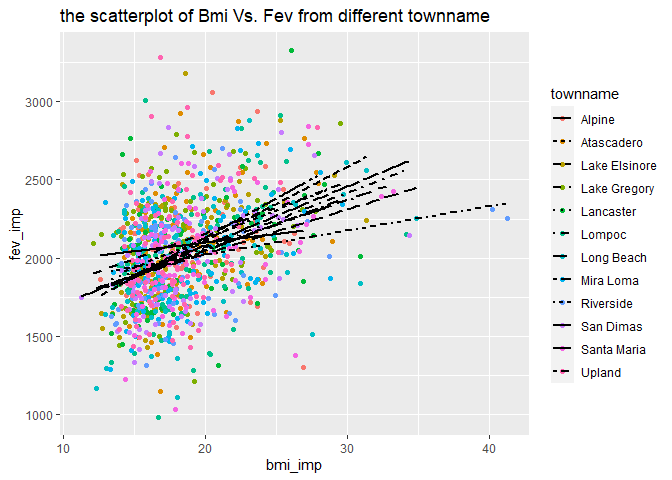
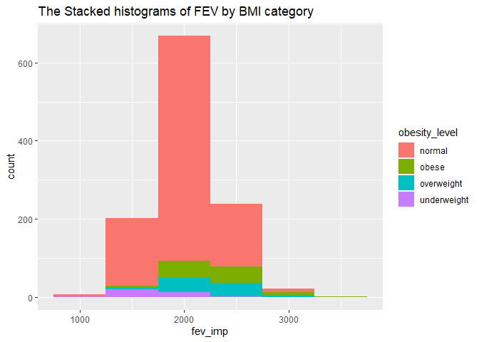
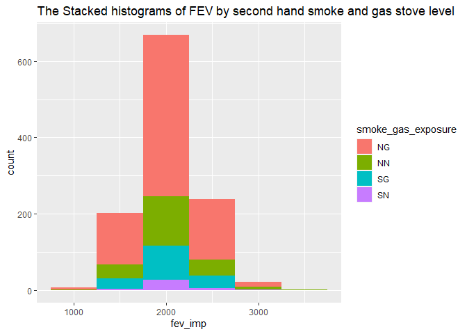
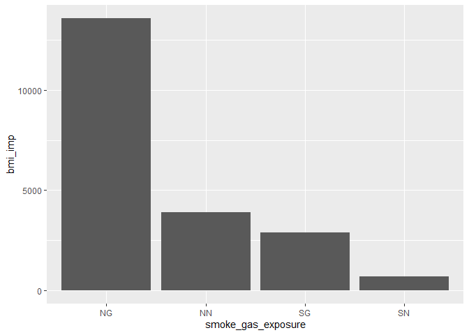
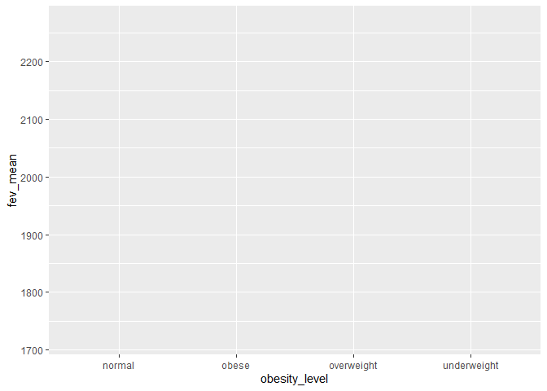
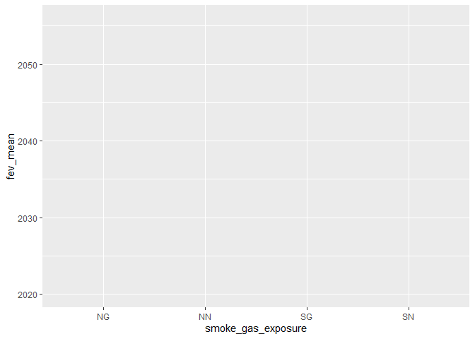
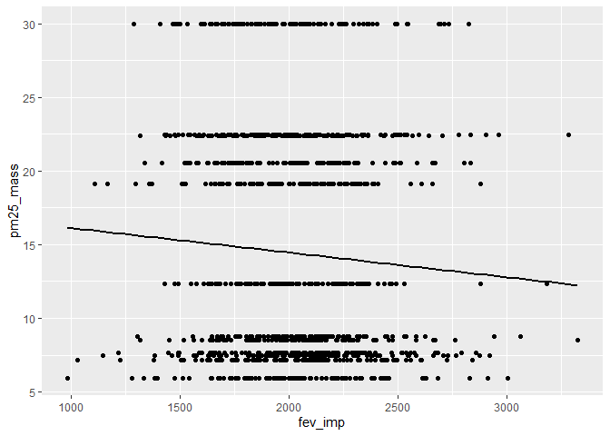

assingment 02
================
chen wei
2022-10-03

## R Markdown

``` r
library(lubridate)
```

    ## 
    ## 载入程辑包：'lubridate'

    ## The following objects are masked from 'package:base':
    ## 
    ##     date, intersect, setdiff, union

``` r
library(tidyverse)
```

    ## ── Attaching packages
    ## ───────────────────────────────────────
    ## tidyverse 1.3.2 ──

    ## ✔ ggplot2 3.3.6     ✔ purrr   0.3.4
    ## ✔ tibble  3.1.8     ✔ dplyr   1.0.9
    ## ✔ tidyr   1.2.0     ✔ stringr 1.4.1
    ## ✔ readr   2.1.2     ✔ forcats 0.5.2
    ## ── Conflicts ────────────────────────────────────────── tidyverse_conflicts() ──
    ## ✖ lubridate::as.difftime() masks base::as.difftime()
    ## ✖ lubridate::date()        masks base::date()
    ## ✖ dplyr::filter()          masks stats::filter()
    ## ✖ lubridate::intersect()   masks base::intersect()
    ## ✖ dplyr::lag()             masks stats::lag()
    ## ✖ lubridate::setdiff()     masks base::setdiff()
    ## ✖ lubridate::union()       masks base::union()

``` r
library(data.table)
```

    ## 
    ## 载入程辑包：'data.table'
    ## 
    ## The following objects are masked from 'package:dplyr':
    ## 
    ##     between, first, last
    ## 
    ## The following object is masked from 'package:purrr':
    ## 
    ##     transpose
    ## 
    ## The following objects are masked from 'package:lubridate':
    ## 
    ##     hour, isoweek, mday, minute, month, quarter, second, wday, week,
    ##     yday, year

``` r
library(dplyr)
library(dbplyr)
```

    ## 
    ## 载入程辑包：'dbplyr'
    ## 
    ## The following objects are masked from 'package:dplyr':
    ## 
    ##     ident, sql

``` r
library(ggplot2)
```

## Data Wrangling

# STEP 0.Read in the data

First download and then read in with data.

``` r
individual <- data.table::fread("chs_individual.csv")
regional <- data.table::fread("chs_regional.csv")
```

\##STEP 0.Merge the data

``` r
total<-
merge(
  # Data
  x     = individual,      
  y     = regional, 
  # List of variables to match
  by.x  = "townname",
  by.y  = "townname", 
  # Which obs to keep?
  all.x = TRUE,      
  all.y = FALSE
  ) 
nrow(total)
```

    ## [1] 1200

\#1 After merging the data, make sure you don’t have any duplicates by
counting the number of rows. Make sure it matches.

``` r
#a simplic check
dim(total)
```

    ## [1] 1200   49

``` r
head(total)
```

    ##    townname sid male race hispanic    agepft height weight      bmi asthma
    ## 1:   Alpine 835    0    W        0 10.099932    143     69 15.33749      0
    ## 2:   Alpine 838    0    O        1  9.486653    133     62 15.93183      0
    ## 3:   Alpine 839    0    M        1 10.053388    142     86 19.38649      0
    ## 4:   Alpine 840    0    W        0  9.965777    146     78 16.63283      0
    ## 5:   Alpine 841    1    W        1 10.548939    150     78 15.75758      0
    ## 6:   Alpine 842    1    M        1  9.489391    139     65 15.29189      0
    ##    active_asthma father_asthma mother_asthma wheeze hayfever allergy
    ## 1:             0             0             0      0        0       1
    ## 2:             0             0             0      0        0       0
    ## 3:             0             0             1      1        1       1
    ## 4:             0             0             0      0        0       0
    ## 5:             0             0             0      0        0       0
    ## 6:             0             0             0      1        0       0
    ##    educ_parent smoke pets gasstove      fev      fvc     mmef pm25_mass
    ## 1:           3     0    1        0 2529.276 2826.316 3406.579      8.74
    ## 2:           4    NA    1        0 1737.793 1963.545 2133.110      8.74
    ## 3:           3     1    1        0 2121.711 2326.974 2835.197      8.74
    ## 4:          NA    NA    0       NA 2466.791 2638.221 3466.464      8.74
    ## 5:           5     0    1        0 2251.505 2594.649 2445.151      8.74
    ## 6:           1     1    1        0 2188.716 2423.934 2524.599      8.74
    ##    pm25_so4 pm25_no3 pm25_nh4 pm25_oc pm25_ec pm25_om pm10_oc pm10_ec pm10_tc
    ## 1:     1.73     1.59     0.88    2.54    0.48    3.04    3.25    0.49    3.75
    ## 2:     1.73     1.59     0.88    2.54    0.48    3.04    3.25    0.49    3.75
    ## 3:     1.73     1.59     0.88    2.54    0.48    3.04    3.25    0.49    3.75
    ## 4:     1.73     1.59     0.88    2.54    0.48    3.04    3.25    0.49    3.75
    ## 5:     1.73     1.59     0.88    2.54    0.48    3.04    3.25    0.49    3.75
    ## 6:     1.73     1.59     0.88    2.54    0.48    3.04    3.25    0.49    3.75
    ##    formic acetic  hcl hno3 o3_max o3106 o3_24   no2  pm10 no_24hr pm2_5_fr
    ## 1:   1.03   2.49 0.41 1.98  65.82 55.05 41.23 12.18 24.73    2.48    10.28
    ## 2:   1.03   2.49 0.41 1.98  65.82 55.05 41.23 12.18 24.73    2.48    10.28
    ## 3:   1.03   2.49 0.41 1.98  65.82 55.05 41.23 12.18 24.73    2.48    10.28
    ## 4:   1.03   2.49 0.41 1.98  65.82 55.05 41.23 12.18 24.73    2.48    10.28
    ## 5:   1.03   2.49 0.41 1.98  65.82 55.05 41.23 12.18 24.73    2.48    10.28
    ## 6:   1.03   2.49 0.41 1.98  65.82 55.05 41.23 12.18 24.73    2.48    10.28
    ##    iacid oacid total_acids       lon      lat
    ## 1:  2.39  3.52         5.5 -116.7664 32.83505
    ## 2:  2.39  3.52         5.5 -116.7664 32.83505
    ## 3:  2.39  3.52         5.5 -116.7664 32.83505
    ## 4:  2.39  3.52         5.5 -116.7664 32.83505
    ## 5:  2.39  3.52         5.5 -116.7664 32.83505
    ## 6:  2.39  3.52         5.5 -116.7664 32.83505

``` r
tail(total)
```

    ##    townname  sid male race hispanic    agepft height weight      bmi asthma
    ## 1:   Upland 1866    0    O        1  9.806982    139     60 14.11559      0
    ## 2:   Upland 1867    0    M        1  9.618070    140     71 16.46568      0
    ## 3:   Upland 2031    1    W        0  9.798768    135     83 20.70084      0
    ## 4:   Upland 2032    1    W        0  9.549624    137     59 14.28855      0
    ## 5:   Upland 2033    0    M        0 10.121834    130     67 18.02044      0
    ## 6:   Upland 2053    0    W        0        NA     NA     NA       NA      0
    ##    active_asthma father_asthma mother_asthma wheeze hayfever allergy
    ## 1:             0            NA             0      0       NA      NA
    ## 2:             0             1             0      0        0       0
    ## 3:             0             0             0      1        0       1
    ## 4:             0             0             1      1        1       1
    ## 5:             1             0             0      1        1       0
    ## 6:             0             0             0      0        0       0
    ##    educ_parent smoke pets gasstove      fev      fvc     mmef pm25_mass
    ## 1:           3     0    1        0 1691.275 1928.859 1890.604     22.46
    ## 2:           3     0    1        0 1733.338 1993.040 2072.643     22.46
    ## 3:           3     0    1        1 2034.177 2505.535 1814.075     22.46
    ## 4:           3     0    1        1 2077.703 2275.338 2706.081     22.46
    ## 5:           3     0    1        1 1929.866 2122.148 2558.054     22.46
    ## 6:           3     0    1        0       NA       NA       NA     22.46
    ##    pm25_so4 pm25_no3 pm25_nh4 pm25_oc pm25_ec pm25_om pm10_oc pm10_ec pm10_tc
    ## 1:     2.65     7.75     2.96    6.49    1.19    7.79    8.32    1.22    9.54
    ## 2:     2.65     7.75     2.96    6.49    1.19    7.79    8.32    1.22    9.54
    ## 3:     2.65     7.75     2.96    6.49    1.19    7.79    8.32    1.22    9.54
    ## 4:     2.65     7.75     2.96    6.49    1.19    7.79    8.32    1.22    9.54
    ## 5:     2.65     7.75     2.96    6.49    1.19    7.79    8.32    1.22    9.54
    ## 6:     2.65     7.75     2.96    6.49    1.19    7.79    8.32    1.22    9.54
    ##    formic acetic  hcl hno3 o3_max o3106 o3_24   no2 pm10 no_24hr pm2_5_fr iacid
    ## 1:   2.67   4.73 0.46 4.03  63.83  46.5  22.2 37.97 40.8   18.48    27.73  4.49
    ## 2:   2.67   4.73 0.46 4.03  63.83  46.5  22.2 37.97 40.8   18.48    27.73  4.49
    ## 3:   2.67   4.73 0.46 4.03  63.83  46.5  22.2 37.97 40.8   18.48    27.73  4.49
    ## 4:   2.67   4.73 0.46 4.03  63.83  46.5  22.2 37.97 40.8   18.48    27.73  4.49
    ## 5:   2.67   4.73 0.46 4.03  63.83  46.5  22.2 37.97 40.8   18.48    27.73  4.49
    ## 6:   2.67   4.73 0.46 4.03  63.83  46.5  22.2 37.97 40.8   18.48    27.73  4.49
    ##    oacid total_acids       lon      lat
    ## 1:   7.4       11.43 -117.6484 34.09751
    ## 2:   7.4       11.43 -117.6484 34.09751
    ## 3:   7.4       11.43 -117.6484 34.09751
    ## 4:   7.4       11.43 -117.6484 34.09751
    ## 5:   7.4       11.43 -117.6484 34.09751
    ## 6:   7.4       11.43 -117.6484 34.09751

``` r
str(total)
```

    ## Classes 'data.table' and 'data.frame':   1200 obs. of  49 variables:
    ##  $ townname     : chr  "Alpine" "Alpine" "Alpine" "Alpine" ...
    ##  $ sid          : int  835 838 839 840 841 842 843 844 847 849 ...
    ##  $ male         : int  0 0 0 0 1 1 1 1 1 1 ...
    ##  $ race         : chr  "W" "O" "M" "W" ...
    ##  $ hispanic     : int  0 1 1 0 1 1 0 1 0 0 ...
    ##  $ agepft       : num  10.1 9.49 10.05 9.97 10.55 ...
    ##  $ height       : int  143 133 142 146 150 139 149 143 137 147 ...
    ##  $ weight       : int  69 62 86 78 78 65 98 65 69 112 ...
    ##  $ bmi          : num  15.3 15.9 19.4 16.6 15.8 ...
    ##  $ asthma       : int  0 0 0 0 0 0 0 NA 0 0 ...
    ##  $ active_asthma: int  0 0 0 0 0 0 0 0 0 0 ...
    ##  $ father_asthma: int  0 0 0 0 0 0 0 NA 0 1 ...
    ##  $ mother_asthma: int  0 0 1 0 0 0 0 NA 0 0 ...
    ##  $ wheeze       : int  0 0 1 0 0 1 1 NA 0 1 ...
    ##  $ hayfever     : int  0 0 1 0 0 0 0 NA 0 0 ...
    ##  $ allergy      : int  1 0 1 0 0 0 1 NA 0 1 ...
    ##  $ educ_parent  : int  3 4 3 NA 5 1 3 NA 5 3 ...
    ##  $ smoke        : int  0 NA 1 NA 0 1 0 NA 0 0 ...
    ##  $ pets         : int  1 1 1 0 1 1 1 0 1 1 ...
    ##  $ gasstove     : int  0 0 0 NA 0 0 1 NA 1 0 ...
    ##  $ fev          : num  2529 1738 2122 2467 2252 ...
    ##  $ fvc          : num  2826 1964 2327 2638 2595 ...
    ##  $ mmef         : num  3407 2133 2835 3466 2445 ...
    ##  $ pm25_mass    : num  8.74 8.74 8.74 8.74 8.74 8.74 8.74 8.74 8.74 8.74 ...
    ##  $ pm25_so4     : num  1.73 1.73 1.73 1.73 1.73 1.73 1.73 1.73 1.73 1.73 ...
    ##  $ pm25_no3     : num  1.59 1.59 1.59 1.59 1.59 1.59 1.59 1.59 1.59 1.59 ...
    ##  $ pm25_nh4     : num  0.88 0.88 0.88 0.88 0.88 0.88 0.88 0.88 0.88 0.88 ...
    ##  $ pm25_oc      : num  2.54 2.54 2.54 2.54 2.54 2.54 2.54 2.54 2.54 2.54 ...
    ##  $ pm25_ec      : num  0.48 0.48 0.48 0.48 0.48 0.48 0.48 0.48 0.48 0.48 ...
    ##  $ pm25_om      : num  3.04 3.04 3.04 3.04 3.04 3.04 3.04 3.04 3.04 3.04 ...
    ##  $ pm10_oc      : num  3.25 3.25 3.25 3.25 3.25 3.25 3.25 3.25 3.25 3.25 ...
    ##  $ pm10_ec      : num  0.49 0.49 0.49 0.49 0.49 0.49 0.49 0.49 0.49 0.49 ...
    ##  $ pm10_tc      : num  3.75 3.75 3.75 3.75 3.75 3.75 3.75 3.75 3.75 3.75 ...
    ##  $ formic       : num  1.03 1.03 1.03 1.03 1.03 1.03 1.03 1.03 1.03 1.03 ...
    ##  $ acetic       : num  2.49 2.49 2.49 2.49 2.49 2.49 2.49 2.49 2.49 2.49 ...
    ##  $ hcl          : num  0.41 0.41 0.41 0.41 0.41 0.41 0.41 0.41 0.41 0.41 ...
    ##  $ hno3         : num  1.98 1.98 1.98 1.98 1.98 1.98 1.98 1.98 1.98 1.98 ...
    ##  $ o3_max       : num  65.8 65.8 65.8 65.8 65.8 ...
    ##  $ o3106        : num  55 55 55 55 55 ...
    ##  $ o3_24        : num  41.2 41.2 41.2 41.2 41.2 ...
    ##  $ no2          : num  12.2 12.2 12.2 12.2 12.2 ...
    ##  $ pm10         : num  24.7 24.7 24.7 24.7 24.7 ...
    ##  $ no_24hr      : num  2.48 2.48 2.48 2.48 2.48 2.48 2.48 2.48 2.48 2.48 ...
    ##  $ pm2_5_fr     : num  10.3 10.3 10.3 10.3 10.3 ...
    ##  $ iacid        : num  2.39 2.39 2.39 2.39 2.39 2.39 2.39 2.39 2.39 2.39 ...
    ##  $ oacid        : num  3.52 3.52 3.52 3.52 3.52 3.52 3.52 3.52 3.52 3.52 ...
    ##  $ total_acids  : num  5.5 5.5 5.5 5.5 5.5 5.5 5.5 5.5 5.5 5.5 ...
    ##  $ lon          : num  -117 -117 -117 -117 -117 ...
    ##  $ lat          : num  32.8 32.8 32.8 32.8 32.8 ...
    ##  - attr(*, ".internal.selfref")=<externalptr> 
    ##  - attr(*, "sorted")= chr "townname"

``` r
# Dealing with NAs and 999999
total[, sid   := fifelse(sid == 999999, NA_integer_, sid)]
total[, townname   := fifelse(townname == "", NA_character_, townname)]
```

``` r
# Removing duplicates
total[, n := 1:.N, by = .(sid)]
total <- total[n == 1,][, n := NULL]
```

``` r
#removing the rows with second_hand and gas_stove as "NA" 
total<-total[, smoke   := fifelse(total$smoke == "", NA_integer_, smoke)]
total<-total[, STATE  := fifelse(total$gasstove == "", NA_integer_, gasstove)]
total <- total[!is.na(gasstove)]
total <- total[!is.na(smoke)]
```

``` r
#calculate the mean of the "males" and "hispanic"
  total<-total[, bmi_imp := fcoalesce(bmi, mean(bmi, na.rm = TRUE)),
    by = .(male,hispanic)]
```

``` r
  total<-total[, fev_imp:= fcoalesce(fev, mean(fev, na.rm = TRUE)),
    by = .(male,hispanic)]
```

``` r
 sum(is.na(total$bmi_imp))
```

    ## [1] 0

``` r
sum(is.na(total$fev_imp))
```

    ## [1] 0

\#2 Create a new categorical variable named “obesity_level” using the
BMI measurement (underweight BMI\<14; normal BMI 14-22; overweight BMI
22-24; obese BMI\>24). To make sure the variable is rightly coded,
create a summary table that contains the minimum BMI, maximum BMI, and
the total number of observations per category.

``` r
total<-total[,obesity_level :=fifelse(bmi_imp < 14,"underweight",
                  fifelse(bmi_imp<=22 ,"normal",
                  fifelse(bmi_imp<=24 ,"overweight","obese")))
        ]
min(total$bmi_imp)
```

    ## [1] 11.2964

``` r
max(total$bmi_imp)
```

    ## [1] 41.26613

``` r
table(total$obesity_level)
```

    ## 
    ##      normal       obese  overweight underweight 
    ##         928          95          83          34

``` r
total
```

\#3 Create another categorical variable named “smoke_gas_exposure” that
summarizes “Second Hand Smoke” and “Gas Stove.” The variable should have
four categories in total.

``` r
total<-total[,smoke_gas_exposure :=fifelse(smoke==1 & gasstove==1,"SG",
                  fifelse(smoke==0  & gasstove ==0,"NN",
                  fifelse(smoke==1  & gasstove ==0,"SN","NG" )))
        ]
table(total$smoke_gas_exposure)
```

    ## 
    ##  NG  NN  SG  SN 
    ## 739 214 151  36

``` r
total
```

\#4 Create four summary tables showing the average (or proportion, if
binary) and sd of “Forced expiratory volume in 1 second (ml)” and
(proportion)asthma indicator by town, sex, obesity level, and
“smoke_gas_exposure.”

``` r
#townname
townname_avg1<-total%>%count(townname)
townname_avg2<-
    total[ , .(
    fev_mean      =mean(fev_imp, na.rm=T),
    sd       =sd(fev, na.rm=T),
    asthma_number=sum(asthma,na.rm = T),
    asthma_proprtion  =sum(asthma,na.rm = T)/(sum(asthma,na.rm = T)+sum(!is.na(asthma)))
  ),by = townname]
townname_avg<-
merge(
  # Data
  x     = townname_avg1,      
  y     = townname_avg2, 
  # List of variables to match
  by.x  = "townname",
  by.y  = "townname", 
  # Which obs to keep?
  all.x = TRUE,      
  all.y = FALSE
  ) 
```

``` r
#sex
sex_avg1<-total%>%count(male)
sex_avg2<-
    total[ , .(
    fev_mean      =mean(fev_imp, na.rm=T),
    sd       =sd(fev, na.rm=T),
    asthma_number=sum(asthma,na.rm = T),
    asthma_proprtion  =sum(asthma,na.rm = T)/(sum(asthma,na.rm = T)+sum(!is.na(asthma)))
  ),by = male]
sex_avg<-
merge(
  # Data
  x     = sex_avg1,      
  y     = sex_avg2, 
  # List of variables to match
  by.x  = "male",
  by.y  = "male", 
  # Which obs to keep?
  all.x = TRUE,      
  all.y = FALSE
  ) 
```

``` r
#obesity_level
obesity_avg1<-total%>%count(obesity_level)
obesity_avg2<-
    total[ , .(
    fev_mean      =mean(fev_imp, na.rm=T),
    sd       =sd(fev, na.rm=T),
    asthma_number=sum(asthma,na.rm = T),
    asthma_proprtion  =sum(asthma,na.rm = T)/(sum(asthma,na.rm = T)+sum(!is.na(asthma)))
  ),by = obesity_level]
obesity_avg<-
merge(
  # Data
  x     = obesity_avg1,      
  y     = obesity_avg2, 
  # List of variables to match
  by.x  = "obesity_level",
  by.y  = "obesity_level", 
  # Which obs to keep?
  all.x = TRUE,      
  all.y = FALSE
  ) 
```

``` r
#smoke_gas_exposure
smoke_gas_exposure_avg1<-total%>%count(smoke_gas_exposure)
smoke_gas_exposure_avg2<-
    total[ , .(
    fev_mean      =mean(fev_imp, na.rm=T),
    sd       =sd(fev, na.rm=T),
    asthma_number=sum(asthma,na.rm = T),
    asthma_proprtion  =sum(asthma,na.rm = T)/(sum(asthma,na.rm = T)+sum(!is.na(asthma)))
  ),by = smoke_gas_exposure]
smoke_gas_exposure_avg<-
merge(
  # Data
  x     = smoke_gas_exposure_avg1,      
  y     = smoke_gas_exposure_avg2, 
  # List of variables to match
  by.x  = "smoke_gas_exposure",
  by.y  = "smoke_gas_exposure", 
  # Which obs to keep?
  all.x = TRUE,      
  all.y = FALSE
  ) 
```

\##second part. The primary questions of interest are: 1. What is the
association between BMI and FEV (forced expiratory volume)? 2. What is
the association between smoke and gas exposure and FEV? 3. What is the
association between PM2.5 exposure and FEV?

Follow the EDA checklist from week 3 and the previous assignment. Be
sure to focus on the key variables. Visualization Create the following
figures and interpret them. Be sure to include easily understandable
axes, titles, and legends. \#EDA Step0-1.Check the dimensions, headers,
footers. How many columns, rows are there?

``` r
dim(total)
```

    ## [1] 1140   54

``` r
head(total)
```

    ##    townname sid male race hispanic    agepft height weight      bmi asthma
    ## 1:   Alpine 835    0    W        0 10.099932    143     69 15.33749      0
    ## 2:   Alpine 839    0    M        1 10.053388    142     86 19.38649      0
    ## 3:   Alpine 841    1    W        1 10.548939    150     78 15.75758      0
    ## 4:   Alpine 842    1    M        1  9.489391    139     65 15.29189      0
    ## 5:   Alpine 843    1    W        0  9.571526    149     98 20.06462      0
    ## 6:   Alpine 847    1    M        0  9.902806    137     69 16.71034      0
    ##    active_asthma father_asthma mother_asthma wheeze hayfever allergy
    ## 1:             0             0             0      0        0       1
    ## 2:             0             0             1      1        1       1
    ## 3:             0             0             0      0        0       0
    ## 4:             0             0             0      1        0       0
    ## 5:             0             0             0      1        0       1
    ## 6:             0             0             0      0        0       0
    ##    educ_parent smoke pets gasstove      fev      fvc     mmef pm25_mass
    ## 1:           3     0    1        0 2529.276 2826.316 3406.579      8.74
    ## 2:           3     1    1        0 2121.711 2326.974 2835.197      8.74
    ## 3:           5     0    1        0 2251.505 2594.649 2445.151      8.74
    ## 4:           1     1    1        0 2188.716 2423.934 2524.599      8.74
    ## 5:           3     0    1        1 2442.157 3068.627 2158.824      8.74
    ## 6:           5     0    1        1 2142.869 2461.808 2410.977      8.74
    ##    pm25_so4 pm25_no3 pm25_nh4 pm25_oc pm25_ec pm25_om pm10_oc pm10_ec pm10_tc
    ## 1:     1.73     1.59     0.88    2.54    0.48    3.04    3.25    0.49    3.75
    ## 2:     1.73     1.59     0.88    2.54    0.48    3.04    3.25    0.49    3.75
    ## 3:     1.73     1.59     0.88    2.54    0.48    3.04    3.25    0.49    3.75
    ## 4:     1.73     1.59     0.88    2.54    0.48    3.04    3.25    0.49    3.75
    ## 5:     1.73     1.59     0.88    2.54    0.48    3.04    3.25    0.49    3.75
    ## 6:     1.73     1.59     0.88    2.54    0.48    3.04    3.25    0.49    3.75
    ##    formic acetic  hcl hno3 o3_max o3106 o3_24   no2  pm10 no_24hr pm2_5_fr
    ## 1:   1.03   2.49 0.41 1.98  65.82 55.05 41.23 12.18 24.73    2.48    10.28
    ## 2:   1.03   2.49 0.41 1.98  65.82 55.05 41.23 12.18 24.73    2.48    10.28
    ## 3:   1.03   2.49 0.41 1.98  65.82 55.05 41.23 12.18 24.73    2.48    10.28
    ## 4:   1.03   2.49 0.41 1.98  65.82 55.05 41.23 12.18 24.73    2.48    10.28
    ## 5:   1.03   2.49 0.41 1.98  65.82 55.05 41.23 12.18 24.73    2.48    10.28
    ## 6:   1.03   2.49 0.41 1.98  65.82 55.05 41.23 12.18 24.73    2.48    10.28
    ##    iacid oacid total_acids       lon      lat STATE  bmi_imp  fev_imp
    ## 1:  2.39  3.52         5.5 -116.7664 32.83505     0 15.33749 2529.276
    ## 2:  2.39  3.52         5.5 -116.7664 32.83505     0 19.38649 2121.711
    ## 3:  2.39  3.52         5.5 -116.7664 32.83505     0 15.75758 2251.505
    ## 4:  2.39  3.52         5.5 -116.7664 32.83505     0 15.29189 2188.716
    ## 5:  2.39  3.52         5.5 -116.7664 32.83505     1 20.06462 2442.157
    ## 6:  2.39  3.52         5.5 -116.7664 32.83505     1 16.71034 2142.869
    ##    obesity_level smoke_gas_exposure
    ## 1:        normal                 NN
    ## 2:        normal                 SN
    ## 3:        normal                 NN
    ## 4:        normal                 SN
    ## 5:        normal                 NG
    ## 6:        normal                 NG

``` r
tail(total)
```

    ##    townname  sid male race hispanic    agepft height weight      bmi asthma
    ## 1:   Upland 1866    0    O        1  9.806982    139     60 14.11559      0
    ## 2:   Upland 1867    0    M        1  9.618070    140     71 16.46568      0
    ## 3:   Upland 2031    1    W        0  9.798768    135     83 20.70084      0
    ## 4:   Upland 2032    1    W        0  9.549624    137     59 14.28855      0
    ## 5:   Upland 2033    0    M        0 10.121834    130     67 18.02044      0
    ## 6:   Upland 2053    0    W        0        NA     NA     NA       NA      0
    ##    active_asthma father_asthma mother_asthma wheeze hayfever allergy
    ## 1:             0            NA             0      0       NA      NA
    ## 2:             0             1             0      0        0       0
    ## 3:             0             0             0      1        0       1
    ## 4:             0             0             1      1        1       1
    ## 5:             1             0             0      1        1       0
    ## 6:             0             0             0      0        0       0
    ##    educ_parent smoke pets gasstove      fev      fvc     mmef pm25_mass
    ## 1:           3     0    1        0 1691.275 1928.859 1890.604     22.46
    ## 2:           3     0    1        0 1733.338 1993.040 2072.643     22.46
    ## 3:           3     0    1        1 2034.177 2505.535 1814.075     22.46
    ## 4:           3     0    1        1 2077.703 2275.338 2706.081     22.46
    ## 5:           3     0    1        1 1929.866 2122.148 2558.054     22.46
    ## 6:           3     0    1        0       NA       NA       NA     22.46
    ##    pm25_so4 pm25_no3 pm25_nh4 pm25_oc pm25_ec pm25_om pm10_oc pm10_ec pm10_tc
    ## 1:     2.65     7.75     2.96    6.49    1.19    7.79    8.32    1.22    9.54
    ## 2:     2.65     7.75     2.96    6.49    1.19    7.79    8.32    1.22    9.54
    ## 3:     2.65     7.75     2.96    6.49    1.19    7.79    8.32    1.22    9.54
    ## 4:     2.65     7.75     2.96    6.49    1.19    7.79    8.32    1.22    9.54
    ## 5:     2.65     7.75     2.96    6.49    1.19    7.79    8.32    1.22    9.54
    ## 6:     2.65     7.75     2.96    6.49    1.19    7.79    8.32    1.22    9.54
    ##    formic acetic  hcl hno3 o3_max o3106 o3_24   no2 pm10 no_24hr pm2_5_fr iacid
    ## 1:   2.67   4.73 0.46 4.03  63.83  46.5  22.2 37.97 40.8   18.48    27.73  4.49
    ## 2:   2.67   4.73 0.46 4.03  63.83  46.5  22.2 37.97 40.8   18.48    27.73  4.49
    ## 3:   2.67   4.73 0.46 4.03  63.83  46.5  22.2 37.97 40.8   18.48    27.73  4.49
    ## 4:   2.67   4.73 0.46 4.03  63.83  46.5  22.2 37.97 40.8   18.48    27.73  4.49
    ## 5:   2.67   4.73 0.46 4.03  63.83  46.5  22.2 37.97 40.8   18.48    27.73  4.49
    ## 6:   2.67   4.73 0.46 4.03  63.83  46.5  22.2 37.97 40.8   18.48    27.73  4.49
    ##    oacid total_acids       lon      lat STATE  bmi_imp  fev_imp obesity_level
    ## 1:   7.4       11.43 -117.6484 34.09751     0 14.11559 1691.275        normal
    ## 2:   7.4       11.43 -117.6484 34.09751     0 16.46568 1733.338        normal
    ## 3:   7.4       11.43 -117.6484 34.09751     1 20.70084 2034.177        normal
    ## 4:   7.4       11.43 -117.6484 34.09751     1 14.28855 2077.703        normal
    ## 5:   7.4       11.43 -117.6484 34.09751     1 18.02044 1929.866        normal
    ## 6:   7.4       11.43 -117.6484 34.09751     0 18.05386 1943.551        normal
    ##    smoke_gas_exposure
    ## 1:                 NN
    ## 2:                 NN
    ## 3:                 NG
    ## 4:                 NG
    ## 5:                 NG
    ## 6:                 NN

\#steo0-2take a look of the varaible

``` r
str(total)
```

    ## Classes 'data.table' and 'data.frame':   1140 obs. of  54 variables:
    ##  $ townname          : chr  "Alpine" "Alpine" "Alpine" "Alpine" ...
    ##  $ sid               : int  835 839 841 842 843 847 849 851 855 856 ...
    ##  $ male              : int  0 0 1 1 1 1 1 1 1 1 ...
    ##  $ race              : chr  "W" "M" "W" "M" ...
    ##  $ hispanic          : int  0 1 1 1 0 0 0 0 1 0 ...
    ##  $ agepft            : num  10.1 10.05 10.55 9.49 9.57 ...
    ##  $ height            : int  143 142 150 139 149 137 147 152 143 134 ...
    ##  $ weight            : int  69 86 78 65 98 69 112 97 64 71 ...
    ##  $ bmi               : num  15.3 19.4 15.8 15.3 20.1 ...
    ##  $ asthma            : int  0 0 0 0 0 0 0 0 0 0 ...
    ##  $ active_asthma     : int  0 0 0 0 0 0 0 0 0 1 ...
    ##  $ father_asthma     : int  0 0 0 0 0 0 1 0 NA 0 ...
    ##  $ mother_asthma     : int  0 1 0 0 0 0 0 0 0 1 ...
    ##  $ wheeze            : int  0 1 0 1 1 0 1 0 0 1 ...
    ##  $ hayfever          : int  0 1 0 0 0 0 0 0 0 1 ...
    ##  $ allergy           : int  1 1 0 0 1 0 1 0 NA 1 ...
    ##  $ educ_parent       : int  3 3 5 1 3 5 3 2 1 3 ...
    ##  $ smoke             : int  0 1 0 1 0 0 0 0 0 0 ...
    ##  $ pets              : int  1 1 1 1 1 1 1 1 1 1 ...
    ##  $ gasstove          : int  0 0 0 0 1 1 0 0 0 0 ...
    ##  $ fev               : num  2529 2122 2252 2189 2442 ...
    ##  $ fvc               : num  2826 2327 2595 2424 3069 ...
    ##  $ mmef              : num  3407 2835 2445 2525 2159 ...
    ##  $ pm25_mass         : num  8.74 8.74 8.74 8.74 8.74 8.74 8.74 8.74 8.74 8.74 ...
    ##  $ pm25_so4          : num  1.73 1.73 1.73 1.73 1.73 1.73 1.73 1.73 1.73 1.73 ...
    ##  $ pm25_no3          : num  1.59 1.59 1.59 1.59 1.59 1.59 1.59 1.59 1.59 1.59 ...
    ##  $ pm25_nh4          : num  0.88 0.88 0.88 0.88 0.88 0.88 0.88 0.88 0.88 0.88 ...
    ##  $ pm25_oc           : num  2.54 2.54 2.54 2.54 2.54 2.54 2.54 2.54 2.54 2.54 ...
    ##  $ pm25_ec           : num  0.48 0.48 0.48 0.48 0.48 0.48 0.48 0.48 0.48 0.48 ...
    ##  $ pm25_om           : num  3.04 3.04 3.04 3.04 3.04 3.04 3.04 3.04 3.04 3.04 ...
    ##  $ pm10_oc           : num  3.25 3.25 3.25 3.25 3.25 3.25 3.25 3.25 3.25 3.25 ...
    ##  $ pm10_ec           : num  0.49 0.49 0.49 0.49 0.49 0.49 0.49 0.49 0.49 0.49 ...
    ##  $ pm10_tc           : num  3.75 3.75 3.75 3.75 3.75 3.75 3.75 3.75 3.75 3.75 ...
    ##  $ formic            : num  1.03 1.03 1.03 1.03 1.03 1.03 1.03 1.03 1.03 1.03 ...
    ##  $ acetic            : num  2.49 2.49 2.49 2.49 2.49 2.49 2.49 2.49 2.49 2.49 ...
    ##  $ hcl               : num  0.41 0.41 0.41 0.41 0.41 0.41 0.41 0.41 0.41 0.41 ...
    ##  $ hno3              : num  1.98 1.98 1.98 1.98 1.98 1.98 1.98 1.98 1.98 1.98 ...
    ##  $ o3_max            : num  65.8 65.8 65.8 65.8 65.8 ...
    ##  $ o3106             : num  55 55 55 55 55 ...
    ##  $ o3_24             : num  41.2 41.2 41.2 41.2 41.2 ...
    ##  $ no2               : num  12.2 12.2 12.2 12.2 12.2 ...
    ##  $ pm10              : num  24.7 24.7 24.7 24.7 24.7 ...
    ##  $ no_24hr           : num  2.48 2.48 2.48 2.48 2.48 2.48 2.48 2.48 2.48 2.48 ...
    ##  $ pm2_5_fr          : num  10.3 10.3 10.3 10.3 10.3 ...
    ##  $ iacid             : num  2.39 2.39 2.39 2.39 2.39 2.39 2.39 2.39 2.39 2.39 ...
    ##  $ oacid             : num  3.52 3.52 3.52 3.52 3.52 3.52 3.52 3.52 3.52 3.52 ...
    ##  $ total_acids       : num  5.5 5.5 5.5 5.5 5.5 5.5 5.5 5.5 5.5 5.5 ...
    ##  $ lon               : num  -117 -117 -117 -117 -117 ...
    ##  $ lat               : num  32.8 32.8 32.8 32.8 32.8 ...
    ##  $ STATE             : int  0 0 0 0 1 1 0 0 0 0 ...
    ##  $ bmi_imp           : num  15.3 19.4 15.8 15.3 20.1 ...
    ##  $ fev_imp           : num  2529 2122 2252 2189 2442 ...
    ##  $ obesity_level     : chr  "normal" "normal" "normal" "normal" ...
    ##  $ smoke_gas_exposure: chr  "NN" "SN" "NN" "SN" ...
    ##  - attr(*, ".internal.selfref")=<externalptr>

\#Figure1.Facet plot showing scatterplots with regression lines of BMI
vs FEV by “townname”.

``` r
total[!is.na(townname)] %>%
  ggplot(mapping = aes(x = bmi_imp, y = fev_imp, color = townname, linetype = townname)) +ggtitle("the scatterplot of Bmi Vs. Fev from different townname ")+
  geom_point() +
  geom_smooth(method = lm, se = FALSE, col = "black")
```

    ## `geom_smooth()` using formula 'y ~ x'

<!-- --> from
the scatterplot above we can see that individual lives in different town
has a different in increasing values ,but they are all the bmi is
potively associated with the fev_mean \#Figure2.Stacked histograms of
FEV by BMI category and FEV by smoke/gas exposure. Use different color
schemes than the ggplot default.

``` r
ggplot(total, aes(fev_imp, fill = obesity_level)) +
  geom_histogram(binwidth = 500) +ggtitle("The Stacked histograms of FEV by BMI category")
```

<!-- -->

``` r
ggplot(total, aes(fev_imp, fill = smoke_gas_exposure)) +
  geom_histogram(binwidth = 500) +ggtitle("The Stacked histograms of FEV by second hand smoke and gas stove level")
```

<!-- --> due
to the graph above, we could not see very clearly since the overall
number of the ‘normal’ bmi category. which means that the histogram
maybe is not a very great choice for that. \##Figure3.Barchart of BMI by
smoke/gas exposure.

``` r
ggplot(data=total, aes(x=smoke_gas_exposure, y=bmi_imp)) +
  geom_bar(stat="identity") 
```

<!-- --> gas
stove on would but no second hand smoke may lead to the highest fev,
then is no gas stove, no scond hand smoke. gas stove on may have a
conflict effect with second hand smoking on fev mean.
\#Figure4.Statistical summary graphs of FEV by BMI and FEV by smoke/gas
exposure category.

``` r
obesity_avg[!is.na(fev_mean)]%>%
  ggplot(mapping = aes(x=obesity_level,y=fev_mean)) + stat_summary(fun.data = mean_sdl,geom="errorbar")
```

<!-- -->

``` r
smoke_gas_exposure_avg[!is.na(fev_mean)]%>%
  ggplot(mapping = aes(x=smoke_gas_exposure,y=fev_mean)) + stat_summary(fun.data = mean_sdl,geom="errorbar")
```

<!-- --> from
the two figure above, we can FIRST, the obesity level is associated with
the fev. see that the second_hand smoking and gas_stove is related to
the BMI \#Figure5.A leaflet map showing the concentrations of PM2.5 mass
in each of the CHS communities.

``` r
#generating a color palette
library(leaflet)
pm25_mass.pal <- colorNumeric(c('darkgreen','goldenrod'), domain=total$pm25_mass)
pm25_mass.pal
```

    ## function (x) 
    ## {
    ##     if (length(x) == 0 || all(is.na(x))) {
    ##         return(pf(x))
    ##     }
    ##     if (is.null(rng)) 
    ##         rng <- range(x, na.rm = TRUE)
    ##     rescaled <- scales::rescale(x, from = rng)
    ##     if (any(rescaled < 0 | rescaled > 1, na.rm = TRUE)) 
    ##         warning("Some values were outside the color scale and will be treated as NA")
    ##     if (reverse) {
    ##         rescaled <- 1 - rescaled
    ##     }
    ##     pf(rescaled)
    ## }
    ## <bytecode: 0x0000029c5c82fbf8>
    ## <environment: 0x0000029c5c82e618>
    ## attr(,"colorType")
    ## [1] "numeric"
    ## attr(,"colorArgs")
    ## attr(,"colorArgs")$na.color
    ## [1] "#808080"

``` r
pm25map <- leaflet(total) %>%
# The looks of the Map
addProviderTiles('CartoDB.Positron') %>%
# Some circles
addCircles(
lat = ~lat, lng=~lon,
# HERE IS OUR PAL!
label = ~paste0(round(pm25_mass,2), ' C'), color = ~ pm25_mass.pal(pm25_mass),
opacity = 1, fillOpacity = 1, radius = 500
) %>%
# And a pretty legend
addLegend('bottomleft', pal=pm25_mass.pal, values=total$pm25_mass,
title='pm2.5 concentration', opacity=1)
pm25map
```

<div id="htmlwidget-57604e1db54efcc2bb2d" style="width:672px;height:480px;" class="leaflet html-widget"></div>
<script type="application/json" data-for="htmlwidget-57604e1db54efcc2bb2d">{"x":{"options":{"crs":{"crsClass":"L.CRS.EPSG3857","code":null,"proj4def":null,"projectedBounds":null,"options":{}}},"calls":[{"method":"addProviderTiles","args":["CartoDB.Positron",null,null,{"errorTileUrl":"","noWrap":false,"detectRetina":false}]},{"method":"addCircles","args":[[32.8350521,32.8350521,32.8350521,32.8350521,32.8350521,32.8350521,32.8350521,32.8350521,32.8350521,32.8350521,32.8350521,32.8350521,32.8350521,32.8350521,32.8350521,32.8350521,32.8350521,32.8350521,32.8350521,32.8350521,32.8350521,32.8350521,32.8350521,32.8350521,32.8350521,32.8350521,32.8350521,32.8350521,32.8350521,32.8350521,32.8350521,32.8350521,32.8350521,32.8350521,32.8350521,32.8350521,32.8350521,32.8350521,32.8350521,32.8350521,32.8350521,32.8350521,32.8350521,32.8350521,32.8350521,32.8350521,32.8350521,32.8350521,32.8350521,32.8350521,32.8350521,32.8350521,32.8350521,32.8350521,32.8350521,32.8350521,32.8350521,32.8350521,32.8350521,32.8350521,32.8350521,32.8350521,32.8350521,32.8350521,32.8350521,32.8350521,32.8350521,32.8350521,32.8350521,32.8350521,32.8350521,32.8350521,32.8350521,32.8350521,32.8350521,32.8350521,32.8350521,32.8350521,32.8350521,32.8350521,32.8350521,32.8350521,32.8350521,32.8350521,32.8350521,32.8350521,32.8350521,32.8350521,32.8350521,32.8350521,32.8350521,32.8350521,35.4894169,35.4894169,35.4894169,35.4894169,35.4894169,35.4894169,35.4894169,35.4894169,35.4894169,35.4894169,35.4894169,35.4894169,35.4894169,35.4894169,35.4894169,35.4894169,35.4894169,35.4894169,35.4894169,35.4894169,35.4894169,35.4894169,35.4894169,35.4894169,35.4894169,35.4894169,35.4894169,35.4894169,35.4894169,35.4894169,35.4894169,35.4894169,35.4894169,35.4894169,35.4894169,35.4894169,35.4894169,35.4894169,35.4894169,35.4894169,35.4894169,35.4894169,35.4894169,35.4894169,35.4894169,35.4894169,35.4894169,35.4894169,35.4894169,35.4894169,35.4894169,35.4894169,35.4894169,35.4894169,35.4894169,35.4894169,35.4894169,35.4894169,35.4894169,35.4894169,35.4894169,35.4894169,35.4894169,35.4894169,35.4894169,35.4894169,35.4894169,35.4894169,35.4894169,35.4894169,35.4894169,35.4894169,35.4894169,35.4894169,35.4894169,35.4894169,35.4894169,35.4894169,35.4894169,35.4894169,35.4894169,35.4894169,35.4894169,35.4894169,35.4894169,35.4894169,35.4894169,35.4894169,35.4894169,35.4894169,35.4894169,35.4894169,35.4894169,35.4894169,35.4894169,35.4894169,33.6680772,33.6680772,33.6680772,33.6680772,33.6680772,33.6680772,33.6680772,33.6680772,33.6680772,33.6680772,33.6680772,33.6680772,33.6680772,33.6680772,33.6680772,33.6680772,33.6680772,33.6680772,33.6680772,33.6680772,33.6680772,33.6680772,33.6680772,33.6680772,33.6680772,33.6680772,33.6680772,33.6680772,33.6680772,33.6680772,33.6680772,33.6680772,33.6680772,33.6680772,33.6680772,33.6680772,33.6680772,33.6680772,33.6680772,33.6680772,33.6680772,33.6680772,33.6680772,33.6680772,33.6680772,33.6680772,33.6680772,33.6680772,33.6680772,33.6680772,33.6680772,33.6680772,33.6680772,33.6680772,33.6680772,33.6680772,33.6680772,33.6680772,33.6680772,33.6680772,33.6680772,33.6680772,33.6680772,33.6680772,33.6680772,33.6680772,33.6680772,33.6680772,33.6680772,33.6680772,33.6680772,33.6680772,33.6680772,33.6680772,33.6680772,33.6680772,33.6680772,33.6680772,33.6680772,33.6680772,33.6680772,33.6680772,33.6680772,33.6680772,33.6680772,33.6680772,33.6680772,33.6680772,33.6680772,33.6680772,33.6680772,33.6680772,34.242901,34.242901,34.242901,34.242901,34.242901,34.242901,34.242901,34.242901,34.242901,34.242901,34.242901,34.242901,34.242901,34.242901,34.242901,34.242901,34.242901,34.242901,34.242901,34.242901,34.242901,34.242901,34.242901,34.242901,34.242901,34.242901,34.242901,34.242901,34.242901,34.242901,34.242901,34.242901,34.242901,34.242901,34.242901,34.242901,34.242901,34.242901,34.242901,34.242901,34.242901,34.242901,34.242901,34.242901,34.242901,34.242901,34.242901,34.242901,34.242901,34.242901,34.242901,34.242901,34.242901,34.242901,34.242901,34.242901,34.242901,34.242901,34.242901,34.242901,34.242901,34.242901,34.242901,34.242901,34.242901,34.242901,34.242901,34.242901,34.242901,34.242901,34.242901,34.242901,34.242901,34.242901,34.242901,34.242901,34.242901,34.242901,34.242901,34.242901,34.242901,34.242901,34.242901,34.242901,34.242901,34.242901,34.242901,34.242901,34.242901,34.242901,34.242901,34.242901,34.242901,34.242901,34.242901,34.242901,34.242901,34.6867846,34.6867846,34.6867846,34.6867846,34.6867846,34.6867846,34.6867846,34.6867846,34.6867846,34.6867846,34.6867846,34.6867846,34.6867846,34.6867846,34.6867846,34.6867846,34.6867846,34.6867846,34.6867846,34.6867846,34.6867846,34.6867846,34.6867846,34.6867846,34.6867846,34.6867846,34.6867846,34.6867846,34.6867846,34.6867846,34.6867846,34.6867846,34.6867846,34.6867846,34.6867846,34.6867846,34.6867846,34.6867846,34.6867846,34.6867846,34.6867846,34.6867846,34.6867846,34.6867846,34.6867846,34.6867846,34.6867846,34.6867846,34.6867846,34.6867846,34.6867846,34.6867846,34.6867846,34.6867846,34.6867846,34.6867846,34.6867846,34.6867846,34.6867846,34.6867846,34.6867846,34.6867846,34.6867846,34.6867846,34.6867846,34.6867846,34.6867846,34.6867846,34.6867846,34.6867846,34.6867846,34.6867846,34.6867846,34.6867846,34.6867846,34.6867846,34.6867846,34.6867846,34.6867846,34.6867846,34.6867846,34.6867846,34.6867846,34.6867846,34.6867846,34.6867846,34.6867846,34.6867846,34.6867846,34.6867846,34.6867846,34.6867846,34.6867846,34.6867846,34.6391501,34.6391501,34.6391501,34.6391501,34.6391501,34.6391501,34.6391501,34.6391501,34.6391501,34.6391501,34.6391501,34.6391501,34.6391501,34.6391501,34.6391501,34.6391501,34.6391501,34.6391501,34.6391501,34.6391501,34.6391501,34.6391501,34.6391501,34.6391501,34.6391501,34.6391501,34.6391501,34.6391501,34.6391501,34.6391501,34.6391501,34.6391501,34.6391501,34.6391501,34.6391501,34.6391501,34.6391501,34.6391501,34.6391501,34.6391501,34.6391501,34.6391501,34.6391501,34.6391501,34.6391501,34.6391501,34.6391501,34.6391501,34.6391501,34.6391501,34.6391501,34.6391501,34.6391501,34.6391501,34.6391501,34.6391501,34.6391501,34.6391501,34.6391501,34.6391501,34.6391501,34.6391501,34.6391501,34.6391501,34.6391501,34.6391501,34.6391501,34.6391501,34.6391501,34.6391501,34.6391501,34.6391501,34.6391501,34.6391501,34.6391501,34.6391501,34.6391501,34.6391501,34.6391501,34.6391501,34.6391501,34.6391501,34.6391501,34.6391501,34.6391501,34.6391501,34.6391501,34.6391501,34.6391501,34.6391501,34.6391501,34.6391501,34.6391501,34.6391501,34.6391501,34.6391501,33.7700504,33.7700504,33.7700504,33.7700504,33.7700504,33.7700504,33.7700504,33.7700504,33.7700504,33.7700504,33.7700504,33.7700504,33.7700504,33.7700504,33.7700504,33.7700504,33.7700504,33.7700504,33.7700504,33.7700504,33.7700504,33.7700504,33.7700504,33.7700504,33.7700504,33.7700504,33.7700504,33.7700504,33.7700504,33.7700504,33.7700504,33.7700504,33.7700504,33.7700504,33.7700504,33.7700504,33.7700504,33.7700504,33.7700504,33.7700504,33.7700504,33.7700504,33.7700504,33.7700504,33.7700504,33.7700504,33.7700504,33.7700504,33.7700504,33.7700504,33.7700504,33.7700504,33.7700504,33.7700504,33.7700504,33.7700504,33.7700504,33.7700504,33.7700504,33.7700504,33.7700504,33.7700504,33.7700504,33.7700504,33.7700504,33.7700504,33.7700504,33.7700504,33.7700504,33.7700504,33.7700504,33.7700504,33.7700504,33.7700504,33.7700504,33.7700504,33.7700504,33.7700504,33.7700504,33.7700504,33.7700504,33.7700504,33.7700504,33.7700504,33.7700504,33.7700504,33.7700504,33.7700504,33.7700504,33.7700504,33.7700504,33.7700504,33.7700504,33.7700504,33.9845417,33.9845417,33.9845417,33.9845417,33.9845417,33.9845417,33.9845417,33.9845417,33.9845417,33.9845417,33.9845417,33.9845417,33.9845417,33.9845417,33.9845417,33.9845417,33.9845417,33.9845417,33.9845417,33.9845417,33.9845417,33.9845417,33.9845417,33.9845417,33.9845417,33.9845417,33.9845417,33.9845417,33.9845417,33.9845417,33.9845417,33.9845417,33.9845417,33.9845417,33.9845417,33.9845417,33.9845417,33.9845417,33.9845417,33.9845417,33.9845417,33.9845417,33.9845417,33.9845417,33.9845417,33.9845417,33.9845417,33.9845417,33.9845417,33.9845417,33.9845417,33.9845417,33.9845417,33.9845417,33.9845417,33.9845417,33.9845417,33.9845417,33.9845417,33.9845417,33.9845417,33.9845417,33.9845417,33.9845417,33.9845417,33.9845417,33.9845417,33.9845417,33.9845417,33.9845417,33.9845417,33.9845417,33.9845417,33.9845417,33.9845417,33.9845417,33.9845417,33.9845417,33.9845417,33.9845417,33.9845417,33.9845417,33.9845417,33.9845417,33.9845417,33.9845417,33.9845417,33.9845417,33.9845417,33.9845417,33.9845417,33.9845417,33.9845417,33.9845417,33.9845417,33.9806005,33.9806005,33.9806005,33.9806005,33.9806005,33.9806005,33.9806005,33.9806005,33.9806005,33.9806005,33.9806005,33.9806005,33.9806005,33.9806005,33.9806005,33.9806005,33.9806005,33.9806005,33.9806005,33.9806005,33.9806005,33.9806005,33.9806005,33.9806005,33.9806005,33.9806005,33.9806005,33.9806005,33.9806005,33.9806005,33.9806005,33.9806005,33.9806005,33.9806005,33.9806005,33.9806005,33.9806005,33.9806005,33.9806005,33.9806005,33.9806005,33.9806005,33.9806005,33.9806005,33.9806005,33.9806005,33.9806005,33.9806005,33.9806005,33.9806005,33.9806005,33.9806005,33.9806005,33.9806005,33.9806005,33.9806005,33.9806005,33.9806005,33.9806005,33.9806005,33.9806005,33.9806005,33.9806005,33.9806005,33.9806005,33.9806005,33.9806005,33.9806005,33.9806005,33.9806005,33.9806005,33.9806005,33.9806005,33.9806005,33.9806005,33.9806005,33.9806005,33.9806005,33.9806005,33.9806005,33.9806005,33.9806005,33.9806005,33.9806005,33.9806005,33.9806005,33.9806005,33.9806005,33.9806005,33.9806005,33.9806005,33.9806005,33.9806005,33.9806005,34.1066756,34.1066756,34.1066756,34.1066756,34.1066756,34.1066756,34.1066756,34.1066756,34.1066756,34.1066756,34.1066756,34.1066756,34.1066756,34.1066756,34.1066756,34.1066756,34.1066756,34.1066756,34.1066756,34.1066756,34.1066756,34.1066756,34.1066756,34.1066756,34.1066756,34.1066756,34.1066756,34.1066756,34.1066756,34.1066756,34.1066756,34.1066756,34.1066756,34.1066756,34.1066756,34.1066756,34.1066756,34.1066756,34.1066756,34.1066756,34.1066756,34.1066756,34.1066756,34.1066756,34.1066756,34.1066756,34.1066756,34.1066756,34.1066756,34.1066756,34.1066756,34.1066756,34.1066756,34.1066756,34.1066756,34.1066756,34.1066756,34.1066756,34.1066756,34.1066756,34.1066756,34.1066756,34.1066756,34.1066756,34.1066756,34.1066756,34.1066756,34.1066756,34.1066756,34.1066756,34.1066756,34.1066756,34.1066756,34.1066756,34.1066756,34.1066756,34.1066756,34.1066756,34.1066756,34.1066756,34.1066756,34.1066756,34.1066756,34.1066756,34.1066756,34.1066756,34.1066756,34.1066756,34.1066756,34.1066756,34.1066756,34.1066756,34.1066756,34.1066756,34.1066756,34.1066756,34.1066756,34.1066756,34.9530337,34.9530337,34.9530337,34.9530337,34.9530337,34.9530337,34.9530337,34.9530337,34.9530337,34.9530337,34.9530337,34.9530337,34.9530337,34.9530337,34.9530337,34.9530337,34.9530337,34.9530337,34.9530337,34.9530337,34.9530337,34.9530337,34.9530337,34.9530337,34.9530337,34.9530337,34.9530337,34.9530337,34.9530337,34.9530337,34.9530337,34.9530337,34.9530337,34.9530337,34.9530337,34.9530337,34.9530337,34.9530337,34.9530337,34.9530337,34.9530337,34.9530337,34.9530337,34.9530337,34.9530337,34.9530337,34.9530337,34.9530337,34.9530337,34.9530337,34.9530337,34.9530337,34.9530337,34.9530337,34.9530337,34.9530337,34.9530337,34.9530337,34.9530337,34.9530337,34.9530337,34.9530337,34.9530337,34.9530337,34.9530337,34.9530337,34.9530337,34.9530337,34.9530337,34.9530337,34.9530337,34.9530337,34.9530337,34.9530337,34.9530337,34.9530337,34.9530337,34.9530337,34.9530337,34.9530337,34.9530337,34.9530337,34.9530337,34.9530337,34.9530337,34.9530337,34.9530337,34.9530337,34.9530337,34.9530337,34.9530337,34.9530337,34.9530337,34.09751,34.09751,34.09751,34.09751,34.09751,34.09751,34.09751,34.09751,34.09751,34.09751,34.09751,34.09751,34.09751,34.09751,34.09751,34.09751,34.09751,34.09751,34.09751,34.09751,34.09751,34.09751,34.09751,34.09751,34.09751,34.09751,34.09751,34.09751,34.09751,34.09751,34.09751,34.09751,34.09751,34.09751,34.09751,34.09751,34.09751,34.09751,34.09751,34.09751,34.09751,34.09751,34.09751,34.09751,34.09751,34.09751,34.09751,34.09751,34.09751,34.09751,34.09751,34.09751,34.09751,34.09751,34.09751,34.09751,34.09751,34.09751,34.09751,34.09751,34.09751,34.09751,34.09751,34.09751,34.09751,34.09751,34.09751,34.09751,34.09751,34.09751,34.09751,34.09751,34.09751,34.09751,34.09751,34.09751,34.09751,34.09751,34.09751,34.09751,34.09751,34.09751,34.09751,34.09751,34.09751,34.09751,34.09751,34.09751,34.09751,34.09751,34.09751,34.09751,34.09751,34.09751,34.09751,34.09751,34.09751,34.09751,34.09751],[-116.7664109,-116.7664109,-116.7664109,-116.7664109,-116.7664109,-116.7664109,-116.7664109,-116.7664109,-116.7664109,-116.7664109,-116.7664109,-116.7664109,-116.7664109,-116.7664109,-116.7664109,-116.7664109,-116.7664109,-116.7664109,-116.7664109,-116.7664109,-116.7664109,-116.7664109,-116.7664109,-116.7664109,-116.7664109,-116.7664109,-116.7664109,-116.7664109,-116.7664109,-116.7664109,-116.7664109,-116.7664109,-116.7664109,-116.7664109,-116.7664109,-116.7664109,-116.7664109,-116.7664109,-116.7664109,-116.7664109,-116.7664109,-116.7664109,-116.7664109,-116.7664109,-116.7664109,-116.7664109,-116.7664109,-116.7664109,-116.7664109,-116.7664109,-116.7664109,-116.7664109,-116.7664109,-116.7664109,-116.7664109,-116.7664109,-116.7664109,-116.7664109,-116.7664109,-116.7664109,-116.7664109,-116.7664109,-116.7664109,-116.7664109,-116.7664109,-116.7664109,-116.7664109,-116.7664109,-116.7664109,-116.7664109,-116.7664109,-116.7664109,-116.7664109,-116.7664109,-116.7664109,-116.7664109,-116.7664109,-116.7664109,-116.7664109,-116.7664109,-116.7664109,-116.7664109,-116.7664109,-116.7664109,-116.7664109,-116.7664109,-116.7664109,-116.7664109,-116.7664109,-116.7664109,-116.7664109,-116.7664109,-120.6707255,-120.6707255,-120.6707255,-120.6707255,-120.6707255,-120.6707255,-120.6707255,-120.6707255,-120.6707255,-120.6707255,-120.6707255,-120.6707255,-120.6707255,-120.6707255,-120.6707255,-120.6707255,-120.6707255,-120.6707255,-120.6707255,-120.6707255,-120.6707255,-120.6707255,-120.6707255,-120.6707255,-120.6707255,-120.6707255,-120.6707255,-120.6707255,-120.6707255,-120.6707255,-120.6707255,-120.6707255,-120.6707255,-120.6707255,-120.6707255,-120.6707255,-120.6707255,-120.6707255,-120.6707255,-120.6707255,-120.6707255,-120.6707255,-120.6707255,-120.6707255,-120.6707255,-120.6707255,-120.6707255,-120.6707255,-120.6707255,-120.6707255,-120.6707255,-120.6707255,-120.6707255,-120.6707255,-120.6707255,-120.6707255,-120.6707255,-120.6707255,-120.6707255,-120.6707255,-120.6707255,-120.6707255,-120.6707255,-120.6707255,-120.6707255,-120.6707255,-120.6707255,-120.6707255,-120.6707255,-120.6707255,-120.6707255,-120.6707255,-120.6707255,-120.6707255,-120.6707255,-120.6707255,-120.6707255,-120.6707255,-120.6707255,-120.6707255,-120.6707255,-120.6707255,-120.6707255,-120.6707255,-120.6707255,-120.6707255,-120.6707255,-120.6707255,-120.6707255,-120.6707255,-120.6707255,-120.6707255,-120.6707255,-120.6707255,-120.6707255,-120.6707255,-117.3272615,-117.3272615,-117.3272615,-117.3272615,-117.3272615,-117.3272615,-117.3272615,-117.3272615,-117.3272615,-117.3272615,-117.3272615,-117.3272615,-117.3272615,-117.3272615,-117.3272615,-117.3272615,-117.3272615,-117.3272615,-117.3272615,-117.3272615,-117.3272615,-117.3272615,-117.3272615,-117.3272615,-117.3272615,-117.3272615,-117.3272615,-117.3272615,-117.3272615,-117.3272615,-117.3272615,-117.3272615,-117.3272615,-117.3272615,-117.3272615,-117.3272615,-117.3272615,-117.3272615,-117.3272615,-117.3272615,-117.3272615,-117.3272615,-117.3272615,-117.3272615,-117.3272615,-117.3272615,-117.3272615,-117.3272615,-117.3272615,-117.3272615,-117.3272615,-117.3272615,-117.3272615,-117.3272615,-117.3272615,-117.3272615,-117.3272615,-117.3272615,-117.3272615,-117.3272615,-117.3272615,-117.3272615,-117.3272615,-117.3272615,-117.3272615,-117.3272615,-117.3272615,-117.3272615,-117.3272615,-117.3272615,-117.3272615,-117.3272615,-117.3272615,-117.3272615,-117.3272615,-117.3272615,-117.3272615,-117.3272615,-117.3272615,-117.3272615,-117.3272615,-117.3272615,-117.3272615,-117.3272615,-117.3272615,-117.3272615,-117.3272615,-117.3272615,-117.3272615,-117.3272615,-117.3272615,-117.3272615,-117.275233,-117.275233,-117.275233,-117.275233,-117.275233,-117.275233,-117.275233,-117.275233,-117.275233,-117.275233,-117.275233,-117.275233,-117.275233,-117.275233,-117.275233,-117.275233,-117.275233,-117.275233,-117.275233,-117.275233,-117.275233,-117.275233,-117.275233,-117.275233,-117.275233,-117.275233,-117.275233,-117.275233,-117.275233,-117.275233,-117.275233,-117.275233,-117.275233,-117.275233,-117.275233,-117.275233,-117.275233,-117.275233,-117.275233,-117.275233,-117.275233,-117.275233,-117.275233,-117.275233,-117.275233,-117.275233,-117.275233,-117.275233,-117.275233,-117.275233,-117.275233,-117.275233,-117.275233,-117.275233,-117.275233,-117.275233,-117.275233,-117.275233,-117.275233,-117.275233,-117.275233,-117.275233,-117.275233,-117.275233,-117.275233,-117.275233,-117.275233,-117.275233,-117.275233,-117.275233,-117.275233,-117.275233,-117.275233,-117.275233,-117.275233,-117.275233,-117.275233,-117.275233,-117.275233,-117.275233,-117.275233,-117.275233,-117.275233,-117.275233,-117.275233,-117.275233,-117.275233,-117.275233,-117.275233,-117.275233,-117.275233,-117.275233,-117.275233,-117.275233,-117.275233,-117.275233,-117.275233,-118.1541632,-118.1541632,-118.1541632,-118.1541632,-118.1541632,-118.1541632,-118.1541632,-118.1541632,-118.1541632,-118.1541632,-118.1541632,-118.1541632,-118.1541632,-118.1541632,-118.1541632,-118.1541632,-118.1541632,-118.1541632,-118.1541632,-118.1541632,-118.1541632,-118.1541632,-118.1541632,-118.1541632,-118.1541632,-118.1541632,-118.1541632,-118.1541632,-118.1541632,-118.1541632,-118.1541632,-118.1541632,-118.1541632,-118.1541632,-118.1541632,-118.1541632,-118.1541632,-118.1541632,-118.1541632,-118.1541632,-118.1541632,-118.1541632,-118.1541632,-118.1541632,-118.1541632,-118.1541632,-118.1541632,-118.1541632,-118.1541632,-118.1541632,-118.1541632,-118.1541632,-118.1541632,-118.1541632,-118.1541632,-118.1541632,-118.1541632,-118.1541632,-118.1541632,-118.1541632,-118.1541632,-118.1541632,-118.1541632,-118.1541632,-118.1541632,-118.1541632,-118.1541632,-118.1541632,-118.1541632,-118.1541632,-118.1541632,-118.1541632,-118.1541632,-118.1541632,-118.1541632,-118.1541632,-118.1541632,-118.1541632,-118.1541632,-118.1541632,-118.1541632,-118.1541632,-118.1541632,-118.1541632,-118.1541632,-118.1541632,-118.1541632,-118.1541632,-118.1541632,-118.1541632,-118.1541632,-118.1541632,-118.1541632,-118.1541632,-120.4579409,-120.4579409,-120.4579409,-120.4579409,-120.4579409,-120.4579409,-120.4579409,-120.4579409,-120.4579409,-120.4579409,-120.4579409,-120.4579409,-120.4579409,-120.4579409,-120.4579409,-120.4579409,-120.4579409,-120.4579409,-120.4579409,-120.4579409,-120.4579409,-120.4579409,-120.4579409,-120.4579409,-120.4579409,-120.4579409,-120.4579409,-120.4579409,-120.4579409,-120.4579409,-120.4579409,-120.4579409,-120.4579409,-120.4579409,-120.4579409,-120.4579409,-120.4579409,-120.4579409,-120.4579409,-120.4579409,-120.4579409,-120.4579409,-120.4579409,-120.4579409,-120.4579409,-120.4579409,-120.4579409,-120.4579409,-120.4579409,-120.4579409,-120.4579409,-120.4579409,-120.4579409,-120.4579409,-120.4579409,-120.4579409,-120.4579409,-120.4579409,-120.4579409,-120.4579409,-120.4579409,-120.4579409,-120.4579409,-120.4579409,-120.4579409,-120.4579409,-120.4579409,-120.4579409,-120.4579409,-120.4579409,-120.4579409,-120.4579409,-120.4579409,-120.4579409,-120.4579409,-120.4579409,-120.4579409,-120.4579409,-120.4579409,-120.4579409,-120.4579409,-120.4579409,-120.4579409,-120.4579409,-120.4579409,-120.4579409,-120.4579409,-120.4579409,-120.4579409,-120.4579409,-120.4579409,-120.4579409,-120.4579409,-120.4579409,-120.4579409,-120.4579409,-118.1937395,-118.1937395,-118.1937395,-118.1937395,-118.1937395,-118.1937395,-118.1937395,-118.1937395,-118.1937395,-118.1937395,-118.1937395,-118.1937395,-118.1937395,-118.1937395,-118.1937395,-118.1937395,-118.1937395,-118.1937395,-118.1937395,-118.1937395,-118.1937395,-118.1937395,-118.1937395,-118.1937395,-118.1937395,-118.1937395,-118.1937395,-118.1937395,-118.1937395,-118.1937395,-118.1937395,-118.1937395,-118.1937395,-118.1937395,-118.1937395,-118.1937395,-118.1937395,-118.1937395,-118.1937395,-118.1937395,-118.1937395,-118.1937395,-118.1937395,-118.1937395,-118.1937395,-118.1937395,-118.1937395,-118.1937395,-118.1937395,-118.1937395,-118.1937395,-118.1937395,-118.1937395,-118.1937395,-118.1937395,-118.1937395,-118.1937395,-118.1937395,-118.1937395,-118.1937395,-118.1937395,-118.1937395,-118.1937395,-118.1937395,-118.1937395,-118.1937395,-118.1937395,-118.1937395,-118.1937395,-118.1937395,-118.1937395,-118.1937395,-118.1937395,-118.1937395,-118.1937395,-118.1937395,-118.1937395,-118.1937395,-118.1937395,-118.1937395,-118.1937395,-118.1937395,-118.1937395,-118.1937395,-118.1937395,-118.1937395,-118.1937395,-118.1937395,-118.1937395,-118.1937395,-118.1937395,-118.1937395,-118.1937395,-118.1937395,-117.5159449,-117.5159449,-117.5159449,-117.5159449,-117.5159449,-117.5159449,-117.5159449,-117.5159449,-117.5159449,-117.5159449,-117.5159449,-117.5159449,-117.5159449,-117.5159449,-117.5159449,-117.5159449,-117.5159449,-117.5159449,-117.5159449,-117.5159449,-117.5159449,-117.5159449,-117.5159449,-117.5159449,-117.5159449,-117.5159449,-117.5159449,-117.5159449,-117.5159449,-117.5159449,-117.5159449,-117.5159449,-117.5159449,-117.5159449,-117.5159449,-117.5159449,-117.5159449,-117.5159449,-117.5159449,-117.5159449,-117.5159449,-117.5159449,-117.5159449,-117.5159449,-117.5159449,-117.5159449,-117.5159449,-117.5159449,-117.5159449,-117.5159449,-117.5159449,-117.5159449,-117.5159449,-117.5159449,-117.5159449,-117.5159449,-117.5159449,-117.5159449,-117.5159449,-117.5159449,-117.5159449,-117.5159449,-117.5159449,-117.5159449,-117.5159449,-117.5159449,-117.5159449,-117.5159449,-117.5159449,-117.5159449,-117.5159449,-117.5159449,-117.5159449,-117.5159449,-117.5159449,-117.5159449,-117.5159449,-117.5159449,-117.5159449,-117.5159449,-117.5159449,-117.5159449,-117.5159449,-117.5159449,-117.5159449,-117.5159449,-117.5159449,-117.5159449,-117.5159449,-117.5159449,-117.5159449,-117.5159449,-117.5159449,-117.5159449,-117.5159449,-117.3754942,-117.3754942,-117.3754942,-117.3754942,-117.3754942,-117.3754942,-117.3754942,-117.3754942,-117.3754942,-117.3754942,-117.3754942,-117.3754942,-117.3754942,-117.3754942,-117.3754942,-117.3754942,-117.3754942,-117.3754942,-117.3754942,-117.3754942,-117.3754942,-117.3754942,-117.3754942,-117.3754942,-117.3754942,-117.3754942,-117.3754942,-117.3754942,-117.3754942,-117.3754942,-117.3754942,-117.3754942,-117.3754942,-117.3754942,-117.3754942,-117.3754942,-117.3754942,-117.3754942,-117.3754942,-117.3754942,-117.3754942,-117.3754942,-117.3754942,-117.3754942,-117.3754942,-117.3754942,-117.3754942,-117.3754942,-117.3754942,-117.3754942,-117.3754942,-117.3754942,-117.3754942,-117.3754942,-117.3754942,-117.3754942,-117.3754942,-117.3754942,-117.3754942,-117.3754942,-117.3754942,-117.3754942,-117.3754942,-117.3754942,-117.3754942,-117.3754942,-117.3754942,-117.3754942,-117.3754942,-117.3754942,-117.3754942,-117.3754942,-117.3754942,-117.3754942,-117.3754942,-117.3754942,-117.3754942,-117.3754942,-117.3754942,-117.3754942,-117.3754942,-117.3754942,-117.3754942,-117.3754942,-117.3754942,-117.3754942,-117.3754942,-117.3754942,-117.3754942,-117.3754942,-117.3754942,-117.3754942,-117.3754942,-117.3754942,-117.8067257,-117.8067257,-117.8067257,-117.8067257,-117.8067257,-117.8067257,-117.8067257,-117.8067257,-117.8067257,-117.8067257,-117.8067257,-117.8067257,-117.8067257,-117.8067257,-117.8067257,-117.8067257,-117.8067257,-117.8067257,-117.8067257,-117.8067257,-117.8067257,-117.8067257,-117.8067257,-117.8067257,-117.8067257,-117.8067257,-117.8067257,-117.8067257,-117.8067257,-117.8067257,-117.8067257,-117.8067257,-117.8067257,-117.8067257,-117.8067257,-117.8067257,-117.8067257,-117.8067257,-117.8067257,-117.8067257,-117.8067257,-117.8067257,-117.8067257,-117.8067257,-117.8067257,-117.8067257,-117.8067257,-117.8067257,-117.8067257,-117.8067257,-117.8067257,-117.8067257,-117.8067257,-117.8067257,-117.8067257,-117.8067257,-117.8067257,-117.8067257,-117.8067257,-117.8067257,-117.8067257,-117.8067257,-117.8067257,-117.8067257,-117.8067257,-117.8067257,-117.8067257,-117.8067257,-117.8067257,-117.8067257,-117.8067257,-117.8067257,-117.8067257,-117.8067257,-117.8067257,-117.8067257,-117.8067257,-117.8067257,-117.8067257,-117.8067257,-117.8067257,-117.8067257,-117.8067257,-117.8067257,-117.8067257,-117.8067257,-117.8067257,-117.8067257,-117.8067257,-117.8067257,-117.8067257,-117.8067257,-117.8067257,-117.8067257,-117.8067257,-117.8067257,-117.8067257,-117.8067257,-120.4357191,-120.4357191,-120.4357191,-120.4357191,-120.4357191,-120.4357191,-120.4357191,-120.4357191,-120.4357191,-120.4357191,-120.4357191,-120.4357191,-120.4357191,-120.4357191,-120.4357191,-120.4357191,-120.4357191,-120.4357191,-120.4357191,-120.4357191,-120.4357191,-120.4357191,-120.4357191,-120.4357191,-120.4357191,-120.4357191,-120.4357191,-120.4357191,-120.4357191,-120.4357191,-120.4357191,-120.4357191,-120.4357191,-120.4357191,-120.4357191,-120.4357191,-120.4357191,-120.4357191,-120.4357191,-120.4357191,-120.4357191,-120.4357191,-120.4357191,-120.4357191,-120.4357191,-120.4357191,-120.4357191,-120.4357191,-120.4357191,-120.4357191,-120.4357191,-120.4357191,-120.4357191,-120.4357191,-120.4357191,-120.4357191,-120.4357191,-120.4357191,-120.4357191,-120.4357191,-120.4357191,-120.4357191,-120.4357191,-120.4357191,-120.4357191,-120.4357191,-120.4357191,-120.4357191,-120.4357191,-120.4357191,-120.4357191,-120.4357191,-120.4357191,-120.4357191,-120.4357191,-120.4357191,-120.4357191,-120.4357191,-120.4357191,-120.4357191,-120.4357191,-120.4357191,-120.4357191,-120.4357191,-120.4357191,-120.4357191,-120.4357191,-120.4357191,-120.4357191,-120.4357191,-120.4357191,-120.4357191,-120.4357191,-117.6483876,-117.6483876,-117.6483876,-117.6483876,-117.6483876,-117.6483876,-117.6483876,-117.6483876,-117.6483876,-117.6483876,-117.6483876,-117.6483876,-117.6483876,-117.6483876,-117.6483876,-117.6483876,-117.6483876,-117.6483876,-117.6483876,-117.6483876,-117.6483876,-117.6483876,-117.6483876,-117.6483876,-117.6483876,-117.6483876,-117.6483876,-117.6483876,-117.6483876,-117.6483876,-117.6483876,-117.6483876,-117.6483876,-117.6483876,-117.6483876,-117.6483876,-117.6483876,-117.6483876,-117.6483876,-117.6483876,-117.6483876,-117.6483876,-117.6483876,-117.6483876,-117.6483876,-117.6483876,-117.6483876,-117.6483876,-117.6483876,-117.6483876,-117.6483876,-117.6483876,-117.6483876,-117.6483876,-117.6483876,-117.6483876,-117.6483876,-117.6483876,-117.6483876,-117.6483876,-117.6483876,-117.6483876,-117.6483876,-117.6483876,-117.6483876,-117.6483876,-117.6483876,-117.6483876,-117.6483876,-117.6483876,-117.6483876,-117.6483876,-117.6483876,-117.6483876,-117.6483876,-117.6483876,-117.6483876,-117.6483876,-117.6483876,-117.6483876,-117.6483876,-117.6483876,-117.6483876,-117.6483876,-117.6483876,-117.6483876,-117.6483876,-117.6483876,-117.6483876,-117.6483876,-117.6483876,-117.6483876,-117.6483876,-117.6483876,-117.6483876,-117.6483876,-117.6483876,-117.6483876,-117.6483876],500,null,null,{"interactive":true,"className":"","stroke":true,"color":["#2E6C02","#2E6C02","#2E6C02","#2E6C02","#2E6C02","#2E6C02","#2E6C02","#2E6C02","#2E6C02","#2E6C02","#2E6C02","#2E6C02","#2E6C02","#2E6C02","#2E6C02","#2E6C02","#2E6C02","#2E6C02","#2E6C02","#2E6C02","#2E6C02","#2E6C02","#2E6C02","#2E6C02","#2E6C02","#2E6C02","#2E6C02","#2E6C02","#2E6C02","#2E6C02","#2E6C02","#2E6C02","#2E6C02","#2E6C02","#2E6C02","#2E6C02","#2E6C02","#2E6C02","#2E6C02","#2E6C02","#2E6C02","#2E6C02","#2E6C02","#2E6C02","#2E6C02","#2E6C02","#2E6C02","#2E6C02","#2E6C02","#2E6C02","#2E6C02","#2E6C02","#2E6C02","#2E6C02","#2E6C02","#2E6C02","#2E6C02","#2E6C02","#2E6C02","#2E6C02","#2E6C02","#2E6C02","#2E6C02","#2E6C02","#2E6C02","#2E6C02","#2E6C02","#2E6C02","#2E6C02","#2E6C02","#2E6C02","#2E6C02","#2E6C02","#2E6C02","#2E6C02","#2E6C02","#2E6C02","#2E6C02","#2E6C02","#2E6C02","#2E6C02","#2E6C02","#2E6C02","#2E6C02","#2E6C02","#2E6C02","#2E6C02","#2E6C02","#2E6C02","#2E6C02","#2E6C02","#2E6C02","#1F6901","#1F6901","#1F6901","#1F6901","#1F6901","#1F6901","#1F6901","#1F6901","#1F6901","#1F6901","#1F6901","#1F6901","#1F6901","#1F6901","#1F6901","#1F6901","#1F6901","#1F6901","#1F6901","#1F6901","#1F6901","#1F6901","#1F6901","#1F6901","#1F6901","#1F6901","#1F6901","#1F6901","#1F6901","#1F6901","#1F6901","#1F6901","#1F6901","#1F6901","#1F6901","#1F6901","#1F6901","#1F6901","#1F6901","#1F6901","#1F6901","#1F6901","#1F6901","#1F6901","#1F6901","#1F6901","#1F6901","#1F6901","#1F6901","#1F6901","#1F6901","#1F6901","#1F6901","#1F6901","#1F6901","#1F6901","#1F6901","#1F6901","#1F6901","#1F6901","#1F6901","#1F6901","#1F6901","#1F6901","#1F6901","#1F6901","#1F6901","#1F6901","#1F6901","#1F6901","#1F6901","#1F6901","#1F6901","#1F6901","#1F6901","#1F6901","#1F6901","#1F6901","#1F6901","#1F6901","#1F6901","#1F6901","#1F6901","#1F6901","#1F6901","#1F6901","#1F6901","#1F6901","#1F6901","#1F6901","#1F6901","#1F6901","#1F6901","#1F6901","#1F6901","#1F6901","#507706","#507706","#507706","#507706","#507706","#507706","#507706","#507706","#507706","#507706","#507706","#507706","#507706","#507706","#507706","#507706","#507706","#507706","#507706","#507706","#507706","#507706","#507706","#507706","#507706","#507706","#507706","#507706","#507706","#507706","#507706","#507706","#507706","#507706","#507706","#507706","#507706","#507706","#507706","#507706","#507706","#507706","#507706","#507706","#507706","#507706","#507706","#507706","#507706","#507706","#507706","#507706","#507706","#507706","#507706","#507706","#507706","#507706","#507706","#507706","#507706","#507706","#507706","#507706","#507706","#507706","#507706","#507706","#507706","#507706","#507706","#507706","#507706","#507706","#507706","#507706","#507706","#507706","#507706","#507706","#507706","#507706","#507706","#507706","#507706","#507706","#507706","#507706","#507706","#507706","#507706","#507706","#226901","#226901","#226901","#226901","#226901","#226901","#226901","#226901","#226901","#226901","#226901","#226901","#226901","#226901","#226901","#226901","#226901","#226901","#226901","#226901","#226901","#226901","#226901","#226901","#226901","#226901","#226901","#226901","#226901","#226901","#226901","#226901","#226901","#226901","#226901","#226901","#226901","#226901","#226901","#226901","#226901","#226901","#226901","#226901","#226901","#226901","#226901","#226901","#226901","#226901","#226901","#226901","#226901","#226901","#226901","#226901","#226901","#226901","#226901","#226901","#226901","#226901","#226901","#226901","#226901","#226901","#226901","#226901","#226901","#226901","#226901","#226901","#226901","#226901","#226901","#226901","#226901","#226901","#226901","#226901","#226901","#226901","#226901","#226901","#226901","#226901","#226901","#226901","#226901","#226901","#226901","#226901","#226901","#226901","#226901","#226901","#226901","#2C6C02","#2C6C02","#2C6C02","#2C6C02","#2C6C02","#2C6C02","#2C6C02","#2C6C02","#2C6C02","#2C6C02","#2C6C02","#2C6C02","#2C6C02","#2C6C02","#2C6C02","#2C6C02","#2C6C02","#2C6C02","#2C6C02","#2C6C02","#2C6C02","#2C6C02","#2C6C02","#2C6C02","#2C6C02","#2C6C02","#2C6C02","#2C6C02","#2C6C02","#2C6C02","#2C6C02","#2C6C02","#2C6C02","#2C6C02","#2C6C02","#2C6C02","#2C6C02","#2C6C02","#2C6C02","#2C6C02","#2C6C02","#2C6C02","#2C6C02","#2C6C02","#2C6C02","#2C6C02","#2C6C02","#2C6C02","#2C6C02","#2C6C02","#2C6C02","#2C6C02","#2C6C02","#2C6C02","#2C6C02","#2C6C02","#2C6C02","#2C6C02","#2C6C02","#2C6C02","#2C6C02","#2C6C02","#2C6C02","#2C6C02","#2C6C02","#2C6C02","#2C6C02","#2C6C02","#2C6C02","#2C6C02","#2C6C02","#2C6C02","#2C6C02","#2C6C02","#2C6C02","#2C6C02","#2C6C02","#2C6C02","#2C6C02","#2C6C02","#2C6C02","#2C6C02","#2C6C02","#2C6C02","#2C6C02","#2C6C02","#2C6C02","#2C6C02","#2C6C02","#2C6C02","#2C6C02","#2C6C02","#2C6C02","#2C6C02","#006400","#006400","#006400","#006400","#006400","#006400","#006400","#006400","#006400","#006400","#006400","#006400","#006400","#006400","#006400","#006400","#006400","#006400","#006400","#006400","#006400","#006400","#006400","#006400","#006400","#006400","#006400","#006400","#006400","#006400","#006400","#006400","#006400","#006400","#006400","#006400","#006400","#006400","#006400","#006400","#006400","#006400","#006400","#006400","#006400","#006400","#006400","#006400","#006400","#006400","#006400","#006400","#006400","#006400","#006400","#006400","#006400","#006400","#006400","#006400","#006400","#006400","#006400","#006400","#006400","#006400","#006400","#006400","#006400","#006400","#006400","#006400","#006400","#006400","#006400","#006400","#006400","#006400","#006400","#006400","#006400","#006400","#006400","#006400","#006400","#006400","#006400","#006400","#006400","#006400","#006400","#006400","#006400","#006400","#006400","#006400","#86890F","#86890F","#86890F","#86890F","#86890F","#86890F","#86890F","#86890F","#86890F","#86890F","#86890F","#86890F","#86890F","#86890F","#86890F","#86890F","#86890F","#86890F","#86890F","#86890F","#86890F","#86890F","#86890F","#86890F","#86890F","#86890F","#86890F","#86890F","#86890F","#86890F","#86890F","#86890F","#86890F","#86890F","#86890F","#86890F","#86890F","#86890F","#86890F","#86890F","#86890F","#86890F","#86890F","#86890F","#86890F","#86890F","#86890F","#86890F","#86890F","#86890F","#86890F","#86890F","#86890F","#86890F","#86890F","#86890F","#86890F","#86890F","#86890F","#86890F","#86890F","#86890F","#86890F","#86890F","#86890F","#86890F","#86890F","#86890F","#86890F","#86890F","#86890F","#86890F","#86890F","#86890F","#86890F","#86890F","#86890F","#86890F","#86890F","#86890F","#86890F","#86890F","#86890F","#86890F","#86890F","#86890F","#86890F","#86890F","#86890F","#86890F","#86890F","#86890F","#86890F","#86890F","#DAA520","#DAA520","#DAA520","#DAA520","#DAA520","#DAA520","#DAA520","#DAA520","#DAA520","#DAA520","#DAA520","#DAA520","#DAA520","#DAA520","#DAA520","#DAA520","#DAA520","#DAA520","#DAA520","#DAA520","#DAA520","#DAA520","#DAA520","#DAA520","#DAA520","#DAA520","#DAA520","#DAA520","#DAA520","#DAA520","#DAA520","#DAA520","#DAA520","#DAA520","#DAA520","#DAA520","#DAA520","#DAA520","#DAA520","#DAA520","#DAA520","#DAA520","#DAA520","#DAA520","#DAA520","#DAA520","#DAA520","#DAA520","#DAA520","#DAA520","#DAA520","#DAA520","#DAA520","#DAA520","#DAA520","#DAA520","#DAA520","#DAA520","#DAA520","#DAA520","#DAA520","#DAA520","#DAA520","#DAA520","#DAA520","#DAA520","#DAA520","#DAA520","#DAA520","#DAA520","#DAA520","#DAA520","#DAA520","#DAA520","#DAA520","#DAA520","#DAA520","#DAA520","#DAA520","#DAA520","#DAA520","#DAA520","#DAA520","#DAA520","#DAA520","#DAA520","#DAA520","#DAA520","#DAA520","#DAA520","#DAA520","#DAA520","#DAA520","#DAA520","#DAA520","#9F9214","#9F9214","#9F9214","#9F9214","#9F9214","#9F9214","#9F9214","#9F9214","#9F9214","#9F9214","#9F9214","#9F9214","#9F9214","#9F9214","#9F9214","#9F9214","#9F9214","#9F9214","#9F9214","#9F9214","#9F9214","#9F9214","#9F9214","#9F9214","#9F9214","#9F9214","#9F9214","#9F9214","#9F9214","#9F9214","#9F9214","#9F9214","#9F9214","#9F9214","#9F9214","#9F9214","#9F9214","#9F9214","#9F9214","#9F9214","#9F9214","#9F9214","#9F9214","#9F9214","#9F9214","#9F9214","#9F9214","#9F9214","#9F9214","#9F9214","#9F9214","#9F9214","#9F9214","#9F9214","#9F9214","#9F9214","#9F9214","#9F9214","#9F9214","#9F9214","#9F9214","#9F9214","#9F9214","#9F9214","#9F9214","#9F9214","#9F9214","#9F9214","#9F9214","#9F9214","#9F9214","#9F9214","#9F9214","#9F9214","#9F9214","#9F9214","#9F9214","#9F9214","#9F9214","#9F9214","#9F9214","#9F9214","#9F9214","#9F9214","#9F9214","#9F9214","#9F9214","#9F9214","#9F9214","#9F9214","#9F9214","#9F9214","#9F9214","#9F9214","#918D12","#918D12","#918D12","#918D12","#918D12","#918D12","#918D12","#918D12","#918D12","#918D12","#918D12","#918D12","#918D12","#918D12","#918D12","#918D12","#918D12","#918D12","#918D12","#918D12","#918D12","#918D12","#918D12","#918D12","#918D12","#918D12","#918D12","#918D12","#918D12","#918D12","#918D12","#918D12","#918D12","#918D12","#918D12","#918D12","#918D12","#918D12","#918D12","#918D12","#918D12","#918D12","#918D12","#918D12","#918D12","#918D12","#918D12","#918D12","#918D12","#918D12","#918D12","#918D12","#918D12","#918D12","#918D12","#918D12","#918D12","#918D12","#918D12","#918D12","#918D12","#918D12","#918D12","#918D12","#918D12","#918D12","#918D12","#918D12","#918D12","#918D12","#918D12","#918D12","#918D12","#918D12","#918D12","#918D12","#918D12","#918D12","#918D12","#918D12","#918D12","#918D12","#918D12","#918D12","#918D12","#918D12","#918D12","#918D12","#918D12","#918D12","#918D12","#918D12","#918D12","#918D12","#918D12","#918D12","#918D12","#918D12","#1B6801","#1B6801","#1B6801","#1B6801","#1B6801","#1B6801","#1B6801","#1B6801","#1B6801","#1B6801","#1B6801","#1B6801","#1B6801","#1B6801","#1B6801","#1B6801","#1B6801","#1B6801","#1B6801","#1B6801","#1B6801","#1B6801","#1B6801","#1B6801","#1B6801","#1B6801","#1B6801","#1B6801","#1B6801","#1B6801","#1B6801","#1B6801","#1B6801","#1B6801","#1B6801","#1B6801","#1B6801","#1B6801","#1B6801","#1B6801","#1B6801","#1B6801","#1B6801","#1B6801","#1B6801","#1B6801","#1B6801","#1B6801","#1B6801","#1B6801","#1B6801","#1B6801","#1B6801","#1B6801","#1B6801","#1B6801","#1B6801","#1B6801","#1B6801","#1B6801","#1B6801","#1B6801","#1B6801","#1B6801","#1B6801","#1B6801","#1B6801","#1B6801","#1B6801","#1B6801","#1B6801","#1B6801","#1B6801","#1B6801","#1B6801","#1B6801","#1B6801","#1B6801","#1B6801","#1B6801","#1B6801","#1B6801","#1B6801","#1B6801","#1B6801","#1B6801","#1B6801","#1B6801","#1B6801","#1B6801","#1B6801","#1B6801","#1B6801","#A09215","#A09215","#A09215","#A09215","#A09215","#A09215","#A09215","#A09215","#A09215","#A09215","#A09215","#A09215","#A09215","#A09215","#A09215","#A09215","#A09215","#A09215","#A09215","#A09215","#A09215","#A09215","#A09215","#A09215","#A09215","#A09215","#A09215","#A09215","#A09215","#A09215","#A09215","#A09215","#A09215","#A09215","#A09215","#A09215","#A09215","#A09215","#A09215","#A09215","#A09215","#A09215","#A09215","#A09215","#A09215","#A09215","#A09215","#A09215","#A09215","#A09215","#A09215","#A09215","#A09215","#A09215","#A09215","#A09215","#A09215","#A09215","#A09215","#A09215","#A09215","#A09215","#A09215","#A09215","#A09215","#A09215","#A09215","#A09215","#A09215","#A09215","#A09215","#A09215","#A09215","#A09215","#A09215","#A09215","#A09215","#A09215","#A09215","#A09215","#A09215","#A09215","#A09215","#A09215","#A09215","#A09215","#A09215","#A09215","#A09215","#A09215","#A09215","#A09215","#A09215","#A09215","#A09215","#A09215","#A09215","#A09215","#A09215"],"weight":5,"opacity":1,"fill":true,"fillColor":["#2E6C02","#2E6C02","#2E6C02","#2E6C02","#2E6C02","#2E6C02","#2E6C02","#2E6C02","#2E6C02","#2E6C02","#2E6C02","#2E6C02","#2E6C02","#2E6C02","#2E6C02","#2E6C02","#2E6C02","#2E6C02","#2E6C02","#2E6C02","#2E6C02","#2E6C02","#2E6C02","#2E6C02","#2E6C02","#2E6C02","#2E6C02","#2E6C02","#2E6C02","#2E6C02","#2E6C02","#2E6C02","#2E6C02","#2E6C02","#2E6C02","#2E6C02","#2E6C02","#2E6C02","#2E6C02","#2E6C02","#2E6C02","#2E6C02","#2E6C02","#2E6C02","#2E6C02","#2E6C02","#2E6C02","#2E6C02","#2E6C02","#2E6C02","#2E6C02","#2E6C02","#2E6C02","#2E6C02","#2E6C02","#2E6C02","#2E6C02","#2E6C02","#2E6C02","#2E6C02","#2E6C02","#2E6C02","#2E6C02","#2E6C02","#2E6C02","#2E6C02","#2E6C02","#2E6C02","#2E6C02","#2E6C02","#2E6C02","#2E6C02","#2E6C02","#2E6C02","#2E6C02","#2E6C02","#2E6C02","#2E6C02","#2E6C02","#2E6C02","#2E6C02","#2E6C02","#2E6C02","#2E6C02","#2E6C02","#2E6C02","#2E6C02","#2E6C02","#2E6C02","#2E6C02","#2E6C02","#2E6C02","#1F6901","#1F6901","#1F6901","#1F6901","#1F6901","#1F6901","#1F6901","#1F6901","#1F6901","#1F6901","#1F6901","#1F6901","#1F6901","#1F6901","#1F6901","#1F6901","#1F6901","#1F6901","#1F6901","#1F6901","#1F6901","#1F6901","#1F6901","#1F6901","#1F6901","#1F6901","#1F6901","#1F6901","#1F6901","#1F6901","#1F6901","#1F6901","#1F6901","#1F6901","#1F6901","#1F6901","#1F6901","#1F6901","#1F6901","#1F6901","#1F6901","#1F6901","#1F6901","#1F6901","#1F6901","#1F6901","#1F6901","#1F6901","#1F6901","#1F6901","#1F6901","#1F6901","#1F6901","#1F6901","#1F6901","#1F6901","#1F6901","#1F6901","#1F6901","#1F6901","#1F6901","#1F6901","#1F6901","#1F6901","#1F6901","#1F6901","#1F6901","#1F6901","#1F6901","#1F6901","#1F6901","#1F6901","#1F6901","#1F6901","#1F6901","#1F6901","#1F6901","#1F6901","#1F6901","#1F6901","#1F6901","#1F6901","#1F6901","#1F6901","#1F6901","#1F6901","#1F6901","#1F6901","#1F6901","#1F6901","#1F6901","#1F6901","#1F6901","#1F6901","#1F6901","#1F6901","#507706","#507706","#507706","#507706","#507706","#507706","#507706","#507706","#507706","#507706","#507706","#507706","#507706","#507706","#507706","#507706","#507706","#507706","#507706","#507706","#507706","#507706","#507706","#507706","#507706","#507706","#507706","#507706","#507706","#507706","#507706","#507706","#507706","#507706","#507706","#507706","#507706","#507706","#507706","#507706","#507706","#507706","#507706","#507706","#507706","#507706","#507706","#507706","#507706","#507706","#507706","#507706","#507706","#507706","#507706","#507706","#507706","#507706","#507706","#507706","#507706","#507706","#507706","#507706","#507706","#507706","#507706","#507706","#507706","#507706","#507706","#507706","#507706","#507706","#507706","#507706","#507706","#507706","#507706","#507706","#507706","#507706","#507706","#507706","#507706","#507706","#507706","#507706","#507706","#507706","#507706","#507706","#226901","#226901","#226901","#226901","#226901","#226901","#226901","#226901","#226901","#226901","#226901","#226901","#226901","#226901","#226901","#226901","#226901","#226901","#226901","#226901","#226901","#226901","#226901","#226901","#226901","#226901","#226901","#226901","#226901","#226901","#226901","#226901","#226901","#226901","#226901","#226901","#226901","#226901","#226901","#226901","#226901","#226901","#226901","#226901","#226901","#226901","#226901","#226901","#226901","#226901","#226901","#226901","#226901","#226901","#226901","#226901","#226901","#226901","#226901","#226901","#226901","#226901","#226901","#226901","#226901","#226901","#226901","#226901","#226901","#226901","#226901","#226901","#226901","#226901","#226901","#226901","#226901","#226901","#226901","#226901","#226901","#226901","#226901","#226901","#226901","#226901","#226901","#226901","#226901","#226901","#226901","#226901","#226901","#226901","#226901","#226901","#226901","#2C6C02","#2C6C02","#2C6C02","#2C6C02","#2C6C02","#2C6C02","#2C6C02","#2C6C02","#2C6C02","#2C6C02","#2C6C02","#2C6C02","#2C6C02","#2C6C02","#2C6C02","#2C6C02","#2C6C02","#2C6C02","#2C6C02","#2C6C02","#2C6C02","#2C6C02","#2C6C02","#2C6C02","#2C6C02","#2C6C02","#2C6C02","#2C6C02","#2C6C02","#2C6C02","#2C6C02","#2C6C02","#2C6C02","#2C6C02","#2C6C02","#2C6C02","#2C6C02","#2C6C02","#2C6C02","#2C6C02","#2C6C02","#2C6C02","#2C6C02","#2C6C02","#2C6C02","#2C6C02","#2C6C02","#2C6C02","#2C6C02","#2C6C02","#2C6C02","#2C6C02","#2C6C02","#2C6C02","#2C6C02","#2C6C02","#2C6C02","#2C6C02","#2C6C02","#2C6C02","#2C6C02","#2C6C02","#2C6C02","#2C6C02","#2C6C02","#2C6C02","#2C6C02","#2C6C02","#2C6C02","#2C6C02","#2C6C02","#2C6C02","#2C6C02","#2C6C02","#2C6C02","#2C6C02","#2C6C02","#2C6C02","#2C6C02","#2C6C02","#2C6C02","#2C6C02","#2C6C02","#2C6C02","#2C6C02","#2C6C02","#2C6C02","#2C6C02","#2C6C02","#2C6C02","#2C6C02","#2C6C02","#2C6C02","#2C6C02","#006400","#006400","#006400","#006400","#006400","#006400","#006400","#006400","#006400","#006400","#006400","#006400","#006400","#006400","#006400","#006400","#006400","#006400","#006400","#006400","#006400","#006400","#006400","#006400","#006400","#006400","#006400","#006400","#006400","#006400","#006400","#006400","#006400","#006400","#006400","#006400","#006400","#006400","#006400","#006400","#006400","#006400","#006400","#006400","#006400","#006400","#006400","#006400","#006400","#006400","#006400","#006400","#006400","#006400","#006400","#006400","#006400","#006400","#006400","#006400","#006400","#006400","#006400","#006400","#006400","#006400","#006400","#006400","#006400","#006400","#006400","#006400","#006400","#006400","#006400","#006400","#006400","#006400","#006400","#006400","#006400","#006400","#006400","#006400","#006400","#006400","#006400","#006400","#006400","#006400","#006400","#006400","#006400","#006400","#006400","#006400","#86890F","#86890F","#86890F","#86890F","#86890F","#86890F","#86890F","#86890F","#86890F","#86890F","#86890F","#86890F","#86890F","#86890F","#86890F","#86890F","#86890F","#86890F","#86890F","#86890F","#86890F","#86890F","#86890F","#86890F","#86890F","#86890F","#86890F","#86890F","#86890F","#86890F","#86890F","#86890F","#86890F","#86890F","#86890F","#86890F","#86890F","#86890F","#86890F","#86890F","#86890F","#86890F","#86890F","#86890F","#86890F","#86890F","#86890F","#86890F","#86890F","#86890F","#86890F","#86890F","#86890F","#86890F","#86890F","#86890F","#86890F","#86890F","#86890F","#86890F","#86890F","#86890F","#86890F","#86890F","#86890F","#86890F","#86890F","#86890F","#86890F","#86890F","#86890F","#86890F","#86890F","#86890F","#86890F","#86890F","#86890F","#86890F","#86890F","#86890F","#86890F","#86890F","#86890F","#86890F","#86890F","#86890F","#86890F","#86890F","#86890F","#86890F","#86890F","#86890F","#86890F","#86890F","#DAA520","#DAA520","#DAA520","#DAA520","#DAA520","#DAA520","#DAA520","#DAA520","#DAA520","#DAA520","#DAA520","#DAA520","#DAA520","#DAA520","#DAA520","#DAA520","#DAA520","#DAA520","#DAA520","#DAA520","#DAA520","#DAA520","#DAA520","#DAA520","#DAA520","#DAA520","#DAA520","#DAA520","#DAA520","#DAA520","#DAA520","#DAA520","#DAA520","#DAA520","#DAA520","#DAA520","#DAA520","#DAA520","#DAA520","#DAA520","#DAA520","#DAA520","#DAA520","#DAA520","#DAA520","#DAA520","#DAA520","#DAA520","#DAA520","#DAA520","#DAA520","#DAA520","#DAA520","#DAA520","#DAA520","#DAA520","#DAA520","#DAA520","#DAA520","#DAA520","#DAA520","#DAA520","#DAA520","#DAA520","#DAA520","#DAA520","#DAA520","#DAA520","#DAA520","#DAA520","#DAA520","#DAA520","#DAA520","#DAA520","#DAA520","#DAA520","#DAA520","#DAA520","#DAA520","#DAA520","#DAA520","#DAA520","#DAA520","#DAA520","#DAA520","#DAA520","#DAA520","#DAA520","#DAA520","#DAA520","#DAA520","#DAA520","#DAA520","#DAA520","#DAA520","#9F9214","#9F9214","#9F9214","#9F9214","#9F9214","#9F9214","#9F9214","#9F9214","#9F9214","#9F9214","#9F9214","#9F9214","#9F9214","#9F9214","#9F9214","#9F9214","#9F9214","#9F9214","#9F9214","#9F9214","#9F9214","#9F9214","#9F9214","#9F9214","#9F9214","#9F9214","#9F9214","#9F9214","#9F9214","#9F9214","#9F9214","#9F9214","#9F9214","#9F9214","#9F9214","#9F9214","#9F9214","#9F9214","#9F9214","#9F9214","#9F9214","#9F9214","#9F9214","#9F9214","#9F9214","#9F9214","#9F9214","#9F9214","#9F9214","#9F9214","#9F9214","#9F9214","#9F9214","#9F9214","#9F9214","#9F9214","#9F9214","#9F9214","#9F9214","#9F9214","#9F9214","#9F9214","#9F9214","#9F9214","#9F9214","#9F9214","#9F9214","#9F9214","#9F9214","#9F9214","#9F9214","#9F9214","#9F9214","#9F9214","#9F9214","#9F9214","#9F9214","#9F9214","#9F9214","#9F9214","#9F9214","#9F9214","#9F9214","#9F9214","#9F9214","#9F9214","#9F9214","#9F9214","#9F9214","#9F9214","#9F9214","#9F9214","#9F9214","#9F9214","#918D12","#918D12","#918D12","#918D12","#918D12","#918D12","#918D12","#918D12","#918D12","#918D12","#918D12","#918D12","#918D12","#918D12","#918D12","#918D12","#918D12","#918D12","#918D12","#918D12","#918D12","#918D12","#918D12","#918D12","#918D12","#918D12","#918D12","#918D12","#918D12","#918D12","#918D12","#918D12","#918D12","#918D12","#918D12","#918D12","#918D12","#918D12","#918D12","#918D12","#918D12","#918D12","#918D12","#918D12","#918D12","#918D12","#918D12","#918D12","#918D12","#918D12","#918D12","#918D12","#918D12","#918D12","#918D12","#918D12","#918D12","#918D12","#918D12","#918D12","#918D12","#918D12","#918D12","#918D12","#918D12","#918D12","#918D12","#918D12","#918D12","#918D12","#918D12","#918D12","#918D12","#918D12","#918D12","#918D12","#918D12","#918D12","#918D12","#918D12","#918D12","#918D12","#918D12","#918D12","#918D12","#918D12","#918D12","#918D12","#918D12","#918D12","#918D12","#918D12","#918D12","#918D12","#918D12","#918D12","#918D12","#918D12","#1B6801","#1B6801","#1B6801","#1B6801","#1B6801","#1B6801","#1B6801","#1B6801","#1B6801","#1B6801","#1B6801","#1B6801","#1B6801","#1B6801","#1B6801","#1B6801","#1B6801","#1B6801","#1B6801","#1B6801","#1B6801","#1B6801","#1B6801","#1B6801","#1B6801","#1B6801","#1B6801","#1B6801","#1B6801","#1B6801","#1B6801","#1B6801","#1B6801","#1B6801","#1B6801","#1B6801","#1B6801","#1B6801","#1B6801","#1B6801","#1B6801","#1B6801","#1B6801","#1B6801","#1B6801","#1B6801","#1B6801","#1B6801","#1B6801","#1B6801","#1B6801","#1B6801","#1B6801","#1B6801","#1B6801","#1B6801","#1B6801","#1B6801","#1B6801","#1B6801","#1B6801","#1B6801","#1B6801","#1B6801","#1B6801","#1B6801","#1B6801","#1B6801","#1B6801","#1B6801","#1B6801","#1B6801","#1B6801","#1B6801","#1B6801","#1B6801","#1B6801","#1B6801","#1B6801","#1B6801","#1B6801","#1B6801","#1B6801","#1B6801","#1B6801","#1B6801","#1B6801","#1B6801","#1B6801","#1B6801","#1B6801","#1B6801","#1B6801","#A09215","#A09215","#A09215","#A09215","#A09215","#A09215","#A09215","#A09215","#A09215","#A09215","#A09215","#A09215","#A09215","#A09215","#A09215","#A09215","#A09215","#A09215","#A09215","#A09215","#A09215","#A09215","#A09215","#A09215","#A09215","#A09215","#A09215","#A09215","#A09215","#A09215","#A09215","#A09215","#A09215","#A09215","#A09215","#A09215","#A09215","#A09215","#A09215","#A09215","#A09215","#A09215","#A09215","#A09215","#A09215","#A09215","#A09215","#A09215","#A09215","#A09215","#A09215","#A09215","#A09215","#A09215","#A09215","#A09215","#A09215","#A09215","#A09215","#A09215","#A09215","#A09215","#A09215","#A09215","#A09215","#A09215","#A09215","#A09215","#A09215","#A09215","#A09215","#A09215","#A09215","#A09215","#A09215","#A09215","#A09215","#A09215","#A09215","#A09215","#A09215","#A09215","#A09215","#A09215","#A09215","#A09215","#A09215","#A09215","#A09215","#A09215","#A09215","#A09215","#A09215","#A09215","#A09215","#A09215","#A09215","#A09215","#A09215"],"fillOpacity":1},null,null,["8.74 C","8.74 C","8.74 C","8.74 C","8.74 C","8.74 C","8.74 C","8.74 C","8.74 C","8.74 C","8.74 C","8.74 C","8.74 C","8.74 C","8.74 C","8.74 C","8.74 C","8.74 C","8.74 C","8.74 C","8.74 C","8.74 C","8.74 C","8.74 C","8.74 C","8.74 C","8.74 C","8.74 C","8.74 C","8.74 C","8.74 C","8.74 C","8.74 C","8.74 C","8.74 C","8.74 C","8.74 C","8.74 C","8.74 C","8.74 C","8.74 C","8.74 C","8.74 C","8.74 C","8.74 C","8.74 C","8.74 C","8.74 C","8.74 C","8.74 C","8.74 C","8.74 C","8.74 C","8.74 C","8.74 C","8.74 C","8.74 C","8.74 C","8.74 C","8.74 C","8.74 C","8.74 C","8.74 C","8.74 C","8.74 C","8.74 C","8.74 C","8.74 C","8.74 C","8.74 C","8.74 C","8.74 C","8.74 C","8.74 C","8.74 C","8.74 C","8.74 C","8.74 C","8.74 C","8.74 C","8.74 C","8.74 C","8.74 C","8.74 C","8.74 C","8.74 C","8.74 C","8.74 C","8.74 C","8.74 C","8.74 C","8.74 C","7.48 C","7.48 C","7.48 C","7.48 C","7.48 C","7.48 C","7.48 C","7.48 C","7.48 C","7.48 C","7.48 C","7.48 C","7.48 C","7.48 C","7.48 C","7.48 C","7.48 C","7.48 C","7.48 C","7.48 C","7.48 C","7.48 C","7.48 C","7.48 C","7.48 C","7.48 C","7.48 C","7.48 C","7.48 C","7.48 C","7.48 C","7.48 C","7.48 C","7.48 C","7.48 C","7.48 C","7.48 C","7.48 C","7.48 C","7.48 C","7.48 C","7.48 C","7.48 C","7.48 C","7.48 C","7.48 C","7.48 C","7.48 C","7.48 C","7.48 C","7.48 C","7.48 C","7.48 C","7.48 C","7.48 C","7.48 C","7.48 C","7.48 C","7.48 C","7.48 C","7.48 C","7.48 C","7.48 C","7.48 C","7.48 C","7.48 C","7.48 C","7.48 C","7.48 C","7.48 C","7.48 C","7.48 C","7.48 C","7.48 C","7.48 C","7.48 C","7.48 C","7.48 C","7.48 C","7.48 C","7.48 C","7.48 C","7.48 C","7.48 C","7.48 C","7.48 C","7.48 C","7.48 C","7.48 C","7.48 C","7.48 C","7.48 C","7.48 C","7.48 C","7.48 C","7.48 C","12.35 C","12.35 C","12.35 C","12.35 C","12.35 C","12.35 C","12.35 C","12.35 C","12.35 C","12.35 C","12.35 C","12.35 C","12.35 C","12.35 C","12.35 C","12.35 C","12.35 C","12.35 C","12.35 C","12.35 C","12.35 C","12.35 C","12.35 C","12.35 C","12.35 C","12.35 C","12.35 C","12.35 C","12.35 C","12.35 C","12.35 C","12.35 C","12.35 C","12.35 C","12.35 C","12.35 C","12.35 C","12.35 C","12.35 C","12.35 C","12.35 C","12.35 C","12.35 C","12.35 C","12.35 C","12.35 C","12.35 C","12.35 C","12.35 C","12.35 C","12.35 C","12.35 C","12.35 C","12.35 C","12.35 C","12.35 C","12.35 C","12.35 C","12.35 C","12.35 C","12.35 C","12.35 C","12.35 C","12.35 C","12.35 C","12.35 C","12.35 C","12.35 C","12.35 C","12.35 C","12.35 C","12.35 C","12.35 C","12.35 C","12.35 C","12.35 C","12.35 C","12.35 C","12.35 C","12.35 C","12.35 C","12.35 C","12.35 C","12.35 C","12.35 C","12.35 C","12.35 C","12.35 C","12.35 C","12.35 C","12.35 C","12.35 C","7.66 C","7.66 C","7.66 C","7.66 C","7.66 C","7.66 C","7.66 C","7.66 C","7.66 C","7.66 C","7.66 C","7.66 C","7.66 C","7.66 C","7.66 C","7.66 C","7.66 C","7.66 C","7.66 C","7.66 C","7.66 C","7.66 C","7.66 C","7.66 C","7.66 C","7.66 C","7.66 C","7.66 C","7.66 C","7.66 C","7.66 C","7.66 C","7.66 C","7.66 C","7.66 C","7.66 C","7.66 C","7.66 C","7.66 C","7.66 C","7.66 C","7.66 C","7.66 C","7.66 C","7.66 C","7.66 C","7.66 C","7.66 C","7.66 C","7.66 C","7.66 C","7.66 C","7.66 C","7.66 C","7.66 C","7.66 C","7.66 C","7.66 C","7.66 C","7.66 C","7.66 C","7.66 C","7.66 C","7.66 C","7.66 C","7.66 C","7.66 C","7.66 C","7.66 C","7.66 C","7.66 C","7.66 C","7.66 C","7.66 C","7.66 C","7.66 C","7.66 C","7.66 C","7.66 C","7.66 C","7.66 C","7.66 C","7.66 C","7.66 C","7.66 C","7.66 C","7.66 C","7.66 C","7.66 C","7.66 C","7.66 C","7.66 C","7.66 C","7.66 C","7.66 C","7.66 C","7.66 C","8.5 C","8.5 C","8.5 C","8.5 C","8.5 C","8.5 C","8.5 C","8.5 C","8.5 C","8.5 C","8.5 C","8.5 C","8.5 C","8.5 C","8.5 C","8.5 C","8.5 C","8.5 C","8.5 C","8.5 C","8.5 C","8.5 C","8.5 C","8.5 C","8.5 C","8.5 C","8.5 C","8.5 C","8.5 C","8.5 C","8.5 C","8.5 C","8.5 C","8.5 C","8.5 C","8.5 C","8.5 C","8.5 C","8.5 C","8.5 C","8.5 C","8.5 C","8.5 C","8.5 C","8.5 C","8.5 C","8.5 C","8.5 C","8.5 C","8.5 C","8.5 C","8.5 C","8.5 C","8.5 C","8.5 C","8.5 C","8.5 C","8.5 C","8.5 C","8.5 C","8.5 C","8.5 C","8.5 C","8.5 C","8.5 C","8.5 C","8.5 C","8.5 C","8.5 C","8.5 C","8.5 C","8.5 C","8.5 C","8.5 C","8.5 C","8.5 C","8.5 C","8.5 C","8.5 C","8.5 C","8.5 C","8.5 C","8.5 C","8.5 C","8.5 C","8.5 C","8.5 C","8.5 C","8.5 C","8.5 C","8.5 C","8.5 C","8.5 C","8.5 C","5.96 C","5.96 C","5.96 C","5.96 C","5.96 C","5.96 C","5.96 C","5.96 C","5.96 C","5.96 C","5.96 C","5.96 C","5.96 C","5.96 C","5.96 C","5.96 C","5.96 C","5.96 C","5.96 C","5.96 C","5.96 C","5.96 C","5.96 C","5.96 C","5.96 C","5.96 C","5.96 C","5.96 C","5.96 C","5.96 C","5.96 C","5.96 C","5.96 C","5.96 C","5.96 C","5.96 C","5.96 C","5.96 C","5.96 C","5.96 C","5.96 C","5.96 C","5.96 C","5.96 C","5.96 C","5.96 C","5.96 C","5.96 C","5.96 C","5.96 C","5.96 C","5.96 C","5.96 C","5.96 C","5.96 C","5.96 C","5.96 C","5.96 C","5.96 C","5.96 C","5.96 C","5.96 C","5.96 C","5.96 C","5.96 C","5.96 C","5.96 C","5.96 C","5.96 C","5.96 C","5.96 C","5.96 C","5.96 C","5.96 C","5.96 C","5.96 C","5.96 C","5.96 C","5.96 C","5.96 C","5.96 C","5.96 C","5.96 C","5.96 C","5.96 C","5.96 C","5.96 C","5.96 C","5.96 C","5.96 C","5.96 C","5.96 C","5.96 C","5.96 C","5.96 C","5.96 C","19.12 C","19.12 C","19.12 C","19.12 C","19.12 C","19.12 C","19.12 C","19.12 C","19.12 C","19.12 C","19.12 C","19.12 C","19.12 C","19.12 C","19.12 C","19.12 C","19.12 C","19.12 C","19.12 C","19.12 C","19.12 C","19.12 C","19.12 C","19.12 C","19.12 C","19.12 C","19.12 C","19.12 C","19.12 C","19.12 C","19.12 C","19.12 C","19.12 C","19.12 C","19.12 C","19.12 C","19.12 C","19.12 C","19.12 C","19.12 C","19.12 C","19.12 C","19.12 C","19.12 C","19.12 C","19.12 C","19.12 C","19.12 C","19.12 C","19.12 C","19.12 C","19.12 C","19.12 C","19.12 C","19.12 C","19.12 C","19.12 C","19.12 C","19.12 C","19.12 C","19.12 C","19.12 C","19.12 C","19.12 C","19.12 C","19.12 C","19.12 C","19.12 C","19.12 C","19.12 C","19.12 C","19.12 C","19.12 C","19.12 C","19.12 C","19.12 C","19.12 C","19.12 C","19.12 C","19.12 C","19.12 C","19.12 C","19.12 C","19.12 C","19.12 C","19.12 C","19.12 C","19.12 C","19.12 C","19.12 C","19.12 C","19.12 C","19.12 C","19.12 C","29.97 C","29.97 C","29.97 C","29.97 C","29.97 C","29.97 C","29.97 C","29.97 C","29.97 C","29.97 C","29.97 C","29.97 C","29.97 C","29.97 C","29.97 C","29.97 C","29.97 C","29.97 C","29.97 C","29.97 C","29.97 C","29.97 C","29.97 C","29.97 C","29.97 C","29.97 C","29.97 C","29.97 C","29.97 C","29.97 C","29.97 C","29.97 C","29.97 C","29.97 C","29.97 C","29.97 C","29.97 C","29.97 C","29.97 C","29.97 C","29.97 C","29.97 C","29.97 C","29.97 C","29.97 C","29.97 C","29.97 C","29.97 C","29.97 C","29.97 C","29.97 C","29.97 C","29.97 C","29.97 C","29.97 C","29.97 C","29.97 C","29.97 C","29.97 C","29.97 C","29.97 C","29.97 C","29.97 C","29.97 C","29.97 C","29.97 C","29.97 C","29.97 C","29.97 C","29.97 C","29.97 C","29.97 C","29.97 C","29.97 C","29.97 C","29.97 C","29.97 C","29.97 C","29.97 C","29.97 C","29.97 C","29.97 C","29.97 C","29.97 C","29.97 C","29.97 C","29.97 C","29.97 C","29.97 C","29.97 C","29.97 C","29.97 C","29.97 C","29.97 C","29.97 C","22.39 C","22.39 C","22.39 C","22.39 C","22.39 C","22.39 C","22.39 C","22.39 C","22.39 C","22.39 C","22.39 C","22.39 C","22.39 C","22.39 C","22.39 C","22.39 C","22.39 C","22.39 C","22.39 C","22.39 C","22.39 C","22.39 C","22.39 C","22.39 C","22.39 C","22.39 C","22.39 C","22.39 C","22.39 C","22.39 C","22.39 C","22.39 C","22.39 C","22.39 C","22.39 C","22.39 C","22.39 C","22.39 C","22.39 C","22.39 C","22.39 C","22.39 C","22.39 C","22.39 C","22.39 C","22.39 C","22.39 C","22.39 C","22.39 C","22.39 C","22.39 C","22.39 C","22.39 C","22.39 C","22.39 C","22.39 C","22.39 C","22.39 C","22.39 C","22.39 C","22.39 C","22.39 C","22.39 C","22.39 C","22.39 C","22.39 C","22.39 C","22.39 C","22.39 C","22.39 C","22.39 C","22.39 C","22.39 C","22.39 C","22.39 C","22.39 C","22.39 C","22.39 C","22.39 C","22.39 C","22.39 C","22.39 C","22.39 C","22.39 C","22.39 C","22.39 C","22.39 C","22.39 C","22.39 C","22.39 C","22.39 C","22.39 C","22.39 C","22.39 C","20.52 C","20.52 C","20.52 C","20.52 C","20.52 C","20.52 C","20.52 C","20.52 C","20.52 C","20.52 C","20.52 C","20.52 C","20.52 C","20.52 C","20.52 C","20.52 C","20.52 C","20.52 C","20.52 C","20.52 C","20.52 C","20.52 C","20.52 C","20.52 C","20.52 C","20.52 C","20.52 C","20.52 C","20.52 C","20.52 C","20.52 C","20.52 C","20.52 C","20.52 C","20.52 C","20.52 C","20.52 C","20.52 C","20.52 C","20.52 C","20.52 C","20.52 C","20.52 C","20.52 C","20.52 C","20.52 C","20.52 C","20.52 C","20.52 C","20.52 C","20.52 C","20.52 C","20.52 C","20.52 C","20.52 C","20.52 C","20.52 C","20.52 C","20.52 C","20.52 C","20.52 C","20.52 C","20.52 C","20.52 C","20.52 C","20.52 C","20.52 C","20.52 C","20.52 C","20.52 C","20.52 C","20.52 C","20.52 C","20.52 C","20.52 C","20.52 C","20.52 C","20.52 C","20.52 C","20.52 C","20.52 C","20.52 C","20.52 C","20.52 C","20.52 C","20.52 C","20.52 C","20.52 C","20.52 C","20.52 C","20.52 C","20.52 C","20.52 C","20.52 C","20.52 C","20.52 C","20.52 C","20.52 C","7.19 C","7.19 C","7.19 C","7.19 C","7.19 C","7.19 C","7.19 C","7.19 C","7.19 C","7.19 C","7.19 C","7.19 C","7.19 C","7.19 C","7.19 C","7.19 C","7.19 C","7.19 C","7.19 C","7.19 C","7.19 C","7.19 C","7.19 C","7.19 C","7.19 C","7.19 C","7.19 C","7.19 C","7.19 C","7.19 C","7.19 C","7.19 C","7.19 C","7.19 C","7.19 C","7.19 C","7.19 C","7.19 C","7.19 C","7.19 C","7.19 C","7.19 C","7.19 C","7.19 C","7.19 C","7.19 C","7.19 C","7.19 C","7.19 C","7.19 C","7.19 C","7.19 C","7.19 C","7.19 C","7.19 C","7.19 C","7.19 C","7.19 C","7.19 C","7.19 C","7.19 C","7.19 C","7.19 C","7.19 C","7.19 C","7.19 C","7.19 C","7.19 C","7.19 C","7.19 C","7.19 C","7.19 C","7.19 C","7.19 C","7.19 C","7.19 C","7.19 C","7.19 C","7.19 C","7.19 C","7.19 C","7.19 C","7.19 C","7.19 C","7.19 C","7.19 C","7.19 C","7.19 C","7.19 C","7.19 C","7.19 C","7.19 C","7.19 C","22.46 C","22.46 C","22.46 C","22.46 C","22.46 C","22.46 C","22.46 C","22.46 C","22.46 C","22.46 C","22.46 C","22.46 C","22.46 C","22.46 C","22.46 C","22.46 C","22.46 C","22.46 C","22.46 C","22.46 C","22.46 C","22.46 C","22.46 C","22.46 C","22.46 C","22.46 C","22.46 C","22.46 C","22.46 C","22.46 C","22.46 C","22.46 C","22.46 C","22.46 C","22.46 C","22.46 C","22.46 C","22.46 C","22.46 C","22.46 C","22.46 C","22.46 C","22.46 C","22.46 C","22.46 C","22.46 C","22.46 C","22.46 C","22.46 C","22.46 C","22.46 C","22.46 C","22.46 C","22.46 C","22.46 C","22.46 C","22.46 C","22.46 C","22.46 C","22.46 C","22.46 C","22.46 C","22.46 C","22.46 C","22.46 C","22.46 C","22.46 C","22.46 C","22.46 C","22.46 C","22.46 C","22.46 C","22.46 C","22.46 C","22.46 C","22.46 C","22.46 C","22.46 C","22.46 C","22.46 C","22.46 C","22.46 C","22.46 C","22.46 C","22.46 C","22.46 C","22.46 C","22.46 C","22.46 C","22.46 C","22.46 C","22.46 C","22.46 C","22.46 C","22.46 C","22.46 C","22.46 C","22.46 C","22.46 C"],{"interactive":false,"permanent":false,"direction":"auto","opacity":1,"offset":[0,0],"textsize":"10px","textOnly":false,"className":"","sticky":true},null,null]},{"method":"addLegend","args":[{"colors":["#006400 , #3B7003 16.826322365681%, #667E09 37.6509787588505%, #8D8C11 58.47563515202%, #B39918 79.3002915451895%, #DAA520 "],"labels":["10","15","20","25"],"na_color":null,"na_label":"NA","opacity":1,"position":"bottomleft","type":"numeric","title":"pm2.5 concentration","extra":{"p_1":0.16826322365681,"p_n":0.793002915451895},"layerId":null,"className":"info legend","group":null}]}],"limits":{"lat":[32.8350521,35.4894169],"lng":[-120.6707255,-116.7664109]}},"evals":[],"jsHooks":[]}</script>

due to the map above, we could see that the pm2.5_mass concentration is
centered around Los Angeles, San Bernadino.

\#Figure6.Choose a visualization to examine whether PM2.5 mass is
associated with FEV.

``` r
total %>%
ggplot(mapping = aes(x = fev_imp, y = pm25_mass)) +
geom_point() +
geom_smooth(method = lm, se = FALSE, col = "black")
```

    ## `geom_smooth()` using formula 'y ~ x'

<!-- -->
\#conclusion: scatterplot is the best way to show 2 differnt continuouse
variable.

Note that the `echo = FALSE` parameter was added to the code chunk to
prevent printing of the R code that generated the plot.
